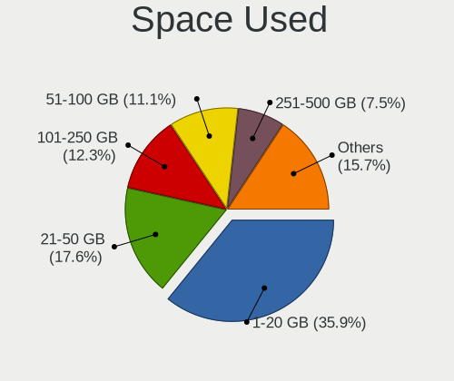
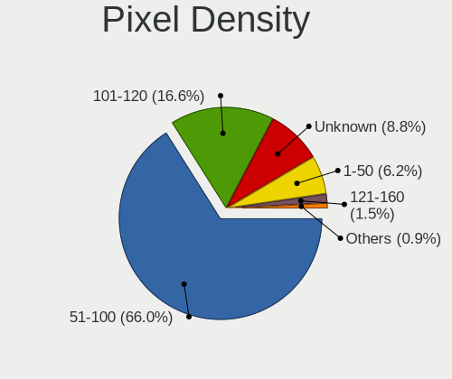
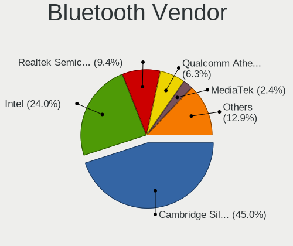
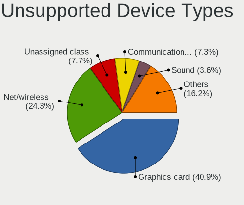

Linux in Brazil - Tested Hardware & Statistics (Desktops)
---------------------------------------------------------

A project to collect tested hardware configurations for Linux in Brazil.

Anyone can contribute to this report by the [hw-probe](https://github.com/linuxhw/hw-probe) tool:

    sudo -E hw-probe -all -upload

Please contribute! Especially if your hardware is rare.

Contents
--------

* [ Test Cases ](#test-cases)

* [ System ](#system)
  - [ OS                       ](#os)
  - [ OS Family                ](#os-family)
  - [ Kernel                   ](#kernel)
  - [ Kernel Family            ](#kernel-family)
  - [ Kernel Major Ver.        ](#kernel-major-ver)
  - [ Arch                     ](#arch)
  - [ DE                       ](#de)
  - [ Display Server           ](#display-server)
  - [ Display Manager          ](#display-manager)
  - [ OS Lang                  ](#os-lang)
  - [ Boot Mode                ](#boot-mode)
  - [ Filesystem               ](#filesystem)
  - [ Part. scheme             ](#part-scheme)
  - [ Dual Boot with Linux/BSD ](#dual-boot-with-linuxbsd)
  - [ Dual Boot (Win)          ](#dual-boot-win)

* [ Board ](#board)
  - [ Vendor                   ](#vendor)
  - [ Model                    ](#model)
  - [ Model Family             ](#model-family)
  - [ MFG Year                 ](#mfg-year)
  - [ Form Factor              ](#form-factor)
  - [ Secure Boot              ](#secure-boot)
  - [ Coreboot                 ](#coreboot)
  - [ RAM Size                 ](#ram-size)
  - [ RAM Used                 ](#ram-used)
  - [ Total Drives             ](#total-drives)
  - [ Has CD-ROM               ](#has-cd-rom)
  - [ Has Ethernet             ](#has-ethernet)
  - [ Has WiFi                 ](#has-wifi)
  - [ Has Bluetooth            ](#has-bluetooth)

* [ Location ](#location)
  - [ Country                  ](#country)
  - [ City                     ](#city)

* [ Drives ](#drives)
  - [ Drive Vendor             ](#drive-vendor)
  - [ Drive Model              ](#drive-model)
  - [ HDD Vendor               ](#hdd-vendor)
  - [ SSD Vendor               ](#ssd-vendor)
  - [ Drive Kind               ](#drive-kind)
  - [ Drive Connector          ](#drive-connector)
  - [ Drive Size               ](#drive-size)
  - [ Space Total              ](#space-total)
  - [ Space Used               ](#space-used)
  - [ Malfunc. Drives          ](#malfunc-drives)
  - [ Malfunc. Drive Vendor    ](#malfunc-drive-vendor)
  - [ Malfunc. HDD Vendor      ](#malfunc-hdd-vendor)
  - [ Malfunc. Drive Kind      ](#malfunc-drive-kind)
  - [ Failed Drives            ](#failed-drives)
  - [ Failed Drive Vendor      ](#failed-drive-vendor)
  - [ Drive Status             ](#drive-status)

* [ Storage controller ](#storage-controller)
  - [ Storage Vendor           ](#storage-vendor)
  - [ Storage Model            ](#storage-model)
  - [ Storage Kind             ](#storage-kind)

* [ Processor ](#processor)
  - [ CPU Vendor               ](#cpu-vendor)
  - [ CPU Model                ](#cpu-model)
  - [ CPU Model Family         ](#cpu-model-family)
  - [ CPU Cores                ](#cpu-cores)
  - [ CPU Sockets              ](#cpu-sockets)
  - [ CPU Threads              ](#cpu-threads)
  - [ CPU Op-Modes             ](#cpu-op-modes)
  - [ CPU Microcode            ](#cpu-microcode)
  - [ CPU Microarch            ](#cpu-microarch)

* [ Graphics ](#graphics)
  - [ GPU Vendor               ](#gpu-vendor)
  - [ GPU Model                ](#gpu-model)
  - [ GPU Combo                ](#gpu-combo)
  - [ GPU Driver               ](#gpu-driver)
  - [ GPU Memory               ](#gpu-memory)

* [ Monitor ](#monitor)
  - [ Monitor Vendor           ](#monitor-vendor)
  - [ Monitor Model            ](#monitor-model)
  - [ Monitor Resolution       ](#monitor-resolution)
  - [ Monitor Diagonal         ](#monitor-diagonal)
  - [ Monitor Width            ](#monitor-width)
  - [ Aspect Ratio             ](#aspect-ratio)
  - [ Monitor Area             ](#monitor-area)
  - [ Pixel Density            ](#pixel-density)
  - [ Multiple Monitors        ](#multiple-monitors)

* [ Network ](#network)
  - [ Net Controller Vendor    ](#net-controller-vendor)
  - [ Net Controller Model     ](#net-controller-model)
  - [ Wireless Vendor          ](#wireless-vendor)
  - [ Wireless Model           ](#wireless-model)
  - [ Ethernet Vendor          ](#ethernet-vendor)
  - [ Ethernet Model           ](#ethernet-model)
  - [ Net Controller Kind      ](#net-controller-kind)
  - [ Used Controller          ](#used-controller)
  - [ NICs                     ](#nics)
  - [ IPv6                     ](#ipv6)

* [ Bluetooth ](#bluetooth)
  - [ Bluetooth Vendor         ](#bluetooth-vendor)
  - [ Bluetooth Model          ](#bluetooth-model)

* [ Sound ](#sound)
  - [ Sound Vendor             ](#sound-vendor)
  - [ Sound Model              ](#sound-model)

* [ Memory ](#memory)
  - [ Memory Vendor            ](#memory-vendor)
  - [ Memory Model             ](#memory-model)
  - [ Memory Kind              ](#memory-kind)
  - [ Memory Form Factor       ](#memory-form-factor)
  - [ Memory Size              ](#memory-size)
  - [ Memory Speed             ](#memory-speed)

* [ Printers & scanners ](#printers--scanners)
  - [ Printer Vendor           ](#printer-vendor)
  - [ Printer Model            ](#printer-model)
  - [ Scanner Vendor           ](#scanner-vendor)
  - [ Scanner Model            ](#scanner-model)

* [ Camera ](#camera)
  - [ Camera Vendor            ](#camera-vendor)
  - [ Camera Model             ](#camera-model)

* [ Security ](#security)
  - [ Fingerprint Vendor       ](#fingerprint-vendor)
  - [ Fingerprint Model        ](#fingerprint-model)
  - [ Chipcard Vendor          ](#chipcard-vendor)
  - [ Chipcard Model           ](#chipcard-model)

* [ Unsupported ](#unsupported)
  - [ Unsupported Devices      ](#unsupported-devices)
  - [ Unsupported Device Types ](#unsupported-device-types)

Test Cases
----------

Total: 5770

| Vendor        | Model                       | Probe                                                      | Date         |
|---------------|-----------------------------|------------------------------------------------------------|--------------|
| Lenovo        | 3168 NOK                    | [58c82b01e2](https://linux-hardware.org/?probe=58c82b01e2) | Sep 01, 2022 |
| ASRock        | FM2A55M-HD+                 | [2f96c73efb](https://linux-hardware.org/?probe=2f96c73efb) | Sep 01, 2022 |
| ASRock        | N68-GS4 FX R2.0             | [ea730c9b2d](https://linux-hardware.org/?probe=ea730c9b2d) | Sep 01, 2022 |
| ASRock        | B550M-ITX/ac                | [7850c07cdc](https://linux-hardware.org/?probe=7850c07cdc) | Aug 31, 2022 |
| Gigabyte      | VM900M                      | [f446d835da](https://linux-hardware.org/?probe=f446d835da) | Aug 30, 2022 |
| ASUSTek       | ROG Maximus XII EXTREME     | [a77d5e141e](https://linux-hardware.org/?probe=a77d5e141e) | Aug 30, 2022 |
| Gigabyte      | Z97X-Gaming 7               | [1c993db964](https://linux-hardware.org/?probe=1c993db964) | Aug 30, 2022 |
| Gigabyte      | Z97X-Gaming 7               | [91438fc6b5](https://linux-hardware.org/?probe=91438fc6b5) | Aug 30, 2022 |
| Supermicro    | SKAGIT09                    | [3f4c6a4d48](https://linux-hardware.org/?probe=3f4c6a4d48) | Aug 29, 2022 |
| Gigabyte      | X470 AORUS GAMING 7 WIFI... | [c7ace10271](https://linux-hardware.org/?probe=c7ace10271) | Aug 28, 2022 |
| Gigabyte      | F2A68HM-S1                  | [420036f4d6](https://linux-hardware.org/?probe=420036f4d6) | Aug 28, 2022 |
| MSI           | B560M PRO-VDH               | [d8a638184b](https://linux-hardware.org/?probe=d8a638184b) | Aug 28, 2022 |
| Intel         | H61                         | [c829101789](https://linux-hardware.org/?probe=c829101789) | Aug 27, 2022 |
| Gigabyte      | H61M-S1                     | [6bf1dafdbc](https://linux-hardware.org/?probe=6bf1dafdbc) | Aug 27, 2022 |
| Gigabyte      | GA-78LMT-USB3 SEx           | [7642980e6e](https://linux-hardware.org/?probe=7642980e6e) | Aug 27, 2022 |
| Dell          | 01XK1W A00                  | [7728612d53](https://linux-hardware.org/?probe=7728612d53) | Aug 26, 2022 |
| Dell          | 01XK1W A00                  | [ee6cec5f61](https://linux-hardware.org/?probe=ee6cec5f61) | Aug 26, 2022 |
| ASUSTek       | PRIME A320M-K/BR            | [da0b51aa63](https://linux-hardware.org/?probe=da0b51aa63) | Aug 25, 2022 |
| MSI           | B560M PRO-VDH               | [437118237f](https://linux-hardware.org/?probe=437118237f) | Aug 25, 2022 |
| Foxconn       | H61M/H61M-S                 | [18e7da32e9](https://linux-hardware.org/?probe=18e7da32e9) | Aug 25, 2022 |
| OEM           | A320                        | [4dffd629cf](https://linux-hardware.org/?probe=4dffd629cf) | Aug 25, 2022 |
| Dell          | 01XK1W A00                  | [604a0a7789](https://linux-hardware.org/?probe=604a0a7789) | Aug 25, 2022 |
| HP            | 3397                        | [f65d0fdb85](https://linux-hardware.org/?probe=f65d0fdb85) | Aug 24, 2022 |
| ASUSTek       | H81M-A/BR                   | [b9ac5d4051](https://linux-hardware.org/?probe=b9ac5d4051) | Aug 23, 2022 |
| ASUSTek       | P8H61-M LX2 R2.0            | [5754d37860](https://linux-hardware.org/?probe=5754d37860) | Aug 23, 2022 |
| AMI           | Cherry Trail Tablet         | [8cdf70d6e3](https://linux-hardware.org/?probe=8cdf70d6e3) | Aug 23, 2022 |
| ASUSTek       | P5KPL-CM                    | [53a4b425d3](https://linux-hardware.org/?probe=53a4b425d3) | Aug 22, 2022 |
| ASUSTek       | PRIME H410M-E               | [5270930555](https://linux-hardware.org/?probe=5270930555) | Aug 22, 2022 |
| Biostar       | A68N-5100                   | [2c6df92279](https://linux-hardware.org/?probe=2c6df92279) | Aug 22, 2022 |
| Supermicro    | SKAGIT09                    | [1ae2767db3](https://linux-hardware.org/?probe=1ae2767db3) | Aug 22, 2022 |
| Unknown       | GSUO H61V10C                | [1e7ccd0999](https://linux-hardware.org/?probe=1e7ccd0999) | Aug 22, 2022 |
| ASUSTek       | J1800I-C/BR                 | [f2f76737ad](https://linux-hardware.org/?probe=f2f76737ad) | Aug 22, 2022 |
| MACHINIST     | H81M-PRO S1 V2.0            | [12be75fa90](https://linux-hardware.org/?probe=12be75fa90) | Aug 21, 2022 |
| ASRock        | X370 Taichi                 | [8f952ff258](https://linux-hardware.org/?probe=8f952ff258) | Aug 21, 2022 |
| Intel         | DH61WW AAG23116-203         | [43a16c5e88](https://linux-hardware.org/?probe=43a16c5e88) | Aug 21, 2022 |
| Biostar       | G31-M7 TE                   | [aaacebef4a](https://linux-hardware.org/?probe=aaacebef4a) | Aug 21, 2022 |
| Gigabyte      | M68MT-S2P                   | [23c07b5d2b](https://linux-hardware.org/?probe=23c07b5d2b) | Aug 21, 2022 |
| Gigabyte      | B75M-D3H                    | [6503feb8b7](https://linux-hardware.org/?probe=6503feb8b7) | Aug 20, 2022 |
| ASUSTek       | TUF H310M-PLUS GAMING/BR    | [2e1445b2c8](https://linux-hardware.org/?probe=2e1445b2c8) | Aug 19, 2022 |
| Dell          | 0TVR1F A01                  | [1b8906bb20](https://linux-hardware.org/?probe=1b8906bb20) | Aug 19, 2022 |
| MACHINIST     | X99-RS9 V2.0                | [ffb095f0c3](https://linux-hardware.org/?probe=ffb095f0c3) | Aug 19, 2022 |
| ASUSTek       | B150M-C/BR                  | [b15c721e4c](https://linux-hardware.org/?probe=b15c721e4c) | Aug 18, 2022 |
| Arquimedes... | 760GM                       | [5f653afdff](https://linux-hardware.org/?probe=5f653afdff) | Aug 18, 2022 |
| ASUSTek       | M5A78L-M/USB3               | [4242f8b9c2](https://linux-hardware.org/?probe=4242f8b9c2) | Aug 18, 2022 |
| ASUSTek       | M5A78L-M/USB3               | [bac870dd75](https://linux-hardware.org/?probe=bac870dd75) | Aug 18, 2022 |
| ASUSTek       | M5A78L-M LX/BR              | [52b9313de4](https://linux-hardware.org/?probe=52b9313de4) | Aug 18, 2022 |
| ASUSTek       | P8B75-V                     | [a37b0b7e18](https://linux-hardware.org/?probe=a37b0b7e18) | Aug 18, 2022 |
| Intel         | Unknown                     | [23f3bdae8a](https://linux-hardware.org/?probe=23f3bdae8a) | Aug 18, 2022 |
| HP            | 2215                        | [71a33dc713](https://linux-hardware.org/?probe=71a33dc713) | Aug 17, 2022 |
| HP            | 2215                        | [aa386126ad](https://linux-hardware.org/?probe=aa386126ad) | Aug 17, 2022 |
| ASRock        | AB350M-HDV                  | [3e3ab3842f](https://linux-hardware.org/?probe=3e3ab3842f) | Aug 16, 2022 |
| ASUSTek       | H170M-PLUS/BR               | [feb4e50ec5](https://linux-hardware.org/?probe=feb4e50ec5) | Aug 16, 2022 |
| VS Company    | H61H2                       | [a0b88242a4](https://linux-hardware.org/?probe=a0b88242a4) | Aug 16, 2022 |
| Intel         | B75                         | [8eb918ea53](https://linux-hardware.org/?probe=8eb918ea53) | Aug 16, 2022 |
| Gigabyte      | B550M DS3H                  | [6ef5e022c7](https://linux-hardware.org/?probe=6ef5e022c7) | Aug 15, 2022 |
| ASUSTek       | J1800I-C/BR                 | [01beed2be8](https://linux-hardware.org/?probe=01beed2be8) | Aug 15, 2022 |
| PCWare        | IPMH61R3                    | [4470bf9f2c](https://linux-hardware.org/?probe=4470bf9f2c) | Aug 15, 2022 |
| ASRock        | B450M Steel Legend          | [1e198f7c54](https://linux-hardware.org/?probe=1e198f7c54) | Aug 15, 2022 |
| ASRock        | FM2A55M-HD+                 | [dc086ed32c](https://linux-hardware.org/?probe=dc086ed32c) | Aug 14, 2022 |
| ASUSTek       | P8H61-M LX3                 | [7c37c2a6d7](https://linux-hardware.org/?probe=7c37c2a6d7) | Aug 14, 2022 |
| ASRock        | FM2A55M-HD+                 | [6c7f56d3cd](https://linux-hardware.org/?probe=6c7f56d3cd) | Aug 14, 2022 |
| Gigabyte      | 970A-DS3P                   | [47632d043c](https://linux-hardware.org/?probe=47632d043c) | Aug 14, 2022 |
| ASUSTek       | H61M-A/BR                   | [4443a6c129](https://linux-hardware.org/?probe=4443a6c129) | Aug 14, 2022 |
| ASUSTek       | H61M-A/BR                   | [082a5297bd](https://linux-hardware.org/?probe=082a5297bd) | Aug 14, 2022 |
| Gigabyte      | Z77M-D3H                    | [15633ed7b1](https://linux-hardware.org/?probe=15633ed7b1) | Aug 14, 2022 |
| Biostar       | G31-M7 TE                   | [c5737e52bd](https://linux-hardware.org/?probe=c5737e52bd) | Aug 14, 2022 |
| ASUSTek       | Z97-A                       | [14fa58515f](https://linux-hardware.org/?probe=14fa58515f) | Aug 13, 2022 |
| ASUSTek       | TUF Gaming B450M-PRO II     | [f17b91fcb8](https://linux-hardware.org/?probe=f17b91fcb8) | Aug 13, 2022 |
| Positivo      | POS-PARS760GCD POSITIVO     | [dc6e65929f](https://linux-hardware.org/?probe=dc6e65929f) | Aug 12, 2022 |
| ASUSTek       | P8H61-M LX3 R2.0            | [98cc4a3075](https://linux-hardware.org/?probe=98cc4a3075) | Aug 12, 2022 |
| Gigabyte      | H61M-S1                     | [18f3dd56e8](https://linux-hardware.org/?probe=18f3dd56e8) | Aug 11, 2022 |
| MSI           | X370 SLI PLUS               | [8b4bc6f127](https://linux-hardware.org/?probe=8b4bc6f127) | Aug 11, 2022 |
| Foxconn       | 2ADA                        | [9aae49b54c](https://linux-hardware.org/?probe=9aae49b54c) | Aug 11, 2022 |
| Gigabyte      | G31M-S2C                    | [3f67c470be](https://linux-hardware.org/?probe=3f67c470be) | Aug 11, 2022 |
| ASUSTek       | J1800I-C/BR                 | [41cd4b02f1](https://linux-hardware.org/?probe=41cd4b02f1) | Aug 11, 2022 |
| ASUSTek       | M5A78L-M LX/BR              | [c66de39c4c](https://linux-hardware.org/?probe=c66de39c4c) | Aug 11, 2022 |
| ASUSTek       | H170M-PLUS/BR               | [d081204e0a](https://linux-hardware.org/?probe=d081204e0a) | Aug 10, 2022 |
| Foxconn       | 2ABF                        | [3b20387bcc](https://linux-hardware.org/?probe=3b20387bcc) | Aug 10, 2022 |
| ASUSTek       | TUF Gaming X570-PLUS        | [e54e09e3cf](https://linux-hardware.org/?probe=e54e09e3cf) | Aug 09, 2022 |
| ASUSTek       | H81M-CS/BR                  | [8c2dc32c37](https://linux-hardware.org/?probe=8c2dc32c37) | Aug 09, 2022 |
| ASUSTek       | TUF Gaming X570-PLUS        | [5a84fd5a16](https://linux-hardware.org/?probe=5a84fd5a16) | Aug 09, 2022 |
| ASUSTek       | Z97M-PLUS/BR                | [b66253f362](https://linux-hardware.org/?probe=b66253f362) | Aug 09, 2022 |
| Intel         | H61                         | [eabc8be629](https://linux-hardware.org/?probe=eabc8be629) | Aug 08, 2022 |
| ASUSTek       | PRIME H310M-E R2.0/BR       | [aada9001dd](https://linux-hardware.org/?probe=aada9001dd) | Aug 08, 2022 |
| HP            | 1998                        | [1ae818eb7c](https://linux-hardware.org/?probe=1ae818eb7c) | Aug 07, 2022 |
| Toshiba       | STI 006998G                 | [3de3fa77fc](https://linux-hardware.org/?probe=3de3fa77fc) | Aug 06, 2022 |
| PCWare        | IPX3060E                    | [3fc0886f3b](https://linux-hardware.org/?probe=3fc0886f3b) | Aug 06, 2022 |
| Gigabyte      | F2A55M-S1                   | [cf3ed2131f](https://linux-hardware.org/?probe=cf3ed2131f) | Aug 06, 2022 |
| MACHINIST     | X79 (INTEL Xeon E5/Corei... | [a722bef081](https://linux-hardware.org/?probe=a722bef081) | Aug 06, 2022 |
| Supermicro    | X9DRi-LN4+/X9DR3-LN4+       | [169fcf7943](https://linux-hardware.org/?probe=169fcf7943) | Aug 05, 2022 |
| Gigabyte      | AX370-Gaming 5              | [46f109ed37](https://linux-hardware.org/?probe=46f109ed37) | Aug 05, 2022 |
| PCWare        | IPX3060E                    | [d5045f1364](https://linux-hardware.org/?probe=d5045f1364) | Aug 04, 2022 |
| Positivo      | POS-PIQ77CL POSITIVO        | [2030bc92d7](https://linux-hardware.org/?probe=2030bc92d7) | Aug 04, 2022 |
| MSI           | Boston                      | [32021cecf7](https://linux-hardware.org/?probe=32021cecf7) | Aug 03, 2022 |
| Biostar       | G41D3C                      | [8a5b81e472](https://linux-hardware.org/?probe=8a5b81e472) | Aug 03, 2022 |
| HP            | 3047h                       | [a8301b8155](https://linux-hardware.org/?probe=a8301b8155) | Aug 02, 2022 |
| Foxconn       | 2ABF                        | [4f1fca6662](https://linux-hardware.org/?probe=4f1fca6662) | Aug 02, 2022 |
| ASUSTek       | M5A78L-M/USB3               | [8e816dc600](https://linux-hardware.org/?probe=8e816dc600) | Aug 01, 2022 |
| PCWare        | IPMH61R1                    | [0843909534](https://linux-hardware.org/?probe=0843909534) | Aug 01, 2022 |
| PCWare        | IPMH61R1                    | [7da7204a12](https://linux-hardware.org/?probe=7da7204a12) | Jul 31, 2022 |
| ASUSTek       | M5A78L-M/USB3               | [16f64b6f1a](https://linux-hardware.org/?probe=16f64b6f1a) | Jul 30, 2022 |
| ASUSTek       | TUF Gaming B550M-E WIFI     | [01bcafef3c](https://linux-hardware.org/?probe=01bcafef3c) | Jul 30, 2022 |
| ECS           | H61H2-M12                   | [6761a8774d](https://linux-hardware.org/?probe=6761a8774d) | Jul 30, 2022 |
| ASUSTek       | M5A78L-M/USB3               | [f6ecfb2a51](https://linux-hardware.org/?probe=f6ecfb2a51) | Jul 30, 2022 |
| MSI           | A320M-A PRO MAX             | [3249abb411](https://linux-hardware.org/?probe=3249abb411) | Jul 30, 2022 |
| ASUSTek       | M5A78L-M/USB3               | [7ceff6f032](https://linux-hardware.org/?probe=7ceff6f032) | Jul 30, 2022 |
| MSI           | A320M-A PRO MAX             | [5a750a1294](https://linux-hardware.org/?probe=5a750a1294) | Jul 30, 2022 |
| HP            | 3047h                       | [a9b59b34f9](https://linux-hardware.org/?probe=a9b59b34f9) | Jul 29, 2022 |
| ASUSTek       | TUF B360M-PLUS GAMING/BR    | [8c57fbc9e8](https://linux-hardware.org/?probe=8c57fbc9e8) | Jul 29, 2022 |
| ASUSTek       | ROG STRIX B550-F GAMING     | [51893f2237](https://linux-hardware.org/?probe=51893f2237) | Jul 29, 2022 |
| Intel         | H61                         | [7bb7deaca9](https://linux-hardware.org/?probe=7bb7deaca9) | Jul 29, 2022 |
| PCWare        | IPMH61R2                    | [b3245af28d](https://linux-hardware.org/?probe=b3245af28d) | Jul 29, 2022 |
| ASUSTek       | ROG STRIX B450-F GAMING     | [e99805635f](https://linux-hardware.org/?probe=e99805635f) | Jul 29, 2022 |
| ASUSTek       | TUF Gaming X570-PLUS_BR     | [e1d666e84a](https://linux-hardware.org/?probe=e1d666e84a) | Jul 29, 2022 |
| Digiboard     | NM70-TI                     | [007a69093c](https://linux-hardware.org/?probe=007a69093c) | Jul 29, 2022 |
| ASUSTek       | P5G41T-M LX2/BR             | [e84f999c94](https://linux-hardware.org/?probe=e84f999c94) | Jul 29, 2022 |
| ASUSTek       | PRIME B450M-GAMING II       | [0cc1bc9401](https://linux-hardware.org/?probe=0cc1bc9401) | Jul 29, 2022 |
| Biostar       | B350GTN                     | [75d6302ab0](https://linux-hardware.org/?probe=75d6302ab0) | Jul 29, 2022 |
| Pegatron      | IPM41-D3                    | [ce24b0bab7](https://linux-hardware.org/?probe=ce24b0bab7) | Jul 28, 2022 |
| Positivo      | POS-RIB360EE 11158935       | [1c687dcef7](https://linux-hardware.org/?probe=1c687dcef7) | Jul 28, 2022 |
| ASRock        | B450M Steel Legend          | [db492973ec](https://linux-hardware.org/?probe=db492973ec) | Jul 28, 2022 |
| Intel         | X99 V1.0                    | [da677f5a3b](https://linux-hardware.org/?probe=da677f5a3b) | Jul 28, 2022 |
| Intel         | B75                         | [0620ffff20](https://linux-hardware.org/?probe=0620ffff20) | Jul 27, 2022 |
| MSI           | X470 GAMING PLUS            | [722aa0951d](https://linux-hardware.org/?probe=722aa0951d) | Jul 27, 2022 |
| PCWare        | IPMH61R1                    | [18610dd9f0](https://linux-hardware.org/?probe=18610dd9f0) | Jul 27, 2022 |
| Gigabyte      | GA-78LMT-USB3 SEx           | [32e82dc9ae](https://linux-hardware.org/?probe=32e82dc9ae) | Jul 27, 2022 |
| PCWare        | PW-945GCX                   | [128aafe763](https://linux-hardware.org/?probe=128aafe763) | Jul 27, 2022 |
| MSI           | 2A9C                        | [de5a8c7ecd](https://linux-hardware.org/?probe=de5a8c7ecd) | Jul 27, 2022 |
| Dell          | 01XK1W A00                  | [68159d9d39](https://linux-hardware.org/?probe=68159d9d39) | Jul 26, 2022 |
| Huanan        | X99-F8                      | [3ba1885fb4](https://linux-hardware.org/?probe=3ba1885fb4) | Jul 26, 2022 |
| Gigabyte      | Z370N WIFI-CF               | [eb3c3fceb3](https://linux-hardware.org/?probe=eb3c3fceb3) | Jul 26, 2022 |
| ASRock        | B450M Steel Legend          | [30fd52a2a5](https://linux-hardware.org/?probe=30fd52a2a5) | Jul 26, 2022 |
| Gigabyte      | H110M-S2H DDR3-CF           | [e471e3ed10](https://linux-hardware.org/?probe=e471e3ed10) | Jul 26, 2022 |
| Login Info... | LOG-H310M-G                 | [f02a0ed6dd](https://linux-hardware.org/?probe=f02a0ed6dd) | Jul 26, 2022 |
| ASUSTek       | PRIME B450M-GAMING/BR       | [e33f8c0a93](https://linux-hardware.org/?probe=e33f8c0a93) | Jul 26, 2022 |
| ASRock        | H61M-DGS                    | [0dc55c5b73](https://linux-hardware.org/?probe=0dc55c5b73) | Jul 24, 2022 |
| ASUSTek       | Z87M-PLUS                   | [0efc94e34d](https://linux-hardware.org/?probe=0efc94e34d) | Jul 24, 2022 |
| PCWare        | IPX1800E2                   | [4426727633](https://linux-hardware.org/?probe=4426727633) | Jul 24, 2022 |
| Intel         | DH61WW AAG23116-203         | [cfd6e87e09](https://linux-hardware.org/?probe=cfd6e87e09) | Jul 23, 2022 |
| Dell          | 01XK1W A00                  | [5c8a6b6f90](https://linux-hardware.org/?probe=5c8a6b6f90) | Jul 23, 2022 |
| ASUSTek       | Z87M-PLUS                   | [c30806c628](https://linux-hardware.org/?probe=c30806c628) | Jul 23, 2022 |
| ASUSTek       | Z87M-PLUS                   | [b805fa0cd8](https://linux-hardware.org/?probe=b805fa0cd8) | Jul 23, 2022 |
| ASUSTek       | PRIME B550M-K               | [df5bd62f9a](https://linux-hardware.org/?probe=df5bd62f9a) | Jul 23, 2022 |
| MSI           | B450 GAMING PLUS MAX        | [edcecb5e13](https://linux-hardware.org/?probe=edcecb5e13) | Jul 22, 2022 |
| Gigabyte      | GA-78LMT-S2P                | [f90d74f5b5](https://linux-hardware.org/?probe=f90d74f5b5) | Jul 22, 2022 |
| Dell          | 01XK1W A00                  | [91ce7c78ee](https://linux-hardware.org/?probe=91ce7c78ee) | Jul 22, 2022 |
| ASUSTek       | P7H55-M                     | [d7ba204d31](https://linux-hardware.org/?probe=d7ba204d31) | Jul 22, 2022 |
| ASUSTek       | M2N68                       | [e8b27563a2](https://linux-hardware.org/?probe=e8b27563a2) | Jul 22, 2022 |
| Biostar       | B450MH                      | [f69c4e3a03](https://linux-hardware.org/?probe=f69c4e3a03) | Jul 21, 2022 |
| Biostar       | B450MH                      | [79084ef4c9](https://linux-hardware.org/?probe=79084ef4c9) | Jul 21, 2022 |
| PCWare        | IPMH81G1                    | [cb66716a63](https://linux-hardware.org/?probe=cb66716a63) | Jul 21, 2022 |
| ASUSTek       | P8H61-M LX3 R2.0            | [2af5596c9e](https://linux-hardware.org/?probe=2af5596c9e) | Jul 21, 2022 |
| ASRock        | H81M-HG4 R4.0               | [4628e310fd](https://linux-hardware.org/?probe=4628e310fd) | Jul 20, 2022 |
| ECS           | H61H2-M2                    | [c1d1e739cf](https://linux-hardware.org/?probe=c1d1e739cf) | Jul 20, 2022 |
| PCChips       | A15G                        | [4cdd689308](https://linux-hardware.org/?probe=4cdd689308) | Jul 20, 2022 |
| Gigabyte      | B360M AORUS Gaming 3-CF     | [e0ffe80869](https://linux-hardware.org/?probe=e0ffe80869) | Jul 20, 2022 |
| Intel         | Unknown                     | [19327f830a](https://linux-hardware.org/?probe=19327f830a) | Jul 20, 2022 |
| Positivo      | POS-PIQ77CL                 | [ce9a0fdbbc](https://linux-hardware.org/?probe=ce9a0fdbbc) | Jul 20, 2022 |
| ASUSTek       | EX-A320M-GAMING             | [a6f87d56db](https://linux-hardware.org/?probe=a6f87d56db) | Jul 20, 2022 |
| Gigabyte      | B450 AORUS M                | [fdaa3bac93](https://linux-hardware.org/?probe=fdaa3bac93) | Jul 20, 2022 |
| Intel         | Unknown                     | [8c87f55927](https://linux-hardware.org/?probe=8c87f55927) | Jul 19, 2022 |
| ECS           | A990FXM-A                   | [6351c9023d](https://linux-hardware.org/?probe=6351c9023d) | Jul 19, 2022 |
| MSI           | G31M3-L V2                  | [cd6d617e34](https://linux-hardware.org/?probe=cd6d617e34) | Jul 19, 2022 |
| MSI           | G31M3-L V2                  | [aaa3013f66](https://linux-hardware.org/?probe=aaa3013f66) | Jul 18, 2022 |
| Intel         | H55                         | [b58f7300e1](https://linux-hardware.org/?probe=b58f7300e1) | Jul 18, 2022 |
| Gigabyte      | H61M-S2PH                   | [554f6e65ed](https://linux-hardware.org/?probe=554f6e65ed) | Jul 18, 2022 |
| Gigabyte      | B450 AORUS M                | [aca8d98967](https://linux-hardware.org/?probe=aca8d98967) | Jul 18, 2022 |
| ASUSTek       | PRIME B450M-GAMING/BR       | [39fd39c3b0](https://linux-hardware.org/?probe=39fd39c3b0) | Jul 17, 2022 |
| Dell          | 08NPPY A00                  | [23d9101cd2](https://linux-hardware.org/?probe=23d9101cd2) | Jul 17, 2022 |
| ASUSTek       | EX-B150M-V3                 | [f8585ad958](https://linux-hardware.org/?probe=f8585ad958) | Jul 17, 2022 |
| ASUSTek       | EX-B150M-V3                 | [f2372286e0](https://linux-hardware.org/?probe=f2372286e0) | Jul 17, 2022 |
| Huanan        | B75                         | [0580a5a948](https://linux-hardware.org/?probe=0580a5a948) | Jul 17, 2022 |
| Huanan        | B75                         | [e1788853ec](https://linux-hardware.org/?probe=e1788853ec) | Jul 17, 2022 |
| GALAX         | A320M Ver1.0 G10f           | [7bc0a0fe3a](https://linux-hardware.org/?probe=7bc0a0fe3a) | Jul 17, 2022 |
| ASUSTek       | BM6820_BM6620_BP6320-8      | [8d8c845646](https://linux-hardware.org/?probe=8d8c845646) | Jul 17, 2022 |
| Dell          | 0F428D A00                  | [fb8a6009f7](https://linux-hardware.org/?probe=fb8a6009f7) | Jul 16, 2022 |
| Gigabyte      | H97M-Gaming 3               | [a72ad8ba14](https://linux-hardware.org/?probe=a72ad8ba14) | Jul 16, 2022 |
| MACHINIST     | X99-RS9 V2.0                | [36ad4a7384](https://linux-hardware.org/?probe=36ad4a7384) | Jul 16, 2022 |
| ASUSTek       | ROG STRIX Z490-I GAMING     | [34a905d705](https://linux-hardware.org/?probe=34a905d705) | Jul 16, 2022 |
| Gigabyte      | AB350-Gaming 3-CF           | [2e73a9947c](https://linux-hardware.org/?probe=2e73a9947c) | Jul 15, 2022 |
| Intel         | H61                         | [8865d7959a](https://linux-hardware.org/?probe=8865d7959a) | Jul 15, 2022 |
| ASUSTek       | TUF Gaming B550M-PLUS       | [c9ff108124](https://linux-hardware.org/?probe=c9ff108124) | Jul 15, 2022 |
| Gigabyte      | A520M S2H                   | [dfc64d417f](https://linux-hardware.org/?probe=dfc64d417f) | Jul 15, 2022 |
| Intel         | X79 V2.72B                  | [f244f6157b](https://linux-hardware.org/?probe=f244f6157b) | Jul 15, 2022 |
| Intel         | H55                         | [f8e7b20a53](https://linux-hardware.org/?probe=f8e7b20a53) | Jul 14, 2022 |
| ASUSTek       | P8B75-M LE                  | [a4246a1ea8](https://linux-hardware.org/?probe=a4246a1ea8) | Jul 14, 2022 |
| ASUSTek       | M5A97 PRO                   | [e963ba85db](https://linux-hardware.org/?probe=e963ba85db) | Jul 14, 2022 |
| Intel         | H55                         | [b199ed9707](https://linux-hardware.org/?probe=b199ed9707) | Jul 14, 2022 |
| Gigabyte      | Z690 GAMING X               | [7babf837f9](https://linux-hardware.org/?probe=7babf837f9) | Jul 14, 2022 |
| Gigabyte      | GA-MA770T-UD3               | [eebcfac8a3](https://linux-hardware.org/?probe=eebcfac8a3) | Jul 14, 2022 |
| ASUSTek       | STRIX B250F GAMING          | [4355281f8e](https://linux-hardware.org/?probe=4355281f8e) | Jul 13, 2022 |
| ASUSTek       | STRIX B250F GAMING          | [36f96a4ef6](https://linux-hardware.org/?probe=36f96a4ef6) | Jul 13, 2022 |
| ASUSTek       | P8H61-M LX3 PLUS R2.0       | [44638b5241](https://linux-hardware.org/?probe=44638b5241) | Jul 13, 2022 |
| PCWare        | IPMH61R3                    | [6d92dfd343](https://linux-hardware.org/?probe=6d92dfd343) | Jul 13, 2022 |
| ASRock        | B450M Steel Legend          | [3732c0ad0c](https://linux-hardware.org/?probe=3732c0ad0c) | Jul 13, 2022 |
| PCWare        | IPMH61R3                    | [ac21298dd8](https://linux-hardware.org/?probe=ac21298dd8) | Jul 13, 2022 |
| ASUSTek       | M5A78L-M/USB3               | [c056ac9f1d](https://linux-hardware.org/?probe=c056ac9f1d) | Jul 13, 2022 |
| Intel         | X99 V1.0                    | [f60857de09](https://linux-hardware.org/?probe=f60857de09) | Jul 12, 2022 |
| Dell          | 02YYK5 A00                  | [6592ae8873](https://linux-hardware.org/?probe=6592ae8873) | Jul 11, 2022 |
| MSI           | B450 GAMING PLUS MAX        | [8739a403bc](https://linux-hardware.org/?probe=8739a403bc) | Jul 11, 2022 |
| Positivo      | POS-MI945AA                 | [ab451b5409](https://linux-hardware.org/?probe=ab451b5409) | Jul 11, 2022 |
| ASUSTek       | H81M-A/BR                   | [851a8e12f8](https://linux-hardware.org/?probe=851a8e12f8) | Jul 10, 2022 |
| ASUSTek       | STRIX B250F GAMING          | [012a999377](https://linux-hardware.org/?probe=012a999377) | Jul 10, 2022 |
| ASUSTek       | TUF Gaming B460M-PLUS       | [ee629832da](https://linux-hardware.org/?probe=ee629832da) | Jul 09, 2022 |
| Gigabyte      | Z390 AORUS ULTRA-CF         | [8ac6704c06](https://linux-hardware.org/?probe=8ac6704c06) | Jul 09, 2022 |
| Gigabyte      | B450 AORUS M                | [5d50b40871](https://linux-hardware.org/?probe=5d50b40871) | Jul 09, 2022 |
| PCWare        | IPX4005G                    | [2e447eb751](https://linux-hardware.org/?probe=2e447eb751) | Jul 09, 2022 |
| ASRock        | A320M-HDV R4.0              | [a39b9bab73](https://linux-hardware.org/?probe=a39b9bab73) | Jul 09, 2022 |
| ASUSTek       | M5A78L-M/USB3               | [833f3df27a](https://linux-hardware.org/?probe=833f3df27a) | Jul 09, 2022 |
| ASUSTek       | M5A78L-M/USB3               | [199e7db55a](https://linux-hardware.org/?probe=199e7db55a) | Jul 09, 2022 |
| MSI           | 2A9C                        | [40457980de](https://linux-hardware.org/?probe=40457980de) | Jul 08, 2022 |
| Positivo      | POS-PIQ77CL                 | [1a40c954fc](https://linux-hardware.org/?probe=1a40c954fc) | Jul 08, 2022 |
| congatec      | TS170 B.0                   | [b9469e26f8](https://linux-hardware.org/?probe=b9469e26f8) | Jul 06, 2022 |
| MSI           | Boston                      | [3dfcd01115](https://linux-hardware.org/?probe=3dfcd01115) | Jul 06, 2022 |
| ASUSTek       | H110M-E/M.2                 | [cfe354b7b2](https://linux-hardware.org/?probe=cfe354b7b2) | Jul 06, 2022 |
| Positivo      | POS-MIG31AG                 | [3a03195633](https://linux-hardware.org/?probe=3a03195633) | Jul 06, 2022 |
| Gigabyte      | B450 AORUS M                | [12e48a7c0a](https://linux-hardware.org/?probe=12e48a7c0a) | Jul 06, 2022 |
| ASUSTek       | CROSSHAIR VI HERO           | [f5e7afea43](https://linux-hardware.org/?probe=f5e7afea43) | Jul 05, 2022 |
| Intel         | H61                         | [da6d35599a](https://linux-hardware.org/?probe=da6d35599a) | Jul 04, 2022 |
| HP            | 3048h                       | [a007a37d76](https://linux-hardware.org/?probe=a007a37d76) | Jul 04, 2022 |
| ASUSTek       | PRIME B350-PLUS             | [729fab1a51](https://linux-hardware.org/?probe=729fab1a51) | Jul 04, 2022 |
| ECS           | H61H2-M12                   | [e450395aeb](https://linux-hardware.org/?probe=e450395aeb) | Jul 04, 2022 |
| Gigabyte      | B360M AORUS Gaming 3-CF     | [eb89cf02af](https://linux-hardware.org/?probe=eb89cf02af) | Jul 03, 2022 |
| Positivo      | POS-EIH61CE POSITIVO        | [2d040c142f](https://linux-hardware.org/?probe=2d040c142f) | Jul 03, 2022 |
| Positivo      | POS-EIH61CE POSITIVO        | [bc149c173f](https://linux-hardware.org/?probe=bc149c173f) | Jul 03, 2022 |
| ECS           | H61H2-M12                   | [33b81dcd60](https://linux-hardware.org/?probe=33b81dcd60) | Jul 03, 2022 |
| ASRock        | A320M-HDV R4.0              | [a746300279](https://linux-hardware.org/?probe=a746300279) | Jul 03, 2022 |
| ASRock        | N68-VS3 UCC                 | [dd43bf961c](https://linux-hardware.org/?probe=dd43bf961c) | Jul 02, 2022 |
| Pegatron      | IPM41-D3                    | [a7cc8d2654](https://linux-hardware.org/?probe=a7cc8d2654) | Jul 01, 2022 |
| Gigabyte      | X570 AORUS PRO WIFI         | [2f0ac248ed](https://linux-hardware.org/?probe=2f0ac248ed) | Jul 01, 2022 |
| Gigabyte      | X570 AORUS PRO WIFI         | [5a6d827ebe](https://linux-hardware.org/?probe=5a6d827ebe) | Jul 01, 2022 |
| ASUSTek       | M5A78L-M/USB3               | [00e1806ce1](https://linux-hardware.org/?probe=00e1806ce1) | Jul 01, 2022 |
| ASUSTek       | PRIME H310M-E R2.0          | [a40fb66860](https://linux-hardware.org/?probe=a40fb66860) | Jun 30, 2022 |
| ASUSTek       | B85M-E/BR                   | [adfbbd03b6](https://linux-hardware.org/?probe=adfbbd03b6) | Jun 29, 2022 |
| ASUSTek       | TUF Gaming X570-PLUS_BR     | [3bceb0a396](https://linux-hardware.org/?probe=3bceb0a396) | Jun 29, 2022 |
| PCWare        | IPMH61R3                    | [5622f8ecd0](https://linux-hardware.org/?probe=5622f8ecd0) | Jun 29, 2022 |
| PCWare        | IPMH61R3                    | [492951e8cf](https://linux-hardware.org/?probe=492951e8cf) | Jun 29, 2022 |
| Gigabyte      | H81M-S1                     | [6dfee96211](https://linux-hardware.org/?probe=6dfee96211) | Jun 29, 2022 |
| Intel         | DP43BF AAE78171-302         | [0115160101](https://linux-hardware.org/?probe=0115160101) | Jun 28, 2022 |
| ASUSTek       | M5A78L-M/USB3               | [a9ddf668c4](https://linux-hardware.org/?probe=a9ddf668c4) | Jun 28, 2022 |
| ASUSTek       | P5KPL-AM                    | [f9a3a492d9](https://linux-hardware.org/?probe=f9a3a492d9) | Jun 27, 2022 |
| Dell          | 0J3C2F A03                  | [6f5f6a7417](https://linux-hardware.org/?probe=6f5f6a7417) | Jun 26, 2022 |
| ASRock        | N68-VS3 UCC                 | [2c7959c607](https://linux-hardware.org/?probe=2c7959c607) | Jun 26, 2022 |
| ASUSTek       | PRIME H410M-E               | [3eb97735b3](https://linux-hardware.org/?probe=3eb97735b3) | Jun 26, 2022 |
| MSI           | H55M-E33                    | [035cfe1a5b](https://linux-hardware.org/?probe=035cfe1a5b) | Jun 26, 2022 |
| Intel         | X99                         | [4322217bc5](https://linux-hardware.org/?probe=4322217bc5) | Jun 26, 2022 |
| ASUSTek       | PRIME Z270-A                | [8c2de24375](https://linux-hardware.org/?probe=8c2de24375) | Jun 26, 2022 |
| Gigabyte      | B450 AORUS M                | [6262e08c1f](https://linux-hardware.org/?probe=6262e08c1f) | Jun 26, 2022 |
| Gigabyte      | G31M-ES2L                   | [fc35cfc7f6](https://linux-hardware.org/?probe=fc35cfc7f6) | Jun 25, 2022 |
| ASUSTek       | TUF Gaming X570-PLUS_BR     | [8f2b511688](https://linux-hardware.org/?probe=8f2b511688) | Jun 25, 2022 |
| ASUSTek       | TUF Gaming X570-PLUS_BR     | [ace55b44d7](https://linux-hardware.org/?probe=ace55b44d7) | Jun 25, 2022 |
| Intel         | X99 V1.0                    | [17e64443b0](https://linux-hardware.org/?probe=17e64443b0) | Jun 25, 2022 |
| Huanan        | X99-F8 GAMING V5.0          | [2688876fc9](https://linux-hardware.org/?probe=2688876fc9) | Jun 25, 2022 |
| Gigabyte      | B450 AORUS M                | [0297d9c8c1](https://linux-hardware.org/?probe=0297d9c8c1) | Jun 25, 2022 |
| Intel         | H61                         | [e5a2c316f3](https://linux-hardware.org/?probe=e5a2c316f3) | Jun 24, 2022 |
| Intel         | H61                         | [d3b87d18d8](https://linux-hardware.org/?probe=d3b87d18d8) | Jun 24, 2022 |
| Intel         | H55                         | [853a94f10d](https://linux-hardware.org/?probe=853a94f10d) | Jun 23, 2022 |
| ASUSTek       | PRIME A320M-K/BR            | [c44391986b](https://linux-hardware.org/?probe=c44391986b) | Jun 23, 2022 |
| Gigabyte      | B360M AORUS Gaming 3-CF     | [167acd417b](https://linux-hardware.org/?probe=167acd417b) | Jun 23, 2022 |
| Megaware      | MW-HDC-M 02/24/2012 - ME... | [da57ce522d](https://linux-hardware.org/?probe=da57ce522d) | Jun 23, 2022 |
| Megaware      | MW-HDC-M 02/24/2012 - ME... | [3747f62fa6](https://linux-hardware.org/?probe=3747f62fa6) | Jun 23, 2022 |
| ASUSTek       | TUF Gaming B550M-PLUS WI... | [914da7c9a4](https://linux-hardware.org/?probe=914da7c9a4) | Jun 23, 2022 |
| ASUSTek       | PRIME Z270-A                | [463b7612de](https://linux-hardware.org/?probe=463b7612de) | Jun 22, 2022 |
| Dell          | 042P49 A01                  | [836efa773c](https://linux-hardware.org/?probe=836efa773c) | Jun 22, 2022 |
| Dell          | 042P49 A01                  | [380b66353e](https://linux-hardware.org/?probe=380b66353e) | Jun 21, 2022 |
| PCWare        | IPMH61R1                    | [130bb25912](https://linux-hardware.org/?probe=130bb25912) | Jun 21, 2022 |
| ASUSTek       | P7H55-M LX                  | [f747d1bfd3](https://linux-hardware.org/?probe=f747d1bfd3) | Jun 21, 2022 |
| ASUSTek       | M2NPV-VM                    | [818e78cbe0](https://linux-hardware.org/?probe=818e78cbe0) | Jun 21, 2022 |
| Intel         | MAHOBAY                     | [f615165669](https://linux-hardware.org/?probe=f615165669) | Jun 21, 2022 |
| ASUSTek       | M5A97 PLUS                  | [bef449f943](https://linux-hardware.org/?probe=bef449f943) | Jun 20, 2022 |
| ASUSTek       | TUF Gaming Z590-PLUS        | [520f9b42b8](https://linux-hardware.org/?probe=520f9b42b8) | Jun 20, 2022 |
| ASUSTek       | M5A78L-M PLUS/USB3          | [1bd776020e](https://linux-hardware.org/?probe=1bd776020e) | Jun 20, 2022 |
| ASUSTek       | PRIME B450M-GAMING/BR       | [a0d16e2b3c](https://linux-hardware.org/?probe=a0d16e2b3c) | Jun 20, 2022 |
| ASUSTek       | TUF Gaming B550M-PLUS       | [3fad3e1c0b](https://linux-hardware.org/?probe=3fad3e1c0b) | Jun 19, 2022 |
| ASRock        | H81M-HG4 R4.0               | [6446ac4750](https://linux-hardware.org/?probe=6446ac4750) | Jun 18, 2022 |
| Dell          | 0D883F A06                  | [6296a553c6](https://linux-hardware.org/?probe=6296a553c6) | Jun 18, 2022 |
| T-bao         | MINI PC                     | [6b18c66487](https://linux-hardware.org/?probe=6b18c66487) | Jun 18, 2022 |
| Intel         | H61                         | [358da63cbc](https://linux-hardware.org/?probe=358da63cbc) | Jun 18, 2022 |
| ASUSTek       | H110M-CS/BR                 | [35cfc3daf7](https://linux-hardware.org/?probe=35cfc3daf7) | Jun 18, 2022 |
| ASRock        | FM2A68M-DG3+                | [494419a571](https://linux-hardware.org/?probe=494419a571) | Jun 17, 2022 |
| ASUSTek       | H110M-CS/BR                 | [47e88dae48](https://linux-hardware.org/?probe=47e88dae48) | Jun 17, 2022 |
| ASUSTek       | H110M-CS/BR                 | [772bf458a3](https://linux-hardware.org/?probe=772bf458a3) | Jun 17, 2022 |
| Intel         | MAHOBAY                     | [755ead951d](https://linux-hardware.org/?probe=755ead951d) | Jun 17, 2022 |
| Intel         | MAHOBAY                     | [91039940ea](https://linux-hardware.org/?probe=91039940ea) | Jun 16, 2022 |
| Dell          | 01XK1W A00                  | [f73ae16c57](https://linux-hardware.org/?probe=f73ae16c57) | Jun 16, 2022 |
| ECS           | 945GZ/CT-M                  | [ca6bdad27e](https://linux-hardware.org/?probe=ca6bdad27e) | Jun 15, 2022 |
| Foxconn       | nT-i1000 Series PCB         | [e61344b416](https://linux-hardware.org/?probe=e61344b416) | Jun 14, 2022 |
| ASRock        | B75M-DGS R2.0               | [457047ad06](https://linux-hardware.org/?probe=457047ad06) | Jun 13, 2022 |
| ASUSTek       | ROG STRIX B350-F GAMING     | [f3cb75acef](https://linux-hardware.org/?probe=f3cb75acef) | Jun 13, 2022 |
| Intel         | DH61CR AAG14064-207         | [a840bbb5a3](https://linux-hardware.org/?probe=a840bbb5a3) | Jun 12, 2022 |
| ASUSTek       | TUF Gaming X570-PLUS_BR     | [2a772cecf4](https://linux-hardware.org/?probe=2a772cecf4) | Jun 12, 2022 |
| Unknown       | X99-GT                      | [6a36412f6d](https://linux-hardware.org/?probe=6a36412f6d) | Jun 12, 2022 |
| Unknown       | X99-GT                      | [0e1115fdc9](https://linux-hardware.org/?probe=0e1115fdc9) | Jun 12, 2022 |
| Biostar       | B450MX-S                    | [be9e9c5a99](https://linux-hardware.org/?probe=be9e9c5a99) | Jun 11, 2022 |
| MSI           | 2A9C                        | [c2007961e1](https://linux-hardware.org/?probe=c2007961e1) | Jun 11, 2022 |
| Intel         | H61                         | [bf862f44d2](https://linux-hardware.org/?probe=bf862f44d2) | Jun 11, 2022 |
| Dell          | 0TDG4V A01                  | [3da09dbe5d](https://linux-hardware.org/?probe=3da09dbe5d) | Jun 10, 2022 |
| Gigabyte      | GA-78LMT-S2P                | [ec2e52372f](https://linux-hardware.org/?probe=ec2e52372f) | Jun 10, 2022 |
| PCWare        | IPX4105G Pro                | [72ac2cedad](https://linux-hardware.org/?probe=72ac2cedad) | Jun 10, 2022 |
| ASUSTek       | P8P67-M                     | [619b49a078](https://linux-hardware.org/?probe=619b49a078) | Jun 10, 2022 |
| ASRock        | B450M Steel Legend          | [9744f09d7e](https://linux-hardware.org/?probe=9744f09d7e) | Jun 09, 2022 |
| ASRock        | B450M Steel Legend          | [75510afde6](https://linux-hardware.org/?probe=75510afde6) | Jun 09, 2022 |
| ASUSTek       | TUF Gaming X570-PLUS_BR     | [d0fa25e5f0](https://linux-hardware.org/?probe=d0fa25e5f0) | Jun 08, 2022 |
| Gigabyte      | 970A-DS3P                   | [a68fb9489c](https://linux-hardware.org/?probe=a68fb9489c) | Jun 08, 2022 |
| HP            | 1998                        | [362416dfc1](https://linux-hardware.org/?probe=362416dfc1) | Jun 08, 2022 |
| PCWare        | IPX4105G Pro                | [ffccee6734](https://linux-hardware.org/?probe=ffccee6734) | Jun 07, 2022 |
| ASUSTek       | Maximus VII HERO            | [064492c64d](https://linux-hardware.org/?probe=064492c64d) | Jun 07, 2022 |
| Gigabyte      | B360M AORUS Gaming 3-CF     | [5407d4a1f6](https://linux-hardware.org/?probe=5407d4a1f6) | Jun 07, 2022 |
| ASRock        | H110M-HG4                   | [a25254d5c3](https://linux-hardware.org/?probe=a25254d5c3) | Jun 07, 2022 |
| ASUSTek       | PRIME A320M-K/BR            | [f23f59523b](https://linux-hardware.org/?probe=f23f59523b) | Jun 07, 2022 |
| ASUSTek       | PRIME A320M-K/BR            | [2e5071518f](https://linux-hardware.org/?probe=2e5071518f) | Jun 07, 2022 |
| Kllisre       | B75 V1.1                    | [d9a9aa6243](https://linux-hardware.org/?probe=d9a9aa6243) | Jun 06, 2022 |
| Dell          | 0JW6C6 A01                  | [34d9fc3968](https://linux-hardware.org/?probe=34d9fc3968) | Jun 06, 2022 |
| Gigabyte      | H81M-S1                     | [6a2b3dfc3e](https://linux-hardware.org/?probe=6a2b3dfc3e) | Jun 06, 2022 |
| OEM           | H110                        | [d9bb28c841](https://linux-hardware.org/?probe=d9bb28c841) | Jun 05, 2022 |
| Dell          | 0YXT71 A02                  | [4dd5ceef26](https://linux-hardware.org/?probe=4dd5ceef26) | Jun 05, 2022 |
| MSI           | B85M-E45                    | [4446978a6f](https://linux-hardware.org/?probe=4446978a6f) | Jun 04, 2022 |
| Positivo      | POS-PIH55BO                 | [cffe8043b8](https://linux-hardware.org/?probe=cffe8043b8) | Jun 04, 2022 |
| HP            | 3029h                       | [6bbd8d0ebe](https://linux-hardware.org/?probe=6bbd8d0ebe) | Jun 03, 2022 |
| ASUSTek       | PRIME B450M-GAMING/BR       | [95db56a864](https://linux-hardware.org/?probe=95db56a864) | Jun 03, 2022 |
| ASUSTek       | PRIME Z270-A                | [5b481a2d9f](https://linux-hardware.org/?probe=5b481a2d9f) | Jun 02, 2022 |
| ASRock        | 760GM-HDV                   | [b72f6362e5](https://linux-hardware.org/?probe=b72f6362e5) | Jun 02, 2022 |
| ASUSTek       | PRIME Z270-A                | [d1cd1862cf](https://linux-hardware.org/?probe=d1cd1862cf) | Jun 02, 2022 |
| ASUSTek       | PRIME A320M-K/BR            | [9f4aa60f60](https://linux-hardware.org/?probe=9f4aa60f60) | Jun 02, 2022 |
| ASRock        | H81M-HG4 R4.0               | [2a09c108e5](https://linux-hardware.org/?probe=2a09c108e5) | Jun 02, 2022 |
| ASRock        | 760GM-HDV                   | [e116b2ed29](https://linux-hardware.org/?probe=e116b2ed29) | Jun 01, 2022 |
| ASUSTek       | ROG STRIX Z490-H GAMING     | [0d91ffc3e9](https://linux-hardware.org/?probe=0d91ffc3e9) | Jun 01, 2022 |
| ASUSTek       | ROG STRIX Z490-H GAMING     | [6190087942](https://linux-hardware.org/?probe=6190087942) | Jun 01, 2022 |
| Dell          | 0NK5PH A00                  | [960e8817bf](https://linux-hardware.org/?probe=960e8817bf) | Jun 01, 2022 |
| Positivo      | POS-PIG41BAG                | [7bfeaeb75b](https://linux-hardware.org/?probe=7bfeaeb75b) | May 31, 2022 |
| Positivo      | POS-PIG41BAG                | [3ca7484fcf](https://linux-hardware.org/?probe=3ca7484fcf) | May 31, 2022 |
| Gigabyte      | H410M H V3                  | [1dbf357f4f](https://linux-hardware.org/?probe=1dbf357f4f) | May 30, 2022 |
| Intel         | H61                         | [7f87ff703e](https://linux-hardware.org/?probe=7f87ff703e) | May 30, 2022 |
| Intel         | DG43GT AAE62768-300         | [643ebac3b3](https://linux-hardware.org/?probe=643ebac3b3) | May 29, 2022 |
| ASRock        | A320M-HD                    | [b9b89a0256](https://linux-hardware.org/?probe=b9b89a0256) | May 29, 2022 |
| ASUSTek       | AM1M-A/BR                   | [c8532fbb66](https://linux-hardware.org/?probe=c8532fbb66) | May 29, 2022 |
| Gigabyte      | H310M H                     | [60e8f2017c](https://linux-hardware.org/?probe=60e8f2017c) | May 29, 2022 |
| ASUSTek       | H61M-K                      | [1001d81aa0](https://linux-hardware.org/?probe=1001d81aa0) | May 28, 2022 |
| Supermicro    | X9DRi-LN4+/X9DR3-LN4+       | [e2e854cde1](https://linux-hardware.org/?probe=e2e854cde1) | May 28, 2022 |
| Positivo      | POS-PIQ57BQA                | [f33ecab5de](https://linux-hardware.org/?probe=f33ecab5de) | May 27, 2022 |
| Intel         | MAHOBAY                     | [1eddee7bcd](https://linux-hardware.org/?probe=1eddee7bcd) | May 26, 2022 |
| Positivo      | POS-PIQ57BQA                | [2175bbae83](https://linux-hardware.org/?probe=2175bbae83) | May 26, 2022 |
| ASUSTek       | H81M-A/BR                   | [5df43d2ecd](https://linux-hardware.org/?probe=5df43d2ecd) | May 26, 2022 |
| ASUSTek       | B85M-E                      | [d153ce4509](https://linux-hardware.org/?probe=d153ce4509) | May 26, 2022 |
| Intel         | H55                         | [fa014a938e](https://linux-hardware.org/?probe=fa014a938e) | May 25, 2022 |
| Intel         | D946GZIS AAD66165-301       | [24c058da74](https://linux-hardware.org/?probe=24c058da74) | May 25, 2022 |
| ASUSTek       | M5A78L/USB3                 | [852a292ba3](https://linux-hardware.org/?probe=852a292ba3) | May 25, 2022 |
| ASUSTek       | Z97M-PLUS/BR                | [66b8c4e68c](https://linux-hardware.org/?probe=66b8c4e68c) | May 24, 2022 |
| ASUSTek       | TUF B360M-PLUS GAMING/BR    | [7fae2860ed](https://linux-hardware.org/?probe=7fae2860ed) | May 23, 2022 |
| Intel         | DH55HC AAE70933-505         | [6c27613f85](https://linux-hardware.org/?probe=6c27613f85) | May 23, 2022 |
| Intel         | H55                         | [8dd80b1c9d](https://linux-hardware.org/?probe=8dd80b1c9d) | May 23, 2022 |
| Intel         | H55                         | [c383403505](https://linux-hardware.org/?probe=c383403505) | May 23, 2022 |
| Unknown       | P4M800Pro-8237              | [31c80b1ea7](https://linux-hardware.org/?probe=31c80b1ea7) | May 23, 2022 |
| ASRock        | 760GM-HDV                   | [a7c99d7f14](https://linux-hardware.org/?probe=a7c99d7f14) | May 22, 2022 |
| ASRock        | 760GM-HDV                   | [a37dd040cc](https://linux-hardware.org/?probe=a37dd040cc) | May 22, 2022 |
| ASUSTek       | H81M-CS/BR                  | [d7908e91b2](https://linux-hardware.org/?probe=d7908e91b2) | May 22, 2022 |
| ASUSTek       | H170M-PLUS/BR               | [da237b1570](https://linux-hardware.org/?probe=da237b1570) | May 21, 2022 |
| ASUSTek       | P7H55-M LX                  | [72a96fc8a3](https://linux-hardware.org/?probe=72a96fc8a3) | May 20, 2022 |
| Positivo      | POS-MI945AA                 | [0f9875e8fc](https://linux-hardware.org/?probe=0f9875e8fc) | May 19, 2022 |
| Lenovo        | ThinkCentre M57 9181A28     | [51ec46a243](https://linux-hardware.org/?probe=51ec46a243) | May 19, 2022 |
| ASUSTek       | PRIME Z270-A                | [f11849c880](https://linux-hardware.org/?probe=f11849c880) | May 19, 2022 |
| Intel         | X79 (INTEL Xeon E5/Corei... | [9254de4361](https://linux-hardware.org/?probe=9254de4361) | May 18, 2022 |
| ECS           | GF7050VT-M5                 | [485f780320](https://linux-hardware.org/?probe=485f780320) | May 18, 2022 |
| ASUSTek       | P5G41T-M LX2/BR             | [9044b2e4e2](https://linux-hardware.org/?probe=9044b2e4e2) | May 18, 2022 |
| ASRock        | B450M Steel Legend          | [82304dff79](https://linux-hardware.org/?probe=82304dff79) | May 18, 2022 |
| Gigabyte      | A520M AORUS ELITE           | [959370d8dc](https://linux-hardware.org/?probe=959370d8dc) | May 18, 2022 |
| Gigabyte      | A520M AORUS ELITE           | [3f7443585b](https://linux-hardware.org/?probe=3f7443585b) | May 18, 2022 |
| Gigabyte      | GA-78LMT-USB3               | [b93895e03f](https://linux-hardware.org/?probe=b93895e03f) | May 17, 2022 |
| Gigabyte      | GA-78LMT-USB3               | [b9f903a680](https://linux-hardware.org/?probe=b9f903a680) | May 17, 2022 |
| ASUSTek       | AM1M-A/BR                   | [e23e8291e0](https://linux-hardware.org/?probe=e23e8291e0) | May 17, 2022 |
| Dell          | 08HPGT A01                  | [aa8b5a4aec](https://linux-hardware.org/?probe=aa8b5a4aec) | May 17, 2022 |
| Gigabyte      | M61PME-S2P                  | [7ab57b617f](https://linux-hardware.org/?probe=7ab57b617f) | May 17, 2022 |
| Dell          | 08HPGT A01                  | [4b277b05bb](https://linux-hardware.org/?probe=4b277b05bb) | May 17, 2022 |
| Intel         | B75 V124                    | [fe86136319](https://linux-hardware.org/?probe=fe86136319) | May 17, 2022 |
| Gigabyte      | G31M-ES2L                   | [06d20940b6](https://linux-hardware.org/?probe=06d20940b6) | May 17, 2022 |
| Gigabyte      | B75M-D3H                    | [b16118393d](https://linux-hardware.org/?probe=b16118393d) | May 16, 2022 |
| Intel         | D946GZIS AAD66165-301       | [4555cff448](https://linux-hardware.org/?probe=4555cff448) | May 16, 2022 |
| Gigabyte      | X570 I AORUS PRO WIFI       | [5e9289dcf5](https://linux-hardware.org/?probe=5e9289dcf5) | May 16, 2022 |
| ASUSTek       | PRIME A320M-K/BR            | [ef49485481](https://linux-hardware.org/?probe=ef49485481) | May 16, 2022 |
| Gigabyte      | X38-DQ6                     | [653ffc4014](https://linux-hardware.org/?probe=653ffc4014) | May 16, 2022 |
| ASUSTek       | PRIME A320M-K/BR            | [e2b0f10f58](https://linux-hardware.org/?probe=e2b0f10f58) | May 15, 2022 |
| Gigabyte      | B75M-D3H                    | [285fd45173](https://linux-hardware.org/?probe=285fd45173) | May 15, 2022 |
| Lenovo        | 3132 SDK0J40697 WIN 3305... | [903b5a7b61](https://linux-hardware.org/?probe=903b5a7b61) | May 15, 2022 |
| ASUSTek       | CROSSHAIR VI HERO           | [803d13c6ca](https://linux-hardware.org/?probe=803d13c6ca) | May 15, 2022 |
| Positivo      | POS-PIH81DI                 | [2e519d3320](https://linux-hardware.org/?probe=2e519d3320) | May 14, 2022 |
| Intel         | X99 V1.0                    | [554b088978](https://linux-hardware.org/?probe=554b088978) | May 14, 2022 |
| ASUSTek       | P8H61-M LX3 R2.0            | [cb7b6b9cde](https://linux-hardware.org/?probe=cb7b6b9cde) | May 14, 2022 |
| Positivo      | POS-PIH77CM POSITIVO        | [8dbd7b8e3a](https://linux-hardware.org/?probe=8dbd7b8e3a) | May 13, 2022 |
| ASRock        | H61M-HVS                    | [a9ee15a4d2](https://linux-hardware.org/?probe=a9ee15a4d2) | May 13, 2022 |
| ASRock        | H61M-HP4                    | [f0bda638ba](https://linux-hardware.org/?probe=f0bda638ba) | May 13, 2022 |
| Pegatron      | IPMIP-GS                    | [76783b5ce4](https://linux-hardware.org/?probe=76783b5ce4) | May 12, 2022 |
| Pegatron      | IPMIP-GS                    | [1f60b52d11](https://linux-hardware.org/?probe=1f60b52d11) | May 12, 2022 |
| Biostar       | G31M+                       | [7440220607](https://linux-hardware.org/?probe=7440220607) | May 12, 2022 |
| ASUSTek       | PRIME B350M-E               | [c1c97167a7](https://linux-hardware.org/?probe=c1c97167a7) | May 11, 2022 |
| Positivo      | DA18HV1 POSITIVO            | [9d5e3583e2](https://linux-hardware.org/?probe=9d5e3583e2) | May 11, 2022 |
| Intel         | B75                         | [d2a9132d48](https://linux-hardware.org/?probe=d2a9132d48) | May 11, 2022 |
| MSI           | G31M3-L V2                  | [29d45c64bb](https://linux-hardware.org/?probe=29d45c64bb) | May 11, 2022 |
| Gigabyte      | Q35M-S2                     | [784ac96428](https://linux-hardware.org/?probe=784ac96428) | May 11, 2022 |
| Gigabyte      | H97M-HD3                    | [5b0d379b54](https://linux-hardware.org/?probe=5b0d379b54) | May 11, 2022 |
| ASUSTek       | TUF Gaming B560M-PLUS       | [2091818d85](https://linux-hardware.org/?probe=2091818d85) | May 10, 2022 |
| ASUSTek       | PRIME B350M-E               | [11a6c9f35a](https://linux-hardware.org/?probe=11a6c9f35a) | May 10, 2022 |
| ASRock        | FM2A55M-VG3+                | [43c813fe70](https://linux-hardware.org/?probe=43c813fe70) | May 10, 2022 |
| Positivo      | POS-PIQ57BQA                | [f3abe22dd6](https://linux-hardware.org/?probe=f3abe22dd6) | May 09, 2022 |
| Intel         | H61                         | [3f5d8ae941](https://linux-hardware.org/?probe=3f5d8ae941) | May 09, 2022 |
| Dell          | 0RW203                      | [fc3e449b4d](https://linux-hardware.org/?probe=fc3e449b4d) | May 09, 2022 |
| Gigabyte      | GA-990X-Gaming SLI-CF       | [be0cecd40a](https://linux-hardware.org/?probe=be0cecd40a) | May 09, 2022 |
| ASUSTek       | P8H61-M LX2 R2.0            | [344bc071a2](https://linux-hardware.org/?probe=344bc071a2) | May 09, 2022 |
| Intel         | X79M-S                      | [770b00ef16](https://linux-hardware.org/?probe=770b00ef16) | May 08, 2022 |
| ASUSTek       | TUF Gaming B450M-PRO S      | [c5c38a0da4](https://linux-hardware.org/?probe=c5c38a0da4) | May 08, 2022 |
| Positivo      | POS-PIG41BA                 | [40a9a00430](https://linux-hardware.org/?probe=40a9a00430) | May 08, 2022 |
| Gigabyte      | H410M H V3                  | [c401229392](https://linux-hardware.org/?probe=c401229392) | May 08, 2022 |
| Gigabyte      | H410M H V3                  | [4c6f4d04bb](https://linux-hardware.org/?probe=4c6f4d04bb) | May 07, 2022 |
| ASUSTek       | ROG STRIX Z490-G GAMING     | [d4e02db7d2](https://linux-hardware.org/?probe=d4e02db7d2) | May 07, 2022 |
| ASUSTek       | Z97M-PLUS/BR                | [4c2b573647](https://linux-hardware.org/?probe=4c2b573647) | May 07, 2022 |
| Positivo      | POS-MI945AA                 | [dffab0e390](https://linux-hardware.org/?probe=dffab0e390) | May 07, 2022 |
| ASUSTek       | PRIME A320M-K               | [39beda4841](https://linux-hardware.org/?probe=39beda4841) | May 07, 2022 |
| MSI           | 880GMA-E35                  | [a2998f652e](https://linux-hardware.org/?probe=a2998f652e) | May 07, 2022 |
| Positivo      | POS-PIH81DI                 | [f7b64e05f8](https://linux-hardware.org/?probe=f7b64e05f8) | May 06, 2022 |
| MSI           | 880GMA-E35                  | [862de68566](https://linux-hardware.org/?probe=862de68566) | May 06, 2022 |
| Intel         | H55                         | [138637d12c](https://linux-hardware.org/?probe=138637d12c) | May 06, 2022 |
| MSI           | B550M PRO-DASH              | [585987ecf7](https://linux-hardware.org/?probe=585987ecf7) | May 06, 2022 |
| Positivo      | POS-PARS760GCD              | [dfc00dfd71](https://linux-hardware.org/?probe=dfc00dfd71) | May 05, 2022 |
| Gigabyte      | H410M H V3                  | [ddc4d88d20](https://linux-hardware.org/?probe=ddc4d88d20) | May 05, 2022 |
| Intel         | H61                         | [ef0e75557e](https://linux-hardware.org/?probe=ef0e75557e) | May 05, 2022 |
| ASUSTek       | Z97-K                       | [f03b0f28ef](https://linux-hardware.org/?probe=f03b0f28ef) | May 05, 2022 |
| ASRock        | FM2A55M-HD+ R2.0            | [8d41e2310f](https://linux-hardware.org/?probe=8d41e2310f) | May 04, 2022 |
| Gigabyte      | B450 I AORUS PRO WIFI-CF    | [8c34e423f4](https://linux-hardware.org/?probe=8c34e423f4) | May 04, 2022 |
| Lenovo        | SDK0E50515 STD              | [9a67a9ecfe](https://linux-hardware.org/?probe=9a67a9ecfe) | May 03, 2022 |
| ASUSTek       | PRIME B450M-GAMING/BR       | [489d69a9ee](https://linux-hardware.org/?probe=489d69a9ee) | May 03, 2022 |
| ASUSTek       | PRIME B450M-GAMING/BR       | [914e422e76](https://linux-hardware.org/?probe=914e422e76) | May 03, 2022 |
| Gigabyte      | H110M-S2V-CF                | [f2de7ca21b](https://linux-hardware.org/?probe=f2de7ca21b) | May 03, 2022 |
| JINGSHA       | Unknown                     | [94dd890d71](https://linux-hardware.org/?probe=94dd890d71) | May 02, 2022 |
| Intel         | H61M-DS2                    | [78f738c029](https://linux-hardware.org/?probe=78f738c029) | May 02, 2022 |
| Intel         | H61M-DS2                    | [10c3d8c8a0](https://linux-hardware.org/?probe=10c3d8c8a0) | May 02, 2022 |
| Pegatron      | 2AB5                        | [5ad527dcd2](https://linux-hardware.org/?probe=5ad527dcd2) | May 01, 2022 |
| Intel         | DG31PR AAE58249-306         | [53f6946eba](https://linux-hardware.org/?probe=53f6946eba) | May 01, 2022 |
| Positivo      | POS-EIBTPDC                 | [a9a49f094d](https://linux-hardware.org/?probe=a9a49f094d) | May 01, 2022 |
| Positivo      | POS-EIH110EA                | [d0a20e98ac](https://linux-hardware.org/?probe=d0a20e98ac) | May 01, 2022 |
| Pegatron      | 2AB5                        | [534476ac99](https://linux-hardware.org/?probe=534476ac99) | Apr 30, 2022 |
| Positivo      | POS-ECIG41BSA               | [b622f7f43f](https://linux-hardware.org/?probe=b622f7f43f) | Apr 30, 2022 |
| ASRock        | Z68 Extreme4 Gen3           | [6afc1a0af8](https://linux-hardware.org/?probe=6afc1a0af8) | Apr 30, 2022 |
| Supermicro    | X9DRi-LN4+/X9DR3-LN4+       | [89def966af](https://linux-hardware.org/?probe=89def966af) | Apr 30, 2022 |
| JINGSHA       | Unknown                     | [e1b9c4eab0](https://linux-hardware.org/?probe=e1b9c4eab0) | Apr 30, 2022 |
| Huanan        | X99-BD4 V/OPCZAO            | [2f215a330a](https://linux-hardware.org/?probe=2f215a330a) | Apr 30, 2022 |
| Unknown       | Intel X79                   | [95d09d79ca](https://linux-hardware.org/?probe=95d09d79ca) | Apr 29, 2022 |
| Huanan        | X99-BD4 V/OPCZAO            | [a5743a1922](https://linux-hardware.org/?probe=a5743a1922) | Apr 29, 2022 |
| PCWare        | IPX4105G Pro                | [073d789fc4](https://linux-hardware.org/?probe=073d789fc4) | Apr 29, 2022 |
| Gigabyte      | B360M AORUS Gaming 3-CF     | [6a5bc03a3a](https://linux-hardware.org/?probe=6a5bc03a3a) | Apr 29, 2022 |
| Intel         | MAHOBAY                     | [ca65be05f0](https://linux-hardware.org/?probe=ca65be05f0) | Apr 28, 2022 |
| ASRock        | A320M-HDV R4.0              | [0b88a7422d](https://linux-hardware.org/?probe=0b88a7422d) | Apr 28, 2022 |
| ASUSTek       | Z97M-PLUS/BR                | [c82cd4f476](https://linux-hardware.org/?probe=c82cd4f476) | Apr 27, 2022 |
| ASUSTek       | Z97M-PLUS/BR                | [8dafe7350b](https://linux-hardware.org/?probe=8dafe7350b) | Apr 27, 2022 |
| MSI           | Z97-G45 GAMING              | [6660cb5133](https://linux-hardware.org/?probe=6660cb5133) | Apr 27, 2022 |
| Itautec       | NT 2030                     | [ce556d6808](https://linux-hardware.org/?probe=ce556d6808) | Apr 26, 2022 |
| MSI           | MS-6701                     | [8853d92523](https://linux-hardware.org/?probe=8853d92523) | Apr 26, 2022 |
| MSI           | MS-6701                     | [0bde2af604](https://linux-hardware.org/?probe=0bde2af604) | Apr 26, 2022 |
| ASRock        | A320M-HD                    | [f99a1a0591](https://linux-hardware.org/?probe=f99a1a0591) | Apr 25, 2022 |
| ASRock        | B450M Steel Legend          | [06ecfd2026](https://linux-hardware.org/?probe=06ecfd2026) | Apr 25, 2022 |
| Supermicro    | X7DWT                       | [d7d46c682c](https://linux-hardware.org/?probe=d7d46c682c) | Apr 25, 2022 |
| Supermicro    | X7DWT                       | [4570a2caf7](https://linux-hardware.org/?probe=4570a2caf7) | Apr 25, 2022 |
| Gigabyte      | AB350M-DS3H V2-CF           | [b0a2546f9f](https://linux-hardware.org/?probe=b0a2546f9f) | Apr 24, 2022 |
| Positivo      | POS-EIBTDB                  | [2b6822eb50](https://linux-hardware.org/?probe=2b6822eb50) | Apr 24, 2022 |
| Biostar       | NM70I-1017U                 | [c27061c8f4](https://linux-hardware.org/?probe=c27061c8f4) | Apr 24, 2022 |
| Gigabyte      | B450 AORUS M                | [20d9884cb6](https://linux-hardware.org/?probe=20d9884cb6) | Apr 24, 2022 |
| Gigabyte      | B450 AORUS M                | [dac092d7bc](https://linux-hardware.org/?probe=dac092d7bc) | Apr 24, 2022 |
| MSI           | H81M-E33                    | [a56e939c9f](https://linux-hardware.org/?probe=a56e939c9f) | Apr 23, 2022 |
| Pegatron      | IPMH61P1                    | [73ac7e5e3e](https://linux-hardware.org/?probe=73ac7e5e3e) | Apr 23, 2022 |
| MSI           | G41M-S01                    | [cd81f73a4d](https://linux-hardware.org/?probe=cd81f73a4d) | Apr 23, 2022 |
| Intel         | H81                         | [9720e797c4](https://linux-hardware.org/?probe=9720e797c4) | Apr 23, 2022 |
| Intel         | H81                         | [2c89989829](https://linux-hardware.org/?probe=2c89989829) | Apr 23, 2022 |
| Pegatron      | IPMH61P1                    | [26a1791ea4](https://linux-hardware.org/?probe=26a1791ea4) | Apr 22, 2022 |
| ASUSTek       | P7H55-M BR                  | [e3c7a6ade9](https://linux-hardware.org/?probe=e3c7a6ade9) | Apr 22, 2022 |
| Gigabyte      | G31M-ES2L                   | [0150424029](https://linux-hardware.org/?probe=0150424029) | Apr 22, 2022 |
| Dell          | 073MMW A03                  | [f3ecf74145](https://linux-hardware.org/?probe=f3ecf74145) | Apr 22, 2022 |
| Intel         | X99                         | [f7410bb2fd](https://linux-hardware.org/?probe=f7410bb2fd) | Apr 21, 2022 |
| ASUSTek       | PRIME H310M-D R2.0          | [9c06485301](https://linux-hardware.org/?probe=9c06485301) | Apr 21, 2022 |
| ASUSTek       | PRIME B450M-GAMING/BR       | [c568c44d81](https://linux-hardware.org/?probe=c568c44d81) | Apr 20, 2022 |
| Dell          | 0200DY A01                  | [5cb77cb68e](https://linux-hardware.org/?probe=5cb77cb68e) | Apr 20, 2022 |
| ASRock        | N68-GS4 FX R2.0             | [d126b742fe](https://linux-hardware.org/?probe=d126b742fe) | Apr 20, 2022 |
| ASRock        | N68-GS4 FX R2.0             | [888cf862fc](https://linux-hardware.org/?probe=888cf862fc) | Apr 20, 2022 |
| ASUSTek       | PRIME A520M-E               | [0aa2639b59](https://linux-hardware.org/?probe=0aa2639b59) | Apr 20, 2022 |
| MSI           | Boston                      | [ee1d487c1e](https://linux-hardware.org/?probe=ee1d487c1e) | Apr 18, 2022 |
| Gigabyte      | G41MT-ES2L                  | [fbeec44852](https://linux-hardware.org/?probe=fbeec44852) | Apr 18, 2022 |
| Intel         | Unknown                     | [b734cf3221](https://linux-hardware.org/?probe=b734cf3221) | Apr 17, 2022 |
| Gigabyte      | 970A-UD3                    | [7128f5f2b4](https://linux-hardware.org/?probe=7128f5f2b4) | Apr 17, 2022 |
| ASRock        | N68-GS4 FX R2.0             | [8f8f3b74e6](https://linux-hardware.org/?probe=8f8f3b74e6) | Apr 16, 2022 |
| MSI           | MS-7438 100                 | [bac261ba9a](https://linux-hardware.org/?probe=bac261ba9a) | Apr 16, 2022 |
| MSI           | A320M PRO-M2 V2             | [7a3fa3e4a4](https://linux-hardware.org/?probe=7a3fa3e4a4) | Apr 16, 2022 |
| Gigabyte      | H61M-S1                     | [dfd89c6a60](https://linux-hardware.org/?probe=dfd89c6a60) | Apr 16, 2022 |
| Dell          | 0VHXCD A03                  | [290987223e](https://linux-hardware.org/?probe=290987223e) | Apr 16, 2022 |
| Lenovo        | ThinkCentre M58p 6234CZ6    | [0a8d0e5302](https://linux-hardware.org/?probe=0a8d0e5302) | Apr 15, 2022 |
| Unknown       | Unknown                     | [3e2989ae49](https://linux-hardware.org/?probe=3e2989ae49) | Apr 15, 2022 |
| ASRock        | N68-GS4 FX R2.0             | [172be13d6d](https://linux-hardware.org/?probe=172be13d6d) | Apr 15, 2022 |
| GALAX         | A320M G10g                  | [958fc1bf94](https://linux-hardware.org/?probe=958fc1bf94) | Apr 14, 2022 |
| Itautec       | ST 4262 ST-4262 Padrao 0... | [1dd8e2f31b](https://linux-hardware.org/?probe=1dd8e2f31b) | Apr 14, 2022 |
| Dell          | 0NW6H5 A00                  | [dd5d897f4c](https://linux-hardware.org/?probe=dd5d897f4c) | Apr 14, 2022 |
| Dell          | 0YR541 A01                  | [f206c3667e](https://linux-hardware.org/?probe=f206c3667e) | Apr 14, 2022 |
| ASUSTek       | M5A78L-M LX/BR              | [83dda83cdf](https://linux-hardware.org/?probe=83dda83cdf) | Apr 14, 2022 |
| ASUSTek       | M5A78L-M LX/BR              | [92eaa72b3c](https://linux-hardware.org/?probe=92eaa72b3c) | Apr 14, 2022 |
| ASUSTek       | PRIME B360M-C               | [417d3ab696](https://linux-hardware.org/?probe=417d3ab696) | Apr 14, 2022 |
| Gigabyte      | A320M-S2H-CF                | [a5c9b7fc78](https://linux-hardware.org/?probe=a5c9b7fc78) | Apr 14, 2022 |
| ASUSTek       | PRIME B450M-GAMING/BR       | [645c74ef90](https://linux-hardware.org/?probe=645c74ef90) | Apr 13, 2022 |
| Megaware      | MW-G31T-M7                  | [3ac4860cb3](https://linux-hardware.org/?probe=3ac4860cb3) | Apr 13, 2022 |
| Megaware      | MW-G31T-M7                  | [ce643cbdcd](https://linux-hardware.org/?probe=ce643cbdcd) | Apr 13, 2022 |
| Gigabyte      | B150M-D3H-CF                | [33cce38b5e](https://linux-hardware.org/?probe=33cce38b5e) | Apr 13, 2022 |
| ASRock        | N68-VS3 UCC                 | [1ca06f94c7](https://linux-hardware.org/?probe=1ca06f94c7) | Apr 12, 2022 |
| ASUSTek       | SABERTOOTH 990FX R3.0       | [4f5a780267](https://linux-hardware.org/?probe=4f5a780267) | Apr 12, 2022 |
| Toshiba       | STI 010433                  | [9eb114e523](https://linux-hardware.org/?probe=9eb114e523) | Apr 12, 2022 |
| ASUSTek       | P5KPL-AM-CKD-VISUM-SI       | [f4cb39e804](https://linux-hardware.org/?probe=f4cb39e804) | Apr 12, 2022 |
| ASUSTek       | P5KPL-AM-CKD-VISUM-SI       | [80c51dad27](https://linux-hardware.org/?probe=80c51dad27) | Apr 12, 2022 |
| MSI           | G31TM-P21                   | [8879fa758a](https://linux-hardware.org/?probe=8879fa758a) | Apr 11, 2022 |
| ASUSTek       | H81M-CS/BR                  | [e2452fa831](https://linux-hardware.org/?probe=e2452fa831) | Apr 11, 2022 |
| MSI           | A320M PRO-M2 V2             | [4f13d38f2e](https://linux-hardware.org/?probe=4f13d38f2e) | Apr 11, 2022 |
| MSI           | A320M PRO-M2 V2             | [0a89a1b47b](https://linux-hardware.org/?probe=0a89a1b47b) | Apr 11, 2022 |
| PCWare        | IPMH61R1                    | [4f465b1b2d](https://linux-hardware.org/?probe=4f465b1b2d) | Apr 11, 2022 |
| Gigabyte      | B450 AORUS ELITE            | [5738641fc9](https://linux-hardware.org/?probe=5738641fc9) | Apr 11, 2022 |
| Lenovo        | ThinkCentre A62 7057A77     | [a751b63d6b](https://linux-hardware.org/?probe=a751b63d6b) | Apr 11, 2022 |
| Positivo      | POS-MI945AA                 | [581272b7c1](https://linux-hardware.org/?probe=581272b7c1) | Apr 11, 2022 |
| Dell          | 0JP3NX A01                  | [266d7d3a62](https://linux-hardware.org/?probe=266d7d3a62) | Apr 11, 2022 |
| Itautec       | ST 4265                     | [b2facb728e](https://linux-hardware.org/?probe=b2facb728e) | Apr 10, 2022 |
| Dell          | 08NPPY A00                  | [5c2b30a7e1](https://linux-hardware.org/?probe=5c2b30a7e1) | Apr 10, 2022 |
| Pegatron      | IPMH61P1                    | [1adcf74c4f](https://linux-hardware.org/?probe=1adcf74c4f) | Apr 10, 2022 |
| Gigabyte      | H55M-S2HP                   | [f394924315](https://linux-hardware.org/?probe=f394924315) | Apr 10, 2022 |
| Gigabyte      | H55M-S2HP                   | [9edb3bbc43](https://linux-hardware.org/?probe=9edb3bbc43) | Apr 10, 2022 |
| ASUSTek       | P8B75-V                     | [218db09adf](https://linux-hardware.org/?probe=218db09adf) | Apr 10, 2022 |
| ASRock        | G31M-S                      | [e02bbd85b4](https://linux-hardware.org/?probe=e02bbd85b4) | Apr 10, 2022 |
| Unknown       | TIGD-CI4                    | [266aef8b2e](https://linux-hardware.org/?probe=266aef8b2e) | Apr 09, 2022 |
| ASUSTek       | P8H61-M LX3 R2.0            | [8a07adc0f8](https://linux-hardware.org/?probe=8a07adc0f8) | Apr 09, 2022 |
| Intel         | H81                         | [ffcfab5f12](https://linux-hardware.org/?probe=ffcfab5f12) | Apr 08, 2022 |
| ASRock        | N68-S3 FX                   | [ca818bd06d](https://linux-hardware.org/?probe=ca818bd06d) | Apr 08, 2022 |
| Intel         | Unknown                     | [28f0edef8f](https://linux-hardware.org/?probe=28f0edef8f) | Apr 08, 2022 |
| Lenovo        | ThinkCentre A62 7057A77     | [fe36e7827a](https://linux-hardware.org/?probe=fe36e7827a) | Apr 08, 2022 |
| ASUSTek       | P8H61-M LX3 R2.0            | [1c357065cb](https://linux-hardware.org/?probe=1c357065cb) | Apr 07, 2022 |
| Unknown       | Unknown                     | [a78f13de9e](https://linux-hardware.org/?probe=a78f13de9e) | Apr 07, 2022 |
| ASUSTek       | M5A78L-M PLUS/USB3          | [3c17fb0db4](https://linux-hardware.org/?probe=3c17fb0db4) | Apr 07, 2022 |
| Intel         | X99                         | [4b1591958f](https://linux-hardware.org/?probe=4b1591958f) | Apr 06, 2022 |
| Acer          | Aspire XC-605               | [201896f70b](https://linux-hardware.org/?probe=201896f70b) | Apr 06, 2022 |
| ASRock        | FM2A78M-ITX+                | [63799d0adb](https://linux-hardware.org/?probe=63799d0adb) | Apr 06, 2022 |
| HP            | 3047h                       | [6766d428ef](https://linux-hardware.org/?probe=6766d428ef) | Apr 05, 2022 |
| Gigabyte      | B450M DS3H-CF               | [adf960d914](https://linux-hardware.org/?probe=adf960d914) | Apr 05, 2022 |
| Intel         | H61                         | [d378493561](https://linux-hardware.org/?probe=d378493561) | Apr 05, 2022 |
| Dell          | 02YRK5 A03                  | [8f30fb0a3f](https://linux-hardware.org/?probe=8f30fb0a3f) | Apr 04, 2022 |
| Dell          | 02YRK5 A03                  | [4014bf184c](https://linux-hardware.org/?probe=4014bf184c) | Apr 04, 2022 |
| Gigabyte      | H55M-S2HP                   | [5079856030](https://linux-hardware.org/?probe=5079856030) | Apr 04, 2022 |
| Gigabyte      | H110M-H-CF                  | [9ca082be16](https://linux-hardware.org/?probe=9ca082be16) | Apr 04, 2022 |
| HP            | 1998                        | [d30791d695](https://linux-hardware.org/?probe=d30791d695) | Apr 04, 2022 |
| Gigabyte      | 970A-DS3P                   | [5bbc4cbbf5](https://linux-hardware.org/?probe=5bbc4cbbf5) | Apr 03, 2022 |
| Gigabyte      | GA-78LMT-USB3               | [40077b3761](https://linux-hardware.org/?probe=40077b3761) | Apr 03, 2022 |
| Gigabyte      | B450M DS3H-CF               | [63408907f1](https://linux-hardware.org/?probe=63408907f1) | Apr 02, 2022 |
| ASUSTek       | P9X79 DELUXE                | [a8425c2df8](https://linux-hardware.org/?probe=a8425c2df8) | Apr 02, 2022 |
| ASUSTek       | P9X79 DELUXE                | [6655399773](https://linux-hardware.org/?probe=6655399773) | Apr 02, 2022 |
| Gigabyte      | B450M DS3H-CF               | [37394c9815](https://linux-hardware.org/?probe=37394c9815) | Apr 02, 2022 |
| Supermicro    | X9DRi-LN4+/X9DR3-LN4+       | [eedbf6a10e](https://linux-hardware.org/?probe=eedbf6a10e) | Apr 02, 2022 |
| ASUSTek       | P5KPL-AM-CKD-VISUM-SI       | [42038ab400](https://linux-hardware.org/?probe=42038ab400) | Apr 02, 2022 |
| Intel         | DG41WV AAE90316-101         | [5d3d268c96](https://linux-hardware.org/?probe=5d3d268c96) | Apr 02, 2022 |
| Intel         | DG41WV AAE90316-101         | [3dac9f017e](https://linux-hardware.org/?probe=3dac9f017e) | Apr 02, 2022 |
| ASUSTek       | P5KPL-AM-CKD-VISUM-SI       | [ba7a9c106a](https://linux-hardware.org/?probe=ba7a9c106a) | Apr 02, 2022 |
| ASUSTek       | P8H61-M LX3 R2.0            | [a8331ec187](https://linux-hardware.org/?probe=a8331ec187) | Apr 02, 2022 |
| Toshiba       | STI 010433                  | [daa5ae86bc](https://linux-hardware.org/?probe=daa5ae86bc) | Apr 01, 2022 |
| ASUSTek       | P8H61-M LX3 R2.0            | [c6f1665499](https://linux-hardware.org/?probe=c6f1665499) | Apr 01, 2022 |
| Itautec       | SM 3330 SM-3330 Padrao 0... | [47e5e82b88](https://linux-hardware.org/?probe=47e5e82b88) | Apr 01, 2022 |
| ASUSTek       | PRIME B450M-GAMING/BR       | [0b849ce682](https://linux-hardware.org/?probe=0b849ce682) | Apr 01, 2022 |
| ASUSTek       | P8H61-M LX3 R2.0            | [c7cd058399](https://linux-hardware.org/?probe=c7cd058399) | Apr 01, 2022 |
| HP            | 1998                        | [23ca5d6703](https://linux-hardware.org/?probe=23ca5d6703) | Apr 01, 2022 |
| ASRock        | H510M-HVS R2.0              | [a4ad860e3d](https://linux-hardware.org/?probe=a4ad860e3d) | Mar 31, 2022 |
| Gigabyte      | H77N-WIFI                   | [a8c1be0abd](https://linux-hardware.org/?probe=a8c1be0abd) | Mar 31, 2022 |
| Positivo      | POS-PIG41BO                 | [865f71148c](https://linux-hardware.org/?probe=865f71148c) | Mar 31, 2022 |
| Gigabyte      | M68MT-S2P                   | [c2daebfd60](https://linux-hardware.org/?probe=c2daebfd60) | Mar 30, 2022 |
| Pegatron      | SM 3322                     | [5f56bb615a](https://linux-hardware.org/?probe=5f56bb615a) | Mar 30, 2022 |
| Dell          | 0FR6WH A01                  | [3ebf09bc41](https://linux-hardware.org/?probe=3ebf09bc41) | Mar 30, 2022 |
| ASUSTek       | PRIME B460M-A               | [519c65be70](https://linux-hardware.org/?probe=519c65be70) | Mar 29, 2022 |
| ASUSTek       | PRIME B460M-A               | [f21f3af1ca](https://linux-hardware.org/?probe=f21f3af1ca) | Mar 29, 2022 |
| Dell          | 0JP3NX A01                  | [a50c8cdd0d](https://linux-hardware.org/?probe=a50c8cdd0d) | Mar 28, 2022 |
| ASUSTek       | PRIME H510M-D               | [1e0a28c8f3](https://linux-hardware.org/?probe=1e0a28c8f3) | Mar 28, 2022 |
| Dell          | 0JP3NX A01                  | [5f779f4af0](https://linux-hardware.org/?probe=5f779f4af0) | Mar 27, 2022 |
| ASUSTek       | B85-PRO GAMER               | [44913af0e4](https://linux-hardware.org/?probe=44913af0e4) | Mar 27, 2022 |
| Gigabyte      | B450 AORUS M                | [51c0f63296](https://linux-hardware.org/?probe=51c0f63296) | Mar 27, 2022 |
| MSI           | B450M PRO-M2                | [e269e3b44e](https://linux-hardware.org/?probe=e269e3b44e) | Mar 27, 2022 |
| ASUSTek       | PRIME B350M-A               | [3839ca9677](https://linux-hardware.org/?probe=3839ca9677) | Mar 27, 2022 |
| ASUSTek       | H81M-C/BR                   | [4d07e31cee](https://linux-hardware.org/?probe=4d07e31cee) | Mar 27, 2022 |
| ASUSTek       | P8H61-M LE/BR               | [732876bdd8](https://linux-hardware.org/?probe=732876bdd8) | Mar 26, 2022 |
| ASUSTek       | STRIX B250F GAMING          | [c8acfed97a](https://linux-hardware.org/?probe=c8acfed97a) | Mar 26, 2022 |
| Gigabyte      | X570 I AORUS PRO WIFI       | [c4986f3f81](https://linux-hardware.org/?probe=c4986f3f81) | Mar 25, 2022 |
| Gigabyte      | GA-78LMT-USB3 R2            | [d1e5c0bc9f](https://linux-hardware.org/?probe=d1e5c0bc9f) | Mar 25, 2022 |
| Login Info... | LOG-H110M-G3                | [30a691b952](https://linux-hardware.org/?probe=30a691b952) | Mar 25, 2022 |
| ASRock        | H61M-HVS                    | [7ebb094ad8](https://linux-hardware.org/?probe=7ebb094ad8) | Mar 25, 2022 |
| Unknown       | Unknown                     | [e22336384e](https://linux-hardware.org/?probe=e22336384e) | Mar 24, 2022 |
| ASUSTek       | H81M-CS/BR                  | [17a0a5394e](https://linux-hardware.org/?probe=17a0a5394e) | Mar 24, 2022 |
| Dell          | 0D883F A06                  | [7966cb4145](https://linux-hardware.org/?probe=7966cb4145) | Mar 23, 2022 |
| MSI           | 2A9C                        | [5789a9614f](https://linux-hardware.org/?probe=5789a9614f) | Mar 23, 2022 |
| Biostar       | H61MLV2                     | [1bce4dc771](https://linux-hardware.org/?probe=1bce4dc771) | Mar 22, 2022 |
| Biostar       | H61MLV2                     | [4d97559516](https://linux-hardware.org/?probe=4d97559516) | Mar 22, 2022 |
| Gigabyte      | X470 AORUS GAMING 7 WIFI... | [e3d131ff9a](https://linux-hardware.org/?probe=e3d131ff9a) | Mar 22, 2022 |
| Digiboard     | MPxx                        | [b3bb9ff288](https://linux-hardware.org/?probe=b3bb9ff288) | Mar 22, 2022 |
| ASUSTek       | P5KC                        | [b4511f91a2](https://linux-hardware.org/?probe=b4511f91a2) | Mar 22, 2022 |
| Colorful T... | A320M-K PRO YV14            | [94393a4d0a](https://linux-hardware.org/?probe=94393a4d0a) | Mar 22, 2022 |
| Positivo      | POS-EIH61CR POSITIVO        | [b789768b64](https://linux-hardware.org/?probe=b789768b64) | Mar 21, 2022 |
| ASUSTek       | P5KC                        | [b2fd45aebb](https://linux-hardware.org/?probe=b2fd45aebb) | Mar 21, 2022 |
| MSI           | B250M PRO-VH                | [d3885311bc](https://linux-hardware.org/?probe=d3885311bc) | Mar 20, 2022 |
| Biostar       | B460GTQ                     | [7c912f57c6](https://linux-hardware.org/?probe=7c912f57c6) | Mar 20, 2022 |
| ASRock        | N68-S3 FX                   | [f3e67de15e](https://linux-hardware.org/?probe=f3e67de15e) | Mar 20, 2022 |
| ASRock        | N68-S3 FX                   | [78676e017b](https://linux-hardware.org/?probe=78676e017b) | Mar 19, 2022 |
| Dell          | 0VRWRC A01                  | [48a73bd70f](https://linux-hardware.org/?probe=48a73bd70f) | Mar 19, 2022 |
| ECS           | A990FXM-A                   | [32deb5b6a1](https://linux-hardware.org/?probe=32deb5b6a1) | Mar 19, 2022 |
| ASUSTek       | J1800I-C/BR                 | [4d11bb964b](https://linux-hardware.org/?probe=4d11bb964b) | Mar 19, 2022 |
| ASUSTek       | P8H61-M LX2 R2.0            | [6c60e6d6af](https://linux-hardware.org/?probe=6c60e6d6af) | Mar 19, 2022 |
| ASUSTek       | PRIME H310M-E R2.0/BR       | [e7534ca823](https://linux-hardware.org/?probe=e7534ca823) | Mar 19, 2022 |
| Biostar       | N68S3B                      | [736799fe08](https://linux-hardware.org/?probe=736799fe08) | Mar 18, 2022 |
| Gigabyte      | B360M AORUS Gaming 3-CF     | [7cafe0766c](https://linux-hardware.org/?probe=7cafe0766c) | Mar 18, 2022 |
| Gigabyte      | Z68MA-D2H-B3                | [6f4835e78d](https://linux-hardware.org/?probe=6f4835e78d) | Mar 18, 2022 |
| MSI           | J1900I                      | [991f20b3b8](https://linux-hardware.org/?probe=991f20b3b8) | Mar 17, 2022 |
| Gigabyte      | G31M-S2C                    | [a56fb721dd](https://linux-hardware.org/?probe=a56fb721dd) | Mar 17, 2022 |
| ASUSTek       | M5A78L-M LX3                | [24b9866304](https://linux-hardware.org/?probe=24b9866304) | Mar 17, 2022 |
| ASUSTek       | M5A78L-M PLUS/USB3          | [9ebb2a429f](https://linux-hardware.org/?probe=9ebb2a429f) | Mar 17, 2022 |
| ASUSTek       | PRIME A320M-K               | [cb5c244ae1](https://linux-hardware.org/?probe=cb5c244ae1) | Mar 17, 2022 |
| ASUSTek       | M5A78L/USB3                 | [15a04898a4](https://linux-hardware.org/?probe=15a04898a4) | Mar 17, 2022 |
| Unknown       | Unknown                     | [1aaee68ff4](https://linux-hardware.org/?probe=1aaee68ff4) | Mar 16, 2022 |
| HP            | 83E2                        | [d39e85ed10](https://linux-hardware.org/?probe=d39e85ed10) | Mar 16, 2022 |
| Intel         | X99 V1.0                    | [3e1b96fe9f](https://linux-hardware.org/?probe=3e1b96fe9f) | Mar 16, 2022 |
| ASUSTek       | M4N68T-M LE                 | [8d26cd120c](https://linux-hardware.org/?probe=8d26cd120c) | Mar 15, 2022 |
| ASUSTek       | M4N68T-M LE                 | [2ba5a37abd](https://linux-hardware.org/?probe=2ba5a37abd) | Mar 15, 2022 |
| ASUSTek       | ROG STRIX B350-F GAMING     | [220c4f69b0](https://linux-hardware.org/?probe=220c4f69b0) | Mar 15, 2022 |
| Positivo      | POS-PIH77CM POSITIVO        | [8420ad7ef2](https://linux-hardware.org/?probe=8420ad7ef2) | Mar 14, 2022 |
| Dell          | 08YDFF A01                  | [322d01a111](https://linux-hardware.org/?probe=322d01a111) | Mar 14, 2022 |
| ASUSTek       | M5A78L-M LX/BR              | [2e828331f3](https://linux-hardware.org/?probe=2e828331f3) | Mar 14, 2022 |
| Intel         | DH61WW AAG23116-303         | [8cc21d5508](https://linux-hardware.org/?probe=8cc21d5508) | Mar 13, 2022 |
| Visum         | A6VMX 0A                    | [82a79d1b3c](https://linux-hardware.org/?probe=82a79d1b3c) | Mar 13, 2022 |
| ASUSTek       | TUF B360M-PLUS GAMING/BR    | [9391de1a74](https://linux-hardware.org/?probe=9391de1a74) | Mar 12, 2022 |
| Itautec       | ST 4271 ST-4271 Padrao 0... | [f8ef0e1c18](https://linux-hardware.org/?probe=f8ef0e1c18) | Mar 12, 2022 |
| ASRock        | FM2A55M-VG3+                | [ebf747ad50](https://linux-hardware.org/?probe=ebf747ad50) | Mar 12, 2022 |
| ECS           | H81H3-M4                    | [40de48af24](https://linux-hardware.org/?probe=40de48af24) | Mar 12, 2022 |
| Dell          | 01XK1W A00                  | [036df95c28](https://linux-hardware.org/?probe=036df95c28) | Mar 11, 2022 |
| ASUSTek       | H61M-A/BR                   | [f3a97cad04](https://linux-hardware.org/?probe=f3a97cad04) | Mar 11, 2022 |
| ASUSTek       | P8H61-M LX2 R2.0            | [9de4c6210f](https://linux-hardware.org/?probe=9de4c6210f) | Mar 11, 2022 |
| Intel         | H61                         | [8ce8958b88](https://linux-hardware.org/?probe=8ce8958b88) | Mar 10, 2022 |
| Megaware      | MW-H61M-2H                  | [ceb5a251e7](https://linux-hardware.org/?probe=ceb5a251e7) | Mar 10, 2022 |
| MSI           | G31M3-L V2                  | [4c15ba6fb9](https://linux-hardware.org/?probe=4c15ba6fb9) | Mar 10, 2022 |
| ASUSTek       | PRIME B450M-GAMING/BR       | [ef2e2e6872](https://linux-hardware.org/?probe=ef2e2e6872) | Mar 10, 2022 |
| ASUSTek       | M5A78L-M/USB3               | [7b7cf41624](https://linux-hardware.org/?probe=7b7cf41624) | Mar 10, 2022 |
| ASUSTek       | M5A78L-M/USB3               | [418dc14fe7](https://linux-hardware.org/?probe=418dc14fe7) | Mar 10, 2022 |
| Intel         | H61                         | [cb91470ea7](https://linux-hardware.org/?probe=cb91470ea7) | Mar 10, 2022 |
| ONDA          | A68V+                       | [2c4c04ae22](https://linux-hardware.org/?probe=2c4c04ae22) | Mar 10, 2022 |
| Gigabyte      | B450 AORUS M                | [a5c7569f3c](https://linux-hardware.org/?probe=a5c7569f3c) | Mar 09, 2022 |
| Gigabyte      | H510M H                     | [78d900b185](https://linux-hardware.org/?probe=78d900b185) | Mar 09, 2022 |
| Gigabyte      | A520M DS3H                  | [1e28e34bca](https://linux-hardware.org/?probe=1e28e34bca) | Mar 08, 2022 |
| ASUSTek       | M2N-SLI                     | [675f15b6db](https://linux-hardware.org/?probe=675f15b6db) | Mar 07, 2022 |
| Intel         | H61                         | [5198074ef6](https://linux-hardware.org/?probe=5198074ef6) | Mar 07, 2022 |
| ASUSTek       | Crosshair V Formula         | [060ea89f97](https://linux-hardware.org/?probe=060ea89f97) | Mar 06, 2022 |
| Gigabyte      | G31M-S2C                    | [d419223147](https://linux-hardware.org/?probe=d419223147) | Mar 06, 2022 |
| ASUSTek       | TUF Gaming B550M-PLUS       | [97eedd34f4](https://linux-hardware.org/?probe=97eedd34f4) | Mar 05, 2022 |
| ASUSTek       | Maximus VII FORMULA         | [7fd2e4885c](https://linux-hardware.org/?probe=7fd2e4885c) | Mar 05, 2022 |
| Intel         | DG31PR AAE58249-302         | [fb8b615012](https://linux-hardware.org/?probe=fb8b615012) | Mar 04, 2022 |
| Dell          | 0HN7XN A00                  | [ac36138ae4](https://linux-hardware.org/?probe=ac36138ae4) | Mar 04, 2022 |
| Kllisre       | B75 V1.1                    | [f29cfed3d4](https://linux-hardware.org/?probe=f29cfed3d4) | Mar 03, 2022 |
| Intel         | H61                         | [86f2038ab2](https://linux-hardware.org/?probe=86f2038ab2) | Mar 03, 2022 |
| MSI           | A68HM-E33 V2                | [0875be36f0](https://linux-hardware.org/?probe=0875be36f0) | Mar 03, 2022 |
| Intel         | DG31PR AAE58249-302         | [71344b6640](https://linux-hardware.org/?probe=71344b6640) | Mar 03, 2022 |
| MSI           | MS-7255 V2.0                | [5874b1887d](https://linux-hardware.org/?probe=5874b1887d) | Mar 03, 2022 |
| Dell          | 0HN7XN A00                  | [1da1f4ab04](https://linux-hardware.org/?probe=1da1f4ab04) | Mar 03, 2022 |
| ECS           | A785GM-AD3                  | [43c3e7c4a0](https://linux-hardware.org/?probe=43c3e7c4a0) | Mar 02, 2022 |
| Positivo      | POS-RIQ370ED                | [0fa80fe8c0](https://linux-hardware.org/?probe=0fa80fe8c0) | Mar 02, 2022 |
| ASUSTek       | H81M-CS/BR                  | [7fb5d56fdd](https://linux-hardware.org/?probe=7fb5d56fdd) | Mar 02, 2022 |
| Unknown       | Phitronics G31VS-M          | [0a32bd76ae](https://linux-hardware.org/?probe=0a32bd76ae) | Mar 01, 2022 |
| ASUSTek       | P5KPL-AM-CKD-VISUM-SI       | [6a159a891a](https://linux-hardware.org/?probe=6a159a891a) | Mar 01, 2022 |
| Gigabyte      | H370 AORUS GAMING 3-CF      | [4448b7c526](https://linux-hardware.org/?probe=4448b7c526) | Mar 01, 2022 |
| Intel         | H55                         | [2f52a73f85](https://linux-hardware.org/?probe=2f52a73f85) | Feb 27, 2022 |
| ASUSTek       | B85M-E                      | [c607041591](https://linux-hardware.org/?probe=c607041591) | Feb 27, 2022 |
| Digiboard     | MPxx                        | [9ad44a5962](https://linux-hardware.org/?probe=9ad44a5962) | Feb 26, 2022 |
| ASRock        | A320M-HDV R4.0              | [f5ae3c9897](https://linux-hardware.org/?probe=f5ae3c9897) | Feb 26, 2022 |
| ASRock        | A320M-HDV R4.0              | [d55cc6eae3](https://linux-hardware.org/?probe=d55cc6eae3) | Feb 26, 2022 |
| Biostar       | NM70I-1017U                 | [f35ed03897](https://linux-hardware.org/?probe=f35ed03897) | Feb 25, 2022 |
| ASUSTek       | P5KPL-AM-CKD-VISUM-SI       | [ac581c6a60](https://linux-hardware.org/?probe=ac581c6a60) | Feb 25, 2022 |
| Dell          | 0KRXWM A02                  | [01a5ebd96b](https://linux-hardware.org/?probe=01a5ebd96b) | Feb 25, 2022 |
| MSI           | H110M PRO-VH PLUS           | [6754afe86b](https://linux-hardware.org/?probe=6754afe86b) | Feb 25, 2022 |
| ASUSTek       | H81M-C/BR                   | [7e14c1aa3b](https://linux-hardware.org/?probe=7e14c1aa3b) | Feb 25, 2022 |
| Positivo      | POS-AG31AP                  | [87841e3821](https://linux-hardware.org/?probe=87841e3821) | Feb 24, 2022 |
| Gigabyte      | B450 AORUS M                | [b94d0c6e20](https://linux-hardware.org/?probe=b94d0c6e20) | Feb 24, 2022 |
| Positivo      | POS-AG31AP                  | [cbca5bf3a8](https://linux-hardware.org/?probe=cbca5bf3a8) | Feb 23, 2022 |
| Lenovo        | MAHOBAY 0B98401 PRO         | [2f53cef399](https://linux-hardware.org/?probe=2f53cef399) | Feb 23, 2022 |
| Intel         | H55                         | [39bf688b34](https://linux-hardware.org/?probe=39bf688b34) | Feb 23, 2022 |
| ASUSTek       | M4N68T-M LE                 | [da3e382cd2](https://linux-hardware.org/?probe=da3e382cd2) | Feb 23, 2022 |
| ASUSTek       | H81M-CS/BR                  | [7cd7c3a4ab](https://linux-hardware.org/?probe=7cd7c3a4ab) | Feb 23, 2022 |
| ASUSTek       | H81M-CS/BR                  | [b460bc4c34](https://linux-hardware.org/?probe=b460bc4c34) | Feb 23, 2022 |
| Lenovo        | ThinkCentre M90p 5485AG8    | [413a69681a](https://linux-hardware.org/?probe=413a69681a) | Feb 22, 2022 |
| Unknown       | PCWARE APMCP68              | [4a123c183a](https://linux-hardware.org/?probe=4a123c183a) | Feb 21, 2022 |
| Gigabyte      | AB350M-DS3H V2-CF           | [c671dad477](https://linux-hardware.org/?probe=c671dad477) | Feb 21, 2022 |
| Gigabyte      | AB350M-DS3H V2-CF           | [6e37f69275](https://linux-hardware.org/?probe=6e37f69275) | Feb 21, 2022 |
| Gigabyte      | AB350M-DS3H V2-CF           | [5031241166](https://linux-hardware.org/?probe=5031241166) | Feb 21, 2022 |
| ASUSTek       | P5G41T-M LX2/BR             | [d6b6cbe6c9](https://linux-hardware.org/?probe=d6b6cbe6c9) | Feb 21, 2022 |
| ASUSTek       | P5G41T-M LX2/BR             | [5431dfb2ef](https://linux-hardware.org/?probe=5431dfb2ef) | Feb 21, 2022 |
| ASUSTek       | PRIME B450M-GAMING/BR       | [73b31ddab0](https://linux-hardware.org/?probe=73b31ddab0) | Feb 20, 2022 |
| Gigabyte      | B560M AORUS ELITE           | [9264e93f98](https://linux-hardware.org/?probe=9264e93f98) | Feb 20, 2022 |
| Gigabyte      | A320M-S2H-CF                | [558ef9e9d4](https://linux-hardware.org/?probe=558ef9e9d4) | Feb 20, 2022 |
| ASUSTek       | P8H61-M LX3 R2.0            | [b9e6d11567](https://linux-hardware.org/?probe=b9e6d11567) | Feb 20, 2022 |
| ASUSTek       | P8H61-M LX3 R2.0            | [5d16d8202f](https://linux-hardware.org/?probe=5d16d8202f) | Feb 20, 2022 |
| Dell          | 07N90W A02                  | [caa8d90509](https://linux-hardware.org/?probe=caa8d90509) | Feb 20, 2022 |
| Digitron      | G31T-M7                     | [8c83de382a](https://linux-hardware.org/?probe=8c83de382a) | Feb 19, 2022 |
| ASRock        | N68-S3 FX                   | [00427ca464](https://linux-hardware.org/?probe=00427ca464) | Feb 19, 2022 |
| ASRock        | FM2A55M-VG3+                | [546d09f207](https://linux-hardware.org/?probe=546d09f207) | Feb 19, 2022 |
| ASUSTek       | TUF X470-PLUS GAMING        | [59a321d574](https://linux-hardware.org/?probe=59a321d574) | Feb 18, 2022 |
| ASUSTek       | PRIME B350M-E               | [70f555009e](https://linux-hardware.org/?probe=70f555009e) | Feb 18, 2022 |
| Intel         | HURONRIVER                  | [d0372ba4af](https://linux-hardware.org/?probe=d0372ba4af) | Feb 18, 2022 |
| ASUSTek       | Z97-A                       | [b1ab92368d](https://linux-hardware.org/?probe=b1ab92368d) | Feb 17, 2022 |
| Intel         | DH55PJ AAE93812-302         | [491016ec7c](https://linux-hardware.org/?probe=491016ec7c) | Feb 16, 2022 |
| HP            | 3048h                       | [6f448e856a](https://linux-hardware.org/?probe=6f448e856a) | Feb 16, 2022 |
| Intel         | H55                         | [b890b6f13e](https://linux-hardware.org/?probe=b890b6f13e) | Feb 16, 2022 |
| Huanan        | X79-ZD3 V2.3                | [c20523ee1f](https://linux-hardware.org/?probe=c20523ee1f) | Feb 15, 2022 |
| ASUSTek       | P8H61-M LX3 R2.0            | [f84382df07](https://linux-hardware.org/?probe=f84382df07) | Feb 15, 2022 |
| ASUSTek       | P8H61-M LX3 R2.0            | [32b28f79c9](https://linux-hardware.org/?probe=32b28f79c9) | Feb 15, 2022 |
| Centrium      | C2014-H81H3-M4              | [6b0be9c067](https://linux-hardware.org/?probe=6b0be9c067) | Feb 15, 2022 |
| Gigabyte      | H110M-M2-CF                 | [b36ee90ac0](https://linux-hardware.org/?probe=b36ee90ac0) | Feb 15, 2022 |
| ASUSTek       | P5KPL-AM-CKD-VISUM-SI       | [2504c5ff16](https://linux-hardware.org/?probe=2504c5ff16) | Feb 15, 2022 |
| Gigabyte      | H77N-WIFI                   | [19c20b4b30](https://linux-hardware.org/?probe=19c20b4b30) | Feb 15, 2022 |
| Philco        | 10D                         | [2efb7555a1](https://linux-hardware.org/?probe=2efb7555a1) | Feb 14, 2022 |
| Positivo      | POS-PIH81DI                 | [64c37730f6](https://linux-hardware.org/?probe=64c37730f6) | Feb 13, 2022 |
| ASUSTek       | P7H55-M                     | [295d9daf15](https://linux-hardware.org/?probe=295d9daf15) | Feb 12, 2022 |
| ECS           | A785GM-AD3                  | [b6459dbb39](https://linux-hardware.org/?probe=b6459dbb39) | Feb 12, 2022 |
| ASUSTek       | P8Z77-M                     | [2662081a67](https://linux-hardware.org/?probe=2662081a67) | Feb 12, 2022 |
| Positivo      | POS-EAA75DE                 | [1b14cace5c](https://linux-hardware.org/?probe=1b14cace5c) | Feb 11, 2022 |
| Positivo      | POS-EIBTPDC                 | [ff7b84fe78](https://linux-hardware.org/?probe=ff7b84fe78) | Feb 11, 2022 |
| Dell          | 0K240Y A04                  | [4342c15fb0](https://linux-hardware.org/?probe=4342c15fb0) | Feb 11, 2022 |
| Gigabyte      | H270-Gaming 3               | [98a3f252a8](https://linux-hardware.org/?probe=98a3f252a8) | Feb 11, 2022 |
| Gigabyte      | B75M-HD3                    | [81fb0bce4d](https://linux-hardware.org/?probe=81fb0bce4d) | Feb 11, 2022 |
| ASUSTek       | TUF B450-PLUS GAMING        | [2885a7e3ed](https://linux-hardware.org/?probe=2885a7e3ed) | Feb 11, 2022 |
| Intel         | H61                         | [e06357425a](https://linux-hardware.org/?probe=e06357425a) | Feb 11, 2022 |
| PCWare        | IPMH61R3 8MB                | [58a0a81447](https://linux-hardware.org/?probe=58a0a81447) | Feb 11, 2022 |
| Positivo      | POS-EIBTPDC                 | [5b9ae01006](https://linux-hardware.org/?probe=5b9ae01006) | Feb 10, 2022 |
| ASUSTek       | STRIX B250F GAMING          | [1b903af2df](https://linux-hardware.org/?probe=1b903af2df) | Feb 10, 2022 |
| Gigabyte      | Z77X-D3H                    | [62d5812547](https://linux-hardware.org/?probe=62d5812547) | Feb 09, 2022 |
| Intel         | DH55HC AAE70933-502         | [daabbb468a](https://linux-hardware.org/?probe=daabbb468a) | Feb 09, 2022 |
| Gigabyte      | H310M M.2                   | [41502e29af](https://linux-hardware.org/?probe=41502e29af) | Feb 09, 2022 |
| ASUSTek       | H61M-A/BR                   | [48e68c86d6](https://linux-hardware.org/?probe=48e68c86d6) | Feb 09, 2022 |
| Positivo      | POS-EINM70CS POSITIVO       | [28b687e587](https://linux-hardware.org/?probe=28b687e587) | Feb 09, 2022 |
| ASUSTek       | TUF Gaming B550M-PLUS       | [b6402a0817](https://linux-hardware.org/?probe=b6402a0817) | Feb 09, 2022 |
| Kennex        | POS-PIG41BA                 | [54cfa11e20](https://linux-hardware.org/?probe=54cfa11e20) | Feb 09, 2022 |
| SUPoX COMP... | B250A-BTC PRO               | [780b5cb42e](https://linux-hardware.org/?probe=780b5cb42e) | Feb 09, 2022 |
| ASUSTek       | M5A97 EVO R2.0              | [1dac9367c9](https://linux-hardware.org/?probe=1dac9367c9) | Feb 08, 2022 |
| ASUSTek       | P8H61-M LX2 R2.0            | [9f8ac3fe7f](https://linux-hardware.org/?probe=9f8ac3fe7f) | Feb 08, 2022 |
| Intel         | H61                         | [71ed0d632b](https://linux-hardware.org/?probe=71ed0d632b) | Feb 08, 2022 |
| PCChips       | A51G                        | [c3b2b7a8a3](https://linux-hardware.org/?probe=c3b2b7a8a3) | Feb 08, 2022 |
| Dell          | 0KWVT8 A02                  | [d48b27d912](https://linux-hardware.org/?probe=d48b27d912) | Feb 08, 2022 |
| PCChips       | A51G                        | [7f3ae0e392](https://linux-hardware.org/?probe=7f3ae0e392) | Feb 08, 2022 |
| Supermicro    | X9DAi                       | [ea3cbb18b7](https://linux-hardware.org/?probe=ea3cbb18b7) | Feb 08, 2022 |
| Supermicro    | X9DAi                       | [f4ce79a016](https://linux-hardware.org/?probe=f4ce79a016) | Feb 08, 2022 |
| Gigabyte      | GA-990XA-UD3                | [6bb9884c12](https://linux-hardware.org/?probe=6bb9884c12) | Feb 08, 2022 |
| ASRock        | N68-GS4 FX                  | [d08f0c4b79](https://linux-hardware.org/?probe=d08f0c4b79) | Feb 08, 2022 |
| Digiboard     | NM70-TI                     | [94fb04410f](https://linux-hardware.org/?probe=94fb04410f) | Feb 08, 2022 |
| ASUSTek       | H81M-A/BR                   | [5195720c69](https://linux-hardware.org/?probe=5195720c69) | Feb 08, 2022 |
| Gigabyte      | Z390 M GAMING-CF            | [cdab54c6de](https://linux-hardware.org/?probe=cdab54c6de) | Feb 07, 2022 |
| Gigabyte      | B550M AORUS PRO-P           | [4ceccc2e76](https://linux-hardware.org/?probe=4ceccc2e76) | Feb 07, 2022 |
| HP            | 859C                        | [e984dd6733](https://linux-hardware.org/?probe=e984dd6733) | Feb 07, 2022 |
| Gigabyte      | Z97X-SLI-CF                 | [733ee79a8f](https://linux-hardware.org/?probe=733ee79a8f) | Feb 07, 2022 |
| ASRock        | 970A-G                      | [de12500bf9](https://linux-hardware.org/?probe=de12500bf9) | Feb 07, 2022 |
| Gigabyte      | A320M-S2H-CF                | [c8c77fd622](https://linux-hardware.org/?probe=c8c77fd622) | Feb 07, 2022 |
| Intel         | X79G V2.x                   | [a6b95e1220](https://linux-hardware.org/?probe=a6b95e1220) | Feb 07, 2022 |
| Biostar       | H81A                        | [e045b16856](https://linux-hardware.org/?probe=e045b16856) | Feb 07, 2022 |
| ASUSTek       | TUF Gaming B460M-PLUS       | [cec6148a23](https://linux-hardware.org/?probe=cec6148a23) | Feb 07, 2022 |
| Gigabyte      | H310M M.2 x.x               | [824af874a4](https://linux-hardware.org/?probe=824af874a4) | Feb 06, 2022 |
| Gigabyte      | GA-990XA-UD3                | [74ebb0645d](https://linux-hardware.org/?probe=74ebb0645d) | Feb 06, 2022 |
| Gigabyte      | B550M AORUS PRO-P           | [9ac652a7bf](https://linux-hardware.org/?probe=9ac652a7bf) | Feb 06, 2022 |
| Gigabyte      | Z97X-SLI-CF                 | [7030f02dfa](https://linux-hardware.org/?probe=7030f02dfa) | Feb 06, 2022 |
| Gigabyte      | A320M-H-CF                  | [a07e2de32a](https://linux-hardware.org/?probe=a07e2de32a) | Feb 05, 2022 |
| ASRock        | B450M Steel Legend          | [e3bbffb77b](https://linux-hardware.org/?probe=e3bbffb77b) | Feb 05, 2022 |
| ASUSTek       | H110M-CS/BR                 | [f4319bd379](https://linux-hardware.org/?probe=f4319bd379) | Feb 05, 2022 |
| ASUSTek       | ROG STRIX Z490-H GAMING     | [8aab9e3d48](https://linux-hardware.org/?probe=8aab9e3d48) | Feb 05, 2022 |
| ASUSTek       | Maximus VII FORMULA         | [36c52eaf3d](https://linux-hardware.org/?probe=36c52eaf3d) | Feb 05, 2022 |
| ASUSTek       | H110M-K                     | [10c9ca0b26](https://linux-hardware.org/?probe=10c9ca0b26) | Feb 05, 2022 |
| ASUSTek       | PRIME A320M-K               | [802fcebea6](https://linux-hardware.org/?probe=802fcebea6) | Feb 04, 2022 |
| Gigabyte      | GA-990FXA-UD3               | [cab5335d99](https://linux-hardware.org/?probe=cab5335d99) | Feb 04, 2022 |
| Gigabyte      | 970A-DS3P                   | [e799f33b3f](https://linux-hardware.org/?probe=e799f33b3f) | Feb 04, 2022 |
| Gigabyte      | B460M DS3H                  | [4524a07e84](https://linux-hardware.org/?probe=4524a07e84) | Feb 03, 2022 |
| Biostar       | H510MH                      | [2058cb6d56](https://linux-hardware.org/?probe=2058cb6d56) | Feb 03, 2022 |
| Gigabyte      | 970A-DS3P                   | [9da6b947f5](https://linux-hardware.org/?probe=9da6b947f5) | Feb 03, 2022 |
| ASRock        | FM2A68M-HD+ R2.0            | [2f5f68141f](https://linux-hardware.org/?probe=2f5f68141f) | Feb 03, 2022 |
| Gigabyte      | A520M S2H                   | [08ea66be77](https://linux-hardware.org/?probe=08ea66be77) | Feb 03, 2022 |
| ASRock        | FM2A68M-HD+ R2.0            | [d0ba3786b2](https://linux-hardware.org/?probe=d0ba3786b2) | Feb 03, 2022 |
| Dell          | 0XCR8D A01                  | [a68034b1e8](https://linux-hardware.org/?probe=a68034b1e8) | Feb 03, 2022 |
| Gigabyte      | M61SME-S2L                  | [67e8645c04](https://linux-hardware.org/?probe=67e8645c04) | Feb 03, 2022 |
| ASUSTek       | CROSSHAIR VI HERO           | [39dcd3854f](https://linux-hardware.org/?probe=39dcd3854f) | Feb 03, 2022 |
| Gigabyte      | A520M S2H                   | [285fd7e214](https://linux-hardware.org/?probe=285fd7e214) | Feb 02, 2022 |
| ASUSTek       | TUF Gaming X570-PLUS_BR     | [554e7f33b4](https://linux-hardware.org/?probe=554e7f33b4) | Feb 02, 2022 |
| Gigabyte      | B150M-D3H-CF                | [14d778971f](https://linux-hardware.org/?probe=14d778971f) | Feb 02, 2022 |
| Gigabyte      | B450M DS3H-CF               | [466673ab1c](https://linux-hardware.org/?probe=466673ab1c) | Feb 02, 2022 |
| Dell          | 0Y1861 A00                  | [cb60a2e337](https://linux-hardware.org/?probe=cb60a2e337) | Feb 02, 2022 |
| ASRock        | A320M-HD R4.0               | [f2dfa50076](https://linux-hardware.org/?probe=f2dfa50076) | Feb 02, 2022 |
| ASUSTek       | M5A78L-M LX                 | [154ca59694](https://linux-hardware.org/?probe=154ca59694) | Feb 01, 2022 |
| Dell          | 0Y1861 A00                  | [1a05a6ca0e](https://linux-hardware.org/?probe=1a05a6ca0e) | Feb 01, 2022 |
| ASUSTek       | TUF Gaming X570-PLUS_BR     | [38e6b543ca](https://linux-hardware.org/?probe=38e6b543ca) | Feb 01, 2022 |
| Digiboard     | MPxx                        | [1ea5e5205c](https://linux-hardware.org/?probe=1ea5e5205c) | Feb 01, 2022 |
| Gigabyte      | B75M-D3H                    | [18717f0712](https://linux-hardware.org/?probe=18717f0712) | Feb 01, 2022 |
| ASUSTek       | Maximus VII FORMULA         | [07de603a4a](https://linux-hardware.org/?probe=07de603a4a) | Jan 31, 2022 |
| Dell          | 0TW904 A01                  | [f80a01d518](https://linux-hardware.org/?probe=f80a01d518) | Jan 30, 2022 |
| Intel         | X99 V1.0                    | [c342bd0bba](https://linux-hardware.org/?probe=c342bd0bba) | Jan 30, 2022 |
| ASUSTek       | TUF Gaming X570-PLUS_BR     | [dc652a6ac4](https://linux-hardware.org/?probe=dc652a6ac4) | Jan 30, 2022 |
| Intel         | H81                         | [c1763fe2cf](https://linux-hardware.org/?probe=c1763fe2cf) | Jan 29, 2022 |
| ECS           | G31T-M                      | [3820396d91](https://linux-hardware.org/?probe=3820396d91) | Jan 29, 2022 |
| ASUSTek       | TUF B360M-PLUS GAMING/BR    | [8840e8dbd1](https://linux-hardware.org/?probe=8840e8dbd1) | Jan 29, 2022 |
| ASUSTek       | TUF B360M-PLUS GAMING/BR    | [ea20e32cbd](https://linux-hardware.org/?probe=ea20e32cbd) | Jan 29, 2022 |
| ASRock        | B450M Steel Legend          | [37a1f0912e](https://linux-hardware.org/?probe=37a1f0912e) | Jan 29, 2022 |
| ASUSTek       | H110M-CS/BR                 | [a3f76dfb23](https://linux-hardware.org/?probe=a3f76dfb23) | Jan 29, 2022 |
| ASRock        | B450M Steel Legend          | [fc189e6c81](https://linux-hardware.org/?probe=fc189e6c81) | Jan 29, 2022 |
| Intel         | H61                         | [c2f4b3c4d8](https://linux-hardware.org/?probe=c2f4b3c4d8) | Jan 27, 2022 |
| ASUSTek       | TUF Gaming A520M-PLUS II    | [ad887e6da9](https://linux-hardware.org/?probe=ad887e6da9) | Jan 27, 2022 |
| ASRock        | H61M-HG4                    | [442847292d](https://linux-hardware.org/?probe=442847292d) | Jan 27, 2022 |
| PCWare        | IPMH110G                    | [82ee6777f1](https://linux-hardware.org/?probe=82ee6777f1) | Jan 26, 2022 |
| Gigabyte      | M68MT-S2P                   | [8a951a4419](https://linux-hardware.org/?probe=8a951a4419) | Jan 26, 2022 |
| ASRock        | ION3D-HT                    | [dc36b83c20](https://linux-hardware.org/?probe=dc36b83c20) | Jan 26, 2022 |
| ASRock        | G31M-S                      | [e579ce1757](https://linux-hardware.org/?probe=e579ce1757) | Jan 26, 2022 |
| ASUSTek       | CM6330_CM6630_CM6730_CM6... | [a23be61a14](https://linux-hardware.org/?probe=a23be61a14) | Jan 26, 2022 |
| GALAX         | B365M G10b                  | [bd83b31919](https://linux-hardware.org/?probe=bd83b31919) | Jan 26, 2022 |
| Intel         | DH55PJ AAE93812-303         | [2c70e74055](https://linux-hardware.org/?probe=2c70e74055) | Jan 26, 2022 |
| Intel         | DH55PJ AAE93812-303         | [6a692a4e11](https://linux-hardware.org/?probe=6a692a4e11) | Jan 26, 2022 |
| MSI           | H97 GAMING 3                | [75f4b47111](https://linux-hardware.org/?probe=75f4b47111) | Jan 26, 2022 |
| ASUSTek       | PRIME B450M-GAMING/BR       | [df150bfd87](https://linux-hardware.org/?probe=df150bfd87) | Jan 25, 2022 |
| Gigabyte      | AX370-Gaming-CF se1         | [768e6d18dd](https://linux-hardware.org/?probe=768e6d18dd) | Jan 25, 2022 |
| Dell          | 07N90W A02                  | [e31441d515](https://linux-hardware.org/?probe=e31441d515) | Jan 25, 2022 |
| MSI           | MEG Z390 GODLIKE            | [dd33a742c9](https://linux-hardware.org/?probe=dd33a742c9) | Jan 24, 2022 |
| Intel         | DH61WW AAG23116-206         | [8cf26e383a](https://linux-hardware.org/?probe=8cf26e383a) | Jan 24, 2022 |
| Intel         | DH61WW AAG23116-206         | [d753eb21e8](https://linux-hardware.org/?probe=d753eb21e8) | Jan 24, 2022 |
| Gigabyte      | M68MT-S2P                   | [9a38c32175](https://linux-hardware.org/?probe=9a38c32175) | Jan 24, 2022 |
| Intel         | H61                         | [aa29a62d0d](https://linux-hardware.org/?probe=aa29a62d0d) | Jan 23, 2022 |
| Huanan        | X99-BD4 V/OPCZAO            | [d9cbf7e314](https://linux-hardware.org/?probe=d9cbf7e314) | Jan 23, 2022 |
| ASRock        | A320M-HD                    | [215b5c3802](https://linux-hardware.org/?probe=215b5c3802) | Jan 23, 2022 |
| ASUSTek       | TUF Gaming A520M-PLUS II    | [f950d7e322](https://linux-hardware.org/?probe=f950d7e322) | Jan 23, 2022 |
| ASRock        | N68-S3 FX                   | [9597313782](https://linux-hardware.org/?probe=9597313782) | Jan 23, 2022 |
| Gigabyte      | AX370-Gaming-CF se1         | [f6a03580c7](https://linux-hardware.org/?probe=f6a03580c7) | Jan 22, 2022 |
| Gigabyte      | AX370-Gaming-CF se1         | [6ff572331c](https://linux-hardware.org/?probe=6ff572331c) | Jan 22, 2022 |
| MSI           | Z77A-G45                    | [a397ea4233](https://linux-hardware.org/?probe=a397ea4233) | Jan 22, 2022 |
| ASUSTek       | M5A78L-M PLUS/USB3          | [1c15058d91](https://linux-hardware.org/?probe=1c15058d91) | Jan 22, 2022 |
| ASUSTek       | TUF B360M-PLUS GAMING/BR    | [b7b49a4994](https://linux-hardware.org/?probe=b7b49a4994) | Jan 21, 2022 |
| ASUSTek       | M5A78L-M PLUS/USB3          | [6d6c1565b7](https://linux-hardware.org/?probe=6d6c1565b7) | Jan 21, 2022 |
| ASUSTek       | PRIME H310M-E/BR            | [56c6a8b68d](https://linux-hardware.org/?probe=56c6a8b68d) | Jan 21, 2022 |
| ASRock        | N68-GS4 FX R2.0             | [14d9303d1d](https://linux-hardware.org/?probe=14d9303d1d) | Jan 20, 2022 |
| Toshiba       | STI 014348                  | [91c7d3cbf1](https://linux-hardware.org/?probe=91c7d3cbf1) | Jan 20, 2022 |
| ASRock        | A320M-HD                    | [f6598e8ab2](https://linux-hardware.org/?probe=f6598e8ab2) | Jan 20, 2022 |
| ASRock        | A320M-HD                    | [d6927e8d81](https://linux-hardware.org/?probe=d6927e8d81) | Jan 20, 2022 |
| MSI           | H61M-P31                    | [495cb0d09b](https://linux-hardware.org/?probe=495cb0d09b) | Jan 20, 2022 |
| Dell          | 0KV62T A02                  | [f315491f5a](https://linux-hardware.org/?probe=f315491f5a) | Jan 19, 2022 |
| ASRock        | B450M Steel Legend          | [11d9077e60](https://linux-hardware.org/?probe=11d9077e60) | Jan 19, 2022 |
| ASUSTek       | AM1M-A/BR                   | [0fe0867d33](https://linux-hardware.org/?probe=0fe0867d33) | Jan 18, 2022 |
| Gigabyte      | G31M-S2C                    | [88d5bd947a](https://linux-hardware.org/?probe=88d5bd947a) | Jan 17, 2022 |
| Unknown       | X79                         | [b3d66e7462](https://linux-hardware.org/?probe=b3d66e7462) | Jan 17, 2022 |
| PCWare        | IPMH61R1                    | [9bad24f3d9](https://linux-hardware.org/?probe=9bad24f3d9) | Jan 17, 2022 |
| Toshiba       | STI 010433                  | [55f81b7b7c](https://linux-hardware.org/?probe=55f81b7b7c) | Jan 16, 2022 |
| ASUSTek       | PRIME A320M-K/BR            | [e68efc018a](https://linux-hardware.org/?probe=e68efc018a) | Jan 16, 2022 |
| ASUSTek       | M5A78L-M/USB3               | [940b702411](https://linux-hardware.org/?probe=940b702411) | Jan 16, 2022 |
| Gigabyte      | G31M-S2C                    | [07f1a949ab](https://linux-hardware.org/?probe=07f1a949ab) | Jan 16, 2022 |
| HP            | 8266                        | [c2cbb29774](https://linux-hardware.org/?probe=c2cbb29774) | Jan 15, 2022 |
| Intel         | X79G V2.x                   | [8e0e9f89bd](https://linux-hardware.org/?probe=8e0e9f89bd) | Jan 15, 2022 |
| ASRock        | N68-GS4 FX R2.0             | [891e984a74](https://linux-hardware.org/?probe=891e984a74) | Jan 15, 2022 |
| ASUSTek       | P8H61-M LX3 R2.0            | [a76b9e67bb](https://linux-hardware.org/?probe=a76b9e67bb) | Jan 14, 2022 |
| Gigabyte      | X570 I AORUS PRO WIFI       | [daa65dc7ef](https://linux-hardware.org/?probe=daa65dc7ef) | Jan 14, 2022 |
| Dell          | 01XK1W A00                  | [eafa397038](https://linux-hardware.org/?probe=eafa397038) | Jan 14, 2022 |
| Unknown       | X99-GT                      | [4562aa0142](https://linux-hardware.org/?probe=4562aa0142) | Jan 13, 2022 |
| ASUSTek       | TUF B360M-PLUS GAMING/BR    | [b04bda9800](https://linux-hardware.org/?probe=b04bda9800) | Jan 12, 2022 |
| Positivo      | POS-MIG31AG                 | [bd893c6368](https://linux-hardware.org/?probe=bd893c6368) | Jan 12, 2022 |
| Positivo      | POS-PIH81DI                 | [0bbfacaaea](https://linux-hardware.org/?probe=0bbfacaaea) | Jan 11, 2022 |
| MSI           | B450M MORTAR MAX            | [76cb68e427](https://linux-hardware.org/?probe=76cb68e427) | Jan 11, 2022 |
| Lenovo        | SHARKBAY 0B98401 PRO        | [20cc8ef2ea](https://linux-hardware.org/?probe=20cc8ef2ea) | Jan 11, 2022 |
| Acidanther... | Mac-27AD2F918AE68F61 Mac... | [936bd6bf44](https://linux-hardware.org/?probe=936bd6bf44) | Jan 10, 2022 |
| Dell          | 05CNYF A01                  | [c197ba435d](https://linux-hardware.org/?probe=c197ba435d) | Jan 09, 2022 |
| MSI           | H110M PRO-VH PLUS           | [9fefdda545](https://linux-hardware.org/?probe=9fefdda545) | Jan 09, 2022 |
| Phitronics    | P33G                        | [d21245c1ea](https://linux-hardware.org/?probe=d21245c1ea) | Jan 09, 2022 |
| ASUSTek       | P5Q                         | [b2e4fe050c](https://linux-hardware.org/?probe=b2e4fe050c) | Jan 09, 2022 |
| ASRock        | G31M-S                      | [b33a983889](https://linux-hardware.org/?probe=b33a983889) | Jan 08, 2022 |
| Gigabyte      | B85M-D3PH                   | [5602ba99c2](https://linux-hardware.org/?probe=5602ba99c2) | Jan 08, 2022 |
| ASUSTek       | H61M-A/BR                   | [82aa762a97](https://linux-hardware.org/?probe=82aa762a97) | Jan 08, 2022 |
| ASUSTek       | P5K Deluxe                  | [4d2a0c8d41](https://linux-hardware.org/?probe=4d2a0c8d41) | Jan 08, 2022 |
| ASRock        | FM2A55M-HD+                 | [91c54ce00a](https://linux-hardware.org/?probe=91c54ce00a) | Jan 08, 2022 |
| ASRock        | B450M Steel Legend          | [86efdd34c0](https://linux-hardware.org/?probe=86efdd34c0) | Jan 08, 2022 |
| Intel         | H61                         | [aceeadad0e](https://linux-hardware.org/?probe=aceeadad0e) | Jan 07, 2022 |
| Gigabyte      | B360 AORUS GAMING 3-CF      | [bb252bbd37](https://linux-hardware.org/?probe=bb252bbd37) | Jan 06, 2022 |
| ASRock        | A320M-HD                    | [610072e219](https://linux-hardware.org/?probe=610072e219) | Jan 06, 2022 |
| Intel         | DG41RQ AAE54511-203         | [2cb2bbbfc6](https://linux-hardware.org/?probe=2cb2bbbfc6) | Jan 06, 2022 |
| Positivo      | POS-PQ45AU                  | [9293dfdb4d](https://linux-hardware.org/?probe=9293dfdb4d) | Jan 06, 2022 |
| Gigabyte      | B360 AORUS GAMING 3-CF      | [179cf54d82](https://linux-hardware.org/?probe=179cf54d82) | Jan 06, 2022 |
| AMD           | A88K                        | [9c664dd81f](https://linux-hardware.org/?probe=9c664dd81f) | Jan 05, 2022 |
| ASUSTek       | B85-A R2.0                  | [de3800071c](https://linux-hardware.org/?probe=de3800071c) | Jan 05, 2022 |
| ASRock        | A320M-HD                    | [75a92c6550](https://linux-hardware.org/?probe=75a92c6550) | Jan 05, 2022 |
| ASUSTek       | TUF Gaming B460M-PLUS       | [32d0fda197](https://linux-hardware.org/?probe=32d0fda197) | Jan 05, 2022 |
| Positivo      | POS-PIH81DI                 | [c2f06752f5](https://linux-hardware.org/?probe=c2f06752f5) | Jan 04, 2022 |
| Dell          | 0KWVT8 A02                  | [fe5ca696c8](https://linux-hardware.org/?probe=fe5ca696c8) | Jan 04, 2022 |
| Intel         | H55                         | [aa361d5399](https://linux-hardware.org/?probe=aa361d5399) | Jan 03, 2022 |
| HP            | 1495                        | [6298747a55](https://linux-hardware.org/?probe=6298747a55) | Jan 03, 2022 |
| ASRock        | H81M-HG4 R4.0               | [282277fa58](https://linux-hardware.org/?probe=282277fa58) | Jan 02, 2022 |
| ASUSTek       | PRIME H310M-E R2.0/BR       | [b4049969e7](https://linux-hardware.org/?probe=b4049969e7) | Jan 02, 2022 |
| ASUSTek       | PRIME H310M-E R2.0/BR       | [c5e569b5c7](https://linux-hardware.org/?probe=c5e569b5c7) | Jan 02, 2022 |
| ASRock        | B75M-DGS R2.0               | [6a0f1a65c1](https://linux-hardware.org/?probe=6a0f1a65c1) | Jan 02, 2022 |
| Gigabyte      | A320M-S2H-CF                | [4ec2105ead](https://linux-hardware.org/?probe=4ec2105ead) | Jan 01, 2022 |
| Gigabyte      | Z77X-D3H                    | [3ebf180dc4](https://linux-hardware.org/?probe=3ebf180dc4) | Jan 01, 2022 |
| Intel         | H61                         | [9743103ac6](https://linux-hardware.org/?probe=9743103ac6) | Dec 31, 2021 |
| Huanan        | X79 INTEL (INTEL Xeon E5... | [d7b37cd814](https://linux-hardware.org/?probe=d7b37cd814) | Dec 31, 2021 |
| ASUSTek       | TUF B360M-PLUS GAMING/BR    | [512091cd1c](https://linux-hardware.org/?probe=512091cd1c) | Dec 30, 2021 |
| Intel         | H61                         | [e2b49aa759](https://linux-hardware.org/?probe=e2b49aa759) | Dec 30, 2021 |
| Dell          | 01XK1W A00                  | [5407438c6e](https://linux-hardware.org/?probe=5407438c6e) | Dec 30, 2021 |
| Dell          | 01XK1W A00                  | [0b80d9da29](https://linux-hardware.org/?probe=0b80d9da29) | Dec 30, 2021 |
| ASUSTek       | P8H61-M LX3 R2.0            | [b699cbc873](https://linux-hardware.org/?probe=b699cbc873) | Dec 29, 2021 |
| Positivo      | POS-EINM70CS POSITIVO       | [a4a22cd651](https://linux-hardware.org/?probe=a4a22cd651) | Dec 29, 2021 |
| Pegatron      | IPMIP-GS                    | [0fe3445de4](https://linux-hardware.org/?probe=0fe3445de4) | Dec 29, 2021 |
| ASUSTek       | M5A78L-M/USB3               | [03802bfda7](https://linux-hardware.org/?probe=03802bfda7) | Dec 29, 2021 |
| Unknown       | Phitronics G31VS-M          | [9a7cac43e9](https://linux-hardware.org/?probe=9a7cac43e9) | Dec 28, 2021 |
| Gigabyte      | H81M-H                      | [cdb6614961](https://linux-hardware.org/?probe=cdb6614961) | Dec 28, 2021 |
| ASUSTek       | P5KPL-AM SE                 | [95b7ad1e07](https://linux-hardware.org/?probe=95b7ad1e07) | Dec 28, 2021 |
| Gigabyte      | G31M-ES2C                   | [aa4ac7f9c8](https://linux-hardware.org/?probe=aa4ac7f9c8) | Dec 28, 2021 |
| ASUSTek       | P5KPL-AM SE                 | [86223c6744](https://linux-hardware.org/?probe=86223c6744) | Dec 28, 2021 |
| Positivo      | POS-PARS760GCD POSITIVO     | [4a81b51d58](https://linux-hardware.org/?probe=4a81b51d58) | Dec 28, 2021 |
| Unknown       | Unknown                     | [bc09325848](https://linux-hardware.org/?probe=bc09325848) | Dec 27, 2021 |
| ASUSTek       | P8H61-M LE/BR               | [01c5633412](https://linux-hardware.org/?probe=01c5633412) | Dec 27, 2021 |
| Intel         | MAHOBAY                     | [e3c3ae36a2](https://linux-hardware.org/?probe=e3c3ae36a2) | Dec 27, 2021 |
| Positivo      | POS-MIH61CF                 | [a8fd13db4c](https://linux-hardware.org/?probe=a8fd13db4c) | Dec 27, 2021 |
| Gigabyte      | GA-970A-D3                  | [135d34c579](https://linux-hardware.org/?probe=135d34c579) | Dec 26, 2021 |
| ASUSTek       | PRIME Z270-A                | [9f25d765b2](https://linux-hardware.org/?probe=9f25d765b2) | Dec 26, 2021 |
| ASUSTek       | P5KPL-AM-CKD-VISUM-SI       | [28aad352f5](https://linux-hardware.org/?probe=28aad352f5) | Dec 26, 2021 |
| MSI           | H97M-G43                    | [9befbf0087](https://linux-hardware.org/?probe=9befbf0087) | Dec 25, 2021 |
| Biostar       | G31-M7 TE                   | [abb80ccd85](https://linux-hardware.org/?probe=abb80ccd85) | Dec 25, 2021 |
| ASUSTek       | M2N-E                       | [3a08145f4b](https://linux-hardware.org/?probe=3a08145f4b) | Dec 24, 2021 |
| ASUSTek       | M5A78L-M LX                 | [74de11b348](https://linux-hardware.org/?probe=74de11b348) | Dec 24, 2021 |
| Positivo      | POS-MIH61CF                 | [f10e90bd72](https://linux-hardware.org/?probe=f10e90bd72) | Dec 24, 2021 |
| ASRock        | FM2A55M-HD+                 | [d76ed454c1](https://linux-hardware.org/?probe=d76ed454c1) | Dec 24, 2021 |
| 16216-BM-2... | Z97M GAMING 14655-BV-171... | [c432df16c9](https://linux-hardware.org/?probe=c432df16c9) | Dec 24, 2021 |
| MSI           | MEG Z390 GODLIKE            | [f1e535b5ba](https://linux-hardware.org/?probe=f1e535b5ba) | Dec 24, 2021 |
| Megaware      | G41T-M7                     | [0962b3b7b4](https://linux-hardware.org/?probe=0962b3b7b4) | Dec 23, 2021 |
| Gigabyte      | G31M-ES2C                   | [5afa9a7018](https://linux-hardware.org/?probe=5afa9a7018) | Dec 23, 2021 |
| Gigabyte      | H61M-S1                     | [0ac81fb221](https://linux-hardware.org/?probe=0ac81fb221) | Dec 23, 2021 |
| Gigabyte      | H110M-S2PH-CF               | [c1c7140811](https://linux-hardware.org/?probe=c1c7140811) | Dec 23, 2021 |
| ASRock        | AM1B-MH                     | [7f05b603cc](https://linux-hardware.org/?probe=7f05b603cc) | Dec 22, 2021 |
| Dell          | 0NW6H5 A00                  | [146165d8d1](https://linux-hardware.org/?probe=146165d8d1) | Dec 22, 2021 |
| Biostar       | A68N-5600E                  | [9ed7856f41](https://linux-hardware.org/?probe=9ed7856f41) | Dec 22, 2021 |
| Gigabyte      | H61M-DS2H                   | [86396d9983](https://linux-hardware.org/?probe=86396d9983) | Dec 22, 2021 |
| Gigabyte      | H110M-S2PH-CF               | [fb84715d28](https://linux-hardware.org/?probe=fb84715d28) | Dec 22, 2021 |
| Gigabyte      | H270M-Gaming3-CF            | [bf6a8005bc](https://linux-hardware.org/?probe=bf6a8005bc) | Dec 22, 2021 |
| ASUSTek       | TUF Gaming B550M-PLUS       | [6c55617f07](https://linux-hardware.org/?probe=6c55617f07) | Dec 22, 2021 |
| Gigabyte      | X470 AORUS ULTRA GAMING-... | [351cfa4f12](https://linux-hardware.org/?probe=351cfa4f12) | Dec 22, 2021 |
| Intel         | DH61BF AAG81311-101         | [4ef2bfbf6d](https://linux-hardware.org/?probe=4ef2bfbf6d) | Dec 21, 2021 |
| ASUSTek       | P8H61-M LE/BR               | [133dc63868](https://linux-hardware.org/?probe=133dc63868) | Dec 20, 2021 |
| Gigabyte      | H55M-S2HP                   | [24bb32f99c](https://linux-hardware.org/?probe=24bb32f99c) | Dec 20, 2021 |
| Intel         | B75                         | [9178fa9053](https://linux-hardware.org/?probe=9178fa9053) | Dec 19, 2021 |
| Unknown       | Unknown                     | [de9ccde374](https://linux-hardware.org/?probe=de9ccde374) | Dec 18, 2021 |
| Gigabyte      | B75M-D3H                    | [2fe6c83103](https://linux-hardware.org/?probe=2fe6c83103) | Dec 18, 2021 |
| Gigabyte      | B360M AORUS Gaming 3-CF     | [0b0904b925](https://linux-hardware.org/?probe=0b0904b925) | Dec 18, 2021 |
| ASRock        | H61M-VG3                    | [392a957541](https://linux-hardware.org/?probe=392a957541) | Dec 17, 2021 |
| Positivo      | POS-EIBTPDC                 | [f568afeb8c](https://linux-hardware.org/?probe=f568afeb8c) | Dec 17, 2021 |
| Intel         | X99 V1.0                    | [49bca842a4](https://linux-hardware.org/?probe=49bca842a4) | Dec 17, 2021 |
| Positivo      | POS-EIBTPDC                 | [882c4d6758](https://linux-hardware.org/?probe=882c4d6758) | Dec 17, 2021 |
| ASUSTek       | P5QD TURBO                  | [eab6a0aed6](https://linux-hardware.org/?probe=eab6a0aed6) | Dec 16, 2021 |
| ASUSTek       | M4N68T-M LE                 | [7d281d21d7](https://linux-hardware.org/?probe=7d281d21d7) | Dec 15, 2021 |
| Pegatron      | IPPPV-D3G                   | [bcdd9529a6](https://linux-hardware.org/?probe=bcdd9529a6) | Dec 15, 2021 |
| ASRock        | H61M-HVS                    | [bd9653afdd](https://linux-hardware.org/?probe=bd9653afdd) | Dec 15, 2021 |
| Positivo      | POS-MIH61CF                 | [20ecdbd153](https://linux-hardware.org/?probe=20ecdbd153) | Dec 14, 2021 |
| Login Info... | LOG-H81H3-M4                | [08da3d865e](https://linux-hardware.org/?probe=08da3d865e) | Dec 14, 2021 |
| Login Info... | LOG-H81H3-M4                | [3a3571dba2](https://linux-hardware.org/?probe=3a3571dba2) | Dec 14, 2021 |
| Gigabyte      | B360M AORUS Gaming 3-CF     | [67ee599ec8](https://linux-hardware.org/?probe=67ee599ec8) | Dec 14, 2021 |
| Intel         | H55                         | [7debbb77f2](https://linux-hardware.org/?probe=7debbb77f2) | Dec 14, 2021 |
| Pegatron      | IPMH61P1                    | [1ba6ea2ee9](https://linux-hardware.org/?probe=1ba6ea2ee9) | Dec 14, 2021 |
| Pegatron      | 2AB5                        | [60710b379b](https://linux-hardware.org/?probe=60710b379b) | Dec 13, 2021 |
| ECS           | G41T-M7                     | [5a8641a9aa](https://linux-hardware.org/?probe=5a8641a9aa) | Dec 13, 2021 |
| Intel         | B75                         | [652828f7b9](https://linux-hardware.org/?probe=652828f7b9) | Dec 13, 2021 |
| Dell          | 0HJ781                      | [acac78cc8a](https://linux-hardware.org/?probe=acac78cc8a) | Dec 12, 2021 |
| ASUSTek       | TUF Gaming B550M-PLUS       | [1ee5ab4347](https://linux-hardware.org/?probe=1ee5ab4347) | Dec 12, 2021 |
| ASRock        | N68-S3 FX                   | [3cbe6d3002](https://linux-hardware.org/?probe=3cbe6d3002) | Dec 12, 2021 |
| ASUSTek       | M4N68T-M LE                 | [1c751e7ed7](https://linux-hardware.org/?probe=1c751e7ed7) | Dec 12, 2021 |
| ASRock        | A320M-HD                    | [411bdbd3ed](https://linux-hardware.org/?probe=411bdbd3ed) | Dec 12, 2021 |
| Positivo      | POS-MI945AA                 | [d41df45a2d](https://linux-hardware.org/?probe=d41df45a2d) | Dec 11, 2021 |
| ASUSTek       | P5G41T-M LX2/BR             | [e1ad26f0df](https://linux-hardware.org/?probe=e1ad26f0df) | Dec 11, 2021 |
| ASUSTek       | M5A78L LE                   | [52573eec91](https://linux-hardware.org/?probe=52573eec91) | Dec 11, 2021 |
| ASUSTek       | EX-B150M-V3                 | [b999617124](https://linux-hardware.org/?probe=b999617124) | Dec 10, 2021 |
| ASUSTek       | PRIME H310M-E R2.0/BR       | [e80b991fb4](https://linux-hardware.org/?probe=e80b991fb4) | Dec 10, 2021 |
| Huanan        | X79 V2.3 249PC              | [486dfd146e](https://linux-hardware.org/?probe=486dfd146e) | Dec 10, 2021 |
| ASUSTek       | ROG STRIX B550-E GAMING     | [33d0a5b33b](https://linux-hardware.org/?probe=33d0a5b33b) | Dec 09, 2021 |
| ASUSTek       | ROG STRIX B550-E GAMING     | [1c34027340](https://linux-hardware.org/?probe=1c34027340) | Dec 09, 2021 |
| MSI           | MAG B560M MORTAR WIFI       | [0e19f8e2ae](https://linux-hardware.org/?probe=0e19f8e2ae) | Dec 09, 2021 |
| MSI           | MAG B560M MORTAR WIFI       | [a37d2cc42f](https://linux-hardware.org/?probe=a37d2cc42f) | Dec 09, 2021 |
| Gigabyte      | Z370M AORUS Gaming-CF       | [1a64f6d9ca](https://linux-hardware.org/?probe=1a64f6d9ca) | Dec 09, 2021 |
| Intel         | H55                         | [ee970ff7cd](https://linux-hardware.org/?probe=ee970ff7cd) | Dec 08, 2021 |
| Gigabyte      | B360M AORUS Gaming 3-CF     | [9312862519](https://linux-hardware.org/?probe=9312862519) | Dec 08, 2021 |
| Positivo      | POS-EINM70CS POSITIVO       | [692ab16355](https://linux-hardware.org/?probe=692ab16355) | Dec 07, 2021 |
| ASUSTek       | M5A78L-M LX/BR              | [5c46f5e832](https://linux-hardware.org/?probe=5c46f5e832) | Dec 07, 2021 |
| OEM           | B75                         | [d6a1e29a32](https://linux-hardware.org/?probe=d6a1e29a32) | Dec 07, 2021 |
| Gigabyte      | AX370-Gaming-CF se1         | [7cb1ebd6c9](https://linux-hardware.org/?probe=7cb1ebd6c9) | Dec 07, 2021 |
| Gigabyte      | GA-970A-D3                  | [543f25da6d](https://linux-hardware.org/?probe=543f25da6d) | Dec 06, 2021 |
| Unknown       | Phitronics PN73PVS-M        | [f64b92d5b2](https://linux-hardware.org/?probe=f64b92d5b2) | Dec 06, 2021 |
| Gigabyte      | B450 AORUS M                | [1493fa959b](https://linux-hardware.org/?probe=1493fa959b) | Dec 06, 2021 |
| Gigabyte      | G31M-S2C                    | [1d0798ca73](https://linux-hardware.org/?probe=1d0798ca73) | Dec 05, 2021 |
| INTELBRAS     | IE-G41T-M7                  | [ff7f8750ea](https://linux-hardware.org/?probe=ff7f8750ea) | Dec 05, 2021 |
| ASUSTek       | P8H61                       | [bf5b172c0f](https://linux-hardware.org/?probe=bf5b172c0f) | Dec 05, 2021 |
| Gigabyte      | GA-970A-D3                  | [f4b7b56b1b](https://linux-hardware.org/?probe=f4b7b56b1b) | Dec 05, 2021 |
| ASUSTek       | M5A78L/USB3                 | [81a9718a11](https://linux-hardware.org/?probe=81a9718a11) | Dec 05, 2021 |
| ASUSTek       | ROG STRIX B460-I GAMING     | [a3209e0ed1](https://linux-hardware.org/?probe=a3209e0ed1) | Dec 04, 2021 |
| Intel         | B75                         | [42982cfe94](https://linux-hardware.org/?probe=42982cfe94) | Dec 04, 2021 |
| Intel         | B75                         | [c76a831e54](https://linux-hardware.org/?probe=c76a831e54) | Dec 03, 2021 |
| Gigabyte      | B360M AORUS Gaming 3-CF     | [e9247c2fb2](https://linux-hardware.org/?probe=e9247c2fb2) | Dec 03, 2021 |
| Pegatron      | 2AD2A                       | [62775fc64d](https://linux-hardware.org/?probe=62775fc64d) | Dec 03, 2021 |
| Gigabyte      | AX370-Gaming-CF se1         | [313d4d0bd8](https://linux-hardware.org/?probe=313d4d0bd8) | Dec 03, 2021 |
| Dell          | 0Y2MRG A00                  | [945995abf6](https://linux-hardware.org/?probe=945995abf6) | Dec 02, 2021 |
| Dell          | 0Y2MRG A00                  | [35a82530fb](https://linux-hardware.org/?probe=35a82530fb) | Dec 02, 2021 |
| MSI           | MEG Z390 GODLIKE            | [ca1727f54a](https://linux-hardware.org/?probe=ca1727f54a) | Dec 02, 2021 |
| Itautec       | ST 4271 ST-4271 Padrao 0... | [c82a34a915](https://linux-hardware.org/?probe=c82a34a915) | Dec 02, 2021 |
| ASUSTek       | PRIME H510M-E               | [6432830846](https://linux-hardware.org/?probe=6432830846) | Dec 02, 2021 |
| ASUSTek       | P8H61                       | [3d6f1cb094](https://linux-hardware.org/?probe=3d6f1cb094) | Dec 02, 2021 |
| Dell          | 0D8312 A00                  | [806ae8b9e6](https://linux-hardware.org/?probe=806ae8b9e6) | Dec 02, 2021 |
| ASUSTek       | ROG STRIX Z490-F GAMING     | [6807edf501](https://linux-hardware.org/?probe=6807edf501) | Dec 01, 2021 |
| ASRock        | H310M-HG4                   | [8668ab4a0b](https://linux-hardware.org/?probe=8668ab4a0b) | Dec 01, 2021 |
| ASUSTek       | ROG STRIX Z490-F GAMING     | [500f9c8851](https://linux-hardware.org/?probe=500f9c8851) | Dec 01, 2021 |
| Biostar       | H310MHC2                    | [1a5c78c192](https://linux-hardware.org/?probe=1a5c78c192) | Dec 01, 2021 |
| Biostar       | H310MHC2                    | [9671ad8fd0](https://linux-hardware.org/?probe=9671ad8fd0) | Dec 01, 2021 |
| Gigabyte      | G31M-ES2L                   | [960a8d5f25](https://linux-hardware.org/?probe=960a8d5f25) | Dec 01, 2021 |
| Toshiba       | STI 007467                  | [ac036e6dd5](https://linux-hardware.org/?probe=ac036e6dd5) | Nov 30, 2021 |
| ASUSTek       | H110M-A/M.2                 | [7fe28eead2](https://linux-hardware.org/?probe=7fe28eead2) | Nov 30, 2021 |
| Huanan        | X99-F8 V2.0                 | [1b4de261b3](https://linux-hardware.org/?probe=1b4de261b3) | Nov 30, 2021 |
| Intel         | H61                         | [9191bc7b9c](https://linux-hardware.org/?probe=9191bc7b9c) | Nov 30, 2021 |
| Gigabyte      | H61M-DS2                    | [59da226d80](https://linux-hardware.org/?probe=59da226d80) | Nov 30, 2021 |
| Huanan        | X99-F8 GAMING V2.0          | [12d13db993](https://linux-hardware.org/?probe=12d13db993) | Nov 29, 2021 |
| Huanan        | X99 F8D V2.2                | [dcd5217827](https://linux-hardware.org/?probe=dcd5217827) | Nov 29, 2021 |
| Huanan        | X99-F8 GAMING V2.0          | [44a2f22839](https://linux-hardware.org/?probe=44a2f22839) | Nov 28, 2021 |
| Huanan        | X79 249PC V2.2              | [9fa5442062](https://linux-hardware.org/?probe=9fa5442062) | Nov 28, 2021 |
| Gigabyte      | G31M-ES2L                   | [cd296f933b](https://linux-hardware.org/?probe=cd296f933b) | Nov 28, 2021 |
| Gigabyte      | G31M-ES2L                   | [44c0cf428f](https://linux-hardware.org/?probe=44c0cf428f) | Nov 28, 2021 |
| ASUSTek       | B85M-G                      | [9993e59d59](https://linux-hardware.org/?probe=9993e59d59) | Nov 28, 2021 |
| Gigabyte      | AB350M-DS3H V2-CF           | [5d5d624d8c](https://linux-hardware.org/?probe=5d5d624d8c) | Nov 27, 2021 |
| Lenovo        | SHARKBAY SDK0E50510 WIN     | [69b74ce687](https://linux-hardware.org/?probe=69b74ce687) | Nov 27, 2021 |
| ASRock        | H77M                        | [c606652163](https://linux-hardware.org/?probe=c606652163) | Nov 27, 2021 |
| ASRock        | H81M-HG4 R4.0               | [c23e7e890b](https://linux-hardware.org/?probe=c23e7e890b) | Nov 27, 2021 |
| Gigabyte      | AB350M-Gaming 3-CF          | [1e4799819e](https://linux-hardware.org/?probe=1e4799819e) | Nov 26, 2021 |
| PCWare        | IPMH61R3                    | [9d69282e7a](https://linux-hardware.org/?probe=9d69282e7a) | Nov 26, 2021 |
| ASRock        | H110M-HG4                   | [7a9a5a1f00](https://linux-hardware.org/?probe=7a9a5a1f00) | Nov 26, 2021 |
| Unknown       | Unknown                     | [9048aa2348](https://linux-hardware.org/?probe=9048aa2348) | Nov 25, 2021 |
| HP            | 1998                        | [96a848eddc](https://linux-hardware.org/?probe=96a848eddc) | Nov 24, 2021 |
| MSI           | H310M PRO-M2 PLUS           | [4c71ba1902](https://linux-hardware.org/?probe=4c71ba1902) | Nov 24, 2021 |
| ASRock        | N68-GS4 FX R2.0             | [d5f31eb76e](https://linux-hardware.org/?probe=d5f31eb76e) | Nov 24, 2021 |
| ASRock        | N68-GS4 FX R2.0             | [d61128f6f4](https://linux-hardware.org/?probe=d61128f6f4) | Nov 24, 2021 |
| ASUSTek       | ROG STRIX Z370-I GAMING     | [670534d1c1](https://linux-hardware.org/?probe=670534d1c1) | Nov 24, 2021 |
| Toshiba       | STI 012887                  | [f021a9f7a7](https://linux-hardware.org/?probe=f021a9f7a7) | Nov 23, 2021 |
| ASUSTek       | P5KPL-AM-CKD-VISUM-SI       | [1e54dd310c](https://linux-hardware.org/?probe=1e54dd310c) | Nov 23, 2021 |
| Dell          | 0C2KJT A00                  | [b4fb255866](https://linux-hardware.org/?probe=b4fb255866) | Nov 23, 2021 |
| Unknown       | Unknown                     | [57364e93b2](https://linux-hardware.org/?probe=57364e93b2) | Nov 23, 2021 |
| Pegatron      | IPM41-D3                    | [9d5c38a0f0](https://linux-hardware.org/?probe=9d5c38a0f0) | Nov 22, 2021 |
| MSI           | H97M-G43                    | [72386930d0](https://linux-hardware.org/?probe=72386930d0) | Nov 22, 2021 |
| ASUSTek       | A68HM-K                     | [0188a0770d](https://linux-hardware.org/?probe=0188a0770d) | Nov 22, 2021 |
| ASRock        | A320M-HDV R4.0              | [1c1aa18fb7](https://linux-hardware.org/?probe=1c1aa18fb7) | Nov 22, 2021 |
| Unknown       | Unknown                     | [ebc991da95](https://linux-hardware.org/?probe=ebc991da95) | Nov 22, 2021 |
| Daten Tecn... | DQ77PRO                     | [43a566e5c5](https://linux-hardware.org/?probe=43a566e5c5) | Nov 21, 2021 |
| MEGA          | G41T-M7 LGT                 | [7238b4cd22](https://linux-hardware.org/?probe=7238b4cd22) | Nov 21, 2021 |
| ASUSTek       | M5A78L-M PLUS/USB3          | [500749d948](https://linux-hardware.org/?probe=500749d948) | Nov 21, 2021 |
| ASRock        | N68-VS3 UCC                 | [09039121c2](https://linux-hardware.org/?probe=09039121c2) | Nov 20, 2021 |
| Positivo      | POS-EINM70CS POSITIVO       | [54ef64d5fd](https://linux-hardware.org/?probe=54ef64d5fd) | Nov 20, 2021 |
| Megaware      | MW-H61H2-M2                 | [5c6dcdd573](https://linux-hardware.org/?probe=5c6dcdd573) | Nov 20, 2021 |
| ASRock        | B450M Steel Legend          | [9a5752b5a6](https://linux-hardware.org/?probe=9a5752b5a6) | Nov 19, 2021 |
| ASUSTek       | M5A78L-M PLUS/USB3          | [1717b35b87](https://linux-hardware.org/?probe=1717b35b87) | Nov 19, 2021 |
| Unknown       | Unknown                     | [c33849e45a](https://linux-hardware.org/?probe=c33849e45a) | Nov 19, 2021 |
| ASUSTek       | P5VD2-MX SE                 | [bf34c9fbca](https://linux-hardware.org/?probe=bf34c9fbca) | Nov 19, 2021 |
| Positivo      | POS-EIBTPDC                 | [1e36050d80](https://linux-hardware.org/?probe=1e36050d80) | Nov 18, 2021 |
| Dell          | 0C27VV A01                  | [4383599975](https://linux-hardware.org/?probe=4383599975) | Nov 18, 2021 |
| Dell          | 0C27VV A01                  | [34aff3ab72](https://linux-hardware.org/?probe=34aff3ab72) | Nov 18, 2021 |
| ASRock        | G31M-VS2                    | [8bc6042d3f](https://linux-hardware.org/?probe=8bc6042d3f) | Nov 17, 2021 |
| SZMZ          | X99M-G2                     | [14cf409f74](https://linux-hardware.org/?probe=14cf409f74) | Nov 17, 2021 |
| MSI           | Boston                      | [6e0d850a8e](https://linux-hardware.org/?probe=6e0d850a8e) | Nov 17, 2021 |
| Dell          | 0GXM1W A02                  | [0631623e1e](https://linux-hardware.org/?probe=0631623e1e) | Nov 17, 2021 |
| HP            | 0A58h                       | [caecb0c75f](https://linux-hardware.org/?probe=caecb0c75f) | Nov 17, 2021 |
| Gigabyte      | VM900M                      | [80536ac6e5](https://linux-hardware.org/?probe=80536ac6e5) | Nov 16, 2021 |
| Gigabyte      | VM900M                      | [7cd9a0a1ca](https://linux-hardware.org/?probe=7cd9a0a1ca) | Nov 16, 2021 |
| Positivo      | POS-PIQ67CG POSITIVO        | [bcec39d0de](https://linux-hardware.org/?probe=bcec39d0de) | Nov 16, 2021 |
| ASUSTek       | EX-A320M-GAMING             | [ce6fcda189](https://linux-hardware.org/?probe=ce6fcda189) | Nov 16, 2021 |
| ASUSTek       | P8Z68-V PRO                 | [223642cd17](https://linux-hardware.org/?probe=223642cd17) | Nov 16, 2021 |
| ASUSTek       | M5A78L-M LX/BR              | [8a16729060](https://linux-hardware.org/?probe=8a16729060) | Nov 16, 2021 |
| Gigabyte      | H61M-S1                     | [c5764c10dc](https://linux-hardware.org/?probe=c5764c10dc) | Nov 16, 2021 |
| ASUSTek       | H110M-CS/BR                 | [203c43fc12](https://linux-hardware.org/?probe=203c43fc12) | Nov 15, 2021 |
| Positivo      | POS-PIQ67CG POSITIVO        | [8f7dd03e2d](https://linux-hardware.org/?probe=8f7dd03e2d) | Nov 15, 2021 |
| ASUSTek       | M2N-E                       | [8da42387a5](https://linux-hardware.org/?probe=8da42387a5) | Nov 15, 2021 |
| MSI           | MS-7529                     | [d6f55ff177](https://linux-hardware.org/?probe=d6f55ff177) | Nov 15, 2021 |
| Gigabyte      | H61M-S1                     | [3028a32b5d](https://linux-hardware.org/?probe=3028a32b5d) | Nov 15, 2021 |
| Gigabyte      | B450M DS3H-CF               | [b0f479b5b3](https://linux-hardware.org/?probe=b0f479b5b3) | Nov 14, 2021 |
| ASRock        | Z590M Phantom Gaming 4      | [f5df2fd431](https://linux-hardware.org/?probe=f5df2fd431) | Nov 14, 2021 |
| Dell          | 0VRWRC A01                  | [e202cef308](https://linux-hardware.org/?probe=e202cef308) | Nov 14, 2021 |
| ASUSTek       | M5A78L-M LX/BR              | [cfd9893fd8](https://linux-hardware.org/?probe=cfd9893fd8) | Nov 13, 2021 |
| Gigabyte      | B75M-D3H                    | [0e2bb34878](https://linux-hardware.org/?probe=0e2bb34878) | Nov 13, 2021 |
| SUPoX COMP... | B250A-BTC PRO               | [523a272559](https://linux-hardware.org/?probe=523a272559) | Nov 13, 2021 |
| ASUSTek       | SABERTOOTH 990FX R2.0       | [5a9d6ba46e](https://linux-hardware.org/?probe=5a9d6ba46e) | Nov 12, 2021 |
| Positivo      | POS-PIH81DI                 | [4280461eea](https://linux-hardware.org/?probe=4280461eea) | Nov 12, 2021 |
| Pegatron      | 2AD2A                       | [5e251eb093](https://linux-hardware.org/?probe=5e251eb093) | Nov 12, 2021 |
| Positivo      | POS-PIH81DI                 | [0844d91e6b](https://linux-hardware.org/?probe=0844d91e6b) | Nov 12, 2021 |
| Gigabyte      | H110M-S2V-CF                | [de57dceaea](https://linux-hardware.org/?probe=de57dceaea) | Nov 12, 2021 |
| Intel         | H61                         | [dfd13362dc](https://linux-hardware.org/?probe=dfd13362dc) | Nov 12, 2021 |
| Dell          | 0F428D A00                  | [b676f351e0](https://linux-hardware.org/?probe=b676f351e0) | Nov 12, 2021 |
| Intel         | DP55WB AAE64798-207         | [f806b413c5](https://linux-hardware.org/?probe=f806b413c5) | Nov 11, 2021 |
| Positivo      | POS-PQ45AU                  | [65766d4a35](https://linux-hardware.org/?probe=65766d4a35) | Nov 11, 2021 |
| Positivo      | POS-PQ45AU                  | [2118b60781](https://linux-hardware.org/?probe=2118b60781) | Nov 11, 2021 |
| MSI           | MS-7276                     | [c3450557eb](https://linux-hardware.org/?probe=c3450557eb) | Nov 11, 2021 |
| Acidanther... | Mac-27AD2F918AE68F61 Mac... | [7b125e4ba6](https://linux-hardware.org/?probe=7b125e4ba6) | Nov 11, 2021 |
| Acidanther... | Mac-27AD2F918AE68F61 Mac... | [b11f112034](https://linux-hardware.org/?probe=b11f112034) | Nov 11, 2021 |
| INTELBRAS     | IE-G31TM7                   | [1b854398a1](https://linux-hardware.org/?probe=1b854398a1) | Nov 11, 2021 |
| ASUSTek       | PRIME B450M-GAMING/BR       | [694ece3b3f](https://linux-hardware.org/?probe=694ece3b3f) | Nov 11, 2021 |
| Gigabyte      | H61M-S1                     | [2bea44827f](https://linux-hardware.org/?probe=2bea44827f) | Nov 11, 2021 |
| Intel         | H55                         | [7fc34476de](https://linux-hardware.org/?probe=7fc34476de) | Nov 10, 2021 |
| Intel         | H55                         | [0364a82ed9](https://linux-hardware.org/?probe=0364a82ed9) | Nov 10, 2021 |
| ASUSTek       | SABERTOOTH 990FX R2.0       | [d0f30ab5d2](https://linux-hardware.org/?probe=d0f30ab5d2) | Nov 10, 2021 |
| ASRock        | N68-GS4 FX R2.0             | [544e219f00](https://linux-hardware.org/?probe=544e219f00) | Nov 10, 2021 |
| ECS           | G41T-R3                     | [13f3059141](https://linux-hardware.org/?probe=13f3059141) | Nov 10, 2021 |
| ASRock        | A320M-HD                    | [9a8f9d0864](https://linux-hardware.org/?probe=9a8f9d0864) | Nov 10, 2021 |
| Centrium      | C2018-H310CH5-M2            | [fef88de583](https://linux-hardware.org/?probe=fef88de583) | Nov 10, 2021 |
| ASUSTek       | Z97M-PLUS/BR                | [4427467cb5](https://linux-hardware.org/?probe=4427467cb5) | Nov 10, 2021 |
| ASRock        | A320M-HDV R4.0              | [44cbd7d741](https://linux-hardware.org/?probe=44cbd7d741) | Nov 10, 2021 |
| ASUSTek       | TUF Gaming B550M-PLUS       | [763f863266](https://linux-hardware.org/?probe=763f863266) | Nov 09, 2021 |
| ASUSTek       | M5A78L-M/USB3               | [98e7d0e41c](https://linux-hardware.org/?probe=98e7d0e41c) | Nov 09, 2021 |
| ASRock        | H61M-HVS                    | [32ffc2e9a5](https://linux-hardware.org/?probe=32ffc2e9a5) | Nov 09, 2021 |
| ASUSTek       | TUF X470-PLUS GAMING        | [5b51071e3f](https://linux-hardware.org/?probe=5b51071e3f) | Nov 09, 2021 |
| Centrium      | C2018-H310CH5-M2            | [c06bb3991d](https://linux-hardware.org/?probe=c06bb3991d) | Nov 09, 2021 |
| ASUSTek       | TUF X470-PLUS GAMING        | [bf353c530a](https://linux-hardware.org/?probe=bf353c530a) | Nov 09, 2021 |
| ASUSTek       | M5A78L-M LX/BR              | [2458e67cf5](https://linux-hardware.org/?probe=2458e67cf5) | Nov 09, 2021 |
| ASUSTek       | H110M-E/M.2                 | [4abd5bf630](https://linux-hardware.org/?probe=4abd5bf630) | Nov 08, 2021 |
| Gigabyte      | B75M-D2V                    | [49de67bc9e](https://linux-hardware.org/?probe=49de67bc9e) | Nov 08, 2021 |
| Gigabyte      | B75M-D3H                    | [886c08185e](https://linux-hardware.org/?probe=886c08185e) | Nov 08, 2021 |
| Gigabyte      | B75M-D3H                    | [e141b2d36a](https://linux-hardware.org/?probe=e141b2d36a) | Nov 08, 2021 |
| ABIT          | AX78                        | [3d56ae3738](https://linux-hardware.org/?probe=3d56ae3738) | Nov 06, 2021 |
| ASUSTek       | M5A78L-M LX                 | [e6e813115f](https://linux-hardware.org/?probe=e6e813115f) | Nov 06, 2021 |
| ASRock        | B550M Steel Legend          | [ec20c8a0b6](https://linux-hardware.org/?probe=ec20c8a0b6) | Nov 06, 2021 |
| Unknown       | Unknown                     | [348e52abbd](https://linux-hardware.org/?probe=348e52abbd) | Nov 05, 2021 |
| Huanan        | X99-BD4 V1.3                | [8e6aa7adcd](https://linux-hardware.org/?probe=8e6aa7adcd) | Nov 05, 2021 |
| ASRock        | H310CM-HG4                  | [89e6c09611](https://linux-hardware.org/?probe=89e6c09611) | Nov 04, 2021 |
| ASRock        | H310CM-HG4                  | [a66f4a5024](https://linux-hardware.org/?probe=a66f4a5024) | Nov 04, 2021 |
| Intel         | H61                         | [51f383b050](https://linux-hardware.org/?probe=51f383b050) | Nov 04, 2021 |
| Intel         | H61                         | [062b4c247d](https://linux-hardware.org/?probe=062b4c247d) | Nov 04, 2021 |
| ASUSTek       | M5A78L-M LX/BR              | [d7a405763d](https://linux-hardware.org/?probe=d7a405763d) | Nov 04, 2021 |
| ASUSTek       | PRIME H310M-E R2.0/BR       | [afcbc89406](https://linux-hardware.org/?probe=afcbc89406) | Nov 03, 2021 |
| ASUSTek       | PRIME H310M-E R2.0/BR       | [b5cdc4a164](https://linux-hardware.org/?probe=b5cdc4a164) | Nov 03, 2021 |
| ASUSTek       | M5A78L-M/USB3               | [2d26d5b578](https://linux-hardware.org/?probe=2d26d5b578) | Nov 02, 2021 |
| Lenovo        | ThinkCentre M58e 7303AZ2    | [3215c2037d](https://linux-hardware.org/?probe=3215c2037d) | Nov 02, 2021 |
| ASUSTek       | M5A78L-M LX                 | [f7096b9069](https://linux-hardware.org/?probe=f7096b9069) | Nov 02, 2021 |
| ASUSTek       | PRIME B450M-A               | [1a8d172b1a](https://linux-hardware.org/?probe=1a8d172b1a) | Nov 02, 2021 |
| ECS           | A880GM-M6                   | [379db33055](https://linux-hardware.org/?probe=379db33055) | Nov 02, 2021 |
| Itautec       | ST 4271 ST-4271 Padrao 0... | [14e8c3fcb9](https://linux-hardware.org/?probe=14e8c3fcb9) | Nov 01, 2021 |
| ASRock        | H110M-HG4                   | [763eb51f47](https://linux-hardware.org/?probe=763eb51f47) | Nov 01, 2021 |
| HOUTER        | IPMH61R1                    | [ca910cfd3d](https://linux-hardware.org/?probe=ca910cfd3d) | Nov 01, 2021 |
| ASRock        | N68-GS4 FX R2.0             | [c9e815f4f5](https://linux-hardware.org/?probe=c9e815f4f5) | Nov 01, 2021 |
| ASRock        | FM2A55M-HD+                 | [42cd4d28bd](https://linux-hardware.org/?probe=42cd4d28bd) | Nov 01, 2021 |
| ASUSTek       | PRIME A320M-K/BR            | [24974be67e](https://linux-hardware.org/?probe=24974be67e) | Oct 31, 2021 |
| ASUSTek       | PRIME A320M-K               | [491d1a96cc](https://linux-hardware.org/?probe=491d1a96cc) | Oct 31, 2021 |
| ASUSTek       | M2N68-AM SE2                | [324f6e5fad](https://linux-hardware.org/?probe=324f6e5fad) | Oct 31, 2021 |
| ASUSTek       | M2N68-AM SE2                | [a6574237d6](https://linux-hardware.org/?probe=a6574237d6) | Oct 31, 2021 |
| Intel         | B75 V124                    | [c2d53c8118](https://linux-hardware.org/?probe=c2d53c8118) | Oct 31, 2021 |
| Lenovo        | ThinkCentre M58e 7303AZ2    | [9bd1a96f2e](https://linux-hardware.org/?probe=9bd1a96f2e) | Oct 30, 2021 |
| ASUSTek       | M5A78L-M PLUS/USB3          | [24fe21040d](https://linux-hardware.org/?probe=24fe21040d) | Oct 30, 2021 |
| Gigabyte      | B75M-D3H                    | [bb6de8b3e0](https://linux-hardware.org/?probe=bb6de8b3e0) | Oct 30, 2021 |
| Unknown       | Unknown                     | [eecc1408e7](https://linux-hardware.org/?probe=eecc1408e7) | Oct 29, 2021 |
| ASUSTek       | M5A97 LE R2.0               | [f2d60e0b6a](https://linux-hardware.org/?probe=f2d60e0b6a) | Oct 29, 2021 |
| Wistron       | ProLiant ML110 G6           | [388caf40fe](https://linux-hardware.org/?probe=388caf40fe) | Oct 29, 2021 |
| Wistron       | ProLiant ML110 G6           | [798a613fa7](https://linux-hardware.org/?probe=798a613fa7) | Oct 29, 2021 |
| Gigabyte      | X570 AORUS ULTRA            | [6b471bc42d](https://linux-hardware.org/?probe=6b471bc42d) | Oct 29, 2021 |
| ASUSTek       | M2N-SLI                     | [c31d447213](https://linux-hardware.org/?probe=c31d447213) | Oct 29, 2021 |
| Intel         | H61                         | [89c4e2a423](https://linux-hardware.org/?probe=89c4e2a423) | Oct 29, 2021 |
| Digitron      | G31T-M7                     | [8e02bb30bc](https://linux-hardware.org/?probe=8e02bb30bc) | Oct 29, 2021 |
| Unknown       | Phitronics G41-M3           | [16c678627e](https://linux-hardware.org/?probe=16c678627e) | Oct 29, 2021 |
| HP            | 3047h                       | [eedab3769c](https://linux-hardware.org/?probe=eedab3769c) | Oct 28, 2021 |
| Unknown       | Phitronics H55-M            | [df6d3817cb](https://linux-hardware.org/?probe=df6d3817cb) | Oct 28, 2021 |
| ASUSTek       | PRIME B450M-GAMING/BR       | [d10e4364a0](https://linux-hardware.org/?probe=d10e4364a0) | Oct 27, 2021 |
| Dell          | 05CNYF A01                  | [95530db3a8](https://linux-hardware.org/?probe=95530db3a8) | Oct 27, 2021 |
| Digiboard     | G41M-S                      | [4ec5cdcbd1](https://linux-hardware.org/?probe=4ec5cdcbd1) | Oct 27, 2021 |
| ASUSTek       | PRIME H410M-E               | [7b62ad7c35](https://linux-hardware.org/?probe=7b62ad7c35) | Oct 27, 2021 |
| Intel         | H55                         | [b32e64a698](https://linux-hardware.org/?probe=b32e64a698) | Oct 27, 2021 |
| Pegatron      | 2A99                        | [29fd6eae29](https://linux-hardware.org/?probe=29fd6eae29) | Oct 27, 2021 |
| ASRock        | B360M Performance           | [2ff008a28d](https://linux-hardware.org/?probe=2ff008a28d) | Oct 26, 2021 |
| MSI           | A320M GAMING PRO            | [599dfb26a8](https://linux-hardware.org/?probe=599dfb26a8) | Oct 26, 2021 |
| Gigabyte      | X570 AORUS PRO WIFI         | [2ab4ca2f07](https://linux-hardware.org/?probe=2ab4ca2f07) | Oct 26, 2021 |
| Intel         | H55                         | [1b80ff1b5a](https://linux-hardware.org/?probe=1b80ff1b5a) | Oct 26, 2021 |
| Dell          | 0D441T A01                  | [51d64c0798](https://linux-hardware.org/?probe=51d64c0798) | Oct 26, 2021 |
| ASRock        | FM2A55M-HD+                 | [a1cf5282ba](https://linux-hardware.org/?probe=a1cf5282ba) | Oct 25, 2021 |
| Unknown       | Unknown                     | [8e4a94423a](https://linux-hardware.org/?probe=8e4a94423a) | Oct 24, 2021 |
| Intel         | X79 V1.x                    | [0a06d56c4d](https://linux-hardware.org/?probe=0a06d56c4d) | Oct 24, 2021 |
| ASUSTek       | PRIME X470-PRO              | [48db1afdd3](https://linux-hardware.org/?probe=48db1afdd3) | Oct 23, 2021 |
| ASUSTek       | B150M-C/BR                  | [040d7f611e](https://linux-hardware.org/?probe=040d7f611e) | Oct 22, 2021 |
| MSI           | G41M-S01                    | [7abf5c3ae6](https://linux-hardware.org/?probe=7abf5c3ae6) | Oct 22, 2021 |
| ASUSTek       | P8H61-M LX2 R2.0            | [0278eaa13a](https://linux-hardware.org/?probe=0278eaa13a) | Oct 22, 2021 |
| ASUSTek       | P8H61-M LX2 R2.0            | [0be91c158b](https://linux-hardware.org/?probe=0be91c158b) | Oct 22, 2021 |
| Gigabyte      | B550M AORUS ELITE           | [8cc27e0d4e](https://linux-hardware.org/?probe=8cc27e0d4e) | Oct 21, 2021 |
| MSI           | G41M-S01                    | [34e44b9df8](https://linux-hardware.org/?probe=34e44b9df8) | Oct 21, 2021 |
| Intel         | H61                         | [2e8854724e](https://linux-hardware.org/?probe=2e8854724e) | Oct 21, 2021 |
| HP            | ProLiant MicroServer        | [c008aa97e0](https://linux-hardware.org/?probe=c008aa97e0) | Oct 20, 2021 |
| Unknown       | Phitronics G41-M3           | [a6ccedb5bd](https://linux-hardware.org/?probe=a6ccedb5bd) | Oct 20, 2021 |
| Unknown       | Phitronics G41-M3           | [fbe886aee7](https://linux-hardware.org/?probe=fbe886aee7) | Oct 20, 2021 |
| Gigabyte      | AB350-Gaming-CF             | [2c6cfc5b5a](https://linux-hardware.org/?probe=2c6cfc5b5a) | Oct 20, 2021 |
| ASUSTek       | M4N68T-M LE                 | [632f3122a2](https://linux-hardware.org/?probe=632f3122a2) | Oct 20, 2021 |
| Dell          | 0KWVT8 A02                  | [17baa8dc0e](https://linux-hardware.org/?probe=17baa8dc0e) | Oct 19, 2021 |
| ASUSTek       | M5A88-V EVO                 | [03b2c2e1af](https://linux-hardware.org/?probe=03b2c2e1af) | Oct 19, 2021 |
| ASUSTek       | M5A88-V EVO                 | [bc7ed68945](https://linux-hardware.org/?probe=bc7ed68945) | Oct 19, 2021 |
| ASUSTek       | C8HM70-I/HDMI               | [3475f6407e](https://linux-hardware.org/?probe=3475f6407e) | Oct 19, 2021 |
| Gigabyte      | F2A55M-S1                   | [310f5898f3](https://linux-hardware.org/?probe=310f5898f3) | Oct 18, 2021 |
| ASRock        | AB350M-HDV                  | [eff4abf74e](https://linux-hardware.org/?probe=eff4abf74e) | Oct 18, 2021 |
| ASUSTek       | PRIME B450M-GAMING/BR       | [f2a60e237e](https://linux-hardware.org/?probe=f2a60e237e) | Oct 18, 2021 |
| Biostar       | A320MH                      | [3141b2e460](https://linux-hardware.org/?probe=3141b2e460) | Oct 17, 2021 |
| ASRock        | N68-S3 FX                   | [090662dcd6](https://linux-hardware.org/?probe=090662dcd6) | Oct 17, 2021 |
| Intel         | H55                         | [919e9c3fcf](https://linux-hardware.org/?probe=919e9c3fcf) | Oct 17, 2021 |
| Positivo      | POS-EIB75CO POSITIVO        | [73e914eac2](https://linux-hardware.org/?probe=73e914eac2) | Oct 17, 2021 |
| ECS           | G41T-M7                     | [2ea8e79aa2](https://linux-hardware.org/?probe=2ea8e79aa2) | Oct 17, 2021 |
| ECS           | G41T-M7                     | [87f5a1e02f](https://linux-hardware.org/?probe=87f5a1e02f) | Oct 17, 2021 |
| Biostar       | A55MLC2                     | [1410ad4172](https://linux-hardware.org/?probe=1410ad4172) | Oct 17, 2021 |
| 16216-BM-2... | Z97M GAMING 14655-BV-171... | [d6e1b47b17](https://linux-hardware.org/?probe=d6e1b47b17) | Oct 16, 2021 |
| ASUSTek       | PRIME B450M-GAMING/BR       | [29575a20e2](https://linux-hardware.org/?probe=29575a20e2) | Oct 16, 2021 |
| Foxconn       | TPS01                       | [a967246bfb](https://linux-hardware.org/?probe=a967246bfb) | Oct 16, 2021 |
| ASRock        | N68-GS4 FX R2.0             | [044227e4ba](https://linux-hardware.org/?probe=044227e4ba) | Oct 15, 2021 |
| ASRock        | H110M-HG4                   | [8b488cbe13](https://linux-hardware.org/?probe=8b488cbe13) | Oct 15, 2021 |
| Gigabyte      | H310M H                     | [71ec24f0bb](https://linux-hardware.org/?probe=71ec24f0bb) | Oct 15, 2021 |
| Philco        | DTC-A55                     | [180d616afd](https://linux-hardware.org/?probe=180d616afd) | Oct 15, 2021 |
| ASUSTek       | Z97-K                       | [b41a6353ea](https://linux-hardware.org/?probe=b41a6353ea) | Oct 15, 2021 |
| Digiboard     | G41M-S                      | [4bba0c24db](https://linux-hardware.org/?probe=4bba0c24db) | Oct 14, 2021 |
| HP            | 09E8h                       | [7faca26f13](https://linux-hardware.org/?probe=7faca26f13) | Oct 14, 2021 |
| HP            | 09E8h                       | [5013f5686b](https://linux-hardware.org/?probe=5013f5686b) | Oct 14, 2021 |
| Lenovo        | 3000 IPM31                  | [10c008ff82](https://linux-hardware.org/?probe=10c008ff82) | Oct 14, 2021 |
| Huanan        | X99-TF V2.0                 | [f7a082bf52](https://linux-hardware.org/?probe=f7a082bf52) | Oct 14, 2021 |
| Gigabyte      | H61M-S1                     | [a58944640b](https://linux-hardware.org/?probe=a58944640b) | Oct 14, 2021 |
| Intel         | H61                         | [3f8d650142](https://linux-hardware.org/?probe=3f8d650142) | Oct 14, 2021 |
| Dell          | 0C2KJT A00                  | [0175c5181a](https://linux-hardware.org/?probe=0175c5181a) | Oct 13, 2021 |
| ASRock        | FM2A68M-DG3+                | [eeb6c7bd08](https://linux-hardware.org/?probe=eeb6c7bd08) | Oct 13, 2021 |
| Gigabyte      | H61M-S1                     | [b241b611f1](https://linux-hardware.org/?probe=b241b611f1) | Oct 13, 2021 |
| ASUSTek       | SABERTOOTH X99              | [64e5ee1691](https://linux-hardware.org/?probe=64e5ee1691) | Oct 13, 2021 |
| ASUSTek       | Z97-K                       | [85be06c49d](https://linux-hardware.org/?probe=85be06c49d) | Oct 13, 2021 |
| PCWare        | IPX1800E2                   | [509f6b0c67](https://linux-hardware.org/?probe=509f6b0c67) | Oct 13, 2021 |
| MSI           | MS-7267                     | [3d1ee9b7d7](https://linux-hardware.org/?probe=3d1ee9b7d7) | Oct 12, 2021 |
| MSI           | MS-7267                     | [48649b4ed6](https://linux-hardware.org/?probe=48649b4ed6) | Oct 12, 2021 |
| MSI           | H97M-G43                    | [1bff3500a0](https://linux-hardware.org/?probe=1bff3500a0) | Oct 12, 2021 |
| MSI           | H97M-G43                    | [ccfb78add4](https://linux-hardware.org/?probe=ccfb78add4) | Oct 12, 2021 |
| Gigabyte      | F2A55M-S1                   | [cf61a35aa1](https://linux-hardware.org/?probe=cf61a35aa1) | Oct 12, 2021 |
| ASUSTek       | ROG CROSSHAIR VIII HERO     | [fe78f0e87c](https://linux-hardware.org/?probe=fe78f0e87c) | Oct 12, 2021 |
| Unknown       | GSUO H61V10C                | [c3a23ae9fb](https://linux-hardware.org/?probe=c3a23ae9fb) | Oct 12, 2021 |
| Unknown       | GSUO H61V10C                | [55fe5f3dd1](https://linux-hardware.org/?probe=55fe5f3dd1) | Oct 12, 2021 |
| Gigabyte      | 970A-DS3P                   | [9dc8d76ce0](https://linux-hardware.org/?probe=9dc8d76ce0) | Oct 12, 2021 |
| PCChips       | P49G                        | [381061a980](https://linux-hardware.org/?probe=381061a980) | Oct 11, 2021 |
| Unknown       | Phitronics G41-M3           | [2b94f6fcca](https://linux-hardware.org/?probe=2b94f6fcca) | Oct 11, 2021 |
| Dell          | 0CKCXH A03                  | [5af30a5690](https://linux-hardware.org/?probe=5af30a5690) | Oct 11, 2021 |
| ASUSTek       | M4N68T-M LE                 | [a9760c8b4a](https://linux-hardware.org/?probe=a9760c8b4a) | Oct 11, 2021 |
| Intel         | DG35EC AAE29266-202         | [d61f31abf0](https://linux-hardware.org/?probe=d61f31abf0) | Oct 10, 2021 |
| Intel         | DG35EC AAE29266-202         | [24fa8f8f31](https://linux-hardware.org/?probe=24fa8f8f31) | Oct 10, 2021 |
| Intel         | H61                         | [38f7084dac](https://linux-hardware.org/?probe=38f7084dac) | Oct 10, 2021 |
| Gigabyte      | GA-78LMT-S2P                | [724dad5f41](https://linux-hardware.org/?probe=724dad5f41) | Oct 09, 2021 |
| ASUSTek       | PRIME H410M-E               | [c361beb898](https://linux-hardware.org/?probe=c361beb898) | Oct 09, 2021 |
| Gigabyte      | GA-78LMT-S2P                | [56e9375e76](https://linux-hardware.org/?probe=56e9375e76) | Oct 09, 2021 |
| Gigabyte      | H61M-S1                     | [ecfcf772fb](https://linux-hardware.org/?probe=ecfcf772fb) | Oct 08, 2021 |
| ASRock        | FM2A55M-HD+ R2.0            | [2bc0b62213](https://linux-hardware.org/?probe=2bc0b62213) | Oct 08, 2021 |
| MSI           | G41M-S01                    | [88647490e2](https://linux-hardware.org/?probe=88647490e2) | Oct 08, 2021 |
| Dell          | 0D28YY A00                  | [8f26f50fbc](https://linux-hardware.org/?probe=8f26f50fbc) | Oct 08, 2021 |
| ASUSTek       | PRIME H310M-E R2.0/BR       | [639ef19ce2](https://linux-hardware.org/?probe=639ef19ce2) | Oct 07, 2021 |
| Intel         | DG31PR AAE58249-301         | [231505c0b0](https://linux-hardware.org/?probe=231505c0b0) | Oct 07, 2021 |
| Dell          | 0D28YY A00                  | [a0d197c569](https://linux-hardware.org/?probe=a0d197c569) | Oct 07, 2021 |
| ASRock        | N68-S3 FX                   | [7a993d28fd](https://linux-hardware.org/?probe=7a993d28fd) | Oct 07, 2021 |
| ASUSTek       | H110M-CS/BR                 | [86873ad187](https://linux-hardware.org/?probe=86873ad187) | Oct 07, 2021 |
| Gigabyte      | 945GCM-S2C                  | [a10f9aa345](https://linux-hardware.org/?probe=a10f9aa345) | Oct 07, 2021 |
| MSI           | Z270 SLI PLUS               | [b35b4de93f](https://linux-hardware.org/?probe=b35b4de93f) | Oct 06, 2021 |
| Gigabyte      | 945GCM-S2C                  | [9cc567f48b](https://linux-hardware.org/?probe=9cc567f48b) | Oct 06, 2021 |
| Positivo      | POS-ECIG41BSA               | [978a5e9bce](https://linux-hardware.org/?probe=978a5e9bce) | Oct 06, 2021 |
| Intel         | H61                         | [8ec0d8b02a](https://linux-hardware.org/?probe=8ec0d8b02a) | Oct 06, 2021 |
| Intel         | DH61SA AAG38870-300         | [43e3fccc3d](https://linux-hardware.org/?probe=43e3fccc3d) | Oct 05, 2021 |
| Gigabyte      | H310M M.2 x.x               | [a1ffed0a4e](https://linux-hardware.org/?probe=a1ffed0a4e) | Oct 04, 2021 |
| Intel         | DH67CL AAG10212-206         | [459d0f2e53](https://linux-hardware.org/?probe=459d0f2e53) | Oct 04, 2021 |
| ASUSTek       | PRIME B450M-GAMING/BR       | [3ab27b741e](https://linux-hardware.org/?probe=3ab27b741e) | Oct 04, 2021 |
| ASRock        | A320M-HD                    | [21d49c2826](https://linux-hardware.org/?probe=21d49c2826) | Oct 04, 2021 |
| Dell          | 053CWD A00                  | [2c4113a15a](https://linux-hardware.org/?probe=2c4113a15a) | Oct 04, 2021 |
| Dell          | 053CWD A00                  | [0d70c08e7a](https://linux-hardware.org/?probe=0d70c08e7a) | Oct 04, 2021 |
| IBM           | MSI-9151 Boards             | [0511aeeac6](https://linux-hardware.org/?probe=0511aeeac6) | Oct 04, 2021 |
| IBM           | MSI-9151 Boards             | [ad44652156](https://linux-hardware.org/?probe=ad44652156) | Oct 04, 2021 |
| Unknown       | Unknown                     | [be6cf2d704](https://linux-hardware.org/?probe=be6cf2d704) | Oct 04, 2021 |
| Gigabyte      | A320M-S2H-CF                | [d0cd1577c7](https://linux-hardware.org/?probe=d0cd1577c7) | Oct 04, 2021 |
| ASRock        | H110M-HDS R3.0              | [74b79eaf21](https://linux-hardware.org/?probe=74b79eaf21) | Oct 03, 2021 |
| Gigabyte      | 970A-DS3P                   | [cdb8dd9b53](https://linux-hardware.org/?probe=cdb8dd9b53) | Oct 03, 2021 |
| Intel         | X99 V1.x                    | [d5bb69920a](https://linux-hardware.org/?probe=d5bb69920a) | Oct 03, 2021 |
| Gigabyte      | H510M H                     | [991a31ce5a](https://linux-hardware.org/?probe=991a31ce5a) | Oct 02, 2021 |
| ASUSTek       | PRIME H310M-E R2.0/BR       | [9923b250ea](https://linux-hardware.org/?probe=9923b250ea) | Oct 02, 2021 |
| ASUSTek       | STRIX B250F GAMING          | [e44e6c5a44](https://linux-hardware.org/?probe=e44e6c5a44) | Oct 02, 2021 |
| Huanan        | X79 INTEL (INTEL Xeon E5... | [db26b44773](https://linux-hardware.org/?probe=db26b44773) | Oct 02, 2021 |
| Huanan        | X79 INTEL (INTEL Xeon E5... | [3be52ed98f](https://linux-hardware.org/?probe=3be52ed98f) | Oct 02, 2021 |
| Intel         | DG35EC AAE29266-202         | [f29471dfd6](https://linux-hardware.org/?probe=f29471dfd6) | Oct 01, 2021 |
| Gigabyte      | 970A-UD3P                   | [10d8a84245](https://linux-hardware.org/?probe=10d8a84245) | Oct 01, 2021 |
| MSI           | G41M-P33 Combo              | [ec8e63e96e](https://linux-hardware.org/?probe=ec8e63e96e) | Oct 01, 2021 |
| ASUSTek       | B85M-E/BR                   | [29ae8992b5](https://linux-hardware.org/?probe=29ae8992b5) | Sep 30, 2021 |
| Unknown       | PCWARE APMCP68              | [53439ed943](https://linux-hardware.org/?probe=53439ed943) | Sep 30, 2021 |
| Unknown       | PCWARE APMCP68              | [d17d7c6e6f](https://linux-hardware.org/?probe=d17d7c6e6f) | Sep 30, 2021 |
| Gigabyte      | A320M-S2H-CF                | [819ee8affd](https://linux-hardware.org/?probe=819ee8affd) | Sep 30, 2021 |
| Gigabyte      | A320M-S2H-CF                | [4328d7510a](https://linux-hardware.org/?probe=4328d7510a) | Sep 30, 2021 |
| ASUSTek       | PRIME B450M-GAMING/BR       | [a9d145291f](https://linux-hardware.org/?probe=a9d145291f) | Sep 30, 2021 |
| ASRock        | A320M-HD                    | [cb940b924d](https://linux-hardware.org/?probe=cb940b924d) | Sep 30, 2021 |
| ASUSTek       | M4N68T-M LE                 | [1abb7a2b2a](https://linux-hardware.org/?probe=1abb7a2b2a) | Sep 30, 2021 |
| HC            | HCAR357-MI V1.0             | [9b5b92afef](https://linux-hardware.org/?probe=9b5b92afef) | Sep 30, 2021 |
| OEM           | Unknown                     | [a6d82457d0](https://linux-hardware.org/?probe=a6d82457d0) | Sep 30, 2021 |
| ASUSTek       | P7H55-M LX                  | [a47ae6e7b0](https://linux-hardware.org/?probe=a47ae6e7b0) | Sep 29, 2021 |
| HP            | 1998                        | [bb31e60922](https://linux-hardware.org/?probe=bb31e60922) | Sep 28, 2021 |
| Lenovo        | SHARKBAY NOK                | [ec5453ee8c](https://linux-hardware.org/?probe=ec5453ee8c) | Sep 28, 2021 |
| Digiboard     | MPxx                        | [bad4baa7aa](https://linux-hardware.org/?probe=bad4baa7aa) | Sep 28, 2021 |
| ASRock        | A55M-HVS                    | [3061a2007b](https://linux-hardware.org/?probe=3061a2007b) | Sep 27, 2021 |
| PCWare        | IPMH61R2                    | [62d2476431](https://linux-hardware.org/?probe=62d2476431) | Sep 27, 2021 |
| ASRock        | H61M-HVS                    | [66a2255f4a](https://linux-hardware.org/?probe=66a2255f4a) | Sep 27, 2021 |
| ASUSTek       | P5KPL-AM-CKD-VISUM-SI       | [ee4f0f6f02](https://linux-hardware.org/?probe=ee4f0f6f02) | Sep 27, 2021 |
| Unknown       | Unknown                     | [e604f9120c](https://linux-hardware.org/?probe=e604f9120c) | Sep 27, 2021 |
| Gigabyte      | H310M H                     | [edc70d4571](https://linux-hardware.org/?probe=edc70d4571) | Sep 26, 2021 |
| ASUSTek       | H110M-CS/BR                 | [1c65589814](https://linux-hardware.org/?probe=1c65589814) | Sep 26, 2021 |
| ASUSTek       | A68HM-K                     | [931dcd2f32](https://linux-hardware.org/?probe=931dcd2f32) | Sep 26, 2021 |
| Unknown       | Unknown                     | [faf2457b94](https://linux-hardware.org/?probe=faf2457b94) | Sep 26, 2021 |
| Unknown       | Intel X79                   | [10b8dbc9a7](https://linux-hardware.org/?probe=10b8dbc9a7) | Sep 26, 2021 |
| HP            | 0AA8h                       | [496b6b24f2](https://linux-hardware.org/?probe=496b6b24f2) | Sep 25, 2021 |
| Dell          | 08NPPY A00                  | [530c4bb80d](https://linux-hardware.org/?probe=530c4bb80d) | Sep 25, 2021 |
| ECS           | A55F-M4                     | [627bf10798](https://linux-hardware.org/?probe=627bf10798) | Sep 25, 2021 |
| Biostar       | G41D3C                      | [c3f6f00677](https://linux-hardware.org/?probe=c3f6f00677) | Sep 25, 2021 |
| ASUSTek       | Z170-DELUXE                 | [0a60104e53](https://linux-hardware.org/?probe=0a60104e53) | Sep 25, 2021 |
| ASUSTek       | M4A77T/USB3                 | [cb8cc4304e](https://linux-hardware.org/?probe=cb8cc4304e) | Sep 25, 2021 |
| ASUSTek       | PRIME H410M-A               | [dd082afe88](https://linux-hardware.org/?probe=dd082afe88) | Sep 24, 2021 |
| Gigabyte      | H310M H                     | [4f3e69507b](https://linux-hardware.org/?probe=4f3e69507b) | Sep 24, 2021 |
| ASRock        | B450M-HDV R4.0              | [2f771e8271](https://linux-hardware.org/?probe=2f771e8271) | Sep 24, 2021 |
| ASRock        | H81M-VG4 R2.0               | [9973a9c2a2](https://linux-hardware.org/?probe=9973a9c2a2) | Sep 24, 2021 |
| ASUSTek       | ROG STRIX B350-F GAMING     | [a086c8516d](https://linux-hardware.org/?probe=a086c8516d) | Sep 24, 2021 |
| Huanan        | X79 INTEL (INTEL Xeon E5... | [9e6acff67b](https://linux-hardware.org/?probe=9e6acff67b) | Sep 24, 2021 |
| ASRock        | A55M-HVS                    | [a367ec462a](https://linux-hardware.org/?probe=a367ec462a) | Sep 23, 2021 |
| Gigabyte      | B75M-D3H                    | [cb23f25d7f](https://linux-hardware.org/?probe=cb23f25d7f) | Sep 23, 2021 |
| Gigabyte      | A320M-S2H-CF                | [b733e7fac1](https://linux-hardware.org/?probe=b733e7fac1) | Sep 23, 2021 |
| ASUSTek       | TUF Gaming B550M-PLUS       | [e75373a634](https://linux-hardware.org/?probe=e75373a634) | Sep 23, 2021 |
| ASRock        | 760GM-HD                    | [3e95020892](https://linux-hardware.org/?probe=3e95020892) | Sep 23, 2021 |
| Supermicro    | X7DB8                       | [f235adfa2d](https://linux-hardware.org/?probe=f235adfa2d) | Sep 23, 2021 |
| ASRock        | 760GM-HD                    | [f43227bf66](https://linux-hardware.org/?probe=f43227bf66) | Sep 23, 2021 |
| ASUSTek       | PRIME B450M-GAMING/BR       | [74410f0d0c](https://linux-hardware.org/?probe=74410f0d0c) | Sep 23, 2021 |
| ASUSTek       | P8H67-V                     | [ddb22c91d8](https://linux-hardware.org/?probe=ddb22c91d8) | Sep 23, 2021 |
| ASUSTek       | PRIME B450M-GAMING/BR       | [ad81766325](https://linux-hardware.org/?probe=ad81766325) | Sep 23, 2021 |
| Biostar       | A960D+V3                    | [016f8366d2](https://linux-hardware.org/?probe=016f8366d2) | Sep 22, 2021 |
| Gigabyte      | H61M-S1                     | [706bf9f278](https://linux-hardware.org/?probe=706bf9f278) | Sep 22, 2021 |
| ASRock        | A55M-HVS                    | [f0081639fb](https://linux-hardware.org/?probe=f0081639fb) | Sep 22, 2021 |
| Intel         | D33217GKE G76540-202        | [dfc89bbcfb](https://linux-hardware.org/?probe=dfc89bbcfb) | Sep 22, 2021 |
| ASRock        | B560M-HDV                   | [d3e3f32b10](https://linux-hardware.org/?probe=d3e3f32b10) | Sep 22, 2021 |
| ASRock        | H81M-HG4 R4.0               | [f18ba9c670](https://linux-hardware.org/?probe=f18ba9c670) | Sep 21, 2021 |
| ASRock        | H81M-HG4 R4.0               | [a5dea4108e](https://linux-hardware.org/?probe=a5dea4108e) | Sep 21, 2021 |
| VS Company    | G31T-M                      | [ed8bb8c0d1](https://linux-hardware.org/?probe=ed8bb8c0d1) | Sep 21, 2021 |
| Gigabyte      | B75M-D3H                    | [3ef59689e6](https://linux-hardware.org/?probe=3ef59689e6) | Sep 21, 2021 |
| Itautec       | ST 4265 ST-4265 Padrao 0... | [3d75b079f5](https://linux-hardware.org/?probe=3d75b079f5) | Sep 20, 2021 |
| Unknown       | G31T-M7                     | [7dcab46660](https://linux-hardware.org/?probe=7dcab46660) | Sep 20, 2021 |
| Gigabyte      | A520M S2H                   | [aa80372d13](https://linux-hardware.org/?probe=aa80372d13) | Sep 20, 2021 |
| ASUSTek       | PRIME B450M-GAMING/BR       | [c05636068f](https://linux-hardware.org/?probe=c05636068f) | Sep 20, 2021 |
| ASUSTek       | PRIME B450M-GAMING/BR       | [1a012b3021](https://linux-hardware.org/?probe=1a012b3021) | Sep 20, 2021 |
| ASUSTek       | AM1M-A/BR                   | [c586c22b15](https://linux-hardware.org/?probe=c586c22b15) | Sep 20, 2021 |
| Huanan        | X79-ZD3                     | [b1b17838a5](https://linux-hardware.org/?probe=b1b17838a5) | Sep 20, 2021 |
| ASRock        | Z390M Pro4                  | [a0536638b2](https://linux-hardware.org/?probe=a0536638b2) | Sep 20, 2021 |
| Intel         | DG41WV AAE90316-102         | [c6bfde4b60](https://linux-hardware.org/?probe=c6bfde4b60) | Sep 19, 2021 |
| Intel         | H61                         | [f28c2f500f](https://linux-hardware.org/?probe=f28c2f500f) | Sep 19, 2021 |
| Intel         | H61                         | [d92009bca8](https://linux-hardware.org/?probe=d92009bca8) | Sep 19, 2021 |
| ASRock        | B75 Pro3                    | [3dde09d211](https://linux-hardware.org/?probe=3dde09d211) | Sep 18, 2021 |
| Gigabyte      | X570 I AORUS PRO WIFI       | [2cae5a1f25](https://linux-hardware.org/?probe=2cae5a1f25) | Sep 18, 2021 |
| Dell          | 0VRWRC A01                  | [c2a88904db](https://linux-hardware.org/?probe=c2a88904db) | Sep 18, 2021 |
| ASUSTek       | M5A78L-M PLUS/USB3          | [64d57a64a0](https://linux-hardware.org/?probe=64d57a64a0) | Sep 18, 2021 |
| Gigabyte      | A320M-S2H-CF                | [e8f361170f](https://linux-hardware.org/?probe=e8f361170f) | Sep 18, 2021 |
| ASUSTek       | P8H61-M LX2 R2.0            | [131a09c44c](https://linux-hardware.org/?probe=131a09c44c) | Sep 18, 2021 |
| Biostar       | X370GT7                     | [3604b6236d](https://linux-hardware.org/?probe=3604b6236d) | Sep 17, 2021 |
| ASUSTek       | Z170-DELUXE                 | [2f62c6c1d4](https://linux-hardware.org/?probe=2f62c6c1d4) | Sep 17, 2021 |
| Unknown       | G31T-M7                     | [54c45c2abb](https://linux-hardware.org/?probe=54c45c2abb) | Sep 16, 2021 |
| ASUSTek       | M5A78L LE                   | [ddb041ded0](https://linux-hardware.org/?probe=ddb041ded0) | Sep 15, 2021 |
| ASRock        | B450M Steel Legend          | [5f66fcc8d7](https://linux-hardware.org/?probe=5f66fcc8d7) | Sep 15, 2021 |
| ASUSTek       | M5A78L LE                   | [a9335318aa](https://linux-hardware.org/?probe=a9335318aa) | Sep 15, 2021 |
| Wistron       | ProLiant ML110 G6           | [7deb832fbd](https://linux-hardware.org/?probe=7deb832fbd) | Sep 14, 2021 |
| HOUTER        | IPMH61R1                    | [47deb6e1fb](https://linux-hardware.org/?probe=47deb6e1fb) | Sep 14, 2021 |
| Gigabyte      | X99-Gaming 5                | [b057a2965d](https://linux-hardware.org/?probe=b057a2965d) | Sep 14, 2021 |
| Gigabyte      | H61M-S1                     | [4fece13da7](https://linux-hardware.org/?probe=4fece13da7) | Sep 14, 2021 |
| Gigabyte      | G31M-ES2L                   | [55bc3a893f](https://linux-hardware.org/?probe=55bc3a893f) | Sep 14, 2021 |
| Positivo      | POS-PIQ77CL                 | [87ec217aed](https://linux-hardware.org/?probe=87ec217aed) | Sep 14, 2021 |
| Gigabyte      | B550M AORUS ELITE           | [aa7d7cfdf6](https://linux-hardware.org/?probe=aa7d7cfdf6) | Sep 13, 2021 |
| Dell          | 0VRWRC A01                  | [a14cd2accb](https://linux-hardware.org/?probe=a14cd2accb) | Sep 13, 2021 |
| Dell          | 0VRWRC A01                  | [442dd66231](https://linux-hardware.org/?probe=442dd66231) | Sep 13, 2021 |
| ASUSTek       | P5VD2-VM                    | [9eec34a3f2](https://linux-hardware.org/?probe=9eec34a3f2) | Sep 13, 2021 |
| Gigabyte      | A520M S2H                   | [d8a1bf8786](https://linux-hardware.org/?probe=d8a1bf8786) | Sep 11, 2021 |
| ASUSTek       | P6X58D PREMIUM              | [5f2cc29efc](https://linux-hardware.org/?probe=5f2cc29efc) | Sep 11, 2021 |
| Intel         | DG41RQ AAE54511-201         | [14957a27ad](https://linux-hardware.org/?probe=14957a27ad) | Sep 11, 2021 |
| Intel         | DG41RQ AAE54511-201         | [f525bfb156](https://linux-hardware.org/?probe=f525bfb156) | Sep 11, 2021 |
| ASRock        | A320M-HD                    | [9d79dbb85f](https://linux-hardware.org/?probe=9d79dbb85f) | Sep 11, 2021 |
| ASRock        | A320M-HD                    | [72680b877a](https://linux-hardware.org/?probe=72680b877a) | Sep 11, 2021 |
| ASUSTek       | ROG STRIX B460-H GAMING     | [f231e22b8e](https://linux-hardware.org/?probe=f231e22b8e) | Sep 11, 2021 |
| Intel         | H61                         | [0010dbcb5e](https://linux-hardware.org/?probe=0010dbcb5e) | Sep 10, 2021 |
| ASRock        | 970 Pro3 R2.0               | [c5715787c9](https://linux-hardware.org/?probe=c5715787c9) | Sep 10, 2021 |
| ASUSTek       | M5A78L LE                   | [dc65befff1](https://linux-hardware.org/?probe=dc65befff1) | Sep 10, 2021 |
| ASUSTek       | M5A78L LE                   | [46dcdb6184](https://linux-hardware.org/?probe=46dcdb6184) | Sep 10, 2021 |
| Gigabyte      | B450M GAMING                | [e5b03fa6d6](https://linux-hardware.org/?probe=e5b03fa6d6) | Sep 10, 2021 |
| Dell          | 0F428D A00                  | [c1a8da1f2a](https://linux-hardware.org/?probe=c1a8da1f2a) | Sep 10, 2021 |
| ASUSTek       | P8H61-M LX2 R2.0            | [0c8b9d0704](https://linux-hardware.org/?probe=0c8b9d0704) | Sep 10, 2021 |
| ASUSTek       | H110M-E/M.2                 | [6c52ffbc68](https://linux-hardware.org/?probe=6c52ffbc68) | Sep 10, 2021 |
| ASUSTek       | H110M-E/M.2                 | [dd8d58ee6a](https://linux-hardware.org/?probe=dd8d58ee6a) | Sep 10, 2021 |
| Gigabyte      | X570 I AORUS PRO WIFI       | [4a85971cce](https://linux-hardware.org/?probe=4a85971cce) | Sep 09, 2021 |
| Gigabyte      | Z170M-D3H DDR3-CF           | [e81b4b3e42](https://linux-hardware.org/?probe=e81b4b3e42) | Sep 09, 2021 |
| Dell          | 0X9680                      | [e59ed269a8](https://linux-hardware.org/?probe=e59ed269a8) | Sep 08, 2021 |
| ASRock        | N68-S3 FX                   | [6cd6e2e46b](https://linux-hardware.org/?probe=6cd6e2e46b) | Sep 08, 2021 |
| Positivo      | POS-EINM70CS POSITIVO       | [e9b6332a1f](https://linux-hardware.org/?probe=e9b6332a1f) | Sep 07, 2021 |
| ASUSTek       | P5VD2-VM                    | [305d566f57](https://linux-hardware.org/?probe=305d566f57) | Sep 07, 2021 |
| ASRock        | AM1B-ITX                    | [e4df21ea0c](https://linux-hardware.org/?probe=e4df21ea0c) | Sep 06, 2021 |
| MSI           | X570-A PRO                  | [6d486e0e31](https://linux-hardware.org/?probe=6d486e0e31) | Sep 06, 2021 |
| Positivo      | POS-EIH61CE SIM             | [fa2919c4c1](https://linux-hardware.org/?probe=fa2919c4c1) | Sep 06, 2021 |
| Unknown       | Phitronics G41-M3           | [56357dd4af](https://linux-hardware.org/?probe=56357dd4af) | Sep 06, 2021 |
| MSI           | B350 TOMAHAWK ARCTIC        | [694b8d27de](https://linux-hardware.org/?probe=694b8d27de) | Sep 06, 2021 |
| ASRock        | B450M Steel Legend          | [422c5c70dc](https://linux-hardware.org/?probe=422c5c70dc) | Sep 05, 2021 |
| PCWare        | CAPE7 847                   | [0304b8445b](https://linux-hardware.org/?probe=0304b8445b) | Sep 05, 2021 |
| Gigabyte      | Z77X-UP5 TH-CF              | [20f947223f](https://linux-hardware.org/?probe=20f947223f) | Sep 05, 2021 |
| ASUSTek       | P5P41C                      | [e68f372c7b](https://linux-hardware.org/?probe=e68f372c7b) | Sep 05, 2021 |
| ASUSTek       | K8N                         | [224c8289b1](https://linux-hardware.org/?probe=224c8289b1) | Sep 05, 2021 |
| PCWare        | IPMH61R1                    | [f18e73b554](https://linux-hardware.org/?probe=f18e73b554) | Sep 05, 2021 |
| ASUSTek       | PRIME Z490-P                | [e32db7a4ce](https://linux-hardware.org/?probe=e32db7a4ce) | Sep 04, 2021 |
| ASUSTek       | H61M-A/BR                   | [73b5c289e2](https://linux-hardware.org/?probe=73b5c289e2) | Sep 04, 2021 |
| ASUSTek       | ROG STRIX B550-E GAMING     | [a2b6653813](https://linux-hardware.org/?probe=a2b6653813) | Sep 04, 2021 |
| Huanan        | X99 F8D V2.2                | [c080ec772f](https://linux-hardware.org/?probe=c080ec772f) | Sep 03, 2021 |
| Gigabyte      | GA-78LMT-S2                 | [638ad20012](https://linux-hardware.org/?probe=638ad20012) | Sep 03, 2021 |
| ASRock        | B450M-HDV R4.0              | [ba8a47c4f2](https://linux-hardware.org/?probe=ba8a47c4f2) | Sep 03, 2021 |
| Gigabyte      | GA-78LMT-S2                 | [cf87648c88](https://linux-hardware.org/?probe=cf87648c88) | Sep 03, 2021 |
| Lenovo        | SDK0E50510 WIN 262508077... | [69e28c4c65](https://linux-hardware.org/?probe=69e28c4c65) | Sep 02, 2021 |
| Gigabyte      | H61M-S1                     | [f769c7b8bb](https://linux-hardware.org/?probe=f769c7b8bb) | Sep 02, 2021 |
| Foxconn       | M61PMV FAB                  | [9a3fc925aa](https://linux-hardware.org/?probe=9a3fc925aa) | Sep 02, 2021 |
| Foxconn       | M61PMV FAB                  | [880a64fe95](https://linux-hardware.org/?probe=880a64fe95) | Sep 02, 2021 |
| ASUSTek       | TUF Gaming B550M-PLUS       | [724ad5d6a2](https://linux-hardware.org/?probe=724ad5d6a2) | Sep 02, 2021 |
| IBM           | System Planar Card SIT      | [a6fae29097](https://linux-hardware.org/?probe=a6fae29097) | Sep 01, 2021 |
| PCWare        | IPMH61R1                    | [2479b1480b](https://linux-hardware.org/?probe=2479b1480b) | Aug 31, 2021 |
| ASRock        | Q1900M                      | [bdb4eba3e4](https://linux-hardware.org/?probe=bdb4eba3e4) | Aug 31, 2021 |
| ASUSTek       | PRIME B450M-A               | [9d7de5d91d](https://linux-hardware.org/?probe=9d7de5d91d) | Aug 31, 2021 |
| MSI           | B350M GAMING PRO            | [903b3ba15e](https://linux-hardware.org/?probe=903b3ba15e) | Aug 31, 2021 |
| Positivo      | POS-PIH81DI                 | [baa289fe51](https://linux-hardware.org/?probe=baa289fe51) | Aug 31, 2021 |
| Gigabyte      | F2A68HM-S1                  | [dcc0bda879](https://linux-hardware.org/?probe=dcc0bda879) | Aug 30, 2021 |
| HP            | 83E9                        | [ee9ffc4af7](https://linux-hardware.org/?probe=ee9ffc4af7) | Aug 30, 2021 |
| Unknown       | Unknown                     | [6cd64890d8](https://linux-hardware.org/?probe=6cd64890d8) | Aug 30, 2021 |
| ASUSTek       | P8H67-V                     | [954e4881c6](https://linux-hardware.org/?probe=954e4881c6) | Aug 30, 2021 |
| Positivo      | POS-PIH81DI                 | [3b05a7b317](https://linux-hardware.org/?probe=3b05a7b317) | Aug 30, 2021 |
| MSI           | X399 SLI PLUS               | [200c7077dd](https://linux-hardware.org/?probe=200c7077dd) | Aug 30, 2021 |
| ASUSTek       | PRIME A320M-K/BR            | [2ca1595715](https://linux-hardware.org/?probe=2ca1595715) | Aug 30, 2021 |
| ASRock        | B75M-DGS R2.0               | [0ff2a365f5](https://linux-hardware.org/?probe=0ff2a365f5) | Aug 29, 2021 |
| ASRock        | B75M-DGS R2.0               | [16250b0c12](https://linux-hardware.org/?probe=16250b0c12) | Aug 29, 2021 |
| ASUSTek       | PRIME B450M-GAMING/BR       | [51901ea9b8](https://linux-hardware.org/?probe=51901ea9b8) | Aug 29, 2021 |
| SUPoX COMP... | B250A-BTC PRO               | [106ea40927](https://linux-hardware.org/?probe=106ea40927) | Aug 29, 2021 |
| HP            | 3397                        | [abf1615138](https://linux-hardware.org/?probe=abf1615138) | Aug 29, 2021 |
| Intel         | X79G V2.x                   | [5b27c48fbf](https://linux-hardware.org/?probe=5b27c48fbf) | Aug 28, 2021 |
| ASUSTek       | PRIME H310M-D R2.0          | [13142f679a](https://linux-hardware.org/?probe=13142f679a) | Aug 28, 2021 |
| Gigabyte      | H370M D3H-CF                | [4ab2284059](https://linux-hardware.org/?probe=4ab2284059) | Aug 28, 2021 |
| Gigabyte      | Z68MA-D2H-B3                | [0f77d23d9c](https://linux-hardware.org/?probe=0f77d23d9c) | Aug 28, 2021 |
| ASUSTek       | PRIME B450M-GAMING/BR       | [3be26d8d38](https://linux-hardware.org/?probe=3be26d8d38) | Aug 28, 2021 |
| ASRock        | FM2A68M-DG3+                | [f0cc79a145](https://linux-hardware.org/?probe=f0cc79a145) | Aug 28, 2021 |
| ASRock        | N68-GS4 FX R2.0             | [2c3f484fc0](https://linux-hardware.org/?probe=2c3f484fc0) | Aug 28, 2021 |
| ASRock        | A55M-HVS                    | [5c6afc74d7](https://linux-hardware.org/?probe=5c6afc74d7) | Aug 28, 2021 |
| Supermicro    | X8SAX                       | [3795e4ab95](https://linux-hardware.org/?probe=3795e4ab95) | Aug 28, 2021 |
| Gigabyte      | B85M-D3PH                   | [01d87985dd](https://linux-hardware.org/?probe=01d87985dd) | Aug 28, 2021 |
| ASUSTek       | PRIME B450M-GAMING/BR       | [3c31559d95](https://linux-hardware.org/?probe=3c31559d95) | Aug 28, 2021 |
| ASUSTek       | P8H61-M LX2 R2.0            | [5cd3f43e28](https://linux-hardware.org/?probe=5cd3f43e28) | Aug 28, 2021 |
| OEM           | Unknown                     | [3fff92bca6](https://linux-hardware.org/?probe=3fff92bca6) | Aug 27, 2021 |
| Gigabyte      | A320M-S2H-CF                | [6ed5f8c32b](https://linux-hardware.org/?probe=6ed5f8c32b) | Aug 27, 2021 |
| MSI           | X399 SLI PLUS               | [f75a09e6b7](https://linux-hardware.org/?probe=f75a09e6b7) | Aug 27, 2021 |
| Gigabyte      | Z390 M GAMING-CF            | [5374669067](https://linux-hardware.org/?probe=5374669067) | Aug 26, 2021 |
| Gigabyte      | B550M DS3H                  | [0c0748e821](https://linux-hardware.org/?probe=0c0748e821) | Aug 26, 2021 |
| ASRock        | B450M Steel Legend          | [1b6bd53772](https://linux-hardware.org/?probe=1b6bd53772) | Aug 26, 2021 |
| Gigabyte      | AB350M-DS3H V2-CF           | [c8198b5d21](https://linux-hardware.org/?probe=c8198b5d21) | Aug 26, 2021 |
| Huanan        | X99 F8D V2.2                | [30fe8d6bb3](https://linux-hardware.org/?probe=30fe8d6bb3) | Aug 26, 2021 |
| HP            | 0AECh D                     | [07854303e7](https://linux-hardware.org/?probe=07854303e7) | Aug 26, 2021 |
| Intel         | DG31PR AAE58249-306         | [683e135a36](https://linux-hardware.org/?probe=683e135a36) | Aug 25, 2021 |
| ASUSTek       | ROG STRIX B350-F GAMING     | [1001c6e74f](https://linux-hardware.org/?probe=1001c6e74f) | Aug 25, 2021 |
| ASRock        | H310M-HG4                   | [2c8a5fd98e](https://linux-hardware.org/?probe=2c8a5fd98e) | Aug 25, 2021 |
| Gigabyte      | X570 I AORUS PRO WIFI       | [778e5aa3ae](https://linux-hardware.org/?probe=778e5aa3ae) | Aug 25, 2021 |
| ASUSTek       | M5A78L-M LX/BR              | [d0ff1c6977](https://linux-hardware.org/?probe=d0ff1c6977) | Aug 25, 2021 |
| Dell          | 0VRWRC A01                  | [127b2fabb2](https://linux-hardware.org/?probe=127b2fabb2) | Aug 24, 2021 |
| Dell          | 0VHXCD A03                  | [af67059921](https://linux-hardware.org/?probe=af67059921) | Aug 24, 2021 |
| HP            | 1495                        | [efd819b050](https://linux-hardware.org/?probe=efd819b050) | Aug 24, 2021 |
| ASUSTek       | B85M-E/BR                   | [46d745fabb](https://linux-hardware.org/?probe=46d745fabb) | Aug 23, 2021 |
| Gigabyte      | X570 I AORUS PRO WIFI       | [07d9074437](https://linux-hardware.org/?probe=07d9074437) | Aug 23, 2021 |
| HP            | 0266                        | [9045946f0e](https://linux-hardware.org/?probe=9045946f0e) | Aug 23, 2021 |
| ASUSTek       | M4N68T-M LE                 | [b04ad97bf4](https://linux-hardware.org/?probe=b04ad97bf4) | Aug 23, 2021 |
| ASUSTek       | M4N68T-M LE                 | [90ec632bde](https://linux-hardware.org/?probe=90ec632bde) | Aug 23, 2021 |
| ASUSTek       | P5KPL-CM                    | [a88269301b](https://linux-hardware.org/?probe=a88269301b) | Aug 23, 2021 |
| ASUSTek       | P5KPL-CM                    | [25b17f5647](https://linux-hardware.org/?probe=25b17f5647) | Aug 23, 2021 |
| ASUSTek       | Z170-A                      | [b042b36dab](https://linux-hardware.org/?probe=b042b36dab) | Aug 23, 2021 |
| HP            | 08B8h                       | [91726cd422](https://linux-hardware.org/?probe=91726cd422) | Aug 22, 2021 |
| ASRock        | B450M Steel Legend          | [fb4553453f](https://linux-hardware.org/?probe=fb4553453f) | Aug 22, 2021 |
| PCWare        | IPX1800E1                   | [0969f8ee94](https://linux-hardware.org/?probe=0969f8ee94) | Aug 22, 2021 |
| ASUSTek       | PRIME H310M-E R2.0/BR       | [43612f16b2](https://linux-hardware.org/?probe=43612f16b2) | Aug 22, 2021 |
| ASUSTek       | P5G41T-M LX2/BR             | [e5be83174d](https://linux-hardware.org/?probe=e5be83174d) | Aug 22, 2021 |
| Positivo      | P5VD2-MX                    | [dc90d66d16](https://linux-hardware.org/?probe=dc90d66d16) | Aug 21, 2021 |
| Positivo      | POS-PIQ77CL POSITIVO        | [54a0e07f92](https://linux-hardware.org/?probe=54a0e07f92) | Aug 21, 2021 |
| ASUSTek       | M5A97 LE R2.0               | [ce9051f63f](https://linux-hardware.org/?probe=ce9051f63f) | Aug 21, 2021 |
| ASUSTek       | M4N68T-M LE                 | [ab3a3225f4](https://linux-hardware.org/?probe=ab3a3225f4) | Aug 21, 2021 |
| ASRock        | N68-GS4 FX R2.0             | [126b405189](https://linux-hardware.org/?probe=126b405189) | Aug 21, 2021 |
| ASRock        | A55M-HVS                    | [6a7ed9a027](https://linux-hardware.org/?probe=6a7ed9a027) | Aug 21, 2021 |
| HP            | 08B8h                       | [85e5a57bef](https://linux-hardware.org/?probe=85e5a57bef) | Aug 21, 2021 |
| Gigabyte      | P75-D3                      | [481817a5cc](https://linux-hardware.org/?probe=481817a5cc) | Aug 20, 2021 |
| Huanan        | X79 INTEL (INTEL Xeon E5... | [afa56ccf22](https://linux-hardware.org/?probe=afa56ccf22) | Aug 20, 2021 |
| ASUSTek       | M4N68T-M LE                 | [483cf44fcf](https://linux-hardware.org/?probe=483cf44fcf) | Aug 20, 2021 |
| Huanan        | X79 INTEL (INTEL Xeon E5... | [0c8cadf01b](https://linux-hardware.org/?probe=0c8cadf01b) | Aug 20, 2021 |
| MSI           | MS-7309                     | [9b9e9ef0ad](https://linux-hardware.org/?probe=9b9e9ef0ad) | Aug 20, 2021 |
| Positivo      | POS-MIH61CF                 | [aaa1640628](https://linux-hardware.org/?probe=aaa1640628) | Aug 20, 2021 |
| HP            | 08B8h                       | [57f6552e40](https://linux-hardware.org/?probe=57f6552e40) | Aug 20, 2021 |
| Gigabyte      | M61SME-S2L                  | [8108bbbd72](https://linux-hardware.org/?probe=8108bbbd72) | Aug 20, 2021 |
| Intel         | DB75EN AAG39650-303         | [4bbb9f60f9](https://linux-hardware.org/?probe=4bbb9f60f9) | Aug 20, 2021 |
| Biostar       | H81MLV3                     | [0476e41fd9](https://linux-hardware.org/?probe=0476e41fd9) | Aug 20, 2021 |
| Gigabyte      | H61M-S1                     | [065b6bc3f2](https://linux-hardware.org/?probe=065b6bc3f2) | Aug 19, 2021 |
| Intel         | DG33BU AAD79951-407         | [17c70c7886](https://linux-hardware.org/?probe=17c70c7886) | Aug 19, 2021 |
| Unknown       | Unknown                     | [5df0840f32](https://linux-hardware.org/?probe=5df0840f32) | Aug 19, 2021 |
| Gigabyte      | A320M-S2H-CF                | [2151b5cdae](https://linux-hardware.org/?probe=2151b5cdae) | Aug 19, 2021 |
| Huanan        | X79 INTEL (INTEL Xeon E5... | [5b2b23ac97](https://linux-hardware.org/?probe=5b2b23ac97) | Aug 19, 2021 |
| Dell          | 0XPDFK A01                  | [6a15d04feb](https://linux-hardware.org/?probe=6a15d04feb) | Aug 19, 2021 |
| Megaware      | OEM                         | [6ac618944e](https://linux-hardware.org/?probe=6ac618944e) | Aug 19, 2021 |
| Huanan        | X79 INTEL (INTEL Xeon E5... | [a20cebc67a](https://linux-hardware.org/?probe=a20cebc67a) | Aug 18, 2021 |
| ASUSTek       | P5P41C                      | [0eb4111089](https://linux-hardware.org/?probe=0eb4111089) | Aug 18, 2021 |
| PCWare        | IPX1800E1                   | [ebc227fd93](https://linux-hardware.org/?probe=ebc227fd93) | Aug 18, 2021 |
| ASUSTek       | PRIME A320M-K               | [56de3bf967](https://linux-hardware.org/?probe=56de3bf967) | Aug 18, 2021 |
| Informatic... | Unknown                     | [760047905d](https://linux-hardware.org/?probe=760047905d) | Aug 17, 2021 |
| Gigabyte      | G41MT-S2P                   | [63a8a28fd9](https://linux-hardware.org/?probe=63a8a28fd9) | Aug 17, 2021 |
| ASRock        | A320M-HDV R4.0              | [51814300fb](https://linux-hardware.org/?probe=51814300fb) | Aug 17, 2021 |
| Positivo      | POS-EINM70CS POSITIVO       | [fd0ae4ef1f](https://linux-hardware.org/?probe=fd0ae4ef1f) | Aug 17, 2021 |
| ASUSTek       | PRIME A320M-K               | [ed6505cee4](https://linux-hardware.org/?probe=ed6505cee4) | Aug 17, 2021 |
| Gigabyte      | B550I AORUS PRO AX          | [2e79cf80c3](https://linux-hardware.org/?probe=2e79cf80c3) | Aug 16, 2021 |
| Gigabyte      | B550I AORUS PRO AX          | [0aba670c6d](https://linux-hardware.org/?probe=0aba670c6d) | Aug 16, 2021 |
| Dell          | 0X9680                      | [0753ad51f6](https://linux-hardware.org/?probe=0753ad51f6) | Aug 16, 2021 |
| Dell          | 0X9680                      | [1b15ec58a9](https://linux-hardware.org/?probe=1b15ec58a9) | Aug 16, 2021 |
| ASRock        | A55M-HVS                    | [a180a91a9f](https://linux-hardware.org/?probe=a180a91a9f) | Aug 16, 2021 |
| Gigabyte      | H81M-S2PH                   | [527a7b3d30](https://linux-hardware.org/?probe=527a7b3d30) | Aug 16, 2021 |
| ASUSTek       | TUF Gaming X570-PLUS_BR     | [fc6cc9b254](https://linux-hardware.org/?probe=fc6cc9b254) | Aug 15, 2021 |
| ASUSTek       | ROG STRIX B550-I GAMING     | [419995b0da](https://linux-hardware.org/?probe=419995b0da) | Aug 15, 2021 |
| Gigabyte      | B450M GAMING                | [828701140f](https://linux-hardware.org/?probe=828701140f) | Aug 15, 2021 |
| MSI           | MS-7309                     | [e5f507ca20](https://linux-hardware.org/?probe=e5f507ca20) | Aug 14, 2021 |
| ASUSTek       | PRIME B550M-K               | [ee6dbc679c](https://linux-hardware.org/?probe=ee6dbc679c) | Aug 14, 2021 |
| PCWare        | IPX1800E2                   | [bf9caf2034](https://linux-hardware.org/?probe=bf9caf2034) | Aug 14, 2021 |
| Huanan        | X99-T8 V2.0                 | [565a663c6a](https://linux-hardware.org/?probe=565a663c6a) | Aug 13, 2021 |
| Huanan        | H97-ZD3 V2.1                | [ab4c3c12f3](https://linux-hardware.org/?probe=ab4c3c12f3) | Aug 13, 2021 |
| Unknown       | X99-D3                      | [1bc64a66a7](https://linux-hardware.org/?probe=1bc64a66a7) | Aug 13, 2021 |
| Huanan        | X79 INTEL (INTEL Xeon E5... | [fec985ca69](https://linux-hardware.org/?probe=fec985ca69) | Aug 13, 2021 |
| MSI           | MS-7309                     | [2d726fe8ea](https://linux-hardware.org/?probe=2d726fe8ea) | Aug 13, 2021 |
| ASUSTek       | M5A78L-M LX/BR              | [8d0a1614b3](https://linux-hardware.org/?probe=8d0a1614b3) | Aug 13, 2021 |
| ASRock        | FM2A88X-ITX+                | [5f70360eea](https://linux-hardware.org/?probe=5f70360eea) | Aug 12, 2021 |
| ASRock        | FM2A88X-ITX+                | [aeec0ec477](https://linux-hardware.org/?probe=aeec0ec477) | Aug 12, 2021 |
| Lenovo        | 3178 NOK                    | [e6e0d4ab59](https://linux-hardware.org/?probe=e6e0d4ab59) | Aug 12, 2021 |
| Toshiba       | STI 910121                  | [2754eead70](https://linux-hardware.org/?probe=2754eead70) | Aug 11, 2021 |
| ASUSTek       | TUF B360M-PLUS GAMING/BR    | [e3cfd082ed](https://linux-hardware.org/?probe=e3cfd082ed) | Aug 11, 2021 |
| ASUSTek       | TUF B360M-PLUS GAMING/BR    | [b604ef5710](https://linux-hardware.org/?probe=b604ef5710) | Aug 11, 2021 |
| Lenovo        | 3111 NOK                    | [bc96dfe913](https://linux-hardware.org/?probe=bc96dfe913) | Aug 11, 2021 |
| Dell          | 0GXM1W A02                  | [acf20e4675](https://linux-hardware.org/?probe=acf20e4675) | Aug 11, 2021 |
| ASRock        | A320M-HD                    | [d1e968eadd](https://linux-hardware.org/?probe=d1e968eadd) | Aug 11, 2021 |
| Dell          | 0CU409                      | [f1972d08a0](https://linux-hardware.org/?probe=f1972d08a0) | Aug 11, 2021 |
| Dell          | 0CU409                      | [516e8f7987](https://linux-hardware.org/?probe=516e8f7987) | Aug 11, 2021 |
| Gigabyte      | A320M-S2H-CF                | [3ba02ffef3](https://linux-hardware.org/?probe=3ba02ffef3) | Aug 10, 2021 |
| Gigabyte      | A320M-S2H-CF SE1            | [b999c2c0d6](https://linux-hardware.org/?probe=b999c2c0d6) | Aug 10, 2021 |
| Gigabyte      | A320M-S2H-CF SE1            | [0975c59aa8](https://linux-hardware.org/?probe=0975c59aa8) | Aug 10, 2021 |
| Dell          | 0KWVT8 A02                  | [d8e685c049](https://linux-hardware.org/?probe=d8e685c049) | Aug 10, 2021 |
| ASRock        | Q1900M                      | [14a67edffe](https://linux-hardware.org/?probe=14a67edffe) | Aug 09, 2021 |
| Intel         | X99                         | [61e528cf30](https://linux-hardware.org/?probe=61e528cf30) | Aug 09, 2021 |
| MSI           | X99A RAIDER                 | [33539a9790](https://linux-hardware.org/?probe=33539a9790) | Aug 09, 2021 |
| ASRock        | H81M-HG4                    | [8685d7144e](https://linux-hardware.org/?probe=8685d7144e) | Aug 09, 2021 |
| Gigabyte      | B75M-D3H                    | [38423e9221](https://linux-hardware.org/?probe=38423e9221) | Aug 09, 2021 |
| Positivo      | POS-PIG41BO                 | [58c9411a30](https://linux-hardware.org/?probe=58c9411a30) | Aug 09, 2021 |
| Gigabyte      | B75M-D3H                    | [dbcb2750e9](https://linux-hardware.org/?probe=dbcb2750e9) | Aug 09, 2021 |
| PCChips       | P53G                        | [d5066d6f5b](https://linux-hardware.org/?probe=d5066d6f5b) | Aug 08, 2021 |
| Toshiba       | STI 910090 STIJ             | [389ebd7675](https://linux-hardware.org/?probe=389ebd7675) | Aug 08, 2021 |
| ASUSTek       | M4A785-M                    | [0e751db2a6](https://linux-hardware.org/?probe=0e751db2a6) | Aug 08, 2021 |
| Lenovo        | SHARKBAY 0B98401 PRO        | [bd0ee7aa7f](https://linux-hardware.org/?probe=bd0ee7aa7f) | Aug 08, 2021 |
| Toshiba       | STI 005038 G31T-M7          | [faa8f15725](https://linux-hardware.org/?probe=faa8f15725) | Aug 08, 2021 |
| Gigabyte      | H61M-DS2                    | [fc94640bff](https://linux-hardware.org/?probe=fc94640bff) | Aug 07, 2021 |
| Intel         | X99                         | [5566d7fc66](https://linux-hardware.org/?probe=5566d7fc66) | Aug 07, 2021 |
| ASRock        | N68-S                       | [5f4575c347](https://linux-hardware.org/?probe=5f4575c347) | Aug 07, 2021 |
| PCWare        | APM-A320G                   | [d5283510aa](https://linux-hardware.org/?probe=d5283510aa) | Aug 07, 2021 |
| ASRock        | H310M-HG4                   | [e698d14b2c](https://linux-hardware.org/?probe=e698d14b2c) | Aug 07, 2021 |
| XFX           | MI-A78S-8209 Ver1.1         | [e485c3c778](https://linux-hardware.org/?probe=e485c3c778) | Aug 07, 2021 |
| Positivo      | POS-EIH61CQ POSITIVO        | [fb6a317289](https://linux-hardware.org/?probe=fb6a317289) | Aug 06, 2021 |
| Positivo      | POS-EIH61CQ POSITIVO        | [c225a858d4](https://linux-hardware.org/?probe=c225a858d4) | Aug 06, 2021 |
| Gigabyte      | H310M M.2                   | [9218549ef6](https://linux-hardware.org/?probe=9218549ef6) | Aug 06, 2021 |
| Gigabyte      | H310M M.2                   | [1f289dd5ed](https://linux-hardware.org/?probe=1f289dd5ed) | Aug 06, 2021 |
| ASUSTek       | B85M-E/BR                   | [80572ae324](https://linux-hardware.org/?probe=80572ae324) | Aug 06, 2021 |
| Login Info... | H61H2-M12                   | [4b0ec68531](https://linux-hardware.org/?probe=4b0ec68531) | Aug 06, 2021 |
| Login Info... | H61H2-M12                   | [31c2ba6047](https://linux-hardware.org/?probe=31c2ba6047) | Aug 05, 2021 |
| ASRock        | B450M-HDV R4.0              | [c57834b273](https://linux-hardware.org/?probe=c57834b273) | Aug 05, 2021 |
| Intel         | X99 V1.0                    | [8f0f57f23b](https://linux-hardware.org/?probe=8f0f57f23b) | Aug 05, 2021 |
| Gigabyte      | A320M-S2H-CF                | [5a46b362ec](https://linux-hardware.org/?probe=5a46b362ec) | Aug 04, 2021 |
| ASUSTek       | PRIME B450M-A               | [446300d07d](https://linux-hardware.org/?probe=446300d07d) | Aug 04, 2021 |
| Intel         | X99 V1.0                    | [e30ed12e7d](https://linux-hardware.org/?probe=e30ed12e7d) | Aug 04, 2021 |
| ASUSTek       | H61M-A/BR                   | [c45940c59b](https://linux-hardware.org/?probe=c45940c59b) | Aug 04, 2021 |
| ASRock        | N68-GS4 FX R2.0             | [9968f2a2cc](https://linux-hardware.org/?probe=9968f2a2cc) | Aug 04, 2021 |
| ASRock        | N68-GS4 FX R2.0             | [663d6ee6d1](https://linux-hardware.org/?probe=663d6ee6d1) | Aug 04, 2021 |
| ASUSTek       | M5A78L-M PLUS/USB3          | [d449c484c4](https://linux-hardware.org/?probe=d449c484c4) | Aug 04, 2021 |
| Pegatron      | IPMH61P1                    | [14682a6049](https://linux-hardware.org/?probe=14682a6049) | Aug 03, 2021 |
| PCWare        | IPX1800E1                   | [0d9f81a8dd](https://linux-hardware.org/?probe=0d9f81a8dd) | Aug 03, 2021 |
| ECS           | H61H2-M2                    | [df0a6fbb13](https://linux-hardware.org/?probe=df0a6fbb13) | Aug 03, 2021 |
| Positivo      | POS-EAA75DEA                | [df6385e8c2](https://linux-hardware.org/?probe=df6385e8c2) | Aug 03, 2021 |
| Itautec       | ST 4254 ST-4254 Padrao 0... | [8616a78e1a](https://linux-hardware.org/?probe=8616a78e1a) | Aug 02, 2021 |
| MSI           | A88XI AC                    | [1306310e52](https://linux-hardware.org/?probe=1306310e52) | Aug 02, 2021 |
| MSI           | A88XI AC                    | [ebdf5c76be](https://linux-hardware.org/?probe=ebdf5c76be) | Aug 02, 2021 |
| Positivo      | POS-EIH61CR POSITIVO        | [368a682eb5](https://linux-hardware.org/?probe=368a682eb5) | Aug 02, 2021 |
| HP            | 3646h                       | [60fb363058](https://linux-hardware.org/?probe=60fb363058) | Aug 02, 2021 |
| ASUSTek       | M5A78L-M/USB3               | [9c841a04d6](https://linux-hardware.org/?probe=9c841a04d6) | Aug 01, 2021 |
| Unknown       | Phitronics N68C-M           | [cfd40add6d](https://linux-hardware.org/?probe=cfd40add6d) | Jul 31, 2021 |
| ASUSTek       | P8H61-M LX3 R2.0            | [71ddefc5a0](https://linux-hardware.org/?probe=71ddefc5a0) | Jul 31, 2021 |
| Intel         | H61                         | [c12ca62833](https://linux-hardware.org/?probe=c12ca62833) | Jul 31, 2021 |
| PCWare        | IPX4105G Pro                | [97a4fe1f36](https://linux-hardware.org/?probe=97a4fe1f36) | Jul 31, 2021 |
| Lenovo        | ThinkCentre A70 7099H8P     | [c5b678d432](https://linux-hardware.org/?probe=c5b678d432) | Jul 31, 2021 |
| OEM           | 45CMX/45GMX/45CMX-K         | [65d8eb687e](https://linux-hardware.org/?probe=65d8eb687e) | Jul 30, 2021 |
| ASUSTek       | TUF Gaming X570-PLUS_BR     | [257bd1a609](https://linux-hardware.org/?probe=257bd1a609) | Jul 30, 2021 |
| ASUSTek       | TUF Gaming X570-PLUS_BR     | [930943c158](https://linux-hardware.org/?probe=930943c158) | Jul 30, 2021 |
| Gigabyte      | A320M-S2H-CF                | [b2baf5a1da](https://linux-hardware.org/?probe=b2baf5a1da) | Jul 30, 2021 |
| Intel         | DG43GT AAE62768-301         | [d16a27d2f9](https://linux-hardware.org/?probe=d16a27d2f9) | Jul 30, 2021 |
| Intel         | H61                         | [a8d7b62008](https://linux-hardware.org/?probe=a8d7b62008) | Jul 29, 2021 |
| ASRock        | FM2A55M-HD+ R2.0            | [f4587a4a09](https://linux-hardware.org/?probe=f4587a4a09) | Jul 29, 2021 |
| Dell          | 0NK70N A04                  | [2b72ce131c](https://linux-hardware.org/?probe=2b72ce131c) | Jul 28, 2021 |
| ASUSTek       | P5KPL                       | [3c22b426be](https://linux-hardware.org/?probe=3c22b426be) | Jul 28, 2021 |
| ASUSTek       | TUF B360-PLUS GAMING        | [7f1af78cb4](https://linux-hardware.org/?probe=7f1af78cb4) | Jul 28, 2021 |
| Gigabyte      | A320M-S2H-CF                | [a3a628077f](https://linux-hardware.org/?probe=a3a628077f) | Jul 27, 2021 |
| Gigabyte      | H97M-DS3P                   | [5729ed1586](https://linux-hardware.org/?probe=5729ed1586) | Jul 26, 2021 |
| Megaware      | MW-G31T-M7                  | [ec17ba1097](https://linux-hardware.org/?probe=ec17ba1097) | Jul 25, 2021 |
| ASUSTek       | M5A78L-M LX/BR              | [7a88cb266b](https://linux-hardware.org/?probe=7a88cb266b) | Jul 25, 2021 |
| Gigabyte      | GA-78LMT-USB3 R2            | [6a6fc0d7a9](https://linux-hardware.org/?probe=6a6fc0d7a9) | Jul 25, 2021 |
| Gigabyte      | GA-78LMT-USB3 R2            | [c7520c2201](https://linux-hardware.org/?probe=c7520c2201) | Jul 25, 2021 |
| Lenovo        | SDK0E50515 STD              | [178469c1e3](https://linux-hardware.org/?probe=178469c1e3) | Jul 25, 2021 |
| Megaware      | MW-G31T-M7                  | [eb823ab488](https://linux-hardware.org/?probe=eb823ab488) | Jul 24, 2021 |
| ASUSTek       | B85M-E/BR                   | [79a0544547](https://linux-hardware.org/?probe=79a0544547) | Jul 24, 2021 |
| Gigabyte      | B360M AORUS Gaming 3-CF     | [e8e43c77ca](https://linux-hardware.org/?probe=e8e43c77ca) | Jul 23, 2021 |
| Gigabyte      | Z390 GAMING X-CF            | [6dcb19e468](https://linux-hardware.org/?probe=6dcb19e468) | Jul 23, 2021 |
| Gigabyte      | 945GZM-S2                   | [fb9290b562](https://linux-hardware.org/?probe=fb9290b562) | Jul 22, 2021 |
| Gigabyte      | Z87-HD3                     | [ea8c6de21e](https://linux-hardware.org/?probe=ea8c6de21e) | Jul 22, 2021 |
| Gigabyte      | Z390 M GAMING-CF            | [788a72e391](https://linux-hardware.org/?probe=788a72e391) | Jul 22, 2021 |
| Gigabyte      | GA-78LMT-S2P                | [f26bbc82ce](https://linux-hardware.org/?probe=f26bbc82ce) | Jul 22, 2021 |
| Intel         | H81                         | [166b35fa7f](https://linux-hardware.org/?probe=166b35fa7f) | Jul 21, 2021 |
| Itautec       | ST 4265 ST-4265 Padrao 0... | [954356dcd4](https://linux-hardware.org/?probe=954356dcd4) | Jul 21, 2021 |
| ECS           | A785GM-AD3                  | [d69243dd46](https://linux-hardware.org/?probe=d69243dd46) | Jul 21, 2021 |
| Huanan        | X99 F8D V2.2                | [02ad72fb54](https://linux-hardware.org/?probe=02ad72fb54) | Jul 21, 2021 |
| ASUSTek       | P8Z77-V DELUXE              | [f1e03c6033](https://linux-hardware.org/?probe=f1e03c6033) | Jul 21, 2021 |
| MSI           | X470 GAMING PLUS            | [b7732d3372](https://linux-hardware.org/?probe=b7732d3372) | Jul 21, 2021 |
| Intel         | H55                         | [b01566ad3d](https://linux-hardware.org/?probe=b01566ad3d) | Jul 20, 2021 |
| MSI           | FM2-A55M-E33                | [40ab1749ba](https://linux-hardware.org/?probe=40ab1749ba) | Jul 20, 2021 |
| PCWare        | IPMH61R1                    | [16cb1b8b48](https://linux-hardware.org/?probe=16cb1b8b48) | Jul 20, 2021 |
| ASUSTek       | P8H61-M LX3 R2.0            | [07374c75c8](https://linux-hardware.org/?probe=07374c75c8) | Jul 20, 2021 |
| ECS           | MCP61M-M3                   | [80df4b334e](https://linux-hardware.org/?probe=80df4b334e) | Jul 20, 2021 |
| HP            | 3397                        | [7626063783](https://linux-hardware.org/?probe=7626063783) | Jul 20, 2021 |
| Gigabyte      | A320M-S2H-CF                | [1a33e9a330](https://linux-hardware.org/?probe=1a33e9a330) | Jul 20, 2021 |
| HP            | 3397                        | [38dfe540f7](https://linux-hardware.org/?probe=38dfe540f7) | Jul 20, 2021 |
| ASUSTek       | P8H61-M LX3 R2.0            | [01c4a85174](https://linux-hardware.org/?probe=01c4a85174) | Jul 20, 2021 |
| Gigabyte      | B250-FinTech-CF             | [58b1c1aecf](https://linux-hardware.org/?probe=58b1c1aecf) | Jul 20, 2021 |
| ASUSTek       | TUF B360M-PLUS GAMING/BR    | [8b1a8c783b](https://linux-hardware.org/?probe=8b1a8c783b) | Jul 20, 2021 |
| ASUSTek       | TUF B360M-PLUS GAMING/BR    | [eedd331195](https://linux-hardware.org/?probe=eedd331195) | Jul 20, 2021 |
| Intel         | H81                         | [3d4527293a](https://linux-hardware.org/?probe=3d4527293a) | Jul 20, 2021 |
| PCWare        | IPMH61R1                    | [1212ad03e9](https://linux-hardware.org/?probe=1212ad03e9) | Jul 20, 2021 |
| Gigabyte      | Z390 M GAMING-CF            | [ca12d4a766](https://linux-hardware.org/?probe=ca12d4a766) | Jul 19, 2021 |
| MSI           | 890GXM-G65                  | [ae86741130](https://linux-hardware.org/?probe=ae86741130) | Jul 19, 2021 |
| Unknown       | Phitronics H55-M            | [e112ab1467](https://linux-hardware.org/?probe=e112ab1467) | Jul 19, 2021 |
| Gigabyte      | X38-DQ6                     | [182c8a0c3d](https://linux-hardware.org/?probe=182c8a0c3d) | Jul 19, 2021 |
| ASRock        | H310M-HG4                   | [08454bc13f](https://linux-hardware.org/?probe=08454bc13f) | Jul 19, 2021 |
| ELSA          | EA H410M-E                  | [b67c732be6](https://linux-hardware.org/?probe=b67c732be6) | Jul 19, 2021 |
| ELSA          | EA H410M-E                  | [97d82b0054](https://linux-hardware.org/?probe=97d82b0054) | Jul 19, 2021 |
| Dell          | 0KWVT8 A02                  | [fc921e0ff7](https://linux-hardware.org/?probe=fc921e0ff7) | Jul 19, 2021 |
| Gigabyte      | M61PM-S2                    | [f43de0121a](https://linux-hardware.org/?probe=f43de0121a) | Jul 19, 2021 |
| Toshiba       | STI 005492G                 | [d7fe511a9e](https://linux-hardware.org/?probe=d7fe511a9e) | Jul 19, 2021 |
| Intel         | H61                         | [33ac153fc0](https://linux-hardware.org/?probe=33ac153fc0) | Jul 18, 2021 |
| Positivo      | POS-EIBTPDC                 | [8d82a3932b](https://linux-hardware.org/?probe=8d82a3932b) | Jul 18, 2021 |
| Intel         | X79 (INTEL Xeon E5/Corei... | [7b4e64f678](https://linux-hardware.org/?probe=7b4e64f678) | Jul 18, 2021 |
| ASUSTek       | P5GC-MX/1333                | [ad468facf2](https://linux-hardware.org/?probe=ad468facf2) | Jul 18, 2021 |
| Itautec       | ST 4254 ST-4254 Padrao 0... | [b413b6f067](https://linux-hardware.org/?probe=b413b6f067) | Jul 18, 2021 |
| ASUSTek       | M5A78L-M PLUS/USB3          | [1c49564c8b](https://linux-hardware.org/?probe=1c49564c8b) | Jul 18, 2021 |
| MSI           | H97M-G43                    | [ba574c6794](https://linux-hardware.org/?probe=ba574c6794) | Jul 18, 2021 |
| ASUSTek       | TUF Gaming B550M-PLUS       | [28b8714e67](https://linux-hardware.org/?probe=28b8714e67) | Jul 17, 2021 |
| Unknown       | G41T-M7                     | [4617e245cf](https://linux-hardware.org/?probe=4617e245cf) | Jul 17, 2021 |
| Huanan        | X99-F8 V2.0                 | [e1cfff4fc4](https://linux-hardware.org/?probe=e1cfff4fc4) | Jul 16, 2021 |
| ASUSTek       | TUF Gaming B460M-PLUS       | [da4454b08b](https://linux-hardware.org/?probe=da4454b08b) | Jul 16, 2021 |
| ASUSTek       | TUF Gaming X570-PLUS        | [57447f545e](https://linux-hardware.org/?probe=57447f545e) | Jul 16, 2021 |
| Biostar       | X370GTN                     | [22114c765e](https://linux-hardware.org/?probe=22114c765e) | Jul 16, 2021 |
| ASUSTek       | P5GC-MX/1333                | [80d2b06bf1](https://linux-hardware.org/?probe=80d2b06bf1) | Jul 16, 2021 |
| Intel         | H61                         | [a16de406fd](https://linux-hardware.org/?probe=a16de406fd) | Jul 16, 2021 |
| ASUSTek       | ROG STRIX B350-F GAMING     | [e2edd73a6b](https://linux-hardware.org/?probe=e2edd73a6b) | Jul 16, 2021 |
| Gigabyte      | B360M AORUS Gaming 3-CF     | [fc89bec579](https://linux-hardware.org/?probe=fc89bec579) | Jul 16, 2021 |
| ASUSTek       | ROG STRIX B350-F GAMING     | [ff8c75657c](https://linux-hardware.org/?probe=ff8c75657c) | Jul 16, 2021 |
| ASUSTek       | P8H61-M LX2 R2.0            | [118e819065](https://linux-hardware.org/?probe=118e819065) | Jul 16, 2021 |
| Positivo      | POS-EIH61CE SIM             | [c482d13a1e](https://linux-hardware.org/?probe=c482d13a1e) | Jul 15, 2021 |
| ASUSTek       | P8H61-M LX3 R2.0            | [fae9f05ede](https://linux-hardware.org/?probe=fae9f05ede) | Jul 15, 2021 |
| ASUSTek       | P5KPL-CM                    | [6286bdb6f9](https://linux-hardware.org/?probe=6286bdb6f9) | Jul 15, 2021 |
| Gigabyte      | B450M DS3H-CF               | [aae2aab87d](https://linux-hardware.org/?probe=aae2aab87d) | Jul 14, 2021 |
| ASUSTek       | P8H77-M PRO                 | [a5bf79ba96](https://linux-hardware.org/?probe=a5bf79ba96) | Jul 14, 2021 |
| ASUSTek       | P8H77-M PRO                 | [aaebd6d603](https://linux-hardware.org/?probe=aaebd6d603) | Jul 14, 2021 |
| Gigabyte      | H61M-S1                     | [141505095b](https://linux-hardware.org/?probe=141505095b) | Jul 14, 2021 |
| Gigabyte      | G31M-ES2L                   | [e7f4574c32](https://linux-hardware.org/?probe=e7f4574c32) | Jul 14, 2021 |
| Intel         | DG41RQ AAE54511-203         | [eb654e1891](https://linux-hardware.org/?probe=eb654e1891) | Jul 13, 2021 |
| ASUSTek       | M5A97 LE R2.0               | [1c971f47d9](https://linux-hardware.org/?probe=1c971f47d9) | Jul 13, 2021 |
| Positivo      | POS-EIH61CR POSITIVO        | [d97d025aa4](https://linux-hardware.org/?probe=d97d025aa4) | Jul 13, 2021 |
| ASRock        | A320M-HDV R4.0              | [663c98e1f6](https://linux-hardware.org/?probe=663c98e1f6) | Jul 13, 2021 |
| ASRock        | Z490 Phantom Gaming 4       | [ee2fa49a14](https://linux-hardware.org/?probe=ee2fa49a14) | Jul 13, 2021 |
| ASUSTek       | TUF Gaming B460M-PLUS       | [6d381a9a63](https://linux-hardware.org/?probe=6d381a9a63) | Jul 13, 2021 |
| Intel         | MAHOBAY                     | [26404de5f4](https://linux-hardware.org/?probe=26404de5f4) | Jul 13, 2021 |
| ASUSTek       | TUF Gaming B460-PRO         | [f357f2686b](https://linux-hardware.org/?probe=f357f2686b) | Jul 13, 2021 |
| ASUSTek       | TUF Gaming B460-PRO         | [99f6a94c37](https://linux-hardware.org/?probe=99f6a94c37) | Jul 13, 2021 |
| ASRock        | A320M-HD                    | [d3700506ef](https://linux-hardware.org/?probe=d3700506ef) | Jul 13, 2021 |
| MSI           | H61M-E22/W8                 | [6fff913666](https://linux-hardware.org/?probe=6fff913666) | Jul 12, 2021 |
| Dell          | 0C2KJT A00                  | [891d514a94](https://linux-hardware.org/?probe=891d514a94) | Jul 12, 2021 |
| Gigabyte      | GA-78LMT-USB3               | [8ba2b222be](https://linux-hardware.org/?probe=8ba2b222be) | Jul 12, 2021 |
| Dell          | 0200DY A01                  | [8726b2255c](https://linux-hardware.org/?probe=8726b2255c) | Jul 12, 2021 |
| Intel         | B75                         | [d1b42d8c46](https://linux-hardware.org/?probe=d1b42d8c46) | Jul 11, 2021 |
| ASUSTek       | TUF H310M-PLUS GAMING/BR    | [30a1fc9db3](https://linux-hardware.org/?probe=30a1fc9db3) | Jul 11, 2021 |
| ASUSTek       | M5A78L-M PLUS/USB3          | [16799202de](https://linux-hardware.org/?probe=16799202de) | Jul 11, 2021 |
| Kllisre       | X79 V2.72A                  | [8b2edda55e](https://linux-hardware.org/?probe=8b2edda55e) | Jul 11, 2021 |
| ASUSTek       | P8H61-M LE                  | [b0270beb17](https://linux-hardware.org/?probe=b0270beb17) | Jul 11, 2021 |
| ASUSTek       | P8H61-M LE                  | [896e6feb8a](https://linux-hardware.org/?probe=896e6feb8a) | Jul 11, 2021 |
| Kllisre       | X79 V2.72A                  | [f2eefe983c](https://linux-hardware.org/?probe=f2eefe983c) | Jul 10, 2021 |
| ASUSTek       | PRIME A320M-K/BR            | [b78bbb1ffd](https://linux-hardware.org/?probe=b78bbb1ffd) | Jul 10, 2021 |
| ASUSTek       | H110M-CS/BR                 | [92d300a390](https://linux-hardware.org/?probe=92d300a390) | Jul 10, 2021 |
| Gigabyte      | AB350M-DS3H V2-CF           | [395229874c](https://linux-hardware.org/?probe=395229874c) | Jul 10, 2021 |
| Pegatron      | 2A99                        | [95093cac58](https://linux-hardware.org/?probe=95093cac58) | Jul 09, 2021 |
| Intel         | X79 V2.72B                  | [76de006d28](https://linux-hardware.org/?probe=76de006d28) | Jul 08, 2021 |
| Dell          | 0KV62T A00                  | [1b054bb288](https://linux-hardware.org/?probe=1b054bb288) | Jul 08, 2021 |
| Dell          | 0KV62T A00                  | [57488ccc98](https://linux-hardware.org/?probe=57488ccc98) | Jul 08, 2021 |
| Unknown       | DH61BR G32662-203           | [9314761de4](https://linux-hardware.org/?probe=9314761de4) | Jul 08, 2021 |
| Unknown       | DH61BR G32662-203           | [c658575abc](https://linux-hardware.org/?probe=c658575abc) | Jul 08, 2021 |
| ASRock        | N68-GS4 FX R2.0             | [360dbe6c41](https://linux-hardware.org/?probe=360dbe6c41) | Jul 07, 2021 |
| Dell          | 0KWVT8 A00                  | [d0ad741532](https://linux-hardware.org/?probe=d0ad741532) | Jul 07, 2021 |
| Positivo      | POS-MI945AA                 | [2a1eda1972](https://linux-hardware.org/?probe=2a1eda1972) | Jul 07, 2021 |
| ASRock        | G31M-S                      | [dea58c596a](https://linux-hardware.org/?probe=dea58c596a) | Jul 07, 2021 |
| ASUSTek       | H81M-K                      | [899763af49](https://linux-hardware.org/?probe=899763af49) | Jul 07, 2021 |
| Intel         | H61                         | [fae896fa93](https://linux-hardware.org/?probe=fae896fa93) | Jul 07, 2021 |
| Gigabyte      | B450 AORUS PRO WIFI-CF      | [15cc4e9dd4](https://linux-hardware.org/?probe=15cc4e9dd4) | Jul 06, 2021 |
| ASUSTek       | PRIME X570-PRO              | [844f93c2d4](https://linux-hardware.org/?probe=844f93c2d4) | Jul 06, 2021 |
| ASRock        | H110M-HG4                   | [3e8185fddd](https://linux-hardware.org/?probe=3e8185fddd) | Jul 05, 2021 |
| Itautec       | ST 4254 ST-4254 Padrao 0... | [34f761ed16](https://linux-hardware.org/?probe=34f761ed16) | Jul 05, 2021 |
| ASUSTek       | M5A78L-M LX/BR              | [40e854d2c2](https://linux-hardware.org/?probe=40e854d2c2) | Jul 04, 2021 |
| ASUSTek       | PRIME B460M-A               | [2e105c41dc](https://linux-hardware.org/?probe=2e105c41dc) | Jul 04, 2021 |
| ASUSTek       | M5A78L/USB3                 | [f11d4b6355](https://linux-hardware.org/?probe=f11d4b6355) | Jul 04, 2021 |
| Biostar       | TH55B HD                    | [a6adaa6a5b](https://linux-hardware.org/?probe=a6adaa6a5b) | Jul 03, 2021 |
| Dell          | 0D883F A06                  | [c539c99352](https://linux-hardware.org/?probe=c539c99352) | Jul 03, 2021 |
| ASRock        | 970 Extreme3                | [18e684ec9a](https://linux-hardware.org/?probe=18e684ec9a) | Jul 03, 2021 |
| Biostar       | A960D+V3                    | [d8b5822233](https://linux-hardware.org/?probe=d8b5822233) | Jul 03, 2021 |
| ASUSTek       | PRIME H410M-K               | [867d79e20e](https://linux-hardware.org/?probe=867d79e20e) | Jul 02, 2021 |
| ASRock        | B85 Pro4                    | [62a7b004a4](https://linux-hardware.org/?probe=62a7b004a4) | Jul 02, 2021 |
| ASUSTek       | PRIME H310M-E R2.0/BR       | [3c90c2cee0](https://linux-hardware.org/?probe=3c90c2cee0) | Jul 02, 2021 |
| ASUSTek       | A58M-A/BR                   | [2215ebf487](https://linux-hardware.org/?probe=2215ebf487) | Jul 02, 2021 |
| ASUSTek       | H81M-CS/BR                  | [c4706ca58b](https://linux-hardware.org/?probe=c4706ca58b) | Jul 01, 2021 |
| Dell          | 0VNP2H A00                  | [8b4cb9085c](https://linux-hardware.org/?probe=8b4cb9085c) | Jul 01, 2021 |
| MSI           | B350M PRO-VH PLUS           | [e9da066bb3](https://linux-hardware.org/?probe=e9da066bb3) | Jul 01, 2021 |
| MSI           | 890GXM-G65                  | [f4e1c45ed2](https://linux-hardware.org/?probe=f4e1c45ed2) | Jun 30, 2021 |
| Dell          | 0D883F A06                  | [23cf05c939](https://linux-hardware.org/?probe=23cf05c939) | Jun 30, 2021 |
| Biostar       | A320MH                      | [2c478119e9](https://linux-hardware.org/?probe=2c478119e9) | Jun 30, 2021 |
| ASUSTek       | PRIME X570-PRO              | [9dcba1b913](https://linux-hardware.org/?probe=9dcba1b913) | Jun 30, 2021 |
| Dell          | 08NPPY A00                  | [28dd0487c3](https://linux-hardware.org/?probe=28dd0487c3) | Jun 30, 2021 |
| ASRock        | A320M-HD                    | [ce332204a6](https://linux-hardware.org/?probe=ce332204a6) | Jun 30, 2021 |
| ASRock        | 760GM-HD                    | [bf65dad2d7](https://linux-hardware.org/?probe=bf65dad2d7) | Jun 30, 2021 |
| Gigabyte      | G31M-S2L                    | [df5349d05b](https://linux-hardware.org/?probe=df5349d05b) | Jun 29, 2021 |
| Gigabyte      | G31M-S2L                    | [ab620ec059](https://linux-hardware.org/?probe=ab620ec059) | Jun 29, 2021 |
| Lenovo        | ThinkCentre M58p 6234GY2    | [1e1ba598d3](https://linux-hardware.org/?probe=1e1ba598d3) | Jun 29, 2021 |
| Gigabyte      | Z77X-D3H                    | [24aee21c12](https://linux-hardware.org/?probe=24aee21c12) | Jun 29, 2021 |
| ASRock        | B85 Pro4                    | [f9a2e6f60c](https://linux-hardware.org/?probe=f9a2e6f60c) | Jun 29, 2021 |
| Positivo      | POS-MIG31AG                 | [da99cedbef](https://linux-hardware.org/?probe=da99cedbef) | Jun 29, 2021 |
| Dell          | 0TW904 A01                  | [b98c7e4685](https://linux-hardware.org/?probe=b98c7e4685) | Jun 29, 2021 |
| Dell          | 0HHV7N A00                  | [6645894895](https://linux-hardware.org/?probe=6645894895) | Jun 28, 2021 |
| MSI           | X399 SLI PLUS               | [6885362e14](https://linux-hardware.org/?probe=6885362e14) | Jun 27, 2021 |
| ASRock        | N68-GS4 FX R2.0             | [c527888e95](https://linux-hardware.org/?probe=c527888e95) | Jun 27, 2021 |
| Huanan        | X99-F8 V2.0                 | [cd1cd9232a](https://linux-hardware.org/?probe=cd1cd9232a) | Jun 27, 2021 |
| ECS           | A785GM-AD3                  | [30fb576dd0](https://linux-hardware.org/?probe=30fb576dd0) | Jun 27, 2021 |
| ASRock        | H81M-HG4                    | [c09569dd9d](https://linux-hardware.org/?probe=c09569dd9d) | Jun 27, 2021 |
| Positivo      | POS-MI945AA                 | [fd4be0982e](https://linux-hardware.org/?probe=fd4be0982e) | Jun 27, 2021 |
| ASRock        | B85 Pro4                    | [90aab519a6](https://linux-hardware.org/?probe=90aab519a6) | Jun 27, 2021 |
| ASRock        | N68-S3 UCC                  | [d9223113ab](https://linux-hardware.org/?probe=d9223113ab) | Jun 26, 2021 |
| ASUSTek       | P5G41T-M LX2/BR             | [d83849dff9](https://linux-hardware.org/?probe=d83849dff9) | Jun 26, 2021 |
| ASRock        | N68-S3 UCC                  | [da689c7012](https://linux-hardware.org/?probe=da689c7012) | Jun 26, 2021 |
| Dell          | 08NPPY A00                  | [3c33ace801](https://linux-hardware.org/?probe=3c33ace801) | Jun 26, 2021 |
| MSI           | MS-7276                     | [b83bec578b](https://linux-hardware.org/?probe=b83bec578b) | Jun 26, 2021 |
| ASUSTek       | TUF B450-PRO GAMING         | [dfc2f82575](https://linux-hardware.org/?probe=dfc2f82575) | Jun 26, 2021 |
| Gigabyte      | Z68X-UD3H-B3                | [6080469a61](https://linux-hardware.org/?probe=6080469a61) | Jun 26, 2021 |
| Intel         | DG41WV AAE90316-102         | [c04c0fcc65](https://linux-hardware.org/?probe=c04c0fcc65) | Jun 25, 2021 |
| ASRock        | A320M-HD                    | [176e3ad00d](https://linux-hardware.org/?probe=176e3ad00d) | Jun 25, 2021 |
| ASUSTek       | B85M-E/BR                   | [1809de605c](https://linux-hardware.org/?probe=1809de605c) | Jun 25, 2021 |
| Intel         | DB75EN AAG39650-303         | [d90efe186a](https://linux-hardware.org/?probe=d90efe186a) | Jun 25, 2021 |
| SUPoX COMP... | B250A-BTC PRO               | [faf606a1e6](https://linux-hardware.org/?probe=faf606a1e6) | Jun 25, 2021 |
| ASRock        | A320M-HD                    | [121770a05e](https://linux-hardware.org/?probe=121770a05e) | Jun 23, 2021 |
| MSI           | B450M PRO-VDH PLUS          | [39f96730d9](https://linux-hardware.org/?probe=39f96730d9) | Jun 23, 2021 |
| MSI           | MEG Z390 GODLIKE            | [309968fda4](https://linux-hardware.org/?probe=309968fda4) | Jun 23, 2021 |
| HP            | 0266                        | [e3d09bf1a3](https://linux-hardware.org/?probe=e3d09bf1a3) | Jun 23, 2021 |
| ASRock        | B550M Steel Legend          | [c13a83286a](https://linux-hardware.org/?probe=c13a83286a) | Jun 23, 2021 |
| ASUSTek       | PRIME B450M-GAMING/BR       | [35605881d6](https://linux-hardware.org/?probe=35605881d6) | Jun 23, 2021 |
| Gigabyte      | 970A-D3P                    | [5481a23d37](https://linux-hardware.org/?probe=5481a23d37) | Jun 23, 2021 |
| Intel         | DP35DP AAD81073-209         | [3a1611df7f](https://linux-hardware.org/?probe=3a1611df7f) | Jun 22, 2021 |
| Intel         | B75                         | [421f0ac5c5](https://linux-hardware.org/?probe=421f0ac5c5) | Jun 22, 2021 |
| Dell          | 0K095G A01                  | [87a22c8a35](https://linux-hardware.org/?probe=87a22c8a35) | Jun 21, 2021 |
| ASUSTek       | ROG STRIX B450-F GAMING ... | [b3a5333d2a](https://linux-hardware.org/?probe=b3a5333d2a) | Jun 21, 2021 |
| Unknown       | TIGD-CI4                    | [69bcee9ce8](https://linux-hardware.org/?probe=69bcee9ce8) | Jun 21, 2021 |
| Unknown       | TIGD-CI4                    | [ec0d4abae4](https://linux-hardware.org/?probe=ec0d4abae4) | Jun 21, 2021 |
| ASUSTek       | H81M-A/BR                   | [7f66c1890d](https://linux-hardware.org/?probe=7f66c1890d) | Jun 21, 2021 |
| Unknown       | Unknown                     | [d165546421](https://linux-hardware.org/?probe=d165546421) | Jun 21, 2021 |
| ASRock        | B450M Steel Legend          | [42869f7bb5](https://linux-hardware.org/?probe=42869f7bb5) | Jun 20, 2021 |
| ASRock        | D1800B-ITX                  | [aab8599c3b](https://linux-hardware.org/?probe=aab8599c3b) | Jun 20, 2021 |
| ASUSTek       | AM1M-A/BR                   | [31cb5e025b](https://linux-hardware.org/?probe=31cb5e025b) | Jun 20, 2021 |
| Unknown       | Unknown                     | [646b6977fa](https://linux-hardware.org/?probe=646b6977fa) | Jun 20, 2021 |
| Gigabyte      | A520M H                     | [29c80abe49](https://linux-hardware.org/?probe=29c80abe49) | Jun 20, 2021 |
| PCWare        | IPMH61G1                    | [5bcc1419d8](https://linux-hardware.org/?probe=5bcc1419d8) | Jun 19, 2021 |
| Dell          | 0F8101                      | [a33d01212c](https://linux-hardware.org/?probe=a33d01212c) | Jun 19, 2021 |
| Positivo      | POS-MI945AA                 | [e255c00c8a](https://linux-hardware.org/?probe=e255c00c8a) | Jun 19, 2021 |
| Huanan        | X99-8M-F V1.2               | [8e487ed4c4](https://linux-hardware.org/?probe=8e487ed4c4) | Jun 18, 2021 |
| Huanan        | X99-8M-F V1.2               | [f18de1062d](https://linux-hardware.org/?probe=f18de1062d) | Jun 18, 2021 |
| Philco        | 10D                         | [3d1f8f75a0](https://linux-hardware.org/?probe=3d1f8f75a0) | Jun 18, 2021 |
| Dell          | 0TW904 A01                  | [51b0adff27](https://linux-hardware.org/?probe=51b0adff27) | Jun 17, 2021 |
| ASUSTek       | ROG STRIX B450-F GAMING ... | [9e3e72ec72](https://linux-hardware.org/?probe=9e3e72ec72) | Jun 17, 2021 |
| Intel         | MIR1 RVP7                   | [b0a36a3845](https://linux-hardware.org/?probe=b0a36a3845) | Jun 17, 2021 |
| ASRock        | G31M-VS2                    | [801f61ada0](https://linux-hardware.org/?probe=801f61ada0) | Jun 16, 2021 |
| Intel         | H55                         | [c6c7036ebd](https://linux-hardware.org/?probe=c6c7036ebd) | Jun 16, 2021 |
| ASUSTek       | PRIME H410M-E               | [9d44b1aebe](https://linux-hardware.org/?probe=9d44b1aebe) | Jun 16, 2021 |
| Gigabyte      | B450 AORUS M                | [061955c2a0](https://linux-hardware.org/?probe=061955c2a0) | Jun 16, 2021 |
| ASUSTek       | M5A78L-M/USB3               | [32dc5b3e40](https://linux-hardware.org/?probe=32dc5b3e40) | Jun 16, 2021 |
| Unknown       | Unknown                     | [fa35222ed7](https://linux-hardware.org/?probe=fa35222ed7) | Jun 16, 2021 |
| PCWare        | IPX4005G                    | [92e7a0db74](https://linux-hardware.org/?probe=92e7a0db74) | Jun 15, 2021 |
| Intel         | DG31PR AAE58249-306         | [8d9cf5ea94](https://linux-hardware.org/?probe=8d9cf5ea94) | Jun 15, 2021 |
| MSI           | Z97-G45 GAMING              | [2f36a0ce80](https://linux-hardware.org/?probe=2f36a0ce80) | Jun 15, 2021 |
| MSI           | X299 SLI PLUS               | [b0ca615366](https://linux-hardware.org/?probe=b0ca615366) | Jun 15, 2021 |
| ASUSTek       | PRIME B250M-PLUS/BR         | [0f213a70a3](https://linux-hardware.org/?probe=0f213a70a3) | Jun 15, 2021 |
| Gigabyte      | B450M DS3H V2               | [d4bdba3b19](https://linux-hardware.org/?probe=d4bdba3b19) | Jun 14, 2021 |
| ASUSTek       | PRIME B450M-A               | [0ccc446224](https://linux-hardware.org/?probe=0ccc446224) | Jun 14, 2021 |
| Gigabyte      | AB350M-Gaming 3-CF          | [692dcceeee](https://linux-hardware.org/?probe=692dcceeee) | Jun 14, 2021 |
| Gigabyte      | AB350M-Gaming 3-CF          | [3b280580e0](https://linux-hardware.org/?probe=3b280580e0) | Jun 14, 2021 |
| ASRock        | A320M-HD                    | [e09e4e329c](https://linux-hardware.org/?probe=e09e4e329c) | Jun 14, 2021 |
| ASUSTek       | Z97M-PLUS/BR                | [36a736b616](https://linux-hardware.org/?probe=36a736b616) | Jun 14, 2021 |
| Gigabyte      | AB350M-DS3H V2-CF           | [ff6eb3cccd](https://linux-hardware.org/?probe=ff6eb3cccd) | Jun 14, 2021 |
| Dell          | 053CWD A00                  | [10134ac00b](https://linux-hardware.org/?probe=10134ac00b) | Jun 13, 2021 |
| AMD           | A88                         | [6410a91c55](https://linux-hardware.org/?probe=6410a91c55) | Jun 13, 2021 |
| PCWare        | IPMH61R1                    | [f4d81d5352](https://linux-hardware.org/?probe=f4d81d5352) | Jun 13, 2021 |
| Toshiba       | STI 005492G                 | [e28291b9ed](https://linux-hardware.org/?probe=e28291b9ed) | Jun 13, 2021 |
| Gigabyte      | B450 AORUS ELITE            | [abc590fe5a](https://linux-hardware.org/?probe=abc590fe5a) | Jun 13, 2021 |
| ASUSTek       | P8Z68-V                     | [9f21765a53](https://linux-hardware.org/?probe=9f21765a53) | Jun 13, 2021 |
| ASUSTek       | P8Z68-V                     | [130e8ce51b](https://linux-hardware.org/?probe=130e8ce51b) | Jun 13, 2021 |
| Biostar       | B450GT3                     | [edf58235ce](https://linux-hardware.org/?probe=edf58235ce) | Jun 12, 2021 |
| Huanan        | X99-TF V2.0                 | [e5d3a1966e](https://linux-hardware.org/?probe=e5d3a1966e) | Jun 11, 2021 |
| Dell          | 0K095G A01                  | [a4b1ed02d8](https://linux-hardware.org/?probe=a4b1ed02d8) | Jun 11, 2021 |
| ASUSTek       | H61M-E                      | [76fbd61e0e](https://linux-hardware.org/?probe=76fbd61e0e) | Jun 10, 2021 |
| Intel         | H61                         | [707b0d49de](https://linux-hardware.org/?probe=707b0d49de) | Jun 10, 2021 |
| Gigabyte      | F2A55M-S1                   | [c924ff87cc](https://linux-hardware.org/?probe=c924ff87cc) | Jun 10, 2021 |
| PCWare        | IPMH61G1                    | [0c7f3f26ee](https://linux-hardware.org/?probe=0c7f3f26ee) | Jun 10, 2021 |
| ASUSTek       | PRIME A320M-K/BR            | [9db6eff5ee](https://linux-hardware.org/?probe=9db6eff5ee) | Jun 09, 2021 |
| Dell          | 0M5DCD A00                  | [86f3879b88](https://linux-hardware.org/?probe=86f3879b88) | Jun 09, 2021 |
| Dell          | 0M5DCD A00                  | [d3c31a6840](https://linux-hardware.org/?probe=d3c31a6840) | Jun 09, 2021 |
| Gigabyte      | P35-DS3                     | [61b1f9b99b](https://linux-hardware.org/?probe=61b1f9b99b) | Jun 09, 2021 |
| Biostar       | H81MLV3                     | [58ac733959](https://linux-hardware.org/?probe=58ac733959) | Jun 09, 2021 |
| Intel         | DP35DP AAD81073-209         | [8dff3a3963](https://linux-hardware.org/?probe=8dff3a3963) | Jun 09, 2021 |
| ASUSTek       | PRIME H410M-E               | [0eb8caf654](https://linux-hardware.org/?probe=0eb8caf654) | Jun 08, 2021 |
| ASRock        | FM2A55M-HD+ R2.0            | [47c4d689a3](https://linux-hardware.org/?probe=47c4d689a3) | Jun 08, 2021 |
| ASUSTek       | TUF Gaming X570-PLUS_BR     | [fc1d1cd5ec](https://linux-hardware.org/?probe=fc1d1cd5ec) | Jun 07, 2021 |
| ASUSTek       | Z97M-PLUS/BR                | [9bf0fe4130](https://linux-hardware.org/?probe=9bf0fe4130) | Jun 07, 2021 |
| ASUSTek       | PRIME B450M-GAMING/BR       | [667b66bc11](https://linux-hardware.org/?probe=667b66bc11) | Jun 07, 2021 |
| ASUSTek       | M5A78L-M PLUS/USB3          | [e775cf4c6b](https://linux-hardware.org/?probe=e775cf4c6b) | Jun 07, 2021 |
| SUPoX COMP... | B250A-BTC PRO               | [660295a933](https://linux-hardware.org/?probe=660295a933) | Jun 07, 2021 |
| Unknown       | Unknown                     | [38e8344779](https://linux-hardware.org/?probe=38e8344779) | Jun 06, 2021 |
| Gigabyte      | H61M-DS2                    | [2cded67836](https://linux-hardware.org/?probe=2cded67836) | Jun 06, 2021 |
| Kllisre       | X79 V2.72S                  | [f6288088eb](https://linux-hardware.org/?probe=f6288088eb) | Jun 05, 2021 |
| Intel         | DH55PJ AAE93812-302         | [abc6844561](https://linux-hardware.org/?probe=abc6844561) | Jun 04, 2021 |
| Gigabyte      | B360M AORUS Gaming 3-CF     | [f5c8f64400](https://linux-hardware.org/?probe=f5c8f64400) | Jun 03, 2021 |
| Lenovo        | SDK0E50510 WIN 262508077... | [afffba78bd](https://linux-hardware.org/?probe=afffba78bd) | Jun 03, 2021 |
| Itautec       | ST 4254 ST-4254 Padrao 0... | [cb9845776e](https://linux-hardware.org/?probe=cb9845776e) | Jun 03, 2021 |
| PCWare        | IPMH110G                    | [7130277153](https://linux-hardware.org/?probe=7130277153) | Jun 03, 2021 |
| HP            | 2AA2                        | [65e7cd2d3e](https://linux-hardware.org/?probe=65e7cd2d3e) | Jun 02, 2021 |
| ASUSTek       | PRIME A320M-K/BR            | [e306be6474](https://linux-hardware.org/?probe=e306be6474) | Jun 02, 2021 |
| ASRock        | Z87 Extreme4                | [fd6a20ff23](https://linux-hardware.org/?probe=fd6a20ff23) | Jun 02, 2021 |
| ASUSTek       | M5A78L-M LX/BR              | [6d20866137](https://linux-hardware.org/?probe=6d20866137) | Jun 02, 2021 |
| Dell          | 0YXT71 A02                  | [a45729e01a](https://linux-hardware.org/?probe=a45729e01a) | Jun 01, 2021 |
| ASUSTek       | P6T                         | [79b4d562c5](https://linux-hardware.org/?probe=79b4d562c5) | Jun 01, 2021 |
| Gigabyte      | G41MT-S2P                   | [08c33e40f0](https://linux-hardware.org/?probe=08c33e40f0) | Jun 01, 2021 |
| Gigabyte      | GA-78LMT-USB3               | [f82bc00d23](https://linux-hardware.org/?probe=f82bc00d23) | Jun 01, 2021 |
| Intel         | DH61WW AAG23116-204         | [5b590117dd](https://linux-hardware.org/?probe=5b590117dd) | Jun 01, 2021 |
| Gigabyte      | G41MT-S2P                   | [43a5d97dd3](https://linux-hardware.org/?probe=43a5d97dd3) | Jun 01, 2021 |
| Toshiba       | STI 010432                  | [aab06f55bd](https://linux-hardware.org/?probe=aab06f55bd) | Jun 01, 2021 |
| Gigabyte      | H97M-Gaming 3               | [df13f72a9a](https://linux-hardware.org/?probe=df13f72a9a) | Jun 01, 2021 |
| MSI           | X299 SLI PLUS               | [92e5728d1a](https://linux-hardware.org/?probe=92e5728d1a) | Jun 01, 2021 |
| Lenovo        | 102F SBB0M45864 WIN 3305... | [4860acd042](https://linux-hardware.org/?probe=4860acd042) | May 31, 2021 |
| Dell          | 0R23KR A01                  | [862b2d2013](https://linux-hardware.org/?probe=862b2d2013) | May 31, 2021 |
| Gigabyte      | A320M-H-CF                  | [4654691b7a](https://linux-hardware.org/?probe=4654691b7a) | May 31, 2021 |
| Unknown       | Unknown                     | [3e408e9ead](https://linux-hardware.org/?probe=3e408e9ead) | May 31, 2021 |
| Unknown       | Unknown                     | [39b2780acf](https://linux-hardware.org/?probe=39b2780acf) | May 31, 2021 |
| Lenovo        | ThinkCentre A70z 0401ZBP    | [d1d91c4baf](https://linux-hardware.org/?probe=d1d91c4baf) | May 30, 2021 |
| ASUSTek       | PRIME B450M-GAMING/BR       | [ff3d2367ee](https://linux-hardware.org/?probe=ff3d2367ee) | May 30, 2021 |
| ASRock        | N68-S3 FX                   | [0b81df184d](https://linux-hardware.org/?probe=0b81df184d) | May 29, 2021 |
| ASRock        | N68-S3 FX                   | [167befe930](https://linux-hardware.org/?probe=167befe930) | May 29, 2021 |
| HP            | 0A98h                       | [fc2e31c91f](https://linux-hardware.org/?probe=fc2e31c91f) | May 29, 2021 |
| Intel         | DH61WW AAG23116-204         | [f109707413](https://linux-hardware.org/?probe=f109707413) | May 29, 2021 |
| Intel         | E98683-353                  | [2f0ae62282](https://linux-hardware.org/?probe=2f0ae62282) | May 29, 2021 |
| ASUSTek       | M5A97 R2.0                  | [b7175abf98](https://linux-hardware.org/?probe=b7175abf98) | May 29, 2021 |
| ASUSTek       | H61M-A/BR                   | [7d2b37e6e1](https://linux-hardware.org/?probe=7d2b37e6e1) | May 29, 2021 |
| ASUSTek       | P5G41T-M LX2/BR             | [f8d3b991da](https://linux-hardware.org/?probe=f8d3b991da) | May 29, 2021 |
| Gigabyte      | GA-78LMT-S2                 | [765cd8d9a0](https://linux-hardware.org/?probe=765cd8d9a0) | May 28, 2021 |
| ECS           | H61H2-M12                   | [1dce0cbd26](https://linux-hardware.org/?probe=1dce0cbd26) | May 28, 2021 |
| Gigabyte      | H61M-S2PH                   | [e88de55691](https://linux-hardware.org/?probe=e88de55691) | May 28, 2021 |
| Toshiba       | STI 012943                  | [4b79994619](https://linux-hardware.org/?probe=4b79994619) | May 28, 2021 |
| Gigabyte      | 970-GAMING                  | [d721904b6e](https://linux-hardware.org/?probe=d721904b6e) | May 28, 2021 |
| ASUSTek       | PRIME B450M-GAMING/BR       | [0957c928cc](https://linux-hardware.org/?probe=0957c928cc) | May 28, 2021 |
| ASUSTek       | PRIME B450M-GAMING/BR       | [131f18b4da](https://linux-hardware.org/?probe=131f18b4da) | May 27, 2021 |
| ASUSTek       | PRIME B450M-GAMING/BR       | [0144616bb9](https://linux-hardware.org/?probe=0144616bb9) | May 27, 2021 |
| ASUSTek       | PRIME B450M-GAMING/BR       | [805bfd400c](https://linux-hardware.org/?probe=805bfd400c) | May 27, 2021 |
| Intel         | H61                         | [7502a08a7f](https://linux-hardware.org/?probe=7502a08a7f) | May 27, 2021 |
| Itautec       | ST 4265 ST-4265 Padrao 0... | [e909a30ea3](https://linux-hardware.org/?probe=e909a30ea3) | May 27, 2021 |
| ASRock        | AM1B-MH                     | [511c54d4d7](https://linux-hardware.org/?probe=511c54d4d7) | May 26, 2021 |
| ASUSTek       | M4A785-M                    | [f282ba602e](https://linux-hardware.org/?probe=f282ba602e) | May 26, 2021 |
| ASUSTek       | P5G41T-M LX2/BR             | [8702580cb4](https://linux-hardware.org/?probe=8702580cb4) | May 26, 2021 |
| ASUSTek       | P5G41T-M LX2/BR             | [05f1d12390](https://linux-hardware.org/?probe=05f1d12390) | May 26, 2021 |
| HP            | 21D0                        | [d6d7cbe7c5](https://linux-hardware.org/?probe=d6d7cbe7c5) | May 26, 2021 |
| HP            | 21D0                        | [68f25edcdd](https://linux-hardware.org/?probe=68f25edcdd) | May 26, 2021 |
| ASUSTek       | PRIME A320M-K/BR            | [e866dfbe2d](https://linux-hardware.org/?probe=e866dfbe2d) | May 26, 2021 |
| Intel         | H61                         | [3b35e80002](https://linux-hardware.org/?probe=3b35e80002) | May 26, 2021 |
| ASUSTek       | H81M-A/BR                   | [eba4d60b90](https://linux-hardware.org/?probe=eba4d60b90) | May 25, 2021 |
| Biostar       | B350GTX                     | [b3e5699382](https://linux-hardware.org/?probe=b3e5699382) | May 25, 2021 |
| Qbex          | H61H2-M17                   | [c4323c4132](https://linux-hardware.org/?probe=c4323c4132) | May 25, 2021 |
| Qbex          | H61H2-M17                   | [581aaf488f](https://linux-hardware.org/?probe=581aaf488f) | May 25, 2021 |
| Dell          | 0KWVT8 A00                  | [c5a9132daa](https://linux-hardware.org/?probe=c5a9132daa) | May 25, 2021 |
| Intel         | H61                         | [5b5682ab2e](https://linux-hardware.org/?probe=5b5682ab2e) | May 25, 2021 |
| Intel         | DH61BF AAG81311-102         | [4176cb1a9e](https://linux-hardware.org/?probe=4176cb1a9e) | May 24, 2021 |
| ASUSTek       | P6X58D PREMIUM              | [84a4c5e5e0](https://linux-hardware.org/?probe=84a4c5e5e0) | May 24, 2021 |
| Gigabyte      | B450M GAMING                | [2951d8e0c3](https://linux-hardware.org/?probe=2951d8e0c3) | May 24, 2021 |
| ASUSTek       | PRIME Z370-A                | [cf4e1cb0d6](https://linux-hardware.org/?probe=cf4e1cb0d6) | May 24, 2021 |
| ASUSTek       | PRIME Z370-A                | [e65ad78e90](https://linux-hardware.org/?probe=e65ad78e90) | May 24, 2021 |
| HP            | 1495                        | [fae2f65672](https://linux-hardware.org/?probe=fae2f65672) | May 24, 2021 |
| Biostar       | A68MHE                      | [8fc9acc440](https://linux-hardware.org/?probe=8fc9acc440) | May 24, 2021 |
| MSI           | MEG Z390 GODLIKE            | [75e8aa9efc](https://linux-hardware.org/?probe=75e8aa9efc) | May 24, 2021 |
| Biostar       | A320MH                      | [db3a18e1c3](https://linux-hardware.org/?probe=db3a18e1c3) | May 23, 2021 |
| Biostar       | A320MH                      | [ccb22fc057](https://linux-hardware.org/?probe=ccb22fc057) | May 23, 2021 |
| Gigabyte      | GA-78LMT-USB3               | [55d981b2ed](https://linux-hardware.org/?probe=55d981b2ed) | May 23, 2021 |
| Intel         | H61 V124                    | [503bb6469f](https://linux-hardware.org/?probe=503bb6469f) | May 22, 2021 |
| ASRock        | A320M-HD                    | [8ee79771d4](https://linux-hardware.org/?probe=8ee79771d4) | May 22, 2021 |
| Biostar       | A68MHE                      | [52d5469313](https://linux-hardware.org/?probe=52d5469313) | May 22, 2021 |
| Unknown       | GSUO H61V10C                | [27c49531c7](https://linux-hardware.org/?probe=27c49531c7) | May 22, 2021 |
| Gigabyte      | H110M-S2V-CF                | [67e95197b3](https://linux-hardware.org/?probe=67e95197b3) | May 22, 2021 |
| Intel         | H61                         | [1954634de4](https://linux-hardware.org/?probe=1954634de4) | May 22, 2021 |
| ASRock        | FM2A68M-DG3+                | [15fa523874](https://linux-hardware.org/?probe=15fa523874) | May 21, 2021 |
| ASRock        | A320M-HD                    | [ce92979262](https://linux-hardware.org/?probe=ce92979262) | May 21, 2021 |
| MSI           | MS-7211                     | [9b030d6687](https://linux-hardware.org/?probe=9b030d6687) | May 21, 2021 |
| Gigabyte      | H110M-S2V-CF                | [3edbae8ca6](https://linux-hardware.org/?probe=3edbae8ca6) | May 20, 2021 |
| ASUSTek       | A68HM-K                     | [21ffa9e4c4](https://linux-hardware.org/?probe=21ffa9e4c4) | May 20, 2021 |
| ASUSTek       | PRIME Z270-A                | [8325209418](https://linux-hardware.org/?probe=8325209418) | May 20, 2021 |
| Colorful T... | BATTLE-AX B450M-HD V14      | [a9ea33d1f6](https://linux-hardware.org/?probe=a9ea33d1f6) | May 20, 2021 |
| ASUSTek       | P8Z68-V                     | [52c3d1a9ed](https://linux-hardware.org/?probe=52c3d1a9ed) | May 20, 2021 |
| Gigabyte      | GA-78LMT-USB3               | [a20de64164](https://linux-hardware.org/?probe=a20de64164) | May 19, 2021 |
| PCWare        | IPMH81G1                    | [02cfdda040](https://linux-hardware.org/?probe=02cfdda040) | May 19, 2021 |
| Intel         | H55                         | [08388ccb27](https://linux-hardware.org/?probe=08388ccb27) | May 19, 2021 |
| ASUSTek       | M5A78L-M/USB3               | [0b8abafdfc](https://linux-hardware.org/?probe=0b8abafdfc) | May 19, 2021 |
| XFX           | MI-A78S-8209 Ver1.1         | [236a9a94b1](https://linux-hardware.org/?probe=236a9a94b1) | May 19, 2021 |
| Positivo      | POS-EIH61CE POSITIVO        | [dd9faa3cd6](https://linux-hardware.org/?probe=dd9faa3cd6) | May 19, 2021 |
| ASRock        | B450M Steel Legend          | [6b113c3d0c](https://linux-hardware.org/?probe=6b113c3d0c) | May 19, 2021 |
| ASRock        | B450M Steel Legend          | [48d32a4fc3](https://linux-hardware.org/?probe=48d32a4fc3) | May 19, 2021 |
| ASUSTek       | PRIME Z390M-PLUS            | [8748a193b6](https://linux-hardware.org/?probe=8748a193b6) | May 19, 2021 |
| PERTOSA       | GA-H110TN-M                 | [4da44461b8](https://linux-hardware.org/?probe=4da44461b8) | May 19, 2021 |
| ASUSTek       | PRIME B450M-GAMING/BR       | [ca773b28ee](https://linux-hardware.org/?probe=ca773b28ee) | May 19, 2021 |
| ASUSTek       | H61M-K                      | [b8f1483fb0](https://linux-hardware.org/?probe=b8f1483fb0) | May 18, 2021 |
| ASUSTek       | Rampage IV GENE             | [610b68bb7b](https://linux-hardware.org/?probe=610b68bb7b) | May 18, 2021 |
| Dell          | 0D441T A03                  | [253fa3e49b](https://linux-hardware.org/?probe=253fa3e49b) | May 18, 2021 |
| Dell          | 0D441T A03                  | [c23a919651](https://linux-hardware.org/?probe=c23a919651) | May 18, 2021 |
| HOUTER        | IPMH61R1                    | [a7e1686b31](https://linux-hardware.org/?probe=a7e1686b31) | May 18, 2021 |
| Colorful T... | BATTLE-AX B450M-HD V14      | [5ba4554891](https://linux-hardware.org/?probe=5ba4554891) | May 18, 2021 |
| Gigabyte      | 945GCM-S2C                  | [f3533af5ac](https://linux-hardware.org/?probe=f3533af5ac) | May 18, 2021 |
| Centrium      | C2018-H310CH5-M2            | [835165a55f](https://linux-hardware.org/?probe=835165a55f) | May 18, 2021 |
| ASUSTek       | ROG STRIX Z370-I GAMING     | [31a93c68cb](https://linux-hardware.org/?probe=31a93c68cb) | May 18, 2021 |
| Intel         | DH87MC AAG74242-402         | [e3d40ab4fb](https://linux-hardware.org/?probe=e3d40ab4fb) | May 18, 2021 |
| Dell          | 07PR60 A01                  | [38cd4647d5](https://linux-hardware.org/?probe=38cd4647d5) | May 18, 2021 |
| Pegatron      | 2AB5                        | [e0dfdf8613](https://linux-hardware.org/?probe=e0dfdf8613) | May 17, 2021 |
| Gigabyte      | C847N                       | [7a17d8efef](https://linux-hardware.org/?probe=7a17d8efef) | May 17, 2021 |
| Gigabyte      | C847N                       | [deb3c6a79f](https://linux-hardware.org/?probe=deb3c6a79f) | May 17, 2021 |
| HP            | 3029h                       | [8762af3d44](https://linux-hardware.org/?probe=8762af3d44) | May 17, 2021 |
| Gigabyte      | GA-78LMT-S2P                | [426ecdf62e](https://linux-hardware.org/?probe=426ecdf62e) | May 17, 2021 |
| Gigabyte      | GA-78LMT-S2P                | [d01af38384](https://linux-hardware.org/?probe=d01af38384) | May 17, 2021 |
| Huanan        | X99-TF V2.0                 | [d816f89bb2](https://linux-hardware.org/?probe=d816f89bb2) | May 16, 2021 |
| Huanan        | X99-TF V2.0                 | [3187df9741](https://linux-hardware.org/?probe=3187df9741) | May 16, 2021 |
| PCWare        | IPMH61G1                    | [3955febf5f](https://linux-hardware.org/?probe=3955febf5f) | May 16, 2021 |
| ASUSTek       | B85M-E                      | [906f940241](https://linux-hardware.org/?probe=906f940241) | May 16, 2021 |
| Gigabyte      | B365M DS3H WIFI             | [2d52ecd289](https://linux-hardware.org/?probe=2d52ecd289) | May 15, 2021 |
| Dell          | 0TVR1F A01                  | [0c76ddbd03](https://linux-hardware.org/?probe=0c76ddbd03) | May 15, 2021 |
| Gigabyte      | B450 AORUS M                | [15ac9cfd72](https://linux-hardware.org/?probe=15ac9cfd72) | May 15, 2021 |
| ASUSTek       | P5GC-MX/1333                | [b40733e088](https://linux-hardware.org/?probe=b40733e088) | May 15, 2021 |
| ASUSTek       | P5GC-MX/1333                | [225f953500](https://linux-hardware.org/?probe=225f953500) | May 15, 2021 |
| Dell          | 0TVR1F A01                  | [cb1e176754](https://linux-hardware.org/?probe=cb1e176754) | May 14, 2021 |
| ASUSTek       | M5A78L-M LX/BR              | [e2b7358aa7](https://linux-hardware.org/?probe=e2b7358aa7) | May 14, 2021 |
| ASUSTek       | ROG STRIX Z370-I GAMING     | [366c59d94a](https://linux-hardware.org/?probe=366c59d94a) | May 14, 2021 |
| Itautec       | ST 4272 ST-4272 Padrao 0... | [7793cdde60](https://linux-hardware.org/?probe=7793cdde60) | May 14, 2021 |
| ASUSTek       | ROG STRIX Z490-G GAMING     | [8a00a70c48](https://linux-hardware.org/?probe=8a00a70c48) | May 14, 2021 |
| ASUSTek       | ROG STRIX Z490-G GAMING     | [a81edc4b9a](https://linux-hardware.org/?probe=a81edc4b9a) | May 14, 2021 |
| MSI           | A68HM-E33 V2                | [fe0008fa30](https://linux-hardware.org/?probe=fe0008fa30) | May 14, 2021 |
| Unknown       | Unknown                     | [d120bbf41a](https://linux-hardware.org/?probe=d120bbf41a) | May 14, 2021 |
| ASUSTek       | M5A78L-M LX/BR              | [3bc05945d2](https://linux-hardware.org/?probe=3bc05945d2) | May 13, 2021 |
| Unknown       | Unknown                     | [b6f7dca694](https://linux-hardware.org/?probe=b6f7dca694) | May 13, 2021 |
| Gigabyte      | GA-78LMT-USB3               | [f9d74f7a4e](https://linux-hardware.org/?probe=f9d74f7a4e) | May 13, 2021 |
| ASUSTek       | M5A78L-M LX/BR              | [22e9d3f5fd](https://linux-hardware.org/?probe=22e9d3f5fd) | May 12, 2021 |
| Toshiba       | STI 005492G                 | [5850550628](https://linux-hardware.org/?probe=5850550628) | May 12, 2021 |
| Gigabyte      | H170-D3H-CF                 | [085c6c289b](https://linux-hardware.org/?probe=085c6c289b) | May 12, 2021 |
| Gigabyte      | GA-78LMT-USB3               | [c301c5b7c2](https://linux-hardware.org/?probe=c301c5b7c2) | May 11, 2021 |
| Digibras      | Q67H2-AM                    | [2ae2d5056b](https://linux-hardware.org/?probe=2ae2d5056b) | May 11, 2021 |
| Digibras      | Q67H2-AM                    | [c24b040d2f](https://linux-hardware.org/?probe=c24b040d2f) | May 11, 2021 |
| Dell          | 0CU409                      | [151b11acfc](https://linux-hardware.org/?probe=151b11acfc) | May 11, 2021 |
| MSI           | MEG Z390 GODLIKE            | [807b032389](https://linux-hardware.org/?probe=807b032389) | May 11, 2021 |
| Dell          | 0CU409                      | [3ea181ca1b](https://linux-hardware.org/?probe=3ea181ca1b) | May 10, 2021 |
| Gigabyte      | B450M DS3H-CF               | [55971412c7](https://linux-hardware.org/?probe=55971412c7) | May 10, 2021 |
| ASUSTek       | P5KPL-AM                    | [981dfc073b](https://linux-hardware.org/?probe=981dfc073b) | May 10, 2021 |
| ASUSTek       | M5A78L-M LX/BR              | [3e8e021bd5](https://linux-hardware.org/?probe=3e8e021bd5) | May 09, 2021 |
| Digitron      | G31T-M7                     | [bf40420f1c](https://linux-hardware.org/?probe=bf40420f1c) | May 09, 2021 |
| ASRock        | Z97 Extreme4                | [d32ca82327](https://linux-hardware.org/?probe=d32ca82327) | May 09, 2021 |
| Unknown       | Unknown                     | [e877586cf8](https://linux-hardware.org/?probe=e877586cf8) | May 09, 2021 |
| Unknown       | Unknown                     | [2d5059f0af](https://linux-hardware.org/?probe=2d5059f0af) | May 09, 2021 |
| MSI           | H61M-P20/W8                 | [ca302c374f](https://linux-hardware.org/?probe=ca302c374f) | May 08, 2021 |
| MSI           | H61M-P20/W8                 | [e68f90acd5](https://linux-hardware.org/?probe=e68f90acd5) | May 08, 2021 |
| Gigabyte      | H310M H                     | [993800d632](https://linux-hardware.org/?probe=993800d632) | May 08, 2021 |
| Gigabyte      | B450M DS3H-CF               | [949b799780](https://linux-hardware.org/?probe=949b799780) | May 08, 2021 |
| Intel         | H81                         | [79462122a2](https://linux-hardware.org/?probe=79462122a2) | May 08, 2021 |
| ASUSTek       | P7P55D PRO                  | [004432e90c](https://linux-hardware.org/?probe=004432e90c) | May 07, 2021 |
| Biostar       | IH61MF-Q5                   | [21134da958](https://linux-hardware.org/?probe=21134da958) | May 06, 2021 |
| MSI           | H81I                        | [a0f0f9e7e8](https://linux-hardware.org/?probe=a0f0f9e7e8) | May 06, 2021 |
| Gigabyte      | B75M-D3P                    | [ab4f7cc66d](https://linux-hardware.org/?probe=ab4f7cc66d) | May 06, 2021 |
| Gigabyte      | B75M-D3H                    | [01301eb0e4](https://linux-hardware.org/?probe=01301eb0e4) | May 06, 2021 |
| ASUSTek       | P8H61-MX                    | [893b24dfe2](https://linux-hardware.org/?probe=893b24dfe2) | May 06, 2021 |
| Intel         | H61                         | [b416bb5507](https://linux-hardware.org/?probe=b416bb5507) | May 06, 2021 |
| Intel         | H61                         | [8df6e992bc](https://linux-hardware.org/?probe=8df6e992bc) | May 06, 2021 |
| Dell          | 04YP6J A03                  | [c31eb4d212](https://linux-hardware.org/?probe=c31eb4d212) | May 05, 2021 |
| HP            | 83E9                        | [18216bec0d](https://linux-hardware.org/?probe=18216bec0d) | May 05, 2021 |
| HP            | 83E9                        | [46010307a0](https://linux-hardware.org/?probe=46010307a0) | May 05, 2021 |
| Dell          | 02YRK5 A03                  | [8cf922f5f9](https://linux-hardware.org/?probe=8cf922f5f9) | May 05, 2021 |
| Intel         | H61                         | [d9504b3b4d](https://linux-hardware.org/?probe=d9504b3b4d) | May 05, 2021 |
| MSI           | H110M PRO-VH PLUS           | [b1186d53e5](https://linux-hardware.org/?probe=b1186d53e5) | May 04, 2021 |
| Unknown       | GSUO H61V10C                | [c50c060ea2](https://linux-hardware.org/?probe=c50c060ea2) | May 04, 2021 |
| HP            | 3047h                       | [29b840017b](https://linux-hardware.org/?probe=29b840017b) | May 04, 2021 |
| PCWare        | IPX1800G2                   | [0c66bea4ed](https://linux-hardware.org/?probe=0c66bea4ed) | May 04, 2021 |
| Gigabyte      | G31M-S2C                    | [fae0fa711b](https://linux-hardware.org/?probe=fae0fa711b) | May 04, 2021 |
| Biostar       | B360MHD PRO2                | [88839213ee](https://linux-hardware.org/?probe=88839213ee) | May 03, 2021 |
| Itautec       | ST 4256 ST-4256 Padrao 0... | [b24cb3cab0](https://linux-hardware.org/?probe=b24cb3cab0) | May 03, 2021 |
| ASUSTek       | PRIME A320M-K               | [4a636273a1](https://linux-hardware.org/?probe=4a636273a1) | May 03, 2021 |
| ASUSTek       | M5A78L-M LX/BR              | [e793fa6b76](https://linux-hardware.org/?probe=e793fa6b76) | May 03, 2021 |
| Unknown       | GSUO H61V10C                | [b74de9b802](https://linux-hardware.org/?probe=b74de9b802) | May 03, 2021 |
| ASUSTek       | B85M-G                      | [b963e35855](https://linux-hardware.org/?probe=b963e35855) | May 02, 2021 |
| HP            | 3048h                       | [b739a9473f](https://linux-hardware.org/?probe=b739a9473f) | May 02, 2021 |
| Positivo      | P5VD2-MX                    | [ba603ac9c0](https://linux-hardware.org/?probe=ba603ac9c0) | May 02, 2021 |
| Intel         | X99 V102                    | [bc57aedd09](https://linux-hardware.org/?probe=bc57aedd09) | May 02, 2021 |
| PCWare        | IPMH110G                    | [4bcddbfb8d](https://linux-hardware.org/?probe=4bcddbfb8d) | May 02, 2021 |
| Positivo      | P5VD2-MX                    | [0ef09f4c40](https://linux-hardware.org/?probe=0ef09f4c40) | May 01, 2021 |
| Gigabyte      | G31M-S2C                    | [8d235a0670](https://linux-hardware.org/?probe=8d235a0670) | May 01, 2021 |
| ASUSTek       | PRIME A320M-K/BR            | [430e26d8f0](https://linux-hardware.org/?probe=430e26d8f0) | May 01, 2021 |
| ASRock        | N68-VS3 UCC                 | [9656967d59](https://linux-hardware.org/?probe=9656967d59) | May 01, 2021 |
| Gigabyte      | H61M-S1                     | [61c80798a5](https://linux-hardware.org/?probe=61c80798a5) | May 01, 2021 |
| ASRock        | H81M-HG4 R4.0               | [3fb3ca76ae](https://linux-hardware.org/?probe=3fb3ca76ae) | Apr 30, 2021 |
| ASRock        | B450 Gaming K4              | [00d3cd0dbb](https://linux-hardware.org/?probe=00d3cd0dbb) | Apr 30, 2021 |
| Gigabyte      | A320MA-M.2-CF               | [a2aaae168e](https://linux-hardware.org/?probe=a2aaae168e) | Apr 30, 2021 |
| Unknown       | DH61BR G32662-203           | [ffc6c54216](https://linux-hardware.org/?probe=ffc6c54216) | Apr 29, 2021 |
| Gigabyte      | H97M-DS3P                   | [0304be9507](https://linux-hardware.org/?probe=0304be9507) | Apr 29, 2021 |
| Gigabyte      | H97M-DS3P                   | [8d64324b2e](https://linux-hardware.org/?probe=8d64324b2e) | Apr 29, 2021 |
| Dell          | 0M858N A01                  | [5cf29d108d](https://linux-hardware.org/?probe=5cf29d108d) | Apr 29, 2021 |
| Dell          | 0M858N A01                  | [6db1d18e09](https://linux-hardware.org/?probe=6db1d18e09) | Apr 29, 2021 |
| ASUSTek       | M5A78L-M PLUS/USB3          | [d0c7e67177](https://linux-hardware.org/?probe=d0c7e67177) | Apr 29, 2021 |
| IBM           | 00AL034                     | [476a110dd0](https://linux-hardware.org/?probe=476a110dd0) | Apr 28, 2021 |
| Positivo      | POS-EAA75DEA                | [d0d02802af](https://linux-hardware.org/?probe=d0d02802af) | Apr 28, 2021 |
| Dell          | 0N13T1 A01                  | [7c02e11615](https://linux-hardware.org/?probe=7c02e11615) | Apr 28, 2021 |
| Intel         | DH67BL AAG10189-207         | [98b8a9b0a2](https://linux-hardware.org/?probe=98b8a9b0a2) | Apr 28, 2021 |
| Intel         | DH67BL AAG10189-207         | [53b1e997c9](https://linux-hardware.org/?probe=53b1e997c9) | Apr 28, 2021 |
| ASUSTek       | PRIME B450M-GAMING/BR       | [ac18c7934f](https://linux-hardware.org/?probe=ac18c7934f) | Apr 28, 2021 |
| ASUSTek       | P8Z68-V                     | [a3b9619298](https://linux-hardware.org/?probe=a3b9619298) | Apr 28, 2021 |
| PCWare        | APMCP61-D3                  | [0c41ff9165](https://linux-hardware.org/?probe=0c41ff9165) | Apr 27, 2021 |
| Gigabyte      | B450M DS3H-CF               | [92c9fc9c46](https://linux-hardware.org/?probe=92c9fc9c46) | Apr 27, 2021 |
| Positivo      | POS-MI945AA                 | [50eff49465](https://linux-hardware.org/?probe=50eff49465) | Apr 27, 2021 |
| ASUSTek       | M5A78L-M LX/BR              | [114744073f](https://linux-hardware.org/?probe=114744073f) | Apr 27, 2021 |
| Dell          | 0478VN A00                  | [54b04b0c88](https://linux-hardware.org/?probe=54b04b0c88) | Apr 27, 2021 |
| ASUSTek       | CM6330_CM6630_CM6730_CM6... | [0113cc8ad1](https://linux-hardware.org/?probe=0113cc8ad1) | Apr 26, 2021 |
| PCWare        | APMCP61-D3                  | [45e4dce3c7](https://linux-hardware.org/?probe=45e4dce3c7) | Apr 26, 2021 |
| Gigabyte      | A320M-S2H-CF                | [af4d44b73b](https://linux-hardware.org/?probe=af4d44b73b) | Apr 26, 2021 |
| ASUSTek       | M5A78L-M LX/BR              | [253639e858](https://linux-hardware.org/?probe=253639e858) | Apr 26, 2021 |
| ASRock        | B75 Pro3                    | [18b3314f1e](https://linux-hardware.org/?probe=18b3314f1e) | Apr 26, 2021 |
| Unknown       | P4M800Pro-8237              | [a64ce477ec](https://linux-hardware.org/?probe=a64ce477ec) | Apr 26, 2021 |
| Gigabyte      | GA-78LMT-USB3               | [ed8e226195](https://linux-hardware.org/?probe=ed8e226195) | Apr 26, 2021 |
| Gigabyte      | H77M-D3H                    | [ccff6e2a0e](https://linux-hardware.org/?probe=ccff6e2a0e) | Apr 25, 2021 |
| ASRock        | H81M-HG4 R4.0               | [4a7617821f](https://linux-hardware.org/?probe=4a7617821f) | Apr 25, 2021 |
| ASUSTek       | H61M-F                      | [83267dd24f](https://linux-hardware.org/?probe=83267dd24f) | Apr 24, 2021 |
| ASRock        | FM2A68M-HD+ R2.0            | [507da4f931](https://linux-hardware.org/?probe=507da4f931) | Apr 24, 2021 |
| Toshiba       | STI 001213 ECS              | [f3b44173de](https://linux-hardware.org/?probe=f3b44173de) | Apr 24, 2021 |
| ASRock        | FM2A68M-HD+ R2.0            | [b5d6971825](https://linux-hardware.org/?probe=b5d6971825) | Apr 24, 2021 |
| Unknown       | G41T-M7                     | [86bbf996cf](https://linux-hardware.org/?probe=86bbf996cf) | Apr 24, 2021 |
| Unknown       | Phitronics N68C-M           | [3076a5bae3](https://linux-hardware.org/?probe=3076a5bae3) | Apr 24, 2021 |
| Lenovo        | SHARKBAY SDK0E50510 WIN     | [ef264215af](https://linux-hardware.org/?probe=ef264215af) | Apr 24, 2021 |
| ECS           | 671T-M                      | [46f2013d7c](https://linux-hardware.org/?probe=46f2013d7c) | Apr 24, 2021 |
| Huanan        | X99-8M-F V1.1               | [13daa2d4a6](https://linux-hardware.org/?probe=13daa2d4a6) | Apr 23, 2021 |
| Gigabyte      | H61M-DS2H                   | [7b0d6c969d](https://linux-hardware.org/?probe=7b0d6c969d) | Apr 23, 2021 |
| Unknown       | Phitronics N68C-M           | [d3a56832d9](https://linux-hardware.org/?probe=d3a56832d9) | Apr 23, 2021 |
| ECS           | H61H2-M2                    | [4fc923bc4f](https://linux-hardware.org/?probe=4fc923bc4f) | Apr 23, 2021 |
| ASRock        | 990FX Professional          | [ae1af5fc7e](https://linux-hardware.org/?probe=ae1af5fc7e) | Apr 23, 2021 |
| Dell          | 07PR60 A02                  | [7268eeaaac](https://linux-hardware.org/?probe=7268eeaaac) | Apr 23, 2021 |
| Pegatron      | IPM31G                      | [c8bcdc757a](https://linux-hardware.org/?probe=c8bcdc757a) | Apr 23, 2021 |
| Pegatron      | IPM31G                      | [8dee5b9c17](https://linux-hardware.org/?probe=8dee5b9c17) | Apr 23, 2021 |
| ASRock        | 990FX Professional          | [d4c2ab7397](https://linux-hardware.org/?probe=d4c2ab7397) | Apr 22, 2021 |
| Gigabyte      | B75M-D3H                    | [1ba9a7e08f](https://linux-hardware.org/?probe=1ba9a7e08f) | Apr 22, 2021 |
| PCWare        | IPMH61R1                    | [bfbcb5f7aa](https://linux-hardware.org/?probe=bfbcb5f7aa) | Apr 21, 2021 |
| ASUSTek       | TUF Gaming X570-PLUS_BR     | [026e3f1cf6](https://linux-hardware.org/?probe=026e3f1cf6) | Apr 21, 2021 |
| ASRock        | D1800B-ITX                  | [16a33b32ac](https://linux-hardware.org/?probe=16a33b32ac) | Apr 21, 2021 |
| MSI           | H81M-E33                    | [d73f21e9c3](https://linux-hardware.org/?probe=d73f21e9c3) | Apr 21, 2021 |
| Intel         | MAHOBAY                     | [f54eba2b97](https://linux-hardware.org/?probe=f54eba2b97) | Apr 21, 2021 |
| MSI           | MEG Z390 GODLIKE            | [320bab5ee4](https://linux-hardware.org/?probe=320bab5ee4) | Apr 21, 2021 |
| MSI           | H81M-E33                    | [86d188eeb2](https://linux-hardware.org/?probe=86d188eeb2) | Apr 21, 2021 |
| ASUSTek       | B85M-G R2.0                 | [9c080bc777](https://linux-hardware.org/?probe=9c080bc777) | Apr 20, 2021 |
| ASUSTek       | B85M-G R2.0                 | [e187976cbf](https://linux-hardware.org/?probe=e187976cbf) | Apr 20, 2021 |
| Gigabyte      | GA-78LMT-USB3               | [2813977a91](https://linux-hardware.org/?probe=2813977a91) | Apr 20, 2021 |
| Dell          | 0TW904 A01                  | [17392a1fe7](https://linux-hardware.org/?probe=17392a1fe7) | Apr 20, 2021 |
| Dell          | 0M5DCD A02                  | [ef0ddc38ce](https://linux-hardware.org/?probe=ef0ddc38ce) | Apr 19, 2021 |
| Intel         | 945GCT-M                    | [24779ac377](https://linux-hardware.org/?probe=24779ac377) | Apr 19, 2021 |
| Unknown       | GSUO H61V10C                | [2f6d99ab53](https://linux-hardware.org/?probe=2f6d99ab53) | Apr 19, 2021 |
| Unknown       | GSUO H61V10C                | [e2406f7e68](https://linux-hardware.org/?probe=e2406f7e68) | Apr 19, 2021 |
| Intel         | H81                         | [b14b138347](https://linux-hardware.org/?probe=b14b138347) | Apr 19, 2021 |
| Intel         | H81                         | [a2148ba5e5](https://linux-hardware.org/?probe=a2148ba5e5) | Apr 18, 2021 |
| PCWare        | IPMH61R1                    | [ce13a5b4cf](https://linux-hardware.org/?probe=ce13a5b4cf) | Apr 18, 2021 |
| PCWare        | IPMH61R1                    | [a8aa9b366c](https://linux-hardware.org/?probe=a8aa9b366c) | Apr 18, 2021 |
| ASUSTek       | PRIME A320M-K/BR            | [83bbdaf2ec](https://linux-hardware.org/?probe=83bbdaf2ec) | Apr 18, 2021 |
| Dell          | 0TVR1F A01                  | [4022d93b8a](https://linux-hardware.org/?probe=4022d93b8a) | Apr 18, 2021 |
| Gigabyte      | X470 AORUS GAMING 7 WIFI... | [f5cbe19c48](https://linux-hardware.org/?probe=f5cbe19c48) | Apr 18, 2021 |
| ASRock        | N68-GS4 FX R2.0             | [4007660b7b](https://linux-hardware.org/?probe=4007660b7b) | Apr 18, 2021 |
| ASUSTek       | PRIME B250M-PLUS/BR         | [90062f4e75](https://linux-hardware.org/?probe=90062f4e75) | Apr 18, 2021 |
| Intel         | B75                         | [b87d332f6c](https://linux-hardware.org/?probe=b87d332f6c) | Apr 17, 2021 |
| ASUSTek       | H61M-F                      | [7524bef456](https://linux-hardware.org/?probe=7524bef456) | Apr 17, 2021 |
| ASUSTek       | B85M-E                      | [ac3e4d3945](https://linux-hardware.org/?probe=ac3e4d3945) | Apr 17, 2021 |
| Biostar       | H81MLV3                     | [8bda0e2f11](https://linux-hardware.org/?probe=8bda0e2f11) | Apr 17, 2021 |
| Intel         | D33217GKE G76540-202        | [7d2600d5b0](https://linux-hardware.org/?probe=7d2600d5b0) | Apr 17, 2021 |
| Koloe         | X58                         | [bb1b7b39e1](https://linux-hardware.org/?probe=bb1b7b39e1) | Apr 17, 2021 |
| ASUSTek       | PRIME B450M-GAMING/BR       | [66cce64a3e](https://linux-hardware.org/?probe=66cce64a3e) | Apr 17, 2021 |
| Gigabyte      | M68MT-S2P                   | [47deff8a39](https://linux-hardware.org/?probe=47deff8a39) | Apr 17, 2021 |
| ASUSTek       | PRIME B450M-GAMING/BR       | [f8e204686b](https://linux-hardware.org/?probe=f8e204686b) | Apr 17, 2021 |
| Intel         | Unknown                     | [676933db5d](https://linux-hardware.org/?probe=676933db5d) | Apr 17, 2021 |
| Unknown       | Unknown                     | [1c970606cf](https://linux-hardware.org/?probe=1c970606cf) | Apr 17, 2021 |
| ASRock        | X99 Professional Gaming ... | [70928b7215](https://linux-hardware.org/?probe=70928b7215) | Apr 16, 2021 |
| Gigabyte      | B450M DS3H-CF               | [f09fea93ce](https://linux-hardware.org/?probe=f09fea93ce) | Apr 16, 2021 |
| Positivo      | POS-MI945AA                 | [83aafd5cad](https://linux-hardware.org/?probe=83aafd5cad) | Apr 16, 2021 |
| Lenovo        | ThinkCentre M57p 9196AP8    | [04d11e7b8c](https://linux-hardware.org/?probe=04d11e7b8c) | Apr 16, 2021 |
| Dell          | 0M5DCD A02                  | [91f1b586b4](https://linux-hardware.org/?probe=91f1b586b4) | Apr 16, 2021 |
| Dell          | 00V62H A00                  | [40e349d5ae](https://linux-hardware.org/?probe=40e349d5ae) | Apr 15, 2021 |
| Gigabyte      | AB350M-DS3H V2-CF           | [98d6e8f2d2](https://linux-hardware.org/?probe=98d6e8f2d2) | Apr 15, 2021 |
| Positivo      | POS-MI945AA                 | [c56f6b6232](https://linux-hardware.org/?probe=c56f6b6232) | Apr 15, 2021 |
| Positivo      | POS-VVCN896BD               | [814c427d36](https://linux-hardware.org/?probe=814c427d36) | Apr 15, 2021 |
| Gigabyte      | A320M-H-CF                  | [84d98fdbcb](https://linux-hardware.org/?probe=84d98fdbcb) | Apr 15, 2021 |
| Positivo      | POS-VVCN896BD               | [f4be5fdc46](https://linux-hardware.org/?probe=f4be5fdc46) | Apr 15, 2021 |
| ASUSTek       | PRIME H310M-E/BR            | [78baa8177d](https://linux-hardware.org/?probe=78baa8177d) | Apr 15, 2021 |
| ASUSTek       | M4A79T Deluxe               | [627ad5beab](https://linux-hardware.org/?probe=627ad5beab) | Apr 15, 2021 |
| ASUSTek       | M4A79T Deluxe               | [3c08c8a24a](https://linux-hardware.org/?probe=3c08c8a24a) | Apr 15, 2021 |
| ASRock        | H110M-HDV                   | [fa386d9577](https://linux-hardware.org/?probe=fa386d9577) | Apr 14, 2021 |
| ASRock        | A320M-DGS                   | [8b2a8306a5](https://linux-hardware.org/?probe=8b2a8306a5) | Apr 14, 2021 |
| ASUSTek       | P8Z77-M                     | [2b5ca07e9d](https://linux-hardware.org/?probe=2b5ca07e9d) | Apr 14, 2021 |
| Positivo      | POS-PIG43BC SIM             | [f72baf40a4](https://linux-hardware.org/?probe=f72baf40a4) | Apr 14, 2021 |
| ASUSTek       | PRIME B450M-GAMING/BR       | [a71f205308](https://linux-hardware.org/?probe=a71f205308) | Apr 13, 2021 |
| ASRock        | A320M-HD                    | [6f12a698e2](https://linux-hardware.org/?probe=6f12a698e2) | Apr 13, 2021 |
| ECS           | H61H2-M2                    | [62ae8d3c42](https://linux-hardware.org/?probe=62ae8d3c42) | Apr 13, 2021 |
| PCChips       | P17G ECS                    | [8cd9b0c0a4](https://linux-hardware.org/?probe=8cd9b0c0a4) | Apr 13, 2021 |
| ASUSTek       | P8Z77-M                     | [15b9b7189a](https://linux-hardware.org/?probe=15b9b7189a) | Apr 13, 2021 |
| ASRock        | H81M-HG4                    | [1377ac424c](https://linux-hardware.org/?probe=1377ac424c) | Apr 12, 2021 |
| ASUSTek       | TUF Gaming X570-PLUS        | [76267fcbda](https://linux-hardware.org/?probe=76267fcbda) | Apr 11, 2021 |
| ASUSTek       | M5A78L-M LX/BR              | [d2d70d061f](https://linux-hardware.org/?probe=d2d70d061f) | Apr 11, 2021 |
| ASRock        | N68-GS4 FX R2.0             | [e250fc1f80](https://linux-hardware.org/?probe=e250fc1f80) | Apr 10, 2021 |
| ECS           | H67H2-M2                    | [d82e4c4eb4](https://linux-hardware.org/?probe=d82e4c4eb4) | Apr 10, 2021 |
| Toshiba       | STI 012994 Rev. 10/00       | [e8822134ee](https://linux-hardware.org/?probe=e8822134ee) | Apr 10, 2021 |
| Dell          | 0P301D A01                  | [8d10370d60](https://linux-hardware.org/?probe=8d10370d60) | Apr 10, 2021 |
| ASUSTek       | PRIME B450M-GAMING/BR       | [6429fa088b](https://linux-hardware.org/?probe=6429fa088b) | Apr 10, 2021 |
| ASUSTek       | P8H61-M LE/BR               | [add3b098a3](https://linux-hardware.org/?probe=add3b098a3) | Apr 10, 2021 |
| Unknown       | Phitronics G31VS2-M         | [b79019f088](https://linux-hardware.org/?probe=b79019f088) | Apr 09, 2021 |
| MSI           | B350M BAZOOKA               | [415b3786f9](https://linux-hardware.org/?probe=415b3786f9) | Apr 09, 2021 |
| Gigabyte      | H110M-H DDR3-CF             | [2bc04ba9c3](https://linux-hardware.org/?probe=2bc04ba9c3) | Apr 09, 2021 |
| ASUSTek       | P5KPL-CM                    | [ed7fdaf9d7](https://linux-hardware.org/?probe=ed7fdaf9d7) | Apr 09, 2021 |
| Intel         | HM65DESK                    | [f31e81f63c](https://linux-hardware.org/?probe=f31e81f63c) | Apr 09, 2021 |
| Intel         | HM65DESK                    | [593afc0011](https://linux-hardware.org/?probe=593afc0011) | Apr 09, 2021 |
| ASUSTek       | P8H61-M LE/BR               | [db49d13112](https://linux-hardware.org/?probe=db49d13112) | Apr 09, 2021 |
| Dell          | 01XK1W A00                  | [76bc42f3f4](https://linux-hardware.org/?probe=76bc42f3f4) | Apr 08, 2021 |
| Gigabyte      | H61M-DS2H                   | [c17977459c](https://linux-hardware.org/?probe=c17977459c) | Apr 08, 2021 |
| ASUSTek       | PRIME A320M-K/BR            | [f80d4cc4ac](https://linux-hardware.org/?probe=f80d4cc4ac) | Apr 08, 2021 |
| Gigabyte      | H110M-H DDR3-CF             | [490bc6c8de](https://linux-hardware.org/?probe=490bc6c8de) | Apr 08, 2021 |
| ASRock        | B450M Steel Legend          | [625ab5f165](https://linux-hardware.org/?probe=625ab5f165) | Apr 08, 2021 |
| MSI           | H61M-P31                    | [867b109a0b](https://linux-hardware.org/?probe=867b109a0b) | Apr 07, 2021 |
| ASUSTek       | P8H67-M LE                  | [c842ea0e28](https://linux-hardware.org/?probe=c842ea0e28) | Apr 07, 2021 |
| ASUSTek       | M5A78L/USB3                 | [b9b6a8f15a](https://linux-hardware.org/?probe=b9b6a8f15a) | Apr 07, 2021 |
| Gigabyte      | G31M-S2L                    | [3968c827ab](https://linux-hardware.org/?probe=3968c827ab) | Apr 07, 2021 |
| ASUSTek       | M5A78L-M PLUS/USB3          | [e0eecb963c](https://linux-hardware.org/?probe=e0eecb963c) | Apr 07, 2021 |
| ASUSTek       | Crosshair IV Formula        | [3b615d8453](https://linux-hardware.org/?probe=3b615d8453) | Apr 07, 2021 |
| ASUSTek       | P8H61-M LX2 R2.0            | [0f408a45dd](https://linux-hardware.org/?probe=0f408a45dd) | Apr 07, 2021 |
| Dell          | 0TVR1F A01                  | [b75d6a0fab](https://linux-hardware.org/?probe=b75d6a0fab) | Apr 07, 2021 |
| MSI           | H81I                        | [2b55a6b703](https://linux-hardware.org/?probe=2b55a6b703) | Apr 06, 2021 |
| ASUSTek       | PRIME A320M-K               | [251a492b82](https://linux-hardware.org/?probe=251a492b82) | Apr 06, 2021 |
| Gigabyte      | 990FXA-UD3 R5               | [af56ebe68d](https://linux-hardware.org/?probe=af56ebe68d) | Apr 06, 2021 |
| ASRock        | B450M Steel Legend          | [ba9c76d03f](https://linux-hardware.org/?probe=ba9c76d03f) | Apr 06, 2021 |
| Unknown       | DH61BR G32662-203           | [5ade6cc464](https://linux-hardware.org/?probe=5ade6cc464) | Apr 06, 2021 |
| Unknown       | DH61BR G32662-203           | [81fe29e1f4](https://linux-hardware.org/?probe=81fe29e1f4) | Apr 06, 2021 |
| ASUSTek       | Z87M-PLUS                   | [f0b779a05d](https://linux-hardware.org/?probe=f0b779a05d) | Apr 05, 2021 |
| Intel         | B75                         | [f104ebf3e2](https://linux-hardware.org/?probe=f104ebf3e2) | Apr 05, 2021 |
| Gigabyte      | B450M AORUS ELITE           | [62a8a899ed](https://linux-hardware.org/?probe=62a8a899ed) | Apr 05, 2021 |
| ASRock        | B450M Steel Legend          | [de12bbca3f](https://linux-hardware.org/?probe=de12bbca3f) | Apr 04, 2021 |
| Centrium      | C2014-H81H3-M4              | [21294c10d9](https://linux-hardware.org/?probe=21294c10d9) | Apr 03, 2021 |
| Gigabyte      | Z97X-Gaming 3               | [9da795fc4e](https://linux-hardware.org/?probe=9da795fc4e) | Apr 03, 2021 |
| ASUSTek       | PRIME A320M-K/BR            | [2c30df83ee](https://linux-hardware.org/?probe=2c30df83ee) | Apr 03, 2021 |
| Dell          | 02YYK5 A00                  | [2bf53fc215](https://linux-hardware.org/?probe=2bf53fc215) | Apr 03, 2021 |
| ASUSTek       | PRIME H310M-E R2.0/BR       | [ebcb95a87e](https://linux-hardware.org/?probe=ebcb95a87e) | Apr 03, 2021 |
| ASUSTek       | PRIME H310M-E R2.0/BR       | [6739d2a2f4](https://linux-hardware.org/?probe=6739d2a2f4) | Apr 03, 2021 |
| ASUSTek       | H110M-CS/BR                 | [0bec80e1de](https://linux-hardware.org/?probe=0bec80e1de) | Apr 03, 2021 |
| Positivo      | POS-EIB85CZ POSITIVO        | [fd387bd03f](https://linux-hardware.org/?probe=fd387bd03f) | Apr 03, 2021 |
| Intel         | DG31PR AAD97573-204         | [a9ba196653](https://linux-hardware.org/?probe=a9ba196653) | Apr 03, 2021 |
| Intel         | DG31PR AAD97573-204         | [92b86f52e1](https://linux-hardware.org/?probe=92b86f52e1) | Apr 03, 2021 |
| ASUSTek       | M4N68T-M LE                 | [819d6e7ad3](https://linux-hardware.org/?probe=819d6e7ad3) | Apr 03, 2021 |
| Positivo      | POS-EIH61CE POSITIVO        | [928bffa7df](https://linux-hardware.org/?probe=928bffa7df) | Apr 03, 2021 |
| Positivo      | M14                         | [a18117be54](https://linux-hardware.org/?probe=a18117be54) | Apr 02, 2021 |
| ASUSTek       | H81M-C/BR                   | [6234b170e6](https://linux-hardware.org/?probe=6234b170e6) | Apr 02, 2021 |
| ASUSTek       | M5A78L/USB3                 | [cd2efc61c9](https://linux-hardware.org/?probe=cd2efc61c9) | Apr 02, 2021 |
| Intel         | MAHOBAY                     | [5ae0c494de](https://linux-hardware.org/?probe=5ae0c494de) | Apr 02, 2021 |
| Intel         | H61M-DS2                    | [9ac05a4e53](https://linux-hardware.org/?probe=9ac05a4e53) | Apr 02, 2021 |
| Lenovo        | 3102 NOK                    | [6dea59bfcd](https://linux-hardware.org/?probe=6dea59bfcd) | Apr 02, 2021 |
| Intel         | H55                         | [bd8072d3c2](https://linux-hardware.org/?probe=bd8072d3c2) | Apr 01, 2021 |
| ASUSTek       | M5A78L-M PLUS/USB3          | [13f5580e04](https://linux-hardware.org/?probe=13f5580e04) | Apr 01, 2021 |
| Intel         | H61                         | [9c1352c0c5](https://linux-hardware.org/?probe=9c1352c0c5) | Apr 01, 2021 |
| ASRock        | N68-S3 FX                   | [34cec0e808](https://linux-hardware.org/?probe=34cec0e808) | Apr 01, 2021 |
| Intel         | B75                         | [4003773ada](https://linux-hardware.org/?probe=4003773ada) | Apr 01, 2021 |
| ASUSTek       | H81M-C/BR                   | [7b57d726d5](https://linux-hardware.org/?probe=7b57d726d5) | Apr 01, 2021 |
| ASRock        | N68-S3 FX                   | [c0fdc740b9](https://linux-hardware.org/?probe=c0fdc740b9) | Apr 01, 2021 |
| Foxconn       | G31MXP FAB:1.1              | [4332c5e0da](https://linux-hardware.org/?probe=4332c5e0da) | Apr 01, 2021 |
| Gigabyte      | H110M-H DDR3-CF             | [ff9694facb](https://linux-hardware.org/?probe=ff9694facb) | Mar 31, 2021 |
| Gigabyte      | A520M DS3H                  | [6977cb0073](https://linux-hardware.org/?probe=6977cb0073) | Mar 31, 2021 |
| Dell          | 0YJPT1 A00                  | [ec33c42906](https://linux-hardware.org/?probe=ec33c42906) | Mar 31, 2021 |
| Gigabyte      | A320M-S2H-CF                | [9e0f628feb](https://linux-hardware.org/?probe=9e0f628feb) | Mar 31, 2021 |
| Unknown       | G41T-M7                     | [1343611705](https://linux-hardware.org/?probe=1343611705) | Mar 31, 2021 |
| Unknown       | G41T-M7                     | [5d16f24ac8](https://linux-hardware.org/?probe=5d16f24ac8) | Mar 31, 2021 |
| Intel         | H55                         | [7fc7e7e398](https://linux-hardware.org/?probe=7fc7e7e398) | Mar 31, 2021 |
| MSI           | G41M-S01                    | [fae5d5a101](https://linux-hardware.org/?probe=fae5d5a101) | Mar 31, 2021 |
| Intel         | DG41RQ AAE54511-203         | [3910bf71cf](https://linux-hardware.org/?probe=3910bf71cf) | Mar 31, 2021 |
| Positivo      | POS-MIG31AG                 | [bcb2c785ca](https://linux-hardware.org/?probe=bcb2c785ca) | Mar 31, 2021 |
| ASUSTek       | M5A78L-M/USB3               | [500273581f](https://linux-hardware.org/?probe=500273581f) | Mar 30, 2021 |
| ASRock        | N68-S                       | [402ba6bf05](https://linux-hardware.org/?probe=402ba6bf05) | Mar 30, 2021 |
| ASRock        | H61M-HG4                    | [3718f54486](https://linux-hardware.org/?probe=3718f54486) | Mar 30, 2021 |
| ASRock        | H61M-HG4                    | [579391e1ee](https://linux-hardware.org/?probe=579391e1ee) | Mar 30, 2021 |
| ASUSTek       | TUF H310M-PLUS GAMING/BR    | [420b45518b](https://linux-hardware.org/?probe=420b45518b) | Mar 30, 2021 |
| ASUSTek       | TUF H310M-PLUS GAMING/BR    | [7deb70d08f](https://linux-hardware.org/?probe=7deb70d08f) | Mar 30, 2021 |
| Unknown       | Unknown                     | [b672c68361](https://linux-hardware.org/?probe=b672c68361) | Mar 30, 2021 |
| ASRock        | H61M-HG4                    | [475c3c414e](https://linux-hardware.org/?probe=475c3c414e) | Mar 30, 2021 |
| Gigabyte      | AB350M-DS3H V2-CF           | [a68e4fd5fe](https://linux-hardware.org/?probe=a68e4fd5fe) | Mar 30, 2021 |
| ASUSTek       | P8H61-M LE/BR               | [3da458bb15](https://linux-hardware.org/?probe=3da458bb15) | Mar 30, 2021 |
| ASUSTek       | M5A78L-M LX/BR              | [ec8d7eaad5](https://linux-hardware.org/?probe=ec8d7eaad5) | Mar 29, 2021 |
| Intel         | DH55TC AAE70932-206         | [a0e8d31210](https://linux-hardware.org/?probe=a0e8d31210) | Mar 29, 2021 |
| HP            | 3048h                       | [f91b63e55e](https://linux-hardware.org/?probe=f91b63e55e) | Mar 29, 2021 |
| HP            | 3048h                       | [456b0a7653](https://linux-hardware.org/?probe=456b0a7653) | Mar 29, 2021 |
| HP            | 1495                        | [d46569af95](https://linux-hardware.org/?probe=d46569af95) | Mar 29, 2021 |
| Gigabyte      | G31M-S2L                    | [6e5f70383f](https://linux-hardware.org/?probe=6e5f70383f) | Mar 29, 2021 |
| Biostar       | N61PB-M2S                   | [ff6423fb29](https://linux-hardware.org/?probe=ff6423fb29) | Mar 29, 2021 |
| Intel         | DH55TC AAE70932-206         | [b1434b7dbb](https://linux-hardware.org/?probe=b1434b7dbb) | Mar 28, 2021 |
| Intel         | X99                         | [0d7ee3a993](https://linux-hardware.org/?probe=0d7ee3a993) | Mar 28, 2021 |
| ASUSTek       | P5GC-MX/1333                | [ff513918a8](https://linux-hardware.org/?probe=ff513918a8) | Mar 28, 2021 |
| Intel         | H61                         | [0ead0046ce](https://linux-hardware.org/?probe=0ead0046ce) | Mar 28, 2021 |
| ASUSTek       | PRIME B250M-PLUS/BR         | [d20b517ee8](https://linux-hardware.org/?probe=d20b517ee8) | Mar 27, 2021 |
| PCWare        | IPX4105G Pro                | [217815639f](https://linux-hardware.org/?probe=217815639f) | Mar 27, 2021 |
| ASUSTek       | M4A79T Deluxe               | [521ae84cc5](https://linux-hardware.org/?probe=521ae84cc5) | Mar 27, 2021 |
| ASUSTek       | H110M-CS/BR                 | [e728d402ec](https://linux-hardware.org/?probe=e728d402ec) | Mar 27, 2021 |
| ASUSTek       | P8Z68-V GEN3                | [92ee94205c](https://linux-hardware.org/?probe=92ee94205c) | Mar 26, 2021 |
| MSI           | MS-7267                     | [517ed7c71a](https://linux-hardware.org/?probe=517ed7c71a) | Mar 26, 2021 |
| MSI           | H81I                        | [0ee0e06e0e](https://linux-hardware.org/?probe=0ee0e06e0e) | Mar 26, 2021 |
| Intel         | H61                         | [d7c3f87e52](https://linux-hardware.org/?probe=d7c3f87e52) | Mar 26, 2021 |
| Dell          | 0G2DM9 A02                  | [b92012a107](https://linux-hardware.org/?probe=b92012a107) | Mar 26, 2021 |
| ASUSTek       | P8Z68-V GEN3                | [7fdf8f6328](https://linux-hardware.org/?probe=7fdf8f6328) | Mar 26, 2021 |
| Gigabyte      | H110M-H DDR3-CF             | [540fc6039f](https://linux-hardware.org/?probe=540fc6039f) | Mar 26, 2021 |
| ASUSTek       | H81M-C/BR                   | [cdc60c24bd](https://linux-hardware.org/?probe=cdc60c24bd) | Mar 25, 2021 |
| Gigabyte      | Z170X-Gaming 7              | [e6db1c79cc](https://linux-hardware.org/?probe=e6db1c79cc) | Mar 25, 2021 |
| Gigabyte      | Z170X-Gaming 7              | [edb786e43a](https://linux-hardware.org/?probe=edb786e43a) | Mar 25, 2021 |
| ASRock        | H61M-HVS                    | [f275b23798](https://linux-hardware.org/?probe=f275b23798) | Mar 25, 2021 |
| ASRock        | H61M-HVS                    | [0047ae9a0c](https://linux-hardware.org/?probe=0047ae9a0c) | Mar 25, 2021 |
| ASRock        | B450M Steel Legend          | [6e1a28e4c0](https://linux-hardware.org/?probe=6e1a28e4c0) | Mar 25, 2021 |
| Positivo      | POS-EIH61CR POSITIVO        | [9d2137a7a1](https://linux-hardware.org/?probe=9d2137a7a1) | Mar 25, 2021 |
| ASUSTek       | Z97M-PLUS/BR                | [972ca63b1e](https://linux-hardware.org/?probe=972ca63b1e) | Mar 25, 2021 |
| ASUSTek       | Z97M-PLUS/BR                | [126510d240](https://linux-hardware.org/?probe=126510d240) | Mar 25, 2021 |
| HP            | 3646h                       | [b529769ddc](https://linux-hardware.org/?probe=b529769ddc) | Mar 25, 2021 |
| Intel         | H61                         | [e2156cbdc4](https://linux-hardware.org/?probe=e2156cbdc4) | Mar 24, 2021 |
| ASRock        | N68-S3 FX                   | [534c42e768](https://linux-hardware.org/?probe=534c42e768) | Mar 24, 2021 |
| Intel         | DX58SO AAE29331-701         | [0d5b70d904](https://linux-hardware.org/?probe=0d5b70d904) | Mar 24, 2021 |
| Intel         | DX58SO AAE29331-701         | [154a8abb5d](https://linux-hardware.org/?probe=154a8abb5d) | Mar 24, 2021 |
| ASUSTek       | H81M-A/BR                   | [7ed4e7007b](https://linux-hardware.org/?probe=7ed4e7007b) | Mar 23, 2021 |
| HP            | 21D0                        | [ebf910609e](https://linux-hardware.org/?probe=ebf910609e) | Mar 23, 2021 |
| PCWare        | APMCP61-D3                  | [8e47098ad1](https://linux-hardware.org/?probe=8e47098ad1) | Mar 23, 2021 |
| PCWare        | APMCP61-D3                  | [496c02ce62](https://linux-hardware.org/?probe=496c02ce62) | Mar 23, 2021 |
| Dell          | 0F8101                      | [88e218425d](https://linux-hardware.org/?probe=88e218425d) | Mar 23, 2021 |
| Gigabyte      | AB350M-DS3H V2-CF           | [e17e10365d](https://linux-hardware.org/?probe=e17e10365d) | Mar 22, 2021 |
| PCWare        | IPMH81G1                    | [7c00c1b204](https://linux-hardware.org/?probe=7c00c1b204) | Mar 22, 2021 |
| PCWare        | IPMH61R3                    | [4e016ba1f6](https://linux-hardware.org/?probe=4e016ba1f6) | Mar 22, 2021 |
| Gigabyte      | G31M-ES2L                   | [8f3e9f6041](https://linux-hardware.org/?probe=8f3e9f6041) | Mar 21, 2021 |
| Gigabyte      | G31M-S2L                    | [9d35a8d65d](https://linux-hardware.org/?probe=9d35a8d65d) | Mar 21, 2021 |
| ASUSTek       | P8H61                       | [330f595a12](https://linux-hardware.org/?probe=330f595a12) | Mar 21, 2021 |
| Pegatron      | IPM41-D3                    | [de7033f1d0](https://linux-hardware.org/?probe=de7033f1d0) | Mar 21, 2021 |
| PCWare        | IPX4105G Pro                | [c2f7bea0d3](https://linux-hardware.org/?probe=c2f7bea0d3) | Mar 21, 2021 |
| Gigabyte      | B360M AORUS Gaming 3-CF     | [1eb2e80e91](https://linux-hardware.org/?probe=1eb2e80e91) | Mar 21, 2021 |
| Toshiba       | STI 012887                  | [c977273f47](https://linux-hardware.org/?probe=c977273f47) | Mar 21, 2021 |
| Unknown       | Unknown                     | [7c72356205](https://linux-hardware.org/?probe=7c72356205) | Mar 21, 2021 |
| Unknown       | H110DESK                    | [4eff9cdb33](https://linux-hardware.org/?probe=4eff9cdb33) | Mar 20, 2021 |
| Dell          | 042P49 A01                  | [6ebc1860ad](https://linux-hardware.org/?probe=6ebc1860ad) | Mar 20, 2021 |
| Gigabyte      | H170N-WIFI-CF               | [5a25e89f8a](https://linux-hardware.org/?probe=5a25e89f8a) | Mar 20, 2021 |
| ASUSTek       | P8H61-M LE/BR               | [e17cb89c8c](https://linux-hardware.org/?probe=e17cb89c8c) | Mar 20, 2021 |
| ASUSTek       | H61M-K                      | [fef5589ee2](https://linux-hardware.org/?probe=fef5589ee2) | Mar 19, 2021 |
| Intel         | H61 V124                    | [5916aa41ed](https://linux-hardware.org/?probe=5916aa41ed) | Mar 19, 2021 |
| Gigabyte      | H81M-S2PH                   | [f60ca840fb](https://linux-hardware.org/?probe=f60ca840fb) | Mar 19, 2021 |
| Gigabyte      | Z390 M GAMING-CF            | [d9c760b407](https://linux-hardware.org/?probe=d9c760b407) | Mar 19, 2021 |
| ASUSTek       | SABERTOOTH 990FX R2.0       | [2adc81fad9](https://linux-hardware.org/?probe=2adc81fad9) | Mar 18, 2021 |
| ASUSTek       | H81M-C/BR                   | [112ee8af99](https://linux-hardware.org/?probe=112ee8af99) | Mar 18, 2021 |
| PCWare        | IPMH61R3 8MB                | [bf6f2e38fc](https://linux-hardware.org/?probe=bf6f2e38fc) | Mar 18, 2021 |
| ASRock        | FM2A88X Extreme4+           | [e4db326352](https://linux-hardware.org/?probe=e4db326352) | Mar 18, 2021 |
| Unknown       | VER                         | [2b66d90e15](https://linux-hardware.org/?probe=2b66d90e15) | Mar 18, 2021 |
| Positivo      | POS-PIH81DI                 | [53c10726b4](https://linux-hardware.org/?probe=53c10726b4) | Mar 18, 2021 |
| Pegatron      | IPMSB-H61A                  | [4c9a16fcac](https://linux-hardware.org/?probe=4c9a16fcac) | Mar 17, 2021 |
| Pegatron      | IPMSB-H61A                  | [c16cd52d55](https://linux-hardware.org/?probe=c16cd52d55) | Mar 17, 2021 |
| Intel         | H55                         | [1ebafd6957](https://linux-hardware.org/?probe=1ebafd6957) | Mar 17, 2021 |
| ASUSTek       | M5A78L-M PLUS/USB3          | [a5fc2ce0fa](https://linux-hardware.org/?probe=a5fc2ce0fa) | Mar 17, 2021 |
| MSI           | A88XM-E45                   | [96048dac39](https://linux-hardware.org/?probe=96048dac39) | Mar 17, 2021 |
| Intel         | H61                         | [6b5c357462](https://linux-hardware.org/?probe=6b5c357462) | Mar 16, 2021 |
| ASUSTek       | M2N-MX SE Plus              | [91021b3ef2](https://linux-hardware.org/?probe=91021b3ef2) | Mar 16, 2021 |
| Gigabyte      | B550M DS3H                  | [5d42bbba77](https://linux-hardware.org/?probe=5d42bbba77) | Mar 16, 2021 |
| ASRock        | N68C-S UCC                  | [8ae162d330](https://linux-hardware.org/?probe=8ae162d330) | Mar 16, 2021 |
| ASUSTek       | P8H61-M LX3 R2.0            | [f631e92811](https://linux-hardware.org/?probe=f631e92811) | Mar 16, 2021 |
| ASUSTek       | M5A78L-M PLUS/USB3          | [ed730755af](https://linux-hardware.org/?probe=ed730755af) | Mar 16, 2021 |
| ASRock        | G31M-S                      | [5f7125a6e5](https://linux-hardware.org/?probe=5f7125a6e5) | Mar 16, 2021 |
| Dell          | 0478VN A00                  | [112876474c](https://linux-hardware.org/?probe=112876474c) | Mar 16, 2021 |
| ASUSTek       | P5L-MX                      | [8369cba584](https://linux-hardware.org/?probe=8369cba584) | Mar 16, 2021 |
| ASRock        | G31M-S                      | [abc9d9d49e](https://linux-hardware.org/?probe=abc9d9d49e) | Mar 16, 2021 |
| ZMAX          | IPM41-D2                    | [2cec7be7bf](https://linux-hardware.org/?probe=2cec7be7bf) | Mar 16, 2021 |
| Intel         | H61                         | [a4e3a55d5c](https://linux-hardware.org/?probe=a4e3a55d5c) | Mar 15, 2021 |
| ASRock        | D1800B-ITX                  | [71b6b6f5a6](https://linux-hardware.org/?probe=71b6b6f5a6) | Mar 15, 2021 |
| ASRock        | N68C-S UCC                  | [e099627755](https://linux-hardware.org/?probe=e099627755) | Mar 15, 2021 |
| Unknown       | Intel X79                   | [a340f9988c](https://linux-hardware.org/?probe=a340f9988c) | Mar 15, 2021 |
| ASUSTek       | PRIME A320M-K               | [b690ddd705](https://linux-hardware.org/?probe=b690ddd705) | Mar 14, 2021 |
| Gigabyte      | G31M-ES2L                   | [1228d342bc](https://linux-hardware.org/?probe=1228d342bc) | Mar 14, 2021 |
| ASRock        | N68C-S UCC                  | [2abee1f31e](https://linux-hardware.org/?probe=2abee1f31e) | Mar 14, 2021 |
| Dell          | 01XK1W A00                  | [e7eb96e655](https://linux-hardware.org/?probe=e7eb96e655) | Mar 14, 2021 |
| Intel         | X79 V1.3                    | [0f31a3a251](https://linux-hardware.org/?probe=0f31a3a251) | Mar 14, 2021 |
| Biostar       | A320MH                      | [36c885f724](https://linux-hardware.org/?probe=36c885f724) | Mar 14, 2021 |
| Biostar       | A320MH                      | [5ba653c10c](https://linux-hardware.org/?probe=5ba653c10c) | Mar 14, 2021 |
| ASUSTek       | M4N68T-M-LE-V2              | [60e365d4d5](https://linux-hardware.org/?probe=60e365d4d5) | Mar 14, 2021 |
| ASUSTek       | P8H61-M LX2 R2.0            | [933ab305b1](https://linux-hardware.org/?probe=933ab305b1) | Mar 14, 2021 |
| LOGIN2        | IPMH61R2                    | [0f5c6cb0c3](https://linux-hardware.org/?probe=0f5c6cb0c3) | Mar 13, 2021 |
| ASRock        | A320M-HD                    | [8b07e52822](https://linux-hardware.org/?probe=8b07e52822) | Mar 13, 2021 |
| ASUSTek       | P8B75-M LE                  | [6d37130ee1](https://linux-hardware.org/?probe=6d37130ee1) | Mar 13, 2021 |
| MSI           | G41M-S01                    | [7782e9c9da](https://linux-hardware.org/?probe=7782e9c9da) | Mar 13, 2021 |
| Positivo      | POS-PIQ77CL                 | [55fd6b610a](https://linux-hardware.org/?probe=55fd6b610a) | Mar 13, 2021 |
| Gigabyte      | G31M-S2C                    | [8d2893fcfb](https://linux-hardware.org/?probe=8d2893fcfb) | Mar 13, 2021 |
| ASRock        | D1800B-ITX                  | [08b8f5b0df](https://linux-hardware.org/?probe=08b8f5b0df) | Mar 12, 2021 |
| Gigabyte      | H110M-H-CF                  | [59c9c48503](https://linux-hardware.org/?probe=59c9c48503) | Mar 12, 2021 |
| Gigabyte      | GA-78LMT-USB3               | [28557c96c5](https://linux-hardware.org/?probe=28557c96c5) | Mar 11, 2021 |
| Gigabyte      | B550 AORUS PRO              | [34a25d43cd](https://linux-hardware.org/?probe=34a25d43cd) | Mar 11, 2021 |
| Intel         | X99 V1.0                    | [35de86711d](https://linux-hardware.org/?probe=35de86711d) | Mar 11, 2021 |
| ASRock        | B250 Gaming K4              | [c5bdd99cc5](https://linux-hardware.org/?probe=c5bdd99cc5) | Mar 11, 2021 |
| Gigabyte      | B75M-D3H                    | [7bd2356e61](https://linux-hardware.org/?probe=7bd2356e61) | Mar 11, 2021 |
| Dell          | 0D28YY A00                  | [e6057180c2](https://linux-hardware.org/?probe=e6057180c2) | Mar 11, 2021 |
| Dell          | 0NX183 A01                  | [3a9613a8f9](https://linux-hardware.org/?probe=3a9613a8f9) | Mar 11, 2021 |
| Gigabyte      | A320M-S2H-CF                | [de8e2f049e](https://linux-hardware.org/?probe=de8e2f049e) | Mar 11, 2021 |
| ASUSTek       | H81M-C/BR                   | [a980595b06](https://linux-hardware.org/?probe=a980595b06) | Mar 10, 2021 |
| Dell          | 0HY9JP A00                  | [7c50339008](https://linux-hardware.org/?probe=7c50339008) | Mar 10, 2021 |
| HOUTER        | IPMH61R1                    | [989cc204ec](https://linux-hardware.org/?probe=989cc204ec) | Mar 10, 2021 |
| Gigabyte      | H110M-S2V-CF                | [1ff046381d](https://linux-hardware.org/?probe=1ff046381d) | Mar 10, 2021 |
| ASUSTek       | ROG CROSSHAIR VIII HERO     | [52e2d527cd](https://linux-hardware.org/?probe=52e2d527cd) | Mar 10, 2021 |
| ASUSTek       | M2N68-AM SE2                | [db45d26f2d](https://linux-hardware.org/?probe=db45d26f2d) | Mar 09, 2021 |
| PCWare        | IPX1800E2                   | [2e85d3b206](https://linux-hardware.org/?probe=2e85d3b206) | Mar 09, 2021 |
| Pegatron      | IPX41-D3                    | [5c8cea63aa](https://linux-hardware.org/?probe=5c8cea63aa) | Mar 09, 2021 |
| Dell          | 0HY9JP A00                  | [c33cf80809](https://linux-hardware.org/?probe=c33cf80809) | Mar 08, 2021 |
| Pegatron      | IPX41-D3                    | [a413b002ce](https://linux-hardware.org/?probe=a413b002ce) | Mar 08, 2021 |
| Unknown       | Unknown                     | [3315bb8f22](https://linux-hardware.org/?probe=3315bb8f22) | Mar 08, 2021 |
| HP            | 339A                        | [de028e3484](https://linux-hardware.org/?probe=de028e3484) | Mar 08, 2021 |
| Intel         | B75                         | [6a917fae14](https://linux-hardware.org/?probe=6a917fae14) | Mar 08, 2021 |
| Unknown       | Phitronics G31VS2-M         | [30f70c4405](https://linux-hardware.org/?probe=30f70c4405) | Mar 07, 2021 |
| Gigabyte      | GA-78LMT-S2                 | [fa35431822](https://linux-hardware.org/?probe=fa35431822) | Mar 07, 2021 |
| Gigabyte      | GA-78LMT-S2                 | [f33258ddce](https://linux-hardware.org/?probe=f33258ddce) | Mar 07, 2021 |
| Intel         | Unknown                     | [12d0166a4b](https://linux-hardware.org/?probe=12d0166a4b) | Mar 07, 2021 |
| Intel         | Unknown                     | [c5d61e835d](https://linux-hardware.org/?probe=c5d61e835d) | Mar 07, 2021 |
| Gigabyte      | X470 AORUS GAMING 7 WIFI... | [3a10eb38fc](https://linux-hardware.org/?probe=3a10eb38fc) | Mar 07, 2021 |
| Gigabyte      | H87M-D3H                    | [e4a2a65a58](https://linux-hardware.org/?probe=e4a2a65a58) | Mar 07, 2021 |
| MSI           | G41M-S01                    | [e375637dd3](https://linux-hardware.org/?probe=e375637dd3) | Mar 07, 2021 |
| Gigabyte      | AB350M-DS3H V2-CF           | [870d9fc77b](https://linux-hardware.org/?probe=870d9fc77b) | Mar 06, 2021 |
| Intel         | DH55TC AAE70932-205         | [9d41a26f67](https://linux-hardware.org/?probe=9d41a26f67) | Mar 06, 2021 |
| Intel         | H61                         | [461a59f25b](https://linux-hardware.org/?probe=461a59f25b) | Mar 06, 2021 |
| ASUSTek       | PRIME H310M-E/BR            | [e2ed40d64c](https://linux-hardware.org/?probe=e2ed40d64c) | Mar 05, 2021 |
| Gigabyte      | G41MT-S2P                   | [e045119c6d](https://linux-hardware.org/?probe=e045119c6d) | Mar 05, 2021 |
| MSI           | 2A9C                        | [8debfef4d1](https://linux-hardware.org/?probe=8debfef4d1) | Mar 05, 2021 |
| Gigabyte      | H81M-H                      | [f751dd0a22](https://linux-hardware.org/?probe=f751dd0a22) | Mar 05, 2021 |
| HP            | 21D0                        | [f0ee94e6c2](https://linux-hardware.org/?probe=f0ee94e6c2) | Mar 05, 2021 |
| ASUSTek       | TUF B360M-PLUS GAMING/BR    | [9fd943d83c](https://linux-hardware.org/?probe=9fd943d83c) | Mar 05, 2021 |
| Gigabyte      | H81M-H                      | [9b6b91fd5e](https://linux-hardware.org/?probe=9b6b91fd5e) | Mar 04, 2021 |
| Gigabyte      | G41MT-S2P                   | [c7f6b7a3ee](https://linux-hardware.org/?probe=c7f6b7a3ee) | Mar 04, 2021 |
| Gigabyte      | H110M-S2H DDR3-CF           | [c983f79ab8](https://linux-hardware.org/?probe=c983f79ab8) | Mar 04, 2021 |
| Gigabyte      | H110M-S2H DDR3-CF           | [660e06eab5](https://linux-hardware.org/?probe=660e06eab5) | Mar 04, 2021 |
| ASUSTek       | P8H61-M LX2 R2.0            | [b4a58743b0](https://linux-hardware.org/?probe=b4a58743b0) | Mar 04, 2021 |
| ASRock        | AB350M-HDV                  | [45089ec3c2](https://linux-hardware.org/?probe=45089ec3c2) | Mar 03, 2021 |
| Gigabyte      | H310M M.2 x.x               | [5b582ef67b](https://linux-hardware.org/?probe=5b582ef67b) | Mar 03, 2021 |
| Itautec       | ST 4254 ST-4254 Padrao 0... | [f9edf81d02](https://linux-hardware.org/?probe=f9edf81d02) | Mar 02, 2021 |
| Positivo      | POS-MIG31AG                 | [de72249cdc](https://linux-hardware.org/?probe=de72249cdc) | Mar 02, 2021 |
| Gigabyte      | X38-DQ6                     | [af8a4076db](https://linux-hardware.org/?probe=af8a4076db) | Mar 02, 2021 |
| Intel         | H61                         | [5fa6283817](https://linux-hardware.org/?probe=5fa6283817) | Mar 01, 2021 |
| Intel         | DH61CR AAG14064-207         | [307eff40e3](https://linux-hardware.org/?probe=307eff40e3) | Mar 01, 2021 |
| ECS           | GeForce 8000 series         | [bf975a328c](https://linux-hardware.org/?probe=bf975a328c) | Mar 01, 2021 |
| Intel         | B75                         | [55e99d4728](https://linux-hardware.org/?probe=55e99d4728) | Mar 01, 2021 |
| Digitron      | IPM31G                      | [efd50c82bc](https://linux-hardware.org/?probe=efd50c82bc) | Mar 01, 2021 |
| ASUSTek       | B85M-E/BR                   | [136eb2f6d7](https://linux-hardware.org/?probe=136eb2f6d7) | Mar 01, 2021 |
| Gigabyte      | A320M-H-CF                  | [22f6ada647](https://linux-hardware.org/?probe=22f6ada647) | Mar 01, 2021 |
| Gigabyte      | A320M-H-CF                  | [30be26c84e](https://linux-hardware.org/?probe=30be26c84e) | Mar 01, 2021 |
| Intel         | DH61CR AAG14064-207         | [c669652423](https://linux-hardware.org/?probe=c669652423) | Feb 28, 2021 |
| SZMZ          | X99M-G2                     | [a83290b169](https://linux-hardware.org/?probe=a83290b169) | Feb 28, 2021 |
| ASRock        | A320M-HD                    | [aecd8f294d](https://linux-hardware.org/?probe=aecd8f294d) | Feb 28, 2021 |
| ASUSTek       | ROG STRIX Z390-E GAMING     | [c19002a2e5](https://linux-hardware.org/?probe=c19002a2e5) | Feb 28, 2021 |
| ASUSTek       | P6T SE                      | [6d2feba52a](https://linux-hardware.org/?probe=6d2feba52a) | Feb 28, 2021 |
| Biostar       | J1800NH2                    | [af163e54e9](https://linux-hardware.org/?probe=af163e54e9) | Feb 28, 2021 |
| ASUSTek       | A88XM-A                     | [9a83e5e1bb](https://linux-hardware.org/?probe=9a83e5e1bb) | Feb 28, 2021 |
| Unknown       | Intel X79                   | [85e2bda5cc](https://linux-hardware.org/?probe=85e2bda5cc) | Feb 28, 2021 |
| Unknown       | Intel X79                   | [cbe66f456c](https://linux-hardware.org/?probe=cbe66f456c) | Feb 28, 2021 |
| PCWare        | IPX1800E1                   | [d111379853](https://linux-hardware.org/?probe=d111379853) | Feb 28, 2021 |
| Gigabyte      | G41MT-S2P                   | [596f5b1105](https://linux-hardware.org/?probe=596f5b1105) | Feb 27, 2021 |
| PCWare        | IPX1800E1                   | [5de6e9520a](https://linux-hardware.org/?probe=5de6e9520a) | Feb 27, 2021 |
| Gigabyte      | GA-MA69VM-S2                | [e6be97699c](https://linux-hardware.org/?probe=e6be97699c) | Feb 27, 2021 |
| Philco        | DTA-H61                     | [d2216b274d](https://linux-hardware.org/?probe=d2216b274d) | Feb 27, 2021 |
| ASUSTek       | PRIME B450M-GAMING/BR       | [237d8d39fb](https://linux-hardware.org/?probe=237d8d39fb) | Feb 27, 2021 |
| Gigabyte      | A320M-DS2-CF                | [1915cc5cc6](https://linux-hardware.org/?probe=1915cc5cc6) | Feb 27, 2021 |
| MSI           | H110M PRO-VH PLUS           | [95296cc97a](https://linux-hardware.org/?probe=95296cc97a) | Feb 27, 2021 |
| Gigabyte      | A320M-DS2-CF                | [50ca391d54](https://linux-hardware.org/?probe=50ca391d54) | Feb 27, 2021 |
| Biostar       | N61PB-M2S                   | [e22f1b1622](https://linux-hardware.org/?probe=e22f1b1622) | Feb 27, 2021 |
| PCWare        | IPMH61R1                    | [f97add32fe](https://linux-hardware.org/?probe=f97add32fe) | Feb 26, 2021 |
| HP            | ProLiant MicroServer        | [eb757aee01](https://linux-hardware.org/?probe=eb757aee01) | Feb 26, 2021 |
| Dell          | 07PR60 A01                  | [fd52f038fb](https://linux-hardware.org/?probe=fd52f038fb) | Feb 26, 2021 |
| Toshiba       | STI 001387                  | [c1b2f47010](https://linux-hardware.org/?probe=c1b2f47010) | Feb 26, 2021 |
| Gigabyte      | GA-78LMT-S2                 | [3c9e88eff1](https://linux-hardware.org/?probe=3c9e88eff1) | Feb 26, 2021 |
| Biostar       | G31M+                       | [ef2a1747ae](https://linux-hardware.org/?probe=ef2a1747ae) | Feb 26, 2021 |
| Dell          | 0GYT9V A00                  | [e7a1c5480a](https://linux-hardware.org/?probe=e7a1c5480a) | Feb 25, 2021 |
| Dell          | 0GYT9V A00                  | [3f6ebd3e13](https://linux-hardware.org/?probe=3f6ebd3e13) | Feb 25, 2021 |
| Unknown       | DH61BR G32662-203           | [33c3ab4e99](https://linux-hardware.org/?probe=33c3ab4e99) | Feb 25, 2021 |
| ASUSTek       | H81M-C/BR                   | [ca736bf316](https://linux-hardware.org/?probe=ca736bf316) | Feb 25, 2021 |
| Dell          | 0N13T1 A00                  | [7781caf2e7](https://linux-hardware.org/?probe=7781caf2e7) | Feb 25, 2021 |
| Dell          | 0N13T1 A00                  | [5c547729ce](https://linux-hardware.org/?probe=5c547729ce) | Feb 25, 2021 |
| ASUSTek       | P8H61-M LX3 R2.0            | [b5f51ea1e3](https://linux-hardware.org/?probe=b5f51ea1e3) | Feb 25, 2021 |
| ASUSTek       | PRIME B450M-GAMING/BR       | [ec5eb37f90](https://linux-hardware.org/?probe=ec5eb37f90) | Feb 25, 2021 |
| Gigabyte      | G31M-S2C                    | [95c9698f2b](https://linux-hardware.org/?probe=95c9698f2b) | Feb 24, 2021 |
| ASRock        | A320M-HD                    | [188658286e](https://linux-hardware.org/?probe=188658286e) | Feb 23, 2021 |
| Gigabyte      | GA-78LMT-S2                 | [b24f15c993](https://linux-hardware.org/?probe=b24f15c993) | Feb 23, 2021 |
| Gigabyte      | G31M-S2C                    | [0bad449cdd](https://linux-hardware.org/?probe=0bad449cdd) | Feb 23, 2021 |
| ECS           | A780GM-A                    | [f8f135b4b2](https://linux-hardware.org/?probe=f8f135b4b2) | Feb 23, 2021 |
| Gigabyte      | B460M D3H                   | [6dfc2e1419](https://linux-hardware.org/?probe=6dfc2e1419) | Feb 23, 2021 |
| ASUSTek       | PRIME A320M-K/BR            | [b2614dda6e](https://linux-hardware.org/?probe=b2614dda6e) | Feb 23, 2021 |
| Biostar       | G31M+                       | [e6be27ef65](https://linux-hardware.org/?probe=e6be27ef65) | Feb 22, 2021 |
| ASRock        | A320M-HDV R4.0              | [527b138b70](https://linux-hardware.org/?probe=527b138b70) | Feb 22, 2021 |
| Unknown       | Unknown                     | [35af7cfd3d](https://linux-hardware.org/?probe=35af7cfd3d) | Feb 22, 2021 |
| Gigabyte      | GA-78LMT-S2                 | [3c07937300](https://linux-hardware.org/?probe=3c07937300) | Feb 21, 2021 |
| Gigabyte      | A320M-S2H-CF                | [91ae03ede8](https://linux-hardware.org/?probe=91ae03ede8) | Feb 21, 2021 |
| ASUSTek       | P5G41T-M LX2/BR             | [60514fde23](https://linux-hardware.org/?probe=60514fde23) | Feb 21, 2021 |
| Gigabyte      | A320M-S2H-CF                | [97a42ac0a4](https://linux-hardware.org/?probe=97a42ac0a4) | Feb 21, 2021 |
| Unknown       | Unknown                     | [16b8a02994](https://linux-hardware.org/?probe=16b8a02994) | Feb 21, 2021 |
| ASUSTek       | STRIX B250F GAMING          | [d7d867ea21](https://linux-hardware.org/?probe=d7d867ea21) | Feb 20, 2021 |
| ASUSTek       | EX-A320M-GAMING             | [c12c48a673](https://linux-hardware.org/?probe=c12c48a673) | Feb 20, 2021 |
| PCChips       | P23G                        | [aa6cd20c0e](https://linux-hardware.org/?probe=aa6cd20c0e) | Feb 20, 2021 |
| ASUSTek       | M4A78LT-M-LE                | [c2acd2b23d](https://linux-hardware.org/?probe=c2acd2b23d) | Feb 20, 2021 |
| ASRock        | N68-S3 FX                   | [ef6f9922c0](https://linux-hardware.org/?probe=ef6f9922c0) | Feb 20, 2021 |
| Gigabyte      | A520M DS3H                  | [a430940440](https://linux-hardware.org/?probe=a430940440) | Feb 19, 2021 |
| ASRock        | H97 Killer                  | [8b8e9af9b6](https://linux-hardware.org/?probe=8b8e9af9b6) | Feb 19, 2021 |
| Intel         | H55                         | [b40e525581](https://linux-hardware.org/?probe=b40e525581) | Feb 19, 2021 |
| ASUSTek       | P5P43TD                     | [deaf2d6855](https://linux-hardware.org/?probe=deaf2d6855) | Feb 19, 2021 |
| Gigabyte      | B75M-D3H                    | [1f5a56e8d9](https://linux-hardware.org/?probe=1f5a56e8d9) | Feb 19, 2021 |
| Qbex          | G41T-M7                     | [23294d490e](https://linux-hardware.org/?probe=23294d490e) | Feb 19, 2021 |
| ASRock        | H61M-HG4                    | [3ab9e3c702](https://linux-hardware.org/?probe=3ab9e3c702) | Feb 19, 2021 |
| Gigabyte      | B450 AORUS M                | [da3d040914](https://linux-hardware.org/?probe=da3d040914) | Feb 18, 2021 |
| Dell          | 0G2DM9 A02                  | [fe799689d6](https://linux-hardware.org/?probe=fe799689d6) | Feb 18, 2021 |
| ASUSTek       | ROG CROSSHAIR VIII HERO     | [29644a4c7a](https://linux-hardware.org/?probe=29644a4c7a) | Feb 18, 2021 |
| Intel X79     | Unknown                     | [4fe62c374e](https://linux-hardware.org/?probe=4fe62c374e) | Feb 18, 2021 |
| Intel         | DP55WB AAE64798-204         | [1d7fe19903](https://linux-hardware.org/?probe=1d7fe19903) | Feb 18, 2021 |
| Intel         | DP55WB AAE64798-204         | [744f1d9284](https://linux-hardware.org/?probe=744f1d9284) | Feb 18, 2021 |
| ASUSTek       | A68HM-K                     | [a182fabcc0](https://linux-hardware.org/?probe=a182fabcc0) | Feb 17, 2021 |
| ASUSTek       | PRIME A320M-C R2.0          | [43febdf802](https://linux-hardware.org/?probe=43febdf802) | Feb 17, 2021 |
| Positivo      | POS-EIBTPDC                 | [369f5ef661](https://linux-hardware.org/?probe=369f5ef661) | Feb 17, 2021 |
| ASUSTek       | A68HM-PLUS                  | [092f07d740](https://linux-hardware.org/?probe=092f07d740) | Feb 17, 2021 |
| Gigabyte      | M61PME-S2                   | [0031d5e5f3](https://linux-hardware.org/?probe=0031d5e5f3) | Feb 17, 2021 |
| ASUSTek       | TUF Gaming X570-PLUS_BR     | [c4b7ce9a90](https://linux-hardware.org/?probe=c4b7ce9a90) | Feb 17, 2021 |
| ASUSTek       | PRIME B450M-A               | [b85357f17d](https://linux-hardware.org/?probe=b85357f17d) | Feb 17, 2021 |
| Gigabyte      | H110M-S2V-CF                | [457d4f8436](https://linux-hardware.org/?probe=457d4f8436) | Feb 16, 2021 |
| ASUSTek       | P8H61-M LX3                 | [613c8a1900](https://linux-hardware.org/?probe=613c8a1900) | Feb 16, 2021 |
| MSI           | H110M PRO-VH PLUS           | [cc81f85828](https://linux-hardware.org/?probe=cc81f85828) | Feb 16, 2021 |
| ASUSTek       | PRIME A320M-K/BR            | [186de8f0df](https://linux-hardware.org/?probe=186de8f0df) | Feb 16, 2021 |
| ASRock        | H61M-HG4                    | [a13c61d4d2](https://linux-hardware.org/?probe=a13c61d4d2) | Feb 16, 2021 |
| Biostar       | N61PB-M2S                   | [0f61a84556](https://linux-hardware.org/?probe=0f61a84556) | Feb 16, 2021 |
| ASUSTek       | PRIME B350-PLUS             | [d68571d292](https://linux-hardware.org/?probe=d68571d292) | Feb 16, 2021 |
| Lenovo        | ThinkCentre M58p 6234DJ1    | [c00914fcfe](https://linux-hardware.org/?probe=c00914fcfe) | Feb 16, 2021 |
| Dell          | 0TVR1F A01                  | [cc737eba14](https://linux-hardware.org/?probe=cc737eba14) | Feb 16, 2021 |
| Intel         | H61                         | [b762e2450d](https://linux-hardware.org/?probe=b762e2450d) | Feb 16, 2021 |
| ASUSTek       | M5A78L-M PLUS/USB3          | [2a34d7c2e6](https://linux-hardware.org/?probe=2a34d7c2e6) | Feb 16, 2021 |
| MSI           | B450 GAMING PLUS MAX        | [ba647431f2](https://linux-hardware.org/?probe=ba647431f2) | Feb 16, 2021 |
| Positivo      | POS-ECIG41BSA               | [dd378f35f2](https://linux-hardware.org/?probe=dd378f35f2) | Feb 15, 2021 |
| ASUSTek       | M5A78L-M LX                 | [f9044c8571](https://linux-hardware.org/?probe=f9044c8571) | Feb 15, 2021 |
| ASUSTek       | P5G41T-M LX2/BR             | [849a8b68e7](https://linux-hardware.org/?probe=849a8b68e7) | Feb 15, 2021 |
| Gigabyte      | G31M-S2C                    | [1e65afdd18](https://linux-hardware.org/?probe=1e65afdd18) | Feb 15, 2021 |
| JINGSHA       | Unknown                     | [01ab676e78](https://linux-hardware.org/?probe=01ab676e78) | Feb 15, 2021 |
| ASUSTek       | SABERTOOTH X79              | [bd0f196a13](https://linux-hardware.org/?probe=bd0f196a13) | Feb 15, 2021 |
| ASUSTek       | P5QD TURBO                  | [fd7de4eb5a](https://linux-hardware.org/?probe=fd7de4eb5a) | Feb 15, 2021 |
| Intel         | DG41WV AAE90316-102         | [ba50832b94](https://linux-hardware.org/?probe=ba50832b94) | Feb 15, 2021 |
| Intel         | DG41WV AAE90316-102         | [d8fcc9e0f7](https://linux-hardware.org/?probe=d8fcc9e0f7) | Feb 15, 2021 |
| HP            | 2B46                        | [b7cd9f611b](https://linux-hardware.org/?probe=b7cd9f611b) | Feb 14, 2021 |
| MSI           | B450M BAZOOKA               | [dfe21bdf69](https://linux-hardware.org/?probe=dfe21bdf69) | Feb 14, 2021 |
| ASUSTek       | M5A78L-M PLUS/USB3          | [a9283faded](https://linux-hardware.org/?probe=a9283faded) | Feb 14, 2021 |
| Intel X79     | Unknown                     | [b74cbda521](https://linux-hardware.org/?probe=b74cbda521) | Feb 14, 2021 |
| ASUSTek       | PRIME B450M-GAMING/BR       | [14b5b66be2](https://linux-hardware.org/?probe=14b5b66be2) | Feb 14, 2021 |
| ASUSTek       | P8P67 PRO                   | [b536ccc74b](https://linux-hardware.org/?probe=b536ccc74b) | Feb 14, 2021 |
| Gigabyte      | GA-78LMT-USB3 SEx           | [c522bacc3e](https://linux-hardware.org/?probe=c522bacc3e) | Feb 14, 2021 |
| Gigabyte      | GA-78LMT-USB3 SEx           | [6e0781c82d](https://linux-hardware.org/?probe=6e0781c82d) | Feb 14, 2021 |
| ASRock        | FM2A88X+ Killer             | [62b5752dfe](https://linux-hardware.org/?probe=62b5752dfe) | Feb 13, 2021 |
| ASRock        | FM2A88X+ Killer             | [69c3534e51](https://linux-hardware.org/?probe=69c3534e51) | Feb 13, 2021 |
| ECS           | G31T-M7                     | [4b118f08f0](https://linux-hardware.org/?probe=4b118f08f0) | Feb 13, 2021 |
| ASUSTek       | M5A78L-M LX/BR              | [013d17bfbe](https://linux-hardware.org/?probe=013d17bfbe) | Feb 13, 2021 |
| HP            | 8434 11                     | [61c3e3852a](https://linux-hardware.org/?probe=61c3e3852a) | Feb 13, 2021 |
| Itautec       | ST 4250                     | [5c42052c25](https://linux-hardware.org/?probe=5c42052c25) | Feb 13, 2021 |
| Gigabyte      | X470 AORUS GAMING 7 WIFI... | [5357a43f8b](https://linux-hardware.org/?probe=5357a43f8b) | Feb 13, 2021 |
| PCWare        | IPMH61R1                    | [0886282c12](https://linux-hardware.org/?probe=0886282c12) | Feb 13, 2021 |
| ASUSTek       | M5A78L-M LX                 | [fe11820cc7](https://linux-hardware.org/?probe=fe11820cc7) | Feb 13, 2021 |
| Gigabyte      | H61M-DS2                    | [3cb978d6e9](https://linux-hardware.org/?probe=3cb978d6e9) | Feb 12, 2021 |
| ASUSTek       | PRIME A320M-K/BR            | [22d7a8d689](https://linux-hardware.org/?probe=22d7a8d689) | Feb 12, 2021 |
| Intel         | Unknown                     | [ad547241fe](https://linux-hardware.org/?probe=ad547241fe) | Feb 12, 2021 |
| ASUSTek       | M5A78L-M PLUS/USB3          | [7e298b9392](https://linux-hardware.org/?probe=7e298b9392) | Feb 12, 2021 |
| Dell          | 0C2KJT A00                  | [f821a0035b](https://linux-hardware.org/?probe=f821a0035b) | Feb 12, 2021 |
| Gigabyte      | H110M-H DDR3-CF             | [db20d3728a](https://linux-hardware.org/?probe=db20d3728a) | Feb 12, 2021 |
| Gigabyte      | A520M DS3H                  | [f4abbb48ae](https://linux-hardware.org/?probe=f4abbb48ae) | Feb 11, 2021 |
| ASRock        | B450M Steel Legend          | [d9c499a80c](https://linux-hardware.org/?probe=d9c499a80c) | Feb 11, 2021 |
| Intel X79     | Unknown                     | [e0a4e5c1c4](https://linux-hardware.org/?probe=e0a4e5c1c4) | Feb 11, 2021 |
| ASUSTek       | A78M-A                      | [0b3fd9428d](https://linux-hardware.org/?probe=0b3fd9428d) | Feb 11, 2021 |
| ASUSTek       | A78M-A                      | [d632f10474](https://linux-hardware.org/?probe=d632f10474) | Feb 11, 2021 |
| ASUSTek       | P5G41T-M LX3                | [f0649b3a7f](https://linux-hardware.org/?probe=f0649b3a7f) | Feb 11, 2021 |
| ASRock        | A320M-HDV R4.0              | [3eae44bd59](https://linux-hardware.org/?probe=3eae44bd59) | Feb 10, 2021 |
| Gigabyte      | 970A-UD3P                   | [f25756ff19](https://linux-hardware.org/?probe=f25756ff19) | Feb 10, 2021 |
| Gigabyte      | 945GCM-S2C                  | [5189bfaee0](https://linux-hardware.org/?probe=5189bfaee0) | Feb 10, 2021 |
| Gigabyte      | H81M-DS2                    | [9c1652cf08](https://linux-hardware.org/?probe=9c1652cf08) | Feb 10, 2021 |
| Gigabyte      | 945GCM-S2C                  | [a8ca4eaaca](https://linux-hardware.org/?probe=a8ca4eaaca) | Feb 10, 2021 |
| Gigabyte      | B250M-D3H-CF                | [234980e6f3](https://linux-hardware.org/?probe=234980e6f3) | Feb 10, 2021 |
| ASUSTek       | PRIME A320M-K/BR            | [fd5a4b0335](https://linux-hardware.org/?probe=fd5a4b0335) | Feb 10, 2021 |
| Gigabyte      | B250M-D3H-CF                | [428de2bfc4](https://linux-hardware.org/?probe=428de2bfc4) | Feb 09, 2021 |
| Intel         | X99                         | [e8309cb320](https://linux-hardware.org/?probe=e8309cb320) | Feb 09, 2021 |
| Gigabyte      | H110M-H DDR3-CF             | [6e27eb2cfc](https://linux-hardware.org/?probe=6e27eb2cfc) | Feb 09, 2021 |
| Intel         | X99                         | [b971a044aa](https://linux-hardware.org/?probe=b971a044aa) | Feb 08, 2021 |
| Positivo      | POS-EIH61CE POSITIVO        | [20c8775978](https://linux-hardware.org/?probe=20c8775978) | Feb 08, 2021 |
| ASUSTek       | M5A78L-M PLUS/USB3          | [53dd7cd620](https://linux-hardware.org/?probe=53dd7cd620) | Feb 08, 2021 |
| ASUSTek       | PRIME B450M-GAMING/BR       | [04742a9f97](https://linux-hardware.org/?probe=04742a9f97) | Feb 08, 2021 |
| ASUSTek       | TUF Gaming B550M-PLUS       | [90d9e866f5](https://linux-hardware.org/?probe=90d9e866f5) | Feb 08, 2021 |
| Dell          | 0GYT9V A00                  | [1089bfea5d](https://linux-hardware.org/?probe=1089bfea5d) | Feb 08, 2021 |
| Gigabyte      | AB350M-DS3H V2-CF           | [e5bd775627](https://linux-hardware.org/?probe=e5bd775627) | Feb 08, 2021 |
| Gigabyte      | 970A-UD3P                   | [2c75c7bfa8](https://linux-hardware.org/?probe=2c75c7bfa8) | Feb 07, 2021 |
| ASUSTek       | P5GC-MX/CKD/SI              | [14b2c1fb89](https://linux-hardware.org/?probe=14b2c1fb89) | Feb 07, 2021 |
| ASUSTek       | P5GC-MX/CKD/SI              | [9377d2bdad](https://linux-hardware.org/?probe=9377d2bdad) | Feb 07, 2021 |
| ASRock        | X570 Extreme4               | [dcdc61eb1d](https://linux-hardware.org/?probe=dcdc61eb1d) | Feb 06, 2021 |
| ASRock        | H61M-HG4                    | [6d30c16a25](https://linux-hardware.org/?probe=6d30c16a25) | Feb 06, 2021 |
| Gigabyte      | Z77X-D3H                    | [eebf12752d](https://linux-hardware.org/?probe=eebf12752d) | Feb 06, 2021 |
| Dell          | 0GYT9V A00                  | [3925b03c35](https://linux-hardware.org/?probe=3925b03c35) | Feb 05, 2021 |
| Dell          | 0GYT9V A00                  | [8a33088dc4](https://linux-hardware.org/?probe=8a33088dc4) | Feb 05, 2021 |
| ASUSTek       | PRIME H310M-E R2.0/BR       | [b71d20e5de](https://linux-hardware.org/?probe=b71d20e5de) | Feb 05, 2021 |
| HP            | 0AA8h                       | [addb3feb8a](https://linux-hardware.org/?probe=addb3feb8a) | Feb 05, 2021 |
| HP            | 3397                        | [aba05551cb](https://linux-hardware.org/?probe=aba05551cb) | Feb 05, 2021 |
| ASUSTek       | PRIME B450M-GAMING/BR       | [5fbd3e2f23](https://linux-hardware.org/?probe=5fbd3e2f23) | Feb 04, 2021 |
| Itautec       | ST 4252 ST-4252 Padrao 0... | [fdfa0298e5](https://linux-hardware.org/?probe=fdfa0298e5) | Feb 04, 2021 |
| Gigabyte      | X570 AORUS PRO WIFI         | [c3c468a346](https://linux-hardware.org/?probe=c3c468a346) | Feb 04, 2021 |
| Itautec       | ST 4252 ST-4252 Padrao 0... | [af592cca9d](https://linux-hardware.org/?probe=af592cca9d) | Feb 04, 2021 |
| Gigabyte      | 970A-UD3P                   | [33858f38b2](https://linux-hardware.org/?probe=33858f38b2) | Feb 04, 2021 |
| HP            | 339A                        | [ae5a717931](https://linux-hardware.org/?probe=ae5a717931) | Feb 03, 2021 |
| HP            | 0AA8h                       | [dcd91cb057](https://linux-hardware.org/?probe=dcd91cb057) | Feb 03, 2021 |
| Gigabyte      | H61M-S1                     | [187de13c12](https://linux-hardware.org/?probe=187de13c12) | Feb 03, 2021 |
| Dell          | 0D28YY A00                  | [2e7b35d046](https://linux-hardware.org/?probe=2e7b35d046) | Feb 02, 2021 |
| Dell          | 0D28YY A00                  | [5e83e55a70](https://linux-hardware.org/?probe=5e83e55a70) | Feb 02, 2021 |
| Gigabyte      | H310M H                     | [0ab01adfd8](https://linux-hardware.org/?probe=0ab01adfd8) | Feb 02, 2021 |
| ASUSTek       | PRIME B450M-GAMING/BR       | [43886a94a0](https://linux-hardware.org/?probe=43886a94a0) | Feb 02, 2021 |
| Dell          | 0F428D A00                  | [d20e0b2a7f](https://linux-hardware.org/?probe=d20e0b2a7f) | Feb 02, 2021 |
| ASUSTek       | M5A97 LE R2.0               | [2546710274](https://linux-hardware.org/?probe=2546710274) | Feb 01, 2021 |
| ASUSTek       | M5A97 LE R2.0               | [e281909968](https://linux-hardware.org/?probe=e281909968) | Feb 01, 2021 |
| Dell          | 0F428D A00                  | [a2224ad71b](https://linux-hardware.org/?probe=a2224ad71b) | Jan 31, 2021 |
| Gigabyte      | B450 AORUS M                | [65c1f96ddd](https://linux-hardware.org/?probe=65c1f96ddd) | Jan 31, 2021 |
| IBM           | 8188PPV                     | [6d4f098a65](https://linux-hardware.org/?probe=6d4f098a65) | Jan 31, 2021 |
| Gigabyte      | B450 AORUS M                | [8a8fad18cf](https://linux-hardware.org/?probe=8a8fad18cf) | Jan 31, 2021 |
| ASUSTek       | B85M-E                      | [09183ba425](https://linux-hardware.org/?probe=09183ba425) | Jan 31, 2021 |
| Dell          | 0KWVT8 A02                  | [4bff426962](https://linux-hardware.org/?probe=4bff426962) | Jan 31, 2021 |
| ASUSTek       | P6X58D-E                    | [625a5b0249](https://linux-hardware.org/?probe=625a5b0249) | Jan 31, 2021 |
| Philco        | DTA-H61                     | [5ac7ee7458](https://linux-hardware.org/?probe=5ac7ee7458) | Jan 31, 2021 |
| ASUSTek       | M4A88T-V EVO                | [c5948eff3b](https://linux-hardware.org/?probe=c5948eff3b) | Jan 31, 2021 |
| ASUSTek       | PRIME B450M-GAMING/BR       | [c521fc91af](https://linux-hardware.org/?probe=c521fc91af) | Jan 30, 2021 |
| Intel         | B75                         | [ee9ebe2c5b](https://linux-hardware.org/?probe=ee9ebe2c5b) | Jan 30, 2021 |
| Gigabyte      | P55-UD6                     | [f4df536a1a](https://linux-hardware.org/?probe=f4df536a1a) | Jan 30, 2021 |
| PCWare        | IPMH81G1                    | [f901a68527](https://linux-hardware.org/?probe=f901a68527) | Jan 29, 2021 |
| Gigabyte      | F2A75M-HD2                  | [ab5002727c](https://linux-hardware.org/?probe=ab5002727c) | Jan 29, 2021 |
| Gigabyte      | H410M H                     | [ebb21feed1](https://linux-hardware.org/?probe=ebb21feed1) | Jan 29, 2021 |
| Positivo      | POS-EIB85CZ POSITIVO        | [80d7996349](https://linux-hardware.org/?probe=80d7996349) | Jan 29, 2021 |
| Gigabyte      | GA-780T-D3L                 | [e745405951](https://linux-hardware.org/?probe=e745405951) | Jan 29, 2021 |
| ASRock        | B450M Steel Legend          | [58b0da9677](https://linux-hardware.org/?probe=58b0da9677) | Jan 28, 2021 |
| Gigabyte      | X570 GAMING X               | [37bdec027f](https://linux-hardware.org/?probe=37bdec027f) | Jan 28, 2021 |
| ASUSTek       | TUF H310M-PLUS GAMING/BR    | [40be5b1cda](https://linux-hardware.org/?probe=40be5b1cda) | Jan 27, 2021 |
| ASUSTek       | TUF H310M-PLUS GAMING/BR    | [da8715d3d7](https://linux-hardware.org/?probe=da8715d3d7) | Jan 27, 2021 |
| Biostar       | A55MLC2                     | [786440ac7c](https://linux-hardware.org/?probe=786440ac7c) | Jan 27, 2021 |
| Dell          | 0C2KJT A00                  | [7881290016](https://linux-hardware.org/?probe=7881290016) | Jan 27, 2021 |
| Gigabyte      | GA-78LMT-USB3 SEx           | [96fbaeffdc](https://linux-hardware.org/?probe=96fbaeffdc) | Jan 27, 2021 |
| ASUSTek       | M2N-E SLI                   | [e639b08710](https://linux-hardware.org/?probe=e639b08710) | Jan 26, 2021 |
| ASUSTek       | AM1M-A/BR                   | [f8f1db15da](https://linux-hardware.org/?probe=f8f1db15da) | Jan 26, 2021 |
| Lenovo        | NO DPK                      | [751fbdc0c4](https://linux-hardware.org/?probe=751fbdc0c4) | Jan 26, 2021 |
| Dell          | 0C2KJT A00                  | [06697c240b](https://linux-hardware.org/?probe=06697c240b) | Jan 26, 2021 |
| ASUSTek       | M2N-E SLI                   | [e53d28fd78](https://linux-hardware.org/?probe=e53d28fd78) | Jan 26, 2021 |
| PCWare        | IPMH81G1                    | [5dc1e04099](https://linux-hardware.org/?probe=5dc1e04099) | Jan 25, 2021 |
| ASUSTek       | TUF B360M-PLUS GAMING/BR    | [b8b7fd3f20](https://linux-hardware.org/?probe=b8b7fd3f20) | Jan 25, 2021 |
| ASUSTek       | P8H61-M LE                  | [21d719751f](https://linux-hardware.org/?probe=21d719751f) | Jan 25, 2021 |
| ASUSTek       | PRIME B450M-A               | [50afaa10c6](https://linux-hardware.org/?probe=50afaa10c6) | Jan 25, 2021 |
| ASUSTek       | M2N-E SLI                   | [90a316e640](https://linux-hardware.org/?probe=90a316e640) | Jan 25, 2021 |
| Biostar       | A55MLC2                     | [b3f0ec5588](https://linux-hardware.org/?probe=b3f0ec5588) | Jan 25, 2021 |
| ASUSTek       | AM1M-A/BR                   | [f44186ef76](https://linux-hardware.org/?probe=f44186ef76) | Jan 24, 2021 |
| Gigabyte      | B75M-D3P                    | [afcf3605cf](https://linux-hardware.org/?probe=afcf3605cf) | Jan 24, 2021 |
| ASUSTek       | M2N-MX SE                   | [9c964d2f69](https://linux-hardware.org/?probe=9c964d2f69) | Jan 23, 2021 |
| Gigabyte      | GA-78LMT-USB3 SEx           | [0afec90d6b](https://linux-hardware.org/?probe=0afec90d6b) | Jan 23, 2021 |
| ASUSTek       | PRIME B450M-GAMING/BR       | [8a282a6803](https://linux-hardware.org/?probe=8a282a6803) | Jan 23, 2021 |
| Intel         | MAHOBAY                     | [3cc9845057](https://linux-hardware.org/?probe=3cc9845057) | Jan 23, 2021 |
| Positivo      | POS-PIQ57BQ POSITIVO        | [3023622ec6](https://linux-hardware.org/?probe=3023622ec6) | Jan 22, 2021 |
| Positivo      | POS-PIQ57BQ POSITIVO        | [3907a16df4](https://linux-hardware.org/?probe=3907a16df4) | Jan 22, 2021 |
| ASUSTek       | SABERTOOTH Z97 MARK 2       | [cab903218b](https://linux-hardware.org/?probe=cab903218b) | Jan 22, 2021 |
| Lenovo        | SHARKBAY 0B98401 WIN        | [3cb6ed97a9](https://linux-hardware.org/?probe=3cb6ed97a9) | Jan 22, 2021 |
| Unknown       | HDC-M                       | [d51f9b472f](https://linux-hardware.org/?probe=d51f9b472f) | Jan 22, 2021 |
| MSI           | H61M-E22/W8                 | [95aaf0ca96](https://linux-hardware.org/?probe=95aaf0ca96) | Jan 21, 2021 |
| Unknown       | G41T-M7                     | [bc31bd29e4](https://linux-hardware.org/?probe=bc31bd29e4) | Jan 20, 2021 |
| PCWare        | IPX1800G1                   | [3d728302ca](https://linux-hardware.org/?probe=3d728302ca) | Jan 20, 2021 |
| PCWare        | IPX1800G1                   | [3c55ef7111](https://linux-hardware.org/?probe=3c55ef7111) | Jan 20, 2021 |
| Gigabyte      | G31M-ES2L                   | [f717a8f525](https://linux-hardware.org/?probe=f717a8f525) | Jan 20, 2021 |
| ASUSTek       | PRIME B550M-A               | [c26fa9b3f3](https://linux-hardware.org/?probe=c26fa9b3f3) | Jan 20, 2021 |
| ASUSTek       | TUF Gaming Z490-PLUS        | [45a7d793cb](https://linux-hardware.org/?probe=45a7d793cb) | Jan 19, 2021 |
| MSI           | MEG Z390 GODLIKE            | [2a84d71958](https://linux-hardware.org/?probe=2a84d71958) | Jan 19, 2021 |
| ASUSTek       | PRIME H310M-E/BR            | [9ddc1739ae](https://linux-hardware.org/?probe=9ddc1739ae) | Jan 19, 2021 |
| ASRock        | A320M-HD                    | [a840732c9e](https://linux-hardware.org/?probe=a840732c9e) | Jan 19, 2021 |
| Intel         | B75                         | [83814bbe13](https://linux-hardware.org/?probe=83814bbe13) | Jan 19, 2021 |
| PCWare        | IPMH81G1                    | [95fe945bb5](https://linux-hardware.org/?probe=95fe945bb5) | Jan 18, 2021 |
| Lenovo        | ThinkCentre M90p 5485AG8    | [8e57829f52](https://linux-hardware.org/?probe=8e57829f52) | Jan 18, 2021 |
| ASUSTek       | EX-A320M-GAMING             | [7996857a22](https://linux-hardware.org/?probe=7996857a22) | Jan 17, 2021 |
| ASUSTek       | PRIME B450M-GAMING/BR       | [2def7079b9](https://linux-hardware.org/?probe=2def7079b9) | Jan 17, 2021 |
| ASUSTek       | PRIME B450M-GAMING/BR       | [8ae8ac241e](https://linux-hardware.org/?probe=8ae8ac241e) | Jan 17, 2021 |
| Intel         | H55                         | [09dea3719a](https://linux-hardware.org/?probe=09dea3719a) | Jan 17, 2021 |
| Intel         | X79 V2.72A                  | [1544ec9fff](https://linux-hardware.org/?probe=1544ec9fff) | Jan 17, 2021 |
| Intel         | H55                         | [37c6b85794](https://linux-hardware.org/?probe=37c6b85794) | Jan 17, 2021 |
| Dell          | 07PR60 A01                  | [c28e9c99eb](https://linux-hardware.org/?probe=c28e9c99eb) | Jan 17, 2021 |
| Dell          | 07PR60 A01                  | [d97f00549e](https://linux-hardware.org/?probe=d97f00549e) | Jan 17, 2021 |
| ASUSTek       | P5K Premium                 | [a7837b18d4](https://linux-hardware.org/?probe=a7837b18d4) | Jan 16, 2021 |
| Dell          | 0J56FD A01                  | [58531e65d0](https://linux-hardware.org/?probe=58531e65d0) | Jan 16, 2021 |
| Login Info... | LOG-H310C-M                 | [6098e05f0c](https://linux-hardware.org/?probe=6098e05f0c) | Jan 16, 2021 |
| Positivo      | POS-EAA75DEA                | [f94ebe4b60](https://linux-hardware.org/?probe=f94ebe4b60) | Jan 15, 2021 |
| Positivo      | POS-EAA75DEA                | [0302ab4ec7](https://linux-hardware.org/?probe=0302ab4ec7) | Jan 15, 2021 |
| Positivo      | POS-MIG31AE                 | [17b37dea49](https://linux-hardware.org/?probe=17b37dea49) | Jan 15, 2021 |
| Dell          | 0T568R A00                  | [af9bd4e82f](https://linux-hardware.org/?probe=af9bd4e82f) | Jan 15, 2021 |
| HP            | 0AA8h                       | [47feb0c48b](https://linux-hardware.org/?probe=47feb0c48b) | Jan 15, 2021 |
| Gigabyte      | G31M-ES2L                   | [a42043c9b5](https://linux-hardware.org/?probe=a42043c9b5) | Jan 15, 2021 |
| Intel         | B75                         | [b9a68db45a](https://linux-hardware.org/?probe=b9a68db45a) | Jan 15, 2021 |
| PCWare        | PW-945GCX                   | [2e3d6b1912](https://linux-hardware.org/?probe=2e3d6b1912) | Jan 15, 2021 |
| Gigabyte      | Z87-HD3                     | [a7c66aedf0](https://linux-hardware.org/?probe=a7c66aedf0) | Jan 14, 2021 |
| ASUSTek       | H61M-A/BR                   | [b89373bebb](https://linux-hardware.org/?probe=b89373bebb) | Jan 14, 2021 |
| ASRock        | A320M-HD                    | [be8bafc9e9](https://linux-hardware.org/?probe=be8bafc9e9) | Jan 14, 2021 |
| Unknown       | GSUO H61V10C                | [4ea220c68e](https://linux-hardware.org/?probe=4ea220c68e) | Jan 14, 2021 |
| ASRock        | FM2A75M-DGS                 | [da83e01f3c](https://linux-hardware.org/?probe=da83e01f3c) | Jan 14, 2021 |
| ASUSTek       | TUF B360M-PLUS GAMING/BR    | [3579bfe71e](https://linux-hardware.org/?probe=3579bfe71e) | Jan 14, 2021 |
| Toshiba       | STI 007030                  | [cabb92f84b](https://linux-hardware.org/?probe=cabb92f84b) | Jan 14, 2021 |
| Toshiba       | STI 007030                  | [f2b7c00024](https://linux-hardware.org/?probe=f2b7c00024) | Jan 14, 2021 |
| ASUSTek       | TUF B360M-PLUS GAMING/BR    | [5aac8c35e1](https://linux-hardware.org/?probe=5aac8c35e1) | Jan 14, 2021 |
| PCWare        | IPMH61R2                    | [7a316c9f35](https://linux-hardware.org/?probe=7a316c9f35) | Jan 13, 2021 |
| ASRock        | FM2A75M-DGS                 | [ae8b0fabb2](https://linux-hardware.org/?probe=ae8b0fabb2) | Jan 13, 2021 |
| Gigabyte      | G31M-S2L                    | [cf7a1568e9](https://linux-hardware.org/?probe=cf7a1568e9) | Jan 13, 2021 |
| ALDO          | C2016-BSWI-D2               | [ed8391b5fa](https://linux-hardware.org/?probe=ed8391b5fa) | Jan 13, 2021 |
| ALDO          | C2016-BSWI-D2               | [44abb01f6d](https://linux-hardware.org/?probe=44abb01f6d) | Jan 13, 2021 |
| Dell          | 09KPNV A00                  | [3bd87df5a7](https://linux-hardware.org/?probe=3bd87df5a7) | Jan 13, 2021 |
| Gigabyte      | AB350M-DS3H V2-CF           | [184b47d44b](https://linux-hardware.org/?probe=184b47d44b) | Jan 12, 2021 |
| ASUSTek       | TUF Gaming B550M-PLUS       | [82a9a037cb](https://linux-hardware.org/?probe=82a9a037cb) | Jan 12, 2021 |
| Dell          | 09KPNV A00                  | [98e8df8d3e](https://linux-hardware.org/?probe=98e8df8d3e) | Jan 12, 2021 |
| Gigabyte      | B250M-D3H-CF                | [1678b085c6](https://linux-hardware.org/?probe=1678b085c6) | Jan 12, 2021 |
| ASUSTek       | P8P67-M                     | [31285b3ecb](https://linux-hardware.org/?probe=31285b3ecb) | Jan 11, 2021 |
| Unknown       | Intel X79                   | [7d695ebc77](https://linux-hardware.org/?probe=7d695ebc77) | Jan 11, 2021 |
| Intel         | B75                         | [dddd2c0ed8](https://linux-hardware.org/?probe=dddd2c0ed8) | Jan 11, 2021 |
| MSI           | MEG Z390 GODLIKE            | [319ddce23d](https://linux-hardware.org/?probe=319ddce23d) | Jan 11, 2021 |
| Positivo      | POS-VVCN896BD               | [4c32986e5f](https://linux-hardware.org/?probe=4c32986e5f) | Jan 11, 2021 |
| ASUSTek       | M5A78L-M LX/BR              | [ef95e485b9](https://linux-hardware.org/?probe=ef95e485b9) | Jan 10, 2021 |
| ASUSTek       | P5K SE                      | [d0353b806e](https://linux-hardware.org/?probe=d0353b806e) | Jan 10, 2021 |
| ASRock        | N68-GS4 FX R2.0             | [27a16982d5](https://linux-hardware.org/?probe=27a16982d5) | Jan 10, 2021 |
| Intel         | MAHOBAY                     | [73ef2faa9f](https://linux-hardware.org/?probe=73ef2faa9f) | Jan 10, 2021 |
| ASUSTek       | P5K SE                      | [32891b789b](https://linux-hardware.org/?probe=32891b789b) | Jan 10, 2021 |
| Intel         | DP55WB AAE64798-206         | [76213cd0d3](https://linux-hardware.org/?probe=76213cd0d3) | Jan 10, 2021 |
| Intel         | DP55WB AAE64798-206         | [1512fe8b75](https://linux-hardware.org/?probe=1512fe8b75) | Jan 09, 2021 |
| Gigabyte      | H81M-H                      | [93276ecd5c](https://linux-hardware.org/?probe=93276ecd5c) | Jan 09, 2021 |
| Gigabyte      | H410M H                     | [11719e500b](https://linux-hardware.org/?probe=11719e500b) | Jan 09, 2021 |
| Gigabyte      | H410M H                     | [b7161f166d](https://linux-hardware.org/?probe=b7161f166d) | Jan 09, 2021 |
| Gigabyte      | 945GCM-S2L                  | [b0f061dfba](https://linux-hardware.org/?probe=b0f061dfba) | Jan 08, 2021 |
| Gigabyte      | 945GCM-S2L                  | [da98de1775](https://linux-hardware.org/?probe=da98de1775) | Jan 08, 2021 |
| Gigabyte      | H310M M.2 x.x               | [c40a63cd12](https://linux-hardware.org/?probe=c40a63cd12) | Jan 08, 2021 |
| MSI           | 760GM-P34                   | [07706ede15](https://linux-hardware.org/?probe=07706ede15) | Jan 08, 2021 |
| Positivo      | POS-EAA75DEA                | [8e2ac76808](https://linux-hardware.org/?probe=8e2ac76808) | Jan 08, 2021 |
| ASUSTek       | ROG STRIX X370-F GAMING     | [c48a132403](https://linux-hardware.org/?probe=c48a132403) | Jan 08, 2021 |
| ASUSTek       | ROG STRIX X370-F GAMING     | [5434ebcc83](https://linux-hardware.org/?probe=5434ebcc83) | Jan 08, 2021 |
| Gigabyte      | G31M-ES2L                   | [3b8f3ac31a](https://linux-hardware.org/?probe=3b8f3ac31a) | Jan 08, 2021 |
| ASUSTek       | M4N68T-M-LE-V2              | [c1d5848182](https://linux-hardware.org/?probe=c1d5848182) | Jan 08, 2021 |
| Lenovo        | ThinkCentre M57p 6073BA4    | [00d0709e3d](https://linux-hardware.org/?probe=00d0709e3d) | Jan 07, 2021 |
| Lenovo        | ThinkCentre M57p 6073BA4    | [208dc61a99](https://linux-hardware.org/?probe=208dc61a99) | Jan 07, 2021 |
| Qbex          | H61H2-M2                    | [682a1da8fb](https://linux-hardware.org/?probe=682a1da8fb) | Jan 07, 2021 |
| ASUSTek       | EX-A320M-GAMING             | [1050434120](https://linux-hardware.org/?probe=1050434120) | Jan 07, 2021 |
| Huanan        | X99-F8 GAMING V5.0          | [3cf5084317](https://linux-hardware.org/?probe=3cf5084317) | Jan 07, 2021 |
| Huanan        | X99-F8 GAMING V5.0          | [f972c4183a](https://linux-hardware.org/?probe=f972c4183a) | Jan 07, 2021 |
| Gigabyte      | H310M M.2 x.x               | [4865a9da4c](https://linux-hardware.org/?probe=4865a9da4c) | Jan 07, 2021 |
| VS Company    | MCP61M                      | [bba0f329f7](https://linux-hardware.org/?probe=bba0f329f7) | Jan 07, 2021 |
| ASUSTek       | AM1M-A/BR                   | [2641a0bb89](https://linux-hardware.org/?probe=2641a0bb89) | Jan 06, 2021 |
| ASRock        | FM2A68M-DG3+                | [67875bb48c](https://linux-hardware.org/?probe=67875bb48c) | Jan 06, 2021 |
| Intel         | H61                         | [67627b93b4](https://linux-hardware.org/?probe=67627b93b4) | Jan 06, 2021 |
| ASUSTek       | P5QPL-AM                    | [53f93c9672](https://linux-hardware.org/?probe=53f93c9672) | Jan 06, 2021 |
| HP            | ProLiant ML310e Gen8        | [2df7af1cb7](https://linux-hardware.org/?probe=2df7af1cb7) | Jan 06, 2021 |
| HP            | ProLiant ML310e Gen8        | [e44adec49d](https://linux-hardware.org/?probe=e44adec49d) | Jan 05, 2021 |
| Dell          | 0RY007                      | [91aeb1441d](https://linux-hardware.org/?probe=91aeb1441d) | Jan 05, 2021 |
| Positivo      | POS-RIH470EM                | [7405e48351](https://linux-hardware.org/?probe=7405e48351) | Jan 05, 2021 |
| PCWare        | PW-945GCX                   | [5921c0f80c](https://linux-hardware.org/?probe=5921c0f80c) | Jan 05, 2021 |
| MEGA          | G41T-M7 LGT                 | [02bf1ba848](https://linux-hardware.org/?probe=02bf1ba848) | Jan 05, 2021 |
| Intel         | H61                         | [2251d779d1](https://linux-hardware.org/?probe=2251d779d1) | Jan 05, 2021 |
| ASUSTek       | P7H55-M BR                  | [eeec7323c3](https://linux-hardware.org/?probe=eeec7323c3) | Jan 05, 2021 |
| Intel         | HURONRIVER                  | [e8007cf3be](https://linux-hardware.org/?probe=e8007cf3be) | Jan 04, 2021 |
| Gigabyte      | B450 AORUS PRO WIFI-CF      | [8cb9441f8e](https://linux-hardware.org/?probe=8cb9441f8e) | Jan 04, 2021 |
| Intel         | HURONRIVER                  | [2906c5c7a3](https://linux-hardware.org/?probe=2906c5c7a3) | Jan 04, 2021 |
| ASUSTek       | P7H55-M BR                  | [c58152c91c](https://linux-hardware.org/?probe=c58152c91c) | Jan 04, 2021 |
| Gigabyte      | C847N                       | [af1178fbc4](https://linux-hardware.org/?probe=af1178fbc4) | Jan 03, 2021 |
| Gigabyte      | X570 AORUS PRO WIFI         | [b79b92c948](https://linux-hardware.org/?probe=b79b92c948) | Jan 02, 2021 |
| Dell          | 0XJ8C4 A00                  | [49d70179ef](https://linux-hardware.org/?probe=49d70179ef) | Jan 02, 2021 |
| ASUSTek       | H81M-A/BR                   | [f197eae66d](https://linux-hardware.org/?probe=f197eae66d) | Jan 02, 2021 |
| VS Company    | MCP61M                      | [85ea74d21c](https://linux-hardware.org/?probe=85ea74d21c) | Jan 02, 2021 |
| ASUSTek       | M2V                         | [7e00d89b6b](https://linux-hardware.org/?probe=7e00d89b6b) | Jan 02, 2021 |
| ASUSTek       | P5P43TD                     | [66fce3999d](https://linux-hardware.org/?probe=66fce3999d) | Jan 01, 2021 |
| MSI           | MS-7276                     | [a88669c467](https://linux-hardware.org/?probe=a88669c467) | Jan 01, 2021 |
| Dell          | 07PR60 A01                  | [de6e7ceac7](https://linux-hardware.org/?probe=de6e7ceac7) | Dec 31, 2020 |
| Intel         | X58M                        | [e0308437db](https://linux-hardware.org/?probe=e0308437db) | Dec 30, 2020 |
| ASRock        | H310CM-HG4                  | [3d8d944aad](https://linux-hardware.org/?probe=3d8d944aad) | Dec 29, 2020 |
| Gigabyte      | 970A-DS3P                   | [75771cdcdc](https://linux-hardware.org/?probe=75771cdcdc) | Dec 29, 2020 |
| Gigabyte      | GA-78LMT-USB3 R2 sex        | [4dc0e0f81f](https://linux-hardware.org/?probe=4dc0e0f81f) | Dec 29, 2020 |
| Gigabyte      | GA-78LMT-USB3 R2 sex        | [cb5927a22d](https://linux-hardware.org/?probe=cb5927a22d) | Dec 29, 2020 |
| ASUSTek       | P8H61-M LE/BR               | [dd6d49e879](https://linux-hardware.org/?probe=dd6d49e879) | Dec 28, 2020 |
| ASUSTek       | P5KPL-AM-CKD-VISUM-SI       | [c5966d0d0e](https://linux-hardware.org/?probe=c5966d0d0e) | Dec 28, 2020 |
| Gigabyte      | H310M S2 x.x                | [baa23bbedc](https://linux-hardware.org/?probe=baa23bbedc) | Dec 28, 2020 |
| Lenovo        | ThinkServer TS140           | [41ce3f2b0a](https://linux-hardware.org/?probe=41ce3f2b0a) | Dec 28, 2020 |
| Positivo      | POS-PIG43BC                 | [146c7d86bb](https://linux-hardware.org/?probe=146c7d86bb) | Dec 27, 2020 |
| ASUSTek       | M5A78L-M LX/BR              | [f83f116a35](https://linux-hardware.org/?probe=f83f116a35) | Dec 27, 2020 |
| ASUSTek       | H81M-CS/BR                  | [f06b72545a](https://linux-hardware.org/?probe=f06b72545a) | Dec 26, 2020 |
| ASUSTek       | M5A78L-M LX/BR              | [17e5bd0f80](https://linux-hardware.org/?probe=17e5bd0f80) | Dec 26, 2020 |
| Intel         | HM65DESK                    | [0e0024f10f](https://linux-hardware.org/?probe=0e0024f10f) | Dec 26, 2020 |
| Megaware      | Unknown                     | [d5480c4f2d](https://linux-hardware.org/?probe=d5480c4f2d) | Dec 26, 2020 |
| ASUSTek       | H81M-CS/BR                  | [c8f08571aa](https://linux-hardware.org/?probe=c8f08571aa) | Dec 26, 2020 |
| ASUSTek       | P5P43TD                     | [413174464f](https://linux-hardware.org/?probe=413174464f) | Dec 26, 2020 |
| MSI           | X399 SLI PLUS               | [b47d5e495e](https://linux-hardware.org/?probe=b47d5e495e) | Dec 26, 2020 |
| ASUSTek       | P7H55-M BR                  | [6b050b70c5](https://linux-hardware.org/?probe=6b050b70c5) | Dec 25, 2020 |
| ASUSTek       | P7H55-M BR                  | [f98f49fccb](https://linux-hardware.org/?probe=f98f49fccb) | Dec 25, 2020 |
| ASUSTek       | P8H61-M LX3 R2.0            | [97b7857432](https://linux-hardware.org/?probe=97b7857432) | Dec 25, 2020 |
| ASUSTek       | H110M-E/M.2                 | [82f803adb5](https://linux-hardware.org/?probe=82f803adb5) | Dec 25, 2020 |
| ASUSTek       | H110M-E/M.2                 | [0162ca28d1](https://linux-hardware.org/?probe=0162ca28d1) | Dec 25, 2020 |
| ASUSTek       | M5A78L-M LX                 | [12fe799ef4](https://linux-hardware.org/?probe=12fe799ef4) | Dec 25, 2020 |
| ASRock        | H61M-HVS                    | [d2b45869fa](https://linux-hardware.org/?probe=d2b45869fa) | Dec 24, 2020 |
| ASRock        | H61M-HVS                    | [8a119c88a9](https://linux-hardware.org/?probe=8a119c88a9) | Dec 24, 2020 |
| Unknown       | Intel X79                   | [978b6036cc](https://linux-hardware.org/?probe=978b6036cc) | Dec 24, 2020 |
| Intel         | H61                         | [0c29366c6c](https://linux-hardware.org/?probe=0c29366c6c) | Dec 23, 2020 |
| Intel         | H61                         | [25ef4a96c4](https://linux-hardware.org/?probe=25ef4a96c4) | Dec 23, 2020 |
| HOUTER        | IPMH61R1                    | [fc99252e3d](https://linux-hardware.org/?probe=fc99252e3d) | Dec 23, 2020 |
| PCWare        | IPMH61R3                    | [149261933e](https://linux-hardware.org/?probe=149261933e) | Dec 23, 2020 |
| ASUSTek       | P8Z77-V                     | [6dca610016](https://linux-hardware.org/?probe=6dca610016) | Dec 23, 2020 |
| Biostar       | X470GTA                     | [fd1470ee67](https://linux-hardware.org/?probe=fd1470ee67) | Dec 23, 2020 |
| Intel         | HM65DESK                    | [4e81b025a9](https://linux-hardware.org/?probe=4e81b025a9) | Dec 23, 2020 |
| PCWare        | IPMH61R3                    | [dab921c3d9](https://linux-hardware.org/?probe=dab921c3d9) | Dec 22, 2020 |
| Pegatron      | Yangtze                     | [ca368983a7](https://linux-hardware.org/?probe=ca368983a7) | Dec 22, 2020 |
| Positivo      | POS-PIQ77CL                 | [6db6bb0f99](https://linux-hardware.org/?probe=6db6bb0f99) | Dec 22, 2020 |
| ASUSTek       | EX-B365M-V5                 | [afeb42e3e7](https://linux-hardware.org/?probe=afeb42e3e7) | Dec 22, 2020 |
| ASUSTek       | P8Z77-V                     | [c0f7388d4b](https://linux-hardware.org/?probe=c0f7388d4b) | Dec 22, 2020 |
| ASUSTek       | P8Z77-V                     | [5bd83cbd54](https://linux-hardware.org/?probe=5bd83cbd54) | Dec 22, 2020 |
| MSI           | Boston                      | [5901ad0392](https://linux-hardware.org/?probe=5901ad0392) | Dec 21, 2020 |
| HP            | 0AA8h                       | [f718fec534](https://linux-hardware.org/?probe=f718fec534) | Dec 21, 2020 |
| ASUSTek       | M5A78L-M LX/BR              | [e92d72da7b](https://linux-hardware.org/?probe=e92d72da7b) | Dec 21, 2020 |
| ASUSTek       | M5A78L-M LX/BR              | [7a29bdd4aa](https://linux-hardware.org/?probe=7a29bdd4aa) | Dec 21, 2020 |
| MSI           | MEG Z390 GODLIKE            | [f5c9028c6a](https://linux-hardware.org/?probe=f5c9028c6a) | Dec 21, 2020 |
| ASRock        | H81M-HG4                    | [5443d3640b](https://linux-hardware.org/?probe=5443d3640b) | Dec 21, 2020 |
| Gigabyte      | GA-78LMT-USB3 SEx           | [40ea4c2d72](https://linux-hardware.org/?probe=40ea4c2d72) | Dec 21, 2020 |
| ASUSTek       | PRIME A320M-K/BR            | [6af7f81ca3](https://linux-hardware.org/?probe=6af7f81ca3) | Dec 20, 2020 |
| Intel         | SHARKBAY                    | [0558037faa](https://linux-hardware.org/?probe=0558037faa) | Dec 19, 2020 |
| ASUSTek       | TUF Gaming X570-PLUS_BR     | [a129449d5f](https://linux-hardware.org/?probe=a129449d5f) | Dec 19, 2020 |
| PCWare        | IPMH110G                    | [a475f7b86c](https://linux-hardware.org/?probe=a475f7b86c) | Dec 19, 2020 |
| ASRock        | A320M-HD                    | [d8f1c2ada2](https://linux-hardware.org/?probe=d8f1c2ada2) | Dec 19, 2020 |
| Toshiba       | STI 910123                  | [f9f7a69232](https://linux-hardware.org/?probe=f9f7a69232) | Dec 18, 2020 |
| Toshiba       | STI 910123                  | [ae79e069f3](https://linux-hardware.org/?probe=ae79e069f3) | Dec 18, 2020 |
| Positivo      | POS-RIH470EM                | [2c2e813d79](https://linux-hardware.org/?probe=2c2e813d79) | Dec 18, 2020 |
| Phitronics    | P7V800Pro-MA                | [104579194e](https://linux-hardware.org/?probe=104579194e) | Dec 18, 2020 |
| ASUSTek       | PRIME B550M-A               | [23b885005d](https://linux-hardware.org/?probe=23b885005d) | Dec 18, 2020 |
| ASUSTek       | P7H55-M BR                  | [1676c322da](https://linux-hardware.org/?probe=1676c322da) | Dec 17, 2020 |
| Intel         | DH61WW AAG23116-204         | [6c869ccb2b](https://linux-hardware.org/?probe=6c869ccb2b) | Dec 17, 2020 |
| Intel         | B75                         | [14e2643693](https://linux-hardware.org/?probe=14e2643693) | Dec 17, 2020 |
| Intel         | B75                         | [7fb01661ad](https://linux-hardware.org/?probe=7fb01661ad) | Dec 17, 2020 |
| HP            | 0AA8h                       | [23e373f396](https://linux-hardware.org/?probe=23e373f396) | Dec 17, 2020 |
| PCWare        | PW-945GCX                   | [df621958dd](https://linux-hardware.org/?probe=df621958dd) | Dec 16, 2020 |
| Gigabyte      | H170-Gaming 3 DDR3          | [05e64b65a1](https://linux-hardware.org/?probe=05e64b65a1) | Dec 16, 2020 |
| Gigabyte      | H110M-H-CF                  | [8da5926787](https://linux-hardware.org/?probe=8da5926787) | Dec 15, 2020 |
| Positivo      | POS-PIQ77CL                 | [3e43787caa](https://linux-hardware.org/?probe=3e43787caa) | Dec 15, 2020 |
| Intel         | H61                         | [e21b20d007](https://linux-hardware.org/?probe=e21b20d007) | Dec 15, 2020 |
| Intel         | DB75EN AAG39650-303         | [40f152cc13](https://linux-hardware.org/?probe=40f152cc13) | Dec 15, 2020 |
| Gigabyte      | B460M DS3H                  | [d0a0e9105d](https://linux-hardware.org/?probe=d0a0e9105d) | Dec 15, 2020 |
| Dell          | 0GYT9V A00                  | [5f082b3e97](https://linux-hardware.org/?probe=5f082b3e97) | Dec 15, 2020 |
| Pegatron      | IPMH110Pro                  | [60fc509cdb](https://linux-hardware.org/?probe=60fc509cdb) | Dec 15, 2020 |
| MSI           | MPG X570 GAMING PLUS        | [19ff8c2cad](https://linux-hardware.org/?probe=19ff8c2cad) | Dec 15, 2020 |
| Positivo      | POS-AG31AP                  | [686b1f45b5](https://linux-hardware.org/?probe=686b1f45b5) | Dec 14, 2020 |
| ASRock        | H61M-HG4                    | [2489d17ddb](https://linux-hardware.org/?probe=2489d17ddb) | Dec 14, 2020 |
| Positivo      | POS-MIG31AG                 | [4069e583e9](https://linux-hardware.org/?probe=4069e583e9) | Dec 14, 2020 |
| Intel         | DH61BE AAG14062-204         | [2b13931740](https://linux-hardware.org/?probe=2b13931740) | Dec 14, 2020 |
| Gigabyte      | G31M-ES2L                   | [387a80799b](https://linux-hardware.org/?probe=387a80799b) | Dec 13, 2020 |
| HP            | 0AA8h                       | [9d6a7126ff](https://linux-hardware.org/?probe=9d6a7126ff) | Dec 13, 2020 |
| Gigabyte      | AB350M-DS3H V2-CF           | [310f2cb283](https://linux-hardware.org/?probe=310f2cb283) | Dec 13, 2020 |
| ASUSTek       | PRIME B450M-GAMING/BR       | [2711b7a9b7](https://linux-hardware.org/?probe=2711b7a9b7) | Dec 13, 2020 |
| Intel         | H61                         | [6b33962fe8](https://linux-hardware.org/?probe=6b33962fe8) | Dec 13, 2020 |
| Dell          | 0K095G A01                  | [f052007864](https://linux-hardware.org/?probe=f052007864) | Dec 13, 2020 |
| Gigabyte      | H110M-H-CF                  | [82a5fc3c1e](https://linux-hardware.org/?probe=82a5fc3c1e) | Dec 13, 2020 |
| Gigabyte      | G31M-S2L                    | [8059b85149](https://linux-hardware.org/?probe=8059b85149) | Dec 12, 2020 |
| Gigabyte      | G31M-S2L                    | [7f1fe160d3](https://linux-hardware.org/?probe=7f1fe160d3) | Dec 12, 2020 |
| ASUSTek       | TUF Gaming B550-PLUS        | [b6a4035410](https://linux-hardware.org/?probe=b6a4035410) | Dec 12, 2020 |
| ASRock        | FM2A55M-VG3+                | [52b4dedb28](https://linux-hardware.org/?probe=52b4dedb28) | Dec 12, 2020 |
| Gigabyte      | H110M-H-CF                  | [168e6322d7](https://linux-hardware.org/?probe=168e6322d7) | Dec 12, 2020 |
| Intel         | Unknown                     | [708a6c66aa](https://linux-hardware.org/?probe=708a6c66aa) | Dec 12, 2020 |
| ASUSTek       | B85M-E/BR                   | [70e424cfe9](https://linux-hardware.org/?probe=70e424cfe9) | Dec 11, 2020 |
| ASUSTek       | B85M-E/BR                   | [5570a5a17e](https://linux-hardware.org/?probe=5570a5a17e) | Dec 11, 2020 |
| ECS           | A780GM-A                    | [66f7d92f0b](https://linux-hardware.org/?probe=66f7d92f0b) | Dec 11, 2020 |
| ASRock        | N68-GS4 FX R2.0             | [5f1d34dd11](https://linux-hardware.org/?probe=5f1d34dd11) | Dec 11, 2020 |
| ASRock        | B450M Steel Legend          | [7a570ad061](https://linux-hardware.org/?probe=7a570ad061) | Dec 11, 2020 |
| ASUSTek       | TUF B360M-PLUS GAMING/BR    | [9005441938](https://linux-hardware.org/?probe=9005441938) | Dec 10, 2020 |
| ECS           | G41T-M7                     | [13e925f1c4](https://linux-hardware.org/?probe=13e925f1c4) | Dec 10, 2020 |
| ASUSTek       | PRIME A320M-K/BR            | [a2c0f51878](https://linux-hardware.org/?probe=a2c0f51878) | Dec 10, 2020 |
| ASUSTek       | P5G41T-M LX2/BR             | [f41192428f](https://linux-hardware.org/?probe=f41192428f) | Dec 10, 2020 |
| ASRock        | B450M Steel Legend          | [b587d7c156](https://linux-hardware.org/?probe=b587d7c156) | Dec 10, 2020 |
| MSI           | B450M PRO-M2 MAX            | [a25c5b3df6](https://linux-hardware.org/?probe=a25c5b3df6) | Dec 09, 2020 |
| Intel         | DH61WW AAG23116-204         | [73d09a904c](https://linux-hardware.org/?probe=73d09a904c) | Dec 09, 2020 |
| Gigabyte      | A320M-S2H-CF                | [bb97ef4ace](https://linux-hardware.org/?probe=bb97ef4ace) | Dec 09, 2020 |
| ASRock        | FM2A55M-VG3+                | [bc56343796](https://linux-hardware.org/?probe=bc56343796) | Dec 09, 2020 |
| Gigabyte      | Z77X-D3H                    | [d5f7263311](https://linux-hardware.org/?probe=d5f7263311) | Dec 09, 2020 |
| ASRock        | B450M Steel Legend          | [a85e94971c](https://linux-hardware.org/?probe=a85e94971c) | Dec 09, 2020 |
| ASUSTek       | P6TD DELUXE                 | [2091251763](https://linux-hardware.org/?probe=2091251763) | Dec 08, 2020 |
| ASUSTek       | PRIME A320M-K/BR            | [d65d3733f6](https://linux-hardware.org/?probe=d65d3733f6) | Dec 07, 2020 |
| ASUSTek       | PRIME A320M-K/BR            | [debf50e29d](https://linux-hardware.org/?probe=debf50e29d) | Dec 07, 2020 |
| ASUSTek       | P6TD DELUXE                 | [406e708f87](https://linux-hardware.org/?probe=406e708f87) | Dec 07, 2020 |
| ASUSTek       | PRIME B450M-GAMING/BR       | [f77e2ec4c9](https://linux-hardware.org/?probe=f77e2ec4c9) | Dec 06, 2020 |
| ECS           | A780GM-A Ultra              | [dc3cb16e33](https://linux-hardware.org/?probe=dc3cb16e33) | Dec 05, 2020 |
| Gigabyte      | B550I AORUS PRO AX          | [a01352be32](https://linux-hardware.org/?probe=a01352be32) | Dec 05, 2020 |
| Pegatron      | 2AB5                        | [070afe6a00](https://linux-hardware.org/?probe=070afe6a00) | Dec 04, 2020 |
| ASRock        | B75M-DGS R2.0               | [6d1184274c](https://linux-hardware.org/?probe=6d1184274c) | Dec 04, 2020 |
| Intel         | H61                         | [f0e7e91b2b](https://linux-hardware.org/?probe=f0e7e91b2b) | Dec 04, 2020 |
| Positivo      | POS-RIB360EC 11149297       | [0c11b42556](https://linux-hardware.org/?probe=0c11b42556) | Dec 04, 2020 |
| Dell          | 0G2DM9 A02                  | [73ff89fa99](https://linux-hardware.org/?probe=73ff89fa99) | Dec 04, 2020 |
| ASUSTek       | SABERTOOTH 990FX R2.0       | [17d56601f6](https://linux-hardware.org/?probe=17d56601f6) | Dec 04, 2020 |
| ASUSTek       | P8Z77-V                     | [5f80161294](https://linux-hardware.org/?probe=5f80161294) | Dec 04, 2020 |
| Colorful T... | BATTLE-AX B450M-HD V14      | [4dec066124](https://linux-hardware.org/?probe=4dec066124) | Dec 03, 2020 |
| Colorful T... | BATTLE-AX B450M-HD V14      | [9d76011cd3](https://linux-hardware.org/?probe=9d76011cd3) | Dec 03, 2020 |
| ASUSTek       | H110M-C/BR                  | [53b39002d3](https://linux-hardware.org/?probe=53b39002d3) | Dec 03, 2020 |
| Gigabyte      | A320M-S2H-CF SE1            | [647c3aab8d](https://linux-hardware.org/?probe=647c3aab8d) | Dec 03, 2020 |
| Centrium      | C2016-H110M4-C2H            | [b058218c1e](https://linux-hardware.org/?probe=b058218c1e) | Dec 02, 2020 |
| Dell          | 0G2DM9 A02                  | [a596fa1f03](https://linux-hardware.org/?probe=a596fa1f03) | Dec 02, 2020 |
| ASUSTek       | P5G41T-M LX2/BR             | [06aacccbb4](https://linux-hardware.org/?probe=06aacccbb4) | Dec 02, 2020 |
| ASUSTek       | P5G41T-M LX2/BR             | [64e599ac50](https://linux-hardware.org/?probe=64e599ac50) | Dec 02, 2020 |
| Dell          | 042P49 A01                  | [d3fd6d4b56](https://linux-hardware.org/?probe=d3fd6d4b56) | Dec 02, 2020 |
| INTELBRAS     | IE-G31TM7                   | [ed3b2de358](https://linux-hardware.org/?probe=ed3b2de358) | Dec 02, 2020 |
| Philco        | 14A4                        | [2c64de874c](https://linux-hardware.org/?probe=2c64de874c) | Dec 02, 2020 |
| INTELBRAS     | IE-G31TM7                   | [288465e85d](https://linux-hardware.org/?probe=288465e85d) | Dec 02, 2020 |
| Philco        | 14A4                        | [387d4bea10](https://linux-hardware.org/?probe=387d4bea10) | Dec 02, 2020 |
| ASUSTek       | P8H61-M LX3 R2.0            | [013fdfc708](https://linux-hardware.org/?probe=013fdfc708) | Dec 01, 2020 |
| ASUSTek       | P8H61-M LX3 R2.0            | [d82e14a1f8](https://linux-hardware.org/?probe=d82e14a1f8) | Dec 01, 2020 |
| ASUSTek       | M4N68T-M LE                 | [f500a90ee5](https://linux-hardware.org/?probe=f500a90ee5) | Dec 01, 2020 |
| ASUSTek       | M4N68T-M LE                 | [edda2cb008](https://linux-hardware.org/?probe=edda2cb008) | Dec 01, 2020 |
| ASUSTek       | TUF Gaming X570-PLUS_BR     | [697a97356c](https://linux-hardware.org/?probe=697a97356c) | Dec 01, 2020 |
| Intel         | X79 V1.x                    | [cb01d33033](https://linux-hardware.org/?probe=cb01d33033) | Dec 01, 2020 |
| Gigabyte      | AB350M-D3H-CF               | [fcdebe4a2f](https://linux-hardware.org/?probe=fcdebe4a2f) | Dec 01, 2020 |
| ASRock        | B550M Pro4                  | [692589d9d8](https://linux-hardware.org/?probe=692589d9d8) | Dec 01, 2020 |
| ASUSTek       | M5A78L-M/USB3               | [31183a88a3](https://linux-hardware.org/?probe=31183a88a3) | Nov 30, 2020 |
| ASUSTek       | M3A78-EM                    | [921bc861d9](https://linux-hardware.org/?probe=921bc861d9) | Nov 30, 2020 |
| ASUSTek       | H110M-CS/BR                 | [3ee59f9a64](https://linux-hardware.org/?probe=3ee59f9a64) | Nov 30, 2020 |
| MSI           | MAG B550 TOMAHAWK           | [1f9e5f738f](https://linux-hardware.org/?probe=1f9e5f738f) | Nov 30, 2020 |
| MSI           | MAG B550 TOMAHAWK           | [3fb591a971](https://linux-hardware.org/?probe=3fb591a971) | Nov 30, 2020 |
| ASUSTek       | M5A78L-M/USB3               | [9d9802ec8b](https://linux-hardware.org/?probe=9d9802ec8b) | Nov 30, 2020 |
| Gigabyte      | H61M-S1                     | [227341e7e9](https://linux-hardware.org/?probe=227341e7e9) | Nov 29, 2020 |
| ASUSTek       | H81M-C/BR                   | [7a6d0cef92](https://linux-hardware.org/?probe=7a6d0cef92) | Nov 29, 2020 |
| MSI           | MEG Z390 GODLIKE            | [6ae19623e3](https://linux-hardware.org/?probe=6ae19623e3) | Nov 29, 2020 |
| MSI           | MEG Z390 GODLIKE            | [f99beeb69d](https://linux-hardware.org/?probe=f99beeb69d) | Nov 29, 2020 |
| ASUSTek       | P8H67-M LE                  | [ed7e27a44c](https://linux-hardware.org/?probe=ed7e27a44c) | Nov 28, 2020 |
| Intel         | MAHOBAY                     | [d3e3aa3011](https://linux-hardware.org/?probe=d3e3aa3011) | Nov 28, 2020 |
| Dell          | 0Y2MRG A00                  | [9e30f90134](https://linux-hardware.org/?probe=9e30f90134) | Nov 28, 2020 |
| Dell          | 0Y2MRG A00                  | [551663a3d5](https://linux-hardware.org/?probe=551663a3d5) | Nov 28, 2020 |
| Intel         | MAHOBAY                     | [b51d9808ea](https://linux-hardware.org/?probe=b51d9808ea) | Nov 28, 2020 |
| ASUSTek       | M5A97 PRO                   | [bee02483b4](https://linux-hardware.org/?probe=bee02483b4) | Nov 28, 2020 |
| ASUSTek       | STRIX Z270F GAMING          | [888e9357fa](https://linux-hardware.org/?probe=888e9357fa) | Nov 27, 2020 |
| Biostar       | G31-M7 TE                   | [a2eb4219d7](https://linux-hardware.org/?probe=a2eb4219d7) | Nov 27, 2020 |
| MSI           | MEG Z390 GODLIKE            | [bb2f68b014](https://linux-hardware.org/?probe=bb2f68b014) | Nov 27, 2020 |
| MSI           | MEG Z390 GODLIKE            | [5c18dade22](https://linux-hardware.org/?probe=5c18dade22) | Nov 27, 2020 |
| MSI           | MAG B550 TOMAHAWK           | [d7c7fe219f](https://linux-hardware.org/?probe=d7c7fe219f) | Nov 27, 2020 |
| MSI           | MAG B550 TOMAHAWK           | [77dc96c206](https://linux-hardware.org/?probe=77dc96c206) | Nov 27, 2020 |
| Dell          | PowerEdge M620              | [203f23f8d5](https://linux-hardware.org/?probe=203f23f8d5) | Nov 26, 2020 |
| ASUSTek       | PRIME B350-PLUS             | [366c2683a6](https://linux-hardware.org/?probe=366c2683a6) | Nov 26, 2020 |
| Gigabyte      | H81M-S1                     | [60e7ef6b18](https://linux-hardware.org/?probe=60e7ef6b18) | Nov 26, 2020 |
| Unknown       | G41                         | [a606df50a7](https://linux-hardware.org/?probe=a606df50a7) | Nov 26, 2020 |
| PCWare        | IPMH110G-DDR3               | [b75014af41](https://linux-hardware.org/?probe=b75014af41) | Nov 26, 2020 |
| INTELBRAS     | IE-G31TM7                   | [9b7b62a67a](https://linux-hardware.org/?probe=9b7b62a67a) | Nov 26, 2020 |
| ASUSTek       | H81M-C/BR                   | [7f7531aadb](https://linux-hardware.org/?probe=7f7531aadb) | Nov 25, 2020 |
| Positivo      | P5VD2-MX                    | [b2a60399bd](https://linux-hardware.org/?probe=b2a60399bd) | Nov 25, 2020 |
| ASRock        | B450M Steel Legend          | [394ec77d35](https://linux-hardware.org/?probe=394ec77d35) | Nov 25, 2020 |
| Gigabyte      | B450M DS3H-CF               | [68ab1ac496](https://linux-hardware.org/?probe=68ab1ac496) | Nov 25, 2020 |
| Dell          | PowerEdge M620              | [9c01eac2db](https://linux-hardware.org/?probe=9c01eac2db) | Nov 25, 2020 |
| PCWare        | IPMH110G-DDR3               | [449ea17900](https://linux-hardware.org/?probe=449ea17900) | Nov 25, 2020 |
| Gigabyte      | M68MT-S2P                   | [e14378f714](https://linux-hardware.org/?probe=e14378f714) | Nov 25, 2020 |
| ASRock        | N68-S3 FX                   | [5ca838575d](https://linux-hardware.org/?probe=5ca838575d) | Nov 25, 2020 |
| Intel         | H55                         | [ada8dcc6c3](https://linux-hardware.org/?probe=ada8dcc6c3) | Nov 25, 2020 |
| ASUSTek       | ROG CROSSHAIR VIII HERO     | [dcaf1f3521](https://linux-hardware.org/?probe=dcaf1f3521) | Nov 24, 2020 |
| ASUSTek       | PRIME B350-PLUS             | [ad4c02aaa6](https://linux-hardware.org/?probe=ad4c02aaa6) | Nov 24, 2020 |
| Intel         | MAHOBAY                     | [282590eccb](https://linux-hardware.org/?probe=282590eccb) | Nov 24, 2020 |
| ASUSTek       | H81M-C/BR                   | [b2a2f4b711](https://linux-hardware.org/?probe=b2a2f4b711) | Nov 23, 2020 |
| Gigabyte      | H61M-S1                     | [dabc427f0e](https://linux-hardware.org/?probe=dabc427f0e) | Nov 23, 2020 |
| Dell          | 0CU409                      | [3b16b542e7](https://linux-hardware.org/?probe=3b16b542e7) | Nov 23, 2020 |
| Gigabyte      | H61M-S1                     | [0919a93061](https://linux-hardware.org/?probe=0919a93061) | Nov 23, 2020 |
| Gigabyte      | H81M-S1                     | [ac8c35b339](https://linux-hardware.org/?probe=ac8c35b339) | Nov 23, 2020 |
| Gigabyte      | M68MT-S2P                   | [2ed1952bd8](https://linux-hardware.org/?probe=2ed1952bd8) | Nov 22, 2020 |
| Gigabyte      | H81M-H                      | [b2dea4ac2f](https://linux-hardware.org/?probe=b2dea4ac2f) | Nov 22, 2020 |
| Gigabyte      | H61M-S1                     | [ca046da2fd](https://linux-hardware.org/?probe=ca046da2fd) | Nov 22, 2020 |
| ASRock        | B460 Phantom Gaming 4       | [73ee7bcae9](https://linux-hardware.org/?probe=73ee7bcae9) | Nov 22, 2020 |
| ASUSTek       | M5A78L-M LX                 | [a218b2950e](https://linux-hardware.org/?probe=a218b2950e) | Nov 22, 2020 |
| ASRock        | FM2A88X+ Killer             | [ab37ba4830](https://linux-hardware.org/?probe=ab37ba4830) | Nov 22, 2020 |
| ASUSTek       | M5A78L-M LX/BR              | [89e263a2b5](https://linux-hardware.org/?probe=89e263a2b5) | Nov 21, 2020 |
| ASUSTek       | M5A78L-M LX/BR              | [0233cc6415](https://linux-hardware.org/?probe=0233cc6415) | Nov 20, 2020 |
| Dell          | 0PT395                      | [e610ebac2c](https://linux-hardware.org/?probe=e610ebac2c) | Nov 20, 2020 |
| ASUSTek       | ROG STRIX B350-F GAMING     | [93b1e9a05e](https://linux-hardware.org/?probe=93b1e9a05e) | Nov 20, 2020 |
| ASUSTek       | ROG STRIX B350-F GAMING     | [ee8d28d76a](https://linux-hardware.org/?probe=ee8d28d76a) | Nov 20, 2020 |
| Gigabyte      | GA-78LMT-USB3 R2            | [1aec57de3b](https://linux-hardware.org/?probe=1aec57de3b) | Nov 20, 2020 |
| PCWare        | PW-945GCX                   | [121ba46a18](https://linux-hardware.org/?probe=121ba46a18) | Nov 19, 2020 |
| Unknown       | M61PMV                      | [8776d239b4](https://linux-hardware.org/?probe=8776d239b4) | Nov 19, 2020 |
| Gigabyte      | 945GCM-S2C                  | [bf7288d820](https://linux-hardware.org/?probe=bf7288d820) | Nov 19, 2020 |
| MSI           | H61M-E22/W8                 | [71af6334fa](https://linux-hardware.org/?probe=71af6334fa) | Nov 19, 2020 |
| Gigabyte      | B450M DS3H-CF               | [7ed25bf048](https://linux-hardware.org/?probe=7ed25bf048) | Nov 19, 2020 |
| Intel         | H61                         | [b933c5232d](https://linux-hardware.org/?probe=b933c5232d) | Nov 19, 2020 |
| Intel         | H61                         | [d81cab8361](https://linux-hardware.org/?probe=d81cab8361) | Nov 19, 2020 |
| Intel         | DG41RQ AAE54511-203         | [6738333f47](https://linux-hardware.org/?probe=6738333f47) | Nov 18, 2020 |
| ECS           | G41T-M7                     | [f52dc35475](https://linux-hardware.org/?probe=f52dc35475) | Nov 18, 2020 |
| Intel         | DG41RQ AAE54511-203         | [0cb3fa8da9](https://linux-hardware.org/?probe=0cb3fa8da9) | Nov 18, 2020 |
| Positivo      | POS-EIH61CR POSITIVO        | [d69b3e06aa](https://linux-hardware.org/?probe=d69b3e06aa) | Nov 18, 2020 |
| ASUSTek       | P5G41T-M LX2/BR             | [36d8be537c](https://linux-hardware.org/?probe=36d8be537c) | Nov 17, 2020 |
| Biostar       | B350GT3                     | [35a9330750](https://linux-hardware.org/?probe=35a9330750) | Nov 17, 2020 |
| Biostar       | B350GT3                     | [2f41a7e32d](https://linux-hardware.org/?probe=2f41a7e32d) | Nov 17, 2020 |
| ASUSTek       | A88XM-A                     | [3792b1f212](https://linux-hardware.org/?probe=3792b1f212) | Nov 17, 2020 |
| Gigabyte      | B450 AORUS M                | [7a031b788b](https://linux-hardware.org/?probe=7a031b788b) | Nov 16, 2020 |
| ASUSTek       | PRIME B450M-GAMING/BR       | [ad0f928afb](https://linux-hardware.org/?probe=ad0f928afb) | Nov 16, 2020 |
| Gigabyte      | GA-78LMT-USB3               | [ad7df060e7](https://linux-hardware.org/?probe=ad7df060e7) | Nov 16, 2020 |
| ASUSTek       | P5G41T-M LX2/BR             | [606ef91727](https://linux-hardware.org/?probe=606ef91727) | Nov 15, 2020 |
| Dell          | 0KWVT8 A02                  | [679c50766a](https://linux-hardware.org/?probe=679c50766a) | Nov 14, 2020 |
| Megaware      | Unknown                     | [b710dd373e](https://linux-hardware.org/?probe=b710dd373e) | Nov 14, 2020 |
| Megaware      | Unknown                     | [562a31ace9](https://linux-hardware.org/?probe=562a31ace9) | Nov 14, 2020 |
| Unknown       | DH61BR G32662-203           | [d848053801](https://linux-hardware.org/?probe=d848053801) | Nov 14, 2020 |
| ASRock        | H310CM-HG4                  | [43dcdb2ada](https://linux-hardware.org/?probe=43dcdb2ada) | Nov 14, 2020 |
| ASUSTek       | EX-A320M-GAMING             | [3f35efbe4f](https://linux-hardware.org/?probe=3f35efbe4f) | Nov 14, 2020 |
| Gigabyte      | G41MT-ES2L                  | [938b97adfb](https://linux-hardware.org/?probe=938b97adfb) | Nov 13, 2020 |
| Gigabyte      | A320M-S2H-CF                | [3b50a25668](https://linux-hardware.org/?probe=3b50a25668) | Nov 13, 2020 |
| Gigabyte      | A320M-S2H-CF                | [49cba38a19](https://linux-hardware.org/?probe=49cba38a19) | Nov 13, 2020 |
| Intel         | H61                         | [12cb9d335a](https://linux-hardware.org/?probe=12cb9d335a) | Nov 13, 2020 |
| Toshiba       | STI 000841                  | [7c19a96e46](https://linux-hardware.org/?probe=7c19a96e46) | Nov 13, 2020 |
| Foxconn       | 2ADA                        | [2c76ab07eb](https://linux-hardware.org/?probe=2c76ab07eb) | Nov 12, 2020 |
| ASUSTek       | PRIME B450M-A               | [5def950711](https://linux-hardware.org/?probe=5def950711) | Nov 11, 2020 |
| Intel         | DG31PR AAD97573-300         | [3f00a392a1](https://linux-hardware.org/?probe=3f00a392a1) | Nov 11, 2020 |
| Gigabyte      | F2A75M-HD2                  | [30fd95785a](https://linux-hardware.org/?probe=30fd95785a) | Nov 11, 2020 |
| ASRock        | A55M-HVS                    | [5ad44f96db](https://linux-hardware.org/?probe=5ad44f96db) | Nov 10, 2020 |
| Dell          | 0VRWRC A00                  | [ab2e2077c1](https://linux-hardware.org/?probe=ab2e2077c1) | Nov 10, 2020 |
| Gigabyte      | B360M AORUS Gaming 3-CF     | [4d6e4f4a3d](https://linux-hardware.org/?probe=4d6e4f4a3d) | Nov 10, 2020 |
| Wistron       | ProLiant ML110 G6           | [a396b6d4f5](https://linux-hardware.org/?probe=a396b6d4f5) | Nov 10, 2020 |
| HOUTER        | IPMH61R1                    | [065cc049ef](https://linux-hardware.org/?probe=065cc049ef) | Nov 10, 2020 |
| Gigabyte      | B450 I AORUS PRO WIFI-CF    | [a0939ccf30](https://linux-hardware.org/?probe=a0939ccf30) | Nov 10, 2020 |
| ASUSTek       | PRIME A320M-K/BR            | [c54b79853a](https://linux-hardware.org/?probe=c54b79853a) | Nov 10, 2020 |
| Megaware      | MW-H61H2-M2                 | [5fcb4ebbca](https://linux-hardware.org/?probe=5fcb4ebbca) | Nov 09, 2020 |
| Unknown       | Intel X79                   | [e63804fbb7](https://linux-hardware.org/?probe=e63804fbb7) | Nov 09, 2020 |
| Intel         | DG41KR AAE62839-304         | [646c70563c](https://linux-hardware.org/?probe=646c70563c) | Nov 08, 2020 |
| Positivo      | POS-PIG43BC                 | [79c6ca7955](https://linux-hardware.org/?probe=79c6ca7955) | Nov 08, 2020 |
| ASRock        | N68-S3 FX                   | [3d560dcd13](https://linux-hardware.org/?probe=3d560dcd13) | Nov 08, 2020 |
| Gigabyte      | AB350-Gaming 3-CF           | [0932a06990](https://linux-hardware.org/?probe=0932a06990) | Nov 08, 2020 |
| Gigabyte      | AB350-Gaming 3-CF           | [de80eb556b](https://linux-hardware.org/?probe=de80eb556b) | Nov 07, 2020 |
| ASUSTek       | PRIME B450M-GAMING/BR       | [0b46341e31](https://linux-hardware.org/?probe=0b46341e31) | Nov 07, 2020 |
| Foxconn       | 45CMX/45GMX/45CMX-K         | [7918687a8b](https://linux-hardware.org/?probe=7918687a8b) | Nov 07, 2020 |
| HP            | 3397                        | [17188b10a3](https://linux-hardware.org/?probe=17188b10a3) | Nov 06, 2020 |
| ASRock        | N68-S3 FX                   | [21cf510d2a](https://linux-hardware.org/?probe=21cf510d2a) | Nov 06, 2020 |
| Dell          | 0HY9JP A03                  | [fc97b72f2b](https://linux-hardware.org/?probe=fc97b72f2b) | Nov 06, 2020 |
| ASUSTek       | PRIME B450M-GAMING/BR       | [d698b70f0f](https://linux-hardware.org/?probe=d698b70f0f) | Nov 05, 2020 |
| ASUSTek       | PRIME B450M-GAMING/BR       | [d1b6d9c96a](https://linux-hardware.org/?probe=d1b6d9c96a) | Nov 05, 2020 |
| Intel         | H61                         | [071d57e367](https://linux-hardware.org/?probe=071d57e367) | Nov 05, 2020 |
| Intel         | H61                         | [619a5f4155](https://linux-hardware.org/?probe=619a5f4155) | Nov 05, 2020 |
| Gigabyte      | B150M-D3H-CF                | [f5f68a06ae](https://linux-hardware.org/?probe=f5f68a06ae) | Nov 04, 2020 |
| Gigabyte      | F2A68HM-H                   | [542a4b9aa1](https://linux-hardware.org/?probe=542a4b9aa1) | Nov 04, 2020 |
| Positivo      | POS-PIQ77CL                 | [f1cfc62a6c](https://linux-hardware.org/?probe=f1cfc62a6c) | Nov 04, 2020 |
| Intel         | H55                         | [7cdd2cdadf](https://linux-hardware.org/?probe=7cdd2cdadf) | Nov 03, 2020 |
| MSI           | MEG Z390 GODLIKE            | [76ddecc8ed](https://linux-hardware.org/?probe=76ddecc8ed) | Nov 03, 2020 |
| Unknown       | Phitronics G31VS2-M         | [7e6469dfe9](https://linux-hardware.org/?probe=7e6469dfe9) | Nov 03, 2020 |
| Pegatron      | IPMH61P1                    | [72d0d6c10f](https://linux-hardware.org/?probe=72d0d6c10f) | Nov 03, 2020 |
| Intel         | H61M-S1                     | [f31ad89e75](https://linux-hardware.org/?probe=f31ad89e75) | Nov 02, 2020 |
| Intel         | H61M-S1                     | [f381b5e487](https://linux-hardware.org/?probe=f381b5e487) | Nov 02, 2020 |
| Pegatron      | IPMH61P1                    | [c1f02780e4](https://linux-hardware.org/?probe=c1f02780e4) | Nov 02, 2020 |
| MSI           | B85-G43 GAMING              | [ba518e9991](https://linux-hardware.org/?probe=ba518e9991) | Nov 02, 2020 |
| Gigabyte      | F2A68HM-H                   | [ec59038f98](https://linux-hardware.org/?probe=ec59038f98) | Nov 02, 2020 |
| Biostar       | G41D3C                      | [03ed0ca2d5](https://linux-hardware.org/?probe=03ed0ca2d5) | Nov 02, 2020 |
| Biostar       | G41D3C                      | [c5e0c4b750](https://linux-hardware.org/?probe=c5e0c4b750) | Nov 02, 2020 |
| Gigabyte      | H81M-S1                     | [592f543289](https://linux-hardware.org/?probe=592f543289) | Nov 02, 2020 |
| Intel         | X99                         | [509c86ba0a](https://linux-hardware.org/?probe=509c86ba0a) | Nov 02, 2020 |
| Positivo      | POS-PQ45AU                  | [fb96c242cf](https://linux-hardware.org/?probe=fb96c242cf) | Nov 02, 2020 |
| Intel         | X99                         | [b6844a469e](https://linux-hardware.org/?probe=b6844a469e) | Nov 02, 2020 |
| Positivo      | POS-PIG43BC                 | [f98a7ba72c](https://linux-hardware.org/?probe=f98a7ba72c) | Nov 01, 2020 |
| Intel         | HM65DESK                    | [44518d3c32](https://linux-hardware.org/?probe=44518d3c32) | Nov 01, 2020 |
| MSI           | A88XM-E45                   | [642353a872](https://linux-hardware.org/?probe=642353a872) | Nov 01, 2020 |
| Gigabyte      | 945GCM-S2L                  | [aad577e0e5](https://linux-hardware.org/?probe=aad577e0e5) | Oct 31, 2020 |
| Biostar       | B350GT3                     | [4b3a8dcdc5](https://linux-hardware.org/?probe=4b3a8dcdc5) | Oct 31, 2020 |
| Lenovo        | ThinkCentre A55 9265BL7     | [1e00064286](https://linux-hardware.org/?probe=1e00064286) | Oct 30, 2020 |
| Lenovo        | ThinkCentre M58p 6234DJ1    | [69bc4fbb1b](https://linux-hardware.org/?probe=69bc4fbb1b) | Oct 30, 2020 |
| HP            | 1493                        | [34134cab7f](https://linux-hardware.org/?probe=34134cab7f) | Oct 30, 2020 |
| HP            | 1493                        | [dd1964d532](https://linux-hardware.org/?probe=dd1964d532) | Oct 30, 2020 |
| Gigabyte      | B360M AORUS Gaming 3-CF     | [7dda6a6fec](https://linux-hardware.org/?probe=7dda6a6fec) | Oct 30, 2020 |
| Biostar       | J1800MH2                    | [96c321390a](https://linux-hardware.org/?probe=96c321390a) | Oct 30, 2020 |
| Dell          | 04YP6J A03                  | [c5ebe7dce2](https://linux-hardware.org/?probe=c5ebe7dce2) | Oct 30, 2020 |
| Unknown       | NF-MCP61                    | [6a224d6432](https://linux-hardware.org/?probe=6a224d6432) | Oct 30, 2020 |
| Pegatron      | IPMIP-GS                    | [c1116faab4](https://linux-hardware.org/?probe=c1116faab4) | Oct 30, 2020 |
| Unknown       | NF-MCP61                    | [9e3b603892](https://linux-hardware.org/?probe=9e3b603892) | Oct 30, 2020 |
| Intel         | HURONRIVER                  | [49bdd1a99d](https://linux-hardware.org/?probe=49bdd1a99d) | Oct 29, 2020 |
| Gigabyte      | B360M AORUS Gaming 3-CF     | [a4fa363ca9](https://linux-hardware.org/?probe=a4fa363ca9) | Oct 29, 2020 |
| ASUSTek       | H81M-CS/BR                  | [f451da2082](https://linux-hardware.org/?probe=f451da2082) | Oct 29, 2020 |
| ASUSTek       | H81M-CS/BR                  | [9222deaf9f](https://linux-hardware.org/?probe=9222deaf9f) | Oct 29, 2020 |
| Dell          | 0WX729                      | [e44b28e9c9](https://linux-hardware.org/?probe=e44b28e9c9) | Oct 29, 2020 |
| Positivo      | POS-PARS760GCD              | [04ded27a52](https://linux-hardware.org/?probe=04ded27a52) | Oct 29, 2020 |
| ASRock        | N68-GS4 FX                  | [4118d66e19](https://linux-hardware.org/?probe=4118d66e19) | Oct 29, 2020 |
| ASRock        | N68-GS4 FX                  | [7b0d98c141](https://linux-hardware.org/?probe=7b0d98c141) | Oct 29, 2020 |
| Gigabyte      | B450M DS3H-CF               | [4240ae3cf3](https://linux-hardware.org/?probe=4240ae3cf3) | Oct 29, 2020 |
| Gigabyte      | B450M DS3H-CF               | [4fe001ba7f](https://linux-hardware.org/?probe=4fe001ba7f) | Oct 29, 2020 |
| Gigabyte      | B360M AORUS Gaming 3-CF     | [5b753f83dd](https://linux-hardware.org/?probe=5b753f83dd) | Oct 29, 2020 |
| ASUSTek       | B150M-C D3/BR               | [de29633aeb](https://linux-hardware.org/?probe=de29633aeb) | Oct 29, 2020 |
| ASUSTek       | PRIME A320M-K/BR            | [cbc5bc0e9a](https://linux-hardware.org/?probe=cbc5bc0e9a) | Oct 29, 2020 |
| Gigabyte      | H61M-DS2H                   | [d9906e42f7](https://linux-hardware.org/?probe=d9906e42f7) | Oct 29, 2020 |
| Gigabyte      | H61M-DS2H                   | [899dac4b83](https://linux-hardware.org/?probe=899dac4b83) | Oct 29, 2020 |
| ASUSTek       | ROG STRIX B350-F GAMING     | [8f233a0d46](https://linux-hardware.org/?probe=8f233a0d46) | Oct 29, 2020 |
| ASUSTek       | ROG STRIX B350-F GAMING     | [87e9e05705](https://linux-hardware.org/?probe=87e9e05705) | Oct 29, 2020 |
| ASUSTek       | PRIME A320M-K/BR            | [c10cb5b9c4](https://linux-hardware.org/?probe=c10cb5b9c4) | Oct 28, 2020 |
| Positivo      | POS-PIH81DI                 | [92e06f833e](https://linux-hardware.org/?probe=92e06f833e) | Oct 28, 2020 |
| Positivo      | POS-MIG31AG                 | [eeb27108b2](https://linux-hardware.org/?probe=eeb27108b2) | Oct 28, 2020 |
| Positivo      | POS-MIG31AG                 | [343a0664e7](https://linux-hardware.org/?probe=343a0664e7) | Oct 28, 2020 |
| HP            | 1497                        | [1d068e5c77](https://linux-hardware.org/?probe=1d068e5c77) | Oct 28, 2020 |
| HP            | 3047h                       | [4f58775069](https://linux-hardware.org/?probe=4f58775069) | Oct 28, 2020 |
| ASUSTek       | H81M-A/BR                   | [d06b458ebb](https://linux-hardware.org/?probe=d06b458ebb) | Oct 28, 2020 |
| Positivo      | POS-EIH61CR POSITIVO        | [edd490fc23](https://linux-hardware.org/?probe=edd490fc23) | Oct 28, 2020 |
| ASRock        | B450M Steel Legend          | [879b35f4ef](https://linux-hardware.org/?probe=879b35f4ef) | Oct 28, 2020 |
| ASUSTek       | P8H61-M LE/BR               | [b34c46256d](https://linux-hardware.org/?probe=b34c46256d) | Oct 28, 2020 |
| ASUSTek       | M4A78LT-M-LE                | [52362f770c](https://linux-hardware.org/?probe=52362f770c) | Oct 28, 2020 |
| ASRock        | FM2A88X+ Killer             | [866e3e7530](https://linux-hardware.org/?probe=866e3e7530) | Oct 28, 2020 |
| Dell          | 0KY237 A01                  | [e42c21b44c](https://linux-hardware.org/?probe=e42c21b44c) | Oct 27, 2020 |
| Intel         | H55                         | [ea9576188b](https://linux-hardware.org/?probe=ea9576188b) | Oct 27, 2020 |
| Gigabyte      | X570 AORUS PRO WIFI         | [7d68e30781](https://linux-hardware.org/?probe=7d68e30781) | Oct 27, 2020 |
| AMD           | Inagua CRB                  | [fb868cc2f7](https://linux-hardware.org/?probe=fb868cc2f7) | Oct 27, 2020 |
| Gigabyte      | H110M-H DDR3-CF             | [1ebcf1766f](https://linux-hardware.org/?probe=1ebcf1766f) | Oct 27, 2020 |

...

See full list of test cases in the file [Test_Cases.md](</Location/Brazil/Desktop/Test_Cases.md>).

System
------

OS
--

Installed operating systems

| Name                         | Desktops | Percent |
|------------------------------|----------|---------|
| Ubuntu 20.04                 | 562      | 13.55%  |
| Ubuntu 18.04                 | 411      | 9.91%   |
| OpenMandriva 4.2             | 167      | 4.03%   |
| Linux Mint 20                | 118      | 2.84%   |
| Pop!_OS 20.04                | 113      | 2.72%   |
| Linux Mint 19.3              | 112      | 2.7%    |
| Linux Mint 19.1              | 110      | 2.65%   |
| Ubuntu 19.04                 | 95       | 2.29%   |
| OpenMandriva 4.3             | 94       | 2.27%   |
| KDE neon 20.04               | 94       | 2.27%   |
| Linux Mint 20.1              | 84       | 2.02%   |
| Arch                         | 65       | 1.57%   |
| Linux Mint 20.2              | 62       | 1.49%   |
| Pop!_OS 20.10                | 61       | 1.47%   |
| Debian 10                    | 60       | 1.45%   |
| Ubuntu MATE 20.04            | 58       | 1.4%    |
| Ubuntu 19.10                 | 58       | 1.4%    |
| Linux Mint 20.3              | 58       | 1.4%    |
| Pop!_OS 21.04                | 57       | 1.37%   |
| Zorin 15                     | 53       | 1.28%   |
| Manjaro                      | 53       | 1.28%   |
| Ubuntu 22.04                 | 50       | 1.21%   |
| Zorin 16                     | 47       | 1.13%   |
| Linux Mint 19.2              | 47       | 1.13%   |
| Xubuntu 20.04                | 44       | 1.06%   |
| Fedora 34                    | 43       | 1.04%   |
| Debian 11                    | 43       | 1.04%   |
| Ubuntu 16.04                 | 39       | 0.94%   |
| Fedora 32                    | 39       | 0.94%   |
| Fedora 33                    | 38       | 0.92%   |
| Ubuntu 18.10                 | 36       | 0.87%   |
| Kubuntu 20.04                | 36       | 0.87%   |
| Arch Rolling                 | 36       | 0.87%   |
| Ubuntu 20.10                 | 35       | 0.84%   |
| Xubuntu 18.04                | 33       | 0.8%    |
| Ubuntu 21.10                 | 31       | 0.75%   |
| Pop!_OS 21.10                | 31       | 0.75%   |
| Fedora 36                    | 31       | 0.75%   |
| Fedora 35                    | 28       | 0.67%   |
| Ubuntu 21.04                 | 25       | 0.6%    |
| openSUSE Tumbleweed-XXXXXXXX | 22       | 0.53%   |
| ROSA R10                     | 20       | 0.48%   |
| Fedora 31                    | 20       | 0.48%   |
| Linux Mint 19                | 19       | 0.46%   |
| Debian Testing               | 19       | 0.46%   |
| Debian 9                     | 19       | 0.46%   |
| ArcoLinux Rolling            | 19       | 0.46%   |
| Pop!_OS 22.04                | 18       | 0.43%   |
| ROSA R11.1                   | 17       | 0.41%   |
| Fedora 30                    | 17       | 0.41%   |
| Endless 3.5.8                | 16       | 0.39%   |
| BlackPanther 18.1            | 16       | 0.39%   |
| OpenMandriva 4.50            | 15       | 0.36%   |
| LMDE 4                       | 15       | 0.36%   |
| ROSA R9                      | 13       | 0.31%   |
| Lubuntu 20.04                | 12       | 0.29%   |
| KDE neon 18.04               | 12       | 0.29%   |
| ROSA R11                     | 11       | 0.27%   |
| Manjaro 20.0.3               | 11       | 0.27%   |
| Endless 3.8.7                | 10       | 0.24%   |

OS Family
---------

OS without a version

| Name             | Desktops | Percent |
|------------------|----------|---------|
| Ubuntu           | 1303     | 32.68%  |
| Linux Mint       | 593      | 14.87%  |
| OpenMandriva     | 286      | 7.17%   |
| Pop!_OS          | 270      | 6.77%   |
| Fedora           | 196      | 4.92%   |
| Endless          | 157      | 3.94%   |
| Debian           | 144      | 3.61%   |
| Manjaro          | 124      | 3.11%   |
| Zorin            | 105      | 2.63%   |
| KDE neon         | 105      | 2.63%   |
| Arch             | 100      | 2.51%   |
| Xubuntu          | 87       | 2.18%   |
| ROSA             | 69       | 1.73%   |
| Kubuntu          | 68       | 1.71%   |
| Ubuntu MATE      | 67       | 1.68%   |
| openSUSE         | 38       | 0.95%   |
| Lubuntu          | 28       | 0.7%    |
| Elementary       | 24       | 0.6%    |
| LMDE             | 19       | 0.48%   |
| ArcoLinux        | 19       | 0.48%   |
| LinuxFX          | 16       | 0.4%    |
| BlackPanther     | 16       | 0.4%    |
| Deepin           | 15       | 0.38%   |
| CentOS           | 15       | 0.38%   |
| Kali             | 10       | 0.25%   |
| Ubuntu Budgie    | 9        | 0.23%   |
| Clear Linux      | 7        | 0.18%   |
| Peppermint       | 6        | 0.15%   |
| Linux Lite       | 6        | 0.15%   |
| BigLinux         | 6        | 0.15%   |
| Ubuntu Studio    | 5        | 0.13%   |
| Solus            | 5        | 0.13%   |
| Parrot           | 5        | 0.13%   |
| Gentoo           | 5        | 0.13%   |
| UbuntuDDE        | 4        | 0.1%    |
| EndeavourOS      | 4        | 0.1%    |
| Void Linux       | 3        | 0.08%   |
| Sparky           | 3        | 0.08%   |
| MX               | 3        | 0.08%   |
| Mageia           | 3        | 0.08%   |
| Feren OS         | 3        | 0.08%   |
| Slackware        | 2        | 0.05%   |
| Regata OS        | 2        | 0.05%   |
| PureOS           | 2        | 0.05%   |
| PCLinuxOS        | 2        | 0.05%   |
| Makulu           | 2        | 0.05%   |
| GNOME OS         | 2        | 0.05%   |
| Garuda Linux     | 2        | 0.05%   |
| E-On             | 2        | 0.05%   |
| Devuan           | 2        | 0.05%   |
| BunsenLabs       | 2        | 0.05%   |
| Xero             | 1        | 0.03%   |
| Septor           | 1        | 0.03%   |
| Salient OS       | 1        | 0.03%   |
| RHEL             | 1        | 0.03%   |
| Reborn OS        | 1        | 0.03%   |
| RancherOS        | 1        | 0.03%   |
| Q4OS             | 1        | 0.03%   |
| org.kde.Platform | 1        | 0.03%   |
| Nobara           | 1        | 0.03%   |

Kernel
------

Version of the Linux kernel

| Version                  | Desktops | Percent |
|--------------------------|----------|---------|
| 5.4.0-42-generic         | 228      | 5.08%   |
| 5.10.14-desktop-1omv4002 | 162      | 3.61%   |
| 5.16.7-desktop-1omv4003  | 93       | 2.07%   |
| 4.15.0-46-generic        | 84       | 1.87%   |
| 5.4.0-48-generic         | 65       | 1.45%   |
| 4.18.0-15-generic        | 49       | 1.09%   |
| 5.4.0-7634-generic       | 48       | 1.07%   |
| 5.4.0-58-generic         | 45       | 1%      |
| 5.4.0-52-generic         | 43       | 0.96%   |
| 5.3.0-40-generic         | 43       | 0.96%   |
| 5.4.0-40-generic         | 41       | 0.91%   |
| 5.4.0-47-generic         | 40       | 0.89%   |
| 5.11.0-7620-generic      | 37       | 0.82%   |
| 5.3.0-28-generic         | 36       | 0.8%    |
| 5.4.0-26-generic         | 35       | 0.78%   |
| 4.15.0-20-generic        | 33       | 0.73%   |
| 5.4.0-70-generic         | 32       | 0.71%   |
| 5.4.0-72-generic         | 30       | 0.67%   |
| 5.0.0-32-generic         | 29       | 0.65%   |
| 5.3.0-46-generic         | 28       | 0.62%   |
| 5.0.0-37-generic         | 28       | 0.62%   |
| 5.8.0-7630-generic       | 27       | 0.6%    |
| 4.15.0-54-generic        | 27       | 0.6%    |
| 5.4.0-33-generic         | 26       | 0.58%   |
| 5.11.0-37-generic        | 24       | 0.53%   |
| 5.8.0-59-generic         | 23       | 0.51%   |
| 5.8.0-14-generic         | 23       | 0.51%   |
| 5.4.0-91-generic         | 23       | 0.51%   |
| 5.4.0-74-generic         | 23       | 0.51%   |
| 5.4.0-66-generic         | 23       | 0.51%   |
| 5.4.0-54-generic         | 23       | 0.51%   |
| 5.4.0-37-generic         | 23       | 0.51%   |
| 5.11.0-27-generic        | 23       | 0.51%   |
| 5.0.0-13-generic         | 23       | 0.51%   |
| 4.18.0-16-generic        | 23       | 0.51%   |
| 5.4.0-80-generic         | 22       | 0.49%   |
| 5.4.0-77-generic         | 22       | 0.49%   |
| 5.4.0-19-generic         | 22       | 0.49%   |
| 4.15.0-47-generic        | 22       | 0.49%   |
| 5.8.0-44-generic         | 21       | 0.47%   |
| 5.3.0-51-generic         | 21       | 0.47%   |
| 5.0.0-25-generic         | 21       | 0.47%   |
| 4.18.0-17-generic        | 21       | 0.47%   |
| 5.8.0-7642-generic       | 20       | 0.45%   |
| 5.8.0-43-generic         | 20       | 0.45%   |
| 5.4.0-45-generic         | 20       | 0.45%   |
| 5.3.0-53-generic         | 20       | 0.45%   |
| 5.13.0-39-generic        | 20       | 0.45%   |
| 5.11.0-41-generic        | 20       | 0.45%   |
| 5.4.0-73-generic         | 19       | 0.42%   |
| 5.4.0-65-generic         | 19       | 0.42%   |
| 5.4.0-56-generic         | 19       | 0.42%   |
| 5.15.0-46-generic        | 19       | 0.42%   |
| 5.13.0-40-generic        | 19       | 0.42%   |
| 5.11.0-7614-generic      | 19       | 0.42%   |
| 5.8.0-53-generic         | 18       | 0.4%    |
| 5.8.0-50-generic         | 18       | 0.4%    |
| 5.13.0-7614-generic      | 18       | 0.4%    |
| 5.11.0-38-generic        | 18       | 0.4%    |
| 5.4.0-81-generic         | 17       | 0.38%   |

Kernel Family
-------------

Linux kernel without a distro release

| Version | Desktops | Percent |
|---------|----------|---------|
| 5.4.0   | 1090     | 25.78%  |
| 4.15.0  | 412      | 9.74%   |
| 5.8.0   | 257      | 6.08%   |
| 5.3.0   | 244      | 5.77%   |
| 5.11.0  | 244      | 5.77%   |
| 5.0.0   | 228      | 5.39%   |
| 4.18.0  | 173      | 4.09%   |
| 5.13.0  | 168      | 3.97%   |
| 5.10.14 | 162      | 3.83%   |
| 5.16.7  | 93       | 2.2%    |
| 5.15.0  | 74       | 1.75%   |
| 4.19.0  | 73       | 1.73%   |
| 5.10.0  | 59       | 1.4%    |
| 5.7.9   | 21       | 0.5%    |
| 5.17.5  | 18       | 0.43%   |
| 4.9.0   | 18       | 0.43%   |
| 4.4.0   | 18       | 0.43%   |
| 4.9.60  | 15       | 0.35%   |
| 5.13.19 | 14       | 0.33%   |
| 5.7.0   | 13       | 0.31%   |
| 5.15.5  | 12       | 0.28%   |
| 4.18.16 | 12       | 0.28%   |
| 5.16.11 | 11       | 0.26%   |
| 5.16.0  | 11       | 0.26%   |
| 5.14.0  | 11       | 0.26%   |
| 5.12.4  | 11       | 0.26%   |
| 4.9.20  | 11       | 0.26%   |
| 5.6.19  | 10       | 0.24%   |
| 5.18.12 | 10       | 0.24%   |
| 5.17.15 | 10       | 0.24%   |
| 5.7.10  | 9        | 0.21%   |
| 5.6.15  | 9        | 0.21%   |
| 5.9.16  | 8        | 0.19%   |
| 5.7.7   | 7        | 0.17%   |
| 5.6.14  | 7        | 0.17%   |
| 5.4.32  | 7        | 0.17%   |
| 5.3.18  | 7        | 0.17%   |
| 5.15.15 | 7        | 0.17%   |
| 5.10.74 | 7        | 0.17%   |
| 3.10.0  | 7        | 0.17%   |
| 5.9.1   | 6        | 0.14%   |
| 5.8.10  | 6        | 0.14%   |
| 5.18.11 | 6        | 0.14%   |
| 5.18.10 | 6        | 0.14%   |
| 5.15.11 | 6        | 0.14%   |
| 5.11.12 | 6        | 0.14%   |
| 5.10.15 | 6        | 0.14%   |
| 5.9.11  | 5        | 0.12%   |
| 5.9.0   | 5        | 0.12%   |
| 5.7.19  | 5        | 0.12%   |
| 5.4.52  | 5        | 0.12%   |
| 5.3.7   | 5        | 0.12%   |
| 5.18.13 | 5        | 0.12%   |
| 5.18.0  | 5        | 0.12%   |
| 5.17.4  | 5        | 0.12%   |
| 5.16.18 | 5        | 0.12%   |
| 5.16.15 | 5        | 0.12%   |
| 5.15.8  | 5        | 0.12%   |
| 5.15.16 | 5        | 0.12%   |
| 5.13.12 | 5        | 0.12%   |

Kernel Major Ver.
-----------------

Linux kernel major version

| Version | Desktops | Percent |
|---------|----------|---------|
| 5.4     | 1136     | 27.21%  |
| 4.15    | 412      | 9.87%   |
| 5.10    | 300      | 7.19%   |
| 5.8     | 299      | 7.16%   |
| 5.11    | 269      | 6.44%   |
| 5.3     | 264      | 6.32%   |
| 5.0     | 242      | 5.8%    |
| 5.13    | 201      | 4.81%   |
| 4.18    | 189      | 4.53%   |
| 5.16    | 138      | 3.31%   |
| 5.15    | 132      | 3.16%   |
| 4.19    | 89       | 2.13%   |
| 5.7     | 70       | 1.68%   |
| 4.9     | 55       | 1.32%   |
| 5.6     | 52       | 1.25%   |
| 5.18    | 52       | 1.25%   |
| 5.12    | 49       | 1.17%   |
| 5.17    | 48       | 1.15%   |
| 5.14    | 41       | 0.98%   |
| 5.9     | 35       | 0.84%   |
| 4.4     | 18       | 0.43%   |
| 5.5     | 16       | 0.38%   |
| 5.2     | 13       | 0.31%   |
| 5.1     | 11       | 0.26%   |
| 4.1     | 8        | 0.19%   |
| 3.10    | 7        | 0.17%   |
| 5.19    | 6        | 0.14%   |
| 4.13    | 6        | 0.14%   |
| 4.20    | 5        | 0.12%   |
| 4.12    | 5        | 0.12%   |
| 4.10    | 4        | 0.1%    |
| 4.8     | 2        | 0.05%   |
| 4.14    | 1        | 0.02%   |

Arch
----

OS architecture (x86_64, i586, etc.)

| Name   | Desktops | Percent |
|--------|----------|---------|
| x86_64 | 3721     | 96.93%  |
| i686   | 118      | 3.07%   |

DE
--

Desktop Environment

| Name                     | Desktops | Percent |
|--------------------------|----------|---------|
| GNOME                    | 1555     | 38.64%  |
| Unknown                  | 757      | 18.81%  |
| KDE5                     | 532      | 13.22%  |
| X-Cinnamon               | 336      | 8.35%   |
| XFCE                     | 281      | 6.98%   |
| MATE                     | 140      | 3.48%   |
| KDE                      | 140      | 3.48%   |
| Cinnamon                 | 81       | 2.01%   |
| KDE4                     | 38       | 0.94%   |
| Unity                    | 29       | 0.72%   |
| LXQt                     | 24       | 0.6%    |
| Pantheon                 | 20       | 0.5%    |
| Deepin                   | 18       | 0.45%   |
| Budgie                   | 18       | 0.45%   |
| LXDE                     | 16       | 0.4%    |
| GNOME Flashback          | 12       | 0.3%    |
| i3                       | 6        | 0.15%   |
| awesome                  | 4        | 0.1%    |
| Openbox                  | 3        | 0.07%   |
| GNOME Classic            | 3        | 0.07%   |
| sway                     | 2        | 0.05%   |
| qtile                    | 2        | 0.05%   |
| Enlightenment            | 2        | 0.05%   |
| bspwm                    | 2        | 0.05%   |
| icewm                    | 1        | 0.02%   |
| 03WindowMaker            | 1        | 0.02%   |
| /usr/bin/openbox-session | 1        | 0.02%   |

Display Server
--------------

X11 or Wayland

| Name    | Desktops | Percent |
|---------|----------|---------|
| X11     | 3262     | 83.53%  |
| Unknown | 353      | 9.04%   |
| Wayland | 259      | 6.63%   |
| Tty     | 29       | 0.74%   |
| Web     | 2        | 0.05%   |

Display Manager
---------------

SDDM, LightDM, etc.

| Name    | Desktops | Percent |
|---------|----------|---------|
| Unknown | 2506     | 63.6%   |
| SDDM    | 475      | 12.06%  |
| GDM     | 369      | 9.37%   |
| TDM     | 236      | 5.99%   |
| LightDM | 162      | 4.11%   |
| GDM3    | 144      | 3.65%   |
| KDM     | 39       | 0.99%   |
| XDM     | 4        | 0.1%    |
| SLiM    | 2        | 0.05%   |
| SLIMSKI | 1        | 0.03%   |
| MDM     | 1        | 0.03%   |
| LXDM    | 1        | 0.03%   |

OS Lang
-------

Language

| Lang        | Desktops | Percent |
|-------------|----------|---------|
| pt_BR       | 2509     | 63.92%  |
| Unknown     | 746      | 19.01%  |
| en_US       | 583      | 14.85%  |
| C           | 48       | 1.22%   |
| en_GB       | 13       | 0.33%   |
| pt_PT       | 12       | 0.31%   |
| es_ES       | 5        | 0.13%   |
| en_CA       | 3        | 0.08%   |
| eo          | 1        | 0.03%   |
| en_US.utf-8 | 1        | 0.03%   |
| en_IN       | 1        | 0.03%   |
| en_AG       | 1        | 0.03%   |
| de_DE       | 1        | 0.03%   |
| C.UTF8      | 1        | 0.03%   |

Boot Mode
---------

EFI or BIOS

| Mode | Desktops | Percent |
|------|----------|---------|
| BIOS | 2736     | 69.94%  |
| EFI  | 1176     | 30.06%  |

Filesystem
----------

Type of filesystem

| Type    | Desktops | Percent |
|---------|----------|---------|
| Ext4    | 2992     | 76.33%  |
| Overlay | 350      | 8.93%   |
| Unknown | 304      | 7.76%   |
| Btrfs   | 198      | 5.05%   |
| Xfs     | 33       | 0.84%   |
| Zfs     | 16       | 0.41%   |
| Ext3    | 7        | 0.18%   |
| Ext2    | 7        | 0.18%   |
| Tmpfs   | 6        | 0.15%   |
| F2fs    | 6        | 0.15%   |
| Aufs    | 1        | 0.03%   |

Part. scheme
------------

Scheme of partitioning

| Type    | Desktops | Percent |
|---------|----------|---------|
| Unknown | 2647     | 67.65%  |
| GPT     | 704      | 17.99%  |
| MBR     | 562      | 14.36%  |

Dual Boot with Linux/BSD
------------------------

Hosting more than one Linux/BSD

| Dual boot | Desktops | Percent |
|-----------|----------|---------|
| No        | 3336     | 85.21%  |
| Yes       | 579      | 14.79%  |

Dual Boot (Win)
---------------

Hosting Linux and Windows

| Dual boot | Desktops | Percent |
|-----------|----------|---------|
| No        | 2636     | 67.35%  |
| Yes       | 1278     | 32.65%  |

Board
-----

Vendor
------

Motherboard manufacturer

| Name                | Desktops | Percent |
|---------------------|----------|---------|
| ASUSTek Computer    | 1034     | 26.96%  |
| Gigabyte Technology | 664      | 17.31%  |
| ASRock              | 338      | 8.81%   |
| Intel               | 293      | 7.64%   |
| Dell                | 221      | 5.76%   |
| Positivo            | 169      | 4.41%   |
| MSI                 | 160      | 4.17%   |
| Unknown             | 134      | 3.49%   |
| Hewlett-Packard     | 124      | 3.23%   |
| PCWare              | 95       | 2.48%   |
| Biostar             | 74       | 1.93%   |
| Lenovo              | 66       | 1.72%   |
| Pegatron            | 58       | 1.51%   |
| ECS                 | 57       | 1.49%   |
| Semp Toshiba        | 40       | 1.04%   |
| Itautec             | 33       | 0.86%   |
| Megaware            | 25       | 0.65%   |
| Foxconn             | 25       | 0.65%   |
| Huanan              | 23       | 0.6%    |
| OEM                 | 13       | 0.34%   |
| Login Informatica   | 13       | 0.34%   |
| Qbex                | 12       | 0.31%   |
| PCChips             | 10       | 0.26%   |
| Digiboard           | 9        | 0.23%   |
| VS Company          | 8        | 0.21%   |
| Philco              | 8        | 0.21%   |
| AMD                 | 8        | 0.21%   |
| Supermicro          | 7        | 0.18%   |
| Digitron            | 7        | 0.18%   |
| Phitronics          | 6        | 0.16%   |
| INTELBRAS           | 6        | 0.16%   |
| IBM                 | 5        | 0.13%   |
| Centrium            | 5        | 0.13%   |
| CCE                 | 5        | 0.13%   |
| MEGA                | 4        | 0.1%    |
| MACHINIST           | 4        | 0.1%    |
| Kllisre             | 4        | 0.1%    |
| Daten Tecnologia    | 4        | 0.1%    |
| AMI                 | 4        | 0.1%    |
| GALAX               | 3        | 0.08%   |
| Colorful Technology | 3        | 0.08%   |
| ABIT                | 3        | 0.08%   |
| Wistron             | 2        | 0.05%   |
| SZMZ                | 2        | 0.05%   |
| JINGSHA             | 2        | 0.05%   |
| Jetway              | 2        | 0.05%   |
| ISYNC               | 2        | 0.05%   |
| Intel X79           | 2        | 0.05%   |
| HOUTER              | 2        | 0.05%   |
| FLEX Industries     | 2        | 0.05%   |
| ECS-USA             | 2        | 0.05%   |
| ALDO                | 2        | 0.05%   |
| Acer                | 2        | 0.05%   |
| ZOTAC               | 1        | 0.03%   |
| ZMAX                | 1        | 0.03%   |
| XFX                 | 1        | 0.03%   |
| WinFast             | 1        | 0.03%   |
| Visum               | 1        | 0.03%   |
| T-bao               | 1        | 0.03%   |
| SUPoX COMPUTER      | 1        | 0.03%   |

Model
-----

Motherboard model

| Name                          | Desktops | Percent |
|-------------------------------|----------|---------|
| Unknown                       | 148      | 3.86%   |
| ASUS All Series               | 128      | 3.34%   |
| Intel H61                     | 59       | 1.54%   |
| ASUS PRIME B450M-GAMING/BR    | 51       | 1.33%   |
| ASUS PRIME A320M-K/BR         | 45       | 1.17%   |
| ASRock A320M-HD               | 44       | 1.15%   |
| ASUS M5A78L-M LX/BR           | 41       | 1.07%   |
| Semp Toshiba STI              | 39       | 1.02%   |
| Intel H55                     | 37       | 0.96%   |
| Gigabyte H61M-S1              | 33       | 0.86%   |
| ASUS P8H61-M LX3 R2.0         | 30       | 0.78%   |
| Gigabyte B75M-D3H             | 29       | 0.76%   |
| Gigabyte A320M-S2H            | 29       | 0.76%   |
| ASUS M5A78L-M PLUS/USB3       | 28       | 0.73%   |
| ASRock N68-S3 FX              | 26       | 0.68%   |
| ASRock B450M Steel Legend     | 26       | 0.68%   |
| ASUS M5A78L-M/USB3            | 23       | 0.6%    |
| ASUS H61M-A/BR                | 23       | 0.6%    |
| Intel MAHOBAY                 | 20       | 0.52%   |
| Gigabyte B450M DS3H           | 20       | 0.52%   |
| ASUS P8H61-M LX2 R2.0         | 20       | 0.52%   |
| ASUS P5G41T-M LX2/BR          | 20       | 0.52%   |
| Gigabyte AB350M-DS3H V2       | 19       | 0.5%    |
| ASUS M4N68T-M LE              | 19       | 0.5%    |
| Positivo POS-EIH61CE          | 18       | 0.47%   |
| HP Compaq 6005 Pro SFF PC     | 17       | 0.44%   |
| Gigabyte 970A-DS3P            | 17       | 0.44%   |
| ASUS TUF Gaming X570-PLUS_BR  | 17       | 0.44%   |
| ASUS TUF B360M-PLUS GAMING/BR | 17       | 0.44%   |
| Gigabyte G31M-ES2C            | 15       | 0.39%   |
| ASUS PRIME A320M-K            | 15       | 0.39%   |
| ASUS P8H61-M LE/BR            | 15       | 0.39%   |
| ASRock N68-GS4 FX R2.0        | 15       | 0.39%   |
| Gigabyte G31M-ES2L            | 14       | 0.37%   |
| Gigabyte 945GCM-S2C           | 14       | 0.37%   |
| Dell XPS 8700                 | 14       | 0.37%   |
| ASUS PRIME H310M-E R2.0/BR    | 14       | 0.37%   |
| Positivo POS-MI945AA          | 13       | 0.34%   |
| Pegatron IPM41-D3             | 13       | 0.34%   |
| MSI MS-7788                   | 13       | 0.34%   |
| Gigabyte GA-78LMT-USB3 6.0    | 13       | 0.34%   |
| Intel B75                     | 12       | 0.31%   |
| Gigabyte M68MT-S2P            | 12       | 0.31%   |
| Gigabyte H110M-S2V            | 12       | 0.31%   |
| Gigabyte GA-78LMT-S2          | 12       | 0.31%   |
| Gigabyte B450 AORUS M         | 11       | 0.29%   |
| ASUS P5KPL-AM-CKD-VISUM-SI    | 11       | 0.29%   |
| ASUS M5A78L-M LX              | 11       | 0.29%   |
| ASUS H110M-CS/BR              | 11       | 0.29%   |
| Pegatron IPMH61P1             | 10       | 0.26%   |
| PCWare IPMH81G1               | 10       | 0.26%   |
| MSI MS-7A15                   | 10       | 0.26%   |
| HP Compaq Elite 8300 SFF      | 10       | 0.26%   |
| Gigabyte B360M AORUS Gaming 3 | 10       | 0.26%   |
| Dell OptiPlex 790             | 10       | 0.26%   |
| Dell OptiPlex 390             | 10       | 0.26%   |
| Biostar A320MH                | 10       | 0.26%   |
| ASUS EX-A320M-GAMING          | 10       | 0.26%   |
| Positivo POS-MIG31AG          | 9        | 0.23%   |
| Positivo POS-EINM70CS         | 9        | 0.23%   |

Model Family
------------

Motherboard model prefix

| Name                       | Desktops | Percent |
|----------------------------|----------|---------|
| ASUS PRIME                 | 194      | 5.06%   |
| Unknown                    | 148      | 3.86%   |
| Dell OptiPlex              | 130      | 3.39%   |
| ASUS All                   | 128      | 3.34%   |
| ASUS M5A78L-M              | 107      | 2.79%   |
| ASUS TUF                   | 75       | 1.96%   |
| ASUS P8H61-M               | 74       | 1.93%   |
| HP Compaq                  | 66       | 1.72%   |
| Intel H61                  | 61       | 1.59%   |
| Lenovo ThinkCentre         | 45       | 1.17%   |
| ASRock A320M-HD            | 45       | 1.17%   |
| ASUS ROG                   | 41       | 1.07%   |
| Semp Toshiba STI           | 40       | 1.04%   |
| Intel H55                  | 37       | 0.96%   |
| Gigabyte H61M-S1           | 33       | 0.86%   |
| Itautec Infoway            | 30       | 0.78%   |
| Gigabyte B75M-D3H          | 29       | 0.76%   |
| Gigabyte A320M-S2H         | 29       | 0.76%   |
| ASRock N68-S3              | 27       | 0.7%    |
| Gigabyte B450M             | 26       | 0.68%   |
| ASRock B450M               | 26       | 0.68%   |
| Gigabyte GA-78LMT-USB3     | 25       | 0.65%   |
| Dell XPS                   | 24       | 0.63%   |
| Dell Precision             | 23       | 0.6%    |
| ASUS P5G41T-M              | 23       | 0.6%    |
| ASUS H61M-A                | 23       | 0.6%    |
| HP EliteDesk               | 22       | 0.57%   |
| Dell Inspiron              | 22       | 0.57%   |
| Intel MAHOBAY              | 20       | 0.52%   |
| Gigabyte B450              | 20       | 0.52%   |
| Gigabyte AB350M-DS3H       | 19       | 0.5%    |
| ASUS M4N68T-M              | 19       | 0.5%    |
| ASRock N68-GS4             | 19       | 0.5%    |
| Positivo POS-EIH61CE       | 18       | 0.47%   |
| Gigabyte 970A-DS3P         | 17       | 0.44%   |
| Dell Vostro                | 17       | 0.44%   |
| ASUS P5GC-MX               | 17       | 0.44%   |
| ASUS M5A97                 | 17       | 0.44%   |
| Intel DG31PR               | 16       | 0.42%   |
| Gigabyte H110M-H           | 15       | 0.39%   |
| Gigabyte G31M-ES2C         | 15       | 0.39%   |
| Intel B75                  | 14       | 0.37%   |
| Gigabyte H310M             | 14       | 0.37%   |
| Gigabyte G31M-ES2L         | 14       | 0.37%   |
| Gigabyte 945GCM-S2C        | 14       | 0.37%   |
| Positivo POS-MI945AA       | 13       | 0.34%   |
| Pegatron IPM41-D3          | 13       | 0.34%   |
| MSI MS-7788                | 13       | 0.34%   |
| Intel X99                  | 13       | 0.34%   |
| Gigabyte M68MT-S2P         | 12       | 0.31%   |
| Gigabyte H110M-S2V         | 12       | 0.31%   |
| Gigabyte GA-78LMT-S2       | 12       | 0.31%   |
| Gigabyte B360M             | 11       | 0.29%   |
| Biostar A320MH             | 11       | 0.29%   |
| ASUS P5KPL-AM-CKD-VISUM-SI | 11       | 0.29%   |
| ASUS H110M-CS              | 11       | 0.29%   |
| ASRock H81M-HG4            | 11       | 0.29%   |
| ASRock A320M-HDV           | 11       | 0.29%   |
| Pegatron IPMH61P1          | 10       | 0.26%   |
| PCWare IPMH81G1            | 10       | 0.26%   |

MFG Year
--------

Motherboard manufacture year

| Year    | Desktops | Percent |
|---------|----------|---------|
| 2011    | 415      | 10.82%  |
| 2012    | 408      | 10.64%  |
| 2018    | 404      | 10.53%  |
| 2017    | 327      | 8.53%   |
| 2013    | 300      | 7.82%   |
| 2010    | 294      | 7.67%   |
| 2014    | 274      | 7.14%   |
| 2009    | 243      | 6.34%   |
| 2019    | 233      | 6.08%   |
| 2008    | 211      | 5.5%    |
| 2007    | 172      | 4.49%   |
| 2016    | 170      | 4.43%   |
| 2020    | 148      | 3.86%   |
| 2015    | 98       | 2.56%   |
| 2006    | 55       | 1.43%   |
| 2021    | 50       | 1.3%    |
| 2005    | 17       | 0.44%   |
| 2022    | 5        | 0.13%   |
| 2004    | 5        | 0.13%   |
| Unknown | 5        | 0.13%   |
| 2003    | 1        | 0.03%   |

Form Factor
-----------

Physical design of the computer

| Name    | Desktops | Percent |
|---------|----------|---------|
| Desktop | 3835     | 100%    |

Secure Boot
-----------

Enabled or disabled

| State    | Desktops | Percent |
|----------|----------|---------|
| Disabled | 3772     | 98.13%  |
| Enabled  | 72       | 1.87%   |

Coreboot
--------

Have coreboot on board

| Used | Desktops | Percent |
|------|----------|---------|
| No   | 3835     | 100%    |

RAM Size
--------

Total RAM memory

| Size in GB      | Desktops | Percent |
|-----------------|----------|---------|
| 3.01-4.0        | 981      | 25.05%  |
| 8.01-16.0       | 923      | 23.57%  |
| 16.01-24.0      | 704      | 17.98%  |
| 4.01-8.0        | 698      | 17.82%  |
| 1.01-2.0        | 235      | 6%      |
| 32.01-64.0      | 192      | 4.9%    |
| 2.01-3.0        | 73       | 1.86%   |
| 24.01-32.0      | 49       | 1.25%   |
| 64.01-256.0     | 38       | 0.97%   |
| 0.51-1.0        | 19       | 0.49%   |
| Unknown         | 2        | 0.05%   |
| More than 256.0 | 1        | 0.03%   |
| 0.01-0.5        | 1        | 0.03%   |

RAM Used
--------

Used RAM memory

| Used GB    | Desktops | Percent |
|------------|----------|---------|
| 1.01-2.0   | 1640     | 38.79%  |
| 2.01-3.0   | 1065     | 25.19%  |
| 4.01-8.0   | 478      | 11.31%  |
| 3.01-4.0   | 471      | 11.14%  |
| 0.51-1.0   | 401      | 9.48%   |
| 8.01-16.0  | 99       | 2.34%   |
| 0.01-0.5   | 54       | 1.28%   |
| 16.01-24.0 | 13       | 0.31%   |
| 24.01-32.0 | 5        | 0.12%   |
| Unknown    | 2        | 0.05%   |

Total Drives
------------

Number of drives on board

| Drives  | Desktops | Percent |
|---------|----------|---------|
| 1       | 2002     | 50.31%  |
| 2       | 1122     | 28.2%   |
| 3       | 473      | 11.89%  |
| 4       | 213      | 5.35%   |
| 5       | 66       | 1.66%   |
| 0       | 45       | 1.13%   |
| 6       | 38       | 0.96%   |
| 7       | 10       | 0.25%   |
| 8       | 6        | 0.15%   |
| 9       | 3        | 0.08%   |
| Unknown | 1        | 0.03%   |

Has CD-ROM
----------

Has CD-ROM on board

| Presented | Desktops | Percent |
|-----------|----------|---------|
| No        | 2340     | 60.32%  |
| Yes       | 1539     | 39.68%  |

Has Ethernet
------------

Has Ethernet on board

| Presented | Desktops | Percent |
|-----------|----------|---------|
| Yes       | 3770     | 98.28%  |
| No        | 66       | 1.72%   |

Has WiFi
--------

Has WiFi module

| Presented | Desktops | Percent |
|-----------|----------|---------|
| No        | 2526     | 64.95%  |
| Yes       | 1363     | 35.05%  |

Has Bluetooth
-------------

Has Bluetooth module

| Presented | Desktops | Percent |
|-----------|----------|---------|
| No        | 3267     | 84.38%  |
| Yes       | 605      | 15.63%  |

Location
--------

Country
-------

Geographic location (country)

| Country | Desktops | Percent |
|---------|----------|---------|
| Brazil  | 3835     | 100%    |

City
----

Geographic location (city)

| City                  | Desktops | Percent |
|-----------------------|----------|---------|
| Sao Paulo             | 543      | 13.62%  |
| Rio de Janeiro        | 246      | 6.17%   |
| Braslia             | 116      | 2.91%   |
| Belo Horizonte        | 106      | 2.66%   |
| Porto Alegre          | 96       | 2.41%   |
| Curitiba              | 94       | 2.36%   |
| Fortaleza             | 70       | 1.76%   |
| Campinas              | 55       | 1.38%   |
| Salvador              | 52       | 1.3%    |
| Recife                | 50       | 1.25%   |
| Goinia              | 46       | 1.15%   |
| Santo Andr          | 41       | 1.03%   |
| Florianpolis        | 41       | 1.03%   |
| Guarulhos             | 37       | 0.93%   |
| Manaus                | 33       | 0.83%   |
| Niteri              | 31       | 0.78%   |
| Osasco                | 30       | 0.75%   |
| Sorocaba              | 27       | 0.68%   |
| Sao Jos dos Campos  | 26       | 0.65%   |
| Juiz de Fora          | 26       | 0.65%   |
| Campo Grande          | 26       | 0.65%   |
| Serra                 | 25       | 0.63%   |
| Maring              | 24       | 0.6%    |
| Londrina              | 24       | 0.6%    |
| Duque de Caxias       | 24       | 0.6%    |
| Natal                 | 23       | 0.58%   |
| Joinville             | 22       | 0.55%   |
| Blumenau              | 22       | 0.55%   |
| Belm                | 21       | 0.53%   |
| Macei               | 19       | 0.48%   |
| Teresina              | 18       | 0.45%   |
| Sao Lus             | 18       | 0.45%   |
| Sao Goncalo           | 18       | 0.45%   |
| Uberlndia           | 17       | 0.43%   |
| Sao Jose              | 17       | 0.43%   |
| Ribeirao Preto        | 17       | 0.43%   |
| Joao Pessoa           | 17       | 0.43%   |
| Cuiab               | 17       | 0.43%   |
| Vitria              | 16       | 0.4%    |
| Sao Bernardo do Campo | 16       | 0.4%    |
| Jundia              | 16       | 0.4%    |
| Vila Velha            | 15       | 0.38%   |
| Sao Carlos            | 15       | 0.38%   |
| Franca                | 15       | 0.38%   |
| Canoas                | 15       | 0.38%   |
| Americana             | 15       | 0.38%   |
| Contagem              | 14       | 0.35%   |
| Bauru                 | 14       | 0.35%   |
| Aracaju               | 14       | 0.35%   |
| Taubate               | 13       | 0.33%   |
| Santa Maria           | 13       | 0.33%   |
| Pelotas               | 13       | 0.33%   |
| Novo Hamburgo         | 13       | 0.33%   |
| Araraquara            | 13       | 0.33%   |
| Santos                | 12       | 0.3%    |
| Praia Grande          | 12       | 0.3%    |
| Palmas                | 12       | 0.3%    |
| Nova Iguau          | 12       | 0.3%    |
| Gravata             | 12       | 0.3%    |
| Caxias do Sul         | 12       | 0.3%    |

Drives
------

Drive Vendor
------------

Hard drive vendors

| Vendor                    | Desktops | Drives | Percent |
|---------------------------|----------|--------|---------|
| Seagate                   | 1571     | 2377   | 25.72%  |
| WDC                       | 1165     | 1589   | 19.08%  |
| Samsung Electronics       | 861      | 1229   | 14.1%   |
| Kingston                  | 681      | 923    | 11.15%  |
| Toshiba                   | 274      | 325    | 4.49%   |
| SanDisk                   | 269      | 381    | 4.4%    |
| Hitachi                   | 157      | 187    | 2.57%   |
| China                     | 137      | 158    | 2.24%   |
| Maxtor                    | 109      | 128    | 1.78%   |
| Crucial                   | 107      | 130    | 1.75%   |
| A-DATA Technology         | 82       | 96     | 1.34%   |
| Silicon Motion            | 70       | 93     | 1.15%   |
| Lexar                     | 45       | 48     | 0.74%   |
| Unknown                   | 38       | 54     | 0.62%   |
| XPG                       | 37       | 47     | 0.61%   |
| Realtek Semiconductor     | 36       | 44     | 0.59%   |
| Phison                    | 32       | 50     | 0.52%   |
| Corsair                   | 32       | 43     | 0.52%   |
| Intel                     | 30       | 35     | 0.49%   |
| KingSpec                  | 27       | 32     | 0.44%   |
| HGST                      | 24       | 28     | 0.39%   |
| Hewlett-Packard           | 23       | 28     | 0.38%   |
| PNY                       | 17       | 18     | 0.28%   |
| Patriot                   | 17       | 25     | 0.28%   |
| JMicron Technology        | 17       | 19     | 0.28%   |
| Gigabyte Technology       | 16       | 24     | 0.26%   |
| LITEON                    | 13       | 13     | 0.21%   |
| KingDian                  | 13       | 14     | 0.21%   |
| Netac                     | 12       | 20     | 0.2%    |
| XrayDisk                  | 11       | 14     | 0.18%   |
| OCZ                       | 11       | 11     | 0.18%   |
| Fujitsu                   | 10       | 11     | 0.16%   |
| Smart                     | 9        | 11     | 0.15%   |
| ExcelStor                 | 9        | 10     | 0.15%   |
| SK hynix                  | 7        | 17     | 0.11%   |
| BHT                       | 7        | 11     | 0.11%   |
| Unknown                   | 7        | 7      | 0.11%   |
| Micron/Crucial Technology | 5        | 8      | 0.08%   |
| Team                      | 4        | 4      | 0.07%   |
| RZX                       | 4        | 6      | 0.07%   |
| Apacer                    | 4        | 4      | 0.07%   |
| AFOX                      | 4        | 6      | 0.07%   |
| Zheino                    | 3        | 6      | 0.05%   |
| WALRAM                    | 3        | 3      | 0.05%   |
| T-FORCE                   | 3        | 3      | 0.05%   |
| Plextor                   | 3        | 4      | 0.05%   |
| Pichau                    | 3        | 3      | 0.05%   |
| Lite-On                   | 3        | 3      | 0.05%   |
| Lenovo                    | 3        | 3      | 0.05%   |
| HS-SSD-C100               | 3        | 3      | 0.05%   |
| HPE                       | 3        | 3      | 0.05%   |
| Hikvision                 | 3        | 3      | 0.05%   |
| Colorful                  | 3        | 3      | 0.05%   |
| SuperSSpeed               | 2        | 4      | 0.03%   |
| SPCC                      | 2        | 5      | 0.03%   |
| S3+                       | 2        | 2      | 0.03%   |
| Reeinno                   | 2        | 2      | 0.03%   |
| NGFF                      | 2        | 2      | 0.03%   |
| Micron Technology         | 2        | 3      | 0.03%   |
| MGS                       | 2        | 3      | 0.03%   |

Drive Model
-----------

Hard drive models

| Model                               | Desktops | Percent |
|-------------------------------------|----------|---------|
| Kingston SA400S37240G 240GB SSD     | 227      | 3.34%   |
| Seagate ST500DM002-1BD142 500GB     | 218      | 3.21%   |
| Seagate ST1000DM010-2EP102 1TB      | 173      | 2.54%   |
| Kingston SA400S37120G 120GB SSD     | 142      | 2.09%   |
| Samsung HD322HJ 320GB               | 106      | 1.56%   |
| Kingston SA400S37480G 480GB SSD     | 96       | 1.41%   |
| Samsung HD161HJ 160GB               | 88       | 1.29%   |
| Samsung HD502HI 500GB               | 87       | 1.28%   |
| Seagate ST1000DM003-1ER162 1TB      | 85       | 1.25%   |
| Samsung HD502HJ 500GB               | 84       | 1.24%   |
| Seagate ST1000DM003-1CH162 1TB      | 81       | 1.19%   |
| WDC WD5000AAKX-003CA0 500GB         | 71       | 1.04%   |
| Kingston SV300S37A120G 120GB SSD    | 69       | 1.01%   |
| WDC WD10EARS-00Y5B1 1TB             | 61       | 0.9%    |
| Seagate ST3500418AS 500GB           | 61       | 0.9%    |
| SanDisk SSD PLUS 240GB              | 60       | 0.88%   |
| Seagate ST500LM012 HN-M500MBB 500GB | 55       | 0.81%   |
| Seagate ST3500312CS 500GB           | 52       | 0.76%   |
| Seagate Expansion 500GB             | 52       | 0.76%   |
| Seagate ST2000DM006-2DM164 2TB      | 51       | 0.75%   |
| WDC WD10EZEX-00BN5A0 1TB            | 50       | 0.74%   |
| Toshiba DT01ACA050 500GB            | 50       | 0.74%   |
| Seagate ST31000524AS 1TB            | 49       | 0.72%   |
| WDC WD5000AAKX-00U6AA0 500GB        | 48       | 0.71%   |
| WDC WD10EZEX-00WN4A0 1TB            | 48       | 0.71%   |
| WDC WDS240G2G0A-00JH30 240GB SSD    | 45       | 0.66%   |
| Toshiba HDWD110 1TB                 | 45       | 0.66%   |
| Seagate ST3320418AS 320GB           | 43       | 0.63%   |
| Seagate ST1000LM024 HN-M101MBB 1TB  | 42       | 0.62%   |
| Crucial CT240BX500SSD1 240GB        | 42       | 0.62%   |
| SanDisk SDSSDA120G 120GB            | 41       | 0.6%    |
| Samsung HD161GJ 160GB               | 40       | 0.59%   |
| Samsung HD103SI 1TB                 | 40       | 0.59%   |
| Seagate ST3500413AS 500GB           | 39       | 0.57%   |
| SanDisk SDSSDA240G 240GB            | 39       | 0.57%   |
| Seagate ST31000528AS 1TB            | 38       | 0.56%   |
| SanDisk SSD PLUS 120GB              | 38       | 0.56%   |
| Samsung HD103SJ 1TB                 | 38       | 0.56%   |
| Toshiba DT01ACA100 1TB              | 35       | 0.51%   |
| Maxtor STM3160215AS 160GB           | 34       | 0.5%    |
| Seagate ST2000DM001-1CH164 2TB      | 32       | 0.47%   |
| Samsung HD250HJ 250GB               | 32       | 0.47%   |
| WDC WD3200AAJS-00L7A0 320GB         | 31       | 0.46%   |
| Seagate ST2000DM008-2FR102 2TB      | 30       | 0.44%   |
| Kingston SV300S37A240G 240GB SSD    | 30       | 0.44%   |
| WDC WD10EZEX-08WN4A0 1TB            | 29       | 0.43%   |
| Seagate ST1000DM003-1SB102 1TB      | 27       | 0.4%    |
| Seagate ST1000VM002-1CT162 1TB      | 26       | 0.38%   |
| SanDisk SSD PLUS 480GB              | 26       | 0.38%   |
| Samsung HD080HJ 80GB                | 26       | 0.38%   |
| A-DATA SU650 120GB SSD              | 26       | 0.38%   |
| WDC WDS120G2G0A-00JH30 120GB SSD    | 25       | 0.37%   |
| WDC WD10EZEX-00RKKA0 1TB            | 25       | 0.37%   |
| Seagate ST2000DM001-1ER164 2TB      | 23       | 0.34%   |
| Kingston SUV400S37240G 240GB SSD    | 23       | 0.34%   |
| WDC WD800JD-75MSA3 80GB             | 21       | 0.31%   |
| Seagate ST3250318AS 250GB           | 21       | 0.31%   |
| Seagate ST1000DM003-1SB10C 1TB      | 21       | 0.31%   |
| Samsung HD154UI 1TB                 | 20       | 0.29%   |
| Seagate ST320LM001 HN-M320MBB 320GB | 19       | 0.28%   |

HDD Vendor
----------

Hard disk drive vendors

| Vendor              | Desktops | Drives | Percent |
|---------------------|----------|--------|---------|
| Seagate             | 1568     | 2363   | 39.68%  |
| WDC                 | 1045     | 1407   | 26.44%  |
| Samsung Electronics | 737      | 995    | 18.65%  |
| Toshiba             | 263      | 311    | 6.65%   |
| Hitachi             | 157      | 187    | 3.97%   |
| Maxtor              | 104      | 122    | 2.63%   |
| HGST                | 24       | 28     | 0.61%   |
| Hewlett-Packard     | 13       | 15     | 0.33%   |
| Fujitsu             | 10       | 11     | 0.25%   |
| Unknown             | 9        | 9      | 0.23%   |
| ExcelStor           | 9        | 10     | 0.23%   |
| JMicron Technology  | 2        | 3      | 0.05%   |
| USB3.0              | 1        | 1      | 0.03%   |
| SAGE                | 1        | 1      | 0.03%   |
| SABRENT             | 1        | 1      | 0.03%   |
| MDT                 | 1        | 1      | 0.03%   |
| Lenovo              | 1        | 1      | 0.03%   |
| IBM                 | 1        | 3      | 0.03%   |
| FEASSO              | 1        | 2      | 0.03%   |
| China               | 1        | 1      | 0.03%   |
| ASMT                | 1        | 1      | 0.03%   |
| Apple               | 1        | 1      | 0.03%   |
| Unknown             | 1        | 1      | 0.03%   |

SSD Vendor
----------

Solid state drive vendors

| Vendor              | Desktops | Drives | Percent |
|---------------------|----------|--------|---------|
| Kingston            | 668      | 897    | 37.44%  |
| SanDisk             | 246      | 351    | 13.79%  |
| China               | 136      | 157    | 7.62%   |
| WDC                 | 133      | 168    | 7.46%   |
| Crucial             | 103      | 125    | 5.77%   |
| Samsung Electronics | 95       | 170    | 5.33%   |
| A-DATA Technology   | 65       | 72     | 3.64%   |
| Lexar               | 45       | 48     | 2.52%   |
| KingSpec            | 27       | 32     | 1.51%   |
| Corsair             | 25       | 33     | 1.4%    |
| Intel               | 21       | 24     | 1.18%   |
| Patriot             | 16       | 23     | 0.9%    |
| PNY                 | 15       | 16     | 0.84%   |
| JMicron Technology  | 14       | 15     | 0.78%   |
| KingDian            | 13       | 14     | 0.73%   |
| Gigabyte Technology | 12       | 19     | 0.67%   |
| OCZ                 | 11       | 11     | 0.62%   |
| Netac               | 10       | 17     | 0.56%   |
| Smart               | 9        | 11     | 0.5%    |
| LITEON              | 9        | 9      | 0.5%    |
| Toshiba             | 7        | 9      | 0.39%   |
| Hewlett-Packard     | 7        | 9      | 0.39%   |
| Unknown             | 6        | 6      | 0.34%   |
| BHT                 | 6        | 10     | 0.34%   |
| Unknown             | 6        | 6      | 0.34%   |
| Maxtor              | 5        | 6      | 0.28%   |
| Team                | 4        | 4      | 0.22%   |
| SK hynix            | 4        | 5      | 0.22%   |
| Seagate             | 4        | 5      | 0.22%   |
| RZX                 | 4        | 6      | 0.22%   |
| Apacer              | 4        | 4      | 0.22%   |
| XrayDisk            | 3        | 3      | 0.17%   |
| Plextor             | 3        | 4      | 0.17%   |
| Pichau              | 3        | 3      | 0.17%   |
| Colorful            | 3        | 3      | 0.17%   |
| Zheino              | 2        | 5      | 0.11%   |
| SuperSSpeed         | 2        | 4      | 0.11%   |
| S3+                 | 2        | 2      | 0.11%   |
| NGFF                | 2        | 2      | 0.11%   |
| MGS                 | 2        | 3      | 0.11%   |
| KODAK               | 2        | 2      | 0.11%   |
| KINGBANK            | 2        | 4      | 0.11%   |
| HS-SSD-C100         | 2        | 2      | 0.11%   |
| Emtec               | 2        | 2      | 0.11%   |
| Wintec              | 1        | 1      | 0.06%   |
| WDC WDS             | 1        | 1      | 0.06%   |
| TSA                 | 1        | 1      | 0.06%   |
| Transcend           | 1        | 1      | 0.06%   |
| TO Exter            | 1        | 1      | 0.06%   |
| TCSUNBOW            | 1        | 2      | 0.06%   |
| SPCC                | 1        | 4      | 0.06%   |
| OCZ-VERTEX3         | 1        | 1      | 0.06%   |
| Mushkin             | 1        | 2      | 0.06%   |
| Micron Technology   | 1        | 2      | 0.06%   |
| MG                  | 1        | 2      | 0.06%   |
| Kimtigo             | 1        | 1      | 0.06%   |
| KEEPDATA            | 1        | 2      | 0.06%   |
| Innodisk            | 1        | 1      | 0.06%   |
| HS-SSD-E100N        | 1        | 1      | 0.06%   |
| Hoodisk             | 1        | 1      | 0.06%   |

Drive Kind
----------

HDD or SSD

| Kind    | Desktops | Drives | Percent |
|---------|----------|--------|---------|
| HDD     | 3148     | 5475   | 61.63%  |
| SSD     | 1563     | 2355   | 30.6%   |
| NVMe    | 339      | 493    | 6.64%   |
| Unknown | 54       | 78     | 1.06%   |
| MMC     | 4        | 5      | 0.08%   |

Drive Connector
---------------

SATA, SAS, NVMe, etc.

| Type | Desktops | Drives | Percent |
|------|----------|--------|---------|
| SATA | 3697     | 7694   | 88.34%  |
| NVMe | 338      | 491    | 8.08%   |
| SAS  | 146      | 216    | 3.49%   |
| MMC  | 4        | 5      | 0.1%    |

Drive Size
----------

Size of hard drive

| Size in TB | Desktops | Drives | Percent |
|------------|----------|--------|---------|
| 0.01-0.5   | 3098     | 5294   | 64%     |
| 0.51-1.0   | 1296     | 1890   | 26.77%  |
| 1.01-2.0   | 290      | 418    | 5.99%   |
| 3.01-4.0   | 75       | 108    | 1.55%   |
| 2.01-3.0   | 56       | 77     | 1.16%   |
| 4.01-10.0  | 22       | 37     | 0.45%   |
| 10.01-20.0 | 4        | 6      | 0.08%   |

Space Total
-----------

Amount of disk space available on the file system

| Size in GB     | Desktops | Percent |
|----------------|----------|---------|
| 101-250        | 1020     | 25.02%  |
| 251-500        | 928      | 22.77%  |
| 501-1000       | 599      | 14.7%   |
| 1001-2000      | 393      | 9.64%   |
| 1-20           | 312      | 7.65%   |
| 51-100         | 295      | 7.24%   |
| 21-50          | 165      | 4.05%   |
| 2001-3000      | 149      | 3.66%   |
| More than 3000 | 127      | 3.12%   |
| Unknown        | 88       | 2.16%   |

Space Used
----------

Amount of used disk space

| Used GB        | Desktops | Percent |
|----------------|----------|---------|
| 1-20           | 1607     | 38.47%  |
| 21-50          | 746      | 17.86%  |
| 101-250        | 482      | 11.54%  |
| 51-100         | 435      | 10.41%  |
| 251-500        | 299      | 7.16%   |
| 501-1000       | 291      | 6.97%   |
| 1001-2000      | 143      | 3.42%   |
| Unknown        | 88       | 2.11%   |
| 2001-3000      | 48       | 1.15%   |
| More than 3000 | 38       | 0.91%   |

Malfunc. Drives
---------------

Drive models with a malfunction

| Model                               | Desktops | Drives | Percent |
|-------------------------------------|----------|--------|---------|
| Seagate ST500DM002-1BD142 500GB     | 37       | 40     | 5.85%   |
| WDC WD5000AAKX-003CA0 500GB         | 22       | 22     | 3.48%   |
| Samsung Electronics HD322HJ 320GB   | 18       | 20     | 2.84%   |
| Samsung Electronics HD502HI 500GB   | 16       | 18     | 2.53%   |
| Samsung Electronics HD161HJ 160GB   | 16       | 17     | 2.53%   |
| Samsung Electronics HD502HJ 500GB   | 11       | 11     | 1.74%   |
| WDC WD10EARS-00Y5B1 1TB             | 10       | 12     | 1.58%   |
| Seagate ST500LM012 HN-M500MBB 500GB | 9        | 9      | 1.42%   |
| Samsung Electronics HD080HJ 80GB    | 9        | 11     | 1.42%   |
| Maxtor STM3160215AS 160GB           | 9        | 10     | 1.42%   |
| Seagate ST3500418AS 500GB           | 8        | 12     | 1.26%   |
| Seagate ST1000DM010-2EP102 1TB      | 8        | 11     | 1.26%   |
| Samsung Electronics HD103SJ 1TB     | 8        | 10     | 1.26%   |
| WDC WD3200AAJS-00L7A0 320GB         | 7        | 7      | 1.11%   |
| Seagate ST3320418AS 320GB           | 7        | 11     | 1.11%   |
| Seagate ST1500DL003-9VT16L 1TB      | 7        | 7      | 1.11%   |
| Seagate ST1000LM024 HN-M101MBB 1TB  | 7        | 8      | 1.11%   |
| Seagate ST1000DM003-1CH162 1TB      | 7        | 9      | 1.11%   |
| Samsung Electronics HD250HJ 250GB   | 7        | 8      | 1.11%   |
| WDC WD5000AAKX-00U6AA0 500GB        | 6        | 7      | 0.95%   |
| Seagate ST2000DM001-1CH164 2TB      | 6        | 7      | 0.95%   |
| Seagate ST1000DM003-9YN162 1TB      | 6        | 6      | 0.95%   |
| Kingston SA400S37120G 120GB SSD     | 6        | 9      | 0.95%   |
| WDC WD5000AAKX-083CA1 500GB         | 5        | 5      | 0.79%   |
| Toshiba MQ01ABD050 500GB            | 5        | 5      | 0.79%   |
| Toshiba DT01ACA050 500GB            | 5        | 5      | 0.79%   |
| Seagate ST3500413AS 500GB           | 5        | 6      | 0.79%   |
| Seagate ST3250318AS 250GB           | 5        | 5      | 0.79%   |
| Seagate ST31000528AS 1TB            | 5        | 8      | 0.79%   |
| Samsung Electronics HD103SI 1TB     | 5        | 6      | 0.79%   |
| Samsung Electronics HD081GJ 80GB    | 5        | 5      | 0.79%   |
| Kingston SV300S37A120G 120GB SSD    | 5        | 5      | 0.79%   |
| WDC WD5000AAKX-00ERMA0 500GB        | 4        | 5      | 0.63%   |
| WDC WD10EZEX-08WN4A0 1TB            | 4        | 4      | 0.63%   |
| WDC WD10EZEX-00BN5A0 1TB            | 4        | 4      | 0.63%   |
| Seagate ST9320325AS 320GB           | 4        | 4      | 0.63%   |
| Seagate ST3500312CS 500GB           | 4        | 4      | 0.63%   |
| Seagate ST3160318AS 160GB           | 4        | 4      | 0.63%   |
| Seagate ST31000524AS 1TB            | 4        | 4      | 0.63%   |
| Samsung Electronics SP0842N 80GB    | 4        | 4      | 0.63%   |
| Samsung Electronics HD753LJ 752GB   | 4        | 4      | 0.63%   |
| Samsung Electronics HD161GJ 160GB   | 4        | 4      | 0.63%   |
| Maxtor STM3250310AS 250GB           | 4        | 4      | 0.63%   |
| Kingston SA400S37480G 480GB SSD     | 4        | 5      | 0.63%   |
| WDC WDS240G2G0A-00JH30 240GB SSD    | 3        | 3      | 0.47%   |
| WDC WD5000AURX-63UY4Y0 500GB        | 3        | 3      | 0.47%   |
| Seagate ST9500325AS 500GB           | 3        | 3      | 0.47%   |
| Seagate ST4000DM000-1F2168 4TB      | 3        | 3      | 0.47%   |
| Seagate ST1000DM003-1ER162 1TB      | 3        | 4      | 0.47%   |
| Kingston SA400S37240G 240GB SSD     | 3        | 3      | 0.47%   |
| Hitachi HDS721050CLA362 500GB       | 3        | 3      | 0.47%   |
| XPG SPECTRIX S40G 256GB             | 2        | 2      | 0.32%   |
| WDC WD5000AVVS-63M8B0 500GB         | 2        | 2      | 0.32%   |
| WDC WD5000AVVS-63H0B1 500GB         | 2        | 2      | 0.32%   |
| WDC WD5000AVCS-632DY1 500GB         | 2        | 2      | 0.32%   |
| WDC WD5000AAKS-00A7B0 500GB         | 2        | 2      | 0.32%   |
| WDC WD3200AVVS-63L2B0 320GB         | 2        | 2      | 0.32%   |
| WDC WD3200AAKS-75L9A0 320GB         | 2        | 3      | 0.32%   |
| WDC WD3200AAJS-56M0A0 320GB         | 2        | 2      | 0.32%   |
| WDC WD2500AAKX-753CA1 250GB         | 2        | 2      | 0.32%   |

Malfunc. Drive Vendor
---------------------

Vendors of faulty drives

| Vendor              | Desktops | Drives | Percent |
|---------------------|----------|--------|---------|
| Seagate             | 195      | 244    | 32.83%  |
| WDC                 | 148      | 166    | 24.92%  |
| Samsung Electronics | 128      | 156    | 21.55%  |
| Toshiba             | 27       | 29     | 4.55%   |
| Hitachi             | 23       | 24     | 3.87%   |
| Kingston            | 22       | 26     | 3.7%    |
| Maxtor              | 18       | 19     | 3.03%   |
| SanDisk             | 6        | 6      | 1.01%   |
| China               | 5        | 6      | 0.84%   |
| XPG                 | 3        | 3      | 0.51%   |
| Intel               | 3        | 3      | 0.51%   |
| A-DATA Technology   | 3        | 3      | 0.51%   |
| OCZ                 | 2        | 2      | 0.34%   |
| PNY                 | 1        | 1      | 0.17%   |
| Plextor             | 1        | 1      | 0.17%   |
| OCZ-VERTEX3         | 1        | 1      | 0.17%   |
| Mushkin             | 1        | 1      | 0.17%   |
| Hewlett-Packard     | 1        | 1      | 0.17%   |
| Fujitsu             | 1        | 1      | 0.17%   |
| FEASSO              | 1        | 2      | 0.17%   |
| ExcelStor           | 1        | 2      | 0.17%   |
| Crucial             | 1        | 1      | 0.17%   |
| Corsair             | 1        | 1      | 0.17%   |
| Unknown             | 1        | 1      | 0.17%   |

Malfunc. HDD Vendor
-------------------

Vendors of faulty HDD drives

| Vendor              | Desktops | Drives | Percent |
|---------------------|----------|--------|---------|
| Seagate             | 195      | 244    | 36.31%  |
| WDC                 | 142      | 160    | 26.44%  |
| Samsung Electronics | 128      | 156    | 23.84%  |
| Toshiba             | 27       | 29     | 5.03%   |
| Hitachi             | 23       | 24     | 4.28%   |
| Maxtor              | 18       | 19     | 3.35%   |
| Hewlett-Packard     | 1        | 1      | 0.19%   |
| Fujitsu             | 1        | 1      | 0.19%   |
| FEASSO              | 1        | 2      | 0.19%   |
| ExcelStor           | 1        | 2      | 0.19%   |

Malfunc. Drive Kind
-------------------

Kinds of faulty drives

| Kind | Desktops | Drives | Percent |
|------|----------|--------|---------|
| HDD  | 472      | 638    | 89.39%  |
| SSD  | 50       | 56     | 9.47%   |
| NVMe | 6        | 6      | 1.14%   |

Failed Drives
-------------

Failed drive models

| Model                             | Desktops | Drives | Percent |
|-----------------------------------|----------|--------|---------|
| Seagate ST500DM002-1BD142 500GB   | 2        | 2      | 15.38%  |
| WDC WD1600BEVT-22ZCT0 160GB       | 1        | 1      | 7.69%   |
| Toshiba DT01ACA100 1TB            | 1        | 1      | 7.69%   |
| Seagate ST3320613AS 320GB         | 1        | 1      | 7.69%   |
| Seagate ST31000528AS 1TB          | 1        | 1      | 7.69%   |
| Seagate ST31000340NS 1TB          | 1        | 1      | 7.69%   |
| Samsung Electronics HM250HI 250GB | 1        | 1      | 7.69%   |
| Samsung Electronics HD502HJ 500GB | 1        | 3      | 7.69%   |
| Samsung Electronics HD322GJ 320GB | 1        | 1      | 7.69%   |
| Samsung Electronics HD103SJ 1TB   | 1        | 1      | 7.69%   |
| Samsung Electronics HD080HJ 80GB  | 1        | 1      | 7.69%   |
| Hitachi HDS721050DLE630 500GB     | 1        | 1      | 7.69%   |

Failed Drive Vendor
-------------------

Failed drive vendors

| Vendor              | Desktops | Drives | Percent |
|---------------------|----------|--------|---------|
| Seagate             | 5        | 5      | 38.46%  |
| Samsung Electronics | 5        | 7      | 38.46%  |
| WDC                 | 1        | 1      | 7.69%   |
| Toshiba             | 1        | 1      | 7.69%   |
| Hitachi             | 1        | 1      | 7.69%   |

Drive Status
------------

Number of failed and malfunc. drives

| Status   | Desktops | Drives | Percent |
|----------|----------|--------|---------|
| Detected | 2671     | 5893   | 63.9%   |
| Works    | 990      | 1798   | 23.68%  |
| Malfunc  | 506      | 700    | 12.11%  |
| Failed   | 13       | 15     | 0.31%   |

Storage controller
------------------

Storage Vendor
--------------

Storage controller vendors

| Vendor                           | Desktops | Percent |
|----------------------------------|----------|---------|
| Intel                            | 2529     | 57.2%   |
| AMD                              | 1048     | 23.71%  |
| Nvidia                           | 203      | 4.59%   |
| Silicon Motion                   | 81       | 1.83%   |
| JMicron Technology               | 75       | 1.7%    |
| Marvell Technology Group         | 71       | 1.61%   |
| ASMedia Technology               | 58       | 1.31%   |
| Realtek Semiconductor            | 53       | 1.2%    |
| Samsung Electronics              | 52       | 1.18%   |
| VIA Technologies                 | 45       | 1.02%   |
| Phison Electronics               | 44       | 1%      |
| SanDisk                          | 38       | 0.86%   |
| ADATA Technology                 | 35       | 0.79%   |
| Kingston Technology Company      | 20       | 0.45%   |
| Micron/Crucial Technology        | 10       | 0.23%   |
| Silicon Integrated Systems [SiS] | 8        | 0.18%   |
| Broadcom / LSI                   | 8        | 0.18%   |
| LSI Logic / Symbios Logic        | 6        | 0.14%   |
| Lite-On Technology               | 6        | 0.14%   |
| Silicon Image                    | 5        | 0.11%   |
| Seagate Technology               | 4        | 0.09%   |
| OCZ Technology Group             | 4        | 0.09%   |
| SK hynix                         | 3        | 0.07%   |
| Adaptec                          | 3        | 0.07%   |
| Shenzhen Longsys Electronics     | 2        | 0.05%   |
| MAXIO Technology (Hangzhou)      | 2        | 0.05%   |
| Solid State Storage Technology   | 1        | 0.02%   |
| Promise Technology               | 1        | 0.02%   |
| Netac Technology                 | 1        | 0.02%   |
| Micron Technology                | 1        | 0.02%   |
| Lenovo                           | 1        | 0.02%   |
| Broadcom                         | 1        | 0.02%   |
| Biwin Storage Technology         | 1        | 0.02%   |
| Beijing Starblaze Technology     | 1        | 0.02%   |

Storage Model
-------------

Storage controller models

| Model                                                                                   | Desktops | Percent |
|-----------------------------------------------------------------------------------------|----------|---------|
| AMD FCH SATA Controller [AHCI mode]                                                     | 571      | 9%      |
| Intel NM10/ICH7 Family SATA Controller [IDE mode]                                       | 514      | 8.1%    |
| Intel 82801G (ICH7 Family) IDE Controller                                               | 395      | 6.23%   |
| Intel 6 Series/C200 Series Chipset Family 6 port Desktop SATA AHCI Controller           | 348      | 5.49%   |
| AMD SB7x0/SB8x0/SB9x0 IDE Controller                                                    | 269      | 4.24%   |
| Intel 8 Series/C220 Series Chipset Family 6-port SATA Controller 1 [AHCI mode]          | 264      | 4.16%   |
| Intel 6 Series/C200 Series Chipset Family Desktop SATA Controller (IDE mode, ports 4-5) | 215      | 3.39%   |
| Intel 6 Series/C200 Series Chipset Family Desktop SATA Controller (IDE mode, ports 0-3) | 215      | 3.39%   |
| AMD SB7x0/SB8x0/SB9x0 SATA Controller [IDE mode]                                        | 213      | 3.36%   |
| AMD FCH SATA Controller D                                                               | 188      | 2.96%   |
| AMD 400 Series Chipset SATA Controller                                                  | 180      | 2.84%   |
| Nvidia MCP61 SATA Controller                                                            | 167      | 2.63%   |
| AMD SB7x0/SB8x0/SB9x0 SATA Controller [AHCI mode]                                       | 149      | 2.35%   |
| Intel Q170/Q150/B150/H170/H110/Z170/CM236 Chipset SATA Controller [AHCI Mode]           | 142      | 2.24%   |
| Nvidia MCP61 IDE                                                                        | 136      | 2.14%   |
| Intel 7 Series/C210 Series Chipset Family 6-port SATA Controller [AHCI mode]            | 131      | 2.07%   |
| Intel 200 Series PCH SATA controller [AHCI mode]                                        | 96       | 1.51%   |
| Intel Cannon Lake PCH SATA AHCI Controller                                              | 94       | 1.48%   |
| Intel 5 Series/3400 Series Chipset 4 port SATA IDE Controller                           | 82       | 1.29%   |
| Intel SATA Controller [RAID mode]                                                       | 77       | 1.21%   |
| Intel 5 Series/3400 Series Chipset 2 port SATA IDE Controller                           | 74       | 1.17%   |
| AMD 300 Series Chipset SATA Controller                                                  | 72       | 1.14%   |
| Silicon Motion SM2263EN/SM2263XT SSD Controller                                         | 70       | 1.1%    |
| Intel 5 Series/3400 Series Chipset 6 port SATA AHCI Controller                          | 58       | 0.91%   |
| ASMedia ASM1062 Serial ATA Controller                                                   | 57       | 0.9%    |
| Intel Atom Processor E3800 Series SATA AHCI Controller                                  | 50       | 0.79%   |
| Intel 7 Series/C210 Series Chipset Family 4-port SATA Controller [IDE mode]             | 50       | 0.79%   |
| Intel 7 Series/C210 Series Chipset Family 2-port SATA Controller [IDE mode]             | 50       | 0.79%   |
| Intel 9 Series Chipset Family SATA Controller [AHCI Mode]                               | 45       | 0.71%   |
| Samsung NVMe SSD Controller SM981/PM981/PM983                                           | 42       | 0.66%   |
| AMD 500 Series Chipset SATA Controller                                                  | 42       | 0.66%   |
| AMD FCH IDE Controller                                                                  | 37       | 0.58%   |
| VIA VT82C586A/B/VT82C686/A/B/VT823x/A/C PIPC Bus Master IDE                             | 36       | 0.57%   |
| Realtek RTS5763DL NVMe SSD Controller                                                   | 35       | 0.55%   |
| JMicron JMB368 IDE controller                                                           | 35       | 0.55%   |
| Intel 5 Series/3400 Series Chipset PT IDER Controller                                   | 34       | 0.54%   |
| ADATA XPG SX8200 Pro PCIe Gen3x4 M.2 2280 Solid State Drive                             | 33       | 0.52%   |
| Intel C600/X79 series chipset 6-Port SATA AHCI Controller                               | 32       | 0.5%    |
| Phison E12 NVMe Controller                                                              | 29       | 0.46%   |
| AMD X370 Series Chipset SATA Controller                                                 | 29       | 0.46%   |
| Marvell Group 88SE9172 SATA 6Gb/s Controller                                            | 28       | 0.44%   |
| Intel 82801I (ICH9 Family) 2 port SATA Controller [IDE mode]                            | 28       | 0.44%   |
| Intel 7 Series Chipset Family 6-port SATA Controller [AHCI mode]                        | 28       | 0.44%   |
| AMD FCH SATA Controller [IDE mode]                                                      | 26       | 0.41%   |
| Intel 400 Series Chipset Family SATA AHCI Controller                                    | 25       | 0.39%   |
| JMicron JMB363 SATA/IDE Controller                                                      | 23       | 0.36%   |
| Intel 82801JI (ICH10 Family) SATA AHCI Controller                                       | 22       | 0.35%   |
| Intel 82801IR/IO/IH (ICH9R/DO/DH) 4 port SATA Controller [IDE mode]                     | 22       | 0.35%   |
| Intel C610/X99 series chipset 6-Port SATA Controller [AHCI mode]                        | 21       | 0.33%   |
| Intel 4 Series Chipset PT IDER Controller                                               | 21       | 0.33%   |
| Intel C610/X99 series chipset sSATA Controller [AHCI mode]                              | 20       | 0.32%   |
| Intel 82801JI (ICH10 Family) 4 port SATA IDE Controller #1                              | 19       | 0.3%    |
| Intel 82801JI (ICH10 Family) 2 port SATA IDE Controller #2                              | 19       | 0.3%    |
| Realtek Realtek Non-Volatile memory controller                                          | 18       | 0.28%   |
| Intel 82801IR/IO/IH (ICH9R/DO/DH) 6 port SATA Controller [AHCI mode]                    | 17       | 0.27%   |
| Intel 500 Series Chipset Family SATA AHCI Controller                                    | 16       | 0.25%   |
| Intel NM10/ICH7 Family SATA Controller [AHCI mode]                                      | 15       | 0.24%   |
| Intel 82Q35 Express PT IDER Controller                                                  | 15       | 0.24%   |
| Intel 82801H (ICH8 Family) 4 port SATA Controller [IDE mode]                            | 15       | 0.24%   |
| Intel 6 Series/C200 Series Chipset Family 6 port Mobile SATA AHCI Controller            | 14       | 0.22%   |

Storage Kind
------------

Kind of storage controller (IDE, SATA, NVMe, SAS, ...)

| Kind | Desktops | Percent |
|------|----------|---------|
| SATA | 2536     | 55.15%  |
| IDE  | 1598     | 34.75%  |
| NVMe | 344      | 7.48%   |
| RAID | 106      | 2.31%   |
| SCSI | 8        | 0.17%   |
| SAS  | 6        | 0.13%   |

Processor
---------

CPU Vendor
----------

Processor vendors

| Vendor       | Desktops | Percent |
|--------------|----------|---------|
| Intel        | 2585     | 67.41%  |
| AMD          | 1244     | 32.44%  |
| CentaurHauls | 5        | 0.13%   |
| Unknown      | 1        | 0.03%   |

CPU Model
---------

Processor models

| Model                                       | Desktops | Percent |
|---------------------------------------------|----------|---------|
| AMD FX-6300 Six-Core Processor              | 86       | 2.23%   |
| Intel Core 2 Duo CPU E7500 @ 2.93GHz        | 70       | 1.81%   |
| Intel Core i5-3470 CPU @ 3.20GHz            | 67       | 1.74%   |
| Intel Core i3-2100 CPU @ 3.10GHz            | 64       | 1.66%   |
| Intel Core i5-3330 CPU @ 3.00GHz            | 56       | 1.45%   |
| Intel Core i5 CPU 650 @ 3.20GHz             | 54       | 1.4%    |
| AMD Ryzen 5 3600 6-Core Processor           | 51       | 1.32%   |
| Intel Core i3-3220 CPU @ 3.30GHz            | 50       | 1.3%    |
| Intel Core i3-3240 CPU @ 3.40GHz            | 49       | 1.27%   |
| Intel Core i3-2120 CPU @ 3.30GHz            | 48       | 1.24%   |
| AMD Ryzen 5 1600 Six-Core Processor         | 48       | 1.24%   |
| Intel Celeron CPU J1800 @ 2.41GHz           | 47       | 1.22%   |
| Intel Core i7-2600 CPU @ 3.40GHz            | 45       | 1.17%   |
| AMD Ryzen 5 3400G with Radeon Vega Graphics | 45       | 1.17%   |
| AMD Ryzen 3 2200G with Radeon Vega Graphics | 44       | 1.14%   |
| Intel Core i5-2400 CPU @ 3.10GHz            | 43       | 1.11%   |
| Intel Core i7-4790 CPU @ 3.60GHz            | 41       | 1.06%   |
| Intel Core 2 Duo CPU E8400 @ 3.00GHz        | 39       | 1.01%   |
| Intel Core i7-3770 CPU @ 3.40GHz            | 38       | 0.98%   |
| Intel Pentium Dual-Core CPU E5700 @ 3.00GHz | 37       | 0.96%   |
| Intel Pentium Dual-Core CPU E5400 @ 2.70GHz | 36       | 0.93%   |
| Intel Core i5-9400F CPU @ 2.90GHz           | 31       | 0.8%    |
| Intel Core i5-7400 CPU @ 3.00GHz            | 31       | 0.8%    |
| Intel Core 2 Quad CPU Q6600 @ 2.40GHz       | 29       | 0.75%   |
| AMD Ryzen 3 3200G with Radeon Vega Graphics | 29       | 0.75%   |
| AMD FX-8300 Eight-Core Processor            | 28       | 0.73%   |
| Intel Pentium Dual-Core CPU E5300 @ 2.60GHz | 27       | 0.7%    |
| Intel Core i5-4460 CPU @ 3.20GHz            | 27       | 0.7%    |
| Intel Core i3 CPU 540 @ 3.07GHz             | 26       | 0.67%   |
| AMD Ryzen 7 2700 Eight-Core Processor       | 26       | 0.67%   |
| Intel Core i7-4770 CPU @ 3.40GHz            | 25       | 0.65%   |
| Intel Core i5-2310 CPU @ 2.90GHz            | 25       | 0.65%   |
| Intel Core i3-7100 CPU @ 3.90GHz            | 25       | 0.65%   |
| Intel Core 2 Duo CPU E7400 @ 2.80GHz        | 25       | 0.65%   |
| AMD Ryzen 5 2400G with Radeon Vega Graphics | 25       | 0.65%   |
| AMD FX-4300 Quad-Core Processor             | 25       | 0.65%   |
| Intel Core i7-4790K CPU @ 4.00GHz           | 24       | 0.62%   |
| AMD FX-8350 Eight-Core Processor            | 24       | 0.62%   |
| Intel Core i5-4440 CPU @ 3.10GHz            | 23       | 0.6%    |
| Intel Core i5-2500 CPU @ 3.30GHz            | 23       | 0.6%    |
| AMD Athlon II X2 250 Processor              | 23       | 0.6%    |
| Intel Core i7-7700 CPU @ 3.60GHz            | 22       | 0.57%   |
| AMD Ryzen 7 2700X Eight-Core Processor      | 22       | 0.57%   |
| Intel Pentium Dual CPU E2180 @ 2.00GHz      | 21       | 0.54%   |
| Intel Core i7-8700 CPU @ 3.20GHz            | 21       | 0.54%   |
| Intel Core i5-3570 CPU @ 3.40GHz            | 21       | 0.54%   |
| Intel Pentium CPU G4560 @ 3.50GHz           | 20       | 0.52%   |
| Intel Pentium CPU G2030 @ 3.00GHz           | 20       | 0.52%   |
| Intel Core 2 Quad CPU Q8400 @ 2.66GHz       | 20       | 0.52%   |
| AMD FX-8320E Eight-Core Processor           | 20       | 0.52%   |
| Intel Core i3-8100 CPU @ 3.60GHz            | 19       | 0.49%   |
| AMD Ryzen 5 2600 Six-Core Processor         | 19       | 0.49%   |
| Intel Core i5-8400 CPU @ 2.80GHz            | 18       | 0.47%   |
| Intel Core i3-9100F CPU @ 3.60GHz           | 18       | 0.47%   |
| Intel Celeron CPU 847 @ 1.10GHz             | 18       | 0.47%   |
| Intel Pentium Dual-Core CPU E5800 @ 3.20GHz | 17       | 0.44%   |
| Intel Pentium Dual CPU E2160 @ 1.80GHz      | 17       | 0.44%   |
| Intel Pentium CPU G620 @ 2.60GHz            | 17       | 0.44%   |
| Intel Core i3 CPU 550 @ 3.20GHz             | 17       | 0.44%   |
| Intel Celeron CPU E3400 @ 2.60GHz           | 17       | 0.44%   |

CPU Model Family
----------------

Processor model prefix

| Model                   | Desktops | Percent |
|-------------------------|----------|---------|
| Intel Core i5           | 653      | 16.94%  |
| Intel Core i3           | 444      | 11.52%  |
| Intel Core i7           | 356      | 9.24%   |
| AMD Ryzen 5             | 284      | 7.37%   |
| AMD FX                  | 237      | 6.15%   |
| Intel Core 2 Duo        | 210      | 5.45%   |
| Intel Celeron           | 199      | 5.16%   |
| Intel Pentium Dual-Core | 163      | 4.23%   |
| Intel Xeon              | 155      | 4.02%   |
| AMD Ryzen 7             | 121      | 3.14%   |
| Intel Pentium           | 112      | 2.91%   |
| Intel Core 2 Quad       | 87       | 2.26%   |
| AMD Ryzen 3             | 82       | 2.13%   |
| Intel Pentium Dual      | 70       | 1.82%   |
| AMD Phenom II X4        | 69       | 1.79%   |
| AMD Athlon II X2        | 64       | 1.66%   |
| AMD Athlon 64 X2        | 41       | 1.06%   |
| AMD A8                  | 36       | 0.93%   |
| AMD Athlon              | 35       | 0.91%   |
| AMD A10                 | 32       | 0.83%   |
| Intel Core 2            | 31       | 0.8%    |
| AMD A4                  | 31       | 0.8%    |
| AMD Sempron             | 30       | 0.78%   |
| Intel Atom              | 28       | 0.73%   |
| Intel Pentium 4         | 27       | 0.7%    |
| AMD Phenom II X6        | 25       | 0.65%   |
| AMD Ryzen 9             | 21       | 0.54%   |
| AMD A6                  | 18       | 0.47%   |
| AMD Phenom II X2        | 17       | 0.44%   |
| AMD Athlon II X4        | 17       | 0.44%   |
| Intel Pentium Gold      | 16       | 0.42%   |
| Intel Core i9           | 15       | 0.39%   |
| AMD Phenom              | 13       | 0.34%   |
| Other                   | 12       | 0.31%   |
| Intel Pentium D         | 12       | 0.31%   |
| Intel Genuine           | 12       | 0.31%   |
| AMD Athlon II X3        | 12       | 0.31%   |
| AMD Ryzen 3 PRO         | 7        | 0.18%   |
| AMD E                   | 6        | 0.16%   |
| CentaurHauls VIA C7     | 5        | 0.13%   |
| AMD Ryzen 5 PRO         | 5        | 0.13%   |
| AMD Phenom II X3        | 5        | 0.13%   |
| AMD Athlon Dual Core    | 5        | 0.13%   |
| AMD C-60                | 4        | 0.1%    |
| AMD Athlon X4           | 4        | 0.1%    |
| AMD Athlon 64           | 4        | 0.1%    |
| AMD PRO A8              | 3        | 0.08%   |
| AMD C-70                | 3        | 0.08%   |
| AMD Turion II Neo       | 2        | 0.05%   |
| AMD E2                  | 2        | 0.05%   |
| AMD C-50                | 2        | 0.05%   |
| Intel Celeron M         | 1        | 0.03%   |
| Intel Celeron D         | 1        | 0.03%   |
| AMD Ryzen Threadripper  | 1        | 0.03%   |
| AMD Ryzen 7 PRO         | 1        | 0.03%   |
| AMD PRO A10             | 1        | 0.03%   |
| AMD Opteron             | 1        | 0.03%   |
| AMD Mobile Athlon 64    | 1        | 0.03%   |
| AMD G                   | 1        | 0.03%   |
| AMD Athlon X2           | 1        | 0.03%   |

CPU Cores
---------

Number of processor cores

| Number  | Desktops | Percent |
|---------|----------|---------|
| 2       | 1517     | 39.38%  |
| 4       | 1392     | 36.14%  |
| 6       | 407      | 10.57%  |
| 8       | 180      | 4.67%   |
| 1       | 166      | 4.31%   |
| 3       | 122      | 3.17%   |
| 12      | 32       | 0.83%   |
| Unknown | 11       | 0.29%   |
| 10      | 10       | 0.26%   |
| 16      | 9        | 0.23%   |
| 24      | 2        | 0.05%   |
| 14      | 2        | 0.05%   |
| 28      | 1        | 0.03%   |
| 20      | 1        | 0.03%   |

CPU Sockets
-----------

Number of sockets

| Number  | Desktops | Percent |
|---------|----------|---------|
| 1       | 3817     | 99.5%   |
| 2       | 18       | 0.47%   |
| Unknown | 1        | 0.03%   |

CPU Threads
-----------

Threads per core (Hyper-Threading)

| Number  | Desktops | Percent |
|---------|----------|---------|
| 1       | 1996     | 51.97%  |
| 2       | 1834     | 47.75%  |
| Unknown | 11       | 0.29%   |

CPU Op-Modes
------------

CPU Operation Modes (32-bit, 64-bit)

| Op mode        | Desktops | Percent |
|----------------|----------|---------|
| 32-bit, 64-bit | 3590     | 92.96%  |
| Unknown        | 228      | 5.9%    |
| 64-bit         | 29       | 0.75%   |
| 32-bit         | 15       | 0.39%   |

CPU Microcode
-------------

Microcode number

| Number     | Desktops | Percent |
|------------|----------|---------|
| Unknown    | 671      | 16.98%  |
| 0x306a9    | 339      | 8.58%   |
| 0x1067a    | 337      | 8.53%   |
| 0x206a7    | 336      | 8.5%    |
| 0x306c3    | 275      | 6.96%   |
| 0x06000852 | 146      | 3.69%   |
| 0x906e9    | 114      | 2.88%   |
| 0x010000c8 | 106      | 2.68%   |
| 0x906ea    | 101      | 2.56%   |
| 0x6fd      | 95       | 2.4%    |
| 0x0800820d | 69       | 1.75%   |
| 0x20655    | 65       | 1.64%   |
| 0x08701021 | 63       | 1.59%   |
| 0x08108109 | 63       | 1.59%   |
| 0x6fb      | 50       | 1.27%   |
| 0x08701013 | 47       | 1.19%   |
| 0x20652    | 41       | 1.04%   |
| 0x506e3    | 40       | 1.01%   |
| 0x10676    | 38       | 0.96%   |
| 0x06001119 | 37       | 0.94%   |
| 0x08101016 | 35       | 0.89%   |
| 0x30678    | 34       | 0.86%   |
| 0x306f2    | 31       | 0.78%   |
| 0x106e5    | 30       | 0.76%   |
| 0x08001138 | 30       | 0.76%   |
| 0x010000db | 30       | 0.76%   |
| 0x06003106 | 28       | 0.71%   |
| 0xa0653    | 26       | 0.66%   |
| 0x906ed    | 26       | 0.66%   |
| 0x906eb    | 26       | 0.66%   |
| 0x306e4    | 25       | 0.63%   |
| 0x010000dc | 25       | 0.63%   |
| 0x0600063e | 23       | 0.58%   |
| 0x10661    | 22       | 0.56%   |
| 0x0810100b | 22       | 0.56%   |
| 0x0600611a | 22       | 0.56%   |
| 0x206d7    | 20       | 0.51%   |
| 0x08001137 | 19       | 0.48%   |
| 0x6f2      | 17       | 0.43%   |
| 0x08108102 | 17       | 0.43%   |
| 0x010000c7 | 17       | 0.43%   |
| 0x6f6      | 16       | 0.4%    |
| 0x106ca    | 15       | 0.38%   |
| 0xa0655    | 14       | 0.35%   |
| 0xf65      | 13       | 0.33%   |
| 0x01000095 | 11       | 0.28%   |
| 0x906ec    | 10       | 0.25%   |
| 0x106a5    | 10       | 0.25%   |
| 0x06000822 | 10       | 0.25%   |
| 0xf49      | 9        | 0.23%   |
| 0x0a201009 | 9        | 0.23%   |
| 0x0800820b | 9        | 0.23%   |
| 0x08001129 | 9        | 0.23%   |
| 0x0700010f | 9        | 0.23%   |
| 0x010000b6 | 9        | 0.23%   |
| 0xf41      | 8        | 0.2%    |
| 0x10677    | 8        | 0.2%    |
| 0x0a50000c | 8        | 0.2%    |
| 0x03000027 | 8        | 0.2%    |
| 0x00000000 | 8        | 0.2%    |

CPU Microarch
-------------

Microarchitecture

| Name             | Desktops | Percent |
|------------------|----------|---------|
| IvyBridge        | 425      | 11.06%  |
| Penryn           | 422      | 10.98%  |
| SandyBridge      | 403      | 10.48%  |
| Haswell          | 360      | 9.37%   |
| KabyLake         | 322      | 8.38%   |
| K10              | 247      | 6.43%   |
| Piledriver       | 244      | 6.35%   |
| Core             | 221      | 5.75%   |
| Zen+             | 193      | 5.02%   |
| Zen              | 169      | 4.4%    |
| Zen 2            | 140      | 3.64%   |
| Westmere         | 128      | 3.33%   |
| Silvermont       | 62       | 1.61%   |
| K8 Hammer        | 62       | 1.61%   |
| Skylake          | 56       | 1.46%   |
| CometLake        | 51       | 1.33%   |
| NetBurst         | 47       | 1.22%   |
| Nehalem          | 47       | 1.22%   |
| Zen 3            | 43       | 1.12%   |
| Bulldozer        | 39       | 1.01%   |
| Steamroller      | 34       | 0.88%   |
| Excavator        | 28       | 0.73%   |
| Bonnell          | 24       | 0.62%   |
| Bobcat           | 17       | 0.44%   |
| Jaguar           | 16       | 0.42%   |
| K10 Llano        | 12       | 0.31%   |
| Broadwell        | 9        | 0.23%   |
| Goldmont plus    | 8        | 0.21%   |
| Unknown          | 8        | 0.21%   |
| Icelake          | 4        | 0.1%    |
| Puma             | 1        | 0.03%   |
| K6               | 1        | 0.03%   |
| Alderlake Hybrid | 1        | 0.03%   |

Graphics
--------

GPU Vendor
----------

Vendors of graphics cards

| Vendor                           | Desktops | Percent |
|----------------------------------|----------|---------|
| Intel                            | 1457     | 36.23%  |
| Nvidia                           | 1403     | 34.88%  |
| AMD                              | 1113     | 27.67%  |
| VIA Technologies                 | 29       | 0.72%   |
| Matrox Electronics Systems       | 6        | 0.15%   |
| Silicon Integrated Systems [SiS] | 5        | 0.12%   |
| Silicon Motion                   | 4        | 0.1%    |
| ATI Technologies                 | 3        | 0.07%   |
| S3 Graphics                      | 1        | 0.02%   |
| ASPEED Technology                | 1        | 0.02%   |

GPU Model
---------

Graphics card models

| Model                                                                       | Desktops | Percent |
|-----------------------------------------------------------------------------|----------|---------|
| Intel 2nd Generation Core Processor Family Integrated Graphics Controller   | 235      | 5.73%   |
| Intel Xeon E3-1200 v2/3rd Gen Core processor Graphics Controller            | 205      | 5%      |
| AMD Ellesmere [Radeon RX 470/480/570/570X/580/580X/590]                     | 156      | 3.8%    |
| Intel Xeon E3-1200 v3/4th Gen Core Processor Integrated Graphics Controller | 148      | 3.61%   |
| Intel 82G33/G31 Express Integrated Graphics Controller                      | 146      | 3.56%   |
| Intel 4 Series Chipset Integrated Graphics Controller                       | 137      | 3.34%   |
| Nvidia GT218 [GeForce 210]                                                  | 129      | 3.14%   |
| Nvidia GP107 [GeForce GTX 1050 Ti]                                          | 92       | 2.24%   |
| Intel 82945G/GZ Integrated Graphics Controller                              | 90       | 2.19%   |
| Intel Core Processor Integrated Graphics Controller                         | 86       | 2.1%    |
| AMD Picasso/Raven 2 [Radeon Vega Series / Radeon Vega Mobile Series]        | 77       | 1.88%   |
| AMD RS780L [Radeon 3000]                                                    | 73       | 1.78%   |
| AMD Cedar [Radeon HD 5000/6000/7350/8350 Series]                            | 69       | 1.68%   |
| Nvidia GK208B [GeForce GT 710]                                              | 66       | 1.61%   |
| AMD Raven Ridge [Radeon Vega Series / Radeon Vega Mobile Series]            | 62       | 1.51%   |
| Intel CoffeeLake-S GT2 [UHD Graphics 630]                                   | 60       | 1.46%   |
| Intel HD Graphics 630                                                       | 59       | 1.44%   |
| Nvidia C61 [GeForce 7025 / nForce 630a]                                     | 56       | 1.37%   |
| Nvidia GT218 [GeForce 8400 GS Rev. 3]                                       | 54       | 1.32%   |
| Intel Atom Processor Z36xxx/Z37xxx Series Graphics & Display                | 53       | 1.29%   |
| AMD Baffin [Radeon RX 550 640SP / RX 560/560X]                              | 52       | 1.27%   |
| Nvidia GP106 [GeForce GTX 1060 6GB]                                         | 45       | 1.1%    |
| AMD Lexa PRO [Radeon 540/540X/550/550X / RX 540X/550/550X]                  | 44       | 1.07%   |
| Nvidia GM107 [GeForce GTX 750 Ti]                                           | 43       | 1.05%   |
| Nvidia G96C [GeForce 9500 GT]                                               | 42       | 1.02%   |
| Intel 4th Generation Core Processor Family Integrated Graphics Controller   | 41       | 1%      |
| AMD Caicos [Radeon HD 6450/7450/8450 / R5 230 OEM]                          | 41       | 1%      |
| Nvidia GF108 [GeForce GT 730]                                               | 34       | 0.83%   |
| Nvidia GP107 [GeForce GTX 1050]                                             | 32       | 0.78%   |
| Nvidia GM206 [GeForce GTX 960]                                              | 31       | 0.76%   |
| AMD Baffin [Radeon RX 460/560D / Pro 450/455/460/555/555X/560/560X]         | 31       | 0.76%   |
| Nvidia GM204 [GeForce GTX 970]                                              | 30       | 0.73%   |
| Nvidia TU117 [GeForce GTX 1650]                                             | 28       | 0.68%   |
| Nvidia G92 [GeForce 9800 GT]                                                | 27       | 0.66%   |
| AMD RS880 [Radeon HD 4200]                                                  | 27       | 0.66%   |
| Intel IvyBridge GT2 [HD Graphics 4000]                                      | 26       | 0.63%   |
| AMD Oland PRO [Radeon R7 240/340 / Radeon 520]                              | 25       | 0.61%   |
| Nvidia GP108 [GeForce GT 1030]                                              | 24       | 0.59%   |
| Nvidia GP106 [GeForce GTX 1060 3GB]                                         | 24       | 0.59%   |
| Intel CometLake-S GT2 [UHD Graphics 630]                                    | 24       | 0.59%   |
| Nvidia GF119 [GeForce GT 610]                                               | 23       | 0.56%   |
| Nvidia G96C [GeForce 9400 GT]                                               | 23       | 0.56%   |
| AMD Tobago PRO [Radeon R7 360 / R9 360 OEM]                                 | 23       | 0.56%   |
| Nvidia GP104 [GeForce GTX 1070]                                             | 22       | 0.54%   |
| Nvidia GK107 [GeForce GTX 650]                                              | 22       | 0.54%   |
| Nvidia GF116 [GeForce GTX 550 Ti]                                           | 22       | 0.54%   |
| AMD Turks PRO [Radeon HD 6570/7570/8550 / R5 230]                           | 21       | 0.51%   |
| AMD Kaveri [Radeon R7 Graphics]                                             | 21       | 0.51%   |
| Intel HD Graphics 530                                                       | 20       | 0.49%   |
| Nvidia GF108 [GeForce GT 630]                                               | 19       | 0.46%   |
| Nvidia C61 [GeForce 6150SE nForce 430]                                      | 19       | 0.46%   |
| AMD Wani [Radeon R5/R6/R7 Graphics]                                         | 19       | 0.46%   |
| Nvidia G98 [GeForce 8400 GS Rev. 2]                                         | 18       | 0.44%   |
| AMD Navi 10 [Radeon RX 5600 OEM/5600 XT / 5700/5700 XT]                     | 18       | 0.44%   |
| VIA Technologies CN896/VN896/P4M900 [Chrome 9 HC]                           | 16       | 0.39%   |
| Nvidia GM107 [GeForce GTX 750]                                              | 16       | 0.39%   |
| Intel Atom Processor D4xx/D5xx/N4xx/N5xx Integrated Graphics Controller     | 16       | 0.39%   |
| Nvidia TU116 [GeForce GTX 1660]                                             | 15       | 0.37%   |
| Nvidia GF108 [GeForce GT 430]                                               | 15       | 0.37%   |
| Nvidia G72 [GeForce 7200 GS / 7300 SE]                                      | 15       | 0.37%   |

GPU Combo
---------

Combinations of graphics cards

| Name                    | Desktops | Percent |
|-------------------------|----------|---------|
| 1 x Intel               | 1340     | 34.49%  |
| 1 x Nvidia              | 1329     | 34.21%  |
| 1 x AMD                 | 1055     | 27.16%  |
| Intel + Nvidia          | 37       | 0.95%   |
| 2 x AMD                 | 32       | 0.82%   |
| 1 x VIA                 | 28       | 0.72%   |
| Intel + AMD             | 18       | 0.46%   |
| 2 x Nvidia              | 13       | 0.33%   |
| AMD + Nvidia            | 13       | 0.33%   |
| 1 x Matrox              | 6        | 0.15%   |
| 1 x SiS                 | 5        | 0.13%   |
| Intel + Silicon Motion  | 2        | 0.05%   |
| Other                   | 1        | 0.03%   |
| 1 x Silicon Motion      | 1        | 0.03%   |
| 1 x S3 Graphics         | 1        | 0.03%   |
| Nvidia + Silicon Motion | 1        | 0.03%   |
| Intel + 2 x AMD         | 1        | 0.03%   |
| 1 x ASPEED              | 1        | 0.03%   |
| AMD + 2 x Nvidia        | 1        | 0.03%   |

GPU Driver
----------

Free vs proprietary

| Driver      | Desktops | Percent |
|-------------|----------|---------|
| Free        | 2954     | 75.88%  |
| Proprietary | 753      | 19.34%  |
| Unknown     | 186      | 4.78%   |

GPU Memory
----------

Total video memory

| Size in GB | Desktops | Percent |
|------------|----------|---------|
| Unknown    | 1690     | 42.77%  |
| 1.01-2.0   | 632      | 16%     |
| 0.51-1.0   | 564      | 14.27%  |
| 0.01-0.5   | 442      | 11.19%  |
| 3.01-4.0   | 330      | 8.35%   |
| 7.01-8.0   | 141      | 3.57%   |
| 5.01-6.0   | 98       | 2.48%   |
| 2.01-3.0   | 38       | 0.96%   |
| 8.01-16.0  | 12       | 0.3%    |
| 4.01-5.0   | 2        | 0.05%   |
| 16.01-24.0 | 2        | 0.05%   |

Monitor
-------

Monitor Vendor
--------------

Monitor vendors

| Vendor               | Desktops | Percent |
|----------------------|----------|---------|
| Goldstar             | 1013     | 26.78%  |
| Samsung Electronics  | 862      | 22.79%  |
| AOC                  | 570      | 15.07%  |
| Dell                 | 304      | 8.04%   |
| Philips              | 204      | 5.39%   |
| LG Electronics       | 134      | 3.54%   |
| Acer                 | 118      | 3.12%   |
| Hewlett-Packard      | 77       | 2.04%   |
| BenQ                 | 52       | 1.37%   |
| Unknown              | 43       | 1.14%   |
| Sony                 | 43       | 1.14%   |
| Positivo             | 34       | 0.9%    |
| Lenovo               | 33       | 0.87%   |
| Ancor Communications | 21       | 0.56%   |
| Panasonic            | 15       | 0.4%    |
| ASUSTek Computer     | 13       | 0.34%   |
| Daewoo               | 12       | 0.32%   |
| TXD                  | 11       | 0.29%   |
| GDH                  | 10       | 0.26%   |
| NCS                  | 9        | 0.24%   |
| Envision             | 9        | 0.24%   |
| Toshiba              | 8        | 0.21%   |
| RTK                  | 8        | 0.21%   |
| HB@                  | 8        | 0.21%   |
| JRY                  | 7        | 0.19%   |
| AGO                  | 7        | 0.19%   |
| VIE                  | 6        | 0.16%   |
| STA                  | 6        | 0.16%   |
| MSI                  | 6        | 0.16%   |
| CVT                  | 6        | 0.16%   |
| Unknown (XXX)        | 5        | 0.13%   |
| PZG                  | 5        | 0.13%   |
| Proview              | 5        | 0.13%   |
| MStar                | 5        | 0.13%   |
| Envision Peripherals | 5        | 0.13%   |
| ___                  | 4        | 0.11%   |
| SKY                  | 4        | 0.11%   |
| Semp Toshiba         | 4        | 0.11%   |
| AU Optronics         | 4        | 0.11%   |
| ViewSonic            | 3        | 0.08%   |
| SGT                  | 3        | 0.08%   |
| Philco               | 3        | 0.08%   |
| InfoVision           | 3        | 0.08%   |
| Unknown              | 3        | 0.08%   |
| ZZZ                  | 2        | 0.05%   |
| XKX                  | 2        | 0.05%   |
| TechniMedia          | 2        | 0.05%   |
| STD                  | 2        | 0.05%   |
| Quanta Display       | 2        | 0.05%   |
| Pixio                | 2        | 0.05%   |
| Novatek              | 2        | 0.05%   |
| KOA                  | 2        | 0.05%   |
| IBM                  | 2        | 0.05%   |
| HPN                  | 2        | 0.05%   |
| HKC                  | 2        | 0.05%   |
| Chimei Innolux       | 2        | 0.05%   |
| CCE                  | 2        | 0.05%   |
| Braview              | 2        | 0.05%   |
| AUS                  | 2        | 0.05%   |
| ZTY                  | 1        | 0.03%   |

Monitor Model
-------------

Monitor models

| Model                                                                 | Desktops | Percent |
|-----------------------------------------------------------------------|----------|---------|
| Goldstar ULTRAWIDE GSM59F1 2560x1080 673x284mm 28.8-inch              | 84       | 2.08%   |
| AOC 1970W-1 AOC1970 1366x768 410x230mm 18.5-inch                      | 51       | 1.26%   |
| Goldstar FULL HD GSM5B55 1920x1080 480x270mm 21.7-inch                | 47       | 1.16%   |
| Goldstar HD GSM5ACB 1366x768 410x230mm 18.5-inch                      | 46       | 1.14%   |
| AOC F19 AOC1900 1366x768 410x230mm 18.5-inch                          | 39       | 0.96%   |
| Dell 1708FP DEL4023 1280x1024 338x270mm 17.0-inch                     | 34       | 0.84%   |
| Samsung Electronics SyncMaster SAM02E3 1440x900 367x229mm 17.0-inch   | 29       | 0.72%   |
| Goldstar 23MP55 GSM5A23 1920x1080 510x290mm 23.1-inch                 | 29       | 0.72%   |
| Goldstar 20EN33 GSM4EE1 1600x900 443x249mm 20.0-inch                  | 29       | 0.72%   |
| Samsung Electronics SMB1930N SAM0632 1360x768 410x230mm 18.5-inch     | 26       | 0.64%   |
| Goldstar W2043 GSM4E9D 1600x900 443x249mm 20.0-inch                   | 26       | 0.64%   |
| Goldstar W1752 GSM4490 1440x900 370x232mm 17.2-inch                   | 25       | 0.62%   |
| Goldstar W1943 GSM4BAD 1360x768 406x229mm 18.4-inch                   | 24       | 0.59%   |
| AOC 1950W AOC1950 1366x768 410x230mm 18.5-inch                        | 24       | 0.59%   |
| Goldstar 2D HD TV GSM59CA 1366x768 509x286mm 23.0-inch                | 22       | 0.54%   |
| Samsung Electronics SyncMaster SAM0598 1360x768 410x230mm 18.5-inch   | 21       | 0.52%   |
| LG Electronics LCD Monitor LG ULTRAWIDE 2560x1080                     | 21       | 0.52%   |
| Samsung Electronics SyncMaster SAM01CE 1024x768 304x228mm 15.0-inch   | 20       | 0.49%   |
| Goldstar ULTRAWIDE GSM76F9 2560x1080 531x298mm 24.0-inch              | 19       | 0.47%   |
| AOC 936W AOC1936 1366x768 410x230mm 18.5-inch                         | 19       | 0.47%   |
| AOC 1621w AOC1621 1366x768 344x194mm 15.5-inch                        | 19       | 0.47%   |
| Acer V226HQL ACR032D 1920x1080 477x268mm 21.5-inch                    | 19       | 0.47%   |
| Goldstar 22MP55 GSM5A26 1920x1080 477x268mm 21.5-inch                 | 18       | 0.45%   |
| Philips PHL 223V5LH PHLC114 1920x1080 477x268mm 21.5-inch             | 16       | 0.4%    |
| Goldstar W1942 GSM4B6F 1440x900 408x255mm 18.9-inch                   | 16       | 0.4%    |
| Goldstar 25UM58G GSM5B98 2560x1080 673x284mm 28.8-inch                | 16       | 0.4%    |
| AOC 712Sa AOC1712 1280x1024 340x270mm 17.1-inch                       | 16       | 0.4%    |
| AOC 1943W AOC1943 1366x768 410x230mm 18.5-inch                        | 16       | 0.4%    |
| Goldstar HDR WFHD GSM7714 2560x1080 798x334mm 34.1-inch               | 15       | 0.37%   |
| AOC 1619w AOC1619 1366x768 344x194mm 15.5-inch                        | 15       | 0.37%   |
| Samsung Electronics SA300/SA350 SAM0789 1366x768 410x230mm 18.5-inch  | 14       | 0.35%   |
| Samsung Electronics LCD Monitor SAM0C3C 1366x768 609x347mm 27.6-inch  | 14       | 0.35%   |
| Positivo FIT85X NON1801 1360x768 344x194mm 15.5-inch                  | 14       | 0.35%   |
| Goldstar L1552S GSM3BAE 1024x768 304x228mm 15.0-inch                  | 14       | 0.35%   |
| AOC 912Vwa AOC1912 1440x900 408x255mm 18.9-inch                       | 14       | 0.35%   |
| Samsung Electronics SyncMaster SAM03E5 1680x1050 474x296mm 22.0-inch  | 13       | 0.32%   |
| Samsung Electronics SMT24A550 SAM07B5 1920x1080 531x299mm 24.0-inch   | 13       | 0.32%   |
| Samsung Electronics SMB1630N SAM0630 1366x768 340x190mm 15.3-inch     | 13       | 0.32%   |
| Samsung Electronics SA300/SA350 SAM0788 1366x768 410x230mm 18.5-inch  | 13       | 0.32%   |
| Philips PHL 193V5 PHLC0CD 1366x768 410x230mm 18.5-inch                | 13       | 0.32%   |
| Goldstar E1941 GSM4BF0 1366x768 410x230mm 18.5-inch                   | 13       | 0.32%   |
| Goldstar 2D HD TV GSM59C8 1366x768 509x286mm 23.0-inch                | 13       | 0.32%   |
| Dell SE2216H DELF071 1920x1080 476x268mm 21.5-inch                    | 13       | 0.32%   |
| Samsung Electronics SyncMaster SAM060D 1920x1080                      | 12       | 0.3%    |
| Samsung Electronics SyncMaster SAM0364 1360x768 344x194mm 15.5-inch   | 12       | 0.3%    |
| Samsung Electronics C24F390 SAM0D2C 1920x1080 520x290mm 23.4-inch     | 12       | 0.3%    |
| Philips 160VW PHL0875 1366x768 340x190mm 15.3-inch                    | 12       | 0.3%    |
| Goldstar E2041 GSM4EC9 1600x900 443x249mm 20.0-inch                   | 12       | 0.3%    |
| AOC 2470W AOC2470 1920x1080 521x293mm 23.5-inch                       | 12       | 0.3%    |
| AOC 2260W AOC2260 1920x1080 477x268mm 21.5-inch                       | 12       | 0.3%    |
| Samsung Electronics SyncMaster SAM0471 1360x768 340x190mm 15.3-inch   | 11       | 0.27%   |
| Samsung Electronics SyncMaster SAM0272 1280x1024 338x270mm 17.0-inch  | 11       | 0.27%   |
| Samsung Electronics SMT27A550 SAM07B8 1920x1080 598x336mm 27.0-inch   | 11       | 0.27%   |
| Samsung Electronics S24D332 SAM0F5E 1920x1080 530x300mm 24.0-inch     | 11       | 0.27%   |
| Samsung Electronics S22B300 SAM08AC 1920x1080 480x270mm 21.7-inch     | 11       | 0.27%   |
| Samsung Electronics S19B300 SAM08A6 1366x768 410x230mm 18.5-inch      | 11       | 0.27%   |
| Samsung Electronics LCD Monitor SAM0902 1920x1080 890x500mm 40.2-inch | 11       | 0.27%   |
| Goldstar LCD Monitor GSM5AB8 1920x1080 480x270mm 21.7-inch            | 11       | 0.27%   |
| Goldstar L1752T GSM4433 1280x1024 340x270mm 17.1-inch                 | 11       | 0.27%   |
| Goldstar E2241 GSM5818 1920x1080 480x270mm 21.7-inch                  | 11       | 0.27%   |

Monitor Resolution
------------------

Monitor screen resolution

| Resolution         | Desktops | Percent |
|--------------------|----------|---------|
| 1920x1080 (FHD)    | 1267     | 33.18%  |
| 1366x768 (WXGA)    | 626      | 16.4%   |
| 1600x900 (HD+)     | 294      | 7.7%    |
| 1440x900 (WXGA+)   | 271      | 7.1%    |
| 1280x1024 (SXGA)   | 264      | 6.91%   |
| 1360x768           | 236      | 6.18%   |
| 2560x1080          | 187      | 4.9%    |
| 3840x2160 (4K)     | 140      | 3.67%   |
| 1680x1050 (WSXGA+) | 131      | 3.43%   |
| 1024x768 (XGA)     | 91       | 2.38%   |
| Unknown            | 83       | 2.17%   |
| 2560x1440 (QHD)    | 40       | 1.05%   |
| 1280x720 (HD)      | 33       | 0.86%   |
| 3840x1080          | 21       | 0.55%   |
| 1920x540           | 14       | 0.37%   |
| 1920x1200 (WUXGA)  | 14       | 0.37%   |
| 3440x1440          | 11       | 0.29%   |
| 2288x1287          | 10       | 0.26%   |
| 1152x864           | 9        | 0.24%   |
| 1280x800 (WXGA)    | 6        | 0.16%   |
| 4480x1080          | 5        | 0.13%   |
| 3360x1080          | 4        | 0.1%    |
| 3286x1080          | 4        | 0.1%    |
| 3200x1080          | 4        | 0.1%    |
| 1600x1200          | 4        | 0.1%    |
| 5760x1080          | 3        | 0.08%   |
| 2732x768           | 3        | 0.08%   |
| 6400x1080          | 2        | 0.05%   |
| 3520x1080          | 2        | 0.05%   |
| 3360x1050          | 2        | 0.05%   |
| 2800x900           | 2        | 0.05%   |
| 2720x1024          | 2        | 0.05%   |
| 2646x768           | 2        | 0.05%   |
| 2646x1024          | 2        | 0.05%   |
| 2560x1600          | 2        | 0.05%   |
| 1280x960           | 2        | 0.05%   |
| 640x480            | 1        | 0.03%   |
| 6400x2160          | 1        | 0.03%   |
| 5760x2160          | 1        | 0.03%   |
| 5440x1080          | 1        | 0.03%   |
| 5120x1440          | 1        | 0.03%   |
| 5120x1080          | 1        | 0.03%   |
| 4160x1080          | 1        | 0.03%   |
| 3640x1920          | 1        | 0.03%   |
| 3600x1080          | 1        | 0.03%   |
| 3360x1200          | 1        | 0.03%   |
| 3280x1080          | 1        | 0.03%   |
| 3200x900           | 1        | 0.03%   |
| 3040x900           | 1        | 0.03%   |
| 2966x900           | 1        | 0.03%   |
| 2960x900           | 1        | 0.03%   |
| 2944x1080          | 1        | 0.03%   |
| 2726x768           | 1        | 0.03%   |
| 2640x768           | 1        | 0.03%   |
| 2390x899           | 1        | 0.03%   |
| 2390x768           | 1        | 0.03%   |
| 2304x768           | 1        | 0.03%   |
| 2304x1024          | 1        | 0.03%   |
| 1920x1440          | 1        | 0.03%   |
| 1360x765           | 1        | 0.03%   |

Monitor Diagonal
----------------

Diagonal size in inches

| Inches  | Desktops | Percent |
|---------|----------|---------|
| 18      | 580      | 15.11%  |
| 21      | 448      | 11.67%  |
| Unknown | 411      | 10.71%  |
| 23      | 403      | 10.5%   |
| 17      | 298      | 7.76%   |
| 15      | 264      | 6.88%   |
| 19      | 217      | 5.65%   |
| 20      | 212      | 5.52%   |
| 24      | 204      | 5.32%   |
| 34      | 156      | 4.06%   |
| 27      | 155      | 4.04%   |
| 22      | 85       | 2.21%   |
| 31      | 60       | 1.56%   |
| 72      | 36       | 0.94%   |
| 28      | 29       | 0.76%   |
| 32      | 28       | 0.73%   |
| 40      | 27       | 0.7%    |
| 84      | 26       | 0.68%   |
| 54      | 24       | 0.63%   |
| 26      | 24       | 0.63%   |
| 16      | 20       | 0.52%   |
| 46      | 18       | 0.47%   |
| 52      | 15       | 0.39%   |
| 14      | 14       | 0.36%   |
| 12      | 14       | 0.36%   |
| 13      | 12       | 0.31%   |
| 47      | 7        | 0.18%   |
| 142     | 6        | 0.16%   |
| 48      | 6        | 0.16%   |
| 39      | 5        | 0.13%   |
| 37      | 5        | 0.13%   |
| 25      | 5        | 0.13%   |
| 65      | 3        | 0.08%   |
| 50      | 3        | 0.08%   |
| 43      | 3        | 0.08%   |
| 41      | 3        | 0.08%   |
| 29      | 2        | 0.05%   |
| 75      | 1        | 0.03%   |
| 64      | 1        | 0.03%   |
| 60      | 1        | 0.03%   |
| 55      | 1        | 0.03%   |
| 42      | 1        | 0.03%   |
| 38      | 1        | 0.03%   |
| 36      | 1        | 0.03%   |
| 30      | 1        | 0.03%   |
| 11      | 1        | 0.03%   |
| 10      | 1        | 0.03%   |

Monitor Width
-------------

Physical width

| Width in mm    | Desktops | Percent |
|----------------|----------|---------|
| 401-500        | 1445     | 38.68%  |
| 501-600        | 722      | 19.33%  |
| 301-350        | 493      | 13.2%   |
| Unknown        | 411      | 11%     |
| 701-800        | 184      | 4.93%   |
| 351-400        | 144      | 3.85%   |
| 601-700        | 114      | 3.05%   |
| 1001-1500      | 78       | 2.09%   |
| 1501-2000      | 63       | 1.69%   |
| 801-900        | 38       | 1.02%   |
| 201-300        | 31       | 0.83%   |
| 901-1000       | 7        | 0.19%   |
| More than 2000 | 6        | 0.16%   |

Aspect Ratio
------------

Proportional relationship between the width and the height

| Ratio   | Desktops | Percent |
|---------|----------|---------|
| 16/9    | 2301     | 63.69%  |
| Unknown | 371      | 10.27%  |
| 16/10   | 349      | 9.66%   |
| 5/4     | 258      | 7.14%   |
| 21/9    | 172      | 4.76%   |
| 4/3     | 124      | 3.43%   |
| 3/2     | 31       | 0.86%   |
| 1.00    | 6        | 0.17%   |
| 6/5     | 1        | 0.03%   |

Monitor Area
------------

Area in inch

| Area in inch | Desktops | Percent |
|----------------|----------|---------|
| 201-250        | 956      | 25.21%  |
| 141-150        | 735      | 19.38%  |
| 151-200        | 593      | 15.64%  |
| Unknown        | 411      | 10.84%  |
| 351-500        | 255      | 6.72%   |
| 101-110        | 241      | 6.36%   |
| 301-350        | 157      | 4.14%   |
| More than 1000 | 122      | 3.22%   |
| 251-300        | 85       | 2.24%   |
| 131-140        | 81       | 2.14%   |
| 501-1000       | 71       | 1.87%   |
| 111-120        | 26       | 0.69%   |
| 81-90          | 16       | 0.42%   |
| 91-100         | 15       | 0.4%    |
| 71-80          | 14       | 0.37%   |
| 121-130        | 12       | 0.32%   |
| 51-60          | 1        | 0.03%   |
| 41-50          | 1        | 0.03%   |

Pixel Density
-------------

Pixels per inch

| Density | Desktops | Percent |
|---------|----------|---------|
| 51-100  | 2347     | 64.32%  |
| 101-120 | 647      | 17.73%  |
| Unknown | 412      | 11.29%  |
| 1-50    | 177      | 4.85%   |
| 121-160 | 41       | 1.12%   |
| 161-240 | 25       | 0.69%   |

Multiple Monitors
-----------------

Total monitors connected

| Total | Desktops | Percent |
|-------|----------|---------|
| 1     | 3142     | 80.71%  |
| 2     | 500      | 12.84%  |
| 0     | 222      | 5.7%    |
| 3     | 27       | 0.69%   |
| 4     | 2        | 0.05%   |

Network
-------

Net Controller Vendor
---------------------

Controller vendors

| Vendor                                | Desktops | Percent |
|---------------------------------------|----------|---------|
| Realtek Semiconductor                 | 2688     | 52.22%  |
| Intel                                 | 696      | 13.52%  |
| Qualcomm Atheros                      | 469      | 9.11%   |
| Ralink Technology                     | 295      | 5.73%   |
| Nvidia                                | 173      | 3.36%   |
| Broadcom                              | 123      | 2.39%   |
| TP-Link                               | 101      | 1.96%   |
| Qualcomm Atheros Communications       | 92       | 1.79%   |
| Ralink                                | 72       | 1.4%    |
| Samsung Electronics                   | 51       | 0.99%   |
| D-Link                                | 48       | 0.93%   |
| VIA Technologies                      | 43       | 0.84%   |
| Marvell Technology Group              | 37       | 0.72%   |
| Microsoft                             | 36       | 0.7%    |
| D-Link System                         | 25       | 0.49%   |
| Broadcom Limited                      | 22       | 0.43%   |
| Xiaomi                                | 20       | 0.39%   |
| JMicron Technology                    | 19       | 0.37%   |
| Motorola PCS                          | 15       | 0.29%   |
| Motorola                              | 13       | 0.25%   |
| MediaTek                              | 10       | 0.19%   |
| Silicon Integrated Systems [SiS]      | 6        | 0.12%   |
| Mercucys                              | 5        | 0.1%    |
| ASUSTek Computer                      | 5        | 0.1%    |
| ASIX Electronics                      | 5        | 0.1%    |
| 3Com                                  | 5        | 0.1%    |
| Sundance Technology Inc / IC Plus     | 4        | 0.08%   |
| ICS Advent                            | 4        | 0.08%   |
| Edimax Technology                     | 4        | 0.08%   |
| DisplayLink                           | 4        | 0.08%   |
| Qualcomm                              | 3        | 0.06%   |
| LG Electronics                        | 3        | 0.06%   |
| Huawei Technologies                   | 3        | 0.06%   |
| Hangzhou Silan Microelectronics       | 3        | 0.06%   |
| Encore Electronics                    | 3        | 0.06%   |
| Accton Technology                     | 3        | 0.06%   |
| ZTE WCDMA Technologies MSM            | 2        | 0.04%   |
| T & A Mobile Phones                   | 2        | 0.04%   |
| IMC Networks                          | 2        | 0.04%   |
| Arduino SA                            | 2        | 0.04%   |
| Aquantia                              | 2        | 0.04%   |
| Apple                                 | 2        | 0.04%   |
| 802.11g Adapter [Linksys WUSB54GC v3] | 2        | 0.04%   |
| Xilinx                                | 1        | 0.02%   |
| Unknown                               | 1        | 0.02%   |
| Texas Instruments                     | 1        | 0.02%   |
| Spreadtrum Communications             | 1        | 0.02%   |
| SK hynix                              | 1        | 0.02%   |
| SILICON Laboratories                  | 1        | 0.02%   |
| Sealevel Systems                      | 1        | 0.02%   |
| Sagem                                 | 1        | 0.02%   |
| Philips (or NXP)                      | 1        | 0.02%   |
| OPPO Electronics                      | 1        | 0.02%   |
| NetGear                               | 1        | 0.02%   |
| Netchip Technology                    | 1        | 0.02%   |
| Microchip Technology                  | 1        | 0.02%   |
| Micro Star International              | 1        | 0.02%   |
| Meizu                                 | 1        | 0.02%   |
| Manta                                 | 1        | 0.02%   |
| LSI                                   | 1        | 0.02%   |

Net Controller Model
--------------------

Controller models

| Model                                                             | Desktops | Percent |
|-------------------------------------------------------------------|----------|---------|
| Realtek RTL8111/8168/8411 PCI Express Gigabit Ethernet Controller | 2066     | 37.1%   |
| Realtek RTL810xE PCI Express Fast Ethernet controller             | 375      | 6.73%   |
| Ralink MT7601U Wireless Adapter                                   | 164      | 2.94%   |
| Nvidia MCP61 Ethernet                                             | 147      | 2.64%   |
| Realtek RTL-8100/8101L/8139 PCI Fast Ethernet Adapter             | 83       | 1.49%   |
| Qualcomm Atheros AR9271 802.11n                                   | 82       | 1.47%   |
| Intel 82579LM Gigabit Network Connection (Lewisville)             | 79       | 1.42%   |
| Intel Ethernet Connection (2) I219-V                              | 77       | 1.38%   |
| Realtek RTL8188FTV 802.11b/g/n 1T1R 2.4G WLAN Adapter             | 73       | 1.31%   |
| Intel I211 Gigabit Network Connection                             | 69       | 1.24%   |
| Qualcomm Atheros AR8151 v2.0 Gigabit Ethernet                     | 67       | 1.2%    |
| Qualcomm Atheros AR9485 Wireless Network Adapter                  | 65       | 1.17%   |
| Intel Ethernet Connection (7) I219-V                              | 65       | 1.17%   |
| Ralink RT5370 Wireless Adapter                                    | 62       | 1.11%   |
| Intel 82579V Gigabit Network Connection                           | 60       | 1.08%   |
| Realtek RTL8188EUS 802.11n Wireless Network Adapter               | 57       | 1.02%   |
| Intel Wi-Fi 6 AX200                                               | 47       | 0.84%   |
| Qualcomm Atheros Attansic L2 Fast Ethernet                        | 45       | 0.81%   |
| Samsung Galaxy series, misc. (tethering mode)                     | 41       | 0.74%   |
| Qualcomm Atheros AR8152 v2.0 Fast Ethernet                        | 41       | 0.74%   |
| Intel Ethernet Connection I217-LM                                 | 35       | 0.63%   |
| Ralink RT2870/RT3070 Wireless Adapter                             | 33       | 0.59%   |
| Intel 82578DC Gigabit Network Connection                          | 32       | 0.57%   |
| Broadcom NetXtreme BCM5761 Gigabit Ethernet PCIe                  | 32       | 0.57%   |
| Microsoft Xbox 360 Wireless Adapter                               | 31       | 0.56%   |
| Realtek RTL8169 PCI Gigabit Ethernet Controller                   | 30       | 0.54%   |
| Realtek RTL8125 2.5GbE Controller                                 | 30       | 0.54%   |
| Realtek RTL8188EE Wireless Network Adapter                        | 29       | 0.52%   |
| Intel Ethernet Connection (2) I218-V                              | 29       | 0.52%   |
| Intel 82567LM-3 Gigabit Network Connection                        | 29       | 0.52%   |
| Realtek RTL8192CU 802.11n WLAN Adapter                            | 27       | 0.48%   |
| VIA VT6102/VT6103 [Rhine-II]                                      | 25       | 0.45%   |
| TP-Link TL-WN823N v2/v3 [Realtek RTL8192EU]                       | 24       | 0.43%   |
| TP-Link TL-WN821N v5/v6 [RTL8192EU]                               | 24       | 0.43%   |
| Realtek RTL8188CE 802.11b/g/n WiFi Adapter                        | 24       | 0.43%   |
| Ralink RT2561/RT61 802.11g PCI                                    | 23       | 0.41%   |
| Intel 82578DM Gigabit Network Connection                          | 22       | 0.4%    |
| Realtek RTL8192EE PCIe Wireless Network Adapter                   | 21       | 0.38%   |
| Realtek 802.11ac NIC                                              | 21       | 0.38%   |
| Qualcomm Atheros Killer E220x Gigabit Ethernet Controller         | 21       | 0.38%   |
| Qualcomm Atheros AR9287 Wireless Network Adapter (PCI-Express)    | 21       | 0.38%   |
| Qualcomm Atheros AR9227 Wireless Network Adapter                  | 20       | 0.36%   |
| Qualcomm Atheros AR5212/5213/2414 Wireless Network Adapter        | 20       | 0.36%   |
| Realtek RTL-8110SC/8169SC Gigabit Ethernet                        | 19       | 0.34%   |
| Qualcomm Atheros AR8131 Gigabit Ethernet                          | 19       | 0.34%   |
| Realtek RTL88x2bu [AC1200 Techkey]                                | 18       | 0.32%   |
| Qualcomm Atheros AR9285 Wireless Network Adapter (PCI-Express)    | 18       | 0.32%   |
| Qualcomm Atheros AR8161 Gigabit Ethernet                          | 18       | 0.32%   |
| Intel Ethernet Connection I217-V                                  | 17       | 0.31%   |
| Realtek RTL8188CUS 802.11n WLAN Adapter                           | 16       | 0.29%   |
| Qualcomm Atheros AR93xx Wireless Network Adapter                  | 16       | 0.29%   |
| Marvell Group 88E8056 PCI-E Gigabit Ethernet Controller           | 16       | 0.29%   |
| D-Link 802.11n WLAN Adapter                                       | 15       | 0.27%   |
| Xiaomi Mi/Redmi series (RNDIS)                                    | 14       | 0.25%   |
| Intel Wireless-AC 9260                                            | 14       | 0.25%   |
| Intel Wireless 7260                                               | 14       | 0.25%   |
| Intel 82566DM-2 Gigabit Network Connection                        | 14       | 0.25%   |
| VIA VT6105/VT6106S [Rhine-III]                                    | 13       | 0.23%   |
| Realtek RTL8187B Wireless 802.11g 54Mbps Network Adapter          | 13       | 0.23%   |
| Ralink RT2561/RT61 rev B 802.11g                                  | 13       | 0.23%   |

Wireless Vendor
---------------

Wireless vendors

| Vendor                                | Desktops | Percent |
|---------------------------------------|----------|---------|
| Realtek Semiconductor                 | 372      | 25.83%  |
| Ralink Technology                     | 295      | 20.49%  |
| Qualcomm Atheros                      | 216      | 15%     |
| Intel                                 | 129      | 8.96%   |
| TP-Link                               | 98       | 6.81%   |
| Qualcomm Atheros Communications       | 92       | 6.39%   |
| Ralink                                | 72       | 5%      |
| D-Link                                | 48       | 3.33%   |
| Microsoft                             | 36       | 2.5%    |
| Broadcom                              | 29       | 2.01%   |
| D-Link System                         | 16       | 1.11%   |
| MediaTek                              | 6        | 0.42%   |
| Mercucys                              | 5        | 0.35%   |
| Marvell Technology Group              | 5        | 0.35%   |
| Edimax Technology                     | 4        | 0.28%   |
| Encore Electronics                    | 3        | 0.21%   |
| IMC Networks                          | 2        | 0.14%   |
| ASUSTek Computer                      | 2        | 0.14%   |
| 802.11g Adapter [Linksys WUSB54GC v3] | 2        | 0.14%   |
| Texas Instruments                     | 1        | 0.07%   |
| Samsung Electronics                   | 1        | 0.07%   |
| Philips (or NXP)                      | 1        | 0.07%   |
| NetGear                               | 1        | 0.07%   |
| Micro Star International              | 1        | 0.07%   |
| Linksys                               | 1        | 0.07%   |
| Broadcom Limited                      | 1        | 0.07%   |
| Accton Technology                     | 1        | 0.07%   |

Wireless Model
--------------

Wireless models

| Model                                                                         | Desktops | Percent |
|-------------------------------------------------------------------------------|----------|---------|
| Ralink MT7601U Wireless Adapter                                               | 164      | 11.27%  |
| Qualcomm Atheros AR9271 802.11n                                               | 82       | 5.64%   |
| Realtek RTL8188FTV 802.11b/g/n 1T1R 2.4G WLAN Adapter                         | 73       | 5.02%   |
| Qualcomm Atheros AR9485 Wireless Network Adapter                              | 65       | 4.47%   |
| Ralink RT5370 Wireless Adapter                                                | 62       | 4.26%   |
| Realtek RTL8188EUS 802.11n Wireless Network Adapter                           | 57       | 3.92%   |
| Intel Wi-Fi 6 AX200                                                           | 47       | 3.23%   |
| Ralink RT2870/RT3070 Wireless Adapter                                         | 33       | 2.27%   |
| Microsoft Xbox 360 Wireless Adapter                                           | 31       | 2.13%   |
| Realtek RTL8188EE Wireless Network Adapter                                    | 29       | 1.99%   |
| Realtek RTL8192CU 802.11n WLAN Adapter                                        | 27       | 1.86%   |
| TP-Link TL-WN823N v2/v3 [Realtek RTL8192EU]                                   | 24       | 1.65%   |
| TP-Link TL-WN821N v5/v6 [RTL8192EU]                                           | 24       | 1.65%   |
| Realtek RTL8188CE 802.11b/g/n WiFi Adapter                                    | 24       | 1.65%   |
| Ralink RT2561/RT61 802.11g PCI                                                | 23       | 1.58%   |
| Realtek RTL8192EE PCIe Wireless Network Adapter                               | 21       | 1.44%   |
| Realtek 802.11ac NIC                                                          | 21       | 1.44%   |
| Qualcomm Atheros AR9287 Wireless Network Adapter (PCI-Express)                | 21       | 1.44%   |
| Qualcomm Atheros AR9227 Wireless Network Adapter                              | 20       | 1.37%   |
| Qualcomm Atheros AR5212/5213/2414 Wireless Network Adapter                    | 20       | 1.37%   |
| Realtek RTL88x2bu [AC1200 Techkey]                                            | 18       | 1.24%   |
| Qualcomm Atheros AR9285 Wireless Network Adapter (PCI-Express)                | 18       | 1.24%   |
| Realtek RTL8188CUS 802.11n WLAN Adapter                                       | 16       | 1.1%    |
| Qualcomm Atheros AR93xx Wireless Network Adapter                              | 16       | 1.1%    |
| D-Link 802.11n WLAN Adapter                                                   | 15       | 1.03%   |
| Intel Wireless-AC 9260                                                        | 14       | 0.96%   |
| Intel Wireless 7260                                                           | 14       | 0.96%   |
| Realtek RTL8187B Wireless 802.11g 54Mbps Network Adapter                      | 13       | 0.89%   |
| Ralink RT2561/RT61 rev B 802.11g                                              | 13       | 0.89%   |
| Broadcom BCM4360 802.11ac Wireless Network Adapter                            | 13       | 0.89%   |
| TP-Link AC600 wireless Realtek RTL8811AU [Archer T2U Nano]                    | 12       | 0.82%   |
| D-Link DWA-123 Wireless N 150 Adapter (rev.D1)                                | 12       | 0.82%   |
| Qualcomm Atheros QCA6174 802.11ac Wireless Network Adapter                    | 11       | 0.76%   |
| Realtek RTL-8185 IEEE 802.11a/b/g Wireless LAN Controller                     | 10       | 0.69%   |
| Ralink RT2501/RT2573 Wireless Adapter                                         | 10       | 0.69%   |
| Ralink RT2070 Wireless Adapter                                                | 10       | 0.69%   |
| Ralink RT3060 Wireless 802.11n 1T/1R                                          | 10       | 0.69%   |
| Qualcomm Atheros QCA9565 / AR9565 Wireless Network Adapter                    | 10       | 0.69%   |
| Intel Dual Band Wireless-AC 3168NGW [Stone Peak]                              | 10       | 0.69%   |
| D-Link System DWA-125 Wireless N 150 Adapter(rev.A2) [Ralink RT3070]          | 10       | 0.69%   |
| Realtek RTL8192EU 802.11b/g/n WLAN Adapter                                    | 9        | 0.62%   |
| Ralink RT2790 Wireless 802.11n 1T/2R PCIe                                     | 9        | 0.62%   |
| Qualcomm Atheros AR2413/AR2414 Wireless Network Adapter [AR5005G(S) 802.11bg] | 8        | 0.55%   |
| Intel Wireless 7265                                                           | 8        | 0.55%   |
| TP-Link TL-WN722N v2                                                          | 7        | 0.48%   |
| Realtek RTL8822BE 802.11a/b/g/n/ac WiFi adapter                               | 7        | 0.48%   |
| Ralink MT7610U ("Archer T2U" 2.4G+5G WLAN Adapter                             | 7        | 0.48%   |
| Qualcomm Atheros AR922X Wireless Network Adapter                              | 7        | 0.48%   |
| Intel Cannon Lake PCH CNVi WiFi                                               | 7        | 0.48%   |
| D-Link DWA-171 AC600 DB Wireless Adapter(rev.A1) [Realtek RTL8811AU]          | 7        | 0.48%   |
| TP-Link Archer T4U ver.3                                                      | 6        | 0.41%   |
| Realtek RTL8821CE 802.11ac PCIe Wireless Network Adapter                      | 6        | 0.41%   |
| Ralink RT2870 Wireless Adapter                                                | 6        | 0.41%   |
| Qualcomm Atheros AR2417 Wireless Network Adapter [AR5007G 802.11bg]           | 6        | 0.41%   |
| Intel Wireless 8265 / 8275                                                    | 6        | 0.41%   |
| Intel Wireless 3165                                                           | 6        | 0.41%   |
| Broadcom BCM43228 802.11a/b/g/n                                               | 6        | 0.41%   |
| TP-Link TL-WN822N Version 4 RTL8192EU                                         | 5        | 0.34%   |
| Realtek RTL8191SU 802.11n WLAN Adapter                                        | 5        | 0.34%   |
| Realtek RTL8190 802.11n PCI Wireless Network Adapter                          | 5        | 0.34%   |

Ethernet Vendor
---------------

Ethernet vendors

| Vendor                            | Desktops | Percent |
|-----------------------------------|----------|---------|
| Realtek Semiconductor             | 2568     | 64.17%  |
| Intel                             | 629      | 15.72%  |
| Qualcomm Atheros                  | 270      | 6.75%   |
| Nvidia                            | 173      | 4.32%   |
| Broadcom                          | 95       | 2.37%   |
| Samsung Electronics               | 50       | 1.25%   |
| VIA Technologies                  | 42       | 1.05%   |
| Marvell Technology Group          | 32       | 0.8%    |
| Broadcom Limited                  | 21       | 0.52%   |
| Xiaomi                            | 20       | 0.5%    |
| JMicron Technology                | 19       | 0.47%   |
| Motorola PCS                      | 11       | 0.27%   |
| D-Link System                     | 9        | 0.22%   |
| Silicon Integrated Systems [SiS]  | 6        | 0.15%   |
| ASIX Electronics                  | 5        | 0.12%   |
| 3Com                              | 5        | 0.12%   |
| Sundance Technology Inc / IC Plus | 4        | 0.1%    |
| MediaTek                          | 4        | 0.1%    |
| ICS Advent                        | 4        | 0.1%    |
| DisplayLink                       | 4        | 0.1%    |
| TP-Link                           | 3        | 0.07%   |
| Qualcomm                          | 3        | 0.07%   |
| LG Electronics                    | 3        | 0.07%   |
| Hangzhou Silan Microelectronics   | 3        | 0.07%   |
| ASUSTek Computer                  | 3        | 0.07%   |
| T & A Mobile Phones               | 2        | 0.05%   |
| Huawei Technologies               | 2        | 0.05%   |
| Aquantia                          | 2        | 0.05%   |
| Apple                             | 2        | 0.05%   |
| Accton Technology                 | 2        | 0.05%   |
| Spreadtrum Communications         | 1        | 0.02%   |
| SK hynix                          | 1        | 0.02%   |
| OPPO Electronics                  | 1        | 0.02%   |
| Netchip Technology                | 1        | 0.02%   |
| IBM                               | 1        | 0.02%   |
| AMD                               | 1        | 0.02%   |

Ethernet Model
--------------

Ethernet models

| Model                                                             | Desktops | Percent |
|-------------------------------------------------------------------|----------|---------|
| Realtek RTL8111/8168/8411 PCI Express Gigabit Ethernet Controller | 2066     | 50.7%   |
| Realtek RTL810xE PCI Express Fast Ethernet controller             | 375      | 9.2%    |
| Nvidia MCP61 Ethernet                                             | 147      | 3.61%   |
| Realtek RTL-8100/8101L/8139 PCI Fast Ethernet Adapter             | 83       | 2.04%   |
| Intel 82579LM Gigabit Network Connection (Lewisville)             | 79       | 1.94%   |
| Intel Ethernet Connection (2) I219-V                              | 77       | 1.89%   |
| Intel I211 Gigabit Network Connection                             | 69       | 1.69%   |
| Qualcomm Atheros AR8151 v2.0 Gigabit Ethernet                     | 67       | 1.64%   |
| Intel Ethernet Connection (7) I219-V                              | 65       | 1.6%    |
| Intel 82579V Gigabit Network Connection                           | 60       | 1.47%   |
| Qualcomm Atheros Attansic L2 Fast Ethernet                        | 45       | 1.1%    |
| Samsung Galaxy series, misc. (tethering mode)                     | 41       | 1.01%   |
| Qualcomm Atheros AR8152 v2.0 Fast Ethernet                        | 41       | 1.01%   |
| Intel Ethernet Connection I217-LM                                 | 35       | 0.86%   |
| Intel 82578DC Gigabit Network Connection                          | 32       | 0.79%   |
| Broadcom NetXtreme BCM5761 Gigabit Ethernet PCIe                  | 32       | 0.79%   |
| Realtek RTL8169 PCI Gigabit Ethernet Controller                   | 30       | 0.74%   |
| Realtek RTL8125 2.5GbE Controller                                 | 30       | 0.74%   |
| Intel Ethernet Connection (2) I218-V                              | 29       | 0.71%   |
| Intel 82567LM-3 Gigabit Network Connection                        | 29       | 0.71%   |
| VIA VT6102/VT6103 [Rhine-II]                                      | 25       | 0.61%   |
| Intel 82578DM Gigabit Network Connection                          | 22       | 0.54%   |
| Qualcomm Atheros Killer E220x Gigabit Ethernet Controller         | 21       | 0.52%   |
| Realtek RTL-8110SC/8169SC Gigabit Ethernet                        | 19       | 0.47%   |
| Qualcomm Atheros AR8131 Gigabit Ethernet                          | 19       | 0.47%   |
| Qualcomm Atheros AR8161 Gigabit Ethernet                          | 18       | 0.44%   |
| Intel Ethernet Connection I217-V                                  | 17       | 0.42%   |
| Marvell Group 88E8056 PCI-E Gigabit Ethernet Controller           | 16       | 0.39%   |
| Xiaomi Mi/Redmi series (RNDIS)                                    | 14       | 0.34%   |
| Intel 82566DM-2 Gigabit Network Connection                        | 14       | 0.34%   |
| VIA VT6105/VT6106S [Rhine-III]                                    | 13       | 0.32%   |
| Qualcomm Atheros Attansic L1 Gigabit Ethernet                     | 13       | 0.32%   |
| Broadcom NetXtreme BCM5754 Gigabit Ethernet PCI Express           | 13       | 0.32%   |
| Qualcomm Atheros AR8121/AR8113/AR8114 Gigabit or Fast Ethernet    | 12       | 0.29%   |
| Intel Ethernet Controller I225-V                                  | 12       | 0.29%   |
| Motorola PCS Moto E (4) Plus                                      | 11       | 0.27%   |
| JMicron JMC260 PCI Express Fast Ethernet Controller               | 11       | 0.27%   |
| Samsung GT-I9070 (network tethering, USB debugging enabled)       | 10       | 0.25%   |
| Qualcomm Atheros QCA8171 Gigabit Ethernet                         | 10       | 0.25%   |
| Qualcomm Atheros AR8132 Fast Ethernet                             | 10       | 0.25%   |
| Intel 82574L Gigabit Network Connection                           | 10       | 0.25%   |
| Nvidia CK804 Ethernet Controller                                  | 9        | 0.22%   |
| Intel Ethernet Connection (12) I219-V                             | 9        | 0.22%   |
| JMicron JMC250 PCI Express Gigabit Ethernet Controller            | 8        | 0.2%    |
| Intel Ethernet Connection (7) I219-LM                             | 7        | 0.17%   |
| Intel Ethernet Connection (14) I219-V                             | 7        | 0.17%   |
| Intel 82566DM Gigabit Network Connection                          | 7        | 0.17%   |
| Broadcom NetLink BCM57780 Gigabit Ethernet PCIe                   | 7        | 0.17%   |
| Xiaomi Mi/Redmi series (RNDIS + ADB)                              | 6        | 0.15%   |
| Nvidia MCP51 Ethernet Controller                                  | 6        | 0.15%   |
| Marvell Group 88E8001 Gigabit Ethernet Controller                 | 6        | 0.15%   |
| Broadcom NetXtreme BCM5762 Gigabit Ethernet PCIe                  | 6        | 0.15%   |
| Broadcom NetXtreme BCM5751 Gigabit Ethernet PCI Express           | 6        | 0.15%   |
| Broadcom Limited NetLink BCM5787 Gigabit Ethernet PCI Express     | 6        | 0.15%   |
| Realtek RTL8153 Gigabit Ethernet Adapter                          | 5        | 0.12%   |
| Qualcomm Atheros Killer E2500 Gigabit Ethernet Controller         | 5        | 0.12%   |
| Qualcomm Atheros Killer E2400 Gigabit Ethernet Controller         | 5        | 0.12%   |
| Nvidia MCP73 Ethernet                                             | 5        | 0.12%   |
| Intel 82566DC-2 Gigabit Network Connection                        | 5        | 0.12%   |
| Intel 82562V-2 10/100 Network Connection                          | 5        | 0.12%   |

Net Controller Kind
-------------------

Ethernet, WiFi or modem

| Kind     | Desktops | Percent |
|----------|----------|---------|
| Ethernet | 3770     | 72.92%  |
| WiFi     | 1363     | 26.36%  |
| Modem    | 26       | 0.5%    |
| Unknown  | 11       | 0.21%   |

Used Controller
---------------

Currently used network controller

| Kind     | Desktops | Percent |
|----------|----------|---------|
| Ethernet | 3012     | 76.84%  |
| WiFi     | 907      | 23.14%  |
| Unknown  | 1        | 0.03%   |

NICs
----

Total network controllers on board

| Total | Desktops | Percent |
|-------|----------|---------|
| 1     | 3039     | 78.67%  |
| 2     | 702      | 18.17%  |
| 0     | 63       | 1.63%   |
| 3     | 52       | 1.35%   |
| 4     | 5        | 0.13%   |
| 6     | 1        | 0.03%   |
| 5     | 1        | 0.03%   |

IPv6
----

IPv6 vs IPv4

| Used | Desktops | Percent |
|------|----------|---------|
| No   | 3246     | 82.76%  |
| Yes  | 676      | 17.24%  |

Bluetooth
---------

Bluetooth Vendor
----------------

Controller vendors

| Vendor                          | Desktops | Percent |
|---------------------------------|----------|---------|
| Cambridge Silicon Radio         | 344      | 56.67%  |
| Intel                           | 112      | 18.45%  |
| Qualcomm Atheros Communications | 48       | 7.91%   |
| Realtek Semiconductor           | 39       | 6.43%   |
| Broadcom                        | 20       | 3.29%   |
| ASUSTek Computer                | 16       | 2.64%   |
| Integrated System Solution      | 7        | 1.15%   |
| IMC Networks                    | 5        | 0.82%   |
| Conwise Technology              | 3        | 0.49%   |
| MediaTek                        | 2        | 0.33%   |
| Foxconn / Hon Hai               | 2        | 0.33%   |
| Apple                           | 2        | 0.33%   |
| Unknown                         | 2        | 0.33%   |
| Realtek                         | 1        | 0.16%   |
| Ralink                          | 1        | 0.16%   |
| Motorola PCS                    | 1        | 0.16%   |
| Micro Star International        | 1        | 0.16%   |
| D-Link                          | 1        | 0.16%   |

Bluetooth Model
---------------

Controller models

| Model                                                 | Desktops | Percent |
|-------------------------------------------------------|----------|---------|
| Cambridge Silicon Radio Bluetooth Dongle (HCI mode)   | 344      | 56.58%  |
| Intel AX200 Bluetooth                                 | 40       | 6.58%   |
| Realtek Bluetooth Radio                               | 37       | 6.09%   |
| Intel Bluetooth wireless interface                    | 34       | 5.59%   |
| Qualcomm Atheros  Bluetooth Device                    | 19       | 3.13%   |
| Qualcomm Atheros Bluetooth USB Host Controller        | 14       | 2.3%    |
| Intel Wireless-AC 9260 Bluetooth Adapter              | 14       | 2.3%    |
| Intel Wireless-AC 3168 Bluetooth                      | 10       | 1.64%   |
| Intel Bluetooth 9460/9560 Jefferson Peak (JfP)        | 8        | 1.32%   |
| Qualcomm Atheros AR9462 Bluetooth                     | 5        | 0.82%   |
| ASUS Bluetooth Radio                                  | 5        | 0.82%   |
| Qualcomm Atheros AR3012 Bluetooth 4.0                 | 4        | 0.66%   |
| Qualcomm Atheros AR3011 Bluetooth                     | 4        | 0.66%   |
| Intel AX210 Bluetooth                                 | 4        | 0.66%   |
| Integrated System Solution Bluetooth Device           | 4        | 0.66%   |
| Broadcom BCM20702A0 Bluetooth 4.0                     | 4        | 0.66%   |
| ASUS Bluetooth Adapter                                | 4        | 0.66%   |
| Integrated System Solution KY-BT100 Bluetooth Adapter | 3        | 0.49%   |
| IMC Networks Bluetooth Radio                          | 3        | 0.49%   |
| Conwise CW6622                                        | 3        | 0.49%   |
| Broadcom BCM92045B3 ROM                               | 3        | 0.49%   |
| Qualcomm Atheros Bluetooth                            | 2        | 0.33%   |
| MediaTek Wireless_Device                              | 2        | 0.33%   |
| Intel AX201 Bluetooth                                 | 2        | 0.33%   |
| Foxconn / Hon Hai Bluetooth Device                    | 2        | 0.33%   |
| Broadcom Bluetooth Controller                         | 2        | 0.33%   |
| Broadcom Bluetooth 2.0+eDR dongle                     | 2        | 0.33%   |
| Broadcom BCM920702 Bluetooth 4.0 Zero Touch Dongle    | 2        | 0.33%   |
| Broadcom BCM2210 Bluetooth                            | 2        | 0.33%   |
| ASUS Broadcom BCM20702 Single-Chip Bluetooth 4.0 + LE | 2        | 0.33%   |
| ASUS BCM20702A0                                       | 2        | 0.33%   |
| Apple Bluetooth USB Host Controller                   | 2        | 0.33%   |
| Unknown                                               | 2        | 0.33%   |
| Realtek  Bluetooth 4.2 Adapter                        | 1        | 0.16%   |
| Realtek 802.11n WLAN Adapter                          | 1        | 0.16%   |
| Realtek Bluetooth Radio                               | 1        | 0.16%   |
| Ralink RT3290 Bluetooth                               | 1        | 0.16%   |
| Motorola PCS Bluetooth Device                         | 1        | 0.16%   |
| Micro Star International Bluetooth Device             | 1        | 0.16%   |
| Intel Centrino Advanced-N 6230 Bluetooth adapter      | 1        | 0.16%   |
| IMC Networks Wireless_Device                          | 1        | 0.16%   |
| IMC Networks Bluetooth Device                         | 1        | 0.16%   |
| D-Link DBT-122 Bluetooth adapter                      | 1        | 0.16%   |
| Broadcom HP Portable Bumble Bee                       | 1        | 0.16%   |
| Broadcom Bluetooth dongle                             | 1        | 0.16%   |
| Broadcom BCM92046DG-CL1ROM Bluetooth 2.1 Adapter      | 1        | 0.16%   |
| Broadcom BCM43142A0 Bluetooth 4.0                     | 1        | 0.16%   |
| Broadcom BCM2035 Bluetooth dongle                     | 1        | 0.16%   |
| ASUS Qualcomm Bluetooth 4.1                           | 1        | 0.16%   |
| ASUS Broadcom BCM20702A0 Bluetooth                    | 1        | 0.16%   |
| ASUS ASUS USB-BT500                                   | 1        | 0.16%   |

Sound
-----

Sound Vendor
------------

Sound card vendors

| Vendor                                          | Desktops | Percent |
|-------------------------------------------------|----------|---------|
| Intel                                           | 2487     | 43.26%  |
| AMD                                             | 1398     | 24.32%  |
| Nvidia                                          | 1244     | 21.64%  |
| C-Media Electronics                             | 154      | 2.68%   |
| Generalplus Technology                          | 66       | 1.15%   |
| VIA Technologies                                | 47       | 0.82%   |
| JMTek                                           | 39       | 0.68%   |
| Logitech                                        | 37       | 0.64%   |
| Creative Labs                                   | 34       | 0.59%   |
| Texas Instruments                               | 21       | 0.37%   |
| Kingston Technology                             | 21       | 0.37%   |
| Corsair                                         | 16       | 0.28%   |
| Microsoft                                       | 14       | 0.24%   |
| Tenx Technology                                 | 11       | 0.19%   |
| BEHRINGER International                         | 11       | 0.19%   |
| Razer USA                                       | 10       | 0.17%   |
| Plantronics                                     | 9        | 0.16%   |
| Licensed by Sony Computer Entertainment America | 9        | 0.16%   |
| Silicon Integrated Systems [SiS]                | 7        | 0.12%   |
| GN Netcom                                       | 7        | 0.12%   |
| Fry's Electronics                               | 6        | 0.1%    |
| Philips (or NXP)                                | 5        | 0.09%   |
| Focusrite-Novation                              | 5        | 0.09%   |
| Cirrus Logic                                    | 5        | 0.09%   |
| Sony                                            | 4        | 0.07%   |
| M-Audio                                         | 4        | 0.07%   |
| Goldvish                                        | 4        | 0.07%   |
| Dell                                            | 4        | 0.07%   |
| Creative Technology                             | 4        | 0.07%   |
| BY EDIFIER                                      | 4        | 0.07%   |
| UCQ01000                                        | 3        | 0.05%   |
| SteelSeries ApS                                 | 3        | 0.05%   |
| Elite Silicon                                   | 3        | 0.05%   |
| ATI Technologies                                | 3        | 0.05%   |
| Turtle Beach                                    | 2        | 0.03%   |
| Tdlasunnic                                      | 2        | 0.03%   |
| LG Electronics                                  | 2        | 0.03%   |
| JBL                                             | 2        | 0.03%   |
| Hangzhou Worlde                                 | 2        | 0.03%   |
| FIFINE Microphones                              | 2        | 0.03%   |
| Conexant Systems                                | 2        | 0.03%   |
| Cambridge Silicon Radio                         | 2        | 0.03%   |
| ZOOM                                            | 1        | 0.02%   |
| USB-MIC                                         | 1        | 0.02%   |
| Unknown                                         | 1        | 0.02%   |
| Trident Microsystems                            | 1        | 0.02%   |
| Syntek                                          | 1        | 0.02%   |
| SOMIC Industrial                                | 1        | 0.02%   |
| Shenzhen Rapoo Technology                       | 1        | 0.02%   |
| SHARKOON Technologies                           | 1        | 0.02%   |
| Samson Technologies                             | 1        | 0.02%   |
| Roland                                          | 1        | 0.02%   |
| QinHeng Electronics                             | 1        | 0.02%   |
| PreSonus Audio Electronics                      | 1        | 0.02%   |
| Microfone Condensador Avalanche                 | 1        | 0.02%   |
| Medeli Electronics                              | 1        | 0.02%   |
| iSoft Silicon                                   | 1        | 0.02%   |
| Hewlett-Packard                                 | 1        | 0.02%   |
| Harman                                          | 1        | 0.02%   |
| Guillemot                                       | 1        | 0.02%   |

Sound Model
-----------

Sound card models

| Model                                                                             | Desktops | Percent |
|-----------------------------------------------------------------------------------|----------|---------|
| Intel 6 Series/C200 Series Chipset Family High Definition Audio Controller        | 572      | 8.6%    |
| Intel NM10/ICH7 Family High Definition Audio Controller                           | 513      | 7.71%   |
| AMD SBx00 Azalia (Intel HDA)                                                      | 353      | 5.31%   |
| Intel 8 Series/C220 Series Chipset High Definition Audio Controller               | 276      | 4.15%   |
| Intel 7 Series/C216 Chipset Family High Definition Audio Controller               | 212      | 3.19%   |
| AMD Family 17h/19h HD Audio Controller                                            | 198      | 2.98%   |
| Nvidia High Definition Audio Controller                                           | 187      | 2.81%   |
| AMD Family 17h (Models 00h-0fh) HD Audio Controller                               | 185      | 2.78%   |
| Intel Xeon E3-1200 v3/4th Gen Core Processor HD Audio Controller                  | 164      | 2.47%   |
| Nvidia MCP61 High Definition Audio                                                | 161      | 2.42%   |
| AMD Starship/Matisse HD Audio Controller                                          | 159      | 2.39%   |
| AMD Ellesmere HDMI Audio [Radeon RX 470/480 / 570/580/590]                        | 158      | 2.37%   |
| Intel 5 Series/3400 Series Chipset High Definition Audio                          | 147      | 2.21%   |
| Intel 100 Series/C230 Series Chipset Family HD Audio Controller                   | 146      | 2.19%   |
| AMD Raven/Raven2/Fenghuang HDMI/DP Audio Controller                               | 139      | 2.09%   |
| AMD Baffin HDMI/DP Audio [Radeon RX 550 640SP / RX 560/560X]                      | 127      | 1.91%   |
| Nvidia GP107GL High Definition Audio Controller                                   | 125      | 1.88%   |
| AMD FCH Azalia Controller                                                         | 118      | 1.77%   |
| Intel 200 Series PCH HD Audio                                                     | 117      | 1.76%   |
| Intel Cannon Lake PCH cAVS                                                        | 109      | 1.64%   |
| AMD Oland/Hainan/Cape Verde/Pitcairn HDMI Audio [Radeon HD 7000 Series]           | 102      | 1.53%   |
| Nvidia GF108 High Definition Audio Controller                                     | 89       | 1.34%   |
| Nvidia GK208 HDMI/DP Audio Controller                                             | 88       | 1.32%   |
| Nvidia GP106 High Definition Audio Controller                                     | 73       | 1.1%    |
| AMD Cedar HDMI Audio [Radeon HD 5400/6300/7300 Series]                            | 73       | 1.1%    |
| Generalplus Technology USB Audio Device                                           | 66       | 0.99%   |
| Nvidia GM107 High Definition Audio Controller [GeForce 940MX]                     | 64       | 0.96%   |
| Intel Atom Processor Z36xxx/Z37xxx Series High Definition Audio Controller        | 53       | 0.8%    |
| Nvidia TU116 High Definition Audio Controller                                     | 47       | 0.71%   |
| Intel 9 Series Chipset Family HD Audio Controller                                 | 46       | 0.69%   |
| AMD Caicos HDMI Audio [Radeon HD 6450 / 7450/8450/8490 OEM / R5 230/235/235X OEM] | 46       | 0.69%   |
| Intel 82801I (ICH9 Family) HD Audio Controller                                    | 45       | 0.68%   |
| Nvidia GP104 High Definition Audio Controller                                     | 44       | 0.66%   |
| Nvidia GF119 HDMI Audio Controller                                                | 42       | 0.63%   |
| Intel 82801JI (ICH10 Family) HD Audio Controller                                  | 40       | 0.6%    |
| Nvidia GK107 HDMI Audio Controller                                                | 38       | 0.57%   |
| AMD Tobago HDMI Audio [Radeon R7 360 / R9 360 OEM]                                | 38       | 0.57%   |
| Nvidia GM206 High Definition Audio Controller                                     | 37       | 0.56%   |
| AMD RS780 HDMI Audio [Radeon 3000/3100 / HD 3200/3300]                            | 37       | 0.56%   |
| AMD Turks HDMI Audio [Radeon HD 6500/6600 / 6700M Series]                         | 36       | 0.54%   |
| Nvidia GM204 High Definition Audio Controller                                     | 34       | 0.51%   |
| Nvidia GK104 HDMI Audio Controller                                                | 34       | 0.51%   |
| C-Media Electronics USB Audio Device                                              | 34       | 0.51%   |
| Nvidia GF116 High Definition Audio Controller                                     | 32       | 0.48%   |
| AMD Navi 10 HDMI Audio                                                            | 32       | 0.48%   |
| Intel C610/X99 series chipset HD Audio Controller                                 | 31       | 0.47%   |
| Intel 82801JD/DO (ICH10 Family) HD Audio Controller                               | 31       | 0.47%   |
| C-Media Electronics CMI8738/CMI8768 PCI Audio                                     | 30       | 0.45%   |
| AMD RV710/730 HDMI Audio [Radeon HD 4000 series]                                  | 30       | 0.45%   |
| AMD Kabini HDMI/DP Audio                                                          | 30       | 0.45%   |
| Intel C600/X79 series chipset High Definition Audio Controller                    | 29       | 0.44%   |
| Nvidia TU107 GeForce GTX 1650 High Definition Audio Controller                    | 28       | 0.42%   |
| Intel Comet Lake PCH-V cAVS                                                       | 28       | 0.42%   |
| Nvidia GK106 HDMI Audio Controller                                                | 27       | 0.41%   |
| JMTek USB PnP Audio Device                                                        | 27       | 0.41%   |
| Nvidia TU106 High Definition Audio Controller                                     | 25       | 0.38%   |
| Nvidia GP108 High Definition Audio Controller                                     | 24       | 0.36%   |
| C-Media Electronics CM108 Audio Controller                                        | 23       | 0.35%   |
| AMD Renoir Radeon High Definition Audio Controller                                | 23       | 0.35%   |
| AMD Kaveri HDMI/DP Audio Controller                                               | 23       | 0.35%   |

Memory
------

Memory Vendor
-------------

Memory module vendors

| Vendor                     | Desktops | Percent |
|----------------------------|----------|---------|
| Unknown                    | 521      | 29.91%  |
| Kingston                   | 441      | 25.32%  |
| Corsair                    | 146      | 8.38%   |
| Smart                      | 103      | 5.91%   |
| Crucial                    | 85       | 4.88%   |
| A-DATA Technology          | 59       | 3.39%   |
| Samsung Electronics        | 55       | 3.16%   |
| SK hynix                   | 48       | 2.76%   |
| Team                       | 30       | 1.72%   |
| G.Skill                    | 30       | 1.72%   |
| Teikon                     | 23       | 1.32%   |
| Micron Technology          | 19       | 1.09%   |
| Unknown                    | 19       | 1.09%   |
| Multilaser                 | 18       | 1.03%   |
| Patriot                    | 11       | 0.63%   |
| Apacer                     | 10       | 0.57%   |
| GeIL                       | 7        | 0.4%    |
| Atermiter                  | 7        | 0.4%    |
| Kreton                     | 6        | 0.34%   |
| Avant                      | 6        | 0.34%   |
| Unknown (82B5)             | 5        | 0.29%   |
| HBS                        | 5        | 0.29%   |
| Elpida                     | 5        | 0.29%   |
| CSX                        | 5        | 0.29%   |
| RZX                        | 4        | 0.23%   |
| Nanya Technology           | 4        | 0.23%   |
| MemoWise                   | 4        | 0.23%   |
| Kllisre                    | 4        | 0.23%   |
| GLOWAY                     | 4        | 0.23%   |
| Smart Modular              | 3        | 0.17%   |
| Qbex                       | 3        | 0.17%   |
| Positivo                   | 3        | 0.17%   |
| Kingmax                    | 3        | 0.17%   |
| AMD                        | 3        | 0.17%   |
| Transcend                  | 2        | 0.11%   |
| Silicon Power              | 2        | 0.11%   |
| SanDisk                    | 2        | 0.11%   |
| Qimonda                    | 2        | 0.11%   |
| PUSKILL                    | 2        | 0.11%   |
| pqi                        | 2        | 0.11%   |
| Hewlett-Packard            | 2        | 0.11%   |
| Goldkey                    | 2        | 0.11%   |
| Carry                      | 2        | 0.11%   |
| Walton Chaintech           | 1        | 0.06%   |
| Veineda                    | 1        | 0.06%   |
| Uroad                      | 1        | 0.06%   |
| Unknown (ABCD)             | 1        | 0.06%   |
| Unknown (00FFFFFFFFFFFFFF) | 1        | 0.06%   |
| Toshiba                    | 1        | 0.06%   |
| Super Talent               | 1        | 0.06%   |
| RyzerX                     | 1        | 0.06%   |
| Ramaxel Technology         | 1        | 0.06%   |
| Rahonix                    | 1        | 0.06%   |
| Qumo                       | 1        | 0.06%   |
| PNY                        | 1        | 0.06%   |
| PLEXHD                     | 1        | 0.06%   |
| OSCOO                      | 1        | 0.06%   |
| OCZ                        | 1        | 0.06%   |
| Neo Forza                  | 1        | 0.06%   |
| MARKVISION                 | 1        | 0.06%   |

Memory Model
------------

Memory module models

| Model                                                    | Desktops | Percent |
|----------------------------------------------------------|----------|---------|
| Kingston RAM KHX2400C15/8G 8GB DIMM DDR4 2933MT/s        | 41       | 2.11%   |
| Unknown RAM Module 4096MB DIMM DDR3 1333MT/s             | 30       | 1.54%   |
| Unknown RAM Module 2048MB DIMM SDRAM                     | 29       | 1.49%   |
| Kingston RAM KHX1600C10D3/8G 8GB DIMM DDR3 1600MT/s      | 29       | 1.49%   |
| Unknown RAM Module 4096MB DIMM 1333MT/s                  | 26       | 1.34%   |
| Kingston RAM KHX2666C16/8G 8GB DIMM DDR4 3466MT/s        | 26       | 1.34%   |
| Unknown RAM Module 4GB DIMM DDR3 1333MT/s                | 25       | 1.28%   |
| Unknown RAM Module 2GB DIMM SDRAM                        | 24       | 1.23%   |
| Unknown                                                  | 19       | 0.98%   |
| A-DATA RAM DDR4 3000 8GB DIMM DDR4 3600MT/s              | 17       | 0.87%   |
| Unknown RAM Module 4GB DIMM 1333MT/s                     | 15       | 0.77%   |
| Unknown RAM Module 2GB DIMM DDR2 800MT/s                 | 15       | 0.77%   |
| Unknown RAM Module 2GB DIMM 800MT/s                      | 15       | 0.77%   |
| Unknown RAM Module 2048MB DIMM DDR2 800MT/s              | 15       | 0.77%   |
| Kingston RAM KHX2400C15D4/4G 4GB DIMM DDR4 3151MT/s      | 15       | 0.77%   |
| Unknown RAM Module 2GB DIMM DDR2                         | 14       | 0.72%   |
| Unknown RAM Module 2048MB DIMM 667MT/s                   | 12       | 0.62%   |
| Smart RAM SH564128FH8N6TNSQG 4GB DIMM DDR3               | 12       | 0.62%   |
| Unknown RAM Module 4GB DIMM SDRAM                        | 11       | 0.57%   |
| Unknown RAM Module 4096MB DIMM SDRAM                     | 11       | 0.57%   |
| Unknown RAM Module 2GB DIMM DDR3 1333MT/s                | 11       | 0.57%   |
| Unknown RAM Module 2048MB DIMM DDR2                      | 11       | 0.57%   |
| Kingston RAM 99U5474-028.A00LF 4GB DIMM DDR3 1600MT/s    | 11       | 0.57%   |
| Kingston RAM 9905471-006.A00LF 4GB DIMM DDR3 1333MT/s    | 11       | 0.57%   |
| Corsair RAM CMK8GX4M1A2400C16 8GB DIMM DDR4 2800MT/s     | 11       | 0.57%   |
| Unknown RAM Module 8192MB DIMM DDR3 1333MT/s             | 10       | 0.51%   |
| Unknown RAM Module 4096MB DIMM 1600MT/s                  | 10       | 0.51%   |
| Smart RAM SH564568FH8N6PHSFG 2GB DIMM DDR3 1333MT/s      | 10       | 0.51%   |
| Smart RAM SH564568FH8N0QHSCR 2GB DIMM DDR3 1333MT/s      | 10       | 0.51%   |
| Kingston RAM Module 4096MB DIMM DDR3 1333MT/s            | 10       | 0.51%   |
| Kingston RAM KHX1600C10D3/4G 4GB DIMM DDR3 1866MT/s      | 10       | 0.51%   |
| Unknown RAM Module 2048MB DIMM DDR2 667MT/s              | 9        | 0.46%   |
| Unknown RAM Module 2048MB DIMM 1333MT/s                  | 9        | 0.46%   |
| Kingston RAM KHX1866C10D3/4G 4096MB DIMM DDR3 1867MT/s   | 9        | 0.46%   |
| Kingston RAM 99U5471-012.A00LF 4GB DIMM DDR3 1600MT/s    | 9        | 0.46%   |
| Unknown RAM Module 2GB DIMM 1333MT/s                     | 8        | 0.41%   |
| Unknown RAM Module 2048MB DIMM DDR3 1333MT/s             | 8        | 0.41%   |
| Unknown RAM Module 2048MB DIMM 800MT/s                   | 8        | 0.41%   |
| Unknown RAM Module 1GB DIMM SDRAM                        | 8        | 0.41%   |
| Unknown RAM Module 1024MB DIMM SDRAM                     | 8        | 0.41%   |
| Team RAM TEAMGROUP-UD4-3200 32GB DIMM DDR4 3200MT/s      | 8        | 0.41%   |
| Kingston RAM KHX2400C15/16G 16384MB DIMM DDR4 3334MT/s   | 8        | 0.41%   |
| Kingston RAM KHX2133C14/8G 8GB DIMM DDR4 2400MT/s        | 8        | 0.41%   |
| Kingston RAM KHX1600C10D3/8GX 8192MB DIMM DDR3 1600MT/s  | 8        | 0.41%   |
| Kingston RAM 99U5474-038.A00LF 4GB DIMM DDR3 1333MT/s    | 8        | 0.41%   |
| Corsair RAM CMZ4GX3M1A1600C9 4GB DIMM DDR3 1600MT/s      | 8        | 0.41%   |
| Corsair RAM CMV4GX3M1A1333C9 4096MB DIMM DDR3 1600MT/s   | 8        | 0.41%   |
| Unknown RAM Module 2048MB DIMM DDR2 333MT/s              | 7        | 0.36%   |
| Team RAM TEAMGROUP-UD4-3200 16GB DIMM DDR4 3733MT/s      | 7        | 0.36%   |
| Kingston RAM KHX1866C10D3/8G 8GB DIMM DDR3 1867MT/s      | 7        | 0.36%   |
| Crucial RAM BLS8G4D26BFSEK.8FD 8192MB DIMM DDR4 3000MT/s | 7        | 0.36%   |
| Corsair RAM CMZ8GX3M1A1600C10 8GB DIMM DDR3 1600MT/s     | 7        | 0.36%   |
| Unknown RAM Module 8GB DIMM DDR3 1333MT/s                | 6        | 0.31%   |
| Unknown RAM Module 8192MB DIMM 1600MT/s                  | 6        | 0.31%   |
| Unknown RAM Module 4GB DIMM DDR3 1600MT/s                | 6        | 0.31%   |
| Unknown RAM Module 1024MB DIMM DDR2 667MT/s              | 6        | 0.31%   |
| Smart RAM SH564568FH8N0QHSCG 2GB DIMM DDR3 1333MT/s      | 6        | 0.31%   |
| Smart RAM SH564128FH8N0QHSCR 4GB DIMM DDR3               | 6        | 0.31%   |
| Kingston RAM 99U5474-026.A00LF 4GB DIMM DDR3 1333MT/s    | 6        | 0.31%   |
| Kingston RAM 99U5471-040.A00LF 8192MB DIMM DDR3 1333MT/s | 6        | 0.31%   |

Memory Kind
-----------

Memory module kinds

| Kind         | Desktops | Percent |
|--------------|----------|---------|
| DDR3         | 615      | 40.04%  |
| DDR4         | 493      | 32.1%   |
| Unknown      | 170      | 11.07%  |
| DDR2         | 123      | 8.01%   |
| SDRAM        | 103      | 6.71%   |
| DDR          | 29       | 1.89%   |
| LPDDR4       | 1        | 0.07%   |
| DRAM         | 1        | 0.07%   |
| DDR2 FB-DIMM | 1        | 0.07%   |

Memory Form Factor
------------------

Physical design of the memory module

| Name    | Desktops | Percent |
|---------|----------|---------|
| DIMM    | 1462     | 96.25%  |
| SODIMM  | 53       | 3.49%   |
| RIMM    | 3        | 0.2%    |
| FB-DIMM | 1        | 0.07%   |

Memory Size
-----------

Memory module size

| Size  | Desktops | Percent |
|-------|----------|---------|
| 4096  | 581      | 33.9%   |
| 8192  | 528      | 30.81%  |
| 2048  | 365      | 21.3%   |
| 16384 | 132      | 7.7%    |
| 1024  | 66       | 3.85%   |
| 32768 | 28       | 1.63%   |
| 512   | 11       | 0.64%   |
| 256   | 2        | 0.12%   |
| 16    | 1        | 0.06%   |

Memory Speed
------------

Memory module speed

| Speed   | Desktops | Percent |
|---------|----------|---------|
| 1333    | 358      | 21.18%  |
| 1600    | 285      | 16.86%  |
| Unknown | 129      | 7.63%   |
| 2400    | 112      | 6.63%   |
| 800     | 93       | 5.5%    |
| 667     | 76       | 4.5%    |
| 2667    | 64       | 3.79%   |
| 3200    | 58       | 3.43%   |
| 3600    | 52       | 3.08%   |
| 2133    | 52       | 3.08%   |
| 3000    | 51       | 3.02%   |
| 2933    | 50       | 2.96%   |
| 1867    | 35       | 2.07%   |
| 1866    | 31       | 1.83%   |
| 3466    | 29       | 1.72%   |
| 2800    | 23       | 1.36%   |
| 1066    | 19       | 1.12%   |
| 2666    | 16       | 0.95%   |
| 1067    | 16       | 0.95%   |
| 3151    | 15       | 0.89%   |
| 400     | 14       | 0.83%   |
| 333     | 12       | 0.71%   |
| 3400    | 10       | 0.59%   |
| 533     | 10       | 0.59%   |
| 3733    | 9        | 0.53%   |
| 3334    | 8        | 0.47%   |
| 3333    | 6        | 0.36%   |
| 1334    | 5        | 0.3%    |
| 41632   | 3        | 0.18%   |
| 3266    | 3        | 0.18%   |
| 3066    | 3        | 0.18%   |
| 2733    | 3        | 0.18%   |
| 2132    | 3        | 0.18%   |
| 49926   | 2        | 0.12%   |
| 5354    | 2        | 0.12%   |
| 3800    | 2        | 0.12%   |
| 3100    | 2        | 0.12%   |
| 3007    | 2        | 0.12%   |
| 1400    | 2        | 0.12%   |
| 1332    | 2        | 0.12%   |
| 133     | 2        | 0.12%   |
| 65535   | 1        | 0.06%   |
| 52217   | 1        | 0.06%   |
| 4199    | 1        | 0.06%   |
| 4133    | 1        | 0.06%   |
| 4000    | 1        | 0.06%   |
| 3533    | 1        | 0.06%   |
| 3500    | 1        | 0.06%   |
| 3067    | 1        | 0.06%   |
| 2866    | 1        | 0.06%   |
| 2747    | 1        | 0.06%   |
| 2200    | 1        | 0.06%   |
| 2134    | 1        | 0.06%   |
| 2048    | 1        | 0.06%   |
| 1639    | 1        | 0.06%   |
| 1258    | 1        | 0.06%   |
| 1200    | 1        | 0.06%   |
| 1166    | 1        | 0.06%   |
| 1088    | 1        | 0.06%   |
| 1024    | 1        | 0.06%   |

Printers & scanners
-------------------

Printer Vendor
--------------

Printer device vendors

| Vendor                | Desktops | Percent |
|-----------------------|----------|---------|
| Hewlett-Packard       | 83       | 47.7%   |
| Seiko Epson           | 39       | 22.41%  |
| Samsung Electronics   | 15       | 8.62%   |
| Canon                 | 14       | 8.05%   |
| Brother Industries    | 13       | 7.47%   |
| QinHeng Electronics   | 2        | 1.15%   |
| Lexmark International | 2        | 1.15%   |
| Apple                 | 2        | 1.15%   |
| Ricoh                 | 1        | 0.57%   |
| Prolific Technology   | 1        | 0.57%   |
| Oki Data              | 1        | 0.57%   |
| ARGOX                 | 1        | 0.57%   |

Printer Model
-------------

Printer device models

| Model                                        | Desktops | Percent |
|----------------------------------------------|----------|---------|
| Seiko Epson L395 Series                      | 8        | 4.6%    |
| HP DeskJet 2130 series                       | 7        | 4.02%   |
| Seiko Epson L365 Series                      | 6        | 3.45%   |
| Seiko Epson L355 Series                      | 5        | 2.87%   |
| Seiko Epson L3150 Series                     | 5        | 2.87%   |
| HP Ink Tank Wireless 410 series              | 5        | 2.87%   |
| HP Deskjet 3050 J610 series                  | 5        | 2.87%   |
| HP Deskjet 2540 series                       | 5        | 2.87%   |
| Canon G3010 series                           | 5        | 2.87%   |
| Samsung SCX-4200 series                      | 4        | 2.3%    |
| Samsung M2070 Series                         | 4        | 2.3%    |
| HP LaserJet P1005                            | 4        | 2.3%    |
| HP DeskJet F4100 Printer series              | 4        | 2.3%    |
| HP DeskJet 2620 All-in-One Printer           | 4        | 2.3%    |
| HP Deskjet 2050 J510                         | 4        | 2.3%    |
| HP LaserJet Professional P1102w              | 3        | 1.72%   |
| HP LaserJet 1020                             | 3        | 1.72%   |
| HP Deskjet F4400 series                      | 3        | 1.72%   |
| HP DeskJet F4200 series                      | 3        | 1.72%   |
| HP DeskJet 3630 series                       | 3        | 1.72%   |
| Brother HL-1200 series                       | 3        | 1.72%   |
| Seiko Epson XP-243 245 247 Series            | 2        | 1.15%   |
| Seiko Epson L375 Series                      | 2        | 1.15%   |
| Seiko Epson L210 Series                      | 2        | 1.15%   |
| Samsung SCX-3200 Series                      | 2        | 1.15%   |
| Samsung M2020 Series                         | 2        | 1.15%   |
| QinHeng CH340S                               | 2        | 1.15%   |
| HP Printing Support                          | 2        | 1.15%   |
| HP LaserJet 1018                             | 2        | 1.15%   |
| HP Deskjet 4620 series                       | 2        | 1.15%   |
| HP DeskJet 2700 series                       | 2        | 1.15%   |
| Canon PIXMA MG3000 series                    | 2        | 1.15%   |
| Brother HL-1210W series                      | 2        | 1.15%   |
| Brother DCP-7055 scanner/printer             | 2        | 1.15%   |
| Apple Gamesir-T1s 2.0b                       | 2        | 1.15%   |
| Seiko Epson XP-211 214 216 Series            | 1        | 0.57%   |
| Seiko Epson Printer                          | 1        | 0.57%   |
| Seiko Epson ME 320/330 Series [Stylus SX125] | 1        | 0.57%   |
| Seiko Epson L4150 Series                     | 1        | 0.57%   |
| Seiko Epson L3110 Series                     | 1        | 0.57%   |
| Seiko Epson L220 Series                      | 1        | 0.57%   |
| Seiko Epson L1300 Series                     | 1        | 0.57%   |
| Seiko Epson L120 Series                      | 1        | 0.57%   |
| Seiko Epson Epson Stylus T25 Series          | 1        | 0.57%   |
| Samsung SCX-4600 Series                      | 1        | 0.57%   |
| Samsung SCX-3400 Series                      | 1        | 0.57%   |
| Samsung ML-1865W Series                      | 1        | 0.57%   |
| Ricoh Printing Support                       | 1        | 0.57%   |
| Prolific PL2305 Parallel Port                | 1        | 0.57%   |
| Oki Data USB Device                          | 1        | 0.57%   |
| Lexmark International X364dn                 | 1        | 0.57%   |
| Lexmark International InkJet Color Printer   | 1        | 0.57%   |
| HP PSC-1315/PSC-1317                         | 1        | 0.57%   |
| HP OfficeJet Pro 7740 series                 | 1        | 0.57%   |
| HP Officejet 4500 G510a-f                    | 1        | 0.57%   |
| HP LaserJet Professional P 1102w             | 1        | 0.57%   |
| HP LaserJet P1102                            | 1        | 0.57%   |
| HP LaserJet CP 1025                          | 1        | 0.57%   |
| HP LaserJet 3015                             | 1        | 0.57%   |
| HP LaserJet 1300                             | 1        | 0.57%   |

Scanner Vendor
--------------

Scanner device vendors

| Vendor          | Desktops | Percent |
|-----------------|----------|---------|
| Hewlett-Packard | 6        | 42.86%  |
| Canon           | 5        | 35.71%  |
| Seiko Epson     | 2        | 14.29%  |
| Mustek Systems  | 1        | 7.14%   |

Scanner Model
-------------

Scanner device models

| Model                                                   | Desktops | Percent |
|---------------------------------------------------------|----------|---------|
| HP ScanJet 2400c                                        | 4        | 28.57%  |
| Canon CanoScan LIDE 25                                  | 4        | 28.57%  |
| Seiko Epson GT-F730 [GT-S630/Perfection V33/V330 Photo] | 1        | 7.14%   |
| Seiko Epson GT-F720 [GT-S620/Perfection V30/V300 Photo] | 1        | 7.14%   |
| Mustek Systems ScanExpress 1200 UB                      | 1        | 7.14%   |
| HP ScanJet G4050                                        | 1        | 7.14%   |
| HP ScanJet 3800c                                        | 1        | 7.14%   |
| Canon CanoScan LiDE 210                                 | 1        | 7.14%   |

Camera
------

Camera Vendor
-------------

Camera device vendors

| Vendor                        | Desktops | Percent |
|-------------------------------|----------|---------|
| Logitech                      | 170      | 30.97%  |
| Microsoft                     | 39       | 7.1%    |
| Generalplus Technology        | 39       | 7.1%    |
| Z-Star Microelectronics       | 33       | 6.01%   |
| Samsung Electronics           | 33       | 6.01%   |
| Microdia                      | 28       | 5.1%    |
| Aveo Technology               | 23       | 4.19%   |
| GEMBIRD                       | 16       | 2.91%   |
| Cubeternet                    | 13       | 2.37%   |
| Sunplus Innovation Technology | 11       | 2%      |
| Pixart Imaging                | 11       | 2%      |
| Jieli Technology              | 10       | 1.82%   |
| Chicony Electronics           | 9        | 1.64%   |
| LG Electronics                | 8        | 1.46%   |
| Genesys Logic                 | 8        | 1.46%   |
| Alcor Micro                   | 7        | 1.28%   |
| MacroSilicon                  | 6        | 1.09%   |
| Arkmicro Technologies         | 6        | 1.09%   |
| KYE Systems (Mouse Systems)   | 5        | 0.91%   |
| Hewlett-Packard               | 5        | 0.91%   |
| Apple                         | 5        | 0.91%   |
| Sunplus Technology            | 4        | 0.73%   |
| Philips (or NXP)              | 4        | 0.73%   |
| Acer                          | 4        | 0.73%   |
| Sonix Technology              | 3        | 0.55%   |
| Silicon Motion                | 3        | 0.55%   |
| Realtek Semiconductor         | 3        | 0.55%   |
| Lenovo                        | 3        | 0.55%   |
| IMC Networks                  | 3        | 0.55%   |
| Huawei Technologies           | 3        | 0.55%   |
| A4Tech                        | 3        | 0.55%   |
| Xiongmai                      | 2        | 0.36%   |
| SunplusIT                     | 2        | 0.36%   |
| Mimaki Engineering            | 2        | 0.36%   |
| GenesysLogic Technology       | 2        | 0.36%   |
| Creative Technology           | 2        | 0.36%   |
| Asuscom Network               | 2        | 0.36%   |
| ARC International             | 2        | 0.36%   |
| webcam                        | 1        | 0.18%   |
| WCM_USB                       | 1        | 0.18%   |
| WaveRider Communications      | 1        | 0.18%   |
| Unknown                       | 1        | 0.18%   |
| Spreadtrum Communications     | 1        | 0.18%   |
| SJ-180517-N                   | 1        | 0.18%   |
| SiGma Micro                   | 1        | 0.18%   |
| Razer USA                     | 1        | 0.18%   |
| PrehKeyTec                    | 1        | 0.18%   |
| OmniVision Technologies       | 1        | 0.18%   |
| Micro Star International      | 1        | 0.18%   |
| Kinstone                      | 1        | 0.18%   |
| Intel                         | 1        | 0.18%   |
| Elecom                        | 1        | 0.18%   |
| ASUSTek Computer              | 1        | 0.18%   |
| ALi                           | 1        | 0.18%   |
| Alcorlink                     | 1        | 0.18%   |

Camera Model
------------

Camera device models

| Model                                                 | Desktops | Percent |
|-------------------------------------------------------|----------|---------|
| Logitech Webcam C270                                  | 68       | 12.36%  |
| Logitech HD Pro Webcam C920                           | 38       | 6.91%   |
| Samsung Galaxy series, misc. (MTP mode)               | 32       | 5.82%   |
| Generalplus GENERAL WEBCAM                            | 29       | 5.27%   |
| GEMBIRD USB2.0 PC CAMERA                              | 15       | 2.73%   |
| Z-Star Venus USB2.0 Camera                            | 14       | 2.55%   |
| Logitech C922 Pro Stream Webcam                       | 14       | 2.55%   |
| Logitech HD Webcam C525                               | 11       | 2%      |
| Pixart Imaging GE 1.3 MP MiniCam Pro                  | 10       | 1.82%   |
| Jieli USB PHY 2.0                                     | 10       | 1.82%   |
| Generalplus 808 Camera #9 (web-cam mode)              | 10       | 1.82%   |
| Aveo USB2.0 Camera                                    | 10       | 1.82%   |
| Logitech BRIO Ultra HD Webcam                         | 9        | 1.64%   |
| Z-Star A4 TECH USB2.0 PC Camera E                     | 8        | 1.45%   |
| Microdia USB 2.0 Camera                               | 8        | 1.45%   |
| Microdia Integrated Camera                            | 8        | 1.45%   |
| Microsoft LifeCam VX-500 [1357]                       | 7        | 1.27%   |
| Microsoft LifeCam HD-3000                             | 7        | 1.27%   |
| Microsoft LifeCam VX-800                              | 6        | 1.09%   |
| Microsoft LifeCam VX-2000                             | 6        | 1.09%   |
| Microsoft LifeCam HD-5000                             | 6        | 1.09%   |
| Microsoft LifeCam Cinema                              | 6        | 1.09%   |
| Logitech Webcam C925e                                 | 6        | 1.09%   |
| Aveo Camera                                           | 6        | 1.09%   |
| Sunplus Depstech webcam MIC                           | 5        | 0.91%   |
| Microdia Sonix USB 2.0 Camera                         | 5        | 0.91%   |
| MacroSilicon USB Video                                | 5        | 0.91%   |
| Logitech C920 PRO HD Webcam                           | 5        | 0.91%   |
| Cubeternet GL-UPC822 UVC WebCam                       | 5        | 0.91%   |
| Chicony HP Webcam                                     | 5        | 0.91%   |
| Aveo UVC camera (Bresser microscope)                  | 5        | 0.91%   |
| Alcor Micro USB 2.0 PC Camera                         | 5        | 0.91%   |
| Philips (or NXP) Webcam SPC530NC                      | 4        | 0.73%   |
| Acer BisonCam, NB Pro                                 | 4        | 0.73%   |
| Z-Star Sirius USB2.0 Camera                           | 3        | 0.55%   |
| Sunplus USB Web-CAM                                   | 3        | 0.55%   |
| Microdia Camera                                       | 3        | 0.55%   |
| Logitech HD Webcam C510                               | 3        | 0.55%   |
| LG Optimus (Various Models) MTP Mode                  | 3        | 0.55%   |
| LG LM-X420xxx/G2/G3 Android Phone (MTP/download mode) | 3        | 0.55%   |
| Lenovo FHD Webcam Audio                               | 3        | 0.55%   |
| KYE Systems (Mouse Systems) FaceCam 1000X             | 3        | 0.55%   |
| IMC Networks XHC Camera                               | 3        | 0.55%   |
| Huawei UVC Camera                                     | 3        | 0.55%   |
| HP Webcam HD 2300                                     | 3        | 0.55%   |
| Genesys Logic USB2.0 Digital Camera                   | 3        | 0.55%   |
| Genesys Logic Camera                                  | 3        | 0.55%   |
| Cubeternet WebCam                                     | 3        | 0.55%   |
| Cubeternet USB2.0 Camera                              | 3        | 0.55%   |
| Arkmicro USB2.0 PC CAMERA                             | 3        | 0.55%   |
| Apple iPhone 5/5C/5S/6/SE                             | 3        | 0.55%   |
| A4Tech Full HD 720P PC Camera                         | 3        | 0.55%   |
| Z-Star Vimicro USB Camera (Phosphor)                  | 2        | 0.36%   |
| Z-Star NMG 3M Webcam                                  | 2        | 0.36%   |
| Xiongmai web camera                                   | 2        | 0.36%   |
| SunplusIT MTD camera                                  | 2        | 0.36%   |
| Sunplus USB 2.0 Camera                                | 2        | 0.36%   |
| Sunplus Full HD webcam                                | 2        | 0.36%   |
| Sonix GENERAL WEBCAM                                  | 2        | 0.36%   |
| Realtek USB Camera                                    | 2        | 0.36%   |

Security
--------

Fingerprint Vendor
------------------

Fingerprint sensor vendors

| Vendor              | Desktops | Percent |
|---------------------|----------|---------|
| Futronic Technology | 1        | 50%     |
| Dell                | 1        | 50%     |

Fingerprint Model
-----------------

Fingerprint sensor models

| Model                                          | Desktops | Percent |
|------------------------------------------------|----------|---------|
| Futronic FS81 Fingerprint Scanner Module       | 1        | 50%     |
| Dell MS819 Wired Mouse With Fingerprint Reader | 1        | 50%     |

Chipcard Vendor
---------------

Chipcard module vendors

| Vendor                            | Desktops | Percent |
|-----------------------------------|----------|---------|
| Gemalto (was Gemplus)             | 12       | 37.5%   |
| Giesecke & Devrient               | 4        | 12.5%   |
| Alcor Micro                       | 4        | 12.5%   |
| Chicony Electronics               | 3        | 9.38%   |
| Watchdata                         | 2        | 6.25%   |
| SCM Microsystems                  | 2        | 6.25%   |
| OmniKey                           | 2        | 6.25%   |
| VASCO Data Security International | 1        | 3.13%   |
| Realtek Semiconductor             | 1        | 3.13%   |
| Aladdin Knowledge Systems         | 1        | 3.13%   |

Chipcard Model
--------------

Chipcard module models

| Model                                                           | Desktops | Percent |
|-----------------------------------------------------------------|----------|---------|
| Gemalto (was Gemplus) GemPC Twin SmartCard Reader               | 11       | 34.38%  |
| Alcor Micro AU9540 Smartcard Reader                             | 4        | 12.5%   |
| Giesecke & Devrient StarSign CUT S                              | 3        | 9.38%   |
| Chicony Electronics HP Skylab USB Smartcard Keyboard            | 3        | 9.38%   |
| Watchdata USB Key                                               | 2        | 6.25%   |
| OmniKey CardMan 3021 / 3121                                     | 2        | 6.25%   |
| VASCO Data Security International Digipass 905 SmartCard Reader | 1        | 3.13%   |
| SCM Microsystems SCR35xx Smart Card Reader                      | 1        | 3.13%   |
| SCM Microsystems SCR331-LC1 / SCR3310 SmartCard Reader          | 1        | 3.13%   |
| Realtek Semiconductor Smart Card Reader Interface               | 1        | 3.13%   |
| Giesecke & Devrient StarSign CUT                                | 1        | 3.13%   |
| Gemalto (was Gemplus) GemPC Key SmartCard Reader                | 1        | 3.13%   |
| Aladdin Knowledge Systems Token JC                              | 1        | 3.13%   |

Unsupported
-----------

Unsupported Devices
-------------------

Total unsupported devices on board

| Total | Desktops | Percent |
|-------|----------|---------|
| 0     | 3345     | 85.86%  |
| 1     | 495      | 12.71%  |
| 2     | 43       | 1.1%    |
| 3     | 9        | 0.23%   |
| 4     | 4        | 0.1%    |

Unsupported Device Types
------------------------

Types of unsupported devices

| Type                     | Desktops | Percent |
|--------------------------|----------|---------|
| Graphics card            | 223      | 37.67%  |
| Net/wireless             | 156      | 26.35%  |
| Communication controller | 43       | 7.26%   |
| Unassigned class         | 39       | 6.59%   |
| Sound                    | 23       | 3.89%   |
| Chipcard                 | 21       | 3.55%   |
| Multimedia controller    | 20       | 3.38%   |
| Modem                    | 16       | 2.7%    |
| Camera                   | 16       | 2.7%    |
| Net/ethernet             | 8        | 1.35%   |
| Bluetooth                | 6        | 1.01%   |
| Network                  | 5        | 0.84%   |
| Card reader              | 5        | 0.84%   |
| Storage/ide              | 4        | 0.68%   |
| Storage/raid             | 3        | 0.51%   |
| Video                    | 1        | 0.17%   |
| Storage                  | 1        | 0.17%   |
| Firewire controller      | 1        | 0.17%   |
| Dvb card                 | 1        | 0.17%   |

