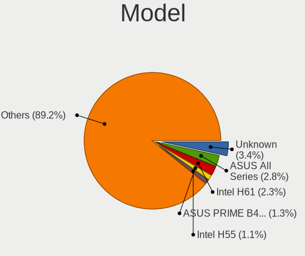
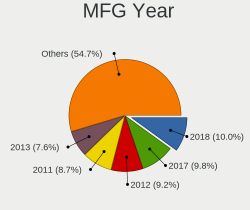
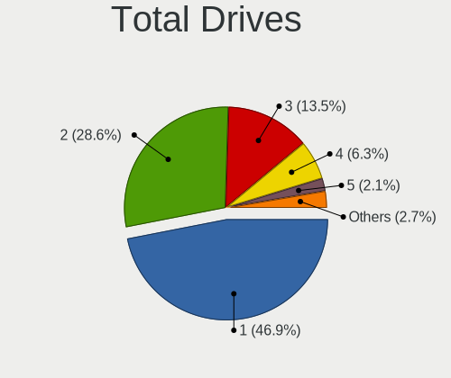
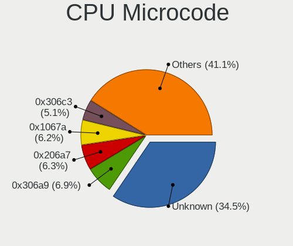
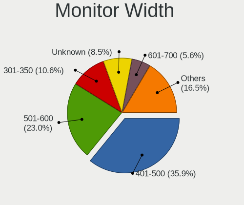

Linux in Brazil - Tested Hardware & Statistics (Desktops)
---------------------------------------------------------

A project to collect tested hardware configurations for Linux in Brazil.

Anyone can contribute to this report by the [hw-probe](https://github.com/linuxhw/hw-probe) tool:

    sudo -E hw-probe -all -upload

Please contribute! Especially if your hardware is rare.

Contents
--------

* [ Test Cases ](#test-cases)

* [ System ](#system)
  - [ OS                       ](#os)
  - [ OS Family                ](#os-family)
  - [ Kernel                   ](#kernel)
  - [ Kernel Family            ](#kernel-family)
  - [ Kernel Major Ver.        ](#kernel-major-ver)
  - [ Arch                     ](#arch)
  - [ DE                       ](#de)
  - [ Display Server           ](#display-server)
  - [ Display Manager          ](#display-manager)
  - [ OS Lang                  ](#os-lang)
  - [ Boot Mode                ](#boot-mode)
  - [ Filesystem               ](#filesystem)
  - [ Part. scheme             ](#part-scheme)
  - [ Dual Boot with Linux/BSD ](#dual-boot-with-linuxbsd)
  - [ Dual Boot (Win)          ](#dual-boot-win)

* [ Board ](#board)
  - [ Vendor                   ](#vendor)
  - [ Model                    ](#model)
  - [ Model Family             ](#model-family)
  - [ MFG Year                 ](#mfg-year)
  - [ Form Factor              ](#form-factor)
  - [ Secure Boot              ](#secure-boot)
  - [ Coreboot                 ](#coreboot)
  - [ RAM Size                 ](#ram-size)
  - [ RAM Used                 ](#ram-used)
  - [ Total Drives             ](#total-drives)
  - [ Has CD-ROM               ](#has-cd-rom)
  - [ Has Ethernet             ](#has-ethernet)
  - [ Has WiFi                 ](#has-wifi)
  - [ Has Bluetooth            ](#has-bluetooth)

* [ Location ](#location)
  - [ Country                  ](#country)
  - [ City                     ](#city)

* [ Drives ](#drives)
  - [ Drive Vendor             ](#drive-vendor)
  - [ Drive Model              ](#drive-model)
  - [ HDD Vendor               ](#hdd-vendor)
  - [ SSD Vendor               ](#ssd-vendor)
  - [ Drive Kind               ](#drive-kind)
  - [ Drive Connector          ](#drive-connector)
  - [ Drive Size               ](#drive-size)
  - [ Space Total              ](#space-total)
  - [ Space Used               ](#space-used)
  - [ Malfunc. Drives          ](#malfunc-drives)
  - [ Malfunc. Drive Vendor    ](#malfunc-drive-vendor)
  - [ Malfunc. HDD Vendor      ](#malfunc-hdd-vendor)
  - [ Malfunc. Drive Kind      ](#malfunc-drive-kind)
  - [ Failed Drives            ](#failed-drives)
  - [ Failed Drive Vendor      ](#failed-drive-vendor)
  - [ Drive Status             ](#drive-status)

* [ Storage controller ](#storage-controller)
  - [ Storage Vendor           ](#storage-vendor)
  - [ Storage Model            ](#storage-model)
  - [ Storage Kind             ](#storage-kind)

* [ Processor ](#processor)
  - [ CPU Vendor               ](#cpu-vendor)
  - [ CPU Model                ](#cpu-model)
  - [ CPU Model Family         ](#cpu-model-family)
  - [ CPU Cores                ](#cpu-cores)
  - [ CPU Sockets              ](#cpu-sockets)
  - [ CPU Threads              ](#cpu-threads)
  - [ CPU Op-Modes             ](#cpu-op-modes)
  - [ CPU Microcode            ](#cpu-microcode)
  - [ CPU Microarch            ](#cpu-microarch)

* [ Graphics ](#graphics)
  - [ GPU Vendor               ](#gpu-vendor)
  - [ GPU Model                ](#gpu-model)
  - [ GPU Combo                ](#gpu-combo)
  - [ GPU Driver               ](#gpu-driver)
  - [ GPU Memory               ](#gpu-memory)

* [ Monitor ](#monitor)
  - [ Monitor Vendor           ](#monitor-vendor)
  - [ Monitor Model            ](#monitor-model)
  - [ Monitor Resolution       ](#monitor-resolution)
  - [ Monitor Diagonal         ](#monitor-diagonal)
  - [ Monitor Width            ](#monitor-width)
  - [ Aspect Ratio             ](#aspect-ratio)
  - [ Monitor Area             ](#monitor-area)
  - [ Pixel Density            ](#pixel-density)
  - [ Multiple Monitors        ](#multiple-monitors)

* [ Network ](#network)
  - [ Net Controller Vendor    ](#net-controller-vendor)
  - [ Net Controller Model     ](#net-controller-model)
  - [ Wireless Vendor          ](#wireless-vendor)
  - [ Wireless Model           ](#wireless-model)
  - [ Ethernet Vendor          ](#ethernet-vendor)
  - [ Ethernet Model           ](#ethernet-model)
  - [ Net Controller Kind      ](#net-controller-kind)
  - [ Used Controller          ](#used-controller)
  - [ NICs                     ](#nics)
  - [ IPv6                     ](#ipv6)

* [ Bluetooth ](#bluetooth)
  - [ Bluetooth Vendor         ](#bluetooth-vendor)
  - [ Bluetooth Model          ](#bluetooth-model)

* [ Sound ](#sound)
  - [ Sound Vendor             ](#sound-vendor)
  - [ Sound Model              ](#sound-model)

* [ Memory ](#memory)
  - [ Memory Vendor            ](#memory-vendor)
  - [ Memory Model             ](#memory-model)
  - [ Memory Kind              ](#memory-kind)
  - [ Memory Form Factor       ](#memory-form-factor)
  - [ Memory Size              ](#memory-size)
  - [ Memory Speed             ](#memory-speed)

* [ Printers & scanners ](#printers--scanners)
  - [ Printer Vendor           ](#printer-vendor)
  - [ Printer Model            ](#printer-model)
  - [ Scanner Vendor           ](#scanner-vendor)
  - [ Scanner Model            ](#scanner-model)

* [ Camera ](#camera)
  - [ Camera Vendor            ](#camera-vendor)
  - [ Camera Model             ](#camera-model)

* [ Security ](#security)
  - [ Fingerprint Vendor       ](#fingerprint-vendor)
  - [ Fingerprint Model        ](#fingerprint-model)
  - [ Chipcard Vendor          ](#chipcard-vendor)
  - [ Chipcard Model           ](#chipcard-model)

* [ Unsupported ](#unsupported)
  - [ Unsupported Devices      ](#unsupported-devices)
  - [ Unsupported Device Types ](#unsupported-device-types)

Test Cases
----------

Total: 9707

| Vendor        | Model                       | Probe                                                      | Date         |
|---------------|-----------------------------|------------------------------------------------------------|--------------|
| ASRock        | B360M Performance           | [1e63738abb](https://linux-hardware.org/?probe=1e63738abb) | Jan 06, 2025 |
| MSI           | B450M PRO-VDH MAX           | [c88a64dee7](https://linux-hardware.org/?probe=c88a64dee7) | Jan 05, 2025 |
| Dell          | 0HY9JP A00                  | [3047d18f75](https://linux-hardware.org/?probe=3047d18f75) | Jan 05, 2025 |
| ASUSTek       | M5A78L-M LX V2              | [02a12f94e1](https://linux-hardware.org/?probe=02a12f94e1) | Jan 05, 2025 |
| MAXSUN        | MS-Challenger B760M         | [d0da8b89ac](https://linux-hardware.org/?probe=d0da8b89ac) | Jan 05, 2025 |
| Gigabyte      | B450 AORUS PRO WIFI-CF      | [38b497d193](https://linux-hardware.org/?probe=38b497d193) | Jan 05, 2025 |
| Gigabyte      | B450 AORUS PRO WIFI-CF      | [394cfdc261](https://linux-hardware.org/?probe=394cfdc261) | Jan 05, 2025 |
| ASUSTek       | TUF Gaming B550M-PLUS WI... | [bbc74e0c64](https://linux-hardware.org/?probe=bbc74e0c64) | Jan 04, 2025 |
| Gigabyte      | X470 AORUS ULTRA GAMING-... | [f77ddc1d4e](https://linux-hardware.org/?probe=f77ddc1d4e) | Jan 04, 2025 |
| Gigabyte      | X470 AORUS ULTRA GAMING-... | [0eb5d3fd27](https://linux-hardware.org/?probe=0eb5d3fd27) | Jan 04, 2025 |
| MAXSUN        | MS-Challenger B760M         | [468fb150c0](https://linux-hardware.org/?probe=468fb150c0) | Jan 04, 2025 |
| MACHINIST     | E5-MR9A V1.0                | [2cd6888290](https://linux-hardware.org/?probe=2cd6888290) | Jan 04, 2025 |
| Intel         | H61                         | [2a8ff4b81a](https://linux-hardware.org/?probe=2a8ff4b81a) | Jan 03, 2025 |
| Intel         | H61                         | [bb2c7db34e](https://linux-hardware.org/?probe=bb2c7db34e) | Jan 03, 2025 |
| MSI           | A520M-A PRO                 | [89075d3dce](https://linux-hardware.org/?probe=89075d3dce) | Jan 03, 2025 |
| Gigabyte      | B550I AORUS PRO AX          | [465d7bcabe](https://linux-hardware.org/?probe=465d7bcabe) | Jan 03, 2025 |
| JGINYUE       | X99-D8 Server V1.0          | [686b22c79f](https://linux-hardware.org/?probe=686b22c79f) | Jan 03, 2025 |
| Intel         | H55                         | [aada843724](https://linux-hardware.org/?probe=aada843724) | Jan 03, 2025 |
| ASRock        | Z170 Extreme4               | [cec21335ef](https://linux-hardware.org/?probe=cec21335ef) | Jan 03, 2025 |
| Unknown       | MZ-B75-S                    | [81ac458db0](https://linux-hardware.org/?probe=81ac458db0) | Jan 02, 2025 |
| Intel         | H61                         | [0f76193421](https://linux-hardware.org/?probe=0f76193421) | Jan 02, 2025 |
| ASRock        | H310CM-HG4                  | [ea045be01b](https://linux-hardware.org/?probe=ea045be01b) | Jan 01, 2025 |
| Intel         | B75                         | [e0b305feae](https://linux-hardware.org/?probe=e0b305feae) | Jan 01, 2025 |
| Digiboard     | NM70-TI                     | [1a10dd8daf](https://linux-hardware.org/?probe=1a10dd8daf) | Dec 31, 2024 |
| ASUSTek       | M5A78L-M LX V2              | [d995e98eb4](https://linux-hardware.org/?probe=d995e98eb4) | Dec 31, 2024 |
| MSI           | MPG B550 GAMING PLUS        | [c720ec722a](https://linux-hardware.org/?probe=c720ec722a) | Dec 31, 2024 |
| Intel         | H81                         | [00453f1bb7](https://linux-hardware.org/?probe=00453f1bb7) | Dec 31, 2024 |
| Intel         | H81                         | [68678771e5](https://linux-hardware.org/?probe=68678771e5) | Dec 30, 2024 |
| ASUSTek       | A78M-A                      | [1c59a39f39](https://linux-hardware.org/?probe=1c59a39f39) | Dec 30, 2024 |
| Intel         | H81                         | [523d01d6a7](https://linux-hardware.org/?probe=523d01d6a7) | Dec 30, 2024 |
| Lenovo        | ThinkCentre M90p 5536P79    | [e13ed7c057](https://linux-hardware.org/?probe=e13ed7c057) | Dec 30, 2024 |
| Unknown       | MZ-B75-S                    | [b0af06f0f4](https://linux-hardware.org/?probe=b0af06f0f4) | Dec 30, 2024 |
| Unknown       | MZ-B75-S                    | [9b5c7009ad](https://linux-hardware.org/?probe=9b5c7009ad) | Dec 30, 2024 |
| Biostar       | B350GTX                     | [89a7676684](https://linux-hardware.org/?probe=89a7676684) | Dec 30, 2024 |
| Gigabyte      | B560M AORUS ELITE           | [408b834306](https://linux-hardware.org/?probe=408b834306) | Dec 29, 2024 |
| Dell          | 076VHM A02                  | [9bee0be731](https://linux-hardware.org/?probe=9bee0be731) | Dec 29, 2024 |
| Intel         | H55                         | [608b05160e](https://linux-hardware.org/?probe=608b05160e) | Dec 29, 2024 |
| Intel         | H61 V1.6B                   | [a60c63d4f8](https://linux-hardware.org/?probe=a60c63d4f8) | Dec 28, 2024 |
| Unknown       | SKYBAY                      | [2f832d51f3](https://linux-hardware.org/?probe=2f832d51f3) | Dec 27, 2024 |
| Huanan        | X99-4MF V1.0                | [86a5a82a39](https://linux-hardware.org/?probe=86a5a82a39) | Dec 26, 2024 |
| ASUSTek       | H81M-A/BR                   | [37badc0cfd](https://linux-hardware.org/?probe=37badc0cfd) | Dec 26, 2024 |
| ASUSTek       | BM1AF_BP1AF_BM6AF           | [622f9ae7f4](https://linux-hardware.org/?probe=622f9ae7f4) | Dec 25, 2024 |
| Gigabyte      | B450M DS3H V2               | [9bb72b7cbd](https://linux-hardware.org/?probe=9bb72b7cbd) | Dec 25, 2024 |
| Lenovo        | SHARKBAY SDK0E50510 WIN     | [002375d8d5](https://linux-hardware.org/?probe=002375d8d5) | Dec 25, 2024 |
| ASUSTek       | TUF Gaming A520M-PLUS WI... | [9943ac6fda](https://linux-hardware.org/?probe=9943ac6fda) | Dec 25, 2024 |
| Intel         | X99-H5 V2.0                 | [2261903b1d](https://linux-hardware.org/?probe=2261903b1d) | Dec 25, 2024 |
| Gigabyte      | B450M DS3H V2               | [ad7ff9155c](https://linux-hardware.org/?probe=ad7ff9155c) | Dec 24, 2024 |
| ASUSTek       | TUF Gaming B550M-PLUS       | [d64a12a02a](https://linux-hardware.org/?probe=d64a12a02a) | Dec 24, 2024 |
| Gigabyte      | B360 AORUS GAMING 3 WIFI... | [89e8e5ad41](https://linux-hardware.org/?probe=89e8e5ad41) | Dec 24, 2024 |
| Intel         | B75A                        | [dd337bfe58](https://linux-hardware.org/?probe=dd337bfe58) | Dec 23, 2024 |
| MACHINIST     | X99 PR9                     | [74d2e10d43](https://linux-hardware.org/?probe=74d2e10d43) | Dec 23, 2024 |
| Dell          | 08NPPY A00                  | [f28b57cc48](https://linux-hardware.org/?probe=f28b57cc48) | Dec 23, 2024 |
| Intel         | B75                         | [94459409d1](https://linux-hardware.org/?probe=94459409d1) | Dec 23, 2024 |
| Dell          | 08NPPY A00                  | [80ca496f75](https://linux-hardware.org/?probe=80ca496f75) | Dec 23, 2024 |
| ASRock        | B550M-HDV                   | [820e985b85](https://linux-hardware.org/?probe=820e985b85) | Dec 22, 2024 |
| ASUSTek       | M5A78L-M PLUS/USB3          | [9d9a451905](https://linux-hardware.org/?probe=9d9a451905) | Dec 22, 2024 |
| ASUSTek       | M5A78L-M PLUS/USB3          | [a7dd685d33](https://linux-hardware.org/?probe=a7dd685d33) | Dec 22, 2024 |
| Intel         | H61                         | [3b41c83d54](https://linux-hardware.org/?probe=3b41c83d54) | Dec 22, 2024 |
| Intel         | X99                         | [4018709a31](https://linux-hardware.org/?probe=4018709a31) | Dec 22, 2024 |
| Gigabyte      | B550M DS3H                  | [c0781aa880](https://linux-hardware.org/?probe=c0781aa880) | Dec 21, 2024 |
| MSI           | MEG Z390 GODLIKE            | [16741176a8](https://linux-hardware.org/?probe=16741176a8) | Dec 21, 2024 |
| ASUSTek       | A78M-A                      | [efa5a4e952](https://linux-hardware.org/?probe=efa5a4e952) | Dec 21, 2024 |
| MACHINIST     | E5-MR9A V1.0                | [f14a3b5ccf](https://linux-hardware.org/?probe=f14a3b5ccf) | Dec 20, 2024 |
| MACHINIST     | X99 PR9                     | [6721f17c3e](https://linux-hardware.org/?probe=6721f17c3e) | Dec 20, 2024 |
| Biostar       | B450MX-S                    | [298f913b02](https://linux-hardware.org/?probe=298f913b02) | Dec 20, 2024 |
| ASUSTek       | M5A78L LE                   | [99441ad0df](https://linux-hardware.org/?probe=99441ad0df) | Dec 20, 2024 |
| Gigabyte      | Z370M AORUS Gaming-CF       | [da0b69e009](https://linux-hardware.org/?probe=da0b69e009) | Dec 19, 2024 |
| ASUSTek       | P8H61-M LX2 R2.0            | [f50786aff4](https://linux-hardware.org/?probe=f50786aff4) | Dec 19, 2024 |
| ASUSTek       | P5G41T-M LX3                | [1edf9902dd](https://linux-hardware.org/?probe=1edf9902dd) | Dec 19, 2024 |
| ASUSTek       | P8H61-M LX3 R2.0            | [dcfafc889c](https://linux-hardware.org/?probe=dcfafc889c) | Dec 19, 2024 |
| Gigabyte      | B550I AORUS PRO AX          | [9c8b89e00a](https://linux-hardware.org/?probe=9c8b89e00a) | Dec 18, 2024 |
| ASUSTek       | TUF Gaming B550M-PLUS       | [8fa24df745](https://linux-hardware.org/?probe=8fa24df745) | Dec 18, 2024 |
| ASRock        | B450M-HDV R4.0              | [12470525ef](https://linux-hardware.org/?probe=12470525ef) | Dec 18, 2024 |
| Dell          | 076VHM A02                  | [eb059e22c7](https://linux-hardware.org/?probe=eb059e22c7) | Dec 17, 2024 |
| ASUSTek       | TUF Gaming B550M-PLUS       | [49455691cb](https://linux-hardware.org/?probe=49455691cb) | Dec 17, 2024 |
| Intel         | H61                         | [e4a1f6b371](https://linux-hardware.org/?probe=e4a1f6b371) | Dec 17, 2024 |
| ASUSTek       | H81M-CS/BR                  | [5f38363403](https://linux-hardware.org/?probe=5f38363403) | Dec 17, 2024 |
| Intel         | H61                         | [c4217d24f6](https://linux-hardware.org/?probe=c4217d24f6) | Dec 17, 2024 |
| Gigabyte      | Z270XP-SLI-CF               | [103d7b2046](https://linux-hardware.org/?probe=103d7b2046) | Dec 16, 2024 |
| Gigabyte      | B450 AORUS M                | [5b288ec021](https://linux-hardware.org/?probe=5b288ec021) | Dec 16, 2024 |
| ASUSTek       | M4A77T/USB3                 | [53b1dd4b1d](https://linux-hardware.org/?probe=53b1dd4b1d) | Dec 15, 2024 |
| Gigabyte      | 990FXA-UD3                  | [695e646513](https://linux-hardware.org/?probe=695e646513) | Dec 15, 2024 |
| Gigabyte      | 990FXA-UD3                  | [00a730597f](https://linux-hardware.org/?probe=00a730597f) | Dec 15, 2024 |
| PCWare        | IPMH110G-DDR3               | [80df541384](https://linux-hardware.org/?probe=80df541384) | Dec 15, 2024 |
| AZW           | GK mini                     | [9d7ad4d5ec](https://linux-hardware.org/?probe=9d7ad4d5ec) | Dec 15, 2024 |
| WTM           | W-N95-R B0                  | [07e55b1b4f](https://linux-hardware.org/?probe=07e55b1b4f) | Dec 15, 2024 |
| Positivo      | POS-PIB150DT 11132270       | [c3a85ea71c](https://linux-hardware.org/?probe=c3a85ea71c) | Dec 15, 2024 |
| ASUSTek       | P7P55D-E                    | [5eedc626d9](https://linux-hardware.org/?probe=5eedc626d9) | Dec 15, 2024 |
| Gigabyte      | B550M AORUS ELITE           | [ea5d5a1d8f](https://linux-hardware.org/?probe=ea5d5a1d8f) | Dec 14, 2024 |
| Gigabyte      | B550M AORUS ELITE           | [37def171f5](https://linux-hardware.org/?probe=37def171f5) | Dec 14, 2024 |
| AZW           | U59                         | [cfcb774dd7](https://linux-hardware.org/?probe=cfcb774dd7) | Dec 14, 2024 |
| Gigabyte      | B550M AORUS ELITE           | [12b3f9b280](https://linux-hardware.org/?probe=12b3f9b280) | Dec 14, 2024 |
| HP            | 304Ah                       | [f4ecd569d3](https://linux-hardware.org/?probe=f4ecd569d3) | Dec 13, 2024 |
| AZW           | GK mini                     | [084b1d007c](https://linux-hardware.org/?probe=084b1d007c) | Dec 13, 2024 |
| ASRock        | A320M-HD                    | [4f161aae09](https://linux-hardware.org/?probe=4f161aae09) | Dec 13, 2024 |
| Gigabyte      | B450M GAMING                | [d79d1b80e5](https://linux-hardware.org/?probe=d79d1b80e5) | Dec 13, 2024 |
| AMD           | A88                         | [f6e719736c](https://linux-hardware.org/?probe=f6e719736c) | Dec 12, 2024 |
| Gigabyte      | GA-78LMT-USB3 x.x           | [093ab9d71c](https://linux-hardware.org/?probe=093ab9d71c) | Dec 12, 2024 |
| Gigabyte      | B550M AORUS ELITE           | [e88c90c07d](https://linux-hardware.org/?probe=e88c90c07d) | Dec 12, 2024 |
| Intel         | H55                         | [9d104d8648](https://linux-hardware.org/?probe=9d104d8648) | Dec 11, 2024 |
| ASRock        | A320M-HDV R4.0              | [6df6bce660](https://linux-hardware.org/?probe=6df6bce660) | Dec 11, 2024 |
| wpc           | zrd616                      | [f00be7af29](https://linux-hardware.org/?probe=f00be7af29) | Dec 11, 2024 |
| ASUSTek       | M5A78L-M LX V2              | [6d9e060ae1](https://linux-hardware.org/?probe=6d9e060ae1) | Dec 11, 2024 |
| ASUSTek       | P5KPL-AM-CKD-VISUM-SI       | [07da9c9689](https://linux-hardware.org/?probe=07da9c9689) | Dec 11, 2024 |
| ASUSTek       | P5KPL-AM-CKD-VISUM-SI       | [30c1252fa2](https://linux-hardware.org/?probe=30c1252fa2) | Dec 10, 2024 |
| Intel         | H55                         | [05559a903b](https://linux-hardware.org/?probe=05559a903b) | Dec 10, 2024 |
| HP            | ProLiant ML350 G5           | [55eec713db](https://linux-hardware.org/?probe=55eec713db) | Dec 10, 2024 |
| MACHINIST     | X99-MR9S V6.1               | [54ecfa8caf](https://linux-hardware.org/?probe=54ecfa8caf) | Dec 10, 2024 |
| Biostar       | B350GT3                     | [9ba0340067](https://linux-hardware.org/?probe=9ba0340067) | Dec 10, 2024 |
| Unknown       | T3 MRD                      | [13efe7a6a3](https://linux-hardware.org/?probe=13efe7a6a3) | Dec 10, 2024 |
| Intel         | H61                         | [9182c98522](https://linux-hardware.org/?probe=9182c98522) | Dec 09, 2024 |
| Intel         | B85                         | [319a350c09](https://linux-hardware.org/?probe=319a350c09) | Dec 08, 2024 |
| Gigabyte      | Z370M AORUS Gaming-CF       | [69c691cfcf](https://linux-hardware.org/?probe=69c691cfcf) | Dec 08, 2024 |
| MACHINIST     | X99-MR9S V6.1               | [09f9de1bfd](https://linux-hardware.org/?probe=09f9de1bfd) | Dec 08, 2024 |
| Biostar       | B450MX-S                    | [821e6039db](https://linux-hardware.org/?probe=821e6039db) | Dec 08, 2024 |
| Positivo      | POS-PIH81DL                 | [898e87127f](https://linux-hardware.org/?probe=898e87127f) | Dec 08, 2024 |
| Gigabyte      | Z370M AORUS Gaming-CF       | [20a6efe175](https://linux-hardware.org/?probe=20a6efe175) | Dec 08, 2024 |
| Intel         | B85                         | [7cbfefe75c](https://linux-hardware.org/?probe=7cbfefe75c) | Dec 07, 2024 |
| ASUSTek       | TUF Gaming B650M-E WIFI     | [be9f438709](https://linux-hardware.org/?probe=be9f438709) | Dec 07, 2024 |
| Gigabyte      | B85M-D3PH                   | [bd43ad3f6e](https://linux-hardware.org/?probe=bd43ad3f6e) | Dec 07, 2024 |
| ASRock        | A320M-HD                    | [ac1057440a](https://linux-hardware.org/?probe=ac1057440a) | Dec 07, 2024 |
| Philco        | DTC-A55                     | [84d0368e0e](https://linux-hardware.org/?probe=84d0368e0e) | Dec 07, 2024 |
| Daten Tecn... | DB85PRO                     | [eb235e849d](https://linux-hardware.org/?probe=eb235e849d) | Dec 06, 2024 |
| MSI           | PRO B760M-P DDR4            | [3af5d27c3e](https://linux-hardware.org/?probe=3af5d27c3e) | Dec 06, 2024 |
| MSI           | PRO B760M-P DDR4            | [5ca31295b1](https://linux-hardware.org/?probe=5ca31295b1) | Dec 06, 2024 |
| Gigabyte      | B450M H                     | [930e73d68c](https://linux-hardware.org/?probe=930e73d68c) | Dec 06, 2024 |
| ASUSTek       | H61M-A/BR                   | [7eae96418c](https://linux-hardware.org/?probe=7eae96418c) | Dec 06, 2024 |
| ASUSTek       | H81M-A/BR                   | [5e9219a165](https://linux-hardware.org/?probe=5e9219a165) | Dec 06, 2024 |
| Intel         | B75                         | [69a652cb51](https://linux-hardware.org/?probe=69a652cb51) | Dec 05, 2024 |
| Dell          | 0FDY5C A00                  | [9850cbe351](https://linux-hardware.org/?probe=9850cbe351) | Dec 05, 2024 |
| ASRock        | B450M Steel Legend          | [0f249c16e0](https://linux-hardware.org/?probe=0f249c16e0) | Dec 05, 2024 |
| MSI           | MAG B550 TOMAHAWK           | [4ec5a1bec9](https://linux-hardware.org/?probe=4ec5a1bec9) | Dec 05, 2024 |
| DUEX          | H310C Ver:1.00              | [573063f9f1](https://linux-hardware.org/?probe=573063f9f1) | Dec 05, 2024 |
| DUEX          | H310C Ver:1.00              | [8642c9deed](https://linux-hardware.org/?probe=8642c9deed) | Dec 05, 2024 |
| ASRock        | B650M Pro RS                | [3e546a0c36](https://linux-hardware.org/?probe=3e546a0c36) | Dec 05, 2024 |
| Gigabyte      | G31M-S2L                    | [a8795f3981](https://linux-hardware.org/?probe=a8795f3981) | Dec 04, 2024 |
| ASUSTek       | TUF Gaming B550M-PLUS       | [554febc693](https://linux-hardware.org/?probe=554febc693) | Dec 04, 2024 |
| DUEX          | A520 Ver:1.00               | [00b00a6926](https://linux-hardware.org/?probe=00b00a6926) | Dec 04, 2024 |
| Login Info... | LOG-BAT-I                   | [c5ba631810](https://linux-hardware.org/?probe=c5ba631810) | Dec 04, 2024 |
| Philco        | DTC-A55                     | [2dd74c4efa](https://linux-hardware.org/?probe=2dd74c4efa) | Dec 04, 2024 |
| Positivo      | POS-EIH61CQ                 | [d4fad86c11](https://linux-hardware.org/?probe=d4fad86c11) | Dec 04, 2024 |
| Lenovo        | 32E1 NOK                    | [d0dfc91320](https://linux-hardware.org/?probe=d0dfc91320) | Dec 03, 2024 |
| Lenovo        | 32E1 NOK                    | [6fc2968464](https://linux-hardware.org/?probe=6fc2968464) | Dec 03, 2024 |
| ASUSTek       | TUF Gaming X570-PLUS_BR     | [bc07acd161](https://linux-hardware.org/?probe=bc07acd161) | Dec 03, 2024 |
| Intel         | H61                         | [a7db65f6c6](https://linux-hardware.org/?probe=a7db65f6c6) | Dec 03, 2024 |
| ASUSTek       | TUF Gaming B550M-PLUS       | [959bb88eae](https://linux-hardware.org/?probe=959bb88eae) | Dec 03, 2024 |
| ASUSTek       | TUF Gaming B550M-PLUS       | [b1af910648](https://linux-hardware.org/?probe=b1af910648) | Dec 03, 2024 |
| Gigabyte      | B85M-D3PH                   | [a6ffab773f](https://linux-hardware.org/?probe=a6ffab773f) | Dec 03, 2024 |
| ASRock        | B450M Steel Legend          | [b4a0a64ac0](https://linux-hardware.org/?probe=b4a0a64ac0) | Dec 03, 2024 |
| ASUSTek       | PRIME X470-PRO              | [ac393451de](https://linux-hardware.org/?probe=ac393451de) | Dec 03, 2024 |
| Pegatron      | IPM31G                      | [a94a211e70](https://linux-hardware.org/?probe=a94a211e70) | Dec 03, 2024 |
| Unknown       | T3 MRD                      | [f55dd77b94](https://linux-hardware.org/?probe=f55dd77b94) | Dec 02, 2024 |
| Gigabyte      | B550M DS3H                  | [146d9d897a](https://linux-hardware.org/?probe=146d9d897a) | Dec 02, 2024 |
| Intel         | H61                         | [1202ad97f8](https://linux-hardware.org/?probe=1202ad97f8) | Dec 02, 2024 |
| Intel         | B75/Q75/Q77                 | [2462350161](https://linux-hardware.org/?probe=2462350161) | Dec 02, 2024 |
| MAXSUN        | MS-Challenger B760M         | [10aebd8daf](https://linux-hardware.org/?probe=10aebd8daf) | Dec 01, 2024 |
| ASRock        | N68C-S UCC                  | [b6fe1f4374](https://linux-hardware.org/?probe=b6fe1f4374) | Dec 01, 2024 |
| ASUSTek       | TUF Gaming A620M-PLUS       | [b2a46b17d9](https://linux-hardware.org/?probe=b2a46b17d9) | Dec 01, 2024 |
| ASRock        | H310CM-HG4                  | [86f4d79f62](https://linux-hardware.org/?probe=86f4d79f62) | Dec 01, 2024 |
| Gigabyte      | Q77M-D2H                    | [344a0d242e](https://linux-hardware.org/?probe=344a0d242e) | Nov 30, 2024 |
| Itautec       | ST 4271 ST-4271 Padrao 0... | [d12f73db12](https://linux-hardware.org/?probe=d12f73db12) | Nov 30, 2024 |
| Itautec       | ST 4271 ST-4271 Padrao 0... | [76954bf317](https://linux-hardware.org/?probe=76954bf317) | Nov 30, 2024 |
| ASUSTek       | TUF Gaming B550M-PLUS       | [ca35a1e151](https://linux-hardware.org/?probe=ca35a1e151) | Nov 29, 2024 |
| Lenovo        | 0B98401 WIN                 | [31e83bac44](https://linux-hardware.org/?probe=31e83bac44) | Nov 29, 2024 |
| Gigabyte      | B550M AORUS ELITE           | [39b6cb411f](https://linux-hardware.org/?probe=39b6cb411f) | Nov 29, 2024 |
| Intel         | H61                         | [9884456ecc](https://linux-hardware.org/?probe=9884456ecc) | Nov 29, 2024 |
| ASRock        | B450M-HDV R4.0              | [5368752126](https://linux-hardware.org/?probe=5368752126) | Nov 28, 2024 |
| ASUSTek       | PRIME H510M-A WIFI          | [7274537c40](https://linux-hardware.org/?probe=7274537c40) | Nov 28, 2024 |
| Lenovo        | NOK                         | [a761e22d35](https://linux-hardware.org/?probe=a761e22d35) | Nov 28, 2024 |
| Lenovo        | NOK                         | [7b4b2dc9f5](https://linux-hardware.org/?probe=7b4b2dc9f5) | Nov 28, 2024 |
| HP            | 8054                        | [9e20fcd26a](https://linux-hardware.org/?probe=9e20fcd26a) | Nov 28, 2024 |
| Gigabyte      | A320M-S2H V2-CF             | [03d2028f02](https://linux-hardware.org/?probe=03d2028f02) | Nov 28, 2024 |
| MSI           | PRO H410M-B                 | [afd2fab87d](https://linux-hardware.org/?probe=afd2fab87d) | Nov 27, 2024 |
| Intel         | JSL MRD                     | [d5b5938271](https://linux-hardware.org/?probe=d5b5938271) | Nov 27, 2024 |
| Gigabyte      | X470 AORUS ULTRA GAMING-... | [90a508fb91](https://linux-hardware.org/?probe=90a508fb91) | Nov 27, 2024 |
| Gigabyte      | A320M-S2H V2-CF             | [0ba3e39d3f](https://linux-hardware.org/?probe=0ba3e39d3f) | Nov 27, 2024 |
| Gigabyte      | Z370M AORUS Gaming-CF       | [67a0eec53d](https://linux-hardware.org/?probe=67a0eec53d) | Nov 27, 2024 |
| ASUSTek       | M4A87TD EVO                 | [0e6018751e](https://linux-hardware.org/?probe=0e6018751e) | Nov 26, 2024 |
| ASRock        | B450M-HDV R4.0              | [42f36d7dfa](https://linux-hardware.org/?probe=42f36d7dfa) | Nov 26, 2024 |
| Gigabyte      | B450M DS3H WIFI-CF          | [322feab71d](https://linux-hardware.org/?probe=322feab71d) | Nov 25, 2024 |
| Gigabyte      | AB350M-DS3H V2-CF           | [07ef34a01f](https://linux-hardware.org/?probe=07ef34a01f) | Nov 25, 2024 |
| ASUSTek       | TUF Gaming B650M-E WIFI     | [3f0f090b8f](https://linux-hardware.org/?probe=3f0f090b8f) | Nov 25, 2024 |
| ASUSTek       | TUF B450M-PLUS GAMING       | [db153eb240](https://linux-hardware.org/?probe=db153eb240) | Nov 25, 2024 |
| Intel         | H61                         | [06e926278d](https://linux-hardware.org/?probe=06e926278d) | Nov 25, 2024 |
| ASUSTek       | TUF Gaming B450M-PRO II     | [546df1ba94](https://linux-hardware.org/?probe=546df1ba94) | Nov 24, 2024 |
| JGINYUE       | X99-D8 Server V1.0          | [3f50efb197](https://linux-hardware.org/?probe=3f50efb197) | Nov 24, 2024 |
| Daten Tecn... | DT1800Z                     | [5e3cb6ad18](https://linux-hardware.org/?probe=5e3cb6ad18) | Nov 24, 2024 |
| Daten Tecn... | DT1800Z                     | [2e4bcb8ea6](https://linux-hardware.org/?probe=2e4bcb8ea6) | Nov 24, 2024 |
| HP            | 2AA2                        | [ad8688b30a](https://linux-hardware.org/?probe=ad8688b30a) | Nov 24, 2024 |
| Huanan        | X99-8M-F V1.1               | [10d9ba5f68](https://linux-hardware.org/?probe=10d9ba5f68) | Nov 24, 2024 |
| MSI           | B450M-A PRO MAX             | [65cc02c24b](https://linux-hardware.org/?probe=65cc02c24b) | Nov 23, 2024 |
| Gigabyte      | H370 AORUS GAMING 3-CF      | [56651b3fbf](https://linux-hardware.org/?probe=56651b3fbf) | Nov 23, 2024 |
| Philco        | DTC-A55                     | [18420c562a](https://linux-hardware.org/?probe=18420c562a) | Nov 23, 2024 |
| MSI           | B360 GAMING PRO CARBON      | [30f00266c7](https://linux-hardware.org/?probe=30f00266c7) | Nov 23, 2024 |
| AMD           | A320                        | [281dbcb2a5](https://linux-hardware.org/?probe=281dbcb2a5) | Nov 23, 2024 |
| ASUSTek       | M4A87TD EVO                 | [efba9eab5e](https://linux-hardware.org/?probe=efba9eab5e) | Nov 22, 2024 |
| ASUSTek       | M4A87TD EVO                 | [0df6911269](https://linux-hardware.org/?probe=0df6911269) | Nov 22, 2024 |
| Itautec       | ST 4271 ST-4271 Padrao 0... | [88f77c55ad](https://linux-hardware.org/?probe=88f77c55ad) | Nov 22, 2024 |
| ASRock        | 945GCM-S                    | [c1060979e3](https://linux-hardware.org/?probe=c1060979e3) | Nov 21, 2024 |
| Gigabyte      | H81M-S1                     | [51524c7cfd](https://linux-hardware.org/?probe=51524c7cfd) | Nov 21, 2024 |
| Intel         | DH67BL AAG10189-206         | [db9eac8915](https://linux-hardware.org/?probe=db9eac8915) | Nov 21, 2024 |
| Dell          | 0FR6WH A01                  | [8ea0baf186](https://linux-hardware.org/?probe=8ea0baf186) | Nov 21, 2024 |
| Gigabyte      | AB350M-DS3H V2-CF           | [c7a500dd7a](https://linux-hardware.org/?probe=c7a500dd7a) | Nov 19, 2024 |
| Intel         | H110                        | [d246e22138](https://linux-hardware.org/?probe=d246e22138) | Nov 19, 2024 |
| Biostar       | B450MX-S                    | [867b43aac2](https://linux-hardware.org/?probe=867b43aac2) | Nov 19, 2024 |
| ASUSTek       | TUF Gaming B760M-PLUS WI... | [1f8a9bf724](https://linux-hardware.org/?probe=1f8a9bf724) | Nov 18, 2024 |
| Gigabyte      | H110-D3A-CF                 | [1ef77ddfc1](https://linux-hardware.org/?probe=1ef77ddfc1) | Nov 18, 2024 |
| ASUSTek       | PRIME B250M-C               | [962a207744](https://linux-hardware.org/?probe=962a207744) | Nov 18, 2024 |
| Login Info... | LOG-BAT-I                   | [2c0e29b140](https://linux-hardware.org/?probe=2c0e29b140) | Nov 18, 2024 |
| ASUSTek       | BM1AF_BP1AF_BM6AF           | [1b4a636ed3](https://linux-hardware.org/?probe=1b4a636ed3) | Nov 18, 2024 |
| AMD           | A88                         | [9203b9c5a1](https://linux-hardware.org/?probe=9203b9c5a1) | Nov 18, 2024 |
| Intel         | H55                         | [94637fbbfe](https://linux-hardware.org/?probe=94637fbbfe) | Nov 17, 2024 |
| ASUSTek       | B150 PRO GAMING             | [e17a913175](https://linux-hardware.org/?probe=e17a913175) | Nov 17, 2024 |
| ASUSTek       | B150 PRO GAMING             | [03c8253d85](https://linux-hardware.org/?probe=03c8253d85) | Nov 17, 2024 |
| Gigabyte      | AB350M-DS3H V2-CF           | [a386e4310c](https://linux-hardware.org/?probe=a386e4310c) | Nov 17, 2024 |
| ASRock        | 760GM-HD                    | [663f2190fd](https://linux-hardware.org/?probe=663f2190fd) | Nov 17, 2024 |
| Gigabyte      | B650M GAMING WIFI           | [5c450345a6](https://linux-hardware.org/?probe=5c450345a6) | Nov 17, 2024 |
| ASUSTek       | ROG STRIX B550-E GAMING     | [087f372f3b](https://linux-hardware.org/?probe=087f372f3b) | Nov 16, 2024 |
| Compaq        | Presario CQ-14              | [30684eb29e](https://linux-hardware.org/?probe=30684eb29e) | Nov 16, 2024 |
| Compaq        | Presario CQ-14              | [6727371af6](https://linux-hardware.org/?probe=6727371af6) | Nov 16, 2024 |
| ASUSTek       | ROG STRIX B550-E GAMING     | [28e20675ef](https://linux-hardware.org/?probe=28e20675ef) | Nov 16, 2024 |
| MSI           | H510M-A PRO                 | [1391f30b16](https://linux-hardware.org/?probe=1391f30b16) | Nov 16, 2024 |
| Dell          | 0KWVT8 A00                  | [06e7604e5a](https://linux-hardware.org/?probe=06e7604e5a) | Nov 16, 2024 |
| ASUSTek       | TUF B450M-PLUS GAMING       | [ad30ba36ce](https://linux-hardware.org/?probe=ad30ba36ce) | Nov 16, 2024 |
| ASUSTek       | F2A85-M2                    | [b6e3dbb57a](https://linux-hardware.org/?probe=b6e3dbb57a) | Nov 15, 2024 |
| Dell          | 02W4W1 A00                  | [88e09c6069](https://linux-hardware.org/?probe=88e09c6069) | Nov 15, 2024 |
| Intel         | H61                         | [20c75adfe1](https://linux-hardware.org/?probe=20c75adfe1) | Nov 15, 2024 |
| Gigabyte      | 990FXA-UD3                  | [cc64e22524](https://linux-hardware.org/?probe=cc64e22524) | Nov 15, 2024 |
| Positivo      | POS-EIBTPDC                 | [ae191dc5a0](https://linux-hardware.org/?probe=ae191dc5a0) | Nov 14, 2024 |
| Dell          | 0P99M4 A01                  | [4c43c80afc](https://linux-hardware.org/?probe=4c43c80afc) | Nov 14, 2024 |
| Huanan        | X99-F8 GAMING V5.0          | [4ff8ae9294](https://linux-hardware.org/?probe=4ff8ae9294) | Nov 14, 2024 |
| ASUSTek       | PRIME A320M-K/BR            | [ae7a9190fc](https://linux-hardware.org/?probe=ae7a9190fc) | Nov 14, 2024 |
| Gigabyte      | Z790 UD AX                  | [e7d2ae557b](https://linux-hardware.org/?probe=e7d2ae557b) | Nov 13, 2024 |
| ASUSTek       | TUF Gaming B760M-PLUS WI... | [99d4eb3f64](https://linux-hardware.org/?probe=99d4eb3f64) | Nov 13, 2024 |
| ASRock        | X570 Phantom Gaming 4       | [eeaf3d5f73](https://linux-hardware.org/?probe=eeaf3d5f73) | Nov 13, 2024 |
| Intel         | B75                         | [3702d043f1](https://linux-hardware.org/?probe=3702d043f1) | Nov 13, 2024 |
| Intel         | B75                         | [b9f5a481dc](https://linux-hardware.org/?probe=b9f5a481dc) | Nov 13, 2024 |
| Dell          | 0HN7XN A01                  | [cb494ef824](https://linux-hardware.org/?probe=cb494ef824) | Nov 13, 2024 |
| HP            | 339A                        | [85906d9468](https://linux-hardware.org/?probe=85906d9468) | Nov 13, 2024 |
| Gigabyte      | P35-DS3                     | [781f667e83](https://linux-hardware.org/?probe=781f667e83) | Nov 13, 2024 |
| OEM           | OEM                         | [cc5aef742e](https://linux-hardware.org/?probe=cc5aef742e) | Nov 12, 2024 |
| Gigabyte      | H61M-S1                     | [53a7db0de1](https://linux-hardware.org/?probe=53a7db0de1) | Nov 12, 2024 |
| ASRock        | H310CM-HG4                  | [947520025d](https://linux-hardware.org/?probe=947520025d) | Nov 12, 2024 |
| ASRock        | H310CM-HG4                  | [11021e8d32](https://linux-hardware.org/?probe=11021e8d32) | Nov 12, 2024 |
| ASRock        | H310CM-HG4                  | [63b0d341db](https://linux-hardware.org/?probe=63b0d341db) | Nov 12, 2024 |
| MSI           | H61M-P31                    | [f2177ab377](https://linux-hardware.org/?probe=f2177ab377) | Nov 12, 2024 |
| MACHINIST     | X99 PR9-H                   | [3f5cc1b3f9](https://linux-hardware.org/?probe=3f5cc1b3f9) | Nov 12, 2024 |
| MSI           | MAG B760M MORTAR DDR4       | [bac58a0444](https://linux-hardware.org/?probe=bac58a0444) | Nov 09, 2024 |
| Intel         | B75                         | [642d00ab68](https://linux-hardware.org/?probe=642d00ab68) | Nov 09, 2024 |
| ASUSTek       | TUF Gaming B550M-PLUS       | [56a7d1166d](https://linux-hardware.org/?probe=56a7d1166d) | Nov 09, 2024 |
| ASRock        | B450M Steel Legend          | [143a2f7ed5](https://linux-hardware.org/?probe=143a2f7ed5) | Nov 09, 2024 |
| MSI           | Z270 KRAIT GAMING           | [0888231bc3](https://linux-hardware.org/?probe=0888231bc3) | Nov 09, 2024 |
| Gigabyte      | X470 AORUS GAMING 7 WIFI... | [ce62db7f6c](https://linux-hardware.org/?probe=ce62db7f6c) | Nov 09, 2024 |
| MSI           | A520M-A PRO                 | [a9064436dc](https://linux-hardware.org/?probe=a9064436dc) | Nov 09, 2024 |
| Dell          | 01XK1W A00                  | [a66d7f6087](https://linux-hardware.org/?probe=a66d7f6087) | Nov 09, 2024 |
| Lenovo        | NO DPK                      | [bc3bb9ceab](https://linux-hardware.org/?probe=bc3bb9ceab) | Nov 08, 2024 |
| BAZAM & PI... | Pichau Alphard B560M-T      | [fe924e8134](https://linux-hardware.org/?probe=fe924e8134) | Nov 08, 2024 |
| Lenovo        | 0B98401 WIN                 | [b9b7250eff](https://linux-hardware.org/?probe=b9b7250eff) | Nov 07, 2024 |
| Dell          | 06HKRH A02                  | [04aec39088](https://linux-hardware.org/?probe=04aec39088) | Nov 07, 2024 |
| Dell          | 06HKRH A02                  | [da6767c9b3](https://linux-hardware.org/?probe=da6767c9b3) | Nov 07, 2024 |
| Lenovo        | 0B98401 WIN                 | [e0f904d9db](https://linux-hardware.org/?probe=e0f904d9db) | Nov 07, 2024 |
| Gigabyte      | B760M AORUS ELITE           | [52a1a63a06](https://linux-hardware.org/?probe=52a1a63a06) | Nov 07, 2024 |
| ASUSTek       | BM1AF_BP1AF_BM6AF           | [eca8a968d1](https://linux-hardware.org/?probe=eca8a968d1) | Nov 07, 2024 |
| ASUSTek       | P5G41T-M LX2/BR             | [2afa99e24b](https://linux-hardware.org/?probe=2afa99e24b) | Nov 07, 2024 |
| Dell          | 0P99M4 A01                  | [47e8d6d3b4](https://linux-hardware.org/?probe=47e8d6d3b4) | Nov 06, 2024 |
| ASUSTek       | P5G41T-M LX2/BR             | [e7a2bc3d5e](https://linux-hardware.org/?probe=e7a2bc3d5e) | Nov 06, 2024 |
| Dell          | 0P096C A01                  | [67d0f27de8](https://linux-hardware.org/?probe=67d0f27de8) | Nov 06, 2024 |
| Gigabyte      | Z68X-UD3-B3                 | [f7ae922544](https://linux-hardware.org/?probe=f7ae922544) | Nov 06, 2024 |
| Gigabyte      | Z68X-UD3-B3                 | [3dee17dba4](https://linux-hardware.org/?probe=3dee17dba4) | Nov 06, 2024 |
| MSI           | MEG Z390 GODLIKE            | [863dcd6675](https://linux-hardware.org/?probe=863dcd6675) | Nov 05, 2024 |
| BESSTAR Te... | UM350                       | [59b3471a89](https://linux-hardware.org/?probe=59b3471a89) | Nov 05, 2024 |
| Dell          | 0VTJVC A00                  | [e95dd1e5ab](https://linux-hardware.org/?probe=e95dd1e5ab) | Nov 05, 2024 |
| ASUSTek       | TUF B350M-PLUS GAMING       | [8ccdac4e4c](https://linux-hardware.org/?probe=8ccdac4e4c) | Nov 04, 2024 |
| Dell          | 0JP3NX A01                  | [dc2c04bda9](https://linux-hardware.org/?probe=dc2c04bda9) | Nov 03, 2024 |
| Dell          | 0VTJVC A00                  | [01b2ef1315](https://linux-hardware.org/?probe=01b2ef1315) | Nov 03, 2024 |
| Intel         | B75 V1.1                    | [ff18644511](https://linux-hardware.org/?probe=ff18644511) | Nov 03, 2024 |
| wpc           | zrd616                      | [1002f7593c](https://linux-hardware.org/?probe=1002f7593c) | Nov 02, 2024 |
| ASUSTek       | H81M-A/BR                   | [12ead7a428](https://linux-hardware.org/?probe=12ead7a428) | Nov 02, 2024 |
| ASUSTek       | SABERTOOTH 990FX R2.0       | [81d667c44a](https://linux-hardware.org/?probe=81d667c44a) | Nov 02, 2024 |
| Intel         | X99 V1.0                    | [41c10ad1c4](https://linux-hardware.org/?probe=41c10ad1c4) | Nov 01, 2024 |
| Lenovo        | 32E1 NOK                    | [a041aa7834](https://linux-hardware.org/?probe=a041aa7834) | Nov 01, 2024 |
| Positivo      | POS-RIH470EM 11176553       | [41354d001f](https://linux-hardware.org/?probe=41354d001f) | Nov 01, 2024 |
| Dell          | 0P096C A01                  | [a3a653274c](https://linux-hardware.org/?probe=a3a653274c) | Nov 01, 2024 |
| ASUSTek       | PRIME H610M-E D4            | [e96c0b7bfb](https://linux-hardware.org/?probe=e96c0b7bfb) | Nov 01, 2024 |
| Gigabyte      | H61M-S1                     | [5c9b330685](https://linux-hardware.org/?probe=5c9b330685) | Nov 01, 2024 |
| Gigabyte      | H61M-S1                     | [3d257bfc82](https://linux-hardware.org/?probe=3d257bfc82) | Nov 01, 2024 |
| MACHINIST     | E5-MR9A V1.0                | [54d4d9d3ba](https://linux-hardware.org/?probe=54d4d9d3ba) | Oct 31, 2024 |
| Intel         | H61                         | [66d0c733e5](https://linux-hardware.org/?probe=66d0c733e5) | Oct 31, 2024 |
| Intel         | B75                         | [c48a602eae](https://linux-hardware.org/?probe=c48a602eae) | Oct 31, 2024 |
| MSI           | MEG Z390 GODLIKE            | [962c1085a3](https://linux-hardware.org/?probe=962c1085a3) | Oct 30, 2024 |
| ASUSTek       | ROG STRIX Z590-A GAMING ... | [fe9518b8e3](https://linux-hardware.org/?probe=fe9518b8e3) | Oct 30, 2024 |
| Dell          | 0C2KJT A00                  | [fa78df9177](https://linux-hardware.org/?probe=fa78df9177) | Oct 30, 2024 |
| ASUSTek       | P5Q                         | [da83835b83](https://linux-hardware.org/?probe=da83835b83) | Oct 30, 2024 |
| PCWare        | IPX847P1                    | [fc7aeb019e](https://linux-hardware.org/?probe=fc7aeb019e) | Oct 30, 2024 |
| Gigabyte      | B660M AORUS PRO AX DDR4     | [a0cf793a11](https://linux-hardware.org/?probe=a0cf793a11) | Oct 30, 2024 |
| Positivo      | DA18HV1 POSITIVO            | [c341735f00](https://linux-hardware.org/?probe=c341735f00) | Oct 29, 2024 |
| AZW           | MINI S                      | [a4c35429d9](https://linux-hardware.org/?probe=a4c35429d9) | Oct 29, 2024 |
| AZW           | MINI S                      | [ca35bc061f](https://linux-hardware.org/?probe=ca35bc061f) | Oct 29, 2024 |
| MSI           | H61M-E22/W8                 | [a908f6b789](https://linux-hardware.org/?probe=a908f6b789) | Oct 29, 2024 |
| wpc           | A520WPC 1001                | [337022e1f5](https://linux-hardware.org/?probe=337022e1f5) | Oct 29, 2024 |
| ASUSTek       | P8H67-M PRO                 | [a7aeb69157](https://linux-hardware.org/?probe=a7aeb69157) | Oct 28, 2024 |
| ASUSTek       | P8H67-M PRO                 | [87f35bbeb2](https://linux-hardware.org/?probe=87f35bbeb2) | Oct 28, 2024 |
| ASUSTek       | P5G41T-M LX2/BR             | [f714c9c792](https://linux-hardware.org/?probe=f714c9c792) | Oct 28, 2024 |
| MSI           | H61M-E22/W8                 | [d419bafc55](https://linux-hardware.org/?probe=d419bafc55) | Oct 28, 2024 |
| MSI           | H61M-E22/W8                 | [b5b1f9726a](https://linux-hardware.org/?probe=b5b1f9726a) | Oct 28, 2024 |
| Positivo      | POS-EIH61CQ POSITIVO        | [1cdf6bce40](https://linux-hardware.org/?probe=1cdf6bce40) | Oct 27, 2024 |
| Gigabyte      | B550M DS3H AC               | [686f542a07](https://linux-hardware.org/?probe=686f542a07) | Oct 27, 2024 |
| Gigabyte      | B650M H                     | [a11796658a](https://linux-hardware.org/?probe=a11796658a) | Oct 27, 2024 |
| ASRock        | X670E Taichi Carrara        | [bb8f80dc95](https://linux-hardware.org/?probe=bb8f80dc95) | Oct 27, 2024 |
| Dell          | 01XK1W A00                  | [5226011358](https://linux-hardware.org/?probe=5226011358) | Oct 27, 2024 |
| Intel         | H61                         | [cfba56ae78](https://linux-hardware.org/?probe=cfba56ae78) | Oct 27, 2024 |
| Intel         | H61                         | [8460791859](https://linux-hardware.org/?probe=8460791859) | Oct 27, 2024 |
| Dell          | 0VHXCD A03                  | [4f37b03a6f](https://linux-hardware.org/?probe=4f37b03a6f) | Oct 26, 2024 |
| Dell          | 0VHXCD A03                  | [16dc51573c](https://linux-hardware.org/?probe=16dc51573c) | Oct 26, 2024 |
| ASUSTek       | B150M-C/BR                  | [2a32e77ae0](https://linux-hardware.org/?probe=2a32e77ae0) | Oct 26, 2024 |
| Gigabyte      | B450 AORUS M                | [028685c0a9](https://linux-hardware.org/?probe=028685c0a9) | Oct 26, 2024 |
| Gigabyte      | X570S AORUS ELITE           | [6b160040a8](https://linux-hardware.org/?probe=6b160040a8) | Oct 26, 2024 |
| Gigabyte      | X570S AORUS ELITE           | [382f5df6c1](https://linux-hardware.org/?probe=382f5df6c1) | Oct 26, 2024 |
| MSI           | G41M-S01                    | [34344c8186](https://linux-hardware.org/?probe=34344c8186) | Oct 26, 2024 |
| Gigabyte      | Z390 M GAMING-CF            | [f8b163024f](https://linux-hardware.org/?probe=f8b163024f) | Oct 25, 2024 |
| ASUSTek       | PRIME H410M-E               | [9920ca2b17](https://linux-hardware.org/?probe=9920ca2b17) | Oct 25, 2024 |
| Intel         | X99-D4 V2.0                 | [7275a5dadd](https://linux-hardware.org/?probe=7275a5dadd) | Oct 25, 2024 |
| Dell          | 055H3G A01                  | [d650e5606d](https://linux-hardware.org/?probe=d650e5606d) | Oct 25, 2024 |
| Gigabyte      | Z690 UD AX DDR4             | [3e7437eeb1](https://linux-hardware.org/?probe=3e7437eeb1) | Oct 25, 2024 |
| Gigabyte      | B760M AORUS ELITE           | [4a5d835af7](https://linux-hardware.org/?probe=4a5d835af7) | Oct 25, 2024 |
| Dell          | 055H3G A01                  | [32011bd5d1](https://linux-hardware.org/?probe=32011bd5d1) | Oct 24, 2024 |
| Gigabyte      | B450M GAMING                | [6a0c4cb72f](https://linux-hardware.org/?probe=6a0c4cb72f) | Oct 24, 2024 |
| ASUSTek       | M5A78L-M LX/BR              | [a79a107ba7](https://linux-hardware.org/?probe=a79a107ba7) | Oct 24, 2024 |
| ASUSTek       | TUF Gaming B550M-PLUS       | [bead7affc6](https://linux-hardware.org/?probe=bead7affc6) | Oct 24, 2024 |
| Gigabyte      | H310M M.2                   | [2172d12593](https://linux-hardware.org/?probe=2172d12593) | Oct 23, 2024 |
| Gigabyte      | GA-78LMT-S2P                | [9922262da5](https://linux-hardware.org/?probe=9922262da5) | Oct 23, 2024 |
| Gigabyte      | H310M M.2                   | [10acadc6ea](https://linux-hardware.org/?probe=10acadc6ea) | Oct 23, 2024 |
| MACHINIST     | X79 S7                      | [4f757539eb](https://linux-hardware.org/?probe=4f757539eb) | Oct 23, 2024 |
| MSI           | MAG B650M MORTAR WIFI       | [15b278bc6b](https://linux-hardware.org/?probe=15b278bc6b) | Oct 23, 2024 |
| Intel         | DG31PR AAE58249-306         | [29d5c95cb2](https://linux-hardware.org/?probe=29d5c95cb2) | Oct 22, 2024 |
| Gigabyte      | B550M AORUS ELITE           | [258537d343](https://linux-hardware.org/?probe=258537d343) | Oct 22, 2024 |
| Gigabyte      | B450M DS3H-CF               | [2264fc4808](https://linux-hardware.org/?probe=2264fc4808) | Oct 22, 2024 |
| Dell          | 02YRK5 A03                  | [7db7a21af0](https://linux-hardware.org/?probe=7db7a21af0) | Oct 22, 2024 |
| ASUSTek       | Z97M-PLUS/BR                | [f610cef4b5](https://linux-hardware.org/?probe=f610cef4b5) | Oct 21, 2024 |
| Gigabyte      | B450M DS3H-CF               | [95aef083a3](https://linux-hardware.org/?probe=95aef083a3) | Oct 21, 2024 |
| HP            | 225E                        | [942662301f](https://linux-hardware.org/?probe=942662301f) | Oct 21, 2024 |
| Intel         | HM570                       | [f6d537fbb8](https://linux-hardware.org/?probe=f6d537fbb8) | Oct 21, 2024 |
| Daten Tecn... | DH4M DC                     | [fd43b97e33](https://linux-hardware.org/?probe=fd43b97e33) | Oct 20, 2024 |
| Gigabyte      | B450M DS3H WIFI-CF          | [16e02815db](https://linux-hardware.org/?probe=16e02815db) | Oct 20, 2024 |
| Positivo      | POS-EIB75CO POSITIVO        | [9d6bc3b022](https://linux-hardware.org/?probe=9d6bc3b022) | Oct 20, 2024 |
| ASUSTek       | TUF Gaming X570-PLUS_BR     | [f961bd7765](https://linux-hardware.org/?probe=f961bd7765) | Oct 20, 2024 |
| ASRock        | N68-VS3 FX                  | [4d2774fcb7](https://linux-hardware.org/?probe=4d2774fcb7) | Oct 19, 2024 |
| ASUSTek       | PRIME B450M-GAMING/BR       | [4a640a3c83](https://linux-hardware.org/?probe=4a640a3c83) | Oct 19, 2024 |
| MACHINIST     | E5-MR9A PRO V1.2            | [97782da76f](https://linux-hardware.org/?probe=97782da76f) | Oct 19, 2024 |
| Dell          | 0M5DCD A00                  | [2ffaa28849](https://linux-hardware.org/?probe=2ffaa28849) | Oct 19, 2024 |
| ASUSTek       | PRIME B250M-PLUS/BR         | [a1a7f94c44](https://linux-hardware.org/?probe=a1a7f94c44) | Oct 19, 2024 |
| MSI           | B550M PRO-VDH WIFI          | [d9354dab8d](https://linux-hardware.org/?probe=d9354dab8d) | Oct 19, 2024 |
| MACHINIST     | X99-MR9A PRO MAX V1.2       | [6a3b145dbc](https://linux-hardware.org/?probe=6a3b145dbc) | Oct 19, 2024 |
| MACHINIST     | X99-MR9A PRO MAX V1.2       | [464acfecba](https://linux-hardware.org/?probe=464acfecba) | Oct 19, 2024 |
| Login Info... | LOG-H61H2-M2                | [fff0c5c6f2](https://linux-hardware.org/?probe=fff0c5c6f2) | Oct 19, 2024 |
| Itautec       | ST 4265 ST-4265 Padrao 0... | [e94c0aeb78](https://linux-hardware.org/?probe=e94c0aeb78) | Oct 18, 2024 |
| ASUSTek       | P5G41-M LX                  | [02f29e0739](https://linux-hardware.org/?probe=02f29e0739) | Oct 18, 2024 |
| ASRock        | B450M Steel Legend          | [b976af4144](https://linux-hardware.org/?probe=b976af4144) | Oct 18, 2024 |
| Gigabyte      | AB350M-Gaming 3-CF          | [f5d05ce104](https://linux-hardware.org/?probe=f5d05ce104) | Oct 18, 2024 |
| Lenovo        | 3098 0B98401 WIN            | [572eb7839d](https://linux-hardware.org/?probe=572eb7839d) | Oct 17, 2024 |
| Gigabyte      | B360M GAMING HD             | [82d4e1568c](https://linux-hardware.org/?probe=82d4e1568c) | Oct 17, 2024 |
| ASUSTek       | TUF Gaming A520M-PLUS       | [240270535b](https://linux-hardware.org/?probe=240270535b) | Oct 17, 2024 |
| AMD           | A520                        | [e10a74a5bc](https://linux-hardware.org/?probe=e10a74a5bc) | Oct 16, 2024 |
| Lenovo        | SHARKBAY 0B98401 WIN        | [11f2b266b3](https://linux-hardware.org/?probe=11f2b266b3) | Oct 16, 2024 |
| ASRock        | B450M Steel Legend          | [7cc9d84ebc](https://linux-hardware.org/?probe=7cc9d84ebc) | Oct 16, 2024 |
| Intel         | H61                         | [a4dc63e432](https://linux-hardware.org/?probe=a4dc63e432) | Oct 16, 2024 |
| Dell          | 033FF6 A00                  | [eb7537a3dd](https://linux-hardware.org/?probe=eb7537a3dd) | Oct 15, 2024 |
| Intel         | DH67BL AAG10189-211         | [9006333f2b](https://linux-hardware.org/?probe=9006333f2b) | Oct 15, 2024 |
| ASUSTek       | P8B75-M LX PLUS             | [b4b50a0e63](https://linux-hardware.org/?probe=b4b50a0e63) | Oct 15, 2024 |
| ECS           | G31T-M7                     | [d78678a20d](https://linux-hardware.org/?probe=d78678a20d) | Oct 14, 2024 |
| Daten Tecn... | DT1800Z                     | [56e64925df](https://linux-hardware.org/?probe=56e64925df) | Oct 14, 2024 |
| ASUSTek       | A78M-A                      | [1eb695071c](https://linux-hardware.org/?probe=1eb695071c) | Oct 14, 2024 |
| Gigabyte      | Z690 UD DDR4                | [7c2fed3e80](https://linux-hardware.org/?probe=7c2fed3e80) | Oct 14, 2024 |
| Dell          | 0HF12H A01                  | [affc1a329f](https://linux-hardware.org/?probe=affc1a329f) | Oct 14, 2024 |
| Gigabyte      | M68MT-S2P                   | [4364777496](https://linux-hardware.org/?probe=4364777496) | Oct 13, 2024 |
| Gigabyte      | Z690 UD AX DDR4             | [85ce264729](https://linux-hardware.org/?probe=85ce264729) | Oct 13, 2024 |
| ASUSTek       | H110M-C/BR                  | [e0bf2cc58a](https://linux-hardware.org/?probe=e0bf2cc58a) | Oct 13, 2024 |
| ASUSTek       | PRIME B450M-GAMING/BR       | [ee6df68e2a](https://linux-hardware.org/?probe=ee6df68e2a) | Oct 13, 2024 |
| ASUSTek       | A78M-A                      | [5629586c09](https://linux-hardware.org/?probe=5629586c09) | Oct 13, 2024 |
| ASUSTek       | H81M-A/BR                   | [fd9bb1acd3](https://linux-hardware.org/?probe=fd9bb1acd3) | Oct 13, 2024 |
| ASUSTek       | P8H61-M LX3 PLUS R2.0       | [99ccff3193](https://linux-hardware.org/?probe=99ccff3193) | Oct 12, 2024 |
| MSI           | B360 GAMING PRO CARBON      | [daf4aa5e4b](https://linux-hardware.org/?probe=daf4aa5e4b) | Oct 12, 2024 |
| Gigabyte      | B450M DS3H WIFI-CF          | [b08b982f26](https://linux-hardware.org/?probe=b08b982f26) | Oct 12, 2024 |
| Gigabyte      | M68MT-S2P                   | [8ec2ec3822](https://linux-hardware.org/?probe=8ec2ec3822) | Oct 12, 2024 |
| ASUSTek       | B85M-E/BR                   | [bd4f53dc99](https://linux-hardware.org/?probe=bd4f53dc99) | Oct 12, 2024 |
| BRX           | H110 Ver:2.33               | [512a987dc0](https://linux-hardware.org/?probe=512a987dc0) | Oct 12, 2024 |
| Gigabyte      | B360M AORUS Gaming 3-CF     | [c6f7d068aa](https://linux-hardware.org/?probe=c6f7d068aa) | Oct 12, 2024 |
| ASUSTek       | B85M-E/BR                   | [09155b5aa1](https://linux-hardware.org/?probe=09155b5aa1) | Oct 11, 2024 |
| Dell          | 0N13T1 A01                  | [32ccd62950](https://linux-hardware.org/?probe=32ccd62950) | Oct 11, 2024 |
| ASUSTek       | TUF Gaming X570-PLUS_BR     | [58437e1c7b](https://linux-hardware.org/?probe=58437e1c7b) | Oct 11, 2024 |
| ECS           | G31T-M7                     | [ed1b8174fc](https://linux-hardware.org/?probe=ed1b8174fc) | Oct 11, 2024 |
| Intel         | B75 V124                    | [70dfc72b14](https://linux-hardware.org/?probe=70dfc72b14) | Oct 11, 2024 |
| Positivo      | POS-PIG43BC POSITIVO        | [55003e3041](https://linux-hardware.org/?probe=55003e3041) | Oct 11, 2024 |
| Gigabyte      | B450M DS3H-CF               | [750d19e330](https://linux-hardware.org/?probe=750d19e330) | Oct 10, 2024 |
| Gigabyte      | AB350M-Gaming 3-CF          | [26a9598044](https://linux-hardware.org/?probe=26a9598044) | Oct 10, 2024 |
| MANCER        | A520MDX                     | [b2d4fca05f](https://linux-hardware.org/?probe=b2d4fca05f) | Oct 10, 2024 |
| Gigabyte      | A520M AORUS ELITE           | [ba7781d62a](https://linux-hardware.org/?probe=ba7781d62a) | Oct 10, 2024 |
| Gigabyte      | X570S AORUS ELITE           | [a38ba22c21](https://linux-hardware.org/?probe=a38ba22c21) | Oct 10, 2024 |
| Toshiba       | STI 007030                  | [b02b9d666b](https://linux-hardware.org/?probe=b02b9d666b) | Oct 09, 2024 |
| Dell          | 0P99M4 A01                  | [37d35d1647](https://linux-hardware.org/?probe=37d35d1647) | Oct 09, 2024 |
| Gigabyte      | AB350M-Gaming 3-CF          | [564884a276](https://linux-hardware.org/?probe=564884a276) | Oct 09, 2024 |
| Intel         | H55                         | [78fc8c6353](https://linux-hardware.org/?probe=78fc8c6353) | Oct 09, 2024 |
| Dell          | 02YRK5 A03                  | [5f62947254](https://linux-hardware.org/?probe=5f62947254) | Oct 09, 2024 |
| BAZAM & PI... | B450M-DA                    | [bed89cd999](https://linux-hardware.org/?probe=bed89cd999) | Oct 08, 2024 |
| ASRock        | B450M Steel Legend          | [7dfd17a2f6](https://linux-hardware.org/?probe=7dfd17a2f6) | Oct 08, 2024 |
| Dell          | 07N90W A02                  | [54206fe2ae](https://linux-hardware.org/?probe=54206fe2ae) | Oct 08, 2024 |
| Gigabyte      | A320M-DS2-CF                | [34b35bf53d](https://linux-hardware.org/?probe=34b35bf53d) | Oct 08, 2024 |
| MSI           | B360 GAMING PRO CARBON      | [4f51efa27b](https://linux-hardware.org/?probe=4f51efa27b) | Oct 08, 2024 |
| Intel         | X99                         | [bc3b51e513](https://linux-hardware.org/?probe=bc3b51e513) | Oct 08, 2024 |
| ASUSTek       | TUF Gaming X570-PLUS_BR     | [26ed25b3cd](https://linux-hardware.org/?probe=26ed25b3cd) | Oct 08, 2024 |
| Dell          | 07N90W A02                  | [6892fb15fb](https://linux-hardware.org/?probe=6892fb15fb) | Oct 07, 2024 |
| Firebat_Co... | T8_Plus                     | [7b0c62125c](https://linux-hardware.org/?probe=7b0c62125c) | Oct 07, 2024 |
| Gigabyte      | B550M AORUS ELITE           | [a6659ae060](https://linux-hardware.org/?probe=a6659ae060) | Oct 07, 2024 |
| BAZAM & PI... | B450M-DA                    | [3a5a65da6a](https://linux-hardware.org/?probe=3a5a65da6a) | Oct 07, 2024 |
| ASRock        | FM2A68M-HD+ R2.0            | [46e93e3163](https://linux-hardware.org/?probe=46e93e3163) | Oct 07, 2024 |
| Intel         | H61                         | [f7d3219060](https://linux-hardware.org/?probe=f7d3219060) | Oct 07, 2024 |
| ASUSTek       | PRIME B450M-GAMING/BR       | [1604e77dfb](https://linux-hardware.org/?probe=1604e77dfb) | Oct 07, 2024 |
| Intel         | H61                         | [bac391f6ce](https://linux-hardware.org/?probe=bac391f6ce) | Oct 07, 2024 |
| ECS           | G31T-M7                     | [50504962e9](https://linux-hardware.org/?probe=50504962e9) | Oct 06, 2024 |
| MSI           | MEG Z390 GODLIKE            | [001d619d80](https://linux-hardware.org/?probe=001d619d80) | Oct 06, 2024 |
| ASUSTek       | P8H61-M LX3 R2.0            | [ba48a4c7b5](https://linux-hardware.org/?probe=ba48a4c7b5) | Oct 06, 2024 |
| Positivo      | POS-EIB75CO POSITIVO        | [b97f1c178e](https://linux-hardware.org/?probe=b97f1c178e) | Oct 06, 2024 |
| ASRock        | B550M-HDV                   | [f0ff453f6e](https://linux-hardware.org/?probe=f0ff453f6e) | Oct 06, 2024 |
| Gigabyte      | H55M-S2HP                   | [38eb2cbe94](https://linux-hardware.org/?probe=38eb2cbe94) | Oct 05, 2024 |
| ASRock        | B450M Steel Legend          | [d2a70ab01d](https://linux-hardware.org/?probe=d2a70ab01d) | Oct 05, 2024 |
| ASRock        | B450M Steel Legend          | [387c0d4399](https://linux-hardware.org/?probe=387c0d4399) | Oct 05, 2024 |
| Unknown       | Phitronics G31VS2-M         | [be8e11b99f](https://linux-hardware.org/?probe=be8e11b99f) | Oct 05, 2024 |
| Unknown       | Phitronics G31VS2-M         | [06bf813490](https://linux-hardware.org/?probe=06bf813490) | Oct 05, 2024 |
| Toshiba       | STI 005056G                 | [b434c46e08](https://linux-hardware.org/?probe=b434c46e08) | Oct 05, 2024 |
| Intel         | B75                         | [af5a2821c0](https://linux-hardware.org/?probe=af5a2821c0) | Oct 05, 2024 |
| Intel         | H55                         | [3780d022a7](https://linux-hardware.org/?probe=3780d022a7) | Oct 05, 2024 |
| Gigabyte      | A320M-S2H-CF SE1            | [7308a75756](https://linux-hardware.org/?probe=7308a75756) | Oct 05, 2024 |
| AFOX          | B550-MA-V4 Ver:1.18         | [f32b9040da](https://linux-hardware.org/?probe=f32b9040da) | Oct 04, 2024 |
| Pegatron      | 2AB5                        | [5e1831ce63](https://linux-hardware.org/?probe=5e1831ce63) | Oct 03, 2024 |
| Dell          | 0RY007                      | [aef3641a97](https://linux-hardware.org/?probe=aef3641a97) | Oct 03, 2024 |
| ASUSTek       | P8B75-M LX                  | [d47357ebc3](https://linux-hardware.org/?probe=d47357ebc3) | Oct 02, 2024 |
| Intel         | H55                         | [ffc13f79f7](https://linux-hardware.org/?probe=ffc13f79f7) | Oct 02, 2024 |
| ASRock        | B650E Steel Legend WiFi     | [cf9372b0ab](https://linux-hardware.org/?probe=cf9372b0ab) | Oct 01, 2024 |
| Intel         | X79G-A V2.0                 | [a1557bdeba](https://linux-hardware.org/?probe=a1557bdeba) | Oct 01, 2024 |
| Intel         | B75/Q75/Q77                 | [f6a9ab7313](https://linux-hardware.org/?probe=f6a9ab7313) | Oct 01, 2024 |
| Itautec       | ST 4271 ST-4271 Padrao 0... | [02cd363df4](https://linux-hardware.org/?probe=02cd363df4) | Oct 01, 2024 |
| Intel         | X79G-A V2.0                 | [b5e98605a4](https://linux-hardware.org/?probe=b5e98605a4) | Sep 30, 2024 |
| Gigabyte      | F2A55M-S1                   | [1d3cf1476f](https://linux-hardware.org/?probe=1d3cf1476f) | Sep 30, 2024 |
| AZW           | U59                         | [8566aa6be8](https://linux-hardware.org/?probe=8566aa6be8) | Sep 30, 2024 |
| Positivo      | POS-PQ45AU                  | [79c9f8ed6b](https://linux-hardware.org/?probe=79c9f8ed6b) | Sep 29, 2024 |
| ASUSTek       | TUF Gaming B550M-PLUS       | [205dba9239](https://linux-hardware.org/?probe=205dba9239) | Sep 29, 2024 |
| Gigabyte      | B450 AORUS ELITE V2         | [d68ba4aa7a](https://linux-hardware.org/?probe=d68ba4aa7a) | Sep 29, 2024 |
| Lenovo        | 30D0 SDK0J40697 WIN 3305... | [c356997396](https://linux-hardware.org/?probe=c356997396) | Sep 28, 2024 |
| ASRock        | X370 Killer SLI             | [71b16b01b1](https://linux-hardware.org/?probe=71b16b01b1) | Sep 28, 2024 |
| Gigabyte      | GA-A75M-D2H                 | [f62a1a679c](https://linux-hardware.org/?probe=f62a1a679c) | Sep 28, 2024 |
| Gigabyte      | B550M AORUS ELITE           | [bdb9f68fff](https://linux-hardware.org/?probe=bdb9f68fff) | Sep 28, 2024 |
| ASUSTek       | P8H61-M LE/BR               | [c375686daf](https://linux-hardware.org/?probe=c375686daf) | Sep 28, 2024 |
| ASUSTek       | P8H61-M LE/BR               | [6fe543b95e](https://linux-hardware.org/?probe=6fe543b95e) | Sep 28, 2024 |
| Lenovo        | 3164 NOK                    | [ed4c66e7ff](https://linux-hardware.org/?probe=ed4c66e7ff) | Sep 27, 2024 |
| Gigabyte      | X570S AORUS ELITE           | [74e999a6c6](https://linux-hardware.org/?probe=74e999a6c6) | Sep 27, 2024 |
| ASRock        | B450M Steel Legend          | [8948254f50](https://linux-hardware.org/?probe=8948254f50) | Sep 26, 2024 |
| ASRock        | AB350 Gaming-ITX/ac         | [6bff48f34e](https://linux-hardware.org/?probe=6bff48f34e) | Sep 26, 2024 |
| ASUSTek       | PRIME A320M-K/BR            | [55f555fa59](https://linux-hardware.org/?probe=55f555fa59) | Sep 26, 2024 |
| Biostar       | A320MH                      | [dcba78ac83](https://linux-hardware.org/?probe=dcba78ac83) | Sep 26, 2024 |
| Lenovo        | ThinkCentre A70 7099K9P     | [81ef53dea7](https://linux-hardware.org/?probe=81ef53dea7) | Sep 26, 2024 |
| Gigabyte      | H310M M.2 x.x               | [ce1fde6f07](https://linux-hardware.org/?probe=ce1fde6f07) | Sep 26, 2024 |
| Dell          | 00V166 A01                  | [50470cfc35](https://linux-hardware.org/?probe=50470cfc35) | Sep 26, 2024 |
| ASUSTek       | P8B75-M LX                  | [c47b7753b0](https://linux-hardware.org/?probe=c47b7753b0) | Sep 26, 2024 |
| ASRock        | B450M Steel Legend          | [a524e39cfb](https://linux-hardware.org/?probe=a524e39cfb) | Sep 26, 2024 |
| ASUSTek       | P7H55-M LX                  | [24389d85fc](https://linux-hardware.org/?probe=24389d85fc) | Sep 25, 2024 |
| Gigabyte      | B365M DS3H                  | [50a9889f4f](https://linux-hardware.org/?probe=50a9889f4f) | Sep 24, 2024 |
| ASUSTek       | P8B75-M LX PLUS             | [4d94eb8a1c](https://linux-hardware.org/?probe=4d94eb8a1c) | Sep 24, 2024 |
| ASRock        | B450M Steel Legend          | [fd1edbf066](https://linux-hardware.org/?probe=fd1edbf066) | Sep 24, 2024 |
| Gigabyte      | H61M-S2PH                   | [98c9e52a71](https://linux-hardware.org/?probe=98c9e52a71) | Sep 24, 2024 |
| Intel         | H61                         | [065e6bf7f6](https://linux-hardware.org/?probe=065e6bf7f6) | Sep 23, 2024 |
| Intel         | H61                         | [8a8a0846bb](https://linux-hardware.org/?probe=8a8a0846bb) | Sep 23, 2024 |
| Gigabyte      | B450M DS3H WIFI-CF          | [74f21321ac](https://linux-hardware.org/?probe=74f21321ac) | Sep 23, 2024 |
| Intel         | B75                         | [04f28e6e2b](https://linux-hardware.org/?probe=04f28e6e2b) | Sep 23, 2024 |
| Gigabyte      | A520M DS3H V2               | [7e4ec3213b](https://linux-hardware.org/?probe=7e4ec3213b) | Sep 23, 2024 |
| HP            | 0B54h D                     | [45209ccc64](https://linux-hardware.org/?probe=45209ccc64) | Sep 22, 2024 |
| Gigabyte      | B550I AORUS PRO AX          | [6e55cb377d](https://linux-hardware.org/?probe=6e55cb377d) | Sep 22, 2024 |
| ECS           | H61H2-M2                    | [c0c36f2f3c](https://linux-hardware.org/?probe=c0c36f2f3c) | Sep 22, 2024 |
| Gigabyte      | H410M H                     | [5cd898fabc](https://linux-hardware.org/?probe=5cd898fabc) | Sep 22, 2024 |
| ASUSTek       | PRIME X570-PRO              | [9051e78333](https://linux-hardware.org/?probe=9051e78333) | Sep 21, 2024 |
| ASUSTek       | PRIME X570-PRO              | [8e28c18991](https://linux-hardware.org/?probe=8e28c18991) | Sep 21, 2024 |
| Gigabyte      | B450M DS3H WIFI-CF          | [3bce605eab](https://linux-hardware.org/?probe=3bce605eab) | Sep 20, 2024 |
| PCWare        | IPX847E1                    | [3052cacb54](https://linux-hardware.org/?probe=3052cacb54) | Sep 20, 2024 |
| QIYIDA        | ED4 V1.1                    | [57a88e488a](https://linux-hardware.org/?probe=57a88e488a) | Sep 19, 2024 |
| Gigabyte      | B450M DS3H V2               | [568b5fab89](https://linux-hardware.org/?probe=568b5fab89) | Sep 19, 2024 |
| Gigabyte      | H61M-S2-B3                  | [03af8416dd](https://linux-hardware.org/?probe=03af8416dd) | Sep 19, 2024 |
| Gigabyte      | B550M AORUS ELITE           | [ab95c0a499](https://linux-hardware.org/?probe=ab95c0a499) | Sep 19, 2024 |
| ASRock        | H310CM-HG4                  | [5130378a34](https://linux-hardware.org/?probe=5130378a34) | Sep 19, 2024 |
| Lenovo        | 3168 SDK0J40697 WIN 3305... | [0fd910b3ad](https://linux-hardware.org/?probe=0fd910b3ad) | Sep 18, 2024 |
| MSI           | MAG B550 TOMAHAWK           | [09db67859d](https://linux-hardware.org/?probe=09db67859d) | Sep 18, 2024 |
| Intel         | X99                         | [1a6a44acd5](https://linux-hardware.org/?probe=1a6a44acd5) | Sep 18, 2024 |
| Pegatron      | 2A99                        | [df53c2fdc1](https://linux-hardware.org/?probe=df53c2fdc1) | Sep 17, 2024 |
| Itautec       | ST 4262                     | [e48d38d71f](https://linux-hardware.org/?probe=e48d38d71f) | Sep 17, 2024 |
| Unknown       | adnbsc01                    | [0ab2cd5bd2](https://linux-hardware.org/?probe=0ab2cd5bd2) | Sep 17, 2024 |
| Dell          | 0P0MXR A00                  | [90e5cee069](https://linux-hardware.org/?probe=90e5cee069) | Sep 16, 2024 |
| Gigabyte      | B550M AORUS ELITE           | [d9252b3a92](https://linux-hardware.org/?probe=d9252b3a92) | Sep 16, 2024 |
| Soyo          | SY-YL B550M                 | [29b9693d47](https://linux-hardware.org/?probe=29b9693d47) | Sep 16, 2024 |
| Soyo          | SY-YL B550M                 | [5747eedde0](https://linux-hardware.org/?probe=5747eedde0) | Sep 16, 2024 |
| Soyo          | SY-YL B550M                 | [1dde5544a8](https://linux-hardware.org/?probe=1dde5544a8) | Sep 15, 2024 |
| MSI           | MEG Z390 GODLIKE            | [7566ef0adc](https://linux-hardware.org/?probe=7566ef0adc) | Sep 15, 2024 |
| Lenovo        | ThinkCentre M90p 5536P79    | [1792792ecc](https://linux-hardware.org/?probe=1792792ecc) | Sep 15, 2024 |
| ASRock        | N68C-S UCC                  | [fb79062462](https://linux-hardware.org/?probe=fb79062462) | Sep 14, 2024 |
| ASRock        | N68C-S UCC                  | [d4b82fd204](https://linux-hardware.org/?probe=d4b82fd204) | Sep 14, 2024 |
| ASUSTek       | H61M-A/BR                   | [1f43f49d79](https://linux-hardware.org/?probe=1f43f49d79) | Sep 14, 2024 |
| Intel         | B75                         | [c4c54ab12e](https://linux-hardware.org/?probe=c4c54ab12e) | Sep 14, 2024 |
| Dell          | 01XK1W A00                  | [b1768b27cf](https://linux-hardware.org/?probe=b1768b27cf) | Sep 14, 2024 |
| ASUSTek       | PRIME A320M-K/BR            | [c142d5ce40](https://linux-hardware.org/?probe=c142d5ce40) | Sep 13, 2024 |
| ASUSTek       | PRIME B450M-GAMING/BR       | [7e7e438d42](https://linux-hardware.org/?probe=7e7e438d42) | Sep 13, 2024 |
| ASUSTek       | P8H61-M LX3 R2.0            | [7754051d0f](https://linux-hardware.org/?probe=7754051d0f) | Sep 13, 2024 |
| Intel         | B75                         | [3fffe506e7](https://linux-hardware.org/?probe=3fffe506e7) | Sep 13, 2024 |
| MACHINIST     | X79 V2.82H                  | [56eaed0537](https://linux-hardware.org/?probe=56eaed0537) | Sep 13, 2024 |
| ASUSTek       | PRIME B760M-A WIFI          | [ef787d7934](https://linux-hardware.org/?probe=ef787d7934) | Sep 13, 2024 |
| MACHINIST     | H97M-PRO V1.1               | [e4e066a84a](https://linux-hardware.org/?probe=e4e066a84a) | Sep 12, 2024 |
| ASUSTek       | TUF Gaming B550M-PLUS       | [1eee3af164](https://linux-hardware.org/?probe=1eee3af164) | Sep 12, 2024 |
| MSI           | MPG B550 GAMING PLUS        | [2370d2aff3](https://linux-hardware.org/?probe=2370d2aff3) | Sep 12, 2024 |
| ASRock        | FM2A68M-HD+ R2.0            | [285a6f79f7](https://linux-hardware.org/?probe=285a6f79f7) | Sep 12, 2024 |
| Dell          | 08NPPY A00                  | [f19fac329f](https://linux-hardware.org/?probe=f19fac329f) | Sep 12, 2024 |
| ASUSTek       | H61M-A/BR                   | [a12a233151](https://linux-hardware.org/?probe=a12a233151) | Sep 11, 2024 |
| ASUSTek       | PRIME B450M-GAMING II       | [e52afda022](https://linux-hardware.org/?probe=e52afda022) | Sep 10, 2024 |
| Positivo      | POS-EINM70CS POSITIVO       | [f593400ff4](https://linux-hardware.org/?probe=f593400ff4) | Sep 10, 2024 |
| Intel         | H61                         | [902ef7bbb2](https://linux-hardware.org/?probe=902ef7bbb2) | Sep 10, 2024 |
| ASUSTek       | PRIME B450M-GAMING/BR       | [7fc3980c2a](https://linux-hardware.org/?probe=7fc3980c2a) | Sep 10, 2024 |
| Dell          | 0KWVT8 A02                  | [d8a70d594b](https://linux-hardware.org/?probe=d8a70d594b) | Sep 10, 2024 |
| Dell          | 0P0MXR A00                  | [d706a67e3d](https://linux-hardware.org/?probe=d706a67e3d) | Sep 09, 2024 |
| Intel         | B75                         | [78b9b20b7b](https://linux-hardware.org/?probe=78b9b20b7b) | Sep 09, 2024 |
| Intel         | H61                         | [162101f547](https://linux-hardware.org/?probe=162101f547) | Sep 09, 2024 |
| ASUSTek       | PRIME A520M-A II            | [90a1a80a14](https://linux-hardware.org/?probe=90a1a80a14) | Sep 09, 2024 |
| ASUSTek       | H81M-A/BR                   | [da51a41d37](https://linux-hardware.org/?probe=da51a41d37) | Sep 09, 2024 |
| Unknown       | Unknown                     | [0e77bc77fb](https://linux-hardware.org/?probe=0e77bc77fb) | Sep 09, 2024 |
| Unknown       | Unknown                     | [6ea3fd02fa](https://linux-hardware.org/?probe=6ea3fd02fa) | Sep 09, 2024 |
| Toshiba       | STI 006998G                 | [e853bef3f9](https://linux-hardware.org/?probe=e853bef3f9) | Sep 08, 2024 |
| Gigabyte      | B450M GAMING                | [4ab83f05ff](https://linux-hardware.org/?probe=4ab83f05ff) | Sep 08, 2024 |
| Soyo          | SY-YL B550M                 | [b33791a997](https://linux-hardware.org/?probe=b33791a997) | Sep 08, 2024 |
| Lenovo        | 3102 SDK0J40697 WIN 3305... | [080a971480](https://linux-hardware.org/?probe=080a971480) | Sep 08, 2024 |
| Gigabyte      | 970A-D3P                    | [9a9c201b74](https://linux-hardware.org/?probe=9a9c201b74) | Sep 08, 2024 |
| Unknown       | Unknown                     | [be404cf099](https://linux-hardware.org/?probe=be404cf099) | Sep 07, 2024 |
| ECS           | Alhena5                     | [f5243d4e22](https://linux-hardware.org/?probe=f5243d4e22) | Sep 07, 2024 |
| Huanan        | X99-F8 V2.0                 | [8160b4436f](https://linux-hardware.org/?probe=8160b4436f) | Sep 07, 2024 |
| Huanan        | X99-F8 V2.0                 | [1cd3bd0ef6](https://linux-hardware.org/?probe=1cd3bd0ef6) | Sep 07, 2024 |
| Gigabyte      | B450M GAMING                | [7193ebf322](https://linux-hardware.org/?probe=7193ebf322) | Sep 05, 2024 |
| Gigabyte      | A320M-S2H-CF                | [27b60d1777](https://linux-hardware.org/?probe=27b60d1777) | Sep 05, 2024 |
| PCWare        | IPMH310G x.x                | [16dc7a2fd5](https://linux-hardware.org/?probe=16dc7a2fd5) | Sep 05, 2024 |
| ASRock        | X99 Taichi                  | [fa77d4bb5c](https://linux-hardware.org/?probe=fa77d4bb5c) | Sep 05, 2024 |
| ASUSTek       | H110M-E/M.2                 | [168422221e](https://linux-hardware.org/?probe=168422221e) | Sep 04, 2024 |
| ASUSTek       | M5A97 R2.0                  | [a6335eecea](https://linux-hardware.org/?probe=a6335eecea) | Sep 04, 2024 |
| ASRock        | H61M-HG4                    | [2c1e1045bc](https://linux-hardware.org/?probe=2c1e1045bc) | Sep 04, 2024 |
| ASRock        | H61M-HG4                    | [aa15d54a45](https://linux-hardware.org/?probe=aa15d54a45) | Sep 04, 2024 |
| ASUSTek       | M5A78L-M LX/BR              | [76bb34a5cb](https://linux-hardware.org/?probe=76bb34a5cb) | Sep 04, 2024 |
| MACHINIST     | X79 (INTEL Xeon E5/Corei... | [906c46c9e4](https://linux-hardware.org/?probe=906c46c9e4) | Sep 04, 2024 |
| Intel         | H61                         | [a19d89aeb1](https://linux-hardware.org/?probe=a19d89aeb1) | Sep 04, 2024 |
| ASRock        | X370 Taichi                 | [dc245cb167](https://linux-hardware.org/?probe=dc245cb167) | Sep 04, 2024 |
| Gigabyte      | Z77X-D3H                    | [1714ec1aaf](https://linux-hardware.org/?probe=1714ec1aaf) | Sep 04, 2024 |
| Intel         | H510                        | [f53f6c9789](https://linux-hardware.org/?probe=f53f6c9789) | Sep 04, 2024 |
| Gigabyte      | F2A55M-S1                   | [0ff77db375](https://linux-hardware.org/?probe=0ff77db375) | Sep 03, 2024 |
| Gigabyte      | B660M AORUS PRO DDR4        | [293134b0b9](https://linux-hardware.org/?probe=293134b0b9) | Sep 03, 2024 |
| Intel         | G41AGB3 V1.01               | [a83fc33bbf](https://linux-hardware.org/?probe=a83fc33bbf) | Sep 03, 2024 |
| Intel         | G41AGB3 V1.01               | [e915d2750c](https://linux-hardware.org/?probe=e915d2750c) | Sep 03, 2024 |
| PCWare        | IPMH81G1                    | [88ec731122](https://linux-hardware.org/?probe=88ec731122) | Sep 03, 2024 |
| ASUSTek       | PRIME B450M-GAMING II       | [43ae0c9603](https://linux-hardware.org/?probe=43ae0c9603) | Sep 02, 2024 |
| ASUSTek       | H81M-CS/BR                  | [21197e94df](https://linux-hardware.org/?probe=21197e94df) | Sep 02, 2024 |
| Lenovo        | ThinkCentre A70 7099A5P     | [212c637e4a](https://linux-hardware.org/?probe=212c637e4a) | Sep 01, 2024 |
| Positivo      | POS-PQ45AU                  | [531ed34747](https://linux-hardware.org/?probe=531ed34747) | Sep 01, 2024 |
| Gigabyte      | A320M-S2H-CF                | [f1b256a85e](https://linux-hardware.org/?probe=f1b256a85e) | Sep 01, 2024 |
| Itautec       | ST 4262                     | [ad107abe55](https://linux-hardware.org/?probe=ad107abe55) | Sep 01, 2024 |
| Itautec       | ST 4262                     | [e40e1ccf45](https://linux-hardware.org/?probe=e40e1ccf45) | Sep 01, 2024 |
| ASUSTek       | P5QPL-AM                    | [9cebc8ab4a](https://linux-hardware.org/?probe=9cebc8ab4a) | Sep 01, 2024 |
| Dell          | 01XK1W A00                  | [6e978f31cf](https://linux-hardware.org/?probe=6e978f31cf) | Sep 01, 2024 |
| Gigabyte      | AX370-Gaming-CF             | [ac451ec4aa](https://linux-hardware.org/?probe=ac451ec4aa) | Sep 01, 2024 |
| ASRock        | H61M-HVS                    | [8d9b1c62f5](https://linux-hardware.org/?probe=8d9b1c62f5) | Aug 31, 2024 |
| Soyo          | SY-YL B550M                 | [98777c128b](https://linux-hardware.org/?probe=98777c128b) | Aug 31, 2024 |
| ASRock        | H110M-HG4                   | [19b67b31b6](https://linux-hardware.org/?probe=19b67b31b6) | Aug 30, 2024 |
| Gigabyte      | B450M GAMING                | [f7096e28ed](https://linux-hardware.org/?probe=f7096e28ed) | Aug 30, 2024 |
| MSI           | PRO H610M-B DDR4            | [ffd2514282](https://linux-hardware.org/?probe=ffd2514282) | Aug 29, 2024 |
| Positivo      | POS-PIG41BA POSITIVO        | [6605b92414](https://linux-hardware.org/?probe=6605b92414) | Aug 29, 2024 |
| wpc           | zrd616                      | [3195c67119](https://linux-hardware.org/?probe=3195c67119) | Aug 28, 2024 |
| Lenovo        | 3102 SDK0J40697 WIN 3305... | [10eb6a25b6](https://linux-hardware.org/?probe=10eb6a25b6) | Aug 28, 2024 |
| Intel         | X99                         | [9af424dc51](https://linux-hardware.org/?probe=9af424dc51) | Aug 28, 2024 |
| ASUSTek       | PRIME B350-PLUS             | [7b1c7f81b7](https://linux-hardware.org/?probe=7b1c7f81b7) | Aug 28, 2024 |
| MSI           | H61M-P21                    | [b492068c78](https://linux-hardware.org/?probe=b492068c78) | Aug 28, 2024 |
| Gigabyte      | X79-UD3                     | [ce9f23992d](https://linux-hardware.org/?probe=ce9f23992d) | Aug 28, 2024 |
| Biostar       | B550MXC PRO                 | [dc82a69a77](https://linux-hardware.org/?probe=dc82a69a77) | Aug 27, 2024 |
| ASUSTek       | ROG STRIX X670E-E GAMING... | [1d042c05b2](https://linux-hardware.org/?probe=1d042c05b2) | Aug 27, 2024 |
| ASUSTek       | ROG STRIX X670E-E GAMING... | [cc2af01a02](https://linux-hardware.org/?probe=cc2af01a02) | Aug 27, 2024 |
| HP            | 0B54h D                     | [3e361ce6dd](https://linux-hardware.org/?probe=3e361ce6dd) | Aug 27, 2024 |
| Huanan        | X99-QD4 V1.0                | [c65444e5a7](https://linux-hardware.org/?probe=c65444e5a7) | Aug 27, 2024 |
| Unknown       | Unknown                     | [c5650d587f](https://linux-hardware.org/?probe=c5650d587f) | Aug 27, 2024 |
| Intel         | D946GZIS AAD66165-402       | [c52976cf2a](https://linux-hardware.org/?probe=c52976cf2a) | Aug 26, 2024 |
| Gigabyte      | Z690 UD AX DDR4             | [1d6435f9dd](https://linux-hardware.org/?probe=1d6435f9dd) | Aug 26, 2024 |
| Itautec       | ST 4265                     | [d435d6816a](https://linux-hardware.org/?probe=d435d6816a) | Aug 26, 2024 |
| Itautec       | ST 4265                     | [d60b797d4a](https://linux-hardware.org/?probe=d60b797d4a) | Aug 26, 2024 |
| Dell          | 05MG37 A01                  | [66f6608841](https://linux-hardware.org/?probe=66f6608841) | Aug 26, 2024 |
| Gigabyte      | B450M GAMING                | [ccea3cb439](https://linux-hardware.org/?probe=ccea3cb439) | Aug 26, 2024 |
| Gigabyte      | B550I AORUS PRO AX          | [48ee3a93df](https://linux-hardware.org/?probe=48ee3a93df) | Aug 26, 2024 |
| Intel         | DP965LT AAD41694-210        | [5f5c266187](https://linux-hardware.org/?probe=5f5c266187) | Aug 25, 2024 |
| AMD           | Inagua CRB                  | [9f0aa145c1](https://linux-hardware.org/?probe=9f0aa145c1) | Aug 25, 2024 |
| Soyo          | SY-YL B550M                 | [d202523de5](https://linux-hardware.org/?probe=d202523de5) | Aug 25, 2024 |
| ECS           | Q87H3-M6                    | [b9e66a7a17](https://linux-hardware.org/?probe=b9e66a7a17) | Aug 25, 2024 |
| Intel         | H81                         | [cd1c9ec631](https://linux-hardware.org/?probe=cd1c9ec631) | Aug 24, 2024 |
| ASUSTek       | PRIME H510M-A               | [758fe82b0d](https://linux-hardware.org/?probe=758fe82b0d) | Aug 23, 2024 |
| Intel         | H61                         | [235d185a09](https://linux-hardware.org/?probe=235d185a09) | Aug 23, 2024 |
| Dell          | 05MG37 A01                  | [afe6bb3f3a](https://linux-hardware.org/?probe=afe6bb3f3a) | Aug 23, 2024 |
| ASRock        | Z790 PG Lightning/D4        | [7e3b3247ae](https://linux-hardware.org/?probe=7e3b3247ae) | Aug 23, 2024 |
| Goldentec     | H61 V1.1                    | [ad4f947542](https://linux-hardware.org/?probe=ad4f947542) | Aug 23, 2024 |
| PCWare        | IPMH61R2                    | [8205829435](https://linux-hardware.org/?probe=8205829435) | Aug 23, 2024 |
| ECS           | A780LM-M2                   | [0445a286a4](https://linux-hardware.org/?probe=0445a286a4) | Aug 23, 2024 |
| ASUSTek       | PRIME H510M-A               | [d1177284b4](https://linux-hardware.org/?probe=d1177284b4) | Aug 21, 2024 |
| ULTRATOP      | C2017-LIVA-ZE-Plus          | [0979c2d543](https://linux-hardware.org/?probe=0979c2d543) | Aug 21, 2024 |
| Intel         | H61                         | [47b61b9a27](https://linux-hardware.org/?probe=47b61b9a27) | Aug 21, 2024 |
| Intel         | H61                         | [b0c3852ee1](https://linux-hardware.org/?probe=b0c3852ee1) | Aug 21, 2024 |
| Biostar       | B450MH                      | [13c5cbc6a4](https://linux-hardware.org/?probe=13c5cbc6a4) | Aug 21, 2024 |
| Goldentec     | H61 V1.1                    | [4b7bfdfa19](https://linux-hardware.org/?probe=4b7bfdfa19) | Aug 21, 2024 |
| Gigabyte      | A520M S2H                   | [4013b39348](https://linux-hardware.org/?probe=4013b39348) | Aug 21, 2024 |
| ASUSTek       | PRIME B350-PLUS             | [68ae107271](https://linux-hardware.org/?probe=68ae107271) | Aug 21, 2024 |
| Itautec       | ST 4265 ST-4265 Padrao 0... | [a498711237](https://linux-hardware.org/?probe=a498711237) | Aug 20, 2024 |
| Dell          | 0TX755 A02                  | [782d19f6d0](https://linux-hardware.org/?probe=782d19f6d0) | Aug 20, 2024 |
| ASUSTek       | PRIME A320M-K               | [f85c0e4e7b](https://linux-hardware.org/?probe=f85c0e4e7b) | Aug 20, 2024 |
| HP            | 1998                        | [7884402051](https://linux-hardware.org/?probe=7884402051) | Aug 20, 2024 |
| Gigabyte      | B550M AORUS ELITE           | [c406ffcb93](https://linux-hardware.org/?probe=c406ffcb93) | Aug 20, 2024 |
| Intel         | DX58SO AAE29331-703         | [33ca763c9f](https://linux-hardware.org/?probe=33ca763c9f) | Aug 19, 2024 |
| Gigabyte      | B550M AORUS ELITE           | [4d2fed4242](https://linux-hardware.org/?probe=4d2fed4242) | Aug 19, 2024 |
| ASUSTek       | P5G41-M LX                  | [cab64cb216](https://linux-hardware.org/?probe=cab64cb216) | Aug 19, 2024 |
| ASUSTek       | P5G41-M LX                  | [92fa9a6ed6](https://linux-hardware.org/?probe=92fa9a6ed6) | Aug 19, 2024 |
| ASUSTek       | TUF Gaming A520M-PLUS II    | [13b5d4d21a](https://linux-hardware.org/?probe=13b5d4d21a) | Aug 18, 2024 |
| Gigabyte      | AB350M-DS3H V2-CF           | [5a2f8eb128](https://linux-hardware.org/?probe=5a2f8eb128) | Aug 18, 2024 |
| ASUSTek       | TUF Gaming B650M-E WIFI     | [0b9a036c20](https://linux-hardware.org/?probe=0b9a036c20) | Aug 17, 2024 |
| ASUSTek       | TUF Gaming B650M-E WIFI     | [f8e212a6a6](https://linux-hardware.org/?probe=f8e212a6a6) | Aug 17, 2024 |
| MSI           | A520M-A PRO                 | [49820cf635](https://linux-hardware.org/?probe=49820cf635) | Aug 17, 2024 |
| Biostar       | B350ET2                     | [435502bdae](https://linux-hardware.org/?probe=435502bdae) | Aug 17, 2024 |
| Biostar       | B350ET2                     | [1c9548b133](https://linux-hardware.org/?probe=1c9548b133) | Aug 17, 2024 |
| Intel         | HURONRIVER                  | [f26be2b52b](https://linux-hardware.org/?probe=f26be2b52b) | Aug 17, 2024 |
| Gigabyte      | A520M K V2                  | [ed533ddae9](https://linux-hardware.org/?probe=ed533ddae9) | Aug 17, 2024 |
| Gigabyte      | B450M DS3H-CF               | [055e994484](https://linux-hardware.org/?probe=055e994484) | Aug 17, 2024 |
| ASUSTek       | ROG CROSSHAIR VIII HERO     | [b8774c7ee4](https://linux-hardware.org/?probe=b8774c7ee4) | Aug 16, 2024 |
| Gigabyte      | B660M GAMING X DDR4         | [3e2ecf8789](https://linux-hardware.org/?probe=3e2ecf8789) | Aug 16, 2024 |
| Gigabyte      | A520M K V2                  | [83538e7d51](https://linux-hardware.org/?probe=83538e7d51) | Aug 16, 2024 |
| ASUSTek       | TUF Gaming A520M-PLUS II    | [8db5e968a1](https://linux-hardware.org/?probe=8db5e968a1) | Aug 16, 2024 |
| ASRock        | A320M-HD R4.0               | [8eb98b0302](https://linux-hardware.org/?probe=8eb98b0302) | Aug 16, 2024 |
| ASUSTek       | TUF Gaming A520M-PLUS II    | [2e4c432b09](https://linux-hardware.org/?probe=2e4c432b09) | Aug 16, 2024 |
| ASUSTek       | B85M-E/BR                   | [f6ca4937cf](https://linux-hardware.org/?probe=f6ca4937cf) | Aug 16, 2024 |
| Intel         | H61                         | [63ab606ca0](https://linux-hardware.org/?probe=63ab606ca0) | Aug 15, 2024 |
| ASRock        | B450M Steel Legend          | [7f73ce2553](https://linux-hardware.org/?probe=7f73ce2553) | Aug 15, 2024 |
| MSI           | MAG Z490 TOMAHAWK           | [7d250ba462](https://linux-hardware.org/?probe=7d250ba462) | Aug 15, 2024 |
| Gigabyte      | Z590M GAMING X              | [b4c5bfe0a7](https://linux-hardware.org/?probe=b4c5bfe0a7) | Aug 15, 2024 |
| Biostar       | B450MHP                     | [ce2a77f1be](https://linux-hardware.org/?probe=ce2a77f1be) | Aug 14, 2024 |
| Gigabyte      | Z97X-SLI-CF                 | [9783e8262b](https://linux-hardware.org/?probe=9783e8262b) | Aug 14, 2024 |
| ASUSTek       | TUF Gaming X570-PLUS_BR     | [87760c5380](https://linux-hardware.org/?probe=87760c5380) | Aug 14, 2024 |
| ASUSTek       | TUF Gaming X570-PLUS_BR     | [95eded210d](https://linux-hardware.org/?probe=95eded210d) | Aug 14, 2024 |
| Unknown       | Unknown                     | [8c46aa515a](https://linux-hardware.org/?probe=8c46aa515a) | Aug 14, 2024 |
| Unknown       | Unknown                     | [27ba0a3cb8](https://linux-hardware.org/?probe=27ba0a3cb8) | Aug 14, 2024 |
| Gigabyte      | Z77M-D3H                    | [a995f1384e](https://linux-hardware.org/?probe=a995f1384e) | Aug 14, 2024 |
| Unknown       | Unknown                     | [778b831403](https://linux-hardware.org/?probe=778b831403) | Aug 14, 2024 |
| MAXSUN        | MS-Terminator B550MG        | [caefaec2b4](https://linux-hardware.org/?probe=caefaec2b4) | Aug 14, 2024 |
| Dell          | 01XK1W A00                  | [3d467b94d9](https://linux-hardware.org/?probe=3d467b94d9) | Aug 14, 2024 |
| ASUSTek       | B85M-E/BR                   | [9b3874ab72](https://linux-hardware.org/?probe=9b3874ab72) | Aug 13, 2024 |
| Gigabyte      | H610M K DDR4                | [513a80a2df](https://linux-hardware.org/?probe=513a80a2df) | Aug 13, 2024 |
| Intel         | X99-P4 V8.0                 | [fb49e4642a](https://linux-hardware.org/?probe=fb49e4642a) | Aug 13, 2024 |
| Unknown       | X99                         | [2424de4c27](https://linux-hardware.org/?probe=2424de4c27) | Aug 13, 2024 |
| MSI           | MAG B650 TOMAHAWK WIFI      | [fc8c3576ff](https://linux-hardware.org/?probe=fc8c3576ff) | Aug 12, 2024 |
| Gigabyte      | A520M S2H                   | [c7d4dc7b2e](https://linux-hardware.org/?probe=c7d4dc7b2e) | Aug 12, 2024 |
| ASRock        | A320M-HDV R4.0              | [26690c5356](https://linux-hardware.org/?probe=26690c5356) | Aug 12, 2024 |
| Dell          | 0773VG A00                  | [117bcf067d](https://linux-hardware.org/?probe=117bcf067d) | Aug 11, 2024 |
| Gigabyte      | B460M GAMING HD             | [316b039ac7](https://linux-hardware.org/?probe=316b039ac7) | Aug 11, 2024 |
| Intel         | DZ77SL-50K AAG55115-300     | [c65f2e86cd](https://linux-hardware.org/?probe=c65f2e86cd) | Aug 11, 2024 |
| Gigabyte      | B450M GAMING                | [4d54faa5f9](https://linux-hardware.org/?probe=4d54faa5f9) | Aug 11, 2024 |
| Huanan        | X99-QD4 V1.0                | [03d9cd7d8f](https://linux-hardware.org/?probe=03d9cd7d8f) | Aug 11, 2024 |
| Itautec       | ST 4272 V                   | [6567458822](https://linux-hardware.org/?probe=6567458822) | Aug 10, 2024 |
| Gigabyte      | 945GCMX-S2                  | [4bfe86c6a6](https://linux-hardware.org/?probe=4bfe86c6a6) | Aug 10, 2024 |
| Gigabyte      | H310M M.2                   | [34bb0e8122](https://linux-hardware.org/?probe=34bb0e8122) | Aug 10, 2024 |
| MSI           | A520M-A PRO                 | [3c7024b38b](https://linux-hardware.org/?probe=3c7024b38b) | Aug 09, 2024 |
| ASUSTek       | PRIME A320M-K/BR            | [ccab6427c8](https://linux-hardware.org/?probe=ccab6427c8) | Aug 09, 2024 |
| ASUSTek       | TUF Gaming B550M-PLUS       | [18bc38724f](https://linux-hardware.org/?probe=18bc38724f) | Aug 09, 2024 |
| Gigabyte      | 945GCMX-S2                  | [b880c31e2b](https://linux-hardware.org/?probe=b880c31e2b) | Aug 09, 2024 |
| Dell          | 0KWVT8 A02                  | [fb36ea4f54](https://linux-hardware.org/?probe=fb36ea4f54) | Aug 09, 2024 |
| Gigabyte      | Z390 M GAMING-CF            | [dc9f4218ec](https://linux-hardware.org/?probe=dc9f4218ec) | Aug 09, 2024 |
| Intel         | X99                         | [1940dff49a](https://linux-hardware.org/?probe=1940dff49a) | Aug 09, 2024 |
| Dell          | 08NPPY A00                  | [90d98d494e](https://linux-hardware.org/?probe=90d98d494e) | Aug 09, 2024 |
| Lenovo        | 3102 NOK                    | [7055272df1](https://linux-hardware.org/?probe=7055272df1) | Aug 09, 2024 |
| Intel         | H510                        | [f19b399ce4](https://linux-hardware.org/?probe=f19b399ce4) | Aug 08, 2024 |
| Win elemen... | M600                        | [46376919ba](https://linux-hardware.org/?probe=46376919ba) | Aug 08, 2024 |
| ASRock        | B550M Pro4                  | [4ee5c05e5d](https://linux-hardware.org/?probe=4ee5c05e5d) | Aug 08, 2024 |
| Intel         | DP965LT AAD41694-210        | [73798551a6](https://linux-hardware.org/?probe=73798551a6) | Aug 08, 2024 |
| PCWare        | IPMH61R2                    | [169c824cd8](https://linux-hardware.org/?probe=169c824cd8) | Aug 08, 2024 |
| Intel         | JSL MRD                     | [41cc031495](https://linux-hardware.org/?probe=41cc031495) | Aug 08, 2024 |
| Philco        | 10D                         | [133e541e61](https://linux-hardware.org/?probe=133e541e61) | Aug 07, 2024 |
| Itautec       | ST 4265 ST-4265 Padrao 0... | [0ba1d9b860](https://linux-hardware.org/?probe=0ba1d9b860) | Aug 06, 2024 |
| HP            | 339A                        | [da6f2737b1](https://linux-hardware.org/?probe=da6f2737b1) | Aug 06, 2024 |
| Dell          | 0C2KJT A00                  | [d9536f5bdc](https://linux-hardware.org/?probe=d9536f5bdc) | Aug 06, 2024 |
| ASRock        | B550M Pro4                  | [9292fcc7a3](https://linux-hardware.org/?probe=9292fcc7a3) | Aug 06, 2024 |
| ASRock        | H87M                        | [267f4e71e5](https://linux-hardware.org/?probe=267f4e71e5) | Aug 06, 2024 |
| Gigabyte      | B85M-D3PH                   | [15a6c41a20](https://linux-hardware.org/?probe=15a6c41a20) | Aug 06, 2024 |
| Gigabyte      | B85M-D3PH                   | [003a4086b3](https://linux-hardware.org/?probe=003a4086b3) | Aug 06, 2024 |
| PCWare        | IPMH61R2                    | [45f0d7d3ae](https://linux-hardware.org/?probe=45f0d7d3ae) | Aug 06, 2024 |
| HP            | 3029h                       | [7d32a50349](https://linux-hardware.org/?probe=7d32a50349) | Aug 05, 2024 |
| Biostar       | H510MH                      | [aff65ed9bb](https://linux-hardware.org/?probe=aff65ed9bb) | Aug 05, 2024 |
| HP            | 3029h                       | [fd128b7027](https://linux-hardware.org/?probe=fd128b7027) | Aug 05, 2024 |
| Dell          | 0C2KJT A00                  | [61f2261368](https://linux-hardware.org/?probe=61f2261368) | Aug 05, 2024 |
| Biostar       | H510MH                      | [73c7b009aa](https://linux-hardware.org/?probe=73c7b009aa) | Aug 05, 2024 |
| ASRock        | X370 Killer SLI             | [4e80889a84](https://linux-hardware.org/?probe=4e80889a84) | Aug 04, 2024 |
| ASRock        | B450M Steel Legend          | [5d4a39ccff](https://linux-hardware.org/?probe=5d4a39ccff) | Aug 04, 2024 |
| Gigabyte      | A320M-S2H V2-CF             | [ecc5d3a5e8](https://linux-hardware.org/?probe=ecc5d3a5e8) | Aug 03, 2024 |
| Intel         | H61                         | [8e5d01e712](https://linux-hardware.org/?probe=8e5d01e712) | Aug 03, 2024 |
| Intel         | DX58SO AAE29331-503         | [240e1d496c](https://linux-hardware.org/?probe=240e1d496c) | Aug 03, 2024 |
| MACHINIST     | X99-RS9 V2.0                | [1f06fe9189](https://linux-hardware.org/?probe=1f06fe9189) | Aug 03, 2024 |
| Positivo      | POS-EC945AL                 | [4291daa596](https://linux-hardware.org/?probe=4291daa596) | Aug 02, 2024 |
| OEM           | AM4                         | [e39e45df71](https://linux-hardware.org/?probe=e39e45df71) | Aug 02, 2024 |
| ASUSTek       | TUF Gaming B550M-PLUS       | [9923acf6c3](https://linux-hardware.org/?probe=9923acf6c3) | Aug 01, 2024 |
| Intel         | X99-P4 V8.0                 | [73399d725d](https://linux-hardware.org/?probe=73399d725d) | Aug 01, 2024 |
| ASUSTek       | P8H67-M EVO                 | [3340aefac7](https://linux-hardware.org/?probe=3340aefac7) | Aug 01, 2024 |
| Lenovo        | ThinkCentre A70z 0401B7P    | [7501905c61](https://linux-hardware.org/?probe=7501905c61) | Aug 01, 2024 |
| ASUSTek       | P5G41-M LX                  | [b3b334d874](https://linux-hardware.org/?probe=b3b334d874) | Aug 01, 2024 |
| Intel         | H81                         | [1bfee04e80](https://linux-hardware.org/?probe=1bfee04e80) | Aug 01, 2024 |
| Soyo          | SY-Classic B450M            | [ba4968db80](https://linux-hardware.org/?probe=ba4968db80) | Aug 01, 2024 |
| MACHINIST     | X99-RS9 V2.0                | [de4f783309](https://linux-hardware.org/?probe=de4f783309) | Aug 01, 2024 |
| HP            | 2AA2                        | [145f593604](https://linux-hardware.org/?probe=145f593604) | Aug 01, 2024 |
| MSI           | MPG B550 GAMING PLUS        | [9c32109aca](https://linux-hardware.org/?probe=9c32109aca) | Jul 31, 2024 |
| ASUSTek       | P5S800-VM                   | [e6528399e7](https://linux-hardware.org/?probe=e6528399e7) | Jul 31, 2024 |
| Dell          | 07VWPG A01                  | [502b7b9f84](https://linux-hardware.org/?probe=502b7b9f84) | Jul 31, 2024 |
| AZW           | MINI S 10                   | [30422bdaba](https://linux-hardware.org/?probe=30422bdaba) | Jul 31, 2024 |
| Gigabyte      | AB350M-DS3H V2-CF           | [20184a147c](https://linux-hardware.org/?probe=20184a147c) | Jul 31, 2024 |
| MSI           | B560M PRO-E                 | [e822834efe](https://linux-hardware.org/?probe=e822834efe) | Jul 31, 2024 |
| ASUSTek       | TUF Gaming B550M-PLUS       | [15d02e4b03](https://linux-hardware.org/?probe=15d02e4b03) | Jul 31, 2024 |
| Itautec       | ST 4265                     | [b107bf3dc5](https://linux-hardware.org/?probe=b107bf3dc5) | Jul 30, 2024 |
| Dell          | 0J56FD A01                  | [a616216e7a](https://linux-hardware.org/?probe=a616216e7a) | Jul 30, 2024 |
| ASUSTek       | P5G41C-M                    | [1da51f7040](https://linux-hardware.org/?probe=1da51f7040) | Jul 30, 2024 |
| ASRock        | B550M-HVS SE                | [a7b15f0d48](https://linux-hardware.org/?probe=a7b15f0d48) | Jul 30, 2024 |
| Gigabyte      | A520M K V2                  | [255e0882a4](https://linux-hardware.org/?probe=255e0882a4) | Jul 30, 2024 |
| Intel         | H81                         | [6b56ecd3f9](https://linux-hardware.org/?probe=6b56ecd3f9) | Jul 30, 2024 |
| MACHINIST     | X99-RS9 V2.0                | [b56119ba93](https://linux-hardware.org/?probe=b56119ba93) | Jul 30, 2024 |
| Unknown       | Unknown                     | [b1fe7364bd](https://linux-hardware.org/?probe=b1fe7364bd) | Jul 30, 2024 |
| MACHINIST     | E5-MR9A V1.0                | [77788e715d](https://linux-hardware.org/?probe=77788e715d) | Jul 29, 2024 |
| PCWare        | IPMH61R1                    | [c865528f1c](https://linux-hardware.org/?probe=c865528f1c) | Jul 29, 2024 |
| Itautec       | ST 4254 ST-4254 Padrao 0... | [48ef85a1e7](https://linux-hardware.org/?probe=48ef85a1e7) | Jul 29, 2024 |
| ASRock        | B550M Pro4                  | [8b95588367](https://linux-hardware.org/?probe=8b95588367) | Jul 29, 2024 |
| Biostar       | B450MH                      | [4146da7984](https://linux-hardware.org/?probe=4146da7984) | Jul 28, 2024 |
| Biostar       | B450MH                      | [9b728350df](https://linux-hardware.org/?probe=9b728350df) | Jul 28, 2024 |
| Intel         | B75                         | [5bc0fa4295](https://linux-hardware.org/?probe=5bc0fa4295) | Jul 28, 2024 |
| Dell          | 0GDG8Y A00                  | [01a7bfd3d6](https://linux-hardware.org/?probe=01a7bfd3d6) | Jul 28, 2024 |
| MSI           | A320M-A PRO MAX             | [366902cf2b](https://linux-hardware.org/?probe=366902cf2b) | Jul 28, 2024 |
| HP            | 89B4 A                      | [f64a4f1aa1](https://linux-hardware.org/?probe=f64a4f1aa1) | Jul 27, 2024 |
| ASUSTek       | M4A88T-M/USB3               | [9bc6219f81](https://linux-hardware.org/?probe=9bc6219f81) | Jul 27, 2024 |
| MSI           | MAG Z790 TOMAHAWK WIFI      | [c5cf2e46b0](https://linux-hardware.org/?probe=c5cf2e46b0) | Jul 26, 2024 |
| Itautec       | ST 4265 ST-4265 Padrao 0... | [569eb9f5ea](https://linux-hardware.org/?probe=569eb9f5ea) | Jul 26, 2024 |
| Biostar       | A320MH                      | [8185a71a75](https://linux-hardware.org/?probe=8185a71a75) | Jul 26, 2024 |
| Intel         | B75                         | [2dab67f389](https://linux-hardware.org/?probe=2dab67f389) | Jul 25, 2024 |
| Gigabyte      | B85M-D3PH                   | [b4cc76793d](https://linux-hardware.org/?probe=b4cc76793d) | Jul 25, 2024 |
| Gigabyte      | B550M AORUS ELITE           | [05b4510e2e](https://linux-hardware.org/?probe=05b4510e2e) | Jul 25, 2024 |
| Gigabyte      | B550M DS3H                  | [1b1a0fa5d3](https://linux-hardware.org/?probe=1b1a0fa5d3) | Jul 25, 2024 |
| Gigabyte      | B760M AORUS ELITE AX        | [54127a5428](https://linux-hardware.org/?probe=54127a5428) | Jul 25, 2024 |
| Intel         | H61                         | [75e5c32ae4](https://linux-hardware.org/?probe=75e5c32ae4) | Jul 25, 2024 |
| ASUSTek       | SABERTOOTH Z77              | [7b0767231e](https://linux-hardware.org/?probe=7b0767231e) | Jul 24, 2024 |
| ASUSTek       | SABERTOOTH Z77              | [6fd5d1769b](https://linux-hardware.org/?probe=6fd5d1769b) | Jul 24, 2024 |
| HP            | 3047h                       | [d714336910](https://linux-hardware.org/?probe=d714336910) | Jul 24, 2024 |
| HP            | 3047h                       | [4382c09d56](https://linux-hardware.org/?probe=4382c09d56) | Jul 24, 2024 |
| ASUSTek       | GRYPHON Z87                 | [01b1c8c6cc](https://linux-hardware.org/?probe=01b1c8c6cc) | Jul 24, 2024 |
| ASUSTek       | TUF Gaming X670E-PLUS       | [ff4342e65c](https://linux-hardware.org/?probe=ff4342e65c) | Jul 24, 2024 |
| MSI           | MAG Z490 TOMAHAWK           | [03022938de](https://linux-hardware.org/?probe=03022938de) | Jul 24, 2024 |
| MSI           | MAG Z490 TOMAHAWK           | [253310e5b6](https://linux-hardware.org/?probe=253310e5b6) | Jul 23, 2024 |
| ASRock        | H61M-HG4                    | [4c69e9c1f0](https://linux-hardware.org/?probe=4c69e9c1f0) | Jul 23, 2024 |
| ASUSTek       | Maximus VI IMPACT           | [02afbc4600](https://linux-hardware.org/?probe=02afbc4600) | Jul 23, 2024 |
| ASUSTek       | ROG STRIX X670E-A GAMING... | [7eb951d593](https://linux-hardware.org/?probe=7eb951d593) | Jul 23, 2024 |
| ASUSTek       | M5A78L-M LX/BR              | [604aa7f1d9](https://linux-hardware.org/?probe=604aa7f1d9) | Jul 23, 2024 |
| OEM           | B75 Ver:1.41                | [3b478b5479](https://linux-hardware.org/?probe=3b478b5479) | Jul 22, 2024 |
| Gigabyte      | B360M AORUS Gaming 3-CF     | [6826383ebb](https://linux-hardware.org/?probe=6826383ebb) | Jul 22, 2024 |
| Lenovo        | SHARKBAY 0B98401 WIN        | [bfa171bd46](https://linux-hardware.org/?probe=bfa171bd46) | Jul 22, 2024 |
| Pegatron      | IPMH61R2A                   | [9825f92689](https://linux-hardware.org/?probe=9825f92689) | Jul 22, 2024 |
| Lenovo        | ThinkCentre M58p 6258CN9    | [2bab096c25](https://linux-hardware.org/?probe=2bab096c25) | Jul 22, 2024 |
| Gigabyte      | B660M GAMING X DDR4         | [3d41b964ef](https://linux-hardware.org/?probe=3d41b964ef) | Jul 22, 2024 |
| Dell          | 0XPDFK A01                  | [e37df86f48](https://linux-hardware.org/?probe=e37df86f48) | Jul 21, 2024 |
| MACHINIST     | E5-RS9 V1.11                | [600603a9e5](https://linux-hardware.org/?probe=600603a9e5) | Jul 21, 2024 |
| Dell          | 0Y8HY7 A01                  | [e3dcea0490](https://linux-hardware.org/?probe=e3dcea0490) | Jul 21, 2024 |
| ASUSTek       | PRIME H510M-K R2.0          | [26a09bb027](https://linux-hardware.org/?probe=26a09bb027) | Jul 21, 2024 |
| Intel         | H61                         | [659abbba46](https://linux-hardware.org/?probe=659abbba46) | Jul 21, 2024 |
| ASUSTek       | PRIME A520M-K               | [44e148636a](https://linux-hardware.org/?probe=44e148636a) | Jul 20, 2024 |
| Gigabyte      | TRX50 AERO D                | [8a253c988f](https://linux-hardware.org/?probe=8a253c988f) | Jul 20, 2024 |
| Intel         | H61                         | [d7df4616f2](https://linux-hardware.org/?probe=d7df4616f2) | Jul 20, 2024 |
| ASUSTek       | ROG STRIX B460-H GAMING     | [eeadcc4d40](https://linux-hardware.org/?probe=eeadcc4d40) | Jul 20, 2024 |
| Gigabyte      | B550M H                     | [94de635efb](https://linux-hardware.org/?probe=94de635efb) | Jul 20, 2024 |
| Unknown       | Unknown                     | [d26024a270](https://linux-hardware.org/?probe=d26024a270) | Jul 19, 2024 |
| Intel         | H61 V1.6B                   | [ec57c4c9dc](https://linux-hardware.org/?probe=ec57c4c9dc) | Jul 19, 2024 |
| MSI           | MEG Z390 GODLIKE            | [1368152f55](https://linux-hardware.org/?probe=1368152f55) | Jul 19, 2024 |
| Intel         | H61 V1.6B                   | [a6eb3672ec](https://linux-hardware.org/?probe=a6eb3672ec) | Jul 19, 2024 |
| Unknown       | VER                         | [56a6df8b75](https://linux-hardware.org/?probe=56a6df8b75) | Jul 19, 2024 |
| Gigabyte      | 970A-DS3P                   | [f0fc8fee5a](https://linux-hardware.org/?probe=f0fc8fee5a) | Jul 18, 2024 |
| PCWare        | IPMH61R2                    | [d2a1cd571c](https://linux-hardware.org/?probe=d2a1cd571c) | Jul 18, 2024 |
| Gigabyte      | 970A-DS3P                   | [58c9a67f99](https://linux-hardware.org/?probe=58c9a67f99) | Jul 17, 2024 |
| ASRock        | H61M-HG4                    | [3f9d3d898c](https://linux-hardware.org/?probe=3f9d3d898c) | Jul 17, 2024 |
| Intel         | HM65DESK                    | [5610460f43](https://linux-hardware.org/?probe=5610460f43) | Jul 17, 2024 |
| Itautec       | ST 4253 ST-4253 Padrao 0... | [b06255ed6a](https://linux-hardware.org/?probe=b06255ed6a) | Jul 17, 2024 |
| Gigabyte      | 970A-DS3P                   | [fce29bd6a0](https://linux-hardware.org/?probe=fce29bd6a0) | Jul 16, 2024 |
| ASUSTek       | ROG CROSSHAIR X670E HERO    | [bd82f046f9](https://linux-hardware.org/?probe=bd82f046f9) | Jul 16, 2024 |
| Itautec       | ST 4253 ST-4253 Padrao 0... | [11f206ed2d](https://linux-hardware.org/?probe=11f206ed2d) | Jul 16, 2024 |
| Daten Tecn... | DB6M DC                     | [559420be44](https://linux-hardware.org/?probe=559420be44) | Jul 15, 2024 |
| ASUSTek       | P8H61-M PLUS V2             | [a520c62778](https://linux-hardware.org/?probe=a520c62778) | Jul 15, 2024 |
| Intel         | B75                         | [1ae7dde952](https://linux-hardware.org/?probe=1ae7dde952) | Jul 15, 2024 |
| Gigabyte      | H110M-S2V-CF                | [ffc465b7ab](https://linux-hardware.org/?probe=ffc465b7ab) | Jul 14, 2024 |
| Gigabyte      | 970A-DS3P                   | [74b27af0c7](https://linux-hardware.org/?probe=74b27af0c7) | Jul 14, 2024 |
| ASUSTek       | PRIME Z690-P                | [3f5921afcf](https://linux-hardware.org/?probe=3f5921afcf) | Jul 14, 2024 |
| ASUSTek       | PRIME H610M-K D4            | [1e20fed207](https://linux-hardware.org/?probe=1e20fed207) | Jul 14, 2024 |
| ASUSTek       | PRIME H610M-K D4            | [8da3a054a2](https://linux-hardware.org/?probe=8da3a054a2) | Jul 14, 2024 |
| Gigabyte      | G41MT-S2P                   | [54823f9cdc](https://linux-hardware.org/?probe=54823f9cdc) | Jul 14, 2024 |
| Intel         | B75                         | [019139cea6](https://linux-hardware.org/?probe=019139cea6) | Jul 13, 2024 |
| ASRock        | A520M-HDV                   | [ba1399c170](https://linux-hardware.org/?probe=ba1399c170) | Jul 13, 2024 |
| Gigabyte      | H81M-H                      | [01d5fc3fa5](https://linux-hardware.org/?probe=01d5fc3fa5) | Jul 13, 2024 |
| MSI           | MAG Z390M MORTAR            | [a313a791dd](https://linux-hardware.org/?probe=a313a791dd) | Jul 13, 2024 |
| Pegatron      | IPMIP-GS                    | [431f8b39cd](https://linux-hardware.org/?probe=431f8b39cd) | Jul 13, 2024 |
| ASUSTek       | PRIME A520M-E               | [5f3904fe38](https://linux-hardware.org/?probe=5f3904fe38) | Jul 12, 2024 |
| ASRock        | H310CM-HG4                  | [a7472ec4d0](https://linux-hardware.org/?probe=a7472ec4d0) | Jul 12, 2024 |
| ASRock        | H61M-HG4                    | [63be3d2e24](https://linux-hardware.org/?probe=63be3d2e24) | Jul 12, 2024 |
| ASUSTek       | M5A78L-M PLUS/USB3          | [59b443dc2a](https://linux-hardware.org/?probe=59b443dc2a) | Jul 12, 2024 |
| Dell          | 01XK1W A00                  | [52d8794632](https://linux-hardware.org/?probe=52d8794632) | Jul 11, 2024 |
| Itautec       | ST 4271 ST-4271 Padrao 0... | [973f1cb205](https://linux-hardware.org/?probe=973f1cb205) | Jul 10, 2024 |
| Gigabyte      | H81M-H                      | [38c814a476](https://linux-hardware.org/?probe=38c814a476) | Jul 10, 2024 |
| Dell          | 07VWPG A01                  | [3f66c0d9d7](https://linux-hardware.org/?probe=3f66c0d9d7) | Jul 10, 2024 |
| Gigabyte      | B450M GAMING                | [53cdf8138a](https://linux-hardware.org/?probe=53cdf8138a) | Jul 10, 2024 |
| Win elemen... | M600                        | [181b32c065](https://linux-hardware.org/?probe=181b32c065) | Jul 09, 2024 |
| Itautec       | ST 4265 ST-4265 Padrao 0... | [5b2a1b887c](https://linux-hardware.org/?probe=5b2a1b887c) | Jul 09, 2024 |
| Gigabyte      | Z370M AORUS Gaming-CF       | [a08fe4f507](https://linux-hardware.org/?probe=a08fe4f507) | Jul 09, 2024 |
| Gigabyte      | B450M GAMING                | [18ea2c08bb](https://linux-hardware.org/?probe=18ea2c08bb) | Jul 09, 2024 |
| ASUSTek       | H110M-C/BR                  | [3c3337b32a](https://linux-hardware.org/?probe=3c3337b32a) | Jul 09, 2024 |
| ASUSTek       | P5G41T-M LX3                | [5362a42fc3](https://linux-hardware.org/?probe=5362a42fc3) | Jul 09, 2024 |
| ASUSTek       | TUF Gaming B550M-PLUS       | [995f225e6e](https://linux-hardware.org/?probe=995f225e6e) | Jul 09, 2024 |
| ASUSTek       | M4A88T-M/USB3               | [d54a890a3c](https://linux-hardware.org/?probe=d54a890a3c) | Jul 08, 2024 |
| Gigabyte      | X570 GAMING X               | [e6b9270364](https://linux-hardware.org/?probe=e6b9270364) | Jul 08, 2024 |
| ASUSTek       | PRIME A320M-K/BR            | [f35030d0b3](https://linux-hardware.org/?probe=f35030d0b3) | Jul 08, 2024 |
| ASRock        | A320M-HDV R4.0              | [be9af5afe2](https://linux-hardware.org/?probe=be9af5afe2) | Jul 08, 2024 |
| ASUSTek       | TUF Gaming X670E-PLUS       | [3e55966cd3](https://linux-hardware.org/?probe=3e55966cd3) | Jul 08, 2024 |
| ASUSTek       | PRIME H410M-E               | [0b0d915254](https://linux-hardware.org/?probe=0b0d915254) | Jul 08, 2024 |
| MSI           | A520M-A PRO                 | [33a580ff77](https://linux-hardware.org/?probe=33a580ff77) | Jul 07, 2024 |
| Unknown       | Unknown                     | [4b81993771](https://linux-hardware.org/?probe=4b81993771) | Jul 07, 2024 |
| Unknown       | Unknown                     | [be65c8a344](https://linux-hardware.org/?probe=be65c8a344) | Jul 07, 2024 |
| Dell          | 01XK1W A00                  | [cc46df44b5](https://linux-hardware.org/?probe=cc46df44b5) | Jul 07, 2024 |
| ASUSTek       | PRIME B450M-A               | [3ff5a5b36d](https://linux-hardware.org/?probe=3ff5a5b36d) | Jul 07, 2024 |
| Pegatron      | IPMH61P1                    | [2073d9a6ab](https://linux-hardware.org/?probe=2073d9a6ab) | Jul 07, 2024 |
| Intel         | H61                         | [0cf0771a02](https://linux-hardware.org/?probe=0cf0771a02) | Jul 07, 2024 |
| ECS           | H61H2-M2                    | [123fb7680a](https://linux-hardware.org/?probe=123fb7680a) | Jul 07, 2024 |
| Gigabyte      | H410M H                     | [4a179a1ec9](https://linux-hardware.org/?probe=4a179a1ec9) | Jul 07, 2024 |
| Unknown       | MZ-B75-S                    | [7519c64c59](https://linux-hardware.org/?probe=7519c64c59) | Jul 06, 2024 |
| ASRock        | X670E Taichi                | [fcb2f540af](https://linux-hardware.org/?probe=fcb2f540af) | Jul 06, 2024 |
| Intel         | H81                         | [1589b41012](https://linux-hardware.org/?probe=1589b41012) | Jul 06, 2024 |
| Intel         | H61                         | [7a10328428](https://linux-hardware.org/?probe=7a10328428) | Jul 05, 2024 |
| Foxconn       | G31MXP FAB:1.1              | [6dc0514739](https://linux-hardware.org/?probe=6dc0514739) | Jul 05, 2024 |
| Gigabyte      | Z77X-D3H                    | [727dc315dd](https://linux-hardware.org/?probe=727dc315dd) | Jul 05, 2024 |
| Intel         | X99-P4 V8.2                 | [b02cd106bf](https://linux-hardware.org/?probe=b02cd106bf) | Jul 05, 2024 |
| Gigabyte      | GA-970A-UD3                 | [3a5b3b17a9](https://linux-hardware.org/?probe=3a5b3b17a9) | Jul 05, 2024 |
| PCWare        | PW-945GCX                   | [0143058d62](https://linux-hardware.org/?probe=0143058d62) | Jul 05, 2024 |
| ASUSTek       | P5G41T-M LX2/BR             | [6df32aa15e](https://linux-hardware.org/?probe=6df32aa15e) | Jul 04, 2024 |
| Gigabyte      | Z370M AORUS Gaming-CF       | [772ffd38f0](https://linux-hardware.org/?probe=772ffd38f0) | Jul 04, 2024 |
| MSI           | H61M-P21                    | [82fe3623b9](https://linux-hardware.org/?probe=82fe3623b9) | Jul 04, 2024 |
| ASUSTek       | TUF Gaming B550M-PLUS       | [d982fabc4a](https://linux-hardware.org/?probe=d982fabc4a) | Jul 04, 2024 |
| Gigabyte      | Z370 AORUS Gaming 5-CF      | [87570bb64b](https://linux-hardware.org/?probe=87570bb64b) | Jul 03, 2024 |
| Pegatron      | IPMH61P1                    | [9e89fdb400](https://linux-hardware.org/?probe=9e89fdb400) | Jul 03, 2024 |
| MACHINIST     | X99 PR9                     | [07fa22842a](https://linux-hardware.org/?probe=07fa22842a) | Jul 03, 2024 |
| Toshiba       | STI 009169                  | [01f49e5ba8](https://linux-hardware.org/?probe=01f49e5ba8) | Jul 03, 2024 |
| Intel         | HM570                       | [0140ed07ec](https://linux-hardware.org/?probe=0140ed07ec) | Jul 02, 2024 |
| Gigabyte      | H110M-H-CF                  | [76c9592d22](https://linux-hardware.org/?probe=76c9592d22) | Jul 02, 2024 |
| ASUSTek       | PRIME Z790-P WIFI           | [0222009ebe](https://linux-hardware.org/?probe=0222009ebe) | Jul 01, 2024 |
| ASUSTek       | PRIME Z270-K                | [42749d724e](https://linux-hardware.org/?probe=42749d724e) | Jul 01, 2024 |
| ASRock        | A320M-HDV R4.0              | [a0db2b85c7](https://linux-hardware.org/?probe=a0db2b85c7) | Jul 01, 2024 |
| ASUSTek       | PRIME A320M-K/BR            | [5acdcf572e](https://linux-hardware.org/?probe=5acdcf572e) | Jul 01, 2024 |
| Positivo      | DA18HV1 POSITIVO            | [37b412fe5f](https://linux-hardware.org/?probe=37b412fe5f) | Jun 29, 2024 |
| Lenovo        | SDK0E50510 WIN              | [8f0a87664c](https://linux-hardware.org/?probe=8f0a87664c) | Jun 29, 2024 |
| ASUSTek       | M5A78L-M PLUS/USB3          | [c58a112703](https://linux-hardware.org/?probe=c58a112703) | Jun 29, 2024 |
| Unknown       | Unknown                     | [cc7fb9a2cc](https://linux-hardware.org/?probe=cc7fb9a2cc) | Jun 28, 2024 |
| ASRock        | A320M-HD                    | [2177b22961](https://linux-hardware.org/?probe=2177b22961) | Jun 28, 2024 |
| ASUSTek       | PRIME B450M-GAMING/BR       | [34641b7336](https://linux-hardware.org/?probe=34641b7336) | Jun 28, 2024 |
| Intel         | H55                         | [ef32ff4a15](https://linux-hardware.org/?probe=ef32ff4a15) | Jun 28, 2024 |
| Intel         | H61                         | [0373caa5cc](https://linux-hardware.org/?probe=0373caa5cc) | Jun 28, 2024 |
| HP            | 0B54h D                     | [a1df6af082](https://linux-hardware.org/?probe=a1df6af082) | Jun 27, 2024 |
| ASUSTek       | TUF Gaming B650-PLUS WIF... | [776b56ef48](https://linux-hardware.org/?probe=776b56ef48) | Jun 27, 2024 |
| Lenovo        | 3132 SDK0J40697 WIN 3305... | [b1ce0f0b00](https://linux-hardware.org/?probe=b1ce0f0b00) | Jun 27, 2024 |
| ASUSTek       | PRIME B450M-GAMING/BR       | [6d4e3ae9f5](https://linux-hardware.org/?probe=6d4e3ae9f5) | Jun 27, 2024 |
| ASUSTek       | TUF Gaming X670E-PLUS       | [0e38c9ffa2](https://linux-hardware.org/?probe=0e38c9ffa2) | Jun 27, 2024 |
| ASUSTek       | TUF Gaming X670E-PLUS       | [5bd2fbd2ba](https://linux-hardware.org/?probe=5bd2fbd2ba) | Jun 27, 2024 |
| HP            | 1495                        | [147c66188c](https://linux-hardware.org/?probe=147c66188c) | Jun 27, 2024 |
| ASRock        | B450M Steel Legend          | [5350d48bab](https://linux-hardware.org/?probe=5350d48bab) | Jun 27, 2024 |
| Gigabyte      | AB350M-DS3H V2-CF           | [e58ec4ab82](https://linux-hardware.org/?probe=e58ec4ab82) | Jun 27, 2024 |
| Gigabyte      | Z77X-D3H                    | [ac5a906625](https://linux-hardware.org/?probe=ac5a906625) | Jun 26, 2024 |
| Intel         | H55                         | [e173beb86d](https://linux-hardware.org/?probe=e173beb86d) | Jun 26, 2024 |
| Intel         | H55                         | [e4b405726d](https://linux-hardware.org/?probe=e4b405726d) | Jun 26, 2024 |
| Intel         | E5-H9 V1.1                  | [32d1873db7](https://linux-hardware.org/?probe=32d1873db7) | Jun 25, 2024 |
| Gigabyte      | X570 GAMING X               | [51ebd1fdae](https://linux-hardware.org/?probe=51ebd1fdae) | Jun 24, 2024 |
| MSI           | FM2-A55M-E33                | [58dbabfe4f](https://linux-hardware.org/?probe=58dbabfe4f) | Jun 24, 2024 |
| Dell          | 0YGYJY A00                  | [b0595e3b49](https://linux-hardware.org/?probe=b0595e3b49) | Jun 24, 2024 |
| Positivo      | POS-PIQ77CL                 | [270a1d3c2b](https://linux-hardware.org/?probe=270a1d3c2b) | Jun 24, 2024 |
| Gigabyte      | B85M-D3PH                   | [ddd0f0a12d](https://linux-hardware.org/?probe=ddd0f0a12d) | Jun 24, 2024 |
| Toshiba       | STI 009169                  | [38f699fadb](https://linux-hardware.org/?probe=38f699fadb) | Jun 24, 2024 |
| Positivo      | POS-ECIG41BSA               | [37839ce463](https://linux-hardware.org/?probe=37839ce463) | Jun 23, 2024 |
| Positivo      | POS-ECIG41BSA               | [9b0bb65c94](https://linux-hardware.org/?probe=9b0bb65c94) | Jun 23, 2024 |
| AMD           | A520                        | [4cf100d9b8](https://linux-hardware.org/?probe=4cf100d9b8) | Jun 23, 2024 |
| ASRock        | N68-S3 FX                   | [c67bf51171](https://linux-hardware.org/?probe=c67bf51171) | Jun 22, 2024 |
| ASUSTek       | ROG STRIX B350-F GAMING     | [a20ee9e228](https://linux-hardware.org/?probe=a20ee9e228) | Jun 22, 2024 |
| Intel         | X99-P4 V8.2                 | [b7283b90da](https://linux-hardware.org/?probe=b7283b90da) | Jun 22, 2024 |
| Intel         | B75                         | [f88fd5baf9](https://linux-hardware.org/?probe=f88fd5baf9) | Jun 21, 2024 |
| ASRock        | B450M Steel Legend          | [50ab70f42c](https://linux-hardware.org/?probe=50ab70f42c) | Jun 21, 2024 |
| Gigabyte      | B450 AORUS ELITE V2         | [2b6036029d](https://linux-hardware.org/?probe=2b6036029d) | Jun 20, 2024 |
| Gigabyte      | GA-78LMT-USB3               | [83128a10ca](https://linux-hardware.org/?probe=83128a10ca) | Jun 20, 2024 |
| Intel         | B75                         | [26071a0579](https://linux-hardware.org/?probe=26071a0579) | Jun 20, 2024 |
| Intel         | X99-P4 V1.0                 | [54e7735d9d](https://linux-hardware.org/?probe=54e7735d9d) | Jun 20, 2024 |
| ASUSTek       | H61M-A/BR                   | [824457dc95](https://linux-hardware.org/?probe=824457dc95) | Jun 20, 2024 |
| MACHINIST     | E5-RS9 V1.1                 | [c637868885](https://linux-hardware.org/?probe=c637868885) | Jun 20, 2024 |
| Intel         | HURONRIVER                  | [04165e5ba0](https://linux-hardware.org/?probe=04165e5ba0) | Jun 20, 2024 |
| Intel         | H61                         | [da1a1d129a](https://linux-hardware.org/?probe=da1a1d129a) | Jun 19, 2024 |
| Gigabyte      | H110M-H-CF                  | [0a37394d73](https://linux-hardware.org/?probe=0a37394d73) | Jun 19, 2024 |
| ASUSTek       | PRIME Z790-P WIFI           | [6b465f8060](https://linux-hardware.org/?probe=6b465f8060) | Jun 19, 2024 |
| ASUSTek       | ROG STRIX X470-F GAMING     | [5e8c64f060](https://linux-hardware.org/?probe=5e8c64f060) | Jun 19, 2024 |
| Dell          | 0F56WK A03                  | [98a85a6db0](https://linux-hardware.org/?probe=98a85a6db0) | Jun 19, 2024 |
| MSI           | A520M-A PRO                 | [ab7e660a3e](https://linux-hardware.org/?probe=ab7e660a3e) | Jun 19, 2024 |
| ASUSTek       | ROG STRIX B550-F GAMING ... | [5bb26fecb6](https://linux-hardware.org/?probe=5bb26fecb6) | Jun 19, 2024 |
| ASUSTek       | PRIME B250M-K               | [01f026ddaa](https://linux-hardware.org/?probe=01f026ddaa) | Jun 19, 2024 |
| ASUSTek       | PRIME B250M-K               | [0ff135390e](https://linux-hardware.org/?probe=0ff135390e) | Jun 18, 2024 |
| Intel         | X99-P4 V8.0                 | [d9735eb662](https://linux-hardware.org/?probe=d9735eb662) | Jun 18, 2024 |
| ASRock        | B450M Steel Legend          | [99a4bd02fc](https://linux-hardware.org/?probe=99a4bd02fc) | Jun 18, 2024 |
| Positivo      | POS-PIB150DT                | [0605d568ff](https://linux-hardware.org/?probe=0605d568ff) | Jun 18, 2024 |
| ASRock        | H310CM-HG4                  | [e604053db7](https://linux-hardware.org/?probe=e604053db7) | Jun 18, 2024 |
| Itautec       | ST 4265                     | [ef3d411010](https://linux-hardware.org/?probe=ef3d411010) | Jun 18, 2024 |
| Itautec       | ST 4265                     | [9db35f7bef](https://linux-hardware.org/?probe=9db35f7bef) | Jun 18, 2024 |
| ASUSTek       | SABERTOOTH 990FX R2.0       | [86fb4cb7e8](https://linux-hardware.org/?probe=86fb4cb7e8) | Jun 18, 2024 |
| ASRock        | B550M Steel Legend          | [019ed7cae1](https://linux-hardware.org/?probe=019ed7cae1) | Jun 18, 2024 |
| MSI           | 970 GAMING                  | [7071b11ba7](https://linux-hardware.org/?probe=7071b11ba7) | Jun 18, 2024 |
| Unknown       | Phitronics G31VS-M          | [3dc51ab2b2](https://linux-hardware.org/?probe=3dc51ab2b2) | Jun 18, 2024 |
| MSI           | MS-7267                     | [59fc27aa13](https://linux-hardware.org/?probe=59fc27aa13) | Jun 17, 2024 |
| MSI           | H61M-P20/W8                 | [eac1d8e94f](https://linux-hardware.org/?probe=eac1d8e94f) | Jun 17, 2024 |
| Intel         | B85                         | [83f3947827](https://linux-hardware.org/?probe=83f3947827) | Jun 17, 2024 |
| Intel         | B365                        | [0477a18dd3](https://linux-hardware.org/?probe=0477a18dd3) | Jun 17, 2024 |
| Unknown       | Unknown                     | [9c9c84de42](https://linux-hardware.org/?probe=9c9c84de42) | Jun 17, 2024 |
| MSI           | MS-7267                     | [02fc0d7625](https://linux-hardware.org/?probe=02fc0d7625) | Jun 17, 2024 |
| ASRock        | B450M Steel Legend          | [fd15e15f35](https://linux-hardware.org/?probe=fd15e15f35) | Jun 16, 2024 |
| ASRock        | X370 Killer SLI             | [d03e3c2cb8](https://linux-hardware.org/?probe=d03e3c2cb8) | Jun 16, 2024 |
| MACHINIST     | X99-MR9A PRO V2.1           | [cf14083450](https://linux-hardware.org/?probe=cf14083450) | Jun 16, 2024 |
| ASUSTek       | PRIME H510M-E               | [d80ed1aa9a](https://linux-hardware.org/?probe=d80ed1aa9a) | Jun 16, 2024 |
| MSI           | A320M-A PRO                 | [7527e0254e](https://linux-hardware.org/?probe=7527e0254e) | Jun 15, 2024 |
| ASUSTek       | PRIME B450M-GAMING/BR       | [37fe9a342a](https://linux-hardware.org/?probe=37fe9a342a) | Jun 15, 2024 |
| ASUSTek       | PRIME A320M-K/BR            | [a9bc09c5d0](https://linux-hardware.org/?probe=a9bc09c5d0) | Jun 15, 2024 |
| Gigabyte      | A320M-S2H-CF                | [b883063593](https://linux-hardware.org/?probe=b883063593) | Jun 15, 2024 |
| Dell          | 0P99M4 A01                  | [a89b9a6652](https://linux-hardware.org/?probe=a89b9a6652) | Jun 14, 2024 |
| Dell          | 0P99M4 A01                  | [7fb2242f13](https://linux-hardware.org/?probe=7fb2242f13) | Jun 14, 2024 |
| Positivo      | POS-AG31AP                  | [e5c4241d94](https://linux-hardware.org/?probe=e5c4241d94) | Jun 14, 2024 |
| Intel         | B360                        | [be71c9e5a7](https://linux-hardware.org/?probe=be71c9e5a7) | Jun 14, 2024 |
| Positivo      | POS-AG31AP                  | [cafc64f86e](https://linux-hardware.org/?probe=cafc64f86e) | Jun 14, 2024 |
| Intel         | DP965LT AAD41694-210        | [3e39a37742](https://linux-hardware.org/?probe=3e39a37742) | Jun 14, 2024 |
| Gigabyte      | GA-78LMT-S2                 | [1db5c2fee7](https://linux-hardware.org/?probe=1db5c2fee7) | Jun 14, 2024 |
| Intel         | H110                        | [98e553dad9](https://linux-hardware.org/?probe=98e553dad9) | Jun 14, 2024 |
| Intel         | DP965LT AAD41694-210        | [0677434191](https://linux-hardware.org/?probe=0677434191) | Jun 13, 2024 |
| Gigabyte      | B460M GAMING HD             | [f731db492d](https://linux-hardware.org/?probe=f731db492d) | Jun 13, 2024 |
| ASUSTek       | M5A78L-M LX/BR              | [167855f18d](https://linux-hardware.org/?probe=167855f18d) | Jun 13, 2024 |
| MSI           | MPG B550 GAMING PLUS        | [991030218a](https://linux-hardware.org/?probe=991030218a) | Jun 13, 2024 |
| ASUSTek       | M5A78L-M LX/BR              | [15869c4d8d](https://linux-hardware.org/?probe=15869c4d8d) | Jun 13, 2024 |
| Intel         | H61                         | [593dc22666](https://linux-hardware.org/?probe=593dc22666) | Jun 12, 2024 |
| Dell          | 07N90W A02                  | [182ba2b5cd](https://linux-hardware.org/?probe=182ba2b5cd) | Jun 12, 2024 |
| ASUSTek       | PRIME A320M-K/BR            | [bf7847f9e5](https://linux-hardware.org/?probe=bf7847f9e5) | Jun 12, 2024 |
| AMI           | Unknown                     | [287abc46ae](https://linux-hardware.org/?probe=287abc46ae) | Jun 11, 2024 |
| Positivo      | POS-PIB150DT                | [7e1dc46d4f](https://linux-hardware.org/?probe=7e1dc46d4f) | Jun 11, 2024 |
| Supermicro    | X10DAI                      | [006e94afd4](https://linux-hardware.org/?probe=006e94afd4) | Jun 11, 2024 |
| ULTRATOP      | C2017-LIVA-ZE-Plus          | [1fccbb63be](https://linux-hardware.org/?probe=1fccbb63be) | Jun 10, 2024 |
| Gigabyte      | GA-990FX-GAMING             | [af3d2280af](https://linux-hardware.org/?probe=af3d2280af) | Jun 10, 2024 |
| Gigabyte      | Z370M AORUS Gaming-CF       | [4e7c3b17b3](https://linux-hardware.org/?probe=4e7c3b17b3) | Jun 10, 2024 |
| ASUSTek       | PRIME B450M-GAMING/BR       | [8ed7d5ad10](https://linux-hardware.org/?probe=8ed7d5ad10) | Jun 10, 2024 |
| ASUSTek       | PRIME B450M-GAMING/BR       | [593dc0e739](https://linux-hardware.org/?probe=593dc0e739) | Jun 10, 2024 |
| ASUSTek       | M4N68T-M LE                 | [196e8db012](https://linux-hardware.org/?probe=196e8db012) | Jun 10, 2024 |
| ULTRATOP      | C2017-LIVA-ZE-Plus          | [2fb42f9acf](https://linux-hardware.org/?probe=2fb42f9acf) | Jun 10, 2024 |
| Intel         | Unknown                     | [c4f6ab3dd2](https://linux-hardware.org/?probe=c4f6ab3dd2) | Jun 09, 2024 |
| ASUSTek       | P8H61-M LX3 R2.0            | [789725e2a9](https://linux-hardware.org/?probe=789725e2a9) | Jun 09, 2024 |
| MACHINIST     | E5-MR9A V1.0                | [676750ebfc](https://linux-hardware.org/?probe=676750ebfc) | Jun 09, 2024 |
| HP            | 86FC MVB                    | [8893d3db7d](https://linux-hardware.org/?probe=8893d3db7d) | Jun 09, 2024 |
| ASUSTek       | ROG STRIX B550-F GAMING ... | [8a369cdf1c](https://linux-hardware.org/?probe=8a369cdf1c) | Jun 09, 2024 |
| Unknown       | Unknown                     | [dd41666ea6](https://linux-hardware.org/?probe=dd41666ea6) | Jun 09, 2024 |
| MSI           | B550M PRO-VDH WIFI          | [29248ac78b](https://linux-hardware.org/?probe=29248ac78b) | Jun 08, 2024 |
| ASRock        | B450M Steel Legend          | [839c9d77b9](https://linux-hardware.org/?probe=839c9d77b9) | Jun 08, 2024 |
| ASUSTek       | B85M-E/BR                   | [ecdb70d6e4](https://linux-hardware.org/?probe=ecdb70d6e4) | Jun 08, 2024 |
| Gigabyte      | X570S AORUS ELITE           | [f014a41d10](https://linux-hardware.org/?probe=f014a41d10) | Jun 08, 2024 |
| Gigabyte      | X570S AORUS ELITE           | [941a16c3b5](https://linux-hardware.org/?probe=941a16c3b5) | Jun 08, 2024 |
| ASRock        | AB350 Pro4                  | [72ccfbff42](https://linux-hardware.org/?probe=72ccfbff42) | Jun 08, 2024 |
| Huanan        | X99-F8 GAMING V5.0          | [d8c9efc2f8](https://linux-hardware.org/?probe=d8c9efc2f8) | Jun 08, 2024 |
| Huanan        | X99-F8 GAMING V5.0          | [a6bdd30878](https://linux-hardware.org/?probe=a6bdd30878) | Jun 08, 2024 |
| MSI           | MPG B550 GAMING PLUS        | [00b5786246](https://linux-hardware.org/?probe=00b5786246) | Jun 08, 2024 |
| Intel         | HURONRIVER                  | [f0a164c442](https://linux-hardware.org/?probe=f0a164c442) | Jun 08, 2024 |
| Gigabyte      | Z77X-UP7                    | [4abbeda82d](https://linux-hardware.org/?probe=4abbeda82d) | Jun 07, 2024 |
| Supermicro    | X10DAI                      | [b308552347](https://linux-hardware.org/?probe=b308552347) | Jun 07, 2024 |
| ECS           | G31T-M7                     | [8782da0470](https://linux-hardware.org/?probe=8782da0470) | Jun 07, 2024 |
| Intel         | DH77EB AAG39073-304         | [78e8b0e68e](https://linux-hardware.org/?probe=78e8b0e68e) | Jun 07, 2024 |
| Dell          | 0YXT71 A01                  | [4481d6e941](https://linux-hardware.org/?probe=4481d6e941) | Jun 07, 2024 |
| Dell          | 0YXT71 A01                  | [ec818a327e](https://linux-hardware.org/?probe=ec818a327e) | Jun 07, 2024 |
| Gigabyte      | F2A55M-S1                   | [a276ceeae9](https://linux-hardware.org/?probe=a276ceeae9) | Jun 07, 2024 |
| Huanan        | X99-F8 V2.0                 | [eba6036446](https://linux-hardware.org/?probe=eba6036446) | Jun 07, 2024 |
| ASUSTek       | PRIME H410M-E               | [a1345d5c40](https://linux-hardware.org/?probe=a1345d5c40) | Jun 06, 2024 |
| Intel         | B75                         | [627c513e24](https://linux-hardware.org/?probe=627c513e24) | Jun 06, 2024 |
| Dell          | 0P99M4 A01                  | [fa91ff7110](https://linux-hardware.org/?probe=fa91ff7110) | Jun 05, 2024 |
| Gigabyte      | H310M M.2 x.x               | [5bdb5fd3a2](https://linux-hardware.org/?probe=5bdb5fd3a2) | Jun 05, 2024 |
| Intel         | H61                         | [59f9cc58f5](https://linux-hardware.org/?probe=59f9cc58f5) | Jun 05, 2024 |
| Intel         | H110                        | [7790819dc4](https://linux-hardware.org/?probe=7790819dc4) | Jun 05, 2024 |
| Biostar       | IH61MF-Q5                   | [85f2d92c2f](https://linux-hardware.org/?probe=85f2d92c2f) | Jun 05, 2024 |
| Unknown       | Unknown                     | [31ff16bf04](https://linux-hardware.org/?probe=31ff16bf04) | Jun 04, 2024 |
| ASUSTek       | TUF Gaming B660M-PLUS WI... | [993fc34081](https://linux-hardware.org/?probe=993fc34081) | Jun 04, 2024 |
| Intel         | B75                         | [a7c5d8d818](https://linux-hardware.org/?probe=a7c5d8d818) | Jun 04, 2024 |
| Intel         | B75                         | [6999f30447](https://linux-hardware.org/?probe=6999f30447) | Jun 04, 2024 |
| Huanan        | X99-F8D PLUS V1.3           | [bbe3d96600](https://linux-hardware.org/?probe=bbe3d96600) | Jun 03, 2024 |
| Huanan        | X99-F8D PLUS V1.3           | [176fcb8f39](https://linux-hardware.org/?probe=176fcb8f39) | Jun 03, 2024 |
| Dell          | 0NK5PH A00                  | [951a4faf3b](https://linux-hardware.org/?probe=951a4faf3b) | Jun 03, 2024 |
| ASUSTek       | M4N68T-M LE                 | [7fa8ee163f](https://linux-hardware.org/?probe=7fa8ee163f) | Jun 03, 2024 |
| ASUSTek       | M5A78L-M PLUS/USB3          | [162c800e88](https://linux-hardware.org/?probe=162c800e88) | Jun 02, 2024 |
| Intel         | H61                         | [4fd06e29f4](https://linux-hardware.org/?probe=4fd06e29f4) | Jun 02, 2024 |
| Intel         | X99H                        | [dc1318c4ad](https://linux-hardware.org/?probe=dc1318c4ad) | Jun 01, 2024 |

...

See full list of test cases in the file [Test_Cases.md](</Location/Brazil/Desktop/Test_Cases.md>).

System
------

OS
--

Installed operating systems

| Name                         | Desktops | Percent |
|------------------------------|----------|---------|
| Ubuntu 20.04                 | 589      | 8.41%   |
| Ubuntu 18.04                 | 414      | 5.91%   |
| Ubuntu 22.04                 | 330      | 4.71%   |
| OpenMandriva 4.2             | 173      | 2.47%   |
| OpenMandriva 4.3             | 149      | 2.13%   |
| Arch Rolling                 | 141      | 2.01%   |
| Pop!_OS 22.04                | 139      | 1.99%   |
| Linux Mint 20                | 121      | 1.73%   |
| Linux Mint 19.3              | 119      | 1.7%    |
| Pop!_OS 20.04                | 114      | 1.63%   |
| Linux Mint 19.1              | 110      | 1.57%   |
| Manjaro                      | 109      | 1.56%   |
| OpenMandriva 23.08           | 108      | 1.54%   |
| Zorin 16                     | 105      | 1.5%    |
| Fedora 40                    | 105      | 1.5%    |
| Ubuntu 24.04                 | 103      | 1.47%   |
| KDE neon 20.04               | 98       | 1.4%    |
| Ubuntu 19.04                 | 95       | 1.36%   |
| Linux Mint 20.1              | 94       | 1.34%   |
| Debian 12                    | 92       | 1.31%   |
| Linux Mint 20.3              | 91       | 1.3%    |
| Debian 11                    | 81       | 1.16%   |
| Zorin 17                     | 78       | 1.11%   |
| Linux Mint 21.1              | 78       | 1.11%   |
| Fedora 39                    | 78       | 1.11%   |
| Fedora 38                    | 77       | 1.1%    |
| OpenMandriva 23.03           | 70       | 1%      |
| Arch                         | 69       | 0.99%   |
| Linux Mint 20.2              | 68       | 0.97%   |
| Pop!_OS 20.10                | 61       | 0.87%   |
| openSUSE Tumbleweed-XXXXXXXX | 61       | 0.87%   |
| Debian 10                    | 61       | 0.87%   |
| Linux Mint 21.2              | 60       | 0.86%   |
| Ubuntu MATE 20.04            | 59       | 0.84%   |
| ArcoLinux Rolling            | 59       | 0.84%   |
| Ubuntu 19.10                 | 58       | 0.83%   |
| Pop!_OS 21.04                | 57       | 0.81%   |
| OpenMandriva 23.01           | 56       | 0.8%    |
| Fedora 37                    | 56       | 0.8%    |
| Zorin 15                     | 54       | 0.77%   |

OS Family
---------

OS without a version

| Name          | Desktops | Percent |
|---------------|----------|---------|
| Ubuntu        | 1766     | 26.7%   |
| Linux Mint    | 890      | 13.46%  |
| OpenMandriva  | 645      | 9.75%   |
| Fedora        | 519      | 7.85%   |
| Pop!_OS       | 387      | 5.85%   |
| Debian        | 286      | 4.32%   |
| Zorin         | 239      | 3.61%   |
| Arch          | 207      | 3.13%   |
| Manjaro       | 198      | 2.99%   |
| Endless       | 171      | 2.59%   |
| KDE neon      | 144      | 2.18%   |
| Kubuntu       | 125      | 1.89%   |
| Xubuntu       | 120      | 1.81%   |
| openSUSE      | 89       | 1.35%   |
| ROSA          | 84       | 1.27%   |
| Ubuntu MATE   | 77       | 1.16%   |
| BigLinux      | 62       | 0.94%   |
| ArcoLinux     | 60       | 0.91%   |
| Elementary    | 42       | 0.64%   |
| Lubuntu       | 40       | 0.6%    |
| LMDE          | 36       | 0.54%   |
| Ubuntu Unity  | 35       | 0.53%   |
| Kali          | 25       | 0.38%   |
| Nobara        | 24       | 0.36%   |
| Ubuntu Budgie | 21       | 0.32%   |
| CentOS        | 20       | 0.3%    |
| Gentoo        | 19       | 0.29%   |
| Deepin        | 19       | 0.29%   |
| LinuxFX       | 17       | 0.26%   |
| BlackPanther  | 17       | 0.26%   |
| EndeavourOS   | 13       | 0.2%    |
| Clear Linux   | 12       | 0.18%   |
| SteamOS       | 11       | 0.17%   |
| Garuda Linux  | 11       | 0.17%   |
| MX            | 10       | 0.15%   |
| Bazzite       | 10       | 0.15%   |
| Xero          | 9        | 0.14%   |
| Parrot        | 8        | 0.12%   |
| Linux Lite    | 8        | 0.12%   |
| Solus         | 7        | 0.11%   |

Kernel
------

Version of the Linux kernel

| Version                  | Desktops | Percent |
|--------------------------|----------|---------|
| 5.4.0-42-generic         | 229      | 2.99%   |
| 5.10.14-desktop-1omv4002 | 168      | 2.2%    |
| 5.16.7-desktop-1omv4003  | 136      | 1.78%   |
| 6.4.11-desktop-1omv2390  | 87       | 1.14%   |
| 4.15.0-46-generic        | 84       | 1.1%    |
| 6.2.6-desktop-1omv2390   | 68       | 0.89%   |
| 5.4.0-48-generic         | 65       | 0.85%   |
| 6.1.1-desktop-1omv2290   | 49       | 0.64%   |
| 4.18.0-15-generic        | 49       | 0.64%   |
| 5.4.0-7634-generic       | 48       | 0.63%   |
| 5.4.0-58-generic         | 47       | 0.61%   |
| 5.4.0-52-generic         | 43       | 0.56%   |
| 5.3.0-40-generic         | 43       | 0.56%   |
| 5.4.0-40-generic         | 41       | 0.54%   |
| 5.4.0-47-generic         | 40       | 0.52%   |
| 5.15.0-56-generic        | 39       | 0.51%   |
| 6.10.0-desktop-1omv2490  | 38       | 0.5%    |
| 5.11.0-7620-generic      | 37       | 0.48%   |
| 5.3.0-28-generic         | 36       | 0.47%   |
| 5.4.0-26-generic         | 35       | 0.46%   |
| 6.8.0-45-generic         | 34       | 0.44%   |
| 5.4.0-91-generic         | 33       | 0.43%   |
| 4.15.0-20-generic        | 33       | 0.43%   |
| 5.4.0-70-generic         | 32       | 0.42%   |
| 5.15.0-91-generic        | 32       | 0.42%   |
| 6.6.2-desktop-1omv2390   | 31       | 0.41%   |
| 6.2.6-76060206-generic   | 31       | 0.41%   |
| 5.4.0-72-generic         | 31       | 0.41%   |
| 5.0.0-32-generic         | 30       | 0.39%   |
| 6.8.0-49-generic         | 29       | 0.38%   |
| 5.3.0-46-generic         | 28       | 0.37%   |
| 5.0.0-37-generic         | 28       | 0.37%   |
| 5.8.0-7630-generic       | 27       | 0.35%   |
| 5.4.0-33-generic         | 27       | 0.35%   |
| 5.15.0-78-generic        | 27       | 0.35%   |
| 4.15.0-54-generic        | 27       | 0.35%   |
| 6.8.0-31-generic         | 26       | 0.34%   |
| 5.15.0-46-generic        | 26       | 0.34%   |
| 6.5.0-14-generic         | 25       | 0.33%   |
| 5.4.0-74-generic         | 25       | 0.33%   |

Kernel Family
-------------

Linux kernel without a distro release

| Version | Desktops | Percent |
|---------|----------|---------|
| 5.4.0   | 1155     | 15.96%  |
| 5.15.0  | 522      | 7.21%   |
| 4.15.0  | 425      | 5.87%   |
| 5.8.0   | 259      | 3.58%   |
| 5.11.0  | 250      | 3.46%   |
| 5.3.0   | 244      | 3.37%   |
| 5.0.0   | 235      | 3.25%   |
| 6.8.0   | 220      | 3.04%   |
| 6.5.0   | 185      | 2.56%   |
| 4.18.0  | 177      | 2.45%   |
| 5.13.0  | 176      | 2.43%   |
| 5.10.14 | 168      | 2.32%   |
| 5.19.0  | 147      | 2.03%   |
| 5.16.7  | 136      | 1.88%   |
| 6.2.0   | 120      | 1.66%   |
| 6.1.0   | 106      | 1.47%   |
| 5.10.0  | 104      | 1.44%   |
| 6.2.6   | 103      | 1.42%   |
| 6.4.11  | 96       | 1.33%   |
| 4.19.0  | 74       | 1.02%   |
| 6.1.1   | 52       | 0.72%   |
| 6.6.2   | 42       | 0.58%   |
| 6.10.0  | 39       | 0.54%   |
| 6.5.6   | 28       | 0.39%   |
| 6.4.8   | 28       | 0.39%   |
| 6.9.3   | 25       | 0.35%   |
| 6.11.0  | 22       | 0.3%    |
| 5.7.9   | 21       | 0.29%   |
| 5.17.5  | 21       | 0.29%   |
| 4.4.0   | 20       | 0.28%   |
| 6.8.5   | 19       | 0.26%   |
| 6.2.9   | 19       | 0.26%   |
| 4.9.0   | 19       | 0.26%   |
| 6.0.7   | 18       | 0.25%   |
| 5.14.0  | 18       | 0.25%   |
| 6.8.7   | 16       | 0.22%   |
| 6.9.12  | 15       | 0.21%   |
| 6.5.5   | 15       | 0.21%   |
| 6.12.1  | 15       | 0.21%   |
| 6.0.12  | 15       | 0.21%   |

Kernel Major Ver.
-----------------

Linux kernel major version

| Version | Desktops | Percent |
|---------|----------|---------|
| 5.4     | 1204     | 16.9%   |
| 5.15    | 616      | 8.65%   |
| 4.15    | 425      | 5.96%   |
| 5.10    | 354      | 4.97%   |
| 6.8     | 322      | 4.52%   |
| 5.8     | 301      | 4.22%   |
| 6.2     | 285      | 4%      |
| 5.11    | 278      | 3.9%    |
| 6.5     | 265      | 3.72%   |
| 5.3     | 264      | 3.71%   |
| 6.1     | 261      | 3.66%   |
| 5.0     | 249      | 3.49%   |
| 5.13    | 209      | 2.93%   |
| 5.19    | 200      | 2.81%   |
| 5.16    | 195      | 2.74%   |
| 4.18    | 194      | 2.72%   |
| 6.4     | 182      | 2.55%   |
| 6.6     | 173      | 2.43%   |
| 6.9     | 96       | 1.35%   |
| 6.11    | 93       | 1.31%   |
| 6.10    | 92       | 1.29%   |
| 4.19    | 90       | 1.26%   |
| 6.0     | 88       | 1.24%   |
| 5.7     | 70       | 0.98%   |
| 6.7     | 68       | 0.95%   |
| 5.14    | 59       | 0.83%   |
| 5.18    | 58       | 0.81%   |
| 4.9     | 57       | 0.8%    |
| 6.3     | 53       | 0.74%   |
| 5.6     | 52       | 0.73%   |
| 5.17    | 52       | 0.73%   |
| 5.12    | 49       | 0.69%   |
| 5.9     | 35       | 0.49%   |
| 6.12    | 30       | 0.42%   |
| 4.4     | 20       | 0.28%   |
| 5.5     | 16       | 0.22%   |
| 5.2     | 13       | 0.18%   |
| 5.1     | 11       | 0.15%   |
| 3.10    | 11       | 0.15%   |
| 4.1     | 8        | 0.11%   |

Arch
----

OS architecture (x86_64, i586, etc.)

| Name   | Desktops | Percent |
|--------|----------|---------|
| x86_64 | 6178     | 97.94%  |
| i686   | 130      | 2.06%   |

DE
--

Desktop Environment

| Name                     | Desktops | Percent |
|--------------------------|----------|---------|
| GNOME                    | 2720     | 40.88%  |
| KDE5                     | 1092     | 16.41%  |
| Unknown                  | 870      | 13.07%  |
| X-Cinnamon               | 576      | 8.66%   |
| XFCE                     | 478      | 7.18%   |
| MATE                     | 196      | 2.95%   |
| KDE                      | 147      | 2.21%   |
| KDE6                     | 132      | 1.98%   |
| Cinnamon                 | 99       | 1.49%   |
| LXQt                     | 63       | 0.95%   |
| KDE4                     | 40       | 0.6%    |
| Pantheon                 | 38       | 0.57%   |
| Budgie                   | 37       | 0.56%   |
| Unity                    | 36       | 0.54%   |
| Deepin                   | 23       | 0.35%   |
| LXDE                     | 19       | 0.29%   |
| GNOME Flashback          | 16       | 0.24%   |
| i3                       | 15       | 0.23%   |
| GNOME Classic            | 8        | 0.12%   |
| Hyprland                 | 6        | 0.09%   |
| Endless:GNOME            | 6        | 0.09%   |
| sway                     | 5        | 0.08%   |
| Enlightenment            | 5        | 0.08%   |
| awesome                  | 5        | 0.08%   |
| Openbox                  | 4        | 0.06%   |
| DDE                      | 4        | 0.06%   |
| bspwm                    | 4        | 0.06%   |
| qtile                    | 2        | 0.03%   |
| icewm                    | 2        | 0.03%   |
| WindowMaker              | 1        | 0.02%   |
| trinity                  | 1        | 0.02%   |
| niri                     | 1        | 0.02%   |
| Cutefish                 | 1        | 0.02%   |
| 03WindowMaker            | 1        | 0.02%   |
| /usr/bin/openbox-session | 1        | 0.02%   |

Display Server
--------------

X11 or Wayland

| Name    | Desktops | Percent |
|---------|----------|---------|
| X11     | 4748     | 72.99%  |
| Wayland | 1309     | 20.12%  |
| Unknown | 391      | 6.01%   |
| Tty     | 54       | 0.83%   |
| Web     | 3        | 0.05%   |

Display Manager
---------------

SDDM, LightDM, etc.

| Name    | Desktops | Percent |
|---------|----------|---------|
| Unknown | 3659     | 56.03%  |
| SDDM    | 1009     | 15.45%  |
| GDM3    | 615      | 9.42%   |
| GDM     | 534      | 8.18%   |
| LightDM | 419      | 6.42%   |
| TDM     | 237      | 3.63%   |
| KDM     | 40       | 0.61%   |
| XDM     | 6        | 0.09%   |
| SLiM    | 5        | 0.08%   |
| SLIMSKI | 2        | 0.03%   |
| LXDM    | 2        | 0.03%   |
| MDM     | 1        | 0.02%   |
| LY-DM   | 1        | 0.02%   |

OS Lang
-------

Language

| Lang        | Desktops | Percent |
|-------------|----------|---------|
| pt_BR       | 4307     | 66.53%  |
| en_US       | 1215     | 18.77%  |
| Unknown     | 759      | 11.72%  |
| C           | 113      | 1.75%   |
| pt_PT       | 27       | 0.42%   |
| en_GB       | 22       | 0.34%   |
| es_ES       | 8        | 0.12%   |
| en_CA       | 6        | 0.09%   |
| en_DK       | 3        | 0.05%   |
| en_AG       | 2        | 0.03%   |
| C.UTF8      | 2        | 0.03%   |
| pt_BRutf8   | 1        | 0.02%   |
| pt_BR.UTF8  | 1        | 0.02%   |
| it_CH       | 1        | 0.02%   |
| es_VE       | 1        | 0.02%   |
| es_US       | 1        | 0.02%   |
| eo          | 1        | 0.02%   |
| en_US.utf-8 | 1        | 0.02%   |
| en_IN       | 1        | 0.02%   |
| en_IE.UTF8  | 1        | 0.02%   |
| de_DE       | 1        | 0.02%   |

Boot Mode
---------

EFI or BIOS

| Mode | Desktops | Percent |
|------|----------|---------|
| BIOS | 4335     | 66.97%  |
| EFI  | 2138     | 33.03%  |

Filesystem
----------

Type of filesystem

| Type     | Desktops | Percent |
|----------|----------|---------|
| Ext4     | 4391     | 67.13%  |
| Btrfs    | 772      | 11.8%   |
| Overlay  | 634      | 9.69%   |
| Unknown  | 305      | 4.66%   |
| Tmpfs    | 304      | 4.65%   |
| Xfs      | 66       | 1.01%   |
| Zfs      | 30       | 0.46%   |
| F2fs     | 14       | 0.21%   |
| Ext3     | 10       | 0.15%   |
| Ext2     | 9        | 0.14%   |
| Aufs     | 2        | 0.03%   |
| XXXXXXX  | 1        | 0.02%   |
| XXXXX    | 1        | 0.02%   |
| Reiserfs | 1        | 0.02%   |
| Jfs      | 1        | 0.02%   |

Part. scheme
------------

Scheme of partitioning

| Type    | Desktops | Percent |
|---------|----------|---------|
| Unknown | 3755     | 57.78%  |
| GPT     | 1859     | 28.6%   |
| MBR     | 885      | 13.62%  |

Dual Boot with Linux/BSD
------------------------

Hosting more than one Linux/BSD

| Dual boot | Desktops | Percent |
|-----------|----------|---------|
| No        | 5415     | 83.59%  |
| Yes       | 1063     | 16.41%  |

Dual Boot (Win)
---------------

Hosting Linux and Windows

| Dual boot | Desktops | Percent |
|-----------|----------|---------|
| No        | 4434     | 68.6%   |
| Yes       | 2030     | 31.4%   |

Board
-----

Vendor
------

Motherboard manufacturer

| Name                | Desktops | Percent |
|---------------------|----------|---------|
| ASUSTek Computer    | 1548     | 24.56%  |
| Gigabyte Technology | 1076     | 17.07%  |
| Intel               | 615      | 9.76%   |
| ASRock              | 529      | 8.39%   |
| Dell                | 364      | 5.77%   |
| MSI                 | 301      | 4.77%   |
| Positivo            | 247      | 3.92%   |
| Hewlett-Packard     | 192      | 3.05%   |
| Unknown             | 192      | 3.05%   |
| PCWare              | 138      | 2.19%   |
| Biostar             | 130      | 2.06%   |
| Lenovo              | 121      | 1.92%   |
| Pegatron            | 87       | 1.38%   |
| ECS                 | 77       | 1.22%   |
| Itautec             | 67       | 1.06%   |
| Semp Toshiba        | 59       | 0.94%   |
| Huanan              | 55       | 0.87%   |
| MACHINIST           | 53       | 0.84%   |
| Foxconn             | 34       | 0.54%   |
| Megaware            | 33       | 0.52%   |
| OEM                 | 29       | 0.46%   |
| AMD                 | 26       | 0.41%   |
| Login Informatica   | 17       | 0.27%   |
| Digiboard           | 15       | 0.24%   |
| Daten Tecnologia    | 15       | 0.24%   |
| AZW                 | 13       | 0.21%   |
| Qbex                | 12       | 0.19%   |
| Philco              | 11       | 0.17%   |
| VS Company          | 10       | 0.16%   |
| Supermicro          | 10       | 0.16%   |
| PCChips             | 10       | 0.16%   |
| Digitron            | 9        | 0.14%   |
| Colorful Technology | 9        | 0.14%   |
| QIYIDA              | 6        | 0.1%    |
| Phitronics          | 6        | 0.1%    |
| INTELBRAS           | 6        | 0.1%    |
| HOUTER              | 6        | 0.1%    |
| CCE                 | 6        | 0.1%    |
| AMI                 | 6        | 0.1%    |
| wpc                 | 5        | 0.08%   |

Model
-----

Motherboard model

| Name                         | Desktops | Percent |
|------------------------------|----------|---------|
| Unknown                      | 214      | 3.39%   |
| ASUS All Series              | 174      | 2.76%   |
| Intel H61                    | 143      | 2.27%   |
| ASUS PRIME B450M-GAMING/BR   | 79       | 1.25%   |
| Intel H55                    | 68       | 1.08%   |
| Intel B75                    | 68       | 1.08%   |
| ASRock A320M-HD              | 66       | 1.05%   |
| ASUS PRIME A320M-K/BR        | 65       | 1.03%   |
| Semp Toshiba STI             | 58       | 0.92%   |
| ASUS M5A78L-M LX/BR          | 54       | 0.86%   |
| ASRock B450M Steel Legend    | 52       | 0.82%   |
| Gigabyte A320M-S2H           | 48       | 0.76%   |
| Gigabyte H61M-S1             | 45       | 0.71%   |
| ASUS P8H61-M LX3 R2.0        | 41       | 0.65%   |
| Gigabyte B75M-D3H            | 38       | 0.6%    |
| ASUS TUF Gaming X570-PLUS_BR | 38       | 0.6%    |
| ASUS M5A78L-M PLUS/USB3      | 37       | 0.59%   |
| ASUS TUF Gaming B550M-PLUS   | 34       | 0.54%   |
| ASUS H61M-A/BR               | 32       | 0.51%   |
| ASRock N68-S3 FX             | 31       | 0.49%   |
| Intel H81                    | 30       | 0.48%   |
| Gigabyte B450M DS3H          | 30       | 0.48%   |
| Gigabyte AB350M-DS3H V2      | 29       | 0.46%   |
| ASUS P5G41T-M LX2/BR         | 28       | 0.44%   |
| Gigabyte B550M AORUS ELITE   | 27       | 0.43%   |
| ASUS M5A78L-M/USB3           | 27       | 0.43%   |
| HP Compaq 6005 Pro SFF PC    | 26       | 0.41%   |
| Intel X99                    | 25       | 0.4%    |
| Biostar A320MH               | 25       | 0.4%    |
| Gigabyte 970A-DS3P           | 24       | 0.38%   |
| ASUS P8H61-M LX2 R2.0        | 24       | 0.38%   |
| Gigabyte B450 AORUS M        | 23       | 0.36%   |
| Positivo POS-EIH61CE         | 22       | 0.35%   |
| Gigabyte GA-78LMT-USB3 6.0   | 21       | 0.33%   |
| Gigabyte G31M-ES2C           | 21       | 0.33%   |
| Dell XPS 8700                | 21       | 0.33%   |
| ASUS M4N68T-M LE             | 21       | 0.33%   |
| Intel MAHOBAY                | 20       | 0.32%   |
| MSI MS-7788                  | 19       | 0.3%    |
| Gigabyte M68MT-S2P           | 19       | 0.3%    |

Model Family
------------

Motherboard model prefix

| Name                   | Desktops | Percent |
|------------------------|----------|---------|
| ASUS PRIME             | 325      | 5.16%   |
| Unknown                | 214      | 3.39%   |
| Dell OptiPlex          | 212      | 3.36%   |
| ASUS TUF               | 191      | 3.03%   |
| ASUS All               | 174      | 2.76%   |
| Intel H61              | 152      | 2.41%   |
| ASUS M5A78L-M          | 139      | 2.2%    |
| ASUS P8H61-M           | 100      | 1.59%   |
| HP Compaq              | 92       | 1.46%   |
| Lenovo ThinkCentre     | 89       | 1.41%   |
| ASUS ROG               | 75       | 1.19%   |
| Intel B75              | 73       | 1.16%   |
| ASRock A320M-HD        | 72       | 1.14%   |
| Intel H55              | 68       | 1.08%   |
| Semp Toshiba STI       | 59       | 0.94%   |
| Gigabyte B450M         | 59       | 0.94%   |
| Itautec Infoway        | 55       | 0.87%   |
| ASRock B450M           | 54       | 0.86%   |
| Gigabyte A320M-S2H     | 50       | 0.79%   |
| Gigabyte H61M-S1       | 45       | 0.71%   |
| Dell XPS               | 44       | 0.7%    |
| Intel X99              | 39       | 0.62%   |
| Gigabyte GA-78LMT-USB3 | 39       | 0.62%   |
| Gigabyte B550M         | 39       | 0.62%   |
| Gigabyte B75M-D3H      | 38       | 0.6%    |
| Dell Inspiron          | 38       | 0.6%    |
| Gigabyte B450          | 37       | 0.59%   |
| HP EliteDesk           | 34       | 0.54%   |
| Dell Precision         | 33       | 0.52%   |
| ASUS P5G41T-M          | 33       | 0.52%   |
| ASUS H61M-A            | 32       | 0.51%   |
| ASRock N68-S3          | 32       | 0.51%   |
| Dell Vostro            | 31       | 0.49%   |
| Intel H81              | 30       | 0.48%   |
| Gigabyte AB350M-DS3H   | 29       | 0.46%   |
| Gigabyte A520M         | 29       | 0.46%   |
| Biostar A320MH         | 28       | 0.44%   |
| Gigabyte 970A-DS3P     | 26       | 0.41%   |
| Gigabyte H310M         | 24       | 0.38%   |
| Gigabyte H110M-H       | 24       | 0.38%   |

MFG Year
--------

Motherboard manufacture year

| Year    | Desktops | Percent |
|---------|----------|---------|
| 2018    | 630      | 9.99%   |
| 2017    | 618      | 9.8%    |
| 2012    | 581      | 9.22%   |
| 2011    | 550      | 8.72%   |
| 2013    | 479      | 7.6%    |
| 2019    | 431      | 6.84%   |
| 2010    | 411      | 6.52%   |
| 2014    | 393      | 6.23%   |
| 2020    | 372      | 5.9%    |
| 2009    | 355      | 5.63%   |
| 2016    | 268      | 4.25%   |
| 2008    | 268      | 4.25%   |
| 2021    | 210      | 3.33%   |
| 2007    | 210      | 3.33%   |
| 2022    | 176      | 2.79%   |
| 2015    | 124      | 1.97%   |
| 2023    | 110      | 1.74%   |
| 2006    | 65       | 1.03%   |
| 2024    | 23       | 0.36%   |
| 2005    | 17       | 0.27%   |
| Unknown | 6        | 0.1%    |
| 2004    | 5        | 0.08%   |
| 2003    | 1        | 0.02%   |
| 2002    | 1        | 0.02%   |

Form Factor
-----------

Physical design of the computer

| Name    | Desktops | Percent |
|---------|----------|---------|
| Desktop | 6304     | 100%    |

Secure Boot
-----------

Enabled or disabled

| State    | Desktops | Percent |
|----------|----------|---------|
| Disabled | 6191     | 97.88%  |
| Enabled  | 134      | 2.12%   |

Coreboot
--------

Have coreboot on board

| Used | Desktops | Percent |
|------|----------|---------|
| No   | 6304     | 100%    |

RAM Size
--------

Total RAM memory

| Size in GB      | Desktops | Percent |
|-----------------|----------|---------|
| 8.01-16.0       | 1447     | 22.32%  |
| 16.01-24.0      | 1419     | 21.88%  |
| 3.01-4.0        | 1286     | 19.83%  |
| 4.01-8.0        | 1158     | 17.86%  |
| 32.01-64.0      | 495      | 7.63%   |
| 1.01-2.0        | 285      | 4.4%    |
| 24.01-32.0      | 132      | 2.04%   |
| 64.01-256.0     | 124      | 1.91%   |
| 2.01-3.0        | 111      | 1.71%   |
| 0.51-1.0        | 20       | 0.31%   |
| More than 256.0 | 4        | 0.06%   |
| Unknown         | 2        | 0.03%   |
| 0.01-0.5        | 1        | 0.02%   |

RAM Used
--------

Used RAM memory

| Used GB     | Desktops | Percent |
|-------------|----------|---------|
| 1.01-2.0    | 2414     | 34.14%  |
| 2.01-3.0    | 1812     | 25.63%  |
| 4.01-8.0    | 1061     | 15%     |
| 3.01-4.0    | 903      | 12.77%  |
| 0.51-1.0    | 508      | 7.18%   |
| 8.01-16.0   | 234      | 3.31%   |
| 0.01-0.5    | 84       | 1.19%   |
| 16.01-24.0  | 35       | 0.49%   |
| 24.01-32.0  | 10       | 0.14%   |
| 32.01-64.0  | 5        | 0.07%   |
| Unknown     | 4        | 0.06%   |
| 64.01-256.0 | 1        | 0.01%   |

Total Drives
------------

Number of drives on board

| Drives  | Desktops | Percent |
|---------|----------|---------|
| 1       | 3104     | 46.92%  |
| 2       | 1889     | 28.56%  |
| 3       | 892      | 13.48%  |
| 4       | 416      | 6.29%   |
| 5       | 136      | 2.06%   |
| 0       | 75       | 1.13%   |
| 6       | 67       | 1.01%   |
| 7       | 16       | 0.24%   |
| 8       | 12       | 0.18%   |
| 9       | 6        | 0.09%   |
| 14      | 1        | 0.02%   |
| Unknown | 1        | 0.02%   |

Has CD-ROM
----------

Has CD-ROM on board

| Presented | Desktops | Percent |
|-----------|----------|---------|
| No        | 4204     | 65.71%  |
| Yes       | 2194     | 34.29%  |

Has Ethernet
------------

Has Ethernet on board

| Presented | Desktops | Percent |
|-----------|----------|---------|
| Yes       | 6206     | 98.43%  |
| No        | 99       | 1.57%   |

Has WiFi
--------

Has WiFi module

| Presented | Desktops | Percent |
|-----------|----------|---------|
| No        | 4063     | 63.25%  |
| Yes       | 2361     | 36.75%  |

Has Bluetooth
-------------

Has Bluetooth module

| Presented | Desktops | Percent |
|-----------|----------|---------|
| No        | 5073     | 79.22%  |
| Yes       | 1331     | 20.78%  |

Location
--------

Country
-------

Geographic location (country)

| Country | Desktops | Percent |
|---------|----------|---------|
| Brazil  | 6304     | 100%    |

City
----

Geographic location (city)

| City                 | Desktops | Percent |
|----------------------|----------|---------|
| Sao Paulo            | 813      | 12.37%  |
| Rio de Janeiro       | 434      | 6.6%    |
| Braslia            | 191      | 2.9%    |
| Belo Horizonte       | 167      | 2.54%   |
| Porto Alegre         | 158      | 2.4%    |
| Curitiba             | 158      | 2.4%    |
| Fortaleza            | 118      | 1.79%   |
| Campinas             | 97       | 1.48%   |
| Salvador             | 84       | 1.28%   |
| Recife               | 78       | 1.19%   |
| Goinia             | 73       | 1.11%   |
| Santo Andr         | 71       | 1.08%   |
| Florianpolis       | 70       | 1.06%   |
| Guarulhos            | 65       | 0.99%   |
| Niteri             | 55       | 0.84%   |
| Manaus               | 53       | 0.81%   |
| Osasco               | 51       | 0.78%   |
| Palmas               | 49       | 0.75%   |
| Belm               | 46       | 0.7%    |
| Sorocaba             | 45       | 0.68%   |
| Sao Jos dos Campos | 43       | 0.65%   |
| Londrina             | 43       | 0.65%   |
| Natal                | 39       | 0.59%   |
| Maring             | 39       | 0.59%   |
| Juiz de Fora         | 38       | 0.58%   |
| Duque de Caxias      | 38       | 0.58%   |
| Serra                | 36       | 0.55%   |
| Sao Goncalo          | 36       | 0.55%   |
| Joinville            | 36       | 0.55%   |
| Ribeirao Preto       | 34       | 0.52%   |
| Campo Grande         | 33       | 0.5%    |
| Joao Pessoa          | 32       | 0.49%   |
| Blumenau             | 32       | 0.49%   |
| Uberlndia          | 31       | 0.47%   |
| Sao Carlos           | 29       | 0.44%   |
| Aracaju              | 29       | 0.44%   |
| Mogi das Cruzes      | 27       | 0.41%   |
| Nova Iguau         | 26       | 0.4%    |
| Contagem             | 26       | 0.4%    |
| Teresina             | 25       | 0.38%   |

Drives
------

Drive Vendor
------------

Hard drive vendors

| Vendor                      | Desktops | Drives | Percent |
|-----------------------------|----------|--------|---------|
| Seagate                     | 2404     | 3715   | 22.4%   |
| WDC                         | 1871     | 2636   | 17.44%  |
| Kingston                    | 1270     | 1804   | 11.84%  |
| Samsung Electronics         | 1227     | 1836   | 11.44%  |
| SanDisk                     | 466      | 660    | 4.34%   |
| Toshiba                     | 424      | 516    | 3.95%   |
| China                       | 385      | 460    | 3.59%   |
| Crucial                     | 225      | 282    | 2.1%    |
| Hitachi                     | 219      | 275    | 2.04%   |
| Silicon Motion              | 185      | 250    | 1.72%   |
| A-DATA Technology           | 159      | 200    | 1.48%   |
| Maxtor                      | 136      | 161    | 1.27%   |
| Realtek Semiconductor       | 103      | 137    | 0.96%   |
| KingSpec                    | 96       | 110    | 0.89%   |
| Kingston Technology Company | 88       | 118    | 0.82%   |
| Lexar                       | 86       | 98     | 0.8%    |
| MAXIO Technology (Hangzhou) | 75       | 111    | 0.7%    |
| Unknown                     | 66       | 112    | 0.62%   |
| ADATA Technology            | 60       | 78     | 0.56%   |
| XrayDisk                    | 57       | 78     | 0.53%   |
| HGST                        | 55       | 64     | 0.51%   |
| Netac                       | 54       | 82     | 0.5%    |
| Patriot                     | 53       | 77     | 0.49%   |
| Unknown                     | 52       | 61     | 0.48%   |
| XPG                         | 51       | 63     | 0.48%   |
| Phison Electronics          | 48       | 84     | 0.45%   |
| Corsair                     | 45       | 58     | 0.42%   |
| PNY                         | 44       | 49     | 0.41%   |
| JMicron Technology          | 44       | 48     | 0.41%   |
| Intel                       | 43       | 48     | 0.4%    |
| Hewlett-Packard             | 37       | 49     | 0.34%   |
| Phison                      | 34       | 52     | 0.32%   |
| Gigabyte Technology         | 25       | 34     | 0.23%   |
| LITEON                      | 24       | 31     | 0.22%   |
| WALRAM                      | 23       | 28     | 0.21%   |
| Micron/Crucial Technology   | 20       | 33     | 0.19%   |
| SK hynix                    | 18       | 57     | 0.17%   |
| KingDian                    | 18       | 23     | 0.17%   |
| Fujitsu                     | 18       | 22     | 0.17%   |
| HS-SSD-C100                 | 17       | 17     | 0.16%   |

Drive Model
-----------

Hard drive models

| Model                                                 | Desktops | Percent |
|-------------------------------------------------------|----------|---------|
| Kingston SA400S37240G 240GB SSD                       | 403      | 3.37%   |
| Seagate ST500DM002-1BD142 500GB                       | 302      | 2.53%   |
| Seagate ST1000DM010-2EP102 1TB                        | 295      | 2.47%   |
| Kingston SA400S37480G 480GB SSD                       | 233      | 1.95%   |
| Kingston SA400S37120G 120GB SSD                       | 220      | 1.84%   |
| Samsung HD322HJ 320GB                                 | 151      | 1.26%   |
| Samsung HD502HJ 500GB                                 | 124      | 1.04%   |
| Samsung HD161HJ 160GB                                 | 123      | 1.03%   |
| Seagate ST1000DM003-1ER162 1TB                        | 117      | 0.98%   |
| Samsung HD502HI 500GB                                 | 115      | 0.96%   |
| Seagate ST1000DM003-1CH162 1TB                        | 114      | 0.95%   |
| Kingston SV300S37A120G 120GB SSD                      | 105      | 0.88%   |
| Seagate ST500LM012 HN-M500MBB 500GB                   | 97       | 0.81%   |
| WDC WD5000AAKX-003CA0 500GB                           | 92       | 0.77%   |
| SanDisk SSD PLUS 240GB                                | 88       | 0.74%   |
| Crucial CT240BX500SSD1 240GB                          | 86       | 0.72%   |
| Silicon Motion SM2263EN/SM2263XT SSD Controller 256GB | 84       | 0.7%    |
| Seagate ST3500312CS 500GB                             | 83       | 0.69%   |
| WDC WD10EARS-00Y5B1 1TB                               | 80       | 0.67%   |
| Seagate Expansion 1TB                                 | 80       | 0.67%   |
| Seagate ST3500418AS 500GB                             | 79       | 0.66%   |
| WDC WDS240G2G0A-00JH30 240GB SSD                      | 77       | 0.64%   |
| WDC WD10EZEX-00BN5A0 1TB                              | 73       | 0.61%   |
| Seagate ST31000524AS 1TB                              | 73       | 0.61%   |
| WDC WD5000AAKX-00U6AA0 500GB                          | 71       | 0.59%   |
| Seagate ST2000DM006-2DM164 2TB                        | 71       | 0.59%   |
| Toshiba DT01ACA050 500GB                              | 70       | 0.59%   |
| Seagate ST1000LM024 HN-M101MBB 1TB                    | 70       | 0.59%   |
| Toshiba HDWD110 1TB                                   | 69       | 0.58%   |
| WDC WD10EZEX-00WN4A0 1TB                              | 63       | 0.53%   |
| WDC WD10EZEX-08WN4A0 1TB                              | 58       | 0.49%   |
| Seagate ST2000DM008-2FR102 2TB                        | 58       | 0.49%   |
| Samsung HD103SJ 1TB                                   | 58       | 0.49%   |
| Samsung HD103SI 1TB                                   | 57       | 0.48%   |
| Kingston Company SNV2S1000G 1TB                       | 56       | 0.47%   |
| Seagate ST3500413AS 500GB                             | 55       | 0.46%   |
| Seagate ST3320418AS 320GB                             | 55       | 0.46%   |
| Seagate ST1000DM003-1SB102 1TB                        | 54       | 0.45%   |
| MAXIO (Hangzhou) NVMe SSD Controller MAP1202 512GB    | 53       | 0.44%   |
| Unknown                                               | 52       | 0.44%   |

HDD Vendor
----------

Hard disk drive vendors

| Vendor              | Desktops | Drives | Percent |
|---------------------|----------|--------|---------|
| Seagate             | 2391     | 3686   | 39.91%  |
| WDC                 | 1642     | 2278   | 27.41%  |
| Samsung Electronics | 1013     | 1398   | 16.91%  |
| Toshiba             | 406      | 491    | 6.78%   |
| Hitachi             | 219      | 275    | 3.66%   |
| Maxtor              | 130      | 153    | 2.17%   |
| HGST                | 54       | 63     | 0.9%    |
| JMicron Technology  | 39       | 43     | 0.65%   |
| Hewlett-Packard     | 23       | 32     | 0.38%   |
| Fujitsu             | 18       | 22     | 0.3%    |
| ExcelStor           | 12       | 13     | 0.2%    |
| Unknown             | 10       | 11     | 0.17%   |
| HPE                 | 6        | 6      | 0.1%    |
| External            | 4        | 4      | 0.07%   |
| XrayDisk            | 3        | 3      | 0.05%   |
| ASMT                | 3        | 3      | 0.05%   |
| WALRAM              | 2        | 2      | 0.03%   |
| Initio              | 2        | 2      | 0.03%   |
| Apple               | 2        | 2      | 0.03%   |
| USB3.0              | 1        | 1      | 0.02%   |
| TO Exter            | 1        | 1      | 0.02%   |
| SAGE                | 1        | 2      | 0.02%   |
| SABRENT             | 1        | 1      | 0.02%   |
| NETAPP              | 1        | 3      | 0.02%   |
| MDT                 | 1        | 1      | 0.02%   |
| Lenovo              | 1        | 1      | 0.02%   |
| IBM                 | 1        | 3      | 0.02%   |
| HGST HTS            | 1        | 1      | 0.02%   |
| FEASSO              | 1        | 2      | 0.02%   |
| China               | 1        | 2      | 0.02%   |
| Unknown             | 1        | 1      | 0.02%   |

SSD Vendor
----------

Solid state drive vendors

| Vendor              | Desktops | Drives | Percent |
|---------------------|----------|--------|---------|
| Kingston            | 1178     | 1648   | 34.12%  |
| China               | 383      | 457    | 11.09%  |
| SanDisk             | 371      | 515    | 10.74%  |
| WDC                 | 249      | 324    | 7.21%   |
| Crucial             | 217      | 272    | 6.28%   |
| Samsung Electronics | 144      | 288    | 4.17%   |
| A-DATA Technology   | 122      | 147    | 3.53%   |
| KingSpec            | 94       | 108    | 2.72%   |
| Lexar               | 81       | 93     | 2.35%   |
| Patriot             | 47       | 70     | 1.36%   |
| PNY                 | 42       | 47     | 1.22%   |
| Unknown             | 35       | 41     | 1.01%   |
| Netac               | 33       | 48     | 0.96%   |
| Corsair             | 33       | 43     | 0.96%   |
| Intel               | 31       | 34     | 0.9%    |
| XrayDisk            | 28       | 35     | 0.81%   |
| LITEON              | 19       | 26     | 0.55%   |
| Gigabyte Technology | 19       | 27     | 0.55%   |
| KingDian            | 18       | 23     | 0.52%   |
| OCZ                 | 15       | 16     | 0.43%   |
| Team                | 14       | 16     | 0.41%   |
| Toshiba             | 13       | 16     | 0.38%   |
| Seagate             | 13       | 15     | 0.38%   |
| HUSKY               | 13       | 28     | 0.38%   |
| Hewlett-Packard     | 10       | 12     | 0.29%   |
| Smart               | 9        | 11     | 0.26%   |
| RZX                 | 9        | 16     | 0.26%   |
| Unknown             | 8        | 8      | 0.23%   |
| HS-SSD-C100         | 8        | 8      | 0.23%   |
| BHT                 | 8        | 14     | 0.23%   |
| WALRAM              | 7        | 9      | 0.2%    |
| Pichau              | 7        | 7      | 0.2%    |
| KODAK               | 7        | 7      | 0.2%    |
| Maxtor              | 6        | 8      | 0.17%   |
| Win Memory          | 5        | 6      | 0.14%   |
| USB3.0              | 5        | 6      | 0.14%   |
| SK hynix            | 5        | 6      | 0.14%   |
| Colorful            | 5        | 6      | 0.14%   |
| Apacer              | 5        | 5      | 0.14%   |
| NTC                 | 4        | 4      | 0.12%   |

Drive Kind
----------

HDD or SSD

| Kind    | Desktops | Drives | Percent |
|---------|----------|--------|---------|
| HDD     | 4735     | 8506   | 53.17%  |
| SSD     | 2940     | 4655   | 33.01%  |
| NVMe    | 1079     | 1760   | 12.12%  |
| Unknown | 140      | 206    | 1.57%   |
| MMC     | 12       | 16     | 0.13%   |

Drive Connector
---------------

SATA, SAS, NVMe, etc.

| Type | Desktops | Drives | Percent |
|------|----------|--------|---------|
| SATA | 5918     | 12968  | 81.26%  |
| NVMe | 1076     | 1751   | 14.77%  |
| SAS  | 277      | 408    | 3.8%    |
| MMC  | 12       | 16     | 0.16%   |

Drive Size
----------

Size of hard drive

| Size in TB | Desktops | Drives | Percent |
|------------|----------|--------|---------|
| 0.01-0.5   | 4866     | 8550   | 61.71%  |
| 0.51-1.0   | 2204     | 3400   | 27.95%  |
| 1.01-2.0   | 505      | 745    | 6.4%    |
| 3.01-4.0   | 132      | 202    | 1.67%   |
| 2.01-3.0   | 93       | 130    | 1.18%   |
| 4.01-10.0  | 67       | 109    | 0.85%   |
| 10.01-20.0 | 18       | 25     | 0.23%   |

Space Total
-----------

Amount of disk space available on the file system

| Size in GB     | Desktops | Percent |
|----------------|----------|---------|
| 101-250        | 1659     | 24.36%  |
| 251-500        | 1480     | 21.74%  |
| 501-1000       | 985      | 14.47%  |
| 1001-2000      | 757      | 11.12%  |
| 1-20           | 575      | 8.44%   |
| 51-100         | 411      | 6.04%   |
| More than 3000 | 285      | 4.19%   |
| 2001-3000      | 274      | 4.02%   |
| 21-50          | 227      | 3.33%   |
| Unknown        | 156      | 2.29%   |

Space Used
----------

Amount of used disk space

| Used GB        | Desktops | Percent |
|----------------|----------|---------|
| 1-20           | 2514     | 35.86%  |
| 21-50          | 1234     | 17.6%   |
| 101-250        | 859      | 12.25%  |
| 51-100         | 775      | 11.05%  |
| 251-500        | 525      | 7.49%   |
| 501-1000       | 513      | 7.32%   |
| 1001-2000      | 259      | 3.69%   |
| Unknown        | 156      | 2.23%   |
| More than 3000 | 88       | 1.26%   |
| 2001-3000      | 85       | 1.21%   |
| 0              | 3        | 0.04%   |

Malfunc. Drives
---------------

Drive models with a malfunction

| Model                               | Desktops | Drives | Percent |
|-------------------------------------|----------|--------|---------|
| Seagate ST500DM002-1BD142 500GB     | 56       | 60     | 4.91%   |
| Samsung Electronics HD322HJ 320GB   | 34       | 50     | 2.98%   |
| WDC WD5000AAKX-003CA0 500GB         | 29       | 32     | 2.54%   |
| Samsung Electronics HD161HJ 160GB   | 26       | 28     | 2.28%   |
| Samsung Electronics HD502HI 500GB   | 23       | 29     | 2.02%   |
| WDC WD10EARS-00Y5B1 1TB             | 18       | 20     | 1.58%   |
| Seagate ST500LM012 HN-M500MBB 500GB | 18       | 20     | 1.58%   |
| Samsung Electronics HD502HJ 500GB   | 18       | 19     | 1.58%   |
| Seagate ST1000DM010-2EP102 1TB      | 16       | 22     | 1.4%    |
| Maxtor STM3160215AS 160GB           | 13       | 16     | 1.14%   |
| Seagate ST3500312CS 500GB           | 12       | 13     | 1.05%   |
| WDC WD3200AAJS-00L7A0 320GB         | 11       | 11     | 0.96%   |
| Seagate ST3500418AS 500GB           | 11       | 16     | 0.96%   |
| Seagate ST3320418AS 320GB           | 11       | 15     | 0.96%   |
| Seagate ST1000LM024 HN-M101MBB 1TB  | 11       | 14     | 0.96%   |
| Seagate ST1000DM003-1CH162 1TB      | 11       | 16     | 0.96%   |
| Samsung Electronics HD250HJ 250GB   | 11       | 12     | 0.96%   |
| Samsung Electronics HD080HJ/ 80GB   | 11       | 13     | 0.96%   |
| Seagate ST31000524AS 1TB            | 10       | 10     | 0.88%   |
| Samsung Electronics HD103SI 1TB     | 10       | 15     | 0.88%   |
| WDC WD5000AAKX-083CA1 500GB         | 9        | 9      | 0.79%   |
| Seagate ST2000DM001-1CH164 2TB      | 9        | 17     | 0.79%   |
| Samsung Electronics HD103SJ 1TB     | 9        | 11     | 0.79%   |
| WDC WD10EZEX-00BN5A0 1TB            | 8        | 8      | 0.7%    |
| Seagate ST3500413AS 500GB           | 8        | 9      | 0.7%    |
| Seagate ST1000DM003-9YN162 1TB      | 8        | 8      | 0.7%    |
| Seagate ST1000DM003-1ER162 1TB      | 8        | 10     | 0.7%    |
| Kingston SV300S37A120G 120GB SSD    | 8        | 8      | 0.7%    |
| Kingston SA400S37120G 120GB SSD     | 8        | 14     | 0.7%    |
| WDC WD5000AVCS-632DY1 500GB         | 7        | 9      | 0.61%   |
| WDC WD10EZEX-08WN4A0 1TB            | 7        | 7      | 0.61%   |
| Toshiba MQ01ABD050 500GB            | 7        | 7      | 0.61%   |
| Toshiba DT01ACA050 500GB            | 7        | 7      | 0.61%   |
| Seagate ST3160318AS 160GB           | 7        | 7      | 0.61%   |
| Seagate ST1500DL003-9VT16L 1TB      | 7        | 9      | 0.61%   |
| Samsung Electronics HM321HI 320GB   | 7        | 7      | 0.61%   |
| Maxtor STM3250310AS 250GB           | 7        | 7      | 0.61%   |
| WDC WDS240G2G0A-00JH30 240GB SSD    | 6        | 7      | 0.53%   |
| WDC WD5000AAKX-603CA0 500GB         | 6        | 8      | 0.53%   |
| WDC WD5000AAKX-00U6AA0 500GB        | 6        | 7      | 0.53%   |

Malfunc. Drive Vendor
---------------------

Vendors of faulty drives

| Vendor                      | Desktops | Drives | Percent |
|-----------------------------|----------|--------|---------|
| Seagate                     | 334      | 424    | 31.1%   |
| WDC                         | 259      | 308    | 24.12%  |
| Samsung Electronics         | 204      | 262    | 18.99%  |
| Toshiba                     | 49       | 53     | 4.56%   |
| Hitachi                     | 47       | 51     | 4.38%   |
| Kingston                    | 40       | 47     | 3.72%   |
| Maxtor                      | 29       | 34     | 2.7%    |
| China                       | 26       | 28     | 2.42%   |
| SanDisk                     | 13       | 15     | 1.21%   |
| XPG                         | 7        | 7      | 0.65%   |
| Netac                       | 6        | 8      | 0.56%   |
| Realtek Semiconductor       | 4        | 6      | 0.37%   |
| Intel                       | 4        | 4      | 0.37%   |
| Crucial                     | 4        | 4      | 0.37%   |
| A-DATA Technology           | 4        | 4      | 0.37%   |
| Unknown                     | 4        | 4      | 0.37%   |
| HGST                        | 3        | 3      | 0.28%   |
| Fujitsu                     | 3        | 3      | 0.28%   |
| XrayDisk                    | 2        | 4      | 0.19%   |
| OCZ                         | 2        | 2      | 0.19%   |
| Mushkin                     | 2        | 2      | 0.19%   |
| KingSpec                    | 2        | 2      | 0.19%   |
| JMicron Technology          | 2        | 2      | 0.19%   |
| Hewlett-Packard             | 2        | 2      | 0.19%   |
| ExcelStor                   | 2        | 3      | 0.19%   |
| Team                        | 1        | 1      | 0.09%   |
| Silicon Motion              | 1        | 2      | 0.09%   |
| ShiJi                       | 1        | 1      | 0.09%   |
| Reeinno                     | 1        | 2      | 0.09%   |
| PNY                         | 1        | 1      | 0.09%   |
| Plextor                     | 1        | 1      | 0.09%   |
| OCZ-VERTEX3                 | 1        | 1      | 0.09%   |
| MAXIO Technology (Hangzhou) | 1        | 1      | 0.09%   |
| LITEON                      | 1        | 1      | 0.09%   |
| KINGCOMP                    | 1        | 1      | 0.09%   |
| Kingchuxing                 | 1        | 1      | 0.09%   |
| KEEPDATA                    | 1        | 1      | 0.09%   |
| Initio                      | 1        | 1      | 0.09%   |
| HUSKY                       | 1        | 1      | 0.09%   |
| FEASSO                      | 1        | 2      | 0.09%   |

Malfunc. HDD Vendor
-------------------

Vendors of faulty HDD drives

| Vendor              | Desktops | Drives | Percent |
|---------------------|----------|--------|---------|
| Seagate             | 334      | 424    | 36.26%  |
| WDC                 | 245      | 291    | 26.6%   |
| Samsung Electronics | 203      | 260    | 22.04%  |
| Toshiba             | 49       | 53     | 5.32%   |
| Hitachi             | 47       | 51     | 5.1%    |
| Maxtor              | 29       | 34     | 3.15%   |
| HGST                | 3        | 3      | 0.33%   |
| Fujitsu             | 3        | 3      | 0.33%   |
| JMicron Technology  | 2        | 2      | 0.22%   |
| Hewlett-Packard     | 2        | 2      | 0.22%   |
| ExcelStor           | 2        | 3      | 0.22%   |
| Initio              | 1        | 1      | 0.11%   |
| FEASSO              | 1        | 2      | 0.11%   |

Malfunc. Drive Kind
-------------------

Kinds of faulty drives

| Kind | Desktops | Drives | Percent |
|------|----------|--------|---------|
| HDD  | 798      | 1129   | 83.91%  |
| SSD  | 131      | 150    | 13.77%  |
| NVMe | 22       | 26     | 2.31%   |

Failed Drives
-------------

Failed drive models

| Model                                       | Desktops | Drives | Percent |
|---------------------------------------------|----------|--------|---------|
| Seagate ST500DM002-1BD142 500GB             | 4        | 4      | 15.38%  |
| Samsung Electronics HD502HJ 500GB           | 3        | 7      | 11.54%  |
| Samsung Electronics HD103SJ 1TB             | 2        | 2      | 7.69%   |
| WDC WD5000AAKS-00C8A0 500GB                 | 1        | 1      | 3.85%   |
| WDC WD3200BPVT-22JJ5T0 320GB                | 1        | 1      | 3.85%   |
| WDC WD3200BPVT-00JJ5T0 320GB                | 1        | 1      | 3.85%   |
| WDC WD1600BEVT-22ZCT0 160GB                 | 1        | 1      | 3.85%   |
| Toshiba DT01ACA100 1TB                      | 1        | 1      | 3.85%   |
| SK hynix BC501 NVMe Solid State Drive 512GB | 1        | 1      | 3.85%   |
| Seagate ST3320613AS 320GB                   | 1        | 1      | 3.85%   |
| Seagate ST3320418AS 320GB                   | 1        | 1      | 3.85%   |
| Seagate ST3250318AS 250GB                   | 1        | 1      | 3.85%   |
| Seagate ST31000528AS 1TB                    | 1        | 1      | 3.85%   |
| Seagate ST31000340NS 1TB                    | 1        | 1      | 3.85%   |
| Samsung Electronics HM641JI 640GB           | 1        | 1      | 3.85%   |
| Samsung Electronics HM250HI 250GB           | 1        | 1      | 3.85%   |
| Samsung Electronics HD322GJ 320GB           | 1        | 1      | 3.85%   |
| Samsung Electronics HD080HJ/ 80GB           | 1        | 1      | 3.85%   |
| Hitachi HDS721050DLE630 500GB               | 1        | 1      | 3.85%   |
| ADATA Technology SX6000LNP 256GB            | 1        | 1      | 3.85%   |

Failed Drive Vendor
-------------------

Failed drive vendors

| Vendor              | Desktops | Drives | Percent |
|---------------------|----------|--------|---------|
| Seagate             | 9        | 9      | 34.62%  |
| Samsung Electronics | 9        | 13     | 34.62%  |
| WDC                 | 4        | 4      | 15.38%  |
| Toshiba             | 1        | 1      | 3.85%   |
| SK hynix            | 1        | 1      | 3.85%   |
| Hitachi             | 1        | 1      | 3.85%   |
| ADATA Technology    | 1        | 1      | 3.85%   |

Drive Status
------------

Number of failed and malfunc. drives

| Status   | Desktops | Drives | Percent |
|----------|----------|--------|---------|
| Detected | 4216     | 10020  | 60%     |
| Works    | 1886     | 3788   | 26.84%  |
| Malfunc  | 899      | 1305   | 12.79%  |
| Failed   | 26       | 30     | 0.37%   |

Storage controller
------------------

Storage Vendor
--------------

Storage controller vendors

| Vendor                           | Desktops | Percent |
|----------------------------------|----------|---------|
| Intel                            | 4105     | 52.48%  |
| AMD                              | 1857     | 23.74%  |
| Nvidia                           | 239      | 3.06%   |
| Silicon Motion                   | 208      | 2.66%   |
| Kingston Technology Company      | 198      | 2.53%   |
| SanDisk                          | 132      | 1.69%   |
| Realtek Semiconductor            | 128      | 1.64%   |
| ADATA Technology                 | 117      | 1.5%    |
| Marvell Technology Group         | 113      | 1.44%   |
| ASMedia Technology               | 108      | 1.38%   |
| JMicron Technology               | 102      | 1.3%    |
| Samsung Electronics              | 99       | 1.27%   |
| Phison Electronics               | 99       | 1.27%   |
| MAXIO Technology (Hangzhou)      | 81       | 1.04%   |
| VIA Technologies                 | 52       | 0.66%   |
| Micron/Crucial Technology        | 30       | 0.38%   |
| Netac Technology                 | 16       | 0.2%    |
| Solid State Storage Technology   | 15       | 0.19%   |
| LSI Logic / Symbios Logic        | 13       | 0.17%   |
| SK hynix                         | 12       | 0.15%   |
| INNOGRIT                         | 12       | 0.15%   |
| Broadcom / LSI                   | 11       | 0.14%   |
| Silicon Integrated Systems [SiS] | 9        | 0.12%   |
| Shenzhen Longsys Electronics     | 9        | 0.12%   |
| Lite-On Technology               | 9        | 0.12%   |
| Hosin Global Electronics         | 8        | 0.1%    |
| Silicon Image                    | 6        | 0.08%   |
| Beijing Starblaze Technology     | 6        | 0.08%   |
| Seagate Technology               | 5        | 0.06%   |
| OCZ Technology Group             | 4        | 0.05%   |
| Micron Technology                | 3        | 0.04%   |
| KIOXIA                           | 3        | 0.04%   |
| Adaptec                          | 3        | 0.04%   |
| Hewlett-Packard                  | 2        | 0.03%   |
| ULi Electronics                  | 1        | 0.01%   |
| Toshiba America Info Systems     | 1        | 0.01%   |
| TenaFe                           | 1        | 0.01%   |
| Promise Technology               | 1        | 0.01%   |
| O2 Micro                         | 1        | 0.01%   |
| Lenovo                           | 1        | 0.01%   |

Storage Model
-------------

Storage controller models

| Model                                                                                   | Desktops | Percent |
|-----------------------------------------------------------------------------------------|----------|---------|
| AMD FCH SATA Controller [AHCI mode]                                                     | 924      | 8.72%   |
| Intel NM10/ICH7 Family SATA Controller [IDE mode]                                       | 685      | 6.46%   |
| Intel 6 Series/C200 Series Chipset Family 6 port Desktop SATA AHCI Controller           | 551      | 5.2%    |
| Intel 82801G (ICH7 Family) IDE Controller                                               | 527      | 4.97%   |
| Intel 8 Series/C220 Series Chipset Family 6-port SATA Controller 1 [AHCI mode]          | 470      | 4.43%   |
| AMD SB7x0/SB8x0/SB9x0 IDE Controller                                                    | 368      | 3.47%   |
| AMD 400 Series Chipset SATA Controller                                                  | 343      | 3.24%   |
| AMD A320 Chipset SATA Controller [AHCI mode]                                            | 313      | 2.95%   |
| Intel 6 Series/C200 Series Chipset Family Desktop SATA Controller (IDE mode, ports 4-5) | 296      | 2.79%   |
| Intel 6 Series/C200 Series Chipset Family Desktop SATA Controller (IDE mode, ports 0-3) | 296      | 2.79%   |
| AMD SB7x0/SB8x0/SB9x0 SATA Controller [IDE mode]                                        | 282      | 2.66%   |
| Intel 7 Series/C210 Series Chipset Family 6-port SATA Controller [AHCI mode]            | 275      | 2.59%   |
| Intel Q170/Q150/B150/H170/H110/Z170/CM236 Chipset SATA Controller [AHCI Mode]           | 228      | 2.15%   |
| AMD 500 Series Chipset SATA Controller                                                  | 227      | 2.14%   |
| AMD SB7x0/SB8x0/SB9x0 SATA Controller [AHCI mode]                                       | 216      | 2.04%   |
| Nvidia MCP61 SATA Controller                                                            | 199      | 1.88%   |
| Silicon Motion SM2263EN/SM2263XT (DRAM-less) NVMe SSD Controllers                       | 182      | 1.72%   |
| Intel 200 Series PCH SATA controller [AHCI mode]                                        | 170      | 1.6%    |
| Nvidia MCP61 IDE                                                                        | 161      | 1.52%   |
| Intel Cannon Lake PCH SATA AHCI Controller                                              | 156      | 1.47%   |
| Intel SATA Controller [RAID mode]                                                       | 139      | 1.31%   |
| Intel 5 Series/3400 Series Chipset 4 port SATA IDE Controller                           | 122      | 1.15%   |
| AMD 300 Series Chipset SATA Controller                                                  | 112      | 1.06%   |
| Intel 5 Series/3400 Series Chipset 2 port SATA IDE Controller                           | 110      | 1.04%   |
| Intel 5 Series/3400 Series Chipset 6 port SATA AHCI Controller                          | 102      | 0.96%   |
| ASMedia ASM1061/ASM1062 Serial ATA Controller                                           | 95       | 0.9%    |
| Kingston Company NV2 NVMe SSD [SM2267XT] (DRAM-less)                                    | 79       | 0.75%   |
| Samsung NVMe SSD Controller SM981/PM981/PM983                                           | 69       | 0.65%   |
| Intel 7 Series/C210 Series Chipset Family 4-port SATA Controller [IDE mode]             | 69       | 0.65%   |
| Intel 7 Series/C210 Series Chipset Family 2-port SATA Controller [IDE mode]             | 69       | 0.65%   |
| Realtek RTS5762 NVMe SSD Controller                                                     | 68       | 0.64%   |
| Intel Atom Processor E3800 Series SATA AHCI Controller                                  | 67       | 0.63%   |
| Intel 500 Series Chipset Family SATA AHCI Controller                                    | 64       | 0.6%    |
| Intel 9 Series Chipset Family SATA Controller [AHCI Mode]                               | 63       | 0.59%   |
| Intel 400 Series Chipset Family SATA AHCI Controller                                    | 61       | 0.58%   |
| MAXIO (Hangzhou) NVMe SSD Controller MAP1202 (DRAM-less)                                | 60       | 0.57%   |
| AMD FCH IDE Controller                                                                  | 58       | 0.55%   |
| Marvell Group 88SE9172 SATA 6Gb/s Controller                                            | 55       | 0.52%   |
| JMicron JMB368 IDE controller                                                           | 53       | 0.5%    |
| ADATA XPG SX8200 Pro PCIe Gen3x4 M.2 2280 Solid State Drive                             | 53       | 0.5%    |

Storage Kind
------------

Kind of storage controller (IDE, SATA, NVMe, SAS, ...)

| Kind | Desktops | Percent |
|------|----------|---------|
| SATA | 4524     | 56.56%  |
| IDE  | 2150     | 26.88%  |
| NVMe | 1083     | 13.54%  |
| RAID | 220      | 2.75%   |
| SAS  | 12       | 0.15%   |
| SCSI | 10       | 0.13%   |

Processor
---------

CPU Vendor
----------

Processor vendors

| Vendor       | Desktops | Percent |
|--------------|----------|---------|
| Intel        | 4207     | 66.72%  |
| AMD          | 2092     | 33.18%  |
| CentaurHauls | 5        | 0.08%   |
| Unknown      | 1        | 0.02%   |

CPU Model
---------

Processor models

| Model                                       | Desktops | Percent |
|---------------------------------------------|----------|---------|
| Intel Core i5-3470 CPU @ 3.20GHz            | 123      | 1.94%   |
| AMD FX-6300 Six-Core Processor              | 109      | 1.72%   |
| Intel Core 2 Duo CPU E7500 @ 2.93GHz        | 103      | 1.62%   |
| Intel Core i5-3330 CPU @ 3.00GHz            | 95       | 1.5%    |
| Intel Core i3-2100 CPU @ 3.10GHz            | 93       | 1.46%   |
| Intel Core i5 CPU 650 @ 3.20GHz             | 91       | 1.43%   |
| Intel Core i7-3770 CPU @ 3.40GHz            | 90       | 1.42%   |
| AMD Ryzen 5 3600 6-Core Processor           | 87       | 1.37%   |
| Intel Core i5-2400 CPU @ 3.10GHz            | 80       | 1.26%   |
| AMD Ryzen 5 1600 Six-Core Processor         | 75       | 1.18%   |
| Intel Core i7-2600 CPU @ 3.40GHz            | 74       | 1.17%   |
| AMD Ryzen 5 3400G with Radeon Vega Graphics | 70       | 1.1%    |
| Intel Core i3-3240 CPU @ 3.40GHz            | 69       | 1.09%   |
| Intel Core i3-2120 CPU @ 3.30GHz            | 69       | 1.09%   |
| AMD Ryzen 5 5600G with Radeon Graphics      | 66       | 1.04%   |
| Intel Core i3-3220 CPU @ 3.30GHz            | 63       | 0.99%   |
| Intel Celeron CPU J1800 @ 2.41GHz           | 63       | 0.99%   |
| Intel Core 2 Duo CPU E8400 @ 3.00GHz        | 62       | 0.98%   |
| AMD Ryzen 3 2200G with Radeon Vega Graphics | 61       | 0.96%   |
| AMD Ryzen 3 3200G with Radeon Vega Graphics | 58       | 0.91%   |
| Intel Core i7-4790 CPU @ 3.60GHz            | 57       | 0.9%    |
| Intel Pentium Dual-Core CPU E5700 @ 3.00GHz | 53       | 0.83%   |
| Intel Core i5-7400 CPU @ 3.00GHz            | 47       | 0.74%   |
| Intel Core i5-3570 CPU @ 3.40GHz            | 46       | 0.72%   |
| Intel Pentium Dual-Core CPU E5400 @ 2.70GHz | 45       | 0.71%   |
| Intel Core i5-9400F CPU @ 2.90GHz           | 45       | 0.71%   |
| AMD FX-8300 Eight-Core Processor            | 45       | 0.71%   |
| AMD Ryzen 7 5700G with Radeon Graphics      | 44       | 0.69%   |
| Intel Core i3-7100 CPU @ 3.90GHz            | 43       | 0.68%   |
| AMD Ryzen 5 5600X 6-Core Processor          | 39       | 0.61%   |
| AMD Ryzen 5 4600G with Radeon Graphics      | 37       | 0.58%   |
| AMD Ryzen 5 2400G with Radeon Vega Graphics | 37       | 0.58%   |
| Intel Core i5-4440 CPU @ 3.10GHz            | 36       | 0.57%   |
| Intel Core 2 Duo CPU E7400 @ 2.80GHz        | 36       | 0.57%   |
| Intel Core i7-8700 CPU @ 3.20GHz            | 35       | 0.55%   |
| Intel Core i3-8100 CPU @ 3.60GHz            | 35       | 0.55%   |
| Intel Core i7-4770 CPU @ 3.40GHz            | 34       | 0.54%   |
| Intel Core 2 Quad CPU Q6600 @ 2.40GHz       | 34       | 0.54%   |
| AMD Ryzen 7 3700X 8-Core Processor          | 34       | 0.54%   |
| AMD Ryzen 7 2700 Eight-Core Processor       | 34       | 0.54%   |

CPU Model Family
----------------

Processor model prefix

| Model                   | Desktops | Percent |
|-------------------------|----------|---------|
| Intel Core i5           | 1127     | 17.77%  |
| Intel Core i3           | 694      | 10.94%  |
| AMD Ryzen 5             | 618      | 9.74%   |
| Intel Core i7           | 591      | 9.32%   |
| Intel Xeon              | 357      | 5.63%   |
| AMD FX                  | 314      | 4.95%   |
| Intel Core 2 Duo        | 304      | 4.79%   |
| Intel Celeron           | 295      | 4.65%   |
| AMD Ryzen 7             | 260      | 4.1%    |
| Intel Pentium Dual-Core | 207      | 3.26%   |
| Intel Pentium           | 163      | 2.57%   |
| AMD Ryzen 3             | 135      | 2.13%   |
| Intel Core 2 Quad       | 121      | 1.91%   |
| Other                   | 107      | 1.69%   |
| AMD Phenom II X4        | 100      | 1.58%   |
| AMD Athlon II X2        | 83       | 1.31%   |
| Intel Pentium Dual      | 82       | 1.29%   |
| AMD Ryzen 9             | 66       | 1.04%   |
| AMD Athlon              | 59       | 0.93%   |
| AMD A8                  | 54       | 0.85%   |
| AMD Athlon 64 X2        | 47       | 0.74%   |
| AMD A10                 | 45       | 0.71%   |
| Intel Atom              | 43       | 0.68%   |
| AMD A4                  | 40       | 0.63%   |
| Intel Core 2            | 37       | 0.58%   |
| AMD Phenom II X6        | 36       | 0.57%   |
| AMD A6                  | 36       | 0.57%   |
| AMD Sempron             | 32       | 0.5%    |
| Intel Pentium 4         | 28       | 0.44%   |
| Intel Core i9           | 28       | 0.44%   |
| AMD Phenom II X2        | 26       | 0.41%   |
| Intel Pentium Gold      | 25       | 0.39%   |
| AMD Athlon II X4        | 21       | 0.33%   |
| Intel Genuine           | 17       | 0.27%   |
| AMD Ryzen 5 PRO         | 15       | 0.24%   |
| AMD Athlon II X3        | 15       | 0.24%   |
| Intel Pentium D         | 14       | 0.22%   |
| AMD Phenom              | 14       | 0.22%   |
| AMD E                   | 11       | 0.17%   |
| AMD Ryzen 3 PRO         | 10       | 0.16%   |

CPU Cores
---------

Number of processor cores

| Number  | Desktops | Percent |
|---------|----------|---------|
| 4       | 2272     | 35.81%  |
| 2       | 2158     | 34.01%  |
| 6       | 884      | 13.93%  |
| 8       | 391      | 6.16%   |
| 1       | 213      | 3.36%   |
| 3       | 158      | 2.49%   |
| 12      | 110      | 1.73%   |
| 10      | 53       | 0.84%   |
| 16      | 37       | 0.58%   |
| 14      | 23       | 0.36%   |
| 24      | 15       | 0.24%   |
| Unknown | 11       | 0.17%   |
| 20      | 6        | 0.09%   |
| 18      | 6        | 0.09%   |
| 28      | 4        | 0.06%   |
| 44      | 2        | 0.03%   |
| 36      | 1        | 0.02%   |
| 22      | 1        | 0.02%   |

CPU Sockets
-----------

Number of sockets

| Number  | Desktops | Percent |
|---------|----------|---------|
| 1       | 6268     | 99.41%  |
| 2       | 35       | 0.56%   |
| 16      | 1        | 0.02%   |
| Unknown | 1        | 0.02%   |

CPU Threads
-----------

Threads per core (Hyper-Threading)

| Number  | Desktops | Percent |
|---------|----------|---------|
| 2       | 3315     | 52.45%  |
| 1       | 2993     | 47.36%  |
| Unknown | 11       | 0.17%   |
| 4       | 1        | 0.02%   |

CPU Op-Modes
------------

CPU Operation Modes (32-bit, 64-bit)

| Op mode        | Desktops | Percent |
|----------------|----------|---------|
| 32-bit, 64-bit | 6058     | 95.67%  |
| Unknown        | 230      | 3.63%   |
| 64-bit         | 29       | 0.46%   |
| 32-bit         | 15       | 0.24%   |

CPU Microcode
-------------

Microcode number

| Number     | Desktops | Percent |
|------------|----------|---------|
| Unknown    | 2277     | 34.48%  |
| 0x306a9    | 455      | 6.89%   |
| 0x206a7    | 413      | 6.25%   |
| 0x1067a    | 408      | 6.18%   |
| 0x306c3    | 336      | 5.09%   |
| 0x06000852 | 171      | 2.59%   |
| 0x906e9    | 138      | 2.09%   |
| 0x906ea    | 127      | 1.92%   |
| 0x010000c8 | 126      | 1.91%   |
| 0x6fd      | 103      | 1.56%   |
| 0x08108109 | 101      | 1.53%   |
| 0x0800820d | 94       | 1.42%   |
| 0x08701021 | 87       | 1.32%   |
| 0x20655    | 84       | 1.27%   |
| 0x306f2    | 68       | 1.03%   |
| 0x506e3    | 56       | 0.85%   |
| 0x6fb      | 54       | 0.82%   |
| 0x08701013 | 54       | 0.82%   |
| 0x08101016 | 51       | 0.77%   |
| 0x20652    | 50       | 0.76%   |
| 0x06001119 | 47       | 0.71%   |
| 0x10676    | 45       | 0.68%   |
| 0xa0653    | 42       | 0.64%   |
| 0x08001138 | 42       | 0.64%   |
| 0x106e5    | 40       | 0.61%   |
| 0x06003106 | 38       | 0.58%   |
| 0x010000db | 38       | 0.58%   |
| 0x0a50000d | 37       | 0.56%   |
| 0x30678    | 35       | 0.53%   |
| 0x906eb    | 34       | 0.51%   |
| 0x0600611a | 34       | 0.51%   |
| 0x906ed    | 32       | 0.48%   |
| 0x010000dc | 32       | 0.48%   |
| 0x306e4    | 31       | 0.47%   |
| 0x0810100b | 30       | 0.45%   |
| 0x0600063e | 29       | 0.44%   |
| 0x10661    | 25       | 0.38%   |
| 0x206d7    | 22       | 0.33%   |
| 0x08001137 | 22       | 0.33%   |
| 0x6f2      | 20       | 0.3%    |

CPU Microarch
-------------

Microarchitecture

| Name             | Desktops | Percent |
|------------------|----------|---------|
| IvyBridge        | 719      | 11.36%  |
| Haswell          | 629      | 9.94%   |
| SandyBridge      | 597      | 9.43%   |
| Penryn           | 587      | 9.28%   |
| KabyLake         | 529      | 8.36%   |
| Piledriver       | 326      | 5.15%   |
| K10              | 326      | 5.15%   |
| Zen+             | 312      | 4.93%   |
| Zen 2            | 282      | 4.46%   |
| Core             | 268      | 4.24%   |
| Zen 3            | 264      | 4.17%   |
| Zen              | 248      | 3.92%   |
| Westmere         | 204      | 3.22%   |
| CometLake        | 137      | 2.16%   |
| Skylake          | 110      | 1.74%   |
| Unknown          | 107      | 1.69%   |
| Silvermont       | 87       | 1.37%   |
| Nehalem          | 76       | 1.2%    |
| K8 Hammer        | 71       | 1.12%   |
| Excavator        | 54       | 0.85%   |
| Steamroller      | 53       | 0.84%   |
| NetBurst         | 52       | 0.82%   |
| Bulldozer        | 50       | 0.79%   |
| Broadwell        | 50       | 0.79%   |
| Alderlake Hybrid | 42       | 0.66%   |
| Bonnell          | 35       | 0.55%   |
| Bobcat           | 25       | 0.4%    |
| Icelake          | 21       | 0.33%   |
| Jaguar           | 20       | 0.32%   |
| K10 Llano        | 17       | 0.27%   |
| Goldmont plus    | 12       | 0.19%   |
| Tremont          | 10       | 0.16%   |
| Goldmont         | 4        | 0.06%   |
| Gracemont        | 2        | 0.03%   |
| Puma             | 1        | 0.02%   |
| K6               | 1        | 0.02%   |

Graphics
--------

GPU Vendor
----------

Vendors of graphics cards

| Vendor                           | Desktops | Percent |
|----------------------------------|----------|---------|
| Intel                            | 2340     | 35.05%  |
| Nvidia                           | 2277     | 34.1%   |
| AMD                              | 2000     | 29.95%  |
| VIA Technologies                 | 32       | 0.48%   |
| Matrox Electronics Systems       | 11       | 0.16%   |
| Silicon Integrated Systems [SiS] | 6        | 0.09%   |
| Silicon Motion                   | 4        | 0.06%   |
| ATI Technologies                 | 4        | 0.06%   |
| S3 Graphics                      | 1        | 0.01%   |
| Red Hat                          | 1        | 0.01%   |
| ASPEED Technology                | 1        | 0.01%   |

GPU Model
---------

Graphics card models

| Model                                                                       | Desktops | Percent |
|-----------------------------------------------------------------------------|----------|---------|
| Intel 2nd Generation Core Processor Family Integrated Graphics Controller   | 355      | 5.19%   |
| Intel Xeon E3-1200 v2/3rd Gen Core processor Graphics Controller            | 333      | 4.87%   |
| AMD Ellesmere [Radeon RX 470/480/570/570X/580/580X/590]                     | 242      | 3.54%   |
| Intel Xeon E3-1200 v3/4th Gen Core Processor Integrated Graphics Controller | 240      | 3.51%   |
| Intel 4 Series Chipset Integrated Graphics Controller                       | 209      | 3.06%   |
| Intel 82G33/G31 Express Integrated Graphics Controller                      | 191      | 2.79%   |
| Nvidia GT218 [GeForce 210]                                                  | 184      | 2.69%   |
| Nvidia GP107 [GeForce GTX 1050 Ti]                                          | 137      | 2%      |
| Intel Core Processor Integrated Graphics Controller                         | 137      | 2%      |
| AMD Picasso/Raven 2 [Radeon Vega Series / Radeon Vega Mobile Series]        | 131      | 1.92%   |
| Intel CoffeeLake-S GT2 [UHD Graphics 630]                                   | 122      | 1.78%   |
| AMD Cedar [Radeon HD 5000/6000/7350/8350 Series]                            | 117      | 1.71%   |
| Intel 82945G/GZ Integrated Graphics Controller                              | 107      | 1.57%   |
| Nvidia GK208B [GeForce GT 710]                                              | 102      | 1.49%   |
| Intel HD Graphics 630                                                       | 96       | 1.4%    |
| AMD Raven Ridge [Radeon Vega Series / Radeon Vega Mobile Series]            | 94       | 1.38%   |
| AMD Cezanne [Radeon Vega Series / Radeon Vega Mobile Series]                | 94       | 1.38%   |
| AMD RS780L [Radeon 3000]                                                    | 93       | 1.36%   |
| AMD Lexa PRO [Radeon 540/540X/550/550X / RX 540X/550/550X]                  | 81       | 1.18%   |
| Nvidia GP106 [GeForce GTX 1060 6GB]                                         | 80       | 1.17%   |
| AMD Caicos [Radeon HD 6450/7450/8450 / R5 230 OEM]                          | 73       | 1.07%   |
| Intel Atom Processor Z36xxx/Z37xxx Series Graphics & Display                | 71       | 1.04%   |
| Nvidia GT218 [GeForce 8400 GS Rev. 3]                                       | 70       | 1.02%   |
| AMD Baffin [Radeon RX 550 640SP / RX 560/560X]                              | 70       | 1.02%   |
| Nvidia C61 [GeForce 7025 / nForce 630a]                                     | 68       | 0.99%   |
| AMD Polaris 20 XL [Radeon RX 580 2048SP]                                    | 68       | 0.99%   |
| Nvidia GM107 [GeForce GTX 750 Ti]                                           | 64       | 0.94%   |
| Intel 4th Generation Core Processor Family Integrated Graphics Controller   | 62       | 0.91%   |
| Intel IvyBridge GT2 [HD Graphics 4000]                                      | 60       | 0.88%   |
| Intel CometLake-S GT2 [UHD Graphics 630]                                    | 60       | 0.88%   |
| AMD Navi 23 [Radeon RX 6600/6600 XT/6600M]                                  | 60       | 0.88%   |
| Nvidia GF108 [GeForce GT 730]                                               | 58       | 0.85%   |
| Nvidia G96C [GeForce 9500 GT]                                               | 54       | 0.79%   |
| Nvidia GP107 [GeForce GTX 1050]                                             | 52       | 0.76%   |
| Nvidia GF119 [GeForce GT 610]                                               | 51       | 0.75%   |
| Intel HD Graphics 530                                                       | 51       | 0.75%   |
| Nvidia GM206 [GeForce GTX 960]                                              | 49       | 0.72%   |
| Nvidia TU117 [GeForce GTX 1650]                                             | 47       | 0.69%   |
| Nvidia GM204 [GeForce GTX 970]                                              | 45       | 0.66%   |
| Nvidia GP108 [GeForce GT 1030]                                              | 44       | 0.64%   |

GPU Combo
---------

Combinations of graphics cards

| Name                     | Desktops | Percent |
|--------------------------|----------|---------|
| 1 x Intel                | 2117     | 33.01%  |
| 1 x Nvidia               | 2114     | 32.96%  |
| 1 x AMD                  | 1871     | 29.17%  |
| Intel + Nvidia           | 80       | 1.25%   |
| 2 x AMD                  | 63       | 0.98%   |
| AMD + Nvidia             | 50       | 0.78%   |
| 1 x VIA                  | 31       | 0.48%   |
| Intel + AMD              | 29       | 0.45%   |
| 2 x Nvidia               | 20       | 0.31%   |
| 2 x Intel                | 10       | 0.16%   |
| 1 x Matrox               | 10       | 0.16%   |
| 1 x SiS                  | 6        | 0.09%   |
| Other                    | 2        | 0.03%   |
| Intel + Silicon Motion   | 2        | 0.03%   |
| 1 x Silicon Motion       | 1        | 0.02%   |
| 1 x S3 Graphics          | 1        | 0.02%   |
| 1 x Red Hat              | 1        | 0.02%   |
| Nvidia + Silicon Motion  | 1        | 0.02%   |
| Intel + 2 x AMD          | 1        | 0.02%   |
| Intel + AMD + 1 x Nvidia | 1        | 0.02%   |
| 1 x ASPEED               | 1        | 0.02%   |
| AMD + 2 x Nvidia         | 1        | 0.02%   |
| AMD + Matrox             | 1        | 0.02%   |

GPU Driver
----------

Free vs proprietary

| Driver      | Desktops | Percent |
|-------------|----------|---------|
| Free        | 4939     | 76.93%  |
| Proprietary | 1163     | 18.12%  |
| Unknown     | 318      | 4.95%   |

GPU Memory
----------

Total video memory

| Size in GB | Desktops | Percent |
|------------|----------|---------|
| Unknown    | 3230     | 49.22%  |
| 1.01-2.0   | 867      | 13.21%  |
| 0.51-1.0   | 753      | 11.47%  |
| 0.01-0.5   | 594      | 9.05%   |
| 3.01-4.0   | 505      | 7.69%   |
| 7.01-8.0   | 324      | 4.94%   |
| 5.01-6.0   | 164      | 2.5%    |
| 8.01-16.0  | 66       | 1.01%   |
| 2.01-3.0   | 49       | 0.75%   |
| 16.01-24.0 | 8        | 0.12%   |
| 4.01-5.0   | 3        | 0.05%   |

Monitor
-------

Monitor Vendor
--------------

Monitor vendors

| Vendor               | Desktops | Percent |
|----------------------|----------|---------|
| Goldstar             | 1695     | 26.67%  |
| Samsung Electronics  | 1375     | 21.64%  |
| AOC                  | 941      | 14.81%  |
| Dell                 | 477      | 7.51%   |
| Philips              | 339      | 5.33%   |
| Acer                 | 208      | 3.27%   |
| LG Electronics       | 170      | 2.68%   |
| Hewlett-Packard      | 127      | 2%      |
| Unknown              | 80       | 1.26%   |
| Sony                 | 73       | 1.15%   |
| BenQ                 | 68       | 1.07%   |
| Lenovo               | 56       | 0.88%   |
| Positivo             | 50       | 0.79%   |
| ASUSTek Computer     | 38       | 0.6%    |
| VIE                  | 37       | 0.58%   |
| Unknown (XXX)        | 30       | 0.47%   |
| Panasonic            | 28       | 0.44%   |
| Ancor Communications | 28       | 0.44%   |
| GDH                  | 27       | 0.42%   |
| TXD                  | 17       | 0.27%   |
| RTK                  | 17       | 0.27%   |
| NCS                  | 16       | 0.25%   |
| Unknown              | 16       | 0.25%   |
| STA                  | 15       | 0.24%   |
| STD                  | 13       | 0.2%    |
| Denver               | 13       | 0.2%    |
| Daewoo               | 13       | 0.2%    |
| Toshiba              | 12       | 0.19%   |
| Pixio                | 12       | 0.19%   |
| JRY                  | 12       | 0.19%   |
| PZG                  | 11       | 0.17%   |
| HB@                  | 11       | 0.17%   |
| Envision             | 11       | 0.17%   |
| AGO                  | 11       | 0.17%   |
| SKY                  | 10       | 0.16%   |
| SGT                  | 10       | 0.16%   |
| MStar                | 10       | 0.16%   |
| ITE                  | 10       | 0.16%   |
| Gigabyte Technology  | 10       | 0.16%   |
| Philco               | 8        | 0.13%   |

Monitor Model
-------------

Monitor models

| Model                                                                | Desktops | Percent |
|----------------------------------------------------------------------|----------|---------|
| Goldstar ULTRAWIDE GSM59F1 2560x1080 677x290mm 29.0-inch             | 125      | 1.84%   |
| Goldstar FULL HD GSM5B55 1920x1080 480x270mm 21.7-inch               | 92       | 1.36%   |
| AOC 1970W AOC1970 1366x768 410x230mm 18.5-inch                       | 80       | 1.18%   |
| Goldstar HD GSM5ACB 1366x768 410x230mm 18.5-inch                     | 70       | 1.03%   |
| AOC F19 AOC1900 1366x768 410x230mm 18.5-inch                         | 53       | 0.78%   |
| Goldstar 2D HD TV GSM59CA 1366x768 509x286mm 23.0-inch               | 46       | 0.68%   |
| Goldstar 20EN33 GSM4EE1 1600x900 443x249mm 20.0-inch                 | 40       | 0.59%   |
| Goldstar HDR WFHD GSM7714 2560x1080 798x334mm 34.1-inch              | 39       | 0.57%   |
| Goldstar 23MP55 GSM5A23 1920x1080 510x290mm 23.1-inch                | 39       | 0.57%   |
| Goldstar W1943 GSM4BAD 1360x768 406x229mm 18.4-inch                  | 37       | 0.55%   |
| Goldstar ULTRAWIDE GSM76F9 2560x1080 531x298mm 24.0-inch             | 37       | 0.55%   |
| Samsung Electronics SyncMaster SAM02E3 1440x900 367x229mm 17.0-inch  | 36       | 0.53%   |
| Goldstar W2043 GSM4E9D 1600x900 443x249mm 20.0-inch                  | 36       | 0.53%   |
| Dell 1708FP DEL4023 1280x1024 338x270mm 17.0-inch                    | 36       | 0.53%   |
| Samsung Electronics SMB1930N SAM0632 1360x768 410x230mm 18.5-inch    | 34       | 0.5%    |
| AOC Q27G2WG4 AOC2702 2560x1440 597x336mm 27.0-inch                   | 33       | 0.49%   |
| AOC 1950W AOC1950 1366x768 410x230mm 18.5-inch                       | 33       | 0.49%   |
| Unknown LCD Monitor FFFF 2288x1287 2550x2550mm 142.0-inch            | 32       | 0.47%   |
| Goldstar W1752 GSM4490 1440x900 370x232mm 17.2-inch                  | 32       | 0.47%   |
| Goldstar 25UM58G GSM5B98 2560x1080 673x284mm 28.8-inch               | 32       | 0.47%   |
| Samsung Electronics C24F390 SAM0D2C 1920x1080 521x293mm 23.5-inch    | 31       | 0.46%   |
| Goldstar 22MP55 GSM5A26 1920x1080 477x268mm 21.5-inch                | 30       | 0.44%   |
| AOC 1619w AOC1619 1366x768 340x190mm 15.3-inch                       | 30       | 0.44%   |
| AOC 2470W AOC2470 1920x1080 521x293mm 23.5-inch                      | 29       | 0.43%   |
| Samsung Electronics SyncMaster SAM0598 1360x768 410x230mm 18.5-inch  | 28       | 0.41%   |
| Samsung Electronics LCD Monitor SAM0C3C 1366x768 609x347mm 27.6-inch | 28       | 0.41%   |
| AOC 936W AOC1936 1366x768 410x230mm 18.5-inch                        | 28       | 0.41%   |
| Philips PHL 242V8 PHLC219 1920x1080 527x296mm 23.8-inch              | 27       | 0.4%    |
| Acer V226HQL ACR032D 1920x1080 477x268mm 21.5-inch                   | 27       | 0.4%    |
| Philips PHL 223V5LH PHLC114 1920x1080 477x268mm 21.5-inch            | 26       | 0.38%   |
| LG Electronics LCD Monitor LG ULTRAWIDE 2560x1080                    | 26       | 0.38%   |
| Goldstar E2011 GSM4ED3 1600x900 443x249mm 20.0-inch                  | 26       | 0.38%   |
| AOC 22P1W AOC2201 1920x1080 477x268mm 21.5-inch                      | 26       | 0.38%   |
| AOC 24G2W1G5 AOC2402 1920x1080 527x296mm 23.8-inch                   | 25       | 0.37%   |
| Samsung Electronics SyncMaster SAM01CE 1024x768 304x228mm 15.0-inch  | 24       | 0.35%   |
| Samsung Electronics S24D332 SAM0F5E 1920x1080 531x299mm 24.0-inch    | 24       | 0.35%   |
| Philips PHL 193V5 PHLC0CD 1366x768 410x230mm 18.5-inch               | 24       | 0.35%   |
| AOC 2270W AOC2270 1920x1080 477x268mm 21.5-inch                      | 24       | 0.35%   |
| Samsung Electronics SMB1630N SAM0630 1366x768 344x194mm 15.5-inch    | 23       | 0.34%   |
| Goldstar W1942 GSM4B6F 1440x900 408x255mm 18.9-inch                  | 23       | 0.34%   |

Monitor Resolution
------------------

Monitor screen resolution

| Resolution         | Desktops | Percent |
|--------------------|----------|---------|
| 1920x1080 (FHD)    | 2272     | 35.67%  |
| 1366x768 (WXGA)    | 896      | 14.07%  |
| 1600x900 (HD+)     | 473      | 7.43%   |
| 1440x900 (WXGA+)   | 444      | 6.97%   |
| 1280x1024 (SXGA)   | 370      | 5.81%   |
| 3840x2160 (4K)     | 351      | 5.51%   |
| 1360x768           | 345      | 5.42%   |
| 2560x1080          | 336      | 5.28%   |
| 1680x1050 (WSXGA+) | 185      | 2.9%    |
| 2560x1440 (QHD)    | 150      | 2.36%   |
| 1024x768 (XGA)     | 119      | 1.87%   |
| Unknown            | 108      | 1.7%    |
| 1280x720 (HD)      | 50       | 0.79%   |
| 2288x1287          | 36       | 0.57%   |
| 1920x540           | 34       | 0.53%   |
| 3840x1080          | 31       | 0.49%   |
| 3440x1440          | 25       | 0.39%   |
| 1920x1200 (WUXGA)  | 25       | 0.39%   |
| 1152x864           | 10       | 0.16%   |
| 1600x1200          | 8        | 0.13%   |
| 1280x800 (WXGA)    | 7        | 0.11%   |
| 4480x1080          | 6        | 0.09%   |
| 5760x1080          | 5        | 0.08%   |
| 3286x1080          | 5        | 0.08%   |
| 3200x1080          | 5        | 0.08%   |
| 3360x1080          | 4        | 0.06%   |
| 5760x2160          | 3        | 0.05%   |
| 5120x1440          | 3        | 0.05%   |
| 3520x1080          | 3        | 0.05%   |
| 2732x768           | 3        | 0.05%   |
| 2646x1024          | 3        | 0.05%   |
| 2560x1600          | 3        | 0.05%   |
| 1360x765           | 3        | 0.05%   |
| 1280x960           | 3        | 0.05%   |
| 640x480            | 2        | 0.03%   |
| 6400x1080          | 2        | 0.03%   |
| 3600x1080          | 2        | 0.03%   |
| 3360x1050          | 2        | 0.03%   |
| 2800x900           | 2        | 0.03%   |
| 2720x768           | 2        | 0.03%   |

Monitor Diagonal
----------------

Diagonal size in inches

| Inches  | Desktops | Percent |
|---------|----------|---------|
| 18      | 851      | 13.16%  |
| 23      | 697      | 10.77%  |
| 21      | 681      | 10.53%  |
| Unknown | 534      | 8.25%   |
| 24      | 454      | 7.02%   |
| 17      | 405      | 6.26%   |
| 19      | 399      | 6.17%   |
| 27      | 372      | 5.75%   |
| 15      | 349      | 5.39%   |
| 20      | 347      | 5.36%   |
| 34      | 278      | 4.3%    |
| 31      | 240      | 3.71%   |
| 22      | 125      | 1.93%   |
| 54      | 68       | 1.05%   |
| 72      | 66       | 1.02%   |
| 28      | 63       | 0.97%   |
| 84      | 58       | 0.9%    |
| 40      | 53       | 0.82%   |
| 32      | 53       | 0.82%   |
| 52      | 44       | 0.68%   |
| 26      | 40       | 0.62%   |
| 16      | 35       | 0.54%   |
| 142     | 32       | 0.49%   |
| 46      | 31       | 0.48%   |
| 14      | 28       | 0.43%   |
| 12      | 24       | 0.37%   |
| 25      | 22       | 0.34%   |
| 13      | 18       | 0.28%   |
| 48      | 15       | 0.23%   |
| 37      | 14       | 0.22%   |
| 49      | 13       | 0.2%    |
| 43      | 10       | 0.15%   |
| 65      | 5        | 0.08%   |
| 47      | 5        | 0.08%   |
| 41      | 5        | 0.08%   |
| 39      | 5        | 0.08%   |
| 60      | 4        | 0.06%   |
| 50      | 3        | 0.05%   |
| 29      | 3        | 0.05%   |
| 75      | 2        | 0.03%   |

Monitor Width
-------------

Physical width

| Width in mm    | Desktops | Percent |
|----------------|----------|---------|
| 401-500        | 2258     | 35.9%   |
| 501-600        | 1445     | 22.97%  |
| 301-350        | 665      | 10.57%  |
| Unknown        | 534      | 8.49%   |
| 601-700        | 351      | 5.58%   |
| 701-800        | 331      | 5.26%   |
| 351-400        | 209      | 3.32%   |
| 1001-1500      | 194      | 3.08%   |
| 1501-2000      | 126      | 2%      |
| 801-900        | 74       | 1.18%   |
| 201-300        | 54       | 0.86%   |
| More than 2000 | 32       | 0.51%   |
| 901-1000       | 16       | 0.25%   |
| 101-200        | 1        | 0.02%   |

Aspect Ratio
------------

Proportional relationship between the width and the height

| Ratio   | Desktops | Percent |
|---------|----------|---------|
| 16/9    | 3988     | 66.27%  |
| 16/10   | 595      | 9.89%   |
| Unknown | 463      | 7.69%   |
| 5/4     | 360      | 5.98%   |
| 21/9    | 326      | 5.42%   |
| 4/3     | 177      | 2.94%   |
| 3/2     | 50       | 0.83%   |
| 1.00    | 34       | 0.56%   |
| 32/9    | 15       | 0.25%   |
| 2.00    | 6        | 0.1%    |
| 6/5     | 1        | 0.02%   |
| 0.56    | 1        | 0.02%   |
| 0.31    | 1        | 0.02%   |
| 0.25    | 1        | 0.02%   |

Monitor Area
------------

Area in inch

| Area in inch | Desktops | Percent |
|----------------|----------|---------|
| 201-250        | 1607     | 25.24%  |
| 141-150        | 1050     | 16.49%  |
| 151-200        | 993      | 15.6%   |
| 351-500        | 588      | 9.24%   |
| Unknown        | 534      | 8.39%   |
| 301-350        | 376      | 5.91%   |
| 101-110        | 331      | 5.2%    |
| More than 1000 | 301      | 4.73%   |
| 251-300        | 203      | 3.19%   |
| 501-1000       | 143      | 2.25%   |
| 131-140        | 115      | 1.81%   |
| 111-120        | 38       | 0.6%    |
| 81-90          | 25       | 0.39%   |
| 71-80          | 24       | 0.38%   |
| 91-100         | 18       | 0.28%   |
| 121-130        | 17       | 0.27%   |
| 51-60          | 2        | 0.03%   |
| 41-50          | 1        | 0.02%   |
| 1-40           | 1        | 0.02%   |

Pixel Density
-------------

Pixels per inch

| Density       | Desktops | Percent |
|---------------|----------|---------|
| 51-100        | 4003     | 66.05%  |
| 101-120       | 1008     | 16.63%  |
| Unknown       | 535      | 8.83%   |
| 1-50          | 373      | 6.15%   |
| 121-160       | 89       | 1.47%   |
| 161-240       | 52       | 0.86%   |
| More than 240 | 1        | 0.02%   |

Multiple Monitors
-----------------

Total monitors connected

| Total | Desktops | Percent |
|-------|----------|---------|
| 1     | 5111     | 79.34%  |
| 2     | 896      | 13.91%  |
| 0     | 364      | 5.65%   |
| 3     | 62       | 0.96%   |
| 4     | 8        | 0.12%   |
| 6     | 1        | 0.02%   |

Network
-------

Net Controller Vendor
---------------------

Controller vendors

| Vendor                            | Desktops | Percent |
|-----------------------------------|----------|---------|
| Realtek Semiconductor             | 4641     | 54.7%   |
| Intel                             | 1236     | 14.57%  |
| Qualcomm Atheros                  | 671      | 7.91%   |
| Ralink Technology                 | 393      | 4.63%   |
| Nvidia                            | 204      | 2.4%    |
| Broadcom                          | 191      | 2.25%   |
| TP-Link                           | 176      | 2.07%   |
| Qualcomm Atheros Communications   | 125      | 1.47%   |
| Ralink                            | 117      | 1.38%   |
| Samsung Electronics               | 85       | 1%      |
| D-Link                            | 71       | 0.84%   |
| MediaTek                          | 65       | 0.77%   |
| Microsoft                         | 63       | 0.74%   |
| VIA Technologies                  | 48       | 0.57%   |
| Marvell Technology Group          | 46       | 0.54%   |
| Xiaomi                            | 45       | 0.53%   |
| Broadcom Limited                  | 42       | 0.5%    |
| D-Link System                     | 36       | 0.42%   |
| JMicron Technology                | 27       | 0.32%   |
| Motorola PCS                      | 23       | 0.27%   |
| ASIX Electronics                  | 18       | 0.21%   |
| Motorola                          | 14       | 0.17%   |
| Huawei Technologies               | 8        | 0.09%   |
| Edimax Technology                 | 8        | 0.09%   |
| Silicon Integrated Systems [SiS]  | 6        | 0.07%   |
| Qualcomm                          | 6        | 0.07%   |
| Mercucys                          | 6        | 0.07%   |
| ICS Advent                        | 6        | 0.07%   |
| Sundance Technology Inc / IC Plus | 5        | 0.06%   |
| STMicroelectronics                | 5        | 0.06%   |
| QinHeng Electronics               | 5        | 0.06%   |
| Encore Electronics                | 5        | 0.06%   |
| DisplayLink                       | 5        | 0.06%   |
| ASUSTek Computer                  | 5        | 0.06%   |
| 3Com                              | 5        | 0.06%   |
| Microchip Technology              | 4        | 0.05%   |
| Hangzhou Silan Microelectronics   | 4        | 0.05%   |
| Aquantia                          | 4        | 0.05%   |
| Accton Technology                 | 4        | 0.05%   |
| Manta                             | 3        | 0.04%   |

Net Controller Model
--------------------

Controller models

| Model                                                                  | Desktops | Percent |
|------------------------------------------------------------------------|----------|---------|
| Realtek RTL8111/8168/8211/8411 PCI Express Gigabit Ethernet Controller | 3595     | 38.42%  |
| Realtek RTL810xE PCI Express Fast Ethernet controller                  | 575      | 6.14%   |
| Ralink MT7601U Wireless Adapter                                        | 224      | 2.39%   |
| Nvidia MCP61 Ethernet                                                  | 176      | 1.88%   |
| Realtek RTL8125 2.5GbE Controller                                      | 160      | 1.71%   |
| Realtek RTL8188FTV 802.11b/g/n 1T1R 2.4G WLAN Adapter                  | 125      | 1.34%   |
| Intel Ethernet Connection (2) I219-V                                   | 117      | 1.25%   |
| Intel 82579LM Gigabit Network Connection (Lewisville)                  | 116      | 1.24%   |
| Qualcomm Atheros AR9271 802.11n                                        | 113      | 1.21%   |
| Realtek RTL-8100/8101L/8139 PCI Fast Ethernet Adapter                  | 108      | 1.15%   |
| Intel Ethernet Connection (7) I219-V                                   | 104      | 1.11%   |
| Intel I211 Gigabit Network Connection                                  | 101      | 1.08%   |
| Qualcomm Atheros AR9485 Wireless Network Adapter                       | 99       | 1.06%   |
| Qualcomm Atheros AR8151 v2.0 Gigabit Ethernet                          | 98       | 1.05%   |
| Realtek RTL8188EUS 802.11n Wireless Network Adapter                    | 92       | 0.98%   |
| Realtek 802.11ac NIC                                                   | 88       | 0.94%   |
| Intel Wi-Fi 6 AX200                                                    | 86       | 0.92%   |
| Ralink RT5370 Wireless Adapter                                         | 82       | 0.88%   |
| Intel 82579V Gigabit Network Connection                                | 74       | 0.79%   |
| Intel Wi-Fi 6E(802.11ax) AX210/AX1675* 2x2 [Typhoon Peak]              | 68       | 0.73%   |
| Samsung Galaxy series, misc. (tethering mode)                          | 64       | 0.68%   |
| Qualcomm Atheros AR8152 v2.0 Fast Ethernet                             | 59       | 0.63%   |
| Realtek RTL88x2bu [AC1200 Techkey]                                     | 57       | 0.61%   |
| Qualcomm Atheros Attansic L2 Fast Ethernet                             | 57       | 0.61%   |
| Intel Ethernet Connection I217-LM                                      | 57       | 0.61%   |
| Microsoft Xbox 360 Wireless Adapter                                    | 51       | 0.54%   |
| Intel 82578DC Gigabit Network Connection                               | 47       | 0.5%    |
| Realtek RTL8192EE PCIe Wireless Network Adapter                        | 45       | 0.48%   |
| Intel Ethernet Controller I225-V                                       | 45       | 0.48%   |
| Intel 82567LM-3 Gigabit Network Connection                             | 45       | 0.48%   |
| Broadcom NetXtreme BCM5761 Gigabit Ethernet PCIe                       | 44       | 0.47%   |
| Ralink RT2870/RT3070 Wireless Adapter                                  | 43       | 0.46%   |
| Realtek RTL8188EE Wireless Network Adapter                             | 42       | 0.45%   |
| Realtek RTL8169 PCI Gigabit Ethernet Controller                        | 40       | 0.43%   |
| TP-Link TL-WN823N v2/v3 [Realtek RTL8192EU]                            | 39       | 0.42%   |
| Intel 82578DM Gigabit Network Connection                               | 39       | 0.42%   |
| Realtek RTL8188CE 802.11b/g/n WiFi Adapter                             | 38       | 0.41%   |
| Intel Ethernet Connection (2) I218-V                                   | 36       | 0.38%   |
| Intel Wireless 7260                                                    | 35       | 0.37%   |
| Realtek RTL8192CU 802.11n WLAN Adapter                                 | 34       | 0.36%   |

Wireless Vendor
---------------

Wireless vendors

| Vendor                                | Desktops | Percent |
|---------------------------------------|----------|---------|
| Realtek Semiconductor                 | 714      | 28.56%  |
| Ralink Technology                     | 393      | 15.72%  |
| Intel                                 | 355      | 14.2%   |
| Qualcomm Atheros                      | 315      | 12.6%   |
| TP-Link                               | 169      | 6.76%   |
| Qualcomm Atheros Communications       | 125      | 5%      |
| Ralink                                | 117      | 4.68%   |
| D-Link                                | 71       | 2.84%   |
| Microsoft                             | 63       | 2.52%   |
| MediaTek                              | 49       | 1.96%   |
| Broadcom                              | 49       | 1.96%   |
| D-Link System                         | 23       | 0.92%   |
| Broadcom Limited                      | 10       | 0.4%    |
| Edimax Technology                     | 8        | 0.32%   |
| Marvell Technology Group              | 7        | 0.28%   |
| Mercucys                              | 6        | 0.24%   |
| Encore Electronics                    | 5        | 0.2%    |
| Linksys                               | 3        | 0.12%   |
| ZTopInc                               | 2        | 0.08%   |
| Xiaomi                                | 2        | 0.08%   |
| NetGear                               | 2        | 0.08%   |
| Micro Star International              | 2        | 0.08%   |
| IMC Networks                          | 2        | 0.08%   |
| ASUSTek Computer                      | 2        | 0.08%   |
| 802.11g Adapter [Linksys WUSB54GC v3] | 2        | 0.08%   |
| Texas Instruments                     | 1        | 0.04%   |
| Samsung Electronics                   | 1        | 0.04%   |
| Philips (or NXP)                      | 1        | 0.04%   |
| Accton Technology                     | 1        | 0.04%   |

Wireless Model
--------------

Wireless models

| Model                                                          | Desktops | Percent |
|----------------------------------------------------------------|----------|---------|
| Ralink MT7601U Wireless Adapter                                | 224      | 8.83%   |
| Realtek RTL8188FTV 802.11b/g/n 1T1R 2.4G WLAN Adapter          | 125      | 4.93%   |
| Qualcomm Atheros AR9271 802.11n                                | 113      | 4.46%   |
| Qualcomm Atheros AR9485 Wireless Network Adapter               | 99       | 3.9%    |
| Realtek RTL8188EUS 802.11n Wireless Network Adapter            | 92       | 3.63%   |
| Realtek 802.11ac NIC                                           | 88       | 3.47%   |
| Intel Wi-Fi 6 AX200                                            | 86       | 3.39%   |
| Ralink RT5370 Wireless Adapter                                 | 82       | 3.23%   |
| Intel Wi-Fi 6E(802.11ax) AX210/AX1675* 2x2 [Typhoon Peak]      | 68       | 2.68%   |
| Realtek RTL88x2bu [AC1200 Techkey]                             | 57       | 2.25%   |
| Microsoft Xbox 360 Wireless Adapter                            | 51       | 2.01%   |
| Realtek RTL8192EE PCIe Wireless Network Adapter                | 45       | 1.77%   |
| Ralink RT2870/RT3070 Wireless Adapter                          | 43       | 1.7%    |
| Realtek RTL8188EE Wireless Network Adapter                     | 42       | 1.66%   |
| TP-Link TL-WN823N v2/v3 [Realtek RTL8192EU]                    | 39       | 1.54%   |
| Realtek RTL8188CE 802.11b/g/n WiFi Adapter                     | 38       | 1.5%    |
| Intel Wireless 7260                                            | 35       | 1.38%   |
| Realtek RTL8192CU 802.11n WLAN Adapter                         | 34       | 1.34%   |
| TP-Link TL-WN821N v5/v6 [RTL8192EU]                            | 33       | 1.3%    |
| Realtek RTL8192EU 802.11b/g/n WLAN Adapter                     | 28       | 1.1%    |
| Ralink RT2561/RT61 802.11g PCI                                 | 27       | 1.06%   |
| Qualcomm Atheros AR9285 Wireless Network Adapter (PCI-Express) | 27       | 1.06%   |
| Qualcomm Atheros AR9227 Wireless Network Adapter               | 27       | 1.06%   |
| Realtek RTL8188CUS 802.11n WLAN Adapter                        | 26       | 1.03%   |
| Qualcomm Atheros QCA6174 802.11ac Wireless Network Adapter     | 26       | 1.03%   |
| Intel Dual Band Wireless-AC 3168NGW [Stone Peak]               | 26       | 1.03%   |
| Broadcom BCM4360 802.11ac Dual Band Wireless Network Adapter   | 26       | 1.03%   |
| Qualcomm Atheros AR5212/5213/2414 Wireless Network Adapter     | 25       | 0.99%   |
| Qualcomm Atheros AR9287 Wireless Network Adapter (PCI-Express) | 24       | 0.95%   |
| Intel Wi-Fi 5(802.11ac) Wireless-AC 9x6x [Thunder Peak]        | 24       | 0.95%   |
| TP-Link AC600 wireless Realtek RTL8811AU [Archer T2U Nano]     | 21       | 0.83%   |
| MediaTek MT7921K (RZ608) Wi-Fi 6E 80MHz                        | 21       | 0.83%   |
| Qualcomm Atheros AR93xx Wireless Network Adapter               | 20       | 0.79%   |
| Ralink RT2790 Wireless 802.11n 1T/2R PCIe                      | 19       | 0.75%   |
| Intel Wireless 7265                                            | 19       | 0.75%   |
| Intel Cannon Lake PCH CNVi WiFi                                | 19       | 0.75%   |
| Ralink RT2800 802.11n PCI                                      | 18       | 0.71%   |
| TP-Link Archer T3U [Realtek RTL8812BU]                         | 17       | 0.67%   |
| Realtek RTL8812AU 802.11a/b/g/n/ac 2T2R DB WLAN Adapter        | 17       | 0.67%   |
| Qualcomm Atheros QCA9565 / AR9565 Wireless Network Adapter     | 17       | 0.67%   |

Ethernet Vendor
---------------

Ethernet vendors

| Vendor                            | Desktops | Percent |
|-----------------------------------|----------|---------|
| Realtek Semiconductor             | 4446     | 67.44%  |
| Intel                             | 1013     | 15.36%  |
| Qualcomm Atheros                  | 388      | 5.89%   |
| Nvidia                            | 204      | 3.09%   |
| Broadcom                          | 144      | 2.18%   |
| Samsung Electronics               | 64       | 0.97%   |
| VIA Technologies                  | 47       | 0.71%   |
| Xiaomi                            | 43       | 0.65%   |
| Marvell Technology Group          | 39       | 0.59%   |
| Broadcom Limited                  | 32       | 0.49%   |
| JMicron Technology                | 27       | 0.41%   |
| Motorola PCS                      | 23       | 0.35%   |
| ASIX Electronics                  | 18       | 0.27%   |
| MediaTek                          | 16       | 0.24%   |
| D-Link System                     | 13       | 0.2%    |
| TP-Link                           | 7        | 0.11%   |
| Silicon Integrated Systems [SiS]  | 6        | 0.09%   |
| Qualcomm                          | 6        | 0.09%   |
| ICS Advent                        | 6        | 0.09%   |
| Huawei Technologies               | 6        | 0.09%   |
| Sundance Technology Inc / IC Plus | 5        | 0.08%   |
| DisplayLink                       | 5        | 0.08%   |
| 3Com                              | 5        | 0.08%   |
| Hangzhou Silan Microelectronics   | 4        | 0.06%   |
| Aquantia                          | 4        | 0.06%   |
| LG Electronics                    | 3        | 0.05%   |
| ASUSTek Computer                  | 3        | 0.05%   |
| Accton Technology                 | 3        | 0.05%   |
| T & A Mobile Phones               | 2        | 0.03%   |
| OPPO Electronics                  | 2        | 0.03%   |
| Apple                             | 2        | 0.03%   |
| Spreadtrum Communications         | 1        | 0.02%   |
| SK hynix                          | 1        | 0.02%   |
| Netchip Technology                | 1        | 0.02%   |
| Lenovo                            | 1        | 0.02%   |
| IBM                               | 1        | 0.02%   |
| Google                            | 1        | 0.02%   |
| AMD                               | 1        | 0.02%   |

Ethernet Model
--------------

Ethernet models

| Model                                                                  | Desktops | Percent |
|------------------------------------------------------------------------|----------|---------|
| Realtek RTL8111/8168/8211/8411 PCI Express Gigabit Ethernet Controller | 3595     | 53.32%  |
| Realtek RTL810xE PCI Express Fast Ethernet controller                  | 575      | 8.53%   |
| Nvidia MCP61 Ethernet                                                  | 176      | 2.61%   |
| Realtek RTL8125 2.5GbE Controller                                      | 160      | 2.37%   |
| Intel Ethernet Connection (2) I219-V                                   | 117      | 1.74%   |
| Intel 82579LM Gigabit Network Connection (Lewisville)                  | 116      | 1.72%   |
| Realtek RTL-8100/8101L/8139 PCI Fast Ethernet Adapter                  | 108      | 1.6%    |
| Intel Ethernet Connection (7) I219-V                                   | 104      | 1.54%   |
| Intel I211 Gigabit Network Connection                                  | 101      | 1.5%    |
| Qualcomm Atheros AR8151 v2.0 Gigabit Ethernet                          | 98       | 1.45%   |
| Intel 82579V Gigabit Network Connection                                | 74       | 1.1%    |
| Samsung Galaxy series, misc. (tethering mode)                          | 64       | 0.95%   |
| Qualcomm Atheros AR8152 v2.0 Fast Ethernet                             | 59       | 0.88%   |
| Qualcomm Atheros Attansic L2 Fast Ethernet                             | 57       | 0.85%   |
| Intel Ethernet Connection I217-LM                                      | 57       | 0.85%   |
| Intel 82578DC Gigabit Network Connection                               | 47       | 0.7%    |
| Intel Ethernet Controller I225-V                                       | 45       | 0.67%   |
| Intel 82567LM-3 Gigabit Network Connection                             | 45       | 0.67%   |
| Broadcom NetXtreme BCM5761 Gigabit Ethernet PCIe                       | 44       | 0.65%   |
| Realtek RTL8169 PCI Gigabit Ethernet Controller                        | 40       | 0.59%   |
| Intel 82578DM Gigabit Network Connection                               | 39       | 0.58%   |
| Intel Ethernet Connection (2) I218-V                                   | 36       | 0.53%   |
| Qualcomm Atheros AR8161 Gigabit Ethernet                               | 32       | 0.47%   |
| Qualcomm Atheros Killer E220x Gigabit Ethernet Controller              | 31       | 0.46%   |
| VIA VT6102/VT6103 [Rhine-II]                                           | 29       | 0.43%   |
| Xiaomi Mi/Redmi series (RNDIS)                                         | 28       | 0.42%   |
| Intel Ethernet Connection I217-V                                       | 27       | 0.4%    |
| Realtek RTL-8110SC/8169SC Gigabit Ethernet                             | 26       | 0.39%   |
| Intel Ethernet Connection (14) I219-V                                  | 23       | 0.34%   |
| Qualcomm Atheros AR8131 Gigabit Ethernet                               | 22       | 0.33%   |
| Realtek RTL8153 Gigabit Ethernet Adapter                               | 20       | 0.3%    |
| Motorola PCS moto g84 5G                                               | 18       | 0.27%   |
| Marvell Group 88E8056 PCI-E Gigabit Ethernet Controller                | 18       | 0.27%   |
| Intel Ethernet Connection (12) I219-V                                  | 18       | 0.27%   |
| Broadcom NetXtreme BCM5754 Gigabit Ethernet PCI Express                | 18       | 0.27%   |
| Realtek RTL8111/8168/8411 PCI Express Gigabit Ethernet Controller      | 17       | 0.25%   |
| Qualcomm Atheros Attansic L1 Gigabit Ethernet                          | 17       | 0.25%   |
| Intel 82574L Gigabit Network Connection                                | 17       | 0.25%   |
| Qualcomm Atheros QCA8171 Gigabit Ethernet                              | 16       | 0.24%   |
| Intel 82566DM-2 Gigabit Network Connection                             | 16       | 0.24%   |

Net Controller Kind
-------------------

Ethernet, WiFi or modem

| Kind     | Desktops | Percent |
|----------|----------|---------|
| Ethernet | 6206     | 71.88%  |
| WiFi     | 2351     | 27.23%  |
| Modem    | 66       | 0.76%   |
| Unknown  | 11       | 0.13%   |

Used Controller
---------------

Currently used network controller

| Kind     | Desktops | Percent |
|----------|----------|---------|
| Ethernet | 4970     | 76.57%  |
| WiFi     | 1518     | 23.39%  |
| Modem    | 3        | 0.05%   |

NICs
----

Total network controllers on board

| Total | Desktops | Percent |
|-------|----------|---------|
| 1     | 4852     | 76.21%  |
| 2     | 1316     | 20.67%  |
| 3     | 97       | 1.52%   |
| 0     | 88       | 1.38%   |
| 4     | 11       | 0.17%   |
| 5     | 2        | 0.03%   |
| 6     | 1        | 0.02%   |

IPv6
----

IPv6 vs IPv4

| Used | Desktops | Percent |
|------|----------|---------|
| No   | 4575     | 70.43%  |
| Yes  | 1921     | 29.57%  |

Bluetooth
---------

Bluetooth Vendor
----------------

Controller vendors

| Vendor                          | Desktops | Percent |
|---------------------------------|----------|---------|
| Cambridge Silicon Radio         | 610      | 45.02%  |
| Intel                           | 325      | 23.99%  |
| Realtek Semiconductor           | 127      | 9.37%   |
| Qualcomm Atheros Communications | 85       | 6.27%   |
| MediaTek                        | 33       | 2.44%   |
| TP-Link                         | 23       | 1.7%    |
| Broadcom                        | 22       | 1.62%   |
| ASUSTek Computer                | 22       | 1.62%   |
| IMC Networks                    | 21       | 1.55%   |
| Apple                           | 15       | 1.11%   |
| Actions                         | 14       | 1.03%   |
| Foxconn / Hon Hai               | 13       | 0.96%   |
| Unknown                         | 9        | 0.66%   |
| SiW                             | 8        | 0.59%   |
| Integrated System Solution      | 8        | 0.59%   |
| Realtek                         | 5        | 0.37%   |
| Conwise Technology              | 3        | 0.22%   |
| Micro Star International        | 2        | 0.15%   |
| SINO WEALTH                     | 1        | 0.07%   |
| Ralink                          | 1        | 0.07%   |
| Qcom                            | 1        | 0.07%   |
| Motorola PCS                    | 1        | 0.07%   |
| Logitech                        | 1        | 0.07%   |
| Lite-On Technology              | 1        | 0.07%   |
| Dynex                           | 1        | 0.07%   |
| D-Link                          | 1        | 0.07%   |
| Accel Semiconductor             | 1        | 0.07%   |
| AboCom Systems                  | 1        | 0.07%   |

Bluetooth Model
---------------

Controller models

| Model                                                 | Desktops | Percent |
|-------------------------------------------------------|----------|---------|
| Cambridge Silicon Radio Bluetooth Dongle (HCI mode)   | 610      | 44.95%  |
| Realtek Bluetooth Radio                               | 118      | 8.7%    |
| Intel Bluetooth wireless interface                    | 78       | 5.75%   |
| Intel AX200 Bluetooth                                 | 78       | 5.75%   |
| Intel AX210 Bluetooth                                 | 61       | 4.5%    |
| Qualcomm Atheros  Bluetooth Device                    | 41       | 3.02%   |
| MediaTek Wireless_Device                              | 33       | 2.43%   |
| Intel Wireless-AC 3168 Bluetooth                      | 26       | 1.92%   |
| Intel Bluetooth 9460/9560 Jefferson Peak (JfP)        | 26       | 1.92%   |
| Intel Wireless-AC 9260 Bluetooth Adapter              | 25       | 1.84%   |
| TP-Link TP-Link Bluetooth USB Adapter                 | 23       | 1.69%   |
| Qualcomm Atheros Bluetooth USB Host Controller        | 23       | 1.69%   |
| Intel AX201 Bluetooth                                 | 19       | 1.4%    |
| Actions general adapter                               | 14       | 1.03%   |
| Apple Bluetooth Host Controller                       | 13       | 0.96%   |
| Intel AX211 Bluetooth                                 | 12       | 0.88%   |
| IMC Networks Wireless_Device                          | 10       | 0.74%   |
| IMC Networks Bluetooth Radio                          | 10       | 0.74%   |
| Unknown                                               | 9        | 0.66%   |
| SiW SiW                                               | 8        | 0.59%   |
| Qualcomm Atheros AR9462 Bluetooth                     | 8        | 0.59%   |
| Foxconn / Hon Hai Wireless_Device                     | 6        | 0.44%   |
| Realtek Bluetooth Radio                               | 5        | 0.37%   |
| Qualcomm Atheros AR3012 Bluetooth 4.0                 | 5        | 0.37%   |
| Qualcomm Atheros AR3011 Bluetooth                     | 5        | 0.37%   |
| ASUS Qualcomm Bluetooth 4.1                           | 5        | 0.37%   |
| ASUS Bluetooth Radio                                  | 5        | 0.37%   |
| Integrated System Solution KY-BT100 Bluetooth Adapter | 4        | 0.29%   |
| Integrated System Solution Bluetooth Device           | 4        | 0.29%   |
| Foxconn / Hon Hai Bluetooth Device                    | 4        | 0.29%   |
| Broadcom Bluetooth Controller                         | 4        | 0.29%   |
| Broadcom BCM20702A0 Bluetooth 4.0                     | 4        | 0.29%   |
| ASUS Bluetooth Adapter                                | 4        | 0.29%   |
| Qualcomm Atheros Bluetooth                            | 3        | 0.22%   |
| Foxconn / Hon Hai MediaTek Bluetooth Adapter          | 3        | 0.22%   |
| Conwise CW6622                                        | 3        | 0.22%   |
| Broadcom Bluetooth 2.0+eDR dongle                     | 3        | 0.22%   |
| ASUS BCM20702A0                                       | 3        | 0.22%   |
| Realtek RTL8822BE Bluetooth 4.2 Adapter               | 2        | 0.15%   |
| Realtek  Bluetooth 4.2 Adapter                        | 2        | 0.15%   |

Sound
-----

Sound Vendor
------------

Sound card vendors

| Vendor                                          | Desktops | Percent |
|-------------------------------------------------|----------|---------|
| Intel                                           | 4086     | 41.45%  |
| AMD                                             | 2507     | 25.43%  |
| Nvidia                                          | 2068     | 20.98%  |
| C-Media Electronics                             | 259      | 2.63%   |
| Generalplus Technology                          | 115      | 1.17%   |
| Logitech                                        | 75       | 0.76%   |
| JMTek                                           | 64       | 0.65%   |
| VIA Technologies                                | 57       | 0.58%   |
| Kingston Technology                             | 57       | 0.58%   |
| Creative Labs                                   | 49       | 0.5%    |
| Texas Instruments                               | 47       | 0.48%   |
| Corsair                                         | 23       | 0.23%   |
| Jieli Technology                                | 21       | 0.21%   |
| Microsoft                                       | 17       | 0.17%   |
| ASUSTek Computer                                | 17       | 0.17%   |
| Tenx Technology                                 | 16       | 0.16%   |
| fifine Microphones                              | 16       | 0.16%   |
| Razer USA                                       | 15       | 0.15%   |
| KTMicro                                         | 15       | 0.15%   |
| Sony                                            | 14       | 0.14%   |
| BEHRINGER International                         | 14       | 0.14%   |
| Plantronics                                     | 13       | 0.13%   |
| Unknown                                         | 13       | 0.13%   |
| Licensed by Sony Computer Entertainment America | 11       | 0.11%   |
| Focusrite-Novation                              | 11       | 0.11%   |
| Hewlett-Packard                                 | 10       | 0.1%    |
| Goldvish                                        | 10       | 0.1%    |
| GN Netcom                                       | 10       | 0.1%    |
| Silicon Integrated Systems [SiS]                | 8        | 0.08%   |
| Samson Technologies                             | 8        | 0.08%   |
| Dell                                            | 8        | 0.08%   |
| Creative Technology                             | 8        | 0.08%   |
| SteelSeries ApS                                 | 7        | 0.07%   |
| M-Audio                                         | 7        | 0.07%   |
| Fry's Electronics                               | 7        | 0.07%   |
| Realtek Semiconductor                           | 6        | 0.06%   |
| Micro Star International                        | 6        | 0.06%   |
| JBL                                             | 6        | 0.06%   |
| Zoran Co. Personal Media Division (Nogatech)    | 5        | 0.05%   |
| Soundprese                                      | 5        | 0.05%   |

Sound Model
-----------

Sound card models

| Model                                                                             | Desktops | Percent |
|-----------------------------------------------------------------------------------|----------|---------|
| Intel 6 Series/C200 Series Chipset Family High Definition Audio Controller        | 854      | 7.4%    |
| Intel NM10/ICH7 Family High Definition Audio Controller                           | 689      | 5.97%   |
| AMD Family 17h/19h/1ah HD Audio Controller                                        | 518      | 4.49%   |
| Intel 8 Series/C220 Series Chipset High Definition Audio Controller               | 514      | 4.45%   |
| AMD SBx00 Azalia (Intel HDA)                                                      | 491      | 4.25%   |
| Intel 7 Series/C216 Chipset Family High Definition Audio Controller               | 397      | 3.44%   |
| AMD Starship/Matisse HD Audio Controller                                          | 344      | 2.98%   |
| AMD Ellesmere HDMI Audio [Radeon RX 470/480 / 570/580/590]                        | 310      | 2.69%   |
| Nvidia High Definition Audio Controller                                           | 271      | 2.35%   |
| Intel Xeon E3-1200 v3/4th Gen Core Processor HD Audio Controller                  | 267      | 2.31%   |
| AMD Family 17h (Models 00h-0fh) HD Audio Controller                               | 267      | 2.31%   |
| Intel 5 Series/3400 Series Chipset High Definition Audio                          | 244      | 2.11%   |
| Intel 100 Series/C230 Series Chipset Family HD Audio Controller                   | 235      | 2.04%   |
| AMD Raven/Raven2/Fenghuang HDMI/DP Audio Controller                               | 225      | 1.95%   |
| Intel 200 Series PCH HD Audio                                                     | 207      | 1.79%   |
| AMD Baffin HDMI/DP Audio [Radeon RX 550 640SP / RX 560/560X]                      | 195      | 1.69%   |
| AMD Renoir Radeon High Definition Audio Controller                                | 194      | 1.68%   |
| Nvidia MCP61 High Definition Audio                                                | 192      | 1.66%   |
| Nvidia GP107GL High Definition Audio Controller                                   | 191      | 1.65%   |
| Intel Cannon Lake PCH cAVS                                                        | 185      | 1.6%    |
| AMD FCH Azalia Controller                                                         | 170      | 1.47%   |
| AMD Oland/Hainan/Cape Verde/Pitcairn HDMI Audio [Radeon HD 7000 Series]           | 146      | 1.26%   |
| Nvidia GK208 HDMI/DP Audio Controller                                             | 138      | 1.2%    |
| Nvidia GF108 High Definition Audio Controller                                     | 128      | 1.11%   |
| AMD Cedar HDMI Audio [Radeon HD 5400/6300/7300 Series]                            | 124      | 1.07%   |
| Nvidia GP106 High Definition Audio Controller                                     | 119      | 1.03%   |
| Generalplus Technology USB Audio Device                                           | 115      | 1%      |
| Nvidia TU116 High Definition Audio Controller                                     | 114      | 0.99%   |
| AMD Navi 21/23 HDMI/DP Audio Controller                                           | 100      | 0.87%   |
| Nvidia GM107 High Definition Audio Controller [GeForce 940MX]                     | 98       | 0.85%   |
| AMD Caicos HDMI Audio [Radeon HD 6450 / 7450/8450/8490 OEM / R5 230/235/235X OEM] | 87       | 0.75%   |
| Nvidia GF119 HDMI Audio Controller                                                | 85       | 0.74%   |
| AMD Navi 10 HDMI Audio                                                            | 84       | 0.73%   |
| Intel C610/X99 series chipset HD Audio Controller                                 | 71       | 0.62%   |
| Intel Atom Processor Z36xxx/Z37xxx Series High Definition Audio Controller        | 71       | 0.62%   |
| Nvidia TU106 High Definition Audio Controller                                     | 66       | 0.57%   |
| Nvidia GP104 High Definition Audio Controller                                     | 66       | 0.57%   |
| Intel Comet Lake PCH-V cAVS                                                       | 65       | 0.56%   |
| Nvidia GK107 HDMI Audio Controller                                                | 63       | 0.55%   |
| Intel 9 Series Chipset Family HD Audio Controller                                 | 63       | 0.55%   |

Memory
------

Memory Vendor
-------------

Memory module vendors

| Vendor              | Desktops | Percent |
|---------------------|----------|---------|
| Unknown             | 790      | 25.76%  |
| Kingston            | 774      | 25.24%  |
| Corsair             | 232      | 7.56%   |
| Smart               | 200      | 6.52%   |
| Crucial             | 127      | 4.14%   |
| A-DATA Technology   | 121      | 3.95%   |
| Samsung Electronics | 96       | 3.13%   |
| SK hynix            | 87       | 2.84%   |
| Unknown             | 75       | 2.45%   |
| Team                | 73       | 2.38%   |
| Micron Technology   | 57       | 1.86%   |
| G.Skill             | 46       | 1.5%    |
| Teikon              | 39       | 1.27%   |
| Multilaser          | 36       | 1.17%   |
| Atermiter           | 24       | 0.78%   |
| Patriot             | 20       | 0.65%   |
| Kllisre             | 17       | 0.55%   |
| Apacer              | 17       | 0.55%   |
| Asgard              | 16       | 0.52%   |
| Avant               | 13       | 0.42%   |
| Kreton              | 10       | 0.33%   |
| GeIL                | 10       | 0.33%   |
| HBS                 | 8        | 0.26%   |
| CSX                 | 8        | 0.26%   |
| Nanya Technology    | 7        | 0.23%   |
| Juhor               | 7        | 0.23%   |
| Hewlett-Packard     | 7        | 0.23%   |
| Unknown (82B5)      | 6        | 0.2%    |
| RZX                 | 6        | 0.2%    |
| MemoWise            | 6        | 0.2%    |
| Elpida              | 6        | 0.2%    |
| PNY                 | 5        | 0.16%   |
| Kingmax             | 5        | 0.16%   |
| Hikvision           | 5        | 0.16%   |
| Golden Empire       | 5        | 0.16%   |
| GLOWAY              | 5        | 0.16%   |
| Unknown (ABCD)      | 4        | 0.13%   |
| Transcend           | 4        | 0.13%   |
| Qbex                | 4        | 0.13%   |
| PUSKILL             | 4        | 0.13%   |

Memory Model
------------

Memory module models

| Model                                                 | Desktops | Percent |
|-------------------------------------------------------|----------|---------|
| Unknown                                               | 75       | 2.2%    |
| Kingston RAM KHX2400C15/8G 8GB DIMM DDR4 3400MT/s     | 62       | 1.82%   |
| Unknown RAM Module 2GB DIMM SDRAM                     | 54       | 1.58%   |
| Unknown RAM Module 4GB DIMM DDR3 1333MT/s             | 40       | 1.17%   |
| Kingston RAM KHX2666C16/8G 8GB DIMM DDR4 3466MT/s     | 39       | 1.14%   |
| Kingston RAM KHX1600C10D3/8G 8GB DIMM DDR3 1600MT/s   | 39       | 1.14%   |
| Unknown RAM Module 4096MB DIMM DDR3 1333MT/s          | 31       | 0.91%   |
| Unknown RAM Module 4GB DIMM 1333MT/s                  | 29       | 0.85%   |
| Unknown RAM Module 2048MB DIMM SDRAM                  | 29       | 0.85%   |
| Unknown RAM Module 4096MB DIMM 1333MT/s               | 26       | 0.76%   |
| Unknown RAM Module 2GB DIMM DDR2                      | 26       | 0.76%   |
| A-DATA RAM DDR4 3000 8GB DIMM DDR4 3600MT/s           | 25       | 0.73%   |
| Unknown RAM Module 4GB DIMM SDRAM                     | 24       | 0.7%    |
| Unknown RAM Module 2GB DIMM DDR2 800MT/s              | 23       | 0.67%   |
| Smart RAM SH564128FH8N6TNSQG 4GB DIMM DDR3 1600MT/s   | 23       | 0.67%   |
| Unknown RAM Module 2GB DIMM 800MT/s                   | 21       | 0.62%   |
| Kingston RAM 99U5403-159.A01LF 8GB DIMM DDR3 1600MT/s | 20       | 0.59%   |
| Team RAM TEAMGROUP-UD4-3200 8GB DIMM DDR4 3800MT/s    | 19       | 0.56%   |
| A-DATA RAM DDR4 3200 8GB DIMM DDR4 3600MT/s           | 19       | 0.56%   |
| Smart RAM SH564568FH8N6PHSFG 2GB DIMM DDR3 1333MT/s   | 17       | 0.5%    |
| Kingston RAM KHX2400C15D4/4G 4GB DIMM DDR4 3151MT/s   | 17       | 0.5%    |
| Unknown RAM Module 8GB DIMM DDR3 1333MT/s             | 16       | 0.47%   |
| Unknown RAM Module 2GB DIMM DDR3 1333MT/s             | 16       | 0.47%   |
| Team RAM TEAMGROUP-UD4-3200 8GB DIMM DDR4 3733MT/s    | 16       | 0.47%   |
| Smart RAM SH564128FH8N0TNSDR 4GB DIMM DDR3 1600MT/s   | 16       | 0.47%   |
| Kingston RAM KHX1600C10D3/4G 4GB DIMM DDR3 1600MT/s   | 16       | 0.47%   |
| Kingston RAM 9905471-006.A00LF 4GB DIMM DDR3 1333MT/s | 16       | 0.47%   |
| Unknown RAM Module 2048MB DIMM DDR2 800MT/s           | 15       | 0.44%   |
| Smart RAM SH564568FH8N0QHSCR 2GB DIMM DDR3 1333MT/s   | 15       | 0.44%   |
| Kingston RAM 99U5474-028.A00LF 4GB DIMM DDR3 1333MT/s | 15       | 0.44%   |
| Unknown RAM Module 4096MB DIMM SDRAM                  | 14       | 0.41%   |
| Kingston RAM KF3200C16D4/8GX 8GB DIMM DDR4 3600MT/s   | 14       | 0.41%   |
| Unknown RAM Module 2GB DIMM DDR2 667MT/s              | 13       | 0.38%   |
| Unknown RAM Module 2GB DIMM 1333MT/s                  | 13       | 0.38%   |
| Kingston RAM Module 8GB DIMM DDR3 1600MT/s            | 13       | 0.38%   |
| Kingston RAM Module 4096MB DIMM DDR3 1333MT/s         | 13       | 0.38%   |
| Kingston RAM KHX2400C15/16G 16GB DIMM DDR4 3334MT/s   | 13       | 0.38%   |
| Kingston RAM KHX1866C10D3/4G 4GB DIMM DDR3 1923MT/s   | 13       | 0.38%   |
| Kingston RAM 99U5471-012.A00LF 4GB DIMM DDR3 1333MT/s | 13       | 0.38%   |
| Corsair RAM CMK8GX4M1A2400C16 8GB DIMM DDR4 3066MT/s  | 13       | 0.38%   |

Memory Kind
-----------

Memory module kinds

| Kind         | Desktops | Percent |
|--------------|----------|---------|
| DDR3         | 1032     | 38.34%  |
| DDR4         | 978      | 36.33%  |
| Unknown      | 241      | 8.95%   |
| DDR2         | 177      | 6.58%   |
| SDRAM        | 174      | 6.46%   |
| DDR5         | 39       | 1.45%   |
| DDR          | 37       | 1.37%   |
| LPDDR4       | 9        | 0.33%   |
| DRAM         | 2        | 0.07%   |
| RAM          | 1        | 0.04%   |
| LPDDR5       | 1        | 0.04%   |
| DDR2 FB-DIMM | 1        | 0.04%   |

Memory Form Factor
------------------

Physical design of the memory module

| Name         | Desktops | Percent |
|--------------|----------|---------|
| DIMM         | 2540     | 95.56%  |
| SODIMM       | 107      | 4.03%   |
| Row Of Chips | 5        | 0.19%   |
| RIMM         | 4        | 0.15%   |
| FB-DIMM      | 2        | 0.08%   |

Memory Size
-----------

Memory module size

| Size  | Desktops | Percent |
|-------|----------|---------|
| 8192  | 998      | 33.21%  |
| 4096  | 897      | 29.85%  |
| 2048  | 545      | 18.14%  |
| 16384 | 324      | 10.78%  |
| 32768 | 124      | 4.13%   |
| 1024  | 95       | 3.16%   |
| 512   | 13       | 0.43%   |
| 256   | 3        | 0.1%    |
| 65536 | 1        | 0.03%   |
| 24576 | 1        | 0.03%   |
| 15616 | 1        | 0.03%   |
| 12288 | 1        | 0.03%   |
| 1536  | 1        | 0.03%   |
| 16    | 1        | 0.03%   |

Memory Speed
------------

Memory module speed

| Speed   | Desktops | Percent |
|---------|----------|---------|
| 1600    | 536      | 17.88%  |
| 1333    | 522      | 17.42%  |
| Unknown | 226      | 7.54%   |
| 3200    | 187      | 6.24%   |
| 2400    | 172      | 5.74%   |
| 2667    | 142      | 4.74%   |
| 800     | 120      | 4%      |
| 3600    | 118      | 3.94%   |
| 667     | 113      | 3.77%   |
| 2133    | 90       | 3%      |
| 3400    | 83       | 2.77%   |
| 3000    | 71       | 2.37%   |
| 1867    | 47       | 1.57%   |
| 3466    | 44       | 1.47%   |
| 1866    | 42       | 1.4%    |
| 2666    | 37       | 1.23%   |
| 1066    | 36       | 1.2%    |
| 3800    | 34       | 1.13%   |
| 3733    | 28       | 0.93%   |
| 1067    | 28       | 0.93%   |
| 2933    | 25       | 0.83%   |
| 400     | 22       | 0.73%   |
| 2800    | 19       | 0.63%   |
| 333     | 18       | 0.6%    |
| 3151    | 17       | 0.57%   |
| 533     | 17       | 0.57%   |
| 3066    | 16       | 0.53%   |
| 1800    | 15       | 0.5%    |
| 1334    | 15       | 0.5%    |
| 3334    | 13       | 0.43%   |
| 6000    | 11       | 0.37%   |
| 4800    | 11       | 0.37%   |
| 3333    | 9        | 0.3%    |
| 4000    | 6        | 0.2%    |
| 3933    | 6        | 0.2%    |
| 3467    | 6        | 0.2%    |
| 2448    | 6        | 0.2%    |
| 5800    | 5        | 0.17%   |
| 41632   | 4        | 0.13%   |
| 5354    | 4        | 0.13%   |

Printers & scanners
-------------------

Printer Vendor
--------------

Printer device vendors

| Vendor                | Desktops | Percent |
|-----------------------|----------|---------|
| Hewlett-Packard       | 120      | 44.61%  |
| Seiko Epson           | 68       | 25.28%  |
| Samsung Electronics   | 27       | 10.04%  |
| Brother Industries    | 22       | 8.18%   |
| Canon                 | 20       | 7.43%   |
| QinHeng Electronics   | 3        | 1.12%   |
| Lexmark International | 3        | 1.12%   |
| Apple                 | 2        | 0.74%   |
| Ricoh                 | 1        | 0.37%   |
| Prolific Technology   | 1        | 0.37%   |
| Oki Data              | 1        | 0.37%   |
| ARGOX                 | 1        | 0.37%   |

Printer Model
-------------

Printer device models

| Model                                        | Desktops | Percent |
|----------------------------------------------|----------|---------|
| Seiko Epson L3150 Series                     | 13       | 4.74%   |
| HP DeskJet 2700 series                       | 12       | 4.38%   |
| Seiko Epson ET-2600 Series                   | 9        | 3.28%   |
| Seiko Epson L365 Series                      | 8        | 2.92%   |
| HP Ink Tank Wireless 410 series              | 8        | 2.92%   |
| HP DeskJet 2130 series                       | 8        | 2.92%   |
| Canon G3010 series                           | 8        | 2.92%   |
| Seiko Epson L355 Series                      | 7        | 2.55%   |
| Samsung M2070 Series                         | 7        | 2.55%   |
| HP LaserJet P1005                            | 6        | 2.19%   |
| HP DeskJet 2620 All-in-One Printer           | 6        | 2.19%   |
| Seiko Epson ET-2810 Series                   | 5        | 1.82%   |
| HP DeskJet F4100 Printer series              | 5        | 1.82%   |
| HP DeskJet 3630 series                       | 5        | 1.82%   |
| HP Deskjet 3050 J610 series                  | 5        | 1.82%   |
| HP Deskjet 2540 series                       | 5        | 1.82%   |
| HP Deskjet 2050 J510                         | 5        | 1.82%   |
| Samsung SCX-4200 series                      | 4        | 1.46%   |
| HP Deskjet F4400 series                      | 4        | 1.46%   |
| Brother HL-1200 series                       | 4        | 1.46%   |
| Seiko Epson XP-243 245 247 Series            | 3        | 1.09%   |
| Seiko Epson L375 Series                      | 3        | 1.09%   |
| Seiko Epson L360 Series                      | 3        | 1.09%   |
| Seiko Epson L3110 Series                     | 3        | 1.09%   |
| Samsung SCX-3200 Series                      | 3        | 1.09%   |
| Samsung M2020 Series                         | 3        | 1.09%   |
| QinHeng CH340S                               | 3        | 1.09%   |
| HP LaserJet Professional P1102w              | 3        | 1.09%   |
| HP LaserJet 1020                             | 3        | 1.09%   |
| HP DeskJet F4200 series                      | 3        | 1.09%   |
| HP DeskJet 2300 series                       | 3        | 1.09%   |
| Seiko Epson XP-211 214 216 Series            | 2        | 0.73%   |
| Seiko Epson ME 320/330 Series [Stylus SX125] | 2        | 0.73%   |
| Seiko Epson L210 Series                      | 2        | 0.73%   |
| Seiko Epson L120 Series                      | 2        | 0.73%   |
| Samsung SCX-3400 Series                      | 2        | 0.73%   |
| HP Smart Tank 510 series                     | 2        | 0.73%   |
| HP PSC-1315/PSC-1317                         | 2        | 0.73%   |
| HP Printing Support                          | 2        | 0.73%   |
| HP Officejet 4500 G510a-f                    | 2        | 0.73%   |

Scanner Vendor
--------------

Scanner device vendors

| Vendor          | Desktops | Percent |
|-----------------|----------|---------|
| Hewlett-Packard | 6        | 37.5%   |
| Canon           | 6        | 37.5%   |
| Seiko Epson     | 2        | 12.5%   |
| Plustek         | 1        | 6.25%   |
| Mustek Systems  | 1        | 6.25%   |

Scanner Model
-------------

Scanner device models

| Model                                                   | Desktops | Percent |
|---------------------------------------------------------|----------|---------|
| HP ScanJet 2400c                                        | 4        | 25%     |
| Canon CanoScan LIDE 25                                  | 4        | 25%     |
| Seiko Epson GT-F730 [GT-S630/Perfection V33/V330 Photo] | 1        | 6.25%   |
| Seiko Epson GT-F720 [GT-S620/Perfection V30/V300 Photo] | 1        | 6.25%   |
| Plustek 1200dpi USB Scanner                             | 1        | 6.25%   |
| Mustek Systems ScanExpress 1200 UB                      | 1        | 6.25%   |
| HP ScanJet G4050                                        | 1        | 6.25%   |
| HP ScanJet 3800c                                        | 1        | 6.25%   |
| Canon CanoScan LiDE 210                                 | 1        | 6.25%   |
| Canon CanoScan LiDE 110                                 | 1        | 6.25%   |

Camera
------

Camera Vendor
-------------

Camera device vendors

| Vendor                        | Desktops | Percent |
|-------------------------------|----------|---------|
| Logitech                      | 308      | 30.08%  |
| Generalplus Technology        | 87       | 8.5%    |
| Microdia                      | 70       | 6.84%   |
| Microsoft                     | 64       | 6.25%   |
| Samsung Electronics           | 54       | 5.27%   |
| Z-Star Microelectronics       | 44       | 4.3%    |
| GEMBIRD                       | 31       | 3.03%   |
| Aveo Technology               | 29       | 2.83%   |
| Jieli Technology              | 28       | 2.73%   |
| Sunplus Innovation Technology | 26       | 2.54%   |
| Cubeternet                    | 19       | 1.86%   |
| Chicony Electronics           | 18       | 1.76%   |
| Pixart Imaging                | 14       | 1.37%   |
| Apple                         | 11       | 1.07%   |
| Alcor Micro                   | 11       | 1.07%   |
| LG Electronics                | 10       | 0.98%   |
| Genesys Logic                 | 10       | 0.98%   |
| Arkmicro Technologies         | 10       | 0.98%   |
| Anker PowerConf C200          | 10       | 0.98%   |
| SunplusIT                     | 9        | 0.88%   |
| Realtek Semiconductor         | 9        | 0.88%   |
| WaveRider Communications      | 8        | 0.78%   |
| KYE Systems (Mouse Systems)   | 8        | 0.78%   |
| Bison Electronics             | 8        | 0.78%   |
| Philips (or NXP)              | 7        | 0.68%   |
| Lenovo                        | 7        | 0.68%   |
| Hewlett-Packard               | 7        | 0.68%   |
| A4Tech                        | 7        | 0.68%   |
| Unknown                       | 6        | 0.59%   |
| MacroSilicon                  | 6        | 0.59%   |
| Sonix Technology              | 5        | 0.49%   |
| Huawei Technologies           | 5        | 0.49%   |
| Creative Technology           | 5        | 0.49%   |
| Asuscom Network               | 5        | 0.49%   |
| Sunplus Technology            | 4        | 0.39%   |
| GenesysLogic Technology       | 4        | 0.39%   |
| 2M UVC CAMERA                 | 4        | 0.39%   |
| Silicon Motion                | 3        | 0.29%   |
| IMC Networks                  | 3        | 0.29%   |
| AVerMedia Technologies        | 3        | 0.29%   |

Camera Model
------------

Camera device models

| Model                                     | Desktops | Percent |
|-------------------------------------------|----------|---------|
| Logitech Webcam C270                      | 109      | 10.61%  |
| Logitech HD Pro Webcam C920               | 80       | 7.79%   |
| Generalplus GENERAL WEBCAM                | 61       | 5.94%   |
| Samsung Galaxy series, misc. (MTP mode)   | 53       | 5.16%   |
| Logitech C922 Pro Stream Webcam           | 35       | 3.41%   |
| Jieli USB PHY 2.0                         | 27       | 2.63%   |
| Generalplus 808 Camera #9 (web-cam mode)  | 26       | 2.53%   |
| GEMBIRD USB2.0 PC CAMERA                  | 26       | 2.53%   |
| Z-Star Venus USB2.0 Camera                | 22       | 2.14%   |
| Microdia Integrated Camera                | 21       | 2.04%   |
| Microdia USB 2.0 Camera                   | 20       | 1.95%   |
| Logitech Logitech Webcam C925e            | 16       | 1.56%   |
| Logitech BRIO Ultra HD Webcam             | 16       | 1.56%   |
| Aveo USB2.0 Camera                        | 16       | 1.56%   |
| Sunplus DICOTA 4K                         | 14       | 1.36%   |
| Microdia Webcam Vitade AF                 | 14       | 1.36%   |
| Logitech HD Webcam C525                   | 13       | 1.27%   |
| Microsoft LifeCam VX-800                  | 11       | 1.07%   |
| Microsoft LifeCam VX-500 [1357]           | 11       | 1.07%   |
| Microsoft LifeCam HD-3000                 | 11       | 1.07%   |
| Z-Star Vimicro USB Camera (Altair)        | 10       | 0.97%   |
| Pixart Imaging GE 1.3 MP MiniCam Pro      | 10       | 0.97%   |
| Microsoft LifeCam VX-2000                 | 10       | 0.97%   |
| Anker PowerConf C200 Anker PowerConf C200 | 10       | 0.97%   |
| Microsoft LifeCam Cinema                  | 9        | 0.88%   |
| Logitech Logi Webcam C920e                | 9        | 0.88%   |
| Chicony HP Webcam                         | 9        | 0.88%   |
| Cubeternet GL-UPC822 UVC WebCam           | 8        | 0.78%   |
| Apple iPhone 5/5C/5S/6/SE/7/8/X/XR        | 8        | 0.78%   |
| Philips (or NXP) Webcam SPC530NC          | 7        | 0.68%   |
| Microsoft LifeCam HD-5000                 | 7        | 0.68%   |
| Logitech Webcam C930e                     | 7        | 0.68%   |
| Lenovo Lenovo FHD Webcam Audio            | 7        | 0.68%   |
| Aveo Camera                               | 7        | 0.68%   |
| Alcor Micro USB 2.0 PC Camera             | 7        | 0.68%   |
| A4Tech PK-635G                            | 7        | 0.68%   |
| WaveRider USB 2.0 Camera                  | 6        | 0.58%   |
| Unknown HD camera                         | 6        | 0.58%   |
| SunplusIT USB camera                      | 6        | 0.58%   |
| Microdia Sonix USB 2.0 Camera             | 6        | 0.58%   |

Security
--------

Fingerprint Vendor
------------------

Fingerprint sensor vendors

| Vendor                | Desktops | Percent |
|-----------------------|----------|---------|
| LighTuning Technology | 1        | 25%     |
| Futronic Technology   | 1        | 25%     |
| DigitalPersona        | 1        | 25%     |
| Dell                  | 1        | 25%     |

Fingerprint Model
-----------------

Fingerprint sensor models

| Model                                          | Desktops | Percent |
|------------------------------------------------|----------|---------|
| LighTuning Fingerprint Sensor                  | 1        | 25%     |
| Futronic FS81 Fingerprint Scanner Module       | 1        | 25%     |
| DigitalPersona Fingerprint Reader              | 1        | 25%     |
| Dell MS819 Wired Mouse With Fingerprint Reader | 1        | 25%     |

Chipcard Vendor
---------------

Chipcard module vendors

| Vendor                            | Desktops | Percent |
|-----------------------------------|----------|---------|
| Gemalto (was Gemplus)             | 18       | 37.5%   |
| Giesecke & Devrient               | 6        | 12.5%   |
| Alcor Micro                       | 6        | 12.5%   |
| Chicony Electronics               | 4        | 8.33%   |
| SCM Microsystems                  | 3        | 6.25%   |
| Aladdin Knowledge Systems         | 3        | 6.25%   |
| Watchdata                         | 2        | 4.17%   |
| OmniKey                           | 2        | 4.17%   |
| Castles Technology                | 2        | 4.17%   |
| VASCO Data Security International | 1        | 2.08%   |
| Realtek Semiconductor             | 1        | 2.08%   |

Chipcard Model
--------------

Chipcard module models

| Model                                                           | Desktops | Percent |
|-----------------------------------------------------------------|----------|---------|
| Gemalto (was Gemplus) GemPC Twin SmartCard Reader               | 17       | 35.42%  |
| Alcor Micro AU9540 Smartcard Reader                             | 6        | 12.5%   |
| Giesecke & Devrient StarSign CUT S                              | 5        | 10.42%  |
| Chicony Electronics HP Skylab USB Smartcard Keyboard            | 4        | 8.33%   |
| Aladdin Knowledge Systems Token JC                              | 3        | 6.25%   |
| Watchdata USB Key                                               | 2        | 4.17%   |
| SCM Microsystems SCR331-LC1 / SCR3310 SmartCard Reader          | 2        | 4.17%   |
| OmniKey CardMan 3021 / 3121                                     | 2        | 4.17%   |
| Castles Technology EZCCID Smart Card Reader                     | 2        | 4.17%   |
| VASCO Data Security International Digipass 905 SmartCard Reader | 1        | 2.08%   |
| SCM Microsystems SCR35xx Smart Card Reader                      | 1        | 2.08%   |
| Realtek Semiconductor Smart Card Reader Interface               | 1        | 2.08%   |
| Giesecke & Devrient StarSign CUT                                | 1        | 2.08%   |
| Gemalto (was Gemplus) GemPC Key SmartCard Reader                | 1        | 2.08%   |

Unsupported
-----------

Unsupported Devices
-------------------

Total unsupported devices on board

| Total | Desktops | Percent |
|-------|----------|---------|
| 0     | 5458     | 84.65%  |
| 1     | 873      | 13.54%  |
| 2     | 85       | 1.32%   |
| 3     | 20       | 0.31%   |
| 4     | 9        | 0.14%   |
| 7     | 1        | 0.02%   |
| 6     | 1        | 0.02%   |
| 5     | 1        | 0.02%   |

Unsupported Device Types
------------------------

Types of unsupported devices

| Type                     | Desktops | Percent |
|--------------------------|----------|---------|
| Graphics card            | 441      | 40.87%  |
| Net/wireless             | 262      | 24.28%  |
| Unassigned class         | 83       | 7.69%   |
| Communication controller | 79       | 7.32%   |
| Sound                    | 39       | 3.61%   |
| Multimedia controller    | 35       | 3.24%   |
| Chipcard                 | 31       | 2.87%   |
| Camera                   | 20       | 1.85%   |
| Modem                    | 17       | 1.58%   |
| Net/ethernet             | 16       | 1.48%   |
| Bluetooth                | 12       | 1.11%   |
| Storage/raid             | 10       | 0.93%   |
| Network                  | 10       | 0.93%   |
| Storage/ide              | 8        | 0.74%   |
| Card reader              | 5        | 0.46%   |
| Storage/nvme             | 2        | 0.19%   |
| Firewire controller      | 2        | 0.19%   |
| Fingerprint reader       | 2        | 0.19%   |
| Wireless                 | 1        | 0.09%   |
| Video                    | 1        | 0.09%   |
| Unclassified device      | 1        | 0.09%   |
| Storage                  | 1        | 0.09%   |
| Dvb card                 | 1        | 0.09%   |

