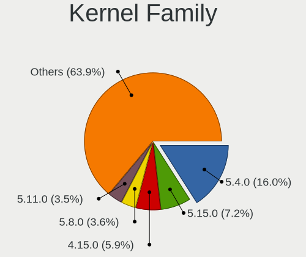
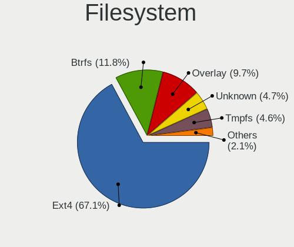
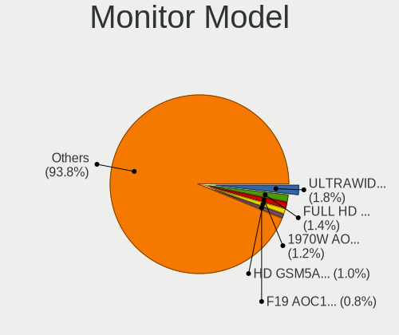
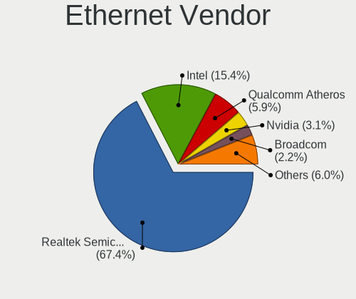
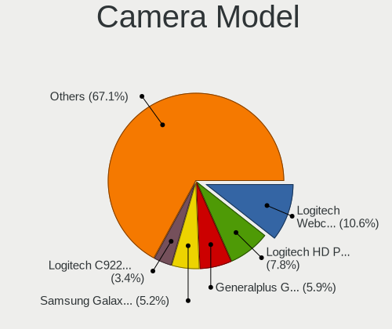

Linux in Brazil - Tested Hardware & Statistics (Desktops)
---------------------------------------------------------

A project to collect tested hardware configurations for Linux in Brazil.

Anyone can contribute to this report by the [hw-probe](https://github.com/linuxhw/hw-probe) tool:

    sudo -E hw-probe -all -upload

Please contribute! Especially if your hardware is rare.

Contents
--------

* [ Test Cases ](#test-cases)

* [ System ](#system)
  - [ OS                       ](#os)
  - [ OS Family                ](#os-family)
  - [ Kernel                   ](#kernel)
  - [ Kernel Family            ](#kernel-family)
  - [ Kernel Major Ver.        ](#kernel-major-ver)
  - [ Arch                     ](#arch)
  - [ DE                       ](#de)
  - [ Display Server           ](#display-server)
  - [ Display Manager          ](#display-manager)
  - [ OS Lang                  ](#os-lang)
  - [ Boot Mode                ](#boot-mode)
  - [ Filesystem               ](#filesystem)
  - [ Part. scheme             ](#part-scheme)
  - [ Dual Boot with Linux/BSD ](#dual-boot-with-linuxbsd)
  - [ Dual Boot (Win)          ](#dual-boot-win)

* [ Board ](#board)
  - [ Vendor                   ](#vendor)
  - [ Model                    ](#model)
  - [ Model Family             ](#model-family)
  - [ MFG Year                 ](#mfg-year)
  - [ Form Factor              ](#form-factor)
  - [ Secure Boot              ](#secure-boot)
  - [ Coreboot                 ](#coreboot)
  - [ RAM Size                 ](#ram-size)
  - [ RAM Used                 ](#ram-used)
  - [ Total Drives             ](#total-drives)
  - [ Has CD-ROM               ](#has-cd-rom)
  - [ Has Ethernet             ](#has-ethernet)
  - [ Has WiFi                 ](#has-wifi)
  - [ Has Bluetooth            ](#has-bluetooth)

* [ Location ](#location)
  - [ Country                  ](#country)
  - [ City                     ](#city)

* [ Drives ](#drives)
  - [ Drive Vendor             ](#drive-vendor)
  - [ Drive Model              ](#drive-model)
  - [ HDD Vendor               ](#hdd-vendor)
  - [ SSD Vendor               ](#ssd-vendor)
  - [ Drive Kind               ](#drive-kind)
  - [ Drive Connector          ](#drive-connector)
  - [ Drive Size               ](#drive-size)
  - [ Space Total              ](#space-total)
  - [ Space Used               ](#space-used)
  - [ Malfunc. Drives          ](#malfunc-drives)
  - [ Malfunc. Drive Vendor    ](#malfunc-drive-vendor)
  - [ Malfunc. HDD Vendor      ](#malfunc-hdd-vendor)
  - [ Malfunc. Drive Kind      ](#malfunc-drive-kind)
  - [ Failed Drives            ](#failed-drives)
  - [ Failed Drive Vendor      ](#failed-drive-vendor)
  - [ Drive Status             ](#drive-status)

* [ Storage controller ](#storage-controller)
  - [ Storage Vendor           ](#storage-vendor)
  - [ Storage Model            ](#storage-model)
  - [ Storage Kind             ](#storage-kind)

* [ Processor ](#processor)
  - [ CPU Vendor               ](#cpu-vendor)
  - [ CPU Model                ](#cpu-model)
  - [ CPU Model Family         ](#cpu-model-family)
  - [ CPU Cores                ](#cpu-cores)
  - [ CPU Sockets              ](#cpu-sockets)
  - [ CPU Threads              ](#cpu-threads)
  - [ CPU Op-Modes             ](#cpu-op-modes)
  - [ CPU Microcode            ](#cpu-microcode)
  - [ CPU Microarch            ](#cpu-microarch)

* [ Graphics ](#graphics)
  - [ GPU Vendor               ](#gpu-vendor)
  - [ GPU Model                ](#gpu-model)
  - [ GPU Combo                ](#gpu-combo)
  - [ GPU Driver               ](#gpu-driver)
  - [ GPU Memory               ](#gpu-memory)

* [ Monitor ](#monitor)
  - [ Monitor Vendor           ](#monitor-vendor)
  - [ Monitor Model            ](#monitor-model)
  - [ Monitor Resolution       ](#monitor-resolution)
  - [ Monitor Diagonal         ](#monitor-diagonal)
  - [ Monitor Width            ](#monitor-width)
  - [ Aspect Ratio             ](#aspect-ratio)
  - [ Monitor Area             ](#monitor-area)
  - [ Pixel Density            ](#pixel-density)
  - [ Multiple Monitors        ](#multiple-monitors)

* [ Network ](#network)
  - [ Net Controller Vendor    ](#net-controller-vendor)
  - [ Net Controller Model     ](#net-controller-model)
  - [ Wireless Vendor          ](#wireless-vendor)
  - [ Wireless Model           ](#wireless-model)
  - [ Ethernet Vendor          ](#ethernet-vendor)
  - [ Ethernet Model           ](#ethernet-model)
  - [ Net Controller Kind      ](#net-controller-kind)
  - [ Used Controller          ](#used-controller)
  - [ NICs                     ](#nics)
  - [ IPv6                     ](#ipv6)

* [ Bluetooth ](#bluetooth)
  - [ Bluetooth Vendor         ](#bluetooth-vendor)
  - [ Bluetooth Model          ](#bluetooth-model)

* [ Sound ](#sound)
  - [ Sound Vendor             ](#sound-vendor)
  - [ Sound Model              ](#sound-model)

* [ Memory ](#memory)
  - [ Memory Vendor            ](#memory-vendor)
  - [ Memory Model             ](#memory-model)
  - [ Memory Kind              ](#memory-kind)
  - [ Memory Form Factor       ](#memory-form-factor)
  - [ Memory Size              ](#memory-size)
  - [ Memory Speed             ](#memory-speed)

* [ Printers & scanners ](#printers--scanners)
  - [ Printer Vendor           ](#printer-vendor)
  - [ Printer Model            ](#printer-model)
  - [ Scanner Vendor           ](#scanner-vendor)
  - [ Scanner Model            ](#scanner-model)

* [ Camera ](#camera)
  - [ Camera Vendor            ](#camera-vendor)
  - [ Camera Model             ](#camera-model)

* [ Security ](#security)
  - [ Fingerprint Vendor       ](#fingerprint-vendor)
  - [ Fingerprint Model        ](#fingerprint-model)
  - [ Chipcard Vendor          ](#chipcard-vendor)
  - [ Chipcard Model           ](#chipcard-model)

* [ Unsupported ](#unsupported)
  - [ Unsupported Devices      ](#unsupported-devices)
  - [ Unsupported Device Types ](#unsupported-device-types)

Test Cases
----------

Total: 7107

| Vendor        | Model                       | Probe                                                      | Date         |
|---------------|-----------------------------|------------------------------------------------------------|--------------|
| ASRock        | A320M-HD                    | [1df7c65f40](https://linux-hardware.org/?probe=1df7c65f40) | Jul 01, 2023 |
| ZR            | A320M-F 1005                | [c32d8de777](https://linux-hardware.org/?probe=c32d8de777) | Jun 30, 2023 |
| ASUSTek       | TUF Gaming Z690-PLUS D4     | [292b7f6f0f](https://linux-hardware.org/?probe=292b7f6f0f) | Jun 30, 2023 |
| Intel         | X99 V1.x                    | [8e4ce021b1](https://linux-hardware.org/?probe=8e4ce021b1) | Jun 30, 2023 |
| Gigabyte      | H81M-S2PH                   | [69b69e2a09](https://linux-hardware.org/?probe=69b69e2a09) | Jun 30, 2023 |
| MSI           | Z390-A PRO                  | [7c3ce62039](https://linux-hardware.org/?probe=7c3ce62039) | Jun 30, 2023 |
| AZW           | SEi                         | [37527da518](https://linux-hardware.org/?probe=37527da518) | Jun 30, 2023 |
| Gigabyte      | Z77X-D3H                    | [3e1517b7a7](https://linux-hardware.org/?probe=3e1517b7a7) | Jun 30, 2023 |
| Intel         | B75                         | [73d881c953](https://linux-hardware.org/?probe=73d881c953) | Jun 30, 2023 |
| Gigabyte      | Z590 AORUS ULTRA            | [45d5903c62](https://linux-hardware.org/?probe=45d5903c62) | Jun 30, 2023 |
| Intel         | X99 V1.x                    | [1c7ef9ef35](https://linux-hardware.org/?probe=1c7ef9ef35) | Jun 29, 2023 |
| PCWare        | IPMH61R3                    | [e190259144](https://linux-hardware.org/?probe=e190259144) | Jun 29, 2023 |
| Gigabyte      | H81M-S2PH                   | [d0ec676a22](https://linux-hardware.org/?probe=d0ec676a22) | Jun 29, 2023 |
| Dell          | 0GDG8Y A00                  | [f0fdd509f7](https://linux-hardware.org/?probe=f0fdd509f7) | Jun 29, 2023 |
| Gigabyte      | A320M-S2H-CF                | [bb1cb1ef13](https://linux-hardware.org/?probe=bb1cb1ef13) | Jun 29, 2023 |
| HP            | 0B54h D                     | [c13f21ea22](https://linux-hardware.org/?probe=c13f21ea22) | Jun 29, 2023 |
| Dell          | 0T656F A02                  | [bf4264c797](https://linux-hardware.org/?probe=bf4264c797) | Jun 29, 2023 |
| MSI           | MS-7438 100                 | [4d0d23065e](https://linux-hardware.org/?probe=4d0d23065e) | Jun 29, 2023 |
| Intel         | DG41RQ AAE54511-205         | [0e896bc137](https://linux-hardware.org/?probe=0e896bc137) | Jun 29, 2023 |
| ZR            | A320M-F 1005                | [f70bb41b80](https://linux-hardware.org/?probe=f70bb41b80) | Jun 28, 2023 |
| Huanan        | Unknown                     | [397d33202e](https://linux-hardware.org/?probe=397d33202e) | Jun 28, 2023 |
| Lenovo        | NO DPK                      | [2f12ef933e](https://linux-hardware.org/?probe=2f12ef933e) | Jun 28, 2023 |
| ASRock        | B460M-HDV                   | [966b21f9af](https://linux-hardware.org/?probe=966b21f9af) | Jun 28, 2023 |
| ASRock        | H310CM-HG4                  | [8147961b6c](https://linux-hardware.org/?probe=8147961b6c) | Jun 28, 2023 |
| Fill By OE... | Q7700                       | [93c7c01ecb](https://linux-hardware.org/?probe=93c7c01ecb) | Jun 28, 2023 |
| ASUSTek       | M5A97 PLUS                  | [2faeb24e37](https://linux-hardware.org/?probe=2faeb24e37) | Jun 27, 2023 |
| Kennex        | POS-PIG41BA                 | [90addad9e1](https://linux-hardware.org/?probe=90addad9e1) | Jun 27, 2023 |
| ASRock        | H310CM-HG4                  | [16c2222f50](https://linux-hardware.org/?probe=16c2222f50) | Jun 27, 2023 |
| Gigabyte      | H310M M.2 x.x               | [6f9c836bb4](https://linux-hardware.org/?probe=6f9c836bb4) | Jun 27, 2023 |
| Fill By OE... | Q7700                       | [32ac9cb839](https://linux-hardware.org/?probe=32ac9cb839) | Jun 27, 2023 |
| Intel         | DH55TC AAE70932-206         | [9ff872e2a3](https://linux-hardware.org/?probe=9ff872e2a3) | Jun 26, 2023 |
| Positivo      | POS-PIH81DI                 | [42e304c777](https://linux-hardware.org/?probe=42e304c777) | Jun 26, 2023 |
| Positivo      | POS-PIH81DI                 | [77d2d3d01b](https://linux-hardware.org/?probe=77d2d3d01b) | Jun 26, 2023 |
| Lenovo        | 3102 NOK                    | [6277771b08](https://linux-hardware.org/?probe=6277771b08) | Jun 26, 2023 |
| ASRock        | H110M-HG4                   | [6aba51f328](https://linux-hardware.org/?probe=6aba51f328) | Jun 26, 2023 |
| Intel         | H61                         | [8013deae02](https://linux-hardware.org/?probe=8013deae02) | Jun 25, 2023 |
| Intel         | H61                         | [8af1bf1ada](https://linux-hardware.org/?probe=8af1bf1ada) | Jun 25, 2023 |
| Intel         | B75                         | [2456289bbd](https://linux-hardware.org/?probe=2456289bbd) | Jun 25, 2023 |
| Biostar       | G31M+                       | [d8347c5f07](https://linux-hardware.org/?probe=d8347c5f07) | Jun 25, 2023 |
| Intel         | X99H                        | [60f1f4a8ba](https://linux-hardware.org/?probe=60f1f4a8ba) | Jun 25, 2023 |
| HP            | 3397                        | [8d9ed6d13e](https://linux-hardware.org/?probe=8d9ed6d13e) | Jun 25, 2023 |
| Intel         | H55                         | [993c041483](https://linux-hardware.org/?probe=993c041483) | Jun 25, 2023 |
| Intel         | H61                         | [df8b50eae5](https://linux-hardware.org/?probe=df8b50eae5) | Jun 25, 2023 |
| Biostar       | TH55B HD                    | [5fbef8b11a](https://linux-hardware.org/?probe=5fbef8b11a) | Jun 25, 2023 |
| Gigabyte      | G31M-ES2L                   | [be14b80f2c](https://linux-hardware.org/?probe=be14b80f2c) | Jun 24, 2023 |
| Intel         | H61                         | [0f1d3e1299](https://linux-hardware.org/?probe=0f1d3e1299) | Jun 24, 2023 |
| Techvision    | TVI7309X B0                 | [c8fc13e942](https://linux-hardware.org/?probe=c8fc13e942) | Jun 24, 2023 |
| ASUSTek       | TUF Gaming B650M-PLUS WI... | [74b9f1b367](https://linux-hardware.org/?probe=74b9f1b367) | Jun 24, 2023 |
| Positivo      | POS-AG31AP                  | [bd3b3228c6](https://linux-hardware.org/?probe=bd3b3228c6) | Jun 24, 2023 |
| Gigabyte      | A520M S2H                   | [cc2b3ff1ad](https://linux-hardware.org/?probe=cc2b3ff1ad) | Jun 24, 2023 |
| Intel         | D946GZIS AAD66165-301       | [dac65b1c2c](https://linux-hardware.org/?probe=dac65b1c2c) | Jun 24, 2023 |
| MSI           | A320M-A PRO                 | [09b5be9c77](https://linux-hardware.org/?probe=09b5be9c77) | Jun 24, 2023 |
| PERTOSA       | GA-H110TN-M                 | [43b4160c55](https://linux-hardware.org/?probe=43b4160c55) | Jun 24, 2023 |
| ASUSTek       | TUF H310M-PLUS GAMING/BR    | [e3d196b0b5](https://linux-hardware.org/?probe=e3d196b0b5) | Jun 24, 2023 |
| Dell          | 01XK1W A00                  | [53dbc2e799](https://linux-hardware.org/?probe=53dbc2e799) | Jun 24, 2023 |
| ASUSTek       | TUF H310M-PLUS GAMING/BR    | [e5b4e8d2d4](https://linux-hardware.org/?probe=e5b4e8d2d4) | Jun 24, 2023 |
| HP            | 1495                        | [eab7d15f02](https://linux-hardware.org/?probe=eab7d15f02) | Jun 23, 2023 |
| Huanan        | X79 V6.11                   | [e94687bb6b](https://linux-hardware.org/?probe=e94687bb6b) | Jun 23, 2023 |
| ASUSTek       | PRIME B350M-A               | [efb0264470](https://linux-hardware.org/?probe=efb0264470) | Jun 23, 2023 |
| Positivo      | POS-AG31AP                  | [1dd704fab9](https://linux-hardware.org/?probe=1dd704fab9) | Jun 22, 2023 |
| ASRock        | A320M-HD                    | [761a478742](https://linux-hardware.org/?probe=761a478742) | Jun 22, 2023 |
| Gigabyte      | M68MT-S2P                   | [dda587b759](https://linux-hardware.org/?probe=dda587b759) | Jun 22, 2023 |
| Gigabyte      | B450 AORUS M                | [7d52f04870](https://linux-hardware.org/?probe=7d52f04870) | Jun 22, 2023 |
| ASRock        | B365 Pro4                   | [46dc8e10a8](https://linux-hardware.org/?probe=46dc8e10a8) | Jun 21, 2023 |
| Lenovo        | 32E1 SDK0J40697 WIN 3305... | [446992e1b5](https://linux-hardware.org/?probe=446992e1b5) | Jun 21, 2023 |
| Foxconn       | 45CMX/45GMX/45CMX-K         | [68ec70d3f8](https://linux-hardware.org/?probe=68ec70d3f8) | Jun 21, 2023 |
| Intel         | H55                         | [545c7e42b3](https://linux-hardware.org/?probe=545c7e42b3) | Jun 21, 2023 |
| HP            | 339A                        | [60b0bff872](https://linux-hardware.org/?probe=60b0bff872) | Jun 21, 2023 |
| Gigabyte      | GA-78LMT-USB3               | [6f0b6969bf](https://linux-hardware.org/?probe=6f0b6969bf) | Jun 20, 2023 |
| ASUSTek       | M5A78L-M LX/BR              | [ae2beb307a](https://linux-hardware.org/?probe=ae2beb307a) | Jun 20, 2023 |
| ASUSTek       | M5A78L-M LX/BR              | [c2c2365360](https://linux-hardware.org/?probe=c2c2365360) | Jun 20, 2023 |
| Positivo      | POS-ECIG41BSA               | [abaf6ee67e](https://linux-hardware.org/?probe=abaf6ee67e) | Jun 20, 2023 |
| Itautec       | ST 4265 ST-4265 Padrao 0... | [689b10e4be](https://linux-hardware.org/?probe=689b10e4be) | Jun 19, 2023 |
| Lenovo        | NO DPK                      | [fedcf5f651](https://linux-hardware.org/?probe=fedcf5f651) | Jun 19, 2023 |
| PCWare        | IPMH61R3                    | [256988a55a](https://linux-hardware.org/?probe=256988a55a) | Jun 18, 2023 |
| Standard      | Unknown                     | [4956d7fc21](https://linux-hardware.org/?probe=4956d7fc21) | Jun 18, 2023 |
| Biostar       | A320MH                      | [0c38427f58](https://linux-hardware.org/?probe=0c38427f58) | Jun 18, 2023 |
| ZR            | A320M-F 1005                | [e3c749da2a](https://linux-hardware.org/?probe=e3c749da2a) | Jun 18, 2023 |
| Gigabyte      | GA-78LMT-USB3               | [4bafdb9349](https://linux-hardware.org/?probe=4bafdb9349) | Jun 18, 2023 |
| Dell          | 01XK1W A00                  | [f431c0b66f](https://linux-hardware.org/?probe=f431c0b66f) | Jun 18, 2023 |
| PCWare        | IPX1800E1                   | [59b9fa6ff9](https://linux-hardware.org/?probe=59b9fa6ff9) | Jun 17, 2023 |
| ZR            | A320M-F 1005                | [c190f4fcff](https://linux-hardware.org/?probe=c190f4fcff) | Jun 17, 2023 |
| Intel         | H55                         | [d47f462b1a](https://linux-hardware.org/?probe=d47f462b1a) | Jun 17, 2023 |
| Positivo      | POS-EIQ87CY POSITIVO        | [b4cd8c843f](https://linux-hardware.org/?probe=b4cd8c843f) | Jun 17, 2023 |
| Lenovo        | 32E1 SDK0J40697 WIN 3305... | [c99587d0e0](https://linux-hardware.org/?probe=c99587d0e0) | Jun 16, 2023 |
| ASUSTek       | H61M-A/BR                   | [a587493314](https://linux-hardware.org/?probe=a587493314) | Jun 16, 2023 |
| ASUSTek       | TUF Gaming B650M-PLUS WI... | [8124f64b22](https://linux-hardware.org/?probe=8124f64b22) | Jun 16, 2023 |
| Intel         | H61                         | [ac7abe7025](https://linux-hardware.org/?probe=ac7abe7025) | Jun 16, 2023 |
| Intel         | H55                         | [76c89618f1](https://linux-hardware.org/?probe=76c89618f1) | Jun 16, 2023 |
| ASUSTek       | ROG STRIX B650E-I GAMING... | [2a3068b835](https://linux-hardware.org/?probe=2a3068b835) | Jun 16, 2023 |
| Intel         | B85                         | [1e688ea5e1](https://linux-hardware.org/?probe=1e688ea5e1) | Jun 16, 2023 |
| Positivo      | POS-EINM70CS POS            | [a2d50f27d7](https://linux-hardware.org/?probe=a2d50f27d7) | Jun 16, 2023 |
| Pegatron      | IPMIP-GS                    | [fb51893272](https://linux-hardware.org/?probe=fb51893272) | Jun 15, 2023 |
| ASUSTek       | PRIME H310M-E/BR            | [9c446242a8](https://linux-hardware.org/?probe=9c446242a8) | Jun 15, 2023 |
| Itautec       | ST 4265 ST-4265 Padrao 0... | [ecc8c7d2d0](https://linux-hardware.org/?probe=ecc8c7d2d0) | Jun 15, 2023 |
| Itautec       | ST 4265 ST-4265 Padrao 0... | [4cad282848](https://linux-hardware.org/?probe=4cad282848) | Jun 15, 2023 |
| Positivo      | POS-PIB150DT                | [cddf7d4ac9](https://linux-hardware.org/?probe=cddf7d4ac9) | Jun 15, 2023 |
| Unknown       | G41T-M7                     | [18a63d3a27](https://linux-hardware.org/?probe=18a63d3a27) | Jun 14, 2023 |
| Gigabyte      | AB350M-DS3H V2-CF           | [64da6bc381](https://linux-hardware.org/?probe=64da6bc381) | Jun 14, 2023 |
| Kllisre       | X99-B5 V1.1                 | [5e22a31b3e](https://linux-hardware.org/?probe=5e22a31b3e) | Jun 14, 2023 |
| Intel         | H61                         | [5d4fb99018](https://linux-hardware.org/?probe=5d4fb99018) | Jun 14, 2023 |
| Biostar       | B350GT3                     | [13b1026096](https://linux-hardware.org/?probe=13b1026096) | Jun 13, 2023 |
| HP            | 2AED                        | [2550c16272](https://linux-hardware.org/?probe=2550c16272) | Jun 13, 2023 |
| ASUSTek       | TUF Gaming X670E-PLUS WI... | [74b5d0e60a](https://linux-hardware.org/?probe=74b5d0e60a) | Jun 13, 2023 |
| ASUSTek       | M5A78L-M LX3 PLUS           | [2b0095133a](https://linux-hardware.org/?probe=2b0095133a) | Jun 12, 2023 |
| Intel         | X79 (INTEL Xeon E5/Corei... | [613d703a17](https://linux-hardware.org/?probe=613d703a17) | Jun 10, 2023 |
| Intel         | H81                         | [6a51c76e81](https://linux-hardware.org/?probe=6a51c76e81) | Jun 09, 2023 |
| Gigabyte      | 970A-DS3P                   | [1bae25f67b](https://linux-hardware.org/?probe=1bae25f67b) | Jun 09, 2023 |
| Gigabyte      | GA-78LMT-USB3 R2 sex        | [bcad738da6](https://linux-hardware.org/?probe=bcad738da6) | Jun 09, 2023 |
| ASUSTek       | P8H61-M LX                  | [28d0a897d3](https://linux-hardware.org/?probe=28d0a897d3) | Jun 09, 2023 |
| ASUSTek       | STRIX B250F GAMING          | [c0fd33b9cc](https://linux-hardware.org/?probe=c0fd33b9cc) | Jun 09, 2023 |
| ASUSTek       | STRIX B250F GAMING          | [76c3e6625b](https://linux-hardware.org/?probe=76c3e6625b) | Jun 09, 2023 |
| Unknown       | GSUO H61V10C                | [0daf816953](https://linux-hardware.org/?probe=0daf816953) | Jun 09, 2023 |
| ASRock        | A320M-HD                    | [9e88454384](https://linux-hardware.org/?probe=9e88454384) | Jun 09, 2023 |
| MSI           | X470 GAMING PLUS MAX        | [a8724dfd68](https://linux-hardware.org/?probe=a8724dfd68) | Jun 08, 2023 |
| Gigabyte      | H610M H DDR4                | [e7cdd7e89b](https://linux-hardware.org/?probe=e7cdd7e89b) | Jun 07, 2023 |
| DIEBOLD       | B85H3-M5                    | [7e56b1fd68](https://linux-hardware.org/?probe=7e56b1fd68) | Jun 07, 2023 |
| ASRock        | B450M Steel Legend          | [5d75bba35e](https://linux-hardware.org/?probe=5d75bba35e) | Jun 06, 2023 |
| ASRock        | H310M-HG4                   | [47b2817d31](https://linux-hardware.org/?probe=47b2817d31) | Jun 06, 2023 |
| Dell          | 0NW6H5 A00                  | [631e6bba84](https://linux-hardware.org/?probe=631e6bba84) | Jun 06, 2023 |
| Intel         | DP55WB AAE64798-204         | [fe09edbecc](https://linux-hardware.org/?probe=fe09edbecc) | Jun 06, 2023 |
| Unknown       | Unknown                     | [e8df83921f](https://linux-hardware.org/?probe=e8df83921f) | Jun 06, 2023 |
| ASUSTek       | M5A88-M                     | [bb29b433c0](https://linux-hardware.org/?probe=bb29b433c0) | Jun 05, 2023 |
| Intel         | DP965LT AAD41694-301        | [f72bcbf0a2](https://linux-hardware.org/?probe=f72bcbf0a2) | Jun 05, 2023 |
| Biostar       | B350GT3                     | [b425f8d45a](https://linux-hardware.org/?probe=b425f8d45a) | Jun 05, 2023 |
| Huanan        | X99-F8 GAMING V5.0          | [8cbfe4cdf0](https://linux-hardware.org/?probe=8cbfe4cdf0) | Jun 05, 2023 |
| ASUSTek       | PRIME B350M-A               | [3a0576b177](https://linux-hardware.org/?probe=3a0576b177) | Jun 05, 2023 |
| ASUSTek       | M5A88-M                     | [e750392f99](https://linux-hardware.org/?probe=e750392f99) | Jun 04, 2023 |
| Dell          | 09D7F7 A00                  | [9b80703b01](https://linux-hardware.org/?probe=9b80703b01) | Jun 04, 2023 |
| Gigabyte      | X570 AORUS PRO WIFI         | [f71eae78c5](https://linux-hardware.org/?probe=f71eae78c5) | Jun 04, 2023 |
| MSI           | MAG B550M MORTAR WIFI       | [aafda7cf63](https://linux-hardware.org/?probe=aafda7cf63) | Jun 04, 2023 |
| Dell          | 01XK1W A00                  | [8690705151](https://linux-hardware.org/?probe=8690705151) | Jun 04, 2023 |
| Huanan        | X99-F8 GAMING V2.0          | [8b790b76a6](https://linux-hardware.org/?probe=8b790b76a6) | Jun 03, 2023 |
| Biostar       | B450MX-S                    | [ccc6b5c4b5](https://linux-hardware.org/?probe=ccc6b5c4b5) | Jun 03, 2023 |
| Biostar       | B450MX-S                    | [6a01df1d69](https://linux-hardware.org/?probe=6a01df1d69) | Jun 03, 2023 |
| Positivo      | POS-EINM70CS POS            | [80260b495c](https://linux-hardware.org/?probe=80260b495c) | Jun 03, 2023 |
| Positivo      | POS-PIG41BA                 | [f630c0b9cd](https://linux-hardware.org/?probe=f630c0b9cd) | Jun 03, 2023 |
| Intel         | B75                         | [2387f30645](https://linux-hardware.org/?probe=2387f30645) | Jun 03, 2023 |
| Positivo      | POS-RIB360EE 11144907       | [7837922f5b](https://linux-hardware.org/?probe=7837922f5b) | Jun 02, 2023 |
| Dell          | 0GX832 A01                  | [19b718a96c](https://linux-hardware.org/?probe=19b718a96c) | Jun 02, 2023 |
| Unknown       | X99                         | [0ffca5934a](https://linux-hardware.org/?probe=0ffca5934a) | Jun 02, 2023 |
| Gigabyte      | Z590 UD AC                  | [da5b2056e4](https://linux-hardware.org/?probe=da5b2056e4) | Jun 02, 2023 |
| Positivo      | POS-RIB360EE 11144907       | [b4ba7702cb](https://linux-hardware.org/?probe=b4ba7702cb) | Jun 02, 2023 |
| Dell          | 01XK1W A00                  | [5846820609](https://linux-hardware.org/?probe=5846820609) | Jun 02, 2023 |
| ASUSTek       | PRIME X570-P                | [cde4aaef3e](https://linux-hardware.org/?probe=cde4aaef3e) | Jun 01, 2023 |
| Itautec       | ST 4265 ST-4265 Padrao 0... | [7ac5ec7c05](https://linux-hardware.org/?probe=7ac5ec7c05) | Jun 01, 2023 |
| AZW           | GTR V02                     | [bd1740c7b2](https://linux-hardware.org/?probe=bd1740c7b2) | May 31, 2023 |
| AZW           | GTR V02                     | [cab90f1838](https://linux-hardware.org/?probe=cab90f1838) | May 31, 2023 |
| Dell          | 01XK1W A00                  | [8a18b7bada](https://linux-hardware.org/?probe=8a18b7bada) | May 31, 2023 |
| Dell          | 01XK1W A00                  | [611cf59f44](https://linux-hardware.org/?probe=611cf59f44) | May 31, 2023 |
| MSI           | B450M MORTAR MAX            | [1d0c56937c](https://linux-hardware.org/?probe=1d0c56937c) | May 31, 2023 |
| ASRock        | H310CM-HG4                  | [9fa8d9d320](https://linux-hardware.org/?probe=9fa8d9d320) | May 30, 2023 |
| Lenovo        | 3098 SDK0E50510 WIN         | [2334995ee9](https://linux-hardware.org/?probe=2334995ee9) | May 30, 2023 |
| Dell          | 0GXM1W A02                  | [9c252c8688](https://linux-hardware.org/?probe=9c252c8688) | May 30, 2023 |
| Itautec       | ST 4265                     | [8814373cb4](https://linux-hardware.org/?probe=8814373cb4) | May 29, 2023 |
| ASUSTek       | TUF Gaming B650M-PLUS WI... | [e29eb3dfcc](https://linux-hardware.org/?probe=e29eb3dfcc) | May 29, 2023 |
| Itautec       | ST 4265                     | [b89c45a31d](https://linux-hardware.org/?probe=b89c45a31d) | May 29, 2023 |
| Dell          | 0NM64V A01                  | [a109a924f0](https://linux-hardware.org/?probe=a109a924f0) | May 29, 2023 |
| ASRock        | B450M Steel Legend          | [b8436530b0](https://linux-hardware.org/?probe=b8436530b0) | May 28, 2023 |
| ASUSTek       | TUF Gaming B650M-PLUS WI... | [40ba623a3e](https://linux-hardware.org/?probe=40ba623a3e) | May 28, 2023 |
| MSI           | A520M-A PRO                 | [c78b5e28f1](https://linux-hardware.org/?probe=c78b5e28f1) | May 28, 2023 |
| ASRock        | H510M-HVS R2.0              | [c4ee84b38e](https://linux-hardware.org/?probe=c4ee84b38e) | May 28, 2023 |
| Dell          | 01XK1W A00                  | [a81daffe89](https://linux-hardware.org/?probe=a81daffe89) | May 28, 2023 |
| Intel         | X99                         | [6826d78921](https://linux-hardware.org/?probe=6826d78921) | May 28, 2023 |
| Dell          | 01XK1W A00                  | [ef918dfbfa](https://linux-hardware.org/?probe=ef918dfbfa) | May 28, 2023 |
| Intel         | X58M                        | [912addab98](https://linux-hardware.org/?probe=912addab98) | May 27, 2023 |
| Intel         | DH77EB AAG39073-304         | [8310aaaa78](https://linux-hardware.org/?probe=8310aaaa78) | May 27, 2023 |
| ASUSTek       | TUF Gaming B460M-PLUS       | [ad8e3ea3ea](https://linux-hardware.org/?probe=ad8e3ea3ea) | May 27, 2023 |
| Wistron       | ProLiant ML110 G6           | [bc1c76bb8f](https://linux-hardware.org/?probe=bc1c76bb8f) | May 27, 2023 |
| Intel         | DH77EB AAG39073-304         | [86545c89c0](https://linux-hardware.org/?probe=86545c89c0) | May 27, 2023 |
| Intel         | B75                         | [8dba7fa195](https://linux-hardware.org/?probe=8dba7fa195) | May 27, 2023 |
| ASUSTek       | PRIME B450M-GAMING/BR       | [1cbedc352f](https://linux-hardware.org/?probe=1cbedc352f) | May 26, 2023 |
| ASUSTek       | P8H61-M LX3 R2.0            | [4fedff68f1](https://linux-hardware.org/?probe=4fedff68f1) | May 26, 2023 |
| Gigabyte      | B450 AORUS M                | [40af2d79f9](https://linux-hardware.org/?probe=40af2d79f9) | May 26, 2023 |
| ASUSTek       | PRIME A320M-K/BR            | [248bd35ba0](https://linux-hardware.org/?probe=248bd35ba0) | May 26, 2023 |
| ASUSTek       | H110M-C/BR                  | [1c272c65dc](https://linux-hardware.org/?probe=1c272c65dc) | May 26, 2023 |
| ASRock        | A320M-HDV R4.0              | [c897394a34](https://linux-hardware.org/?probe=c897394a34) | May 26, 2023 |
| Toshiba       | STI 005492G                 | [4f161f4ed0](https://linux-hardware.org/?probe=4f161f4ed0) | May 26, 2023 |
| ASUSTek       | TUF Gaming B560M-PLUS       | [a49bd1dd26](https://linux-hardware.org/?probe=a49bd1dd26) | May 25, 2023 |
| ASUSTek       | PRIME B450M-GAMING/BR       | [2a3382aa0c](https://linux-hardware.org/?probe=2a3382aa0c) | May 25, 2023 |
| PCWare        | IPMH110G                    | [33b6fce5ff](https://linux-hardware.org/?probe=33b6fce5ff) | May 25, 2023 |
| Biostar       | A68MHE                      | [d1ef52da36](https://linux-hardware.org/?probe=d1ef52da36) | May 25, 2023 |
| ASUSTek       | PRIME B760M-A D4            | [95321eedeb](https://linux-hardware.org/?probe=95321eedeb) | May 25, 2023 |
| Biostar       | A68MHE                      | [e2244a8ed0](https://linux-hardware.org/?probe=e2244a8ed0) | May 25, 2023 |
| ASUSTek       | PRIME B450M-GAMING/BR       | [2c31d88fa2](https://linux-hardware.org/?probe=2c31d88fa2) | May 25, 2023 |
| ASUSTek       | PRIME B450M-GAMING/BR       | [efb5aa9bfc](https://linux-hardware.org/?probe=efb5aa9bfc) | May 24, 2023 |
| ASUSTek       | PRIME H510M-E               | [1247209c34](https://linux-hardware.org/?probe=1247209c34) | May 24, 2023 |
| Biostar       | N61PB-M2S                   | [e4669affdb](https://linux-hardware.org/?probe=e4669affdb) | May 24, 2023 |
| AZW           | SEi                         | [bc0c7a512f](https://linux-hardware.org/?probe=bc0c7a512f) | May 24, 2023 |
| ASRock        | A320M-HDV R4.0              | [bce76b90ef](https://linux-hardware.org/?probe=bce76b90ef) | May 24, 2023 |
| ASUSTek       | TUF Gaming B650M-PLUS WI... | [44861be08c](https://linux-hardware.org/?probe=44861be08c) | May 24, 2023 |
| AZW           | SEi                         | [825fbaebcd](https://linux-hardware.org/?probe=825fbaebcd) | May 23, 2023 |
| ASUSTek       | B85M-E/BR                   | [ed20b84824](https://linux-hardware.org/?probe=ed20b84824) | May 23, 2023 |
| Intel         | H61                         | [794ecc6c43](https://linux-hardware.org/?probe=794ecc6c43) | May 23, 2023 |
| Gigabyte      | 970A-DS3P FX                | [9063693561](https://linux-hardware.org/?probe=9063693561) | May 23, 2023 |
| Gigabyte      | A320M-S2H-CF SE1            | [61ede8f95d](https://linux-hardware.org/?probe=61ede8f95d) | May 23, 2023 |
| Intel         | DP55WB AAE64798-205         | [91bb4c8e5d](https://linux-hardware.org/?probe=91bb4c8e5d) | May 22, 2023 |
| ASUSTek       | P8H61-M LX3 R2.0            | [2f1b921a18](https://linux-hardware.org/?probe=2f1b921a18) | May 22, 2023 |
| Gigabyte      | A320M-S2H-CF                | [7ff619a028](https://linux-hardware.org/?probe=7ff619a028) | May 21, 2023 |
| Positivo      | POS-EIQ87CY POSITIVO        | [2a95b22ac3](https://linux-hardware.org/?probe=2a95b22ac3) | May 21, 2023 |
| ASRock        | H310CM-HG4                  | [6f698f47d8](https://linux-hardware.org/?probe=6f698f47d8) | May 21, 2023 |
| Unknown       | GSUO H61V10C                | [8e1037e4c1](https://linux-hardware.org/?probe=8e1037e4c1) | May 20, 2023 |
| ASRock        | 970A-G                      | [fd39b2185b](https://linux-hardware.org/?probe=fd39b2185b) | May 20, 2023 |
| Gigabyte      | B660M AORUS PRO DDR4        | [6a3afbb593](https://linux-hardware.org/?probe=6a3afbb593) | May 20, 2023 |
| Dell          | 0VTJVC A00                  | [1acd938f30](https://linux-hardware.org/?probe=1acd938f30) | May 20, 2023 |
| ASRock        | 970A-G                      | [fac3e3c961](https://linux-hardware.org/?probe=fac3e3c961) | May 20, 2023 |
| ASRock        | A320M-HD                    | [1a05e80ee5](https://linux-hardware.org/?probe=1a05e80ee5) | May 20, 2023 |
| MSI           | X99S SLI PLUS               | [35b5231ed2](https://linux-hardware.org/?probe=35b5231ed2) | May 20, 2023 |
| Daten Tecn... | DA320MXV DC                 | [0b7e1e51b9](https://linux-hardware.org/?probe=0b7e1e51b9) | May 20, 2023 |
| ASUSTek       | PRIME A320M-K/BR            | [986792e4f0](https://linux-hardware.org/?probe=986792e4f0) | May 19, 2023 |
| ASRock        | Z590M Pro4                  | [d039ed90c5](https://linux-hardware.org/?probe=d039ed90c5) | May 19, 2023 |
| Gigabyte      | H510M H                     | [39725fefa4](https://linux-hardware.org/?probe=39725fefa4) | May 19, 2023 |
| MSI           | H110M PRO-VH PLUS           | [14985fd04f](https://linux-hardware.org/?probe=14985fd04f) | May 18, 2023 |
| Megaware      | MW-H61M-2H v1.3 - 17/07/... | [72303201a3](https://linux-hardware.org/?probe=72303201a3) | May 18, 2023 |
| PCWare        | IPX1800E2                   | [f19d94af88](https://linux-hardware.org/?probe=f19d94af88) | May 18, 2023 |
| PCWare        | IPX1800E2                   | [a75df73ade](https://linux-hardware.org/?probe=a75df73ade) | May 18, 2023 |
| ASUSTek       | TUF Gaming X570-PLUS_BR     | [be46da6480](https://linux-hardware.org/?probe=be46da6480) | May 18, 2023 |
| ASUSTek       | H81M-A/BR                   | [0982e8a637](https://linux-hardware.org/?probe=0982e8a637) | May 17, 2023 |
| ASUSTek       | P7H55D-M PRO                | [2c423cf3e9](https://linux-hardware.org/?probe=2c423cf3e9) | May 17, 2023 |
| Pegatron      | Yangtze                     | [4e3ce38e7b](https://linux-hardware.org/?probe=4e3ce38e7b) | May 17, 2023 |
| ASUSTek       | P7H55D-M PRO                | [dc1bf86813](https://linux-hardware.org/?probe=dc1bf86813) | May 17, 2023 |
| ASUSTek       | TUF B450M-PRO GAMING        | [dc2f3b9cdc](https://linux-hardware.org/?probe=dc2f3b9cdc) | May 17, 2023 |
| Intel         | DG41WV AAE90316-101         | [9bef3b952d](https://linux-hardware.org/?probe=9bef3b952d) | May 16, 2023 |
| Intel         | X79 (INTEL Xeon E5/Corei... | [9dd2c4cbee](https://linux-hardware.org/?probe=9dd2c4cbee) | May 16, 2023 |
| Intel         | X79 (INTEL Xeon E5/Corei... | [dfc49eb820](https://linux-hardware.org/?probe=dfc49eb820) | May 16, 2023 |
| Gigabyte      | GA-78LMT-S2P                | [3f5bade9b8](https://linux-hardware.org/?probe=3f5bade9b8) | May 16, 2023 |
| Intel         | H61                         | [c54c89a4b1](https://linux-hardware.org/?probe=c54c89a4b1) | May 16, 2023 |
| Huanan        | X99-F8 GAMING V5.0          | [377fe6aa67](https://linux-hardware.org/?probe=377fe6aa67) | May 16, 2023 |
| Gigabyte      | 970A-DS3P FX                | [b25434cdf3](https://linux-hardware.org/?probe=b25434cdf3) | May 15, 2023 |
| ASUSTek       | Z97M-PLUS/BR                | [dc06cb0aba](https://linux-hardware.org/?probe=dc06cb0aba) | May 15, 2023 |
| Gigabyte      | Z170X-UD5-CF                | [429dc207a6](https://linux-hardware.org/?probe=429dc207a6) | May 15, 2023 |
| Gigabyte      | Z170X-UD5-CF                | [f887e6f037](https://linux-hardware.org/?probe=f887e6f037) | May 15, 2023 |
| Dell          | 024JD7 A00                  | [904e4e2a0d](https://linux-hardware.org/?probe=904e4e2a0d) | May 15, 2023 |
| ASUSTek       | M5A78L-M LX/BR              | [58f493d242](https://linux-hardware.org/?probe=58f493d242) | May 15, 2023 |
| Gigabyte      | 970A-DS3P FX                | [7fe35591e7](https://linux-hardware.org/?probe=7fe35591e7) | May 14, 2023 |
| ASUSTek       | PRIME B350-PLUS             | [38b6dd7b3f](https://linux-hardware.org/?probe=38b6dd7b3f) | May 14, 2023 |
| ASUSTek       | M5A78L-M LX/BR              | [65374a707a](https://linux-hardware.org/?probe=65374a707a) | May 14, 2023 |
| Gigabyte      | 970A-DS3P FX                | [4e208c9155](https://linux-hardware.org/?probe=4e208c9155) | May 14, 2023 |
| Intel         | X79F1 V2.0                  | [a2446b63b3](https://linux-hardware.org/?probe=a2446b63b3) | May 14, 2023 |
| Intel         | H61 V1.1                    | [f5cbf650c3](https://linux-hardware.org/?probe=f5cbf650c3) | May 14, 2023 |
| Daten Tecn... | DH110MXV                    | [4fd655c0aa](https://linux-hardware.org/?probe=4fd655c0aa) | May 13, 2023 |
| Huanan        | X99-F8 GAMING V5.0          | [2c03c64f49](https://linux-hardware.org/?probe=2c03c64f49) | May 13, 2023 |
| Huanan        | X99-F8 GAMING V5.0          | [e5dbe4c6f4](https://linux-hardware.org/?probe=e5dbe4c6f4) | May 13, 2023 |
| Intel         | B75                         | [da0a89cf17](https://linux-hardware.org/?probe=da0a89cf17) | May 13, 2023 |
| Dell          | 01XK1W A00                  | [b15a6ee63f](https://linux-hardware.org/?probe=b15a6ee63f) | May 13, 2023 |
| Toshiba       | STI 007567                  | [579ec5bb2b](https://linux-hardware.org/?probe=579ec5bb2b) | May 13, 2023 |
| Gigabyte      | B450M AORUS ELITE           | [3a0e10e849](https://linux-hardware.org/?probe=3a0e10e849) | May 12, 2023 |
| Huanan        | B75 V10.1 376               | [3293d10187](https://linux-hardware.org/?probe=3293d10187) | May 12, 2023 |
| Gigabyte      | GA-78LMT-S2P                | [7b966568cc](https://linux-hardware.org/?probe=7b966568cc) | May 12, 2023 |
| Biostar       | A320MH                      | [d30baf9379](https://linux-hardware.org/?probe=d30baf9379) | May 12, 2023 |
| MSI           | H61M-P20/W8                 | [b727300be6](https://linux-hardware.org/?probe=b727300be6) | May 11, 2023 |
| Huanan        | B75 V10.1 376               | [3c8b5aefd8](https://linux-hardware.org/?probe=3c8b5aefd8) | May 11, 2023 |
| Gigabyte      | H61M-S1                     | [db910d4ee1](https://linux-hardware.org/?probe=db910d4ee1) | May 11, 2023 |
| Gigabyte      | B75M-D3H                    | [dbf711a2f5](https://linux-hardware.org/?probe=dbf711a2f5) | May 11, 2023 |
| ASUSTek       | TUF Gaming A520M-PLUS II    | [3cccf183d9](https://linux-hardware.org/?probe=3cccf183d9) | May 11, 2023 |
| ASUSTek       | PRIME B450M-GAMING/BR       | [1b0cd4f3e1](https://linux-hardware.org/?probe=1b0cd4f3e1) | May 11, 2023 |
| Dell          | 076VHM A02                  | [7f1984ec16](https://linux-hardware.org/?probe=7f1984ec16) | May 10, 2023 |
| Dell          | 0GDG8Y A00                  | [e9e13fa531](https://linux-hardware.org/?probe=e9e13fa531) | May 10, 2023 |
| ASRock        | H110M-HG4                   | [7995d3740a](https://linux-hardware.org/?probe=7995d3740a) | May 10, 2023 |
| Gigabyte      | GA-78LMT-USB3 x.x           | [cb4250603d](https://linux-hardware.org/?probe=cb4250603d) | May 10, 2023 |
| ASRock        | H110M-HG4                   | [2864ff8227](https://linux-hardware.org/?probe=2864ff8227) | May 10, 2023 |
| HP            | 0A60h                       | [972820a864](https://linux-hardware.org/?probe=972820a864) | May 10, 2023 |
| ASRock        | N68-S3 FX                   | [0ed94fe810](https://linux-hardware.org/?probe=0ed94fe810) | May 10, 2023 |
| ASUSTek       | PRIME A320M-K/BR            | [6ddb2fa975](https://linux-hardware.org/?probe=6ddb2fa975) | May 10, 2023 |
| ASUSTek       | PRIME A320M-K/BR            | [16bdfe6490](https://linux-hardware.org/?probe=16bdfe6490) | May 10, 2023 |
| Dell          | 0D883F A06                  | [18afa7a07b](https://linux-hardware.org/?probe=18afa7a07b) | May 10, 2023 |
| Dell          | 0VXN67 A01                  | [0985b52dee](https://linux-hardware.org/?probe=0985b52dee) | May 09, 2023 |
| Dell          | 0VXN67 A01                  | [b7fd2a3e2f](https://linux-hardware.org/?probe=b7fd2a3e2f) | May 09, 2023 |
| ASRock        | H310CM-HG4                  | [756ed502db](https://linux-hardware.org/?probe=756ed502db) | May 09, 2023 |
| Gigabyte      | GA-78LMT-S2                 | [631317f909](https://linux-hardware.org/?probe=631317f909) | May 08, 2023 |
| Gigabyte      | F2A68HM-H                   | [97986b63ad](https://linux-hardware.org/?probe=97986b63ad) | May 08, 2023 |
| Gigabyte      | G41MT-S2                    | [0458d9f44b](https://linux-hardware.org/?probe=0458d9f44b) | May 08, 2023 |
| Unknown       | Unknown                     | [68e1c1b5a4](https://linux-hardware.org/?probe=68e1c1b5a4) | May 07, 2023 |
| ASUSTek       | M4N68T-M LE                 | [0c3f2af7ad](https://linux-hardware.org/?probe=0c3f2af7ad) | May 07, 2023 |
| Intel         | H61                         | [c359f42a22](https://linux-hardware.org/?probe=c359f42a22) | May 07, 2023 |
| Intel         | D946GZIS AAD66165-301       | [c350f5ed12](https://linux-hardware.org/?probe=c350f5ed12) | May 06, 2023 |
| Lenovo        | NO DPK                      | [15e77c1f0a](https://linux-hardware.org/?probe=15e77c1f0a) | May 06, 2023 |
| Positivo      | POS-EIQ87CY POSITIVO        | [812ae9a763](https://linux-hardware.org/?probe=812ae9a763) | May 06, 2023 |
| Gigabyte      | GA-970A-UD3                 | [05c9e752a5](https://linux-hardware.org/?probe=05c9e752a5) | May 06, 2023 |
| HP            | 1998                        | [59c2c05cdb](https://linux-hardware.org/?probe=59c2c05cdb) | May 05, 2023 |
| Biostar       | G41D3C                      | [15680367e1](https://linux-hardware.org/?probe=15680367e1) | May 05, 2023 |
| ASRock        | A320M-HDV R4.0              | [d27392828f](https://linux-hardware.org/?probe=d27392828f) | May 05, 2023 |
| ASRock        | H81M-HG4 R4.0               | [cc6641b5d9](https://linux-hardware.org/?probe=cc6641b5d9) | May 04, 2023 |
| Unknown       | Unknown                     | [93a11302fb](https://linux-hardware.org/?probe=93a11302fb) | May 03, 2023 |
| MSI           | MEG Z390 GODLIKE            | [89a9759dfb](https://linux-hardware.org/?probe=89a9759dfb) | May 03, 2023 |
| Gigabyte      | B560M AORUS ELITE           | [f4678817a9](https://linux-hardware.org/?probe=f4678817a9) | May 03, 2023 |
| HP            | 83E2                        | [7facfe6465](https://linux-hardware.org/?probe=7facfe6465) | May 02, 2023 |
| Gigabyte      | Z170X-Gaming 7              | [d817c9a53f](https://linux-hardware.org/?probe=d817c9a53f) | May 02, 2023 |
| Gigabyte      | Z170X-Gaming 7              | [a14544f923](https://linux-hardware.org/?probe=a14544f923) | May 02, 2023 |
| Unknown       | Phitronics N68C-M           | [77747ce79b](https://linux-hardware.org/?probe=77747ce79b) | May 02, 2023 |
| ASUSTek       | PRIME A520M-E               | [f149f8c9fb](https://linux-hardware.org/?probe=f149f8c9fb) | May 02, 2023 |
| Apple         | Mac-F4208DC8 PVT            | [16cac427e3](https://linux-hardware.org/?probe=16cac427e3) | May 02, 2023 |
| Apple         | Mac-F4208DC8 PVT            | [45f6915427](https://linux-hardware.org/?probe=45f6915427) | May 02, 2023 |
| ASUSTek       | M5A78L-M LX3 PLUS           | [a41adc3f79](https://linux-hardware.org/?probe=a41adc3f79) | May 02, 2023 |
| Intel         | H61                         | [aa4606c36c](https://linux-hardware.org/?probe=aa4606c36c) | May 02, 2023 |
| Intel         | D946GZIS AAD66165-301       | [e61e22863f](https://linux-hardware.org/?probe=e61e22863f) | May 02, 2023 |
| MSI           | MEG Z390 GODLIKE            | [9ff86ca1f1](https://linux-hardware.org/?probe=9ff86ca1f1) | May 01, 2023 |
| Intel         | H55                         | [04dd5e834e](https://linux-hardware.org/?probe=04dd5e834e) | May 01, 2023 |
| Daten Tecn... | DH110MXV                    | [96402fa64a](https://linux-hardware.org/?probe=96402fa64a) | May 01, 2023 |
| Lenovo        | NO DPK                      | [6997ff96eb](https://linux-hardware.org/?probe=6997ff96eb) | May 01, 2023 |
| MSI           | A520M-A PRO                 | [aa8e8397f6](https://linux-hardware.org/?probe=aa8e8397f6) | May 01, 2023 |
| PCWare        | IPMH410E                    | [9be4314a33](https://linux-hardware.org/?probe=9be4314a33) | May 01, 2023 |
| DIEBOLD       | NM70-I                      | [c01a40d58c](https://linux-hardware.org/?probe=c01a40d58c) | Apr 30, 2023 |
| ASRock        | B550M Steel Legend          | [68d85dd28f](https://linux-hardware.org/?probe=68d85dd28f) | Apr 30, 2023 |
| ASRock        | B550M Steel Legend          | [5166f820a6](https://linux-hardware.org/?probe=5166f820a6) | Apr 30, 2023 |
| ASRock        | 760GM-HD                    | [db79e93331](https://linux-hardware.org/?probe=db79e93331) | Apr 30, 2023 |
| MSI           | MEG Z390 GODLIKE            | [9109b0a7ed](https://linux-hardware.org/?probe=9109b0a7ed) | Apr 30, 2023 |
| Positivo      | POS-EIQ87CY POSITIVO        | [2e2b57b3ae](https://linux-hardware.org/?probe=2e2b57b3ae) | Apr 30, 2023 |
| ASRock        | B450M Steel Legend          | [fed083feba](https://linux-hardware.org/?probe=fed083feba) | Apr 30, 2023 |
| Intel         | H61                         | [167616bc61](https://linux-hardware.org/?probe=167616bc61) | Apr 30, 2023 |
| Intel         | H81                         | [c70b10516b](https://linux-hardware.org/?probe=c70b10516b) | Apr 30, 2023 |
| ASUSTek       | PRIME H410M-E               | [44a08af32f](https://linux-hardware.org/?probe=44a08af32f) | Apr 29, 2023 |
| ASUSTek       | H81M-C/BR                   | [32942be783](https://linux-hardware.org/?probe=32942be783) | Apr 29, 2023 |
| Gigabyte      | G41MT-S2                    | [ba5c65f4e3](https://linux-hardware.org/?probe=ba5c65f4e3) | Apr 29, 2023 |
| ASUSTek       | P8H61-M LE/BR               | [425f1a3e08](https://linux-hardware.org/?probe=425f1a3e08) | Apr 29, 2023 |
| Gigabyte      | GA-78LMT-S2                 | [16b28befee](https://linux-hardware.org/?probe=16b28befee) | Apr 28, 2023 |
| ASRock        | A320M-HD                    | [43b57e5088](https://linux-hardware.org/?probe=43b57e5088) | Apr 28, 2023 |
| HP            | 158B                        | [ee0297b0ba](https://linux-hardware.org/?probe=ee0297b0ba) | Apr 28, 2023 |
| Intel         | H61 V124                    | [1fa0b34b3c](https://linux-hardware.org/?probe=1fa0b34b3c) | Apr 28, 2023 |
| Lenovo        | NO DPK                      | [d3442220b0](https://linux-hardware.org/?probe=d3442220b0) | Apr 28, 2023 |
| Intel         | H61                         | [b8f0acdf61](https://linux-hardware.org/?probe=b8f0acdf61) | Apr 28, 2023 |
| ASUSTek       | Z97M-PLUS/BR                | [3255acf414](https://linux-hardware.org/?probe=3255acf414) | Apr 27, 2023 |
| ASUSTek       | TUF Gaming B450M-PLUS II    | [9211d42ee3](https://linux-hardware.org/?probe=9211d42ee3) | Apr 27, 2023 |
| HP            | 3047h                       | [3e6dada8a9](https://linux-hardware.org/?probe=3e6dada8a9) | Apr 26, 2023 |
| Pegatron      | IPM41-D3                    | [faf8704eb3](https://linux-hardware.org/?probe=faf8704eb3) | Apr 26, 2023 |
| MSI           | MAG B550M MORTAR            | [f91ac46cfd](https://linux-hardware.org/?probe=f91ac46cfd) | Apr 26, 2023 |
| ASUSTek       | TUF Gaming Z690-PLUS D4     | [8f417742d1](https://linux-hardware.org/?probe=8f417742d1) | Apr 26, 2023 |
| Biostar       | H610MH                      | [935928c60d](https://linux-hardware.org/?probe=935928c60d) | Apr 26, 2023 |
| Gigabyte      | B550M DS3H                  | [208a0fc365](https://linux-hardware.org/?probe=208a0fc365) | Apr 26, 2023 |
| Intel         | B75                         | [72a3677ac2](https://linux-hardware.org/?probe=72a3677ac2) | Apr 26, 2023 |
| ASUSTek       | PRIME H610M-A D4            | [a7e77375d4](https://linux-hardware.org/?probe=a7e77375d4) | Apr 26, 2023 |
| Intel         | H81                         | [9a14132581](https://linux-hardware.org/?probe=9a14132581) | Apr 26, 2023 |
| ASRock        | AB350M-HDV                  | [44ac797451](https://linux-hardware.org/?probe=44ac797451) | Apr 25, 2023 |
| Biostar       | B450MX-S                    | [5ac7debff3](https://linux-hardware.org/?probe=5ac7debff3) | Apr 25, 2023 |
| Gigabyte      | H87-D3H-CF                  | [b3a3115f0c](https://linux-hardware.org/?probe=b3a3115f0c) | Apr 25, 2023 |
| OEM           | HN B85 Ver:1.4              | [1da5934b27](https://linux-hardware.org/?probe=1da5934b27) | Apr 25, 2023 |
| Lenovo        | SHARKBAY 0B98401 PRO        | [342918aa38](https://linux-hardware.org/?probe=342918aa38) | Apr 24, 2023 |
| AMD           | Inagua CRB                  | [085d0aa051](https://linux-hardware.org/?probe=085d0aa051) | Apr 24, 2023 |
| Gigabyte      | GA-78LMT-USB3               | [9bab79728a](https://linux-hardware.org/?probe=9bab79728a) | Apr 24, 2023 |
| Intel         | D946GZIS AAD66165-301       | [9d5ada0fc4](https://linux-hardware.org/?probe=9d5ada0fc4) | Apr 24, 2023 |
| Dell          | 0VTJVC A00                  | [da7d66917d](https://linux-hardware.org/?probe=da7d66917d) | Apr 24, 2023 |
| Gigabyte      | G41MT-S2                    | [de1981f9e6](https://linux-hardware.org/?probe=de1981f9e6) | Apr 24, 2023 |
| Huanan        | X99-8M-F V1.1               | [0621d00b73](https://linux-hardware.org/?probe=0621d00b73) | Apr 24, 2023 |
| Biostar       | B350ET2                     | [47289e48eb](https://linux-hardware.org/?probe=47289e48eb) | Apr 23, 2023 |
| ASUSTek       | AM1M-A/BR                   | [0b29ee62f9](https://linux-hardware.org/?probe=0b29ee62f9) | Apr 23, 2023 |
| ASUSTek       | M5A78L-M LX/BR              | [0e85243397](https://linux-hardware.org/?probe=0e85243397) | Apr 23, 2023 |
| HP            | 18E7                        | [c5bc4d9c7f](https://linux-hardware.org/?probe=c5bc4d9c7f) | Apr 23, 2023 |
| MACHINIST     | E5-MR9A PRO V1.1            | [eebce73217](https://linux-hardware.org/?probe=eebce73217) | Apr 23, 2023 |
| ASUSTek       | H81M-C/BR                   | [46a27a7551](https://linux-hardware.org/?probe=46a27a7551) | Apr 23, 2023 |
| Gigabyte      | GA-78LMT-S2P                | [793e094165](https://linux-hardware.org/?probe=793e094165) | Apr 23, 2023 |
| Pegatron      | IPMH61P1                    | [b71d5b1a48](https://linux-hardware.org/?probe=b71d5b1a48) | Apr 23, 2023 |
| Unknown       | G41                         | [cbe978cc34](https://linux-hardware.org/?probe=cbe978cc34) | Apr 23, 2023 |
| Gigabyte      | VM900M Rev2.0               | [284ada7211](https://linux-hardware.org/?probe=284ada7211) | Apr 23, 2023 |
| PCWare        | IPX1800G2                   | [f63cf0fe51](https://linux-hardware.org/?probe=f63cf0fe51) | Apr 23, 2023 |
| ASUSTek       | TUF Gaming B550M-PLUS       | [1b475eaa99](https://linux-hardware.org/?probe=1b475eaa99) | Apr 23, 2023 |
| ASUSTek       | ROG STRIX X570-E GAMING ... | [dfb9f87dad](https://linux-hardware.org/?probe=dfb9f87dad) | Apr 22, 2023 |
| Gigabyte      | B560M AORUS ELITE           | [ea8fb664a3](https://linux-hardware.org/?probe=ea8fb664a3) | Apr 22, 2023 |
| ASRock        | H310CM-HG4                  | [6f49f4b883](https://linux-hardware.org/?probe=6f49f4b883) | Apr 21, 2023 |
| ASRock        | H510M-HVS R2.0              | [1de5b776a3](https://linux-hardware.org/?probe=1de5b776a3) | Apr 21, 2023 |
| Dell          | 0GDG8Y A00                  | [a315eaa776](https://linux-hardware.org/?probe=a315eaa776) | Apr 21, 2023 |
| MSI           | 970 GAMING                  | [cb295448b6](https://linux-hardware.org/?probe=cb295448b6) | Apr 21, 2023 |
| ASUSTek       | M5A78L-M PLUS/USB3          | [5f1a1c6abd](https://linux-hardware.org/?probe=5f1a1c6abd) | Apr 20, 2023 |
| Gigabyte      | G31M-S2C                    | [0c45fc6929](https://linux-hardware.org/?probe=0c45fc6929) | Apr 20, 2023 |
| ASRock        | FM2A68M-DG3+                | [f8519c5a20](https://linux-hardware.org/?probe=f8519c5a20) | Apr 20, 2023 |
| Intel         | H61S                        | [e29d71587a](https://linux-hardware.org/?probe=e29d71587a) | Apr 20, 2023 |
| ASRock        | FM2A68M-DG3+                | [701110cf4e](https://linux-hardware.org/?probe=701110cf4e) | Apr 19, 2023 |
| ASUSTek       | PRIME B250M-PLUS/BR         | [c0a82bb35a](https://linux-hardware.org/?probe=c0a82bb35a) | Apr 19, 2023 |
| Intel         | X79M-S                      | [0c51f5a0e0](https://linux-hardware.org/?probe=0c51f5a0e0) | Apr 19, 2023 |
| ASUSTek       | PRIME B250M-PLUS/BR         | [8bb9dc2419](https://linux-hardware.org/?probe=8bb9dc2419) | Apr 18, 2023 |
| AMD           | Inagua CRB                  | [8d2ce37fca](https://linux-hardware.org/?probe=8d2ce37fca) | Apr 18, 2023 |
| Dell          | 08NPPY A00                  | [7fcc7d1b34](https://linux-hardware.org/?probe=7fcc7d1b34) | Apr 18, 2023 |
| Gigabyte      | B550I AORUS PRO AX          | [bbbc9206b4](https://linux-hardware.org/?probe=bbbc9206b4) | Apr 17, 2023 |
| Intel         | B75                         | [18dce6805d](https://linux-hardware.org/?probe=18dce6805d) | Apr 15, 2023 |
| AMD           | A88F2EKS                    | [48cef621bd](https://linux-hardware.org/?probe=48cef621bd) | Apr 15, 2023 |
| ASUSTek       | M4A785TD-M EVO              | [dd2d3443a9](https://linux-hardware.org/?probe=dd2d3443a9) | Apr 15, 2023 |
| Lenovo        | ThinkCentre M58p 6234CZ6    | [e412c388d8](https://linux-hardware.org/?probe=e412c388d8) | Apr 15, 2023 |
| QIYIDA        | X99-H9 V2.0                 | [fcfa1ed488](https://linux-hardware.org/?probe=fcfa1ed488) | Apr 14, 2023 |
| ASRock        | B550M Pro4                  | [ec08193576](https://linux-hardware.org/?probe=ec08193576) | Apr 14, 2023 |
| Gigabyte      | 970A-DS3P                   | [e2f136f068](https://linux-hardware.org/?probe=e2f136f068) | Apr 14, 2023 |
| PCWare        | IPMH61R3                    | [776a2824c5](https://linux-hardware.org/?probe=776a2824c5) | Apr 14, 2023 |
| OEM           | H110                        | [60e8c50cdd](https://linux-hardware.org/?probe=60e8c50cdd) | Apr 14, 2023 |
| ASUSTek       | Maximus IX APEX             | [f4a7db0c2a](https://linux-hardware.org/?probe=f4a7db0c2a) | Apr 14, 2023 |
| HP            | 1589                        | [b5309b9a82](https://linux-hardware.org/?probe=b5309b9a82) | Apr 14, 2023 |
| Gigabyte      | GA-78LMT-USB3               | [4267100894](https://linux-hardware.org/?probe=4267100894) | Apr 13, 2023 |
| ASUSTek       | TUF Gaming X570-PLUS_BR     | [5e9f89e556](https://linux-hardware.org/?probe=5e9f89e556) | Apr 13, 2023 |
| ASUSTek       | PRIME B450M-GAMING/BR       | [89a7f8f7e7](https://linux-hardware.org/?probe=89a7f8f7e7) | Apr 13, 2023 |
| ASUSTek       | TUF Gaming B550M-E WIFI     | [d72e78c1b0](https://linux-hardware.org/?probe=d72e78c1b0) | Apr 13, 2023 |
| OEM           | Intel H81                   | [1a73452d73](https://linux-hardware.org/?probe=1a73452d73) | Apr 13, 2023 |
| Intel         | H61 V1.1                    | [1b97e4ffc5](https://linux-hardware.org/?probe=1b97e4ffc5) | Apr 12, 2023 |
| Intel         | H61 V1.1                    | [402a94b1c0](https://linux-hardware.org/?probe=402a94b1c0) | Apr 12, 2023 |
| Win elemen... | M600                        | [4268d36ca4](https://linux-hardware.org/?probe=4268d36ca4) | Apr 12, 2023 |
| ASUSTek       | TUF Gaming Z690-PLUS D4     | [065d244d4b](https://linux-hardware.org/?probe=065d244d4b) | Apr 12, 2023 |
| Intel         | H61 V124                    | [28b73b97b3](https://linux-hardware.org/?probe=28b73b97b3) | Apr 12, 2023 |
| Dell          | 01XK1W A00                  | [4eb8c9f372](https://linux-hardware.org/?probe=4eb8c9f372) | Apr 12, 2023 |
| Daten Tecn... | DH110MXV                    | [6a1c34f539](https://linux-hardware.org/?probe=6a1c34f539) | Apr 12, 2023 |
| ABIT          | NF-M2S                      | [30e3a2e8c4](https://linux-hardware.org/?probe=30e3a2e8c4) | Apr 11, 2023 |
| ASUSTek       | P5LD2-X/1333                | [e0e655f63c](https://linux-hardware.org/?probe=e0e655f63c) | Apr 11, 2023 |
| ECS           | H61H2-M12                   | [f3e8f5eb22](https://linux-hardware.org/?probe=f3e8f5eb22) | Apr 10, 2023 |
| Biostar       | A320MH                      | [a2aef00c0c](https://linux-hardware.org/?probe=a2aef00c0c) | Apr 09, 2023 |
| Gigabyte      | F2A68HM-H                   | [249b3e78ed](https://linux-hardware.org/?probe=249b3e78ed) | Apr 09, 2023 |
| Intel         | H61 V1.1                    | [1c3cfd94a3](https://linux-hardware.org/?probe=1c3cfd94a3) | Apr 09, 2023 |
| Gigabyte      | F2A68HM-H                   | [8d36d0bfeb](https://linux-hardware.org/?probe=8d36d0bfeb) | Apr 09, 2023 |
| Intel         | H61 V1.1                    | [e553db41a3](https://linux-hardware.org/?probe=e553db41a3) | Apr 08, 2023 |
| ASUSTek       | A68HM-K                     | [55d971a67f](https://linux-hardware.org/?probe=55d971a67f) | Apr 08, 2023 |
| OEM           | X99-Turbo                   | [52723223af](https://linux-hardware.org/?probe=52723223af) | Apr 08, 2023 |
| Biostar       | A520MH                      | [9cf296886b](https://linux-hardware.org/?probe=9cf296886b) | Apr 07, 2023 |
| Dell          | 01XK1W A00                  | [023a578b76](https://linux-hardware.org/?probe=023a578b76) | Apr 07, 2023 |
| ASUSTek       | B85M-E/BR                   | [66efb7f634](https://linux-hardware.org/?probe=66efb7f634) | Apr 07, 2023 |
| HP            | 0B54h D                     | [59e9cd0741](https://linux-hardware.org/?probe=59e9cd0741) | Apr 06, 2023 |
| Dell          | 0C2KJT A00                  | [1f006c081e](https://linux-hardware.org/?probe=1f006c081e) | Apr 06, 2023 |
| Intel         | X99H                        | [b91cbf41c0](https://linux-hardware.org/?probe=b91cbf41c0) | Apr 06, 2023 |
| Biostar       | N68S3B                      | [3b25aad650](https://linux-hardware.org/?probe=3b25aad650) | Apr 05, 2023 |
| Gigabyte      | H87M-D3H                    | [b9c169025d](https://linux-hardware.org/?probe=b9c169025d) | Apr 05, 2023 |
| ASUSTek       | TUF Gaming B460M-PLUS       | [5f9965b18e](https://linux-hardware.org/?probe=5f9965b18e) | Apr 05, 2023 |
| MSI           | MS-7529                     | [2c6cdf6397](https://linux-hardware.org/?probe=2c6cdf6397) | Apr 04, 2023 |
| ASUSTek       | PRIME A320M-C R2.0          | [70b2a73996](https://linux-hardware.org/?probe=70b2a73996) | Apr 04, 2023 |
| Intel         | B75                         | [8d116f68cf](https://linux-hardware.org/?probe=8d116f68cf) | Apr 04, 2023 |
| Dell          | 07PR60 A02                  | [c41c1c9ead](https://linux-hardware.org/?probe=c41c1c9ead) | Apr 04, 2023 |
| Itautec       | ST 4265 ST-4265 Padrao 0... | [26e8d46d94](https://linux-hardware.org/?probe=26e8d46d94) | Apr 03, 2023 |
| Intel         | DZ87KLT75K AAG74721-304     | [4f97ce0a4b](https://linux-hardware.org/?probe=4f97ce0a4b) | Apr 03, 2023 |
| Gigabyte      | H110M-S2H DDR3-CF           | [22cc49b906](https://linux-hardware.org/?probe=22cc49b906) | Apr 03, 2023 |
| Gigabyte      | B460M AORUS PRO             | [72dc18dacb](https://linux-hardware.org/?probe=72dc18dacb) | Apr 03, 2023 |
| ASUSTek       | PRIME B450M-GAMING/BR       | [65668a06ad](https://linux-hardware.org/?probe=65668a06ad) | Apr 03, 2023 |
| Gigabyte      | H110M-S2H DDR3-CF           | [f0de4366f7](https://linux-hardware.org/?probe=f0de4366f7) | Apr 03, 2023 |
| MSI           | MEG Z390 GODLIKE            | [d447871547](https://linux-hardware.org/?probe=d447871547) | Apr 03, 2023 |
| ASUSTek       | P8H61-M LX3 R2.0            | [e3845b9610](https://linux-hardware.org/?probe=e3845b9610) | Apr 02, 2023 |
| Lenovo        | 30D0 SDK0J40705 WIN 3425... | [6bac6aa095](https://linux-hardware.org/?probe=6bac6aa095) | Apr 02, 2023 |
| Gigabyte      | B460M AORUS PRO             | [12647b9601](https://linux-hardware.org/?probe=12647b9601) | Apr 02, 2023 |
| ULTRATOP      | C2017-LIVA-ZE               | [96d0c389b8](https://linux-hardware.org/?probe=96d0c389b8) | Apr 02, 2023 |
| Intel         | B75                         | [caad7f240a](https://linux-hardware.org/?probe=caad7f240a) | Apr 02, 2023 |
| HOUTER        | IPMIP-GS                    | [4ef0c7aaaa](https://linux-hardware.org/?probe=4ef0c7aaaa) | Apr 02, 2023 |
| ASRock        | FM2A68M-HD+ R2.0            | [b2051ee32b](https://linux-hardware.org/?probe=b2051ee32b) | Apr 02, 2023 |
| Lenovo        | 3102 NOK                    | [3707e05f16](https://linux-hardware.org/?probe=3707e05f16) | Apr 01, 2023 |
| Unknown       | Unknown                     | [089fc02d40](https://linux-hardware.org/?probe=089fc02d40) | Apr 01, 2023 |
| Gigabyte      | H410M DS2V                  | [67b081e859](https://linux-hardware.org/?probe=67b081e859) | Apr 01, 2023 |
| ASUSTek       | M5A97 EVO R2.0              | [3f218796ae](https://linux-hardware.org/?probe=3f218796ae) | Apr 01, 2023 |
| Gigabyte      | B560M AORUS ELITE           | [ee536703f8](https://linux-hardware.org/?probe=ee536703f8) | Apr 01, 2023 |
| MSI           | B450M PRO-M2 MAX            | [5a83c18a3e](https://linux-hardware.org/?probe=5a83c18a3e) | Apr 01, 2023 |
| MSI           | B450M PRO-M2 MAX            | [94f75ee798](https://linux-hardware.org/?probe=94f75ee798) | Apr 01, 2023 |
| Intel         | H61 V1.1                    | [e670f092d7](https://linux-hardware.org/?probe=e670f092d7) | Mar 31, 2023 |
| ASUSTek       | B85M-G R2.0                 | [4434a1266b](https://linux-hardware.org/?probe=4434a1266b) | Mar 31, 2023 |
| ASUSTek       | A58M-A/BR                   | [90724dc86e](https://linux-hardware.org/?probe=90724dc86e) | Mar 31, 2023 |
| ASUSTek       | B85M-G R2.0                 | [fbef2fe274](https://linux-hardware.org/?probe=fbef2fe274) | Mar 31, 2023 |
| ASUSTek       | M5A78L-M LX/BR              | [1fa3e0934f](https://linux-hardware.org/?probe=1fa3e0934f) | Mar 31, 2023 |
| ASUSTek       | TUF Gaming B660M-PLUS D4    | [ebd6135034](https://linux-hardware.org/?probe=ebd6135034) | Mar 31, 2023 |
| ASUSTek       | TUF Gaming B660M-PLUS D4    | [88864f0e2d](https://linux-hardware.org/?probe=88864f0e2d) | Mar 31, 2023 |
| Gigabyte      | B360M AORUS Gaming 3-CF     | [c346cf16d3](https://linux-hardware.org/?probe=c346cf16d3) | Mar 30, 2023 |
| Gigabyte      | A320M-S2H-CF                | [3aac57dfbd](https://linux-hardware.org/?probe=3aac57dfbd) | Mar 30, 2023 |
| Gigabyte      | H61M-S1                     | [76e79f5f19](https://linux-hardware.org/?probe=76e79f5f19) | Mar 30, 2023 |
| Gigabyte      | H61M-S1                     | [78d1316a55](https://linux-hardware.org/?probe=78d1316a55) | Mar 30, 2023 |
| Intel         | X99 V1.0                    | [13c66b0e69](https://linux-hardware.org/?probe=13c66b0e69) | Mar 30, 2023 |
| HOUTER        | ORO-PC                      | [9547c4bdac](https://linux-hardware.org/?probe=9547c4bdac) | Mar 29, 2023 |
| Dell          | 0KWVT8 A02                  | [a46eb24b2a](https://linux-hardware.org/?probe=a46eb24b2a) | Mar 29, 2023 |
| Daten Tecn... | DQ77PRO                     | [86885bfc03](https://linux-hardware.org/?probe=86885bfc03) | Mar 29, 2023 |
| Intel         | B75                         | [2bddb84c2e](https://linux-hardware.org/?probe=2bddb84c2e) | Mar 29, 2023 |
| HOUTER        | IPMH61R1                    | [bcabc2573c](https://linux-hardware.org/?probe=bcabc2573c) | Mar 29, 2023 |
| ASUSTek       | H81M-A/BR                   | [c994f20b64](https://linux-hardware.org/?probe=c994f20b64) | Mar 29, 2023 |
| Dell          | 01XK1W A00                  | [bf9252a1ac](https://linux-hardware.org/?probe=bf9252a1ac) | Mar 29, 2023 |
| Intel         | H61 V1.1                    | [497266ad29](https://linux-hardware.org/?probe=497266ad29) | Mar 28, 2023 |
| Gigabyte      | H110M-S2H DDR3-CF           | [7ec74ffcfa](https://linux-hardware.org/?probe=7ec74ffcfa) | Mar 28, 2023 |
| MSI           | B560M-A PRO                 | [62bfea11fe](https://linux-hardware.org/?probe=62bfea11fe) | Mar 28, 2023 |
| Gigabyte      | H110M-S2H DDR3-CF           | [7e5cb33850](https://linux-hardware.org/?probe=7e5cb33850) | Mar 28, 2023 |
| ASRock        | H510M-HVS                   | [97744fad07](https://linux-hardware.org/?probe=97744fad07) | Mar 28, 2023 |
| Gigabyte      | X470 AORUS GAMING 7 WIFI... | [9c9e155f84](https://linux-hardware.org/?probe=9c9e155f84) | Mar 28, 2023 |
| Intel         | H61                         | [56437a0e05](https://linux-hardware.org/?probe=56437a0e05) | Mar 28, 2023 |
| Gigabyte      | A320M-H-CF                  | [6b4122e888](https://linux-hardware.org/?probe=6b4122e888) | Mar 28, 2023 |
| MACHINIST     | E5-MR9A PRO V1.1            | [727f980b20](https://linux-hardware.org/?probe=727f980b20) | Mar 27, 2023 |
| Lenovo        | ThinkCentre Edge71 1577K... | [ec1f547743](https://linux-hardware.org/?probe=ec1f547743) | Mar 27, 2023 |
| Dell          | 07PR60 A01                  | [f312d049e0](https://linux-hardware.org/?probe=f312d049e0) | Mar 27, 2023 |
| ASRock        | FM2A55M-HD+ R2.0            | [a45bc637c9](https://linux-hardware.org/?probe=a45bc637c9) | Mar 27, 2023 |
| PCWare        | IPMH61R3                    | [2fbd1f3f64](https://linux-hardware.org/?probe=2fbd1f3f64) | Mar 26, 2023 |
| BESSTAR Te... | F6BFC                       | [881c531ee5](https://linux-hardware.org/?probe=881c531ee5) | Mar 25, 2023 |
| AZW           | MINI S                      | [f3381963ae](https://linux-hardware.org/?probe=f3381963ae) | Mar 25, 2023 |
| Intel         | H61 V1.1                    | [e678dd580c](https://linux-hardware.org/?probe=e678dd580c) | Mar 25, 2023 |
| MSI           | A520M-A PRO                 | [f2a2593a06](https://linux-hardware.org/?probe=f2a2593a06) | Mar 24, 2023 |
| Gigabyte      | H170-D3H-CF                 | [0bcd7ee5e8](https://linux-hardware.org/?probe=0bcd7ee5e8) | Mar 24, 2023 |
| Intel         | X99 V1.x                    | [391a73b307](https://linux-hardware.org/?probe=391a73b307) | Mar 24, 2023 |
| ASUSTek       | TUF Gaming X570-PLUS_BR     | [cce19de050](https://linux-hardware.org/?probe=cce19de050) | Mar 24, 2023 |
| QIYIDA        | X99-H9 V2.0                 | [ce9cdcc598](https://linux-hardware.org/?probe=ce9cdcc598) | Mar 24, 2023 |
| ASUSTek       | M5A78L-M LX/BR              | [4e2b8b9de9](https://linux-hardware.org/?probe=4e2b8b9de9) | Mar 24, 2023 |
| PCWare        | IPMH310G                    | [3cc2e91e56](https://linux-hardware.org/?probe=3cc2e91e56) | Mar 24, 2023 |
| Itautec       | ST 4265                     | [4671d7c30e](https://linux-hardware.org/?probe=4671d7c30e) | Mar 23, 2023 |
| Gigabyte      | A520M S2H                   | [50931f533e](https://linux-hardware.org/?probe=50931f533e) | Mar 23, 2023 |
| ASUSTek       | PRIME B450M-GAMING/BR       | [2536217d87](https://linux-hardware.org/?probe=2536217d87) | Mar 23, 2023 |
| Itautec       | ST 4254 ST-4254 Padrao 0... | [cd3e7fa4e5](https://linux-hardware.org/?probe=cd3e7fa4e5) | Mar 23, 2023 |
| Intel         | DH87RL AAG74240-401         | [3465e562e8](https://linux-hardware.org/?probe=3465e562e8) | Mar 23, 2023 |
| MACHINIST     | E5-MR9A PRO V1.1            | [7d303a08d4](https://linux-hardware.org/?probe=7d303a08d4) | Mar 23, 2023 |
| Lenovo        | SHARKBAY NOK                | [84f93bfcf1](https://linux-hardware.org/?probe=84f93bfcf1) | Mar 23, 2023 |
| ASRock        | FM2A68M-DG3+                | [204b7c3324](https://linux-hardware.org/?probe=204b7c3324) | Mar 23, 2023 |
| Digiboard     | NM70-TI                     | [d654b9738a](https://linux-hardware.org/?probe=d654b9738a) | Mar 23, 2023 |
| Intel         | H61 V1.1                    | [f1292785cd](https://linux-hardware.org/?probe=f1292785cd) | Mar 23, 2023 |
| Intel         | X79 (INTEL Xeon E5/Corei... | [299072c37e](https://linux-hardware.org/?probe=299072c37e) | Mar 22, 2023 |
| Gigabyte      | H110M-S2H DDR3-CF           | [47b661fcb3](https://linux-hardware.org/?probe=47b661fcb3) | Mar 22, 2023 |
| Gigabyte      | H110M-S2H DDR3-CF           | [f848ecf9cf](https://linux-hardware.org/?probe=f848ecf9cf) | Mar 22, 2023 |
| ASUSTek       | M5A78L-M PLUS/USB3          | [568fac441d](https://linux-hardware.org/?probe=568fac441d) | Mar 22, 2023 |
| Gigabyte      | A320M-S2H-CF                | [2e6307252f](https://linux-hardware.org/?probe=2e6307252f) | Mar 22, 2023 |
| Gigabyte      | GA-970A-UD3                 | [982f47fec3](https://linux-hardware.org/?probe=982f47fec3) | Mar 22, 2023 |
| MSI           | MAG B650M MORTAR WIFI       | [1e299101d8](https://linux-hardware.org/?probe=1e299101d8) | Mar 22, 2023 |
| CCE           | NM70-I                      | [3e99b6e12d](https://linux-hardware.org/?probe=3e99b6e12d) | Mar 21, 2023 |
| Dell          | 03NVJ6 A01                  | [2060b57720](https://linux-hardware.org/?probe=2060b57720) | Mar 20, 2023 |
| Dell          | 0KWVT8 A00                  | [b15061e252](https://linux-hardware.org/?probe=b15061e252) | Mar 20, 2023 |
| Gigabyte      | GA-78LMT-USB3 SEx           | [4483bfa54d](https://linux-hardware.org/?probe=4483bfa54d) | Mar 20, 2023 |
| Win elemen... | M600                        | [eb40c2a7fc](https://linux-hardware.org/?probe=eb40c2a7fc) | Mar 20, 2023 |
| ASRock        | H81M-HG4 R4.0               | [ef87ac1a64](https://linux-hardware.org/?probe=ef87ac1a64) | Mar 20, 2023 |
| ASUSTek       | PRIME A320M-K/BR            | [32d80303b6](https://linux-hardware.org/?probe=32d80303b6) | Mar 20, 2023 |
| Gigabyte      | Z270M-D3H-CF                | [6e6c326058](https://linux-hardware.org/?probe=6e6c326058) | Mar 18, 2023 |
| Intel         | D525MW AAE93082-401         | [590309a32b](https://linux-hardware.org/?probe=590309a32b) | Mar 18, 2023 |
| MSI           | 970 GAMING                  | [99e92fa4df](https://linux-hardware.org/?probe=99e92fa4df) | Mar 18, 2023 |
| Gigabyte      | Z270M-D3H-CF                | [1a93d601d7](https://linux-hardware.org/?probe=1a93d601d7) | Mar 18, 2023 |
| ASRock        | FM2A68M-DG3+                | [00b550c606](https://linux-hardware.org/?probe=00b550c606) | Mar 18, 2023 |
| Intel         | H61                         | [10b44e8f3e](https://linux-hardware.org/?probe=10b44e8f3e) | Mar 18, 2023 |
| ASRock        | FM2A68M-DG3+                | [16b1b61892](https://linux-hardware.org/?probe=16b1b61892) | Mar 17, 2023 |
| Positivo      | POS-EIH61CE SIM             | [19a69ab150](https://linux-hardware.org/?probe=19a69ab150) | Mar 17, 2023 |
| HP            | 8266                        | [8bac7f79e8](https://linux-hardware.org/?probe=8bac7f79e8) | Mar 17, 2023 |
| ASUSTek       | PRIME A320M-K/BR            | [452349c032](https://linux-hardware.org/?probe=452349c032) | Mar 17, 2023 |
| Gigabyte      | A320M-S2H-CF                | [35505ab2bf](https://linux-hardware.org/?probe=35505ab2bf) | Mar 17, 2023 |
| Intel         | X99 V1.x                    | [9b471dcdcf](https://linux-hardware.org/?probe=9b471dcdcf) | Mar 17, 2023 |
| ASUSTek       | M2N-E SLI                   | [bf5b0c4406](https://linux-hardware.org/?probe=bf5b0c4406) | Mar 17, 2023 |
| ASUSTek       | ROG STRIX X570-I GAMING     | [2215bc867b](https://linux-hardware.org/?probe=2215bc867b) | Mar 17, 2023 |
| Intel         | X99                         | [e7d23adc36](https://linux-hardware.org/?probe=e7d23adc36) | Mar 17, 2023 |
| ASUSTek       | H81M-K                      | [9ca1015389](https://linux-hardware.org/?probe=9ca1015389) | Mar 16, 2023 |
| HP            | 8266                        | [90ee08c208](https://linux-hardware.org/?probe=90ee08c208) | Mar 16, 2023 |
| Intel         | X99 V1.0                    | [1e1b3b6542](https://linux-hardware.org/?probe=1e1b3b6542) | Mar 16, 2023 |
| Intel         | H61 V1.1                    | [175eb36378](https://linux-hardware.org/?probe=175eb36378) | Mar 16, 2023 |
| HP            | 8299                        | [d76d2b1088](https://linux-hardware.org/?probe=d76d2b1088) | Mar 15, 2023 |
| PCWare        | IPX4105G Pro                | [f685771047](https://linux-hardware.org/?probe=f685771047) | Mar 15, 2023 |
| Intel         | H61 V1.1                    | [eaa24cb538](https://linux-hardware.org/?probe=eaa24cb538) | Mar 15, 2023 |
| ASUSTek       | PRIME Z270-A                | [1451ae2f05](https://linux-hardware.org/?probe=1451ae2f05) | Mar 15, 2023 |
| ASUSTek       | PRIME Z270-A                | [26971576bb](https://linux-hardware.org/?probe=26971576bb) | Mar 14, 2023 |
| Gigabyte      | Z390 M GAMING-CF            | [7649d9be35](https://linux-hardware.org/?probe=7649d9be35) | Mar 14, 2023 |
| Huanan        | X99-QD4 V1.0                | [800c597040](https://linux-hardware.org/?probe=800c597040) | Mar 14, 2023 |
| ASRock        | A320M-HDV R4.0              | [8d2ca6cedc](https://linux-hardware.org/?probe=8d2ca6cedc) | Mar 14, 2023 |
| ASUSTek       | PRIME B350M-K               | [ae6352dc35](https://linux-hardware.org/?probe=ae6352dc35) | Mar 13, 2023 |
| Biostar       | A320MH                      | [6fbd813bc2](https://linux-hardware.org/?probe=6fbd813bc2) | Mar 13, 2023 |
| ASUSTek       | TUF Gaming B550M-PLUS       | [89e2967e3c](https://linux-hardware.org/?probe=89e2967e3c) | Mar 12, 2023 |
| Pegatron      | SM3330B 0500B               | [1ece615e2d](https://linux-hardware.org/?probe=1ece615e2d) | Mar 12, 2023 |
| Positivo      | P5VD2-MX                    | [50b7084313](https://linux-hardware.org/?probe=50b7084313) | Mar 12, 2023 |
| Dell          | 0HHV7N A00                  | [75e9243247](https://linux-hardware.org/?probe=75e9243247) | Mar 12, 2023 |
| ASUSTek       | PRIME A520M-E               | [d2b4cffe84](https://linux-hardware.org/?probe=d2b4cffe84) | Mar 11, 2023 |
| Gigabyte      | AB350M-Gaming 3-CF          | [3e9c39ec40](https://linux-hardware.org/?probe=3e9c39ec40) | Mar 11, 2023 |
| Intel         | H61                         | [0a38ec61cc](https://linux-hardware.org/?probe=0a38ec61cc) | Mar 11, 2023 |
| Gigabyte      | H81M-H                      | [fd3c999c22](https://linux-hardware.org/?probe=fd3c999c22) | Mar 11, 2023 |
| Dell          | 01XK1W A00                  | [f8e050789f](https://linux-hardware.org/?probe=f8e050789f) | Mar 11, 2023 |
| Intel         | X99H                        | [a89ad204c8](https://linux-hardware.org/?probe=a89ad204c8) | Mar 11, 2023 |
| Positivo      | POS-PIB150DT                | [0842fc186b](https://linux-hardware.org/?probe=0842fc186b) | Mar 10, 2023 |
| Lenovo        | NOK                         | [2e90ce2e87](https://linux-hardware.org/?probe=2e90ce2e87) | Mar 10, 2023 |
| Dell          | 0G2DM9 A02                  | [e6d8fa1563](https://linux-hardware.org/?probe=e6d8fa1563) | Mar 10, 2023 |
| ASUSTek       | TUF Gaming X570-PLUS_BR     | [5a1af5afcf](https://linux-hardware.org/?probe=5a1af5afcf) | Mar 10, 2023 |
| Colorful T... | BATTLE-AX B660M-HD DELUX... | [8b2c5b902c](https://linux-hardware.org/?probe=8b2c5b902c) | Mar 10, 2023 |
| Positivo      | POS-PIQ77CL                 | [789838055a](https://linux-hardware.org/?probe=789838055a) | Mar 10, 2023 |
| Colorful T... | BATTLE-AX B660M-HD DELUX... | [3a0c1c2237](https://linux-hardware.org/?probe=3a0c1c2237) | Mar 10, 2023 |
| HP            | 1905                        | [dc86818199](https://linux-hardware.org/?probe=dc86818199) | Mar 09, 2023 |
| Dell          | 0TW904                      | [19f37f2901](https://linux-hardware.org/?probe=19f37f2901) | Mar 09, 2023 |
| MSI           | B450M PRO-VDH PLUS          | [a05bd1ffa7](https://linux-hardware.org/?probe=a05bd1ffa7) | Mar 09, 2023 |
| Intel         | D525MW AAE93082-401         | [bc847b4586](https://linux-hardware.org/?probe=bc847b4586) | Mar 09, 2023 |
| Gigabyte      | A320M-S2H-CF                | [daf758d941](https://linux-hardware.org/?probe=daf758d941) | Mar 08, 2023 |
| Intel         | B75 V124                    | [8a643c9a04](https://linux-hardware.org/?probe=8a643c9a04) | Mar 08, 2023 |
| Dell          | 0TW904                      | [20e3b7cc23](https://linux-hardware.org/?probe=20e3b7cc23) | Mar 08, 2023 |
| Intel         | B75 V124                    | [777cb32ba1](https://linux-hardware.org/?probe=777cb32ba1) | Mar 08, 2023 |
| MACHINIST     | X99-RS9 V2.0                | [d7ac4c2edb](https://linux-hardware.org/?probe=d7ac4c2edb) | Mar 08, 2023 |
| ASRock        | B450M Pro4-F                | [5f93500136](https://linux-hardware.org/?probe=5f93500136) | Mar 08, 2023 |
| ASRock        | B450M Pro4-F                | [fdba382132](https://linux-hardware.org/?probe=fdba382132) | Mar 08, 2023 |
| Gigabyte      | 970A-DS3P FX                | [1ef5bb11d6](https://linux-hardware.org/?probe=1ef5bb11d6) | Mar 08, 2023 |
| Gigabyte      | 970A-DS3P FX                | [0bad20c48c](https://linux-hardware.org/?probe=0bad20c48c) | Mar 08, 2023 |
| ASUSTek       | M5A78L-M/USB3               | [4ca3d88758](https://linux-hardware.org/?probe=4ca3d88758) | Mar 07, 2023 |
| ASUSTek       | TUF Gaming X570-PLUS_BR     | [955e69578c](https://linux-hardware.org/?probe=955e69578c) | Mar 07, 2023 |
| ASUSTek       | TUF Gaming X570-PLUS_BR     | [22273fa42e](https://linux-hardware.org/?probe=22273fa42e) | Mar 06, 2023 |
| Lenovo        | ThinkCentre M91P 4518NR1    | [dfea3b8d9f](https://linux-hardware.org/?probe=dfea3b8d9f) | Mar 06, 2023 |
| ASUSTek       | PRIME H310M-E R2.0/BR       | [349f7731c8](https://linux-hardware.org/?probe=349f7731c8) | Mar 06, 2023 |
| Gigabyte      | B450 AORUS M                | [e67eb9d235](https://linux-hardware.org/?probe=e67eb9d235) | Mar 06, 2023 |
| MSI           | 970 GAMING                  | [ca2ad0edee](https://linux-hardware.org/?probe=ca2ad0edee) | Mar 05, 2023 |
| Gigabyte      | B450M DS3H V2               | [d1a55c59a3](https://linux-hardware.org/?probe=d1a55c59a3) | Mar 05, 2023 |
| ASUSTek       | TUF Gaming X570-PLUS_BR     | [a21f4171f1](https://linux-hardware.org/?probe=a21f4171f1) | Mar 05, 2023 |
| ASUSTek       | TUF Gaming X570-PLUS_BR     | [7e9b335ee0](https://linux-hardware.org/?probe=7e9b335ee0) | Mar 05, 2023 |
| PCWare        | APM-A320G                   | [2bc24b8935](https://linux-hardware.org/?probe=2bc24b8935) | Mar 04, 2023 |
| Gigabyte      | GA-78LMT-S2P                | [62309a2dac](https://linux-hardware.org/?probe=62309a2dac) | Mar 04, 2023 |
| MSI           | MEG Z390 GODLIKE            | [b61241e05e](https://linux-hardware.org/?probe=b61241e05e) | Mar 04, 2023 |
| MSI           | MEG Z390 GODLIKE            | [871c72708d](https://linux-hardware.org/?probe=871c72708d) | Mar 04, 2023 |
| OEM           | Unknown                     | [d0f1ae246c](https://linux-hardware.org/?probe=d0f1ae246c) | Mar 03, 2023 |
| Positivo      | POS-PIH55BO POSITIVO        | [6396907447](https://linux-hardware.org/?probe=6396907447) | Mar 03, 2023 |
| Biostar       | B450MX-S                    | [7dfed91b1f](https://linux-hardware.org/?probe=7dfed91b1f) | Mar 03, 2023 |
| Gigabyte      | Z87M-D3H                    | [4f279ee581](https://linux-hardware.org/?probe=4f279ee581) | Mar 03, 2023 |
| ASUSTek       | M5A78L-M/USB3               | [1e039a31d1](https://linux-hardware.org/?probe=1e039a31d1) | Mar 03, 2023 |
| ASUSTek       | M2N68-AM SE2                | [f4292f5622](https://linux-hardware.org/?probe=f4292f5622) | Mar 03, 2023 |
| Intel         | D525MW AAE93082-401         | [d02959f9ad](https://linux-hardware.org/?probe=d02959f9ad) | Mar 02, 2023 |
| DIEBOLD       | H55H-CM                     | [fadb939dd7](https://linux-hardware.org/?probe=fadb939dd7) | Mar 02, 2023 |
| ASRock        | 970A-G                      | [4a8ff8612a](https://linux-hardware.org/?probe=4a8ff8612a) | Mar 02, 2023 |
| Positivo      | POS-PIH55BO POSITIVO        | [ab9ad1a310](https://linux-hardware.org/?probe=ab9ad1a310) | Mar 02, 2023 |
| Gigabyte      | B550M AORUS ELITE           | [85456379c1](https://linux-hardware.org/?probe=85456379c1) | Mar 02, 2023 |
| Gigabyte      | A320M-S2H-CF                | [b6930e4615](https://linux-hardware.org/?probe=b6930e4615) | Mar 01, 2023 |
| Gigabyte      | B365M GAMING HD             | [1b3d15d8f6](https://linux-hardware.org/?probe=1b3d15d8f6) | Mar 01, 2023 |
| Gigabyte      | B365M GAMING HD             | [0485a3d508](https://linux-hardware.org/?probe=0485a3d508) | Mar 01, 2023 |
| Pegatron      | SM3330B 0500B               | [7ec6d4d881](https://linux-hardware.org/?probe=7ec6d4d881) | Mar 01, 2023 |
| ASUSTek       | M5A78L-M LX/BR              | [44e24e77eb](https://linux-hardware.org/?probe=44e24e77eb) | Mar 01, 2023 |
| ASUSTek       | P8H61-M LX                  | [5721cbc403](https://linux-hardware.org/?probe=5721cbc403) | Feb 28, 2023 |
| ASRock        | H81M-HG4 R4.0               | [47ed7baef0](https://linux-hardware.org/?probe=47ed7baef0) | Feb 28, 2023 |
| Gigabyte      | H61M-S1                     | [ee8e20d95e](https://linux-hardware.org/?probe=ee8e20d95e) | Feb 27, 2023 |
| PCWare        | IPMH61R2                    | [52a17bf9c1](https://linux-hardware.org/?probe=52a17bf9c1) | Feb 27, 2023 |
| Gigabyte      | H110M-S2V-CF                | [509c2a6e57](https://linux-hardware.org/?probe=509c2a6e57) | Feb 27, 2023 |
| Dell          | 07PR60 A01                  | [c071b7ef1c](https://linux-hardware.org/?probe=c071b7ef1c) | Feb 27, 2023 |
| Gigabyte      | B560M DS3H V2               | [31f6d9e11d](https://linux-hardware.org/?probe=31f6d9e11d) | Feb 26, 2023 |
| FIC           | PTM33 PCB                   | [b70b076cda](https://linux-hardware.org/?probe=b70b076cda) | Feb 26, 2023 |
| Gigabyte      | B560M AORUS ELITE           | [066cc238c4](https://linux-hardware.org/?probe=066cc238c4) | Feb 26, 2023 |
| MACHINIST     | X99-RS9 V2.0                | [f991f0e9df](https://linux-hardware.org/?probe=f991f0e9df) | Feb 26, 2023 |
| ASRock        | H110M-HG4                   | [0a5dfbb9e6](https://linux-hardware.org/?probe=0a5dfbb9e6) | Feb 26, 2023 |
| Gigabyte      | M68MT-S2P                   | [d205de771a](https://linux-hardware.org/?probe=d205de771a) | Feb 26, 2023 |
| ASRock        | B450M Steel Legend          | [f80e5503fc](https://linux-hardware.org/?probe=f80e5503fc) | Feb 25, 2023 |
| ASUSTek       | P7P55D EVO                  | [336a7cad31](https://linux-hardware.org/?probe=336a7cad31) | Feb 25, 2023 |
| MSI           | 970 GAMING                  | [37bcb5eb45](https://linux-hardware.org/?probe=37bcb5eb45) | Feb 25, 2023 |
| ASUSTek       | M5A78L-M PLUS/USB3          | [30afdb56c5](https://linux-hardware.org/?probe=30afdb56c5) | Feb 25, 2023 |
| ASUSTek       | M5A78L-M PLUS/USB3          | [bfa5623f15](https://linux-hardware.org/?probe=bfa5623f15) | Feb 25, 2023 |
| HP            | 2AA2                        | [b9411eadb7](https://linux-hardware.org/?probe=b9411eadb7) | Feb 25, 2023 |
| ASUSTek       | A88XM-A                     | [dff66700c0](https://linux-hardware.org/?probe=dff66700c0) | Feb 25, 2023 |
| ASUSTek       | P7P55D EVO                  | [3f931a7600](https://linux-hardware.org/?probe=3f931a7600) | Feb 25, 2023 |
| ASUSTek       | B150I PRO GAMING/WIFI/AU... | [eb1e211b0f](https://linux-hardware.org/?probe=eb1e211b0f) | Feb 25, 2023 |
| ASRock        | N68-GS4 FX R2.0             | [6d03ea4905](https://linux-hardware.org/?probe=6d03ea4905) | Feb 24, 2023 |
| PCWare        | IPMH61R2                    | [eda674b9a5](https://linux-hardware.org/?probe=eda674b9a5) | Feb 24, 2023 |
| ASUSTek       | A68HM-K                     | [5c7e454884](https://linux-hardware.org/?probe=5c7e454884) | Feb 24, 2023 |
| Gigabyte      | AB350M-Gaming 3-CF          | [2a8b727725](https://linux-hardware.org/?probe=2a8b727725) | Feb 24, 2023 |
| MSI           | MEG Z390 GODLIKE            | [5f091de01b](https://linux-hardware.org/?probe=5f091de01b) | Feb 23, 2023 |
| MSI           | H110M PRO-VH PLUS           | [de05d0d3f6](https://linux-hardware.org/?probe=de05d0d3f6) | Feb 23, 2023 |
| ASUSTek       | B85M-E/BR                   | [e60b570c27](https://linux-hardware.org/?probe=e60b570c27) | Feb 23, 2023 |
| Positivo      | POS-EIH61CE POSITIVO        | [f3bb3aa940](https://linux-hardware.org/?probe=f3bb3aa940) | Feb 23, 2023 |
| Positivo      | POS-EIH61CE POSITIVO        | [7d1b0e3db5](https://linux-hardware.org/?probe=7d1b0e3db5) | Feb 23, 2023 |
| Intel         | H61                         | [5e26cd7b85](https://linux-hardware.org/?probe=5e26cd7b85) | Feb 23, 2023 |
| Positivo      | POS-PQ45AU POSITIVO         | [8ed6dacaa7](https://linux-hardware.org/?probe=8ed6dacaa7) | Feb 23, 2023 |
| Huanan        | X99-QD4 V1.0                | [205f7c6f50](https://linux-hardware.org/?probe=205f7c6f50) | Feb 23, 2023 |
| ASUSTek       | PRIME A320M-K/BR            | [fd084cb513](https://linux-hardware.org/?probe=fd084cb513) | Feb 23, 2023 |
| Intel         | H61                         | [de757dd659](https://linux-hardware.org/?probe=de757dd659) | Feb 23, 2023 |
| Gigabyte      | B560M AORUS ELITE           | [789bcfe82f](https://linux-hardware.org/?probe=789bcfe82f) | Feb 22, 2023 |
| MSI           | MPG X570 GAMING PLUS        | [b82d73c832](https://linux-hardware.org/?probe=b82d73c832) | Feb 22, 2023 |
| PCWare        | IPMH61R2                    | [f02c3d5895](https://linux-hardware.org/?probe=f02c3d5895) | Feb 22, 2023 |
| MSI           | MEG Z390 GODLIKE            | [974ae4135b](https://linux-hardware.org/?probe=974ae4135b) | Feb 22, 2023 |
| MSI           | B350 TOMAHAWK               | [71aa647a28](https://linux-hardware.org/?probe=71aa647a28) | Feb 22, 2023 |
| ASUSTek       | PRIME A320M-K/BR            | [aa39c9a471](https://linux-hardware.org/?probe=aa39c9a471) | Feb 22, 2023 |
| ASUSTek       | AM1M-A/BR                   | [d1c356a1c7](https://linux-hardware.org/?probe=d1c356a1c7) | Feb 21, 2023 |
| ASUSTek       | TUF Gaming B460M-PLUS       | [ae2e7a22a0](https://linux-hardware.org/?probe=ae2e7a22a0) | Feb 21, 2023 |
| ASRock        | AM1B-MH                     | [d67d348d90](https://linux-hardware.org/?probe=d67d348d90) | Feb 20, 2023 |
| Win elemen... | M600                        | [76c26f5ebb](https://linux-hardware.org/?probe=76c26f5ebb) | Feb 20, 2023 |
| AMD           | A78FX VER                   | [36eb566c26](https://linux-hardware.org/?probe=36eb566c26) | Feb 20, 2023 |
| Intel         | H55                         | [6102979c67](https://linux-hardware.org/?probe=6102979c67) | Feb 20, 2023 |
| ASUSTek       | M5A99X EVO R2.0             | [8c8ae38704](https://linux-hardware.org/?probe=8c8ae38704) | Feb 19, 2023 |
| Dell          | 04YP6J A03                  | [696cc9b57a](https://linux-hardware.org/?probe=696cc9b57a) | Feb 19, 2023 |
| HOUTER        | ORO-PC                      | [09aad96389](https://linux-hardware.org/?probe=09aad96389) | Feb 19, 2023 |
| Gigabyte      | F2A68HM-H                   | [6be03ad579](https://linux-hardware.org/?probe=6be03ad579) | Feb 19, 2023 |
| HOUTER        | ORO-PC                      | [af7ffdc7a9](https://linux-hardware.org/?probe=af7ffdc7a9) | Feb 18, 2023 |
| Lenovo        | 3178 SDK0J40697 WIN 3305... | [34681494ec](https://linux-hardware.org/?probe=34681494ec) | Feb 18, 2023 |
| Login Info... | LOG-H61H2-M2                | [889231ad64](https://linux-hardware.org/?probe=889231ad64) | Feb 18, 2023 |
| Lenovo        | 3178 SDK0J40697 WIN 3305... | [a2cdf7d471](https://linux-hardware.org/?probe=a2cdf7d471) | Feb 18, 2023 |
| Intel         | H61                         | [c1a0ccd450](https://linux-hardware.org/?probe=c1a0ccd450) | Feb 17, 2023 |
| ASUSTek       | TUF Gaming X570-PLUS_BR     | [f3c66a583b](https://linux-hardware.org/?probe=f3c66a583b) | Feb 17, 2023 |
| MSI           | B350 TOMAHAWK               | [de9c98193e](https://linux-hardware.org/?probe=de9c98193e) | Feb 17, 2023 |
| ASUSTek       | TUF Gaming X570-PLUS_BR     | [9d88e03390](https://linux-hardware.org/?probe=9d88e03390) | Feb 17, 2023 |
| Lenovo        | 3164 NOK                    | [f69ff4a8c8](https://linux-hardware.org/?probe=f69ff4a8c8) | Feb 16, 2023 |
| ASUSTek       | M4N68T-M LE                 | [7b5fe965fd](https://linux-hardware.org/?probe=7b5fe965fd) | Feb 16, 2023 |
| DIEBOLD       | H55H-CM                     | [fdfc5c5e92](https://linux-hardware.org/?probe=fdfc5c5e92) | Feb 16, 2023 |
| ASUSTek       | H61M-K                      | [b66ca441a7](https://linux-hardware.org/?probe=b66ca441a7) | Feb 16, 2023 |
| Pegatron      | SM3330B 0500B               | [701fdae932](https://linux-hardware.org/?probe=701fdae932) | Feb 16, 2023 |
| ASUSTek       | H81M-A/BR                   | [37674ee96e](https://linux-hardware.org/?probe=37674ee96e) | Feb 16, 2023 |
| Itautec       | ST 4265                     | [84023fa8ac](https://linux-hardware.org/?probe=84023fa8ac) | Feb 15, 2023 |
| HP            | 8434 11                     | [2f4023e5f3](https://linux-hardware.org/?probe=2f4023e5f3) | Feb 15, 2023 |
| Intel         | X99 V1.x                    | [31da77bea8](https://linux-hardware.org/?probe=31da77bea8) | Feb 15, 2023 |
| ASRock        | A320M-HD                    | [35fcd679e5](https://linux-hardware.org/?probe=35fcd679e5) | Feb 15, 2023 |
| ASRock        | N68-S3 FX                   | [a401dfe086](https://linux-hardware.org/?probe=a401dfe086) | Feb 14, 2023 |
| HP            | ProLiant ML310e Gen8 v2     | [3569214674](https://linux-hardware.org/?probe=3569214674) | Feb 14, 2023 |
| ASRock        | N68-S3 FX                   | [5fefbd2419](https://linux-hardware.org/?probe=5fefbd2419) | Feb 14, 2023 |
| Lenovo        | 312A NOK                    | [0b0a816ecc](https://linux-hardware.org/?probe=0b0a816ecc) | Feb 14, 2023 |
| Lenovo        | 312A NOK                    | [4785d6d596](https://linux-hardware.org/?probe=4785d6d596) | Feb 14, 2023 |
| Lenovo        | 312A NOK                    | [60794bd7c3](https://linux-hardware.org/?probe=60794bd7c3) | Feb 14, 2023 |
| Gigabyte      | B450M DS3H V2               | [92fc220243](https://linux-hardware.org/?probe=92fc220243) | Feb 14, 2023 |
| DIEBOLD       | NM70-I                      | [ed4d687c32](https://linux-hardware.org/?probe=ed4d687c32) | Feb 14, 2023 |
| ASRock        | FM2A55M-HD+ R2.0            | [39564bbf72](https://linux-hardware.org/?probe=39564bbf72) | Feb 13, 2023 |
| ASUSTek       | PRIME B560-PLUS             | [348fef3dbb](https://linux-hardware.org/?probe=348fef3dbb) | Feb 13, 2023 |
| Lenovo        | ThinkCentre M57p 6073AG7    | [56411004d4](https://linux-hardware.org/?probe=56411004d4) | Feb 13, 2023 |
| ASUSTek       | M5A88-M                     | [e4b1d6656b](https://linux-hardware.org/?probe=e4b1d6656b) | Feb 13, 2023 |
| Intel         | H61                         | [f220565e36](https://linux-hardware.org/?probe=f220565e36) | Feb 12, 2023 |
| Unknown       | Unknown                     | [df52d514c9](https://linux-hardware.org/?probe=df52d514c9) | Feb 12, 2023 |
| Intel         | H61                         | [800d3a961c](https://linux-hardware.org/?probe=800d3a961c) | Feb 12, 2023 |
| Intel         | H61                         | [7a6e4d8211](https://linux-hardware.org/?probe=7a6e4d8211) | Feb 12, 2023 |
| ASUSTek       | M5A88-M                     | [f1b285512e](https://linux-hardware.org/?probe=f1b285512e) | Feb 12, 2023 |
| Pegatron      | SM3330B 0500B               | [d2fec952ae](https://linux-hardware.org/?probe=d2fec952ae) | Feb 12, 2023 |
| Colorful T... | CVN B450M GAMING V14        | [fdedcd0d4a](https://linux-hardware.org/?probe=fdedcd0d4a) | Feb 11, 2023 |
| ASRock        | FM2A55M-HD+ R2.0            | [1623076357](https://linux-hardware.org/?probe=1623076357) | Feb 11, 2023 |
| Compaq        | Presario CQ-14              | [515b629bbc](https://linux-hardware.org/?probe=515b629bbc) | Feb 11, 2023 |
| ASUSTek       | M5A78L-M/USB3               | [43e0c40499](https://linux-hardware.org/?probe=43e0c40499) | Feb 11, 2023 |
| ASUSTek       | M5A78L-M LX/BR              | [d85a564e73](https://linux-hardware.org/?probe=d85a564e73) | Feb 11, 2023 |
| ASUSTek       | PRIME B250M-PLUS/BR         | [abfd3f65af](https://linux-hardware.org/?probe=abfd3f65af) | Feb 10, 2023 |
| ASRock        | B450M Steel Legend          | [2a39868a05](https://linux-hardware.org/?probe=2a39868a05) | Feb 10, 2023 |
| ASUSTek       | TUF Gaming X570-PLUS_BR     | [12c06a594d](https://linux-hardware.org/?probe=12c06a594d) | Feb 10, 2023 |
| Gigabyte      | GA-A75-UD4H                 | [eb4302c6dd](https://linux-hardware.org/?probe=eb4302c6dd) | Feb 10, 2023 |
| Lenovo        | Unknown                     | [253bcab6fa](https://linux-hardware.org/?probe=253bcab6fa) | Feb 09, 2023 |
| ASRock        | B450M Pro4-F                | [35bd9cf04c](https://linux-hardware.org/?probe=35bd9cf04c) | Feb 09, 2023 |
| ASUSTek       | TUF Gaming B550M-PLUS       | [3b71a70207](https://linux-hardware.org/?probe=3b71a70207) | Feb 09, 2023 |
| ASUSTek       | M5A78L-M PLUS/USB3          | [fe84bf2bc9](https://linux-hardware.org/?probe=fe84bf2bc9) | Feb 09, 2023 |
| Lenovo        | 3164 NOK                    | [750d30cb48](https://linux-hardware.org/?probe=750d30cb48) | Feb 08, 2023 |
| Dell          | 0TW904                      | [01c887764a](https://linux-hardware.org/?probe=01c887764a) | Feb 08, 2023 |
| Intel         | H61                         | [81e14fd083](https://linux-hardware.org/?probe=81e14fd083) | Feb 08, 2023 |
| Lenovo        | 3178 SDK0J40697 WIN 3305... | [8fb3a20b27](https://linux-hardware.org/?probe=8fb3a20b27) | Feb 08, 2023 |
| ASRock        | H81M-HG4 R4.0               | [127269499d](https://linux-hardware.org/?probe=127269499d) | Feb 07, 2023 |
| Dell          | 0TW904                      | [f88778be48](https://linux-hardware.org/?probe=f88778be48) | Feb 07, 2023 |
| ASUSTek       | TUF Gaming B550M-PLUS WI... | [9d81046c8b](https://linux-hardware.org/?probe=9d81046c8b) | Feb 07, 2023 |
| Lenovo        | 3178 SDK0J40697 WIN 3305... | [83380dcad6](https://linux-hardware.org/?probe=83380dcad6) | Feb 07, 2023 |
| Lenovo        | 3102 NOK                    | [2a34c65a5d](https://linux-hardware.org/?probe=2a34c65a5d) | Feb 06, 2023 |
| Lenovo        | 3102 NOK                    | [0b35653efd](https://linux-hardware.org/?probe=0b35653efd) | Feb 06, 2023 |
| ASUSTek       | TUF Gaming X570-PLUS_BR     | [cfdb3767fb](https://linux-hardware.org/?probe=cfdb3767fb) | Feb 06, 2023 |
| ASUSTek       | TUF Gaming X570-PLUS_BR     | [f0aa46956b](https://linux-hardware.org/?probe=f0aa46956b) | Feb 06, 2023 |
| Gigabyte      | B450 AORUS M                | [e96f495083](https://linux-hardware.org/?probe=e96f495083) | Feb 06, 2023 |
| ASUSTek       | M5A78L LE                   | [0e0bd23571](https://linux-hardware.org/?probe=0e0bd23571) | Feb 05, 2023 |
| ASUSTek       | M5A78L LE                   | [5c63c52fd4](https://linux-hardware.org/?probe=5c63c52fd4) | Feb 05, 2023 |
| ASUSTek       | M5A78L-M PLUS/USB3          | [4df21dd9fa](https://linux-hardware.org/?probe=4df21dd9fa) | Feb 05, 2023 |
| ASUSTek       | M5A78L-M PLUS/USB3          | [e42e3a74b4](https://linux-hardware.org/?probe=e42e3a74b4) | Feb 05, 2023 |
| LG Electro... | R590-U.BE57P1               | [7de316c06f](https://linux-hardware.org/?probe=7de316c06f) | Feb 05, 2023 |
| ASRock        | H61M-HP4                    | [826a81ae2e](https://linux-hardware.org/?probe=826a81ae2e) | Feb 05, 2023 |
| OEM           | Intel H81                   | [806280459d](https://linux-hardware.org/?probe=806280459d) | Feb 05, 2023 |
| Lenovo        | 3178 SDK0J40697 WIN 3305... | [f2423d1d75](https://linux-hardware.org/?probe=f2423d1d75) | Feb 05, 2023 |
| ASUSTek       | TUF Gaming X570-PLUS_BR     | [7cd8292c5f](https://linux-hardware.org/?probe=7cd8292c5f) | Feb 04, 2023 |
| Lenovo        | ThinkCentre M57p 6073AG7    | [01a8e618f5](https://linux-hardware.org/?probe=01a8e618f5) | Feb 04, 2023 |
| Dell          | 0HN7XN A01                  | [0399613500](https://linux-hardware.org/?probe=0399613500) | Feb 04, 2023 |
| ASUSTek       | TUF Gaming Z690-PLUS D4     | [3f0bf3e580](https://linux-hardware.org/?probe=3f0bf3e580) | Feb 04, 2023 |
| ECS           | A780GM-A                    | [2cb7086ff1](https://linux-hardware.org/?probe=2cb7086ff1) | Feb 04, 2023 |
| ECS           | A780GM-A                    | [6f6599f880](https://linux-hardware.org/?probe=6f6599f880) | Feb 04, 2023 |
| ASUSTek       | TUF Gaming Z690-PLUS D4     | [1998f6f225](https://linux-hardware.org/?probe=1998f6f225) | Feb 04, 2023 |
| HP            | 3048h                       | [03b28af2be](https://linux-hardware.org/?probe=03b28af2be) | Feb 03, 2023 |
| Gigabyte      | M68MT-S2P                   | [5c7d71b636](https://linux-hardware.org/?probe=5c7d71b636) | Feb 03, 2023 |
| Intel         | H61                         | [4189171d59](https://linux-hardware.org/?probe=4189171d59) | Feb 03, 2023 |
| Dell          | 0TW904                      | [83d5b82840](https://linux-hardware.org/?probe=83d5b82840) | Feb 03, 2023 |
| Gigabyte      | G31M-S2C                    | [3e5a2f20cc](https://linux-hardware.org/?probe=3e5a2f20cc) | Feb 03, 2023 |
| ASUSTek       | TUF B450-PRO GAMING         | [a99bd855d2](https://linux-hardware.org/?probe=a99bd855d2) | Feb 03, 2023 |
| Gigabyte      | B360M AORUS Gaming 3-CF     | [7645e16594](https://linux-hardware.org/?probe=7645e16594) | Feb 03, 2023 |
| Gigabyte      | M68MT-S2P                   | [2aa4452578](https://linux-hardware.org/?probe=2aa4452578) | Feb 02, 2023 |
| Gigabyte      | GA-78LMT-USB3 SEx           | [516e83f7e6](https://linux-hardware.org/?probe=516e83f7e6) | Feb 02, 2023 |
| PCWare        | IPMH61R3                    | [e296e8530f](https://linux-hardware.org/?probe=e296e8530f) | Feb 02, 2023 |
| ASUSTek       | H81M-A/BR                   | [7d271a8235](https://linux-hardware.org/?probe=7d271a8235) | Feb 01, 2023 |
| Gigabyte      | GA-78LMT-USB3 SEx           | [6aa10285fe](https://linux-hardware.org/?probe=6aa10285fe) | Feb 01, 2023 |
| PCWare        | IPX525R2-D3                 | [20868d90a7](https://linux-hardware.org/?probe=20868d90a7) | Feb 01, 2023 |
| PCWare        | IPX525R2-D3                 | [d67831dc82](https://linux-hardware.org/?probe=d67831dc82) | Feb 01, 2023 |
| Gigabyte      | B550 AORUS ELITE V2         | [aa3b7e2dc8](https://linux-hardware.org/?probe=aa3b7e2dc8) | Feb 01, 2023 |
| AZW           | U59                         | [9b73123be3](https://linux-hardware.org/?probe=9b73123be3) | Feb 01, 2023 |
| AZW           | U59                         | [74f028454a](https://linux-hardware.org/?probe=74f028454a) | Feb 01, 2023 |
| AMD           | Inagua CRB                  | [3f497311dd](https://linux-hardware.org/?probe=3f497311dd) | Jan 31, 2023 |
| Dell          | 06HR05 A00                  | [b80c55d90d](https://linux-hardware.org/?probe=b80c55d90d) | Jan 31, 2023 |
| ASUSTek       | M5A78L-M LX/BR              | [d8d386cb1d](https://linux-hardware.org/?probe=d8d386cb1d) | Jan 31, 2023 |
| Gigabyte      | 945GCM-S2C                  | [41ad246a0b](https://linux-hardware.org/?probe=41ad246a0b) | Jan 31, 2023 |
| ASUSTek       | H61M-A/BR                   | [b6a73bd22e](https://linux-hardware.org/?probe=b6a73bd22e) | Jan 30, 2023 |
| ASUSTek       | H61M-A/BR                   | [0ae96c2bbc](https://linux-hardware.org/?probe=0ae96c2bbc) | Jan 30, 2023 |
| PCWare        | IPMH110G                    | [95fe94d9f4](https://linux-hardware.org/?probe=95fe94d9f4) | Jan 30, 2023 |
| ASUSTek       | H81M-CS/BR                  | [ca82a3e5a7](https://linux-hardware.org/?probe=ca82a3e5a7) | Jan 29, 2023 |
| Intel         | H61                         | [87a72c61f2](https://linux-hardware.org/?probe=87a72c61f2) | Jan 29, 2023 |
| Dell          | 0VRWRC A01                  | [0e6a170715](https://linux-hardware.org/?probe=0e6a170715) | Jan 29, 2023 |
| Intel         | H61                         | [0ce404915f](https://linux-hardware.org/?probe=0ce404915f) | Jan 29, 2023 |
| Toshiba       | STI 010433                  | [fead488cf1](https://linux-hardware.org/?probe=fead488cf1) | Jan 29, 2023 |
| ASUSTek       | PRIME Z690-A                | [8dee7ae6ec](https://linux-hardware.org/?probe=8dee7ae6ec) | Jan 28, 2023 |
| ASUSTek       | H81M-A/BR                   | [ca72045652](https://linux-hardware.org/?probe=ca72045652) | Jan 28, 2023 |
| Gigabyte      | H77M-D3H                    | [a9367f87d4](https://linux-hardware.org/?probe=a9367f87d4) | Jan 28, 2023 |
| ASRock        | N68C-S UCC                  | [de8739d9d5](https://linux-hardware.org/?probe=de8739d9d5) | Jan 28, 2023 |
| ASUSTek       | A58M-A/BR                   | [2e6e55e6ea](https://linux-hardware.org/?probe=2e6e55e6ea) | Jan 28, 2023 |
| ASUSTek       | PRIME B660M-A D4            | [41ff395299](https://linux-hardware.org/?probe=41ff395299) | Jan 28, 2023 |
| Gigabyte      | B75M-D3H                    | [3ee2e6ab56](https://linux-hardware.org/?probe=3ee2e6ab56) | Jan 27, 2023 |
| Intel         | DH77EB AAG39073-304         | [8965805130](https://linux-hardware.org/?probe=8965805130) | Jan 27, 2023 |
| ASUSTek       | TUF Gaming X570-PLUS_BR     | [e7b74c9ad4](https://linux-hardware.org/?probe=e7b74c9ad4) | Jan 27, 2023 |
| Positivo      | POS-PIB150DT                | [5a333d4e71](https://linux-hardware.org/?probe=5a333d4e71) | Jan 26, 2023 |
| Gigabyte      | GA-78LMT-USB3 SEx           | [90de00d686](https://linux-hardware.org/?probe=90de00d686) | Jan 26, 2023 |
| HP            | 225E                        | [bace147a01](https://linux-hardware.org/?probe=bace147a01) | Jan 26, 2023 |
| HP            | 8299                        | [d73eaeeb81](https://linux-hardware.org/?probe=d73eaeeb81) | Jan 26, 2023 |
| HP            | 8299                        | [47b5f3fdef](https://linux-hardware.org/?probe=47b5f3fdef) | Jan 26, 2023 |
| ASUSTek       | TUF Gaming X570-PLUS_BR     | [951bfcd626](https://linux-hardware.org/?probe=951bfcd626) | Jan 26, 2023 |
| ASRock        | B450M Steel Legend          | [f69047309d](https://linux-hardware.org/?probe=f69047309d) | Jan 26, 2023 |
| Gigabyte      | B75M-D3H                    | [6eafb4ceab](https://linux-hardware.org/?probe=6eafb4ceab) | Jan 25, 2023 |
| ASUSTek       | P8H67-M LX                  | [b8045702e2](https://linux-hardware.org/?probe=b8045702e2) | Jan 25, 2023 |
| Gigabyte      | P43-ES3G                    | [5e044ca68b](https://linux-hardware.org/?probe=5e044ca68b) | Jan 25, 2023 |
| Intel         | DG31PR AAE58249-306         | [a123c38d76](https://linux-hardware.org/?probe=a123c38d76) | Jan 25, 2023 |
| MSI           | 2A9C                        | [cea7204c4b](https://linux-hardware.org/?probe=cea7204c4b) | Jan 25, 2023 |
| Gigabyte      | H310M M.2                   | [2fbe64570f](https://linux-hardware.org/?probe=2fbe64570f) | Jan 25, 2023 |
| Gigabyte      | H310M M.2                   | [30967bc549](https://linux-hardware.org/?probe=30967bc549) | Jan 23, 2023 |
| Gigabyte      | A520M S2H                   | [08f11b861b](https://linux-hardware.org/?probe=08f11b861b) | Jan 23, 2023 |
| ASRock        | B450M Steel Legend          | [c87ce45f84](https://linux-hardware.org/?probe=c87ce45f84) | Jan 23, 2023 |
| Intel         | DG31PR AAE58249-306         | [885f180987](https://linux-hardware.org/?probe=885f180987) | Jan 23, 2023 |
| MSI           | MAG B550 TOMAHAWK           | [6597dd71bc](https://linux-hardware.org/?probe=6597dd71bc) | Jan 23, 2023 |
| Unknown       | G41T-M7                     | [026810c423](https://linux-hardware.org/?probe=026810c423) | Jan 22, 2023 |
| Biostar       | A320MH                      | [4c75d6c079](https://linux-hardware.org/?probe=4c75d6c079) | Jan 22, 2023 |
| Gigabyte      | A320M-H-CF                  | [14a5fa99db](https://linux-hardware.org/?probe=14a5fa99db) | Jan 22, 2023 |
| ASUSTek       | H61M-A/BR                   | [43aaf27a04](https://linux-hardware.org/?probe=43aaf27a04) | Jan 22, 2023 |
| ASUSTek       | PRIME H310M-K               | [b066912bf8](https://linux-hardware.org/?probe=b066912bf8) | Jan 21, 2023 |
| ASUSTek       | TUF Gaming X570-PLUS_BR     | [90ad82dcac](https://linux-hardware.org/?probe=90ad82dcac) | Jan 21, 2023 |
| ASUSTek       | M5A78L-M PLUS/USB3          | [76a4c34a41](https://linux-hardware.org/?probe=76a4c34a41) | Jan 21, 2023 |
| Intel         | DG31PR AAE58249-306         | [e5fff0ebe0](https://linux-hardware.org/?probe=e5fff0ebe0) | Jan 21, 2023 |
| ASUSTek       | PRIME H510M-A               | [42e0ba4db2](https://linux-hardware.org/?probe=42e0ba4db2) | Jan 21, 2023 |
| Intel         | DG31PR AAE58249-306         | [8a3035382a](https://linux-hardware.org/?probe=8a3035382a) | Jan 21, 2023 |
| ASUSTek       | TUF Gaming X570-PLUS_BR     | [9579ec96bc](https://linux-hardware.org/?probe=9579ec96bc) | Jan 21, 2023 |
| Lenovo        | 3148 SDK0L22692 WIN 3792... | [f66c33020e](https://linux-hardware.org/?probe=f66c33020e) | Jan 21, 2023 |
| Dell          | 0VC8RJ X02                  | [313ea92e9c](https://linux-hardware.org/?probe=313ea92e9c) | Jan 20, 2023 |
| Intel         | B75                         | [40da372747](https://linux-hardware.org/?probe=40da372747) | Jan 20, 2023 |
| ASUSTek       | P8H61-M LX2 R2.0            | [2d420c3acb](https://linux-hardware.org/?probe=2d420c3acb) | Jan 20, 2023 |
| Gigabyte      | H61M-S1                     | [97987f88e7](https://linux-hardware.org/?probe=97987f88e7) | Jan 20, 2023 |
| AZW           | SEi                         | [257b104c3a](https://linux-hardware.org/?probe=257b104c3a) | Jan 20, 2023 |
| AZW           | SEi                         | [481932390b](https://linux-hardware.org/?probe=481932390b) | Jan 20, 2023 |
| ASUSTek       | P8H61-M LX3 PLUS R2.0       | [1320f35331](https://linux-hardware.org/?probe=1320f35331) | Jan 20, 2023 |
| Positivo      | POS-PIQ77CL POSITIVO        | [c2f25e54e6](https://linux-hardware.org/?probe=c2f25e54e6) | Jan 19, 2023 |
| Unknown       | Unknown                     | [d4480b6267](https://linux-hardware.org/?probe=d4480b6267) | Jan 19, 2023 |
| Intel         | H110                        | [532f2a340e](https://linux-hardware.org/?probe=532f2a340e) | Jan 19, 2023 |
| Digitron      | G31T-M7                     | [ee9978ae25](https://linux-hardware.org/?probe=ee9978ae25) | Jan 19, 2023 |
| ASUSTek       | H110M-C/BR                  | [58bed7db63](https://linux-hardware.org/?probe=58bed7db63) | Jan 19, 2023 |
| Intel         | H61                         | [be9b2384b0](https://linux-hardware.org/?probe=be9b2384b0) | Jan 18, 2023 |
| Gigabyte      | H61M-S1                     | [80022afba6](https://linux-hardware.org/?probe=80022afba6) | Jan 18, 2023 |
| Toshiba       | STI 014293                  | [8e47b89089](https://linux-hardware.org/?probe=8e47b89089) | Jan 18, 2023 |
| ASRock        | H510M-HVS R2.0              | [3ee772766c](https://linux-hardware.org/?probe=3ee772766c) | Jan 18, 2023 |
| Gigabyte      | X470 AORUS GAMING 7 WIFI... | [1a8a1eea59](https://linux-hardware.org/?probe=1a8a1eea59) | Jan 17, 2023 |
| Login Info... | LOG-H110M-G3                | [74defcfa62](https://linux-hardware.org/?probe=74defcfa62) | Jan 17, 2023 |
| ASUSTek       | PRIME A320M-K/BR            | [0b7d83316f](https://linux-hardware.org/?probe=0b7d83316f) | Jan 17, 2023 |
| Huanan        | B75 V10.1 376               | [2703c87348](https://linux-hardware.org/?probe=2703c87348) | Jan 17, 2023 |
| ASUSTek       | M2N68-AM                    | [e08287f623](https://linux-hardware.org/?probe=e08287f623) | Jan 17, 2023 |
| ASUSTek       | M2N68-AM                    | [c4dbd0f9fe](https://linux-hardware.org/?probe=c4dbd0f9fe) | Jan 17, 2023 |
| Gigabyte      | 945GCM-S2C                  | [23a3b53ebd](https://linux-hardware.org/?probe=23a3b53ebd) | Jan 17, 2023 |
| ASUSTek       | PRIME H410M-E               | [57aec688e4](https://linux-hardware.org/?probe=57aec688e4) | Jan 17, 2023 |
| Gigabyte      | H61M-S1                     | [a7970f0c50](https://linux-hardware.org/?probe=a7970f0c50) | Jan 16, 2023 |
| Gigabyte      | H61M-S1                     | [bf5d9763f7](https://linux-hardware.org/?probe=bf5d9763f7) | Jan 16, 2023 |
| Toshiba       | STI 007030                  | [c0eb39ae66](https://linux-hardware.org/?probe=c0eb39ae66) | Jan 16, 2023 |
| Biostar       | A320MH                      | [1736406da7](https://linux-hardware.org/?probe=1736406da7) | Jan 16, 2023 |
| Intel         | JSL MRD                     | [edbaf7bb5d](https://linux-hardware.org/?probe=edbaf7bb5d) | Jan 16, 2023 |
| MSI           | 2A9C                        | [7a4c26c267](https://linux-hardware.org/?probe=7a4c26c267) | Jan 15, 2023 |
| Lenovo        | ThinkCentre M58e 7303BZ2    | [af99ffb577](https://linux-hardware.org/?probe=af99ffb577) | Jan 15, 2023 |
| Biostar       | A320MH                      | [3fb3a04230](https://linux-hardware.org/?probe=3fb3a04230) | Jan 14, 2023 |
| Gigabyte      | H310M M.2                   | [4eecdbd79d](https://linux-hardware.org/?probe=4eecdbd79d) | Jan 14, 2023 |
| MAXSUN        | MS-TZZ B460M                | [14758fc3e7](https://linux-hardware.org/?probe=14758fc3e7) | Jan 14, 2023 |
| ASUSTek       | TUF Gaming B460M-PLUS       | [d1e2f08907](https://linux-hardware.org/?probe=d1e2f08907) | Jan 14, 2023 |
| MACHINIST     | B75 PRO V1.0                | [c0728b5e41](https://linux-hardware.org/?probe=c0728b5e41) | Jan 14, 2023 |
| Pegatron      | IPM41-D3                    | [23a918874b](https://linux-hardware.org/?probe=23a918874b) | Jan 14, 2023 |
| Intel         | H55                         | [4fdea85eec](https://linux-hardware.org/?probe=4fdea85eec) | Jan 14, 2023 |
| Intel         | H55                         | [d875a18037](https://linux-hardware.org/?probe=d875a18037) | Jan 14, 2023 |
| ASUSTek       | PRIME H410M-E               | [0c15b80c58](https://linux-hardware.org/?probe=0c15b80c58) | Jan 13, 2023 |
| PCWare        | IPX1800E2                   | [57e454fc85](https://linux-hardware.org/?probe=57e454fc85) | Jan 13, 2023 |
| ASUSTek       | STRIX B250F GAMING          | [40acaf3525](https://linux-hardware.org/?probe=40acaf3525) | Jan 13, 2023 |
| Gigabyte      | AB350M-DS3H V2-CF           | [dc7954e720](https://linux-hardware.org/?probe=dc7954e720) | Jan 13, 2023 |
| Intel         | H61                         | [fde46524d3](https://linux-hardware.org/?probe=fde46524d3) | Jan 13, 2023 |
| ASUSTek       | A88XM-A                     | [06851118fe](https://linux-hardware.org/?probe=06851118fe) | Jan 13, 2023 |
| MSI           | A68HM-E33                   | [8e81067cd2](https://linux-hardware.org/?probe=8e81067cd2) | Jan 13, 2023 |
| Pegatron      | IPM31G                      | [04e04dc57b](https://linux-hardware.org/?probe=04e04dc57b) | Jan 12, 2023 |
| HP            | 3047h                       | [5eb46c9039](https://linux-hardware.org/?probe=5eb46c9039) | Jan 12, 2023 |
| HP            | 3047h                       | [0c035c1a04](https://linux-hardware.org/?probe=0c035c1a04) | Jan 12, 2023 |
| ASRock        | H110M-HG4                   | [e14d589500](https://linux-hardware.org/?probe=e14d589500) | Jan 12, 2023 |
| ADVANSUS      | 945G                        | [3a9bdd2358](https://linux-hardware.org/?probe=3a9bdd2358) | Jan 12, 2023 |
| Pegatron      | 2AC3                        | [3cfb7d9e7c](https://linux-hardware.org/?probe=3cfb7d9e7c) | Jan 12, 2023 |
| ASRock        | FM2A68M-DG3+                | [acc9ea9c40](https://linux-hardware.org/?probe=acc9ea9c40) | Jan 11, 2023 |
| HP            | 82A2                        | [21321971f7](https://linux-hardware.org/?probe=21321971f7) | Jan 11, 2023 |
| ADVANSUS      | 945G                        | [db0f184e3f](https://linux-hardware.org/?probe=db0f184e3f) | Jan 11, 2023 |
| Gigabyte      | B450 AORUS M                | [0851440887](https://linux-hardware.org/?probe=0851440887) | Jan 11, 2023 |
| Dell          | 01XK1W A00                  | [54793acf7e](https://linux-hardware.org/?probe=54793acf7e) | Jan 11, 2023 |
| Gigabyte      | M68MT-S2P                   | [97f4c3c67a](https://linux-hardware.org/?probe=97f4c3c67a) | Jan 11, 2023 |
| Gigabyte      | B450M AORUS ELITE           | [f4d9052764](https://linux-hardware.org/?probe=f4d9052764) | Jan 10, 2023 |
| ASUSTek       | P8Z77-V LX                  | [0239336b7c](https://linux-hardware.org/?probe=0239336b7c) | Jan 10, 2023 |
| ASUSTek       | H81M-CS/BR                  | [26747becd2](https://linux-hardware.org/?probe=26747becd2) | Jan 10, 2023 |
| ASUSTek       | M2A-VM HDMI                 | [02524a1989](https://linux-hardware.org/?probe=02524a1989) | Jan 10, 2023 |
| ASUSTek       | TUF B360M-PLUS GAMING/BR    | [52164aa403](https://linux-hardware.org/?probe=52164aa403) | Jan 10, 2023 |
| Gigabyte      | A520M DS3H                  | [d4ea636610](https://linux-hardware.org/?probe=d4ea636610) | Jan 10, 2023 |
| ASUSTek       | TUF H310M-PLUS GAMING/BR    | [0a5f45ca97](https://linux-hardware.org/?probe=0a5f45ca97) | Jan 10, 2023 |
| Intel         | B75                         | [ec08587a4a](https://linux-hardware.org/?probe=ec08587a4a) | Jan 09, 2023 |
| ASUSTek       | TUF Gaming B550M-E WIFI     | [6c7320f939](https://linux-hardware.org/?probe=6c7320f939) | Jan 09, 2023 |
| Dell          | 0VRWRC A01                  | [45e73c7052](https://linux-hardware.org/?probe=45e73c7052) | Jan 09, 2023 |
| ASUSTek       | P8H61-M LX3 R2.0            | [699eb66c12](https://linux-hardware.org/?probe=699eb66c12) | Jan 09, 2023 |
| ASUSTek       | M4A88T-M                    | [4c3d063774](https://linux-hardware.org/?probe=4c3d063774) | Jan 09, 2023 |
| Dell          | 0N820C A02                  | [6fa7639fd2](https://linux-hardware.org/?probe=6fa7639fd2) | Jan 07, 2023 |
| Dell          | 0VXN67 A01                  | [843a02520e](https://linux-hardware.org/?probe=843a02520e) | Jan 07, 2023 |
| Biostar       | G31-M7 TE                   | [16dd478d1e](https://linux-hardware.org/?probe=16dd478d1e) | Jan 06, 2023 |
| MSI           | H61M-E22/W8                 | [92280cb6ae](https://linux-hardware.org/?probe=92280cb6ae) | Jan 06, 2023 |
| ASUSTek       | M5A78L-M LX/BR              | [122079f900](https://linux-hardware.org/?probe=122079f900) | Jan 06, 2023 |
| Pegatron      | 2AC3                        | [4ce129e600](https://linux-hardware.org/?probe=4ce129e600) | Jan 05, 2023 |
| Dell          | 01XK1W A00                  | [bb487db79f](https://linux-hardware.org/?probe=bb487db79f) | Jan 05, 2023 |
| Positivo      | POS-PIQ57BQA                | [4453ef0d86](https://linux-hardware.org/?probe=4453ef0d86) | Jan 04, 2023 |
| Gigabyte      | H87-D3H-CF                  | [5b13eb0dad](https://linux-hardware.org/?probe=5b13eb0dad) | Jan 04, 2023 |
| Unknown       | Unknown                     | [1e69c79d74](https://linux-hardware.org/?probe=1e69c79d74) | Jan 04, 2023 |
| Positivo      | POS-PIQ57BQA                | [e03b53cc0e](https://linux-hardware.org/?probe=e03b53cc0e) | Jan 04, 2023 |
| Dell          | 0P99M4 A01                  | [0b6a911c16](https://linux-hardware.org/?probe=0b6a911c16) | Jan 03, 2023 |
| Dell          | 0VTJVC A00                  | [8a502c849f](https://linux-hardware.org/?probe=8a502c849f) | Jan 03, 2023 |
| Positivo      | POS-EIB85CZ                 | [639f5a2bf7](https://linux-hardware.org/?probe=639f5a2bf7) | Jan 03, 2023 |
| ASUSTek       | B85M-E/BR                   | [88f7654113](https://linux-hardware.org/?probe=88f7654113) | Jan 02, 2023 |
| MSI           | A520M-A PRO                 | [28a0c6dda9](https://linux-hardware.org/?probe=28a0c6dda9) | Jan 02, 2023 |
| JGINYUE       | B85I PLUS V2.0              | [28a07cbbe1](https://linux-hardware.org/?probe=28a07cbbe1) | Jan 02, 2023 |
| JGINYUE       | B85I PLUS V2.0              | [3cde9738e7](https://linux-hardware.org/?probe=3cde9738e7) | Jan 02, 2023 |
| PCWare        | IPMH110G                    | [a795f33f7a](https://linux-hardware.org/?probe=a795f33f7a) | Jan 02, 2023 |
| Positivo      | POS-AG31AP                  | [a0ef7524c6](https://linux-hardware.org/?probe=a0ef7524c6) | Jan 02, 2023 |
| Positivo      | POS-AG31AP                  | [4cc8fbf002](https://linux-hardware.org/?probe=4cc8fbf002) | Jan 02, 2023 |
| Gigabyte      | A320M-S2H-CF                | [e26cc7285f](https://linux-hardware.org/?probe=e26cc7285f) | Jan 02, 2023 |
| ASUSTek       | TUF Z390-PRO GAMING         | [de65f4b654](https://linux-hardware.org/?probe=de65f4b654) | Dec 31, 2022 |
| Dell          | 0VR8V9 A01                  | [0e7d4ac326](https://linux-hardware.org/?probe=0e7d4ac326) | Dec 31, 2022 |
| ASUSTek       | M5A78L-M/USB3               | [2508c5972e](https://linux-hardware.org/?probe=2508c5972e) | Dec 31, 2022 |
| ASRock        | B360M Performance           | [679d25f9be](https://linux-hardware.org/?probe=679d25f9be) | Dec 31, 2022 |
| Gigabyte      | G31M-S2C                    | [39f08657f8](https://linux-hardware.org/?probe=39f08657f8) | Dec 31, 2022 |
| HOUTER        | IPMIP-GS                    | [6fddf7d035](https://linux-hardware.org/?probe=6fddf7d035) | Dec 30, 2022 |
| Gigabyte      | AB350M-DS3H V2-CF           | [1c7a329282](https://linux-hardware.org/?probe=1c7a329282) | Dec 30, 2022 |
| PCWare        | IPMH61R1                    | [a221946f02](https://linux-hardware.org/?probe=a221946f02) | Dec 29, 2022 |
| Gigabyte      | A320M-H-CF                  | [83608f4248](https://linux-hardware.org/?probe=83608f4248) | Dec 28, 2022 |
| Gigabyte      | AB350M-DS3H V2-CF           | [2522f716da](https://linux-hardware.org/?probe=2522f716da) | Dec 28, 2022 |
| Itautec       | ST 4265                     | [38e4a07f9a](https://linux-hardware.org/?probe=38e4a07f9a) | Dec 27, 2022 |
| ASRock        | H61M-HG4                    | [8658fa0fa3](https://linux-hardware.org/?probe=8658fa0fa3) | Dec 27, 2022 |
| ASRock        | H61M-HG4                    | [cf7ba71c5e](https://linux-hardware.org/?probe=cf7ba71c5e) | Dec 27, 2022 |
| Megaware      | MW-H61M-2H v1.3 - 17/07/... | [868a87a1f8](https://linux-hardware.org/?probe=868a87a1f8) | Dec 27, 2022 |
| Itautec       | ST 4265                     | [8323542129](https://linux-hardware.org/?probe=8323542129) | Dec 26, 2022 |
| ASUSTek       | PRIME B450M-GAMING/BR       | [e12a45a65f](https://linux-hardware.org/?probe=e12a45a65f) | Dec 25, 2022 |
| ASUSTek       | PRIME B450M-GAMING/BR       | [4f28247dcb](https://linux-hardware.org/?probe=4f28247dcb) | Dec 25, 2022 |
| MSI           | MAG B650M MORTAR WIFI       | [d66db29328](https://linux-hardware.org/?probe=d66db29328) | Dec 25, 2022 |
| ASUSTek       | PRIME B450M-GAMING/BR       | [c7d8ce8f80](https://linux-hardware.org/?probe=c7d8ce8f80) | Dec 24, 2022 |
| MACHINIST     | X99-RS9 V2.0                | [27612d2f72](https://linux-hardware.org/?probe=27612d2f72) | Dec 24, 2022 |
| Intel         | H61                         | [8d5eb236e1](https://linux-hardware.org/?probe=8d5eb236e1) | Dec 24, 2022 |
| MSI           | MAG B650M MORTAR WIFI       | [2979740651](https://linux-hardware.org/?probe=2979740651) | Dec 24, 2022 |
| ASRock        | A320M-HD                    | [5307c53c91](https://linux-hardware.org/?probe=5307c53c91) | Dec 22, 2022 |
| PERTOSA       | IPMSBA                      | [8cd4fff2ce](https://linux-hardware.org/?probe=8cd4fff2ce) | Dec 22, 2022 |
| PCWare        | IPMH310 PRO 1.0             | [c4dea5edbb](https://linux-hardware.org/?probe=c4dea5edbb) | Dec 21, 2022 |
| PERTOSA       | GA-H110TN-M                 | [048d8cca49](https://linux-hardware.org/?probe=048d8cca49) | Dec 21, 2022 |
| Intel         | X99 V1.0                    | [20c96ed6dd](https://linux-hardware.org/?probe=20c96ed6dd) | Dec 21, 2022 |
| Gigabyte      | P43-ES3G                    | [363c106fa2](https://linux-hardware.org/?probe=363c106fa2) | Dec 21, 2022 |
| Gigabyte      | P43-ES3G                    | [ed29442d39](https://linux-hardware.org/?probe=ed29442d39) | Dec 21, 2022 |
| Intel         | B75                         | [368e71afd7](https://linux-hardware.org/?probe=368e71afd7) | Dec 21, 2022 |
| Intel         | X99 V1.x                    | [5e961d12dc](https://linux-hardware.org/?probe=5e961d12dc) | Dec 21, 2022 |
| PCWare        | IPMH81G1                    | [3dc25592eb](https://linux-hardware.org/?probe=3dc25592eb) | Dec 20, 2022 |
| Intel         | H81                         | [747dd5e27a](https://linux-hardware.org/?probe=747dd5e27a) | Dec 20, 2022 |
| Gigabyte      | F2A68HM-H                   | [79cf1b618f](https://linux-hardware.org/?probe=79cf1b618f) | Dec 20, 2022 |
| ECS           | G31T-M7                     | [327ac25b68](https://linux-hardware.org/?probe=327ac25b68) | Dec 20, 2022 |
| ASUSTek       | M5A78L-M/USB3               | [533bf9eafc](https://linux-hardware.org/?probe=533bf9eafc) | Dec 19, 2022 |
| Gigabyte      | 970A-DS3P                   | [6870f7c47f](https://linux-hardware.org/?probe=6870f7c47f) | Dec 18, 2022 |
| Intel         | HM570                       | [627a39bc3f](https://linux-hardware.org/?probe=627a39bc3f) | Dec 18, 2022 |
| Intel         | HM570                       | [303e68f585](https://linux-hardware.org/?probe=303e68f585) | Dec 18, 2022 |
| Dell          | 0UY894 A02                  | [904ee2bb12](https://linux-hardware.org/?probe=904ee2bb12) | Dec 18, 2022 |
| ASRock        | 960GC-GS FX                 | [a61b5c0129](https://linux-hardware.org/?probe=a61b5c0129) | Dec 17, 2022 |
| Gigabyte      | X570 AORUS ELITE            | [dec0d049f7](https://linux-hardware.org/?probe=dec0d049f7) | Dec 17, 2022 |
| Biostar       | X470GTN                     | [7c067277b2](https://linux-hardware.org/?probe=7c067277b2) | Dec 17, 2022 |
| Intel         | H55                         | [c034f3b3db](https://linux-hardware.org/?probe=c034f3b3db) | Dec 16, 2022 |
| ASUSTek       | PRIME H310M-E R2.0          | [0b1367de2f](https://linux-hardware.org/?probe=0b1367de2f) | Dec 16, 2022 |
| ASUSTek       | PRIME A320M-K/BR            | [60848aa48e](https://linux-hardware.org/?probe=60848aa48e) | Dec 16, 2022 |
| Pegatron      | IPM41-D3                    | [a41e0d92a7](https://linux-hardware.org/?probe=a41e0d92a7) | Dec 15, 2022 |
| Dell          | 0FR6WH A01                  | [46d6c645fe](https://linux-hardware.org/?probe=46d6c645fe) | Dec 15, 2022 |
| ASUSTek       | EX-A320M-GAMING             | [6bd184b75a](https://linux-hardware.org/?probe=6bd184b75a) | Dec 15, 2022 |
| Biostar       | B460GTQ                     | [7f3836bddf](https://linux-hardware.org/?probe=7f3836bddf) | Dec 14, 2022 |
| Dell          | 0M5DCD A00                  | [61c4e63c2d](https://linux-hardware.org/?probe=61c4e63c2d) | Dec 14, 2022 |
| ASUSTek       | TUF Gaming B460M-PLUS       | [bed03c8f85](https://linux-hardware.org/?probe=bed03c8f85) | Dec 14, 2022 |
| ASUSTek       | TUF Gaming B460M-PLUS       | [d6244def87](https://linux-hardware.org/?probe=d6244def87) | Dec 14, 2022 |
| MSI           | X370 SLI PLUS               | [7c32d0f453](https://linux-hardware.org/?probe=7c32d0f453) | Dec 14, 2022 |
| ASUSTek       | M4N78 SE                    | [e37cb274ff](https://linux-hardware.org/?probe=e37cb274ff) | Dec 14, 2022 |
| Gigabyte      | B75M-D3H                    | [f522fb6cbd](https://linux-hardware.org/?probe=f522fb6cbd) | Dec 13, 2022 |
| Gigabyte      | B75M-D3H                    | [4de5804244](https://linux-hardware.org/?probe=4de5804244) | Dec 13, 2022 |
| Intel         | X79 (INTEL Xeon E5/Corei... | [70506a428c](https://linux-hardware.org/?probe=70506a428c) | Dec 13, 2022 |
| PCWare        | IPMH110G                    | [baa0f26af0](https://linux-hardware.org/?probe=baa0f26af0) | Dec 13, 2022 |
| ASUSTek       | PRIME H310M-E R2.0/BR       | [51acd303f0](https://linux-hardware.org/?probe=51acd303f0) | Dec 12, 2022 |
| Dell          | 042P49 A01                  | [fc5be35686](https://linux-hardware.org/?probe=fc5be35686) | Dec 12, 2022 |
| ASUSTek       | SABERTOOTH X99              | [c0bf1336d5](https://linux-hardware.org/?probe=c0bf1336d5) | Dec 12, 2022 |
| Braview       | BRW-BSWI-D2                 | [1568a74103](https://linux-hardware.org/?probe=1568a74103) | Dec 11, 2022 |
| ECS           | H61H2-M3                    | [dcd96a2b45](https://linux-hardware.org/?probe=dcd96a2b45) | Dec 11, 2022 |
| ECS           | H61H2-M3                    | [9f9fafa75b](https://linux-hardware.org/?probe=9f9fafa75b) | Dec 11, 2022 |
| ASRock        | 760GM-HD                    | [03fdf6453b](https://linux-hardware.org/?probe=03fdf6453b) | Dec 11, 2022 |
| Intel         | DX58SO AAE29331-702         | [685274600b](https://linux-hardware.org/?probe=685274600b) | Dec 10, 2022 |
| ASUSTek       | PRIME B450M-GAMING/BR       | [a64decb842](https://linux-hardware.org/?probe=a64decb842) | Dec 10, 2022 |
| QIYIDA        | X99-H9 V2.0                 | [830ec0e7be](https://linux-hardware.org/?probe=830ec0e7be) | Dec 10, 2022 |
| ASUSTek       | Z170M-PLUS/BR               | [62779a600c](https://linux-hardware.org/?probe=62779a600c) | Dec 09, 2022 |
| ASUSTek       | Z170M-PLUS/BR               | [ac8d321e9a](https://linux-hardware.org/?probe=ac8d321e9a) | Dec 09, 2022 |
| ASRock        | A320M-HD                    | [aea1c7da95](https://linux-hardware.org/?probe=aea1c7da95) | Dec 09, 2022 |
| ASUSTek       | TUF Gaming B550M-PLUS       | [bddf744d58](https://linux-hardware.org/?probe=bddf744d58) | Dec 09, 2022 |
| Gigabyte      | B450 AORUS M                | [b1ac2fbabe](https://linux-hardware.org/?probe=b1ac2fbabe) | Dec 09, 2022 |
| Gigabyte      | GA-78LMT-USB3 SEx           | [42f14a38dd](https://linux-hardware.org/?probe=42f14a38dd) | Dec 09, 2022 |
| PCWare        | IPMH61R3                    | [d216c11fea](https://linux-hardware.org/?probe=d216c11fea) | Dec 08, 2022 |
| Gigabyte      | G41MT-S2                    | [f69d93aece](https://linux-hardware.org/?probe=f69d93aece) | Dec 08, 2022 |
| Gigabyte      | B450M AORUS ELITE           | [7f45781139](https://linux-hardware.org/?probe=7f45781139) | Dec 08, 2022 |
| ASUSTek       | ROG STRIX B550-E GAMING     | [c376825cca](https://linux-hardware.org/?probe=c376825cca) | Dec 07, 2022 |
| Unknown       | PCWARE APMCP68              | [bf85f27d83](https://linux-hardware.org/?probe=bf85f27d83) | Dec 07, 2022 |
| Gigabyte      | B75M-D3H                    | [33472ea902](https://linux-hardware.org/?probe=33472ea902) | Dec 06, 2022 |
| Gigabyte      | B75M-D3H                    | [f4f7580aff](https://linux-hardware.org/?probe=f4f7580aff) | Dec 06, 2022 |
| HP            | 3397                        | [efcd9d806e](https://linux-hardware.org/?probe=efcd9d806e) | Dec 06, 2022 |
| Dell          | 0HN7XN A01                  | [72203965d8](https://linux-hardware.org/?probe=72203965d8) | Dec 06, 2022 |
| Dell          | 01XK1W A00                  | [e2ec28bd7c](https://linux-hardware.org/?probe=e2ec28bd7c) | Dec 06, 2022 |
| ASUSTek       | PRIME B450M-GAMING/BR       | [97595fe5a1](https://linux-hardware.org/?probe=97595fe5a1) | Dec 05, 2022 |
| ASUSTek       | ROG STRIX B550-E GAMING     | [69cc6b3ad3](https://linux-hardware.org/?probe=69cc6b3ad3) | Dec 05, 2022 |
| Intel         | HURONRIVER                  | [d8a4f4a923](https://linux-hardware.org/?probe=d8a4f4a923) | Dec 05, 2022 |
| PCWare        | IPMH110G                    | [0574aeace9](https://linux-hardware.org/?probe=0574aeace9) | Dec 05, 2022 |
| MSI           | X370 SLI PLUS               | [e6941ba491](https://linux-hardware.org/?probe=e6941ba491) | Dec 05, 2022 |
| Gigabyte      | GA-78LMT-S2                 | [fa3aeacc17](https://linux-hardware.org/?probe=fa3aeacc17) | Dec 05, 2022 |
| Positivo      | POS-PIQ77CL POSITIVO        | [e98fcde376](https://linux-hardware.org/?probe=e98fcde376) | Dec 04, 2022 |
| ASUSTek       | P8Z77-V PRO                 | [b5c74add87](https://linux-hardware.org/?probe=b5c74add87) | Dec 04, 2022 |
| MSI           | MAG B550M MORTAR            | [ad81cbb6e4](https://linux-hardware.org/?probe=ad81cbb6e4) | Dec 04, 2022 |
| MACHINIST     | E5-MR9A PRO V1.0            | [67fa9fb5aa](https://linux-hardware.org/?probe=67fa9fb5aa) | Dec 03, 2022 |
| MSI           | 2A9C                        | [d7b2898f42](https://linux-hardware.org/?probe=d7b2898f42) | Dec 03, 2022 |
| Intel         | H61                         | [4050e46b94](https://linux-hardware.org/?probe=4050e46b94) | Dec 03, 2022 |
| MSI           | 2A9C                        | [52ab7bcdde](https://linux-hardware.org/?probe=52ab7bcdde) | Dec 03, 2022 |
| Unknown       | DH61BR G32662-203           | [c22d1caae4](https://linux-hardware.org/?probe=c22d1caae4) | Dec 03, 2022 |
| ASUSTek       | TUF Gaming B550M-PLUS       | [c2c53a959d](https://linux-hardware.org/?probe=c2c53a959d) | Dec 03, 2022 |
| Intel         | X99                         | [bd1d84cf82](https://linux-hardware.org/?probe=bd1d84cf82) | Dec 02, 2022 |
| Intel         | X99                         | [4051f684d8](https://linux-hardware.org/?probe=4051f684d8) | Dec 02, 2022 |
| ABIT          | I-45CV                      | [54b95d7794](https://linux-hardware.org/?probe=54b95d7794) | Dec 02, 2022 |
| Lenovo        | 3102 NOK                    | [8bfdcedec6](https://linux-hardware.org/?probe=8bfdcedec6) | Dec 02, 2022 |
| Itautec       | ST 4265                     | [6c18ee8479](https://linux-hardware.org/?probe=6c18ee8479) | Dec 02, 2022 |
| Itautec       | ST 4265                     | [d31a6b4c0f](https://linux-hardware.org/?probe=d31a6b4c0f) | Dec 01, 2022 |
| Positivo      | POS-PIQ57BQA                | [8403658c27](https://linux-hardware.org/?probe=8403658c27) | Dec 01, 2022 |
| ASUSTek       | TUF Gaming X570-PLUS_BR     | [7ff54a3b05](https://linux-hardware.org/?probe=7ff54a3b05) | Dec 01, 2022 |
| ASUSTek       | PRIME B450M-GAMING/BR       | [8a4813eec4](https://linux-hardware.org/?probe=8a4813eec4) | Nov 30, 2022 |
| Colorful T... | DJ H310M-E V20              | [ef8cb053dc](https://linux-hardware.org/?probe=ef8cb053dc) | Nov 30, 2022 |
| Colorful T... | DJ H310M-E V20              | [9831bd75b9](https://linux-hardware.org/?probe=9831bd75b9) | Nov 30, 2022 |
| Unknown       | X99H                        | [b9e2236de7](https://linux-hardware.org/?probe=b9e2236de7) | Nov 30, 2022 |
| ASUSTek       | P8H61-M LX3                 | [87d3950072](https://linux-hardware.org/?probe=87d3950072) | Nov 30, 2022 |
| GALAX         | B365M G10b                  | [9eabacd766](https://linux-hardware.org/?probe=9eabacd766) | Nov 30, 2022 |
| GALAX         | B365M G10b                  | [9f7438d5a3](https://linux-hardware.org/?probe=9f7438d5a3) | Nov 30, 2022 |
| Biostar       | H81MHV3 5.0                 | [d89a05dd31](https://linux-hardware.org/?probe=d89a05dd31) | Nov 29, 2022 |
| Intel         | H61                         | [42f943bc9c](https://linux-hardware.org/?probe=42f943bc9c) | Nov 28, 2022 |
| PCWare        | IPMH61R1                    | [7872d8f10f](https://linux-hardware.org/?probe=7872d8f10f) | Nov 28, 2022 |
| Gigabyte      | B450 AORUS M                | [8263c8ba6f](https://linux-hardware.org/?probe=8263c8ba6f) | Nov 28, 2022 |

...

See full list of test cases in the file [Test_Cases.md](</Location/Brazil/Desktop/Test_Cases.md>).

System
------

OS
--

Installed operating systems

| Name               | Desktops | Percent |
|--------------------|----------|---------|
| Ubuntu 20.04       | 569      | 11.08%  |
| Ubuntu 18.04       | 408      | 7.95%   |
| Ubuntu 22.04       | 186      | 3.62%   |
| OpenMandriva 4.2   | 173      | 3.37%   |
| OpenMandriva 4.3   | 137      | 2.67%   |
| Linux Mint 20      | 119      | 2.32%   |
| Linux Mint 19.3    | 117      | 2.28%   |
| Pop!_OS 20.04      | 114      | 2.22%   |
| Linux Mint 19.1    | 110      | 2.14%   |
| KDE neon 20.04     | 98       | 1.91%   |
| Ubuntu 19.04       | 95       | 1.85%   |
| Linux Mint 20.1    | 88       | 1.71%   |
| Zorin 16           | 86       | 1.68%   |
| Manjaro            | 79       | 1.54%   |
| Linux Mint 20.3    | 76       | 1.48%   |
| Debian 11          | 74       | 1.44%   |
| Arch               | 69       | 1.34%   |
| Arch Rolling       | 68       | 1.32%   |
| Pop!_OS 22.04      | 67       | 1.31%   |
| Linux Mint 20.2    | 65       | 1.27%   |
| Pop!_OS 20.10      | 61       | 1.19%   |
| Debian 10          | 61       | 1.19%   |
| Ubuntu MATE 20.04  | 59       | 1.15%   |
| Ubuntu 19.10       | 58       | 1.13%   |
| Pop!_OS 21.04      | 57       | 1.11%   |
| Zorin 15           | 54       | 1.05%   |
| Linux Mint 21.1    | 53       | 1.03%   |
| OpenMandriva 23.01 | 51       | 0.99%   |
| OpenMandriva 23.03 | 49       | 0.95%   |
| Fedora 36          | 49       | 0.95%   |
| Linux Mint 19.2    | 48       | 0.93%   |
| Fedora 37          | 48       | 0.93%   |
| Xubuntu 20.04      | 46       | 0.9%    |
| Linux Mint 21      | 45       | 0.88%   |
| Fedora 34          | 43       | 0.84%   |
| Fedora 32          | 39       | 0.76%   |
| Fedora 33          | 38       | 0.74%   |
| Ubuntu 18.10       | 36       | 0.7%    |
| Kubuntu 20.04      | 36       | 0.7%    |
| Ubuntu 20.10       | 35       | 0.68%   |

OS Family
---------

OS without a version

| Name          | Desktops | Percent |
|---------------|----------|---------|
| Ubuntu        | 1453     | 29.75%  |
| Linux Mint    | 713      | 14.6%   |
| OpenMandriva  | 421      | 8.62%   |
| Pop!_OS       | 316      | 6.47%   |
| Fedora        | 274      | 5.61%   |
| Debian        | 185      | 3.79%   |
| Endless       | 164      | 3.36%   |
| Manjaro       | 157      | 3.21%   |
| Zorin         | 145      | 2.97%   |
| Arch          | 134      | 2.74%   |
| KDE neon      | 119      | 2.44%   |
| Xubuntu       | 98       | 2.01%   |
| Kubuntu       | 90       | 1.84%   |
| ROSA          | 76       | 1.56%   |
| Ubuntu MATE   | 72       | 1.47%   |
| openSUSE      | 54       | 1.11%   |
| Ubuntu Unity  | 34       | 0.7%    |
| Lubuntu       | 33       | 0.68%   |
| Elementary    | 32       | 0.66%   |
| LMDE          | 29       | 0.59%   |
| ArcoLinux     | 29       | 0.59%   |
| Kali          | 18       | 0.37%   |
| LinuxFX       | 16       | 0.33%   |
| Deepin        | 16       | 0.33%   |
| CentOS        | 16       | 0.33%   |
| BlackPanther  | 16       | 0.33%   |
| Ubuntu Budgie | 14       | 0.29%   |
| BigLinux      | 14       | 0.29%   |
| Gentoo        | 10       | 0.2%    |
| Clear Linux   | 10       | 0.2%    |
| Linux Lite    | 7        | 0.14%   |
| Garuda Linux  | 7        | 0.14%   |
| EndeavourOS   | 7        | 0.14%   |
| Peppermint    | 6        | 0.12%   |
| Parrot        | 6        | 0.12%   |
| Nobara        | 6        | 0.12%   |
| MX            | 6        | 0.12%   |
| Ubuntu Studio | 5        | 0.1%    |
| Solus         | 5        | 0.1%    |
| UbuntuDDE     | 4        | 0.08%   |

Kernel
------

Version of the Linux kernel

| Version                  | Desktops | Percent |
|--------------------------|----------|---------|
| 5.4.0-42-generic         | 229      | 4.12%   |
| 5.10.14-desktop-1omv4002 | 168      | 3.02%   |
| 5.16.7-desktop-1omv4003  | 127      | 2.28%   |
| 4.15.0-46-generic        | 84       | 1.51%   |
| 5.4.0-48-generic         | 65       | 1.17%   |
| 4.18.0-15-generic        | 49       | 0.88%   |
| 5.4.0-7634-generic       | 48       | 0.86%   |
| 6.2.6-desktop-1omv2390   | 47       | 0.85%   |
| 5.4.0-58-generic         | 45       | 0.81%   |
| 6.1.1-desktop-1omv2290   | 44       | 0.79%   |
| 5.4.0-52-generic         | 43       | 0.77%   |
| 5.3.0-40-generic         | 43       | 0.77%   |
| 5.4.0-40-generic         | 41       | 0.74%   |
| 5.4.0-47-generic         | 40       | 0.72%   |
| 5.11.0-7620-generic      | 37       | 0.67%   |
| 5.3.0-28-generic         | 36       | 0.65%   |
| 5.4.0-26-generic         | 35       | 0.63%   |
| 5.15.0-56-generic        | 34       | 0.61%   |
| 4.15.0-20-generic        | 33       | 0.59%   |
| 5.4.0-70-generic         | 32       | 0.58%   |
| 5.4.0-72-generic         | 31       | 0.56%   |
| 5.0.0-32-generic         | 30       | 0.54%   |
| 5.4.0-91-generic         | 28       | 0.5%    |
| 5.3.0-46-generic         | 28       | 0.5%    |
| 5.0.0-37-generic         | 28       | 0.5%    |
| 5.8.0-7630-generic       | 27       | 0.49%   |
| 5.4.0-33-generic         | 27       | 0.49%   |
| 4.15.0-54-generic        | 27       | 0.49%   |
| 5.15.0-46-generic        | 25       | 0.45%   |
| 5.15.0-52-generic        | 24       | 0.43%   |
| 5.11.0-37-generic        | 24       | 0.43%   |
| 5.8.0-59-generic         | 23       | 0.41%   |
| 5.8.0-14-generic         | 23       | 0.41%   |
| 5.4.0-74-generic         | 23       | 0.41%   |
| 5.4.0-66-generic         | 23       | 0.41%   |
| 5.4.0-54-generic         | 23       | 0.41%   |
| 5.4.0-37-generic         | 23       | 0.41%   |
| 5.15.0-58-generic        | 23       | 0.41%   |
| 5.15.0-43-generic        | 23       | 0.41%   |
| 5.15.0-41-generic        | 23       | 0.41%   |

Kernel Family
-------------

Linux kernel without a distro release

| Version | Desktops | Percent |
|---------|----------|---------|
| 5.4.0   | 1129     | 21.52%  |
| 4.15.0  | 418      | 7.97%   |
| 5.15.0  | 330      | 6.29%   |
| 5.8.0   | 258      | 4.92%   |
| 5.11.0  | 251      | 4.78%   |
| 5.3.0   | 244      | 4.65%   |
| 5.0.0   | 232      | 4.42%   |
| 5.13.0  | 174      | 3.32%   |
| 4.18.0  | 173      | 3.3%    |
| 5.10.14 | 168      | 3.2%    |
| 5.16.7  | 127      | 2.42%   |
| 5.19.0  | 124      | 2.36%   |
| 5.10.0  | 95       | 1.81%   |
| 4.19.0  | 74       | 1.41%   |
| 6.2.6   | 68       | 1.3%    |
| 6.1.1   | 47       | 0.9%    |
| 5.7.9   | 21       | 0.4%    |
| 5.17.5  | 21       | 0.4%    |
| 4.4.0   | 20       | 0.38%   |
| 4.9.0   | 18       | 0.34%   |
| 4.9.60  | 15       | 0.29%   |
| 6.1.0   | 14       | 0.27%   |
| 6.0.12  | 14       | 0.27%   |
| 5.18.12 | 14       | 0.27%   |
| 5.13.19 | 14       | 0.27%   |
| 6.2.0   | 13       | 0.25%   |
| 5.7.0   | 13       | 0.25%   |
| 6.0.7   | 12       | 0.23%   |
| 6.0.10  | 12       | 0.23%   |
| 5.17.15 | 12       | 0.23%   |
| 5.16.13 | 12       | 0.23%   |
| 5.15.5  | 12       | 0.23%   |
| 4.18.16 | 12       | 0.23%   |
| 5.16.11 | 11       | 0.21%   |
| 5.16.0  | 11       | 0.21%   |
| 5.14.0  | 11       | 0.21%   |
| 5.12.4  | 11       | 0.21%   |
| 4.9.20  | 11       | 0.21%   |
| 5.6.19  | 10       | 0.19%   |
| 6.2.9   | 9        | 0.17%   |

Kernel Major Ver.
-----------------

Linux kernel major version

| Version  | Desktops | Percent |
|----------|----------|---------|
| 5.4      | 1176     | 22.72%  |
| 5.15     | 419      | 8.09%   |
| 4.15     | 418      | 8.07%   |
| 5.10     | 344      | 6.64%   |
| 5.8      | 300      | 5.79%   |
| 5.11     | 279      | 5.39%   |
| 5.3      | 264      | 5.1%    |
| 5.0      | 246      | 4.75%   |
| 5.13     | 207      | 4%      |
| 4.18     | 189      | 3.65%   |
| 5.16     | 183      | 3.53%   |
| 5.19     | 174      | 3.36%   |
| 6.2      | 132      | 2.55%   |
| 6.1      | 129      | 2.49%   |
| 4.19     | 90       | 1.74%   |
| 6.0      | 78       | 1.51%   |
| 5.7      | 70       | 1.35%   |
| 5.18     | 58       | 1.12%   |
| 4.9      | 56       | 1.08%   |
| 5.17     | 53       | 1.02%   |
| 5.6      | 52       | 1%      |
| 5.12     | 49       | 0.95%   |
| 5.14     | 42       | 0.81%   |
| 5.9      | 35       | 0.68%   |
| 6.3      | 31       | 0.6%    |
| 4.4      | 20       | 0.39%   |
| 5.5      | 16       | 0.31%   |
| 5.2      | 13       | 0.25%   |
| 5.1      | 11       | 0.21%   |
| 3.10     | 9        | 0.17%   |
| 4.1      | 8        | 0.15%   |
| 4.13     | 6        | 0.12%   |
| 4.20     | 5        | 0.1%    |
| 4.12     | 5        | 0.1%    |
| 4.10     | 5        | 0.1%    |
| 4.8      | 2        | 0.04%   |
| 6.4      | 1        | 0.02%   |
| 5.15.107 | 1        | 0.02%   |
| 4.14     | 1        | 0.02%   |

Arch
----

OS architecture (x86_64, i586, etc.)

| Name   | Desktops | Percent |
|--------|----------|---------|
| x86_64 | 4558     | 97.31%  |
| i686   | 126      | 2.69%   |

DE
--

Desktop Environment

| Name                     | Desktops | Percent |
|--------------------------|----------|---------|
| GNOME                    | 1940     | 39.5%   |
| Unknown                  | 779      | 15.86%  |
| KDE5                     | 773      | 15.74%  |
| X-Cinnamon               | 430      | 8.76%   |
| XFCE                     | 351      | 7.15%   |
| MATE                     | 162      | 3.3%    |
| KDE                      | 141      | 2.87%   |
| Cinnamon                 | 87       | 1.77%   |
| KDE4                     | 38       | 0.77%   |
| Unity                    | 34       | 0.69%   |
| LXQt                     | 32       | 0.65%   |
| Pantheon                 | 28       | 0.57%   |
| Budgie                   | 23       | 0.47%   |
| Deepin                   | 20       | 0.41%   |
| LXDE                     | 17       | 0.35%   |
| GNOME Flashback          | 13       | 0.26%   |
| i3                       | 12       | 0.24%   |
| awesome                  | 5        | 0.1%    |
| Openbox                  | 4        | 0.08%   |
| GNOME Classic            | 4        | 0.08%   |
| Enlightenment            | 4        | 0.08%   |
| sway                     | 3        | 0.06%   |
| bspwm                    | 3        | 0.06%   |
| qtile                    | 2        | 0.04%   |
| icewm                    | 2        | 0.04%   |
| Hyprland                 | 1        | 0.02%   |
| DDE                      | 1        | 0.02%   |
| 03WindowMaker            | 1        | 0.02%   |
| /usr/bin/openbox-session | 1        | 0.02%   |

Display Server
--------------

X11 or Wayland

| Name    | Desktops | Percent |
|---------|----------|---------|
| X11     | 3893     | 81.36%  |
| Wayland | 490      | 10.24%  |
| Unknown | 362      | 7.57%   |
| Tty     | 38       | 0.79%   |
| Web     | 2        | 0.04%   |

Display Manager
---------------

SDDM, LightDM, etc.

| Name    | Desktops | Percent |
|---------|----------|---------|
| Unknown | 2869     | 59.46%  |
| SDDM    | 662      | 13.72%  |
| GDM     | 436      | 9.04%   |
| GDM3    | 314      | 6.51%   |
| LightDM | 258      | 5.35%   |
| TDM     | 236      | 4.89%   |
| KDM     | 39       | 0.81%   |
| XDM     | 4        | 0.08%   |
| SLiM    | 3        | 0.06%   |
| SLIMSKI | 2        | 0.04%   |
| MDM     | 1        | 0.02%   |
| LXDM    | 1        | 0.02%   |

OS Lang
-------

Language

| Lang        | Desktops | Percent |
|-------------|----------|---------|
| pt_BR       | 3127     | 65.15%  |
| en_US       | 809      | 16.85%  |
| Unknown     | 749      | 15.6%   |
| C           | 62       | 1.29%   |
| pt_PT       | 17       | 0.35%   |
| en_GB       | 15       | 0.31%   |
| es_ES       | 6        | 0.13%   |
| en_CA       | 5        | 0.1%    |
| en_AG       | 2        | 0.04%   |
| C.UTF8      | 2        | 0.04%   |
| pt_BRutf8   | 1        | 0.02%   |
| eo          | 1        | 0.02%   |
| en_US.utf-8 | 1        | 0.02%   |
| en_IN       | 1        | 0.02%   |
| en_IE.UTF8  | 1        | 0.02%   |
| de_DE       | 1        | 0.02%   |

Boot Mode
---------

EFI or BIOS

| Mode | Desktops | Percent |
|------|----------|---------|
| BIOS | 3257     | 68.05%  |
| EFI  | 1529     | 31.95%  |

Filesystem
----------

Type of filesystem

| Type    | Desktops | Percent |
|---------|----------|---------|
| Ext4    | 3547     | 73.73%  |
| Overlay | 475      | 9.87%   |
| Btrfs   | 355      | 7.38%   |
| Unknown | 304      | 6.32%   |
| Tmpfs   | 43       | 0.89%   |
| Xfs     | 40       | 0.83%   |
| Zfs     | 20       | 0.42%   |
| F2fs    | 8        | 0.17%   |
| Ext3    | 8        | 0.17%   |
| Ext2    | 8        | 0.17%   |
| Aufs    | 2        | 0.04%   |
| XXXXXXX | 1        | 0.02%   |

Part. scheme
------------

Scheme of partitioning

| Type    | Desktops | Percent |
|---------|----------|---------|
| Unknown | 3004     | 62.6%   |
| GPT     | 1092     | 22.75%  |
| MBR     | 703      | 14.65%  |

Dual Boot with Linux/BSD
------------------------

Hosting more than one Linux/BSD

| Dual boot | Desktops | Percent |
|-----------|----------|---------|
| No        | 4038     | 84.28%  |
| Yes       | 753      | 15.72%  |

Dual Boot (Win)
---------------

Hosting Linux and Windows

| Dual boot | Desktops | Percent |
|-----------|----------|---------|
| No        | 3221     | 67.44%  |
| Yes       | 1555     | 32.56%  |

Board
-----

Vendor
------

Motherboard manufacturer

| Name                | Desktops | Percent |
|---------------------|----------|---------|
| ASUSTek Computer    | 1217     | 26%     |
| Gigabyte Technology | 795      | 16.99%  |
| ASRock              | 410      | 8.76%   |
| Intel               | 397      | 8.48%   |
| Dell                | 271      | 5.79%   |
| MSI                 | 199      | 4.25%   |
| Positivo            | 194      | 4.15%   |
| Unknown             | 154      | 3.29%   |
| Hewlett-Packard     | 149      | 3.18%   |
| PCWare              | 114      | 2.44%   |
| Biostar             | 97       | 2.07%   |
| Lenovo              | 86       | 1.84%   |
| Pegatron            | 70       | 1.5%    |
| ECS                 | 62       | 1.32%   |
| Semp Toshiba        | 45       | 0.96%   |
| Itautec             | 44       | 0.94%   |
| Huanan              | 35       | 0.75%   |
| Foxconn             | 28       | 0.6%    |
| Megaware            | 27       | 0.58%   |
| OEM                 | 21       | 0.45%   |
| Login Informatica   | 16       | 0.34%   |
| AMD                 | 14       | 0.3%    |
| MACHINIST           | 13       | 0.28%   |
| Qbex                | 12       | 0.26%   |
| VS Company          | 10       | 0.21%   |
| PCChips             | 10       | 0.21%   |
| Digiboard           | 10       | 0.21%   |
| Supermicro          | 9        | 0.19%   |
| Philco              | 9        | 0.19%   |
| Digitron            | 8        | 0.17%   |
| Daten Tecnologia    | 7        | 0.15%   |
| Colorful Technology | 7        | 0.15%   |
| Phitronics          | 6        | 0.13%   |
| INTELBRAS           | 6        | 0.13%   |
| CCE                 | 6        | 0.13%   |
| Kllisre             | 5        | 0.11%   |
| IBM                 | 5        | 0.11%   |
| Centrium            | 5        | 0.11%   |
| AZW                 | 5        | 0.11%   |
| AMI                 | 5        | 0.11%   |

Model
-----

Motherboard model

| Name                          | Desktops | Percent |
|-------------------------------|----------|---------|
| Unknown                       | 172      | 3.68%   |
| ASUS All Series               | 148      | 3.16%   |
| Intel H61                     | 88       | 1.88%   |
| ASUS PRIME B450M-GAMING/BR    | 62       | 1.32%   |
| ASRock A320M-HD               | 54       | 1.15%   |
| ASUS PRIME A320M-K/BR         | 51       | 1.09%   |
| ASUS M5A78L-M LX/BR           | 51       | 1.09%   |
| Intel H55                     | 48       | 1.03%   |
| Semp Toshiba STI              | 44       | 0.94%   |
| Gigabyte H61M-S1              | 39       | 0.83%   |
| Gigabyte A320M-S2H            | 37       | 0.79%   |
| ASRock B450M Steel Legend     | 36       | 0.77%   |
| ASUS P8H61-M LX3 R2.0         | 35       | 0.75%   |
| Gigabyte B75M-D3H             | 34       | 0.73%   |
| ASUS M5A78L-M PLUS/USB3       | 31       | 0.66%   |
| ASRock N68-S3 FX              | 29       | 0.62%   |
| Intel B75                     | 28       | 0.6%    |
| ASUS H61M-A/BR                | 26       | 0.56%   |
| ASUS TUF Gaming X570-PLUS_BR  | 25       | 0.53%   |
| ASUS M5A78L-M/USB3            | 24       | 0.51%   |
| Gigabyte B450M DS3H           | 23       | 0.49%   |
| Gigabyte AB350M-DS3H V2       | 23       | 0.49%   |
| ASUS P8H61-M LX2 R2.0         | 22       | 0.47%   |
| ASUS P5G41T-M LX2/BR          | 21       | 0.45%   |
| Intel MAHOBAY                 | 20       | 0.43%   |
| Gigabyte 970A-DS3P            | 20       | 0.43%   |
| Positivo POS-EIH61CE          | 19       | 0.41%   |
| HP Compaq 6005 Pro SFF PC     | 19       | 0.41%   |
| ASUS M4N68T-M LE              | 19       | 0.41%   |
| Gigabyte GA-78LMT-USB3 6.0    | 18       | 0.38%   |
| Gigabyte G31M-ES2C            | 18       | 0.38%   |
| Biostar A320MH                | 18       | 0.38%   |
| ASUS TUF B360M-PLUS GAMING/BR | 18       | 0.38%   |
| Gigabyte 945GCM-S2C           | 17       | 0.36%   |
| Dell XPS 8700                 | 17       | 0.36%   |
| Pegatron IPM41-D3             | 16       | 0.34%   |
| Gigabyte GA-78LMT-S2          | 16       | 0.34%   |
| ASUS TUF Gaming B550M-PLUS    | 16       | 0.34%   |
| ASUS PRIME H310M-E R2.0/BR    | 16       | 0.34%   |
| ASUS P8H61-M LE/BR            | 16       | 0.34%   |

Model Family
------------

Motherboard model prefix

| Name                   | Desktops | Percent |
|------------------------|----------|---------|
| ASUS PRIME             | 240      | 5.13%   |
| Unknown                | 172      | 3.68%   |
| Dell OptiPlex          | 160      | 3.42%   |
| ASUS All               | 148      | 3.16%   |
| ASUS M5A78L-M          | 123      | 2.63%   |
| ASUS TUF               | 112      | 2.39%   |
| Intel H61              | 92       | 1.97%   |
| ASUS P8H61-M           | 87       | 1.86%   |
| HP Compaq              | 73       | 1.56%   |
| Lenovo ThinkCentre     | 61       | 1.3%    |
| ASRock A320M-HD        | 55       | 1.18%   |
| ASUS ROG               | 49       | 1.05%   |
| Intel H55              | 48       | 1.03%   |
| Semp Toshiba STI       | 45       | 0.96%   |
| Gigabyte H61M-S1       | 39       | 0.83%   |
| ASRock B450M           | 38       | 0.81%   |
| Itautec Infoway        | 37       | 0.79%   |
| Gigabyte A320M-S2H     | 37       | 0.79%   |
| Gigabyte B75M-D3H      | 34       | 0.73%   |
| Gigabyte B450M         | 34       | 0.73%   |
| Gigabyte GA-78LMT-USB3 | 32       | 0.68%   |
| Intel B75              | 31       | 0.66%   |
| ASRock N68-S3          | 30       | 0.64%   |
| Dell Inspiron          | 29       | 0.62%   |
| HP EliteDesk           | 28       | 0.6%    |
| Dell XPS               | 28       | 0.6%    |
| Dell Precision         | 27       | 0.58%   |
| ASUS H61M-A            | 26       | 0.56%   |
| Gigabyte B450          | 24       | 0.51%   |
| ASUS P5G41T-M          | 24       | 0.51%   |
| Intel X99              | 23       | 0.49%   |
| Gigabyte AB350M-DS3H   | 23       | 0.49%   |
| Gigabyte 970A-DS3P     | 22       | 0.47%   |
| Dell Vostro            | 22       | 0.47%   |
| Intel MAHOBAY          | 20       | 0.43%   |
| ASUS M5A97             | 20       | 0.43%   |
| Positivo POS-EIH61CE   | 19       | 0.41%   |
| Biostar A320MH         | 19       | 0.41%   |
| ASUS M4N68T-M          | 19       | 0.41%   |
| ASRock N68-GS4         | 19       | 0.41%   |

MFG Year
--------

Motherboard manufacture year

| Year    | Desktops | Percent |
|---------|----------|---------|
| 2018    | 515      | 11%     |
| 2011    | 476      | 10.17%  |
| 2012    | 474      | 10.13%  |
| 2017    | 406      | 8.68%   |
| 2013    | 356      | 7.61%   |
| 2010    | 327      | 6.99%   |
| 2014    | 323      | 6.9%    |
| 2019    | 304      | 6.5%    |
| 2009    | 291      | 6.22%   |
| 2008    | 233      | 4.98%   |
| 2020    | 211      | 4.51%   |
| 2016    | 207      | 4.42%   |
| 2007    | 191      | 4.08%   |
| 2015    | 113      | 2.41%   |
| 2021    | 106      | 2.26%   |
| 2006    | 62       | 1.32%   |
| 2022    | 49       | 1.05%   |
| 2005    | 17       | 0.36%   |
| Unknown | 7        | 0.15%   |
| 2023    | 6        | 0.13%   |
| 2004    | 5        | 0.11%   |
| 2003    | 1        | 0.02%   |

Form Factor
-----------

Physical design of the computer

| Name    | Desktops | Percent |
|---------|----------|---------|
| Desktop | 4680     | 100%    |

Secure Boot
-----------

Enabled or disabled

| State    | Desktops | Percent |
|----------|----------|---------|
| Disabled | 4600     | 98%     |
| Enabled  | 94       | 2%      |

Coreboot
--------

Have coreboot on board

| Used | Desktops | Percent |
|------|----------|---------|
| No   | 4680     | 100%    |

RAM Size
--------

Total RAM memory

| Size in GB      | Desktops | Percent |
|-----------------|----------|---------|
| 8.01-16.0       | 1112     | 23.2%   |
| 3.01-4.0        | 1109     | 23.13%  |
| 16.01-24.0      | 939      | 19.59%  |
| 4.01-8.0        | 872      | 18.19%  |
| 32.01-64.0      | 261      | 5.44%   |
| 1.01-2.0        | 255      | 5.32%   |
| 2.01-3.0        | 88       | 1.84%   |
| 24.01-32.0      | 76       | 1.59%   |
| 64.01-256.0     | 58       | 1.21%   |
| 0.51-1.0        | 20       | 0.42%   |
| Unknown         | 2        | 0.04%   |
| More than 256.0 | 1        | 0.02%   |
| 0.01-0.5        | 1        | 0.02%   |

RAM Used
--------

Used RAM memory

| Used GB    | Desktops | Percent |
|------------|----------|---------|
| 1.01-2.0   | 1945     | 37.53%  |
| 2.01-3.0   | 1328     | 25.62%  |
| 4.01-8.0   | 635      | 12.25%  |
| 3.01-4.0   | 619      | 11.94%  |
| 0.51-1.0   | 443      | 8.55%   |
| 8.01-16.0  | 119      | 2.3%    |
| 0.01-0.5   | 68       | 1.31%   |
| 16.01-24.0 | 17       | 0.33%   |
| 24.01-32.0 | 6        | 0.12%   |
| Unknown    | 2        | 0.04%   |
| 32.01-64.0 | 1        | 0.02%   |

Total Drives
------------

Number of drives on board

| Drives  | Desktops | Percent |
|---------|----------|---------|
| 1       | 2392     | 49.03%  |
| 2       | 1382     | 28.33%  |
| 3       | 603      | 12.36%  |
| 4       | 281      | 5.76%   |
| 5       | 86       | 1.76%   |
| 0       | 59       | 1.21%   |
| 6       | 53       | 1.09%   |
| 7       | 11       | 0.23%   |
| 8       | 7        | 0.14%   |
| 9       | 4        | 0.08%   |
| Unknown | 1        | 0.02%   |

Has CD-ROM
----------

Has CD-ROM on board

| Presented | Desktops | Percent |
|-----------|----------|---------|
| No        | 2948     | 62.19%  |
| Yes       | 1792     | 37.81%  |

Has Ethernet
------------

Has Ethernet on board

| Presented | Desktops | Percent |
|-----------|----------|---------|
| Yes       | 4601     | 98.29%  |
| No        | 80       | 1.71%   |

Has WiFi
--------

Has WiFi module

| Presented | Desktops | Percent |
|-----------|----------|---------|
| No        | 3061     | 64.39%  |
| Yes       | 1693     | 35.61%  |

Has Bluetooth
-------------

Has Bluetooth module

| Presented | Desktops | Percent |
|-----------|----------|---------|
| No        | 3922     | 82.83%  |
| Yes       | 813      | 17.17%  |

Location
--------

Country
-------

Geographic location (country)

| Country | Desktops | Percent |
|---------|----------|---------|
| Brazil  | 4680     | 100%    |

City
----

Geographic location (city)

| City                  | Desktops | Percent |
|-----------------------|----------|---------|
| Sao Paulo             | 640      | 13.1%   |
| Rio de Janeiro        | 324      | 6.63%   |
| Braslia             | 137      | 2.81%   |
| Belo Horizonte        | 134      | 2.74%   |
| Porto Alegre          | 112      | 2.29%   |
| Curitiba              | 112      | 2.29%   |
| Fortaleza             | 87       | 1.78%   |
| Campinas              | 72       | 1.47%   |
| Salvador              | 65       | 1.33%   |
| Recife                | 58       | 1.19%   |
| Goinia              | 55       | 1.13%   |
| Santo Andr          | 53       | 1.09%   |
| Florianpolis        | 50       | 1.02%   |
| Guarulhos             | 45       | 0.92%   |
| Niteri              | 41       | 0.84%   |
| Manaus                | 39       | 0.8%    |
| Osasco                | 37       | 0.76%   |
| Londrina              | 33       | 0.68%   |
| Sorocaba              | 32       | 0.66%   |
| Juiz de Fora          | 32       | 0.66%   |
| Sao Jos dos Campos  | 31       | 0.63%   |
| Natal                 | 29       | 0.59%   |
| Maring              | 29       | 0.59%   |
| Campo Grande          | 29       | 0.59%   |
| Belm                | 29       | 0.59%   |
| Duque de Caxias       | 28       | 0.57%   |
| Serra                 | 27       | 0.55%   |
| Joinville             | 27       | 0.55%   |
| Blumenau              | 26       | 0.53%   |
| Palmas                | 25       | 0.51%   |
| Uberlndia           | 23       | 0.47%   |
| Joao Pessoa           | 23       | 0.47%   |
| Ribeirao Preto        | 22       | 0.45%   |
| Sao Goncalo           | 21       | 0.43%   |
| Macei               | 21       | 0.43%   |
| Teresina              | 20       | 0.41%   |
| Sao Jose              | 20       | 0.41%   |
| Sao Bernardo do Campo | 20       | 0.41%   |
| Contagem              | 20       | 0.41%   |
| Vitria              | 19       | 0.39%   |

Drives
------

Drive Vendor
------------

Hard drive vendors

| Vendor                      | Desktops | Drives | Percent |
|-----------------------------|----------|--------|---------|
| Seagate                     | 1873     | 2840   | 24.46%  |
| WDC                         | 1425     | 1959   | 18.61%  |
| Samsung Electronics         | 998      | 1451   | 13.04%  |
| Kingston                    | 867      | 1186   | 11.32%  |
| Toshiba                     | 337      | 398    | 4.4%    |
| SanDisk                     | 325      | 461    | 4.25%   |
| China                       | 223      | 260    | 2.91%   |
| Hitachi                     | 183      | 222    | 2.39%   |
| Crucial                     | 151      | 187    | 1.97%   |
| Maxtor                      | 116      | 137    | 1.52%   |
| Silicon Motion              | 103      | 138    | 1.35%   |
| A-DATA Technology           | 102      | 122    | 1.33%   |
| Realtek Semiconductor       | 63       | 75     | 0.82%   |
| Lexar                       | 59       | 64     | 0.77%   |
| KingSpec                    | 52       | 59     | 0.68%   |
| Unknown                     | 48       | 70     | 0.63%   |
| XPG                         | 44       | 55     | 0.57%   |
| Intel                       | 37       | 42     | 0.48%   |
| Corsair                     | 35       | 47     | 0.46%   |
| Phison                      | 33       | 51     | 0.43%   |
| HGST                        | 32       | 37     | 0.42%   |
| Hewlett-Packard             | 29       | 35     | 0.38%   |
| Patriot                     | 28       | 42     | 0.37%   |
| Netac                       | 27       | 41     | 0.35%   |
| JMicron Technology          | 27       | 29     | 0.35%   |
| XrayDisk                    | 25       | 36     | 0.33%   |
| PNY                         | 25       | 26     | 0.33%   |
| Gigabyte Technology         | 20       | 28     | 0.26%   |
| LITEON                      | 17       | 17     | 0.22%   |
| KingDian                    | 16       | 17     | 0.21%   |
| ADATA Technology            | 16       | 20     | 0.21%   |
| Phison Electronics          | 14       | 22     | 0.18%   |
| Unknown                     | 13       | 13     | 0.17%   |
| SK hynix                    | 12       | 30     | 0.16%   |
| OCZ                         | 12       | 13     | 0.16%   |
| MAXIO Technology (Hangzhou) | 12       | 13     | 0.16%   |
| Fujitsu                     | 12       | 13     | 0.16%   |
| Micron/Crucial Technology   | 11       | 17     | 0.14%   |
| ExcelStor                   | 11       | 12     | 0.14%   |
| WALRAM                      | 10       | 10     | 0.13%   |

Drive Model
-----------

Hard drive models

| Model                               | Desktops | Percent |
|-------------------------------------|----------|---------|
| Kingston SA400S37240G 240GB SSD     | 289      | 3.39%   |
| Seagate ST500DM002-1BD142 500GB     | 256      | 3.01%   |
| Seagate ST1000DM010-2EP102 1TB      | 218      | 2.56%   |
| Kingston SA400S37120G 120GB SSD     | 169      | 1.99%   |
| Kingston SA400S37480G 480GB SSD     | 138      | 1.62%   |
| Samsung HD322HJ 320GB               | 122      | 1.43%   |
| Samsung HD502HJ 500GB               | 107      | 1.26%   |
| Samsung HD161HJ 160GB               | 102      | 1.2%    |
| Samsung HD502HI 500GB               | 101      | 1.19%   |
| Seagate ST1000DM003-1ER162 1TB      | 97       | 1.14%   |
| Seagate ST1000DM003-1CH162 1TB      | 93       | 1.09%   |
| Kingston SV300S37A120G 120GB SSD    | 84       | 0.99%   |
| WDC WD5000AAKX-003CA0 500GB         | 78       | 0.92%   |
| WDC WD10EARS-00Y5B1 1TB             | 68       | 0.8%    |
| Seagate ST500LM012 HN-M500MBB 500GB | 68       | 0.8%    |
| Seagate ST3500418AS 500GB           | 67       | 0.79%   |
| Seagate ST3500312CS 500GB           | 66       | 0.78%   |
| SanDisk SSD PLUS 240GB              | 66       | 0.78%   |
| Seagate ST31000524AS 1TB            | 62       | 0.73%   |
| Seagate Expansion 1TB               | 62       | 0.73%   |
| Crucial CT240BX500SSD1 240GB        | 62       | 0.73%   |
| WDC WD10EZEX-00BN5A0 1TB            | 59       | 0.69%   |
| Toshiba DT01ACA050 500GB            | 58       | 0.68%   |
| Seagate ST2000DM006-2DM164 2TB      | 58       | 0.68%   |
| WDC WD10EZEX-00WN4A0 1TB            | 57       | 0.67%   |
| WDC WD5000AAKX-00U6AA0 500GB        | 55       | 0.65%   |
| Toshiba HDWD110 1TB                 | 55       | 0.65%   |
| WDC WDS240G2G0A-00JH30 240GB SSD    | 51       | 0.6%    |
| Seagate ST3320418AS 320GB           | 50       | 0.59%   |
| Seagate ST1000LM024 HN-M101MBB 1TB  | 50       | 0.59%   |
| Samsung HD103SI 1TB                 | 49       | 0.58%   |
| SanDisk SDSSDA120G 120GB            | 47       | 0.55%   |
| Seagate ST3500413AS 500GB           | 45       | 0.53%   |
| Samsung HD103SJ 1TB                 | 45       | 0.53%   |
| Seagate ST2000DM008-2FR102 2TB      | 44       | 0.52%   |
| Samsung HD161GJ 160GB               | 44       | 0.52%   |
| Toshiba DT01ACA100 1TB              | 42       | 0.49%   |
| Seagate ST31000528AS 1TB            | 42       | 0.49%   |
| SanDisk SSD PLUS 120GB              | 42       | 0.49%   |
| SanDisk SDSSDA240G 240GB            | 42       | 0.49%   |

HDD Vendor
----------

Hard disk drive vendors

| Vendor              | Desktops | Drives | Percent |
|---------------------|----------|--------|---------|
| Seagate             | 1868     | 2822   | 39.69%  |
| WDC                 | 1268     | 1719   | 26.94%  |
| Samsung Electronics | 854      | 1163   | 18.15%  |
| Toshiba             | 322      | 380    | 6.84%   |
| Hitachi             | 183      | 222    | 3.89%   |
| Maxtor              | 111      | 130    | 2.36%   |
| HGST                | 32       | 37     | 0.68%   |
| Hewlett-Packard     | 17       | 20     | 0.36%   |
| Fujitsu             | 12       | 13     | 0.25%   |
| ExcelStor           | 11       | 12     | 0.23%   |
| Unknown             | 10       | 10     | 0.21%   |
| HPE                 | 5        | 5      | 0.11%   |
| USB3.0              | 2        | 2      | 0.04%   |
| JMicron Technology  | 2        | 3      | 0.04%   |
| SAGE                | 1        | 2      | 0.02%   |
| MDT                 | 1        | 1      | 0.02%   |
| Lenovo              | 1        | 1      | 0.02%   |
| IBM                 | 1        | 3      | 0.02%   |
| HGST HTS            | 1        | 1      | 0.02%   |
| FEASSO              | 1        | 2      | 0.02%   |
| China               | 1        | 1      | 0.02%   |
| Apple               | 1        | 1      | 0.02%   |
| Unknown             | 1        | 1      | 0.02%   |

SSD Vendor
----------

Solid state drive vendors

| Vendor              | Desktops | Drives | Percent |
|---------------------|----------|--------|---------|
| Kingston            | 828      | 1127   | 35.75%  |
| SanDisk             | 292      | 411    | 12.61%  |
| China               | 222      | 259    | 9.59%   |
| WDC                 | 165      | 213    | 7.12%   |
| Crucial             | 146      | 181    | 6.3%    |
| Samsung Electronics | 104      | 201    | 4.49%   |
| A-DATA Technology   | 78       | 90     | 3.37%   |
| Lexar               | 57       | 62     | 2.46%   |
| KingSpec            | 50       | 57     | 2.16%   |
| Intel               | 28       | 31     | 1.21%   |
| Corsair             | 28       | 37     | 1.21%   |
| Patriot             | 26       | 39     | 1.12%   |
| PNY                 | 23       | 24     | 0.99%   |
| Netac               | 19       | 30     | 0.82%   |
| KingDian            | 16       | 17     | 0.69%   |
| Gigabyte Technology | 15       | 22     | 0.65%   |
| LITEON              | 13       | 13     | 0.56%   |
| XrayDisk            | 12       | 15     | 0.52%   |
| OCZ                 | 12       | 13     | 0.52%   |
| Toshiba             | 11       | 13     | 0.47%   |
| Smart               | 9        | 11     | 0.39%   |
| Unknown             | 9        | 9      | 0.39%   |
| Seagate             | 8        | 9      | 0.35%   |
| Hewlett-Packard     | 8        | 10     | 0.35%   |
| Team                | 7        | 7      | 0.3%    |
| BHT                 | 7        | 12     | 0.3%    |
| Unknown             | 6        | 6      | 0.26%   |
| Maxtor              | 5        | 7      | 0.22%   |
| HS-SSD-C100         | 5        | 5      | 0.22%   |
| SK hynix            | 4        | 5      | 0.17%   |
| RZX                 | 4        | 10     | 0.17%   |
| Pichau              | 4        | 4      | 0.17%   |
| KODAK               | 4        | 4      | 0.17%   |
| HUSKY               | 4        | 5      | 0.17%   |
| Colorful            | 4        | 5      | 0.17%   |
| Apacer              | 4        | 4      | 0.17%   |
| Plextor             | 3        | 4      | 0.13%   |
| NN                  | 3        | 4      | 0.13%   |
| KINGBANK            | 3        | 5      | 0.13%   |
| ASMT                | 3        | 3      | 0.13%   |

Drive Kind
----------

HDD or SSD

| Kind    | Desktops | Drives | Percent |
|---------|----------|--------|---------|
| HDD     | 3749     | 6551   | 58.62%  |
| SSD     | 2008     | 3075   | 31.4%   |
| NVMe    | 553      | 818    | 8.65%   |
| Unknown | 80       | 116    | 1.25%   |
| MMC     | 5        | 6      | 0.08%   |

Drive Connector
---------------

SATA, SAS, NVMe, etc.

| Type | Desktops | Drives | Percent |
|------|----------|--------|---------|
| SATA | 4485     | 9497   | 86%     |
| NVMe | 533      | 791    | 10.22%  |
| SAS  | 192      | 272    | 3.68%   |
| MMC  | 5        | 6      | 0.1%    |

Drive Size
----------

Size of hard drive

| Size in TB      | Desktops | Drives | Percent |
|-----------------|----------|--------|---------|
| 0.01-0.5        | 3710     | 6353   | 62.7%   |
| 0.51-1.0        | 1646     | 2471   | 27.82%  |
| 1.01-2.0        | 365      | 517    | 6.17%   |
| 3.01-4.0        | 76       | 118    | 1.28%   |
| 2.01-3.0        | 67       | 91     | 1.13%   |
| 4.01-10.0       | 47       | 68     | 0.79%   |
| 10.01-20.0      | 5        | 7      | 0.08%   |
| More than 100.0 | 1        | 1      | 0.02%   |

Space Total
-----------

Amount of disk space available on the file system

| Size in GB     | Desktops | Percent |
|----------------|----------|---------|
| 101-250        | 1250     | 24.97%  |
| 251-500        | 1139     | 22.75%  |
| 501-1000       | 706      | 14.1%   |
| 1001-2000      | 516      | 10.31%  |
| 1-20           | 413      | 8.25%   |
| 51-100         | 331      | 6.61%   |
| 21-50          | 191      | 3.82%   |
| 2001-3000      | 183      | 3.66%   |
| More than 3000 | 166      | 3.32%   |
| Unknown        | 111      | 2.22%   |

Space Used
----------

Amount of used disk space

| Used GB        | Desktops | Percent |
|----------------|----------|---------|
| 1-20           | 1944     | 37.89%  |
| 21-50          | 902      | 17.58%  |
| 101-250        | 610      | 11.89%  |
| 51-100         | 545      | 10.62%  |
| 251-500        | 374      | 7.29%   |
| 501-1000       | 357      | 6.96%   |
| 1001-2000      | 178      | 3.47%   |
| Unknown        | 111      | 2.16%   |
| 2001-3000      | 58       | 1.13%   |
| More than 3000 | 52       | 1.01%   |

Malfunc. Drives
---------------

Drive models with a malfunction

| Model                               | Desktops | Drives | Percent |
|-------------------------------------|----------|--------|---------|
| Seagate ST500DM002-1BD142 500GB     | 46       | 50     | 5.48%   |
| WDC WD5000AAKX-003CA0 500GB         | 25       | 25     | 2.98%   |
| Samsung Electronics HD322HJ 320GB   | 23       | 32     | 2.74%   |
| Samsung Electronics HD161HJ 160GB   | 21       | 22     | 2.5%    |
| Samsung Electronics HD502HI 500GB   | 19       | 23     | 2.26%   |
| Samsung Electronics HD502HJ 500GB   | 15       | 15     | 1.79%   |
| WDC WD10EARS-00Y5B1 1TB             | 12       | 14     | 1.43%   |
| Seagate ST1000DM010-2EP102 1TB      | 12       | 15     | 1.43%   |
| Seagate ST500LM012 HN-M500MBB 500GB | 11       | 11     | 1.31%   |
| WDC WD3200AAJS-00L7A0 320GB         | 10       | 10     | 1.19%   |
| Maxtor STM3160215AS 160GB           | 10       | 11     | 1.19%   |
| Seagate ST3500418AS 500GB           | 9        | 14     | 1.07%   |
| Seagate ST3320418AS 320GB           | 9        | 13     | 1.07%   |
| Seagate ST31000524AS 1TB            | 9        | 9      | 1.07%   |
| Samsung Electronics HD250HJ 250GB   | 9        | 10     | 1.07%   |
| Samsung Electronics HD080HJ/ 80GB   | 9        | 11     | 1.07%   |
| Seagate ST1000LM024 HN-M101MBB 1TB  | 8        | 10     | 0.95%   |
| Seagate ST1000DM003-1CH162 1TB      | 8        | 10     | 0.95%   |
| Samsung Electronics HD103SJ 1TB     | 8        | 10     | 0.95%   |
| Samsung Electronics HD103SI 1TB     | 8        | 9      | 0.95%   |
| Toshiba MQ01ABD050 500GB            | 7        | 7      | 0.83%   |
| Seagate ST3500413AS 500GB           | 7        | 8      | 0.83%   |
| Seagate ST3500312CS 500GB           | 7        | 7      | 0.83%   |
| Seagate ST2000DM001-1CH164 2TB      | 7        | 9      | 0.83%   |
| Seagate ST1500DL003-9VT16L 1TB      | 7        | 8      | 0.83%   |
| Kingston SV300S37A120G 120GB SSD    | 7        | 7      | 0.83%   |
| WDC WD5000AAKX-083CA1 500GB         | 6        | 6      | 0.71%   |
| WDC WD5000AAKX-00U6AA0 500GB        | 6        | 7      | 0.71%   |
| WDC WD10EZEX-08WN4A0 1TB            | 6        | 6      | 0.71%   |
| Seagate ST1000DM003-9YN162 1TB      | 6        | 6      | 0.71%   |
| Seagate ST1000DM003-1ER162 1TB      | 6        | 8      | 0.71%   |
| Maxtor STM3250310AS 250GB           | 6        | 6      | 0.71%   |
| Kingston SA400S37120G 120GB SSD     | 6        | 9      | 0.71%   |
| WDC WD5000AVCS-632DY1 500GB         | 5        | 6      | 0.6%    |
| WDC WD10EZEX-00BN5A0 1TB            | 5        | 5      | 0.6%    |
| Toshiba DT01ACA050 500GB            | 5        | 5      | 0.6%    |
| Seagate ST3250318AS 250GB           | 5        | 5      | 0.6%    |
| Seagate ST3160318AS 160GB           | 5        | 5      | 0.6%    |
| Seagate ST31000528AS 1TB            | 5        | 8      | 0.6%    |
| Samsung Electronics HM321HI 320GB   | 5        | 5      | 0.6%    |

Malfunc. Drive Vendor
---------------------

Vendors of faulty drives

| Vendor                | Desktops | Drives | Percent |
|-----------------------|----------|--------|---------|
| Seagate               | 253      | 317    | 32.19%  |
| WDC                   | 193      | 224    | 24.55%  |
| Samsung Electronics   | 163      | 201    | 20.74%  |
| Hitachi               | 36       | 37     | 4.58%   |
| Toshiba               | 35       | 37     | 4.45%   |
| Kingston              | 27       | 31     | 3.44%   |
| Maxtor                | 21       | 23     | 2.67%   |
| China                 | 13       | 14     | 1.65%   |
| XPG                   | 6        | 6      | 0.76%   |
| SanDisk               | 6        | 7      | 0.76%   |
| Intel                 | 3        | 3      | 0.38%   |
| A-DATA Technology     | 3        | 3      | 0.38%   |
| OCZ                   | 2        | 2      | 0.25%   |
| Hewlett-Packard       | 2        | 2      | 0.25%   |
| ExcelStor             | 2        | 3      | 0.25%   |
| Crucial               | 2        | 2      | 0.25%   |
| Unknown               | 2        | 2      | 0.25%   |
| XrayDisk              | 1        | 2      | 0.13%   |
| Team                  | 1        | 1      | 0.13%   |
| Realtek Semiconductor | 1        | 1      | 0.13%   |
| PNY                   | 1        | 1      | 0.13%   |
| Plextor               | 1        | 1      | 0.13%   |
| OCZ-VERTEX3           | 1        | 1      | 0.13%   |
| Netac                 | 1        | 1      | 0.13%   |
| Mushkin               | 1        | 1      | 0.13%   |
| LITEON                | 1        | 1      | 0.13%   |
| KingSpec              | 1        | 1      | 0.13%   |
| Initio                | 1        | 1      | 0.13%   |
| HGST                  | 1        | 1      | 0.13%   |
| Fujitsu               | 1        | 1      | 0.13%   |
| FEASSO                | 1        | 2      | 0.13%   |
| Fanxiang              | 1        | 1      | 0.13%   |
| EGON                  | 1        | 1      | 0.13%   |
| Corsair               | 1        | 1      | 0.13%   |

Malfunc. HDD Vendor
-------------------

Vendors of faulty HDD drives

| Vendor              | Desktops | Drives | Percent |
|---------------------|----------|--------|---------|
| Seagate             | 253      | 317    | 36.14%  |
| WDC                 | 186      | 215    | 26.57%  |
| Samsung Electronics | 162      | 200    | 23.14%  |
| Hitachi             | 36       | 37     | 5.14%   |
| Toshiba             | 35       | 37     | 5%      |
| Maxtor              | 21       | 23     | 3%      |
| Hewlett-Packard     | 2        | 2      | 0.29%   |
| ExcelStor           | 2        | 3      | 0.29%   |
| HGST                | 1        | 1      | 0.14%   |
| Fujitsu             | 1        | 1      | 0.14%   |
| FEASSO              | 1        | 2      | 0.14%   |

Malfunc. Drive Kind
-------------------

Kinds of faulty drives

| Kind | Desktops | Drives | Percent |
|------|----------|--------|---------|
| HDD  | 610      | 838    | 87.64%  |
| SSD  | 75       | 84     | 10.78%  |
| NVMe | 11       | 11     | 1.58%   |

Failed Drives
-------------

Failed drive models

| Model                             | Desktops | Drives | Percent |
|-----------------------------------|----------|--------|---------|
| Seagate ST500DM002-1BD142 500GB   | 4        | 4      | 22.22%  |
| Samsung Electronics HD502HJ 500GB | 2        | 4      | 11.11%  |
| WDC WD5000AAKS-00C8A0 500GB       | 1        | 1      | 5.56%   |
| WDC WD3200BPVT-00JJ5T0 320GB      | 1        | 1      | 5.56%   |
| WDC WD1600BEVT-22ZCT0 160GB       | 1        | 1      | 5.56%   |
| Toshiba DT01ACA100 1TB            | 1        | 1      | 5.56%   |
| Seagate ST3320613AS 320GB         | 1        | 1      | 5.56%   |
| Seagate ST31000528AS 1TB          | 1        | 1      | 5.56%   |
| Seagate ST31000340NS 1TB          | 1        | 1      | 5.56%   |
| Samsung Electronics HM250HI 250GB | 1        | 1      | 5.56%   |
| Samsung Electronics HD322GJ 320GB | 1        | 1      | 5.56%   |
| Samsung Electronics HD103SJ 1TB   | 1        | 1      | 5.56%   |
| Samsung Electronics HD080HJ/ 80GB | 1        | 1      | 5.56%   |
| Hitachi HDS721050DLE630 500GB     | 1        | 1      | 5.56%   |

Failed Drive Vendor
-------------------

Failed drive vendors

| Vendor              | Desktops | Drives | Percent |
|---------------------|----------|--------|---------|
| Seagate             | 7        | 7      | 38.89%  |
| Samsung Electronics | 6        | 8      | 33.33%  |
| WDC                 | 3        | 3      | 16.67%  |
| Toshiba             | 1        | 1      | 5.56%   |
| Hitachi             | 1        | 1      | 5.56%   |

Drive Status
------------

Number of failed and malfunc. drives

| Status   | Desktops | Drives | Percent |
|----------|----------|--------|---------|
| Detected | 3164     | 7166   | 61.32%  |
| Works    | 1312     | 2447   | 25.43%  |
| Malfunc  | 666      | 933    | 12.91%  |
| Failed   | 18       | 20     | 0.35%   |

Storage controller
------------------

Storage Vendor
--------------

Storage controller vendors

| Vendor                           | Desktops | Percent |
|----------------------------------|----------|---------|
| Intel                            | 3075     | 55.8%   |
| AMD                              | 1313     | 23.83%  |
| Nvidia                           | 222      | 4.03%   |
| Silicon Motion                   | 118      | 2.14%   |
| Realtek Semiconductor            | 85       | 1.54%   |
| Marvell Technology Group         | 84       | 1.52%   |
| JMicron Technology               | 82       | 1.49%   |
| ASMedia Technology               | 74       | 1.34%   |
| SanDisk                          | 63       | 1.14%   |
| Samsung Electronics              | 63       | 1.14%   |
| Phison Electronics               | 61       | 1.11%   |
| ADATA Technology                 | 56       | 1.02%   |
| Kingston Technology Company      | 55       | 1%      |
| VIA Technologies                 | 50       | 0.91%   |
| Micron/Crucial Technology        | 17       | 0.31%   |
| MAXIO Technology (Hangzhou)      | 14       | 0.25%   |
| LSI Logic / Symbios Logic        | 9        | 0.16%   |
| Broadcom / LSI                   | 9        | 0.16%   |
| Silicon Integrated Systems [SiS] | 8        | 0.15%   |
| SK hynix                         | 7        | 0.13%   |
| Lite-On Technology               | 6        | 0.11%   |
| Silicon Image                    | 5        | 0.09%   |
| Beijing Starblaze Technology     | 5        | 0.09%   |
| Solid State Storage Technology   | 4        | 0.07%   |
| Seagate Technology               | 4        | 0.07%   |
| OCZ Technology Group             | 4        | 0.07%   |
| Shenzhen Longsys Electronics     | 3        | 0.05%   |
| Netac Technology                 | 3        | 0.05%   |
| Adaptec                          | 3        | 0.05%   |
| INNOGRIT                         | 2        | 0.04%   |
| ULi Electronics                  | 1        | 0.02%   |
| TenaFe                           | 1        | 0.02%   |
| Promise Technology               | 1        | 0.02%   |
| Micron Technology                | 1        | 0.02%   |
| Lenovo                           | 1        | 0.02%   |
| Broadcom                         | 1        | 0.02%   |
| Biwin Storage Technology         | 1        | 0.02%   |

Storage Model
-------------

Storage controller models

| Model                                                                                   | Desktops | Percent |
|-----------------------------------------------------------------------------------------|----------|---------|
| AMD FCH SATA Controller [AHCI mode]                                                     | 710      | 9.15%   |
| Intel NM10/ICH7 Family SATA Controller [IDE mode]                                       | 578      | 7.45%   |
| Intel 82801G (ICH7 Family) IDE Controller                                               | 442      | 5.7%    |
| Intel 6 Series/C200 Series Chipset Family 6 port Desktop SATA AHCI Controller           | 416      | 5.36%   |
| Intel 8 Series/C220 Series Chipset Family 6-port SATA Controller 1 [AHCI mode]          | 335      | 4.32%   |
| AMD SB7x0/SB8x0/SB9x0 IDE Controller                                                    | 314      | 4.05%   |
| Intel 6 Series/C200 Series Chipset Family Desktop SATA Controller (IDE mode, ports 4-5) | 252      | 3.25%   |
| Intel 6 Series/C200 Series Chipset Family Desktop SATA Controller (IDE mode, ports 0-3) | 252      | 3.25%   |
| AMD SB7x0/SB8x0/SB9x0 SATA Controller [IDE mode]                                        | 245      | 3.16%   |
| AMD FCH SATA Controller D                                                               | 234      | 3.02%   |
| AMD 400 Series Chipset SATA Controller                                                  | 227      | 2.93%   |
| Nvidia MCP61 SATA Controller                                                            | 183      | 2.36%   |
| Intel Q170/Q150/B150/H170/H110/Z170/CM236 Chipset SATA Controller [AHCI Mode]           | 175      | 2.26%   |
| AMD SB7x0/SB8x0/SB9x0 SATA Controller [AHCI mode]                                       | 174      | 2.24%   |
| Intel 7 Series/C210 Series Chipset Family 6-port SATA Controller [AHCI mode]            | 172      | 2.22%   |
| Nvidia MCP61 IDE                                                                        | 150      | 1.93%   |
| Intel 200 Series PCH SATA controller [AHCI mode]                                        | 120      | 1.55%   |
| Intel Cannon Lake PCH SATA AHCI Controller                                              | 119      | 1.53%   |
| Silicon Motion SM2263EN/SM2263XT SSD Controller                                         | 103      | 1.33%   |
| Intel 5 Series/3400 Series Chipset 4 port SATA IDE Controller                           | 96       | 1.24%   |
| Intel SATA Controller [RAID mode]                                                       | 95       | 1.22%   |
| AMD 300 Series Chipset SATA Controller                                                  | 89       | 1.15%   |
| Intel 5 Series/3400 Series Chipset 2 port SATA IDE Controller                           | 87       | 1.12%   |
| AMD 500 Series Chipset SATA Controller                                                  | 79       | 1.02%   |
| Intel 5 Series/3400 Series Chipset 6 port SATA AHCI Controller                          | 70       | 0.9%    |
| ASMedia ASM1062 Serial ATA Controller                                                   | 70       | 0.9%    |
| Intel 7 Series/C210 Series Chipset Family 4-port SATA Controller [IDE mode]             | 61       | 0.79%   |
| Intel 7 Series/C210 Series Chipset Family 2-port SATA Controller [IDE mode]             | 61       | 0.79%   |
| Intel Atom Processor E3800 Series SATA AHCI Controller                                  | 57       | 0.73%   |
| Intel 9 Series Chipset Family SATA Controller [AHCI Mode]                               | 50       | 0.64%   |
| Samsung NVMe SSD Controller SM981/PM981/PM983                                           | 48       | 0.62%   |
| Realtek RTS5763DL NVMe SSD Controller                                                   | 48       | 0.62%   |
| AMD FCH IDE Controller                                                                  | 45       | 0.58%   |
| ADATA XPG SX8200 Pro PCIe Gen3x4 M.2 2280 Solid State Drive                             | 42       | 0.54%   |
| VIA VT82C586A/B/VT82C686/A/B/VT823x/A/C PIPC Bus Master IDE                             | 40       | 0.52%   |
| Intel 400 Series Chipset Family SATA AHCI Controller                                    | 40       | 0.52%   |
| JMicron JMB368 IDE controller                                                           | 38       | 0.49%   |
| Realtek NVMe Controller                                                                 | 37       | 0.48%   |
| Intel 7 Series Chipset Family 6-port SATA Controller [AHCI mode]                        | 37       | 0.48%   |
| Marvell Group 88SE9172 SATA 6Gb/s Controller                                            | 36       | 0.46%   |

Storage Kind
------------

Kind of storage controller (IDE, SATA, NVMe, SAS, ...)

| Kind | Desktops | Percent |
|------|----------|---------|
| SATA | 3194     | 55.76%  |
| IDE  | 1833     | 32%     |
| NVMe | 540      | 9.43%   |
| RAID | 143      | 2.5%    |
| SCSI | 10       | 0.17%   |
| SAS  | 8        | 0.14%   |

Processor
---------

CPU Vendor
----------

Processor vendors

| Vendor       | Desktops | Percent |
|--------------|----------|---------|
| Intel        | 3146     | 67.22%  |
| AMD          | 1528     | 32.65%  |
| CentaurHauls | 5        | 0.11%   |
| Unknown      | 1        | 0.02%   |

CPU Model
---------

Processor models

| Model                                       | Desktops | Percent |
|---------------------------------------------|----------|---------|
| AMD FX-6300 Six-Core Processor              | 98       | 2.08%   |
| Intel Core 2 Duo CPU E7500 @ 2.93GHz        | 83       | 1.76%   |
| Intel Core i5-3470 CPU @ 3.20GHz            | 81       | 1.72%   |
| Intel Core i3-2100 CPU @ 3.10GHz            | 79       | 1.68%   |
| Intel Core i5-3330 CPU @ 3.00GHz            | 70       | 1.49%   |
| Intel Core i5 CPU 650 @ 3.20GHz             | 63       | 1.34%   |
| AMD Ryzen 5 3600 6-Core Processor           | 62       | 1.32%   |
| AMD Ryzen 5 1600 Six-Core Processor         | 60       | 1.27%   |
| Intel Core i3-2120 CPU @ 3.30GHz            | 59       | 1.25%   |
| Intel Core i7-2600 CPU @ 3.40GHz            | 58       | 1.23%   |
| Intel Core i3-3240 CPU @ 3.40GHz            | 58       | 1.23%   |
| Intel Core i5-2400 CPU @ 3.10GHz            | 56       | 1.19%   |
| AMD Ryzen 5 3400G with Radeon Vega Graphics | 55       | 1.17%   |
| Intel Core i3-3220 CPU @ 3.30GHz            | 54       | 1.15%   |
| Intel Celeron CPU J1800 @ 2.41GHz           | 54       | 1.15%   |
| AMD Ryzen 3 2200G with Radeon Vega Graphics | 51       | 1.08%   |
| Intel Core 2 Duo CPU E8400 @ 3.00GHz        | 50       | 1.06%   |
| Intel Core i7-3770 CPU @ 3.40GHz            | 48       | 1.02%   |
| Intel Core i7-4790 CPU @ 3.60GHz            | 46       | 0.98%   |
| Intel Pentium Dual-Core CPU E5700 @ 3.00GHz | 42       | 0.89%   |
| Intel Pentium Dual-Core CPU E5400 @ 2.70GHz | 41       | 0.87%   |
| Intel Core i5-9400F CPU @ 2.90GHz           | 37       | 0.79%   |
| Intel Core i5-7400 CPU @ 3.00GHz            | 36       | 0.76%   |
| AMD Ryzen 3 3200G with Radeon Vega Graphics | 36       | 0.76%   |
| AMD FX-8300 Eight-Core Processor            | 35       | 0.74%   |
| Intel Core i3-7100 CPU @ 3.90GHz            | 34       | 0.72%   |
| Intel Pentium Dual-Core CPU E5300 @ 2.60GHz | 31       | 0.66%   |
| Intel Core 2 Quad CPU Q6600 @ 2.40GHz       | 30       | 0.64%   |
| AMD Ryzen 7 2700 Eight-Core Processor       | 30       | 0.64%   |
| Intel Core i5-4460 CPU @ 3.20GHz            | 29       | 0.62%   |
| Intel Core i5-3570 CPU @ 3.40GHz            | 29       | 0.62%   |
| Intel Core 2 Duo CPU E7400 @ 2.80GHz        | 29       | 0.62%   |
| AMD Ryzen 5 2400G with Radeon Vega Graphics | 29       | 0.62%   |
| AMD FX-4300 Quad-Core Processor             | 29       | 0.62%   |
| Intel Core i7-4770 CPU @ 3.40GHz            | 28       | 0.59%   |
| Intel Core i3 CPU 540 @ 3.07GHz             | 28       | 0.59%   |
| AMD Athlon II X2 250 Processor              | 28       | 0.59%   |
| AMD FX-8350 Eight-Core Processor            | 27       | 0.57%   |
| Intel Core i5-4440 CPU @ 3.10GHz            | 26       | 0.55%   |
| Intel Core i5-2500 CPU @ 3.30GHz            | 26       | 0.55%   |

CPU Model Family
----------------

Processor model prefix

| Model                   | Desktops | Percent |
|-------------------------|----------|---------|
| Intel Core i5           | 805      | 17.11%  |
| Intel Core i3           | 544      | 11.56%  |
| Intel Core i7           | 425      | 9.03%   |
| AMD Ryzen 5             | 378      | 8.04%   |
| AMD FX                  | 274      | 5.82%   |
| Intel Core 2 Duo        | 244      | 5.19%   |
| Intel Celeron           | 239      | 5.08%   |
| Intel Xeon              | 216      | 4.59%   |
| Intel Pentium Dual-Core | 184      | 3.91%   |
| AMD Ryzen 7             | 155      | 3.3%    |
| Intel Pentium           | 138      | 2.93%   |
| Intel Core 2 Quad       | 100      | 2.13%   |
| AMD Ryzen 3             | 99       | 2.1%    |
| AMD Phenom II X4        | 80       | 1.7%    |
| AMD Athlon II X2        | 74       | 1.57%   |
| Intel Pentium Dual      | 73       | 1.55%   |
| AMD Athlon 64 X2        | 45       | 0.96%   |
| AMD Athlon              | 45       | 0.96%   |
| AMD A8                  | 44       | 0.94%   |
| AMD Ryzen 9             | 38       | 0.81%   |
| Other                   | 37       | 0.79%   |
| AMD A4                  | 37       | 0.79%   |
| AMD A10                 | 37       | 0.79%   |
| Intel Atom              | 35       | 0.74%   |
| Intel Core 2            | 34       | 0.72%   |
| AMD Sempron             | 31       | 0.66%   |
| AMD Phenom II X6        | 30       | 0.64%   |
| Intel Pentium 4         | 28       | 0.6%    |
| AMD A6                  | 27       | 0.57%   |
| Intel Pentium Gold      | 20       | 0.43%   |
| Intel Core i9           | 20       | 0.43%   |
| AMD Phenom II X2        | 19       | 0.4%    |
| AMD Athlon II X4        | 18       | 0.38%   |
| AMD Phenom              | 14       | 0.3%    |
| Intel Pentium D         | 13       | 0.28%   |
| Intel Genuine           | 13       | 0.28%   |
| AMD Athlon II X3        | 13       | 0.28%   |
| AMD Ryzen 3 PRO         | 8        | 0.17%   |
| AMD E                   | 8        | 0.17%   |
| AMD Ryzen 5 PRO         | 7        | 0.15%   |

CPU Cores
---------

Number of processor cores

| Number  | Desktops | Percent |
|---------|----------|---------|
| 2       | 1784     | 37.93%  |
| 4       | 1678     | 35.67%  |
| 6       | 548      | 11.65%  |
| 8       | 240      | 5.1%    |
| 1       | 193      | 4.1%    |
| 3       | 143      | 3.04%   |
| 12      | 56       | 1.19%   |
| 10      | 23       | 0.49%   |
| 16      | 17       | 0.36%   |
| Unknown | 11       | 0.23%   |
| 24      | 5        | 0.11%   |
| 14      | 3        | 0.06%   |
| 28      | 1        | 0.02%   |
| 22      | 1        | 0.02%   |
| 20      | 1        | 0.02%   |

CPU Sockets
-----------

Number of sockets

| Number  | Desktops | Percent |
|---------|----------|---------|
| 1       | 4657     | 99.49%  |
| 2       | 23       | 0.49%   |
| Unknown | 1        | 0.02%   |

CPU Threads
-----------

Threads per core (Hyper-Threading)

| Number  | Desktops | Percent |
|---------|----------|---------|
| 1       | 2356     | 50.25%  |
| 2       | 2321     | 49.5%   |
| Unknown | 11       | 0.23%   |
| 4       | 1        | 0.02%   |

CPU Op-Modes
------------

CPU Operation Modes (32-bit, 64-bit)

| Op mode        | Desktops | Percent |
|----------------|----------|---------|
| 32-bit, 64-bit | 4435     | 94.2%   |
| Unknown        | 229      | 4.86%   |
| 64-bit         | 29       | 0.62%   |
| 32-bit         | 15       | 0.32%   |

CPU Microcode
-------------

Microcode number

| Number     | Desktops | Percent |
|------------|----------|---------|
| Unknown    | 1015     | 20.91%  |
| 0x306a9    | 399      | 8.22%   |
| 0x206a7    | 389      | 8.01%   |
| 0x1067a    | 382      | 7.87%   |
| 0x306c3    | 314      | 6.47%   |
| 0x06000852 | 155      | 3.19%   |
| 0x906e9    | 129      | 2.66%   |
| 0x906ea    | 118      | 2.43%   |
| 0x010000c8 | 117      | 2.41%   |
| 0x6fd      | 100      | 2.06%   |
| 0x0800820d | 83       | 1.71%   |
| 0x08108109 | 80       | 1.65%   |
| 0x08701021 | 76       | 1.57%   |
| 0x20655    | 74       | 1.52%   |
| 0x306f2    | 55       | 1.13%   |
| 0x08701013 | 54       | 1.11%   |
| 0x6fb      | 50       | 1.03%   |
| 0x506e3    | 50       | 1.03%   |
| 0x20652    | 46       | 0.95%   |
| 0x10676    | 44       | 0.91%   |
| 0x06001119 | 44       | 0.91%   |
| 0x08101016 | 42       | 0.87%   |
| 0x106e5    | 38       | 0.78%   |
| 0x08001138 | 37       | 0.76%   |
| 0xa0653    | 35       | 0.72%   |
| 0x30678    | 35       | 0.72%   |
| 0x010000db | 32       | 0.66%   |
| 0x0600611a | 31       | 0.64%   |
| 0x06003106 | 31       | 0.64%   |
| 0x306e4    | 29       | 0.6%    |
| 0x906ed    | 28       | 0.58%   |
| 0x906eb    | 28       | 0.58%   |
| 0x010000dc | 28       | 0.58%   |
| 0x0600063e | 27       | 0.56%   |
| 0x0810100b | 26       | 0.54%   |
| 0x10661    | 25       | 0.52%   |
| 0x08001137 | 22       | 0.45%   |
| 0x206d7    | 21       | 0.43%   |
| 0x6f2      | 19       | 0.39%   |
| 0x6f6      | 18       | 0.37%   |

CPU Microarch
-------------

Microarchitecture

| Name             | Desktops | Percent |
|------------------|----------|---------|
| IvyBridge        | 521      | 11.11%  |
| Penryn           | 490      | 10.45%  |
| SandyBridge      | 481      | 10.26%  |
| Haswell          | 451      | 9.62%   |
| KabyLake         | 394      | 8.4%    |
| Piledriver       | 283      | 6.04%   |
| K10              | 278      | 5.93%   |
| Core             | 237      | 5.05%   |
| Zen+             | 231      | 4.93%   |
| Zen              | 204      | 4.35%   |
| Zen 2            | 180      | 3.84%   |
| Westmere         | 153      | 3.26%   |
| Zen 3            | 93       | 1.98%   |
| CometLake        | 79       | 1.68%   |
| Skylake          | 77       | 1.64%   |
| Silvermont       | 73       | 1.56%   |
| K8 Hammer        | 67       | 1.43%   |
| Nehalem          | 60       | 1.28%   |
| NetBurst         | 49       | 1.04%   |
| Bulldozer        | 47       | 1%      |
| Steamroller      | 41       | 0.87%   |
| Excavator        | 41       | 0.87%   |
| Bonnell          | 30       | 0.64%   |
| Unknown          | 30       | 0.64%   |
| Bobcat           | 20       | 0.43%   |
| Jaguar           | 19       | 0.41%   |
| K10 Llano        | 14       | 0.3%    |
| Broadwell        | 13       | 0.28%   |
| Icelake          | 10       | 0.21%   |
| Goldmont plus    | 9        | 0.19%   |
| Alderlake Hybrid | 8        | 0.17%   |
| Tremont          | 3        | 0.06%   |
| Puma             | 1        | 0.02%   |
| K6               | 1        | 0.02%   |
| Goldmont         | 1        | 0.02%   |

Graphics
--------

GPU Vendor
----------

Vendors of graphics cards

| Vendor                           | Desktops | Percent |
|----------------------------------|----------|---------|
| Intel                            | 1774     | 36.05%  |
| Nvidia                           | 1693     | 34.4%   |
| AMD                              | 1399     | 28.43%  |
| VIA Technologies                 | 32       | 0.65%   |
| Matrox Electronics Systems       | 8        | 0.16%   |
| Silicon Integrated Systems [SiS] | 5        | 0.1%    |
| Silicon Motion                   | 4        | 0.08%   |
| ATI Technologies                 | 4        | 0.08%   |
| S3 Graphics                      | 1        | 0.02%   |
| ASPEED Technology                | 1        | 0.02%   |

GPU Model
---------

Graphics card models

| Model                                                                       | Desktops | Percent |
|-----------------------------------------------------------------------------|----------|---------|
| Intel 2nd Generation Core Processor Family Integrated Graphics Controller   | 293      | 5.83%   |
| Intel Xeon E3-1200 v2/3rd Gen Core processor Graphics Controller            | 246      | 4.9%    |
| AMD Ellesmere [Radeon RX 470/480/570/570X/580/580X/590]                     | 196      | 3.9%    |
| Intel Xeon E3-1200 v3/4th Gen Core Processor Integrated Graphics Controller | 175      | 3.48%   |
| Intel 82G33/G31 Express Integrated Graphics Controller                      | 162      | 3.23%   |
| Intel 4 Series Chipset Integrated Graphics Controller                       | 162      | 3.23%   |
| Nvidia GT218 [GeForce 210]                                                  | 150      | 2.99%   |
| Nvidia GP107 [GeForce GTX 1050 Ti]                                          | 107      | 2.13%   |
| Intel Core Processor Integrated Graphics Controller                         | 102      | 2.03%   |
| Intel 82945G/GZ Integrated Graphics Controller                              | 98       | 1.95%   |
| AMD Picasso/Raven 2 [Radeon Vega Series / Radeon Vega Mobile Series]        | 94       | 1.87%   |
| AMD Cedar [Radeon HD 5000/6000/7350/8350 Series]                            | 89       | 1.77%   |
| AMD RS780L [Radeon 3000]                                                    | 85       | 1.69%   |
| Intel CoffeeLake-S GT2 [UHD Graphics 630]                                   | 81       | 1.61%   |
| Nvidia GK208B [GeForce GT 710]                                              | 78       | 1.55%   |
| Intel HD Graphics 630                                                       | 72       | 1.43%   |
| AMD Raven Ridge [Radeon Vega Series / Radeon Vega Mobile Series]            | 72       | 1.43%   |
| Nvidia C61 [GeForce 7025 / nForce 630a]                                     | 64       | 1.27%   |
| Intel Atom Processor Z36xxx/Z37xxx Series Graphics & Display                | 61       | 1.21%   |
| Nvidia GT218 [GeForce 8400 GS Rev. 3]                                       | 59       | 1.17%   |
| AMD Baffin [Radeon RX 550 640SP / RX 560/560X]                              | 59       | 1.17%   |
| Nvidia GP106 [GeForce GTX 1060 6GB]                                         | 54       | 1.08%   |
| AMD Lexa PRO [Radeon 540/540X/550/550X / RX 540X/550/550X]                  | 53       | 1.06%   |
| Intel 4th Generation Core Processor Family Integrated Graphics Controller   | 51       | 1.02%   |
| Nvidia G96C [GeForce 9500 GT]                                               | 50       | 1%      |
| AMD Caicos [Radeon HD 6450/7450/8450 / R5 230 OEM]                          | 50       | 1%      |
| Nvidia GM107 [GeForce GTX 750 Ti]                                           | 48       | 0.96%   |
| Nvidia GF108 [GeForce GT 730]                                               | 41       | 0.82%   |
| Nvidia GM206 [GeForce GTX 960]                                              | 39       | 0.78%   |
| Nvidia GP107 [GeForce GTX 1050]                                             | 37       | 0.74%   |
| Nvidia GP108 [GeForce GT 1030]                                              | 36       | 0.72%   |
| AMD Baffin [Radeon RX 460/560D / Pro 450/455/460/555/555X/560/560X]         | 36       | 0.72%   |
| Nvidia GM204 [GeForce GTX 970]                                              | 35       | 0.7%    |
| Nvidia TU117 [GeForce GTX 1650]                                             | 34       | 0.68%   |
| Intel IvyBridge GT2 [HD Graphics 4000]                                      | 34       | 0.68%   |
| Intel HD Graphics 530                                                       | 32       | 0.64%   |
| Intel CometLake-S GT2 [UHD Graphics 630]                                    | 32       | 0.64%   |
| AMD Oland PRO [Radeon R7 240/340 / Radeon 520]                              | 31       | 0.62%   |
| AMD Wani [Radeon R5/R6/R7 Graphics]                                         | 30       | 0.6%    |
| AMD Cezanne [Radeon Vega Series / Radeon Vega Mobile Series]                | 30       | 0.6%    |

GPU Combo
---------

Combinations of graphics cards

| Name                    | Desktops | Percent |
|-------------------------|----------|---------|
| 1 x Intel               | 1628     | 34.29%  |
| 1 x Nvidia              | 1593     | 33.55%  |
| 1 x AMD                 | 1327     | 27.95%  |
| Intel + Nvidia          | 47       | 0.99%   |
| 2 x AMD                 | 38       | 0.8%    |
| 1 x VIA                 | 31       | 0.65%   |
| AMD + Nvidia            | 22       | 0.46%   |
| Intel + AMD             | 20       | 0.42%   |
| 2 x Nvidia              | 18       | 0.38%   |
| 1 x Matrox              | 7        | 0.15%   |
| 1 x SiS                 | 5        | 0.11%   |
| 2 x Intel               | 2        | 0.04%   |
| Intel + Silicon Motion  | 2        | 0.04%   |
| Other                   | 1        | 0.02%   |
| 1 x Silicon Motion      | 1        | 0.02%   |
| 1 x S3 Graphics         | 1        | 0.02%   |
| Nvidia + Silicon Motion | 1        | 0.02%   |
| Intel + 2 x AMD         | 1        | 0.02%   |
| 1 x ASPEED              | 1        | 0.02%   |
| AMD + 2 x Nvidia        | 1        | 0.02%   |
| AMD + Matrox            | 1        | 0.02%   |

GPU Driver
----------

Free vs proprietary

| Driver      | Desktops | Percent |
|-------------|----------|---------|
| Free        | 3629     | 76.29%  |
| Proprietary | 893      | 18.77%  |
| Unknown     | 235      | 4.94%   |

GPU Memory
----------

Total video memory

| Size in GB | Desktops | Percent |
|------------|----------|---------|
| Unknown    | 2177     | 45.02%  |
| 1.01-2.0   | 716      | 14.81%  |
| 0.51-1.0   | 635      | 13.13%  |
| 0.01-0.5   | 508      | 10.5%   |
| 3.01-4.0   | 406      | 8.4%    |
| 7.01-8.0   | 196      | 4.05%   |
| 5.01-6.0   | 125      | 2.58%   |
| 2.01-3.0   | 46       | 0.95%   |
| 8.01-16.0  | 23       | 0.48%   |
| 4.01-5.0   | 2        | 0.04%   |
| 16.01-24.0 | 2        | 0.04%   |

Monitor
-------

Monitor Vendor
--------------

Monitor vendors

| Vendor               | Desktops | Percent |
|----------------------|----------|---------|
| Goldstar             | 1249     | 26.97%  |
| Samsung Electronics  | 1030     | 22.24%  |
| AOC                  | 693      | 14.96%  |
| Dell                 | 355      | 7.67%   |
| Philips              | 256      | 5.53%   |
| Acer                 | 152      | 3.28%   |
| LG Electronics       | 151      | 3.26%   |
| Hewlett-Packard      | 94       | 2.03%   |
| BenQ                 | 56       | 1.21%   |
| Sony                 | 53       | 1.14%   |
| Unknown              | 52       | 1.12%   |
| Positivo             | 42       | 0.91%   |
| Lenovo               | 42       | 0.91%   |
| Ancor Communications | 23       | 0.5%    |
| Panasonic            | 21       | 0.45%   |
| ASUSTek Computer     | 21       | 0.45%   |
| GDH                  | 17       | 0.37%   |
| Unknown (XXX)        | 13       | 0.28%   |
| TXD                  | 13       | 0.28%   |
| VIE                  | 12       | 0.26%   |
| RTK                  | 12       | 0.26%   |
| NCS                  | 12       | 0.26%   |
| Daewoo               | 12       | 0.26%   |
| HB@                  | 11       | 0.24%   |
| Envision             | 10       | 0.22%   |
| Toshiba              | 9        | 0.19%   |
| AGO                  | 9        | 0.19%   |
| JRY                  | 8        | 0.17%   |
| SKY                  | 7        | 0.15%   |
| PZG                  | 7        | 0.15%   |
| MSI                  | 7        | 0.15%   |
| Unknown              | 7        | 0.15%   |
| ___                  | 6        | 0.13%   |
| STA                  | 6        | 0.13%   |
| Envision Peripherals | 6        | 0.13%   |
| CVT                  | 6        | 0.13%   |
| Proview              | 5        | 0.11%   |
| Pixio                | 5        | 0.11%   |
| Philco               | 5        | 0.11%   |
| MStar                | 5        | 0.11%   |

Monitor Model
-------------

Monitor models

| Model                                                                | Desktops | Percent |
|----------------------------------------------------------------------|----------|---------|
| Goldstar ULTRAWIDE GSM59F1 2560x1080 673x284mm 28.8-inch             | 103      | 2.08%   |
| AOC 1970W AOC1970 1366x768 410x230mm 18.5-inch                       | 63       | 1.27%   |
| Goldstar FULL HD GSM5B55 1920x1080 480x270mm 21.7-inch               | 60       | 1.21%   |
| Goldstar HD GSM5ACB 1366x768 410x230mm 18.5-inch                     | 59       | 1.19%   |
| AOC F19 AOC1900 1366x768 410x230mm 18.5-inch                         | 44       | 0.89%   |
| Dell 1708FP DEL4023 1280x1024 338x270mm 17.0-inch                    | 35       | 0.71%   |
| Goldstar 23MP55 GSM5A23 1920x1080 510x290mm 23.1-inch                | 34       | 0.69%   |
| Samsung Electronics SyncMaster SAM02E3 1440x900 367x229mm 17.0-inch  | 32       | 0.65%   |
| Goldstar 2D HD TV GSM59CA 1366x768 509x286mm 23.0-inch               | 32       | 0.65%   |
| Goldstar 20EN33 GSM4EE1 1600x900 443x249mm 20.0-inch                 | 32       | 0.65%   |
| Samsung Electronics SMB1930N SAM0632 1366x768 410x230mm 18.5-inch    | 30       | 0.61%   |
| Goldstar W2043 GSM4E9D 1600x900 443x249mm 20.0-inch                  | 29       | 0.59%   |
| Goldstar W1943 GSM4BAD 1360x768 406x229mm 18.4-inch                  | 29       | 0.59%   |
| Goldstar W1752 GSM4490 1440x900 370x232mm 17.2-inch                  | 29       | 0.59%   |
| AOC 1950w AOC1950 1366x768 410x230mm 18.5-inch                       | 27       | 0.55%   |
| Goldstar ULTRAWIDE GSM76F9 2560x1080 531x298mm 24.0-inch             | 26       | 0.53%   |
| Goldstar 22MP55 GSM5A26 1920x1080 477x268mm 21.5-inch                | 26       | 0.53%   |
| Samsung Electronics SyncMaster SAM0598 1360x768 410x230mm 18.5-inch  | 25       | 0.51%   |
| LG Electronics LCD Monitor LG ULTRAWIDE 2560x1080                    | 24       | 0.49%   |
| Goldstar HDR WFHD GSM7714 2560x1080 798x334mm 34.1-inch              | 24       | 0.49%   |
| AOC 1619w AOC1619 1366x768 340x190mm 15.3-inch                       | 24       | 0.49%   |
| Philips PHL 223V5LH PHLC114 1920x1080 477x268mm 21.5-inch            | 23       | 0.46%   |
| AOC 936W AOC1936 1366x768 410x230mm 18.5-inch                        | 23       | 0.46%   |
| Samsung Electronics SyncMaster SAM01CE 1024x768 304x228mm 15.0-inch  | 21       | 0.42%   |
| Goldstar 25UM58G GSM5B98 2560x1080 673x284mm 28.8-inch               | 21       | 0.42%   |
| AOC 1621w AOC1621 1366x768 344x194mm 15.5-inch                       | 21       | 0.42%   |
| Acer V226HQL ACR032D 1920x1080 477x268mm 21.5-inch                   | 21       | 0.42%   |
| Goldstar W1942 GSM4B6F 1440x900 408x255mm 18.9-inch                  | 20       | 0.4%    |
| Samsung Electronics LCD Monitor SAM0C3C 1366x768 609x347mm 27.6-inch | 19       | 0.38%   |
| Samsung Electronics SMB1630N SAM0630 1366x768 344x194mm 15.5-inch    | 18       | 0.36%   |
| Philips PHL 193V5 PHLC0CD 1366x768 410x230mm 18.5-inch               | 18       | 0.36%   |
| AOC 712Sa AOC1712 1280x1024 340x270mm 17.1-inch                      | 18       | 0.36%   |
| Positivo FIT85X NON1801 1360x768 344x194mm 15.5-inch                 | 17       | 0.34%   |
| Philips PHL 242V8 PHLC219 1920x1080 527x296mm 23.8-inch              | 17       | 0.34%   |
| AOC 912Vwa AOC1912 1440x900 408x255mm 18.9-inch                      | 17       | 0.34%   |
| AOC 1943W AOC1943 1366x768 410x230mm 18.5-inch                       | 17       | 0.34%   |
| Samsung Electronics SMT24A550 SAM07B5 1920x1080 531x299mm 24.0-inch  | 16       | 0.32%   |
| Goldstar L1753T GSM4476 1280x1024 338x270mm 17.0-inch                | 16       | 0.32%   |
| AOC 2470W AOC2470 1920x1080 521x293mm 23.5-inch                      | 16       | 0.32%   |
| Samsung Electronics SA300/SA350 SAM0788 1366x768 410x230mm 18.5-inch | 15       | 0.3%    |

Monitor Resolution
------------------

Monitor screen resolution

| Resolution         | Desktops | Percent |
|--------------------|----------|---------|
| 1920x1080 (FHD)    | 1587     | 34.02%  |
| 1366x768 (WXGA)    | 747      | 16.01%  |
| 1600x900 (HD+)     | 353      | 7.57%   |
| 1440x900 (WXGA+)   | 316      | 6.77%   |
| 1280x1024 (SXGA)   | 310      | 6.65%   |
| 1360x768           | 280      | 6%      |
| 2560x1080          | 241      | 5.17%   |
| 3840x2160 (4K)     | 189      | 4.05%   |
| 1680x1050 (WSXGA+) | 157      | 3.37%   |
| 1024x768 (XGA)     | 100      | 2.14%   |
| Unknown            | 96       | 2.06%   |
| 2560x1440 (QHD)    | 61       | 1.31%   |
| 1280x720 (HD)      | 39       | 0.84%   |
| 3840x1080          | 26       | 0.56%   |
| 1920x540           | 21       | 0.45%   |
| 1920x1200 (WUXGA)  | 17       | 0.36%   |
| 2288x1287          | 15       | 0.32%   |
| 3440x1440          | 14       | 0.3%    |
| 1152x864           | 9        | 0.19%   |
| 4480x1080          | 6        | 0.13%   |
| 1600x1200          | 6        | 0.13%   |
| 1280x800 (WXGA)    | 6        | 0.13%   |
| 5760x1080          | 5        | 0.11%   |
| 3360x1080          | 5        | 0.11%   |
| 3200x1080          | 5        | 0.11%   |
| 3286x1080          | 4        | 0.09%   |
| 3520x1080          | 3        | 0.06%   |
| 2732x768           | 3        | 0.06%   |
| 2560x1600          | 3        | 0.06%   |
| 6400x1080          | 2        | 0.04%   |
| 3360x1050          | 2        | 0.04%   |
| 2800x900           | 2        | 0.04%   |
| 2720x1024          | 2        | 0.04%   |
| 2646x768           | 2        | 0.04%   |
| 2646x1024          | 2        | 0.04%   |
| 1280x960           | 2        | 0.04%   |
| 640x480            | 1        | 0.02%   |
| 6400x2160          | 1        | 0.02%   |
| 5760x2160          | 1        | 0.02%   |
| 5440x1080          | 1        | 0.02%   |

Monitor Diagonal
----------------

Diagonal size in inches

| Inches  | Desktops | Percent |
|---------|----------|---------|
| 18      | 705      | 15.02%  |
| 21      | 561      | 11.95%  |
| 23      | 506      | 10.78%  |
| Unknown | 466      | 9.93%   |
| 17      | 343      | 7.31%   |
| 15      | 287      | 6.11%   |
| 19      | 264      | 5.62%   |
| 20      | 261      | 5.56%   |
| 24      | 252      | 5.37%   |
| 34      | 202      | 4.3%    |
| 27      | 200      | 4.26%   |
| 22      | 101      | 2.15%   |
| 31      | 91       | 1.94%   |
| 72      | 44       | 0.94%   |
| 40      | 40       | 0.85%   |
| 32      | 39       | 0.83%   |
| 28      | 37       | 0.79%   |
| 54      | 34       | 0.72%   |
| 84      | 32       | 0.68%   |
| 26      | 27       | 0.58%   |
| 46      | 26       | 0.55%   |
| 16      | 25       | 0.53%   |
| 14      | 22       | 0.47%   |
| 52      | 20       | 0.43%   |
| 12      | 18       | 0.38%   |
| 13      | 13       | 0.28%   |
| 142     | 11       | 0.23%   |
| 47      | 9        | 0.19%   |
| 48      | 8        | 0.17%   |
| 25      | 7        | 0.15%   |
| 39      | 5        | 0.11%   |
| 37      | 5        | 0.11%   |
| 65      | 3        | 0.06%   |
| 43      | 3        | 0.06%   |
| 41      | 3        | 0.06%   |
| 35      | 3        | 0.06%   |
| 60      | 2        | 0.04%   |
| 55      | 2        | 0.04%   |
| 50      | 2        | 0.04%   |
| 38      | 2        | 0.04%   |

Monitor Width
-------------

Physical width

| Width in mm    | Desktops | Percent |
|----------------|----------|---------|
| 401-500        | 1771     | 38.78%  |
| 501-600        | 905      | 19.82%  |
| 301-350        | 551      | 12.06%  |
| Unknown        | 466      | 10.2%   |
| 701-800        | 242      | 5.3%    |
| 351-400        | 175      | 3.83%   |
| 601-700        | 158      | 3.46%   |
| 1001-1500      | 108      | 2.36%   |
| 1501-2000      | 77       | 1.69%   |
| 801-900        | 55       | 1.2%    |
| 201-300        | 41       | 0.9%    |
| More than 2000 | 11       | 0.24%   |
| 901-1000       | 7        | 0.15%   |

Aspect Ratio
------------

Proportional relationship between the width and the height

| Ratio   | Desktops | Percent |
|---------|----------|---------|
| 16/9    | 2852     | 64.72%  |
| 16/10   | 413      | 9.37%   |
| Unknown | 413      | 9.37%   |
| 5/4     | 303      | 6.88%   |
| 21/9    | 227      | 5.15%   |
| 4/3     | 140      | 3.18%   |
| 3/2     | 41       | 0.93%   |
| 1.00    | 13       | 0.29%   |
| 6/5     | 1        | 0.02%   |
| 32/9    | 1        | 0.02%   |
| 2.00    | 1        | 0.02%   |
| 0.56    | 1        | 0.02%   |
| 0.31    | 1        | 0.02%   |

Monitor Area
------------

Area in inch

| Area in inch | Desktops | Percent |
|----------------|----------|---------|
| 201-250        | 1204     | 25.97%  |
| 141-150        | 883      | 19.04%  |
| 151-200        | 711      | 15.33%  |
| Unknown        | 466      | 10.05%  |
| 351-500        | 347      | 7.48%   |
| 101-110        | 265      | 5.71%   |
| 301-350        | 203      | 4.38%   |
| More than 1000 | 161      | 3.47%   |
| 251-300        | 103      | 2.22%   |
| 501-1000       | 96       | 2.07%   |
| 131-140        | 95       | 2.05%   |
| 111-120        | 30       | 0.65%   |
| 81-90          | 20       | 0.43%   |
| 71-80          | 18       | 0.39%   |
| 91-100         | 18       | 0.39%   |
| 121-130        | 14       | 0.3%    |
| 51-60          | 2        | 0.04%   |
| 41-50          | 1        | 0.02%   |

Pixel Density
-------------

Pixels per inch

| Density | Desktops | Percent |
|---------|----------|---------|
| 51-100  | 2871     | 64.47%  |
| 101-120 | 795      | 17.85%  |
| Unknown | 467      | 10.49%  |
| 1-50    | 234      | 5.25%   |
| 121-160 | 53       | 1.19%   |
| 161-240 | 33       | 0.74%   |

Multiple Monitors
-----------------

Total monitors connected

| Total | Desktops | Percent |
|-------|----------|---------|
| 1     | 3831     | 80.48%  |
| 2     | 626      | 13.15%  |
| 0     | 262      | 5.5%    |
| 3     | 37       | 0.78%   |
| 4     | 4        | 0.08%   |

Network
-------

Net Controller Vendor
---------------------

Controller vendors

| Vendor                            | Desktops | Percent |
|-----------------------------------|----------|---------|
| Realtek Semiconductor             | 3342     | 53.14%  |
| Intel                             | 864      | 13.74%  |
| Qualcomm Atheros                  | 538      | 8.55%   |
| Ralink Technology                 | 340      | 5.41%   |
| Nvidia                            | 190      | 3.02%   |
| Broadcom                          | 147      | 2.34%   |
| TP-Link                           | 128      | 2.04%   |
| Qualcomm Atheros Communications   | 110      | 1.75%   |
| Ralink                            | 90       | 1.43%   |
| Samsung Electronics               | 58       | 0.92%   |
| D-Link                            | 54       | 0.86%   |
| VIA Technologies                  | 47       | 0.75%   |
| Microsoft                         | 47       | 0.75%   |
| Marvell Technology Group          | 42       | 0.67%   |
| Broadcom Limited                  | 32       | 0.51%   |
| D-Link System                     | 29       | 0.46%   |
| Xiaomi                            | 28       | 0.45%   |
| MediaTek                          | 27       | 0.43%   |
| JMicron Technology                | 23       | 0.37%   |
| Motorola PCS                      | 17       | 0.27%   |
| Motorola                          | 14       | 0.22%   |
| ASIX Electronics                  | 9        | 0.14%   |
| Silicon Integrated Systems [SiS]  | 6        | 0.1%    |
| ICS Advent                        | 6        | 0.1%    |
| Huawei Technologies               | 6        | 0.1%    |
| Edimax Technology                 | 6        | 0.1%    |
| Mercucys                          | 5        | 0.08%   |
| DisplayLink                       | 5        | 0.08%   |
| ASUSTek Computer                  | 5        | 0.08%   |
| 3Com                              | 5        | 0.08%   |
| Sundance Technology Inc / IC Plus | 4        | 0.06%   |
| Encore Electronics                | 4        | 0.06%   |
| Accton Technology                 | 4        | 0.06%   |
| STMicroelectronics                | 3        | 0.05%   |
| Qualcomm                          | 3        | 0.05%   |
| LG Electronics                    | 3        | 0.05%   |
| Hangzhou Silan Microelectronics   | 3        | 0.05%   |
| Arduino SA                        | 3        | 0.05%   |
| ZTE WCDMA Technologies MSM        | 2        | 0.03%   |
| T & A Mobile Phones               | 2        | 0.03%   |

Net Controller Model
--------------------

Controller models

| Model                                                             | Desktops | Percent |
|-------------------------------------------------------------------|----------|---------|
| Realtek RTL8111/8168/8411 PCI Express Gigabit Ethernet Controller | 2588     | 37.79%  |
| Realtek RTL810xE PCI Express Fast Ethernet controller             | 443      | 6.47%   |
| Ralink MT7601U Wireless Adapter                                   | 189      | 2.76%   |
| Nvidia MCP61 Ethernet                                             | 162      | 2.37%   |
| Qualcomm Atheros AR9271 802.11n                                   | 98       | 1.43%   |
| Intel 82579LM Gigabit Network Connection (Lewisville)             | 95       | 1.39%   |
| Intel Ethernet Connection (2) I219-V                              | 91       | 1.33%   |
| Realtek RTL-8100/8101L/8139 PCI Fast Ethernet Adapter             | 90       | 1.31%   |
| Realtek RTL8188FTV 802.11b/g/n 1T1R 2.4G WLAN Adapter             | 89       | 1.3%    |
| Intel I211 Gigabit Network Connection                             | 81       | 1.18%   |
| Intel Ethernet Connection (7) I219-V                              | 80       | 1.17%   |
| Qualcomm Atheros AR9485 Wireless Network Adapter                  | 79       | 1.15%   |
| Qualcomm Atheros AR8151 v2.0 Gigabit Ethernet                     | 78       | 1.14%   |
| Realtek RTL8188EUS 802.11n Wireless Network Adapter               | 75       | 1.1%    |
| Ralink RT5370 Wireless Adapter                                    | 71       | 1.04%   |
| Realtek RTL8125 2.5GbE Controller                                 | 64       | 0.93%   |
| Intel 82579V Gigabit Network Connection                           | 64       | 0.93%   |
| Intel Wi-Fi 6 AX200                                               | 62       | 0.91%   |
| Qualcomm Atheros Attansic L2 Fast Ethernet                        | 49       | 0.72%   |
| Samsung Galaxy series, misc. (tethering mode)                     | 47       | 0.69%   |
| Qualcomm Atheros AR8152 v2.0 Fast Ethernet                        | 47       | 0.69%   |
| Realtek 802.11ac NIC                                              | 43       | 0.63%   |
| Intel Ethernet Connection I217-LM                                 | 43       | 0.63%   |
| Microsoft Xbox 360 Wireless Adapter                               | 41       | 0.6%    |
| Ralink RT2870/RT3070 Wireless Adapter                             | 40       | 0.58%   |
| Intel 82578DC Gigabit Network Connection                          | 39       | 0.57%   |
| Realtek RTL8169 PCI Gigabit Ethernet Controller                   | 35       | 0.51%   |
| Intel 82567LM-3 Gigabit Network Connection                        | 35       | 0.51%   |
| Broadcom NetXtreme BCM5761 Gigabit Ethernet PCIe                  | 35       | 0.51%   |
| Realtek RTL8188EE Wireless Network Adapter                        | 34       | 0.5%    |
| Intel Ethernet Connection (2) I218-V                              | 32       | 0.47%   |
| Realtek RTL88x2bu [AC1200 Techkey]                                | 30       | 0.44%   |
| Realtek RTL8192EE PCIe Wireless Network Adapter                   | 30       | 0.44%   |
| VIA VT6102/VT6103 [Rhine-II]                                      | 29       | 0.42%   |
| Realtek RTL8192CU 802.11n WLAN Adapter                            | 29       | 0.42%   |
| Realtek RTL8188CE 802.11b/g/n WiFi Adapter                        | 29       | 0.42%   |
| TP-Link TL-WN823N v2/v3 [Realtek RTL8192EU]                       | 28       | 0.41%   |
| TP-Link TL-WN821N v5/v6 [RTL8192EU]                               | 27       | 0.39%   |
| Ralink RT2561/RT61 802.11g PCI                                    | 26       | 0.38%   |
| Intel 82578DM Gigabit Network Connection                          | 25       | 0.37%   |

Wireless Vendor
---------------

Wireless vendors

| Vendor                                | Desktops | Percent |
|---------------------------------------|----------|---------|
| Realtek Semiconductor                 | 483      | 26.86%  |
| Ralink Technology                     | 340      | 18.91%  |
| Qualcomm Atheros                      | 255      | 14.18%  |
| Intel                                 | 182      | 10.12%  |
| TP-Link                               | 124      | 6.9%    |
| Qualcomm Atheros Communications       | 110      | 6.12%   |
| Ralink                                | 90       | 5.01%   |
| D-Link                                | 54       | 3%      |
| Microsoft                             | 47       | 2.61%   |
| Broadcom                              | 34       | 1.89%   |
| MediaTek                              | 20       | 1.11%   |
| D-Link System                         | 18       | 1%      |
| Marvell Technology Group              | 6        | 0.33%   |
| Edimax Technology                     | 6        | 0.33%   |
| Broadcom Limited                      | 6        | 0.33%   |
| Mercucys                              | 5        | 0.28%   |
| Encore Electronics                    | 4        | 0.22%   |
| Micro Star International              | 2        | 0.11%   |
| IMC Networks                          | 2        | 0.11%   |
| ASUSTek Computer                      | 2        | 0.11%   |
| 802.11g Adapter [Linksys WUSB54GC v3] | 2        | 0.11%   |
| Texas Instruments                     | 1        | 0.06%   |
| Samsung Electronics                   | 1        | 0.06%   |
| Philips (or NXP)                      | 1        | 0.06%   |
| NetGear                               | 1        | 0.06%   |
| Linksys                               | 1        | 0.06%   |
| Accton Technology                     | 1        | 0.06%   |

Wireless Model
--------------

Wireless models

| Model                                                          | Desktops | Percent |
|----------------------------------------------------------------|----------|---------|
| Ralink MT7601U Wireless Adapter                                | 189      | 10.37%  |
| Qualcomm Atheros AR9271 802.11n                                | 98       | 5.38%   |
| Realtek RTL8188FTV 802.11b/g/n 1T1R 2.4G WLAN Adapter          | 89       | 4.88%   |
| Qualcomm Atheros AR9485 Wireless Network Adapter               | 79       | 4.34%   |
| Realtek RTL8188EUS 802.11n Wireless Network Adapter            | 75       | 4.12%   |
| Ralink RT5370 Wireless Adapter                                 | 71       | 3.9%    |
| Intel Wi-Fi 6 AX200                                            | 62       | 3.4%    |
| Realtek 802.11ac NIC                                           | 43       | 2.36%   |
| Microsoft Xbox 360 Wireless Adapter                            | 41       | 2.25%   |
| Ralink RT2870/RT3070 Wireless Adapter                          | 40       | 2.2%    |
| Realtek RTL8188EE Wireless Network Adapter                     | 34       | 1.87%   |
| Realtek RTL88x2bu [AC1200 Techkey]                             | 30       | 1.65%   |
| Realtek RTL8192EE PCIe Wireless Network Adapter                | 30       | 1.65%   |
| Realtek RTL8192CU 802.11n WLAN Adapter                         | 29       | 1.59%   |
| Realtek RTL8188CE 802.11b/g/n WiFi Adapter                     | 29       | 1.59%   |
| TP-Link TL-WN823N v2/v3 [Realtek RTL8192EU]                    | 28       | 1.54%   |
| TP-Link TL-WN821N v5/v6 [RTL8192EU]                            | 27       | 1.48%   |
| Ralink RT2561/RT61 802.11g PCI                                 | 26       | 1.43%   |
| Qualcomm Atheros AR9285 Wireless Network Adapter (PCI-Express) | 24       | 1.32%   |
| Qualcomm Atheros AR9227 Wireless Network Adapter               | 24       | 1.32%   |
| Qualcomm Atheros AR9287 Wireless Network Adapter (PCI-Express) | 21       | 1.15%   |
| Qualcomm Atheros AR5212/5213/2414 Wireless Network Adapter     | 21       | 1.15%   |
| Realtek RTL8188CUS 802.11n WLAN Adapter                        | 19       | 1.04%   |
| Qualcomm Atheros QCA6174 802.11ac Wireless Network Adapter     | 18       | 0.99%   |
| Qualcomm Atheros AR93xx Wireless Network Adapter               | 18       | 0.99%   |
| Intel Wireless 7260                                            | 18       | 0.99%   |
| Intel Wi-Fi 6 AX210/AX211/AX411 160MHz                         | 18       | 0.99%   |
| Broadcom BCM4360 802.11ac Wireless Network Adapter             | 17       | 0.93%   |
| Realtek RTL8192EU 802.11b/g/n WLAN Adapter                     | 16       | 0.88%   |
| Intel Wireless-AC 9260                                         | 16       | 0.88%   |
| TP-Link AC600 wireless Realtek RTL8811AU [Archer T2U Nano]     | 15       | 0.82%   |
| D-Link DWA-123 Wireless N 150 Adapter (rev.D1)                 | 14       | 0.77%   |
| Realtek RTL8187B Wireless 802.11g 54Mbps Network Adapter       | 13       | 0.71%   |
| Ralink RT2561/RT61 rev B 802.11g                               | 13       | 0.71%   |
| TP-Link TL-WN722N v2/v3 [Realtek RTL8188EUS]                   | 12       | 0.66%   |
| Qualcomm Atheros QCA9565 / AR9565 Wireless Network Adapter     | 12       | 0.66%   |
| Intel Dual Band Wireless-AC 3168NGW [Stone Peak]               | 12       | 0.66%   |
| Ralink RT2070 Wireless Adapter                                 | 11       | 0.6%    |
| Ralink RT3060 Wireless 802.11n 1T/1R                           | 11       | 0.6%    |
| Ralink RT2800 802.11n PCI                                      | 11       | 0.6%    |

Ethernet Vendor
---------------

Ethernet vendors

| Vendor                            | Desktops | Percent |
|-----------------------------------|----------|---------|
| Realtek Semiconductor             | 3194     | 65.56%  |
| Intel                             | 763      | 15.66%  |
| Qualcomm Atheros                  | 303      | 6.22%   |
| Nvidia                            | 190      | 3.9%    |
| Broadcom                          | 114      | 2.34%   |
| Samsung Electronics               | 47       | 0.96%   |
| VIA Technologies                  | 46       | 0.94%   |
| Marvell Technology Group          | 36       | 0.74%   |
| Xiaomi                            | 28       | 0.57%   |
| Broadcom Limited                  | 26       | 0.53%   |
| JMicron Technology                | 23       | 0.47%   |
| Motorola PCS                      | 13       | 0.27%   |
| D-Link System                     | 11       | 0.23%   |
| ASIX Electronics                  | 9        | 0.18%   |
| MediaTek                          | 7        | 0.14%   |
| Silicon Integrated Systems [SiS]  | 6        | 0.12%   |
| ICS Advent                        | 6        | 0.12%   |
| DisplayLink                       | 5        | 0.1%    |
| 3Com                              | 5        | 0.1%    |
| TP-Link                           | 4        | 0.08%   |
| Sundance Technology Inc / IC Plus | 4        | 0.08%   |
| Huawei Technologies               | 4        | 0.08%   |
| Qualcomm                          | 3        | 0.06%   |
| LG Electronics                    | 3        | 0.06%   |
| Hangzhou Silan Microelectronics   | 3        | 0.06%   |
| ASUSTek Computer                  | 3        | 0.06%   |
| Accton Technology                 | 3        | 0.06%   |
| T & A Mobile Phones               | 2        | 0.04%   |
| OPPO Electronics                  | 2        | 0.04%   |
| Aquantia                          | 2        | 0.04%   |
| Apple                             | 2        | 0.04%   |
| Spreadtrum Communications         | 1        | 0.02%   |
| SK hynix                          | 1        | 0.02%   |
| Netchip Technology                | 1        | 0.02%   |
| IBM                               | 1        | 0.02%   |
| AMD                               | 1        | 0.02%   |

Ethernet Model
--------------

Ethernet models

| Model                                                             | Desktops | Percent |
|-------------------------------------------------------------------|----------|---------|
| Realtek RTL8111/8168/8411 PCI Express Gigabit Ethernet Controller | 2588     | 52.1%   |
| Realtek RTL810xE PCI Express Fast Ethernet controller             | 443      | 8.92%   |
| Nvidia MCP61 Ethernet                                             | 162      | 3.26%   |
| Intel 82579LM Gigabit Network Connection (Lewisville)             | 95       | 1.91%   |
| Intel Ethernet Connection (2) I219-V                              | 91       | 1.83%   |
| Realtek RTL-8100/8101L/8139 PCI Fast Ethernet Adapter             | 90       | 1.81%   |
| Intel I211 Gigabit Network Connection                             | 81       | 1.63%   |
| Intel Ethernet Connection (7) I219-V                              | 80       | 1.61%   |
| Qualcomm Atheros AR8151 v2.0 Gigabit Ethernet                     | 78       | 1.57%   |
| Realtek RTL8125 2.5GbE Controller                                 | 64       | 1.29%   |
| Intel 82579V Gigabit Network Connection                           | 64       | 1.29%   |
| Qualcomm Atheros Attansic L2 Fast Ethernet                        | 49       | 0.99%   |
| Samsung Galaxy series, misc. (tethering mode)                     | 47       | 0.95%   |
| Qualcomm Atheros AR8152 v2.0 Fast Ethernet                        | 47       | 0.95%   |
| Intel Ethernet Connection I217-LM                                 | 43       | 0.87%   |
| Intel 82578DC Gigabit Network Connection                          | 39       | 0.79%   |
| Realtek RTL8169 PCI Gigabit Ethernet Controller                   | 35       | 0.7%    |
| Intel 82567LM-3 Gigabit Network Connection                        | 35       | 0.7%    |
| Broadcom NetXtreme BCM5761 Gigabit Ethernet PCIe                  | 35       | 0.7%    |
| Intel Ethernet Connection (2) I218-V                              | 32       | 0.64%   |
| VIA VT6102/VT6103 [Rhine-II]                                      | 29       | 0.58%   |
| Intel 82578DM Gigabit Network Connection                          | 25       | 0.5%    |
| Qualcomm Atheros Killer E220x Gigabit Ethernet Controller         | 22       | 0.44%   |
| Intel Ethernet Controller I225-V                                  | 22       | 0.44%   |
| Realtek RTL-8110SC/8169SC Gigabit Ethernet                        | 21       | 0.42%   |
| Qualcomm Atheros AR8161 Gigabit Ethernet                          | 21       | 0.42%   |
| Qualcomm Atheros AR8131 Gigabit Ethernet                          | 21       | 0.42%   |
| Intel Ethernet Connection I217-V                                  | 20       | 0.4%    |
| Xiaomi Mi/Redmi series (RNDIS)                                    | 19       | 0.38%   |
| Marvell Group 88E8056 PCI-E Gigabit Ethernet Controller           | 17       | 0.34%   |
| Broadcom NetXtreme BCM5754 Gigabit Ethernet PCI Express           | 17       | 0.34%   |
| Qualcomm Atheros Attansic L1 Gigabit Ethernet                     | 15       | 0.3%    |
| Intel 82566DM-2 Gigabit Network Connection                        | 15       | 0.3%    |
| Intel Ethernet Connection (12) I219-V                             | 14       | 0.28%   |
| VIA VT6105/VT6106S [Rhine-III]                                    | 13       | 0.26%   |
| Motorola PCS moto g(30)                                           | 13       | 0.26%   |
| JMicron JMC260 PCI Express Fast Ethernet Controller               | 13       | 0.26%   |
| Intel 82574L Gigabit Network Connection                           | 13       | 0.26%   |
| Qualcomm Atheros AR8121/AR8113/AR8114 Gigabit or Fast Ethernet    | 12       | 0.24%   |
| Qualcomm Atheros QCA8171 Gigabit Ethernet                         | 11       | 0.22%   |

Net Controller Kind
-------------------

Ethernet, WiFi or modem

| Kind     | Desktops | Percent |
|----------|----------|---------|
| Ethernet | 4601     | 72.47%  |
| WiFi     | 1692     | 26.65%  |
| Modem    | 45       | 0.71%   |
| Unknown  | 11       | 0.17%   |

Used Controller
---------------

Currently used network controller

| Kind     | Desktops | Percent |
|----------|----------|---------|
| Ethernet | 3687     | 76.81%  |
| WiFi     | 1110     | 23.13%  |
| Modem    | 2        | 0.04%   |
| Unknown  | 1        | 0.02%   |

NICs
----

Total network controllers on board

| Total | Desktops | Percent |
|-------|----------|---------|
| 1     | 3675     | 77.93%  |
| 2     | 889      | 18.85%  |
| 0     | 76       | 1.61%   |
| 3     | 67       | 1.42%   |
| 4     | 7        | 0.15%   |
| 6     | 1        | 0.02%   |
| 5     | 1        | 0.02%   |

IPv6
----

IPv6 vs IPv4

| Used | Desktops | Percent |
|------|----------|---------|
| No   | 3713     | 77.29%  |
| Yes  | 1091     | 22.71%  |

Bluetooth
---------

Bluetooth Vendor
----------------

Controller vendors

| Vendor                          | Desktops | Percent |
|---------------------------------|----------|---------|
| Cambridge Silicon Radio         | 432      | 52.49%  |
| Intel                           | 161      | 19.56%  |
| Realtek Semiconductor           | 69       | 8.38%   |
| Qualcomm Atheros Communications | 61       | 7.41%   |
| Broadcom                        | 20       | 2.43%   |
| ASUSTek Computer                | 18       | 2.19%   |
| MediaTek                        | 15       | 1.82%   |
| Apple                           | 9        | 1.09%   |
| Integrated System Solution      | 7        | 0.85%   |
| IMC Networks                    | 7        | 0.85%   |
| ISSC                            | 4        | 0.49%   |
| Foxconn / Hon Hai               | 3        | 0.36%   |
| Conwise Technology              | 3        | 0.36%   |
| Actions                         | 3        | 0.36%   |
| Unknown                         | 3        | 0.36%   |
| Micro Star International        | 2        | 0.24%   |
| SINO WEALTH                     | 1        | 0.12%   |
| Realtek                         | 1        | 0.12%   |
| Ralink                          | 1        | 0.12%   |
| Qcom                            | 1        | 0.12%   |
| Motorola PCS                    | 1        | 0.12%   |
| D-Link                          | 1        | 0.12%   |

Bluetooth Model
---------------

Controller models

| Model                                                 | Desktops | Percent |
|-------------------------------------------------------|----------|---------|
| Cambridge Silicon Radio Bluetooth Dongle (HCI mode)   | 432      | 52.36%  |
| Realtek Bluetooth Radio                               | 66       | 8%      |
| Intel AX200 Bluetooth                                 | 55       | 6.67%   |
| Intel Bluetooth wireless interface                    | 47       | 5.7%    |
| Qualcomm Atheros  Bluetooth Device                    | 27       | 3.27%   |
| Qualcomm Atheros Bluetooth USB Host Controller        | 17       | 2.06%   |
| Intel Wireless-AC 9260 Bluetooth Adapter              | 16       | 1.94%   |
| MediaTek Wireless_Device                              | 15       | 1.82%   |
| Intel AX210 Bluetooth                                 | 15       | 1.82%   |
| Intel Wireless-AC 3168 Bluetooth                      | 12       | 1.45%   |
| Intel Bluetooth 9460/9560 Jefferson Peak (JfP)        | 10       | 1.21%   |
| Apple Bluetooth USB Host Controller                   | 8        | 0.97%   |
| Qualcomm Atheros AR9462 Bluetooth                     | 5        | 0.61%   |
| Qualcomm Atheros AR3012 Bluetooth 4.0                 | 5        | 0.61%   |
| Intel AX201 Bluetooth                                 | 5        | 0.61%   |
| ASUS Bluetooth Radio                                  | 5        | 0.61%   |
| Qualcomm Atheros AR3011 Bluetooth                     | 4        | 0.48%   |
| ISSC Bluetooth Device                                 | 4        | 0.48%   |
| Integrated System Solution Bluetooth Device           | 4        | 0.48%   |
| IMC Networks Bluetooth Radio                          | 4        | 0.48%   |
| Broadcom BCM20702A0 Bluetooth 4.0                     | 4        | 0.48%   |
| ASUS Bluetooth Adapter                                | 4        | 0.48%   |
| Qualcomm Atheros Bluetooth                            | 3        | 0.36%   |
| Integrated System Solution KY-BT100 Bluetooth Adapter | 3        | 0.36%   |
| Conwise CW6622                                        | 3        | 0.36%   |
| Broadcom Bluetooth Controller                         | 3        | 0.36%   |
| Broadcom Bluetooth 2.0+eDR dongle                     | 3        | 0.36%   |
| Actions general adapter                               | 3        | 0.36%   |
| Unknown                                               | 3        | 0.36%   |
| Micro Star International Bluetooth Device             | 2        | 0.24%   |
| IMC Networks Wireless_Device                          | 2        | 0.24%   |
| Foxconn / Hon Hai Bluetooth Device                    | 2        | 0.24%   |
| Broadcom BCM920702 Bluetooth 4.0 Zero Touch Dongle    | 2        | 0.24%   |
| Broadcom BCM2210 Bluetooth                            | 2        | 0.24%   |
| ASUS Qualcomm Bluetooth 4.1                           | 2        | 0.24%   |
| ASUS Broadcom BCM20702A0 Bluetooth                    | 2        | 0.24%   |
| ASUS Broadcom BCM20702 Single-Chip Bluetooth 4.0 + LE | 2        | 0.24%   |
| ASUS BCM20702A0                                       | 2        | 0.24%   |
| SINO WEALTH RK Bluetooth Keyboar                      | 1        | 0.12%   |
| Realtek RTL8821A Bluetooth                            | 1        | 0.12%   |

Sound
-----

Sound Vendor
------------

Sound card vendors

| Vendor                                          | Desktops | Percent |
|-------------------------------------------------|----------|---------|
| Intel                                           | 3039     | 42.79%  |
| AMD                                             | 1761     | 24.8%   |
| Nvidia                                          | 1511     | 21.28%  |
| C-Media Electronics                             | 182      | 2.56%   |
| Generalplus Technology                          | 81       | 1.14%   |
| VIA Technologies                                | 53       | 0.75%   |
| Logitech                                        | 49       | 0.69%   |
| JMTek                                           | 48       | 0.68%   |
| Creative Labs                                   | 39       | 0.55%   |
| Kingston Technology                             | 34       | 0.48%   |
| Texas Instruments                               | 30       | 0.42%   |
| Corsair                                         | 19       | 0.27%   |
| Microsoft                                       | 17       | 0.24%   |
| Tenx Technology                                 | 13       | 0.18%   |
| BEHRINGER International                         | 13       | 0.18%   |
| Razer USA                                       | 12       | 0.17%   |
| Licensed by Sony Computer Entertainment America | 10       | 0.14%   |
| Plantronics                                     | 9        | 0.13%   |
| GN Netcom                                       | 8        | 0.11%   |
| Sony                                            | 7        | 0.1%    |
| Silicon Integrated Systems [SiS]                | 7        | 0.1%    |
| Goldvish                                        | 7        | 0.1%    |
| M-Audio                                         | 6        | 0.08%   |
| Fry's Electronics                               | 6        | 0.08%   |
| Creative Technology                             | 6        | 0.08%   |
| Philips (or NXP)                                | 5        | 0.07%   |
| KTMicro                                         | 5        | 0.07%   |
| JBL                                             | 5        | 0.07%   |
| Focusrite-Novation                              | 5        | 0.07%   |
| Cirrus Logic                                    | 5        | 0.07%   |
| BY EDIFIER                                      | 5        | 0.07%   |
| SteelSeries ApS                                 | 4        | 0.06%   |
| Samson Technologies                             | 4        | 0.06%   |
| FIFINE Microphones                              | 4        | 0.06%   |
| Elite Silicon                                   | 4        | 0.06%   |
| Dell                                            | 4        | 0.06%   |
| ATI Technologies                                | 4        | 0.06%   |
| ASUSTek Computer                                | 4        | 0.06%   |
| UCQ01000                                        | 3        | 0.04%   |
| Tdlasunnic                                      | 3        | 0.04%   |

Sound Model
-----------

Sound card models

| Model                                                                             | Desktops | Percent |
|-----------------------------------------------------------------------------------|----------|---------|
| Intel 6 Series/C200 Series Chipset Family High Definition Audio Controller        | 679      | 8.24%   |
| Intel NM10/ICH7 Family High Definition Audio Controller                           | 579      | 7.02%   |
| AMD SBx00 Azalia (Intel HDA)                                                      | 410      | 4.97%   |
| Intel 8 Series/C220 Series Chipset High Definition Audio Controller               | 355      | 4.31%   |
| AMD Family 17h/19h HD Audio Controller                                            | 278      | 3.37%   |
| Intel 7 Series/C216 Chipset Family High Definition Audio Controller               | 273      | 3.31%   |
| AMD Family 17h (Models 00h-0fh) HD Audio Controller                               | 220      | 2.67%   |
| Nvidia High Definition Audio Controller                                           | 218      | 2.64%   |
| AMD Starship/Matisse HD Audio Controller                                          | 214      | 2.6%    |
| AMD Ellesmere HDMI Audio [Radeon RX 470/480 / 570/580/590]                        | 210      | 2.55%   |
| Intel Xeon E3-1200 v3/4th Gen Core Processor HD Audio Controller                  | 197      | 2.39%   |
| Intel 100 Series/C230 Series Chipset Family HD Audio Controller                   | 181      | 2.2%    |
| Intel 5 Series/3400 Series Chipset High Definition Audio                          | 179      | 2.17%   |
| Nvidia MCP61 High Definition Audio                                                | 177      | 2.15%   |
| AMD Raven/Raven2/Fenghuang HDMI/DP Audio Controller                               | 166      | 2.01%   |
| AMD Baffin HDMI/DP Audio [Radeon RX 550 640SP / RX 560/560X]                      | 149      | 1.81%   |
| Intel 200 Series PCH HD Audio                                                     | 146      | 1.77%   |
| Nvidia GP107GL High Definition Audio Controller                                   | 144      | 1.75%   |
| AMD FCH Azalia Controller                                                         | 143      | 1.73%   |
| Intel Cannon Lake PCH cAVS                                                        | 137      | 1.66%   |
| AMD Oland/Hainan/Cape Verde/Pitcairn HDMI Audio [Radeon HD 7000 Series]           | 120      | 1.46%   |
| Nvidia GK208 HDMI/DP Audio Controller                                             | 107      | 1.3%    |
| Nvidia GF108 High Definition Audio Controller                                     | 98       | 1.19%   |
| AMD Cedar HDMI Audio [Radeon HD 5400/6300/7300 Series]                            | 93       | 1.13%   |
| Nvidia GP106 High Definition Audio Controller                                     | 88       | 1.07%   |
| Generalplus Technology USB Audio Device                                           | 81       | 0.98%   |
| Nvidia GM107 High Definition Audio Controller [GeForce 940MX]                     | 77       | 0.93%   |
| Nvidia TU116 High Definition Audio Controller                                     | 64       | 0.78%   |
| Intel Atom Processor Z36xxx/Z37xxx Series High Definition Audio Controller        | 61       | 0.74%   |
| AMD Renoir Radeon High Definition Audio Controller                                | 59       | 0.72%   |
| AMD Caicos HDMI Audio [Radeon HD 6450 / 7450/8450/8490 OEM / R5 230/235/235X OEM] | 57       | 0.69%   |
| Nvidia GF119 HDMI Audio Controller                                                | 52       | 0.63%   |
| Intel 9 Series Chipset Family HD Audio Controller                                 | 51       | 0.62%   |
| Nvidia GP104 High Definition Audio Controller                                     | 50       | 0.61%   |
| Intel 82801I (ICH9 Family) HD Audio Controller                                    | 49       | 0.59%   |
| Nvidia GM206 High Definition Audio Controller                                     | 47       | 0.57%   |
| Nvidia GK107 HDMI Audio Controller                                                | 47       | 0.57%   |
| Intel 82801JI (ICH10 Family) HD Audio Controller                                  | 47       | 0.57%   |
| AMD Navi 10 HDMI Audio                                                            | 43       | 0.52%   |
| AMD Kabini HDMI/DP Audio                                                          | 43       | 0.52%   |

Memory
------

Memory Vendor
-------------

Memory module vendors

| Vendor              | Desktops | Percent |
|---------------------|----------|---------|
| Unknown             | 642      | 28.56%  |
| Kingston            | 571      | 25.4%   |
| Corsair             | 174      | 7.74%   |
| Smart               | 141      | 6.27%   |
| Crucial             | 101      | 4.49%   |
| A-DATA Technology   | 80       | 3.56%   |
| Samsung Electronics | 69       | 3.07%   |
| SK hynix            | 60       | 2.67%   |
| Team                | 50       | 2.22%   |
| G.Skill             | 37       | 1.65%   |
| Unknown             | 34       | 1.51%   |
| Micron Technology   | 31       | 1.38%   |
| Teikon              | 27       | 1.2%    |
| Multilaser          | 23       | 1.02%   |
| Atermiter           | 15       | 0.67%   |
| Patriot             | 14       | 0.62%   |
| Apacer              | 11       | 0.49%   |
| Avant               | 10       | 0.44%   |
| Kreton              | 9        | 0.4%    |
| GeIL                | 9        | 0.4%    |
| CSX                 | 7        | 0.31%   |
| RZX                 | 6        | 0.27%   |
| Kllisre             | 6        | 0.27%   |
| HBS                 | 6        | 0.27%   |
| Unknown (82B5)      | 5        | 0.22%   |
| Nanya Technology    | 5        | 0.22%   |
| Hewlett-Packard     | 5        | 0.22%   |
| GLOWAY              | 5        | 0.22%   |
| Elpida              | 5        | 0.22%   |
| Asgard              | 5        | 0.22%   |
| Qbex                | 4        | 0.18%   |
| PUSKILL             | 4        | 0.18%   |
| Positivo            | 4        | 0.18%   |
| MemoWise            | 4        | 0.18%   |
| Kingmax             | 4        | 0.18%   |
| Transcend           | 3        | 0.13%   |
| Smart Modular       | 3        | 0.13%   |
| AMD                 | 3        | 0.13%   |
| Silicon Power       | 2        | 0.09%   |
| SanDisk             | 2        | 0.09%   |

Memory Model
------------

Memory module models

| Model                                                  | Desktops | Percent |
|--------------------------------------------------------|----------|---------|
| Kingston RAM KHX2400C15/8G 8GB DIMM DDR4 3400MT/s      | 48       | 1.91%   |
| Unknown RAM Module 2GB DIMM SDRAM                      | 34       | 1.36%   |
| Unknown                                                | 34       | 1.36%   |
| Kingston RAM KHX1600C10D3/8G 8GB DIMM DDR3 1600MT/s    | 33       | 1.32%   |
| Unknown RAM Module 4GB DIMM DDR3 1333MT/s              | 32       | 1.28%   |
| Kingston RAM KHX2666C16/8G 8GB DIMM DDR4 3466MT/s      | 31       | 1.24%   |
| Unknown RAM Module 4096MB DIMM DDR3 1333MT/s           | 30       | 1.2%    |
| Unknown RAM Module 2048MB DIMM SDRAM                   | 29       | 1.16%   |
| Unknown RAM Module 4096MB DIMM 1333MT/s                | 26       | 1.04%   |
| Unknown RAM Module 2GB DIMM DDR2 800MT/s               | 20       | 0.8%    |
| Unknown RAM Module 2GB DIMM DDR2                       | 19       | 0.76%   |
| Smart RAM SH564128FH8N6TNSQG 4GB DIMM DDR3 1600MT/s    | 19       | 0.76%   |
| Unknown RAM Module 4GB DIMM SDRAM                      | 18       | 0.72%   |
| A-DATA RAM DDR4 3000 8GB DIMM DDR4 3600MT/s            | 18       | 0.72%   |
| Kingston RAM KHX2400C15D4/4G 4096MB DIMM DDR4 3151MT/s | 17       | 0.68%   |
| Unknown RAM Module 4GB DIMM 1333MT/s                   | 16       | 0.64%   |
| Unknown RAM Module 2GB DIMM 800MT/s                    | 16       | 0.64%   |
| Unknown RAM Module 2GB DIMM DDR3 1333MT/s              | 15       | 0.6%    |
| Unknown RAM Module 2048MB DIMM DDR2 800MT/s            | 15       | 0.6%    |
| Kingston RAM 99U5474-028.A00LF 4GB DIMM DDR3 1333MT/s  | 14       | 0.56%   |
| Kingston RAM 9905471-006.A00LF 4GB DIMM DDR3 1333MT/s  | 14       | 0.56%   |
| Unknown RAM Module 4096MB DIMM SDRAM                   | 13       | 0.52%   |
| Kingston RAM Module 4096MB DIMM DDR3 1333MT/s          | 13       | 0.52%   |
| Unknown RAM Module 8192MB DIMM DDR3 1333MT/s           | 12       | 0.48%   |
| Unknown RAM Module 2048MB DIMM 667MT/s                 | 12       | 0.48%   |
| Team RAM TEAMGROUP-UD4-3200 8GB DIMM DDR4 3800MT/s     | 12       | 0.48%   |
| Smart RAM SH564568FH8N0QHSCR 2GB DIMM DDR3 1333MT/s    | 12       | 0.48%   |
| Kingston RAM KHX1600C10D3/4G 4GB DIMM DDR3 1866MT/s    | 12       | 0.48%   |
| Corsair RAM CMK8GX4M1A2400C16 8GB DIMM DDR4 2800MT/s   | 12       | 0.48%   |
| Unknown RAM Module 2048MB DIMM DDR2                    | 11       | 0.44%   |
| Smart RAM SH564568FH8N6PHSFG 2GB DIMM 1333MT/s         | 11       | 0.44%   |
| Kingston RAM 99U5403-159.A01LF 8GB DIMM DDR3 1600MT/s  | 11       | 0.44%   |
| A-DATA RAM DDR4 3200 8GB DIMM DDR4 3600MT/s            | 11       | 0.44%   |
| Unknown RAM Module 4096MB DIMM 1600MT/s                | 10       | 0.4%    |
| Team RAM TEAMGROUP-UD4-3200 8GB DIMM DDR4 3733MT/s     | 10       | 0.4%    |
| Kingston RAM KHX1866C10D3/4G 4GB DIMM DDR3 1867MT/s    | 10       | 0.4%    |
| Unknown RAM Module 8GB DIMM DDR4 2667MT/s              | 9        | 0.36%   |
| Unknown RAM Module 8GB DIMM DDR3 1333MT/s              | 9        | 0.36%   |
| Unknown RAM Module 2GB DIMM DDR2 667MT/s               | 9        | 0.36%   |
| Unknown RAM Module 2048MB DIMM DDR2 667MT/s            | 9        | 0.36%   |

Memory Kind
-----------

Memory module kinds

| Kind         | Desktops | Percent |
|--------------|----------|---------|
| DDR3         | 786      | 39.98%  |
| DDR4         | 660      | 33.57%  |
| Unknown      | 198      | 10.07%  |
| DDR2         | 149      | 7.58%   |
| SDRAM        | 128      | 6.51%   |
| DDR          | 34       | 1.73%   |
| DDR5         | 7        | 0.36%   |
| LPDDR4       | 2        | 0.1%    |
| DRAM         | 1        | 0.05%   |
| DDR2 FB-DIMM | 1        | 0.05%   |

Memory Form Factor
------------------

Physical design of the memory module

| Name         | Desktops | Percent |
|--------------|----------|---------|
| DIMM         | 1862     | 95.73%  |
| SODIMM       | 76       | 3.91%   |
| RIMM         | 4        | 0.21%   |
| FB-DIMM      | 2        | 0.1%    |
| Row Of Chips | 1        | 0.05%   |

Memory Size
-----------

Memory module size

| Size  | Desktops | Percent |
|-------|----------|---------|
| 4096  | 726      | 32.97%  |
| 8192  | 701      | 31.83%  |
| 2048  | 441      | 20.03%  |
| 16384 | 179      | 8.13%   |
| 1024  | 75       | 3.41%   |
| 32768 | 64       | 2.91%   |
| 512   | 12       | 0.54%   |
| 256   | 2        | 0.09%   |
| 1536  | 1        | 0.05%   |
| 16    | 1        | 0.05%   |

Memory Speed
------------

Memory module speed

| Speed   | Desktops | Percent |
|---------|----------|---------|
| 1333    | 426      | 19.48%  |
| 1600    | 396      | 18.11%  |
| Unknown | 169      | 7.73%   |
| 2400    | 139      | 6.36%   |
| 800     | 103      | 4.71%   |
| 667     | 94       | 4.3%    |
| 2667    | 90       | 4.12%   |
| 3200    | 77       | 3.52%   |
| 3600    | 72       | 3.29%   |
| 3000    | 66       | 3.02%   |
| 2133    | 65       | 2.97%   |
| 3400    | 62       | 2.83%   |
| 1867    | 41       | 1.87%   |
| 3466    | 35       | 1.6%    |
| 1866    | 34       | 1.55%   |
| 2800    | 31       | 1.42%   |
| 1066    | 27       | 1.23%   |
| 2933    | 25       | 1.14%   |
| 2666    | 20       | 0.91%   |
| 1067    | 20       | 0.91%   |
| 400     | 19       | 0.87%   |
| 3733    | 17       | 0.78%   |
| 3151    | 17       | 0.78%   |
| 333     | 16       | 0.73%   |
| 3800    | 14       | 0.64%   |
| 533     | 14       | 0.64%   |
| 3334    | 9        | 0.41%   |
| 1334    | 8        | 0.37%   |
| 3333    | 6        | 0.27%   |
| 41632   | 4        | 0.18%   |
| 3933    | 4        | 0.18%   |
| 2448    | 4        | 0.18%   |
| 5354    | 3        | 0.14%   |
| 3066    | 3        | 0.14%   |
| 2733    | 3        | 0.14%   |
| 2132    | 3        | 0.14%   |
| 49926   | 2        | 0.09%   |
| 6000    | 2        | 0.09%   |
| 4800    | 2        | 0.09%   |
| 3266    | 2        | 0.09%   |

Printers & scanners
-------------------

Printer Vendor
--------------

Printer device vendors

| Vendor                | Desktops | Percent |
|-----------------------|----------|---------|
| Hewlett-Packard       | 96       | 45.93%  |
| Seiko Epson           | 54       | 25.84%  |
| Samsung Electronics   | 18       | 8.61%   |
| Canon                 | 15       | 7.18%   |
| Brother Industries    | 15       | 7.18%   |
| Lexmark International | 3        | 1.44%   |
| QinHeng Electronics   | 2        | 0.96%   |
| Apple                 | 2        | 0.96%   |
| Ricoh                 | 1        | 0.48%   |
| Prolific Technology   | 1        | 0.48%   |
| Oki Data              | 1        | 0.48%   |
| ARGOX                 | 1        | 0.48%   |

Printer Model
-------------

Printer device models

| Model                                        | Desktops | Percent |
|----------------------------------------------|----------|---------|
| Seiko Epson L396 Series                      | 9        | 4.25%   |
| HP DeskJet 2130 series                       | 8        | 3.77%   |
| Seiko Epson L365 Series                      | 7        | 3.3%    |
| Seiko Epson ET-2710 Series                   | 7        | 3.3%    |
| HP Ink Tank Wireless 410 series              | 7        | 3.3%    |
| Seiko Epson L355 Series                      | 6        | 2.83%   |
| Canon G3010 series                           | 6        | 2.83%   |
| HP DeskJet F4100 Printer series              | 5        | 2.36%   |
| HP Deskjet 3050 J610 series                  | 5        | 2.36%   |
| HP DeskJet 2700 series                       | 5        | 2.36%   |
| HP Deskjet 2540 series                       | 5        | 2.36%   |
| HP Deskjet 2050 J510                         | 5        | 2.36%   |
| Samsung SCX-4200 series                      | 4        | 1.89%   |
| Samsung M2070 Series                         | 4        | 1.89%   |
| HP LaserJet P1005                            | 4        | 1.89%   |
| HP DeskJet 2620 All-in-One Printer           | 4        | 1.89%   |
| Seiko Epson XP-240 Series                    | 3        | 1.42%   |
| Seiko Epson L375 Series                      | 3        | 1.42%   |
| Seiko Epson L3110 Series                     | 3        | 1.42%   |
| Seiko Epson L220 Series                      | 3        | 1.42%   |
| Samsung SCX-3200 Series                      | 3        | 1.42%   |
| HP LaserJet Professional P1102w              | 3        | 1.42%   |
| HP LaserJet 1020                             | 3        | 1.42%   |
| HP Deskjet F4400 series                      | 3        | 1.42%   |
| HP DeskJet F4200 series                      | 3        | 1.42%   |
| HP DeskJet 3630 series                       | 3        | 1.42%   |
| Brother HL-1200 series                       | 3        | 1.42%   |
| Seiko Epson ME 320/330 Series [Stylus SX125] | 2        | 0.94%   |
| Seiko Epson L210 Series                      | 2        | 0.94%   |
| Seiko Epson L120 Series                      | 2        | 0.94%   |
| Samsung SCX-3400 Series                      | 2        | 0.94%   |
| Samsung M2020 Series                         | 2        | 0.94%   |
| QinHeng CH340S                               | 2        | 0.94%   |
| HP PSC-1315/PSC-1317                         | 2        | 0.94%   |
| HP Printing Support                          | 2        | 0.94%   |
| HP LaserJet 1018                             | 2        | 0.94%   |
| HP Deskjet 4620 series                       | 2        | 0.94%   |
| HP DeskJet 1110 series                       | 2        | 0.94%   |
| Canon PIXMA MG3000 series                    | 2        | 0.94%   |
| Brother HL-1210W series                      | 2        | 0.94%   |

Scanner Vendor
--------------

Scanner device vendors

| Vendor          | Desktops | Percent |
|-----------------|----------|---------|
| Hewlett-Packard | 6        | 40%     |
| Canon           | 6        | 40%     |
| Seiko Epson     | 2        | 13.33%  |
| Mustek Systems  | 1        | 6.67%   |

Scanner Model
-------------

Scanner device models

| Model                                                   | Desktops | Percent |
|---------------------------------------------------------|----------|---------|
| HP ScanJet 2400c                                        | 4        | 26.67%  |
| Canon CanoScan LIDE 25                                  | 4        | 26.67%  |
| Seiko Epson GT-F730 [GT-S630/Perfection V33/V330 Photo] | 1        | 6.67%   |
| Seiko Epson GT-F720 [GT-S620/Perfection V30/V300 Photo] | 1        | 6.67%   |
| Mustek Systems ScanExpress 1200 UB                      | 1        | 6.67%   |
| HP ScanJet G4050                                        | 1        | 6.67%   |
| HP ScanJet 3800c                                        | 1        | 6.67%   |
| Canon CanoScan LiDE 210                                 | 1        | 6.67%   |
| Canon CanoScan LiDE 110                                 | 1        | 6.67%   |

Camera
------

Camera Vendor
-------------

Camera device vendors

| Vendor                        | Desktops | Percent |
|-------------------------------|----------|---------|
| Logitech                      | 222      | 30.79%  |
| Generalplus Technology        | 59       | 8.18%   |
| Microsoft                     | 48       | 6.66%   |
| Microdia                      | 42       | 5.83%   |
| Samsung Electronics           | 39       | 5.41%   |
| Z-Star Microelectronics       | 37       | 5.13%   |
| Aveo Technology               | 28       | 3.88%   |
| GEMBIRD                       | 20       | 2.77%   |
| Jieli Technology              | 16       | 2.22%   |
| Cubeternet                    | 16       | 2.22%   |
| Chicony Electronics           | 15       | 2.08%   |
| Sunplus Innovation Technology | 14       | 1.94%   |
| Pixart Imaging                | 11       | 1.53%   |
| Apple                         | 9        | 1.25%   |
| LG Electronics                | 8        | 1.11%   |
| Genesys Logic                 | 8        | 1.11%   |
| Alcor Micro                   | 8        | 1.11%   |
| KYE Systems (Mouse Systems)   | 7        | 0.97%   |
| Arkmicro Technologies         | 7        | 0.97%   |
| Philips (or NXP)              | 6        | 0.83%   |
| MacroSilicon                  | 6        | 0.83%   |
| Realtek Semiconductor         | 5        | 0.69%   |
| Huawei Technologies           | 5        | 0.69%   |
| Hewlett-Packard               | 5        | 0.69%   |
| SunplusIT                     | 4        | 0.55%   |
| Sunplus Technology            | 4        | 0.55%   |
| Sonix Technology              | 4        | 0.55%   |
| Lenovo                        | 4        | 0.55%   |
| Asuscom Network               | 4        | 0.55%   |
| A4Tech                        | 4        | 0.55%   |
| Silicon Motion                | 3        | 0.42%   |
| IMC Networks                  | 3        | 0.42%   |
| GenesysLogic Technology       | 3        | 0.42%   |
| Creative Technology           | 3        | 0.42%   |
| Bison Electronics             | 3        | 0.42%   |
| ARC International             | 3        | 0.42%   |
| ALi                           | 3        | 0.42%   |
| Acer                          | 3        | 0.42%   |
| Xiongmai                      | 2        | 0.28%   |
| WCM_USB                       | 2        | 0.28%   |

Camera Model
------------

Camera device models

| Model                                    | Desktops | Percent |
|------------------------------------------|----------|---------|
| Logitech Webcam C270                     | 84       | 11.6%   |
| Logitech HD Pro Webcam C920              | 49       | 6.77%   |
| Generalplus GENERAL WEBCAM               | 41       | 5.66%   |
| Samsung Galaxy A5 (MTP)                  | 38       | 5.25%   |
| Logitech C922 Pro Stream Webcam          | 22       | 3.04%   |
| GEMBIRD USB2.0 PC CAMERA                 | 18       | 2.49%   |
| Jieli USB PHY 2.0                        | 16       | 2.21%   |
| Z-Star Venus USB2.0 Camera               | 15       | 2.07%   |
| Generalplus 808 Camera #9 (web-cam mode) | 14       | 1.93%   |
| Aveo USB2.0 Camera                       | 14       | 1.93%   |
| Microdia Integrated Camera               | 13       | 1.8%    |
| Logitech BRIO Ultra HD Webcam            | 13       | 1.8%    |
| Logitech HD Webcam C525                  | 11       | 1.52%   |
| Pixart Imaging GE 1.3 MP MiniCam Pro     | 10       | 1.38%   |
| Microsoft LifeCam VX-500 [1357]          | 10       | 1.38%   |
| Logitech C920 PRO HD Webcam              | 10       | 1.38%   |
| Logitech Webcam C925e                    | 9        | 1.24%   |
| Z-Star A4 TECH USB2.0 PC Camera E        | 8        | 1.1%    |
| Sunplus FHD Camera Microphone            | 8        | 1.1%    |
| Microsoft LifeCam VX-800                 | 8        | 1.1%    |
| Microsoft LifeCam HD-3000                | 8        | 1.1%    |
| Microdia REDRAGON Live Camera Audio      | 8        | 1.1%    |
| Microsoft LifeCam VX-2000                | 7        | 0.97%   |
| Chicony HP Webcam                        | 7        | 0.97%   |
| Aveo Camera                              | 7        | 0.97%   |
| Apple iPhone 5/5C/5S/6/SE/7/8/X          | 7        | 0.97%   |
| Philips (or NXP) Webcam SPC530NC         | 6        | 0.83%   |
| Microsoft LifeCam HD-5000                | 6        | 0.83%   |
| Microsoft LifeCam Cinema                 | 6        | 0.83%   |
| Microdia Webcam Vitade AF                | 6        | 0.83%   |
| Logitech Logi Webcam C920e               | 6        | 0.83%   |
| Cubeternet GL-UPC822 UVC WebCam          | 6        | 0.83%   |
| Microdia Sonix USB 2.0 Camera            | 5        | 0.69%   |
| MacroSilicon USB Video                   | 5        | 0.69%   |
| Huawei UVC Camera                        | 5        | 0.69%   |
| Aveo UVC camera (Bresser microscope)     | 5        | 0.69%   |
| Z-Star Vimicro USB Camera (Phosphor)     | 4        | 0.55%   |
| SunplusIT MTD camera                     | 4        | 0.55%   |
| Lenovo FHD Webcam Audio                  | 4        | 0.55%   |
| Generalplus WEB CAM                      | 4        | 0.55%   |

Security
--------

Fingerprint Vendor
------------------

Fingerprint sensor vendors

| Vendor                | Desktops | Percent |
|-----------------------|----------|---------|
| LighTuning Technology | 1        | 33.33%  |
| Futronic Technology   | 1        | 33.33%  |
| Dell                  | 1        | 33.33%  |

Fingerprint Model
-----------------

Fingerprint sensor models

| Model                                          | Desktops | Percent |
|------------------------------------------------|----------|---------|
| LighTuning Fingerprint Sensor                  | 1        | 33.33%  |
| Futronic FS81 Fingerprint Scanner Module       | 1        | 33.33%  |
| Dell MS819 Wired Mouse With Fingerprint Reader | 1        | 33.33%  |

Chipcard Vendor
---------------

Chipcard module vendors

| Vendor                            | Desktops | Percent |
|-----------------------------------|----------|---------|
| Gemalto (was Gemplus)             | 15       | 38.46%  |
| Giesecke & Devrient               | 5        | 12.82%  |
| Alcor Micro                       | 4        | 10.26%  |
| SCM Microsystems                  | 3        | 7.69%   |
| Chicony Electronics               | 3        | 7.69%   |
| Watchdata                         | 2        | 5.13%   |
| OmniKey                           | 2        | 5.13%   |
| Castles Technology                | 2        | 5.13%   |
| VASCO Data Security International | 1        | 2.56%   |
| Realtek Semiconductor             | 1        | 2.56%   |
| Aladdin Knowledge Systems         | 1        | 2.56%   |

Chipcard Model
--------------

Chipcard module models

| Model                                                           | Desktops | Percent |
|-----------------------------------------------------------------|----------|---------|
| Gemalto (was Gemplus) GemPC Twin SmartCard Reader               | 14       | 35.9%   |
| Giesecke & Devrient StarSign CUT S                              | 4        | 10.26%  |
| Alcor Micro AU9540 Smartcard Reader                             | 4        | 10.26%  |
| Chicony Electronics HP Skylab USB Smartcard Keyboard            | 3        | 7.69%   |
| Watchdata USB Key                                               | 2        | 5.13%   |
| SCM Microsystems SCR331-LC1 / SCR3310 SmartCard Reader          | 2        | 5.13%   |
| OmniKey CardMan 3021 / 3121                                     | 2        | 5.13%   |
| Castles Technology EZCCID Smart Card Reader                     | 2        | 5.13%   |
| VASCO Data Security International Digipass 905 SmartCard Reader | 1        | 2.56%   |
| SCM Microsystems SCR35xx Smart Card Reader                      | 1        | 2.56%   |
| Realtek Semiconductor Smart Card Reader Interface               | 1        | 2.56%   |
| Giesecke & Devrient StarSign CUT                                | 1        | 2.56%   |
| Gemalto (was Gemplus) GemPC Key SmartCard Reader                | 1        | 2.56%   |
| Aladdin Knowledge Systems Token JC                              | 1        | 2.56%   |

Unsupported
-----------

Unsupported Devices
-------------------

Total unsupported devices on board

| Total | Desktops | Percent |
|-------|----------|---------|
| 0     | 4055     | 85.1%   |
| 1     | 631      | 13.24%  |
| 2     | 56       | 1.18%   |
| 3     | 14       | 0.29%   |
| 4     | 8        | 0.17%   |
| 6     | 1        | 0.02%   |

Unsupported Device Types
------------------------

Types of unsupported devices

| Type                     | Desktops | Percent |
|--------------------------|----------|---------|
| Graphics card            | 301      | 38.84%  |
| Net/wireless             | 205      | 26.45%  |
| Communication controller | 54       | 6.97%   |
| Unassigned class         | 50       | 6.45%   |
| Sound                    | 28       | 3.61%   |
| Multimedia controller    | 27       | 3.48%   |
| Chipcard                 | 26       | 3.35%   |
| Modem                    | 17       | 2.19%   |
| Camera                   | 17       | 2.19%   |
| Net/ethernet             | 12       | 1.55%   |
| Storage/ide              | 7        | 0.9%    |
| Network                  | 7        | 0.9%    |
| Bluetooth                | 6        | 0.77%   |
| Card reader              | 5        | 0.65%   |
| Storage/raid             | 4        | 0.52%   |
| Storage/nvme             | 2        | 0.26%   |
| Firewire controller      | 2        | 0.26%   |
| Wireless                 | 1        | 0.13%   |
| Video                    | 1        | 0.13%   |
| Storage                  | 1        | 0.13%   |
| Fingerprint reader       | 1        | 0.13%   |
| Dvb card                 | 1        | 0.13%   |

