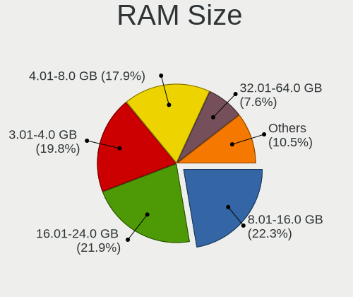
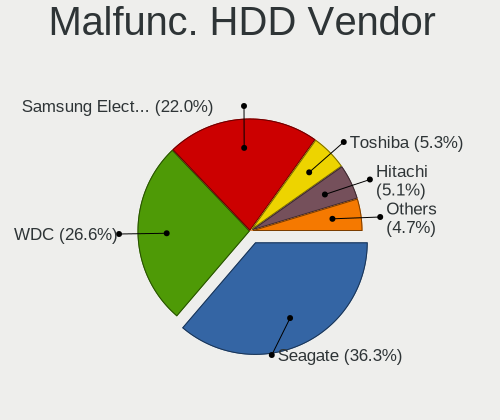
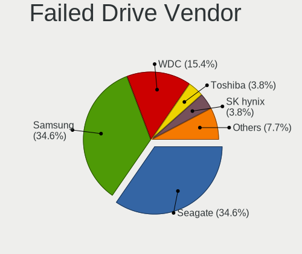
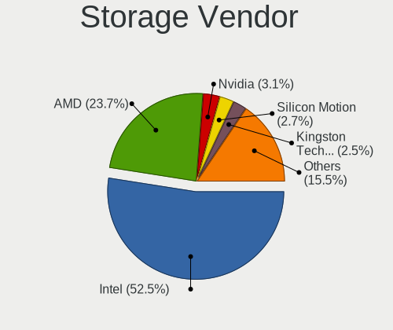
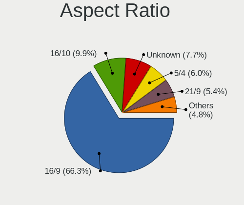
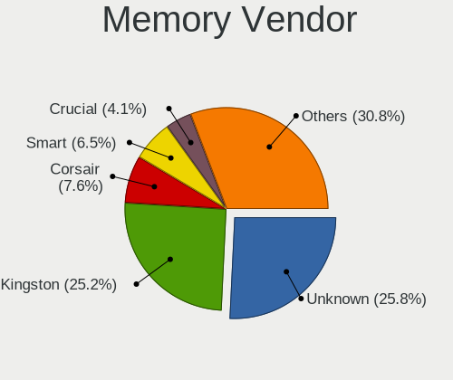
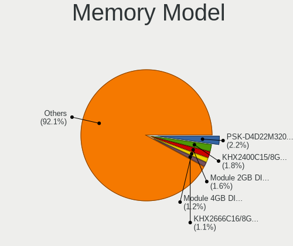
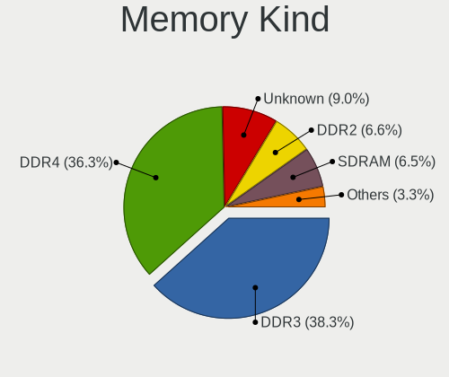

Linux in Brazil - Tested Hardware & Statistics (Desktops)
---------------------------------------------------------

A project to collect tested hardware configurations for Linux in Brazil.

Anyone can contribute to this report by the [hw-probe](https://github.com/linuxhw/hw-probe) tool:

    sudo -E hw-probe -all -upload

Please contribute! Especially if your hardware is rare.

Contents
--------

* [ Test Cases ](#test-cases)

* [ System ](#system)
  - [ OS                       ](#os)
  - [ OS Family                ](#os-family)
  - [ Kernel                   ](#kernel)
  - [ Kernel Family            ](#kernel-family)
  - [ Kernel Major Ver.        ](#kernel-major-ver)
  - [ Arch                     ](#arch)
  - [ DE                       ](#de)
  - [ Display Server           ](#display-server)
  - [ Display Manager          ](#display-manager)
  - [ OS Lang                  ](#os-lang)
  - [ Boot Mode                ](#boot-mode)
  - [ Filesystem               ](#filesystem)
  - [ Part. scheme             ](#part-scheme)
  - [ Dual Boot with Linux/BSD ](#dual-boot-with-linuxbsd)
  - [ Dual Boot (Win)          ](#dual-boot-win)

* [ Board ](#board)
  - [ Vendor                   ](#vendor)
  - [ Model                    ](#model)
  - [ Model Family             ](#model-family)
  - [ MFG Year                 ](#mfg-year)
  - [ Form Factor              ](#form-factor)
  - [ Secure Boot              ](#secure-boot)
  - [ Coreboot                 ](#coreboot)
  - [ RAM Size                 ](#ram-size)
  - [ RAM Used                 ](#ram-used)
  - [ Total Drives             ](#total-drives)
  - [ Has CD-ROM               ](#has-cd-rom)
  - [ Has Ethernet             ](#has-ethernet)
  - [ Has WiFi                 ](#has-wifi)
  - [ Has Bluetooth            ](#has-bluetooth)

* [ Location ](#location)
  - [ Country                  ](#country)
  - [ City                     ](#city)

* [ Drives ](#drives)
  - [ Drive Vendor             ](#drive-vendor)
  - [ Drive Model              ](#drive-model)
  - [ HDD Vendor               ](#hdd-vendor)
  - [ SSD Vendor               ](#ssd-vendor)
  - [ Drive Kind               ](#drive-kind)
  - [ Drive Connector          ](#drive-connector)
  - [ Drive Size               ](#drive-size)
  - [ Space Total              ](#space-total)
  - [ Space Used               ](#space-used)
  - [ Malfunc. Drives          ](#malfunc-drives)
  - [ Malfunc. Drive Vendor    ](#malfunc-drive-vendor)
  - [ Malfunc. HDD Vendor      ](#malfunc-hdd-vendor)
  - [ Malfunc. Drive Kind      ](#malfunc-drive-kind)
  - [ Failed Drives            ](#failed-drives)
  - [ Failed Drive Vendor      ](#failed-drive-vendor)
  - [ Drive Status             ](#drive-status)

* [ Storage controller ](#storage-controller)
  - [ Storage Vendor           ](#storage-vendor)
  - [ Storage Model            ](#storage-model)
  - [ Storage Kind             ](#storage-kind)

* [ Processor ](#processor)
  - [ CPU Vendor               ](#cpu-vendor)
  - [ CPU Model                ](#cpu-model)
  - [ CPU Model Family         ](#cpu-model-family)
  - [ CPU Cores                ](#cpu-cores)
  - [ CPU Sockets              ](#cpu-sockets)
  - [ CPU Threads              ](#cpu-threads)
  - [ CPU Op-Modes             ](#cpu-op-modes)
  - [ CPU Microcode            ](#cpu-microcode)
  - [ CPU Microarch            ](#cpu-microarch)

* [ Graphics ](#graphics)
  - [ GPU Vendor               ](#gpu-vendor)
  - [ GPU Model                ](#gpu-model)
  - [ GPU Combo                ](#gpu-combo)
  - [ GPU Driver               ](#gpu-driver)
  - [ GPU Memory               ](#gpu-memory)

* [ Monitor ](#monitor)
  - [ Monitor Vendor           ](#monitor-vendor)
  - [ Monitor Model            ](#monitor-model)
  - [ Monitor Resolution       ](#monitor-resolution)
  - [ Monitor Diagonal         ](#monitor-diagonal)
  - [ Monitor Width            ](#monitor-width)
  - [ Aspect Ratio             ](#aspect-ratio)
  - [ Monitor Area             ](#monitor-area)
  - [ Pixel Density            ](#pixel-density)
  - [ Multiple Monitors        ](#multiple-monitors)

* [ Network ](#network)
  - [ Net Controller Vendor    ](#net-controller-vendor)
  - [ Net Controller Model     ](#net-controller-model)
  - [ Wireless Vendor          ](#wireless-vendor)
  - [ Wireless Model           ](#wireless-model)
  - [ Ethernet Vendor          ](#ethernet-vendor)
  - [ Ethernet Model           ](#ethernet-model)
  - [ Net Controller Kind      ](#net-controller-kind)
  - [ Used Controller          ](#used-controller)
  - [ NICs                     ](#nics)
  - [ IPv6                     ](#ipv6)

* [ Bluetooth ](#bluetooth)
  - [ Bluetooth Vendor         ](#bluetooth-vendor)
  - [ Bluetooth Model          ](#bluetooth-model)

* [ Sound ](#sound)
  - [ Sound Vendor             ](#sound-vendor)
  - [ Sound Model              ](#sound-model)

* [ Memory ](#memory)
  - [ Memory Vendor            ](#memory-vendor)
  - [ Memory Model             ](#memory-model)
  - [ Memory Kind              ](#memory-kind)
  - [ Memory Form Factor       ](#memory-form-factor)
  - [ Memory Size              ](#memory-size)
  - [ Memory Speed             ](#memory-speed)

* [ Printers & scanners ](#printers--scanners)
  - [ Printer Vendor           ](#printer-vendor)
  - [ Printer Model            ](#printer-model)
  - [ Scanner Vendor           ](#scanner-vendor)
  - [ Scanner Model            ](#scanner-model)

* [ Camera ](#camera)
  - [ Camera Vendor            ](#camera-vendor)
  - [ Camera Model             ](#camera-model)

* [ Security ](#security)
  - [ Fingerprint Vendor       ](#fingerprint-vendor)
  - [ Fingerprint Model        ](#fingerprint-model)
  - [ Chipcard Vendor          ](#chipcard-vendor)
  - [ Chipcard Model           ](#chipcard-model)

* [ Unsupported ](#unsupported)
  - [ Unsupported Devices      ](#unsupported-devices)
  - [ Unsupported Device Types ](#unsupported-device-types)

Test Cases
----------

Total: 6808

| Vendor        | Model                       | Probe                                                      | Date         |
|---------------|-----------------------------|------------------------------------------------------------|--------------|
| MSI           | A520M-A PRO                 | [aa8e8397f6](https://linux-hardware.org/?probe=aa8e8397f6) | May 01, 2023 |
| PCWare        | IPMH410E                    | [9be4314a33](https://linux-hardware.org/?probe=9be4314a33) | May 01, 2023 |
| DIEBOLD       | NM70-I                      | [c01a40d58c](https://linux-hardware.org/?probe=c01a40d58c) | Apr 30, 2023 |
| ASRock        | B550M Steel Legend          | [68d85dd28f](https://linux-hardware.org/?probe=68d85dd28f) | Apr 30, 2023 |
| ASRock        | B550M Steel Legend          | [5166f820a6](https://linux-hardware.org/?probe=5166f820a6) | Apr 30, 2023 |
| ASRock        | 760GM-HD                    | [db79e93331](https://linux-hardware.org/?probe=db79e93331) | Apr 30, 2023 |
| MSI           | MEG Z390 GODLIKE            | [9109b0a7ed](https://linux-hardware.org/?probe=9109b0a7ed) | Apr 30, 2023 |
| Positivo      | POS-EIQ87CY POSITIVO        | [2e2b57b3ae](https://linux-hardware.org/?probe=2e2b57b3ae) | Apr 30, 2023 |
| ASRock        | B450M Steel Legend          | [fed083feba](https://linux-hardware.org/?probe=fed083feba) | Apr 30, 2023 |
| Intel         | H61                         | [167616bc61](https://linux-hardware.org/?probe=167616bc61) | Apr 30, 2023 |
| Intel         | H81                         | [c70b10516b](https://linux-hardware.org/?probe=c70b10516b) | Apr 30, 2023 |
| ASUSTek       | PRIME H410M-E               | [44a08af32f](https://linux-hardware.org/?probe=44a08af32f) | Apr 29, 2023 |
| ASUSTek       | H81M-C/BR                   | [32942be783](https://linux-hardware.org/?probe=32942be783) | Apr 29, 2023 |
| Gigabyte      | G41MT-S2                    | [ba5c65f4e3](https://linux-hardware.org/?probe=ba5c65f4e3) | Apr 29, 2023 |
| ASUSTek       | P8H61-M LE/BR               | [425f1a3e08](https://linux-hardware.org/?probe=425f1a3e08) | Apr 29, 2023 |
| Gigabyte      | GA-78LMT-S2                 | [16b28befee](https://linux-hardware.org/?probe=16b28befee) | Apr 28, 2023 |
| ASRock        | A320M-HD                    | [43b57e5088](https://linux-hardware.org/?probe=43b57e5088) | Apr 28, 2023 |
| HP            | 158B                        | [ee0297b0ba](https://linux-hardware.org/?probe=ee0297b0ba) | Apr 28, 2023 |
| Intel         | H61 V124                    | [1fa0b34b3c](https://linux-hardware.org/?probe=1fa0b34b3c) | Apr 28, 2023 |
| Lenovo        | NO DPK                      | [d3442220b0](https://linux-hardware.org/?probe=d3442220b0) | Apr 28, 2023 |
| Intel         | H61                         | [b8f0acdf61](https://linux-hardware.org/?probe=b8f0acdf61) | Apr 28, 2023 |
| ASUSTek       | Z97M-PLUS/BR                | [3255acf414](https://linux-hardware.org/?probe=3255acf414) | Apr 27, 2023 |
| ASUSTek       | TUF Gaming B450M-PLUS II    | [9211d42ee3](https://linux-hardware.org/?probe=9211d42ee3) | Apr 27, 2023 |
| HP            | 3047h                       | [3e6dada8a9](https://linux-hardware.org/?probe=3e6dada8a9) | Apr 26, 2023 |
| Pegatron      | IPM41-D3                    | [faf8704eb3](https://linux-hardware.org/?probe=faf8704eb3) | Apr 26, 2023 |
| MSI           | MAG B550M MORTAR            | [f91ac46cfd](https://linux-hardware.org/?probe=f91ac46cfd) | Apr 26, 2023 |
| ASUSTek       | TUF Gaming Z690-PLUS D4     | [8f417742d1](https://linux-hardware.org/?probe=8f417742d1) | Apr 26, 2023 |
| Biostar       | H610MH                      | [935928c60d](https://linux-hardware.org/?probe=935928c60d) | Apr 26, 2023 |
| Gigabyte      | B550M DS3H                  | [208a0fc365](https://linux-hardware.org/?probe=208a0fc365) | Apr 26, 2023 |
| Intel         | B75                         | [72a3677ac2](https://linux-hardware.org/?probe=72a3677ac2) | Apr 26, 2023 |
| ASUSTek       | PRIME H610M-A D4            | [a7e77375d4](https://linux-hardware.org/?probe=a7e77375d4) | Apr 26, 2023 |
| Intel         | H81                         | [9a14132581](https://linux-hardware.org/?probe=9a14132581) | Apr 26, 2023 |
| ASRock        | AB350M-HDV                  | [44ac797451](https://linux-hardware.org/?probe=44ac797451) | Apr 25, 2023 |
| Biostar       | B450MX-S                    | [5ac7debff3](https://linux-hardware.org/?probe=5ac7debff3) | Apr 25, 2023 |
| Gigabyte      | H87-D3H-CF                  | [b3a3115f0c](https://linux-hardware.org/?probe=b3a3115f0c) | Apr 25, 2023 |
| OEM           | HN B85 Ver:1.4              | [1da5934b27](https://linux-hardware.org/?probe=1da5934b27) | Apr 25, 2023 |
| Lenovo        | SHARKBAY 0B98401 PRO        | [342918aa38](https://linux-hardware.org/?probe=342918aa38) | Apr 24, 2023 |
| AMD           | Inagua CRB                  | [085d0aa051](https://linux-hardware.org/?probe=085d0aa051) | Apr 24, 2023 |
| Gigabyte      | GA-78LMT-USB3               | [9bab79728a](https://linux-hardware.org/?probe=9bab79728a) | Apr 24, 2023 |
| Intel         | D946GZIS AAD66165-301       | [9d5ada0fc4](https://linux-hardware.org/?probe=9d5ada0fc4) | Apr 24, 2023 |
| Dell          | 0VTJVC A00                  | [da7d66917d](https://linux-hardware.org/?probe=da7d66917d) | Apr 24, 2023 |
| Gigabyte      | G41MT-S2                    | [de1981f9e6](https://linux-hardware.org/?probe=de1981f9e6) | Apr 24, 2023 |
| Huanan        | X99-8M-F V1.1               | [0621d00b73](https://linux-hardware.org/?probe=0621d00b73) | Apr 24, 2023 |
| Biostar       | B350ET2                     | [47289e48eb](https://linux-hardware.org/?probe=47289e48eb) | Apr 23, 2023 |
| ASUSTek       | AM1M-A/BR                   | [0b29ee62f9](https://linux-hardware.org/?probe=0b29ee62f9) | Apr 23, 2023 |
| ASUSTek       | M5A78L-M LX/BR              | [0e85243397](https://linux-hardware.org/?probe=0e85243397) | Apr 23, 2023 |
| HP            | 18E7                        | [c5bc4d9c7f](https://linux-hardware.org/?probe=c5bc4d9c7f) | Apr 23, 2023 |
| MACHINIST     | E5-MR9A PRO V1.1            | [eebce73217](https://linux-hardware.org/?probe=eebce73217) | Apr 23, 2023 |
| ASUSTek       | H81M-C/BR                   | [46a27a7551](https://linux-hardware.org/?probe=46a27a7551) | Apr 23, 2023 |
| Gigabyte      | GA-78LMT-S2P                | [793e094165](https://linux-hardware.org/?probe=793e094165) | Apr 23, 2023 |
| Pegatron      | IPMH61P1                    | [b71d5b1a48](https://linux-hardware.org/?probe=b71d5b1a48) | Apr 23, 2023 |
| Unknown       | G41                         | [cbe978cc34](https://linux-hardware.org/?probe=cbe978cc34) | Apr 23, 2023 |
| Gigabyte      | VM900M Rev2.0               | [284ada7211](https://linux-hardware.org/?probe=284ada7211) | Apr 23, 2023 |
| PCWare        | IPX1800G2                   | [f63cf0fe51](https://linux-hardware.org/?probe=f63cf0fe51) | Apr 23, 2023 |
| ASUSTek       | TUF Gaming B550M-PLUS       | [1b475eaa99](https://linux-hardware.org/?probe=1b475eaa99) | Apr 23, 2023 |
| ASUSTek       | ROG STRIX X570-E GAMING ... | [dfb9f87dad](https://linux-hardware.org/?probe=dfb9f87dad) | Apr 22, 2023 |
| Gigabyte      | B560M AORUS ELITE           | [ea8fb664a3](https://linux-hardware.org/?probe=ea8fb664a3) | Apr 22, 2023 |
| ASRock        | H310CM-HG4                  | [6f49f4b883](https://linux-hardware.org/?probe=6f49f4b883) | Apr 21, 2023 |
| ASRock        | H510M-HVS R2.0              | [1de5b776a3](https://linux-hardware.org/?probe=1de5b776a3) | Apr 21, 2023 |
| Dell          | 0GDG8Y A00                  | [a315eaa776](https://linux-hardware.org/?probe=a315eaa776) | Apr 21, 2023 |
| MSI           | 970 GAMING                  | [cb295448b6](https://linux-hardware.org/?probe=cb295448b6) | Apr 21, 2023 |
| ASUSTek       | M5A78L-M PLUS/USB3          | [5f1a1c6abd](https://linux-hardware.org/?probe=5f1a1c6abd) | Apr 20, 2023 |
| Gigabyte      | G31M-S2C                    | [0c45fc6929](https://linux-hardware.org/?probe=0c45fc6929) | Apr 20, 2023 |
| ASRock        | FM2A68M-DG3+                | [f8519c5a20](https://linux-hardware.org/?probe=f8519c5a20) | Apr 20, 2023 |
| Intel         | H61S                        | [e29d71587a](https://linux-hardware.org/?probe=e29d71587a) | Apr 20, 2023 |
| ASRock        | FM2A68M-DG3+                | [701110cf4e](https://linux-hardware.org/?probe=701110cf4e) | Apr 19, 2023 |
| ASUSTek       | PRIME B250M-PLUS/BR         | [c0a82bb35a](https://linux-hardware.org/?probe=c0a82bb35a) | Apr 19, 2023 |
| Intel         | X79M-S                      | [0c51f5a0e0](https://linux-hardware.org/?probe=0c51f5a0e0) | Apr 19, 2023 |
| ASUSTek       | PRIME B250M-PLUS/BR         | [8bb9dc2419](https://linux-hardware.org/?probe=8bb9dc2419) | Apr 18, 2023 |
| AMD           | Inagua CRB                  | [8d2ce37fca](https://linux-hardware.org/?probe=8d2ce37fca) | Apr 18, 2023 |
| Dell          | 08NPPY A00                  | [7fcc7d1b34](https://linux-hardware.org/?probe=7fcc7d1b34) | Apr 18, 2023 |
| Gigabyte      | B550I AORUS PRO AX          | [bbbc9206b4](https://linux-hardware.org/?probe=bbbc9206b4) | Apr 17, 2023 |
| Intel         | B75                         | [18dce6805d](https://linux-hardware.org/?probe=18dce6805d) | Apr 15, 2023 |
| AMD           | A88F2EKS                    | [48cef621bd](https://linux-hardware.org/?probe=48cef621bd) | Apr 15, 2023 |
| ASUSTek       | M4A785TD-M EVO              | [dd2d3443a9](https://linux-hardware.org/?probe=dd2d3443a9) | Apr 15, 2023 |
| Lenovo        | ThinkCentre M58p 6234CZ6    | [e412c388d8](https://linux-hardware.org/?probe=e412c388d8) | Apr 15, 2023 |
| QIYIDA        | X99-H9 V2.0                 | [fcfa1ed488](https://linux-hardware.org/?probe=fcfa1ed488) | Apr 14, 2023 |
| ASRock        | B550M Pro4                  | [ec08193576](https://linux-hardware.org/?probe=ec08193576) | Apr 14, 2023 |
| Gigabyte      | 970A-DS3P                   | [e2f136f068](https://linux-hardware.org/?probe=e2f136f068) | Apr 14, 2023 |
| PCWare        | IPMH61R3                    | [776a2824c5](https://linux-hardware.org/?probe=776a2824c5) | Apr 14, 2023 |
| OEM           | H110                        | [60e8c50cdd](https://linux-hardware.org/?probe=60e8c50cdd) | Apr 14, 2023 |
| ASUSTek       | Maximus IX APEX             | [f4a7db0c2a](https://linux-hardware.org/?probe=f4a7db0c2a) | Apr 14, 2023 |
| HP            | 1589                        | [b5309b9a82](https://linux-hardware.org/?probe=b5309b9a82) | Apr 14, 2023 |
| Gigabyte      | GA-78LMT-USB3               | [4267100894](https://linux-hardware.org/?probe=4267100894) | Apr 13, 2023 |
| ASUSTek       | TUF Gaming X570-PLUS_BR     | [5e9f89e556](https://linux-hardware.org/?probe=5e9f89e556) | Apr 13, 2023 |
| ASUSTek       | PRIME B450M-GAMING/BR       | [89a7f8f7e7](https://linux-hardware.org/?probe=89a7f8f7e7) | Apr 13, 2023 |
| ASUSTek       | TUF Gaming B550M-E WIFI     | [d72e78c1b0](https://linux-hardware.org/?probe=d72e78c1b0) | Apr 13, 2023 |
| OEM           | Intel H81                   | [1a73452d73](https://linux-hardware.org/?probe=1a73452d73) | Apr 13, 2023 |
| Intel         | H61 V1.1                    | [1b97e4ffc5](https://linux-hardware.org/?probe=1b97e4ffc5) | Apr 12, 2023 |
| Intel         | H61 V1.1                    | [402a94b1c0](https://linux-hardware.org/?probe=402a94b1c0) | Apr 12, 2023 |
| Win elemen... | M600                        | [4268d36ca4](https://linux-hardware.org/?probe=4268d36ca4) | Apr 12, 2023 |
| ASUSTek       | TUF Gaming Z690-PLUS D4     | [065d244d4b](https://linux-hardware.org/?probe=065d244d4b) | Apr 12, 2023 |
| Intel         | H61 V124                    | [28b73b97b3](https://linux-hardware.org/?probe=28b73b97b3) | Apr 12, 2023 |
| Dell          | 01XK1W A00                  | [4eb8c9f372](https://linux-hardware.org/?probe=4eb8c9f372) | Apr 12, 2023 |
| Daten Tecn... | DH110MXV                    | [6a1c34f539](https://linux-hardware.org/?probe=6a1c34f539) | Apr 12, 2023 |
| ABIT          | NF-M2S                      | [30e3a2e8c4](https://linux-hardware.org/?probe=30e3a2e8c4) | Apr 11, 2023 |
| ASUSTek       | P5LD2-X/1333                | [e0e655f63c](https://linux-hardware.org/?probe=e0e655f63c) | Apr 11, 2023 |
| ECS           | H61H2-M12                   | [f3e8f5eb22](https://linux-hardware.org/?probe=f3e8f5eb22) | Apr 10, 2023 |
| Biostar       | A320MH                      | [a2aef00c0c](https://linux-hardware.org/?probe=a2aef00c0c) | Apr 09, 2023 |
| Gigabyte      | F2A68HM-H                   | [249b3e78ed](https://linux-hardware.org/?probe=249b3e78ed) | Apr 09, 2023 |
| Intel         | H61 V1.1                    | [1c3cfd94a3](https://linux-hardware.org/?probe=1c3cfd94a3) | Apr 09, 2023 |
| Gigabyte      | F2A68HM-H                   | [8d36d0bfeb](https://linux-hardware.org/?probe=8d36d0bfeb) | Apr 09, 2023 |
| Intel         | H61 V1.1                    | [e553db41a3](https://linux-hardware.org/?probe=e553db41a3) | Apr 08, 2023 |
| ASUSTek       | A68HM-K                     | [55d971a67f](https://linux-hardware.org/?probe=55d971a67f) | Apr 08, 2023 |
| OEM           | X99-Turbo                   | [52723223af](https://linux-hardware.org/?probe=52723223af) | Apr 08, 2023 |
| Biostar       | A520MH                      | [9cf296886b](https://linux-hardware.org/?probe=9cf296886b) | Apr 07, 2023 |
| Dell          | 01XK1W A00                  | [023a578b76](https://linux-hardware.org/?probe=023a578b76) | Apr 07, 2023 |
| ASUSTek       | B85M-E/BR                   | [66efb7f634](https://linux-hardware.org/?probe=66efb7f634) | Apr 07, 2023 |
| HP            | 0B54h D                     | [59e9cd0741](https://linux-hardware.org/?probe=59e9cd0741) | Apr 06, 2023 |
| Dell          | 0C2KJT A00                  | [1f006c081e](https://linux-hardware.org/?probe=1f006c081e) | Apr 06, 2023 |
| Intel         | X99H                        | [b91cbf41c0](https://linux-hardware.org/?probe=b91cbf41c0) | Apr 06, 2023 |
| Biostar       | N68S3B                      | [3b25aad650](https://linux-hardware.org/?probe=3b25aad650) | Apr 05, 2023 |
| Gigabyte      | H87M-D3H                    | [b9c169025d](https://linux-hardware.org/?probe=b9c169025d) | Apr 05, 2023 |
| ASUSTek       | TUF Gaming B460M-PLUS       | [5f9965b18e](https://linux-hardware.org/?probe=5f9965b18e) | Apr 05, 2023 |
| MSI           | MS-7529                     | [2c6cdf6397](https://linux-hardware.org/?probe=2c6cdf6397) | Apr 04, 2023 |
| ASUSTek       | PRIME A320M-C R2.0          | [70b2a73996](https://linux-hardware.org/?probe=70b2a73996) | Apr 04, 2023 |
| Intel         | B75                         | [8d116f68cf](https://linux-hardware.org/?probe=8d116f68cf) | Apr 04, 2023 |
| Dell          | 07PR60 A02                  | [c41c1c9ead](https://linux-hardware.org/?probe=c41c1c9ead) | Apr 04, 2023 |
| Itautec       | ST 4265 ST-4265 Padrao 0... | [26e8d46d94](https://linux-hardware.org/?probe=26e8d46d94) | Apr 03, 2023 |
| Intel         | DZ87KLT75K AAG74721-304     | [4f97ce0a4b](https://linux-hardware.org/?probe=4f97ce0a4b) | Apr 03, 2023 |
| Gigabyte      | H110M-S2H DDR3-CF           | [22cc49b906](https://linux-hardware.org/?probe=22cc49b906) | Apr 03, 2023 |
| Gigabyte      | B460M AORUS PRO             | [72dc18dacb](https://linux-hardware.org/?probe=72dc18dacb) | Apr 03, 2023 |
| ASUSTek       | PRIME B450M-GAMING/BR       | [65668a06ad](https://linux-hardware.org/?probe=65668a06ad) | Apr 03, 2023 |
| Gigabyte      | H110M-S2H DDR3-CF           | [f0de4366f7](https://linux-hardware.org/?probe=f0de4366f7) | Apr 03, 2023 |
| MSI           | MEG Z390 GODLIKE            | [d447871547](https://linux-hardware.org/?probe=d447871547) | Apr 03, 2023 |
| ASUSTek       | P8H61-M LX3 R2.0            | [e3845b9610](https://linux-hardware.org/?probe=e3845b9610) | Apr 02, 2023 |
| Lenovo        | 30D0 SDK0J40705 WIN 3425... | [6bac6aa095](https://linux-hardware.org/?probe=6bac6aa095) | Apr 02, 2023 |
| Gigabyte      | B460M AORUS PRO             | [12647b9601](https://linux-hardware.org/?probe=12647b9601) | Apr 02, 2023 |
| ULTRATOP      | C2017-LIVA-ZE               | [96d0c389b8](https://linux-hardware.org/?probe=96d0c389b8) | Apr 02, 2023 |
| Intel         | B75                         | [caad7f240a](https://linux-hardware.org/?probe=caad7f240a) | Apr 02, 2023 |
| HOUTER        | IPMIP-GS                    | [4ef0c7aaaa](https://linux-hardware.org/?probe=4ef0c7aaaa) | Apr 02, 2023 |
| ASRock        | FM2A68M-HD+ R2.0            | [b2051ee32b](https://linux-hardware.org/?probe=b2051ee32b) | Apr 02, 2023 |
| Lenovo        | 3102 NOK                    | [3707e05f16](https://linux-hardware.org/?probe=3707e05f16) | Apr 01, 2023 |
| Unknown       | Unknown                     | [089fc02d40](https://linux-hardware.org/?probe=089fc02d40) | Apr 01, 2023 |
| Gigabyte      | H410M DS2V                  | [67b081e859](https://linux-hardware.org/?probe=67b081e859) | Apr 01, 2023 |
| ASUSTek       | M5A97 EVO R2.0              | [3f218796ae](https://linux-hardware.org/?probe=3f218796ae) | Apr 01, 2023 |
| Gigabyte      | B560M AORUS ELITE           | [ee536703f8](https://linux-hardware.org/?probe=ee536703f8) | Apr 01, 2023 |
| MSI           | B450M PRO-M2 MAX            | [5a83c18a3e](https://linux-hardware.org/?probe=5a83c18a3e) | Apr 01, 2023 |
| MSI           | B450M PRO-M2 MAX            | [94f75ee798](https://linux-hardware.org/?probe=94f75ee798) | Apr 01, 2023 |
| Intel         | H61 V1.1                    | [e670f092d7](https://linux-hardware.org/?probe=e670f092d7) | Mar 31, 2023 |
| ASUSTek       | B85M-G R2.0                 | [4434a1266b](https://linux-hardware.org/?probe=4434a1266b) | Mar 31, 2023 |
| ASUSTek       | A58M-A/BR                   | [90724dc86e](https://linux-hardware.org/?probe=90724dc86e) | Mar 31, 2023 |
| ASUSTek       | B85M-G R2.0                 | [fbef2fe274](https://linux-hardware.org/?probe=fbef2fe274) | Mar 31, 2023 |
| ASUSTek       | M5A78L-M LX/BR              | [1fa3e0934f](https://linux-hardware.org/?probe=1fa3e0934f) | Mar 31, 2023 |
| ASUSTek       | TUF Gaming B660M-PLUS D4    | [ebd6135034](https://linux-hardware.org/?probe=ebd6135034) | Mar 31, 2023 |
| ASUSTek       | TUF Gaming B660M-PLUS D4    | [88864f0e2d](https://linux-hardware.org/?probe=88864f0e2d) | Mar 31, 2023 |
| Gigabyte      | B360M AORUS Gaming 3-CF     | [c346cf16d3](https://linux-hardware.org/?probe=c346cf16d3) | Mar 30, 2023 |
| Gigabyte      | A320M-S2H-CF                | [3aac57dfbd](https://linux-hardware.org/?probe=3aac57dfbd) | Mar 30, 2023 |
| Gigabyte      | H61M-S1                     | [76e79f5f19](https://linux-hardware.org/?probe=76e79f5f19) | Mar 30, 2023 |
| Gigabyte      | H61M-S1                     | [78d1316a55](https://linux-hardware.org/?probe=78d1316a55) | Mar 30, 2023 |
| Intel         | X99 V1.0                    | [13c66b0e69](https://linux-hardware.org/?probe=13c66b0e69) | Mar 30, 2023 |
| HOUTER        | ORO-PC                      | [9547c4bdac](https://linux-hardware.org/?probe=9547c4bdac) | Mar 29, 2023 |
| Dell          | 0KWVT8 A02                  | [a46eb24b2a](https://linux-hardware.org/?probe=a46eb24b2a) | Mar 29, 2023 |
| Daten Tecn... | DQ77PRO                     | [86885bfc03](https://linux-hardware.org/?probe=86885bfc03) | Mar 29, 2023 |
| Intel         | B75                         | [2bddb84c2e](https://linux-hardware.org/?probe=2bddb84c2e) | Mar 29, 2023 |
| HOUTER        | IPMH61R1                    | [bcabc2573c](https://linux-hardware.org/?probe=bcabc2573c) | Mar 29, 2023 |
| ASUSTek       | H81M-A/BR                   | [c994f20b64](https://linux-hardware.org/?probe=c994f20b64) | Mar 29, 2023 |
| Dell          | 01XK1W A00                  | [bf9252a1ac](https://linux-hardware.org/?probe=bf9252a1ac) | Mar 29, 2023 |
| Intel         | H61 V1.1                    | [497266ad29](https://linux-hardware.org/?probe=497266ad29) | Mar 28, 2023 |
| Gigabyte      | H110M-S2H DDR3-CF           | [7ec74ffcfa](https://linux-hardware.org/?probe=7ec74ffcfa) | Mar 28, 2023 |
| MSI           | B560M-A PRO                 | [62bfea11fe](https://linux-hardware.org/?probe=62bfea11fe) | Mar 28, 2023 |
| Gigabyte      | H110M-S2H DDR3-CF           | [7e5cb33850](https://linux-hardware.org/?probe=7e5cb33850) | Mar 28, 2023 |
| ASRock        | H510M-HVS                   | [97744fad07](https://linux-hardware.org/?probe=97744fad07) | Mar 28, 2023 |
| Gigabyte      | X470 AORUS GAMING 7 WIFI... | [9c9e155f84](https://linux-hardware.org/?probe=9c9e155f84) | Mar 28, 2023 |
| Intel         | H61                         | [56437a0e05](https://linux-hardware.org/?probe=56437a0e05) | Mar 28, 2023 |
| Gigabyte      | A320M-H-CF                  | [6b4122e888](https://linux-hardware.org/?probe=6b4122e888) | Mar 28, 2023 |
| MACHINIST     | E5-MR9A PRO V1.1            | [727f980b20](https://linux-hardware.org/?probe=727f980b20) | Mar 27, 2023 |
| Lenovo        | ThinkCentre Edge71 1577K... | [ec1f547743](https://linux-hardware.org/?probe=ec1f547743) | Mar 27, 2023 |
| Dell          | 07PR60 A01                  | [f312d049e0](https://linux-hardware.org/?probe=f312d049e0) | Mar 27, 2023 |
| ASRock        | FM2A55M-HD+ R2.0            | [a45bc637c9](https://linux-hardware.org/?probe=a45bc637c9) | Mar 27, 2023 |
| PCWare        | IPMH61R3                    | [2fbd1f3f64](https://linux-hardware.org/?probe=2fbd1f3f64) | Mar 26, 2023 |
| BESSTAR Te... | F6BFC                       | [881c531ee5](https://linux-hardware.org/?probe=881c531ee5) | Mar 25, 2023 |
| AZW           | MINI S                      | [f3381963ae](https://linux-hardware.org/?probe=f3381963ae) | Mar 25, 2023 |
| Intel         | H61 V1.1                    | [e678dd580c](https://linux-hardware.org/?probe=e678dd580c) | Mar 25, 2023 |
| MSI           | A520M-A PRO                 | [f2a2593a06](https://linux-hardware.org/?probe=f2a2593a06) | Mar 24, 2023 |
| Gigabyte      | H170-D3H-CF                 | [0bcd7ee5e8](https://linux-hardware.org/?probe=0bcd7ee5e8) | Mar 24, 2023 |
| Intel         | X99 V1.x                    | [391a73b307](https://linux-hardware.org/?probe=391a73b307) | Mar 24, 2023 |
| ASUSTek       | TUF Gaming X570-PLUS_BR     | [cce19de050](https://linux-hardware.org/?probe=cce19de050) | Mar 24, 2023 |
| QIYIDA        | X99-H9 V2.0                 | [ce9cdcc598](https://linux-hardware.org/?probe=ce9cdcc598) | Mar 24, 2023 |
| ASUSTek       | M5A78L-M LX/BR              | [4e2b8b9de9](https://linux-hardware.org/?probe=4e2b8b9de9) | Mar 24, 2023 |
| PCWare        | IPMH310G                    | [3cc2e91e56](https://linux-hardware.org/?probe=3cc2e91e56) | Mar 24, 2023 |
| Itautec       | ST 4265                     | [4671d7c30e](https://linux-hardware.org/?probe=4671d7c30e) | Mar 23, 2023 |
| Gigabyte      | A520M S2H                   | [50931f533e](https://linux-hardware.org/?probe=50931f533e) | Mar 23, 2023 |
| ASUSTek       | PRIME B450M-GAMING/BR       | [2536217d87](https://linux-hardware.org/?probe=2536217d87) | Mar 23, 2023 |
| Itautec       | ST 4254 ST-4254 Padrao 0... | [cd3e7fa4e5](https://linux-hardware.org/?probe=cd3e7fa4e5) | Mar 23, 2023 |
| Intel         | DH87RL AAG74240-401         | [3465e562e8](https://linux-hardware.org/?probe=3465e562e8) | Mar 23, 2023 |
| MACHINIST     | E5-MR9A PRO V1.1            | [7d303a08d4](https://linux-hardware.org/?probe=7d303a08d4) | Mar 23, 2023 |
| Lenovo        | SHARKBAY NOK                | [84f93bfcf1](https://linux-hardware.org/?probe=84f93bfcf1) | Mar 23, 2023 |
| ASRock        | FM2A68M-DG3+                | [204b7c3324](https://linux-hardware.org/?probe=204b7c3324) | Mar 23, 2023 |
| Digiboard     | NM70-TI                     | [d654b9738a](https://linux-hardware.org/?probe=d654b9738a) | Mar 23, 2023 |
| Intel         | H61 V1.1                    | [f1292785cd](https://linux-hardware.org/?probe=f1292785cd) | Mar 23, 2023 |
| Intel         | X79 (INTEL Xeon E5/Corei... | [299072c37e](https://linux-hardware.org/?probe=299072c37e) | Mar 22, 2023 |
| Gigabyte      | H110M-S2H DDR3-CF           | [47b661fcb3](https://linux-hardware.org/?probe=47b661fcb3) | Mar 22, 2023 |
| Gigabyte      | H110M-S2H DDR3-CF           | [f848ecf9cf](https://linux-hardware.org/?probe=f848ecf9cf) | Mar 22, 2023 |
| ASUSTek       | M5A78L-M PLUS/USB3          | [568fac441d](https://linux-hardware.org/?probe=568fac441d) | Mar 22, 2023 |
| Gigabyte      | A320M-S2H-CF                | [2e6307252f](https://linux-hardware.org/?probe=2e6307252f) | Mar 22, 2023 |
| Gigabyte      | GA-970A-UD3                 | [982f47fec3](https://linux-hardware.org/?probe=982f47fec3) | Mar 22, 2023 |
| MSI           | MAG B650M MORTAR WIFI       | [1e299101d8](https://linux-hardware.org/?probe=1e299101d8) | Mar 22, 2023 |
| CCE           | NM70-I                      | [3e99b6e12d](https://linux-hardware.org/?probe=3e99b6e12d) | Mar 21, 2023 |
| Dell          | 03NVJ6 A01                  | [2060b57720](https://linux-hardware.org/?probe=2060b57720) | Mar 20, 2023 |
| Dell          | 0KWVT8 A00                  | [b15061e252](https://linux-hardware.org/?probe=b15061e252) | Mar 20, 2023 |
| Gigabyte      | GA-78LMT-USB3 SEx           | [4483bfa54d](https://linux-hardware.org/?probe=4483bfa54d) | Mar 20, 2023 |
| Win elemen... | M600                        | [eb40c2a7fc](https://linux-hardware.org/?probe=eb40c2a7fc) | Mar 20, 2023 |
| ASRock        | H81M-HG4 R4.0               | [ef87ac1a64](https://linux-hardware.org/?probe=ef87ac1a64) | Mar 20, 2023 |
| ASUSTek       | PRIME A320M-K/BR            | [32d80303b6](https://linux-hardware.org/?probe=32d80303b6) | Mar 20, 2023 |
| Gigabyte      | Z270M-D3H-CF                | [6e6c326058](https://linux-hardware.org/?probe=6e6c326058) | Mar 18, 2023 |
| Intel         | D525MW AAE93082-401         | [590309a32b](https://linux-hardware.org/?probe=590309a32b) | Mar 18, 2023 |
| MSI           | 970 GAMING                  | [99e92fa4df](https://linux-hardware.org/?probe=99e92fa4df) | Mar 18, 2023 |
| Gigabyte      | Z270M-D3H-CF                | [1a93d601d7](https://linux-hardware.org/?probe=1a93d601d7) | Mar 18, 2023 |
| ASRock        | FM2A68M-DG3+                | [00b550c606](https://linux-hardware.org/?probe=00b550c606) | Mar 18, 2023 |
| Intel         | H61                         | [10b44e8f3e](https://linux-hardware.org/?probe=10b44e8f3e) | Mar 18, 2023 |
| ASRock        | FM2A68M-DG3+                | [16b1b61892](https://linux-hardware.org/?probe=16b1b61892) | Mar 17, 2023 |
| Positivo      | POS-EIH61CE SIM             | [19a69ab150](https://linux-hardware.org/?probe=19a69ab150) | Mar 17, 2023 |
| HP            | 8266                        | [8bac7f79e8](https://linux-hardware.org/?probe=8bac7f79e8) | Mar 17, 2023 |
| ASUSTek       | PRIME A320M-K/BR            | [452349c032](https://linux-hardware.org/?probe=452349c032) | Mar 17, 2023 |
| Gigabyte      | A320M-S2H-CF                | [35505ab2bf](https://linux-hardware.org/?probe=35505ab2bf) | Mar 17, 2023 |
| Intel         | X99 V1.x                    | [9b471dcdcf](https://linux-hardware.org/?probe=9b471dcdcf) | Mar 17, 2023 |
| ASUSTek       | M2N-E SLI                   | [bf5b0c4406](https://linux-hardware.org/?probe=bf5b0c4406) | Mar 17, 2023 |
| ASUSTek       | ROG STRIX X570-I GAMING     | [2215bc867b](https://linux-hardware.org/?probe=2215bc867b) | Mar 17, 2023 |
| Intel         | X99                         | [e7d23adc36](https://linux-hardware.org/?probe=e7d23adc36) | Mar 17, 2023 |
| ASUSTek       | H81M-K                      | [9ca1015389](https://linux-hardware.org/?probe=9ca1015389) | Mar 16, 2023 |
| HP            | 8266                        | [90ee08c208](https://linux-hardware.org/?probe=90ee08c208) | Mar 16, 2023 |
| Intel         | X99 V1.0                    | [1e1b3b6542](https://linux-hardware.org/?probe=1e1b3b6542) | Mar 16, 2023 |
| Intel         | H61 V1.1                    | [175eb36378](https://linux-hardware.org/?probe=175eb36378) | Mar 16, 2023 |
| HP            | 8299                        | [d76d2b1088](https://linux-hardware.org/?probe=d76d2b1088) | Mar 15, 2023 |
| PCWare        | IPX4105G Pro                | [f685771047](https://linux-hardware.org/?probe=f685771047) | Mar 15, 2023 |
| Intel         | H61 V1.1                    | [eaa24cb538](https://linux-hardware.org/?probe=eaa24cb538) | Mar 15, 2023 |
| ASUSTek       | PRIME Z270-A                | [1451ae2f05](https://linux-hardware.org/?probe=1451ae2f05) | Mar 15, 2023 |
| ASUSTek       | PRIME Z270-A                | [26971576bb](https://linux-hardware.org/?probe=26971576bb) | Mar 14, 2023 |
| Gigabyte      | Z390 M GAMING-CF            | [7649d9be35](https://linux-hardware.org/?probe=7649d9be35) | Mar 14, 2023 |
| Huanan        | X99-QD4 V1.0                | [800c597040](https://linux-hardware.org/?probe=800c597040) | Mar 14, 2023 |
| ASRock        | A320M-HDV R4.0              | [8d2ca6cedc](https://linux-hardware.org/?probe=8d2ca6cedc) | Mar 14, 2023 |
| ASUSTek       | PRIME B350M-K               | [ae6352dc35](https://linux-hardware.org/?probe=ae6352dc35) | Mar 13, 2023 |
| Biostar       | A320MH                      | [6fbd813bc2](https://linux-hardware.org/?probe=6fbd813bc2) | Mar 13, 2023 |
| ASUSTek       | TUF Gaming B550M-PLUS       | [89e2967e3c](https://linux-hardware.org/?probe=89e2967e3c) | Mar 12, 2023 |
| Pegatron      | SM3330B 0500B               | [1ece615e2d](https://linux-hardware.org/?probe=1ece615e2d) | Mar 12, 2023 |
| Positivo      | P5VD2-MX                    | [50b7084313](https://linux-hardware.org/?probe=50b7084313) | Mar 12, 2023 |
| Dell          | 0HHV7N A00                  | [75e9243247](https://linux-hardware.org/?probe=75e9243247) | Mar 12, 2023 |
| ASUSTek       | PRIME A520M-E               | [d2b4cffe84](https://linux-hardware.org/?probe=d2b4cffe84) | Mar 11, 2023 |
| Gigabyte      | AB350M-Gaming 3-CF          | [3e9c39ec40](https://linux-hardware.org/?probe=3e9c39ec40) | Mar 11, 2023 |
| Intel         | H61                         | [0a38ec61cc](https://linux-hardware.org/?probe=0a38ec61cc) | Mar 11, 2023 |
| Gigabyte      | H81M-H                      | [fd3c999c22](https://linux-hardware.org/?probe=fd3c999c22) | Mar 11, 2023 |
| Dell          | 01XK1W A00                  | [f8e050789f](https://linux-hardware.org/?probe=f8e050789f) | Mar 11, 2023 |
| Intel         | X99H                        | [a89ad204c8](https://linux-hardware.org/?probe=a89ad204c8) | Mar 11, 2023 |
| Positivo      | POS-PIB150DT                | [0842fc186b](https://linux-hardware.org/?probe=0842fc186b) | Mar 10, 2023 |
| Lenovo        | NOK                         | [2e90ce2e87](https://linux-hardware.org/?probe=2e90ce2e87) | Mar 10, 2023 |
| Dell          | 0G2DM9 A02                  | [e6d8fa1563](https://linux-hardware.org/?probe=e6d8fa1563) | Mar 10, 2023 |
| ASUSTek       | TUF Gaming X570-PLUS_BR     | [5a1af5afcf](https://linux-hardware.org/?probe=5a1af5afcf) | Mar 10, 2023 |
| Colorful T... | BATTLE-AX B660M-HD DELUX... | [8b2c5b902c](https://linux-hardware.org/?probe=8b2c5b902c) | Mar 10, 2023 |
| Positivo      | POS-PIQ77CL                 | [789838055a](https://linux-hardware.org/?probe=789838055a) | Mar 10, 2023 |
| Colorful T... | BATTLE-AX B660M-HD DELUX... | [3a0c1c2237](https://linux-hardware.org/?probe=3a0c1c2237) | Mar 10, 2023 |
| HP            | 1905                        | [dc86818199](https://linux-hardware.org/?probe=dc86818199) | Mar 09, 2023 |
| Dell          | 0TW904                      | [19f37f2901](https://linux-hardware.org/?probe=19f37f2901) | Mar 09, 2023 |
| MSI           | B450M PRO-VDH PLUS          | [a05bd1ffa7](https://linux-hardware.org/?probe=a05bd1ffa7) | Mar 09, 2023 |
| Intel         | D525MW AAE93082-401         | [bc847b4586](https://linux-hardware.org/?probe=bc847b4586) | Mar 09, 2023 |
| Gigabyte      | A320M-S2H-CF                | [daf758d941](https://linux-hardware.org/?probe=daf758d941) | Mar 08, 2023 |
| Intel         | B75 V124                    | [8a643c9a04](https://linux-hardware.org/?probe=8a643c9a04) | Mar 08, 2023 |
| Dell          | 0TW904                      | [20e3b7cc23](https://linux-hardware.org/?probe=20e3b7cc23) | Mar 08, 2023 |
| Intel         | B75 V124                    | [777cb32ba1](https://linux-hardware.org/?probe=777cb32ba1) | Mar 08, 2023 |
| MACHINIST     | X99-RS9 V2.0                | [d7ac4c2edb](https://linux-hardware.org/?probe=d7ac4c2edb) | Mar 08, 2023 |
| ASRock        | B450M Pro4-F                | [5f93500136](https://linux-hardware.org/?probe=5f93500136) | Mar 08, 2023 |
| ASRock        | B450M Pro4-F                | [fdba382132](https://linux-hardware.org/?probe=fdba382132) | Mar 08, 2023 |
| Gigabyte      | 970A-DS3P FX                | [1ef5bb11d6](https://linux-hardware.org/?probe=1ef5bb11d6) | Mar 08, 2023 |
| Gigabyte      | 970A-DS3P FX                | [0bad20c48c](https://linux-hardware.org/?probe=0bad20c48c) | Mar 08, 2023 |
| ASUSTek       | M5A78L-M/USB3               | [4ca3d88758](https://linux-hardware.org/?probe=4ca3d88758) | Mar 07, 2023 |
| ASUSTek       | TUF Gaming X570-PLUS_BR     | [955e69578c](https://linux-hardware.org/?probe=955e69578c) | Mar 07, 2023 |
| ASUSTek       | TUF Gaming X570-PLUS_BR     | [22273fa42e](https://linux-hardware.org/?probe=22273fa42e) | Mar 06, 2023 |
| Lenovo        | ThinkCentre M91P 4518NR1    | [dfea3b8d9f](https://linux-hardware.org/?probe=dfea3b8d9f) | Mar 06, 2023 |
| ASUSTek       | PRIME H310M-E R2.0/BR       | [349f7731c8](https://linux-hardware.org/?probe=349f7731c8) | Mar 06, 2023 |
| Gigabyte      | B450 AORUS M                | [e67eb9d235](https://linux-hardware.org/?probe=e67eb9d235) | Mar 06, 2023 |
| MSI           | 970 GAMING                  | [ca2ad0edee](https://linux-hardware.org/?probe=ca2ad0edee) | Mar 05, 2023 |
| Gigabyte      | B450M DS3H V2               | [d1a55c59a3](https://linux-hardware.org/?probe=d1a55c59a3) | Mar 05, 2023 |
| ASUSTek       | TUF Gaming X570-PLUS_BR     | [a21f4171f1](https://linux-hardware.org/?probe=a21f4171f1) | Mar 05, 2023 |
| ASUSTek       | TUF Gaming X570-PLUS_BR     | [7e9b335ee0](https://linux-hardware.org/?probe=7e9b335ee0) | Mar 05, 2023 |
| PCWare        | APM-A320G                   | [2bc24b8935](https://linux-hardware.org/?probe=2bc24b8935) | Mar 04, 2023 |
| Gigabyte      | GA-78LMT-S2P                | [62309a2dac](https://linux-hardware.org/?probe=62309a2dac) | Mar 04, 2023 |
| MSI           | MEG Z390 GODLIKE            | [b61241e05e](https://linux-hardware.org/?probe=b61241e05e) | Mar 04, 2023 |
| MSI           | MEG Z390 GODLIKE            | [871c72708d](https://linux-hardware.org/?probe=871c72708d) | Mar 04, 2023 |
| OEM           | Unknown                     | [d0f1ae246c](https://linux-hardware.org/?probe=d0f1ae246c) | Mar 03, 2023 |
| Positivo      | POS-PIH55BO POSITIVO        | [6396907447](https://linux-hardware.org/?probe=6396907447) | Mar 03, 2023 |
| Biostar       | B450MX-S                    | [7dfed91b1f](https://linux-hardware.org/?probe=7dfed91b1f) | Mar 03, 2023 |
| Gigabyte      | Z87M-D3H                    | [4f279ee581](https://linux-hardware.org/?probe=4f279ee581) | Mar 03, 2023 |
| ASUSTek       | M5A78L-M/USB3               | [1e039a31d1](https://linux-hardware.org/?probe=1e039a31d1) | Mar 03, 2023 |
| ASUSTek       | M2N68-AM SE2                | [f4292f5622](https://linux-hardware.org/?probe=f4292f5622) | Mar 03, 2023 |
| Intel         | D525MW AAE93082-401         | [d02959f9ad](https://linux-hardware.org/?probe=d02959f9ad) | Mar 02, 2023 |
| DIEBOLD       | H55H-CM                     | [fadb939dd7](https://linux-hardware.org/?probe=fadb939dd7) | Mar 02, 2023 |
| ASRock        | 970A-G                      | [4a8ff8612a](https://linux-hardware.org/?probe=4a8ff8612a) | Mar 02, 2023 |
| Positivo      | POS-PIH55BO POSITIVO        | [ab9ad1a310](https://linux-hardware.org/?probe=ab9ad1a310) | Mar 02, 2023 |
| Gigabyte      | B550M AORUS ELITE           | [85456379c1](https://linux-hardware.org/?probe=85456379c1) | Mar 02, 2023 |
| Gigabyte      | A320M-S2H-CF                | [b6930e4615](https://linux-hardware.org/?probe=b6930e4615) | Mar 01, 2023 |
| Gigabyte      | B365M GAMING HD             | [1b3d15d8f6](https://linux-hardware.org/?probe=1b3d15d8f6) | Mar 01, 2023 |
| Gigabyte      | B365M GAMING HD             | [0485a3d508](https://linux-hardware.org/?probe=0485a3d508) | Mar 01, 2023 |
| Pegatron      | SM3330B 0500B               | [7ec6d4d881](https://linux-hardware.org/?probe=7ec6d4d881) | Mar 01, 2023 |
| ASUSTek       | M5A78L-M LX/BR              | [44e24e77eb](https://linux-hardware.org/?probe=44e24e77eb) | Mar 01, 2023 |
| ASUSTek       | P8H61-M LX                  | [5721cbc403](https://linux-hardware.org/?probe=5721cbc403) | Feb 28, 2023 |
| ASRock        | H81M-HG4 R4.0               | [47ed7baef0](https://linux-hardware.org/?probe=47ed7baef0) | Feb 28, 2023 |
| Gigabyte      | H61M-S1                     | [ee8e20d95e](https://linux-hardware.org/?probe=ee8e20d95e) | Feb 27, 2023 |
| PCWare        | IPMH61R2                    | [52a17bf9c1](https://linux-hardware.org/?probe=52a17bf9c1) | Feb 27, 2023 |
| Gigabyte      | H110M-S2V-CF                | [509c2a6e57](https://linux-hardware.org/?probe=509c2a6e57) | Feb 27, 2023 |
| Dell          | 07PR60 A01                  | [c071b7ef1c](https://linux-hardware.org/?probe=c071b7ef1c) | Feb 27, 2023 |
| Gigabyte      | B560M DS3H V2               | [31f6d9e11d](https://linux-hardware.org/?probe=31f6d9e11d) | Feb 26, 2023 |
| FIC           | PTM33 PCB                   | [b70b076cda](https://linux-hardware.org/?probe=b70b076cda) | Feb 26, 2023 |
| Gigabyte      | B560M AORUS ELITE           | [066cc238c4](https://linux-hardware.org/?probe=066cc238c4) | Feb 26, 2023 |
| MACHINIST     | X99-RS9 V2.0                | [f991f0e9df](https://linux-hardware.org/?probe=f991f0e9df) | Feb 26, 2023 |
| ASRock        | H110M-HG4                   | [0a5dfbb9e6](https://linux-hardware.org/?probe=0a5dfbb9e6) | Feb 26, 2023 |
| Gigabyte      | M68MT-S2P                   | [d205de771a](https://linux-hardware.org/?probe=d205de771a) | Feb 26, 2023 |
| ASRock        | B450M Steel Legend          | [f80e5503fc](https://linux-hardware.org/?probe=f80e5503fc) | Feb 25, 2023 |
| ASUSTek       | P7P55D EVO                  | [336a7cad31](https://linux-hardware.org/?probe=336a7cad31) | Feb 25, 2023 |
| MSI           | 970 GAMING                  | [37bcb5eb45](https://linux-hardware.org/?probe=37bcb5eb45) | Feb 25, 2023 |
| ASUSTek       | M5A78L-M PLUS/USB3          | [30afdb56c5](https://linux-hardware.org/?probe=30afdb56c5) | Feb 25, 2023 |
| ASUSTek       | M5A78L-M PLUS/USB3          | [bfa5623f15](https://linux-hardware.org/?probe=bfa5623f15) | Feb 25, 2023 |
| HP            | 2AA2                        | [b9411eadb7](https://linux-hardware.org/?probe=b9411eadb7) | Feb 25, 2023 |
| ASUSTek       | A88XM-A                     | [dff66700c0](https://linux-hardware.org/?probe=dff66700c0) | Feb 25, 2023 |
| ASUSTek       | P7P55D EVO                  | [3f931a7600](https://linux-hardware.org/?probe=3f931a7600) | Feb 25, 2023 |
| ASUSTek       | B150I PRO GAMING/WIFI/AU... | [eb1e211b0f](https://linux-hardware.org/?probe=eb1e211b0f) | Feb 25, 2023 |
| ASRock        | N68-GS4 FX R2.0             | [6d03ea4905](https://linux-hardware.org/?probe=6d03ea4905) | Feb 24, 2023 |
| PCWare        | IPMH61R2                    | [eda674b9a5](https://linux-hardware.org/?probe=eda674b9a5) | Feb 24, 2023 |
| ASUSTek       | A68HM-K                     | [5c7e454884](https://linux-hardware.org/?probe=5c7e454884) | Feb 24, 2023 |
| Gigabyte      | AB350M-Gaming 3-CF          | [2a8b727725](https://linux-hardware.org/?probe=2a8b727725) | Feb 24, 2023 |
| MSI           | MEG Z390 GODLIKE            | [5f091de01b](https://linux-hardware.org/?probe=5f091de01b) | Feb 23, 2023 |
| MSI           | H110M PRO-VH PLUS           | [de05d0d3f6](https://linux-hardware.org/?probe=de05d0d3f6) | Feb 23, 2023 |
| ASUSTek       | B85M-E/BR                   | [e60b570c27](https://linux-hardware.org/?probe=e60b570c27) | Feb 23, 2023 |
| Positivo      | POS-EIH61CE POSITIVO        | [f3bb3aa940](https://linux-hardware.org/?probe=f3bb3aa940) | Feb 23, 2023 |
| Positivo      | POS-EIH61CE POSITIVO        | [7d1b0e3db5](https://linux-hardware.org/?probe=7d1b0e3db5) | Feb 23, 2023 |
| Intel         | H61                         | [5e26cd7b85](https://linux-hardware.org/?probe=5e26cd7b85) | Feb 23, 2023 |
| Positivo      | POS-PQ45AU POSITIVO         | [8ed6dacaa7](https://linux-hardware.org/?probe=8ed6dacaa7) | Feb 23, 2023 |
| Huanan        | X99-QD4 V1.0                | [205f7c6f50](https://linux-hardware.org/?probe=205f7c6f50) | Feb 23, 2023 |
| ASUSTek       | PRIME A320M-K/BR            | [fd084cb513](https://linux-hardware.org/?probe=fd084cb513) | Feb 23, 2023 |
| Intel         | H61                         | [de757dd659](https://linux-hardware.org/?probe=de757dd659) | Feb 23, 2023 |
| Gigabyte      | B560M AORUS ELITE           | [789bcfe82f](https://linux-hardware.org/?probe=789bcfe82f) | Feb 22, 2023 |
| MSI           | MPG X570 GAMING PLUS        | [b82d73c832](https://linux-hardware.org/?probe=b82d73c832) | Feb 22, 2023 |
| PCWare        | IPMH61R2                    | [f02c3d5895](https://linux-hardware.org/?probe=f02c3d5895) | Feb 22, 2023 |
| MSI           | MEG Z390 GODLIKE            | [974ae4135b](https://linux-hardware.org/?probe=974ae4135b) | Feb 22, 2023 |
| MSI           | B350 TOMAHAWK               | [71aa647a28](https://linux-hardware.org/?probe=71aa647a28) | Feb 22, 2023 |
| ASUSTek       | PRIME A320M-K/BR            | [aa39c9a471](https://linux-hardware.org/?probe=aa39c9a471) | Feb 22, 2023 |
| ASUSTek       | AM1M-A/BR                   | [d1c356a1c7](https://linux-hardware.org/?probe=d1c356a1c7) | Feb 21, 2023 |
| ASUSTek       | TUF Gaming B460M-PLUS       | [ae2e7a22a0](https://linux-hardware.org/?probe=ae2e7a22a0) | Feb 21, 2023 |
| ASRock        | AM1B-MH                     | [d67d348d90](https://linux-hardware.org/?probe=d67d348d90) | Feb 20, 2023 |
| Win elemen... | M600                        | [76c26f5ebb](https://linux-hardware.org/?probe=76c26f5ebb) | Feb 20, 2023 |
| AMD           | A78FX VER                   | [36eb566c26](https://linux-hardware.org/?probe=36eb566c26) | Feb 20, 2023 |
| Intel         | H55                         | [6102979c67](https://linux-hardware.org/?probe=6102979c67) | Feb 20, 2023 |
| ASUSTek       | M5A99X EVO R2.0             | [8c8ae38704](https://linux-hardware.org/?probe=8c8ae38704) | Feb 19, 2023 |
| Dell          | 04YP6J A03                  | [696cc9b57a](https://linux-hardware.org/?probe=696cc9b57a) | Feb 19, 2023 |
| HOUTER        | ORO-PC                      | [09aad96389](https://linux-hardware.org/?probe=09aad96389) | Feb 19, 2023 |
| Gigabyte      | F2A68HM-H                   | [6be03ad579](https://linux-hardware.org/?probe=6be03ad579) | Feb 19, 2023 |
| HOUTER        | ORO-PC                      | [af7ffdc7a9](https://linux-hardware.org/?probe=af7ffdc7a9) | Feb 18, 2023 |
| Lenovo        | 3178 SDK0J40697 WIN 3305... | [34681494ec](https://linux-hardware.org/?probe=34681494ec) | Feb 18, 2023 |
| Login Info... | LOG-H61H2-M2                | [889231ad64](https://linux-hardware.org/?probe=889231ad64) | Feb 18, 2023 |
| Lenovo        | 3178 SDK0J40697 WIN 3305... | [a2cdf7d471](https://linux-hardware.org/?probe=a2cdf7d471) | Feb 18, 2023 |
| Intel         | H61                         | [c1a0ccd450](https://linux-hardware.org/?probe=c1a0ccd450) | Feb 17, 2023 |
| ASUSTek       | TUF Gaming X570-PLUS_BR     | [f3c66a583b](https://linux-hardware.org/?probe=f3c66a583b) | Feb 17, 2023 |
| MSI           | B350 TOMAHAWK               | [de9c98193e](https://linux-hardware.org/?probe=de9c98193e) | Feb 17, 2023 |
| ASUSTek       | TUF Gaming X570-PLUS_BR     | [9d88e03390](https://linux-hardware.org/?probe=9d88e03390) | Feb 17, 2023 |
| Lenovo        | 3164 NOK                    | [f69ff4a8c8](https://linux-hardware.org/?probe=f69ff4a8c8) | Feb 16, 2023 |
| ASUSTek       | M4N68T-M LE                 | [7b5fe965fd](https://linux-hardware.org/?probe=7b5fe965fd) | Feb 16, 2023 |
| DIEBOLD       | H55H-CM                     | [fdfc5c5e92](https://linux-hardware.org/?probe=fdfc5c5e92) | Feb 16, 2023 |
| Philco        | DTC-A55                     | [e957b8f1cf](https://linux-hardware.org/?probe=e957b8f1cf) | Feb 16, 2023 |
| ASUSTek       | H61M-K                      | [b66ca441a7](https://linux-hardware.org/?probe=b66ca441a7) | Feb 16, 2023 |
| Pegatron      | SM3330B 0500B               | [701fdae932](https://linux-hardware.org/?probe=701fdae932) | Feb 16, 2023 |
| ASUSTek       | H81M-A/BR                   | [37674ee96e](https://linux-hardware.org/?probe=37674ee96e) | Feb 16, 2023 |
| Itautec       | ST 4265                     | [84023fa8ac](https://linux-hardware.org/?probe=84023fa8ac) | Feb 15, 2023 |
| HP            | 8434 11                     | [2f4023e5f3](https://linux-hardware.org/?probe=2f4023e5f3) | Feb 15, 2023 |
| Intel         | X99 V1.x                    | [31da77bea8](https://linux-hardware.org/?probe=31da77bea8) | Feb 15, 2023 |
| ASRock        | A320M-HD                    | [35fcd679e5](https://linux-hardware.org/?probe=35fcd679e5) | Feb 15, 2023 |
| ASRock        | N68-S3 FX                   | [a401dfe086](https://linux-hardware.org/?probe=a401dfe086) | Feb 14, 2023 |
| HP            | ProLiant ML310e Gen8 v2     | [3569214674](https://linux-hardware.org/?probe=3569214674) | Feb 14, 2023 |
| ASRock        | N68-S3 FX                   | [5fefbd2419](https://linux-hardware.org/?probe=5fefbd2419) | Feb 14, 2023 |
| Lenovo        | 312A NOK                    | [0b0a816ecc](https://linux-hardware.org/?probe=0b0a816ecc) | Feb 14, 2023 |
| Lenovo        | 312A NOK                    | [4785d6d596](https://linux-hardware.org/?probe=4785d6d596) | Feb 14, 2023 |
| Lenovo        | 312A NOK                    | [60794bd7c3](https://linux-hardware.org/?probe=60794bd7c3) | Feb 14, 2023 |
| Gigabyte      | B450M DS3H V2               | [92fc220243](https://linux-hardware.org/?probe=92fc220243) | Feb 14, 2023 |
| DIEBOLD       | NM70-I                      | [ed4d687c32](https://linux-hardware.org/?probe=ed4d687c32) | Feb 14, 2023 |
| ASRock        | FM2A55M-HD+ R2.0            | [39564bbf72](https://linux-hardware.org/?probe=39564bbf72) | Feb 13, 2023 |
| ASUSTek       | PRIME B560-PLUS             | [348fef3dbb](https://linux-hardware.org/?probe=348fef3dbb) | Feb 13, 2023 |
| Lenovo        | ThinkCentre M57p 6073AG7    | [56411004d4](https://linux-hardware.org/?probe=56411004d4) | Feb 13, 2023 |
| ASUSTek       | M5A88-M                     | [e4b1d6656b](https://linux-hardware.org/?probe=e4b1d6656b) | Feb 13, 2023 |
| Intel         | H61                         | [f220565e36](https://linux-hardware.org/?probe=f220565e36) | Feb 12, 2023 |
| Unknown       | Unknown                     | [df52d514c9](https://linux-hardware.org/?probe=df52d514c9) | Feb 12, 2023 |
| Intel         | H61                         | [800d3a961c](https://linux-hardware.org/?probe=800d3a961c) | Feb 12, 2023 |
| Intel         | H61                         | [7a6e4d8211](https://linux-hardware.org/?probe=7a6e4d8211) | Feb 12, 2023 |
| ASUSTek       | M5A88-M                     | [f1b285512e](https://linux-hardware.org/?probe=f1b285512e) | Feb 12, 2023 |
| Pegatron      | SM3330B 0500B               | [d2fec952ae](https://linux-hardware.org/?probe=d2fec952ae) | Feb 12, 2023 |
| Colorful T... | CVN B450M GAMING V14        | [fdedcd0d4a](https://linux-hardware.org/?probe=fdedcd0d4a) | Feb 11, 2023 |
| ASRock        | FM2A55M-HD+ R2.0            | [1623076357](https://linux-hardware.org/?probe=1623076357) | Feb 11, 2023 |
| Compaq        | Presario CQ-14              | [515b629bbc](https://linux-hardware.org/?probe=515b629bbc) | Feb 11, 2023 |
| ASUSTek       | M5A78L-M/USB3               | [43e0c40499](https://linux-hardware.org/?probe=43e0c40499) | Feb 11, 2023 |
| ASUSTek       | M5A78L-M LX/BR              | [d85a564e73](https://linux-hardware.org/?probe=d85a564e73) | Feb 11, 2023 |
| ASUSTek       | PRIME B250M-PLUS/BR         | [abfd3f65af](https://linux-hardware.org/?probe=abfd3f65af) | Feb 10, 2023 |
| ASRock        | B450M Steel Legend          | [2a39868a05](https://linux-hardware.org/?probe=2a39868a05) | Feb 10, 2023 |
| ASUSTek       | TUF Gaming X570-PLUS_BR     | [12c06a594d](https://linux-hardware.org/?probe=12c06a594d) | Feb 10, 2023 |
| Gigabyte      | GA-A75-UD4H                 | [eb4302c6dd](https://linux-hardware.org/?probe=eb4302c6dd) | Feb 10, 2023 |
| Lenovo        | Unknown                     | [253bcab6fa](https://linux-hardware.org/?probe=253bcab6fa) | Feb 09, 2023 |
| ASRock        | B450M Pro4-F                | [35bd9cf04c](https://linux-hardware.org/?probe=35bd9cf04c) | Feb 09, 2023 |
| ASUSTek       | TUF Gaming B550M-PLUS       | [3b71a70207](https://linux-hardware.org/?probe=3b71a70207) | Feb 09, 2023 |
| ASUSTek       | M5A78L-M PLUS/USB3          | [fe84bf2bc9](https://linux-hardware.org/?probe=fe84bf2bc9) | Feb 09, 2023 |
| Lenovo        | 3164 NOK                    | [750d30cb48](https://linux-hardware.org/?probe=750d30cb48) | Feb 08, 2023 |
| Dell          | 0TW904                      | [01c887764a](https://linux-hardware.org/?probe=01c887764a) | Feb 08, 2023 |
| Intel         | H61                         | [81e14fd083](https://linux-hardware.org/?probe=81e14fd083) | Feb 08, 2023 |
| Lenovo        | 3178 SDK0J40697 WIN 3305... | [8fb3a20b27](https://linux-hardware.org/?probe=8fb3a20b27) | Feb 08, 2023 |
| ASRock        | H81M-HG4 R4.0               | [127269499d](https://linux-hardware.org/?probe=127269499d) | Feb 07, 2023 |
| Dell          | 0TW904                      | [f88778be48](https://linux-hardware.org/?probe=f88778be48) | Feb 07, 2023 |
| ASUSTek       | TUF Gaming B550M-PLUS WI... | [9d81046c8b](https://linux-hardware.org/?probe=9d81046c8b) | Feb 07, 2023 |
| Lenovo        | 3178 SDK0J40697 WIN 3305... | [83380dcad6](https://linux-hardware.org/?probe=83380dcad6) | Feb 07, 2023 |
| Lenovo        | 3102 NOK                    | [2a34c65a5d](https://linux-hardware.org/?probe=2a34c65a5d) | Feb 06, 2023 |
| Lenovo        | 3102 NOK                    | [0b35653efd](https://linux-hardware.org/?probe=0b35653efd) | Feb 06, 2023 |
| ASUSTek       | TUF Gaming X570-PLUS_BR     | [cfdb3767fb](https://linux-hardware.org/?probe=cfdb3767fb) | Feb 06, 2023 |
| ASUSTek       | TUF Gaming X570-PLUS_BR     | [f0aa46956b](https://linux-hardware.org/?probe=f0aa46956b) | Feb 06, 2023 |
| Gigabyte      | B450 AORUS M                | [e96f495083](https://linux-hardware.org/?probe=e96f495083) | Feb 06, 2023 |
| ASUSTek       | M5A78L LE                   | [0e0bd23571](https://linux-hardware.org/?probe=0e0bd23571) | Feb 05, 2023 |
| ASUSTek       | M5A78L LE                   | [5c63c52fd4](https://linux-hardware.org/?probe=5c63c52fd4) | Feb 05, 2023 |
| ASUSTek       | M5A78L-M PLUS/USB3          | [4df21dd9fa](https://linux-hardware.org/?probe=4df21dd9fa) | Feb 05, 2023 |
| ASUSTek       | M5A78L-M PLUS/USB3          | [e42e3a74b4](https://linux-hardware.org/?probe=e42e3a74b4) | Feb 05, 2023 |
| LG Electro... | R590-U.BE57P1               | [7de316c06f](https://linux-hardware.org/?probe=7de316c06f) | Feb 05, 2023 |
| ASRock        | H61M-HP4                    | [826a81ae2e](https://linux-hardware.org/?probe=826a81ae2e) | Feb 05, 2023 |
| OEM           | Intel H81                   | [806280459d](https://linux-hardware.org/?probe=806280459d) | Feb 05, 2023 |
| Lenovo        | 3178 SDK0J40697 WIN 3305... | [f2423d1d75](https://linux-hardware.org/?probe=f2423d1d75) | Feb 05, 2023 |
| ASUSTek       | TUF Gaming X570-PLUS_BR     | [7cd8292c5f](https://linux-hardware.org/?probe=7cd8292c5f) | Feb 04, 2023 |
| Lenovo        | ThinkCentre M57p 6073AG7    | [01a8e618f5](https://linux-hardware.org/?probe=01a8e618f5) | Feb 04, 2023 |
| Dell          | 0HN7XN A01                  | [0399613500](https://linux-hardware.org/?probe=0399613500) | Feb 04, 2023 |
| ASUSTek       | TUF Gaming Z690-PLUS D4     | [3f0bf3e580](https://linux-hardware.org/?probe=3f0bf3e580) | Feb 04, 2023 |
| ECS           | A780GM-A                    | [2cb7086ff1](https://linux-hardware.org/?probe=2cb7086ff1) | Feb 04, 2023 |
| ECS           | A780GM-A                    | [6f6599f880](https://linux-hardware.org/?probe=6f6599f880) | Feb 04, 2023 |
| ASUSTek       | TUF Gaming Z690-PLUS D4     | [1998f6f225](https://linux-hardware.org/?probe=1998f6f225) | Feb 04, 2023 |
| HP            | 3048h                       | [03b28af2be](https://linux-hardware.org/?probe=03b28af2be) | Feb 03, 2023 |
| Gigabyte      | M68MT-S2P                   | [5c7d71b636](https://linux-hardware.org/?probe=5c7d71b636) | Feb 03, 2023 |
| Intel         | H61                         | [4189171d59](https://linux-hardware.org/?probe=4189171d59) | Feb 03, 2023 |
| Dell          | 0TW904                      | [83d5b82840](https://linux-hardware.org/?probe=83d5b82840) | Feb 03, 2023 |
| Gigabyte      | G31M-S2C                    | [3e5a2f20cc](https://linux-hardware.org/?probe=3e5a2f20cc) | Feb 03, 2023 |
| ASUSTek       | TUF B450-PRO GAMING         | [a99bd855d2](https://linux-hardware.org/?probe=a99bd855d2) | Feb 03, 2023 |
| Gigabyte      | B360M AORUS Gaming 3-CF     | [7645e16594](https://linux-hardware.org/?probe=7645e16594) | Feb 03, 2023 |
| Gigabyte      | M68MT-S2P                   | [2aa4452578](https://linux-hardware.org/?probe=2aa4452578) | Feb 02, 2023 |
| Gigabyte      | GA-78LMT-USB3 SEx           | [516e83f7e6](https://linux-hardware.org/?probe=516e83f7e6) | Feb 02, 2023 |
| PCWare        | IPMH61R3                    | [e296e8530f](https://linux-hardware.org/?probe=e296e8530f) | Feb 02, 2023 |
| ASUSTek       | H81M-A/BR                   | [7d271a8235](https://linux-hardware.org/?probe=7d271a8235) | Feb 01, 2023 |
| Gigabyte      | GA-78LMT-USB3 SEx           | [6aa10285fe](https://linux-hardware.org/?probe=6aa10285fe) | Feb 01, 2023 |
| PCWare        | IPX525R2-D3                 | [20868d90a7](https://linux-hardware.org/?probe=20868d90a7) | Feb 01, 2023 |
| PCWare        | IPX525R2-D3                 | [d67831dc82](https://linux-hardware.org/?probe=d67831dc82) | Feb 01, 2023 |
| Gigabyte      | B550 AORUS ELITE V2         | [aa3b7e2dc8](https://linux-hardware.org/?probe=aa3b7e2dc8) | Feb 01, 2023 |
| AZW           | U59                         | [9b73123be3](https://linux-hardware.org/?probe=9b73123be3) | Feb 01, 2023 |
| AZW           | U59                         | [74f028454a](https://linux-hardware.org/?probe=74f028454a) | Feb 01, 2023 |
| AMD           | Inagua CRB                  | [3f497311dd](https://linux-hardware.org/?probe=3f497311dd) | Jan 31, 2023 |
| Dell          | 06HR05 A00                  | [b80c55d90d](https://linux-hardware.org/?probe=b80c55d90d) | Jan 31, 2023 |
| ASUSTek       | M5A78L-M LX/BR              | [d8d386cb1d](https://linux-hardware.org/?probe=d8d386cb1d) | Jan 31, 2023 |
| Gigabyte      | 945GCM-S2C                  | [41ad246a0b](https://linux-hardware.org/?probe=41ad246a0b) | Jan 31, 2023 |
| ASUSTek       | H61M-A/BR                   | [b6a73bd22e](https://linux-hardware.org/?probe=b6a73bd22e) | Jan 30, 2023 |
| ASUSTek       | H61M-A/BR                   | [0ae96c2bbc](https://linux-hardware.org/?probe=0ae96c2bbc) | Jan 30, 2023 |
| PCWare        | IPMH110G                    | [95fe94d9f4](https://linux-hardware.org/?probe=95fe94d9f4) | Jan 30, 2023 |
| ASUSTek       | H81M-CS/BR                  | [ca82a3e5a7](https://linux-hardware.org/?probe=ca82a3e5a7) | Jan 29, 2023 |
| Intel         | H61                         | [87a72c61f2](https://linux-hardware.org/?probe=87a72c61f2) | Jan 29, 2023 |
| Dell          | 0VRWRC A01                  | [0e6a170715](https://linux-hardware.org/?probe=0e6a170715) | Jan 29, 2023 |
| Intel         | H61                         | [0ce404915f](https://linux-hardware.org/?probe=0ce404915f) | Jan 29, 2023 |
| Toshiba       | STI 010433                  | [fead488cf1](https://linux-hardware.org/?probe=fead488cf1) | Jan 29, 2023 |
| ASUSTek       | PRIME Z690-A                | [8dee7ae6ec](https://linux-hardware.org/?probe=8dee7ae6ec) | Jan 28, 2023 |
| ASUSTek       | H81M-A/BR                   | [ca72045652](https://linux-hardware.org/?probe=ca72045652) | Jan 28, 2023 |
| Gigabyte      | H77M-D3H                    | [a9367f87d4](https://linux-hardware.org/?probe=a9367f87d4) | Jan 28, 2023 |
| ASRock        | N68C-S UCC                  | [de8739d9d5](https://linux-hardware.org/?probe=de8739d9d5) | Jan 28, 2023 |
| ASUSTek       | A58M-A/BR                   | [2e6e55e6ea](https://linux-hardware.org/?probe=2e6e55e6ea) | Jan 28, 2023 |
| ASUSTek       | PRIME B660M-A D4            | [41ff395299](https://linux-hardware.org/?probe=41ff395299) | Jan 28, 2023 |
| Gigabyte      | B75M-D3H                    | [3ee2e6ab56](https://linux-hardware.org/?probe=3ee2e6ab56) | Jan 27, 2023 |
| Intel         | DH77EB AAG39073-304         | [8965805130](https://linux-hardware.org/?probe=8965805130) | Jan 27, 2023 |
| ASUSTek       | TUF Gaming X570-PLUS_BR     | [e7b74c9ad4](https://linux-hardware.org/?probe=e7b74c9ad4) | Jan 27, 2023 |
| Positivo      | POS-PIB150DT                | [5a333d4e71](https://linux-hardware.org/?probe=5a333d4e71) | Jan 26, 2023 |
| Gigabyte      | GA-78LMT-USB3 SEx           | [90de00d686](https://linux-hardware.org/?probe=90de00d686) | Jan 26, 2023 |
| HP            | 225E                        | [bace147a01](https://linux-hardware.org/?probe=bace147a01) | Jan 26, 2023 |
| HP            | 8299                        | [d73eaeeb81](https://linux-hardware.org/?probe=d73eaeeb81) | Jan 26, 2023 |
| HP            | 8299                        | [47b5f3fdef](https://linux-hardware.org/?probe=47b5f3fdef) | Jan 26, 2023 |
| ASUSTek       | TUF Gaming X570-PLUS_BR     | [951bfcd626](https://linux-hardware.org/?probe=951bfcd626) | Jan 26, 2023 |
| ASRock        | B450M Steel Legend          | [f69047309d](https://linux-hardware.org/?probe=f69047309d) | Jan 26, 2023 |
| Gigabyte      | B75M-D3H                    | [6eafb4ceab](https://linux-hardware.org/?probe=6eafb4ceab) | Jan 25, 2023 |
| ASUSTek       | P8H67-M LX                  | [b8045702e2](https://linux-hardware.org/?probe=b8045702e2) | Jan 25, 2023 |
| Gigabyte      | M68MT-S2P                   | [5e044ca68b](https://linux-hardware.org/?probe=5e044ca68b) | Jan 25, 2023 |
| Intel         | DG31PR AAE58249-306         | [a123c38d76](https://linux-hardware.org/?probe=a123c38d76) | Jan 25, 2023 |
| MSI           | 2A9C                        | [cea7204c4b](https://linux-hardware.org/?probe=cea7204c4b) | Jan 25, 2023 |
| Gigabyte      | H310M M.2                   | [2fbe64570f](https://linux-hardware.org/?probe=2fbe64570f) | Jan 25, 2023 |
| Gigabyte      | H310M M.2                   | [30967bc549](https://linux-hardware.org/?probe=30967bc549) | Jan 23, 2023 |
| Gigabyte      | A520M S2H                   | [08f11b861b](https://linux-hardware.org/?probe=08f11b861b) | Jan 23, 2023 |
| ASRock        | B450M Steel Legend          | [c87ce45f84](https://linux-hardware.org/?probe=c87ce45f84) | Jan 23, 2023 |
| Intel         | DG31PR AAE58249-306         | [885f180987](https://linux-hardware.org/?probe=885f180987) | Jan 23, 2023 |
| MSI           | MAG B550 TOMAHAWK           | [6597dd71bc](https://linux-hardware.org/?probe=6597dd71bc) | Jan 23, 2023 |
| Unknown       | G41T-M7                     | [026810c423](https://linux-hardware.org/?probe=026810c423) | Jan 22, 2023 |
| Biostar       | A320MH                      | [4c75d6c079](https://linux-hardware.org/?probe=4c75d6c079) | Jan 22, 2023 |
| Gigabyte      | A320M-H-CF                  | [14a5fa99db](https://linux-hardware.org/?probe=14a5fa99db) | Jan 22, 2023 |
| ASUSTek       | H61M-A/BR                   | [43aaf27a04](https://linux-hardware.org/?probe=43aaf27a04) | Jan 22, 2023 |
| ASUSTek       | PRIME H310M-K               | [b066912bf8](https://linux-hardware.org/?probe=b066912bf8) | Jan 21, 2023 |
| ASUSTek       | TUF Gaming X570-PLUS_BR     | [90ad82dcac](https://linux-hardware.org/?probe=90ad82dcac) | Jan 21, 2023 |
| ASUSTek       | M5A78L-M PLUS/USB3          | [76a4c34a41](https://linux-hardware.org/?probe=76a4c34a41) | Jan 21, 2023 |
| Intel         | DG31PR AAE58249-306         | [e5fff0ebe0](https://linux-hardware.org/?probe=e5fff0ebe0) | Jan 21, 2023 |
| ASUSTek       | PRIME H510M-A               | [42e0ba4db2](https://linux-hardware.org/?probe=42e0ba4db2) | Jan 21, 2023 |
| Intel         | DG31PR AAE58249-306         | [8a3035382a](https://linux-hardware.org/?probe=8a3035382a) | Jan 21, 2023 |
| ASUSTek       | TUF Gaming X570-PLUS_BR     | [9579ec96bc](https://linux-hardware.org/?probe=9579ec96bc) | Jan 21, 2023 |
| Lenovo        | 3148 SDK0L22692 WIN 3792... | [f66c33020e](https://linux-hardware.org/?probe=f66c33020e) | Jan 21, 2023 |
| Dell          | 0VC8RJ X02                  | [313ea92e9c](https://linux-hardware.org/?probe=313ea92e9c) | Jan 20, 2023 |
| Intel         | B75                         | [40da372747](https://linux-hardware.org/?probe=40da372747) | Jan 20, 2023 |
| ASUSTek       | P8H61-M LX2 R2.0            | [2d420c3acb](https://linux-hardware.org/?probe=2d420c3acb) | Jan 20, 2023 |
| Gigabyte      | H61M-S1                     | [97987f88e7](https://linux-hardware.org/?probe=97987f88e7) | Jan 20, 2023 |
| AZW           | SEi                         | [257b104c3a](https://linux-hardware.org/?probe=257b104c3a) | Jan 20, 2023 |
| AZW           | SEi                         | [481932390b](https://linux-hardware.org/?probe=481932390b) | Jan 20, 2023 |
| ASUSTek       | P8H61-M LX3 PLUS R2.0       | [1320f35331](https://linux-hardware.org/?probe=1320f35331) | Jan 20, 2023 |
| Positivo      | POS-PIQ77CL POSITIVO        | [c2f25e54e6](https://linux-hardware.org/?probe=c2f25e54e6) | Jan 19, 2023 |
| Unknown       | Unknown                     | [d4480b6267](https://linux-hardware.org/?probe=d4480b6267) | Jan 19, 2023 |
| Intel         | H110                        | [532f2a340e](https://linux-hardware.org/?probe=532f2a340e) | Jan 19, 2023 |
| Digitron      | G31T-M7                     | [ee9978ae25](https://linux-hardware.org/?probe=ee9978ae25) | Jan 19, 2023 |
| ASUSTek       | H110M-C/BR                  | [58bed7db63](https://linux-hardware.org/?probe=58bed7db63) | Jan 19, 2023 |
| Intel         | H61                         | [be9b2384b0](https://linux-hardware.org/?probe=be9b2384b0) | Jan 18, 2023 |
| Gigabyte      | H61M-S1                     | [80022afba6](https://linux-hardware.org/?probe=80022afba6) | Jan 18, 2023 |
| Toshiba       | STI 014293                  | [8e47b89089](https://linux-hardware.org/?probe=8e47b89089) | Jan 18, 2023 |
| ASRock        | H510M-HVS R2.0              | [3ee772766c](https://linux-hardware.org/?probe=3ee772766c) | Jan 18, 2023 |
| Gigabyte      | X470 AORUS GAMING 7 WIFI... | [1a8a1eea59](https://linux-hardware.org/?probe=1a8a1eea59) | Jan 17, 2023 |
| Login Info... | LOG-H110M-G3                | [74defcfa62](https://linux-hardware.org/?probe=74defcfa62) | Jan 17, 2023 |
| ASUSTek       | PRIME A320M-K/BR            | [0b7d83316f](https://linux-hardware.org/?probe=0b7d83316f) | Jan 17, 2023 |
| Huanan        | B75 V10.1 376               | [2703c87348](https://linux-hardware.org/?probe=2703c87348) | Jan 17, 2023 |
| ASUSTek       | M2N68-AM                    | [e08287f623](https://linux-hardware.org/?probe=e08287f623) | Jan 17, 2023 |
| ASUSTek       | M2N68-AM                    | [c4dbd0f9fe](https://linux-hardware.org/?probe=c4dbd0f9fe) | Jan 17, 2023 |
| Gigabyte      | 945GCM-S2C                  | [23a3b53ebd](https://linux-hardware.org/?probe=23a3b53ebd) | Jan 17, 2023 |
| ASUSTek       | PRIME H410M-E               | [57aec688e4](https://linux-hardware.org/?probe=57aec688e4) | Jan 17, 2023 |
| Gigabyte      | H61M-S1                     | [a7970f0c50](https://linux-hardware.org/?probe=a7970f0c50) | Jan 16, 2023 |
| Gigabyte      | H61M-S1                     | [bf5d9763f7](https://linux-hardware.org/?probe=bf5d9763f7) | Jan 16, 2023 |
| Toshiba       | STI 007030                  | [c0eb39ae66](https://linux-hardware.org/?probe=c0eb39ae66) | Jan 16, 2023 |
| Biostar       | A320MH                      | [1736406da7](https://linux-hardware.org/?probe=1736406da7) | Jan 16, 2023 |
| Intel         | JSL MRD                     | [edbaf7bb5d](https://linux-hardware.org/?probe=edbaf7bb5d) | Jan 16, 2023 |
| MSI           | 2A9C                        | [7a4c26c267](https://linux-hardware.org/?probe=7a4c26c267) | Jan 15, 2023 |
| Lenovo        | ThinkCentre M58e 7303BZ2    | [af99ffb577](https://linux-hardware.org/?probe=af99ffb577) | Jan 15, 2023 |
| Biostar       | A320MH                      | [3fb3a04230](https://linux-hardware.org/?probe=3fb3a04230) | Jan 14, 2023 |
| Gigabyte      | H310M M.2                   | [4eecdbd79d](https://linux-hardware.org/?probe=4eecdbd79d) | Jan 14, 2023 |
| MAXSUN        | MS-TZZ B460M                | [14758fc3e7](https://linux-hardware.org/?probe=14758fc3e7) | Jan 14, 2023 |
| ASUSTek       | TUF Gaming B460M-PLUS       | [d1e2f08907](https://linux-hardware.org/?probe=d1e2f08907) | Jan 14, 2023 |
| MACHINIST     | B75 PRO V1.0                | [c0728b5e41](https://linux-hardware.org/?probe=c0728b5e41) | Jan 14, 2023 |
| Pegatron      | IPM41-D3                    | [23a918874b](https://linux-hardware.org/?probe=23a918874b) | Jan 14, 2023 |
| Intel         | H55                         | [4fdea85eec](https://linux-hardware.org/?probe=4fdea85eec) | Jan 14, 2023 |
| Intel         | H55                         | [d875a18037](https://linux-hardware.org/?probe=d875a18037) | Jan 14, 2023 |
| ASUSTek       | PRIME H410M-E               | [0c15b80c58](https://linux-hardware.org/?probe=0c15b80c58) | Jan 13, 2023 |
| PCWare        | IPX1800E2                   | [57e454fc85](https://linux-hardware.org/?probe=57e454fc85) | Jan 13, 2023 |
| ASUSTek       | STRIX B250F GAMING          | [40acaf3525](https://linux-hardware.org/?probe=40acaf3525) | Jan 13, 2023 |
| Gigabyte      | AB350M-DS3H V2-CF           | [dc7954e720](https://linux-hardware.org/?probe=dc7954e720) | Jan 13, 2023 |
| Intel         | H61                         | [fde46524d3](https://linux-hardware.org/?probe=fde46524d3) | Jan 13, 2023 |
| ASUSTek       | A88XM-A                     | [06851118fe](https://linux-hardware.org/?probe=06851118fe) | Jan 13, 2023 |
| MSI           | A68HM-E33                   | [8e81067cd2](https://linux-hardware.org/?probe=8e81067cd2) | Jan 13, 2023 |
| Pegatron      | IPM31G                      | [04e04dc57b](https://linux-hardware.org/?probe=04e04dc57b) | Jan 12, 2023 |
| HP            | 3047h                       | [5eb46c9039](https://linux-hardware.org/?probe=5eb46c9039) | Jan 12, 2023 |
| HP            | 3047h                       | [0c035c1a04](https://linux-hardware.org/?probe=0c035c1a04) | Jan 12, 2023 |
| ASRock        | H110M-HG4                   | [e14d589500](https://linux-hardware.org/?probe=e14d589500) | Jan 12, 2023 |
| ADVANSUS      | 945G                        | [3a9bdd2358](https://linux-hardware.org/?probe=3a9bdd2358) | Jan 12, 2023 |
| Pegatron      | 2AC3                        | [3cfb7d9e7c](https://linux-hardware.org/?probe=3cfb7d9e7c) | Jan 12, 2023 |
| ASRock        | FM2A68M-DG3+                | [acc9ea9c40](https://linux-hardware.org/?probe=acc9ea9c40) | Jan 11, 2023 |
| HP            | 82A2                        | [21321971f7](https://linux-hardware.org/?probe=21321971f7) | Jan 11, 2023 |
| ADVANSUS      | 945G                        | [db0f184e3f](https://linux-hardware.org/?probe=db0f184e3f) | Jan 11, 2023 |
| Gigabyte      | B450 AORUS M                | [0851440887](https://linux-hardware.org/?probe=0851440887) | Jan 11, 2023 |
| Dell          | 01XK1W A00                  | [54793acf7e](https://linux-hardware.org/?probe=54793acf7e) | Jan 11, 2023 |
| Gigabyte      | M68MT-S2P                   | [97f4c3c67a](https://linux-hardware.org/?probe=97f4c3c67a) | Jan 11, 2023 |
| Gigabyte      | B450M AORUS ELITE           | [f4d9052764](https://linux-hardware.org/?probe=f4d9052764) | Jan 10, 2023 |
| ASUSTek       | P8Z77-V LX                  | [0239336b7c](https://linux-hardware.org/?probe=0239336b7c) | Jan 10, 2023 |
| ASUSTek       | H81M-CS/BR                  | [26747becd2](https://linux-hardware.org/?probe=26747becd2) | Jan 10, 2023 |
| ASUSTek       | M2A-VM HDMI                 | [02524a1989](https://linux-hardware.org/?probe=02524a1989) | Jan 10, 2023 |
| ASUSTek       | TUF B360M-PLUS GAMING/BR    | [52164aa403](https://linux-hardware.org/?probe=52164aa403) | Jan 10, 2023 |
| Gigabyte      | A520M DS3H                  | [d4ea636610](https://linux-hardware.org/?probe=d4ea636610) | Jan 10, 2023 |
| ASUSTek       | TUF H310M-PLUS GAMING/BR    | [0a5f45ca97](https://linux-hardware.org/?probe=0a5f45ca97) | Jan 10, 2023 |
| Intel         | B75                         | [ec08587a4a](https://linux-hardware.org/?probe=ec08587a4a) | Jan 09, 2023 |
| ASUSTek       | TUF Gaming B550M-E WIFI     | [6c7320f939](https://linux-hardware.org/?probe=6c7320f939) | Jan 09, 2023 |
| Dell          | 0VRWRC A01                  | [45e73c7052](https://linux-hardware.org/?probe=45e73c7052) | Jan 09, 2023 |
| ASUSTek       | P8H61-M LX3 R2.0            | [699eb66c12](https://linux-hardware.org/?probe=699eb66c12) | Jan 09, 2023 |
| ASUSTek       | M4A88T-M                    | [4c3d063774](https://linux-hardware.org/?probe=4c3d063774) | Jan 09, 2023 |
| Dell          | 0N820C A02                  | [6fa7639fd2](https://linux-hardware.org/?probe=6fa7639fd2) | Jan 07, 2023 |
| Dell          | 0VXN67 A01                  | [843a02520e](https://linux-hardware.org/?probe=843a02520e) | Jan 07, 2023 |
| Biostar       | G31-M7 TE                   | [16dd478d1e](https://linux-hardware.org/?probe=16dd478d1e) | Jan 06, 2023 |
| MSI           | H61M-E22/W8                 | [92280cb6ae](https://linux-hardware.org/?probe=92280cb6ae) | Jan 06, 2023 |
| ASUSTek       | M5A78L-M LX/BR              | [122079f900](https://linux-hardware.org/?probe=122079f900) | Jan 06, 2023 |
| Pegatron      | 2AC3                        | [4ce129e600](https://linux-hardware.org/?probe=4ce129e600) | Jan 05, 2023 |
| Dell          | 01XK1W A00                  | [bb487db79f](https://linux-hardware.org/?probe=bb487db79f) | Jan 05, 2023 |
| Positivo      | POS-PIQ57BQA                | [4453ef0d86](https://linux-hardware.org/?probe=4453ef0d86) | Jan 04, 2023 |
| Gigabyte      | H87-D3H-CF                  | [5b13eb0dad](https://linux-hardware.org/?probe=5b13eb0dad) | Jan 04, 2023 |
| Unknown       | Unknown                     | [1e69c79d74](https://linux-hardware.org/?probe=1e69c79d74) | Jan 04, 2023 |
| Positivo      | POS-PIQ57BQA                | [e03b53cc0e](https://linux-hardware.org/?probe=e03b53cc0e) | Jan 04, 2023 |
| Dell          | 0P99M4 A01                  | [0b6a911c16](https://linux-hardware.org/?probe=0b6a911c16) | Jan 03, 2023 |
| Dell          | 0VTJVC A00                  | [8a502c849f](https://linux-hardware.org/?probe=8a502c849f) | Jan 03, 2023 |
| Positivo      | POS-EIB85CZ                 | [639f5a2bf7](https://linux-hardware.org/?probe=639f5a2bf7) | Jan 03, 2023 |
| ASUSTek       | B85M-E/BR                   | [88f7654113](https://linux-hardware.org/?probe=88f7654113) | Jan 02, 2023 |
| MSI           | A520M-A PRO                 | [28a0c6dda9](https://linux-hardware.org/?probe=28a0c6dda9) | Jan 02, 2023 |
| JGINYUE       | B85I PLUS V2.0              | [28a07cbbe1](https://linux-hardware.org/?probe=28a07cbbe1) | Jan 02, 2023 |
| JGINYUE       | B85I PLUS V2.0              | [3cde9738e7](https://linux-hardware.org/?probe=3cde9738e7) | Jan 02, 2023 |
| PCWare        | IPMH110G                    | [a795f33f7a](https://linux-hardware.org/?probe=a795f33f7a) | Jan 02, 2023 |
| Positivo      | POS-AG31AP                  | [a0ef7524c6](https://linux-hardware.org/?probe=a0ef7524c6) | Jan 02, 2023 |
| Positivo      | POS-AG31AP                  | [4cc8fbf002](https://linux-hardware.org/?probe=4cc8fbf002) | Jan 02, 2023 |
| Gigabyte      | A320M-S2H-CF                | [e26cc7285f](https://linux-hardware.org/?probe=e26cc7285f) | Jan 02, 2023 |
| ASUSTek       | TUF Z390-PRO GAMING         | [de65f4b654](https://linux-hardware.org/?probe=de65f4b654) | Dec 31, 2022 |
| Dell          | 0VR8V9 A01                  | [0e7d4ac326](https://linux-hardware.org/?probe=0e7d4ac326) | Dec 31, 2022 |
| ASUSTek       | M5A78L-M/USB3               | [2508c5972e](https://linux-hardware.org/?probe=2508c5972e) | Dec 31, 2022 |
| ASRock        | B360M Performance           | [679d25f9be](https://linux-hardware.org/?probe=679d25f9be) | Dec 31, 2022 |
| Gigabyte      | G31M-S2C                    | [39f08657f8](https://linux-hardware.org/?probe=39f08657f8) | Dec 31, 2022 |
| HOUTER        | IPMIP-GS                    | [6fddf7d035](https://linux-hardware.org/?probe=6fddf7d035) | Dec 30, 2022 |
| Gigabyte      | AB350M-DS3H V2-CF           | [1c7a329282](https://linux-hardware.org/?probe=1c7a329282) | Dec 30, 2022 |
| PCWare        | IPMH61R1                    | [a221946f02](https://linux-hardware.org/?probe=a221946f02) | Dec 29, 2022 |
| Gigabyte      | A320M-H-CF                  | [83608f4248](https://linux-hardware.org/?probe=83608f4248) | Dec 28, 2022 |
| Gigabyte      | AB350M-DS3H V2-CF           | [2522f716da](https://linux-hardware.org/?probe=2522f716da) | Dec 28, 2022 |
| Itautec       | ST 4265                     | [38e4a07f9a](https://linux-hardware.org/?probe=38e4a07f9a) | Dec 27, 2022 |
| ASRock        | H61M-HG4                    | [8658fa0fa3](https://linux-hardware.org/?probe=8658fa0fa3) | Dec 27, 2022 |
| ASRock        | H61M-HG4                    | [cf7ba71c5e](https://linux-hardware.org/?probe=cf7ba71c5e) | Dec 27, 2022 |
| Megaware      | MW-H61M-2H v1.3 - 17/07/... | [868a87a1f8](https://linux-hardware.org/?probe=868a87a1f8) | Dec 27, 2022 |
| Itautec       | ST 4265                     | [8323542129](https://linux-hardware.org/?probe=8323542129) | Dec 26, 2022 |
| ASUSTek       | PRIME B450M-GAMING/BR       | [e12a45a65f](https://linux-hardware.org/?probe=e12a45a65f) | Dec 25, 2022 |
| ASUSTek       | PRIME B450M-GAMING/BR       | [4f28247dcb](https://linux-hardware.org/?probe=4f28247dcb) | Dec 25, 2022 |
| MSI           | MAG B650M MORTAR WIFI       | [d66db29328](https://linux-hardware.org/?probe=d66db29328) | Dec 25, 2022 |
| ASUSTek       | PRIME B450M-GAMING/BR       | [c7d8ce8f80](https://linux-hardware.org/?probe=c7d8ce8f80) | Dec 24, 2022 |
| MACHINIST     | X99-RS9 V2.0                | [27612d2f72](https://linux-hardware.org/?probe=27612d2f72) | Dec 24, 2022 |
| Intel         | H61                         | [8d5eb236e1](https://linux-hardware.org/?probe=8d5eb236e1) | Dec 24, 2022 |
| MSI           | MAG B650M MORTAR WIFI       | [2979740651](https://linux-hardware.org/?probe=2979740651) | Dec 24, 2022 |
| ASRock        | A320M-HD                    | [5307c53c91](https://linux-hardware.org/?probe=5307c53c91) | Dec 22, 2022 |
| PERTOSA       | IPMSBA                      | [8cd4fff2ce](https://linux-hardware.org/?probe=8cd4fff2ce) | Dec 22, 2022 |
| PCWare        | IPMH310 PRO 1.0             | [c4dea5edbb](https://linux-hardware.org/?probe=c4dea5edbb) | Dec 21, 2022 |
| PERTOSA       | GA-H110TN-M                 | [048d8cca49](https://linux-hardware.org/?probe=048d8cca49) | Dec 21, 2022 |
| Intel         | X99 V1.0                    | [20c96ed6dd](https://linux-hardware.org/?probe=20c96ed6dd) | Dec 21, 2022 |
| Gigabyte      | M68MT-S2P                   | [363c106fa2](https://linux-hardware.org/?probe=363c106fa2) | Dec 21, 2022 |
| Gigabyte      | M68MT-S2P                   | [ed29442d39](https://linux-hardware.org/?probe=ed29442d39) | Dec 21, 2022 |
| Intel         | B75                         | [368e71afd7](https://linux-hardware.org/?probe=368e71afd7) | Dec 21, 2022 |
| Intel         | X99 V1.x                    | [5e961d12dc](https://linux-hardware.org/?probe=5e961d12dc) | Dec 21, 2022 |
| PCWare        | IPMH81G1                    | [3dc25592eb](https://linux-hardware.org/?probe=3dc25592eb) | Dec 20, 2022 |
| Intel         | H81                         | [747dd5e27a](https://linux-hardware.org/?probe=747dd5e27a) | Dec 20, 2022 |
| Gigabyte      | F2A68HM-H                   | [79cf1b618f](https://linux-hardware.org/?probe=79cf1b618f) | Dec 20, 2022 |
| ECS           | G31T-M7                     | [327ac25b68](https://linux-hardware.org/?probe=327ac25b68) | Dec 20, 2022 |
| ASUSTek       | M5A78L-M/USB3               | [533bf9eafc](https://linux-hardware.org/?probe=533bf9eafc) | Dec 19, 2022 |
| Gigabyte      | 970A-DS3P                   | [6870f7c47f](https://linux-hardware.org/?probe=6870f7c47f) | Dec 18, 2022 |
| Intel         | HM570                       | [627a39bc3f](https://linux-hardware.org/?probe=627a39bc3f) | Dec 18, 2022 |
| Intel         | HM570                       | [303e68f585](https://linux-hardware.org/?probe=303e68f585) | Dec 18, 2022 |
| Dell          | 0UY894 A02                  | [904ee2bb12](https://linux-hardware.org/?probe=904ee2bb12) | Dec 18, 2022 |
| ASRock        | 960GC-GS FX                 | [a61b5c0129](https://linux-hardware.org/?probe=a61b5c0129) | Dec 17, 2022 |
| Gigabyte      | X570 AORUS ELITE            | [dec0d049f7](https://linux-hardware.org/?probe=dec0d049f7) | Dec 17, 2022 |
| Biostar       | X470GTN                     | [7c067277b2](https://linux-hardware.org/?probe=7c067277b2) | Dec 17, 2022 |
| Intel         | H55                         | [c034f3b3db](https://linux-hardware.org/?probe=c034f3b3db) | Dec 16, 2022 |
| ASUSTek       | PRIME H310M-E R2.0          | [0b1367de2f](https://linux-hardware.org/?probe=0b1367de2f) | Dec 16, 2022 |
| ASUSTek       | PRIME A320M-K/BR            | [60848aa48e](https://linux-hardware.org/?probe=60848aa48e) | Dec 16, 2022 |
| Pegatron      | IPM41-D3                    | [a41e0d92a7](https://linux-hardware.org/?probe=a41e0d92a7) | Dec 15, 2022 |
| Dell          | 0FR6WH A01                  | [46d6c645fe](https://linux-hardware.org/?probe=46d6c645fe) | Dec 15, 2022 |
| ASUSTek       | EX-A320M-GAMING             | [6bd184b75a](https://linux-hardware.org/?probe=6bd184b75a) | Dec 15, 2022 |
| Biostar       | B460GTQ                     | [7f3836bddf](https://linux-hardware.org/?probe=7f3836bddf) | Dec 14, 2022 |
| Dell          | 0M5DCD A00                  | [61c4e63c2d](https://linux-hardware.org/?probe=61c4e63c2d) | Dec 14, 2022 |
| ASUSTek       | TUF Gaming B460M-PLUS       | [bed03c8f85](https://linux-hardware.org/?probe=bed03c8f85) | Dec 14, 2022 |
| ASUSTek       | TUF Gaming B460M-PLUS       | [d6244def87](https://linux-hardware.org/?probe=d6244def87) | Dec 14, 2022 |
| MSI           | X370 SLI PLUS               | [7c32d0f453](https://linux-hardware.org/?probe=7c32d0f453) | Dec 14, 2022 |
| ASUSTek       | M4N78 SE                    | [e37cb274ff](https://linux-hardware.org/?probe=e37cb274ff) | Dec 14, 2022 |
| Gigabyte      | B75M-D3H                    | [f522fb6cbd](https://linux-hardware.org/?probe=f522fb6cbd) | Dec 13, 2022 |
| Gigabyte      | B75M-D3H                    | [4de5804244](https://linux-hardware.org/?probe=4de5804244) | Dec 13, 2022 |
| Intel         | X79 (INTEL Xeon E5/Corei... | [70506a428c](https://linux-hardware.org/?probe=70506a428c) | Dec 13, 2022 |
| PCWare        | IPMH110G                    | [baa0f26af0](https://linux-hardware.org/?probe=baa0f26af0) | Dec 13, 2022 |
| ASUSTek       | PRIME H310M-E R2.0/BR       | [51acd303f0](https://linux-hardware.org/?probe=51acd303f0) | Dec 12, 2022 |
| Dell          | 042P49 A01                  | [fc5be35686](https://linux-hardware.org/?probe=fc5be35686) | Dec 12, 2022 |
| ASUSTek       | SABERTOOTH X99              | [c0bf1336d5](https://linux-hardware.org/?probe=c0bf1336d5) | Dec 12, 2022 |
| Braview       | BRW-BSWI-D2                 | [1568a74103](https://linux-hardware.org/?probe=1568a74103) | Dec 11, 2022 |
| ECS           | H61H2-M3                    | [dcd96a2b45](https://linux-hardware.org/?probe=dcd96a2b45) | Dec 11, 2022 |
| ECS           | H61H2-M3                    | [9f9fafa75b](https://linux-hardware.org/?probe=9f9fafa75b) | Dec 11, 2022 |
| ASRock        | 760GM-HD                    | [03fdf6453b](https://linux-hardware.org/?probe=03fdf6453b) | Dec 11, 2022 |
| Intel         | DX58SO AAE29331-702         | [685274600b](https://linux-hardware.org/?probe=685274600b) | Dec 10, 2022 |
| ASUSTek       | PRIME B450M-GAMING/BR       | [a64decb842](https://linux-hardware.org/?probe=a64decb842) | Dec 10, 2022 |
| QIYIDA        | X99-H9 V2.0                 | [830ec0e7be](https://linux-hardware.org/?probe=830ec0e7be) | Dec 10, 2022 |
| ASUSTek       | Z170M-PLUS/BR               | [62779a600c](https://linux-hardware.org/?probe=62779a600c) | Dec 09, 2022 |
| ASUSTek       | Z170M-PLUS/BR               | [ac8d321e9a](https://linux-hardware.org/?probe=ac8d321e9a) | Dec 09, 2022 |
| ASRock        | A320M-HD                    | [aea1c7da95](https://linux-hardware.org/?probe=aea1c7da95) | Dec 09, 2022 |
| ASUSTek       | TUF Gaming B550M-PLUS       | [bddf744d58](https://linux-hardware.org/?probe=bddf744d58) | Dec 09, 2022 |
| Gigabyte      | B450 AORUS M                | [b1ac2fbabe](https://linux-hardware.org/?probe=b1ac2fbabe) | Dec 09, 2022 |
| Gigabyte      | GA-78LMT-USB3 SEx           | [42f14a38dd](https://linux-hardware.org/?probe=42f14a38dd) | Dec 09, 2022 |
| PCWare        | IPMH61R3                    | [d216c11fea](https://linux-hardware.org/?probe=d216c11fea) | Dec 08, 2022 |
| Gigabyte      | G41MT-S2                    | [f69d93aece](https://linux-hardware.org/?probe=f69d93aece) | Dec 08, 2022 |
| Gigabyte      | B450M AORUS ELITE           | [7f45781139](https://linux-hardware.org/?probe=7f45781139) | Dec 08, 2022 |
| ASUSTek       | ROG STRIX B550-E GAMING     | [c376825cca](https://linux-hardware.org/?probe=c376825cca) | Dec 07, 2022 |
| Unknown       | PCWARE APMCP68              | [bf85f27d83](https://linux-hardware.org/?probe=bf85f27d83) | Dec 07, 2022 |
| Gigabyte      | B75M-D3H                    | [33472ea902](https://linux-hardware.org/?probe=33472ea902) | Dec 06, 2022 |
| Gigabyte      | B75M-D3H                    | [f4f7580aff](https://linux-hardware.org/?probe=f4f7580aff) | Dec 06, 2022 |
| HP            | 3397                        | [efcd9d806e](https://linux-hardware.org/?probe=efcd9d806e) | Dec 06, 2022 |
| Dell          | 0HN7XN A01                  | [72203965d8](https://linux-hardware.org/?probe=72203965d8) | Dec 06, 2022 |
| Dell          | 01XK1W A00                  | [e2ec28bd7c](https://linux-hardware.org/?probe=e2ec28bd7c) | Dec 06, 2022 |
| ASUSTek       | PRIME B450M-GAMING/BR       | [97595fe5a1](https://linux-hardware.org/?probe=97595fe5a1) | Dec 05, 2022 |
| ASUSTek       | ROG STRIX B550-E GAMING     | [69cc6b3ad3](https://linux-hardware.org/?probe=69cc6b3ad3) | Dec 05, 2022 |
| Intel         | HURONRIVER                  | [d8a4f4a923](https://linux-hardware.org/?probe=d8a4f4a923) | Dec 05, 2022 |
| PCWare        | IPMH110G                    | [0574aeace9](https://linux-hardware.org/?probe=0574aeace9) | Dec 05, 2022 |
| MSI           | X370 SLI PLUS               | [e6941ba491](https://linux-hardware.org/?probe=e6941ba491) | Dec 05, 2022 |
| Gigabyte      | GA-78LMT-S2                 | [fa3aeacc17](https://linux-hardware.org/?probe=fa3aeacc17) | Dec 05, 2022 |
| Positivo      | POS-PIQ77CL POSITIVO        | [e98fcde376](https://linux-hardware.org/?probe=e98fcde376) | Dec 04, 2022 |
| ASUSTek       | P8Z77-V PRO                 | [b5c74add87](https://linux-hardware.org/?probe=b5c74add87) | Dec 04, 2022 |
| MSI           | MAG B550M MORTAR            | [ad81cbb6e4](https://linux-hardware.org/?probe=ad81cbb6e4) | Dec 04, 2022 |
| MACHINIST     | E5-MR9A PRO V1.0            | [67fa9fb5aa](https://linux-hardware.org/?probe=67fa9fb5aa) | Dec 03, 2022 |
| MSI           | 2A9C                        | [d7b2898f42](https://linux-hardware.org/?probe=d7b2898f42) | Dec 03, 2022 |
| Intel         | H61                         | [4050e46b94](https://linux-hardware.org/?probe=4050e46b94) | Dec 03, 2022 |
| MSI           | 2A9C                        | [52ab7bcdde](https://linux-hardware.org/?probe=52ab7bcdde) | Dec 03, 2022 |
| Unknown       | DH61BR G32662-203           | [c22d1caae4](https://linux-hardware.org/?probe=c22d1caae4) | Dec 03, 2022 |
| ASUSTek       | TUF Gaming B550M-PLUS       | [c2c53a959d](https://linux-hardware.org/?probe=c2c53a959d) | Dec 03, 2022 |
| Intel         | X99                         | [bd1d84cf82](https://linux-hardware.org/?probe=bd1d84cf82) | Dec 02, 2022 |
| Intel         | X99                         | [4051f684d8](https://linux-hardware.org/?probe=4051f684d8) | Dec 02, 2022 |
| ABIT          | I-45CV                      | [54b95d7794](https://linux-hardware.org/?probe=54b95d7794) | Dec 02, 2022 |
| Lenovo        | 3102 NOK                    | [8bfdcedec6](https://linux-hardware.org/?probe=8bfdcedec6) | Dec 02, 2022 |
| Itautec       | ST 4265                     | [6c18ee8479](https://linux-hardware.org/?probe=6c18ee8479) | Dec 02, 2022 |
| Itautec       | ST 4265                     | [d31a6b4c0f](https://linux-hardware.org/?probe=d31a6b4c0f) | Dec 01, 2022 |
| Positivo      | POS-PIQ57BQA                | [8403658c27](https://linux-hardware.org/?probe=8403658c27) | Dec 01, 2022 |
| ASUSTek       | TUF Gaming X570-PLUS_BR     | [7ff54a3b05](https://linux-hardware.org/?probe=7ff54a3b05) | Dec 01, 2022 |
| ASUSTek       | PRIME B450M-GAMING/BR       | [8a4813eec4](https://linux-hardware.org/?probe=8a4813eec4) | Nov 30, 2022 |
| Colorful T... | DJ H310M-E V20              | [ef8cb053dc](https://linux-hardware.org/?probe=ef8cb053dc) | Nov 30, 2022 |
| Colorful T... | DJ H310M-E V20              | [9831bd75b9](https://linux-hardware.org/?probe=9831bd75b9) | Nov 30, 2022 |
| Unknown       | X99H                        | [b9e2236de7](https://linux-hardware.org/?probe=b9e2236de7) | Nov 30, 2022 |
| ASUSTek       | P8H61-M LX3                 | [87d3950072](https://linux-hardware.org/?probe=87d3950072) | Nov 30, 2022 |
| GALAX         | B365M G10b                  | [9eabacd766](https://linux-hardware.org/?probe=9eabacd766) | Nov 30, 2022 |
| GALAX         | B365M G10b                  | [9f7438d5a3](https://linux-hardware.org/?probe=9f7438d5a3) | Nov 30, 2022 |
| Biostar       | H81MHV3 5.0                 | [d89a05dd31](https://linux-hardware.org/?probe=d89a05dd31) | Nov 29, 2022 |
| Intel         | H61                         | [42f943bc9c](https://linux-hardware.org/?probe=42f943bc9c) | Nov 28, 2022 |
| PCWare        | IPMH61R1                    | [7872d8f10f](https://linux-hardware.org/?probe=7872d8f10f) | Nov 28, 2022 |
| Gigabyte      | B450 AORUS M                | [8263c8ba6f](https://linux-hardware.org/?probe=8263c8ba6f) | Nov 28, 2022 |
| HOUTER        | IPMIP-GS                    | [cbc472e6df](https://linux-hardware.org/?probe=cbc472e6df) | Nov 28, 2022 |
| AMD           | 58514                       | [7558bc36a0](https://linux-hardware.org/?probe=7558bc36a0) | Nov 27, 2022 |
| ASUSTek       | H81M-K                      | [4de72d3d12](https://linux-hardware.org/?probe=4de72d3d12) | Nov 26, 2022 |
| MSI           | P55-CD53                    | [a602949484](https://linux-hardware.org/?probe=a602949484) | Nov 26, 2022 |
| Megaware      | MW-NM70HD-MI 01/13/2013 ... | [95b48709fd](https://linux-hardware.org/?probe=95b48709fd) | Nov 26, 2022 |
| Huanan        | X99-8M-F V1.1               | [88db74df98](https://linux-hardware.org/?probe=88db74df98) | Nov 26, 2022 |
| ASUSTek       | B150M-C                     | [bbbdc2b291](https://linux-hardware.org/?probe=bbbdc2b291) | Nov 26, 2022 |
| Unknown       | PCWARE APMCP68              | [0cb03d53bb](https://linux-hardware.org/?probe=0cb03d53bb) | Nov 26, 2022 |
| Huanan        | X99-8M-F V1.1               | [3ca25803b5](https://linux-hardware.org/?probe=3ca25803b5) | Nov 25, 2022 |
| Intel         | Unknown                     | [bcf46201bc](https://linux-hardware.org/?probe=bcf46201bc) | Nov 25, 2022 |
| ASRock        | B460M-HDV                   | [00c07e7aa9](https://linux-hardware.org/?probe=00c07e7aa9) | Nov 25, 2022 |
| Intel         | H61                         | [76825e4753](https://linux-hardware.org/?probe=76825e4753) | Nov 25, 2022 |
| HP            | 18E7                        | [048d4bd3ae](https://linux-hardware.org/?probe=048d4bd3ae) | Nov 25, 2022 |
| Positivo      | P5VD2-MX                    | [c9d4c5ea2b](https://linux-hardware.org/?probe=c9d4c5ea2b) | Nov 25, 2022 |
| ASUSTek       | J1800I-C/BR                 | [9cfe40fa0b](https://linux-hardware.org/?probe=9cfe40fa0b) | Nov 25, 2022 |
| Gigabyte      | H110M-H-CF                  | [c43b60c09b](https://linux-hardware.org/?probe=c43b60c09b) | Nov 25, 2022 |
| PCWare        | APM-A320G                   | [a56cdcbd3b](https://linux-hardware.org/?probe=a56cdcbd3b) | Nov 24, 2022 |
| ASRock        | X570M Pro4                  | [2b2778b81a](https://linux-hardware.org/?probe=2b2778b81a) | Nov 24, 2022 |
| Wistron       | ProLiant ML110 G6           | [7d448ab5cc](https://linux-hardware.org/?probe=7d448ab5cc) | Nov 24, 2022 |
| Supermicro    | PDSMi+                      | [3a70b82d42](https://linux-hardware.org/?probe=3a70b82d42) | Nov 24, 2022 |
| Intel         | B75                         | [a8932d4a21](https://linux-hardware.org/?probe=a8932d4a21) | Nov 24, 2022 |
| HP            | 0266                        | [13e2e10478](https://linux-hardware.org/?probe=13e2e10478) | Nov 23, 2022 |
| MSI           | 2A9C                        | [ee8683a595](https://linux-hardware.org/?probe=ee8683a595) | Nov 23, 2022 |
| MSI           | 2A9C                        | [77dd7e3fbc](https://linux-hardware.org/?probe=77dd7e3fbc) | Nov 23, 2022 |
| Intel         | B75                         | [24b64d225a](https://linux-hardware.org/?probe=24b64d225a) | Nov 22, 2022 |
| PCWare        | IPMH61R2                    | [93db11744b](https://linux-hardware.org/?probe=93db11744b) | Nov 22, 2022 |
| PCWare        | IPMH110G                    | [7d952c2b0d](https://linux-hardware.org/?probe=7d952c2b0d) | Nov 22, 2022 |
| Biostar       | A320MH                      | [79eeacd665](https://linux-hardware.org/?probe=79eeacd665) | Nov 21, 2022 |
| Gigabyte      | B75M-D3H                    | [ac4a817e75](https://linux-hardware.org/?probe=ac4a817e75) | Nov 21, 2022 |
| ASRock        | H310CM-HG4                  | [d4f3608765](https://linux-hardware.org/?probe=d4f3608765) | Nov 21, 2022 |
| ASUSTek       | P8H61-M LX2 R2.0            | [4599b81a6b](https://linux-hardware.org/?probe=4599b81a6b) | Nov 21, 2022 |
| Gigabyte      | Z68X-UD3H-B3                | [cd0f904ca4](https://linux-hardware.org/?probe=cd0f904ca4) | Nov 20, 2022 |
| Gigabyte      | Z68X-UD3H-B3                | [c4bd142690](https://linux-hardware.org/?probe=c4bd142690) | Nov 20, 2022 |
| ASRock        | B450M Steel Legend          | [93bb909388](https://linux-hardware.org/?probe=93bb909388) | Nov 20, 2022 |
| ASRock        | B450M Steel Legend          | [0735dabc9b](https://linux-hardware.org/?probe=0735dabc9b) | Nov 20, 2022 |
| MSI           | Z77A-G43                    | [2033b97419](https://linux-hardware.org/?probe=2033b97419) | Nov 19, 2022 |
| MSI           | H61M-P21                    | [a91ee7dc9d](https://linux-hardware.org/?probe=a91ee7dc9d) | Nov 19, 2022 |
| ASUSTek       | P8H61-M PLUS V2             | [ff279b1860](https://linux-hardware.org/?probe=ff279b1860) | Nov 18, 2022 |
| Dell          | 0KWVT8 A02                  | [e1b586a15a](https://linux-hardware.org/?probe=e1b586a15a) | Nov 18, 2022 |
| Gigabyte      | G31M-S2L                    | [bc588177c4](https://linux-hardware.org/?probe=bc588177c4) | Nov 18, 2022 |
| AMD           | A88                         | [4f23ffbfe2](https://linux-hardware.org/?probe=4f23ffbfe2) | Nov 18, 2022 |
| Huanan        | X99-8M-F V1.1               | [b1d1b0ad4c](https://linux-hardware.org/?probe=b1d1b0ad4c) | Nov 18, 2022 |
| PCWare        | IPX4005G                    | [9989340108](https://linux-hardware.org/?probe=9989340108) | Nov 17, 2022 |
| Login Info... | LOG-H61H2-M2                | [aff41de38e](https://linux-hardware.org/?probe=aff41de38e) | Nov 17, 2022 |
| ASUSTek       | P5KPL/1600                  | [24b13d1967](https://linux-hardware.org/?probe=24b13d1967) | Nov 16, 2022 |
| Huanan        | X99-8M-F V1.1               | [0a623c060a](https://linux-hardware.org/?probe=0a623c060a) | Nov 16, 2022 |
| Intel         | H61                         | [faeac27433](https://linux-hardware.org/?probe=faeac27433) | Nov 16, 2022 |
| ALDO          | C2016-BSWI-D2               | [0e4c4c6806](https://linux-hardware.org/?probe=0e4c4c6806) | Nov 16, 2022 |
| Dell          | 0RW199                      | [df40ccbcdb](https://linux-hardware.org/?probe=df40ccbcdb) | Nov 15, 2022 |
| ASUSTek       | PRIME B450M-GAMING/BR       | [e7f05e6eac](https://linux-hardware.org/?probe=e7f05e6eac) | Nov 15, 2022 |
| Huanan        | X99-F8                      | [0e3b4121ea](https://linux-hardware.org/?probe=0e3b4121ea) | Nov 14, 2022 |
| Gigabyte      | A320M-S2H-CF                | [5b9f10af19](https://linux-hardware.org/?probe=5b9f10af19) | Nov 14, 2022 |
| Gigabyte      | Z370XP SLI-CF               | [3b6d611387](https://linux-hardware.org/?probe=3b6d611387) | Nov 14, 2022 |
| Gigabyte      | B75M-D3H                    | [62348f8b41](https://linux-hardware.org/?probe=62348f8b41) | Nov 13, 2022 |
| PCWare        | IPMH61R3                    | [7b7925f93d](https://linux-hardware.org/?probe=7b7925f93d) | Nov 13, 2022 |
| ASUSTek       | TUF B360-PLUS GAMING        | [d29245dafc](https://linux-hardware.org/?probe=d29245dafc) | Nov 13, 2022 |
| Gigabyte      | B75M-D3H                    | [7de064ae3a](https://linux-hardware.org/?probe=7de064ae3a) | Nov 13, 2022 |
| Gigabyte      | B75M-D3H                    | [bf79743ff5](https://linux-hardware.org/?probe=bf79743ff5) | Nov 13, 2022 |
| Intel         | H55                         | [b3cbb34a98](https://linux-hardware.org/?probe=b3cbb34a98) | Nov 12, 2022 |
| ASUSTek       | M5A78L-M PLUS/USB3          | [95f38cc8d9](https://linux-hardware.org/?probe=95f38cc8d9) | Nov 12, 2022 |
| Intel         | H55                         | [c4171c6957](https://linux-hardware.org/?probe=c4171c6957) | Nov 12, 2022 |
| Colorful T... | DJ H310M-E V20              | [6ac470070c](https://linux-hardware.org/?probe=6ac470070c) | Nov 12, 2022 |
| Gigabyte      | Z370XP SLI-CF               | [4e0b0368b8](https://linux-hardware.org/?probe=4e0b0368b8) | Nov 12, 2022 |
| Intel         | H61                         | [7d93f12ac4](https://linux-hardware.org/?probe=7d93f12ac4) | Nov 11, 2022 |
| Gigabyte      | H110M-S2H DDR3-CF           | [13f37888d5](https://linux-hardware.org/?probe=13f37888d5) | Nov 11, 2022 |
| Intel         | DG41WV AAE90316-102         | [517598326a](https://linux-hardware.org/?probe=517598326a) | Nov 10, 2022 |
| ASUSTek       | ROG STRIX B365-F GAMING     | [f20eddfba9](https://linux-hardware.org/?probe=f20eddfba9) | Nov 10, 2022 |
| Positivo      | POS-EIH61CR POSITIVO        | [81bd40e949](https://linux-hardware.org/?probe=81bd40e949) | Nov 10, 2022 |
| PCWare        | IPMH61R1                    | [6a668c9151](https://linux-hardware.org/?probe=6a668c9151) | Nov 09, 2022 |
| Dell          | 0RW203 A00                  | [67fa42f70a](https://linux-hardware.org/?probe=67fa42f70a) | Nov 09, 2022 |
| Foxconn       | H61M-S/H61M                 | [81b2006fd3](https://linux-hardware.org/?probe=81b2006fd3) | Nov 09, 2022 |
| ASUSTek       | ROG STRIX B365-F GAMING     | [3e90cd2d25](https://linux-hardware.org/?probe=3e90cd2d25) | Nov 09, 2022 |
| OKI Brasil    | ST 4280 Padrao              | [f2841b0f4d](https://linux-hardware.org/?probe=f2841b0f4d) | Nov 08, 2022 |
| QIYIDA        | X99-H9 V2.0                 | [3ffeeccb58](https://linux-hardware.org/?probe=3ffeeccb58) | Nov 08, 2022 |
| OKI Brasil    | ST 4280 Padrao              | [58cb07d7e1](https://linux-hardware.org/?probe=58cb07d7e1) | Nov 08, 2022 |
| MSI           | H110M PRO-VH PLUS           | [533c6216c7](https://linux-hardware.org/?probe=533c6216c7) | Nov 08, 2022 |
| Intel         | H61                         | [67af788bd9](https://linux-hardware.org/?probe=67af788bd9) | Nov 08, 2022 |
| ASRock        | H81M-HG4 R4.0               | [732e924bbb](https://linux-hardware.org/?probe=732e924bbb) | Nov 07, 2022 |
| ASRock        | AB350M                      | [fae0de4ece](https://linux-hardware.org/?probe=fae0de4ece) | Nov 07, 2022 |
| Dell          | 0GDG8Y A02                  | [e61ccb96d0](https://linux-hardware.org/?probe=e61ccb96d0) | Nov 06, 2022 |
| PCWare        | IPMH110G                    | [3409bf9968](https://linux-hardware.org/?probe=3409bf9968) | Nov 06, 2022 |
| Gigabyte      | A320M-HD2-CF                | [185fcc2c4f](https://linux-hardware.org/?probe=185fcc2c4f) | Nov 06, 2022 |
| Gigabyte      | A320M-HD2-CF                | [7d038a7549](https://linux-hardware.org/?probe=7d038a7549) | Nov 06, 2022 |
| Huanan        | X99-F8D PLUS V1.1           | [a552bf9362](https://linux-hardware.org/?probe=a552bf9362) | Nov 06, 2022 |
| MSI           | Z170A SLI PLUS              | [f9b39389e6](https://linux-hardware.org/?probe=f9b39389e6) | Nov 05, 2022 |
| ASRock        | B450M Steel Legend          | [0f6ca0628c](https://linux-hardware.org/?probe=0f6ca0628c) | Nov 05, 2022 |
| VS Company    | MCP61M                      | [ef6adc510d](https://linux-hardware.org/?probe=ef6adc510d) | Nov 05, 2022 |
| Gigabyte      | B550M AORUS ELITE           | [31234e156e](https://linux-hardware.org/?probe=31234e156e) | Nov 04, 2022 |
| Gigabyte      | B550M AORUS ELITE           | [787df838b7](https://linux-hardware.org/?probe=787df838b7) | Nov 04, 2022 |
| Gigabyte      | B550M AORUS ELITE           | [0081f15a32](https://linux-hardware.org/?probe=0081f15a32) | Nov 03, 2022 |
| Gigabyte      | B550M AORUS ELITE           | [0f369008f6](https://linux-hardware.org/?probe=0f369008f6) | Nov 03, 2022 |
| ASUSTek       | PRIME Z270-P                | [ec0599883c](https://linux-hardware.org/?probe=ec0599883c) | Nov 03, 2022 |
| Colorful T... | A320M-K PRO YV14            | [cf54f0dbf3](https://linux-hardware.org/?probe=cf54f0dbf3) | Nov 03, 2022 |
| Colorful T... | A320M-K PRO YV14            | [5059f2f52e](https://linux-hardware.org/?probe=5059f2f52e) | Nov 03, 2022 |
| Gigabyte      | H81M-S1                     | [fa134687f2](https://linux-hardware.org/?probe=fa134687f2) | Nov 03, 2022 |
| Lenovo        | NOK                         | [8c9f8ff505](https://linux-hardware.org/?probe=8c9f8ff505) | Nov 03, 2022 |
| Gigabyte      | AB350M-DS3H V2-CF           | [df76e744d7](https://linux-hardware.org/?probe=df76e744d7) | Nov 02, 2022 |
| ASRock        | N68-S3 FX                   | [22f68458d4](https://linux-hardware.org/?probe=22f68458d4) | Nov 02, 2022 |
| Gigabyte      | AB350M-DS3H V2-CF           | [7b42bc51be](https://linux-hardware.org/?probe=7b42bc51be) | Nov 02, 2022 |
| ASUSTek       | P5K-E                       | [6b48759d1d](https://linux-hardware.org/?probe=6b48759d1d) | Nov 02, 2022 |
| MSI           | H61M-P31                    | [819c124b25](https://linux-hardware.org/?probe=819c124b25) | Nov 01, 2022 |
| VS Company    | G31T-M                      | [75eb6866e0](https://linux-hardware.org/?probe=75eb6866e0) | Nov 01, 2022 |
| Pegatron      | 2AABh                       | [94dd13992c](https://linux-hardware.org/?probe=94dd13992c) | Oct 31, 2022 |
| ASUSTek       | PRIME Z270-P                | [fffb5288e0](https://linux-hardware.org/?probe=fffb5288e0) | Oct 31, 2022 |
| MSI           | Z97 GAMING 3                | [cc2d45c3ff](https://linux-hardware.org/?probe=cc2d45c3ff) | Oct 30, 2022 |
| MSI           | Z97 GAMING 3                | [c0926e68a0](https://linux-hardware.org/?probe=c0926e68a0) | Oct 30, 2022 |
| Pegatron      | IPMIP-GS                    | [4e46d903ae](https://linux-hardware.org/?probe=4e46d903ae) | Oct 30, 2022 |
| ASUSTek       | PRIME H310M-E R2.0/BR       | [93d25dfb1f](https://linux-hardware.org/?probe=93d25dfb1f) | Oct 30, 2022 |
| ASUSTek       | PRIME H310M-E R2.0/BR       | [8384c9e137](https://linux-hardware.org/?probe=8384c9e137) | Oct 30, 2022 |
| MSI           | B250M GAMING PRO            | [98979beea7](https://linux-hardware.org/?probe=98979beea7) | Oct 30, 2022 |
| ASUSTek       | M5A78L-M/USB3               | [d7e9fb65d0](https://linux-hardware.org/?probe=d7e9fb65d0) | Oct 30, 2022 |
| Gigabyte      | B450M DS3H V2               | [97d7d8c2d9](https://linux-hardware.org/?probe=97d7d8c2d9) | Oct 29, 2022 |
| ASUSTek       | TUF Gaming X570-PLUS_BR     | [eb71b41aa8](https://linux-hardware.org/?probe=eb71b41aa8) | Oct 29, 2022 |
| ASUSTek       | TUF Gaming X570-PLUS_BR     | [ae6fd2de89](https://linux-hardware.org/?probe=ae6fd2de89) | Oct 29, 2022 |
| MACHINIST     | X99-RS9 V2.0                | [650f1fd648](https://linux-hardware.org/?probe=650f1fd648) | Oct 29, 2022 |
| ASUSTek       | PRIME H410M-K               | [5a371accfe](https://linux-hardware.org/?probe=5a371accfe) | Oct 29, 2022 |
| ASRock        | H510M-HVS                   | [e9ce2f5011](https://linux-hardware.org/?probe=e9ce2f5011) | Oct 28, 2022 |
| Lenovo        | ThinkCentre M58p 6234CZ6    | [5831a0d715](https://linux-hardware.org/?probe=5831a0d715) | Oct 28, 2022 |
| Intel         | B75                         | [59cc97d6c7](https://linux-hardware.org/?probe=59cc97d6c7) | Oct 28, 2022 |
| ASRock        | H510M-HVS                   | [e377db3a9e](https://linux-hardware.org/?probe=e377db3a9e) | Oct 28, 2022 |
| Lenovo        | 3102 NOK                    | [973ebfcf3e](https://linux-hardware.org/?probe=973ebfcf3e) | Oct 27, 2022 |
| ASRock        | H61M-VG4                    | [25b8826346](https://linux-hardware.org/?probe=25b8826346) | Oct 27, 2022 |
| ASUSTek       | M5A78L-M LE                 | [6954f669c5](https://linux-hardware.org/?probe=6954f669c5) | Oct 27, 2022 |
| Intel         | H55                         | [fb3cf518ac](https://linux-hardware.org/?probe=fb3cf518ac) | Oct 27, 2022 |
| QIYIDA        | X99-H9 V2.0                 | [9285fb0d9d](https://linux-hardware.org/?probe=9285fb0d9d) | Oct 27, 2022 |
| Acer          | Veriton M275                | [c4604d6f2a](https://linux-hardware.org/?probe=c4604d6f2a) | Oct 26, 2022 |
| ASUSTek       | P7H57D-V EVO                | [785405287b](https://linux-hardware.org/?probe=785405287b) | Oct 26, 2022 |
| ASUSTek       | TUF Gaming B450M-PRO S      | [8cb2cd8c19](https://linux-hardware.org/?probe=8cb2cd8c19) | Oct 26, 2022 |
| PCWare        | IPMH61R3                    | [9f9410b99d](https://linux-hardware.org/?probe=9f9410b99d) | Oct 25, 2022 |
| Toshiba       | STI 005492G                 | [e7fccc3a84](https://linux-hardware.org/?probe=e7fccc3a84) | Oct 25, 2022 |
| ASUSTek       | PRIME X570-PRO              | [6d4b1d0bb3](https://linux-hardware.org/?probe=6d4b1d0bb3) | Oct 25, 2022 |
| Gigabyte      | A520M DS3H                  | [88e45a4e65](https://linux-hardware.org/?probe=88e45a4e65) | Oct 25, 2022 |
| Dell          | 01XK1W A00                  | [c0fb49f07a](https://linux-hardware.org/?probe=c0fb49f07a) | Oct 25, 2022 |
| ASRock        | H61M-VG4                    | [b393d57b17](https://linux-hardware.org/?probe=b393d57b17) | Oct 24, 2022 |
| ASUSTek       | H170M-PLUS/BR               | [31cae2266e](https://linux-hardware.org/?probe=31cae2266e) | Oct 24, 2022 |
| ASRock        | H61M-VG4                    | [1e80f1de23](https://linux-hardware.org/?probe=1e80f1de23) | Oct 24, 2022 |
| Gigabyte      | B450M DS3H-CF               | [4540d714bc](https://linux-hardware.org/?probe=4540d714bc) | Oct 24, 2022 |
| Biostar       | A320MH                      | [b38eca2979](https://linux-hardware.org/?probe=b38eca2979) | Oct 24, 2022 |
| Dell          | 01XK1W A00                  | [86e8f9141a](https://linux-hardware.org/?probe=86e8f9141a) | Oct 24, 2022 |
| ASRock        | H81M-HG4 R4.0               | [da9c01eb20](https://linux-hardware.org/?probe=da9c01eb20) | Oct 23, 2022 |
| Gigabyte      | G41MT-S2P                   | [9d2d49b8e4](https://linux-hardware.org/?probe=9d2d49b8e4) | Oct 23, 2022 |
| Gigabyte      | GA-78LMT-S2                 | [dad9e03a82](https://linux-hardware.org/?probe=dad9e03a82) | Oct 23, 2022 |
| OEM           | G41 775 ICH7 8712           | [1f3d807ceb](https://linux-hardware.org/?probe=1f3d807ceb) | Oct 23, 2022 |
| Dell          | 0JP3NX A01                  | [86365f2c05](https://linux-hardware.org/?probe=86365f2c05) | Oct 23, 2022 |
| ASUSTek       | PRIME B450M-GAMING/BR       | [cfb362baf3](https://linux-hardware.org/?probe=cfb362baf3) | Oct 23, 2022 |
| ASUSTek       | TUF Gaming X570-PLUS_BR     | [e14654d246](https://linux-hardware.org/?probe=e14654d246) | Oct 22, 2022 |
| Gigabyte      | A520M DS3H                  | [3faf4b3ca9](https://linux-hardware.org/?probe=3faf4b3ca9) | Oct 22, 2022 |
| Philco        | DTC-A55                     | [5c7d64ff3f](https://linux-hardware.org/?probe=5c7d64ff3f) | Oct 22, 2022 |
| ASRock        | A320M-HD                    | [d8f21a8ec6](https://linux-hardware.org/?probe=d8f21a8ec6) | Oct 22, 2022 |
| OEM           | G41 775 ICH7 8712           | [f43a04f63f](https://linux-hardware.org/?probe=f43a04f63f) | Oct 21, 2022 |
| ASRock        | B450M Steel Legend          | [2a9b4f61c6](https://linux-hardware.org/?probe=2a9b4f61c6) | Oct 21, 2022 |
| Huanan        | X99-F8 GAMING V2.0          | [7bc7482286](https://linux-hardware.org/?probe=7bc7482286) | Oct 21, 2022 |
| ASUSTek       | H81M-A/BR                   | [462091e8a8](https://linux-hardware.org/?probe=462091e8a8) | Oct 21, 2022 |
| MSI           | Z97 GAMING 3                | [2b5803628a](https://linux-hardware.org/?probe=2b5803628a) | Oct 20, 2022 |
| MSI           | Z97 GAMING 3                | [94c634f9b8](https://linux-hardware.org/?probe=94c634f9b8) | Oct 20, 2022 |
| Gigabyte      | H87M-D3H                    | [bda1da1137](https://linux-hardware.org/?probe=bda1da1137) | Oct 20, 2022 |
| ASUSTek       | TUF Gaming B550M-PLUS       | [02b0d2ded2](https://linux-hardware.org/?probe=02b0d2ded2) | Oct 20, 2022 |
| OEM           | G41 775 ICH7 8712           | [354afbd4d8](https://linux-hardware.org/?probe=354afbd4d8) | Oct 20, 2022 |
| Gigabyte      | B360M AORUS Gaming 3-CF     | [7799fd6266](https://linux-hardware.org/?probe=7799fd6266) | Oct 20, 2022 |
| OEM           | G41 775 ICH7 8712           | [2991e146ce](https://linux-hardware.org/?probe=2991e146ce) | Oct 19, 2022 |
| Dell          | 0YXT71 A02                  | [137e154b2d](https://linux-hardware.org/?probe=137e154b2d) | Oct 19, 2022 |
| Lenovo        | 3102 NOK                    | [d46ae4e597](https://linux-hardware.org/?probe=d46ae4e597) | Oct 19, 2022 |
| ASUSTek       | P8H61-M LX3 R2.0            | [c395183020](https://linux-hardware.org/?probe=c395183020) | Oct 19, 2022 |
| Lenovo        | 3102 NOK                    | [e57ed46372](https://linux-hardware.org/?probe=e57ed46372) | Oct 19, 2022 |
| Dell          | 0XJ8C4 A00                  | [83da6e6509](https://linux-hardware.org/?probe=83da6e6509) | Oct 19, 2022 |
| ASRock        | H81M-HG4 R4.0               | [de13cd2a09](https://linux-hardware.org/?probe=de13cd2a09) | Oct 19, 2022 |
| ASUSTek       | P5G41T-M LX2/BR             | [46a99f3d0e](https://linux-hardware.org/?probe=46a99f3d0e) | Oct 18, 2022 |
| ASUSTek       | P8H61-M LX3 R2.0            | [d9b4d01e7f](https://linux-hardware.org/?probe=d9b4d01e7f) | Oct 18, 2022 |
| ASRock        | X670E Steel Legend          | [2b0983acd6](https://linux-hardware.org/?probe=2b0983acd6) | Oct 18, 2022 |
| ASRock        | B450M Steel Legend          | [6718ea22a9](https://linux-hardware.org/?probe=6718ea22a9) | Oct 18, 2022 |
| Itautec       | ST 4273 ST-4273 Padrao 0... | [8c4af1707c](https://linux-hardware.org/?probe=8c4af1707c) | Oct 17, 2022 |
| Dell          | 01XK1W A00                  | [d86b86e8a8](https://linux-hardware.org/?probe=d86b86e8a8) | Oct 17, 2022 |
| Gigabyte      | AB350M-DS3H V2-CF           | [def577cdb8](https://linux-hardware.org/?probe=def577cdb8) | Oct 16, 2022 |
| PCWare        | IPMH110G                    | [cde154a026](https://linux-hardware.org/?probe=cde154a026) | Oct 16, 2022 |
| Intel         | H55                         | [ab27a6c8d9](https://linux-hardware.org/?probe=ab27a6c8d9) | Oct 15, 2022 |
| MSI           | MEG Z390 GODLIKE            | [3c5f4ad9a5](https://linux-hardware.org/?probe=3c5f4ad9a5) | Oct 15, 2022 |
| Dell          | 09KPNV A01                  | [5261790ba7](https://linux-hardware.org/?probe=5261790ba7) | Oct 15, 2022 |
| MSI           | MEG Z390 GODLIKE            | [6381ab6a1b](https://linux-hardware.org/?probe=6381ab6a1b) | Oct 14, 2022 |
| ASUSTek       | ROG Maximus Z690 HERO       | [b966faf224](https://linux-hardware.org/?probe=b966faf224) | Oct 14, 2022 |
| ASUSTek       | PRIME B450M-A               | [f13203e3ce](https://linux-hardware.org/?probe=f13203e3ce) | Oct 14, 2022 |
| ASUSTek       | PRIME X370-PRO              | [0a89e9b77e](https://linux-hardware.org/?probe=0a89e9b77e) | Oct 13, 2022 |
| ASUSTek       | ROG STRIX X570-E GAMING ... | [8e2b577a03](https://linux-hardware.org/?probe=8e2b577a03) | Oct 13, 2022 |
| Toshiba       | STI 005492G                 | [e803b9bcf3](https://linux-hardware.org/?probe=e803b9bcf3) | Oct 13, 2022 |
| Itautec       | ST 4254 ST-4254 Padrao 0... | [48ee58de23](https://linux-hardware.org/?probe=48ee58de23) | Oct 13, 2022 |
| Pegatron      | 2AD2A                       | [01827879c5](https://linux-hardware.org/?probe=01827879c5) | Oct 13, 2022 |
| ASRock        | N68-VS3 FX                  | [b271788734](https://linux-hardware.org/?probe=b271788734) | Oct 12, 2022 |
| Gigabyte      | 945GCM-S2C                  | [d0fe56248f](https://linux-hardware.org/?probe=d0fe56248f) | Oct 12, 2022 |
| Pegatron      | IPM31G                      | [75d4fc0b55](https://linux-hardware.org/?probe=75d4fc0b55) | Oct 12, 2022 |
| PCWare        | IPMH110G                    | [2bcf719742](https://linux-hardware.org/?probe=2bcf719742) | Oct 11, 2022 |
| ASUSTek       | PRIME H610M-A D4            | [52997332e0](https://linux-hardware.org/?probe=52997332e0) | Oct 11, 2022 |
| Unknown       | Unknown                     | [3414f3f4c0](https://linux-hardware.org/?probe=3414f3f4c0) | Oct 10, 2022 |
| Gigabyte      | 945GM-S2                    | [3087d063e3](https://linux-hardware.org/?probe=3087d063e3) | Oct 10, 2022 |
| Intel         | DH67CL AAG10212-206         | [01ebc77ef1](https://linux-hardware.org/?probe=01ebc77ef1) | Oct 10, 2022 |
| Intel         | DG41TY AAE47335-302         | [c0d07ec775](https://linux-hardware.org/?probe=c0d07ec775) | Oct 10, 2022 |
| MSI           | A320M-A PRO MAX             | [edb6e4180f](https://linux-hardware.org/?probe=edb6e4180f) | Oct 09, 2022 |
| Dell          | 01XK1W A00                  | [ce045937bc](https://linux-hardware.org/?probe=ce045937bc) | Oct 09, 2022 |
| ASUSTek       | TUF Gaming B450M-PRO S      | [75502d8d96](https://linux-hardware.org/?probe=75502d8d96) | Oct 09, 2022 |
| ASUSTek       | TUF X470-PLUS GAMING        | [691aa10e89](https://linux-hardware.org/?probe=691aa10e89) | Oct 09, 2022 |
| Dell          | 01XK1W A00                  | [939e426600](https://linux-hardware.org/?probe=939e426600) | Oct 08, 2022 |
| ASUSTek       | M5A78L-M PLUS/USB3          | [0085d792fd](https://linux-hardware.org/?probe=0085d792fd) | Oct 07, 2022 |
| MSI           | X370 SLI PLUS               | [ea7dc6a41a](https://linux-hardware.org/?probe=ea7dc6a41a) | Oct 06, 2022 |
| Dell          | 09KPNV A01                  | [6ad101df29](https://linux-hardware.org/?probe=6ad101df29) | Oct 06, 2022 |
| MSI           | MEG Z390 GODLIKE            | [368530a660](https://linux-hardware.org/?probe=368530a660) | Oct 05, 2022 |
| Intel         | B75                         | [a15b4ede9b](https://linux-hardware.org/?probe=a15b4ede9b) | Oct 05, 2022 |
| HP            | 2AA2                        | [e6bc6050b6](https://linux-hardware.org/?probe=e6bc6050b6) | Oct 05, 2022 |
| Gigabyte      | H110M-S2PH-CF               | [580c13ac38](https://linux-hardware.org/?probe=580c13ac38) | Oct 05, 2022 |
| Intel         | X99 V1.0                    | [d96984ac77](https://linux-hardware.org/?probe=d96984ac77) | Oct 04, 2022 |
| ASUSTek       | TUF Gaming X570-PLUS_BR     | [16f99421ab](https://linux-hardware.org/?probe=16f99421ab) | Oct 04, 2022 |
| Gigabyte      | B450M DS3H-CF               | [9954860560](https://linux-hardware.org/?probe=9954860560) | Oct 04, 2022 |
| Intel         | H55                         | [73719c58ab](https://linux-hardware.org/?probe=73719c58ab) | Oct 03, 2022 |
| Gigabyte      | A320M-S2H-CF                | [019702e62b](https://linux-hardware.org/?probe=019702e62b) | Oct 03, 2022 |
| Lenovo        | ThinkCentre M58p 6209CM1    | [15fb3b5261](https://linux-hardware.org/?probe=15fb3b5261) | Oct 02, 2022 |
| ASUSTek       | A78M-A                      | [91434dfd86](https://linux-hardware.org/?probe=91434dfd86) | Oct 02, 2022 |
| ASUSTek       | PRIME B450M-GAMING/BR       | [6d8ed9f182](https://linux-hardware.org/?probe=6d8ed9f182) | Oct 02, 2022 |
| ASUSTek       | C8HM70-I/HDMI               | [7309d377f6](https://linux-hardware.org/?probe=7309d377f6) | Oct 02, 2022 |
| ASUSTek       | C8HM70-I/HDMI               | [aedfaab130](https://linux-hardware.org/?probe=aedfaab130) | Oct 02, 2022 |
| Positivo      | POS-PIH81DL                 | [c17fe23ea7](https://linux-hardware.org/?probe=c17fe23ea7) | Oct 01, 2022 |
| ASUSTek       | A78M-A                      | [5ad2e5f2a6](https://linux-hardware.org/?probe=5ad2e5f2a6) | Oct 01, 2022 |
| Biostar       | B350ET2                     | [d7c5b1ad40](https://linux-hardware.org/?probe=d7c5b1ad40) | Oct 01, 2022 |
| Biostar       | A320MH                      | [b07b6c4fc5](https://linux-hardware.org/?probe=b07b6c4fc5) | Oct 01, 2022 |
| Gigabyte      | H110M-H DDR3-CF             | [8169fe8dbd](https://linux-hardware.org/?probe=8169fe8dbd) | Oct 01, 2022 |
| Dell          | 01XK1W A00                  | [29c4292c62](https://linux-hardware.org/?probe=29c4292c62) | Oct 01, 2022 |
| Biostar       | B350ET2                     | [2b7bea0eda](https://linux-hardware.org/?probe=2b7bea0eda) | Sep 30, 2022 |
| Intel         | H61                         | [37af3b0cdb](https://linux-hardware.org/?probe=37af3b0cdb) | Sep 30, 2022 |
| Dell          | 07PR60 A01                  | [812cb18129](https://linux-hardware.org/?probe=812cb18129) | Sep 30, 2022 |
| ASUSTek       | TUF Gaming Z490-PLUS        | [2c08befa41](https://linux-hardware.org/?probe=2c08befa41) | Sep 30, 2022 |
| Positivo      | POS-PIQ67CG POSITIVO        | [5cdce489b9](https://linux-hardware.org/?probe=5cdce489b9) | Sep 30, 2022 |
| Positivo      | POS-PIQ67CG POSITIVO        | [3bfbb3744e](https://linux-hardware.org/?probe=3bfbb3744e) | Sep 30, 2022 |
| ASRock        | A320M-HD                    | [a674def12d](https://linux-hardware.org/?probe=a674def12d) | Sep 29, 2022 |
| Gigabyte      | B450M AORUS ELITE           | [513d236a1f](https://linux-hardware.org/?probe=513d236a1f) | Sep 28, 2022 |
| ASUSTek       | P5K Premium                 | [ec3962c685](https://linux-hardware.org/?probe=ec3962c685) | Sep 28, 2022 |
| ASUSTek       | P5GC-MX/CKD/SI              | [72bb90ea71](https://linux-hardware.org/?probe=72bb90ea71) | Sep 28, 2022 |
| ASUSTek       | B85M-E/BR                   | [5116d1cae9](https://linux-hardware.org/?probe=5116d1cae9) | Sep 27, 2022 |
| Dell          | 0YGYJY A01                  | [73e69debd9](https://linux-hardware.org/?probe=73e69debd9) | Sep 27, 2022 |
| ASUSTek       | ROG STRIX Z590-A GAMING ... | [88f0d42935](https://linux-hardware.org/?probe=88f0d42935) | Sep 27, 2022 |
| Intel         | H55                         | [a155052bce](https://linux-hardware.org/?probe=a155052bce) | Sep 26, 2022 |
| Dell          | 01XK1W A00                  | [4e228116be](https://linux-hardware.org/?probe=4e228116be) | Sep 25, 2022 |
| ASUSTek       | P7H55-M LX                  | [8d3b235d4c](https://linux-hardware.org/?probe=8d3b235d4c) | Sep 25, 2022 |
| ASRock        | A320M-HD                    | [b26f7bf9f5](https://linux-hardware.org/?probe=b26f7bf9f5) | Sep 25, 2022 |
| ASRock        | FM2A88X Extreme4+           | [2d44b203f9](https://linux-hardware.org/?probe=2d44b203f9) | Sep 25, 2022 |
| ASUSTek       | M5A78L-M/USB3               | [a2b3fd8ea8](https://linux-hardware.org/?probe=a2b3fd8ea8) | Sep 24, 2022 |
| ASUSTek       | PRIME B450M-GAMING/BR       | [2a7c09d404](https://linux-hardware.org/?probe=2a7c09d404) | Sep 24, 2022 |
| Intel         | X99 V1.0                    | [7565f85860](https://linux-hardware.org/?probe=7565f85860) | Sep 24, 2022 |
| Unknown       | WZBTDT1 R110                | [8b6b5af31a](https://linux-hardware.org/?probe=8b6b5af31a) | Sep 24, 2022 |
| Gigabyte      | 970A-DS3P                   | [1e9a7dd793](https://linux-hardware.org/?probe=1e9a7dd793) | Sep 24, 2022 |
| ASUSTek       | M2N68                       | [4b23dadbca](https://linux-hardware.org/?probe=4b23dadbca) | Sep 23, 2022 |
| Foxconn       | Q77M                        | [63d0fe0c57](https://linux-hardware.org/?probe=63d0fe0c57) | Sep 23, 2022 |
| Biostar       | TA75MH2                     | [e76fb13311](https://linux-hardware.org/?probe=e76fb13311) | Sep 23, 2022 |
| ASRock        | G31M-S                      | [76d9b33c76](https://linux-hardware.org/?probe=76d9b33c76) | Sep 23, 2022 |
| Dell          | 0M5DCD A00                  | [991137f04f](https://linux-hardware.org/?probe=991137f04f) | Sep 23, 2022 |
| ASUSTek       | M2N68-AM SE2                | [412f70b76b](https://linux-hardware.org/?probe=412f70b76b) | Sep 23, 2022 |
| Gigabyte      | H110M-S2H DDR3-CF           | [fef79bcff4](https://linux-hardware.org/?probe=fef79bcff4) | Sep 22, 2022 |
| Foxconn       | H61M-S/H61M                 | [039b5cff54](https://linux-hardware.org/?probe=039b5cff54) | Sep 22, 2022 |
| Gigabyte      | 945GM-S2                    | [9fcea940e6](https://linux-hardware.org/?probe=9fcea940e6) | Sep 22, 2022 |
| OEM           | B75 Ver:1.41                | [e22d2bac17](https://linux-hardware.org/?probe=e22d2bac17) | Sep 22, 2022 |
| Intel         | DN2800MT AAG23738-801       | [0019b51cff](https://linux-hardware.org/?probe=0019b51cff) | Sep 21, 2022 |
| Digiboard     | NM70-TI                     | [84e21c8253](https://linux-hardware.org/?probe=84e21c8253) | Sep 21, 2022 |
| Digiboard     | NM70-TI                     | [ace83d527c](https://linux-hardware.org/?probe=ace83d527c) | Sep 20, 2022 |
| MSI           | Z390-A PRO                  | [9b0dd73d61](https://linux-hardware.org/?probe=9b0dd73d61) | Sep 20, 2022 |
| Dell          | 0KY237 A01                  | [e1258b712e](https://linux-hardware.org/?probe=e1258b712e) | Sep 20, 2022 |
| Dell          | 0KY237 A01                  | [6f2ce8e794](https://linux-hardware.org/?probe=6f2ce8e794) | Sep 20, 2022 |
| ASUSTek       | TUF Gaming X570-PLUS        | [9d0697ec96](https://linux-hardware.org/?probe=9d0697ec96) | Sep 20, 2022 |
| ASUSTek       | PRIME A320M-K/BR            | [38234e238c](https://linux-hardware.org/?probe=38234e238c) | Sep 20, 2022 |
| Gigabyte      | B450M DS3H-CF               | [54d0318e27](https://linux-hardware.org/?probe=54d0318e27) | Sep 20, 2022 |
| Supermicro    | SKAGIT09                    | [b7dcf8a06c](https://linux-hardware.org/?probe=b7dcf8a06c) | Sep 20, 2022 |
| Dell          | 0D883F A06                  | [55f97310c8](https://linux-hardware.org/?probe=55f97310c8) | Sep 20, 2022 |
| Intel         | X99 V1.0                    | [02bfe94d24](https://linux-hardware.org/?probe=02bfe94d24) | Sep 19, 2022 |
| Gigabyte      | A520M DS3H                  | [bf7318e65e](https://linux-hardware.org/?probe=bf7318e65e) | Sep 19, 2022 |
| Gigabyte      | B450 AORUS M                | [136eca7e32](https://linux-hardware.org/?probe=136eca7e32) | Sep 19, 2022 |
| ASUSTek       | TUF Gaming B550M-PLUS       | [8468466b2a](https://linux-hardware.org/?probe=8468466b2a) | Sep 19, 2022 |
| MSI           | A68HM-E33                   | [2905913e7e](https://linux-hardware.org/?probe=2905913e7e) | Sep 18, 2022 |
| Dell          | 0KY237 A01                  | [8b2d50f5d1](https://linux-hardware.org/?probe=8b2d50f5d1) | Sep 18, 2022 |
| PCWare        | IPMH110G                    | [6ba309be15](https://linux-hardware.org/?probe=6ba309be15) | Sep 18, 2022 |
| ASUSTek       | M4A785-M                    | [411449bc6d](https://linux-hardware.org/?probe=411449bc6d) | Sep 18, 2022 |
| Intel         | H61                         | [923e50e023](https://linux-hardware.org/?probe=923e50e023) | Sep 18, 2022 |
| MSI           | J1800I                      | [ff28c29a3e](https://linux-hardware.org/?probe=ff28c29a3e) | Sep 18, 2022 |
| MSI           | B360M MORTAR                | [cdcff8c15d](https://linux-hardware.org/?probe=cdcff8c15d) | Sep 18, 2022 |
| Intel         | X79M-S                      | [91e75d3183](https://linux-hardware.org/?probe=91e75d3183) | Sep 17, 2022 |
| Intel         | X79M-S                      | [48c5f5ed77](https://linux-hardware.org/?probe=48c5f5ed77) | Sep 17, 2022 |
| Intel         | X99 V1.0                    | [735c794db9](https://linux-hardware.org/?probe=735c794db9) | Sep 17, 2022 |
| Intel         | H61                         | [d1b17183d7](https://linux-hardware.org/?probe=d1b17183d7) | Sep 16, 2022 |
| ASUSTek       | M5A97 LE R2.0               | [52fe410fe3](https://linux-hardware.org/?probe=52fe410fe3) | Sep 16, 2022 |
| Unknown       | Unknown                     | [c292f41bc5](https://linux-hardware.org/?probe=c292f41bc5) | Sep 15, 2022 |
| MACHINIST     | X99-RS9 V3.0                | [3f9fc3fc62](https://linux-hardware.org/?probe=3f9fc3fc62) | Sep 15, 2022 |
| ASUSTek       | Maximus VII HERO            | [6d40add21a](https://linux-hardware.org/?probe=6d40add21a) | Sep 15, 2022 |
| ASUSTek       | TUF Gaming B550M-PLUS       | [6de8f25119](https://linux-hardware.org/?probe=6de8f25119) | Sep 15, 2022 |
| ASUSTek       | TUF Gaming X570-PLUS_BR     | [9c97b9e2c1](https://linux-hardware.org/?probe=9c97b9e2c1) | Sep 14, 2022 |
| ASUSTek       | TUF Gaming B550M-PLUS       | [3557099732](https://linux-hardware.org/?probe=3557099732) | Sep 14, 2022 |
| Gigabyte      | F2A88X-D3H                  | [06d4572f5e](https://linux-hardware.org/?probe=06d4572f5e) | Sep 14, 2022 |
| Dell          | 0TW904 A01                  | [141188a631](https://linux-hardware.org/?probe=141188a631) | Sep 14, 2022 |
| ASUSTek       | H81M-A/BR                   | [daab24c8b6](https://linux-hardware.org/?probe=daab24c8b6) | Sep 14, 2022 |
| ASUSTek       | PRIME B350M-A               | [47b0975057](https://linux-hardware.org/?probe=47b0975057) | Sep 13, 2022 |
| Gigabyte      | Z690 UD AX DDR4             | [70aa78efc6](https://linux-hardware.org/?probe=70aa78efc6) | Sep 13, 2022 |
| Positivo      | POS-PQ45AU                  | [0879f8d9ce](https://linux-hardware.org/?probe=0879f8d9ce) | Sep 13, 2022 |
| MACHINIST     | X99-RS9 V3.0                | [64795f6f69](https://linux-hardware.org/?probe=64795f6f69) | Sep 13, 2022 |
| Dell          | 04YP6J A00                  | [ef4ae2baac](https://linux-hardware.org/?probe=ef4ae2baac) | Sep 13, 2022 |
| Positivo      | POS-EINM10CB POSITIVO       | [7c876e560b](https://linux-hardware.org/?probe=7c876e560b) | Sep 13, 2022 |
| ASRock        | FM2A55M-HD+ R2.0            | [1faad914c6](https://linux-hardware.org/?probe=1faad914c6) | Sep 13, 2022 |
| Unknown       | X99H                        | [9fb8886110](https://linux-hardware.org/?probe=9fb8886110) | Sep 13, 2022 |

...

See full list of test cases in the file [Test_Cases.md](</Location/Brazil/Desktop/Test_Cases.md>).

System
------

OS
--

Installed operating systems

| Name               | Desktops | Percent |
|--------------------|----------|---------|
| Ubuntu 20.04       | 568      | 11.53%  |
| Ubuntu 18.04       | 408      | 8.28%   |
| OpenMandriva 4.2   | 173      | 3.51%   |
| Ubuntu 22.04       | 158      | 3.21%   |
| OpenMandriva 4.3   | 134      | 2.72%   |
| Linux Mint 20      | 119      | 2.42%   |
| Linux Mint 19.3    | 116      | 2.36%   |
| Pop!_OS 20.04      | 114      | 2.31%   |
| Linux Mint 19.1    | 110      | 2.23%   |
| KDE neon 20.04     | 97       | 1.97%   |
| Ubuntu 19.04       | 95       | 1.93%   |
| Linux Mint 20.1    | 88       | 1.79%   |
| Zorin 16           | 81       | 1.64%   |
| Linux Mint 20.3    | 75       | 1.52%   |
| Manjaro            | 73       | 1.48%   |
| Arch               | 69       | 1.4%    |
| Linux Mint 20.2    | 65       | 1.32%   |
| Debian 11          | 65       | 1.32%   |
| Arch Rolling       | 62       | 1.26%   |
| Pop!_OS 20.10      | 61       | 1.24%   |
| Debian 10          | 61       | 1.24%   |
| Ubuntu MATE 20.04  | 58       | 1.18%   |
| Ubuntu 19.10       | 58       | 1.18%   |
| Pop!_OS 22.04      | 57       | 1.16%   |
| Pop!_OS 21.04      | 57       | 1.16%   |
| Zorin 15           | 54       | 1.1%    |
| OpenMandriva 23.01 | 50       | 1.02%   |
| Fedora 36          | 49       | 0.99%   |
| Linux Mint 19.2    | 48       | 0.97%   |
| Fedora 37          | 47       | 0.95%   |
| Linux Mint 21      | 45       | 0.91%   |
| Xubuntu 20.04      | 44       | 0.89%   |
| Fedora 34          | 43       | 0.87%   |
| Fedora 32          | 39       | 0.79%   |
| Fedora 33          | 38       | 0.77%   |
| Ubuntu 18.10       | 36       | 0.73%   |
| Kubuntu 20.04      | 36       | 0.73%   |
| Ubuntu 20.10       | 35       | 0.71%   |
| Linux Mint 21.1    | 35       | 0.71%   |
| Xubuntu 18.04      | 33       | 0.67%   |

OS Family
---------

OS without a version

| Name          | Desktops | Percent |
|---------------|----------|---------|
| Ubuntu        | 1417     | 30.21%  |
| Linux Mint    | 694      | 14.8%   |
| OpenMandriva  | 399      | 8.51%   |
| Pop!_OS       | 306      | 6.52%   |
| Fedora        | 254      | 5.42%   |
| Debian        | 173      | 3.69%   |
| Endless       | 163      | 3.48%   |
| Manjaro       | 150      | 3.2%    |
| Zorin         | 140      | 2.99%   |
| Arch          | 128      | 2.73%   |
| KDE neon      | 115      | 2.45%   |
| Xubuntu       | 96       | 2.05%   |
| Kubuntu       | 85       | 1.81%   |
| ROSA          | 74       | 1.58%   |
| Ubuntu MATE   | 71       | 1.51%   |
| openSUSE      | 50       | 1.07%   |
| Ubuntu Unity  | 32       | 0.68%   |
| Lubuntu       | 31       | 0.66%   |
| Elementary    | 31       | 0.66%   |
| LMDE          | 25       | 0.53%   |
| ArcoLinux     | 21       | 0.45%   |
| LinuxFX       | 16       | 0.34%   |
| CentOS        | 16       | 0.34%   |
| BlackPanther  | 16       | 0.34%   |
| Kali          | 15       | 0.32%   |
| Deepin        | 15       | 0.32%   |
| Ubuntu Budgie | 12       | 0.26%   |
| BigLinux      | 12       | 0.26%   |
| Clear Linux   | 10       | 0.21%   |
| Gentoo        | 9        | 0.19%   |
| Linux Lite    | 7        | 0.15%   |
| Peppermint    | 6        | 0.13%   |
| Parrot        | 6        | 0.13%   |
| MX            | 6        | 0.13%   |
| Garuda Linux  | 6        | 0.13%   |
| EndeavourOS   | 6        | 0.13%   |
| Ubuntu Studio | 5        | 0.11%   |
| Solus         | 5        | 0.11%   |
| Nobara        | 5        | 0.11%   |
| UbuntuDDE     | 4        | 0.09%   |

Kernel
------

Version of the Linux kernel

| Version                  | Desktops | Percent |
|--------------------------|----------|---------|
| 5.4.0-42-generic         | 229      | 4.3%    |
| 5.10.14-desktop-1omv4002 | 168      | 3.15%   |
| 5.16.7-desktop-1omv4003  | 124      | 2.33%   |
| 4.15.0-46-generic        | 84       | 1.58%   |
| 5.4.0-48-generic         | 65       | 1.22%   |
| 4.18.0-15-generic        | 49       | 0.92%   |
| 5.4.0-7634-generic       | 48       | 0.9%    |
| 5.4.0-58-generic         | 45       | 0.84%   |
| 6.1.1-desktop-1omv2290   | 44       | 0.83%   |
| 5.4.0-52-generic         | 43       | 0.81%   |
| 5.3.0-40-generic         | 43       | 0.81%   |
| 5.4.0-40-generic         | 41       | 0.77%   |
| 5.4.0-47-generic         | 40       | 0.75%   |
| 5.11.0-7620-generic      | 37       | 0.69%   |
| 5.3.0-28-generic         | 36       | 0.68%   |
| 5.4.0-26-generic         | 35       | 0.66%   |
| 4.15.0-20-generic        | 33       | 0.62%   |
| 5.4.0-70-generic         | 32       | 0.6%    |
| 5.15.0-56-generic        | 32       | 0.6%    |
| 5.4.0-72-generic         | 31       | 0.58%   |
| 5.0.0-32-generic         | 30       | 0.56%   |
| 5.3.0-46-generic         | 28       | 0.53%   |
| 5.0.0-37-generic         | 28       | 0.53%   |
| 6.2.6-desktop-1omv2390   | 27       | 0.51%   |
| 5.8.0-7630-generic       | 27       | 0.51%   |
| 5.4.0-91-generic         | 27       | 0.51%   |
| 5.4.0-33-generic         | 27       | 0.51%   |
| 4.15.0-54-generic        | 27       | 0.51%   |
| 5.15.0-46-generic        | 25       | 0.47%   |
| 5.15.0-52-generic        | 24       | 0.45%   |
| 5.11.0-37-generic        | 24       | 0.45%   |
| 5.8.0-59-generic         | 23       | 0.43%   |
| 5.8.0-14-generic         | 23       | 0.43%   |
| 5.4.0-74-generic         | 23       | 0.43%   |
| 5.4.0-66-generic         | 23       | 0.43%   |
| 5.4.0-54-generic         | 23       | 0.43%   |
| 5.4.0-37-generic         | 23       | 0.43%   |
| 5.15.0-41-generic        | 23       | 0.43%   |
| 5.11.0-27-generic        | 23       | 0.43%   |
| 5.0.0-13-generic         | 23       | 0.43%   |

Kernel Family
-------------

Linux kernel without a distro release

| Version | Desktops | Percent |
|---------|----------|---------|
| 5.4.0   | 1124     | 22.36%  |
| 4.15.0  | 417      | 8.3%    |
| 5.15.0  | 298      | 5.93%   |
| 5.8.0   | 258      | 5.13%   |
| 5.11.0  | 251      | 4.99%   |
| 5.3.0   | 244      | 4.85%   |
| 5.0.0   | 232      | 4.62%   |
| 5.13.0  | 174      | 3.46%   |
| 4.18.0  | 173      | 3.44%   |
| 5.10.14 | 168      | 3.34%   |
| 5.16.7  | 124      | 2.47%   |
| 5.10.0  | 87       | 1.73%   |
| 5.19.0  | 86       | 1.71%   |
| 4.19.0  | 74       | 1.47%   |
| 6.1.1   | 47       | 0.94%   |
| 6.2.6   | 38       | 0.76%   |
| 5.7.9   | 21       | 0.42%   |
| 5.17.5  | 21       | 0.42%   |
| 4.4.0   | 19       | 0.38%   |
| 4.9.0   | 18       | 0.36%   |
| 4.9.60  | 15       | 0.3%    |
| 6.0.12  | 14       | 0.28%   |
| 5.13.19 | 14       | 0.28%   |
| 5.7.0   | 13       | 0.26%   |
| 5.18.12 | 13       | 0.26%   |
| 6.0.7   | 12       | 0.24%   |
| 6.0.10  | 12       | 0.24%   |
| 5.17.15 | 12       | 0.24%   |
| 5.16.13 | 12       | 0.24%   |
| 5.15.5  | 12       | 0.24%   |
| 4.18.16 | 12       | 0.24%   |
| 5.16.11 | 11       | 0.22%   |
| 5.16.0  | 11       | 0.22%   |
| 5.14.0  | 11       | 0.22%   |
| 5.12.4  | 11       | 0.22%   |
| 4.9.20  | 11       | 0.22%   |
| 5.6.19  | 10       | 0.2%    |
| 6.1.12  | 9        | 0.18%   |
| 5.7.10  | 9        | 0.18%   |
| 5.6.15  | 9        | 0.18%   |

Kernel Major Ver.
-----------------

Linux kernel major version

| Version | Desktops | Percent |
|---------|----------|---------|
| 5.4     | 1171     | 23.6%   |
| 4.15    | 417      | 8.4%    |
| 5.15    | 383      | 7.72%   |
| 5.10    | 335      | 6.75%   |
| 5.8     | 300      | 6.05%   |
| 5.11    | 279      | 5.62%   |
| 5.3     | 264      | 5.32%   |
| 5.0     | 246      | 4.96%   |
| 5.13    | 207      | 4.17%   |
| 4.18    | 189      | 3.81%   |
| 5.16    | 180      | 3.63%   |
| 5.19    | 135      | 2.72%   |
| 6.1     | 105      | 2.12%   |
| 4.19    | 90       | 1.81%   |
| 6.0     | 78       | 1.57%   |
| 6.2     | 72       | 1.45%   |
| 5.7     | 70       | 1.41%   |
| 5.18    | 57       | 1.15%   |
| 4.9     | 56       | 1.13%   |
| 5.17    | 53       | 1.07%   |
| 5.6     | 52       | 1.05%   |
| 5.12    | 49       | 0.99%   |
| 5.14    | 41       | 0.83%   |
| 5.9     | 35       | 0.71%   |
| 4.4     | 19       | 0.38%   |
| 5.5     | 16       | 0.32%   |
| 5.2     | 13       | 0.26%   |
| 5.1     | 11       | 0.22%   |
| 4.1     | 8        | 0.16%   |
| 3.10    | 8        | 0.16%   |
| 4.13    | 6        | 0.12%   |
| 4.20    | 5        | 0.1%    |
| 4.12    | 5        | 0.1%    |
| 4.10    | 4        | 0.08%   |
| 4.8     | 2        | 0.04%   |
| 4.14    | 1        | 0.02%   |

Arch
----

OS architecture (x86_64, i586, etc.)

| Name   | Desktops | Percent |
|--------|----------|---------|
| x86_64 | 4378     | 97.22%  |
| i686   | 125      | 2.78%   |

DE
--

Desktop Environment

| Name                     | Desktops | Percent |
|--------------------------|----------|---------|
| GNOME                    | 1855     | 39.3%   |
| Unknown                  | 772      | 16.36%  |
| KDE5                     | 728      | 15.42%  |
| X-Cinnamon               | 412      | 8.73%   |
| XFCE                     | 336      | 7.12%   |
| MATE                     | 158      | 3.35%   |
| KDE                      | 140      | 2.97%   |
| Cinnamon                 | 84       | 1.78%   |
| KDE4                     | 38       | 0.81%   |
| Unity                    | 33       | 0.7%    |
| LXQt                     | 30       | 0.64%   |
| Pantheon                 | 27       | 0.57%   |
| Budgie                   | 21       | 0.44%   |
| Deepin                   | 19       | 0.4%    |
| LXDE                     | 16       | 0.34%   |
| GNOME Flashback          | 13       | 0.28%   |
| i3                       | 11       | 0.23%   |
| awesome                  | 5        | 0.11%   |
| GNOME Classic            | 4        | 0.08%   |
| Enlightenment            | 4        | 0.08%   |
| sway                     | 3        | 0.06%   |
| openbox                  | 3        | 0.06%   |
| qtile                    | 2        | 0.04%   |
| bspwm                    | 2        | 0.04%   |
| icewm                    | 1        | 0.02%   |
| Hyprland                 | 1        | 0.02%   |
| 03WindowMaker            | 1        | 0.02%   |
| /usr/bin/openbox-session | 1        | 0.02%   |

Display Server
--------------

X11 or Wayland

| Name    | Desktops | Percent |
|---------|----------|---------|
| X11     | 3775     | 82.1%   |
| Wayland | 428      | 9.31%   |
| Unknown | 359      | 7.81%   |
| Tty     | 34       | 0.74%   |
| Web     | 2        | 0.04%   |

Display Manager
---------------

SDDM, LightDM, etc.

| Name    | Desktops | Percent |
|---------|----------|---------|
| Unknown | 2796     | 60.34%  |
| SDDM    | 626      | 13.51%  |
| GDM     | 421      | 9.09%   |
| GDM3    | 273      | 5.89%   |
| TDM     | 236      | 5.09%   |
| LightDM | 234      | 5.05%   |
| KDM     | 39       | 0.84%   |
| XDM     | 4        | 0.09%   |
| SLiM    | 2        | 0.04%   |
| SLIMSKI | 1        | 0.02%   |
| MDM     | 1        | 0.02%   |
| LXDM    | 1        | 0.02%   |

OS Lang
-------

Language

| Lang        | Desktops | Percent |
|-------------|----------|---------|
| pt_BR       | 3009     | 65.24%  |
| Unknown     | 749      | 16.24%  |
| en_US       | 744      | 16.13%  |
| C           | 59       | 1.28%   |
| pt_PT       | 16       | 0.35%   |
| en_GB       | 15       | 0.33%   |
| es_ES       | 6        | 0.13%   |
| en_CA       | 5        | 0.11%   |
| en_AG       | 2        | 0.04%   |
| pt_BRutf8   | 1        | 0.02%   |
| eo          | 1        | 0.02%   |
| en_US.utf-8 | 1        | 0.02%   |
| en_IN       | 1        | 0.02%   |
| en_IE.UTF8  | 1        | 0.02%   |
| de_DE       | 1        | 0.02%   |
| C.UTF8      | 1        | 0.02%   |

Boot Mode
---------

EFI or BIOS

| Mode | Desktops | Percent |
|------|----------|---------|
| BIOS | 3156     | 68.59%  |
| EFI  | 1445     | 31.41%  |

Filesystem
----------

Type of filesystem

| Type    | Desktops | Percent |
|---------|----------|---------|
| Ext4    | 3438     | 74.45%  |
| Overlay | 458      | 9.92%   |
| Btrfs   | 321      | 6.95%   |
| Unknown | 304      | 6.58%   |
| Xfs     | 37       | 0.8%    |
| Zfs     | 19       | 0.41%   |
| Tmpfs   | 16       | 0.35%   |
| Ext3    | 8        | 0.17%   |
| Ext2    | 8        | 0.17%   |
| F2fs    | 7        | 0.15%   |
| Aufs    | 2        | 0.04%   |

Part. scheme
------------

Scheme of partitioning

| Type    | Desktops | Percent |
|---------|----------|---------|
| Unknown | 2940     | 63.79%  |
| GPT     | 997      | 21.63%  |
| MBR     | 672      | 14.58%  |

Dual Boot with Linux/BSD
------------------------

Hosting more than one Linux/BSD

| Dual boot | Desktops | Percent |
|-----------|----------|---------|
| No        | 3891     | 84.51%  |
| Yes       | 713      | 15.49%  |

Dual Boot (Win)
---------------

Hosting Linux and Windows

| Dual boot | Desktops | Percent |
|-----------|----------|---------|
| No        | 3098     | 67.45%  |
| Yes       | 1495     | 32.55%  |

Board
-----

Vendor
------

Motherboard manufacturer

| Name                | Desktops | Percent |
|---------------------|----------|---------|
| ASUSTek Computer    | 1183     | 26.29%  |
| Gigabyte Technology | 770      | 17.11%  |
| ASRock              | 391      | 8.69%   |
| Intel               | 368      | 8.18%   |
| Dell                | 259      | 5.76%   |
| MSI                 | 191      | 4.25%   |
| Positivo            | 189      | 4.2%    |
| Unknown             | 147      | 3.27%   |
| Hewlett-Packard     | 143      | 3.18%   |
| PCWare              | 111      | 2.47%   |
| Biostar             | 90       | 2%      |
| Lenovo              | 83       | 1.84%   |
| Pegatron            | 69       | 1.53%   |
| ECS                 | 62       | 1.38%   |
| Semp Toshiba        | 43       | 0.96%   |
| Itautec             | 40       | 0.89%   |
| Huanan              | 31       | 0.69%   |
| Megaware            | 27       | 0.6%    |
| Foxconn             | 27       | 0.6%    |
| OEM                 | 21       | 0.47%   |
| Login Informatica   | 16       | 0.36%   |
| AMD                 | 14       | 0.31%   |
| MACHINIST           | 13       | 0.29%   |
| Qbex                | 12       | 0.27%   |
| VS Company          | 10       | 0.22%   |
| PCChips             | 10       | 0.22%   |
| Digiboard           | 10       | 0.22%   |
| Supermicro          | 9        | 0.2%    |
| Philco              | 9        | 0.2%    |
| Digitron            | 8        | 0.18%   |
| Colorful Technology | 7        | 0.16%   |
| Phitronics          | 6        | 0.13%   |
| INTELBRAS           | 6        | 0.13%   |
| Daten Tecnologia    | 6        | 0.13%   |
| CCE                 | 6        | 0.13%   |
| IBM                 | 5        | 0.11%   |
| Centrium            | 5        | 0.11%   |
| AMI                 | 5        | 0.11%   |
| ABIT                | 5        | 0.11%   |
| MEGA                | 4        | 0.09%   |

Model
-----

Motherboard model

| Name                          | Desktops | Percent |
|-------------------------------|----------|---------|
| Unknown                       | 163      | 3.62%   |
| ASUS All Series               | 146      | 3.25%   |
| Intel H61                     | 80       | 1.78%   |
| ASUS PRIME B450M-GAMING/BR    | 59       | 1.31%   |
| ASRock A320M-HD               | 51       | 1.13%   |
| ASUS PRIME A320M-K/BR         | 49       | 1.09%   |
| ASUS M5A78L-M LX/BR           | 48       | 1.07%   |
| Intel H55                     | 44       | 0.98%   |
| Semp Toshiba STI              | 42       | 0.93%   |
| Gigabyte H61M-S1              | 38       | 0.84%   |
| Gigabyte A320M-S2H            | 35       | 0.78%   |
| ASRock B450M Steel Legend     | 34       | 0.76%   |
| Gigabyte B75M-D3H             | 33       | 0.73%   |
| ASUS P8H61-M LX3 R2.0         | 33       | 0.73%   |
| ASUS M5A78L-M PLUS/USB3       | 31       | 0.69%   |
| ASRock N68-S3 FX              | 28       | 0.62%   |
| ASUS H61M-A/BR                | 25       | 0.56%   |
| Intel B75                     | 24       | 0.53%   |
| ASUS TUF Gaming X570-PLUS_BR  | 24       | 0.53%   |
| ASUS M5A78L-M/USB3            | 24       | 0.53%   |
| Gigabyte B450M DS3H           | 23       | 0.51%   |
| Gigabyte AB350M-DS3H V2       | 22       | 0.49%   |
| ASUS P8H61-M LX2 R2.0         | 22       | 0.49%   |
| ASUS P5G41T-M LX2/BR          | 21       | 0.47%   |
| Intel MAHOBAY                 | 20       | 0.44%   |
| Gigabyte 970A-DS3P            | 20       | 0.44%   |
| Positivo POS-EIH61CE          | 19       | 0.42%   |
| HP Compaq 6005 Pro SFF PC     | 19       | 0.42%   |
| ASUS M4N68T-M LE              | 19       | 0.42%   |
| Gigabyte G31M-ES2C            | 18       | 0.4%    |
| ASUS TUF B360M-PLUS GAMING/BR | 18       | 0.4%    |
| Gigabyte 945GCM-S2C           | 17       | 0.38%   |
| Dell XPS 8700                 | 17       | 0.38%   |
| Pegatron IPM41-D3             | 16       | 0.36%   |
| Gigabyte M68MT-S2P            | 16       | 0.36%   |
| Gigabyte GA-78LMT-USB3 6.0    | 16       | 0.36%   |
| Biostar A320MH                | 16       | 0.36%   |
| ASUS TUF Gaming B550M-PLUS    | 16       | 0.36%   |
| ASUS PRIME H310M-E R2.0/BR    | 16       | 0.36%   |
| ASUS P8H61-M LE/BR            | 16       | 0.36%   |

Model Family
------------

Motherboard model prefix

| Name                   | Desktops | Percent |
|------------------------|----------|---------|
| ASUS PRIME             | 228      | 5.07%   |
| Unknown                | 163      | 3.62%   |
| Dell OptiPlex          | 152      | 3.38%   |
| ASUS All               | 146      | 3.25%   |
| ASUS M5A78L-M          | 119      | 2.65%   |
| ASUS TUF               | 105      | 2.33%   |
| Intel H61              | 84       | 1.87%   |
| ASUS P8H61-M           | 84       | 1.87%   |
| HP Compaq              | 70       | 1.56%   |
| Lenovo ThinkCentre     | 58       | 1.29%   |
| ASRock A320M-HD        | 52       | 1.16%   |
| ASUS ROG               | 48       | 1.07%   |
| Intel H55              | 44       | 0.98%   |
| Semp Toshiba STI       | 43       | 0.96%   |
| Gigabyte H61M-S1       | 38       | 0.84%   |
| ASRock B450M           | 36       | 0.8%    |
| Gigabyte A320M-S2H     | 35       | 0.78%   |
| Itautec Infoway        | 34       | 0.76%   |
| Gigabyte B75M-D3H      | 33       | 0.73%   |
| Gigabyte B450M         | 33       | 0.73%   |
| ASRock N68-S3          | 29       | 0.64%   |
| Gigabyte GA-78LMT-USB3 | 28       | 0.62%   |
| Dell XPS               | 28       | 0.62%   |
| Dell Inspiron          | 28       | 0.62%   |
| Intel B75              | 27       | 0.6%    |
| Dell Precision         | 27       | 0.6%    |
| HP EliteDesk           | 26       | 0.58%   |
| ASUS H61M-A            | 25       | 0.56%   |
| Gigabyte B450          | 24       | 0.53%   |
| ASUS P5G41T-M          | 24       | 0.53%   |
| Intel X99              | 22       | 0.49%   |
| Gigabyte AB350M-DS3H   | 22       | 0.49%   |
| Gigabyte 970A-DS3P     | 21       | 0.47%   |
| Intel MAHOBAY          | 20       | 0.44%   |
| Positivo POS-EIH61CE   | 19       | 0.42%   |
| Dell Vostro            | 19       | 0.42%   |
| ASUS M5A97             | 19       | 0.42%   |
| ASUS M4N68T-M          | 19       | 0.42%   |
| ASRock N68-GS4         | 19       | 0.42%   |
| Gigabyte G31M-ES2C     | 18       | 0.4%    |

MFG Year
--------

Motherboard manufacture year

| Year    | Desktops | Percent |
|---------|----------|---------|
| 2018    | 487      | 10.82%  |
| 2011    | 466      | 10.36%  |
| 2012    | 462      | 10.27%  |
| 2017    | 384      | 8.54%   |
| 2013    | 345      | 7.67%   |
| 2010    | 317      | 7.05%   |
| 2014    | 311      | 6.91%   |
| 2009    | 283      | 6.29%   |
| 2019    | 282      | 6.27%   |
| 2008    | 231      | 5.13%   |
| 2020    | 208      | 4.62%   |
| 2016    | 201      | 4.47%   |
| 2007    | 188      | 4.18%   |
| 2015    | 110      | 2.44%   |
| 2021    | 94       | 2.09%   |
| 2006    | 61       | 1.36%   |
| 2022    | 39       | 0.87%   |
| 2005    | 17       | 0.38%   |
| Unknown | 7        | 0.16%   |
| 2004    | 5        | 0.11%   |
| 2003    | 1        | 0.02%   |

Form Factor
-----------

Physical design of the computer

| Name    | Desktops | Percent |
|---------|----------|---------|
| Desktop | 4499     | 100%    |

Secure Boot
-----------

Enabled or disabled

| State    | Desktops | Percent |
|----------|----------|---------|
| Disabled | 4422     | 97.98%  |
| Enabled  | 91       | 2.02%   |

Coreboot
--------

Have coreboot on board

| Used | Desktops | Percent |
|------|----------|---------|
| No   | 4499     | 100%    |

RAM Size
--------

Total RAM memory

| Size in GB      | Desktops | Percent |
|-----------------|----------|---------|
| 3.01-4.0        | 1085     | 23.58%  |
| 8.01-16.0       | 1056     | 22.95%  |
| 16.01-24.0      | 896      | 19.47%  |
| 4.01-8.0        | 836      | 18.17%  |
| 1.01-2.0        | 252      | 5.48%   |
| 32.01-64.0      | 247      | 5.37%   |
| 2.01-3.0        | 86       | 1.87%   |
| 24.01-32.0      | 67       | 1.46%   |
| 64.01-256.0     | 53       | 1.15%   |
| 0.51-1.0        | 19       | 0.41%   |
| Unknown         | 2        | 0.04%   |
| More than 256.0 | 1        | 0.02%   |
| 0.01-0.5        | 1        | 0.02%   |

RAM Used
--------

Used RAM memory

| Used GB    | Desktops | Percent |
|------------|----------|---------|
| 1.01-2.0   | 1880     | 37.79%  |
| 2.01-3.0   | 1276     | 25.65%  |
| 4.01-8.0   | 590      | 11.86%  |
| 3.01-4.0   | 589      | 11.84%  |
| 0.51-1.0   | 435      | 8.74%   |
| 8.01-16.0  | 116      | 2.33%   |
| 0.01-0.5   | 65       | 1.31%   |
| 16.01-24.0 | 16       | 0.32%   |
| 24.01-32.0 | 5        | 0.1%    |
| Unknown    | 2        | 0.04%   |
| 32.01-64.0 | 1        | 0.02%   |

Total Drives
------------

Number of drives on board

| Drives  | Desktops | Percent |
|---------|----------|---------|
| 1       | 2300     | 49.06%  |
| 2       | 1326     | 28.28%  |
| 3       | 577      | 12.31%  |
| 4       | 272      | 5.8%    |
| 5       | 83       | 1.77%   |
| 0       | 57       | 1.22%   |
| 6       | 51       | 1.09%   |
| 7       | 11       | 0.23%   |
| 8       | 7        | 0.15%   |
| 9       | 3        | 0.06%   |
| Unknown | 1        | 0.02%   |

Has CD-ROM
----------

Has CD-ROM on board

| Presented | Desktops | Percent |
|-----------|----------|---------|
| No        | 2823     | 61.95%  |
| Yes       | 1734     | 38.05%  |

Has Ethernet
------------

Has Ethernet on board

| Presented | Desktops | Percent |
|-----------|----------|---------|
| Yes       | 4424     | 98.31%  |
| No        | 76       | 1.69%   |

Has WiFi
--------

Has WiFi module

| Presented | Desktops | Percent |
|-----------|----------|---------|
| No        | 2950     | 64.65%  |
| Yes       | 1613     | 35.35%  |

Has Bluetooth
-------------

Has Bluetooth module

| Presented | Desktops | Percent |
|-----------|----------|---------|
| No        | 3778     | 83.03%  |
| Yes       | 772      | 16.97%  |

Location
--------

Country
-------

Geographic location (country)

| Country | Desktops | Percent |
|---------|----------|---------|
| Brazil  | 4499     | 100%    |

City
----

Geographic location (city)

| City                  | Desktops | Percent |
|-----------------------|----------|---------|
| Sao Paulo             | 619      | 13.18%  |
| Rio de Janeiro        | 303      | 6.45%   |
| Braslia             | 133      | 2.83%   |
| Belo Horizonte        | 132      | 2.81%   |
| Porto Alegre          | 107      | 2.28%   |
| Curitiba              | 107      | 2.28%   |
| Fortaleza             | 80       | 1.7%    |
| Campinas              | 69       | 1.47%   |
| Salvador              | 62       | 1.32%   |
| Recife                | 57       | 1.21%   |
| Goinia              | 52       | 1.11%   |
| Santo Andr          | 51       | 1.09%   |
| Florianpolis        | 48       | 1.02%   |
| Guarulhos             | 44       | 0.94%   |
| Niteri              | 40       | 0.85%   |
| Manaus                | 37       | 0.79%   |
| Sorocaba              | 32       | 0.68%   |
| Osasco                | 32       | 0.68%   |
| Londrina              | 31       | 0.66%   |
| Sao Jos dos Campos  | 30       | 0.64%   |
| Maring              | 30       | 0.64%   |
| Juiz de Fora          | 30       | 0.64%   |
| Serra                 | 28       | 0.6%    |
| Natal                 | 28       | 0.6%    |
| Campo Grande          | 28       | 0.6%    |
| Duque de Caxias       | 27       | 0.57%   |
| Belm                | 27       | 0.57%   |
| Joinville             | 26       | 0.55%   |
| Blumenau              | 24       | 0.51%   |
| Uberlndia           | 22       | 0.47%   |
| Joao Pessoa           | 22       | 0.47%   |
| Sao Goncalo           | 21       | 0.45%   |
| Sao Bernardo do Campo | 21       | 0.45%   |
| Ribeirao Preto        | 21       | 0.45%   |
| Palmas                | 21       | 0.45%   |
| Macei               | 21       | 0.45%   |
| Teresina              | 20       | 0.43%   |
| Sao Lus             | 18       | 0.38%   |
| Sao Jose              | 18       | 0.38%   |
| Cuiab               | 18       | 0.38%   |

Drives
------

Drive Vendor
------------

Hard drive vendors

| Vendor                    | Desktops | Drives | Percent |
|---------------------------|----------|--------|---------|
| Seagate                   | 1814     | 2741   | 24.73%  |
| WDC                       | 1371     | 1882   | 18.69%  |
| Samsung Electronics       | 969      | 1410   | 13.21%  |
| Kingston                  | 826      | 1134   | 11.26%  |
| Toshiba                   | 322      | 381    | 4.39%   |
| SanDisk                   | 319      | 452    | 4.35%   |
| China                     | 200      | 229    | 2.73%   |
| Hitachi                   | 180      | 217    | 2.45%   |
| Crucial                   | 138      | 172    | 1.88%   |
| Maxtor                    | 115      | 135    | 1.57%   |
| A-DATA Technology         | 100      | 120    | 1.36%   |
| Silicon Motion            | 94       | 128    | 1.28%   |
| Lexar                     | 57       | 61     | 0.78%   |
| Realtek Semiconductor     | 56       | 66     | 0.76%   |
| KingSpec                  | 48       | 55     | 0.65%   |
| Unknown                   | 47       | 69     | 0.64%   |
| XPG                       | 43       | 54     | 0.59%   |
| Intel                     | 36       | 41     | 0.49%   |
| Corsair                   | 35       | 47     | 0.48%   |
| Phison                    | 33       | 51     | 0.45%   |
| HGST                      | 31       | 36     | 0.42%   |
| Hewlett-Packard           | 28       | 33     | 0.38%   |
| JMicron Technology        | 26       | 28     | 0.35%   |
| Patriot                   | 25       | 38     | 0.34%   |
| PNY                       | 24       | 25     | 0.33%   |
| XrayDisk                  | 23       | 32     | 0.31%   |
| Netac                     | 22       | 33     | 0.3%    |
| Gigabyte Technology       | 20       | 28     | 0.27%   |
| LITEON                    | 16       | 16     | 0.22%   |
| KingDian                  | 15       | 16     | 0.2%    |
| ADATA Technology          | 14       | 18     | 0.19%   |
| Phison Electronics        | 12       | 16     | 0.16%   |
| OCZ                       | 12       | 13     | 0.16%   |
| Fujitsu                   | 12       | 13     | 0.16%   |
| SK hynix                  | 11       | 27     | 0.15%   |
| Unknown                   | 11       | 11     | 0.15%   |
| Micron/Crucial Technology | 10       | 15     | 0.14%   |
| ExcelStor                 | 10       | 11     | 0.14%   |
| walram                    | 9        | 9      | 0.12%   |
| Smart                     | 9        | 11     | 0.12%   |

Drive Model
-----------

Hard drive models

| Model                               | Desktops | Percent |
|-------------------------------------|----------|---------|
| Kingston SA400S37240G 240GB SSD     | 277      | 3.39%   |
| Seagate ST500DM002-1BD142 500GB     | 252      | 3.09%   |
| Seagate ST1000DM010-2EP102 1TB      | 212      | 2.6%    |
| Kingston SA400S37120G 120GB SSD     | 166      | 2.03%   |
| Kingston SA400S37480G 480GB SSD     | 129      | 1.58%   |
| Samsung HD322HJ 320GB               | 119      | 1.46%   |
| Samsung HD161HJ 160GB               | 101      | 1.24%   |
| Samsung HD502HJ 500GB               | 100      | 1.23%   |
| Samsung HD502HI 500GB               | 98       | 1.2%    |
| Seagate ST1000DM003-1ER162 1TB      | 95       | 1.16%   |
| Seagate ST1000DM003-1CH162 1TB      | 88       | 1.08%   |
| Kingston SV300S37A120G 120GB SSD    | 82       | 1%      |
| WDC WD5000AAKX-003CA0 500GB         | 77       | 0.94%   |
| WDC WD10EARS-00Y5B1 1TB             | 68       | 0.83%   |
| Seagate ST3500418AS 500GB           | 66       | 0.81%   |
| SanDisk SSD PLUS 240GB              | 66       | 0.81%   |
| Seagate ST500LM012 HN-M500MBB 500GB | 63       | 0.77%   |
| Seagate ST3500312CS 500GB           | 63       | 0.77%   |
| WDC WD10EZEX-00BN5A0 1TB            | 58       | 0.71%   |
| Seagate ST31000524AS 1TB            | 58       | 0.71%   |
| Seagate Expansion 4TB               | 58       | 0.71%   |
| Toshiba DT01ACA050 500GB            | 56       | 0.69%   |
| WDC WD10EZEX-00WN4A0 1TB            | 55       | 0.67%   |
| Seagate ST2000DM006-2DM164 2TB      | 55       | 0.67%   |
| Crucial CT240BX500SSD1 240GB        | 55       | 0.67%   |
| WDC WD5000AAKX-00U6AA0 500GB        | 54       | 0.66%   |
| WDC WDS240G2G0A-00JH30 240GB SSD    | 51       | 0.62%   |
| Toshiba HDWD110 1TB                 | 51       | 0.62%   |
| Seagate ST1000LM024 HN-M101MBB 1TB  | 49       | 0.6%    |
| Seagate ST3320418AS 320GB           | 48       | 0.59%   |
| SanDisk SDSSDA120G 120GB            | 46       | 0.56%   |
| Samsung HD103SI 1TB                 | 46       | 0.56%   |
| Seagate ST3500413AS 500GB           | 44       | 0.54%   |
| Samsung HD161GJ 160GB               | 43       | 0.53%   |
| Seagate ST31000528AS 1TB            | 42       | 0.51%   |
| SanDisk SSD PLUS 120GB              | 42       | 0.51%   |
| SanDisk SDSSDA240G 240GB            | 42       | 0.51%   |
| Samsung HD103SJ 1TB                 | 42       | 0.51%   |
| Toshiba DT01ACA100 1TB              | 40       | 0.49%   |
| Seagate ST2000DM008-2FR102 2TB      | 40       | 0.49%   |

HDD Vendor
----------

Hard disk drive vendors

| Vendor              | Desktops | Drives | Percent |
|---------------------|----------|--------|---------|
| Seagate             | 1809     | 2723   | 39.52%  |
| WDC                 | 1222     | 1656   | 26.7%   |
| Samsung Electronics | 828      | 1132   | 18.09%  |
| Toshiba             | 308      | 364    | 6.73%   |
| Hitachi             | 180      | 217    | 3.93%   |
| Maxtor              | 110      | 129    | 2.4%    |
| HGST                | 31       | 36     | 0.68%   |
| JMicron Technology  | 24       | 26     | 0.52%   |
| Hewlett-Packard     | 17       | 19     | 0.37%   |
| Fujitsu             | 12       | 13     | 0.26%   |
| Unknown             | 10       | 10     | 0.22%   |
| ExcelStor           | 10       | 11     | 0.22%   |
| HPE                 | 5        | 5      | 0.11%   |
| USB3.0              | 2        | 2      | 0.04%   |
| SAGE                | 1        | 2      | 0.02%   |
| MDT                 | 1        | 1      | 0.02%   |
| Lenovo              | 1        | 1      | 0.02%   |
| IBM                 | 1        | 3      | 0.02%   |
| HGST HTS            | 1        | 1      | 0.02%   |
| FEASSO              | 1        | 2      | 0.02%   |
| China               | 1        | 1      | 0.02%   |
| Apple               | 1        | 1      | 0.02%   |
| Unknown             | 1        | 1      | 0.02%   |

SSD Vendor
----------

Solid state drive vendors

| Vendor              | Desktops | Drives | Percent |
|---------------------|----------|--------|---------|
| Kingston            | 793      | 1082   | 36.05%  |
| SanDisk             | 287      | 404    | 13.05%  |
| China               | 199      | 228    | 9.05%   |
| WDC                 | 158      | 202    | 7.18%   |
| Crucial             | 133      | 166    | 6.05%   |
| Samsung Electronics | 101      | 193    | 4.59%   |
| A-DATA Technology   | 78       | 90     | 3.55%   |
| Lexar               | 55       | 59     | 2.5%    |
| KingSpec            | 46       | 53     | 2.09%   |
| Corsair             | 28       | 37     | 1.27%   |
| Intel               | 27       | 30     | 1.23%   |
| Patriot             | 24       | 36     | 1.09%   |
| PNY                 | 22       | 23     | 1%      |
| Netac               | 15       | 25     | 0.68%   |
| KingDian            | 15       | 16     | 0.68%   |
| Gigabyte Technology | 15       | 22     | 0.68%   |
| OCZ                 | 12       | 13     | 0.55%   |
| LITEON              | 12       | 12     | 0.55%   |
| XrayDisk            | 11       | 14     | 0.5%    |
| Toshiba             | 10       | 12     | 0.45%   |
| Smart               | 9        | 11     | 0.41%   |
| Seagate             | 8        | 9      | 0.36%   |
| Hewlett-Packard     | 8        | 10     | 0.36%   |
| BHT                 | 7        | 11     | 0.32%   |
| Unknown             | 7        | 7      | 0.32%   |
| Unknown             | 6        | 6      | 0.27%   |
| Team                | 5        | 5      | 0.23%   |
| Maxtor              | 5        | 6      | 0.23%   |
| HS-SSD-C100         | 5        | 5      | 0.23%   |
| SK hynix            | 4        | 5      | 0.18%   |
| RZX                 | 4        | 9      | 0.18%   |
| Pichau              | 4        | 4      | 0.18%   |
| KODAK               | 4        | 4      | 0.18%   |
| HUSKY               | 4        | 4      | 0.18%   |
| Apacer              | 4        | 4      | 0.18%   |
| Plextor             | 3        | 4      | 0.14%   |
| KINGBANK            | 3        | 5      | 0.14%   |
| Colorful            | 3        | 4      | 0.14%   |
| ASMT                | 3        | 3      | 0.14%   |
| Zheino              | 2        | 5      | 0.09%   |

Drive Kind
----------

HDD or SSD

| Kind    | Desktops | Drives | Percent |
|---------|----------|--------|---------|
| HDD     | 3635     | 6356   | 59.48%  |
| SSD     | 1905     | 2918   | 31.17%  |
| NVMe    | 491      | 726    | 8.03%   |
| Unknown | 75       | 108    | 1.23%   |
| MMC     | 5        | 6      | 0.08%   |

Drive Connector
---------------

SATA, SAS, NVMe, etc.

| Type | Desktops | Drives | Percent |
|------|----------|--------|---------|
| SATA | 4317     | 9120   | 86.41%  |
| NVMe | 489      | 723    | 9.79%   |
| SAS  | 185      | 265    | 3.7%    |
| MMC  | 5        | 6      | 0.1%    |

Drive Size
----------

Size of hard drive

| Size in TB | Desktops | Drives | Percent |
|------------|----------|--------|---------|
| 0.01-0.5   | 3580     | 6125   | 62.38%  |
| 0.51-1.0   | 1563     | 2291   | 27.23%  |
| 1.01-2.0   | 355      | 505    | 6.19%   |
| 3.01-4.0   | 129      | 196    | 2.25%   |
| 2.01-3.0   | 64       | 88     | 1.12%   |
| 4.01-10.0  | 43       | 62     | 0.75%   |
| 10.01-20.0 | 5        | 7      | 0.09%   |

Space Total
-----------

Amount of disk space available on the file system

| Size in GB     | Desktops | Percent |
|----------------|----------|---------|
| 101-250        | 1196     | 24.9%   |
| 251-500        | 1101     | 22.92%  |
| 501-1000       | 680      | 14.16%  |
| 1001-2000      | 484      | 10.08%  |
| 1-20           | 393      | 8.18%   |
| 51-100         | 316      | 6.58%   |
| 21-50          | 188      | 3.91%   |
| 2001-3000      | 176      | 3.66%   |
| More than 3000 | 159      | 3.31%   |
| Unknown        | 110      | 2.29%   |

Space Used
----------

Amount of used disk space

| Used GB        | Desktops | Percent |
|----------------|----------|---------|
| 1-20           | 1865     | 37.85%  |
| 21-50          | 870      | 17.66%  |
| 101-250        | 579      | 11.75%  |
| 51-100         | 523      | 10.61%  |
| 251-500        | 363      | 7.37%   |
| 501-1000       | 342      | 6.94%   |
| 1001-2000      | 171      | 3.47%   |
| Unknown        | 110      | 2.23%   |
| 2001-3000      | 55       | 1.12%   |
| More than 3000 | 49       | 0.99%   |

Malfunc. Drives
---------------

Drive models with a malfunction

| Model                               | Desktops | Drives | Percent |
|-------------------------------------|----------|--------|---------|
| Seagate ST500DM002-1BD142 500GB     | 46       | 49     | 5.8%    |
| WDC WD5000AAKX-003CA0 500GB         | 24       | 24     | 3.03%   |
| Samsung Electronics HD322HJ 320GB   | 22       | 30     | 2.77%   |
| Samsung Electronics HD161HJ 160GB   | 20       | 21     | 2.52%   |
| Samsung Electronics HD502HI 500GB   | 17       | 21     | 2.14%   |
| Samsung Electronics HD502HJ 500GB   | 14       | 14     | 1.77%   |
| WDC WD10EARS-00Y5B1 1TB             | 12       | 15     | 1.51%   |
| Seagate ST500LM012 HN-M500MBB 500GB | 11       | 11     | 1.39%   |
| WDC WD3200AAJS-00L7A0 320GB         | 10       | 10     | 1.26%   |
| Seagate ST1000DM010-2EP102 1TB      | 10       | 13     | 1.26%   |
| Maxtor STM3160215AS 160GB           | 10       | 11     | 1.26%   |
| Seagate ST3500418AS 500GB           | 9        | 14     | 1.13%   |
| Seagate ST3320418AS 320GB           | 9        | 13     | 1.13%   |
| Samsung Electronics HD250HJ 250GB   | 9        | 10     | 1.13%   |
| Samsung Electronics HD080HJ 80GB    | 9        | 11     | 1.13%   |
| Seagate ST31000524AS 1TB            | 8        | 8      | 1.01%   |
| Seagate ST1000LM024 HN-M101MBB 1TB  | 8        | 10     | 1.01%   |
| Seagate ST1000DM003-1CH162 1TB      | 8        | 10     | 1.01%   |
| Samsung Electronics HD103SJ 1TB     | 8        | 10     | 1.01%   |
| Seagate ST2000DM001-1CH164 2TB      | 7        | 9      | 0.88%   |
| Seagate ST1500DL003-9VT16L 1TB      | 7        | 8      | 0.88%   |
| Samsung Electronics HD103SI 1TB     | 7        | 8      | 0.88%   |
| WDC WD5000AAKX-083CA1 500GB         | 6        | 6      | 0.76%   |
| WDC WD5000AAKX-00U6AA0 500GB        | 6        | 7      | 0.76%   |
| WDC WD10EZEX-08WN4A0 1TB            | 6        | 6      | 0.76%   |
| Seagate ST3500413AS 500GB           | 6        | 7      | 0.76%   |
| Seagate ST3500312CS 500GB           | 6        | 6      | 0.76%   |
| Seagate ST1000DM003-9YN162 1TB      | 6        | 6      | 0.76%   |
| Seagate ST1000DM003-1ER162 1TB      | 6        | 8      | 0.76%   |
| Maxtor STM3250310AS 250GB           | 6        | 6      | 0.76%   |
| Kingston SV300S37A120G 120GB SSD    | 6        | 6      | 0.76%   |
| Kingston SA400S37120G 120GB SSD     | 6        | 9      | 0.76%   |
| Toshiba MQ01ABD050 500GB            | 5        | 5      | 0.63%   |
| Toshiba DT01ACA050 500GB            | 5        | 5      | 0.63%   |
| Seagate ST3250318AS 250GB           | 5        | 5      | 0.63%   |
| Seagate ST3160318AS 160GB           | 5        | 5      | 0.63%   |
| Seagate ST31000528AS 1TB            | 5        | 8      | 0.63%   |
| Samsung Electronics HD081GJ 80GB    | 5        | 5      | 0.63%   |
| Kingston SA400S37480G 480GB SSD     | 5        | 6      | 0.63%   |
| WDC WDS240G2G0A-00JH30 240GB SSD    | 4        | 5      | 0.5%    |

Malfunc. Drive Vendor
---------------------

Vendors of faulty drives

| Vendor              | Desktops | Drives | Percent |
|---------------------|----------|--------|---------|
| Seagate             | 243      | 305    | 32.79%  |
| WDC                 | 183      | 212    | 24.7%   |
| Samsung Electronics | 155      | 192    | 20.92%  |
| Hitachi             | 35       | 36     | 4.72%   |
| Toshiba             | 31       | 33     | 4.18%   |
| Kingston            | 24       | 28     | 3.24%   |
| Maxtor              | 21       | 23     | 2.83%   |
| China               | 9        | 10     | 1.21%   |
| SanDisk             | 6        | 7      | 0.81%   |
| XPG                 | 5        | 5      | 0.67%   |
| Intel               | 3        | 3      | 0.4%    |
| A-DATA Technology   | 3        | 3      | 0.4%    |
| OCZ                 | 2        | 2      | 0.27%   |
| Hewlett-Packard     | 2        | 2      | 0.27%   |
| Crucial             | 2        | 2      | 0.27%   |
| Unknown             | 2        | 2      | 0.27%   |
| XrayDisk            | 1        | 2      | 0.13%   |
| PNY                 | 1        | 1      | 0.13%   |
| Plextor             | 1        | 1      | 0.13%   |
| OCZ-VERTEX3         | 1        | 1      | 0.13%   |
| Netac               | 1        | 1      | 0.13%   |
| Mushkin             | 1        | 1      | 0.13%   |
| KingSpec            | 1        | 1      | 0.13%   |
| Initio              | 1        | 1      | 0.13%   |
| HGST                | 1        | 1      | 0.13%   |
| Fujitsu             | 1        | 1      | 0.13%   |
| FEASSO              | 1        | 2      | 0.13%   |
| Fanxiang            | 1        | 1      | 0.13%   |
| ExcelStor           | 1        | 2      | 0.13%   |
| EGON                | 1        | 1      | 0.13%   |
| Corsair             | 1        | 1      | 0.13%   |

Malfunc. HDD Vendor
-------------------

Vendors of faulty HDD drives

| Vendor              | Desktops | Drives | Percent |
|---------------------|----------|--------|---------|
| Seagate             | 243      | 305    | 36.49%  |
| WDC                 | 176      | 203    | 26.43%  |
| Samsung Electronics | 154      | 191    | 23.12%  |
| Hitachi             | 35       | 36     | 5.26%   |
| Toshiba             | 31       | 33     | 4.65%   |
| Maxtor              | 21       | 23     | 3.15%   |
| Hewlett-Packard     | 2        | 2      | 0.3%    |
| HGST                | 1        | 1      | 0.15%   |
| Fujitsu             | 1        | 1      | 0.15%   |
| FEASSO              | 1        | 2      | 0.15%   |
| ExcelStor           | 1        | 2      | 0.15%   |

Malfunc. Drive Kind
-------------------

Kinds of faulty drives

| Kind | Desktops | Drives | Percent |
|------|----------|--------|---------|
| HDD  | 580      | 799    | 88.55%  |
| SSD  | 66       | 75     | 10.08%  |
| NVMe | 9        | 9      | 1.37%   |

Failed Drives
-------------

Failed drive models

| Model                             | Desktops | Drives | Percent |
|-----------------------------------|----------|--------|---------|
| Seagate ST500DM002-1BD142 500GB   | 4        | 4      | 23.53%  |
| Samsung Electronics HD502HJ 500GB | 2        | 4      | 11.76%  |
| WDC WD5000AAKS-00C8A0 500GB       | 1        | 1      | 5.88%   |
| WDC WD1600BEVT-22ZCT0 160GB       | 1        | 1      | 5.88%   |
| Toshiba DT01ACA100 1TB            | 1        | 1      | 5.88%   |
| Seagate ST3320613AS 320GB         | 1        | 1      | 5.88%   |
| Seagate ST31000528AS 1TB          | 1        | 1      | 5.88%   |
| Seagate ST31000340NS 1TB          | 1        | 1      | 5.88%   |
| Samsung Electronics HM250HI 250GB | 1        | 1      | 5.88%   |
| Samsung Electronics HD322GJ 320GB | 1        | 1      | 5.88%   |
| Samsung Electronics HD103SJ 1TB   | 1        | 1      | 5.88%   |
| Samsung Electronics HD080HJ 80GB  | 1        | 1      | 5.88%   |
| Hitachi HDS721050DLE630 500GB     | 1        | 1      | 5.88%   |

Failed Drive Vendor
-------------------

Failed drive vendors

| Vendor              | Desktops | Drives | Percent |
|---------------------|----------|--------|---------|
| Seagate             | 7        | 7      | 41.18%  |
| Samsung Electronics | 6        | 8      | 35.29%  |
| WDC                 | 2        | 2      | 11.76%  |
| Toshiba             | 1        | 1      | 5.88%   |
| Hitachi             | 1        | 1      | 5.88%   |

Drive Status
------------

Number of failed and malfunc. drives

| Status   | Desktops | Drives | Percent |
|----------|----------|--------|---------|
| Detected | 3071     | 6912   | 62.07%  |
| Works    | 1233     | 2300   | 24.92%  |
| Malfunc  | 627      | 883    | 12.67%  |
| Failed   | 17       | 19     | 0.34%   |

Storage controller
------------------

Storage Vendor
--------------

Storage controller vendors

| Vendor                           | Desktops | Percent |
|----------------------------------|----------|---------|
| Intel                            | 2951     | 55.96%  |
| AMD                              | 1259     | 23.88%  |
| Nvidia                           | 220      | 4.17%   |
| Silicon Motion                   | 109      | 2.07%   |
| JMicron Technology               | 80       | 1.52%   |
| Realtek Semiconductor            | 78       | 1.48%   |
| Marvell Technology Group         | 78       | 1.48%   |
| ASMedia Technology               | 70       | 1.33%   |
| Samsung Electronics              | 63       | 1.19%   |
| SanDisk                          | 59       | 1.12%   |
| Phison Electronics               | 58       | 1.1%    |
| ADATA Technology                 | 53       | 1.01%   |
| VIA Technologies                 | 50       | 0.95%   |
| Kingston Technology Company      | 46       | 0.87%   |
| Micron/Crucial Technology        | 16       | 0.3%    |
| MAXIO Technology (Hangzhou)      | 9        | 0.17%   |
| LSI Logic / Symbios Logic        | 9        | 0.17%   |
| Broadcom / LSI                   | 9        | 0.17%   |
| Silicon Integrated Systems [SiS] | 8        | 0.15%   |
| SK hynix                         | 6        | 0.11%   |
| Lite-On Technology               | 6        | 0.11%   |
| Silicon Image                    | 5        | 0.09%   |
| Beijing Starblaze Technology     | 5        | 0.09%   |
| Seagate Technology               | 4        | 0.08%   |
| OCZ Technology Group             | 4        | 0.08%   |
| Shenzhen Longsys Electronics     | 3        | 0.06%   |
| Adaptec                          | 3        | 0.06%   |
| Solid State Storage Technology   | 2        | 0.04%   |
| Netac Technology                 | 2        | 0.04%   |
| ULi Electronics                  | 1        | 0.02%   |
| TenaFe                           | 1        | 0.02%   |
| Promise Technology               | 1        | 0.02%   |
| Micron Technology                | 1        | 0.02%   |
| Lenovo                           | 1        | 0.02%   |
| INNOGRIT                         | 1        | 0.02%   |
| Broadcom                         | 1        | 0.02%   |
| Biwin Storage Technology         | 1        | 0.02%   |

Storage Model
-------------

Storage controller models

| Model                                                                                   | Desktops | Percent |
|-----------------------------------------------------------------------------------------|----------|---------|
| AMD FCH SATA Controller [AHCI mode]                                                     | 684      | 9.18%   |
| Intel NM10/ICH7 Family SATA Controller [IDE mode]                                       | 566      | 7.59%   |
| Intel 82801G (ICH7 Family) IDE Controller                                               | 432      | 5.8%    |
| Intel 6 Series/C200 Series Chipset Family 6 port Desktop SATA AHCI Controller           | 400      | 5.37%   |
| Intel 8 Series/C220 Series Chipset Family 6-port SATA Controller 1 [AHCI mode]          | 324      | 4.35%   |
| AMD SB7x0/SB8x0/SB9x0 IDE Controller                                                    | 304      | 4.08%   |
| Intel 6 Series/C200 Series Chipset Family Desktop SATA Controller (IDE mode, ports 4-5) | 248      | 3.33%   |
| Intel 6 Series/C200 Series Chipset Family Desktop SATA Controller (IDE mode, ports 0-3) | 248      | 3.33%   |
| AMD SB7x0/SB8x0/SB9x0 SATA Controller [IDE mode]                                        | 237      | 3.18%   |
| AMD FCH SATA Controller D                                                               | 221      | 2.97%   |
| AMD 400 Series Chipset SATA Controller                                                  | 218      | 2.92%   |
| Nvidia MCP61 SATA Controller                                                            | 181      | 2.43%   |
| AMD SB7x0/SB8x0/SB9x0 SATA Controller [AHCI mode]                                       | 169      | 2.27%   |
| Intel Q170/Q150/B150/H170/H110/Z170/CM236 Chipset SATA Controller [AHCI Mode]           | 167      | 2.24%   |
| Intel 7 Series/C210 Series Chipset Family 6-port SATA Controller [AHCI mode]            | 160      | 2.15%   |
| Nvidia MCP61 IDE                                                                        | 148      | 1.99%   |
| Intel 200 Series PCH SATA controller [AHCI mode]                                        | 115      | 1.54%   |
| Intel Cannon Lake PCH SATA AHCI Controller                                              | 113      | 1.52%   |
| Silicon Motion SM2263EN/SM2263XT SSD Controller                                         | 96       | 1.29%   |
| Intel SATA Controller [RAID mode]                                                       | 92       | 1.23%   |
| Intel 5 Series/3400 Series Chipset 4 port SATA IDE Controller                           | 91       | 1.22%   |
| AMD 300 Series Chipset SATA Controller                                                  | 83       | 1.11%   |
| Intel 5 Series/3400 Series Chipset 2 port SATA IDE Controller                           | 82       | 1.1%    |
| AMD 500 Series Chipset SATA Controller                                                  | 72       | 0.97%   |
| ASMedia ASM1062 Serial ATA Controller                                                   | 67       | 0.9%    |
| Intel 5 Series/3400 Series Chipset 6 port SATA AHCI Controller                          | 66       | 0.89%   |
| Intel 7 Series/C210 Series Chipset Family 4-port SATA Controller [IDE mode]             | 59       | 0.79%   |
| Intel 7 Series/C210 Series Chipset Family 2-port SATA Controller [IDE mode]             | 59       | 0.79%   |
| Intel Atom Processor E3800 Series SATA AHCI Controller                                  | 56       | 0.75%   |
| Intel 9 Series Chipset Family SATA Controller [AHCI Mode]                               | 49       | 0.66%   |
| Samsung NVMe SSD Controller SM981/PM981/PM983                                           | 48       | 0.64%   |
| Realtek RTS5763DL NVMe SSD Controller                                                   | 45       | 0.6%    |
| AMD FCH IDE Controller                                                                  | 45       | 0.6%    |
| ADATA XPG SX8200 Pro PCIe Gen3x4 M.2 2280 Solid State Drive                             | 41       | 0.55%   |
| VIA VT82C586A/B/VT82C686/A/B/VT823x/A/C PIPC Bus Master IDE                             | 40       | 0.54%   |
| JMicron JMB368 IDE controller                                                           | 36       | 0.48%   |
| Intel 400 Series Chipset Family SATA AHCI Controller                                    | 36       | 0.48%   |
| Intel 5 Series/3400 Series Chipset PT IDER Controller                                   | 35       | 0.47%   |
| Intel 7 Series Chipset Family 6-port SATA Controller [AHCI mode]                        | 34       | 0.46%   |
| AMD X370 Series Chipset SATA Controller                                                 | 34       | 0.46%   |

Storage Kind
------------

Kind of storage controller (IDE, SATA, NVMe, SAS, ...)

| Kind | Desktops | Percent |
|------|----------|---------|
| SATA | 3047     | 55.53%  |
| IDE  | 1790     | 32.62%  |
| NVMe | 496      | 9.04%   |
| RAID | 136      | 2.48%   |
| SCSI | 10       | 0.18%   |
| SAS  | 8        | 0.15%   |

Processor
---------

CPU Vendor
----------

Processor vendors

| Vendor       | Desktops | Percent |
|--------------|----------|---------|
| Intel        | 3022     | 67.17%  |
| AMD          | 1471     | 32.7%   |
| CentaurHauls | 5        | 0.11%   |
| Unknown      | 1        | 0.02%   |

CPU Model
---------

Processor models

| Model                                       | Desktops | Percent |
|---------------------------------------------|----------|---------|
| AMD FX-6300 Six-Core Processor              | 94       | 2.08%   |
| Intel Core 2 Duo CPU E7500 @ 2.93GHz        | 81       | 1.79%   |
| Intel Core i5-3470 CPU @ 3.20GHz            | 80       | 1.77%   |
| Intel Core i3-2100 CPU @ 3.10GHz            | 77       | 1.7%    |
| Intel Core i5-3330 CPU @ 3.00GHz            | 63       | 1.39%   |
| Intel Core i5 CPU 650 @ 3.20GHz             | 61       | 1.35%   |
| Intel Core i3-2120 CPU @ 3.30GHz            | 58       | 1.28%   |
| AMD Ryzen 5 3600 6-Core Processor           | 58       | 1.28%   |
| Intel Core i3-3240 CPU @ 3.40GHz            | 56       | 1.24%   |
| AMD Ryzen 5 1600 Six-Core Processor         | 56       | 1.24%   |
| Intel Core i7-2600 CPU @ 3.40GHz            | 55       | 1.22%   |
| AMD Ryzen 5 3400G with Radeon Vega Graphics | 54       | 1.19%   |
| Intel Core i3-3220 CPU @ 3.30GHz            | 53       | 1.17%   |
| Intel Celeron CPU J1800 @ 2.41GHz           | 52       | 1.15%   |
| Intel Core i5-2400 CPU @ 3.10GHz            | 49       | 1.08%   |
| AMD Ryzen 3 2200G with Radeon Vega Graphics | 49       | 1.08%   |
| Intel Core 2 Duo CPU E8400 @ 3.00GHz        | 48       | 1.06%   |
| Intel Core i7-4790 CPU @ 3.60GHz            | 45       | 0.99%   |
| Intel Core i7-3770 CPU @ 3.40GHz            | 45       | 0.99%   |
| Intel Pentium Dual-Core CPU E5700 @ 3.00GHz | 41       | 0.91%   |
| Intel Pentium Dual-Core CPU E5400 @ 2.70GHz | 39       | 0.86%   |
| Intel Core i5-7400 CPU @ 3.00GHz            | 36       | 0.8%    |
| Intel Core i5-9400F CPU @ 2.90GHz           | 35       | 0.77%   |
| Intel Core i3-7100 CPU @ 3.90GHz            | 33       | 0.73%   |
| AMD Ryzen 3 3200G with Radeon Vega Graphics | 32       | 0.71%   |
| AMD FX-8300 Eight-Core Processor            | 32       | 0.71%   |
| AMD Ryzen 7 2700 Eight-Core Processor       | 30       | 0.66%   |
| Intel Pentium Dual-Core CPU E5300 @ 2.60GHz | 29       | 0.64%   |
| Intel Core 2 Quad CPU Q6600 @ 2.40GHz       | 29       | 0.64%   |
| Intel Core 2 Duo CPU E7400 @ 2.80GHz        | 29       | 0.64%   |
| Intel Core i7-4770 CPU @ 3.40GHz            | 28       | 0.62%   |
| Intel Core i5-4460 CPU @ 3.20GHz            | 28       | 0.62%   |
| Intel Core i5-3570 CPU @ 3.40GHz            | 28       | 0.62%   |
| Intel Core i3 CPU 540 @ 3.07GHz             | 28       | 0.62%   |
| AMD Ryzen 5 2400G with Radeon Vega Graphics | 27       | 0.6%    |
| AMD FX-8350 Eight-Core Processor            | 27       | 0.6%    |
| AMD FX-4300 Quad-Core Processor             | 27       | 0.6%    |
| AMD Athlon II X2 250 Processor              | 27       | 0.6%    |
| Intel Core i5-4440 CPU @ 3.10GHz            | 26       | 0.57%   |
| Intel Core i5-2310 CPU @ 2.90GHz            | 26       | 0.57%   |

CPU Model Family
----------------

Processor model prefix

| Model                   | Desktops | Percent |
|-------------------------|----------|---------|
| Intel Core i5           | 763      | 16.87%  |
| Intel Core i3           | 524      | 11.59%  |
| Intel Core i7           | 410      | 9.07%   |
| AMD Ryzen 5             | 360      | 7.96%   |
| AMD FX                  | 262      | 5.79%   |
| Intel Core 2 Duo        | 240      | 5.31%   |
| Intel Celeron           | 232      | 5.13%   |
| Intel Xeon              | 204      | 4.51%   |
| Intel Pentium Dual-Core | 176      | 3.89%   |
| AMD Ryzen 7             | 148      | 3.27%   |
| Intel Pentium           | 133      | 2.94%   |
| Intel Core 2 Quad       | 98       | 2.17%   |
| AMD Ryzen 3             | 92       | 2.03%   |
| AMD Phenom II X4        | 79       | 1.75%   |
| Intel Pentium Dual      | 73       | 1.61%   |
| AMD Athlon II X2        | 73       | 1.61%   |
| AMD Athlon 64 X2        | 45       | 1%      |
| AMD A8                  | 44       | 0.97%   |
| AMD Athlon              | 42       | 0.93%   |
| AMD A4                  | 37       | 0.82%   |
| AMD A10                 | 37       | 0.82%   |
| AMD Ryzen 9             | 34       | 0.75%   |
| Intel Core 2            | 33       | 0.73%   |
| Intel Atom              | 33       | 0.73%   |
| Other                   | 32       | 0.71%   |
| AMD Sempron             | 31       | 0.69%   |
| AMD Phenom II X6        | 29       | 0.64%   |
| Intel Pentium 4         | 28       | 0.62%   |
| AMD A6                  | 25       | 0.55%   |
| Intel Pentium Gold      | 19       | 0.42%   |
| Intel Core i9           | 19       | 0.42%   |
| AMD Phenom II X2        | 19       | 0.42%   |
| AMD Athlon II X4        | 18       | 0.4%    |
| AMD Phenom              | 14       | 0.31%   |
| Intel Pentium D         | 13       | 0.29%   |
| Intel Genuine           | 13       | 0.29%   |
| AMD Athlon II X3        | 13       | 0.29%   |
| AMD Ryzen 3 PRO         | 8        | 0.18%   |
| AMD E                   | 8        | 0.18%   |
| AMD Ryzen 5 PRO         | 6        | 0.13%   |

CPU Cores
---------

Number of processor cores

| Number  | Desktops | Percent |
|---------|----------|---------|
| 2       | 1739     | 38.46%  |
| 4       | 1608     | 35.57%  |
| 6       | 517      | 11.44%  |
| 8       | 227      | 5.02%   |
| 1       | 189      | 4.18%   |
| 3       | 136      | 3.01%   |
| 12      | 50       | 1.11%   |
| 10      | 18       | 0.4%    |
| 16      | 17       | 0.38%   |
| Unknown | 11       | 0.24%   |
| 24      | 4        | 0.09%   |
| 14      | 3        | 0.07%   |
| 28      | 1        | 0.02%   |
| 20      | 1        | 0.02%   |

CPU Sockets
-----------

Number of sockets

| Number  | Desktops | Percent |
|---------|----------|---------|
| 1       | 4478     | 99.51%  |
| 2       | 21       | 0.47%   |
| Unknown | 1        | 0.02%   |

CPU Threads
-----------

Threads per core (Hyper-Threading)

| Number  | Desktops | Percent |
|---------|----------|---------|
| 1       | 2277     | 50.53%  |
| 2       | 2217     | 49.2%   |
| Unknown | 11       | 0.24%   |
| 4       | 1        | 0.02%   |

CPU Op-Modes
------------

CPU Operation Modes (32-bit, 64-bit)

| Op mode        | Desktops | Percent |
|----------------|----------|---------|
| 32-bit, 64-bit | 4254     | 93.97%  |
| Unknown        | 229      | 5.06%   |
| 64-bit         | 29       | 0.64%   |
| 32-bit         | 15       | 0.33%   |

CPU Microcode
-------------

Microcode number

| Number     | Desktops | Percent |
|------------|----------|---------|
| Unknown    | 914      | 19.62%  |
| 0x306a9    | 391      | 8.39%   |
| 0x206a7    | 380      | 8.16%   |
| 0x1067a    | 373      | 8.01%   |
| 0x306c3    | 309      | 6.63%   |
| 0x06000852 | 152      | 3.26%   |
| 0x906e9    | 129      | 2.77%   |
| 0x010000c8 | 116      | 2.49%   |
| 0x906ea    | 114      | 2.45%   |
| 0x6fd      | 100      | 2.15%   |
| 0x0800820d | 82       | 1.76%   |
| 0x08701021 | 74       | 1.59%   |
| 0x20655    | 73       | 1.57%   |
| 0x08108109 | 73       | 1.57%   |
| 0x08701013 | 53       | 1.14%   |
| 0x306f2    | 52       | 1.12%   |
| 0x6fb      | 50       | 1.07%   |
| 0x506e3    | 50       | 1.07%   |
| 0x20652    | 45       | 0.97%   |
| 0x10676    | 44       | 0.94%   |
| 0x06001119 | 44       | 0.94%   |
| 0x08101016 | 41       | 0.88%   |
| 0x30678    | 35       | 0.75%   |
| 0x106e5    | 35       | 0.75%   |
| 0xa0653    | 34       | 0.73%   |
| 0x08001138 | 34       | 0.73%   |
| 0x010000db | 32       | 0.69%   |
| 0x0600611a | 31       | 0.67%   |
| 0x06003106 | 31       | 0.67%   |
| 0x906ed    | 28       | 0.6%    |
| 0x906eb    | 27       | 0.58%   |
| 0x306e4    | 27       | 0.58%   |
| 0x010000dc | 27       | 0.58%   |
| 0x0600063e | 26       | 0.56%   |
| 0x10661    | 25       | 0.54%   |
| 0x0810100b | 24       | 0.52%   |
| 0x08001137 | 21       | 0.45%   |
| 0x206d7    | 20       | 0.43%   |
| 0x6f2      | 18       | 0.39%   |
| 0x08108102 | 18       | 0.39%   |

CPU Microarch
-------------

Microarchitecture

| Name             | Desktops | Percent |
|------------------|----------|---------|
| IvyBridge        | 498      | 11.05%  |
| Penryn           | 478      | 10.6%   |
| SandyBridge      | 465      | 10.31%  |
| Haswell          | 436      | 9.67%   |
| KabyLake         | 375      | 8.32%   |
| K10              | 275      | 6.1%    |
| Piledriver       | 274      | 6.08%   |
| Core             | 233      | 5.17%   |
| Zen+             | 223      | 4.95%   |
| Zen              | 193      | 4.28%   |
| Zen 2            | 173      | 3.84%   |
| Westmere         | 146      | 3.24%   |
| Zen 3            | 83       | 1.84%   |
| Skylake          | 73       | 1.62%   |
| Silvermont       | 71       | 1.57%   |
| CometLake        | 70       | 1.55%   |
| K8 Hammer        | 67       | 1.49%   |
| Nehalem          | 56       | 1.24%   |
| NetBurst         | 49       | 1.09%   |
| Bulldozer        | 44       | 0.98%   |
| Steamroller      | 41       | 0.91%   |
| Excavator        | 39       | 0.87%   |
| Bonnell          | 28       | 0.62%   |
| Unknown          | 23       | 0.51%   |
| Bobcat           | 20       | 0.44%   |
| Jaguar           | 19       | 0.42%   |
| K10 Llano        | 14       | 0.31%   |
| Broadwell        | 12       | 0.27%   |
| Icelake          | 9        | 0.2%    |
| Goldmont plus    | 9        | 0.2%    |
| Alderlake Hybrid | 6        | 0.13%   |
| Tremont          | 3        | 0.07%   |
| Puma             | 1        | 0.02%   |
| K6               | 1        | 0.02%   |
| Goldmont         | 1        | 0.02%   |

Graphics
--------

GPU Vendor
----------

Vendors of graphics cards

| Vendor                           | Desktops | Percent |
|----------------------------------|----------|---------|
| Intel                            | 1706     | 36.05%  |
| Nvidia                           | 1628     | 34.4%   |
| AMD                              | 1343     | 28.38%  |
| VIA Technologies                 | 32       | 0.68%   |
| Matrox Electronics Systems       | 8        | 0.17%   |
| Silicon Integrated Systems [SiS] | 5        | 0.11%   |
| Silicon Motion                   | 4        | 0.08%   |
| ATI Technologies                 | 4        | 0.08%   |
| S3 Graphics                      | 1        | 0.02%   |
| ASPEED Technology                | 1        | 0.02%   |

GPU Model
---------

Graphics card models

| Model                                                                       | Desktops | Percent |
|-----------------------------------------------------------------------------|----------|---------|
| Intel 2nd Generation Core Processor Family Integrated Graphics Controller   | 284      | 5.88%   |
| Intel Xeon E3-1200 v2/3rd Gen Core processor Graphics Controller            | 238      | 4.93%   |
| AMD Ellesmere [Radeon RX 470/480/570/570X/580/580X/590]                     | 187      | 3.87%   |
| Intel Xeon E3-1200 v3/4th Gen Core Processor Integrated Graphics Controller | 169      | 3.5%    |
| Intel 82G33/G31 Express Integrated Graphics Controller                      | 160      | 3.31%   |
| Intel 4 Series Chipset Integrated Graphics Controller                       | 157      | 3.25%   |
| Nvidia GT218 [GeForce 210]                                                  | 144      | 2.98%   |
| Nvidia GP107 [GeForce GTX 1050 Ti]                                          | 103      | 2.13%   |
| Intel Core Processor Integrated Graphics Controller                         | 97       | 2.01%   |
| Intel 82945G/GZ Integrated Graphics Controller                              | 96       | 1.99%   |
| AMD Picasso/Raven 2 [Radeon Vega Series / Radeon Vega Mobile Series]        | 88       | 1.82%   |
| AMD Cedar [Radeon HD 5000/6000/7350/8350 Series]                            | 86       | 1.78%   |
| AMD RS780L [Radeon 3000]                                                    | 83       | 1.72%   |
| Nvidia GK208B [GeForce GT 710]                                              | 75       | 1.55%   |
| Intel CoffeeLake-S GT2 [UHD Graphics 630]                                   | 75       | 1.55%   |
| Intel HD Graphics 630                                                       | 70       | 1.45%   |
| AMD Raven Ridge [Radeon Vega Series / Radeon Vega Mobile Series]            | 68       | 1.41%   |
| Nvidia C61 [GeForce 7025 / nForce 630a]                                     | 62       | 1.28%   |
| Intel Atom Processor Z36xxx/Z37xxx Series Graphics & Display                | 59       | 1.22%   |
| Nvidia GT218 [GeForce 8400 GS Rev. 3]                                       | 58       | 1.2%    |
| AMD Baffin [Radeon RX 550 640SP / RX 560/560X]                              | 58       | 1.2%    |
| Nvidia GP106 [GeForce GTX 1060 6GB]                                         | 53       | 1.1%    |
| AMD Lexa PRO [Radeon 540/540X/550/550X / RX 540X/550/550X]                  | 51       | 1.06%   |
| Intel 4th Generation Core Processor Family Integrated Graphics Controller   | 50       | 1.04%   |
| Nvidia G96C [GeForce 9500 GT]                                               | 49       | 1.02%   |
| AMD Caicos [Radeon HD 6450/7450/8450 / R5 230 OEM]                          | 47       | 0.97%   |
| Nvidia GM107 [GeForce GTX 750 Ti]                                           | 46       | 0.95%   |
| Nvidia GF108 [GeForce GT 730]                                               | 39       | 0.81%   |
| Nvidia GP107 [GeForce GTX 1050]                                             | 36       | 0.75%   |
| Nvidia GM206 [GeForce GTX 960]                                              | 36       | 0.75%   |
| AMD Baffin [Radeon RX 460/560D / Pro 450/455/460/555/555X/560/560X]         | 35       | 0.73%   |
| Nvidia GP108 [GeForce GT 1030]                                              | 34       | 0.7%    |
| Intel IvyBridge GT2 [HD Graphics 4000]                                      | 33       | 0.68%   |
| Nvidia GM204 [GeForce GTX 970]                                              | 32       | 0.66%   |
| Nvidia TU117 [GeForce GTX 1650]                                             | 31       | 0.64%   |
| Intel HD Graphics 530                                                       | 31       | 0.64%   |
| Nvidia G92 [GeForce 9800 GT]                                                | 29       | 0.6%    |
| AMD RS880 [Radeon HD 4200]                                                  | 29       | 0.6%    |
| AMD Oland PRO [Radeon R7 240/340 / Radeon 520]                              | 29       | 0.6%    |
| Nvidia GP106 [GeForce GTX 1060 3GB]                                         | 28       | 0.58%   |

GPU Combo
---------

Combinations of graphics cards

| Name                    | Desktops | Percent |
|-------------------------|----------|---------|
| 1 x Intel               | 1564     | 34.26%  |
| 1 x Nvidia              | 1533     | 33.58%  |
| 1 x AMD                 | 1275     | 27.93%  |
| Intel + Nvidia          | 45       | 0.99%   |
| 2 x AMD                 | 36       | 0.79%   |
| 1 x VIA                 | 31       | 0.68%   |
| Intel + AMD             | 20       | 0.44%   |
| AMD + Nvidia            | 20       | 0.44%   |
| 2 x Nvidia              | 17       | 0.37%   |
| 1 x Matrox              | 7        | 0.15%   |
| 1 x SiS                 | 5        | 0.11%   |
| 2 x Intel               | 2        | 0.04%   |
| Intel + Silicon Motion  | 2        | 0.04%   |
| Other                   | 1        | 0.02%   |
| 1 x Silicon Motion      | 1        | 0.02%   |
| 1 x S3 Graphics         | 1        | 0.02%   |
| Nvidia + Silicon Motion | 1        | 0.02%   |
| Intel + 2 x AMD         | 1        | 0.02%   |
| 1 x ASPEED              | 1        | 0.02%   |
| AMD + 2 x Nvidia        | 1        | 0.02%   |
| AMD + Matrox            | 1        | 0.02%   |

GPU Driver
----------

Free vs proprietary

| Driver      | Desktops | Percent |
|-------------|----------|---------|
| Free        | 3490     | 76.33%  |
| Proprietary | 859      | 18.79%  |
| Unknown     | 223      | 4.88%   |

GPU Memory
----------

Total video memory

| Size in GB | Desktops | Percent |
|------------|----------|---------|
| Unknown    | 2074     | 44.64%  |
| 1.01-2.0   | 690      | 14.85%  |
| 0.51-1.0   | 617      | 13.28%  |
| 0.01-0.5   | 501      | 10.78%  |
| 3.01-4.0   | 388      | 8.35%   |
| 7.01-8.0   | 186      | 4%      |
| 5.01-6.0   | 120      | 2.58%   |
| 2.01-3.0   | 44       | 0.95%   |
| 8.01-16.0  | 22       | 0.47%   |
| 4.01-5.0   | 2        | 0.04%   |
| 16.01-24.0 | 2        | 0.04%   |

Monitor
-------

Monitor Vendor
--------------

Monitor vendors

| Vendor               | Desktops | Percent |
|----------------------|----------|---------|
| Goldstar             | 1195     | 26.94%  |
| Samsung Electronics  | 998      | 22.5%   |
| AOC                  | 663      | 14.95%  |
| Dell                 | 342      | 7.71%   |
| Philips              | 241      | 5.43%   |
| LG Electronics       | 149      | 3.36%   |
| Acer                 | 143      | 3.22%   |
| Hewlett-Packard      | 88       | 1.98%   |
| BenQ                 | 55       | 1.24%   |
| Unknown              | 51       | 1.15%   |
| Sony                 | 50       | 1.13%   |
| Positivo             | 39       | 0.88%   |
| Lenovo               | 38       | 0.86%   |
| Ancor Communications | 23       | 0.52%   |
| Panasonic            | 21       | 0.47%   |
| ASUSTek Computer     | 20       | 0.45%   |
| GDH                  | 15       | 0.34%   |
| TXD                  | 13       | 0.29%   |
| Unknown (XXX)        | 12       | 0.27%   |
| RTK                  | 12       | 0.27%   |
| NCS                  | 12       | 0.27%   |
| Daewoo               | 12       | 0.27%   |
| HB@                  | 11       | 0.25%   |
| VIE                  | 10       | 0.23%   |
| Toshiba              | 9        | 0.2%    |
| Envision             | 9        | 0.2%    |
| AGO                  | 9        | 0.2%    |
| PZG                  | 7        | 0.16%   |
| MSI                  | 7        | 0.16%   |
| JRY                  | 7        | 0.16%   |
| ___                  | 6        | 0.14%   |
| STA                  | 6        | 0.14%   |
| SKY                  | 6        | 0.14%   |
| Envision Peripherals | 6        | 0.14%   |
| CVT                  | 6        | 0.14%   |
| Unknown              | 6        | 0.14%   |
| Proview              | 5        | 0.11%   |
| MStar                | 5        | 0.11%   |
| STD                  | 4        | 0.09%   |
| Semp Toshiba         | 4        | 0.09%   |

Monitor Model
-------------

Monitor models

| Model                                                                | Desktops | Percent |
|----------------------------------------------------------------------|----------|---------|
| Goldstar ULTRAWIDE GSM59F1 2560x1080 673x284mm 28.8-inch             | 96       | 2.02%   |
| AOC 1970W-1 AOC1970 1366x768 410x230mm 18.5-inch                     | 60       | 1.26%   |
| Goldstar HD GSM5ACB 1366x768 410x230mm 18.5-inch                     | 56       | 1.18%   |
| Goldstar FULL HD GSM5B55 1920x1080 480x270mm 21.7-inch               | 54       | 1.14%   |
| AOC F19 AOC1900 1366x768 410x230mm 18.5-inch                         | 44       | 0.93%   |
| Dell 1708FP DEL4023 1280x1024 338x270mm 17.0-inch                    | 35       | 0.74%   |
| Goldstar 23MP55 GSM5A23 1920x1080 510x290mm 23.1-inch                | 33       | 0.7%    |
| Samsung Electronics SyncMaster SAM02E3 1440x900 367x229mm 17.0-inch  | 32       | 0.67%   |
| Goldstar 20EN33 GSM4EE1 1600x900 443x249mm 20.0-inch                 | 32       | 0.67%   |
| Goldstar W1752 GSM4490 1440x900 370x232mm 17.2-inch                  | 29       | 0.61%   |
| Goldstar 2D HD TV GSM59CA 1366x768 509x286mm 23.0-inch               | 29       | 0.61%   |
| Samsung Electronics SMB1930N SAM0632 1366x768 410x230mm 18.5-inch    | 28       | 0.59%   |
| Goldstar W2043 GSM4E9D 1600x900 443x249mm 20.0-inch                  | 28       | 0.59%   |
| Goldstar W1943 GSM4BAD 1360x768 406x229mm 18.4-inch                  | 28       | 0.59%   |
| Samsung Electronics SyncMaster SAM0598 1360x768 410x230mm 18.5-inch  | 25       | 0.53%   |
| Goldstar ULTRAWIDE GSM76F9 2560x1080 798x334mm 34.1-inch             | 25       | 0.53%   |
| Goldstar 22MP55 GSM5A26 1920x1080 477x268mm 21.5-inch                | 25       | 0.53%   |
| AOC 1950W AOC1950 1366x768 410x230mm 18.5-inch                       | 25       | 0.53%   |
| Goldstar HDR WFHD GSM7714 2560x1080 798x334mm 34.1-inch              | 24       | 0.51%   |
| LG Electronics LCD Monitor LG ULTRAWIDE 2560x1080                    | 23       | 0.48%   |
| Samsung Electronics SyncMaster SAM01CE 1024x768 304x228mm 15.0-inch  | 21       | 0.44%   |
| AOC 936W AOC1936 1366x768 410x230mm 18.5-inch                        | 21       | 0.44%   |
| AOC 1619w AOC1619 1366x768 344x194mm 15.5-inch                       | 21       | 0.44%   |
| Philips PHL 223V5LH PHLC114 1920x1080 477x268mm 21.5-inch            | 20       | 0.42%   |
| Goldstar W1942 GSM4B6F 1440x900 408x255mm 18.9-inch                  | 20       | 0.42%   |
| Goldstar 25UM58G GSM5B98 2560x1080 673x284mm 28.8-inch               | 20       | 0.42%   |
| AOC 1621Wb AOC1621 1366x768 344x194mm 15.5-inch                      | 20       | 0.42%   |
| Samsung Electronics LCD Monitor SAM0C3C 1366x768 609x347mm 27.6-inch | 19       | 0.4%    |
| Acer V226HQL ACR032D 1920x1080 477x268mm 21.5-inch                   | 19       | 0.4%    |
| AOC 712Sa AOC1712 1280x1024 340x270mm 17.1-inch                      | 18       | 0.38%   |
| Samsung Electronics SMB1630N SAM0630 1366x768 344x194mm 15.5-inch    | 17       | 0.36%   |
| Philips PHL 193V5 PHLC0CD 1366x768 410x230mm 18.5-inch               | 17       | 0.36%   |
| AOC 1943W AOC1943 1366x768 410x230mm 18.5-inch                       | 17       | 0.36%   |
| Positivo FIT85X NON1801 1360x768 344x194mm 15.5-inch                 | 16       | 0.34%   |
| Philips PHL 242V8 PHLC219 1920x1080 527x296mm 23.8-inch              | 16       | 0.34%   |
| Goldstar L1753T GSM4476 1280x1024 338x270mm 17.0-inch                | 16       | 0.34%   |
| AOC 912Vwa AOC1912 1440x900 408x255mm 18.9-inch                      | 16       | 0.34%   |
| AOC 2470W AOC2470 1920x1080 521x293mm 23.5-inch                      | 16       | 0.34%   |
| Samsung Electronics SA300/SA350 SAM0788 1366x768 410x230mm 18.5-inch | 15       | 0.32%   |
| Goldstar L1552S GSM3BAE 1024x768 304x228mm 15.0-inch                 | 15       | 0.32%   |

Monitor Resolution
------------------

Monitor screen resolution

| Resolution         | Desktops | Percent |
|--------------------|----------|---------|
| 1920x1080 (FHD)    | 1523     | 34.03%  |
| 1366x768 (WXGA)    | 717      | 16.02%  |
| 1600x900 (HD+)     | 337      | 7.53%   |
| 1280x1024 (SXGA)   | 303      | 6.77%   |
| 1440x900 (WXGA+)   | 301      | 6.73%   |
| 1360x768           | 272      | 6.08%   |
| 2560x1080          | 229      | 5.12%   |
| 3840x2160 (4K)     | 176      | 3.93%   |
| 1680x1050 (WSXGA+) | 152      | 3.4%    |
| 1024x768 (XGA)     | 97       | 2.17%   |
| Unknown            | 94       | 2.1%    |
| 2560x1440 (QHD)    | 52       | 1.16%   |
| 1280x720 (HD)      | 38       | 0.85%   |
| 3840x1080          | 26       | 0.58%   |
| 1920x540           | 20       | 0.45%   |
| 1920x1200 (WUXGA)  | 16       | 0.36%   |
| 2288x1287          | 14       | 0.31%   |
| 3440x1440          | 13       | 0.29%   |
| 1152x864           | 9        | 0.2%    |
| 4480x1080          | 6        | 0.13%   |
| 1600x1200          | 6        | 0.13%   |
| 1280x800 (WXGA)    | 6        | 0.13%   |
| 3360x1080          | 5        | 0.11%   |
| 3200x1080          | 5        | 0.11%   |
| 5760x1080          | 4        | 0.09%   |
| 3286x1080          | 4        | 0.09%   |
| 3520x1080          | 3        | 0.07%   |
| 2732x768           | 3        | 0.07%   |
| 2560x1600          | 3        | 0.07%   |
| 6400x1080          | 2        | 0.04%   |
| 3360x1050          | 2        | 0.04%   |
| 2800x900           | 2        | 0.04%   |
| 2720x1024          | 2        | 0.04%   |
| 2646x768           | 2        | 0.04%   |
| 2646x1024          | 2        | 0.04%   |
| 1280x960           | 2        | 0.04%   |
| 640x480            | 1        | 0.02%   |
| 6400x2160          | 1        | 0.02%   |
| 5760x2160          | 1        | 0.02%   |
| 5440x1080          | 1        | 0.02%   |

Monitor Diagonal
----------------

Diagonal size in inches

| Inches  | Desktops | Percent |
|---------|----------|---------|
| 18      | 677      | 15.04%  |
| 21      | 529      | 11.76%  |
| 23      | 481      | 10.69%  |
| Unknown | 456      | 10.13%  |
| 17      | 339      | 7.53%   |
| 15      | 276      | 6.13%   |
| 19      | 248      | 5.51%   |
| 20      | 247      | 5.49%   |
| 24      | 241      | 5.36%   |
| 34      | 192      | 4.27%   |
| 27      | 190      | 4.22%   |
| 22      | 102      | 2.27%   |
| 31      | 88       | 1.96%   |
| 72      | 43       | 0.96%   |
| 40      | 40       | 0.89%   |
| 32      | 38       | 0.84%   |
| 28      | 35       | 0.78%   |
| 84      | 32       | 0.71%   |
| 54      | 32       | 0.71%   |
| 26      | 26       | 0.58%   |
| 16      | 24       | 0.53%   |
| 46      | 22       | 0.49%   |
| 14      | 20       | 0.44%   |
| 52      | 19       | 0.42%   |
| 12      | 18       | 0.4%    |
| 13      | 12       | 0.27%   |
| 142     | 10       | 0.22%   |
| 47      | 9        | 0.2%    |
| 48      | 8        | 0.18%   |
| 25      | 6        | 0.13%   |
| 39      | 5        | 0.11%   |
| 37      | 5        | 0.11%   |
| 65      | 3        | 0.07%   |
| 43      | 3        | 0.07%   |
| 41      | 3        | 0.07%   |
| 55      | 2        | 0.04%   |
| 50      | 2        | 0.04%   |
| 38      | 2        | 0.04%   |
| 29      | 2        | 0.04%   |
| 11      | 2        | 0.04%   |

Monitor Width
-------------

Physical width

| Width in mm    | Desktops | Percent |
|----------------|----------|---------|
| 401-500        | 1685     | 38.51%  |
| 501-600        | 866      | 19.79%  |
| 301-350        | 536      | 12.25%  |
| Unknown        | 456      | 10.42%  |
| 701-800        | 231      | 5.28%   |
| 351-400        | 166      | 3.79%   |
| 601-700        | 149      | 3.41%   |
| 1001-1500      | 100      | 2.29%   |
| 1501-2000      | 76       | 1.74%   |
| 801-900        | 53       | 1.21%   |
| 201-300        | 40       | 0.91%   |
| More than 2000 | 10       | 0.23%   |
| 901-1000       | 7        | 0.16%   |

Aspect Ratio
------------

Proportional relationship between the width and the height

| Ratio   | Desktops | Percent |
|---------|----------|---------|
| 16/9    | 2725     | 64.47%  |
| Unknown | 404      | 9.56%   |
| 16/10   | 398      | 9.42%   |
| 5/4     | 297      | 7.03%   |
| 21/9    | 213      | 5.04%   |
| 4/3     | 137      | 3.24%   |
| 3/2     | 36       | 0.85%   |
| 1.00    | 12       | 0.28%   |
| 6/5     | 1        | 0.02%   |
| 32/9    | 1        | 0.02%   |
| 2.00    | 1        | 0.02%   |
| 0.56    | 1        | 0.02%   |
| 0.31    | 1        | 0.02%   |

Monitor Area
------------

Area in inch

| Area in inch | Desktops | Percent |
|----------------|----------|---------|
| 201-250        | 1143     | 25.73%  |
| 141-150        | 859      | 19.33%  |
| 151-200        | 672      | 15.12%  |
| Unknown        | 456      | 10.26%  |
| 351-500        | 330      | 7.43%   |
| 101-110        | 253      | 5.69%   |
| 301-350        | 193      | 4.34%   |
| More than 1000 | 155      | 3.49%   |
| 251-300        | 99       | 2.23%   |
| 501-1000       | 92       | 2.07%   |
| 131-140        | 91       | 2.05%   |
| 111-120        | 30       | 0.68%   |
| 81-90          | 18       | 0.41%   |
| 71-80          | 18       | 0.41%   |
| 91-100         | 18       | 0.41%   |
| 121-130        | 13       | 0.29%   |
| 51-60          | 2        | 0.05%   |
| 41-50          | 1        | 0.02%   |

Pixel Density
-------------

Pixels per inch

| Density | Desktops | Percent |
|---------|----------|---------|
| 51-100  | 2764     | 64.69%  |
| 101-120 | 748      | 17.51%  |
| Unknown | 457      | 10.7%   |
| 1-50    | 223      | 5.22%   |
| 121-160 | 50       | 1.17%   |
| 161-240 | 31       | 0.73%   |

Multiple Monitors
-----------------

Total monitors connected

| Total | Desktops | Percent |
|-------|----------|---------|
| 1     | 3683     | 80.54%  |
| 2     | 596      | 13.03%  |
| 0     | 257      | 5.62%   |
| 3     | 33       | 0.72%   |
| 4     | 4        | 0.09%   |

Network
-------

Net Controller Vendor
---------------------

Controller vendors

| Vendor                            | Desktops | Percent |
|-----------------------------------|----------|---------|
| Realtek Semiconductor             | 3199     | 52.97%  |
| Intel                             | 827      | 13.69%  |
| Qualcomm Atheros                  | 523      | 8.66%   |
| Ralink Technology                 | 334      | 5.53%   |
| Nvidia                            | 188      | 3.11%   |
| Broadcom                          | 144      | 2.38%   |
| TP-Link                           | 124      | 2.05%   |
| Qualcomm Atheros Communications   | 107      | 1.77%   |
| Ralink                            | 83       | 1.37%   |
| Samsung Electronics               | 56       | 0.93%   |
| D-Link                            | 52       | 0.86%   |
| VIA Technologies                  | 47       | 0.78%   |
| Microsoft                         | 42       | 0.7%    |
| Marvell Technology Group          | 41       | 0.68%   |
| Broadcom Limited                  | 29       | 0.48%   |
| D-Link System                     | 27       | 0.45%   |
| Xiaomi                            | 26       | 0.43%   |
| MediaTek                          | 24       | 0.4%    |
| JMicron Technology                | 20       | 0.33%   |
| Motorola PCS                      | 17       | 0.28%   |
| Motorola                          | 14       | 0.23%   |
| ASIX Electronics                  | 7        | 0.12%   |
| Silicon Integrated Systems [SiS]  | 6        | 0.1%    |
| ICS Advent                        | 6        | 0.1%    |
| Huawei Technologies               | 6        | 0.1%    |
| Mercucys                          | 5        | 0.08%   |
| Edimax Technology                 | 5        | 0.08%   |
| DisplayLink                       | 5        | 0.08%   |
| ASUSTek Computer                  | 5        | 0.08%   |
| 3Com                              | 5        | 0.08%   |
| Sundance Technology Inc / IC Plus | 4        | 0.07%   |
| STMicroelectronics                | 3        | 0.05%   |
| Qualcomm                          | 3        | 0.05%   |
| LG Electronics                    | 3        | 0.05%   |
| Hangzhou Silan Microelectronics   | 3        | 0.05%   |
| Encore Electronics                | 3        | 0.05%   |
| Arduino SA                        | 3        | 0.05%   |
| Accton Technology                 | 3        | 0.05%   |
| ZTE WCDMA Technologies MSM        | 2        | 0.03%   |
| T & A Mobile Phones               | 2        | 0.03%   |

Net Controller Model
--------------------

Controller models

| Model                                                             | Desktops | Percent |
|-------------------------------------------------------------------|----------|---------|
| Realtek RTL8111/8168/8411 PCI Express Gigabit Ethernet Controller | 2477     | 37.73%  |
| Realtek RTL810xE PCI Express Fast Ethernet controller             | 427      | 6.5%    |
| Ralink MT7601U Wireless Adapter                                   | 185      | 2.82%   |
| Nvidia MCP61 Ethernet                                             | 160      | 2.44%   |
| Qualcomm Atheros AR9271 802.11n                                   | 95       | 1.45%   |
| Intel 82579LM Gigabit Network Connection (Lewisville)             | 91       | 1.39%   |
| Realtek RTL-8100/8101L/8139 PCI Fast Ethernet Adapter             | 89       | 1.36%   |
| Intel Ethernet Connection (2) I219-V                              | 88       | 1.34%   |
| Realtek RTL8188FTV 802.11b/g/n 1T1R 2.4G WLAN Adapter             | 81       | 1.23%   |
| Intel I211 Gigabit Network Connection                             | 79       | 1.2%    |
| Intel Ethernet Connection (7) I219-V                              | 79       | 1.2%    |
| Qualcomm Atheros AR8151 v2.0 Gigabit Ethernet                     | 78       | 1.19%   |
| Qualcomm Atheros AR9485 Wireless Network Adapter                  | 76       | 1.16%   |
| Realtek RTL8188EUS 802.11n Wireless Network Adapter               | 70       | 1.07%   |
| Ralink RT5370 Wireless Adapter                                    | 69       | 1.05%   |
| Intel 82579V Gigabit Network Connection                           | 64       | 0.97%   |
| Intel Wi-Fi 6 AX200                                               | 60       | 0.91%   |
| Realtek RTL8125 2.5GbE Controller                                 | 57       | 0.87%   |
| Qualcomm Atheros Attansic L2 Fast Ethernet                        | 49       | 0.75%   |
| Qualcomm Atheros AR8152 v2.0 Fast Ethernet                        | 46       | 0.7%    |
| Samsung Galaxy series, misc. (tethering mode)                     | 45       | 0.69%   |
| Intel Ethernet Connection I217-LM                                 | 42       | 0.64%   |
| Realtek 802.11ac NIC                                              | 40       | 0.61%   |
| Ralink RT2870/RT3070 Wireless Adapter                             | 40       | 0.61%   |
| Microsoft Xbox 360 Wireless Adapter                               | 37       | 0.56%   |
| Intel 82578DC Gigabit Network Connection                          | 36       | 0.55%   |
| Intel 82567LM-3 Gigabit Network Connection                        | 35       | 0.53%   |
| Broadcom NetXtreme BCM5761 Gigabit Ethernet PCIe                  | 35       | 0.53%   |
| Realtek RTL8169 PCI Gigabit Ethernet Controller                   | 34       | 0.52%   |
| Realtek RTL8188EE Wireless Network Adapter                        | 32       | 0.49%   |
| Intel Ethernet Connection (2) I218-V                              | 30       | 0.46%   |
| VIA VT6102/VT6103 [Rhine-II]                                      | 29       | 0.44%   |
| Realtek RTL8192CU 802.11n WLAN Adapter                            | 29       | 0.44%   |
| Realtek RTL8188CE 802.11b/g/n WiFi Adapter                        | 29       | 0.44%   |
| Realtek RTL8192EE PCIe Wireless Network Adapter                   | 28       | 0.43%   |
| TP-Link TL-WN821N v5/v6 [RTL8192EU]                               | 27       | 0.41%   |
| Realtek RTL88x2bu [AC1200 Techkey]                                | 27       | 0.41%   |
| TP-Link TL-WN823N v2/v3 [Realtek RTL8192EU]                       | 26       | 0.4%    |
| Ralink RT2561/RT61 802.11g PCI                                    | 26       | 0.4%    |
| Intel 82578DM Gigabit Network Connection                          | 25       | 0.38%   |

Wireless Vendor
---------------

Wireless vendors

| Vendor                                | Desktops | Percent |
|---------------------------------------|----------|---------|
| Realtek Semiconductor                 | 452      | 26.42%  |
| Ralink Technology                     | 334      | 19.52%  |
| Qualcomm Atheros                      | 246      | 14.38%  |
| Intel                                 | 172      | 10.05%  |
| TP-Link                               | 120      | 7.01%   |
| Qualcomm Atheros Communications       | 107      | 6.25%   |
| Ralink                                | 83       | 4.85%   |
| D-Link                                | 52       | 3.04%   |
| Microsoft                             | 42       | 2.45%   |
| Broadcom                              | 34       | 1.99%   |
| MediaTek                              | 17       | 0.99%   |
| D-Link System                         | 16       | 0.94%   |
| Mercucys                              | 5        | 0.29%   |
| Marvell Technology Group              | 5        | 0.29%   |
| Edimax Technology                     | 5        | 0.29%   |
| Broadcom Limited                      | 4        | 0.23%   |
| Encore Electronics                    | 3        | 0.18%   |
| Micro Star International              | 2        | 0.12%   |
| IMC Networks                          | 2        | 0.12%   |
| ASUSTek Computer                      | 2        | 0.12%   |
| 802.11g Adapter [Linksys WUSB54GC v3] | 2        | 0.12%   |
| Texas Instruments                     | 1        | 0.06%   |
| Samsung Electronics                   | 1        | 0.06%   |
| Philips (or NXP)                      | 1        | 0.06%   |
| NetGear                               | 1        | 0.06%   |
| Linksys                               | 1        | 0.06%   |
| Accton Technology                     | 1        | 0.06%   |

Wireless Model
--------------

Wireless models

| Model                                                                | Desktops | Percent |
|----------------------------------------------------------------------|----------|---------|
| Ralink MT7601U Wireless Adapter                                      | 185      | 10.69%  |
| Qualcomm Atheros AR9271 802.11n                                      | 95       | 5.49%   |
| Realtek RTL8188FTV 802.11b/g/n 1T1R 2.4G WLAN Adapter                | 81       | 4.68%   |
| Qualcomm Atheros AR9485 Wireless Network Adapter                     | 76       | 4.39%   |
| Realtek RTL8188EUS 802.11n Wireless Network Adapter                  | 70       | 4.04%   |
| Ralink RT5370 Wireless Adapter                                       | 69       | 3.99%   |
| Intel Wi-Fi 6 AX200                                                  | 60       | 3.47%   |
| Realtek 802.11ac NIC                                                 | 40       | 2.31%   |
| Ralink RT2870/RT3070 Wireless Adapter                                | 40       | 2.31%   |
| Microsoft Xbox 360 Wireless Adapter                                  | 37       | 2.14%   |
| Realtek RTL8188EE Wireless Network Adapter                           | 32       | 1.85%   |
| Realtek RTL8192CU 802.11n WLAN Adapter                               | 29       | 1.68%   |
| Realtek RTL8188CE 802.11b/g/n WiFi Adapter                           | 29       | 1.68%   |
| Realtek RTL8192EE PCIe Wireless Network Adapter                      | 28       | 1.62%   |
| TP-Link TL-WN821N v5/v6 [RTL8192EU]                                  | 27       | 1.56%   |
| Realtek RTL88x2bu [AC1200 Techkey]                                   | 27       | 1.56%   |
| TP-Link TL-WN823N v2/v3 [Realtek RTL8192EU]                          | 26       | 1.5%    |
| Ralink RT2561/RT61 802.11g PCI                                       | 26       | 1.5%    |
| Qualcomm Atheros AR9285 Wireless Network Adapter (PCI-Express)       | 23       | 1.33%   |
| Qualcomm Atheros AR9227 Wireless Network Adapter                     | 23       | 1.33%   |
| Qualcomm Atheros AR9287 Wireless Network Adapter (PCI-Express)       | 21       | 1.21%   |
| Qualcomm Atheros AR5212/5213/2414 Wireless Network Adapter           | 21       | 1.21%   |
| Realtek RTL8188CUS 802.11n WLAN Adapter                              | 18       | 1.04%   |
| Qualcomm Atheros AR93xx Wireless Network Adapter                     | 17       | 0.98%   |
| Intel Wireless 7260                                                  | 17       | 0.98%   |
| Broadcom BCM4360 802.11ac Wireless Network Adapter                   | 17       | 0.98%   |
| Qualcomm Atheros QCA6174 802.11ac Wireless Network Adapter           | 16       | 0.92%   |
| Intel Wireless-AC 9260                                               | 16       | 0.92%   |
| TP-Link AC600 wireless Realtek RTL8811AU [Archer T2U Nano]           | 15       | 0.87%   |
| Realtek RTL8187B Wireless 802.11g 54Mbps Network Adapter             | 13       | 0.75%   |
| Ralink RT2561/RT61 rev B 802.11g                                     | 13       | 0.75%   |
| Intel Wi-Fi 6 AX210/AX211/AX411 160MHz                               | 13       | 0.75%   |
| D-Link DWA-123 Wireless N 150 Adapter (rev.D1)                       | 13       | 0.75%   |
| Realtek RTL8192EU 802.11b/g/n WLAN Adapter                           | 12       | 0.69%   |
| Intel Dual Band Wireless-AC 3168NGW [Stone Peak]                     | 12       | 0.69%   |
| TP-Link TL-WN722N v2/v3 [Realtek RTL8188EUS]                         | 11       | 0.64%   |
| Ralink RT2070 Wireless Adapter                                       | 11       | 0.64%   |
| Ralink RT3060 Wireless 802.11n 1T/1R                                 | 11       | 0.64%   |
| Qualcomm Atheros QCA9565 / AR9565 Wireless Network Adapter           | 11       | 0.64%   |
| D-Link DWA-131 Wireless N Nano Adapter (Rev. E1) [Realtek RTL8192EU] | 11       | 0.64%   |

Ethernet Vendor
---------------

Ethernet vendors

| Vendor                            | Desktops | Percent |
|-----------------------------------|----------|---------|
| Realtek Semiconductor             | 3058     | 65.26%  |
| Intel                             | 736      | 15.71%  |
| Qualcomm Atheros                  | 296      | 6.32%   |
| Nvidia                            | 188      | 4.01%   |
| Broadcom                          | 111      | 2.37%   |
| VIA Technologies                  | 46       | 0.98%   |
| Samsung Electronics               | 45       | 0.96%   |
| Marvell Technology Group          | 36       | 0.77%   |
| Xiaomi                            | 26       | 0.55%   |
| Broadcom Limited                  | 25       | 0.53%   |
| JMicron Technology                | 20       | 0.43%   |
| Motorola PCS                      | 13       | 0.28%   |
| D-Link System                     | 11       | 0.23%   |
| MediaTek                          | 7        | 0.15%   |
| ASIX Electronics                  | 7        | 0.15%   |
| Silicon Integrated Systems [SiS]  | 6        | 0.13%   |
| ICS Advent                        | 6        | 0.13%   |
| DisplayLink                       | 5        | 0.11%   |
| 3Com                              | 5        | 0.11%   |
| TP-Link                           | 4        | 0.09%   |
| Sundance Technology Inc / IC Plus | 4        | 0.09%   |
| Huawei Technologies               | 4        | 0.09%   |
| Qualcomm                          | 3        | 0.06%   |
| LG Electronics                    | 3        | 0.06%   |
| Hangzhou Silan Microelectronics   | 3        | 0.06%   |
| ASUSTek Computer                  | 3        | 0.06%   |
| T & A Mobile Phones               | 2        | 0.04%   |
| Aquantia                          | 2        | 0.04%   |
| Apple                             | 2        | 0.04%   |
| Accton Technology                 | 2        | 0.04%   |
| ZTE WCDMA Technologies MSM        | 1        | 0.02%   |
| Spreadtrum Communications         | 1        | 0.02%   |
| SK hynix                          | 1        | 0.02%   |
| OPPO Electronics                  | 1        | 0.02%   |
| Netchip Technology                | 1        | 0.02%   |
| IBM                               | 1        | 0.02%   |
| AMD                               | 1        | 0.02%   |

Ethernet Model
--------------

Ethernet models

| Model                                                             | Desktops | Percent |
|-------------------------------------------------------------------|----------|---------|
| Realtek RTL8111/8168/8411 PCI Express Gigabit Ethernet Controller | 2477     | 51.85%  |
| Realtek RTL810xE PCI Express Fast Ethernet controller             | 427      | 8.94%   |
| Nvidia MCP61 Ethernet                                             | 160      | 3.35%   |
| Intel 82579LM Gigabit Network Connection (Lewisville)             | 91       | 1.9%    |
| Realtek RTL-8100/8101L/8139 PCI Fast Ethernet Adapter             | 89       | 1.86%   |
| Intel Ethernet Connection (2) I219-V                              | 88       | 1.84%   |
| Intel I211 Gigabit Network Connection                             | 79       | 1.65%   |
| Intel Ethernet Connection (7) I219-V                              | 79       | 1.65%   |
| Qualcomm Atheros AR8151 v2.0 Gigabit Ethernet                     | 78       | 1.63%   |
| Intel 82579V Gigabit Network Connection                           | 64       | 1.34%   |
| Realtek RTL8125 2.5GbE Controller                                 | 57       | 1.19%   |
| Qualcomm Atheros Attansic L2 Fast Ethernet                        | 49       | 1.03%   |
| Qualcomm Atheros AR8152 v2.0 Fast Ethernet                        | 46       | 0.96%   |
| Samsung Galaxy series, misc. (tethering mode)                     | 45       | 0.94%   |
| Intel Ethernet Connection I217-LM                                 | 42       | 0.88%   |
| Intel 82578DC Gigabit Network Connection                          | 36       | 0.75%   |
| Intel 82567LM-3 Gigabit Network Connection                        | 35       | 0.73%   |
| Broadcom NetXtreme BCM5761 Gigabit Ethernet PCIe                  | 35       | 0.73%   |
| Realtek RTL8169 PCI Gigabit Ethernet Controller                   | 34       | 0.71%   |
| Intel Ethernet Connection (2) I218-V                              | 30       | 0.63%   |
| VIA VT6102/VT6103 [Rhine-II]                                      | 29       | 0.61%   |
| Intel 82578DM Gigabit Network Connection                          | 25       | 0.52%   |
| Qualcomm Atheros Killer E220x Gigabit Ethernet Controller         | 22       | 0.46%   |
| Realtek RTL-8110SC/8169SC Gigabit Ethernet                        | 21       | 0.44%   |
| Qualcomm Atheros AR8161 Gigabit Ethernet                          | 20       | 0.42%   |
| Qualcomm Atheros AR8131 Gigabit Ethernet                          | 20       | 0.42%   |
| Intel Ethernet Connection I217-V                                  | 20       | 0.42%   |
| Intel Ethernet Controller I225-V                                  | 19       | 0.4%    |
| Xiaomi Mi/Redmi series (RNDIS)                                    | 18       | 0.38%   |
| Marvell Group 88E8056 PCI-E Gigabit Ethernet Controller           | 17       | 0.36%   |
| Broadcom NetXtreme BCM5754 Gigabit Ethernet PCI Express           | 16       | 0.33%   |
| Intel 82566DM-2 Gigabit Network Connection                        | 15       | 0.31%   |
| Qualcomm Atheros Attansic L1 Gigabit Ethernet                     | 14       | 0.29%   |
| VIA VT6105/VT6106S [Rhine-III]                                    | 13       | 0.27%   |
| Motorola PCS motorola razr 2022                                   | 13       | 0.27%   |
| Intel Ethernet Connection (12) I219-V                             | 13       | 0.27%   |
| Intel 82574L Gigabit Network Connection                           | 13       | 0.27%   |
| Qualcomm Atheros AR8121/AR8113/AR8114 Gigabit or Fast Ethernet    | 12       | 0.25%   |
| JMicron JMC260 PCI Express Fast Ethernet Controller               | 11       | 0.23%   |
| Qualcomm Atheros QCA8171 Gigabit Ethernet                         | 10       | 0.21%   |

Net Controller Kind
-------------------

Ethernet, WiFi or modem

| Kind     | Desktops | Percent |
|----------|----------|---------|
| Ethernet | 4424     | 72.63%  |
| WiFi     | 1612     | 26.47%  |
| Modem    | 44       | 0.72%   |
| Unknown  | 11       | 0.18%   |

Used Controller
---------------

Currently used network controller

| Kind     | Desktops | Percent |
|----------|----------|---------|
| Ethernet | 3537     | 76.87%  |
| WiFi     | 1061     | 23.06%  |
| Modem    | 2        | 0.04%   |
| Unknown  | 1        | 0.02%   |

NICs
----

Total network controllers on board

| Total | Desktops | Percent |
|-------|----------|---------|
| 1     | 3540     | 78.11%  |
| 2     | 848      | 18.71%  |
| 0     | 72       | 1.59%   |
| 3     | 65       | 1.43%   |
| 4     | 5        | 0.11%   |
| 6     | 1        | 0.02%   |
| 5     | 1        | 0.02%   |

IPv6
----

IPv6 vs IPv4

| Used | Desktops | Percent |
|------|----------|---------|
| No   | 3609     | 78.2%   |
| Yes  | 1006     | 21.8%   |

Bluetooth
---------

Bluetooth Vendor
----------------

Controller vendors

| Vendor                          | Desktops | Percent |
|---------------------------------|----------|---------|
| Cambridge Silicon Radio         | 415      | 53.14%  |
| Intel                           | 153      | 19.59%  |
| Realtek Semiconductor           | 62       | 7.94%   |
| Qualcomm Atheros Communications | 57       | 7.3%    |
| Broadcom                        | 24       | 3.07%   |
| ASUSTek Computer                | 18       | 2.3%    |
| MediaTek                        | 13       | 1.66%   |
| Integrated System Solution      | 7        | 0.9%    |
| Apple                           | 7        | 0.9%    |
| IMC Networks                    | 6        | 0.77%   |
| Conwise Technology              | 3        | 0.38%   |
| Actions                         | 3        | 0.38%   |
| Unknown                         | 3        | 0.38%   |
| Micro Star International        | 2        | 0.26%   |
| Foxconn / Hon Hai               | 2        | 0.26%   |
| SINO WEALTH                     | 1        | 0.13%   |
| Realtek                         | 1        | 0.13%   |
| Ralink                          | 1        | 0.13%   |
| Qcom                            | 1        | 0.13%   |
| Motorola PCS                    | 1        | 0.13%   |
| D-Link                          | 1        | 0.13%   |

Bluetooth Model
---------------

Controller models

| Model                                                 | Desktops | Percent |
|-------------------------------------------------------|----------|---------|
| Cambridge Silicon Radio Bluetooth Dongle (HCI mode)   | 415      | 53%     |
| Realtek Bluetooth Radio                               | 58       | 7.41%   |
| Intel AX200 Bluetooth                                 | 53       | 6.77%   |
| Intel Bluetooth wireless interface                    | 45       | 5.75%   |
| Qualcomm Atheros  Bluetooth Device                    | 24       | 3.07%   |
| Qualcomm Atheros Bluetooth USB Host Controller        | 17       | 2.17%   |
| Intel Wireless-AC 9260 Bluetooth Adapter              | 16       | 2.04%   |
| MediaTek Wireless_Device                              | 13       | 1.66%   |
| Intel Wireless-AC 3168 Bluetooth                      | 12       | 1.53%   |
| Intel AX210 Bluetooth                                 | 12       | 1.53%   |
| Intel Bluetooth 9460/9560 Jefferson Peak (JfP)        | 9        | 1.15%   |
| Apple Bluetooth Host Controller                       | 6        | 0.77%   |
| Qualcomm Atheros AR9462 Bluetooth                     | 5        | 0.64%   |
| Intel AX201 Bluetooth                                 | 5        | 0.64%   |
| ASUS Bluetooth Radio                                  | 5        | 0.64%   |
| Qualcomm Atheros AR3012 Bluetooth 4.0                 | 4        | 0.51%   |
| Qualcomm Atheros AR3011 Bluetooth                     | 4        | 0.51%   |
| Integrated System Solution Bluetooth Device           | 4        | 0.51%   |
| Broadcom BCM92045B3 ROM                               | 4        | 0.51%   |
| Broadcom BCM20702A0 Bluetooth 4.0                     | 4        | 0.51%   |
| ASUS Bluetooth Adapter                                | 4        | 0.51%   |
| Qualcomm Atheros Bluetooth                            | 3        | 0.38%   |
| Integrated System Solution KY-BT100 Bluetooth Adapter | 3        | 0.38%   |
| IMC Networks Bluetooth Radio                          | 3        | 0.38%   |
| Conwise CW6622                                        | 3        | 0.38%   |
| Broadcom Bluetooth Controller                         | 3        | 0.38%   |
| Broadcom Bluetooth 2.0+eDR dongle                     | 3        | 0.38%   |
| Actions general adapter                               | 3        | 0.38%   |
| Unknown                                               | 3        | 0.38%   |
| Micro Star International Bluetooth Device             | 2        | 0.26%   |
| IMC Networks Wireless_Device                          | 2        | 0.26%   |
| Foxconn / Hon Hai Bluetooth Device                    | 2        | 0.26%   |
| Broadcom BCM920702 Bluetooth 4.0 Zero Touch Dongle    | 2        | 0.26%   |
| Broadcom BCM2210 Bluetooth                            | 2        | 0.26%   |
| ASUS Qualcomm Bluetooth 4.1                           | 2        | 0.26%   |
| ASUS Broadcom BCM20702A0 Bluetooth                    | 2        | 0.26%   |
| ASUS Broadcom BCM20702 Single-Chip Bluetooth 4.0 + LE | 2        | 0.26%   |
| ASUS BCM20702A0                                       | 2        | 0.26%   |
| SINO WEALTH RK Bluetooth Keyboar                      | 1        | 0.13%   |
| Realtek RTL8821A Bluetooth                            | 1        | 0.13%   |

Sound
-----

Sound Vendor
------------

Sound card vendors

| Vendor                                          | Desktops | Percent |
|-------------------------------------------------|----------|---------|
| Intel                                           | 2915     | 42.86%  |
| AMD                                             | 1686     | 24.79%  |
| Nvidia                                          | 1452     | 21.35%  |
| C-Media Electronics                             | 176      | 2.59%   |
| Generalplus Technology                          | 78       | 1.15%   |
| VIA Technologies                                | 52       | 0.76%   |
| JMTek                                           | 48       | 0.71%   |
| Logitech                                        | 43       | 0.63%   |
| Creative Labs                                   | 37       | 0.54%   |
| Kingston Technology                             | 33       | 0.49%   |
| Texas Instruments                               | 29       | 0.43%   |
| Corsair                                         | 19       | 0.28%   |
| Microsoft                                       | 15       | 0.22%   |
| Tenx Technology                                 | 13       | 0.19%   |
| BEHRINGER International                         | 12       | 0.18%   |
| Razer USA                                       | 11       | 0.16%   |
| Licensed by Sony Computer Entertainment America | 10       | 0.15%   |
| Plantronics                                     | 9        | 0.13%   |
| Sony                                            | 7        | 0.1%    |
| Silicon Integrated Systems [SiS]                | 7        | 0.1%    |
| GN Netcom                                       | 7        | 0.1%    |
| M-Audio                                         | 6        | 0.09%   |
| Fry's Electronics                               | 6        | 0.09%   |
| Philips (or NXP)                                | 5        | 0.07%   |
| HECATE G30 GAMING HEADSET                       | 5        | 0.07%   |
| Goldvish                                        | 5        | 0.07%   |
| Focusrite-Novation                              | 5        | 0.07%   |
| Creative Technology                             | 5        | 0.07%   |
| Cirrus Logic                                    | 5        | 0.07%   |
| SteelSeries ApS                                 | 4        | 0.06%   |
| Samson Technologies                             | 4        | 0.06%   |
| JBL                                             | 4        | 0.06%   |
| FIFINE Microphones                              | 4        | 0.06%   |
| Elite Silicon                                   | 4        | 0.06%   |
| Dell                                            | 4        | 0.06%   |
| ATI Technologies                                | 4        | 0.06%   |
| UCQ01000                                        | 3        | 0.04%   |
| Tdlasunnic                                      | 3        | 0.04%   |
| Medeli Electronics                              | 3        | 0.04%   |
| KTMicro                                         | 3        | 0.04%   |

Sound Model
-----------

Sound card models

| Model                                                                             | Desktops | Percent |
|-----------------------------------------------------------------------------------|----------|---------|
| Intel 6 Series/C200 Series Chipset Family High Definition Audio Controller        | 659      | 8.35%   |
| Intel NM10/ICH7 Family High Definition Audio Controller                           | 566      | 7.17%   |
| AMD SBx00 Azalia (Intel HDA)                                                      | 398      | 5.04%   |
| Intel 8 Series/C220 Series Chipset High Definition Audio Controller               | 344      | 4.36%   |
| Intel 7 Series/C216 Chipset Family High Definition Audio Controller               | 256      | 3.24%   |
| AMD Family 17h/19h HD Audio Controller                                            | 254      | 3.22%   |
| AMD Family 17h (Models 00h-0fh) HD Audio Controller                               | 213      | 2.7%    |
| Nvidia High Definition Audio Controller                                           | 210      | 2.66%   |
| AMD Starship/Matisse HD Audio Controller                                          | 206      | 2.61%   |
| AMD Ellesmere HDMI Audio [Radeon RX 470/480 / 570/580/590]                        | 200      | 2.53%   |
| Intel Xeon E3-1200 v3/4th Gen Core Processor HD Audio Controller                  | 190      | 2.41%   |
| Nvidia MCP61 High Definition Audio                                                | 175      | 2.22%   |
| Intel 100 Series/C230 Series Chipset Family HD Audio Controller                   | 173      | 2.19%   |
| Intel 5 Series/3400 Series Chipset High Definition Audio                          | 169      | 2.14%   |
| AMD Raven/Raven2/Fenghuang HDMI/DP Audio Controller                               | 156      | 1.98%   |
| AMD Baffin HDMI/DP Audio [Radeon RX 550 640SP / RX 560/560X]                      | 145      | 1.84%   |
| AMD FCH Azalia Controller                                                         | 142      | 1.8%    |
| Nvidia GP107GL High Definition Audio Controller                                   | 140      | 1.77%   |
| Intel 200 Series PCH HD Audio                                                     | 139      | 1.76%   |
| Intel Cannon Lake PCH cAVS                                                        | 130      | 1.65%   |
| AMD Oland/Hainan/Cape Verde/Pitcairn HDMI Audio [Radeon HD 7000 Series]           | 115      | 1.46%   |
| Nvidia GK208 HDMI/DP Audio Controller                                             | 101      | 1.28%   |
| Nvidia GF108 High Definition Audio Controller                                     | 97       | 1.23%   |
| AMD Cedar HDMI Audio [Radeon HD 5400/6300/7300 Series]                            | 90       | 1.14%   |
| Nvidia GP106 High Definition Audio Controller                                     | 85       | 1.08%   |
| Generalplus Technology USB Audio Device                                           | 78       | 0.99%   |
| Nvidia GM107 High Definition Audio Controller [GeForce 940MX]                     | 74       | 0.94%   |
| Nvidia TU116 High Definition Audio Controller                                     | 61       | 0.77%   |
| Intel Atom Processor Z36xxx/Z37xxx Series High Definition Audio Controller        | 59       | 0.75%   |
| AMD Caicos HDMI Audio [Radeon HD 6450 / 7450/8450/8490 OEM / R5 230/235/235X OEM] | 54       | 0.68%   |
| Nvidia GP104 High Definition Audio Controller                                     | 50       | 0.63%   |
| Intel 9 Series Chipset Family HD Audio Controller                                 | 50       | 0.63%   |
| AMD Renoir Radeon High Definition Audio Controller                                | 50       | 0.63%   |
| Nvidia GF119 HDMI Audio Controller                                                | 49       | 0.62%   |
| Intel 82801I (ICH9 Family) HD Audio Controller                                    | 48       | 0.61%   |
| Intel 82801JI (ICH10 Family) HD Audio Controller                                  | 46       | 0.58%   |
| Nvidia GM206 High Definition Audio Controller                                     | 44       | 0.56%   |
| Nvidia GK107 HDMI Audio Controller                                                | 44       | 0.56%   |
| AMD Navi 10 HDMI Audio                                                            | 42       | 0.53%   |
| AMD Turks HDMI Audio [Radeon HD 6500/6600 / 6700M Series]                         | 41       | 0.52%   |

Memory
------

Memory Vendor
-------------

Memory module vendors

| Vendor              | Desktops | Percent |
|---------------------|----------|---------|
| Unknown             | 616      | 28.85%  |
| Kingston            | 542      | 25.39%  |
| Corsair             | 169      | 7.92%   |
| Smart               | 133      | 6.23%   |
| Crucial             | 97       | 4.54%   |
| A-DATA Technology   | 75       | 3.51%   |
| Samsung Electronics | 64       | 3%      |
| SK hynix            | 57       | 2.67%   |
| Team                | 45       | 2.11%   |
| G.Skill             | 34       | 1.59%   |
| Unknown             | 32       | 1.5%    |
| Micron Technology   | 29       | 1.36%   |
| Teikon              | 26       | 1.22%   |
| Multilaser          | 23       | 1.08%   |
| Patriot             | 14       | 0.66%   |
| Atermiter           | 13       | 0.61%   |
| Avant               | 10       | 0.47%   |
| Apacer              | 10       | 0.47%   |
| GeIL                | 8        | 0.37%   |
| Kreton              | 7        | 0.33%   |
| CSX                 | 7        | 0.33%   |
| RZX                 | 6        | 0.28%   |
| HBS                 | 6        | 0.28%   |
| Unknown (82B5)      | 5        | 0.23%   |
| Nanya Technology    | 5        | 0.23%   |
| Kllisre             | 5        | 0.23%   |
| Hewlett-Packard     | 5        | 0.23%   |
| GLOWAY              | 5        | 0.23%   |
| Elpida              | 5        | 0.23%   |
| Asgard              | 5        | 0.23%   |
| Qbex                | 4        | 0.19%   |
| PUSKILL             | 4        | 0.19%   |
| Positivo            | 4        | 0.19%   |
| MemoWise            | 4        | 0.19%   |
| Kingmax             | 4        | 0.19%   |
| Smart Modular       | 3        | 0.14%   |
| AMD                 | 3        | 0.14%   |
| Transcend           | 2        | 0.09%   |
| Silicon Power       | 2        | 0.09%   |
| SanDisk             | 2        | 0.09%   |

Memory Model
------------

Memory module models

| Model                                                 | Desktops | Percent |
|-------------------------------------------------------|----------|---------|
| Kingston RAM KHX2400C15/8G 8GB DIMM DDR4 3400MT/s     | 46       | 1.93%   |
| Kingston RAM KHX1600C10D3/8G 8GB DIMM DDR3 1600MT/s   | 33       | 1.39%   |
| Unknown RAM Module 2GB DIMM SDRAM                     | 32       | 1.34%   |
| Unknown                                               | 32       | 1.34%   |
| Kingston RAM KHX2666C16/8G 8GB DIMM DDR4 3466MT/s     | 31       | 1.3%    |
| Unknown RAM Module 4GB DIMM DDR3 1333MT/s             | 30       | 1.26%   |
| Unknown RAM Module 4096MB DIMM DDR3 1333MT/s          | 30       | 1.26%   |
| Unknown RAM Module 2048MB DIMM SDRAM                  | 29       | 1.22%   |
| Unknown RAM Module 4096MB DIMM 1333MT/s               | 26       | 1.09%   |
| Unknown RAM Module 2GB DIMM DDR2 800MT/s              | 19       | 0.8%    |
| Smart RAM SH564128FH8N6TNSQG 4GB DIMM DDR3 1600MT/s   | 19       | 0.8%    |
| Kingston RAM KHX2400C15D4/4G 4GB DIMM DDR4 3151MT/s   | 17       | 0.71%   |
| A-DATA RAM DDR4 3000 8GB DIMM DDR4 3600MT/s           | 17       | 0.71%   |
| Unknown RAM Module 4GB DIMM 1333MT/s                  | 16       | 0.67%   |
| Unknown RAM Module 2GB DIMM DDR2                      | 16       | 0.67%   |
| Unknown RAM Module 2GB DIMM 800MT/s                   | 15       | 0.63%   |
| Unknown RAM Module 2048MB DIMM DDR2 800MT/s           | 15       | 0.63%   |
| Unknown RAM Module 4GB DIMM SDRAM                     | 14       | 0.59%   |
| Kingston RAM 9905471-006.A00LF 4GB DIMM DDR3          | 14       | 0.59%   |
| Unknown RAM Module 4096MB DIMM SDRAM                  | 13       | 0.55%   |
| Unknown RAM Module 2GB DIMM DDR3 1333MT/s             | 13       | 0.55%   |
| Kingston RAM 99U5474-028.A00LF 4GB DIMM 1333MT/s      | 13       | 0.55%   |
| Unknown RAM Module 8192MB DIMM DDR3 1333MT/s          | 12       | 0.5%    |
| Unknown RAM Module 2048MB DIMM 667MT/s                | 12       | 0.5%    |
| Smart RAM SH564568FH8N0QHSCR 2GB DIMM DDR3 1333MT/s   | 12       | 0.5%    |
| Kingston RAM KHX1600C10D3/4G 4GB DIMM DDR3 1866MT/s   | 12       | 0.5%    |
| Corsair RAM CMK8GX4M1A2400C16 8GB DIMM DDR4 2800MT/s  | 12       | 0.5%    |
| Unknown RAM Module 2048MB DIMM DDR2                   | 11       | 0.46%   |
| Team RAM TEAMGROUP-UD4-3200 8GB DIMM DDR4 3800MT/s    | 11       | 0.46%   |
| Smart RAM SH564568FH8N6PHSFG 2GB DIMM 1333MT/s        | 11       | 0.46%   |
| Kingston RAM Module 4096MB DIMM DDR3 1333MT/s         | 11       | 0.46%   |
| Unknown RAM Module 4096MB DIMM 1600MT/s               | 10       | 0.42%   |
| Kingston RAM KHX1866C10D3/4G 4GB DIMM DDR3 1867MT/s   | 10       | 0.42%   |
| Kingston RAM 99U5403-159.A01LF 8GB DIMM DDR3 1600MT/s | 10       | 0.42%   |
| Unknown RAM Module 8GB DIMM DDR4 2667MT/s             | 9        | 0.38%   |
| Unknown RAM Module 8GB DIMM DDR3 1333MT/s             | 9        | 0.38%   |
| Unknown RAM Module 2048MB DIMM DDR2 667MT/s           | 9        | 0.38%   |
| Unknown RAM Module 2048MB DIMM 1333MT/s               | 9        | 0.38%   |
| Unknown RAM Module 1GB DIMM SDRAM                     | 9        | 0.38%   |
| Kingston RAM KHX2400C15/16G 16GB DIMM DDR4 3334MT/s   | 9        | 0.38%   |

Memory Kind
-----------

Memory module kinds

| Kind         | Desktops | Percent |
|--------------|----------|---------|
| DDR3         | 750      | 40.24%  |
| DDR4         | 619      | 33.21%  |
| Unknown      | 192      | 10.3%   |
| DDR2         | 141      | 7.56%   |
| SDRAM        | 122      | 6.55%   |
| DDR          | 32       | 1.72%   |
| DDR5         | 4        | 0.21%   |
| LPDDR4       | 2        | 0.11%   |
| DRAM         | 1        | 0.05%   |
| DDR2 FB-DIMM | 1        | 0.05%   |

Memory Form Factor
------------------

Physical design of the memory module

| Name         | Desktops | Percent |
|--------------|----------|---------|
| DIMM         | 1769     | 95.98%  |
| SODIMM       | 68       | 3.69%   |
| RIMM         | 4        | 0.22%   |
| Row Of Chips | 1        | 0.05%   |
| FB-DIMM      | 1        | 0.05%   |

Memory Size
-----------

Memory module size

| Size  | Desktops | Percent |
|-------|----------|---------|
| 4096  | 688      | 32.95%  |
| 8192  | 664      | 31.8%   |
| 2048  | 424      | 20.31%  |
| 16384 | 167      | 8%      |
| 1024  | 74       | 3.54%   |
| 32768 | 56       | 2.68%   |
| 512   | 11       | 0.53%   |
| 256   | 2        | 0.1%    |
| 1536  | 1        | 0.05%   |
| 16    | 1        | 0.05%   |

Memory Speed
------------

Memory module speed

| Speed   | Desktops | Percent |
|---------|----------|---------|
| 1333    | 412      | 19.9%   |
| 1600    | 372      | 17.97%  |
| Unknown | 157      | 7.58%   |
| 2400    | 131      | 6.33%   |
| 800     | 99       | 4.78%   |
| 667     | 90       | 4.35%   |
| 2667    | 84       | 4.06%   |
| 3200    | 68       | 3.29%   |
| 3600    | 67       | 3.24%   |
| 3000    | 64       | 3.09%   |
| 2133    | 63       | 3.04%   |
| 3400    | 60       | 2.9%    |
| 1867    | 40       | 1.93%   |
| 3466    | 35       | 1.69%   |
| 1866    | 32       | 1.55%   |
| 2800    | 30       | 1.45%   |
| 1066    | 27       | 1.3%    |
| 2933    | 20       | 0.97%   |
| 1067    | 20       | 0.97%   |
| 400     | 18       | 0.87%   |
| 3151    | 17       | 0.82%   |
| 2666    | 17       | 0.82%   |
| 333     | 16       | 0.77%   |
| 3733    | 15       | 0.72%   |
| 533     | 14       | 0.68%   |
| 3800    | 13       | 0.63%   |
| 3334    | 9        | 0.43%   |
| 1334    | 7        | 0.34%   |
| 3333    | 6        | 0.29%   |
| 41632   | 4        | 0.19%   |
| 2448    | 4        | 0.19%   |
| 5354    | 3        | 0.14%   |
| 3933    | 3        | 0.14%   |
| 3066    | 3        | 0.14%   |
| 2733    | 3        | 0.14%   |
| 2132    | 3        | 0.14%   |
| 49926   | 2        | 0.1%    |
| 6000    | 2        | 0.1%    |
| 4800    | 2        | 0.1%    |
| 3266    | 2        | 0.1%    |

Printers & scanners
-------------------

Printer Vendor
--------------

Printer device vendors

| Vendor                | Desktops | Percent |
|-----------------------|----------|---------|
| Hewlett-Packard       | 92       | 47.18%  |
| Seiko Epson           | 46       | 23.59%  |
| Samsung Electronics   | 17       | 8.72%   |
| Brother Industries    | 15       | 7.69%   |
| Canon                 | 14       | 7.18%   |
| Lexmark International | 3        | 1.54%   |
| QinHeng Electronics   | 2        | 1.03%   |
| Apple                 | 2        | 1.03%   |
| Ricoh                 | 1        | 0.51%   |
| Prolific Technology   | 1        | 0.51%   |
| Oki Data              | 1        | 0.51%   |
| ARGOX                 | 1        | 0.51%   |

Printer Model
-------------

Printer device models

| Model                              | Desktops | Percent |
|------------------------------------|----------|---------|
| Seiko Epson L396 Series            | 9        | 4.57%   |
| HP DeskJet 2130 series             | 8        | 4.06%   |
| Seiko Epson L365 Series            | 7        | 3.55%   |
| Seiko Epson L3150 Series           | 7        | 3.55%   |
| HP Ink Tank Wireless 410 series    | 7        | 3.55%   |
| Seiko Epson L355 Series            | 6        | 3.05%   |
| HP Deskjet 3050 J610 series        | 5        | 2.54%   |
| HP Deskjet 2540 series             | 5        | 2.54%   |
| Canon G3010 series                 | 5        | 2.54%   |
| Samsung SCX-4200 series            | 4        | 2.03%   |
| Samsung M2070 Series               | 4        | 2.03%   |
| HP LaserJet P1005                  | 4        | 2.03%   |
| HP DeskJet F4100 Printer series    | 4        | 2.03%   |
| HP DeskJet 2700 series             | 4        | 2.03%   |
| HP DeskJet 2620 All-in-One Printer | 4        | 2.03%   |
| HP Deskjet 2050 J510               | 4        | 2.03%   |
| HP LaserJet Professional P1102w    | 3        | 1.52%   |
| HP LaserJet 1020                   | 3        | 1.52%   |
| HP Deskjet F4400 series            | 3        | 1.52%   |
| HP DeskJet F4200 series            | 3        | 1.52%   |
| HP DeskJet 3630 series             | 3        | 1.52%   |
| Brother HL-1200 series             | 3        | 1.52%   |
| Seiko Epson XP-243 245 247 Series  | 2        | 1.02%   |
| Seiko Epson L375 Series            | 2        | 1.02%   |
| Seiko Epson L3110 Series           | 2        | 1.02%   |
| Seiko Epson L222 Series            | 2        | 1.02%   |
| Seiko Epson L210 Series            | 2        | 1.02%   |
| Samsung SCX-3400 Series            | 2        | 1.02%   |
| Samsung SCX-3200 Series            | 2        | 1.02%   |
| Samsung M2020 Series               | 2        | 1.02%   |
| QinHeng CH340S                     | 2        | 1.02%   |
| HP Printing Support                | 2        | 1.02%   |
| HP LaserJet 1018                   | 2        | 1.02%   |
| HP Deskjet 4620 series             | 2        | 1.02%   |
| HP DeskJet 1110 series             | 2        | 1.02%   |
| Canon PIXMA MG3000 series          | 2        | 1.02%   |
| Brother HL-1210W series            | 2        | 1.02%   |
| Brother DCP-7055 scanner/printer   | 2        | 1.02%   |
| Brother DCP-1600                   | 2        | 1.02%   |
| Apple Gamesir-T1s 2.0b             | 2        | 1.02%   |

Scanner Vendor
--------------

Scanner device vendors

| Vendor          | Desktops | Percent |
|-----------------|----------|---------|
| Hewlett-Packard | 6        | 40%     |
| Canon           | 6        | 40%     |
| Seiko Epson     | 2        | 13.33%  |
| Mustek Systems  | 1        | 6.67%   |

Scanner Model
-------------

Scanner device models

| Model                                                   | Desktops | Percent |
|---------------------------------------------------------|----------|---------|
| HP ScanJet 2400c                                        | 4        | 26.67%  |
| Canon CanoScan LIDE 25                                  | 4        | 26.67%  |
| Seiko Epson GT-F730 [GT-S630/Perfection V33/V330 Photo] | 1        | 6.67%   |
| Seiko Epson GT-F720 [GT-S620/Perfection V30/V300 Photo] | 1        | 6.67%   |
| Mustek Systems ScanExpress 1200 UB                      | 1        | 6.67%   |
| HP ScanJet G4050                                        | 1        | 6.67%   |
| HP ScanJet 3800c                                        | 1        | 6.67%   |
| Canon CanoScan LiDE 210                                 | 1        | 6.67%   |
| Canon CanoScan LiDE 110                                 | 1        | 6.67%   |

Camera
------

Camera Vendor
-------------

Camera device vendors

| Vendor                        | Desktops | Percent |
|-------------------------------|----------|---------|
| Logitech                      | 215      | 31.11%  |
| Generalplus Technology        | 55       | 7.96%   |
| Microsoft                     | 45       | 6.51%   |
| Microdia                      | 38       | 5.5%    |
| Z-Star Microelectronics       | 37       | 5.35%   |
| Samsung Electronics           | 37       | 5.35%   |
| Aveo Technology               | 28       | 4.05%   |
| GEMBIRD                       | 20       | 2.89%   |
| Cubeternet                    | 16       | 2.32%   |
| Jieli Technology              | 15       | 2.17%   |
| Chicony Electronics           | 14       | 2.03%   |
| Sunplus Innovation Technology | 13       | 1.88%   |
| Pixart Imaging                | 11       | 1.59%   |
| LG Electronics                | 8        | 1.16%   |
| Genesys Logic                 | 8        | 1.16%   |
| Apple                         | 8        | 1.16%   |
| Alcor Micro                   | 8        | 1.16%   |
| KYE Systems (Mouse Systems)   | 7        | 1.01%   |
| Arkmicro Technologies         | 7        | 1.01%   |
| Philips (or NXP)              | 6        | 0.87%   |
| MacroSilicon                  | 6        | 0.87%   |
| Realtek Semiconductor         | 5        | 0.72%   |
| Hewlett-Packard               | 5        | 0.72%   |
| SunplusIT                     | 4        | 0.58%   |
| Sunplus Technology            | 4        | 0.58%   |
| Sonix Technology              | 4        | 0.58%   |
| Lenovo                        | 4        | 0.58%   |
| Huawei Technologies           | 4        | 0.58%   |
| Asuscom Network               | 4        | 0.58%   |
| Acer                          | 4        | 0.58%   |
| Silicon Motion                | 3        | 0.43%   |
| IMC Networks                  | 3        | 0.43%   |
| GenesysLogic Technology       | 3        | 0.43%   |
| Creative Technology           | 3        | 0.43%   |
| ARC International             | 3        | 0.43%   |
| A4Tech                        | 3        | 0.43%   |
| Xiongmai                      | 2        | 0.29%   |
| WCM_USB                       | 2        | 0.29%   |
| WaveRider Communications      | 2        | 0.29%   |
| Mimaki Engineering            | 2        | 0.29%   |

Camera Model
------------

Camera device models

| Model                                   | Desktops | Percent |
|-----------------------------------------|----------|---------|
| Logitech Webcam C270                    | 83       | 11.96%  |
| Logitech HD Pro Webcam C920             | 46       | 6.63%   |
| Generalplus GENERAL WEBCAM              | 37       | 5.33%   |
| Samsung Galaxy series, misc. (MTP mode) | 36       | 5.19%   |
| Logitech C922 Pro Stream Webcam         | 20       | 2.88%   |
| Z-Star Venus USB2.0 Camera              | 19       | 2.74%   |
| GEMBIRD USB2.0 PC CAMERA                | 19       | 2.74%   |
| Jieli USB PHY 2.0                       | 15       | 2.16%   |
| Generalplus 808 Camera                  | 14       | 2.02%   |
| Aveo USB2.0 Camera                      | 14       | 2.02%   |
| Logitech BRIO Ultra HD Webcam           | 13       | 1.87%   |
| Microdia Integrated Camera              | 11       | 1.59%   |
| Logitech HD Webcam C525                 | 11       | 1.59%   |
| Pixart Imaging GE 1.3 MP MiniCam Pro    | 10       | 1.44%   |
| Logitech Webcam C925e                   | 9        | 1.3%    |
| Logitech C920 PRO HD Webcam             | 9        | 1.3%    |
| Z-Star Vimicro USB Camera (Altair)      | 8        | 1.15%   |
| Microsoft LifeCam VX-500 [1357]         | 8        | 1.15%   |
| Microsoft LifeCam HD-3000               | 8        | 1.15%   |
| Sunplus FHD Camera Microphone           | 7        | 1.01%   |
| Microsoft LifeCam VX-800                | 7        | 1.01%   |
| Microsoft LifeCam VX-2000               | 7        | 1.01%   |
| Microdia USB 2.0 Camera                 | 7        | 1.01%   |
| Chicony HP Webcam                       | 7        | 1.01%   |
| Aveo Camera                             | 7        | 1.01%   |
| Philips (or NXP) Webcam SPC530NC        | 6        | 0.86%   |
| Microsoft LifeCam HD-5000               | 6        | 0.86%   |
| Microsoft LifeCam Cinema                | 6        | 0.86%   |
| Logitech Logi Webcam C920e              | 6        | 0.86%   |
| Cubeternet GL-UPC822 UVC WebCam         | 6        | 0.86%   |
| Apple iPhone 5/5C/5S/6/SE/7/8/X         | 6        | 0.86%   |
| Microdia Webcam Vitade AF               | 5        | 0.72%   |
| Microdia Sonix USB 2.0 Camera           | 5        | 0.72%   |
| MacroSilicon USB Video                  | 5        | 0.72%   |
| Aveo UVC camera (Bresser microscope)    | 5        | 0.72%   |
| SunplusIT USB camera                    | 4        | 0.58%   |
| Lenovo FHD Webcam                       | 4        | 0.58%   |
| Huawei HiCamera                         | 4        | 0.58%   |
| Generalplus WEB CAM                     | 4        | 0.58%   |
| Cubeternet WebCam                       | 4        | 0.58%   |

Security
--------

Fingerprint Vendor
------------------

Fingerprint sensor vendors

| Vendor              | Desktops | Percent |
|---------------------|----------|---------|
| Futronic Technology | 1        | 50%     |
| Dell                | 1        | 50%     |

Fingerprint Model
-----------------

Fingerprint sensor models

| Model                                          | Desktops | Percent |
|------------------------------------------------|----------|---------|
| Futronic FS81 Fingerprint Scanner Module       | 1        | 50%     |
| Dell MS819 Wired Mouse With Fingerprint Reader | 1        | 50%     |

Chipcard Vendor
---------------

Chipcard module vendors

| Vendor                            | Desktops | Percent |
|-----------------------------------|----------|---------|
| Gemalto (was Gemplus)             | 14       | 38.89%  |
| Giesecke & Devrient               | 4        | 11.11%  |
| Alcor Micro                       | 4        | 11.11%  |
| SCM Microsystems                  | 3        | 8.33%   |
| Chicony Electronics               | 3        | 8.33%   |
| Watchdata                         | 2        | 5.56%   |
| OmniKey                           | 2        | 5.56%   |
| VASCO Data Security International | 1        | 2.78%   |
| Realtek Semiconductor             | 1        | 2.78%   |
| Castles Technology                | 1        | 2.78%   |
| Aladdin Knowledge Systems         | 1        | 2.78%   |

Chipcard Model
--------------

Chipcard module models

| Model                                                           | Desktops | Percent |
|-----------------------------------------------------------------|----------|---------|
| Gemalto (was Gemplus) GemPC Twin SmartCard Reader               | 13       | 36.11%  |
| Alcor Micro AU9540 Smartcard Reader                             | 4        | 11.11%  |
| Giesecke & Devrient StarSign CUT S                              | 3        | 8.33%   |
| Chicony Electronics HP Skylab USB Smartcard Keyboard            | 3        | 8.33%   |
| Watchdata USB Key                                               | 2        | 5.56%   |
| SCM Microsystems SCR331-LC1 / SCR3310 SmartCard Reader          | 2        | 5.56%   |
| OmniKey CardMan 3021 / 3121                                     | 2        | 5.56%   |
| VASCO Data Security International Digipass 905 SmartCard Reader | 1        | 2.78%   |
| SCM Microsystems SCR35xx Smart Card Reader                      | 1        | 2.78%   |
| Realtek Semiconductor Smart Card Reader Interface               | 1        | 2.78%   |
| Giesecke & Devrient StarSign CUT                                | 1        | 2.78%   |
| Gemalto (was Gemplus) GemPC Key SmartCard Reader                | 1        | 2.78%   |
| Castles Technology EZC                                          | 1        | 2.78%   |
| Aladdin Knowledge Systems Token JC                              | 1        | 2.78%   |

Unsupported
-----------

Unsupported Devices
-------------------

Total unsupported devices on board

| Total | Desktops | Percent |
|-------|----------|---------|
| 0     | 3906     | 85.36%  |
| 1     | 595      | 13%     |
| 2     | 56       | 1.22%   |
| 3     | 12       | 0.26%   |
| 4     | 7        | 0.15%   |

Unsupported Device Types
------------------------

Types of unsupported devices

| Type                     | Desktops | Percent |
|--------------------------|----------|---------|
| Graphics card            | 283      | 38.98%  |
| Net/wireless             | 193      | 26.58%  |
| Communication controller | 50       | 6.89%   |
| Unassigned class         | 45       | 6.2%    |
| Sound                    | 26       | 3.58%   |
| Multimedia controller    | 26       | 3.58%   |
| Chipcard                 | 24       | 3.31%   |
| Modem                    | 17       | 2.34%   |
| Camera                   | 16       | 2.2%    |
| Net/ethernet             | 11       | 1.52%   |
| Storage/ide              | 7        | 0.96%   |
| Network                  | 6        | 0.83%   |
| Bluetooth                | 6        | 0.83%   |
| Card reader              | 5        | 0.69%   |
| Storage/raid             | 4        | 0.55%   |
| Firewire controller      | 2        | 0.28%   |
| Wireless                 | 1        | 0.14%   |
| Video                    | 1        | 0.14%   |
| Storage/nvme             | 1        | 0.14%   |
| Storage                  | 1        | 0.14%   |
| Dvb card                 | 1        | 0.14%   |

