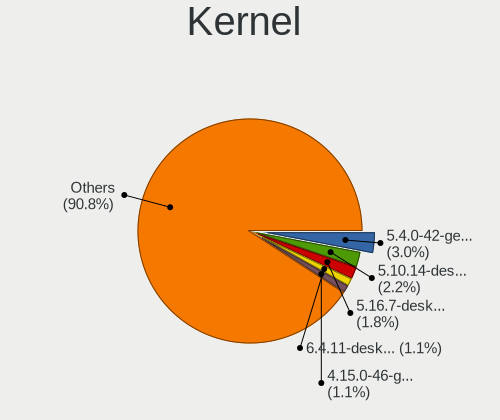
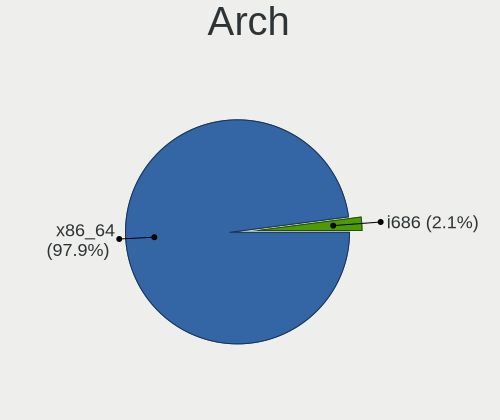
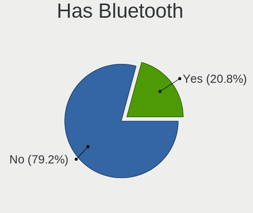
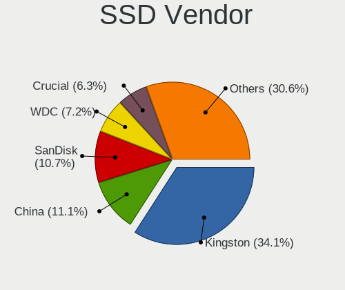
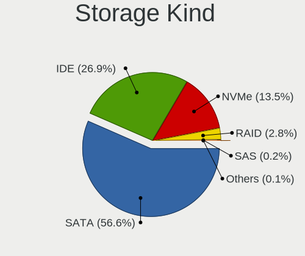
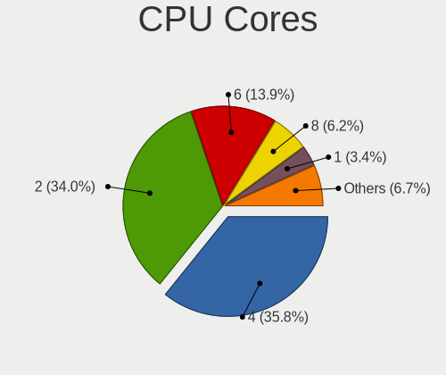
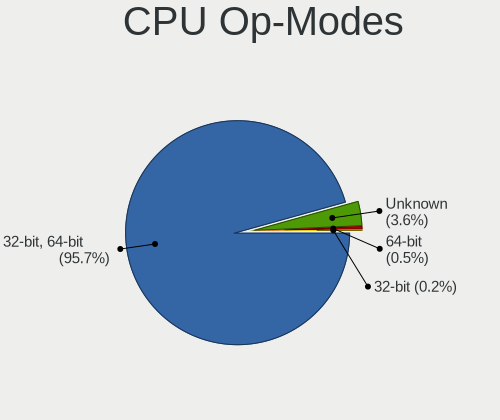
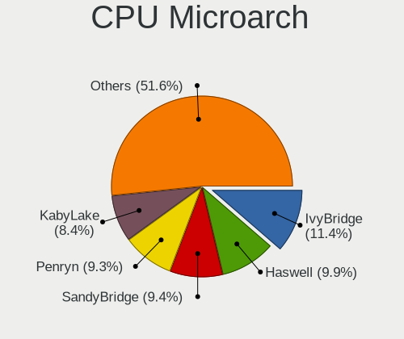
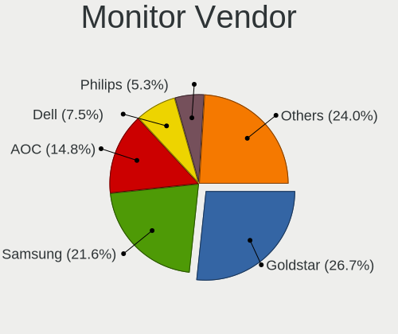
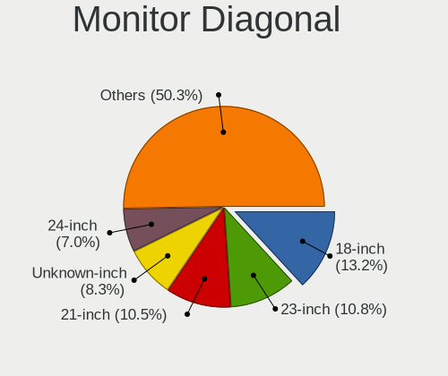

Linux in Brazil - Tested Hardware & Statistics (Desktops)
---------------------------------------------------------

A project to collect tested hardware configurations for Linux in Brazil.

Anyone can contribute to this report by the [hw-probe](https://github.com/linuxhw/hw-probe) tool:

    sudo -E hw-probe -all -upload

Please contribute! Especially if your hardware is rare.

Contents
--------

* [ Test Cases ](#test-cases)

* [ System ](#system)
  - [ OS                       ](#os)
  - [ OS Family                ](#os-family)
  - [ Kernel                   ](#kernel)
  - [ Kernel Family            ](#kernel-family)
  - [ Kernel Major Ver.        ](#kernel-major-ver)
  - [ Arch                     ](#arch)
  - [ DE                       ](#de)
  - [ Display Server           ](#display-server)
  - [ Display Manager          ](#display-manager)
  - [ OS Lang                  ](#os-lang)
  - [ Boot Mode                ](#boot-mode)
  - [ Filesystem               ](#filesystem)
  - [ Part. scheme             ](#part-scheme)
  - [ Dual Boot with Linux/BSD ](#dual-boot-with-linuxbsd)
  - [ Dual Boot (Win)          ](#dual-boot-win)

* [ Board ](#board)
  - [ Vendor                   ](#vendor)
  - [ Model                    ](#model)
  - [ Model Family             ](#model-family)
  - [ MFG Year                 ](#mfg-year)
  - [ Form Factor              ](#form-factor)
  - [ Secure Boot              ](#secure-boot)
  - [ Coreboot                 ](#coreboot)
  - [ RAM Size                 ](#ram-size)
  - [ RAM Used                 ](#ram-used)
  - [ Total Drives             ](#total-drives)
  - [ Has CD-ROM               ](#has-cd-rom)
  - [ Has Ethernet             ](#has-ethernet)
  - [ Has WiFi                 ](#has-wifi)
  - [ Has Bluetooth            ](#has-bluetooth)

* [ Location ](#location)
  - [ Country                  ](#country)
  - [ City                     ](#city)

* [ Drives ](#drives)
  - [ Drive Vendor             ](#drive-vendor)
  - [ Drive Model              ](#drive-model)
  - [ HDD Vendor               ](#hdd-vendor)
  - [ SSD Vendor               ](#ssd-vendor)
  - [ Drive Kind               ](#drive-kind)
  - [ Drive Connector          ](#drive-connector)
  - [ Drive Size               ](#drive-size)
  - [ Space Total              ](#space-total)
  - [ Space Used               ](#space-used)
  - [ Malfunc. Drives          ](#malfunc-drives)
  - [ Malfunc. Drive Vendor    ](#malfunc-drive-vendor)
  - [ Malfunc. HDD Vendor      ](#malfunc-hdd-vendor)
  - [ Malfunc. Drive Kind      ](#malfunc-drive-kind)
  - [ Failed Drives            ](#failed-drives)
  - [ Failed Drive Vendor      ](#failed-drive-vendor)
  - [ Drive Status             ](#drive-status)

* [ Storage controller ](#storage-controller)
  - [ Storage Vendor           ](#storage-vendor)
  - [ Storage Model            ](#storage-model)
  - [ Storage Kind             ](#storage-kind)

* [ Processor ](#processor)
  - [ CPU Vendor               ](#cpu-vendor)
  - [ CPU Model                ](#cpu-model)
  - [ CPU Model Family         ](#cpu-model-family)
  - [ CPU Cores                ](#cpu-cores)
  - [ CPU Sockets              ](#cpu-sockets)
  - [ CPU Threads              ](#cpu-threads)
  - [ CPU Op-Modes             ](#cpu-op-modes)
  - [ CPU Microcode            ](#cpu-microcode)
  - [ CPU Microarch            ](#cpu-microarch)

* [ Graphics ](#graphics)
  - [ GPU Vendor               ](#gpu-vendor)
  - [ GPU Model                ](#gpu-model)
  - [ GPU Combo                ](#gpu-combo)
  - [ GPU Driver               ](#gpu-driver)
  - [ GPU Memory               ](#gpu-memory)

* [ Monitor ](#monitor)
  - [ Monitor Vendor           ](#monitor-vendor)
  - [ Monitor Model            ](#monitor-model)
  - [ Monitor Resolution       ](#monitor-resolution)
  - [ Monitor Diagonal         ](#monitor-diagonal)
  - [ Monitor Width            ](#monitor-width)
  - [ Aspect Ratio             ](#aspect-ratio)
  - [ Monitor Area             ](#monitor-area)
  - [ Pixel Density            ](#pixel-density)
  - [ Multiple Monitors        ](#multiple-monitors)

* [ Network ](#network)
  - [ Net Controller Vendor    ](#net-controller-vendor)
  - [ Net Controller Model     ](#net-controller-model)
  - [ Wireless Vendor          ](#wireless-vendor)
  - [ Wireless Model           ](#wireless-model)
  - [ Ethernet Vendor          ](#ethernet-vendor)
  - [ Ethernet Model           ](#ethernet-model)
  - [ Net Controller Kind      ](#net-controller-kind)
  - [ Used Controller          ](#used-controller)
  - [ NICs                     ](#nics)
  - [ IPv6                     ](#ipv6)

* [ Bluetooth ](#bluetooth)
  - [ Bluetooth Vendor         ](#bluetooth-vendor)
  - [ Bluetooth Model          ](#bluetooth-model)

* [ Sound ](#sound)
  - [ Sound Vendor             ](#sound-vendor)
  - [ Sound Model              ](#sound-model)

* [ Memory ](#memory)
  - [ Memory Vendor            ](#memory-vendor)
  - [ Memory Model             ](#memory-model)
  - [ Memory Kind              ](#memory-kind)
  - [ Memory Form Factor       ](#memory-form-factor)
  - [ Memory Size              ](#memory-size)
  - [ Memory Speed             ](#memory-speed)

* [ Printers & scanners ](#printers--scanners)
  - [ Printer Vendor           ](#printer-vendor)
  - [ Printer Model            ](#printer-model)
  - [ Scanner Vendor           ](#scanner-vendor)
  - [ Scanner Model            ](#scanner-model)

* [ Camera ](#camera)
  - [ Camera Vendor            ](#camera-vendor)
  - [ Camera Model             ](#camera-model)

* [ Security ](#security)
  - [ Fingerprint Vendor       ](#fingerprint-vendor)
  - [ Fingerprint Model        ](#fingerprint-model)
  - [ Chipcard Vendor          ](#chipcard-vendor)
  - [ Chipcard Model           ](#chipcard-model)

* [ Unsupported ](#unsupported)
  - [ Unsupported Devices      ](#unsupported-devices)
  - [ Unsupported Device Types ](#unsupported-device-types)

Test Cases
----------

Total: 6374

| Vendor        | Model                       | Probe                                                      | Date         |
|---------------|-----------------------------|------------------------------------------------------------|--------------|
| Gigabyte      | GA-78LMT-USB3 SEx           | [6aa10285fe](https://linux-hardware.org/?probe=6aa10285fe) | Feb 01, 2023 |
| PCWare        | IPX525R2-D3                 | [20868d90a7](https://linux-hardware.org/?probe=20868d90a7) | Feb 01, 2023 |
| PCWare        | IPX525R2-D3                 | [d67831dc82](https://linux-hardware.org/?probe=d67831dc82) | Feb 01, 2023 |
| Gigabyte      | B550 AORUS ELITE V2         | [aa3b7e2dc8](https://linux-hardware.org/?probe=aa3b7e2dc8) | Feb 01, 2023 |
| AZW           | U59                         | [9b73123be3](https://linux-hardware.org/?probe=9b73123be3) | Feb 01, 2023 |
| AZW           | U59                         | [74f028454a](https://linux-hardware.org/?probe=74f028454a) | Feb 01, 2023 |
| AMD           | Inagua CRB                  | [3f497311dd](https://linux-hardware.org/?probe=3f497311dd) | Jan 31, 2023 |
| Dell          | 06HR05 A00                  | [b80c55d90d](https://linux-hardware.org/?probe=b80c55d90d) | Jan 31, 2023 |
| ASUSTek       | M5A78L-M LX/BR              | [d8d386cb1d](https://linux-hardware.org/?probe=d8d386cb1d) | Jan 31, 2023 |
| Gigabyte      | 945GCM-S2C                  | [41ad246a0b](https://linux-hardware.org/?probe=41ad246a0b) | Jan 31, 2023 |
| ASUSTek       | H61M-A/BR                   | [b6a73bd22e](https://linux-hardware.org/?probe=b6a73bd22e) | Jan 30, 2023 |
| ASUSTek       | H61M-A/BR                   | [0ae96c2bbc](https://linux-hardware.org/?probe=0ae96c2bbc) | Jan 30, 2023 |
| PCWare        | IPMH110G                    | [95fe94d9f4](https://linux-hardware.org/?probe=95fe94d9f4) | Jan 30, 2023 |
| ASUSTek       | H81M-CS/BR                  | [ca82a3e5a7](https://linux-hardware.org/?probe=ca82a3e5a7) | Jan 29, 2023 |
| Intel         | H61                         | [87a72c61f2](https://linux-hardware.org/?probe=87a72c61f2) | Jan 29, 2023 |
| Dell          | 0VRWRC A01                  | [0e6a170715](https://linux-hardware.org/?probe=0e6a170715) | Jan 29, 2023 |
| Intel         | H61                         | [0ce404915f](https://linux-hardware.org/?probe=0ce404915f) | Jan 29, 2023 |
| Toshiba       | STI 010433                  | [fead488cf1](https://linux-hardware.org/?probe=fead488cf1) | Jan 29, 2023 |
| ASUSTek       | PRIME Z690-A                | [8dee7ae6ec](https://linux-hardware.org/?probe=8dee7ae6ec) | Jan 28, 2023 |
| ASUSTek       | H81M-A/BR                   | [ca72045652](https://linux-hardware.org/?probe=ca72045652) | Jan 28, 2023 |
| Gigabyte      | H77M-D3H                    | [a9367f87d4](https://linux-hardware.org/?probe=a9367f87d4) | Jan 28, 2023 |
| ASRock        | N68C-S UCC                  | [de8739d9d5](https://linux-hardware.org/?probe=de8739d9d5) | Jan 28, 2023 |
| ASUSTek       | A58M-A/BR                   | [2e6e55e6ea](https://linux-hardware.org/?probe=2e6e55e6ea) | Jan 28, 2023 |
| ASUSTek       | PRIME B660M-A D4            | [41ff395299](https://linux-hardware.org/?probe=41ff395299) | Jan 28, 2023 |
| Gigabyte      | B75M-D3H                    | [3ee2e6ab56](https://linux-hardware.org/?probe=3ee2e6ab56) | Jan 27, 2023 |
| Intel         | DH77EB AAG39073-304         | [8965805130](https://linux-hardware.org/?probe=8965805130) | Jan 27, 2023 |
| ASUSTek       | TUF Gaming X570-PLUS_BR     | [e7b74c9ad4](https://linux-hardware.org/?probe=e7b74c9ad4) | Jan 27, 2023 |
| Positivo      | POS-PIB150DT                | [5a333d4e71](https://linux-hardware.org/?probe=5a333d4e71) | Jan 26, 2023 |
| Gigabyte      | GA-78LMT-USB3 SEx           | [90de00d686](https://linux-hardware.org/?probe=90de00d686) | Jan 26, 2023 |
| HP            | 225E                        | [bace147a01](https://linux-hardware.org/?probe=bace147a01) | Jan 26, 2023 |
| HP            | 8299                        | [d73eaeeb81](https://linux-hardware.org/?probe=d73eaeeb81) | Jan 26, 2023 |
| HP            | 8299                        | [47b5f3fdef](https://linux-hardware.org/?probe=47b5f3fdef) | Jan 26, 2023 |
| ASUSTek       | TUF Gaming X570-PLUS_BR     | [951bfcd626](https://linux-hardware.org/?probe=951bfcd626) | Jan 26, 2023 |
| ASRock        | B450M Steel Legend          | [f69047309d](https://linux-hardware.org/?probe=f69047309d) | Jan 26, 2023 |
| Gigabyte      | B75M-D3H                    | [6eafb4ceab](https://linux-hardware.org/?probe=6eafb4ceab) | Jan 25, 2023 |
| ASUSTek       | P8H67-M LX                  | [b8045702e2](https://linux-hardware.org/?probe=b8045702e2) | Jan 25, 2023 |
| Gigabyte      | M68MT-S2P                   | [5e044ca68b](https://linux-hardware.org/?probe=5e044ca68b) | Jan 25, 2023 |
| Intel         | DG31PR AAE58249-306         | [a123c38d76](https://linux-hardware.org/?probe=a123c38d76) | Jan 25, 2023 |
| MSI           | 2A9C                        | [cea7204c4b](https://linux-hardware.org/?probe=cea7204c4b) | Jan 25, 2023 |
| Gigabyte      | H310M M.2                   | [2fbe64570f](https://linux-hardware.org/?probe=2fbe64570f) | Jan 25, 2023 |
| Gigabyte      | H310M M.2                   | [30967bc549](https://linux-hardware.org/?probe=30967bc549) | Jan 23, 2023 |
| Gigabyte      | A520M S2H                   | [08f11b861b](https://linux-hardware.org/?probe=08f11b861b) | Jan 23, 2023 |
| ASRock        | B450M Steel Legend          | [c87ce45f84](https://linux-hardware.org/?probe=c87ce45f84) | Jan 23, 2023 |
| Intel         | DG31PR AAE58249-306         | [885f180987](https://linux-hardware.org/?probe=885f180987) | Jan 23, 2023 |
| MSI           | MAG B550 TOMAHAWK           | [6597dd71bc](https://linux-hardware.org/?probe=6597dd71bc) | Jan 23, 2023 |
| Unknown       | G41T-M7                     | [026810c423](https://linux-hardware.org/?probe=026810c423) | Jan 22, 2023 |
| Biostar       | A320MH                      | [4c75d6c079](https://linux-hardware.org/?probe=4c75d6c079) | Jan 22, 2023 |
| Gigabyte      | A320M-H-CF                  | [14a5fa99db](https://linux-hardware.org/?probe=14a5fa99db) | Jan 22, 2023 |
| ASUSTek       | H61M-A/BR                   | [43aaf27a04](https://linux-hardware.org/?probe=43aaf27a04) | Jan 22, 2023 |
| ASUSTek       | PRIME H310M-K               | [b066912bf8](https://linux-hardware.org/?probe=b066912bf8) | Jan 21, 2023 |
| ASUSTek       | TUF Gaming X570-PLUS_BR     | [90ad82dcac](https://linux-hardware.org/?probe=90ad82dcac) | Jan 21, 2023 |
| ASUSTek       | M5A78L-M PLUS/USB3          | [76a4c34a41](https://linux-hardware.org/?probe=76a4c34a41) | Jan 21, 2023 |
| Intel         | DG31PR AAE58249-306         | [e5fff0ebe0](https://linux-hardware.org/?probe=e5fff0ebe0) | Jan 21, 2023 |
| ASUSTek       | PRIME H510M-A               | [42e0ba4db2](https://linux-hardware.org/?probe=42e0ba4db2) | Jan 21, 2023 |
| Intel         | DG31PR AAE58249-306         | [8a3035382a](https://linux-hardware.org/?probe=8a3035382a) | Jan 21, 2023 |
| ASUSTek       | TUF Gaming X570-PLUS_BR     | [9579ec96bc](https://linux-hardware.org/?probe=9579ec96bc) | Jan 21, 2023 |
| Lenovo        | 3148 SDK0L22692 WIN 3792... | [f66c33020e](https://linux-hardware.org/?probe=f66c33020e) | Jan 21, 2023 |
| Dell          | 0VC8RJ X02                  | [313ea92e9c](https://linux-hardware.org/?probe=313ea92e9c) | Jan 20, 2023 |
| Intel         | B75                         | [40da372747](https://linux-hardware.org/?probe=40da372747) | Jan 20, 2023 |
| ASUSTek       | P8H61-M LX2 R2.0            | [2d420c3acb](https://linux-hardware.org/?probe=2d420c3acb) | Jan 20, 2023 |
| Gigabyte      | H61M-S1                     | [97987f88e7](https://linux-hardware.org/?probe=97987f88e7) | Jan 20, 2023 |
| AZW           | SEi                         | [257b104c3a](https://linux-hardware.org/?probe=257b104c3a) | Jan 20, 2023 |
| AZW           | SEi                         | [481932390b](https://linux-hardware.org/?probe=481932390b) | Jan 20, 2023 |
| ASUSTek       | P8H61-M LX3 PLUS R2.0       | [1320f35331](https://linux-hardware.org/?probe=1320f35331) | Jan 20, 2023 |
| Positivo      | POS-PIQ77CL POSITIVO        | [c2f25e54e6](https://linux-hardware.org/?probe=c2f25e54e6) | Jan 19, 2023 |
| Unknown       | Unknown                     | [d4480b6267](https://linux-hardware.org/?probe=d4480b6267) | Jan 19, 2023 |
| Intel         | H110                        | [532f2a340e](https://linux-hardware.org/?probe=532f2a340e) | Jan 19, 2023 |
| Digitron      | G31T-M7                     | [ee9978ae25](https://linux-hardware.org/?probe=ee9978ae25) | Jan 19, 2023 |
| ASUSTek       | H110M-C/BR                  | [58bed7db63](https://linux-hardware.org/?probe=58bed7db63) | Jan 19, 2023 |
| Intel         | H61                         | [be9b2384b0](https://linux-hardware.org/?probe=be9b2384b0) | Jan 18, 2023 |
| Gigabyte      | H61M-S1                     | [80022afba6](https://linux-hardware.org/?probe=80022afba6) | Jan 18, 2023 |
| Toshiba       | STI 014293                  | [8e47b89089](https://linux-hardware.org/?probe=8e47b89089) | Jan 18, 2023 |
| ASRock        | H510M-HVS R2.0              | [3ee772766c](https://linux-hardware.org/?probe=3ee772766c) | Jan 18, 2023 |
| Gigabyte      | X470 AORUS GAMING 7 WIFI... | [1a8a1eea59](https://linux-hardware.org/?probe=1a8a1eea59) | Jan 17, 2023 |
| Login Info... | LOG-H110M-G3                | [74defcfa62](https://linux-hardware.org/?probe=74defcfa62) | Jan 17, 2023 |
| ASUSTek       | PRIME A320M-K/BR            | [0b7d83316f](https://linux-hardware.org/?probe=0b7d83316f) | Jan 17, 2023 |
| Huanan        | B75 V10.1 376               | [2703c87348](https://linux-hardware.org/?probe=2703c87348) | Jan 17, 2023 |
| ASUSTek       | M2N68-AM                    | [e08287f623](https://linux-hardware.org/?probe=e08287f623) | Jan 17, 2023 |
| ASUSTek       | M2N68-AM                    | [c4dbd0f9fe](https://linux-hardware.org/?probe=c4dbd0f9fe) | Jan 17, 2023 |
| Gigabyte      | 945GCM-S2C                  | [23a3b53ebd](https://linux-hardware.org/?probe=23a3b53ebd) | Jan 17, 2023 |
| ASUSTek       | PRIME H410M-E               | [57aec688e4](https://linux-hardware.org/?probe=57aec688e4) | Jan 17, 2023 |
| Gigabyte      | H61M-S1                     | [a7970f0c50](https://linux-hardware.org/?probe=a7970f0c50) | Jan 16, 2023 |
| Gigabyte      | H61M-S1                     | [bf5d9763f7](https://linux-hardware.org/?probe=bf5d9763f7) | Jan 16, 2023 |
| Toshiba       | STI 007030                  | [c0eb39ae66](https://linux-hardware.org/?probe=c0eb39ae66) | Jan 16, 2023 |
| Biostar       | A320MH                      | [1736406da7](https://linux-hardware.org/?probe=1736406da7) | Jan 16, 2023 |
| Intel         | JSL MRD                     | [edbaf7bb5d](https://linux-hardware.org/?probe=edbaf7bb5d) | Jan 16, 2023 |
| MSI           | 2A9C                        | [7a4c26c267](https://linux-hardware.org/?probe=7a4c26c267) | Jan 15, 2023 |
| Lenovo        | ThinkCentre M58e 7303BZ2    | [af99ffb577](https://linux-hardware.org/?probe=af99ffb577) | Jan 15, 2023 |
| Biostar       | A320MH                      | [3fb3a04230](https://linux-hardware.org/?probe=3fb3a04230) | Jan 14, 2023 |
| Gigabyte      | H310M M.2                   | [4eecdbd79d](https://linux-hardware.org/?probe=4eecdbd79d) | Jan 14, 2023 |
| MAXSUN        | MS-TZZ B460M                | [14758fc3e7](https://linux-hardware.org/?probe=14758fc3e7) | Jan 14, 2023 |
| ASUSTek       | TUF Gaming B460M-PLUS       | [d1e2f08907](https://linux-hardware.org/?probe=d1e2f08907) | Jan 14, 2023 |
| MACHINIST     | B75 PRO V1.0                | [c0728b5e41](https://linux-hardware.org/?probe=c0728b5e41) | Jan 14, 2023 |
| Pegatron      | IPM41-D3                    | [23a918874b](https://linux-hardware.org/?probe=23a918874b) | Jan 14, 2023 |
| Intel         | H55                         | [4fdea85eec](https://linux-hardware.org/?probe=4fdea85eec) | Jan 14, 2023 |
| Intel         | H55                         | [d875a18037](https://linux-hardware.org/?probe=d875a18037) | Jan 14, 2023 |
| ASUSTek       | PRIME H410M-E               | [0c15b80c58](https://linux-hardware.org/?probe=0c15b80c58) | Jan 13, 2023 |
| PCWare        | IPX1800E2                   | [57e454fc85](https://linux-hardware.org/?probe=57e454fc85) | Jan 13, 2023 |
| ASUSTek       | STRIX B250F GAMING          | [40acaf3525](https://linux-hardware.org/?probe=40acaf3525) | Jan 13, 2023 |
| Gigabyte      | AB350M-DS3H V2-CF           | [dc7954e720](https://linux-hardware.org/?probe=dc7954e720) | Jan 13, 2023 |
| Intel         | H61                         | [fde46524d3](https://linux-hardware.org/?probe=fde46524d3) | Jan 13, 2023 |
| ASUSTek       | A88XM-A                     | [06851118fe](https://linux-hardware.org/?probe=06851118fe) | Jan 13, 2023 |
| MSI           | A68HM-E33                   | [8e81067cd2](https://linux-hardware.org/?probe=8e81067cd2) | Jan 13, 2023 |
| Pegatron      | IPM31G                      | [04e04dc57b](https://linux-hardware.org/?probe=04e04dc57b) | Jan 12, 2023 |
| HP            | 3047h                       | [5eb46c9039](https://linux-hardware.org/?probe=5eb46c9039) | Jan 12, 2023 |
| HP            | 3047h                       | [0c035c1a04](https://linux-hardware.org/?probe=0c035c1a04) | Jan 12, 2023 |
| ASRock        | H110M-HG4                   | [e14d589500](https://linux-hardware.org/?probe=e14d589500) | Jan 12, 2023 |
| ADVANSUS      | 945G                        | [3a9bdd2358](https://linux-hardware.org/?probe=3a9bdd2358) | Jan 12, 2023 |
| Pegatron      | 2AC3                        | [3cfb7d9e7c](https://linux-hardware.org/?probe=3cfb7d9e7c) | Jan 12, 2023 |
| ASRock        | FM2A68M-DG3+                | [acc9ea9c40](https://linux-hardware.org/?probe=acc9ea9c40) | Jan 11, 2023 |
| HP            | 82A2                        | [21321971f7](https://linux-hardware.org/?probe=21321971f7) | Jan 11, 2023 |
| ADVANSUS      | 945G                        | [db0f184e3f](https://linux-hardware.org/?probe=db0f184e3f) | Jan 11, 2023 |
| Gigabyte      | B450 AORUS M                | [0851440887](https://linux-hardware.org/?probe=0851440887) | Jan 11, 2023 |
| Dell          | 01XK1W A00                  | [54793acf7e](https://linux-hardware.org/?probe=54793acf7e) | Jan 11, 2023 |
| Gigabyte      | M68MT-S2P                   | [97f4c3c67a](https://linux-hardware.org/?probe=97f4c3c67a) | Jan 11, 2023 |
| Gigabyte      | B450M AORUS ELITE           | [f4d9052764](https://linux-hardware.org/?probe=f4d9052764) | Jan 10, 2023 |
| ASUSTek       | P8Z77-V LX                  | [0239336b7c](https://linux-hardware.org/?probe=0239336b7c) | Jan 10, 2023 |
| ASUSTek       | H81M-CS/BR                  | [26747becd2](https://linux-hardware.org/?probe=26747becd2) | Jan 10, 2023 |
| ASUSTek       | M2A-VM HDMI                 | [02524a1989](https://linux-hardware.org/?probe=02524a1989) | Jan 10, 2023 |
| ASUSTek       | TUF B360M-PLUS GAMING/BR    | [52164aa403](https://linux-hardware.org/?probe=52164aa403) | Jan 10, 2023 |
| Gigabyte      | A520M DS3H                  | [d4ea636610](https://linux-hardware.org/?probe=d4ea636610) | Jan 10, 2023 |
| ASUSTek       | TUF H310M-PLUS GAMING/BR    | [0a5f45ca97](https://linux-hardware.org/?probe=0a5f45ca97) | Jan 10, 2023 |
| Intel         | B75                         | [ec08587a4a](https://linux-hardware.org/?probe=ec08587a4a) | Jan 09, 2023 |
| ASUSTek       | TUF Gaming B550M-E WIFI     | [6c7320f939](https://linux-hardware.org/?probe=6c7320f939) | Jan 09, 2023 |
| Dell          | 0VRWRC A01                  | [45e73c7052](https://linux-hardware.org/?probe=45e73c7052) | Jan 09, 2023 |
| ASUSTek       | P8H61-M LX3 R2.0            | [699eb66c12](https://linux-hardware.org/?probe=699eb66c12) | Jan 09, 2023 |
| ASUSTek       | M4A88T-M                    | [4c3d063774](https://linux-hardware.org/?probe=4c3d063774) | Jan 09, 2023 |
| Dell          | 0N820C A02                  | [6fa7639fd2](https://linux-hardware.org/?probe=6fa7639fd2) | Jan 07, 2023 |
| Dell          | 0VXN67 A01                  | [843a02520e](https://linux-hardware.org/?probe=843a02520e) | Jan 07, 2023 |
| Biostar       | G31-M7 TE                   | [16dd478d1e](https://linux-hardware.org/?probe=16dd478d1e) | Jan 06, 2023 |
| MSI           | H61M-E22/W8                 | [92280cb6ae](https://linux-hardware.org/?probe=92280cb6ae) | Jan 06, 2023 |
| ASUSTek       | M5A78L-M LX/BR              | [122079f900](https://linux-hardware.org/?probe=122079f900) | Jan 06, 2023 |
| Pegatron      | 2AC3                        | [4ce129e600](https://linux-hardware.org/?probe=4ce129e600) | Jan 05, 2023 |
| Dell          | 01XK1W A00                  | [bb487db79f](https://linux-hardware.org/?probe=bb487db79f) | Jan 05, 2023 |
| Positivo      | POS-PIQ57BQA                | [4453ef0d86](https://linux-hardware.org/?probe=4453ef0d86) | Jan 04, 2023 |
| Gigabyte      | H87-D3H-CF                  | [5b13eb0dad](https://linux-hardware.org/?probe=5b13eb0dad) | Jan 04, 2023 |
| Unknown       | Unknown                     | [1e69c79d74](https://linux-hardware.org/?probe=1e69c79d74) | Jan 04, 2023 |
| Positivo      | POS-PIQ57BQA                | [e03b53cc0e](https://linux-hardware.org/?probe=e03b53cc0e) | Jan 04, 2023 |
| Dell          | 0P99M4 A01                  | [0b6a911c16](https://linux-hardware.org/?probe=0b6a911c16) | Jan 03, 2023 |
| Dell          | 0VTJVC A00                  | [8a502c849f](https://linux-hardware.org/?probe=8a502c849f) | Jan 03, 2023 |
| Positivo      | POS-EIB85CZ                 | [639f5a2bf7](https://linux-hardware.org/?probe=639f5a2bf7) | Jan 03, 2023 |
| ASUSTek       | B85M-E/BR                   | [88f7654113](https://linux-hardware.org/?probe=88f7654113) | Jan 02, 2023 |
| MSI           | A520M-A PRO                 | [28a0c6dda9](https://linux-hardware.org/?probe=28a0c6dda9) | Jan 02, 2023 |
| JGINYUE       | B85I PLUS V2.0              | [28a07cbbe1](https://linux-hardware.org/?probe=28a07cbbe1) | Jan 02, 2023 |
| JGINYUE       | B85I PLUS V2.0              | [3cde9738e7](https://linux-hardware.org/?probe=3cde9738e7) | Jan 02, 2023 |
| PCWare        | IPMH110G                    | [a795f33f7a](https://linux-hardware.org/?probe=a795f33f7a) | Jan 02, 2023 |
| Positivo      | POS-AG31AP                  | [a0ef7524c6](https://linux-hardware.org/?probe=a0ef7524c6) | Jan 02, 2023 |
| Positivo      | POS-AG31AP                  | [4cc8fbf002](https://linux-hardware.org/?probe=4cc8fbf002) | Jan 02, 2023 |
| Gigabyte      | A320M-S2H-CF                | [e26cc7285f](https://linux-hardware.org/?probe=e26cc7285f) | Jan 02, 2023 |
| ASUSTek       | TUF Z390-PRO GAMING         | [de65f4b654](https://linux-hardware.org/?probe=de65f4b654) | Dec 31, 2022 |
| Dell          | 0VR8V9 A01                  | [0e7d4ac326](https://linux-hardware.org/?probe=0e7d4ac326) | Dec 31, 2022 |
| ASUSTek       | M5A78L-M/USB3               | [2508c5972e](https://linux-hardware.org/?probe=2508c5972e) | Dec 31, 2022 |
| ASRock        | B360M Performance           | [679d25f9be](https://linux-hardware.org/?probe=679d25f9be) | Dec 31, 2022 |
| Gigabyte      | G31M-S2C                    | [39f08657f8](https://linux-hardware.org/?probe=39f08657f8) | Dec 31, 2022 |
| HOUTER        | IPMIP-GS                    | [6fddf7d035](https://linux-hardware.org/?probe=6fddf7d035) | Dec 30, 2022 |
| Gigabyte      | AB350M-DS3H V2-CF           | [1c7a329282](https://linux-hardware.org/?probe=1c7a329282) | Dec 30, 2022 |
| PCWare        | IPMH61R1                    | [a221946f02](https://linux-hardware.org/?probe=a221946f02) | Dec 29, 2022 |
| Gigabyte      | A320M-H-CF                  | [83608f4248](https://linux-hardware.org/?probe=83608f4248) | Dec 28, 2022 |
| Gigabyte      | AB350M-DS3H V2-CF           | [2522f716da](https://linux-hardware.org/?probe=2522f716da) | Dec 28, 2022 |
| Itautec       | ST 4265                     | [38e4a07f9a](https://linux-hardware.org/?probe=38e4a07f9a) | Dec 27, 2022 |
| ASRock        | H61M-HG4                    | [8658fa0fa3](https://linux-hardware.org/?probe=8658fa0fa3) | Dec 27, 2022 |
| ASRock        | H61M-HG4                    | [cf7ba71c5e](https://linux-hardware.org/?probe=cf7ba71c5e) | Dec 27, 2022 |
| Megaware      | MW-H61M-2H v1.3 - 17/07/... | [868a87a1f8](https://linux-hardware.org/?probe=868a87a1f8) | Dec 27, 2022 |
| Itautec       | ST 4265                     | [8323542129](https://linux-hardware.org/?probe=8323542129) | Dec 26, 2022 |
| ASUSTek       | PRIME B450M-GAMING/BR       | [e12a45a65f](https://linux-hardware.org/?probe=e12a45a65f) | Dec 25, 2022 |
| ASUSTek       | PRIME B450M-GAMING/BR       | [4f28247dcb](https://linux-hardware.org/?probe=4f28247dcb) | Dec 25, 2022 |
| MSI           | MAG B650M MORTAR WIFI       | [d66db29328](https://linux-hardware.org/?probe=d66db29328) | Dec 25, 2022 |
| ASUSTek       | PRIME B450M-GAMING/BR       | [c7d8ce8f80](https://linux-hardware.org/?probe=c7d8ce8f80) | Dec 24, 2022 |
| MACHINIST     | X99-RS9 V2.0                | [27612d2f72](https://linux-hardware.org/?probe=27612d2f72) | Dec 24, 2022 |
| Intel         | H61                         | [8d5eb236e1](https://linux-hardware.org/?probe=8d5eb236e1) | Dec 24, 2022 |
| MSI           | MAG B650M MORTAR WIFI       | [2979740651](https://linux-hardware.org/?probe=2979740651) | Dec 24, 2022 |
| ASRock        | A320M-HD                    | [5307c53c91](https://linux-hardware.org/?probe=5307c53c91) | Dec 22, 2022 |
| PERTOSA       | IPMSBA                      | [8cd4fff2ce](https://linux-hardware.org/?probe=8cd4fff2ce) | Dec 22, 2022 |
| PCWare        | IPMH310 PRO 1.0             | [c4dea5edbb](https://linux-hardware.org/?probe=c4dea5edbb) | Dec 21, 2022 |
| PERTOSA       | GA-H110TN-M                 | [048d8cca49](https://linux-hardware.org/?probe=048d8cca49) | Dec 21, 2022 |
| Intel         | X99 V1.0                    | [20c96ed6dd](https://linux-hardware.org/?probe=20c96ed6dd) | Dec 21, 2022 |
| Gigabyte      | M68MT-S2P                   | [363c106fa2](https://linux-hardware.org/?probe=363c106fa2) | Dec 21, 2022 |
| Gigabyte      | M68MT-S2P                   | [ed29442d39](https://linux-hardware.org/?probe=ed29442d39) | Dec 21, 2022 |
| Intel         | B75                         | [368e71afd7](https://linux-hardware.org/?probe=368e71afd7) | Dec 21, 2022 |
| Intel         | X99 V1.x                    | [5e961d12dc](https://linux-hardware.org/?probe=5e961d12dc) | Dec 21, 2022 |
| PCWare        | IPMH81G1                    | [3dc25592eb](https://linux-hardware.org/?probe=3dc25592eb) | Dec 20, 2022 |
| Intel         | H81                         | [747dd5e27a](https://linux-hardware.org/?probe=747dd5e27a) | Dec 20, 2022 |
| Gigabyte      | F2A68HM-H                   | [79cf1b618f](https://linux-hardware.org/?probe=79cf1b618f) | Dec 20, 2022 |
| ECS           | G31T-M7                     | [327ac25b68](https://linux-hardware.org/?probe=327ac25b68) | Dec 20, 2022 |
| ASUSTek       | M5A78L-M/USB3               | [533bf9eafc](https://linux-hardware.org/?probe=533bf9eafc) | Dec 19, 2022 |
| Gigabyte      | 970A-DS3P                   | [6870f7c47f](https://linux-hardware.org/?probe=6870f7c47f) | Dec 18, 2022 |
| Intel         | HM570                       | [627a39bc3f](https://linux-hardware.org/?probe=627a39bc3f) | Dec 18, 2022 |
| Intel         | HM570                       | [303e68f585](https://linux-hardware.org/?probe=303e68f585) | Dec 18, 2022 |
| Dell          | 0UY894 A02                  | [904ee2bb12](https://linux-hardware.org/?probe=904ee2bb12) | Dec 18, 2022 |
| ASRock        | 960GC-GS FX                 | [a61b5c0129](https://linux-hardware.org/?probe=a61b5c0129) | Dec 17, 2022 |
| Gigabyte      | X570 AORUS ELITE            | [dec0d049f7](https://linux-hardware.org/?probe=dec0d049f7) | Dec 17, 2022 |
| Biostar       | X470GTN                     | [7c067277b2](https://linux-hardware.org/?probe=7c067277b2) | Dec 17, 2022 |
| Intel         | H55                         | [c034f3b3db](https://linux-hardware.org/?probe=c034f3b3db) | Dec 16, 2022 |
| ASUSTek       | PRIME H310M-E R2.0          | [0b1367de2f](https://linux-hardware.org/?probe=0b1367de2f) | Dec 16, 2022 |
| ASUSTek       | PRIME A320M-K/BR            | [60848aa48e](https://linux-hardware.org/?probe=60848aa48e) | Dec 16, 2022 |
| Pegatron      | IPM41-D3                    | [a41e0d92a7](https://linux-hardware.org/?probe=a41e0d92a7) | Dec 15, 2022 |
| Dell          | 0FR6WH A01                  | [46d6c645fe](https://linux-hardware.org/?probe=46d6c645fe) | Dec 15, 2022 |
| ASUSTek       | EX-A320M-GAMING             | [6bd184b75a](https://linux-hardware.org/?probe=6bd184b75a) | Dec 15, 2022 |
| Biostar       | B460GTQ                     | [7f3836bddf](https://linux-hardware.org/?probe=7f3836bddf) | Dec 14, 2022 |
| Dell          | 0M5DCD A00                  | [61c4e63c2d](https://linux-hardware.org/?probe=61c4e63c2d) | Dec 14, 2022 |
| ASUSTek       | TUF Gaming B460M-PLUS       | [bed03c8f85](https://linux-hardware.org/?probe=bed03c8f85) | Dec 14, 2022 |
| ASUSTek       | TUF Gaming B460M-PLUS       | [d6244def87](https://linux-hardware.org/?probe=d6244def87) | Dec 14, 2022 |
| MSI           | X370 SLI PLUS               | [7c32d0f453](https://linux-hardware.org/?probe=7c32d0f453) | Dec 14, 2022 |
| ASUSTek       | M4N78 SE                    | [e37cb274ff](https://linux-hardware.org/?probe=e37cb274ff) | Dec 14, 2022 |
| Gigabyte      | B75M-D3H                    | [f522fb6cbd](https://linux-hardware.org/?probe=f522fb6cbd) | Dec 13, 2022 |
| Gigabyte      | B75M-D3H                    | [4de5804244](https://linux-hardware.org/?probe=4de5804244) | Dec 13, 2022 |
| Intel         | X79 (INTEL Xeon E5/Corei... | [70506a428c](https://linux-hardware.org/?probe=70506a428c) | Dec 13, 2022 |
| PCWare        | IPMH110G                    | [baa0f26af0](https://linux-hardware.org/?probe=baa0f26af0) | Dec 13, 2022 |
| ASUSTek       | PRIME H310M-E R2.0/BR       | [51acd303f0](https://linux-hardware.org/?probe=51acd303f0) | Dec 12, 2022 |
| Dell          | 042P49 A01                  | [fc5be35686](https://linux-hardware.org/?probe=fc5be35686) | Dec 12, 2022 |
| ASUSTek       | SABERTOOTH X99              | [c0bf1336d5](https://linux-hardware.org/?probe=c0bf1336d5) | Dec 12, 2022 |
| Braview       | BRW-BSWI-D2                 | [1568a74103](https://linux-hardware.org/?probe=1568a74103) | Dec 11, 2022 |
| ECS           | H61H2-M3                    | [dcd96a2b45](https://linux-hardware.org/?probe=dcd96a2b45) | Dec 11, 2022 |
| ECS           | H61H2-M3                    | [9f9fafa75b](https://linux-hardware.org/?probe=9f9fafa75b) | Dec 11, 2022 |
| ASRock        | 760GM-HD                    | [03fdf6453b](https://linux-hardware.org/?probe=03fdf6453b) | Dec 11, 2022 |
| Intel         | DX58SO AAE29331-702         | [685274600b](https://linux-hardware.org/?probe=685274600b) | Dec 10, 2022 |
| ASUSTek       | PRIME B450M-GAMING/BR       | [a64decb842](https://linux-hardware.org/?probe=a64decb842) | Dec 10, 2022 |
| QIYIDA        | X99-H9 V2.0                 | [830ec0e7be](https://linux-hardware.org/?probe=830ec0e7be) | Dec 10, 2022 |
| ASUSTek       | Z170M-PLUS/BR               | [62779a600c](https://linux-hardware.org/?probe=62779a600c) | Dec 09, 2022 |
| ASUSTek       | Z170M-PLUS/BR               | [ac8d321e9a](https://linux-hardware.org/?probe=ac8d321e9a) | Dec 09, 2022 |
| ASRock        | A320M-HD                    | [aea1c7da95](https://linux-hardware.org/?probe=aea1c7da95) | Dec 09, 2022 |
| ASUSTek       | TUF Gaming B550M-PLUS       | [bddf744d58](https://linux-hardware.org/?probe=bddf744d58) | Dec 09, 2022 |
| Gigabyte      | B450 AORUS M                | [b1ac2fbabe](https://linux-hardware.org/?probe=b1ac2fbabe) | Dec 09, 2022 |
| Gigabyte      | GA-78LMT-USB3 SEx           | [42f14a38dd](https://linux-hardware.org/?probe=42f14a38dd) | Dec 09, 2022 |
| PCWare        | IPMH61R3                    | [d216c11fea](https://linux-hardware.org/?probe=d216c11fea) | Dec 08, 2022 |
| Gigabyte      | G41MT-S2                    | [f69d93aece](https://linux-hardware.org/?probe=f69d93aece) | Dec 08, 2022 |
| Gigabyte      | B450M AORUS ELITE           | [7f45781139](https://linux-hardware.org/?probe=7f45781139) | Dec 08, 2022 |
| ASUSTek       | ROG STRIX B550-E GAMING     | [c376825cca](https://linux-hardware.org/?probe=c376825cca) | Dec 07, 2022 |
| Unknown       | PCWARE APMCP68              | [bf85f27d83](https://linux-hardware.org/?probe=bf85f27d83) | Dec 07, 2022 |
| Gigabyte      | B75M-D3H                    | [33472ea902](https://linux-hardware.org/?probe=33472ea902) | Dec 06, 2022 |
| Gigabyte      | B75M-D3H                    | [f4f7580aff](https://linux-hardware.org/?probe=f4f7580aff) | Dec 06, 2022 |
| HP            | 3397                        | [efcd9d806e](https://linux-hardware.org/?probe=efcd9d806e) | Dec 06, 2022 |
| Dell          | 0HN7XN A01                  | [72203965d8](https://linux-hardware.org/?probe=72203965d8) | Dec 06, 2022 |
| Dell          | 01XK1W A00                  | [e2ec28bd7c](https://linux-hardware.org/?probe=e2ec28bd7c) | Dec 06, 2022 |
| ASUSTek       | PRIME B450M-GAMING/BR       | [97595fe5a1](https://linux-hardware.org/?probe=97595fe5a1) | Dec 05, 2022 |
| ASUSTek       | ROG STRIX B550-E GAMING     | [69cc6b3ad3](https://linux-hardware.org/?probe=69cc6b3ad3) | Dec 05, 2022 |
| Intel         | HURONRIVER                  | [d8a4f4a923](https://linux-hardware.org/?probe=d8a4f4a923) | Dec 05, 2022 |
| PCWare        | IPMH110G                    | [0574aeace9](https://linux-hardware.org/?probe=0574aeace9) | Dec 05, 2022 |
| MSI           | X370 SLI PLUS               | [e6941ba491](https://linux-hardware.org/?probe=e6941ba491) | Dec 05, 2022 |
| Gigabyte      | GA-78LMT-S2                 | [fa3aeacc17](https://linux-hardware.org/?probe=fa3aeacc17) | Dec 05, 2022 |
| Positivo      | POS-PIQ77CL POSITIVO        | [e98fcde376](https://linux-hardware.org/?probe=e98fcde376) | Dec 04, 2022 |
| ASUSTek       | P8Z77-V PRO                 | [b5c74add87](https://linux-hardware.org/?probe=b5c74add87) | Dec 04, 2022 |
| MSI           | MAG B550M MORTAR            | [ad81cbb6e4](https://linux-hardware.org/?probe=ad81cbb6e4) | Dec 04, 2022 |
| MACHINIST     | E5-MR9A PRO V1.0            | [67fa9fb5aa](https://linux-hardware.org/?probe=67fa9fb5aa) | Dec 03, 2022 |
| MSI           | 2A9C                        | [d7b2898f42](https://linux-hardware.org/?probe=d7b2898f42) | Dec 03, 2022 |
| Intel         | H61                         | [4050e46b94](https://linux-hardware.org/?probe=4050e46b94) | Dec 03, 2022 |
| MSI           | 2A9C                        | [52ab7bcdde](https://linux-hardware.org/?probe=52ab7bcdde) | Dec 03, 2022 |
| Unknown       | DH61BR G32662-203           | [c22d1caae4](https://linux-hardware.org/?probe=c22d1caae4) | Dec 03, 2022 |
| ASUSTek       | TUF Gaming B550M-PLUS       | [c2c53a959d](https://linux-hardware.org/?probe=c2c53a959d) | Dec 03, 2022 |
| Intel         | X99                         | [bd1d84cf82](https://linux-hardware.org/?probe=bd1d84cf82) | Dec 02, 2022 |
| Intel         | X99                         | [4051f684d8](https://linux-hardware.org/?probe=4051f684d8) | Dec 02, 2022 |
| ABIT          | I-45CV                      | [54b95d7794](https://linux-hardware.org/?probe=54b95d7794) | Dec 02, 2022 |
| Lenovo        | 3102 NOK                    | [8bfdcedec6](https://linux-hardware.org/?probe=8bfdcedec6) | Dec 02, 2022 |
| Itautec       | ST 4265                     | [6c18ee8479](https://linux-hardware.org/?probe=6c18ee8479) | Dec 02, 2022 |
| Itautec       | ST 4265                     | [d31a6b4c0f](https://linux-hardware.org/?probe=d31a6b4c0f) | Dec 01, 2022 |
| Positivo      | POS-PIQ57BQA                | [8403658c27](https://linux-hardware.org/?probe=8403658c27) | Dec 01, 2022 |
| ASUSTek       | TUF Gaming X570-PLUS_BR     | [7ff54a3b05](https://linux-hardware.org/?probe=7ff54a3b05) | Dec 01, 2022 |
| ASUSTek       | PRIME B450M-GAMING/BR       | [8a4813eec4](https://linux-hardware.org/?probe=8a4813eec4) | Nov 30, 2022 |
| Colorful T... | DJ H310M-E V20              | [ef8cb053dc](https://linux-hardware.org/?probe=ef8cb053dc) | Nov 30, 2022 |
| Colorful T... | DJ H310M-E V20              | [9831bd75b9](https://linux-hardware.org/?probe=9831bd75b9) | Nov 30, 2022 |
| Unknown       | X99H                        | [b9e2236de7](https://linux-hardware.org/?probe=b9e2236de7) | Nov 30, 2022 |
| ASUSTek       | P8H61-M LX3                 | [87d3950072](https://linux-hardware.org/?probe=87d3950072) | Nov 30, 2022 |
| GALAX         | B365M G10b                  | [9eabacd766](https://linux-hardware.org/?probe=9eabacd766) | Nov 30, 2022 |
| GALAX         | B365M G10b                  | [9f7438d5a3](https://linux-hardware.org/?probe=9f7438d5a3) | Nov 30, 2022 |
| Biostar       | H81MHV3 5.0                 | [d89a05dd31](https://linux-hardware.org/?probe=d89a05dd31) | Nov 29, 2022 |
| Intel         | H61                         | [42f943bc9c](https://linux-hardware.org/?probe=42f943bc9c) | Nov 28, 2022 |
| PCWare        | IPMH61R1                    | [7872d8f10f](https://linux-hardware.org/?probe=7872d8f10f) | Nov 28, 2022 |
| Gigabyte      | B450 AORUS M                | [8263c8ba6f](https://linux-hardware.org/?probe=8263c8ba6f) | Nov 28, 2022 |
| HOUTER        | IPMIP-GS                    | [cbc472e6df](https://linux-hardware.org/?probe=cbc472e6df) | Nov 28, 2022 |
| AMD           | 58514                       | [7558bc36a0](https://linux-hardware.org/?probe=7558bc36a0) | Nov 27, 2022 |
| ASUSTek       | H81M-K                      | [4de72d3d12](https://linux-hardware.org/?probe=4de72d3d12) | Nov 26, 2022 |
| MSI           | P55-CD53                    | [a602949484](https://linux-hardware.org/?probe=a602949484) | Nov 26, 2022 |
| Megaware      | MW-NM70HD-MI 01/13/2013 ... | [95b48709fd](https://linux-hardware.org/?probe=95b48709fd) | Nov 26, 2022 |
| Huanan        | X99-8M-F V1.1               | [88db74df98](https://linux-hardware.org/?probe=88db74df98) | Nov 26, 2022 |
| ASUSTek       | B150M-C                     | [bbbdc2b291](https://linux-hardware.org/?probe=bbbdc2b291) | Nov 26, 2022 |
| Unknown       | PCWARE APMCP68              | [0cb03d53bb](https://linux-hardware.org/?probe=0cb03d53bb) | Nov 26, 2022 |
| Huanan        | X99-8M-F V1.1               | [3ca25803b5](https://linux-hardware.org/?probe=3ca25803b5) | Nov 25, 2022 |
| Intel         | Unknown                     | [bcf46201bc](https://linux-hardware.org/?probe=bcf46201bc) | Nov 25, 2022 |
| ASRock        | B460M-HDV                   | [00c07e7aa9](https://linux-hardware.org/?probe=00c07e7aa9) | Nov 25, 2022 |
| Intel         | H61                         | [76825e4753](https://linux-hardware.org/?probe=76825e4753) | Nov 25, 2022 |
| HP            | 18E7                        | [048d4bd3ae](https://linux-hardware.org/?probe=048d4bd3ae) | Nov 25, 2022 |
| Positivo      | P5VD2-MX                    | [c9d4c5ea2b](https://linux-hardware.org/?probe=c9d4c5ea2b) | Nov 25, 2022 |
| ASUSTek       | J1800I-C/BR                 | [9cfe40fa0b](https://linux-hardware.org/?probe=9cfe40fa0b) | Nov 25, 2022 |
| Gigabyte      | H110M-H-CF                  | [c43b60c09b](https://linux-hardware.org/?probe=c43b60c09b) | Nov 25, 2022 |
| PCWare        | APM-A320G                   | [a56cdcbd3b](https://linux-hardware.org/?probe=a56cdcbd3b) | Nov 24, 2022 |
| ASRock        | X570M Pro4                  | [2b2778b81a](https://linux-hardware.org/?probe=2b2778b81a) | Nov 24, 2022 |
| Wistron       | ProLiant ML110 G6           | [7d448ab5cc](https://linux-hardware.org/?probe=7d448ab5cc) | Nov 24, 2022 |
| Supermicro    | PDSMi+                      | [3a70b82d42](https://linux-hardware.org/?probe=3a70b82d42) | Nov 24, 2022 |
| Intel         | B75                         | [a8932d4a21](https://linux-hardware.org/?probe=a8932d4a21) | Nov 24, 2022 |
| HP            | 0266                        | [13e2e10478](https://linux-hardware.org/?probe=13e2e10478) | Nov 23, 2022 |
| MSI           | 2A9C                        | [ee8683a595](https://linux-hardware.org/?probe=ee8683a595) | Nov 23, 2022 |
| MSI           | 2A9C                        | [77dd7e3fbc](https://linux-hardware.org/?probe=77dd7e3fbc) | Nov 23, 2022 |
| Intel         | B75                         | [24b64d225a](https://linux-hardware.org/?probe=24b64d225a) | Nov 22, 2022 |
| PCWare        | IPMH61R2                    | [93db11744b](https://linux-hardware.org/?probe=93db11744b) | Nov 22, 2022 |
| PCWare        | IPMH110G                    | [7d952c2b0d](https://linux-hardware.org/?probe=7d952c2b0d) | Nov 22, 2022 |
| Biostar       | A320MH                      | [79eeacd665](https://linux-hardware.org/?probe=79eeacd665) | Nov 21, 2022 |
| Gigabyte      | B75M-D3H                    | [ac4a817e75](https://linux-hardware.org/?probe=ac4a817e75) | Nov 21, 2022 |
| ASRock        | H310CM-HG4                  | [d4f3608765](https://linux-hardware.org/?probe=d4f3608765) | Nov 21, 2022 |
| ASUSTek       | P8H61-M LX2 R2.0            | [4599b81a6b](https://linux-hardware.org/?probe=4599b81a6b) | Nov 21, 2022 |
| Gigabyte      | Z68X-UD3H-B3                | [cd0f904ca4](https://linux-hardware.org/?probe=cd0f904ca4) | Nov 20, 2022 |
| Gigabyte      | Z68X-UD3H-B3                | [c4bd142690](https://linux-hardware.org/?probe=c4bd142690) | Nov 20, 2022 |
| ASRock        | B450M Steel Legend          | [93bb909388](https://linux-hardware.org/?probe=93bb909388) | Nov 20, 2022 |
| ASRock        | B450M Steel Legend          | [0735dabc9b](https://linux-hardware.org/?probe=0735dabc9b) | Nov 20, 2022 |
| MSI           | Z77A-G43                    | [2033b97419](https://linux-hardware.org/?probe=2033b97419) | Nov 19, 2022 |
| MSI           | H61M-P21                    | [a91ee7dc9d](https://linux-hardware.org/?probe=a91ee7dc9d) | Nov 19, 2022 |
| ASUSTek       | P8H61-M PLUS V2             | [ff279b1860](https://linux-hardware.org/?probe=ff279b1860) | Nov 18, 2022 |
| Dell          | 0KWVT8 A02                  | [e1b586a15a](https://linux-hardware.org/?probe=e1b586a15a) | Nov 18, 2022 |
| Gigabyte      | G31M-S2L                    | [bc588177c4](https://linux-hardware.org/?probe=bc588177c4) | Nov 18, 2022 |
| AMD           | A88                         | [4f23ffbfe2](https://linux-hardware.org/?probe=4f23ffbfe2) | Nov 18, 2022 |
| Huanan        | X99-8M-F V1.1               | [b1d1b0ad4c](https://linux-hardware.org/?probe=b1d1b0ad4c) | Nov 18, 2022 |
| PCWare        | IPX4005G                    | [9989340108](https://linux-hardware.org/?probe=9989340108) | Nov 17, 2022 |
| Login Info... | LOG-H61H2-M2                | [aff41de38e](https://linux-hardware.org/?probe=aff41de38e) | Nov 17, 2022 |
| ASUSTek       | P5KPL/1600                  | [24b13d1967](https://linux-hardware.org/?probe=24b13d1967) | Nov 16, 2022 |
| Huanan        | X99-8M-F V1.1               | [0a623c060a](https://linux-hardware.org/?probe=0a623c060a) | Nov 16, 2022 |
| Intel         | H61                         | [faeac27433](https://linux-hardware.org/?probe=faeac27433) | Nov 16, 2022 |
| ALDO          | C2016-BSWI-D2               | [0e4c4c6806](https://linux-hardware.org/?probe=0e4c4c6806) | Nov 16, 2022 |
| Dell          | 0RW199                      | [df40ccbcdb](https://linux-hardware.org/?probe=df40ccbcdb) | Nov 15, 2022 |
| ASUSTek       | PRIME B450M-GAMING/BR       | [e7f05e6eac](https://linux-hardware.org/?probe=e7f05e6eac) | Nov 15, 2022 |
| Huanan        | X99-F8                      | [0e3b4121ea](https://linux-hardware.org/?probe=0e3b4121ea) | Nov 14, 2022 |
| Gigabyte      | A320M-S2H-CF                | [5b9f10af19](https://linux-hardware.org/?probe=5b9f10af19) | Nov 14, 2022 |
| Gigabyte      | Z370XP SLI-CF               | [3b6d611387](https://linux-hardware.org/?probe=3b6d611387) | Nov 14, 2022 |
| Gigabyte      | B75M-D3H                    | [62348f8b41](https://linux-hardware.org/?probe=62348f8b41) | Nov 13, 2022 |
| PCWare        | IPMH61R3                    | [7b7925f93d](https://linux-hardware.org/?probe=7b7925f93d) | Nov 13, 2022 |
| ASUSTek       | TUF B360-PLUS GAMING        | [d29245dafc](https://linux-hardware.org/?probe=d29245dafc) | Nov 13, 2022 |
| Gigabyte      | B75M-D3H                    | [7de064ae3a](https://linux-hardware.org/?probe=7de064ae3a) | Nov 13, 2022 |
| Gigabyte      | B75M-D3H                    | [bf79743ff5](https://linux-hardware.org/?probe=bf79743ff5) | Nov 13, 2022 |
| Intel         | H55                         | [b3cbb34a98](https://linux-hardware.org/?probe=b3cbb34a98) | Nov 12, 2022 |
| ASUSTek       | M5A78L-M PLUS/USB3          | [95f38cc8d9](https://linux-hardware.org/?probe=95f38cc8d9) | Nov 12, 2022 |
| Intel         | H55                         | [c4171c6957](https://linux-hardware.org/?probe=c4171c6957) | Nov 12, 2022 |
| Colorful T... | DJ H310M-E V20              | [6ac470070c](https://linux-hardware.org/?probe=6ac470070c) | Nov 12, 2022 |
| Gigabyte      | Z370XP SLI-CF               | [4e0b0368b8](https://linux-hardware.org/?probe=4e0b0368b8) | Nov 12, 2022 |
| Intel         | H61                         | [7d93f12ac4](https://linux-hardware.org/?probe=7d93f12ac4) | Nov 11, 2022 |
| Gigabyte      | H110M-S2H DDR3-CF           | [13f37888d5](https://linux-hardware.org/?probe=13f37888d5) | Nov 11, 2022 |
| Intel         | DG41WV AAE90316-102         | [517598326a](https://linux-hardware.org/?probe=517598326a) | Nov 10, 2022 |
| ASUSTek       | ROG STRIX B365-F GAMING     | [f20eddfba9](https://linux-hardware.org/?probe=f20eddfba9) | Nov 10, 2022 |
| Positivo      | POS-EIH61CR POSITIVO        | [81bd40e949](https://linux-hardware.org/?probe=81bd40e949) | Nov 10, 2022 |
| PCWare        | IPMH61R1                    | [6a668c9151](https://linux-hardware.org/?probe=6a668c9151) | Nov 09, 2022 |
| Dell          | 0RW203 A00                  | [67fa42f70a](https://linux-hardware.org/?probe=67fa42f70a) | Nov 09, 2022 |
| Foxconn       | H61M-S/H61M                 | [81b2006fd3](https://linux-hardware.org/?probe=81b2006fd3) | Nov 09, 2022 |
| ASUSTek       | ROG STRIX B365-F GAMING     | [3e90cd2d25](https://linux-hardware.org/?probe=3e90cd2d25) | Nov 09, 2022 |
| OKI Brasil    | ST 4280 Padrao              | [f2841b0f4d](https://linux-hardware.org/?probe=f2841b0f4d) | Nov 08, 2022 |
| QIYIDA        | X99-H9 V2.0                 | [3ffeeccb58](https://linux-hardware.org/?probe=3ffeeccb58) | Nov 08, 2022 |
| OKI Brasil    | ST 4280 Padrao              | [58cb07d7e1](https://linux-hardware.org/?probe=58cb07d7e1) | Nov 08, 2022 |
| MSI           | H110M PRO-VH PLUS           | [533c6216c7](https://linux-hardware.org/?probe=533c6216c7) | Nov 08, 2022 |
| Intel         | H61                         | [67af788bd9](https://linux-hardware.org/?probe=67af788bd9) | Nov 08, 2022 |
| ASRock        | H81M-HG4 R4.0               | [732e924bbb](https://linux-hardware.org/?probe=732e924bbb) | Nov 07, 2022 |
| ASRock        | AB350M                      | [fae0de4ece](https://linux-hardware.org/?probe=fae0de4ece) | Nov 07, 2022 |
| Dell          | 0GDG8Y A02                  | [e61ccb96d0](https://linux-hardware.org/?probe=e61ccb96d0) | Nov 06, 2022 |
| PCWare        | IPMH110G                    | [3409bf9968](https://linux-hardware.org/?probe=3409bf9968) | Nov 06, 2022 |
| Gigabyte      | A320M-HD2-CF                | [185fcc2c4f](https://linux-hardware.org/?probe=185fcc2c4f) | Nov 06, 2022 |
| Gigabyte      | A320M-HD2-CF                | [7d038a7549](https://linux-hardware.org/?probe=7d038a7549) | Nov 06, 2022 |
| Huanan        | X99-F8D PLUS V1.1           | [a552bf9362](https://linux-hardware.org/?probe=a552bf9362) | Nov 06, 2022 |
| MSI           | Z170A SLI PLUS              | [f9b39389e6](https://linux-hardware.org/?probe=f9b39389e6) | Nov 05, 2022 |
| ASRock        | B450M Steel Legend          | [0f6ca0628c](https://linux-hardware.org/?probe=0f6ca0628c) | Nov 05, 2022 |
| VS Company    | MCP61M                      | [ef6adc510d](https://linux-hardware.org/?probe=ef6adc510d) | Nov 05, 2022 |
| Gigabyte      | B550M AORUS ELITE           | [31234e156e](https://linux-hardware.org/?probe=31234e156e) | Nov 04, 2022 |
| Gigabyte      | B550M AORUS ELITE           | [787df838b7](https://linux-hardware.org/?probe=787df838b7) | Nov 04, 2022 |
| Gigabyte      | B550M AORUS ELITE           | [0081f15a32](https://linux-hardware.org/?probe=0081f15a32) | Nov 03, 2022 |
| Gigabyte      | B550M AORUS ELITE           | [0f369008f6](https://linux-hardware.org/?probe=0f369008f6) | Nov 03, 2022 |
| ASUSTek       | PRIME Z270-P                | [ec0599883c](https://linux-hardware.org/?probe=ec0599883c) | Nov 03, 2022 |
| Colorful T... | A320M-K PRO YV14            | [cf54f0dbf3](https://linux-hardware.org/?probe=cf54f0dbf3) | Nov 03, 2022 |
| Colorful T... | A320M-K PRO YV14            | [5059f2f52e](https://linux-hardware.org/?probe=5059f2f52e) | Nov 03, 2022 |
| Gigabyte      | H81M-S1                     | [fa134687f2](https://linux-hardware.org/?probe=fa134687f2) | Nov 03, 2022 |
| Lenovo        | NOK                         | [8c9f8ff505](https://linux-hardware.org/?probe=8c9f8ff505) | Nov 03, 2022 |
| Gigabyte      | AB350M-DS3H V2-CF           | [df76e744d7](https://linux-hardware.org/?probe=df76e744d7) | Nov 02, 2022 |
| ASRock        | N68-S3 FX                   | [22f68458d4](https://linux-hardware.org/?probe=22f68458d4) | Nov 02, 2022 |
| Gigabyte      | AB350M-DS3H V2-CF           | [7b42bc51be](https://linux-hardware.org/?probe=7b42bc51be) | Nov 02, 2022 |
| ASUSTek       | P5K-E                       | [6b48759d1d](https://linux-hardware.org/?probe=6b48759d1d) | Nov 02, 2022 |
| MSI           | H61M-P31                    | [819c124b25](https://linux-hardware.org/?probe=819c124b25) | Nov 01, 2022 |
| VS Company    | G31T-M                      | [75eb6866e0](https://linux-hardware.org/?probe=75eb6866e0) | Nov 01, 2022 |
| Pegatron      | 2AABh                       | [94dd13992c](https://linux-hardware.org/?probe=94dd13992c) | Oct 31, 2022 |
| ASUSTek       | PRIME Z270-P                | [fffb5288e0](https://linux-hardware.org/?probe=fffb5288e0) | Oct 31, 2022 |
| MSI           | Z97 GAMING 3                | [cc2d45c3ff](https://linux-hardware.org/?probe=cc2d45c3ff) | Oct 30, 2022 |
| MSI           | Z97 GAMING 3                | [c0926e68a0](https://linux-hardware.org/?probe=c0926e68a0) | Oct 30, 2022 |
| Pegatron      | IPMIP-GS                    | [4e46d903ae](https://linux-hardware.org/?probe=4e46d903ae) | Oct 30, 2022 |
| ASUSTek       | PRIME H310M-E R2.0/BR       | [93d25dfb1f](https://linux-hardware.org/?probe=93d25dfb1f) | Oct 30, 2022 |
| ASUSTek       | PRIME H310M-E R2.0/BR       | [8384c9e137](https://linux-hardware.org/?probe=8384c9e137) | Oct 30, 2022 |
| MSI           | B250M GAMING PRO            | [98979beea7](https://linux-hardware.org/?probe=98979beea7) | Oct 30, 2022 |
| ASUSTek       | M5A78L-M/USB3               | [d7e9fb65d0](https://linux-hardware.org/?probe=d7e9fb65d0) | Oct 30, 2022 |
| Gigabyte      | B450M DS3H V2               | [97d7d8c2d9](https://linux-hardware.org/?probe=97d7d8c2d9) | Oct 29, 2022 |
| ASUSTek       | TUF Gaming X570-PLUS_BR     | [eb71b41aa8](https://linux-hardware.org/?probe=eb71b41aa8) | Oct 29, 2022 |
| ASUSTek       | TUF Gaming X570-PLUS_BR     | [ae6fd2de89](https://linux-hardware.org/?probe=ae6fd2de89) | Oct 29, 2022 |
| MACHINIST     | X99-RS9 V2.0                | [650f1fd648](https://linux-hardware.org/?probe=650f1fd648) | Oct 29, 2022 |
| ASUSTek       | PRIME H410M-K               | [5a371accfe](https://linux-hardware.org/?probe=5a371accfe) | Oct 29, 2022 |
| ASRock        | H510M-HVS                   | [e9ce2f5011](https://linux-hardware.org/?probe=e9ce2f5011) | Oct 28, 2022 |
| Lenovo        | ThinkCentre M58p 6234CZ6    | [5831a0d715](https://linux-hardware.org/?probe=5831a0d715) | Oct 28, 2022 |
| Intel         | B75                         | [59cc97d6c7](https://linux-hardware.org/?probe=59cc97d6c7) | Oct 28, 2022 |
| ASRock        | H510M-HVS                   | [e377db3a9e](https://linux-hardware.org/?probe=e377db3a9e) | Oct 28, 2022 |
| Lenovo        | 3102 NOK                    | [973ebfcf3e](https://linux-hardware.org/?probe=973ebfcf3e) | Oct 27, 2022 |
| ASRock        | H61M-VG4                    | [25b8826346](https://linux-hardware.org/?probe=25b8826346) | Oct 27, 2022 |
| ASUSTek       | M5A78L-M LE                 | [6954f669c5](https://linux-hardware.org/?probe=6954f669c5) | Oct 27, 2022 |
| Intel         | H55                         | [fb3cf518ac](https://linux-hardware.org/?probe=fb3cf518ac) | Oct 27, 2022 |
| QIYIDA        | X99-H9 V2.0                 | [9285fb0d9d](https://linux-hardware.org/?probe=9285fb0d9d) | Oct 27, 2022 |
| Acer          | Veriton M275                | [c4604d6f2a](https://linux-hardware.org/?probe=c4604d6f2a) | Oct 26, 2022 |
| ASUSTek       | P7H57D-V EVO                | [785405287b](https://linux-hardware.org/?probe=785405287b) | Oct 26, 2022 |
| ASUSTek       | TUF Gaming B450M-PRO S      | [8cb2cd8c19](https://linux-hardware.org/?probe=8cb2cd8c19) | Oct 26, 2022 |
| PCWare        | IPMH61R3                    | [9f9410b99d](https://linux-hardware.org/?probe=9f9410b99d) | Oct 25, 2022 |
| Toshiba       | STI 005492G                 | [e7fccc3a84](https://linux-hardware.org/?probe=e7fccc3a84) | Oct 25, 2022 |
| ASUSTek       | PRIME X570-PRO              | [6d4b1d0bb3](https://linux-hardware.org/?probe=6d4b1d0bb3) | Oct 25, 2022 |
| Gigabyte      | A520M DS3H                  | [88e45a4e65](https://linux-hardware.org/?probe=88e45a4e65) | Oct 25, 2022 |
| Dell          | 01XK1W A00                  | [c0fb49f07a](https://linux-hardware.org/?probe=c0fb49f07a) | Oct 25, 2022 |
| ASRock        | H61M-VG4                    | [b393d57b17](https://linux-hardware.org/?probe=b393d57b17) | Oct 24, 2022 |
| ASUSTek       | H170M-PLUS/BR               | [31cae2266e](https://linux-hardware.org/?probe=31cae2266e) | Oct 24, 2022 |
| ASRock        | H61M-VG4                    | [1e80f1de23](https://linux-hardware.org/?probe=1e80f1de23) | Oct 24, 2022 |
| Gigabyte      | B450M DS3H-CF               | [4540d714bc](https://linux-hardware.org/?probe=4540d714bc) | Oct 24, 2022 |
| Biostar       | A320MH                      | [b38eca2979](https://linux-hardware.org/?probe=b38eca2979) | Oct 24, 2022 |
| Dell          | 01XK1W A00                  | [86e8f9141a](https://linux-hardware.org/?probe=86e8f9141a) | Oct 24, 2022 |
| ASRock        | H81M-HG4 R4.0               | [da9c01eb20](https://linux-hardware.org/?probe=da9c01eb20) | Oct 23, 2022 |
| Gigabyte      | G41MT-S2P                   | [9d2d49b8e4](https://linux-hardware.org/?probe=9d2d49b8e4) | Oct 23, 2022 |
| Gigabyte      | GA-78LMT-S2                 | [dad9e03a82](https://linux-hardware.org/?probe=dad9e03a82) | Oct 23, 2022 |
| OEM           | G41 775 ICH7 8712           | [1f3d807ceb](https://linux-hardware.org/?probe=1f3d807ceb) | Oct 23, 2022 |
| Dell          | 0JP3NX A01                  | [86365f2c05](https://linux-hardware.org/?probe=86365f2c05) | Oct 23, 2022 |
| ASUSTek       | PRIME B450M-GAMING/BR       | [cfb362baf3](https://linux-hardware.org/?probe=cfb362baf3) | Oct 23, 2022 |
| ASUSTek       | TUF Gaming X570-PLUS_BR     | [e14654d246](https://linux-hardware.org/?probe=e14654d246) | Oct 22, 2022 |
| Gigabyte      | A520M DS3H                  | [3faf4b3ca9](https://linux-hardware.org/?probe=3faf4b3ca9) | Oct 22, 2022 |
| Philco        | DTC-A55                     | [5c7d64ff3f](https://linux-hardware.org/?probe=5c7d64ff3f) | Oct 22, 2022 |
| ASRock        | A320M-HD                    | [d8f21a8ec6](https://linux-hardware.org/?probe=d8f21a8ec6) | Oct 22, 2022 |
| OEM           | G41 775 ICH7 8712           | [f43a04f63f](https://linux-hardware.org/?probe=f43a04f63f) | Oct 21, 2022 |
| ASRock        | B450M Steel Legend          | [2a9b4f61c6](https://linux-hardware.org/?probe=2a9b4f61c6) | Oct 21, 2022 |
| Huanan        | X99-F8 GAMING V2.0          | [7bc7482286](https://linux-hardware.org/?probe=7bc7482286) | Oct 21, 2022 |
| ASUSTek       | H81M-A/BR                   | [462091e8a8](https://linux-hardware.org/?probe=462091e8a8) | Oct 21, 2022 |
| MSI           | Z97 GAMING 3                | [2b5803628a](https://linux-hardware.org/?probe=2b5803628a) | Oct 20, 2022 |
| MSI           | Z97 GAMING 3                | [94c634f9b8](https://linux-hardware.org/?probe=94c634f9b8) | Oct 20, 2022 |
| Gigabyte      | H87M-D3H                    | [bda1da1137](https://linux-hardware.org/?probe=bda1da1137) | Oct 20, 2022 |
| ASUSTek       | TUF Gaming B550M-PLUS       | [02b0d2ded2](https://linux-hardware.org/?probe=02b0d2ded2) | Oct 20, 2022 |
| OEM           | G41 775 ICH7 8712           | [354afbd4d8](https://linux-hardware.org/?probe=354afbd4d8) | Oct 20, 2022 |
| Gigabyte      | B360M AORUS Gaming 3-CF     | [7799fd6266](https://linux-hardware.org/?probe=7799fd6266) | Oct 20, 2022 |
| OEM           | G41 775 ICH7 8712           | [2991e146ce](https://linux-hardware.org/?probe=2991e146ce) | Oct 19, 2022 |
| Dell          | 0YXT71 A02                  | [137e154b2d](https://linux-hardware.org/?probe=137e154b2d) | Oct 19, 2022 |
| Lenovo        | 3102 NOK                    | [d46ae4e597](https://linux-hardware.org/?probe=d46ae4e597) | Oct 19, 2022 |
| ASUSTek       | P8H61-M LX3 R2.0            | [c395183020](https://linux-hardware.org/?probe=c395183020) | Oct 19, 2022 |
| Lenovo        | 3102 NOK                    | [e57ed46372](https://linux-hardware.org/?probe=e57ed46372) | Oct 19, 2022 |
| Dell          | 0XJ8C4 A00                  | [83da6e6509](https://linux-hardware.org/?probe=83da6e6509) | Oct 19, 2022 |
| ASRock        | H81M-HG4 R4.0               | [de13cd2a09](https://linux-hardware.org/?probe=de13cd2a09) | Oct 19, 2022 |
| ASUSTek       | P5G41T-M LX2/BR             | [46a99f3d0e](https://linux-hardware.org/?probe=46a99f3d0e) | Oct 18, 2022 |
| ASUSTek       | P8H61-M LX3 R2.0            | [d9b4d01e7f](https://linux-hardware.org/?probe=d9b4d01e7f) | Oct 18, 2022 |
| ASRock        | X670E Steel Legend          | [2b0983acd6](https://linux-hardware.org/?probe=2b0983acd6) | Oct 18, 2022 |
| ASRock        | B450M Steel Legend          | [6718ea22a9](https://linux-hardware.org/?probe=6718ea22a9) | Oct 18, 2022 |
| Itautec       | ST 4273 ST-4273 Padrao 0... | [8c4af1707c](https://linux-hardware.org/?probe=8c4af1707c) | Oct 17, 2022 |
| Dell          | 01XK1W A00                  | [d86b86e8a8](https://linux-hardware.org/?probe=d86b86e8a8) | Oct 17, 2022 |
| Gigabyte      | AB350M-DS3H V2-CF           | [def577cdb8](https://linux-hardware.org/?probe=def577cdb8) | Oct 16, 2022 |
| PCWare        | IPMH110G                    | [cde154a026](https://linux-hardware.org/?probe=cde154a026) | Oct 16, 2022 |
| Intel         | H55                         | [ab27a6c8d9](https://linux-hardware.org/?probe=ab27a6c8d9) | Oct 15, 2022 |
| MSI           | MEG Z390 GODLIKE            | [3c5f4ad9a5](https://linux-hardware.org/?probe=3c5f4ad9a5) | Oct 15, 2022 |
| Dell          | 09KPNV A01                  | [5261790ba7](https://linux-hardware.org/?probe=5261790ba7) | Oct 15, 2022 |
| MSI           | MEG Z390 GODLIKE            | [6381ab6a1b](https://linux-hardware.org/?probe=6381ab6a1b) | Oct 14, 2022 |
| ASUSTek       | ROG Maximus Z690 HERO       | [b966faf224](https://linux-hardware.org/?probe=b966faf224) | Oct 14, 2022 |
| ASUSTek       | PRIME B450M-A               | [f13203e3ce](https://linux-hardware.org/?probe=f13203e3ce) | Oct 14, 2022 |
| ASUSTek       | PRIME X370-PRO              | [0a89e9b77e](https://linux-hardware.org/?probe=0a89e9b77e) | Oct 13, 2022 |
| ASUSTek       | ROG STRIX X570-E GAMING ... | [8e2b577a03](https://linux-hardware.org/?probe=8e2b577a03) | Oct 13, 2022 |
| Toshiba       | STI 005492G                 | [e803b9bcf3](https://linux-hardware.org/?probe=e803b9bcf3) | Oct 13, 2022 |
| Itautec       | ST 4254 ST-4254 Padrao 0... | [48ee58de23](https://linux-hardware.org/?probe=48ee58de23) | Oct 13, 2022 |
| Pegatron      | 2AD2A                       | [01827879c5](https://linux-hardware.org/?probe=01827879c5) | Oct 13, 2022 |
| ASRock        | N68-VS3 FX                  | [b271788734](https://linux-hardware.org/?probe=b271788734) | Oct 12, 2022 |
| Gigabyte      | 945GCM-S2C                  | [d0fe56248f](https://linux-hardware.org/?probe=d0fe56248f) | Oct 12, 2022 |
| Pegatron      | IPM31G                      | [75d4fc0b55](https://linux-hardware.org/?probe=75d4fc0b55) | Oct 12, 2022 |
| PCWare        | IPMH110G                    | [2bcf719742](https://linux-hardware.org/?probe=2bcf719742) | Oct 11, 2022 |
| ASUSTek       | PRIME H610M-A D4            | [52997332e0](https://linux-hardware.org/?probe=52997332e0) | Oct 11, 2022 |
| Unknown       | Unknown                     | [3414f3f4c0](https://linux-hardware.org/?probe=3414f3f4c0) | Oct 10, 2022 |
| Gigabyte      | 945GM-S2                    | [3087d063e3](https://linux-hardware.org/?probe=3087d063e3) | Oct 10, 2022 |
| Intel         | DH67CL AAG10212-206         | [01ebc77ef1](https://linux-hardware.org/?probe=01ebc77ef1) | Oct 10, 2022 |
| Intel         | DG41TY AAE47335-302         | [c0d07ec775](https://linux-hardware.org/?probe=c0d07ec775) | Oct 10, 2022 |
| MSI           | A320M-A PRO MAX             | [edb6e4180f](https://linux-hardware.org/?probe=edb6e4180f) | Oct 09, 2022 |
| Dell          | 01XK1W A00                  | [ce045937bc](https://linux-hardware.org/?probe=ce045937bc) | Oct 09, 2022 |
| ASUSTek       | TUF Gaming B450M-PRO S      | [75502d8d96](https://linux-hardware.org/?probe=75502d8d96) | Oct 09, 2022 |
| ASUSTek       | TUF X470-PLUS GAMING        | [691aa10e89](https://linux-hardware.org/?probe=691aa10e89) | Oct 09, 2022 |
| Dell          | 01XK1W A00                  | [939e426600](https://linux-hardware.org/?probe=939e426600) | Oct 08, 2022 |
| ASUSTek       | M5A78L-M PLUS/USB3          | [0085d792fd](https://linux-hardware.org/?probe=0085d792fd) | Oct 07, 2022 |
| MSI           | X370 SLI PLUS               | [ea7dc6a41a](https://linux-hardware.org/?probe=ea7dc6a41a) | Oct 06, 2022 |
| Dell          | 09KPNV A01                  | [6ad101df29](https://linux-hardware.org/?probe=6ad101df29) | Oct 06, 2022 |
| MSI           | MEG Z390 GODLIKE            | [368530a660](https://linux-hardware.org/?probe=368530a660) | Oct 05, 2022 |
| Intel         | B75                         | [a15b4ede9b](https://linux-hardware.org/?probe=a15b4ede9b) | Oct 05, 2022 |
| HP            | 2AA2                        | [e6bc6050b6](https://linux-hardware.org/?probe=e6bc6050b6) | Oct 05, 2022 |
| Gigabyte      | H110M-S2PH-CF               | [580c13ac38](https://linux-hardware.org/?probe=580c13ac38) | Oct 05, 2022 |
| Intel         | X99 V1.0                    | [d96984ac77](https://linux-hardware.org/?probe=d96984ac77) | Oct 04, 2022 |
| ASUSTek       | TUF Gaming X570-PLUS_BR     | [16f99421ab](https://linux-hardware.org/?probe=16f99421ab) | Oct 04, 2022 |
| Gigabyte      | B450M DS3H-CF               | [9954860560](https://linux-hardware.org/?probe=9954860560) | Oct 04, 2022 |
| Intel         | H55                         | [73719c58ab](https://linux-hardware.org/?probe=73719c58ab) | Oct 03, 2022 |
| Gigabyte      | A320M-S2H-CF                | [019702e62b](https://linux-hardware.org/?probe=019702e62b) | Oct 03, 2022 |
| Lenovo        | ThinkCentre M58p 6209CM1    | [15fb3b5261](https://linux-hardware.org/?probe=15fb3b5261) | Oct 02, 2022 |
| ASUSTek       | A78M-A                      | [91434dfd86](https://linux-hardware.org/?probe=91434dfd86) | Oct 02, 2022 |
| ASUSTek       | PRIME B450M-GAMING/BR       | [6d8ed9f182](https://linux-hardware.org/?probe=6d8ed9f182) | Oct 02, 2022 |
| ASUSTek       | C8HM70-I/HDMI               | [7309d377f6](https://linux-hardware.org/?probe=7309d377f6) | Oct 02, 2022 |
| ASUSTek       | C8HM70-I/HDMI               | [aedfaab130](https://linux-hardware.org/?probe=aedfaab130) | Oct 02, 2022 |
| Positivo      | POS-PIH81DL                 | [c17fe23ea7](https://linux-hardware.org/?probe=c17fe23ea7) | Oct 01, 2022 |
| ASUSTek       | A78M-A                      | [5ad2e5f2a6](https://linux-hardware.org/?probe=5ad2e5f2a6) | Oct 01, 2022 |
| Biostar       | B350ET2                     | [d7c5b1ad40](https://linux-hardware.org/?probe=d7c5b1ad40) | Oct 01, 2022 |
| Biostar       | A320MH                      | [b07b6c4fc5](https://linux-hardware.org/?probe=b07b6c4fc5) | Oct 01, 2022 |
| Gigabyte      | H110M-H DDR3-CF             | [8169fe8dbd](https://linux-hardware.org/?probe=8169fe8dbd) | Oct 01, 2022 |
| Dell          | 01XK1W A00                  | [29c4292c62](https://linux-hardware.org/?probe=29c4292c62) | Oct 01, 2022 |
| Biostar       | B350ET2                     | [2b7bea0eda](https://linux-hardware.org/?probe=2b7bea0eda) | Sep 30, 2022 |
| Intel         | H61                         | [37af3b0cdb](https://linux-hardware.org/?probe=37af3b0cdb) | Sep 30, 2022 |
| Dell          | 07PR60 A01                  | [812cb18129](https://linux-hardware.org/?probe=812cb18129) | Sep 30, 2022 |
| ASUSTek       | TUF Gaming Z490-PLUS        | [2c08befa41](https://linux-hardware.org/?probe=2c08befa41) | Sep 30, 2022 |
| Positivo      | POS-PIQ67CG POSITIVO        | [5cdce489b9](https://linux-hardware.org/?probe=5cdce489b9) | Sep 30, 2022 |
| Positivo      | POS-PIQ67CG POSITIVO        | [3bfbb3744e](https://linux-hardware.org/?probe=3bfbb3744e) | Sep 30, 2022 |
| ASRock        | A320M-HD                    | [a674def12d](https://linux-hardware.org/?probe=a674def12d) | Sep 29, 2022 |
| Gigabyte      | B450M AORUS ELITE           | [513d236a1f](https://linux-hardware.org/?probe=513d236a1f) | Sep 28, 2022 |
| ASUSTek       | P5K Premium                 | [ec3962c685](https://linux-hardware.org/?probe=ec3962c685) | Sep 28, 2022 |
| ASUSTek       | P5GC-MX/CKD/SI              | [72bb90ea71](https://linux-hardware.org/?probe=72bb90ea71) | Sep 28, 2022 |
| ASUSTek       | B85M-E/BR                   | [5116d1cae9](https://linux-hardware.org/?probe=5116d1cae9) | Sep 27, 2022 |
| Dell          | 0YGYJY A01                  | [73e69debd9](https://linux-hardware.org/?probe=73e69debd9) | Sep 27, 2022 |
| ASUSTek       | ROG STRIX Z590-A GAMING ... | [88f0d42935](https://linux-hardware.org/?probe=88f0d42935) | Sep 27, 2022 |
| Intel         | H55                         | [a155052bce](https://linux-hardware.org/?probe=a155052bce) | Sep 26, 2022 |
| Dell          | 01XK1W A00                  | [4e228116be](https://linux-hardware.org/?probe=4e228116be) | Sep 25, 2022 |
| ASUSTek       | P7H55-M LX                  | [8d3b235d4c](https://linux-hardware.org/?probe=8d3b235d4c) | Sep 25, 2022 |
| ASRock        | A320M-HD                    | [b26f7bf9f5](https://linux-hardware.org/?probe=b26f7bf9f5) | Sep 25, 2022 |
| ASRock        | FM2A88X Extreme4+           | [2d44b203f9](https://linux-hardware.org/?probe=2d44b203f9) | Sep 25, 2022 |
| ASUSTek       | M5A78L-M/USB3               | [a2b3fd8ea8](https://linux-hardware.org/?probe=a2b3fd8ea8) | Sep 24, 2022 |
| ASUSTek       | PRIME B450M-GAMING/BR       | [2a7c09d404](https://linux-hardware.org/?probe=2a7c09d404) | Sep 24, 2022 |
| Intel         | X99 V1.0                    | [7565f85860](https://linux-hardware.org/?probe=7565f85860) | Sep 24, 2022 |
| Unknown       | WZBTDT1 R110                | [8b6b5af31a](https://linux-hardware.org/?probe=8b6b5af31a) | Sep 24, 2022 |
| Gigabyte      | 970A-DS3P                   | [1e9a7dd793](https://linux-hardware.org/?probe=1e9a7dd793) | Sep 24, 2022 |
| ASUSTek       | M2N68                       | [4b23dadbca](https://linux-hardware.org/?probe=4b23dadbca) | Sep 23, 2022 |
| Foxconn       | Q77M                        | [63d0fe0c57](https://linux-hardware.org/?probe=63d0fe0c57) | Sep 23, 2022 |
| Biostar       | TA75MH2                     | [e76fb13311](https://linux-hardware.org/?probe=e76fb13311) | Sep 23, 2022 |
| ASRock        | G31M-S                      | [76d9b33c76](https://linux-hardware.org/?probe=76d9b33c76) | Sep 23, 2022 |
| Dell          | 0M5DCD A00                  | [991137f04f](https://linux-hardware.org/?probe=991137f04f) | Sep 23, 2022 |
| ASUSTek       | M2N68-AM SE2                | [412f70b76b](https://linux-hardware.org/?probe=412f70b76b) | Sep 23, 2022 |
| Gigabyte      | H110M-S2H DDR3-CF           | [fef79bcff4](https://linux-hardware.org/?probe=fef79bcff4) | Sep 22, 2022 |
| Foxconn       | H61M-S/H61M                 | [039b5cff54](https://linux-hardware.org/?probe=039b5cff54) | Sep 22, 2022 |
| Gigabyte      | 945GM-S2                    | [9fcea940e6](https://linux-hardware.org/?probe=9fcea940e6) | Sep 22, 2022 |
| OEM           | B75 Ver:1.41                | [e22d2bac17](https://linux-hardware.org/?probe=e22d2bac17) | Sep 22, 2022 |
| Intel         | DN2800MT AAG23738-801       | [0019b51cff](https://linux-hardware.org/?probe=0019b51cff) | Sep 21, 2022 |
| Digiboard     | NM70-TI                     | [84e21c8253](https://linux-hardware.org/?probe=84e21c8253) | Sep 21, 2022 |
| Digiboard     | NM70-TI                     | [ace83d527c](https://linux-hardware.org/?probe=ace83d527c) | Sep 20, 2022 |
| MSI           | Z390-A PRO                  | [9b0dd73d61](https://linux-hardware.org/?probe=9b0dd73d61) | Sep 20, 2022 |
| Dell          | 0KY237 A01                  | [e1258b712e](https://linux-hardware.org/?probe=e1258b712e) | Sep 20, 2022 |
| Dell          | 0KY237 A01                  | [6f2ce8e794](https://linux-hardware.org/?probe=6f2ce8e794) | Sep 20, 2022 |
| ASUSTek       | TUF Gaming X570-PLUS        | [9d0697ec96](https://linux-hardware.org/?probe=9d0697ec96) | Sep 20, 2022 |
| ASUSTek       | PRIME A320M-K/BR            | [38234e238c](https://linux-hardware.org/?probe=38234e238c) | Sep 20, 2022 |
| Gigabyte      | B450M DS3H-CF               | [54d0318e27](https://linux-hardware.org/?probe=54d0318e27) | Sep 20, 2022 |
| Supermicro    | SKAGIT09                    | [b7dcf8a06c](https://linux-hardware.org/?probe=b7dcf8a06c) | Sep 20, 2022 |
| Dell          | 0D883F A06                  | [55f97310c8](https://linux-hardware.org/?probe=55f97310c8) | Sep 20, 2022 |
| Intel         | X99 V1.0                    | [02bfe94d24](https://linux-hardware.org/?probe=02bfe94d24) | Sep 19, 2022 |
| Gigabyte      | A520M DS3H                  | [bf7318e65e](https://linux-hardware.org/?probe=bf7318e65e) | Sep 19, 2022 |
| Gigabyte      | B450 AORUS M                | [136eca7e32](https://linux-hardware.org/?probe=136eca7e32) | Sep 19, 2022 |
| ASUSTek       | TUF Gaming B550M-PLUS       | [8468466b2a](https://linux-hardware.org/?probe=8468466b2a) | Sep 19, 2022 |
| MSI           | A68HM-E33                   | [2905913e7e](https://linux-hardware.org/?probe=2905913e7e) | Sep 18, 2022 |
| Dell          | 0KY237 A01                  | [8b2d50f5d1](https://linux-hardware.org/?probe=8b2d50f5d1) | Sep 18, 2022 |
| PCWare        | IPMH110G                    | [6ba309be15](https://linux-hardware.org/?probe=6ba309be15) | Sep 18, 2022 |
| ASUSTek       | M4A785-M                    | [411449bc6d](https://linux-hardware.org/?probe=411449bc6d) | Sep 18, 2022 |
| Intel         | H61                         | [923e50e023](https://linux-hardware.org/?probe=923e50e023) | Sep 18, 2022 |
| MSI           | J1800I                      | [ff28c29a3e](https://linux-hardware.org/?probe=ff28c29a3e) | Sep 18, 2022 |
| MSI           | B360M MORTAR                | [cdcff8c15d](https://linux-hardware.org/?probe=cdcff8c15d) | Sep 18, 2022 |
| Intel         | X79M-S                      | [91e75d3183](https://linux-hardware.org/?probe=91e75d3183) | Sep 17, 2022 |
| Intel         | X79M-S                      | [48c5f5ed77](https://linux-hardware.org/?probe=48c5f5ed77) | Sep 17, 2022 |
| Intel         | X99 V1.0                    | [735c794db9](https://linux-hardware.org/?probe=735c794db9) | Sep 17, 2022 |
| Intel         | H61                         | [d1b17183d7](https://linux-hardware.org/?probe=d1b17183d7) | Sep 16, 2022 |
| ASUSTek       | M5A97 LE R2.0               | [52fe410fe3](https://linux-hardware.org/?probe=52fe410fe3) | Sep 16, 2022 |
| Unknown       | Unknown                     | [c292f41bc5](https://linux-hardware.org/?probe=c292f41bc5) | Sep 15, 2022 |
| MACHINIST     | X99-RS9 V3.0                | [3f9fc3fc62](https://linux-hardware.org/?probe=3f9fc3fc62) | Sep 15, 2022 |
| ASUSTek       | Maximus VII HERO            | [6d40add21a](https://linux-hardware.org/?probe=6d40add21a) | Sep 15, 2022 |
| ASUSTek       | TUF Gaming B550M-PLUS       | [6de8f25119](https://linux-hardware.org/?probe=6de8f25119) | Sep 15, 2022 |
| ASUSTek       | TUF Gaming X570-PLUS_BR     | [9c97b9e2c1](https://linux-hardware.org/?probe=9c97b9e2c1) | Sep 14, 2022 |
| ASUSTek       | TUF Gaming B550M-PLUS       | [3557099732](https://linux-hardware.org/?probe=3557099732) | Sep 14, 2022 |
| Gigabyte      | F2A88X-D3H                  | [06d4572f5e](https://linux-hardware.org/?probe=06d4572f5e) | Sep 14, 2022 |
| Dell          | 0TW904 A01                  | [141188a631](https://linux-hardware.org/?probe=141188a631) | Sep 14, 2022 |
| ASUSTek       | H81M-A/BR                   | [daab24c8b6](https://linux-hardware.org/?probe=daab24c8b6) | Sep 14, 2022 |
| ASUSTek       | PRIME B350M-A               | [47b0975057](https://linux-hardware.org/?probe=47b0975057) | Sep 13, 2022 |
| Gigabyte      | Z690 UD AX DDR4             | [70aa78efc6](https://linux-hardware.org/?probe=70aa78efc6) | Sep 13, 2022 |
| Positivo      | POS-PQ45AU                  | [0879f8d9ce](https://linux-hardware.org/?probe=0879f8d9ce) | Sep 13, 2022 |
| MACHINIST     | X99-RS9 V3.0                | [64795f6f69](https://linux-hardware.org/?probe=64795f6f69) | Sep 13, 2022 |
| Dell          | 04YP6J A00                  | [ef4ae2baac](https://linux-hardware.org/?probe=ef4ae2baac) | Sep 13, 2022 |
| Positivo      | POS-EINM10CB POSITIVO       | [7c876e560b](https://linux-hardware.org/?probe=7c876e560b) | Sep 13, 2022 |
| ASRock        | FM2A55M-HD+ R2.0            | [1faad914c6](https://linux-hardware.org/?probe=1faad914c6) | Sep 13, 2022 |
| Unknown       | X99H                        | [9fb8886110](https://linux-hardware.org/?probe=9fb8886110) | Sep 13, 2022 |
| PCWare        | IPMH61R3                    | [2312ab0f92](https://linux-hardware.org/?probe=2312ab0f92) | Sep 12, 2022 |
| Intel         | H61                         | [d805e24841](https://linux-hardware.org/?probe=d805e24841) | Sep 12, 2022 |
| ASRock        | B450M-HDV R4.0              | [73684f0e47](https://linux-hardware.org/?probe=73684f0e47) | Sep 12, 2022 |
| Dell          | 01XK1W A00                  | [09d0fcce0e](https://linux-hardware.org/?probe=09d0fcce0e) | Sep 12, 2022 |
| ASUSTek       | TUF Gaming B450M-PRO S      | [94c783f944](https://linux-hardware.org/?probe=94c783f944) | Sep 11, 2022 |
| Intel         | X79G V2.x                   | [3cb7aa6549](https://linux-hardware.org/?probe=3cb7aa6549) | Sep 11, 2022 |
| ASRock        | A320M-HDV R4.0              | [afbb849b02](https://linux-hardware.org/?probe=afbb849b02) | Sep 11, 2022 |
| ASRock        | A320M-HDV R4.0              | [5e98f641f1](https://linux-hardware.org/?probe=5e98f641f1) | Sep 11, 2022 |
| ASUSTek       | M5A78L-M PLUS/USB3          | [aa4d90c7e7](https://linux-hardware.org/?probe=aa4d90c7e7) | Sep 11, 2022 |
| Dell          | 01XK1W A00                  | [41b9796681](https://linux-hardware.org/?probe=41b9796681) | Sep 10, 2022 |
| MSI           | A320M GAMING PRO            | [6ce0fb28ee](https://linux-hardware.org/?probe=6ce0fb28ee) | Sep 10, 2022 |
| MSI           | A320M GAMING PRO            | [5cce5f5ade](https://linux-hardware.org/?probe=5cce5f5ade) | Sep 10, 2022 |
| PCWare        | IPMH61R1                    | [d79e449b58](https://linux-hardware.org/?probe=d79e449b58) | Sep 10, 2022 |
| ASUSTek       | ROG CROSSHAIR VIII HERO     | [5cfe072b9c](https://linux-hardware.org/?probe=5cfe072b9c) | Sep 10, 2022 |
| PCWare        | IPMH61R1                    | [1d6ec4fb3b](https://linux-hardware.org/?probe=1d6ec4fb3b) | Sep 10, 2022 |
| Intel         | Unknown                     | [74059aa424](https://linux-hardware.org/?probe=74059aa424) | Sep 10, 2022 |
| Gigabyte      | X570 AORUS PRO              | [8d1d861b1c](https://linux-hardware.org/?probe=8d1d861b1c) | Sep 09, 2022 |
| Gigabyte      | H110M-S2V-CF                | [944fa39fb6](https://linux-hardware.org/?probe=944fa39fb6) | Sep 09, 2022 |
| Intel         | X79G V2.x                   | [8efdbea978](https://linux-hardware.org/?probe=8efdbea978) | Sep 09, 2022 |
| Gigabyte      | H110M-S2V-CF                | [c716a6bba5](https://linux-hardware.org/?probe=c716a6bba5) | Sep 09, 2022 |
| Supermicro    | SKAGIT09                    | [d3f42d0c24](https://linux-hardware.org/?probe=d3f42d0c24) | Sep 08, 2022 |
| Intel         | X99                         | [9ebaa38244](https://linux-hardware.org/?probe=9ebaa38244) | Sep 08, 2022 |
| Gigabyte      | H110M-S2H DDR3-CF           | [4942b09228](https://linux-hardware.org/?probe=4942b09228) | Sep 08, 2022 |
| Intel         | D33217CK G76541-301         | [1f1e6e67ab](https://linux-hardware.org/?probe=1f1e6e67ab) | Sep 07, 2022 |
| Biostar       | G41D3C                      | [2825db69bf](https://linux-hardware.org/?probe=2825db69bf) | Sep 07, 2022 |
| Positivo      | POS-PQ45AU                  | [2770dcd81a](https://linux-hardware.org/?probe=2770dcd81a) | Sep 07, 2022 |
| Unknown       | GSUO H61V10C                | [4eeb38bb0a](https://linux-hardware.org/?probe=4eeb38bb0a) | Sep 07, 2022 |
| Gigabyte      | Z390 AORUS PRO WIFI-CF      | [f547e07cca](https://linux-hardware.org/?probe=f547e07cca) | Sep 07, 2022 |
| Gigabyte      | VM900M                      | [c6eefaabf9](https://linux-hardware.org/?probe=c6eefaabf9) | Sep 07, 2022 |
| ASUSTek       | TUF Gaming B450M-PRO II     | [b1bdd1703e](https://linux-hardware.org/?probe=b1bdd1703e) | Sep 06, 2022 |
| ASUSTek       | M5A78L-M/USB3               | [f61f170b4c](https://linux-hardware.org/?probe=f61f170b4c) | Sep 06, 2022 |
| Intel         | H61                         | [b2d888f266](https://linux-hardware.org/?probe=b2d888f266) | Sep 05, 2022 |
| ASUSTek       | P5GZ-MX                     | [883739db23](https://linux-hardware.org/?probe=883739db23) | Sep 05, 2022 |
| Intel         | B75                         | [eca0b46101](https://linux-hardware.org/?probe=eca0b46101) | Sep 05, 2022 |
| ASUSTek       | P5KPL-AM-CKD-VISUM-SI       | [1f5b368c96](https://linux-hardware.org/?probe=1f5b368c96) | Sep 05, 2022 |
| PCWare        | IPMH61R3                    | [1cbe0ee116](https://linux-hardware.org/?probe=1cbe0ee116) | Sep 04, 2022 |
| Gigabyte      | B560M AORUS ELITE           | [078680a25d](https://linux-hardware.org/?probe=078680a25d) | Sep 04, 2022 |
| Intel         | DX58SO AAE29331-702         | [24c48ddc3e](https://linux-hardware.org/?probe=24c48ddc3e) | Sep 03, 2022 |
| Intel         | H61                         | [af78b53f51](https://linux-hardware.org/?probe=af78b53f51) | Sep 03, 2022 |
| ASUSTek       | P8B75-V                     | [2ae6d7c950](https://linux-hardware.org/?probe=2ae6d7c950) | Sep 03, 2022 |
| ASUSTek       | PRIME Z270-A                | [e742b2e06c](https://linux-hardware.org/?probe=e742b2e06c) | Sep 03, 2022 |
| Dell          | 07PR60 A01                  | [d37a4374eb](https://linux-hardware.org/?probe=d37a4374eb) | Sep 02, 2022 |
| ECS           | H61H2-M2                    | [11dd923e56](https://linux-hardware.org/?probe=11dd923e56) | Sep 02, 2022 |
| Intel         | DP55WB AAE64798-206         | [548332086b](https://linux-hardware.org/?probe=548332086b) | Sep 02, 2022 |
| MSI           | H97 GAMING 3                | [a5fb8d7651](https://linux-hardware.org/?probe=a5fb8d7651) | Sep 02, 2022 |
| Gigabyte      | H61M-S1                     | [b54a09966b](https://linux-hardware.org/?probe=b54a09966b) | Sep 02, 2022 |
| AMI           | T3 MRD                      | [d0a254e1b7](https://linux-hardware.org/?probe=d0a254e1b7) | Sep 02, 2022 |
| Gigabyte      | H110M-S2H DDR3-CF           | [9525064f53](https://linux-hardware.org/?probe=9525064f53) | Sep 02, 2022 |
| Lenovo        | 3168 NOK                    | [58c82b01e2](https://linux-hardware.org/?probe=58c82b01e2) | Sep 01, 2022 |
| ASRock        | FM2A55M-HD+                 | [2f96c73efb](https://linux-hardware.org/?probe=2f96c73efb) | Sep 01, 2022 |
| ASRock        | N68-GS4 FX R2.0             | [ea730c9b2d](https://linux-hardware.org/?probe=ea730c9b2d) | Sep 01, 2022 |
| ASRock        | B550M-ITX/ac                | [7850c07cdc](https://linux-hardware.org/?probe=7850c07cdc) | Aug 31, 2022 |
| Gigabyte      | VM900M                      | [f446d835da](https://linux-hardware.org/?probe=f446d835da) | Aug 30, 2022 |
| ASUSTek       | ROG Maximus XII EXTREME     | [a77d5e141e](https://linux-hardware.org/?probe=a77d5e141e) | Aug 30, 2022 |
| Gigabyte      | Z97X-Gaming 7               | [1c993db964](https://linux-hardware.org/?probe=1c993db964) | Aug 30, 2022 |
| Gigabyte      | Z97X-Gaming 7               | [91438fc6b5](https://linux-hardware.org/?probe=91438fc6b5) | Aug 30, 2022 |
| Supermicro    | SKAGIT09                    | [3f4c6a4d48](https://linux-hardware.org/?probe=3f4c6a4d48) | Aug 29, 2022 |
| Gigabyte      | X470 AORUS GAMING 7 WIFI... | [c7ace10271](https://linux-hardware.org/?probe=c7ace10271) | Aug 28, 2022 |
| Gigabyte      | F2A68HM-S1                  | [420036f4d6](https://linux-hardware.org/?probe=420036f4d6) | Aug 28, 2022 |
| MSI           | B560M PRO-VDH               | [d8a638184b](https://linux-hardware.org/?probe=d8a638184b) | Aug 28, 2022 |
| Intel         | H61                         | [c829101789](https://linux-hardware.org/?probe=c829101789) | Aug 27, 2022 |
| Gigabyte      | H61M-S1                     | [6bf1dafdbc](https://linux-hardware.org/?probe=6bf1dafdbc) | Aug 27, 2022 |
| Gigabyte      | GA-78LMT-USB3 SEx           | [7642980e6e](https://linux-hardware.org/?probe=7642980e6e) | Aug 27, 2022 |
| Dell          | 01XK1W A00                  | [7728612d53](https://linux-hardware.org/?probe=7728612d53) | Aug 26, 2022 |
| Dell          | 01XK1W A00                  | [ee6cec5f61](https://linux-hardware.org/?probe=ee6cec5f61) | Aug 26, 2022 |
| ASUSTek       | PRIME A320M-K/BR            | [da0b51aa63](https://linux-hardware.org/?probe=da0b51aa63) | Aug 25, 2022 |
| MSI           | B560M PRO-VDH               | [437118237f](https://linux-hardware.org/?probe=437118237f) | Aug 25, 2022 |
| Foxconn       | H61M/H61M-S                 | [18e7da32e9](https://linux-hardware.org/?probe=18e7da32e9) | Aug 25, 2022 |
| OEM           | A320                        | [4dffd629cf](https://linux-hardware.org/?probe=4dffd629cf) | Aug 25, 2022 |
| Dell          | 01XK1W A00                  | [604a0a7789](https://linux-hardware.org/?probe=604a0a7789) | Aug 25, 2022 |
| HP            | 3397                        | [f65d0fdb85](https://linux-hardware.org/?probe=f65d0fdb85) | Aug 24, 2022 |
| ASUSTek       | H81M-A/BR                   | [b9ac5d4051](https://linux-hardware.org/?probe=b9ac5d4051) | Aug 23, 2022 |
| ASUSTek       | P8H61-M LX2 R2.0            | [5754d37860](https://linux-hardware.org/?probe=5754d37860) | Aug 23, 2022 |
| AMI           | Cherry Trail Tablet         | [8cdf70d6e3](https://linux-hardware.org/?probe=8cdf70d6e3) | Aug 23, 2022 |
| ASUSTek       | P5KPL-CM                    | [53a4b425d3](https://linux-hardware.org/?probe=53a4b425d3) | Aug 22, 2022 |
| ASUSTek       | PRIME H410M-E               | [5270930555](https://linux-hardware.org/?probe=5270930555) | Aug 22, 2022 |
| Biostar       | A68N-5100                   | [2c6df92279](https://linux-hardware.org/?probe=2c6df92279) | Aug 22, 2022 |
| Supermicro    | SKAGIT09                    | [1ae2767db3](https://linux-hardware.org/?probe=1ae2767db3) | Aug 22, 2022 |
| Unknown       | GSUO H61V10C                | [1e7ccd0999](https://linux-hardware.org/?probe=1e7ccd0999) | Aug 22, 2022 |
| ASUSTek       | J1800I-C/BR                 | [f2f76737ad](https://linux-hardware.org/?probe=f2f76737ad) | Aug 22, 2022 |
| MACHINIST     | H81M-PRO S1 V2.0            | [12be75fa90](https://linux-hardware.org/?probe=12be75fa90) | Aug 21, 2022 |
| ASRock        | X370 Taichi                 | [8f952ff258](https://linux-hardware.org/?probe=8f952ff258) | Aug 21, 2022 |
| Intel         | DH61WW AAG23116-203         | [43a16c5e88](https://linux-hardware.org/?probe=43a16c5e88) | Aug 21, 2022 |
| Biostar       | G31-M7 TE                   | [aaacebef4a](https://linux-hardware.org/?probe=aaacebef4a) | Aug 21, 2022 |
| Gigabyte      | M68MT-S2P                   | [23c07b5d2b](https://linux-hardware.org/?probe=23c07b5d2b) | Aug 21, 2022 |
| Gigabyte      | B75M-D3H                    | [6503feb8b7](https://linux-hardware.org/?probe=6503feb8b7) | Aug 20, 2022 |
| ASUSTek       | TUF H310M-PLUS GAMING/BR    | [2e1445b2c8](https://linux-hardware.org/?probe=2e1445b2c8) | Aug 19, 2022 |
| Dell          | 0TVR1F A01                  | [1b8906bb20](https://linux-hardware.org/?probe=1b8906bb20) | Aug 19, 2022 |
| MACHINIST     | X99-RS9 V2.0                | [ffb095f0c3](https://linux-hardware.org/?probe=ffb095f0c3) | Aug 19, 2022 |
| ASUSTek       | B150M-C/BR                  | [b15c721e4c](https://linux-hardware.org/?probe=b15c721e4c) | Aug 18, 2022 |
| Arquimedes... | 760GM                       | [5f653afdff](https://linux-hardware.org/?probe=5f653afdff) | Aug 18, 2022 |
| ASUSTek       | M5A78L-M/USB3               | [4242f8b9c2](https://linux-hardware.org/?probe=4242f8b9c2) | Aug 18, 2022 |
| ASUSTek       | M5A78L-M/USB3               | [bac870dd75](https://linux-hardware.org/?probe=bac870dd75) | Aug 18, 2022 |
| ASUSTek       | M5A78L-M LX/BR              | [52b9313de4](https://linux-hardware.org/?probe=52b9313de4) | Aug 18, 2022 |
| Intel         | Unknown                     | [23f3bdae8a](https://linux-hardware.org/?probe=23f3bdae8a) | Aug 18, 2022 |
| HP            | 2215                        | [71a33dc713](https://linux-hardware.org/?probe=71a33dc713) | Aug 17, 2022 |
| HP            | 2215                        | [aa386126ad](https://linux-hardware.org/?probe=aa386126ad) | Aug 17, 2022 |
| ASRock        | AB350M-HDV                  | [3e3ab3842f](https://linux-hardware.org/?probe=3e3ab3842f) | Aug 16, 2022 |
| ASUSTek       | H170M-PLUS/BR               | [feb4e50ec5](https://linux-hardware.org/?probe=feb4e50ec5) | Aug 16, 2022 |
| VS Company    | H61H2                       | [a0b88242a4](https://linux-hardware.org/?probe=a0b88242a4) | Aug 16, 2022 |
| Intel         | B75                         | [8eb918ea53](https://linux-hardware.org/?probe=8eb918ea53) | Aug 16, 2022 |
| Gigabyte      | B550M DS3H                  | [6ef5e022c7](https://linux-hardware.org/?probe=6ef5e022c7) | Aug 15, 2022 |
| ASUSTek       | J1800I-C/BR                 | [01beed2be8](https://linux-hardware.org/?probe=01beed2be8) | Aug 15, 2022 |
| ASRock        | B450M Steel Legend          | [1e198f7c54](https://linux-hardware.org/?probe=1e198f7c54) | Aug 15, 2022 |
| ASRock        | FM2A55M-HD+                 | [dc086ed32c](https://linux-hardware.org/?probe=dc086ed32c) | Aug 14, 2022 |
| ASUSTek       | P8H61-M LX3                 | [7c37c2a6d7](https://linux-hardware.org/?probe=7c37c2a6d7) | Aug 14, 2022 |
| ASRock        | FM2A55M-HD+                 | [6c7f56d3cd](https://linux-hardware.org/?probe=6c7f56d3cd) | Aug 14, 2022 |
| Gigabyte      | 970A-DS3P                   | [47632d043c](https://linux-hardware.org/?probe=47632d043c) | Aug 14, 2022 |
| ASUSTek       | H61M-A/BR                   | [4443a6c129](https://linux-hardware.org/?probe=4443a6c129) | Aug 14, 2022 |
| ASUSTek       | H61M-A/BR                   | [082a5297bd](https://linux-hardware.org/?probe=082a5297bd) | Aug 14, 2022 |
| Gigabyte      | Z77M-D3H                    | [15633ed7b1](https://linux-hardware.org/?probe=15633ed7b1) | Aug 14, 2022 |
| Biostar       | G31-M7 TE                   | [c5737e52bd](https://linux-hardware.org/?probe=c5737e52bd) | Aug 14, 2022 |
| ASUSTek       | Z97-A                       | [14fa58515f](https://linux-hardware.org/?probe=14fa58515f) | Aug 13, 2022 |
| ASUSTek       | TUF Gaming B450M-PRO II     | [f17b91fcb8](https://linux-hardware.org/?probe=f17b91fcb8) | Aug 13, 2022 |
| Positivo      | POS-PARS760GCD POSITIVO     | [dc6e65929f](https://linux-hardware.org/?probe=dc6e65929f) | Aug 12, 2022 |
| ASUSTek       | P8H61-M LX3 R2.0            | [98cc4a3075](https://linux-hardware.org/?probe=98cc4a3075) | Aug 12, 2022 |
| Gigabyte      | H61M-S1                     | [18f3dd56e8](https://linux-hardware.org/?probe=18f3dd56e8) | Aug 11, 2022 |
| MSI           | X370 SLI PLUS               | [8b4bc6f127](https://linux-hardware.org/?probe=8b4bc6f127) | Aug 11, 2022 |
| Foxconn       | 2ADA                        | [9aae49b54c](https://linux-hardware.org/?probe=9aae49b54c) | Aug 11, 2022 |
| Gigabyte      | G31M-S2C                    | [3f67c470be](https://linux-hardware.org/?probe=3f67c470be) | Aug 11, 2022 |
| ASUSTek       | J1800I-C/BR                 | [41cd4b02f1](https://linux-hardware.org/?probe=41cd4b02f1) | Aug 11, 2022 |
| ASUSTek       | M5A78L-M LX/BR              | [c66de39c4c](https://linux-hardware.org/?probe=c66de39c4c) | Aug 11, 2022 |
| ASUSTek       | H170M-PLUS/BR               | [d081204e0a](https://linux-hardware.org/?probe=d081204e0a) | Aug 10, 2022 |
| Foxconn       | 2ABF                        | [3b20387bcc](https://linux-hardware.org/?probe=3b20387bcc) | Aug 10, 2022 |
| ASUSTek       | TUF Gaming X570-PLUS        | [e54e09e3cf](https://linux-hardware.org/?probe=e54e09e3cf) | Aug 09, 2022 |
| ASUSTek       | H81M-CS/BR                  | [8c2dc32c37](https://linux-hardware.org/?probe=8c2dc32c37) | Aug 09, 2022 |
| ASUSTek       | TUF Gaming X570-PLUS        | [5a84fd5a16](https://linux-hardware.org/?probe=5a84fd5a16) | Aug 09, 2022 |
| ASUSTek       | Z97M-PLUS/BR                | [b66253f362](https://linux-hardware.org/?probe=b66253f362) | Aug 09, 2022 |
| Intel         | H61                         | [eabc8be629](https://linux-hardware.org/?probe=eabc8be629) | Aug 08, 2022 |
| ASUSTek       | PRIME H310M-E R2.0/BR       | [aada9001dd](https://linux-hardware.org/?probe=aada9001dd) | Aug 08, 2022 |
| HP            | 1998                        | [1ae818eb7c](https://linux-hardware.org/?probe=1ae818eb7c) | Aug 07, 2022 |
| Toshiba       | STI 006998G                 | [3de3fa77fc](https://linux-hardware.org/?probe=3de3fa77fc) | Aug 06, 2022 |
| PCWare        | IPX3060E                    | [3fc0886f3b](https://linux-hardware.org/?probe=3fc0886f3b) | Aug 06, 2022 |
| Gigabyte      | F2A55M-S1                   | [cf3ed2131f](https://linux-hardware.org/?probe=cf3ed2131f) | Aug 06, 2022 |
| MACHINIST     | X79 (INTEL Xeon E5/Corei... | [a722bef081](https://linux-hardware.org/?probe=a722bef081) | Aug 06, 2022 |
| Supermicro    | X9DRi-LN4+/X9DR3-LN4+       | [169fcf7943](https://linux-hardware.org/?probe=169fcf7943) | Aug 05, 2022 |
| Gigabyte      | AX370-Gaming 5              | [46f109ed37](https://linux-hardware.org/?probe=46f109ed37) | Aug 05, 2022 |
| PCWare        | IPX3060E                    | [d5045f1364](https://linux-hardware.org/?probe=d5045f1364) | Aug 04, 2022 |
| Positivo      | POS-PIQ77CL POSITIVO        | [2030bc92d7](https://linux-hardware.org/?probe=2030bc92d7) | Aug 04, 2022 |
| MSI           | Boston                      | [32021cecf7](https://linux-hardware.org/?probe=32021cecf7) | Aug 03, 2022 |
| Biostar       | G41D3C                      | [8a5b81e472](https://linux-hardware.org/?probe=8a5b81e472) | Aug 03, 2022 |
| HP            | 3047h                       | [a8301b8155](https://linux-hardware.org/?probe=a8301b8155) | Aug 02, 2022 |
| Foxconn       | 2ABF                        | [4f1fca6662](https://linux-hardware.org/?probe=4f1fca6662) | Aug 02, 2022 |
| PCWare        | IPMH61R1                    | [0843909534](https://linux-hardware.org/?probe=0843909534) | Aug 01, 2022 |
| PCWare        | IPMH61R1                    | [7da7204a12](https://linux-hardware.org/?probe=7da7204a12) | Jul 31, 2022 |
| ASUSTek       | M5A78L-M/USB3               | [16f64b6f1a](https://linux-hardware.org/?probe=16f64b6f1a) | Jul 30, 2022 |
| ASUSTek       | TUF Gaming B550M-E WIFI     | [01bcafef3c](https://linux-hardware.org/?probe=01bcafef3c) | Jul 30, 2022 |
| ECS           | H61H2-M12                   | [6761a8774d](https://linux-hardware.org/?probe=6761a8774d) | Jul 30, 2022 |
| ASUSTek       | M5A78L-M/USB3               | [f6ecfb2a51](https://linux-hardware.org/?probe=f6ecfb2a51) | Jul 30, 2022 |
| MSI           | A320M-A PRO MAX             | [3249abb411](https://linux-hardware.org/?probe=3249abb411) | Jul 30, 2022 |
| ASUSTek       | M5A78L-M/USB3               | [7ceff6f032](https://linux-hardware.org/?probe=7ceff6f032) | Jul 30, 2022 |
| MSI           | A320M-A PRO MAX             | [5a750a1294](https://linux-hardware.org/?probe=5a750a1294) | Jul 30, 2022 |
| HP            | 3047h                       | [a9b59b34f9](https://linux-hardware.org/?probe=a9b59b34f9) | Jul 29, 2022 |
| ASUSTek       | TUF B360M-PLUS GAMING/BR    | [8c57fbc9e8](https://linux-hardware.org/?probe=8c57fbc9e8) | Jul 29, 2022 |
| ASUSTek       | ROG STRIX B550-F GAMING     | [51893f2237](https://linux-hardware.org/?probe=51893f2237) | Jul 29, 2022 |
| Intel         | H61                         | [7bb7deaca9](https://linux-hardware.org/?probe=7bb7deaca9) | Jul 29, 2022 |
| PCWare        | IPMH61R2                    | [b3245af28d](https://linux-hardware.org/?probe=b3245af28d) | Jul 29, 2022 |
| ASUSTek       | ROG STRIX B450-F GAMING     | [e99805635f](https://linux-hardware.org/?probe=e99805635f) | Jul 29, 2022 |
| ASUSTek       | TUF Gaming X570-PLUS_BR     | [e1d666e84a](https://linux-hardware.org/?probe=e1d666e84a) | Jul 29, 2022 |
| Digiboard     | NM70-TI                     | [007a69093c](https://linux-hardware.org/?probe=007a69093c) | Jul 29, 2022 |
| ASUSTek       | P5G41T-M LX2/BR             | [e84f999c94](https://linux-hardware.org/?probe=e84f999c94) | Jul 29, 2022 |
| ASUSTek       | PRIME B450M-GAMING II       | [0cc1bc9401](https://linux-hardware.org/?probe=0cc1bc9401) | Jul 29, 2022 |
| Biostar       | B350GTN                     | [75d6302ab0](https://linux-hardware.org/?probe=75d6302ab0) | Jul 29, 2022 |
| Pegatron      | IPM41-D3                    | [ce24b0bab7](https://linux-hardware.org/?probe=ce24b0bab7) | Jul 28, 2022 |
| Positivo      | POS-RIB360EE 11158935       | [1c687dcef7](https://linux-hardware.org/?probe=1c687dcef7) | Jul 28, 2022 |
| ASRock        | B450M Steel Legend          | [db492973ec](https://linux-hardware.org/?probe=db492973ec) | Jul 28, 2022 |
| Intel         | X99 V1.0                    | [da677f5a3b](https://linux-hardware.org/?probe=da677f5a3b) | Jul 28, 2022 |
| Intel         | B75                         | [0620ffff20](https://linux-hardware.org/?probe=0620ffff20) | Jul 27, 2022 |
| MSI           | X470 GAMING PLUS            | [722aa0951d](https://linux-hardware.org/?probe=722aa0951d) | Jul 27, 2022 |
| PCWare        | IPMH61R1                    | [18610dd9f0](https://linux-hardware.org/?probe=18610dd9f0) | Jul 27, 2022 |
| Gigabyte      | GA-78LMT-USB3 SEx           | [32e82dc9ae](https://linux-hardware.org/?probe=32e82dc9ae) | Jul 27, 2022 |
| PCWare        | PW-945GCX                   | [128aafe763](https://linux-hardware.org/?probe=128aafe763) | Jul 27, 2022 |
| MSI           | 2A9C                        | [de5a8c7ecd](https://linux-hardware.org/?probe=de5a8c7ecd) | Jul 27, 2022 |
| Dell          | 01XK1W A00                  | [68159d9d39](https://linux-hardware.org/?probe=68159d9d39) | Jul 26, 2022 |
| Huanan        | X99-F8                      | [3ba1885fb4](https://linux-hardware.org/?probe=3ba1885fb4) | Jul 26, 2022 |
| Gigabyte      | Z370N WIFI-CF               | [eb3c3fceb3](https://linux-hardware.org/?probe=eb3c3fceb3) | Jul 26, 2022 |
| ASRock        | B450M Steel Legend          | [30fd52a2a5](https://linux-hardware.org/?probe=30fd52a2a5) | Jul 26, 2022 |
| Gigabyte      | H110M-S2H DDR3-CF           | [e471e3ed10](https://linux-hardware.org/?probe=e471e3ed10) | Jul 26, 2022 |
| Login Info... | LOG-H310M-G                 | [f02a0ed6dd](https://linux-hardware.org/?probe=f02a0ed6dd) | Jul 26, 2022 |
| ASUSTek       | PRIME B450M-GAMING/BR       | [e33f8c0a93](https://linux-hardware.org/?probe=e33f8c0a93) | Jul 26, 2022 |
| ASRock        | H61M-DGS                    | [0dc55c5b73](https://linux-hardware.org/?probe=0dc55c5b73) | Jul 24, 2022 |
| ASUSTek       | Z87M-PLUS                   | [0efc94e34d](https://linux-hardware.org/?probe=0efc94e34d) | Jul 24, 2022 |
| PCWare        | IPX1800E2                   | [4426727633](https://linux-hardware.org/?probe=4426727633) | Jul 24, 2022 |
| Intel         | DH61WW AAG23116-203         | [cfd6e87e09](https://linux-hardware.org/?probe=cfd6e87e09) | Jul 23, 2022 |
| Dell          | 01XK1W A00                  | [5c8a6b6f90](https://linux-hardware.org/?probe=5c8a6b6f90) | Jul 23, 2022 |
| ASUSTek       | Z87M-PLUS                   | [c30806c628](https://linux-hardware.org/?probe=c30806c628) | Jul 23, 2022 |
| ASUSTek       | Z87M-PLUS                   | [b805fa0cd8](https://linux-hardware.org/?probe=b805fa0cd8) | Jul 23, 2022 |
| ASUSTek       | PRIME B550M-K               | [df5bd62f9a](https://linux-hardware.org/?probe=df5bd62f9a) | Jul 23, 2022 |
| MSI           | B450 GAMING PLUS MAX        | [edcecb5e13](https://linux-hardware.org/?probe=edcecb5e13) | Jul 22, 2022 |
| Gigabyte      | GA-78LMT-S2P                | [f90d74f5b5](https://linux-hardware.org/?probe=f90d74f5b5) | Jul 22, 2022 |
| Dell          | 01XK1W A00                  | [91ce7c78ee](https://linux-hardware.org/?probe=91ce7c78ee) | Jul 22, 2022 |
| ASUSTek       | P7H55-M                     | [d7ba204d31](https://linux-hardware.org/?probe=d7ba204d31) | Jul 22, 2022 |
| ASUSTek       | M2N68                       | [e8b27563a2](https://linux-hardware.org/?probe=e8b27563a2) | Jul 22, 2022 |
| Biostar       | B450MH                      | [f69c4e3a03](https://linux-hardware.org/?probe=f69c4e3a03) | Jul 21, 2022 |
| Biostar       | B450MH                      | [79084ef4c9](https://linux-hardware.org/?probe=79084ef4c9) | Jul 21, 2022 |
| PCWare        | IPMH81G1                    | [cb66716a63](https://linux-hardware.org/?probe=cb66716a63) | Jul 21, 2022 |
| ASUSTek       | P8H61-M LX3 R2.0            | [2af5596c9e](https://linux-hardware.org/?probe=2af5596c9e) | Jul 21, 2022 |
| ASRock        | H81M-HG4 R4.0               | [4628e310fd](https://linux-hardware.org/?probe=4628e310fd) | Jul 20, 2022 |
| ECS           | H61H2-M2                    | [c1d1e739cf](https://linux-hardware.org/?probe=c1d1e739cf) | Jul 20, 2022 |
| PCChips       | A15G                        | [4cdd689308](https://linux-hardware.org/?probe=4cdd689308) | Jul 20, 2022 |
| Gigabyte      | B360M AORUS Gaming 3-CF     | [e0ffe80869](https://linux-hardware.org/?probe=e0ffe80869) | Jul 20, 2022 |
| Intel         | Unknown                     | [19327f830a](https://linux-hardware.org/?probe=19327f830a) | Jul 20, 2022 |
| Positivo      | POS-PIQ77CL                 | [ce9a0fdbbc](https://linux-hardware.org/?probe=ce9a0fdbbc) | Jul 20, 2022 |
| ASUSTek       | EX-A320M-GAMING             | [a6f87d56db](https://linux-hardware.org/?probe=a6f87d56db) | Jul 20, 2022 |
| Gigabyte      | B450 AORUS M                | [fdaa3bac93](https://linux-hardware.org/?probe=fdaa3bac93) | Jul 20, 2022 |
| Intel         | Unknown                     | [8c87f55927](https://linux-hardware.org/?probe=8c87f55927) | Jul 19, 2022 |
| ECS           | A990FXM-A                   | [6351c9023d](https://linux-hardware.org/?probe=6351c9023d) | Jul 19, 2022 |
| MSI           | G31M3-L V2                  | [cd6d617e34](https://linux-hardware.org/?probe=cd6d617e34) | Jul 19, 2022 |
| MSI           | G31M3-L V2                  | [aaa3013f66](https://linux-hardware.org/?probe=aaa3013f66) | Jul 18, 2022 |
| Intel         | H55                         | [b58f7300e1](https://linux-hardware.org/?probe=b58f7300e1) | Jul 18, 2022 |
| Gigabyte      | H61M-S2PH                   | [554f6e65ed](https://linux-hardware.org/?probe=554f6e65ed) | Jul 18, 2022 |
| ASUSTek       | PRIME B450M-GAMING/BR       | [39fd39c3b0](https://linux-hardware.org/?probe=39fd39c3b0) | Jul 17, 2022 |
| Dell          | 08NPPY A00                  | [23d9101cd2](https://linux-hardware.org/?probe=23d9101cd2) | Jul 17, 2022 |
| ASUSTek       | EX-B150M-V3                 | [f8585ad958](https://linux-hardware.org/?probe=f8585ad958) | Jul 17, 2022 |
| ASUSTek       | EX-B150M-V3                 | [f2372286e0](https://linux-hardware.org/?probe=f2372286e0) | Jul 17, 2022 |
| Huanan        | B75                         | [0580a5a948](https://linux-hardware.org/?probe=0580a5a948) | Jul 17, 2022 |
| Huanan        | B75                         | [e1788853ec](https://linux-hardware.org/?probe=e1788853ec) | Jul 17, 2022 |
| GALAX         | A320M Ver1.0 G10f           | [7bc0a0fe3a](https://linux-hardware.org/?probe=7bc0a0fe3a) | Jul 17, 2022 |
| ASUSTek       | BM6820_BM6620_BP6320-8      | [8d8c845646](https://linux-hardware.org/?probe=8d8c845646) | Jul 17, 2022 |
| Dell          | 0F428D A00                  | [fb8a6009f7](https://linux-hardware.org/?probe=fb8a6009f7) | Jul 16, 2022 |
| Gigabyte      | H97M-Gaming 3               | [a72ad8ba14](https://linux-hardware.org/?probe=a72ad8ba14) | Jul 16, 2022 |
| MACHINIST     | X99-RS9 V2.0                | [36ad4a7384](https://linux-hardware.org/?probe=36ad4a7384) | Jul 16, 2022 |
| ASUSTek       | ROG STRIX Z490-I GAMING     | [34a905d705](https://linux-hardware.org/?probe=34a905d705) | Jul 16, 2022 |
| Gigabyte      | AB350-Gaming 3-CF           | [2e73a9947c](https://linux-hardware.org/?probe=2e73a9947c) | Jul 15, 2022 |
| Intel         | H61                         | [8865d7959a](https://linux-hardware.org/?probe=8865d7959a) | Jul 15, 2022 |
| ASUSTek       | TUF Gaming B550M-PLUS       | [c9ff108124](https://linux-hardware.org/?probe=c9ff108124) | Jul 15, 2022 |
| Gigabyte      | A520M S2H                   | [dfc64d417f](https://linux-hardware.org/?probe=dfc64d417f) | Jul 15, 2022 |
| Intel         | X79 V2.72B                  | [f244f6157b](https://linux-hardware.org/?probe=f244f6157b) | Jul 15, 2022 |
| Intel         | H55                         | [f8e7b20a53](https://linux-hardware.org/?probe=f8e7b20a53) | Jul 14, 2022 |
| ASUSTek       | P8B75-M LE                  | [a4246a1ea8](https://linux-hardware.org/?probe=a4246a1ea8) | Jul 14, 2022 |
| ASUSTek       | M5A97 PRO                   | [e963ba85db](https://linux-hardware.org/?probe=e963ba85db) | Jul 14, 2022 |
| Intel         | H55                         | [b199ed9707](https://linux-hardware.org/?probe=b199ed9707) | Jul 14, 2022 |
| Gigabyte      | Z690 GAMING X               | [7babf837f9](https://linux-hardware.org/?probe=7babf837f9) | Jul 14, 2022 |
| Gigabyte      | GA-MA770T-UD3               | [eebcfac8a3](https://linux-hardware.org/?probe=eebcfac8a3) | Jul 14, 2022 |
| ASUSTek       | STRIX B250F GAMING          | [4355281f8e](https://linux-hardware.org/?probe=4355281f8e) | Jul 13, 2022 |
| ASUSTek       | STRIX B250F GAMING          | [36f96a4ef6](https://linux-hardware.org/?probe=36f96a4ef6) | Jul 13, 2022 |
| ASUSTek       | P8H61-M LX3 PLUS R2.0       | [44638b5241](https://linux-hardware.org/?probe=44638b5241) | Jul 13, 2022 |
| ASRock        | B450M Steel Legend          | [3732c0ad0c](https://linux-hardware.org/?probe=3732c0ad0c) | Jul 13, 2022 |
| Dell          | 02YYK5 A00                  | [6592ae8873](https://linux-hardware.org/?probe=6592ae8873) | Jul 11, 2022 |
| MSI           | B450 GAMING PLUS MAX        | [8739a403bc](https://linux-hardware.org/?probe=8739a403bc) | Jul 11, 2022 |
| Positivo      | POS-MI945AA                 | [ab451b5409](https://linux-hardware.org/?probe=ab451b5409) | Jul 11, 2022 |
| ASUSTek       | H81M-A/BR                   | [851a8e12f8](https://linux-hardware.org/?probe=851a8e12f8) | Jul 10, 2022 |
| ASUSTek       | STRIX B250F GAMING          | [012a999377](https://linux-hardware.org/?probe=012a999377) | Jul 10, 2022 |
| ASUSTek       | TUF Gaming B460M-PLUS       | [ee629832da](https://linux-hardware.org/?probe=ee629832da) | Jul 09, 2022 |
| Gigabyte      | Z390 AORUS ULTRA-CF         | [8ac6704c06](https://linux-hardware.org/?probe=8ac6704c06) | Jul 09, 2022 |
| Gigabyte      | B450 AORUS M                | [5d50b40871](https://linux-hardware.org/?probe=5d50b40871) | Jul 09, 2022 |
| PCWare        | IPX4005G                    | [2e447eb751](https://linux-hardware.org/?probe=2e447eb751) | Jul 09, 2022 |
| ASRock        | A320M-HDV R4.0              | [a39b9bab73](https://linux-hardware.org/?probe=a39b9bab73) | Jul 09, 2022 |
| ASUSTek       | M5A78L-M/USB3               | [833f3df27a](https://linux-hardware.org/?probe=833f3df27a) | Jul 09, 2022 |
| ASUSTek       | M5A78L-M/USB3               | [199e7db55a](https://linux-hardware.org/?probe=199e7db55a) | Jul 09, 2022 |
| MSI           | 2A9C                        | [40457980de](https://linux-hardware.org/?probe=40457980de) | Jul 08, 2022 |
| Positivo      | POS-PIQ77CL                 | [1a40c954fc](https://linux-hardware.org/?probe=1a40c954fc) | Jul 08, 2022 |
| congatec      | TS170 B.0                   | [b9469e26f8](https://linux-hardware.org/?probe=b9469e26f8) | Jul 06, 2022 |
| MSI           | Boston                      | [3dfcd01115](https://linux-hardware.org/?probe=3dfcd01115) | Jul 06, 2022 |
| ASUSTek       | H110M-E/M.2                 | [cfe354b7b2](https://linux-hardware.org/?probe=cfe354b7b2) | Jul 06, 2022 |
| Positivo      | POS-MIG31AG                 | [3a03195633](https://linux-hardware.org/?probe=3a03195633) | Jul 06, 2022 |
| Gigabyte      | B450 AORUS M                | [12e48a7c0a](https://linux-hardware.org/?probe=12e48a7c0a) | Jul 06, 2022 |
| ASUSTek       | CROSSHAIR VI HERO           | [f5e7afea43](https://linux-hardware.org/?probe=f5e7afea43) | Jul 05, 2022 |
| Intel         | H61                         | [da6d35599a](https://linux-hardware.org/?probe=da6d35599a) | Jul 04, 2022 |
| HP            | 3048h                       | [a007a37d76](https://linux-hardware.org/?probe=a007a37d76) | Jul 04, 2022 |
| ASUSTek       | PRIME B350-PLUS             | [729fab1a51](https://linux-hardware.org/?probe=729fab1a51) | Jul 04, 2022 |
| ECS           | H61H2-M12                   | [e450395aeb](https://linux-hardware.org/?probe=e450395aeb) | Jul 04, 2022 |
| Gigabyte      | B360M AORUS Gaming 3-CF     | [eb89cf02af](https://linux-hardware.org/?probe=eb89cf02af) | Jul 03, 2022 |
| Positivo      | POS-EIH61CE POSITIVO        | [2d040c142f](https://linux-hardware.org/?probe=2d040c142f) | Jul 03, 2022 |
| Positivo      | POS-EIH61CE POSITIVO        | [bc149c173f](https://linux-hardware.org/?probe=bc149c173f) | Jul 03, 2022 |
| ECS           | H61H2-M12                   | [33b81dcd60](https://linux-hardware.org/?probe=33b81dcd60) | Jul 03, 2022 |
| ASRock        | A320M-HDV R4.0              | [a746300279](https://linux-hardware.org/?probe=a746300279) | Jul 03, 2022 |
| ASRock        | N68-VS3 UCC                 | [dd43bf961c](https://linux-hardware.org/?probe=dd43bf961c) | Jul 02, 2022 |
| Pegatron      | IPM41-D3                    | [a7cc8d2654](https://linux-hardware.org/?probe=a7cc8d2654) | Jul 01, 2022 |
| Gigabyte      | X570 AORUS PRO WIFI         | [2f0ac248ed](https://linux-hardware.org/?probe=2f0ac248ed) | Jul 01, 2022 |
| Gigabyte      | X570 AORUS PRO WIFI         | [5a6d827ebe](https://linux-hardware.org/?probe=5a6d827ebe) | Jul 01, 2022 |
| ASUSTek       | PRIME H310M-E R2.0          | [a40fb66860](https://linux-hardware.org/?probe=a40fb66860) | Jun 30, 2022 |
| ASUSTek       | B85M-E/BR                   | [adfbbd03b6](https://linux-hardware.org/?probe=adfbbd03b6) | Jun 29, 2022 |
| ASUSTek       | TUF Gaming X570-PLUS_BR     | [3bceb0a396](https://linux-hardware.org/?probe=3bceb0a396) | Jun 29, 2022 |
| PCWare        | IPMH61R3                    | [492951e8cf](https://linux-hardware.org/?probe=492951e8cf) | Jun 29, 2022 |
| Gigabyte      | H81M-S1                     | [6dfee96211](https://linux-hardware.org/?probe=6dfee96211) | Jun 29, 2022 |
| Intel         | DP43BF AAE78171-302         | [0115160101](https://linux-hardware.org/?probe=0115160101) | Jun 28, 2022 |
| ASUSTek       | M5A78L-M/USB3               | [a9ddf668c4](https://linux-hardware.org/?probe=a9ddf668c4) | Jun 28, 2022 |
| ASUSTek       | P5KPL-AM                    | [f9a3a492d9](https://linux-hardware.org/?probe=f9a3a492d9) | Jun 27, 2022 |
| Dell          | 0J3C2F A03                  | [6f5f6a7417](https://linux-hardware.org/?probe=6f5f6a7417) | Jun 26, 2022 |
| ASRock        | N68-VS3 UCC                 | [2c7959c607](https://linux-hardware.org/?probe=2c7959c607) | Jun 26, 2022 |
| ASUSTek       | PRIME H410M-E               | [3eb97735b3](https://linux-hardware.org/?probe=3eb97735b3) | Jun 26, 2022 |
| MSI           | H55M-E33                    | [035cfe1a5b](https://linux-hardware.org/?probe=035cfe1a5b) | Jun 26, 2022 |
| Intel         | X99                         | [4322217bc5](https://linux-hardware.org/?probe=4322217bc5) | Jun 26, 2022 |
| ASUSTek       | PRIME Z270-A                | [8c2de24375](https://linux-hardware.org/?probe=8c2de24375) | Jun 26, 2022 |
| Gigabyte      | B450 AORUS M                | [6262e08c1f](https://linux-hardware.org/?probe=6262e08c1f) | Jun 26, 2022 |
| Gigabyte      | G31M-ES2L                   | [fc35cfc7f6](https://linux-hardware.org/?probe=fc35cfc7f6) | Jun 25, 2022 |
| ASUSTek       | TUF Gaming X570-PLUS_BR     | [8f2b511688](https://linux-hardware.org/?probe=8f2b511688) | Jun 25, 2022 |
| ASUSTek       | TUF Gaming X570-PLUS_BR     | [ace55b44d7](https://linux-hardware.org/?probe=ace55b44d7) | Jun 25, 2022 |
| Intel         | X99 V1.0                    | [17e64443b0](https://linux-hardware.org/?probe=17e64443b0) | Jun 25, 2022 |
| Huanan        | X99-F8 GAMING V5.0          | [2688876fc9](https://linux-hardware.org/?probe=2688876fc9) | Jun 25, 2022 |
| Gigabyte      | B450 AORUS M                | [0297d9c8c1](https://linux-hardware.org/?probe=0297d9c8c1) | Jun 25, 2022 |
| Intel         | H61                         | [e5a2c316f3](https://linux-hardware.org/?probe=e5a2c316f3) | Jun 24, 2022 |
| Intel         | H61                         | [d3b87d18d8](https://linux-hardware.org/?probe=d3b87d18d8) | Jun 24, 2022 |
| Intel         | H55                         | [853a94f10d](https://linux-hardware.org/?probe=853a94f10d) | Jun 23, 2022 |
| ASUSTek       | PRIME A320M-K/BR            | [c44391986b](https://linux-hardware.org/?probe=c44391986b) | Jun 23, 2022 |
| Gigabyte      | B360M AORUS Gaming 3-CF     | [167acd417b](https://linux-hardware.org/?probe=167acd417b) | Jun 23, 2022 |
| Megaware      | MW-HDC-M 02/24/2012 - ME... | [da57ce522d](https://linux-hardware.org/?probe=da57ce522d) | Jun 23, 2022 |
| Megaware      | MW-HDC-M 02/24/2012 - ME... | [3747f62fa6](https://linux-hardware.org/?probe=3747f62fa6) | Jun 23, 2022 |
| ASUSTek       | TUF Gaming B550M-PLUS WI... | [914da7c9a4](https://linux-hardware.org/?probe=914da7c9a4) | Jun 23, 2022 |
| ASUSTek       | PRIME Z270-A                | [463b7612de](https://linux-hardware.org/?probe=463b7612de) | Jun 22, 2022 |
| Dell          | 042P49 A01                  | [836efa773c](https://linux-hardware.org/?probe=836efa773c) | Jun 22, 2022 |
| Dell          | 042P49 A01                  | [380b66353e](https://linux-hardware.org/?probe=380b66353e) | Jun 21, 2022 |
| PCWare        | IPMH61R1                    | [130bb25912](https://linux-hardware.org/?probe=130bb25912) | Jun 21, 2022 |
| ASUSTek       | P7H55-M LX                  | [f747d1bfd3](https://linux-hardware.org/?probe=f747d1bfd3) | Jun 21, 2022 |
| ASUSTek       | M2NPV-VM                    | [818e78cbe0](https://linux-hardware.org/?probe=818e78cbe0) | Jun 21, 2022 |
| Intel         | MAHOBAY                     | [f615165669](https://linux-hardware.org/?probe=f615165669) | Jun 21, 2022 |
| ASUSTek       | M5A97 PLUS                  | [bef449f943](https://linux-hardware.org/?probe=bef449f943) | Jun 20, 2022 |
| ASUSTek       | TUF Gaming Z590-PLUS        | [520f9b42b8](https://linux-hardware.org/?probe=520f9b42b8) | Jun 20, 2022 |
| ASUSTek       | M5A78L-M PLUS/USB3          | [1bd776020e](https://linux-hardware.org/?probe=1bd776020e) | Jun 20, 2022 |
| ASUSTek       | PRIME B450M-GAMING/BR       | [a0d16e2b3c](https://linux-hardware.org/?probe=a0d16e2b3c) | Jun 20, 2022 |
| ASUSTek       | TUF Gaming B550M-PLUS       | [3fad3e1c0b](https://linux-hardware.org/?probe=3fad3e1c0b) | Jun 19, 2022 |
| ASRock        | H81M-HG4 R4.0               | [6446ac4750](https://linux-hardware.org/?probe=6446ac4750) | Jun 18, 2022 |
| Dell          | 0D883F A06                  | [6296a553c6](https://linux-hardware.org/?probe=6296a553c6) | Jun 18, 2022 |
| T-bao         | MINI PC                     | [6b18c66487](https://linux-hardware.org/?probe=6b18c66487) | Jun 18, 2022 |
| Intel         | H61                         | [358da63cbc](https://linux-hardware.org/?probe=358da63cbc) | Jun 18, 2022 |
| ASUSTek       | H110M-CS/BR                 | [35cfc3daf7](https://linux-hardware.org/?probe=35cfc3daf7) | Jun 18, 2022 |
| ASRock        | FM2A68M-DG3+                | [494419a571](https://linux-hardware.org/?probe=494419a571) | Jun 17, 2022 |
| ASUSTek       | H110M-CS/BR                 | [47e88dae48](https://linux-hardware.org/?probe=47e88dae48) | Jun 17, 2022 |
| ASUSTek       | H110M-CS/BR                 | [772bf458a3](https://linux-hardware.org/?probe=772bf458a3) | Jun 17, 2022 |
| Intel         | MAHOBAY                     | [755ead951d](https://linux-hardware.org/?probe=755ead951d) | Jun 17, 2022 |
| Intel         | MAHOBAY                     | [91039940ea](https://linux-hardware.org/?probe=91039940ea) | Jun 16, 2022 |
| Dell          | 01XK1W A00                  | [f73ae16c57](https://linux-hardware.org/?probe=f73ae16c57) | Jun 16, 2022 |
| ECS           | 945GZ/CT-M                  | [ca6bdad27e](https://linux-hardware.org/?probe=ca6bdad27e) | Jun 15, 2022 |
| Foxconn       | nT-i1000 Series PCB         | [e61344b416](https://linux-hardware.org/?probe=e61344b416) | Jun 14, 2022 |
| ASRock        | B75M-DGS R2.0               | [457047ad06](https://linux-hardware.org/?probe=457047ad06) | Jun 13, 2022 |
| ASUSTek       | ROG STRIX B350-F GAMING     | [f3cb75acef](https://linux-hardware.org/?probe=f3cb75acef) | Jun 13, 2022 |
| Intel         | DH61CR AAG14064-207         | [a840bbb5a3](https://linux-hardware.org/?probe=a840bbb5a3) | Jun 12, 2022 |
| ASUSTek       | TUF Gaming X570-PLUS_BR     | [2a772cecf4](https://linux-hardware.org/?probe=2a772cecf4) | Jun 12, 2022 |
| Unknown       | X99-GT                      | [6a36412f6d](https://linux-hardware.org/?probe=6a36412f6d) | Jun 12, 2022 |
| Unknown       | X99-GT                      | [0e1115fdc9](https://linux-hardware.org/?probe=0e1115fdc9) | Jun 12, 2022 |
| Biostar       | B450MX-S                    | [be9e9c5a99](https://linux-hardware.org/?probe=be9e9c5a99) | Jun 11, 2022 |
| MSI           | 2A9C                        | [c2007961e1](https://linux-hardware.org/?probe=c2007961e1) | Jun 11, 2022 |
| Intel         | H61                         | [bf862f44d2](https://linux-hardware.org/?probe=bf862f44d2) | Jun 11, 2022 |
| Dell          | 0TDG4V A01                  | [3da09dbe5d](https://linux-hardware.org/?probe=3da09dbe5d) | Jun 10, 2022 |
| Gigabyte      | GA-78LMT-S2P                | [ec2e52372f](https://linux-hardware.org/?probe=ec2e52372f) | Jun 10, 2022 |
| PCWare        | IPX4105G Pro                | [72ac2cedad](https://linux-hardware.org/?probe=72ac2cedad) | Jun 10, 2022 |
| ASUSTek       | P8P67-M                     | [619b49a078](https://linux-hardware.org/?probe=619b49a078) | Jun 10, 2022 |
| ASRock        | B450M Steel Legend          | [9744f09d7e](https://linux-hardware.org/?probe=9744f09d7e) | Jun 09, 2022 |
| ASRock        | B450M Steel Legend          | [75510afde6](https://linux-hardware.org/?probe=75510afde6) | Jun 09, 2022 |
| ASUSTek       | TUF Gaming X570-PLUS_BR     | [d0fa25e5f0](https://linux-hardware.org/?probe=d0fa25e5f0) | Jun 08, 2022 |
| Gigabyte      | 970A-DS3P                   | [a68fb9489c](https://linux-hardware.org/?probe=a68fb9489c) | Jun 08, 2022 |
| HP            | 1998                        | [362416dfc1](https://linux-hardware.org/?probe=362416dfc1) | Jun 08, 2022 |
| PCWare        | IPX4105G Pro                | [ffccee6734](https://linux-hardware.org/?probe=ffccee6734) | Jun 07, 2022 |
| ASUSTek       | Maximus VII HERO            | [064492c64d](https://linux-hardware.org/?probe=064492c64d) | Jun 07, 2022 |
| Gigabyte      | B360M AORUS Gaming 3-CF     | [5407d4a1f6](https://linux-hardware.org/?probe=5407d4a1f6) | Jun 07, 2022 |
| ASRock        | H110M-HG4                   | [a25254d5c3](https://linux-hardware.org/?probe=a25254d5c3) | Jun 07, 2022 |
| ASUSTek       | PRIME A320M-K/BR            | [f23f59523b](https://linux-hardware.org/?probe=f23f59523b) | Jun 07, 2022 |
| ASUSTek       | PRIME A320M-K/BR            | [2e5071518f](https://linux-hardware.org/?probe=2e5071518f) | Jun 07, 2022 |
| Kllisre       | B75 V1.1                    | [d9a9aa6243](https://linux-hardware.org/?probe=d9a9aa6243) | Jun 06, 2022 |
| Dell          | 0JW6C6 A01                  | [34d9fc3968](https://linux-hardware.org/?probe=34d9fc3968) | Jun 06, 2022 |
| Gigabyte      | H81M-S1                     | [6a2b3dfc3e](https://linux-hardware.org/?probe=6a2b3dfc3e) | Jun 06, 2022 |
| OEM           | H110                        | [d9bb28c841](https://linux-hardware.org/?probe=d9bb28c841) | Jun 05, 2022 |
| Dell          | 0YXT71 A02                  | [4dd5ceef26](https://linux-hardware.org/?probe=4dd5ceef26) | Jun 05, 2022 |
| MSI           | B85M-E45                    | [4446978a6f](https://linux-hardware.org/?probe=4446978a6f) | Jun 04, 2022 |
| Positivo      | POS-PIH55BO                 | [cffe8043b8](https://linux-hardware.org/?probe=cffe8043b8) | Jun 04, 2022 |
| HP            | 3029h                       | [6bbd8d0ebe](https://linux-hardware.org/?probe=6bbd8d0ebe) | Jun 03, 2022 |
| ASUSTek       | PRIME B450M-GAMING/BR       | [95db56a864](https://linux-hardware.org/?probe=95db56a864) | Jun 03, 2022 |
| ASUSTek       | PRIME Z270-A                | [5b481a2d9f](https://linux-hardware.org/?probe=5b481a2d9f) | Jun 02, 2022 |
| ASRock        | 760GM-HDV                   | [b72f6362e5](https://linux-hardware.org/?probe=b72f6362e5) | Jun 02, 2022 |
| ASUSTek       | PRIME Z270-A                | [d1cd1862cf](https://linux-hardware.org/?probe=d1cd1862cf) | Jun 02, 2022 |
| ASUSTek       | PRIME A320M-K/BR            | [9f4aa60f60](https://linux-hardware.org/?probe=9f4aa60f60) | Jun 02, 2022 |
| ASRock        | H81M-HG4 R4.0               | [2a09c108e5](https://linux-hardware.org/?probe=2a09c108e5) | Jun 02, 2022 |
| ASUSTek       | ROG STRIX Z490-H GAMING     | [0d91ffc3e9](https://linux-hardware.org/?probe=0d91ffc3e9) | Jun 01, 2022 |
| ASUSTek       | ROG STRIX Z490-H GAMING     | [6190087942](https://linux-hardware.org/?probe=6190087942) | Jun 01, 2022 |
| Dell          | 0NK5PH A00                  | [960e8817bf](https://linux-hardware.org/?probe=960e8817bf) | Jun 01, 2022 |
| Positivo      | POS-PIG41BAG                | [7bfeaeb75b](https://linux-hardware.org/?probe=7bfeaeb75b) | May 31, 2022 |
| Positivo      | POS-PIG41BAG                | [3ca7484fcf](https://linux-hardware.org/?probe=3ca7484fcf) | May 31, 2022 |
| Gigabyte      | H410M H V3                  | [1dbf357f4f](https://linux-hardware.org/?probe=1dbf357f4f) | May 30, 2022 |
| Intel         | H61                         | [7f87ff703e](https://linux-hardware.org/?probe=7f87ff703e) | May 30, 2022 |
| Intel         | DG43GT AAE62768-300         | [643ebac3b3](https://linux-hardware.org/?probe=643ebac3b3) | May 29, 2022 |
| ASRock        | A320M-HD                    | [b9b89a0256](https://linux-hardware.org/?probe=b9b89a0256) | May 29, 2022 |
| ASUSTek       | AM1M-A/BR                   | [c8532fbb66](https://linux-hardware.org/?probe=c8532fbb66) | May 29, 2022 |
| Gigabyte      | H310M H                     | [60e8f2017c](https://linux-hardware.org/?probe=60e8f2017c) | May 29, 2022 |
| ASUSTek       | H61M-K                      | [1001d81aa0](https://linux-hardware.org/?probe=1001d81aa0) | May 28, 2022 |
| Supermicro    | X9DRi-LN4+/X9DR3-LN4+       | [e2e854cde1](https://linux-hardware.org/?probe=e2e854cde1) | May 28, 2022 |
| Positivo      | POS-PIQ57BQA                | [f33ecab5de](https://linux-hardware.org/?probe=f33ecab5de) | May 27, 2022 |
| Intel         | MAHOBAY                     | [1eddee7bcd](https://linux-hardware.org/?probe=1eddee7bcd) | May 26, 2022 |
| Positivo      | POS-PIQ57BQA                | [2175bbae83](https://linux-hardware.org/?probe=2175bbae83) | May 26, 2022 |
| ASUSTek       | H81M-A/BR                   | [5df43d2ecd](https://linux-hardware.org/?probe=5df43d2ecd) | May 26, 2022 |
| ASUSTek       | B85M-E                      | [d153ce4509](https://linux-hardware.org/?probe=d153ce4509) | May 26, 2022 |
| Intel         | H55                         | [fa014a938e](https://linux-hardware.org/?probe=fa014a938e) | May 25, 2022 |
| Intel         | D946GZIS AAD66165-301       | [24c058da74](https://linux-hardware.org/?probe=24c058da74) | May 25, 2022 |
| ASUSTek       | M5A78L/USB3                 | [852a292ba3](https://linux-hardware.org/?probe=852a292ba3) | May 25, 2022 |
| ASUSTek       | Z97M-PLUS/BR                | [66b8c4e68c](https://linux-hardware.org/?probe=66b8c4e68c) | May 24, 2022 |
| ASUSTek       | TUF B360M-PLUS GAMING/BR    | [7fae2860ed](https://linux-hardware.org/?probe=7fae2860ed) | May 23, 2022 |
| Intel         | DH55HC AAE70933-505         | [6c27613f85](https://linux-hardware.org/?probe=6c27613f85) | May 23, 2022 |
| Intel         | H55                         | [8dd80b1c9d](https://linux-hardware.org/?probe=8dd80b1c9d) | May 23, 2022 |
| Intel         | H55                         | [c383403505](https://linux-hardware.org/?probe=c383403505) | May 23, 2022 |
| Unknown       | P4M800Pro-8237              | [31c80b1ea7](https://linux-hardware.org/?probe=31c80b1ea7) | May 23, 2022 |
| ASRock        | 760GM-HDV                   | [a7c99d7f14](https://linux-hardware.org/?probe=a7c99d7f14) | May 22, 2022 |
| ASRock        | 760GM-HDV                   | [a37dd040cc](https://linux-hardware.org/?probe=a37dd040cc) | May 22, 2022 |
| ASUSTek       | H81M-CS/BR                  | [d7908e91b2](https://linux-hardware.org/?probe=d7908e91b2) | May 22, 2022 |
| ASUSTek       | H170M-PLUS/BR               | [da237b1570](https://linux-hardware.org/?probe=da237b1570) | May 21, 2022 |
| ASUSTek       | P7H55-M LX                  | [72a96fc8a3](https://linux-hardware.org/?probe=72a96fc8a3) | May 20, 2022 |
| Positivo      | POS-MI945AA                 | [0f9875e8fc](https://linux-hardware.org/?probe=0f9875e8fc) | May 19, 2022 |
| Lenovo        | ThinkCentre M57 9181A28     | [51ec46a243](https://linux-hardware.org/?probe=51ec46a243) | May 19, 2022 |
| ASUSTek       | PRIME Z270-A                | [f11849c880](https://linux-hardware.org/?probe=f11849c880) | May 19, 2022 |
| Intel         | X79 (INTEL Xeon E5/Corei... | [9254de4361](https://linux-hardware.org/?probe=9254de4361) | May 18, 2022 |
| ECS           | GF7050VT-M5                 | [485f780320](https://linux-hardware.org/?probe=485f780320) | May 18, 2022 |
| ASUSTek       | P5G41T-M LX2/BR             | [9044b2e4e2](https://linux-hardware.org/?probe=9044b2e4e2) | May 18, 2022 |
| ASRock        | B450M Steel Legend          | [82304dff79](https://linux-hardware.org/?probe=82304dff79) | May 18, 2022 |
| Gigabyte      | A520M AORUS ELITE           | [959370d8dc](https://linux-hardware.org/?probe=959370d8dc) | May 18, 2022 |
| Gigabyte      | A520M AORUS ELITE           | [3f7443585b](https://linux-hardware.org/?probe=3f7443585b) | May 18, 2022 |
| Gigabyte      | GA-78LMT-USB3               | [b93895e03f](https://linux-hardware.org/?probe=b93895e03f) | May 17, 2022 |
| Gigabyte      | GA-78LMT-USB3               | [b9f903a680](https://linux-hardware.org/?probe=b9f903a680) | May 17, 2022 |
| ASUSTek       | AM1M-A/BR                   | [e23e8291e0](https://linux-hardware.org/?probe=e23e8291e0) | May 17, 2022 |
| Dell          | 08HPGT A01                  | [aa8b5a4aec](https://linux-hardware.org/?probe=aa8b5a4aec) | May 17, 2022 |
| Gigabyte      | M61PME-S2P                  | [7ab57b617f](https://linux-hardware.org/?probe=7ab57b617f) | May 17, 2022 |
| Dell          | 08HPGT A01                  | [4b277b05bb](https://linux-hardware.org/?probe=4b277b05bb) | May 17, 2022 |
| Intel         | B75 V124                    | [fe86136319](https://linux-hardware.org/?probe=fe86136319) | May 17, 2022 |
| Gigabyte      | G31M-ES2L                   | [06d20940b6](https://linux-hardware.org/?probe=06d20940b6) | May 17, 2022 |
| Gigabyte      | B75M-D3H                    | [b16118393d](https://linux-hardware.org/?probe=b16118393d) | May 16, 2022 |
| Intel         | D946GZIS AAD66165-301       | [4555cff448](https://linux-hardware.org/?probe=4555cff448) | May 16, 2022 |
| Gigabyte      | X570 I AORUS PRO WIFI       | [5e9289dcf5](https://linux-hardware.org/?probe=5e9289dcf5) | May 16, 2022 |
| ASUSTek       | PRIME A320M-K/BR            | [ef49485481](https://linux-hardware.org/?probe=ef49485481) | May 16, 2022 |
| Gigabyte      | X38-DQ6                     | [653ffc4014](https://linux-hardware.org/?probe=653ffc4014) | May 16, 2022 |
| ASUSTek       | PRIME A320M-K/BR            | [e2b0f10f58](https://linux-hardware.org/?probe=e2b0f10f58) | May 15, 2022 |
| Gigabyte      | B75M-D3H                    | [285fd45173](https://linux-hardware.org/?probe=285fd45173) | May 15, 2022 |
| Lenovo        | 3132 SDK0J40697 WIN 3305... | [903b5a7b61](https://linux-hardware.org/?probe=903b5a7b61) | May 15, 2022 |
| ASUSTek       | CROSSHAIR VI HERO           | [803d13c6ca](https://linux-hardware.org/?probe=803d13c6ca) | May 15, 2022 |
| Positivo      | POS-PIH81DI                 | [2e519d3320](https://linux-hardware.org/?probe=2e519d3320) | May 14, 2022 |
| Intel         | X99 V1.0                    | [554b088978](https://linux-hardware.org/?probe=554b088978) | May 14, 2022 |
| ASUSTek       | P8H61-M LX3 R2.0            | [cb7b6b9cde](https://linux-hardware.org/?probe=cb7b6b9cde) | May 14, 2022 |
| Positivo      | POS-PIH77CM POSITIVO        | [8dbd7b8e3a](https://linux-hardware.org/?probe=8dbd7b8e3a) | May 13, 2022 |
| ASRock        | H61M-HVS                    | [a9ee15a4d2](https://linux-hardware.org/?probe=a9ee15a4d2) | May 13, 2022 |
| ASRock        | H61M-HP4                    | [f0bda638ba](https://linux-hardware.org/?probe=f0bda638ba) | May 13, 2022 |
| Pegatron      | IPMIP-GS                    | [76783b5ce4](https://linux-hardware.org/?probe=76783b5ce4) | May 12, 2022 |
| Pegatron      | IPMIP-GS                    | [1f60b52d11](https://linux-hardware.org/?probe=1f60b52d11) | May 12, 2022 |
| Biostar       | G31M+                       | [7440220607](https://linux-hardware.org/?probe=7440220607) | May 12, 2022 |
| ASUSTek       | PRIME B350M-E               | [c1c97167a7](https://linux-hardware.org/?probe=c1c97167a7) | May 11, 2022 |
| Positivo      | DA18HV1 POSITIVO            | [9d5e3583e2](https://linux-hardware.org/?probe=9d5e3583e2) | May 11, 2022 |
| Intel         | B75                         | [d2a9132d48](https://linux-hardware.org/?probe=d2a9132d48) | May 11, 2022 |
| MSI           | G31M3-L V2                  | [29d45c64bb](https://linux-hardware.org/?probe=29d45c64bb) | May 11, 2022 |

...

See full list of test cases in the file [Test_Cases.md](</Location/Brazil/Desktop/Test_Cases.md>).

System
------

OS
--

Installed operating systems

| Name               | Desktops | Percent |
|--------------------|----------|---------|
| Ubuntu 20.04       | 565      | 12.26%  |
| Ubuntu 18.04       | 408      | 8.86%   |
| OpenMandriva 4.2   | 172      | 3.73%   |
| OpenMandriva 4.3   | 129      | 2.8%    |
| Linux Mint 20      | 118      | 2.56%   |
| Linux Mint 19.3    | 115      | 2.5%    |
| Pop!_OS 20.04      | 114      | 2.47%   |
| Ubuntu 22.04       | 112      | 2.43%   |
| Linux Mint 19.1    | 110      | 2.39%   |
| KDE neon 20.04     | 97       | 2.11%   |
| Ubuntu 19.04       | 95       | 2.06%   |
| Linux Mint 20.1    | 86       | 1.87%   |
| Zorin 16           | 69       | 1.5%    |
| Arch               | 69       | 1.5%    |
| Linux Mint 20.3    | 68       | 1.48%   |
| Linux Mint 20.2    | 64       | 1.39%   |
| Pop!_OS 20.10      | 61       | 1.32%   |
| Debian 10          | 61       | 1.32%   |
| Manjaro            | 59       | 1.28%   |
| Ubuntu MATE 20.04  | 58       | 1.26%   |
| Ubuntu 19.10       | 58       | 1.26%   |
| Pop!_OS 21.04      | 57       | 1.24%   |
| Debian 11          | 57       | 1.24%   |
| Zorin 15           | 54       | 1.17%   |
| Arch Rolling       | 52       | 1.13%   |
| Fedora 36          | 49       | 1.06%   |
| Linux Mint 19.2    | 48       | 1.04%   |
| Pop!_OS 22.04      | 45       | 0.98%   |
| Xubuntu 20.04      | 44       | 0.96%   |
| Fedora 34          | 43       | 0.93%   |
| Fedora 32          | 39       | 0.85%   |
| Linux Mint 21      | 38       | 0.82%   |
| Fedora 33          | 38       | 0.82%   |
| Ubuntu 18.10       | 36       | 0.78%   |
| Kubuntu 20.04      | 36       | 0.78%   |
| Ubuntu 20.10       | 35       | 0.76%   |
| Xubuntu 18.04      | 33       | 0.72%   |
| Ubuntu 21.10       | 31       | 0.67%   |
| Pop!_OS 21.10      | 31       | 0.67%   |
| OpenMandriva 23.01 | 31       | 0.67%   |

OS Family
---------

OS without a version

| Name          | Desktops | Percent |
|---------------|----------|---------|
| Ubuntu        | 1356     | 30.71%  |
| Linux Mint    | 653      | 14.79%  |
| OpenMandriva  | 366      | 8.29%   |
| Pop!_OS       | 294      | 6.66%   |
| Fedora        | 234      | 5.3%    |
| Debian        | 162      | 3.67%   |
| Endless       | 160      | 3.62%   |
| Manjaro       | 135      | 3.06%   |
| Zorin         | 128      | 2.9%    |
| Arch          | 118      | 2.67%   |
| KDE neon      | 115      | 2.6%    |
| Xubuntu       | 92       | 2.08%   |
| Kubuntu       | 77       | 1.74%   |
| ROSA          | 72       | 1.63%   |
| Ubuntu MATE   | 69       | 1.56%   |
| openSUSE      | 44       | 1%      |
| Lubuntu       | 30       | 0.68%   |
| Ubuntu Unity  | 29       | 0.66%   |
| Elementary    | 27       | 0.61%   |
| LMDE          | 24       | 0.54%   |
| ArcoLinux     | 20       | 0.45%   |
| LinuxFX       | 16       | 0.36%   |
| CentOS        | 16       | 0.36%   |
| BlackPanther  | 16       | 0.36%   |
| Deepin        | 15       | 0.34%   |
| Kali          | 12       | 0.27%   |
| Ubuntu Budgie | 10       | 0.23%   |
| Clear Linux   | 9        | 0.2%    |
| Gentoo        | 8        | 0.18%   |
| BigLinux      | 8        | 0.18%   |
| Linux Lite    | 7        | 0.16%   |
| Peppermint    | 6        | 0.14%   |
| Parrot        | 6        | 0.14%   |
| EndeavourOS   | 6        | 0.14%   |
| Ubuntu Studio | 5        | 0.11%   |
| Solus         | 5        | 0.11%   |
| MX            | 5        | 0.11%   |
| Garuda Linux  | 5        | 0.11%   |
| UbuntuDDE     | 4        | 0.09%   |
| Void Linux    | 3        | 0.07%   |

Kernel
------

Version of the Linux kernel

| Version                  | Desktops | Percent |
|--------------------------|----------|---------|
| 5.4.0-42-generic         | 229      | 4.6%    |
| 5.10.14-desktop-1omv4002 | 167      | 3.35%   |
| 5.16.7-desktop-1omv4003  | 121      | 2.43%   |
| 4.15.0-46-generic        | 84       | 1.69%   |
| 5.4.0-48-generic         | 65       | 1.3%    |
| 4.18.0-15-generic        | 49       | 0.98%   |
| 5.4.0-7634-generic       | 48       | 0.96%   |
| 5.4.0-58-generic         | 45       | 0.9%    |
| 5.4.0-52-generic         | 43       | 0.86%   |
| 5.3.0-40-generic         | 43       | 0.86%   |
| 5.4.0-40-generic         | 41       | 0.82%   |
| 5.4.0-47-generic         | 40       | 0.8%    |
| 5.11.0-7620-generic      | 37       | 0.74%   |
| 5.3.0-28-generic         | 36       | 0.72%   |
| 5.4.0-26-generic         | 35       | 0.7%    |
| 4.15.0-20-generic        | 33       | 0.66%   |
| 5.4.0-70-generic         | 32       | 0.64%   |
| 6.1.1-desktop-1omv2290   | 31       | 0.62%   |
| 5.4.0-72-generic         | 31       | 0.62%   |
| 5.0.0-32-generic         | 30       | 0.6%    |
| 5.3.0-46-generic         | 28       | 0.56%   |
| 5.15.0-56-generic        | 28       | 0.56%   |
| 5.0.0-37-generic         | 28       | 0.56%   |
| 5.8.0-7630-generic       | 27       | 0.54%   |
| 5.4.0-91-generic         | 27       | 0.54%   |
| 5.4.0-33-generic         | 27       | 0.54%   |
| 4.15.0-54-generic        | 27       | 0.54%   |
| 5.15.0-46-generic        | 25       | 0.5%    |
| 5.15.0-52-generic        | 24       | 0.48%   |
| 5.11.0-37-generic        | 24       | 0.48%   |
| 5.8.0-59-generic         | 23       | 0.46%   |
| 5.8.0-14-generic         | 23       | 0.46%   |
| 5.4.0-74-generic         | 23       | 0.46%   |
| 5.4.0-66-generic         | 23       | 0.46%   |
| 5.4.0-54-generic         | 23       | 0.46%   |
| 5.4.0-37-generic         | 23       | 0.46%   |
| 5.15.0-41-generic        | 23       | 0.46%   |
| 5.11.0-27-generic        | 23       | 0.46%   |
| 5.0.0-13-generic         | 23       | 0.46%   |
| 4.18.0-16-generic        | 23       | 0.46%   |

Kernel Family
-------------

Linux kernel without a distro release

| Version | Desktops | Percent |
|---------|----------|---------|
| 5.4.0   | 1113     | 23.69%  |
| 4.15.0  | 414      | 8.81%   |
| 5.8.0   | 258      | 5.49%   |
| 5.11.0  | 248      | 5.28%   |
| 5.3.0   | 244      | 5.19%   |
| 5.0.0   | 231      | 4.92%   |
| 5.15.0  | 227      | 4.83%   |
| 4.18.0  | 173      | 3.68%   |
| 5.13.0  | 172      | 3.66%   |
| 5.10.14 | 167      | 3.55%   |
| 5.16.7  | 121      | 2.58%   |
| 5.10.0  | 79       | 1.68%   |
| 4.19.0  | 74       | 1.58%   |
| 6.1.1   | 34       | 0.72%   |
| 5.19.0  | 32       | 0.68%   |
| 5.7.9   | 21       | 0.45%   |
| 5.17.5  | 21       | 0.45%   |
| 4.9.0   | 18       | 0.38%   |
| 4.4.0   | 18       | 0.38%   |
| 4.9.60  | 15       | 0.32%   |
| 5.13.19 | 14       | 0.3%    |
| 5.7.0   | 13       | 0.28%   |
| 5.18.12 | 13       | 0.28%   |
| 6.0.10  | 12       | 0.26%   |
| 5.17.15 | 12       | 0.26%   |
| 5.15.5  | 12       | 0.26%   |
| 4.18.16 | 12       | 0.26%   |
| 6.0.12  | 11       | 0.23%   |
| 5.16.11 | 11       | 0.23%   |
| 5.16.0  | 11       | 0.23%   |
| 5.14.0  | 11       | 0.23%   |
| 5.12.4  | 11       | 0.23%   |
| 4.9.20  | 11       | 0.23%   |
| 5.6.19  | 10       | 0.21%   |
| 6.0.7   | 9        | 0.19%   |
| 5.7.10  | 9        | 0.19%   |
| 5.6.15  | 9        | 0.19%   |
| 5.16.13 | 9        | 0.19%   |
| 5.9.16  | 8        | 0.17%   |
| 3.10.0  | 8        | 0.17%   |

Kernel Major Ver.
-----------------

Linux kernel major version

| Version | Desktops | Percent |
|---------|----------|---------|
| 5.4     | 1160     | 24.99%  |
| 4.15    | 414      | 8.92%   |
| 5.10    | 325      | 7%      |
| 5.15    | 301      | 6.49%   |
| 5.8     | 300      | 6.46%   |
| 5.11    | 273      | 5.88%   |
| 5.3     | 264      | 5.69%   |
| 5.0     | 245      | 5.28%   |
| 5.13    | 205      | 4.42%   |
| 4.18    | 189      | 4.07%   |
| 5.16    | 175      | 3.77%   |
| 4.19    | 90       | 1.94%   |
| 5.19    | 79       | 1.7%    |
| 5.7     | 70       | 1.51%   |
| 6.0     | 69       | 1.49%   |
| 5.18    | 56       | 1.21%   |
| 4.9     | 56       | 1.21%   |
| 5.17    | 53       | 1.14%   |
| 5.6     | 52       | 1.12%   |
| 5.12    | 49       | 1.06%   |
| 6.1     | 43       | 0.93%   |
| 5.14    | 41       | 0.88%   |
| 5.9     | 35       | 0.75%   |
| 4.4     | 18       | 0.39%   |
| 5.5     | 16       | 0.34%   |
| 5.2     | 13       | 0.28%   |
| 5.1     | 11       | 0.24%   |
| 4.1     | 8        | 0.17%   |
| 3.10    | 8        | 0.17%   |
| 4.13    | 6        | 0.13%   |
| 4.20    | 5        | 0.11%   |
| 4.12    | 5        | 0.11%   |
| 4.10    | 4        | 0.09%   |
| 4.8     | 2        | 0.04%   |
| 4.14    | 1        | 0.02%   |

Arch
----

OS architecture (x86_64, i586, etc.)

| Name   | Desktops | Percent |
|--------|----------|---------|
| x86_64 | 4124     | 97.08%  |
| i686   | 124      | 2.92%   |

DE
--

Desktop Environment

| Name                     | Desktops | Percent |
|--------------------------|----------|---------|
| GNOME                    | 1739     | 39.11%  |
| Unknown                  | 764      | 17.18%  |
| KDE5                     | 655      | 14.73%  |
| X-Cinnamon               | 385      | 8.66%   |
| XFCE                     | 312      | 7.02%   |
| MATE                     | 149      | 3.35%   |
| KDE                      | 140      | 3.15%   |
| Cinnamon                 | 84       | 1.89%   |
| KDE4                     | 38       | 0.85%   |
| Unity                    | 30       | 0.67%   |
| LXQt                     | 28       | 0.63%   |
| Pantheon                 | 23       | 0.52%   |
| Budgie                   | 19       | 0.43%   |
| Deepin                   | 18       | 0.4%    |
| LXDE                     | 16       | 0.36%   |
| GNOME Flashback          | 13       | 0.29%   |
| i3                       | 9        | 0.2%    |
| awesome                  | 5        | 0.11%   |
| GNOME Classic            | 4        | 0.09%   |
| Openbox                  | 3        | 0.07%   |
| Enlightenment            | 3        | 0.07%   |
| sway                     | 2        | 0.04%   |
| qtile                    | 2        | 0.04%   |
| bspwm                    | 2        | 0.04%   |
| icewm                    | 1        | 0.02%   |
| 03WindowMaker            | 1        | 0.02%   |
| /usr/bin/openbox-session | 1        | 0.02%   |

Display Server
--------------

X11 or Wayland

| Name    | Desktops | Percent |
|---------|----------|---------|
| X11     | 3578     | 82.71%  |
| Wayland | 359      | 8.3%    |
| Unknown | 354      | 8.18%   |
| Tty     | 33       | 0.76%   |
| Web     | 2        | 0.05%   |

Display Manager
---------------

SDDM, LightDM, etc.

| Name    | Desktops | Percent |
|---------|----------|---------|
| Unknown | 2676     | 61.31%  |
| SDDM    | 572      | 13.1%   |
| GDM     | 407      | 9.32%   |
| TDM     | 236      | 5.41%   |
| GDM3    | 220      | 5.04%   |
| LightDM | 206      | 4.72%   |
| KDM     | 39       | 0.89%   |
| XDM     | 4        | 0.09%   |
| SLiM    | 2        | 0.05%   |
| SLIMSKI | 1        | 0.02%   |
| MDM     | 1        | 0.02%   |
| LXDM    | 1        | 0.02%   |

OS Lang
-------

Language

| Lang        | Desktops | Percent |
|-------------|----------|---------|
| pt_BR       | 2813     | 64.79%  |
| Unknown     | 747      | 17.2%   |
| en_US       | 679      | 15.64%  |
| C           | 56       | 1.29%   |
| pt_PT       | 15       | 0.35%   |
| en_GB       | 15       | 0.35%   |
| es_ES       | 6        | 0.14%   |
| en_CA       | 3        | 0.07%   |
| en_AG       | 2        | 0.05%   |
| pt_BRutf8   | 1        | 0.02%   |
| eo          | 1        | 0.02%   |
| en_US.utf-8 | 1        | 0.02%   |
| en_IN       | 1        | 0.02%   |
| de_DE       | 1        | 0.02%   |
| C.UTF8      | 1        | 0.02%   |

Boot Mode
---------

EFI or BIOS

| Mode | Desktops | Percent |
|------|----------|---------|
| BIOS | 3001     | 69.28%  |
| EFI  | 1331     | 30.72%  |

Filesystem
----------

Type of filesystem

| Type    | Desktops | Percent |
|---------|----------|---------|
| Ext4    | 3256     | 75.04%  |
| Overlay | 431      | 9.93%   |
| Unknown | 304      | 7.01%   |
| Btrfs   | 265      | 6.11%   |
| Xfs     | 35       | 0.81%   |
| Zfs     | 17       | 0.39%   |
| Ext3    | 8        | 0.18%   |
| Tmpfs   | 7        | 0.16%   |
| F2fs    | 7        | 0.16%   |
| Ext2    | 7        | 0.16%   |
| Aufs    | 2        | 0.05%   |

Part. scheme
------------

Scheme of partitioning

| Type    | Desktops | Percent |
|---------|----------|---------|
| Unknown | 2827     | 65.11%  |
| GPT     | 881      | 20.29%  |
| MBR     | 634      | 14.6%   |

Dual Boot with Linux/BSD
------------------------

Hosting more than one Linux/BSD

| Dual boot | Desktops | Percent |
|-----------|----------|---------|
| No        | 3665     | 84.54%  |
| Yes       | 670      | 15.46%  |

Dual Boot (Win)
---------------

Hosting Linux and Windows

| Dual boot | Desktops | Percent |
|-----------|----------|---------|
| No        | 2923     | 67.47%  |
| Yes       | 1409     | 32.53%  |

Board
-----

Vendor
------

Motherboard manufacturer

| Name                | Desktops | Percent |
|---------------------|----------|---------|
| ASUSTek Computer    | 1128     | 26.58%  |
| Gigabyte Technology | 730      | 17.2%   |
| ASRock              | 370      | 8.72%   |
| Intel               | 340      | 8.01%   |
| Dell                | 246      | 5.8%    |
| Positivo            | 182      | 4.29%   |
| MSI                 | 181      | 4.26%   |
| Unknown             | 145      | 3.42%   |
| Hewlett-Packard     | 132      | 3.11%   |
| PCWare              | 107      | 2.52%   |
| Biostar             | 84       | 1.98%   |
| Lenovo              | 71       | 1.67%   |
| Pegatron            | 66       | 1.56%   |
| ECS                 | 60       | 1.41%   |
| Semp Toshiba        | 43       | 1.01%   |
| Itautec             | 36       | 0.85%   |
| Huanan              | 28       | 0.66%   |
| Megaware            | 27       | 0.64%   |
| Foxconn             | 27       | 0.64%   |
| OEM                 | 16       | 0.38%   |
| Login Informatica   | 15       | 0.35%   |
| Qbex                | 12       | 0.28%   |
| AMD                 | 11       | 0.26%   |
| VS Company          | 10       | 0.24%   |
| PCChips             | 10       | 0.24%   |
| Digiboard           | 10       | 0.24%   |
| Supermicro          | 9        | 0.21%   |
| Philco              | 9        | 0.21%   |
| MACHINIST           | 9        | 0.21%   |
| Digitron            | 8        | 0.19%   |
| Phitronics          | 6        | 0.14%   |
| INTELBRAS           | 6        | 0.14%   |
| IBM                 | 5        | 0.12%   |
| Colorful Technology | 5        | 0.12%   |
| Centrium            | 5        | 0.12%   |
| CCE                 | 5        | 0.12%   |
| AMI                 | 5        | 0.12%   |
| MEGA                | 4        | 0.09%   |
| Kllisre             | 4        | 0.09%   |
| Daten Tecnologia    | 4        | 0.09%   |

Model
-----

Motherboard model

| Name                          | Desktops | Percent |
|-------------------------------|----------|---------|
| Unknown                       | 159      | 3.75%   |
| ASUS All Series               | 137      | 3.23%   |
| Intel H61                     | 70       | 1.65%   |
| ASUS PRIME B450M-GAMING/BR    | 58       | 1.37%   |
| ASRock A320M-HD               | 49       | 1.15%   |
| ASUS PRIME A320M-K/BR         | 47       | 1.11%   |
| Intel H55                     | 44       | 1.04%   |
| ASUS M5A78L-M LX/BR           | 43       | 1.01%   |
| Semp Toshiba STI              | 42       | 0.99%   |
| Gigabyte H61M-S1              | 36       | 0.85%   |
| Gigabyte B75M-D3H             | 33       | 0.78%   |
| Gigabyte A320M-S2H            | 32       | 0.75%   |
| ASUS P8H61-M LX3 R2.0         | 32       | 0.75%   |
| ASRock B450M Steel Legend     | 31       | 0.73%   |
| ASUS M5A78L-M PLUS/USB3       | 30       | 0.71%   |
| ASRock N68-S3 FX              | 27       | 0.64%   |
| ASUS H61M-A/BR                | 25       | 0.59%   |
| Gigabyte B450M DS3H           | 23       | 0.54%   |
| ASUS M5A78L-M/USB3            | 23       | 0.54%   |
| Gigabyte AB350M-DS3H V2       | 22       | 0.52%   |
| ASUS P8H61-M LX2 R2.0         | 22       | 0.52%   |
| ASUS TUF Gaming X570-PLUS_BR  | 21       | 0.49%   |
| ASUS P5G41T-M LX2/BR          | 21       | 0.49%   |
| Intel MAHOBAY                 | 20       | 0.47%   |
| Intel B75                     | 20       | 0.47%   |
| Gigabyte 970A-DS3P            | 19       | 0.45%   |
| ASUS M4N68T-M LE              | 19       | 0.45%   |
| Positivo POS-EIH61CE          | 18       | 0.42%   |
| HP Compaq 6005 Pro SFF PC     | 18       | 0.42%   |
| ASUS TUF B360M-PLUS GAMING/BR | 18       | 0.42%   |
| Gigabyte 945GCM-S2C           | 17       | 0.4%    |
| Gigabyte G31M-ES2C            | 16       | 0.38%   |
| ASUS PRIME H310M-E R2.0/BR    | 16       | 0.38%   |
| Pegatron IPM41-D3             | 15       | 0.35%   |
| MSI MS-7788                   | 15       | 0.35%   |
| Dell XPS 8700                 | 15       | 0.35%   |
| ASUS PRIME A320M-K            | 15       | 0.35%   |
| ASUS P8H61-M LE/BR            | 15       | 0.35%   |
| ASRock N68-GS4 FX R2.0        | 15       | 0.35%   |
| Gigabyte M68MT-S2P            | 14       | 0.33%   |

Model Family
------------

Motherboard model prefix

| Name                   | Desktops | Percent |
|------------------------|----------|---------|
| ASUS PRIME             | 218      | 5.14%   |
| Unknown                | 159      | 3.75%   |
| Dell OptiPlex          | 147      | 3.46%   |
| ASUS All               | 137      | 3.23%   |
| ASUS M5A78L-M          | 112      | 2.64%   |
| ASUS TUF               | 92       | 2.17%   |
| ASUS P8H61-M           | 81       | 1.91%   |
| Intel H61              | 72       | 1.7%    |
| HP Compaq              | 68       | 1.6%    |
| ASRock A320M-HD        | 50       | 1.18%   |
| Lenovo ThinkCentre     | 48       | 1.13%   |
| ASUS ROG               | 46       | 1.08%   |
| Intel H55              | 44       | 1.04%   |
| Semp Toshiba STI       | 43       | 1.01%   |
| Gigabyte H61M-S1       | 36       | 0.85%   |
| Gigabyte B75M-D3H      | 33       | 0.78%   |
| Itautec Infoway        | 32       | 0.75%   |
| Gigabyte B450M         | 32       | 0.75%   |
| Gigabyte A320M-S2H     | 32       | 0.75%   |
| ASRock B450M           | 31       | 0.73%   |
| ASRock N68-S3          | 28       | 0.66%   |
| Gigabyte GA-78LMT-USB3 | 26       | 0.61%   |
| Dell XPS               | 26       | 0.61%   |
| Dell Precision         | 26       | 0.61%   |
| ASUS H61M-A            | 25       | 0.59%   |
| HP EliteDesk           | 24       | 0.57%   |
| Dell Inspiron          | 24       | 0.57%   |
| ASUS P5G41T-M          | 24       | 0.57%   |
| Intel B75              | 22       | 0.52%   |
| Gigabyte B450          | 22       | 0.52%   |
| Gigabyte AB350M-DS3H   | 22       | 0.52%   |
| Intel MAHOBAY          | 20       | 0.47%   |
| Gigabyte 970A-DS3P     | 19       | 0.45%   |
| ASUS M4N68T-M          | 19       | 0.45%   |
| ASRock N68-GS4         | 19       | 0.45%   |
| Positivo POS-EIH61CE   | 18       | 0.42%   |
| Intel X99              | 18       | 0.42%   |
| Dell Vostro            | 18       | 0.42%   |
| ASUS P5GC-MX           | 18       | 0.42%   |
| ASUS M5A97             | 18       | 0.42%   |

MFG Year
--------

Motherboard manufacture year

| Year    | Desktops | Percent |
|---------|----------|---------|
| 2018    | 459      | 10.82%  |
| 2012    | 447      | 10.53%  |
| 2011    | 441      | 10.39%  |
| 2017    | 358      | 8.44%   |
| 2013    | 329      | 7.75%   |
| 2010    | 304      | 7.16%   |
| 2014    | 296      | 6.97%   |
| 2009    | 274      | 6.46%   |
| 2019    | 268      | 6.31%   |
| 2008    | 225      | 5.3%    |
| 2016    | 191      | 4.5%    |
| 2007    | 185      | 4.36%   |
| 2020    | 181      | 4.26%   |
| 2015    | 104      | 2.45%   |
| 2021    | 75       | 1.77%   |
| 2006    | 60       | 1.41%   |
| 2022    | 19       | 0.45%   |
| 2005    | 17       | 0.4%    |
| 2004    | 5        | 0.12%   |
| Unknown | 5        | 0.12%   |
| 2003    | 1        | 0.02%   |

Form Factor
-----------

Physical design of the computer

| Name    | Desktops | Percent |
|---------|----------|---------|
| Desktop | 4244     | 100%    |

Secure Boot
-----------

Enabled or disabled

| State    | Desktops | Percent |
|----------|----------|---------|
| Disabled | 4172     | 98.03%  |
| Enabled  | 84       | 1.97%   |

Coreboot
--------

Have coreboot on board

| Used | Desktops | Percent |
|------|----------|---------|
| No   | 4244     | 100%    |

RAM Size
--------

Total RAM memory

| Size in GB      | Desktops | Percent |
|-----------------|----------|---------|
| 3.01-4.0        | 1062     | 24.49%  |
| 8.01-16.0       | 995      | 22.95%  |
| 16.01-24.0      | 818      | 18.87%  |
| 4.01-8.0        | 782      | 18.04%  |
| 1.01-2.0        | 247      | 5.7%    |
| 32.01-64.0      | 223      | 5.14%   |
| 2.01-3.0        | 80       | 1.85%   |
| 24.01-32.0      | 57       | 1.31%   |
| 64.01-256.0     | 49       | 1.13%   |
| 0.51-1.0        | 19       | 0.44%   |
| Unknown         | 2        | 0.05%   |
| More than 256.0 | 1        | 0.02%   |
| 0.01-0.5        | 1        | 0.02%   |

RAM Used
--------

Used RAM memory

| Used GB    | Desktops | Percent |
|------------|----------|---------|
| 1.01-2.0   | 1800     | 38.46%  |
| 2.01-3.0   | 1186     | 25.34%  |
| 3.01-4.0   | 543      | 11.6%   |
| 4.01-8.0   | 536      | 11.45%  |
| 0.51-1.0   | 423      | 9.04%   |
| 8.01-16.0  | 106      | 2.26%   |
| 0.01-0.5   | 62       | 1.32%   |
| 16.01-24.0 | 16       | 0.34%   |
| 24.01-32.0 | 5        | 0.11%   |
| Unknown    | 2        | 0.04%   |
| 32.01-64.0 | 1        | 0.02%   |

Total Drives
------------

Number of drives on board

| Drives  | Desktops | Percent |
|---------|----------|---------|
| 1       | 2191     | 49.77%  |
| 2       | 1244     | 28.26%  |
| 3       | 533      | 12.11%  |
| 4       | 243      | 5.52%   |
| 5       | 76       | 1.73%   |
| 0       | 52       | 1.18%   |
| 6       | 42       | 0.95%   |
| 7       | 10       | 0.23%   |
| 8       | 7        | 0.16%   |
| 9       | 3        | 0.07%   |
| Unknown | 1        | 0.02%   |

Has CD-ROM
----------

Has CD-ROM on board

| Presented | Desktops | Percent |
|-----------|----------|---------|
| No        | 2627     | 61.19%  |
| Yes       | 1666     | 38.81%  |

Has Ethernet
------------

Has Ethernet on board

| Presented | Desktops | Percent |
|-----------|----------|---------|
| Yes       | 4173     | 98.3%   |
| No        | 72       | 1.7%    |

Has WiFi
--------

Has WiFi module

| Presented | Desktops | Percent |
|-----------|----------|---------|
| No        | 2782     | 64.65%  |
| Yes       | 1521     | 35.35%  |

Has Bluetooth
-------------

Has Bluetooth module

| Presented | Desktops | Percent |
|-----------|----------|---------|
| No        | 3584     | 83.62%  |
| Yes       | 702      | 16.38%  |

Location
--------

Country
-------

Geographic location (country)

| Country | Desktops | Percent |
|---------|----------|---------|
| Brazil  | 4244     | 100%    |

City
----

Geographic location (city)

| City                 | Desktops | Percent |
|----------------------|----------|---------|
| Sao Paulo            | 590      | 13.37%  |
| Rio de Janeiro       | 285      | 6.46%   |
| Braslia            | 123      | 2.79%   |
| Belo Horizonte       | 122      | 2.76%   |
| Curitiba             | 102      | 2.31%   |
| Porto Alegre         | 100      | 2.27%   |
| Fortaleza            | 76       | 1.72%   |
| Campinas             | 61       | 1.38%   |
| Salvador             | 60       | 1.36%   |
| Recife               | 53       | 1.2%    |
| Goinia             | 49       | 1.11%   |
| Santo Andr         | 46       | 1.04%   |
| Florianpolis       | 44       | 1%      |
| Guarulhos            | 41       | 0.93%   |
| Manaus               | 35       | 0.79%   |
| Niteri             | 34       | 0.77%   |
| Osasco               | 31       | 0.7%    |
| Sorocaba             | 30       | 0.68%   |
| Sao Jos dos Campos | 28       | 0.63%   |
| Maring             | 28       | 0.63%   |
| Londrina             | 28       | 0.63%   |
| Juiz de Fora         | 28       | 0.63%   |
| Campo Grande         | 28       | 0.63%   |
| Serra                | 27       | 0.61%   |
| Natal                | 27       | 0.61%   |
| Duque de Caxias      | 27       | 0.61%   |
| Belm               | 26       | 0.59%   |
| Joinville            | 25       | 0.57%   |
| Blumenau             | 22       | 0.5%    |
| Ribeirao Preto       | 21       | 0.48%   |
| Macei              | 21       | 0.48%   |
| Uberlndia          | 20       | 0.45%   |
| Sao Goncalo          | 20       | 0.45%   |
| Teresina             | 19       | 0.43%   |
| Sao Lus            | 18       | 0.41%   |
| Sao Jose             | 18       | 0.41%   |
| Palmas               | 18       | 0.41%   |
| Cuiab              | 18       | 0.41%   |
| Vitria             | 17       | 0.39%   |
| Sao Carlos           | 17       | 0.39%   |

Drives
------

Drive Vendor
------------

Hard drive vendors

| Vendor                | Desktops | Drives | Percent |
|-----------------------|----------|--------|---------|
| Seagate               | 1715     | 2584   | 25.07%  |
| WDC                   | 1282     | 1745   | 18.74%  |
| Samsung Electronics   | 935      | 1338   | 13.67%  |
| Kingston              | 773      | 1047   | 11.3%   |
| Toshiba               | 303      | 359    | 4.43%   |
| SanDisk               | 295      | 419    | 4.31%   |
| Hitachi               | 177      | 213    | 2.59%   |
| China                 | 176      | 201    | 2.57%   |
| Crucial               | 127      | 159    | 1.86%   |
| Maxtor                | 114      | 134    | 1.67%   |
| A-DATA Technology     | 93       | 110    | 1.36%   |
| Silicon Motion        | 88       | 117    | 1.29%   |
| Lexar                 | 53       | 57     | 0.77%   |
| Realtek Semiconductor | 44       | 54     | 0.64%   |
| Unknown               | 43       | 59     | 0.63%   |
| XPG                   | 41       | 51     | 0.6%    |
| KingSpec              | 40       | 47     | 0.58%   |
| Intel                 | 35       | 40     | 0.51%   |
| Corsair               | 34       | 46     | 0.5%    |
| Phison                | 33       | 51     | 0.48%   |
| HGST                  | 30       | 35     | 0.44%   |
| Hewlett-Packard       | 24       | 29     | 0.35%   |
| Patriot               | 20       | 29     | 0.29%   |
| PNY                   | 19       | 20     | 0.28%   |
| JMicron Technology    | 19       | 21     | 0.28%   |
| Netac                 | 18       | 27     | 0.26%   |
| Gigabyte Technology   | 18       | 26     | 0.26%   |
| XrayDisk              | 17       | 21     | 0.25%   |
| LITEON                | 14       | 14     | 0.2%    |
| KingDian              | 14       | 15     | 0.2%    |
| OCZ                   | 11       | 11     | 0.16%   |
| Fujitsu               | 11       | 12     | 0.16%   |
| ExcelStor             | 10       | 11     | 0.15%   |
| walram                | 9        | 9      | 0.13%   |
| Smart                 | 9        | 11     | 0.13%   |
| SK hynix              | 9        | 23     | 0.13%   |
| ADATA Technology      | 9        | 13     | 0.13%   |
| Unknown               | 9        | 9      | 0.13%   |
| Phison Electronics    | 7        | 8      | 0.1%    |
| HS-SSD-C100           | 7        | 7      | 0.1%    |

Drive Model
-----------

Hard drive models

| Model                               | Desktops | Percent |
|-------------------------------------|----------|---------|
| Kingston SA400S37240G 240GB SSD     | 260      | 3.42%   |
| Seagate ST500DM002-1BD142 500GB     | 241      | 3.17%   |
| Seagate ST1000DM010-2EP102 1TB      | 192      | 2.53%   |
| Kingston SA400S37120G 120GB SSD     | 155      | 2.04%   |
| Kingston SA400S37480G 480GB SSD     | 116      | 1.53%   |
| Samsung HD322HJ 320GB               | 115      | 1.51%   |
| Samsung HD161HJ 160GB               | 100      | 1.32%   |
| Samsung HD502HJ 500GB               | 97       | 1.28%   |
| Samsung HD502HI 500GB               | 94       | 1.24%   |
| Seagate ST1000DM003-1ER162 1TB      | 91       | 1.2%    |
| Seagate ST1000DM003-1CH162 1TB      | 84       | 1.1%    |
| Kingston SV300S37A120G 120GB SSD    | 78       | 1.03%   |
| WDC WD5000AAKX-003CA0 500GB         | 76       | 1%      |
| WDC WD10EARS-00Y5B1 1TB             | 65       | 0.86%   |
| Seagate ST3500418AS 500GB           | 64       | 0.84%   |
| SanDisk SSD PLUS 240GB              | 62       | 0.82%   |
| Seagate ST3500312CS 500GB           | 61       | 0.8%    |
| Seagate ST500LM012 HN-M500MBB 500GB | 58       | 0.76%   |
| Seagate ST31000524AS 1TB            | 55       | 0.72%   |
| WDC WD10EZEX-00BN5A0 1TB            | 54       | 0.71%   |
| Seagate Expansion 240GB             | 54       | 0.71%   |
| WDC WD10EZEX-00WN4A0 1TB            | 53       | 0.7%    |
| Toshiba DT01ACA050 500GB            | 52       | 0.68%   |
| Seagate ST2000DM006-2DM164 2TB      | 52       | 0.68%   |
| Crucial CT240BX500SSD1 240GB        | 52       | 0.68%   |
| WDC WD5000AAKX-00U6AA0 500GB        | 50       | 0.66%   |
| WDC WDS240G2G0A-00JH30 240GB SSD    | 48       | 0.63%   |
| Toshiba HDWD110 1TB                 | 48       | 0.63%   |
| Seagate ST3320418AS 320GB           | 46       | 0.61%   |
| Seagate ST1000LM024 HN-M101MBB 1TB  | 46       | 0.61%   |
| SanDisk SDSSDA120G 120GB            | 45       | 0.59%   |
| Samsung HD103SI 1TB                 | 44       | 0.58%   |
| Samsung HD161GJ 160GB               | 42       | 0.55%   |
| Samsung HD103SJ 1TB                 | 42       | 0.55%   |
| Seagate ST3500413AS 500GB           | 41       | 0.54%   |
| Seagate ST31000528AS 1TB            | 41       | 0.54%   |
| SanDisk SDSSDA240G 240GB            | 40       | 0.53%   |
| Toshiba DT01ACA100 1TB              | 39       | 0.51%   |
| SanDisk SSD PLUS 120GB              | 39       | 0.51%   |
| Seagate ST2000DM008-2FR102 2TB      | 35       | 0.46%   |

HDD Vendor
----------

Hard disk drive vendors

| Vendor              | Desktops | Drives | Percent |
|---------------------|----------|--------|---------|
| Seagate             | 1710     | 2567   | 39.55%  |
| WDC                 | 1148     | 1546   | 26.55%  |
| Samsung Electronics | 801      | 1084   | 18.52%  |
| Toshiba             | 291      | 344    | 6.73%   |
| Hitachi             | 177      | 213    | 4.09%   |
| Maxtor              | 109      | 128    | 2.52%   |
| HGST                | 30       | 35     | 0.69%   |
| Hewlett-Packard     | 14       | 16     | 0.32%   |
| Fujitsu             | 11       | 12     | 0.25%   |
| ExcelStor           | 10       | 11     | 0.23%   |
| Unknown             | 9        | 9      | 0.21%   |
| JMicron Technology  | 2        | 3      | 0.05%   |
| USB3.0              | 1        | 1      | 0.02%   |
| SAGE                | 1        | 2      | 0.02%   |
| SABRENT             | 1        | 1      | 0.02%   |
| MDT                 | 1        | 1      | 0.02%   |
| Lenovo              | 1        | 1      | 0.02%   |
| IBM                 | 1        | 3      | 0.02%   |
| HGST HTS            | 1        | 1      | 0.02%   |
| FEASSO              | 1        | 2      | 0.02%   |
| China               | 1        | 1      | 0.02%   |
| ASMT                | 1        | 1      | 0.02%   |
| Apple               | 1        | 1      | 0.02%   |
| Unknown             | 1        | 1      | 0.02%   |

SSD Vendor
----------

Solid state drive vendors

| Vendor              | Desktops | Drives | Percent |
|---------------------|----------|--------|---------|
| Kingston            | 750      | 1008   | 36.82%  |
| SanDisk             | 267      | 378    | 13.11%  |
| China               | 175      | 200    | 8.59%   |
| WDC                 | 144      | 179    | 7.07%   |
| Crucial             | 122      | 153    | 5.99%   |
| Samsung Electronics | 98       | 178    | 4.81%   |
| A-DATA Technology   | 72       | 81     | 3.53%   |
| Lexar               | 53       | 57     | 2.6%    |
| KingSpec            | 40       | 47     | 1.96%   |
| Corsair             | 27       | 36     | 1.33%   |
| Intel               | 26       | 29     | 1.28%   |
| Patriot             | 19       | 27     | 0.93%   |
| PNY                 | 17       | 18     | 0.83%   |
| JMicron Technology  | 16       | 17     | 0.79%   |
| KingDian            | 14       | 15     | 0.69%   |
| Netac               | 13       | 21     | 0.64%   |
| Gigabyte Technology | 13       | 20     | 0.64%   |
| OCZ                 | 11       | 11     | 0.54%   |
| LITEON              | 10       | 10     | 0.49%   |
| Smart               | 9        | 11     | 0.44%   |
| Toshiba             | 8        | 10     | 0.39%   |
| Seagate             | 7        | 8      | 0.34%   |
| Hewlett-Packard     | 7        | 9      | 0.34%   |
| Unknown             | 7        | 7      | 0.34%   |
| XrayDisk            | 6        | 6      | 0.29%   |
| Unknown             | 6        | 6      | 0.29%   |
| BHT                 | 6        | 10     | 0.29%   |
| Team                | 5        | 5      | 0.25%   |
| Maxtor              | 5        | 6      | 0.25%   |
| SK hynix            | 4        | 5      | 0.2%    |
| RZX                 | 4        | 7      | 0.2%    |
| HS-SSD-C100         | 4        | 4      | 0.2%    |
| Apacer              | 4        | 4      | 0.2%    |
| Plextor             | 3        | 4      | 0.15%   |
| Pichau              | 3        | 3      | 0.15%   |
| KODAK               | 3        | 3      | 0.15%   |
| KINGBANK            | 3        | 5      | 0.15%   |
| Colorful            | 3        | 3      | 0.15%   |
| Zheino              | 2        | 5      | 0.1%    |
| WALRAM              | 2        | 2      | 0.1%    |

Drive Kind
----------

HDD or SSD

| Kind    | Desktops | Drives | Percent |
|---------|----------|--------|---------|
| HDD     | 3443     | 5984   | 60.31%  |
| SSD     | 1770     | 2672   | 31%     |
| NVMe    | 423      | 623    | 7.41%   |
| Unknown | 68       | 93     | 1.19%   |
| MMC     | 5        | 6      | 0.09%   |

Drive Connector
---------------

SATA, SAS, NVMe, etc.

| Type | Desktops | Drives | Percent |
|------|----------|--------|---------|
| SATA | 4080     | 8522   | 87.48%  |
| NVMe | 422      | 621    | 9.05%   |
| SAS  | 157      | 229    | 3.37%   |
| MMC  | 5        | 6      | 0.11%   |

Drive Size
----------

Size of hard drive

| Size in TB | Desktops | Drives | Percent |
|------------|----------|--------|---------|
| 0.01-0.5   | 3405     | 5832   | 63.67%  |
| 0.51-1.0   | 1442     | 2100   | 26.96%  |
| 1.01-2.0   | 327      | 471    | 6.11%   |
| 3.01-4.0   | 67       | 103    | 1.25%   |
| 2.01-3.0   | 62       | 85     | 1.16%   |
| 4.01-10.0  | 41       | 59     | 0.77%   |
| 10.01-20.0 | 4        | 6      | 0.07%   |

Space Total
-----------

Amount of disk space available on the file system

| Size in GB     | Desktops | Percent |
|----------------|----------|---------|
| 101-250        | 1130     | 25.04%  |
| 251-500        | 1024     | 22.69%  |
| 501-1000       | 645      | 14.29%  |
| 1001-2000      | 443      | 9.82%   |
| 1-20           | 367      | 8.13%   |
| 51-100         | 309      | 6.85%   |
| 21-50          | 176      | 3.9%    |
| 2001-3000      | 166      | 3.68%   |
| More than 3000 | 146      | 3.24%   |
| Unknown        | 107      | 2.37%   |

Space Used
----------

Amount of used disk space

| Used GB        | Desktops | Percent |
|----------------|----------|---------|
| 1-20           | 1780     | 38.45%  |
| 21-50          | 815      | 17.61%  |
| 101-250        | 540      | 11.67%  |
| 51-100         | 473      | 10.22%  |
| 251-500        | 334      | 7.22%   |
| 501-1000       | 319      | 6.89%   |
| 1001-2000      | 162      | 3.5%    |
| Unknown        | 107      | 2.31%   |
| 2001-3000      | 54       | 1.17%   |
| More than 3000 | 45       | 0.97%   |

Malfunc. Drives
---------------

Drive models with a malfunction

| Model                               | Desktops | Drives | Percent |
|-------------------------------------|----------|--------|---------|
| Seagate ST500DM002-1BD142 500GB     | 44       | 47     | 5.97%   |
| WDC WD5000AAKX-003CA0 500GB         | 24       | 24     | 3.26%   |
| Samsung Electronics HD322HJ 320GB   | 21       | 27     | 2.85%   |
| Samsung Electronics HD161HJ 160GB   | 19       | 20     | 2.58%   |
| Samsung Electronics HD502HI 500GB   | 16       | 19     | 2.17%   |
| Samsung Electronics HD502HJ 500GB   | 14       | 14     | 1.9%    |
| WDC WD10EARS-00Y5B1 1TB             | 11       | 13     | 1.49%   |
| Seagate ST500LM012 HN-M500MBB 500GB | 10       | 10     | 1.36%   |
| Maxtor STM3160215AS 160GB           | 10       | 11     | 1.36%   |
| WDC WD3200AAJS-00L7A0 320GB         | 9        | 9      | 1.22%   |
| Seagate ST3500418AS 500GB           | 9        | 13     | 1.22%   |
| Seagate ST3320418AS 320GB           | 9        | 13     | 1.22%   |
| Seagate ST1000DM010-2EP102 1TB      | 9        | 12     | 1.22%   |
| Samsung Electronics HD250HJ 250GB   | 9        | 10     | 1.22%   |
| Samsung Electronics HD080HJ 80GB    | 9        | 11     | 1.22%   |
| Seagate ST1000LM024 HN-M101MBB 1TB  | 8        | 9      | 1.09%   |
| Samsung Electronics HD103SJ 1TB     | 8        | 10     | 1.09%   |
| Seagate ST31000524AS 1TB            | 7        | 7      | 0.95%   |
| Seagate ST1500DL003-9VT16L 1TB      | 7        | 8      | 0.95%   |
| Seagate ST1000DM003-1CH162 1TB      | 7        | 9      | 0.95%   |
| WDC WD5000AAKX-083CA1 500GB         | 6        | 6      | 0.81%   |
| WDC WD5000AAKX-00U6AA0 500GB        | 6        | 7      | 0.81%   |
| Seagate ST3500413AS 500GB           | 6        | 7      | 0.81%   |
| Seagate ST2000DM001-1CH164 2TB      | 6        | 8      | 0.81%   |
| Seagate ST1000DM003-9YN162 1TB      | 6        | 6      | 0.81%   |
| Samsung Electronics HD103SI 1TB     | 6        | 7      | 0.81%   |
| Maxtor STM3250310AS 250GB           | 6        | 6      | 0.81%   |
| Kingston SA400S37120G 120GB SSD     | 6        | 9      | 0.81%   |
| Toshiba MQ01ABD050 500GB            | 5        | 5      | 0.68%   |
| Toshiba DT01ACA050 500GB            | 5        | 5      | 0.68%   |
| Seagate ST3500312CS 500GB           | 5        | 5      | 0.68%   |
| Seagate ST3250318AS 249GB           | 5        | 5      | 0.68%   |
| Seagate ST3160318AS 160GB           | 5        | 5      | 0.68%   |
| Seagate ST31000528AS 1TB            | 5        | 8      | 0.68%   |
| Seagate ST1000DM003-1ER162 1TB      | 5        | 7      | 0.68%   |
| Samsung Electronics HD081GJ 80GB    | 5        | 5      | 0.68%   |
| Kingston SV300S37A120G 120GB SSD    | 5        | 5      | 0.68%   |
| Kingston SA400S37480G 480GB SSD     | 5        | 6      | 0.68%   |
| WDC WD5000AAKX-00ERMA0 500GB        | 4        | 5      | 0.54%   |
| WDC WD10EZEX-08WN4A0 1TB            | 4        | 4      | 0.54%   |

Malfunc. Drive Vendor
---------------------

Vendors of faulty drives

| Vendor              | Desktops | Drives | Percent |
|---------------------|----------|--------|---------|
| Seagate             | 226      | 284    | 32.75%  |
| WDC                 | 169      | 191    | 24.49%  |
| Samsung Electronics | 145      | 179    | 21.01%  |
| Hitachi             | 33       | 34     | 4.78%   |
| Toshiba             | 29       | 31     | 4.2%    |
| Kingston            | 23       | 27     | 3.33%   |
| Maxtor              | 21       | 23     | 3.04%   |
| China               | 7        | 7      | 1.01%   |
| SanDisk             | 6        | 6      | 0.87%   |
| XPG                 | 4        | 4      | 0.58%   |
| Intel               | 3        | 3      | 0.43%   |
| A-DATA Technology   | 3        | 3      | 0.43%   |
| OCZ                 | 2        | 2      | 0.29%   |
| Crucial             | 2        | 2      | 0.29%   |
| Unknown             | 2        | 2      | 0.29%   |
| XrayDisk            | 1        | 1      | 0.14%   |
| PNY                 | 1        | 1      | 0.14%   |
| Plextor             | 1        | 1      | 0.14%   |
| OCZ-VERTEX3         | 1        | 1      | 0.14%   |
| Netac               | 1        | 1      | 0.14%   |
| Mushkin             | 1        | 1      | 0.14%   |
| KingSpec            | 1        | 1      | 0.14%   |
| Initio              | 1        | 1      | 0.14%   |
| HGST                | 1        | 1      | 0.14%   |
| Hewlett-Packard     | 1        | 1      | 0.14%   |
| Fujitsu             | 1        | 1      | 0.14%   |
| FEASSO              | 1        | 2      | 0.14%   |
| ExcelStor           | 1        | 2      | 0.14%   |
| EGON                | 1        | 1      | 0.14%   |
| Corsair             | 1        | 1      | 0.14%   |

Malfunc. HDD Vendor
-------------------

Vendors of faulty HDD drives

| Vendor              | Desktops | Drives | Percent |
|---------------------|----------|--------|---------|
| Seagate             | 226      | 284    | 36.33%  |
| WDC                 | 163      | 185    | 26.21%  |
| Samsung Electronics | 145      | 179    | 23.31%  |
| Hitachi             | 33       | 34     | 5.31%   |
| Toshiba             | 29       | 31     | 4.66%   |
| Maxtor              | 21       | 23     | 3.38%   |
| HGST                | 1        | 1      | 0.16%   |
| Hewlett-Packard     | 1        | 1      | 0.16%   |
| Fujitsu             | 1        | 1      | 0.16%   |
| FEASSO              | 1        | 2      | 0.16%   |
| ExcelStor           | 1        | 2      | 0.16%   |

Malfunc. Drive Kind
-------------------

Kinds of faulty drives

| Kind | Desktops | Drives | Percent |
|------|----------|--------|---------|
| HDD  | 540      | 743    | 88.96%  |
| SSD  | 60       | 65     | 9.88%   |
| NVMe | 7        | 7      | 1.15%   |

Failed Drives
-------------

Failed drive models

| Model                             | Desktops | Drives | Percent |
|-----------------------------------|----------|--------|---------|
| Seagate ST500DM002-1BD142 500GB   | 3        | 3      | 18.75%  |
| Samsung Electronics HD502HJ 500GB | 2        | 4      | 12.5%   |
| WDC WD5000AAKS-00C8A0 500GB       | 1        | 1      | 6.25%   |
| WDC WD1600BEVT-22ZCT0 160GB       | 1        | 1      | 6.25%   |
| Toshiba DT01ACA100 1TB            | 1        | 1      | 6.25%   |
| Seagate ST3320613AS 320GB         | 1        | 1      | 6.25%   |
| Seagate ST31000528AS 1TB          | 1        | 1      | 6.25%   |
| Seagate ST31000340NS 1TB          | 1        | 1      | 6.25%   |
| Samsung Electronics HM250HI 250GB | 1        | 1      | 6.25%   |
| Samsung Electronics HD322GJ 320GB | 1        | 1      | 6.25%   |
| Samsung Electronics HD103SJ 1TB   | 1        | 1      | 6.25%   |
| Samsung Electronics HD080HJ 80GB  | 1        | 1      | 6.25%   |
| Hitachi HDS721050DLE630 500GB     | 1        | 1      | 6.25%   |

Failed Drive Vendor
-------------------

Failed drive vendors

| Vendor              | Desktops | Drives | Percent |
|---------------------|----------|--------|---------|
| Seagate             | 6        | 6      | 37.5%   |
| Samsung Electronics | 6        | 8      | 37.5%   |
| WDC                 | 2        | 2      | 12.5%   |
| Toshiba             | 1        | 1      | 6.25%   |
| Hitachi             | 1        | 1      | 6.25%   |

Drive Status
------------

Number of failed and malfunc. drives

| Status   | Desktops | Drives | Percent |
|----------|----------|--------|---------|
| Detected | 2907     | 6467   | 62.56%  |
| Works    | 1142     | 2078   | 24.57%  |
| Malfunc  | 582      | 815    | 12.52%  |
| Failed   | 16       | 18     | 0.34%   |

Storage controller
------------------

Storage Vendor
--------------

Storage controller vendors

| Vendor                           | Desktops | Percent |
|----------------------------------|----------|---------|
| Intel                            | 2804     | 56.78%  |
| AMD                              | 1163     | 23.55%  |
| Nvidia                           | 214      | 4.33%   |
| Silicon Motion                   | 101      | 2.05%   |
| JMicron Technology               | 78       | 1.58%   |
| Marvell Technology Group         | 75       | 1.52%   |
| Realtek Semiconductor            | 66       | 1.34%   |
| ASMedia Technology               | 65       | 1.32%   |
| Samsung Electronics              | 59       | 1.19%   |
| Phison Electronics               | 53       | 1.07%   |
| SanDisk                          | 49       | 0.99%   |
| VIA Technologies                 | 48       | 0.97%   |
| ADATA Technology                 | 46       | 0.93%   |
| Kingston Technology Company      | 31       | 0.63%   |
| Micron/Crucial Technology        | 12       | 0.24%   |
| LSI Logic / Symbios Logic        | 9        | 0.18%   |
| Silicon Integrated Systems [SiS] | 8        | 0.16%   |
| Broadcom / LSI                   | 8        | 0.16%   |
| MAXIO Technology (Hangzhou)      | 6        | 0.12%   |
| Lite-On Technology               | 6        | 0.12%   |
| Silicon Image                    | 5        | 0.1%    |
| SK hynix                         | 4        | 0.08%   |
| Seagate Technology               | 4        | 0.08%   |
| OCZ Technology Group             | 4        | 0.08%   |
| Beijing Starblaze Technology     | 4        | 0.08%   |
| Adaptec                          | 3        | 0.06%   |
| Solid State Storage Technology   | 2        | 0.04%   |
| Shenzhen Longsys Electronics     | 2        | 0.04%   |
| ULi Electronics                  | 1        | 0.02%   |
| Promise Technology               | 1        | 0.02%   |
| Netac Technology                 | 1        | 0.02%   |
| Micron Technology                | 1        | 0.02%   |
| Lenovo                           | 1        | 0.02%   |
| INNOGRIT                         | 1        | 0.02%   |
| Broadcom                         | 1        | 0.02%   |
| Biwin Storage Technology         | 1        | 0.02%   |
| Unknown                          | 1        | 0.02%   |

Storage Model
-------------

Storage controller models

| Model                                                                                   | Desktops | Percent |
|-----------------------------------------------------------------------------------------|----------|---------|
| AMD FCH SATA Controller [AHCI mode]                                                     | 636      | 9.06%   |
| Intel NM10/ICH7 Family SATA Controller [IDE mode]                                       | 555      | 7.9%    |
| Intel 82801G (ICH7 Family) IDE Controller                                               | 426      | 6.07%   |
| Intel 6 Series/C200 Series Chipset Family 6 port Desktop SATA AHCI Controller           | 381      | 5.43%   |
| Intel 8 Series/C220 Series Chipset Family 6-port SATA Controller 1 [AHCI mode]          | 295      | 4.2%    |
| AMD SB7x0/SB8x0/SB9x0 IDE Controller                                                    | 285      | 4.06%   |
| Intel 6 Series/C200 Series Chipset Family Desktop SATA Controller (IDE mode, ports 4-5) | 238      | 3.39%   |
| Intel 6 Series/C200 Series Chipset Family Desktop SATA Controller (IDE mode, ports 0-3) | 238      | 3.39%   |
| AMD SB7x0/SB8x0/SB9x0 SATA Controller [IDE mode]                                        | 224      | 3.19%   |
| AMD FCH SATA Controller D                                                               | 210      | 2.99%   |
| AMD 400 Series Chipset SATA Controller                                                  | 203      | 2.89%   |
| Nvidia MCP61 SATA Controller                                                            | 175      | 2.49%   |
| Intel Q170/Q150/B150/H170/H110/Z170/CM236 Chipset SATA Controller [AHCI Mode]           | 160      | 2.28%   |
| AMD SB7x0/SB8x0/SB9x0 SATA Controller [AHCI mode]                                       | 157      | 2.24%   |
| Intel 7 Series/C210 Series Chipset Family 6-port SATA Controller [AHCI mode]            | 151      | 2.15%   |
| Nvidia MCP61 IDE                                                                        | 143      | 2.04%   |
| Intel Cannon Lake PCH SATA AHCI Controller                                              | 107      | 1.52%   |
| Intel 200 Series PCH SATA controller [AHCI mode]                                        | 107      | 1.52%   |
| Silicon Motion SM2263EN/SM2263XT SSD Controller                                         | 88       | 1.25%   |
| Intel 5 Series/3400 Series Chipset 4 port SATA IDE Controller                           | 87       | 1.24%   |
| Intel SATA Controller [RAID mode]                                                       | 85       | 1.21%   |
| Intel 5 Series/3400 Series Chipset 2 port SATA IDE Controller                           | 79       | 1.13%   |
| AMD 300 Series Chipset SATA Controller                                                  | 78       | 1.11%   |
| Intel 5 Series/3400 Series Chipset 6 port SATA AHCI Controller                          | 64       | 0.91%   |
| ASMedia ASM1062 Serial ATA Controller                                                   | 62       | 0.88%   |
| Intel 7 Series/C210 Series Chipset Family 4-port SATA Controller [IDE mode]             | 58       | 0.83%   |
| Intel 7 Series/C210 Series Chipset Family 2-port SATA Controller [IDE mode]             | 58       | 0.83%   |
| AMD 500 Series Chipset SATA Controller                                                  | 58       | 0.83%   |
| Intel Atom Processor E3800 Series SATA AHCI Controller                                  | 55       | 0.78%   |
| Samsung NVMe SSD Controller SM981/PM981/PM983                                           | 46       | 0.66%   |
| Intel 9 Series Chipset Family SATA Controller [AHCI Mode]                               | 46       | 0.66%   |
| AMD FCH IDE Controller                                                                  | 41       | 0.58%   |
| Realtek RTS5763DL NVMe SSD Controller                                                   | 40       | 0.57%   |
| VIA VT82C586A/B/VT82C686/A/B/VT823x/A/C PIPC Bus Master IDE                             | 38       | 0.54%   |
| ADATA XPG SX8200 Pro PCIe Gen3x4 M.2 2280 Solid State Drive                             | 38       | 0.54%   |
| JMicron JMB368 IDE controller                                                           | 35       | 0.5%    |
| Intel 5 Series/3400 Series Chipset PT IDER Controller                                   | 35       | 0.5%    |
| Intel C600/X79 series chipset 6-Port SATA AHCI Controller                               | 33       | 0.47%   |
| Intel 7 Series Chipset Family 6-port SATA Controller [AHCI mode]                        | 33       | 0.47%   |
| Phison E12 NVMe Controller                                                              | 31       | 0.44%   |

Storage Kind
------------

Kind of storage controller (IDE, SATA, NVMe, SAS, ...)

| Kind | Desktops | Percent |
|------|----------|---------|
| SATA | 2845     | 55.41%  |
| IDE  | 1723     | 33.56%  |
| NVMe | 428      | 8.34%   |
| RAID | 122      | 2.38%   |
| SCSI | 10       | 0.19%   |
| SAS  | 6        | 0.12%   |

Processor
---------

CPU Vendor
----------

Processor vendors

| Vendor       | Desktops | Percent |
|--------------|----------|---------|
| Intel        | 2869     | 67.6%   |
| AMD          | 1369     | 32.26%  |
| CentaurHauls | 5        | 0.12%   |
| Unknown      | 1        | 0.02%   |

CPU Model
---------

Processor models

| Model                                       | Desktops | Percent |
|---------------------------------------------|----------|---------|
| AMD FX-6300 Six-Core Processor              | 90       | 2.11%   |
| Intel Core 2 Duo CPU E7500 @ 2.93GHz        | 79       | 1.85%   |
| Intel Core i5-3470 CPU @ 3.20GHz            | 76       | 1.78%   |
| Intel Core i3-2100 CPU @ 3.10GHz            | 74       | 1.73%   |
| Intel Core i5 CPU 650 @ 3.20GHz             | 60       | 1.41%   |
| Intel Core i5-3330 CPU @ 3.00GHz            | 59       | 1.38%   |
| AMD Ryzen 5 3600 6-Core Processor           | 56       | 1.31%   |
| Intel Core i3-3240 CPU @ 3.40GHz            | 54       | 1.27%   |
| Intel Core i3-2120 CPU @ 3.30GHz            | 54       | 1.27%   |
| Intel Core i3-3220 CPU @ 3.30GHz            | 53       | 1.24%   |
| AMD Ryzen 5 1600 Six-Core Processor         | 53       | 1.24%   |
| Intel Core i7-2600 CPU @ 3.40GHz            | 52       | 1.22%   |
| Intel Celeron CPU J1800 @ 2.41GHz           | 51       | 1.19%   |
| AMD Ryzen 5 3400G with Radeon Vega Graphics | 51       | 1.19%   |
| AMD Ryzen 3 2200G with Radeon Vega Graphics | 47       | 1.1%    |
| Intel Core i5-2400 CPU @ 3.10GHz            | 46       | 1.08%   |
| Intel Core i7-4790 CPU @ 3.60GHz            | 43       | 1.01%   |
| Intel Core i7-3770 CPU @ 3.40GHz            | 43       | 1.01%   |
| Intel Core 2 Duo CPU E8400 @ 3.00GHz        | 43       | 1.01%   |
| Intel Pentium Dual-Core CPU E5700 @ 3.00GHz | 39       | 0.91%   |
| Intel Pentium Dual-Core CPU E5400 @ 2.70GHz | 38       | 0.89%   |
| Intel Core i5-7400 CPU @ 3.00GHz            | 34       | 0.8%    |
| Intel Core i5-9400F CPU @ 2.90GHz           | 32       | 0.75%   |
| Intel Core i3-7100 CPU @ 3.90GHz            | 31       | 0.73%   |
| AMD Ryzen 3 3200G with Radeon Vega Graphics | 31       | 0.73%   |
| AMD FX-8300 Eight-Core Processor            | 30       | 0.7%    |
| Intel Core 2 Quad CPU Q6600 @ 2.40GHz       | 29       | 0.68%   |
| Intel Pentium Dual-Core CPU E5300 @ 2.60GHz | 28       | 0.66%   |
| Intel Core 2 Duo CPU E7400 @ 2.80GHz        | 28       | 0.66%   |
| AMD Ryzen 7 2700 Eight-Core Processor       | 28       | 0.66%   |
| Intel Core i5-4460 CPU @ 3.20GHz            | 27       | 0.63%   |
| Intel Core i5-3570 CPU @ 3.40GHz            | 27       | 0.63%   |
| Intel Core i3 CPU 540 @ 3.07GHz             | 27       | 0.63%   |
| Intel Core i5-2310 CPU @ 2.90GHz            | 26       | 0.61%   |
| AMD Ryzen 5 2400G with Radeon Vega Graphics | 26       | 0.61%   |
| AMD FX-4300 Quad-Core Processor             | 26       | 0.61%   |
| AMD Athlon II X2 250 Processor              | 26       | 0.61%   |
| Intel Core i7-4790K CPU @ 4.00GHz           | 25       | 0.59%   |
| Intel Core i7-4770 CPU @ 3.40GHz            | 25       | 0.59%   |
| Intel Core i5-4440 CPU @ 3.10GHz            | 25       | 0.59%   |

CPU Model Family
----------------

Processor model prefix

| Model                   | Desktops | Percent |
|-------------------------|----------|---------|
| Intel Core i5           | 716      | 16.79%  |
| Intel Core i3           | 500      | 11.73%  |
| Intel Core i7           | 394      | 9.24%   |
| AMD Ryzen 5             | 328      | 7.69%   |
| AMD FX                  | 248      | 5.82%   |
| Intel Core 2 Duo        | 231      | 5.42%   |
| Intel Celeron           | 224      | 5.25%   |
| Intel Xeon              | 182      | 4.27%   |
| Intel Pentium Dual-Core | 171      | 4.01%   |
| AMD Ryzen 7             | 136      | 3.19%   |
| Intel Pentium           | 125      | 2.93%   |
| Intel Core 2 Quad       | 96       | 2.25%   |
| AMD Ryzen 3             | 89       | 2.09%   |
| AMD Phenom II X4        | 75       | 1.76%   |
| Intel Pentium Dual      | 72       | 1.69%   |
| AMD Athlon II X2        | 68       | 1.59%   |
| AMD Athlon 64 X2        | 44       | 1.03%   |
| AMD A8                  | 40       | 0.94%   |
| AMD Athlon              | 37       | 0.87%   |
| AMD A10                 | 36       | 0.84%   |
| Intel Core 2            | 32       | 0.75%   |
| Intel Atom              | 32       | 0.75%   |
| AMD A4                  | 32       | 0.75%   |
| AMD Sempron             | 30       | 0.7%    |
| AMD Ryzen 9             | 29       | 0.68%   |
| Intel Pentium 4         | 28       | 0.66%   |
| AMD Phenom II X6        | 26       | 0.61%   |
| AMD A6                  | 24       | 0.56%   |
| Other                   | 22       | 0.52%   |
| Intel Pentium Gold      | 19       | 0.45%   |
| AMD Athlon II X4        | 18       | 0.42%   |
| Intel Core i9           | 17       | 0.4%    |
| AMD Phenom II X2        | 17       | 0.4%    |
| AMD Phenom              | 14       | 0.33%   |
| Intel Pentium D         | 13       | 0.3%    |
| Intel Genuine           | 13       | 0.3%    |
| AMD Athlon II X3        | 13       | 0.3%    |
| AMD Ryzen 3 PRO         | 8        | 0.19%   |
| AMD E                   | 7        | 0.16%   |
| AMD Ryzen 5 PRO         | 6        | 0.14%   |

CPU Cores
---------

Number of processor cores

| Number  | Desktops | Percent |
|---------|----------|---------|
| 2       | 1663     | 39.01%  |
| 4       | 1527     | 35.82%  |
| 6       | 466      | 10.93%  |
| 8       | 204      | 4.79%   |
| 1       | 180      | 4.22%   |
| 3       | 130      | 3.05%   |
| 12      | 43       | 1.01%   |
| 10      | 16       | 0.38%   |
| 16      | 15       | 0.35%   |
| Unknown | 11       | 0.26%   |
| 24      | 3        | 0.07%   |
| 14      | 3        | 0.07%   |
| 28      | 1        | 0.02%   |
| 20      | 1        | 0.02%   |

CPU Sockets
-----------

Number of sockets

| Number  | Desktops | Percent |
|---------|----------|---------|
| 1       | 4225     | 99.53%  |
| 2       | 19       | 0.45%   |
| Unknown | 1        | 0.02%   |

CPU Threads
-----------

Threads per core (Hyper-Threading)

| Number  | Desktops | Percent |
|---------|----------|---------|
| 1       | 2175     | 51.18%  |
| 2       | 2063     | 48.54%  |
| Unknown | 11       | 0.26%   |
| 4       | 1        | 0.02%   |

CPU Op-Modes
------------

CPU Operation Modes (32-bit, 64-bit)

| Op mode        | Desktops | Percent |
|----------------|----------|---------|
| 32-bit, 64-bit | 4000     | 93.63%  |
| Unknown        | 228      | 5.34%   |
| 64-bit         | 29       | 0.68%   |
| 32-bit         | 15       | 0.35%   |

CPU Microcode
-------------

Microcode number

| Number     | Desktops | Percent |
|------------|----------|---------|
| Unknown    | 799      | 18.24%  |
| 0x306a9    | 377      | 8.61%   |
| 0x206a7    | 369      | 8.42%   |
| 0x1067a    | 363      | 8.29%   |
| 0x306c3    | 295      | 6.74%   |
| 0x06000852 | 148      | 3.38%   |
| 0x906e9    | 124      | 2.83%   |
| 0x906ea    | 110      | 2.51%   |
| 0x010000c8 | 110      | 2.51%   |
| 0x6fd      | 99       | 2.26%   |
| 0x0800820d | 78       | 1.78%   |
| 0x08701021 | 71       | 1.62%   |
| 0x20655    | 70       | 1.6%    |
| 0x08108109 | 69       | 1.58%   |
| 0x08701013 | 51       | 1.16%   |
| 0x6fb      | 50       | 1.14%   |
| 0x506e3    | 46       | 1.05%   |
| 0x306f2    | 45       | 1.03%   |
| 0x20652    | 45       | 1.03%   |
| 0x10676    | 42       | 0.96%   |
| 0x06001119 | 40       | 0.91%   |
| 0x08101016 | 37       | 0.84%   |
| 0x30678    | 35       | 0.8%    |
| 0x106e5    | 33       | 0.75%   |
| 0x08001138 | 32       | 0.73%   |
| 0x010000db | 32       | 0.73%   |
| 0xa0653    | 30       | 0.68%   |
| 0x06003106 | 30       | 0.68%   |
| 0x906ed    | 28       | 0.64%   |
| 0x906eb    | 27       | 0.62%   |
| 0x306e4    | 27       | 0.62%   |
| 0x0600611a | 27       | 0.62%   |
| 0x10661    | 25       | 0.57%   |
| 0x010000dc | 25       | 0.57%   |
| 0x0810100b | 24       | 0.55%   |
| 0x0600063e | 24       | 0.55%   |
| 0x206d7    | 20       | 0.46%   |
| 0x08001137 | 20       | 0.46%   |
| 0x6f2      | 18       | 0.41%   |
| 0x08108102 | 17       | 0.39%   |

CPU Microarch
-------------

Microarchitecture

| Name             | Desktops | Percent |
|------------------|----------|---------|
| IvyBridge        | 474      | 11.15%  |
| Penryn           | 463      | 10.89%  |
| SandyBridge      | 444      | 10.44%  |
| Haswell          | 401      | 9.43%   |
| KabyLake         | 357      | 8.39%   |
| K10              | 261      | 6.14%   |
| Piledriver       | 259      | 6.09%   |
| Core             | 230      | 5.41%   |
| Zen+             | 213      | 5.01%   |
| Zen              | 181      | 4.26%   |
| Zen 2            | 163      | 3.83%   |
| Westmere         | 140      | 3.29%   |
| Silvermont       | 70       | 1.65%   |
| Skylake          | 68       | 1.6%    |
| K8 Hammer        | 65       | 1.53%   |
| Zen 3            | 64       | 1.5%    |
| CometLake        | 61       | 1.43%   |
| Nehalem          | 54       | 1.27%   |
| NetBurst         | 49       | 1.15%   |
| Bulldozer        | 40       | 0.94%   |
| Steamroller      | 39       | 0.92%   |
| Excavator        | 34       | 0.8%    |
| Bonnell          | 27       | 0.63%   |
| Bobcat           | 19       | 0.45%   |
| Jaguar           | 16       | 0.38%   |
| Unknown          | 15       | 0.35%   |
| K10 Llano        | 13       | 0.31%   |
| Broadwell        | 10       | 0.24%   |
| Goldmont plus    | 9        | 0.21%   |
| Icelake          | 7        | 0.16%   |
| Alderlake Hybrid | 3        | 0.07%   |
| Tremont          | 2        | 0.05%   |
| Puma             | 1        | 0.02%   |
| K6               | 1        | 0.02%   |

Graphics
--------

GPU Vendor
----------

Vendors of graphics cards

| Vendor                           | Desktops | Percent |
|----------------------------------|----------|---------|
| Intel                            | 1628     | 36.49%  |
| Nvidia                           | 1543     | 34.58%  |
| AMD                              | 1239     | 27.77%  |
| VIA Technologies                 | 31       | 0.69%   |
| Matrox Electronics Systems       | 7        | 0.16%   |
| Silicon Integrated Systems [SiS] | 5        | 0.11%   |
| Silicon Motion                   | 4        | 0.09%   |
| ATI Technologies                 | 3        | 0.07%   |
| S3 Graphics                      | 1        | 0.02%   |
| ASPEED Technology                | 1        | 0.02%   |

GPU Model
---------

Graphics card models

| Model                                                                       | Desktops | Percent |
|-----------------------------------------------------------------------------|----------|---------|
| Intel 2nd Generation Core Processor Family Integrated Graphics Controller   | 270      | 5.93%   |
| Intel Xeon E3-1200 v2/3rd Gen Core processor Graphics Controller            | 229      | 5.03%   |
| AMD Ellesmere [Radeon RX 470/480/570/570X/580/580X/590]                     | 175      | 3.85%   |
| Intel Xeon E3-1200 v3/4th Gen Core Processor Integrated Graphics Controller | 156      | 3.43%   |
| Intel 82G33/G31 Express Integrated Graphics Controller                      | 156      | 3.43%   |
| Intel 4 Series Chipset Integrated Graphics Controller                       | 150      | 3.3%    |
| Nvidia GT218 [GeForce 210]                                                  | 141      | 3.1%    |
| Nvidia GP107 [GeForce GTX 1050 Ti]                                          | 97       | 2.13%   |
| Intel 82945G/GZ Integrated Graphics Controller                              | 96       | 2.11%   |
| Intel Core Processor Integrated Graphics Controller                         | 95       | 2.09%   |
| AMD Picasso/Raven 2 [Radeon Vega Series / Radeon Vega Mobile Series]        | 85       | 1.87%   |
| AMD RS780L [Radeon 3000]                                                    | 79       | 1.74%   |
| AMD Cedar [Radeon HD 5000/6000/7350/8350 Series]                            | 79       | 1.74%   |
| Nvidia GK208B [GeForce GT 710]                                              | 72       | 1.58%   |
| Intel CoffeeLake-S GT2 [UHD Graphics 630]                                   | 71       | 1.56%   |
| Intel HD Graphics 630                                                       | 66       | 1.45%   |
| AMD Raven Ridge [Radeon Vega Series / Radeon Vega Mobile Series]            | 66       | 1.45%   |
| Nvidia C61 [GeForce 7025 / nForce 630a]                                     | 59       | 1.3%    |
| Intel Atom Processor Z36xxx/Z37xxx Series Graphics & Display                | 58       | 1.27%   |
| Nvidia GT218 [GeForce 8400 GS Rev. 3]                                       | 56       | 1.23%   |
| AMD Baffin [Radeon RX 550 640SP / RX 560/560X]                              | 56       | 1.23%   |
| Nvidia GP106 [GeForce GTX 1060 6GB]                                         | 51       | 1.12%   |
| Intel 4th Generation Core Processor Family Integrated Graphics Controller   | 49       | 1.08%   |
| Nvidia G96C [GeForce 9500 GT]                                               | 48       | 1.05%   |
| AMD Lexa PRO [Radeon 540/540X/550/550X / RX 540X/550/550X]                  | 47       | 1.03%   |
| Nvidia GM107 [GeForce GTX 750 Ti]                                           | 46       | 1.01%   |
| AMD Caicos [Radeon HD 6450/7450/8450 / R5 230 OEM]                          | 45       | 0.99%   |
| Nvidia GF108 [GeForce GT 730]                                               | 38       | 0.83%   |
| Nvidia GP107 [GeForce GTX 1050]                                             | 34       | 0.75%   |
| Nvidia GM206 [GeForce GTX 960]                                              | 34       | 0.75%   |
| AMD Baffin [Radeon RX 460/560D / Pro 450/455/460/555/555X/560/560X]         | 34       | 0.75%   |
| Nvidia GM204 [GeForce GTX 970]                                              | 31       | 0.68%   |
| Intel IvyBridge GT2 [HD Graphics 4000]                                      | 31       | 0.68%   |
| Nvidia TU117 [GeForce GTX 1650]                                             | 30       | 0.66%   |
| Nvidia GP108 [GeForce GT 1030]                                              | 30       | 0.66%   |
| Nvidia G92 [GeForce 9800 GT]                                                | 29       | 0.64%   |
| AMD RS880 [Radeon HD 4200]                                                  | 28       | 0.62%   |
| Intel HD Graphics 530                                                       | 27       | 0.59%   |
| Intel CometLake-S GT2 [UHD Graphics 630]                                    | 27       | 0.59%   |
| AMD Oland PRO [Radeon R7 240/340 / Radeon 520]                              | 27       | 0.59%   |

GPU Combo
---------

Combinations of graphics cards

| Name                    | Desktops | Percent |
|-------------------------|----------|---------|
| 1 x Intel               | 1495     | 34.73%  |
| 1 x Nvidia              | 1457     | 33.84%  |
| 1 x AMD                 | 1174     | 27.27%  |
| Intel + Nvidia          | 41       | 0.95%   |
| 2 x AMD                 | 34       | 0.79%   |
| 1 x VIA                 | 30       | 0.7%    |
| AMD + Nvidia            | 19       | 0.44%   |
| Intel + AMD             | 18       | 0.42%   |
| 2 x Nvidia              | 14       | 0.33%   |
| 1 x Matrox              | 6        | 0.14%   |
| 1 x SiS                 | 5        | 0.12%   |
| 2 x Intel               | 2        | 0.05%   |
| Intel + Silicon Motion  | 2        | 0.05%   |
| Other                   | 1        | 0.02%   |
| 1 x Silicon Motion      | 1        | 0.02%   |
| 1 x S3 Graphics         | 1        | 0.02%   |
| Nvidia + Silicon Motion | 1        | 0.02%   |
| Intel + 2 x AMD         | 1        | 0.02%   |
| 1 x ASPEED              | 1        | 0.02%   |
| AMD + 2 x Nvidia        | 1        | 0.02%   |
| AMD + Matrox            | 1        | 0.02%   |

GPU Driver
----------

Free vs proprietary

| Driver      | Desktops | Percent |
|-------------|----------|---------|
| Free        | 3284     | 76.19%  |
| Proprietary | 812      | 18.84%  |
| Unknown     | 214      | 4.97%   |

GPU Memory
----------

Total video memory

| Size in GB | Desktops | Percent |
|------------|----------|---------|
| Unknown    | 1937     | 44.24%  |
| 1.01-2.0   | 663      | 15.14%  |
| 0.51-1.0   | 596      | 13.61%  |
| 0.01-0.5   | 480      | 10.96%  |
| 3.01-4.0   | 362      | 8.27%   |
| 7.01-8.0   | 162      | 3.7%    |
| 5.01-6.0   | 114      | 2.6%    |
| 2.01-3.0   | 41       | 0.94%   |
| 8.01-16.0  | 19       | 0.43%   |
| 4.01-5.0   | 2        | 0.05%   |
| 16.01-24.0 | 2        | 0.05%   |

Monitor
-------

Monitor Vendor
--------------

Monitor vendors

| Vendor               | Desktops | Percent |
|----------------------|----------|---------|
| Goldstar             | 1123     | 26.89%  |
| Samsung Electronics  | 939      | 22.48%  |
| AOC                  | 632      | 15.13%  |
| Dell                 | 326      | 7.8%    |
| Philips              | 224      | 5.36%   |
| LG Electronics       | 142      | 3.4%    |
| Acer                 | 135      | 3.23%   |
| Hewlett-Packard      | 85       | 2.03%   |
| BenQ                 | 54       | 1.29%   |
| Sony                 | 49       | 1.17%   |
| Unknown              | 48       | 1.15%   |
| Positivo             | 38       | 0.91%   |
| Lenovo               | 35       | 0.84%   |
| Ancor Communications | 21       | 0.5%    |
| Panasonic            | 18       | 0.43%   |
| ASUSTek Computer     | 16       | 0.38%   |
| TXD                  | 12       | 0.29%   |
| NCS                  | 12       | 0.29%   |
| GDH                  | 12       | 0.29%   |
| Daewoo               | 12       | 0.29%   |
| HB@                  | 11       | 0.26%   |
| RTK                  | 10       | 0.24%   |
| Toshiba              | 9        | 0.22%   |
| Envision             | 9        | 0.22%   |
| VIE                  | 8        | 0.19%   |
| Unknown (XXX)        | 8        | 0.19%   |
| AGO                  | 8        | 0.19%   |
| JRY                  | 7        | 0.17%   |
| ___                  | 6        | 0.14%   |
| STA                  | 6        | 0.14%   |
| SKY                  | 6        | 0.14%   |
| PZG                  | 6        | 0.14%   |
| MSI                  | 6        | 0.14%   |
| Envision Peripherals | 6        | 0.14%   |
| CVT                  | 6        | 0.14%   |
| Proview              | 5        | 0.12%   |
| MStar                | 5        | 0.12%   |
| STD                  | 4        | 0.1%    |
| Semp Toshiba         | 4        | 0.1%    |
| Philco               | 4        | 0.1%    |

Monitor Model
-------------

Monitor models

| Model                                                                | Desktops | Percent |
|----------------------------------------------------------------------|----------|---------|
| Goldstar LG ULTRAWIDE GSM59F1 2560x1080 670x280mm 28.6-inch          | 91       | 2.04%   |
| AOC 1970W AOC1970 1366x768 410x230mm 18.5-inch                       | 59       | 1.32%   |
| Goldstar HD GSM5ACB 1366x768 410x230mm 18.5-inch                     | 53       | 1.19%   |
| Goldstar FULL HD GSM5B55 1920x1080 480x270mm 21.7-inch               | 50       | 1.12%   |
| AOC F19 AOC1900 1366x768 410x230mm 18.5-inch                         | 43       | 0.96%   |
| Dell 1708FP DEL4023 1280x1024 338x270mm 17.0-inch                    | 35       | 0.78%   |
| Goldstar 20EN33 GSM4EE1 1600x900 443x249mm 20.0-inch                 | 31       | 0.69%   |
| Samsung Electronics SyncMaster SAM02E3 1440x900 367x229mm 17.0-inch  | 30       | 0.67%   |
| Goldstar 23MP55 GSM5A23 1920x1080 510x290mm 23.1-inch                | 30       | 0.67%   |
| Goldstar W1943 GSM4BAD 1360x768 406x229mm 18.4-inch                  | 27       | 0.6%    |
| Goldstar W1752 GSM4490 1440x900 370x232mm 17.2-inch                  | 27       | 0.6%    |
| Samsung Electronics SMB1930N SAM0632 1360x768 410x230mm 18.5-inch    | 26       | 0.58%   |
| Goldstar W2043 GSM4E9D 1600x900 443x249mm 20.0-inch                  | 26       | 0.58%   |
| Samsung Electronics SyncMaster SAM0598 1360x768 410x230mm 18.5-inch  | 24       | 0.54%   |
| Goldstar 2D HD LG TV GSM59CA 1366x768 510x290mm 23.1-inch            | 24       | 0.54%   |
| AOC 1950W AOC1950 1366x768 410x230mm 18.5-inch                       | 24       | 0.54%   |
| Goldstar ULTRAWIDE GSM76F9 2560x1080 531x298mm 24.0-inch             | 23       | 0.52%   |
| LG Electronics LCD Monitor LG ULTRAWIDE 2560x1080                    | 22       | 0.49%   |
| Goldstar 22MP55 GSM5A26 1920x1080 480x270mm 21.7-inch                | 22       | 0.49%   |
| Goldstar HDR WFHD GSM7714 2560x1080 798x334mm 34.1-inch              | 21       | 0.47%   |
| AOC 936W AOC1936 1366x768 410x230mm 18.5-inch                        | 21       | 0.47%   |
| Samsung Electronics SyncMaster SAM01CE 1024x768 304x228mm 15.0-inch  | 20       | 0.45%   |
| Goldstar 25UM58G GSM5B98 2560x1080 670x280mm 28.6-inch               | 20       | 0.45%   |
| Goldstar W1942 GSM4B6F 1440x900 408x255mm 18.9-inch                  | 19       | 0.43%   |
| AOC 1621w AOC1621 1366x768 344x194mm 15.5-inch                       | 19       | 0.43%   |
| Acer V226HQL ACR032D 1920x1080 477x268mm 21.5-inch                   | 19       | 0.43%   |
| Philips PHL 223V5LH PHLC114 1920x1080 477x268mm 21.5-inch            | 18       | 0.4%    |
| AOC 1619w AOC1619 1366x768 340x190mm 15.3-inch                       | 18       | 0.4%    |
| Samsung Electronics SMB1630N SAM0630 1366x768 344x194mm 15.5-inch    | 17       | 0.38%   |
| Samsung Electronics LCD Monitor SAM0C3C 1366x768 609x347mm 27.6-inch | 17       | 0.38%   |
| Philips PHL 193V5 PHLC0CD 1366x768 410x230mm 18.5-inch               | 17       | 0.38%   |
| AOC 1943W AOC1943 1366x768 410x230mm 18.5-inch                       | 17       | 0.38%   |
| Positivo LCD Monitor NON1801 1360x768 410x230mm 18.5-inch            | 16       | 0.36%   |
| AOC 712Sa AOC1712 1280x1024 340x270mm 17.1-inch                      | 16       | 0.36%   |
| AOC 2470W AOC2470 1920x1080 521x293mm 23.5-inch                      | 16       | 0.36%   |
| Goldstar L1552S GSM3BAE 1024x768 304x228mm 15.0-inch                 | 15       | 0.34%   |
| AOC 912Vwa AOC1912 1440x900 408x255mm 18.9-inch                      | 15       | 0.34%   |
| Samsung Electronics SyncMaster SAM03E5 1680x1050 474x296mm 22.0-inch | 14       | 0.31%   |
| Samsung Electronics SA300/SA350 SAM0789 1366x768 410x230mm 18.5-inch | 14       | 0.31%   |
| Samsung Electronics SA300/SA350 SAM0788 1366x768 410x230mm 18.5-inch | 14       | 0.31%   |

Monitor Resolution
------------------

Monitor screen resolution

| Resolution         | Desktops | Percent |
|--------------------|----------|---------|
| 1920x1080 (FHD)    | 1418     | 33.63%  |
| 1366x768 (WXGA)    | 683      | 16.2%   |
| 1600x900 (HD+)     | 318      | 7.54%   |
| 1440x900 (WXGA+)   | 289      | 6.85%   |
| 1280x1024 (SXGA)   | 282      | 6.69%   |
| 1360x768           | 259      | 6.14%   |
| 2560x1080          | 217      | 5.15%   |
| 3840x2160 (4K)     | 160      | 3.8%    |
| 1680x1050 (WSXGA+) | 146      | 3.46%   |
| 1024x768 (XGA)     | 94       | 2.23%   |
| Unknown            | 93       | 2.21%   |
| 2560x1440 (QHD)    | 45       | 1.07%   |
| 1280x720 (HD)      | 36       | 0.85%   |
| 3840x1080          | 26       | 0.62%   |
| 1920x540           | 19       | 0.45%   |
| 1920x1200 (WUXGA)  | 16       | 0.38%   |
| 2288x1287          | 12       | 0.28%   |
| 3440x1440          | 11       | 0.26%   |
| 1152x864           | 9        | 0.21%   |
| 4480x1080          | 6        | 0.14%   |
| 1280x800 (WXGA)    | 6        | 0.14%   |
| 3360x1080          | 5        | 0.12%   |
| 5760x1080          | 4        | 0.09%   |
| 3286x1080          | 4        | 0.09%   |
| 3200x1080          | 4        | 0.09%   |
| 1600x1200          | 4        | 0.09%   |
| 3520x1080          | 3        | 0.07%   |
| 2732x768           | 3        | 0.07%   |
| 2560x1600          | 3        | 0.07%   |
| 6400x1080          | 2        | 0.05%   |
| 3360x1050          | 2        | 0.05%   |
| 2800x900           | 2        | 0.05%   |
| 2720x1024          | 2        | 0.05%   |
| 2646x768           | 2        | 0.05%   |
| 2646x1024          | 2        | 0.05%   |
| 1280x960           | 2        | 0.05%   |
| 640x480            | 1        | 0.02%   |
| 6400x2160          | 1        | 0.02%   |
| 5760x2160          | 1        | 0.02%   |
| 5440x1080          | 1        | 0.02%   |

Monitor Diagonal
----------------

Diagonal size in inches

| Inches  | Desktops | Percent |
|---------|----------|---------|
| 18      | 648      | 15.3%   |
| 21      | 500      | 11.81%  |
| 23      | 448      | 10.58%  |
| Unknown | 436      | 10.3%   |
| 17      | 319      | 7.53%   |
| 15      | 264      | 6.24%   |
| 19      | 233      | 5.5%    |
| 20      | 232      | 5.48%   |
| 24      | 223      | 5.27%   |
| 34      | 180      | 4.25%   |
| 27      | 174      | 4.11%   |
| 22      | 96       | 2.27%   |
| 31      | 74       | 1.75%   |
| 72      | 41       | 0.97%   |
| 40      | 38       | 0.9%    |
| 32      | 37       | 0.87%   |
| 28      | 34       | 0.8%    |
| 84      | 29       | 0.68%   |
| 54      | 27       | 0.64%   |
| 26      | 25       | 0.59%   |
| 16      | 24       | 0.57%   |
| 46      | 21       | 0.5%    |
| 52      | 17       | 0.4%    |
| 14      | 17       | 0.4%    |
| 12      | 17       | 0.4%    |
| 13      | 12       | 0.28%   |
| 47      | 9        | 0.21%   |
| 142     | 8        | 0.19%   |
| 48      | 6        | 0.14%   |
| 25      | 6        | 0.14%   |
| 39      | 5        | 0.12%   |
| 37      | 5        | 0.12%   |
| 65      | 3        | 0.07%   |
| 50      | 3        | 0.07%   |
| 43      | 3        | 0.07%   |
| 41      | 3        | 0.07%   |
| 38      | 2        | 0.05%   |
| 29      | 2        | 0.05%   |
| 8       | 2        | 0.05%   |
| 75      | 1        | 0.02%   |

Monitor Width
-------------

Physical width

| Width in mm    | Desktops | Percent |
|----------------|----------|---------|
| 401-500        | 1601     | 38.87%  |
| 501-600        | 803      | 19.5%   |
| 301-350        | 510      | 12.38%  |
| Unknown        | 436      | 10.59%  |
| 701-800        | 217      | 5.27%   |
| 351-400        | 157      | 3.81%   |
| 601-700        | 132      | 3.2%    |
| 1001-1500      | 90       | 2.18%   |
| 1501-2000      | 71       | 1.72%   |
| 801-900        | 50       | 1.21%   |
| 201-300        | 35       | 0.85%   |
| More than 2000 | 8        | 0.19%   |
| 901-1000       | 7        | 0.17%   |
| 101-200        | 2        | 0.05%   |

Aspect Ratio
------------

Proportional relationship between the width and the height

| Ratio   | Desktops | Percent |
|---------|----------|---------|
| 16/9    | 2561     | 64.23%  |
| Unknown | 389      | 9.76%   |
| 16/10   | 381      | 9.56%   |
| 5/4     | 279      | 7%      |
| 21/9    | 200      | 5.02%   |
| 4/3     | 132      | 3.31%   |
| 3/2     | 33       | 0.83%   |
| 1.00    | 8        | 0.2%    |
| 6/5     | 1        | 0.03%   |
| 32/9    | 1        | 0.03%   |
| 2.00    | 1        | 0.03%   |
| 0.31    | 1        | 0.03%   |

Monitor Area
------------

Area in inch

| Area in inch | Desktops | Percent |
|----------------|----------|---------|
| 201-250        | 1065     | 25.47%  |
| 141-150        | 816      | 19.51%  |
| 151-200        | 638      | 15.26%  |
| Unknown        | 436      | 10.43%  |
| 351-500        | 302      | 7.22%   |
| 101-110        | 240      | 5.74%   |
| 301-350        | 176      | 4.21%   |
| More than 1000 | 138      | 3.3%    |
| 251-300        | 98       | 2.34%   |
| 501-1000       | 89       | 2.13%   |
| 131-140        | 86       | 2.06%   |
| 111-120        | 30       | 0.72%   |
| 81-90          | 18       | 0.43%   |
| 71-80          | 17       | 0.41%   |
| 91-100         | 16       | 0.38%   |
| 121-130        | 13       | 0.31%   |
| 1-40           | 2        | 0.05%   |
| 51-60          | 1        | 0.02%   |
| 41-50          | 1        | 0.02%   |

Pixel Density
-------------

Pixels per inch

| Density | Desktops | Percent |
|---------|----------|---------|
| 51-100  | 2603     | 64.64%  |
| 101-120 | 705      | 17.51%  |
| Unknown | 437      | 10.85%  |
| 1-50    | 202      | 5.02%   |
| 121-160 | 47       | 1.17%   |
| 161-240 | 33       | 0.82%   |

Multiple Monitors
-----------------

Total monitors connected

| Total | Desktops | Percent |
|-------|----------|---------|
| 1     | 3477     | 80.67%  |
| 2     | 553      | 12.83%  |
| 0     | 245      | 5.68%   |
| 3     | 31       | 0.72%   |
| 4     | 4        | 0.09%   |

Network
-------

Net Controller Vendor
---------------------

Controller vendors

| Vendor                            | Desktops | Percent |
|-----------------------------------|----------|---------|
| Realtek Semiconductor             | 3003     | 52.74%  |
| Intel                             | 771      | 13.54%  |
| Qualcomm Atheros                  | 502      | 8.82%   |
| Ralink Technology                 | 319      | 5.6%    |
| Nvidia                            | 183      | 3.21%   |
| Broadcom                          | 136      | 2.39%   |
| TP-Link                           | 114      | 2%      |
| Qualcomm Atheros Communications   | 102      | 1.79%   |
| Ralink                            | 81       | 1.42%   |
| Samsung Electronics               | 54       | 0.95%   |
| D-Link                            | 51       | 0.9%    |
| VIA Technologies                  | 45       | 0.79%   |
| Marvell Technology Group          | 41       | 0.72%   |
| Microsoft                         | 39       | 0.68%   |
| Broadcom Limited                  | 28       | 0.49%   |
| D-Link System                     | 27       | 0.47%   |
| Xiaomi                            | 22       | 0.39%   |
| JMicron Technology                | 20       | 0.35%   |
| MediaTek                          | 18       | 0.32%   |
| Motorola PCS                      | 17       | 0.3%    |
| Motorola                          | 13       | 0.23%   |
| ASIX Electronics                  | 7        | 0.12%   |
| Silicon Integrated Systems [SiS]  | 6        | 0.11%   |
| Mercucys                          | 5        | 0.09%   |
| ICS Advent                        | 5        | 0.09%   |
| Edimax Technology                 | 5        | 0.09%   |
| ASUSTek Computer                  | 5        | 0.09%   |
| 3Com                              | 5        | 0.09%   |
| Sundance Technology Inc / IC Plus | 4        | 0.07%   |
| Huawei Technologies               | 4        | 0.07%   |
| DisplayLink                       | 4        | 0.07%   |
| Qualcomm                          | 3        | 0.05%   |
| LG Electronics                    | 3        | 0.05%   |
| Hangzhou Silan Microelectronics   | 3        | 0.05%   |
| Encore Electronics                | 3        | 0.05%   |
| Arduino SA                        | 3        | 0.05%   |
| Accton Technology                 | 3        | 0.05%   |
| ZTE WCDMA Technologies MSM        | 2        | 0.04%   |
| T & A Mobile Phones               | 2        | 0.04%   |
| STMicroelectronics                | 2        | 0.04%   |

Net Controller Model
--------------------

Controller models

| Model                                                             | Desktops | Percent |
|-------------------------------------------------------------------|----------|---------|
| Realtek RTL8111/8168/8411 PCI Express Gigabit Ethernet Controller | 2321     | 37.54%  |
| Realtek RTL810xE PCI Express Fast Ethernet controller             | 410      | 6.63%   |
| Ralink MT7601U Wireless Adapter                                   | 177      | 2.86%   |
| Nvidia MCP61 Ethernet                                             | 155      | 2.51%   |
| Qualcomm Atheros AR9271 802.11n                                   | 92       | 1.49%   |
| Realtek RTL-8100/8101L/8139 PCI Fast Ethernet Adapter             | 87       | 1.41%   |
| Intel 82579LM Gigabit Network Connection (Lewisville)             | 86       | 1.39%   |
| Intel Ethernet Connection (2) I219-V                              | 83       | 1.34%   |
| Realtek RTL8188FTV 802.11b/g/n 1T1R 2.4G WLAN Adapter             | 81       | 1.31%   |
| Intel I211 Gigabit Network Connection                             | 77       | 1.25%   |
| Qualcomm Atheros AR8151 v2.0 Gigabit Ethernet                     | 74       | 1.2%    |
| Intel Ethernet Connection (7) I219-V                              | 74       | 1.2%    |
| Qualcomm Atheros AR9485 Wireless Network Adapter                  | 70       | 1.13%   |
| Ralink RT5370 Wireless Adapter                                    | 66       | 1.07%   |
| Realtek RTL8188EUS 802.11n Wireless Network Adapter               | 65       | 1.05%   |
| Intel 82579V Gigabit Network Connection                           | 64       | 1.04%   |
| Intel Wi-Fi 6 AX200                                               | 55       | 0.89%   |
| Qualcomm Atheros Attansic L2 Fast Ethernet                        | 48       | 0.78%   |
| Qualcomm Atheros AR8152 v2.0 Fast Ethernet                        | 45       | 0.73%   |
| Samsung Galaxy series, misc. (tethering mode)                     | 44       | 0.71%   |
| Realtek RTL8125 2.5GbE Controller                                 | 43       | 0.7%    |
| Ralink RT2870/RT3070 Wireless Adapter                             | 39       | 0.63%   |
| Intel Ethernet Connection I217-LM                                 | 36       | 0.58%   |
| Microsoft Xbox 360 Wireless Adapter                               | 34       | 0.55%   |
| Broadcom NetXtreme BCM5761 Gigabit Ethernet PCIe                  | 34       | 0.55%   |
| Intel 82578DC Gigabit Network Connection                          | 33       | 0.53%   |
| Realtek RTL8169 PCI Gigabit Ethernet Controller                   | 32       | 0.52%   |
| Realtek 802.11ac NIC                                              | 32       | 0.52%   |
| Intel 82567LM-3 Gigabit Network Connection                        | 32       | 0.52%   |
| Realtek RTL8188EE Wireless Network Adapter                        | 31       | 0.5%    |
| Intel Ethernet Connection (2) I218-V                              | 29       | 0.47%   |
| Realtek RTL8192CU 802.11n WLAN Adapter                            | 28       | 0.45%   |
| Realtek RTL8188CE 802.11b/g/n WiFi Adapter                        | 28       | 0.45%   |
| VIA VT6102/VT6103 [Rhine-II]                                      | 27       | 0.44%   |
| Ralink RT2561/RT61 802.11g PCI                                    | 26       | 0.42%   |
| TP-Link TL-WN823N v2/v3 [Realtek RTL8192EU]                       | 25       | 0.4%    |
| TP-Link TL-WN821N v5/v6 [RTL8192EU]                               | 25       | 0.4%    |
| Intel 82578DM Gigabit Network Connection                          | 24       | 0.39%   |
| Realtek RTL88x2bu [AC1200 Techkey]                                | 23       | 0.37%   |
| Realtek RTL8192EE PCIe Wireless Network Adapter                   | 23       | 0.37%   |

Wireless Vendor
---------------

Wireless vendors

| Vendor                                | Desktops | Percent |
|---------------------------------------|----------|---------|
| Realtek Semiconductor                 | 422      | 26.21%  |
| Ralink Technology                     | 319      | 19.81%  |
| Qualcomm Atheros                      | 234      | 14.53%  |
| Intel                                 | 156      | 9.69%   |
| TP-Link                               | 111      | 6.89%   |
| Qualcomm Atheros Communications       | 102      | 6.34%   |
| Ralink                                | 81       | 5.03%   |
| D-Link                                | 51       | 3.17%   |
| Microsoft                             | 39       | 2.42%   |
| Broadcom                              | 32       | 1.99%   |
| D-Link System                         | 16       | 0.99%   |
| MediaTek                              | 12       | 0.75%   |
| Mercucys                              | 5        | 0.31%   |
| Marvell Technology Group              | 5        | 0.31%   |
| Edimax Technology                     | 5        | 0.31%   |
| Broadcom Limited                      | 4        | 0.25%   |
| Encore Electronics                    | 3        | 0.19%   |
| Linksys                               | 2        | 0.12%   |
| IMC Networks                          | 2        | 0.12%   |
| ASUSTek Computer                      | 2        | 0.12%   |
| Texas Instruments                     | 1        | 0.06%   |
| Samsung Electronics                   | 1        | 0.06%   |
| Philips (or NXP)                      | 1        | 0.06%   |
| NetGear                               | 1        | 0.06%   |
| Micro Star International              | 1        | 0.06%   |
| Accton Technology                     | 1        | 0.06%   |
| 802.11g Adapter [Linksys WUSB54GC v3] | 1        | 0.06%   |

Wireless Model
--------------

Wireless models

| Model                                                                | Desktops | Percent |
|----------------------------------------------------------------------|----------|---------|
| Ralink MT7601U Wireless Adapter                                      | 177      | 10.87%  |
| Qualcomm Atheros AR9271 802.11n                                      | 92       | 5.65%   |
| Realtek RTL8188FTV 802.11b/g/n 1T1R 2.4G WLAN Adapter                | 81       | 4.97%   |
| Qualcomm Atheros AR9485 Wireless Network Adapter                     | 70       | 4.3%    |
| Ralink RT5370 Wireless Adapter                                       | 66       | 4.05%   |
| Realtek RTL8188EUS 802.11n Wireless Network Adapter                  | 65       | 3.99%   |
| Intel Wi-Fi 6 AX200                                                  | 55       | 3.38%   |
| Ralink RT2870/RT3070 Wireless Adapter                                | 39       | 2.39%   |
| Microsoft Xbox 360 Wireless Adapter                                  | 34       | 2.09%   |
| Realtek 802.11ac NIC                                                 | 32       | 1.96%   |
| Realtek RTL8188EE Wireless Network Adapter                           | 31       | 1.9%    |
| Realtek RTL8192CU 802.11n WLAN Adapter                               | 28       | 1.72%   |
| Realtek RTL8188CE 802.11b/g/n WiFi Adapter                           | 28       | 1.72%   |
| Ralink RT2561/RT61 802.11g PCI                                       | 26       | 1.6%    |
| TP-Link TL-WN823N v2/v3 [Realtek RTL8192EU]                          | 25       | 1.53%   |
| TP-Link TL-WN821N v5/v6 [RTL8192EU]                                  | 25       | 1.53%   |
| Realtek RTL88x2bu [AC1200 Techkey]                                   | 23       | 1.41%   |
| Realtek RTL8192EE PCIe Wireless Network Adapter                      | 23       | 1.41%   |
| Qualcomm Atheros AR9285 Wireless Network Adapter (PCI-Express)       | 23       | 1.41%   |
| Qualcomm Atheros AR9227 Wireless Network Adapter                     | 22       | 1.35%   |
| Qualcomm Atheros AR9287 Wireless Network Adapter (PCI-Express)       | 21       | 1.29%   |
| Qualcomm Atheros AR5212/5213/2414 Wireless Network Adapter           | 21       | 1.29%   |
| Realtek RTL8188CUS 802.11n WLAN Adapter                              | 18       | 1.1%    |
| Qualcomm Atheros AR93xx Wireless Network Adapter                     | 17       | 1.04%   |
| Intel Wireless-AC 9260                                               | 16       | 0.98%   |
| Intel Wireless 7260                                                  | 15       | 0.92%   |
| Broadcom BCM4360 802.11ac Wireless Network Adapter                   | 15       | 0.92%   |
| TP-Link AC600 wireless Realtek RTL8811AU [Archer T2U Nano]           | 14       | 0.86%   |
| Realtek RTL8187B Wireless 802.11g 54Mbps Network Adapter             | 13       | 0.8%    |
| Ralink RT2561/RT61 rev B 802.11g                                     | 13       | 0.8%    |
| Qualcomm Atheros QCA6174 802.11ac Wireless Network Adapter           | 12       | 0.74%   |
| D-Link DWA-123 Wireless N 150 Adapter (rev.D1)                       | 12       | 0.74%   |
| Ralink RT3060 Wireless 802.11n 1T/1R                                 | 11       | 0.68%   |
| Qualcomm Atheros QCA9565 / AR9565 Wireless Network Adapter           | 11       | 0.68%   |
| Intel Dual Band Wireless-AC 3168NGW [Stone Peak]                     | 11       | 0.68%   |
| D-Link DWA-131 Wireless N Nano Adapter (Rev. E1) [Realtek RTL8192EU] | 11       | 0.68%   |
| TP-Link TL-WN722N v2/v3 [Realtek RTL8188EUS]                         | 10       | 0.61%   |
| Realtek RTL8192EU 802.11b/g/n WLAN Adapter                           | 10       | 0.61%   |
| Realtek RTL-8185 IEEE 802.11a/b/g Wireless LAN Controller            | 10       | 0.61%   |
| Ralink RT2501/RT2573 Wireless Adapter                                | 10       | 0.61%   |

Ethernet Vendor
---------------

Ethernet vendors

| Vendor                            | Desktops | Percent |
|-----------------------------------|----------|---------|
| Realtek Semiconductor             | 2872     | 64.85%  |
| Intel                             | 690      | 15.58%  |
| Qualcomm Atheros                  | 287      | 6.48%   |
| Nvidia                            | 183      | 4.13%   |
| Broadcom                          | 105      | 2.37%   |
| Samsung Electronics               | 53       | 1.2%    |
| VIA Technologies                  | 44       | 0.99%   |
| Marvell Technology Group          | 36       | 0.81%   |
| Broadcom Limited                  | 24       | 0.54%   |
| Xiaomi                            | 22       | 0.5%    |
| JMicron Technology                | 20       | 0.45%   |
| Motorola PCS                      | 13       | 0.29%   |
| D-Link System                     | 11       | 0.25%   |
| ASIX Electronics                  | 7        | 0.16%   |
| Silicon Integrated Systems [SiS]  | 6        | 0.14%   |
| MediaTek                          | 6        | 0.14%   |
| ICS Advent                        | 5        | 0.11%   |
| 3Com                              | 5        | 0.11%   |
| Sundance Technology Inc / IC Plus | 4        | 0.09%   |
| DisplayLink                       | 4        | 0.09%   |
| TP-Link                           | 3        | 0.07%   |
| Qualcomm                          | 3        | 0.07%   |
| LG Electronics                    | 3        | 0.07%   |
| Hangzhou Silan Microelectronics   | 3        | 0.07%   |
| ASUSTek Computer                  | 3        | 0.07%   |
| T & A Mobile Phones               | 2        | 0.05%   |
| Huawei Technologies               | 2        | 0.05%   |
| Aquantia                          | 2        | 0.05%   |
| Apple                             | 2        | 0.05%   |
| Accton Technology                 | 2        | 0.05%   |
| ZTE WCDMA Technologies MSM        | 1        | 0.02%   |
| Spreadtrum Communications         | 1        | 0.02%   |
| SK hynix                          | 1        | 0.02%   |
| OPPO Electronics                  | 1        | 0.02%   |
| Netchip Technology                | 1        | 0.02%   |
| IBM                               | 1        | 0.02%   |
| AMD                               | 1        | 0.02%   |

Ethernet Model
--------------

Ethernet models

| Model                                                             | Desktops | Percent |
|-------------------------------------------------------------------|----------|---------|
| Realtek RTL8111/8168/8411 PCI Express Gigabit Ethernet Controller | 2321     | 51.45%  |
| Realtek RTL810xE PCI Express Fast Ethernet controller             | 410      | 9.09%   |
| Nvidia MCP61 Ethernet                                             | 155      | 3.44%   |
| Realtek RTL-8100/8101L/8139 PCI Fast Ethernet Adapter             | 87       | 1.93%   |
| Intel 82579LM Gigabit Network Connection (Lewisville)             | 86       | 1.91%   |
| Intel Ethernet Connection (2) I219-V                              | 83       | 1.84%   |
| Intel I211 Gigabit Network Connection                             | 77       | 1.71%   |
| Qualcomm Atheros AR8151 v2.0 Gigabit Ethernet                     | 74       | 1.64%   |
| Intel Ethernet Connection (7) I219-V                              | 74       | 1.64%   |
| Intel 82579V Gigabit Network Connection                           | 64       | 1.42%   |
| Qualcomm Atheros Attansic L2 Fast Ethernet                        | 48       | 1.06%   |
| Qualcomm Atheros AR8152 v2.0 Fast Ethernet                        | 45       | 1%      |
| Samsung Galaxy series, misc. (tethering mode)                     | 44       | 0.98%   |
| Realtek RTL8125 2.5GbE Controller                                 | 43       | 0.95%   |
| Intel Ethernet Connection I217-LM                                 | 36       | 0.8%    |
| Broadcom NetXtreme BCM5761 Gigabit Ethernet PCIe                  | 34       | 0.75%   |
| Intel 82578DC Gigabit Network Connection                          | 33       | 0.73%   |
| Realtek RTL8169 PCI Gigabit Ethernet Controller                   | 32       | 0.71%   |
| Intel 82567LM-3 Gigabit Network Connection                        | 32       | 0.71%   |
| Intel Ethernet Connection (2) I218-V                              | 29       | 0.64%   |
| VIA VT6102/VT6103 [Rhine-II]                                      | 27       | 0.6%    |
| Intel 82578DM Gigabit Network Connection                          | 24       | 0.53%   |
| Qualcomm Atheros Killer E220x Gigabit Ethernet Controller         | 21       | 0.47%   |
| Realtek RTL-8110SC/8169SC Gigabit Ethernet                        | 19       | 0.42%   |
| Qualcomm Atheros AR8161 Gigabit Ethernet                          | 19       | 0.42%   |
| Qualcomm Atheros AR8131 Gigabit Ethernet                          | 19       | 0.42%   |
| Intel Ethernet Connection I217-V                                  | 18       | 0.4%    |
| Marvell Group 88E8056 PCI-E Gigabit Ethernet Controller           | 17       | 0.38%   |
| Intel Ethernet Controller I225-V                                  | 16       | 0.35%   |
| Broadcom NetXtreme BCM5754 Gigabit Ethernet PCI Express           | 16       | 0.35%   |
| Xiaomi Mi/Redmi series (RNDIS)                                    | 15       | 0.33%   |
| Qualcomm Atheros Attansic L1 Gigabit Ethernet                     | 14       | 0.31%   |
| Intel 82566DM-2 Gigabit Network Connection                        | 14       | 0.31%   |
| VIA VT6105/VT6106S [Rhine-III]                                    | 13       | 0.29%   |
| Motorola PCS motorola one 5G ace                                  | 13       | 0.29%   |
| Qualcomm Atheros AR8121/AR8113/AR8114 Gigabit or Fast Ethernet    | 12       | 0.27%   |
| Intel 82574L Gigabit Network Connection                           | 12       | 0.27%   |
| JMicron JMC260 PCI Express Fast Ethernet Controller               | 11       | 0.24%   |
| Intel Ethernet Connection (12) I219-V                             | 11       | 0.24%   |
| Samsung GT-I9070 (network tethering, USB debugging enabled)       | 10       | 0.22%   |

Net Controller Kind
-------------------

Ethernet, WiFi or modem

| Kind     | Desktops | Percent |
|----------|----------|---------|
| Ethernet | 4173     | 72.76%  |
| WiFi     | 1520     | 26.5%   |
| Modem    | 31       | 0.54%   |
| Unknown  | 11       | 0.19%   |

Used Controller
---------------

Currently used network controller

| Kind     | Desktops | Percent |
|----------|----------|---------|
| Ethernet | 3340     | 76.99%  |
| WiFi     | 997      | 22.98%  |
| Unknown  | 1        | 0.02%   |

NICs
----

Total network controllers on board

| Total | Desktops | Percent |
|-------|----------|---------|
| 1     | 3350     | 78.38%  |
| 2     | 794      | 18.58%  |
| 0     | 67       | 1.57%   |
| 3     | 56       | 1.31%   |
| 4     | 5        | 0.12%   |
| 6     | 1        | 0.02%   |
| 5     | 1        | 0.02%   |

IPv6
----

IPv6 vs IPv4

| Used | Desktops | Percent |
|------|----------|---------|
| No   | 3478     | 80.03%  |
| Yes  | 868      | 19.97%  |

Bluetooth
---------

Bluetooth Vendor
----------------

Controller vendors

| Vendor                          | Desktops | Percent |
|---------------------------------|----------|---------|
| Cambridge Silicon Radio         | 387      | 54.58%  |
| Intel                           | 138      | 19.46%  |
| Realtek Semiconductor           | 53       | 7.48%   |
| Qualcomm Atheros Communications | 52       | 7.33%   |
| Broadcom                        | 22       | 3.1%    |
| ASUSTek Computer                | 17       | 2.4%    |
| MediaTek                        | 8        | 1.13%   |
| Integrated System Solution      | 7        | 0.99%   |
| Apple                           | 6        | 0.85%   |
| IMC Networks                    | 5        | 0.71%   |
| Conwise Technology              | 3        | 0.42%   |
| Unknown                         | 3        | 0.42%   |
| Foxconn / Hon Hai               | 2        | 0.28%   |
| SIN                             | 1        | 0.14%   |
| Realtek                         | 1        | 0.14%   |
| Ralink                          | 1        | 0.14%   |
| Motorola PCS                    | 1        | 0.14%   |
| Micro Star International        | 1        | 0.14%   |
| D-Link                          | 1        | 0.14%   |

Bluetooth Model
---------------

Controller models

| Model                                                 | Desktops | Percent |
|-------------------------------------------------------|----------|---------|
| Cambridge Silicon Radio Bluetooth Dongle (HCI mode)   | 387      | 54.43%  |
| Realtek Bluetooth Radio                               | 50       | 7.03%   |
| Intel AX200 Bluetooth                                 | 48       | 6.75%   |
| Intel Bluetooth wireless interface                    | 40       | 5.63%   |
| Qualcomm Atheros  Bluetooth Device                    | 21       | 2.95%   |
| Intel Wireless-AC 9260 Bluetooth Adapter              | 16       | 2.25%   |
| Qualcomm Atheros Bluetooth USB Host Controller        | 15       | 2.11%   |
| Intel Wireless-AC 3168 Bluetooth                      | 11       | 1.55%   |
| Intel Bluetooth 9460/9560 Jefferson Peak (JfP)        | 9        | 1.27%   |
| MediaTek Wireless_Device                              | 8        | 1.13%   |
| Intel AX210 Bluetooth                                 | 8        | 1.13%   |
| Intel Bluetooth Device                                | 6        | 0.84%   |
| Apple Bluetooth USB Host Controller                   | 6        | 0.84%   |
| Qualcomm Atheros AR9462 Bluetooth                     | 5        | 0.7%    |
| ASUS Bluetooth Radio                                  | 5        | 0.7%    |
| Qualcomm Atheros AR3012 Bluetooth 4.0                 | 4        | 0.56%   |
| Qualcomm Atheros AR3011 Bluetooth                     | 4        | 0.56%   |
| Integrated System Solution Bluetooth Device           | 4        | 0.56%   |
| Broadcom BCM92045B3 ROM                               | 4        | 0.56%   |
| Broadcom BCM20702A0 Bluetooth 4.0                     | 4        | 0.56%   |
| ASUS Bluetooth Adapter                                | 4        | 0.56%   |
| Qualcomm Atheros Bluetooth                            | 3        | 0.42%   |
| Integrated System Solution KY-BT100 Bluetooth Adapter | 3        | 0.42%   |
| IMC Networks Bluetooth Radio                          | 3        | 0.42%   |
| Conwise CW6622                                        | 3        | 0.42%   |
| Broadcom Bluetooth 2.0+eDR dongle                     | 3        | 0.42%   |
| Unknown                                               | 3        | 0.42%   |
| Foxconn / Hon Hai Bluetooth Device                    | 2        | 0.28%   |
| Broadcom Bluetooth Controller                         | 2        | 0.28%   |
| Broadcom BCM920702 Bluetooth 4.0 Zero Touch Dongle    | 2        | 0.28%   |
| Broadcom BCM2210 Bluetooth                            | 2        | 0.28%   |
| ASUS Broadcom BCM20702A0 Bluetooth                    | 2        | 0.28%   |
| ASUS Broadcom BCM20702 Single-Chip Bluetooth 4.0 + LE | 2        | 0.28%   |
| ASUS BCM20702A0                                       | 2        | 0.28%   |
| SIN Bluetooth Keyboard                                | 1        | 0.14%   |
| Realtek RTL8821A Bluetooth                            | 1        | 0.14%   |
| Realtek  Bluetooth 4.2 Adapter                        | 1        | 0.14%   |
| Realtek 802.11n WLAN Adapter                          | 1        | 0.14%   |
| Realtek Bluetooth Radio                               | 1        | 0.14%   |
| Ralink RT3290 Bluetooth                               | 1        | 0.14%   |

Sound
-----

Sound Vendor
------------

Sound card vendors

| Vendor                                          | Desktops | Percent |
|-------------------------------------------------|----------|---------|
| Intel                                           | 2763     | 43.23%  |
| AMD                                             | 1554     | 24.32%  |
| Nvidia                                          | 1373     | 21.48%  |
| C-Media Electronics                             | 171      | 2.68%   |
| Generalplus Technology                          | 72       | 1.13%   |
| VIA Technologies                                | 49       | 0.77%   |
| JMTek                                           | 45       | 0.7%    |
| Logitech                                        | 41       | 0.64%   |
| Creative Labs                                   | 37       | 0.58%   |
| Texas Instruments                               | 28       | 0.44%   |
| Kingston Technology                             | 28       | 0.44%   |
| Corsair                                         | 15       | 0.23%   |
| Microsoft                                       | 14       | 0.22%   |
| Tenx Technology                                 | 12       | 0.19%   |
| BEHRINGER International                         | 12       | 0.19%   |
| Razer USA                                       | 10       | 0.16%   |
| Licensed by Sony Computer Entertainment America | 10       | 0.16%   |
| Plantronics                                     | 9        | 0.14%   |
| Sony                                            | 7        | 0.11%   |
| Silicon Integrated Systems [SiS]                | 7        | 0.11%   |
| GN Netcom                                       | 7        | 0.11%   |
| M-Audio                                         | 6        | 0.09%   |
| Fry's Electronics                               | 6        | 0.09%   |
| Philips (or NXP)                                | 5        | 0.08%   |
| Focusrite-Novation                              | 5        | 0.08%   |
| Creative Technology                             | 5        | 0.08%   |
| Cirrus Logic                                    | 5        | 0.08%   |
| BY EDIFIER                                      | 5        | 0.08%   |
| SteelSeries ApS                                 | 4        | 0.06%   |
| Goldvish                                        | 4        | 0.06%   |
| Dell                                            | 4        | 0.06%   |
| UCQ01000                                        | 3        | 0.05%   |
| JBL                                             | 3        | 0.05%   |
| Elite Silicon                                   | 3        | 0.05%   |
| Cambridge Silicon Radio                         | 3        | 0.05%   |
| ATI Technologies                                | 3        | 0.05%   |
| ASUSTek Computer                                | 3        | 0.05%   |
| Turtle Beach                                    | 2        | 0.03%   |
| Tdlasunnic                                      | 2        | 0.03%   |
| Samson Technologies                             | 2        | 0.03%   |

Sound Model
-----------

Sound card models

| Model                                                                             | Desktops | Percent |
|-----------------------------------------------------------------------------------|----------|---------|
| Intel 6 Series/C200 Series Chipset Family High Definition Audio Controller        | 629      | 8.5%    |
| Intel NM10/ICH7 Family High Definition Audio Controller                           | 555      | 7.5%    |
| AMD SBx00 Azalia (Intel HDA)                                                      | 373      | 5.04%   |
| Intel 8 Series/C220 Series Chipset High Definition Audio Controller               | 313      | 4.23%   |
| Intel 7 Series/C216 Chipset Family High Definition Audio Controller               | 243      | 3.29%   |
| AMD Family 17h/19h HD Audio Controller                                            | 227      | 3.07%   |
| Nvidia High Definition Audio Controller                                           | 202      | 2.73%   |
| AMD Family 17h (Models 00h-0fh) HD Audio Controller                               | 201      | 2.72%   |
| AMD Starship/Matisse HD Audio Controller                                          | 192      | 2.6%    |
| Intel Xeon E3-1200 v3/4th Gen Core Processor HD Audio Controller                  | 178      | 2.41%   |
| AMD Ellesmere HDMI Audio [Radeon RX 470/480 / 570/580/590]                        | 178      | 2.41%   |
| Nvidia MCP61 High Definition Audio                                                | 169      | 2.29%   |
| Intel 100 Series/C230 Series Chipset Family HD Audio Controller                   | 166      | 2.24%   |
| Intel 5 Series/3400 Series Chipset High Definition Audio                          | 162      | 2.19%   |
| AMD Raven/Raven2/Fenghuang HDMI/DP Audio Controller                               | 151      | 2.04%   |
| AMD Baffin HDMI/DP Audio [Radeon RX 550 640SP / RX 560/560X]                      | 137      | 1.85%   |
| Nvidia GP107GL High Definition Audio Controller                                   | 132      | 1.78%   |
| AMD FCH Azalia Controller                                                         | 130      | 1.76%   |
| Intel 200 Series PCH HD Audio                                                     | 129      | 1.74%   |
| Intel Cannon Lake PCH cAVS                                                        | 124      | 1.68%   |
| AMD Oland/Hainan/Cape Verde/Pitcairn HDMI Audio [Radeon HD 7000 Series]           | 110      | 1.49%   |
| Nvidia GK208 HDMI/DP Audio Controller                                             | 96       | 1.3%    |
| Nvidia GF108 High Definition Audio Controller                                     | 95       | 1.28%   |
| AMD Cedar HDMI Audio [Radeon HD 5400/6300/7300 Series]                            | 83       | 1.12%   |
| Nvidia GP106 High Definition Audio Controller                                     | 81       | 1.1%    |
| Generalplus Technology USB Audio Device                                           | 72       | 0.97%   |
| Nvidia GM107 High Definition Audio Controller [GeForce 940MX]                     | 71       | 0.96%   |
| Intel Atom Processor Z36xxx/Z37xxx Series High Definition Audio Controller        | 58       | 0.78%   |
| Nvidia TU116 High Definition Audio Controller                                     | 56       | 0.76%   |
| AMD Caicos HDMI Audio [Radeon HD 6450 / 7450/8450/8490 OEM / R5 230/235/235X OEM] | 51       | 0.69%   |
| Nvidia GP104 High Definition Audio Controller                                     | 48       | 0.65%   |
| Intel 9 Series Chipset Family HD Audio Controller                                 | 47       | 0.64%   |
| Intel 82801I (ICH9 Family) HD Audio Controller                                    | 46       | 0.62%   |
| Nvidia GF119 HDMI Audio Controller                                                | 45       | 0.61%   |
| Intel 82801JI (ICH10 Family) HD Audio Controller                                  | 44       | 0.59%   |
| Nvidia GM206 High Definition Audio Controller                                     | 41       | 0.55%   |
| Nvidia GK107 HDMI Audio Controller                                                | 41       | 0.55%   |
| AMD Turks HDMI Audio [Radeon HD 6500/6600 / 6700M Series]                         | 39       | 0.53%   |
| C-Media Electronics USB Audio Device                                              | 38       | 0.51%   |
| AMD Tobago HDMI Audio [Radeon R7 360 / R9 360 OEM]                                | 38       | 0.51%   |

Memory
------

Memory Vendor
-------------

Memory module vendors

| Vendor              | Desktops | Percent |
|---------------------|----------|---------|
| Unknown             | 583      | 29.22%  |
| Kingston            | 505      | 25.31%  |
| Corsair             | 160      | 8.02%   |
| Smart               | 120      | 6.02%   |
| Crucial             | 93       | 4.66%   |
| A-DATA Technology   | 71       | 3.56%   |
| Samsung Electronics | 61       | 3.06%   |
| SK hynix            | 53       | 2.66%   |
| Team                | 40       | 2.01%   |
| G.Skill             | 33       | 1.65%   |
| Unknown             | 32       | 1.6%    |
| Micron Technology   | 27       | 1.35%   |
| Teikon              | 25       | 1.25%   |
| Multilaser          | 20       | 1%      |
| Patriot             | 13       | 0.65%   |
| Atermiter           | 10       | 0.5%    |
| Apacer              | 10       | 0.5%    |
| Kreton              | 7        | 0.35%   |
| GeIL                | 7        | 0.35%   |
| Avant               | 7        | 0.35%   |
| RZX                 | 6        | 0.3%    |
| HBS                 | 6        | 0.3%    |
| CSX                 | 6        | 0.3%    |
| Unknown (82B5)      | 5        | 0.25%   |
| GLOWAY              | 5        | 0.25%   |
| Elpida              | 5        | 0.25%   |
| Qbex                | 4        | 0.2%    |
| PUSKILL             | 4        | 0.2%    |
| Positivo            | 4        | 0.2%    |
| Nanya Technology    | 4        | 0.2%    |
| MemoWise            | 4        | 0.2%    |
| Kllisre             | 4        | 0.2%    |
| Kingmax             | 4        | 0.2%    |
| Smart Modular       | 3        | 0.15%   |
| Asgard              | 3        | 0.15%   |
| AMD                 | 3        | 0.15%   |
| Transcend           | 2        | 0.1%    |
| Silicon Power       | 2        | 0.1%    |
| SanDisk             | 2        | 0.1%    |
| Ramaxel Technology  | 2        | 0.1%    |

Memory Model
------------

Memory module models

| Model                                                    | Desktops | Percent |
|----------------------------------------------------------|----------|---------|
| Kingston RAM KHX2400C15/8G 8GB DIMM DDR4 3400MT/s        | 42       | 1.89%   |
| Unknown RAM Module 2GB DIMM SDRAM                        | 32       | 1.44%   |
| Unknown                                                  | 32       | 1.44%   |
| Kingston RAM KHX1600C10D3/8G 8GB DIMM DDR3               | 31       | 1.4%    |
| Unknown RAM Module 4096MB DIMM DDR3 1333MT/s             | 30       | 1.35%   |
| Kingston RAM KHX2666C16/8G 8GB DIMM DDR4 3466MT/s        | 30       | 1.35%   |
| Unknown RAM Module 2048MB DIMM SDRAM                     | 29       | 1.31%   |
| Unknown RAM Module 4GB DIMM DDR3 1333MT/s                | 28       | 1.26%   |
| Unknown RAM Module 4096MB DIMM 1333MT/s                  | 26       | 1.17%   |
| Unknown RAM Module 2GB DIMM DDR2 800MT/s                 | 18       | 0.81%   |
| A-DATA RAM DDR4 3000 8GB DIMM DDR4 3600MT/s              | 17       | 0.77%   |
| Unknown RAM Module 4GB DIMM 1333MT/s                     | 16       | 0.72%   |
| Unknown RAM Module 2GB DIMM DDR2                         | 16       | 0.72%   |
| Kingston RAM KHX2400C15D4/4G 4GB DIMM DDR4 3151MT/s      | 16       | 0.72%   |
| Unknown RAM Module 2GB DIMM 800MT/s                      | 15       | 0.68%   |
| Unknown RAM Module 2048MB DIMM DDR2 800MT/s              | 15       | 0.68%   |
| Smart RAM SH564128FH8N6TNSQG 4GB DIMM DDR3 1600MT/s      | 15       | 0.68%   |
| Unknown RAM Module 4GB DIMM SDRAM                        | 13       | 0.59%   |
| Unknown RAM Module 4096MB DIMM SDRAM                     | 13       | 0.59%   |
| Unknown RAM Module 2GB DIMM DDR3 1333MT/s                | 13       | 0.59%   |
| Kingston RAM 99U5474-028.A00LF 4GB DIMM DDR3 1333MT/s    | 13       | 0.59%   |
| Unknown RAM Module 2048MB DIMM 667MT/s                   | 12       | 0.54%   |
| Unknown RAM Module 8192MB DIMM DDR3 1333MT/s             | 11       | 0.5%    |
| Unknown RAM Module 2048MB DIMM DDR2                      | 11       | 0.5%    |
| Smart RAM SH564568FH8N0QHSCR 2GB DIMM DDR3 1333MT/s      | 11       | 0.5%    |
| Kingston RAM Module 4096MB DIMM DDR3 1333MT/s            | 11       | 0.5%    |
| Kingston RAM KHX1600C10D3/4G 4GB DIMM DDR3 1866MT/s      | 11       | 0.5%    |
| Kingston RAM 9905471-006.A00LF 4096MB DIMM DDR3 1333MT/s | 11       | 0.5%    |
| Corsair RAM CMK8GX4M1A2400C16 8GB DIMM DDR4 2800MT/s     | 11       | 0.5%    |
| Unknown RAM Module 4096MB DIMM 1600MT/s                  | 10       | 0.45%   |
| Team RAM TEAMGROUP-UD4-3200 16GB DIMM DDR4 3800MT/s      | 10       | 0.45%   |
| Smart RAM SH564568FH8N6PHSFG 2GB DIMM DDR3 1333MT/s      | 10       | 0.45%   |
| Unknown RAM Module 2048MB DIMM DDR2 667MT/s              | 9        | 0.41%   |
| Unknown RAM Module 2048MB DIMM 1333MT/s                  | 9        | 0.41%   |
| Unknown RAM Module 1GB DIMM SDRAM                        | 9        | 0.41%   |
| Kingston RAM KHX2133C14/8G 8GB DIMM DDR4 2400MT/s        | 9        | 0.41%   |
| Kingston RAM KHX1866C10D3/4G 4GB DIMM DDR3 1867MT/s      | 9        | 0.41%   |
| Kingston RAM 99U5471-012.A00LF 4GB DIMM DDR3 1600MT/s    | 9        | 0.41%   |
| Corsair RAM CMZ8GX3M1A1600C10 8GB DIMM DDR3 1600MT/s     | 9        | 0.41%   |
| Unknown RAM Module 8GB DIMM DDR4 2667MT/s                | 8        | 0.36%   |

Memory Kind
-----------

Memory module kinds

| Kind         | Desktops | Percent |
|--------------|----------|---------|
| DDR3         | 702      | 40.18%  |
| DDR4         | 568      | 32.51%  |
| Unknown      | 185      | 10.59%  |
| DDR2         | 135      | 7.73%   |
| SDRAM        | 118      | 6.75%   |
| DDR          | 32       | 1.83%   |
| DDR5         | 3        | 0.17%   |
| LPDDR4       | 2        | 0.11%   |
| DRAM         | 1        | 0.06%   |
| DDR2 FB-DIMM | 1        | 0.06%   |

Memory Form Factor
------------------

Physical design of the memory module

| Name         | Desktops | Percent |
|--------------|----------|---------|
| DIMM         | 1661     | 96.12%  |
| SODIMM       | 62       | 3.59%   |
| RIMM         | 3        | 0.17%   |
| Row Of Chips | 1        | 0.06%   |
| FB-DIMM      | 1        | 0.06%   |

Memory Size
-----------

Memory module size

| Size  | Desktops | Percent |
|-------|----------|---------|
| 4096  | 656      | 33.59%  |
| 8192  | 608      | 31.13%  |
| 2048  | 406      | 20.79%  |
| 16384 | 148      | 7.58%   |
| 1024  | 73       | 3.74%   |
| 32768 | 47       | 2.41%   |
| 512   | 11       | 0.56%   |
| 256   | 2        | 0.1%    |
| 1536  | 1        | 0.05%   |
| 16    | 1        | 0.05%   |

Memory Speed
------------

Memory module speed

| Speed   | Desktops | Percent |
|---------|----------|---------|
| 1333    | 397      | 20.57%  |
| 1600    | 339      | 17.56%  |
| Unknown | 151      | 7.82%   |
| 2400    | 123      | 6.37%   |
| 800     | 97       | 5.03%   |
| 667     | 81       | 4.2%    |
| 2667    | 74       | 3.83%   |
| 3400    | 63       | 3.26%   |
| 3200    | 62       | 3.21%   |
| 3000    | 59       | 3.06%   |
| 2133    | 57       | 2.95%   |
| 3600    | 54       | 2.8%    |
| 1867    | 38       | 1.97%   |
| 3466    | 33       | 1.71%   |
| 1866    | 31       | 1.61%   |
| 2800    | 28       | 1.45%   |
| 1066    | 25       | 1.3%    |
| 2933    | 18       | 0.93%   |
| 1067    | 18       | 0.93%   |
| 2666    | 17       | 0.88%   |
| 400     | 17       | 0.88%   |
| 3151    | 16       | 0.83%   |
| 3733    | 15       | 0.78%   |
| 333     | 14       | 0.73%   |
| 533     | 13       | 0.67%   |
| 3800    | 12       | 0.62%   |
| 3334    | 8        | 0.41%   |
| 1334    | 7        | 0.36%   |
| 3333    | 6        | 0.31%   |
| 41632   | 4        | 0.21%   |
| 4800    | 3        | 0.16%   |
| 3066    | 3        | 0.16%   |
| 2733    | 3        | 0.16%   |
| 2132    | 3        | 0.16%   |
| 49926   | 2        | 0.1%    |
| 5354    | 2        | 0.1%    |
| 3100    | 2        | 0.1%    |
| 3007    | 2        | 0.1%    |
| 1400    | 2        | 0.1%    |
| 1332    | 2        | 0.1%    |

Printers & scanners
-------------------

Printer Vendor
--------------

Printer device vendors

| Vendor                | Desktops | Percent |
|-----------------------|----------|---------|
| Hewlett-Packard       | 88       | 47.06%  |
| Seiko Epson           | 45       | 24.06%  |
| Samsung Electronics   | 16       | 8.56%   |
| Canon                 | 14       | 7.49%   |
| Brother Industries    | 13       | 6.95%   |
| Lexmark International | 3        | 1.6%    |
| QinHeng Electronics   | 2        | 1.07%   |
| Apple                 | 2        | 1.07%   |
| Ricoh                 | 1        | 0.53%   |
| Prolific Technology   | 1        | 0.53%   |
| Oki Data              | 1        | 0.53%   |
| ARGOX                 | 1        | 0.53%   |

Printer Model
-------------

Printer device models

| Model                                        | Desktops | Percent |
|----------------------------------------------|----------|---------|
| Seiko Epson L396 Series                      | 9        | 4.79%   |
| HP DeskJet 2130 series                       | 8        | 4.26%   |
| Seiko Epson L365 Series                      | 7        | 3.72%   |
| Seiko Epson L355 Series                      | 6        | 3.19%   |
| Seiko Epson ET-2710 Series                   | 6        | 3.19%   |
| HP Ink Tank Wireless 410 series              | 6        | 3.19%   |
| HP Deskjet 3050 J610 series                  | 5        | 2.66%   |
| HP Deskjet 2540 series                       | 5        | 2.66%   |
| Canon G3010 series                           | 5        | 2.66%   |
| Samsung SCX-4200 series                      | 4        | 2.13%   |
| Samsung M2070 Series                         | 4        | 2.13%   |
| HP LaserJet P1005                            | 4        | 2.13%   |
| HP DeskJet F4100 Printer series              | 4        | 2.13%   |
| HP DeskJet 2700 series                       | 4        | 2.13%   |
| HP DeskJet 2600 series                       | 4        | 2.13%   |
| HP Deskjet 2050 J510                         | 4        | 2.13%   |
| HP LaserJet Professional P1102w              | 3        | 1.6%    |
| HP LaserJet 1020                             | 3        | 1.6%    |
| HP Deskjet F4400 series                      | 3        | 1.6%    |
| HP DeskJet F4200 series                      | 3        | 1.6%    |
| HP DeskJet 3630 series                       | 3        | 1.6%    |
| Brother HL-1200 series                       | 3        | 1.6%    |
| Seiko Epson XP-243 245 247 Series            | 2        | 1.06%   |
| Seiko Epson L375 Series                      | 2        | 1.06%   |
| Seiko Epson L3110 Series                     | 2        | 1.06%   |
| Seiko Epson L220 Series                      | 2        | 1.06%   |
| Seiko Epson L210 Series                      | 2        | 1.06%   |
| Samsung SCX-3200 Series                      | 2        | 1.06%   |
| Samsung M2020 Series                         | 2        | 1.06%   |
| QinHeng CH340S                               | 2        | 1.06%   |
| HP Printing Support                          | 2        | 1.06%   |
| HP LaserJet 1018                             | 2        | 1.06%   |
| HP Deskjet 4620 series                       | 2        | 1.06%   |
| Canon PIXMA MG3000 series                    | 2        | 1.06%   |
| Brother HL-1210W series                      | 2        | 1.06%   |
| Brother DCP-7055 scanner/printer             | 2        | 1.06%   |
| Apple Gamesir-G3s 2.15                       | 2        | 1.06%   |
| Seiko Epson XP-211 214 216 Series            | 1        | 0.53%   |
| Seiko Epson Printer                          | 1        | 0.53%   |
| Seiko Epson ME 320/330 Series [Stylus SX125] | 1        | 0.53%   |

Scanner Vendor
--------------

Scanner device vendors

| Vendor          | Desktops | Percent |
|-----------------|----------|---------|
| Hewlett-Packard | 6        | 42.86%  |
| Canon           | 5        | 35.71%  |
| Seiko Epson     | 2        | 14.29%  |
| Mustek Systems  | 1        | 7.14%   |

Scanner Model
-------------

Scanner device models

| Model                                                   | Desktops | Percent |
|---------------------------------------------------------|----------|---------|
| HP ScanJet 2400c                                        | 4        | 28.57%  |
| Canon CanoScan LIDE 25                                  | 4        | 28.57%  |
| Seiko Epson GT-F730 [GT-S630/Perfection V33/V330 Photo] | 1        | 7.14%   |
| Seiko Epson GT-F720 [GT-S620/Perfection V30/V300 Photo] | 1        | 7.14%   |
| Mustek Systems ScanExpress 1200 UB                      | 1        | 7.14%   |
| HP ScanJet G4050                                        | 1        | 7.14%   |
| HP ScanJet 3800c                                        | 1        | 7.14%   |
| Canon CanoScan LiDE 210                                 | 1        | 7.14%   |

Camera
------

Camera Vendor
-------------

Camera device vendors

| Vendor                        | Desktops | Percent |
|-------------------------------|----------|---------|
| Logitech                      | 204      | 31.92%  |
| Generalplus Technology        | 46       | 7.2%    |
| Microsoft                     | 40       | 6.26%   |
| Microdia                      | 35       | 5.48%   |
| Z-Star Microelectronics       | 34       | 5.32%   |
| Samsung Electronics           | 34       | 5.32%   |
| Aveo Technology               | 27       | 4.23%   |
| GEMBIRD                       | 17       | 2.66%   |
| Cubeternet                    | 16       | 2.5%    |
| Jieli Technology              | 13       | 2.03%   |
| Chicony Electronics           | 12       | 1.88%   |
| Sunplus Innovation Technology | 11       | 1.72%   |
| Pixart Imaging                | 11       | 1.72%   |
| LG Electronics                | 8        | 1.25%   |
| Genesys Logic                 | 8        | 1.25%   |
| Alcor Micro                   | 8        | 1.25%   |
| Apple                         | 7        | 1.1%    |
| MacroSilicon                  | 6        | 0.94%   |
| KYE Systems (Mouse Systems)   | 6        | 0.94%   |
| Arkmicro Technologies         | 6        | 0.94%   |
| SunplusIT                     | 5        | 0.78%   |
| Realtek Semiconductor         | 5        | 0.78%   |
| Philips (or NXP)              | 5        | 0.78%   |
| Hewlett-Packard               | 5        | 0.78%   |
| Acer                          | 5        | 0.78%   |
| Sunplus Technology            | 4        | 0.63%   |
| Sonix Technology              | 4        | 0.63%   |
| Lenovo                        | 4        | 0.63%   |
| Huawei Technologies           | 4        | 0.63%   |
| Silicon Motion                | 3        | 0.47%   |
| IMC Networks                  | 3        | 0.47%   |
| Creative Technology           | 3        | 0.47%   |
| ARC International             | 3        | 0.47%   |
| A4Tech                        | 3        | 0.47%   |
| Xiongmai                      | 2        | 0.31%   |
| WCM_USB                       | 2        | 0.31%   |
| WaveRider Communications      | 2        | 0.31%   |
| Mimaki Engineering            | 2        | 0.31%   |
| GenesysLogic Technology       | 2        | 0.31%   |
| AVerMedia Technologies        | 2        | 0.31%   |

Camera Model
------------

Camera device models

| Model                                    | Desktops | Percent |
|------------------------------------------|----------|---------|
| Logitech Webcam C270                     | 77       | 11.99%  |
| Logitech HD Pro Webcam C920              | 45       | 7.01%   |
| Samsung Galaxy A5 (MTP)                  | 33       | 5.14%   |
| Generalplus GENERAL WEBCAM               | 32       | 4.98%   |
| Logitech C922 Pro Stream Webcam          | 18       | 2.8%    |
| Z-Star Venus USB2.0 Camera               | 17       | 2.65%   |
| GEMBIRD USB2.0 PC CAMERA                 | 15       | 2.34%   |
| Jieli USB PHY 2.0                        | 13       | 2.02%   |
| Aveo USB2.0 Camera                       | 13       | 2.02%   |
| Logitech BRIO Ultra HD Webcam            | 12       | 1.87%   |
| Logitech HD Webcam C525                  | 11       | 1.71%   |
| Pixart Imaging GE 1.3 MP MiniCam Pro     | 10       | 1.56%   |
| Generalplus 808 Camera #9 (web-cam mode) | 10       | 1.56%   |
| Microdia USB 2.0 Camera                  | 9        | 1.4%    |
| Microdia Laptop_Integrated_Webcam_FHD    | 9        | 1.4%    |
| Logitech Webcam C925e                    | 9        | 1.4%    |
| Logitech C920 PRO HD Webcam              | 9        | 1.4%    |
| Z-Star Vimicro USB Camera (Altair)       | 8        | 1.25%   |
| Microsoft LifeCam VX-500 [1357]          | 8        | 1.25%   |
| Microsoft LifeCam HD-3000                | 7        | 1.09%   |
| Aveo Camera                              | 7        | 1.09%   |
| Microsoft LifeCam VX-800                 | 6        | 0.93%   |
| Microsoft LifeCam VX-2000                | 6        | 0.93%   |
| Microsoft LifeCam HD-5000                | 6        | 0.93%   |
| Microsoft LifeCam Cinema                 | 6        | 0.93%   |
| Logitech Logi Webcam C920e               | 6        | 0.93%   |
| Cubeternet GL-UPC822 UVC WebCam          | 6        | 0.93%   |
| Chicony HP Webcam                        | 6        | 0.93%   |
| Alcor Micro USB 2.0 PC Camera            | 6        | 0.93%   |
| SunplusIT USB 2.0 Camera                 | 5        | 0.78%   |
| Sunplus FHD Camera Microphone            | 5        | 0.78%   |
| Philips (or NXP) Webcam SPC530NC         | 5        | 0.78%   |
| Microdia Webcam Vitade AF                | 5        | 0.78%   |
| Microdia Sonix USB 2.0 Camera            | 5        | 0.78%   |
| MacroSilicon USB Video                   | 5        | 0.78%   |
| Aveo UVC camera (Bresser microscope)     | 5        | 0.78%   |
| Apple iPhone 5/5C/5S/6/SE                | 5        | 0.78%   |
| Lenovo FHD Webcam Audio                  | 4        | 0.62%   |
| Huawei UVC Camera                        | 4        | 0.62%   |
| Generalplus 2K HD Camera                 | 4        | 0.62%   |

Security
--------

Fingerprint Vendor
------------------

Fingerprint sensor vendors

| Vendor              | Desktops | Percent |
|---------------------|----------|---------|
| Futronic Technology | 1        | 50%     |
| Dell                | 1        | 50%     |

Fingerprint Model
-----------------

Fingerprint sensor models

| Model                                          | Desktops | Percent |
|------------------------------------------------|----------|---------|
| Futronic FS81 Fingerprint Scanner Module       | 1        | 50%     |
| Dell MS819 Wired Mouse With Fingerprint Reader | 1        | 50%     |

Chipcard Vendor
---------------

Chipcard module vendors

| Vendor                            | Desktops | Percent |
|-----------------------------------|----------|---------|
| Gemalto (was Gemplus)             | 14       | 41.18%  |
| Giesecke & Devrient               | 4        | 11.76%  |
| Alcor Micro                       | 4        | 11.76%  |
| Chicony Electronics               | 3        | 8.82%   |
| Watchdata                         | 2        | 5.88%   |
| SCM Microsystems                  | 2        | 5.88%   |
| OmniKey                           | 2        | 5.88%   |
| VASCO Data Security International | 1        | 2.94%   |
| Realtek Semiconductor             | 1        | 2.94%   |
| Aladdin Knowledge Systems         | 1        | 2.94%   |

Chipcard Model
--------------

Chipcard module models

| Model                                                           | Desktops | Percent |
|-----------------------------------------------------------------|----------|---------|
| Gemalto (was Gemplus) GemPC Twin SmartCard Reader               | 13       | 38.24%  |
| Alcor Micro AU9540 Smartcard Reader                             | 4        | 11.76%  |
| Giesecke & Devrient StarSign CUT S                              | 3        | 8.82%   |
| Chicony Electronics HP Skylab USB Smartcard Keyboard            | 3        | 8.82%   |
| Watchdata USB Key                                               | 2        | 5.88%   |
| OmniKey CardMan 3021 / 3121                                     | 2        | 5.88%   |
| VASCO Data Security International Digipass 905 SmartCard Reader | 1        | 2.94%   |
| SCM Microsystems SCR35xx Smart Card Reader                      | 1        | 2.94%   |
| SCM Microsystems SCR331-LC1 / SCR3310 SmartCard Reader          | 1        | 2.94%   |
| Realtek Semiconductor Smart Card Reader Interface               | 1        | 2.94%   |
| Giesecke & Devrient StarSign CUT                                | 1        | 2.94%   |
| Gemalto (was Gemplus) GemPC Key SmartCard Reader                | 1        | 2.94%   |
| Aladdin Knowledge Systems Token JC                              | 1        | 2.94%   |

Unsupported
-----------

Unsupported Devices
-------------------

Total unsupported devices on board

| Total | Desktops | Percent |
|-------|----------|---------|
| 0     | 3672     | 85.08%  |
| 1     | 574      | 13.3%   |
| 2     | 53       | 1.23%   |
| 3     | 10       | 0.23%   |
| 4     | 7        | 0.16%   |

Unsupported Device Types
------------------------

Types of unsupported devices

| Type                     | Desktops | Percent |
|--------------------------|----------|---------|
| Graphics card            | 276      | 39.88%  |
| Net/wireless             | 182      | 26.3%   |
| Communication controller | 47       | 6.79%   |
| Unassigned class         | 43       | 6.21%   |
| Sound                    | 25       | 3.61%   |
| Multimedia controller    | 23       | 3.32%   |
| Chipcard                 | 23       | 3.32%   |
| Modem                    | 16       | 2.31%   |
| Camera                   | 16       | 2.31%   |
| Net/ethernet             | 11       | 1.59%   |
| Storage/ide              | 6        | 0.87%   |
| Bluetooth                | 6        | 0.87%   |
| Network                  | 5        | 0.72%   |
| Card reader              | 5        | 0.72%   |
| Storage/raid             | 4        | 0.58%   |
| Video                    | 1        | 0.14%   |
| Storage                  | 1        | 0.14%   |
| Firewire controller      | 1        | 0.14%   |
| Dvb card                 | 1        | 0.14%   |

