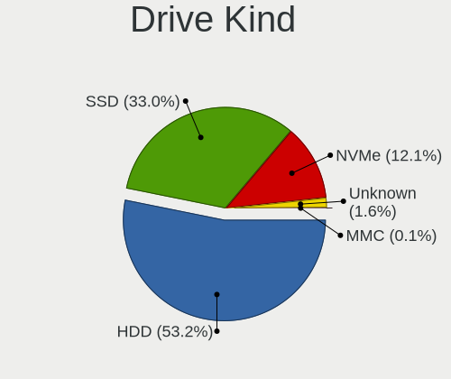
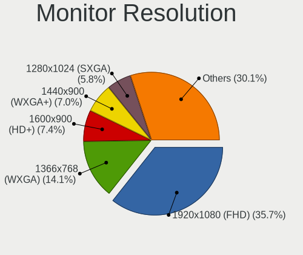
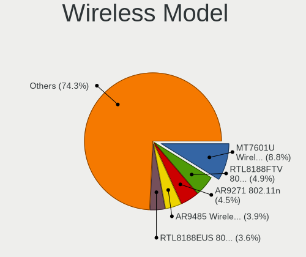
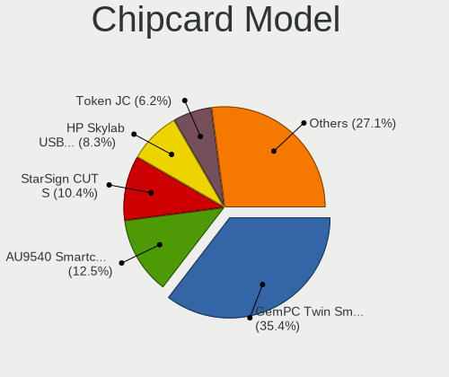

Linux in Brazil - Tested Hardware & Statistics (Desktops)
---------------------------------------------------------

A project to collect tested hardware configurations for Linux in Brazil.

Anyone can contribute to this report by the [hw-probe](https://github.com/linuxhw/hw-probe) tool:

    sudo -E hw-probe -all -upload

Please contribute! Especially if your hardware is rare.

Contents
--------

* [ Test Cases ](#test-cases)

* [ System ](#system)
  - [ OS                       ](#os)
  - [ OS Family                ](#os-family)
  - [ Kernel                   ](#kernel)
  - [ Kernel Family            ](#kernel-family)
  - [ Kernel Major Ver.        ](#kernel-major-ver)
  - [ Arch                     ](#arch)
  - [ DE                       ](#de)
  - [ Display Server           ](#display-server)
  - [ Display Manager          ](#display-manager)
  - [ OS Lang                  ](#os-lang)
  - [ Boot Mode                ](#boot-mode)
  - [ Filesystem               ](#filesystem)
  - [ Part. scheme             ](#part-scheme)
  - [ Dual Boot with Linux/BSD ](#dual-boot-with-linuxbsd)
  - [ Dual Boot (Win)          ](#dual-boot-win)

* [ Board ](#board)
  - [ Vendor                   ](#vendor)
  - [ Model                    ](#model)
  - [ Model Family             ](#model-family)
  - [ MFG Year                 ](#mfg-year)
  - [ Form Factor              ](#form-factor)
  - [ Secure Boot              ](#secure-boot)
  - [ Coreboot                 ](#coreboot)
  - [ RAM Size                 ](#ram-size)
  - [ RAM Used                 ](#ram-used)
  - [ Total Drives             ](#total-drives)
  - [ Has CD-ROM               ](#has-cd-rom)
  - [ Has Ethernet             ](#has-ethernet)
  - [ Has WiFi                 ](#has-wifi)
  - [ Has Bluetooth            ](#has-bluetooth)

* [ Location ](#location)
  - [ Country                  ](#country)
  - [ City                     ](#city)

* [ Drives ](#drives)
  - [ Drive Vendor             ](#drive-vendor)
  - [ Drive Model              ](#drive-model)
  - [ HDD Vendor               ](#hdd-vendor)
  - [ SSD Vendor               ](#ssd-vendor)
  - [ Drive Kind               ](#drive-kind)
  - [ Drive Connector          ](#drive-connector)
  - [ Drive Size               ](#drive-size)
  - [ Space Total              ](#space-total)
  - [ Space Used               ](#space-used)
  - [ Malfunc. Drives          ](#malfunc-drives)
  - [ Malfunc. Drive Vendor    ](#malfunc-drive-vendor)
  - [ Malfunc. HDD Vendor      ](#malfunc-hdd-vendor)
  - [ Malfunc. Drive Kind      ](#malfunc-drive-kind)
  - [ Failed Drives            ](#failed-drives)
  - [ Failed Drive Vendor      ](#failed-drive-vendor)
  - [ Drive Status             ](#drive-status)

* [ Storage controller ](#storage-controller)
  - [ Storage Vendor           ](#storage-vendor)
  - [ Storage Model            ](#storage-model)
  - [ Storage Kind             ](#storage-kind)

* [ Processor ](#processor)
  - [ CPU Vendor               ](#cpu-vendor)
  - [ CPU Model                ](#cpu-model)
  - [ CPU Model Family         ](#cpu-model-family)
  - [ CPU Cores                ](#cpu-cores)
  - [ CPU Sockets              ](#cpu-sockets)
  - [ CPU Threads              ](#cpu-threads)
  - [ CPU Op-Modes             ](#cpu-op-modes)
  - [ CPU Microcode            ](#cpu-microcode)
  - [ CPU Microarch            ](#cpu-microarch)

* [ Graphics ](#graphics)
  - [ GPU Vendor               ](#gpu-vendor)
  - [ GPU Model                ](#gpu-model)
  - [ GPU Combo                ](#gpu-combo)
  - [ GPU Driver               ](#gpu-driver)
  - [ GPU Memory               ](#gpu-memory)

* [ Monitor ](#monitor)
  - [ Monitor Vendor           ](#monitor-vendor)
  - [ Monitor Model            ](#monitor-model)
  - [ Monitor Resolution       ](#monitor-resolution)
  - [ Monitor Diagonal         ](#monitor-diagonal)
  - [ Monitor Width            ](#monitor-width)
  - [ Aspect Ratio             ](#aspect-ratio)
  - [ Monitor Area             ](#monitor-area)
  - [ Pixel Density            ](#pixel-density)
  - [ Multiple Monitors        ](#multiple-monitors)

* [ Network ](#network)
  - [ Net Controller Vendor    ](#net-controller-vendor)
  - [ Net Controller Model     ](#net-controller-model)
  - [ Wireless Vendor          ](#wireless-vendor)
  - [ Wireless Model           ](#wireless-model)
  - [ Ethernet Vendor          ](#ethernet-vendor)
  - [ Ethernet Model           ](#ethernet-model)
  - [ Net Controller Kind      ](#net-controller-kind)
  - [ Used Controller          ](#used-controller)
  - [ NICs                     ](#nics)
  - [ IPv6                     ](#ipv6)

* [ Bluetooth ](#bluetooth)
  - [ Bluetooth Vendor         ](#bluetooth-vendor)
  - [ Bluetooth Model          ](#bluetooth-model)

* [ Sound ](#sound)
  - [ Sound Vendor             ](#sound-vendor)
  - [ Sound Model              ](#sound-model)

* [ Memory ](#memory)
  - [ Memory Vendor            ](#memory-vendor)
  - [ Memory Model             ](#memory-model)
  - [ Memory Kind              ](#memory-kind)
  - [ Memory Form Factor       ](#memory-form-factor)
  - [ Memory Size              ](#memory-size)
  - [ Memory Speed             ](#memory-speed)

* [ Printers & scanners ](#printers--scanners)
  - [ Printer Vendor           ](#printer-vendor)
  - [ Printer Model            ](#printer-model)
  - [ Scanner Vendor           ](#scanner-vendor)
  - [ Scanner Model            ](#scanner-model)

* [ Camera ](#camera)
  - [ Camera Vendor            ](#camera-vendor)
  - [ Camera Model             ](#camera-model)

* [ Security ](#security)
  - [ Fingerprint Vendor       ](#fingerprint-vendor)
  - [ Fingerprint Model        ](#fingerprint-model)
  - [ Chipcard Vendor          ](#chipcard-vendor)
  - [ Chipcard Model           ](#chipcard-model)

* [ Unsupported ](#unsupported)
  - [ Unsupported Devices      ](#unsupported-devices)
  - [ Unsupported Device Types ](#unsupported-device-types)

Test Cases
----------

Total: 7958

| Vendor        | Model                       | Probe                                                      | Date         |
|---------------|-----------------------------|------------------------------------------------------------|--------------|
| Intel         | H61                         | [a10f481c10](https://linux-hardware.org/?probe=a10f481c10) | Dec 24, 2023 |
| Intel         | B85                         | [5b462c9ed1](https://linux-hardware.org/?probe=5b462c9ed1) | Dec 24, 2023 |
| Gigabyte      | GA-78LMT-USB3               | [dd658b1151](https://linux-hardware.org/?probe=dd658b1151) | Dec 23, 2023 |
| ASUSTek       | TUF B360-PLUS GAMING        | [b1c3408d24](https://linux-hardware.org/?probe=b1c3408d24) | Dec 23, 2023 |
| ASUSTek       | PRIME A320M-K               | [aaf6ab3d26](https://linux-hardware.org/?probe=aaf6ab3d26) | Dec 23, 2023 |
| Dell          | 0NW73C A00                  | [5ac83b9740](https://linux-hardware.org/?probe=5ac83b9740) | Dec 23, 2023 |
| Intel         | H61                         | [72c7724ef0](https://linux-hardware.org/?probe=72c7724ef0) | Dec 22, 2023 |
| Colorful T... | A320M-M.2 PRO V15           | [821494cfbf](https://linux-hardware.org/?probe=821494cfbf) | Dec 22, 2023 |
| ASUSTek       | PRIME A320M-K               | [c83a6a5f5d](https://linux-hardware.org/?probe=c83a6a5f5d) | Dec 22, 2023 |
| PCWare        | IPMH61R3                    | [891c2058a8](https://linux-hardware.org/?probe=891c2058a8) | Dec 22, 2023 |
| MACHINIST     | X99-RS9 V2.0                | [e0cd6655cb](https://linux-hardware.org/?probe=e0cd6655cb) | Dec 22, 2023 |
| Gigabyte      | B450M GAMING                | [1767c5b291](https://linux-hardware.org/?probe=1767c5b291) | Dec 21, 2023 |
| Dell          | 0HD5W2 A00                  | [2bd748691b](https://linux-hardware.org/?probe=2bd748691b) | Dec 21, 2023 |
| Gigabyte      | B560M AORUS ELITE           | [82304c2a5f](https://linux-hardware.org/?probe=82304c2a5f) | Dec 21, 2023 |
| Lenovo        | SHARKBAY 0B98401 PRO        | [2675cca8c2](https://linux-hardware.org/?probe=2675cca8c2) | Dec 21, 2023 |
| MSI           | B150M MORTAR                | [d0276bd5b7](https://linux-hardware.org/?probe=d0276bd5b7) | Dec 20, 2023 |
| ANGXUN        | X79-VG2 V1.3                | [532c5b5ddc](https://linux-hardware.org/?probe=532c5b5ddc) | Dec 19, 2023 |
| Gigabyte      | 970-GAMING                  | [403d617fdd](https://linux-hardware.org/?probe=403d617fdd) | Dec 19, 2023 |
| ASUSTek       | TUF Gaming Z690-PLUS D4     | [ec86cf0c12](https://linux-hardware.org/?probe=ec86cf0c12) | Dec 19, 2023 |
| ASUSTek       | P8H61-M LX3 PLUS R2.0       | [bd012749e2](https://linux-hardware.org/?probe=bd012749e2) | Dec 19, 2023 |
| Gigabyte      | B450M DS3H-CF               | [cc583aec32](https://linux-hardware.org/?probe=cc583aec32) | Dec 19, 2023 |
| Biostar       | A320MH                      | [9ec714a02b](https://linux-hardware.org/?probe=9ec714a02b) | Dec 19, 2023 |
| ECS           | H61H2-M2                    | [d38a6ca473](https://linux-hardware.org/?probe=d38a6ca473) | Dec 19, 2023 |
| Intel         | DH61WW AAG23116-206         | [c387c14ff7](https://linux-hardware.org/?probe=c387c14ff7) | Dec 18, 2023 |
| Intel         | DH61WW AAG23116-206         | [a1760c437e](https://linux-hardware.org/?probe=a1760c437e) | Dec 18, 2023 |
| MSI           | B560M PRO-E                 | [f8bcb73f0b](https://linux-hardware.org/?probe=f8bcb73f0b) | Dec 18, 2023 |
| Gigabyte      | B550M AORUS ELITE           | [e4935d995b](https://linux-hardware.org/?probe=e4935d995b) | Dec 18, 2023 |
| Gigabyte      | B550M AORUS ELITE           | [6d6246b5bf](https://linux-hardware.org/?probe=6d6246b5bf) | Dec 18, 2023 |
| ASRock        | H61M-HP4                    | [05fe81411e](https://linux-hardware.org/?probe=05fe81411e) | Dec 18, 2023 |
| Biostar       | B550MH                      | [32131b6631](https://linux-hardware.org/?probe=32131b6631) | Dec 17, 2023 |
| Biostar       | B550MH                      | [97d9affd9d](https://linux-hardware.org/?probe=97d9affd9d) | Dec 17, 2023 |
| Dell          | 07N90W A02                  | [0c471e8b44](https://linux-hardware.org/?probe=0c471e8b44) | Dec 17, 2023 |
| ASUSTek       | TUF H310M-PLUS GAMING/BR    | [b6b44f1b80](https://linux-hardware.org/?probe=b6b44f1b80) | Dec 17, 2023 |
| ASRock        | H310CM-HG4                  | [4e47d91bc7](https://linux-hardware.org/?probe=4e47d91bc7) | Dec 17, 2023 |
| Dell          | 053CWD A00                  | [6cee8cbfd7](https://linux-hardware.org/?probe=6cee8cbfd7) | Dec 17, 2023 |
| Intel         | SHARKBAY                    | [efe58ba5df](https://linux-hardware.org/?probe=efe58ba5df) | Dec 16, 2023 |
| OEM           | B75 Ver:1.41                | [4117a986c8](https://linux-hardware.org/?probe=4117a986c8) | Dec 16, 2023 |
| Gigabyte      | H410M H V3                  | [7da400b028](https://linux-hardware.org/?probe=7da400b028) | Dec 16, 2023 |
| PCWare        | IPMH61R3                    | [ecac398c88](https://linux-hardware.org/?probe=ecac398c88) | Dec 15, 2023 |
| MSI           | PRO B650-P WIFI             | [06ed7608bf](https://linux-hardware.org/?probe=06ed7608bf) | Dec 15, 2023 |
| ASUSTek       | H81M-CS/BR                  | [39094226f9](https://linux-hardware.org/?probe=39094226f9) | Dec 15, 2023 |
| ASUSTek       | TUF Gaming B650M-PLUS       | [a142ccc9e7](https://linux-hardware.org/?probe=a142ccc9e7) | Dec 14, 2023 |
| Dell          | 0NW6H5 A00                  | [eb487bbab2](https://linux-hardware.org/?probe=eb487bbab2) | Dec 14, 2023 |
| Intel         | DH61BF AAG81311-101         | [9d6455339e](https://linux-hardware.org/?probe=9d6455339e) | Dec 14, 2023 |
| MSI           | MEG Z390 GODLIKE            | [e384ee26a6](https://linux-hardware.org/?probe=e384ee26a6) | Dec 14, 2023 |
| Biostar       | X370GT3                     | [b910738e8f](https://linux-hardware.org/?probe=b910738e8f) | Dec 14, 2023 |
| Positivo      | POS-PIQ57BQ POSITIVO        | [1a2fe7c9ef](https://linux-hardware.org/?probe=1a2fe7c9ef) | Dec 13, 2023 |
| Positivo      | POS-PIH81DL                 | [55cf834e17](https://linux-hardware.org/?probe=55cf834e17) | Dec 13, 2023 |
| MACHINIST     | X79 Z9-D7 PRO V1.0          | [aaeef17ed2](https://linux-hardware.org/?probe=aaeef17ed2) | Dec 12, 2023 |
| Lenovo        | Unknown                     | [d49ddc416f](https://linux-hardware.org/?probe=d49ddc416f) | Dec 12, 2023 |
| Intel         | JSL MRD                     | [c811c8be03](https://linux-hardware.org/?probe=c811c8be03) | Dec 12, 2023 |
| Gigabyte      | A520M H                     | [e72a787933](https://linux-hardware.org/?probe=e72a787933) | Dec 12, 2023 |
| Dell          | 07VWPG A01                  | [a9ad39cd38](https://linux-hardware.org/?probe=a9ad39cd38) | Dec 11, 2023 |
| Gigabyte      | GA-78LMT-S2P                | [132b7b57ba](https://linux-hardware.org/?probe=132b7b57ba) | Dec 11, 2023 |
| Unknown       | X99H                        | [799324c839](https://linux-hardware.org/?probe=799324c839) | Dec 11, 2023 |
| Gigabyte      | GA-78LMT-S2P                | [3818e85705](https://linux-hardware.org/?probe=3818e85705) | Dec 11, 2023 |
| Intel         | H61                         | [611b51b6c1](https://linux-hardware.org/?probe=611b51b6c1) | Dec 11, 2023 |
| ASUSTek       | TUF Gaming Z590-PLUS        | [4b2be67e0f](https://linux-hardware.org/?probe=4b2be67e0f) | Dec 11, 2023 |
| Intel         | HM570                       | [a0f2eecda0](https://linux-hardware.org/?probe=a0f2eecda0) | Dec 11, 2023 |
| PCWare        | IPMH61R1                    | [0d3a1ef029](https://linux-hardware.org/?probe=0d3a1ef029) | Dec 11, 2023 |
| Gigabyte      | AB350M-DS3H V2-CF           | [66edf53f93](https://linux-hardware.org/?probe=66edf53f93) | Dec 10, 2023 |
| Gigabyte      | B550M AORUS ELITE           | [60ea2483e2](https://linux-hardware.org/?probe=60ea2483e2) | Dec 10, 2023 |
| Pegatron      | IPMH61P1                    | [0d0474a798](https://linux-hardware.org/?probe=0d0474a798) | Dec 10, 2023 |
| Daten Tecn... | DA75PRO                     | [a4e18252cc](https://linux-hardware.org/?probe=a4e18252cc) | Dec 10, 2023 |
| MSI           | B550M PRO-VDH WIFI          | [e7872542e1](https://linux-hardware.org/?probe=e7872542e1) | Dec 10, 2023 |
| Gigabyte      | B650 GAMING X AX            | [e04ad23cd3](https://linux-hardware.org/?probe=e04ad23cd3) | Dec 10, 2023 |
| ASRock        | H310CM-HG4                  | [425eac625e](https://linux-hardware.org/?probe=425eac625e) | Dec 10, 2023 |
| PCWare        | IPMH310G PRO                | [2abdb88ca3](https://linux-hardware.org/?probe=2abdb88ca3) | Dec 09, 2023 |
| ASUSTek       | A88XM-A                     | [2b60976ef6](https://linux-hardware.org/?probe=2b60976ef6) | Dec 09, 2023 |
| Gigabyte      | B650 GAMING X AX            | [b5f3fbe4c5](https://linux-hardware.org/?probe=b5f3fbe4c5) | Dec 09, 2023 |
| ANGXUN        | X99 V1.0                    | [88919a1403](https://linux-hardware.org/?probe=88919a1403) | Dec 08, 2023 |
| ASUSTek       | TUF Gaming Z690-PLUS D4     | [2b349d78ce](https://linux-hardware.org/?probe=2b349d78ce) | Dec 07, 2023 |
| Biostar       | A520MH                      | [de9fc0f8f2](https://linux-hardware.org/?probe=de9fc0f8f2) | Dec 07, 2023 |
| Dell          | 0NK5PH A00                  | [d96cb11edc](https://linux-hardware.org/?probe=d96cb11edc) | Dec 07, 2023 |
| Pegatron      | IPMH61P1                    | [264229998e](https://linux-hardware.org/?probe=264229998e) | Dec 07, 2023 |
| Dell          | 0NW73C A00                  | [4c87b0a972](https://linux-hardware.org/?probe=4c87b0a972) | Dec 07, 2023 |
| Intel         | JSL MRD                     | [fb3b75c8cc](https://linux-hardware.org/?probe=fb3b75c8cc) | Dec 07, 2023 |
| Intel         | Unknown                     | [1e70326ef4](https://linux-hardware.org/?probe=1e70326ef4) | Dec 06, 2023 |
| Gigabyte      | AB350M-DS3H V2-CF           | [1f2c85d176](https://linux-hardware.org/?probe=1f2c85d176) | Dec 06, 2023 |
| Intel         | H61                         | [fbc4dc7436](https://linux-hardware.org/?probe=fbc4dc7436) | Dec 06, 2023 |
| ALDO          | C2016-BSWI-D2               | [4dec414c2e](https://linux-hardware.org/?probe=4dec414c2e) | Dec 06, 2023 |
| Dell          | 0P42M6 A01                  | [2deb37f773](https://linux-hardware.org/?probe=2deb37f773) | Dec 06, 2023 |
| ASUSTek       | M4A79XTD EVO                | [e52613f035](https://linux-hardware.org/?probe=e52613f035) | Dec 06, 2023 |
| Dell          | 00V62H A01                  | [3a19753377](https://linux-hardware.org/?probe=3a19753377) | Dec 05, 2023 |
| ASRock        | B550M-HDV                   | [4ae43e0af1](https://linux-hardware.org/?probe=4ae43e0af1) | Dec 05, 2023 |
| Lenovo        | SHARKBAY NOK                | [549c56d2f8](https://linux-hardware.org/?probe=549c56d2f8) | Dec 04, 2023 |
| Lenovo        | SHARKBAY NOK                | [9714fadd61](https://linux-hardware.org/?probe=9714fadd61) | Dec 04, 2023 |
| MSI           | B450 TOMAHAWK               | [56afeffd34](https://linux-hardware.org/?probe=56afeffd34) | Dec 04, 2023 |
| Intel         | B75                         | [4290424c1d](https://linux-hardware.org/?probe=4290424c1d) | Dec 04, 2023 |
| Gigabyte      | 970A-DS3P FX                | [675f997c0b](https://linux-hardware.org/?probe=675f997c0b) | Dec 03, 2023 |
| Gigabyte      | H81M-S2PH                   | [2cd108c526](https://linux-hardware.org/?probe=2cd108c526) | Dec 03, 2023 |
| Gigabyte      | 970A-DS3P                   | [6fce5f3dec](https://linux-hardware.org/?probe=6fce5f3dec) | Dec 03, 2023 |
| Gigabyte      | 970A-DS3P FX                | [358a92be0d](https://linux-hardware.org/?probe=358a92be0d) | Dec 03, 2023 |
| ASUSTek       | TUF Gaming B550M-PLUS       | [6c21c9ac7d](https://linux-hardware.org/?probe=6c21c9ac7d) | Dec 03, 2023 |
| Intel         | H61                         | [71c32c973c](https://linux-hardware.org/?probe=71c32c973c) | Dec 03, 2023 |
| Gigabyte      | B450M AORUS ELITE           | [369e921b6f](https://linux-hardware.org/?probe=369e921b6f) | Dec 03, 2023 |
| ASUSTek       | TUF Gaming X570-PLUS_BR     | [5aeec2e399](https://linux-hardware.org/?probe=5aeec2e399) | Dec 03, 2023 |
| Positivo      | POS-SIGL40BX POSITIVO       | [d6bdfaf7b5](https://linux-hardware.org/?probe=d6bdfaf7b5) | Dec 03, 2023 |
| Gigabyte      | Z490M GAMING X              | [39640ce07b](https://linux-hardware.org/?probe=39640ce07b) | Dec 02, 2023 |
| Dell          | 02YRK5 A03                  | [ae544eff63](https://linux-hardware.org/?probe=ae544eff63) | Dec 02, 2023 |
| Gigabyte      | B450M DS3H-CF               | [ae8ecce4bd](https://linux-hardware.org/?probe=ae8ecce4bd) | Dec 02, 2023 |
| Gigabyte      | B450M DS3H-CF               | [0b017377f1](https://linux-hardware.org/?probe=0b017377f1) | Dec 02, 2023 |
| ASUSTek       | TUF B450M-PRO GAMING        | [6d97271c61](https://linux-hardware.org/?probe=6d97271c61) | Dec 02, 2023 |
| ASUSTek       | TUF B450M-PRO GAMING        | [0cff3cecd5](https://linux-hardware.org/?probe=0cff3cecd5) | Dec 02, 2023 |
| ASUSTek       | M4A88TD-M EVO               | [2fcc002511](https://linux-hardware.org/?probe=2fcc002511) | Dec 02, 2023 |
| ASUSTek       | M4A88TD-M EVO               | [7f6b5fd810](https://linux-hardware.org/?probe=7f6b5fd810) | Dec 01, 2023 |
| Intel         | B75                         | [488e28204b](https://linux-hardware.org/?probe=488e28204b) | Dec 01, 2023 |
| Intel         | X99H                        | [147f088343](https://linux-hardware.org/?probe=147f088343) | Dec 01, 2023 |
| ASUSTek       | PRIME B450M-GAMING/BR       | [14b776bc4a](https://linux-hardware.org/?probe=14b776bc4a) | Dec 01, 2023 |
| ASUSTek       | M5A78L-M/USB3               | [aa1896b627](https://linux-hardware.org/?probe=aa1896b627) | Nov 30, 2023 |
| Gigabyte      | H110M-H-CF                  | [a17de72370](https://linux-hardware.org/?probe=a17de72370) | Nov 30, 2023 |
| ASUSTek       | P8H61-M LX3 R2.0            | [ad8164f124](https://linux-hardware.org/?probe=ad8164f124) | Nov 30, 2023 |
| Pegatron      | IPMIP-GS                    | [ebe5fd5255](https://linux-hardware.org/?probe=ebe5fd5255) | Nov 30, 2023 |
| Pegatron      | IPMIP-GS                    | [7b6f94666e](https://linux-hardware.org/?probe=7b6f94666e) | Nov 30, 2023 |
| ASUSTek       | TUF H310M-PLUS GAMING/BR    | [cf7d8fdbf1](https://linux-hardware.org/?probe=cf7d8fdbf1) | Nov 30, 2023 |
| Gigabyte      | B450 AORUS M                | [4bac6b7cd5](https://linux-hardware.org/?probe=4bac6b7cd5) | Nov 30, 2023 |
| Gigabyte      | B450 AORUS M                | [ede8970ea9](https://linux-hardware.org/?probe=ede8970ea9) | Nov 30, 2023 |
| ASUSTek       | ROG STRIX X470-F GAMING     | [a803eec9f3](https://linux-hardware.org/?probe=a803eec9f3) | Nov 30, 2023 |
| MSI           | A320M-A PRO                 | [43e0c71549](https://linux-hardware.org/?probe=43e0c71549) | Nov 30, 2023 |
| ASUSTek       | C8HM70-I/HDMI               | [3284d74583](https://linux-hardware.org/?probe=3284d74583) | Nov 30, 2023 |
| Gigabyte      | A320M-S2H-CF                | [a05b28f5b1](https://linux-hardware.org/?probe=a05b28f5b1) | Nov 29, 2023 |
| ASUSTek       | B85M-G R2.0                 | [11d3e45e2d](https://linux-hardware.org/?probe=11d3e45e2d) | Nov 29, 2023 |
| ASUSTek       | ROG STRIX Z390-I GAMING     | [bd474c263c](https://linux-hardware.org/?probe=bd474c263c) | Nov 29, 2023 |
| ASUSTek       | B85M-G R2.0                 | [d2dcb1f2da](https://linux-hardware.org/?probe=d2dcb1f2da) | Nov 29, 2023 |
| Gigabyte      | G31-S3G                     | [895a8554b4](https://linux-hardware.org/?probe=895a8554b4) | Nov 28, 2023 |
| Gigabyte      | A320M-S2H-CF                | [c4949cf710](https://linux-hardware.org/?probe=c4949cf710) | Nov 28, 2023 |
| Gigabyte      | X570S GAMING X              | [cc96f8e9bb](https://linux-hardware.org/?probe=cc96f8e9bb) | Nov 28, 2023 |
| ASUSTek       | TUF Gaming B550M-PLUS       | [33388f794b](https://linux-hardware.org/?probe=33388f794b) | Nov 28, 2023 |
| Dell          | 03NVJ6 A03                  | [2eae8e704b](https://linux-hardware.org/?probe=2eae8e704b) | Nov 28, 2023 |
| Unknown       | Unknown                     | [34cbcf6478](https://linux-hardware.org/?probe=34cbcf6478) | Nov 28, 2023 |
| ASRock        | H310CM-HG4                  | [bd3a1b9c9a](https://linux-hardware.org/?probe=bd3a1b9c9a) | Nov 28, 2023 |
| ASUSTek       | PRIME X670-P                | [1ace58fcdf](https://linux-hardware.org/?probe=1ace58fcdf) | Nov 28, 2023 |
| ASUSTek       | TUF Gaming B550M-PLUS       | [330921f980](https://linux-hardware.org/?probe=330921f980) | Nov 27, 2023 |
| MSI           | Z97-GD65 GAMING             | [86230be0a7](https://linux-hardware.org/?probe=86230be0a7) | Nov 27, 2023 |
| Pegatron      | IPM41-D3                    | [0ce4abd06b](https://linux-hardware.org/?probe=0ce4abd06b) | Nov 27, 2023 |
| Positivo      | POS-EIH61CE SIM             | [85a576e6fc](https://linux-hardware.org/?probe=85a576e6fc) | Nov 27, 2023 |
| ASRock        | A320M-HD                    | [1138c4c71b](https://linux-hardware.org/?probe=1138c4c71b) | Nov 27, 2023 |
| Dell          | 02YRK5 A03                  | [3b55d8f733](https://linux-hardware.org/?probe=3b55d8f733) | Nov 27, 2023 |
| Intel         | H61                         | [5146767aa6](https://linux-hardware.org/?probe=5146767aa6) | Nov 26, 2023 |
| Positivo      | POS-EIH61CQ POSITIVO        | [bed32da0ed](https://linux-hardware.org/?probe=bed32da0ed) | Nov 26, 2023 |
| Intel         | B75                         | [fab278b6c3](https://linux-hardware.org/?probe=fab278b6c3) | Nov 26, 2023 |
| ASUSTek       | PRIME X470-PRO              | [47ec694370](https://linux-hardware.org/?probe=47ec694370) | Nov 26, 2023 |
| Dell          | 0NK5PH A00                  | [ed6b4827c0](https://linux-hardware.org/?probe=ed6b4827c0) | Nov 26, 2023 |
| Dell          | 0GYT9V A00                  | [a0fe7b3987](https://linux-hardware.org/?probe=a0fe7b3987) | Nov 26, 2023 |
| Dell          | 0NW73C A00                  | [eef7971d44](https://linux-hardware.org/?probe=eef7971d44) | Nov 26, 2023 |
| Dell          | 0NW73C A00                  | [9fd25914ff](https://linux-hardware.org/?probe=9fd25914ff) | Nov 26, 2023 |
| Intel         | H61 V124A                   | [eaa125b476](https://linux-hardware.org/?probe=eaa125b476) | Nov 26, 2023 |
| ASUSTek       | PRIME A520M-E               | [b8c7347da7](https://linux-hardware.org/?probe=b8c7347da7) | Nov 26, 2023 |
| Gigabyte      | B560M DS3H                  | [7130842b5a](https://linux-hardware.org/?probe=7130842b5a) | Nov 26, 2023 |
| ASRock        | H470M-ITX/ac                | [5b558c30c8](https://linux-hardware.org/?probe=5b558c30c8) | Nov 25, 2023 |
| Foxconn       | H61MXT1/F2/-S/-V            | [0529750c82](https://linux-hardware.org/?probe=0529750c82) | Nov 25, 2023 |
| ASUSTek       | PRIME B550M-K               | [186ea5595b](https://linux-hardware.org/?probe=186ea5595b) | Nov 25, 2023 |
| Gigabyte      | GA-78LMT-USB3 x.x           | [b9b8e57c7c](https://linux-hardware.org/?probe=b9b8e57c7c) | Nov 25, 2023 |
| ASRock        | G31M-S                      | [01866950a6](https://linux-hardware.org/?probe=01866950a6) | Nov 25, 2023 |
| Positivo      | POS-PIH55BX POSITIVO        | [5dd3b907da](https://linux-hardware.org/?probe=5dd3b907da) | Nov 25, 2023 |
| ASUSTek       | PRIME B450M-GAMING/BR       | [0f9d912f7f](https://linux-hardware.org/?probe=0f9d912f7f) | Nov 24, 2023 |
| ASUSTek       | TUF Gaming B450M-PRO S      | [606a157eb4](https://linux-hardware.org/?probe=606a157eb4) | Nov 24, 2023 |
| Gigabyte      | G41MT-S2P                   | [00ef59a95d](https://linux-hardware.org/?probe=00ef59a95d) | Nov 24, 2023 |
| ASUSTek       | PRIME B350-PLUS             | [ecad990a24](https://linux-hardware.org/?probe=ecad990a24) | Nov 23, 2023 |
| MSI           | A68HM-E33 V2                | [e257380edc](https://linux-hardware.org/?probe=e257380edc) | Nov 23, 2023 |
| Itautec       | SM 3322 SM-3322 Padrao 0... | [2cf2808a7f](https://linux-hardware.org/?probe=2cf2808a7f) | Nov 23, 2023 |
| Gigabyte      | B550I AORUS PRO AX          | [07e6828b2e](https://linux-hardware.org/?probe=07e6828b2e) | Nov 23, 2023 |
| Colorful T... | iGame Z270 Ymir             | [62929668f5](https://linux-hardware.org/?probe=62929668f5) | Nov 23, 2023 |
| Gigabyte      | GA-78LMT-USB3 SEx           | [8414b3b3f1](https://linux-hardware.org/?probe=8414b3b3f1) | Nov 23, 2023 |
| HOUTER        | IPMIP-GS                    | [1daae127f8](https://linux-hardware.org/?probe=1daae127f8) | Nov 23, 2023 |
| Gigabyte      | A520M DS3H                  | [713583bc52](https://linux-hardware.org/?probe=713583bc52) | Nov 22, 2023 |
| Intel         | DH55TC AAG26116-302         | [0edf2befff](https://linux-hardware.org/?probe=0edf2befff) | Nov 21, 2023 |
| Gigabyte      | Z390 M GAMING-CF            | [cc2aa981d3](https://linux-hardware.org/?probe=cc2aa981d3) | Nov 21, 2023 |
| Gigabyte      | H510M H                     | [078c28606a](https://linux-hardware.org/?probe=078c28606a) | Nov 21, 2023 |
| Intel         | B75                         | [0620da2ddb](https://linux-hardware.org/?probe=0620da2ddb) | Nov 21, 2023 |
| ASUSTek       | PRIME B450M-GAMING/BR       | [a166dbb3cf](https://linux-hardware.org/?probe=a166dbb3cf) | Nov 20, 2023 |
| MACHINIST     | X99-RS9 V2.0                | [6e05364421](https://linux-hardware.org/?probe=6e05364421) | Nov 20, 2023 |
| Pegatron      | SM 3322                     | [aed1cc686d](https://linux-hardware.org/?probe=aed1cc686d) | Nov 20, 2023 |
| Pegatron      | SM 3322                     | [4f37480be5](https://linux-hardware.org/?probe=4f37480be5) | Nov 20, 2023 |
| ECS           | H61H2-M2                    | [29293282c2](https://linux-hardware.org/?probe=29293282c2) | Nov 20, 2023 |
| Intel         | B75                         | [f184a18fb9](https://linux-hardware.org/?probe=f184a18fb9) | Nov 19, 2023 |
| Intel         | H61                         | [bdab1dc80a](https://linux-hardware.org/?probe=bdab1dc80a) | Nov 19, 2023 |
| Gigabyte      | H61M-S1                     | [4106ef0cba](https://linux-hardware.org/?probe=4106ef0cba) | Nov 19, 2023 |
| Intel         | H61                         | [4b5806ba4c](https://linux-hardware.org/?probe=4b5806ba4c) | Nov 19, 2023 |
| Gigabyte      | B450M DS3H V2               | [ac68da4f7c](https://linux-hardware.org/?probe=ac68da4f7c) | Nov 19, 2023 |
| Gigabyte      | A520M H                     | [abba035964](https://linux-hardware.org/?probe=abba035964) | Nov 19, 2023 |
| Intel         | H81                         | [1d1b5d11ec](https://linux-hardware.org/?probe=1d1b5d11ec) | Nov 18, 2023 |
| MSI           | MAG B550 TOMAHAWK           | [37139a6fd4](https://linux-hardware.org/?probe=37139a6fd4) | Nov 18, 2023 |
| MACHINIST     | X99-RS9 V2.0                | [eeef8f244c](https://linux-hardware.org/?probe=eeef8f244c) | Nov 18, 2023 |
| MSI           | MAG B550 TOMAHAWK           | [57d850fe75](https://linux-hardware.org/?probe=57d850fe75) | Nov 17, 2023 |
| Huanan        | X99-8M-F V1.3               | [58b38ab609](https://linux-hardware.org/?probe=58b38ab609) | Nov 17, 2023 |
| Huanan        | X99-8M-F V1.3               | [db7291c1da](https://linux-hardware.org/?probe=db7291c1da) | Nov 17, 2023 |
| Intel         | DH55TC AAG26116-302         | [8a23e4f586](https://linux-hardware.org/?probe=8a23e4f586) | Nov 16, 2023 |
| MACHINIST     | E5 MR9A PRO MAX V1.1        | [199a544882](https://linux-hardware.org/?probe=199a544882) | Nov 16, 2023 |
| ASUSTek       | P8H61-M LX3 R2.0            | [a32c2cc638](https://linux-hardware.org/?probe=a32c2cc638) | Nov 16, 2023 |
| Intel         | DH55TC AAG26116-302         | [7fabbf9cb1](https://linux-hardware.org/?probe=7fabbf9cb1) | Nov 16, 2023 |
| Intel         | X99-P4 V1.0                 | [b4caa65027](https://linux-hardware.org/?probe=b4caa65027) | Nov 16, 2023 |
| MSI           | Z97-G43 GAMING              | [86f598c692](https://linux-hardware.org/?probe=86f598c692) | Nov 16, 2023 |
| Dell          | 0478VN A00                  | [d2b8c293ea](https://linux-hardware.org/?probe=d2b8c293ea) | Nov 16, 2023 |
| Huanan        | X99-F8 GAMING V2.0          | [160e8325ba](https://linux-hardware.org/?probe=160e8325ba) | Nov 15, 2023 |
| Positivo      | POS-EIH61CE POSITIVO        | [fd1391a823](https://linux-hardware.org/?probe=fd1391a823) | Nov 15, 2023 |
| MSI           | B150M MORTAR                | [fb6bd38558](https://linux-hardware.org/?probe=fb6bd38558) | Nov 15, 2023 |
| MSI           | B150M MORTAR                | [78bfcd18a8](https://linux-hardware.org/?probe=78bfcd18a8) | Nov 15, 2023 |
| MACHINIST     | E5-RS9 V1.11                | [13df1b5b7e](https://linux-hardware.org/?probe=13df1b5b7e) | Nov 15, 2023 |
| ASUSTek       | PRIME B450M-GAMING/BR       | [adaa2215c6](https://linux-hardware.org/?probe=adaa2215c6) | Nov 15, 2023 |
| ECS           | H61H2-M2                    | [df572cd989](https://linux-hardware.org/?probe=df572cd989) | Nov 15, 2023 |
| Intel         | B75                         | [b05bcd24eb](https://linux-hardware.org/?probe=b05bcd24eb) | Nov 15, 2023 |
| ASUSTek       | P5GC-MX/CKD/SI              | [08053c4143](https://linux-hardware.org/?probe=08053c4143) | Nov 15, 2023 |
| Toshiba       | STI 010433                  | [c172f735d2](https://linux-hardware.org/?probe=c172f735d2) | Nov 15, 2023 |
| MSI           | PRO H610M-G DDR4            | [1d0338a823](https://linux-hardware.org/?probe=1d0338a823) | Nov 14, 2023 |
| Gigabyte      | B550M AORUS ELITE           | [09ef1df759](https://linux-hardware.org/?probe=09ef1df759) | Nov 14, 2023 |
| JHZD          | BQM5                        | [cab813ae6e](https://linux-hardware.org/?probe=cab813ae6e) | Nov 14, 2023 |
| Gigabyte      | B450M GAMING                | [33064ccfdf](https://linux-hardware.org/?probe=33064ccfdf) | Nov 14, 2023 |
| HP            | 2215                        | [452b632947](https://linux-hardware.org/?probe=452b632947) | Nov 13, 2023 |
| Intel         | H61                         | [cbefae3544](https://linux-hardware.org/?probe=cbefae3544) | Nov 13, 2023 |
| Gigabyte      | H410M H V3                  | [6a15b4fb46](https://linux-hardware.org/?probe=6a15b4fb46) | Nov 13, 2023 |
| Intel         | B75                         | [5ecbc90751](https://linux-hardware.org/?probe=5ecbc90751) | Nov 13, 2023 |
| MSI           | 880GMA-E35                  | [a03280c10b](https://linux-hardware.org/?probe=a03280c10b) | Nov 12, 2023 |
| Gigabyte      | H81M-S1                     | [cd607f9e87](https://linux-hardware.org/?probe=cd607f9e87) | Nov 12, 2023 |
| Gigabyte      | AB350M-DS3H V2-CF           | [f1f44353e2](https://linux-hardware.org/?probe=f1f44353e2) | Nov 12, 2023 |
| Dell          | 08YDFF A00                  | [4eee0e211a](https://linux-hardware.org/?probe=4eee0e211a) | Nov 12, 2023 |
| ASUSTek       | P5KPL-AM-CKD-VISUM-SI       | [fd1be084ac](https://linux-hardware.org/?probe=fd1be084ac) | Nov 12, 2023 |
| Gigabyte      | AB350M-DS3H V2-CF           | [64b6fe3b3a](https://linux-hardware.org/?probe=64b6fe3b3a) | Nov 11, 2023 |
| Intel         | H61                         | [c65f2e03f6](https://linux-hardware.org/?probe=c65f2e03f6) | Nov 11, 2023 |
| Toshiba       | STI 010433                  | [03007d4f6a](https://linux-hardware.org/?probe=03007d4f6a) | Nov 11, 2023 |
| HP            | 339A                        | [a89c7d0d5f](https://linux-hardware.org/?probe=a89c7d0d5f) | Nov 10, 2023 |
| ASUSTek       | TUF B450M-PRO GAMING        | [1f65a38863](https://linux-hardware.org/?probe=1f65a38863) | Nov 09, 2023 |
| Gigabyte      | A520M DS3H                  | [431101ce2f](https://linux-hardware.org/?probe=431101ce2f) | Nov 09, 2023 |
| Dell          | 0N820C                      | [fe88368da2](https://linux-hardware.org/?probe=fe88368da2) | Nov 09, 2023 |
| Dell          | 0C27VV A01                  | [cc977cc459](https://linux-hardware.org/?probe=cc977cc459) | Nov 09, 2023 |
| Intel         | H61                         | [138c553c5a](https://linux-hardware.org/?probe=138c553c5a) | Nov 09, 2023 |
| Gigabyte      | B450M GAMING                | [d788a3221f](https://linux-hardware.org/?probe=d788a3221f) | Nov 08, 2023 |
| ASUSTek       | TUF Gaming X570-PLUS_BR     | [17d6ddf22a](https://linux-hardware.org/?probe=17d6ddf22a) | Nov 08, 2023 |
| ASUSTek       | TUF B450M-PRO GAMING        | [6970492955](https://linux-hardware.org/?probe=6970492955) | Nov 08, 2023 |
| ASRock        | X570 Phantom Gaming 4       | [741dbb7024](https://linux-hardware.org/?probe=741dbb7024) | Nov 08, 2023 |
| MACHINIST     | X99-RS9 V2.0                | [84527b43d1](https://linux-hardware.org/?probe=84527b43d1) | Nov 07, 2023 |
| Gigabyte      | B450M GAMING                | [7974075b64](https://linux-hardware.org/?probe=7974075b64) | Nov 06, 2023 |
| ASRock        | Z97 Killer                  | [f575f3121e](https://linux-hardware.org/?probe=f575f3121e) | Nov 06, 2023 |
| Gigabyte      | AB350M-DS3H V2-CF           | [99a6c38b5d](https://linux-hardware.org/?probe=99a6c38b5d) | Nov 05, 2023 |
| Gigabyte      | AB350M-DS3H V2-CF           | [c520e5a3b2](https://linux-hardware.org/?probe=c520e5a3b2) | Nov 05, 2023 |
| Dell          | 01XK1W A00                  | [d6cd277a79](https://linux-hardware.org/?probe=d6cd277a79) | Nov 05, 2023 |
| ASUSTek       | PRIME B450M-GAMING/BR       | [f45893cbf7](https://linux-hardware.org/?probe=f45893cbf7) | Nov 05, 2023 |
| ASUSTek       | M5A78L-M LX/BR              | [459eb3cd2a](https://linux-hardware.org/?probe=459eb3cd2a) | Nov 04, 2023 |
| Toshiba       | STI 001359                  | [ebf464dbb3](https://linux-hardware.org/?probe=ebf464dbb3) | Nov 04, 2023 |
| ASUSTek       | PRIME X470-PRO              | [c1523fb6a1](https://linux-hardware.org/?probe=c1523fb6a1) | Nov 04, 2023 |
| MSI           | B550M PRO-VDH WIFI          | [baf30122ca](https://linux-hardware.org/?probe=baf30122ca) | Nov 03, 2023 |
| ASUSTek       | TUF Gaming X570-PLUS_BR     | [2aa4f1a7f7](https://linux-hardware.org/?probe=2aa4f1a7f7) | Nov 03, 2023 |
| MSI           | MAG B550 TOMAHAWK           | [a08b1cfa29](https://linux-hardware.org/?probe=a08b1cfa29) | Nov 03, 2023 |
| HP            | 0B54h D                     | [4ec7776a76](https://linux-hardware.org/?probe=4ec7776a76) | Nov 02, 2023 |
| ASRock        | H81M-HG4 R4.0               | [0f5f162498](https://linux-hardware.org/?probe=0f5f162498) | Nov 02, 2023 |
| ASUSTek       | PRIME H510M-D               | [d6749e3f8b](https://linux-hardware.org/?probe=d6749e3f8b) | Nov 01, 2023 |
| Gigabyte      | B75M-HD3                    | [e27c813285](https://linux-hardware.org/?probe=e27c813285) | Oct 31, 2023 |
| MACHINIST     | X99-RS9 V2.0                | [d735ec288c](https://linux-hardware.org/?probe=d735ec288c) | Oct 31, 2023 |
| AMD           | A88K                        | [963e38ef9a](https://linux-hardware.org/?probe=963e38ef9a) | Oct 31, 2023 |
| Gigabyte      | B450M GAMING                | [ac709dc975](https://linux-hardware.org/?probe=ac709dc975) | Oct 31, 2023 |
| ASUSTek       | H81M-C/BR                   | [b92870ed6a](https://linux-hardware.org/?probe=b92870ed6a) | Oct 31, 2023 |
| Intel         | H61                         | [0f282da58e](https://linux-hardware.org/?probe=0f282da58e) | Oct 30, 2023 |
| Intel         | B75                         | [a46db29108](https://linux-hardware.org/?probe=a46db29108) | Oct 29, 2023 |
| Gigabyte      | B550M AORUS ELITE           | [3ea0191175](https://linux-hardware.org/?probe=3ea0191175) | Oct 29, 2023 |
| Intel         | B75                         | [7b6b287377](https://linux-hardware.org/?probe=7b6b287377) | Oct 28, 2023 |
| Intel         | JSL MRD                     | [689d88c57b](https://linux-hardware.org/?probe=689d88c57b) | Oct 28, 2023 |
| Dell          | 076VHM A02                  | [456e31167b](https://linux-hardware.org/?probe=456e31167b) | Oct 28, 2023 |
| Unknown       | Phitronics G31VS-M          | [10bcfab3cb](https://linux-hardware.org/?probe=10bcfab3cb) | Oct 28, 2023 |
| Intel         | H61                         | [1496665abb](https://linux-hardware.org/?probe=1496665abb) | Oct 27, 2023 |
| Gigabyte      | B550M AORUS ELITE           | [5dac9d85f1](https://linux-hardware.org/?probe=5dac9d85f1) | Oct 27, 2023 |
| ASUSTek       | TUF Gaming B550M-PLUS       | [1cb73bada5](https://linux-hardware.org/?probe=1cb73bada5) | Oct 27, 2023 |
| Intel         | H61                         | [fccff5fcb2](https://linux-hardware.org/?probe=fccff5fcb2) | Oct 27, 2023 |
| Gigabyte      | H110M-H-CF                  | [b64c6bb72a](https://linux-hardware.org/?probe=b64c6bb72a) | Oct 26, 2023 |
| Dell          | 0K240Y A04                  | [5bf155abe0](https://linux-hardware.org/?probe=5bf155abe0) | Oct 26, 2023 |
| Gigabyte      | B550M AORUS ELITE           | [138843c6dc](https://linux-hardware.org/?probe=138843c6dc) | Oct 25, 2023 |
| ASRock        | X570 Phantom Gaming 4       | [25c0172035](https://linux-hardware.org/?probe=25c0172035) | Oct 25, 2023 |
| Lenovo        | SHARKBAY 0B98401 PRO        | [54a6d9d5d0](https://linux-hardware.org/?probe=54a6d9d5d0) | Oct 24, 2023 |
| Gigabyte      | B450M DS3H V2               | [f99b06d89a](https://linux-hardware.org/?probe=f99b06d89a) | Oct 24, 2023 |
| Gigabyte      | B560M AORUS ELITE           | [61d3768e3f](https://linux-hardware.org/?probe=61d3768e3f) | Oct 24, 2023 |
| Danuri        | B550M-PX                    | [e24df1ad61](https://linux-hardware.org/?probe=e24df1ad61) | Oct 24, 2023 |
| Intel         | H61 V124                    | [034689793f](https://linux-hardware.org/?probe=034689793f) | Oct 24, 2023 |
| Intel         | H61 V124                    | [2405df9db3](https://linux-hardware.org/?probe=2405df9db3) | Oct 23, 2023 |
| AZW           | Gemini M                    | [31ec911dd7](https://linux-hardware.org/?probe=31ec911dd7) | Oct 23, 2023 |
| Gigabyte      | B450 AORUS M                | [e756845de4](https://linux-hardware.org/?probe=e756845de4) | Oct 23, 2023 |
| AZW           | BT3 X                       | [c1e3c10fc4](https://linux-hardware.org/?probe=c1e3c10fc4) | Oct 23, 2023 |
| AZW           | BT3 X                       | [78328e112b](https://linux-hardware.org/?probe=78328e112b) | Oct 23, 2023 |
| Biostar       | B450MH                      | [d082b0cf9d](https://linux-hardware.org/?probe=d082b0cf9d) | Oct 23, 2023 |
| Intel         | B75                         | [96f9a95f89](https://linux-hardware.org/?probe=96f9a95f89) | Oct 22, 2023 |
| Gigabyte      | GA-78LMT-USB3 R2 sex        | [588ad7e7ef](https://linux-hardware.org/?probe=588ad7e7ef) | Oct 22, 2023 |
| Intel         | H81                         | [f9351663fb](https://linux-hardware.org/?probe=f9351663fb) | Oct 21, 2023 |
| Gigabyte      | AB350M-DS3H V2-CF           | [4f2229b9fa](https://linux-hardware.org/?probe=4f2229b9fa) | Oct 21, 2023 |
| ASUSTek       | SABERTOOTH 990FX R2.0       | [436e243db6](https://linux-hardware.org/?probe=436e243db6) | Oct 21, 2023 |
| Gigabyte      | H410M H V3                  | [0b9affbbb3](https://linux-hardware.org/?probe=0b9affbbb3) | Oct 21, 2023 |
| Gigabyte      | Z77-DS3H                    | [ca61a8649a](https://linux-hardware.org/?probe=ca61a8649a) | Oct 21, 2023 |
| Gigabyte      | Z77-DS3H                    | [6108985945](https://linux-hardware.org/?probe=6108985945) | Oct 21, 2023 |
| MACHINIST     | X99-MR9D PLUS V1.0          | [aaeff9a386](https://linux-hardware.org/?probe=aaeff9a386) | Oct 20, 2023 |
| Gigabyte      | 990XA-UD3 R5                | [c7d22a23d2](https://linux-hardware.org/?probe=c7d22a23d2) | Oct 20, 2023 |
| Lenovo        | 30D0 NOK                    | [e67eff74dc](https://linux-hardware.org/?probe=e67eff74dc) | Oct 20, 2023 |
| MSI           | B550M PRO-VDH WIFI          | [6bb9b08c6e](https://linux-hardware.org/?probe=6bb9b08c6e) | Oct 20, 2023 |
| ASUSTek       | M5A78L-M/USB3               | [3fd9b0b53f](https://linux-hardware.org/?probe=3fd9b0b53f) | Oct 20, 2023 |
| MSI           | B550M PRO-VDH WIFI          | [3b1da376dc](https://linux-hardware.org/?probe=3b1da376dc) | Oct 19, 2023 |
| Gigabyte      | H87-D3H-CF                  | [b1f1e05664](https://linux-hardware.org/?probe=b1f1e05664) | Oct 19, 2023 |
| ASUSTek       | PRIME B350-PLUS             | [d7ddb794ec](https://linux-hardware.org/?probe=d7ddb794ec) | Oct 18, 2023 |
| Gigabyte      | G41MT-S2                    | [50aa4fc1e1](https://linux-hardware.org/?probe=50aa4fc1e1) | Oct 18, 2023 |
| ASRock        | A320M-HD                    | [27d26a4a15](https://linux-hardware.org/?probe=27d26a4a15) | Oct 17, 2023 |
| Pegatron      | IPM41-D3                    | [54150823a1](https://linux-hardware.org/?probe=54150823a1) | Oct 17, 2023 |
| Pegatron      | IPM41-D3                    | [e567a72b4c](https://linux-hardware.org/?probe=e567a72b4c) | Oct 17, 2023 |
| ASUSTek       | PRIME H310M-E/BR            | [da5796de02](https://linux-hardware.org/?probe=da5796de02) | Oct 17, 2023 |
| ASUSTek       | H61M-A/BR                   | [c615f7ee38](https://linux-hardware.org/?probe=c615f7ee38) | Oct 17, 2023 |
| Positivo      | POS-PIG43BC SIM             | [ded7e15a49](https://linux-hardware.org/?probe=ded7e15a49) | Oct 17, 2023 |
| Gigabyte      | B450 AORUS PRO WIFI-CF      | [ac47775d14](https://linux-hardware.org/?probe=ac47775d14) | Oct 17, 2023 |
| Intel         | H61                         | [2bd77947d1](https://linux-hardware.org/?probe=2bd77947d1) | Oct 16, 2023 |
| ASUSTek       | PRIME B450M-GAMING/BR       | [fb2bf1baa8](https://linux-hardware.org/?probe=fb2bf1baa8) | Oct 16, 2023 |
| ASRock        | N68-S3 FX                   | [b1a36d42aa](https://linux-hardware.org/?probe=b1a36d42aa) | Oct 16, 2023 |
| Biostar       | A320MH                      | [d797fd8fa3](https://linux-hardware.org/?probe=d797fd8fa3) | Oct 15, 2023 |
| Huanan        | X99-QD4 V1.0                | [47788537bf](https://linux-hardware.org/?probe=47788537bf) | Oct 15, 2023 |
| Huanan        | X99-QD4 V1.0                | [30723700f1](https://linux-hardware.org/?probe=30723700f1) | Oct 15, 2023 |
| Huanan        | X99-QD4 V1.0                | [e4dc0eeb72](https://linux-hardware.org/?probe=e4dc0eeb72) | Oct 15, 2023 |
| ASRock        | A320M-DGS                   | [a9599537b8](https://linux-hardware.org/?probe=a9599537b8) | Oct 15, 2023 |
| Gigabyte      | B450 AORUS M                | [68075a7e8f](https://linux-hardware.org/?probe=68075a7e8f) | Oct 15, 2023 |
| PCWare        | IPMH61R1                    | [145dc39d14](https://linux-hardware.org/?probe=145dc39d14) | Oct 14, 2023 |
| MACHINIST     | X99-RS9 V2.0                | [42e5a09fe2](https://linux-hardware.org/?probe=42e5a09fe2) | Oct 14, 2023 |
| Gigabyte      | B450M GAMING                | [4280b509c6](https://linux-hardware.org/?probe=4280b509c6) | Oct 14, 2023 |
| ASUSTek       | TUF H310M-PLUS GAMING/BR    | [0a86fd4e1d](https://linux-hardware.org/?probe=0a86fd4e1d) | Oct 14, 2023 |
| Gigabyte      | G41MT-S2                    | [d45a6f5bf2](https://linux-hardware.org/?probe=d45a6f5bf2) | Oct 14, 2023 |
| Gigabyte      | B450M GAMING                | [06aa8e692c](https://linux-hardware.org/?probe=06aa8e692c) | Oct 14, 2023 |
| Unknown       | MZ-B75-S                    | [6d58c79c33](https://linux-hardware.org/?probe=6d58c79c33) | Oct 13, 2023 |
| MSI           | H110M PRO-VH PLUS           | [7d186ff304](https://linux-hardware.org/?probe=7d186ff304) | Oct 13, 2023 |
| ASRock        | A320M-HD                    | [2b45321310](https://linux-hardware.org/?probe=2b45321310) | Oct 13, 2023 |
| ASRock        | A320M-HD R4.0               | [1b1dd0c7fd](https://linux-hardware.org/?probe=1b1dd0c7fd) | Oct 12, 2023 |
| Gigabyte      | B550M AORUS PRO             | [d7d6c5206f](https://linux-hardware.org/?probe=d7d6c5206f) | Oct 12, 2023 |
| Gigabyte      | 970A-UD3P                   | [34792695eb](https://linux-hardware.org/?probe=34792695eb) | Oct 12, 2023 |
| Gigabyte      | B550M AORUS PRO             | [5e2f8bdc4d](https://linux-hardware.org/?probe=5e2f8bdc4d) | Oct 12, 2023 |
| ASUSTek       | TUF Gaming B660M-PLUS D4    | [b71efdb817](https://linux-hardware.org/?probe=b71efdb817) | Oct 11, 2023 |
| Gigabyte      | B550M AORUS ELITE           | [a6e6952b42](https://linux-hardware.org/?probe=a6e6952b42) | Oct 11, 2023 |
| Gigabyte      | AB350M-DS3H V2-CF           | [89ae9695ef](https://linux-hardware.org/?probe=89ae9695ef) | Oct 11, 2023 |
| ASUSTek       | TUF Gaming X570-PLUS_BR     | [5566e985cf](https://linux-hardware.org/?probe=5566e985cf) | Oct 11, 2023 |
| ASUSTek       | ROG Maximus X HERO          | [835f369588](https://linux-hardware.org/?probe=835f369588) | Oct 11, 2023 |
| ASUSTek       | ROG Maximus X HERO          | [9acd34e892](https://linux-hardware.org/?probe=9acd34e892) | Oct 11, 2023 |
| Positivo      | POS-PIH110DV                | [f45f2f425b](https://linux-hardware.org/?probe=f45f2f425b) | Oct 10, 2023 |
| Gigabyte      | B550M AORUS PRO             | [c39ce018d6](https://linux-hardware.org/?probe=c39ce018d6) | Oct 10, 2023 |
| MSI           | A320M-A PRO                 | [4a1888b421](https://linux-hardware.org/?probe=4a1888b421) | Oct 09, 2023 |
| Dell          | 0478VN A00                  | [8881cc216c](https://linux-hardware.org/?probe=8881cc216c) | Oct 09, 2023 |
| Gigabyte      | 945GZM-S2                   | [f9bafdf396](https://linux-hardware.org/?probe=f9bafdf396) | Oct 09, 2023 |
| MACHINIST     | E5-MR9A V1.0                | [4be00bee3e](https://linux-hardware.org/?probe=4be00bee3e) | Oct 09, 2023 |
| ASRock        | A320M-HD R4.0               | [84fc58ce28](https://linux-hardware.org/?probe=84fc58ce28) | Oct 08, 2023 |
| Itautec       | SM 3321 SM-3321 Padrao 0... | [923cec3568](https://linux-hardware.org/?probe=923cec3568) | Oct 08, 2023 |
| Intel         | DG41WV AAE90316-102         | [c666aa6077](https://linux-hardware.org/?probe=c666aa6077) | Oct 08, 2023 |
| Unknown       | Unknown                     | [1eeecb8823](https://linux-hardware.org/?probe=1eeecb8823) | Oct 08, 2023 |
| ASUSTek       | H81M-A/BR                   | [b580accff5](https://linux-hardware.org/?probe=b580accff5) | Oct 08, 2023 |
| MACHINIST     | E5-MR9A V1.0                | [68e7f53229](https://linux-hardware.org/?probe=68e7f53229) | Oct 08, 2023 |
| MSI           | B550M PRO-VDH WIFI          | [687287904f](https://linux-hardware.org/?probe=687287904f) | Oct 08, 2023 |
| Huanan        | X99-F8 GAMING V2.0          | [1756f5ba93](https://linux-hardware.org/?probe=1756f5ba93) | Oct 08, 2023 |
| ASRock        | Z77 Extreme4                | [e1cfe6d474](https://linux-hardware.org/?probe=e1cfe6d474) | Oct 08, 2023 |
| ASRock        | A320M-HD                    | [c59dc86e48](https://linux-hardware.org/?probe=c59dc86e48) | Oct 08, 2023 |
| Unknown       | Phitronics G31VS-M          | [7b7ac9e326](https://linux-hardware.org/?probe=7b7ac9e326) | Oct 07, 2023 |
| ASUSTek       | BM1AF_BP1AF_BM6AF           | [bad5263013](https://linux-hardware.org/?probe=bad5263013) | Oct 07, 2023 |
| ASUSTek       | TUF Gaming X570-PLUS        | [40c01d2bf5](https://linux-hardware.org/?probe=40c01d2bf5) | Oct 07, 2023 |
| Gigabyte      | A520M K V2                  | [839ad0c4b6](https://linux-hardware.org/?probe=839ad0c4b6) | Oct 07, 2023 |
| Gigabyte      | A520M K V2                  | [f3e7c14b62](https://linux-hardware.org/?probe=f3e7c14b62) | Oct 07, 2023 |
| Intel         | H61                         | [1abb1c8f57](https://linux-hardware.org/?probe=1abb1c8f57) | Oct 06, 2023 |
| Gigabyte      | GA-880GMA-UD2H              | [45a4c0fbe0](https://linux-hardware.org/?probe=45a4c0fbe0) | Oct 06, 2023 |
| Dell          | 0478VN A00                  | [511df57852](https://linux-hardware.org/?probe=511df57852) | Oct 05, 2023 |
| Biostar       | B450MH                      | [b47659f758](https://linux-hardware.org/?probe=b47659f758) | Oct 05, 2023 |
| Positivo      | POS-EINM70CS POSITIVO       | [fc6322811e](https://linux-hardware.org/?probe=fc6322811e) | Oct 04, 2023 |
| Gigabyte      | B560M AORUS ELITE           | [80010c71e1](https://linux-hardware.org/?probe=80010c71e1) | Oct 04, 2023 |
| ASUSTek       | TUF Gaming B550M-PLUS       | [a72a2ee89e](https://linux-hardware.org/?probe=a72a2ee89e) | Oct 04, 2023 |
| Gigabyte      | F2A88X-D3H                  | [6ea97d511f](https://linux-hardware.org/?probe=6ea97d511f) | Oct 04, 2023 |
| Lenovo        | NOK                         | [dd6bffed79](https://linux-hardware.org/?probe=dd6bffed79) | Oct 04, 2023 |
| HP            | 886C                        | [8356867b4d](https://linux-hardware.org/?probe=8356867b4d) | Oct 04, 2023 |
| Dell          | 0P0MXR A00                  | [06af26dae3](https://linux-hardware.org/?probe=06af26dae3) | Oct 03, 2023 |
| Dell          | 0P0MXR A00                  | [9b4bfad0cc](https://linux-hardware.org/?probe=9b4bfad0cc) | Oct 03, 2023 |
| Unknown       | Phitronics G31VS-M          | [a30a4e0d2e](https://linux-hardware.org/?probe=a30a4e0d2e) | Oct 03, 2023 |
| Intel         | H61                         | [977f3d58ab](https://linux-hardware.org/?probe=977f3d58ab) | Oct 03, 2023 |
| Dell          | 07PR60 A01                  | [020c2fbbf8](https://linux-hardware.org/?probe=020c2fbbf8) | Oct 02, 2023 |
| ASUSTek       | B150M-C/BR                  | [2435f20a18](https://linux-hardware.org/?probe=2435f20a18) | Oct 02, 2023 |
| ASRock        | H370M-ITX/ac                | [cf9e8e26c2](https://linux-hardware.org/?probe=cf9e8e26c2) | Oct 02, 2023 |
| Pegatron      | SM3330 0112                 | [290983ac13](https://linux-hardware.org/?probe=290983ac13) | Oct 01, 2023 |
| MACHINIST     | X99-RS9 V2.0                | [27e61d282f](https://linux-hardware.org/?probe=27e61d282f) | Oct 01, 2023 |
| Toshiba       | STI 009169                  | [0b76bae8f3](https://linux-hardware.org/?probe=0b76bae8f3) | Sep 30, 2023 |
| ASUSTek       | TUF Gaming B660M-PLUS D4    | [f3d279f91b](https://linux-hardware.org/?probe=f3d279f91b) | Sep 30, 2023 |
| ASRock        | A320M-DGS                   | [63aafe31f1](https://linux-hardware.org/?probe=63aafe31f1) | Sep 30, 2023 |
| ASUSTek       | TUF Gaming B660M-PLUS D4    | [02af70281a](https://linux-hardware.org/?probe=02af70281a) | Sep 30, 2023 |
| MSI           | B550M PRO-VDH WIFI          | [770e7037d3](https://linux-hardware.org/?probe=770e7037d3) | Sep 30, 2023 |
| Unknown       | Phitronics N68C-M           | [72b5c903d3](https://linux-hardware.org/?probe=72b5c903d3) | Sep 30, 2023 |
| Gigabyte      | B550M AORUS ELITE           | [74bed86ee5](https://linux-hardware.org/?probe=74bed86ee5) | Sep 30, 2023 |
| Intel         | H61                         | [f6a417439c](https://linux-hardware.org/?probe=f6a417439c) | Sep 29, 2023 |
| Intel         | H61                         | [e7dac2f9ed](https://linux-hardware.org/?probe=e7dac2f9ed) | Sep 29, 2023 |
| ASUSTek       | ROG STRIX B550-F GAMING ... | [6177caee37](https://linux-hardware.org/?probe=6177caee37) | Sep 29, 2023 |
| Positivo      | POS-PIH81DI                 | [0e67f3a0f3](https://linux-hardware.org/?probe=0e67f3a0f3) | Sep 29, 2023 |
| MACHINIST     | X99-RS9 V2.0                | [51272b2713](https://linux-hardware.org/?probe=51272b2713) | Sep 28, 2023 |
| ASUSTek       | TUF Gaming X570-PLUS_BR     | [ce3a9f8960](https://linux-hardware.org/?probe=ce3a9f8960) | Sep 28, 2023 |
| Huanan        | X99-F8 GAMING V5.0          | [62ba806672](https://linux-hardware.org/?probe=62ba806672) | Sep 28, 2023 |
| MACHINIST     | X99-RS9 V2.0                | [1509f60079](https://linux-hardware.org/?probe=1509f60079) | Sep 28, 2023 |
| Positivo      | POS-RIH470EM 11179450       | [cf8e3e73bb](https://linux-hardware.org/?probe=cf8e3e73bb) | Sep 27, 2023 |
| ASUSTek       | PRIME B350-PLUS             | [546df5b57f](https://linux-hardware.org/?probe=546df5b57f) | Sep 27, 2023 |
| ASUSTek       | PRIME B350-PLUS             | [503570ad7a](https://linux-hardware.org/?probe=503570ad7a) | Sep 27, 2023 |
| Unknown       | Unknown                     | [cb12d6c853](https://linux-hardware.org/?probe=cb12d6c853) | Sep 27, 2023 |
| ASUSTek       | M5A78L-M PLUS/USB3          | [f47347fb9b](https://linux-hardware.org/?probe=f47347fb9b) | Sep 27, 2023 |
| ASUSTek       | TUF B450M-PRO GAMING        | [811818acb8](https://linux-hardware.org/?probe=811818acb8) | Sep 26, 2023 |
| Huanan        | X99-8M-F V1.2               | [4ddba514a1](https://linux-hardware.org/?probe=4ddba514a1) | Sep 26, 2023 |
| Intel         | H61                         | [ee0266b53c](https://linux-hardware.org/?probe=ee0266b53c) | Sep 25, 2023 |
| ASUSTek       | M5A78L-M/USB3               | [0b586071f1](https://linux-hardware.org/?probe=0b586071f1) | Sep 25, 2023 |
| ASUSTek       | PRIME A320M-K/BR            | [fee2fdb49a](https://linux-hardware.org/?probe=fee2fdb49a) | Sep 25, 2023 |
| Gigabyte      | H310M M.2 x.x               | [69cccf347a](https://linux-hardware.org/?probe=69cccf347a) | Sep 25, 2023 |
| OEM           | B75 Ver:1.41                | [01109ec772](https://linux-hardware.org/?probe=01109ec772) | Sep 24, 2023 |
| Lenovo        | ThinkCentre A70z 0401B7P    | [21a635940f](https://linux-hardware.org/?probe=21a635940f) | Sep 24, 2023 |
| PCWare        | APM-A320G                   | [64080404a6](https://linux-hardware.org/?probe=64080404a6) | Sep 24, 2023 |
| Gigabyte      | 945GCM-S2C                  | [9f17460970](https://linux-hardware.org/?probe=9f17460970) | Sep 24, 2023 |
| HOUTER        | OROPC                       | [96625070be](https://linux-hardware.org/?probe=96625070be) | Sep 24, 2023 |
| Positivo      | POS-EIBTPDC                 | [3c2427ba03](https://linux-hardware.org/?probe=3c2427ba03) | Sep 23, 2023 |
| Positivo      | POS-EIBTPDC                 | [586c05976a](https://linux-hardware.org/?probe=586c05976a) | Sep 23, 2023 |
| HOUTER        | OROPC                       | [3f78fb9290](https://linux-hardware.org/?probe=3f78fb9290) | Sep 23, 2023 |
| ASUSTek       | A88XM-A                     | [c2cb8052f9](https://linux-hardware.org/?probe=c2cb8052f9) | Sep 23, 2023 |
| Gigabyte      | GA-880GMA-UD2H              | [fbeac0cab4](https://linux-hardware.org/?probe=fbeac0cab4) | Sep 23, 2023 |
| ASUSTek       | TUF B450M-PRO GAMING        | [47e5429752](https://linux-hardware.org/?probe=47e5429752) | Sep 22, 2023 |
| ASUSTek       | TUF B450M-PRO GAMING        | [a35f78cead](https://linux-hardware.org/?probe=a35f78cead) | Sep 21, 2023 |
| Positivo      | POS-AG31AP                  | [2e2072e3ca](https://linux-hardware.org/?probe=2e2072e3ca) | Sep 21, 2023 |
| Megaware      | MW-HDC-M 02/24/2012 - ME... | [d3c9063140](https://linux-hardware.org/?probe=d3c9063140) | Sep 21, 2023 |
| Intel         | B75                         | [37b59e6605](https://linux-hardware.org/?probe=37b59e6605) | Sep 21, 2023 |
| Gigabyte      | B450 AORUS M                | [e2dda8ebb1](https://linux-hardware.org/?probe=e2dda8ebb1) | Sep 21, 2023 |
| Intel         | H55                         | [03693f8574](https://linux-hardware.org/?probe=03693f8574) | Sep 21, 2023 |
| ASUSTek       | PRIME A320M-K/BR            | [5e05853c00](https://linux-hardware.org/?probe=5e05853c00) | Sep 20, 2023 |
| ASUSTek       | M5A78L-M PLUS/USB3          | [f7629203e7](https://linux-hardware.org/?probe=f7629203e7) | Sep 20, 2023 |
| ASRock        | A320M-HD                    | [01d8f27500](https://linux-hardware.org/?probe=01d8f27500) | Sep 20, 2023 |
| Dell          | 06HR05 A00                  | [a01d6b8630](https://linux-hardware.org/?probe=a01d6b8630) | Sep 20, 2023 |
| ASUSTek       | PRIME B450M-GAMING/BR       | [6d9002e7e3](https://linux-hardware.org/?probe=6d9002e7e3) | Sep 19, 2023 |
| ASUSTek       | PRIME B450M-GAMING/BR       | [c53d44303e](https://linux-hardware.org/?probe=c53d44303e) | Sep 19, 2023 |
| wpc           | zrd616                      | [f218d73abb](https://linux-hardware.org/?probe=f218d73abb) | Sep 19, 2023 |
| Biostar       | B550GTQ                     | [5478c7bc91](https://linux-hardware.org/?probe=5478c7bc91) | Sep 19, 2023 |
| MSI           | A320M-A PRO                 | [6588973c54](https://linux-hardware.org/?probe=6588973c54) | Sep 19, 2023 |
| Lenovo        | 3102 SDK0J40697 WIN 3305... | [1bd2a17c99](https://linux-hardware.org/?probe=1bd2a17c99) | Sep 19, 2023 |
| Biostar       | H61MLC                      | [154ead8447](https://linux-hardware.org/?probe=154ead8447) | Sep 19, 2023 |
| ASRock        | A320M-HD                    | [00ce48a639](https://linux-hardware.org/?probe=00ce48a639) | Sep 19, 2023 |
| Dell          | 076VHM A02                  | [518361bbc5](https://linux-hardware.org/?probe=518361bbc5) | Sep 18, 2023 |
| Positivo      | POS-EIH610EX 11187943       | [10fbe8fd9b](https://linux-hardware.org/?probe=10fbe8fd9b) | Sep 18, 2023 |
| Kllisre       | X99-B5 V1.1                 | [5597daf348](https://linux-hardware.org/?probe=5597daf348) | Sep 18, 2023 |
| MACHINIST     | X99-RS9 V2.0                | [1875fb96e5](https://linux-hardware.org/?probe=1875fb96e5) | Sep 17, 2023 |
| ASUSTek       | M5A78L/USB3                 | [e1805d26c3](https://linux-hardware.org/?probe=e1805d26c3) | Sep 17, 2023 |
| ASUSTek       | TUF Gaming X570-PLUS_BR     | [d4d891ca35](https://linux-hardware.org/?probe=d4d891ca35) | Sep 17, 2023 |
| ASRock        | B450 Pro4                   | [2e8cd612d8](https://linux-hardware.org/?probe=2e8cd612d8) | Sep 17, 2023 |
| QIYIDA        | X99-H9 V2.0                 | [1e71e60505](https://linux-hardware.org/?probe=1e71e60505) | Sep 17, 2023 |
| ASRock        | A320M-HD                    | [8db77afc82](https://linux-hardware.org/?probe=8db77afc82) | Sep 17, 2023 |
| ANGXUN        | X99 V1.0                    | [c6c6277bf3](https://linux-hardware.org/?probe=c6c6277bf3) | Sep 17, 2023 |
| QIYIDA        | X99-H9 V2.0                 | [656da36be3](https://linux-hardware.org/?probe=656da36be3) | Sep 17, 2023 |
| ASUSTek       | PRIME H610M-A D4            | [6f73b0398c](https://linux-hardware.org/?probe=6f73b0398c) | Sep 16, 2023 |
| ASUSTek       | PRIME H610M-A D4            | [7b10a3651b](https://linux-hardware.org/?probe=7b10a3651b) | Sep 16, 2023 |
| Biostar       | X370GTN                     | [1ac44acadd](https://linux-hardware.org/?probe=1ac44acadd) | Sep 16, 2023 |
| Dell          | 0VTJVC A00                  | [8a404c05c2](https://linux-hardware.org/?probe=8a404c05c2) | Sep 15, 2023 |
| MSI           | H310M PRO-VDH               | [100f789658](https://linux-hardware.org/?probe=100f789658) | Sep 15, 2023 |
| Positivo      | POS-RIB360EE 11144907       | [8c1887fa93](https://linux-hardware.org/?probe=8c1887fa93) | Sep 15, 2023 |
| Gigabyte      | A320M-S2H-CF                | [e484eea129](https://linux-hardware.org/?probe=e484eea129) | Sep 14, 2023 |
| Foxconn       | 45GM/45CM/45CM-S            | [135712cd9e](https://linux-hardware.org/?probe=135712cd9e) | Sep 14, 2023 |
| Gigabyte      | B550M AORUS ELITE           | [cbe7fd494b](https://linux-hardware.org/?probe=cbe7fd494b) | Sep 14, 2023 |
| ASUSTek       | TUF Gaming B550M-PLUS       | [9fde2c205d](https://linux-hardware.org/?probe=9fde2c205d) | Sep 14, 2023 |
| Intel         | H61                         | [5dd60be36a](https://linux-hardware.org/?probe=5dd60be36a) | Sep 14, 2023 |
| Pegatron      | 2AC3                        | [4cee44e8ac](https://linux-hardware.org/?probe=4cee44e8ac) | Sep 13, 2023 |
| HOUTER        | OROPC                       | [711d8f8d80](https://linux-hardware.org/?probe=711d8f8d80) | Sep 13, 2023 |
| Dell          | 01XK1W A00                  | [07e5f3eb14](https://linux-hardware.org/?probe=07e5f3eb14) | Sep 13, 2023 |
| Gigabyte      | Z390 M GAMING-CF            | [3c36dccf79](https://linux-hardware.org/?probe=3c36dccf79) | Sep 12, 2023 |
| Gigabyte      | H110M-H-CF                  | [31cc220aae](https://linux-hardware.org/?probe=31cc220aae) | Sep 12, 2023 |
| Pegatron      | IPMSB-VH1/HDMI/ODM          | [fd4e189b56](https://linux-hardware.org/?probe=fd4e189b56) | Sep 12, 2023 |
| Intel         | H61                         | [513ebd18a2](https://linux-hardware.org/?probe=513ebd18a2) | Sep 12, 2023 |
| Intel         | H61                         | [fec08a2214](https://linux-hardware.org/?probe=fec08a2214) | Sep 12, 2023 |
| PCWare        | IPMH81G1                    | [181367c2db](https://linux-hardware.org/?probe=181367c2db) | Sep 12, 2023 |
| ASUSTek       | P8H77-M                     | [61dc55f063](https://linux-hardware.org/?probe=61dc55f063) | Sep 11, 2023 |
| Intel         | X79 (INTEL Xeon E5/Corei... | [c780b34220](https://linux-hardware.org/?probe=c780b34220) | Sep 11, 2023 |
| Gigabyte      | H610M H DDR4                | [e3e2a65f4a](https://linux-hardware.org/?probe=e3e2a65f4a) | Sep 11, 2023 |
| Dell          | 0YXT71 A01                  | [36991ac5a6](https://linux-hardware.org/?probe=36991ac5a6) | Sep 11, 2023 |
| Lenovo        | MAHOBAY NO DPK              | [7f5f0fccd0](https://linux-hardware.org/?probe=7f5f0fccd0) | Sep 11, 2023 |
| Philco        | DTC-A55                     | [30cdd25bb0](https://linux-hardware.org/?probe=30cdd25bb0) | Sep 11, 2023 |
| Login Info... | LOG-H61H2-M2                | [fa6e51b9bf](https://linux-hardware.org/?probe=fa6e51b9bf) | Sep 11, 2023 |
| ASUSTek       | TUF Gaming B550M-PLUS WI... | [772c3204b4](https://linux-hardware.org/?probe=772c3204b4) | Sep 10, 2023 |
| ASUSTek       | TUF H310M-PLUS GAMING/BR    | [6dc842bbb4](https://linux-hardware.org/?probe=6dc842bbb4) | Sep 10, 2023 |
| Daten Tecn... | DA75PRO                     | [343cbab6e9](https://linux-hardware.org/?probe=343cbab6e9) | Sep 10, 2023 |
| Unknown       | Unknown                     | [bc06d42fa2](https://linux-hardware.org/?probe=bc06d42fa2) | Sep 10, 2023 |
| Unknown       | Unknown                     | [2f9aef143e](https://linux-hardware.org/?probe=2f9aef143e) | Sep 10, 2023 |
| Gigabyte      | X570 GAMING X               | [8e988d79b7](https://linux-hardware.org/?probe=8e988d79b7) | Sep 09, 2023 |
| Intel         | H61                         | [f8eaac6637](https://linux-hardware.org/?probe=f8eaac6637) | Sep 09, 2023 |
| ASUSTek       | P8H77-M                     | [0916725ace](https://linux-hardware.org/?probe=0916725ace) | Sep 09, 2023 |
| ASUSTek       | PRIME H310M-E/BR            | [87971ac772](https://linux-hardware.org/?probe=87971ac772) | Sep 09, 2023 |
| ASUSTek       | ROG STRIX B350-F GAMING     | [8723b09478](https://linux-hardware.org/?probe=8723b09478) | Sep 09, 2023 |
| MSI           | MAG B560M BAZOOKA           | [c3ba2033e2](https://linux-hardware.org/?probe=c3ba2033e2) | Sep 09, 2023 |
| ASUSTek       | P8H61-M LX2 R2.0            | [9d0bacfabd](https://linux-hardware.org/?probe=9d0bacfabd) | Sep 09, 2023 |
| ASUSTek       | M5A78L-M PLUS/USB3          | [2b74633199](https://linux-hardware.org/?probe=2b74633199) | Sep 09, 2023 |
| ASUSTek       | M5A78L-M PLUS/USB3          | [3bb12f9fa5](https://linux-hardware.org/?probe=3bb12f9fa5) | Sep 09, 2023 |
| Gigabyte      | B550M AORUS ELITE           | [0c30921512](https://linux-hardware.org/?probe=0c30921512) | Sep 08, 2023 |
| Huanan        | X99-F8 GAMING V5.0          | [6dbe579385](https://linux-hardware.org/?probe=6dbe579385) | Sep 08, 2023 |
| ASUSTek       | TUF Gaming X570-PLUS_BR     | [edf1e3f8c4](https://linux-hardware.org/?probe=edf1e3f8c4) | Sep 08, 2023 |
| ECS           | BSWI-D2                     | [0bf71b9f12](https://linux-hardware.org/?probe=0bf71b9f12) | Sep 08, 2023 |
| MACHINIST     | X99-RS9 V2.0                | [8fc5475fd3](https://linux-hardware.org/?probe=8fc5475fd3) | Sep 08, 2023 |
| Intel         | H61                         | [929cfae9af](https://linux-hardware.org/?probe=929cfae9af) | Sep 08, 2023 |
| Intel         | HM570                       | [ea25bde02e](https://linux-hardware.org/?probe=ea25bde02e) | Sep 07, 2023 |
| ASUSTek       | TUF Gaming X570-PLUS_BR     | [2b734c4a23](https://linux-hardware.org/?probe=2b734c4a23) | Sep 07, 2023 |
| ASUSTek       | TUF Gaming Z690-PLUS D4     | [d98f5a5a06](https://linux-hardware.org/?probe=d98f5a5a06) | Sep 07, 2023 |
| ASUSTek       | TUF Gaming Z690-PLUS D4     | [35b6b3a9dd](https://linux-hardware.org/?probe=35b6b3a9dd) | Sep 07, 2023 |
| Gigabyte      | G31M-S2C                    | [a7fb813c79](https://linux-hardware.org/?probe=a7fb813c79) | Sep 07, 2023 |
| Huanan        | X99-F8 GAMING V5.0          | [a4624a95da](https://linux-hardware.org/?probe=a4624a95da) | Sep 07, 2023 |
| ASUSTek       | PRIME H510M-E               | [0be77d9ece](https://linux-hardware.org/?probe=0be77d9ece) | Sep 07, 2023 |
| MSI           | MAG B550 TOMAHAWK           | [f8453df937](https://linux-hardware.org/?probe=f8453df937) | Sep 07, 2023 |
| Toshiba       | STI 006998G                 | [d34aadcc92](https://linux-hardware.org/?probe=d34aadcc92) | Sep 07, 2023 |
| ASRock        | Z97 Killer                  | [a1537a06ee](https://linux-hardware.org/?probe=a1537a06ee) | Sep 07, 2023 |
| ASUSTek       | P8H77-M                     | [ebc8d3e851](https://linux-hardware.org/?probe=ebc8d3e851) | Sep 06, 2023 |
| HP            | 3047h                       | [9b6ecf8471](https://linux-hardware.org/?probe=9b6ecf8471) | Sep 06, 2023 |
| HP            | 3047h                       | [51ba95dc5a](https://linux-hardware.org/?probe=51ba95dc5a) | Sep 06, 2023 |
| Biostar       | G31M+                       | [24eb0eb2db](https://linux-hardware.org/?probe=24eb0eb2db) | Sep 06, 2023 |
| HP            | 0B54h D                     | [978ff127e9](https://linux-hardware.org/?probe=978ff127e9) | Sep 05, 2023 |
| ASUSTek       | P5KPL-AM-CKD-VISUM-SI       | [4a055a6f9c](https://linux-hardware.org/?probe=4a055a6f9c) | Sep 05, 2023 |
| Biostar       | A320MH                      | [1907707516](https://linux-hardware.org/?probe=1907707516) | Sep 05, 2023 |
| ASUSTek       | ROG STRIX X570-E GAMING ... | [a64157168e](https://linux-hardware.org/?probe=a64157168e) | Sep 05, 2023 |
| Biostar       | A320MH                      | [f13f5f9fe9](https://linux-hardware.org/?probe=f13f5f9fe9) | Sep 05, 2023 |
| ASUSTek       | PRIME B450M-GAMING/BR       | [190675e9f1](https://linux-hardware.org/?probe=190675e9f1) | Sep 05, 2023 |
| Intel         | DH55TC AAE70932-206         | [0576ca20ab](https://linux-hardware.org/?probe=0576ca20ab) | Sep 05, 2023 |
| Intel         | DH55TC AAE70932-206         | [710c22af52](https://linux-hardware.org/?probe=710c22af52) | Sep 05, 2023 |
| ASRock        | E35LM1                      | [663d9ac1e1](https://linux-hardware.org/?probe=663d9ac1e1) | Sep 04, 2023 |
| ASUSTek       | PRIME B450M-GAMING/BR       | [bcd06888e4](https://linux-hardware.org/?probe=bcd06888e4) | Sep 04, 2023 |
| Gigabyte      | H55M-S2HP                   | [f2ac0f8904](https://linux-hardware.org/?probe=f2ac0f8904) | Sep 04, 2023 |
| ASRock        | A55M-HVS                    | [eaa27d1ba6](https://linux-hardware.org/?probe=eaa27d1ba6) | Sep 04, 2023 |
| ASRock        | N68-S3 FX                   | [2b503dd2b6](https://linux-hardware.org/?probe=2b503dd2b6) | Sep 04, 2023 |
| Lenovo        | ThinkCentre M58e 7303AZ2    | [908a64b09a](https://linux-hardware.org/?probe=908a64b09a) | Sep 04, 2023 |
| Dell          | 0CU409                      | [ca461ddc28](https://linux-hardware.org/?probe=ca461ddc28) | Sep 04, 2023 |
| Gigabyte      | A320M-H-CF                  | [8d171f78bf](https://linux-hardware.org/?probe=8d171f78bf) | Sep 04, 2023 |
| MSI           | B450M PRO-VDH PLUS          | [7e0c89dfdb](https://linux-hardware.org/?probe=7e0c89dfdb) | Sep 04, 2023 |
| Gigabyte      | B550M DS3H                  | [b8a2b22a6c](https://linux-hardware.org/?probe=b8a2b22a6c) | Sep 03, 2023 |
| Intel         | H61                         | [209644dbc2](https://linux-hardware.org/?probe=209644dbc2) | Sep 03, 2023 |
| AMD           | A88K                        | [d58c29d4ad](https://linux-hardware.org/?probe=d58c29d4ad) | Sep 03, 2023 |
| Gigabyte      | B450 AORUS M                | [e58d4f8405](https://linux-hardware.org/?probe=e58d4f8405) | Sep 03, 2023 |
| MEGA          | G41T-M7 LGT                 | [8d645686ff](https://linux-hardware.org/?probe=8d645686ff) | Sep 02, 2023 |
| HP            | 3646h                       | [cd226fee15](https://linux-hardware.org/?probe=cd226fee15) | Sep 02, 2023 |
| ASRock        | FM2A55M-VG3+                | [df01a7432c](https://linux-hardware.org/?probe=df01a7432c) | Sep 02, 2023 |
| ASUSTek       | TUF Gaming X570-PLUS_BR     | [2a9211117f](https://linux-hardware.org/?probe=2a9211117f) | Sep 02, 2023 |
| Positivo      | POS-EIH610EX 11189814       | [e6a9006a72](https://linux-hardware.org/?probe=e6a9006a72) | Sep 01, 2023 |
| Dell          | 0XT4CY A01                  | [26665d2c19](https://linux-hardware.org/?probe=26665d2c19) | Sep 01, 2023 |
| Positivo      | POS-EIH610EX 11189814       | [e222369e70](https://linux-hardware.org/?probe=e222369e70) | Sep 01, 2023 |
| Intel         | X99H                        | [e020530bc8](https://linux-hardware.org/?probe=e020530bc8) | Sep 01, 2023 |
| Foxconn       | A6VMX 0A                    | [338cdb7d40](https://linux-hardware.org/?probe=338cdb7d40) | Sep 01, 2023 |
| Intel         | H110                        | [05970c6811](https://linux-hardware.org/?probe=05970c6811) | Sep 01, 2023 |
| ASUSTek       | PRIME H410M-D               | [332e78dfba](https://linux-hardware.org/?probe=332e78dfba) | Sep 01, 2023 |
| Foxconn       | G31MXP FAB:1.1              | [4fc2089efc](https://linux-hardware.org/?probe=4fc2089efc) | Sep 01, 2023 |
| ASUSTek       | M4A78LT-M-LE                | [d3d5887ff3](https://linux-hardware.org/?probe=d3d5887ff3) | Sep 01, 2023 |
| ASRock        | A320M-HD                    | [7fd4c8ad9c](https://linux-hardware.org/?probe=7fd4c8ad9c) | Sep 01, 2023 |
| AMD           | A88K                        | [08a455504f](https://linux-hardware.org/?probe=08a455504f) | Sep 01, 2023 |
| ASRock        | B550M-ITX/ac                | [42eb5f3ad4](https://linux-hardware.org/?probe=42eb5f3ad4) | Aug 31, 2023 |
| PCWare        | IPX1800E1                   | [bfe03f751b](https://linux-hardware.org/?probe=bfe03f751b) | Aug 31, 2023 |
| Intel         | H61                         | [d0bd2f4cfa](https://linux-hardware.org/?probe=d0bd2f4cfa) | Aug 31, 2023 |
| Intel         | B75                         | [d8367a0977](https://linux-hardware.org/?probe=d8367a0977) | Aug 31, 2023 |
| MSI           | H61M-P20/W8                 | [c35045d386](https://linux-hardware.org/?probe=c35045d386) | Aug 31, 2023 |
| Red Hat       | RHEL RHEL-9.2.0 PC          | [ee06e81f13](https://linux-hardware.org/?probe=ee06e81f13) | Aug 31, 2023 |
| Intel         | H55                         | [955198ab64](https://linux-hardware.org/?probe=955198ab64) | Aug 31, 2023 |
| Dell          | 0GDG8Y A00                  | [b9c66b93e7](https://linux-hardware.org/?probe=b9c66b93e7) | Aug 31, 2023 |
| MACHINIST     | E5-D8-MAX V1.0              | [339734178a](https://linux-hardware.org/?probe=339734178a) | Aug 31, 2023 |
| Megaware      | MW-NM70HD-MI 06/11/2012 ... | [7b8812491c](https://linux-hardware.org/?probe=7b8812491c) | Aug 31, 2023 |
| ASUSTek       | M5A78L-M LX/BR              | [79783b33ff](https://linux-hardware.org/?probe=79783b33ff) | Aug 30, 2023 |
| Positivo      | POS-RIB360EE 11144907       | [ebcd50f639](https://linux-hardware.org/?probe=ebcd50f639) | Aug 30, 2023 |
| Itautec       | ST 4254 ST-4254 Padrao 0... | [fbbbe0087a](https://linux-hardware.org/?probe=fbbbe0087a) | Aug 30, 2023 |
| Gigabyte      | B550M AORUS ELITE           | [9cf292357b](https://linux-hardware.org/?probe=9cf292357b) | Aug 30, 2023 |
| Intel         | DH67CL AAG10212-206         | [e3f4b109ff](https://linux-hardware.org/?probe=e3f4b109ff) | Aug 30, 2023 |
| Foxconn       | Lucknow                     | [eece5a84ae](https://linux-hardware.org/?probe=eece5a84ae) | Aug 30, 2023 |
| Positivo      | POS-RIB360EE 11144907       | [c392d83e8e](https://linux-hardware.org/?probe=c392d83e8e) | Aug 29, 2023 |
| MSI           | H61M-E22/W8                 | [2439d2ed95](https://linux-hardware.org/?probe=2439d2ed95) | Aug 29, 2023 |
| Gigabyte      | G31M-ES2L                   | [7094317c17](https://linux-hardware.org/?probe=7094317c17) | Aug 29, 2023 |
| MSI           | MAG B460M BAZOOKA           | [dcd9ab0f79](https://linux-hardware.org/?probe=dcd9ab0f79) | Aug 29, 2023 |
| Intel         | H81                         | [9b70a28b25](https://linux-hardware.org/?probe=9b70a28b25) | Aug 28, 2023 |
| Intel         | DX79SR AAG57199-200         | [418a709636](https://linux-hardware.org/?probe=418a709636) | Aug 28, 2023 |
| Gigabyte      | H410M H                     | [a4fe691c36](https://linux-hardware.org/?probe=a4fe691c36) | Aug 28, 2023 |
| Gigabyte      | B75M-D3P                    | [73562af96c](https://linux-hardware.org/?probe=73562af96c) | Aug 28, 2023 |
| Positivo      | POS-PQ45AU                  | [aba45a4f14](https://linux-hardware.org/?probe=aba45a4f14) | Aug 27, 2023 |
| MSI           | A68HM-E33 V2                | [bf483bc8d3](https://linux-hardware.org/?probe=bf483bc8d3) | Aug 27, 2023 |
| Intel         | X79 (INTEL Xeon E5/Corei... | [c9935dab6b](https://linux-hardware.org/?probe=c9935dab6b) | Aug 27, 2023 |
| Gigabyte      | GA-MA78GM-S2H               | [8ee437beac](https://linux-hardware.org/?probe=8ee437beac) | Aug 27, 2023 |
| ASRock        | A320M-HD                    | [dcb65a221f](https://linux-hardware.org/?probe=dcb65a221f) | Aug 27, 2023 |
| Lenovo        | ThinkCentre M58e 7303AZ2    | [2eb35196a6](https://linux-hardware.org/?probe=2eb35196a6) | Aug 26, 2023 |
| HP            | 1998                        | [2c6c07a7d3](https://linux-hardware.org/?probe=2c6c07a7d3) | Aug 26, 2023 |
| Intel         | D33217CK G76541-301         | [24b3b7aac4](https://linux-hardware.org/?probe=24b3b7aac4) | Aug 26, 2023 |
| Positivo      | POS-PIG41BA POSITIVO        | [05dc1d19de](https://linux-hardware.org/?probe=05dc1d19de) | Aug 26, 2023 |
| ASUSTek       | EX-A320M-GAMING             | [6fc7c35bc9](https://linux-hardware.org/?probe=6fc7c35bc9) | Aug 26, 2023 |
| Dell          | 0T656F A01                  | [fe9ddfe6d0](https://linux-hardware.org/?probe=fe9ddfe6d0) | Aug 25, 2023 |
| HP            | 3047h                       | [5c415723ef](https://linux-hardware.org/?probe=5c415723ef) | Aug 24, 2023 |
| Gigabyte      | H61M-S1                     | [09db81cde4](https://linux-hardware.org/?probe=09db81cde4) | Aug 24, 2023 |
| Colorful T... | A320M-K PRO YV14            | [0cf842e282](https://linux-hardware.org/?probe=0cf842e282) | Aug 24, 2023 |
| Gigabyte      | H310M M.2                   | [9b1205f50a](https://linux-hardware.org/?probe=9b1205f50a) | Aug 24, 2023 |
| ASUSTek       | P7H55-M BR                  | [820b86d560](https://linux-hardware.org/?probe=820b86d560) | Aug 24, 2023 |
| ASUSTek       | TUF Gaming B660M-PLUS D4    | [fd9fa02e66](https://linux-hardware.org/?probe=fd9fa02e66) | Aug 23, 2023 |
| Gigabyte      | A520M DS3H                  | [f8990a10d8](https://linux-hardware.org/?probe=f8990a10d8) | Aug 23, 2023 |
| Gigabyte      | A520M DS3H                  | [a09e28d1d6](https://linux-hardware.org/?probe=a09e28d1d6) | Aug 23, 2023 |
| Positivo      | POS-PIH110DV                | [75f0f78d6c](https://linux-hardware.org/?probe=75f0f78d6c) | Aug 23, 2023 |
| Dell          | 0WY45N A00                  | [523c93534d](https://linux-hardware.org/?probe=523c93534d) | Aug 23, 2023 |
| Gigabyte      | B450 AORUS M                | [38849e44bb](https://linux-hardware.org/?probe=38849e44bb) | Aug 23, 2023 |
| Gigabyte      | B550I AORUS PRO AX          | [ac09f27b9d](https://linux-hardware.org/?probe=ac09f27b9d) | Aug 22, 2023 |
| Intel         | H55                         | [8320e0c758](https://linux-hardware.org/?probe=8320e0c758) | Aug 22, 2023 |
| ASUSTek       | TUF Gaming X570-PLUS_BR     | [82c63f13d1](https://linux-hardware.org/?probe=82c63f13d1) | Aug 22, 2023 |
| ASUSTek       | TUF Gaming X570-PLUS_BR     | [1aee954611](https://linux-hardware.org/?probe=1aee954611) | Aug 22, 2023 |
| Intel         | H81                         | [fe1e95123d](https://linux-hardware.org/?probe=fe1e95123d) | Aug 22, 2023 |
| Gigabyte      | X570 GAMING X               | [6a3c737df2](https://linux-hardware.org/?probe=6a3c737df2) | Aug 22, 2023 |
| ASUSTek       | TUF B360M-PLUS GAMING/BR    | [9762e16c0e](https://linux-hardware.org/?probe=9762e16c0e) | Aug 21, 2023 |
| AMD           | Inagua CRB                  | [9455337239](https://linux-hardware.org/?probe=9455337239) | Aug 21, 2023 |
| Megaware      | MW-G31T-M7                  | [3bed885307](https://linux-hardware.org/?probe=3bed885307) | Aug 20, 2023 |
| Megaware      | MW-G31T-M7                  | [774ca523db](https://linux-hardware.org/?probe=774ca523db) | Aug 19, 2023 |
| Gigabyte      | M68MT-S2P                   | [bbf0f31c1b](https://linux-hardware.org/?probe=bbf0f31c1b) | Aug 19, 2023 |
| HP            | 0266                        | [636546711d](https://linux-hardware.org/?probe=636546711d) | Aug 18, 2023 |
| ECS           | A55F-M4                     | [93a5944754](https://linux-hardware.org/?probe=93a5944754) | Aug 18, 2023 |
| ASUSTek       | PRIME H410M-E               | [ae37d9f640](https://linux-hardware.org/?probe=ae37d9f640) | Aug 18, 2023 |
| Gigabyte      | AB350M-DS3H V2-CF           | [cce6cb2878](https://linux-hardware.org/?probe=cce6cb2878) | Aug 18, 2023 |
| MSI           | X470 GAMING M7 AC           | [92f8391f8f](https://linux-hardware.org/?probe=92f8391f8f) | Aug 18, 2023 |
| ASUSTek       | M5A78L-M PLUS/USB3          | [024d9028bb](https://linux-hardware.org/?probe=024d9028bb) | Aug 18, 2023 |
| ASRock        | H61M-HG4                    | [6fbc46fea9](https://linux-hardware.org/?probe=6fbc46fea9) | Aug 17, 2023 |
| QIYIDA        | X79 (INTEL Xeon E5/Corei... | [1aeba3a6ec](https://linux-hardware.org/?probe=1aeba3a6ec) | Aug 17, 2023 |
| QIYIDA        | X79 (INTEL Xeon E5/Corei... | [b44417fa3d](https://linux-hardware.org/?probe=b44417fa3d) | Aug 17, 2023 |
| Gigabyte      | B75M-D3H                    | [93f7041d2f](https://linux-hardware.org/?probe=93f7041d2f) | Aug 17, 2023 |
| ASUSTek       | B150M-C/BR                  | [78e12f014e](https://linux-hardware.org/?probe=78e12f014e) | Aug 17, 2023 |
| Intel         | H55                         | [9d45836b3b](https://linux-hardware.org/?probe=9d45836b3b) | Aug 17, 2023 |
| ASRock        | A320M-HD R4.0               | [f67dd298b1](https://linux-hardware.org/?probe=f67dd298b1) | Aug 16, 2023 |
| Intel         | MAHOBAY                     | [cf9cfddfa5](https://linux-hardware.org/?probe=cf9cfddfa5) | Aug 16, 2023 |
| Intel         | MAHOBAY                     | [6c3b1a6ddd](https://linux-hardware.org/?probe=6c3b1a6ddd) | Aug 16, 2023 |
| PCWare        | IPMH110G                    | [c07caba6a9](https://linux-hardware.org/?probe=c07caba6a9) | Aug 16, 2023 |
| ASRock        | A320M-HDV R4.0              | [f88687d2f0](https://linux-hardware.org/?probe=f88687d2f0) | Aug 15, 2023 |
| Positivo      | POS-RIQ470EN 11190998       | [1eec60309a](https://linux-hardware.org/?probe=1eec60309a) | Aug 15, 2023 |
| HP            | 3047h                       | [b136128b47](https://linux-hardware.org/?probe=b136128b47) | Aug 15, 2023 |
| Gigabyte      | B550M AORUS ELITE           | [11dafc79e8](https://linux-hardware.org/?probe=11dafc79e8) | Aug 15, 2023 |
| Intel         | B75A                        | [c081fb2ca8](https://linux-hardware.org/?probe=c081fb2ca8) | Aug 15, 2023 |
| ASUSTek       | ROG STRIX Z590-E GAMING ... | [f6892c6532](https://linux-hardware.org/?probe=f6892c6532) | Aug 15, 2023 |
| HP            | 3047h                       | [4c2aba9453](https://linux-hardware.org/?probe=4c2aba9453) | Aug 14, 2023 |
| Gigabyte      | AB350M-DS3H V2-CF           | [8803256d2e](https://linux-hardware.org/?probe=8803256d2e) | Aug 14, 2023 |
| ASUSTek       | H110M-C/BR                  | [e6da28e1fb](https://linux-hardware.org/?probe=e6da28e1fb) | Aug 14, 2023 |
| Lenovo        | ThinkCentre Edge71 1577K... | [8127e491dc](https://linux-hardware.org/?probe=8127e491dc) | Aug 14, 2023 |
| ASUSTek       | TUF Gaming B550M-PLUS       | [c342e06960](https://linux-hardware.org/?probe=c342e06960) | Aug 14, 2023 |
| Gigabyte      | B450M GAMING                | [495c01f301](https://linux-hardware.org/?probe=495c01f301) | Aug 14, 2023 |
| Gigabyte      | B450M DS3H WIFI-CF          | [e6fe434dfa](https://linux-hardware.org/?probe=e6fe434dfa) | Aug 13, 2023 |
| ASUSTek       | M5A78L-M PLUS/USB3          | [3decac5b92](https://linux-hardware.org/?probe=3decac5b92) | Aug 13, 2023 |
| Intel         | H61                         | [0f81745861](https://linux-hardware.org/?probe=0f81745861) | Aug 13, 2023 |
| Intel         | H61                         | [cbf83ef64b](https://linux-hardware.org/?probe=cbf83ef64b) | Aug 13, 2023 |
| Huanan        | X99-F8 V2.0                 | [60746f5bad](https://linux-hardware.org/?probe=60746f5bad) | Aug 13, 2023 |
| Supermicro    | X9DRi-LN4+/X9DR3-LN4+       | [d1fddefbb1](https://linux-hardware.org/?probe=d1fddefbb1) | Aug 13, 2023 |
| Intel         | H55                         | [9eb68ebabb](https://linux-hardware.org/?probe=9eb68ebabb) | Aug 13, 2023 |
| HP            | 886C                        | [d81314b86d](https://linux-hardware.org/?probe=d81314b86d) | Aug 12, 2023 |
| Intel         | B75A                        | [91f9e56ace](https://linux-hardware.org/?probe=91f9e56ace) | Aug 12, 2023 |
| Intel         | DG31PR AAE58249-301         | [28bc891b6d](https://linux-hardware.org/?probe=28bc891b6d) | Aug 12, 2023 |
| ASUSTek       | J1800I-C/BR                 | [5226916c20](https://linux-hardware.org/?probe=5226916c20) | Aug 12, 2023 |
| ASUSTek       | J1800I-C/BR                 | [f59a93f116](https://linux-hardware.org/?probe=f59a93f116) | Aug 12, 2023 |
| Intel         | DG31PR AAE58249-301         | [3050db3fbf](https://linux-hardware.org/?probe=3050db3fbf) | Aug 12, 2023 |
| ASUSTek       | P5G41T-M LX2/BR             | [f8fa12cc07](https://linux-hardware.org/?probe=f8fa12cc07) | Aug 11, 2023 |
| Gigabyte      | A520M DS3H AC               | [c53eeb4caf](https://linux-hardware.org/?probe=c53eeb4caf) | Aug 11, 2023 |
| ASRock        | H310CM-HG4                  | [773b111412](https://linux-hardware.org/?probe=773b111412) | Aug 10, 2023 |
| ASRock        | H310CM-HG4                  | [70c4f2863b](https://linux-hardware.org/?probe=70c4f2863b) | Aug 10, 2023 |
| ASUSTek       | P8Z68-V                     | [cff11cda6f](https://linux-hardware.org/?probe=cff11cda6f) | Aug 10, 2023 |
| HP            | 886C                        | [d4a16b0b3e](https://linux-hardware.org/?probe=d4a16b0b3e) | Aug 10, 2023 |
| HP            | 2AF9                        | [b31b796804](https://linux-hardware.org/?probe=b31b796804) | Aug 10, 2023 |
| Dell          | OptiPlex 755                | [279ed1e2d5](https://linux-hardware.org/?probe=279ed1e2d5) | Aug 10, 2023 |
| ASUSTek       | P5KPL-AM-CKD-VISUM-SI       | [7acbd56a40](https://linux-hardware.org/?probe=7acbd56a40) | Aug 10, 2023 |
| MSI           | A68HM-E33                   | [be692e44b5](https://linux-hardware.org/?probe=be692e44b5) | Aug 10, 2023 |
| Dell          | 0VXN67 A01                  | [4fbd39d860](https://linux-hardware.org/?probe=4fbd39d860) | Aug 10, 2023 |
| MACHINIST     | E5 MR9A PRO MAX V1.1        | [0c4903c4d2](https://linux-hardware.org/?probe=0c4903c4d2) | Aug 10, 2023 |
| Gigabyte      | G31M-ES2L                   | [1e856f651d](https://linux-hardware.org/?probe=1e856f651d) | Aug 09, 2023 |
| Gigabyte      | B450 AORUS M                | [739bc450b8](https://linux-hardware.org/?probe=739bc450b8) | Aug 09, 2023 |
| Gigabyte      | B560M AORUS ELITE           | [e315608a65](https://linux-hardware.org/?probe=e315608a65) | Aug 09, 2023 |
| Huanan        | X99-TF-Q GAMING V1.2        | [da612198cc](https://linux-hardware.org/?probe=da612198cc) | Aug 09, 2023 |
| SZMZ          | X99M-G2                     | [e22cd6fdac](https://linux-hardware.org/?probe=e22cd6fdac) | Aug 09, 2023 |
| SZMZ          | X99M-G2                     | [2242417727](https://linux-hardware.org/?probe=2242417727) | Aug 09, 2023 |
| ASUSTek       | TUF Gaming X570-PLUS_BR     | [0b1144add1](https://linux-hardware.org/?probe=0b1144add1) | Aug 09, 2023 |
| Gigabyte      | H410M H V3                  | [c4ac4952a4](https://linux-hardware.org/?probe=c4ac4952a4) | Aug 09, 2023 |
| Biostar       | X370GT3                     | [6c4e484a34](https://linux-hardware.org/?probe=6c4e484a34) | Aug 09, 2023 |
| Gigabyte      | H410M H V3                  | [62a5817462](https://linux-hardware.org/?probe=62a5817462) | Aug 09, 2023 |
| ASRock        | Z77 Extreme4                | [dace48c9ec](https://linux-hardware.org/?probe=dace48c9ec) | Aug 09, 2023 |
| ASRock        | Z77 Extreme4                | [e4c0e430b2](https://linux-hardware.org/?probe=e4c0e430b2) | Aug 09, 2023 |
| Itautec       | ST 4273 ST-4273 Custom 0... | [2e2f861c7c](https://linux-hardware.org/?probe=2e2f861c7c) | Aug 09, 2023 |
| ASRock        | A320M-HDV R4.0              | [eb99d95702](https://linux-hardware.org/?probe=eb99d95702) | Aug 08, 2023 |
| ASUSTek       | M5A78L-M/USB3               | [88c76f027a](https://linux-hardware.org/?probe=88c76f027a) | Aug 08, 2023 |
| ASUSTek       | PRIME B760M-A D4            | [b477184f03](https://linux-hardware.org/?probe=b477184f03) | Aug 08, 2023 |
| Digiboard     | NM70-I                      | [280ee6d8fe](https://linux-hardware.org/?probe=280ee6d8fe) | Aug 07, 2023 |
| Unknown       | Unknown                     | [e2427beca2](https://linux-hardware.org/?probe=e2427beca2) | Aug 07, 2023 |
| ASUSTek       | P8H61-M LX3                 | [6875c17337](https://linux-hardware.org/?probe=6875c17337) | Aug 06, 2023 |
| Gigabyte      | B450M GAMING                | [570d622bb5](https://linux-hardware.org/?probe=570d622bb5) | Aug 06, 2023 |
| Intel         | X79 (INTEL Xeon E5/Corei... | [27792f16e2](https://linux-hardware.org/?probe=27792f16e2) | Aug 06, 2023 |
| MACHINIST     | X99-MR9D PLUS V1.0          | [29f8d73c0e](https://linux-hardware.org/?probe=29f8d73c0e) | Aug 05, 2023 |
| Intel         | B75                         | [9411dd987c](https://linux-hardware.org/?probe=9411dd987c) | Aug 05, 2023 |
| Gigabyte      | H110M-H-CF                  | [17ea53b0c6](https://linux-hardware.org/?probe=17ea53b0c6) | Aug 05, 2023 |
| Intel         | H81                         | [4441a1a1ca](https://linux-hardware.org/?probe=4441a1a1ca) | Aug 05, 2023 |
| ASUSTek       | P8Z77-V LX                  | [92ef92268a](https://linux-hardware.org/?probe=92ef92268a) | Aug 04, 2023 |
| ASUSTek       | P8Z77-V LX                  | [ca1a97268c](https://linux-hardware.org/?probe=ca1a97268c) | Aug 04, 2023 |
| ASRock        | A320M-HDV R4.0              | [de07e937bb](https://linux-hardware.org/?probe=de07e937bb) | Aug 04, 2023 |
| MANCER        | A320M-DA 1006               | [573affec7b](https://linux-hardware.org/?probe=573affec7b) | Aug 04, 2023 |
| ASUSTek       | TUF Gaming B450M-PRO S      | [a260479012](https://linux-hardware.org/?probe=a260479012) | Aug 04, 2023 |
| ASUSTek       | M5A78L-M LX3                | [0ffd23b534](https://linux-hardware.org/?probe=0ffd23b534) | Aug 04, 2023 |
| OEM           | B75 Ver:1.44                | [6dcf79b752](https://linux-hardware.org/?probe=6dcf79b752) | Aug 03, 2023 |
| Intel         | H61                         | [7b2774c1a1](https://linux-hardware.org/?probe=7b2774c1a1) | Aug 03, 2023 |
| Intel         | H61                         | [8d450f7e6e](https://linux-hardware.org/?probe=8d450f7e6e) | Aug 03, 2023 |
| Win elemen... | M600                        | [b9537c621c](https://linux-hardware.org/?probe=b9537c621c) | Aug 02, 2023 |
| Unknown       | Unknown                     | [3bb1942723](https://linux-hardware.org/?probe=3bb1942723) | Aug 02, 2023 |
| ASUSTek       | TUF H310M-PLUS GAMING/BR    | [11d27dea01](https://linux-hardware.org/?probe=11d27dea01) | Aug 02, 2023 |
| Gigabyte      | B450 AORUS M                | [518512fe78](https://linux-hardware.org/?probe=518512fe78) | Aug 02, 2023 |
| Dell          | 0GY6Y8 A02                  | [e1d2deb748](https://linux-hardware.org/?probe=e1d2deb748) | Aug 02, 2023 |
| Dell          | 0FR6WH A01                  | [38feb4d1f7](https://linux-hardware.org/?probe=38feb4d1f7) | Aug 02, 2023 |
| ASRock        | A320M-HDV R4.0              | [2ff30156cf](https://linux-hardware.org/?probe=2ff30156cf) | Aug 02, 2023 |
| Gigabyte      | B450 AORUS M                | [0ced83ffed](https://linux-hardware.org/?probe=0ced83ffed) | Aug 02, 2023 |
| ASRock        | H410M-HDV/M.2               | [71a11bdffd](https://linux-hardware.org/?probe=71a11bdffd) | Aug 02, 2023 |
| ASRock        | B650M PG Riptide            | [bdccf9a3db](https://linux-hardware.org/?probe=bdccf9a3db) | Aug 01, 2023 |
| Lenovo        | 3188 SDK0J40709 WIN 3259... | [59e7f97f2d](https://linux-hardware.org/?probe=59e7f97f2d) | Aug 01, 2023 |
| ASUSTek       | M5A78L-M PLUS/USB3          | [668eb36a4a](https://linux-hardware.org/?probe=668eb36a4a) | Aug 01, 2023 |
| ASUSTek       | P8H61-M LX                  | [287740b630](https://linux-hardware.org/?probe=287740b630) | Aug 01, 2023 |
| Itautec       | ST 4271 ST-4271 Padrao 0... | [2e4793aa6c](https://linux-hardware.org/?probe=2e4793aa6c) | Aug 01, 2023 |
| Gigabyte      | F2A68HM-H                   | [08e1a2a1e1](https://linux-hardware.org/?probe=08e1a2a1e1) | Aug 01, 2023 |
| ASRock        | H110M-HG4                   | [7584e2db20](https://linux-hardware.org/?probe=7584e2db20) | Jul 31, 2023 |
| Intel         | DH55HC AAE70933-502         | [e849da706a](https://linux-hardware.org/?probe=e849da706a) | Jul 31, 2023 |
| Positivo      | POS-PIH110DV                | [faa5c5cda0](https://linux-hardware.org/?probe=faa5c5cda0) | Jul 31, 2023 |
| Unknown       | Phitronics N68C-M           | [0c596c95da](https://linux-hardware.org/?probe=0c596c95da) | Jul 31, 2023 |
| ASUSTek       | TUF Gaming Z590-PLUS        | [7890c76098](https://linux-hardware.org/?probe=7890c76098) | Jul 31, 2023 |
| MACHINIST     | E5 MR9A PRO MAX V1.1        | [42a2df4c91](https://linux-hardware.org/?probe=42a2df4c91) | Jul 30, 2023 |
| Intel         | DG41WV AAE90316-102         | [fa7d425224](https://linux-hardware.org/?probe=fa7d425224) | Jul 30, 2023 |
| ASUSTek       | M5A78L-M PLUS/USB3          | [fe48f2b4d4](https://linux-hardware.org/?probe=fe48f2b4d4) | Jul 30, 2023 |
| MSI           | B85M-E45                    | [dfef6fcff5](https://linux-hardware.org/?probe=dfef6fcff5) | Jul 30, 2023 |
| ASUSTek       | TUF Gaming B460M-PLUS       | [0ce1be51b9](https://linux-hardware.org/?probe=0ce1be51b9) | Jul 30, 2023 |
| Gigabyte      | AB350M-DS3H V2-CF           | [1bcc28bd33](https://linux-hardware.org/?probe=1bcc28bd33) | Jul 29, 2023 |
| Unknown       | GSUO H61V10C                | [9fd25cd0ba](https://linux-hardware.org/?probe=9fd25cd0ba) | Jul 29, 2023 |
| ASUSTek       | TUF Gaming B550M-PLUS WI... | [96b197dffc](https://linux-hardware.org/?probe=96b197dffc) | Jul 29, 2023 |
| ASUSTek       | M5A78L-M LX/BR              | [90c03881ae](https://linux-hardware.org/?probe=90c03881ae) | Jul 29, 2023 |
| Positivo      | POS-EINM70CS POSITIVO       | [bee5e6175b](https://linux-hardware.org/?probe=bee5e6175b) | Jul 29, 2023 |
| MSI           | A520M-A PRO                 | [733695ae93](https://linux-hardware.org/?probe=733695ae93) | Jul 29, 2023 |
| ASUSTek       | TUF Gaming X570-PLUS_BR     | [bc88e3dbae](https://linux-hardware.org/?probe=bc88e3dbae) | Jul 28, 2023 |
| ASRock        | H110M-HG4                   | [205f3a047f](https://linux-hardware.org/?probe=205f3a047f) | Jul 28, 2023 |
| Digitron      | G31T-M7                     | [7b926165d9](https://linux-hardware.org/?probe=7b926165d9) | Jul 28, 2023 |
| Dell          | 0FR6WH A01                  | [d20434fd50](https://linux-hardware.org/?probe=d20434fd50) | Jul 28, 2023 |
| MSI           | Z270 GAMING PLUS            | [cc489fad92](https://linux-hardware.org/?probe=cc489fad92) | Jul 28, 2023 |
| PCWare        | IPX1800E2                   | [ee17cd82e7](https://linux-hardware.org/?probe=ee17cd82e7) | Jul 27, 2023 |
| Gigabyte      | A320M-S2H-CF SE1            | [b9bba11373](https://linux-hardware.org/?probe=b9bba11373) | Jul 27, 2023 |
| ASRock        | A320M-HD                    | [26e141980a](https://linux-hardware.org/?probe=26e141980a) | Jul 27, 2023 |
| Intel         | H55                         | [83f249e836](https://linux-hardware.org/?probe=83f249e836) | Jul 27, 2023 |
| Toshiba       | STI 005492G                 | [6e73cad7e4](https://linux-hardware.org/?probe=6e73cad7e4) | Jul 27, 2023 |
| ASRock        | H61M-HVS                    | [ac730fa4ed](https://linux-hardware.org/?probe=ac730fa4ed) | Jul 26, 2023 |
| ASRock        | H61M-HVS                    | [57d93857f1](https://linux-hardware.org/?probe=57d93857f1) | Jul 26, 2023 |
| ECS           | G41T-M7                     | [eb7ea6e3f6](https://linux-hardware.org/?probe=eb7ea6e3f6) | Jul 26, 2023 |
| Intel         | B75                         | [492fa4fc25](https://linux-hardware.org/?probe=492fa4fc25) | Jul 26, 2023 |
| ASUSTek       | M5A78L-M PLUS/USB3          | [55102fad5b](https://linux-hardware.org/?probe=55102fad5b) | Jul 26, 2023 |
| AZW           | SEi                         | [115142c288](https://linux-hardware.org/?probe=115142c288) | Jul 26, 2023 |
| Gigabyte      | B550I AORUS PRO AX          | [959f3b36df](https://linux-hardware.org/?probe=959f3b36df) | Jul 26, 2023 |
| Gigabyte      | G31M-S2L                    | [5af2ea35ee](https://linux-hardware.org/?probe=5af2ea35ee) | Jul 26, 2023 |
| Gigabyte      | X570 GAMING X               | [f67be57cba](https://linux-hardware.org/?probe=f67be57cba) | Jul 26, 2023 |
| Dell          | 01XK1W A00                  | [9793da4c20](https://linux-hardware.org/?probe=9793da4c20) | Jul 26, 2023 |
| ASUSTek       | P5G41T-M LX2/BR             | [5ca26c7da9](https://linux-hardware.org/?probe=5ca26c7da9) | Jul 26, 2023 |
| Gigabyte      | B550M DS3H                  | [94a5fdec96](https://linux-hardware.org/?probe=94a5fdec96) | Jul 26, 2023 |
| MSI           | 2A9C                        | [83e6501c96](https://linux-hardware.org/?probe=83e6501c96) | Jul 25, 2023 |
| MAXSUN        | MS-Terminator B660M VER:... | [5cf65783b2](https://linux-hardware.org/?probe=5cf65783b2) | Jul 25, 2023 |
| ASUSTek       | M5A97 LE R2.0               | [cfdb26e14f](https://linux-hardware.org/?probe=cfdb26e14f) | Jul 25, 2023 |
| PCWare        | IPMH61R3 8MB                | [dcbde0a01d](https://linux-hardware.org/?probe=dcbde0a01d) | Jul 24, 2023 |
| Huanan        | X99-F8 GAMING V2.0          | [2c4dce1245](https://linux-hardware.org/?probe=2c4dce1245) | Jul 24, 2023 |
| Gigabyte      | B450 AORUS M                | [858d935d25](https://linux-hardware.org/?probe=858d935d25) | Jul 24, 2023 |
| MACHINIST     | X99-MR9D PLUS V1.0          | [d1ef825b01](https://linux-hardware.org/?probe=d1ef825b01) | Jul 24, 2023 |
| Intel         | B75                         | [f6b0d91a50](https://linux-hardware.org/?probe=f6b0d91a50) | Jul 23, 2023 |
| Gigabyte      | H81M-H                      | [50cf88ae28](https://linux-hardware.org/?probe=50cf88ae28) | Jul 23, 2023 |
| ASUSTek       | M5A78L-M LX3                | [8982fa467c](https://linux-hardware.org/?probe=8982fa467c) | Jul 23, 2023 |
| Gigabyte      | B550M AORUS ELITE           | [42d8ff9a34](https://linux-hardware.org/?probe=42d8ff9a34) | Jul 23, 2023 |
| Itautec       | ST 4271 ST-4271 Padrao 0... | [5e02d0f4e4](https://linux-hardware.org/?probe=5e02d0f4e4) | Jul 22, 2023 |
| ECS           | A780LM-M2                   | [b8b1304632](https://linux-hardware.org/?probe=b8b1304632) | Jul 22, 2023 |
| Itautec       | ST 4271 ST-4271 Padrao 0... | [a12700ebb8](https://linux-hardware.org/?probe=a12700ebb8) | Jul 22, 2023 |
| Biostar       | B350GT3                     | [41d95e4e81](https://linux-hardware.org/?probe=41d95e4e81) | Jul 22, 2023 |
| Lenovo        | ThinkCentre M58e 7303AZ2    | [6285ba6300](https://linux-hardware.org/?probe=6285ba6300) | Jul 22, 2023 |
| Intel         | H61                         | [5a977f0aa9](https://linux-hardware.org/?probe=5a977f0aa9) | Jul 21, 2023 |
| Gigabyte      | B450 AORUS M                | [574d6f4393](https://linux-hardware.org/?probe=574d6f4393) | Jul 21, 2023 |
| Kllisre       | X99-B5 V1.1                 | [b132b3f39c](https://linux-hardware.org/?probe=b132b3f39c) | Jul 21, 2023 |
| Gigabyte      | AB350M-DS3H V2-CF           | [55f5c5bd48](https://linux-hardware.org/?probe=55f5c5bd48) | Jul 21, 2023 |
| Intel         | X99H                        | [474e78b162](https://linux-hardware.org/?probe=474e78b162) | Jul 21, 2023 |
| Biostar       | A320MH                      | [5fd84925fd](https://linux-hardware.org/?probe=5fd84925fd) | Jul 20, 2023 |
| ASUSTek       | TUF Gaming B650M-PLUS WI... | [e4cc108748](https://linux-hardware.org/?probe=e4cc108748) | Jul 20, 2023 |
| ASRock        | X99M Extreme4               | [caf88d9f9d](https://linux-hardware.org/?probe=caf88d9f9d) | Jul 20, 2023 |
| ASUSTek       | ROG CROSSHAIR X670E HERO    | [413194ce8c](https://linux-hardware.org/?probe=413194ce8c) | Jul 20, 2023 |
| Gigabyte      | AB350M-DS3H V2-CF           | [08fccc55c8](https://linux-hardware.org/?probe=08fccc55c8) | Jul 20, 2023 |
| Dell          | 02YRK5 A03                  | [a1f7c7f053](https://linux-hardware.org/?probe=a1f7c7f053) | Jul 19, 2023 |
| Intel         | H61                         | [10428f5c68](https://linux-hardware.org/?probe=10428f5c68) | Jul 19, 2023 |
| ASUSTek       | B85M-E/BR                   | [c2ac257f6e](https://linux-hardware.org/?probe=c2ac257f6e) | Jul 18, 2023 |
| Gigabyte      | B450M GAMING                | [d0fff20fb0](https://linux-hardware.org/?probe=d0fff20fb0) | Jul 18, 2023 |
| Gigabyte      | A320M-S2H-CF SE1            | [69f0859638](https://linux-hardware.org/?probe=69f0859638) | Jul 18, 2023 |
| ASUSTek       | P8H61-M LE/BR               | [0d9c612141](https://linux-hardware.org/?probe=0d9c612141) | Jul 17, 2023 |
| ASUSTek       | ROG STRIX X470-F GAMING     | [25737bce66](https://linux-hardware.org/?probe=25737bce66) | Jul 17, 2023 |
| PCWare        | APM-A520G                   | [aefd780df7](https://linux-hardware.org/?probe=aefd780df7) | Jul 17, 2023 |
| Biostar       | B450MH                      | [22909715b3](https://linux-hardware.org/?probe=22909715b3) | Jul 16, 2023 |
| MSI           | A68HM-E33 V2                | [2d896167d8](https://linux-hardware.org/?probe=2d896167d8) | Jul 16, 2023 |
| Gigabyte      | G41MT-S2P                   | [fd05b31515](https://linux-hardware.org/?probe=fd05b31515) | Jul 16, 2023 |
| Huanan        | X99-F8 GAMING V2.0          | [f81eae6d45](https://linux-hardware.org/?probe=f81eae6d45) | Jul 16, 2023 |
| ASRock        | B450M Steel Legend          | [19b39ef686](https://linux-hardware.org/?probe=19b39ef686) | Jul 16, 2023 |
| ASUSTek       | ROG STRIX B350-F GAMING     | [b7992c5de7](https://linux-hardware.org/?probe=b7992c5de7) | Jul 16, 2023 |
| Gigabyte      | B450 AORUS PRO WIFI-CF      | [f747d5537e](https://linux-hardware.org/?probe=f747d5537e) | Jul 15, 2023 |
| Gigabyte      | Z370M AORUS Gaming-CF       | [64a0d52846](https://linux-hardware.org/?probe=64a0d52846) | Jul 15, 2023 |
| Gigabyte      | Z490M GAMING X              | [fc51c8fd14](https://linux-hardware.org/?probe=fc51c8fd14) | Jul 15, 2023 |
| Gigabyte      | Z490M GAMING X              | [1222689443](https://linux-hardware.org/?probe=1222689443) | Jul 15, 2023 |
| MSI           | A320M-A PRO MAX             | [34871aac58](https://linux-hardware.org/?probe=34871aac58) | Jul 15, 2023 |
| ASRock        | G41M-VS3                    | [f472934f38](https://linux-hardware.org/?probe=f472934f38) | Jul 15, 2023 |
| ASUSTek       | A88XM-A                     | [c58d69659f](https://linux-hardware.org/?probe=c58d69659f) | Jul 14, 2023 |
| ASUSTek       | H81M-A/BR                   | [40a2bef1f0](https://linux-hardware.org/?probe=40a2bef1f0) | Jul 14, 2023 |
| ASUSTek       | A88XM-A                     | [e34b3f4c71](https://linux-hardware.org/?probe=e34b3f4c71) | Jul 14, 2023 |
| Dell          | 0T656F A02                  | [9455dc5a07](https://linux-hardware.org/?probe=9455dc5a07) | Jul 14, 2023 |
| MSI           | B450M PRO-M2 MAX            | [dc3059f5b9](https://linux-hardware.org/?probe=dc3059f5b9) | Jul 14, 2023 |
| MSI           | H510M-A PRO                 | [718dc0f09e](https://linux-hardware.org/?probe=718dc0f09e) | Jul 14, 2023 |
| GALAX         | A320M G10g                  | [730e46d4f0](https://linux-hardware.org/?probe=730e46d4f0) | Jul 14, 2023 |
| ASUSTek       | STRIX Z270G GAMING          | [1857fae531](https://linux-hardware.org/?probe=1857fae531) | Jul 13, 2023 |
| Positivo      | POS-EAA75DE                 | [3307527ada](https://linux-hardware.org/?probe=3307527ada) | Jul 13, 2023 |
| Dell          | 04YP6J A03                  | [55d6cad717](https://linux-hardware.org/?probe=55d6cad717) | Jul 13, 2023 |
| Unknown       | EA A520M-E                  | [184201d556](https://linux-hardware.org/?probe=184201d556) | Jul 12, 2023 |
| ASUSTek       | P8H61-M LX2 R2.0            | [38facb34d4](https://linux-hardware.org/?probe=38facb34d4) | Jul 12, 2023 |
| ASUSTek       | M4A78                       | [d9adfecb80](https://linux-hardware.org/?probe=d9adfecb80) | Jul 11, 2023 |
| Positivo      | POS-PIQ77CL POSITIVO        | [bad8c925e6](https://linux-hardware.org/?probe=bad8c925e6) | Jul 11, 2023 |
| Positivo      | POS-PIQ77CL POSITIVO        | [f754f1e59b](https://linux-hardware.org/?probe=f754f1e59b) | Jul 11, 2023 |
| OEM           | B75 Ver:1.41                | [68c3f1b61c](https://linux-hardware.org/?probe=68c3f1b61c) | Jul 11, 2023 |
| Pegatron      | IPMH61P1                    | [9aa934f232](https://linux-hardware.org/?probe=9aa934f232) | Jul 11, 2023 |
| HP            | 3047h                       | [1a4c2d4702](https://linux-hardware.org/?probe=1a4c2d4702) | Jul 11, 2023 |
| Gigabyte      | F2A68HM-H                   | [e22f8030d3](https://linux-hardware.org/?probe=e22f8030d3) | Jul 10, 2023 |
| ASUSTek       | TUF Gaming X570-PLUS_BR     | [0e411803b2](https://linux-hardware.org/?probe=0e411803b2) | Jul 10, 2023 |
| ASUSTek       | PRIME A320M-K/BR            | [8c2add9768](https://linux-hardware.org/?probe=8c2add9768) | Jul 10, 2023 |
| Positivo      | POS-MIH61CF POSITIVO        | [02113d0b75](https://linux-hardware.org/?probe=02113d0b75) | Jul 10, 2023 |
| ASUSTek       | PRIME A320M-K/BR            | [2cc9f44232](https://linux-hardware.org/?probe=2cc9f44232) | Jul 10, 2023 |
| MSI           | MEG Z390 GODLIKE            | [b904121800](https://linux-hardware.org/?probe=b904121800) | Jul 10, 2023 |
| Dell          | 01XK1W A00                  | [16aac702d5](https://linux-hardware.org/?probe=16aac702d5) | Jul 10, 2023 |
| ASRock        | A320M-HD                    | [5477254db4](https://linux-hardware.org/?probe=5477254db4) | Jul 10, 2023 |
| GALAX         | A320M G10g                  | [8ab8387585](https://linux-hardware.org/?probe=8ab8387585) | Jul 10, 2023 |
| ASUSTek       | M5A78L-M/USB3               | [7c3e56e08a](https://linux-hardware.org/?probe=7c3e56e08a) | Jul 10, 2023 |
| MSI           | MEG Z390 GODLIKE            | [9a2170442d](https://linux-hardware.org/?probe=9a2170442d) | Jul 09, 2023 |
| ASRock        | B460M-HDV                   | [7790bc9f7b](https://linux-hardware.org/?probe=7790bc9f7b) | Jul 09, 2023 |
| ASUSTek       | M5A78L-M LX                 | [b4b1f263a8](https://linux-hardware.org/?probe=b4b1f263a8) | Jul 08, 2023 |
| Unknown       | X99-GT                      | [34c4fadab5](https://linux-hardware.org/?probe=34c4fadab5) | Jul 08, 2023 |
| Daten Tecn... | DH110MXV                    | [a2487119a6](https://linux-hardware.org/?probe=a2487119a6) | Jul 08, 2023 |
| GALAX         | A320M G10g                  | [21dab37c75](https://linux-hardware.org/?probe=21dab37c75) | Jul 08, 2023 |
| Unknown       | X99-GT                      | [de745928b7](https://linux-hardware.org/?probe=de745928b7) | Jul 08, 2023 |
| Dell          | 0CU409                      | [196ea8332b](https://linux-hardware.org/?probe=196ea8332b) | Jul 08, 2023 |
| Positivo      | POS-PIG43BC SIM             | [42727a7888](https://linux-hardware.org/?probe=42727a7888) | Jul 08, 2023 |
| ASUSTek       | TUF B360-PLUS GAMING        | [e07a2eb978](https://linux-hardware.org/?probe=e07a2eb978) | Jul 08, 2023 |
| ASUSTek       | ROG CROSSHAIR X670E HERO    | [4bcab5adb1](https://linux-hardware.org/?probe=4bcab5adb1) | Jul 08, 2023 |
| Huanan        | X99-F8 GAMING V5.0          | [2f16685519](https://linux-hardware.org/?probe=2f16685519) | Jul 08, 2023 |
| Compaq        | Presario CQ-14              | [9ce9813d5a](https://linux-hardware.org/?probe=9ce9813d5a) | Jul 08, 2023 |
| Daten Tecn... | DH110MXV                    | [f9a1d993b2](https://linux-hardware.org/?probe=f9a1d993b2) | Jul 07, 2023 |
| Positivo      | POS-PIQ77CL POSITIVO        | [c9ccceb765](https://linux-hardware.org/?probe=c9ccceb765) | Jul 07, 2023 |
| ASUSTek       | PRIME B450M-GAMING/BR       | [901c7b45c2](https://linux-hardware.org/?probe=901c7b45c2) | Jul 07, 2023 |
| MSI           | MEG Z390 GODLIKE            | [5ee0aa7d94](https://linux-hardware.org/?probe=5ee0aa7d94) | Jul 07, 2023 |
| Gigabyte      | A520M K V2                  | [7d81f81cce](https://linux-hardware.org/?probe=7d81f81cce) | Jul 06, 2023 |
| MACHINIST     | E5 MR9A PRO MAX V1.1        | [88649252eb](https://linux-hardware.org/?probe=88649252eb) | Jul 06, 2023 |
| ASRock        | A320M-HD                    | [7eb9d089cf](https://linux-hardware.org/?probe=7eb9d089cf) | Jul 06, 2023 |
| ASRock        | A320M-HD                    | [2d20ffc659](https://linux-hardware.org/?probe=2d20ffc659) | Jul 06, 2023 |
| ASUSTek       | PRIME H310M-E R2.0/BR       | [25ea01643a](https://linux-hardware.org/?probe=25ea01643a) | Jul 06, 2023 |
| ASUSTek       | PRIME B450M-GAMING/BR       | [f156a2bbfa](https://linux-hardware.org/?probe=f156a2bbfa) | Jul 06, 2023 |
| Gigabyte      | G1.Sniper H6                | [7592c0cc37](https://linux-hardware.org/?probe=7592c0cc37) | Jul 05, 2023 |
| Gigabyte      | G1.Sniper H6                | [71505f347f](https://linux-hardware.org/?probe=71505f347f) | Jul 05, 2023 |
| Gigabyte      | B450M DS3H V2               | [919f65a256](https://linux-hardware.org/?probe=919f65a256) | Jul 05, 2023 |
| ASUSTek       | PRIME B450M-GAMING/BR       | [3ec7b573fc](https://linux-hardware.org/?probe=3ec7b573fc) | Jul 05, 2023 |
| Gigabyte      | X570 GAMING X               | [56609b5da2](https://linux-hardware.org/?probe=56609b5da2) | Jul 05, 2023 |
| ASUSTek       | TUF Gaming Z590-PLUS        | [eef5ee5c9a](https://linux-hardware.org/?probe=eef5ee5c9a) | Jul 05, 2023 |
| ASUSTek       | P8H61-M LX3 R2.0            | [951a1de3df](https://linux-hardware.org/?probe=951a1de3df) | Jul 05, 2023 |
| ASUSTek       | PRIME B450M-GAMING/BR       | [6b1beb7eeb](https://linux-hardware.org/?probe=6b1beb7eeb) | Jul 05, 2023 |
| Aierben       | NA17                        | [462b502bab](https://linux-hardware.org/?probe=462b502bab) | Jul 05, 2023 |
| Gigabyte      | A320M-H-CF                  | [e2706e4472](https://linux-hardware.org/?probe=e2706e4472) | Jul 05, 2023 |
| Megaware      | MW-H61H2-M2                 | [b86248bd97](https://linux-hardware.org/?probe=b86248bd97) | Jul 05, 2023 |
| Positivo      | POS-EIH61CE SIM             | [48b35c757d](https://linux-hardware.org/?probe=48b35c757d) | Jul 05, 2023 |
| ASUSTek       | PRIME H310M-E/BR            | [941c70d512](https://linux-hardware.org/?probe=941c70d512) | Jul 04, 2023 |
| Intel         | H55                         | [8f8ff68380](https://linux-hardware.org/?probe=8f8ff68380) | Jul 04, 2023 |
| Dell          | 0KWVT8 A02                  | [234e7f985d](https://linux-hardware.org/?probe=234e7f985d) | Jul 04, 2023 |
| Intel         | H61                         | [e841a13522](https://linux-hardware.org/?probe=e841a13522) | Jul 03, 2023 |
| ECS           | H55H-M2                     | [344ce5bb17](https://linux-hardware.org/?probe=344ce5bb17) | Jul 03, 2023 |
| Intel         | H55                         | [1ed1ee7e20](https://linux-hardware.org/?probe=1ed1ee7e20) | Jul 03, 2023 |
| ASUSTek       | A88XM-A                     | [cfaaea2608](https://linux-hardware.org/?probe=cfaaea2608) | Jul 03, 2023 |
| Intel         | H61                         | [f18dd431c3](https://linux-hardware.org/?probe=f18dd431c3) | Jul 03, 2023 |
| Intel         | H55                         | [446ffab057](https://linux-hardware.org/?probe=446ffab057) | Jul 02, 2023 |
| Dell          | 05XGC8 A00                  | [83da477284](https://linux-hardware.org/?probe=83da477284) | Jul 02, 2023 |
| Gigabyte      | A320M-S2H-CF                | [d0ab54293f](https://linux-hardware.org/?probe=d0ab54293f) | Jul 02, 2023 |
| Intel         | H61                         | [5b18122404](https://linux-hardware.org/?probe=5b18122404) | Jul 01, 2023 |
| Intel         | H61                         | [4664a58c9b](https://linux-hardware.org/?probe=4664a58c9b) | Jul 01, 2023 |
| Dell          | 05XGC8 A00                  | [7797ece08f](https://linux-hardware.org/?probe=7797ece08f) | Jul 01, 2023 |
| Daten Tecn... | DH110MXV                    | [83dd07d2a7](https://linux-hardware.org/?probe=83dd07d2a7) | Jul 01, 2023 |
| ASRock        | A320M-HD                    | [1df7c65f40](https://linux-hardware.org/?probe=1df7c65f40) | Jul 01, 2023 |
| ZR            | A320M-F 1005                | [c32d8de777](https://linux-hardware.org/?probe=c32d8de777) | Jun 30, 2023 |
| ASUSTek       | TUF Gaming Z690-PLUS D4     | [292b7f6f0f](https://linux-hardware.org/?probe=292b7f6f0f) | Jun 30, 2023 |
| Intel         | X99 V1.x                    | [8e4ce021b1](https://linux-hardware.org/?probe=8e4ce021b1) | Jun 30, 2023 |
| Gigabyte      | H81M-S2PH                   | [69b69e2a09](https://linux-hardware.org/?probe=69b69e2a09) | Jun 30, 2023 |
| MSI           | Z390-A PRO                  | [7c3ce62039](https://linux-hardware.org/?probe=7c3ce62039) | Jun 30, 2023 |
| AZW           | SEi                         | [37527da518](https://linux-hardware.org/?probe=37527da518) | Jun 30, 2023 |
| Gigabyte      | Z77X-D3H                    | [3e1517b7a7](https://linux-hardware.org/?probe=3e1517b7a7) | Jun 30, 2023 |
| Intel         | B75                         | [73d881c953](https://linux-hardware.org/?probe=73d881c953) | Jun 30, 2023 |
| Gigabyte      | Z590 AORUS ULTRA            | [45d5903c62](https://linux-hardware.org/?probe=45d5903c62) | Jun 30, 2023 |
| Intel         | X99 V1.x                    | [1c7ef9ef35](https://linux-hardware.org/?probe=1c7ef9ef35) | Jun 29, 2023 |
| PCWare        | IPMH61R3                    | [e190259144](https://linux-hardware.org/?probe=e190259144) | Jun 29, 2023 |
| Gigabyte      | H81M-S2PH                   | [d0ec676a22](https://linux-hardware.org/?probe=d0ec676a22) | Jun 29, 2023 |
| Dell          | 0GDG8Y A00                  | [f0fdd509f7](https://linux-hardware.org/?probe=f0fdd509f7) | Jun 29, 2023 |
| Gigabyte      | A320M-S2H-CF                | [bb1cb1ef13](https://linux-hardware.org/?probe=bb1cb1ef13) | Jun 29, 2023 |
| HP            | 0B54h D                     | [c13f21ea22](https://linux-hardware.org/?probe=c13f21ea22) | Jun 29, 2023 |
| Dell          | 0T656F A02                  | [bf4264c797](https://linux-hardware.org/?probe=bf4264c797) | Jun 29, 2023 |
| MSI           | MS-7438 100                 | [4d0d23065e](https://linux-hardware.org/?probe=4d0d23065e) | Jun 29, 2023 |
| Intel         | DG41RQ AAE54511-205         | [0e896bc137](https://linux-hardware.org/?probe=0e896bc137) | Jun 29, 2023 |
| ZR            | A320M-F 1005                | [f70bb41b80](https://linux-hardware.org/?probe=f70bb41b80) | Jun 28, 2023 |
| Huanan        | Unknown                     | [397d33202e](https://linux-hardware.org/?probe=397d33202e) | Jun 28, 2023 |
| Lenovo        | NO DPK                      | [2f12ef933e](https://linux-hardware.org/?probe=2f12ef933e) | Jun 28, 2023 |
| ASRock        | B460M-HDV                   | [966b21f9af](https://linux-hardware.org/?probe=966b21f9af) | Jun 28, 2023 |
| ASRock        | H310CM-HG4                  | [8147961b6c](https://linux-hardware.org/?probe=8147961b6c) | Jun 28, 2023 |
| Fill By OE... | Q7700                       | [93c7c01ecb](https://linux-hardware.org/?probe=93c7c01ecb) | Jun 28, 2023 |
| ASUSTek       | M5A97 PLUS                  | [2faeb24e37](https://linux-hardware.org/?probe=2faeb24e37) | Jun 27, 2023 |
| Kennex        | POS-PIG41BA                 | [90addad9e1](https://linux-hardware.org/?probe=90addad9e1) | Jun 27, 2023 |
| ASRock        | H310CM-HG4                  | [16c2222f50](https://linux-hardware.org/?probe=16c2222f50) | Jun 27, 2023 |
| Gigabyte      | H310M M.2 x.x               | [6f9c836bb4](https://linux-hardware.org/?probe=6f9c836bb4) | Jun 27, 2023 |
| Fill By OE... | Q7700                       | [32ac9cb839](https://linux-hardware.org/?probe=32ac9cb839) | Jun 27, 2023 |
| Intel         | DH55TC AAE70932-206         | [9ff872e2a3](https://linux-hardware.org/?probe=9ff872e2a3) | Jun 26, 2023 |
| Positivo      | POS-PIH81DI                 | [42e304c777](https://linux-hardware.org/?probe=42e304c777) | Jun 26, 2023 |
| Positivo      | POS-PIH81DI                 | [77d2d3d01b](https://linux-hardware.org/?probe=77d2d3d01b) | Jun 26, 2023 |
| Lenovo        | 3102 NOK                    | [6277771b08](https://linux-hardware.org/?probe=6277771b08) | Jun 26, 2023 |
| ASRock        | H110M-HG4                   | [6aba51f328](https://linux-hardware.org/?probe=6aba51f328) | Jun 26, 2023 |
| Intel         | H61                         | [8013deae02](https://linux-hardware.org/?probe=8013deae02) | Jun 25, 2023 |
| Intel         | H61                         | [8af1bf1ada](https://linux-hardware.org/?probe=8af1bf1ada) | Jun 25, 2023 |
| Intel         | B75                         | [2456289bbd](https://linux-hardware.org/?probe=2456289bbd) | Jun 25, 2023 |
| Biostar       | G31M+                       | [d8347c5f07](https://linux-hardware.org/?probe=d8347c5f07) | Jun 25, 2023 |
| Intel         | X99H                        | [60f1f4a8ba](https://linux-hardware.org/?probe=60f1f4a8ba) | Jun 25, 2023 |
| HP            | 3397                        | [8d9ed6d13e](https://linux-hardware.org/?probe=8d9ed6d13e) | Jun 25, 2023 |
| Intel         | H55                         | [993c041483](https://linux-hardware.org/?probe=993c041483) | Jun 25, 2023 |
| Intel         | H61                         | [df8b50eae5](https://linux-hardware.org/?probe=df8b50eae5) | Jun 25, 2023 |
| Biostar       | TH55B HD                    | [5fbef8b11a](https://linux-hardware.org/?probe=5fbef8b11a) | Jun 25, 2023 |
| Gigabyte      | G31M-ES2L                   | [be14b80f2c](https://linux-hardware.org/?probe=be14b80f2c) | Jun 24, 2023 |
| Intel         | H61                         | [0f1d3e1299](https://linux-hardware.org/?probe=0f1d3e1299) | Jun 24, 2023 |
| Techvision    | TVI7309X B0                 | [c8fc13e942](https://linux-hardware.org/?probe=c8fc13e942) | Jun 24, 2023 |
| ASUSTek       | TUF Gaming B650M-PLUS WI... | [74b9f1b367](https://linux-hardware.org/?probe=74b9f1b367) | Jun 24, 2023 |
| Positivo      | POS-AG31AP                  | [bd3b3228c6](https://linux-hardware.org/?probe=bd3b3228c6) | Jun 24, 2023 |
| Gigabyte      | A520M S2H                   | [cc2b3ff1ad](https://linux-hardware.org/?probe=cc2b3ff1ad) | Jun 24, 2023 |
| Intel         | D946GZIS AAD66165-301       | [dac65b1c2c](https://linux-hardware.org/?probe=dac65b1c2c) | Jun 24, 2023 |
| MSI           | A320M-A PRO                 | [09b5be9c77](https://linux-hardware.org/?probe=09b5be9c77) | Jun 24, 2023 |
| PERTOSA       | GA-H110TN-M                 | [43b4160c55](https://linux-hardware.org/?probe=43b4160c55) | Jun 24, 2023 |
| ASUSTek       | TUF H310M-PLUS GAMING/BR    | [e3d196b0b5](https://linux-hardware.org/?probe=e3d196b0b5) | Jun 24, 2023 |
| Dell          | 01XK1W A00                  | [53dbc2e799](https://linux-hardware.org/?probe=53dbc2e799) | Jun 24, 2023 |
| ASUSTek       | TUF H310M-PLUS GAMING/BR    | [e5b4e8d2d4](https://linux-hardware.org/?probe=e5b4e8d2d4) | Jun 24, 2023 |
| HP            | 1495                        | [eab7d15f02](https://linux-hardware.org/?probe=eab7d15f02) | Jun 23, 2023 |
| Huanan        | X79 V6.11                   | [e94687bb6b](https://linux-hardware.org/?probe=e94687bb6b) | Jun 23, 2023 |
| ASUSTek       | PRIME B350M-A               | [efb0264470](https://linux-hardware.org/?probe=efb0264470) | Jun 23, 2023 |
| Positivo      | POS-AG31AP                  | [1dd704fab9](https://linux-hardware.org/?probe=1dd704fab9) | Jun 22, 2023 |
| ASRock        | A320M-HD                    | [761a478742](https://linux-hardware.org/?probe=761a478742) | Jun 22, 2023 |
| Gigabyte      | M68MT-S2P                   | [dda587b759](https://linux-hardware.org/?probe=dda587b759) | Jun 22, 2023 |
| Gigabyte      | B450 AORUS M                | [7d52f04870](https://linux-hardware.org/?probe=7d52f04870) | Jun 22, 2023 |
| ASRock        | B365 Pro4                   | [46dc8e10a8](https://linux-hardware.org/?probe=46dc8e10a8) | Jun 21, 2023 |
| Lenovo        | 32E1 SDK0J40697 WIN 3305... | [446992e1b5](https://linux-hardware.org/?probe=446992e1b5) | Jun 21, 2023 |
| Foxconn       | 45CMX/45GMX/45CMX-K         | [68ec70d3f8](https://linux-hardware.org/?probe=68ec70d3f8) | Jun 21, 2023 |
| Intel         | H55                         | [545c7e42b3](https://linux-hardware.org/?probe=545c7e42b3) | Jun 21, 2023 |
| HP            | 339A                        | [60b0bff872](https://linux-hardware.org/?probe=60b0bff872) | Jun 21, 2023 |
| Gigabyte      | GA-78LMT-USB3               | [6f0b6969bf](https://linux-hardware.org/?probe=6f0b6969bf) | Jun 20, 2023 |
| ASUSTek       | M5A78L-M LX/BR              | [ae2beb307a](https://linux-hardware.org/?probe=ae2beb307a) | Jun 20, 2023 |
| ASUSTek       | M5A78L-M LX/BR              | [c2c2365360](https://linux-hardware.org/?probe=c2c2365360) | Jun 20, 2023 |
| Positivo      | POS-ECIG41BSA               | [abaf6ee67e](https://linux-hardware.org/?probe=abaf6ee67e) | Jun 20, 2023 |
| Itautec       | ST 4265 ST-4265 Padrao 0... | [689b10e4be](https://linux-hardware.org/?probe=689b10e4be) | Jun 19, 2023 |
| Lenovo        | NO DPK                      | [fedcf5f651](https://linux-hardware.org/?probe=fedcf5f651) | Jun 19, 2023 |
| PCWare        | IPMH61R3                    | [256988a55a](https://linux-hardware.org/?probe=256988a55a) | Jun 18, 2023 |
| Standard      | Unknown                     | [4956d7fc21](https://linux-hardware.org/?probe=4956d7fc21) | Jun 18, 2023 |
| Biostar       | A320MH                      | [0c38427f58](https://linux-hardware.org/?probe=0c38427f58) | Jun 18, 2023 |
| ZR            | A320M-F 1005                | [e3c749da2a](https://linux-hardware.org/?probe=e3c749da2a) | Jun 18, 2023 |
| Gigabyte      | GA-78LMT-USB3               | [4bafdb9349](https://linux-hardware.org/?probe=4bafdb9349) | Jun 18, 2023 |
| Dell          | 01XK1W A00                  | [f431c0b66f](https://linux-hardware.org/?probe=f431c0b66f) | Jun 18, 2023 |
| PCWare        | IPX1800E1                   | [59b9fa6ff9](https://linux-hardware.org/?probe=59b9fa6ff9) | Jun 17, 2023 |
| ZR            | A320M-F 1005                | [c190f4fcff](https://linux-hardware.org/?probe=c190f4fcff) | Jun 17, 2023 |
| Intel         | H55                         | [d47f462b1a](https://linux-hardware.org/?probe=d47f462b1a) | Jun 17, 2023 |
| Positivo      | POS-EIQ87CY POSITIVO        | [b4cd8c843f](https://linux-hardware.org/?probe=b4cd8c843f) | Jun 17, 2023 |
| Lenovo        | 32E1 SDK0J40697 WIN 3305... | [c99587d0e0](https://linux-hardware.org/?probe=c99587d0e0) | Jun 16, 2023 |
| ASUSTek       | H61M-A/BR                   | [a587493314](https://linux-hardware.org/?probe=a587493314) | Jun 16, 2023 |
| ASUSTek       | TUF Gaming B650M-PLUS WI... | [8124f64b22](https://linux-hardware.org/?probe=8124f64b22) | Jun 16, 2023 |
| Intel         | H61                         | [ac7abe7025](https://linux-hardware.org/?probe=ac7abe7025) | Jun 16, 2023 |
| Intel         | H55                         | [76c89618f1](https://linux-hardware.org/?probe=76c89618f1) | Jun 16, 2023 |
| ASUSTek       | ROG STRIX B650E-I GAMING... | [2a3068b835](https://linux-hardware.org/?probe=2a3068b835) | Jun 16, 2023 |
| Intel         | B85                         | [1e688ea5e1](https://linux-hardware.org/?probe=1e688ea5e1) | Jun 16, 2023 |
| Positivo      | POS-EINM70CS POS            | [a2d50f27d7](https://linux-hardware.org/?probe=a2d50f27d7) | Jun 16, 2023 |
| Pegatron      | IPMIP-GS                    | [fb51893272](https://linux-hardware.org/?probe=fb51893272) | Jun 15, 2023 |
| ASUSTek       | PRIME H310M-E/BR            | [9c446242a8](https://linux-hardware.org/?probe=9c446242a8) | Jun 15, 2023 |
| Itautec       | ST 4265 ST-4265 Padrao 0... | [ecc8c7d2d0](https://linux-hardware.org/?probe=ecc8c7d2d0) | Jun 15, 2023 |
| Itautec       | ST 4265 ST-4265 Padrao 0... | [4cad282848](https://linux-hardware.org/?probe=4cad282848) | Jun 15, 2023 |
| Positivo      | POS-PIB150DT                | [cddf7d4ac9](https://linux-hardware.org/?probe=cddf7d4ac9) | Jun 15, 2023 |
| Unknown       | G41T-M7                     | [18a63d3a27](https://linux-hardware.org/?probe=18a63d3a27) | Jun 14, 2023 |
| Gigabyte      | AB350M-DS3H V2-CF           | [64da6bc381](https://linux-hardware.org/?probe=64da6bc381) | Jun 14, 2023 |
| Kllisre       | X99-B5 V1.1                 | [5e22a31b3e](https://linux-hardware.org/?probe=5e22a31b3e) | Jun 14, 2023 |
| Intel         | H61                         | [5d4fb99018](https://linux-hardware.org/?probe=5d4fb99018) | Jun 14, 2023 |
| Biostar       | B350GT3                     | [13b1026096](https://linux-hardware.org/?probe=13b1026096) | Jun 13, 2023 |
| HP            | 2AED                        | [2550c16272](https://linux-hardware.org/?probe=2550c16272) | Jun 13, 2023 |
| ASUSTek       | TUF Gaming X670E-PLUS WI... | [74b5d0e60a](https://linux-hardware.org/?probe=74b5d0e60a) | Jun 13, 2023 |
| ASUSTek       | M5A78L-M LX3 PLUS           | [2b0095133a](https://linux-hardware.org/?probe=2b0095133a) | Jun 12, 2023 |
| Intel         | X79 (INTEL Xeon E5/Corei... | [613d703a17](https://linux-hardware.org/?probe=613d703a17) | Jun 10, 2023 |
| Intel         | H81                         | [6a51c76e81](https://linux-hardware.org/?probe=6a51c76e81) | Jun 09, 2023 |
| Gigabyte      | 970A-DS3P                   | [1bae25f67b](https://linux-hardware.org/?probe=1bae25f67b) | Jun 09, 2023 |
| Gigabyte      | GA-78LMT-USB3 R2 sex        | [bcad738da6](https://linux-hardware.org/?probe=bcad738da6) | Jun 09, 2023 |
| ASUSTek       | P8H61-M LX                  | [28d0a897d3](https://linux-hardware.org/?probe=28d0a897d3) | Jun 09, 2023 |
| ASUSTek       | STRIX B250F GAMING          | [c0fd33b9cc](https://linux-hardware.org/?probe=c0fd33b9cc) | Jun 09, 2023 |
| ASUSTek       | STRIX B250F GAMING          | [76c3e6625b](https://linux-hardware.org/?probe=76c3e6625b) | Jun 09, 2023 |
| Unknown       | GSUO H61V10C                | [0daf816953](https://linux-hardware.org/?probe=0daf816953) | Jun 09, 2023 |
| ASRock        | A320M-HD                    | [9e88454384](https://linux-hardware.org/?probe=9e88454384) | Jun 09, 2023 |
| MSI           | X470 GAMING PLUS MAX        | [a8724dfd68](https://linux-hardware.org/?probe=a8724dfd68) | Jun 08, 2023 |
| Gigabyte      | H610M H DDR4                | [e7cdd7e89b](https://linux-hardware.org/?probe=e7cdd7e89b) | Jun 07, 2023 |
| DIEBOLD       | B85H3-M5                    | [7e56b1fd68](https://linux-hardware.org/?probe=7e56b1fd68) | Jun 07, 2023 |
| ASRock        | B450M Steel Legend          | [5d75bba35e](https://linux-hardware.org/?probe=5d75bba35e) | Jun 06, 2023 |
| ASRock        | H310M-HG4                   | [47b2817d31](https://linux-hardware.org/?probe=47b2817d31) | Jun 06, 2023 |
| Dell          | 0NW6H5 A00                  | [631e6bba84](https://linux-hardware.org/?probe=631e6bba84) | Jun 06, 2023 |
| Intel         | DP55WB AAE64798-204         | [fe09edbecc](https://linux-hardware.org/?probe=fe09edbecc) | Jun 06, 2023 |
| Unknown       | Unknown                     | [e8df83921f](https://linux-hardware.org/?probe=e8df83921f) | Jun 06, 2023 |
| ASUSTek       | M5A88-M                     | [bb29b433c0](https://linux-hardware.org/?probe=bb29b433c0) | Jun 05, 2023 |
| Intel         | DP965LT AAD41694-301        | [f72bcbf0a2](https://linux-hardware.org/?probe=f72bcbf0a2) | Jun 05, 2023 |
| Biostar       | B350GT3                     | [b425f8d45a](https://linux-hardware.org/?probe=b425f8d45a) | Jun 05, 2023 |
| Huanan        | X99-F8 GAMING V5.0          | [8cbfe4cdf0](https://linux-hardware.org/?probe=8cbfe4cdf0) | Jun 05, 2023 |
| ASUSTek       | PRIME B350M-A               | [3a0576b177](https://linux-hardware.org/?probe=3a0576b177) | Jun 05, 2023 |
| ASUSTek       | M5A88-M                     | [e750392f99](https://linux-hardware.org/?probe=e750392f99) | Jun 04, 2023 |
| Dell          | 09D7F7 A00                  | [9b80703b01](https://linux-hardware.org/?probe=9b80703b01) | Jun 04, 2023 |
| Gigabyte      | X570 AORUS PRO WIFI         | [f71eae78c5](https://linux-hardware.org/?probe=f71eae78c5) | Jun 04, 2023 |
| MSI           | MAG B550M MORTAR WIFI       | [aafda7cf63](https://linux-hardware.org/?probe=aafda7cf63) | Jun 04, 2023 |
| Dell          | 01XK1W A00                  | [8690705151](https://linux-hardware.org/?probe=8690705151) | Jun 04, 2023 |
| Huanan        | X99-F8 GAMING V2.0          | [8b790b76a6](https://linux-hardware.org/?probe=8b790b76a6) | Jun 03, 2023 |
| Biostar       | B450MX-S                    | [ccc6b5c4b5](https://linux-hardware.org/?probe=ccc6b5c4b5) | Jun 03, 2023 |
| Biostar       | B450MX-S                    | [6a01df1d69](https://linux-hardware.org/?probe=6a01df1d69) | Jun 03, 2023 |
| Positivo      | POS-EINM70CS POS            | [80260b495c](https://linux-hardware.org/?probe=80260b495c) | Jun 03, 2023 |
| Positivo      | POS-PIG41BA                 | [f630c0b9cd](https://linux-hardware.org/?probe=f630c0b9cd) | Jun 03, 2023 |
| Intel         | B75                         | [2387f30645](https://linux-hardware.org/?probe=2387f30645) | Jun 03, 2023 |
| Positivo      | POS-RIB360EE 11144907       | [7837922f5b](https://linux-hardware.org/?probe=7837922f5b) | Jun 02, 2023 |
| Dell          | 0GX832 A01                  | [19b718a96c](https://linux-hardware.org/?probe=19b718a96c) | Jun 02, 2023 |
| Unknown       | X99                         | [0ffca5934a](https://linux-hardware.org/?probe=0ffca5934a) | Jun 02, 2023 |
| Gigabyte      | Z590 UD AC                  | [da5b2056e4](https://linux-hardware.org/?probe=da5b2056e4) | Jun 02, 2023 |
| Positivo      | POS-RIB360EE 11144907       | [b4ba7702cb](https://linux-hardware.org/?probe=b4ba7702cb) | Jun 02, 2023 |
| Dell          | 01XK1W A00                  | [5846820609](https://linux-hardware.org/?probe=5846820609) | Jun 02, 2023 |
| ASUSTek       | PRIME X570-P                | [cde4aaef3e](https://linux-hardware.org/?probe=cde4aaef3e) | Jun 01, 2023 |
| Itautec       | ST 4265 ST-4265 Padrao 0... | [7ac5ec7c05](https://linux-hardware.org/?probe=7ac5ec7c05) | Jun 01, 2023 |
| AZW           | GTR V02                     | [bd1740c7b2](https://linux-hardware.org/?probe=bd1740c7b2) | May 31, 2023 |
| AZW           | GTR V02                     | [cab90f1838](https://linux-hardware.org/?probe=cab90f1838) | May 31, 2023 |

...

See full list of test cases in the file [Test_Cases.md](</Location/Brazil/Desktop/Test_Cases.md>).

System
------

OS
--

Installed operating systems

| Name                         | Desktops | Percent |
|------------------------------|----------|---------|
| Ubuntu 20.04                 | 580      | 10.08%  |
| Ubuntu 18.04                 | 412      | 7.16%   |
| Ubuntu 22.04                 | 250      | 4.35%   |
| OpenMandriva 4.2             | 173      | 3.01%   |
| OpenMandriva 4.3             | 145      | 2.52%   |
| Linux Mint 20                | 119      | 2.07%   |
| Linux Mint 19.3              | 119      | 2.07%   |
| Pop!_OS 20.04                | 114      | 1.98%   |
| Linux Mint 19.1              | 110      | 1.91%   |
| Zorin 16                     | 102      | 1.77%   |
| Pop!_OS 22.04                | 99       | 1.72%   |
| KDE neon 20.04               | 98       | 1.7%    |
| Ubuntu 19.04                 | 95       | 1.65%   |
| Linux Mint 20.1              | 91       | 1.58%   |
| Arch Rolling                 | 91       | 1.58%   |
| Manjaro                      | 89       | 1.55%   |
| Linux Mint 20.3              | 83       | 1.44%   |
| Debian 11                    | 78       | 1.36%   |
| Fedora 38                    | 73       | 1.27%   |
| Linux Mint 21.1              | 71       | 1.23%   |
| OpenMandriva 23.03           | 70       | 1.22%   |
| Arch                         | 69       | 1.2%    |
| Linux Mint 20.2              | 68       | 1.18%   |
| OpenMandriva 23.08           | 66       | 1.15%   |
| Pop!_OS 20.10                | 61       | 1.06%   |
| Debian 10                    | 61       | 1.06%   |
| Ubuntu MATE 20.04            | 59       | 1.03%   |
| Ubuntu 19.10                 | 58       | 1.01%   |
| Pop!_OS 21.04                | 57       | 0.99%   |
| Zorin 15                     | 54       | 0.94%   |
| OpenMandriva 23.01           | 53       | 0.92%   |
| Linux Mint 19.2              | 49       | 0.85%   |
| Fedora 36                    | 49       | 0.85%   |
| Fedora 37                    | 48       | 0.83%   |
| Xubuntu 20.04                | 47       | 0.82%   |
| Linux Mint 21                | 47       | 0.82%   |
| Linux Mint 21.2              | 45       | 0.78%   |
| ArcoLinux Rolling            | 44       | 0.76%   |
| Fedora 34                    | 43       | 0.75%   |
| openSUSE Tumbleweed-XXXXXXXX | 40       | 0.7%    |

OS Family
---------

OS without a version

| Name          | Desktops | Percent |
|---------------|----------|---------|
| Ubuntu        | 1555     | 28.52%  |
| Linux Mint    | 786      | 14.41%  |
| OpenMandriva  | 529      | 9.7%    |
| Pop!_OS       | 347      | 6.36%   |
| Fedora        | 334      | 6.13%   |
| Debian        | 220      | 4.03%   |
| Manjaro       | 169      | 3.1%    |
| Endless       | 165      | 3.03%   |
| Zorin         | 161      | 2.95%   |
| Arch          | 157      | 2.88%   |
| KDE neon      | 125      | 2.29%   |
| Xubuntu       | 108      | 1.98%   |
| Kubuntu       | 93       | 1.71%   |
| ROSA          | 79       | 1.45%   |
| Ubuntu MATE   | 74       | 1.36%   |
| openSUSE      | 64       | 1.17%   |
| ArcoLinux     | 45       | 0.83%   |
| Lubuntu       | 36       | 0.66%   |
| Ubuntu Unity  | 34       | 0.62%   |
| Elementary    | 31       | 0.57%   |
| LMDE          | 30       | 0.55%   |
| BigLinux      | 28       | 0.51%   |
| Kali          | 18       | 0.33%   |
| CentOS        | 17       | 0.31%   |
| Ubuntu Budgie | 16       | 0.29%   |
| LinuxFX       | 16       | 0.29%   |
| Deepin        | 16       | 0.29%   |
| BlackPanther  | 16       | 0.29%   |
| Gentoo        | 12       | 0.22%   |
| Clear Linux   | 11       | 0.2%    |
| Nobara        | 10       | 0.18%   |
| EndeavourOS   | 10       | 0.18%   |
| Xero          | 8        | 0.15%   |
| Linux Lite    | 8        | 0.15%   |
| SteamOS       | 7        | 0.13%   |
| Garuda Linux  | 7        | 0.13%   |
| Solus         | 6        | 0.11%   |
| Peppermint    | 6        | 0.11%   |
| Parrot        | 6        | 0.11%   |
| MX            | 6        | 0.11%   |

Kernel
------

Version of the Linux kernel

| Version                  | Desktops | Percent |
|--------------------------|----------|---------|
| 5.4.0-42-generic         | 229      | 3.67%   |
| 5.10.14-desktop-1omv4002 | 168      | 2.69%   |
| 5.16.7-desktop-1omv4003  | 132      | 2.11%   |
| 4.15.0-46-generic        | 84       | 1.34%   |
| 6.2.6-desktop-1omv2390   | 68       | 1.09%   |
| 5.4.0-48-generic         | 65       | 1.04%   |
| 6.4.11-desktop-1omv2390  | 52       | 0.83%   |
| 4.18.0-15-generic        | 49       | 0.78%   |
| 5.4.0-7634-generic       | 48       | 0.77%   |
| 6.1.1-desktop-1omv2290   | 46       | 0.74%   |
| 5.4.0-58-generic         | 46       | 0.74%   |
| 5.4.0-52-generic         | 43       | 0.69%   |
| 5.3.0-40-generic         | 43       | 0.69%   |
| 5.4.0-40-generic         | 41       | 0.66%   |
| 5.4.0-47-generic         | 40       | 0.64%   |
| 5.15.0-56-generic        | 37       | 0.59%   |
| 5.11.0-7620-generic      | 37       | 0.59%   |
| 5.3.0-28-generic         | 36       | 0.58%   |
| 5.4.0-26-generic         | 35       | 0.56%   |
| 4.15.0-20-generic        | 33       | 0.53%   |
| 5.4.0-70-generic         | 32       | 0.51%   |
| 6.2.6-76060206-generic   | 31       | 0.5%    |
| 5.4.0-72-generic         | 31       | 0.5%    |
| 5.4.0-91-generic         | 30       | 0.48%   |
| 5.0.0-32-generic         | 30       | 0.48%   |
| 5.3.0-46-generic         | 28       | 0.45%   |
| 5.0.0-37-generic         | 28       | 0.45%   |
| 5.8.0-7630-generic       | 27       | 0.43%   |
| 5.4.0-33-generic         | 27       | 0.43%   |
| 4.15.0-54-generic        | 27       | 0.43%   |
| 5.15.0-46-generic        | 26       | 0.42%   |
| 5.15.0-78-generic        | 25       | 0.4%    |
| 5.15.0-52-generic        | 25       | 0.4%    |
| 5.4.0-74-generic         | 24       | 0.38%   |
| 5.15.0-43-generic        | 24       | 0.38%   |
| 5.11.0-37-generic        | 24       | 0.38%   |
| 5.8.0-59-generic         | 23       | 0.37%   |
| 5.8.0-14-generic         | 23       | 0.37%   |
| 5.4.0-66-generic         | 23       | 0.37%   |
| 5.4.0-54-generic         | 23       | 0.37%   |

Kernel Family
-------------

Linux kernel without a distro release

| Version | Desktops | Percent |
|---------|----------|---------|
| 5.4.0   | 1143     | 19.37%  |
| 5.15.0  | 424      | 7.19%   |
| 4.15.0  | 423      | 7.17%   |
| 5.8.0   | 259      | 4.39%   |
| 5.11.0  | 251      | 4.25%   |
| 5.3.0   | 244      | 4.13%   |
| 5.0.0   | 234      | 3.97%   |
| 5.13.0  | 174      | 2.95%   |
| 4.18.0  | 174      | 2.95%   |
| 5.10.14 | 168      | 2.85%   |
| 5.19.0  | 146      | 2.47%   |
| 5.16.7  | 132      | 2.24%   |
| 6.2.6   | 103      | 1.75%   |
| 6.2.0   | 98       | 1.66%   |
| 5.10.0  | 98       | 1.66%   |
| 4.19.0  | 74       | 1.25%   |
| 6.4.11  | 61       | 1.03%   |
| 6.1.1   | 49       | 0.83%   |
| 6.1.0   | 42       | 0.71%   |
| 6.6.2   | 22       | 0.37%   |
| 5.7.9   | 21       | 0.36%   |
| 5.17.5  | 21       | 0.36%   |
| 6.4.8   | 20       | 0.34%   |
| 4.4.0   | 20       | 0.34%   |
| 4.9.0   | 18       | 0.31%   |
| 6.5.6   | 17       | 0.29%   |
| 6.2.9   | 17       | 0.29%   |
| 6.5.5   | 15       | 0.25%   |
| 6.5.0   | 15       | 0.25%   |
| 5.16.13 | 15       | 0.25%   |
| 4.9.60  | 15       | 0.25%   |
| 6.0.12  | 14       | 0.24%   |
| 5.18.12 | 14       | 0.24%   |
| 5.13.19 | 14       | 0.24%   |
| 5.7.0   | 13       | 0.22%   |
| 5.14.0  | 13       | 0.22%   |
| 6.0.7   | 12       | 0.2%    |
| 6.0.10  | 12       | 0.2%    |
| 5.17.15 | 12       | 0.2%    |
| 5.15.5  | 12       | 0.2%    |

Kernel Major Ver.
-----------------

Linux kernel major version

| Version | Desktops | Percent |
|---------|----------|---------|
| 5.4     | 1190     | 20.47%  |
| 5.15    | 515      | 8.86%   |
| 4.15    | 423      | 7.28%   |
| 5.10    | 348      | 5.99%   |
| 5.8     | 301      | 5.18%   |
| 5.11    | 279      | 4.8%    |
| 5.3     | 264      | 4.54%   |
| 6.2     | 260      | 4.47%   |
| 5.0     | 248      | 4.27%   |
| 5.13    | 207      | 3.56%   |
| 5.19    | 197      | 3.39%   |
| 5.16    | 191      | 3.29%   |
| 4.18    | 190      | 3.27%   |
| 6.1     | 182      | 3.13%   |
| 6.4     | 137      | 2.36%   |
| 4.19    | 90       | 1.55%   |
| 6.0     | 80       | 1.38%   |
| 6.5     | 79       | 1.36%   |
| 5.7     | 70       | 1.2%    |
| 5.18    | 58       | 1%      |
| 4.9     | 56       | 0.96%   |
| 6.6     | 53       | 0.91%   |
| 5.17    | 53       | 0.91%   |
| 6.3     | 52       | 0.89%   |
| 5.6     | 52       | 0.89%   |
| 5.14    | 50       | 0.86%   |
| 5.12    | 49       | 0.84%   |
| 5.9     | 35       | 0.6%    |
| 4.4     | 20       | 0.34%   |
| 5.5     | 16       | 0.28%   |
| 5.2     | 13       | 0.22%   |
| 5.1     | 11       | 0.19%   |
| 3.10    | 10       | 0.17%   |
| 4.1     | 8        | 0.14%   |
| 4.13    | 6        | 0.1%    |
| 4.20    | 5        | 0.09%   |
| 4.12    | 5        | 0.09%   |
| 4.10    | 5        | 0.09%   |
| 4.8     | 2        | 0.03%   |
| 6.7     | 1        | 0.02%   |

Arch
----

OS architecture (x86_64, i586, etc.)

| Name   | Desktops | Percent |
|--------|----------|---------|
| x86_64 | 5090     | 97.58%  |
| i686   | 126      | 2.42%   |

DE
--

Desktop Environment

| Name                     | Desktops | Percent |
|--------------------------|----------|---------|
| GNOME                    | 2179     | 39.81%  |
| KDE5                     | 938      | 17.14%  |
| Unknown                  | 789      | 14.41%  |
| X-Cinnamon               | 486      | 8.88%   |
| XFCE                     | 400      | 7.31%   |
| MATE                     | 179      | 3.27%   |
| KDE                      | 142      | 2.59%   |
| Cinnamon                 | 93       | 1.7%    |
| LXQt                     | 45       | 0.82%   |
| KDE4                     | 38       | 0.69%   |
| Unity                    | 34       | 0.62%   |
| Pantheon                 | 27       | 0.49%   |
| Budgie                   | 25       | 0.46%   |
| Deepin                   | 21       | 0.38%   |
| LXDE                     | 17       | 0.31%   |
| GNOME Flashback          | 14       | 0.26%   |
| i3                       | 13       | 0.24%   |
| GNOME Classic            | 5        | 0.09%   |
| awesome                  | 5        | 0.09%   |
| sway                     | 4        | 0.07%   |
| Openbox                  | 4        | 0.07%   |
| Enlightenment            | 4        | 0.07%   |
| bspwm                    | 3        | 0.05%   |
| qtile                    | 2        | 0.04%   |
| icewm                    | 2        | 0.04%   |
| Hyprland                 | 2        | 0.04%   |
| DDE                      | 1        | 0.02%   |
| 03WindowMaker            | 1        | 0.02%   |
| /usr/bin/openbox-session | 1        | 0.02%   |

Display Server
--------------

X11 or Wayland

| Name    | Desktops | Percent |
|---------|----------|---------|
| X11     | 4201     | 78.41%  |
| Wayland | 745      | 13.9%   |
| Unknown | 369      | 6.89%   |
| Tty     | 41       | 0.77%   |
| Web     | 2        | 0.04%   |

Display Manager
---------------

SDDM, LightDM, etc.

| Name    | Desktops | Percent |
|---------|----------|---------|
| Unknown | 3104     | 57.61%  |
| SDDM    | 808      | 15%     |
| GDM     | 470      | 8.72%   |
| GDM3    | 414      | 7.68%   |
| LightDM | 304      | 5.64%   |
| TDM     | 236      | 4.38%   |
| KDM     | 39       | 0.72%   |
| XDM     | 5        | 0.09%   |
| SLiM    | 3        | 0.06%   |
| SLIMSKI | 2        | 0.04%   |
| LXDM    | 2        | 0.04%   |
| MDM     | 1        | 0.02%   |

OS Lang
-------

Language

| Lang        | Desktops | Percent |
|-------------|----------|---------|
| pt_BR       | 3514     | 65.78%  |
| en_US       | 936      | 17.52%  |
| Unknown     | 751      | 14.06%  |
| C           | 77       | 1.44%   |
| pt_PT       | 23       | 0.43%   |
| en_GB       | 18       | 0.34%   |
| es_ES       | 6        | 0.11%   |
| en_CA       | 6        | 0.11%   |
| en_AG       | 2        | 0.04%   |
| C.UTF8      | 2        | 0.04%   |
| pt_BRutf8   | 1        | 0.02%   |
| eo          | 1        | 0.02%   |
| en_US.utf-8 | 1        | 0.02%   |
| en_IN       | 1        | 0.02%   |
| en_IE.UTF8  | 1        | 0.02%   |
| en_DK       | 1        | 0.02%   |
| de_DE       | 1        | 0.02%   |

Boot Mode
---------

EFI or BIOS

| Mode | Desktops | Percent |
|------|----------|---------|
| BIOS | 3587     | 67.2%   |
| EFI  | 1751     | 32.8%   |

Filesystem
----------

Type of filesystem

| Type    | Desktops | Percent |
|---------|----------|---------|
| Ext4    | 3834     | 71.24%  |
| Overlay | 535      | 9.94%   |
| Btrfs   | 484      | 8.99%   |
| Unknown | 304      | 5.65%   |
| Tmpfs   | 126      | 2.34%   |
| Xfs     | 48       | 0.89%   |
| Zfs     | 21       | 0.39%   |
| Ext3    | 10       | 0.19%   |
| F2fs    | 8        | 0.15%   |
| Ext2    | 8        | 0.15%   |
| Aufs    | 2        | 0.04%   |
| XXXXXXX | 1        | 0.02%   |
| Jfs     | 1        | 0.02%   |

Part. scheme
------------

Scheme of partitioning

| Type    | Desktops | Percent |
|---------|----------|---------|
| Unknown | 3227     | 60.18%  |
| GPT     | 1354     | 25.25%  |
| MBR     | 781      | 14.57%  |

Dual Boot with Linux/BSD
------------------------

Hosting more than one Linux/BSD

| Dual boot | Desktops | Percent |
|-----------|----------|---------|
| No        | 4485     | 83.86%  |
| Yes       | 863      | 16.14%  |

Dual Boot (Win)
---------------

Hosting Linux and Windows

| Dual boot | Desktops | Percent |
|-----------|----------|---------|
| No        | 3602     | 67.53%  |
| Yes       | 1732     | 32.47%  |

Board
-----

Vendor
------

Motherboard manufacturer

| Name                | Desktops | Percent |
|---------------------|----------|---------|
| ASUSTek Computer    | 1320     | 25.33%  |
| Gigabyte Technology | 888      | 17.04%  |
| Intel               | 463      | 8.88%   |
| ASRock              | 445      | 8.54%   |
| Dell                | 306      | 5.87%   |
| MSI                 | 232      | 4.45%   |
| Positivo            | 217      | 4.16%   |
| Unknown             | 167      | 3.2%    |
| Hewlett-Packard     | 161      | 3.09%   |
| PCWare              | 124      | 2.38%   |
| Biostar             | 108      | 2.07%   |
| Lenovo              | 95       | 1.82%   |
| Pegatron            | 77       | 1.48%   |
| ECS                 | 70       | 1.34%   |
| Semp Toshiba        | 51       | 0.98%   |
| Itautec             | 48       | 0.92%   |
| Huanan              | 45       | 0.86%   |
| Foxconn             | 33       | 0.63%   |
| Megaware            | 32       | 0.61%   |
| OEM                 | 25       | 0.48%   |
| MACHINIST           | 23       | 0.44%   |
| AMD                 | 17       | 0.33%   |
| Login Informatica   | 16       | 0.31%   |
| Qbex                | 12       | 0.23%   |
| Digiboard           | 11       | 0.21%   |
| VS Company          | 10       | 0.19%   |
| PCChips             | 10       | 0.19%   |
| Daten Tecnologia    | 10       | 0.19%   |
| Supermicro          | 9        | 0.17%   |
| Philco              | 9        | 0.17%   |
| Digitron            | 9        | 0.17%   |
| Colorful Technology | 9        | 0.17%   |
| AZW                 | 7        | 0.13%   |
| Phitronics          | 6        | 0.12%   |
| INTELBRAS           | 6        | 0.12%   |
| HOUTER              | 6        | 0.12%   |
| CCE                 | 6        | 0.12%   |
| QIYIDA              | 5        | 0.1%    |
| MEGA                | 5        | 0.1%    |
| Kllisre             | 5        | 0.1%    |

Model
-----

Motherboard model

| Name                          | Desktops | Percent |
|-------------------------------|----------|---------|
| Unknown                       | 186      | 3.57%   |
| ASUS All Series               | 154      | 2.95%   |
| Intel H61                     | 108      | 2.07%   |
| ASUS PRIME B450M-GAMING/BR    | 68       | 1.3%    |
| ASRock A320M-HD               | 60       | 1.15%   |
| Intel H55                     | 55       | 1.06%   |
| ASUS PRIME A320M-K/BR         | 54       | 1.04%   |
| ASUS M5A78L-M LX/BR           | 53       | 1.02%   |
| Semp Toshiba STI              | 50       | 0.96%   |
| Gigabyte A320M-S2H            | 42       | 0.81%   |
| Gigabyte H61M-S1              | 41       | 0.79%   |
| Intel B75                     | 39       | 0.75%   |
| ASUS P8H61-M LX3 R2.0         | 38       | 0.73%   |
| ASRock B450M Steel Legend     | 37       | 0.71%   |
| Gigabyte B75M-D3H             | 35       | 0.67%   |
| ASUS M5A78L-M PLUS/USB3       | 33       | 0.63%   |
| ASUS TUF Gaming X570-PLUS_BR  | 31       | 0.59%   |
| ASRock N68-S3 FX              | 30       | 0.58%   |
| Gigabyte AB350M-DS3H V2       | 27       | 0.52%   |
| ASUS M5A78L-M/USB3            | 27       | 0.52%   |
| ASUS H61M-A/BR                | 27       | 0.52%   |
| Gigabyte B450M DS3H           | 25       | 0.48%   |
| HP Compaq 6005 Pro SFF PC     | 23       | 0.44%   |
| ASUS P8H61-M LX2 R2.0         | 23       | 0.44%   |
| ASUS P5G41T-M LX2/BR          | 23       | 0.44%   |
| Positivo POS-EIH61CE          | 22       | 0.42%   |
| ASUS TUF Gaming B550M-PLUS    | 22       | 0.42%   |
| Gigabyte 970A-DS3P            | 21       | 0.4%    |
| Biostar A320MH                | 21       | 0.4%    |
| Intel MAHOBAY                 | 20       | 0.38%   |
| Gigabyte GA-78LMT-USB3 6.0    | 20       | 0.38%   |
| Gigabyte G31M-ES2C            | 19       | 0.36%   |
| Gigabyte B450 AORUS M         | 19       | 0.36%   |
| ASUS TUF B360M-PLUS GAMING/BR | 19       | 0.36%   |
| ASUS M4N68T-M LE              | 19       | 0.36%   |
| Intel H81                     | 18       | 0.35%   |
| Gigabyte 945GCM-S2C           | 18       | 0.35%   |
| Dell XPS 8700                 | 18       | 0.35%   |
| ASUS PRIME H310M-E R2.0/BR    | 17       | 0.33%   |
| ASUS P8H61-M LE/BR            | 17       | 0.33%   |

Model Family
------------

Motherboard model prefix

| Name                   | Desktops | Percent |
|------------------------|----------|---------|
| ASUS PRIME             | 261      | 5.01%   |
| Unknown                | 186      | 3.57%   |
| Dell OptiPlex          | 180      | 3.45%   |
| ASUS All               | 154      | 2.95%   |
| ASUS TUF               | 140      | 2.69%   |
| ASUS M5A78L-M          | 133      | 2.55%   |
| Intel H61              | 114      | 2.19%   |
| ASUS P8H61-M           | 94       | 1.8%    |
| HP Compaq              | 79       | 1.52%   |
| Lenovo ThinkCentre     | 68       | 1.3%    |
| ASRock A320M-HD        | 63       | 1.21%   |
| ASUS ROG               | 58       | 1.11%   |
| Intel H55              | 55       | 1.06%   |
| Semp Toshiba STI       | 51       | 0.98%   |
| Gigabyte B450M         | 43       | 0.83%   |
| Intel B75              | 42       | 0.81%   |
| Gigabyte A320M-S2H     | 42       | 0.81%   |
| Itautec Infoway        | 41       | 0.79%   |
| Gigabyte H61M-S1       | 41       | 0.79%   |
| ASRock B450M           | 39       | 0.75%   |
| Gigabyte GA-78LMT-USB3 | 36       | 0.69%   |
| Gigabyte B75M-D3H      | 35       | 0.67%   |
| Dell XPS               | 33       | 0.63%   |
| Dell Inspiron          | 32       | 0.61%   |
| ASRock N68-S3          | 31       | 0.59%   |
| HP EliteDesk           | 30       | 0.58%   |
| Gigabyte B450          | 29       | 0.56%   |
| Dell Precision         | 29       | 0.56%   |
| Gigabyte AB350M-DS3H   | 27       | 0.52%   |
| Dell Vostro            | 27       | 0.52%   |
| ASUS H61M-A            | 27       | 0.52%   |
| ASUS P5G41T-M          | 26       | 0.5%    |
| Intel X99              | 25       | 0.48%   |
| Gigabyte 970A-DS3P     | 23       | 0.44%   |
| Biostar A320MH         | 23       | 0.44%   |
| Positivo POS-EIH61CE   | 22       | 0.42%   |
| Gigabyte B550M         | 21       | 0.4%    |
| ASUS M5A97             | 21       | 0.4%    |
| Intel MAHOBAY          | 20       | 0.38%   |
| Gigabyte H110M-H       | 20       | 0.38%   |

MFG Year
--------

Motherboard manufacture year

| Year    | Desktops | Percent |
|---------|----------|---------|
| 2018    | 584      | 11.2%   |
| 2012    | 520      | 9.98%   |
| 2011    | 509      | 9.77%   |
| 2017    | 445      | 8.54%   |
| 2013    | 377      | 7.23%   |
| 2014    | 372      | 7.14%   |
| 2010    | 352      | 6.75%   |
| 2019    | 342      | 6.56%   |
| 2009    | 314      | 6.02%   |
| 2020    | 266      | 5.1%    |
| 2008    | 250      | 4.8%    |
| 2016    | 224      | 4.3%    |
| 2007    | 198      | 3.8%    |
| 2021    | 142      | 2.72%   |
| 2015    | 113      | 2.17%   |
| 2022    | 90       | 1.73%   |
| 2006    | 62       | 1.19%   |
| 2023    | 22       | 0.42%   |
| 2005    | 17       | 0.33%   |
| Unknown | 7        | 0.13%   |
| 2004    | 5        | 0.1%    |
| 2003    | 1        | 0.02%   |

Form Factor
-----------

Physical design of the computer

| Name    | Desktops | Percent |
|---------|----------|---------|
| Desktop | 5212     | 100%    |

Secure Boot
-----------

Enabled or disabled

| State    | Desktops | Percent |
|----------|----------|---------|
| Disabled | 5115     | 97.84%  |
| Enabled  | 113      | 2.16%   |

Coreboot
--------

Have coreboot on board

| Used | Desktops | Percent |
|------|----------|---------|
| No   | 5212     | 100%    |

RAM Size
--------

Total RAM memory

| Size in GB      | Desktops | Percent |
|-----------------|----------|---------|
| 8.01-16.0       | 1234     | 23.07%  |
| 3.01-4.0        | 1175     | 21.96%  |
| 16.01-24.0      | 1093     | 20.43%  |
| 4.01-8.0        | 974      | 18.21%  |
| 32.01-64.0      | 317      | 5.93%   |
| 1.01-2.0        | 265      | 4.95%   |
| 2.01-3.0        | 96       | 1.79%   |
| 24.01-32.0      | 92       | 1.72%   |
| 64.01-256.0     | 79       | 1.48%   |
| 0.51-1.0        | 20       | 0.37%   |
| More than 256.0 | 2        | 0.04%   |
| Unknown         | 2        | 0.04%   |
| 0.01-0.5        | 1        | 0.02%   |

RAM Used
--------

Used RAM memory

| Used GB    | Desktops | Percent |
|------------|----------|---------|
| 1.01-2.0   | 2120     | 36.5%   |
| 2.01-3.0   | 1503     | 25.88%  |
| 4.01-8.0   | 763      | 13.14%  |
| 3.01-4.0   | 694      | 11.95%  |
| 0.51-1.0   | 466      | 8.02%   |
| 8.01-16.0  | 153      | 2.63%   |
| 0.01-0.5   | 73       | 1.26%   |
| 16.01-24.0 | 26       | 0.45%   |
| 24.01-32.0 | 7        | 0.12%   |
| Unknown    | 2        | 0.03%   |
| 32.01-64.0 | 1        | 0.02%   |

Total Drives
------------

Number of drives on board

| Drives  | Desktops | Percent |
|---------|----------|---------|
| 1       | 2637     | 48.47%  |
| 2       | 1538     | 28.27%  |
| 3       | 693      | 12.74%  |
| 4       | 319      | 5.86%   |
| 5       | 101      | 1.86%   |
| 0       | 65       | 1.19%   |
| 6       | 61       | 1.12%   |
| 7       | 12       | 0.22%   |
| 8       | 8        | 0.15%   |
| 9       | 4        | 0.07%   |
| 14      | 1        | 0.02%   |
| Unknown | 1        | 0.02%   |

Has CD-ROM
----------

Has CD-ROM on board

| Presented | Desktops | Percent |
|-----------|----------|---------|
| No        | 3321     | 62.77%  |
| Yes       | 1970     | 37.23%  |

Has Ethernet
------------

Has Ethernet on board

| Presented | Desktops | Percent |
|-----------|----------|---------|
| Yes       | 5124     | 98.29%  |
| No        | 89       | 1.71%   |

Has WiFi
--------

Has WiFi module

| Presented | Desktops | Percent |
|-----------|----------|---------|
| No        | 3396     | 64.06%  |
| Yes       | 1905     | 35.94%  |

Has Bluetooth
-------------

Has Bluetooth module

| Presented | Desktops | Percent |
|-----------|----------|---------|
| No        | 4310     | 81.6%   |
| Yes       | 972      | 18.4%   |

Location
--------

Country
-------

Geographic location (country)

| Country | Desktops | Percent |
|---------|----------|---------|
| Brazil  | 5212     | 100%    |

City
----

Geographic location (city)

| City                 | Desktops | Percent |
|----------------------|----------|---------|
| Sao Paulo            | 697      | 12.79%  |
| Rio de Janeiro       | 371      | 6.81%   |
| Braslia            | 157      | 2.88%   |
| Belo Horizonte       | 146      | 2.68%   |
| Curitiba             | 132      | 2.42%   |
| Porto Alegre         | 129      | 2.37%   |
| Fortaleza            | 97       | 1.78%   |
| Campinas             | 78       | 1.43%   |
| Salvador             | 71       | 1.3%    |
| Santo Andr         | 64       | 1.17%   |
| Recife               | 64       | 1.17%   |
| Goinia             | 60       | 1.1%    |
| Florianpolis       | 60       | 1.1%    |
| Guarulhos            | 52       | 0.95%   |
| Osasco               | 45       | 0.83%   |
| Niteri             | 44       | 0.81%   |
| Manaus               | 44       | 0.81%   |
| Sorocaba             | 37       | 0.68%   |
| Sao Jos dos Campos | 36       | 0.66%   |
| Londrina             | 36       | 0.66%   |
| Juiz de Fora         | 35       | 0.64%   |
| Natal                | 34       | 0.62%   |
| Duque de Caxias      | 34       | 0.62%   |
| Belm               | 33       | 0.61%   |
| Serra                | 32       | 0.59%   |
| Maring             | 32       | 0.59%   |
| Joinville            | 32       | 0.59%   |
| Palmas               | 31       | 0.57%   |
| Campo Grande         | 30       | 0.55%   |
| Blumenau             | 27       | 0.5%    |
| Joao Pessoa          | 25       | 0.46%   |
| Uberlndia          | 24       | 0.44%   |
| Sao Goncalo          | 24       | 0.44%   |
| Ribeirao Preto       | 24       | 0.44%   |
| Teresina             | 22       | 0.4%    |
| Sao Jose             | 22       | 0.4%    |
| Macei              | 22       | 0.4%    |
| Sao Carlos           | 21       | 0.39%   |
| Nova Iguau         | 21       | 0.39%   |
| Contagem             | 21       | 0.39%   |

Drives
------

Drive Vendor
------------

Hard drive vendors

| Vendor                      | Desktops | Drives | Percent |
|-----------------------------|----------|--------|---------|
| Seagate                     | 2040     | 3122   | 23.61%  |
| WDC                         | 1573     | 2189   | 18.21%  |
| Samsung Electronics         | 1091     | 1597   | 12.63%  |
| Kingston                    | 983      | 1383   | 11.38%  |
| SanDisk                     | 367      | 523    | 4.25%   |
| Toshiba                     | 362      | 435    | 4.19%   |
| China                       | 280      | 326    | 3.24%   |
| Hitachi                     | 196      | 240    | 2.27%   |
| Crucial                     | 178      | 223    | 2.06%   |
| Silicon Motion              | 131      | 173    | 1.52%   |
| Maxtor                      | 124      | 146    | 1.44%   |
| A-DATA Technology           | 119      | 148    | 1.38%   |
| KingSpec                    | 74       | 83     | 0.86%   |
| Realtek Semiconductor       | 69       | 89     | 0.8%    |
| Lexar                       | 63       | 70     | 0.73%   |
| Unknown                     | 52       | 79     | 0.6%    |
| XPG                         | 45       | 56     | 0.52%   |
| Netac                       | 40       | 57     | 0.46%   |
| Patriot                     | 37       | 55     | 0.43%   |
| Intel                       | 37       | 42     | 0.43%   |
| HGST                        | 37       | 44     | 0.43%   |
| Corsair                     | 37       | 49     | 0.43%   |
| MAXIO Technology (Hangzhou) | 34       | 46     | 0.39%   |
| XrayDisk                    | 33       | 48     | 0.38%   |
| Phison                      | 33       | 51     | 0.38%   |
| Kingston Technology Company | 33       | 46     | 0.38%   |
| PNY                         | 31       | 33     | 0.36%   |
| JMicron Technology          | 31       | 34     | 0.36%   |
| Phison Electronics          | 30       | 43     | 0.35%   |
| Hewlett-Packard             | 30       | 37     | 0.35%   |
| Unknown                     | 24       | 29     | 0.28%   |
| Gigabyte Technology         | 22       | 30     | 0.25%   |
| ADATA Technology            | 22       | 31     | 0.25%   |
| LITEON                      | 18       | 20     | 0.21%   |
| WALRAM                      | 17       | 18     | 0.2%    |
| KingDian                    | 17       | 20     | 0.2%    |
| Micron/Crucial Technology   | 16       | 25     | 0.19%   |
| HS-SSD-C100                 | 14       | 14     | 0.16%   |
| SK hynix                    | 13       | 39     | 0.15%   |
| OCZ                         | 13       | 14     | 0.15%   |

Drive Model
-----------

Hard drive models

| Model                               | Desktops | Percent |
|-------------------------------------|----------|---------|
| Kingston SA400S37240G 240GB SSD     | 325      | 3.38%   |
| Seagate ST500DM002-1BD142 500GB     | 271      | 2.82%   |
| Seagate ST1000DM010-2EP102 1TB      | 243      | 2.53%   |
| Kingston SA400S37120G 120GB SSD     | 184      | 1.91%   |
| Kingston SA400S37480G 480GB SSD     | 164      | 1.7%    |
| Samsung HD322HJ 320GB               | 134      | 1.39%   |
| Samsung HD502HJ 500GB               | 113      | 1.17%   |
| Samsung HD161HJ 160GB               | 111      | 1.15%   |
| Samsung HD502HI 500GB               | 105      | 1.09%   |
| Seagate ST1000DM003-1ER162 1TB      | 102      | 1.06%   |
| Seagate ST1000DM003-1CH162 1TB      | 100      | 1.04%   |
| Kingston SV300S37A120G 120GB SSD    | 91       | 0.95%   |
| WDC WD5000AAKX-003CA0 500GB         | 83       | 0.86%   |
| SanDisk SSD PLUS 240GB              | 77       | 0.8%    |
| WDC WD10EARS-00Y5B1 1TB             | 73       | 0.76%   |
| Seagate ST500LM012 HN-M500MBB 500GB | 73       | 0.76%   |
| Seagate ST3500418AS 500GB           | 73       | 0.76%   |
| Seagate ST3500312CS 500GB           | 73       | 0.76%   |
| Crucial CT240BX500SSD1 240GB        | 72       | 0.75%   |
| Seagate Expansion 1TB               | 68       | 0.71%   |
| Seagate ST31000524AS 1TB            | 65       | 0.68%   |
| WDC WD10EZEX-00BN5A0 1TB            | 64       | 0.67%   |
| WDC WD5000AAKX-00U6AA0 500GB        | 62       | 0.64%   |
| Toshiba DT01ACA050 500GB            | 61       | 0.63%   |
| Seagate ST2000DM006-2DM164 2TB      | 61       | 0.63%   |
| WDC WD10EZEX-00WN4A0 1TB            | 59       | 0.61%   |
| Toshiba HDWD110 1TB                 | 59       | 0.61%   |
| Seagate ST1000LM024 HN-M101MBB 1TB  | 58       | 0.6%    |
| WDC WDS240G2G0A-00JH30 240GB SSD    | 55       | 0.57%   |
| Samsung HD103SJ 1TB                 | 52       | 0.54%   |
| Samsung HD103SI 1TB                 | 52       | 0.54%   |
| Seagate ST3320418AS 320GB           | 51       | 0.53%   |
| Seagate ST2000DM008-2FR102 2TB      | 50       | 0.52%   |
| WDC WD10EZEX-08WN4A0 1TB            | 49       | 0.51%   |
| SanDisk SDSSDA120G 120GB            | 48       | 0.5%    |
| Seagate ST3500413AS 500GB           | 47       | 0.49%   |
| Seagate ST31000528AS 1TB            | 45       | 0.47%   |
| SanDisk SSD PLUS 120GB              | 45       | 0.47%   |
| Samsung HD161GJ 160GB               | 44       | 0.46%   |
| Toshiba DT01ACA100 1TB              | 42       | 0.44%   |

HDD Vendor
----------

Hard disk drive vendors

| Vendor              | Desktops | Drives | Percent |
|---------------------|----------|--------|---------|
| Seagate             | 2035     | 3104   | 39.7%   |
| WDC                 | 1396     | 1905   | 27.23%  |
| Samsung Electronics | 919      | 1260   | 17.93%  |
| Toshiba             | 346      | 415    | 6.75%   |
| Hitachi             | 196      | 240    | 3.82%   |
| Maxtor              | 118      | 138    | 2.3%    |
| HGST                | 37       | 44     | 0.72%   |
| Hewlett-Packard     | 17       | 21     | 0.33%   |
| Fujitsu             | 13       | 16     | 0.25%   |
| ExcelStor           | 12       | 13     | 0.23%   |
| Unknown             | 10       | 10     | 0.2%    |
| HPE                 | 5        | 5      | 0.1%    |
| XrayDisk            | 3        | 3      | 0.06%   |
| USB3.0              | 2        | 2      | 0.04%   |
| JMicron Technology  | 2        | 3      | 0.04%   |
| Initio              | 2        | 2      | 0.04%   |
| External            | 2        | 2      | 0.04%   |
| Apple               | 2        | 2      | 0.04%   |
| TO Exter            | 1        | 1      | 0.02%   |
| SAGE                | 1        | 2      | 0.02%   |
| MDT                 | 1        | 1      | 0.02%   |
| Lenovo              | 1        | 1      | 0.02%   |
| IBM                 | 1        | 3      | 0.02%   |
| HGST HTS            | 1        | 1      | 0.02%   |
| FEASSO              | 1        | 2      | 0.02%   |
| China               | 1        | 2      | 0.02%   |
| Unknown             | 1        | 1      | 0.02%   |

SSD Vendor
----------

Solid state drive vendors

| Vendor              | Desktops | Drives | Percent |
|---------------------|----------|--------|---------|
| Kingston            | 928      | 1289   | 34.26%  |
| SanDisk             | 319      | 450    | 11.78%  |
| China               | 278      | 323    | 10.26%  |
| WDC                 | 193      | 255    | 7.12%   |
| Crucial             | 172      | 215    | 6.35%   |
| Samsung Electronics | 121      | 229    | 4.47%   |
| A-DATA Technology   | 93       | 111    | 3.43%   |
| KingSpec            | 72       | 81     | 2.66%   |
| Lexar               | 59       | 66     | 2.18%   |
| Patriot             | 35       | 52     | 1.29%   |
| PNY                 | 29       | 31     | 1.07%   |
| Corsair             | 29       | 38     | 1.07%   |
| Intel               | 28       | 31     | 1.03%   |
| JMicron Technology  | 26       | 28     | 0.96%   |
| Netac               | 23       | 37     | 0.85%   |
| KingDian            | 17       | 20     | 0.63%   |
| Gigabyte Technology | 16       | 23     | 0.59%   |
| Unknown             | 16       | 17     | 0.59%   |
| XrayDisk            | 15       | 20     | 0.55%   |
| LITEON              | 14       | 16     | 0.52%   |
| OCZ                 | 13       | 14     | 0.48%   |
| Toshiba             | 12       | 15     | 0.44%   |
| Smart               | 9        | 11     | 0.33%   |
| Hewlett-Packard     | 9        | 11     | 0.33%   |
| Team                | 8        | 8      | 0.3%    |
| Seagate             | 8        | 9      | 0.3%    |
| HS-SSD-C100         | 7        | 7      | 0.26%   |
| BHT                 | 7        | 12     | 0.26%   |
| WALRAM              | 6        | 6      | 0.22%   |
| Unknown             | 6        | 6      | 0.22%   |
| Maxtor              | 6        | 8      | 0.22%   |
| KODAK               | 6        | 6      | 0.22%   |
| HUSKY               | 5        | 9      | 0.18%   |
| Apacer              | 5        | 5      | 0.18%   |
| SK hynix            | 4        | 5      | 0.15%   |
| RZX                 | 4        | 10     | 0.15%   |
| Pichau              | 4        | 4      | 0.15%   |
| NN                  | 4        | 6      | 0.15%   |
| KINGBANK            | 4        | 7      | 0.15%   |
| Colorful            | 4        | 5      | 0.15%   |

Drive Kind
----------

HDD or SSD

| Kind    | Desktops | Drives | Percent |
|---------|----------|--------|---------|
| HDD     | 4066     | 7199   | 56.56%  |
| SSD     | 2316     | 3621   | 32.22%  |
| NVMe    | 700      | 1081   | 9.74%   |
| Unknown | 101      | 141    | 1.4%    |
| MMC     | 6        | 10     | 0.08%   |

Drive Connector
---------------

SATA, SAS, NVMe, etc.

| Type | Desktops | Drives | Percent |
|------|----------|--------|---------|
| SATA | 4967     | 10664  | 84.42%  |
| NVMe | 698      | 1077   | 11.86%  |
| SAS  | 213      | 301    | 3.62%   |
| MMC  | 6        | 10     | 0.1%    |

Drive Size
----------

Size of hard drive

| Size in TB      | Desktops | Drives | Percent |
|-----------------|----------|--------|---------|
| 0.01-0.5        | 4102     | 7110   | 62.48%  |
| 0.51-1.0        | 1838     | 2806   | 28%     |
| 1.01-2.0        | 407      | 592    | 6.2%    |
| 3.01-4.0        | 85       | 127    | 1.29%   |
| 2.01-3.0        | 75       | 104    | 1.14%   |
| 4.01-10.0       | 51       | 72     | 0.78%   |
| 10.01-20.0      | 6        | 8      | 0.09%   |
| More than 100.0 | 1        | 1      | 0.02%   |

Space Total
-----------

Amount of disk space available on the file system

| Size in GB     | Desktops | Percent |
|----------------|----------|---------|
| 101-250        | 1390     | 24.79%  |
| 251-500        | 1261     | 22.49%  |
| 501-1000       | 803      | 14.32%  |
| 1001-2000      | 583      | 10.4%   |
| 1-20           | 470      | 8.38%   |
| 51-100         | 366      | 6.53%   |
| 2001-3000      | 211      | 3.76%   |
| More than 3000 | 202      | 3.6%    |
| 21-50          | 199      | 3.55%   |
| Unknown        | 123      | 2.19%   |

Space Used
----------

Amount of used disk space

| Used GB        | Desktops | Percent |
|----------------|----------|---------|
| 1-20           | 2148     | 37.36%  |
| 21-50          | 1011     | 17.58%  |
| 101-250        | 690      | 12%     |
| 51-100         | 625      | 10.87%  |
| 251-500        | 416      | 7.23%   |
| 501-1000       | 405      | 7.04%   |
| 1001-2000      | 204      | 3.55%   |
| Unknown        | 123      | 2.14%   |
| 2001-3000      | 68       | 1.18%   |
| More than 3000 | 60       | 1.04%   |

Malfunc. Drives
---------------

Drive models with a malfunction

| Model                               | Desktops | Drives | Percent |
|-------------------------------------|----------|--------|---------|
| Seagate ST500DM002-1BD142 500GB     | 51       | 55     | 5.32%   |
| Samsung Electronics HD322HJ 320GB   | 29       | 41     | 3.03%   |
| WDC WD5000AAKX-003CA0 500GB         | 27       | 28     | 2.82%   |
| Samsung Electronics HD161HJ 160GB   | 24       | 25     | 2.51%   |
| Samsung Electronics HD502HI 500GB   | 21       | 26     | 2.19%   |
| Samsung Electronics HD502HJ 500GB   | 16       | 17     | 1.67%   |
| Seagate ST1000DM010-2EP102 1TB      | 15       | 19     | 1.57%   |
| WDC WD10EARS-00Y5B1 1TB             | 13       | 15     | 1.36%   |
| Seagate ST500LM012 HN-M500MBB 500GB | 13       | 13     | 1.36%   |
| Maxtor STM3160215AS 160GB           | 11       | 13     | 1.15%   |
| WDC WD3200AAJS-00L7A0 320GB         | 10       | 10     | 1.04%   |
| Seagate ST3320418AS 320GB           | 10       | 14     | 1.04%   |
| Samsung Electronics HD250HJ 250GB   | 10       | 11     | 1.04%   |
| Samsung Electronics HD103SI 1TB     | 10       | 13     | 1.04%   |
| Samsung Electronics HD080HJ 80GB    | 10       | 12     | 1.04%   |
| Seagate ST3500418AS 500GB           | 9        | 14     | 0.94%   |
| Seagate ST31000524AS 1TB            | 9        | 9      | 0.94%   |
| Seagate ST1000LM024 HN-M101MBB 1TB  | 9        | 12     | 0.94%   |
| Samsung Electronics HD103SJ 1TB     | 9        | 11     | 0.94%   |
| Seagate ST3500413AS 500GB           | 8        | 9      | 0.84%   |
| Seagate ST2000DM001-1CH164 2TB      | 8        | 11     | 0.84%   |
| Seagate ST1000DM003-1ER162 1TB      | 8        | 10     | 0.84%   |
| Seagate ST1000DM003-1CH162 1TB      | 8        | 11     | 0.84%   |
| WDC WD5000AAKX-083CA1 500GB         | 7        | 7      | 0.73%   |
| WDC WD10EZEX-08WN4A0 1TB            | 7        | 7      | 0.73%   |
| Toshiba MQ01ABD050 500GB            | 7        | 7      | 0.73%   |
| Seagate ST3500312CS 500GB           | 7        | 7      | 0.73%   |
| Seagate ST1500DL003-9VT16L 1TB      | 7        | 8      | 0.73%   |
| Seagate ST1000DM003-9YN162 1TB      | 7        | 7      | 0.73%   |
| Samsung Electronics HM321HI 320GB   | 7        | 7      | 0.73%   |
| Maxtor STM3250310AS 250GB           | 7        | 7      | 0.73%   |
| Kingston SV300S37A120G 120GB SSD    | 7        | 7      | 0.73%   |
| WDC WD5000AVCS-632DY1 500GB         | 6        | 7      | 0.63%   |
| WDC WD5000AAKX-00U6AA0 500GB        | 6        | 7      | 0.63%   |
| WDC WD10EZEX-00BN5A0 1TB            | 6        | 6      | 0.63%   |
| Toshiba DT01ACA050 500GB            | 6        | 6      | 0.63%   |
| Seagate ST31000528AS 1TB            | 6        | 9      | 0.63%   |
| Kingston SA400S37120G 120GB SSD     | 6        | 12     | 0.63%   |
| WDC WDS240G2G0A-00JH30 240GB SSD    | 5        | 6      | 0.52%   |
| Seagate ST500LT012-9WS142 500GB     | 5        | 5      | 0.52%   |

Malfunc. Drive Vendor
---------------------

Vendors of faulty drives

| Vendor                      | Desktops | Drives | Percent |
|-----------------------------|----------|--------|---------|
| Seagate                     | 283      | 354    | 31.41%  |
| WDC                         | 219      | 256    | 24.31%  |
| Samsung Electronics         | 188      | 235    | 20.87%  |
| Toshiba                     | 39       | 41     | 4.33%   |
| Hitachi                     | 39       | 41     | 4.33%   |
| Kingston                    | 27       | 34     | 3%      |
| Maxtor                      | 25       | 28     | 2.77%   |
| China                       | 21       | 22     | 2.33%   |
| SanDisk                     | 7        | 9      | 0.78%   |
| XPG                         | 6        | 6      | 0.67%   |
| A-DATA Technology           | 5        | 5      | 0.55%   |
| Netac                       | 4        | 6      | 0.44%   |
| Intel                       | 3        | 3      | 0.33%   |
| Crucial                     | 3        | 3      | 0.33%   |
| Unknown                     | 3        | 3      | 0.33%   |
| OCZ                         | 2        | 2      | 0.22%   |
| JMicron Technology          | 2        | 2      | 0.22%   |
| Hewlett-Packard             | 2        | 2      | 0.22%   |
| ExcelStor                   | 2        | 3      | 0.22%   |
| XrayDisk                    | 1        | 3      | 0.11%   |
| Team                        | 1        | 1      | 0.11%   |
| Reeinno                     | 1        | 1      | 0.11%   |
| Realtek Semiconductor       | 1        | 2      | 0.11%   |
| PNY                         | 1        | 1      | 0.11%   |
| Plextor                     | 1        | 1      | 0.11%   |
| OCZ-VERTEX3                 | 1        | 1      | 0.11%   |
| Mushkin                     | 1        | 1      | 0.11%   |
| MAXIO Technology (Hangzhou) | 1        | 1      | 0.11%   |
| LITEON                      | 1        | 1      | 0.11%   |
| KingSpec                    | 1        | 1      | 0.11%   |
| KEEPDATA                    | 1        | 1      | 0.11%   |
| Initio                      | 1        | 1      | 0.11%   |
| HGST                        | 1        | 1      | 0.11%   |
| Fujitsu                     | 1        | 1      | 0.11%   |
| FEASSO                      | 1        | 2      | 0.11%   |
| Fanxiang                    | 1        | 1      | 0.11%   |
| EXRAM                       | 1        | 1      | 0.11%   |
| EGON                        | 1        | 1      | 0.11%   |
| Corsair                     | 1        | 1      | 0.11%   |
| ADATA Technology            | 1        | 1      | 0.11%   |

Malfunc. HDD Vendor
-------------------

Vendors of faulty HDD drives

| Vendor              | Desktops | Drives | Percent |
|---------------------|----------|--------|---------|
| Seagate             | 283      | 354    | 35.87%  |
| WDC                 | 208      | 242    | 26.36%  |
| Samsung Electronics | 187      | 234    | 23.7%   |
| Toshiba             | 39       | 41     | 4.94%   |
| Hitachi             | 39       | 41     | 4.94%   |
| Maxtor              | 25       | 28     | 3.17%   |
| Hewlett-Packard     | 2        | 2      | 0.25%   |
| ExcelStor           | 2        | 3      | 0.25%   |
| Initio              | 1        | 1      | 0.13%   |
| HGST                | 1        | 1      | 0.13%   |
| Fujitsu             | 1        | 1      | 0.13%   |
| FEASSO              | 1        | 2      | 0.13%   |

Malfunc. Drive Kind
-------------------

Kinds of faulty drives

| Kind | Desktops | Drives | Percent |
|------|----------|--------|---------|
| HDD  | 688      | 950    | 86%     |
| SSD  | 96       | 113    | 12%     |
| NVMe | 16       | 17     | 2%      |

Failed Drives
-------------

Failed drive models

| Model                             | Desktops | Drives | Percent |
|-----------------------------------|----------|--------|---------|
| Seagate ST500DM002-1BD142 500GB   | 4        | 4      | 17.39%  |
| Samsung Electronics HD502HJ 500GB | 3        | 7      | 13.04%  |
| Samsung Electronics HD103SJ 1TB   | 2        | 2      | 8.7%    |
| WDC WD5000AAKS-00C8A0 500GB       | 1        | 1      | 4.35%   |
| WDC WD3200BPVT-22JJ5T0 320GB      | 1        | 1      | 4.35%   |
| WDC WD3200BPVT-00JJ5T0 320GB      | 1        | 1      | 4.35%   |
| WDC WD1600BEVT-22ZCT0 160GB       | 1        | 1      | 4.35%   |
| Toshiba DT01ACA100 1TB            | 1        | 1      | 4.35%   |
| Seagate ST3320613AS 320GB         | 1        | 1      | 4.35%   |
| Seagate ST3250318AS 250GB         | 1        | 1      | 4.35%   |
| Seagate ST31000528AS 1TB          | 1        | 1      | 4.35%   |
| Seagate ST31000340NS 1TB          | 1        | 1      | 4.35%   |
| Samsung Electronics HM641JI 640GB | 1        | 1      | 4.35%   |
| Samsung Electronics HM250HI 250GB | 1        | 1      | 4.35%   |
| Samsung Electronics HD322GJ 320GB | 1        | 1      | 4.35%   |
| Samsung Electronics HD080HJ 80GB  | 1        | 1      | 4.35%   |
| Hitachi HDS721050DLE630 500GB     | 1        | 1      | 4.35%   |

Failed Drive Vendor
-------------------

Failed drive vendors

| Vendor              | Desktops | Drives | Percent |
|---------------------|----------|--------|---------|
| Samsung Electronics | 9        | 13     | 39.13%  |
| Seagate             | 8        | 8      | 34.78%  |
| WDC                 | 4        | 4      | 17.39%  |
| Toshiba             | 1        | 1      | 4.35%   |
| Hitachi             | 1        | 1      | 4.35%   |

Drive Status
------------

Number of failed and malfunc. drives

| Status   | Desktops | Drives | Percent |
|----------|----------|--------|---------|
| Detected | 3479     | 8035   | 60.21%  |
| Works    | 1517     | 2910   | 26.25%  |
| Malfunc  | 759      | 1080   | 13.14%  |
| Failed   | 23       | 27     | 0.4%    |

Storage controller
------------------

Storage Vendor
--------------

Storage controller vendors

| Vendor                           | Desktops | Percent |
|----------------------------------|----------|---------|
| Intel                            | 3406     | 54.5%   |
| AMD                              | 1503     | 24.05%  |
| Nvidia                           | 225      | 3.6%    |
| Silicon Motion                   | 150      | 2.4%    |
| Kingston Technology Company      | 100      | 1.6%    |
| Realtek Semiconductor            | 93       | 1.49%   |
| Marvell Technology Group         | 89       | 1.42%   |
| JMicron Technology               | 87       | 1.39%   |
| ASMedia Technology               | 85       | 1.36%   |
| SanDisk                          | 80       | 1.28%   |
| Phison Electronics               | 79       | 1.26%   |
| Samsung Electronics              | 77       | 1.23%   |
| ADATA Technology                 | 65       | 1.04%   |
| VIA Technologies                 | 51       | 0.82%   |
| MAXIO Technology (Hangzhou)      | 38       | 0.61%   |
| Micron/Crucial Technology        | 24       | 0.38%   |
| Netac Technology                 | 10       | 0.16%   |
| Broadcom / LSI                   | 10       | 0.16%   |
| LSI Logic / Symbios Logic        | 9        | 0.14%   |
| Solid State Storage Technology   | 8        | 0.13%   |
| SK hynix                         | 8        | 0.13%   |
| Silicon Integrated Systems [SiS] | 8        | 0.13%   |
| Lite-On Technology               | 6        | 0.1%    |
| Beijing Starblaze Technology     | 6        | 0.1%    |
| Silicon Image                    | 5        | 0.08%   |
| Shenzhen Longsys Electronics     | 4        | 0.06%   |
| Seagate Technology               | 4        | 0.06%   |
| OCZ Technology Group             | 4        | 0.06%   |
| INNOGRIT                         | 3        | 0.05%   |
| Adaptec                          | 3        | 0.05%   |
| ULi Electronics                  | 1        | 0.02%   |
| TenaFe                           | 1        | 0.02%   |
| Promise Technology               | 1        | 0.02%   |
| Micron Technology                | 1        | 0.02%   |
| Lenovo                           | 1        | 0.02%   |
| KIOXIA                           | 1        | 0.02%   |
| Hosin Global Electronics         | 1        | 0.02%   |
| Broadcom                         | 1        | 0.02%   |
| Biwin Storage Technology         | 1        | 0.02%   |

Storage Model
-------------

Storage controller models

| Model                                                                                   | Desktops | Percent |
|-----------------------------------------------------------------------------------------|----------|---------|
| AMD FCH SATA Controller [AHCI mode]                                                     | 794      | 9.14%   |
| Intel NM10/ICH7 Family SATA Controller [IDE mode]                                       | 618      | 7.11%   |
| Intel 82801G (ICH7 Family) IDE Controller                                               | 471      | 5.42%   |
| Intel 6 Series/C200 Series Chipset Family 6 port Desktop SATA AHCI Controller           | 471      | 5.42%   |
| Intel 8 Series/C220 Series Chipset Family 6-port SATA Controller 1 [AHCI mode]          | 372      | 4.28%   |
| AMD SB7x0/SB8x0/SB9x0 IDE Controller                                                    | 341      | 3.93%   |
| AMD FCH SATA Controller D                                                               | 268      | 3.09%   |
| Intel 6 Series/C200 Series Chipset Family Desktop SATA Controller (IDE mode, ports 4-5) | 267      | 3.07%   |
| Intel 6 Series/C200 Series Chipset Family Desktop SATA Controller (IDE mode, ports 0-3) | 267      | 3.07%   |
| AMD SB7x0/SB8x0/SB9x0 SATA Controller [IDE mode]                                        | 267      | 3.07%   |
| AMD 400 Series Chipset SATA Controller                                                  | 264      | 3.04%   |
| Intel 7 Series/C210 Series Chipset Family 6-port SATA Controller [AHCI mode]            | 201      | 2.31%   |
| Intel Q170/Q150/B150/H170/H110/Z170/CM236 Chipset SATA Controller [AHCI Mode]           | 189      | 2.18%   |
| AMD SB7x0/SB8x0/SB9x0 SATA Controller [AHCI mode]                                       | 189      | 2.18%   |
| Nvidia MCP61 SATA Controller                                                            | 186      | 2.14%   |
| Nvidia MCP61 IDE                                                                        | 152      | 1.75%   |
| Intel Cannon Lake PCH SATA AHCI Controller                                              | 134      | 1.54%   |
| Intel 200 Series PCH SATA controller [AHCI mode]                                        | 134      | 1.54%   |
| Silicon Motion SM2263EN/SM2263XT (DRAM-less) NVMe SSD Controllers                       | 131      | 1.51%   |
| AMD 500 Series Chipset SATA Controller                                                  | 122      | 1.4%    |
| Intel 5 Series/3400 Series Chipset 4 port SATA IDE Controller                           | 106      | 1.22%   |
| Intel SATA Controller [RAID mode]                                                       | 103      | 1.19%   |
| Intel 5 Series/3400 Series Chipset 2 port SATA IDE Controller                           | 97       | 1.12%   |
| AMD 300 Series Chipset SATA Controller                                                  | 93       | 1.07%   |
| ASMedia ASM1062 Serial ATA Controller                                                   | 78       | 0.9%    |
| Intel 5 Series/3400 Series Chipset 6 port SATA AHCI Controller                          | 76       | 0.87%   |
| Intel 7 Series/C210 Series Chipset Family 4-port SATA Controller [IDE mode]             | 64       | 0.74%   |
| Intel 7 Series/C210 Series Chipset Family 2-port SATA Controller [IDE mode]             | 64       | 0.74%   |
| Intel Atom Processor E3800 Series SATA AHCI Controller                                  | 61       | 0.7%    |
| Samsung NVMe SSD Controller SM981/PM981/PM983                                           | 58       | 0.67%   |
| Intel 9 Series Chipset Family SATA Controller [AHCI Mode]                               | 56       | 0.64%   |
| Realtek RTS5762 NVMe SSD Controller                                                     | 52       | 0.6%    |
| AMD FCH IDE Controller                                                                  | 51       | 0.59%   |
| Intel 400 Series Chipset Family SATA AHCI Controller                                    | 47       | 0.54%   |
| Intel 7 Series Chipset Family 6-port SATA Controller [AHCI mode]                        | 45       | 0.52%   |
| ADATA XPG SX8200 Pro PCIe Gen3x4 M.2 2280 Solid State Drive                             | 44       | 0.51%   |
| Phison E12 NVMe Controller                                                              | 42       | 0.48%   |
| JMicron JMB368 IDE controller                                                           | 42       | 0.48%   |
| Intel 5 Series/3400 Series Chipset PT IDER Controller                                   | 41       | 0.47%   |
| VIA VT82C586A/B/VT82C686/A/B/VT823x/A/C PIPC Bus Master IDE                             | 40       | 0.46%   |

Storage Kind
------------

Kind of storage controller (IDE, SATA, NVMe, SAS, ...)

| Kind | Desktops | Percent |
|------|----------|---------|
| SATA | 3635     | 56.05%  |
| IDE  | 1955     | 30.15%  |
| NVMe | 705      | 10.87%  |
| RAID | 171      | 2.64%   |
| SCSI | 10       | 0.15%   |
| SAS  | 9        | 0.14%   |

Processor
---------

CPU Vendor
----------

Processor vendors

| Vendor       | Desktops | Percent |
|--------------|----------|---------|
| Intel        | 3485     | 66.86%  |
| AMD          | 1721     | 33.02%  |
| CentaurHauls | 5        | 0.1%    |
| Unknown      | 1        | 0.02%   |

CPU Model
---------

Processor models

| Model                                       | Desktops | Percent |
|---------------------------------------------|----------|---------|
| AMD FX-6300 Six-Core Processor              | 104      | 1.98%   |
| Intel Core i5-3470 CPU @ 3.20GHz            | 98       | 1.87%   |
| Intel Core 2 Duo CPU E7500 @ 2.93GHz        | 89       | 1.7%    |
| Intel Core i3-2100 CPU @ 3.10GHz            | 88       | 1.68%   |
| Intel Core i5-3330 CPU @ 3.00GHz            | 74       | 1.41%   |
| Intel Core i5 CPU 650 @ 3.20GHz             | 73       | 1.39%   |
| AMD Ryzen 5 3600 6-Core Processor           | 71       | 1.35%   |
| AMD Ryzen 5 1600 Six-Core Processor         | 64       | 1.22%   |
| Intel Core i7-2600 CPU @ 3.40GHz            | 63       | 1.2%    |
| Intel Core i5-2400 CPU @ 3.10GHz            | 63       | 1.2%    |
| AMD Ryzen 5 3400G with Radeon Vega Graphics | 63       | 1.2%    |
| Intel Core i3-3240 CPU @ 3.40GHz            | 62       | 1.18%   |
| Intel Core i3-2120 CPU @ 3.30GHz            | 61       | 1.16%   |
| Intel Core i7-3770 CPU @ 3.40GHz            | 60       | 1.14%   |
| Intel Core i3-3220 CPU @ 3.30GHz            | 58       | 1.11%   |
| Intel Celeron CPU J1800 @ 2.41GHz           | 58       | 1.11%   |
| AMD Ryzen 3 2200G with Radeon Vega Graphics | 56       | 1.07%   |
| Intel Core 2 Duo CPU E8400 @ 3.00GHz        | 54       | 1.03%   |
| Intel Core i7-4790 CPU @ 3.60GHz            | 50       | 0.95%   |
| Intel Pentium Dual-Core CPU E5700 @ 3.00GHz | 45       | 0.86%   |
| AMD Ryzen 3 3200G with Radeon Vega Graphics | 45       | 0.86%   |
| AMD Ryzen 5 5600G with Radeon Graphics      | 44       | 0.84%   |
| Intel Pentium Dual-Core CPU E5400 @ 2.70GHz | 42       | 0.8%    |
| Intel Core i5-9400F CPU @ 2.90GHz           | 39       | 0.74%   |
| Intel Core i5-7400 CPU @ 3.00GHz            | 39       | 0.74%   |
| AMD FX-8300 Eight-Core Processor            | 39       | 0.74%   |
| Intel Core i5-3570 CPU @ 3.40GHz            | 36       | 0.69%   |
| Intel Core i3-7100 CPU @ 3.90GHz            | 35       | 0.67%   |
| Intel Pentium Dual-Core CPU E5300 @ 2.60GHz | 33       | 0.63%   |
| Intel Core 2 Duo CPU E7400 @ 2.80GHz        | 33       | 0.63%   |
| Intel Core 2 Quad CPU Q6600 @ 2.40GHz       | 32       | 0.61%   |
| AMD Ryzen 7 2700 Eight-Core Processor       | 32       | 0.61%   |
| AMD Ryzen 5 2400G with Radeon Vega Graphics | 31       | 0.59%   |
| AMD FX-4300 Quad-Core Processor             | 31       | 0.59%   |
| AMD Athlon II X2 250 Processor              | 31       | 0.59%   |
| Intel Core i7-8700 CPU @ 3.20GHz            | 29       | 0.55%   |
| Intel Core i7-4770 CPU @ 3.40GHz            | 29       | 0.55%   |
| Intel Core i5-4460 CPU @ 3.20GHz            | 29       | 0.55%   |
| Intel Core i5-2500 CPU @ 3.30GHz            | 29       | 0.55%   |
| AMD FX-8350 Eight-Core Processor            | 29       | 0.55%   |

CPU Model Family
----------------

Processor model prefix

| Model                   | Desktops | Percent |
|-------------------------|----------|---------|
| Intel Core i5           | 902      | 17.21%  |
| Intel Core i3           | 596      | 11.37%  |
| Intel Core i7           | 476      | 9.08%   |
| AMD Ryzen 5             | 448      | 8.55%   |
| AMD FX                  | 290      | 5.53%   |
| Intel Core 2 Duo        | 266      | 5.07%   |
| Intel Xeon              | 262      | 5%      |
| Intel Celeron           | 259      | 4.94%   |
| Intel Pentium Dual-Core | 192      | 3.66%   |
| AMD Ryzen 7             | 188      | 3.59%   |
| Intel Pentium           | 149      | 2.84%   |
| AMD Ryzen 3             | 114      | 2.17%   |
| Intel Core 2 Quad       | 108      | 2.06%   |
| AMD Phenom II X4        | 89       | 1.7%    |
| AMD Athlon II X2        | 78       | 1.49%   |
| Intel Pentium Dual      | 77       | 1.47%   |
| Other                   | 57       | 1.09%   |
| AMD Athlon              | 53       | 1.01%   |
| AMD A8                  | 48       | 0.92%   |
| AMD Athlon 64 X2        | 46       | 0.88%   |
| AMD Ryzen 9             | 45       | 0.86%   |
| AMD A10                 | 41       | 0.78%   |
| AMD A4                  | 39       | 0.74%   |
| Intel Core 2            | 35       | 0.67%   |
| Intel Atom              | 35       | 0.67%   |
| AMD Phenom II X6        | 33       | 0.63%   |
| AMD Sempron             | 31       | 0.59%   |
| AMD A6                  | 29       | 0.55%   |
| Intel Pentium 4         | 28       | 0.53%   |
| Intel Pentium Gold      | 22       | 0.42%   |
| Intel Core i9           | 22       | 0.42%   |
| AMD Phenom II X2        | 22       | 0.42%   |
| AMD Athlon II X4        | 18       | 0.34%   |
| Intel Genuine           | 14       | 0.27%   |
| AMD Phenom              | 14       | 0.27%   |
| AMD Athlon II X3        | 14       | 0.27%   |
| Intel Pentium D         | 13       | 0.25%   |
| AMD Ryzen 5 PRO         | 10       | 0.19%   |
| AMD E                   | 10       | 0.19%   |
| AMD Ryzen 3 PRO         | 8        | 0.15%   |

CPU Cores
---------

Number of processor cores

| Number  | Desktops | Percent |
|---------|----------|---------|
| 2       | 1927     | 36.78%  |
| 4       | 1867     | 35.64%  |
| 6       | 650      | 12.41%  |
| 8       | 286      | 5.46%   |
| 1       | 202      | 3.86%   |
| 3       | 151      | 2.88%   |
| 12      | 67       | 1.28%   |
| 10      | 34       | 0.65%   |
| 16      | 23       | 0.44%   |
| Unknown | 11       | 0.21%   |
| 14      | 9        | 0.17%   |
| 24      | 5        | 0.1%    |
| 28      | 2        | 0.04%   |
| 20      | 2        | 0.04%   |
| 18      | 2        | 0.04%   |
| 22      | 1        | 0.02%   |

CPU Sockets
-----------

Number of sockets

| Number  | Desktops | Percent |
|---------|----------|---------|
| 1       | 5185     | 99.46%  |
| 2       | 26       | 0.5%    |
| 16      | 1        | 0.02%   |
| Unknown | 1        | 0.02%   |

CPU Threads
-----------

Threads per core (Hyper-Threading)

| Number  | Desktops | Percent |
|---------|----------|---------|
| 2       | 2650     | 50.74%  |
| 1       | 2561     | 49.03%  |
| Unknown | 11       | 0.21%   |
| 4       | 1        | 0.02%   |

CPU Op-Modes
------------

CPU Operation Modes (32-bit, 64-bit)

| Op mode        | Desktops | Percent |
|----------------|----------|---------|
| 32-bit, 64-bit | 4967     | 94.79%  |
| Unknown        | 229      | 4.37%   |
| 64-bit         | 29       | 0.55%   |
| 32-bit         | 15       | 0.29%   |

CPU Microcode
-------------

Microcode number

| Number     | Desktops | Percent |
|------------|----------|---------|
| Unknown    | 1329     | 24.48%  |
| 0x306a9    | 426      | 7.85%   |
| 0x206a7    | 402      | 7.4%    |
| 0x1067a    | 396      | 7.29%   |
| 0x306c3    | 323      | 5.95%   |
| 0x06000852 | 162      | 2.98%   |
| 0x906e9    | 131      | 2.41%   |
| 0x906ea    | 124      | 2.28%   |
| 0x010000c8 | 123      | 2.27%   |
| 0x6fd      | 102      | 1.88%   |
| 0x08108109 | 97       | 1.79%   |
| 0x0800820d | 91       | 1.68%   |
| 0x20655    | 81       | 1.49%   |
| 0x08701021 | 80       | 1.47%   |
| 0x306f2    | 62       | 1.14%   |
| 0x08701013 | 54       | 0.99%   |
| 0x506e3    | 53       | 0.98%   |
| 0x6fb      | 52       | 0.96%   |
| 0x20652    | 48       | 0.88%   |
| 0x06001119 | 47       | 0.87%   |
| 0x08101016 | 46       | 0.85%   |
| 0x10676    | 44       | 0.81%   |
| 0x08001138 | 40       | 0.74%   |
| 0xa0653    | 38       | 0.7%    |
| 0x106e5    | 38       | 0.7%    |
| 0x30678    | 35       | 0.64%   |
| 0x06003106 | 35       | 0.64%   |
| 0x010000db | 34       | 0.63%   |
| 0x0600611a | 33       | 0.61%   |
| 0x010000dc | 31       | 0.57%   |
| 0x906eb    | 30       | 0.55%   |
| 0x0a50000d | 30       | 0.55%   |
| 0x906ed    | 29       | 0.53%   |
| 0x306e4    | 29       | 0.53%   |
| 0x0810100b | 28       | 0.52%   |
| 0x0600063e | 27       | 0.5%    |
| 0x10661    | 25       | 0.46%   |
| 0x08001137 | 22       | 0.41%   |
| 0x206d7    | 21       | 0.39%   |
| 0x6f2      | 20       | 0.37%   |

CPU Microarch
-------------

Microarchitecture

| Name             | Desktops | Percent |
|------------------|----------|---------|
| IvyBridge        | 587      | 11.24%  |
| SandyBridge      | 524      | 10.03%  |
| Penryn           | 524      | 10.03%  |
| Haswell          | 507      | 9.71%   |
| KabyLake         | 433      | 8.29%   |
| Piledriver       | 302      | 5.78%   |
| K10              | 300      | 5.74%   |
| Zen+             | 265      | 5.07%   |
| Core             | 251      | 4.8%    |
| Zen              | 218      | 4.17%   |
| Zen 2            | 205      | 3.92%   |
| Westmere         | 171      | 3.27%   |
| Zen 3            | 149      | 2.85%   |
| CometLake        | 97       | 1.86%   |
| Skylake          | 87       | 1.67%   |
| Silvermont       | 79       | 1.51%   |
| K8 Hammer        | 68       | 1.3%    |
| Nehalem          | 62       | 1.19%   |
| NetBurst         | 50       | 0.96%   |
| Steamroller      | 47       | 0.9%    |
| Bulldozer        | 47       | 0.9%    |
| Excavator        | 46       | 0.88%   |
| Unknown          | 46       | 0.88%   |
| Bonnell          | 30       | 0.57%   |
| Bobcat           | 23       | 0.44%   |
| Broadwell        | 22       | 0.42%   |
| Jaguar           | 19       | 0.36%   |
| Alderlake Hybrid | 18       | 0.34%   |
| K10 Llano        | 15       | 0.29%   |
| Icelake          | 14       | 0.27%   |
| Goldmont plus    | 10       | 0.19%   |
| Tremont          | 4        | 0.08%   |
| Goldmont         | 2        | 0.04%   |
| Puma             | 1        | 0.02%   |
| K6               | 1        | 0.02%   |

Graphics
--------

GPU Vendor
----------

Vendors of graphics cards

| Vendor                           | Desktops | Percent |
|----------------------------------|----------|---------|
| Intel                            | 1973     | 35.93%  |
| Nvidia                           | 1845     | 33.6%   |
| AMD                              | 1617     | 29.45%  |
| VIA Technologies                 | 32       | 0.58%   |
| Matrox Electronics Systems       | 8        | 0.15%   |
| Silicon Integrated Systems [SiS] | 5        | 0.09%   |
| Silicon Motion                   | 4        | 0.07%   |
| ATI Technologies                 | 4        | 0.07%   |
| S3 Graphics                      | 1        | 0.02%   |
| Red Hat                          | 1        | 0.02%   |
| ASPEED Technology                | 1        | 0.02%   |

GPU Model
---------

Graphics card models

| Model                                                                       | Desktops | Percent |
|-----------------------------------------------------------------------------|----------|---------|
| Intel 2nd Generation Core Processor Family Integrated Graphics Controller   | 317      | 5.65%   |
| Intel Xeon E3-1200 v2/3rd Gen Core processor Graphics Controller            | 277      | 4.94%   |
| AMD Ellesmere [Radeon RX 470/480/570/570X/580/580X/590]                     | 214      | 3.82%   |
| Intel Xeon E3-1200 v3/4th Gen Core Processor Integrated Graphics Controller | 194      | 3.46%   |
| Intel 4 Series Chipset Integrated Graphics Controller                       | 179      | 3.19%   |
| Intel 82G33/G31 Express Integrated Graphics Controller                      | 177      | 3.16%   |
| Nvidia GT218 [GeForce 210]                                                  | 155      | 2.76%   |
| Nvidia GP107 [GeForce GTX 1050 Ti]                                          | 115      | 2.05%   |
| Intel Core Processor Integrated Graphics Controller                         | 115      | 2.05%   |
| AMD Picasso/Raven 2 [Radeon Vega Series / Radeon Vega Mobile Series]        | 113      | 2.01%   |
| Intel 82945G/GZ Integrated Graphics Controller                              | 100      | 1.78%   |
| AMD Cedar [Radeon HD 5000/6000/7350/8350 Series]                            | 100      | 1.78%   |
| Intel CoffeeLake-S GT2 [UHD Graphics 630]                                   | 96       | 1.71%   |
| AMD RS780L [Radeon 3000]                                                    | 89       | 1.59%   |
| Nvidia GK208B [GeForce GT 710]                                              | 84       | 1.5%    |
| AMD Raven Ridge [Radeon Vega Series / Radeon Vega Mobile Series]            | 79       | 1.41%   |
| Intel HD Graphics 630                                                       | 77       | 1.37%   |
| Nvidia C61 [GeForce 7025 / nForce 630a]                                     | 65       | 1.16%   |
| Intel Atom Processor Z36xxx/Z37xxx Series Graphics & Display                | 65       | 1.16%   |
| AMD Baffin [Radeon RX 550 640SP / RX 560/560X]                              | 64       | 1.14%   |
| Nvidia GT218 [GeForce 8400 GS Rev. 3]                                       | 62       | 1.11%   |
| AMD Lexa PRO [Radeon 540/540X/550/550X / RX 540X/550/550X]                  | 62       | 1.11%   |
| Nvidia GP106 [GeForce GTX 1060 6GB]                                         | 60       | 1.07%   |
| AMD Caicos [Radeon HD 6450/7450/8450 / R5 230 OEM]                          | 59       | 1.05%   |
| AMD Cezanne [Radeon Vega Series / Radeon Vega Mobile Series]                | 57       | 1.02%   |
| Intel 4th Generation Core Processor Family Integrated Graphics Controller   | 56       | 1%      |
| Nvidia GM107 [GeForce GTX 750 Ti]                                           | 53       | 0.94%   |
| Nvidia G96C [GeForce 9500 GT]                                               | 51       | 0.91%   |
| Nvidia GF108 [GeForce GT 730]                                               | 47       | 0.84%   |
| Nvidia GP107 [GeForce GTX 1050]                                             | 44       | 0.78%   |
| Intel IvyBridge GT2 [HD Graphics 4000]                                      | 44       | 0.78%   |
| Nvidia GM206 [GeForce GTX 960]                                              | 43       | 0.77%   |
| Intel CometLake-S GT2 [UHD Graphics 630]                                    | 40       | 0.71%   |
| Nvidia TU117 [GeForce GTX 1650]                                             | 39       | 0.7%    |
| Intel HD Graphics 530                                                       | 39       | 0.7%    |
| Nvidia GP108 [GeForce GT 1030]                                              | 38       | 0.68%   |
| AMD Baffin [Radeon RX 460/560D / Pro 450/455/460/555/555X/560/560X]         | 38       | 0.68%   |
| Nvidia GM204 [GeForce GTX 970]                                              | 36       | 0.64%   |
| Nvidia GF119 [GeForce GT 610]                                               | 36       | 0.64%   |
| AMD Wani [Radeon R5/R6/R7 Graphics]                                         | 34       | 0.61%   |

GPU Combo
---------

Combinations of graphics cards

| Name                    | Desktops | Percent |
|-------------------------|----------|---------|
| 1 x Intel               | 1805     | 34.12%  |
| 1 x Nvidia              | 1731     | 32.72%  |
| 1 x AMD                 | 1527     | 28.87%  |
| Intel + Nvidia          | 52       | 0.98%   |
| 2 x AMD                 | 45       | 0.85%   |
| 1 x VIA                 | 31       | 0.59%   |
| AMD + Nvidia            | 30       | 0.57%   |
| Intel + AMD             | 23       | 0.43%   |
| 2 x Nvidia              | 18       | 0.34%   |
| 1 x Matrox              | 7        | 0.13%   |
| 2 x Intel               | 5        | 0.09%   |
| 1 x SiS                 | 5        | 0.09%   |
| Intel + Silicon Motion  | 2        | 0.04%   |
| Other                   | 1        | 0.02%   |
| 1 x Silicon Motion      | 1        | 0.02%   |
| 1 x S3 Graphics         | 1        | 0.02%   |
| 1 x Red Hat             | 1        | 0.02%   |
| Nvidia + Silicon Motion | 1        | 0.02%   |
| Intel + 2 x AMD         | 1        | 0.02%   |
| 1 x ASPEED              | 1        | 0.02%   |
| AMD + 2 x Nvidia        | 1        | 0.02%   |
| AMD + Matrox            | 1        | 0.02%   |

GPU Driver
----------

Free vs proprietary

| Driver      | Desktops | Percent |
|-------------|----------|---------|
| Free        | 4078     | 76.93%  |
| Proprietary | 967      | 18.24%  |
| Unknown     | 256      | 4.83%   |

GPU Memory
----------

Total video memory

| Size in GB | Desktops | Percent |
|------------|----------|---------|
| Unknown    | 2489     | 46.09%  |
| 1.01-2.0   | 789      | 14.61%  |
| 0.51-1.0   | 680      | 12.59%  |
| 0.01-0.5   | 548      | 10.15%  |
| 3.01-4.0   | 442      | 8.19%   |
| 7.01-8.0   | 238      | 4.41%   |
| 5.01-6.0   | 132      | 2.44%   |
| 2.01-3.0   | 48       | 0.89%   |
| 8.01-16.0  | 29       | 0.54%   |
| 16.01-24.0 | 3        | 0.06%   |
| 4.01-5.0   | 2        | 0.04%   |

Monitor
-------

Monitor Vendor
--------------

Monitor vendors

| Vendor               | Desktops | Percent |
|----------------------|----------|---------|
| Goldstar             | 1399     | 26.9%   |
| Samsung Electronics  | 1142     | 21.96%  |
| AOC                  | 786      | 15.11%  |
| Dell                 | 392      | 7.54%   |
| Philips              | 288      | 5.54%   |
| Acer                 | 167      | 3.21%   |
| LG Electronics       | 160      | 3.08%   |
| Hewlett-Packard      | 105      | 2.02%   |
| Sony                 | 61       | 1.17%   |
| Unknown              | 60       | 1.15%   |
| BenQ                 | 59       | 1.13%   |
| Lenovo               | 48       | 0.92%   |
| Positivo             | 46       | 0.88%   |
| ASUSTek Computer     | 28       | 0.54%   |
| Panasonic            | 25       | 0.48%   |
| Ancor Communications | 23       | 0.44%   |
| GDH                  | 21       | 0.4%    |
| Unknown (XXX)        | 20       | 0.38%   |
| VIE                  | 15       | 0.29%   |
| TXD                  | 15       | 0.29%   |
| NCS                  | 14       | 0.27%   |
| RTK                  | 13       | 0.25%   |
| Daewoo               | 12       | 0.23%   |
| HB@                  | 11       | 0.21%   |
| AGO                  | 11       | 0.21%   |
| Toshiba              | 10       | 0.19%   |
| Envision             | 10       | 0.19%   |
| STA                  | 9        | 0.17%   |
| JRY                  | 9        | 0.17%   |
| Unknown              | 9        | 0.17%   |
| PZG                  | 8        | 0.15%   |
| Pixio                | 8        | 0.15%   |
| SKY                  | 7        | 0.13%   |
| Philco               | 7        | 0.13%   |
| MStar                | 7        | 0.13%   |
| MSI                  | 7        | 0.13%   |
| ___                  | 6        | 0.12%   |
| STD                  | 6        | 0.12%   |
| ITE                  | 6        | 0.12%   |
| Envision Peripherals | 6        | 0.12%   |

Monitor Model
-------------

Monitor models

| Model                                                                | Desktops | Percent |
|----------------------------------------------------------------------|----------|---------|
| Goldstar ULTRAWIDE GSM59F1 2560x1080 798x334mm 34.1-inch             | 111      | 2%      |
| Goldstar FULL HD GSM5B55 1920x1080 480x270mm 21.7-inch               | 72       | 1.3%    |
| AOC 1970W AOC1970 1366x768 410x230mm 18.5-inch                       | 69       | 1.24%   |
| Goldstar HD GSM5ACB 1366x768 410x230mm 18.5-inch                     | 63       | 1.14%   |
| AOC F19 AOC1900 1366x768 410x230mm 18.5-inch                         | 49       | 0.88%   |
| Goldstar 2D HD TV GSM59CA 1366x768 509x286mm 23.0-inch               | 40       | 0.72%   |
| Goldstar 23MP55 GSM5A23 1920x1080 510x290mm 23.1-inch                | 37       | 0.67%   |
| Samsung Electronics SyncMaster SAM02E3 1440x900 367x229mm 17.0-inch  | 35       | 0.63%   |
| Goldstar 20EN33 GSM4EE1 1600x900 443x249mm 20.0-inch                 | 35       | 0.63%   |
| Dell 1708FP DEL4023 1280x1024 338x270mm 17.0-inch                    | 35       | 0.63%   |
| Samsung Electronics SMB1930N SAM0632 1366x768 410x230mm 18.5-inch    | 33       | 0.59%   |
| Goldstar W2043 GSM4E9D 1600x900 443x249mm 20.0-inch                  | 31       | 0.56%   |
| Goldstar W1943 GSM4BAD 1360x768 406x229mm 18.4-inch                  | 31       | 0.56%   |
| Goldstar W1752 GSM4490 1440x900 370x232mm 17.2-inch                  | 30       | 0.54%   |
| Goldstar HDR WFHD GSM7714 2560x1080 798x334mm 34.1-inch              | 28       | 0.5%    |
| AOC 1950w AOC1950 1366x768 410x230mm 18.5-inch                       | 28       | 0.5%    |
| Samsung Electronics SyncMaster SAM0598 1360x768 410x230mm 18.5-inch  | 27       | 0.49%   |
| Goldstar ULTRAWIDE GSM76F9 2560x1080 531x298mm 24.0-inch             | 27       | 0.49%   |
| Goldstar 22MP55 GSM5A26 1920x1080 477x268mm 21.5-inch                | 27       | 0.49%   |
| AOC 1619w AOC1619 1366x768 340x190mm 15.3-inch                       | 26       | 0.47%   |
| LG Electronics LCD Monitor LG ULTRAWIDE 2560x1080                    | 25       | 0.45%   |
| AOC 936W AOC1936 1366x768 410x230mm 18.5-inch                        | 25       | 0.45%   |
| Philips PHL 223V5LH PHLC114 1920x1080 477x268mm 21.5-inch            | 24       | 0.43%   |
| Acer V226HQL ACR032D 1920x1080 477x268mm 21.5-inch                   | 24       | 0.43%   |
| Samsung Electronics LCD Monitor SAM0C3C 1366x768 609x347mm 27.6-inch | 23       | 0.41%   |
| Goldstar 25UM58G GSM5B98 2560x1080 673x284mm 28.8-inch               | 23       | 0.41%   |
| Samsung Electronics SyncMaster SAM01CE 1024x768 304x228mm 15.0-inch  | 22       | 0.4%    |
| Philips PHL 242V8 PHLC219 1920x1080 527x296mm 23.8-inch              | 22       | 0.4%    |
| Goldstar W1942 GSM4B6F 1440x900 408x255mm 18.9-inch                  | 21       | 0.38%   |
| AOC 1621w AOC1621 1366x768 344x194mm 15.5-inch                       | 21       | 0.38%   |
| Samsung Electronics SMB1630N SAM0630 1366x768 344x194mm 15.5-inch    | 20       | 0.36%   |
| Samsung Electronics C24F390 SAM0D2C 1920x1080 521x293mm 23.5-inch    | 20       | 0.36%   |
| AOC 912Vwa AOC1912 1440x900 408x255mm 18.9-inch                      | 20       | 0.36%   |
| AOC 27V2G5 AOC2702 1920x1080 598x336mm 27.0-inch                     | 20       | 0.36%   |
| AOC 2470W AOC2470 1920x1080 521x293mm 23.5-inch                      | 20       | 0.36%   |
| Samsung Electronics SMT24A550 SAM07B5 1920x1080 531x299mm 24.0-inch  | 19       | 0.34%   |
| Goldstar L1753T GSM4476 1280x1024 338x270mm 17.0-inch                | 19       | 0.34%   |
| AOC 712Sa AOC1712 1280x1024 340x270mm 17.1-inch                      | 19       | 0.34%   |
| AOC 22B1WG5 AOC2201 1920x1080 479x260mm 21.5-inch                    | 19       | 0.34%   |
| Positivo FIT85X NON1801 1360x768 344x194mm 15.5-inch                 | 18       | 0.32%   |

Monitor Resolution
------------------

Monitor screen resolution

| Resolution         | Desktops | Percent |
|--------------------|----------|---------|
| 1920x1080 (FHD)    | 1816     | 34.72%  |
| 1366x768 (WXGA)    | 815      | 15.58%  |
| 1600x900 (HD+)     | 399      | 7.63%   |
| 1440x900 (WXGA+)   | 346      | 6.61%   |
| 1280x1024 (SXGA)   | 333      | 6.37%   |
| 1360x768           | 303      | 5.79%   |
| 2560x1080          | 263      | 5.03%   |
| 3840x2160 (4K)     | 238      | 4.55%   |
| 1680x1050 (WSXGA+) | 167      | 3.19%   |
| 1024x768 (XGA)     | 107      | 2.05%   |
| Unknown            | 102      | 1.95%   |
| 2560x1440 (QHD)    | 81       | 1.55%   |
| 1280x720 (HD)      | 46       | 0.88%   |
| 3840x1080          | 28       | 0.54%   |
| 1920x540           | 27       | 0.52%   |
| 3440x1440          | 19       | 0.36%   |
| 2288x1287          | 19       | 0.36%   |
| 1920x1200 (WUXGA)  | 19       | 0.36%   |
| 1152x864           | 9        | 0.17%   |
| 1600x1200          | 7        | 0.13%   |
| 4480x1080          | 6        | 0.11%   |
| 1280x800 (WXGA)    | 6        | 0.11%   |
| 5760x1080          | 5        | 0.1%    |
| 3360x1080          | 5        | 0.1%    |
| 3200x1080          | 5        | 0.1%    |
| 3286x1080          | 4        | 0.08%   |
| 3520x1080          | 3        | 0.06%   |
| 2732x768           | 3        | 0.06%   |
| 2560x1600          | 3        | 0.06%   |
| 6400x1080          | 2        | 0.04%   |
| 5760x2160          | 2        | 0.04%   |
| 5120x1440          | 2        | 0.04%   |
| 3600x1080          | 2        | 0.04%   |
| 3360x1050          | 2        | 0.04%   |
| 2800x900           | 2        | 0.04%   |
| 2720x768           | 2        | 0.04%   |
| 2720x1024          | 2        | 0.04%   |
| 2646x768           | 2        | 0.04%   |
| 2646x1024          | 2        | 0.04%   |
| 1280x960           | 2        | 0.04%   |

Monitor Diagonal
----------------

Diagonal size in inches

| Inches  | Desktops | Percent |
|---------|----------|---------|
| 18      | 778      | 14.75%  |
| 21      | 637      | 12.07%  |
| 23      | 589      | 11.16%  |
| Unknown | 493      | 9.34%   |
| 17      | 372      | 7.05%   |
| 15      | 311      | 5.89%   |
| 24      | 302      | 5.72%   |
| 20      | 293      | 5.55%   |
| 19      | 287      | 5.44%   |
| 27      | 246      | 4.66%   |
| 34      | 222      | 4.21%   |
| 22      | 111      | 2.1%    |
| 31      | 107      | 2.03%   |
| 54      | 51       | 0.97%   |
| 72      | 49       | 0.93%   |
| 40      | 44       | 0.83%   |
| 32      | 43       | 0.82%   |
| 84      | 41       | 0.78%   |
| 28      | 41       | 0.78%   |
| 26      | 30       | 0.57%   |
| 16      | 28       | 0.53%   |
| 46      | 27       | 0.51%   |
| 52      | 26       | 0.49%   |
| 14      | 23       | 0.44%   |
| 12      | 21       | 0.4%    |
| 142     | 15       | 0.28%   |
| 13      | 14       | 0.27%   |
| 25      | 11       | 0.21%   |
| 48      | 8        | 0.15%   |
| 37      | 8        | 0.15%   |
| 49      | 7        | 0.13%   |
| 39      | 5        | 0.09%   |
| 65      | 4        | 0.08%   |
| 43      | 4        | 0.08%   |
| 41      | 4        | 0.08%   |
| 47      | 3        | 0.06%   |
| 75      | 2        | 0.04%   |
| 60      | 2        | 0.04%   |
| 55      | 2        | 0.04%   |
| 50      | 2        | 0.04%   |

Monitor Width
-------------

Physical width

| Width in mm    | Desktops | Percent |
|----------------|----------|---------|
| 401-500        | 1982     | 38.55%  |
| 501-600        | 1078     | 20.97%  |
| 301-350        | 595      | 11.57%  |
| Unknown        | 493      | 9.59%   |
| 701-800        | 266      | 5.17%   |
| 351-400        | 189      | 3.68%   |
| 601-700        | 184      | 3.58%   |
| 1001-1500      | 133      | 2.59%   |
| 1501-2000      | 92       | 1.79%   |
| 801-900        | 59       | 1.15%   |
| 201-300        | 46       | 0.89%   |
| More than 2000 | 15       | 0.29%   |
| 901-1000       | 9        | 0.18%   |

Aspect Ratio
------------

Proportional relationship between the width and the height

| Ratio   | Desktops | Percent |
|---------|----------|---------|
| 16/9    | 3246     | 65.66%  |
| 16/10   | 462      | 9.34%   |
| Unknown | 434      | 8.78%   |
| 5/4     | 329      | 6.65%   |
| 21/9    | 249      | 5.04%   |
| 4/3     | 153      | 3.09%   |
| 3/2     | 42       | 0.85%   |
| 1.00    | 17       | 0.34%   |
| 32/9    | 7        | 0.14%   |
| 2.00    | 2        | 0.04%   |
| 6/5     | 1        | 0.02%   |
| 0.56    | 1        | 0.02%   |
| 0.31    | 1        | 0.02%   |

Monitor Area
------------

Area in inch

| Area in inch | Desktops | Percent |
|----------------|----------|---------|
| 201-250        | 1381     | 26.52%  |
| 141-150        | 962      | 18.47%  |
| 151-200        | 798      | 15.32%  |
| Unknown        | 493      | 9.47%   |
| 351-500        | 385      | 7.39%   |
| 101-110        | 288      | 5.53%   |
| 301-350        | 249      | 4.78%   |
| More than 1000 | 203      | 3.9%    |
| 251-300        | 126      | 2.42%   |
| 501-1000       | 106      | 2.04%   |
| 131-140        | 104      | 2%      |
| 111-120        | 32       | 0.61%   |
| 81-90          | 21       | 0.4%    |
| 71-80          | 21       | 0.4%    |
| 91-100         | 19       | 0.36%   |
| 121-130        | 17       | 0.33%   |
| 51-60          | 2        | 0.04%   |
| 41-50          | 1        | 0.02%   |

Pixel Density
-------------

Pixels per inch

| Density | Desktops | Percent |
|---------|----------|---------|
| 51-100  | 3229     | 64.8%   |
| 101-120 | 893      | 17.92%  |
| Unknown | 494      | 9.91%   |
| 1-50    | 266      | 5.34%   |
| 121-160 | 60       | 1.2%    |
| 161-240 | 41       | 0.82%   |

Multiple Monitors
-----------------

Total monitors connected

| Total | Desktops | Percent |
|-------|----------|---------|
| 1     | 4257     | 80.18%  |
| 2     | 711      | 13.39%  |
| 0     | 292      | 5.5%    |
| 3     | 44       | 0.83%   |
| 4     | 5        | 0.09%   |

Network
-------

Net Controller Vendor
---------------------

Controller vendors

| Vendor                            | Desktops | Percent |
|-----------------------------------|----------|---------|
| Realtek Semiconductor             | 3766     | 53.79%  |
| Intel                             | 967      | 13.81%  |
| Qualcomm Atheros                  | 596      | 8.51%   |
| Ralink Technology                 | 365      | 5.21%   |
| Nvidia                            | 192      | 2.74%   |
| Broadcom                          | 160      | 2.29%   |
| TP-Link                           | 142      | 2.03%   |
| Qualcomm Atheros Communications   | 118      | 1.69%   |
| Ralink                            | 97       | 1.39%   |
| Samsung Electronics               | 65       | 0.93%   |
| D-Link                            | 65       | 0.93%   |
| Microsoft                         | 50       | 0.71%   |
| VIA Technologies                  | 48       | 0.69%   |
| Marvell Technology Group          | 43       | 0.61%   |
| MediaTek                          | 39       | 0.56%   |
| Broadcom Limited                  | 35       | 0.5%    |
| Xiaomi                            | 32       | 0.46%   |
| D-Link System                     | 32       | 0.46%   |
| JMicron Technology                | 24       | 0.34%   |
| Motorola PCS                      | 18       | 0.26%   |
| Motorola                          | 14       | 0.2%    |
| ASIX Electronics                  | 12       | 0.17%   |
| Huawei Technologies               | 7        | 0.1%    |
| Silicon Integrated Systems [SiS]  | 6        | 0.09%   |
| Mercucys                          | 6        | 0.09%   |
| ICS Advent                        | 6        | 0.09%   |
| Edimax Technology                 | 6        | 0.09%   |
| DisplayLink                       | 5        | 0.07%   |
| ASUSTek Computer                  | 5        | 0.07%   |
| 3Com                              | 5        | 0.07%   |
| Sundance Technology Inc / IC Plus | 4        | 0.06%   |
| STMicroelectronics                | 4        | 0.06%   |
| QinHeng Electronics               | 4        | 0.06%   |
| Encore Electronics                | 4        | 0.06%   |
| Accton Technology                 | 4        | 0.06%   |
| Qualcomm                          | 3        | 0.04%   |
| Linksys                           | 3        | 0.04%   |
| LG Electronics                    | 3        | 0.04%   |
| Hangzhou Silan Microelectronics   | 3        | 0.04%   |
| Arduino SA                        | 3        | 0.04%   |

Net Controller Model
--------------------

Controller models

| Model                                                             | Desktops | Percent |
|-------------------------------------------------------------------|----------|---------|
| Realtek RTL8111/8168/8411 PCI Express Gigabit Ethernet Controller | 2924     | 38.24%  |
| Realtek RTL810xE PCI Express Fast Ethernet controller             | 496      | 6.49%   |
| Ralink MT7601U Wireless Adapter                                   | 206      | 2.69%   |
| Nvidia MCP61 Ethernet                                             | 164      | 2.14%   |
| Qualcomm Atheros AR9271 802.11n                                   | 106      | 1.39%   |
| Realtek RTL8188FTV 802.11b/g/n 1T1R 2.4G WLAN Adapter             | 103      | 1.35%   |
| Intel 82579LM Gigabit Network Connection (Lewisville)             | 101      | 1.32%   |
| Realtek RTL-8100/8101L/8139 PCI Fast Ethernet Adapter             | 96       | 1.26%   |
| Intel Ethernet Connection (2) I219-V                              | 94       | 1.23%   |
| Realtek RTL8125 2.5GbE Controller                                 | 89       | 1.16%   |
| Intel Ethernet Connection (7) I219-V                              | 89       | 1.16%   |
| Qualcomm Atheros AR9485 Wireless Network Adapter                  | 87       | 1.14%   |
| Qualcomm Atheros AR8151 v2.0 Gigabit Ethernet                     | 87       | 1.14%   |
| Intel I211 Gigabit Network Connection                             | 87       | 1.14%   |
| Realtek RTL8188EUS 802.11n Wireless Network Adapter               | 78       | 1.02%   |
| Ralink RT5370 Wireless Adapter                                    | 75       | 0.98%   |
| Intel Wi-Fi 6 AX200                                               | 66       | 0.86%   |
| Intel 82579V Gigabit Network Connection                           | 66       | 0.86%   |
| Realtek 802.11ac NIC                                              | 55       | 0.72%   |
| Qualcomm Atheros AR8152 v2.0 Fast Ethernet                        | 55       | 0.72%   |
| Qualcomm Atheros Attansic L2 Fast Ethernet                        | 53       | 0.69%   |
| Samsung Galaxy series, misc. (tethering mode)                     | 51       | 0.67%   |
| Intel Ethernet Connection I217-LM                                 | 48       | 0.63%   |
| Microsoft Xbox 360 Wireless Adapter                               | 43       | 0.56%   |
| Intel 82578DC Gigabit Network Connection                          | 43       | 0.56%   |
| Ralink RT2870/RT3070 Wireless Adapter                             | 41       | 0.54%   |
| Intel 82567LM-3 Gigabit Network Connection                        | 39       | 0.51%   |
| Broadcom NetXtreme BCM5761 Gigabit Ethernet PCIe                  | 39       | 0.51%   |
| Realtek RTL88x2bu [AC1200 Techkey]                                | 37       | 0.48%   |
| Realtek RTL8169 PCI Gigabit Ethernet Controller                   | 37       | 0.48%   |
| Realtek RTL8192EE PCIe Wireless Network Adapter                   | 36       | 0.47%   |
| Realtek RTL8188EE Wireless Network Adapter                        | 36       | 0.47%   |
| Intel Wi-Fi 6 AX210/AX211/AX411 160MHz                            | 33       | 0.43%   |
| Intel Ethernet Connection (2) I218-V                              | 33       | 0.43%   |
| TP-Link TL-WN821N v5/v6 [RTL8192EU]                               | 31       | 0.41%   |
| Realtek RTL8192CU 802.11n WLAN Adapter                            | 31       | 0.41%   |
| Realtek RTL8188CE 802.11b/g/n WiFi Adapter                        | 31       | 0.41%   |
| TP-Link TL-WN823N v2/v3 [Realtek RTL8192EU]                       | 30       | 0.39%   |
| VIA VT6102/VT6103 [Rhine-II]                                      | 29       | 0.38%   |
| Intel Ethernet Controller I225-V                                  | 28       | 0.37%   |

Wireless Vendor
---------------

Wireless vendors

| Vendor                                | Desktops | Percent |
|---------------------------------------|----------|---------|
| Realtek Semiconductor                 | 547      | 27.07%  |
| Ralink Technology                     | 365      | 18.06%  |
| Qualcomm Atheros                      | 278      | 13.76%  |
| Intel                                 | 228      | 11.28%  |
| TP-Link                               | 138      | 6.83%   |
| Qualcomm Atheros Communications       | 118      | 5.84%   |
| Ralink                                | 97       | 4.8%    |
| D-Link                                | 65       | 3.22%   |
| Microsoft                             | 50       | 2.47%   |
| Broadcom                              | 37       | 1.83%   |
| MediaTek                              | 30       | 1.48%   |
| D-Link System                         | 20       | 0.99%   |
| Broadcom Limited                      | 8        | 0.4%    |
| Mercucys                              | 6        | 0.3%    |
| Marvell Technology Group              | 6        | 0.3%    |
| Edimax Technology                     | 6        | 0.3%    |
| Encore Electronics                    | 4        | 0.2%    |
| Linksys                               | 3        | 0.15%   |
| Xiaomi                                | 2        | 0.1%    |
| Micro Star International              | 2        | 0.1%    |
| IMC Networks                          | 2        | 0.1%    |
| ASUSTek Computer                      | 2        | 0.1%    |
| 802.11g Adapter [Linksys WUSB54GC v3] | 2        | 0.1%    |
| Texas Instruments                     | 1        | 0.05%   |
| Samsung Electronics                   | 1        | 0.05%   |
| Philips (or NXP)                      | 1        | 0.05%   |
| NetGear                               | 1        | 0.05%   |
| Accton Technology                     | 1        | 0.05%   |

Wireless Model
--------------

Wireless models

| Model                                                          | Desktops | Percent |
|----------------------------------------------------------------|----------|---------|
| Ralink MT7601U Wireless Adapter                                | 206      | 10.07%  |
| Qualcomm Atheros AR9271 802.11n                                | 106      | 5.18%   |
| Realtek RTL8188FTV 802.11b/g/n 1T1R 2.4G WLAN Adapter          | 103      | 5.03%   |
| Qualcomm Atheros AR9485 Wireless Network Adapter               | 87       | 4.25%   |
| Realtek RTL8188EUS 802.11n Wireless Network Adapter            | 78       | 3.81%   |
| Ralink RT5370 Wireless Adapter                                 | 75       | 3.67%   |
| Intel Wi-Fi 6 AX200                                            | 66       | 3.23%   |
| Realtek 802.11ac NIC                                           | 55       | 2.69%   |
| Microsoft Xbox 360 Wireless Adapter                            | 43       | 2.1%    |
| Ralink RT2870/RT3070 Wireless Adapter                          | 41       | 2%      |
| Realtek RTL88x2bu [AC1200 Techkey]                             | 37       | 1.81%   |
| Realtek RTL8192EE PCIe Wireless Network Adapter                | 36       | 1.76%   |
| Realtek RTL8188EE Wireless Network Adapter                     | 36       | 1.76%   |
| Intel Wi-Fi 6 AX210/AX211/AX411 160MHz                         | 33       | 1.61%   |
| TP-Link TL-WN821N v5/v6 [RTL8192EU]                            | 31       | 1.52%   |
| Realtek RTL8192CU 802.11n WLAN Adapter                         | 31       | 1.52%   |
| Realtek RTL8188CE 802.11b/g/n WiFi Adapter                     | 31       | 1.52%   |
| TP-Link TL-WN823N v2/v3 [Realtek RTL8192EU]                    | 30       | 1.47%   |
| Ralink RT2561/RT61 802.11g PCI                                 | 26       | 1.27%   |
| Qualcomm Atheros AR9285 Wireless Network Adapter (PCI-Express) | 25       | 1.22%   |
| Qualcomm Atheros AR9227 Wireless Network Adapter               | 25       | 1.22%   |
| Qualcomm Atheros AR9287 Wireless Network Adapter (PCI-Express) | 22       | 1.08%   |
| Qualcomm Atheros AR5212/5213/2414 Wireless Network Adapter     | 22       | 1.08%   |
| Realtek RTL8188CUS 802.11n WLAN Adapter                        | 21       | 1.03%   |
| Intel Wireless 7260                                            | 21       | 1.03%   |
| Qualcomm Atheros QCA6174 802.11ac Wireless Network Adapter     | 20       | 0.98%   |
| Realtek RTL8192EU 802.11b/g/n WLAN Adapter                     | 19       | 0.93%   |
| Intel Wireless-AC 9260                                         | 19       | 0.93%   |
| Intel Dual Band Wireless-AC 3168NGW [Stone Peak]               | 19       | 0.93%   |
| Qualcomm Atheros AR93xx Wireless Network Adapter               | 18       | 0.88%   |
| Broadcom BCM4360 802.11ac Dual Band Wireless Network Adapter   | 18       | 0.88%   |
| TP-Link AC600 wireless Realtek RTL8811AU [Archer T2U Nano]     | 17       | 0.83%   |
| Qualcomm Atheros QCA9565 / AR9565 Wireless Network Adapter     | 16       | 0.78%   |
| D-Link DWA-123 Wireless N 150 Adapter (rev.D1)                 | 16       | 0.78%   |
| Ralink RT2790 Wireless 802.11n 1T/2R PCIe                      | 15       | 0.73%   |
| Ralink RT2561/RT61 rev B 802.11g                               | 14       | 0.68%   |
| MediaTek MT7921K (RZ608) Wi-Fi 6E 80MHz                        | 14       | 0.68%   |
| Realtek RTL8187B Wireless 802.11g 54Mbps Network Adapter       | 13       | 0.64%   |
| Intel Wireless 7265                                            | 13       | 0.64%   |
| Ralink RT2070 Wireless Adapter                                 | 12       | 0.59%   |

Ethernet Vendor
---------------

Ethernet vendors

| Vendor                            | Desktops | Percent |
|-----------------------------------|----------|---------|
| Realtek Semiconductor             | 3603     | 66.45%  |
| Intel                             | 833      | 15.36%  |
| Qualcomm Atheros                  | 343      | 6.33%   |
| Nvidia                            | 192      | 3.54%   |
| Broadcom                          | 124      | 2.29%   |
| Samsung Electronics               | 51       | 0.94%   |
| VIA Technologies                  | 47       | 0.87%   |
| Marvell Technology Group          | 37       | 0.68%   |
| Xiaomi                            | 30       | 0.55%   |
| Broadcom Limited                  | 27       | 0.5%    |
| JMicron Technology                | 24       | 0.44%   |
| Motorola PCS                      | 14       | 0.26%   |
| D-Link System                     | 12       | 0.22%   |
| ASIX Electronics                  | 12       | 0.22%   |
| MediaTek                          | 9        | 0.17%   |
| Silicon Integrated Systems [SiS]  | 6        | 0.11%   |
| ICS Advent                        | 6        | 0.11%   |
| Huawei Technologies               | 5        | 0.09%   |
| DisplayLink                       | 5        | 0.09%   |
| 3Com                              | 5        | 0.09%   |
| TP-Link                           | 4        | 0.07%   |
| Sundance Technology Inc / IC Plus | 4        | 0.07%   |
| Qualcomm                          | 3        | 0.06%   |
| LG Electronics                    | 3        | 0.06%   |
| Hangzhou Silan Microelectronics   | 3        | 0.06%   |
| ASUSTek Computer                  | 3        | 0.06%   |
| Accton Technology                 | 3        | 0.06%   |
| T & A Mobile Phones               | 2        | 0.04%   |
| OPPO Electronics                  | 2        | 0.04%   |
| Aquantia                          | 2        | 0.04%   |
| Apple                             | 2        | 0.04%   |
| ZTE WCDMA Technologies MSM        | 1        | 0.02%   |
| Spreadtrum Communications         | 1        | 0.02%   |
| SK hynix                          | 1        | 0.02%   |
| Netchip Technology                | 1        | 0.02%   |
| IBM                               | 1        | 0.02%   |
| AMD                               | 1        | 0.02%   |

Ethernet Model
--------------

Ethernet models

| Model                                                             | Desktops | Percent |
|-------------------------------------------------------------------|----------|---------|
| Realtek RTL8111/8168/8411 PCI Express Gigabit Ethernet Controller | 2924     | 52.83%  |
| Realtek RTL810xE PCI Express Fast Ethernet controller             | 496      | 8.96%   |
| Nvidia MCP61 Ethernet                                             | 164      | 2.96%   |
| Intel 82579LM Gigabit Network Connection (Lewisville)             | 101      | 1.82%   |
| Realtek RTL-8100/8101L/8139 PCI Fast Ethernet Adapter             | 96       | 1.73%   |
| Intel Ethernet Connection (2) I219-V                              | 94       | 1.7%    |
| Realtek RTL8125 2.5GbE Controller                                 | 89       | 1.61%   |
| Intel Ethernet Connection (7) I219-V                              | 89       | 1.61%   |
| Qualcomm Atheros AR8151 v2.0 Gigabit Ethernet                     | 87       | 1.57%   |
| Intel I211 Gigabit Network Connection                             | 87       | 1.57%   |
| Intel 82579V Gigabit Network Connection                           | 66       | 1.19%   |
| Qualcomm Atheros AR8152 v2.0 Fast Ethernet                        | 55       | 0.99%   |
| Qualcomm Atheros Attansic L2 Fast Ethernet                        | 53       | 0.96%   |
| Samsung Galaxy series, misc. (tethering mode)                     | 51       | 0.92%   |
| Intel Ethernet Connection I217-LM                                 | 48       | 0.87%   |
| Intel 82578DC Gigabit Network Connection                          | 43       | 0.78%   |
| Intel 82567LM-3 Gigabit Network Connection                        | 39       | 0.7%    |
| Broadcom NetXtreme BCM5761 Gigabit Ethernet PCIe                  | 39       | 0.7%    |
| Realtek RTL8169 PCI Gigabit Ethernet Controller                   | 37       | 0.67%   |
| Intel Ethernet Connection (2) I218-V                              | 33       | 0.6%    |
| VIA VT6102/VT6103 [Rhine-II]                                      | 29       | 0.52%   |
| Intel Ethernet Controller I225-V                                  | 28       | 0.51%   |
| Intel 82578DM Gigabit Network Connection                          | 28       | 0.51%   |
| Qualcomm Atheros Killer E220x Gigabit Ethernet Controller         | 27       | 0.49%   |
| Qualcomm Atheros AR8161 Gigabit Ethernet                          | 26       | 0.47%   |
| Realtek RTL-8110SC/8169SC Gigabit Ethernet                        | 22       | 0.4%    |
| Qualcomm Atheros AR8131 Gigabit Ethernet                          | 22       | 0.4%    |
| Intel Ethernet Connection I217-V                                  | 21       | 0.38%   |
| Xiaomi Mi/Redmi series (RNDIS)                                    | 20       | 0.36%   |
| Marvell Group 88E8056 PCI-E Gigabit Ethernet Controller           | 17       | 0.31%   |
| Broadcom NetXtreme BCM5754 Gigabit Ethernet PCI Express           | 17       | 0.31%   |
| Qualcomm Atheros Attansic L1 Gigabit Ethernet                     | 16       | 0.29%   |
| Intel Ethernet Connection (12) I219-V                             | 16       | 0.29%   |
| Intel 82566DM-2 Gigabit Network Connection                        | 16       | 0.29%   |
| VIA VT6105/VT6106S [Rhine-III]                                    | 14       | 0.25%   |
| Motorola PCS moto g62 5G                                          | 14       | 0.25%   |
| JMicron JMC260 PCI Express Fast Ethernet Controller               | 14       | 0.25%   |
| Intel Ethernet Connection (14) I219-V                             | 13       | 0.23%   |
| Intel 82574L Gigabit Network Connection                           | 13       | 0.23%   |
| Realtek RTL8153 Gigabit Ethernet Adapter                          | 12       | 0.22%   |

Net Controller Kind
-------------------

Ethernet, WiFi or modem

| Kind     | Desktops | Percent |
|----------|----------|---------|
| Ethernet | 5124     | 72.28%  |
| WiFi     | 1902     | 26.83%  |
| Modem    | 52       | 0.73%   |
| Unknown  | 11       | 0.16%   |

Used Controller
---------------

Currently used network controller

| Kind     | Desktops | Percent |
|----------|----------|---------|
| Ethernet | 4108     | 76.74%  |
| WiFi     | 1242     | 23.2%   |
| Modem    | 2        | 0.04%   |
| Unknown  | 1        | 0.02%   |

NICs
----

Total network controllers on board

| Total | Desktops | Percent |
|-------|----------|---------|
| 1     | 4074     | 77.5%   |
| 2     | 1017     | 19.35%  |
| 0     | 83       | 1.58%   |
| 3     | 74       | 1.41%   |
| 4     | 7        | 0.13%   |
| 6     | 1        | 0.02%   |
| 5     | 1        | 0.02%   |

IPv6
----

IPv6 vs IPv4

| Used | Desktops | Percent |
|------|----------|---------|
| No   | 3994     | 74.54%  |
| Yes  | 1364     | 25.46%  |

Bluetooth
---------

Bluetooth Vendor
----------------

Controller vendors

| Vendor                          | Desktops | Percent |
|---------------------------------|----------|---------|
| Cambridge Silicon Radio         | 491      | 49.8%   |
| Intel                           | 206      | 20.89%  |
| Realtek Semiconductor           | 91       | 9.23%   |
| Qualcomm Atheros Communications | 73       | 7.4%    |
| Broadcom                        | 25       | 2.54%   |
| MediaTek                        | 20       | 2.03%   |
| ASUSTek Computer                | 19       | 1.93%   |
| Apple                           | 11       | 1.12%   |
| IMC Networks                    | 9        | 0.91%   |
| Actions                         | 9        | 0.91%   |
| Integrated System Solution      | 7        | 0.71%   |
| Foxconn / Hon Hai               | 5        | 0.51%   |
| TP-Link                         | 3        | 0.3%    |
| Conwise Technology              | 3        | 0.3%    |
| Unknown                         | 3        | 0.3%    |
| Realtek                         | 2        | 0.2%    |
| Micro Star International        | 2        | 0.2%    |
| SINO WEALTH                     | 1        | 0.1%    |
| Ralink                          | 1        | 0.1%    |
| Qcom                            | 1        | 0.1%    |
| Motorola PCS                    | 1        | 0.1%    |
| Dynex                           | 1        | 0.1%    |
| D-Link                          | 1        | 0.1%    |
| AboCom Systems                  | 1        | 0.1%    |

Bluetooth Model
---------------

Controller models

| Model                                                 | Desktops | Percent |
|-------------------------------------------------------|----------|---------|
| Cambridge Silicon Radio Bluetooth Dongle (HCI mode)   | 491      | 49.7%   |
| Realtek Bluetooth Radio                               | 82       | 8.3%    |
| Intel AX200 Bluetooth                                 | 59       | 5.97%   |
| Intel Bluetooth wireless interface                    | 57       | 5.77%   |
| Qualcomm Atheros  Bluetooth Device                    | 33       | 3.34%   |
| Intel AX210 Bluetooth                                 | 29       | 2.94%   |
| Qualcomm Atheros Bluetooth USB Host Controller        | 20       | 2.02%   |
| MediaTek Wireless_Device                              | 20       | 2.02%   |
| Intel Wireless-AC 9260 Bluetooth Adapter              | 20       | 2.02%   |
| Intel Wireless-AC 3168 Bluetooth                      | 19       | 1.92%   |
| Intel Bluetooth 9460/9560 Jefferson Peak (JfP)        | 13       | 1.32%   |
| Apple Bluetooth Host Controller                       | 9        | 0.91%   |
| Actions general adapter                               | 9        | 0.91%   |
| Intel AX201 Bluetooth                                 | 8        | 0.81%   |
| Qualcomm Atheros AR9462 Bluetooth                     | 7        | 0.71%   |
| Realtek Bluetooth 5.1 Radio                           | 6        | 0.61%   |
| Qualcomm Atheros AR3012 Bluetooth 4.0                 | 5        | 0.51%   |
| Qualcomm Atheros AR3011 Bluetooth                     | 5        | 0.51%   |
| Broadcom BCM92045B3 ROM                               | 5        | 0.51%   |
| ASUS Bluetooth Radio                                  | 5        | 0.51%   |
| Integrated System Solution Bluetooth Device           | 4        | 0.4%    |
| IMC Networks Wireless_Device                          | 4        | 0.4%    |
| IMC Networks Bluetooth Radio                          | 4        | 0.4%    |
| Broadcom BCM20702A0 Bluetooth 4.0                     | 4        | 0.4%    |
| ASUS Bluetooth Adapter                                | 4        | 0.4%    |
| TP-Link TP-Cdj+ UB5A Adapter                          | 3        | 0.3%    |
| Qualcomm Atheros Bluetooth                            | 3        | 0.3%    |
| Integrated System Solution KY-BT100 Bluetooth Adapter | 3        | 0.3%    |
| Foxconn / Hon Hai Bluetooth Device                    | 3        | 0.3%    |
| Conwise CW6622                                        | 3        | 0.3%    |
| Broadcom Bluetooth Controller                         | 3        | 0.3%    |
| Broadcom Bluetooth 2.0+eDR dongle                     | 3        | 0.3%    |
| ASUS Qualcomm Bluetooth 4.1                           | 3        | 0.3%    |
| Unknown                                               | 3        | 0.3%    |
| Realtek Bluetooth Radio                               | 2        | 0.2%    |
| Micro Star International Bluetooth Device             | 2        | 0.2%    |
| Broadcom BCM920702 Bluetooth 4.0 Zero Touch Dongle    | 2        | 0.2%    |
| Broadcom BCM2210 Bluetooth                            | 2        | 0.2%    |
| ASUS Broadcom BCM20702A0 Bluetooth                    | 2        | 0.2%    |
| ASUS Broadcom BCM20702 Single-Chip Bluetooth 4.0 + LE | 2        | 0.2%    |

Sound
-----

Sound Vendor
------------

Sound card vendors

| Vendor                                          | Desktops | Percent |
|-------------------------------------------------|----------|---------|
| Intel                                           | 3374     | 42.42%  |
| AMD                                             | 2021     | 25.41%  |
| Nvidia                                          | 1651     | 20.76%  |
| C-Media Electronics                             | 210      | 2.64%   |
| Generalplus Technology                          | 94       | 1.18%   |
| Logitech                                        | 57       | 0.72%   |
| VIA Technologies                                | 55       | 0.69%   |
| JMTek                                           | 52       | 0.65%   |
| Creative Labs                                   | 41       | 0.52%   |
| Kingston Technology                             | 40       | 0.5%    |
| Texas Instruments                               | 36       | 0.45%   |
| Corsair                                         | 19       | 0.24%   |
| Microsoft                                       | 17       | 0.21%   |
| Tenx Technology                                 | 14       | 0.18%   |
| Razer USA                                       | 14       | 0.18%   |
| BEHRINGER International                         | 14       | 0.18%   |
| Plantronics                                     | 10       | 0.13%   |
| Licensed by Sony Computer Entertainment America | 10       | 0.13%   |
| Sony                                            | 8        | 0.1%    |
| Goldvish                                        | 8        | 0.1%    |
| GN Netcom                                       | 8        | 0.1%    |
| ASUSTek Computer                                | 8        | 0.1%    |
| Silicon Integrated Systems [SiS]                | 7        | 0.09%   |
| Fry's Electronics                               | 7        | 0.09%   |
| Focusrite-Novation                              | 7        | 0.09%   |
| Dell                                            | 7        | 0.09%   |
| Samson Technologies                             | 6        | 0.08%   |
| M-Audio                                         | 6        | 0.08%   |
| JBL                                             | 6        | 0.08%   |
| FIFINE Microphones                              | 6        | 0.08%   |
| Creative Technology                             | 6        | 0.08%   |
| SteelSeries ApS                                 | 5        | 0.06%   |
| Realtek Semiconductor                           | 5        | 0.06%   |
| Philips (or NXP)                                | 5        | 0.06%   |
| KTMicro                                         | 5        | 0.06%   |
| Cirrus Logic                                    | 5        | 0.06%   |
| BR25                                            | 5        | 0.06%   |
| Medeli Electronics                              | 4        | 0.05%   |
| Elite Silicon                                   | 4        | 0.05%   |
| ATI Technologies                                | 4        | 0.05%   |

Sound Model
-----------

Sound card models

| Model                                                                             | Desktops | Percent |
|-----------------------------------------------------------------------------------|----------|---------|
| Intel 6 Series/C200 Series Chipset Family High Definition Audio Controller        | 744      | 8.03%   |
| Intel NM10/ICH7 Family High Definition Audio Controller                           | 619      | 6.68%   |
| AMD SBx00 Azalia (Intel HDA)                                                      | 449      | 4.84%   |
| Intel 8 Series/C220 Series Chipset High Definition Audio Controller               | 402      | 4.34%   |
| AMD Family 17h/19h HD Audio Controller                                            | 355      | 3.83%   |
| Intel 7 Series/C216 Chipset Family High Definition Audio Controller               | 312      | 3.37%   |
| AMD Starship/Matisse HD Audio Controller                                          | 255      | 2.75%   |
| AMD Ellesmere HDMI Audio [Radeon RX 470/480 / 570/580/590]                        | 246      | 2.65%   |
| AMD Family 17h (Models 00h-0fh) HD Audio Controller                               | 235      | 2.54%   |
| Nvidia High Definition Audio Controller                                           | 231      | 2.49%   |
| Intel Xeon E3-1200 v3/4th Gen Core Processor HD Audio Controller                  | 219      | 2.36%   |
| Intel 5 Series/3400 Series Chipset High Definition Audio                          | 198      | 2.14%   |
| Intel 100 Series/C230 Series Chipset Family HD Audio Controller                   | 196      | 2.11%   |
| AMD Raven/Raven2/Fenghuang HDMI/DP Audio Controller                               | 192      | 2.07%   |
| Nvidia MCP61 High Definition Audio                                                | 180      | 1.94%   |
| AMD Baffin HDMI/DP Audio [Radeon RX 550 640SP / RX 560/560X]                      | 164      | 1.77%   |
| Intel 200 Series PCH HD Audio                                                     | 160      | 1.73%   |
| Nvidia GP107GL High Definition Audio Controller                                   | 159      | 1.72%   |
| Intel Cannon Lake PCH cAVS                                                        | 154      | 1.66%   |
| AMD FCH Azalia Controller                                                         | 154      | 1.66%   |
| AMD Oland/Hainan/Cape Verde/Pitcairn HDMI Audio [Radeon HD 7000 Series]           | 131      | 1.41%   |
| Nvidia GK208 HDMI/DP Audio Controller                                             | 114      | 1.23%   |
| Nvidia GF108 High Definition Audio Controller                                     | 110      | 1.19%   |
| AMD Cedar HDMI Audio [Radeon HD 5400/6300/7300 Series]                            | 104      | 1.12%   |
| AMD Renoir Radeon High Definition Audio Controller                                | 99       | 1.07%   |
| Nvidia GP106 High Definition Audio Controller                                     | 95       | 1.02%   |
| Generalplus Technology USB Audio Device                                           | 94       | 1.01%   |
| Nvidia GM107 High Definition Audio Controller [GeForce 940MX]                     | 83       | 0.9%    |
| Nvidia TU116 High Definition Audio Controller                                     | 75       | 0.81%   |
| AMD Caicos HDMI Audio [Radeon HD 6450 / 7450/8450/8490 OEM / R5 230/235/235X OEM] | 69       | 0.74%   |
| Intel Atom Processor Z36xxx/Z37xxx Series High Definition Audio Controller        | 65       | 0.7%    |
| Nvidia GF119 HDMI Audio Controller                                                | 60       | 0.65%   |
| Intel 9 Series Chipset Family HD Audio Controller                                 | 57       | 0.61%   |
| AMD Navi 10 HDMI Audio                                                            | 57       | 0.61%   |
| AMD Navi 21/23 HDMI/DP Audio Controller                                           | 55       | 0.59%   |
| Nvidia GK107 HDMI Audio Controller                                                | 54       | 0.58%   |
| Nvidia GP104 High Definition Audio Controller                                     | 52       | 0.56%   |
| Intel C610/X99 series chipset HD Audio Controller                                 | 52       | 0.56%   |
| Intel 82801I (ICH9 Family) HD Audio Controller                                    | 52       | 0.56%   |
| Nvidia GM206 High Definition Audio Controller                                     | 51       | 0.55%   |

Memory
------

Memory Vendor
-------------

Memory module vendors

| Vendor              | Desktops | Percent |
|---------------------|----------|---------|
| Unknown             | 706      | 27.57%  |
| Kingston            | 642      | 25.07%  |
| Corsair             | 191      | 7.46%   |
| Smart               | 161      | 6.29%   |
| Crucial             | 107      | 4.18%   |
| A-DATA Technology   | 102      | 3.98%   |
| Samsung Electronics | 78       | 3.05%   |
| SK hynix            | 66       | 2.58%   |
| Team                | 57       | 2.23%   |
| Unknown             | 49       | 1.91%   |
| Micron Technology   | 44       | 1.72%   |
| G.Skill             | 41       | 1.6%    |
| Teikon              | 32       | 1.25%   |
| Multilaser          | 27       | 1.05%   |
| Atermiter           | 19       | 0.74%   |
| Patriot             | 17       | 0.66%   |
| Apacer              | 15       | 0.59%   |
| Kllisre             | 11       | 0.43%   |
| Avant               | 11       | 0.43%   |
| Kreton              | 10       | 0.39%   |
| GeIL                | 10       | 0.39%   |
| HBS                 | 8        | 0.31%   |
| Asgard              | 8        | 0.31%   |
| Nanya Technology    | 7        | 0.27%   |
| CSX                 | 7        | 0.27%   |
| RZX                 | 6        | 0.23%   |
| Unknown (82B5)      | 5        | 0.2%    |
| MemoWise            | 5        | 0.2%    |
| Juhor               | 5        | 0.2%    |
| Hewlett-Packard     | 5        | 0.2%    |
| GLOWAY              | 5        | 0.2%    |
| Elpida              | 5        | 0.2%    |
| Qbex                | 4        | 0.16%   |
| PUSKILL             | 4        | 0.16%   |
| Positivo            | 4        | 0.16%   |
| Kingmax             | 4        | 0.16%   |
| Golden Empire       | 4        | 0.16%   |
| Unknown (ABCD)      | 3        | 0.12%   |
| Transcend           | 3        | 0.12%   |
| Smart Modular       | 3        | 0.12%   |

Memory Model
------------

Memory module models

| Model                                                 | Desktops | Percent |
|-------------------------------------------------------|----------|---------|
| Kingston RAM KHX2400C15/8G 8GB DIMM DDR4 3400MT/s     | 51       | 1.79%   |
| Unknown                                               | 49       | 1.72%   |
| Unknown RAM Module 2GB DIMM SDRAM                     | 41       | 1.44%   |
| Unknown RAM Module 4GB DIMM DDR3 1333MT/s             | 36       | 1.26%   |
| Kingston RAM KHX2666C16/8G 8GB DIMM DDR4 3466MT/s     | 33       | 1.16%   |
| Kingston RAM KHX1600C10D3/8G 4GB DIMM DDR3 1648MT/s   | 33       | 1.16%   |
| Unknown RAM Module 4096MB DIMM DDR3 1333MT/s          | 31       | 1.09%   |
| Unknown RAM Module 2048MB DIMM SDRAM                  | 29       | 1.02%   |
| Unknown RAM Module 4096MB DIMM 1333MT/s               | 26       | 0.91%   |
| Unknown RAM Module 2GB DIMM DDR2 800MT/s              | 22       | 0.77%   |
| Unknown RAM Module 2GB DIMM DDR2                      | 21       | 0.74%   |
| Unknown RAM Module 4GB DIMM SDRAM                     | 20       | 0.7%    |
| Smart RAM SH564128FH8N6TNSQG 4GB DIMM DDR3 1600MT/s   | 20       | 0.7%    |
| A-DATA RAM DDR4 3000 8GB DIMM DDR4 3600MT/s           | 20       | 0.7%    |
| Unknown RAM Module 4GB DIMM 1333MT/s                  | 19       | 0.67%   |
| Unknown RAM Module 2GB DIMM 800MT/s                   | 19       | 0.67%   |
| Kingston RAM KHX2400C15D4/4G 4GB DIMM DDR4 3151MT/s   | 17       | 0.6%    |
| Unknown RAM Module 2GB DIMM DDR3 1333MT/s             | 15       | 0.53%   |
| Unknown RAM Module 2048MB DIMM DDR2 800MT/s           | 15       | 0.53%   |
| Team RAM TEAMGROUP-UD4-3200 16GB DIMM DDR4 3800MT/s   | 15       | 0.53%   |
| Kingston RAM 99U5403-159.A01LF 8GB DIMM DDR3 1600MT/s | 15       | 0.53%   |
| Kingston RAM 9905471-006.A00LF 4GB DIMM DDR3 1333MT/s | 15       | 0.53%   |
| A-DATA RAM DDR4 3200 8GB DIMM DDR4 3600MT/s           | 15       | 0.53%   |
| Smart RAM SH564568FH8N0QHSCR 2GB DIMM DDR3 1333MT/s   | 14       | 0.49%   |
| Kingston RAM 99U5474-028.A00LF 4GB DIMM DDR3 1333MT/s | 14       | 0.49%   |
| Unknown RAM Module 4096MB DIMM SDRAM                  | 13       | 0.46%   |
| Team RAM TEAMGROUP-UD4-3200 8GB DIMM DDR4 3733MT/s    | 13       | 0.46%   |
| Kingston RAM Module 4096MB DIMM DDR3 1333MT/s         | 13       | 0.46%   |
| Kingston RAM KHX1600C10D3/4G 4GB DIMM DDR3 1600MT/s   | 13       | 0.46%   |
| Unknown RAM Module 8GB DIMM DDR4 2667MT/s             | 12       | 0.42%   |
| Unknown RAM Module 8GB DIMM DDR3 1333MT/s             | 12       | 0.42%   |
| Unknown RAM Module 8192MB DIMM DDR3 1333MT/s          | 12       | 0.42%   |
| Unknown RAM Module 2048MB DIMM 667MT/s                | 12       | 0.42%   |
| Corsair RAM CMK8GX4M1A2400C16 8GB DIMM DDR4 2800MT/s  | 12       | 0.42%   |
| Unknown RAM Module 4GB DIMM 1600MT/s                  | 11       | 0.39%   |
| Unknown RAM Module 2GB DIMM DDR2 667MT/s              | 11       | 0.39%   |
| Unknown RAM Module 2048MB DIMM DDR2                   | 11       | 0.39%   |
| Team RAM TEAMGROUP-UD4-2666 8GB DIMM DDR4 3000MT/s    | 11       | 0.39%   |
| Smart RAM SH564568FH8N6PHSFG 2GB DIMM 1333MT/s        | 11       | 0.39%   |
| Kingston RAM 99U5471-012.A00LF 4GB DIMM DDR3 1600MT/s | 11       | 0.39%   |

Memory Kind
-----------

Memory module kinds

| Kind         | Desktops | Percent |
|--------------|----------|---------|
| DDR3         | 879      | 39.33%  |
| DDR4         | 771      | 34.5%   |
| Unknown      | 222      | 9.93%   |
| DDR2         | 163      | 7.29%   |
| SDRAM        | 145      | 6.49%   |
| DDR          | 35       | 1.57%   |
| DDR5         | 12       | 0.54%   |
| LPDDR4       | 4        | 0.18%   |
| DRAM         | 2        | 0.09%   |
| RAM          | 1        | 0.04%   |
| DDR2 FB-DIMM | 1        | 0.04%   |

Memory Form Factor
------------------

Physical design of the memory module

| Name         | Desktops | Percent |
|--------------|----------|---------|
| DIMM         | 2112     | 95.65%  |
| SODIMM       | 89       | 4.03%   |
| RIMM         | 4        | 0.18%   |
| FB-DIMM      | 2        | 0.09%   |
| Row Of Chips | 1        | 0.05%   |

Memory Size
-----------

Memory module size

| Size  | Desktops | Percent |
|-------|----------|---------|
| 8192  | 805      | 32.2%   |
| 4096  | 792      | 31.68%  |
| 2048  | 486      | 19.44%  |
| 16384 | 223      | 8.92%   |
| 32768 | 92       | 3.68%   |
| 1024  | 84       | 3.36%   |
| 512   | 12       | 0.48%   |
| 256   | 3        | 0.12%   |
| 15616 | 1        | 0.04%   |
| 1536  | 1        | 0.04%   |
| 16    | 1        | 0.04%   |

Memory Speed
------------

Memory module speed

| Speed   | Desktops | Percent |
|---------|----------|---------|
| 1333    | 473      | 19.03%  |
| 1600    | 444      | 17.86%  |
| Unknown | 193      | 7.76%   |
| 2400    | 150      | 6.03%   |
| 800     | 113      | 4.55%   |
| 3200    | 111      | 4.47%   |
| 2667    | 110      | 4.42%   |
| 667     | 103      | 4.14%   |
| 3600    | 91       | 3.66%   |
| 2133    | 72       | 2.9%    |
| 3400    | 68       | 2.74%   |
| 3000    | 67       | 2.7%    |
| 1867    | 41       | 1.65%   |
| 3466    | 38       | 1.53%   |
| 1866    | 36       | 1.45%   |
| 2933    | 30       | 1.21%   |
| 2666    | 30       | 1.21%   |
| 1066    | 28       | 1.13%   |
| 2800    | 26       | 1.05%   |
| 3800    | 22       | 0.88%   |
| 1067    | 22       | 0.88%   |
| 3733    | 21       | 0.84%   |
| 400     | 21       | 0.84%   |
| 3151    | 17       | 0.68%   |
| 533     | 17       | 0.68%   |
| 333     | 17       | 0.68%   |
| 1334    | 14       | 0.56%   |
| 3334    | 9        | 0.36%   |
| 1800    | 8        | 0.32%   |
| 3333    | 6        | 0.24%   |
| 3933    | 5        | 0.2%    |
| 41632   | 4        | 0.16%   |
| 5354    | 4        | 0.16%   |
| 4800    | 4        | 0.16%   |
| 2448    | 4        | 0.16%   |
| 6000    | 3        | 0.12%   |
| 3100    | 3        | 0.12%   |
| 3066    | 3        | 0.12%   |
| 2733    | 3        | 0.12%   |
| 2132    | 3        | 0.12%   |

Printers & scanners
-------------------

Printer Vendor
--------------

Printer device vendors

| Vendor                | Desktops | Percent |
|-----------------------|----------|---------|
| Hewlett-Packard       | 102      | 44.35%  |
| Seiko Epson           | 58       | 25.22%  |
| Samsung Electronics   | 23       | 10%     |
| Canon                 | 18       | 7.83%   |
| Brother Industries    | 18       | 7.83%   |
| Lexmark International | 3        | 1.3%    |
| QinHeng Electronics   | 2        | 0.87%   |
| Apple                 | 2        | 0.87%   |
| Ricoh                 | 1        | 0.43%   |
| Prolific Technology   | 1        | 0.43%   |
| Oki Data              | 1        | 0.43%   |
| ARGOX                 | 1        | 0.43%   |

Printer Model
-------------

Printer device models

| Model                                        | Desktops | Percent |
|----------------------------------------------|----------|---------|
| Seiko Epson ET-2600 Series                   | 9        | 3.85%   |
| Seiko Epson L365 Series                      | 8        | 3.42%   |
| Seiko Epson L3150 Series                     | 8        | 3.42%   |
| HP DeskJet 2130 series                       | 8        | 3.42%   |
| HP Ink Tank Wireless 410 series              | 7        | 2.99%   |
| Canon G3010 series                           | 7        | 2.99%   |
| Seiko Epson L355 Series                      | 6        | 2.56%   |
| Samsung M2070 Series                         | 6        | 2.56%   |
| HP DeskJet 2700 series                       | 6        | 2.56%   |
| HP LaserJet P1005                            | 5        | 2.14%   |
| HP DeskJet F4100 Printer series              | 5        | 2.14%   |
| HP Deskjet 3050 J610 series                  | 5        | 2.14%   |
| HP DeskJet 2620 All-in-One Printer           | 5        | 2.14%   |
| HP Deskjet 2540 series                       | 5        | 2.14%   |
| HP Deskjet 2050 J510                         | 5        | 2.14%   |
| Samsung SCX-4200 series                      | 4        | 1.71%   |
| HP Deskjet F4400 series                      | 4        | 1.71%   |
| HP DeskJet 3630 series                       | 4        | 1.71%   |
| Seiko Epson XP-240 Series                    | 3        | 1.28%   |
| Seiko Epson L375 Series                      | 3        | 1.28%   |
| Seiko Epson L360 Series                      | 3        | 1.28%   |
| Seiko Epson L3110 Series                     | 3        | 1.28%   |
| Samsung SCX-3200 Series                      | 3        | 1.28%   |
| Samsung M2020 Series                         | 3        | 1.28%   |
| HP LaserJet Professional P1102w              | 3        | 1.28%   |
| HP LaserJet 1020                             | 3        | 1.28%   |
| HP DeskJet F4200 series                      | 3        | 1.28%   |
| Brother HL-1200 series                       | 3        | 1.28%   |
| Seiko Epson ME 320/330 Series [Stylus SX125] | 2        | 0.85%   |
| Seiko Epson L210 Series                      | 2        | 0.85%   |
| Seiko Epson L120 Series                      | 2        | 0.85%   |
| Seiko Epson ET-2810 Series                   | 2        | 0.85%   |
| Samsung SCX-3400 Series                      | 2        | 0.85%   |
| QinHeng CH340S                               | 2        | 0.85%   |
| HP PSC-1315/PSC-1317                         | 2        | 0.85%   |
| HP Printing Support                          | 2        | 0.85%   |
| HP LaserJet 1018                             | 2        | 0.85%   |
| HP Deskjet 4620 series                       | 2        | 0.85%   |
| HP DeskJet 4530 series                       | 2        | 0.85%   |
| HP DeskJet 1110 series                       | 2        | 0.85%   |

Scanner Vendor
--------------

Scanner device vendors

| Vendor          | Desktops | Percent |
|-----------------|----------|---------|
| Hewlett-Packard | 6        | 37.5%   |
| Canon           | 6        | 37.5%   |
| Seiko Epson     | 2        | 12.5%   |
| Plustek         | 1        | 6.25%   |
| Mustek Systems  | 1        | 6.25%   |

Scanner Model
-------------

Scanner device models

| Model                                                   | Desktops | Percent |
|---------------------------------------------------------|----------|---------|
| HP ScanJet 2400c                                        | 4        | 25%     |
| Canon CanoScan LIDE 25                                  | 4        | 25%     |
| Seiko Epson GT-F730 [GT-S630/Perfection V33/V330 Photo] | 1        | 6.25%   |
| Seiko Epson GT-F720 [GT-S620/Perfection V30/V300 Photo] | 1        | 6.25%   |
| Plustek 1200dpi USB Scanner                             | 1        | 6.25%   |
| Mustek Systems ScanExpress 1200 UB                      | 1        | 6.25%   |
| HP ScanJet G4050                                        | 1        | 6.25%   |
| HP ScanJet 3800c                                        | 1        | 6.25%   |
| Canon CanoScan LiDE 210                                 | 1        | 6.25%   |
| Canon CanoScan LiDE 110                                 | 1        | 6.25%   |

Camera
------

Camera Vendor
-------------

Camera device vendors

| Vendor                        | Desktops | Percent |
|-------------------------------|----------|---------|
| Logitech                      | 244      | 29.87%  |
| Generalplus Technology        | 67       | 8.2%    |
| Microsoft                     | 53       | 6.49%   |
| Microdia                      | 51       | 6.24%   |
| Samsung Electronics           | 44       | 5.39%   |
| Z-Star Microelectronics       | 41       | 5.02%   |
| Aveo Technology               | 28       | 3.43%   |
| GEMBIRD                       | 22       | 2.69%   |
| Jieli Technology              | 18       | 2.2%    |
| Cubeternet                    | 18       | 2.2%    |
| Chicony Electronics           | 17       | 2.08%   |
| Sunplus Innovation Technology | 16       | 1.96%   |
| Pixart Imaging                | 13       | 1.59%   |
| Genesys Logic                 | 10       | 1.22%   |
| Apple                         | 10       | 1.22%   |
| Realtek Semiconductor         | 9        | 1.1%    |
| LG Electronics                | 9        | 1.1%    |
| Alcor Micro                   | 9        | 1.1%    |
| Arkmicro Technologies         | 8        | 0.98%   |
| KYE Systems (Mouse Systems)   | 7        | 0.86%   |
| Hewlett-Packard               | 7        | 0.86%   |
| SunplusIT                     | 6        | 0.73%   |
| Philips (or NXP)              | 6        | 0.73%   |
| MacroSilicon                  | 6        | 0.73%   |
| A4Tech                        | 6        | 0.73%   |
| Huawei Technologies           | 5        | 0.61%   |
| Bison Electronics             | 5        | 0.61%   |
| WaveRider Communications      | 4        | 0.49%   |
| Sunplus Technology            | 4        | 0.49%   |
| Sonix Technology              | 4        | 0.49%   |
| Lenovo                        | 4        | 0.49%   |
| GenesysLogic Technology       | 4        | 0.49%   |
| Creative Technology           | 4        | 0.49%   |
| Asuscom Network               | 4        | 0.49%   |
| Unknown                       | 3        | 0.37%   |
| Silicon Motion                | 3        | 0.37%   |
| IMC Networks                  | 3        | 0.37%   |
| HDR webcam                    | 3        | 0.37%   |
| ARC International             | 3        | 0.37%   |
| Anker PowerConf C200          | 3        | 0.37%   |

Camera Model
------------

Camera device models

| Model                                    | Desktops | Percent |
|------------------------------------------|----------|---------|
| Logitech Webcam C270                     | 88       | 10.73%  |
| Logitech HD Pro Webcam C920              | 55       | 6.71%   |
| Generalplus GENERAL WEBCAM               | 45       | 5.49%   |
| Samsung Galaxy series, misc. (MTP mode)  | 43       | 5.24%   |
| Logitech C922 Pro Stream Webcam          | 25       | 3.05%   |
| GEMBIRD USB2.0 PC CAMERA                 | 20       | 2.44%   |
| Jieli USB PHY 2.0                        | 18       | 2.2%    |
| Generalplus 808 Camera #9 (web-cam mode) | 18       | 2.2%    |
| Z-Star Venus USB2.0 Camera               | 16       | 1.95%   |
| Microdia Integrated Camera               | 14       | 1.71%   |
| Logitech BRIO Ultra HD Webcam            | 14       | 1.71%   |
| Aveo USB2.0 Camera                       | 14       | 1.71%   |
| Microdia USB Camera                      | 13       | 1.59%   |
| Logitech Logitech Webcam C925e           | 13       | 1.59%   |
| Logitech HD Webcam C525                  | 11       | 1.34%   |
| Logitech C920 PRO HD Webcam              | 11       | 1.34%   |
| Pixart Imaging GE 1.3 MP MiniCam Pro     | 10       | 1.22%   |
| Microsoft LifeCam VX-800                 | 10       | 1.22%   |
| Microsoft LifeCam VX-500 [1357]          | 10       | 1.22%   |
| Z-Star A4 TECH USB2.0 PC Camera E        | 9        | 1.1%    |
| Sunplus FHD Camera Microphone            | 9        | 1.1%    |
| Microdia Webcam Vitade AF                | 9        | 1.1%    |
| Microsoft LifeCam HD-3000                | 8        | 0.98%   |
| Microsoft LifeCam Cinema                 | 8        | 0.98%   |
| Apple iPhone 5/5C/5S/6/SE/7/8/X/XR       | 8        | 0.98%   |
| Microsoft LifeCam VX-2000                | 7        | 0.85%   |
| Cubeternet GL-UPC822 UVC WebCam          | 7        | 0.85%   |
| Chicony HP Webcam                        | 7        | 0.85%   |
| Aveo Camera                              | 7        | 0.85%   |
| Philips (or NXP) Webcam SPC530NC         | 6        | 0.73%   |
| Microsoft LifeCam HD-5000                | 6        | 0.73%   |
| Logitech Logi Webcam C920e               | 6        | 0.73%   |
| A4Tech REDRAGON Live Camera              | 6        | 0.73%   |
| Microdia Sonix USB 2.0 Camera            | 5        | 0.61%   |
| MacroSilicon USB Video                   | 5        | 0.61%   |
| Huawei UVC Camera                        | 5        | 0.61%   |
| HP Webcam HD 2300                        | 5        | 0.61%   |
| Cubeternet USB2.0 Camera                 | 5        | 0.61%   |
| Chicony HP High Definition 1MP Webcam    | 5        | 0.61%   |
| Aveo UVC camera (Bresser microscope)     | 5        | 0.61%   |

Security
--------

Fingerprint Vendor
------------------

Fingerprint sensor vendors

| Vendor                | Desktops | Percent |
|-----------------------|----------|---------|
| LighTuning Technology | 1        | 33.33%  |
| Futronic Technology   | 1        | 33.33%  |
| Dell                  | 1        | 33.33%  |

Fingerprint Model
-----------------

Fingerprint sensor models

| Model                                          | Desktops | Percent |
|------------------------------------------------|----------|---------|
| LighTuning Fingerprint Sensor                  | 1        | 33.33%  |
| Futronic FS81 Fingerprint Scanner Module       | 1        | 33.33%  |
| Dell MS819 Wired Mouse With Fingerprint Reader | 1        | 33.33%  |

Chipcard Vendor
---------------

Chipcard module vendors

| Vendor                            | Desktops | Percent |
|-----------------------------------|----------|---------|
| Gemalto (was Gemplus)             | 17       | 41.46%  |
| Giesecke & Devrient               | 5        | 12.2%   |
| Alcor Micro                       | 4        | 9.76%   |
| SCM Microsystems                  | 3        | 7.32%   |
| Chicony Electronics               | 3        | 7.32%   |
| Watchdata                         | 2        | 4.88%   |
| OmniKey                           | 2        | 4.88%   |
| Castles Technology                | 2        | 4.88%   |
| VASCO Data Security International | 1        | 2.44%   |
| Realtek Semiconductor             | 1        | 2.44%   |
| Aladdin Knowledge Systems         | 1        | 2.44%   |

Chipcard Model
--------------

Chipcard module models

| Model                                                           | Desktops | Percent |
|-----------------------------------------------------------------|----------|---------|
| Gemalto (was Gemplus) GemPC Twin SmartCard Reader               | 16       | 39.02%  |
| Giesecke & Devrient StarSign CUT S                              | 4        | 9.76%   |
| Alcor Micro AU9540 Smartcard Reader                             | 4        | 9.76%   |
| Chicony Electronics HP Skylab USB Smartcard Keyboard            | 3        | 7.32%   |
| Watchdata USB Key                                               | 2        | 4.88%   |
| SCM Microsystems SCR331-LC1 / SCR3310 SmartCard Reader          | 2        | 4.88%   |
| OmniKey CardMan 3021 / 3121                                     | 2        | 4.88%   |
| Castles Technology EZCCID Smart Card Reader                     | 2        | 4.88%   |
| VASCO Data Security International Digipass 905 SmartCard Reader | 1        | 2.44%   |
| SCM Microsystems SCR35xx Smart Card Reader                      | 1        | 2.44%   |
| Realtek Semiconductor Smart Card Reader Interface               | 1        | 2.44%   |
| Giesecke & Devrient StarSign CUT                                | 1        | 2.44%   |
| Gemalto (was Gemplus) GemPC Key SmartCard Reader                | 1        | 2.44%   |
| Aladdin Knowledge Systems Token JC                              | 1        | 2.44%   |

Unsupported
-----------

Unsupported Devices
-------------------

Total unsupported devices on board

| Total | Desktops | Percent |
|-------|----------|---------|
| 0     | 4504     | 84.79%  |
| 1     | 713      | 13.42%  |
| 2     | 69       | 1.3%    |
| 3     | 17       | 0.32%   |
| 4     | 8        | 0.15%   |
| 6     | 1        | 0.02%   |

Unsupported Device Types
------------------------

Types of unsupported devices

| Type                     | Desktops | Percent |
|--------------------------|----------|---------|
| Graphics card            | 342      | 38.78%  |
| Net/wireless             | 225      | 25.51%  |
| Communication controller | 67       | 7.6%    |
| Unassigned class         | 61       | 6.92%   |
| Sound                    | 31       | 3.51%   |
| Multimedia controller    | 30       | 3.4%    |
| Chipcard                 | 28       | 3.17%   |
| Camera                   | 19       | 2.15%   |
| Modem                    | 17       | 1.93%   |
| Net/ethernet             | 13       | 1.47%   |
| Bluetooth                | 10       | 1.13%   |
| Storage/raid             | 8        | 0.91%   |
| Storage/ide              | 8        | 0.91%   |
| Network                  | 8        | 0.91%   |
| Card reader              | 5        | 0.57%   |
| Storage/nvme             | 2        | 0.23%   |
| Firewire controller      | 2        | 0.23%   |
| Wireless                 | 1        | 0.11%   |
| Video                    | 1        | 0.11%   |
| Unclassified device      | 1        | 0.11%   |
| Storage                  | 1        | 0.11%   |
| Fingerprint reader       | 1        | 0.11%   |
| Dvb card                 | 1        | 0.11%   |

