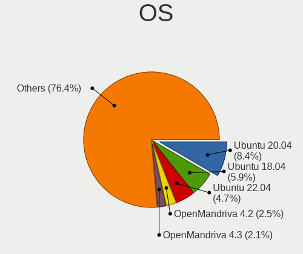
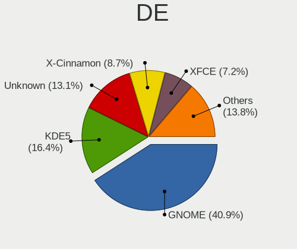
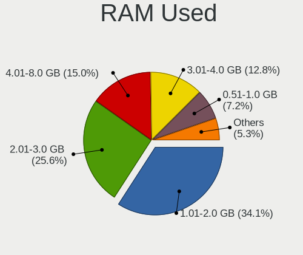
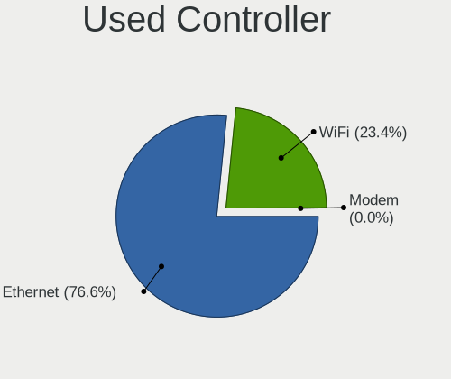
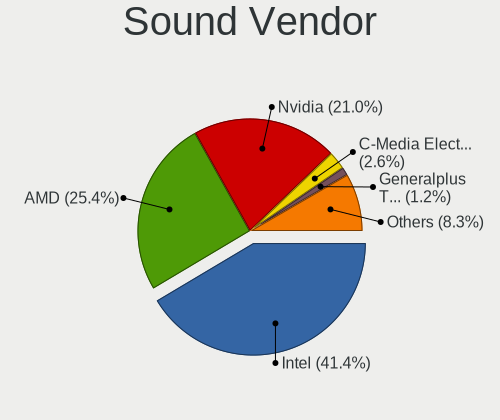
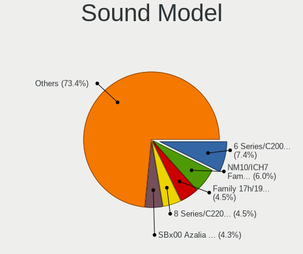

Linux in Brazil - Tested Hardware & Statistics (Desktops)
---------------------------------------------------------

A project to collect tested hardware configurations for Linux in Brazil.

Anyone can contribute to this report by the [hw-probe](https://github.com/linuxhw/hw-probe) tool:

    sudo -E hw-probe -all -upload

Please contribute! Especially if your hardware is rare.

Contents
--------

* [ Test Cases ](#test-cases)

* [ System ](#system)
  - [ OS                       ](#os)
  - [ OS Family                ](#os-family)
  - [ Kernel                   ](#kernel)
  - [ Kernel Family            ](#kernel-family)
  - [ Kernel Major Ver.        ](#kernel-major-ver)
  - [ Arch                     ](#arch)
  - [ DE                       ](#de)
  - [ Display Server           ](#display-server)
  - [ Display Manager          ](#display-manager)
  - [ OS Lang                  ](#os-lang)
  - [ Boot Mode                ](#boot-mode)
  - [ Filesystem               ](#filesystem)
  - [ Part. scheme             ](#part-scheme)
  - [ Dual Boot with Linux/BSD ](#dual-boot-with-linuxbsd)
  - [ Dual Boot (Win)          ](#dual-boot-win)

* [ Board ](#board)
  - [ Vendor                   ](#vendor)
  - [ Model                    ](#model)
  - [ Model Family             ](#model-family)
  - [ MFG Year                 ](#mfg-year)
  - [ Form Factor              ](#form-factor)
  - [ Secure Boot              ](#secure-boot)
  - [ Coreboot                 ](#coreboot)
  - [ RAM Size                 ](#ram-size)
  - [ RAM Used                 ](#ram-used)
  - [ Total Drives             ](#total-drives)
  - [ Has CD-ROM               ](#has-cd-rom)
  - [ Has Ethernet             ](#has-ethernet)
  - [ Has WiFi                 ](#has-wifi)
  - [ Has Bluetooth            ](#has-bluetooth)

* [ Location ](#location)
  - [ Country                  ](#country)
  - [ City                     ](#city)

* [ Drives ](#drives)
  - [ Drive Vendor             ](#drive-vendor)
  - [ Drive Model              ](#drive-model)
  - [ HDD Vendor               ](#hdd-vendor)
  - [ SSD Vendor               ](#ssd-vendor)
  - [ Drive Kind               ](#drive-kind)
  - [ Drive Connector          ](#drive-connector)
  - [ Drive Size               ](#drive-size)
  - [ Space Total              ](#space-total)
  - [ Space Used               ](#space-used)
  - [ Malfunc. Drives          ](#malfunc-drives)
  - [ Malfunc. Drive Vendor    ](#malfunc-drive-vendor)
  - [ Malfunc. HDD Vendor      ](#malfunc-hdd-vendor)
  - [ Malfunc. Drive Kind      ](#malfunc-drive-kind)
  - [ Failed Drives            ](#failed-drives)
  - [ Failed Drive Vendor      ](#failed-drive-vendor)
  - [ Drive Status             ](#drive-status)

* [ Storage controller ](#storage-controller)
  - [ Storage Vendor           ](#storage-vendor)
  - [ Storage Model            ](#storage-model)
  - [ Storage Kind             ](#storage-kind)

* [ Processor ](#processor)
  - [ CPU Vendor               ](#cpu-vendor)
  - [ CPU Model                ](#cpu-model)
  - [ CPU Model Family         ](#cpu-model-family)
  - [ CPU Cores                ](#cpu-cores)
  - [ CPU Sockets              ](#cpu-sockets)
  - [ CPU Threads              ](#cpu-threads)
  - [ CPU Op-Modes             ](#cpu-op-modes)
  - [ CPU Microcode            ](#cpu-microcode)
  - [ CPU Microarch            ](#cpu-microarch)

* [ Graphics ](#graphics)
  - [ GPU Vendor               ](#gpu-vendor)
  - [ GPU Model                ](#gpu-model)
  - [ GPU Combo                ](#gpu-combo)
  - [ GPU Driver               ](#gpu-driver)
  - [ GPU Memory               ](#gpu-memory)

* [ Monitor ](#monitor)
  - [ Monitor Vendor           ](#monitor-vendor)
  - [ Monitor Model            ](#monitor-model)
  - [ Monitor Resolution       ](#monitor-resolution)
  - [ Monitor Diagonal         ](#monitor-diagonal)
  - [ Monitor Width            ](#monitor-width)
  - [ Aspect Ratio             ](#aspect-ratio)
  - [ Monitor Area             ](#monitor-area)
  - [ Pixel Density            ](#pixel-density)
  - [ Multiple Monitors        ](#multiple-monitors)

* [ Network ](#network)
  - [ Net Controller Vendor    ](#net-controller-vendor)
  - [ Net Controller Model     ](#net-controller-model)
  - [ Wireless Vendor          ](#wireless-vendor)
  - [ Wireless Model           ](#wireless-model)
  - [ Ethernet Vendor          ](#ethernet-vendor)
  - [ Ethernet Model           ](#ethernet-model)
  - [ Net Controller Kind      ](#net-controller-kind)
  - [ Used Controller          ](#used-controller)
  - [ NICs                     ](#nics)
  - [ IPv6                     ](#ipv6)

* [ Bluetooth ](#bluetooth)
  - [ Bluetooth Vendor         ](#bluetooth-vendor)
  - [ Bluetooth Model          ](#bluetooth-model)

* [ Sound ](#sound)
  - [ Sound Vendor             ](#sound-vendor)
  - [ Sound Model              ](#sound-model)

* [ Memory ](#memory)
  - [ Memory Vendor            ](#memory-vendor)
  - [ Memory Model             ](#memory-model)
  - [ Memory Kind              ](#memory-kind)
  - [ Memory Form Factor       ](#memory-form-factor)
  - [ Memory Size              ](#memory-size)
  - [ Memory Speed             ](#memory-speed)

* [ Printers & scanners ](#printers--scanners)
  - [ Printer Vendor           ](#printer-vendor)
  - [ Printer Model            ](#printer-model)
  - [ Scanner Vendor           ](#scanner-vendor)
  - [ Scanner Model            ](#scanner-model)

* [ Camera ](#camera)
  - [ Camera Vendor            ](#camera-vendor)
  - [ Camera Model             ](#camera-model)

* [ Security ](#security)
  - [ Fingerprint Vendor       ](#fingerprint-vendor)
  - [ Fingerprint Model        ](#fingerprint-model)
  - [ Chipcard Vendor          ](#chipcard-vendor)
  - [ Chipcard Model           ](#chipcard-model)

* [ Unsupported ](#unsupported)
  - [ Unsupported Devices      ](#unsupported-devices)
  - [ Unsupported Device Types ](#unsupported-device-types)

Test Cases
----------

Total: 5911

| Vendor        | Model                       | Probe                                                      | Date         |
|---------------|-----------------------------|------------------------------------------------------------|--------------|
| Positivo      | POS-PIH81DL                 | [c17fe23ea7](https://linux-hardware.org/?probe=c17fe23ea7) | Oct 01, 2022 |
| ASUSTek       | A78M-A                      | [5ad2e5f2a6](https://linux-hardware.org/?probe=5ad2e5f2a6) | Oct 01, 2022 |
| Biostar       | B350ET2                     | [d7c5b1ad40](https://linux-hardware.org/?probe=d7c5b1ad40) | Oct 01, 2022 |
| Biostar       | A320MH                      | [b07b6c4fc5](https://linux-hardware.org/?probe=b07b6c4fc5) | Oct 01, 2022 |
| Gigabyte      | H110M-H DDR3-CF             | [8169fe8dbd](https://linux-hardware.org/?probe=8169fe8dbd) | Oct 01, 2022 |
| Dell          | 01XK1W A00                  | [29c4292c62](https://linux-hardware.org/?probe=29c4292c62) | Oct 01, 2022 |
| Biostar       | B350ET2                     | [2b7bea0eda](https://linux-hardware.org/?probe=2b7bea0eda) | Sep 30, 2022 |
| Intel         | H61                         | [37af3b0cdb](https://linux-hardware.org/?probe=37af3b0cdb) | Sep 30, 2022 |
| Dell          | 07PR60 A01                  | [812cb18129](https://linux-hardware.org/?probe=812cb18129) | Sep 30, 2022 |
| ASUSTek       | TUF Gaming Z490-PLUS        | [2c08befa41](https://linux-hardware.org/?probe=2c08befa41) | Sep 30, 2022 |
| Positivo      | POS-PIQ67CG POSITIVO        | [5cdce489b9](https://linux-hardware.org/?probe=5cdce489b9) | Sep 30, 2022 |
| Positivo      | POS-PIQ67CG POSITIVO        | [3bfbb3744e](https://linux-hardware.org/?probe=3bfbb3744e) | Sep 30, 2022 |
| ASRock        | A320M-HD                    | [a674def12d](https://linux-hardware.org/?probe=a674def12d) | Sep 29, 2022 |
| Gigabyte      | B450M AORUS ELITE           | [513d236a1f](https://linux-hardware.org/?probe=513d236a1f) | Sep 28, 2022 |
| ASUSTek       | P5K Premium                 | [ec3962c685](https://linux-hardware.org/?probe=ec3962c685) | Sep 28, 2022 |
| ASUSTek       | P5GC-MX/CKD/SI              | [72bb90ea71](https://linux-hardware.org/?probe=72bb90ea71) | Sep 28, 2022 |
| ASUSTek       | B85M-E/BR                   | [5116d1cae9](https://linux-hardware.org/?probe=5116d1cae9) | Sep 27, 2022 |
| Dell          | 0YGYJY A01                  | [73e69debd9](https://linux-hardware.org/?probe=73e69debd9) | Sep 27, 2022 |
| ASUSTek       | ROG STRIX Z590-A GAMING ... | [88f0d42935](https://linux-hardware.org/?probe=88f0d42935) | Sep 27, 2022 |
| Intel         | H55                         | [a155052bce](https://linux-hardware.org/?probe=a155052bce) | Sep 26, 2022 |
| Dell          | 01XK1W A00                  | [4e228116be](https://linux-hardware.org/?probe=4e228116be) | Sep 25, 2022 |
| ASUSTek       | P7H55-M LX                  | [8d3b235d4c](https://linux-hardware.org/?probe=8d3b235d4c) | Sep 25, 2022 |
| ASRock        | A320M-HD                    | [b26f7bf9f5](https://linux-hardware.org/?probe=b26f7bf9f5) | Sep 25, 2022 |
| ASRock        | FM2A88X Extreme4+           | [2d44b203f9](https://linux-hardware.org/?probe=2d44b203f9) | Sep 25, 2022 |
| ASUSTek       | M5A78L-M/USB3               | [a2b3fd8ea8](https://linux-hardware.org/?probe=a2b3fd8ea8) | Sep 24, 2022 |
| ASUSTek       | PRIME B450M-GAMING/BR       | [2a7c09d404](https://linux-hardware.org/?probe=2a7c09d404) | Sep 24, 2022 |
| Intel         | X99 V1.0                    | [7565f85860](https://linux-hardware.org/?probe=7565f85860) | Sep 24, 2022 |
| Unknown       | WZBTDT1 R110                | [8b6b5af31a](https://linux-hardware.org/?probe=8b6b5af31a) | Sep 24, 2022 |
| Gigabyte      | 970A-DS3P                   | [1e9a7dd793](https://linux-hardware.org/?probe=1e9a7dd793) | Sep 24, 2022 |
| ASUSTek       | M2N68                       | [4b23dadbca](https://linux-hardware.org/?probe=4b23dadbca) | Sep 23, 2022 |
| Foxconn       | Q77M                        | [63d0fe0c57](https://linux-hardware.org/?probe=63d0fe0c57) | Sep 23, 2022 |
| Biostar       | TA75MH2                     | [e76fb13311](https://linux-hardware.org/?probe=e76fb13311) | Sep 23, 2022 |
| ASRock        | G31M-S                      | [76d9b33c76](https://linux-hardware.org/?probe=76d9b33c76) | Sep 23, 2022 |
| Dell          | 0M5DCD A00                  | [991137f04f](https://linux-hardware.org/?probe=991137f04f) | Sep 23, 2022 |
| ASUSTek       | M2N68-AM SE2                | [412f70b76b](https://linux-hardware.org/?probe=412f70b76b) | Sep 23, 2022 |
| Gigabyte      | H110M-S2H DDR3-CF           | [fef79bcff4](https://linux-hardware.org/?probe=fef79bcff4) | Sep 22, 2022 |
| Foxconn       | H61M-S/H61M                 | [039b5cff54](https://linux-hardware.org/?probe=039b5cff54) | Sep 22, 2022 |
| Gigabyte      | 945GM-S2                    | [9fcea940e6](https://linux-hardware.org/?probe=9fcea940e6) | Sep 22, 2022 |
| OEM           | B75 Ver:1.41                | [e22d2bac17](https://linux-hardware.org/?probe=e22d2bac17) | Sep 22, 2022 |
| Intel         | DN2800MT AAG23738-801       | [0019b51cff](https://linux-hardware.org/?probe=0019b51cff) | Sep 21, 2022 |
| Digiboard     | NM70-TI                     | [84e21c8253](https://linux-hardware.org/?probe=84e21c8253) | Sep 21, 2022 |
| Digiboard     | NM70-TI                     | [ace83d527c](https://linux-hardware.org/?probe=ace83d527c) | Sep 20, 2022 |
| MSI           | Z390-A PRO                  | [9b0dd73d61](https://linux-hardware.org/?probe=9b0dd73d61) | Sep 20, 2022 |
| Dell          | 0KY237 A01                  | [e1258b712e](https://linux-hardware.org/?probe=e1258b712e) | Sep 20, 2022 |
| Dell          | 0KY237 A01                  | [6f2ce8e794](https://linux-hardware.org/?probe=6f2ce8e794) | Sep 20, 2022 |
| ASUSTek       | TUF Gaming X570-PLUS        | [9d0697ec96](https://linux-hardware.org/?probe=9d0697ec96) | Sep 20, 2022 |
| ASUSTek       | PRIME A320M-K/BR            | [38234e238c](https://linux-hardware.org/?probe=38234e238c) | Sep 20, 2022 |
| Gigabyte      | B450M DS3H-CF               | [54d0318e27](https://linux-hardware.org/?probe=54d0318e27) | Sep 20, 2022 |
| Supermicro    | SKAGIT09                    | [b7dcf8a06c](https://linux-hardware.org/?probe=b7dcf8a06c) | Sep 20, 2022 |
| Dell          | 0D883F A06                  | [55f97310c8](https://linux-hardware.org/?probe=55f97310c8) | Sep 20, 2022 |
| Intel         | X99 V1.0                    | [02bfe94d24](https://linux-hardware.org/?probe=02bfe94d24) | Sep 19, 2022 |
| Intel         | X99 V1.0                    | [94dad1a250](https://linux-hardware.org/?probe=94dad1a250) | Sep 19, 2022 |
| Gigabyte      | A520M DS3H                  | [bf7318e65e](https://linux-hardware.org/?probe=bf7318e65e) | Sep 19, 2022 |
| Gigabyte      | B450 AORUS M                | [136eca7e32](https://linux-hardware.org/?probe=136eca7e32) | Sep 19, 2022 |
| ASUSTek       | M5A78L-M PLUS/USB3          | [908ad5ef27](https://linux-hardware.org/?probe=908ad5ef27) | Sep 19, 2022 |
| ASUSTek       | M5A78L-M PLUS/USB3          | [25f87932c7](https://linux-hardware.org/?probe=25f87932c7) | Sep 19, 2022 |
| ASUSTek       | TUF Gaming B550M-PLUS       | [8468466b2a](https://linux-hardware.org/?probe=8468466b2a) | Sep 19, 2022 |
| MSI           | A68HM-E33                   | [2905913e7e](https://linux-hardware.org/?probe=2905913e7e) | Sep 18, 2022 |
| Dell          | 0KY237 A01                  | [c639777548](https://linux-hardware.org/?probe=c639777548) | Sep 18, 2022 |
| Dell          | 0KY237 A01                  | [8b2d50f5d1](https://linux-hardware.org/?probe=8b2d50f5d1) | Sep 18, 2022 |
| PCWare        | IPMH110G                    | [6ba309be15](https://linux-hardware.org/?probe=6ba309be15) | Sep 18, 2022 |
| ASUSTek       | M4A785-M                    | [411449bc6d](https://linux-hardware.org/?probe=411449bc6d) | Sep 18, 2022 |
| Intel         | H61                         | [923e50e023](https://linux-hardware.org/?probe=923e50e023) | Sep 18, 2022 |
| MSI           | J1800I                      | [ff28c29a3e](https://linux-hardware.org/?probe=ff28c29a3e) | Sep 18, 2022 |
| MSI           | B360M MORTAR                | [cdcff8c15d](https://linux-hardware.org/?probe=cdcff8c15d) | Sep 18, 2022 |
| ASUSTek       | M5A78L-M/USB3               | [753fc77941](https://linux-hardware.org/?probe=753fc77941) | Sep 18, 2022 |
| ASUSTek       | M5A78L-M PLUS/USB3          | [0e007748d1](https://linux-hardware.org/?probe=0e007748d1) | Sep 17, 2022 |
| Intel         | X79M-S                      | [91e75d3183](https://linux-hardware.org/?probe=91e75d3183) | Sep 17, 2022 |
| Intel         | X79M-S                      | [48c5f5ed77](https://linux-hardware.org/?probe=48c5f5ed77) | Sep 17, 2022 |
| Intel         | X99 V1.0                    | [735c794db9](https://linux-hardware.org/?probe=735c794db9) | Sep 17, 2022 |
| Intel         | H61                         | [d1b17183d7](https://linux-hardware.org/?probe=d1b17183d7) | Sep 16, 2022 |
| ASUSTek       | M5A97 LE R2.0               | [52fe410fe3](https://linux-hardware.org/?probe=52fe410fe3) | Sep 16, 2022 |
| Unknown       | Unknown                     | [c292f41bc5](https://linux-hardware.org/?probe=c292f41bc5) | Sep 15, 2022 |
| MACHINIST     | X99-RS9 V3.0                | [3f9fc3fc62](https://linux-hardware.org/?probe=3f9fc3fc62) | Sep 15, 2022 |
| ASUSTek       | Maximus VII HERO            | [6d40add21a](https://linux-hardware.org/?probe=6d40add21a) | Sep 15, 2022 |
| ASUSTek       | TUF Gaming B550M-PLUS       | [6de8f25119](https://linux-hardware.org/?probe=6de8f25119) | Sep 15, 2022 |
| ASUSTek       | TUF Gaming X570-PLUS_BR     | [9c97b9e2c1](https://linux-hardware.org/?probe=9c97b9e2c1) | Sep 14, 2022 |
| ASUSTek       | M5A78L-M PLUS/USB3          | [64d4d4b3bc](https://linux-hardware.org/?probe=64d4d4b3bc) | Sep 14, 2022 |
| ASUSTek       | TUF Gaming B550M-PLUS       | [3557099732](https://linux-hardware.org/?probe=3557099732) | Sep 14, 2022 |
| Gigabyte      | F2A88X-D3H                  | [06d4572f5e](https://linux-hardware.org/?probe=06d4572f5e) | Sep 14, 2022 |
| Dell          | 0TW904 A01                  | [141188a631](https://linux-hardware.org/?probe=141188a631) | Sep 14, 2022 |
| ASUSTek       | H81M-A/BR                   | [daab24c8b6](https://linux-hardware.org/?probe=daab24c8b6) | Sep 14, 2022 |
| ASUSTek       | PRIME B350M-A               | [47b0975057](https://linux-hardware.org/?probe=47b0975057) | Sep 13, 2022 |
| Gigabyte      | Z690 UD AX DDR4             | [70aa78efc6](https://linux-hardware.org/?probe=70aa78efc6) | Sep 13, 2022 |
| Positivo      | POS-PQ45AU                  | [0879f8d9ce](https://linux-hardware.org/?probe=0879f8d9ce) | Sep 13, 2022 |
| MACHINIST     | X99-RS9 V3.0                | [64795f6f69](https://linux-hardware.org/?probe=64795f6f69) | Sep 13, 2022 |
| Dell          | 04YP6J A00                  | [ef4ae2baac](https://linux-hardware.org/?probe=ef4ae2baac) | Sep 13, 2022 |
| Positivo      | POS-EINM10CB POSITIVO       | [7c876e560b](https://linux-hardware.org/?probe=7c876e560b) | Sep 13, 2022 |
| ASRock        | FM2A55M-HD+ R2.0            | [1faad914c6](https://linux-hardware.org/?probe=1faad914c6) | Sep 13, 2022 |
| ASUSTek       | M5A78L-M PLUS/USB3          | [ac722c6dcc](https://linux-hardware.org/?probe=ac722c6dcc) | Sep 13, 2022 |
| Unknown       | X99H                        | [9fb8886110](https://linux-hardware.org/?probe=9fb8886110) | Sep 13, 2022 |
| PCWare        | IPMH61R3                    | [2312ab0f92](https://linux-hardware.org/?probe=2312ab0f92) | Sep 12, 2022 |
| Intel         | H61                         | [d805e24841](https://linux-hardware.org/?probe=d805e24841) | Sep 12, 2022 |
| ASRock        | B450M-HDV R4.0              | [73684f0e47](https://linux-hardware.org/?probe=73684f0e47) | Sep 12, 2022 |
| Dell          | 01XK1W A00                  | [09d0fcce0e](https://linux-hardware.org/?probe=09d0fcce0e) | Sep 12, 2022 |
| ASUSTek       | TUF Gaming B450M-PRO S      | [94c783f944](https://linux-hardware.org/?probe=94c783f944) | Sep 11, 2022 |
| Intel         | X79G V2.x                   | [3cb7aa6549](https://linux-hardware.org/?probe=3cb7aa6549) | Sep 11, 2022 |
| ASRock        | A320M-HDV R4.0              | [afbb849b02](https://linux-hardware.org/?probe=afbb849b02) | Sep 11, 2022 |
| ASRock        | A320M-HDV R4.0              | [5e98f641f1](https://linux-hardware.org/?probe=5e98f641f1) | Sep 11, 2022 |
| ASUSTek       | M5A78L-M PLUS/USB3          | [aa4d90c7e7](https://linux-hardware.org/?probe=aa4d90c7e7) | Sep 11, 2022 |
| Dell          | 01XK1W A00                  | [41b9796681](https://linux-hardware.org/?probe=41b9796681) | Sep 10, 2022 |
| MSI           | A320M GAMING PRO            | [6ce0fb28ee](https://linux-hardware.org/?probe=6ce0fb28ee) | Sep 10, 2022 |
| MSI           | A320M GAMING PRO            | [5cce5f5ade](https://linux-hardware.org/?probe=5cce5f5ade) | Sep 10, 2022 |
| PCWare        | IPMH61R1                    | [d79e449b58](https://linux-hardware.org/?probe=d79e449b58) | Sep 10, 2022 |
| ASUSTek       | ROG CROSSHAIR VIII HERO     | [5cfe072b9c](https://linux-hardware.org/?probe=5cfe072b9c) | Sep 10, 2022 |
| PCWare        | IPMH61R1                    | [1d6ec4fb3b](https://linux-hardware.org/?probe=1d6ec4fb3b) | Sep 10, 2022 |
| Intel         | Unknown                     | [74059aa424](https://linux-hardware.org/?probe=74059aa424) | Sep 10, 2022 |
| Gigabyte      | X570 AORUS PRO              | [8d1d861b1c](https://linux-hardware.org/?probe=8d1d861b1c) | Sep 09, 2022 |
| Gigabyte      | H110M-S2V-CF                | [944fa39fb6](https://linux-hardware.org/?probe=944fa39fb6) | Sep 09, 2022 |
| Intel         | X79G V2.x                   | [8efdbea978](https://linux-hardware.org/?probe=8efdbea978) | Sep 09, 2022 |
| Gigabyte      | H110M-S2V-CF                | [c716a6bba5](https://linux-hardware.org/?probe=c716a6bba5) | Sep 09, 2022 |
| Supermicro    | SKAGIT09                    | [d3f42d0c24](https://linux-hardware.org/?probe=d3f42d0c24) | Sep 08, 2022 |
| Intel         | X99                         | [9ebaa38244](https://linux-hardware.org/?probe=9ebaa38244) | Sep 08, 2022 |
| Gigabyte      | H110M-S2H DDR3-CF           | [4942b09228](https://linux-hardware.org/?probe=4942b09228) | Sep 08, 2022 |
| Intel         | D33217CK G76541-301         | [1f1e6e67ab](https://linux-hardware.org/?probe=1f1e6e67ab) | Sep 07, 2022 |
| Biostar       | G41D3C                      | [2825db69bf](https://linux-hardware.org/?probe=2825db69bf) | Sep 07, 2022 |
| Positivo      | POS-PQ45AU                  | [2770dcd81a](https://linux-hardware.org/?probe=2770dcd81a) | Sep 07, 2022 |
| Unknown       | GSUO H61V10C                | [4eeb38bb0a](https://linux-hardware.org/?probe=4eeb38bb0a) | Sep 07, 2022 |
| Gigabyte      | Z390 AORUS PRO WIFI-CF      | [f547e07cca](https://linux-hardware.org/?probe=f547e07cca) | Sep 07, 2022 |
| Gigabyte      | VM900M                      | [c6eefaabf9](https://linux-hardware.org/?probe=c6eefaabf9) | Sep 07, 2022 |
| Gigabyte      | H110M-S2H DDR3-CF           | [ad861a3bb2](https://linux-hardware.org/?probe=ad861a3bb2) | Sep 06, 2022 |
| ASUSTek       | TUF Gaming B450M-PRO II     | [b1bdd1703e](https://linux-hardware.org/?probe=b1bdd1703e) | Sep 06, 2022 |
| ASUSTek       | M5A78L-M/USB3               | [f61f170b4c](https://linux-hardware.org/?probe=f61f170b4c) | Sep 06, 2022 |
| Intel         | H61                         | [b2d888f266](https://linux-hardware.org/?probe=b2d888f266) | Sep 05, 2022 |
| ASUSTek       | P5GZ-MX                     | [883739db23](https://linux-hardware.org/?probe=883739db23) | Sep 05, 2022 |
| Intel         | B75                         | [eca0b46101](https://linux-hardware.org/?probe=eca0b46101) | Sep 05, 2022 |
| ASUSTek       | P5KPL-AM-CKD-VISUM-SI       | [1f5b368c96](https://linux-hardware.org/?probe=1f5b368c96) | Sep 05, 2022 |
| PCWare        | IPMH61R3                    | [1cbe0ee116](https://linux-hardware.org/?probe=1cbe0ee116) | Sep 04, 2022 |
| Gigabyte      | B560M AORUS ELITE           | [078680a25d](https://linux-hardware.org/?probe=078680a25d) | Sep 04, 2022 |
| Gigabyte      | H110M-S2H DDR3-CF           | [d7bb9415b1](https://linux-hardware.org/?probe=d7bb9415b1) | Sep 04, 2022 |
| Intel         | DX58SO AAE29331-702         | [24c48ddc3e](https://linux-hardware.org/?probe=24c48ddc3e) | Sep 03, 2022 |
| Intel         | H61                         | [af78b53f51](https://linux-hardware.org/?probe=af78b53f51) | Sep 03, 2022 |
| ASUSTek       | P8B75-V                     | [2ae6d7c950](https://linux-hardware.org/?probe=2ae6d7c950) | Sep 03, 2022 |
| ASUSTek       | PRIME Z270-A                | [e742b2e06c](https://linux-hardware.org/?probe=e742b2e06c) | Sep 03, 2022 |
| Dell          | 07PR60 A01                  | [d37a4374eb](https://linux-hardware.org/?probe=d37a4374eb) | Sep 02, 2022 |
| ECS           | H61H2-M2                    | [11dd923e56](https://linux-hardware.org/?probe=11dd923e56) | Sep 02, 2022 |
| Intel         | DP55WB AAE64798-206         | [548332086b](https://linux-hardware.org/?probe=548332086b) | Sep 02, 2022 |
| MSI           | H97 GAMING 3                | [a5fb8d7651](https://linux-hardware.org/?probe=a5fb8d7651) | Sep 02, 2022 |
| Gigabyte      | H61M-S1                     | [b54a09966b](https://linux-hardware.org/?probe=b54a09966b) | Sep 02, 2022 |
| AMI           | T3 MRD                      | [d0a254e1b7](https://linux-hardware.org/?probe=d0a254e1b7) | Sep 02, 2022 |
| Gigabyte      | H110M-S2H DDR3-CF           | [9525064f53](https://linux-hardware.org/?probe=9525064f53) | Sep 02, 2022 |
| Lenovo        | 3168 NOK                    | [58c82b01e2](https://linux-hardware.org/?probe=58c82b01e2) | Sep 01, 2022 |
| ASRock        | FM2A55M-HD+                 | [2f96c73efb](https://linux-hardware.org/?probe=2f96c73efb) | Sep 01, 2022 |
| ASRock        | N68-GS4 FX R2.0             | [ea730c9b2d](https://linux-hardware.org/?probe=ea730c9b2d) | Sep 01, 2022 |
| ASRock        | B550M-ITX/ac                | [7850c07cdc](https://linux-hardware.org/?probe=7850c07cdc) | Aug 31, 2022 |
| Gigabyte      | VM900M                      | [f446d835da](https://linux-hardware.org/?probe=f446d835da) | Aug 30, 2022 |
| ASUSTek       | ROG Maximus XII EXTREME     | [a77d5e141e](https://linux-hardware.org/?probe=a77d5e141e) | Aug 30, 2022 |
| Gigabyte      | Z97X-Gaming 7               | [1c993db964](https://linux-hardware.org/?probe=1c993db964) | Aug 30, 2022 |
| Gigabyte      | Z97X-Gaming 7               | [91438fc6b5](https://linux-hardware.org/?probe=91438fc6b5) | Aug 30, 2022 |
| Supermicro    | SKAGIT09                    | [3f4c6a4d48](https://linux-hardware.org/?probe=3f4c6a4d48) | Aug 29, 2022 |
| Gigabyte      | X470 AORUS GAMING 7 WIFI... | [c7ace10271](https://linux-hardware.org/?probe=c7ace10271) | Aug 28, 2022 |
| Gigabyte      | F2A68HM-S1                  | [420036f4d6](https://linux-hardware.org/?probe=420036f4d6) | Aug 28, 2022 |
| MSI           | B560M PRO-VDH               | [d8a638184b](https://linux-hardware.org/?probe=d8a638184b) | Aug 28, 2022 |
| Intel         | H61                         | [c829101789](https://linux-hardware.org/?probe=c829101789) | Aug 27, 2022 |
| Gigabyte      | H61M-S1                     | [6bf1dafdbc](https://linux-hardware.org/?probe=6bf1dafdbc) | Aug 27, 2022 |
| Gigabyte      | GA-78LMT-USB3 SEx           | [7642980e6e](https://linux-hardware.org/?probe=7642980e6e) | Aug 27, 2022 |
| Dell          | 01XK1W A00                  | [7728612d53](https://linux-hardware.org/?probe=7728612d53) | Aug 26, 2022 |
| Dell          | 01XK1W A00                  | [ee6cec5f61](https://linux-hardware.org/?probe=ee6cec5f61) | Aug 26, 2022 |
| ASUSTek       | PRIME A320M-K/BR            | [da0b51aa63](https://linux-hardware.org/?probe=da0b51aa63) | Aug 25, 2022 |
| MSI           | B560M PRO-VDH               | [437118237f](https://linux-hardware.org/?probe=437118237f) | Aug 25, 2022 |
| Foxconn       | H61M/H61M-S                 | [18e7da32e9](https://linux-hardware.org/?probe=18e7da32e9) | Aug 25, 2022 |
| OEM           | A320                        | [4dffd629cf](https://linux-hardware.org/?probe=4dffd629cf) | Aug 25, 2022 |
| Dell          | 01XK1W A00                  | [604a0a7789](https://linux-hardware.org/?probe=604a0a7789) | Aug 25, 2022 |
| HP            | 3397                        | [f65d0fdb85](https://linux-hardware.org/?probe=f65d0fdb85) | Aug 24, 2022 |
| ASUSTek       | H81M-A/BR                   | [b9ac5d4051](https://linux-hardware.org/?probe=b9ac5d4051) | Aug 23, 2022 |
| ASUSTek       | P8H61-M LX2 R2.0            | [5754d37860](https://linux-hardware.org/?probe=5754d37860) | Aug 23, 2022 |
| AMI           | Cherry Trail Tablet         | [8cdf70d6e3](https://linux-hardware.org/?probe=8cdf70d6e3) | Aug 23, 2022 |
| ASUSTek       | P5KPL-CM                    | [53a4b425d3](https://linux-hardware.org/?probe=53a4b425d3) | Aug 22, 2022 |
| ASUSTek       | PRIME H410M-E               | [5270930555](https://linux-hardware.org/?probe=5270930555) | Aug 22, 2022 |
| Biostar       | A68N-5100                   | [2c6df92279](https://linux-hardware.org/?probe=2c6df92279) | Aug 22, 2022 |
| Supermicro    | SKAGIT09                    | [1ae2767db3](https://linux-hardware.org/?probe=1ae2767db3) | Aug 22, 2022 |
| Unknown       | GSUO H61V10C                | [1e7ccd0999](https://linux-hardware.org/?probe=1e7ccd0999) | Aug 22, 2022 |
| ASUSTek       | J1800I-C/BR                 | [f2f76737ad](https://linux-hardware.org/?probe=f2f76737ad) | Aug 22, 2022 |
| MACHINIST     | H81M-PRO S1 V2.0            | [12be75fa90](https://linux-hardware.org/?probe=12be75fa90) | Aug 21, 2022 |
| ASRock        | X370 Taichi                 | [8f952ff258](https://linux-hardware.org/?probe=8f952ff258) | Aug 21, 2022 |
| Intel         | DH61WW AAG23116-203         | [43a16c5e88](https://linux-hardware.org/?probe=43a16c5e88) | Aug 21, 2022 |
| Biostar       | G31-M7 TE                   | [aaacebef4a](https://linux-hardware.org/?probe=aaacebef4a) | Aug 21, 2022 |
| Gigabyte      | M68MT-S2P                   | [23c07b5d2b](https://linux-hardware.org/?probe=23c07b5d2b) | Aug 21, 2022 |
| Gigabyte      | B75M-D3H                    | [6503feb8b7](https://linux-hardware.org/?probe=6503feb8b7) | Aug 20, 2022 |
| ASUSTek       | TUF H310M-PLUS GAMING/BR    | [2e1445b2c8](https://linux-hardware.org/?probe=2e1445b2c8) | Aug 19, 2022 |
| Dell          | 0TVR1F A01                  | [1b8906bb20](https://linux-hardware.org/?probe=1b8906bb20) | Aug 19, 2022 |
| MACHINIST     | X99-RS9 V2.0                | [ffb095f0c3](https://linux-hardware.org/?probe=ffb095f0c3) | Aug 19, 2022 |
| ASUSTek       | B150M-C/BR                  | [b15c721e4c](https://linux-hardware.org/?probe=b15c721e4c) | Aug 18, 2022 |
| Arquimedes... | 760GM                       | [5f653afdff](https://linux-hardware.org/?probe=5f653afdff) | Aug 18, 2022 |
| ASUSTek       | M5A78L-M/USB3               | [4242f8b9c2](https://linux-hardware.org/?probe=4242f8b9c2) | Aug 18, 2022 |
| ASUSTek       | M5A78L-M/USB3               | [bac870dd75](https://linux-hardware.org/?probe=bac870dd75) | Aug 18, 2022 |
| ASUSTek       | M5A78L-M LX/BR              | [52b9313de4](https://linux-hardware.org/?probe=52b9313de4) | Aug 18, 2022 |
| ASUSTek       | P8B75-V                     | [a37b0b7e18](https://linux-hardware.org/?probe=a37b0b7e18) | Aug 18, 2022 |
| Intel         | Unknown                     | [23f3bdae8a](https://linux-hardware.org/?probe=23f3bdae8a) | Aug 18, 2022 |
| HP            | 2215                        | [71a33dc713](https://linux-hardware.org/?probe=71a33dc713) | Aug 17, 2022 |
| HP            | 2215                        | [aa386126ad](https://linux-hardware.org/?probe=aa386126ad) | Aug 17, 2022 |
| ASRock        | AB350M-HDV                  | [3e3ab3842f](https://linux-hardware.org/?probe=3e3ab3842f) | Aug 16, 2022 |
| ASUSTek       | H170M-PLUS/BR               | [feb4e50ec5](https://linux-hardware.org/?probe=feb4e50ec5) | Aug 16, 2022 |
| VS Company    | H61H2                       | [a0b88242a4](https://linux-hardware.org/?probe=a0b88242a4) | Aug 16, 2022 |
| Intel         | B75                         | [8eb918ea53](https://linux-hardware.org/?probe=8eb918ea53) | Aug 16, 2022 |
| Gigabyte      | B550M DS3H                  | [6ef5e022c7](https://linux-hardware.org/?probe=6ef5e022c7) | Aug 15, 2022 |
| ASUSTek       | J1800I-C/BR                 | [01beed2be8](https://linux-hardware.org/?probe=01beed2be8) | Aug 15, 2022 |
| PCWare        | IPMH61R3                    | [4470bf9f2c](https://linux-hardware.org/?probe=4470bf9f2c) | Aug 15, 2022 |
| ASRock        | B450M Steel Legend          | [1e198f7c54](https://linux-hardware.org/?probe=1e198f7c54) | Aug 15, 2022 |
| ASRock        | FM2A55M-HD+                 | [dc086ed32c](https://linux-hardware.org/?probe=dc086ed32c) | Aug 14, 2022 |
| ASUSTek       | P8H61-M LX3                 | [7c37c2a6d7](https://linux-hardware.org/?probe=7c37c2a6d7) | Aug 14, 2022 |
| ASRock        | FM2A55M-HD+                 | [6c7f56d3cd](https://linux-hardware.org/?probe=6c7f56d3cd) | Aug 14, 2022 |
| Gigabyte      | 970A-DS3P                   | [47632d043c](https://linux-hardware.org/?probe=47632d043c) | Aug 14, 2022 |
| ASUSTek       | H61M-A/BR                   | [4443a6c129](https://linux-hardware.org/?probe=4443a6c129) | Aug 14, 2022 |
| ASUSTek       | H61M-A/BR                   | [082a5297bd](https://linux-hardware.org/?probe=082a5297bd) | Aug 14, 2022 |
| Gigabyte      | Z77M-D3H                    | [15633ed7b1](https://linux-hardware.org/?probe=15633ed7b1) | Aug 14, 2022 |
| Biostar       | G31-M7 TE                   | [c5737e52bd](https://linux-hardware.org/?probe=c5737e52bd) | Aug 14, 2022 |
| ASUSTek       | Z97-A                       | [14fa58515f](https://linux-hardware.org/?probe=14fa58515f) | Aug 13, 2022 |
| ASUSTek       | TUF Gaming B450M-PRO II     | [f17b91fcb8](https://linux-hardware.org/?probe=f17b91fcb8) | Aug 13, 2022 |
| Positivo      | POS-PARS760GCD POSITIVO     | [dc6e65929f](https://linux-hardware.org/?probe=dc6e65929f) | Aug 12, 2022 |
| ASUSTek       | P8H61-M LX3 R2.0            | [98cc4a3075](https://linux-hardware.org/?probe=98cc4a3075) | Aug 12, 2022 |
| Gigabyte      | H61M-S1                     | [18f3dd56e8](https://linux-hardware.org/?probe=18f3dd56e8) | Aug 11, 2022 |
| MSI           | X370 SLI PLUS               | [8b4bc6f127](https://linux-hardware.org/?probe=8b4bc6f127) | Aug 11, 2022 |
| Foxconn       | 2ADA                        | [9aae49b54c](https://linux-hardware.org/?probe=9aae49b54c) | Aug 11, 2022 |
| Gigabyte      | G31M-S2C                    | [3f67c470be](https://linux-hardware.org/?probe=3f67c470be) | Aug 11, 2022 |
| ASUSTek       | J1800I-C/BR                 | [41cd4b02f1](https://linux-hardware.org/?probe=41cd4b02f1) | Aug 11, 2022 |
| ASUSTek       | M5A78L-M LX/BR              | [c66de39c4c](https://linux-hardware.org/?probe=c66de39c4c) | Aug 11, 2022 |
| ASUSTek       | H170M-PLUS/BR               | [d081204e0a](https://linux-hardware.org/?probe=d081204e0a) | Aug 10, 2022 |
| Foxconn       | 2ABF                        | [3b20387bcc](https://linux-hardware.org/?probe=3b20387bcc) | Aug 10, 2022 |
| ASUSTek       | TUF Gaming X570-PLUS        | [e54e09e3cf](https://linux-hardware.org/?probe=e54e09e3cf) | Aug 09, 2022 |
| ASUSTek       | H81M-CS/BR                  | [8c2dc32c37](https://linux-hardware.org/?probe=8c2dc32c37) | Aug 09, 2022 |
| ASUSTek       | TUF Gaming X570-PLUS        | [5a84fd5a16](https://linux-hardware.org/?probe=5a84fd5a16) | Aug 09, 2022 |
| ASUSTek       | Z97M-PLUS/BR                | [b66253f362](https://linux-hardware.org/?probe=b66253f362) | Aug 09, 2022 |
| Intel         | H61                         | [eabc8be629](https://linux-hardware.org/?probe=eabc8be629) | Aug 08, 2022 |
| ASUSTek       | PRIME H310M-E R2.0/BR       | [aada9001dd](https://linux-hardware.org/?probe=aada9001dd) | Aug 08, 2022 |
| HP            | 1998                        | [1ae818eb7c](https://linux-hardware.org/?probe=1ae818eb7c) | Aug 07, 2022 |
| Toshiba       | STI 006998G                 | [3de3fa77fc](https://linux-hardware.org/?probe=3de3fa77fc) | Aug 06, 2022 |
| PCWare        | IPX3060E                    | [3fc0886f3b](https://linux-hardware.org/?probe=3fc0886f3b) | Aug 06, 2022 |
| Gigabyte      | F2A55M-S1                   | [cf3ed2131f](https://linux-hardware.org/?probe=cf3ed2131f) | Aug 06, 2022 |
| MACHINIST     | X79 (INTEL Xeon E5/Corei... | [a722bef081](https://linux-hardware.org/?probe=a722bef081) | Aug 06, 2022 |
| Supermicro    | X9DRi-LN4+/X9DR3-LN4+       | [169fcf7943](https://linux-hardware.org/?probe=169fcf7943) | Aug 05, 2022 |
| Gigabyte      | AX370-Gaming 5              | [46f109ed37](https://linux-hardware.org/?probe=46f109ed37) | Aug 05, 2022 |
| PCWare        | IPX3060E                    | [d5045f1364](https://linux-hardware.org/?probe=d5045f1364) | Aug 04, 2022 |
| Positivo      | POS-PIQ77CL POSITIVO        | [2030bc92d7](https://linux-hardware.org/?probe=2030bc92d7) | Aug 04, 2022 |
| MSI           | Boston                      | [32021cecf7](https://linux-hardware.org/?probe=32021cecf7) | Aug 03, 2022 |
| Biostar       | G41D3C                      | [8a5b81e472](https://linux-hardware.org/?probe=8a5b81e472) | Aug 03, 2022 |
| HP            | 3047h                       | [a8301b8155](https://linux-hardware.org/?probe=a8301b8155) | Aug 02, 2022 |
| Foxconn       | 2ABF                        | [4f1fca6662](https://linux-hardware.org/?probe=4f1fca6662) | Aug 02, 2022 |
| ASUSTek       | M5A78L-M/USB3               | [8e816dc600](https://linux-hardware.org/?probe=8e816dc600) | Aug 01, 2022 |
| PCWare        | IPMH61R1                    | [0843909534](https://linux-hardware.org/?probe=0843909534) | Aug 01, 2022 |
| PCWare        | IPMH61R1                    | [7da7204a12](https://linux-hardware.org/?probe=7da7204a12) | Jul 31, 2022 |
| ASUSTek       | M5A78L-M/USB3               | [16f64b6f1a](https://linux-hardware.org/?probe=16f64b6f1a) | Jul 30, 2022 |
| ASUSTek       | TUF Gaming B550M-E WIFI     | [01bcafef3c](https://linux-hardware.org/?probe=01bcafef3c) | Jul 30, 2022 |
| ECS           | H61H2-M12                   | [6761a8774d](https://linux-hardware.org/?probe=6761a8774d) | Jul 30, 2022 |
| ASUSTek       | M5A78L-M/USB3               | [f6ecfb2a51](https://linux-hardware.org/?probe=f6ecfb2a51) | Jul 30, 2022 |
| MSI           | A320M-A PRO MAX             | [3249abb411](https://linux-hardware.org/?probe=3249abb411) | Jul 30, 2022 |
| ASUSTek       | M5A78L-M/USB3               | [7ceff6f032](https://linux-hardware.org/?probe=7ceff6f032) | Jul 30, 2022 |
| MSI           | A320M-A PRO MAX             | [5a750a1294](https://linux-hardware.org/?probe=5a750a1294) | Jul 30, 2022 |
| HP            | 3047h                       | [a9b59b34f9](https://linux-hardware.org/?probe=a9b59b34f9) | Jul 29, 2022 |
| ASUSTek       | TUF B360M-PLUS GAMING/BR    | [8c57fbc9e8](https://linux-hardware.org/?probe=8c57fbc9e8) | Jul 29, 2022 |
| ASUSTek       | ROG STRIX B550-F GAMING     | [51893f2237](https://linux-hardware.org/?probe=51893f2237) | Jul 29, 2022 |
| Intel         | H61                         | [7bb7deaca9](https://linux-hardware.org/?probe=7bb7deaca9) | Jul 29, 2022 |
| PCWare        | IPMH61R2                    | [b3245af28d](https://linux-hardware.org/?probe=b3245af28d) | Jul 29, 2022 |
| ASUSTek       | ROG STRIX B450-F GAMING     | [e99805635f](https://linux-hardware.org/?probe=e99805635f) | Jul 29, 2022 |
| ASUSTek       | TUF Gaming X570-PLUS_BR     | [e1d666e84a](https://linux-hardware.org/?probe=e1d666e84a) | Jul 29, 2022 |
| Digiboard     | NM70-TI                     | [007a69093c](https://linux-hardware.org/?probe=007a69093c) | Jul 29, 2022 |
| ASUSTek       | P5G41T-M LX2/BR             | [e84f999c94](https://linux-hardware.org/?probe=e84f999c94) | Jul 29, 2022 |
| ASUSTek       | PRIME B450M-GAMING II       | [0cc1bc9401](https://linux-hardware.org/?probe=0cc1bc9401) | Jul 29, 2022 |
| Biostar       | B350GTN                     | [75d6302ab0](https://linux-hardware.org/?probe=75d6302ab0) | Jul 29, 2022 |
| Pegatron      | IPM41-D3                    | [ce24b0bab7](https://linux-hardware.org/?probe=ce24b0bab7) | Jul 28, 2022 |
| Positivo      | POS-RIB360EE 11158935       | [1c687dcef7](https://linux-hardware.org/?probe=1c687dcef7) | Jul 28, 2022 |
| ASRock        | B450M Steel Legend          | [db492973ec](https://linux-hardware.org/?probe=db492973ec) | Jul 28, 2022 |
| Intel         | X99 V1.0                    | [da677f5a3b](https://linux-hardware.org/?probe=da677f5a3b) | Jul 28, 2022 |
| Intel         | B75                         | [0620ffff20](https://linux-hardware.org/?probe=0620ffff20) | Jul 27, 2022 |
| MSI           | X470 GAMING PLUS            | [722aa0951d](https://linux-hardware.org/?probe=722aa0951d) | Jul 27, 2022 |
| PCWare        | IPMH61R1                    | [18610dd9f0](https://linux-hardware.org/?probe=18610dd9f0) | Jul 27, 2022 |
| Gigabyte      | GA-78LMT-USB3 SEx           | [32e82dc9ae](https://linux-hardware.org/?probe=32e82dc9ae) | Jul 27, 2022 |
| PCWare        | PW-945GCX                   | [128aafe763](https://linux-hardware.org/?probe=128aafe763) | Jul 27, 2022 |
| MSI           | 2A9C                        | [de5a8c7ecd](https://linux-hardware.org/?probe=de5a8c7ecd) | Jul 27, 2022 |
| Dell          | 01XK1W A00                  | [68159d9d39](https://linux-hardware.org/?probe=68159d9d39) | Jul 26, 2022 |
| Huanan        | X99-F8                      | [3ba1885fb4](https://linux-hardware.org/?probe=3ba1885fb4) | Jul 26, 2022 |
| Gigabyte      | Z370N WIFI-CF               | [eb3c3fceb3](https://linux-hardware.org/?probe=eb3c3fceb3) | Jul 26, 2022 |
| ASRock        | B450M Steel Legend          | [30fd52a2a5](https://linux-hardware.org/?probe=30fd52a2a5) | Jul 26, 2022 |
| Gigabyte      | H110M-S2H DDR3-CF           | [e471e3ed10](https://linux-hardware.org/?probe=e471e3ed10) | Jul 26, 2022 |
| Login Info... | LOG-H310M-G                 | [f02a0ed6dd](https://linux-hardware.org/?probe=f02a0ed6dd) | Jul 26, 2022 |
| ASUSTek       | PRIME B450M-GAMING/BR       | [e33f8c0a93](https://linux-hardware.org/?probe=e33f8c0a93) | Jul 26, 2022 |
| ASRock        | H61M-DGS                    | [0dc55c5b73](https://linux-hardware.org/?probe=0dc55c5b73) | Jul 24, 2022 |
| ASUSTek       | Z87M-PLUS                   | [0efc94e34d](https://linux-hardware.org/?probe=0efc94e34d) | Jul 24, 2022 |
| PCWare        | IPX1800E2                   | [4426727633](https://linux-hardware.org/?probe=4426727633) | Jul 24, 2022 |
| Intel         | DH61WW AAG23116-203         | [cfd6e87e09](https://linux-hardware.org/?probe=cfd6e87e09) | Jul 23, 2022 |
| Dell          | 01XK1W A00                  | [5c8a6b6f90](https://linux-hardware.org/?probe=5c8a6b6f90) | Jul 23, 2022 |
| ASUSTek       | Z87M-PLUS                   | [c30806c628](https://linux-hardware.org/?probe=c30806c628) | Jul 23, 2022 |
| ASUSTek       | Z87M-PLUS                   | [b805fa0cd8](https://linux-hardware.org/?probe=b805fa0cd8) | Jul 23, 2022 |
| ASUSTek       | PRIME B550M-K               | [df5bd62f9a](https://linux-hardware.org/?probe=df5bd62f9a) | Jul 23, 2022 |
| MSI           | B450 GAMING PLUS MAX        | [edcecb5e13](https://linux-hardware.org/?probe=edcecb5e13) | Jul 22, 2022 |
| Gigabyte      | GA-78LMT-S2P                | [f90d74f5b5](https://linux-hardware.org/?probe=f90d74f5b5) | Jul 22, 2022 |
| Dell          | 01XK1W A00                  | [91ce7c78ee](https://linux-hardware.org/?probe=91ce7c78ee) | Jul 22, 2022 |
| ASUSTek       | P7H55-M                     | [d7ba204d31](https://linux-hardware.org/?probe=d7ba204d31) | Jul 22, 2022 |
| ASUSTek       | M2N68                       | [e8b27563a2](https://linux-hardware.org/?probe=e8b27563a2) | Jul 22, 2022 |
| Biostar       | B450MH                      | [f69c4e3a03](https://linux-hardware.org/?probe=f69c4e3a03) | Jul 21, 2022 |
| Biostar       | B450MH                      | [79084ef4c9](https://linux-hardware.org/?probe=79084ef4c9) | Jul 21, 2022 |
| PCWare        | IPMH81G1                    | [cb66716a63](https://linux-hardware.org/?probe=cb66716a63) | Jul 21, 2022 |
| ASUSTek       | P8H61-M LX3 R2.0            | [2af5596c9e](https://linux-hardware.org/?probe=2af5596c9e) | Jul 21, 2022 |
| ASRock        | H81M-HG4 R4.0               | [4628e310fd](https://linux-hardware.org/?probe=4628e310fd) | Jul 20, 2022 |
| ECS           | H61H2-M2                    | [c1d1e739cf](https://linux-hardware.org/?probe=c1d1e739cf) | Jul 20, 2022 |
| PCChips       | A15G                        | [4cdd689308](https://linux-hardware.org/?probe=4cdd689308) | Jul 20, 2022 |
| Gigabyte      | B360M AORUS Gaming 3-CF     | [e0ffe80869](https://linux-hardware.org/?probe=e0ffe80869) | Jul 20, 2022 |
| Intel         | Unknown                     | [19327f830a](https://linux-hardware.org/?probe=19327f830a) | Jul 20, 2022 |
| Positivo      | POS-PIQ77CL                 | [ce9a0fdbbc](https://linux-hardware.org/?probe=ce9a0fdbbc) | Jul 20, 2022 |
| ASUSTek       | EX-A320M-GAMING             | [a6f87d56db](https://linux-hardware.org/?probe=a6f87d56db) | Jul 20, 2022 |
| Gigabyte      | B450 AORUS M                | [fdaa3bac93](https://linux-hardware.org/?probe=fdaa3bac93) | Jul 20, 2022 |
| Intel         | Unknown                     | [8c87f55927](https://linux-hardware.org/?probe=8c87f55927) | Jul 19, 2022 |
| ECS           | A990FXM-A                   | [6351c9023d](https://linux-hardware.org/?probe=6351c9023d) | Jul 19, 2022 |
| MSI           | G31M3-L V2                  | [cd6d617e34](https://linux-hardware.org/?probe=cd6d617e34) | Jul 19, 2022 |
| MSI           | G31M3-L V2                  | [aaa3013f66](https://linux-hardware.org/?probe=aaa3013f66) | Jul 18, 2022 |
| Intel         | H55                         | [b58f7300e1](https://linux-hardware.org/?probe=b58f7300e1) | Jul 18, 2022 |
| Gigabyte      | H61M-S2PH                   | [554f6e65ed](https://linux-hardware.org/?probe=554f6e65ed) | Jul 18, 2022 |
| Gigabyte      | B450 AORUS M                | [aca8d98967](https://linux-hardware.org/?probe=aca8d98967) | Jul 18, 2022 |
| ASUSTek       | PRIME B450M-GAMING/BR       | [39fd39c3b0](https://linux-hardware.org/?probe=39fd39c3b0) | Jul 17, 2022 |
| Dell          | 08NPPY A00                  | [23d9101cd2](https://linux-hardware.org/?probe=23d9101cd2) | Jul 17, 2022 |
| ASUSTek       | EX-B150M-V3                 | [f8585ad958](https://linux-hardware.org/?probe=f8585ad958) | Jul 17, 2022 |
| ASUSTek       | EX-B150M-V3                 | [f2372286e0](https://linux-hardware.org/?probe=f2372286e0) | Jul 17, 2022 |
| Huanan        | B75                         | [0580a5a948](https://linux-hardware.org/?probe=0580a5a948) | Jul 17, 2022 |
| Huanan        | B75                         | [e1788853ec](https://linux-hardware.org/?probe=e1788853ec) | Jul 17, 2022 |
| GALAX         | A320M Ver1.0 G10f           | [7bc0a0fe3a](https://linux-hardware.org/?probe=7bc0a0fe3a) | Jul 17, 2022 |
| ASUSTek       | BM6820_BM6620_BP6320-8      | [8d8c845646](https://linux-hardware.org/?probe=8d8c845646) | Jul 17, 2022 |
| Dell          | 0F428D A00                  | [fb8a6009f7](https://linux-hardware.org/?probe=fb8a6009f7) | Jul 16, 2022 |
| Gigabyte      | H97M-Gaming 3               | [a72ad8ba14](https://linux-hardware.org/?probe=a72ad8ba14) | Jul 16, 2022 |
| MACHINIST     | X99-RS9 V2.0                | [36ad4a7384](https://linux-hardware.org/?probe=36ad4a7384) | Jul 16, 2022 |
| ASUSTek       | ROG STRIX Z490-I GAMING     | [34a905d705](https://linux-hardware.org/?probe=34a905d705) | Jul 16, 2022 |
| Gigabyte      | AB350-Gaming 3-CF           | [2e73a9947c](https://linux-hardware.org/?probe=2e73a9947c) | Jul 15, 2022 |
| Intel         | H61                         | [8865d7959a](https://linux-hardware.org/?probe=8865d7959a) | Jul 15, 2022 |
| ASUSTek       | TUF Gaming B550M-PLUS       | [c9ff108124](https://linux-hardware.org/?probe=c9ff108124) | Jul 15, 2022 |
| Gigabyte      | A520M S2H                   | [dfc64d417f](https://linux-hardware.org/?probe=dfc64d417f) | Jul 15, 2022 |
| Intel         | X79 V2.72B                  | [f244f6157b](https://linux-hardware.org/?probe=f244f6157b) | Jul 15, 2022 |
| Intel         | H55                         | [f8e7b20a53](https://linux-hardware.org/?probe=f8e7b20a53) | Jul 14, 2022 |
| ASUSTek       | P8B75-M LE                  | [a4246a1ea8](https://linux-hardware.org/?probe=a4246a1ea8) | Jul 14, 2022 |
| ASUSTek       | M5A97 PRO                   | [e963ba85db](https://linux-hardware.org/?probe=e963ba85db) | Jul 14, 2022 |
| Intel         | H55                         | [b199ed9707](https://linux-hardware.org/?probe=b199ed9707) | Jul 14, 2022 |
| Gigabyte      | Z690 GAMING X               | [7babf837f9](https://linux-hardware.org/?probe=7babf837f9) | Jul 14, 2022 |
| Gigabyte      | GA-MA770T-UD3               | [eebcfac8a3](https://linux-hardware.org/?probe=eebcfac8a3) | Jul 14, 2022 |
| ASUSTek       | STRIX B250F GAMING          | [4355281f8e](https://linux-hardware.org/?probe=4355281f8e) | Jul 13, 2022 |
| ASUSTek       | STRIX B250F GAMING          | [36f96a4ef6](https://linux-hardware.org/?probe=36f96a4ef6) | Jul 13, 2022 |
| ASUSTek       | P8H61-M LX3 PLUS R2.0       | [44638b5241](https://linux-hardware.org/?probe=44638b5241) | Jul 13, 2022 |
| PCWare        | IPMH61R3                    | [6d92dfd343](https://linux-hardware.org/?probe=6d92dfd343) | Jul 13, 2022 |
| ASRock        | B450M Steel Legend          | [3732c0ad0c](https://linux-hardware.org/?probe=3732c0ad0c) | Jul 13, 2022 |
| PCWare        | IPMH61R3                    | [ac21298dd8](https://linux-hardware.org/?probe=ac21298dd8) | Jul 13, 2022 |
| ASUSTek       | M5A78L-M/USB3               | [c056ac9f1d](https://linux-hardware.org/?probe=c056ac9f1d) | Jul 13, 2022 |
| Intel         | X99 V1.0                    | [f60857de09](https://linux-hardware.org/?probe=f60857de09) | Jul 12, 2022 |
| Dell          | 02YYK5 A00                  | [6592ae8873](https://linux-hardware.org/?probe=6592ae8873) | Jul 11, 2022 |
| MSI           | B450 GAMING PLUS MAX        | [8739a403bc](https://linux-hardware.org/?probe=8739a403bc) | Jul 11, 2022 |
| Positivo      | POS-MI945AA                 | [ab451b5409](https://linux-hardware.org/?probe=ab451b5409) | Jul 11, 2022 |
| ASUSTek       | H81M-A/BR                   | [851a8e12f8](https://linux-hardware.org/?probe=851a8e12f8) | Jul 10, 2022 |
| ASUSTek       | STRIX B250F GAMING          | [012a999377](https://linux-hardware.org/?probe=012a999377) | Jul 10, 2022 |
| ASUSTek       | TUF Gaming B460M-PLUS       | [ee629832da](https://linux-hardware.org/?probe=ee629832da) | Jul 09, 2022 |
| Gigabyte      | Z390 AORUS ULTRA-CF         | [8ac6704c06](https://linux-hardware.org/?probe=8ac6704c06) | Jul 09, 2022 |
| Gigabyte      | B450 AORUS M                | [5d50b40871](https://linux-hardware.org/?probe=5d50b40871) | Jul 09, 2022 |
| PCWare        | IPX4005G                    | [2e447eb751](https://linux-hardware.org/?probe=2e447eb751) | Jul 09, 2022 |
| ASRock        | A320M-HDV R4.0              | [a39b9bab73](https://linux-hardware.org/?probe=a39b9bab73) | Jul 09, 2022 |
| ASUSTek       | M5A78L-M/USB3               | [833f3df27a](https://linux-hardware.org/?probe=833f3df27a) | Jul 09, 2022 |
| ASUSTek       | M5A78L-M/USB3               | [199e7db55a](https://linux-hardware.org/?probe=199e7db55a) | Jul 09, 2022 |
| MSI           | 2A9C                        | [40457980de](https://linux-hardware.org/?probe=40457980de) | Jul 08, 2022 |
| Positivo      | POS-PIQ77CL                 | [1a40c954fc](https://linux-hardware.org/?probe=1a40c954fc) | Jul 08, 2022 |
| congatec      | TS170 B.0                   | [b9469e26f8](https://linux-hardware.org/?probe=b9469e26f8) | Jul 06, 2022 |
| MSI           | Boston                      | [3dfcd01115](https://linux-hardware.org/?probe=3dfcd01115) | Jul 06, 2022 |
| ASUSTek       | H110M-E/M.2                 | [cfe354b7b2](https://linux-hardware.org/?probe=cfe354b7b2) | Jul 06, 2022 |
| Positivo      | POS-MIG31AG                 | [3a03195633](https://linux-hardware.org/?probe=3a03195633) | Jul 06, 2022 |
| Gigabyte      | B450 AORUS M                | [12e48a7c0a](https://linux-hardware.org/?probe=12e48a7c0a) | Jul 06, 2022 |
| ASUSTek       | CROSSHAIR VI HERO           | [f5e7afea43](https://linux-hardware.org/?probe=f5e7afea43) | Jul 05, 2022 |
| Intel         | H61                         | [da6d35599a](https://linux-hardware.org/?probe=da6d35599a) | Jul 04, 2022 |
| HP            | 3048h                       | [a007a37d76](https://linux-hardware.org/?probe=a007a37d76) | Jul 04, 2022 |
| ASUSTek       | PRIME B350-PLUS             | [729fab1a51](https://linux-hardware.org/?probe=729fab1a51) | Jul 04, 2022 |
| ECS           | H61H2-M12                   | [e450395aeb](https://linux-hardware.org/?probe=e450395aeb) | Jul 04, 2022 |
| Gigabyte      | B360M AORUS Gaming 3-CF     | [eb89cf02af](https://linux-hardware.org/?probe=eb89cf02af) | Jul 03, 2022 |
| Positivo      | POS-EIH61CE POSITIVO        | [2d040c142f](https://linux-hardware.org/?probe=2d040c142f) | Jul 03, 2022 |
| Positivo      | POS-EIH61CE POSITIVO        | [bc149c173f](https://linux-hardware.org/?probe=bc149c173f) | Jul 03, 2022 |
| ECS           | H61H2-M12                   | [33b81dcd60](https://linux-hardware.org/?probe=33b81dcd60) | Jul 03, 2022 |
| ASRock        | A320M-HDV R4.0              | [a746300279](https://linux-hardware.org/?probe=a746300279) | Jul 03, 2022 |
| ASRock        | N68-VS3 UCC                 | [dd43bf961c](https://linux-hardware.org/?probe=dd43bf961c) | Jul 02, 2022 |
| Pegatron      | IPM41-D3                    | [a7cc8d2654](https://linux-hardware.org/?probe=a7cc8d2654) | Jul 01, 2022 |
| Gigabyte      | X570 AORUS PRO WIFI         | [2f0ac248ed](https://linux-hardware.org/?probe=2f0ac248ed) | Jul 01, 2022 |
| Gigabyte      | X570 AORUS PRO WIFI         | [5a6d827ebe](https://linux-hardware.org/?probe=5a6d827ebe) | Jul 01, 2022 |
| ASUSTek       | M5A78L-M/USB3               | [00e1806ce1](https://linux-hardware.org/?probe=00e1806ce1) | Jul 01, 2022 |
| ASUSTek       | PRIME H310M-E R2.0          | [a40fb66860](https://linux-hardware.org/?probe=a40fb66860) | Jun 30, 2022 |
| ASUSTek       | B85M-E/BR                   | [adfbbd03b6](https://linux-hardware.org/?probe=adfbbd03b6) | Jun 29, 2022 |
| ASUSTek       | TUF Gaming X570-PLUS_BR     | [3bceb0a396](https://linux-hardware.org/?probe=3bceb0a396) | Jun 29, 2022 |
| PCWare        | IPMH61R3                    | [5622f8ecd0](https://linux-hardware.org/?probe=5622f8ecd0) | Jun 29, 2022 |
| PCWare        | IPMH61R3                    | [492951e8cf](https://linux-hardware.org/?probe=492951e8cf) | Jun 29, 2022 |
| Gigabyte      | H81M-S1                     | [6dfee96211](https://linux-hardware.org/?probe=6dfee96211) | Jun 29, 2022 |
| Intel         | DP43BF AAE78171-302         | [0115160101](https://linux-hardware.org/?probe=0115160101) | Jun 28, 2022 |
| ASUSTek       | M5A78L-M/USB3               | [a9ddf668c4](https://linux-hardware.org/?probe=a9ddf668c4) | Jun 28, 2022 |
| ASUSTek       | P5KPL-AM                    | [f9a3a492d9](https://linux-hardware.org/?probe=f9a3a492d9) | Jun 27, 2022 |
| Dell          | 0J3C2F A03                  | [6f5f6a7417](https://linux-hardware.org/?probe=6f5f6a7417) | Jun 26, 2022 |
| ASRock        | N68-VS3 UCC                 | [2c7959c607](https://linux-hardware.org/?probe=2c7959c607) | Jun 26, 2022 |
| ASUSTek       | PRIME H410M-E               | [3eb97735b3](https://linux-hardware.org/?probe=3eb97735b3) | Jun 26, 2022 |
| MSI           | H55M-E33                    | [035cfe1a5b](https://linux-hardware.org/?probe=035cfe1a5b) | Jun 26, 2022 |
| Intel         | X99                         | [4322217bc5](https://linux-hardware.org/?probe=4322217bc5) | Jun 26, 2022 |
| ASUSTek       | PRIME Z270-A                | [8c2de24375](https://linux-hardware.org/?probe=8c2de24375) | Jun 26, 2022 |
| Gigabyte      | B450 AORUS M                | [6262e08c1f](https://linux-hardware.org/?probe=6262e08c1f) | Jun 26, 2022 |
| Gigabyte      | G31M-ES2L                   | [fc35cfc7f6](https://linux-hardware.org/?probe=fc35cfc7f6) | Jun 25, 2022 |
| ASUSTek       | TUF Gaming X570-PLUS_BR     | [8f2b511688](https://linux-hardware.org/?probe=8f2b511688) | Jun 25, 2022 |
| ASUSTek       | TUF Gaming X570-PLUS_BR     | [ace55b44d7](https://linux-hardware.org/?probe=ace55b44d7) | Jun 25, 2022 |
| Intel         | X99 V1.0                    | [17e64443b0](https://linux-hardware.org/?probe=17e64443b0) | Jun 25, 2022 |
| Huanan        | X99-F8 GAMING V5.0          | [2688876fc9](https://linux-hardware.org/?probe=2688876fc9) | Jun 25, 2022 |
| Gigabyte      | B450 AORUS M                | [0297d9c8c1](https://linux-hardware.org/?probe=0297d9c8c1) | Jun 25, 2022 |
| Intel         | H61                         | [e5a2c316f3](https://linux-hardware.org/?probe=e5a2c316f3) | Jun 24, 2022 |
| Intel         | H61                         | [d3b87d18d8](https://linux-hardware.org/?probe=d3b87d18d8) | Jun 24, 2022 |
| Intel         | H55                         | [853a94f10d](https://linux-hardware.org/?probe=853a94f10d) | Jun 23, 2022 |
| ASUSTek       | PRIME A320M-K/BR            | [c44391986b](https://linux-hardware.org/?probe=c44391986b) | Jun 23, 2022 |
| Gigabyte      | B360M AORUS Gaming 3-CF     | [167acd417b](https://linux-hardware.org/?probe=167acd417b) | Jun 23, 2022 |
| Megaware      | MW-HDC-M 02/24/2012 - ME... | [da57ce522d](https://linux-hardware.org/?probe=da57ce522d) | Jun 23, 2022 |
| Megaware      | MW-HDC-M 02/24/2012 - ME... | [3747f62fa6](https://linux-hardware.org/?probe=3747f62fa6) | Jun 23, 2022 |
| ASUSTek       | TUF Gaming B550M-PLUS WI... | [914da7c9a4](https://linux-hardware.org/?probe=914da7c9a4) | Jun 23, 2022 |
| ASUSTek       | PRIME Z270-A                | [463b7612de](https://linux-hardware.org/?probe=463b7612de) | Jun 22, 2022 |
| Dell          | 042P49 A01                  | [836efa773c](https://linux-hardware.org/?probe=836efa773c) | Jun 22, 2022 |
| Dell          | 042P49 A01                  | [380b66353e](https://linux-hardware.org/?probe=380b66353e) | Jun 21, 2022 |
| PCWare        | IPMH61R1                    | [130bb25912](https://linux-hardware.org/?probe=130bb25912) | Jun 21, 2022 |
| ASUSTek       | P7H55-M LX                  | [f747d1bfd3](https://linux-hardware.org/?probe=f747d1bfd3) | Jun 21, 2022 |
| ASUSTek       | M2NPV-VM                    | [818e78cbe0](https://linux-hardware.org/?probe=818e78cbe0) | Jun 21, 2022 |
| Intel         | MAHOBAY                     | [f615165669](https://linux-hardware.org/?probe=f615165669) | Jun 21, 2022 |
| ASUSTek       | M5A97 PLUS                  | [bef449f943](https://linux-hardware.org/?probe=bef449f943) | Jun 20, 2022 |
| ASUSTek       | TUF Gaming Z590-PLUS        | [520f9b42b8](https://linux-hardware.org/?probe=520f9b42b8) | Jun 20, 2022 |
| ASUSTek       | M5A78L-M PLUS/USB3          | [1bd776020e](https://linux-hardware.org/?probe=1bd776020e) | Jun 20, 2022 |
| ASUSTek       | PRIME B450M-GAMING/BR       | [a0d16e2b3c](https://linux-hardware.org/?probe=a0d16e2b3c) | Jun 20, 2022 |
| ASUSTek       | TUF Gaming B550M-PLUS       | [3fad3e1c0b](https://linux-hardware.org/?probe=3fad3e1c0b) | Jun 19, 2022 |
| ASRock        | H81M-HG4 R4.0               | [6446ac4750](https://linux-hardware.org/?probe=6446ac4750) | Jun 18, 2022 |
| Dell          | 0D883F A06                  | [6296a553c6](https://linux-hardware.org/?probe=6296a553c6) | Jun 18, 2022 |
| T-bao         | MINI PC                     | [6b18c66487](https://linux-hardware.org/?probe=6b18c66487) | Jun 18, 2022 |
| Intel         | H61                         | [358da63cbc](https://linux-hardware.org/?probe=358da63cbc) | Jun 18, 2022 |
| ASUSTek       | H110M-CS/BR                 | [35cfc3daf7](https://linux-hardware.org/?probe=35cfc3daf7) | Jun 18, 2022 |
| ASRock        | FM2A68M-DG3+                | [494419a571](https://linux-hardware.org/?probe=494419a571) | Jun 17, 2022 |
| ASUSTek       | H110M-CS/BR                 | [47e88dae48](https://linux-hardware.org/?probe=47e88dae48) | Jun 17, 2022 |
| ASUSTek       | H110M-CS/BR                 | [772bf458a3](https://linux-hardware.org/?probe=772bf458a3) | Jun 17, 2022 |
| Intel         | MAHOBAY                     | [755ead951d](https://linux-hardware.org/?probe=755ead951d) | Jun 17, 2022 |
| Intel         | MAHOBAY                     | [91039940ea](https://linux-hardware.org/?probe=91039940ea) | Jun 16, 2022 |
| Dell          | 01XK1W A00                  | [f73ae16c57](https://linux-hardware.org/?probe=f73ae16c57) | Jun 16, 2022 |
| ECS           | 945GZ/CT-M                  | [ca6bdad27e](https://linux-hardware.org/?probe=ca6bdad27e) | Jun 15, 2022 |
| Foxconn       | nT-i1000 Series PCB         | [e61344b416](https://linux-hardware.org/?probe=e61344b416) | Jun 14, 2022 |
| ASRock        | B75M-DGS R2.0               | [457047ad06](https://linux-hardware.org/?probe=457047ad06) | Jun 13, 2022 |
| ASUSTek       | ROG STRIX B350-F GAMING     | [f3cb75acef](https://linux-hardware.org/?probe=f3cb75acef) | Jun 13, 2022 |
| Intel         | DH61CR AAG14064-207         | [a840bbb5a3](https://linux-hardware.org/?probe=a840bbb5a3) | Jun 12, 2022 |
| ASUSTek       | TUF Gaming X570-PLUS_BR     | [2a772cecf4](https://linux-hardware.org/?probe=2a772cecf4) | Jun 12, 2022 |
| Unknown       | X99-GT                      | [6a36412f6d](https://linux-hardware.org/?probe=6a36412f6d) | Jun 12, 2022 |
| Unknown       | X99-GT                      | [0e1115fdc9](https://linux-hardware.org/?probe=0e1115fdc9) | Jun 12, 2022 |
| Biostar       | B450MX-S                    | [be9e9c5a99](https://linux-hardware.org/?probe=be9e9c5a99) | Jun 11, 2022 |
| MSI           | 2A9C                        | [c2007961e1](https://linux-hardware.org/?probe=c2007961e1) | Jun 11, 2022 |
| Intel         | H61                         | [bf862f44d2](https://linux-hardware.org/?probe=bf862f44d2) | Jun 11, 2022 |
| Dell          | 0TDG4V A01                  | [3da09dbe5d](https://linux-hardware.org/?probe=3da09dbe5d) | Jun 10, 2022 |
| Gigabyte      | GA-78LMT-S2P                | [ec2e52372f](https://linux-hardware.org/?probe=ec2e52372f) | Jun 10, 2022 |
| PCWare        | IPX4105G Pro                | [72ac2cedad](https://linux-hardware.org/?probe=72ac2cedad) | Jun 10, 2022 |
| ASUSTek       | P8P67-M                     | [619b49a078](https://linux-hardware.org/?probe=619b49a078) | Jun 10, 2022 |
| ASRock        | B450M Steel Legend          | [9744f09d7e](https://linux-hardware.org/?probe=9744f09d7e) | Jun 09, 2022 |
| ASRock        | B450M Steel Legend          | [75510afde6](https://linux-hardware.org/?probe=75510afde6) | Jun 09, 2022 |
| ASUSTek       | TUF Gaming X570-PLUS_BR     | [d0fa25e5f0](https://linux-hardware.org/?probe=d0fa25e5f0) | Jun 08, 2022 |
| Gigabyte      | 970A-DS3P                   | [a68fb9489c](https://linux-hardware.org/?probe=a68fb9489c) | Jun 08, 2022 |
| HP            | 1998                        | [362416dfc1](https://linux-hardware.org/?probe=362416dfc1) | Jun 08, 2022 |
| PCWare        | IPX4105G Pro                | [ffccee6734](https://linux-hardware.org/?probe=ffccee6734) | Jun 07, 2022 |
| ASUSTek       | Maximus VII HERO            | [064492c64d](https://linux-hardware.org/?probe=064492c64d) | Jun 07, 2022 |
| Gigabyte      | B360M AORUS Gaming 3-CF     | [5407d4a1f6](https://linux-hardware.org/?probe=5407d4a1f6) | Jun 07, 2022 |
| ASRock        | H110M-HG4                   | [a25254d5c3](https://linux-hardware.org/?probe=a25254d5c3) | Jun 07, 2022 |
| ASUSTek       | PRIME A320M-K/BR            | [f23f59523b](https://linux-hardware.org/?probe=f23f59523b) | Jun 07, 2022 |
| ASUSTek       | PRIME A320M-K/BR            | [2e5071518f](https://linux-hardware.org/?probe=2e5071518f) | Jun 07, 2022 |
| Kllisre       | B75 V1.1                    | [d9a9aa6243](https://linux-hardware.org/?probe=d9a9aa6243) | Jun 06, 2022 |
| Dell          | 0JW6C6 A01                  | [34d9fc3968](https://linux-hardware.org/?probe=34d9fc3968) | Jun 06, 2022 |
| Gigabyte      | H81M-S1                     | [6a2b3dfc3e](https://linux-hardware.org/?probe=6a2b3dfc3e) | Jun 06, 2022 |
| OEM           | H110                        | [d9bb28c841](https://linux-hardware.org/?probe=d9bb28c841) | Jun 05, 2022 |
| Dell          | 0YXT71 A02                  | [4dd5ceef26](https://linux-hardware.org/?probe=4dd5ceef26) | Jun 05, 2022 |
| MSI           | B85M-E45                    | [4446978a6f](https://linux-hardware.org/?probe=4446978a6f) | Jun 04, 2022 |
| Positivo      | POS-PIH55BO                 | [cffe8043b8](https://linux-hardware.org/?probe=cffe8043b8) | Jun 04, 2022 |
| HP            | 3029h                       | [6bbd8d0ebe](https://linux-hardware.org/?probe=6bbd8d0ebe) | Jun 03, 2022 |
| ASUSTek       | PRIME B450M-GAMING/BR       | [95db56a864](https://linux-hardware.org/?probe=95db56a864) | Jun 03, 2022 |
| ASUSTek       | PRIME Z270-A                | [5b481a2d9f](https://linux-hardware.org/?probe=5b481a2d9f) | Jun 02, 2022 |
| ASRock        | 760GM-HDV                   | [b72f6362e5](https://linux-hardware.org/?probe=b72f6362e5) | Jun 02, 2022 |
| ASUSTek       | PRIME Z270-A                | [d1cd1862cf](https://linux-hardware.org/?probe=d1cd1862cf) | Jun 02, 2022 |
| ASUSTek       | PRIME A320M-K/BR            | [9f4aa60f60](https://linux-hardware.org/?probe=9f4aa60f60) | Jun 02, 2022 |
| ASRock        | H81M-HG4 R4.0               | [2a09c108e5](https://linux-hardware.org/?probe=2a09c108e5) | Jun 02, 2022 |
| ASRock        | 760GM-HDV                   | [e116b2ed29](https://linux-hardware.org/?probe=e116b2ed29) | Jun 01, 2022 |
| ASUSTek       | ROG STRIX Z490-H GAMING     | [0d91ffc3e9](https://linux-hardware.org/?probe=0d91ffc3e9) | Jun 01, 2022 |
| ASUSTek       | ROG STRIX Z490-H GAMING     | [6190087942](https://linux-hardware.org/?probe=6190087942) | Jun 01, 2022 |
| Dell          | 0NK5PH A00                  | [960e8817bf](https://linux-hardware.org/?probe=960e8817bf) | Jun 01, 2022 |
| Positivo      | POS-PIG41BAG                | [7bfeaeb75b](https://linux-hardware.org/?probe=7bfeaeb75b) | May 31, 2022 |
| Positivo      | POS-PIG41BAG                | [3ca7484fcf](https://linux-hardware.org/?probe=3ca7484fcf) | May 31, 2022 |
| Gigabyte      | H410M H V3                  | [1dbf357f4f](https://linux-hardware.org/?probe=1dbf357f4f) | May 30, 2022 |
| Intel         | H61                         | [7f87ff703e](https://linux-hardware.org/?probe=7f87ff703e) | May 30, 2022 |
| Intel         | DG43GT AAE62768-300         | [643ebac3b3](https://linux-hardware.org/?probe=643ebac3b3) | May 29, 2022 |
| ASRock        | A320M-HD                    | [b9b89a0256](https://linux-hardware.org/?probe=b9b89a0256) | May 29, 2022 |
| ASUSTek       | AM1M-A/BR                   | [c8532fbb66](https://linux-hardware.org/?probe=c8532fbb66) | May 29, 2022 |
| Gigabyte      | H310M H                     | [60e8f2017c](https://linux-hardware.org/?probe=60e8f2017c) | May 29, 2022 |
| ASUSTek       | H61M-K                      | [1001d81aa0](https://linux-hardware.org/?probe=1001d81aa0) | May 28, 2022 |
| Supermicro    | X9DRi-LN4+/X9DR3-LN4+       | [e2e854cde1](https://linux-hardware.org/?probe=e2e854cde1) | May 28, 2022 |
| Positivo      | POS-PIQ57BQA                | [f33ecab5de](https://linux-hardware.org/?probe=f33ecab5de) | May 27, 2022 |
| Intel         | MAHOBAY                     | [1eddee7bcd](https://linux-hardware.org/?probe=1eddee7bcd) | May 26, 2022 |
| Positivo      | POS-PIQ57BQA                | [2175bbae83](https://linux-hardware.org/?probe=2175bbae83) | May 26, 2022 |
| ASUSTek       | H81M-A/BR                   | [5df43d2ecd](https://linux-hardware.org/?probe=5df43d2ecd) | May 26, 2022 |
| ASUSTek       | B85M-E                      | [d153ce4509](https://linux-hardware.org/?probe=d153ce4509) | May 26, 2022 |
| Intel         | H55                         | [fa014a938e](https://linux-hardware.org/?probe=fa014a938e) | May 25, 2022 |
| Intel         | D946GZIS AAD66165-301       | [24c058da74](https://linux-hardware.org/?probe=24c058da74) | May 25, 2022 |
| ASUSTek       | M5A78L/USB3                 | [852a292ba3](https://linux-hardware.org/?probe=852a292ba3) | May 25, 2022 |
| ASUSTek       | Z97M-PLUS/BR                | [66b8c4e68c](https://linux-hardware.org/?probe=66b8c4e68c) | May 24, 2022 |
| ASUSTek       | TUF B360M-PLUS GAMING/BR    | [7fae2860ed](https://linux-hardware.org/?probe=7fae2860ed) | May 23, 2022 |
| Intel         | DH55HC AAE70933-505         | [6c27613f85](https://linux-hardware.org/?probe=6c27613f85) | May 23, 2022 |
| Intel         | H55                         | [8dd80b1c9d](https://linux-hardware.org/?probe=8dd80b1c9d) | May 23, 2022 |
| Intel         | H55                         | [c383403505](https://linux-hardware.org/?probe=c383403505) | May 23, 2022 |
| Unknown       | P4M800Pro-8237              | [31c80b1ea7](https://linux-hardware.org/?probe=31c80b1ea7) | May 23, 2022 |
| ASRock        | 760GM-HDV                   | [a7c99d7f14](https://linux-hardware.org/?probe=a7c99d7f14) | May 22, 2022 |
| ASRock        | 760GM-HDV                   | [a37dd040cc](https://linux-hardware.org/?probe=a37dd040cc) | May 22, 2022 |
| ASUSTek       | H81M-CS/BR                  | [d7908e91b2](https://linux-hardware.org/?probe=d7908e91b2) | May 22, 2022 |
| ASUSTek       | H170M-PLUS/BR               | [da237b1570](https://linux-hardware.org/?probe=da237b1570) | May 21, 2022 |
| ASUSTek       | P7H55-M LX                  | [72a96fc8a3](https://linux-hardware.org/?probe=72a96fc8a3) | May 20, 2022 |
| Positivo      | POS-MI945AA                 | [0f9875e8fc](https://linux-hardware.org/?probe=0f9875e8fc) | May 19, 2022 |
| Lenovo        | ThinkCentre M57 9181A28     | [51ec46a243](https://linux-hardware.org/?probe=51ec46a243) | May 19, 2022 |
| ASUSTek       | PRIME Z270-A                | [f11849c880](https://linux-hardware.org/?probe=f11849c880) | May 19, 2022 |
| Intel         | X79 (INTEL Xeon E5/Corei... | [9254de4361](https://linux-hardware.org/?probe=9254de4361) | May 18, 2022 |
| ECS           | GF7050VT-M5                 | [485f780320](https://linux-hardware.org/?probe=485f780320) | May 18, 2022 |
| ASUSTek       | P5G41T-M LX2/BR             | [9044b2e4e2](https://linux-hardware.org/?probe=9044b2e4e2) | May 18, 2022 |
| ASRock        | B450M Steel Legend          | [82304dff79](https://linux-hardware.org/?probe=82304dff79) | May 18, 2022 |
| Gigabyte      | A520M AORUS ELITE           | [959370d8dc](https://linux-hardware.org/?probe=959370d8dc) | May 18, 2022 |
| Gigabyte      | A520M AORUS ELITE           | [3f7443585b](https://linux-hardware.org/?probe=3f7443585b) | May 18, 2022 |
| Gigabyte      | GA-78LMT-USB3               | [b93895e03f](https://linux-hardware.org/?probe=b93895e03f) | May 17, 2022 |
| Gigabyte      | GA-78LMT-USB3               | [b9f903a680](https://linux-hardware.org/?probe=b9f903a680) | May 17, 2022 |
| ASUSTek       | AM1M-A/BR                   | [e23e8291e0](https://linux-hardware.org/?probe=e23e8291e0) | May 17, 2022 |
| Dell          | 08HPGT A01                  | [aa8b5a4aec](https://linux-hardware.org/?probe=aa8b5a4aec) | May 17, 2022 |
| Gigabyte      | M61PME-S2P                  | [7ab57b617f](https://linux-hardware.org/?probe=7ab57b617f) | May 17, 2022 |
| Dell          | 08HPGT A01                  | [4b277b05bb](https://linux-hardware.org/?probe=4b277b05bb) | May 17, 2022 |
| Intel         | B75 V124                    | [fe86136319](https://linux-hardware.org/?probe=fe86136319) | May 17, 2022 |
| Gigabyte      | G31M-ES2L                   | [06d20940b6](https://linux-hardware.org/?probe=06d20940b6) | May 17, 2022 |
| Gigabyte      | B75M-D3H                    | [b16118393d](https://linux-hardware.org/?probe=b16118393d) | May 16, 2022 |
| Intel         | D946GZIS AAD66165-301       | [4555cff448](https://linux-hardware.org/?probe=4555cff448) | May 16, 2022 |
| Gigabyte      | X570 I AORUS PRO WIFI       | [5e9289dcf5](https://linux-hardware.org/?probe=5e9289dcf5) | May 16, 2022 |
| ASUSTek       | PRIME A320M-K/BR            | [ef49485481](https://linux-hardware.org/?probe=ef49485481) | May 16, 2022 |
| Gigabyte      | X38-DQ6                     | [653ffc4014](https://linux-hardware.org/?probe=653ffc4014) | May 16, 2022 |
| ASUSTek       | PRIME A320M-K/BR            | [e2b0f10f58](https://linux-hardware.org/?probe=e2b0f10f58) | May 15, 2022 |
| Gigabyte      | B75M-D3H                    | [285fd45173](https://linux-hardware.org/?probe=285fd45173) | May 15, 2022 |
| Lenovo        | 3132 SDK0J40697 WIN 3305... | [903b5a7b61](https://linux-hardware.org/?probe=903b5a7b61) | May 15, 2022 |
| ASUSTek       | CROSSHAIR VI HERO           | [803d13c6ca](https://linux-hardware.org/?probe=803d13c6ca) | May 15, 2022 |
| Positivo      | POS-PIH81DI                 | [2e519d3320](https://linux-hardware.org/?probe=2e519d3320) | May 14, 2022 |
| Intel         | X99 V1.0                    | [554b088978](https://linux-hardware.org/?probe=554b088978) | May 14, 2022 |
| ASUSTek       | P8H61-M LX3 R2.0            | [cb7b6b9cde](https://linux-hardware.org/?probe=cb7b6b9cde) | May 14, 2022 |
| Positivo      | POS-PIH77CM POSITIVO        | [8dbd7b8e3a](https://linux-hardware.org/?probe=8dbd7b8e3a) | May 13, 2022 |
| ASRock        | H61M-HVS                    | [a9ee15a4d2](https://linux-hardware.org/?probe=a9ee15a4d2) | May 13, 2022 |
| ASRock        | H61M-HP4                    | [f0bda638ba](https://linux-hardware.org/?probe=f0bda638ba) | May 13, 2022 |
| Pegatron      | IPMIP-GS                    | [76783b5ce4](https://linux-hardware.org/?probe=76783b5ce4) | May 12, 2022 |
| Pegatron      | IPMIP-GS                    | [1f60b52d11](https://linux-hardware.org/?probe=1f60b52d11) | May 12, 2022 |
| Biostar       | G31M+                       | [7440220607](https://linux-hardware.org/?probe=7440220607) | May 12, 2022 |
| ASUSTek       | PRIME B350M-E               | [c1c97167a7](https://linux-hardware.org/?probe=c1c97167a7) | May 11, 2022 |
| Positivo      | DA18HV1 POSITIVO            | [9d5e3583e2](https://linux-hardware.org/?probe=9d5e3583e2) | May 11, 2022 |
| Intel         | B75                         | [d2a9132d48](https://linux-hardware.org/?probe=d2a9132d48) | May 11, 2022 |
| MSI           | G31M3-L V2                  | [29d45c64bb](https://linux-hardware.org/?probe=29d45c64bb) | May 11, 2022 |
| Gigabyte      | Q35M-S2                     | [784ac96428](https://linux-hardware.org/?probe=784ac96428) | May 11, 2022 |
| Gigabyte      | H97M-HD3                    | [5b0d379b54](https://linux-hardware.org/?probe=5b0d379b54) | May 11, 2022 |
| ASUSTek       | TUF Gaming B560M-PLUS       | [2091818d85](https://linux-hardware.org/?probe=2091818d85) | May 10, 2022 |
| ASUSTek       | PRIME B350M-E               | [11a6c9f35a](https://linux-hardware.org/?probe=11a6c9f35a) | May 10, 2022 |
| ASRock        | FM2A55M-VG3+                | [43c813fe70](https://linux-hardware.org/?probe=43c813fe70) | May 10, 2022 |
| Positivo      | POS-PIQ57BQA                | [f3abe22dd6](https://linux-hardware.org/?probe=f3abe22dd6) | May 09, 2022 |
| Intel         | H61                         | [3f5d8ae941](https://linux-hardware.org/?probe=3f5d8ae941) | May 09, 2022 |
| Dell          | 0RW203                      | [fc3e449b4d](https://linux-hardware.org/?probe=fc3e449b4d) | May 09, 2022 |
| Gigabyte      | GA-990X-Gaming SLI-CF       | [be0cecd40a](https://linux-hardware.org/?probe=be0cecd40a) | May 09, 2022 |
| ASUSTek       | P8H61-M LX2 R2.0            | [344bc071a2](https://linux-hardware.org/?probe=344bc071a2) | May 09, 2022 |
| Intel         | X79M-S                      | [770b00ef16](https://linux-hardware.org/?probe=770b00ef16) | May 08, 2022 |
| ASUSTek       | TUF Gaming B450M-PRO S      | [c5c38a0da4](https://linux-hardware.org/?probe=c5c38a0da4) | May 08, 2022 |
| Positivo      | POS-PIG41BA                 | [40a9a00430](https://linux-hardware.org/?probe=40a9a00430) | May 08, 2022 |
| Gigabyte      | H410M H V3                  | [c401229392](https://linux-hardware.org/?probe=c401229392) | May 08, 2022 |
| Gigabyte      | H410M H V3                  | [4c6f4d04bb](https://linux-hardware.org/?probe=4c6f4d04bb) | May 07, 2022 |
| ASUSTek       | ROG STRIX Z490-G GAMING     | [d4e02db7d2](https://linux-hardware.org/?probe=d4e02db7d2) | May 07, 2022 |
| ASUSTek       | Z97M-PLUS/BR                | [4c2b573647](https://linux-hardware.org/?probe=4c2b573647) | May 07, 2022 |
| Positivo      | POS-MI945AA                 | [dffab0e390](https://linux-hardware.org/?probe=dffab0e390) | May 07, 2022 |
| ASUSTek       | PRIME A320M-K               | [39beda4841](https://linux-hardware.org/?probe=39beda4841) | May 07, 2022 |
| MSI           | 880GMA-E35                  | [a2998f652e](https://linux-hardware.org/?probe=a2998f652e) | May 07, 2022 |
| Positivo      | POS-PIH81DI                 | [f7b64e05f8](https://linux-hardware.org/?probe=f7b64e05f8) | May 06, 2022 |
| MSI           | 880GMA-E35                  | [862de68566](https://linux-hardware.org/?probe=862de68566) | May 06, 2022 |
| Intel         | H55                         | [138637d12c](https://linux-hardware.org/?probe=138637d12c) | May 06, 2022 |
| MSI           | B550M PRO-DASH              | [585987ecf7](https://linux-hardware.org/?probe=585987ecf7) | May 06, 2022 |
| Positivo      | POS-PARS760GCD              | [dfc00dfd71](https://linux-hardware.org/?probe=dfc00dfd71) | May 05, 2022 |
| Gigabyte      | H410M H V3                  | [ddc4d88d20](https://linux-hardware.org/?probe=ddc4d88d20) | May 05, 2022 |
| Intel         | H61                         | [ef0e75557e](https://linux-hardware.org/?probe=ef0e75557e) | May 05, 2022 |
| ASUSTek       | Z97-K                       | [f03b0f28ef](https://linux-hardware.org/?probe=f03b0f28ef) | May 05, 2022 |
| ASRock        | FM2A55M-HD+ R2.0            | [8d41e2310f](https://linux-hardware.org/?probe=8d41e2310f) | May 04, 2022 |
| Gigabyte      | B450 I AORUS PRO WIFI-CF    | [8c34e423f4](https://linux-hardware.org/?probe=8c34e423f4) | May 04, 2022 |
| Lenovo        | SDK0E50515 STD              | [9a67a9ecfe](https://linux-hardware.org/?probe=9a67a9ecfe) | May 03, 2022 |
| ASUSTek       | PRIME B450M-GAMING/BR       | [489d69a9ee](https://linux-hardware.org/?probe=489d69a9ee) | May 03, 2022 |
| ASUSTek       | PRIME B450M-GAMING/BR       | [914e422e76](https://linux-hardware.org/?probe=914e422e76) | May 03, 2022 |
| Gigabyte      | H110M-S2V-CF                | [f2de7ca21b](https://linux-hardware.org/?probe=f2de7ca21b) | May 03, 2022 |
| JINGSHA       | Unknown                     | [94dd890d71](https://linux-hardware.org/?probe=94dd890d71) | May 02, 2022 |
| Intel         | H61M-DS2                    | [78f738c029](https://linux-hardware.org/?probe=78f738c029) | May 02, 2022 |
| Intel         | H61M-DS2                    | [10c3d8c8a0](https://linux-hardware.org/?probe=10c3d8c8a0) | May 02, 2022 |
| Pegatron      | 2AB5                        | [5ad527dcd2](https://linux-hardware.org/?probe=5ad527dcd2) | May 01, 2022 |
| Intel         | DG31PR AAE58249-306         | [53f6946eba](https://linux-hardware.org/?probe=53f6946eba) | May 01, 2022 |
| Positivo      | POS-EIBTPDC                 | [a9a49f094d](https://linux-hardware.org/?probe=a9a49f094d) | May 01, 2022 |
| Positivo      | POS-EIH110EA                | [d0a20e98ac](https://linux-hardware.org/?probe=d0a20e98ac) | May 01, 2022 |
| Pegatron      | 2AB5                        | [534476ac99](https://linux-hardware.org/?probe=534476ac99) | Apr 30, 2022 |
| Positivo      | POS-ECIG41BSA               | [b622f7f43f](https://linux-hardware.org/?probe=b622f7f43f) | Apr 30, 2022 |
| ASRock        | Z68 Extreme4 Gen3           | [6afc1a0af8](https://linux-hardware.org/?probe=6afc1a0af8) | Apr 30, 2022 |
| Supermicro    | X9DRi-LN4+/X9DR3-LN4+       | [89def966af](https://linux-hardware.org/?probe=89def966af) | Apr 30, 2022 |
| JINGSHA       | Unknown                     | [e1b9c4eab0](https://linux-hardware.org/?probe=e1b9c4eab0) | Apr 30, 2022 |
| Huanan        | X99-BD4 V/OPCZAO            | [2f215a330a](https://linux-hardware.org/?probe=2f215a330a) | Apr 30, 2022 |
| Unknown       | Intel X79                   | [95d09d79ca](https://linux-hardware.org/?probe=95d09d79ca) | Apr 29, 2022 |
| Huanan        | X99-BD4 V/OPCZAO            | [a5743a1922](https://linux-hardware.org/?probe=a5743a1922) | Apr 29, 2022 |
| PCWare        | IPX4105G Pro                | [073d789fc4](https://linux-hardware.org/?probe=073d789fc4) | Apr 29, 2022 |
| Gigabyte      | B360M AORUS Gaming 3-CF     | [6a5bc03a3a](https://linux-hardware.org/?probe=6a5bc03a3a) | Apr 29, 2022 |
| Intel         | MAHOBAY                     | [ca65be05f0](https://linux-hardware.org/?probe=ca65be05f0) | Apr 28, 2022 |
| ASRock        | A320M-HDV R4.0              | [0b88a7422d](https://linux-hardware.org/?probe=0b88a7422d) | Apr 28, 2022 |
| ASUSTek       | Z97M-PLUS/BR                | [c82cd4f476](https://linux-hardware.org/?probe=c82cd4f476) | Apr 27, 2022 |
| ASUSTek       | Z97M-PLUS/BR                | [8dafe7350b](https://linux-hardware.org/?probe=8dafe7350b) | Apr 27, 2022 |
| MSI           | Z97-G45 GAMING              | [6660cb5133](https://linux-hardware.org/?probe=6660cb5133) | Apr 27, 2022 |
| Itautec       | NT 2030                     | [ce556d6808](https://linux-hardware.org/?probe=ce556d6808) | Apr 26, 2022 |
| MSI           | MS-6701                     | [8853d92523](https://linux-hardware.org/?probe=8853d92523) | Apr 26, 2022 |
| MSI           | MS-6701                     | [0bde2af604](https://linux-hardware.org/?probe=0bde2af604) | Apr 26, 2022 |
| ASRock        | A320M-HD                    | [f99a1a0591](https://linux-hardware.org/?probe=f99a1a0591) | Apr 25, 2022 |
| ASRock        | B450M Steel Legend          | [06ecfd2026](https://linux-hardware.org/?probe=06ecfd2026) | Apr 25, 2022 |
| Supermicro    | X7DWT                       | [d7d46c682c](https://linux-hardware.org/?probe=d7d46c682c) | Apr 25, 2022 |
| Supermicro    | X7DWT                       | [4570a2caf7](https://linux-hardware.org/?probe=4570a2caf7) | Apr 25, 2022 |
| Gigabyte      | AB350M-DS3H V2-CF           | [b0a2546f9f](https://linux-hardware.org/?probe=b0a2546f9f) | Apr 24, 2022 |
| Positivo      | POS-EIBTDB                  | [2b6822eb50](https://linux-hardware.org/?probe=2b6822eb50) | Apr 24, 2022 |
| Biostar       | NM70I-1017U                 | [c27061c8f4](https://linux-hardware.org/?probe=c27061c8f4) | Apr 24, 2022 |
| Gigabyte      | B450 AORUS M                | [20d9884cb6](https://linux-hardware.org/?probe=20d9884cb6) | Apr 24, 2022 |
| Gigabyte      | B450 AORUS M                | [dac092d7bc](https://linux-hardware.org/?probe=dac092d7bc) | Apr 24, 2022 |
| MSI           | H81M-E33                    | [a56e939c9f](https://linux-hardware.org/?probe=a56e939c9f) | Apr 23, 2022 |
| Pegatron      | IPMH61P1                    | [73ac7e5e3e](https://linux-hardware.org/?probe=73ac7e5e3e) | Apr 23, 2022 |
| MSI           | G41M-S01                    | [cd81f73a4d](https://linux-hardware.org/?probe=cd81f73a4d) | Apr 23, 2022 |
| Intel         | H81                         | [9720e797c4](https://linux-hardware.org/?probe=9720e797c4) | Apr 23, 2022 |
| Intel         | H81                         | [2c89989829](https://linux-hardware.org/?probe=2c89989829) | Apr 23, 2022 |
| Pegatron      | IPMH61P1                    | [26a1791ea4](https://linux-hardware.org/?probe=26a1791ea4) | Apr 22, 2022 |
| ASUSTek       | P7H55-M BR                  | [e3c7a6ade9](https://linux-hardware.org/?probe=e3c7a6ade9) | Apr 22, 2022 |
| Gigabyte      | G31M-ES2L                   | [0150424029](https://linux-hardware.org/?probe=0150424029) | Apr 22, 2022 |
| Dell          | 073MMW A03                  | [f3ecf74145](https://linux-hardware.org/?probe=f3ecf74145) | Apr 22, 2022 |
| Intel         | X99                         | [f7410bb2fd](https://linux-hardware.org/?probe=f7410bb2fd) | Apr 21, 2022 |
| ASUSTek       | PRIME H310M-D R2.0          | [9c06485301](https://linux-hardware.org/?probe=9c06485301) | Apr 21, 2022 |
| ASUSTek       | PRIME B450M-GAMING/BR       | [c568c44d81](https://linux-hardware.org/?probe=c568c44d81) | Apr 20, 2022 |
| Dell          | 0200DY A01                  | [5cb77cb68e](https://linux-hardware.org/?probe=5cb77cb68e) | Apr 20, 2022 |
| ASRock        | N68-GS4 FX R2.0             | [d126b742fe](https://linux-hardware.org/?probe=d126b742fe) | Apr 20, 2022 |
| ASRock        | N68-GS4 FX R2.0             | [888cf862fc](https://linux-hardware.org/?probe=888cf862fc) | Apr 20, 2022 |
| ASUSTek       | PRIME A520M-E               | [0aa2639b59](https://linux-hardware.org/?probe=0aa2639b59) | Apr 20, 2022 |
| MSI           | Boston                      | [ee1d487c1e](https://linux-hardware.org/?probe=ee1d487c1e) | Apr 18, 2022 |
| Gigabyte      | G41MT-ES2L                  | [fbeec44852](https://linux-hardware.org/?probe=fbeec44852) | Apr 18, 2022 |
| Intel         | Unknown                     | [b734cf3221](https://linux-hardware.org/?probe=b734cf3221) | Apr 17, 2022 |
| Gigabyte      | 970A-UD3                    | [7128f5f2b4](https://linux-hardware.org/?probe=7128f5f2b4) | Apr 17, 2022 |
| ASRock        | N68-GS4 FX R2.0             | [8f8f3b74e6](https://linux-hardware.org/?probe=8f8f3b74e6) | Apr 16, 2022 |
| MSI           | MS-7438 100                 | [bac261ba9a](https://linux-hardware.org/?probe=bac261ba9a) | Apr 16, 2022 |
| MSI           | A320M PRO-M2 V2             | [7a3fa3e4a4](https://linux-hardware.org/?probe=7a3fa3e4a4) | Apr 16, 2022 |
| Gigabyte      | H61M-S1                     | [dfd89c6a60](https://linux-hardware.org/?probe=dfd89c6a60) | Apr 16, 2022 |
| Dell          | 0VHXCD A03                  | [290987223e](https://linux-hardware.org/?probe=290987223e) | Apr 16, 2022 |
| Lenovo        | ThinkCentre M58p 6234CZ6    | [0a8d0e5302](https://linux-hardware.org/?probe=0a8d0e5302) | Apr 15, 2022 |
| Unknown       | Unknown                     | [3e2989ae49](https://linux-hardware.org/?probe=3e2989ae49) | Apr 15, 2022 |
| ASRock        | N68-GS4 FX R2.0             | [172be13d6d](https://linux-hardware.org/?probe=172be13d6d) | Apr 15, 2022 |
| GALAX         | A320M G10g                  | [958fc1bf94](https://linux-hardware.org/?probe=958fc1bf94) | Apr 14, 2022 |
| Itautec       | ST 4262 ST-4262 Padrao 0... | [1dd8e2f31b](https://linux-hardware.org/?probe=1dd8e2f31b) | Apr 14, 2022 |
| Dell          | 0NW6H5 A00                  | [dd5d897f4c](https://linux-hardware.org/?probe=dd5d897f4c) | Apr 14, 2022 |
| Dell          | 0YR541 A01                  | [f206c3667e](https://linux-hardware.org/?probe=f206c3667e) | Apr 14, 2022 |
| ASUSTek       | M5A78L-M LX/BR              | [83dda83cdf](https://linux-hardware.org/?probe=83dda83cdf) | Apr 14, 2022 |
| ASUSTek       | M5A78L-M LX/BR              | [92eaa72b3c](https://linux-hardware.org/?probe=92eaa72b3c) | Apr 14, 2022 |
| ASUSTek       | PRIME B360M-C               | [417d3ab696](https://linux-hardware.org/?probe=417d3ab696) | Apr 14, 2022 |
| Gigabyte      | A320M-S2H-CF                | [a5c9b7fc78](https://linux-hardware.org/?probe=a5c9b7fc78) | Apr 14, 2022 |
| ASUSTek       | PRIME B450M-GAMING/BR       | [645c74ef90](https://linux-hardware.org/?probe=645c74ef90) | Apr 13, 2022 |
| Megaware      | MW-G31T-M7                  | [3ac4860cb3](https://linux-hardware.org/?probe=3ac4860cb3) | Apr 13, 2022 |
| Megaware      | MW-G31T-M7                  | [ce643cbdcd](https://linux-hardware.org/?probe=ce643cbdcd) | Apr 13, 2022 |
| Gigabyte      | B150M-D3H-CF                | [33cce38b5e](https://linux-hardware.org/?probe=33cce38b5e) | Apr 13, 2022 |
| ASRock        | N68-VS3 UCC                 | [1ca06f94c7](https://linux-hardware.org/?probe=1ca06f94c7) | Apr 12, 2022 |
| ASUSTek       | SABERTOOTH 990FX R3.0       | [4f5a780267](https://linux-hardware.org/?probe=4f5a780267) | Apr 12, 2022 |
| Toshiba       | STI 010433                  | [9eb114e523](https://linux-hardware.org/?probe=9eb114e523) | Apr 12, 2022 |
| ASUSTek       | P5KPL-AM-CKD-VISUM-SI       | [f4cb39e804](https://linux-hardware.org/?probe=f4cb39e804) | Apr 12, 2022 |
| ASUSTek       | P5KPL-AM-CKD-VISUM-SI       | [80c51dad27](https://linux-hardware.org/?probe=80c51dad27) | Apr 12, 2022 |
| MSI           | G31TM-P21                   | [8879fa758a](https://linux-hardware.org/?probe=8879fa758a) | Apr 11, 2022 |
| ASUSTek       | H81M-CS/BR                  | [e2452fa831](https://linux-hardware.org/?probe=e2452fa831) | Apr 11, 2022 |
| MSI           | A320M PRO-M2 V2             | [4f13d38f2e](https://linux-hardware.org/?probe=4f13d38f2e) | Apr 11, 2022 |
| MSI           | A320M PRO-M2 V2             | [0a89a1b47b](https://linux-hardware.org/?probe=0a89a1b47b) | Apr 11, 2022 |
| PCWare        | IPMH61R1                    | [4f465b1b2d](https://linux-hardware.org/?probe=4f465b1b2d) | Apr 11, 2022 |
| Gigabyte      | B450 AORUS ELITE            | [5738641fc9](https://linux-hardware.org/?probe=5738641fc9) | Apr 11, 2022 |
| Lenovo        | ThinkCentre A62 7057A77     | [a751b63d6b](https://linux-hardware.org/?probe=a751b63d6b) | Apr 11, 2022 |
| Positivo      | POS-MI945AA                 | [581272b7c1](https://linux-hardware.org/?probe=581272b7c1) | Apr 11, 2022 |
| Dell          | 0JP3NX A01                  | [266d7d3a62](https://linux-hardware.org/?probe=266d7d3a62) | Apr 11, 2022 |
| Itautec       | ST 4265                     | [b2facb728e](https://linux-hardware.org/?probe=b2facb728e) | Apr 10, 2022 |
| Dell          | 08NPPY A00                  | [5c2b30a7e1](https://linux-hardware.org/?probe=5c2b30a7e1) | Apr 10, 2022 |
| Pegatron      | IPMH61P1                    | [1adcf74c4f](https://linux-hardware.org/?probe=1adcf74c4f) | Apr 10, 2022 |
| Gigabyte      | H55M-S2HP                   | [f394924315](https://linux-hardware.org/?probe=f394924315) | Apr 10, 2022 |
| Gigabyte      | H55M-S2HP                   | [9edb3bbc43](https://linux-hardware.org/?probe=9edb3bbc43) | Apr 10, 2022 |
| ASUSTek       | P8B75-V                     | [218db09adf](https://linux-hardware.org/?probe=218db09adf) | Apr 10, 2022 |
| ASRock        | G31M-S                      | [e02bbd85b4](https://linux-hardware.org/?probe=e02bbd85b4) | Apr 10, 2022 |
| Unknown       | TIGD-CI4                    | [266aef8b2e](https://linux-hardware.org/?probe=266aef8b2e) | Apr 09, 2022 |
| ASUSTek       | P8H61-M LX3 R2.0            | [8a07adc0f8](https://linux-hardware.org/?probe=8a07adc0f8) | Apr 09, 2022 |
| Intel         | H81                         | [ffcfab5f12](https://linux-hardware.org/?probe=ffcfab5f12) | Apr 08, 2022 |
| ASRock        | N68-S3 FX                   | [ca818bd06d](https://linux-hardware.org/?probe=ca818bd06d) | Apr 08, 2022 |
| Intel         | Unknown                     | [28f0edef8f](https://linux-hardware.org/?probe=28f0edef8f) | Apr 08, 2022 |
| Lenovo        | ThinkCentre A62 7057A77     | [fe36e7827a](https://linux-hardware.org/?probe=fe36e7827a) | Apr 08, 2022 |
| ASUSTek       | P8H61-M LX3 R2.0            | [1c357065cb](https://linux-hardware.org/?probe=1c357065cb) | Apr 07, 2022 |
| Unknown       | Unknown                     | [a78f13de9e](https://linux-hardware.org/?probe=a78f13de9e) | Apr 07, 2022 |
| ASUSTek       | M5A78L-M PLUS/USB3          | [3c17fb0db4](https://linux-hardware.org/?probe=3c17fb0db4) | Apr 07, 2022 |
| Intel         | X99                         | [4b1591958f](https://linux-hardware.org/?probe=4b1591958f) | Apr 06, 2022 |
| Acer          | Aspire XC-605               | [201896f70b](https://linux-hardware.org/?probe=201896f70b) | Apr 06, 2022 |
| ASRock        | FM2A78M-ITX+                | [63799d0adb](https://linux-hardware.org/?probe=63799d0adb) | Apr 06, 2022 |
| HP            | 3047h                       | [6766d428ef](https://linux-hardware.org/?probe=6766d428ef) | Apr 05, 2022 |
| Gigabyte      | B450M DS3H-CF               | [adf960d914](https://linux-hardware.org/?probe=adf960d914) | Apr 05, 2022 |
| Intel         | H61                         | [d378493561](https://linux-hardware.org/?probe=d378493561) | Apr 05, 2022 |
| Dell          | 02YRK5 A03                  | [8f30fb0a3f](https://linux-hardware.org/?probe=8f30fb0a3f) | Apr 04, 2022 |
| Dell          | 02YRK5 A03                  | [4014bf184c](https://linux-hardware.org/?probe=4014bf184c) | Apr 04, 2022 |
| Gigabyte      | H55M-S2HP                   | [5079856030](https://linux-hardware.org/?probe=5079856030) | Apr 04, 2022 |
| Gigabyte      | H110M-H-CF                  | [9ca082be16](https://linux-hardware.org/?probe=9ca082be16) | Apr 04, 2022 |
| HP            | 1998                        | [d30791d695](https://linux-hardware.org/?probe=d30791d695) | Apr 04, 2022 |
| Gigabyte      | 970A-DS3P                   | [5bbc4cbbf5](https://linux-hardware.org/?probe=5bbc4cbbf5) | Apr 03, 2022 |
| Gigabyte      | GA-78LMT-USB3               | [40077b3761](https://linux-hardware.org/?probe=40077b3761) | Apr 03, 2022 |
| Gigabyte      | B450M DS3H-CF               | [63408907f1](https://linux-hardware.org/?probe=63408907f1) | Apr 02, 2022 |
| ASUSTek       | P9X79 DELUXE                | [a8425c2df8](https://linux-hardware.org/?probe=a8425c2df8) | Apr 02, 2022 |
| ASUSTek       | P9X79 DELUXE                | [6655399773](https://linux-hardware.org/?probe=6655399773) | Apr 02, 2022 |
| Gigabyte      | B450M DS3H-CF               | [37394c9815](https://linux-hardware.org/?probe=37394c9815) | Apr 02, 2022 |
| Supermicro    | X9DRi-LN4+/X9DR3-LN4+       | [eedbf6a10e](https://linux-hardware.org/?probe=eedbf6a10e) | Apr 02, 2022 |
| ASUSTek       | P5KPL-AM-CKD-VISUM-SI       | [42038ab400](https://linux-hardware.org/?probe=42038ab400) | Apr 02, 2022 |
| Intel         | DG41WV AAE90316-101         | [5d3d268c96](https://linux-hardware.org/?probe=5d3d268c96) | Apr 02, 2022 |
| Intel         | DG41WV AAE90316-101         | [3dac9f017e](https://linux-hardware.org/?probe=3dac9f017e) | Apr 02, 2022 |
| ASUSTek       | P5KPL-AM-CKD-VISUM-SI       | [ba7a9c106a](https://linux-hardware.org/?probe=ba7a9c106a) | Apr 02, 2022 |
| ASUSTek       | P8H61-M LX3 R2.0            | [a8331ec187](https://linux-hardware.org/?probe=a8331ec187) | Apr 02, 2022 |
| Toshiba       | STI 010433                  | [daa5ae86bc](https://linux-hardware.org/?probe=daa5ae86bc) | Apr 01, 2022 |
| ASUSTek       | P8H61-M LX3 R2.0            | [c6f1665499](https://linux-hardware.org/?probe=c6f1665499) | Apr 01, 2022 |
| Itautec       | SM 3330 SM-3330 Padrao 0... | [47e5e82b88](https://linux-hardware.org/?probe=47e5e82b88) | Apr 01, 2022 |
| ASUSTek       | PRIME B450M-GAMING/BR       | [0b849ce682](https://linux-hardware.org/?probe=0b849ce682) | Apr 01, 2022 |
| ASUSTek       | P8H61-M LX3 R2.0            | [c7cd058399](https://linux-hardware.org/?probe=c7cd058399) | Apr 01, 2022 |
| HP            | 1998                        | [23ca5d6703](https://linux-hardware.org/?probe=23ca5d6703) | Apr 01, 2022 |
| ASRock        | H510M-HVS R2.0              | [a4ad860e3d](https://linux-hardware.org/?probe=a4ad860e3d) | Mar 31, 2022 |
| Gigabyte      | H77N-WIFI                   | [a8c1be0abd](https://linux-hardware.org/?probe=a8c1be0abd) | Mar 31, 2022 |
| Positivo      | POS-PIG41BO                 | [865f71148c](https://linux-hardware.org/?probe=865f71148c) | Mar 31, 2022 |
| Gigabyte      | M68MT-S2P                   | [c2daebfd60](https://linux-hardware.org/?probe=c2daebfd60) | Mar 30, 2022 |
| Pegatron      | SM 3322                     | [5f56bb615a](https://linux-hardware.org/?probe=5f56bb615a) | Mar 30, 2022 |
| Dell          | 0FR6WH A01                  | [3ebf09bc41](https://linux-hardware.org/?probe=3ebf09bc41) | Mar 30, 2022 |
| ASUSTek       | PRIME B460M-A               | [519c65be70](https://linux-hardware.org/?probe=519c65be70) | Mar 29, 2022 |
| ASUSTek       | PRIME B460M-A               | [f21f3af1ca](https://linux-hardware.org/?probe=f21f3af1ca) | Mar 29, 2022 |
| Dell          | 0JP3NX A01                  | [a50c8cdd0d](https://linux-hardware.org/?probe=a50c8cdd0d) | Mar 28, 2022 |
| ASUSTek       | PRIME H510M-D               | [1e0a28c8f3](https://linux-hardware.org/?probe=1e0a28c8f3) | Mar 28, 2022 |
| Dell          | 0JP3NX A01                  | [5f779f4af0](https://linux-hardware.org/?probe=5f779f4af0) | Mar 27, 2022 |
| ASUSTek       | B85-PRO GAMER               | [44913af0e4](https://linux-hardware.org/?probe=44913af0e4) | Mar 27, 2022 |
| Gigabyte      | B450 AORUS M                | [51c0f63296](https://linux-hardware.org/?probe=51c0f63296) | Mar 27, 2022 |
| MSI           | B450M PRO-M2                | [e269e3b44e](https://linux-hardware.org/?probe=e269e3b44e) | Mar 27, 2022 |
| ASUSTek       | PRIME B350M-A               | [3839ca9677](https://linux-hardware.org/?probe=3839ca9677) | Mar 27, 2022 |
| ASUSTek       | H81M-C/BR                   | [4d07e31cee](https://linux-hardware.org/?probe=4d07e31cee) | Mar 27, 2022 |
| ASUSTek       | P8H61-M LE/BR               | [732876bdd8](https://linux-hardware.org/?probe=732876bdd8) | Mar 26, 2022 |
| ASUSTek       | STRIX B250F GAMING          | [c8acfed97a](https://linux-hardware.org/?probe=c8acfed97a) | Mar 26, 2022 |
| Gigabyte      | X570 I AORUS PRO WIFI       | [c4986f3f81](https://linux-hardware.org/?probe=c4986f3f81) | Mar 25, 2022 |
| Gigabyte      | GA-78LMT-USB3 R2            | [d1e5c0bc9f](https://linux-hardware.org/?probe=d1e5c0bc9f) | Mar 25, 2022 |
| Login Info... | LOG-H110M-G3                | [30a691b952](https://linux-hardware.org/?probe=30a691b952) | Mar 25, 2022 |
| ASRock        | H61M-HVS                    | [7ebb094ad8](https://linux-hardware.org/?probe=7ebb094ad8) | Mar 25, 2022 |
| Unknown       | Unknown                     | [e22336384e](https://linux-hardware.org/?probe=e22336384e) | Mar 24, 2022 |
| ASUSTek       | H81M-CS/BR                  | [17a0a5394e](https://linux-hardware.org/?probe=17a0a5394e) | Mar 24, 2022 |
| Dell          | 0D883F A06                  | [7966cb4145](https://linux-hardware.org/?probe=7966cb4145) | Mar 23, 2022 |
| MSI           | 2A9C                        | [5789a9614f](https://linux-hardware.org/?probe=5789a9614f) | Mar 23, 2022 |
| Biostar       | H61MLV2                     | [1bce4dc771](https://linux-hardware.org/?probe=1bce4dc771) | Mar 22, 2022 |
| Biostar       | H61MLV2                     | [4d97559516](https://linux-hardware.org/?probe=4d97559516) | Mar 22, 2022 |
| Gigabyte      | X470 AORUS GAMING 7 WIFI... | [e3d131ff9a](https://linux-hardware.org/?probe=e3d131ff9a) | Mar 22, 2022 |
| Digiboard     | MPxx                        | [b3bb9ff288](https://linux-hardware.org/?probe=b3bb9ff288) | Mar 22, 2022 |
| ASUSTek       | P5KC                        | [b4511f91a2](https://linux-hardware.org/?probe=b4511f91a2) | Mar 22, 2022 |
| Colorful T... | A320M-K PRO YV14            | [94393a4d0a](https://linux-hardware.org/?probe=94393a4d0a) | Mar 22, 2022 |
| Positivo      | POS-EIH61CR POSITIVO        | [b789768b64](https://linux-hardware.org/?probe=b789768b64) | Mar 21, 2022 |
| ASUSTek       | P5KC                        | [b2fd45aebb](https://linux-hardware.org/?probe=b2fd45aebb) | Mar 21, 2022 |
| MSI           | B250M PRO-VH                | [d3885311bc](https://linux-hardware.org/?probe=d3885311bc) | Mar 20, 2022 |
| Biostar       | B460GTQ                     | [7c912f57c6](https://linux-hardware.org/?probe=7c912f57c6) | Mar 20, 2022 |
| ASRock        | N68-S3 FX                   | [f3e67de15e](https://linux-hardware.org/?probe=f3e67de15e) | Mar 20, 2022 |
| ASRock        | N68-S3 FX                   | [78676e017b](https://linux-hardware.org/?probe=78676e017b) | Mar 19, 2022 |
| Dell          | 0VRWRC A01                  | [48a73bd70f](https://linux-hardware.org/?probe=48a73bd70f) | Mar 19, 2022 |
| ECS           | A990FXM-A                   | [32deb5b6a1](https://linux-hardware.org/?probe=32deb5b6a1) | Mar 19, 2022 |
| ASUSTek       | J1800I-C/BR                 | [4d11bb964b](https://linux-hardware.org/?probe=4d11bb964b) | Mar 19, 2022 |
| ASUSTek       | P8H61-M LX2 R2.0            | [6c60e6d6af](https://linux-hardware.org/?probe=6c60e6d6af) | Mar 19, 2022 |
| ASUSTek       | PRIME H310M-E R2.0/BR       | [e7534ca823](https://linux-hardware.org/?probe=e7534ca823) | Mar 19, 2022 |
| Biostar       | N68S3B                      | [736799fe08](https://linux-hardware.org/?probe=736799fe08) | Mar 18, 2022 |
| Gigabyte      | B360M AORUS Gaming 3-CF     | [7cafe0766c](https://linux-hardware.org/?probe=7cafe0766c) | Mar 18, 2022 |
| Gigabyte      | Z68MA-D2H-B3                | [6f4835e78d](https://linux-hardware.org/?probe=6f4835e78d) | Mar 18, 2022 |
| MSI           | J1900I                      | [991f20b3b8](https://linux-hardware.org/?probe=991f20b3b8) | Mar 17, 2022 |
| Gigabyte      | G31M-S2C                    | [a56fb721dd](https://linux-hardware.org/?probe=a56fb721dd) | Mar 17, 2022 |
| ASUSTek       | M5A78L-M LX3                | [24b9866304](https://linux-hardware.org/?probe=24b9866304) | Mar 17, 2022 |
| ASUSTek       | M5A78L-M PLUS/USB3          | [9ebb2a429f](https://linux-hardware.org/?probe=9ebb2a429f) | Mar 17, 2022 |
| ASUSTek       | PRIME A320M-K               | [cb5c244ae1](https://linux-hardware.org/?probe=cb5c244ae1) | Mar 17, 2022 |
| ASUSTek       | M5A78L/USB3                 | [15a04898a4](https://linux-hardware.org/?probe=15a04898a4) | Mar 17, 2022 |
| Unknown       | Unknown                     | [1aaee68ff4](https://linux-hardware.org/?probe=1aaee68ff4) | Mar 16, 2022 |
| HP            | 83E2                        | [d39e85ed10](https://linux-hardware.org/?probe=d39e85ed10) | Mar 16, 2022 |
| Intel         | X99 V1.0                    | [3e1b96fe9f](https://linux-hardware.org/?probe=3e1b96fe9f) | Mar 16, 2022 |
| ASUSTek       | M4N68T-M LE                 | [8d26cd120c](https://linux-hardware.org/?probe=8d26cd120c) | Mar 15, 2022 |
| ASUSTek       | M4N68T-M LE                 | [2ba5a37abd](https://linux-hardware.org/?probe=2ba5a37abd) | Mar 15, 2022 |
| ASUSTek       | ROG STRIX B350-F GAMING     | [220c4f69b0](https://linux-hardware.org/?probe=220c4f69b0) | Mar 15, 2022 |
| Positivo      | POS-PIH77CM POSITIVO        | [8420ad7ef2](https://linux-hardware.org/?probe=8420ad7ef2) | Mar 14, 2022 |
| Dell          | 08YDFF A01                  | [322d01a111](https://linux-hardware.org/?probe=322d01a111) | Mar 14, 2022 |
| ASUSTek       | M5A78L-M LX/BR              | [2e828331f3](https://linux-hardware.org/?probe=2e828331f3) | Mar 14, 2022 |
| Intel         | DH61WW AAG23116-303         | [8cc21d5508](https://linux-hardware.org/?probe=8cc21d5508) | Mar 13, 2022 |
| Visum         | A6VMX 0A                    | [82a79d1b3c](https://linux-hardware.org/?probe=82a79d1b3c) | Mar 13, 2022 |
| ASUSTek       | TUF B360M-PLUS GAMING/BR    | [9391de1a74](https://linux-hardware.org/?probe=9391de1a74) | Mar 12, 2022 |
| Itautec       | ST 4271 ST-4271 Padrao 0... | [f8ef0e1c18](https://linux-hardware.org/?probe=f8ef0e1c18) | Mar 12, 2022 |
| ASRock        | FM2A55M-VG3+                | [ebf747ad50](https://linux-hardware.org/?probe=ebf747ad50) | Mar 12, 2022 |
| ECS           | H81H3-M4                    | [40de48af24](https://linux-hardware.org/?probe=40de48af24) | Mar 12, 2022 |
| Dell          | 01XK1W A00                  | [036df95c28](https://linux-hardware.org/?probe=036df95c28) | Mar 11, 2022 |
| ASUSTek       | H61M-A/BR                   | [f3a97cad04](https://linux-hardware.org/?probe=f3a97cad04) | Mar 11, 2022 |
| ASUSTek       | P8H61-M LX2 R2.0            | [9de4c6210f](https://linux-hardware.org/?probe=9de4c6210f) | Mar 11, 2022 |
| Intel         | H61                         | [8ce8958b88](https://linux-hardware.org/?probe=8ce8958b88) | Mar 10, 2022 |
| Megaware      | MW-H61M-2H                  | [ceb5a251e7](https://linux-hardware.org/?probe=ceb5a251e7) | Mar 10, 2022 |
| MSI           | G31M3-L V2                  | [4c15ba6fb9](https://linux-hardware.org/?probe=4c15ba6fb9) | Mar 10, 2022 |
| ASUSTek       | PRIME B450M-GAMING/BR       | [ef2e2e6872](https://linux-hardware.org/?probe=ef2e2e6872) | Mar 10, 2022 |
| ASUSTek       | M5A78L-M/USB3               | [7b7cf41624](https://linux-hardware.org/?probe=7b7cf41624) | Mar 10, 2022 |
| ASUSTek       | M5A78L-M/USB3               | [418dc14fe7](https://linux-hardware.org/?probe=418dc14fe7) | Mar 10, 2022 |
| Intel         | H61                         | [cb91470ea7](https://linux-hardware.org/?probe=cb91470ea7) | Mar 10, 2022 |
| ONDA          | A68V+                       | [2c4c04ae22](https://linux-hardware.org/?probe=2c4c04ae22) | Mar 10, 2022 |
| Gigabyte      | B450 AORUS M                | [a5c7569f3c](https://linux-hardware.org/?probe=a5c7569f3c) | Mar 09, 2022 |
| Gigabyte      | H510M H                     | [78d900b185](https://linux-hardware.org/?probe=78d900b185) | Mar 09, 2022 |
| Gigabyte      | A520M DS3H                  | [1e28e34bca](https://linux-hardware.org/?probe=1e28e34bca) | Mar 08, 2022 |
| ASUSTek       | M2N-SLI                     | [675f15b6db](https://linux-hardware.org/?probe=675f15b6db) | Mar 07, 2022 |
| Intel         | H61                         | [5198074ef6](https://linux-hardware.org/?probe=5198074ef6) | Mar 07, 2022 |
| ASUSTek       | Crosshair V Formula         | [060ea89f97](https://linux-hardware.org/?probe=060ea89f97) | Mar 06, 2022 |
| Gigabyte      | G31M-S2C                    | [d419223147](https://linux-hardware.org/?probe=d419223147) | Mar 06, 2022 |
| ASUSTek       | TUF Gaming B550M-PLUS       | [97eedd34f4](https://linux-hardware.org/?probe=97eedd34f4) | Mar 05, 2022 |
| ASUSTek       | Maximus VII FORMULA         | [7fd2e4885c](https://linux-hardware.org/?probe=7fd2e4885c) | Mar 05, 2022 |
| Intel         | DG31PR AAE58249-302         | [fb8b615012](https://linux-hardware.org/?probe=fb8b615012) | Mar 04, 2022 |
| Dell          | 0HN7XN A00                  | [ac36138ae4](https://linux-hardware.org/?probe=ac36138ae4) | Mar 04, 2022 |
| Kllisre       | B75 V1.1                    | [f29cfed3d4](https://linux-hardware.org/?probe=f29cfed3d4) | Mar 03, 2022 |
| Intel         | H61                         | [86f2038ab2](https://linux-hardware.org/?probe=86f2038ab2) | Mar 03, 2022 |
| MSI           | A68HM-E33 V2                | [0875be36f0](https://linux-hardware.org/?probe=0875be36f0) | Mar 03, 2022 |
| Intel         | DG31PR AAE58249-302         | [71344b6640](https://linux-hardware.org/?probe=71344b6640) | Mar 03, 2022 |
| MSI           | MS-7255 V2.0                | [5874b1887d](https://linux-hardware.org/?probe=5874b1887d) | Mar 03, 2022 |
| Dell          | 0HN7XN A00                  | [1da1f4ab04](https://linux-hardware.org/?probe=1da1f4ab04) | Mar 03, 2022 |
| ECS           | A785GM-AD3                  | [43c3e7c4a0](https://linux-hardware.org/?probe=43c3e7c4a0) | Mar 02, 2022 |
| Positivo      | POS-RIQ370ED                | [0fa80fe8c0](https://linux-hardware.org/?probe=0fa80fe8c0) | Mar 02, 2022 |
| ASUSTek       | H81M-CS/BR                  | [7fb5d56fdd](https://linux-hardware.org/?probe=7fb5d56fdd) | Mar 02, 2022 |
| Unknown       | Phitronics G31VS-M          | [0a32bd76ae](https://linux-hardware.org/?probe=0a32bd76ae) | Mar 01, 2022 |
| ASUSTek       | P5KPL-AM-CKD-VISUM-SI       | [6a159a891a](https://linux-hardware.org/?probe=6a159a891a) | Mar 01, 2022 |
| Gigabyte      | H370 AORUS GAMING 3-CF      | [4448b7c526](https://linux-hardware.org/?probe=4448b7c526) | Mar 01, 2022 |
| Intel         | H55                         | [2f52a73f85](https://linux-hardware.org/?probe=2f52a73f85) | Feb 27, 2022 |
| ASUSTek       | B85M-E                      | [c607041591](https://linux-hardware.org/?probe=c607041591) | Feb 27, 2022 |
| Digiboard     | MPxx                        | [9ad44a5962](https://linux-hardware.org/?probe=9ad44a5962) | Feb 26, 2022 |
| ASRock        | A320M-HDV R4.0              | [f5ae3c9897](https://linux-hardware.org/?probe=f5ae3c9897) | Feb 26, 2022 |
| ASRock        | A320M-HDV R4.0              | [d55cc6eae3](https://linux-hardware.org/?probe=d55cc6eae3) | Feb 26, 2022 |
| Biostar       | NM70I-1017U                 | [f35ed03897](https://linux-hardware.org/?probe=f35ed03897) | Feb 25, 2022 |
| ASUSTek       | P5KPL-AM-CKD-VISUM-SI       | [ac581c6a60](https://linux-hardware.org/?probe=ac581c6a60) | Feb 25, 2022 |
| Dell          | 0KRXWM A02                  | [01a5ebd96b](https://linux-hardware.org/?probe=01a5ebd96b) | Feb 25, 2022 |
| MSI           | H110M PRO-VH PLUS           | [6754afe86b](https://linux-hardware.org/?probe=6754afe86b) | Feb 25, 2022 |
| ASUSTek       | H81M-C/BR                   | [7e14c1aa3b](https://linux-hardware.org/?probe=7e14c1aa3b) | Feb 25, 2022 |
| Positivo      | POS-AG31AP                  | [87841e3821](https://linux-hardware.org/?probe=87841e3821) | Feb 24, 2022 |
| Gigabyte      | B450 AORUS M                | [b94d0c6e20](https://linux-hardware.org/?probe=b94d0c6e20) | Feb 24, 2022 |
| Positivo      | POS-AG31AP                  | [cbca5bf3a8](https://linux-hardware.org/?probe=cbca5bf3a8) | Feb 23, 2022 |
| Lenovo        | MAHOBAY 0B98401 PRO         | [2f53cef399](https://linux-hardware.org/?probe=2f53cef399) | Feb 23, 2022 |
| Intel         | H55                         | [39bf688b34](https://linux-hardware.org/?probe=39bf688b34) | Feb 23, 2022 |
| ASUSTek       | M4N68T-M LE                 | [da3e382cd2](https://linux-hardware.org/?probe=da3e382cd2) | Feb 23, 2022 |
| ASUSTek       | H81M-CS/BR                  | [7cd7c3a4ab](https://linux-hardware.org/?probe=7cd7c3a4ab) | Feb 23, 2022 |
| ASUSTek       | H81M-CS/BR                  | [b460bc4c34](https://linux-hardware.org/?probe=b460bc4c34) | Feb 23, 2022 |
| Lenovo        | ThinkCentre M90p 5485AG8    | [413a69681a](https://linux-hardware.org/?probe=413a69681a) | Feb 22, 2022 |
| Unknown       | PCWARE APMCP68              | [4a123c183a](https://linux-hardware.org/?probe=4a123c183a) | Feb 21, 2022 |
| Gigabyte      | AB350M-DS3H V2-CF           | [c671dad477](https://linux-hardware.org/?probe=c671dad477) | Feb 21, 2022 |
| Gigabyte      | AB350M-DS3H V2-CF           | [6e37f69275](https://linux-hardware.org/?probe=6e37f69275) | Feb 21, 2022 |
| Gigabyte      | AB350M-DS3H V2-CF           | [5031241166](https://linux-hardware.org/?probe=5031241166) | Feb 21, 2022 |
| ASUSTek       | P5G41T-M LX2/BR             | [d6b6cbe6c9](https://linux-hardware.org/?probe=d6b6cbe6c9) | Feb 21, 2022 |
| ASUSTek       | P5G41T-M LX2/BR             | [5431dfb2ef](https://linux-hardware.org/?probe=5431dfb2ef) | Feb 21, 2022 |
| ASUSTek       | PRIME B450M-GAMING/BR       | [73b31ddab0](https://linux-hardware.org/?probe=73b31ddab0) | Feb 20, 2022 |
| Gigabyte      | B560M AORUS ELITE           | [9264e93f98](https://linux-hardware.org/?probe=9264e93f98) | Feb 20, 2022 |
| Gigabyte      | A320M-S2H-CF                | [558ef9e9d4](https://linux-hardware.org/?probe=558ef9e9d4) | Feb 20, 2022 |
| ASUSTek       | P8H61-M LX3 R2.0            | [b9e6d11567](https://linux-hardware.org/?probe=b9e6d11567) | Feb 20, 2022 |
| ASUSTek       | P8H61-M LX3 R2.0            | [5d16d8202f](https://linux-hardware.org/?probe=5d16d8202f) | Feb 20, 2022 |
| Dell          | 07N90W A02                  | [caa8d90509](https://linux-hardware.org/?probe=caa8d90509) | Feb 20, 2022 |
| Digitron      | G31T-M7                     | [8c83de382a](https://linux-hardware.org/?probe=8c83de382a) | Feb 19, 2022 |
| ASRock        | N68-S3 FX                   | [00427ca464](https://linux-hardware.org/?probe=00427ca464) | Feb 19, 2022 |
| ASRock        | FM2A55M-VG3+                | [546d09f207](https://linux-hardware.org/?probe=546d09f207) | Feb 19, 2022 |
| ASUSTek       | TUF X470-PLUS GAMING        | [59a321d574](https://linux-hardware.org/?probe=59a321d574) | Feb 18, 2022 |
| ASUSTek       | PRIME B350M-E               | [70f555009e](https://linux-hardware.org/?probe=70f555009e) | Feb 18, 2022 |
| Intel         | HURONRIVER                  | [d0372ba4af](https://linux-hardware.org/?probe=d0372ba4af) | Feb 18, 2022 |
| ASUSTek       | Z97-A                       | [b1ab92368d](https://linux-hardware.org/?probe=b1ab92368d) | Feb 17, 2022 |
| Intel         | DH55PJ AAE93812-302         | [491016ec7c](https://linux-hardware.org/?probe=491016ec7c) | Feb 16, 2022 |
| HP            | 3048h                       | [6f448e856a](https://linux-hardware.org/?probe=6f448e856a) | Feb 16, 2022 |
| Intel         | H55                         | [b890b6f13e](https://linux-hardware.org/?probe=b890b6f13e) | Feb 16, 2022 |
| Huanan        | X79-ZD3 V2.3                | [c20523ee1f](https://linux-hardware.org/?probe=c20523ee1f) | Feb 15, 2022 |
| ASUSTek       | P8H61-M LX3 R2.0            | [f84382df07](https://linux-hardware.org/?probe=f84382df07) | Feb 15, 2022 |
| ASUSTek       | P8H61-M LX3 R2.0            | [32b28f79c9](https://linux-hardware.org/?probe=32b28f79c9) | Feb 15, 2022 |
| Centrium      | C2014-H81H3-M4              | [6b0be9c067](https://linux-hardware.org/?probe=6b0be9c067) | Feb 15, 2022 |
| Gigabyte      | H110M-M2-CF                 | [b36ee90ac0](https://linux-hardware.org/?probe=b36ee90ac0) | Feb 15, 2022 |
| ASUSTek       | P5KPL-AM-CKD-VISUM-SI       | [2504c5ff16](https://linux-hardware.org/?probe=2504c5ff16) | Feb 15, 2022 |
| Gigabyte      | H77N-WIFI                   | [19c20b4b30](https://linux-hardware.org/?probe=19c20b4b30) | Feb 15, 2022 |
| Philco        | 10D                         | [2efb7555a1](https://linux-hardware.org/?probe=2efb7555a1) | Feb 14, 2022 |
| Positivo      | POS-PIH81DI                 | [64c37730f6](https://linux-hardware.org/?probe=64c37730f6) | Feb 13, 2022 |
| ASUSTek       | P7H55-M                     | [295d9daf15](https://linux-hardware.org/?probe=295d9daf15) | Feb 12, 2022 |
| ECS           | A785GM-AD3                  | [b6459dbb39](https://linux-hardware.org/?probe=b6459dbb39) | Feb 12, 2022 |
| ASUSTek       | P8Z77-M                     | [2662081a67](https://linux-hardware.org/?probe=2662081a67) | Feb 12, 2022 |
| Positivo      | POS-EAA75DE                 | [1b14cace5c](https://linux-hardware.org/?probe=1b14cace5c) | Feb 11, 2022 |
| Positivo      | POS-EIBTPDC                 | [ff7b84fe78](https://linux-hardware.org/?probe=ff7b84fe78) | Feb 11, 2022 |
| Dell          | 0K240Y A04                  | [4342c15fb0](https://linux-hardware.org/?probe=4342c15fb0) | Feb 11, 2022 |
| Gigabyte      | H270-Gaming 3               | [98a3f252a8](https://linux-hardware.org/?probe=98a3f252a8) | Feb 11, 2022 |
| Gigabyte      | B75M-HD3                    | [81fb0bce4d](https://linux-hardware.org/?probe=81fb0bce4d) | Feb 11, 2022 |
| ASUSTek       | TUF B450-PLUS GAMING        | [2885a7e3ed](https://linux-hardware.org/?probe=2885a7e3ed) | Feb 11, 2022 |
| Intel         | H61                         | [e06357425a](https://linux-hardware.org/?probe=e06357425a) | Feb 11, 2022 |
| PCWare        | IPMH61R3 8MB                | [58a0a81447](https://linux-hardware.org/?probe=58a0a81447) | Feb 11, 2022 |
| Positivo      | POS-EIBTPDC                 | [5b9ae01006](https://linux-hardware.org/?probe=5b9ae01006) | Feb 10, 2022 |
| ASUSTek       | STRIX B250F GAMING          | [1b903af2df](https://linux-hardware.org/?probe=1b903af2df) | Feb 10, 2022 |
| Gigabyte      | Z77X-D3H                    | [62d5812547](https://linux-hardware.org/?probe=62d5812547) | Feb 09, 2022 |
| Intel         | DH55HC AAE70933-502         | [daabbb468a](https://linux-hardware.org/?probe=daabbb468a) | Feb 09, 2022 |
| Gigabyte      | H310M M.2                   | [41502e29af](https://linux-hardware.org/?probe=41502e29af) | Feb 09, 2022 |
| ASUSTek       | H61M-A/BR                   | [48e68c86d6](https://linux-hardware.org/?probe=48e68c86d6) | Feb 09, 2022 |
| Positivo      | POS-EINM70CS POSITIVO       | [28b687e587](https://linux-hardware.org/?probe=28b687e587) | Feb 09, 2022 |
| ASUSTek       | TUF Gaming B550M-PLUS       | [b6402a0817](https://linux-hardware.org/?probe=b6402a0817) | Feb 09, 2022 |
| Kennex        | POS-PIG41BA                 | [54cfa11e20](https://linux-hardware.org/?probe=54cfa11e20) | Feb 09, 2022 |
| SUPoX COMP... | B250A-BTC PRO               | [780b5cb42e](https://linux-hardware.org/?probe=780b5cb42e) | Feb 09, 2022 |
| ASUSTek       | M5A97 EVO R2.0              | [1dac9367c9](https://linux-hardware.org/?probe=1dac9367c9) | Feb 08, 2022 |
| ASUSTek       | P8H61-M LX2 R2.0            | [9f8ac3fe7f](https://linux-hardware.org/?probe=9f8ac3fe7f) | Feb 08, 2022 |
| Intel         | H61                         | [71ed0d632b](https://linux-hardware.org/?probe=71ed0d632b) | Feb 08, 2022 |
| PCChips       | A51G                        | [c3b2b7a8a3](https://linux-hardware.org/?probe=c3b2b7a8a3) | Feb 08, 2022 |
| Dell          | 0KWVT8 A02                  | [d48b27d912](https://linux-hardware.org/?probe=d48b27d912) | Feb 08, 2022 |
| PCChips       | A51G                        | [7f3ae0e392](https://linux-hardware.org/?probe=7f3ae0e392) | Feb 08, 2022 |
| Supermicro    | X9DAi                       | [ea3cbb18b7](https://linux-hardware.org/?probe=ea3cbb18b7) | Feb 08, 2022 |
| Supermicro    | X9DAi                       | [f4ce79a016](https://linux-hardware.org/?probe=f4ce79a016) | Feb 08, 2022 |
| Gigabyte      | GA-990XA-UD3                | [6bb9884c12](https://linux-hardware.org/?probe=6bb9884c12) | Feb 08, 2022 |
| ASRock        | N68-GS4 FX                  | [d08f0c4b79](https://linux-hardware.org/?probe=d08f0c4b79) | Feb 08, 2022 |
| Digiboard     | NM70-TI                     | [94fb04410f](https://linux-hardware.org/?probe=94fb04410f) | Feb 08, 2022 |
| ASUSTek       | H81M-A/BR                   | [5195720c69](https://linux-hardware.org/?probe=5195720c69) | Feb 08, 2022 |
| Gigabyte      | Z390 M GAMING-CF            | [cdab54c6de](https://linux-hardware.org/?probe=cdab54c6de) | Feb 07, 2022 |
| Gigabyte      | B550M AORUS PRO-P           | [4ceccc2e76](https://linux-hardware.org/?probe=4ceccc2e76) | Feb 07, 2022 |
| HP            | 859C                        | [e984dd6733](https://linux-hardware.org/?probe=e984dd6733) | Feb 07, 2022 |
| Gigabyte      | Z97X-SLI-CF                 | [733ee79a8f](https://linux-hardware.org/?probe=733ee79a8f) | Feb 07, 2022 |
| ASRock        | 970A-G                      | [de12500bf9](https://linux-hardware.org/?probe=de12500bf9) | Feb 07, 2022 |
| Gigabyte      | A320M-S2H-CF                | [c8c77fd622](https://linux-hardware.org/?probe=c8c77fd622) | Feb 07, 2022 |
| Intel         | X79G V2.x                   | [a6b95e1220](https://linux-hardware.org/?probe=a6b95e1220) | Feb 07, 2022 |
| Biostar       | H81A                        | [e045b16856](https://linux-hardware.org/?probe=e045b16856) | Feb 07, 2022 |
| ASUSTek       | TUF Gaming B460M-PLUS       | [cec6148a23](https://linux-hardware.org/?probe=cec6148a23) | Feb 07, 2022 |
| Gigabyte      | H310M M.2 x.x               | [824af874a4](https://linux-hardware.org/?probe=824af874a4) | Feb 06, 2022 |
| Gigabyte      | GA-990XA-UD3                | [74ebb0645d](https://linux-hardware.org/?probe=74ebb0645d) | Feb 06, 2022 |
| Gigabyte      | B550M AORUS PRO-P           | [9ac652a7bf](https://linux-hardware.org/?probe=9ac652a7bf) | Feb 06, 2022 |
| Gigabyte      | Z97X-SLI-CF                 | [7030f02dfa](https://linux-hardware.org/?probe=7030f02dfa) | Feb 06, 2022 |
| Gigabyte      | A320M-H-CF                  | [a07e2de32a](https://linux-hardware.org/?probe=a07e2de32a) | Feb 05, 2022 |
| ASRock        | B450M Steel Legend          | [e3bbffb77b](https://linux-hardware.org/?probe=e3bbffb77b) | Feb 05, 2022 |
| ASUSTek       | H110M-CS/BR                 | [f4319bd379](https://linux-hardware.org/?probe=f4319bd379) | Feb 05, 2022 |
| ASUSTek       | ROG STRIX Z490-H GAMING     | [8aab9e3d48](https://linux-hardware.org/?probe=8aab9e3d48) | Feb 05, 2022 |
| ASUSTek       | Maximus VII FORMULA         | [36c52eaf3d](https://linux-hardware.org/?probe=36c52eaf3d) | Feb 05, 2022 |
| ASUSTek       | H110M-K                     | [10c9ca0b26](https://linux-hardware.org/?probe=10c9ca0b26) | Feb 05, 2022 |
| ASUSTek       | PRIME A320M-K               | [802fcebea6](https://linux-hardware.org/?probe=802fcebea6) | Feb 04, 2022 |
| Gigabyte      | GA-990FXA-UD3               | [cab5335d99](https://linux-hardware.org/?probe=cab5335d99) | Feb 04, 2022 |
| Gigabyte      | 970A-DS3P                   | [e799f33b3f](https://linux-hardware.org/?probe=e799f33b3f) | Feb 04, 2022 |
| Gigabyte      | B460M DS3H                  | [4524a07e84](https://linux-hardware.org/?probe=4524a07e84) | Feb 03, 2022 |
| Biostar       | H510MH                      | [2058cb6d56](https://linux-hardware.org/?probe=2058cb6d56) | Feb 03, 2022 |
| Gigabyte      | 970A-DS3P                   | [9da6b947f5](https://linux-hardware.org/?probe=9da6b947f5) | Feb 03, 2022 |
| ASRock        | FM2A68M-HD+ R2.0            | [2f5f68141f](https://linux-hardware.org/?probe=2f5f68141f) | Feb 03, 2022 |
| Gigabyte      | A520M S2H                   | [08ea66be77](https://linux-hardware.org/?probe=08ea66be77) | Feb 03, 2022 |
| ASRock        | FM2A68M-HD+ R2.0            | [d0ba3786b2](https://linux-hardware.org/?probe=d0ba3786b2) | Feb 03, 2022 |
| Dell          | 0XCR8D A01                  | [a68034b1e8](https://linux-hardware.org/?probe=a68034b1e8) | Feb 03, 2022 |
| Gigabyte      | M61SME-S2L                  | [67e8645c04](https://linux-hardware.org/?probe=67e8645c04) | Feb 03, 2022 |
| ASUSTek       | CROSSHAIR VI HERO           | [39dcd3854f](https://linux-hardware.org/?probe=39dcd3854f) | Feb 03, 2022 |
| Gigabyte      | A520M S2H                   | [285fd7e214](https://linux-hardware.org/?probe=285fd7e214) | Feb 02, 2022 |
| ASUSTek       | TUF Gaming X570-PLUS_BR     | [554e7f33b4](https://linux-hardware.org/?probe=554e7f33b4) | Feb 02, 2022 |
| Gigabyte      | B150M-D3H-CF                | [14d778971f](https://linux-hardware.org/?probe=14d778971f) | Feb 02, 2022 |
| Gigabyte      | B450M DS3H-CF               | [466673ab1c](https://linux-hardware.org/?probe=466673ab1c) | Feb 02, 2022 |
| Dell          | 0Y1861 A00                  | [cb60a2e337](https://linux-hardware.org/?probe=cb60a2e337) | Feb 02, 2022 |
| ASRock        | A320M-HD R4.0               | [f2dfa50076](https://linux-hardware.org/?probe=f2dfa50076) | Feb 02, 2022 |
| ASUSTek       | M5A78L-M LX                 | [154ca59694](https://linux-hardware.org/?probe=154ca59694) | Feb 01, 2022 |
| Dell          | 0Y1861 A00                  | [1a05a6ca0e](https://linux-hardware.org/?probe=1a05a6ca0e) | Feb 01, 2022 |
| ASUSTek       | TUF Gaming X570-PLUS_BR     | [38e6b543ca](https://linux-hardware.org/?probe=38e6b543ca) | Feb 01, 2022 |
| Digiboard     | MPxx                        | [1ea5e5205c](https://linux-hardware.org/?probe=1ea5e5205c) | Feb 01, 2022 |
| Gigabyte      | B75M-D3H                    | [18717f0712](https://linux-hardware.org/?probe=18717f0712) | Feb 01, 2022 |
| ASUSTek       | Maximus VII FORMULA         | [07de603a4a](https://linux-hardware.org/?probe=07de603a4a) | Jan 31, 2022 |
| Dell          | 0TW904 A01                  | [f80a01d518](https://linux-hardware.org/?probe=f80a01d518) | Jan 30, 2022 |
| Intel         | X99 V1.0                    | [c342bd0bba](https://linux-hardware.org/?probe=c342bd0bba) | Jan 30, 2022 |
| ASUSTek       | TUF Gaming X570-PLUS_BR     | [dc652a6ac4](https://linux-hardware.org/?probe=dc652a6ac4) | Jan 30, 2022 |
| Intel         | H81                         | [c1763fe2cf](https://linux-hardware.org/?probe=c1763fe2cf) | Jan 29, 2022 |
| ECS           | G31T-M                      | [3820396d91](https://linux-hardware.org/?probe=3820396d91) | Jan 29, 2022 |
| ASUSTek       | TUF B360M-PLUS GAMING/BR    | [8840e8dbd1](https://linux-hardware.org/?probe=8840e8dbd1) | Jan 29, 2022 |
| ASUSTek       | TUF B360M-PLUS GAMING/BR    | [ea20e32cbd](https://linux-hardware.org/?probe=ea20e32cbd) | Jan 29, 2022 |
| ASRock        | B450M Steel Legend          | [37a1f0912e](https://linux-hardware.org/?probe=37a1f0912e) | Jan 29, 2022 |
| ASUSTek       | H110M-CS/BR                 | [a3f76dfb23](https://linux-hardware.org/?probe=a3f76dfb23) | Jan 29, 2022 |
| ASRock        | B450M Steel Legend          | [fc189e6c81](https://linux-hardware.org/?probe=fc189e6c81) | Jan 29, 2022 |
| Intel         | H61                         | [c2f4b3c4d8](https://linux-hardware.org/?probe=c2f4b3c4d8) | Jan 27, 2022 |
| ASUSTek       | TUF Gaming A520M-PLUS II    | [ad887e6da9](https://linux-hardware.org/?probe=ad887e6da9) | Jan 27, 2022 |
| ASRock        | H61M-HG4                    | [442847292d](https://linux-hardware.org/?probe=442847292d) | Jan 27, 2022 |
| PCWare        | IPMH110G                    | [82ee6777f1](https://linux-hardware.org/?probe=82ee6777f1) | Jan 26, 2022 |
| Gigabyte      | M68MT-S2P                   | [8a951a4419](https://linux-hardware.org/?probe=8a951a4419) | Jan 26, 2022 |
| ASRock        | ION3D-HT                    | [dc36b83c20](https://linux-hardware.org/?probe=dc36b83c20) | Jan 26, 2022 |
| ASRock        | G31M-S                      | [e579ce1757](https://linux-hardware.org/?probe=e579ce1757) | Jan 26, 2022 |
| ASUSTek       | CM6330_CM6630_CM6730_CM6... | [a23be61a14](https://linux-hardware.org/?probe=a23be61a14) | Jan 26, 2022 |
| GALAX         | B365M G10b                  | [bd83b31919](https://linux-hardware.org/?probe=bd83b31919) | Jan 26, 2022 |
| Intel         | DH55PJ AAE93812-303         | [2c70e74055](https://linux-hardware.org/?probe=2c70e74055) | Jan 26, 2022 |
| Intel         | DH55PJ AAE93812-303         | [6a692a4e11](https://linux-hardware.org/?probe=6a692a4e11) | Jan 26, 2022 |
| MSI           | H97 GAMING 3                | [75f4b47111](https://linux-hardware.org/?probe=75f4b47111) | Jan 26, 2022 |
| ASUSTek       | PRIME B450M-GAMING/BR       | [df150bfd87](https://linux-hardware.org/?probe=df150bfd87) | Jan 25, 2022 |
| Gigabyte      | AX370-Gaming-CF se1         | [768e6d18dd](https://linux-hardware.org/?probe=768e6d18dd) | Jan 25, 2022 |
| Dell          | 07N90W A02                  | [e31441d515](https://linux-hardware.org/?probe=e31441d515) | Jan 25, 2022 |
| MSI           | MEG Z390 GODLIKE            | [dd33a742c9](https://linux-hardware.org/?probe=dd33a742c9) | Jan 24, 2022 |
| Intel         | DH61WW AAG23116-206         | [8cf26e383a](https://linux-hardware.org/?probe=8cf26e383a) | Jan 24, 2022 |
| Intel         | DH61WW AAG23116-206         | [d753eb21e8](https://linux-hardware.org/?probe=d753eb21e8) | Jan 24, 2022 |
| Gigabyte      | M68MT-S2P                   | [9a38c32175](https://linux-hardware.org/?probe=9a38c32175) | Jan 24, 2022 |
| Intel         | H61                         | [aa29a62d0d](https://linux-hardware.org/?probe=aa29a62d0d) | Jan 23, 2022 |
| Huanan        | X99-BD4 V/OPCZAO            | [d9cbf7e314](https://linux-hardware.org/?probe=d9cbf7e314) | Jan 23, 2022 |
| ASRock        | A320M-HD                    | [215b5c3802](https://linux-hardware.org/?probe=215b5c3802) | Jan 23, 2022 |
| ASUSTek       | TUF Gaming A520M-PLUS II    | [f950d7e322](https://linux-hardware.org/?probe=f950d7e322) | Jan 23, 2022 |
| ASRock        | N68-S3 FX                   | [9597313782](https://linux-hardware.org/?probe=9597313782) | Jan 23, 2022 |
| Gigabyte      | AX370-Gaming-CF se1         | [f6a03580c7](https://linux-hardware.org/?probe=f6a03580c7) | Jan 22, 2022 |
| Gigabyte      | AX370-Gaming-CF se1         | [6ff572331c](https://linux-hardware.org/?probe=6ff572331c) | Jan 22, 2022 |
| MSI           | Z77A-G45                    | [a397ea4233](https://linux-hardware.org/?probe=a397ea4233) | Jan 22, 2022 |
| ASUSTek       | M5A78L-M PLUS/USB3          | [1c15058d91](https://linux-hardware.org/?probe=1c15058d91) | Jan 22, 2022 |
| ASUSTek       | TUF B360M-PLUS GAMING/BR    | [b7b49a4994](https://linux-hardware.org/?probe=b7b49a4994) | Jan 21, 2022 |
| ASUSTek       | M5A78L-M PLUS/USB3          | [6d6c1565b7](https://linux-hardware.org/?probe=6d6c1565b7) | Jan 21, 2022 |
| ASUSTek       | PRIME H310M-E/BR            | [56c6a8b68d](https://linux-hardware.org/?probe=56c6a8b68d) | Jan 21, 2022 |
| ASRock        | N68-GS4 FX R2.0             | [14d9303d1d](https://linux-hardware.org/?probe=14d9303d1d) | Jan 20, 2022 |
| Toshiba       | STI 014348                  | [91c7d3cbf1](https://linux-hardware.org/?probe=91c7d3cbf1) | Jan 20, 2022 |
| ASRock        | A320M-HD                    | [f6598e8ab2](https://linux-hardware.org/?probe=f6598e8ab2) | Jan 20, 2022 |
| ASRock        | A320M-HD                    | [d6927e8d81](https://linux-hardware.org/?probe=d6927e8d81) | Jan 20, 2022 |
| MSI           | H61M-P31                    | [495cb0d09b](https://linux-hardware.org/?probe=495cb0d09b) | Jan 20, 2022 |
| Dell          | 0KV62T A02                  | [f315491f5a](https://linux-hardware.org/?probe=f315491f5a) | Jan 19, 2022 |
| ASRock        | B450M Steel Legend          | [11d9077e60](https://linux-hardware.org/?probe=11d9077e60) | Jan 19, 2022 |
| ASUSTek       | AM1M-A/BR                   | [0fe0867d33](https://linux-hardware.org/?probe=0fe0867d33) | Jan 18, 2022 |
| Gigabyte      | G31M-S2C                    | [88d5bd947a](https://linux-hardware.org/?probe=88d5bd947a) | Jan 17, 2022 |
| Unknown       | X79                         | [b3d66e7462](https://linux-hardware.org/?probe=b3d66e7462) | Jan 17, 2022 |
| PCWare        | IPMH61R1                    | [9bad24f3d9](https://linux-hardware.org/?probe=9bad24f3d9) | Jan 17, 2022 |
| Toshiba       | STI 010433                  | [55f81b7b7c](https://linux-hardware.org/?probe=55f81b7b7c) | Jan 16, 2022 |
| ASUSTek       | PRIME A320M-K/BR            | [e68efc018a](https://linux-hardware.org/?probe=e68efc018a) | Jan 16, 2022 |
| ASUSTek       | M5A78L-M/USB3               | [940b702411](https://linux-hardware.org/?probe=940b702411) | Jan 16, 2022 |
| Gigabyte      | G31M-S2C                    | [07f1a949ab](https://linux-hardware.org/?probe=07f1a949ab) | Jan 16, 2022 |
| HP            | 8266                        | [c2cbb29774](https://linux-hardware.org/?probe=c2cbb29774) | Jan 15, 2022 |
| Intel         | X79G V2.x                   | [8e0e9f89bd](https://linux-hardware.org/?probe=8e0e9f89bd) | Jan 15, 2022 |
| ASRock        | N68-GS4 FX R2.0             | [891e984a74](https://linux-hardware.org/?probe=891e984a74) | Jan 15, 2022 |
| ASUSTek       | P8H61-M LX3 R2.0            | [a76b9e67bb](https://linux-hardware.org/?probe=a76b9e67bb) | Jan 14, 2022 |
| Gigabyte      | X570 I AORUS PRO WIFI       | [daa65dc7ef](https://linux-hardware.org/?probe=daa65dc7ef) | Jan 14, 2022 |
| Dell          | 01XK1W A00                  | [eafa397038](https://linux-hardware.org/?probe=eafa397038) | Jan 14, 2022 |
| Unknown       | X99-GT                      | [4562aa0142](https://linux-hardware.org/?probe=4562aa0142) | Jan 13, 2022 |
| ASUSTek       | TUF B360M-PLUS GAMING/BR    | [b04bda9800](https://linux-hardware.org/?probe=b04bda9800) | Jan 12, 2022 |
| Positivo      | POS-MIG31AG                 | [bd893c6368](https://linux-hardware.org/?probe=bd893c6368) | Jan 12, 2022 |
| Positivo      | POS-PIH81DI                 | [0bbfacaaea](https://linux-hardware.org/?probe=0bbfacaaea) | Jan 11, 2022 |
| MSI           | B450M MORTAR MAX            | [76cb68e427](https://linux-hardware.org/?probe=76cb68e427) | Jan 11, 2022 |
| Lenovo        | SHARKBAY 0B98401 PRO        | [20cc8ef2ea](https://linux-hardware.org/?probe=20cc8ef2ea) | Jan 11, 2022 |
| Acidanther... | Mac-27AD2F918AE68F61 Mac... | [936bd6bf44](https://linux-hardware.org/?probe=936bd6bf44) | Jan 10, 2022 |

...

See full list of test cases in the file [Test_Cases.md](</Location/Brazil/Desktop/Test_Cases.md>).

System
------

OS
--

Installed operating systems

| Name              | Desktops | Percent |
|-------------------|----------|---------|
| Ubuntu 20.04      | 562      | 13.21%  |
| Ubuntu 18.04      | 405      | 9.52%   |
| OpenMandriva 4.2  | 169      | 3.97%   |
| Linux Mint 20     | 118      | 2.77%   |
| Pop!_OS 20.04     | 113      | 2.66%   |
| Linux Mint 19.3   | 113      | 2.66%   |
| Linux Mint 19.1   | 110      | 2.59%   |
| OpenMandriva 4.3  | 103      | 2.42%   |
| Ubuntu 19.04      | 95       | 2.23%   |
| KDE neon 20.04    | 95       | 2.23%   |
| Linux Mint 20.1   | 84       | 1.97%   |
| Arch              | 69       | 1.62%   |
| Ubuntu 22.04      | 67       | 1.57%   |
| Linux Mint 20.2   | 63       | 1.48%   |
| Pop!_OS 20.10     | 61       | 1.43%   |
| Debian 10         | 61       | 1.43%   |
| Linux Mint 20.3   | 59       | 1.39%   |
| Ubuntu MATE 20.04 | 58       | 1.36%   |
| Ubuntu 19.10      | 58       | 1.36%   |
| Pop!_OS 21.04     | 57       | 1.34%   |
| Manjaro           | 56       | 1.32%   |
| Zorin 15          | 53       | 1.25%   |
| Zorin 16          | 50       | 1.18%   |
| Linux Mint 19.2   | 47       | 1.1%    |
| Debian 11         | 45       | 1.06%   |
| Xubuntu 20.04     | 44       | 1.03%   |
| Fedora 34         | 43       | 1.01%   |
| Fedora 36         | 40       | 0.94%   |
| Fedora 32         | 39       | 0.92%   |
| Fedora 33         | 38       | 0.89%   |
| Arch Rolling      | 38       | 0.89%   |
| Ubuntu 18.10      | 36       | 0.85%   |
| Kubuntu 20.04     | 36       | 0.85%   |
| Ubuntu 20.10      | 35       | 0.82%   |
| Xubuntu 18.04     | 33       | 0.78%   |
| Ubuntu 21.10      | 31       | 0.73%   |
| Pop!_OS 21.10     | 31       | 0.73%   |
| Fedora 35         | 28       | 0.66%   |
| Ubuntu 21.04      | 25       | 0.59%   |
| Pop!_OS 22.04     | 25       | 0.59%   |

OS Family
---------

OS without a version

| Name          | Desktops | Percent |
|---------------|----------|---------|
| Ubuntu        | 1295     | 31.74%  |
| Linux Mint    | 603      | 14.78%  |
| OpenMandriva  | 300      | 7.35%   |
| Pop!_OS       | 277      | 6.79%   |
| Fedora        | 205      | 5.02%   |
| Endless       | 158      | 3.87%   |
| Debian        | 148      | 3.63%   |
| Manjaro       | 128      | 3.14%   |
| Zorin         | 108      | 2.65%   |
| KDE neon      | 106      | 2.6%    |
| Arch          | 106      | 2.6%    |
| Xubuntu       | 87       | 2.13%   |
| Kubuntu       | 72       | 1.76%   |
| ROSA          | 69       | 1.69%   |
| Ubuntu MATE   | 68       | 1.67%   |
| openSUSE      | 38       | 0.93%   |
| Lubuntu       | 28       | 0.69%   |
| Ubuntu Unity  | 27       | 0.66%   |
| Elementary    | 24       | 0.59%   |
| LMDE          | 21       | 0.51%   |
| ArcoLinux     | 19       | 0.47%   |
| LinuxFX       | 16       | 0.39%   |
| BlackPanther  | 16       | 0.39%   |
| Deepin        | 15       | 0.37%   |
| CentOS        | 15       | 0.37%   |
| Ubuntu Budgie | 10       | 0.25%   |
| Kali          | 10       | 0.25%   |
| Clear Linux   | 7        | 0.17%   |
| BigLinux      | 7        | 0.17%   |
| Peppermint    | 6        | 0.15%   |
| Parrot        | 6        | 0.15%   |
| Linux Lite    | 6        | 0.15%   |
| Gentoo        | 6        | 0.15%   |
| Ubuntu Studio | 5        | 0.12%   |
| Solus         | 5        | 0.12%   |
| UbuntuDDE     | 4        | 0.1%    |
| MX            | 4        | 0.1%    |
| Garuda Linux  | 4        | 0.1%    |
| EndeavourOS   | 4        | 0.1%    |
| Void Linux    | 3        | 0.07%   |

Kernel
------

Version of the Linux kernel

| Version                  | Desktops | Percent |
|--------------------------|----------|---------|
| 5.4.0-42-generic         | 228      | 4.96%   |
| 5.10.14-desktop-1omv4002 | 164      | 3.57%   |
| 5.16.7-desktop-1omv4003  | 100      | 2.17%   |
| 4.15.0-46-generic        | 84       | 1.83%   |
| 5.4.0-48-generic         | 65       | 1.41%   |
| 4.18.0-15-generic        | 49       | 1.07%   |
| 5.4.0-7634-generic       | 48       | 1.04%   |
| 5.4.0-58-generic         | 45       | 0.98%   |
| 5.4.0-52-generic         | 43       | 0.94%   |
| 5.3.0-40-generic         | 43       | 0.94%   |
| 5.4.0-40-generic         | 41       | 0.89%   |
| 5.4.0-47-generic         | 40       | 0.87%   |
| 5.11.0-7620-generic      | 37       | 0.8%    |
| 5.3.0-28-generic         | 36       | 0.78%   |
| 5.4.0-26-generic         | 35       | 0.76%   |
| 4.15.0-20-generic        | 33       | 0.72%   |
| 5.4.0-70-generic         | 32       | 0.7%    |
| 5.4.0-72-generic         | 31       | 0.67%   |
| 5.0.0-32-generic         | 29       | 0.63%   |
| 5.3.0-46-generic         | 28       | 0.61%   |
| 5.0.0-37-generic         | 28       | 0.61%   |
| 5.8.0-7630-generic       | 27       | 0.59%   |
| 4.15.0-54-generic        | 27       | 0.59%   |
| 5.4.0-33-generic         | 26       | 0.57%   |
| 5.15.0-46-generic        | 24       | 0.52%   |
| 5.11.0-37-generic        | 24       | 0.52%   |
| 5.8.0-59-generic         | 23       | 0.5%    |
| 5.8.0-14-generic         | 23       | 0.5%    |
| 5.4.0-91-generic         | 23       | 0.5%    |
| 5.4.0-74-generic         | 23       | 0.5%    |
| 5.4.0-66-generic         | 23       | 0.5%    |
| 5.4.0-54-generic         | 23       | 0.5%    |
| 5.4.0-37-generic         | 23       | 0.5%    |
| 5.11.0-27-generic        | 23       | 0.5%    |
| 5.0.0-13-generic         | 23       | 0.5%    |
| 4.18.0-16-generic        | 23       | 0.5%    |
| 5.4.0-80-generic         | 22       | 0.48%   |
| 5.4.0-77-generic         | 22       | 0.48%   |
| 5.4.0-19-generic         | 22       | 0.48%   |
| 4.15.0-47-generic        | 22       | 0.48%   |

Kernel Family
-------------

Linux kernel without a distro release

| Version | Desktops | Percent |
|---------|----------|---------|
| 5.4.0   | 1095     | 25.28%  |
| 4.15.0  | 412      | 9.51%   |
| 5.8.0   | 257      | 5.93%   |
| 5.11.0  | 245      | 5.66%   |
| 5.3.0   | 244      | 5.63%   |
| 5.0.0   | 228      | 5.26%   |
| 4.18.0  | 173      | 3.99%   |
| 5.13.0  | 168      | 3.88%   |
| 5.10.14 | 164      | 3.79%   |
| 5.15.0  | 112      | 2.59%   |
| 5.16.7  | 100      | 2.31%   |
| 4.19.0  | 74       | 1.71%   |
| 5.10.0  | 64       | 1.48%   |
| 5.7.9   | 21       | 0.48%   |
| 5.17.5  | 19       | 0.44%   |
| 4.9.0   | 18       | 0.42%   |
| 4.4.0   | 18       | 0.42%   |
| 4.9.60  | 15       | 0.35%   |
| 5.13.19 | 14       | 0.32%   |
| 5.7.0   | 13       | 0.3%    |
| 5.15.5  | 12       | 0.28%   |
| 4.18.16 | 12       | 0.28%   |
| 5.17.15 | 11       | 0.25%   |
| 5.16.11 | 11       | 0.25%   |
| 5.16.0  | 11       | 0.25%   |
| 5.14.0  | 11       | 0.25%   |
| 5.12.4  | 11       | 0.25%   |
| 4.9.20  | 11       | 0.25%   |
| 5.6.19  | 10       | 0.23%   |
| 5.19.0  | 10       | 0.23%   |
| 5.18.12 | 10       | 0.23%   |
| 5.7.10  | 9        | 0.21%   |
| 5.6.15  | 9        | 0.21%   |
| 5.9.16  | 8        | 0.18%   |
| 5.7.7   | 7        | 0.16%   |
| 5.6.14  | 7        | 0.16%   |
| 5.4.32  | 7        | 0.16%   |
| 5.3.18  | 7        | 0.16%   |
| 5.19.9  | 7        | 0.16%   |
| 5.15.15 | 7        | 0.16%   |

Kernel Major Ver.
-----------------

Linux kernel major version

| Version | Desktops | Percent |
|---------|----------|---------|
| 5.4     | 1142     | 26.69%  |
| 4.15    | 412      | 9.63%   |
| 5.10    | 307      | 7.18%   |
| 5.8     | 299      | 6.99%   |
| 5.11    | 270      | 6.31%   |
| 5.3     | 264      | 6.17%   |
| 5.0     | 242      | 5.66%   |
| 5.13    | 201      | 4.7%    |
| 4.18    | 189      | 4.42%   |
| 5.15    | 175      | 4.09%   |
| 5.16    | 147      | 3.44%   |
| 4.19    | 90       | 2.1%    |
| 5.7     | 70       | 1.64%   |
| 4.9     | 55       | 1.29%   |
| 5.6     | 52       | 1.22%   |
| 5.18    | 52       | 1.22%   |
| 5.17    | 50       | 1.17%   |
| 5.12    | 49       | 1.15%   |
| 5.14    | 41       | 0.96%   |
| 5.19    | 40       | 0.94%   |
| 5.9     | 35       | 0.82%   |
| 4.4     | 18       | 0.42%   |
| 5.5     | 16       | 0.37%   |
| 5.2     | 13       | 0.3%    |
| 5.1     | 11       | 0.26%   |
| 4.1     | 8        | 0.19%   |
| 3.10    | 7        | 0.16%   |
| 4.13    | 6        | 0.14%   |
| 4.20    | 5        | 0.12%   |
| 4.12    | 5        | 0.12%   |
| 4.10    | 4        | 0.09%   |
| 4.8     | 2        | 0.05%   |
| 4.14    | 1        | 0.02%   |

Arch
----

OS architecture (x86_64, i586, etc.)

| Name   | Desktops | Percent |
|--------|----------|---------|
| x86_64 | 3806     | 96.94%  |
| i686   | 120      | 3.06%   |

DE
--

Desktop Environment

| Name                     | Desktops | Percent |
|--------------------------|----------|---------|
| GNOME                    | 1594     | 38.74%  |
| Unknown                  | 759      | 18.44%  |
| KDE5                     | 562      | 13.66%  |
| X-Cinnamon               | 343      | 8.34%   |
| XFCE                     | 288      | 7%      |
| MATE                     | 142      | 3.45%   |
| KDE                      | 140      | 3.4%    |
| Cinnamon                 | 83       | 2.02%   |
| KDE4                     | 38       | 0.92%   |
| Unity                    | 28       | 0.68%   |
| LXQt                     | 24       | 0.58%   |
| Pantheon                 | 20       | 0.49%   |
| Budgie                   | 19       | 0.46%   |
| Deepin                   | 18       | 0.44%   |
| LXDE                     | 16       | 0.39%   |
| GNOME Flashback          | 13       | 0.32%   |
| i3                       | 6        | 0.15%   |
| awesome                  | 4        | 0.1%    |
| Openbox                  | 3        | 0.07%   |
| GNOME Classic            | 3        | 0.07%   |
| Enlightenment            | 3        | 0.07%   |
| sway                     | 2        | 0.05%   |
| qtile                    | 2        | 0.05%   |
| bspwm                    | 2        | 0.05%   |
| icewm                    | 1        | 0.02%   |
| 03WindowMaker            | 1        | 0.02%   |
| /usr/bin/openbox-session | 1        | 0.02%   |

Display Server
--------------

X11 or Wayland

| Name    | Desktops | Percent |
|---------|----------|---------|
| X11     | 3328     | 83.24%  |
| Unknown | 354      | 8.85%   |
| Wayland | 284      | 7.1%    |
| Tty     | 30       | 0.75%   |
| Web     | 2        | 0.05%   |

Display Manager
---------------

SDDM, LightDM, etc.

| Name    | Desktops | Percent |
|---------|----------|---------|
| Unknown | 2539     | 62.96%  |
| SDDM    | 498      | 12.35%  |
| GDM     | 377      | 9.35%   |
| TDM     | 236      | 5.85%   |
| LightDM | 175      | 4.34%   |
| GDM3    | 160      | 3.97%   |
| KDM     | 39       | 0.97%   |
| XDM     | 4        | 0.1%    |
| SLiM    | 2        | 0.05%   |
| SLIMSKI | 1        | 0.02%   |
| MDM     | 1        | 0.02%   |
| LXDM    | 1        | 0.02%   |

OS Lang
-------

Language

| Lang        | Desktops | Percent |
|-------------|----------|---------|
| pt_BR       | 2574     | 64.11%  |
| Unknown     | 746      | 18.58%  |
| en_US       | 606      | 15.09%  |
| C           | 49       | 1.22%   |
| en_GB       | 14       | 0.35%   |
| pt_PT       | 12       | 0.3%    |
| es_ES       | 5        | 0.12%   |
| en_CA       | 3        | 0.07%   |
| eo          | 1        | 0.02%   |
| en_US.utf-8 | 1        | 0.02%   |
| en_IN       | 1        | 0.02%   |
| en_AG       | 1        | 0.02%   |
| de_DE       | 1        | 0.02%   |
| C.UTF8      | 1        | 0.02%   |

Boot Mode
---------

EFI or BIOS

| Mode | Desktops | Percent |
|------|----------|---------|
| BIOS | 2794     | 69.82%  |
| EFI  | 1208     | 30.18%  |

Filesystem
----------

Type of filesystem

| Type    | Desktops | Percent |
|---------|----------|---------|
| Ext4    | 3048     | 76.05%  |
| Overlay | 364      | 9.08%   |
| Unknown | 304      | 7.58%   |
| Btrfs   | 214      | 5.34%   |
| Xfs     | 33       | 0.82%   |
| Zfs     | 16       | 0.4%    |
| Ext3    | 8        | 0.2%    |
| F2fs    | 7        | 0.17%   |
| Ext2    | 7        | 0.17%   |
| Tmpfs   | 6        | 0.15%   |
| Aufs    | 1        | 0.02%   |

Part. scheme
------------

Scheme of partitioning

| Type    | Desktops | Percent |
|---------|----------|---------|
| Unknown | 2693     | 67.31%  |
| GPT     | 735      | 18.37%  |
| MBR     | 573      | 14.32%  |

Dual Boot with Linux/BSD
------------------------

Hosting more than one Linux/BSD

| Dual boot | Desktops | Percent |
|-----------|----------|---------|
| No        | 3401     | 84.96%  |
| Yes       | 602      | 15.04%  |

Dual Boot (Win)
---------------

Hosting Linux and Windows

| Dual boot | Desktops | Percent |
|-----------|----------|---------|
| No        | 2699     | 67.39%  |
| Yes       | 1306     | 32.61%  |

Board
-----

Vendor
------

Motherboard manufacturer

| Name                | Desktops | Percent |
|---------------------|----------|---------|
| ASUSTek Computer    | 1054     | 26.87%  |
| Gigabyte Technology | 678      | 17.29%  |
| ASRock              | 343      | 8.75%   |
| Intel               | 306      | 7.8%    |
| Dell                | 227      | 5.79%   |
| Positivo            | 174      | 4.44%   |
| MSI                 | 165      | 4.21%   |
| Unknown             | 138      | 3.52%   |
| Hewlett-Packard     | 124      | 3.16%   |
| PCWare              | 98       | 2.5%    |
| Biostar             | 78       | 1.99%   |
| Lenovo              | 66       | 1.68%   |
| Pegatron            | 58       | 1.48%   |
| ECS                 | 58       | 1.48%   |
| Semp Toshiba        | 40       | 1.02%   |
| Itautec             | 33       | 0.84%   |
| Foxconn             | 27       | 0.69%   |
| Megaware            | 25       | 0.64%   |
| Huanan              | 23       | 0.59%   |
| OEM                 | 14       | 0.36%   |
| Login Informatica   | 13       | 0.33%   |
| Qbex                | 12       | 0.31%   |
| PCChips             | 10       | 0.25%   |
| Digiboard           | 10       | 0.25%   |
| VS Company          | 8        | 0.2%    |
| Supermicro          | 8        | 0.2%    |
| Philco              | 8        | 0.2%    |
| AMD                 | 8        | 0.2%    |
| Digitron            | 7        | 0.18%   |
| Phitronics          | 6        | 0.15%   |
| INTELBRAS           | 6        | 0.15%   |
| MACHINIST           | 5        | 0.13%   |
| IBM                 | 5        | 0.13%   |
| Centrium            | 5        | 0.13%   |
| CCE                 | 5        | 0.13%   |
| AMI                 | 5        | 0.13%   |
| MEGA                | 4        | 0.1%    |
| Kllisre             | 4        | 0.1%    |
| Daten Tecnologia    | 4        | 0.1%    |
| GALAX               | 3        | 0.08%   |

Model
-----

Motherboard model

| Name                          | Desktops | Percent |
|-------------------------------|----------|---------|
| Unknown                       | 152      | 3.88%   |
| ASUS All Series               | 130      | 3.31%   |
| Intel H61                     | 62       | 1.58%   |
| ASUS PRIME B450M-GAMING/BR    | 52       | 1.33%   |
| ASUS PRIME A320M-K/BR         | 46       | 1.17%   |
| ASRock A320M-HD               | 46       | 1.17%   |
| ASUS M5A78L-M LX/BR           | 41       | 1.05%   |
| Semp Toshiba STI              | 39       | 0.99%   |
| Intel H55                     | 38       | 0.97%   |
| Gigabyte H61M-S1              | 34       | 0.87%   |
| ASUS P8H61-M LX3 R2.0         | 30       | 0.76%   |
| Gigabyte B75M-D3H             | 29       | 0.74%   |
| Gigabyte A320M-S2H            | 29       | 0.74%   |
| ASUS M5A78L-M PLUS/USB3       | 29       | 0.74%   |
| ASRock N68-S3 FX              | 26       | 0.66%   |
| ASRock B450M Steel Legend     | 26       | 0.66%   |
| ASUS M5A78L-M/USB3            | 23       | 0.59%   |
| ASUS H61M-A/BR                | 23       | 0.59%   |
| Gigabyte B450M DS3H           | 21       | 0.54%   |
| Intel MAHOBAY                 | 20       | 0.51%   |
| ASUS P8H61-M LX2 R2.0         | 20       | 0.51%   |
| ASUS P5G41T-M LX2/BR          | 20       | 0.51%   |
| Gigabyte AB350M-DS3H V2       | 19       | 0.48%   |
| ASUS M4N68T-M LE              | 19       | 0.48%   |
| Positivo POS-EIH61CE          | 18       | 0.46%   |
| Gigabyte 970A-DS3P            | 18       | 0.46%   |
| ASUS TUF Gaming X570-PLUS_BR  | 18       | 0.46%   |
| HP Compaq 6005 Pro SFF PC     | 17       | 0.43%   |
| ASUS TUF B360M-PLUS GAMING/BR | 17       | 0.43%   |
| Gigabyte G31M-ES2C            | 15       | 0.38%   |
| ASUS PRIME A320M-K            | 15       | 0.38%   |
| ASUS P8H61-M LE/BR            | 15       | 0.38%   |
| ASRock N68-GS4 FX R2.0        | 15       | 0.38%   |
| Gigabyte G31M-ES2L            | 14       | 0.36%   |
| Gigabyte 945GCM-S2C           | 14       | 0.36%   |
| Dell XPS 8700                 | 14       | 0.36%   |
| ASUS PRIME H310M-E R2.0/BR    | 14       | 0.36%   |
| Positivo POS-MI945AA          | 13       | 0.33%   |
| Pegatron IPM41-D3             | 13       | 0.33%   |
| MSI MS-7788                   | 13       | 0.33%   |

Model Family
------------

Motherboard model prefix

| Name                   | Desktops | Percent |
|------------------------|----------|---------|
| ASUS PRIME             | 197      | 5.02%   |
| Unknown                | 152      | 3.88%   |
| Dell OptiPlex          | 135      | 3.44%   |
| ASUS All               | 130      | 3.31%   |
| ASUS M5A78L-M          | 108      | 2.75%   |
| ASUS TUF               | 81       | 2.07%   |
| ASUS P8H61-M           | 74       | 1.89%   |
| HP Compaq              | 66       | 1.68%   |
| Intel H61              | 64       | 1.63%   |
| ASRock A320M-HD        | 47       | 1.2%    |
| Lenovo ThinkCentre     | 45       | 1.15%   |
| ASUS ROG               | 42       | 1.07%   |
| Semp Toshiba STI       | 40       | 1.02%   |
| Intel H55              | 38       | 0.97%   |
| Gigabyte H61M-S1       | 34       | 0.87%   |
| Itautec Infoway        | 30       | 0.76%   |
| Gigabyte B75M-D3H      | 29       | 0.74%   |
| Gigabyte A320M-S2H     | 29       | 0.74%   |
| Gigabyte B450M         | 28       | 0.71%   |
| ASRock N68-S3          | 27       | 0.69%   |
| ASRock B450M           | 26       | 0.66%   |
| Gigabyte GA-78LMT-USB3 | 25       | 0.64%   |
| Dell XPS               | 24       | 0.61%   |
| Dell Precision         | 23       | 0.59%   |
| Dell Inspiron          | 23       | 0.59%   |
| ASUS P5G41T-M          | 23       | 0.59%   |
| ASUS H61M-A            | 23       | 0.59%   |
| HP EliteDesk           | 22       | 0.56%   |
| Gigabyte B450          | 21       | 0.54%   |
| Intel MAHOBAY          | 20       | 0.51%   |
| Gigabyte AB350M-DS3H   | 19       | 0.48%   |
| ASUS M4N68T-M          | 19       | 0.48%   |
| ASRock N68-GS4         | 19       | 0.48%   |
| Positivo POS-EIH61CE   | 18       | 0.46%   |
| Gigabyte 970A-DS3P     | 18       | 0.46%   |
| ASUS P5GC-MX           | 18       | 0.46%   |
| ASUS M5A97             | 18       | 0.46%   |
| Dell Vostro            | 17       | 0.43%   |
| Intel X99              | 16       | 0.41%   |
| Intel DG31PR           | 16       | 0.41%   |

MFG Year
--------

Motherboard manufacture year

| Year    | Desktops | Percent |
|---------|----------|---------|
| 2011    | 421      | 10.73%  |
| 2018    | 417      | 10.63%  |
| 2012    | 415      | 10.58%  |
| 2017    | 333      | 8.49%   |
| 2013    | 306      | 7.8%    |
| 2010    | 298      | 7.6%    |
| 2014    | 280      | 7.14%   |
| 2009    | 246      | 6.27%   |
| 2019    | 239      | 6.09%   |
| 2008    | 209      | 5.33%   |
| 2007    | 180      | 4.59%   |
| 2016    | 176      | 4.49%   |
| 2020    | 157      | 4%      |
| 2015    | 98       | 2.5%    |
| 2006    | 57       | 1.45%   |
| 2021    | 54       | 1.38%   |
| 2005    | 17       | 0.43%   |
| 2022    | 8        | 0.2%    |
| 2004    | 5        | 0.13%   |
| Unknown | 5        | 0.13%   |
| 2003    | 1        | 0.03%   |

Form Factor
-----------

Physical design of the computer

| Name    | Desktops | Percent |
|---------|----------|---------|
| Desktop | 3922     | 100%    |

Secure Boot
-----------

Enabled or disabled

| State    | Desktops | Percent |
|----------|----------|---------|
| Disabled | 3860     | 98.14%  |
| Enabled  | 73       | 1.86%   |

Coreboot
--------

Have coreboot on board

| Used | Desktops | Percent |
|------|----------|---------|
| No   | 3922     | 100%    |

RAM Size
--------

Total RAM memory

| Size in GB      | Desktops | Percent |
|-----------------|----------|---------|
| 3.01-4.0        | 995      | 24.84%  |
| 8.01-16.0       | 936      | 23.36%  |
| 16.01-24.0      | 728      | 18.17%  |
| 4.01-8.0        | 719      | 17.95%  |
| 1.01-2.0        | 238      | 5.94%   |
| 32.01-64.0      | 200      | 4.99%   |
| 2.01-3.0        | 76       | 1.9%    |
| 24.01-32.0      | 49       | 1.22%   |
| 64.01-256.0     | 42       | 1.05%   |
| 0.51-1.0        | 19       | 0.47%   |
| Unknown         | 2        | 0.05%   |
| More than 256.0 | 1        | 0.02%   |
| 0.01-0.5        | 1        | 0.02%   |

RAM Used
--------

Used RAM memory

| Used GB    | Desktops | Percent |
|------------|----------|---------|
| 1.01-2.0   | 1676     | 38.74%  |
| 2.01-3.0   | 1090     | 25.2%   |
| 4.01-8.0   | 490      | 11.33%  |
| 3.01-4.0   | 484      | 11.19%  |
| 0.51-1.0   | 408      | 9.43%   |
| 8.01-16.0  | 101      | 2.33%   |
| 0.01-0.5   | 55       | 1.27%   |
| 16.01-24.0 | 15       | 0.35%   |
| 24.01-32.0 | 5        | 0.12%   |
| Unknown    | 2        | 0.05%   |

Total Drives
------------

Number of drives on board

| Drives  | Desktops | Percent |
|---------|----------|---------|
| 1       | 2035     | 49.99%  |
| 2       | 1154     | 28.35%  |
| 3       | 489      | 12.01%  |
| 4       | 219      | 5.38%   |
| 5       | 68       | 1.67%   |
| 0       | 46       | 1.13%   |
| 6       | 40       | 0.98%   |
| 7       | 10       | 0.25%   |
| 8       | 6        | 0.15%   |
| 9       | 3        | 0.07%   |
| Unknown | 1        | 0.02%   |

Has CD-ROM
----------

Has CD-ROM on board

| Presented | Desktops | Percent |
|-----------|----------|---------|
| No        | 2407     | 60.66%  |
| Yes       | 1561     | 39.34%  |

Has Ethernet
------------

Has Ethernet on board

| Presented | Desktops | Percent |
|-----------|----------|---------|
| Yes       | 3856     | 98.29%  |
| No        | 67       | 1.71%   |

Has WiFi
--------

Has WiFi module

| Presented | Desktops | Percent |
|-----------|----------|---------|
| No        | 2581     | 64.91%  |
| Yes       | 1395     | 35.09%  |

Has Bluetooth
-------------

Has Bluetooth module

| Presented | Desktops | Percent |
|-----------|----------|---------|
| No        | 3333     | 84.17%  |
| Yes       | 627      | 15.83%  |

Location
--------

Country
-------

Geographic location (country)

| Country | Desktops | Percent |
|---------|----------|---------|
| Brazil  | 3922     | 100%    |

City
----

Geographic location (city)

| City                  | Desktops | Percent |
|-----------------------|----------|---------|
| Sao Paulo             | 552      | 13.53%  |
| Rio de Janeiro        | 257      | 6.3%    |
| Braslia             | 119      | 2.92%   |
| Belo Horizonte        | 109      | 2.67%   |
| Porto Alegre          | 97       | 2.38%   |
| Curitiba              | 94       | 2.3%    |
| Fortaleza             | 71       | 1.74%   |
| Campinas              | 56       | 1.37%   |
| Salvador              | 54       | 1.32%   |
| Recife                | 51       | 1.25%   |
| Goinia              | 47       | 1.15%   |
| Santo Andr          | 42       | 1.03%   |
| Florianpolis        | 41       | 1%      |
| Guarulhos             | 38       | 0.93%   |
| Niteri              | 33       | 0.81%   |
| Manaus                | 33       | 0.81%   |
| Osasco                | 30       | 0.74%   |
| Sorocaba              | 27       | 0.66%   |
| Sao Jos dos Campos  | 27       | 0.66%   |
| Campo Grande          | 27       | 0.66%   |
| Juiz de Fora          | 26       | 0.64%   |
| Serra                 | 25       | 0.61%   |
| Maring              | 25       | 0.61%   |
| Londrina              | 24       | 0.59%   |
| Joinville             | 24       | 0.59%   |
| Duque de Caxias       | 24       | 0.59%   |
| Natal                 | 23       | 0.56%   |
| Belm                | 23       | 0.56%   |
| Blumenau              | 22       | 0.54%   |
| Macei               | 19       | 0.47%   |
| Uberlndia           | 18       | 0.44%   |
| Teresina              | 18       | 0.44%   |
| Sao Lus             | 18       | 0.44%   |
| Sao Jose              | 18       | 0.44%   |
| Sao Goncalo           | 18       | 0.44%   |
| Ribeirao Preto        | 18       | 0.44%   |
| Cuiab               | 18       | 0.44%   |
| Joao Pessoa           | 17       | 0.42%   |
| Vitria              | 16       | 0.39%   |
| Sao Bernardo do Campo | 16       | 0.39%   |

Drives
------

Drive Vendor
------------

Hard drive vendors

| Vendor                    | Desktops | Drives | Percent |
|---------------------------|----------|--------|---------|
| Seagate                   | 1603     | 2426   | 25.57%  |
| WDC                       | 1195     | 1627   | 19.06%  |
| Samsung Electronics       | 876      | 1254   | 13.97%  |
| Kingston                  | 696      | 940    | 11.1%   |
| Toshiba                   | 281      | 334    | 4.48%   |
| SanDisk                   | 274      | 390    | 4.37%   |
| Hitachi                   | 161      | 191    | 2.57%   |
| China                     | 143      | 166    | 2.28%   |
| Crucial                   | 113      | 139    | 1.8%    |
| Maxtor                    | 110      | 129    | 1.75%   |
| A-DATA Technology         | 85       | 99     | 1.36%   |
| Silicon Motion            | 76       | 101    | 1.21%   |
| Lexar                     | 46       | 49     | 0.73%   |
| XPG                       | 39       | 49     | 0.62%   |
| Unknown                   | 39       | 55     | 0.62%   |
| Realtek Semiconductor     | 38       | 46     | 0.61%   |
| Intel                     | 33       | 38     | 0.53%   |
| Corsair                   | 33       | 44     | 0.53%   |
| Phison                    | 32       | 50     | 0.51%   |
| KingSpec                  | 29       | 35     | 0.46%   |
| HGST                      | 27       | 31     | 0.43%   |
| Hewlett-Packard           | 23       | 28     | 0.37%   |
| JMicron Technology        | 18       | 20     | 0.29%   |
| PNY                       | 17       | 18     | 0.27%   |
| Patriot                   | 17       | 25     | 0.27%   |
| Gigabyte Technology       | 16       | 24     | 0.26%   |
| Netac                     | 14       | 23     | 0.22%   |
| LITEON                    | 13       | 13     | 0.21%   |
| KingDian                  | 13       | 14     | 0.21%   |
| XrayDisk                  | 12       | 15     | 0.19%   |
| OCZ                       | 11       | 11     | 0.18%   |
| Fujitsu                   | 10       | 11     | 0.16%   |
| Smart                     | 9        | 11     | 0.14%   |
| ExcelStor                 | 9        | 10     | 0.14%   |
| SK hynix                  | 8        | 20     | 0.13%   |
| BHT                       | 7        | 11     | 0.11%   |
| Unknown                   | 7        | 7      | 0.11%   |
| WALRAM                    | 5        | 5      | 0.08%   |
| Team                      | 5        | 5      | 0.08%   |
| Micron/Crucial Technology | 5        | 8      | 0.08%   |

Drive Model
-----------

Hard drive models

| Model                               | Desktops | Percent |
|-------------------------------------|----------|---------|
| Kingston SA400S37240G 240GB SSD     | 231      | 3.31%   |
| Seagate ST500DM002-1BD142 500GB     | 224      | 3.21%   |
| Seagate ST1000DM010-2EP102 1TB      | 180      | 2.58%   |
| Kingston SA400S37120G 120GB SSD     | 145      | 2.08%   |
| Samsung HD322HJ 320GB               | 108      | 1.55%   |
| Kingston SA400S37480G 480GB SSD     | 100      | 1.43%   |
| Samsung HD161HJ 160GB               | 92       | 1.32%   |
| Samsung HD502HI 500GB               | 88       | 1.26%   |
| Samsung HD502HJ 500GB               | 87       | 1.25%   |
| Seagate ST1000DM003-1ER162 1TB      | 86       | 1.23%   |
| Seagate ST1000DM003-1CH162 1TB      | 81       | 1.16%   |
| WDC WD5000AAKX-003CA0 500GB         | 73       | 1.05%   |
| Kingston SV300S37A120G 120GB SSD    | 71       | 1.02%   |
| WDC WD10EARS-00Y5B1 1TB             | 62       | 0.89%   |
| Seagate ST3500418AS 500GB           | 62       | 0.89%   |
| SanDisk SSD PLUS 240GB              | 61       | 0.87%   |
| Seagate ST500LM012 HN-M500MBB 500GB | 56       | 0.8%    |
| Seagate ST3500312CS 500GB           | 55       | 0.79%   |
| Seagate Expansion 1TB               | 52       | 0.75%   |
| WDC WD10EZEX-00WN4A0 1TB            | 51       | 0.73%   |
| Toshiba DT01ACA050 500GB            | 51       | 0.73%   |
| Seagate ST2000DM006-2DM164 2TB      | 51       | 0.73%   |
| WDC WD10EZEX-00BN5A0 1TB            | 50       | 0.72%   |
| WDC WD5000AAKX-00U6AA0 500GB        | 49       | 0.7%    |
| Seagate ST31000524AS 1TB            | 49       | 0.7%    |
| WDC WDS240G2G0A-00JH30 240GB SSD    | 47       | 0.67%   |
| Toshiba HDWD110 1TB                 | 46       | 0.66%   |
| Crucial CT240BX500SSD1 240GB        | 45       | 0.64%   |
| Seagate ST3320418AS 320GB           | 44       | 0.63%   |
| Seagate ST1000LM024 HN-M101MBB 1TB  | 43       | 0.62%   |
| SanDisk SDSSDA120G 120GB            | 42       | 0.6%    |
| Samsung HD161GJ 160GB               | 41       | 0.59%   |
| Samsung HD103SI 1TB                 | 41       | 0.59%   |
| Seagate ST3500413AS 500GB           | 39       | 0.56%   |
| Seagate ST31000528AS 1TB            | 39       | 0.56%   |
| SanDisk SDSSDA240G 240GB            | 39       | 0.56%   |
| Samsung HD103SJ 1TB                 | 39       | 0.56%   |
| SanDisk SSD PLUS 120GB              | 38       | 0.54%   |
| Toshiba DT01ACA100 1TB              | 36       | 0.52%   |
| Maxtor STM3160215AS 160GB           | 34       | 0.49%   |

HDD Vendor
----------

Hard disk drive vendors

| Vendor              | Desktops | Drives | Percent |
|---------------------|----------|--------|---------|
| Seagate             | 1599     | 2411   | 39.62%  |
| WDC                 | 1071     | 1440   | 26.54%  |
| Samsung Electronics | 751      | 1018   | 18.61%  |
| Toshiba             | 270      | 320    | 6.69%   |
| Hitachi             | 161      | 191    | 3.99%   |
| Maxtor              | 105      | 123    | 2.6%    |
| HGST                | 27       | 31     | 0.67%   |
| Hewlett-Packard     | 13       | 15     | 0.32%   |
| Fujitsu             | 10       | 11     | 0.25%   |
| Unknown             | 9        | 9      | 0.22%   |
| ExcelStor           | 9        | 10     | 0.22%   |
| JMicron Technology  | 2        | 3      | 0.05%   |
| USB3.0              | 1        | 1      | 0.02%   |
| SAGE                | 1        | 1      | 0.02%   |
| MDT                 | 1        | 1      | 0.02%   |
| Lenovo              | 1        | 1      | 0.02%   |
| IBM                 | 1        | 3      | 0.02%   |
| FEASSO              | 1        | 2      | 0.02%   |
| China               | 1        | 1      | 0.02%   |
| Apple               | 1        | 1      | 0.02%   |
| Unknown             | 1        | 1      | 0.02%   |

SSD Vendor
----------

Solid state drive vendors

| Vendor              | Desktops | Drives | Percent |
|---------------------|----------|--------|---------|
| Kingston            | 683      | 913    | 37.51%  |
| SanDisk             | 249      | 357    | 13.67%  |
| China               | 142      | 165    | 7.8%    |
| WDC                 | 136      | 171    | 7.47%   |
| Crucial             | 109      | 134    | 5.99%   |
| Samsung Electronics | 95       | 170    | 5.22%   |
| A-DATA Technology   | 67       | 74     | 3.68%   |
| Lexar               | 46       | 49     | 2.53%   |
| KingSpec            | 29       | 35     | 1.59%   |
| Corsair             | 26       | 34     | 1.43%   |
| Intel               | 24       | 27     | 1.32%   |
| Patriot             | 16       | 23     | 0.88%   |
| PNY                 | 15       | 16     | 0.82%   |
| KingDian            | 13       | 14     | 0.71%   |
| Gigabyte Technology | 12       | 19     | 0.66%   |
| OCZ                 | 11       | 11     | 0.6%    |
| Netac               | 10       | 18     | 0.55%   |
| Smart               | 9        | 11     | 0.49%   |
| LITEON              | 9        | 9      | 0.49%   |
| Toshiba             | 7        | 9      | 0.38%   |
| Hewlett-Packard     | 7        | 9      | 0.38%   |
| Unknown             | 6        | 6      | 0.33%   |
| BHT                 | 6        | 10     | 0.33%   |
| Unknown             | 6        | 6      | 0.33%   |
| Team                | 5        | 5      | 0.27%   |
| Seagate             | 5        | 6      | 0.27%   |
| Maxtor              | 5        | 6      | 0.27%   |
| SK hynix            | 4        | 5      | 0.22%   |
| RZX                 | 4        | 6      | 0.22%   |
| Apacer              | 4        | 4      | 0.22%   |
| XrayDisk            | 3        | 3      | 0.16%   |
| Plextor             | 3        | 4      | 0.16%   |
| Pichau              | 3        | 3      | 0.16%   |
| KODAK               | 3        | 3      | 0.16%   |
| KINGBANK            | 3        | 5      | 0.16%   |
| HS-SSD-C100         | 3        | 3      | 0.16%   |
| Colorful            | 3        | 3      | 0.16%   |
| Zheino              | 2        | 5      | 0.11%   |
| SuperSSpeed         | 2        | 4      | 0.11%   |
| S3+                 | 2        | 2      | 0.11%   |

Drive Kind
----------

HDD or SSD

| Kind    | Desktops | Drives | Percent |
|---------|----------|--------|---------|
| HDD     | 3213     | 5594   | 61.22%  |
| SSD     | 1600     | 2404   | 30.49%  |
| NVMe    | 373      | 540    | 7.11%   |
| Unknown | 57       | 81     | 1.09%   |
| MMC     | 5        | 6      | 0.1%    |

Drive Connector
---------------

SATA, SAS, NVMe, etc.

| Type | Desktops | Drives | Percent |
|------|----------|--------|---------|
| SATA | 3779     | 7878   | 88.11%  |
| NVMe | 357      | 521    | 8.32%   |
| SAS  | 148      | 220    | 3.45%   |
| MMC  | 5        | 6      | 0.12%   |

Drive Size
----------

Size of hard drive

| Size in TB | Desktops | Drives | Percent |
|------------|----------|--------|---------|
| 0.01-0.5   | 3151     | 5341   | 63.62%  |
| 0.51-1.0   | 1344     | 1996   | 27.14%  |
| 1.01-2.0   | 311      | 443    | 6.28%   |
| 3.01-4.0   | 62       | 94     | 1.25%   |
| 2.01-3.0   | 59       | 81     | 1.19%   |
| 4.01-10.0  | 22       | 37     | 0.44%   |
| 10.01-20.0 | 4        | 6      | 0.08%   |

Space Total
-----------

Amount of disk space available on the file system

| Size in GB     | Desktops | Percent |
|----------------|----------|---------|
| 101-250        | 1042     | 24.99%  |
| 251-500        | 951      | 22.81%  |
| 501-1000       | 608      | 14.58%  |
| 1001-2000      | 406      | 9.74%   |
| 1-20           | 320      | 7.67%   |
| 51-100         | 298      | 7.15%   |
| 21-50          | 170      | 4.08%   |
| 2001-3000      | 155      | 3.72%   |
| More than 3000 | 130      | 3.12%   |
| Unknown        | 90       | 2.16%   |

Space Used
----------

Amount of used disk space

| Used GB        | Desktops | Percent |
|----------------|----------|---------|
| 1-20           | 1644     | 38.47%  |
| 21-50          | 758      | 17.74%  |
| 101-250        | 498      | 11.65%  |
| 51-100         | 443      | 10.36%  |
| 251-500        | 304      | 7.11%   |
| 501-1000       | 300      | 7.02%   |
| 1001-2000      | 148      | 3.46%   |
| Unknown        | 90       | 2.11%   |
| 2001-3000      | 49       | 1.15%   |
| More than 3000 | 40       | 0.94%   |

Malfunc. Drives
---------------

Drive models with a malfunction

| Model                               | Desktops | Drives | Percent |
|-------------------------------------|----------|--------|---------|
| Seagate ST500DM002-1BD142 500GB     | 39       | 42     | 5.91%   |
| WDC WD5000AAKX-003CA0 500GB         | 24       | 24     | 3.64%   |
| Samsung Electronics HD322HJ 320GB   | 18       | 21     | 2.73%   |
| Samsung Electronics HD161HJ 160GB   | 17       | 18     | 2.58%   |
| Samsung Electronics HD502HI 500GB   | 16       | 18     | 2.42%   |
| WDC WD10EARS-00Y5B1 1TB             | 11       | 13     | 1.67%   |
| Samsung Electronics HD502HJ 500GB   | 11       | 11     | 1.67%   |
| Seagate ST500LM012 HN-M500MBB 500GB | 10       | 10     | 1.52%   |
| Seagate ST3500418AS 500GB           | 9        | 13     | 1.36%   |
| Samsung Electronics HD080HJ/ 80GB   | 9        | 11     | 1.36%   |
| Maxtor STM3160215AS 160GB           | 9        | 10     | 1.36%   |
| WDC WD3200AAJS-00L7A0 320GB         | 8        | 8      | 1.21%   |
| Seagate ST1000DM010-2EP102 1TB      | 8        | 11     | 1.21%   |
| Samsung Electronics HD103SJ 1TB     | 8        | 10     | 1.21%   |
| WDC WD5000AAKX-00U6AA0 500GB        | 7        | 8      | 1.06%   |
| Seagate ST3320418AS 320GB           | 7        | 11     | 1.06%   |
| Seagate ST1500DL003-9VT16L 1TB      | 7        | 7      | 1.06%   |
| Seagate ST1000LM024 HN-M101MBB 1TB  | 7        | 8      | 1.06%   |
| Seagate ST1000DM003-1CH162 1TB      | 7        | 9      | 1.06%   |
| Samsung Electronics HD250HJ 250GB   | 7        | 8      | 1.06%   |
| Seagate ST2000DM001-1CH164 2TB      | 6        | 7      | 0.91%   |
| Seagate ST1000DM003-9YN162 1TB      | 6        | 6      | 0.91%   |
| Kingston SA400S37120G 120GB SSD     | 6        | 9      | 0.91%   |
| WDC WD5000AAKX-083CA1 500GB         | 5        | 5      | 0.76%   |
| Toshiba MQ01ABD050 500GB            | 5        | 5      | 0.76%   |
| Toshiba DT01ACA050 500GB            | 5        | 5      | 0.76%   |
| Seagate ST3500413AS 500GB           | 5        | 6      | 0.76%   |
| Seagate ST3500312CS 500GB           | 5        | 5      | 0.76%   |
| Seagate ST3250318AS 250GB           | 5        | 5      | 0.76%   |
| Seagate ST31000528AS 1TB            | 5        | 8      | 0.76%   |
| Samsung Electronics HD103SI 1TB     | 5        | 6      | 0.76%   |
| Samsung Electronics HD081GJ 80GB    | 5        | 5      | 0.76%   |
| Kingston SV300S37A120G 120GB SSD    | 5        | 5      | 0.76%   |
| WDC WD5000AAKX-00ERMA0 500GB        | 4        | 5      | 0.61%   |
| WDC WD10EZEX-08WN4A0 1TB            | 4        | 4      | 0.61%   |
| WDC WD10EZEX-00BN5A0 1TB            | 4        | 4      | 0.61%   |
| Seagate ST9320325AS 320GB           | 4        | 4      | 0.61%   |
| Seagate ST3160318AS 160GB           | 4        | 4      | 0.61%   |
| Seagate ST31000524AS 1TB            | 4        | 4      | 0.61%   |
| Samsung Electronics SP0842N 80GB    | 4        | 4      | 0.61%   |

Malfunc. Drive Vendor
---------------------

Vendors of faulty drives

| Vendor              | Desktops | Drives | Percent |
|---------------------|----------|--------|---------|
| Seagate             | 202      | 252    | 32.69%  |
| WDC                 | 159      | 178    | 25.73%  |
| Samsung Electronics | 129      | 159    | 20.87%  |
| Toshiba             | 27       | 29     | 4.37%   |
| Hitachi             | 25       | 26     | 4.05%   |
| Kingston            | 22       | 26     | 3.56%   |
| Maxtor              | 18       | 19     | 2.91%   |
| SanDisk             | 6        | 6      | 0.97%   |
| China               | 6        | 8      | 0.97%   |
| XPG                 | 3        | 3      | 0.49%   |
| Intel               | 3        | 3      | 0.49%   |
| A-DATA Technology   | 3        | 3      | 0.49%   |
| OCZ                 | 2        | 2      | 0.32%   |
| Crucial             | 2        | 2      | 0.32%   |
| PNY                 | 1        | 1      | 0.16%   |
| Plextor             | 1        | 1      | 0.16%   |
| OCZ-VERTEX3         | 1        | 1      | 0.16%   |
| Mushkin             | 1        | 1      | 0.16%   |
| HGST                | 1        | 1      | 0.16%   |
| Hewlett-Packard     | 1        | 1      | 0.16%   |
| Fujitsu             | 1        | 1      | 0.16%   |
| FEASSO              | 1        | 2      | 0.16%   |
| ExcelStor           | 1        | 2      | 0.16%   |
| Corsair             | 1        | 1      | 0.16%   |
| Unknown             | 1        | 1      | 0.16%   |

Malfunc. HDD Vendor
-------------------

Vendors of faulty HDD drives

| Vendor              | Desktops | Drives | Percent |
|---------------------|----------|--------|---------|
| Seagate             | 202      | 252    | 36.14%  |
| WDC                 | 153      | 172    | 27.37%  |
| Samsung Electronics | 129      | 159    | 23.08%  |
| Toshiba             | 27       | 29     | 4.83%   |
| Hitachi             | 25       | 26     | 4.47%   |
| Maxtor              | 18       | 19     | 3.22%   |
| HGST                | 1        | 1      | 0.18%   |
| Hewlett-Packard     | 1        | 1      | 0.18%   |
| Fujitsu             | 1        | 1      | 0.18%   |
| FEASSO              | 1        | 2      | 0.18%   |
| ExcelStor           | 1        | 2      | 0.18%   |

Malfunc. Drive Kind
-------------------

Kinds of faulty drives

| Kind | Desktops | Drives | Percent |
|------|----------|--------|---------|
| HDD  | 489      | 664    | 89.4%   |
| SSD  | 52       | 59     | 9.51%   |
| NVMe | 6        | 6      | 1.1%    |

Failed Drives
-------------

Failed drive models

| Model                             | Desktops | Drives | Percent |
|-----------------------------------|----------|--------|---------|
| Seagate ST500DM002-1BD142 500GB   | 2        | 2      | 15.38%  |
| WDC WD1600BEVT-22ZCT0 160GB       | 1        | 1      | 7.69%   |
| Toshiba DT01ACA100 1TB            | 1        | 1      | 7.69%   |
| Seagate ST3320613AS 320GB         | 1        | 1      | 7.69%   |
| Seagate ST31000528AS 1TB          | 1        | 1      | 7.69%   |
| Seagate ST31000340NS 1TB          | 1        | 1      | 7.69%   |
| Samsung Electronics HM250HI 250GB | 1        | 1      | 7.69%   |
| Samsung Electronics HD502HJ 500GB | 1        | 3      | 7.69%   |
| Samsung Electronics HD322GJ 320GB | 1        | 1      | 7.69%   |
| Samsung Electronics HD103SJ 1TB   | 1        | 1      | 7.69%   |
| Samsung Electronics HD080HJ/ 80GB | 1        | 1      | 7.69%   |
| Hitachi HDS721050DLE630 500GB     | 1        | 1      | 7.69%   |

Failed Drive Vendor
-------------------

Failed drive vendors

| Vendor              | Desktops | Drives | Percent |
|---------------------|----------|--------|---------|
| Seagate             | 5        | 5      | 38.46%  |
| Samsung Electronics | 5        | 7      | 38.46%  |
| WDC                 | 1        | 1      | 7.69%   |
| Toshiba             | 1        | 1      | 7.69%   |
| Hitachi             | 1        | 1      | 7.69%   |

Drive Status
------------

Number of failed and malfunc. drives

| Status   | Desktops | Drives | Percent |
|----------|----------|--------|---------|
| Detected | 2717     | 6015   | 63.47%  |
| Works    | 1026     | 1866   | 23.97%  |
| Malfunc  | 525      | 729    | 12.26%  |
| Failed   | 13       | 15     | 0.3%    |

Storage controller
------------------

Storage Vendor
--------------

Storage controller vendors

| Vendor                           | Desktops | Percent |
|----------------------------------|----------|---------|
| Intel                            | 2582     | 56.97%  |
| AMD                              | 1077     | 23.76%  |
| Nvidia                           | 204      | 4.5%    |
| Silicon Motion                   | 87       | 1.92%   |
| JMicron Technology               | 75       | 1.65%   |
| Marvell Technology Group         | 72       | 1.59%   |
| Realtek Semiconductor            | 59       | 1.3%    |
| ASMedia Technology               | 59       | 1.3%    |
| Samsung Electronics              | 53       | 1.17%   |
| Phison Electronics               | 47       | 1.04%   |
| VIA Technologies                 | 46       | 1.02%   |
| SanDisk                          | 42       | 0.93%   |
| ADATA Technology                 | 36       | 0.79%   |
| Kingston Technology Company      | 20       | 0.44%   |
| Micron/Crucial Technology        | 10       | 0.22%   |
| Silicon Integrated Systems [SiS] | 8        | 0.18%   |
| Broadcom / LSI                   | 8        | 0.18%   |
| LSI Logic / Symbios Logic        | 7        | 0.15%   |
| Lite-On Technology               | 6        | 0.13%   |
| Silicon Image                    | 5        | 0.11%   |
| SK hynix                         | 4        | 0.09%   |
| Seagate Technology               | 4        | 0.09%   |
| OCZ Technology Group             | 4        | 0.09%   |
| MAXIO Technology (Hangzhou)      | 3        | 0.07%   |
| Adaptec                          | 3        | 0.07%   |
| Shenzhen Longsys Electronics     | 2        | 0.04%   |
| ULi Electronics                  | 1        | 0.02%   |
| Solid State Storage Technology   | 1        | 0.02%   |
| Promise Technology               | 1        | 0.02%   |
| Netac Technology                 | 1        | 0.02%   |
| Micron Technology                | 1        | 0.02%   |
| Lenovo                           | 1        | 0.02%   |
| Broadcom                         | 1        | 0.02%   |
| Biwin Storage Technology         | 1        | 0.02%   |
| Beijing Starblaze Technology     | 1        | 0.02%   |

Storage Model
-------------

Storage controller models

| Model                                                                                   | Desktops | Percent |
|-----------------------------------------------------------------------------------------|----------|---------|
| AMD FCH SATA Controller [AHCI mode]                                                     | 590      | 9.09%   |
| Intel NM10/ICH7 Family SATA Controller [IDE mode]                                       | 520      | 8.01%   |
| Intel 82801G (ICH7 Family) IDE Controller                                               | 401      | 6.18%   |
| Intel 6 Series/C200 Series Chipset Family 6 port Desktop SATA AHCI Controller           | 355      | 5.47%   |
| AMD SB7x0/SB8x0/SB9x0 IDE Controller                                                    | 272      | 4.19%   |
| Intel 8 Series/C220 Series Chipset Family 6-port SATA Controller 1 [AHCI mode]          | 270      | 4.16%   |
| Intel 6 Series/C200 Series Chipset Family Desktop SATA Controller (IDE mode, ports 4-5) | 221      | 3.4%    |
| Intel 6 Series/C200 Series Chipset Family Desktop SATA Controller (IDE mode, ports 0-3) | 221      | 3.4%    |
| AMD SB7x0/SB8x0/SB9x0 SATA Controller [IDE mode]                                        | 216      | 3.33%   |
| AMD FCH SATA Controller D                                                               | 194      | 2.99%   |
| AMD 400 Series Chipset SATA Controller                                                  | 185      | 2.85%   |
| Nvidia MCP61 SATA Controller                                                            | 168      | 2.59%   |
| AMD SB7x0/SB8x0/SB9x0 SATA Controller [AHCI mode]                                       | 151      | 2.33%   |
| Intel Q170/Q150/B150/H170/H110/Z170/CM236 Chipset SATA Controller [AHCI Mode]           | 146      | 2.25%   |
| Nvidia MCP61 IDE                                                                        | 137      | 2.11%   |
| Intel 7 Series/C210 Series Chipset Family 6-port SATA Controller [AHCI mode]            | 133      | 2.05%   |
| Intel Cannon Lake PCH SATA AHCI Controller                                              | 97       | 1.49%   |
| Intel 200 Series PCH SATA controller [AHCI mode]                                        | 96       | 1.48%   |
| Intel 5 Series/3400 Series Chipset 4 port SATA IDE Controller                           | 83       | 1.28%   |
| Intel SATA Controller [RAID mode]                                                       | 77       | 1.19%   |
| Intel 5 Series/3400 Series Chipset 2 port SATA IDE Controller                           | 75       | 1.16%   |
| Silicon Motion SM2263EN/SM2263XT SSD Controller                                         | 74       | 1.14%   |
| AMD 300 Series Chipset SATA Controller                                                  | 74       | 1.14%   |
| Intel 5 Series/3400 Series Chipset 6 port SATA AHCI Controller                          | 58       | 0.89%   |
| ASMedia ASM1062 Serial ATA Controller                                                   | 58       | 0.89%   |
| Intel Atom Processor E3800 Series SATA AHCI Controller                                  | 52       | 0.8%    |
| Intel 7 Series/C210 Series Chipset Family 4-port SATA Controller [IDE mode]             | 51       | 0.79%   |
| Intel 7 Series/C210 Series Chipset Family 2-port SATA Controller [IDE mode]             | 51       | 0.79%   |
| Intel 9 Series Chipset Family SATA Controller [AHCI Mode]                               | 45       | 0.69%   |
| AMD 500 Series Chipset SATA Controller                                                  | 44       | 0.68%   |
| Samsung NVMe SSD Controller SM981/PM981/PM983                                           | 42       | 0.65%   |
| AMD FCH IDE Controller                                                                  | 39       | 0.6%    |
| VIA VT82C586A/B/VT82C686/A/B/VT823x/A/C PIPC Bus Master IDE                             | 37       | 0.57%   |
| Realtek RTS5763DL NVMe SSD Controller                                                   | 36       | 0.55%   |
| JMicron JMB368 IDE controller                                                           | 35       | 0.54%   |
| Intel 5 Series/3400 Series Chipset PT IDER Controller                                   | 34       | 0.52%   |
| Intel C600/X79 series chipset 6-Port SATA AHCI Controller                               | 33       | 0.51%   |
| ADATA XPG SX8200 Pro PCIe Gen3x4 M.2 2280 Solid State Drive                             | 33       | 0.51%   |
| Intel 7 Series Chipset Family 6-port SATA Controller [AHCI mode]                        | 30       | 0.46%   |
| AMD X370 Series Chipset SATA Controller                                                 | 30       | 0.46%   |

Storage Kind
------------

Kind of storage controller (IDE, SATA, NVMe, SAS, ...)

| Kind | Desktops | Percent |
|------|----------|---------|
| SATA | 2604     | 55.25%  |
| IDE  | 1625     | 34.48%  |
| NVMe | 363      | 7.7%    |
| RAID | 107      | 2.27%   |
| SCSI | 8        | 0.17%   |
| SAS  | 6        | 0.13%   |

Processor
---------

CPU Vendor
----------

Processor vendors

| Vendor       | Desktops | Percent |
|--------------|----------|---------|
| Intel        | 2643     | 67.39%  |
| AMD          | 1273     | 32.46%  |
| CentaurHauls | 5        | 0.13%   |
| Unknown      | 1        | 0.03%   |

CPU Model
---------

Processor models

| Model                                       | Desktops | Percent |
|---------------------------------------------|----------|---------|
| AMD FX-6300 Six-Core Processor              | 87       | 2.21%   |
| Intel Core 2 Duo CPU E7500 @ 2.93GHz        | 70       | 1.77%   |
| Intel Core i5-3470 CPU @ 3.20GHz            | 68       | 1.72%   |
| Intel Core i3-2100 CPU @ 3.10GHz            | 66       | 1.67%   |
| Intel Core i5-3330 CPU @ 3.00GHz            | 57       | 1.44%   |
| Intel Core i5 CPU 650 @ 3.20GHz             | 56       | 1.42%   |
| AMD Ryzen 5 3600 6-Core Processor           | 52       | 1.32%   |
| Intel Core i3-3240 CPU @ 3.40GHz            | 51       | 1.29%   |
| Intel Core i3-3220 CPU @ 3.30GHz            | 50       | 1.27%   |
| Intel Core i3-2120 CPU @ 3.30GHz            | 49       | 1.24%   |
| Intel Celeron CPU J1800 @ 2.41GHz           | 49       | 1.24%   |
| AMD Ryzen 5 1600 Six-Core Processor         | 48       | 1.22%   |
| Intel Core i7-2600 CPU @ 3.40GHz            | 46       | 1.17%   |
| AMD Ryzen 5 3400G with Radeon Vega Graphics | 46       | 1.17%   |
| Intel Core i5-2400 CPU @ 3.10GHz            | 45       | 1.14%   |
| AMD Ryzen 3 2200G with Radeon Vega Graphics | 44       | 1.12%   |
| Intel Core 2 Duo CPU E8400 @ 3.00GHz        | 42       | 1.06%   |
| Intel Core i7-4790 CPU @ 3.60GHz            | 41       | 1.04%   |
| Intel Core i7-3770 CPU @ 3.40GHz            | 39       | 0.99%   |
| Intel Pentium Dual-Core CPU E5700 @ 3.00GHz | 38       | 0.96%   |
| Intel Pentium Dual-Core CPU E5400 @ 2.70GHz | 36       | 0.91%   |
| Intel Core i5-7400 CPU @ 3.00GHz            | 33       | 0.84%   |
| Intel Core i5-9400F CPU @ 2.90GHz           | 31       | 0.79%   |
| Intel Core 2 Quad CPU Q6600 @ 2.40GHz       | 29       | 0.74%   |
| AMD Ryzen 3 3200G with Radeon Vega Graphics | 29       | 0.74%   |
| AMD FX-8300 Eight-Core Processor            | 29       | 0.74%   |
| AMD Ryzen 7 2700 Eight-Core Processor       | 28       | 0.71%   |
| Intel Pentium Dual-Core CPU E5300 @ 2.60GHz | 27       | 0.68%   |
| Intel Core i5-4460 CPU @ 3.20GHz            | 27       | 0.68%   |
| Intel Core i3-7100 CPU @ 3.90GHz            | 26       | 0.66%   |
| Intel Core i3 CPU 540 @ 3.07GHz             | 26       | 0.66%   |
| Intel Core i7-4770 CPU @ 3.40GHz            | 25       | 0.63%   |
| Intel Core i5-2310 CPU @ 2.90GHz            | 25       | 0.63%   |
| Intel Core 2 Duo CPU E7400 @ 2.80GHz        | 25       | 0.63%   |
| AMD Ryzen 5 2400G with Radeon Vega Graphics | 25       | 0.63%   |
| AMD FX-8350 Eight-Core Processor            | 25       | 0.63%   |
| AMD FX-4300 Quad-Core Processor             | 25       | 0.63%   |
| Intel Core i7-4790K CPU @ 4.00GHz           | 24       | 0.61%   |
| Intel Core i5-4440 CPU @ 3.10GHz            | 23       | 0.58%   |
| Intel Core i5-2500 CPU @ 3.30GHz            | 23       | 0.58%   |

CPU Model Family
----------------

Processor model prefix

| Model                   | Desktops | Percent |
|-------------------------|----------|---------|
| Intel Core i5           | 662      | 16.8%   |
| Intel Core i3           | 456      | 11.57%  |
| Intel Core i7           | 362      | 9.19%   |
| AMD Ryzen 5             | 292      | 7.41%   |
| AMD FX                  | 240      | 6.09%   |
| Intel Core 2 Duo        | 215      | 5.46%   |
| Intel Celeron           | 204      | 5.18%   |
| Intel Pentium Dual-Core | 164      | 4.16%   |
| Intel Xeon              | 162      | 4.11%   |
| AMD Ryzen 7             | 126      | 3.2%    |
| Intel Pentium           | 114      | 2.89%   |
| Intel Core 2 Quad       | 88       | 2.23%   |
| AMD Ryzen 3             | 83       | 2.11%   |
| Intel Pentium Dual      | 71       | 1.8%    |
| AMD Phenom II X4        | 69       | 1.75%   |
| AMD Athlon II X2        | 64       | 1.62%   |
| AMD Athlon 64 X2        | 41       | 1.04%   |
| AMD A8                  | 37       | 0.94%   |
| AMD Athlon              | 36       | 0.91%   |
| AMD A10                 | 35       | 0.89%   |
| Intel Core 2            | 32       | 0.81%   |
| Intel Atom              | 31       | 0.79%   |
| AMD A4                  | 31       | 0.79%   |
| AMD Sempron             | 30       | 0.76%   |
| Intel Pentium 4         | 28       | 0.71%   |
| AMD Phenom II X6        | 25       | 0.63%   |
| AMD Ryzen 9             | 23       | 0.58%   |
| AMD A6                  | 20       | 0.51%   |
| AMD Athlon II X4        | 18       | 0.46%   |
| Intel Pentium Gold      | 17       | 0.43%   |
| AMD Phenom II X2        | 17       | 0.43%   |
| Intel Core i9           | 16       | 0.41%   |
| Other                   | 14       | 0.36%   |
| AMD Phenom              | 14       | 0.36%   |
| Intel Pentium D         | 12       | 0.3%    |
| Intel Genuine           | 12       | 0.3%    |
| AMD Athlon II X3        | 12       | 0.3%    |
| AMD Ryzen 3 PRO         | 7        | 0.18%   |
| AMD E                   | 6        | 0.15%   |
| CentaurHauls VIA C7     | 5        | 0.13%   |

CPU Cores
---------

Number of processor cores

| Number  | Desktops | Percent |
|---------|----------|---------|
| 2       | 1553     | 39.42%  |
| 4       | 1411     | 35.81%  |
| 6       | 416      | 10.56%  |
| 8       | 189      | 4.8%    |
| 1       | 170      | 4.31%   |
| 3       | 125      | 3.17%   |
| 12      | 34       | 0.86%   |
| 10      | 14       | 0.36%   |
| 16      | 11       | 0.28%   |
| Unknown | 11       | 0.28%   |
| 24      | 2        | 0.05%   |
| 14      | 2        | 0.05%   |
| 28      | 1        | 0.03%   |
| 20      | 1        | 0.03%   |

CPU Sockets
-----------

Number of sockets

| Number  | Desktops | Percent |
|---------|----------|---------|
| 1       | 3904     | 99.52%  |
| 2       | 18       | 0.46%   |
| Unknown | 1        | 0.03%   |

CPU Threads
-----------

Threads per core (Hyper-Threading)

| Number  | Desktops | Percent |
|---------|----------|---------|
| 1       | 2024     | 51.53%  |
| 2       | 1893     | 48.19%  |
| Unknown | 11       | 0.28%   |

CPU Op-Modes
------------

CPU Operation Modes (32-bit, 64-bit)

| Op mode        | Desktops | Percent |
|----------------|----------|---------|
| 32-bit, 64-bit | 3677     | 93.11%  |
| Unknown        | 228      | 5.77%   |
| 64-bit         | 29       | 0.73%   |
| 32-bit         | 15       | 0.38%   |

CPU Microcode
-------------

Microcode number

| Number     | Desktops | Percent |
|------------|----------|---------|
| Unknown    | 708      | 17.5%   |
| 0x206a7    | 345      | 8.53%   |
| 0x306a9    | 344      | 8.5%    |
| 0x1067a    | 340      | 8.4%    |
| 0x306c3    | 278      | 6.87%   |
| 0x06000852 | 146      | 3.61%   |
| 0x906e9    | 116      | 2.87%   |
| 0x010000c8 | 106      | 2.62%   |
| 0x906ea    | 101      | 2.5%    |
| 0x6fd      | 98       | 2.42%   |
| 0x0800820d | 72       | 1.78%   |
| 0x20655    | 66       | 1.63%   |
| 0x08701021 | 65       | 1.61%   |
| 0x08108109 | 64       | 1.58%   |
| 0x6fb      | 50       | 1.24%   |
| 0x08701013 | 49       | 1.21%   |
| 0x20652    | 42       | 1.04%   |
| 0x506e3    | 40       | 0.99%   |
| 0x10676    | 38       | 0.94%   |
| 0x06001119 | 38       | 0.94%   |
| 0x30678    | 35       | 0.87%   |
| 0x08101016 | 35       | 0.87%   |
| 0x306f2    | 34       | 0.84%   |
| 0x106e5    | 30       | 0.74%   |
| 0x08001138 | 30       | 0.74%   |
| 0x010000db | 30       | 0.74%   |
| 0x06003106 | 29       | 0.72%   |
| 0x906ed    | 27       | 0.67%   |
| 0xa0653    | 26       | 0.64%   |
| 0x906eb    | 26       | 0.64%   |
| 0x306e4    | 26       | 0.64%   |
| 0x010000dc | 25       | 0.62%   |
| 0x0600611a | 24       | 0.59%   |
| 0x10661    | 23       | 0.57%   |
| 0x0600063e | 23       | 0.57%   |
| 0x0810100b | 22       | 0.54%   |
| 0x206d7    | 20       | 0.49%   |
| 0x08001137 | 20       | 0.49%   |
| 0x6f2      | 18       | 0.44%   |
| 0x08108102 | 17       | 0.42%   |

CPU Microarch
-------------

Microarchitecture

| Name             | Desktops | Percent |
|------------------|----------|---------|
| IvyBridge        | 434      | 11.04%  |
| Penryn           | 427      | 10.86%  |
| SandyBridge      | 413      | 10.51%  |
| Haswell          | 369      | 9.39%   |
| KabyLake         | 328      | 8.34%   |
| Piledriver       | 250      | 6.36%   |
| K10              | 249      | 6.33%   |
| Core             | 226      | 5.75%   |
| Zen+             | 197      | 5.01%   |
| Zen              | 172      | 4.38%   |
| Zen 2            | 147      | 3.74%   |
| Westmere         | 130      | 3.31%   |
| Silvermont       | 65       | 1.65%   |
| K8 Hammer        | 62       | 1.58%   |
| Skylake          | 57       | 1.45%   |
| CometLake        | 53       | 1.35%   |
| NetBurst         | 48       | 1.22%   |
| Nehalem          | 48       | 1.22%   |
| Zen 3            | 46       | 1.17%   |
| Bulldozer        | 39       | 0.99%   |
| Steamroller      | 36       | 0.92%   |
| Excavator        | 30       | 0.76%   |
| Bonnell          | 26       | 0.66%   |
| Bobcat           | 17       | 0.43%   |
| Jaguar           | 16       | 0.41%   |
| K10 Llano        | 12       | 0.31%   |
| Broadwell        | 9        | 0.23%   |
| Goldmont plus    | 8        | 0.2%    |
| Unknown          | 8        | 0.2%    |
| Icelake          | 5        | 0.13%   |
| Alderlake Hybrid | 2        | 0.05%   |
| Puma             | 1        | 0.03%   |
| K6               | 1        | 0.03%   |

Graphics
--------

GPU Vendor
----------

Vendors of graphics cards

| Vendor                           | Desktops | Percent |
|----------------------------------|----------|---------|
| Intel                            | 1492     | 36.21%  |
| Nvidia                           | 1432     | 34.76%  |
| AMD                              | 1145     | 27.79%  |
| VIA Technologies                 | 30       | 0.73%   |
| Matrox Electronics Systems       | 7        | 0.17%   |
| Silicon Integrated Systems [SiS] | 5        | 0.12%   |
| Silicon Motion                   | 4        | 0.1%    |
| ATI Technologies                 | 3        | 0.07%   |
| S3 Graphics                      | 1        | 0.02%   |
| ASPEED Technology                | 1        | 0.02%   |

GPU Model
---------

Graphics card models

| Model                                                                       | Desktops | Percent |
|-----------------------------------------------------------------------------|----------|---------|
| Intel 2nd Generation Core Processor Family Integrated Graphics Controller   | 244      | 5.81%   |
| Intel Xeon E3-1200 v2/3rd Gen Core processor Graphics Controller            | 209      | 4.97%   |
| AMD Ellesmere [Radeon RX 470/480/570/570X/580/580X/590]                     | 161      | 3.83%   |
| Intel Xeon E3-1200 v3/4th Gen Core Processor Integrated Graphics Controller | 148      | 3.52%   |
| Intel 82G33/G31 Express Integrated Graphics Controller                      | 147      | 3.5%    |
| Intel 4 Series Chipset Integrated Graphics Controller                       | 139      | 3.31%   |
| Nvidia GT218 [GeForce 210]                                                  | 134      | 3.19%   |
| Nvidia GP107 [GeForce GTX 1050 Ti]                                          | 94       | 2.24%   |
| Intel 82945G/GZ Integrated Graphics Controller                              | 93       | 2.21%   |
| Intel Core Processor Integrated Graphics Controller                         | 87       | 2.07%   |
| AMD Picasso/Raven 2 [Radeon Vega Series / Radeon Vega Mobile Series]        | 78       | 1.86%   |
| AMD RS780L [Radeon 3000]                                                    | 73       | 1.74%   |
| AMD Cedar [Radeon HD 5000/6000/7350/8350 Series]                            | 73       | 1.74%   |
| Nvidia GK208B [GeForce GT 710]                                              | 66       | 1.57%   |
| AMD Raven Ridge [Radeon Vega Series / Radeon Vega Mobile Series]            | 62       | 1.48%   |
| Intel CoffeeLake-S GT2 [UHD Graphics 630]                                   | 61       | 1.45%   |
| Intel HD Graphics 630                                                       | 60       | 1.43%   |
| Nvidia C61 [GeForce 7025 / nForce 630a]                                     | 57       | 1.36%   |
| Intel Atom Processor Z36xxx/Z37xxx Series Graphics & Display                | 55       | 1.31%   |
| AMD Baffin [Radeon RX 550 640SP / RX 560/560X]                              | 55       | 1.31%   |
| Nvidia GT218 [GeForce 8400 GS Rev. 3]                                       | 54       | 1.28%   |
| Nvidia GP106 [GeForce GTX 1060 6GB]                                         | 47       | 1.12%   |
| Intel 4th Generation Core Processor Family Integrated Graphics Controller   | 45       | 1.07%   |
| AMD Lexa PRO [Radeon 540/540X/550/550X / RX 540X/550/550X]                  | 45       | 1.07%   |
| Nvidia GM107 [GeForce GTX 750 Ti]                                           | 43       | 1.02%   |
| Nvidia G96C [GeForce 9500 GT]                                               | 43       | 1.02%   |
| AMD Caicos [Radeon HD 6450/7450/8450 / R5 230 OEM]                          | 42       | 1%      |
| Nvidia GF108 [GeForce GT 730]                                               | 36       | 0.86%   |
| Nvidia GP107 [GeForce GTX 1050]                                             | 33       | 0.79%   |
| Nvidia GM206 [GeForce GTX 960]                                              | 32       | 0.76%   |
| AMD Baffin [Radeon RX 460/560D / Pro 450/455/460/555/555X/560/560X]         | 31       | 0.74%   |
| Nvidia GM204 [GeForce GTX 970]                                              | 30       | 0.71%   |
| Nvidia TU117 [GeForce GTX 1650]                                             | 29       | 0.69%   |
| Nvidia G92 [GeForce 9800 GT]                                                | 28       | 0.67%   |
| AMD RS880 [Radeon HD 4200]                                                  | 28       | 0.67%   |
| Intel IvyBridge GT2 [HD Graphics 4000]                                      | 26       | 0.62%   |
| Intel CometLake-S GT2 [UHD Graphics 630]                                    | 26       | 0.62%   |
| AMD Oland PRO [Radeon R7 240/340 / Radeon 520]                              | 25       | 0.59%   |
| Nvidia GP108 [GeForce GT 1030]                                              | 24       | 0.57%   |
| Nvidia GP106 [GeForce GTX 1060 3GB]                                         | 24       | 0.57%   |

GPU Combo
---------

Combinations of graphics cards

| Name                    | Desktops | Percent |
|-------------------------|----------|---------|
| 1 x Intel               | 1372     | 34.5%   |
| 1 x Nvidia              | 1355     | 34.07%  |
| 1 x AMD                 | 1084     | 27.26%  |
| Intel + Nvidia          | 38       | 0.96%   |
| 2 x AMD                 | 32       | 0.8%    |
| 1 x VIA                 | 29       | 0.73%   |
| Intel + AMD             | 18       | 0.45%   |
| AMD + Nvidia            | 15       | 0.38%   |
| 2 x Nvidia              | 13       | 0.33%   |
| 1 x Matrox              | 6        | 0.15%   |
| 1 x SiS                 | 5        | 0.13%   |
| Intel + Silicon Motion  | 2        | 0.05%   |
| Other                   | 1        | 0.03%   |
| 1 x Silicon Motion      | 1        | 0.03%   |
| 1 x S3 Graphics         | 1        | 0.03%   |
| Nvidia + Silicon Motion | 1        | 0.03%   |
| Intel + 2 x AMD         | 1        | 0.03%   |
| 1 x ASPEED              | 1        | 0.03%   |
| AMD + 2 x Nvidia        | 1        | 0.03%   |
| AMD + Matrox            | 1        | 0.03%   |

GPU Driver
----------

Free vs proprietary

| Driver      | Desktops | Percent |
|-------------|----------|---------|
| Free        | 3025     | 75.95%  |
| Proprietary | 766      | 19.23%  |
| Unknown     | 192      | 4.82%   |

GPU Memory
----------

Total video memory

| Size in GB | Desktops | Percent |
|------------|----------|---------|
| Unknown    | 1749     | 43.21%  |
| 1.01-2.0   | 635      | 15.69%  |
| 0.51-1.0   | 570      | 14.08%  |
| 0.01-0.5   | 448      | 11.07%  |
| 3.01-4.0   | 341      | 8.42%   |
| 7.01-8.0   | 147      | 3.63%   |
| 5.01-6.0   | 99       | 2.45%   |
| 2.01-3.0   | 39       | 0.96%   |
| 8.01-16.0  | 16       | 0.4%    |
| 4.01-5.0   | 2        | 0.05%   |
| 16.01-24.0 | 2        | 0.05%   |

Monitor
-------

Monitor Vendor
--------------

Monitor vendors

| Vendor               | Desktops | Percent |
|----------------------|----------|---------|
| Goldstar             | 1036     | 26.75%  |
| Samsung Electronics  | 878      | 22.67%  |
| AOC                  | 586      | 15.13%  |
| Dell                 | 306      | 7.9%    |
| Philips              | 208      | 5.37%   |
| LG Electronics       | 137      | 3.54%   |
| Acer                 | 123      | 3.18%   |
| Hewlett-Packard      | 78       | 2.01%   |
| BenQ                 | 52       | 1.34%   |
| Unknown              | 46       | 1.19%   |
| Sony                 | 45       | 1.16%   |
| Positivo             | 35       | 0.9%    |
| Lenovo               | 33       | 0.85%   |
| Ancor Communications | 21       | 0.54%   |
| Panasonic            | 16       | 0.41%   |
| ASUSTek Computer     | 13       | 0.34%   |
| Daewoo               | 12       | 0.31%   |
| TXD                  | 11       | 0.28%   |
| GDH                  | 11       | 0.28%   |
| Toshiba              | 9        | 0.23%   |
| RTK                  | 9        | 0.23%   |
| NCS                  | 9        | 0.23%   |
| HB@                  | 9        | 0.23%   |
| Envision             | 9        | 0.23%   |
| JRY                  | 7        | 0.18%   |
| AGO                  | 7        | 0.18%   |
| VIE                  | 6        | 0.15%   |
| Unknown (XXX)        | 6        | 0.15%   |
| STA                  | 6        | 0.15%   |
| PZG                  | 6        | 0.15%   |
| MSI                  | 6        | 0.15%   |
| CVT                  | 6        | 0.15%   |
| Proview              | 5        | 0.13%   |
| MStar                | 5        | 0.13%   |
| Envision Peripherals | 5        | 0.13%   |
| ___                  | 4        | 0.1%    |
| SKY                  | 4        | 0.1%    |
| Semp Toshiba         | 4        | 0.1%    |
| Philco               | 4        | 0.1%    |
| AU Optronics         | 4        | 0.1%    |

Monitor Model
-------------

Monitor models

| Model                                                                | Desktops | Percent |
|----------------------------------------------------------------------|----------|---------|
| Goldstar ULTRAWIDE GSM59F1 2560x1080 673x284mm 28.8-inch             | 86       | 2.08%   |
| AOC 1970W AOC1970 1366x768 410x230mm 18.5-inch                       | 54       | 1.3%    |
| Goldstar HD GSM5ACB 1366x768 410x230mm 18.5-inch                     | 49       | 1.18%   |
| Goldstar FULL HD GSM5B55 1920x1080 480x270mm 21.7-inch               | 47       | 1.14%   |
| AOC F19 AOC1900 1366x768 410x230mm 18.5-inch                         | 41       | 0.99%   |
| Dell 1708FP DEL4023 1280x1024 338x270mm 17.0-inch                    | 34       | 0.82%   |
| Samsung Electronics SyncMaster SAM02E3 1440x900 367x229mm 17.0-inch  | 29       | 0.7%    |
| Goldstar 23MP55 GSM5A23 1920x1080 510x290mm 23.1-inch                | 29       | 0.7%    |
| Goldstar 20EN33 GSM4EE1 1600x900 443x249mm 20.0-inch                 | 29       | 0.7%    |
| Samsung Electronics SMB1930N SAM0632 1366x768 410x230mm 18.5-inch    | 26       | 0.63%   |
| Goldstar W2043 GSM4E9D 1600x900 443x249mm 20.0-inch                  | 26       | 0.63%   |
| Goldstar W1752 GSM4490 1440x900 370x232mm 17.2-inch                  | 26       | 0.63%   |
| Goldstar W1943 GSM4BAD 1360x768 406x229mm 18.4-inch                  | 25       | 0.6%    |
| AOC 1950W AOC1950 1366x768 410x230mm 18.5-inch                       | 24       | 0.58%   |
| LG Electronics LCD Monitor LG ULTRAWIDE 2560x1080                    | 22       | 0.53%   |
| Goldstar 2D HD TV GSM59CA 1366x768 509x286mm 23.0-inch               | 22       | 0.53%   |
| Samsung Electronics SyncMaster SAM0598 1360x768 410x230mm 18.5-inch  | 21       | 0.51%   |
| Samsung Electronics SyncMaster SAM01CE 1024x768 304x228mm 15.0-inch  | 20       | 0.48%   |
| Goldstar LG ULTRAWIDE GSM76F9 2560x1080 800x340mm 34.2-inch          | 20       | 0.48%   |
| Goldstar 22MP55 GSM5A26 1920x1080 477x268mm 21.5-inch                | 20       | 0.48%   |
| AOC 936W AOC1936 1366x768 410x230mm 18.5-inch                        | 19       | 0.46%   |
| AOC 1621w AOC1621 1366x768 344x194mm 15.5-inch                       | 19       | 0.46%   |
| Acer V226HQL ACR032D 1920x1080 477x268mm 21.5-inch                   | 19       | 0.46%   |
| Goldstar 25UM58G GSM5B98 2560x1080 673x284mm 28.8-inch               | 17       | 0.41%   |
| AOC 1943W AOC1943 1366x768 410x230mm 18.5-inch                       | 17       | 0.41%   |
| Philips PHL 223V5LH PHLC114 1920x1080 477x268mm 21.5-inch            | 16       | 0.39%   |
| Goldstar W1942 GSM4B6F 1440x900 408x255mm 18.9-inch                  | 16       | 0.39%   |
| AOC 712Sa AOC1712 1280x1024 340x270mm 17.1-inch                      | 16       | 0.39%   |
| AOC 1619w AOC1619 1366x768 340x190mm 15.3-inch                       | 16       | 0.39%   |
| Positivo FIT85X NON1801 1360x768 344x194mm 15.5-inch                 | 15       | 0.36%   |
| Philips PHL 193V5 PHLC0CD 1366x768 410x230mm 18.5-inch               | 15       | 0.36%   |
| Goldstar L1552S GSM3BAE 1024x768 304x228mm 15.0-inch                 | 15       | 0.36%   |
| Goldstar HDR WFHD GSM7714 2560x1080 798x334mm 34.1-inch              | 15       | 0.36%   |
| Samsung Electronics SMB1630N SAM0630 1366x768 344x194mm 15.5-inch    | 14       | 0.34%   |
| Samsung Electronics SA300/SA350 SAM0789 1366x768 410x230mm 18.5-inch | 14       | 0.34%   |
| Samsung Electronics LCD Monitor SAM0C3C 1366x768 609x347mm 27.6-inch | 14       | 0.34%   |
| AOC 912Vwa AOC1912 1440x900 408x255mm 18.9-inch                      | 14       | 0.34%   |
| Samsung Electronics SyncMaster SAM03E5 1680x1050 470x300mm 22.0-inch | 13       | 0.31%   |
| Samsung Electronics SMT24A550 SAM07B5 1920x1080 531x299mm 24.0-inch  | 13       | 0.31%   |
| Samsung Electronics SA300/SA350 SAM0788 1366x768 410x230mm 18.5-inch | 13       | 0.31%   |

Monitor Resolution
------------------

Monitor screen resolution

| Resolution         | Desktops | Percent |
|--------------------|----------|---------|
| 1920x1080 (FHD)    | 1299     | 33.25%  |
| 1366x768 (WXGA)    | 641      | 16.41%  |
| 1600x900 (HD+)     | 297      | 7.6%    |
| 1440x900 (WXGA+)   | 279      | 7.14%   |
| 1280x1024 (SXGA)   | 267      | 6.83%   |
| 1360x768           | 239      | 6.12%   |
| 2560x1080          | 194      | 4.97%   |
| 3840x2160 (4K)     | 143      | 3.66%   |
| 1680x1050 (WSXGA+) | 134      | 3.43%   |
| 1024x768 (XGA)     | 92       | 2.35%   |
| Unknown            | 85       | 2.18%   |
| 2560x1440 (QHD)    | 41       | 1.05%   |
| 1280x720 (HD)      | 35       | 0.9%    |
| 3840x1080          | 22       | 0.56%   |
| 1920x540           | 17       | 0.44%   |
| 1920x1200 (WUXGA)  | 14       | 0.36%   |
| 2288x1287          | 12       | 0.31%   |
| 3440x1440          | 11       | 0.28%   |
| 1152x864           | 9        | 0.23%   |
| 1280x800 (WXGA)    | 6        | 0.15%   |
| 4480x1080          | 5        | 0.13%   |
| 3360x1080          | 4        | 0.1%    |
| 3286x1080          | 4        | 0.1%    |
| 3200x1080          | 4        | 0.1%    |
| 1600x1200          | 4        | 0.1%    |
| 5760x1080          | 3        | 0.08%   |
| 2732x768           | 3        | 0.08%   |
| 6400x1080          | 2        | 0.05%   |
| 3520x1080          | 2        | 0.05%   |
| 3360x1050          | 2        | 0.05%   |
| 2800x900           | 2        | 0.05%   |
| 2720x1024          | 2        | 0.05%   |
| 2646x768           | 2        | 0.05%   |
| 2646x1024          | 2        | 0.05%   |
| 2560x1600          | 2        | 0.05%   |
| 1280x960           | 2        | 0.05%   |
| 640x480            | 1        | 0.03%   |
| 6400x2160          | 1        | 0.03%   |
| 5760x2160          | 1        | 0.03%   |
| 5440x1080          | 1        | 0.03%   |

Monitor Diagonal
----------------

Diagonal size in inches

| Inches  | Desktops | Percent |
|---------|----------|---------|
| 18      | 594      | 15.12%  |
| 21      | 462      | 11.76%  |
| Unknown | 419      | 10.67%  |
| 23      | 407      | 10.36%  |
| 17      | 302      | 7.69%   |
| 15      | 270      | 6.87%   |
| 19      | 223      | 5.68%   |
| 20      | 214      | 5.45%   |
| 24      | 210      | 5.35%   |
| 34      | 160      | 4.07%   |
| 27      | 158      | 4.02%   |
| 22      | 88       | 2.24%   |
| 31      | 65       | 1.65%   |
| 72      | 38       | 0.97%   |
| 32      | 30       | 0.76%   |
| 28      | 30       | 0.76%   |
| 40      | 27       | 0.69%   |
| 84      | 26       | 0.66%   |
| 54      | 25       | 0.64%   |
| 26      | 24       | 0.61%   |
| 16      | 20       | 0.51%   |
| 46      | 19       | 0.48%   |
| 52      | 16       | 0.41%   |
| 14      | 14       | 0.36%   |
| 12      | 14       | 0.36%   |
| 13      | 12       | 0.31%   |
| 142     | 8        | 0.2%    |
| 47      | 7        | 0.18%   |
| 48      | 6        | 0.15%   |
| 39      | 5        | 0.13%   |
| 37      | 5        | 0.13%   |
| 25      | 5        | 0.13%   |
| 65      | 3        | 0.08%   |
| 50      | 3        | 0.08%   |
| 43      | 3        | 0.08%   |
| 41      | 3        | 0.08%   |
| 29      | 2        | 0.05%   |
| 75      | 1        | 0.03%   |
| 64      | 1        | 0.03%   |
| 60      | 1        | 0.03%   |

Monitor Width
-------------

Physical width

| Width in mm    | Desktops | Percent |
|----------------|----------|---------|
| 401-500        | 1481     | 38.75%  |
| 501-600        | 734      | 19.2%   |
| 301-350        | 501      | 13.11%  |
| Unknown        | 419      | 10.96%  |
| 701-800        | 190      | 4.97%   |
| 351-400        | 146      | 3.82%   |
| 601-700        | 120      | 3.14%   |
| 1001-1500      | 81       | 2.12%   |
| 1501-2000      | 65       | 1.7%    |
| 801-900        | 38       | 0.99%   |
| 201-300        | 31       | 0.81%   |
| More than 2000 | 8        | 0.21%   |
| 901-1000       | 7        | 0.18%   |
| 101-200        | 1        | 0.03%   |

Aspect Ratio
------------

Proportional relationship between the width and the height

| Ratio   | Desktops | Percent |
|---------|----------|---------|
| 16/9    | 2355     | 63.7%   |
| Unknown | 377      | 10.2%   |
| 16/10   | 359      | 9.71%   |
| 5/4     | 262      | 7.09%   |
| 21/9    | 177      | 4.79%   |
| 4/3     | 127      | 3.44%   |
| 3/2     | 31       | 0.84%   |
| 1.00    | 8        | 0.22%   |
| 6/5     | 1        | 0.03%   |

Monitor Area
------------

Area in inch

| Area in inch | Desktops | Percent |
|----------------|----------|---------|
| 201-250        | 975      | 25.14%  |
| 141-150        | 749      | 19.31%  |
| 151-200        | 607      | 15.65%  |
| Unknown        | 419      | 10.8%   |
| 351-500        | 266      | 6.86%   |
| 101-110        | 245      | 6.32%   |
| 301-350        | 160      | 4.13%   |
| More than 1000 | 128      | 3.3%    |
| 251-300        | 87       | 2.24%   |
| 131-140        | 82       | 2.11%   |
| 501-1000       | 72       | 1.86%   |
| 111-120        | 27       | 0.7%    |
| 81-90          | 16       | 0.41%   |
| 91-100         | 16       | 0.41%   |
| 71-80          | 14       | 0.36%   |
| 121-130        | 12       | 0.31%   |
| 51-60          | 1        | 0.03%   |
| 41-50          | 1        | 0.03%   |
| 1-40           | 1        | 0.03%   |

Pixel Density
-------------

Pixels per inch

| Density | Desktops | Percent |
|---------|----------|---------|
| 51-100  | 2392     | 64.09%  |
| 101-120 | 667      | 17.87%  |
| Unknown | 420      | 11.25%  |
| 1-50    | 184      | 4.93%   |
| 121-160 | 42       | 1.13%   |
| 161-240 | 27       | 0.72%   |

Multiple Monitors
-----------------

Total monitors connected

| Total | Desktops | Percent |
|-------|----------|---------|
| 1     | 3215     | 80.76%  |
| 2     | 507      | 12.74%  |
| 0     | 226      | 5.68%   |
| 3     | 30       | 0.75%   |
| 4     | 3        | 0.08%   |

Network
-------

Net Controller Vendor
---------------------

Controller vendors

| Vendor                            | Desktops | Percent |
|-----------------------------------|----------|---------|
| Realtek Semiconductor             | 2753     | 52.31%  |
| Intel                             | 714      | 13.57%  |
| Qualcomm Atheros                  | 481      | 9.14%   |
| Ralink Technology                 | 298      | 5.66%   |
| Nvidia                            | 174      | 3.31%   |
| Broadcom                          | 125      | 2.38%   |
| TP-Link                           | 104      | 1.98%   |
| Qualcomm Atheros Communications   | 94       | 1.79%   |
| Ralink                            | 74       | 1.41%   |
| Samsung Electronics               | 52       | 0.99%   |
| D-Link                            | 48       | 0.91%   |
| VIA Technologies                  | 44       | 0.84%   |
| Marvell Technology Group          | 38       | 0.72%   |
| Microsoft                         | 37       | 0.7%    |
| D-Link System                     | 25       | 0.48%   |
| Broadcom Limited                  | 24       | 0.46%   |
| Xiaomi                            | 20       | 0.38%   |
| JMicron Technology                | 19       | 0.36%   |
| Motorola PCS                      | 15       | 0.29%   |
| Motorola                          | 13       | 0.25%   |
| MediaTek                          | 12       | 0.23%   |
| Silicon Integrated Systems [SiS]  | 6        | 0.11%   |
| Mercucys                          | 5        | 0.1%    |
| ASUSTek Computer                  | 5        | 0.1%    |
| ASIX Electronics                  | 5        | 0.1%    |
| 3Com                              | 5        | 0.1%    |
| Sundance Technology Inc / IC Plus | 4        | 0.08%   |
| ICS Advent                        | 4        | 0.08%   |
| Edimax Technology                 | 4        | 0.08%   |
| DisplayLink                       | 4        | 0.08%   |
| Qualcomm                          | 3        | 0.06%   |
| LG Electronics                    | 3        | 0.06%   |
| Huawei Technologies               | 3        | 0.06%   |
| Hangzhou Silan Microelectronics   | 3        | 0.06%   |
| Encore Electronics                | 3        | 0.06%   |
| Accton Technology                 | 3        | 0.06%   |
| ZTE WCDMA Technologies MSM        | 2        | 0.04%   |
| T & A Mobile Phones               | 2        | 0.04%   |
| Linksys                           | 2        | 0.04%   |
| IMC Networks                      | 2        | 0.04%   |

Net Controller Model
--------------------

Controller models

| Model                                                             | Desktops | Percent |
|-------------------------------------------------------------------|----------|---------|
| Realtek RTL8111/8168/8411 PCI Express Gigabit Ethernet Controller | 2118     | 37.19%  |
| Realtek RTL810xE PCI Express Fast Ethernet controller             | 383      | 6.73%   |
| Ralink MT7601U Wireless Adapter                                   | 165      | 2.9%    |
| Nvidia MCP61 Ethernet                                             | 148      | 2.6%    |
| Realtek RTL-8100/8101L/8139 PCI Fast Ethernet Adapter             | 84       | 1.47%   |
| Qualcomm Atheros AR9271 802.11n                                   | 84       | 1.47%   |
| Intel 82579LM Gigabit Network Connection (Lewisville)             | 81       | 1.42%   |
| Intel Ethernet Connection (2) I219-V                              | 77       | 1.35%   |
| Realtek RTL8188FTV 802.11b/g/n 1T1R 2.4G WLAN Adapter             | 74       | 1.3%    |
| Qualcomm Atheros AR8151 v2.0 Gigabit Ethernet                     | 70       | 1.23%   |
| Intel I211 Gigabit Network Connection                             | 70       | 1.23%   |
| Intel Ethernet Connection (7) I219-V                              | 68       | 1.19%   |
| Qualcomm Atheros AR9485 Wireless Network Adapter                  | 67       | 1.18%   |
| Ralink RT5370 Wireless Adapter                                    | 63       | 1.11%   |
| Intel 82579V Gigabit Network Connection                           | 60       | 1.05%   |
| Realtek RTL8188EUS 802.11n Wireless Network Adapter               | 57       | 1%      |
| Intel Wi-Fi 6 AX200                                               | 49       | 0.86%   |
| Qualcomm Atheros Attansic L2 Fast Ethernet                        | 46       | 0.81%   |
| Samsung Galaxy series, misc. (tethering mode)                     | 42       | 0.74%   |
| Qualcomm Atheros AR8152 v2.0 Fast Ethernet                        | 42       | 0.74%   |
| Realtek 802.11ac NIC                                              | 41       | 0.72%   |
| Intel Ethernet Connection I217-LM                                 | 35       | 0.61%   |
| Realtek RTL8125 2.5GbE Controller                                 | 34       | 0.6%    |
| Ralink RT2870/RT3070 Wireless Adapter                             | 34       | 0.6%    |
| Microsoft Xbox 360 Wireless Adapter                               | 32       | 0.56%   |
| Intel 82578DC Gigabit Network Connection                          | 32       | 0.56%   |
| Broadcom NetXtreme BCM5761 Gigabit Ethernet PCIe                  | 32       | 0.56%   |
| Intel 82567LM-3 Gigabit Network Connection                        | 31       | 0.54%   |
| Realtek RTL8169 PCI Gigabit Ethernet Controller                   | 30       | 0.53%   |
| Realtek RTL8188EE Wireless Network Adapter                        | 29       | 0.51%   |
| Intel Ethernet Connection (2) I218-V                              | 29       | 0.51%   |
| Realtek RTL8192CU 802.11n WLAN Adapter                            | 27       | 0.47%   |
| VIA VT6102/VT6103 [Rhine-II]                                      | 26       | 0.46%   |
| Realtek RTL8188CE 802.11b/g/n WiFi Adapter                        | 25       | 0.44%   |
| Ralink RT2561/RT61 802.11g PCI                                    | 25       | 0.44%   |
| TP-Link TL-WN823N v2/v3 [Realtek RTL8192EU]                       | 24       | 0.42%   |
| TP-Link TL-WN821N v5/v6 [RTL8192EU]                               | 24       | 0.42%   |
| Realtek RTL8192EE PCIe Wireless Network Adapter                   | 22       | 0.39%   |
| Intel 82578DM Gigabit Network Connection                          | 22       | 0.39%   |
| Qualcomm Atheros Killer E220x Gigabit Ethernet Controller         | 21       | 0.37%   |

Wireless Vendor
---------------

Wireless vendors

| Vendor                                | Desktops | Percent |
|---------------------------------------|----------|---------|
| Realtek Semiconductor                 | 378      | 25.63%  |
| Ralink Technology                     | 298      | 20.2%   |
| Qualcomm Atheros                      | 223      | 15.12%  |
| Intel                                 | 136      | 9.22%   |
| TP-Link                               | 101      | 6.85%   |
| Qualcomm Atheros Communications       | 94       | 6.37%   |
| Ralink                                | 74       | 5.02%   |
| D-Link                                | 48       | 3.25%   |
| Microsoft                             | 37       | 2.51%   |
| Broadcom                              | 31       | 2.1%    |
| D-Link System                         | 16       | 1.08%   |
| MediaTek                              | 8        | 0.54%   |
| Mercucys                              | 5        | 0.34%   |
| Marvell Technology Group              | 5        | 0.34%   |
| Edimax Technology                     | 4        | 0.27%   |
| Encore Electronics                    | 3        | 0.2%    |
| Linksys                               | 2        | 0.14%   |
| IMC Networks                          | 2        | 0.14%   |
| ASUSTek Computer                      | 2        | 0.14%   |
| Texas Instruments                     | 1        | 0.07%   |
| Samsung Electronics                   | 1        | 0.07%   |
| Philips (or NXP)                      | 1        | 0.07%   |
| NetGear                               | 1        | 0.07%   |
| Micro Star International              | 1        | 0.07%   |
| Broadcom Limited                      | 1        | 0.07%   |
| Accton Technology                     | 1        | 0.07%   |
| 802.11g Adapter [Linksys WUSB54GC v3] | 1        | 0.07%   |

Wireless Model
--------------

Wireless models

| Model                                                                | Desktops | Percent |
|----------------------------------------------------------------------|----------|---------|
| Ralink MT7601U Wireless Adapter                                      | 165      | 11.07%  |
| Qualcomm Atheros AR9271 802.11n                                      | 84       | 5.64%   |
| Realtek RTL8188FTV 802.11b/g/n 1T1R 2.4G WLAN Adapter                | 74       | 4.97%   |
| Qualcomm Atheros AR9485 Wireless Network Adapter                     | 67       | 4.5%    |
| Ralink RT5370 Wireless Adapter                                       | 63       | 4.23%   |
| Realtek RTL8188EUS 802.11n Wireless Network Adapter                  | 57       | 3.83%   |
| Intel Wi-Fi 6 AX200                                                  | 49       | 3.29%   |
| Realtek 802.11ac NIC                                                 | 41       | 2.75%   |
| Ralink RT2870/RT3070 Wireless Adapter                                | 34       | 2.28%   |
| Microsoft Xbox 360 Wireless Adapter                                  | 32       | 2.15%   |
| Realtek RTL8188EE Wireless Network Adapter                           | 29       | 1.95%   |
| Realtek RTL8192CU 802.11n WLAN Adapter                               | 27       | 1.81%   |
| Realtek RTL8188CE 802.11b/g/n WiFi Adapter                           | 25       | 1.68%   |
| Ralink RT2561/RT61 802.11g PCI                                       | 25       | 1.68%   |
| TP-Link TL-WN823N v2/v3 [Realtek RTL8192EU]                          | 24       | 1.61%   |
| TP-Link TL-WN821N v5/v6 [RTL8192EU]                                  | 24       | 1.61%   |
| Realtek RTL8192EE PCIe Wireless Network Adapter                      | 22       | 1.48%   |
| Qualcomm Atheros AR9287 Wireless Network Adapter (PCI-Express)       | 21       | 1.41%   |
| Qualcomm Atheros AR9285 Wireless Network Adapter (PCI-Express)       | 20       | 1.34%   |
| Qualcomm Atheros AR9227 Wireless Network Adapter                     | 20       | 1.34%   |
| Qualcomm Atheros AR5212/5213/2414 Wireless Network Adapter           | 20       | 1.34%   |
| Qualcomm Atheros AR93xx Wireless Network Adapter                     | 17       | 1.14%   |
| Realtek RTL8188CUS 802.11n WLAN Adapter                              | 16       | 1.07%   |
| Intel Wireless-AC 9260                                               | 15       | 1.01%   |
| Intel Wireless 7260                                                  | 14       | 0.94%   |
| Broadcom BCM4360 802.11ac Wireless Network Adapter                   | 14       | 0.94%   |
| TP-Link AC600 wireless Realtek RTL8811AU [Archer T2U Nano]           | 13       | 0.87%   |
| Realtek RTL8187B Wireless 802.11g 54Mbps Network Adapter             | 13       | 0.87%   |
| Ralink RT2561/RT61 rev B 802.11g                                     | 13       | 0.87%   |
| Qualcomm Atheros QCA6174 802.11ac Wireless Network Adapter           | 12       | 0.81%   |
| D-Link DWA-123 Wireless N 150 Adapter (rev.D1)                       | 12       | 0.81%   |
| D-Link DWA-131 Wireless N Nano Adapter (Rev. E1) [Realtek RTL8192EU] | 11       | 0.74%   |
| Realtek RTL-8185 IEEE 802.11a/b/g Wireless LAN Controller            | 10       | 0.67%   |
| Ralink RT2501/RT2573 Wireless Adapter                                | 10       | 0.67%   |
| Ralink RT2070 Wireless Adapter                                       | 10       | 0.67%   |
| Ralink RT3060 Wireless 802.11n 1T/1R                                 | 10       | 0.67%   |
| Qualcomm Atheros QCA9565 / AR9565 Wireless Network Adapter           | 10       | 0.67%   |
| Intel Dual Band Wireless-AC 3168NGW [Stone Peak]                     | 10       | 0.67%   |
| D-Link System DWA-125 Wireless N 150 Adapter(rev.A2) [Ralink RT3070] | 10       | 0.67%   |
| Realtek RTL8192EU 802.11b/g/n WLAN Adapter                           | 9        | 0.6%    |

Ethernet Vendor
---------------

Ethernet vendors

| Vendor                            | Desktops | Percent |
|-----------------------------------|----------|---------|
| Realtek Semiconductor             | 2632     | 64.32%  |
| Intel                             | 643      | 15.71%  |
| Qualcomm Atheros                  | 275      | 6.72%   |
| Nvidia                            | 174      | 4.25%   |
| Broadcom                          | 95       | 2.32%   |
| Samsung Electronics               | 51       | 1.25%   |
| VIA Technologies                  | 43       | 1.05%   |
| Marvell Technology Group          | 33       | 0.81%   |
| Broadcom Limited                  | 23       | 0.56%   |
| Xiaomi                            | 20       | 0.49%   |
| JMicron Technology                | 19       | 0.46%   |
| Motorola PCS                      | 11       | 0.27%   |
| D-Link System                     | 9        | 0.22%   |
| Silicon Integrated Systems [SiS]  | 6        | 0.15%   |
| ASIX Electronics                  | 5        | 0.12%   |
| 3Com                              | 5        | 0.12%   |
| Sundance Technology Inc / IC Plus | 4        | 0.1%    |
| MediaTek                          | 4        | 0.1%    |
| ICS Advent                        | 4        | 0.1%    |
| DisplayLink                       | 4        | 0.1%    |
| TP-Link                           | 3        | 0.07%   |
| Qualcomm                          | 3        | 0.07%   |
| LG Electronics                    | 3        | 0.07%   |
| Hangzhou Silan Microelectronics   | 3        | 0.07%   |
| ASUSTek Computer                  | 3        | 0.07%   |
| T & A Mobile Phones               | 2        | 0.05%   |
| Huawei Technologies               | 2        | 0.05%   |
| Aquantia                          | 2        | 0.05%   |
| Apple                             | 2        | 0.05%   |
| Accton Technology                 | 2        | 0.05%   |
| ZTE WCDMA Technologies MSM        | 1        | 0.02%   |
| Spreadtrum Communications         | 1        | 0.02%   |
| SK hynix                          | 1        | 0.02%   |
| OPPO Electronics                  | 1        | 0.02%   |
| Netchip Technology                | 1        | 0.02%   |
| IBM                               | 1        | 0.02%   |
| AMD                               | 1        | 0.02%   |

Ethernet Model
--------------

Ethernet models

| Model                                                             | Desktops | Percent |
|-------------------------------------------------------------------|----------|---------|
| Realtek RTL8111/8168/8411 PCI Express Gigabit Ethernet Controller | 2118     | 50.83%  |
| Realtek RTL810xE PCI Express Fast Ethernet controller             | 383      | 9.19%   |
| Nvidia MCP61 Ethernet                                             | 148      | 3.55%   |
| Realtek RTL-8100/8101L/8139 PCI Fast Ethernet Adapter             | 84       | 2.02%   |
| Intel 82579LM Gigabit Network Connection (Lewisville)             | 81       | 1.94%   |
| Intel Ethernet Connection (2) I219-V                              | 77       | 1.85%   |
| Qualcomm Atheros AR8151 v2.0 Gigabit Ethernet                     | 70       | 1.68%   |
| Intel I211 Gigabit Network Connection                             | 70       | 1.68%   |
| Intel Ethernet Connection (7) I219-V                              | 68       | 1.63%   |
| Intel 82579V Gigabit Network Connection                           | 60       | 1.44%   |
| Qualcomm Atheros Attansic L2 Fast Ethernet                        | 46       | 1.1%    |
| Samsung Galaxy series, misc. (tethering mode)                     | 42       | 1.01%   |
| Qualcomm Atheros AR8152 v2.0 Fast Ethernet                        | 42       | 1.01%   |
| Intel Ethernet Connection I217-LM                                 | 35       | 0.84%   |
| Realtek RTL8125 2.5GbE Controller                                 | 34       | 0.82%   |
| Intel 82578DC Gigabit Network Connection                          | 32       | 0.77%   |
| Broadcom NetXtreme BCM5761 Gigabit Ethernet PCIe                  | 32       | 0.77%   |
| Intel 82567LM-3 Gigabit Network Connection                        | 31       | 0.74%   |
| Realtek RTL8169 PCI Gigabit Ethernet Controller                   | 30       | 0.72%   |
| Intel Ethernet Connection (2) I218-V                              | 29       | 0.7%    |
| VIA VT6102/VT6103 [Rhine-II]                                      | 26       | 0.62%   |
| Intel 82578DM Gigabit Network Connection                          | 22       | 0.53%   |
| Qualcomm Atheros Killer E220x Gigabit Ethernet Controller         | 21       | 0.5%    |
| Realtek RTL-8110SC/8169SC Gigabit Ethernet                        | 19       | 0.46%   |
| Qualcomm Atheros AR8131 Gigabit Ethernet                          | 19       | 0.46%   |
| Qualcomm Atheros AR8161 Gigabit Ethernet                          | 18       | 0.43%   |
| Intel Ethernet Connection I217-V                                  | 17       | 0.41%   |
| Marvell Group 88E8056 PCI-E Gigabit Ethernet Controller           | 16       | 0.38%   |
| Xiaomi Mi/Redmi series (RNDIS)                                    | 14       | 0.34%   |
| Intel 82566DM-2 Gigabit Network Connection                        | 14       | 0.34%   |
| VIA VT6105/VT6106S [Rhine-III]                                    | 13       | 0.31%   |
| Qualcomm Atheros Attansic L1 Gigabit Ethernet                     | 13       | 0.31%   |
| Intel Ethernet Controller I225-V                                  | 13       | 0.31%   |
| Broadcom NetXtreme BCM5754 Gigabit Ethernet PCI Express           | 13       | 0.31%   |
| Qualcomm Atheros AR8121/AR8113/AR8114 Gigabit or Fast Ethernet    | 12       | 0.29%   |
| Intel 82574L Gigabit Network Connection                           | 12       | 0.29%   |
| Motorola PCS Moto G (5) Plus                                      | 11       | 0.26%   |
| JMicron JMC260 PCI Express Fast Ethernet Controller               | 11       | 0.26%   |
| Samsung GT-I9070 (network tethering, USB debugging enabled)       | 10       | 0.24%   |
| Qualcomm Atheros QCA8171 Gigabit Ethernet                         | 10       | 0.24%   |

Net Controller Kind
-------------------

Ethernet, WiFi or modem

| Kind     | Desktops | Percent |
|----------|----------|---------|
| Ethernet | 3856     | 72.92%  |
| WiFi     | 1395     | 26.38%  |
| Modem    | 26       | 0.49%   |
| Unknown  | 11       | 0.21%   |

Used Controller
---------------

Currently used network controller

| Kind     | Desktops | Percent |
|----------|----------|---------|
| Ethernet | 3079     | 76.8%   |
| WiFi     | 929      | 23.17%  |
| Unknown  | 1        | 0.02%   |

NICs
----

Total network controllers on board

| Total | Desktops | Percent |
|-------|----------|---------|
| 1     | 3099     | 78.46%  |
| 2     | 729      | 18.46%  |
| 0     | 63       | 1.59%   |
| 3     | 52       | 1.32%   |
| 4     | 5        | 0.13%   |
| 6     | 1        | 0.03%   |
| 5     | 1        | 0.03%   |

IPv6
----

IPv6 vs IPv4

| Used | Desktops | Percent |
|------|----------|---------|
| No   | 3298     | 82.18%  |
| Yes  | 715      | 17.82%  |

Bluetooth
---------

Bluetooth Vendor
----------------

Controller vendors

| Vendor                          | Desktops | Percent |
|---------------------------------|----------|---------|
| Cambridge Silicon Radio         | 350      | 55.56%  |
| Intel                           | 119      | 18.89%  |
| Qualcomm Atheros Communications | 49       | 7.78%   |
| Realtek Semiconductor           | 42       | 6.67%   |
| Broadcom                        | 21       | 3.33%   |
| ASUSTek Computer                | 17       | 2.7%    |
| Integrated System Solution      | 7        | 1.11%   |
| IMC Networks                    | 5        | 0.79%   |
| MediaTek                        | 4        | 0.63%   |
| Apple                           | 4        | 0.63%   |
| Conwise Technology              | 3        | 0.48%   |
| Foxconn / Hon Hai               | 2        | 0.32%   |
| Unknown                         | 2        | 0.32%   |
| Realtek                         | 1        | 0.16%   |
| Ralink                          | 1        | 0.16%   |
| Motorola PCS                    | 1        | 0.16%   |
| Micro Star International        | 1        | 0.16%   |
| D-Link                          | 1        | 0.16%   |

Bluetooth Model
---------------

Controller models

| Model                                                 | Desktops | Percent |
|-------------------------------------------------------|----------|---------|
| Cambridge Silicon Radio Bluetooth Dongle (HCI mode)   | 350      | 55.47%  |
| Intel AX200 Bluetooth                                 | 42       | 6.66%   |
| Realtek Bluetooth Radio                               | 40       | 6.34%   |
| Intel Bluetooth wireless interface                    | 34       | 5.39%   |
| Qualcomm Atheros  Bluetooth Device                    | 20       | 3.17%   |
| Intel Wireless-AC 9260 Bluetooth Adapter              | 15       | 2.38%   |
| Qualcomm Atheros Bluetooth USB Host Controller        | 14       | 2.22%   |
| Intel Wireless-AC 3168 Bluetooth                      | 10       | 1.58%   |
| Intel Bluetooth 9460/9560 Jefferson Peak (JfP)        | 9        | 1.43%   |
| Qualcomm Atheros AR9462 Bluetooth                     | 5        | 0.79%   |
| ASUS Bluetooth Radio                                  | 5        | 0.79%   |
| Qualcomm Atheros AR3012 Bluetooth 4.0                 | 4        | 0.63%   |
| Qualcomm Atheros AR3011 Bluetooth                     | 4        | 0.63%   |
| MediaTek Wireless_Device                              | 4        | 0.63%   |
| Intel AX210 Bluetooth                                 | 4        | 0.63%   |
| Intel AX201 Bluetooth                                 | 4        | 0.63%   |
| Integrated System Solution Bluetooth Device           | 4        | 0.63%   |
| Broadcom BCM92045B3 ROM                               | 4        | 0.63%   |
| Broadcom BCM20702A0 Bluetooth 4.0                     | 4        | 0.63%   |
| ASUS Bluetooth Adapter                                | 4        | 0.63%   |
| Apple Bluetooth USB Host Controller                   | 4        | 0.63%   |
| Integrated System Solution KY-BT100 Bluetooth Adapter | 3        | 0.48%   |
| IMC Networks Bluetooth Radio                          | 3        | 0.48%   |
| Conwise CW6622                                        | 3        | 0.48%   |
| Qualcomm Atheros Bluetooth                            | 2        | 0.32%   |
| Foxconn / Hon Hai Bluetooth Device                    | 2        | 0.32%   |
| Broadcom Bluetooth Controller                         | 2        | 0.32%   |
| Broadcom Bluetooth 2.0+eDR dongle                     | 2        | 0.32%   |
| Broadcom BCM920702 Bluetooth 4.0 Zero Touch Dongle    | 2        | 0.32%   |
| Broadcom BCM2210 Bluetooth                            | 2        | 0.32%   |
| ASUS Broadcom BCM20702A0 Bluetooth                    | 2        | 0.32%   |
| ASUS Broadcom BCM20702 Single-Chip Bluetooth 4.0 + LE | 2        | 0.32%   |
| ASUS BCM20702A0                                       | 2        | 0.32%   |
| Unknown                                               | 2        | 0.32%   |
| Realtek  Bluetooth 4.2 Adapter                        | 1        | 0.16%   |
| Realtek 802.11n WLAN Adapter                          | 1        | 0.16%   |
| Realtek Bluetooth Radio                               | 1        | 0.16%   |
| Ralink RT3290 Bluetooth                               | 1        | 0.16%   |
| Motorola PCS Bluetooth Device                         | 1        | 0.16%   |
| Micro Star International Bluetooth Device             | 1        | 0.16%   |

Sound
-----

Sound Vendor
------------

Sound card vendors

| Vendor                                          | Desktops | Percent |
|-------------------------------------------------|----------|---------|
| Intel                                           | 2541     | 43.15%  |
| AMD                                             | 1437     | 24.4%   |
| Nvidia                                          | 1270     | 21.57%  |
| C-Media Electronics                             | 157      | 2.67%   |
| Generalplus Technology                          | 68       | 1.15%   |
| VIA Technologies                                | 48       | 0.82%   |
| JMTek                                           | 40       | 0.68%   |
| Logitech                                        | 38       | 0.65%   |
| Creative Labs                                   | 35       | 0.59%   |
| Texas Instruments                               | 23       | 0.39%   |
| Kingston Technology                             | 21       | 0.36%   |
| Corsair                                         | 16       | 0.27%   |
| Microsoft                                       | 14       | 0.24%   |
| Tenx Technology                                 | 12       | 0.2%    |
| BEHRINGER International                         | 11       | 0.19%   |
| Razer USA                                       | 10       | 0.17%   |
| Plantronics                                     | 9        | 0.15%   |
| Licensed by Sony Computer Entertainment America | 9        | 0.15%   |
| Silicon Integrated Systems [SiS]                | 7        | 0.12%   |
| GN Netcom                                       | 7        | 0.12%   |
| M-Audio                                         | 6        | 0.1%    |
| Fry's Electronics                               | 6        | 0.1%    |
| Philips (or NXP)                                | 5        | 0.08%   |
| Focusrite-Novation                              | 5        | 0.08%   |
| Creative Technology                             | 5        | 0.08%   |
| Cirrus Logic                                    | 5        | 0.08%   |
| BY EDIFIER                                      | 5        | 0.08%   |
| Sony                                            | 4        | 0.07%   |
| Goldvish                                        | 4        | 0.07%   |
| Dell                                            | 4        | 0.07%   |
| UCQ01000                                        | 3        | 0.05%   |
| SteelSeries ApS                                 | 3        | 0.05%   |
| JBL                                             | 3        | 0.05%   |
| Elite Silicon                                   | 3        | 0.05%   |
| Cambridge Silicon Radio                         | 3        | 0.05%   |
| ATI Technologies                                | 3        | 0.05%   |
| Turtle Beach                                    | 2        | 0.03%   |
| Tdlasunnic                                      | 2        | 0.03%   |
| LG Electronics                                  | 2        | 0.03%   |
| Hangzhou Worlde                                 | 2        | 0.03%   |

Sound Model
-----------

Sound card models

| Model                                                                             | Desktops | Percent |
|-----------------------------------------------------------------------------------|----------|---------|
| Intel 6 Series/C200 Series Chipset Family High Definition Audio Controller        | 585      | 8.58%   |
| Intel NM10/ICH7 Family High Definition Audio Controller                           | 521      | 7.64%   |
| AMD SBx00 Azalia (Intel HDA)                                                      | 358      | 5.25%   |
| Intel 8 Series/C220 Series Chipset High Definition Audio Controller               | 284      | 4.16%   |
| Intel 7 Series/C216 Chipset Family High Definition Audio Controller               | 217      | 3.18%   |
| AMD Family 17h/19h HD Audio Controller                                            | 203      | 2.98%   |
| Nvidia High Definition Audio Controller                                           | 191      | 2.8%    |
| AMD Family 17h (Models 00h-0fh) HD Audio Controller                               | 190      | 2.79%   |
| Intel Xeon E3-1200 v3/4th Gen Core Processor HD Audio Controller                  | 168      | 2.46%   |
| AMD Starship/Matisse HD Audio Controller                                          | 166      | 2.43%   |
| AMD Ellesmere HDMI Audio [Radeon RX 470/480 / 570/580/590]                        | 163      | 2.39%   |
| Nvidia MCP61 High Definition Audio                                                | 162      | 2.37%   |
| Intel 100 Series/C230 Series Chipset Family HD Audio Controller                   | 150      | 2.2%    |
| Intel 5 Series/3400 Series Chipset High Definition Audio                          | 149      | 2.18%   |
| AMD Raven/Raven2/Fenghuang HDMI/DP Audio Controller                               | 140      | 2.05%   |
| AMD Baffin HDMI/DP Audio [Radeon RX 550 640SP / RX 560/560X]                      | 131      | 1.92%   |
| Nvidia GP107GL High Definition Audio Controller                                   | 128      | 1.88%   |
| AMD FCH Azalia Controller                                                         | 122      | 1.79%   |
| Intel 200 Series PCH HD Audio                                                     | 117      | 1.72%   |
| Intel Cannon Lake PCH cAVS                                                        | 112      | 1.64%   |
| AMD Oland/Hainan/Cape Verde/Pitcairn HDMI Audio [Radeon HD 7000 Series]           | 105      | 1.54%   |
| Nvidia GF108 High Definition Audio Controller                                     | 92       | 1.35%   |
| Nvidia GK208 HDMI/DP Audio Controller                                             | 88       | 1.29%   |
| AMD Cedar HDMI Audio [Radeon HD 5400/6300/7300 Series]                            | 77       | 1.13%   |
| Nvidia GP106 High Definition Audio Controller                                     | 75       | 1.1%    |
| Generalplus Technology Usb Audio Device                                           | 68       | 1%      |
| Nvidia GM107 High Definition Audio Controller [GeForce 940MX]                     | 65       | 0.95%   |
| Intel Atom Processor Z36xxx/Z37xxx Series High Definition Audio Controller        | 55       | 0.81%   |
| Nvidia TU116 High Definition Audio Controller                                     | 47       | 0.69%   |
| AMD Caicos HDMI Audio [Radeon HD 6450 / 7450/8450/8490 OEM / R5 230/235/235X OEM] | 47       | 0.69%   |
| Intel 9 Series Chipset Family HD Audio Controller                                 | 46       | 0.67%   |
| Intel 82801I (ICH9 Family) HD Audio Controller                                    | 45       | 0.66%   |
| Nvidia GP104 High Definition Audio Controller                                     | 44       | 0.64%   |
| Nvidia GF119 HDMI Audio Controller                                                | 42       | 0.62%   |
| Intel 82801JI (ICH10 Family) HD Audio Controller                                  | 41       | 0.6%    |
| Nvidia GM206 High Definition Audio Controller                                     | 38       | 0.56%   |
| Nvidia GK107 HDMI Audio Controller                                                | 38       | 0.56%   |
| AMD Turks HDMI Audio [Radeon HD 6500/6600 / 6700M Series]                         | 38       | 0.56%   |
| AMD Tobago HDMI Audio [Radeon R7 360 / R9 360 OEM]                                | 38       | 0.56%   |
| AMD RS780 HDMI Audio [Radeon 3000/3100 / HD 3200/3300]                            | 37       | 0.54%   |

Memory
------

Memory Vendor
-------------

Memory module vendors

| Vendor              | Desktops | Percent |
|---------------------|----------|---------|
| Unknown             | 532      | 29.6%   |
| Kingston            | 452      | 25.15%  |
| Corsair             | 150      | 8.35%   |
| Smart               | 110      | 6.12%   |
| Crucial             | 87       | 4.84%   |
| A-DATA Technology   | 60       | 3.34%   |
| Samsung Electronics | 57       | 3.17%   |
| SK hynix            | 51       | 2.84%   |
| Team                | 33       | 1.84%   |
| G.Skill             | 31       | 1.73%   |
| Teikon              | 23       | 1.28%   |
| Unknown             | 23       | 1.28%   |
| Micron Technology   | 21       | 1.17%   |
| Multilaser          | 19       | 1.06%   |
| Patriot             | 11       | 0.61%   |
| Apacer              | 10       | 0.56%   |
| Atermiter           | 8        | 0.45%   |
| GeIL                | 7        | 0.39%   |
| Kreton              | 6        | 0.33%   |
| Avant               | 6        | 0.33%   |
| Unknown (82B5)      | 5        | 0.28%   |
| HBS                 | 5        | 0.28%   |
| Elpida              | 5        | 0.28%   |
| CSX                 | 5        | 0.28%   |
| RZX                 | 4        | 0.22%   |
| Nanya Technology    | 4        | 0.22%   |
| MemoWise            | 4        | 0.22%   |
| Kllisre             | 4        | 0.22%   |
| GLOWAY              | 4        | 0.22%   |
| Smart Modular       | 3        | 0.17%   |
| Qbex                | 3        | 0.17%   |
| Positivo            | 3        | 0.17%   |
| Kingmax             | 3        | 0.17%   |
| AMD                 | 3        | 0.17%   |
| Transcend           | 2        | 0.11%   |
| Silicon Power       | 2        | 0.11%   |
| SanDisk             | 2        | 0.11%   |
| Qimonda             | 2        | 0.11%   |
| PUSKILL             | 2        | 0.11%   |
| pqi                 | 2        | 0.11%   |

Memory Model
------------

Memory module models

| Model                                                    | Desktops | Percent |
|----------------------------------------------------------|----------|---------|
| Kingston RAM KHX2400C15/8G 8GB DIMM DDR4 2933MT/s        | 41       | 2.04%   |
| Unknown RAM Module 4096MB DIMM DDR3 1333MT/s             | 30       | 1.5%    |
| Kingston RAM KHX1600C10D3/8G 8GB DIMM DDR3 1600MT/s      | 30       | 1.5%    |
| Unknown RAM Module 2048MB DIMM SDRAM                     | 29       | 1.45%   |
| Unknown RAM Module 4096MB DIMM 1333MT/s                  | 26       | 1.3%    |
| Kingston RAM KHX2666C16/8G 8GB DIMM DDR4 3466MT/s        | 26       | 1.3%    |
| Unknown RAM Module 4GB DIMM DDR3 1333MT/s                | 25       | 1.25%   |
| Unknown RAM Module 2GB DIMM SDRAM                        | 25       | 1.25%   |
| Unknown                                                  | 23       | 1.15%   |
| A-DATA RAM DDR4 3000 8GB DIMM DDR4 3600MT/s              | 17       | 0.85%   |
| Unknown RAM Module 4GB DIMM 1333MT/s                     | 15       | 0.75%   |
| Unknown RAM Module 2GB DIMM DDR2 800MT/s                 | 15       | 0.75%   |
| Unknown RAM Module 2GB DIMM 800MT/s                      | 15       | 0.75%   |
| Unknown RAM Module 2048MB DIMM DDR2 800MT/s              | 15       | 0.75%   |
| Kingston RAM KHX2400C15D4/4G 4GB DIMM DDR4 3151MT/s      | 15       | 0.75%   |
| Unknown RAM Module 2GB DIMM DDR2                         | 14       | 0.7%    |
| Smart RAM SH564128FH8N6TNSQG 4096MB DIMM DDR3 1600MT/s   | 14       | 0.7%    |
| Unknown RAM Module 4096MB DIMM SDRAM                     | 12       | 0.6%    |
| Unknown RAM Module 2048MB DIMM 667MT/s                   | 12       | 0.6%    |
| Kingston RAM 99U5474-028.A00LF 4GB DIMM DDR3             | 12       | 0.6%    |
| Unknown RAM Module 8192MB DIMM DDR3 1333MT/s             | 11       | 0.55%   |
| Unknown RAM Module 4GB DIMM SDRAM                        | 11       | 0.55%   |
| Unknown RAM Module 2GB DIMM DDR3 1333MT/s                | 11       | 0.55%   |
| Unknown RAM Module 2048MB DIMM DDR2                      | 11       | 0.55%   |
| Kingston RAM 9905471-006.A00LF 4GB DIMM DDR3 1333MT/s    | 11       | 0.55%   |
| Corsair RAM CMK8GX4M1A2400C16 8GB DIMM DDR4 2800MT/s     | 11       | 0.55%   |
| Unknown RAM Module 4096MB DIMM 1600MT/s                  | 10       | 0.5%    |
| Smart RAM SH564568FH8N6PHSFG 2GB DIMM DDR3 1333MT/s      | 10       | 0.5%    |
| Smart RAM SH564568FH8N0QHSCR 2GB DIMM DDR3 1333MT/s      | 10       | 0.5%    |
| Kingston RAM Module 4096MB DIMM DDR3 1333MT/s            | 10       | 0.5%    |
| Kingston RAM KHX1600C10D3/4G 4GB DIMM DDR3 1866MT/s      | 10       | 0.5%    |
| Unknown RAM Module 2048MB DIMM DDR2 667MT/s              | 9        | 0.45%   |
| Unknown RAM Module 2048MB DIMM 1333MT/s                  | 9        | 0.45%   |
| Kingston RAM KHX1866C10D3/4G 4GB DIMM DDR3 1867MT/s      | 9        | 0.45%   |
| Kingston RAM 99U5471-012.A00LF 4096MB DIMM DDR3 1600MT/s | 9        | 0.45%   |
| Unknown RAM Module 2GB DIMM 1333MT/s                     | 8        | 0.4%    |
| Unknown RAM Module 2048MB DIMM DDR3 1333MT/s             | 8        | 0.4%    |
| Unknown RAM Module 2048MB DIMM 800MT/s                   | 8        | 0.4%    |
| Unknown RAM Module 1GB DIMM SDRAM                        | 8        | 0.4%    |
| Unknown RAM Module 1024MB DIMM SDRAM                     | 8        | 0.4%    |

Memory Kind
-----------

Memory module kinds

| Kind         | Desktops | Percent |
|--------------|----------|---------|
| DDR3         | 636      | 40.25%  |
| DDR4         | 509      | 32.22%  |
| Unknown      | 171      | 10.82%  |
| DDR2         | 125      | 7.91%   |
| SDRAM        | 105      | 6.65%   |
| DDR          | 31       | 1.96%   |
| LPDDR4       | 1        | 0.06%   |
| DRAM         | 1        | 0.06%   |
| DDR2 FB-DIMM | 1        | 0.06%   |

Memory Form Factor
------------------

Physical design of the memory module

| Name    | Desktops | Percent |
|---------|----------|---------|
| DIMM    | 1503     | 96.16%  |
| SODIMM  | 56       | 3.58%   |
| RIMM    | 3        | 0.19%   |
| FB-DIMM | 1        | 0.06%   |

Memory Size
-----------

Memory module size

| Size  | Desktops | Percent |
|-------|----------|---------|
| 4096  | 598      | 33.92%  |
| 8192  | 542      | 30.74%  |
| 2048  | 371      | 21.04%  |
| 16384 | 138      | 7.83%   |
| 1024  | 67       | 3.8%    |
| 32768 | 32       | 1.82%   |
| 512   | 11       | 0.62%   |
| 256   | 2        | 0.11%   |
| 1536  | 1        | 0.06%   |
| 16    | 1        | 0.06%   |

Memory Speed
------------

Memory module speed

| Speed   | Desktops | Percent |
|---------|----------|---------|
| 1333    | 368      | 21.14%  |
| 1600    | 297      | 17.06%  |
| Unknown | 132      | 7.58%   |
| 2400    | 114      | 6.55%   |
| 800     | 93       | 5.34%   |
| 667     | 78       | 4.48%   |
| 2667    | 67       | 3.85%   |
| 3200    | 61       | 3.5%    |
| 2133    | 54       | 3.1%    |
| 3000    | 53       | 3.04%   |
| 3600    | 52       | 2.99%   |
| 2933    | 50       | 2.87%   |
| 1867    | 36       | 2.07%   |
| 1866    | 31       | 1.78%   |
| 3466    | 29       | 1.67%   |
| 2800    | 23       | 1.32%   |
| 1066    | 19       | 1.09%   |
| 2666    | 17       | 0.98%   |
| 1067    | 17       | 0.98%   |
| 3151    | 15       | 0.86%   |
| 400     | 14       | 0.8%    |
| 3400    | 13       | 0.75%   |
| 333     | 13       | 0.75%   |
| 3733    | 10       | 0.57%   |
| 533     | 10       | 0.57%   |
| 3334    | 8        | 0.46%   |
| 3333    | 6        | 0.34%   |
| 1334    | 6        | 0.34%   |
| 41632   | 4        | 0.23%   |
| 3266    | 3        | 0.17%   |
| 3066    | 3        | 0.17%   |
| 2733    | 3        | 0.17%   |
| 2132    | 3        | 0.17%   |
| 49926   | 2        | 0.11%   |
| 5354    | 2        | 0.11%   |
| 3800    | 2        | 0.11%   |
| 3100    | 2        | 0.11%   |
| 3007    | 2        | 0.11%   |
| 1400    | 2        | 0.11%   |
| 1332    | 2        | 0.11%   |

Printers & scanners
-------------------

Printer Vendor
--------------

Printer device vendors

| Vendor                | Desktops | Percent |
|-----------------------|----------|---------|
| Hewlett-Packard       | 84       | 47.46%  |
| Seiko Epson           | 40       | 22.6%   |
| Samsung Electronics   | 16       | 9.04%   |
| Canon                 | 14       | 7.91%   |
| Brother Industries    | 13       | 7.34%   |
| QinHeng Electronics   | 2        | 1.13%   |
| Lexmark International | 2        | 1.13%   |
| Apple                 | 2        | 1.13%   |
| Ricoh                 | 1        | 0.56%   |
| Prolific Technology   | 1        | 0.56%   |
| Oki Data              | 1        | 0.56%   |
| ARGOX                 | 1        | 0.56%   |

Printer Model
-------------

Printer device models

| Model                                        | Desktops | Percent |
|----------------------------------------------|----------|---------|
| Seiko Epson L395 Series                      | 8        | 4.49%   |
| HP DeskJet 2130 series                       | 7        | 3.93%   |
| Seiko Epson L365 Series                      | 6        | 3.37%   |
| HP Ink Tank Wireless 410 series              | 6        | 3.37%   |
| Seiko Epson L355 Series                      | 5        | 2.81%   |
| Seiko Epson ET-2710 Series                   | 5        | 2.81%   |
| HP Deskjet 3050 J610 series                  | 5        | 2.81%   |
| HP Deskjet 2540 series                       | 5        | 2.81%   |
| Canon G3010 series                           | 5        | 2.81%   |
| Samsung SCX-4200 series                      | 4        | 2.25%   |
| Samsung M2070 Series                         | 4        | 2.25%   |
| HP LaserJet P1005                            | 4        | 2.25%   |
| HP DeskJet F4100 Printer series              | 4        | 2.25%   |
| HP DeskJet 2620 All-in-One Printer           | 4        | 2.25%   |
| HP Deskjet 2050 J510                         | 4        | 2.25%   |
| HP LaserJet Professional P1102w              | 3        | 1.69%   |
| HP LaserJet 1020                             | 3        | 1.69%   |
| HP Deskjet F4400 series                      | 3        | 1.69%   |
| HP DeskJet F4200 series                      | 3        | 1.69%   |
| HP DeskJet 3630 series                       | 3        | 1.69%   |
| Brother HL-1200 series                       | 3        | 1.69%   |
| Seiko Epson XP-243 245 247 Series            | 2        | 1.12%   |
| Seiko Epson L375 Series                      | 2        | 1.12%   |
| Seiko Epson L3110 Series                     | 2        | 1.12%   |
| Seiko Epson L210 Series                      | 2        | 1.12%   |
| Samsung SCX-3200 Series                      | 2        | 1.12%   |
| Samsung M2020 Series                         | 2        | 1.12%   |
| QinHeng CH340S                               | 2        | 1.12%   |
| HP Printing Support                          | 2        | 1.12%   |
| HP LaserJet 1018                             | 2        | 1.12%   |
| HP Deskjet 4620 series                       | 2        | 1.12%   |
| HP DeskJet 2700 series                       | 2        | 1.12%   |
| Canon PIXMA MG3000 series                    | 2        | 1.12%   |
| Brother HL-1210W series                      | 2        | 1.12%   |
| Brother DCP-7055 scanner/printer             | 2        | 1.12%   |
| Apple Gamesir-T1s 2.0b                       | 2        | 1.12%   |
| Seiko Epson XP-211 214 216 Series            | 1        | 0.56%   |
| Seiko Epson Printer                          | 1        | 0.56%   |
| Seiko Epson ME 320/330 Series [Stylus SX125] | 1        | 0.56%   |
| Seiko Epson L4150 Series                     | 1        | 0.56%   |

Scanner Vendor
--------------

Scanner device vendors

| Vendor          | Desktops | Percent |
|-----------------|----------|---------|
| Hewlett-Packard | 6        | 42.86%  |
| Canon           | 5        | 35.71%  |
| Seiko Epson     | 2        | 14.29%  |
| Mustek Systems  | 1        | 7.14%   |

Scanner Model
-------------

Scanner device models

| Model                                                   | Desktops | Percent |
|---------------------------------------------------------|----------|---------|
| HP ScanJet 2400c                                        | 4        | 28.57%  |
| Canon CanoScan LIDE 25                                  | 4        | 28.57%  |
| Seiko Epson GT-F730 [GT-S630/Perfection V33/V330 Photo] | 1        | 7.14%   |
| Seiko Epson GT-F720 [GT-S620/Perfection V30/V300 Photo] | 1        | 7.14%   |
| Mustek Systems ScanExpress 1200 UB                      | 1        | 7.14%   |
| HP ScanJet G4050                                        | 1        | 7.14%   |
| HP ScanJet 3800c                                        | 1        | 7.14%   |
| Canon CanoScan LiDE 210                                 | 1        | 7.14%   |

Camera
------

Camera Vendor
-------------

Camera device vendors

| Vendor                        | Desktops | Percent |
|-------------------------------|----------|---------|
| Logitech                      | 180      | 31.3%   |
| Generalplus Technology        | 41       | 7.13%   |
| Microsoft                     | 40       | 6.96%   |
| Z-Star Microelectronics       | 33       | 5.74%   |
| Samsung Electronics           | 33       | 5.74%   |
| Microdia                      | 31       | 5.39%   |
| Aveo Technology               | 25       | 4.35%   |
| GEMBIRD                       | 16       | 2.78%   |
| Cubeternet                    | 13       | 2.26%   |
| Sunplus Innovation Technology | 11       | 1.91%   |
| Pixart Imaging                | 11       | 1.91%   |
| Jieli Technology              | 11       | 1.91%   |
| Chicony Electronics           | 9        | 1.57%   |
| LG Electronics                | 8        | 1.39%   |
| Genesys Logic                 | 8        | 1.39%   |
| Alcor Micro                   | 8        | 1.39%   |
| MacroSilicon                  | 6        | 1.04%   |
| Arkmicro Technologies         | 6        | 1.04%   |
| Philips (or NXP)              | 5        | 0.87%   |
| KYE Systems (Mouse Systems)   | 5        | 0.87%   |
| Hewlett-Packard               | 5        | 0.87%   |
| Apple                         | 5        | 0.87%   |
| Acer                          | 5        | 0.87%   |
| Sunplus Technology            | 4        | 0.7%    |
| Huawei Technologies           | 4        | 0.7%    |
| Sonix Technology              | 3        | 0.52%   |
| Silicon Motion                | 3        | 0.52%   |
| Realtek Semiconductor         | 3        | 0.52%   |
| Lenovo                        | 3        | 0.52%   |
| IMC Networks                  | 3        | 0.52%   |
| A4Tech                        | 3        | 0.52%   |
| Xiongmai                      | 2        | 0.35%   |
| SunplusIT                     | 2        | 0.35%   |
| Mimaki Engineering            | 2        | 0.35%   |
| GenesysLogic Technology       | 2        | 0.35%   |
| Creative Technology           | 2        | 0.35%   |
| Asuscom Network               | 2        | 0.35%   |
| ARC International             | 2        | 0.35%   |
| WCM_USB                       | 1        | 0.17%   |
| WaveRider Communications      | 1        | 0.17%   |

Camera Model
------------

Camera device models

| Model                                    | Desktops | Percent |
|------------------------------------------|----------|---------|
| Logitech Webcam C270                     | 72       | 12.48%  |
| Logitech HD Pro Webcam C920              | 41       | 7.11%   |
| Samsung Galaxy A5 (MTP)                  | 32       | 5.55%   |
| Generalplus GENERAL WEBCAM               | 31       | 5.37%   |
| GEMBIRD USB2.0 PC CAMERA                 | 15       | 2.6%    |
| Z-Star Venus USB2.0 Camera               | 14       | 2.43%   |
| Logitech C922 Pro Stream Webcam          | 14       | 2.43%   |
| Logitech HD Webcam C525                  | 11       | 1.91%   |
| Jieli USB PHY 2.0                        | 11       | 1.91%   |
| Aveo USB2.0 Camera                       | 11       | 1.91%   |
| Pixart Imaging GE 1.3 MP MiniCam Pro     | 10       | 1.73%   |
| Logitech BRIO Ultra HD Webcam            | 10       | 1.73%   |
| Generalplus 808 Camera #9 (web-cam mode) | 10       | 1.73%   |
| Z-Star A4 TECH USB2.0 PC Camera E        | 8        | 1.39%   |
| Microsoft LifeCam VX-500 [1357]          | 8        | 1.39%   |
| Microdia Integrated Camera               | 8        | 1.39%   |
| Microsoft LifeCam HD-3000                | 7        | 1.21%   |
| Microdia CameraA                         | 7        | 1.21%   |
| Aveo Camera                              | 7        | 1.21%   |
| Microsoft LifeCam VX-800                 | 6        | 1.04%   |
| Microsoft LifeCam VX-2000                | 6        | 1.04%   |
| Microsoft LifeCam HD-5000                | 6        | 1.04%   |
| Microsoft LifeCam Cinema                 | 6        | 1.04%   |
| Logitech Webcam C925e                    | 6        | 1.04%   |
| Logitech C920 PRO HD Webcam              | 6        | 1.04%   |
| Alcor Micro USB 2.0 PC Camera            | 6        | 1.04%   |
| Sunplus HK 1080P K20Pro                  | 5        | 0.87%   |
| Philips (or NXP) Webcam SPC530NC         | 5        | 0.87%   |
| Microdia Sonix USB 2.0 Camera            | 5        | 0.87%   |
| MacroSilicon USB Video                   | 5        | 0.87%   |
| Cubeternet GL-UPC822 UVC WebCam          | 5        | 0.87%   |
| Chicony HP Webcam                        | 5        | 0.87%   |
| Aveo UVC camera (Bresser microscope)     | 5        | 0.87%   |
| Huawei HiCamera                          | 4        | 0.69%   |
| Acer BisonCam, NB Pro                    | 4        | 0.69%   |
| Z-Star Sirius USB2.0 Camera              | 3        | 0.52%   |
| Sunplus USB Web-CAM                      | 3        | 0.52%   |
| Microdia Camera                          | 3        | 0.52%   |
| Logitech Logi Webcam C920e               | 3        | 0.52%   |
| Logitech HD Webcam C510                  | 3        | 0.52%   |

Security
--------

Fingerprint Vendor
------------------

Fingerprint sensor vendors

| Vendor              | Desktops | Percent |
|---------------------|----------|---------|
| Futronic Technology | 1        | 50%     |
| Dell                | 1        | 50%     |

Fingerprint Model
-----------------

Fingerprint sensor models

| Model                                          | Desktops | Percent |
|------------------------------------------------|----------|---------|
| Futronic FS81 Fingerprint Scanner Module       | 1        | 50%     |
| Dell MS819 Wired Mouse With Fingerprint Reader | 1        | 50%     |

Chipcard Vendor
---------------

Chipcard module vendors

| Vendor                            | Desktops | Percent |
|-----------------------------------|----------|---------|
| Gemalto (was Gemplus)             | 12       | 37.5%   |
| Giesecke & Devrient               | 4        | 12.5%   |
| Alcor Micro                       | 4        | 12.5%   |
| Chicony Electronics               | 3        | 9.38%   |
| Watchdata                         | 2        | 6.25%   |
| SCM Microsystems                  | 2        | 6.25%   |
| OmniKey                           | 2        | 6.25%   |
| VASCO Data Security International | 1        | 3.13%   |
| Realtek Semiconductor             | 1        | 3.13%   |
| Aladdin Knowledge Systems         | 1        | 3.13%   |

Chipcard Model
--------------

Chipcard module models

| Model                                                           | Desktops | Percent |
|-----------------------------------------------------------------|----------|---------|
| Gemalto (was Gemplus) GemPC Twin SmartCard Reader               | 11       | 34.38%  |
| Alcor Micro AU9540 Smartcard Reader                             | 4        | 12.5%   |
| Giesecke & Devrient StarSign CUT S                              | 3        | 9.38%   |
| Chicony Electronics HP Skylab USB Smartcard Keyboard            | 3        | 9.38%   |
| Watchdata USB Key                                               | 2        | 6.25%   |
| OmniKey CardMan 3021 / 3121                                     | 2        | 6.25%   |
| VASCO Data Security International Digipass 905 SmartCard Reader | 1        | 3.13%   |
| SCM Microsystems SCR35xx Smart Card Reader                      | 1        | 3.13%   |
| SCM Microsystems SCR331-LC1 / SCR3310 SmartCard Reader          | 1        | 3.13%   |
| Realtek Semiconductor Smart Card Reader Interface               | 1        | 3.13%   |
| Giesecke & Devrient StarSign CUT                                | 1        | 3.13%   |
| Gemalto (was Gemplus) GemPC Key SmartCard Reader                | 1        | 3.13%   |
| Aladdin Knowledge Systems Token JC                              | 1        | 3.13%   |

Unsupported
-----------

Unsupported Devices
-------------------

Total unsupported devices on board

| Total | Desktops | Percent |
|-------|----------|---------|
| 0     | 3419     | 85.82%  |
| 1     | 507      | 12.73%  |
| 2     | 45       | 1.13%   |
| 3     | 9        | 0.23%   |
| 4     | 4        | 0.1%    |

Unsupported Device Types
------------------------

Types of unsupported devices

| Type                     | Desktops | Percent |
|--------------------------|----------|---------|
| Graphics card            | 233      | 38.32%  |
| Net/wireless             | 160      | 26.32%  |
| Communication controller | 43       | 7.07%   |
| Unassigned class         | 40       | 6.58%   |
| Sound                    | 23       | 3.78%   |
| Chipcard                 | 21       | 3.45%   |
| Multimedia controller    | 20       | 3.29%   |
| Modem                    | 16       | 2.63%   |
| Camera                   | 16       | 2.63%   |
| Net/ethernet             | 9        | 1.48%   |
| Bluetooth                | 6        | 0.99%   |
| Network                  | 5        | 0.82%   |
| Card reader              | 5        | 0.82%   |
| Storage/ide              | 4        | 0.66%   |
| Storage/raid             | 3        | 0.49%   |
| Video                    | 1        | 0.16%   |
| Storage                  | 1        | 0.16%   |
| Firewire controller      | 1        | 0.16%   |
| Dvb card                 | 1        | 0.16%   |

