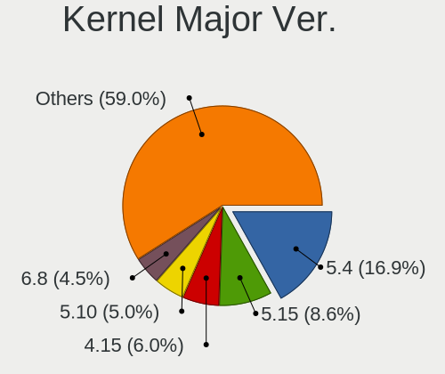
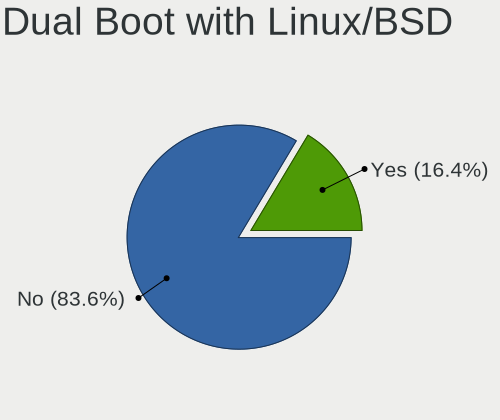
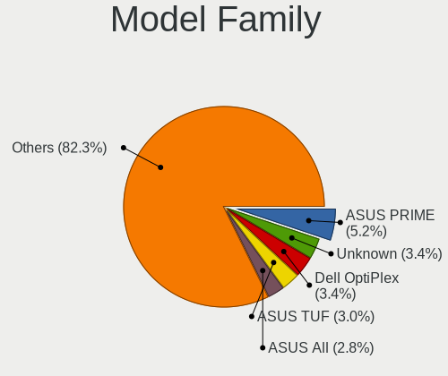
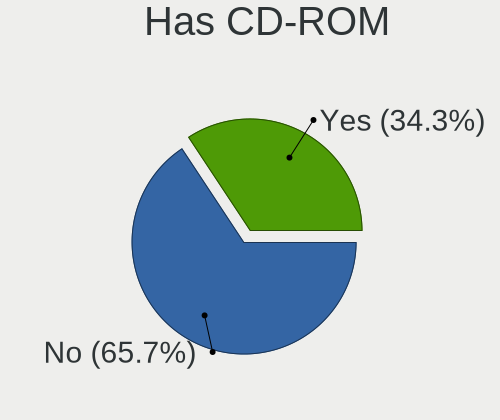
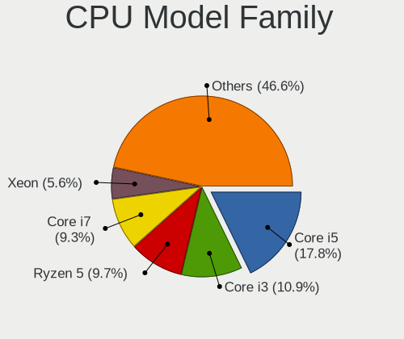
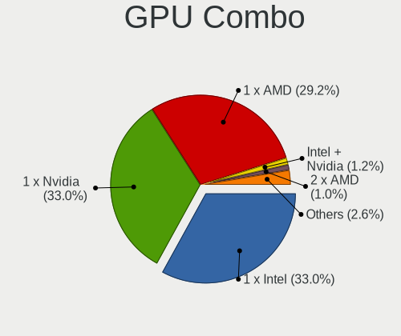
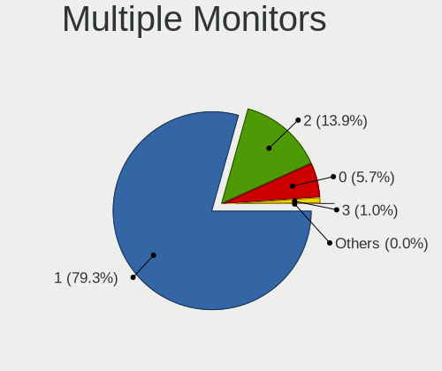
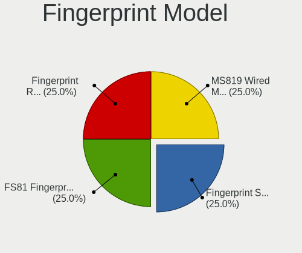

Linux in Brazil - Tested Hardware & Statistics (Desktops)
---------------------------------------------------------

A project to collect tested hardware configurations for Linux in Brazil.

Anyone can contribute to this report by the [hw-probe](https://github.com/linuxhw/hw-probe) tool:

    sudo -E hw-probe -all -upload

Please contribute! Especially if your hardware is rare.

Contents
--------

* [ Test Cases ](#test-cases)

* [ System ](#system)
  - [ OS                       ](#os)
  - [ OS Family                ](#os-family)
  - [ Kernel                   ](#kernel)
  - [ Kernel Family            ](#kernel-family)
  - [ Kernel Major Ver.        ](#kernel-major-ver)
  - [ Arch                     ](#arch)
  - [ DE                       ](#de)
  - [ Display Server           ](#display-server)
  - [ Display Manager          ](#display-manager)
  - [ OS Lang                  ](#os-lang)
  - [ Boot Mode                ](#boot-mode)
  - [ Filesystem               ](#filesystem)
  - [ Part. scheme             ](#part-scheme)
  - [ Dual Boot with Linux/BSD ](#dual-boot-with-linuxbsd)
  - [ Dual Boot (Win)          ](#dual-boot-win)

* [ Board ](#board)
  - [ Vendor                   ](#vendor)
  - [ Model                    ](#model)
  - [ Model Family             ](#model-family)
  - [ MFG Year                 ](#mfg-year)
  - [ Form Factor              ](#form-factor)
  - [ Secure Boot              ](#secure-boot)
  - [ Coreboot                 ](#coreboot)
  - [ RAM Size                 ](#ram-size)
  - [ RAM Used                 ](#ram-used)
  - [ Total Drives             ](#total-drives)
  - [ Has CD-ROM               ](#has-cd-rom)
  - [ Has Ethernet             ](#has-ethernet)
  - [ Has WiFi                 ](#has-wifi)
  - [ Has Bluetooth            ](#has-bluetooth)

* [ Location ](#location)
  - [ Country                  ](#country)
  - [ City                     ](#city)

* [ Drives ](#drives)
  - [ Drive Vendor             ](#drive-vendor)
  - [ Drive Model              ](#drive-model)
  - [ HDD Vendor               ](#hdd-vendor)
  - [ SSD Vendor               ](#ssd-vendor)
  - [ Drive Kind               ](#drive-kind)
  - [ Drive Connector          ](#drive-connector)
  - [ Drive Size               ](#drive-size)
  - [ Space Total              ](#space-total)
  - [ Space Used               ](#space-used)
  - [ Malfunc. Drives          ](#malfunc-drives)
  - [ Malfunc. Drive Vendor    ](#malfunc-drive-vendor)
  - [ Malfunc. HDD Vendor      ](#malfunc-hdd-vendor)
  - [ Malfunc. Drive Kind      ](#malfunc-drive-kind)
  - [ Failed Drives            ](#failed-drives)
  - [ Failed Drive Vendor      ](#failed-drive-vendor)
  - [ Drive Status             ](#drive-status)

* [ Storage controller ](#storage-controller)
  - [ Storage Vendor           ](#storage-vendor)
  - [ Storage Model            ](#storage-model)
  - [ Storage Kind             ](#storage-kind)

* [ Processor ](#processor)
  - [ CPU Vendor               ](#cpu-vendor)
  - [ CPU Model                ](#cpu-model)
  - [ CPU Model Family         ](#cpu-model-family)
  - [ CPU Cores                ](#cpu-cores)
  - [ CPU Sockets              ](#cpu-sockets)
  - [ CPU Threads              ](#cpu-threads)
  - [ CPU Op-Modes             ](#cpu-op-modes)
  - [ CPU Microcode            ](#cpu-microcode)
  - [ CPU Microarch            ](#cpu-microarch)

* [ Graphics ](#graphics)
  - [ GPU Vendor               ](#gpu-vendor)
  - [ GPU Model                ](#gpu-model)
  - [ GPU Combo                ](#gpu-combo)
  - [ GPU Driver               ](#gpu-driver)
  - [ GPU Memory               ](#gpu-memory)

* [ Monitor ](#monitor)
  - [ Monitor Vendor           ](#monitor-vendor)
  - [ Monitor Model            ](#monitor-model)
  - [ Monitor Resolution       ](#monitor-resolution)
  - [ Monitor Diagonal         ](#monitor-diagonal)
  - [ Monitor Width            ](#monitor-width)
  - [ Aspect Ratio             ](#aspect-ratio)
  - [ Monitor Area             ](#monitor-area)
  - [ Pixel Density            ](#pixel-density)
  - [ Multiple Monitors        ](#multiple-monitors)

* [ Network ](#network)
  - [ Net Controller Vendor    ](#net-controller-vendor)
  - [ Net Controller Model     ](#net-controller-model)
  - [ Wireless Vendor          ](#wireless-vendor)
  - [ Wireless Model           ](#wireless-model)
  - [ Ethernet Vendor          ](#ethernet-vendor)
  - [ Ethernet Model           ](#ethernet-model)
  - [ Net Controller Kind      ](#net-controller-kind)
  - [ Used Controller          ](#used-controller)
  - [ NICs                     ](#nics)
  - [ IPv6                     ](#ipv6)

* [ Bluetooth ](#bluetooth)
  - [ Bluetooth Vendor         ](#bluetooth-vendor)
  - [ Bluetooth Model          ](#bluetooth-model)

* [ Sound ](#sound)
  - [ Sound Vendor             ](#sound-vendor)
  - [ Sound Model              ](#sound-model)

* [ Memory ](#memory)
  - [ Memory Vendor            ](#memory-vendor)
  - [ Memory Model             ](#memory-model)
  - [ Memory Kind              ](#memory-kind)
  - [ Memory Form Factor       ](#memory-form-factor)
  - [ Memory Size              ](#memory-size)
  - [ Memory Speed             ](#memory-speed)

* [ Printers & scanners ](#printers--scanners)
  - [ Printer Vendor           ](#printer-vendor)
  - [ Printer Model            ](#printer-model)
  - [ Scanner Vendor           ](#scanner-vendor)
  - [ Scanner Model            ](#scanner-model)

* [ Camera ](#camera)
  - [ Camera Vendor            ](#camera-vendor)
  - [ Camera Model             ](#camera-model)

* [ Security ](#security)
  - [ Fingerprint Vendor       ](#fingerprint-vendor)
  - [ Fingerprint Model        ](#fingerprint-model)
  - [ Chipcard Vendor          ](#chipcard-vendor)
  - [ Chipcard Model           ](#chipcard-model)

* [ Unsupported ](#unsupported)
  - [ Unsupported Devices      ](#unsupported-devices)
  - [ Unsupported Device Types ](#unsupported-device-types)

Test Cases
----------

Total: 8593

| Vendor        | Model                       | Probe                                                      | Date         |
|---------------|-----------------------------|------------------------------------------------------------|--------------|
| ASUSTek       | H110M-CS/BR                 | [5c516f0aa0](https://linux-hardware.org/?probe=5c516f0aa0) | May 09, 2024 |
| ASUSTek       | H81M-A/BR                   | [919fba348e](https://linux-hardware.org/?probe=919fba348e) | May 09, 2024 |
| PCWare        | IPMH61R3                    | [1f3c6428d2](https://linux-hardware.org/?probe=1f3c6428d2) | May 09, 2024 |
| Gigabyte      | Z87X-UD4H-CF                | [f26982efc3](https://linux-hardware.org/?probe=f26982efc3) | May 09, 2024 |
| Intel         | X99                         | [a02c0050f2](https://linux-hardware.org/?probe=a02c0050f2) | May 08, 2024 |
| MSI           | H310M PRO-M2 PLUS           | [969ea9ed0c](https://linux-hardware.org/?probe=969ea9ed0c) | May 08, 2024 |
| Huanan        | X99-QD4 V1.0                | [f6e1a31fef](https://linux-hardware.org/?probe=f6e1a31fef) | May 08, 2024 |
| Biostar       | A320MH                      | [404917c360](https://linux-hardware.org/?probe=404917c360) | May 08, 2024 |
| Gigabyte      | B760M DS3H AX DDR4          | [8556d97dea](https://linux-hardware.org/?probe=8556d97dea) | May 08, 2024 |
| ASUSTek       | B150 PRO GAMING             | [d559ef5203](https://linux-hardware.org/?probe=d559ef5203) | May 08, 2024 |
| Intel         | H55                         | [83c1ac4239](https://linux-hardware.org/?probe=83c1ac4239) | May 07, 2024 |
| ASUSTek       | H81M-A/BR                   | [8f7abd7f23](https://linux-hardware.org/?probe=8f7abd7f23) | May 07, 2024 |
| ASUSTek       | PRIME H510M-E               | [bf4a7b097c](https://linux-hardware.org/?probe=bf4a7b097c) | May 06, 2024 |
| ASUSTek       | PRIME H510M-E               | [e76f332009](https://linux-hardware.org/?probe=e76f332009) | May 06, 2024 |
| Intel         | B75                         | [18e086bc3d](https://linux-hardware.org/?probe=18e086bc3d) | May 06, 2024 |
| ASUSTek       | PRIME B550M-K               | [4ffd873f67](https://linux-hardware.org/?probe=4ffd873f67) | May 06, 2024 |
| Lenovo        | 32E1 SDK0T76463 WIN 3422... | [981ac7ef2b](https://linux-hardware.org/?probe=981ac7ef2b) | May 06, 2024 |
| ASUSTek       | TUF Gaming Z690-PLUS D4     | [add0ddcfc0](https://linux-hardware.org/?probe=add0ddcfc0) | May 06, 2024 |
| Unknown       | Unknown                     | [708780fb6c](https://linux-hardware.org/?probe=708780fb6c) | May 05, 2024 |
| MACHINIST     | X99 PR9                     | [0503106449](https://linux-hardware.org/?probe=0503106449) | May 05, 2024 |
| MACHINIST     | X99 G7 V1.0                 | [47f648047f](https://linux-hardware.org/?probe=47f648047f) | May 04, 2024 |
| MACHINIST     | X99 G7 V1.0                 | [017f1471b0](https://linux-hardware.org/?probe=017f1471b0) | May 04, 2024 |
| Intel         | X99H                        | [a2a38cc926](https://linux-hardware.org/?probe=a2a38cc926) | May 04, 2024 |
| Digiboard     | G41M-S                      | [7b5f122417](https://linux-hardware.org/?probe=7b5f122417) | May 04, 2024 |
| Positivo      | POS-EIH610EX 11189814       | [0657842cc3](https://linux-hardware.org/?probe=0657842cc3) | May 03, 2024 |
| ECS           | A780LM-M2                   | [081a49bf0c](https://linux-hardware.org/?probe=081a49bf0c) | May 03, 2024 |
| Gigabyte      | H510M H                     | [8bbb10ebf0](https://linux-hardware.org/?probe=8bbb10ebf0) | May 03, 2024 |
| ASUSTek       | TUF B360-PLUS GAMING        | [2fa2359d84](https://linux-hardware.org/?probe=2fa2359d84) | May 03, 2024 |
| ASUSTek       | TUF B360-PLUS GAMING        | [9b2885b554](https://linux-hardware.org/?probe=9b2885b554) | May 03, 2024 |
| ASUSTek       | PRIME H510M-E               | [f32c122b72](https://linux-hardware.org/?probe=f32c122b72) | May 03, 2024 |
| ASUSTek       | B150 PRO GAMING             | [94e57165f0](https://linux-hardware.org/?probe=94e57165f0) | May 03, 2024 |
| ASRock        | A520M-HDV                   | [6bf979fc7a](https://linux-hardware.org/?probe=6bf979fc7a) | May 03, 2024 |
| ASUSTek       | TUF Gaming B550M-PLUS       | [ab935bd409](https://linux-hardware.org/?probe=ab935bd409) | May 02, 2024 |
| Intel         | B75                         | [4c39b0616d](https://linux-hardware.org/?probe=4c39b0616d) | May 02, 2024 |
| Dell          | 0YGYJY A01                  | [eb2aba50a5](https://linux-hardware.org/?probe=eb2aba50a5) | May 02, 2024 |
| Biostar       | B450MHP                     | [5d30a1821f](https://linux-hardware.org/?probe=5d30a1821f) | May 02, 2024 |
| Intel         | H81                         | [8250f2ced3](https://linux-hardware.org/?probe=8250f2ced3) | May 02, 2024 |
| ASUSTek       | B150 PRO GAMING             | [4d38c7926c](https://linux-hardware.org/?probe=4d38c7926c) | May 02, 2024 |
| Gigabyte      | X570S AORUS ELITE           | [a76ca4fae1](https://linux-hardware.org/?probe=a76ca4fae1) | May 02, 2024 |
| MSI           | MEG Z490 UNIFY              | [73e7f9d576](https://linux-hardware.org/?probe=73e7f9d576) | May 02, 2024 |
| Intel         | B75                         | [4925a7fcb7](https://linux-hardware.org/?probe=4925a7fcb7) | May 02, 2024 |
| HP            | 3646h                       | [3c2faf0d32](https://linux-hardware.org/?probe=3c2faf0d32) | May 02, 2024 |
| Intel         | H55                         | [b7cf243933](https://linux-hardware.org/?probe=b7cf243933) | May 02, 2024 |
| Intel         | HURONRIVER                  | [da8de15263](https://linux-hardware.org/?probe=da8de15263) | May 02, 2024 |
| Biostar       | H61MLC                      | [d26510e4fb](https://linux-hardware.org/?probe=d26510e4fb) | May 01, 2024 |
| ASUSTek       | B150 PRO GAMING             | [fd39a02925](https://linux-hardware.org/?probe=fd39a02925) | May 01, 2024 |
| ASUSTek       | B150 PRO GAMING             | [61160f0f14](https://linux-hardware.org/?probe=61160f0f14) | May 01, 2024 |
| ASUSTek       | PRIME A520M-E               | [ee738361ee](https://linux-hardware.org/?probe=ee738361ee) | May 01, 2024 |
| Biostar       | H61MLC                      | [502f0f308f](https://linux-hardware.org/?probe=502f0f308f) | May 01, 2024 |
| ASUSTek       | PRIME H510M-E               | [c3b30e066b](https://linux-hardware.org/?probe=c3b30e066b) | May 01, 2024 |
| MSI           | MAG B760M MORTAR WIFI       | [9e1fd1c22b](https://linux-hardware.org/?probe=9e1fd1c22b) | May 01, 2024 |
| MACHINIST     | X99 PR9                     | [88cb6d6044](https://linux-hardware.org/?probe=88cb6d6044) | May 01, 2024 |
| Dell          | 0YGYJY A01                  | [3d88956cd5](https://linux-hardware.org/?probe=3d88956cd5) | Apr 30, 2024 |
| PCWare        | IPMH310G PRO                | [f38e07cde2](https://linux-hardware.org/?probe=f38e07cde2) | Apr 30, 2024 |
| ASUSTek       | M5A97 LE R2.0               | [1d6a7ccba0](https://linux-hardware.org/?probe=1d6a7ccba0) | Apr 30, 2024 |
| Gigabyte      | H61M-S1                     | [4067e2b325](https://linux-hardware.org/?probe=4067e2b325) | Apr 30, 2024 |
| Gigabyte      | H61M-S1                     | [ea6fdbe20e](https://linux-hardware.org/?probe=ea6fdbe20e) | Apr 30, 2024 |
| Positivo      | POS-AG31AP                  | [998129cad7](https://linux-hardware.org/?probe=998129cad7) | Apr 29, 2024 |
| MSI           | MEG Z490 UNIFY              | [616294b6b2](https://linux-hardware.org/?probe=616294b6b2) | Apr 29, 2024 |
| ASUSTek       | PRIME A520M-A II            | [3066905907](https://linux-hardware.org/?probe=3066905907) | Apr 29, 2024 |
| HP            | 8526 MVB, A                 | [880c56ee27](https://linux-hardware.org/?probe=880c56ee27) | Apr 29, 2024 |
| MSI           | B560M PRO-E                 | [b2adb051ee](https://linux-hardware.org/?probe=b2adb051ee) | Apr 29, 2024 |
| ASUSTek       | PRIME A520M-E               | [e0dc85f1a0](https://linux-hardware.org/?probe=e0dc85f1a0) | Apr 28, 2024 |
| HP            | 18E7                        | [e91218e74f](https://linux-hardware.org/?probe=e91218e74f) | Apr 28, 2024 |
| AMD           | A88K                        | [5a4ca72c81](https://linux-hardware.org/?probe=5a4ca72c81) | Apr 28, 2024 |
| HP            | 18E7                        | [4442e8fc4a](https://linux-hardware.org/?probe=4442e8fc4a) | Apr 27, 2024 |
| MSI           | G31M3-L V2                  | [0a033139d1](https://linux-hardware.org/?probe=0a033139d1) | Apr 27, 2024 |
| Positivo      | POS-RAX300ES 11191478       | [3e201c7230](https://linux-hardware.org/?probe=3e201c7230) | Apr 26, 2024 |
| Dell          | 01XK1W A00                  | [a5fcd90239](https://linux-hardware.org/?probe=a5fcd90239) | Apr 26, 2024 |
| Gigabyte      | B75M-D2V                    | [21c055a907](https://linux-hardware.org/?probe=21c055a907) | Apr 25, 2024 |
| Positivo      | POS-PIQ77CL                 | [ca5ecf0b4c](https://linux-hardware.org/?probe=ca5ecf0b4c) | Apr 25, 2024 |
| Dell          | 0Y2MRG A01                  | [f1ed6a2c54](https://linux-hardware.org/?probe=f1ed6a2c54) | Apr 25, 2024 |
| MACHINIST     | X79 V2.82A                  | [41c6b865b1](https://linux-hardware.org/?probe=41c6b865b1) | Apr 25, 2024 |
| ASUSTek       | TUF Gaming Z490-PLUS        | [c44f97261d](https://linux-hardware.org/?probe=c44f97261d) | Apr 24, 2024 |
| AZW           | T4 PRO                      | [8549531554](https://linux-hardware.org/?probe=8549531554) | Apr 24, 2024 |
| ONDA          | A520SD4 Ver:1.00            | [d1a735de54](https://linux-hardware.org/?probe=d1a735de54) | Apr 24, 2024 |
| ASUSTek       | P5K Premium                 | [9b09b4d8bd](https://linux-hardware.org/?probe=9b09b4d8bd) | Apr 24, 2024 |
| ASUSTek       | Maximus IX CODE             | [db21083720](https://linux-hardware.org/?probe=db21083720) | Apr 24, 2024 |
| Gigabyte      | H110M-S2PH-CF               | [f35a83875e](https://linux-hardware.org/?probe=f35a83875e) | Apr 24, 2024 |
| Digiboard     | MPxx                        | [e277b1a1d5](https://linux-hardware.org/?probe=e277b1a1d5) | Apr 24, 2024 |
| Gigabyte      | B75M-D3H                    | [1617699830](https://linux-hardware.org/?probe=1617699830) | Apr 23, 2024 |
| Gigabyte      | H110M-H DDR3-CF             | [455f999e6d](https://linux-hardware.org/?probe=455f999e6d) | Apr 23, 2024 |
| Dell          | 0YGYJY A01                  | [c922a511fd](https://linux-hardware.org/?probe=c922a511fd) | Apr 23, 2024 |
| Biostar       | A320MH                      | [5506fc2ad4](https://linux-hardware.org/?probe=5506fc2ad4) | Apr 23, 2024 |
| Lenovo        | SHARKBAY 0B98401 WIN        | [fa0b7c7632](https://linux-hardware.org/?probe=fa0b7c7632) | Apr 23, 2024 |
| Gigabyte      | B760M AORUS ELITE           | [3d15cef077](https://linux-hardware.org/?probe=3d15cef077) | Apr 23, 2024 |
| ASRock        | FM2A68M-DG3+                | [8049fc6b37](https://linux-hardware.org/?probe=8049fc6b37) | Apr 23, 2024 |
| ADLINK Tec... | LEC-EL A1                   | [72b115951b](https://linux-hardware.org/?probe=72b115951b) | Apr 22, 2024 |
| ASUSTek       | PRIME A320M-K/BR            | [fe05e4fbfc](https://linux-hardware.org/?probe=fe05e4fbfc) | Apr 22, 2024 |
| ASUSTek       | P5G41T-M LX2/BR             | [7e16d97409](https://linux-hardware.org/?probe=7e16d97409) | Apr 22, 2024 |
| Intel         | X99H                        | [cca155cf13](https://linux-hardware.org/?probe=cca155cf13) | Apr 22, 2024 |
| Positivo      | POS-AG31AP                  | [63fb44d22f](https://linux-hardware.org/?probe=63fb44d22f) | Apr 22, 2024 |
| Gigabyte      | Z790 AORUS ELITE AX         | [4485a9e6db](https://linux-hardware.org/?probe=4485a9e6db) | Apr 22, 2024 |
| ASRock        | B450M Steel Legend          | [7fb64c7bef](https://linux-hardware.org/?probe=7fb64c7bef) | Apr 22, 2024 |
| Toshiba       | STI 012943                  | [678536872d](https://linux-hardware.org/?probe=678536872d) | Apr 21, 2024 |
| ASUSTek       | PRIME A520M-E               | [fa784dad84](https://linux-hardware.org/?probe=fa784dad84) | Apr 21, 2024 |
| Positivo      | POS-PIG41BA POSITIVO        | [d5e1581050](https://linux-hardware.org/?probe=d5e1581050) | Apr 21, 2024 |
| Gigabyte      | A520M S2H                   | [52de796ce6](https://linux-hardware.org/?probe=52de796ce6) | Apr 21, 2024 |
| ASUSTek       | PRIME H410M-A               | [41da917e67](https://linux-hardware.org/?probe=41da917e67) | Apr 21, 2024 |
| Intel         | X99-P4 V5.1                 | [15e8dd212b](https://linux-hardware.org/?probe=15e8dd212b) | Apr 21, 2024 |
| Intel         | B75                         | [27d3a826f4](https://linux-hardware.org/?probe=27d3a826f4) | Apr 20, 2024 |
| Toshiba       | STI 001387                  | [240e193806](https://linux-hardware.org/?probe=240e193806) | Apr 20, 2024 |
| Gigabyte      | B660M DS3H DDR4             | [ea7d988606](https://linux-hardware.org/?probe=ea7d988606) | Apr 20, 2024 |
| ASRock        | B450M Steel Legend          | [0df86cd712](https://linux-hardware.org/?probe=0df86cd712) | Apr 20, 2024 |
| ASUSTek       | H81M-C/BR                   | [4e53f25e9b](https://linux-hardware.org/?probe=4e53f25e9b) | Apr 19, 2024 |
| Dell          | 08NPPY A00                  | [dad92afe76](https://linux-hardware.org/?probe=dad92afe76) | Apr 19, 2024 |
| ASUSTek       | ROG STRIX Z490-F GAMING     | [aea22c24a7](https://linux-hardware.org/?probe=aea22c24a7) | Apr 19, 2024 |
| Gigabyte      | B760M AORUS ELITE           | [d2b9b5429d](https://linux-hardware.org/?probe=d2b9b5429d) | Apr 19, 2024 |
| HP            | 339A                        | [fb23f5210f](https://linux-hardware.org/?probe=fb23f5210f) | Apr 18, 2024 |
| Gigabyte      | AB350M-DS3H V2-CF           | [7cfe6d651b](https://linux-hardware.org/?probe=7cfe6d651b) | Apr 18, 2024 |
| Lenovo        | 30D9 SDK0J40697 WIN 3305... | [8a42c0cd30](https://linux-hardware.org/?probe=8a42c0cd30) | Apr 18, 2024 |
| Gigabyte      | H170M-D3H DDR3-CF           | [f7a78f85d8](https://linux-hardware.org/?probe=f7a78f85d8) | Apr 18, 2024 |
| Gigabyte      | B450 AORUS M                | [b16af25313](https://linux-hardware.org/?probe=b16af25313) | Apr 18, 2024 |
| PCWare        | IPMH61R3                    | [9f8562ac62](https://linux-hardware.org/?probe=9f8562ac62) | Apr 18, 2024 |
| ASUSTek       | TUF Gaming B550M-PLUS       | [5e4c324298](https://linux-hardware.org/?probe=5e4c324298) | Apr 18, 2024 |
| AZW           | T4 PRO                      | [90791fdf61](https://linux-hardware.org/?probe=90791fdf61) | Apr 17, 2024 |
| Intel         | H55                         | [28e666728f](https://linux-hardware.org/?probe=28e666728f) | Apr 17, 2024 |
| MSI           | Z87-G45 GAMING              | [f646b54913](https://linux-hardware.org/?probe=f646b54913) | Apr 17, 2024 |
| PCWare        | IPMH110G                    | [0646f27757](https://linux-hardware.org/?probe=0646f27757) | Apr 17, 2024 |
| Unknown       | Unknown                     | [bae188579b](https://linux-hardware.org/?probe=bae188579b) | Apr 17, 2024 |
| Intel         | H55                         | [27ee1cd49f](https://linux-hardware.org/?probe=27ee1cd49f) | Apr 17, 2024 |
| Gigabyte      | A320M-S2H-CF                | [d4479ea9be](https://linux-hardware.org/?probe=d4479ea9be) | Apr 17, 2024 |
| Unknown       | Unknown                     | [9c69980686](https://linux-hardware.org/?probe=9c69980686) | Apr 17, 2024 |
| Lenovo        | NOK                         | [3190c97560](https://linux-hardware.org/?probe=3190c97560) | Apr 17, 2024 |
| Gigabyte      | GA-78LMT-S2P                | [45b35e097e](https://linux-hardware.org/?probe=45b35e097e) | Apr 17, 2024 |
| DUEX          | H510 Ver:1.00               | [47f0cd0837](https://linux-hardware.org/?probe=47f0cd0837) | Apr 17, 2024 |
| Unknown       | DH61BR G32662-203           | [d27fa5367c](https://linux-hardware.org/?probe=d27fa5367c) | Apr 16, 2024 |
| Dell          | 0P99M4 A01                  | [77e4450298](https://linux-hardware.org/?probe=77e4450298) | Apr 16, 2024 |
| Intel         | H81                         | [e182aced52](https://linux-hardware.org/?probe=e182aced52) | Apr 16, 2024 |
| Intel         | H81                         | [5029d0bb32](https://linux-hardware.org/?probe=5029d0bb32) | Apr 15, 2024 |
| ASRock        | A520M-HDV                   | [56905e2bc8](https://linux-hardware.org/?probe=56905e2bc8) | Apr 15, 2024 |
| NCR           | IPMQ57.0.0                  | [71888644f5](https://linux-hardware.org/?probe=71888644f5) | Apr 15, 2024 |
| ASRock        | A520M-HDV                   | [47e7cdb053](https://linux-hardware.org/?probe=47e7cdb053) | Apr 15, 2024 |
| Gigabyte      | A520M H                     | [8c9dec81e3](https://linux-hardware.org/?probe=8c9dec81e3) | Apr 15, 2024 |
| Gigabyte      | A520M H                     | [ac53e58a8c](https://linux-hardware.org/?probe=ac53e58a8c) | Apr 15, 2024 |
| ASRock        | B650E PG Riptide WiFi       | [edae497a7d](https://linux-hardware.org/?probe=edae497a7d) | Apr 14, 2024 |
| ASUSTek       | TUF H310M-PLUS GAMING/BR    | [5de5178742](https://linux-hardware.org/?probe=5de5178742) | Apr 14, 2024 |
| ASUSTek       | TUF H310M-PLUS GAMING/BR    | [e96012759d](https://linux-hardware.org/?probe=e96012759d) | Apr 14, 2024 |
| ASUSTek       | ROG STRIX X570-E GAMING     | [5bb8884eee](https://linux-hardware.org/?probe=5bb8884eee) | Apr 14, 2024 |
| ASUSTek       | TUF Gaming H670-PRO WIFI... | [5308fb42b9](https://linux-hardware.org/?probe=5308fb42b9) | Apr 14, 2024 |
| ASUSTek       | ROG STRIX X570-E GAMING     | [841b3d5f2e](https://linux-hardware.org/?probe=841b3d5f2e) | Apr 14, 2024 |
| Intel         | B250                        | [197e339bcf](https://linux-hardware.org/?probe=197e339bcf) | Apr 14, 2024 |
| ASRock        | B650E Taichi Lite           | [b69958b86b](https://linux-hardware.org/?probe=b69958b86b) | Apr 14, 2024 |
| Intel         | X99 V1.0                    | [57c2d76c65](https://linux-hardware.org/?probe=57c2d76c65) | Apr 12, 2024 |
| MACHINIST     | E5-MR9A PRO V1.0            | [cb0f8fe9bc](https://linux-hardware.org/?probe=cb0f8fe9bc) | Apr 12, 2024 |
| ANGXUN        | X99 V1.0                    | [2aceaa68c2](https://linux-hardware.org/?probe=2aceaa68c2) | Apr 12, 2024 |
| Dell          | 0FR6WH A01                  | [b089f2a8ec](https://linux-hardware.org/?probe=b089f2a8ec) | Apr 11, 2024 |
| ASUSTek       | ROG STRIX B550-A GAMING     | [33e3402952](https://linux-hardware.org/?probe=33e3402952) | Apr 11, 2024 |
| ASUSTek       | TUF Gaming X570-PLUS_BR     | [c19812eddd](https://linux-hardware.org/?probe=c19812eddd) | Apr 11, 2024 |
| ASRock        | B650E Taichi Lite           | [3fef4977e0](https://linux-hardware.org/?probe=3fef4977e0) | Apr 11, 2024 |
| Intel         | H81                         | [8b51b58c02](https://linux-hardware.org/?probe=8b51b58c02) | Apr 11, 2024 |
| Intel         | B365                        | [7abeea79f6](https://linux-hardware.org/?probe=7abeea79f6) | Apr 11, 2024 |
| Lenovo        | ThinkCentre M58p 3063A58    | [b49c1636fe](https://linux-hardware.org/?probe=b49c1636fe) | Apr 11, 2024 |
| Intel         | X99                         | [45b537d1cf](https://linux-hardware.org/?probe=45b537d1cf) | Apr 10, 2024 |
| Itautec       | ST 4265                     | [dc37dd8381](https://linux-hardware.org/?probe=dc37dd8381) | Apr 10, 2024 |
| ASUSTek       | PRIME A520M-A II            | [f962e3977e](https://linux-hardware.org/?probe=f962e3977e) | Apr 10, 2024 |
| Gigabyte      | B550M GAMING                | [d85fa6cbe3](https://linux-hardware.org/?probe=d85fa6cbe3) | Apr 10, 2024 |
| Biostar       | B450MX-S                    | [3c49449091](https://linux-hardware.org/?probe=3c49449091) | Apr 10, 2024 |
| ASUSTek       | SABERTOOTH Z77              | [22347f051d](https://linux-hardware.org/?probe=22347f051d) | Apr 10, 2024 |
| ASUSTek       | SABERTOOTH Z77              | [911941137b](https://linux-hardware.org/?probe=911941137b) | Apr 10, 2024 |
| Itautec       | ST 4265                     | [c54a887467](https://linux-hardware.org/?probe=c54a887467) | Apr 09, 2024 |
| Itautec       | ST 4271                     | [8fc18963b3](https://linux-hardware.org/?probe=8fc18963b3) | Apr 09, 2024 |
| Digiboard     | MPxx                        | [fe1ed8d822](https://linux-hardware.org/?probe=fe1ed8d822) | Apr 09, 2024 |
| Gigabyte      | B450M GAMING                | [e033d32271](https://linux-hardware.org/?probe=e033d32271) | Apr 09, 2024 |
| HP            | 2ADE                        | [3de5b32cc5](https://linux-hardware.org/?probe=3de5b32cc5) | Apr 09, 2024 |
| Intel         | H61                         | [02ce84869d](https://linux-hardware.org/?probe=02ce84869d) | Apr 09, 2024 |
| Dell          | 0VTJVC A00                  | [edb54fbe32](https://linux-hardware.org/?probe=edb54fbe32) | Apr 09, 2024 |
| Huanan        | X99-QD4 V1.0                | [732523a553](https://linux-hardware.org/?probe=732523a553) | Apr 09, 2024 |
| Huanan        | X99-QD4 V1.0                | [d53567aeb3](https://linux-hardware.org/?probe=d53567aeb3) | Apr 09, 2024 |
| Itautec       | ST 4265                     | [256c04b1e3](https://linux-hardware.org/?probe=256c04b1e3) | Apr 09, 2024 |
| Itautec       | ST 4265                     | [052c74a17d](https://linux-hardware.org/?probe=052c74a17d) | Apr 08, 2024 |
| ASUSTek       | P5Q                         | [05d54173b4](https://linux-hardware.org/?probe=05d54173b4) | Apr 08, 2024 |
| ASRock        | FM2A68M-HD+ R2.0            | [7e29667b78](https://linux-hardware.org/?probe=7e29667b78) | Apr 08, 2024 |
| Gigabyte      | B450M GAMING                | [d0241d517a](https://linux-hardware.org/?probe=d0241d517a) | Apr 08, 2024 |
| Unknown       | DH61BR G32662-203           | [4d4eb71983](https://linux-hardware.org/?probe=4d4eb71983) | Apr 07, 2024 |
| Dell          | 01XK1W A00                  | [708da72614](https://linux-hardware.org/?probe=708da72614) | Apr 07, 2024 |
| Gigabyte      | H77-D3H                     | [647ad74796](https://linux-hardware.org/?probe=647ad74796) | Apr 07, 2024 |
| Dell          | 0FR6WH A01                  | [e449df61a9](https://linux-hardware.org/?probe=e449df61a9) | Apr 07, 2024 |
| Daten Tecn... | DA75PRO                     | [aaf78d3f34](https://linux-hardware.org/?probe=aaf78d3f34) | Apr 07, 2024 |
| Unknown       | DH61BR G32662-203           | [f6c6e8b0c1](https://linux-hardware.org/?probe=f6c6e8b0c1) | Apr 07, 2024 |
| Intel         | B75                         | [7ac22ca55d](https://linux-hardware.org/?probe=7ac22ca55d) | Apr 07, 2024 |
| ASUSTek       | A68HM-K                     | [8a74010840](https://linux-hardware.org/?probe=8a74010840) | Apr 07, 2024 |
| Unknown       | DH61BR G32662-203           | [bcde5793c0](https://linux-hardware.org/?probe=bcde5793c0) | Apr 07, 2024 |
| ASUSTek       | TUF B350M-PLUS GAMING       | [91ae8a8c4b](https://linux-hardware.org/?probe=91ae8a8c4b) | Apr 07, 2024 |
| Gigabyte      | A520M K V2                  | [d0dc207772](https://linux-hardware.org/?probe=d0dc207772) | Apr 07, 2024 |
| ASUSTek       | H61M-A/BR                   | [4c0e6e4b31](https://linux-hardware.org/?probe=4c0e6e4b31) | Apr 06, 2024 |
| ASUSTek       | TUF Gaming Z790-PLUS WIF... | [5bc8966967](https://linux-hardware.org/?probe=5bc8966967) | Apr 06, 2024 |
| ASUSTek       | J1800I-C/BR                 | [bdde2d1fe9](https://linux-hardware.org/?probe=bdde2d1fe9) | Apr 05, 2024 |
| Lenovo        | ThinkCentre M90p 5536P79    | [1750bd22db](https://linux-hardware.org/?probe=1750bd22db) | Apr 05, 2024 |
| ASUSTek       | P5GC-MX/CKD/SI              | [bcdaf014cf](https://linux-hardware.org/?probe=bcdaf014cf) | Apr 05, 2024 |
| MSI           | B450M PRO-VDH               | [967dca41d6](https://linux-hardware.org/?probe=967dca41d6) | Apr 05, 2024 |
| Unknown       | DH61BR G32662-203           | [6b7f7fcc14](https://linux-hardware.org/?probe=6b7f7fcc14) | Apr 04, 2024 |
| MSI           | H310M PRO-VDH               | [98d131eacb](https://linux-hardware.org/?probe=98d131eacb) | Apr 04, 2024 |
| Intel         | H55                         | [27ff13d7fe](https://linux-hardware.org/?probe=27ff13d7fe) | Apr 04, 2024 |
| Dell          | 0P99M4 A01                  | [7a869aaf6e](https://linux-hardware.org/?probe=7a869aaf6e) | Apr 04, 2024 |
| ASRock        | B360M Performance           | [bcaed0bbb8](https://linux-hardware.org/?probe=bcaed0bbb8) | Apr 04, 2024 |
| Intel         | H61                         | [aeaab1ea22](https://linux-hardware.org/?probe=aeaab1ea22) | Apr 04, 2024 |
| Gigabyte      | B450M DS3H-CF               | [97239eebc7](https://linux-hardware.org/?probe=97239eebc7) | Apr 03, 2024 |
| Gigabyte      | B760M AORUS ELITE           | [abd7f2bfbc](https://linux-hardware.org/?probe=abd7f2bfbc) | Apr 03, 2024 |
| ASUSTek       | TUF Gaming X570-PLUS_BR     | [0fe9387508](https://linux-hardware.org/?probe=0fe9387508) | Apr 03, 2024 |
| Unknown       | Unknown                     | [3747d31633](https://linux-hardware.org/?probe=3747d31633) | Apr 03, 2024 |
| ANGXUN        | X99 V1.0                    | [e99eee7fa6](https://linux-hardware.org/?probe=e99eee7fa6) | Apr 03, 2024 |
| ASRock        | B450M Steel Legend          | [10cdfb9bf3](https://linux-hardware.org/?probe=10cdfb9bf3) | Apr 03, 2024 |
| Intel         | H81                         | [c62889d4a5](https://linux-hardware.org/?probe=c62889d4a5) | Apr 02, 2024 |
| MANCER        | A320M-DA 1006               | [7d1b08ec69](https://linux-hardware.org/?probe=7d1b08ec69) | Apr 02, 2024 |
| ASUSTek       | TUF B360-PLUS GAMING        | [23741a7a80](https://linux-hardware.org/?probe=23741a7a80) | Apr 02, 2024 |
| Intel         | B75                         | [b090c94f7f](https://linux-hardware.org/?probe=b090c94f7f) | Apr 02, 2024 |
| ANGXUN        | X99 V1.0                    | [4c7df42efb](https://linux-hardware.org/?probe=4c7df42efb) | Apr 01, 2024 |
| Gigabyte      | M68MT-S2P                   | [0d3044d0e3](https://linux-hardware.org/?probe=0d3044d0e3) | Apr 01, 2024 |
| Huanan        | X99-8M-F V1.2               | [3005ead43c](https://linux-hardware.org/?probe=3005ead43c) | Apr 01, 2024 |
| Intel         | H81                         | [b7c3224542](https://linux-hardware.org/?probe=b7c3224542) | Apr 01, 2024 |
| ASUSTek       | TUF Gaming Z590-PLUS        | [b08b665320](https://linux-hardware.org/?probe=b08b665320) | Mar 31, 2024 |
| ASUSTek       | B85M-E/BR                   | [cfa7260344](https://linux-hardware.org/?probe=cfa7260344) | Mar 31, 2024 |
| ASUSTek       | H81M-K                      | [483eaeb53c](https://linux-hardware.org/?probe=483eaeb53c) | Mar 30, 2024 |
| ASUSTek       | STRIX Z270E GAMING          | [19503f4799](https://linux-hardware.org/?probe=19503f4799) | Mar 30, 2024 |
| Unknown       | DH61BR G32662-203           | [0664808c7f](https://linux-hardware.org/?probe=0664808c7f) | Mar 30, 2024 |
| Positivo      | POS-AG31AP                  | [606557f097](https://linux-hardware.org/?probe=606557f097) | Mar 30, 2024 |
| Unknown       | MZ-B75-S                    | [2db5e87f4d](https://linux-hardware.org/?probe=2db5e87f4d) | Mar 30, 2024 |
| ASRock        | B365M IB-R                  | [870917e4e8](https://linux-hardware.org/?probe=870917e4e8) | Mar 30, 2024 |
| ASUSTek       | PRIME B460M-A               | [dbc70004b3](https://linux-hardware.org/?probe=dbc70004b3) | Mar 30, 2024 |
| ASUSTek       | P5G41T-M LX2/BR             | [6edb48c733](https://linux-hardware.org/?probe=6edb48c733) | Mar 29, 2024 |
| Gigabyte      | H61M-S1                     | [bd73da1ce5](https://linux-hardware.org/?probe=bd73da1ce5) | Mar 29, 2024 |
| Gigabyte      | AB350M-DS3H V2-CF           | [fd22085109](https://linux-hardware.org/?probe=fd22085109) | Mar 29, 2024 |
| Toshiba       | STI 012943                  | [f3aba41c5d](https://linux-hardware.org/?probe=f3aba41c5d) | Mar 29, 2024 |
| ASUSTek       | ROG STRIX Z490-F GAMING     | [d636ab5717](https://linux-hardware.org/?probe=d636ab5717) | Mar 28, 2024 |
| Gigabyte      | Z790 UD AX                  | [d0b7751780](https://linux-hardware.org/?probe=d0b7751780) | Mar 28, 2024 |
| Win elemen... | M600                        | [309ce952ca](https://linux-hardware.org/?probe=309ce952ca) | Mar 28, 2024 |
| Itautec       | NT 2030                     | [540ca1e0d9](https://linux-hardware.org/?probe=540ca1e0d9) | Mar 28, 2024 |
| ASUSTek       | TUF Gaming B550M-PLUS       | [1248f2ac01](https://linux-hardware.org/?probe=1248f2ac01) | Mar 27, 2024 |
| Gigabyte      | B550I AORUS PRO AX          | [75613012d4](https://linux-hardware.org/?probe=75613012d4) | Mar 27, 2024 |
| Gigabyte      | H61M-S1                     | [30c27ef1ec](https://linux-hardware.org/?probe=30c27ef1ec) | Mar 27, 2024 |
| ASUSTek       | P8H61-M LX2 R2.0            | [a7b3ddbaee](https://linux-hardware.org/?probe=a7b3ddbaee) | Mar 27, 2024 |
| HP            | 2AA6 PVT                    | [899a3e57bb](https://linux-hardware.org/?probe=899a3e57bb) | Mar 27, 2024 |
| ASUSTek       | PRIME A320M-K/BR            | [62ff739b8b](https://linux-hardware.org/?probe=62ff739b8b) | Mar 27, 2024 |
| ASUSTek       | PRIME A320M-K/BR            | [15137ac3a5](https://linux-hardware.org/?probe=15137ac3a5) | Mar 27, 2024 |
| Biostar       | B450MX-S                    | [dd90661bff](https://linux-hardware.org/?probe=dd90661bff) | Mar 26, 2024 |
| SZMZ          | X99-S3                      | [915afc0f14](https://linux-hardware.org/?probe=915afc0f14) | Mar 26, 2024 |
| ASRock        | H110M-HG4                   | [0ef9ca77ad](https://linux-hardware.org/?probe=0ef9ca77ad) | Mar 26, 2024 |
| Gigabyte      | 970A-DS3P                   | [23122d3ad4](https://linux-hardware.org/?probe=23122d3ad4) | Mar 26, 2024 |
| Lenovo        | ThinkCentre M58p 3063A58    | [12d5c4170b](https://linux-hardware.org/?probe=12d5c4170b) | Mar 26, 2024 |
| ASUSTek       | PRIME X570-P                | [e347c5c90a](https://linux-hardware.org/?probe=e347c5c90a) | Mar 26, 2024 |
| ASUSTek       | P6X58D-E                    | [079fb4b5bc](https://linux-hardware.org/?probe=079fb4b5bc) | Mar 25, 2024 |
| Gigabyte      | B450M GAMING                | [dc1ea81941](https://linux-hardware.org/?probe=dc1ea81941) | Mar 25, 2024 |
| MSI           | H61M-P20/W8                 | [24a58b5cc3](https://linux-hardware.org/?probe=24a58b5cc3) | Mar 25, 2024 |
| Intel         | H61                         | [23dc8b1d8f](https://linux-hardware.org/?probe=23dc8b1d8f) | Mar 25, 2024 |
| ASRock        | B460M-HDV                   | [221cd35077](https://linux-hardware.org/?probe=221cd35077) | Mar 25, 2024 |
| Gigabyte      | A320M-S2H-CF                | [30717fbd15](https://linux-hardware.org/?probe=30717fbd15) | Mar 25, 2024 |
| MSI           | H61M-P20/W8                 | [733e7093b1](https://linux-hardware.org/?probe=733e7093b1) | Mar 25, 2024 |
| ASUSTek       | STRIX Z270E GAMING          | [9d2c719407](https://linux-hardware.org/?probe=9d2c719407) | Mar 25, 2024 |
| Gigabyte      | B75M-D3H                    | [5ffaeefafa](https://linux-hardware.org/?probe=5ffaeefafa) | Mar 25, 2024 |
| Gigabyte      | H81M-S1                     | [c84c871820](https://linux-hardware.org/?probe=c84c871820) | Mar 24, 2024 |
| Intel         | DX58SO AAE29331-503         | [7e3d9e89de](https://linux-hardware.org/?probe=7e3d9e89de) | Mar 24, 2024 |
| AFOX          | IH61-MA5                    | [a5418cfc92](https://linux-hardware.org/?probe=a5418cfc92) | Mar 24, 2024 |
| ASUSTek       | TUF Gaming B550M-PLUS WI... | [ef64fb9837](https://linux-hardware.org/?probe=ef64fb9837) | Mar 24, 2024 |
| Huanan        | X99-F8 GAMING V5.0          | [e6a2094088](https://linux-hardware.org/?probe=e6a2094088) | Mar 24, 2024 |
| MACHINIST     | E5-MR9A V1.0                | [24cd2954c5](https://linux-hardware.org/?probe=24cd2954c5) | Mar 24, 2024 |
| Dell          | 01XK1W A00                  | [6940ab6143](https://linux-hardware.org/?probe=6940ab6143) | Mar 24, 2024 |
| ASUSTek       | PRIME A520M-A II            | [85db87031e](https://linux-hardware.org/?probe=85db87031e) | Mar 23, 2024 |
| ASUSTek       | TUF Gaming A520M-PLUS II    | [ae73fe90d9](https://linux-hardware.org/?probe=ae73fe90d9) | Mar 23, 2024 |
| Biostar       | B450MX-S                    | [6afcf0e275](https://linux-hardware.org/?probe=6afcf0e275) | Mar 23, 2024 |
| HP            | 0B54h D                     | [7b38927e17](https://linux-hardware.org/?probe=7b38927e17) | Mar 23, 2024 |
| ASUSTek       | TUF Gaming B550M-PLUS WI... | [e71e7c70d9](https://linux-hardware.org/?probe=e71e7c70d9) | Mar 23, 2024 |
| ECS           | A780LM-M2                   | [008c69e1f0](https://linux-hardware.org/?probe=008c69e1f0) | Mar 22, 2024 |
| HP            | 0B54h D                     | [0af537dbcd](https://linux-hardware.org/?probe=0af537dbcd) | Mar 22, 2024 |
| Digiboard     | NM70-TI                     | [1bd7ba8e34](https://linux-hardware.org/?probe=1bd7ba8e34) | Mar 22, 2024 |
| Gigabyte      | B450M GAMING                | [2d459d109f](https://linux-hardware.org/?probe=2d459d109f) | Mar 22, 2024 |
| Positivo      | POS-MIH61CF                 | [05e160dda6](https://linux-hardware.org/?probe=05e160dda6) | Mar 22, 2024 |
| Dell          | 0PVKY8 A00                  | [90bd970eb0](https://linux-hardware.org/?probe=90bd970eb0) | Mar 21, 2024 |
| ECS           | A785GM-AD3                  | [452fc5ac26](https://linux-hardware.org/?probe=452fc5ac26) | Mar 21, 2024 |
| ASRock        | E35LM1                      | [d67fe2fd09](https://linux-hardware.org/?probe=d67fe2fd09) | Mar 21, 2024 |
| ASUSTek       | PRIME X570-PRO              | [3fa45d5930](https://linux-hardware.org/?probe=3fa45d5930) | Mar 21, 2024 |
| ASRock        | A320M-HDV R4.0              | [cd5d6341fb](https://linux-hardware.org/?probe=cd5d6341fb) | Mar 21, 2024 |
| HP            | 3047h                       | [d9e1d41076](https://linux-hardware.org/?probe=d9e1d41076) | Mar 20, 2024 |
| MSI           | A520M-A PRO                 | [e091d584ce](https://linux-hardware.org/?probe=e091d584ce) | Mar 20, 2024 |
| ASUSTek       | TUF Gaming X670E-PLUS WI... | [c08fc09293](https://linux-hardware.org/?probe=c08fc09293) | Mar 20, 2024 |
| Dell          | 0PVKY8 A00                  | [224dca19bd](https://linux-hardware.org/?probe=224dca19bd) | Mar 20, 2024 |
| Gigabyte      | B450 AORUS PRO-CF           | [abd26f8a7f](https://linux-hardware.org/?probe=abd26f8a7f) | Mar 20, 2024 |
| Huanan        | X99-F8                      | [bc96a65f95](https://linux-hardware.org/?probe=bc96a65f95) | Mar 20, 2024 |
| ASUSTek       | PRIME B350-PLUS             | [59f4fda949](https://linux-hardware.org/?probe=59f4fda949) | Mar 19, 2024 |
| Itautec       | NT 2030                     | [9a2e39e058](https://linux-hardware.org/?probe=9a2e39e058) | Mar 19, 2024 |
| Intel         | H81                         | [36c10e3626](https://linux-hardware.org/?probe=36c10e3626) | Mar 18, 2024 |
| Intel         | H81                         | [1bdef11f1d](https://linux-hardware.org/?probe=1bdef11f1d) | Mar 18, 2024 |
| ASUSTek       | ROG STRIX B650-A GAMING ... | [4811d76465](https://linux-hardware.org/?probe=4811d76465) | Mar 18, 2024 |
| Pegatron      | IPMH61P1                    | [6221b2b986](https://linux-hardware.org/?probe=6221b2b986) | Mar 17, 2024 |
| ASUSTek       | B150M-C/BR                  | [238d756cd5](https://linux-hardware.org/?probe=238d756cd5) | Mar 17, 2024 |
| ASUSTek       | PRIME Z790-P                | [82c42946af](https://linux-hardware.org/?probe=82c42946af) | Mar 17, 2024 |
| Positivo      | DA18HV1 POSITIVO            | [22d2bed1a2](https://linux-hardware.org/?probe=22d2bed1a2) | Mar 16, 2024 |
| AZW           | GK mini                     | [afe9ed8283](https://linux-hardware.org/?probe=afe9ed8283) | Mar 16, 2024 |
| MSI           | MEG Z390 GODLIKE            | [86b5c5939b](https://linux-hardware.org/?probe=86b5c5939b) | Mar 16, 2024 |
| MSI           | B560M PRO-E                 | [2e1e84fe15](https://linux-hardware.org/?probe=2e1e84fe15) | Mar 16, 2024 |
| ASUSTek       | P5KPL-AM-CKD-VISUM-SI       | [910347d978](https://linux-hardware.org/?probe=910347d978) | Mar 16, 2024 |
| MACHINIST     | E5 MR9A PRO MAX V1.1        | [853a2babec](https://linux-hardware.org/?probe=853a2babec) | Mar 16, 2024 |
| Dell          | 0C2KJT A00                  | [b049e2f049](https://linux-hardware.org/?probe=b049e2f049) | Mar 15, 2024 |
| Gigabyte      | H310M M.2                   | [f03656785a](https://linux-hardware.org/?probe=f03656785a) | Mar 15, 2024 |
| PCWare        | IPX1800E2                   | [ee70917de1](https://linux-hardware.org/?probe=ee70917de1) | Mar 15, 2024 |
| ASUSTek       | PRIME H310M-E/BR            | [c53d3a6b0f](https://linux-hardware.org/?probe=c53d3a6b0f) | Mar 14, 2024 |
| Intel         | H81                         | [e7d551c959](https://linux-hardware.org/?probe=e7d551c959) | Mar 14, 2024 |
| Gigabyte      | B550M DS3H                  | [3842a72ce8](https://linux-hardware.org/?probe=3842a72ce8) | Mar 14, 2024 |
| Gigabyte      | 945GCMX-S2                  | [fa1bce30a0](https://linux-hardware.org/?probe=fa1bce30a0) | Mar 13, 2024 |
| Pegatron      | IPMH61P1                    | [90f907e911](https://linux-hardware.org/?probe=90f907e911) | Mar 13, 2024 |
| Gigabyte      | H310M S2P                   | [3d5cf9dd65](https://linux-hardware.org/?probe=3d5cf9dd65) | Mar 13, 2024 |
| Gigabyte      | B85M-D3PH                   | [297e0ad092](https://linux-hardware.org/?probe=297e0ad092) | Mar 13, 2024 |
| Gigabyte      | B550M DS3H                  | [26e6e1854e](https://linux-hardware.org/?probe=26e6e1854e) | Mar 13, 2024 |
| ASUSTek       | TUF Gaming A620M-PLUS WI... | [0772d17a95](https://linux-hardware.org/?probe=0772d17a95) | Mar 13, 2024 |
| ASUSTek       | TUF Gaming A620M-PLUS WI... | [644c52ac31](https://linux-hardware.org/?probe=644c52ac31) | Mar 13, 2024 |
| Gigabyte      | GA-880GM-USB3               | [253f367111](https://linux-hardware.org/?probe=253f367111) | Mar 12, 2024 |
| ASUSTek       | TUF Gaming Z590-PLUS        | [bca0fc9c15](https://linux-hardware.org/?probe=bca0fc9c15) | Mar 12, 2024 |
| MSI           | MAG B650M MORTAR WIFI       | [37790d3110](https://linux-hardware.org/?probe=37790d3110) | Mar 12, 2024 |
| Gigabyte      | B450M GAMING                | [77e9ae35fd](https://linux-hardware.org/?probe=77e9ae35fd) | Mar 12, 2024 |
| Intel         | X99-P4 V5.0                 | [d15a83afa0](https://linux-hardware.org/?probe=d15a83afa0) | Mar 12, 2024 |
| SiS           | B550S Ver:1.16              | [97c4226745](https://linux-hardware.org/?probe=97c4226745) | Mar 12, 2024 |
| GALAX         | B365M G10b                  | [728ae3d168](https://linux-hardware.org/?probe=728ae3d168) | Mar 12, 2024 |
| MSI           | 970A SLI Krait Edition      | [0199fc6eb3](https://linux-hardware.org/?probe=0199fc6eb3) | Mar 12, 2024 |
| Intel         | B75                         | [f78757e7b2](https://linux-hardware.org/?probe=f78757e7b2) | Mar 11, 2024 |
| MSI           | H310M PRO-VH                | [47509ee75f](https://linux-hardware.org/?probe=47509ee75f) | Mar 11, 2024 |
| ASUSTek       | P8Z77-M PRO                 | [3aaabd554f](https://linux-hardware.org/?probe=3aaabd554f) | Mar 10, 2024 |
| Goldentec     | H61                         | [ffbe8f1ba9](https://linux-hardware.org/?probe=ffbe8f1ba9) | Mar 10, 2024 |
| Goldentec     | H61                         | [ef19e6d940](https://linux-hardware.org/?probe=ef19e6d940) | Mar 10, 2024 |
| ASRock        | A320M-HD                    | [341acd5af4](https://linux-hardware.org/?probe=341acd5af4) | Mar 10, 2024 |
| Intel         | B75                         | [d0ba74ec7d](https://linux-hardware.org/?probe=d0ba74ec7d) | Mar 10, 2024 |
| Dell          | 0VHXCD A03                  | [4ea894ca73](https://linux-hardware.org/?probe=4ea894ca73) | Mar 10, 2024 |
| QIYIDA        | ED4 V1.1                    | [0fcfff37bf](https://linux-hardware.org/?probe=0fcfff37bf) | Mar 10, 2024 |
| ASRock        | X670E Taichi Carrara        | [2db4f35401](https://linux-hardware.org/?probe=2db4f35401) | Mar 09, 2024 |
| ASRock        | X670E Taichi Carrara        | [744bbe1ba9](https://linux-hardware.org/?probe=744bbe1ba9) | Mar 09, 2024 |
| Gigabyte      | AB350M-DS3H V2-CF           | [45c9891fb0](https://linux-hardware.org/?probe=45c9891fb0) | Mar 09, 2024 |
| Unknown       | G31T-M7                     | [1bf4ded8e3](https://linux-hardware.org/?probe=1bf4ded8e3) | Mar 09, 2024 |
| ASUSTek       | BM1AF_BP1AF_BM6AF           | [624c743c2d](https://linux-hardware.org/?probe=624c743c2d) | Mar 09, 2024 |
| ASUSTek       | TUF Gaming B460M-PLUS       | [6e9090d743](https://linux-hardware.org/?probe=6e9090d743) | Mar 08, 2024 |
| ASRock        | B560M Steel Legend          | [a620bc0241](https://linux-hardware.org/?probe=a620bc0241) | Mar 08, 2024 |
| Biostar       | B350GT5                     | [61f8cce525](https://linux-hardware.org/?probe=61f8cce525) | Mar 08, 2024 |
| ASUSTek       | PRIME A520M-A II            | [4eb6c4ccd6](https://linux-hardware.org/?probe=4eb6c4ccd6) | Mar 08, 2024 |
| Gigabyte      | B550M AORUS ELITE           | [feef7bd145](https://linux-hardware.org/?probe=feef7bd145) | Mar 07, 2024 |
| Gigabyte      | B550M AORUS ELITE           | [94d1326ba2](https://linux-hardware.org/?probe=94d1326ba2) | Mar 07, 2024 |
| ASUSTek       | TUF Gaming B460M-PLUS       | [103c096047](https://linux-hardware.org/?probe=103c096047) | Mar 07, 2024 |
| ASUSTek       | PRIME H510M-E               | [2171fc67cb](https://linux-hardware.org/?probe=2171fc67cb) | Mar 07, 2024 |
| ASUSTek       | STRIX H270F GAMING          | [6e35097ed2](https://linux-hardware.org/?probe=6e35097ed2) | Mar 07, 2024 |
| HP            | 1998                        | [bd3e35eb3f](https://linux-hardware.org/?probe=bd3e35eb3f) | Mar 06, 2024 |
| QIYIDA        | ED4 V1.1                    | [cbfcb37d83](https://linux-hardware.org/?probe=cbfcb37d83) | Mar 06, 2024 |
| AMD           | A520                        | [bf763dfa9d](https://linux-hardware.org/?probe=bf763dfa9d) | Mar 05, 2024 |
| Digiboard     | MPxx                        | [9551902d2d](https://linux-hardware.org/?probe=9551902d2d) | Mar 05, 2024 |
| ASUSTek       | TUF Gaming X570-PLUS_BR     | [eb80b5ba45](https://linux-hardware.org/?probe=eb80b5ba45) | Mar 05, 2024 |
| HP            | 81C5 MVB                    | [957fd824c5](https://linux-hardware.org/?probe=957fd824c5) | Mar 05, 2024 |
| ASUSTek       | Z97M-PLUS/BR                | [3772b43c62](https://linux-hardware.org/?probe=3772b43c62) | Mar 05, 2024 |
| ASUSTek       | Z97M-PLUS/BR                | [1914f7d53a](https://linux-hardware.org/?probe=1914f7d53a) | Mar 05, 2024 |
| Gigabyte      | B550M AORUS ELITE           | [38bb99bd17](https://linux-hardware.org/?probe=38bb99bd17) | Mar 04, 2024 |
| Dell          | 0VTJVC A00                  | [b4cd6d805c](https://linux-hardware.org/?probe=b4cd6d805c) | Mar 04, 2024 |
| ASUSTek       | PRIME H310M-E R2.0          | [5bded3777d](https://linux-hardware.org/?probe=5bded3777d) | Mar 04, 2024 |
| Intel         | B75                         | [2b0d558a5e](https://linux-hardware.org/?probe=2b0d558a5e) | Mar 04, 2024 |
| ASUSTek       | PRIME H310M-E R2.0/BR       | [f28831cbd7](https://linux-hardware.org/?probe=f28831cbd7) | Mar 04, 2024 |
| ASUSTek       | PRIME B550M-A               | [406bdeb1e8](https://linux-hardware.org/?probe=406bdeb1e8) | Mar 04, 2024 |
| ASUSTek       | TUF B350M-PLUS GAMING       | [abbcee09db](https://linux-hardware.org/?probe=abbcee09db) | Mar 03, 2024 |
| ASUSTek       | TUF B350M-PLUS GAMING       | [040699f391](https://linux-hardware.org/?probe=040699f391) | Mar 03, 2024 |
| ASUSTek       | PRIME A520M-E               | [42a2042f1d](https://linux-hardware.org/?probe=42a2042f1d) | Mar 03, 2024 |
| HP            | ProLiant ML110 Gen9         | [c2f9d107ed](https://linux-hardware.org/?probe=c2f9d107ed) | Mar 02, 2024 |
| HP            | ProLiant ML310e Gen8 v2     | [1b3629654d](https://linux-hardware.org/?probe=1b3629654d) | Mar 02, 2024 |
| Lenovo        | ThinkCentre M58p 3063A58    | [787e9efb28](https://linux-hardware.org/?probe=787e9efb28) | Mar 02, 2024 |
| ECS           | H61H2-M2                    | [bec82f9c2a](https://linux-hardware.org/?probe=bec82f9c2a) | Mar 02, 2024 |
| Gigabyte      | G31M-S2C                    | [b9ddd2512e](https://linux-hardware.org/?probe=b9ddd2512e) | Mar 02, 2024 |
| Gigabyte      | G31M-S2C                    | [c9ab34da1a](https://linux-hardware.org/?probe=c9ab34da1a) | Mar 02, 2024 |
| MSI           | A320M PRO-M2 V2             | [fb33ea93ae](https://linux-hardware.org/?probe=fb33ea93ae) | Mar 02, 2024 |
| Intel         | B75                         | [ae4604346d](https://linux-hardware.org/?probe=ae4604346d) | Mar 01, 2024 |
| MSI           | MAG B550 TOMAHAWK           | [0f85623ca5](https://linux-hardware.org/?probe=0f85623ca5) | Mar 01, 2024 |
| ASRock        | B450M Steel Legend          | [aad04111a4](https://linux-hardware.org/?probe=aad04111a4) | Mar 01, 2024 |
| MACHINIST     | E5-RS9 V1.11                | [112fd31a28](https://linux-hardware.org/?probe=112fd31a28) | Mar 01, 2024 |
| ASUSTek       | H87M-PLUS                   | [74ad3d8a4a](https://linux-hardware.org/?probe=74ad3d8a4a) | Mar 01, 2024 |
| ASUSTek       | H87M-PLUS                   | [0bc729aa53](https://linux-hardware.org/?probe=0bc729aa53) | Mar 01, 2024 |
| Gigabyte      | G31M-S2C                    | [47d6164c5a](https://linux-hardware.org/?probe=47d6164c5a) | Feb 29, 2024 |
| ECS           | H61H2-M2                    | [d8ff6883f1](https://linux-hardware.org/?probe=d8ff6883f1) | Feb 29, 2024 |
| ASRock        | G41M-VS3                    | [6d13fd04ec](https://linux-hardware.org/?probe=6d13fd04ec) | Feb 29, 2024 |
| PCWare        | APM-A320G                   | [15ddb5b3fd](https://linux-hardware.org/?probe=15ddb5b3fd) | Feb 29, 2024 |
| Gigabyte      | B550M AORUS ELITE           | [1511ecd54c](https://linux-hardware.org/?probe=1511ecd54c) | Feb 28, 2024 |
| Positivo      | POS-EINM70CS POSITIVO       | [a3818d69c3](https://linux-hardware.org/?probe=a3818d69c3) | Feb 28, 2024 |
| ASRock        | H81M-VG4 R3.0               | [362deb876f](https://linux-hardware.org/?probe=362deb876f) | Feb 28, 2024 |
| Dell          | 0478VN A00                  | [0d8d3d83f4](https://linux-hardware.org/?probe=0d8d3d83f4) | Feb 28, 2024 |
| ASUSTek       | PRIME H310M-E R2.0          | [dfe5615ba7](https://linux-hardware.org/?probe=dfe5615ba7) | Feb 28, 2024 |
| MANCER        | A320M-DA 1006               | [78d252ec10](https://linux-hardware.org/?probe=78d252ec10) | Feb 28, 2024 |
| Biostar       | G41D3C                      | [9717a25aa6](https://linux-hardware.org/?probe=9717a25aa6) | Feb 27, 2024 |
| HP            | 304Ah                       | [f01c7352de](https://linux-hardware.org/?probe=f01c7352de) | Feb 27, 2024 |
| AMD           | A520                        | [606f339d84](https://linux-hardware.org/?probe=606f339d84) | Feb 27, 2024 |
| MSI           | MEG Z390 GODLIKE            | [d306226803](https://linux-hardware.org/?probe=d306226803) | Feb 25, 2024 |
| Biostar       | A320MH                      | [4480fb658b](https://linux-hardware.org/?probe=4480fb658b) | Feb 24, 2024 |
| AMD           | A88                         | [ab8c1ef202](https://linux-hardware.org/?probe=ab8c1ef202) | Feb 23, 2024 |
| Gigabyte      | H410M H V3                  | [d5aad61582](https://linux-hardware.org/?probe=d5aad61582) | Feb 23, 2024 |
| ASUSTek       | PRIME H310M-E R2.0/BR       | [51148df849](https://linux-hardware.org/?probe=51148df849) | Feb 23, 2024 |
| Biostar       | A320MH                      | [cbd7260993](https://linux-hardware.org/?probe=cbd7260993) | Feb 23, 2024 |
| MSI           | MAG B550M MORTAR            | [143d44040c](https://linux-hardware.org/?probe=143d44040c) | Feb 23, 2024 |
| ASUSTek       | PRIME H310M-E/BR            | [f3d1efb331](https://linux-hardware.org/?probe=f3d1efb331) | Feb 22, 2024 |
| Positivo      | POS-PIQ77CL POSITIVO        | [4ceccc4f21](https://linux-hardware.org/?probe=4ceccc4f21) | Feb 22, 2024 |
| Gigabyte      | B450M DS3H-CF               | [a7511eee63](https://linux-hardware.org/?probe=a7511eee63) | Feb 21, 2024 |
| Gigabyte      | B450M GAMING                | [b38becd16b](https://linux-hardware.org/?probe=b38becd16b) | Feb 21, 2024 |
| ASUSTek       | M4N68T-M-LE-V2              | [177b3e8210](https://linux-hardware.org/?probe=177b3e8210) | Feb 21, 2024 |
| Dell          | 0HN7XN A00                  | [49c1c6a80a](https://linux-hardware.org/?probe=49c1c6a80a) | Feb 20, 2024 |
| Itautec       | ST 4265 ST-4265 Padrao 0... | [622054b594](https://linux-hardware.org/?probe=622054b594) | Feb 20, 2024 |
| ASUSTek       | M4N68T-M-LE-V2              | [5ff0972f57](https://linux-hardware.org/?probe=5ff0972f57) | Feb 20, 2024 |
| HP            | 3047h                       | [ef81554639](https://linux-hardware.org/?probe=ef81554639) | Feb 20, 2024 |
| Pegatron      | IPMH61P1                    | [438f1fc09d](https://linux-hardware.org/?probe=438f1fc09d) | Feb 20, 2024 |
| Intel         | H55                         | [77825586e5](https://linux-hardware.org/?probe=77825586e5) | Feb 20, 2024 |
| Gigabyte      | AB350M-DS3H V2-CF           | [29958a239f](https://linux-hardware.org/?probe=29958a239f) | Feb 19, 2024 |
| Gigabyte      | A320M-S2H-CF SE1            | [51d0c3c66c](https://linux-hardware.org/?probe=51d0c3c66c) | Feb 19, 2024 |
| Positivo      | POS-PIG41BA POSITIVO        | [11567b42c0](https://linux-hardware.org/?probe=11567b42c0) | Feb 19, 2024 |
| ASUSTek       | PRIME B450M-GAMING/BR       | [93992c9687](https://linux-hardware.org/?probe=93992c9687) | Feb 18, 2024 |
| MSI           | A520M-A PRO                 | [dd37fb4492](https://linux-hardware.org/?probe=dd37fb4492) | Feb 18, 2024 |
| ASUSTek       | TUF Gaming B760M-PLUS D4    | [f9c4c79116](https://linux-hardware.org/?probe=f9c4c79116) | Feb 18, 2024 |
| Huanan        | X99-F8 GAMING V5.0          | [061476515d](https://linux-hardware.org/?probe=061476515d) | Feb 18, 2024 |
| Intel         | H61 V1.1                    | [b737c0174f](https://linux-hardware.org/?probe=b737c0174f) | Feb 18, 2024 |
| Huanan        | X99-F8 GAMING V5.0          | [e7b2834297](https://linux-hardware.org/?probe=e7b2834297) | Feb 18, 2024 |
| ASUSTek       | PRIME H310M-E/BR            | [233bfc2f43](https://linux-hardware.org/?probe=233bfc2f43) | Feb 18, 2024 |
| OEM           | B75 Ver:1.41                | [bdc300e725](https://linux-hardware.org/?probe=bdc300e725) | Feb 18, 2024 |
| ASUSTek       | P7H55-M BR                  | [3b30479368](https://linux-hardware.org/?probe=3b30479368) | Feb 18, 2024 |
| ASRock        | B550M Pro4                  | [b9a40bade4](https://linux-hardware.org/?probe=b9a40bade4) | Feb 17, 2024 |
| OEM           | B75 Ver:1.41                | [f685a6eccc](https://linux-hardware.org/?probe=f685a6eccc) | Feb 17, 2024 |
| Gigabyte      | H110M-H DDR3-CF             | [03bf287af9](https://linux-hardware.org/?probe=03bf287af9) | Feb 17, 2024 |
| MSI           | B550M PRO-VDH WIFI          | [195ccec5ac](https://linux-hardware.org/?probe=195ccec5ac) | Feb 16, 2024 |
| ASUSTek       | PRIME B350-PLUS             | [5e676dc488](https://linux-hardware.org/?probe=5e676dc488) | Feb 16, 2024 |
| Biostar       | B450MHP                     | [5b032af834](https://linux-hardware.org/?probe=5b032af834) | Feb 15, 2024 |
| Dell          | 0XCR8D A02                  | [e1cf68116c](https://linux-hardware.org/?probe=e1cf68116c) | Feb 15, 2024 |
| Positivo      | POS-MIG31AG                 | [73530ca4c9](https://linux-hardware.org/?probe=73530ca4c9) | Feb 15, 2024 |
| Intel         | H61                         | [776bb818a2](https://linux-hardware.org/?probe=776bb818a2) | Feb 14, 2024 |
| ECS           | G31T-M7                     | [7a7105d6d8](https://linux-hardware.org/?probe=7a7105d6d8) | Feb 14, 2024 |
| Intel         | B75                         | [cbd278dc3e](https://linux-hardware.org/?probe=cbd278dc3e) | Feb 13, 2024 |
| Acer          | Acadia V1.34                | [6807342689](https://linux-hardware.org/?probe=6807342689) | Feb 13, 2024 |
| ASUSTek       | P5LD2-TVM-SE-SI             | [d0a9f3664e](https://linux-hardware.org/?probe=d0a9f3664e) | Feb 13, 2024 |
| ASRock        | B450M-HDV R4.0              | [ecbc0bfb33](https://linux-hardware.org/?probe=ecbc0bfb33) | Feb 13, 2024 |
| ASUSTek       | H61M-A/BR                   | [6a09917f6f](https://linux-hardware.org/?probe=6a09917f6f) | Feb 13, 2024 |
| ASRock        | B550M Pro4                  | [d7e5f8450c](https://linux-hardware.org/?probe=d7e5f8450c) | Feb 13, 2024 |
| Gigabyte      | A520M K V2                  | [dca7100475](https://linux-hardware.org/?probe=dca7100475) | Feb 13, 2024 |
| Intel         | B75                         | [82ca8f10ac](https://linux-hardware.org/?probe=82ca8f10ac) | Feb 13, 2024 |
| ASUSTek       | PRIME A320M-K/BR            | [d8b81d94dd](https://linux-hardware.org/?probe=d8b81d94dd) | Feb 13, 2024 |
| Intel         | X99                         | [e547e4303e](https://linux-hardware.org/?probe=e547e4303e) | Feb 12, 2024 |
| Gigabyte      | H67MA-USB3-B3               | [ba63560d2d](https://linux-hardware.org/?probe=ba63560d2d) | Feb 12, 2024 |
| Gigabyte      | H67MA-USB3-B3               | [eb1b2f64e3](https://linux-hardware.org/?probe=eb1b2f64e3) | Feb 12, 2024 |
| Unknown       | Unknown                     | [695a73fb3a](https://linux-hardware.org/?probe=695a73fb3a) | Feb 12, 2024 |
| Unknown       | Unknown                     | [579119e546](https://linux-hardware.org/?probe=579119e546) | Feb 12, 2024 |
| Unknown       | Unknown                     | [62b30c24b6](https://linux-hardware.org/?probe=62b30c24b6) | Feb 12, 2024 |
| Dell          | 004FN1 A01                  | [832b78549b](https://linux-hardware.org/?probe=832b78549b) | Feb 11, 2024 |
| MSI           | H81M-E33                    | [df8bed98ed](https://linux-hardware.org/?probe=df8bed98ed) | Feb 10, 2024 |
| Positivo      | POS-PIG41BAG                | [ad94b1b798](https://linux-hardware.org/?probe=ad94b1b798) | Feb 10, 2024 |
| Intel         | X99 V1.0                    | [225644e904](https://linux-hardware.org/?probe=225644e904) | Feb 09, 2024 |
| Gigabyte      | EP31-DS3L                   | [17a3a784b0](https://linux-hardware.org/?probe=17a3a784b0) | Feb 08, 2024 |
| MSI           | A320M-A PRO                 | [33988a8ce4](https://linux-hardware.org/?probe=33988a8ce4) | Feb 08, 2024 |
| Intel         | 35901                       | [4aa25d782e](https://linux-hardware.org/?probe=4aa25d782e) | Feb 08, 2024 |
| Intel         | H61                         | [65bf6f2cee](https://linux-hardware.org/?probe=65bf6f2cee) | Feb 08, 2024 |
| Danuri        | B550M-PX                    | [2e639c4202](https://linux-hardware.org/?probe=2e639c4202) | Feb 07, 2024 |
| MSI           | MS-7309                     | [dd1dea1c0e](https://linux-hardware.org/?probe=dd1dea1c0e) | Feb 07, 2024 |
| HP            | 8951                        | [9199a2c19a](https://linux-hardware.org/?probe=9199a2c19a) | Feb 07, 2024 |
| HP            | 1497                        | [a2a5fc7bf3](https://linux-hardware.org/?probe=a2a5fc7bf3) | Feb 07, 2024 |
| HP            | 1497                        | [46a8bf502b](https://linux-hardware.org/?probe=46a8bf502b) | Feb 07, 2024 |
| Intel         | H110                        | [2149b42753](https://linux-hardware.org/?probe=2149b42753) | Feb 07, 2024 |
| ASUSTek       | P5LD2-TVM-SE-SI             | [df029c3635](https://linux-hardware.org/?probe=df029c3635) | Feb 07, 2024 |
| Gigabyte      | A520M DS3H                  | [84c4c9b306](https://linux-hardware.org/?probe=84c4c9b306) | Feb 06, 2024 |
| ASUSTek       | TUF Gaming B550M-PLUS       | [671e98c249](https://linux-hardware.org/?probe=671e98c249) | Feb 06, 2024 |
| Gigabyte      | X570S AORUS ELITE           | [bb05e3b208](https://linux-hardware.org/?probe=bb05e3b208) | Feb 06, 2024 |
| ECS           | A780LM-M2                   | [081cffe37e](https://linux-hardware.org/?probe=081cffe37e) | Feb 06, 2024 |
| Gigabyte      | B450M GAMING                | [b9beb852bd](https://linux-hardware.org/?probe=b9beb852bd) | Feb 06, 2024 |
| T-bao         | MINI PC                     | [3362e5ac6c](https://linux-hardware.org/?probe=3362e5ac6c) | Feb 05, 2024 |
| ASUSTek       | STRIX B250F GAMING          | [c54da6844e](https://linux-hardware.org/?probe=c54da6844e) | Feb 05, 2024 |
| ECS           | A780LM-M2                   | [064ee7dce5](https://linux-hardware.org/?probe=064ee7dce5) | Feb 05, 2024 |
| Gigabyte      | B550M H                     | [a2e43ce689](https://linux-hardware.org/?probe=a2e43ce689) | Feb 05, 2024 |
| ASRock        | B365M Pro4                  | [150bf83b1f](https://linux-hardware.org/?probe=150bf83b1f) | Feb 04, 2024 |
| ASRock        | B365M Pro4                  | [70a01cf665](https://linux-hardware.org/?probe=70a01cf665) | Feb 04, 2024 |
| Intel         | B75                         | [dc6fb398f7](https://linux-hardware.org/?probe=dc6fb398f7) | Feb 04, 2024 |
| Biostar       | B550MH                      | [b7d9d64380](https://linux-hardware.org/?probe=b7d9d64380) | Feb 03, 2024 |
| Unknown       | DH61BR G32662-203           | [aaf82aed57](https://linux-hardware.org/?probe=aaf82aed57) | Feb 03, 2024 |
| Unknown       | DH61BR G32662-203           | [ec9cf42c98](https://linux-hardware.org/?probe=ec9cf42c98) | Feb 03, 2024 |
| MSI           | MEG Z390 GODLIKE            | [3e02914bd1](https://linux-hardware.org/?probe=3e02914bd1) | Feb 03, 2024 |
| Unknown       | DH61BR G32662-203           | [06cb46d18c](https://linux-hardware.org/?probe=06cb46d18c) | Feb 02, 2024 |
| Unknown       | DH61BR G32662-203           | [7496b90e09](https://linux-hardware.org/?probe=7496b90e09) | Feb 02, 2024 |
| Pegatron      | IPM41-D3                    | [5884d40085](https://linux-hardware.org/?probe=5884d40085) | Feb 02, 2024 |
| Pegatron      | IPM41-D3                    | [7969244295](https://linux-hardware.org/?probe=7969244295) | Feb 01, 2024 |
| MSI           | A520M-A PRO                 | [a58037b70a](https://linux-hardware.org/?probe=a58037b70a) | Feb 01, 2024 |
| Gigabyte      | AB350M-D3H-CF               | [d9345d1a97](https://linux-hardware.org/?probe=d9345d1a97) | Feb 01, 2024 |
| Intel         | B75                         | [2984342e49](https://linux-hardware.org/?probe=2984342e49) | Jan 31, 2024 |
| Unknown       | Unknown                     | [66102cc055](https://linux-hardware.org/?probe=66102cc055) | Jan 31, 2024 |
| MSI           | A520M-A PRO                 | [13a76a1fcf](https://linux-hardware.org/?probe=13a76a1fcf) | Jan 31, 2024 |
| Intel         | B75                         | [000ad7f808](https://linux-hardware.org/?probe=000ad7f808) | Jan 31, 2024 |
| ASUSTek       | B85M-E/BR                   | [d3a20c90d1](https://linux-hardware.org/?probe=d3a20c90d1) | Jan 30, 2024 |
| Gigabyte      | H55M-S2HP                   | [a1a4140c7e](https://linux-hardware.org/?probe=a1a4140c7e) | Jan 30, 2024 |
| QIYIDA        | ED4 V1.1                    | [3583de3c82](https://linux-hardware.org/?probe=3583de3c82) | Jan 30, 2024 |
| MSI           | B450M BAZOOKA V2            | [fbf883eddb](https://linux-hardware.org/?probe=fbf883eddb) | Jan 30, 2024 |
| Gigabyte      | B550M AORUS ELITE           | [e5435a9682](https://linux-hardware.org/?probe=e5435a9682) | Jan 30, 2024 |
| ASRock        | A320M-HD                    | [5c0864b392](https://linux-hardware.org/?probe=5c0864b392) | Jan 29, 2024 |
| Itautec       | ST 4253 ST-4253 Padrao 0... | [21628b2a5b](https://linux-hardware.org/?probe=21628b2a5b) | Jan 29, 2024 |
| Itautec       | ST 4253 ST-4253 Padrao 0... | [26ae99cfe2](https://linux-hardware.org/?probe=26ae99cfe2) | Jan 29, 2024 |
| MSI           | A520M-A PRO                 | [97b12146a9](https://linux-hardware.org/?probe=97b12146a9) | Jan 29, 2024 |
| Biostar       | B550MH                      | [18a98ffa2c](https://linux-hardware.org/?probe=18a98ffa2c) | Jan 28, 2024 |
| Biostar       | B550MH                      | [7e52e1855c](https://linux-hardware.org/?probe=7e52e1855c) | Jan 28, 2024 |
| Intel         | DX58SO AAE29331-503         | [57959fa365](https://linux-hardware.org/?probe=57959fa365) | Jan 28, 2024 |
| Gigabyte      | B360M AORUS Gaming 3-CF     | [a89b017c8e](https://linux-hardware.org/?probe=a89b017c8e) | Jan 28, 2024 |
| Gigabyte      | B360M AORUS Gaming 3-CF     | [af418fe886](https://linux-hardware.org/?probe=af418fe886) | Jan 28, 2024 |
| ASUSTek       | PRIME H510M-E               | [f8f08ce899](https://linux-hardware.org/?probe=f8f08ce899) | Jan 28, 2024 |
| Intel         | H110                        | [2252be4fdb](https://linux-hardware.org/?probe=2252be4fdb) | Jan 28, 2024 |
| Positivo      | POS-EINM10CB POSITIVO       | [efe2537d0f](https://linux-hardware.org/?probe=efe2537d0f) | Jan 28, 2024 |
| Gigabyte      | B450M DS3H-CF               | [c1312a18b3](https://linux-hardware.org/?probe=c1312a18b3) | Jan 27, 2024 |
| Intel         | 35901                       | [2851a5f3bd](https://linux-hardware.org/?probe=2851a5f3bd) | Jan 27, 2024 |
| Gigabyte      | H81M-S2PV                   | [e458188420](https://linux-hardware.org/?probe=e458188420) | Jan 26, 2024 |
| ASRock        | B550M-HDV                   | [afbea953be](https://linux-hardware.org/?probe=afbea953be) | Jan 26, 2024 |
| ASUSTek       | PRIME B450M-GAMING/BR       | [99eeba6228](https://linux-hardware.org/?probe=99eeba6228) | Jan 26, 2024 |
| ASUSTek       | PRIME B450M-GAMING/BR       | [411e5a0261](https://linux-hardware.org/?probe=411e5a0261) | Jan 26, 2024 |
| ASRock        | Z77 Extreme4                | [ea6ee7eaee](https://linux-hardware.org/?probe=ea6ee7eaee) | Jan 26, 2024 |
| Gigabyte      | H81M-S2PV                   | [c609c40476](https://linux-hardware.org/?probe=c609c40476) | Jan 25, 2024 |
| Gigabyte      | B450M GAMING                | [01a72ce274](https://linux-hardware.org/?probe=01a72ce274) | Jan 25, 2024 |
| Intel         | B75                         | [b9a4ea0b9b](https://linux-hardware.org/?probe=b9a4ea0b9b) | Jan 25, 2024 |
| Gigabyte      | B450M GAMING                | [c25c76b288](https://linux-hardware.org/?probe=c25c76b288) | Jan 25, 2024 |
| Positivo      | POS-EIBTPDC                 | [120ebd1d10](https://linux-hardware.org/?probe=120ebd1d10) | Jan 24, 2024 |
| ASRock        | A320M-HD R4.0               | [0020153fc0](https://linux-hardware.org/?probe=0020153fc0) | Jan 24, 2024 |
| MSI           | H55M-E33                    | [2935476b48](https://linux-hardware.org/?probe=2935476b48) | Jan 23, 2024 |
| Dell          | 0VTJVC A00                  | [634478296d](https://linux-hardware.org/?probe=634478296d) | Jan 23, 2024 |
| Gigabyte      | B450 AORUS M                | [ed52617ade](https://linux-hardware.org/?probe=ed52617ade) | Jan 23, 2024 |
| ASUSTek       | PRIME A320M-K/BR            | [8bf8602f25](https://linux-hardware.org/?probe=8bf8602f25) | Jan 23, 2024 |
| ASUSTek       | ROG STRIX Z590-F GAMING ... | [988f12d3d7](https://linux-hardware.org/?probe=988f12d3d7) | Jan 23, 2024 |
| Gigabyte      | X570 GAMING X               | [a2f925963a](https://linux-hardware.org/?probe=a2f925963a) | Jan 22, 2024 |
| Dell          | 0NW73C A00                  | [fcf03eefc9](https://linux-hardware.org/?probe=fcf03eefc9) | Jan 22, 2024 |
| Intel         | DX58SO AAE29331-503         | [ed61279750](https://linux-hardware.org/?probe=ed61279750) | Jan 22, 2024 |
| HC            | HCAR357-MI V1.0             | [1f15fb2119](https://linux-hardware.org/?probe=1f15fb2119) | Jan 22, 2024 |
| Biostar       | A68MHE                      | [bd1cb81b9d](https://linux-hardware.org/?probe=bd1cb81b9d) | Jan 22, 2024 |
| Dell          | 0VTJVC A00                  | [006ea19b6d](https://linux-hardware.org/?probe=006ea19b6d) | Jan 21, 2024 |
| ASUSTek       | PRIME H410M-E               | [e83d57317e](https://linux-hardware.org/?probe=e83d57317e) | Jan 21, 2024 |
| MACHINIST     | X99 PR9                     | [2cac18e4ae](https://linux-hardware.org/?probe=2cac18e4ae) | Jan 21, 2024 |
| ASUSTek       | TUF B450M-PLUS GAMING       | [80001dbe10](https://linux-hardware.org/?probe=80001dbe10) | Jan 21, 2024 |
| ASUSTek       | PRIME X470-PRO              | [09c4a32231](https://linux-hardware.org/?probe=09c4a32231) | Jan 21, 2024 |
| Gigabyte      | GA-78LMT-S2P                | [a5aac63320](https://linux-hardware.org/?probe=a5aac63320) | Jan 20, 2024 |
| MACHINIST     | X79 Z9-D7 PRO V1.0          | [066ef702e4](https://linux-hardware.org/?probe=066ef702e4) | Jan 20, 2024 |
| ASUSTek       | PRIME B550M-A               | [4dfe57b817](https://linux-hardware.org/?probe=4dfe57b817) | Jan 20, 2024 |
| MACHINIST     | X79 Z9-D7 PRO V1.0          | [278fae59fe](https://linux-hardware.org/?probe=278fae59fe) | Jan 20, 2024 |
| ASRock        | FM2A68M-HD+ R2.0            | [793d303d19](https://linux-hardware.org/?probe=793d303d19) | Jan 20, 2024 |
| HP            | ProLiant ML110 Gen9         | [ec93a55951](https://linux-hardware.org/?probe=ec93a55951) | Jan 19, 2024 |
| Intel         | X99H                        | [3feec5f356](https://linux-hardware.org/?probe=3feec5f356) | Jan 19, 2024 |
| Intel         | JSL MRD                     | [96bcf87520](https://linux-hardware.org/?probe=96bcf87520) | Jan 19, 2024 |
| Dell          | 05CNYF A01                  | [913528cc80](https://linux-hardware.org/?probe=913528cc80) | Jan 19, 2024 |
| HP            | 3048h                       | [e24f1cffa1](https://linux-hardware.org/?probe=e24f1cffa1) | Jan 18, 2024 |
| HP            | 2B0F                        | [ce5907f486](https://linux-hardware.org/?probe=ce5907f486) | Jan 18, 2024 |
| Megaware      | MW-H55H-CM                  | [69700659c8](https://linux-hardware.org/?probe=69700659c8) | Jan 18, 2024 |
| Intel         | H61                         | [1d639194e4](https://linux-hardware.org/?probe=1d639194e4) | Jan 17, 2024 |
| MSI           | G41M-S01                    | [373595b73a](https://linux-hardware.org/?probe=373595b73a) | Jan 16, 2024 |
| Gigabyte      | B550I AORUS PRO AX          | [6cfbe412a8](https://linux-hardware.org/?probe=6cfbe412a8) | Jan 16, 2024 |
| Dell          | 0C2KJT A00                  | [ef30ea4bc9](https://linux-hardware.org/?probe=ef30ea4bc9) | Jan 16, 2024 |
| Gigabyte      | H110M-H-CF                  | [e5de4620f2](https://linux-hardware.org/?probe=e5de4620f2) | Jan 16, 2024 |
| PCWare        | IPMH510E                    | [a52f228033](https://linux-hardware.org/?probe=a52f228033) | Jan 15, 2024 |
| ASUSTek       | Z97M-PLUS/BR                | [8c2cab8ef9](https://linux-hardware.org/?probe=8c2cab8ef9) | Jan 15, 2024 |
| Gigabyte      | H410M H V3                  | [4c8c27e50b](https://linux-hardware.org/?probe=4c8c27e50b) | Jan 15, 2024 |
| Dell          | 0VHRW1 A03                  | [668e361f20](https://linux-hardware.org/?probe=668e361f20) | Jan 15, 2024 |
| Gigabyte      | B85M-D3PH                   | [48dc7c39eb](https://linux-hardware.org/?probe=48dc7c39eb) | Jan 14, 2024 |
| Dell          | 0C2KJT A00                  | [72e5220f30](https://linux-hardware.org/?probe=72e5220f30) | Jan 14, 2024 |
| Positivo      | POS-EINM10CB POSITIVO       | [ed11587f82](https://linux-hardware.org/?probe=ed11587f82) | Jan 14, 2024 |
| Gigabyte      | B450 AORUS M                | [dd179e8321](https://linux-hardware.org/?probe=dd179e8321) | Jan 14, 2024 |
| ASUSTek       | PRIME B450M-GAMING/BR       | [74cdfb120c](https://linux-hardware.org/?probe=74cdfb120c) | Jan 14, 2024 |
| Biostar       | B350GT3                     | [d210ea56f8](https://linux-hardware.org/?probe=d210ea56f8) | Jan 14, 2024 |
| Gigabyte      | H110M-H-CF                  | [b30f8df03f](https://linux-hardware.org/?probe=b30f8df03f) | Jan 14, 2024 |
| Gigabyte      | H410M H V3                  | [ccf2a01168](https://linux-hardware.org/?probe=ccf2a01168) | Jan 13, 2024 |
| Intel         | B75                         | [9043007717](https://linux-hardware.org/?probe=9043007717) | Jan 13, 2024 |
| ASUSTek       | M5A78L LE                   | [eae0903af4](https://linux-hardware.org/?probe=eae0903af4) | Jan 13, 2024 |
| Intel         | DH55TC AAG26116-302         | [593bf4f394](https://linux-hardware.org/?probe=593bf4f394) | Jan 13, 2024 |
| Intel         | DH55TC AAG26116-302         | [8d503de9a9](https://linux-hardware.org/?probe=8d503de9a9) | Jan 13, 2024 |
| Intel         | H81                         | [fee8b2f668](https://linux-hardware.org/?probe=fee8b2f668) | Jan 13, 2024 |
| Gigabyte      | GA-78LMT-S2P 78LMT2         | [b81e3342c6](https://linux-hardware.org/?probe=b81e3342c6) | Jan 13, 2024 |
| Gigabyte      | B450M DS3H WIFI-CF          | [50ff1c2eb6](https://linux-hardware.org/?probe=50ff1c2eb6) | Jan 12, 2024 |
| Biostar       | A320MH                      | [5bec64f55c](https://linux-hardware.org/?probe=5bec64f55c) | Jan 12, 2024 |
| Gigabyte      | A520M H                     | [0394447477](https://linux-hardware.org/?probe=0394447477) | Jan 12, 2024 |
| Gigabyte      | H97M-Gaming 3               | [6230f1ef11](https://linux-hardware.org/?probe=6230f1ef11) | Jan 12, 2024 |
| Gigabyte      | B450 AORUS M                | [6b5cc546b5](https://linux-hardware.org/?probe=6b5cc546b5) | Jan 12, 2024 |
| Intel         | D945GCPE AAD97209-201       | [d109d298a5](https://linux-hardware.org/?probe=d109d298a5) | Jan 11, 2024 |
| Intel         | D945GCPE AAD97209-201       | [585f20355c](https://linux-hardware.org/?probe=585f20355c) | Jan 11, 2024 |
| ASUSTek       | H81M-A/BR                   | [9d4a2ac12b](https://linux-hardware.org/?probe=9d4a2ac12b) | Jan 11, 2024 |
| HP            | 1589                        | [57f5f20e09](https://linux-hardware.org/?probe=57f5f20e09) | Jan 10, 2024 |
| Intel         | H81                         | [1a1c6de235](https://linux-hardware.org/?probe=1a1c6de235) | Jan 10, 2024 |
| Pegatron      | IPMIP-GS                    | [b732edef8d](https://linux-hardware.org/?probe=b732edef8d) | Jan 09, 2024 |
| Dell          | 00V62H A01                  | [e191ccd074](https://linux-hardware.org/?probe=e191ccd074) | Jan 09, 2024 |
| ASRock        | N68-S3 FX                   | [ce413f7140](https://linux-hardware.org/?probe=ce413f7140) | Jan 09, 2024 |
| Intel         | B75                         | [cc1767546e](https://linux-hardware.org/?probe=cc1767546e) | Jan 09, 2024 |
| Digiboard     | NM70-TI                     | [9f740d246e](https://linux-hardware.org/?probe=9f740d246e) | Jan 08, 2024 |
| Pegatron      | IPMH61P1                    | [4a65448cb8](https://linux-hardware.org/?probe=4a65448cb8) | Jan 08, 2024 |
| MSI           | 970 GAMING                  | [68c61980ac](https://linux-hardware.org/?probe=68c61980ac) | Jan 08, 2024 |
| ALDO          | C2016-BSWI-D2               | [1e3d4c2e55](https://linux-hardware.org/?probe=1e3d4c2e55) | Jan 08, 2024 |
| Biostar       | A68MHE                      | [ed7007dc1f](https://linux-hardware.org/?probe=ed7007dc1f) | Jan 07, 2024 |
| Intel         | H61                         | [a0d05acffb](https://linux-hardware.org/?probe=a0d05acffb) | Jan 07, 2024 |
| ASUSTek       | ROG STRIX Z390-H GAMING     | [015e318a3b](https://linux-hardware.org/?probe=015e318a3b) | Jan 07, 2024 |
| ASUSTek       | PRIME H410M-E               | [3e11f092ef](https://linux-hardware.org/?probe=3e11f092ef) | Jan 07, 2024 |
| Biostar       | A320MH                      | [9bec9420ab](https://linux-hardware.org/?probe=9bec9420ab) | Jan 06, 2024 |
| AMD           | A520                        | [844129c6ba](https://linux-hardware.org/?probe=844129c6ba) | Jan 06, 2024 |
| Intel         | B75                         | [b2190f0cff](https://linux-hardware.org/?probe=b2190f0cff) | Jan 06, 2024 |
| Unknown       | MZ-B75-S                    | [2821ddba00](https://linux-hardware.org/?probe=2821ddba00) | Jan 06, 2024 |
| ASRock        | B550M-HDV                   | [b247cc09d2](https://linux-hardware.org/?probe=b247cc09d2) | Jan 06, 2024 |
| Intel         | B75                         | [648128d27a](https://linux-hardware.org/?probe=648128d27a) | Jan 06, 2024 |
| AMD           | A520                        | [ab02db5a08](https://linux-hardware.org/?probe=ab02db5a08) | Jan 06, 2024 |
| Gigabyte      | Z97X-UD5H-BK                | [ad5cae0bab](https://linux-hardware.org/?probe=ad5cae0bab) | Jan 06, 2024 |
| MSI           | B560M PRO-E                 | [0fd8636acb](https://linux-hardware.org/?probe=0fd8636acb) | Jan 05, 2024 |
| ASUSTek       | ROG STRIX B650E-F GAMING... | [05f8b32828](https://linux-hardware.org/?probe=05f8b32828) | Jan 05, 2024 |
| Dell          | 01XK1W A00                  | [90e3c8644a](https://linux-hardware.org/?probe=90e3c8644a) | Jan 05, 2024 |
| Gigabyte      | GA-78LMT-USB3 R2 sex        | [34984994c3](https://linux-hardware.org/?probe=34984994c3) | Jan 05, 2024 |
| Gigabyte      | H110M-S2-CF                 | [8ea8935806](https://linux-hardware.org/?probe=8ea8935806) | Jan 04, 2024 |
| MSI           | A320M-A PRO                 | [a5cb369ad3](https://linux-hardware.org/?probe=a5cb369ad3) | Jan 04, 2024 |
| ASUSTek       | PRIME Z270-P                | [e4413dc480](https://linux-hardware.org/?probe=e4413dc480) | Jan 04, 2024 |
| Gigabyte      | A320M-S2H-CF                | [31b1e0e2ed](https://linux-hardware.org/?probe=31b1e0e2ed) | Jan 04, 2024 |
| Intel         | X99 V1.0                    | [554fbc7716](https://linux-hardware.org/?probe=554fbc7716) | Jan 03, 2024 |
| Gigabyte      | H110M-S2-CF                 | [781084af86](https://linux-hardware.org/?probe=781084af86) | Jan 03, 2024 |
| Gigabyte      | AB350M-DS3H V2-CF           | [fb4e22f4a6](https://linux-hardware.org/?probe=fb4e22f4a6) | Jan 03, 2024 |
| Dell          | 0VHXCD A03                  | [1c46ebc4c4](https://linux-hardware.org/?probe=1c46ebc4c4) | Jan 02, 2024 |
| Gigabyte      | B550M AORUS ELITE           | [3de5d6e06c](https://linux-hardware.org/?probe=3de5d6e06c) | Jan 02, 2024 |
| ASUSTek       | H81M-A/BR                   | [6f2227d209](https://linux-hardware.org/?probe=6f2227d209) | Jan 01, 2024 |
| ASUSTek       | M2N68-AM SE2                | [553bcade60](https://linux-hardware.org/?probe=553bcade60) | Jan 01, 2024 |
| ASUSTek       | PRIME J4005I-C/BR           | [12a957b14b](https://linux-hardware.org/?probe=12a957b14b) | Jan 01, 2024 |
| ASUSTek       | PRIME J4005I-C/BR           | [7f4bbc6a71](https://linux-hardware.org/?probe=7f4bbc6a71) | Dec 31, 2023 |
| ASUSTek       | PRIME J4005I-C/BR           | [5b8817b3de](https://linux-hardware.org/?probe=5b8817b3de) | Dec 31, 2023 |
| Positivo      | POS-PIH55BXA                | [6ab5cb395f](https://linux-hardware.org/?probe=6ab5cb395f) | Dec 31, 2023 |
| ASUSTek       | H81M-A/BR                   | [61946a6719](https://linux-hardware.org/?probe=61946a6719) | Dec 31, 2023 |
| Gigabyte      | B450 AORUS M                | [76a4e84057](https://linux-hardware.org/?probe=76a4e84057) | Dec 31, 2023 |
| Toshiba       | STI 013442                  | [c8488906f2](https://linux-hardware.org/?probe=c8488906f2) | Dec 31, 2023 |
| Toshiba       | STI 013442                  | [ed56d2dcb5](https://linux-hardware.org/?probe=ed56d2dcb5) | Dec 31, 2023 |
| ASUSTek       | PRIME X470-PRO              | [495efd257e](https://linux-hardware.org/?probe=495efd257e) | Dec 30, 2023 |
| Intel         | B75                         | [df9a51de80](https://linux-hardware.org/?probe=df9a51de80) | Dec 30, 2023 |
| Lenovo        | SDK0K11822 WIN              | [075f05f3df](https://linux-hardware.org/?probe=075f05f3df) | Dec 30, 2023 |
| MSI           | MAG B760M MORTAR WIFI       | [342164a6a4](https://linux-hardware.org/?probe=342164a6a4) | Dec 29, 2023 |
| ASUSTek       | ROG STRIX B650-A GAMING ... | [dffaa09f84](https://linux-hardware.org/?probe=dffaa09f84) | Dec 29, 2023 |
| ASUSTek       | PRIME A520M-E               | [3133f699e1](https://linux-hardware.org/?probe=3133f699e1) | Dec 29, 2023 |
| Positivo      | P5GC-MX/CKD/POST/SI         | [1503c2f4b8](https://linux-hardware.org/?probe=1503c2f4b8) | Dec 29, 2023 |
| Positivo      | P5GC-MX/CKD/POST/SI         | [08dadf5cbb](https://linux-hardware.org/?probe=08dadf5cbb) | Dec 29, 2023 |
| Pegatron      | IPMIP-GS                    | [d8ace6bbb7](https://linux-hardware.org/?probe=d8ace6bbb7) | Dec 29, 2023 |
| Intel         | H61                         | [ee2aa1c105](https://linux-hardware.org/?probe=ee2aa1c105) | Dec 29, 2023 |
| Intel         | H61                         | [baec7a3074](https://linux-hardware.org/?probe=baec7a3074) | Dec 28, 2023 |
| Gigabyte      | A320M-S2H-CF                | [2d53ff60cb](https://linux-hardware.org/?probe=2d53ff60cb) | Dec 28, 2023 |
| Gigabyte      | B450 AORUS M                | [e01ab0c412](https://linux-hardware.org/?probe=e01ab0c412) | Dec 28, 2023 |
| Lenovo        | SDK0K11822 WIN              | [449d548765](https://linux-hardware.org/?probe=449d548765) | Dec 28, 2023 |
| Gigabyte      | B550M AORUS ELITE           | [404320e4d7](https://linux-hardware.org/?probe=404320e4d7) | Dec 28, 2023 |
| MACHINIST     | E5-D8-MAX V1.1              | [1cdeeaefff](https://linux-hardware.org/?probe=1cdeeaefff) | Dec 28, 2023 |
| Intel         | B85                         | [ae03ff7103](https://linux-hardware.org/?probe=ae03ff7103) | Dec 28, 2023 |
| ASUSTek       | TUF Gaming X670E-PLUS WI... | [8c5f1e135b](https://linux-hardware.org/?probe=8c5f1e135b) | Dec 28, 2023 |
| HP            | 1589                        | [c52940817e](https://linux-hardware.org/?probe=c52940817e) | Dec 27, 2023 |
| ASUSTek       | H81M-A/BR                   | [87cae62baf](https://linux-hardware.org/?probe=87cae62baf) | Dec 27, 2023 |
| ASUSTek       | M5A78L-M PLUS/USB3          | [04601b4053](https://linux-hardware.org/?probe=04601b4053) | Dec 27, 2023 |
| MSI           | B450 TOMAHAWK               | [40a7073595](https://linux-hardware.org/?probe=40a7073595) | Dec 26, 2023 |
| PCWare        | IPMH310G PRO                | [c4668fe41d](https://linux-hardware.org/?probe=c4668fe41d) | Dec 26, 2023 |
| Acer          | Predator Orion PO5-620      | [2d7731ff10](https://linux-hardware.org/?probe=2d7731ff10) | Dec 26, 2023 |
| Intel         | X99-P4 V1.0                 | [69e399de83](https://linux-hardware.org/?probe=69e399de83) | Dec 25, 2023 |
| Gigabyte      | GA-970A-UD3                 | [a68e5c51b4](https://linux-hardware.org/?probe=a68e5c51b4) | Dec 25, 2023 |
| ASUSTek       | M5A78L-M PLUS/USB3          | [022fc838b1](https://linux-hardware.org/?probe=022fc838b1) | Dec 25, 2023 |
| ASUSTek       | H61M-A/BR                   | [e50028a157](https://linux-hardware.org/?probe=e50028a157) | Dec 25, 2023 |
| Intel         | H61                         | [0396f0429a](https://linux-hardware.org/?probe=0396f0429a) | Dec 24, 2023 |
| Intel         | H61                         | [a10f481c10](https://linux-hardware.org/?probe=a10f481c10) | Dec 24, 2023 |
| Intel         | B85                         | [5b462c9ed1](https://linux-hardware.org/?probe=5b462c9ed1) | Dec 24, 2023 |
| Gigabyte      | GA-78LMT-USB3               | [dd658b1151](https://linux-hardware.org/?probe=dd658b1151) | Dec 23, 2023 |
| ASUSTek       | TUF B360-PLUS GAMING        | [b1c3408d24](https://linux-hardware.org/?probe=b1c3408d24) | Dec 23, 2023 |
| ASUSTek       | PRIME A320M-K               | [aaf6ab3d26](https://linux-hardware.org/?probe=aaf6ab3d26) | Dec 23, 2023 |
| Dell          | 0NW73C A00                  | [5ac83b9740](https://linux-hardware.org/?probe=5ac83b9740) | Dec 23, 2023 |
| Intel         | H61                         | [72c7724ef0](https://linux-hardware.org/?probe=72c7724ef0) | Dec 22, 2023 |
| Colorful T... | A320M-M.2 PRO V15           | [821494cfbf](https://linux-hardware.org/?probe=821494cfbf) | Dec 22, 2023 |
| ASUSTek       | PRIME A320M-K               | [c83a6a5f5d](https://linux-hardware.org/?probe=c83a6a5f5d) | Dec 22, 2023 |
| PCWare        | IPMH61R3                    | [891c2058a8](https://linux-hardware.org/?probe=891c2058a8) | Dec 22, 2023 |
| MACHINIST     | X99-RS9 V2.0                | [e0cd6655cb](https://linux-hardware.org/?probe=e0cd6655cb) | Dec 22, 2023 |
| Gigabyte      | B450M GAMING                | [1767c5b291](https://linux-hardware.org/?probe=1767c5b291) | Dec 21, 2023 |
| Dell          | 0HD5W2 A00                  | [2bd748691b](https://linux-hardware.org/?probe=2bd748691b) | Dec 21, 2023 |
| Gigabyte      | B560M AORUS ELITE           | [82304c2a5f](https://linux-hardware.org/?probe=82304c2a5f) | Dec 21, 2023 |
| Lenovo        | SHARKBAY 0B98401 PRO        | [2675cca8c2](https://linux-hardware.org/?probe=2675cca8c2) | Dec 21, 2023 |
| MSI           | B150M MORTAR                | [d0276bd5b7](https://linux-hardware.org/?probe=d0276bd5b7) | Dec 20, 2023 |
| ANGXUN        | X79-VG2 V1.3                | [532c5b5ddc](https://linux-hardware.org/?probe=532c5b5ddc) | Dec 19, 2023 |
| Gigabyte      | 970-GAMING                  | [403d617fdd](https://linux-hardware.org/?probe=403d617fdd) | Dec 19, 2023 |
| ASUSTek       | TUF Gaming Z690-PLUS D4     | [ec86cf0c12](https://linux-hardware.org/?probe=ec86cf0c12) | Dec 19, 2023 |
| ASUSTek       | P8H61-M LX3 PLUS R2.0       | [bd012749e2](https://linux-hardware.org/?probe=bd012749e2) | Dec 19, 2023 |
| Gigabyte      | B450M DS3H-CF               | [cc583aec32](https://linux-hardware.org/?probe=cc583aec32) | Dec 19, 2023 |
| Biostar       | A320MH                      | [9ec714a02b](https://linux-hardware.org/?probe=9ec714a02b) | Dec 19, 2023 |
| ECS           | H61H2-M2                    | [d38a6ca473](https://linux-hardware.org/?probe=d38a6ca473) | Dec 19, 2023 |
| Intel         | DH61WW AAG23116-206         | [c387c14ff7](https://linux-hardware.org/?probe=c387c14ff7) | Dec 18, 2023 |
| Intel         | DH61WW AAG23116-206         | [a1760c437e](https://linux-hardware.org/?probe=a1760c437e) | Dec 18, 2023 |
| MSI           | B560M PRO-E                 | [f8bcb73f0b](https://linux-hardware.org/?probe=f8bcb73f0b) | Dec 18, 2023 |
| Gigabyte      | B550M AORUS ELITE           | [e4935d995b](https://linux-hardware.org/?probe=e4935d995b) | Dec 18, 2023 |
| Gigabyte      | B550M AORUS ELITE           | [6d6246b5bf](https://linux-hardware.org/?probe=6d6246b5bf) | Dec 18, 2023 |
| ASRock        | H61M-HP4                    | [05fe81411e](https://linux-hardware.org/?probe=05fe81411e) | Dec 18, 2023 |
| Biostar       | B550MH                      | [32131b6631](https://linux-hardware.org/?probe=32131b6631) | Dec 17, 2023 |
| Biostar       | B550MH                      | [97d9affd9d](https://linux-hardware.org/?probe=97d9affd9d) | Dec 17, 2023 |
| Dell          | 07N90W A02                  | [0c471e8b44](https://linux-hardware.org/?probe=0c471e8b44) | Dec 17, 2023 |
| ASUSTek       | TUF H310M-PLUS GAMING/BR    | [b6b44f1b80](https://linux-hardware.org/?probe=b6b44f1b80) | Dec 17, 2023 |
| ASRock        | H310CM-HG4                  | [4e47d91bc7](https://linux-hardware.org/?probe=4e47d91bc7) | Dec 17, 2023 |
| Dell          | 053CWD A00                  | [6cee8cbfd7](https://linux-hardware.org/?probe=6cee8cbfd7) | Dec 17, 2023 |
| Intel         | SHARKBAY                    | [efe58ba5df](https://linux-hardware.org/?probe=efe58ba5df) | Dec 16, 2023 |
| OEM           | B75 Ver:1.41                | [4117a986c8](https://linux-hardware.org/?probe=4117a986c8) | Dec 16, 2023 |
| Gigabyte      | H410M H V3                  | [7da400b028](https://linux-hardware.org/?probe=7da400b028) | Dec 16, 2023 |
| PCWare        | IPMH61R3                    | [ecac398c88](https://linux-hardware.org/?probe=ecac398c88) | Dec 15, 2023 |
| MSI           | PRO B650-P WIFI             | [06ed7608bf](https://linux-hardware.org/?probe=06ed7608bf) | Dec 15, 2023 |
| ASUSTek       | H81M-CS/BR                  | [39094226f9](https://linux-hardware.org/?probe=39094226f9) | Dec 15, 2023 |
| ASUSTek       | TUF Gaming B650M-PLUS       | [a142ccc9e7](https://linux-hardware.org/?probe=a142ccc9e7) | Dec 14, 2023 |
| Dell          | 0NW6H5 A00                  | [eb487bbab2](https://linux-hardware.org/?probe=eb487bbab2) | Dec 14, 2023 |
| Intel         | DH61BF AAG81311-101         | [9d6455339e](https://linux-hardware.org/?probe=9d6455339e) | Dec 14, 2023 |
| MSI           | MEG Z390 GODLIKE            | [e384ee26a6](https://linux-hardware.org/?probe=e384ee26a6) | Dec 14, 2023 |
| Biostar       | X370GT3                     | [b910738e8f](https://linux-hardware.org/?probe=b910738e8f) | Dec 14, 2023 |
| Positivo      | POS-PIQ57BQ POSITIVO        | [1a2fe7c9ef](https://linux-hardware.org/?probe=1a2fe7c9ef) | Dec 13, 2023 |
| Positivo      | POS-PIH81DL                 | [55cf834e17](https://linux-hardware.org/?probe=55cf834e17) | Dec 13, 2023 |
| MACHINIST     | X79 Z9-D7 PRO V1.0          | [aaeef17ed2](https://linux-hardware.org/?probe=aaeef17ed2) | Dec 12, 2023 |
| Lenovo        | Unknown                     | [d49ddc416f](https://linux-hardware.org/?probe=d49ddc416f) | Dec 12, 2023 |
| Intel         | JSL MRD                     | [c811c8be03](https://linux-hardware.org/?probe=c811c8be03) | Dec 12, 2023 |
| Gigabyte      | A520M H                     | [e72a787933](https://linux-hardware.org/?probe=e72a787933) | Dec 12, 2023 |
| Dell          | 07VWPG A01                  | [a9ad39cd38](https://linux-hardware.org/?probe=a9ad39cd38) | Dec 11, 2023 |
| Gigabyte      | GA-78LMT-S2P                | [132b7b57ba](https://linux-hardware.org/?probe=132b7b57ba) | Dec 11, 2023 |
| Unknown       | X99H                        | [799324c839](https://linux-hardware.org/?probe=799324c839) | Dec 11, 2023 |
| Gigabyte      | GA-78LMT-S2P                | [3818e85705](https://linux-hardware.org/?probe=3818e85705) | Dec 11, 2023 |
| Intel         | H61                         | [611b51b6c1](https://linux-hardware.org/?probe=611b51b6c1) | Dec 11, 2023 |
| ASUSTek       | TUF Gaming Z590-PLUS        | [4b2be67e0f](https://linux-hardware.org/?probe=4b2be67e0f) | Dec 11, 2023 |
| Intel         | HM570                       | [a0f2eecda0](https://linux-hardware.org/?probe=a0f2eecda0) | Dec 11, 2023 |
| PCWare        | IPMH61R1                    | [0d3a1ef029](https://linux-hardware.org/?probe=0d3a1ef029) | Dec 11, 2023 |
| Gigabyte      | AB350M-DS3H V2-CF           | [66edf53f93](https://linux-hardware.org/?probe=66edf53f93) | Dec 10, 2023 |
| Gigabyte      | B550M AORUS ELITE           | [60ea2483e2](https://linux-hardware.org/?probe=60ea2483e2) | Dec 10, 2023 |
| Pegatron      | IPMH61P1                    | [0d0474a798](https://linux-hardware.org/?probe=0d0474a798) | Dec 10, 2023 |
| Daten Tecn... | DA75PRO                     | [a4e18252cc](https://linux-hardware.org/?probe=a4e18252cc) | Dec 10, 2023 |
| MSI           | B550M PRO-VDH WIFI          | [e7872542e1](https://linux-hardware.org/?probe=e7872542e1) | Dec 10, 2023 |
| Gigabyte      | B650 GAMING X AX            | [e04ad23cd3](https://linux-hardware.org/?probe=e04ad23cd3) | Dec 10, 2023 |
| ASRock        | H310CM-HG4                  | [425eac625e](https://linux-hardware.org/?probe=425eac625e) | Dec 10, 2023 |
| PCWare        | IPMH310G PRO                | [2abdb88ca3](https://linux-hardware.org/?probe=2abdb88ca3) | Dec 09, 2023 |
| ASUSTek       | A88XM-A                     | [2b60976ef6](https://linux-hardware.org/?probe=2b60976ef6) | Dec 09, 2023 |
| Gigabyte      | B650 GAMING X AX            | [b5f3fbe4c5](https://linux-hardware.org/?probe=b5f3fbe4c5) | Dec 09, 2023 |
| ANGXUN        | X99 V1.0                    | [88919a1403](https://linux-hardware.org/?probe=88919a1403) | Dec 08, 2023 |
| ASUSTek       | TUF Gaming Z690-PLUS D4     | [2b349d78ce](https://linux-hardware.org/?probe=2b349d78ce) | Dec 07, 2023 |
| Biostar       | A520MH                      | [de9fc0f8f2](https://linux-hardware.org/?probe=de9fc0f8f2) | Dec 07, 2023 |
| Dell          | 0NK5PH A00                  | [d96cb11edc](https://linux-hardware.org/?probe=d96cb11edc) | Dec 07, 2023 |
| Pegatron      | IPMH61P1                    | [264229998e](https://linux-hardware.org/?probe=264229998e) | Dec 07, 2023 |
| Dell          | 0NW73C A00                  | [4c87b0a972](https://linux-hardware.org/?probe=4c87b0a972) | Dec 07, 2023 |
| Intel         | JSL MRD                     | [fb3b75c8cc](https://linux-hardware.org/?probe=fb3b75c8cc) | Dec 07, 2023 |
| Intel         | Unknown                     | [1e70326ef4](https://linux-hardware.org/?probe=1e70326ef4) | Dec 06, 2023 |
| Gigabyte      | AB350M-DS3H V2-CF           | [1f2c85d176](https://linux-hardware.org/?probe=1f2c85d176) | Dec 06, 2023 |
| Intel         | H61                         | [fbc4dc7436](https://linux-hardware.org/?probe=fbc4dc7436) | Dec 06, 2023 |
| ALDO          | C2016-BSWI-D2               | [4dec414c2e](https://linux-hardware.org/?probe=4dec414c2e) | Dec 06, 2023 |
| Dell          | 0P42M6 A01                  | [2deb37f773](https://linux-hardware.org/?probe=2deb37f773) | Dec 06, 2023 |
| ASUSTek       | M4A79XTD EVO                | [e52613f035](https://linux-hardware.org/?probe=e52613f035) | Dec 06, 2023 |
| Dell          | 00V62H A01                  | [3a19753377](https://linux-hardware.org/?probe=3a19753377) | Dec 05, 2023 |
| ASRock        | B550M-HDV                   | [4ae43e0af1](https://linux-hardware.org/?probe=4ae43e0af1) | Dec 05, 2023 |
| Lenovo        | SHARKBAY NOK                | [549c56d2f8](https://linux-hardware.org/?probe=549c56d2f8) | Dec 04, 2023 |
| Lenovo        | SHARKBAY NOK                | [9714fadd61](https://linux-hardware.org/?probe=9714fadd61) | Dec 04, 2023 |
| MSI           | B450 TOMAHAWK               | [56afeffd34](https://linux-hardware.org/?probe=56afeffd34) | Dec 04, 2023 |
| Intel         | B75                         | [4290424c1d](https://linux-hardware.org/?probe=4290424c1d) | Dec 04, 2023 |
| Gigabyte      | 970A-DS3P FX                | [675f997c0b](https://linux-hardware.org/?probe=675f997c0b) | Dec 03, 2023 |
| Gigabyte      | H81M-S2PH                   | [2cd108c526](https://linux-hardware.org/?probe=2cd108c526) | Dec 03, 2023 |
| Gigabyte      | 970A-DS3P                   | [6fce5f3dec](https://linux-hardware.org/?probe=6fce5f3dec) | Dec 03, 2023 |
| Gigabyte      | 970A-DS3P FX                | [358a92be0d](https://linux-hardware.org/?probe=358a92be0d) | Dec 03, 2023 |
| ASUSTek       | TUF Gaming B550M-PLUS       | [6c21c9ac7d](https://linux-hardware.org/?probe=6c21c9ac7d) | Dec 03, 2023 |
| Intel         | H61                         | [71c32c973c](https://linux-hardware.org/?probe=71c32c973c) | Dec 03, 2023 |
| Gigabyte      | B450M AORUS ELITE           | [369e921b6f](https://linux-hardware.org/?probe=369e921b6f) | Dec 03, 2023 |
| ASUSTek       | TUF Gaming X570-PLUS_BR     | [5aeec2e399](https://linux-hardware.org/?probe=5aeec2e399) | Dec 03, 2023 |
| Positivo      | POS-SIGL40BX POSITIVO       | [d6bdfaf7b5](https://linux-hardware.org/?probe=d6bdfaf7b5) | Dec 03, 2023 |
| Gigabyte      | Z490M GAMING X              | [39640ce07b](https://linux-hardware.org/?probe=39640ce07b) | Dec 02, 2023 |
| Dell          | 02YRK5 A03                  | [ae544eff63](https://linux-hardware.org/?probe=ae544eff63) | Dec 02, 2023 |
| Gigabyte      | B450M DS3H-CF               | [ae8ecce4bd](https://linux-hardware.org/?probe=ae8ecce4bd) | Dec 02, 2023 |
| Gigabyte      | B450M DS3H-CF               | [0b017377f1](https://linux-hardware.org/?probe=0b017377f1) | Dec 02, 2023 |
| ASUSTek       | TUF B450M-PRO GAMING        | [6d97271c61](https://linux-hardware.org/?probe=6d97271c61) | Dec 02, 2023 |
| ASUSTek       | TUF B450M-PRO GAMING        | [0cff3cecd5](https://linux-hardware.org/?probe=0cff3cecd5) | Dec 02, 2023 |
| ASUSTek       | M4A88TD-M EVO               | [2fcc002511](https://linux-hardware.org/?probe=2fcc002511) | Dec 02, 2023 |
| ASUSTek       | M4A88TD-M EVO               | [7f6b5fd810](https://linux-hardware.org/?probe=7f6b5fd810) | Dec 01, 2023 |
| Intel         | B75                         | [488e28204b](https://linux-hardware.org/?probe=488e28204b) | Dec 01, 2023 |
| Intel         | X99H                        | [147f088343](https://linux-hardware.org/?probe=147f088343) | Dec 01, 2023 |
| ASUSTek       | PRIME B450M-GAMING/BR       | [14b776bc4a](https://linux-hardware.org/?probe=14b776bc4a) | Dec 01, 2023 |
| ASUSTek       | M5A78L-M/USB3               | [aa1896b627](https://linux-hardware.org/?probe=aa1896b627) | Nov 30, 2023 |
| Gigabyte      | H110M-H-CF                  | [a17de72370](https://linux-hardware.org/?probe=a17de72370) | Nov 30, 2023 |
| ASUSTek       | P8H61-M LX3 R2.0            | [ad8164f124](https://linux-hardware.org/?probe=ad8164f124) | Nov 30, 2023 |
| Pegatron      | IPMIP-GS                    | [ebe5fd5255](https://linux-hardware.org/?probe=ebe5fd5255) | Nov 30, 2023 |
| Pegatron      | IPMIP-GS                    | [7b6f94666e](https://linux-hardware.org/?probe=7b6f94666e) | Nov 30, 2023 |
| ASUSTek       | TUF H310M-PLUS GAMING/BR    | [cf7d8fdbf1](https://linux-hardware.org/?probe=cf7d8fdbf1) | Nov 30, 2023 |
| Gigabyte      | B450 AORUS M                | [4bac6b7cd5](https://linux-hardware.org/?probe=4bac6b7cd5) | Nov 30, 2023 |
| Gigabyte      | B450 AORUS M                | [ede8970ea9](https://linux-hardware.org/?probe=ede8970ea9) | Nov 30, 2023 |
| ASUSTek       | ROG STRIX X470-F GAMING     | [a803eec9f3](https://linux-hardware.org/?probe=a803eec9f3) | Nov 30, 2023 |
| MSI           | A320M-A PRO                 | [43e0c71549](https://linux-hardware.org/?probe=43e0c71549) | Nov 30, 2023 |
| ASUSTek       | C8HM70-I/HDMI               | [3284d74583](https://linux-hardware.org/?probe=3284d74583) | Nov 30, 2023 |
| Gigabyte      | A320M-S2H-CF                | [a05b28f5b1](https://linux-hardware.org/?probe=a05b28f5b1) | Nov 29, 2023 |
| ASUSTek       | B85M-G R2.0                 | [11d3e45e2d](https://linux-hardware.org/?probe=11d3e45e2d) | Nov 29, 2023 |
| ASUSTek       | ROG STRIX Z390-I GAMING     | [bd474c263c](https://linux-hardware.org/?probe=bd474c263c) | Nov 29, 2023 |
| ASUSTek       | B85M-G R2.0                 | [d2dcb1f2da](https://linux-hardware.org/?probe=d2dcb1f2da) | Nov 29, 2023 |
| Gigabyte      | G31-S3G                     | [895a8554b4](https://linux-hardware.org/?probe=895a8554b4) | Nov 28, 2023 |
| Gigabyte      | A320M-S2H-CF                | [c4949cf710](https://linux-hardware.org/?probe=c4949cf710) | Nov 28, 2023 |
| Gigabyte      | X570S GAMING X              | [cc96f8e9bb](https://linux-hardware.org/?probe=cc96f8e9bb) | Nov 28, 2023 |
| ASUSTek       | TUF Gaming B550M-PLUS       | [33388f794b](https://linux-hardware.org/?probe=33388f794b) | Nov 28, 2023 |
| Dell          | 03NVJ6 A03                  | [2eae8e704b](https://linux-hardware.org/?probe=2eae8e704b) | Nov 28, 2023 |
| Unknown       | Unknown                     | [34cbcf6478](https://linux-hardware.org/?probe=34cbcf6478) | Nov 28, 2023 |
| ASRock        | H310CM-HG4                  | [bd3a1b9c9a](https://linux-hardware.org/?probe=bd3a1b9c9a) | Nov 28, 2023 |
| ASUSTek       | PRIME X670-P                | [1ace58fcdf](https://linux-hardware.org/?probe=1ace58fcdf) | Nov 28, 2023 |
| ASUSTek       | TUF Gaming B550M-PLUS       | [330921f980](https://linux-hardware.org/?probe=330921f980) | Nov 27, 2023 |
| MSI           | Z97-GD65 GAMING             | [86230be0a7](https://linux-hardware.org/?probe=86230be0a7) | Nov 27, 2023 |
| Pegatron      | IPM41-D3                    | [0ce4abd06b](https://linux-hardware.org/?probe=0ce4abd06b) | Nov 27, 2023 |
| Positivo      | POS-EIH61CE SIM             | [85a576e6fc](https://linux-hardware.org/?probe=85a576e6fc) | Nov 27, 2023 |
| ASRock        | A320M-HD                    | [1138c4c71b](https://linux-hardware.org/?probe=1138c4c71b) | Nov 27, 2023 |
| Dell          | 02YRK5 A03                  | [3b55d8f733](https://linux-hardware.org/?probe=3b55d8f733) | Nov 27, 2023 |
| Intel         | H61                         | [5146767aa6](https://linux-hardware.org/?probe=5146767aa6) | Nov 26, 2023 |
| Positivo      | POS-EIH61CQ POSITIVO        | [bed32da0ed](https://linux-hardware.org/?probe=bed32da0ed) | Nov 26, 2023 |
| Intel         | B75                         | [fab278b6c3](https://linux-hardware.org/?probe=fab278b6c3) | Nov 26, 2023 |
| ASUSTek       | PRIME X470-PRO              | [47ec694370](https://linux-hardware.org/?probe=47ec694370) | Nov 26, 2023 |
| Dell          | 0NK5PH A00                  | [ed6b4827c0](https://linux-hardware.org/?probe=ed6b4827c0) | Nov 26, 2023 |
| Dell          | 0GYT9V A00                  | [a0fe7b3987](https://linux-hardware.org/?probe=a0fe7b3987) | Nov 26, 2023 |
| Dell          | 0NW73C A00                  | [eef7971d44](https://linux-hardware.org/?probe=eef7971d44) | Nov 26, 2023 |
| Dell          | 0NW73C A00                  | [9fd25914ff](https://linux-hardware.org/?probe=9fd25914ff) | Nov 26, 2023 |
| Intel         | H61 V124A                   | [eaa125b476](https://linux-hardware.org/?probe=eaa125b476) | Nov 26, 2023 |
| ASUSTek       | PRIME A520M-E               | [b8c7347da7](https://linux-hardware.org/?probe=b8c7347da7) | Nov 26, 2023 |
| Gigabyte      | B560M DS3H                  | [7130842b5a](https://linux-hardware.org/?probe=7130842b5a) | Nov 26, 2023 |
| ASRock        | H470M-ITX/ac                | [5b558c30c8](https://linux-hardware.org/?probe=5b558c30c8) | Nov 25, 2023 |
| Foxconn       | H61MXT1/F2/-S/-V            | [0529750c82](https://linux-hardware.org/?probe=0529750c82) | Nov 25, 2023 |
| ASUSTek       | PRIME B550M-K               | [186ea5595b](https://linux-hardware.org/?probe=186ea5595b) | Nov 25, 2023 |
| Gigabyte      | GA-78LMT-USB3 x.x           | [b9b8e57c7c](https://linux-hardware.org/?probe=b9b8e57c7c) | Nov 25, 2023 |
| ASRock        | G31M-S                      | [01866950a6](https://linux-hardware.org/?probe=01866950a6) | Nov 25, 2023 |
| Positivo      | POS-PIH55BX POSITIVO        | [5dd3b907da](https://linux-hardware.org/?probe=5dd3b907da) | Nov 25, 2023 |
| ASUSTek       | PRIME B450M-GAMING/BR       | [0f9d912f7f](https://linux-hardware.org/?probe=0f9d912f7f) | Nov 24, 2023 |
| ASUSTek       | TUF Gaming B450M-PRO S      | [606a157eb4](https://linux-hardware.org/?probe=606a157eb4) | Nov 24, 2023 |
| Gigabyte      | G41MT-S2P                   | [00ef59a95d](https://linux-hardware.org/?probe=00ef59a95d) | Nov 24, 2023 |
| ASUSTek       | PRIME B350-PLUS             | [ecad990a24](https://linux-hardware.org/?probe=ecad990a24) | Nov 23, 2023 |
| MSI           | A68HM-E33 V2                | [e257380edc](https://linux-hardware.org/?probe=e257380edc) | Nov 23, 2023 |
| Itautec       | SM 3322 SM-3322 Padrao 0... | [2cf2808a7f](https://linux-hardware.org/?probe=2cf2808a7f) | Nov 23, 2023 |
| Gigabyte      | B550I AORUS PRO AX          | [07e6828b2e](https://linux-hardware.org/?probe=07e6828b2e) | Nov 23, 2023 |
| Colorful T... | iGame Z270 Ymir             | [62929668f5](https://linux-hardware.org/?probe=62929668f5) | Nov 23, 2023 |
| Gigabyte      | GA-78LMT-USB3 SEx           | [8414b3b3f1](https://linux-hardware.org/?probe=8414b3b3f1) | Nov 23, 2023 |
| HOUTER        | IPMIP-GS                    | [1daae127f8](https://linux-hardware.org/?probe=1daae127f8) | Nov 23, 2023 |
| Gigabyte      | A520M DS3H                  | [713583bc52](https://linux-hardware.org/?probe=713583bc52) | Nov 22, 2023 |
| Intel         | DH55TC AAG26116-302         | [0edf2befff](https://linux-hardware.org/?probe=0edf2befff) | Nov 21, 2023 |
| Gigabyte      | Z390 M GAMING-CF            | [cc2aa981d3](https://linux-hardware.org/?probe=cc2aa981d3) | Nov 21, 2023 |
| Gigabyte      | H510M H                     | [078c28606a](https://linux-hardware.org/?probe=078c28606a) | Nov 21, 2023 |
| Intel         | B75                         | [0620da2ddb](https://linux-hardware.org/?probe=0620da2ddb) | Nov 21, 2023 |
| ASUSTek       | PRIME B450M-GAMING/BR       | [a166dbb3cf](https://linux-hardware.org/?probe=a166dbb3cf) | Nov 20, 2023 |
| MACHINIST     | X99-RS9 V2.0                | [6e05364421](https://linux-hardware.org/?probe=6e05364421) | Nov 20, 2023 |
| Pegatron      | SM 3322                     | [aed1cc686d](https://linux-hardware.org/?probe=aed1cc686d) | Nov 20, 2023 |
| Pegatron      | SM 3322                     | [4f37480be5](https://linux-hardware.org/?probe=4f37480be5) | Nov 20, 2023 |
| ECS           | H61H2-M2                    | [29293282c2](https://linux-hardware.org/?probe=29293282c2) | Nov 20, 2023 |
| Intel         | B75                         | [f184a18fb9](https://linux-hardware.org/?probe=f184a18fb9) | Nov 19, 2023 |
| Intel         | H61                         | [bdab1dc80a](https://linux-hardware.org/?probe=bdab1dc80a) | Nov 19, 2023 |
| Gigabyte      | H61M-S1                     | [4106ef0cba](https://linux-hardware.org/?probe=4106ef0cba) | Nov 19, 2023 |
| Intel         | H61                         | [4b5806ba4c](https://linux-hardware.org/?probe=4b5806ba4c) | Nov 19, 2023 |
| Gigabyte      | B450M DS3H V2               | [ac68da4f7c](https://linux-hardware.org/?probe=ac68da4f7c) | Nov 19, 2023 |
| Gigabyte      | A520M H                     | [abba035964](https://linux-hardware.org/?probe=abba035964) | Nov 19, 2023 |
| Intel         | H81                         | [1d1b5d11ec](https://linux-hardware.org/?probe=1d1b5d11ec) | Nov 18, 2023 |
| MSI           | MAG B550 TOMAHAWK           | [37139a6fd4](https://linux-hardware.org/?probe=37139a6fd4) | Nov 18, 2023 |
| MACHINIST     | X99-RS9 V2.0                | [eeef8f244c](https://linux-hardware.org/?probe=eeef8f244c) | Nov 18, 2023 |
| MSI           | MAG B550 TOMAHAWK           | [57d850fe75](https://linux-hardware.org/?probe=57d850fe75) | Nov 17, 2023 |
| Huanan        | X99-8M-F V1.3               | [58b38ab609](https://linux-hardware.org/?probe=58b38ab609) | Nov 17, 2023 |
| Huanan        | X99-8M-F V1.3               | [db7291c1da](https://linux-hardware.org/?probe=db7291c1da) | Nov 17, 2023 |
| Intel         | DH55TC AAG26116-302         | [8a23e4f586](https://linux-hardware.org/?probe=8a23e4f586) | Nov 16, 2023 |
| MACHINIST     | E5 MR9A PRO MAX V1.1        | [199a544882](https://linux-hardware.org/?probe=199a544882) | Nov 16, 2023 |
| ASUSTek       | P8H61-M LX3 R2.0            | [a32c2cc638](https://linux-hardware.org/?probe=a32c2cc638) | Nov 16, 2023 |
| Intel         | DH55TC AAG26116-302         | [7fabbf9cb1](https://linux-hardware.org/?probe=7fabbf9cb1) | Nov 16, 2023 |
| Intel         | X99-P4 V1.0                 | [b4caa65027](https://linux-hardware.org/?probe=b4caa65027) | Nov 16, 2023 |
| MSI           | Z97-G43 GAMING              | [86f598c692](https://linux-hardware.org/?probe=86f598c692) | Nov 16, 2023 |
| Dell          | 0478VN A00                  | [d2b8c293ea](https://linux-hardware.org/?probe=d2b8c293ea) | Nov 16, 2023 |
| Huanan        | X99-F8 GAMING V2.0          | [160e8325ba](https://linux-hardware.org/?probe=160e8325ba) | Nov 15, 2023 |
| Positivo      | POS-EIH61CE POSITIVO        | [fd1391a823](https://linux-hardware.org/?probe=fd1391a823) | Nov 15, 2023 |
| MSI           | B150M MORTAR                | [fb6bd38558](https://linux-hardware.org/?probe=fb6bd38558) | Nov 15, 2023 |
| MSI           | B150M MORTAR                | [78bfcd18a8](https://linux-hardware.org/?probe=78bfcd18a8) | Nov 15, 2023 |
| MACHINIST     | E5-RS9 V1.11                | [13df1b5b7e](https://linux-hardware.org/?probe=13df1b5b7e) | Nov 15, 2023 |
| ASUSTek       | PRIME B450M-GAMING/BR       | [adaa2215c6](https://linux-hardware.org/?probe=adaa2215c6) | Nov 15, 2023 |
| ECS           | H61H2-M2                    | [df572cd989](https://linux-hardware.org/?probe=df572cd989) | Nov 15, 2023 |
| Intel         | B75                         | [b05bcd24eb](https://linux-hardware.org/?probe=b05bcd24eb) | Nov 15, 2023 |
| ASUSTek       | P5GC-MX/CKD/SI              | [08053c4143](https://linux-hardware.org/?probe=08053c4143) | Nov 15, 2023 |
| Toshiba       | STI 010433                  | [c172f735d2](https://linux-hardware.org/?probe=c172f735d2) | Nov 15, 2023 |
| MSI           | PRO H610M-G DDR4            | [1d0338a823](https://linux-hardware.org/?probe=1d0338a823) | Nov 14, 2023 |
| Gigabyte      | B550M AORUS ELITE           | [09ef1df759](https://linux-hardware.org/?probe=09ef1df759) | Nov 14, 2023 |
| JHZD          | BQM5                        | [cab813ae6e](https://linux-hardware.org/?probe=cab813ae6e) | Nov 14, 2023 |
| Gigabyte      | B450M GAMING                | [33064ccfdf](https://linux-hardware.org/?probe=33064ccfdf) | Nov 14, 2023 |
| HP            | 2215                        | [452b632947](https://linux-hardware.org/?probe=452b632947) | Nov 13, 2023 |
| Intel         | H61                         | [cbefae3544](https://linux-hardware.org/?probe=cbefae3544) | Nov 13, 2023 |
| Gigabyte      | H410M H V3                  | [6a15b4fb46](https://linux-hardware.org/?probe=6a15b4fb46) | Nov 13, 2023 |
| Intel         | B75                         | [5ecbc90751](https://linux-hardware.org/?probe=5ecbc90751) | Nov 13, 2023 |
| MSI           | 880GMA-E35                  | [a03280c10b](https://linux-hardware.org/?probe=a03280c10b) | Nov 12, 2023 |
| Gigabyte      | H81M-S1                     | [cd607f9e87](https://linux-hardware.org/?probe=cd607f9e87) | Nov 12, 2023 |
| Gigabyte      | AB350M-DS3H V2-CF           | [f1f44353e2](https://linux-hardware.org/?probe=f1f44353e2) | Nov 12, 2023 |
| Dell          | 08YDFF A00                  | [4eee0e211a](https://linux-hardware.org/?probe=4eee0e211a) | Nov 12, 2023 |
| ASUSTek       | P5KPL-AM-CKD-VISUM-SI       | [fd1be084ac](https://linux-hardware.org/?probe=fd1be084ac) | Nov 12, 2023 |
| Gigabyte      | AB350M-DS3H V2-CF           | [64b6fe3b3a](https://linux-hardware.org/?probe=64b6fe3b3a) | Nov 11, 2023 |
| Intel         | H61                         | [c65f2e03f6](https://linux-hardware.org/?probe=c65f2e03f6) | Nov 11, 2023 |
| Toshiba       | STI 010433                  | [03007d4f6a](https://linux-hardware.org/?probe=03007d4f6a) | Nov 11, 2023 |
| HP            | 339A                        | [a89c7d0d5f](https://linux-hardware.org/?probe=a89c7d0d5f) | Nov 10, 2023 |
| ASUSTek       | TUF B450M-PRO GAMING        | [1f65a38863](https://linux-hardware.org/?probe=1f65a38863) | Nov 09, 2023 |
| Gigabyte      | A520M DS3H                  | [431101ce2f](https://linux-hardware.org/?probe=431101ce2f) | Nov 09, 2023 |
| Dell          | 0N820C                      | [fe88368da2](https://linux-hardware.org/?probe=fe88368da2) | Nov 09, 2023 |
| Dell          | 0C27VV A01                  | [cc977cc459](https://linux-hardware.org/?probe=cc977cc459) | Nov 09, 2023 |
| Intel         | H61                         | [138c553c5a](https://linux-hardware.org/?probe=138c553c5a) | Nov 09, 2023 |
| Gigabyte      | B450M GAMING                | [d788a3221f](https://linux-hardware.org/?probe=d788a3221f) | Nov 08, 2023 |
| ASUSTek       | TUF Gaming X570-PLUS_BR     | [17d6ddf22a](https://linux-hardware.org/?probe=17d6ddf22a) | Nov 08, 2023 |
| ASUSTek       | TUF B450M-PRO GAMING        | [6970492955](https://linux-hardware.org/?probe=6970492955) | Nov 08, 2023 |
| ASRock        | X570 Phantom Gaming 4       | [741dbb7024](https://linux-hardware.org/?probe=741dbb7024) | Nov 08, 2023 |
| MACHINIST     | X99-RS9 V2.0                | [84527b43d1](https://linux-hardware.org/?probe=84527b43d1) | Nov 07, 2023 |
| Gigabyte      | B450M GAMING                | [7974075b64](https://linux-hardware.org/?probe=7974075b64) | Nov 06, 2023 |
| ASRock        | Z97 Killer                  | [f575f3121e](https://linux-hardware.org/?probe=f575f3121e) | Nov 06, 2023 |
| Gigabyte      | AB350M-DS3H V2-CF           | [99a6c38b5d](https://linux-hardware.org/?probe=99a6c38b5d) | Nov 05, 2023 |
| Gigabyte      | AB350M-DS3H V2-CF           | [c520e5a3b2](https://linux-hardware.org/?probe=c520e5a3b2) | Nov 05, 2023 |
| Dell          | 01XK1W A00                  | [d6cd277a79](https://linux-hardware.org/?probe=d6cd277a79) | Nov 05, 2023 |
| ASUSTek       | PRIME B450M-GAMING/BR       | [f45893cbf7](https://linux-hardware.org/?probe=f45893cbf7) | Nov 05, 2023 |
| ASUSTek       | M5A78L-M LX/BR              | [459eb3cd2a](https://linux-hardware.org/?probe=459eb3cd2a) | Nov 04, 2023 |
| Toshiba       | STI 001359                  | [ebf464dbb3](https://linux-hardware.org/?probe=ebf464dbb3) | Nov 04, 2023 |
| ASUSTek       | PRIME X470-PRO              | [c1523fb6a1](https://linux-hardware.org/?probe=c1523fb6a1) | Nov 04, 2023 |
| MSI           | B550M PRO-VDH WIFI          | [baf30122ca](https://linux-hardware.org/?probe=baf30122ca) | Nov 03, 2023 |
| ASUSTek       | TUF Gaming X570-PLUS_BR     | [2aa4f1a7f7](https://linux-hardware.org/?probe=2aa4f1a7f7) | Nov 03, 2023 |
| MSI           | MAG B550 TOMAHAWK           | [a08b1cfa29](https://linux-hardware.org/?probe=a08b1cfa29) | Nov 03, 2023 |
| HP            | 0B54h D                     | [4ec7776a76](https://linux-hardware.org/?probe=4ec7776a76) | Nov 02, 2023 |
| ASRock        | H81M-HG4 R4.0               | [0f5f162498](https://linux-hardware.org/?probe=0f5f162498) | Nov 02, 2023 |
| ASUSTek       | PRIME H510M-D               | [d6749e3f8b](https://linux-hardware.org/?probe=d6749e3f8b) | Nov 01, 2023 |
| Gigabyte      | B75M-HD3                    | [e27c813285](https://linux-hardware.org/?probe=e27c813285) | Oct 31, 2023 |
| MACHINIST     | X99-RS9 V2.0                | [d735ec288c](https://linux-hardware.org/?probe=d735ec288c) | Oct 31, 2023 |
| AMD           | A88K                        | [963e38ef9a](https://linux-hardware.org/?probe=963e38ef9a) | Oct 31, 2023 |
| Gigabyte      | B450M GAMING                | [ac709dc975](https://linux-hardware.org/?probe=ac709dc975) | Oct 31, 2023 |
| ASUSTek       | H81M-C/BR                   | [b92870ed6a](https://linux-hardware.org/?probe=b92870ed6a) | Oct 31, 2023 |
| Intel         | H61                         | [0f282da58e](https://linux-hardware.org/?probe=0f282da58e) | Oct 30, 2023 |
| Intel         | B75                         | [a46db29108](https://linux-hardware.org/?probe=a46db29108) | Oct 29, 2023 |
| Gigabyte      | B550M AORUS ELITE           | [3ea0191175](https://linux-hardware.org/?probe=3ea0191175) | Oct 29, 2023 |
| Intel         | B75                         | [7b6b287377](https://linux-hardware.org/?probe=7b6b287377) | Oct 28, 2023 |
| Intel         | JSL MRD                     | [689d88c57b](https://linux-hardware.org/?probe=689d88c57b) | Oct 28, 2023 |
| Dell          | 076VHM A02                  | [456e31167b](https://linux-hardware.org/?probe=456e31167b) | Oct 28, 2023 |
| Unknown       | Phitronics G31VS-M          | [10bcfab3cb](https://linux-hardware.org/?probe=10bcfab3cb) | Oct 28, 2023 |
| Intel         | H61                         | [1496665abb](https://linux-hardware.org/?probe=1496665abb) | Oct 27, 2023 |
| Gigabyte      | B550M AORUS ELITE           | [5dac9d85f1](https://linux-hardware.org/?probe=5dac9d85f1) | Oct 27, 2023 |
| ASUSTek       | TUF Gaming B550M-PLUS       | [1cb73bada5](https://linux-hardware.org/?probe=1cb73bada5) | Oct 27, 2023 |
| Intel         | H61                         | [fccff5fcb2](https://linux-hardware.org/?probe=fccff5fcb2) | Oct 27, 2023 |
| Gigabyte      | H110M-H-CF                  | [b64c6bb72a](https://linux-hardware.org/?probe=b64c6bb72a) | Oct 26, 2023 |
| Dell          | 0K240Y A04                  | [5bf155abe0](https://linux-hardware.org/?probe=5bf155abe0) | Oct 26, 2023 |
| Gigabyte      | B550M AORUS ELITE           | [138843c6dc](https://linux-hardware.org/?probe=138843c6dc) | Oct 25, 2023 |
| ASRock        | X570 Phantom Gaming 4       | [25c0172035](https://linux-hardware.org/?probe=25c0172035) | Oct 25, 2023 |
| Lenovo        | SHARKBAY 0B98401 PRO        | [54a6d9d5d0](https://linux-hardware.org/?probe=54a6d9d5d0) | Oct 24, 2023 |
| Gigabyte      | B450M DS3H V2               | [f99b06d89a](https://linux-hardware.org/?probe=f99b06d89a) | Oct 24, 2023 |
| Gigabyte      | B560M AORUS ELITE           | [61d3768e3f](https://linux-hardware.org/?probe=61d3768e3f) | Oct 24, 2023 |
| Danuri        | B550M-PX                    | [e24df1ad61](https://linux-hardware.org/?probe=e24df1ad61) | Oct 24, 2023 |
| Intel         | H61 V124                    | [034689793f](https://linux-hardware.org/?probe=034689793f) | Oct 24, 2023 |
| Intel         | H61 V124                    | [2405df9db3](https://linux-hardware.org/?probe=2405df9db3) | Oct 23, 2023 |
| AZW           | Gemini M                    | [31ec911dd7](https://linux-hardware.org/?probe=31ec911dd7) | Oct 23, 2023 |
| Gigabyte      | B450 AORUS M                | [e756845de4](https://linux-hardware.org/?probe=e756845de4) | Oct 23, 2023 |
| AZW           | BT3 X                       | [c1e3c10fc4](https://linux-hardware.org/?probe=c1e3c10fc4) | Oct 23, 2023 |
| AZW           | BT3 X                       | [78328e112b](https://linux-hardware.org/?probe=78328e112b) | Oct 23, 2023 |
| Biostar       | B450MH                      | [d082b0cf9d](https://linux-hardware.org/?probe=d082b0cf9d) | Oct 23, 2023 |
| Intel         | B75                         | [96f9a95f89](https://linux-hardware.org/?probe=96f9a95f89) | Oct 22, 2023 |
| Gigabyte      | GA-78LMT-USB3 R2 sex        | [588ad7e7ef](https://linux-hardware.org/?probe=588ad7e7ef) | Oct 22, 2023 |
| Intel         | H81                         | [f9351663fb](https://linux-hardware.org/?probe=f9351663fb) | Oct 21, 2023 |
| Gigabyte      | AB350M-DS3H V2-CF           | [4f2229b9fa](https://linux-hardware.org/?probe=4f2229b9fa) | Oct 21, 2023 |
| ASUSTek       | SABERTOOTH 990FX R2.0       | [436e243db6](https://linux-hardware.org/?probe=436e243db6) | Oct 21, 2023 |
| Gigabyte      | H410M H V3                  | [0b9affbbb3](https://linux-hardware.org/?probe=0b9affbbb3) | Oct 21, 2023 |
| Gigabyte      | Z77-DS3H                    | [ca61a8649a](https://linux-hardware.org/?probe=ca61a8649a) | Oct 21, 2023 |
| Gigabyte      | Z77-DS3H                    | [6108985945](https://linux-hardware.org/?probe=6108985945) | Oct 21, 2023 |
| MACHINIST     | X99-MR9D PLUS V1.0          | [aaeff9a386](https://linux-hardware.org/?probe=aaeff9a386) | Oct 20, 2023 |
| Gigabyte      | 990XA-UD3 R5                | [c7d22a23d2](https://linux-hardware.org/?probe=c7d22a23d2) | Oct 20, 2023 |
| Lenovo        | 30D0 NOK                    | [e67eff74dc](https://linux-hardware.org/?probe=e67eff74dc) | Oct 20, 2023 |
| MSI           | B550M PRO-VDH WIFI          | [6bb9b08c6e](https://linux-hardware.org/?probe=6bb9b08c6e) | Oct 20, 2023 |
| ASUSTek       | M5A78L-M/USB3               | [3fd9b0b53f](https://linux-hardware.org/?probe=3fd9b0b53f) | Oct 20, 2023 |
| MSI           | B550M PRO-VDH WIFI          | [3b1da376dc](https://linux-hardware.org/?probe=3b1da376dc) | Oct 19, 2023 |
| Gigabyte      | H87-D3H-CF                  | [b1f1e05664](https://linux-hardware.org/?probe=b1f1e05664) | Oct 19, 2023 |
| ASUSTek       | PRIME B350-PLUS             | [d7ddb794ec](https://linux-hardware.org/?probe=d7ddb794ec) | Oct 18, 2023 |
| Gigabyte      | G41MT-S2                    | [50aa4fc1e1](https://linux-hardware.org/?probe=50aa4fc1e1) | Oct 18, 2023 |
| ASRock        | A320M-HD                    | [27d26a4a15](https://linux-hardware.org/?probe=27d26a4a15) | Oct 17, 2023 |
| Pegatron      | IPM41-D3                    | [54150823a1](https://linux-hardware.org/?probe=54150823a1) | Oct 17, 2023 |
| Pegatron      | IPM41-D3                    | [e567a72b4c](https://linux-hardware.org/?probe=e567a72b4c) | Oct 17, 2023 |
| ASUSTek       | PRIME H310M-E/BR            | [da5796de02](https://linux-hardware.org/?probe=da5796de02) | Oct 17, 2023 |
| ASUSTek       | H61M-A/BR                   | [c615f7ee38](https://linux-hardware.org/?probe=c615f7ee38) | Oct 17, 2023 |
| Positivo      | POS-PIG43BC SIM             | [ded7e15a49](https://linux-hardware.org/?probe=ded7e15a49) | Oct 17, 2023 |
| Gigabyte      | B450 AORUS PRO WIFI-CF      | [ac47775d14](https://linux-hardware.org/?probe=ac47775d14) | Oct 17, 2023 |
| Intel         | H61                         | [2bd77947d1](https://linux-hardware.org/?probe=2bd77947d1) | Oct 16, 2023 |
| ASUSTek       | PRIME B450M-GAMING/BR       | [fb2bf1baa8](https://linux-hardware.org/?probe=fb2bf1baa8) | Oct 16, 2023 |
| ASRock        | N68-S3 FX                   | [b1a36d42aa](https://linux-hardware.org/?probe=b1a36d42aa) | Oct 16, 2023 |
| Biostar       | A320MH                      | [d797fd8fa3](https://linux-hardware.org/?probe=d797fd8fa3) | Oct 15, 2023 |
| Huanan        | X99-QD4 V1.0                | [47788537bf](https://linux-hardware.org/?probe=47788537bf) | Oct 15, 2023 |
| Huanan        | X99-QD4 V1.0                | [30723700f1](https://linux-hardware.org/?probe=30723700f1) | Oct 15, 2023 |
| Huanan        | X99-QD4 V1.0                | [e4dc0eeb72](https://linux-hardware.org/?probe=e4dc0eeb72) | Oct 15, 2023 |
| ASRock        | A320M-DGS                   | [a9599537b8](https://linux-hardware.org/?probe=a9599537b8) | Oct 15, 2023 |
| Gigabyte      | B450 AORUS M                | [68075a7e8f](https://linux-hardware.org/?probe=68075a7e8f) | Oct 15, 2023 |
| PCWare        | IPMH61R1                    | [145dc39d14](https://linux-hardware.org/?probe=145dc39d14) | Oct 14, 2023 |
| MACHINIST     | X99-RS9 V2.0                | [42e5a09fe2](https://linux-hardware.org/?probe=42e5a09fe2) | Oct 14, 2023 |
| Gigabyte      | B450M GAMING                | [4280b509c6](https://linux-hardware.org/?probe=4280b509c6) | Oct 14, 2023 |
| ASUSTek       | TUF H310M-PLUS GAMING/BR    | [0a86fd4e1d](https://linux-hardware.org/?probe=0a86fd4e1d) | Oct 14, 2023 |
| Gigabyte      | G41MT-S2                    | [d45a6f5bf2](https://linux-hardware.org/?probe=d45a6f5bf2) | Oct 14, 2023 |
| Gigabyte      | B450M GAMING                | [06aa8e692c](https://linux-hardware.org/?probe=06aa8e692c) | Oct 14, 2023 |
| Unknown       | MZ-B75-S                    | [6d58c79c33](https://linux-hardware.org/?probe=6d58c79c33) | Oct 13, 2023 |
| MSI           | H110M PRO-VH PLUS           | [7d186ff304](https://linux-hardware.org/?probe=7d186ff304) | Oct 13, 2023 |
| ASRock        | A320M-HD                    | [2b45321310](https://linux-hardware.org/?probe=2b45321310) | Oct 13, 2023 |
| ASRock        | A320M-HD R4.0               | [1b1dd0c7fd](https://linux-hardware.org/?probe=1b1dd0c7fd) | Oct 12, 2023 |
| Gigabyte      | B550M AORUS PRO             | [d7d6c5206f](https://linux-hardware.org/?probe=d7d6c5206f) | Oct 12, 2023 |
| Gigabyte      | 970A-UD3P                   | [34792695eb](https://linux-hardware.org/?probe=34792695eb) | Oct 12, 2023 |
| Gigabyte      | B550M AORUS PRO             | [5e2f8bdc4d](https://linux-hardware.org/?probe=5e2f8bdc4d) | Oct 12, 2023 |
| ASUSTek       | TUF Gaming B660M-PLUS D4    | [b71efdb817](https://linux-hardware.org/?probe=b71efdb817) | Oct 11, 2023 |
| Gigabyte      | B550M AORUS ELITE           | [a6e6952b42](https://linux-hardware.org/?probe=a6e6952b42) | Oct 11, 2023 |
| Gigabyte      | AB350M-DS3H V2-CF           | [89ae9695ef](https://linux-hardware.org/?probe=89ae9695ef) | Oct 11, 2023 |
| ASUSTek       | TUF Gaming X570-PLUS_BR     | [5566e985cf](https://linux-hardware.org/?probe=5566e985cf) | Oct 11, 2023 |
| ASUSTek       | ROG Maximus X HERO          | [835f369588](https://linux-hardware.org/?probe=835f369588) | Oct 11, 2023 |
| ASUSTek       | ROG Maximus X HERO          | [9acd34e892](https://linux-hardware.org/?probe=9acd34e892) | Oct 11, 2023 |
| Positivo      | POS-PIH110DV                | [f45f2f425b](https://linux-hardware.org/?probe=f45f2f425b) | Oct 10, 2023 |
| Gigabyte      | B550M AORUS PRO             | [c39ce018d6](https://linux-hardware.org/?probe=c39ce018d6) | Oct 10, 2023 |
| MSI           | A320M-A PRO                 | [4a1888b421](https://linux-hardware.org/?probe=4a1888b421) | Oct 09, 2023 |
| Dell          | 0478VN A00                  | [8881cc216c](https://linux-hardware.org/?probe=8881cc216c) | Oct 09, 2023 |
| Gigabyte      | 945GZM-S2                   | [f9bafdf396](https://linux-hardware.org/?probe=f9bafdf396) | Oct 09, 2023 |
| MACHINIST     | E5-MR9A V1.0                | [4be00bee3e](https://linux-hardware.org/?probe=4be00bee3e) | Oct 09, 2023 |
| ASRock        | A320M-HD R4.0               | [84fc58ce28](https://linux-hardware.org/?probe=84fc58ce28) | Oct 08, 2023 |
| Itautec       | SM 3321 SM-3321 Padrao 0... | [923cec3568](https://linux-hardware.org/?probe=923cec3568) | Oct 08, 2023 |
| Intel         | DG41WV AAE90316-102         | [c666aa6077](https://linux-hardware.org/?probe=c666aa6077) | Oct 08, 2023 |
| Unknown       | Unknown                     | [1eeecb8823](https://linux-hardware.org/?probe=1eeecb8823) | Oct 08, 2023 |
| ASUSTek       | H81M-A/BR                   | [b580accff5](https://linux-hardware.org/?probe=b580accff5) | Oct 08, 2023 |
| MACHINIST     | E5-MR9A V1.0                | [68e7f53229](https://linux-hardware.org/?probe=68e7f53229) | Oct 08, 2023 |
| MSI           | B550M PRO-VDH WIFI          | [687287904f](https://linux-hardware.org/?probe=687287904f) | Oct 08, 2023 |
| Huanan        | X99-F8 GAMING V2.0          | [1756f5ba93](https://linux-hardware.org/?probe=1756f5ba93) | Oct 08, 2023 |
| ASRock        | Z77 Extreme4                | [e1cfe6d474](https://linux-hardware.org/?probe=e1cfe6d474) | Oct 08, 2023 |
| ASRock        | A320M-HD                    | [c59dc86e48](https://linux-hardware.org/?probe=c59dc86e48) | Oct 08, 2023 |
| Unknown       | Phitronics G31VS-M          | [7b7ac9e326](https://linux-hardware.org/?probe=7b7ac9e326) | Oct 07, 2023 |
| ASUSTek       | BM1AF_BP1AF_BM6AF           | [bad5263013](https://linux-hardware.org/?probe=bad5263013) | Oct 07, 2023 |
| ASUSTek       | TUF Gaming X570-PLUS        | [40c01d2bf5](https://linux-hardware.org/?probe=40c01d2bf5) | Oct 07, 2023 |
| Gigabyte      | A520M K V2                  | [839ad0c4b6](https://linux-hardware.org/?probe=839ad0c4b6) | Oct 07, 2023 |
| Gigabyte      | A520M K V2                  | [f3e7c14b62](https://linux-hardware.org/?probe=f3e7c14b62) | Oct 07, 2023 |
| Intel         | H61                         | [1abb1c8f57](https://linux-hardware.org/?probe=1abb1c8f57) | Oct 06, 2023 |
| Gigabyte      | GA-880GMA-UD2H              | [45a4c0fbe0](https://linux-hardware.org/?probe=45a4c0fbe0) | Oct 06, 2023 |
| Dell          | 0478VN A00                  | [511df57852](https://linux-hardware.org/?probe=511df57852) | Oct 05, 2023 |
| Biostar       | B450MH                      | [b47659f758](https://linux-hardware.org/?probe=b47659f758) | Oct 05, 2023 |
| Positivo      | POS-EINM70CS POSITIVO       | [fc6322811e](https://linux-hardware.org/?probe=fc6322811e) | Oct 04, 2023 |
| Gigabyte      | B560M AORUS ELITE           | [80010c71e1](https://linux-hardware.org/?probe=80010c71e1) | Oct 04, 2023 |
| ASUSTek       | TUF Gaming B550M-PLUS       | [a72a2ee89e](https://linux-hardware.org/?probe=a72a2ee89e) | Oct 04, 2023 |
| Gigabyte      | F2A88X-D3H                  | [6ea97d511f](https://linux-hardware.org/?probe=6ea97d511f) | Oct 04, 2023 |
| Lenovo        | NOK                         | [dd6bffed79](https://linux-hardware.org/?probe=dd6bffed79) | Oct 04, 2023 |
| Dell          | 0P0MXR A00                  | [06af26dae3](https://linux-hardware.org/?probe=06af26dae3) | Oct 03, 2023 |
| Dell          | 0P0MXR A00                  | [9b4bfad0cc](https://linux-hardware.org/?probe=9b4bfad0cc) | Oct 03, 2023 |
| Unknown       | Phitronics G31VS-M          | [a30a4e0d2e](https://linux-hardware.org/?probe=a30a4e0d2e) | Oct 03, 2023 |
| Intel         | H61                         | [977f3d58ab](https://linux-hardware.org/?probe=977f3d58ab) | Oct 03, 2023 |
| Dell          | 07PR60 A01                  | [020c2fbbf8](https://linux-hardware.org/?probe=020c2fbbf8) | Oct 02, 2023 |

...

See full list of test cases in the file [Test_Cases.md](</Location/Brazil/Desktop/Test_Cases.md>).

System
------

OS
--

Installed operating systems

| Name                         | Desktops | Percent |
|------------------------------|----------|---------|
| Ubuntu 20.04                 | 581      | 9.36%   |
| Ubuntu 18.04                 | 412      | 6.64%   |
| Ubuntu 22.04                 | 300      | 4.83%   |
| OpenMandriva 4.2             | 173      | 2.79%   |
| OpenMandriva 4.3             | 146      | 2.35%   |
| Linux Mint 20                | 120      | 1.93%   |
| Linux Mint 19.3              | 119      | 1.92%   |
| Pop!_OS 22.04                | 116      | 1.87%   |
| Pop!_OS 20.04                | 114      | 1.84%   |
| Arch Rolling                 | 113      | 1.82%   |
| Linux Mint 19.1              | 110      | 1.77%   |
| Zorin 16                     | 105      | 1.69%   |
| Manjaro                      | 98       | 1.58%   |
| KDE neon 20.04               | 98       | 1.58%   |
| Ubuntu 19.04                 | 95       | 1.53%   |
| Linux Mint 20.1              | 93       | 1.5%    |
| OpenMandriva 23.08           | 89       | 1.43%   |
| Linux Mint 20.3              | 86       | 1.39%   |
| Debian 11                    | 80       | 1.29%   |
| Fedora 38                    | 77       | 1.24%   |
| Linux Mint 21.1              | 75       | 1.21%   |
| Fedora 39                    | 75       | 1.21%   |
| OpenMandriva 23.03           | 70       | 1.13%   |
| Arch                         | 69       | 1.11%   |
| Linux Mint 20.2              | 68       | 1.1%    |
| Pop!_OS 20.10                | 61       | 0.98%   |
| Debian 10                    | 61       | 0.98%   |
| Ubuntu MATE 20.04            | 59       | 0.95%   |
| Ubuntu 19.10                 | 58       | 0.93%   |
| Pop!_OS 21.04                | 57       | 0.92%   |
| Debian 12                    | 57       | 0.92%   |
| Linux Mint 21.2              | 55       | 0.89%   |
| Zorin 15                     | 54       | 0.87%   |
| OpenMandriva 23.01           | 53       | 0.85%   |
| ArcoLinux Rolling            | 50       | 0.81%   |
| Linux Mint 19.2              | 49       | 0.79%   |
| Fedora 36                    | 49       | 0.79%   |
| Xubuntu 20.04                | 48       | 0.77%   |
| openSUSE Tumbleweed-XXXXXXXX | 48       | 0.77%   |
| Linux Mint 21                | 48       | 0.77%   |

OS Family
---------

OS without a version

| Name          | Desktops | Percent |
|---------------|----------|---------|
| Ubuntu        | 1629     | 27.73%  |
| Linux Mint    | 829      | 14.11%  |
| OpenMandriva  | 566      | 9.64%   |
| Fedora        | 398      | 6.78%   |
| Pop!_OS       | 364      | 6.2%    |
| Debian        | 245      | 4.17%   |
| Zorin         | 193      | 3.29%   |
| Manjaro       | 181      | 3.08%   |
| Arch          | 179      | 3.05%   |
| Endless       | 166      | 2.83%   |
| KDE neon      | 136      | 2.32%   |
| Xubuntu       | 115      | 1.96%   |
| Kubuntu       | 103      | 1.75%   |
| ROSA          | 80       | 1.36%   |
| Ubuntu MATE   | 76       | 1.29%   |
| openSUSE      | 72       | 1.23%   |
| ArcoLinux     | 51       | 0.87%   |
| Lubuntu       | 38       | 0.65%   |
| BigLinux      | 36       | 0.61%   |
| Ubuntu Unity  | 34       | 0.58%   |
| Elementary    | 33       | 0.56%   |
| LMDE          | 32       | 0.54%   |
| Kali          | 19       | 0.32%   |
| Ubuntu Budgie | 18       | 0.31%   |
| CentOS        | 18       | 0.31%   |
| Nobara        | 17       | 0.29%   |
| LinuxFX       | 16       | 0.27%   |
| Deepin        | 16       | 0.27%   |
| BlackPanther  | 16       | 0.27%   |
| Gentoo        | 15       | 0.26%   |
| Clear Linux   | 12       | 0.2%    |
| SteamOS       | 10       | 0.17%   |
| EndeavourOS   | 10       | 0.17%   |
| Xero          | 9        | 0.15%   |
| Linux Lite    | 8        | 0.14%   |
| Garuda Linux  | 8        | 0.14%   |
| Solus         | 7        | 0.12%   |
| Parrot        | 7        | 0.12%   |
| MX            | 7        | 0.12%   |
| Peppermint    | 6        | 0.1%    |

Kernel
------

Version of the Linux kernel

| Version                  | Desktops | Percent |
|--------------------------|----------|---------|
| 5.4.0-42-generic         | 229      | 3.39%   |
| 5.10.14-desktop-1omv4002 | 168      | 2.48%   |
| 5.16.7-desktop-1omv4003  | 133      | 1.97%   |
| 4.15.0-46-generic        | 84       | 1.24%   |
| 6.4.11-desktop-1omv2390  | 72       | 1.06%   |
| 6.2.6-desktop-1omv2390   | 68       | 1.01%   |
| 5.4.0-48-generic         | 65       | 0.96%   |
| 4.18.0-15-generic        | 49       | 0.72%   |
| 5.4.0-7634-generic       | 48       | 0.71%   |
| 6.1.1-desktop-1omv2290   | 46       | 0.68%   |
| 5.4.0-58-generic         | 46       | 0.68%   |
| 5.4.0-52-generic         | 43       | 0.64%   |
| 5.3.0-40-generic         | 43       | 0.64%   |
| 5.4.0-40-generic         | 41       | 0.61%   |
| 5.4.0-47-generic         | 40       | 0.59%   |
| 5.15.0-56-generic        | 39       | 0.58%   |
| 5.11.0-7620-generic      | 37       | 0.55%   |
| 5.3.0-28-generic         | 36       | 0.53%   |
| 5.4.0-26-generic         | 35       | 0.52%   |
| 4.15.0-20-generic        | 33       | 0.49%   |
| 5.4.0-70-generic         | 32       | 0.47%   |
| 6.2.6-76060206-generic   | 31       | 0.46%   |
| 5.4.0-91-generic         | 31       | 0.46%   |
| 5.4.0-72-generic         | 31       | 0.46%   |
| 5.0.0-32-generic         | 30       | 0.44%   |
| 5.15.0-91-generic        | 29       | 0.43%   |
| 6.6.2-desktop-1omv2390   | 28       | 0.41%   |
| 5.3.0-46-generic         | 28       | 0.41%   |
| 5.0.0-37-generic         | 28       | 0.41%   |
| 5.8.0-7630-generic       | 27       | 0.4%    |
| 5.4.0-33-generic         | 27       | 0.4%    |
| 4.15.0-54-generic        | 27       | 0.4%    |
| 5.15.0-78-generic        | 26       | 0.38%   |
| 5.15.0-46-generic        | 26       | 0.38%   |
| 5.4.0-74-generic         | 25       | 0.37%   |
| 5.15.0-52-generic        | 25       | 0.37%   |
| 6.5.0-14-generic         | 24       | 0.35%   |
| 5.15.0-43-generic        | 24       | 0.35%   |
| 5.11.0-37-generic        | 24       | 0.35%   |
| 5.8.0-59-generic         | 23       | 0.34%   |

Kernel Family
-------------

Linux kernel without a distro release

| Version | Desktops | Percent |
|---------|----------|---------|
| 5.4.0   | 1148     | 17.97%  |
| 5.15.0  | 479      | 7.5%    |
| 4.15.0  | 424      | 6.64%   |
| 5.8.0   | 259      | 4.05%   |
| 5.11.0  | 250      | 3.91%   |
| 5.3.0   | 244      | 3.82%   |
| 5.0.0   | 235      | 3.68%   |
| 4.18.0  | 176      | 2.76%   |
| 5.13.0  | 175      | 2.74%   |
| 5.10.14 | 168      | 2.63%   |
| 5.19.0  | 146      | 2.29%   |
| 5.16.7  | 133      | 2.08%   |
| 6.5.0   | 126      | 1.97%   |
| 6.2.0   | 116      | 1.82%   |
| 6.2.6   | 103      | 1.61%   |
| 5.10.0  | 101      | 1.58%   |
| 6.4.11  | 81       | 1.27%   |
| 4.19.0  | 74       | 1.16%   |
| 6.1.0   | 67       | 1.05%   |
| 6.1.1   | 49       | 0.77%   |
| 6.6.2   | 39       | 0.61%   |
| 6.5.6   | 28       | 0.44%   |
| 6.4.8   | 24       | 0.38%   |
| 5.7.9   | 21       | 0.33%   |
| 5.17.5  | 21       | 0.33%   |
| 4.4.0   | 20       | 0.31%   |
| 6.2.9   | 19       | 0.3%    |
| 4.9.0   | 18       | 0.28%   |
| 6.8.0   | 17       | 0.27%   |
| 6.8.7   | 15       | 0.23%   |
| 6.5.5   | 15       | 0.23%   |
| 6.0.12  | 15       | 0.23%   |
| 5.16.13 | 15       | 0.23%   |
| 4.9.60  | 15       | 0.23%   |
| 6.7.9   | 14       | 0.22%   |
| 5.18.12 | 14       | 0.22%   |
| 5.14.0  | 14       | 0.22%   |
| 5.13.19 | 14       | 0.22%   |
| 6.0.10  | 13       | 0.2%    |
| 5.7.0   | 13       | 0.2%    |

Kernel Major Ver.
-----------------

Linux kernel major version

| Version | Desktops | Percent |
|---------|----------|---------|
| 5.4     | 1195     | 19%     |
| 5.15    | 572      | 9.09%   |
| 4.15    | 424      | 6.74%   |
| 5.10    | 351      | 5.58%   |
| 5.8     | 301      | 4.79%   |
| 6.2     | 281      | 4.47%   |
| 5.11    | 278      | 4.42%   |
| 5.3     | 264      | 4.2%    |
| 5.0     | 249      | 3.96%   |
| 6.1     | 213      | 3.39%   |
| 5.13    | 208      | 3.31%   |
| 6.5     | 205      | 3.26%   |
| 5.19    | 199      | 3.16%   |
| 5.16    | 192      | 3.05%   |
| 4.18    | 192      | 3.05%   |
| 6.4     | 162      | 2.58%   |
| 6.6     | 125      | 1.99%   |
| 4.19    | 90       | 1.43%   |
| 6.0     | 81       | 1.29%   |
| 5.7     | 70       | 1.11%   |
| 6.8     | 65       | 1.03%   |
| 6.7     | 63       | 1%      |
| 5.18    | 58       | 0.92%   |
| 4.9     | 56       | 0.89%   |
| 6.3     | 52       | 0.83%   |
| 5.6     | 52       | 0.83%   |
| 5.17    | 52       | 0.83%   |
| 5.14    | 52       | 0.83%   |
| 5.12    | 49       | 0.78%   |
| 5.9     | 35       | 0.56%   |
| 4.4     | 20       | 0.32%   |
| 5.5     | 16       | 0.25%   |
| 5.2     | 13       | 0.21%   |
| 5.1     | 11       | 0.17%   |
| 3.10    | 11       | 0.17%   |
| 4.1     | 8        | 0.13%   |
| 4.13    | 6        | 0.1%    |
| 4.20    | 5        | 0.08%   |
| 4.12    | 5        | 0.08%   |
| 4.10    | 5        | 0.08%   |

Arch
----

OS architecture (x86_64, i586, etc.)

| Name   | Desktops | Percent |
|--------|----------|---------|
| x86_64 | 5487     | 97.72%  |
| i686   | 128      | 2.28%   |

DE
--

Desktop Environment

| Name                     | Desktops | Percent |
|--------------------------|----------|---------|
| GNOME                    | 2375     | 40.24%  |
| KDE5                     | 1030     | 17.45%  |
| Unknown                  | 800      | 13.55%  |
| X-Cinnamon               | 521      | 8.83%   |
| XFCE                     | 433      | 7.34%   |
| MATE                     | 191      | 3.24%   |
| KDE                      | 142      | 2.41%   |
| Cinnamon                 | 96       | 1.63%   |
| LXQt                     | 53       | 0.9%    |
| KDE4                     | 39       | 0.66%   |
| Unity                    | 34       | 0.58%   |
| Budgie                   | 30       | 0.51%   |
| Pantheon                 | 29       | 0.49%   |
| Deepin                   | 21       | 0.36%   |
| KDE6                     | 20       | 0.34%   |
| LXDE                     | 18       | 0.3%    |
| GNOME Flashback          | 16       | 0.27%   |
| i3                       | 14       | 0.24%   |
| GNOME Classic            | 6        | 0.1%    |
| sway                     | 5        | 0.08%   |
| awesome                  | 5        | 0.08%   |
| openbox                  | 4        | 0.07%   |
| Hyprland                 | 4        | 0.07%   |
| Enlightenment            | 4        | 0.07%   |
| bspwm                    | 3        | 0.05%   |
| qtile                    | 2        | 0.03%   |
| icewm                    | 2        | 0.03%   |
| WindowMaker              | 1        | 0.02%   |
| Endless:GNOME            | 1        | 0.02%   |
| DDE                      | 1        | 0.02%   |
| 03WindowMaker            | 1        | 0.02%   |
| /usr/bin/openbox-session | 1        | 0.02%   |

Display Server
--------------

X11 or Wayland

| Name    | Desktops | Percent |
|---------|----------|---------|
| X11     | 4415     | 76.44%  |
| Wayland | 937      | 16.22%  |
| Unknown | 377      | 6.53%   |
| Tty     | 45       | 0.78%   |
| Web     | 2        | 0.03%   |

Display Manager
---------------

SDDM, LightDM, etc.

| Name    | Desktops | Percent |
|---------|----------|---------|
| Unknown | 3305     | 56.91%  |
| SDDM    | 883      | 15.21%  |
| GDM     | 492      | 8.47%   |
| GDM3    | 486      | 8.37%   |
| LightDM | 352      | 6.06%   |
| TDM     | 236      | 4.06%   |
| KDM     | 39       | 0.67%   |
| XDM     | 6        | 0.1%    |
| SLiM    | 3        | 0.05%   |
| SLIMSKI | 2        | 0.03%   |
| LXDM    | 2        | 0.03%   |
| MDM     | 1        | 0.02%   |

OS Lang
-------

Language

| Lang        | Desktops | Percent |
|-------------|----------|---------|
| pt_BR       | 3806     | 66.16%  |
| en_US       | 1036     | 18.01%  |
| Unknown     | 755      | 13.12%  |
| C           | 87       | 1.51%   |
| pt_PT       | 23       | 0.4%    |
| en_GB       | 20       | 0.35%   |
| es_ES       | 6        | 0.1%    |
| en_CA       | 6        | 0.1%    |
| en_DK       | 2        | 0.03%   |
| en_AG       | 2        | 0.03%   |
| C.UTF8      | 2        | 0.03%   |
| pt_BRutf8   | 1        | 0.02%   |
| es_VE       | 1        | 0.02%   |
| es_US       | 1        | 0.02%   |
| eo          | 1        | 0.02%   |
| en_US.utf-8 | 1        | 0.02%   |
| en_IN       | 1        | 0.02%   |
| en_IE.UTF8  | 1        | 0.02%   |
| de_DE       | 1        | 0.02%   |

Boot Mode
---------

EFI or BIOS

| Mode | Desktops | Percent |
|------|----------|---------|
| BIOS | 3860     | 67.06%  |
| EFI  | 1896     | 32.94%  |

Filesystem
----------

Type of filesystem

| Type     | Desktops | Percent |
|----------|----------|---------|
| Ext4     | 4058     | 69.93%  |
| Btrfs    | 583      | 10.05%  |
| Overlay  | 557      | 9.6%    |
| Unknown  | 304      | 5.24%   |
| Tmpfs    | 189      | 3.26%   |
| Xfs      | 53       | 0.91%   |
| Zfs      | 23       | 0.4%    |
| F2fs     | 11       | 0.19%   |
| Ext3     | 10       | 0.17%   |
| Ext2     | 9        | 0.16%   |
| Aufs     | 2        | 0.03%   |
| XXXXXXX  | 1        | 0.02%   |
| XXXXX    | 1        | 0.02%   |
| Reiserfs | 1        | 0.02%   |
| Jfs      | 1        | 0.02%   |

Part. scheme
------------

Scheme of partitioning

| Type    | Desktops | Percent |
|---------|----------|---------|
| Unknown | 3417     | 59.15%  |
| GPT     | 1541     | 26.67%  |
| MBR     | 819      | 14.18%  |

Dual Boot with Linux/BSD
------------------------

Hosting more than one Linux/BSD

| Dual boot | Desktops | Percent |
|-----------|----------|---------|
| No        | 4826     | 83.73%  |
| Yes       | 938      | 16.27%  |

Dual Boot (Win)
---------------

Hosting Linux and Windows

| Dual boot | Desktops | Percent |
|-----------|----------|---------|
| No        | 3906     | 67.98%  |
| Yes       | 1840     | 32.02%  |

Board
-----

Vendor
------

Motherboard manufacturer

| Name                | Desktops | Percent |
|---------------------|----------|---------|
| ASUSTek Computer    | 1408     | 25.09%  |
| Gigabyte Technology | 961      | 17.13%  |
| Intel               | 507      | 9.04%   |
| ASRock              | 470      | 8.38%   |
| Dell                | 322      | 5.74%   |
| MSI                 | 260      | 4.63%   |
| Positivo            | 232      | 4.13%   |
| Hewlett-Packard     | 179      | 3.19%   |
| Unknown             | 174      | 3.1%    |
| PCWare              | 131      | 2.33%   |
| Biostar             | 120      | 2.14%   |
| Lenovo              | 102      | 1.82%   |
| Pegatron            | 81       | 1.44%   |
| ECS                 | 73       | 1.3%    |
| Semp Toshiba        | 55       | 0.98%   |
| Itautec             | 53       | 0.94%   |
| Huanan              | 49       | 0.87%   |
| Megaware            | 33       | 0.59%   |
| MACHINIST           | 33       | 0.59%   |
| Foxconn             | 33       | 0.59%   |
| OEM                 | 26       | 0.46%   |
| AMD                 | 20       | 0.36%   |
| Login Informatica   | 16       | 0.29%   |
| Digiboard           | 15       | 0.27%   |
| Qbex                | 12       | 0.21%   |
| Daten Tecnologia    | 11       | 0.2%    |
| VS Company          | 10       | 0.18%   |
| PCChips             | 10       | 0.18%   |
| AZW                 | 10       | 0.18%   |
| Supermicro          | 9        | 0.16%   |
| Philco              | 9        | 0.16%   |
| Digitron            | 9        | 0.16%   |
| Colorful Technology | 9        | 0.16%   |
| QIYIDA              | 6        | 0.11%   |
| Phitronics          | 6        | 0.11%   |
| INTELBRAS           | 6        | 0.11%   |
| HOUTER              | 6        | 0.11%   |
| CCE                 | 6        | 0.11%   |
| MEGA                | 5        | 0.09%   |
| Kllisre             | 5        | 0.09%   |

Model
-----

Motherboard model

| Name                          | Desktops | Percent |
|-------------------------------|----------|---------|
| Unknown                       | 193      | 3.44%   |
| ASUS All Series               | 161      | 2.87%   |
| Intel H61                     | 115      | 2.05%   |
| ASUS PRIME B450M-GAMING/BR    | 71       | 1.27%   |
| ASRock A320M-HD               | 62       | 1.1%    |
| ASUS PRIME A320M-K/BR         | 58       | 1.03%   |
| Intel H55                     | 57       | 1.02%   |
| Semp Toshiba STI              | 54       | 0.96%   |
| ASUS M5A78L-M LX/BR           | 53       | 0.94%   |
| Intel B75                     | 48       | 0.86%   |
| Gigabyte A320M-S2H            | 45       | 0.8%    |
| Gigabyte H61M-S1              | 44       | 0.78%   |
| ASRock B450M Steel Legend     | 40       | 0.71%   |
| ASUS P8H61-M LX3 R2.0         | 38       | 0.68%   |
| Gigabyte B75M-D3H             | 37       | 0.66%   |
| ASUS M5A78L-M PLUS/USB3       | 34       | 0.61%   |
| ASUS TUF Gaming X570-PLUS_BR  | 32       | 0.57%   |
| ASRock N68-S3 FX              | 31       | 0.55%   |
| Gigabyte AB350M-DS3H V2       | 29       | 0.52%   |
| ASUS H61M-A/BR                | 29       | 0.52%   |
| Gigabyte B450M DS3H           | 27       | 0.48%   |
| ASUS M5A78L-M/USB3            | 27       | 0.48%   |
| Intel H81                     | 25       | 0.45%   |
| HP Compaq 6005 Pro SFF PC     | 25       | 0.45%   |
| ASUS P5G41T-M LX2/BR          | 25       | 0.45%   |
| Biostar A320MH                | 24       | 0.43%   |
| ASUS TUF Gaming B550M-PLUS    | 24       | 0.43%   |
| ASUS P8H61-M LX2 R2.0         | 24       | 0.43%   |
| Positivo POS-EIH61CE          | 22       | 0.39%   |
| Gigabyte 970A-DS3P            | 22       | 0.39%   |
| Gigabyte G31M-ES2C            | 21       | 0.37%   |
| Gigabyte B450 AORUS M         | 21       | 0.37%   |
| Intel MAHOBAY                 | 20       | 0.36%   |
| Gigabyte GA-78LMT-USB3 6.0    | 20       | 0.36%   |
| Gigabyte B550M AORUS ELITE    | 20       | 0.36%   |
| Intel X99                     | 19       | 0.34%   |
| ASUS TUF B360M-PLUS GAMING/BR | 19       | 0.34%   |
| ASUS PRIME H310M-E R2.0/BR    | 19       | 0.34%   |
| ASUS M4N68T-M LE              | 19       | 0.34%   |
| Gigabyte 945GCM-S2C           | 18       | 0.32%   |

Model Family
------------

Motherboard model prefix

| Name                   | Desktops | Percent |
|------------------------|----------|---------|
| ASUS PRIME             | 289      | 5.15%   |
| Unknown                | 193      | 3.44%   |
| Dell OptiPlex          | 188      | 3.35%   |
| ASUS All               | 161      | 2.87%   |
| ASUS TUF               | 157      | 2.8%    |
| ASUS M5A78L-M          | 134      | 2.39%   |
| Intel H61              | 121      | 2.16%   |
| ASUS P8H61-M           | 95       | 1.69%   |
| HP Compaq              | 87       | 1.55%   |
| Lenovo ThinkCentre     | 73       | 1.3%    |
| ASRock A320M-HD        | 66       | 1.18%   |
| ASUS ROG               | 65       | 1.16%   |
| Intel H55              | 57       | 1.02%   |
| Semp Toshiba STI       | 55       | 0.98%   |
| Intel B75              | 51       | 0.91%   |
| Gigabyte B450M         | 50       | 0.89%   |
| Gigabyte A320M-S2H     | 45       | 0.8%    |
| Gigabyte H61M-S1       | 44       | 0.78%   |
| Itautec Infoway        | 43       | 0.77%   |
| ASRock B450M           | 42       | 0.75%   |
| Gigabyte GA-78LMT-USB3 | 37       | 0.66%   |
| Gigabyte B75M-D3H      | 37       | 0.66%   |
| Dell XPS               | 37       | 0.66%   |
| Dell Inspiron          | 34       | 0.61%   |
| Gigabyte B450          | 32       | 0.57%   |
| ASRock N68-S3          | 32       | 0.57%   |
| Intel X99              | 31       | 0.55%   |
| HP EliteDesk           | 31       | 0.55%   |
| Dell Precision         | 30       | 0.53%   |
| Gigabyte B550M         | 29       | 0.52%   |
| Gigabyte AB350M-DS3H   | 29       | 0.52%   |
| ASUS H61M-A            | 29       | 0.52%   |
| Dell Vostro            | 28       | 0.5%    |
| ASUS P5G41T-M          | 28       | 0.5%    |
| Biostar A320MH         | 27       | 0.48%   |
| Intel H81              | 25       | 0.45%   |
| Gigabyte H110M-H       | 24       | 0.43%   |
| Gigabyte A520M         | 24       | 0.43%   |
| Gigabyte 970A-DS3P     | 24       | 0.43%   |
| Positivo POS-EIH61CE   | 22       | 0.39%   |

MFG Year
--------

Motherboard manufacture year

| Year    | Desktops | Percent |
|---------|----------|---------|
| 2018    | 583      | 10.39%  |
| 2012    | 543      | 9.68%   |
| 2011    | 525      | 9.36%   |
| 2017    | 522      | 9.3%    |
| 2013    | 428      | 7.63%   |
| 2019    | 373      | 6.65%   |
| 2010    | 371      | 6.61%   |
| 2014    | 362      | 6.45%   |
| 2009    | 333      | 5.93%   |
| 2020    | 304      | 5.42%   |
| 2008    | 259      | 4.62%   |
| 2016    | 244      | 4.35%   |
| 2007    | 204      | 3.64%   |
| 2021    | 164      | 2.92%   |
| 2022    | 131      | 2.33%   |
| 2015    | 120      | 2.14%   |
| 2006    | 63       | 1.12%   |
| 2023    | 51       | 0.91%   |
| 2005    | 17       | 0.3%    |
| Unknown | 6        | 0.11%   |
| 2004    | 5        | 0.09%   |
| 2024    | 2        | 0.04%   |
| 2003    | 1        | 0.02%   |

Form Factor
-----------

Physical design of the computer

| Name    | Desktops | Percent |
|---------|----------|---------|
| Desktop | 5611     | 100%    |

Secure Boot
-----------

Enabled or disabled

| State    | Desktops | Percent |
|----------|----------|---------|
| Disabled | 5507     | 97.83%  |
| Enabled  | 122      | 2.17%   |

Coreboot
--------

Have coreboot on board

| Used | Desktops | Percent |
|------|----------|---------|
| No   | 5611     | 100%    |

RAM Size
--------

Total RAM memory

| Size in GB      | Desktops | Percent |
|-----------------|----------|---------|
| 8.01-16.0       | 1300     | 22.55%  |
| 3.01-4.0        | 1228     | 21.3%   |
| 16.01-24.0      | 1215     | 21.07%  |
| 4.01-8.0        | 1040     | 18.04%  |
| 32.01-64.0      | 379      | 6.57%   |
| 1.01-2.0        | 276      | 4.79%   |
| 24.01-32.0      | 104      | 1.8%    |
| 2.01-3.0        | 104      | 1.8%    |
| 64.01-256.0     | 95       | 1.65%   |
| 0.51-1.0        | 20       | 0.35%   |
| More than 256.0 | 2        | 0.03%   |
| Unknown         | 2        | 0.03%   |
| 0.01-0.5        | 1        | 0.02%   |

RAM Used
--------

Used RAM memory

| Used GB    | Desktops | Percent |
|------------|----------|---------|
| 1.01-2.0   | 2237     | 35.66%  |
| 2.01-3.0   | 1614     | 25.73%  |
| 4.01-8.0   | 871      | 13.88%  |
| 3.01-4.0   | 768      | 12.24%  |
| 0.51-1.0   | 486      | 7.75%   |
| 8.01-16.0  | 178      | 2.84%   |
| 0.01-0.5   | 75       | 1.2%    |
| 16.01-24.0 | 30       | 0.48%   |
| 24.01-32.0 | 10       | 0.16%   |
| Unknown    | 3        | 0.05%   |
| 32.01-64.0 | 1        | 0.02%   |

Total Drives
------------

Number of drives on board

| Drives  | Desktops | Percent |
|---------|----------|---------|
| 1       | 2815     | 48.01%  |
| 2       | 1653     | 28.19%  |
| 3       | 774      | 13.2%   |
| 4       | 354      | 6.04%   |
| 5       | 109      | 1.86%   |
| 0       | 66       | 1.13%   |
| 6       | 62       | 1.06%   |
| 7       | 15       | 0.26%   |
| 8       | 9        | 0.15%   |
| 9       | 4        | 0.07%   |
| 14      | 1        | 0.02%   |
| Unknown | 1        | 0.02%   |

Has CD-ROM
----------

Has CD-ROM on board

| Presented | Desktops | Percent |
|-----------|----------|---------|
| No        | 3639     | 63.94%  |
| Yes       | 2052     | 36.06%  |

Has Ethernet
------------

Has Ethernet on board

| Presented | Desktops | Percent |
|-----------|----------|---------|
| Yes       | 5519     | 98.34%  |
| No        | 93       | 1.66%   |

Has WiFi
--------

Has WiFi module

| Presented | Desktops | Percent |
|-----------|----------|---------|
| No        | 3636     | 63.68%  |
| Yes       | 2074     | 36.32%  |

Has Bluetooth
-------------

Has Bluetooth module

| Presented | Desktops | Percent |
|-----------|----------|---------|
| No        | 4592     | 80.72%  |
| Yes       | 1097     | 19.28%  |

Location
--------

Country
-------

Geographic location (country)

| Country | Desktops | Percent |
|---------|----------|---------|
| Brazil  | 5611     | 100%    |

City
----

Geographic location (city)

| City                 | Desktops | Percent |
|----------------------|----------|---------|
| Sao Paulo            | 748      | 12.76%  |
| Rio de Janeiro       | 397      | 6.77%   |
| Braslia            | 168      | 2.87%   |
| Belo Horizonte       | 153      | 2.61%   |
| Porto Alegre         | 142      | 2.42%   |
| Curitiba             | 139      | 2.37%   |
| Fortaleza            | 104      | 1.77%   |
| Campinas             | 88       | 1.5%    |
| Salvador             | 76       | 1.3%    |
| Santo Andr         | 69       | 1.18%   |
| Recife               | 69       | 1.18%   |
| Goinia             | 66       | 1.13%   |
| Florianpolis       | 64       | 1.09%   |
| Guarulhos            | 58       | 0.99%   |
| Niteri             | 49       | 0.84%   |
| Manaus               | 48       | 0.82%   |
| Osasco               | 46       | 0.78%   |
| Londrina             | 42       | 0.72%   |
| Sorocaba             | 40       | 0.68%   |
| Belm               | 40       | 0.68%   |
| Sao Jos dos Campos | 37       | 0.63%   |
| Juiz de Fora         | 37       | 0.63%   |
| Palmas               | 36       | 0.61%   |
| Natal                | 36       | 0.61%   |
| Maring             | 35       | 0.6%    |
| Duque de Caxias      | 35       | 0.6%    |
| Serra                | 33       | 0.56%   |
| Joinville            | 33       | 0.56%   |
| Campo Grande         | 32       | 0.55%   |
| Sao Goncalo          | 29       | 0.49%   |
| Blumenau             | 29       | 0.49%   |
| Uberlndia          | 26       | 0.44%   |
| Ribeirao Preto       | 26       | 0.44%   |
| Joao Pessoa          | 26       | 0.44%   |
| Nova Iguau         | 25       | 0.43%   |
| Contagem             | 25       | 0.43%   |
| Teresina             | 24       | 0.41%   |
| Sao Carlos           | 24       | 0.41%   |
| Sao Lus            | 22       | 0.38%   |
| Sao Jose             | 22       | 0.38%   |

Drives
------

Drive Vendor
------------

Hard drive vendors

| Vendor                      | Desktops | Drives | Percent |
|-----------------------------|----------|--------|---------|
| Seagate                     | 2178     | 3339   | 23.15%  |
| WDC                         | 1691     | 2355   | 17.97%  |
| Samsung Electronics         | 1141     | 1686   | 12.13%  |
| Kingston                    | 1077     | 1524   | 11.45%  |
| SanDisk                     | 405      | 576    | 4.3%    |
| Toshiba                     | 385      | 464    | 4.09%   |
| China                       | 317      | 373    | 3.37%   |
| Hitachi                     | 208      | 256    | 2.21%   |
| Crucial                     | 195      | 244    | 2.07%   |
| Silicon Motion              | 149      | 203    | 1.58%   |
| Maxtor                      | 129      | 153    | 1.37%   |
| A-DATA Technology           | 129      | 161    | 1.37%   |
| KingSpec                    | 86       | 98     | 0.91%   |
| Realtek Semiconductor       | 81       | 110    | 0.86%   |
| Lexar                       | 72       | 82     | 0.77%   |
| Unknown                     | 54       | 91     | 0.57%   |
| Kingston Technology Company | 53       | 73     | 0.56%   |
| MAXIO Technology (Hangzhou) | 49       | 68     | 0.52%   |
| Netac                       | 46       | 66     | 0.49%   |
| XPG                         | 45       | 56     | 0.48%   |
| Patriot                     | 44       | 65     | 0.47%   |
| XrayDisk                    | 43       | 61     | 0.46%   |
| HGST                        | 41       | 50     | 0.44%   |
| Phison Electronics          | 39       | 60     | 0.41%   |
| Intel                       | 39       | 44     | 0.41%   |
| Corsair                     | 39       | 51     | 0.41%   |
| Unknown                     | 36       | 45     | 0.38%   |
| JMicron Technology          | 35       | 39     | 0.37%   |
| Hewlett-Packard             | 35       | 43     | 0.37%   |
| PNY                         | 34       | 38     | 0.36%   |
| ADATA Technology            | 34       | 47     | 0.36%   |
| Phison                      | 33       | 51     | 0.35%   |
| Gigabyte Technology         | 25       | 34     | 0.27%   |
| LITEON                      | 19       | 23     | 0.2%    |
| WALRAM                      | 18       | 20     | 0.19%   |
| KingDian                    | 18       | 23     | 0.19%   |
| Micron/Crucial Technology   | 17       | 29     | 0.18%   |
| SK hynix                    | 16       | 48     | 0.17%   |
| HS-SSD-C100                 | 16       | 16     | 0.17%   |
| Fujitsu                     | 14       | 17     | 0.15%   |

Drive Model
-----------

Hard drive models

| Model                                                 | Desktops | Percent |
|-------------------------------------------------------|----------|---------|
| Kingston SA400S37240G 240GB SSD                       | 350      | 3.34%   |
| Seagate ST500DM002-1BD142 500GB                       | 281      | 2.69%   |
| Seagate ST1000DM010-2EP102 1TB                        | 265      | 2.53%   |
| Kingston SA400S37120G 120GB SSD                       | 194      | 1.85%   |
| Kingston SA400S37480G 480GB SSD                       | 188      | 1.8%    |
| Samsung HD322HJ 320GB                                 | 142      | 1.36%   |
| Samsung HD502HJ 500GB                                 | 117      | 1.12%   |
| Samsung HD161HJ 160GB                                 | 116      | 1.11%   |
| Seagate ST1000DM003-1ER162 1TB                        | 108      | 1.03%   |
| Samsung HD502HI 500GB                                 | 107      | 1.02%   |
| Seagate ST1000DM003-1CH162 1TB                        | 102      | 0.97%   |
| Kingston SV300S37A120G 120GB SSD                      | 100      | 0.96%   |
| WDC WD5000AAKX-003CA0 500GB                           | 86       | 0.82%   |
| Seagate ST500LM012 HN-M500MBB 500GB                   | 81       | 0.77%   |
| SanDisk SSD PLUS 240GB                                | 81       | 0.77%   |
| Seagate ST3500312CS 500GB                             | 80       | 0.76%   |
| WDC WD10EARS-00Y5B1 1TB                               | 76       | 0.73%   |
| Crucial CT240BX500SSD1 240GB                          | 76       | 0.73%   |
| Seagate ST3500418AS 500GB                             | 75       | 0.72%   |
| Seagate Expansion 2TB                                 | 72       | 0.69%   |
| WDC WD10EZEX-00BN5A0 1TB                              | 66       | 0.63%   |
| Toshiba DT01ACA050 500GB                              | 66       | 0.63%   |
| Seagate ST31000524AS 1TB                              | 66       | 0.63%   |
| WDC WD5000AAKX-00U6AA0 500GB                          | 64       | 0.61%   |
| Toshiba HDWD110 1TB                                   | 64       | 0.61%   |
| Seagate ST2000DM006-2DM164 2TB                        | 64       | 0.61%   |
| WDC WD10EZEX-00WN4A0 1TB                              | 63       | 0.6%    |
| Seagate ST1000LM024 HN-M101MBB 1TB                    | 63       | 0.6%    |
| WDC WDS240G2G0A-00JH30 240GB SSD                      | 62       | 0.59%   |
| Silicon Motion SM2263EN/SM2263XT SSD Controller 256GB | 56       | 0.54%   |
| WDC WD10EZEX-08WN4A0 1TB                              | 54       | 0.52%   |
| Seagate ST2000DM008-2FR102 2TB                        | 54       | 0.52%   |
| Samsung HD103SI 1TB                                   | 53       | 0.51%   |
| Seagate ST3320418AS 320GB                             | 52       | 0.5%    |
| Samsung HD103SJ 1TB                                   | 52       | 0.5%    |
| Seagate ST3500413AS 500GB                             | 50       | 0.48%   |
| SanDisk SSD PLUS 120GB                                | 49       | 0.47%   |
| SanDisk SDSSDA120G 120GB                              | 48       | 0.46%   |
| Seagate ST31000528AS 1TB                              | 47       | 0.45%   |
| Samsung HD161GJ 160GB                                 | 47       | 0.45%   |

HDD Vendor
----------

Hard disk drive vendors

| Vendor              | Desktops | Drives | Percent |
|---------------------|----------|--------|---------|
| Seagate             | 2170     | 3318   | 39.68%  |
| WDC                 | 1492     | 2041   | 27.28%  |
| Samsung Electronics | 953      | 1313   | 17.43%  |
| Toshiba             | 369      | 444    | 6.75%   |
| Hitachi             | 208      | 256    | 3.8%    |
| Maxtor              | 123      | 145    | 2.25%   |
| HGST                | 41       | 50     | 0.75%   |
| JMicron Technology  | 31       | 35     | 0.57%   |
| Hewlett-Packard     | 21       | 26     | 0.38%   |
| Fujitsu             | 14       | 17     | 0.26%   |
| ExcelStor           | 12       | 13     | 0.22%   |
| Unknown             | 10       | 10     | 0.18%   |
| HPE                 | 6        | 6      | 0.11%   |
| XrayDisk            | 3        | 3      | 0.05%   |
| Initio              | 2        | 2      | 0.04%   |
| Apple               | 2        | 2      | 0.04%   |
| USB3.0              | 1        | 1      | 0.02%   |
| TO Exter            | 1        | 1      | 0.02%   |
| SAGE                | 1        | 2      | 0.02%   |
| SABRENT             | 1        | 1      | 0.02%   |
| NETAPP              | 1        | 3      | 0.02%   |
| MDT                 | 1        | 1      | 0.02%   |
| Lenovo              | 1        | 1      | 0.02%   |
| IBM                 | 1        | 3      | 0.02%   |
| HGST HTS            | 1        | 1      | 0.02%   |
| FEASSO              | 1        | 2      | 0.02%   |
| China               | 1        | 2      | 0.02%   |
| Unknown             | 1        | 1      | 0.02%   |

SSD Vendor
----------

Solid state drive vendors

| Vendor              | Desktops | Drives | Percent |
|---------------------|----------|--------|---------|
| Kingston            | 1009     | 1410   | 34.08%  |
| SanDisk             | 341      | 475    | 11.52%  |
| China               | 315      | 370    | 10.64%  |
| WDC                 | 216      | 283    | 7.29%   |
| Crucial             | 189      | 236    | 6.38%   |
| Samsung Electronics | 130      | 250    | 4.39%   |
| A-DATA Technology   | 100      | 121    | 3.38%   |
| KingSpec            | 84       | 96     | 2.84%   |
| Lexar               | 68       | 78     | 2.3%    |
| Patriot             | 39       | 59     | 1.32%   |
| PNY                 | 32       | 36     | 1.08%   |
| Corsair             | 30       | 39     | 1.01%   |
| Intel               | 28       | 31     | 0.95%   |
| Netac               | 26       | 40     | 0.88%   |
| Unknown             | 25       | 31     | 0.84%   |
| XrayDisk            | 21       | 26     | 0.71%   |
| Gigabyte Technology | 19       | 27     | 0.64%   |
| KingDian            | 18       | 23     | 0.61%   |
| LITEON              | 15       | 19     | 0.51%   |
| OCZ                 | 13       | 14     | 0.44%   |
| Toshiba             | 12       | 15     | 0.41%   |
| Team                | 10       | 10     | 0.34%   |
| Hewlett-Packard     | 10       | 12     | 0.34%   |
| Smart               | 9        | 11     | 0.3%    |
| Seagate             | 8        | 9      | 0.27%   |
| HUSKY               | 8        | 16     | 0.27%   |
| BHT                 | 8        | 13     | 0.27%   |
| WALRAM              | 7        | 8      | 0.24%   |
| HS-SSD-C100         | 7        | 7      | 0.24%   |
| Unknown             | 6        | 6      | 0.2%    |
| Pichau              | 6        | 6      | 0.2%    |
| Maxtor              | 6        | 8      | 0.2%    |
| KODAK               | 6        | 6      | 0.2%    |
| RZX                 | 5        | 11     | 0.17%   |
| Apacer              | 5        | 5      | 0.17%   |
| USB3.0              | 4        | 4      | 0.14%   |
| SK hynix            | 4        | 5      | 0.14%   |
| NTC                 | 4        | 4      | 0.14%   |
| NN                  | 4        | 6      | 0.14%   |
| KINGBANK            | 4        | 8      | 0.14%   |

Drive Kind
----------

HDD or SSD

| Kind    | Desktops | Drives | Percent |
|---------|----------|--------|---------|
| HDD     | 4324     | 7700   | 55.34%  |
| SSD     | 2524     | 3977   | 32.31%  |
| NVMe    | 834      | 1320   | 10.67%  |
| Unknown | 122      | 176    | 1.56%   |
| MMC     | 9        | 13     | 0.12%   |

Drive Connector
---------------

SATA, SAS, NVMe, etc.

| Type | Desktops | Drives | Percent |
|------|----------|--------|---------|
| SATA | 5315     | 11513  | 83.09%  |
| NVMe | 833      | 1316   | 13.02%  |
| SAS  | 240      | 344    | 3.75%   |
| MMC  | 9        | 13     | 0.14%   |

Drive Size
----------

Size of hard drive

| Size in TB      | Desktops | Drives | Percent |
|-----------------|----------|--------|---------|
| 0.01-0.5        | 4375     | 7638   | 61.98%  |
| 0.51-1.0        | 1936     | 2930   | 27.43%  |
| 1.01-2.0        | 497      | 744    | 7.04%   |
| 3.01-4.0        | 115      | 168    | 1.63%   |
| 2.01-3.0        | 83       | 116    | 1.18%   |
| 4.01-10.0       | 40       | 64     | 0.57%   |
| 10.01-20.0      | 12       | 16     | 0.17%   |
| More than 100.0 | 1        | 1      | 0.01%   |

Space Total
-----------

Amount of disk space available on the file system

| Size in GB     | Desktops | Percent |
|----------------|----------|---------|
| 101-250        | 1502     | 24.87%  |
| 251-500        | 1351     | 22.37%  |
| 501-1000       | 869      | 14.39%  |
| 1001-2000      | 636      | 10.53%  |
| 1-20           | 500      | 8.28%   |
| 51-100         | 384      | 6.36%   |
| 2001-3000      | 229      | 3.79%   |
| More than 3000 | 227      | 3.76%   |
| 21-50          | 212      | 3.51%   |
| Unknown        | 130      | 2.15%   |

Space Used
----------

Amount of used disk space

| Used GB        | Desktops | Percent |
|----------------|----------|---------|
| 1-20           | 2268     | 36.52%  |
| 21-50          | 1110     | 17.87%  |
| 101-250        | 754      | 12.14%  |
| 51-100         | 684      | 11.01%  |
| 251-500        | 456      | 7.34%   |
| 501-1000       | 443      | 7.13%   |
| 1001-2000      | 222      | 3.57%   |
| Unknown        | 130      | 2.09%   |
| 2001-3000      | 79       | 1.27%   |
| More than 3000 | 64       | 1.03%   |
| 0              | 1        | 0.02%   |

Malfunc. Drives
---------------

Drive models with a malfunction

| Model                               | Desktops | Drives | Percent |
|-------------------------------------|----------|--------|---------|
| Seagate ST500DM002-1BD142 500GB     | 51       | 55     | 4.93%   |
| Samsung Electronics HD322HJ 320GB   | 31       | 44     | 3%      |
| WDC WD5000AAKX-003CA0 500GB         | 27       | 28     | 2.61%   |
| Samsung Electronics HD161HJ 160GB   | 25       | 26     | 2.42%   |
| Samsung Electronics HD502HI 500GB   | 21       | 27     | 2.03%   |
| Samsung Electronics HD502HJ 500GB   | 18       | 19     | 1.74%   |
| Seagate ST500LM012 HN-M500MBB 500GB | 16       | 17     | 1.55%   |
| Seagate ST1000DM010-2EP102 1TB      | 16       | 20     | 1.55%   |
| WDC WD10EARS-00Y5B1 1TB             | 15       | 17     | 1.45%   |
| Seagate ST3500312CS 500GB           | 12       | 12     | 1.16%   |
| Maxtor STM3160215AS 160GB           | 12       | 14     | 1.16%   |
| WDC WD3200AAJS-00L7A0 320GB         | 10       | 10     | 0.97%   |
| Seagate ST3500418AS 500GB           | 10       | 15     | 0.97%   |
| Seagate ST3320418AS 320GB           | 10       | 14     | 0.97%   |
| Seagate ST1000LM024 HN-M101MBB 1TB  | 10       | 13     | 0.97%   |
| Samsung Electronics HD250HJ 250GB   | 10       | 11     | 0.97%   |
| Samsung Electronics HD103SI 1TB     | 10       | 14     | 0.97%   |
| Samsung Electronics HD080HJ 80GB    | 10       | 12     | 0.97%   |
| Seagate ST31000524AS 1TB            | 9        | 9      | 0.87%   |
| Samsung Electronics HD103SJ 1TB     | 9        | 11     | 0.87%   |
| Seagate ST3500413AS 500GB           | 8        | 9      | 0.77%   |
| Seagate ST2000DM001-1CH164 2TB      | 8        | 15     | 0.77%   |
| Seagate ST1000DM003-9YN162 1TB      | 8        | 8      | 0.77%   |
| Seagate ST1000DM003-1ER162 1TB      | 8        | 10     | 0.77%   |
| Seagate ST1000DM003-1CH162 1TB      | 8        | 12     | 0.77%   |
| WDC WD5000AAKX-083CA1 500GB         | 7        | 7      | 0.68%   |
| WDC WD10EZEX-08WN4A0 1TB            | 7        | 7      | 0.68%   |
| WDC WD10EZEX-00BN5A0 1TB            | 7        | 7      | 0.68%   |
| Toshiba MQ01ABD050 500GB            | 7        | 7      | 0.68%   |
| Seagate ST3160318AS 160GB           | 7        | 7      | 0.68%   |
| Seagate ST1500DL003-9VT16L 1TB      | 7        | 9      | 0.68%   |
| Samsung Electronics HM321HI 320GB   | 7        | 7      | 0.68%   |
| Maxtor STM3250310AS 250GB           | 7        | 7      | 0.68%   |
| Kingston SV300S37A120G 120GB SSD    | 7        | 7      | 0.68%   |
| WDC WD5000AVCS-632DY1 500GB         | 6        | 7      | 0.58%   |
| WDC WD5000AAKX-00U6AA0 500GB        | 6        | 7      | 0.58%   |
| Toshiba DT01ACA050 500GB            | 6        | 6      | 0.58%   |
| Seagate ST31000528AS 1TB            | 6        | 9      | 0.58%   |
| Kingston SA400S37120G 120GB SSD     | 6        | 12     | 0.58%   |
| WDC WDS240G2G0A-00JH30 240GB SSD    | 5        | 6      | 0.48%   |

Malfunc. Drive Vendor
---------------------

Vendors of faulty drives

| Vendor                      | Desktops | Drives | Percent |
|-----------------------------|----------|--------|---------|
| Seagate                     | 305      | 385    | 31.38%  |
| WDC                         | 237      | 277    | 24.38%  |
| Samsung Electronics         | 194      | 247    | 19.96%  |
| Toshiba                     | 44       | 47     | 4.53%   |
| Hitachi                     | 43       | 47     | 4.42%   |
| Kingston                    | 30       | 37     | 3.09%   |
| Maxtor                      | 26       | 30     | 2.67%   |
| China                       | 24       | 26     | 2.47%   |
| SanDisk                     | 10       | 12     | 1.03%   |
| XPG                         | 6        | 6      | 0.62%   |
| Netac                       | 4        | 6      | 0.41%   |
| Crucial                     | 4        | 4      | 0.41%   |
| A-DATA Technology           | 4        | 4      | 0.41%   |
| Intel                       | 3        | 3      | 0.31%   |
| Unknown                     | 3        | 3      | 0.31%   |
| Realtek Semiconductor       | 2        | 3      | 0.21%   |
| OCZ                         | 2        | 2      | 0.21%   |
| Mushkin                     | 2        | 2      | 0.21%   |
| JMicron Technology          | 2        | 2      | 0.21%   |
| HGST                        | 2        | 2      | 0.21%   |
| Hewlett-Packard             | 2        | 2      | 0.21%   |
| ExcelStor                   | 2        | 3      | 0.21%   |
| XrayDisk                    | 1        | 3      | 0.1%    |
| Team                        | 1        | 1      | 0.1%    |
| Silicon Motion              | 1        | 2      | 0.1%    |
| Reeinno                     | 1        | 2      | 0.1%    |
| PNY                         | 1        | 1      | 0.1%    |
| Plextor                     | 1        | 1      | 0.1%    |
| OCZ-VERTEX3                 | 1        | 1      | 0.1%    |
| MAXIO Technology (Hangzhou) | 1        | 1      | 0.1%    |
| LITEON                      | 1        | 1      | 0.1%    |
| KingSpec                    | 1        | 1      | 0.1%    |
| KINGCOMP                    | 1        | 1      | 0.1%    |
| KEEPDATA                    | 1        | 1      | 0.1%    |
| Initio                      | 1        | 1      | 0.1%    |
| HUSKY                       | 1        | 1      | 0.1%    |
| Fujitsu                     | 1        | 1      | 0.1%    |
| FEASSO                      | 1        | 2      | 0.1%    |
| Fanxiang                    | 1        | 1      | 0.1%    |
| EXRAM                       | 1        | 1      | 0.1%    |

Malfunc. HDD Vendor
-------------------

Vendors of faulty HDD drives

| Vendor              | Desktops | Drives | Percent |
|---------------------|----------|--------|---------|
| Seagate             | 305      | 385    | 36.01%  |
| WDC                 | 225      | 262    | 26.56%  |
| Samsung Electronics | 193      | 245    | 22.79%  |
| Toshiba             | 44       | 47     | 5.19%   |
| Hitachi             | 43       | 47     | 5.08%   |
| Maxtor              | 26       | 30     | 3.07%   |
| JMicron Technology  | 2        | 2      | 0.24%   |
| HGST                | 2        | 2      | 0.24%   |
| Hewlett-Packard     | 2        | 2      | 0.24%   |
| ExcelStor           | 2        | 3      | 0.24%   |
| Initio              | 1        | 1      | 0.12%   |
| Fujitsu             | 1        | 1      | 0.12%   |
| FEASSO              | 1        | 2      | 0.12%   |

Malfunc. Drive Kind
-------------------

Kinds of faulty drives

| Kind | Desktops | Drives | Percent |
|------|----------|--------|---------|
| HDD  | 737      | 1029   | 85.4%   |
| SSD  | 108      | 127    | 12.51%  |
| NVMe | 18       | 20     | 2.09%   |

Failed Drives
-------------

Failed drive models

| Model                                       | Desktops | Drives | Percent |
|---------------------------------------------|----------|--------|---------|
| Seagate ST500DM002-1BD142 500GB             | 4        | 4      | 16.67%  |
| Samsung Electronics HD502HJ 500GB           | 3        | 7      | 12.5%   |
| Samsung Electronics HD103SJ 1TB             | 2        | 2      | 8.33%   |
| WDC WD5000AAKS-00C8A0 500GB                 | 1        | 1      | 4.17%   |
| WDC WD3200BPVT-22JJ5T0 320GB                | 1        | 1      | 4.17%   |
| WDC WD3200BPVT-00JJ5T0 320GB                | 1        | 1      | 4.17%   |
| WDC WD1600BEVT-22ZCT0 160GB                 | 1        | 1      | 4.17%   |
| Toshiba DT01ACA100 1TB                      | 1        | 1      | 4.17%   |
| SK hynix BC501 NVMe Solid State Drive 512GB | 1        | 1      | 4.17%   |
| Seagate ST3320613AS 320GB                   | 1        | 1      | 4.17%   |
| Seagate ST3250318AS 250GB                   | 1        | 1      | 4.17%   |
| Seagate ST31000528AS 1TB                    | 1        | 1      | 4.17%   |
| Seagate ST31000340NS 1TB                    | 1        | 1      | 4.17%   |
| Samsung Electronics HM641JI 640GB           | 1        | 1      | 4.17%   |
| Samsung Electronics HM250HI 250GB           | 1        | 1      | 4.17%   |
| Samsung Electronics HD322GJ 320GB           | 1        | 1      | 4.17%   |
| Samsung Electronics HD080HJ 80GB            | 1        | 1      | 4.17%   |
| Hitachi HDS721050DLE630 500GB               | 1        | 1      | 4.17%   |

Failed Drive Vendor
-------------------

Failed drive vendors

| Vendor              | Desktops | Drives | Percent |
|---------------------|----------|--------|---------|
| Samsung Electronics | 9        | 13     | 37.5%   |
| Seagate             | 8        | 8      | 33.33%  |
| WDC                 | 4        | 4      | 16.67%  |
| Toshiba             | 1        | 1      | 4.17%   |
| SK hynix            | 1        | 1      | 4.17%   |
| Hitachi             | 1        | 1      | 4.17%   |

Drive Status
------------

Number of failed and malfunc. drives

| Status   | Desktops | Drives | Percent |
|----------|----------|--------|---------|
| Detected | 3750     | 8747   | 60.06%  |
| Works    | 1653     | 3235   | 26.47%  |
| Malfunc  | 817      | 1176   | 13.08%  |
| Failed   | 24       | 28     | 0.38%   |

Storage controller
------------------

Storage Vendor
--------------

Storage controller vendors

| Vendor                           | Desktops | Percent |
|----------------------------------|----------|---------|
| Intel                            | 3668     | 53.83%  |
| AMD                              | 1628     | 23.89%  |
| Nvidia                           | 230      | 3.38%   |
| Silicon Motion                   | 169      | 2.48%   |
| Kingston Technology Company      | 135      | 1.98%   |
| Realtek Semiconductor            | 106      | 1.56%   |
| SanDisk                          | 97       | 1.42%   |
| Marvell Technology Group         | 96       | 1.41%   |
| ASMedia Technology               | 94       | 1.38%   |
| JMicron Technology               | 93       | 1.36%   |
| Phison Electronics               | 88       | 1.29%   |
| Samsung Electronics              | 86       | 1.26%   |
| ADATA Technology                 | 79       | 1.16%   |
| MAXIO Technology (Hangzhou)      | 54       | 0.79%   |
| VIA Technologies                 | 51       | 0.75%   |
| Micron/Crucial Technology        | 25       | 0.37%   |
| Netac Technology                 | 14       | 0.21%   |
| Solid State Storage Technology   | 11       | 0.16%   |
| SK hynix                         | 11       | 0.16%   |
| LSI Logic / Symbios Logic        | 10       | 0.15%   |
| Broadcom / LSI                   | 10       | 0.15%   |
| Silicon Integrated Systems [SiS] | 8        | 0.12%   |
| Lite-On Technology               | 8        | 0.12%   |
| Beijing Starblaze Technology     | 6        | 0.09%   |
| Silicon Image                    | 5        | 0.07%   |
| Seagate Technology               | 5        | 0.07%   |
| INNOGRIT                         | 5        | 0.07%   |
| Shenzhen Longsys Electronics     | 4        | 0.06%   |
| OCZ Technology Group             | 4        | 0.06%   |
| Adaptec                          | 3        | 0.04%   |
| Hosin Global Electronics         | 2        | 0.03%   |
| ULi Electronics                  | 1        | 0.01%   |
| TenaFe                           | 1        | 0.01%   |
| Promise Technology               | 1        | 0.01%   |
| Micron Technology                | 1        | 0.01%   |
| Lenovo                           | 1        | 0.01%   |
| KIOXIA                           | 1        | 0.01%   |
| Hewlett-Packard                  | 1        | 0.01%   |
| Broadcom                         | 1        | 0.01%   |
| Biwin Storage Technology         | 1        | 0.01%   |

Storage Model
-------------

Storage controller models

| Model                                                                                   | Desktops | Percent |
|-----------------------------------------------------------------------------------------|----------|---------|
| AMD FCH SATA Controller [AHCI mode]                                                     | 831      | 8.87%   |
| Intel NM10/ICH7 Family SATA Controller [IDE mode]                                       | 649      | 6.93%   |
| Intel 82801G (ICH7 Family) IDE Controller                                               | 495      | 5.28%   |
| Intel 6 Series/C200 Series Chipset Family 6 port Desktop SATA AHCI Controller           | 492      | 5.25%   |
| Intel 8 Series/C220 Series Chipset Family 6-port SATA Controller 1 [AHCI mode]          | 415      | 4.43%   |
| AMD SB7x0/SB8x0/SB9x0 IDE Controller                                                    | 349      | 3.72%   |
| AMD 400 Series Chipset SATA Controller                                                  | 287      | 3.06%   |
| AMD FCH SATA Controller D                                                               | 286      | 3.05%   |
| Intel 6 Series/C200 Series Chipset Family Desktop SATA Controller (IDE mode, ports 4-5) | 274      | 2.92%   |
| Intel 6 Series/C200 Series Chipset Family Desktop SATA Controller (IDE mode, ports 0-3) | 274      | 2.92%   |
| AMD SB7x0/SB8x0/SB9x0 SATA Controller [IDE mode]                                        | 273      | 2.91%   |
| Intel 7 Series/C210 Series Chipset Family 6-port SATA Controller [AHCI mode]            | 227      | 2.42%   |
| Intel Q170/Q150/B150/H170/H110/Z170/CM236 Chipset SATA Controller [AHCI Mode]           | 205      | 2.19%   |
| AMD SB7x0/SB8x0/SB9x0 SATA Controller [AHCI mode]                                       | 198      | 2.11%   |
| Nvidia MCP61 SATA Controller                                                            | 191      | 2.04%   |
| AMD 500 Series Chipset SATA Controller                                                  | 164      | 1.75%   |
| Nvidia MCP61 IDE                                                                        | 156      | 1.66%   |
| Intel 200 Series PCH SATA controller [AHCI mode]                                        | 149      | 1.59%   |
| Silicon Motion SM2263EN/SM2263XT (DRAM-less) NVMe SSD Controllers                       | 148      | 1.58%   |
| Intel Cannon Lake PCH SATA AHCI Controller                                              | 142      | 1.52%   |
| Intel SATA Controller [RAID mode]                                                       | 117      | 1.25%   |
| Intel 5 Series/3400 Series Chipset 4 port SATA IDE Controller                           | 111      | 1.18%   |
| Intel 5 Series/3400 Series Chipset 2 port SATA IDE Controller                           | 102      | 1.09%   |
| AMD 300 Series Chipset SATA Controller                                                  | 100      | 1.07%   |
| Intel 5 Series/3400 Series Chipset 6 port SATA AHCI Controller                          | 86       | 0.92%   |
| ASMedia ASM1061/ASM1062 Serial ATA Controller                                           | 85       | 0.91%   |
| Intel 7 Series/C210 Series Chipset Family 4-port SATA Controller [IDE mode]             | 66       | 0.7%    |
| Intel 7 Series/C210 Series Chipset Family 2-port SATA Controller [IDE mode]             | 66       | 0.7%    |
| Intel Atom Processor E3800 Series SATA AHCI Controller                                  | 64       | 0.68%   |
| Samsung NVMe SSD Controller SM981/PM981/PM983                                           | 63       | 0.67%   |
| Intel 9 Series Chipset Family SATA Controller [AHCI Mode]                               | 59       | 0.63%   |
| Realtek RTS5762 NVMe SSD Controller                                                     | 55       | 0.59%   |
| Kingston Company NV2 NVMe SSD SM2267XT (DRAM-less)                                      | 54       | 0.58%   |
| AMD FCH IDE Controller                                                                  | 54       | 0.58%   |
| Intel 500 Series Chipset Family SATA AHCI Controller                                    | 53       | 0.57%   |
| Intel 400 Series Chipset Family SATA AHCI Controller                                    | 50       | 0.53%   |
| Intel 7 Series Chipset Family 6-port SATA Controller [AHCI mode]                        | 48       | 0.51%   |
| JMicron JMB368 IDE controller                                                           | 47       | 0.5%    |
| Phison E12 NVMe Controller                                                              | 46       | 0.49%   |
| ADATA XPG SX8200 Pro PCIe Gen3x4 M.2 2280 Solid State Drive                             | 45       | 0.48%   |

Storage Kind
------------

Kind of storage controller (IDE, SATA, NVMe, SAS, ...)

| Kind | Desktops | Percent |
|------|----------|---------|
| SATA | 3963     | 56.39%  |
| IDE  | 2028     | 28.86%  |
| NVMe | 840      | 11.95%  |
| RAID | 177      | 2.52%   |
| SAS  | 10       | 0.14%   |
| SCSI | 10       | 0.14%   |

Processor
---------

CPU Vendor
----------

Processor vendors

| Vendor       | Desktops | Percent |
|--------------|----------|---------|
| Intel        | 3752     | 66.87%  |
| AMD          | 1853     | 33.02%  |
| CentaurHauls | 5        | 0.09%   |
| Unknown      | 1        | 0.02%   |

CPU Model
---------

Processor models

| Model                                       | Desktops | Percent |
|---------------------------------------------|----------|---------|
| AMD FX-6300 Six-Core Processor              | 105      | 1.86%   |
| Intel Core i5-3470 CPU @ 3.20GHz            | 104      | 1.84%   |
| Intel Core 2 Duo CPU E7500 @ 2.93GHz        | 97       | 1.72%   |
| Intel Core i3-2100 CPU @ 3.10GHz            | 90       | 1.59%   |
| Intel Core i5-3330 CPU @ 3.00GHz            | 80       | 1.42%   |
| Intel Core i5 CPU 650 @ 3.20GHz             | 78       | 1.38%   |
| AMD Ryzen 5 3600 6-Core Processor           | 77       | 1.36%   |
| Intel Core i5-2400 CPU @ 3.10GHz            | 69       | 1.22%   |
| AMD Ryzen 5 1600 Six-Core Processor         | 69       | 1.22%   |
| Intel Core i7-3770 CPU @ 3.40GHz            | 66       | 1.17%   |
| Intel Core i3-3240 CPU @ 3.40GHz            | 65       | 1.15%   |
| AMD Ryzen 5 3400G with Radeon Vega Graphics | 65       | 1.15%   |
| Intel Core i7-2600 CPU @ 3.40GHz            | 64       | 1.13%   |
| Intel Core i3-2120 CPU @ 3.30GHz            | 64       | 1.13%   |
| Intel Celeron CPU J1800 @ 2.41GHz           | 61       | 1.08%   |
| Intel Core i3-3220 CPU @ 3.30GHz            | 59       | 1.04%   |
| AMD Ryzen 3 2200G with Radeon Vega Graphics | 57       | 1.01%   |
| Intel Core 2 Duo CPU E8400 @ 3.00GHz        | 56       | 0.99%   |
| Intel Core i7-4790 CPU @ 3.60GHz            | 53       | 0.94%   |
| AMD Ryzen 5 5600G with Radeon Graphics      | 53       | 0.94%   |
| AMD Ryzen 3 3200G with Radeon Vega Graphics | 53       | 0.94%   |
| Intel Pentium Dual-Core CPU E5700 @ 3.00GHz | 47       | 0.83%   |
| AMD FX-8300 Eight-Core Processor            | 44       | 0.78%   |
| Intel Pentium Dual-Core CPU E5400 @ 2.70GHz | 43       | 0.76%   |
| Intel Core i5-7400 CPU @ 3.00GHz            | 43       | 0.76%   |
| Intel Core i5-9400F CPU @ 2.90GHz           | 39       | 0.69%   |
| Intel Core i5-3570 CPU @ 3.40GHz            | 39       | 0.69%   |
| Intel Core i3-7100 CPU @ 3.90GHz            | 38       | 0.67%   |
| Intel Core 2 Duo CPU E7400 @ 2.80GHz        | 36       | 0.64%   |
| Intel Core 2 Quad CPU Q6600 @ 2.40GHz       | 34       | 0.6%    |
| Intel Pentium Dual-Core CPU E5300 @ 2.60GHz | 33       | 0.58%   |
| Intel Core i3-8100 CPU @ 3.60GHz            | 33       | 0.58%   |
| AMD Ryzen 7 2700 Eight-Core Processor       | 33       | 0.58%   |
| AMD Ryzen 5 2400G with Radeon Vega Graphics | 32       | 0.57%   |
| Intel Core i7-8700 CPU @ 3.20GHz            | 31       | 0.55%   |
| Intel Core i7-7700 CPU @ 3.60GHz            | 31       | 0.55%   |
| Intel Core i7-4770 CPU @ 3.40GHz            | 31       | 0.55%   |
| Intel Core i5-2500 CPU @ 3.30GHz            | 31       | 0.55%   |
| AMD Ryzen 5 5600X 6-Core Processor          | 31       | 0.55%   |
| AMD FX-4300 Quad-Core Processor             | 31       | 0.55%   |

CPU Model Family
----------------

Processor model prefix

| Model                   | Desktops | Percent |
|-------------------------|----------|---------|
| Intel Core i5           | 976      | 17.29%  |
| Intel Core i3           | 633      | 11.21%  |
| Intel Core i7           | 516      | 9.14%   |
| AMD Ryzen 5             | 512      | 9.07%   |
| Intel Xeon              | 298      | 5.28%   |
| AMD FX                  | 297      | 5.26%   |
| Intel Core 2 Duo        | 283      | 5.01%   |
| Intel Celeron           | 275      | 4.87%   |
| AMD Ryzen 7             | 211      | 3.74%   |
| Intel Pentium Dual-Core | 196      | 3.47%   |
| Intel Pentium           | 155      | 2.75%   |
| AMD Ryzen 3             | 124      | 2.2%    |
| Intel Core 2 Quad       | 114      | 2.02%   |
| AMD Phenom II X4        | 93       | 1.65%   |
| Intel Pentium Dual      | 80       | 1.42%   |
| AMD Athlon II X2        | 79       | 1.4%    |
| Other                   | 78       | 1.38%   |
| AMD Athlon              | 54       | 0.96%   |
| AMD Ryzen 9             | 52       | 0.92%   |
| AMD A8                  | 50       | 0.89%   |
| AMD Athlon 64 X2        | 47       | 0.83%   |
| AMD A10                 | 43       | 0.76%   |
| Intel Atom              | 39       | 0.69%   |
| AMD A4                  | 39       | 0.69%   |
| Intel Core 2            | 35       | 0.62%   |
| AMD Phenom II X6        | 33       | 0.58%   |
| AMD Sempron             | 32       | 0.57%   |
| AMD A6                  | 32       | 0.57%   |
| Intel Pentium 4         | 28       | 0.5%    |
| AMD Phenom II X2        | 25       | 0.44%   |
| Intel Pentium Gold      | 24       | 0.43%   |
| Intel Core i9           | 22       | 0.39%   |
| AMD Athlon II X4        | 19       | 0.34%   |
| Intel Genuine           | 15       | 0.27%   |
| AMD Athlon II X3        | 15       | 0.27%   |
| Intel Pentium D         | 14       | 0.25%   |
| AMD Phenom              | 14       | 0.25%   |
| AMD Ryzen 5 PRO         | 12       | 0.21%   |
| AMD E                   | 10       | 0.18%   |
| AMD Ryzen 3 PRO         | 9        | 0.16%   |

CPU Cores
---------

Number of processor cores

| Number  | Desktops | Percent |
|---------|----------|---------|
| 2       | 2019     | 35.79%  |
| 4       | 2010     | 35.63%  |
| 6       | 736      | 13.05%  |
| 8       | 319      | 5.65%   |
| 1       | 207      | 3.67%   |
| 3       | 154      | 2.73%   |
| 12      | 83       | 1.47%   |
| 10      | 38       | 0.67%   |
| 16      | 29       | 0.51%   |
| 14      | 15       | 0.27%   |
| Unknown | 11       | 0.19%   |
| 24      | 8        | 0.14%   |
| 20      | 5        | 0.09%   |
| 18      | 4        | 0.07%   |
| 28      | 3        | 0.05%   |
| 22      | 1        | 0.02%   |

CPU Sockets
-----------

Number of sockets

| Number  | Desktops | Percent |
|---------|----------|---------|
| 1       | 5582     | 99.47%  |
| 2       | 28       | 0.5%    |
| 16      | 1        | 0.02%   |
| Unknown | 1        | 0.02%   |

CPU Threads
-----------

Threads per core (Hyper-Threading)

| Number  | Desktops | Percent |
|---------|----------|---------|
| 2       | 2892     | 51.43%  |
| 1       | 2719     | 48.35%  |
| Unknown | 11       | 0.2%    |
| 4       | 1        | 0.02%   |

CPU Op-Modes
------------

CPU Operation Modes (32-bit, 64-bit)

| Op mode        | Desktops | Percent |
|----------------|----------|---------|
| 32-bit, 64-bit | 5365     | 95.14%  |
| Unknown        | 230      | 4.08%   |
| 64-bit         | 29       | 0.51%   |
| 32-bit         | 15       | 0.27%   |

CPU Microcode
-------------

Microcode number

| Number     | Desktops | Percent |
|------------|----------|---------|
| Unknown    | 1651     | 28.17%  |
| 0x306a9    | 435      | 7.42%   |
| 0x206a7    | 406      | 6.93%   |
| 0x1067a    | 402      | 6.86%   |
| 0x306c3    | 331      | 5.65%   |
| 0x06000852 | 164      | 2.8%    |
| 0x906e9    | 134      | 2.29%   |
| 0x906ea    | 125      | 2.13%   |
| 0x010000c8 | 125      | 2.13%   |
| 0x6fd      | 103      | 1.76%   |
| 0x08108109 | 99       | 1.69%   |
| 0x0800820d | 92       | 1.57%   |
| 0x20655    | 84       | 1.43%   |
| 0x08701021 | 84       | 1.43%   |
| 0x306f2    | 65       | 1.11%   |
| 0x6fb      | 54       | 0.92%   |
| 0x08701013 | 54       | 0.92%   |
| 0x506e3    | 53       | 0.9%    |
| 0x20652    | 49       | 0.84%   |
| 0x08101016 | 48       | 0.82%   |
| 0x06001119 | 47       | 0.8%    |
| 0x10676    | 44       | 0.75%   |
| 0x08001138 | 42       | 0.72%   |
| 0xa0653    | 39       | 0.67%   |
| 0x106e5    | 38       | 0.65%   |
| 0x06003106 | 37       | 0.63%   |
| 0x010000db | 36       | 0.61%   |
| 0x30678    | 35       | 0.6%    |
| 0x0600611a | 34       | 0.58%   |
| 0x0a50000d | 33       | 0.56%   |
| 0x010000dc | 31       | 0.53%   |
| 0x906ed    | 30       | 0.51%   |
| 0x906eb    | 30       | 0.51%   |
| 0x306e4    | 29       | 0.49%   |
| 0x0810100b | 29       | 0.49%   |
| 0x0600063e | 28       | 0.48%   |
| 0x10661    | 25       | 0.43%   |
| 0x206d7    | 22       | 0.38%   |
| 0x08001137 | 22       | 0.38%   |
| 0x6f2      | 20       | 0.34%   |

CPU Microarch
-------------

Microarchitecture

| Name             | Desktops | Percent |
|------------------|----------|---------|
| IvyBridge        | 626      | 11.12%  |
| Haswell          | 558      | 9.91%   |
| SandyBridge      | 550      | 9.77%   |
| Penryn           | 550      | 9.77%   |
| KabyLake         | 467      | 8.3%    |
| K10              | 310      | 5.51%   |
| Piledriver       | 309      | 5.49%   |
| Zen+             | 283      | 5.03%   |
| Core             | 259      | 4.6%    |
| Zen 2            | 235      | 4.18%   |
| Zen              | 226      | 4.02%   |
| Zen 3            | 193      | 3.43%   |
| Westmere         | 184      | 3.27%   |
| CometLake        | 110      | 1.95%   |
| Skylake          | 96       | 1.71%   |
| Silvermont       | 82       | 1.46%   |
| K8 Hammer        | 69       | 1.23%   |
| Nehalem          | 65       | 1.15%   |
| Unknown          | 65       | 1.15%   |
| NetBurst         | 51       | 0.91%   |
| Steamroller      | 50       | 0.89%   |
| Excavator        | 49       | 0.87%   |
| Bulldozer        | 48       | 0.85%   |
| Bonnell          | 33       | 0.59%   |
| Broadwell        | 31       | 0.55%   |
| Alderlake Hybrid | 28       | 0.5%    |
| Bobcat           | 24       | 0.43%   |
| Jaguar           | 19       | 0.34%   |
| Icelake          | 19       | 0.34%   |
| K10 Llano        | 15       | 0.27%   |
| Goldmont plus    | 12       | 0.21%   |
| Tremont          | 6        | 0.11%   |
| Goldmont         | 4        | 0.07%   |
| Puma             | 1        | 0.02%   |
| K6               | 1        | 0.02%   |

Graphics
--------

GPU Vendor
----------

Vendors of graphics cards

| Vendor                           | Desktops | Percent |
|----------------------------------|----------|---------|
| Intel                            | 2109     | 35.6%   |
| Nvidia                           | 2005     | 33.85%  |
| AMD                              | 1751     | 29.56%  |
| VIA Technologies                 | 32       | 0.54%   |
| Matrox Electronics Systems       | 11       | 0.19%   |
| Silicon Integrated Systems [SiS] | 5        | 0.08%   |
| Silicon Motion                   | 4        | 0.07%   |
| ATI Technologies                 | 4        | 0.07%   |
| S3 Graphics                      | 1        | 0.02%   |
| Red Hat                          | 1        | 0.02%   |
| ASPEED Technology                | 1        | 0.02%   |

GPU Model
---------

Graphics card models

| Model                                                                       | Desktops | Percent |
|-----------------------------------------------------------------------------|----------|---------|
| Intel 2nd Generation Core Processor Family Integrated Graphics Controller   | 331      | 5.47%   |
| Intel Xeon E3-1200 v2/3rd Gen Core processor Graphics Controller            | 294      | 4.85%   |
| AMD Ellesmere [Radeon RX 470/480/570/570X/580/580X/590]                     | 228      | 3.76%   |
| Intel Xeon E3-1200 v3/4th Gen Core Processor Integrated Graphics Controller | 216      | 3.57%   |
| Intel 4 Series Chipset Integrated Graphics Controller                       | 191      | 3.15%   |
| Intel 82G33/G31 Express Integrated Graphics Controller                      | 183      | 3.02%   |
| Nvidia GT218 [GeForce 210]                                                  | 164      | 2.71%   |
| Intel Core Processor Integrated Graphics Controller                         | 123      | 2.03%   |
| Nvidia GP107 [GeForce GTX 1050 Ti]                                          | 120      | 1.98%   |
| AMD Picasso/Raven 2 [Radeon Vega Series / Radeon Vega Mobile Series]        | 120      | 1.98%   |
| AMD Cedar [Radeon HD 5000/6000/7350/8350 Series]                            | 107      | 1.77%   |
| Intel CoffeeLake-S GT2 [UHD Graphics 630]                                   | 106      | 1.75%   |
| Intel 82945G/GZ Integrated Graphics Controller                              | 104      | 1.72%   |
| Nvidia GK208B [GeForce GT 710]                                              | 91       | 1.5%    |
| AMD RS780L [Radeon 3000]                                                    | 91       | 1.5%    |
| Intel HD Graphics 630                                                       | 85       | 1.4%    |
| AMD Raven Ridge [Radeon Vega Series / Radeon Vega Mobile Series]            | 83       | 1.37%   |
| AMD Cezanne [Radeon Vega Series / Radeon Vega Mobile Series]                | 70       | 1.16%   |
| AMD Lexa PRO [Radeon 540/540X/550/550X / RX 540X/550/550X]                  | 69       | 1.14%   |
| Intel Atom Processor Z36xxx/Z37xxx Series Graphics & Display                | 68       | 1.12%   |
| AMD Baffin [Radeon RX 550 640SP / RX 560/560X]                              | 67       | 1.11%   |
| Nvidia GP106 [GeForce GTX 1060 6GB]                                         | 66       | 1.09%   |
| Nvidia C61 [GeForce 7025 / nForce 630a]                                     | 66       | 1.09%   |
| Nvidia GT218 [GeForce 8400 GS Rev. 3]                                       | 64       | 1.06%   |
| AMD Caicos [Radeon HD 6450/7450/8450 / R5 230 OEM]                          | 64       | 1.06%   |
| Nvidia GM107 [GeForce GTX 750 Ti]                                           | 61       | 1.01%   |
| Intel 4th Generation Core Processor Family Integrated Graphics Controller   | 58       | 0.96%   |
| Nvidia G96C [GeForce 9500 GT]                                               | 51       | 0.84%   |
| Nvidia GF108 [GeForce GT 730]                                               | 50       | 0.83%   |
| Nvidia GP107 [GeForce GTX 1050]                                             | 49       | 0.81%   |
| Intel IvyBridge GT2 [HD Graphics 4000]                                      | 48       | 0.79%   |
| AMD Polaris 20 XL [Radeon RX 580 2048SP]                                    | 47       | 0.78%   |
| Nvidia GM206 [GeForce GTX 960]                                              | 44       | 0.73%   |
| Intel CometLake-S GT2 [UHD Graphics 630]                                    | 44       | 0.73%   |
| Intel HD Graphics 530                                                       | 42       | 0.69%   |
| AMD Navi 23 [Radeon RX 6600/6600 XT/6600M]                                  | 42       | 0.69%   |
| Nvidia GP108 [GeForce GT 1030]                                              | 41       | 0.68%   |
| Nvidia GF119 [GeForce GT 610]                                               | 41       | 0.68%   |
| Nvidia GM204 [GeForce GTX 970]                                              | 40       | 0.66%   |
| Nvidia TU117 [GeForce GTX 1650]                                             | 39       | 0.64%   |

GPU Combo
---------

Combinations of graphics cards

| Name                    | Desktops | Percent |
|-------------------------|----------|---------|
| 1 x Intel               | 1917     | 33.64%  |
| 1 x Nvidia              | 1875     | 32.9%   |
| 1 x AMD                 | 1650     | 28.95%  |
| Intel + Nvidia          | 64       | 1.12%   |
| 2 x AMD                 | 51       | 0.89%   |
| AMD + Nvidia            | 34       | 0.6%    |
| 1 x VIA                 | 31       | 0.54%   |
| Intel + AMD             | 24       | 0.42%   |
| 2 x Nvidia              | 19       | 0.33%   |
| 1 x Matrox              | 10       | 0.18%   |
| 2 x Intel               | 7        | 0.12%   |
| 1 x SiS                 | 5        | 0.09%   |
| Other                   | 2        | 0.04%   |
| Intel + Silicon Motion  | 2        | 0.04%   |
| 1 x Silicon Motion      | 1        | 0.02%   |
| 1 x S3 Graphics         | 1        | 0.02%   |
| 1 x Red Hat             | 1        | 0.02%   |
| Nvidia + Silicon Motion | 1        | 0.02%   |
| Intel + 2 x AMD         | 1        | 0.02%   |
| 1 x ASPEED              | 1        | 0.02%   |
| AMD + 2 x Nvidia        | 1        | 0.02%   |
| AMD + Matrox            | 1        | 0.02%   |

GPU Driver
----------

Free vs proprietary

| Driver      | Desktops | Percent |
|-------------|----------|---------|
| Free        | 4392     | 76.96%  |
| Proprietary | 1041     | 18.24%  |
| Unknown     | 274      | 4.8%    |

GPU Memory
----------

Total video memory

| Size in GB | Desktops | Percent |
|------------|----------|---------|
| Unknown    | 2749     | 47.22%  |
| 1.01-2.0   | 819      | 14.07%  |
| 0.51-1.0   | 710      | 12.2%   |
| 0.01-0.5   | 565      | 9.7%    |
| 3.01-4.0   | 470      | 8.07%   |
| 7.01-8.0   | 269      | 4.62%   |
| 5.01-6.0   | 141      | 2.42%   |
| 2.01-3.0   | 49       | 0.84%   |
| 8.01-16.0  | 42       | 0.72%   |
| 16.01-24.0 | 5        | 0.09%   |
| 4.01-5.0   | 3        | 0.05%   |

Monitor
-------

Monitor Vendor
--------------

Monitor vendors

| Vendor               | Desktops | Percent |
|----------------------|----------|---------|
| Goldstar             | 1499     | 26.61%  |
| Samsung Electronics  | 1240     | 22.01%  |
| AOC                  | 844      | 14.98%  |
| Dell                 | 418      | 7.42%   |
| Philips              | 311      | 5.52%   |
| Acer                 | 181      | 3.21%   |
| LG Electronics       | 165      | 2.93%   |
| Hewlett-Packard      | 116      | 2.06%   |
| Unknown              | 69       | 1.22%   |
| BenQ                 | 65       | 1.15%   |
| Sony                 | 64       | 1.14%   |
| Lenovo               | 51       | 0.91%   |
| Positivo             | 47       | 0.83%   |
| ASUSTek Computer     | 34       | 0.6%    |
| Panasonic            | 26       | 0.46%   |
| Ancor Communications | 26       | 0.46%   |
| VIE                  | 25       | 0.44%   |
| Unknown (XXX)        | 23       | 0.41%   |
| GDH                  | 21       | 0.37%   |
| TXD                  | 16       | 0.28%   |
| NCS                  | 15       | 0.27%   |
| Unknown              | 14       | 0.25%   |
| RTK                  | 13       | 0.23%   |
| Daewoo               | 12       | 0.21%   |
| Toshiba              | 11       | 0.2%    |
| STA                  | 11       | 0.2%    |
| HB@                  | 11       | 0.2%    |
| AGO                  | 11       | 0.2%    |
| PZG                  | 10       | 0.18%   |
| Envision             | 10       | 0.18%   |
| Pixio                | 9        | 0.16%   |
| JRY                  | 9        | 0.16%   |
| SKY                  | 8        | 0.14%   |
| MStar                | 8        | 0.14%   |
| ___                  | 7        | 0.12%   |
| STD                  | 7        | 0.12%   |
| Philco               | 7        | 0.12%   |
| MSI                  | 7        | 0.12%   |
| ITE                  | 7        | 0.12%   |
| Envision Peripherals | 7        | 0.12%   |

Monitor Model
-------------

Monitor models

| Model                                                                | Desktops | Percent |
|----------------------------------------------------------------------|----------|---------|
| Goldstar ULTRAWIDE GSM59F1 2560x1080 673x284mm 28.8-inch             | 115      | 1.91%   |
| Goldstar FULL HD GSM5B55 1920x1080 480x270mm 21.7-inch               | 75       | 1.25%   |
| AOC 1970W AOC1970 1366x768 410x230mm 18.5-inch                       | 73       | 1.22%   |
| Goldstar HD GSM5ACB 1366x768 410x230mm 18.5-inch                     | 64       | 1.07%   |
| AOC F19 AOC1900 1366x768 410x230mm 18.5-inch                         | 52       | 0.87%   |
| Goldstar 2D HD TV GSM59CA 1366x768 509x286mm 23.0-inch               | 40       | 0.67%   |
| Goldstar 20EN33 GSM4EE1 1600x900 443x249mm 20.0-inch                 | 39       | 0.65%   |
| Goldstar HDR WFHD GSM7714 2560x1080 798x334mm 34.1-inch              | 37       | 0.62%   |
| Goldstar 23MP55 GSM5A23 1920x1080 510x290mm 23.1-inch                | 37       | 0.62%   |
| Dell 1708FP DEL4023 1280x1024 338x270mm 17.0-inch                    | 36       | 0.6%    |
| Samsung Electronics SyncMaster SAM02E3 1440x900 367x229mm 17.0-inch  | 35       | 0.58%   |
| Samsung Electronics SMB1930N SAM0632 1360x768 410x230mm 18.5-inch    | 34       | 0.57%   |
| Goldstar W2043 GSM4E9D 1600x900 443x249mm 20.0-inch                  | 34       | 0.57%   |
| Goldstar W1943 GSM4BAD 1360x768 406x229mm 18.4-inch                  | 32       | 0.53%   |
| Goldstar W1752 GSM4490 1440x900 370x232mm 17.2-inch                  | 30       | 0.5%    |
| Goldstar ULTRAWIDE GSM76F9 2560x1080 531x298mm 24.0-inch             | 30       | 0.5%    |
| AOC 1950W AOC1950 1366x768 410x230mm 18.5-inch                       | 30       | 0.5%    |
| Goldstar 22MP55 GSM5A26 1920x1080 477x268mm 21.5-inch                | 28       | 0.47%   |
| Samsung Electronics SyncMaster SAM0598 1360x768 410x230mm 18.5-inch  | 27       | 0.45%   |
| Goldstar 25UM58G GSM5B98 2560x1080 673x284mm 28.8-inch               | 27       | 0.45%   |
| AOC 936W AOC1936 1366x768 410x230mm 18.5-inch                        | 26       | 0.43%   |
| AOC 1619w AOC1619 1366x768 340x190mm 15.3-inch                       | 26       | 0.43%   |
| Samsung Electronics LCD Monitor SAM0C3C 1366x768 609x347mm 27.6-inch | 25       | 0.42%   |
| Philips PHL 223V5LH PHLC114 1920x1080 477x268mm 21.5-inch            | 25       | 0.42%   |
| LG Electronics LCD Monitor LG ULTRAWIDE 2560x1080                    | 25       | 0.42%   |
| AOC 2470W AOC2470 1920x1080 521x293mm 23.5-inch                      | 25       | 0.42%   |
| Acer V226HQL ACR032D 1920x1080 480x270mm 21.7-inch                   | 25       | 0.42%   |
| Samsung Electronics C24F390 SAM0D2C 1920x1080 521x293mm 23.5-inch    | 24       | 0.4%    |
| Samsung Electronics SyncMaster SAM01CE 1024x768 304x228mm 15.0-inch  | 23       | 0.38%   |
| Philips PHL 242V8 PHLC219 1920x1080 527x296mm 23.8-inch              | 23       | 0.38%   |
| Unknown LCD Monitor FFFF 2288x1287 2550x2550mm 142.0-inch            | 22       | 0.37%   |
| Samsung Electronics SMB1630N SAM0630 1360x768 344x194mm 15.5-inch    | 22       | 0.37%   |
| Philips PHL 193V5 PHLC0CD 1366x768 410x230mm 18.5-inch               | 22       | 0.37%   |
| Goldstar W1942 GSM4B6F 1440x900 408x255mm 18.9-inch                  | 22       | 0.37%   |
| AOC 912Vwa AOC1912 1440x900 408x255mm 18.9-inch                      | 22       | 0.37%   |
| AOC 27G2G3 AOC2702 1920x1080 598x336mm 27.0-inch                     | 22       | 0.37%   |
| AOC 22B1WG5 AOC2201 1920x1080 479x260mm 21.5-inch                    | 22       | 0.37%   |
| AOC 1943W AOC1943 1366x768 410x230mm 18.5-inch                       | 21       | 0.35%   |
| AOC 1621w AOC1621 1366x768 344x194mm 15.5-inch                       | 21       | 0.35%   |
| Samsung Electronics SMT27A550 SAM07B8 1920x1080 598x336mm 27.0-inch  | 20       | 0.33%   |

Monitor Resolution
------------------

Monitor screen resolution

| Resolution         | Desktops | Percent |
|--------------------|----------|---------|
| 1920x1080 (FHD)    | 1985     | 35.15%  |
| 1366x768 (WXGA)    | 871      | 15.42%  |
| 1600x900 (HD+)     | 423      | 7.49%   |
| 1440x900 (WXGA+)   | 370      | 6.55%   |
| 1280x1024 (SXGA)   | 346      | 6.13%   |
| 1360x768           | 317      | 5.61%   |
| 2560x1080          | 293      | 5.19%   |
| 3840x2160 (4K)     | 265      | 4.69%   |
| 1680x1050 (WSXGA+) | 171      | 3.03%   |
| 1024x768 (XGA)     | 115      | 2.04%   |
| Unknown            | 105      | 1.86%   |
| 2560x1440 (QHD)    | 103      | 1.82%   |
| 1280x720 (HD)      | 46       | 0.81%   |
| 1920x540           | 29       | 0.51%   |
| 3840x1080          | 28       | 0.5%    |
| 2288x1287          | 26       | 0.46%   |
| 3440x1440          | 23       | 0.41%   |
| 1920x1200 (WUXGA)  | 20       | 0.35%   |
| 1152x864           | 9        | 0.16%   |
| 1600x1200          | 7        | 0.12%   |
| 1280x800 (WXGA)    | 7        | 0.12%   |
| 4480x1080          | 6        | 0.11%   |
| 5760x1080          | 5        | 0.09%   |
| 3360x1080          | 5        | 0.09%   |
| 3286x1080          | 5        | 0.09%   |
| 3200x1080          | 5        | 0.09%   |
| 3520x1080          | 3        | 0.05%   |
| 2732x768           | 3        | 0.05%   |
| 1360x765           | 3        | 0.05%   |
| 1280x960           | 3        | 0.05%   |
| 640x480            | 2        | 0.04%   |
| 6400x1080          | 2        | 0.04%   |
| 5760x2160          | 2        | 0.04%   |
| 5120x1440          | 2        | 0.04%   |
| 3600x1080          | 2        | 0.04%   |
| 3360x1050          | 2        | 0.04%   |
| 2800x900           | 2        | 0.04%   |
| 2720x768           | 2        | 0.04%   |
| 2720x1024          | 2        | 0.04%   |
| 2646x768           | 2        | 0.04%   |

Monitor Diagonal
----------------

Diagonal size in inches

| Inches  | Desktops | Percent |
|---------|----------|---------|
| 18      | 835      | 14.62%  |
| 21      | 681      | 11.92%  |
| 23      | 617      | 10.8%   |
| Unknown | 509      | 8.91%   |
| 17      | 384      | 6.72%   |
| 24      | 361      | 6.32%   |
| 15      | 325      | 5.69%   |
| 20      | 310      | 5.43%   |
| 19      | 307      | 5.37%   |
| 27      | 287      | 5.02%   |
| 34      | 248      | 4.34%   |
| 31      | 127      | 2.22%   |
| 22      | 118      | 2.07%   |
| 54      | 59       | 1.03%   |
| 72      | 52       | 0.91%   |
| 28      | 50       | 0.88%   |
| 84      | 47       | 0.82%   |
| 32      | 47       | 0.82%   |
| 40      | 46       | 0.81%   |
| 26      | 36       | 0.63%   |
| 16      | 31       | 0.54%   |
| 52      | 27       | 0.47%   |
| 46      | 27       | 0.47%   |
| 14      | 25       | 0.44%   |
| 142     | 22       | 0.39%   |
| 12      | 22       | 0.39%   |
| 13      | 17       | 0.3%    |
| 25      | 16       | 0.28%   |
| 48      | 11       | 0.19%   |
| 37      | 10       | 0.18%   |
| 49      | 8        | 0.14%   |
| 43      | 7        | 0.12%   |
| 65      | 5        | 0.09%   |
| 47      | 5        | 0.09%   |
| 39      | 5        | 0.09%   |
| 60      | 4        | 0.07%   |
| 41      | 4        | 0.07%   |
| 75      | 2        | 0.04%   |
| 55      | 2        | 0.04%   |
| 50      | 2        | 0.04%   |

Monitor Width
-------------

Physical width

| Width in mm    | Desktops | Percent |
|----------------|----------|---------|
| 401-500        | 2119     | 38.1%   |
| 501-600        | 1209     | 21.74%  |
| 301-350        | 623      | 11.2%   |
| Unknown        | 509      | 9.15%   |
| 701-800        | 294      | 5.29%   |
| 601-700        | 215      | 3.87%   |
| 351-400        | 193      | 3.47%   |
| 1001-1500      | 151      | 2.71%   |
| 1501-2000      | 101      | 1.82%   |
| 801-900        | 63       | 1.13%   |
| 201-300        | 50       | 0.9%    |
| More than 2000 | 22       | 0.4%    |
| 901-1000       | 12       | 0.22%   |
| 101-200        | 1        | 0.02%   |

Aspect Ratio
------------

Proportional relationship between the width and the height

| Ratio   | Desktops | Percent |
|---------|----------|---------|
| 16/9    | 3522     | 65.93%  |
| 16/10   | 501      | 9.38%   |
| Unknown | 448      | 8.39%   |
| 5/4     | 340      | 6.36%   |
| 21/9    | 283      | 5.3%    |
| 4/3     | 164      | 3.07%   |
| 3/2     | 45       | 0.84%   |
| 1.00    | 24       | 0.45%   |
| 32/9    | 8        | 0.15%   |
| 2.00    | 3        | 0.06%   |
| 6/5     | 1        | 0.02%   |
| 0.56    | 1        | 0.02%   |
| 0.31    | 1        | 0.02%   |
| 0.25    | 1        | 0.02%   |

Monitor Area
------------

Area in inch

| Area in inch | Desktops | Percent |
|----------------|----------|---------|
| 201-250        | 1474     | 26.13%  |
| 141-150        | 1020     | 18.09%  |
| 151-200        | 860      | 15.25%  |
| Unknown        | 509      | 9.02%   |
| 351-500        | 439      | 7.78%   |
| 101-110        | 303      | 5.37%   |
| 301-350        | 290      | 5.14%   |
| More than 1000 | 234      | 4.15%   |
| 251-300        | 168      | 2.98%   |
| 501-1000       | 116      | 2.06%   |
| 131-140        | 107      | 1.9%    |
| 111-120        | 33       | 0.59%   |
| 81-90          | 23       | 0.41%   |
| 71-80          | 22       | 0.39%   |
| 91-100         | 21       | 0.37%   |
| 121-130        | 17       | 0.3%    |
| 51-60          | 2        | 0.04%   |
| 41-50          | 1        | 0.02%   |
| 1-40           | 1        | 0.02%   |

Pixel Density
-------------

Pixels per inch

| Density | Desktops | Percent |
|---------|----------|---------|
| 51-100  | 3498     | 64.92%  |
| 101-120 | 963      | 17.87%  |
| Unknown | 510      | 9.47%   |
| 1-50    | 305      | 5.66%   |
| 121-160 | 71       | 1.32%   |
| 161-240 | 41       | 0.76%   |

Multiple Monitors
-----------------

Total monitors connected

| Total | Desktops | Percent |
|-------|----------|---------|
| 1     | 4578     | 80.03%  |
| 2     | 770      | 13.46%  |
| 0     | 313      | 5.47%   |
| 3     | 51       | 0.89%   |
| 4     | 8        | 0.14%   |

Network
-------

Net Controller Vendor
---------------------

Controller vendors

| Vendor                            | Desktops | Percent |
|-----------------------------------|----------|---------|
| Realtek Semiconductor             | 4081     | 54.02%  |
| Intel                             | 1075     | 14.23%  |
| Qualcomm Atheros                  | 628      | 8.31%   |
| Ralink Technology                 | 378      | 5%      |
| Nvidia                            | 197      | 2.61%   |
| Broadcom                          | 172      | 2.28%   |
| TP-Link                           | 153      | 2.03%   |
| Qualcomm Atheros Communications   | 122      | 1.61%   |
| Ralink                            | 103      | 1.36%   |
| Samsung Electronics               | 74       | 0.98%   |
| D-Link                            | 68       | 0.9%    |
| Microsoft                         | 52       | 0.69%   |
| VIA Technologies                  | 48       | 0.64%   |
| MediaTek                          | 48       | 0.64%   |
| Marvell Technology Group          | 45       | 0.6%    |
| Broadcom Limited                  | 37       | 0.49%   |
| Xiaomi                            | 35       | 0.46%   |
| D-Link System                     | 33       | 0.44%   |
| JMicron Technology                | 25       | 0.33%   |
| Motorola PCS                      | 22       | 0.29%   |
| ASIX Electronics                  | 15       | 0.2%    |
| Motorola                          | 14       | 0.19%   |
| Huawei Technologies               | 8        | 0.11%   |
| Silicon Integrated Systems [SiS]  | 6        | 0.08%   |
| Mercucys                          | 6        | 0.08%   |
| ICS Advent                        | 6        | 0.08%   |
| Edimax Technology                 | 6        | 0.08%   |
| Encore Electronics                | 5        | 0.07%   |
| DisplayLink                       | 5        | 0.07%   |
| ASUSTek Computer                  | 5        | 0.07%   |
| 3Com                              | 5        | 0.07%   |
| Sundance Technology Inc / IC Plus | 4        | 0.05%   |
| STMicroelectronics                | 4        | 0.05%   |
| Qualcomm                          | 4        | 0.05%   |
| QinHeng Electronics               | 4        | 0.05%   |
| Microchip Technology              | 4        | 0.05%   |
| Hangzhou Silan Microelectronics   | 4        | 0.05%   |
| Accton Technology                 | 4        | 0.05%   |
| Linksys                           | 3        | 0.04%   |
| LG Electronics                    | 3        | 0.04%   |

Net Controller Model
--------------------

Controller models

| Model                                                                  | Desktops | Percent |
|------------------------------------------------------------------------|----------|---------|
| Realtek RTL8111/8168/8211/8411 PCI Express Gigabit Ethernet Controller | 3155     | 38.13%  |
| Realtek RTL810xE PCI Express Fast Ethernet controller                  | 520      | 6.28%   |
| Ralink MT7601U Wireless Adapter                                        | 212      | 2.56%   |
| Nvidia MCP61 Ethernet                                                  | 169      | 2.04%   |
| Realtek RTL8188FTV 802.11b/g/n 1T1R 2.4G WLAN Adapter                  | 114      | 1.38%   |
| Realtek RTL8125 2.5GbE Controller                                      | 112      | 1.35%   |
| Qualcomm Atheros AR9271 802.11n                                        | 110      | 1.33%   |
| Intel 82579LM Gigabit Network Connection (Lewisville)                  | 107      | 1.29%   |
| Intel Ethernet Connection (2) I219-V                                   | 105      | 1.27%   |
| Realtek RTL-8100/8101L/8139 PCI Fast Ethernet Adapter                  | 102      | 1.23%   |
| Intel Ethernet Connection (7) I219-V                                   | 93       | 1.12%   |
| Qualcomm Atheros AR9485 Wireless Network Adapter                       | 90       | 1.09%   |
| Qualcomm Atheros AR8151 v2.0 Gigabit Ethernet                          | 90       | 1.09%   |
| Intel I211 Gigabit Network Connection                                  | 89       | 1.08%   |
| Realtek RTL8188EUS 802.11n Wireless Network Adapter                    | 80       | 0.97%   |
| Ralink RT5370 Wireless Adapter                                         | 80       | 0.97%   |
| Intel Wi-Fi 6 AX200                                                    | 74       | 0.89%   |
| Intel 82579V Gigabit Network Connection                                | 68       | 0.82%   |
| Realtek 802.11ac NIC                                                   | 63       | 0.76%   |
| Qualcomm Atheros AR8152 v2.0 Fast Ethernet                             | 57       | 0.69%   |
| Samsung Galaxy series, misc. (tethering mode)                          | 56       | 0.68%   |
| Qualcomm Atheros Attansic L2 Fast Ethernet                             | 56       | 0.68%   |
| Intel Wi-Fi 6E(802.11ax) AX210/AX1675* 2x2 [Typhoon Peak]              | 53       | 0.64%   |
| Intel Ethernet Connection I217-LM                                      | 52       | 0.63%   |
| Intel 82578DC Gigabit Network Connection                               | 46       | 0.56%   |
| Microsoft Xbox 360 Wireless Adapter                                    | 45       | 0.54%   |
| Realtek RTL88x2bu [AC1200 Techkey]                                     | 43       | 0.52%   |
| Ralink RT2870/RT3070 Wireless Adapter                                  | 43       | 0.52%   |
| Intel 82567LM-3 Gigabit Network Connection                             | 42       | 0.51%   |
| Realtek RTL8192EE PCIe Wireless Network Adapter                        | 41       | 0.5%    |
| Broadcom NetXtreme BCM5761 Gigabit Ethernet PCIe                       | 41       | 0.5%    |
| Realtek RTL8188EE Wireless Network Adapter                             | 40       | 0.48%   |
| Realtek RTL8169 PCI Gigabit Ethernet Controller                        | 37       | 0.45%   |
| Realtek RTL8188CE 802.11b/g/n WiFi Adapter                             | 35       | 0.42%   |
| Intel Ethernet Controller I225-V                                       | 34       | 0.41%   |
| Intel Ethernet Connection (2) I218-V                                   | 34       | 0.41%   |
| Realtek RTL8192CU 802.11n WLAN Adapter                                 | 33       | 0.4%    |
| TP-Link TL-WN823N v2/v3 [Realtek RTL8192EU]                            | 32       | 0.39%   |
| TP-Link TL-WN821N v5/v6 [RTL8192EU]                                    | 32       | 0.39%   |
| Intel 82578DM Gigabit Network Connection                               | 32       | 0.39%   |

Wireless Vendor
---------------

Wireless vendors

| Vendor                                | Desktops | Percent |
|---------------------------------------|----------|---------|
| Realtek Semiconductor                 | 607      | 27.62%  |
| Ralink Technology                     | 378      | 17.2%   |
| Qualcomm Atheros                      | 291      | 13.24%  |
| Intel                                 | 276      | 12.56%  |
| TP-Link                               | 148      | 6.73%   |
| Qualcomm Atheros Communications       | 122      | 5.55%   |
| Ralink                                | 103      | 4.69%   |
| D-Link                                | 68       | 3.09%   |
| Microsoft                             | 52       | 2.37%   |
| Broadcom                              | 41       | 1.87%   |
| MediaTek                              | 39       | 1.77%   |
| D-Link System                         | 21       | 0.96%   |
| Broadcom Limited                      | 9        | 0.41%   |
| Marvell Technology Group              | 7        | 0.32%   |
| Mercucys                              | 6        | 0.27%   |
| Edimax Technology                     | 6        | 0.27%   |
| Encore Electronics                    | 5        | 0.23%   |
| Linksys                               | 3        | 0.14%   |
| Xiaomi                                | 2        | 0.09%   |
| NetGear                               | 2        | 0.09%   |
| Micro Star International              | 2        | 0.09%   |
| IMC Networks                          | 2        | 0.09%   |
| ASUSTek Computer                      | 2        | 0.09%   |
| 802.11g Adapter [Linksys WUSB54GC v3] | 2        | 0.09%   |
| Texas Instruments                     | 1        | 0.05%   |
| Samsung Electronics                   | 1        | 0.05%   |
| Philips (or NXP)                      | 1        | 0.05%   |
| Accton Technology                     | 1        | 0.05%   |

Wireless Model
--------------

Wireless models

| Model                                                          | Desktops | Percent |
|----------------------------------------------------------------|----------|---------|
| Ralink MT7601U Wireless Adapter                                | 212      | 9.51%   |
| Realtek RTL8188FTV 802.11b/g/n 1T1R 2.4G WLAN Adapter          | 114      | 5.11%   |
| Qualcomm Atheros AR9271 802.11n                                | 110      | 4.93%   |
| Qualcomm Atheros AR9485 Wireless Network Adapter               | 90       | 4.04%   |
| Realtek RTL8188EUS 802.11n Wireless Network Adapter            | 80       | 3.59%   |
| Ralink RT5370 Wireless Adapter                                 | 80       | 3.59%   |
| Intel Wi-Fi 6 AX200                                            | 74       | 3.32%   |
| Realtek 802.11ac NIC                                           | 63       | 2.83%   |
| Intel Wi-Fi 6E(802.11ax) AX210/AX1675* 2x2 [Typhoon Peak]      | 53       | 2.38%   |
| Microsoft Xbox 360 Wireless Adapter                            | 45       | 2.02%   |
| Realtek RTL88x2bu [AC1200 Techkey]                             | 43       | 1.93%   |
| Ralink RT2870/RT3070 Wireless Adapter                          | 43       | 1.93%   |
| Realtek RTL8192EE PCIe Wireless Network Adapter                | 41       | 1.84%   |
| Realtek RTL8188EE Wireless Network Adapter                     | 40       | 1.79%   |
| Realtek RTL8188CE 802.11b/g/n WiFi Adapter                     | 35       | 1.57%   |
| Realtek RTL8192CU 802.11n WLAN Adapter                         | 33       | 1.48%   |
| TP-Link TL-WN823N v2/v3 [Realtek RTL8192EU]                    | 32       | 1.44%   |
| TP-Link TL-WN821N v5/v6 [RTL8192EU]                            | 32       | 1.44%   |
| Ralink RT2561/RT61 802.11g PCI                                 | 27       | 1.21%   |
| Qualcomm Atheros AR9227 Wireless Network Adapter               | 26       | 1.17%   |
| Qualcomm Atheros QCA6174 802.11ac Wireless Network Adapter     | 25       | 1.12%   |
| Qualcomm Atheros AR9285 Wireless Network Adapter (PCI-Express) | 25       | 1.12%   |
| Realtek RTL8188CUS 802.11n WLAN Adapter                        | 24       | 1.08%   |
| Qualcomm Atheros AR9287 Wireless Network Adapter (PCI-Express) | 23       | 1.03%   |
| Qualcomm Atheros AR5212/5213/2414 Wireless Network Adapter     | 23       | 1.03%   |
| Intel Wireless 7260                                            | 23       | 1.03%   |
| Realtek RTL8192EU 802.11b/g/n WLAN Adapter                     | 22       | 0.99%   |
| Intel Dual Band Wireless-AC 3168NGW [Stone Peak]               | 22       | 0.99%   |
| Broadcom BCM4360 802.11ac Dual Band Wireless Network Adapter   | 21       | 0.94%   |
| Intel Wi-Fi 5(802.11ac) Wireless-AC 9x6x [Thunder Peak]        | 20       | 0.9%    |
| TP-Link AC600 wireless Realtek RTL8811AU [Archer T2U Nano]     | 19       | 0.85%   |
| Qualcomm Atheros AR93xx Wireless Network Adapter               | 19       | 0.85%   |
| MediaTek MT7921K (RZ608) Wi-Fi 6E 80MHz                        | 18       | 0.81%   |
| Ralink RT2790 Wireless 802.11n 1T/2R PCIe                      | 17       | 0.76%   |
| Qualcomm Atheros QCA9565 / AR9565 Wireless Network Adapter     | 16       | 0.72%   |
| Intel Wireless 7265                                            | 16       | 0.72%   |
| D-Link DWA-123 Wireless N 150 Adapter (rev.D1)                 | 16       | 0.72%   |
| Realtek RTL8812AU 802.11a/b/g/n/ac 2T2R DB WLAN Adapter        | 14       | 0.63%   |
| Ralink RT2561/RT61 rev B 802.11g                               | 14       | 0.63%   |
| Realtek RTL8187B Wireless 802.11g 54Mbps Network Adapter       | 13       | 0.58%   |

Ethernet Vendor
---------------

Ethernet vendors

| Vendor                            | Desktops | Percent |
|-----------------------------------|----------|---------|
| Realtek Semiconductor             | 3899     | 66.51%  |
| Intel                             | 902      | 15.39%  |
| Qualcomm Atheros                  | 365      | 6.23%   |
| Nvidia                            | 197      | 3.36%   |
| Broadcom                          | 133      | 2.27%   |
| Samsung Electronics               | 73       | 1.25%   |
| VIA Technologies                  | 47       | 0.8%    |
| Marvell Technology Group          | 38       | 0.65%   |
| Xiaomi                            | 33       | 0.56%   |
| Broadcom Limited                  | 28       | 0.48%   |
| JMicron Technology                | 25       | 0.43%   |
| Motorola PCS                      | 18       | 0.31%   |
| ASIX Electronics                  | 15       | 0.26%   |
| D-Link System                     | 12       | 0.2%    |
| MediaTek                          | 9        | 0.15%   |
| Silicon Integrated Systems [SiS]  | 6        | 0.1%    |
| ICS Advent                        | 6        | 0.1%    |
| Huawei Technologies               | 6        | 0.1%    |
| TP-Link                           | 5        | 0.09%   |
| DisplayLink                       | 5        | 0.09%   |
| 3Com                              | 5        | 0.09%   |
| Sundance Technology Inc / IC Plus | 4        | 0.07%   |
| Qualcomm                          | 4        | 0.07%   |
| Hangzhou Silan Microelectronics   | 4        | 0.07%   |
| LG Electronics                    | 3        | 0.05%   |
| ASUSTek Computer                  | 3        | 0.05%   |
| Accton Technology                 | 3        | 0.05%   |
| T & A Mobile Phones               | 2        | 0.03%   |
| OPPO Electronics                  | 2        | 0.03%   |
| Aquantia                          | 2        | 0.03%   |
| Apple                             | 2        | 0.03%   |
| ZTE WCDMA Technologies MSM        | 1        | 0.02%   |
| Spreadtrum Communications         | 1        | 0.02%   |
| SK hynix                          | 1        | 0.02%   |
| Netchip Technology                | 1        | 0.02%   |
| IBM                               | 1        | 0.02%   |
| AMD                               | 1        | 0.02%   |

Ethernet Model
--------------

Ethernet models

| Model                                                                  | Desktops | Percent |
|------------------------------------------------------------------------|----------|---------|
| Realtek RTL8111/8168/8211/8411 PCI Express Gigabit Ethernet Controller | 3155     | 52.66%  |
| Realtek RTL810xE PCI Express Fast Ethernet controller                  | 520      | 8.68%   |
| Nvidia MCP61 Ethernet                                                  | 169      | 2.82%   |
| Realtek RTL8125 2.5GbE Controller                                      | 112      | 1.87%   |
| Intel 82579LM Gigabit Network Connection (Lewisville)                  | 107      | 1.79%   |
| Intel Ethernet Connection (2) I219-V                                   | 105      | 1.75%   |
| Realtek RTL-8100/8101L/8139 PCI Fast Ethernet Adapter                  | 102      | 1.7%    |
| Intel Ethernet Connection (7) I219-V                                   | 93       | 1.55%   |
| Qualcomm Atheros AR8151 v2.0 Gigabit Ethernet                          | 90       | 1.5%    |
| Intel I211 Gigabit Network Connection                                  | 89       | 1.49%   |
| Intel 82579V Gigabit Network Connection                                | 68       | 1.14%   |
| Qualcomm Atheros AR8152 v2.0 Fast Ethernet                             | 57       | 0.95%   |
| Samsung Galaxy series, misc. (tethering mode)                          | 56       | 0.93%   |
| Qualcomm Atheros Attansic L2 Fast Ethernet                             | 56       | 0.93%   |
| Intel Ethernet Connection I217-LM                                      | 52       | 0.87%   |
| Intel 82578DC Gigabit Network Connection                               | 46       | 0.77%   |
| Intel 82567LM-3 Gigabit Network Connection                             | 42       | 0.7%    |
| Broadcom NetXtreme BCM5761 Gigabit Ethernet PCIe                       | 41       | 0.68%   |
| Realtek RTL8169 PCI Gigabit Ethernet Controller                        | 37       | 0.62%   |
| Intel Ethernet Controller I225-V                                       | 34       | 0.57%   |
| Intel Ethernet Connection (2) I218-V                                   | 34       | 0.57%   |
| Intel 82578DM Gigabit Network Connection                               | 32       | 0.53%   |
| Qualcomm Atheros Killer E220x Gigabit Ethernet Controller              | 31       | 0.52%   |
| Qualcomm Atheros AR8161 Gigabit Ethernet                               | 30       | 0.5%    |
| VIA VT6102/VT6103 [Rhine-II]                                           | 29       | 0.48%   |
| Realtek RTL-8110SC/8169SC Gigabit Ethernet                             | 25       | 0.42%   |
| Intel Ethernet Connection I217-V                                       | 24       | 0.4%    |
| Xiaomi Mi/Redmi series (RNDIS)                                         | 22       | 0.37%   |
| Qualcomm Atheros AR8131 Gigabit Ethernet                               | 22       | 0.37%   |
| Samsung GT-I9070 (network tethering, USB debugging enabled)            | 19       | 0.32%   |
| Intel Ethernet Connection (14) I219-V                                  | 19       | 0.32%   |
| Motorola PCS moto g(7) power                                           | 18       | 0.3%    |
| Marvell Group 88E8056 PCI-E Gigabit Ethernet Controller                | 18       | 0.3%    |
| Qualcomm Atheros Attansic L1 Gigabit Ethernet                          | 17       | 0.28%   |
| Intel Ethernet Connection (12) I219-V                                  | 17       | 0.28%   |
| Broadcom NetXtreme BCM5754 Gigabit Ethernet PCI Express                | 17       | 0.28%   |
| Intel 82574L Gigabit Network Connection                                | 16       | 0.27%   |
| Intel 82566DM-2 Gigabit Network Connection                             | 16       | 0.27%   |
| VIA VT6105/VT6106S [Rhine-III]                                         | 14       | 0.23%   |
| Realtek RTL8153 Gigabit Ethernet Adapter                               | 14       | 0.23%   |

Net Controller Kind
-------------------

Ethernet, WiFi or modem

| Kind     | Desktops | Percent |
|----------|----------|---------|
| Ethernet | 5519     | 72.22%  |
| WiFi     | 2069     | 27.07%  |
| Modem    | 43       | 0.56%   |
| Unknown  | 11       | 0.14%   |

Used Controller
---------------

Currently used network controller

| Kind     | Desktops | Percent |
|----------|----------|---------|
| Ethernet | 4427     | 76.67%  |
| WiFi     | 1346     | 23.31%  |
| Unknown  | 1        | 0.02%   |

NICs
----

Total network controllers on board

| Total | Desktops | Percent |
|-------|----------|---------|
| 1     | 4357     | 76.91%  |
| 2     | 1131     | 19.96%  |
| 0     | 86       | 1.52%   |
| 3     | 81       | 1.43%   |
| 4     | 8        | 0.14%   |
| 6     | 1        | 0.02%   |
| 5     | 1        | 0.02%   |

IPv6
----

IPv6 vs IPv4

| Used | Desktops | Percent |
|------|----------|---------|
| No   | 4214     | 72.97%  |
| Yes  | 1561     | 27.03%  |

Bluetooth
---------

Bluetooth Vendor
----------------

Controller vendors

| Vendor                          | Desktops | Percent |
|---------------------------------|----------|---------|
| Cambridge Silicon Radio         | 532      | 47.63%  |
| Intel                           | 251      | 22.47%  |
| Realtek Semiconductor           | 103      | 9.22%   |
| Qualcomm Atheros Communications | 77       | 6.89%   |
| MediaTek                        | 25       | 2.24%   |
| ASUSTek Computer                | 21       | 1.88%   |
| Broadcom                        | 20       | 1.79%   |
| Apple                           | 14       | 1.25%   |
| IMC Networks                    | 12       | 1.07%   |
| Actions                         | 11       | 0.98%   |
| TP-Link                         | 8        | 0.72%   |
| SiW                             | 7        | 0.63%   |
| Integrated System Solution      | 7        | 0.63%   |
| Unknown                         | 7        | 0.63%   |
| Foxconn / Hon Hai               | 6        | 0.54%   |
| Realtek                         | 4        | 0.36%   |
| Conwise Technology              | 3        | 0.27%   |
| Micro Star International        | 2        | 0.18%   |
| SINO WEALTH                     | 1        | 0.09%   |
| Ralink                          | 1        | 0.09%   |
| Qcom                            | 1        | 0.09%   |
| Motorola PCS                    | 1        | 0.09%   |
| Dynex                           | 1        | 0.09%   |
| D-Link                          | 1        | 0.09%   |
| AboCom Systems                  | 1        | 0.09%   |

Bluetooth Model
---------------

Controller models

| Model                                                 | Desktops | Percent |
|-------------------------------------------------------|----------|---------|
| Cambridge Silicon Radio Bluetooth Dongle (HCI mode)   | 532      | 47.54%  |
| Realtek Bluetooth Radio                               | 98       | 8.76%   |
| Intel AX200 Bluetooth                                 | 67       | 5.99%   |
| Intel Bluetooth wireless interface                    | 47       | 4.2%    |
| Intel AX210 Bluetooth                                 | 47       | 4.2%    |
| Qualcomm Atheros  Bluetooth Device                    | 37       | 3.31%   |
| MediaTek Wireless_Device                              | 25       | 2.23%   |
| Intel Wireless-AC 3168 Bluetooth                      | 22       | 1.97%   |
| Intel Wireless-AC 9260 Bluetooth Adapter              | 21       | 1.88%   |
| Qualcomm Atheros Bluetooth USB Host Controller        | 20       | 1.79%   |
| Intel Bluetooth 9460/9560 Jefferson Peak (JfP)        | 16       | 1.43%   |
| Intel Bluetooth Device                                | 14       | 1.25%   |
| Apple Bluetooth Host Controller                       | 12       | 1.07%   |
| Actions general adapter                               | 11       | 0.98%   |
| Intel AX201 Bluetooth                                 | 10       | 0.89%   |
| TP-Link UB500 Adapter                                 | 8        | 0.71%   |
| SiW SiW                                               | 7        | 0.63%   |
| Qualcomm Atheros AR9462 Bluetooth                     | 7        | 0.63%   |
| Intel AX211 Bluetooth                                 | 7        | 0.63%   |
| IMC Networks Wireless_Device                          | 7        | 0.63%   |
| Unknown                                               | 7        | 0.63%   |
| Qualcomm Atheros AR3012 Bluetooth 4.0                 | 5        | 0.45%   |
| Qualcomm Atheros AR3011 Bluetooth                     | 5        | 0.45%   |
| ASUS Qualcomm Bluetooth 4.1                           | 5        | 0.45%   |
| ASUS Bluetooth Radio                                  | 5        | 0.45%   |
| Realtek Bluetooth Radio                               | 4        | 0.36%   |
| Integrated System Solution Bluetooth Device           | 4        | 0.36%   |
| IMC Networks Bluetooth Radio                          | 4        | 0.36%   |
| Broadcom BCM20702A0 Bluetooth 4.0                     | 4        | 0.36%   |
| ASUS Bluetooth Adapter                                | 4        | 0.36%   |
| Qualcomm Atheros Bluetooth                            | 3        | 0.27%   |
| Integrated System Solution KY-BT100 Bluetooth Adapter | 3        | 0.27%   |
| Foxconn / Hon Hai Bluetooth Device                    | 3        | 0.27%   |
| Conwise CW6622                                        | 3        | 0.27%   |
| Broadcom Bluetooth Controller                         | 3        | 0.27%   |
| Broadcom Bluetooth 2.0+eDR dongle                     | 3        | 0.27%   |
| Realtek  Bluetooth 4.2 Adapter                        | 2        | 0.18%   |
| Micro Star International Bluetooth Device             | 2        | 0.18%   |
| Foxconn / Hon Hai Wireless_Device                     | 2        | 0.18%   |
| Broadcom BCM920702 Bluetooth 4.0 Zero Touch Dongle    | 2        | 0.18%   |

Sound
-----

Sound Vendor
------------

Sound card vendors

| Vendor                                          | Desktops | Percent |
|-------------------------------------------------|----------|---------|
| Intel                                           | 3637     | 42.04%  |
| AMD                                             | 2196     | 25.38%  |
| Nvidia                                          | 1806     | 20.88%  |
| C-Media Electronics                             | 227      | 2.62%   |
| Generalplus Technology                          | 101      | 1.17%   |
| Logitech                                        | 65       | 0.75%   |
| VIA Technologies                                | 56       | 0.65%   |
| JMTek                                           | 56       | 0.65%   |
| Kingston Technology                             | 49       | 0.57%   |
| Texas Instruments                               | 43       | 0.5%    |
| Creative Labs                                   | 42       | 0.49%   |
| Corsair                                         | 19       | 0.22%   |
| Microsoft                                       | 17       | 0.2%    |
| Tenx Technology                                 | 15       | 0.17%   |
| Razer USA                                       | 15       | 0.17%   |
| BEHRINGER International                         | 14       | 0.16%   |
| Plantronics                                     | 12       | 0.14%   |
| Licensed by Sony Computer Entertainment America | 11       | 0.13%   |
| ASUSTek Computer                                | 11       | 0.13%   |
| Sony                                            | 10       | 0.12%   |
| FIFINE Microphones                              | 10       | 0.12%   |
| KTMicro                                         | 8        | 0.09%   |
| Goldvish                                        | 8        | 0.09%   |
| GN Netcom                                       | 8        | 0.09%   |
| Focusrite-Novation                              | 8        | 0.09%   |
| Silicon Integrated Systems [SiS]                | 7        | 0.08%   |
| Fry's Electronics                               | 7        | 0.08%   |
| Dell                                            | 7        | 0.08%   |
| SteelSeries ApS                                 | 6        | 0.07%   |
| Samson Technologies                             | 6        | 0.07%   |
| Realtek Semiconductor                           | 6        | 0.07%   |
| M-Audio                                         | 6        | 0.07%   |
| JBL                                             | 6        | 0.07%   |
| Creative Technology                             | 6        | 0.07%   |
| BR25                                            | 6        | 0.07%   |
| Unknown                                         | 6        | 0.07%   |
| Philips (or NXP)                                | 5        | 0.06%   |
| Cirrus Logic                                    | 5        | 0.06%   |
| Medeli Electronics                              | 4        | 0.05%   |
| Hewlett-Packard                                 | 4        | 0.05%   |

Sound Model
-----------

Sound card models

| Model                                                                             | Desktops | Percent |
|-----------------------------------------------------------------------------------|----------|---------|
| Intel 6 Series/C200 Series Chipset Family High Definition Audio Controller        | 773      | 7.65%   |
| Intel NM10/ICH7 Family High Definition Audio Controller                           | 650      | 6.43%   |
| AMD SBx00 Azalia (Intel HDA)                                                      | 463      | 4.58%   |
| Intel 8 Series/C220 Series Chipset High Definition Audio Controller               | 447      | 4.42%   |
| AMD Family 17h/19h HD Audio Controller                                            | 416      | 4.12%   |
| Intel 7 Series/C216 Chipset Family High Definition Audio Controller               | 343      | 3.4%    |
| AMD Starship/Matisse HD Audio Controller                                          | 288      | 2.85%   |
| AMD Ellesmere HDMI Audio [Radeon RX 470/480 / 570/580/590]                        | 275      | 2.72%   |
| AMD Family 17h (Models 00h-0fh) HD Audio Controller                               | 244      | 2.42%   |
| Nvidia High Definition Audio Controller                                           | 242      | 2.4%    |
| Intel Xeon E3-1200 v3/4th Gen Core Processor HD Audio Controller                  | 240      | 2.38%   |
| Intel 5 Series/3400 Series Chipset High Definition Audio                          | 212      | 2.1%    |
| Intel 100 Series/C230 Series Chipset Family HD Audio Controller                   | 212      | 2.1%    |
| AMD Raven/Raven2/Fenghuang HDMI/DP Audio Controller                               | 203      | 2.01%   |
| Nvidia MCP61 High Definition Audio                                                | 185      | 1.83%   |
| Intel 200 Series PCH HD Audio                                                     | 176      | 1.74%   |
| AMD Baffin HDMI/DP Audio [Radeon RX 550 640SP / RX 560/560X]                      | 176      | 1.74%   |
| Nvidia GP107GL High Definition Audio Controller                                   | 171      | 1.69%   |
| Intel Cannon Lake PCH cAVS                                                        | 165      | 1.63%   |
| AMD FCH Azalia Controller                                                         | 161      | 1.59%   |
| AMD Oland/Hainan/Cape Verde/Pitcairn HDMI Audio [Radeon HD 7000 Series]           | 139      | 1.38%   |
| AMD Renoir Radeon High Definition Audio Controller                                | 135      | 1.34%   |
| Nvidia GK208 HDMI/DP Audio Controller                                             | 123      | 1.22%   |
| Nvidia GF108 High Definition Audio Controller                                     | 114      | 1.13%   |
| AMD Cedar HDMI Audio [Radeon HD 5400/6300/7300 Series]                            | 111      | 1.1%    |
| Nvidia GP106 High Definition Audio Controller                                     | 104      | 1.03%   |
| Generalplus Technology USB Audio Device                                           | 101      | 1%      |
| Nvidia TU116 High Definition Audio Controller                                     | 93       | 0.92%   |
| Nvidia GM107 High Definition Audio Controller [GeForce 940MX]                     | 93       | 0.92%   |
| AMD Caicos HDMI Audio [Radeon HD 6450 / 7450/8450/8490 OEM / R5 230/235/235X OEM] | 74       | 0.73%   |
| Nvidia GF119 HDMI Audio Controller                                                | 70       | 0.69%   |
| Intel Atom Processor Z36xxx/Z37xxx Series High Definition Audio Controller        | 68       | 0.67%   |
| AMD Navi 21/23 HDMI/DP Audio Controller                                           | 67       | 0.66%   |
| AMD Navi 10 HDMI Audio                                                            | 62       | 0.61%   |
| Intel C610/X99 series chipset HD Audio Controller                                 | 60       | 0.59%   |
| Intel 9 Series Chipset Family HD Audio Controller                                 | 60       | 0.59%   |
| Nvidia GP104 High Definition Audio Controller                                     | 58       | 0.57%   |
| Nvidia GK107 HDMI Audio Controller                                                | 57       | 0.56%   |
| Nvidia TU106 High Definition Audio Controller                                     | 56       | 0.55%   |
| Intel Comet Lake PCH-V cAVS                                                       | 54       | 0.53%   |

Memory
------

Memory Vendor
-------------

Memory module vendors

| Vendor              | Desktops | Percent |
|---------------------|----------|---------|
| Unknown             | 742      | 26.92%  |
| Kingston            | 689      | 25%     |
| Corsair             | 208      | 7.55%   |
| Smart               | 176      | 6.39%   |
| Crucial             | 115      | 4.17%   |
| A-DATA Technology   | 108      | 3.92%   |
| Samsung Electronics | 86       | 3.12%   |
| SK hynix            | 70       | 2.54%   |
| Team                | 64       | 2.32%   |
| Unknown             | 62       | 2.25%   |
| Micron Technology   | 48       | 1.74%   |
| G.Skill             | 44       | 1.6%    |
| Teikon              | 34       | 1.23%   |
| Multilaser          | 29       | 1.05%   |
| Atermiter           | 20       | 0.73%   |
| Patriot             | 18       | 0.65%   |
| Apacer              | 16       | 0.58%   |
| Kllisre             | 15       | 0.54%   |
| Avant               | 12       | 0.44%   |
| Asgard              | 11       | 0.4%    |
| Kreton              | 10       | 0.36%   |
| GeIL                | 10       | 0.36%   |
| HBS                 | 8        | 0.29%   |
| CSX                 | 8        | 0.29%   |
| Nanya Technology    | 7        | 0.25%   |
| Hewlett-Packard     | 7        | 0.25%   |
| RZX                 | 6        | 0.22%   |
| Juhor               | 6        | 0.22%   |
| Unknown (82B5)      | 5        | 0.18%   |
| MemoWise            | 5        | 0.18%   |
| Kingmax             | 5        | 0.18%   |
| Golden Empire       | 5        | 0.18%   |
| GLOWAY              | 5        | 0.18%   |
| Elpida              | 5        | 0.18%   |
| Unknown (ABCD)      | 4        | 0.15%   |
| Transcend           | 4        | 0.15%   |
| Qbex                | 4        | 0.15%   |
| PUSKILL             | 4        | 0.15%   |
| Positivo            | 4        | 0.15%   |
| Smart Modular       | 3        | 0.11%   |

Memory Model
------------

Memory module models

| Model                                                 | Desktops | Percent |
|-------------------------------------------------------|----------|---------|
| Unknown                                               | 62       | 2.02%   |
| Kingston RAM KHX2400C15/8G 8GB DIMM DDR4 3400MT/s     | 57       | 1.86%   |
| Unknown RAM Module 2GB DIMM SDRAM                     | 50       | 1.63%   |
| Unknown RAM Module 4GB DIMM DDR3 1333MT/s             | 38       | 1.24%   |
| Kingston RAM KHX2666C16/8G 8GB DIMM DDR4 3466MT/s     | 34       | 1.11%   |
| Kingston RAM KHX1600C10D3/8G 8GB DIMM DDR3 1648MT/s   | 34       | 1.11%   |
| Unknown RAM Module 4096MB DIMM DDR3 1333MT/s          | 31       | 1.01%   |
| Unknown RAM Module 2048MB DIMM SDRAM                  | 29       | 0.95%   |
| Unknown RAM Module 4096MB DIMM 1333MT/s               | 26       | 0.85%   |
| Unknown RAM Module 2GB DIMM DDR2                      | 24       | 0.78%   |
| A-DATA RAM DDR4 3000 8GB DIMM DDR4 3600MT/s           | 24       | 0.78%   |
| Unknown RAM Module 4GB DIMM SDRAM                     | 23       | 0.75%   |
| Unknown RAM Module 4GB DIMM 1333MT/s                  | 22       | 0.72%   |
| Unknown RAM Module 2GB DIMM DDR2 800MT/s              | 22       | 0.72%   |
| Smart RAM SH564128FH8N6TNSQG 4GB DIMM DDR3 1600MT/s   | 22       | 0.72%   |
| Unknown RAM Module 2GB DIMM 800MT/s                   | 20       | 0.65%   |
| Kingston RAM KHX2400C15D4/4G 4GB DIMM DDR4 3151MT/s   | 17       | 0.55%   |
| Team RAM TEAMGROUP-UD4-3200 8GB DIMM DDR4 3800MT/s    | 16       | 0.52%   |
| Kingston RAM 99U5403-159.A01LF 8GB DIMM DDR3          | 16       | 0.52%   |
| A-DATA RAM DDR4 3200 8GB DIMM DDR4 3600MT/s           | 16       | 0.52%   |
| Unknown RAM Module 2GB DIMM DDR3 1333MT/s             | 15       | 0.49%   |
| Unknown RAM Module 2048MB DIMM DDR2 800MT/s           | 15       | 0.49%   |
| Kingston RAM KHX1600C10D3/4G 4GB DIMM DDR3 1600MT/s   | 15       | 0.49%   |
| Kingston RAM 9905471-006.A00LF 4GB DIMM DDR3 1333MT/s | 15       | 0.49%   |
| Team RAM TEAMGROUP-UD4-3200 16GB DIMM DDR4 3733MT/s   | 14       | 0.46%   |
| Smart RAM SH564568FH8N0QHSCR 2GB DIMM DDR3 1333MT/s   | 14       | 0.46%   |
| Kingston RAM 99U5474-028.A00LF 4GB DIMM DDR3 1333MT/s | 14       | 0.46%   |
| Unknown RAM Module 4096MB DIMM SDRAM                  | 13       | 0.42%   |
| Kingston RAM Module 4096MB DIMM DDR3 1333MT/s         | 13       | 0.42%   |
| Unknown RAM Module 8GB DIMM DDR4 2667MT/s             | 12       | 0.39%   |
| Unknown RAM Module 8GB DIMM DDR3 1333MT/s             | 12       | 0.39%   |
| Unknown RAM Module 8192MB DIMM DDR3 1333MT/s          | 12       | 0.39%   |
| Unknown RAM Module 2GB DIMM DDR2 667MT/s              | 12       | 0.39%   |
| Unknown RAM Module 2048MB DIMM 667MT/s                | 12       | 0.39%   |
| Smart RAM SH564568FH8N6PHSFG 2GB DIMM DDR3 1333MT/s   | 12       | 0.39%   |
| Kingston RAM KHX1866C10D3/4G 4GB DIMM DDR3 1923MT/s   | 12       | 0.39%   |
| Corsair RAM CMK8GX4M1A2400C16 8GB DIMM DDR4 3066MT/s  | 12       | 0.39%   |
| Unknown RAM Module 4GB DIMM 1600MT/s                  | 11       | 0.36%   |
| Unknown RAM Module 2GB DIMM 667MT/s                   | 11       | 0.36%   |
| Unknown RAM Module 2GB DIMM 1333MT/s                  | 11       | 0.36%   |

Memory Kind
-----------

Memory module kinds

| Kind         | Desktops | Percent |
|--------------|----------|---------|
| DDR3         | 932      | 38.74%  |
| DDR4         | 846      | 35.16%  |
| Unknown      | 229      | 9.52%   |
| DDR2         | 169      | 7.02%   |
| SDRAM        | 162      | 6.73%   |
| DDR          | 35       | 1.45%   |
| DDR5         | 22       | 0.91%   |
| LPDDR4       | 7        | 0.29%   |
| DRAM         | 2        | 0.08%   |
| RAM          | 1        | 0.04%   |
| DDR2 FB-DIMM | 1        | 0.04%   |

Memory Form Factor
------------------

Physical design of the memory module

| Name         | Desktops | Percent |
|--------------|----------|---------|
| DIMM         | 2274     | 95.67%  |
| SODIMM       | 94       | 3.95%   |
| RIMM         | 4        | 0.17%   |
| Row Of Chips | 3        | 0.13%   |
| FB-DIMM      | 2        | 0.08%   |

Memory Size
-----------

Memory module size

| Size  | Desktops | Percent |
|-------|----------|---------|
| 8192  | 875      | 32.53%  |
| 4096  | 829      | 30.82%  |
| 2048  | 513      | 19.07%  |
| 16384 | 262      | 9.74%   |
| 32768 | 104      | 3.87%   |
| 1024  | 89       | 3.31%   |
| 512   | 12       | 0.45%   |
| 256   | 3        | 0.11%   |
| 15616 | 1        | 0.04%   |
| 1536  | 1        | 0.04%   |
| 16    | 1        | 0.04%   |

Memory Speed
------------

Memory module speed

| Speed   | Desktops | Percent |
|---------|----------|---------|
| 1333    | 492      | 18.37%  |
| 1600    | 478      | 17.85%  |
| Unknown | 208      | 7.77%   |
| 2400    | 161      | 6.01%   |
| 3200    | 132      | 4.93%   |
| 2667    | 121      | 4.52%   |
| 800     | 115      | 4.29%   |
| 667     | 107      | 4%      |
| 3600    | 103      | 3.85%   |
| 3400    | 81       | 3.02%   |
| 2133    | 79       | 2.95%   |
| 3000    | 64       | 2.39%   |
| 1867    | 42       | 1.57%   |
| 3466    | 39       | 1.46%   |
| 1866    | 39       | 1.46%   |
| 2666    | 34       | 1.27%   |
| 1066    | 32       | 1.19%   |
| 3800    | 27       | 1.01%   |
| 3733    | 24       | 0.9%    |
| 3066    | 22       | 0.82%   |
| 2933    | 22       | 0.82%   |
| 1067    | 22       | 0.82%   |
| 400     | 22       | 0.82%   |
| 333     | 18       | 0.67%   |
| 3151    | 17       | 0.63%   |
| 533     | 17       | 0.63%   |
| 2800    | 16       | 0.6%    |
| 1334    | 14       | 0.52%   |
| 1800    | 11       | 0.41%   |
| 3334    | 10       | 0.37%   |
| 3333    | 8        | 0.3%    |
| 6000    | 6        | 0.22%   |
| 3933    | 6        | 0.22%   |
| 4800    | 5        | 0.19%   |
| 41632   | 4        | 0.15%   |
| 5354    | 4        | 0.15%   |
| 4000    | 4        | 0.15%   |
| 2448    | 4        | 0.15%   |
| 5800    | 3        | 0.11%   |
| 5200    | 3        | 0.11%   |

Printers & scanners
-------------------

Printer Vendor
--------------

Printer device vendors

| Vendor                | Desktops | Percent |
|-----------------------|----------|---------|
| Hewlett-Packard       | 105      | 43.75%  |
| Seiko Epson           | 62       | 25.83%  |
| Samsung Electronics   | 24       | 10%     |
| Canon                 | 19       | 7.92%   |
| Brother Industries    | 19       | 7.92%   |
| Lexmark International | 3        | 1.25%   |
| QinHeng Electronics   | 2        | 0.83%   |
| Apple                 | 2        | 0.83%   |
| Ricoh                 | 1        | 0.42%   |
| Prolific Technology   | 1        | 0.42%   |
| Oki Data              | 1        | 0.42%   |
| ARGOX                 | 1        | 0.42%   |

Printer Model
-------------

Printer device models

| Model                                        | Desktops | Percent |
|----------------------------------------------|----------|---------|
| Seiko Epson ET-2710 Series                   | 11       | 4.51%   |
| Seiko Epson L395 Series                      | 9        | 3.69%   |
| Seiko Epson L365 Series                      | 8        | 3.28%   |
| HP DeskJet 2130 series                       | 8        | 3.28%   |
| HP Ink Tank Wireless 410 series              | 7        | 2.87%   |
| Canon G3010 series                           | 7        | 2.87%   |
| Seiko Epson L355 Series                      | 6        | 2.46%   |
| Samsung M2070 Series                         | 6        | 2.46%   |
| HP LaserJet P1005                            | 6        | 2.46%   |
| HP DeskJet 2700 series                       | 6        | 2.46%   |
| HP DeskJet F4100 Printer series              | 5        | 2.05%   |
| HP Deskjet 3050 J610 series                  | 5        | 2.05%   |
| HP DeskJet 2600 series                       | 5        | 2.05%   |
| HP Deskjet 2540 series                       | 5        | 2.05%   |
| HP Deskjet 2050 J510                         | 5        | 2.05%   |
| Samsung SCX-4200 series                      | 4        | 1.64%   |
| HP Deskjet F4400 series                      | 4        | 1.64%   |
| HP DeskJet 3630 series                       | 4        | 1.64%   |
| Seiko Epson XP-240 Series                    | 3        | 1.23%   |
| Seiko Epson L375 Series                      | 3        | 1.23%   |
| Seiko Epson L360 Series                      | 3        | 1.23%   |
| Seiko Epson L3250 Series                     | 3        | 1.23%   |
| Seiko Epson L3110 Series                     | 3        | 1.23%   |
| Samsung SCX-3200 Series                      | 3        | 1.23%   |
| Samsung M2020 Series                         | 3        | 1.23%   |
| HP LaserJet Professional P1102w              | 3        | 1.23%   |
| HP LaserJet 1020                             | 3        | 1.23%   |
| HP DeskJet F4200 series                      | 3        | 1.23%   |
| Brother HL-1200 series                       | 3        | 1.23%   |
| Seiko Epson ME 320/330 Series [Stylus SX125] | 2        | 0.82%   |
| Seiko Epson L210 Series                      | 2        | 0.82%   |
| Seiko Epson L120 Series                      | 2        | 0.82%   |
| Samsung SCX-3400 Series                      | 2        | 0.82%   |
| QinHeng CH340S                               | 2        | 0.82%   |
| HP PSC-1315/PSC-1317                         | 2        | 0.82%   |
| HP Printing Support                          | 2        | 0.82%   |
| HP Officejet 4500 G510a-f                    | 2        | 0.82%   |
| HP LaserJet 1018                             | 2        | 0.82%   |
| HP Deskjet 4620 series                       | 2        | 0.82%   |
| HP DeskJet 4530 series                       | 2        | 0.82%   |

Scanner Vendor
--------------

Scanner device vendors

| Vendor          | Desktops | Percent |
|-----------------|----------|---------|
| Hewlett-Packard | 6        | 37.5%   |
| Canon           | 6        | 37.5%   |
| Seiko Epson     | 2        | 12.5%   |
| Plustek         | 1        | 6.25%   |
| Mustek Systems  | 1        | 6.25%   |

Scanner Model
-------------

Scanner device models

| Model                                                   | Desktops | Percent |
|---------------------------------------------------------|----------|---------|
| HP ScanJet 2400c                                        | 4        | 25%     |
| Canon CanoScan LIDE 25                                  | 4        | 25%     |
| Seiko Epson GT-F730 [GT-S630/Perfection V33/V330 Photo] | 1        | 6.25%   |
| Seiko Epson GT-F720 [GT-S620/Perfection V30/V300 Photo] | 1        | 6.25%   |
| Plustek 1200dpi USB Scanner                             | 1        | 6.25%   |
| Mustek Systems ScanExpress 1200 UB                      | 1        | 6.25%   |
| HP ScanJet G4050                                        | 1        | 6.25%   |
| HP ScanJet 3800c                                        | 1        | 6.25%   |
| Canon CanoScan LiDE 210                                 | 1        | 6.25%   |
| Canon CanoScan LiDE 110                                 | 1        | 6.25%   |

Camera
------

Camera Vendor
-------------

Camera device vendors

| Vendor                        | Desktops | Percent |
|-------------------------------|----------|---------|
| Logitech                      | 271      | 30.38%  |
| Generalplus Technology        | 76       | 8.52%   |
| Microdia                      | 58       | 6.5%    |
| Microsoft                     | 55       | 6.17%   |
| Samsung Electronics           | 49       | 5.49%   |
| Z-Star Microelectronics       | 43       | 4.82%   |
| Aveo Technology               | 28       | 3.14%   |
| GEMBIRD                       | 24       | 2.69%   |
| Jieli Technology              | 21       | 2.35%   |
| Sunplus Innovation Technology | 19       | 2.13%   |
| Cubeternet                    | 18       | 2.02%   |
| Chicony Electronics           | 17       | 1.91%   |
| Pixart Imaging                | 13       | 1.46%   |
| Genesys Logic                 | 10       | 1.12%   |
| Apple                         | 10       | 1.12%   |
| Alcor Micro                   | 10       | 1.12%   |
| Realtek Semiconductor         | 9        | 1.01%   |
| LG Electronics                | 9        | 1.01%   |
| Arkmicro Technologies         | 9        | 1.01%   |
| KYE Systems (Mouse Systems)   | 7        | 0.78%   |
| Hewlett-Packard               | 7        | 0.78%   |
| Philips (or NXP)              | 6        | 0.67%   |
| MacroSilicon                  | 6        | 0.67%   |
| Bison Electronics             | 6        | 0.67%   |
| A4Tech                        | 6        | 0.67%   |
| SunplusIT                     | 5        | 0.56%   |
| Lenovo                        | 5        | 0.56%   |
| Huawei Technologies           | 5        | 0.56%   |
| Asuscom Network               | 5        | 0.56%   |
| Anker PowerConf C200          | 5        | 0.56%   |
| WaveRider Communications      | 4        | 0.45%   |
| Unknown                       | 4        | 0.45%   |
| Sunplus Technology            | 4        | 0.45%   |
| Sonix Technology              | 4        | 0.45%   |
| GenesysLogic Technology       | 4        | 0.45%   |
| Creative Technology           | 4        | 0.45%   |
| Silicon Motion                | 3        | 0.34%   |
| IMC Networks                  | 3        | 0.34%   |
| AVerMedia Technologies        | 3        | 0.34%   |
| ARC International             | 3        | 0.34%   |

Camera Model
------------

Camera device models

| Model                                   | Desktops | Percent |
|-----------------------------------------|----------|---------|
| Logitech Webcam C270                    | 99       | 11.06%  |
| Logitech HD Pro Webcam C920             | 58       | 6.48%   |
| Generalplus CAMERA - UVC                | 49       | 5.47%   |
| Samsung Galaxy series, misc. (MTP mode) | 48       | 5.36%   |
| Logitech C922 Pro Stream Webcam         | 29       | 3.24%   |
| Generalplus 808 Camera                  | 22       | 2.46%   |
| GEMBIRD USB2.0 PC CAMERA                | 21       | 2.35%   |
| Jieli USB PHY 2.0                       | 20       | 2.23%   |
| Z-Star Venus USB2.0 Camera              | 17       | 1.9%    |
| Microdia Integrated Camera              | 17       | 1.9%    |
| Microdia USB 2.0 Camera                 | 16       | 1.79%   |
| Logitech Webcam C925e                   | 15       | 1.68%   |
| Logitech BRIO Ultra HD Webcam           | 15       | 1.68%   |
| Aveo USB2.0 Camera                      | 14       | 1.56%   |
| Logitech C920 PRO HD Webcam             | 13       | 1.45%   |
| Logitech HD Webcam C525                 | 12       | 1.34%   |
| Sunplus PC Camera                       | 11       | 1.23%   |
| Microsoft LifeCam VX-500 [1357]         | 11       | 1.23%   |
| Z-Star Vimicro USB Camera (Altair)      | 10       | 1.12%   |
| Pixart Imaging GE 1.3 MP MiniCam Pro    | 10       | 1.12%   |
| Microsoft LifeCam VX-800                | 10       | 1.12%   |
| Microdia Webcam Vitade AF               | 10       | 1.12%   |
| Microsoft LifeCam VX-2000               | 8        | 0.89%   |
| Microsoft LifeCam HD-3000               | 8        | 0.89%   |
| Microsoft LifeCam Cinema                | 8        | 0.89%   |
| Chicony HP Webcam                       | 8        | 0.89%   |
| Apple iPhone 5/5C/5S/6/SE/7/8/X         | 8        | 0.89%   |
| Logitech Logi Webcam C920e              | 7        | 0.78%   |
| Cubeternet GL-UPC822 UVC WebCam         | 7        | 0.78%   |
| Aveo Camera                             | 7        | 0.78%   |
| Alcor Micro USB 2.0 PC Camera           | 7        | 0.78%   |
| Philips (or NXP) Webcam SPC530NC        | 6        | 0.67%   |
| Microsoft LifeCam HD-5000               | 6        | 0.67%   |
| Cubeternet USB2.0 Camera                | 6        | 0.67%   |
| A4Tech REDRAGON Live Camera             | 6        | 0.67%   |
| SunplusIT USB 2.0 Camera                | 5        | 0.56%   |
| Microdia Sonix USB 2.0 Camera           | 5        | 0.56%   |
| MacroSilicon MiraBox Capture            | 5        | 0.56%   |
| Lenovo FHD Webcam                       | 5        | 0.56%   |
| Huawei HiCamera                         | 5        | 0.56%   |

Security
--------

Fingerprint Vendor
------------------

Fingerprint sensor vendors

| Vendor                | Desktops | Percent |
|-----------------------|----------|---------|
| LighTuning Technology | 1        | 33.33%  |
| Futronic Technology   | 1        | 33.33%  |
| Dell                  | 1        | 33.33%  |

Fingerprint Model
-----------------

Fingerprint sensor models

| Model                                          | Desktops | Percent |
|------------------------------------------------|----------|---------|
| LighTuning Fingerprint Sensor                  | 1        | 33.33%  |
| Futronic FS81 Fingerprint Scanner Module       | 1        | 33.33%  |
| Dell MS819 Wired Mouse With Fingerprint Reader | 1        | 33.33%  |

Chipcard Vendor
---------------

Chipcard module vendors

| Vendor                            | Desktops | Percent |
|-----------------------------------|----------|---------|
| Gemalto (was Gemplus)             | 17       | 36.96%  |
| Alcor Micro                       | 6        | 13.04%  |
| Giesecke & Devrient               | 5        | 10.87%  |
| Chicony Electronics               | 4        | 8.7%    |
| SCM Microsystems                  | 3        | 6.52%   |
| Aladdin Knowledge Systems         | 3        | 6.52%   |
| Watchdata                         | 2        | 4.35%   |
| OmniKey                           | 2        | 4.35%   |
| Castles Technology                | 2        | 4.35%   |
| VASCO Data Security International | 1        | 2.17%   |
| Realtek Semiconductor             | 1        | 2.17%   |

Chipcard Model
--------------

Chipcard module models

| Model                                                           | Desktops | Percent |
|-----------------------------------------------------------------|----------|---------|
| Gemalto (was Gemplus) GemPC Twin SmartCard Reader               | 16       | 34.78%  |
| Alcor Micro AU9540 Smartcard Reader                             | 6        | 13.04%  |
| Giesecke & Devrient StarSign CUT S                              | 4        | 8.7%    |
| Chicony Electronics HP Skylab USB Smartcard Keyboard            | 4        | 8.7%    |
| Aladdin Knowledge Systems Token JC                              | 3        | 6.52%   |
| Watchdata USB Key                                               | 2        | 4.35%   |
| SCM Microsystems SCR331-LC1 / SCR3310 SmartCard Reader          | 2        | 4.35%   |
| OmniKey CardMan 3021 / 3121                                     | 2        | 4.35%   |
| Castles Technology EZCCID Smart Card Reader                     | 2        | 4.35%   |
| VASCO Data Security International Digipass 905 SmartCard Reader | 1        | 2.17%   |
| SCM Microsystems SCR35xx Smart Card Reader                      | 1        | 2.17%   |
| Realtek Semiconductor Smart Card Reader Interface               | 1        | 2.17%   |
| Giesecke & Devrient StarSign CUT                                | 1        | 2.17%   |
| Gemalto (was Gemplus) GemPC Key SmartCard Reader                | 1        | 2.17%   |

Unsupported
-----------

Unsupported Devices
-------------------

Total unsupported devices on board

| Total | Desktops | Percent |
|-------|----------|---------|
| 0     | 4863     | 84.97%  |
| 1     | 751      | 13.12%  |
| 2     | 78       | 1.36%   |
| 3     | 21       | 0.37%   |
| 4     | 9        | 0.16%   |
| 6     | 1        | 0.02%   |

Unsupported Device Types
------------------------

Types of unsupported devices

| Type                     | Desktops | Percent |
|--------------------------|----------|---------|
| Graphics card            | 362      | 38.43%  |
| Net/wireless             | 240      | 25.48%  |
| Unassigned class         | 71       | 7.54%   |
| Communication controller | 70       | 7.43%   |
| Sound                    | 35       | 3.72%   |
| Multimedia controller    | 32       | 3.4%    |
| Chipcard                 | 29       | 3.08%   |
| Camera                   | 19       | 2.02%   |
| Modem                    | 17       | 1.8%    |
| Net/ethernet             | 16       | 1.7%    |
| Bluetooth                | 11       | 1.17%   |
| Network                  | 9        | 0.96%   |
| Storage/raid             | 8        | 0.85%   |
| Storage/ide              | 8        | 0.85%   |
| Card reader              | 5        | 0.53%   |
| Storage/nvme             | 2        | 0.21%   |
| Firewire controller      | 2        | 0.21%   |
| Wireless                 | 1        | 0.11%   |
| Video                    | 1        | 0.11%   |
| Unclassified device      | 1        | 0.11%   |
| Storage                  | 1        | 0.11%   |
| Fingerprint reader       | 1        | 0.11%   |
| Dvb card                 | 1        | 0.11%   |

