Linux in Brazil - Tested Hardware & Statistics (Notebooks)
----------------------------------------------------------

A project to collect tested hardware configurations for Linux in Brazil.

Anyone can contribute to this report by the [hw-probe](https://github.com/linuxhw/hw-probe) tool:

    sudo -E hw-probe -all -upload

Please contribute! Especially if your hardware is rare.

Contents
--------

* [ Test Cases ](#test-cases)

* [ System ](#system)
  - [ OS                       ](#os)
  - [ OS Family                ](#os-family)
  - [ Kernel                   ](#kernel)
  - [ Kernel Family            ](#kernel-family)
  - [ Kernel Major Ver.        ](#kernel-major-ver)
  - [ Arch                     ](#arch)
  - [ DE                       ](#de)
  - [ Display Server           ](#display-server)
  - [ Display Manager          ](#display-manager)
  - [ OS Lang                  ](#os-lang)
  - [ Boot Mode                ](#boot-mode)
  - [ Filesystem               ](#filesystem)
  - [ Part. scheme             ](#part-scheme)
  - [ Dual Boot with Linux/BSD ](#dual-boot-with-linuxbsd)
  - [ Dual Boot (Win)          ](#dual-boot-win)

* [ Board ](#board)
  - [ Vendor                   ](#vendor)
  - [ Model                    ](#model)
  - [ Model Family             ](#model-family)
  - [ MFG Year                 ](#mfg-year)
  - [ Form Factor              ](#form-factor)
  - [ Secure Boot              ](#secure-boot)
  - [ Coreboot                 ](#coreboot)
  - [ RAM Size                 ](#ram-size)
  - [ RAM Used                 ](#ram-used)
  - [ Total Drives             ](#total-drives)
  - [ Has CD-ROM               ](#has-cd-rom)
  - [ Has Ethernet             ](#has-ethernet)
  - [ Has WiFi                 ](#has-wifi)
  - [ Has Bluetooth            ](#has-bluetooth)

* [ Location ](#location)
  - [ Country                  ](#country)
  - [ City                     ](#city)

* [ Drives ](#drives)
  - [ Drive Vendor             ](#drive-vendor)
  - [ Drive Model              ](#drive-model)
  - [ HDD Vendor               ](#hdd-vendor)
  - [ SSD Vendor               ](#ssd-vendor)
  - [ Drive Kind               ](#drive-kind)
  - [ Drive Connector          ](#drive-connector)
  - [ Drive Size               ](#drive-size)
  - [ Space Total              ](#space-total)
  - [ Space Used               ](#space-used)
  - [ Malfunc. Drives          ](#malfunc-drives)
  - [ Malfunc. Drive Vendor    ](#malfunc-drive-vendor)
  - [ Malfunc. HDD Vendor      ](#malfunc-hdd-vendor)
  - [ Malfunc. Drive Kind      ](#malfunc-drive-kind)
  - [ Failed Drives            ](#failed-drives)
  - [ Failed Drive Vendor      ](#failed-drive-vendor)
  - [ Drive Status             ](#drive-status)

* [ Storage controller ](#storage-controller)
  - [ Storage Vendor           ](#storage-vendor)
  - [ Storage Model            ](#storage-model)
  - [ Storage Kind             ](#storage-kind)

* [ Processor ](#processor)
  - [ CPU Vendor               ](#cpu-vendor)
  - [ CPU Model                ](#cpu-model)
  - [ CPU Model Family         ](#cpu-model-family)
  - [ CPU Cores                ](#cpu-cores)
  - [ CPU Sockets              ](#cpu-sockets)
  - [ CPU Threads              ](#cpu-threads)
  - [ CPU Op-Modes             ](#cpu-op-modes)
  - [ CPU Microcode            ](#cpu-microcode)
  - [ CPU Microarch            ](#cpu-microarch)

* [ Graphics ](#graphics)
  - [ GPU Vendor               ](#gpu-vendor)
  - [ GPU Model                ](#gpu-model)
  - [ GPU Combo                ](#gpu-combo)
  - [ GPU Driver               ](#gpu-driver)
  - [ GPU Memory               ](#gpu-memory)

* [ Monitor ](#monitor)
  - [ Monitor Vendor           ](#monitor-vendor)
  - [ Monitor Model            ](#monitor-model)
  - [ Monitor Resolution       ](#monitor-resolution)
  - [ Monitor Diagonal         ](#monitor-diagonal)
  - [ Monitor Width            ](#monitor-width)
  - [ Aspect Ratio             ](#aspect-ratio)
  - [ Monitor Area             ](#monitor-area)
  - [ Pixel Density            ](#pixel-density)
  - [ Multiple Monitors        ](#multiple-monitors)

* [ Network ](#network)
  - [ Net Controller Vendor    ](#net-controller-vendor)
  - [ Net Controller Model     ](#net-controller-model)
  - [ Wireless Vendor          ](#wireless-vendor)
  - [ Wireless Model           ](#wireless-model)
  - [ Ethernet Vendor          ](#ethernet-vendor)
  - [ Ethernet Model           ](#ethernet-model)
  - [ Net Controller Kind      ](#net-controller-kind)
  - [ Used Controller          ](#used-controller)
  - [ NICs                     ](#nics)
  - [ IPv6                     ](#ipv6)

* [ Bluetooth ](#bluetooth)
  - [ Bluetooth Vendor         ](#bluetooth-vendor)
  - [ Bluetooth Model          ](#bluetooth-model)

* [ Sound ](#sound)
  - [ Sound Vendor             ](#sound-vendor)
  - [ Sound Model              ](#sound-model)

* [ Memory ](#memory)
  - [ Memory Vendor            ](#memory-vendor)
  - [ Memory Model             ](#memory-model)
  - [ Memory Kind              ](#memory-kind)
  - [ Memory Form Factor       ](#memory-form-factor)
  - [ Memory Size              ](#memory-size)
  - [ Memory Speed             ](#memory-speed)

* [ Printers & scanners ](#printers--scanners)
  - [ Printer Vendor           ](#printer-vendor)
  - [ Printer Model            ](#printer-model)
  - [ Scanner Vendor           ](#scanner-vendor)
  - [ Scanner Model            ](#scanner-model)

* [ Camera ](#camera)
  - [ Camera Vendor            ](#camera-vendor)
  - [ Camera Model             ](#camera-model)

* [ Security ](#security)
  - [ Fingerprint Vendor       ](#fingerprint-vendor)
  - [ Fingerprint Model        ](#fingerprint-model)
  - [ Chipcard Vendor          ](#chipcard-vendor)
  - [ Chipcard Model           ](#chipcard-model)

* [ Unsupported ](#unsupported)
  - [ Unsupported Devices      ](#unsupported-devices)
  - [ Unsupported Device Types ](#unsupported-device-types)

Test Cases
----------

Total: 16671

| Vendor        | Model                       | Probe                                                      | Date         |
|---------------|-----------------------------|------------------------------------------------------------|--------------|
| Dell          | Latitude 3540               | [d656755088](https://linux-hardware.org/?probe=d656755088) | Jan 03, 2026 |
| Acer          | Aspire VN7-792G             | [877c97847e](https://linux-hardware.org/?probe=877c97847e) | Jan 03, 2026 |
| Acer          | Aspire A515-41G             | [f47905d4de](https://linux-hardware.org/?probe=f47905d4de) | Jan 03, 2026 |
| Acer          | Aspire VN7-792G             | [3f2175f501](https://linux-hardware.org/?probe=3f2175f501) | Jan 03, 2026 |
| ASUSTek       | S400CA                      | [c3002a13d7](https://linux-hardware.org/?probe=c3002a13d7) | Jan 03, 2026 |
| Dell          | Inspiron 15 7000 Gaming     | [87390776f0](https://linux-hardware.org/?probe=87390776f0) | Jan 03, 2026 |
| Valve         | Jupiter                     | [d968817ad5](https://linux-hardware.org/?probe=d968817ad5) | Jan 02, 2026 |
| Dell          | Inspiron 5557               | [64c3860ab4](https://linux-hardware.org/?probe=64c3860ab4) | Jan 02, 2026 |
| Lenovo        | IdeaPad 3 15ITL6 82MD       | [b3e8c508e6](https://linux-hardware.org/?probe=b3e8c508e6) | Jan 02, 2026 |
| Acer          | Aspire A315-56              | [f77cb59b47](https://linux-hardware.org/?probe=f77cb59b47) | Jan 02, 2026 |
| Dell          | XPS 13 9310                 | [75f667f931](https://linux-hardware.org/?probe=75f667f931) | Jan 01, 2026 |
| Toshiba       | IS 1412                     | [3d23ac137a](https://linux-hardware.org/?probe=3d23ac137a) | Jan 01, 2026 |
| Dell          | Inspiron 13-5378            | [ce07c7b172](https://linux-hardware.org/?probe=ce07c7b172) | Jan 01, 2026 |
| Multilaser    | PC224                       | [7a37068737](https://linux-hardware.org/?probe=7a37068737) | Dec 31, 2025 |
| Lenovo        | LOQ 15IAX9E 83ME            | [13e643c73b](https://linux-hardware.org/?probe=13e643c73b) | Dec 31, 2025 |
| Acer          | Calpella                    | [f93e5f8729](https://linux-hardware.org/?probe=f93e5f8729) | Dec 31, 2025 |
| Lenovo        | ThinkPad T480 20L6SF8X00    | [f0a4466a60](https://linux-hardware.org/?probe=f0a4466a60) | Dec 31, 2025 |
| Positivo      | Q4128C-S                    | [1eac53a163](https://linux-hardware.org/?probe=1eac53a163) | Dec 31, 2025 |
| VSAP          | VNJH-1402                   | [baba5bb5ad](https://linux-hardware.org/?probe=baba5bb5ad) | Dec 31, 2025 |
| ASUSTek       | Vivobook Go E1504FA_E150... | [58edfabeaf](https://linux-hardware.org/?probe=58edfabeaf) | Dec 31, 2025 |
| Dell          | Latitude 3540               | [e31e80c869](https://linux-hardware.org/?probe=e31e80c869) | Dec 30, 2025 |
| HP            | Pavilion dv2700             | [bb343dff7a](https://linux-hardware.org/?probe=bb343dff7a) | Dec 30, 2025 |
| ASUSTek       | VivoBook_ASUSLaptop X515... | [2b1c87ff82](https://linux-hardware.org/?probe=2b1c87ff82) | Dec 30, 2025 |
| Positivo B... | VJFE62F11X-B1111H           | [331b563fd3](https://linux-hardware.org/?probe=331b563fd3) | Dec 30, 2025 |
| Samsung       | 500R4K/500R5H/5400RK/501... | [7b5c617f4f](https://linux-hardware.org/?probe=7b5c617f4f) | Dec 30, 2025 |
| Sony          | SVF15A1BCXB                 | [bb4052c955](https://linux-hardware.org/?probe=bb4052c955) | Dec 28, 2025 |
| Dell          | Inspiron 11-3168            | [2f49308824](https://linux-hardware.org/?probe=2f49308824) | Dec 28, 2025 |
| Samsung       | 550XCJ/550XCR               | [60a4544ecc](https://linux-hardware.org/?probe=60a4544ecc) | Dec 28, 2025 |
| Acer          | Aspire A315-53              | [1029255302](https://linux-hardware.org/?probe=1029255302) | Dec 28, 2025 |
| Samsung       | 550XCJ/550XCR               | [92a50351d8](https://linux-hardware.org/?probe=92a50351d8) | Dec 28, 2025 |
| Positivo B... | VJFE62F11X-B1111H           | [b1ee47d0d8](https://linux-hardware.org/?probe=b1ee47d0d8) | Dec 28, 2025 |
| Dell          | G7 7588                     | [bc007cf3d7](https://linux-hardware.org/?probe=bc007cf3d7) | Dec 27, 2025 |
| Acer          | Aspire AG15-51P             | [f849b9cfcb](https://linux-hardware.org/?probe=f849b9cfcb) | Dec 27, 2025 |
| Dell          | G7 7588                     | [27e5431605](https://linux-hardware.org/?probe=27e5431605) | Dec 27, 2025 |
| Samsung       | 550XDA                      | [7d55122f35](https://linux-hardware.org/?probe=7d55122f35) | Dec 27, 2025 |
| ASUSTek       | ROG Zephyrus G14 GA401QM... | [5c305ed8dd](https://linux-hardware.org/?probe=5c305ed8dd) | Dec 27, 2025 |
| HP            | 240 G7 Notebook PC          | [cb66119e78](https://linux-hardware.org/?probe=cb66119e78) | Dec 26, 2025 |
| HP            | 240 G7 Notebook PC          | [191c4ad471](https://linux-hardware.org/?probe=191c4ad471) | Dec 26, 2025 |
| HP            | EliteBook 840 G6            | [f81f5c4885](https://linux-hardware.org/?probe=f81f5c4885) | Dec 26, 2025 |
| HP            | ProBook 645 G3              | [742ce1abd0](https://linux-hardware.org/?probe=742ce1abd0) | Dec 26, 2025 |
| Lenovo        | B320-14IKB 81CC             | [84456b17f2](https://linux-hardware.org/?probe=84456b17f2) | Dec 26, 2025 |
| ASUSTek       | ASUS TUF Gaming A15 FA50... | [31d2df6ebd](https://linux-hardware.org/?probe=31d2df6ebd) | Dec 26, 2025 |
| ASUSTek       | VivoBook_ASUSLaptop X515... | [bb8fd81973](https://linux-hardware.org/?probe=bb8fd81973) | Dec 25, 2025 |
| Dell          | Precision 5520              | [4540729ad5](https://linux-hardware.org/?probe=4540729ad5) | Dec 25, 2025 |
| Acer          | Predator G3-572             | [674a0ae611](https://linux-hardware.org/?probe=674a0ae611) | Dec 25, 2025 |
| ASUSTek       | TUF Gaming A620M-PLUS WI... | [0baaeb9bc9](https://linux-hardware.org/?probe=0baaeb9bc9) | Dec 25, 2025 |
| Dell          | Inspiron 15-3567            | [967328f8ff](https://linux-hardware.org/?probe=967328f8ff) | Dec 25, 2025 |
| Acer          | Nitro ANV15-41              | [7a17abcef8](https://linux-hardware.org/?probe=7a17abcef8) | Dec 24, 2025 |
| Dell          | Inspiron 15 3515            | [c620213f63](https://linux-hardware.org/?probe=c620213f63) | Dec 23, 2025 |
| Acer          | Aspire A515-45              | [e397b73b3b](https://linux-hardware.org/?probe=e397b73b3b) | Dec 23, 2025 |
| Gateway       | NE56R                       | [9f8f8bc1ac](https://linux-hardware.org/?probe=9f8f8bc1ac) | Dec 23, 2025 |
| Standard      | MB40II                      | [cacc7093b8](https://linux-hardware.org/?probe=cacc7093b8) | Dec 23, 2025 |
| Apple         | MacBookPro11,1              | [ffa7550e0a](https://linux-hardware.org/?probe=ffa7550e0a) | Dec 23, 2025 |
| Acer          | Aspire AG15-51P             | [6942148cd6](https://linux-hardware.org/?probe=6942148cd6) | Dec 23, 2025 |
| MACHINIST     | X99-RS9 V3.1                | [728a490788](https://linux-hardware.org/?probe=728a490788) | Dec 23, 2025 |
| ASUSTek       | ASUS Vivobook S 14 S3407... | [e617968f10](https://linux-hardware.org/?probe=e617968f10) | Dec 23, 2025 |
| Acer          | Aspire E1-571               | [33aff8d239](https://linux-hardware.org/?probe=33aff8d239) | Dec 22, 2025 |
| Lenovo        | IdeaPad S145-15API 81V7     | [f73cd0397c](https://linux-hardware.org/?probe=f73cd0397c) | Dec 22, 2025 |
| Dell          | G15 5530                    | [9564d033f9](https://linux-hardware.org/?probe=9564d033f9) | Dec 22, 2025 |
| Dell          | Inspiron 3583               | [a526821da0](https://linux-hardware.org/?probe=a526821da0) | Dec 22, 2025 |
| Acer          | Aspire 4745                 | [bbba5f5295](https://linux-hardware.org/?probe=bbba5f5295) | Dec 22, 2025 |
| Acer          | Aspire A315-24P             | [251bc0aff0](https://linux-hardware.org/?probe=251bc0aff0) | Dec 22, 2025 |
| Dell          | Latitude 3540               | [8ad8860309](https://linux-hardware.org/?probe=8ad8860309) | Dec 22, 2025 |
| Dell          | Latitude 3540               | [d7b60c706d](https://linux-hardware.org/?probe=d7b60c706d) | Dec 22, 2025 |
| Dell          | Inspiron 3421               | [9ff979e0db](https://linux-hardware.org/?probe=9ff979e0db) | Dec 21, 2025 |
| Acer          | Aspire AG15-71P             | [1886ba408d](https://linux-hardware.org/?probe=1886ba408d) | Dec 21, 2025 |
| ASUSTek       | G53SX                       | [dd6c3b82ef](https://linux-hardware.org/?probe=dd6c3b82ef) | Dec 21, 2025 |
| Lenovo        | ThinkPad T60 2007FH7        | [5d2a8d664a](https://linux-hardware.org/?probe=5d2a8d664a) | Dec 21, 2025 |
| HP            | G42                         | [359279df67](https://linux-hardware.org/?probe=359279df67) | Dec 21, 2025 |
| Sony          | SVF15213CBW                 | [3c782a244f](https://linux-hardware.org/?probe=3c782a244f) | Dec 21, 2025 |
| Sony          | SVF15213CBW                 | [58bab95fb9](https://linux-hardware.org/?probe=58bab95fb9) | Dec 21, 2025 |
| HP            | Pavilion G4-2265BR NB PC    | [35eb81e654](https://linux-hardware.org/?probe=35eb81e654) | Dec 21, 2025 |
| Samsung       | 300E5K/300E5Q               | [811ac4667a](https://linux-hardware.org/?probe=811ac4667a) | Dec 20, 2025 |
| Acer          | Aspire A315-23G             | [a4d1953ea3](https://linux-hardware.org/?probe=a4d1953ea3) | Dec 20, 2025 |
| Multilaser    | MLSH4D                      | [b58affec34](https://linux-hardware.org/?probe=b58affec34) | Dec 20, 2025 |
| Multilaser    | MLSH4D                      | [57fc217a5e](https://linux-hardware.org/?probe=57fc217a5e) | Dec 20, 2025 |
| Positivo      | R732512AI-15                | [24e72a74e0](https://linux-hardware.org/?probe=24e72a74e0) | Dec 20, 2025 |
| Samsung       | 340XAA/350XAA/550XAA        | [70b7496265](https://linux-hardware.org/?probe=70b7496265) | Dec 20, 2025 |
| Google        | Bluebird                    | [57d5fc18f3](https://linux-hardware.org/?probe=57d5fc18f3) | Dec 20, 2025 |
| Acer          | Aspire A315-23G             | [9e6cc2f3c3](https://linux-hardware.org/?probe=9e6cc2f3c3) | Dec 20, 2025 |
| Samsung       | 550XED                      | [340eb52628](https://linux-hardware.org/?probe=340eb52628) | Dec 19, 2025 |
| HP            | G42                         | [9d6f15030d](https://linux-hardware.org/?probe=9d6f15030d) | Dec 19, 2025 |
| ASUSTek       | VivoBook_ASUSLaptop K360... | [953622387b](https://linux-hardware.org/?probe=953622387b) | Dec 19, 2025 |
| Samsung       | 550XED                      | [5a485b134c](https://linux-hardware.org/?probe=5a485b134c) | Dec 19, 2025 |
| Apple         | MacBookPro8,1               | [947ab153a4](https://linux-hardware.org/?probe=947ab153a4) | Dec 19, 2025 |
| Acer          | Aspire 4739                 | [9ce390ae45](https://linux-hardware.org/?probe=9ce390ae45) | Dec 19, 2025 |
| Toshiba       | IS 1442                     | [57d15750ad](https://linux-hardware.org/?probe=57d15750ad) | Dec 18, 2025 |
| Dell          | Inspiron 15-7568            | [f3a02f03aa](https://linux-hardware.org/?probe=f3a02f03aa) | Dec 18, 2025 |
| Samsung       | 530XBB                      | [9aa986f083](https://linux-hardware.org/?probe=9aa986f083) | Dec 18, 2025 |
| Dell          | Inspiron 5402               | [b761587255](https://linux-hardware.org/?probe=b761587255) | Dec 18, 2025 |
| Acer          | Aspire A315-23G             | [3b17a1d2df](https://linux-hardware.org/?probe=3b17a1d2df) | Dec 17, 2025 |
| Acer          | Aspire A514-54              | [3d0b2ac1ff](https://linux-hardware.org/?probe=3d0b2ac1ff) | Dec 17, 2025 |
| ASUSTek       | K46CA                       | [101400f7b1](https://linux-hardware.org/?probe=101400f7b1) | Dec 17, 2025 |
| Dell          | Latitude 3490               | [5f0b742cb5](https://linux-hardware.org/?probe=5f0b742cb5) | Dec 16, 2025 |
| Avell High... | A72 HYB                     | [4991202ec8](https://linux-hardware.org/?probe=4991202ec8) | Dec 16, 2025 |
| Acer          | Aspire A515-45              | [9bd1b5a6d7](https://linux-hardware.org/?probe=9bd1b5a6d7) | Dec 16, 2025 |
| Acer          | Aspire A515-45              | [6734accf07](https://linux-hardware.org/?probe=6734accf07) | Dec 16, 2025 |
| ASUSTek       | ASUS Zenbook 14 UX3405MA... | [2ce8ad8715](https://linux-hardware.org/?probe=2ce8ad8715) | Dec 16, 2025 |
| Avell         | 350r                        | [dd8a378bad](https://linux-hardware.org/?probe=dd8a378bad) | Dec 16, 2025 |
| Acer          | Aspire A315-53              | [e21cdc2b24](https://linux-hardware.org/?probe=e21cdc2b24) | Dec 16, 2025 |
| Lenovo        | ThinkPad E470 20H2A083BR    | [f2ac65dba0](https://linux-hardware.org/?probe=f2ac65dba0) | Dec 16, 2025 |
| Dell          | Vostro 3458                 | [7f3c2439fe](https://linux-hardware.org/?probe=7f3c2439fe) | Dec 15, 2025 |
| Avell         | 560                         | [6e81681486](https://linux-hardware.org/?probe=6e81681486) | Dec 15, 2025 |
| Dell          | Inspiron 5547               | [196d1642a2](https://linux-hardware.org/?probe=196d1642a2) | Dec 14, 2025 |
| Avell High... | A72 HYB                     | [f6b91a8e3c](https://linux-hardware.org/?probe=f6b91a8e3c) | Dec 14, 2025 |
| Dell          | Inspiron 7460               | [353b55882f](https://linux-hardware.org/?probe=353b55882f) | Dec 14, 2025 |
| Dell          | Inspiron 7460               | [e88da05787](https://linux-hardware.org/?probe=e88da05787) | Dec 14, 2025 |
| Acer          | Aspire A315-24P             | [56fb9838ce](https://linux-hardware.org/?probe=56fb9838ce) | Dec 13, 2025 |
| Acer          | Aspire A514-54              | [d1589e7d49](https://linux-hardware.org/?probe=d1589e7d49) | Dec 13, 2025 |
| Lenovo        | ThinkPad L14 Gen 2 20X20... | [b29aec059d](https://linux-hardware.org/?probe=b29aec059d) | Dec 13, 2025 |
| Dell          | Inspiron 5584               | [48de1201bd](https://linux-hardware.org/?probe=48de1201bd) | Dec 13, 2025 |
| Acer          | Aspire 5750                 | [5ad938d9f8](https://linux-hardware.org/?probe=5ad938d9f8) | Dec 13, 2025 |
| Avell         | 560                         | [22f523edd2](https://linux-hardware.org/?probe=22f523edd2) | Dec 13, 2025 |
| Itautec       | Itautec                     | [4c0a7cc084](https://linux-hardware.org/?probe=4c0a7cc084) | Dec 12, 2025 |
| Acer          | Aspire E1-572               | [2b5dfce65a](https://linux-hardware.org/?probe=2b5dfce65a) | Dec 12, 2025 |
| Digibras      | NH4CU03                     | [e6ebb487a3](https://linux-hardware.org/?probe=e6ebb487a3) | Dec 11, 2025 |
| Acer          | Aspire VN7-792G             | [fc910a3f34](https://linux-hardware.org/?probe=fc910a3f34) | Dec 11, 2025 |
| Dell          | Vostro 3560                 | [f7120310b7](https://linux-hardware.org/?probe=f7120310b7) | Dec 11, 2025 |
| Lenovo        | ThinkPad L14 Gen 2 20X2S... | [c84a304dcc](https://linux-hardware.org/?probe=c84a304dcc) | Dec 10, 2025 |
| Dell          | Pro 14 Plus PB14250         | [f6857f700c](https://linux-hardware.org/?probe=f6857f700c) | Dec 10, 2025 |
| Alienware     | 16 Aurora AC16250           | [78c6064246](https://linux-hardware.org/?probe=78c6064246) | Dec 10, 2025 |
| ASUSTek       | VivoBook 15_ASUS Laptop ... | [04e9f928eb](https://linux-hardware.org/?probe=04e9f928eb) | Dec 10, 2025 |
| Dell          | G15 5530                    | [54ce7e63d6](https://linux-hardware.org/?probe=54ce7e63d6) | Dec 10, 2025 |
| Dell          | G15 5530                    | [c6ebd83510](https://linux-hardware.org/?probe=c6ebd83510) | Dec 10, 2025 |
| Dell          | G15 5530                    | [f451ba666b](https://linux-hardware.org/?probe=f451ba666b) | Dec 10, 2025 |
| Positivo      | I38256CI-15                 | [d3d1f978b9](https://linux-hardware.org/?probe=d3d1f978b9) | Dec 10, 2025 |
| Dell          | Vostro 1320                 | [b4c3f97876](https://linux-hardware.org/?probe=b4c3f97876) | Dec 10, 2025 |
| HP            | ProBook 640 G1              | [c2d0492cb6](https://linux-hardware.org/?probe=c2d0492cb6) | Dec 09, 2025 |
| Dell          | G15 5515                    | [f5975e38ac](https://linux-hardware.org/?probe=f5975e38ac) | Dec 09, 2025 |
| Acer          | Aspire A515-51G             | [6bd9e7b4ac](https://linux-hardware.org/?probe=6bd9e7b4ac) | Dec 09, 2025 |
| ASUSTek       | VivoBook_ASUSLaptop X515... | [a585a186ce](https://linux-hardware.org/?probe=a585a186ce) | Dec 09, 2025 |
| Lenovo        | IdeaPad 1 15AMN7 82X5       | [bd0fc7f59c](https://linux-hardware.org/?probe=bd0fc7f59c) | Dec 09, 2025 |
| HP            | ProBook 640 G5              | [348677c998](https://linux-hardware.org/?probe=348677c998) | Dec 09, 2025 |
| HP            | 240 G4 Notebook PC          | [7bea3aac34](https://linux-hardware.org/?probe=7bea3aac34) | Dec 08, 2025 |
| Itautec       | Infoway                     | [4bd99ade21](https://linux-hardware.org/?probe=4bd99ade21) | Dec 08, 2025 |
| HP            | ProBook 640 G4              | [c27769f34a](https://linux-hardware.org/?probe=c27769f34a) | Dec 08, 2025 |
| Dell          | G15 5520                    | [2cf45cd3a5](https://linux-hardware.org/?probe=2cf45cd3a5) | Dec 08, 2025 |
| ASUSTek       | X550CA                      | [68be535442](https://linux-hardware.org/?probe=68be535442) | Dec 08, 2025 |
| HP            | 256R 15.6 inch G9 Notebo... | [efe560eb7e](https://linux-hardware.org/?probe=efe560eb7e) | Dec 07, 2025 |
| HP            | 256R 15.6 inch G9 Notebo... | [2cb543f9cc](https://linux-hardware.org/?probe=2cb543f9cc) | Dec 07, 2025 |
| Intel         | CedarTrail                  | [6367a570d1](https://linux-hardware.org/?probe=6367a570d1) | Dec 07, 2025 |
| ASUSTek       | TUF Gaming FX504GE_FX80G... | [00bb3ce8bd](https://linux-hardware.org/?probe=00bb3ce8bd) | Dec 07, 2025 |
| Dell          | Pro 14 Plus PB14250         | [23cf12c280](https://linux-hardware.org/?probe=23cf12c280) | Dec 06, 2025 |
| HP            | 256R 15.6 inch G9 Notebo... | [37114d861d](https://linux-hardware.org/?probe=37114d861d) | Dec 06, 2025 |
| Lenovo        | ThinkPad T480 20L6S71101    | [8095d7a70b](https://linux-hardware.org/?probe=8095d7a70b) | Dec 06, 2025 |
| Acer          | Predator PHN16-72           | [40a2e9e6a0](https://linux-hardware.org/?probe=40a2e9e6a0) | Dec 06, 2025 |
| Acer          | Aspire E5-574               | [9ca31cb281](https://linux-hardware.org/?probe=9ca31cb281) | Dec 06, 2025 |
| Sony          | VGN-FW390J                  | [9b90281234](https://linux-hardware.org/?probe=9b90281234) | Dec 06, 2025 |
| Positivo      | S15SL                       | [bee66e21ad](https://linux-hardware.org/?probe=bee66e21ad) | Dec 06, 2025 |
| ASUSTek       | X451MA                      | [08f18c8824](https://linux-hardware.org/?probe=08f18c8824) | Dec 06, 2025 |
| Sony          | VGN-NR22M_S                 | [7c55c763b1](https://linux-hardware.org/?probe=7c55c763b1) | Dec 06, 2025 |
| Sony          | VGN-NR22M_S                 | [1b28324d99](https://linux-hardware.org/?probe=1b28324d99) | Dec 05, 2025 |
| Alienware     | 16 Aurora AC16250           | [2ab50848b1](https://linux-hardware.org/?probe=2ab50848b1) | Dec 05, 2025 |
| ASUSTek       | VivoBook_ASUSLaptop K360... | [5159583acd](https://linux-hardware.org/?probe=5159583acd) | Dec 05, 2025 |
| Dell          | Latitude 5400               | [bed8f704fb](https://linux-hardware.org/?probe=bed8f704fb) | Dec 05, 2025 |
| ASUSTek       | X550CA                      | [93ebb6590e](https://linux-hardware.org/?probe=93ebb6590e) | Dec 05, 2025 |
| Lenovo        | IdeaPad 330-15IKB 81FE      | [af6e569a33](https://linux-hardware.org/?probe=af6e569a33) | Dec 05, 2025 |
| ASUSTek       | G53SX                       | [2e780a44f8](https://linux-hardware.org/?probe=2e780a44f8) | Dec 05, 2025 |
| Lenovo        | ThinkPad E14 Gen 4 21E40... | [ee4f9b80bd](https://linux-hardware.org/?probe=ee4f9b80bd) | Dec 04, 2025 |
| Samsung       | 550XDA                      | [dc3a0648fa](https://linux-hardware.org/?probe=dc3a0648fa) | Dec 04, 2025 |
| Lenovo        | ThinkPad                    | [f9161d546b](https://linux-hardware.org/?probe=f9161d546b) | Dec 03, 2025 |
| Positivo      | CHT14B                      | [6bee4bd390](https://linux-hardware.org/?probe=6bee4bd390) | Dec 03, 2025 |
| Acer          | Aspire A515-51              | [6dd4ae966c](https://linux-hardware.org/?probe=6dd4ae966c) | Dec 03, 2025 |
| Dell          | Inspiron 7460               | [4ebee9032e](https://linux-hardware.org/?probe=4ebee9032e) | Dec 03, 2025 |
| Acer          | Nitro ANV15-52              | [03f1e19f52](https://linux-hardware.org/?probe=03f1e19f52) | Dec 03, 2025 |
| Lenovo        | IdeaPad 310-15ISK 80UH      | [9c258027d1](https://linux-hardware.org/?probe=9c258027d1) | Dec 03, 2025 |
| Lenovo        | IdeaPad 310-15ISK 80UH      | [4fa1db8031](https://linux-hardware.org/?probe=4fa1db8031) | Dec 03, 2025 |
| Samsung       | 800G5M/800G5W               | [632a991d85](https://linux-hardware.org/?probe=632a991d85) | Dec 03, 2025 |
| Lenovo        | IdeaPad 3 15ALC6 82MF       | [79a2040837](https://linux-hardware.org/?probe=79a2040837) | Dec 03, 2025 |
| Lenovo        | IdeaPad 110-15IBR 80W2      | [b9696cacf4](https://linux-hardware.org/?probe=b9696cacf4) | Dec 02, 2025 |
| Lenovo        | IdeaPad 110-15IBR 80W2      | [1de55db875](https://linux-hardware.org/?probe=1de55db875) | Dec 02, 2025 |
| Avell         | ION A70                     | [aeda0fe4f9](https://linux-hardware.org/?probe=aeda0fe4f9) | Dec 02, 2025 |
| Positivo B... | VJFE59F11X-B0521H           | [666aa09460](https://linux-hardware.org/?probe=666aa09460) | Dec 02, 2025 |
| Apple         | MacBookPro8,1               | [1c26637170](https://linux-hardware.org/?probe=1c26637170) | Dec 02, 2025 |
| Lenovo        | ThinkBook 14 G6 IRL 21NQ    | [923356db70](https://linux-hardware.org/?probe=923356db70) | Dec 02, 2025 |
| Lenovo        | IdeaPad 1 15AMN7 82X5       | [406fa2a970](https://linux-hardware.org/?probe=406fa2a970) | Dec 02, 2025 |
| Dell          | G3 3500                     | [1cf20bf08d](https://linux-hardware.org/?probe=1cf20bf08d) | Dec 02, 2025 |
| Samsung       | RF511/RF411/RF711           | [a3c7318a8f](https://linux-hardware.org/?probe=a3c7318a8f) | Dec 01, 2025 |
| Toshiba       | IS 1442                     | [8de11c824b](https://linux-hardware.org/?probe=8de11c824b) | Dec 01, 2025 |
| Dell          | Inspiron 14 5435            | [342f08b2fb](https://linux-hardware.org/?probe=342f08b2fb) | Dec 01, 2025 |
| Notebook      | NJx0MU                      | [dec7e38f82](https://linux-hardware.org/?probe=dec7e38f82) | Nov 29, 2025 |
| Notebook      | P65xHP                      | [3bf0d402fa](https://linux-hardware.org/?probe=3bf0d402fa) | Nov 29, 2025 |
| Notebook      | P65xHP                      | [b995cc74fe](https://linux-hardware.org/?probe=b995cc74fe) | Nov 29, 2025 |
| Samsung       | 340XAA/350XAA/550XAA        | [380a78a34e](https://linux-hardware.org/?probe=380a78a34e) | Nov 29, 2025 |
| Acer          | Aspire A315-24P             | [e591745fd5](https://linux-hardware.org/?probe=e591745fd5) | Nov 29, 2025 |
| ASUSTek       | X550CA                      | [f21f5ae949](https://linux-hardware.org/?probe=f21f5ae949) | Nov 29, 2025 |
| Notebook      | NJx0MU                      | [e626dd69dc](https://linux-hardware.org/?probe=e626dd69dc) | Nov 29, 2025 |
| ASUSTek       | X550EA                      | [8e74840ba1](https://linux-hardware.org/?probe=8e74840ba1) | Nov 29, 2025 |
| Acer          | Aspire A315-24P             | [1ddb883942](https://linux-hardware.org/?probe=1ddb883942) | Nov 29, 2025 |
| Positivo B... | VJFH51F11X-XXXXXX           | [d0d20ca13a](https://linux-hardware.org/?probe=d0d20ca13a) | Nov 28, 2025 |
| Lenovo        | IdeaPad 320-15IKB 80YH      | [78ab9a5e7a](https://linux-hardware.org/?probe=78ab9a5e7a) | Nov 28, 2025 |
| Lenovo        | IdeaPad 320-15IKB 80YH      | [3ab7d1eda8](https://linux-hardware.org/?probe=3ab7d1eda8) | Nov 28, 2025 |
| Lenovo        | G40-80 80JE                 | [c10062261d](https://linux-hardware.org/?probe=c10062261d) | Nov 28, 2025 |
| Lenovo        | LOQ 15IAX9E 83ME            | [1b03a13228](https://linux-hardware.org/?probe=1b03a13228) | Nov 28, 2025 |
| Multilaser    | PC31X                       | [8d13219537](https://linux-hardware.org/?probe=8d13219537) | Nov 28, 2025 |
| Dell          | Latitude 5480               | [2c7750fec4](https://linux-hardware.org/?probe=2c7750fec4) | Nov 28, 2025 |
| Dell          | Inspiron 15 7000 Gaming     | [2475382858](https://linux-hardware.org/?probe=2475382858) | Nov 27, 2025 |
| HP            | EliteBook 840 G1            | [8eec48eaea](https://linux-hardware.org/?probe=8eec48eaea) | Nov 27, 2025 |
| Positivo      | CHT14B                      | [fc3e6a265d](https://linux-hardware.org/?probe=fc3e6a265d) | Nov 27, 2025 |
| Positivo      | CHT14B                      | [4a4ff1feef](https://linux-hardware.org/?probe=4a4ff1feef) | Nov 27, 2025 |
| Apple         | MacBook8,1                  | [e4d491c744](https://linux-hardware.org/?probe=e4d491c744) | Nov 27, 2025 |
| Dell          | Inspiron 15 3511            | [9e8b28003e](https://linux-hardware.org/?probe=9e8b28003e) | Nov 27, 2025 |
| Acer          | Aspire A515-51G             | [73a3ad3105](https://linux-hardware.org/?probe=73a3ad3105) | Nov 25, 2025 |
| Acer          | Aspire A515-51G             | [bf3742e6c4](https://linux-hardware.org/?probe=bf3742e6c4) | Nov 25, 2025 |
| Positivo      | C4128A-14                   | [8265853882](https://linux-hardware.org/?probe=8265853882) | Nov 25, 2025 |
| Apple         | MacBookPro10,1              | [ffe325d821](https://linux-hardware.org/?probe=ffe325d821) | Nov 25, 2025 |
| Acer          | Nitro AN515-43              | [eb5cb77bee](https://linux-hardware.org/?probe=eb5cb77bee) | Nov 25, 2025 |
| Coradir       | Coradir/ES10IS5             | [a29a2c20d6](https://linux-hardware.org/?probe=a29a2c20d6) | Nov 25, 2025 |
| Lenovo        | IdeaPad Slim 3 15IRH10 8... | [36b5f91910](https://linux-hardware.org/?probe=36b5f91910) | Nov 24, 2025 |
| Dell          | Inspiron 3501               | [de9a7d3955](https://linux-hardware.org/?probe=de9a7d3955) | Nov 24, 2025 |
| Dell          | Inspiron 5547               | [0a7d9d2e2d](https://linux-hardware.org/?probe=0a7d9d2e2d) | Nov 24, 2025 |
| ASUSTek       | X550CA                      | [cda92591f9](https://linux-hardware.org/?probe=cda92591f9) | Nov 23, 2025 |
| ASUSTek       | X550CA                      | [fbd67ee666](https://linux-hardware.org/?probe=fbd67ee666) | Nov 23, 2025 |
| Samsung       | 550XDA                      | [46db1c7328](https://linux-hardware.org/?probe=46db1c7328) | Nov 23, 2025 |
| Dell          | Inspiron 1545               | [b5638a32bb](https://linux-hardware.org/?probe=b5638a32bb) | Nov 23, 2025 |
| ASUSTek       | X550CA                      | [347a9258ca](https://linux-hardware.org/?probe=347a9258ca) | Nov 23, 2025 |
| HP            | Pavilion 11 x360 PC         | [f5a19a1374](https://linux-hardware.org/?probe=f5a19a1374) | Nov 23, 2025 |
| MSI           | MPG B550 GAMING PLUS        | [bed6eecda8](https://linux-hardware.org/?probe=bed6eecda8) | Nov 23, 2025 |
| HP            | EliteBook 8760w             | [4abd540dd9](https://linux-hardware.org/?probe=4abd540dd9) | Nov 22, 2025 |
| Acer          | Aspire A315-34              | [1f0be388a1](https://linux-hardware.org/?probe=1f0be388a1) | Nov 22, 2025 |
| Lenovo        | ThinkPad E14 Gen 2 20TB0... | [3cd7b2effd](https://linux-hardware.org/?probe=3cd7b2effd) | Nov 22, 2025 |
| ASUSTek       | X555UQ                      | [976df60f39](https://linux-hardware.org/?probe=976df60f39) | Nov 22, 2025 |
| Lenovo        | IdeaPad 320-14IKB 80YF      | [16dab74363](https://linux-hardware.org/?probe=16dab74363) | Nov 22, 2025 |
| Samsung       | 300E5M/300E5L               | [6aa3e674ec](https://linux-hardware.org/?probe=6aa3e674ec) | Nov 21, 2025 |
| Dell          | Latitude 5410               | [24a0270afa](https://linux-hardware.org/?probe=24a0270afa) | Nov 21, 2025 |
| Dell          | Latitude 3540               | [ccb224f155](https://linux-hardware.org/?probe=ccb224f155) | Nov 21, 2025 |
| Acer          | Nitro ANV15-52              | [b0fd6998f5](https://linux-hardware.org/?probe=b0fd6998f5) | Nov 21, 2025 |
| ASUSTek       | VivoBook_ASUSLaptop X150... | [0dc8d4bf1e](https://linux-hardware.org/?probe=0dc8d4bf1e) | Nov 21, 2025 |
| Dell          | Latitude 3420               | [9df58b3f00](https://linux-hardware.org/?probe=9df58b3f00) | Nov 21, 2025 |
| Samsung       | 960XGL                      | [105124b859](https://linux-hardware.org/?probe=105124b859) | Nov 21, 2025 |
| Daten Tecn... | DVRN-4                      | [2146dd4395](https://linux-hardware.org/?probe=2146dd4395) | Nov 21, 2025 |
| Dell          | Latitude 3420               | [9dc456f631](https://linux-hardware.org/?probe=9dc456f631) | Nov 21, 2025 |
| Lenovo        | IdeaPad S145-15IIL 82DJ     | [6f2b936d66](https://linux-hardware.org/?probe=6f2b936d66) | Nov 20, 2025 |
| Lenovo        | ThinkPad T14 Gen 3 21AJS... | [cf78547822](https://linux-hardware.org/?probe=cf78547822) | Nov 20, 2025 |
| Samsung       | 300E5M/300E5L               | [9ca8b1b686](https://linux-hardware.org/?probe=9ca8b1b686) | Nov 19, 2025 |
| Positivo B... | VJFE69F11X-B0121H           | [f34a38678d](https://linux-hardware.org/?probe=f34a38678d) | Nov 19, 2025 |
| Samsung       | RV411/RV511/E3511/S3511/... | [f510c4c554](https://linux-hardware.org/?probe=f510c4c554) | Nov 19, 2025 |
| Samsung       | RV411/RV511/E3511/S3511/... | [2c033f7646](https://linux-hardware.org/?probe=2c033f7646) | Nov 19, 2025 |
| Avell High... | B.ON                        | [493a7ce0bd](https://linux-hardware.org/?probe=493a7ce0bd) | Nov 18, 2025 |
| ASUSTek       | S451LA                      | [c08f21bb64](https://linux-hardware.org/?probe=c08f21bb64) | Nov 18, 2025 |
| Acer          | Nitro AN515-44              | [a793bee3ff](https://linux-hardware.org/?probe=a793bee3ff) | Nov 18, 2025 |
| Acer          | Nitro AN515-44              | [7dc0d4b4c9](https://linux-hardware.org/?probe=7dc0d4b4c9) | Nov 18, 2025 |
| Gigabyte      | 990FXA-UD3                  | [b13fa6812a](https://linux-hardware.org/?probe=b13fa6812a) | Nov 18, 2025 |
| Toshiba       | IS 1442                     | [52ca28bff8](https://linux-hardware.org/?probe=52ca28bff8) | Nov 17, 2025 |
| Dell          | Inspiron N4050              | [ee0e9f25b2](https://linux-hardware.org/?probe=ee0e9f25b2) | Nov 17, 2025 |
| Samsung       | 550XDA                      | [435a38a415](https://linux-hardware.org/?probe=435a38a415) | Nov 17, 2025 |
| Acer          | Predator PH315-54           | [1f0045f333](https://linux-hardware.org/?probe=1f0045f333) | Nov 16, 2025 |
| Itautec       | Infoway w7430               | [327a070968](https://linux-hardware.org/?probe=327a070968) | Nov 15, 2025 |
| Acer          | Aspire E5-571G              | [eea479806b](https://linux-hardware.org/?probe=eea479806b) | Nov 15, 2025 |
| Itautec       | Infoway w7430               | [157049ec05](https://linux-hardware.org/?probe=157049ec05) | Nov 15, 2025 |
| Acer          | Nitro ANV15-51              | [0410a2333b](https://linux-hardware.org/?probe=0410a2333b) | Nov 15, 2025 |
| Apple         | MacBookPro14,3              | [e8a218136f](https://linux-hardware.org/?probe=e8a218136f) | Nov 15, 2025 |
| Lenovo        | ThinkPad T14 Gen 3 21AJS... | [98dbd297a5](https://linux-hardware.org/?probe=98dbd297a5) | Nov 14, 2025 |
| HP            | ENVY TS 17                  | [8df2d31385](https://linux-hardware.org/?probe=8df2d31385) | Nov 14, 2025 |
| Apple         | MacBookAir5,2               | [ce7f7d6d4e](https://linux-hardware.org/?probe=ce7f7d6d4e) | Nov 14, 2025 |
| Lenovo        | IdeaPad 300-15ISK 80RS      | [21b6906e4c](https://linux-hardware.org/?probe=21b6906e4c) | Nov 14, 2025 |
| Dell          | Latitude 7480               | [d8d4c9a2b3](https://linux-hardware.org/?probe=d8d4c9a2b3) | Nov 13, 2025 |
| Acer          | Nitro ANV15-51              | [abf3c85360](https://linux-hardware.org/?probe=abf3c85360) | Nov 13, 2025 |
| ASUSTek       | ASUS TUF Gaming F15 FX50... | [8de82f9bb0](https://linux-hardware.org/?probe=8de82f9bb0) | Nov 13, 2025 |
| Lenovo        | IdeaPad 300-15ISK 80RS      | [270c90da08](https://linux-hardware.org/?probe=270c90da08) | Nov 13, 2025 |
| HP            | Pavilion g7                 | [c9021131bb](https://linux-hardware.org/?probe=c9021131bb) | Nov 13, 2025 |
| Dell          | Vostro 5490                 | [381456b065](https://linux-hardware.org/?probe=381456b065) | Nov 13, 2025 |
| Dell          | Inspiron 5567               | [ffddd5c95b](https://linux-hardware.org/?probe=ffddd5c95b) | Nov 13, 2025 |
| ASUSTek       | VivoBook_ASUSLaptop X150... | [3ee9e47377](https://linux-hardware.org/?probe=3ee9e47377) | Nov 12, 2025 |
| ASUSTek       | VivoBook_ASUSLaptop X150... | [b0edef25ef](https://linux-hardware.org/?probe=b0edef25ef) | Nov 12, 2025 |
| Dell          | Latitude 5450               | [5c18d10449](https://linux-hardware.org/?probe=5c18d10449) | Nov 12, 2025 |
| Avell         | STORM GO                    | [dc04dc5562](https://linux-hardware.org/?probe=dc04dc5562) | Nov 12, 2025 |
| Dell          | Vostro 15 3510              | [c130697ced](https://linux-hardware.org/?probe=c130697ced) | Nov 12, 2025 |
| HP            | Pavilion dv6                | [b40aa4d651](https://linux-hardware.org/?probe=b40aa4d651) | Nov 12, 2025 |
| HP            | Pavilion dv6                | [8149bfcaf0](https://linux-hardware.org/?probe=8149bfcaf0) | Nov 12, 2025 |
| Lenovo        | B490 37722LP                | [d06f773b41](https://linux-hardware.org/?probe=d06f773b41) | Nov 12, 2025 |
| Samsung       | 300E4A/300E5A/300E7A/343... | [4d492c7379](https://linux-hardware.org/?probe=4d492c7379) | Nov 12, 2025 |
| Samsung       | 300E4A/300E5A/300E7A/343... | [19f27c6a17](https://linux-hardware.org/?probe=19f27c6a17) | Nov 12, 2025 |
| Dell          | Latitude E5410              | [81d3c4d838](https://linux-hardware.org/?probe=81d3c4d838) | Nov 12, 2025 |
| Dell          | Inspiron 1545               | [1e9900453b](https://linux-hardware.org/?probe=1e9900453b) | Nov 11, 2025 |
| LG Electro... | P430-K.BE44P1               | [71415405b6](https://linux-hardware.org/?probe=71415405b6) | Nov 11, 2025 |
| LG Electro... | P430-K.BE44P1               | [34be758609](https://linux-hardware.org/?probe=34be758609) | Nov 11, 2025 |
| Samsung       | 550XED                      | [d958c5ab09](https://linux-hardware.org/?probe=d958c5ab09) | Nov 11, 2025 |
| Lenovo        | ThinkPad T420 42363R8       | [0f42f64e45](https://linux-hardware.org/?probe=0f42f64e45) | Nov 11, 2025 |
| Samsung       | 550XBE/350XBE               | [fd49787420](https://linux-hardware.org/?probe=fd49787420) | Nov 11, 2025 |
| Lenovo        | ThinkPad T420 42363R8       | [0eb21d1ced](https://linux-hardware.org/?probe=0eb21d1ced) | Nov 11, 2025 |
| Lenovo        | IdeaPad 330-15IGM 81FN      | [2ef4bbdaee](https://linux-hardware.org/?probe=2ef4bbdaee) | Nov 11, 2025 |
| Itautec       | Infoway w7535               | [b386f7df59](https://linux-hardware.org/?probe=b386f7df59) | Nov 11, 2025 |
| Avell High... | A70 MOB                     | [d3464efb20](https://linux-hardware.org/?probe=d3464efb20) | Nov 11, 2025 |
| HP            | EliteBook 845 G8 Noteboo... | [c48bf0deaa](https://linux-hardware.org/?probe=c48bf0deaa) | Nov 10, 2025 |
| Samsung       | 270E5K/270E5Q/271E5K/257... | [2ae022cacb](https://linux-hardware.org/?probe=2ae022cacb) | Nov 10, 2025 |
| Dell          | Vostro 5490                 | [f47fb3022d](https://linux-hardware.org/?probe=f47fb3022d) | Nov 10, 2025 |
| Dell          | Latitude 3420               | [5c348ce01c](https://linux-hardware.org/?probe=5c348ce01c) | Nov 09, 2025 |
| Samsung       | 670Z5E                      | [3fdf3edac0](https://linux-hardware.org/?probe=3fdf3edac0) | Nov 09, 2025 |
| Samsung       | 670Z5E                      | [6aac219151](https://linux-hardware.org/?probe=6aac219151) | Nov 09, 2025 |
| Acer          | Aspire 5741                 | [1b7cbc3b39](https://linux-hardware.org/?probe=1b7cbc3b39) | Nov 09, 2025 |
| Acer          | Nitro AN517-54              | [6f4ccbe14f](https://linux-hardware.org/?probe=6f4ccbe14f) | Nov 09, 2025 |
| Samsung       | 300E4C/300E5C/300E7C        | [883b8a8eed](https://linux-hardware.org/?probe=883b8a8eed) | Nov 09, 2025 |
| Samsung       | 550XDA                      | [d292ad9342](https://linux-hardware.org/?probe=d292ad9342) | Nov 08, 2025 |
| Dell          | System XPS L502X            | [7ece39a805](https://linux-hardware.org/?probe=7ece39a805) | Nov 08, 2025 |
| Acer          | Nitro AN515-52              | [3aedcd3bbf](https://linux-hardware.org/?probe=3aedcd3bbf) | Nov 08, 2025 |
| Lenovo        | IdeaPad Z400 Touch VIWZ1    | [4c08928a55](https://linux-hardware.org/?probe=4c08928a55) | Nov 08, 2025 |
| Lenovo        | IdeaPad 3 15ALC6 82MF       | [b7d320ac6c](https://linux-hardware.org/?probe=b7d320ac6c) | Nov 08, 2025 |
| Acer          | Aspire A315-34              | [5982922c98](https://linux-hardware.org/?probe=5982922c98) | Nov 08, 2025 |
| Lenovo        | IdeaPad Z400 Touch VIWZ1    | [b7707e93fa](https://linux-hardware.org/?probe=b7707e93fa) | Nov 08, 2025 |
| Lenovo        | IdeaPad 3 15ALC6 82MF       | [d0545e098b](https://linux-hardware.org/?probe=d0545e098b) | Nov 08, 2025 |
| Samsung       | 550XED                      | [5cb84633df](https://linux-hardware.org/?probe=5cb84633df) | Nov 08, 2025 |
| Dell          | Inspiron 5420               | [df8c24bc92](https://linux-hardware.org/?probe=df8c24bc92) | Nov 08, 2025 |
| Samsung       | 270E5K/270E5Q/271E5K/257... | [d17bcb93c2](https://linux-hardware.org/?probe=d17bcb93c2) | Nov 07, 2025 |
| Dell          | System Inspiron N7110       | [bf0e363bef](https://linux-hardware.org/?probe=bf0e363bef) | Nov 07, 2025 |
| Dell          | Latitude 3410               | [f03c526968](https://linux-hardware.org/?probe=f03c526968) | Nov 07, 2025 |
| Positivo      | C4128A-15                   | [e4595c62a8](https://linux-hardware.org/?probe=e4595c62a8) | Nov 07, 2025 |
| Lenovo        | LOQ 15IRX9 83KH             | [7e3b6f6a03](https://linux-hardware.org/?probe=7e3b6f6a03) | Nov 06, 2025 |
| Apple         | MacBookPro9,2               | [808f88c8d7](https://linux-hardware.org/?probe=808f88c8d7) | Nov 06, 2025 |
| Dell          | Inspiron N4030              | [1d78d381a1](https://linux-hardware.org/?probe=1d78d381a1) | Nov 06, 2025 |
| Apple         | MacBookPro9,2               | [0e3028376a](https://linux-hardware.org/?probe=0e3028376a) | Nov 06, 2025 |
| HP            | ProBook 645 G4              | [f41337bbfd](https://linux-hardware.org/?probe=f41337bbfd) | Nov 06, 2025 |
| Lenovo        | G40-70 80GA                 | [92b7528e66](https://linux-hardware.org/?probe=92b7528e66) | Nov 06, 2025 |
| Lenovo        | G40-70 80GA                 | [5dac03a6bf](https://linux-hardware.org/?probe=5dac03a6bf) | Nov 06, 2025 |
| Acer          | Nitro AN517-54              | [adc57d859c](https://linux-hardware.org/?probe=adc57d859c) | Nov 05, 2025 |
| Lenovo        | G400s VILG1                 | [abee63d56b](https://linux-hardware.org/?probe=abee63d56b) | Nov 05, 2025 |
| Dell          | Inspiron 3443               | [e85aa1b88f](https://linux-hardware.org/?probe=e85aa1b88f) | Nov 05, 2025 |
| Dell          | Inspiron 3443               | [5225a6fd27](https://linux-hardware.org/?probe=5225a6fd27) | Nov 04, 2025 |
| Dell          | Vostro 3560                 | [93f7879121](https://linux-hardware.org/?probe=93f7879121) | Nov 04, 2025 |
| EUROCOM       | M5 Pro8                     | [633213c0ce](https://linux-hardware.org/?probe=633213c0ce) | Nov 04, 2025 |
| Lenovo        | ThinkPad E14 Gen 2 20TB0... | [d55f821f7d](https://linux-hardware.org/?probe=d55f821f7d) | Nov 04, 2025 |
| Positivo B... | VJFE52F11X-B0611H           | [92b378f2b4](https://linux-hardware.org/?probe=92b378f2b4) | Nov 04, 2025 |
| Dell          | Latitude 3400               | [06d570d3a0](https://linux-hardware.org/?probe=06d570d3a0) | Nov 03, 2025 |
| Notebook      | NJx0MU                      | [185eeb0de5](https://linux-hardware.org/?probe=185eeb0de5) | Nov 03, 2025 |
| HP            | ProBook 4421s               | [5618a34a7b](https://linux-hardware.org/?probe=5618a34a7b) | Nov 03, 2025 |
| HP            | ProBook 4421s               | [3e2c2ff6fa](https://linux-hardware.org/?probe=3e2c2ff6fa) | Nov 03, 2025 |
| Notebook      | NJx0MU                      | [2854b13d1e](https://linux-hardware.org/?probe=2854b13d1e) | Nov 03, 2025 |
| Dell          | Inspiron 3443               | [2b7e62f81c](https://linux-hardware.org/?probe=2b7e62f81c) | Nov 03, 2025 |
| Dell          | Inspiron 1545               | [1591a14b52](https://linux-hardware.org/?probe=1591a14b52) | Nov 03, 2025 |
| Positivo B... | VJFE49F11X-B0111H           | [149b36d2aa](https://linux-hardware.org/?probe=149b36d2aa) | Nov 03, 2025 |
| Acer          | Aspire A515-41G             | [f00f5c43a6](https://linux-hardware.org/?probe=f00f5c43a6) | Nov 03, 2025 |
| Intel         | W7435                       | [9d1144dd1b](https://linux-hardware.org/?probe=9d1144dd1b) | Nov 03, 2025 |
| Lenovo        | IdeaPad 320-15IKB 80YH      | [5b941675be](https://linux-hardware.org/?probe=5b941675be) | Nov 03, 2025 |
| Lenovo        | ThinkPad T480 20L6SF8X00    | [df0697d849](https://linux-hardware.org/?probe=df0697d849) | Nov 02, 2025 |
| Samsung       | 340XAA/350XAA/550XAA        | [7e6c1aa5e9](https://linux-hardware.org/?probe=7e6c1aa5e9) | Nov 02, 2025 |
| Samsung       | 275E4E/275E5E               | [5fb36675e0](https://linux-hardware.org/?probe=5fb36675e0) | Nov 02, 2025 |
| ASUSTek       | VivoBook_ASUSLaptop X540... | [758a387a92](https://linux-hardware.org/?probe=758a387a92) | Nov 02, 2025 |
| Acer          | Aspire M5-481T              | [c0edab198d](https://linux-hardware.org/?probe=c0edab198d) | Nov 01, 2025 |
| Lenovo        | IdeaPad S145-15IIL 82DJ     | [11cbb0a140](https://linux-hardware.org/?probe=11cbb0a140) | Nov 01, 2025 |
| Dell          | Inspiron 7559               | [1651066ba0](https://linux-hardware.org/?probe=1651066ba0) | Nov 01, 2025 |
| Samsung       | N150P                       | [7646cd91af](https://linux-hardware.org/?probe=7646cd91af) | Nov 01, 2025 |
| Dell          | Inspiron 3443               | [800174d454](https://linux-hardware.org/?probe=800174d454) | Nov 01, 2025 |
| Lenovo        | IdeaPad S145-15IWL 81S9     | [90e7baf00a](https://linux-hardware.org/?probe=90e7baf00a) | Nov 01, 2025 |
| Acer          | Aspire A515-45              | [ccdb495210](https://linux-hardware.org/?probe=ccdb495210) | Oct 31, 2025 |
| Dell          | Inspiron 7577               | [a60a901cde](https://linux-hardware.org/?probe=a60a901cde) | Oct 31, 2025 |
| Dell          | Vostro 3300                 | [fd653cec9c](https://linux-hardware.org/?probe=fd653cec9c) | Oct 31, 2025 |
| Lenovo        | IdeaPad 3 15IIL05 81WE      | [39c1bc3a69](https://linux-hardware.org/?probe=39c1bc3a69) | Oct 30, 2025 |
| Positivo      | Master N4340                | [378fe7157e](https://linux-hardware.org/?probe=378fe7157e) | Oct 30, 2025 |
| Acer          | Aspire A315-34              | [64c6e0703b](https://linux-hardware.org/?probe=64c6e0703b) | Oct 30, 2025 |
| Samsung       | 530U3BI/530U4BI/530U4BH     | [b9baa94ec4](https://linux-hardware.org/?probe=b9baa94ec4) | Oct 30, 2025 |
| Apple         | MacBookAir7,2               | [ce9867b679](https://linux-hardware.org/?probe=ce9867b679) | Oct 29, 2025 |
| ASUSTek       | VivoBook_ASUSLaptop M150... | [8ce330eb65](https://linux-hardware.org/?probe=8ce330eb65) | Oct 28, 2025 |
| Lenovo        | ThinkPad E420 1141EJP       | [2d0e17beaf](https://linux-hardware.org/?probe=2d0e17beaf) | Oct 27, 2025 |
| Dell          | Inspiron 15-3567            | [566ac540d8](https://linux-hardware.org/?probe=566ac540d8) | Oct 27, 2025 |
| Lenovo        | ThinkPad E14 Gen 3 20YD0... | [f8368acf87](https://linux-hardware.org/?probe=f8368acf87) | Oct 27, 2025 |
| Lenovo        | ThinkPad Z13 Gen 2 21JW0... | [18fa83ebe8](https://linux-hardware.org/?probe=18fa83ebe8) | Oct 27, 2025 |
| Lenovo        | IdeaPad S145-15API 81V7     | [6fcd4a2b1a](https://linux-hardware.org/?probe=6fcd4a2b1a) | Oct 27, 2025 |
| Lenovo        | IdeaPad S145-15API 81V7     | [28ed31a8a7](https://linux-hardware.org/?probe=28ed31a8a7) | Oct 27, 2025 |
| Lenovo        | Legion Y530-15ICH 81GT      | [d2364dcfe2](https://linux-hardware.org/?probe=d2364dcfe2) | Oct 27, 2025 |
| Samsung       | 550XDA                      | [e489b3c6a9](https://linux-hardware.org/?probe=e489b3c6a9) | Oct 27, 2025 |
| Acer          | Aspire AG15-71P             | [85421014fd](https://linux-hardware.org/?probe=85421014fd) | Oct 26, 2025 |
| Samsung       | 300E5K/300E5Q               | [a9eb534bfe](https://linux-hardware.org/?probe=a9eb534bfe) | Oct 26, 2025 |
| HP            | 1000                        | [0e167988e4](https://linux-hardware.org/?probe=0e167988e4) | Oct 26, 2025 |
| Lenovo        | IdeaPad 1 15IAU7 82VY       | [245a500233](https://linux-hardware.org/?probe=245a500233) | Oct 26, 2025 |
| Dell          | Inspiron 5565               | [c12c952a95](https://linux-hardware.org/?probe=c12c952a95) | Oct 25, 2025 |
| Intel         | Unknown                     | [a62cc746f0](https://linux-hardware.org/?probe=a62cc746f0) | Oct 25, 2025 |
| Lenovo        | IdeaPad 1 15IRU7 83QJ       | [bfadd71cfd](https://linux-hardware.org/?probe=bfadd71cfd) | Oct 25, 2025 |
| Avell         | A72                         | [eca16b692f](https://linux-hardware.org/?probe=eca16b692f) | Oct 25, 2025 |
| LG Electro... | 23V545-G.BK31P1             | [cbb8bf7417](https://linux-hardware.org/?probe=cbb8bf7417) | Oct 24, 2025 |
| Apple         | MacBookPro9,2               | [fddbbeb57c](https://linux-hardware.org/?probe=fddbbeb57c) | Oct 24, 2025 |
| Gigabyte      | Q2432M                      | [d7ed236336](https://linux-hardware.org/?probe=d7ed236336) | Oct 24, 2025 |
| Clevo         | W340EU                      | [700802b81e](https://linux-hardware.org/?probe=700802b81e) | Oct 24, 2025 |
| HP            | ProBook 4320s               | [aa6a1ad7c4](https://linux-hardware.org/?probe=aa6a1ad7c4) | Oct 23, 2025 |
| ASUSTek       | Vivobook Go E1504FA_E150... | [43a86eb8dc](https://linux-hardware.org/?probe=43a86eb8dc) | Oct 23, 2025 |
| Dell          | Inspiron 5558               | [1fbac4344c](https://linux-hardware.org/?probe=1fbac4344c) | Oct 23, 2025 |
| Acer          | Aspire E1-571               | [c18e2ff72e](https://linux-hardware.org/?probe=c18e2ff72e) | Oct 22, 2025 |
| Dell          | Latitude E5530 non-vPro     | [11672128bc](https://linux-hardware.org/?probe=11672128bc) | Oct 22, 2025 |
| Samsung       | 340XAA/350XAA/550XAA        | [520779892b](https://linux-hardware.org/?probe=520779892b) | Oct 22, 2025 |
| Positivo      | CHT12CP                     | [0bc1eb83b4](https://linux-hardware.org/?probe=0bc1eb83b4) | Oct 22, 2025 |
| Positivo      | CHT12CP                     | [83e7a404ad](https://linux-hardware.org/?probe=83e7a404ad) | Oct 21, 2025 |
| Dell          | Inspiron 15 3511            | [72e5cdd621](https://linux-hardware.org/?probe=72e5cdd621) | Oct 21, 2025 |
| Dell          | Inspiron 15 3511            | [710333a4d2](https://linux-hardware.org/?probe=710333a4d2) | Oct 21, 2025 |
| Daten Tecn... | DCM3A-4                     | [e442715e0c](https://linux-hardware.org/?probe=e442715e0c) | Oct 21, 2025 |
| Dell          | Latitude E5530 non-vPro     | [06fa540da6](https://linux-hardware.org/?probe=06fa540da6) | Oct 21, 2025 |
| Lenovo        | IdeaPad 320-15IKB 80YH      | [c94acd4bc9](https://linux-hardware.org/?probe=c94acd4bc9) | Oct 21, 2025 |
| Lenovo        | IdeaPad 320-15IKB 80YH      | [517490b69d](https://linux-hardware.org/?probe=517490b69d) | Oct 21, 2025 |
| ASUSTek       | VivoBook_ASUS Laptop E51... | [34d7d5e218](https://linux-hardware.org/?probe=34d7d5e218) | Oct 21, 2025 |
| Dell          | Inspiron 5567               | [2f13ec3188](https://linux-hardware.org/?probe=2f13ec3188) | Oct 21, 2025 |
| Dell          | Inspiron 5567               | [e9f9adf8ef](https://linux-hardware.org/?probe=e9f9adf8ef) | Oct 21, 2025 |
| Dell          | Inspiron N4020              | [400774de7d](https://linux-hardware.org/?probe=400774de7d) | Oct 21, 2025 |
| Positivo      | Mobile                      | [edd12f1c95](https://linux-hardware.org/?probe=edd12f1c95) | Oct 21, 2025 |
| Multilaser    | PC024                       | [8fb762c889](https://linux-hardware.org/?probe=8fb762c889) | Oct 20, 2025 |
| Dell          | Inspiron 5447               | [e14e25f1d5](https://linux-hardware.org/?probe=e14e25f1d5) | Oct 20, 2025 |
| Samsung       | 300E4C/300E5C/300E7C        | [91bc3c367a](https://linux-hardware.org/?probe=91bc3c367a) | Oct 20, 2025 |
| Positivo      | Mobile                      | [9283891ba0](https://linux-hardware.org/?probe=9283891ba0) | Oct 20, 2025 |
| Lenovo        | IdeaPad 3 15IML05 82BS      | [9af9b0e592](https://linux-hardware.org/?probe=9af9b0e592) | Oct 20, 2025 |
| Acer          | Aspire E5-553G              | [842fdd10a9](https://linux-hardware.org/?probe=842fdd10a9) | Oct 20, 2025 |
| Samsung       | 550P5C/550P7C               | [c8adc0cb4d](https://linux-hardware.org/?probe=c8adc0cb4d) | Oct 19, 2025 |
| Lenovo        | IdeaPad 3 15IML05 82BS      | [7aa22f1005](https://linux-hardware.org/?probe=7aa22f1005) | Oct 19, 2025 |
| Samsung       | 370E4K                      | [96d8b4375e](https://linux-hardware.org/?probe=96d8b4375e) | Oct 19, 2025 |
| Samsung       | 370E4K                      | [dd28c6a63c](https://linux-hardware.org/?probe=dd28c6a63c) | Oct 19, 2025 |
| Samsung       | 600B4C/600B5C               | [8ffb73cea9](https://linux-hardware.org/?probe=8ffb73cea9) | Oct 18, 2025 |
| Apple         | MacBookPro15,2              | [9bbd324483](https://linux-hardware.org/?probe=9bbd324483) | Oct 18, 2025 |
| Acer          | Predator G3-572             | [1f06037753](https://linux-hardware.org/?probe=1f06037753) | Oct 18, 2025 |
| Lenovo        | IdeaPad 1 15IAU7 82VY       | [ddbf41c096](https://linux-hardware.org/?probe=ddbf41c096) | Oct 18, 2025 |
| Acer          | Aspire E5-571               | [a3a93365af](https://linux-hardware.org/?probe=a3a93365af) | Oct 18, 2025 |
| Acer          | Aspire A315-24P             | [dff9bd1563](https://linux-hardware.org/?probe=dff9bd1563) | Oct 18, 2025 |
| ASUSTek       | H110M-CS/BR                 | [d2914f1cb5](https://linux-hardware.org/?probe=d2914f1cb5) | Oct 17, 2025 |
| Gateway       | NE56R                       | [ee5d3d1793](https://linux-hardware.org/?probe=ee5d3d1793) | Oct 17, 2025 |
| Dell          | Inspiron 5557               | [c97072c109](https://linux-hardware.org/?probe=c97072c109) | Oct 17, 2025 |
| Acer          | Aspire A315-24P             | [621c2dccf9](https://linux-hardware.org/?probe=621c2dccf9) | Oct 17, 2025 |
| Lenovo        | V15 G4 IRU 83GL             | [e4597a1450](https://linux-hardware.org/?probe=e4597a1450) | Oct 16, 2025 |
| Acer          | Nitro AN515-43              | [df6b2c4c53](https://linux-hardware.org/?probe=df6b2c4c53) | Oct 16, 2025 |
| Samsung       | 905S3G/906S3G/915S3G/930... | [17c559bccc](https://linux-hardware.org/?probe=17c559bccc) | Oct 16, 2025 |
| Compal        | QAL51                       | [059f91a467](https://linux-hardware.org/?probe=059f91a467) | Oct 16, 2025 |
| Dell          | Inspiron 5458               | [9b6d917c06](https://linux-hardware.org/?probe=9b6d917c06) | Oct 16, 2025 |
| Lenovo        | IdeaPad 1 15IAU7 82VY       | [55ba057db8](https://linux-hardware.org/?probe=55ba057db8) | Oct 16, 2025 |
| Samsung       | 340XAA/350XAA/550XAA        | [7279297316](https://linux-hardware.org/?probe=7279297316) | Oct 15, 2025 |
| Dell          | Latitude 3540               | [ae10d9fec5](https://linux-hardware.org/?probe=ae10d9fec5) | Oct 15, 2025 |
| Lenovo        | Unknown                     | [9b84efb0d5](https://linux-hardware.org/?probe=9b84efb0d5) | Oct 15, 2025 |
| Lenovo        | ThinkBook 14 G6 IRL 21NQ    | [4f41460bf7](https://linux-hardware.org/?probe=4f41460bf7) | Oct 15, 2025 |
| Lenovo        | ThinkBook 14 G6 IRL 21NQ    | [bca5fd7f73](https://linux-hardware.org/?probe=bca5fd7f73) | Oct 15, 2025 |
| Dell          | Latitude 3440               | [e517d40b3f](https://linux-hardware.org/?probe=e517d40b3f) | Oct 15, 2025 |
| Dell          | Latitude 3440               | [807869cc0a](https://linux-hardware.org/?probe=807869cc0a) | Oct 15, 2025 |
| Lenovo        | IdeaPad 3 15ALC6 82MF       | [b718e88c72](https://linux-hardware.org/?probe=b718e88c72) | Oct 15, 2025 |
| Dell          | Inspiron 14 5440            | [4f63aec401](https://linux-hardware.org/?probe=4f63aec401) | Oct 15, 2025 |
| Dell          | Inspiron 14 5440            | [b9438f806f](https://linux-hardware.org/?probe=b9438f806f) | Oct 15, 2025 |
| ASUSTek       | ASUS TUF Gaming F15 FX50... | [8b29ddab2e](https://linux-hardware.org/?probe=8b29ddab2e) | Oct 15, 2025 |
| Positivo      | R732512AI-15                | [65d775732a](https://linux-hardware.org/?probe=65d775732a) | Oct 15, 2025 |
| Avell         | A70i                        | [973ac7557f](https://linux-hardware.org/?probe=973ac7557f) | Oct 15, 2025 |
| Positivo      | Mobile                      | [47e315066b](https://linux-hardware.org/?probe=47e315066b) | Oct 14, 2025 |
| Coradir       | Coradir/ES10IS5             | [5958557ced](https://linux-hardware.org/?probe=5958557ced) | Oct 14, 2025 |
| Positivo      | R732512BI-15                | [a3d131c053](https://linux-hardware.org/?probe=a3d131c053) | Oct 14, 2025 |
| Positivo      | R732512BI-15                | [70571558f3](https://linux-hardware.org/?probe=70571558f3) | Oct 14, 2025 |
| Unknown       | Unknown                     | [c99bc682a3](https://linux-hardware.org/?probe=c99bc682a3) | Oct 14, 2025 |
| Lenovo        | IdeaPad S145-15IGM 81WT     | [9622cb9b0a](https://linux-hardware.org/?probe=9622cb9b0a) | Oct 14, 2025 |
| Toshiba       | Satellite Pro L450          | [b3f3e56595](https://linux-hardware.org/?probe=b3f3e56595) | Oct 13, 2025 |
| Positivo      | R58256A-15                  | [492ed1675e](https://linux-hardware.org/?probe=492ed1675e) | Oct 13, 2025 |
| Samsung       | 960XGL                      | [45a49d6b47](https://linux-hardware.org/?probe=45a49d6b47) | Oct 13, 2025 |
| Sony          | VPCEE43EB                   | [d62cc49203](https://linux-hardware.org/?probe=d62cc49203) | Oct 13, 2025 |
| Apple         | MacBookPro15,2              | [2d0b672ed8](https://linux-hardware.org/?probe=2d0b672ed8) | Oct 13, 2025 |
| Dell          | Inspiron 5458               | [06642362ac](https://linux-hardware.org/?probe=06642362ac) | Oct 12, 2025 |
| Notebook      | NJx0MU                      | [ff4271e356](https://linux-hardware.org/?probe=ff4271e356) | Oct 12, 2025 |
| Shenzhen W... | Alder Lake N                | [950098db30](https://linux-hardware.org/?probe=950098db30) | Oct 12, 2025 |
| Notebook      | NJx0MU                      | [9651553719](https://linux-hardware.org/?probe=9651553719) | Oct 12, 2025 |
| Dell          | Inspiron 15 3511            | [0eb9aada3e](https://linux-hardware.org/?probe=0eb9aada3e) | Oct 12, 2025 |
| Acer          | Nitro AN515-45              | [dd6bec8e34](https://linux-hardware.org/?probe=dd6bec8e34) | Oct 12, 2025 |
| Acer          | Aspire 4745Z                | [2097033e92](https://linux-hardware.org/?probe=2097033e92) | Oct 12, 2025 |
| Acer          | Aspire 4738                 | [2f7e121ee0](https://linux-hardware.org/?probe=2f7e121ee0) | Oct 11, 2025 |
| Samsung       | 550XBE/350XBE               | [87fdb4b973](https://linux-hardware.org/?probe=87fdb4b973) | Oct 11, 2025 |
| Dell          | Inspiron N4020              | [45dd2629b5](https://linux-hardware.org/?probe=45dd2629b5) | Oct 10, 2025 |
| Dell          | Inspiron 5537               | [e4ee80152e](https://linux-hardware.org/?probe=e4ee80152e) | Oct 10, 2025 |
| Lenovo        | ThinkPad L14 Gen 2 20X20... | [6ab22b3ec8](https://linux-hardware.org/?probe=6ab22b3ec8) | Oct 09, 2025 |
| Lenovo        | ThinkPad L14 Gen 2 20X20... | [bb7880cc28](https://linux-hardware.org/?probe=bb7880cc28) | Oct 09, 2025 |
| Samsung       | 550XDA                      | [9f8b7beffc](https://linux-hardware.org/?probe=9f8b7beffc) | Oct 09, 2025 |
| ASUSTek       | Vivobook Go E1504FA_E150... | [40234768b3](https://linux-hardware.org/?probe=40234768b3) | Oct 09, 2025 |
| Lenovo        | IdeaPad 1 15IAU7 82VY       | [7ce8d32623](https://linux-hardware.org/?probe=7ce8d32623) | Oct 08, 2025 |
| Lenovo        | IdeaPad 3 15ALC6 82MF       | [fe29726285](https://linux-hardware.org/?probe=fe29726285) | Oct 08, 2025 |
| Acer          | Aspire E5-573G              | [8c0f56ee17](https://linux-hardware.org/?probe=8c0f56ee17) | Oct 08, 2025 |
| ASUSTek       | G750JS                      | [7d3acdb389](https://linux-hardware.org/?probe=7d3acdb389) | Oct 08, 2025 |
| Dell          | Inspiron 5584               | [b92b86e6c1](https://linux-hardware.org/?probe=b92b86e6c1) | Oct 08, 2025 |
| Positivo      | W540EU                      | [2c9fd81aed](https://linux-hardware.org/?probe=2c9fd81aed) | Oct 08, 2025 |
| Dell          | Inspiron 5584               | [3854293ef5](https://linux-hardware.org/?probe=3854293ef5) | Oct 08, 2025 |
| Samsung       | 550XBE/350XBE               | [dd4fba204b](https://linux-hardware.org/?probe=dd4fba204b) | Oct 08, 2025 |
| Samsung       | 960XGL                      | [2cd7955df6](https://linux-hardware.org/?probe=2cd7955df6) | Oct 07, 2025 |
| Apple         | MacBookAir4,1               | [4197d1f2e4](https://linux-hardware.org/?probe=4197d1f2e4) | Oct 07, 2025 |
| Dell          | Inspiron 7559               | [dd3eb4c63f](https://linux-hardware.org/?probe=dd3eb4c63f) | Oct 06, 2025 |
| Apple         | MacBookPro9,2               | [b233dc2236](https://linux-hardware.org/?probe=b233dc2236) | Oct 06, 2025 |
| Samsung       | 550XCJ/550XCR               | [9165a2cbd0](https://linux-hardware.org/?probe=9165a2cbd0) | Oct 06, 2025 |
| Dell          | Inspiron 5437               | [96d2c3b593](https://linux-hardware.org/?probe=96d2c3b593) | Oct 06, 2025 |
| Samsung       | 305E4A/305E5A/305E7A        | [81d1a3e7a8](https://linux-hardware.org/?probe=81d1a3e7a8) | Oct 06, 2025 |
| Gateway       | NE56R                       | [06fb4294b5](https://linux-hardware.org/?probe=06fb4294b5) | Oct 06, 2025 |
| Acer          | Aspire A515-51G             | [7527dad063](https://linux-hardware.org/?probe=7527dad063) | Oct 05, 2025 |
| HP            | ZBook Firefly 14 inch G1... | [4d1eeb502c](https://linux-hardware.org/?probe=4d1eeb502c) | Oct 05, 2025 |
| ASUSTek       | VivoBook_ASUSLaptop M150... | [ac659a49f2](https://linux-hardware.org/?probe=ac659a49f2) | Oct 05, 2025 |
| ASUSTek       | TUF Gaming FX505DD_FX505... | [62d7416ff3](https://linux-hardware.org/?probe=62d7416ff3) | Oct 04, 2025 |
| ASUSTek       | TUF Gaming FX505DD_FX505... | [0f5eb683d5](https://linux-hardware.org/?probe=0f5eb683d5) | Oct 04, 2025 |
| Dell          | Inspiron 7558               | [2e86658229](https://linux-hardware.org/?probe=2e86658229) | Oct 04, 2025 |
| Acer          | Aspire A515-51G             | [82eaeeadfa](https://linux-hardware.org/?probe=82eaeeadfa) | Oct 04, 2025 |
| Acer          | Aspire AG15-71P             | [ff208f4d70](https://linux-hardware.org/?probe=ff208f4d70) | Oct 03, 2025 |
| Lenovo        | IdeaPad S145-15IIL 82DJ     | [e4bac297f1](https://linux-hardware.org/?probe=e4bac297f1) | Oct 03, 2025 |
| Dell          | XPS L421X                   | [0cbf7d633e](https://linux-hardware.org/?probe=0cbf7d633e) | Oct 03, 2025 |
| Positivo B... | VJFE69F11X-B0711H           | [80337dce63](https://linux-hardware.org/?probe=80337dce63) | Oct 03, 2025 |
| Dell          | Latitude 3440               | [8cc71ef4ac](https://linux-hardware.org/?probe=8cc71ef4ac) | Oct 03, 2025 |
| ASUSTek       | ROG Strix G614JV_G614JV     | [fdb617a02c](https://linux-hardware.org/?probe=fdb617a02c) | Oct 03, 2025 |
| Acer          | Aspire VN7-792G             | [e0b8e6e854](https://linux-hardware.org/?probe=e0b8e6e854) | Oct 03, 2025 |
| Samsung       | 550XDA                      | [10ed1c41a0](https://linux-hardware.org/?probe=10ed1c41a0) | Oct 02, 2025 |
| Positivo B... | VJFE69F11X-B0711H           | [ef948aeb90](https://linux-hardware.org/?probe=ef948aeb90) | Oct 02, 2025 |
| Positivo B... | VJFE52F11X-BB1511H          | [2549bfc85a](https://linux-hardware.org/?probe=2549bfc85a) | Oct 02, 2025 |
| Dell          | Latitude 5450               | [266f3e07dd](https://linux-hardware.org/?probe=266f3e07dd) | Oct 02, 2025 |
| Dell          | Inspiron 5557               | [c521961278](https://linux-hardware.org/?probe=c521961278) | Oct 02, 2025 |
| HP            | EliteBook 2560p             | [cd7ba530f7](https://linux-hardware.org/?probe=cd7ba530f7) | Oct 02, 2025 |
| OEM           | I40SI1                      | [7f56181abb](https://linux-hardware.org/?probe=7f56181abb) | Oct 01, 2025 |
| Lenovo        | G405                        | [345abca859](https://linux-hardware.org/?probe=345abca859) | Oct 01, 2025 |
| Apple         | MacBookPro5,5               | [a1425d4060](https://linux-hardware.org/?probe=a1425d4060) | Oct 01, 2025 |
| Samsung       | 905S3G/906S3G/915S3G/930... | [156df4e5bf](https://linux-hardware.org/?probe=156df4e5bf) | Sep 30, 2025 |
| ASUSTek       | ROG Strix G614JV_G614JV     | [35f3d1fa8e](https://linux-hardware.org/?probe=35f3d1fa8e) | Sep 30, 2025 |
| Sony          | SVS13125PBB                 | [44a4b8b34a](https://linux-hardware.org/?probe=44a4b8b34a) | Sep 30, 2025 |
| Lenovo        | ThinkPad T460 20FMS49100    | [55dfc52b90](https://linux-hardware.org/?probe=55dfc52b90) | Sep 29, 2025 |
| Sony          | SVF14213CBP                 | [bf64c92069](https://linux-hardware.org/?probe=bf64c92069) | Sep 29, 2025 |
| Toshiba       | IS-1462                     | [c545674c73](https://linux-hardware.org/?probe=c545674c73) | Sep 29, 2025 |
| Digibras      | NH4CU53                     | [6c7f9a42f2](https://linux-hardware.org/?probe=6c7f9a42f2) | Sep 29, 2025 |
| Samsung       | 550XED                      | [e7ed3cc238](https://linux-hardware.org/?probe=e7ed3cc238) | Sep 29, 2025 |
| Apple         | MacBookAir6,1               | [b9177e069a](https://linux-hardware.org/?probe=b9177e069a) | Sep 29, 2025 |
| Apple         | MacBookAir6,1               | [0e938d0117](https://linux-hardware.org/?probe=0e938d0117) | Sep 29, 2025 |
| Multilaser    | UB22X                       | [d5df2c4713](https://linux-hardware.org/?probe=d5df2c4713) | Sep 28, 2025 |
| Samsung       | 340XAA/350XAA/550XAA        | [183b2a73eb](https://linux-hardware.org/?probe=183b2a73eb) | Sep 28, 2025 |
| Dell          | Vostro 15 3510              | [234d1e7cbe](https://linux-hardware.org/?probe=234d1e7cbe) | Sep 28, 2025 |
| Samsung       | 950XEE                      | [df350a67c9](https://linux-hardware.org/?probe=df350a67c9) | Sep 28, 2025 |
| Samsung       | 950XEE                      | [cfa1e02326](https://linux-hardware.org/?probe=cfa1e02326) | Sep 28, 2025 |
| Acer          | Aspire 4745Z                | [b832c6b2a1](https://linux-hardware.org/?probe=b832c6b2a1) | Sep 27, 2025 |
| Acer          | Aspire AG15-71PT            | [3cf96c9d8e](https://linux-hardware.org/?probe=3cf96c9d8e) | Sep 27, 2025 |
| Dell          | Latitude D531               | [442807d0f9](https://linux-hardware.org/?probe=442807d0f9) | Sep 27, 2025 |
| Notebook      | NJx0MU                      | [5de82098d5](https://linux-hardware.org/?probe=5de82098d5) | Sep 26, 2025 |
| Lenovo        | ThinkPad T460 20FMS49100    | [de2749f5fe](https://linux-hardware.org/?probe=de2749f5fe) | Sep 26, 2025 |
| Dell          | Latitude D531               | [eb0f5fddf0](https://linux-hardware.org/?probe=eb0f5fddf0) | Sep 26, 2025 |
| Samsung       | RV410/RV510/S3510/E3510     | [dc04b12867](https://linux-hardware.org/?probe=dc04b12867) | Sep 26, 2025 |
| Lenovo        | IdeaPad 1 15IAU7 82VY       | [a4df077d5f](https://linux-hardware.org/?probe=a4df077d5f) | Sep 26, 2025 |
| Acer          | Aspire ES1-572              | [01d5430e00](https://linux-hardware.org/?probe=01d5430e00) | Sep 26, 2025 |
| Lenovo        | ThinkPad E14 Gen 3 20YD0... | [16ced13728](https://linux-hardware.org/?probe=16ced13728) | Sep 26, 2025 |
| ASUSTek       | Vivobook Go E1504FA_E150... | [fa8cea3262](https://linux-hardware.org/?probe=fa8cea3262) | Sep 26, 2025 |
| ASUSTek       | Vivobook Go E1504FA_E150... | [7a24bb8f7f](https://linux-hardware.org/?probe=7a24bb8f7f) | Sep 26, 2025 |
| LG Electro... | N450-P.BE55P1               | [765e109dc9](https://linux-hardware.org/?probe=765e109dc9) | Sep 26, 2025 |
| Apple         | MacBookAir6,2               | [179897e168](https://linux-hardware.org/?probe=179897e168) | Sep 25, 2025 |
| Acer          | Aspire AG15-71PT            | [01b1e35936](https://linux-hardware.org/?probe=01b1e35936) | Sep 25, 2025 |
| Lenovo        | Legion Y530-15ICH-1060 8... | [48ea8e4b0f](https://linux-hardware.org/?probe=48ea8e4b0f) | Sep 25, 2025 |
| Acer          | Aspire ES1-572              | [3d7505d478](https://linux-hardware.org/?probe=3d7505d478) | Sep 25, 2025 |
| Lenovo        | V14 G3 ABA 82UN             | [929000450c](https://linux-hardware.org/?probe=929000450c) | Sep 24, 2025 |
| Lenovo        | ThinkPad L14 Gen 1 20U6S... | [86bc15b9b0](https://linux-hardware.org/?probe=86bc15b9b0) | Sep 24, 2025 |
| Samsung       | 550XCJ/550XCR               | [513560744b](https://linux-hardware.org/?probe=513560744b) | Sep 24, 2025 |
| Samsung       | 550XCJ/550XCR               | [0e7b8178e4](https://linux-hardware.org/?probe=0e7b8178e4) | Sep 24, 2025 |
| Acer          | Aspire A515-51              | [0354386685](https://linux-hardware.org/?probe=0354386685) | Sep 24, 2025 |
| ASUSTek       | VivoBook_ASUS Laptop E51... | [9eb4c24f81](https://linux-hardware.org/?probe=9eb4c24f81) | Sep 23, 2025 |
| Positivo B... | VJFE69F11X-B0321H           | [23f6b9d433](https://linux-hardware.org/?probe=23f6b9d433) | Sep 23, 2025 |
| AZW           | GT-R                        | [e44ff94248](https://linux-hardware.org/?probe=e44ff94248) | Sep 23, 2025 |
| Lenovo        | ThinkPad P53 20QQA01900     | [b4ab61ad2d](https://linux-hardware.org/?probe=b4ab61ad2d) | Sep 23, 2025 |
| Dell          | Latitude E5470              | [426794c177](https://linux-hardware.org/?probe=426794c177) | Sep 23, 2025 |
| Dell          | Latitude E5470              | [63c2eb1239](https://linux-hardware.org/?probe=63c2eb1239) | Sep 23, 2025 |
| Sony          | VPCF136FX                   | [65016cbcf5](https://linux-hardware.org/?probe=65016cbcf5) | Sep 22, 2025 |
| Dell          | Inspiron 3576               | [a4659ef891](https://linux-hardware.org/?probe=a4659ef891) | Sep 22, 2025 |
| Dell          | Inspiron 3576               | [83d622d32b](https://linux-hardware.org/?probe=83d622d32b) | Sep 22, 2025 |
| ASUSTek       | VivoBook_ASUSLaptop X515... | [4d485606c1](https://linux-hardware.org/?probe=4d485606c1) | Sep 22, 2025 |
| Sony          | VPCF136FX                   | [112dbef59e](https://linux-hardware.org/?probe=112dbef59e) | Sep 22, 2025 |
| ASUSTek       | Vivobook Go E1504FA_E150... | [77f71985ad](https://linux-hardware.org/?probe=77f71985ad) | Sep 22, 2025 |
| Notebook      | P17SM                       | [243015e9cc](https://linux-hardware.org/?probe=243015e9cc) | Sep 22, 2025 |
| Lenovo        | ThinkPad E420 1141RG2       | [a15a1429c2](https://linux-hardware.org/?probe=a15a1429c2) | Sep 21, 2025 |
| HP            | Pavilion G4-2265BR NB PC    | [de5db3f7fd](https://linux-hardware.org/?probe=de5db3f7fd) | Sep 21, 2025 |
| HP            | Pavilion G4-2265BR NB PC    | [1c07a1bd2f](https://linux-hardware.org/?probe=1c07a1bd2f) | Sep 20, 2025 |
| HP            | Pavilion dv6500             | [a80821d684](https://linux-hardware.org/?probe=a80821d684) | Sep 20, 2025 |
| ASUSTek       | ROG Strix G614JV_G614JV     | [71740d836c](https://linux-hardware.org/?probe=71740d836c) | Sep 20, 2025 |
| Acer          | Nitro ANV15-52              | [fcaa2aaae7](https://linux-hardware.org/?probe=fcaa2aaae7) | Sep 20, 2025 |
| Lenovo        | IdeaPad S145-15API 81V7     | [941b798e1a](https://linux-hardware.org/?probe=941b798e1a) | Sep 20, 2025 |
| Dell          | Inspiron 15 3520            | [3d30430bbb](https://linux-hardware.org/?probe=3d30430bbb) | Sep 20, 2025 |
| Samsung       | 550XDA                      | [92f092d2cd](https://linux-hardware.org/?probe=92f092d2cd) | Sep 20, 2025 |
| Samsung       | 550XDA                      | [455ef00d05](https://linux-hardware.org/?probe=455ef00d05) | Sep 20, 2025 |
| Dell          | Inspiron 15 3520            | [2e566abbb5](https://linux-hardware.org/?probe=2e566abbb5) | Sep 20, 2025 |
| Lenovo        | IdeaPad S145-15IIL 82DJ     | [1c3531a0f0](https://linux-hardware.org/?probe=1c3531a0f0) | Sep 20, 2025 |
| Acer          | Predator PH16-72            | [f39213ee65](https://linux-hardware.org/?probe=f39213ee65) | Sep 20, 2025 |
| Samsung       | 670Z5E                      | [c9fe7b35f4](https://linux-hardware.org/?probe=c9fe7b35f4) | Sep 19, 2025 |
| HP            | Pavilion Sleekbook 14 PC    | [e970f5c6e4](https://linux-hardware.org/?probe=e970f5c6e4) | Sep 19, 2025 |
| HP            | ZBook Firefly 14 inch G1... | [c02ba3fa65](https://linux-hardware.org/?probe=c02ba3fa65) | Sep 19, 2025 |
| Lenovo        | G50-80 80E5                 | [4ea3644df6](https://linux-hardware.org/?probe=4ea3644df6) | Sep 19, 2025 |
| Samsung       | RV415                       | [b88ca705d4](https://linux-hardware.org/?probe=b88ca705d4) | Sep 19, 2025 |
| Acer          | Aspire 4745                 | [86f812a57b](https://linux-hardware.org/?probe=86f812a57b) | Sep 19, 2025 |
| Acer          | AO722                       | [f1a6eab88d](https://linux-hardware.org/?probe=f1a6eab88d) | Sep 19, 2025 |
| OEM           | Unknown                     | [71ef04d541](https://linux-hardware.org/?probe=71ef04d541) | Sep 18, 2025 |
| Dell          | G3 3579                     | [08f64d0e91](https://linux-hardware.org/?probe=08f64d0e91) | Sep 18, 2025 |
| Dell          | Inspiron 7560               | [3b1aec6f72](https://linux-hardware.org/?probe=3b1aec6f72) | Sep 18, 2025 |
| Acer          | Aspire A515-57              | [66bc2c5c2f](https://linux-hardware.org/?probe=66bc2c5c2f) | Sep 18, 2025 |
| Lenovo        | IdeaPad S145-15IIL 82DJ     | [35e1e869d9](https://linux-hardware.org/?probe=35e1e869d9) | Sep 18, 2025 |
| Lenovo        | IdeaPad 1 15IAU7 82VY       | [bd7eb0c153](https://linux-hardware.org/?probe=bd7eb0c153) | Sep 17, 2025 |
| Acer          | Aspire VN7-792G             | [de532487c7](https://linux-hardware.org/?probe=de532487c7) | Sep 17, 2025 |
| Lenovo        | ThinkPad X220 4286BB2       | [3e874305cb](https://linux-hardware.org/?probe=3e874305cb) | Sep 16, 2025 |
| ASUSTek       | ROG Strix G614JV_G614JV     | [f4fa6052a7](https://linux-hardware.org/?probe=f4fa6052a7) | Sep 16, 2025 |
| Lenovo        | ThinkPad E14 20RBS81M00     | [af7bc31639](https://linux-hardware.org/?probe=af7bc31639) | Sep 16, 2025 |
| Lenovo        | IdeaPad Gaming 3 15IMH05... | [ae756d6138](https://linux-hardware.org/?probe=ae756d6138) | Sep 16, 2025 |
| Positivo      | C4128A-14                   | [a59264d6c7](https://linux-hardware.org/?probe=a59264d6c7) | Sep 16, 2025 |
| Samsung       | 270E5J/2570EJ               | [a33f6cca99](https://linux-hardware.org/?probe=a33f6cca99) | Sep 16, 2025 |
| Avell         | A65 ION                     | [8c55cee0b9](https://linux-hardware.org/?probe=8c55cee0b9) | Sep 16, 2025 |
| Acer          | Aspire A315-53              | [28441aabc2](https://linux-hardware.org/?probe=28441aabc2) | Sep 15, 2025 |
| Acer          | Aspire A315-53              | [027a64948f](https://linux-hardware.org/?probe=027a64948f) | Sep 15, 2025 |
| Acer          | Aspire A515-45              | [4bbea89b72](https://linux-hardware.org/?probe=4bbea89b72) | Sep 15, 2025 |
| HP            | Stream Laptop 14-cb0XX      | [441808f496](https://linux-hardware.org/?probe=441808f496) | Sep 15, 2025 |
| Positivo B... | VJFE43F11X-B0111H           | [6bd4623d39](https://linux-hardware.org/?probe=6bd4623d39) | Sep 15, 2025 |
| Acer          | Aspire E1-571               | [4fb82bc72f](https://linux-hardware.org/?probe=4fb82bc72f) | Sep 15, 2025 |
| Lenovo        | LOQ 15IRH8 83EU             | [268c1f1e8b](https://linux-hardware.org/?probe=268c1f1e8b) | Sep 14, 2025 |
| Dell          | Latitude 5400               | [7e5bfa23d9](https://linux-hardware.org/?probe=7e5bfa23d9) | Sep 14, 2025 |
| Positivo      | S14CT01                     | [70d514da7b](https://linux-hardware.org/?probe=70d514da7b) | Sep 14, 2025 |
| Acer          | Aspire F5-573G              | [87fb8e8e19](https://linux-hardware.org/?probe=87fb8e8e19) | Sep 14, 2025 |
| ASUSTek       | VivoBook_ASUSLaptop X515... | [ad99fec91d](https://linux-hardware.org/?probe=ad99fec91d) | Sep 14, 2025 |
| Notebook      | P65xRP                      | [b8e8087d9d](https://linux-hardware.org/?probe=b8e8087d9d) | Sep 13, 2025 |
| Notebook      | P65xRP                      | [11f26d8202](https://linux-hardware.org/?probe=11f26d8202) | Sep 13, 2025 |
| Alienware     | m16 R1                      | [ce0aa72df2](https://linux-hardware.org/?probe=ce0aa72df2) | Sep 13, 2025 |
| Dell          | Vostro 3460                 | [43f4e1909b](https://linux-hardware.org/?probe=43f4e1909b) | Sep 13, 2025 |
| LG Electro... | R590-K.BE56P1               | [f0e1aaf3d0](https://linux-hardware.org/?probe=f0e1aaf3d0) | Sep 13, 2025 |
| LG Electro... | R590-K.BE56P1               | [6509cc7688](https://linux-hardware.org/?probe=6509cc7688) | Sep 13, 2025 |
| Dell          | Latitude 3420               | [e8858d475a](https://linux-hardware.org/?probe=e8858d475a) | Sep 13, 2025 |
| Acer          | Aspire A515-51G             | [7a60779781](https://linux-hardware.org/?probe=7a60779781) | Sep 12, 2025 |
| Acer          | Aspire A515-51G             | [8d30b7fb3a](https://linux-hardware.org/?probe=8d30b7fb3a) | Sep 12, 2025 |
| Dell          | Inspiron 5547               | [aa1ee42823](https://linux-hardware.org/?probe=aa1ee42823) | Sep 12, 2025 |
| ASUSTek       | Vivobook Go E1504GAB_E15... | [320d8206b5](https://linux-hardware.org/?probe=320d8206b5) | Sep 12, 2025 |
| Positivo      | Mobile                      | [1db44eae08](https://linux-hardware.org/?probe=1db44eae08) | Sep 11, 2025 |
| Lenovo        | LOQ 15IRH8 83EU             | [f25abf9983](https://linux-hardware.org/?probe=f25abf9983) | Sep 11, 2025 |
| ASUSTek       | Vivobook Go E1504GAB_E15... | [6c1add57ce](https://linux-hardware.org/?probe=6c1add57ce) | Sep 11, 2025 |
| Lenovo        | Yoga Slim 6 14IAP8 83C7     | [d86511a0cc](https://linux-hardware.org/?probe=d86511a0cc) | Sep 10, 2025 |
| Samsung       | 340XAA/350XAA/550XAA        | [6228fcbc78](https://linux-hardware.org/?probe=6228fcbc78) | Sep 10, 2025 |
| Lenovo        | IdeaPad S145-15IIL 82DJ     | [86e743dea0](https://linux-hardware.org/?probe=86e743dea0) | Sep 10, 2025 |
| Acer          | Aspire AG15-71P             | [52a00a25d1](https://linux-hardware.org/?probe=52a00a25d1) | Sep 09, 2025 |
| Dell          | Latitude 5430               | [3d97947907](https://linux-hardware.org/?probe=3d97947907) | Sep 09, 2025 |
| Dell          | G15 5530                    | [bfb72744fa](https://linux-hardware.org/?probe=bfb72744fa) | Sep 09, 2025 |
| Positivo      | C4128A-14                   | [cc845ea61f](https://linux-hardware.org/?probe=cc845ea61f) | Sep 09, 2025 |
| Dell          | Inspiron 15 5510            | [f14985b602](https://linux-hardware.org/?probe=f14985b602) | Sep 09, 2025 |
| Dell          | Inspiron 5490               | [ac05ff0641](https://linux-hardware.org/?probe=ac05ff0641) | Sep 08, 2025 |
| Philco        | PNB14.1AC14S128W10          | [ce2b3f1f3e](https://linux-hardware.org/?probe=ce2b3f1f3e) | Sep 08, 2025 |
| Lenovo        | Legion Slim 5 14APH8 82Y... | [6f0b4c8b98](https://linux-hardware.org/?probe=6f0b4c8b98) | Sep 08, 2025 |
| Dell          | Latitude 5400               | [b9b10c1b7b](https://linux-hardware.org/?probe=b9b10c1b7b) | Sep 08, 2025 |
| Positivo      | Smash                       | [8428ef7a65](https://linux-hardware.org/?probe=8428ef7a65) | Sep 08, 2025 |
| Acer          | Aspire E1-572               | [c9a91cf014](https://linux-hardware.org/?probe=c9a91cf014) | Sep 08, 2025 |
| Lenovo        | ThinkPad X270 20HMS82300    | [4f25645a70](https://linux-hardware.org/?probe=4f25645a70) | Sep 07, 2025 |
| Dell          | Latitude 2100               | [c7b7d6dc1d](https://linux-hardware.org/?probe=c7b7d6dc1d) | Sep 07, 2025 |
| Dell          | G15 5510                    | [db89b90249](https://linux-hardware.org/?probe=db89b90249) | Sep 07, 2025 |
| Lenovo        | IdeaPad Gaming 3 15ACH6 ... | [f578190095](https://linux-hardware.org/?probe=f578190095) | Sep 06, 2025 |
| HP            | ZBook Firefly 14 inch G1... | [9772eb3858](https://linux-hardware.org/?probe=9772eb3858) | Sep 06, 2025 |
| Lenovo        | ThinkPad L13 Gen 1 20R40... | [c9c3c8f6b8](https://linux-hardware.org/?probe=c9c3c8f6b8) | Sep 06, 2025 |
| Dell          | Inspiron 13-5378            | [125e091697](https://linux-hardware.org/?probe=125e091697) | Sep 06, 2025 |
| Notebook      | NJx0MU                      | [8a0af4d9af](https://linux-hardware.org/?probe=8a0af4d9af) | Sep 06, 2025 |
| Notebook      | NJx0MU                      | [8164a0fcf6](https://linux-hardware.org/?probe=8164a0fcf6) | Sep 06, 2025 |
| Positivo      | S14BW01                     | [c86610dfef](https://linux-hardware.org/?probe=c86610dfef) | Sep 06, 2025 |
| Positivo      | R732512AI-15                | [00835ad2cf](https://linux-hardware.org/?probe=00835ad2cf) | Sep 06, 2025 |
| Dell          | Inspiron 3583               | [c2335c77e3](https://linux-hardware.org/?probe=c2335c77e3) | Sep 05, 2025 |
| Lenovo        | IdeaPad S400 VIUS3          | [78a9a688ee](https://linux-hardware.org/?probe=78a9a688ee) | Sep 04, 2025 |
| Dell          | Latitude 3420               | [ed7d979154](https://linux-hardware.org/?probe=ed7d979154) | Sep 04, 2025 |
| HP            | Pavilion dv6500             | [68d5674d09](https://linux-hardware.org/?probe=68d5674d09) | Sep 04, 2025 |
| Lenovo        | IdeaPad Z470                | [415d4c705e](https://linux-hardware.org/?probe=415d4c705e) | Sep 04, 2025 |
| Dell          | Latitude 5490               | [a2e92bdd00](https://linux-hardware.org/?probe=a2e92bdd00) | Sep 03, 2025 |
| Daten Tecn... | DT02-M4                     | [8ac4ae9d1e](https://linux-hardware.org/?probe=8ac4ae9d1e) | Sep 03, 2025 |
| Dell          | Vostro 1510                 | [af0a16639f](https://linux-hardware.org/?probe=af0a16639f) | Sep 03, 2025 |
| Acer          | Aspire 4739                 | [2144d6fb23](https://linux-hardware.org/?probe=2144d6fb23) | Sep 03, 2025 |
| Acer          | Nitro AN515-55              | [730bf95778](https://linux-hardware.org/?probe=730bf95778) | Sep 03, 2025 |
| ASUSTek       | ASUS Zenbook 14 UX3405MA... | [ce067aa4e8](https://linux-hardware.org/?probe=ce067aa4e8) | Sep 03, 2025 |
| ASUSTek       | GL753VE                     | [f6426cc186](https://linux-hardware.org/?probe=f6426cc186) | Sep 03, 2025 |
| Dell          | Inspiron 5458               | [653f5a6121](https://linux-hardware.org/?probe=653f5a6121) | Sep 02, 2025 |
| ASUSTek       | VivoBook_ASUSLaptop M150... | [c3cee3561c](https://linux-hardware.org/?probe=c3cee3561c) | Sep 02, 2025 |
| Lenovo        | G40-70 80GA                 | [b73db4b0ae](https://linux-hardware.org/?probe=b73db4b0ae) | Sep 02, 2025 |
| Samsung       | 550XBE/350XBE               | [c6922721f2](https://linux-hardware.org/?probe=c6922721f2) | Sep 02, 2025 |
| Dell          | Inspiron 15 3520            | [f886f63dad](https://linux-hardware.org/?probe=f886f63dad) | Sep 02, 2025 |
| Lenovo        | IdeaPad 1 15IAU7 82VY       | [02c6f6fbe9](https://linux-hardware.org/?probe=02c6f6fbe9) | Sep 02, 2025 |
| Lenovo        | ThinkPad T430 23501M2       | [9399234f27](https://linux-hardware.org/?probe=9399234f27) | Sep 02, 2025 |
| Apple         | MacBookAir6,1               | [6b422b28e4](https://linux-hardware.org/?probe=6b422b28e4) | Sep 01, 2025 |
| Lenovo        | IdeaPad 1 15AMN7 82X5       | [25d3ade113](https://linux-hardware.org/?probe=25d3ade113) | Sep 01, 2025 |
| Dell          | Latitude 3440               | [84f0cbb4a0](https://linux-hardware.org/?probe=84f0cbb4a0) | Aug 31, 2025 |
| Samsung       | 550XED                      | [049bda193f](https://linux-hardware.org/?probe=049bda193f) | Aug 31, 2025 |
| Dell          | G5 5590                     | [656e3b469f](https://linux-hardware.org/?probe=656e3b469f) | Aug 31, 2025 |
| Dell          | G5 5590                     | [19dbd9c7c7](https://linux-hardware.org/?probe=19dbd9c7c7) | Aug 31, 2025 |
| Acer          | Aspire 4738                 | [b7730342ed](https://linux-hardware.org/?probe=b7730342ed) | Aug 30, 2025 |
| ASUSTek       | T100TAS                     | [d3b31ea207](https://linux-hardware.org/?probe=d3b31ea207) | Aug 30, 2025 |
| HP            | EliteBook 840 14 inch G1... | [43a5640871](https://linux-hardware.org/?probe=43a5640871) | Aug 30, 2025 |
| Dell          | Inspiron N5010              | [8e516b1f78](https://linux-hardware.org/?probe=8e516b1f78) | Aug 29, 2025 |
| Avell High... | G1713/C55 Fox               | [11455ec684](https://linux-hardware.org/?probe=11455ec684) | Aug 29, 2025 |
| Unknown       | S331                        | [fb50c06646](https://linux-hardware.org/?probe=fb50c06646) | Aug 29, 2025 |
| Positivo B... | VJFE69F11X-B0321H           | [ce46e22ee9](https://linux-hardware.org/?probe=ce46e22ee9) | Aug 29, 2025 |
| ASUSTek       | X550LA                      | [696e664680](https://linux-hardware.org/?probe=696e664680) | Aug 29, 2025 |
| Lenovo        | ThinkPad X1 Carbon 6th 2... | [3c2d9a1a6e](https://linux-hardware.org/?probe=3c2d9a1a6e) | Aug 29, 2025 |
| Positivo      | H14BT58                     | [053315033c](https://linux-hardware.org/?probe=053315033c) | Aug 28, 2025 |
| Acer          | Aspire A515-57              | [d2b0fec941](https://linux-hardware.org/?probe=d2b0fec941) | Aug 28, 2025 |
| Dell          | Vostro 15 5510              | [492485e161](https://linux-hardware.org/?probe=492485e161) | Aug 28, 2025 |
| Daten Tecn... | DT02-M4                     | [3a9382daa0](https://linux-hardware.org/?probe=3a9382daa0) | Aug 28, 2025 |
| Daten Tecn... | DVRN-4                      | [de5560bb07](https://linux-hardware.org/?probe=de5560bb07) | Aug 28, 2025 |
| Daten Tecn... | DVRN-4                      | [66e2d21966](https://linux-hardware.org/?probe=66e2d21966) | Aug 28, 2025 |
| Lenovo        | IdeaPad 1 15IAU7 82VY       | [104f1ff19d](https://linux-hardware.org/?probe=104f1ff19d) | Aug 27, 2025 |
| Philco        | 14F                         | [e9110e10e5](https://linux-hardware.org/?probe=e9110e10e5) | Aug 27, 2025 |
| Acer          | Nitro AN515-55              | [3c78d8db53](https://linux-hardware.org/?probe=3c78d8db53) | Aug 27, 2025 |
| Positivo      | C4500D                      | [46827c5d64](https://linux-hardware.org/?probe=46827c5d64) | Aug 26, 2025 |
| Compaq        | 430                         | [ed6dd4a261](https://linux-hardware.org/?probe=ed6dd4a261) | Aug 26, 2025 |
| Dell          | G15 5511                    | [7ae0e4ec90](https://linux-hardware.org/?probe=7ae0e4ec90) | Aug 25, 2025 |
| Lenovo        | IdeaPad 1 15IAU7 82VY       | [f6a47466ad](https://linux-hardware.org/?probe=f6a47466ad) | Aug 25, 2025 |
| Multilaser    | MLSH0N                      | [5b3bd815a7](https://linux-hardware.org/?probe=5b3bd815a7) | Aug 25, 2025 |
| Acer          | Aspire 5750                 | [cc1b725110](https://linux-hardware.org/?probe=cc1b725110) | Aug 25, 2025 |
| ASUSTek       | VivoBook_ASUSLaptop M150... | [df1fe99b23](https://linux-hardware.org/?probe=df1fe99b23) | Aug 25, 2025 |
| Lenovo        | IdeaPad Gaming 3 15ACH6 ... | [fae23b959c](https://linux-hardware.org/?probe=fae23b959c) | Aug 24, 2025 |
| Acer          | Aspire F5-573G              | [cb22ee01d6](https://linux-hardware.org/?probe=cb22ee01d6) | Aug 23, 2025 |
| Dell          | XPS 9315                    | [440e1e48ce](https://linux-hardware.org/?probe=440e1e48ce) | Aug 23, 2025 |
| Dell          | Inspiron 3421               | [4df91439b2](https://linux-hardware.org/?probe=4df91439b2) | Aug 23, 2025 |
| Samsung       | 530U3BI/530U4BI/530U4BH     | [a3ef06130a](https://linux-hardware.org/?probe=a3ef06130a) | Aug 22, 2025 |
| Samsung       | 530U3BI/530U4BI/530U4BH     | [a9b1707913](https://linux-hardware.org/?probe=a9b1707913) | Aug 22, 2025 |
| Apple         | MacBookAir3,2               | [0f0d388f22](https://linux-hardware.org/?probe=0f0d388f22) | Aug 22, 2025 |
| Apple         | MacBookAir3,1               | [5dd7504974](https://linux-hardware.org/?probe=5dd7504974) | Aug 22, 2025 |
| Dell          | Inspiron 5447               | [29646635ff](https://linux-hardware.org/?probe=29646635ff) | Aug 22, 2025 |
| HP            | Pavilion Sleekbook 14 PC    | [d9aa96ec2f](https://linux-hardware.org/?probe=d9aa96ec2f) | Aug 22, 2025 |
| HP            | Pavilion Sleekbook 14 PC    | [91b67e5ab5](https://linux-hardware.org/?probe=91b67e5ab5) | Aug 22, 2025 |
| ASUSTek       | X540NA                      | [171d3d3756](https://linux-hardware.org/?probe=171d3d3756) | Aug 22, 2025 |
| Dell          | Inspiron 13-5368            | [2485b2c34b](https://linux-hardware.org/?probe=2485b2c34b) | Aug 21, 2025 |
| Dell          | G15 5511                    | [3c27533129](https://linux-hardware.org/?probe=3c27533129) | Aug 21, 2025 |
| Dell          | G15 5530                    | [fc14745c9f](https://linux-hardware.org/?probe=fc14745c9f) | Aug 21, 2025 |
| Positivo      | R516256AI-15                | [b27f958126](https://linux-hardware.org/?probe=b27f958126) | Aug 21, 2025 |
| Lenovo        | IdeaPad 310-14ISK 80UG      | [85ccebaf09](https://linux-hardware.org/?probe=85ccebaf09) | Aug 21, 2025 |
| Lenovo        | ThinkPad T14 Gen 1 20S1S... | [d1e4c32a42](https://linux-hardware.org/?probe=d1e4c32a42) | Aug 20, 2025 |
| Lenovo        | ThinkPad T14 Gen 1 20S1S... | [9b4dc5f068](https://linux-hardware.org/?probe=9b4dc5f068) | Aug 20, 2025 |
| HP            | Presario C700               | [044a6a8cab](https://linux-hardware.org/?probe=044a6a8cab) | Aug 20, 2025 |
| Lenovo        | ThinkPad E14 20RBS7H200     | [89614466b0](https://linux-hardware.org/?probe=89614466b0) | Aug 20, 2025 |
| HP            | Laptop 15-db0xxx            | [4ca3eaced7](https://linux-hardware.org/?probe=4ca3eaced7) | Aug 20, 2025 |
| Dell          | XPS 13 9340                 | [95202a9598](https://linux-hardware.org/?probe=95202a9598) | Aug 19, 2025 |
| Apple         | MacBookAir6,1               | [37090499a3](https://linux-hardware.org/?probe=37090499a3) | Aug 19, 2025 |
| Intel         | AN106                       | [b872f03eab](https://linux-hardware.org/?probe=b872f03eab) | Aug 18, 2025 |
| Lenovo        | IdeaPad 3 15ITL6 82MD       | [22ddc973e8](https://linux-hardware.org/?probe=22ddc973e8) | Aug 18, 2025 |
| Lenovo        | IdeaPad 3 15ITL6 82MD       | [14fc873664](https://linux-hardware.org/?probe=14fc873664) | Aug 18, 2025 |
| Dell          | Inspiron 15 3520            | [a44ac0fcf7](https://linux-hardware.org/?probe=a44ac0fcf7) | Aug 17, 2025 |
| Lenovo        | IdeaPad 130-15IKB 81H7      | [d0e0143fae](https://linux-hardware.org/?probe=d0e0143fae) | Aug 17, 2025 |
| Samsung       | 550XED                      | [9f5414b8d1](https://linux-hardware.org/?probe=9f5414b8d1) | Aug 17, 2025 |
| MSI           | GL72 7RD                    | [bfc22b62f4](https://linux-hardware.org/?probe=bfc22b62f4) | Aug 17, 2025 |
| Digibras      | NH4CU03                     | [58f19aeb7b](https://linux-hardware.org/?probe=58f19aeb7b) | Aug 17, 2025 |
| Acer          | Nitro AN515-45              | [5b460d4421](https://linux-hardware.org/?probe=5b460d4421) | Aug 16, 2025 |
| Valve         | Jupiter                     | [b09c512891](https://linux-hardware.org/?probe=b09c512891) | Aug 16, 2025 |
| Lenovo        | IdeaPad S145-15IIL 82DJ     | [0946baa6ca](https://linux-hardware.org/?probe=0946baa6ca) | Aug 16, 2025 |
| Acer          | Aspire A315-42G             | [8e3b02c960](https://linux-hardware.org/?probe=8e3b02c960) | Aug 16, 2025 |
| HP            | EliteBook 840 G7 Noteboo... | [4cb73f26b3](https://linux-hardware.org/?probe=4cb73f26b3) | Aug 16, 2025 |
| Lenovo        | IdeaPad 330-15IKB 81FE      | [e944e4073a](https://linux-hardware.org/?probe=e944e4073a) | Aug 16, 2025 |
| Acer          | Aspire 5750                 | [166b283ff1](https://linux-hardware.org/?probe=166b283ff1) | Aug 15, 2025 |
| SIEMENS       | SIMATIC Field PG M4         | [de01c769cd](https://linux-hardware.org/?probe=de01c769cd) | Aug 15, 2025 |
| PHILCO ELE... | PNB15.6AP34H1W10            | [a20c4d359e](https://linux-hardware.org/?probe=a20c4d359e) | Aug 14, 2025 |
| Samsung       | 300E5M/300E5L               | [c1e4db5185](https://linux-hardware.org/?probe=c1e4db5185) | Aug 14, 2025 |
| Lenovo        | IdeaPad 320-14IKB 80YF      | [69249eae04](https://linux-hardware.org/?probe=69249eae04) | Aug 14, 2025 |
| Acer          | Aspire A514-54              | [3fa1467839](https://linux-hardware.org/?probe=3fa1467839) | Aug 14, 2025 |
| Acer          | Aspire ES1-131              | [af66d541db](https://linux-hardware.org/?probe=af66d541db) | Aug 14, 2025 |
| Samsung       | 550XDA                      | [3172e56fe3](https://linux-hardware.org/?probe=3172e56fe3) | Aug 14, 2025 |
| Dell          | Inspiron 13-5368            | [5d9636c7c5](https://linux-hardware.org/?probe=5d9636c7c5) | Aug 13, 2025 |
| Acer          | Aspire E5-571               | [dc3b6c07bd](https://linux-hardware.org/?probe=dc3b6c07bd) | Aug 13, 2025 |
| HP            | 14                          | [034a9f9626](https://linux-hardware.org/?probe=034a9f9626) | Aug 13, 2025 |
| Sony          | VPCYB45JB                   | [aa6167a0d8](https://linux-hardware.org/?probe=aa6167a0d8) | Aug 13, 2025 |
| ONE-NETBOO... | ONE XPLAYER 1002-C          | [5753f04198](https://linux-hardware.org/?probe=5753f04198) | Aug 13, 2025 |
| Apple         | MacBookPro9,2               | [0bd4ca88a9](https://linux-hardware.org/?probe=0bd4ca88a9) | Aug 12, 2025 |
| Samsung       | 550XCJ/550XCR               | [2ba6ecd508](https://linux-hardware.org/?probe=2ba6ecd508) | Aug 12, 2025 |
| Acer          | Aspire F5-573G              | [76fc6c1ac0](https://linux-hardware.org/?probe=76fc6c1ac0) | Aug 12, 2025 |
| Sony          | VPCYB45JB                   | [88666fe47a](https://linux-hardware.org/?probe=88666fe47a) | Aug 11, 2025 |
| Acer          | Aspire A515-45              | [37d76a3da2](https://linux-hardware.org/?probe=37d76a3da2) | Aug 11, 2025 |
| Acer          | Aspire A315-54K             | [bd4585e4b2](https://linux-hardware.org/?probe=bd4585e4b2) | Aug 11, 2025 |
| Dell          | G15 5530                    | [2ef1a1a4a1](https://linux-hardware.org/?probe=2ef1a1a4a1) | Aug 11, 2025 |
| Acer          | Aspire A515-45              | [d889f4833d](https://linux-hardware.org/?probe=d889f4833d) | Aug 10, 2025 |
| Positivo      | S14SL01                     | [6f74f74eba](https://linux-hardware.org/?probe=6f74f74eba) | Aug 09, 2025 |
| Toshiba       | Satellite L745              | [a538b8eb45](https://linux-hardware.org/?probe=a538b8eb45) | Aug 09, 2025 |
| Samsung       | 500R5M/500R5W/501R5M        | [4e1e7b2f9d](https://linux-hardware.org/?probe=4e1e7b2f9d) | Aug 09, 2025 |
| Dell          | Inspiron 14 5440            | [b3cee4e580](https://linux-hardware.org/?probe=b3cee4e580) | Aug 08, 2025 |
| Lenovo        | ThinkPad L440 20AS008DBP    | [7d45e91873](https://linux-hardware.org/?probe=7d45e91873) | Aug 08, 2025 |
| Lenovo        | ThinkPad L440 20AS008DBP    | [48291ed4e7](https://linux-hardware.org/?probe=48291ed4e7) | Aug 08, 2025 |
| Samsung       | 530XBB                      | [917e9e6100](https://linux-hardware.org/?probe=917e9e6100) | Aug 08, 2025 |
| Lenovo        | IdeaPad 320-14IKB 80YF      | [5393954cad](https://linux-hardware.org/?probe=5393954cad) | Aug 07, 2025 |
| Lenovo        | G40-70 80GA                 | [335d53a0f6](https://linux-hardware.org/?probe=335d53a0f6) | Aug 07, 2025 |
| Acer          | Aspire A315-42              | [dd2837cc07](https://linux-hardware.org/?probe=dd2837cc07) | Aug 07, 2025 |
| Lenovo        | IdeaPad 320-15IKB 80YH      | [7b67a32954](https://linux-hardware.org/?probe=7b67a32954) | Aug 07, 2025 |
| Samsung       | 550XED                      | [ccbc3820c7](https://linux-hardware.org/?probe=ccbc3820c7) | Aug 06, 2025 |
| LG Electro... | S460-G.BG36P1               | [7a4a845e2b](https://linux-hardware.org/?probe=7a4a845e2b) | Aug 05, 2025 |
| LG Electro... | R590-P.BN58P1               | [e8f74146d4](https://linux-hardware.org/?probe=e8f74146d4) | Aug 05, 2025 |
| Lenovo        | LOQ 15IAX9E 83ME            | [60bbbbd0aa](https://linux-hardware.org/?probe=60bbbbd0aa) | Aug 05, 2025 |
| Acer          | Aspire A515-45              | [ae5ea08bd6](https://linux-hardware.org/?probe=ae5ea08bd6) | Aug 05, 2025 |
| Acer          | Aspire E1-572               | [3d7cb16a98](https://linux-hardware.org/?probe=3d7cb16a98) | Aug 05, 2025 |
| Dell          | Latitude E6440              | [217e6e50ea](https://linux-hardware.org/?probe=217e6e50ea) | Aug 04, 2025 |
| Lenovo        | IdeaPad 320-15IKB 80YH      | [8256d590e5](https://linux-hardware.org/?probe=8256d590e5) | Aug 03, 2025 |
| Sony          | VGN-CS215J                  | [3af26b7d9c](https://linux-hardware.org/?probe=3af26b7d9c) | Aug 03, 2025 |
| Lenovo        | IdeaPad 1 15IAU7 82VY       | [50b20410a2](https://linux-hardware.org/?probe=50b20410a2) | Aug 03, 2025 |
| Lenovo        | ThinkPad T440p 20ANS09W0... | [7d5f346f3b](https://linux-hardware.org/?probe=7d5f346f3b) | Aug 03, 2025 |
| Dell          | Vostro 3480                 | [92fa28c3fb](https://linux-hardware.org/?probe=92fa28c3fb) | Aug 03, 2025 |
| Acer          | Predator PH315-55           | [6f37a678c6](https://linux-hardware.org/?probe=6f37a678c6) | Aug 02, 2025 |
| Acer          | Aspire A515-52              | [c8a256bf47](https://linux-hardware.org/?probe=c8a256bf47) | Aug 02, 2025 |
| Lenovo        | IdeaPad 3 15IML05 82BS      | [fdc661d702](https://linux-hardware.org/?probe=fdc661d702) | Aug 02, 2025 |
| Positivo B... | VJFE59F11X-B0411H           | [38d9b64d6e](https://linux-hardware.org/?probe=38d9b64d6e) | Aug 02, 2025 |
| Dell          | Inspiron 5458               | [2cd60ccc20](https://linux-hardware.org/?probe=2cd60ccc20) | Aug 02, 2025 |
| Avell         | STORM GO                    | [c629ef7acb](https://linux-hardware.org/?probe=c629ef7acb) | Aug 01, 2025 |
| Samsung       | 550XDA                      | [e397722ef0](https://linux-hardware.org/?probe=e397722ef0) | Aug 01, 2025 |
| Lenovo        | LOQ 15IAX9E 83ME            | [2652eaf06a](https://linux-hardware.org/?probe=2652eaf06a) | Aug 01, 2025 |
| ASUSTek       | TUF Gaming B550M-PLUS WI... | [20a4d70c5f](https://linux-hardware.org/?probe=20a4d70c5f) | Aug 01, 2025 |
| Dell          | Inspiron 7460               | [c3b9bf3647](https://linux-hardware.org/?probe=c3b9bf3647) | Aug 01, 2025 |
| GPD           | G1617-02                    | [e5e136c02c](https://linux-hardware.org/?probe=e5e136c02c) | Aug 01, 2025 |
| Dell          | Inspiron 15 3520            | [ad87804106](https://linux-hardware.org/?probe=ad87804106) | Jul 31, 2025 |
| Lenovo        | IdeaPad Z400 Touch VIWZ1    | [a867c95671](https://linux-hardware.org/?probe=a867c95671) | Jul 31, 2025 |
| Digibras      | S331                        | [fb45f8f820](https://linux-hardware.org/?probe=fb45f8f820) | Jul 31, 2025 |
| Positivo B... | VJFE51F11X-B0811H           | [71ff5dddb6](https://linux-hardware.org/?probe=71ff5dddb6) | Jul 31, 2025 |
| Valve         | Galileo                     | [021ba27759](https://linux-hardware.org/?probe=021ba27759) | Jul 31, 2025 |
| Samsung       | 750XGL                      | [e07eda49fb](https://linux-hardware.org/?probe=e07eda49fb) | Jul 31, 2025 |
| Lenovo        | IdeaPad Z400 Touch VIWZ1    | [23b6b53110](https://linux-hardware.org/?probe=23b6b53110) | Jul 30, 2025 |
| Samsung       | 550XDA                      | [d54cf17ef5](https://linux-hardware.org/?probe=d54cf17ef5) | Jul 30, 2025 |
| Acer          | Aspire A315-24P             | [17b92d9439](https://linux-hardware.org/?probe=17b92d9439) | Jul 30, 2025 |
| Unknown       | Unknown                     | [458d6debf1](https://linux-hardware.org/?probe=458d6debf1) | Jul 30, 2025 |
| Lenovo        | IdeaPad S145-15API 81V7     | [fe98468801](https://linux-hardware.org/?probe=fe98468801) | Jul 30, 2025 |
| Acer          | Aspire A315-24P             | [01d5ec249d](https://linux-hardware.org/?probe=01d5ec249d) | Jul 30, 2025 |
| Acer          | AOD255                      | [c3d6c7c360](https://linux-hardware.org/?probe=c3d6c7c360) | Jul 29, 2025 |
| Lenovo        | IdeaPad S400 VIUS3          | [157c6eafb1](https://linux-hardware.org/?probe=157c6eafb1) | Jul 29, 2025 |
| Positivo      | I38512BI-15                 | [4b2d16580e](https://linux-hardware.org/?probe=4b2d16580e) | Jul 29, 2025 |
| Dell          | Inspiron 5402               | [72ca27f3c4](https://linux-hardware.org/?probe=72ca27f3c4) | Jul 29, 2025 |
| Dell          | Inspiron 15 3511            | [017a4bf3bd](https://linux-hardware.org/?probe=017a4bf3bd) | Jul 29, 2025 |
| Samsung       | 340XAA/350XAA/550XAA        | [ec30e82c6a](https://linux-hardware.org/?probe=ec30e82c6a) | Jul 29, 2025 |
| Samsung       | RV411/RV511/E3511/S3511/... | [1db7f33bb4](https://linux-hardware.org/?probe=1db7f33bb4) | Jul 29, 2025 |
| Lenovo        | ThinkPad T440p 20AW0064B... | [20f44a1d95](https://linux-hardware.org/?probe=20f44a1d95) | Jul 29, 2025 |
| Dell          | Vostro 3400                 | [2287310a8c](https://linux-hardware.org/?probe=2287310a8c) | Jul 28, 2025 |
| Lenovo        | ThinkPad T460 20F90019US    | [b84e5628c1](https://linux-hardware.org/?probe=b84e5628c1) | Jul 28, 2025 |
| Lenovo        | ThinkPad L14 Gen 1 20U6S... | [74b78c9273](https://linux-hardware.org/?probe=74b78c9273) | Jul 28, 2025 |
| Lenovo        | IdeaPad Slim 3 15IRH10 8... | [5a6e071476](https://linux-hardware.org/?probe=5a6e071476) | Jul 27, 2025 |
| Lenovo        | IdeaPad 320-15IKB 80YH      | [11f51d65e1](https://linux-hardware.org/?probe=11f51d65e1) | Jul 27, 2025 |
| Lenovo        | ThinkPad X1 Carbon 6th 2... | [e9f5e4f90d](https://linux-hardware.org/?probe=e9f5e4f90d) | Jul 27, 2025 |
| HP            | ZBook Firefly 14 inch G1... | [435331b876](https://linux-hardware.org/?probe=435331b876) | Jul 27, 2025 |
| HP            | ZBook Firefly 14 inch G1... | [b26192dcd7](https://linux-hardware.org/?probe=b26192dcd7) | Jul 27, 2025 |
| Dell          | Latitude 3540               | [bae39bd33e](https://linux-hardware.org/?probe=bae39bd33e) | Jul 27, 2025 |
| Samsung       | 670Z5E                      | [8dc4e6cf36](https://linux-hardware.org/?probe=8dc4e6cf36) | Jul 27, 2025 |
| Samsung       | 670Z5E                      | [4bf8c403db](https://linux-hardware.org/?probe=4bf8c403db) | Jul 27, 2025 |
| Acer          | Aspire A514-54              | [5d27d3738c](https://linux-hardware.org/?probe=5d27d3738c) | Jul 27, 2025 |
| Positivo      | C4128A-14                   | [716b5412cf](https://linux-hardware.org/?probe=716b5412cf) | Jul 27, 2025 |
| Dell          | Vostro 14-5480              | [49360ca7a5](https://linux-hardware.org/?probe=49360ca7a5) | Jul 26, 2025 |
| Positivo      | F14CU47                     | [95a2239129](https://linux-hardware.org/?probe=95a2239129) | Jul 26, 2025 |
| HP            | Pavilion dv6500             | [3d658232b3](https://linux-hardware.org/?probe=3d658232b3) | Jul 25, 2025 |
| Dell          | Inspiron 15-3567            | [ae9ef7c6ec](https://linux-hardware.org/?probe=ae9ef7c6ec) | Jul 25, 2025 |
| Dell          | Inspiron 15-3567            | [a386e0953f](https://linux-hardware.org/?probe=a386e0953f) | Jul 25, 2025 |
| Acer          | Aspire A515-51              | [30237b364a](https://linux-hardware.org/?probe=30237b364a) | Jul 25, 2025 |
| Sony          | VPCCW2UFX                   | [f8bdd5c5bf](https://linux-hardware.org/?probe=f8bdd5c5bf) | Jul 23, 2025 |
| Samsung       | 270E5G/270E5U               | [65018b737f](https://linux-hardware.org/?probe=65018b737f) | Jul 23, 2025 |
| HP            | EliteBook 840 14 inch G1... | [bb96f4a34f](https://linux-hardware.org/?probe=bb96f4a34f) | Jul 23, 2025 |
| HP            | EliteBook 840 14 inch G1... | [cdd98cff55](https://linux-hardware.org/?probe=cdd98cff55) | Jul 23, 2025 |
| HP            | ProBook 440 G5              | [e0e2b3e0ee](https://linux-hardware.org/?probe=e0e2b3e0ee) | Jul 23, 2025 |
| Acer          | Aspire A515-51              | [99cdf05de0](https://linux-hardware.org/?probe=99cdf05de0) | Jul 23, 2025 |
| Dell          | Inspiron 1110               | [52cab5276a](https://linux-hardware.org/?probe=52cab5276a) | Jul 23, 2025 |
| Samsung       | 960XGL                      | [e5613970f5](https://linux-hardware.org/?probe=e5613970f5) | Jul 22, 2025 |
| Acer          | Nitro AN515-58              | [165cebed9d](https://linux-hardware.org/?probe=165cebed9d) | Jul 22, 2025 |
| Acer          | Predator PH16-71            | [d288ce20ea](https://linux-hardware.org/?probe=d288ce20ea) | Jul 22, 2025 |
| Lenovo        | IdeaPad S145-15IIL 82DJ     | [91ee6d0387](https://linux-hardware.org/?probe=91ee6d0387) | Jul 22, 2025 |
| Lenovo        | IdeaPad S145-15IIL 82DJ     | [2b86b794ea](https://linux-hardware.org/?probe=2b86b794ea) | Jul 22, 2025 |
| Dell          | Vostro 3560                 | [f1f3d3b3ce](https://linux-hardware.org/?probe=f1f3d3b3ce) | Jul 22, 2025 |
| Dell          | Latitude 5410               | [d4121f6865](https://linux-hardware.org/?probe=d4121f6865) | Jul 22, 2025 |
| Dell          | Latitude 5410               | [192631dd04](https://linux-hardware.org/?probe=192631dd04) | Jul 22, 2025 |
| ASUSTek       | VivoBook_ASUSLaptop K360... | [01a51d673b](https://linux-hardware.org/?probe=01a51d673b) | Jul 21, 2025 |
| Intel         | W7645                       | [609cfffb6b](https://linux-hardware.org/?probe=609cfffb6b) | Jul 21, 2025 |
| Lenovo        | ThinkPad E14 20RBS81M00     | [86cc3c350e](https://linux-hardware.org/?probe=86cc3c350e) | Jul 21, 2025 |
| Dell          | Inspiron 15 3530            | [5b7d636dea](https://linux-hardware.org/?probe=5b7d636dea) | Jul 21, 2025 |
| HP            | Pavilion dv4                | [f19fb89644](https://linux-hardware.org/?probe=f19fb89644) | Jul 21, 2025 |
| Dell          | Inspiron 5566               | [7ebcd515e2](https://linux-hardware.org/?probe=7ebcd515e2) | Jul 20, 2025 |
| Toshiba       | PORTEGE Z930                | [5aa0f73654](https://linux-hardware.org/?probe=5aa0f73654) | Jul 20, 2025 |
| Acer          | Nitro ANV15-51              | [8dc7bad310](https://linux-hardware.org/?probe=8dc7bad310) | Jul 20, 2025 |
| Lenovo        | IdeaPad 3 15IML05 82BS      | [3a6321f29f](https://linux-hardware.org/?probe=3a6321f29f) | Jul 20, 2025 |
| Lenovo        | IdeaPad 3 15IML05 82BS      | [b649dd75ef](https://linux-hardware.org/?probe=b649dd75ef) | Jul 20, 2025 |
| Lenovo        | IdeaPad 3 15IML05 82BS      | [836c14dfdb](https://linux-hardware.org/?probe=836c14dfdb) | Jul 20, 2025 |
| Samsung       | 340XAA/350XAA/550XAA        | [e493146f78](https://linux-hardware.org/?probe=e493146f78) | Jul 19, 2025 |
| HP            | Pavilion dv6                | [550abcacb5](https://linux-hardware.org/?probe=550abcacb5) | Jul 19, 2025 |
| Dell          | G15 5510                    | [beb3f98574](https://linux-hardware.org/?probe=beb3f98574) | Jul 19, 2025 |
| Lenovo        | IdeaPad 320-15IKB 80YH      | [3308779b02](https://linux-hardware.org/?probe=3308779b02) | Jul 19, 2025 |
| ASUSTek       | VivoBook_ASUSLaptop X160... | [3d7eea6022](https://linux-hardware.org/?probe=3d7eea6022) | Jul 19, 2025 |
| Avell         | 350                         | [ab63c479d4](https://linux-hardware.org/?probe=ab63c479d4) | Jul 19, 2025 |
| Philco        | 14H                         | [4a11730323](https://linux-hardware.org/?probe=4a11730323) | Jul 18, 2025 |
| Acer          | Nitro AN515-57              | [97b2f72f95](https://linux-hardware.org/?probe=97b2f72f95) | Jul 18, 2025 |
| Lenovo        | Legion 5 Pro 16ITH6 82JF    | [8c234b1551](https://linux-hardware.org/?probe=8c234b1551) | Jul 18, 2025 |
| Gigabyte      | A320M-S2H                   | [29a77fbac1](https://linux-hardware.org/?probe=29a77fbac1) | Jul 18, 2025 |
| ASUSTek       | ASUS Vivobook S 14 S5406... | [95b3156df3](https://linux-hardware.org/?probe=95b3156df3) | Jul 18, 2025 |
| Acer          | Aspire F5-573G              | [b56dd08fea](https://linux-hardware.org/?probe=b56dd08fea) | Jul 17, 2025 |
| Positivo      | Q232A                       | [37e0573203](https://linux-hardware.org/?probe=37e0573203) | Jul 16, 2025 |
| Notebook      | NJx0MU                      | [44564e9f2a](https://linux-hardware.org/?probe=44564e9f2a) | Jul 15, 2025 |
| Positivo      | C14CU51                     | [8b18c7b31e](https://linux-hardware.org/?probe=8b18c7b31e) | Jul 15, 2025 |
| ASUSTek       | VivoBook_ASUSLaptop K360... | [60be004551](https://linux-hardware.org/?probe=60be004551) | Jul 14, 2025 |
| Dell          | Latitude E5470              | [bd6cd5fd20](https://linux-hardware.org/?probe=bd6cd5fd20) | Jul 14, 2025 |
| Acer          | Aspire E1-530               | [923a9b42f2](https://linux-hardware.org/?probe=923a9b42f2) | Jul 14, 2025 |
| Dell          | Inspiron 15 7000 Gaming     | [f12f18b8ba](https://linux-hardware.org/?probe=f12f18b8ba) | Jul 14, 2025 |
| Notebook      | NJx0MU                      | [b636ae6ebc](https://linux-hardware.org/?probe=b636ae6ebc) | Jul 14, 2025 |
| Alienware     | m16 R1                      | [83923a2bde](https://linux-hardware.org/?probe=83923a2bde) | Jul 14, 2025 |
| Lenovo        | IdeaPad 3 15IML05 82BS      | [81d4b5c684](https://linux-hardware.org/?probe=81d4b5c684) | Jul 14, 2025 |
| Acer          | Aspire E5-571               | [a531312fd3](https://linux-hardware.org/?probe=a531312fd3) | Jul 14, 2025 |
| Unknown       | Unknown                     | [c0ae1cea20](https://linux-hardware.org/?probe=c0ae1cea20) | Jul 14, 2025 |
| Positivo B... | VJFE69F11X-B0321H           | [09b4cdfcf1](https://linux-hardware.org/?probe=09b4cdfcf1) | Jul 14, 2025 |
| Positivo B... | VJFE69F11X-B0321H           | [0c5806540d](https://linux-hardware.org/?probe=0c5806540d) | Jul 14, 2025 |
| Notebook      | NJx0MU                      | [0093e9e1c6](https://linux-hardware.org/?probe=0093e9e1c6) | Jul 13, 2025 |
| Acer          | Nitro AN515-54              | [b0d0ce7a55](https://linux-hardware.org/?probe=b0d0ce7a55) | Jul 13, 2025 |
| Samsung       | 700Z3A/700Z4A/700Z5A/700... | [433aaa99f2](https://linux-hardware.org/?probe=433aaa99f2) | Jul 13, 2025 |
| Positivo      | C8256AI-15                  | [c4b1880dd5](https://linux-hardware.org/?probe=c4b1880dd5) | Jul 12, 2025 |
| Dell          | Inspiron 5458               | [9a9c841ee5](https://linux-hardware.org/?probe=9a9c841ee5) | Jul 12, 2025 |
| Samsung       | RV411/RV511/E3511/S3511/... | [9f4df90beb](https://linux-hardware.org/?probe=9f4df90beb) | Jul 12, 2025 |
| Lenovo        | IdeaPad Gaming 3 15IHU6 ... | [f474fd1d27](https://linux-hardware.org/?probe=f474fd1d27) | Jul 11, 2025 |
| Positivo B... | VJC141F11X-B0111L           | [ecdbdfc298](https://linux-hardware.org/?probe=ecdbdfc298) | Jul 11, 2025 |
| Dell          | Latitude 3420               | [fbf619c607](https://linux-hardware.org/?probe=fbf619c607) | Jul 11, 2025 |
| Positivo B... | VJFE69F11X-B0221H           | [3c569e69b6](https://linux-hardware.org/?probe=3c569e69b6) | Jul 11, 2025 |
| Acer          | Aspire A515-51G             | [04ab7ded05](https://linux-hardware.org/?probe=04ab7ded05) | Jul 11, 2025 |
| Acer          | Nitro AN515-54              | [dfa02e27a8](https://linux-hardware.org/?probe=dfa02e27a8) | Jul 11, 2025 |
| Acer          | Nitro AN515-54              | [f79d1fae4b](https://linux-hardware.org/?probe=f79d1fae4b) | Jul 11, 2025 |
| Intel         | HURONRIVER                  | [606ba659c0](https://linux-hardware.org/?probe=606ba659c0) | Jul 11, 2025 |
| Intel         | HURONRIVER                  | [b2cd536f9e](https://linux-hardware.org/?probe=b2cd536f9e) | Jul 10, 2025 |
| Acer          | Aspire E5-574               | [7a75314071](https://linux-hardware.org/?probe=7a75314071) | Jul 10, 2025 |
| Positivo      | H14BT58                     | [f8237307fd](https://linux-hardware.org/?probe=f8237307fd) | Jul 10, 2025 |
| Positivo B... | VJC141F11X-B0621L           | [6e70dc0e64](https://linux-hardware.org/?probe=6e70dc0e64) | Jul 10, 2025 |
| Acer          | Nitro ANV15-51              | [9062c8c295](https://linux-hardware.org/?probe=9062c8c295) | Jul 10, 2025 |
| Dell          | Vostro 3525                 | [39eed745f9](https://linux-hardware.org/?probe=39eed745f9) | Jul 10, 2025 |
| Lenovo        | Legion 5 15ACH6 82QJ        | [9cb5b58576](https://linux-hardware.org/?probe=9cb5b58576) | Jul 10, 2025 |
| Acer          | Nitro AN517-54              | [e44c092a02](https://linux-hardware.org/?probe=e44c092a02) | Jul 10, 2025 |
| Samsung       | 670Z5E                      | [9b26db3323](https://linux-hardware.org/?probe=9b26db3323) | Jul 10, 2025 |
| Dell          | Vostro 1510                 | [5e42129505](https://linux-hardware.org/?probe=5e42129505) | Jul 10, 2025 |
| HP            | Pavilion dv6500             | [da1f1188d0](https://linux-hardware.org/?probe=da1f1188d0) | Jul 10, 2025 |
| Lenovo        | IdeaPad Gaming 3 15ACH6 ... | [97c92b4eb8](https://linux-hardware.org/?probe=97c92b4eb8) | Jul 10, 2025 |
| Dell          | Latitude 5410               | [ed0f39f8c4](https://linux-hardware.org/?probe=ed0f39f8c4) | Jul 10, 2025 |
| Dell          | Inspiron 5566               | [72f92b0d18](https://linux-hardware.org/?probe=72f92b0d18) | Jul 10, 2025 |
| Dell          | Inspiron 5566               | [d85ff40fd8](https://linux-hardware.org/?probe=d85ff40fd8) | Jul 10, 2025 |
| ASUSTek       | ROG Strix G614JV_G614JV     | [ede7862e78](https://linux-hardware.org/?probe=ede7862e78) | Jul 09, 2025 |
| Apple         | MacBookPro7,1               | [a90c9e156d](https://linux-hardware.org/?probe=a90c9e156d) | Jul 09, 2025 |
| ASUSTek       | K45A                        | [2d3cfd0a7e](https://linux-hardware.org/?probe=2d3cfd0a7e) | Jul 09, 2025 |
| Sony          | VGN-FW41E_W                 | [71913a3de9](https://linux-hardware.org/?probe=71913a3de9) | Jul 09, 2025 |
| Avell         | A50i                        | [adab9594ef](https://linux-hardware.org/?probe=adab9594ef) | Jul 09, 2025 |
| Dell          | Inspiron N4010              | [dc7b7f19cc](https://linux-hardware.org/?probe=dc7b7f19cc) | Jul 08, 2025 |
| Lenovo        | IdeaPad Gaming 3 15ACH6 ... | [dd5a9cfaa7](https://linux-hardware.org/?probe=dd5a9cfaa7) | Jul 08, 2025 |
| Positivo      | R516256AI-15                | [954e210c9b](https://linux-hardware.org/?probe=954e210c9b) | Jul 08, 2025 |
| Dell          | Vostro 1510                 | [ea9968115e](https://linux-hardware.org/?probe=ea9968115e) | Jul 08, 2025 |
| Dell          | Inspiron 3584               | [66702a825b](https://linux-hardware.org/?probe=66702a825b) | Jul 08, 2025 |
| Lenovo        | ThinkPad T14 Gen 1 20UE0... | [c55a12dac6](https://linux-hardware.org/?probe=c55a12dac6) | Jul 08, 2025 |
| Sony          | VGN-FW41E_W                 | [a356b57920](https://linux-hardware.org/?probe=a356b57920) | Jul 08, 2025 |
| Samsung       | 550XDA                      | [fa2e85307b](https://linux-hardware.org/?probe=fa2e85307b) | Jul 08, 2025 |
| MSI           | Bravo 15 C7VFKP             | [ef53ff8304](https://linux-hardware.org/?probe=ef53ff8304) | Jul 08, 2025 |
| Acer          | Aspire A515-45              | [3725053765](https://linux-hardware.org/?probe=3725053765) | Jul 07, 2025 |
| Dell          | Latitude 3420               | [062f2fdd0d](https://linux-hardware.org/?probe=062f2fdd0d) | Jul 07, 2025 |
| Unknown       | Unknown                     | [2a3c09f25f](https://linux-hardware.org/?probe=2a3c09f25f) | Jul 07, 2025 |
| ASUSTek       | VivoBook_ASUSLaptop X150... | [be798eb804](https://linux-hardware.org/?probe=be798eb804) | Jul 07, 2025 |
| Positivo B... | VJFE53F11X-XXXXXX           | [bc13cd9b0a](https://linux-hardware.org/?probe=bc13cd9b0a) | Jul 07, 2025 |
| LG Electro... | C400-G.BC23P1               | [b5aa9ae97e](https://linux-hardware.org/?probe=b5aa9ae97e) | Jul 05, 2025 |
| Dell          | Inspiron 3421               | [7947397300](https://linux-hardware.org/?probe=7947397300) | Jul 05, 2025 |
| Valve         | Jupiter                     | [93b4480304](https://linux-hardware.org/?probe=93b4480304) | Jul 05, 2025 |
| Samsung       | 550XBE/350XBE               | [b734aea1f3](https://linux-hardware.org/?probe=b734aea1f3) | Jul 05, 2025 |
| Apple         | MacBookAir7,2               | [c681b0193e](https://linux-hardware.org/?probe=c681b0193e) | Jul 05, 2025 |
| Lenovo        | IdeaPad S145-15API 81V7     | [406c40363d](https://linux-hardware.org/?probe=406c40363d) | Jul 05, 2025 |
| HP            | ZBook Firefly 14 inch G1... | [41067c5270](https://linux-hardware.org/?probe=41067c5270) | Jul 05, 2025 |
| Lenovo        | IdeaPad Gaming 3 15IMH05... | [1e777ac3b2](https://linux-hardware.org/?probe=1e777ac3b2) | Jul 05, 2025 |
| Positivo B... | VJFE59F11X-B2021H           | [cf3a231d3c](https://linux-hardware.org/?probe=cf3a231d3c) | Jul 04, 2025 |
| Lenovo        | ThinkPad P15 Gen 2i 20YR... | [c38deb84dd](https://linux-hardware.org/?probe=c38deb84dd) | Jul 04, 2025 |
| Sony          | VGN-NS240E                  | [0d4bddc010](https://linux-hardware.org/?probe=0d4bddc010) | Jul 04, 2025 |
| Positivo B... | VJFE52F11X-BB1511H          | [b67ba46968](https://linux-hardware.org/?probe=b67ba46968) | Jul 04, 2025 |
| Samsung       | 905S3G/906S3G/915S3G/930... | [d6233b1533](https://linux-hardware.org/?probe=d6233b1533) | Jul 04, 2025 |
| Dell          | Precision 7550              | [ad80287448](https://linux-hardware.org/?probe=ad80287448) | Jul 04, 2025 |
| Lenovo        | IdeaPad 130S-11IGM 81KT     | [0d863c0c7c](https://linux-hardware.org/?probe=0d863c0c7c) | Jul 04, 2025 |
| Lenovo        | IdeaPad 110-14IBR 80UJ      | [b1163e9d44](https://linux-hardware.org/?probe=b1163e9d44) | Jul 04, 2025 |
| Acer          | Aspire 5750                 | [bbe4aa6a01](https://linux-hardware.org/?probe=bbe4aa6a01) | Jul 04, 2025 |
| Samsung       | 270E5J/2570EJ               | [dec0f3af80](https://linux-hardware.org/?probe=dec0f3af80) | Jul 04, 2025 |
| Dell          | Inspiron 15 3530            | [591b347c30](https://linux-hardware.org/?probe=591b347c30) | Jul 03, 2025 |
| Positivo      | W940TU-TV                   | [d416551994](https://linux-hardware.org/?probe=d416551994) | Jul 03, 2025 |
| Samsung       | 550XDA                      | [816141ce45](https://linux-hardware.org/?probe=816141ce45) | Jul 03, 2025 |
| ASUSTek       | VivoBook_ASUSLaptop X515... | [250f8b9bb4](https://linux-hardware.org/?probe=250f8b9bb4) | Jul 03, 2025 |
| ASUSTek       | VivoBook_ASUSLaptop X515... | [b4d9280c15](https://linux-hardware.org/?probe=b4d9280c15) | Jul 03, 2025 |
| Acer          | Aspire A315-41              | [c67988245d](https://linux-hardware.org/?probe=c67988245d) | Jul 03, 2025 |
| Samsung       | RV415                       | [5443186244](https://linux-hardware.org/?probe=5443186244) | Jul 03, 2025 |
| Positivo      | R78512AI-15                 | [179eddaff0](https://linux-hardware.org/?probe=179eddaff0) | Jul 03, 2025 |
| Acer          | Predator PH315-54           | [64f36678bb](https://linux-hardware.org/?probe=64f36678bb) | Jul 02, 2025 |
| Positivo B... | VJFE69F11X-B0221H           | [f7e86699e2](https://linux-hardware.org/?probe=f7e86699e2) | Jul 02, 2025 |
| Acer          | Predator PH315-54           | [890fd62306](https://linux-hardware.org/?probe=890fd62306) | Jul 02, 2025 |
| Unknown       | CL341                       | [33d83ff4f2](https://linux-hardware.org/?probe=33d83ff4f2) | Jul 02, 2025 |
| Dell          | G15 5530                    | [3311e6bb94](https://linux-hardware.org/?probe=3311e6bb94) | Jul 02, 2025 |
| Lenovo        | IdeaPad 330-15IKB 81FE      | [4426c17a9a](https://linux-hardware.org/?probe=4426c17a9a) | Jul 02, 2025 |
| HP            | Pavilion dv7                | [670dd5a742](https://linux-hardware.org/?probe=670dd5a742) | Jul 02, 2025 |
| Lenovo        | IdeaPad 3 15IML05 82BS      | [b35795b7d9](https://linux-hardware.org/?probe=b35795b7d9) | Jul 02, 2025 |
| Lenovo        | G40-70 80GA                 | [cfe543ccb2](https://linux-hardware.org/?probe=cfe543ccb2) | Jul 01, 2025 |
| Lenovo        | IdeaPad 3 15ALC6 82MF       | [b9e0e7d075](https://linux-hardware.org/?probe=b9e0e7d075) | Jul 01, 2025 |
| Dell          | Vostro 3520                 | [bca2202c20](https://linux-hardware.org/?probe=bca2202c20) | Jul 01, 2025 |
| Unknown       | Unknown                     | [546a98be03](https://linux-hardware.org/?probe=546a98be03) | Jul 01, 2025 |
| ASUSTek       | K45A                        | [0d83bfcb65](https://linux-hardware.org/?probe=0d83bfcb65) | Jul 01, 2025 |
| Samsung       | RV415                       | [a31fb6a259](https://linux-hardware.org/?probe=a31fb6a259) | Jul 01, 2025 |
| Acer          | Aspire V5-471               | [ea29ed057f](https://linux-hardware.org/?probe=ea29ed057f) | Jun 30, 2025 |
| Dell          | Inspiron 5570               | [a04a812be2](https://linux-hardware.org/?probe=a04a812be2) | Jun 30, 2025 |
| Acer          | Nitro ANV15-51              | [5d53d398ce](https://linux-hardware.org/?probe=5d53d398ce) | Jun 30, 2025 |
| Acer          | Nitro ANV15-51              | [9f77deebdd](https://linux-hardware.org/?probe=9f77deebdd) | Jun 30, 2025 |
| Dell          | G5 5590                     | [cbd73b9a77](https://linux-hardware.org/?probe=cbd73b9a77) | Jun 30, 2025 |
| Lenovo        | G460 20041                  | [57287e0ec1](https://linux-hardware.org/?probe=57287e0ec1) | Jun 30, 2025 |
| Lenovo        | Legion 5 15ITH6H 82MH       | [8af9a1bac7](https://linux-hardware.org/?probe=8af9a1bac7) | Jun 30, 2025 |
| Acer          | Aspire 5750                 | [48d1df9592](https://linux-hardware.org/?probe=48d1df9592) | Jun 29, 2025 |
| Dell          | Inspiron 3576               | [65d7890008](https://linux-hardware.org/?probe=65d7890008) | Jun 29, 2025 |
| ASUSTek       | VivoBook_ASUSLaptop M150... | [413980cef4](https://linux-hardware.org/?probe=413980cef4) | Jun 29, 2025 |
| Lenovo        | ThinkPad T470 20HES5CA00    | [b94a9d64a4](https://linux-hardware.org/?probe=b94a9d64a4) | Jun 29, 2025 |
| Positivo B... | VJFE69F11X-B0411H           | [4e51c75dd6](https://linux-hardware.org/?probe=4e51c75dd6) | Jun 29, 2025 |
| Acer          | Aspire A315-58              | [4939847a72](https://linux-hardware.org/?probe=4939847a72) | Jun 29, 2025 |
| Dell          | Latitude 5480               | [0453c3f0e2](https://linux-hardware.org/?probe=0453c3f0e2) | Jun 29, 2025 |
| Dell          | Latitude 5480               | [648b760883](https://linux-hardware.org/?probe=648b760883) | Jun 29, 2025 |
| Samsung       | 550XDA                      | [9e96c77bc3](https://linux-hardware.org/?probe=9e96c77bc3) | Jun 29, 2025 |
| Lenovo        | ThinkPad T470 20HES5HC00    | [d8dd7c2e80](https://linux-hardware.org/?probe=d8dd7c2e80) | Jun 29, 2025 |
| Dell          | Inspiron 5537               | [1b11cc6d53](https://linux-hardware.org/?probe=1b11cc6d53) | Jun 29, 2025 |
| Positivo      | N1250                       | [3ece76ca80](https://linux-hardware.org/?probe=3ece76ca80) | Jun 29, 2025 |
| Dell          | Inspiron 5537               | [f6ecddf126](https://linux-hardware.org/?probe=f6ecddf126) | Jun 29, 2025 |
| Positivo      | N1250                       | [48997b2478](https://linux-hardware.org/?probe=48997b2478) | Jun 29, 2025 |
| HP            | EliteBook 840 G2            | [b22f9760d7](https://linux-hardware.org/?probe=b22f9760d7) | Jun 29, 2025 |
| Acer          | Aspire E1-572               | [b14c284681](https://linux-hardware.org/?probe=b14c284681) | Jun 28, 2025 |
| HP            | ProBook 6470b               | [ea0a6a0f85](https://linux-hardware.org/?probe=ea0a6a0f85) | Jun 28, 2025 |
| Positivo      | N2240                       | [ea6f45b361](https://linux-hardware.org/?probe=ea6f45b361) | Jun 28, 2025 |
| Samsung       | 850XBD                      | [f6196abe41](https://linux-hardware.org/?probe=f6196abe41) | Jun 28, 2025 |
| ASUSTek       | VivoBook_ASUSLaptop X515... | [1274054266](https://linux-hardware.org/?probe=1274054266) | Jun 28, 2025 |
| Positivo      | CI38256GBW10                | [84afcc376a](https://linux-hardware.org/?probe=84afcc376a) | Jun 28, 2025 |
| ASUSTek       | X102BA                      | [39d098d634](https://linux-hardware.org/?probe=39d098d634) | Jun 28, 2025 |
| Samsung       | 300E4C/300E5C/300E7C        | [b4c9204fda](https://linux-hardware.org/?probe=b4c9204fda) | Jun 27, 2025 |
| ASUSTek       | X550CA                      | [629acdd3c3](https://linux-hardware.org/?probe=629acdd3c3) | Jun 27, 2025 |
| Valve         | Jupiter                     | [fe7b757f1c](https://linux-hardware.org/?probe=fe7b757f1c) | Jun 27, 2025 |
| Samsung       | 300E4C/300E5C/300E7C        | [8657c0145e](https://linux-hardware.org/?probe=8657c0145e) | Jun 27, 2025 |
| HP            | Pavilion dv6500             | [0ea4e657ca](https://linux-hardware.org/?probe=0ea4e657ca) | Jun 26, 2025 |
| LG Electro... | R590-P.BE54P1               | [f52d3ffb66](https://linux-hardware.org/?probe=f52d3ffb66) | Jun 26, 2025 |
| LG Electro... | R590-P.BE54P1               | [d36cc7d165](https://linux-hardware.org/?probe=d36cc7d165) | Jun 26, 2025 |
| Lenovo        | IdeaPad S145-15API 81V7     | [575853cb35](https://linux-hardware.org/?probe=575853cb35) | Jun 26, 2025 |
| Dell          | Inspiron 5402               | [01df4b6e20](https://linux-hardware.org/?probe=01df4b6e20) | Jun 26, 2025 |
| Dell          | G7 7588                     | [9c1a1ebf6f](https://linux-hardware.org/?probe=9c1a1ebf6f) | Jun 26, 2025 |
| Lenovo        | IdeaPad 320-15IKB 80YH      | [f7c3d02693](https://linux-hardware.org/?probe=f7c3d02693) | Jun 26, 2025 |
| Lenovo        | IdeaPad 320-15IKB 80YH      | [63f550f2f0](https://linux-hardware.org/?probe=63f550f2f0) | Jun 26, 2025 |
| Acer          | Aspire A515-47              | [3fab5e9fc8](https://linux-hardware.org/?probe=3fab5e9fc8) | Jun 26, 2025 |
| Acer          | Predator PH315-54           | [e53d4004ce](https://linux-hardware.org/?probe=e53d4004ce) | Jun 25, 2025 |
| Dell          | Inspiron 7472               | [2e2f8fe332](https://linux-hardware.org/?probe=2e2f8fe332) | Jun 25, 2025 |
| Clevo         | W240HU/W250HUQ              | [b829122e55](https://linux-hardware.org/?probe=b829122e55) | Jun 25, 2025 |
| HP            | 14                          | [ab506e6256](https://linux-hardware.org/?probe=ab506e6256) | Jun 25, 2025 |
| Positivo B... | VJFE69F11X-B0221H           | [a15920a4b2](https://linux-hardware.org/?probe=a15920a4b2) | Jun 25, 2025 |
| Samsung       | 340XAA/350XAA/550XAA        | [77a7b0e473](https://linux-hardware.org/?probe=77a7b0e473) | Jun 24, 2025 |
| Apple         | MacBookPro14,3              | [787038b966](https://linux-hardware.org/?probe=787038b966) | Jun 24, 2025 |
| ASUSTek       | VivoBook_ASUSLaptop X570... | [abd9a78204](https://linux-hardware.org/?probe=abd9a78204) | Jun 24, 2025 |

...

See full list of test cases in the file [Test_Cases.md](</Location/Brazil/Notebook/Test_Cases.md>).

System
------

OS
--

Installed operating systems

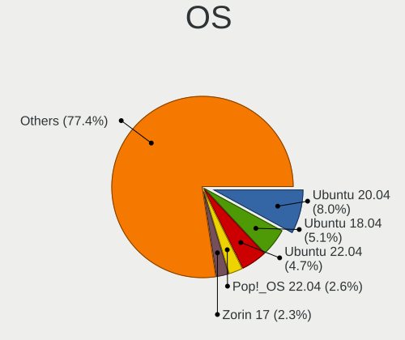

| Name                         | Notebooks | Percent |
|------------------------------|-----------|---------|
| Ubuntu 20.04                 | 957       | 7.95%   |
| Ubuntu 18.04                 | 611       | 5.08%   |
| Ubuntu 22.04                 | 566       | 4.7%    |
| Pop!_OS 22.04                | 310       | 2.58%   |
| Zorin 17                     | 274       | 2.28%   |
| Ubuntu 24.04                 | 257       | 2.14%   |
| Arch Rolling                 | 235       | 1.95%   |
| Pop!_OS 20.04                | 194       | 1.61%   |
| Linux Mint 20                | 191       | 1.59%   |
| Linux Mint 19.3              | 168       | 1.4%    |
| Debian 12                    | 166       | 1.38%   |
| Manjaro                      | 164       | 1.36%   |
| OpenMandriva 4.2             | 162       | 1.35%   |
| OpenMandriva 4.3             | 158       | 1.31%   |
| Linux Mint 20.3              | 155       | 1.29%   |
| Zorin 16                     | 143       | 1.19%   |
| Debian 11                    | 133       | 1.11%   |
| Fedora 40                    | 129       | 1.07%   |
| Fedora 38                    | 124       | 1.03%   |
| Linux Mint 19.1              | 122       | 1.01%   |
| Linux Mint 20.1              | 120       | 1%      |
| Ubuntu 19.04                 | 117       | 0.97%   |
| Linux Mint 20.2              | 114       | 0.95%   |
| KDE neon 20.04               | 114       | 0.95%   |
| Arch                         | 114       | 0.95%   |
| Fedora 39                    | 113       | 0.94%   |
| Linux Mint 21.1              | 110       | 0.91%   |
| OpenMandriva 23.08           | 109       | 0.91%   |
| Ubuntu 19.10                 | 106       | 0.88%   |
| Fedora 41                    | 100       | 0.83%   |
| Zorin 15                     | 95        | 0.79%   |
| Linux Mint 22.1              | 93        | 0.77%   |
| openSUSE Tumbleweed-XXXXXXXX | 90        | 0.75%   |
| Fedora 42                    | 89        | 0.74%   |
| Debian 10                    | 86        | 0.71%   |
| Linux Mint 21.2              | 82        | 0.68%   |
| Fedora 35                    | 80        | 0.66%   |
| Linux Mint 21.3              | 79        | 0.66%   |
| OpenMandriva 23.01           | 75        | 0.62%   |
| Fedora 34                    | 73        | 0.61%   |

OS Family
---------

OS without a version

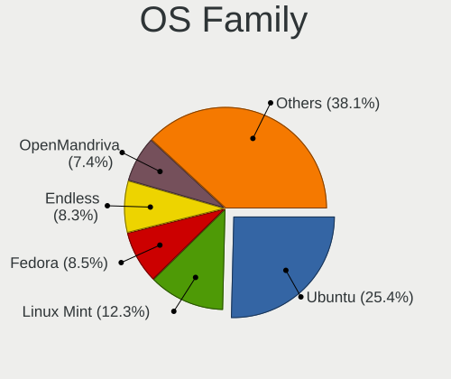

| Name          | Notebooks | Percent |
|---------------|-----------|---------|
| Ubuntu        | 2894      | 25.39%  |
| Linux Mint    | 1399      | 12.27%  |
| Fedora        | 965       | 8.46%   |
| Endless       | 950       | 8.33%   |
| OpenMandriva  | 846       | 7.42%   |
| Pop!_OS       | 705       | 6.18%   |
| Zorin         | 577       | 5.06%   |
| Debian        | 467       | 4.1%    |
| Arch          | 339       | 2.97%   |
| Manjaro       | 285       | 2.5%    |
| KDE neon      | 185       | 1.62%   |
| Kubuntu       | 177       | 1.55%   |
| Xubuntu       | 152       | 1.33%   |
| openSUSE      | 136       | 1.19%   |
| Lubuntu       | 103       | 0.9%    |
| Elementary    | 100       | 0.88%   |
| BigLinux      | 83        | 0.73%   |
| Kali          | 77        | 0.68%   |
| Ubuntu MATE   | 75        | 0.66%   |
| ROSA          | 70        | 0.61%   |
| ArcoLinux     | 61        | 0.54%   |
| Ubuntu Unity  | 59        | 0.52%   |
| LMDE          | 59        | 0.52%   |
| SteamOS       | 48        | 0.42%   |
| Bazzite       | 41        | 0.36%   |
| EndeavourOS   | 39        | 0.34%   |
| Deepin        | 34        | 0.3%    |
| Ubuntu Budgie | 32        | 0.28%   |
| Nobara        | 29        | 0.25%   |
| Clear Linux   | 29        | 0.25%   |
| MX            | 25        | 0.22%   |
| CachyOS       | 23        | 0.2%    |
| LinuxFX       | 21        | 0.18%   |
| Garuda Linux  | 20        | 0.18%   |
| Parrot        | 17        | 0.15%   |
| NixOS         | 13        | 0.11%   |
| Gentoo        | 13        | 0.11%   |
| Void Linux    | 12        | 0.11%   |
| CentOS        | 12        | 0.11%   |
| Peppermint    | 11        | 0.1%    |

Kernel
------

Version of the Linux kernel

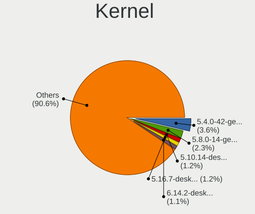

| Version                  | Notebooks | Percent |
|--------------------------|-----------|---------|
| 5.4.0-42-generic         | 472       | 3.64%   |
| 5.8.0-14-generic         | 294       | 2.27%   |
| 5.10.14-desktop-1omv4002 | 156       | 1.2%    |
| 5.16.7-desktop-1omv4003  | 150       | 1.16%   |
| 6.14.2-desktop-3omv2590  | 144       | 1.11%   |
| 5.4.0-19-generic         | 114       | 0.88%   |
| 5.3.0-28-generic         | 108       | 0.83%   |
| 5.11.0-35-generic        | 102       | 0.79%   |
| 6.4.11-desktop-1omv2390  | 88        | 0.68%   |
| 5.15.0-56-generic        | 79        | 0.61%   |
| 5.4.0-7634-generic       | 74        | 0.57%   |
| 6.1.1-desktop-1omv2290   | 73        | 0.56%   |
| 5.4.0-48-generic         | 72        | 0.55%   |
| 5.4.0-40-generic         | 70        | 0.54%   |
| 4.15.0-46-generic        | 70        | 0.54%   |
| 6.8.0-51-generic         | 67        | 0.52%   |
| 5.4.0-26-generic         | 64        | 0.49%   |
| 5.4.0-58-generic         | 60        | 0.46%   |
| 6.9.3-76060903-generic   | 57        | 0.44%   |
| 6.12.1-desktop-1omv2490  | 57        | 0.44%   |
| 5.4.0-52-generic         | 57        | 0.44%   |
| 6.2.6-desktop-1omv2390   | 54        | 0.42%   |
| 5.4.0-47-generic         | 54        | 0.42%   |
| 6.8.0-52-generic         | 53        | 0.41%   |
| 6.8.0-40-generic         | 50        | 0.39%   |
| 5.3.0-19-generic         | 50        | 0.39%   |
| 5.15.0-47-generic        | 50        | 0.39%   |
| 6.8.0-60-generic         | 48        | 0.37%   |
| 5.3.0-23-generic         | 47        | 0.36%   |
| 5.0.0-32-generic         | 47        | 0.36%   |
| 5.3.0-46-generic         | 46        | 0.35%   |
| 5.4.0-29-generic         | 44        | 0.34%   |
| 4.18.0-15-generic        | 44        | 0.34%   |
| 6.6.2-desktop-1omv2390   | 43        | 0.33%   |
| 5.3.0-40-generic         | 43        | 0.33%   |
| 5.15.0-46-generic        | 43        | 0.33%   |
| 5.4.0-65-generic         | 42        | 0.32%   |
| 5.15.0-52-generic        | 42        | 0.32%   |
| 5.0.0-37-generic         | 42        | 0.32%   |
| 5.4.0-39-generic         | 41        | 0.32%   |

Kernel Family
-------------

Linux kernel without a distro release

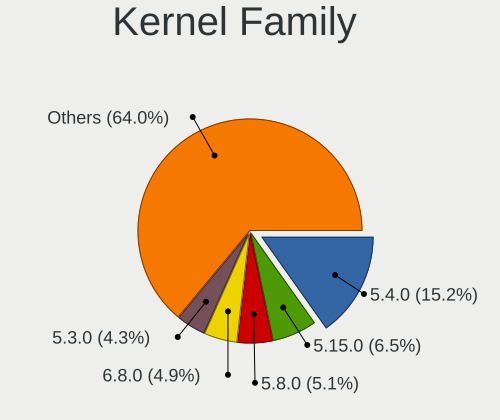

| Version | Notebooks | Percent |
|---------|-----------|---------|
| 5.4.0   | 1879      | 15.2%   |
| 5.15.0  | 809       | 6.54%   |
| 5.8.0   | 629       | 5.09%   |
| 6.8.0   | 601       | 4.86%   |
| 5.3.0   | 535       | 4.33%   |
| 4.15.0  | 528       | 4.27%   |
| 5.11.0  | 474       | 3.83%   |
| 6.5.0   | 332       | 2.69%   |
| 5.0.0   | 323       | 2.61%   |
| 5.13.0  | 281       | 2.27%   |
| 4.18.0  | 232       | 1.88%   |
| 5.19.0  | 215       | 1.74%   |
| 6.1.0   | 214       | 1.73%   |
| 6.14.0  | 207       | 1.67%   |
| 6.2.0   | 195       | 1.58%   |
| 5.10.0  | 175       | 1.42%   |
| 5.10.14 | 158       | 1.28%   |
| 6.14.2  | 155       | 1.25%   |
| 5.16.7  | 150       | 1.21%   |
| 6.11.0  | 116       | 0.94%   |
| 4.19.0  | 104       | 0.84%   |
| 6.4.11  | 97        | 0.78%   |
| 6.2.6   | 95        | 0.77%   |
| 6.1.1   | 80        | 0.65%   |
| 6.9.3   | 62        | 0.5%    |
| 6.12.1  | 61        | 0.49%   |
| 6.6.2   | 51        | 0.41%   |
| 6.12.10 | 36        | 0.29%   |
| 5.14.0  | 36        | 0.29%   |
| 5.17.5  | 35        | 0.28%   |
| 6.0.12  | 32        | 0.26%   |
| 5.16.11 | 30        | 0.24%   |
| 6.5.6   | 29        | 0.23%   |
| 6.6.10  | 28        | 0.23%   |
| 6.10.0  | 28        | 0.23%   |
| 4.4.0   | 28        | 0.23%   |
| 6.4.8   | 27        | 0.22%   |
| 6.4.6   | 26        | 0.21%   |
| 5.7.9   | 26        | 0.21%   |
| 6.5.5   | 23        | 0.19%   |

Kernel Major Ver.
-----------------

Linux kernel major version

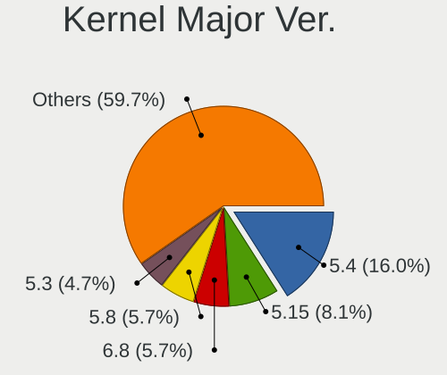

| Version | Notebooks | Percent |
|---------|-----------|---------|
| 5.4     | 1952      | 15.98%  |
| 5.15    | 989       | 8.1%    |
| 6.8     | 702       | 5.75%   |
| 5.8     | 698       | 5.71%   |
| 5.3     | 579       | 4.74%   |
| 5.11    | 541       | 4.43%   |
| 4.15    | 528       | 4.32%   |
| 6.5     | 450       | 3.68%   |
| 5.10    | 442       | 3.62%   |
| 6.1     | 435       | 3.56%   |
| 6.14    | 424       | 3.47%   |
| 6.2     | 396       | 3.24%   |
| 5.0     | 348       | 2.85%   |
| 5.13    | 336       | 2.75%   |
| 5.16    | 279       | 2.28%   |
| 5.19    | 263       | 2.15%   |
| 6.12    | 262       | 2.15%   |
| 4.18    | 248       | 2.03%   |
| 6.4     | 225       | 1.84%   |
| 6.6     | 220       | 1.8%    |
| 6.11    | 199       | 1.63%   |
| 6.9     | 133       | 1.09%   |
| 4.19    | 121       | 0.99%   |
| 6.0     | 115       | 0.94%   |
| 6.10    | 111       | 0.91%   |
| 5.14    | 106       | 0.87%   |
| 5.7     | 101       | 0.83%   |
| 5.17    | 100       | 0.82%   |
| 6.17    | 90        | 0.74%   |
| 5.18    | 81        | 0.66%   |
| 6.7     | 78        | 0.64%   |
| 6.15    | 78        | 0.64%   |
| 5.6     | 70        | 0.57%   |
| 5.9     | 66        | 0.54%   |
| 6.3     | 64        | 0.52%   |
| 6.13    | 64        | 0.52%   |
| 6.16    | 62        | 0.51%   |
| 5.12    | 61        | 0.5%    |
| 4.9     | 47        | 0.38%   |
| 5.5     | 32        | 0.26%   |

Arch
----

OS architecture (x86_64, i586, etc.)

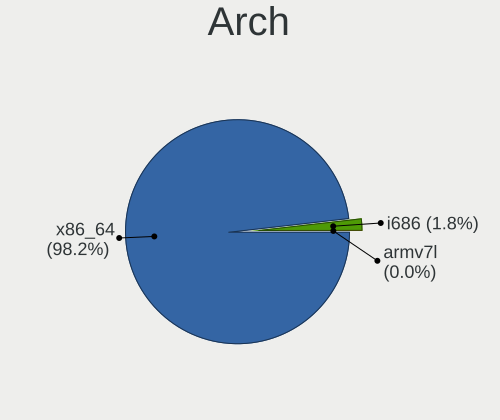

| Name   | Notebooks | Percent |
|--------|-----------|---------|
| x86_64 | 10631     | 98.19%  |
| i686   | 194       | 1.79%   |
| armv7l | 2         | 0.02%   |

DE
--

Desktop Environment

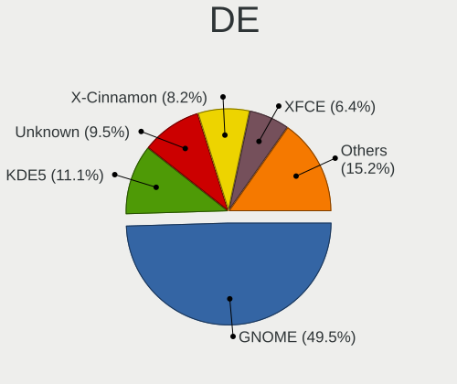

| Name             | Notebooks | Percent |
|------------------|-----------|---------|
| GNOME            | 5632      | 49.53%  |
| KDE5             | 1261      | 11.09%  |
| Unknown          | 1084      | 9.53%   |
| X-Cinnamon       | 930       | 8.18%   |
| XFCE             | 731       | 6.43%   |
| KDE6             | 487       | 4.28%   |
| MATE             | 252       | 2.22%   |
| KDE              | 179       | 1.57%   |
| Cinnamon         | 149       | 1.31%   |
| LXQt             | 142       | 1.25%   |
| Pantheon         | 94        | 0.83%   |
| Unity            | 61        | 0.54%   |
| Budgie           | 48        | 0.42%   |
| Deepin           | 47        | 0.41%   |
| Endless:GNOME    | 40        | 0.35%   |
| LXDE             | 38        | 0.33%   |
| i3               | 35        | 0.31%   |
| KDE4             | 34        | 0.3%    |
| COSMIC           | 23        | 0.2%    |
| Hyprland         | 19        | 0.17%   |
| GNOME Classic    | 16        | 0.14%   |
| sway             | 14        | 0.12%   |
| Enlightenment    | 7         | 0.06%   |
| awesome          | 6         | 0.05%   |
| icewm            | 5         | 0.04%   |
| GNOME Flashback  | 5         | 0.04%   |
| DDE              | 5         | 0.04%   |
| Openbox          | 3         | 0.03%   |
| Trinity          | 2         | 0.02%   |
| lightdm-xsession | 2         | 0.02%   |
| fluxbox          | 2         | 0.02%   |
| dwm              | 2         | 0.02%   |
| xmonad           | 1         | 0.01%   |
| UKUI             | 1         | 0.01%   |
| qtile            | 1         | 0.01%   |
| niri             | 1         | 0.01%   |
| Lubuntu          | 1         | 0.01%   |
| jwm              | 1         | 0.01%   |
| i3-with-shmlog   | 1         | 0.01%   |
| Hypr             | 1         | 0.01%   |

Display Server
--------------

X11 or Wayland

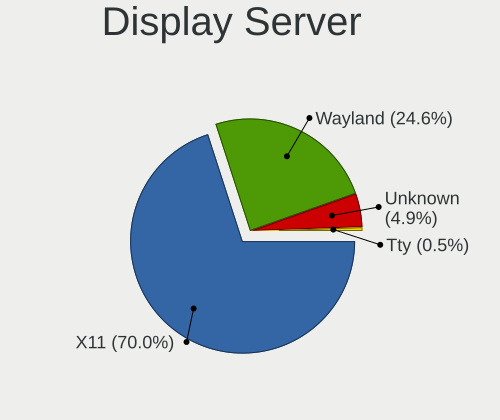

| Name    | Notebooks | Percent |
|---------|-----------|---------|
| X11     | 7857      | 70.02%  |
| Wayland | 2757      | 24.57%  |
| Unknown | 546       | 4.87%   |
| Tty     | 61        | 0.54%   |

Display Manager
---------------

SDDM, LightDM, etc.

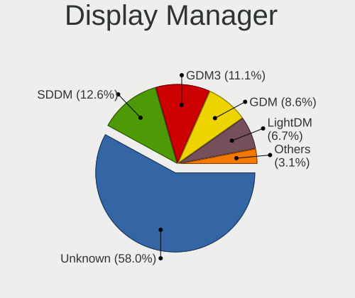

| Name           | Notebooks | Percent |
|----------------|-----------|---------|
| Unknown        | 6546      | 57.97%  |
| SDDM           | 1423      | 12.6%   |
| GDM3           | 1249      | 11.06%  |
| GDM            | 971       | 8.6%    |
| LightDM        | 756       | 6.69%   |
| TDM            | 294       | 2.6%    |
| KDM            | 27        | 0.24%   |
| XDM            | 7         | 0.06%   |
| SLiM           | 4         | 0.04%   |
| SLIMSKI        | 3         | 0.03%   |
| LY-DM          | 3         | 0.03%   |
| COSMIC-GREETER | 3         | 0.03%   |
| Ly             | 2         | 0.02%   |
| GREETD         | 2         | 0.02%   |
| MDM            | 1         | 0.01%   |
| LXDM           | 1         | 0.01%   |
| LIDM           | 1         | 0.01%   |

OS Lang
-------

Language

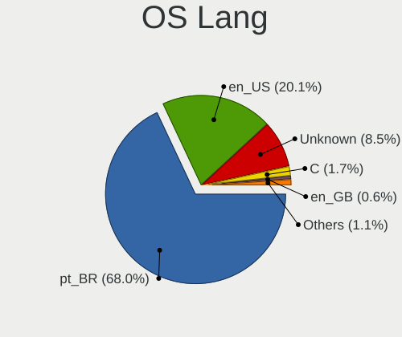

| Lang      | Notebooks | Percent |
|-----------|-----------|---------|
| pt_BR     | 7531      | 68.02%  |
| en_US     | 2226      | 20.1%   |
| Unknown   | 936       | 8.45%   |
| C         | 189       | 1.71%   |
| en_GB     | 67        | 0.61%   |
| pt_PT     | 43        | 0.39%   |
| es_ES     | 20        | 0.18%   |
| de_DE     | 8         | 0.07%   |
| POSIX     | 7         | 0.06%   |
| en_CA     | 7         | 0.06%   |
| it_IT     | 5         | 0.05%   |
| fr_FR     | 5         | 0.05%   |
| en_DK     | 4         | 0.04%   |
| ja_JP     | 2         | 0.02%   |
| es_PY     | 2         | 0.02%   |
| es_MX     | 2         | 0.02%   |
| es_CL     | 2         | 0.02%   |
| es_AR     | 2         | 0.02%   |
| en_ZA     | 2         | 0.02%   |
| UTF-8     | 1         | 0.01%   |
| ru_RU     | 1         | 0.01%   |
| pt_BR~    | 1         | 0.01%   |
| pt_BRutf8 | 1         | 0.01%   |
| es_VE     | 1         | 0.01%   |
| es_PE     | 1         | 0.01%   |
| en_IN     | 1         | 0.01%   |
| en-US     | 1         | 0.01%   |
| em_US     | 1         | 0.01%   |
| de_CH     | 1         | 0.01%   |
| C.UTF8    | 1         | 0.01%   |
| ar_EG     | 1         | 0.01%   |

Boot Mode
---------

EFI or BIOS

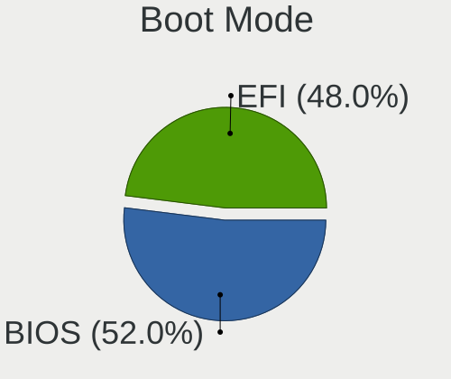

| Mode | Notebooks | Percent |
|------|-----------|---------|
| BIOS | 5781      | 51.96%  |
| EFI  | 5345      | 48.04%  |

Filesystem
----------

Type of filesystem

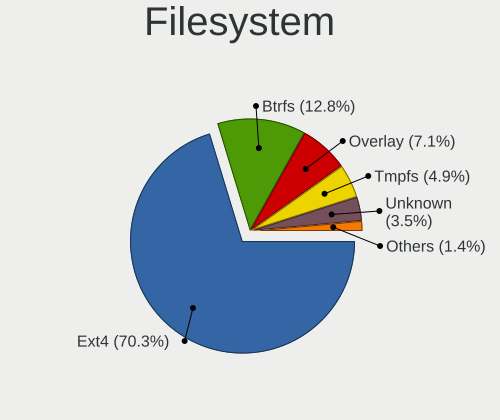

| Type    | Notebooks | Percent |
|---------|-----------|---------|
| Ext4    | 7870      | 70.3%   |
| Btrfs   | 1432      | 12.79%  |
| Overlay | 794       | 7.09%   |
| Tmpfs   | 548       | 4.9%    |
| Unknown | 389       | 3.47%   |
| Xfs     | 85        | 0.76%   |
| Zfs     | 37        | 0.33%   |
| Ext2    | 15        | 0.13%   |
| Ext3    | 12        | 0.11%   |
| F2fs    | 11        | 0.1%    |
| Aufs    | 2         | 0.02%   |

Part. scheme
------------

Scheme of partitioning

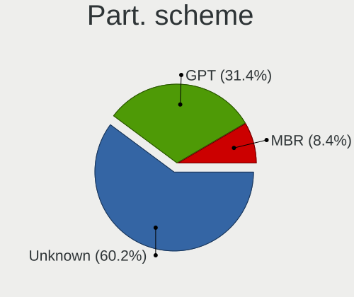

| Type    | Notebooks | Percent |
|---------|-----------|---------|
| Unknown | 6711      | 60.18%  |
| GPT     | 3500      | 31.39%  |
| MBR     | 940       | 8.43%   |

Dual Boot with Linux/BSD
------------------------

Hosting more than one Linux/BSD

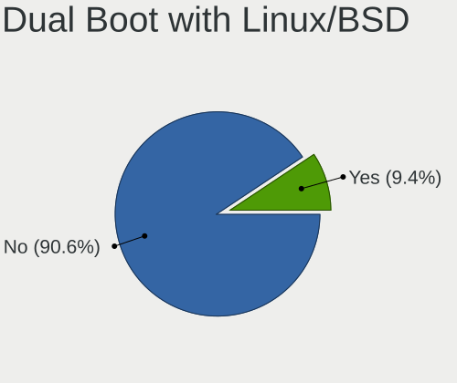

| Dual boot | Notebooks | Percent |
|-----------|-----------|---------|
| No        | 9951      | 90.64%  |
| Yes       | 1027      | 9.36%   |

Dual Boot (Win)
---------------

Hosting Linux and Windows

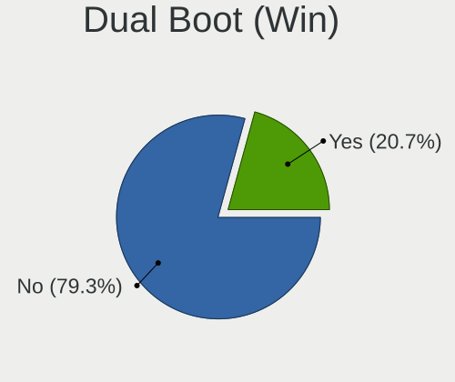

| Dual boot | Notebooks | Percent |
|-----------|-----------|---------|
| No        | 8721      | 79.25%  |
| Yes       | 2283      | 20.75%  |

Board
-----

Vendor
------

Motherboard manufacturer

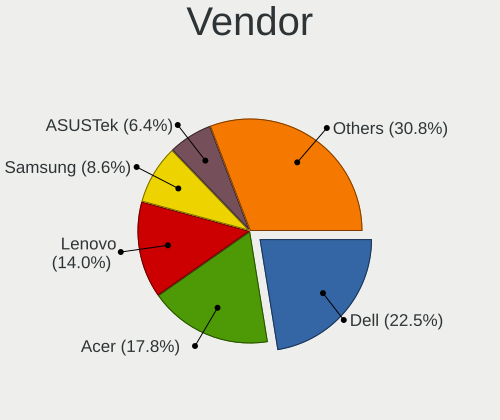

| Name                   | Notebooks | Percent |
|------------------------|-----------|---------|
| Dell                   | 2431      | 22.46%  |
| Acer                   | 1929      | 17.82%  |
| Lenovo                 | 1511      | 13.96%  |
| Samsung Electronics    | 929       | 8.58%   |
| ASUSTek Computer       | 691       | 6.38%   |
| Hewlett-Packard        | 688       | 6.36%   |
| Positivo               | 671       | 6.2%    |
| Sony                   | 207       | 1.91%   |
| Apple                  | 200       | 1.85%   |
| LG Electronics         | 128       | 1.18%   |
| Avell High Performance | 113       | 1.04%   |
| Positivo Bahia - VAIO  | 99        | 0.91%   |
| Digibras               | 97        | 0.9%    |
| Unknown                | 91        | 0.84%   |
| Itautec                | 89        | 0.82%   |
| Semp Toshiba           | 82        | 0.76%   |
| Intel                  | 67        | 0.62%   |
| Compaq                 | 64        | 0.59%   |
| Multilaser             | 63        | 0.58%   |
| Philco                 | 58        | 0.54%   |
| Toshiba                | 48        | 0.44%   |
| Valve                  | 41        | 0.38%   |
| OEM                    | 37        | 0.34%   |
| Alienware              | 37        | 0.34%   |
| Notebook               | 36        | 0.33%   |
| Avell                  | 33        | 0.3%    |
| MSI                    | 31        | 0.29%   |
| Clevo                  | 30        | 0.28%   |
| Google                 | 27        | 0.25%   |
| Gateway                | 27        | 0.25%   |
| Daten Tecnologia       | 27        | 0.25%   |
| Compal                 | 26        | 0.24%   |
| Timi                   | 16        | 0.15%   |
| Quanta                 | 14        | 0.13%   |
| eMachines              | 14        | 0.13%   |
| Standard               | 12        | 0.11%   |
| Login Informatica      | 9         | 0.08%   |
| Gigabyte Technology    | 9         | 0.08%   |
| Chuwi                  | 9         | 0.08%   |
| CCE                    | 7         | 0.06%   |

Model
-----

Motherboard model

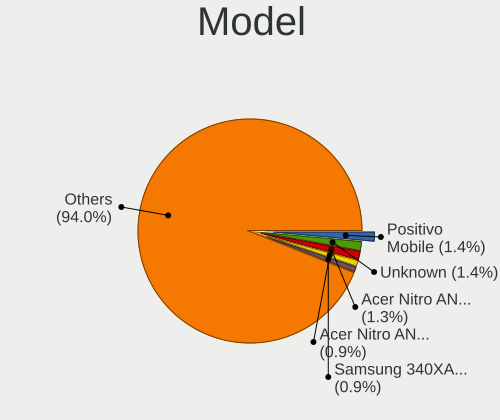

| Name                                        | Notebooks | Percent |
|---------------------------------------------|-----------|---------|
| Positivo Mobile                             | 156       | 1.44%   |
| Unknown                                     | 153       | 1.41%   |
| Acer Nitro AN515-54                         | 146       | 1.35%   |
| Acer Nitro AN515-44                         | 102       | 0.94%   |
| Samsung 340XAA/350XAA/550XAA                | 93        | 0.86%   |
| Lenovo IdeaPad 3 15ALC6 82MF                | 88        | 0.81%   |
| Lenovo IdeaPad S145-15API 81V7              | 85        | 0.79%   |
| Samsung 550XDA                              | 80        | 0.74%   |
| Dell Inspiron 5566                          | 80        | 0.74%   |
| Dell Inspiron 15-3567                       | 80        | 0.74%   |
| Dell Inspiron 3583                          | 79        | 0.73%   |
| Acer Aspire A315-53                         | 79        | 0.73%   |
| Lenovo IdeaPad 330-15IKB 81FE               | 76        | 0.7%    |
| Lenovo IdeaPad S145-15IWL 81S9              | 72        | 0.67%   |
| Lenovo IdeaPad 320-15IKB 80YH               | 64        | 0.59%   |
| Acer Aspire A515-51                         | 60        | 0.55%   |
| Acer Aspire A315-34                         | 58        | 0.54%   |
| Samsung 300E5M/300E5L                       | 55        | 0.51%   |
| Acer Nitro AN517-51                         | 55        | 0.51%   |
| Dell Inspiron 3421                          | 54        | 0.5%    |
| Positivo S14CT01                            | 52        | 0.48%   |
| Dell Inspiron 3442                          | 52        | 0.48%   |
| Acer Nitro AN515-43                         | 51        | 0.47%   |
| HP G42                                      | 50        | 0.46%   |
| Dell Inspiron N4050                         | 48        | 0.44%   |
| Acer Aspire A515-51G                        | 47        | 0.43%   |
| Lenovo IdeaPad S145-15IIL 82DJ              | 46        | 0.42%   |
| Acer Nitro AN515-52                         | 45        | 0.42%   |
| Samsung RV411/RV511/E3511/S3511/RV711/E3411 | 44        | 0.41%   |
| Digibras NH4CU03                            | 44        | 0.41%   |
| Samsung 550XBE/350XBE                       | 43        | 0.4%    |
| Acer Aspire E5-571                          | 43        | 0.4%    |
| HP Pavilion g4                              | 42        | 0.39%   |
| Dell Inspiron 5458                          | 42        | 0.39%   |
| ASUS VivoBook_ASUSLaptop X515EA_X515EA      | 42        | 0.39%   |
| ASUS VivoBook_ASUSLaptop X515DA_X515DA      | 41        | 0.38%   |
| Acer Aspire E1-571                          | 41        | 0.38%   |
| Valve Jupiter                               | 40        | 0.37%   |
| Digibras NH4CU53                            | 40        | 0.37%   |
| Dell Inspiron 7520                          | 39        | 0.36%   |

Model Family
------------

Motherboard model prefix

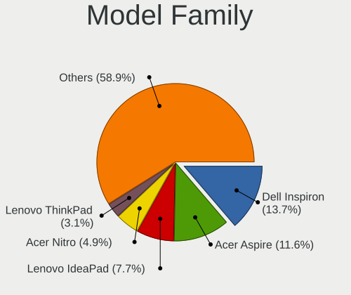

| Name              | Notebooks | Percent |
|-------------------|-----------|---------|
| Dell Inspiron     | 1486      | 13.73%  |
| Acer Aspire       | 1257      | 11.61%  |
| Lenovo IdeaPad    | 838       | 7.74%   |
| Acer Nitro        | 532       | 4.91%   |
| Lenovo ThinkPad   | 338       | 3.12%   |
| Dell Latitude     | 319       | 2.95%   |
| Dell Vostro       | 318       | 2.94%   |
| ASUS VivoBook     | 282       | 2.6%    |
| HP Pavilion       | 261       | 2.41%   |
| Positivo Mobile   | 156       | 1.44%   |
| Unknown           | 153       | 1.41%   |
| Samsung 340XAA    | 93        | 0.86%   |
| Itautec Infoway   | 88        | 0.81%   |
| Dell G15          | 85        | 0.79%   |
| Samsung 550XDA    | 80        | 0.74%   |
| HP ProBook        | 72        | 0.67%   |
| Dell G3           | 72        | 0.67%   |
| Acer Predator     | 64        | 0.59%   |
| Samsung RV411     | 59        | 0.54%   |
| HP EliteBook      | 59        | 0.54%   |
| Samsung 300E5M    | 55        | 0.51%   |
| Positivo S14CT01  | 52        | 0.48%   |
| HP G42            | 50        | 0.46%   |
| Dell System       | 48        | 0.44%   |
| Dell XPS          | 45        | 0.42%   |
| Digibras NH4CU03  | 44        | 0.41%   |
| Samsung 550XBE    | 43        | 0.4%    |
| Apple MacBookPro8 | 43        | 0.4%    |
| Valve Jupiter     | 40        | 0.37%   |
| Semp Toshiba IS   | 40        | 0.37%   |
| Digibras NH4CU53  | 40        | 0.37%   |
| Compaq Presario   | 38        | 0.35%   |
| Toshiba Satellite | 37        | 0.34%   |
| Samsung 550XCJ    | 37        | 0.34%   |
| Lenovo Legion     | 37        | 0.34%   |
| HP Compaq         | 36        | 0.33%   |
| Samsung RV415     | 35        | 0.32%   |
| Samsung 370E4K    | 35        | 0.32%   |
| Samsung 270E5J    | 35        | 0.32%   |
| Samsung 300E5EV   | 31        | 0.29%   |

MFG Year
--------

Motherboard manufacture year

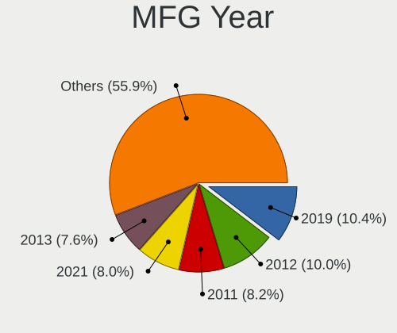

| Year    | Notebooks | Percent |
|---------|-----------|---------|
| 2019    | 1124      | 10.38%  |
| 2012    | 1079      | 9.97%   |
| 2011    | 890       | 8.22%   |
| 2021    | 862       | 7.96%   |
| 2013    | 823       | 7.6%    |
| 2018    | 789       | 7.29%   |
| 2017    | 769       | 7.1%    |
| 2016    | 717       | 6.62%   |
| 2020    | 682       | 6.3%    |
| 2010    | 583       | 5.39%   |
| 2014    | 555       | 5.13%   |
| 2015    | 422       | 3.9%    |
| 2008    | 339       | 3.13%   |
| 2009    | 298       | 2.75%   |
| 2022    | 288       | 2.66%   |
| 2023    | 235       | 2.17%   |
| 2007    | 125       | 1.15%   |
| 2024    | 114       | 1.05%   |
| 2006    | 49        | 0.45%   |
| 2025    | 38        | 0.35%   |
| Unknown | 31        | 0.29%   |
| 2005    | 9         | 0.08%   |
| 2004    | 5         | 0.05%   |

Form Factor
-----------

Physical design of the computer

| Name     | Notebooks | Percent |
|----------|-----------|---------|
| Notebook | 10826     | 100%    |

Secure Boot
-----------

Enabled or disabled

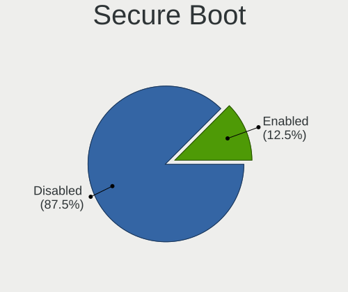

| State    | Notebooks | Percent |
|----------|-----------|---------|
| Disabled | 9571      | 87.48%  |
| Enabled  | 1370      | 12.52%  |

Coreboot
--------

Have coreboot on board

| Used | Notebooks | Percent |
|------|-----------|---------|
| No   | 10794     | 99.7%   |
| Yes  | 32        | 0.3%    |

RAM Size
--------

Total RAM memory

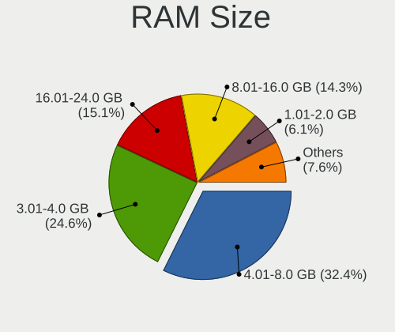

| Size in GB  | Notebooks | Percent |
|-------------|-----------|---------|
| 4.01-8.0    | 3572      | 32.36%  |
| 3.01-4.0    | 2717      | 24.61%  |
| 16.01-24.0  | 1662      | 15.06%  |
| 8.01-16.0   | 1577      | 14.29%  |
| 1.01-2.0    | 672       | 6.09%   |
| 32.01-64.0  | 400       | 3.62%   |
| 2.01-3.0    | 227       | 2.06%   |
| 24.01-32.0  | 114       | 1.03%   |
| 64.01-256.0 | 60        | 0.54%   |
| 0.51-1.0    | 36        | 0.33%   |
| 0.01-0.5    | 1         | 0.01%   |

RAM Used
--------

Used RAM memory

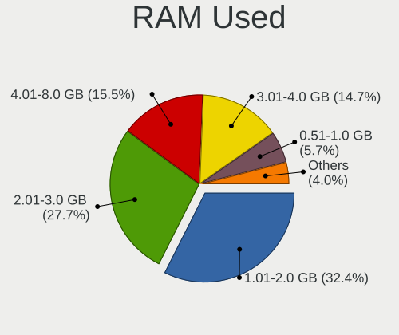

| Used GB    | Notebooks | Percent |
|------------|-----------|---------|
| 1.01-2.0   | 3900      | 32.44%  |
| 2.01-3.0   | 3333      | 27.72%  |
| 4.01-8.0   | 1858      | 15.45%  |
| 3.01-4.0   | 1763      | 14.66%  |
| 0.51-1.0   | 688       | 5.72%   |
| 8.01-16.0  | 377       | 3.14%   |
| 0.01-0.5   | 55        | 0.46%   |
| 16.01-24.0 | 34        | 0.28%   |
| 24.01-32.0 | 8         | 0.07%   |
| 32.01-64.0 | 4         | 0.03%   |
| Unknown    | 2         | 0.02%   |

Total Drives
------------

Number of drives on board

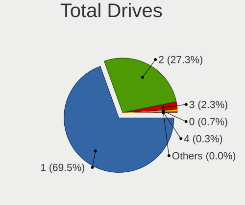

| Drives | Notebooks | Percent |
|--------|-----------|---------|
| 1      | 7680      | 69.53%  |
| 2      | 3011      | 27.26%  |
| 3      | 250       | 2.26%   |
| 0      | 72        | 0.65%   |
| 4      | 28        | 0.25%   |
| 6      | 3         | 0.03%   |
| 5      | 1         | 0.01%   |

Has CD-ROM
----------

Has CD-ROM on board

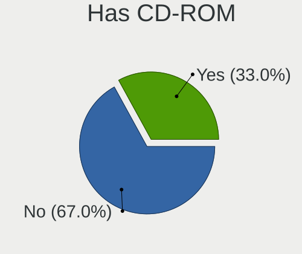

| Presented | Notebooks | Percent |
|-----------|-----------|---------|
| No        | 7286      | 67%     |
| Yes       | 3589      | 33%     |

Has Ethernet
------------

Has Ethernet on board

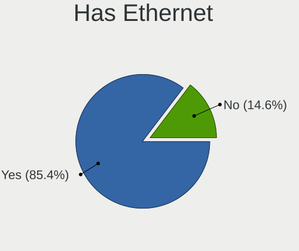

| Presented | Notebooks | Percent |
|-----------|-----------|---------|
| Yes       | 9267      | 85.36%  |
| No        | 1590      | 14.64%  |

Has WiFi
--------

Has WiFi module

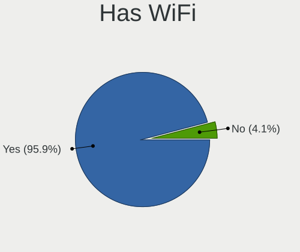

| Presented | Notebooks | Percent |
|-----------|-----------|---------|
| Yes       | 10407     | 95.9%   |
| No        | 445       | 4.1%    |

Has Bluetooth
-------------

Has Bluetooth module

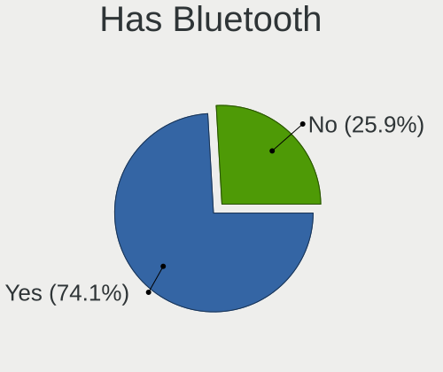

| Presented | Notebooks | Percent |
|-----------|-----------|---------|
| Yes       | 8106      | 74.08%  |
| No        | 2836      | 25.92%  |

Location
--------

Country
-------

Geographic location (country)

| Country | Notebooks | Percent |
|---------|-----------|---------|
| Brazil  | 10826     | 100%    |

City
----

Geographic location (city)

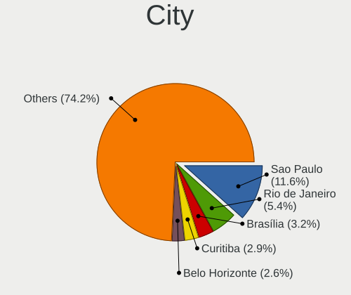

| City                  | Notebooks | Percent |
|-----------------------|-----------|---------|
| Sao Paulo             | 1329      | 11.65%  |
| Rio de Janeiro        | 614       | 5.38%   |
| Brasília             | 363       | 3.18%   |
| Curitiba              | 333       | 2.92%   |
| Belo Horizonte        | 299       | 2.62%   |
| Fortaleza             | 273       | 2.39%   |
| Porto Alegre          | 237       | 2.08%   |
| Campinas              | 178       | 1.56%   |
| Salvador              | 172       | 1.51%   |
| Recife                | 155       | 1.36%   |
| Florianópolis        | 129       | 1.13%   |
| Goiânia              | 119       | 1.04%   |
| Santo André          | 103       | 0.9%    |
| Manaus                | 102       | 0.89%   |
| Natal                 | 98        | 0.86%   |
| Osasco                | 93        | 0.82%   |
| Joao Pessoa           | 93        | 0.82%   |
| Sao José dos Campos  | 90        | 0.79%   |
| Sao Luís             | 85        | 0.75%   |
| Campo Grande          | 84        | 0.74%   |
| Belém                | 84        | 0.74%   |
| Maringá              | 82        | 0.72%   |
| Joinville             | 74        | 0.65%   |
| Teresina              | 73        | 0.64%   |
| Guarulhos             | 71        | 0.62%   |
| Ribeirao Preto        | 70        | 0.61%   |
| Niterói              | 70        | 0.61%   |
| Aracaju               | 69        | 0.6%    |
| Uberlândia           | 66        | 0.58%   |
| Sorocaba              | 65        | 0.57%   |
| Londrina              | 61        | 0.53%   |
| Maceió               | 60        | 0.53%   |
| Sao Carlos            | 52        | 0.46%   |
| Juiz de Fora          | 50        | 0.44%   |
| Sao Bernardo do Campo | 47        | 0.41%   |
| Contagem              | 47        | 0.41%   |
| Cuiabá               | 46        | 0.4%    |
| Canoas                | 45        | 0.39%   |
| Vila Velha            | 44        | 0.39%   |
| Santos                | 41        | 0.36%   |

Drives
------

Drive Vendor
------------

Hard drive vendors

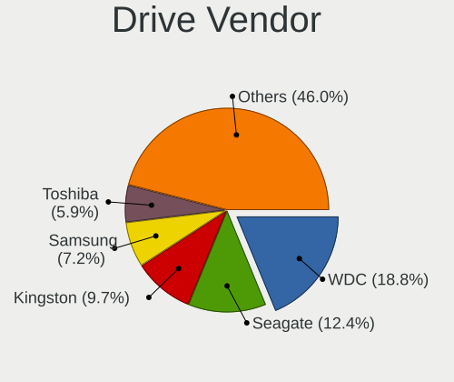

| Vendor                         | Notebooks | Drives | Percent |
|--------------------------------|-----------|--------|---------|
| WDC                            | 2573      | 3179   | 18.77%  |
| Seagate                        | 1705      | 2051   | 12.44%  |
| Kingston                       | 1323      | 1601   | 9.65%   |
| Samsung Electronics            | 990       | 1302   | 7.22%   |
| Toshiba                        | 809       | 959    | 5.9%    |
| SanDisk                        | 806       | 1076   | 5.88%   |
| Unknown                        | 581       | 763    | 4.24%   |
| A-DATA Technology              | 557       | 721    | 4.06%   |
| ADATA Technology               | 426       | 498    | 3.11%   |
| China                          | 355       | 444    | 2.59%   |
| Intel                          | 331       | 419    | 2.41%   |
| SK hynix                       | 274       | 340    | 2%      |
| Crucial                        | 263       | 346    | 1.92%   |
| Hitachi                        | 249       | 301    | 1.82%   |
| LITEON                         | 152       | 180    | 1.11%   |
| HGST                           | 149       | 174    | 1.09%   |
| Silicon Motion                 | 125       | 153    | 0.91%   |
| Kingston Technology Company    | 110       | 122    | 0.8%    |
| KingSpec                       | 110       | 122    | 0.8%    |
| Micron Technology              | 107       | 127    | 0.78%   |
| Solid State Storage Technology | 101       | 134    | 0.74%   |
| Solid State Storage            | 94        | 115    | 0.69%   |
| Apple                          | 90        | 113    | 0.66%   |
| SSSTC                          | 83        | 88     | 0.61%   |
| KIOXIA                         | 79        | 103    | 0.58%   |
| JMicron Technology             | 79        | 87     | 0.58%   |
| Unknown                        | 69        | 77     | 0.5%    |
| MAXIO Technology (Hangzhou)    | 64        | 74     | 0.47%   |
| Lexar                          | 61        | 83     | 0.44%   |
| Realtek Semiconductor          | 57        | 73     | 0.42%   |
| Netac                          | 57        | 69     | 0.42%   |
| Fujitsu                        | 55        | 67     | 0.4%    |
| XrayDisk                       | 52        | 62     | 0.38%   |
| Phison                         | 39        | 44     | 0.28%   |
| Patriot                        | 37        | 42     | 0.27%   |
| PNY                            | 31        | 53     | 0.23%   |
| Corsair                        | 31        | 32     | 0.23%   |
| Phison Electronics             | 30        | 38     | 0.22%   |
| walram                         | 28        | 34     | 0.2%    |
| Micron/Crucial Technology      | 27        | 35     | 0.2%    |

Drive Model
-----------

Hard drive models

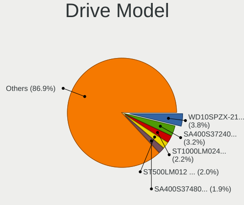

| Model                                     | Notebooks | Percent |
|-------------------------------------------|-----------|---------|
| WDC WD10SPZX-21Z10T0 1TB                  | 537       | 3.81%   |
| Kingston SA400S37240G 240GB SSD           | 445       | 3.16%   |
| Seagate ST1000LM024 HN-M101MBB 1TB        | 309       | 2.19%   |
| Seagate ST500LM012 HN-M500MBB 500GB       | 287       | 2.04%   |
| Kingston SA400S37480G 480GB SSD           | 264       | 1.87%   |
| Kingston SA400S37120G 120GB SSD           | 185       | 1.31%   |
| WDC WD10SPZX-24Z10 1TB                    | 182       | 1.29%   |
| Unknown MMC Card  32GB                    | 164       | 1.16%   |
| Toshiba MQ01ABD100 1TB                    | 160       | 1.14%   |
| Seagate ST1000LM035-1RK172 1TB            | 134       | 0.95%   |
| WDC WD10JPVX-22JC3T0 1TB                  | 127       | 0.9%    |
| Toshiba MQ04ABF100 1TB                    | 114       | 0.81%   |
| WDC WD10SPZX-75Z10T2 1TB                  | 99        | 0.7%    |
| Intel NVMe SSD Drive 512GB                | 98        | 0.7%    |
| Samsung HM321HI 320GB                     | 97        | 0.69%   |
| A-DATA IM2S3338-128GD2 128GB SSD          | 96        | 0.68%   |
| Seagate ST9500325AS 500GB                 | 92        | 0.65%   |
| SanDisk SSD PLUS 240GB                    | 91        | 0.65%   |
| WDC WD10JPVX-75JC3T0 1TB                  | 83        | 0.59%   |
| Seagate Expansion 2TB                     | 81        | 0.57%   |
| SanDisk NVMe SSD Drive 512GB              | 80        | 0.57%   |
| A-DATA IM2P33F3A NVMe 256GB               | 78        | 0.55%   |
| Kingston SV300S37A120G 120GB SSD          | 77        | 0.55%   |
| Toshiba MQ01ABF050 500GB                  | 74        | 0.53%   |
| WDC WDS240G2G0A-00JH30 240GB SSD          | 73        | 0.52%   |
| ADATA SM2P32A8-256GC1 256GB               | 73        | 0.52%   |
| SanDisk SSD PLUS 120GB                    | 71        | 0.5%    |
| Intel SSDPEKKW256G7 256GB                 | 70        | 0.5%    |
| ADATA NVMe SSD Drive 256GB                | 70        | 0.5%    |
| Unknown                                   | 69        | 0.49%   |
| Solid State Storage SSSTC CL1-4D256 256GB | 67        | 0.48%   |
| Seagate ST320LM001 HN-M320MBB 320GB       | 67        | 0.48%   |
| Crucial CT240BX500SSD1 240GB              | 67        | 0.48%   |
| WDC WD5000LPVX-22V0TT0 500GB              | 66        | 0.47%   |
| Seagate ST500LT012-9WS142 500GB           | 65        | 0.46%   |
| Seagate ST2000LM007-1R8174 2TB            | 65        | 0.46%   |
| Sandisk WD Blue SN550 NVMe SSD 1024GB     | 64        | 0.45%   |
| Toshiba MQ01ABD050 500GB                  | 62        | 0.44%   |
| SanDisk SSD PLUS 480GB                    | 62        | 0.44%   |
| WDC WDS240G2G0B-00EPW0 240GB SSD          | 61        | 0.43%   |

HDD Vendor
----------

Hard disk drive vendors

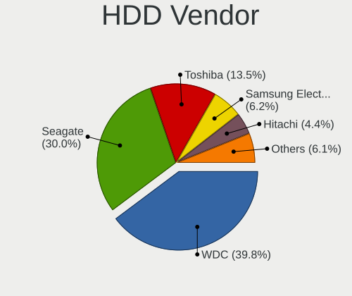

| Vendor              | Notebooks | Drives | Percent |
|---------------------|-----------|--------|---------|
| WDC                 | 2242      | 2663   | 39.78%  |
| Seagate             | 1689      | 2030   | 29.97%  |
| Toshiba             | 762       | 902    | 13.52%  |
| Samsung Electronics | 351       | 407    | 6.23%   |
| Hitachi             | 249       | 301    | 4.42%   |
| HGST                | 149       | 174    | 2.64%   |
| JMicron Technology  | 58        | 66     | 1.03%   |
| Fujitsu             | 53        | 64     | 0.94%   |
| Unknown             | 31        | 38     | 0.55%   |
| Apple               | 16        | 20     | 0.28%   |
| SAGE                | 9         | 14     | 0.16%   |
| USB3.0              | 6         | 6      | 0.11%   |
| XrayDisk            | 4         | 5      | 0.07%   |
| TO Exter            | 3         | 5      | 0.05%   |
| Maxtor              | 2         | 2      | 0.04%   |
| External            | 2         | 2      | 0.04%   |
| WALRAM              | 1         | 1      | 0.02%   |
| T-FORCE             | 1         | 1      | 0.02%   |
| SATAFIRM            | 1         | 1      | 0.02%   |
| Phison              | 1         | 1      | 0.02%   |
| NVME USB            | 1         | 1      | 0.02%   |
| Maxtor 6            | 1         | 1      | 0.02%   |
| Intenso             | 1         | 1      | 0.02%   |
| Initio              | 1         | 1      | 0.02%   |
| IBM/Hitachi         | 1         | 2      | 0.02%   |
| CLOVER              | 1         | 1      | 0.02%   |

SSD Vendor
----------

Solid state drive vendors

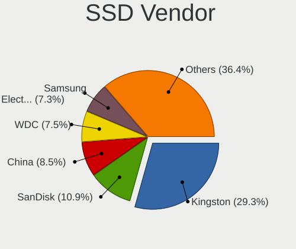

| Vendor              | Notebooks | Drives | Percent |
|---------------------|-----------|--------|---------|
| Kingston            | 1221      | 1467   | 29.34%  |
| SanDisk             | 455       | 635    | 10.93%  |
| China               | 354       | 443    | 8.51%   |
| WDC                 | 314       | 398    | 7.55%   |
| Samsung Electronics | 304       | 421    | 7.31%   |
| A-DATA Technology   | 260       | 311    | 6.25%   |
| Crucial             | 252       | 329    | 6.06%   |
| LITEON              | 142       | 170    | 3.41%   |
| KingSpec            | 105       | 117    | 2.52%   |
| Apple               | 64        | 78     | 1.54%   |
| Lexar               | 54        | 69     | 1.3%    |
| Netac               | 44        | 51     | 1.06%   |
| Unknown             | 37        | 38     | 0.89%   |
| XrayDisk            | 36        | 40     | 0.87%   |
| Patriot             | 34        | 39     | 0.82%   |
| PNY                 | 31        | 53     | 0.75%   |
| Intel               | 31        | 38     | 0.75%   |
| Corsair             | 24        | 25     | 0.58%   |
| Smart               | 21        | 23     | 0.5%    |
| SK hynix            | 19        | 22     | 0.46%   |
| Gigabyte Technology | 19        | 27     | 0.46%   |
| LITEONIT            | 17        | 25     | 0.41%   |
| Hewlett-Packard     | 17        | 19     | 0.41%   |
| HUSKY               | 15        | 16     | 0.36%   |
| KingDian            | 14        | 20     | 0.34%   |
| Unknown             | 13        | 14     | 0.31%   |
| Toshiba             | 13        | 18     | 0.31%   |
| Win Memory          | 12        | 15     | 0.29%   |
| WALRAM              | 10        | 11     | 0.24%   |
| Seagate             | 10        | 11     | 0.24%   |
| Micron Technology   | 10        | 20     | 0.24%   |
| BIWIN               | 10        | 11     | 0.24%   |
| BHT                 | 9         | 10     | 0.22%   |
| Team                | 6         | 7      | 0.14%   |
| S3+                 | 6         | 6      | 0.14%   |
| RZX                 | 6         | 7      | 0.14%   |
| Maxtor              | 6         | 6      | 0.14%   |
| MACROVIP            | 6         | 6      | 0.14%   |
| KEEPDATA            | 6         | 8      | 0.14%   |
| HS-SSD-C100         | 6         | 7      | 0.14%   |

Drive Kind
----------

HDD or SSD

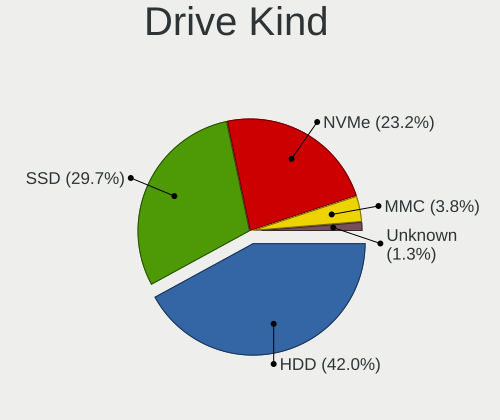

| Kind    | Notebooks | Drives | Percent |
|---------|-----------|--------|---------|
| HDD     | 5495      | 6710   | 42.05%  |
| SSD     | 3876      | 5200   | 29.66%  |
| NVMe    | 3034      | 4165   | 23.22%  |
| MMC     | 494       | 672    | 3.78%   |
| Unknown | 169       | 215    | 1.29%   |

Drive Connector
---------------

SATA, SAS, NVMe, etc.

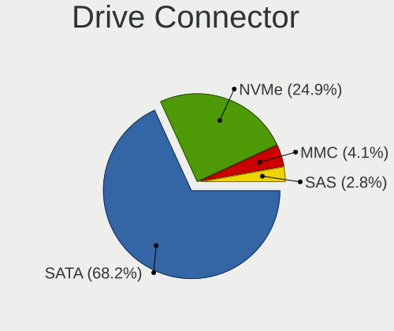

| Type | Notebooks | Drives | Percent |
|------|-----------|--------|---------|
| SATA | 8282      | 11686  | 68.16%  |
| NVMe | 3031      | 4154   | 24.95%  |
| MMC  | 494       | 672    | 4.07%   |
| SAS  | 343       | 450    | 2.82%   |

Drive Size
----------

Size of hard drive

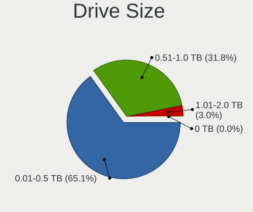

| Size in TB | Notebooks | Drives | Percent |
|------------|-----------|--------|---------|
| 0.01-0.5   | 5943      | 7970   | 65.09%  |
| 0.51-1.0   | 2899      | 3580   | 31.75%  |
| 1.01-2.0   | 270       | 340    | 2.96%   |
| 3.01-4.0   | 17        | 19     | 0.19%   |
| 0          | 1         | 1      | 0.01%   |

Space Total
-----------

Amount of disk space available on the file system

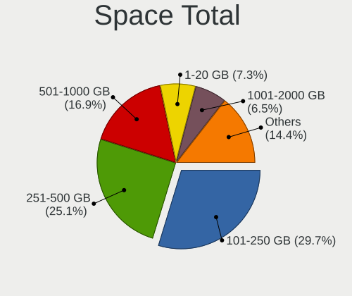

| Size in GB     | Notebooks | Percent |
|----------------|-----------|---------|
| 101-250        | 3423      | 29.73%  |
| 251-500        | 2893      | 25.13%  |
| 501-1000       | 1945      | 16.89%  |
| 1-20           | 839       | 7.29%   |
| 1001-2000      | 752       | 6.53%   |
| 51-100         | 631       | 5.48%   |
| 21-50          | 485       | 4.21%   |
| Unknown        | 240       | 2.08%   |
| 2001-3000      | 164       | 1.42%   |
| More than 3000 | 142       | 1.23%   |

Space Used
----------

Amount of used disk space

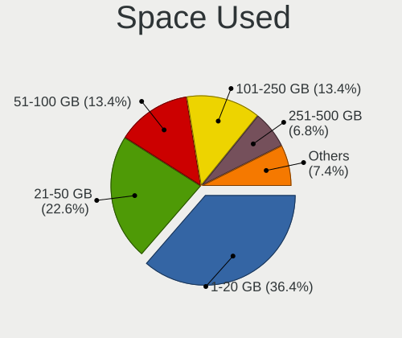

| Used GB        | Notebooks | Percent |
|----------------|-----------|---------|
| 1-20           | 4341      | 36.38%  |
| 21-50          | 2700      | 22.62%  |
| 51-100         | 1604      | 13.44%  |
| 101-250        | 1599      | 13.4%   |
| 251-500        | 810       | 6.79%   |
| 501-1000       | 435       | 3.65%   |
| Unknown        | 240       | 2.01%   |
| 1001-2000      | 151       | 1.27%   |
| 2001-3000      | 24        | 0.2%    |
| More than 3000 | 20        | 0.17%   |
| 0              | 10        | 0.08%   |

Malfunc. Drives
---------------

Drive models with a malfunction

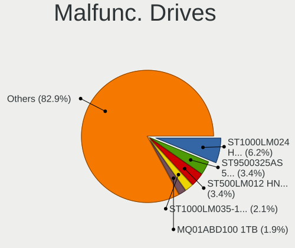

| Model                                  | Notebooks | Drives | Percent |
|----------------------------------------|-----------|--------|---------|
| Seagate ST1000LM024 HN-M101MBB 1TB     | 47        | 52     | 6.22%   |
| Seagate ST9500325AS 500GB              | 26        | 28     | 3.44%   |
| Seagate ST500LM012 HN-M500MBB 500GB    | 26        | 28     | 3.44%   |
| Seagate ST1000LM035-1RK172 1TB         | 16        | 16     | 2.12%   |
| Toshiba MQ01ABD100 1TB                 | 14        | 15     | 1.85%   |
| Seagate ST500LT012-9WS142 500GB        | 13        | 16     | 1.72%   |
| Toshiba MQ01ABD050 500GB               | 12        | 12     | 1.59%   |
| Samsung Electronics HM321HI 320GB      | 9         | 9      | 1.19%   |
| Samsung Electronics HM160HI 160GB      | 9         | 10     | 1.19%   |
| Toshiba MQ01ABF050 500GB               | 8         | 8      | 1.06%   |
| Seagate ST9320325AS 320GB              | 8         | 8      | 1.06%   |
| Kingston SA400S37240G 240GB SSD        | 8         | 8      | 1.06%   |
| HGST HTS545050A7E680 500GB             | 8         | 8      | 1.06%   |
| A-DATA Technology IM2P33F3A NVMe 256GB | 8         | 13     | 1.06%   |
| Seagate ST500LT012-1DG142 500GB        | 7         | 8      | 0.93%   |
| Seagate ST1000LM048-2E7172 1TB         | 7         | 9      | 0.93%   |
| Kingston SV300S37A120G 120GB SSD       | 7         | 8      | 0.93%   |
| WDC WD5000LPVX-22V0TT0 500GB           | 6         | 7      | 0.79%   |
| WDC WD3200BPVT-22JJ5T0 320GB           | 6         | 6      | 0.79%   |
| Toshiba MQ04ABF100 1TB                 | 6         | 6      | 0.79%   |
| Toshiba MQ02ABD100H 1TB                | 6         | 9      | 0.79%   |
| Seagate ST320LM001 HN-M320MBB 320GB    | 6         | 6      | 0.79%   |
| Seagate ST1000LM014-1EJ164 1TB         | 6         | 6      | 0.79%   |
| SanDisk SSD PLUS 480GB                 | 6         | 6      | 0.79%   |
| SanDisk SSD PLUS 240GB                 | 6         | 6      | 0.79%   |
| Kingston SA400S37480G 480GB SSD        | 6         | 7      | 0.79%   |
| China SSD 128GB                        | 6         | 6      | 0.79%   |
| WDC WDS240G2G0A-00JH30 240GB SSD       | 5         | 5      | 0.66%   |
| WDC WD5000LPCX-24C6HT0 500GB           | 5         | 6      | 0.66%   |
| WDC WD3200BPVT-24JJ5T0 320GB           | 5         | 5      | 0.66%   |
| WDC WD10SPZX-24Z10T0 1TB               | 5         | 6      | 0.66%   |
| WDC WD10SPZX-24Z10 1TB                 | 5         | 5      | 0.66%   |
| WDC WD10JPVX-75JC3T0 1TB               | 5         | 5      | 0.66%   |
| WDC WD10JPVX-22JC3T0 1TB               | 5         | 5      | 0.66%   |
| WDC WD10JPCX-24UE4T0 1TB               | 5         | 5      | 0.66%   |
| Toshiba MK3259GSXP 320GB               | 5         | 5      | 0.66%   |
| Seagate ST320LT007-9ZV142 320GB        | 5         | 5      | 0.66%   |
| Hitachi HTS547550A9E384 500GB          | 5         | 5      | 0.66%   |
| Hitachi HTS545050A7E380 500GB          | 5         | 6      | 0.66%   |
| HGST HTS545050A7E380 500GB             | 5         | 5      | 0.66%   |

Malfunc. Drive Vendor
---------------------

Vendors of faulty drives

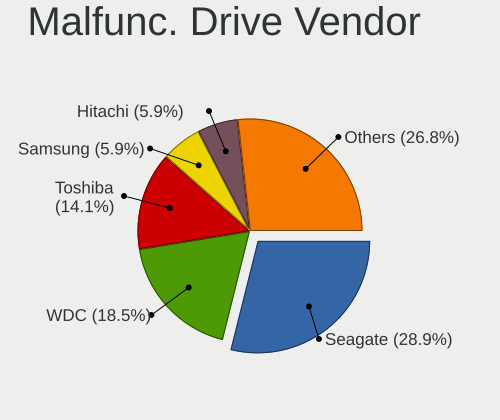

| Vendor                         | Notebooks | Drives | Percent |
|--------------------------------|-----------|--------|---------|
| Seagate                        | 217       | 243    | 28.89%  |
| WDC                            | 139       | 155    | 18.51%  |
| Toshiba                        | 106       | 118    | 14.11%  |
| Samsung Electronics            | 44        | 56     | 5.86%   |
| Hitachi                        | 44        | 48     | 5.86%   |
| Kingston                       | 35        | 41     | 4.66%   |
| China                          | 27        | 29     | 3.6%    |
| SanDisk                        | 26        | 28     | 3.46%   |
| HGST                           | 20        | 21     | 2.66%   |
| A-DATA Technology              | 18        | 23     | 2.4%    |
| Fujitsu                        | 7         | 8      | 0.93%   |
| LITEON                         | 5         | 6      | 0.67%   |
| PNY                            | 4         | 6      | 0.53%   |
| Netac                          | 4         | 4      | 0.53%   |
| Micron Technology              | 4         | 11     | 0.53%   |
| KingSpec                       | 4         | 4      | 0.53%   |
| Intel                          | 4         | 4      | 0.53%   |
| SK hynix                       | 3         | 3      | 0.4%    |
| Crucial                        | 3         | 3      | 0.4%    |
| XrayDisk                       | 2         | 2      | 0.27%   |
| XPG                            | 2         | 2      | 0.27%   |
| walram                         | 2         | 2      | 0.27%   |
| SSSTC                          | 2         | 2      | 0.27%   |
| Solid State Storage Technology | 2         | 2      | 0.27%   |
| Silicon Motion                 | 2         | 2      | 0.27%   |
| SAGE                           | 2         | 2      | 0.27%   |
| Apple                          | 2         | 2      | 0.27%   |
| ADATA Technology               | 2         | 2      | 0.27%   |
| SuperSSpeed                    | 1         | 1      | 0.13%   |
| SPCC                           | 1         | 1      | 0.13%   |
| ShiJi                          | 1         | 7      | 0.13%   |
| RZX                            | 1         | 1      | 0.13%   |
| Realtek Semiconductor          | 1         | 1      | 0.13%   |
| Patriot                        | 1         | 1      | 0.13%   |
| OCZ                            | 1         | 1      | 0.13%   |
| MAXIO Technology (Hangzhou)    | 1         | 1      | 0.13%   |
| Mancer                         | 1         | 1      | 0.13%   |
| LITEONIT                       | 1         | 2      | 0.13%   |
| Lite-On Technology             | 1         | 2      | 0.13%   |
| Kross Elegance                 | 1         | 1      | 0.13%   |

Malfunc. HDD Vendor
-------------------

Vendors of faulty HDD drives

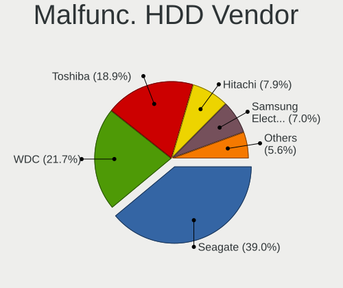

| Vendor              | Notebooks | Drives | Percent |
|---------------------|-----------|--------|---------|
| Seagate             | 217       | 243    | 38.96%  |
| WDC                 | 121       | 136    | 21.72%  |
| Toshiba             | 105       | 117    | 18.85%  |
| Hitachi             | 44        | 48     | 7.9%    |
| Samsung Electronics | 39        | 51     | 7%      |
| HGST                | 20        | 21     | 3.59%   |
| Fujitsu             | 7         | 8      | 1.26%   |
| SAGE                | 2         | 2      | 0.36%   |
| JMicron Technology  | 1         | 1      | 0.18%   |
| Apple               | 1         | 1      | 0.18%   |

Malfunc. Drive Kind
-------------------

Kinds of faulty drives

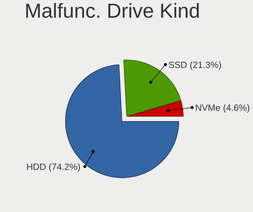

| Kind | Notebooks | Drives | Percent |
|------|-----------|--------|---------|
| HDD  | 554       | 628    | 74.16%  |
| SSD  | 159       | 181    | 21.29%  |
| NVMe | 34        | 47     | 4.55%   |

Failed Drives
-------------

Failed drive models

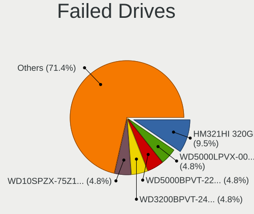

| Model                                            | Notebooks | Drives | Percent |
|--------------------------------------------------|-----------|--------|---------|
| Samsung Electronics HM321HI 320GB                | 2         | 2      | 9.52%   |
| WDC WD5000LPVX-00V0TT0 500GB                     | 1         | 1      | 4.76%   |
| WDC WD5000BPVT-22HXZT1 500GB                     | 1         | 1      | 4.76%   |
| WDC WD3200BPVT-24JJ5T0 320GB                     | 1         | 1      | 4.76%   |
| WDC WD10SPZX-75Z10T1 1TB                         | 1         | 1      | 4.76%   |
| WDC WD10SPZX-24Z10 1TB                           | 1         | 1      | 4.76%   |
| WDC WD10SPZX-22Z10T0 1TB                         | 1         | 1      | 4.76%   |
| Toshiba MQ01ABD100 1TB                           | 1         | 1      | 4.76%   |
| Toshiba MQ01ABD050 500GB                         | 1         | 1      | 4.76%   |
| Toshiba MK5065GSXN 500GB                         | 1         | 1      | 4.76%   |
| Seagate ST500LM012 HN-M500MBB 500GB              | 1         | 1      | 4.76%   |
| Seagate ST1000LM024 HN-M101MBB 1TB               | 1         | 1      | 4.76%   |
| Samsung Electronics MZNTY128HDHP-000H1 128GB SSD | 1         | 1      | 4.76%   |
| Samsung Electronics MZMPC032HBCD-000H1 32GB SSD  | 1         | 1      | 4.76%   |
| Samsung Electronics HM320JI 320GB                | 1         | 1      | 4.76%   |
| Samsung Electronics HM250HI 250GB                | 1         | 1      | 4.76%   |
| Maxtor STM380215AS 80GB                          | 1         | 1      | 4.76%   |
| Hitachi HTS545032B9A300 320GB                    | 1         | 1      | 4.76%   |
| HGST HTS541010A9E680 1TB                         | 1         | 1      | 4.76%   |
| Apple HDD HTS541010A9E662 1TB                    | 1         | 1      | 4.76%   |

Failed Drive Vendor
-------------------

Failed drive vendors

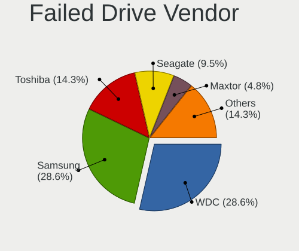

| Vendor              | Notebooks | Drives | Percent |
|---------------------|-----------|--------|---------|
| WDC                 | 6         | 6      | 28.57%  |
| Samsung Electronics | 6         | 6      | 28.57%  |
| Toshiba             | 3         | 3      | 14.29%  |
| Seagate             | 2         | 2      | 9.52%   |
| Maxtor              | 1         | 1      | 4.76%   |
| Hitachi             | 1         | 1      | 4.76%   |
| HGST                | 1         | 1      | 4.76%   |
| Apple               | 1         | 1      | 4.76%   |

Drive Status
------------

Number of failed and malfunc. drives

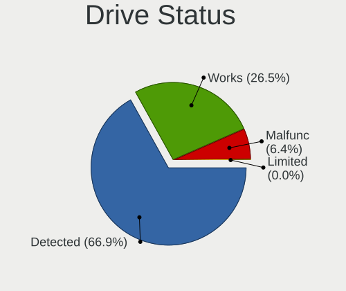

| Status   | Notebooks | Drives | Percent |
|----------|-----------|--------|---------|
| Detected | 7643      | 11739  | 66.91%  |
| Works    | 3030      | 4345   | 26.53%  |
| Malfunc  | 728       | 856    | 6.37%   |
| Failed   | 21        | 21     | 0.18%   |
| Limited  | 1         | 1      | 0.01%   |

Storage controller
------------------

Storage Vendor
--------------

Storage controller vendors

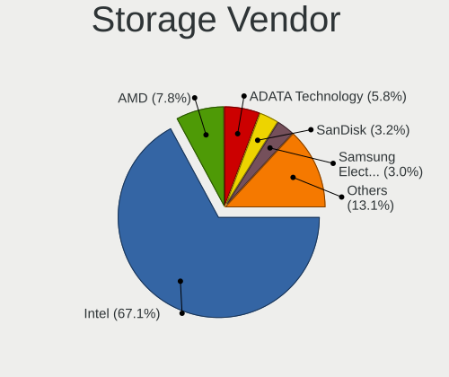

| Vendor                                  | Notebooks | Percent |
|-----------------------------------------|-----------|---------|
| Intel                                   | 8608      | 67.12%  |
| AMD                                     | 1002      | 7.81%   |
| ADATA Technology                        | 738       | 5.75%   |
| SanDisk                                 | 413       | 3.22%   |
| Samsung Electronics                     | 381       | 2.97%   |
| Solid State Storage Technology          | 280       | 2.18%   |
| SK hynix                                | 249       | 1.94%   |
| Kingston Technology Company             | 213       | 1.66%   |
| Silicon Motion                          | 138       | 1.08%   |
| Silicon Integrated Systems [SiS]        | 115       | 0.9%    |
| Micron Technology                       | 97        | 0.76%   |
| MAXIO Technology (Hangzhou)             | 83        | 0.65%   |
| Phison Electronics                      | 76        | 0.59%   |
| KIOXIA                                  | 75        | 0.58%   |
| Realtek Semiconductor                   | 71        | 0.55%   |
| Nvidia                                  | 55        | 0.43%   |
| Micron/Crucial Technology               | 37        | 0.29%   |
| Toshiba America Info Systems            | 35        | 0.27%   |
| VIA Technologies                        | 29        | 0.23%   |
| Shenzhen Longsys Electronics            | 29        | 0.23%   |
| Lite-On Technology                      | 27        | 0.21%   |
| Netac Technology                        | 14        | 0.11%   |
| Marvell Technology Group                | 13        | 0.1%    |
| Apple                                   | 11        | 0.09%   |
| Union Memory (Shenzhen)                 | 10        | 0.08%   |
| O2 Micro                                | 7         | 0.05%   |
| INNOGRIT                                | 5         | 0.04%   |
| Hosin Global Electronics                | 4         | 0.03%   |
| Shenzhen Unionmemory Information System | 2         | 0.02%   |
| TenaFe                                  | 1         | 0.01%   |
| Seagate Technology                      | 1         | 0.01%   |
| Lenovo                                  | 1         | 0.01%   |
| JMicron Technology                      | 1         | 0.01%   |
| Biwin Storage Technology                | 1         | 0.01%   |
| Beijing Starblaze Technology            | 1         | 0.01%   |
| ASMedia Technology                      | 1         | 0.01%   |

Storage Model
-------------

Storage controller models

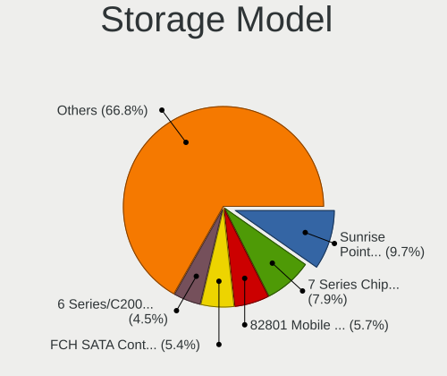

| Model                                                                            | Notebooks | Percent |
|----------------------------------------------------------------------------------|-----------|---------|
| Intel Sunrise Point-LP SATA Controller [AHCI mode]                               | 1354      | 9.69%   |
| Intel 7 Series Chipset Family 6-port SATA Controller [AHCI mode]                 | 1099      | 7.87%   |
| Intel 82801 Mobile SATA Controller [RAID mode]                                   | 796       | 5.7%    |
| AMD FCH SATA Controller [AHCI mode]                                              | 760       | 5.44%   |
| Intel 6 Series/C200 Series Chipset Family 6 port Mobile SATA AHCI Controller     | 629       | 4.5%    |
| Intel 8 Series SATA Controller 1 [AHCI mode]                                     | 524       | 3.75%   |
| Intel Wildcat Point-LP SATA Controller [AHCI Mode]                               | 417       | 2.98%   |
| Intel 5 Series/3400 Series Chipset 4 port SATA AHCI Controller                   | 396       | 2.83%   |
| Intel Tiger Lake-LP SATA Controller                                              | 336       | 2.4%    |
| Intel 82801IBM/IEM (ICH9M/ICH9M-E) 4 port SATA Controller [AHCI mode]            | 316       | 2.26%   |
| Intel Volume Management Device NVMe RAID Controller                              | 311       | 2.23%   |
| Intel Cannon Point-LP SATA Controller [AHCI Mode]                                | 278       | 1.99%   |
| ADATA IM2P33F8 series NVMe SSD (DRAM-less)                                       | 218       | 1.56%   |
| Intel Comet Lake SATA AHCI Controller                                            | 216       | 1.55%   |
| Intel PROSet/Wireless WiFi Software extension                                    | 212       | 1.52%   |
| Solid State Storage CL1-3D256-Q11 NVMe SSD M.2                                   | 208       | 1.49%   |
| Intel Celeron/Pentium Silver Processor SATA Controller                           | 207       | 1.48%   |
| Intel Cannon Lake Mobile PCH SATA AHCI Controller                                | 204       | 1.46%   |
| ADATA IM2P33F3 NVMe SSD (DRAM-less)                                              | 202       | 1.45%   |
| Intel 82801HM/HEM (ICH8M/ICH8M-E) IDE Controller                                 | 184       | 1.32%   |
| AMD SB7x0/SB8x0/SB9x0 SATA Controller [AHCI mode]                                | 177       | 1.27%   |
| Intel HM170/QM170 Chipset SATA Controller [AHCI Mode]                            | 172       | 1.23%   |
| Intel 82801HM/HEM (ICH8M/ICH8M-E) SATA Controller [AHCI mode]                    | 165       | 1.18%   |
| SanDisk Ultra 3D / WD PC SN530, IX SN530, Blue SN550 NVMe SSD (DRAM-less)        | 151       | 1.08%   |
| Samsung NVMe SSD Controller 980 (DRAM-less)                                      | 136       | 0.97%   |
| Silicon Motion SM2263EN/SM2263XT (DRAM-less) NVMe SSD Controllers                | 129       | 0.92%   |
| Intel Atom Processor E3800 Series SATA AHCI Controller                           | 125       | 0.89%   |
| Intel Alder Lake-P SATA AHCI Controller                                          | 124       | 0.89%   |
| Silicon Integrated Systems [SiS] 5513 IDE Controller                             | 113       | 0.81%   |
| Samsung NVMe SSD Controller SM981/PM981/PM983                                    | 111       | 0.79%   |
| Intel 5 Series/3400 Series Chipset 6 port SATA AHCI Controller                   | 111       | 0.79%   |
| Intel Atom/Celeron/Pentium Processor x5-E8000/J3xxx/N3xxx Series SATA Controller | 110       | 0.79%   |
| ADATA SM2P32A8 NVMe SSD (DRAM-less)                                              | 109       | 0.78%   |
| Intel NM10/ICH7 Family SATA Controller [AHCI mode]                               | 98        | 0.7%    |
| Intel Ice Lake-LP SATA Controller [AHCI mode]                                    | 95        | 0.68%   |
| Silicon Integrated Systems [SiS] SATA Controller / IDE mode                      | 93        | 0.67%   |
| Intel 400 Series Chipset Family SATA AHCI Controller                             | 91        | 0.65%   |
| SK hynix BC901 NVMe Solid State Drive (DRAM-less)                                | 87        | 0.62%   |
| Intel 8 Series/C220 Series Chipset Family 6-port SATA Controller 1 [AHCI mode]   | 87        | 0.62%   |
| Intel Tiger Lake SATA AHCI Controller                                            | 86        | 0.62%   |

Storage Kind
------------

Kind of storage controller (IDE, SATA, NVMe, SAS, ...)

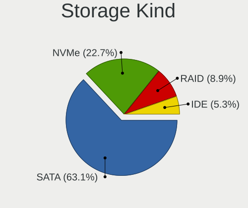

| Kind | Notebooks | Percent |
|------|-----------|---------|
| SATA | 8435      | 63.06%  |
| NVMe | 3037      | 22.7%   |
| RAID | 1189      | 8.89%   |
| IDE  | 715       | 5.35%   |

Processor
---------

CPU Vendor
----------

Processor vendors

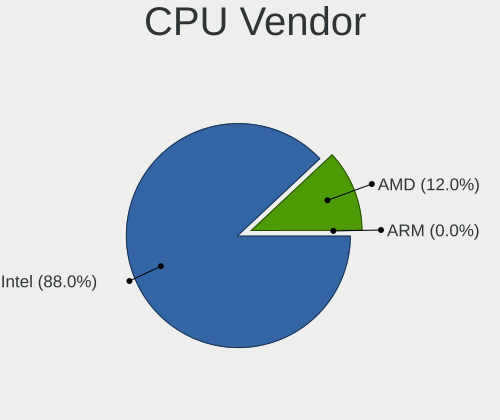

| Vendor | Notebooks | Percent |
|--------|-----------|---------|
| Intel  | 9529      | 88.02%  |
| AMD    | 1295      | 11.96%  |
| ARM    | 2         | 0.02%   |

CPU Model
---------

Processor models

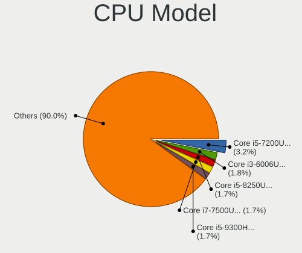

| Model                                         | Notebooks | Percent |
|-----------------------------------------------|-----------|---------|
| Intel Core i5-7200U CPU @ 2.50GHz             | 342       | 3.16%   |
| Intel Core i3-6006U CPU @ 2.00GHz             | 197       | 1.82%   |
| Intel Core i5-8250U CPU @ 1.60GHz             | 187       | 1.73%   |
| Intel Core i7-7500U CPU @ 2.70GHz             | 183       | 1.69%   |
| Intel Core i5-9300H CPU @ 2.40GHz             | 180       | 1.66%   |
| Intel Core i5-8265U CPU @ 1.60GHz             | 174       | 1.61%   |
| Intel 11th Gen Core i5-1135G7 @ 2.40GHz       | 170       | 1.57%   |
| Intel Core i5-5200U CPU @ 2.20GHz             | 169       | 1.56%   |
| Intel Core i7-8565U CPU @ 1.80GHz             | 165       | 1.52%   |
| Intel 11th Gen Core i7-1165G7 @ 2.80GHz       | 150       | 1.38%   |
| AMD Ryzen 5 3500U with Radeon Vega Mobile Gfx | 146       | 1.35%   |
| Intel Core i7-8550U CPU @ 1.80GHz             | 145       | 1.34%   |
| Intel Atom x5-Z8350 CPU @ 1.44GHz             | 141       | 1.3%    |
| Intel Core i7-9750H CPU @ 2.60GHz             | 140       | 1.29%   |
| Intel Core i5-10210U CPU @ 1.60GHz            | 122       | 1.13%   |
| Intel Core i7-5500U CPU @ 2.40GHz             | 120       | 1.11%   |
| Intel Core i5-4210U CPU @ 1.70GHz             | 119       | 1.1%    |
| Intel Core i3-7020U CPU @ 2.30GHz             | 118       | 1.09%   |
| Intel Core i7-7700HQ CPU @ 2.80GHz            | 117       | 1.08%   |
| Intel Core i5-3230M CPU @ 2.60GHz             | 117       | 1.08%   |
| Intel Core i5-3210M CPU @ 2.50GHz             | 117       | 1.08%   |
| Intel Core i7-10510U CPU @ 1.80GHz            | 112       | 1.03%   |
| Intel Core i5-2450M CPU @ 2.50GHz             | 112       | 1.03%   |
| Intel Core i3-3110M CPU @ 2.40GHz             | 112       | 1.03%   |
| Intel Core i5-4200U CPU @ 1.60GHz             | 110       | 1.02%   |
| Intel Core i3-3217U CPU @ 1.80GHz             | 108       | 1%      |
| Intel Core i5-1035G1 CPU @ 1.00GHz            | 101       | 0.93%   |
| Intel Celeron N4020 CPU @ 1.10GHz             | 101       | 0.93%   |
| Intel Core i5-2410M CPU @ 2.30GHz             | 95        | 0.88%   |
| Intel Core i5-3337U CPU @ 1.80GHz             | 93        | 0.86%   |
| Intel Core i3-4005U CPU @ 1.70GHz             | 91        | 0.84%   |
| Intel Core i3 CPU M 370 @ 2.40GHz             | 90        | 0.83%   |
| Intel Core i3-2310M CPU @ 2.10GHz             | 87        | 0.8%    |
| AMD Ryzen 5 5500U with Radeon Graphics        | 86        | 0.79%   |
| Intel Core i3-5005U CPU @ 2.00GHz             | 82        | 0.76%   |
| Intel Core i5-6200U CPU @ 2.30GHz             | 80        | 0.74%   |
| Intel Core i7-4500U CPU @ 1.80GHz             | 79        | 0.73%   |
| AMD Ryzen 7 5700U with Radeon Graphics        | 79        | 0.73%   |
| AMD Ryzen 7 4800H with Radeon Graphics        | 77        | 0.71%   |
| Intel Core i5 CPU M 480 @ 2.67GHz             | 74        | 0.68%   |

CPU Model Family
----------------

Processor model prefix

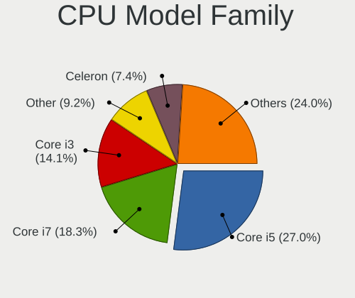

| Model                          | Notebooks | Percent |
|--------------------------------|-----------|---------|
| Intel Core i5                  | 2927      | 27.02%  |
| Intel Core i7                  | 1978      | 18.26%  |
| Intel Core i3                  | 1531      | 14.13%  |
| Other                          | 1001      | 9.24%   |
| Intel Celeron                  | 797       | 7.36%   |
| AMD Ryzen 5                    | 402       | 3.71%   |
| Intel Core 2 Duo               | 370       | 3.42%   |
| Intel Atom                     | 350       | 3.23%   |
| AMD Ryzen 7                    | 326       | 3.01%   |
| Intel Pentium                  | 196       | 1.81%   |
| Intel Pentium Dual-Core        | 175       | 1.62%   |
| Intel Pentium Dual             | 88        | 0.81%   |
| AMD E                          | 74        | 0.68%   |
| AMD C-60                       | 46        | 0.42%   |
| AMD E1                         | 45        | 0.42%   |
| AMD A4                         | 37        | 0.34%   |
| AMD A6                         | 34        | 0.31%   |
| Intel Genuine                  | 32        | 0.3%    |
| Intel Core                     | 31        | 0.29%   |
| AMD Ryzen 3                    | 31        | 0.29%   |
| AMD A10                        | 28        | 0.26%   |
| Intel Core 2                   | 27        | 0.25%   |
| AMD C-70                       | 27        | 0.25%   |
| AMD C-50                       | 23        | 0.21%   |
| Intel Celeron Dual-Core        | 21        | 0.19%   |
| AMD A12                        | 20        | 0.18%   |
| AMD Ryzen 9                    | 16        | 0.15%   |
| Intel Celeron M                | 15        | 0.14%   |
| AMD Ryzen 7 PRO                | 12        | 0.11%   |
| AMD Mobile Sempron             | 12        | 0.11%   |
| AMD Athlon II                  | 12        | 0.11%   |
| AMD Ryzen 5 PRO                | 10        | 0.09%   |
| AMD A8                         | 10        | 0.09%   |
| AMD Turion 64 X2 Mobile        | 9         | 0.08%   |
| Intel Xeon                     | 8         | 0.07%   |
| Intel Core i9                  | 8         | 0.07%   |
| Intel Pentium Gold             | 7         | 0.06%   |
| AMD Turion 64 Mobile           | 7         | 0.06%   |
| AMD Ryzen 3 PRO                | 7         | 0.06%   |
| AMD Turion X2 Dual-Core Mobile | 6         | 0.06%   |

CPU Cores
---------

Number of processor cores

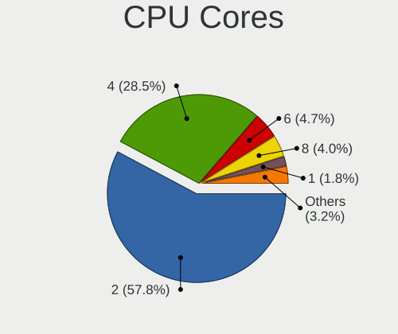

| Number  | Notebooks | Percent |
|---------|-----------|---------|
| 2       | 6258      | 57.78%  |
| 4       | 3091      | 28.54%  |
| 6       | 510       | 4.71%   |
| 8       | 432       | 3.99%   |
| 1       | 197       | 1.82%   |
| 10      | 169       | 1.56%   |
| 14      | 71        | 0.66%   |
| 12      | 48        | 0.44%   |
| 16      | 27        | 0.25%   |
| 24      | 13        | 0.12%   |
| 5       | 6         | 0.06%   |
| 3       | 3         | 0.03%   |
| Unknown | 3         | 0.03%   |
| 20      | 2         | 0.02%   |
| 13      | 1         | 0.01%   |

CPU Sockets
-----------

Number of sockets

| Number | Notebooks | Percent |
|--------|-----------|---------|
| 1      | 10826     | 100%    |

CPU Threads
-----------

Threads per core (Hyper-Threading)

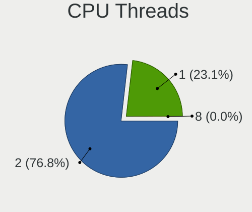

| Number  | Notebooks | Percent |
|---------|-----------|---------|
| 2       | 8328      | 76.82%  |
| 1       | 2509      | 23.14%  |
| Unknown | 3         | 0.03%   |
| 8       | 1         | 0.01%   |

CPU Op-Modes
------------

CPU Operation Modes (32-bit, 64-bit)

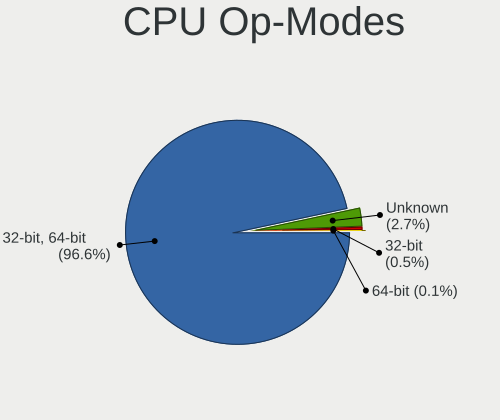

| Op mode        | Notebooks | Percent |
|----------------|-----------|---------|
| 32-bit, 64-bit | 10503     | 96.64%  |
| Unknown        | 297       | 2.73%   |
| 32-bit         | 53        | 0.49%   |
| 64-bit         | 15        | 0.14%   |

CPU Microcode
-------------

Microcode number

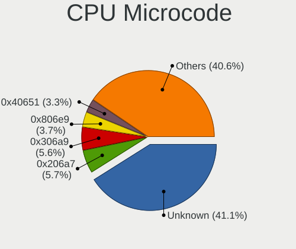

| Number     | Notebooks | Percent |
|------------|-----------|---------|
| Unknown    | 4631      | 41.07%  |
| 0x206a7    | 644       | 5.71%   |
| 0x306a9    | 634       | 5.62%   |
| 0x806e9    | 421       | 3.73%   |
| 0x40651    | 373       | 3.31%   |
| 0x806ec    | 339       | 3.01%   |
| 0x20655    | 321       | 2.85%   |
| 0x906ea    | 302       | 2.68%   |
| 0x306d4    | 298       | 2.64%   |
| 0x406e3    | 286       | 2.54%   |
| 0x1067a    | 283       | 2.51%   |
| 0x806ea    | 264       | 2.34%   |
| 0x806c1    | 236       | 2.09%   |
| 0x406c4    | 171       | 1.52%   |
| 0x6fd      | 156       | 1.38%   |
| 0x08108109 | 114       | 1.01%   |
| 0x05000119 | 99        | 0.88%   |
| 0x08600103 | 94        | 0.83%   |
| 0x30678    | 91        | 0.81%   |
| 0x706e5    | 89        | 0.79%   |
| 0x906e9    | 87        | 0.77%   |
| 0x08108102 | 70        | 0.62%   |
| 0x706a1    | 66        | 0.59%   |
| 0x406c3    | 65        | 0.58%   |
| 0x706a8    | 62        | 0.55%   |
| 0x306c3    | 62        | 0.55%   |
| 0x906ed    | 60        | 0.53%   |
| 0xa0652    | 57        | 0.51%   |
| 0x20652    | 56        | 0.5%    |
| 0x106ca    | 53        | 0.47%   |
| 0x806eb    | 50        | 0.44%   |
| 0x08608103 | 50        | 0.44%   |
| 0x30661    | 37        | 0.33%   |
| 0x10676    | 37        | 0.33%   |
| 0x506c9    | 33        | 0.29%   |
| 0x03000027 | 33        | 0.29%   |
| 0x0a50000c | 30        | 0.27%   |
| 0x05000029 | 30        | 0.27%   |
| 0x906a3    | 27        | 0.24%   |
| 0x10661    | 27        | 0.24%   |

CPU Microarch
-------------

Microarchitecture

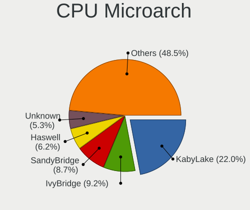

| Name              | Notebooks | Percent |
|-------------------|-----------|---------|
| KabyLake          | 2389      | 22.03%  |
| IvyBridge         | 1003      | 9.25%   |
| SandyBridge       | 945       | 8.71%   |
| Haswell           | 673       | 6.21%   |
| Unknown           | 570       | 5.26%   |
| Westmere          | 544       | 5.02%   |
| TigerLake         | 493       | 4.55%   |
| Silvermont        | 489       | 4.51%   |
| Skylake           | 484       | 4.46%   |
| Penryn            | 468       | 4.32%   |
| Broadwell         | 443       | 4.09%   |
| Core              | 289       | 2.67%   |
| Zen+              | 276       | 2.55%   |
| Icelake           | 217       | 2%      |
| Alderlake Hybrid  | 213       | 1.96%   |
| Goldmont plus     | 211       | 1.95%   |
| Bobcat            | 195       | 1.8%    |
| CometLake         | 153       | 1.41%   |
| Zen 2             | 140       | 1.29%   |
| Bonnell           | 139       | 1.28%   |
| Zen 3             | 87        | 0.8%    |
| Excavator         | 61        | 0.56%   |
| Goldmont          | 58        | 0.53%   |
| K8 Hammer         | 48        | 0.44%   |
| K10 Llano         | 44        | 0.41%   |
| Zen               | 42        | 0.39%   |
| Jaguar            | 34        | 0.31%   |
| K10               | 31        | 0.29%   |
| P6                | 25        | 0.23%   |
| Nehalem           | 17        | 0.16%   |
| Piledriver        | 16        | 0.15%   |
| Meteorlake Hybrid | 13        | 0.12%   |
| K8 & K10 hybrid   | 11        | 0.1%    |
| Gracemont         | 10        | 0.09%   |
| Puma              | 5         | 0.05%   |
| Steamroller       | 3         | 0.03%   |
| Lunarlake Hybrid  | 3         | 0.03%   |
| Tremont           | 1         | 0.01%   |
| NetBurst          | 1         | 0.01%   |

Graphics
--------

GPU Vendor
----------

Vendors of graphics cards

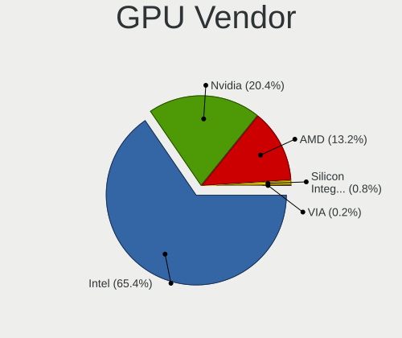

| Vendor                           | Notebooks | Percent |
|----------------------------------|-----------|---------|
| Intel                            | 9144      | 65.45%  |
| Nvidia                           | 2846      | 20.37%  |
| AMD                              | 1838      | 13.16%  |
| Silicon Integrated Systems [SiS] | 114       | 0.82%   |
| VIA Technologies                 | 29        | 0.21%   |

GPU Model
---------

Graphics card models

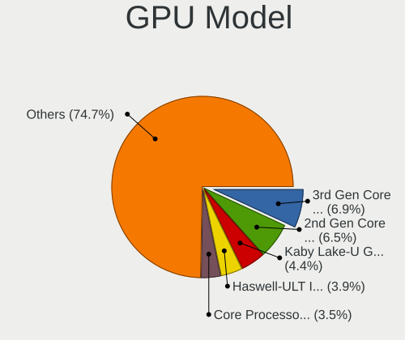

| Model                                                                                    | Notebooks | Percent |
|------------------------------------------------------------------------------------------|-----------|---------|
| Intel 3rd Gen Core processor Graphics Controller                                         | 988       | 6.91%   |
| Intel 2nd Generation Core Processor Family Integrated Graphics Controller                | 925       | 6.47%   |
| Intel Kaby Lake-U GT2 [HD Graphics 620]                                                  | 635       | 4.44%   |
| Intel Haswell-ULT Integrated Graphics Controller                                         | 562       | 3.93%   |
| Intel Core Processor Integrated Graphics Controller                                      | 507       | 3.54%   |
| Nvidia TU117M [GeForce GTX 1650 Mobile / Max-Q]                                          | 494       | 3.45%   |
| Intel CoffeeLake-H GT2 [UHD Graphics 630]                                                | 442       | 3.09%   |
| Intel Kaby Lake-R GT2 [UHD Graphics 620]                                                 | 417       | 2.92%   |
| Intel TigerLake-LP GT2 [Iris Xe Graphics]                                                | 398       | 2.78%   |
| Intel Broadwell-U GT2 [HD Graphics 5500]                                                 | 398       | 2.78%   |
| Intel Skylake-U GT2 [HD Graphics 520]                                                    | 384       | 2.68%   |
| Intel WhiskeyLake-U GT2 [UHD Graphics 620]                                               | 360       | 2.52%   |
| Intel Atom/Celeron/Pentium Processor x5-E8000/J3xxx/N3xxx Integrated Graphics Controller | 351       | 2.45%   |
| Intel Mobile 4 Series Chipset Integrated Graphics Controller                             | 332       | 2.32%   |
| AMD Picasso/Raven 2 [Radeon Vega Series / Radeon Vega Mobile Series]                     | 274       | 1.92%   |
| Intel CometLake-U GT2 [UHD Graphics]                                                     | 252       | 1.76%   |
| Intel GeminiLake [UHD Graphics 600]                                                      | 211       | 1.48%   |
| AMD Topaz XT [Radeon R7 M260/M265 / M340/M360 / M440/M445 / 530/535 / 620/625 Mobile]    | 196       | 1.37%   |
| Intel Mobile GM965/GL960 Integrated Graphics Controller (secondary)                      | 177       | 1.24%   |
| Intel Mobile GM965/GL960 Integrated Graphics Controller (primary)                        | 177       | 1.24%   |
| AMD Lucienne                                                                             | 171       | 1.2%    |
| Intel Kaby Lake-H GT2 [HD Graphics 630]                                                  | 152       | 1.06%   |
| Intel Iris Plus Graphics G1 (Ice Lake)                                                   | 142       | 0.99%   |
| Intel Atom Processor Z36xxx/Z37xxx Series Graphics & Display                             | 138       | 0.96%   |
| AMD Renoir [Radeon Vega Series / Radeon Vega Mobile Series]                              | 136       | 0.95%   |
| Nvidia GM108M [GeForce 940MX]                                                            | 135       | 0.94%   |
| Nvidia GM108M [GeForce MX110]                                                            | 130       | 0.91%   |
| Nvidia GP108M [GeForce MX150]                                                            | 129       | 0.9%    |
| Nvidia GF117M [GeForce 610M/710M/810M/820M / GT 620M/625M/630M/720M]                     | 119       | 0.83%   |
| Silicon Integrated Systems [SiS] 771/671 PCIE VGA Display Adapter                        | 111       | 0.78%   |
| Nvidia GP107M [GeForce GTX 1050 Mobile]                                                  | 111       | 0.78%   |
| Nvidia GP107M [GeForce GTX 1050 Ti Mobile]                                               | 109       | 0.76%   |
| Intel CometLake-H GT2 [UHD Graphics]                                                     | 105       | 0.73%   |
| Intel 4th Gen Core Processor Integrated Graphics Controller                              | 98        | 0.69%   |
| Intel Tiger Lake-LP GT2 [UHD Graphics G4]                                                | 95        | 0.66%   |
| Intel TigerLake-H GT1 [UHD Graphics]                                                     | 91        | 0.64%   |
| Nvidia GA107M [GeForce RTX 3050 Mobile]                                                  | 74        | 0.52%   |
| Intel Alder Lake-P GT2 [Iris Xe Graphics]                                                | 74        | 0.52%   |
| Intel Atom Processor D4xx/D5xx/N4xx/N5xx Integrated Graphics Controller                  | 70        | 0.49%   |
| Intel Alder Lake-UP3 GT2 [Iris Xe Graphics]                                              | 70        | 0.49%   |

GPU Combo
---------

Combinations of graphics cards

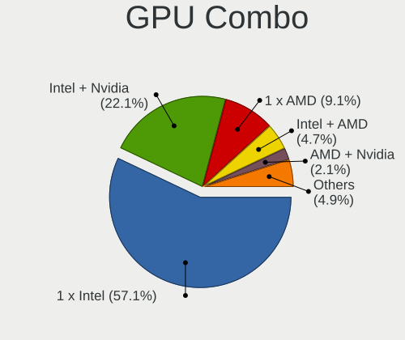

| Name           | Notebooks | Percent |
|----------------|-----------|---------|
| 1 x Intel      | 6194      | 57.05%  |
| Intel + Nvidia | 2396      | 22.07%  |
| 1 x AMD        | 991       | 9.13%   |
| Intel + AMD    | 514       | 4.73%   |
| AMD + Nvidia   | 228       | 2.1%    |
| 1 x Nvidia     | 226       | 2.08%   |
| 1 x SiS        | 114       | 1.05%   |
| 2 x AMD        | 105       | 0.97%   |
| 2 x Intel      | 55        | 0.51%   |
| 1 x VIA        | 29        | 0.27%   |
| Other          | 4         | 0.04%   |
| 2 x Nvidia     | 1         | 0.01%   |

GPU Driver
----------

Free vs proprietary

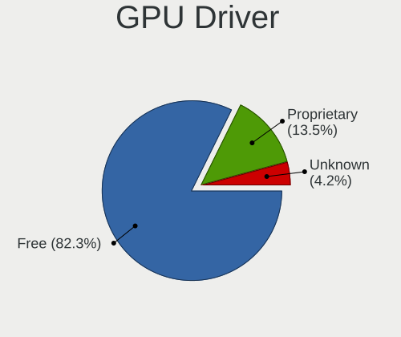

| Driver      | Notebooks | Percent |
|-------------|-----------|---------|
| Free        | 9014      | 82.31%  |
| Proprietary | 1476      | 13.48%  |
| Unknown     | 461       | 4.21%   |

GPU Memory
----------

Total video memory

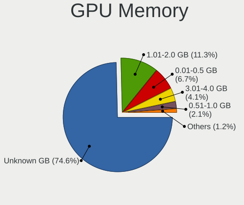

| Size in GB | Notebooks | Percent |
|------------|-----------|---------|
| Unknown    | 8253      | 74.61%  |
| 1.01-2.0   | 1245      | 11.25%  |
| 0.01-0.5   | 742       | 6.71%   |
| 3.01-4.0   | 452       | 4.09%   |
| 0.51-1.0   | 233       | 2.11%   |
| 5.01-6.0   | 90        | 0.81%   |
| 7.01-8.0   | 25        | 0.23%   |
| 2.01-3.0   | 19        | 0.17%   |
| 8.01-16.0  | 3         | 0.03%   |

Monitor
-------

Monitor Vendor
--------------

Monitor vendors

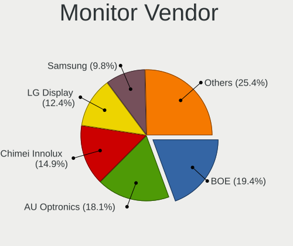

| Vendor                  | Notebooks | Percent |
|-------------------------|-----------|---------|
| BOE                     | 2434      | 19.4%   |
| AU Optronics            | 2267      | 18.07%  |
| Chimei Innolux          | 1871      | 14.92%  |
| LG Display              | 1558      | 12.42%  |
| Samsung Electronics     | 1232      | 9.82%   |
| Goldstar                | 708       | 5.64%   |
| Dell                    | 254       | 2.02%   |
| AOC                     | 248       | 1.98%   |
| Chi Mei Optoelectronics | 194       | 1.55%   |
| Apple                   | 191       | 1.52%   |
| PANDA                   | 187       | 1.49%   |
| InfoVision              | 176       | 1.4%    |
| Philips                 | 133       | 1.06%   |
| Lenovo                  | 110       | 0.88%   |
| Acer                    | 81        | 0.65%   |
| CPT                     | 56        | 0.45%   |
| HannStar                | 55        | 0.44%   |
| Hewlett-Packard         | 52        | 0.41%   |
| LG Philips              | 51        | 0.41%   |
| Sony                    | 50        | 0.4%    |
| SLD                     | 44        | 0.35%   |
| InnoLux Display         | 41        | 0.33%   |
| Valve                   | 38        | 0.3%    |
| Sharp                   | 37        | 0.29%   |
| MTD                     | 23        | 0.18%   |
| VIE                     | 21        | 0.17%   |
| Panasonic               | 20        | 0.16%   |
| CSOT                    | 20        | 0.16%   |
| KDC                     | 19        | 0.15%   |
| KDB                     | 18        | 0.14%   |
| Unknown (XXX)           | 17        | 0.14%   |
| GDH                     | 16        | 0.13%   |
| ASUSTek Computer        | 16        | 0.13%   |
| STA                     | 14        | 0.11%   |
| Toshiba                 | 13        | 0.1%    |
| BenQ                    | 12        | 0.1%    |
| RTK                     | 11        | 0.09%   |
| NCS                     | 11        | 0.09%   |
| Unknown                 | 10        | 0.08%   |
| SKY                     | 10        | 0.08%   |

Monitor Model
-------------

Monitor models

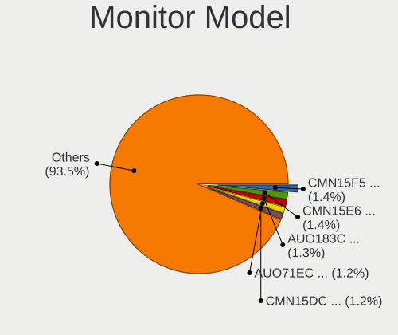

| Model                                                                | Notebooks | Percent |
|----------------------------------------------------------------------|-----------|---------|
| Chimei Innolux LCD Monitor CMN15F5 1920x1080 344x193mm 15.5-inch     | 176       | 1.39%   |
| Chimei Innolux LCD Monitor CMN15E6 1366x768 344x193mm 15.5-inch      | 173       | 1.37%   |
| AU Optronics LCD Monitor AUO183C 1366x768 309x173mm 13.9-inch        | 165       | 1.31%   |
| AU Optronics LCD Monitor AUO71EC 1366x768 344x193mm 15.5-inch        | 154       | 1.22%   |
| Chimei Innolux LCD Monitor CMN15DC 1366x768 344x193mm 15.5-inch      | 150       | 1.19%   |
| Chimei Innolux LCD Monitor CMN15DB 1366x768 344x193mm 15.5-inch      | 143       | 1.13%   |
| BOE LCD Monitor BOE0812 1920x1080 344x194mm 15.5-inch                | 143       | 1.13%   |
| AU Optronics LCD Monitor AUO81EC 1366x768 344x193mm 15.5-inch        | 131       | 1.04%   |
| Samsung Electronics LCD Monitor SEC5441 1280x800 331x207mm 15.4-inch | 127       | 1%      |
| LG Display LCD Monitor LGD02E9 1366x768 309x174mm 14.0-inch          | 126       | 1%      |
| AU Optronics LCD Monitor AUO21ED 1920x1080 344x193mm 15.5-inch       | 116       | 0.92%   |
| BOE LCD Monitor BOE0757 1366x768 344x194mm 15.5-inch                 | 109       | 0.86%   |
| AU Optronics LCD Monitor AUO38ED 1920x1080 344x193mm 15.5-inch       | 100       | 0.79%   |
| BOE LCD Monitor BOE0672 1366x768 344x194mm 15.5-inch                 | 93        | 0.74%   |
| Goldstar LG ULTRAWIDE GSM59F1 2560x1080 670x280mm 28.6-inch          | 89        | 0.7%    |
| LG Display LCD Monitor LGD0385 1366x768 309x174mm 14.0-inch          | 84        | 0.66%   |
| AU Optronics LCD Monitor AUO303C 1366x768 309x173mm 13.9-inch        | 84        | 0.66%   |
| InfoVision M140NWR2 R1 IVO057A 1366x768 309x174mm 14.0-inch          | 81        | 0.64%   |
| Goldstar HDR WFHD GSM7714 2560x1080 798x334mm 34.1-inch              | 80        | 0.63%   |
| LG Display LCD Monitor LGD02DC 1366x768 344x194mm 15.5-inch          | 76        | 0.6%    |
| BOE LCD Monitor BOE0818 1920x1080 344x194mm 15.5-inch                | 75        | 0.59%   |
| PANDA LCD Monitor NCP004D 1920x1080 344x194mm 15.5-inch              | 71        | 0.56%   |
| Chimei Innolux LCD Monitor CMN14D4 1920x1080 309x173mm 13.9-inch     | 71        | 0.56%   |
| Chimei Innolux LCD Monitor CMN15CA 1366x768 344x193mm 15.5-inch      | 67        | 0.53%   |
| BOE LCD Monitor BOE07CE 1366x768 344x193mm 15.5-inch                 | 66        | 0.52%   |
| Samsung Electronics LCD Monitor SEC4542 1366x768 309x174mm 14.0-inch | 65        | 0.51%   |
| AU Optronics LCD Monitor AUO2E3C 1366x768 309x173mm 13.9-inch        | 62        | 0.49%   |
| Chimei Innolux LCD Monitor CMN1470 1366x768 309x174mm 14.0-inch      | 61        | 0.48%   |
| BOE LCD Monitor BOE0696 1366x768 309x173mm 13.9-inch                 | 61        | 0.48%   |
| BOE LCD Monitor BOE08D5 1920x1080 344x194mm 15.5-inch                | 60        | 0.47%   |
| Chimei Innolux LCD Monitor CMN14C3 1366x768 309x173mm 13.9-inch      | 57        | 0.45%   |
| BOE LCD Monitor BOE0808 1366x768 344x194mm 15.5-inch                 | 57        | 0.45%   |
| AU Optronics LCD Monitor AUOAF90 1920x1080 344x193mm 15.5-inch       | 57        | 0.45%   |
| AU Optronics LCD Monitor AUO40EC 1366x768 344x193mm 15.5-inch        | 57        | 0.45%   |
| BOE LCD Monitor BOE0671 1366x768 344x194mm 15.5-inch                 | 56        | 0.44%   |
| BOE LCD Monitor BOE05B1 1366x768 309x173mm 13.9-inch                 | 56        | 0.44%   |
| LG Display LCD Monitor LGD033C 1366x768 309x174mm 14.0-inch          | 55        | 0.44%   |
| Goldstar FULL HD GSM5B55 1920x1080 480x270mm 21.7-inch               | 53        | 0.42%   |
| BOE LCD Monitor BOE07AA 1366x768 344x194mm 15.5-inch                 | 53        | 0.42%   |
| LG Display LCD Monitor LGD065A 1920x1080 344x194mm 15.5-inch         | 51        | 0.4%    |

Monitor Resolution
------------------

Monitor screen resolution

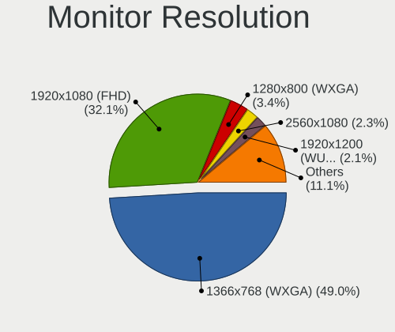

| Resolution         | Notebooks | Percent |
|--------------------|-----------|---------|
| 1366x768 (WXGA)    | 5852      | 49.05%  |
| 1920x1080 (FHD)    | 3826      | 32.07%  |
| 1280x800 (WXGA)    | 408       | 3.42%   |
| 2560x1080          | 272       | 2.28%   |
| 1920x1200 (WUXGA)  | 245       | 2.05%   |
| 1600x900 (HD+)     | 244       | 2.05%   |
| 3840x2160 (4K)     | 220       | 1.84%   |
| 1440x900 (WXGA+)   | 151       | 1.27%   |
| 2560x1440 (QHD)    | 129       | 1.08%   |
| 1360x768           | 97        | 0.81%   |
| 2560x1600          | 66        | 0.55%   |
| 1024x600           | 51        | 0.43%   |
| 2880x1800          | 49        | 0.41%   |
| 1680x1050 (WSXGA+) | 48        | 0.4%    |
| 1280x1024 (SXGA)   | 42        | 0.35%   |
| 800x1280           | 38        | 0.32%   |
| 1024x768 (XGA)     | 28        | 0.23%   |
| 1920x540           | 26        | 0.22%   |
| 1280x720 (HD)      | 15        | 0.13%   |
| 3840x2400          | 14        | 0.12%   |
| 1600x2560          | 14        | 0.12%   |
| Unknown            | 12        | 0.1%    |
| 3440x1440          | 11        | 0.09%   |
| 2288x1287          | 10        | 0.08%   |
| 3200x1800 (QHD+)   | 6         | 0.05%   |
| 1280x960           | 6         | 0.05%   |
| 3840x1080          | 5         | 0.04%   |
| 2160x1440          | 5         | 0.04%   |
| 2304x1440          | 4         | 0.03%   |
| 2240x1400          | 4         | 0.03%   |
| 2944x1840          | 3         | 0.03%   |
| 1680x945           | 3         | 0.03%   |
| 1024x576           | 3         | 0.03%   |
| 3200x2000          | 2         | 0.02%   |
| 3072x1920          | 2         | 0.02%   |
| 720x1280           | 1         | 0.01%   |
| 5760x2160          | 1         | 0.01%   |
| 4240x1080          | 1         | 0.01%   |
| 3926x1080          | 1         | 0.01%   |
| 3840x1600          | 1         | 0.01%   |

Monitor Diagonal
----------------

Diagonal size in inches

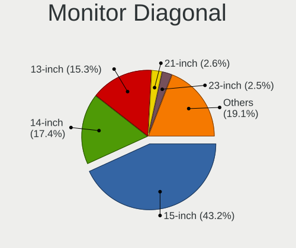

| Inches  | Notebooks | Percent |
|---------|-----------|---------|
| 15      | 5408      | 43.18%  |
| 14      | 2178      | 17.39%  |
| 13      | 1913      | 15.27%  |
| 21      | 322       | 2.57%   |
| 23      | 310       | 2.48%   |
| 17      | 269       | 2.15%   |
| 24      | 235       | 1.88%   |
| 18      | 224       | 1.79%   |
| 27      | 198       | 1.58%   |
| 11      | 171       | 1.37%   |
| 31      | 168       | 1.34%   |
| 34      | 157       | 1.25%   |
| 16      | 111       | 0.89%   |
| 19      | 85        | 0.68%   |
| 63      | 83        | 0.66%   |
| 12      | 80        | 0.64%   |
| 20      | 78        | 0.62%   |
| Unknown | 72        | 0.57%   |
| 10      | 59        | 0.47%   |
| 28      | 49        | 0.39%   |
| 40      | 44        | 0.35%   |
| 7       | 38        | 0.3%    |
| 54      | 35        | 0.28%   |
| 72      | 34        | 0.27%   |
| 32      | 31        | 0.25%   |
| 84      | 28        | 0.22%   |
| 52      | 28        | 0.22%   |
| 22      | 27        | 0.22%   |
| 26      | 12        | 0.1%    |
| 46      | 11        | 0.09%   |
| 37      | 10        | 0.08%   |
| 25      | 10        | 0.08%   |
| 65      | 7         | 0.06%   |
| 48      | 7         | 0.06%   |
| 58      | 6         | 0.05%   |
| 49      | 4         | 0.03%   |
| 86      | 3         | 0.02%   |
| 47      | 3         | 0.02%   |
| 55      | 2         | 0.02%   |
| 41      | 2         | 0.02%   |

Monitor Width
-------------

Physical width

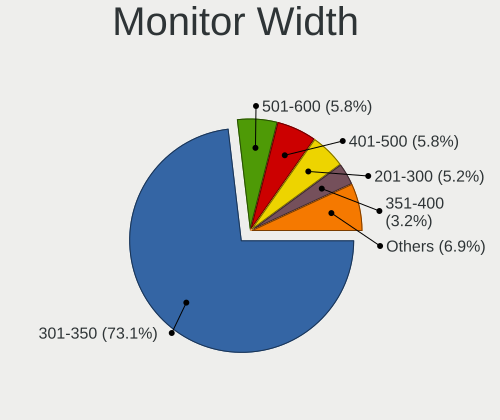

| Width in mm    | Notebooks | Percent |
|----------------|-----------|---------|
| 301-350        | 9097      | 73.13%  |
| 501-600        | 724       | 5.82%   |
| 401-500        | 721       | 5.8%    |
| 201-300        | 643       | 5.17%   |
| 351-400        | 396       | 3.18%   |
| 601-700        | 243       | 1.95%   |
| 1001-1500      | 192       | 1.54%   |
| 701-800        | 190       | 1.53%   |
| Unknown        | 72        | 0.58%   |
| 1501-2000      | 62        | 0.5%    |
| 801-900        | 56        | 0.45%   |
| 1-100          | 38        | 0.31%   |
| 901-1000       | 4         | 0.03%   |
| More than 2000 | 1         | 0.01%   |

Aspect Ratio
------------

Proportional relationship between the width and the height

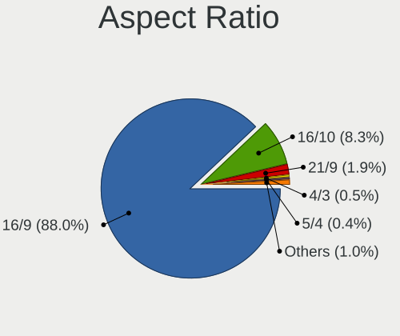

| Ratio   | Notebooks | Percent |
|---------|-----------|---------|
| 16/9    | 9554      | 87.97%  |
| 16/10   | 902       | 8.3%    |
| 21/9    | 206       | 1.9%    |
| 4/3     | 51        | 0.47%   |
| 5/4     | 44        | 0.41%   |
| 0.67    | 37        | 0.34%   |
| Unknown | 34        | 0.31%   |
| 3/2     | 18        | 0.17%   |
| 32/9    | 7         | 0.06%   |
| 0.56    | 4         | 0.04%   |
| 1.00    | 2         | 0.02%   |
| 2.00    | 1         | 0.01%   |
| 0.62    | 1         | 0.01%   |

Monitor Area
------------

Area in inch²

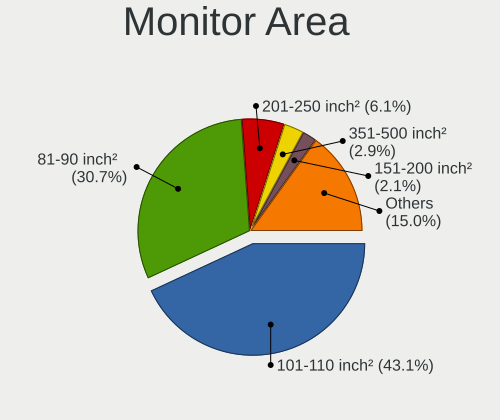

| Area in inch² | Notebooks | Percent |
|----------------|-----------|---------|
| 101-110        | 5389      | 43.07%  |
| 81-90          | 3846      | 30.74%  |
| 201-250        | 769       | 6.15%   |
| 351-500        | 367       | 2.93%   |
| 151-200        | 258       | 2.06%   |
| More than 1000 | 235       | 1.88%   |
| 141-150        | 235       | 1.88%   |
| 71-80          | 233       | 1.86%   |
| 301-350        | 205       | 1.64%   |
| 121-130        | 199       | 1.59%   |
| 51-60          | 171       | 1.37%   |
| 111-120        | 103       | 0.82%   |
| 251-300        | 99        | 0.79%   |
| 501-1000       | 82        | 0.66%   |
| Unknown        | 72        | 0.58%   |
| 61-70          | 62        | 0.5%    |
| 41-50          | 59        | 0.47%   |
| 91-100         | 48        | 0.38%   |
| 131-140        | 41        | 0.33%   |
| 1-40           | 38        | 0.3%    |

Pixel Density
-------------

Pixels per inch

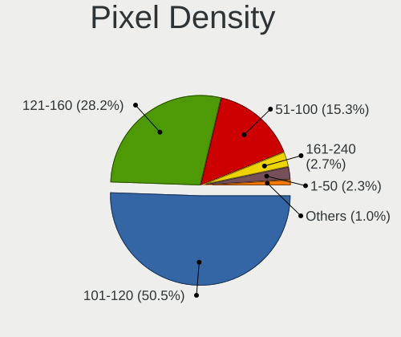

| Density       | Notebooks | Percent |
|---------------|-----------|---------|
| 101-120       | 6190      | 50.54%  |
| 121-160       | 3451      | 28.18%  |
| 51-100        | 1868      | 15.25%  |
| 161-240       | 332       | 2.71%   |
| 1-50          | 280       | 2.29%   |
| Unknown       | 72        | 0.59%   |
| More than 240 | 55        | 0.45%   |

Multiple Monitors
-----------------

Total monitors connected

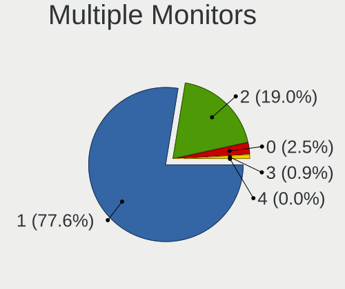

| Total | Notebooks | Percent |
|-------|-----------|---------|
| 1     | 8636      | 77.58%  |
| 2     | 2111      | 18.96%  |
| 0     | 277       | 2.49%   |
| 3     | 105       | 0.94%   |
| 4     | 3         | 0.03%   |

Network
-------

Net Controller Vendor
---------------------

Controller vendors

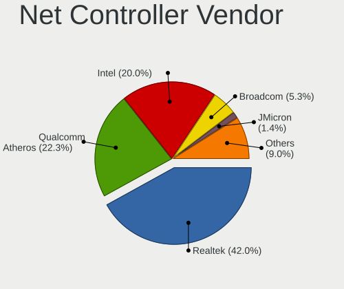

| Vendor                                 | Notebooks | Percent |
|----------------------------------------|-----------|---------|
| Realtek Semiconductor                  | 7833      | 41.98%  |
| Qualcomm Atheros                       | 4170      | 22.35%  |
| Intel                                  | 3740      | 20.04%  |
| Broadcom                               | 992       | 5.32%   |
| JMicron Technology                     | 254       | 1.36%   |
| Marvell Technology Group               | 234       | 1.25%   |
| Broadcom Limited                       | 208       | 1.11%   |
| Ralink                                 | 177       | 0.95%   |
| MediaTek                               | 163       | 0.87%   |
| Silicon Integrated Systems [SiS]       | 115       | 0.62%   |
| Ralink Technology                      | 110       | 0.59%   |
| TP-Link                                | 103       | 0.55%   |
| Samsung Electronics                    | 95        | 0.51%   |
| ASIX Electronics                       | 74        | 0.4%    |
| Motorola PCS                           | 43        | 0.23%   |
| Shenzhen Goodix Technology             | 42        | 0.23%   |
| Xiaomi                                 | 38        | 0.2%    |
| Nvidia                                 | 36        | 0.19%   |
| Qualcomm Atheros Communications        | 30        | 0.16%   |
| VIA Technologies                       | 29        | 0.16%   |
| D-Link                                 | 25        | 0.13%   |
| ICS Advent                             | 15        | 0.08%   |
| D-Link System                          | 13        | 0.07%   |
| DisplayLink                            | 11        | 0.06%   |
| Qualcomm                               | 9         | 0.05%   |
| Dell                                   | 9         | 0.05%   |
| QinHeng Electronics                    | 8         | 0.04%   |
| Lenovo                                 | 7         | 0.04%   |
| Suzhou Motorcomm Electronic Technology | 5         | 0.03%   |
| OPPO Electronics                       | 5         | 0.03%   |
| LG Electronics                         | 5         | 0.03%   |
| Ericsson Business Mobile Networks      | 5         | 0.03%   |
| Edimax Technology                      | 5         | 0.03%   |
| Attansic Technology                    | 5         | 0.03%   |
| Microsoft                              | 4         | 0.02%   |
| Huawei Technologies                    | 4         | 0.02%   |
| Motorcomm Microelectronics.            | 3         | 0.02%   |
| Micro Star International               | 3         | 0.02%   |
| AMD                                    | 3         | 0.02%   |
| Philips (or NXP)                       | 2         | 0.01%   |

Net Controller Model
--------------------

Controller models

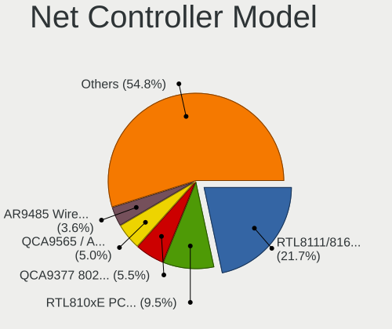

| Model                                                                  | Notebooks | Percent |
|------------------------------------------------------------------------|-----------|---------|
| Realtek RTL8111/8168/8211/8411 PCI Express Gigabit Ethernet Controller | 4449      | 21.66%  |
| Realtek RTL810xE PCI Express Fast Ethernet controller                  | 1942      | 9.46%   |
| Qualcomm Atheros QCA9377 802.11ac Wireless Network Adapter             | 1126      | 5.48%   |
| Qualcomm Atheros QCA9565 / AR9565 Wireless Network Adapter             | 1017      | 4.95%   |
| Qualcomm Atheros AR9485 Wireless Network Adapter                       | 742       | 3.61%   |
| Intel Wi-Fi 6 AX201                                                    | 452       | 2.2%    |
| Realtek RTL8188CE 802.11b/g/n WiFi Adapter                             | 392       | 1.91%   |
| Qualcomm Atheros QCA6174 802.11ac Wireless Network Adapter             | 392       | 1.91%   |
| Qualcomm Atheros AR9285 Wireless Network Adapter (PCI-Express)         | 386       | 1.88%   |
| Intel Wi-Fi 6 AX200                                                    | 376       | 1.83%   |
| Broadcom BCM4313 802.11bgn Wireless Network Adapter                    | 285       | 1.39%   |
| Intel Wireless 7265                                                    | 231       | 1.12%   |
| Realtek RTL8821CE 802.11ac PCIe Wireless Network Adapter               | 228       | 1.11%   |
| Intel Dual Band Wireless-AC 3165 Plus Bluetooth                        | 218       | 1.06%   |
| Intel Comet Lake PCH-LP CNVi WiFi                                      | 211       | 1.03%   |
| Realtek Killer E2600 GbE Controller                                    | 210       | 1.02%   |
| JMicron JMC250 PCI Express Gigabit Ethernet Controller                 | 187       | 0.91%   |
| Intel Cannon Point-LP CNVi [Wireless-AC]                               | 178       | 0.87%   |
| Intel Alder Lake-P PCH CNVi WiFi                                       | 171       | 0.83%   |
| Realtek RTL8822CE 802.11ac PCIe Wireless Network Adapter               | 151       | 0.74%   |
| Intel Wireless 7260                                                    | 136       | 0.66%   |
| Realtek RTL8153 Gigabit Ethernet Adapter                               | 135       | 0.66%   |
| Broadcom NetLink BCM57785 Gigabit Ethernet PCIe                        | 126       | 0.61%   |
| Intel Cannon Lake PCH CNVi WiFi                                        | 124       | 0.6%    |
| Realtek RTL8187B Wireless 802.11g 54Mbps Network Adapter               | 122       | 0.59%   |
| Intel 82579LM Gigabit Network Connection (Lewisville)                  | 119       | 0.58%   |
| Broadcom BCM4312 802.11b/g LP-PHY                                      | 116       | 0.56%   |
| Intel Wireless 3165                                                    | 114       | 0.56%   |
| Realtek RTL8723BE PCIe Wireless Network Adapter                        | 113       | 0.55%   |
| Silicon Integrated Systems [SiS] 191 Gigabit Ethernet Adapter          | 112       | 0.55%   |
| Intel Comet Lake PCH CNVi WiFi                                         | 111       | 0.54%   |
| Realtek RTL8188EE Wireless Network Adapter                             | 108       | 0.53%   |
| Marvell Group 88E8040 PCI-E Fast Ethernet Controller                   | 100       | 0.49%   |
| Qualcomm Atheros AR8151 v2.0 Gigabit Ethernet                          | 97        | 0.47%   |
| Intel Centrino Advanced-N 6235                                         | 94        | 0.46%   |
| Intel Wireless 8265 / 8275                                             | 93        | 0.45%   |
| MediaTek MT7921 802.11ax PCIe Wireless Network Adapter [Filogic 330]   | 92        | 0.45%   |
| Intel Tiger Lake PCH CNVi WiFi                                         | 92        | 0.45%   |
| Qualcomm Atheros AR8162 Fast Ethernet                                  | 88        | 0.43%   |
| Intel Centrino Advanced-N 6205 [Taylor Peak]                           | 88        | 0.43%   |

Wireless Vendor
---------------

Wireless vendors

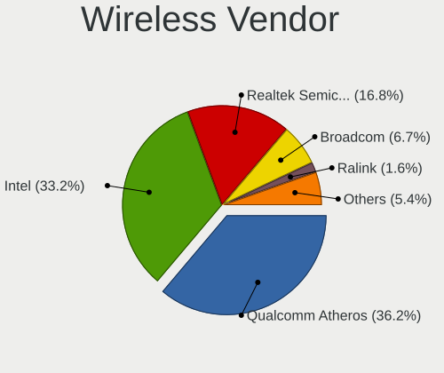

| Vendor                                | Notebooks | Percent |
|---------------------------------------|-----------|---------|
| Qualcomm Atheros                      | 3907      | 36.17%  |
| Intel                                 | 3589      | 33.23%  |
| Realtek Semiconductor                 | 1818      | 16.83%  |
| Broadcom                              | 728       | 6.74%   |
| Ralink                                | 177       | 1.64%   |
| MediaTek                              | 149       | 1.38%   |
| Broadcom Limited                      | 141       | 1.31%   |
| Ralink Technology                     | 110       | 1.02%   |
| TP-Link                               | 78        | 0.72%   |
| Qualcomm Atheros Communications       | 30        | 0.28%   |
| D-Link                                | 25        | 0.23%   |
| D-Link System                         | 13        | 0.12%   |
| Dell                                  | 8         | 0.07%   |
| Qualcomm                              | 5         | 0.05%   |
| Edimax Technology                     | 5         | 0.05%   |
| Microsoft                             | 4         | 0.04%   |
| Micro Star International              | 3         | 0.03%   |
| Philips (or NXP)                      | 2         | 0.02%   |
| NetGear                               | 2         | 0.02%   |
| Sierra Wireless                       | 1         | 0.01%   |
| Realtek                               | 1         | 0.01%   |
| Qualcomm Technologies                 | 1         | 0.01%   |
| Pegatron                              | 1         | 0.01%   |
| Mercucys                              | 1         | 0.01%   |
| Linksys                               | 1         | 0.01%   |
| Guillemot                             | 1         | 0.01%   |
| 802.11g Adapter [Linksys WUSB54GC v3] | 1         | 0.01%   |

Wireless Model
--------------

Wireless models

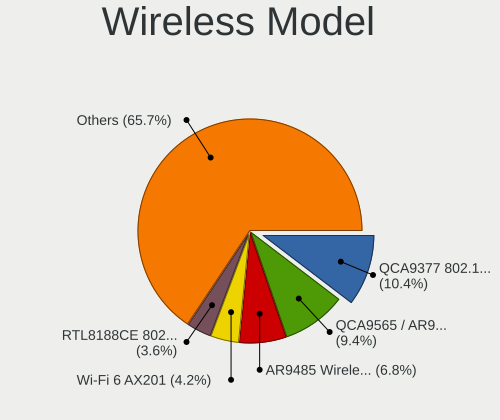

| Model                                                                | Notebooks | Percent |
|----------------------------------------------------------------------|-----------|---------|
| Qualcomm Atheros QCA9377 802.11ac Wireless Network Adapter           | 1126      | 10.37%  |
| Qualcomm Atheros QCA9565 / AR9565 Wireless Network Adapter           | 1017      | 9.37%   |
| Qualcomm Atheros AR9485 Wireless Network Adapter                     | 742       | 6.83%   |
| Intel Wi-Fi 6 AX201                                                  | 452       | 4.16%   |
| Realtek RTL8188CE 802.11b/g/n WiFi Adapter                           | 392       | 3.61%   |
| Qualcomm Atheros QCA6174 802.11ac Wireless Network Adapter           | 392       | 3.61%   |
| Qualcomm Atheros AR9285 Wireless Network Adapter (PCI-Express)       | 386       | 3.55%   |
| Intel Wi-Fi 6 AX200                                                  | 376       | 3.46%   |
| Broadcom BCM4313 802.11bgn Wireless Network Adapter                  | 285       | 2.62%   |
| Intel Wireless 7265                                                  | 231       | 2.13%   |
| Realtek RTL8821CE 802.11ac PCIe Wireless Network Adapter             | 228       | 2.1%    |
| Intel Dual Band Wireless-AC 3165 Plus Bluetooth                      | 218       | 2.01%   |
| Intel Comet Lake PCH-LP CNVi WiFi                                    | 211       | 1.94%   |
| Intel Cannon Point-LP CNVi [Wireless-AC]                             | 178       | 1.64%   |
| Realtek RTL8822CE 802.11ac PCIe Wireless Network Adapter             | 151       | 1.39%   |
| Intel Wireless 7260                                                  | 136       | 1.25%   |
| Intel Cannon Lake PCH CNVi WiFi                                      | 124       | 1.14%   |
| Realtek RTL8187B Wireless 802.11g 54Mbps Network Adapter             | 122       | 1.12%   |
| Intel Alder Lake-P PCH CNVi WiFi                                     | 117       | 1.08%   |
| Broadcom BCM4312 802.11b/g LP-PHY                                    | 116       | 1.07%   |
| Intel Wireless 3165                                                  | 114       | 1.05%   |
| Realtek RTL8723BE PCIe Wireless Network Adapter                      | 113       | 1.04%   |
| Intel Comet Lake PCH CNVi WiFi                                       | 111       | 1.02%   |
| Realtek RTL8188EE Wireless Network Adapter                           | 108       | 0.99%   |
| Intel Centrino Advanced-N 6235                                       | 94        | 0.87%   |
| Intel Wireless 8265 / 8275                                           | 93        | 0.86%   |
| MediaTek MT7921 802.11ax PCIe Wireless Network Adapter [Filogic 330] | 92        | 0.85%   |
| Intel Tiger Lake PCH CNVi WiFi                                       | 92        | 0.85%   |
| Intel Centrino Advanced-N 6205 [Taylor Peak]                         | 88        | 0.81%   |
| Intel Wireless 3160                                                  | 87        | 0.8%    |
| Realtek RTL8191SEvB Wireless LAN Controller                          | 86        | 0.79%   |
| Realtek RTL8723BU 802.11b/g/n WLAN Adapter                           | 85        | 0.78%   |
| Intel Ice Lake-LP PCH CNVi WiFi                                      | 85        | 0.78%   |
| Intel Dual Band Wireless-AC 3168NGW [Stone Peak]                     | 83        | 0.76%   |
| Qualcomm Atheros AR9287 Wireless Network Adapter (PCI-Express)       | 79        | 0.73%   |
| Realtek RTL8191SEvA Wireless LAN Controller                          | 75        | 0.69%   |
| Realtek 802.11ac NIC                                                 | 75        | 0.69%   |
| Ralink RT3090 Wireless 802.11n 1T/1R PCIe                            | 73        | 0.67%   |
| Broadcom BCM4331 802.11a/b/g/n                                       | 70        | 0.64%   |
| Ralink RT3290 Wireless 802.11n 1T/1R PCIe                            | 68        | 0.63%   |

Ethernet Vendor
---------------

Ethernet vendors

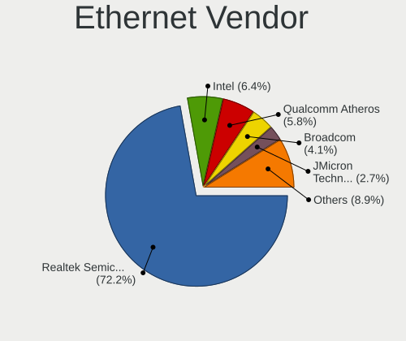

| Vendor                                 | Notebooks | Percent |
|----------------------------------------|-----------|---------|
| Realtek Semiconductor                  | 6859      | 72.18%  |
| Intel                                  | 605       | 6.37%   |
| Qualcomm Atheros                       | 553       | 5.82%   |
| Broadcom                               | 387       | 4.07%   |
| JMicron Technology                     | 254       | 2.67%   |
| Marvell Technology Group               | 234       | 2.46%   |
| Silicon Integrated Systems [SiS]       | 115       | 1.21%   |
| Samsung Electronics                    | 95        | 1%      |
| Broadcom Limited                       | 74        | 0.78%   |
| ASIX Electronics                       | 74        | 0.78%   |
| Motorola PCS                           | 43        | 0.45%   |
| Xiaomi                                 | 38        | 0.4%    |
| Nvidia                                 | 35        | 0.37%   |
| VIA Technologies                       | 29        | 0.31%   |
| TP-Link                                | 25        | 0.26%   |
| ICS Advent                             | 15        | 0.16%   |
| MediaTek                               | 13        | 0.14%   |
| DisplayLink                            | 11        | 0.12%   |
| Lenovo                                 | 7         | 0.07%   |
| Suzhou Motorcomm Electronic Technology | 5         | 0.05%   |
| OPPO Electronics                       | 5         | 0.05%   |
| Attansic Technology                    | 5         | 0.05%   |
| Qualcomm                               | 4         | 0.04%   |
| QinHeng Electronics                    | 4         | 0.04%   |
| Motorcomm Microelectronics.            | 3         | 0.03%   |
| LG Electronics                         | 3         | 0.03%   |
| ASUSTek Computer                       | 2         | 0.02%   |
| Spreadtrum Communications              | 1         | 0.01%   |
| OnePlus Technology (Shenzhen)          | 1         | 0.01%   |
| Huawei Technologies                    | 1         | 0.01%   |
| Google                                 | 1         | 0.01%   |
| Apple                                  | 1         | 0.01%   |

Ethernet Model
--------------

Ethernet models

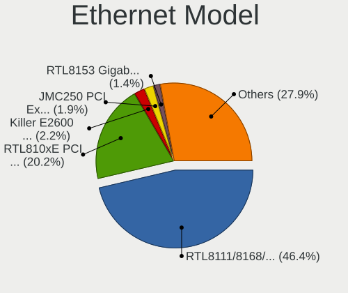

| Model                                                                          | Notebooks | Percent |
|--------------------------------------------------------------------------------|-----------|---------|
| Realtek RTL8111/8168/8211/8411 PCI Express Gigabit Ethernet Controller         | 4449      | 46.36%  |
| Realtek RTL810xE PCI Express Fast Ethernet controller                          | 1942      | 20.24%  |
| Realtek Killer E2600 GbE Controller                                            | 210       | 2.19%   |
| JMicron JMC250 PCI Express Gigabit Ethernet Controller                         | 187       | 1.95%   |
| Realtek RTL8153 Gigabit Ethernet Adapter                                       | 135       | 1.41%   |
| Broadcom NetLink BCM57785 Gigabit Ethernet PCIe                                | 126       | 1.31%   |
| Intel 82579LM Gigabit Network Connection (Lewisville)                          | 119       | 1.24%   |
| Silicon Integrated Systems [SiS] 191 Gigabit Ethernet Adapter                  | 112       | 1.17%   |
| Marvell Group 88E8040 PCI-E Fast Ethernet Controller                           | 100       | 1.04%   |
| Qualcomm Atheros AR8151 v2.0 Gigabit Ethernet                                  | 97        | 1.01%   |
| Qualcomm Atheros AR8162 Fast Ethernet                                          | 88        | 0.92%   |
| Qualcomm Atheros AR8152 v2.0 Fast Ethernet                                     | 79        | 0.82%   |
| Realtek RTL8125 2.5GbE Controller                                              | 77        | 0.8%    |
| Qualcomm Atheros AR8131 Gigabit Ethernet                                       | 75        | 0.78%   |
| Broadcom NetXtreme BCM57765 Gigabit Ethernet PCIe                              | 70        | 0.73%   |
| JMicron JMC260 PCI Express Fast Ethernet Controller                            | 67        | 0.7%    |
| ASIX AX88179 Gigabit Ethernet                                                  | 67        | 0.7%    |
| Samsung Galaxy series, misc. (tethering mode)                                  | 66        | 0.69%   |
| Intel Ethernet Connection (4) I219-LM                                          | 63        | 0.66%   |
| Qualcomm Atheros AR8161 Gigabit Ethernet                                       | 57        | 0.59%   |
| Intel Alder Lake-P PCH CNVi WiFi                                               | 54        | 0.56%   |
| Broadcom NetXtreme BCM57786 Gigabit Ethernet PCIe                              | 53        | 0.55%   |
| Broadcom NetLink BCM57780 Gigabit Ethernet PCIe                                | 49        | 0.51%   |
| Realtek RTL8152 Fast Ethernet Adapter                                          | 42        | 0.44%   |
| Marvell Group 88E8055 PCI-E Gigabit Ethernet Controller                        | 37        | 0.39%   |
| Qualcomm Atheros AR8132 Fast Ethernet                                          | 36        | 0.38%   |
| Intel Ethernet Connection I219-LM                                              | 35        | 0.36%   |
| Broadcom Limited NetLink BCM57780 Gigabit Ethernet PCIe                        | 34        | 0.35%   |
| Xiaomi Mi/Redmi series (RNDIS)                                                 | 33        | 0.34%   |
| Motorola PCS motorola one 5G ace                                               | 33        | 0.34%   |
| Intel Ethernet Connection I217-LM                                              | 31        | 0.32%   |
| Intel 82577LM Gigabit Network Connection                                       | 31        | 0.32%   |
| Intel Ethernet Connection I218-LM                                              | 30        | 0.31%   |
| VIA VT6102/VT6103 [Rhine-II]                                                   | 29        | 0.3%    |
| Samsung GT-I9070 (network tethering, USB debugging enabled)                    | 29        | 0.3%    |
| Marvell Group 88E8039 PCI-E Fast Ethernet Controller                           | 29        | 0.3%    |
| Intel Ethernet Connection (13) I219-LM                                         | 28        | 0.29%   |
| Marvell Group Yukon Optima 88E8059 [PCIe Gigabit Ethernet Controller with AVB] | 27        | 0.28%   |
| Realtek RTL-8100/8101L/8139 PCI Fast Ethernet Adapter                          | 26        | 0.27%   |
| TP-Link UE300 10/100/1000 LAN (ethernet mode) [Realtek RTL8153]                | 25        | 0.26%   |

Net Controller Kind
-------------------

Ethernet, WiFi or modem

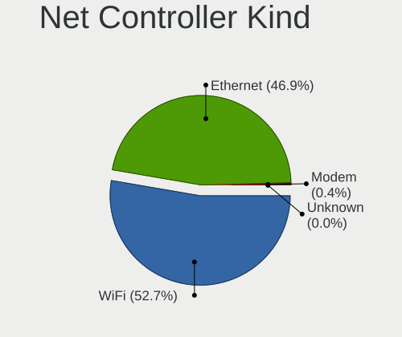

| Kind     | Notebooks | Percent |
|----------|-----------|---------|
| WiFi     | 10402     | 52.71%  |
| Ethernet | 9250      | 46.87%  |
| Modem    | 79        | 0.4%    |
| Unknown  | 4         | 0.02%   |

Used Controller
---------------

Currently used network controller

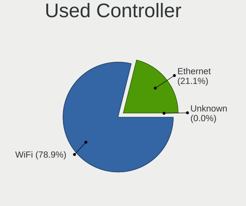

| Kind     | Notebooks | Percent |
|----------|-----------|---------|
| WiFi     | 8946      | 78.89%  |
| Ethernet | 2393      | 21.1%   |
| Unknown  | 1         | 0.01%   |

NICs
----

Total network controllers on board

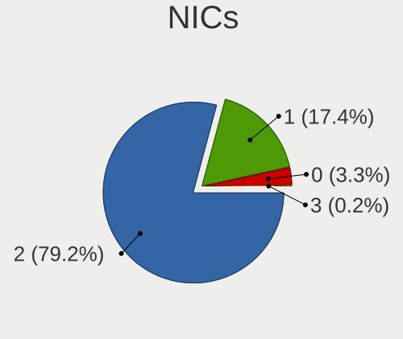

| Total | Notebooks | Percent |
|-------|-----------|---------|
| 2     | 8595      | 79.18%  |
| 1     | 1887      | 17.38%  |
| 0     | 354       | 3.26%   |
| 3     | 19        | 0.18%   |

IPv6
----

IPv6 vs IPv4

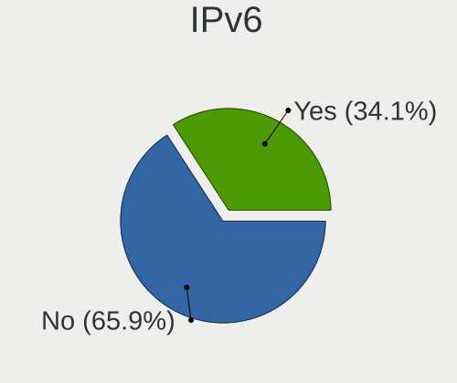

| Used | Notebooks | Percent |
|------|-----------|---------|
| No   | 7376      | 65.86%  |
| Yes  | 3824      | 34.14%  |

Bluetooth
---------

Bluetooth Vendor
----------------

Controller vendors

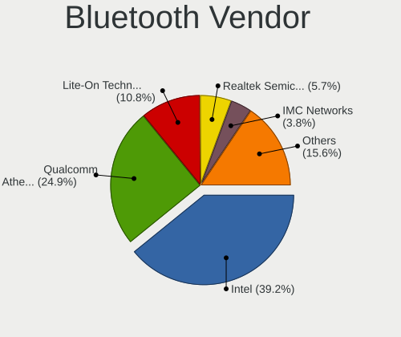

| Vendor                          | Notebooks | Percent |
|---------------------------------|-----------|---------|
| Intel                           | 3198      | 39.15%  |
| Qualcomm Atheros Communications | 2037      | 24.94%  |
| Lite-On Technology              | 884       | 10.82%  |
| Realtek Semiconductor           | 464       | 5.68%   |
| IMC Networks                    | 311       | 3.81%   |
| Broadcom                        | 277       | 3.39%   |
| Apple                           | 188       | 2.3%    |
| Foxconn / Hon Hai               | 187       | 2.29%   |
| Cambridge Silicon Radio         | 147       | 1.8%    |
| Dell                            | 105       | 1.29%   |
| Hewlett-Packard                 | 77        | 0.94%   |
| Ralink                          | 68        | 0.83%   |
| Smart Modular Technologies      | 64        | 0.78%   |
| Qcom                            | 39        | 0.48%   |
| Foxconn International           | 20        | 0.24%   |
| Ralink Technology               | 19        | 0.23%   |
| Alps Electric                   | 19        | 0.23%   |
| Askey Computer                  | 12        | 0.15%   |
| Toshiba                         | 9         | 0.11%   |
| ASUSTek Computer                | 7         | 0.09%   |
| USI                             | 6         | 0.07%   |
| MediaTek                        | 6         | 0.07%   |
| TP-Link                         | 5         | 0.06%   |
| Opticis                         | 5         | 0.06%   |
| Micro Star International        | 5         | 0.06%   |
| Syntek                          | 2         | 0.02%   |
| Actions                         | 2         | 0.02%   |
| Realtek                         | 1         | 0.01%   |
| Integrated System Solution      | 1         | 0.01%   |
| Fujitsu                         | 1         | 0.01%   |
| Edimax Technology               | 1         | 0.01%   |
| Chicony Electronics             | 1         | 0.01%   |

Bluetooth Model
---------------

Controller models

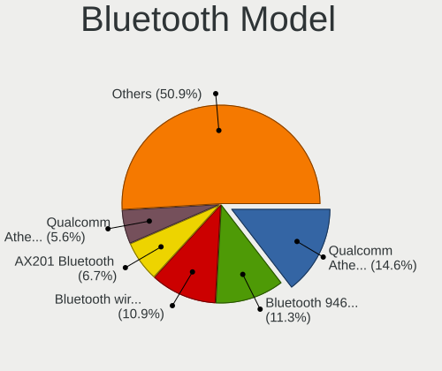

| Model                                                                               | Notebooks | Percent |
|-------------------------------------------------------------------------------------|-----------|---------|
| Qualcomm Atheros  Bluetooth Device                                                  | 1190      | 14.57%  |
| Intel Bluetooth 9460/9560 Jefferson Peak (JfP)                                      | 924       | 11.31%  |
| Intel Bluetooth wireless interface                                                  | 891       | 10.91%  |
| Intel AX201 Bluetooth                                                               | 547       | 6.7%    |
| Lite-On Qualcomm Atheros QCA9377 Bluetooth                                          | 457       | 5.59%   |
| Realtek Bluetooth Radio                                                             | 374       | 4.58%   |
| Intel AX200 Bluetooth                                                               | 369       | 4.52%   |
| Qualcomm Atheros AR3012 Bluetooth 4.0                                               | 328       | 4.02%   |
| Qualcomm Atheros AR9462 Bluetooth                                                   | 183       | 2.24%   |
| IMC Networks Bluetooth Radio                                                        | 174       | 2.13%   |
| Qualcomm Atheros Bluetooth USB Host Controller                                      | 161       | 1.97%   |
| Qualcomm Atheros AR3011 Bluetooth                                                   | 151       | 1.85%   |
| Cambridge Silicon Radio Bluetooth Dongle (HCI mode)                                 | 147       | 1.8%    |
| Intel Centrino Bluetooth Wireless Transceiver                                       | 126       | 1.54%   |
| Lite-On Atheros AR3012 Bluetooth                                                    | 121       | 1.48%   |
| Intel Bluetooth Device                                                              | 120       | 1.47%   |
| Lite-On Bluetooth Device                                                            | 119       | 1.46%   |
| Apple Bluetooth Host Controller                                                     | 98        | 1.2%    |
| Lite-On Qualcomm Atheros Bluetooth                                                  | 85        | 1.04%   |
| Intel Wireless-AC 3168 Bluetooth                                                    | 82        | 1%      |
| Broadcom BCM2070 Bluetooth 2.1 + EDR                                                | 80        | 0.98%   |
| Intel Centrino Advanced-N 6230 Bluetooth adapter                                    | 77        | 0.94%   |
| Broadcom BCM2070 Bluetooth Device                                                   | 74        | 0.91%   |
| Lite-On Wireless_Device                                                             | 73        | 0.89%   |
| Ralink RT3290 Bluetooth                                                             | 68        | 0.83%   |
| Smart Modular Bluetooth Device                                                      | 64        | 0.78%   |
| Apple Bluetooth USB Host Controller                                                 | 60        | 0.73%   |
| IMC Networks Wireless_Device                                                        | 46        | 0.56%   |
| Dell Wireless 365 Bluetooth                                                         | 44        | 0.54%   |
| HP Broadcom 2070 Bluetooth Combo                                                    | 43        | 0.53%   |
| Foxconn / Hon Hai Foxconn T77H114 BCM2070 [Single-Chip Bluetooth 2.1 + EDR Adapter] | 42        | 0.51%   |
| IMC Networks Bluetooth Device                                                       | 41        | 0.5%    |
| Foxconn / Hon Hai Bluetooth Device                                                  | 38        | 0.47%   |
| Intel Wireless-AC 9260 Bluetooth Adapter                                            | 33        | 0.4%    |
| Intel AX210 Bluetooth                                                               | 28        | 0.34%   |
| Foxconn / Hon Hai Bluetooth USB Host Controller                                     | 28        | 0.34%   |
| Lite-On Atheros Bluetooth                                                           | 26        | 0.32%   |
| HP Bluetooth 2.0 Interface [Broadcom BCM2045]                                       | 26        | 0.32%   |
| Realtek RTL8822BE Bluetooth 4.2 Adapter                                             | 25        | 0.31%   |
| Qcom Broadcom Bluetooth USB                                                         | 25        | 0.31%   |

Sound
-----

Sound Vendor
------------

Sound card vendors

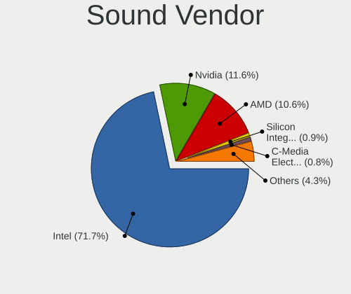

| Vendor                                          | Notebooks | Percent |
|-------------------------------------------------|-----------|---------|
| Intel                                           | 9137      | 71.72%  |
| Nvidia                                          | 1482      | 11.63%  |
| AMD                                             | 1356      | 10.64%  |
| Silicon Integrated Systems [SiS]                | 115       | 0.9%    |
| C-Media Electronics                             | 107       | 0.84%   |
| Logitech                                        | 83        | 0.65%   |
| Generalplus Technology                          | 68        | 0.53%   |
| JMTek                                           | 34        | 0.27%   |
| Kingston Technology                             | 33        | 0.26%   |
| VIA Technologies                                | 29        | 0.23%   |
| Texas Instruments                               | 23        | 0.18%   |
| Sony                                            | 21        | 0.16%   |
| Plantronics                                     | 19        | 0.15%   |
| Microsoft                                       | 16        | 0.13%   |
| Realtek Semiconductor                           | 15        | 0.12%   |
| Corsair                                         | 15        | 0.12%   |
| GN Netcom                                       | 12        | 0.09%   |
| Unknown                                         | 12        | 0.09%   |
| Samsung Electronics                             | 9         | 0.07%   |
| Jieli Technology                                | 8         | 0.06%   |
| Licensed by Sony Computer Entertainment America | 7         | 0.05%   |
| JBL                                             | 7         | 0.05%   |
| Hewlett-Packard                                 | 7         | 0.05%   |
| Razer USA                                       | 6         | 0.05%   |
| Goldvish                                        | 6         | 0.05%   |
| Dell                                            | 6         | 0.05%   |
| Weltrend Semiconductor                          | 4         | 0.03%   |
| Walmart                                         | 4         | 0.03%   |
| Samson Technologies                             | 4         | 0.03%   |
| Meizu                                           | 4         | 0.03%   |
| M-Audio                                         | 4         | 0.03%   |
| HECATE G4 TE GAMING HEADSET                     | 4         | 0.03%   |
| Focusrite-Novation                              | 4         | 0.03%   |
| fifine Microphones                              | 4         | 0.03%   |
| SteelSeries ApS                                 | 3         | 0.02%   |
| Lenovo                                          | 3         | 0.02%   |
| BEHRINGER International                         | 3         | 0.02%   |
| Astro Gaming                                    | 3         | 0.02%   |
| Apple                                           | 3         | 0.02%   |
| Turtle Beach                                    | 2         | 0.02%   |

Sound Model
-----------

Sound card models

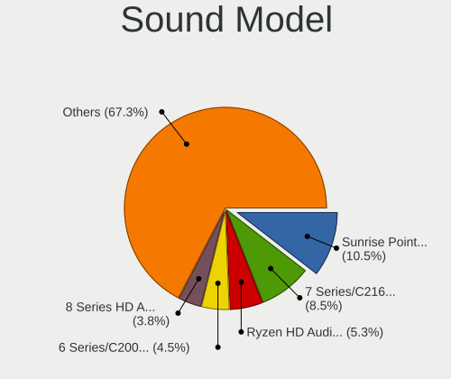

| Model                                                                                             | Notebooks | Percent |
|---------------------------------------------------------------------------------------------------|-----------|---------|
| Intel Sunrise Point-LP HD Audio                                                                   | 1560      | 10.47%  |
| Intel 7 Series/C216 Chipset Family High Definition Audio Controller                               | 1269      | 8.52%   |
| AMD Ryzen HD Audio Controller                                                                     | 797       | 5.35%   |
| Intel 6 Series/C200 Series Chipset Family High Definition Audio Controller                        | 678       | 4.55%   |
| Intel 8 Series HD Audio Controller                                                                | 564       | 3.78%   |
| Intel 5 Series/3400 Series Chipset High Definition Audio                                          | 560       | 3.76%   |
| Intel Haswell-ULT HD Audio Controller                                                             | 557       | 3.74%   |
| Intel Tiger Lake-LP Smart Sound Technology Audio Controller                                       | 492       | 3.3%    |
| Intel Cannon Lake PCH cAVS                                                                        | 468       | 3.14%   |
| Nvidia TU107 GeForce GTX 1650 High Definition Audio Controller                                    | 444       | 2.98%   |
| Intel Broadwell-U Audio Controller                                                                | 440       | 2.95%   |
| Intel Wildcat Point-LP High Definition Audio Controller                                           | 437       | 2.93%   |
| Intel Cannon Point-LP High Definition Audio Controller                                            | 392       | 2.63%   |
| Intel 82801I (ICH9 Family) HD Audio Controller                                                    | 360       | 2.42%   |
| AMD Raven/Raven2/Fenghuang HDMI/DP Audio Controller                                               | 309       | 2.07%   |
| Intel Comet Lake PCH-LP cAVS                                                                      | 288       | 1.93%   |
| AMD Renoir/Cezanne HDMI/DP Audio Controller                                                       | 268       | 1.8%    |
| Intel Alder Lake PCH-P High Definition Audio Controller                                           | 229       | 1.54%   |
| Intel Celeron/Pentium Silver Processor High Definition Audio                                      | 211       | 1.42%   |
| AMD SBx00 Azalia (Intel HDA)                                                                      | 207       | 1.39%   |
| Nvidia GP107GL High Definition Audio Controller                                                   | 205       | 1.38%   |
| Intel 82801H (ICH8 Family) HD Audio Controller                                                    | 194       | 1.3%    |
| AMD Wrestler HDMI Audio                                                                           | 180       | 1.21%   |
| Intel NM10/ICH7 Family High Definition Audio Controller                                           | 171       | 1.15%   |
| Intel Ice Lake-LP Smart Sound Technology Audio Controller                                         | 164       | 1.1%    |
| Intel CM238 HD Audio Controller                                                                   | 154       | 1.03%   |
| AMD FCH Azalia Controller                                                                         | 154       | 1.03%   |
| Intel Atom/Celeron/Pentium Processor x5-E8000/J3xxx/N3xxx Series High Definition Audio Controller | 151       | 1.01%   |
| Nvidia GA107 High Definition Audio Controller                                                     | 146       | 0.98%   |
| Intel Atom Processor Z36xxx/Z37xxx Series High Definition Audio Controller                        | 128       | 0.86%   |
| AMD Radeon High Definition Audio Controller                                                       | 126       | 0.85%   |
| Nvidia GF108 High Definition Audio Controller                                                     | 121       | 0.81%   |
| Intel Comet Lake PCH cAVS                                                                         | 117       | 0.79%   |
| Silicon Integrated Systems [SiS] Azalia Audio Controller                                          | 112       | 0.75%   |
| Intel 8 Series/C220 Series Chipset High Definition Audio Controller                               | 109       | 0.73%   |
| Intel Raptor Lake-P/U/H cAVS                                                                      | 108       | 0.72%   |
| Intel Xeon E3-1200 v3/4th Gen Core Processor HD Audio Controller                                  | 96        | 0.64%   |
| Intel Tiger Lake-H HD Audio Controller                                                            | 96        | 0.64%   |
| AMD Kabini HDMI/DP Audio                                                                          | 85        | 0.57%   |
| Generalplus Technology USB Audio Device                                                           | 68        | 0.46%   |

Memory
------

Memory Vendor
-------------

Memory module vendors

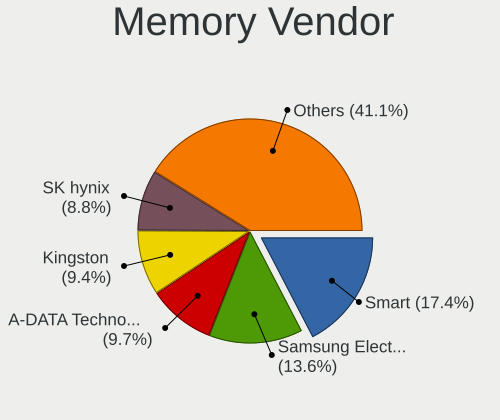

| Vendor              | Notebooks | Percent |
|---------------------|-----------|---------|
| Smart               | 830       | 17.37%  |
| Samsung Electronics | 649       | 13.58%  |
| A-DATA Technology   | 464       | 9.71%   |
| Kingston            | 450       | 9.42%   |
| SK hynix            | 419       | 8.77%   |
| Unknown             | 396       | 8.29%   |
| Micron Technology   | 216       | 4.52%   |
| Teikon              | 211       | 4.42%   |
| Smart Brazil        | 167       | 3.5%    |
| Crucial             | 157       | 3.29%   |
| Corsair             | 96        | 2.01%   |
| High Bridge         | 82        | 1.72%   |
| Unknown             | 81        | 1.7%    |
| Unknown (ABCD)      | 66        | 1.38%   |
| Elpida              | 64        | 1.34%   |
| Unknown (0x0B5E)    | 30        | 0.63%   |
| Multilaser          | 30        | 0.63%   |
| Apacer              | 28        | 0.59%   |
| Kllisre             | 26        | 0.54%   |
| Nanya Technology    | 24        | 0.5%    |
| HT Micron           | 23        | 0.48%   |
| Smart Modular       | 19        | 0.4%    |
| PUSKILL             | 18        | 0.38%   |
| Patriot             | 18        | 0.38%   |
| Ramaxel Technology  | 15        | 0.31%   |
| Team                | 10        | 0.21%   |
| Avant               | 9         | 0.19%   |
| 48spaces            | 8         | 0.17%   |
| Unknown (0x0F94)    | 7         | 0.15%   |
| Neo Forza           | 7         | 0.15%   |
| 8F9400008F94        | 7         | 0.15%   |
| Transcend           | 6         | 0.13%   |
| G.Skill             | 6         | 0.13%   |
| Atermiter           | 6         | 0.13%   |
| Walton Chaintech    | 5         | 0.1%    |
| Juhor               | 5         | 0.1%    |
| HANA                | 5         | 0.1%    |
| DATEN               | 5         | 0.1%    |
| RZX                 | 4         | 0.08%   |
| Qimonda             | 4         | 0.08%   |

Memory Model
------------

Memory module models

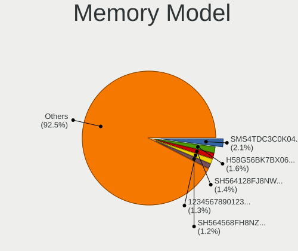

| Model                                                            | Notebooks | Percent |
|------------------------------------------------------------------|-----------|---------|
| Smart Brazil RAM SMS4TDC3C0K0446SCG 4GB SODIMM DDR4 2667MT/s     | 106       | 2.06%   |
| Unknown                                                          | 81        | 1.57%   |
| Smart RAM SH564128FJ8NWRNSQG 4GB SODIMM DDR3 1600MT/s            | 72        | 1.4%    |
| Unknown (ABCD) RAM 123456789012345678 2GB SODIMM LPDDR4 2400MT/s | 66        | 1.28%   |
| Smart RAM SH564568FH8NZPHSCR 2GB SODIMM DDR3 1334MT/s            | 62        | 1.2%    |
| Samsung RAM M471A5244CB0-CRC 4GB SODIMM DDR4 2667MT/s            | 61        | 1.18%   |
| Smart RAM SF4641G8CK8IEHLSBG 8GB SODIMM DDR4 2667MT/s            | 60        | 1.16%   |
| Smart RAM SH564128FJ8NWRNSQR 4GB SODIMM DDR3 1600MT/s            | 59        | 1.15%   |
| Smart RAM SH564128FH8NZPHSCG 4GB SODIMM DDR3 1334MT/s            | 59        | 1.15%   |
| Smart RAM SH564128FH8NZQNSCG 4GB SODIMM DDR3 1600MT/s            | 55        | 1.07%   |
| Smart RAM SH564128FH8NZPHSCR 4GB SODIMM DDR3 1334MT/s            | 46        | 0.89%   |
| Smart RAM SH564568FH8NZPHSCG 2GB SODIMM DDR3 1333MT/s            | 39        | 0.76%   |
| Samsung RAM M471B5773CHS-CH9 2GB SODIMM DDR3 4199MT/s            | 38        | 0.74%   |
| A-DATA RAM AM1P26KC8T1-BAAS 8GB SODIMM DDR4 2667MT/s             | 37        | 0.72%   |
| Smart RAM SMS4WEC8C1K0446FCG 8GB SODIMM DDR4 3200MT/s            | 33        | 0.64%   |
| Smart RAM SH564128FJ8NZRNSDR 4GB SODIMM DDR3 1600MT/s            | 33        | 0.64%   |
| Smart RAM SMS4TDC3C0K0446SCG 4GB SODIMM DDR4 2667MT/s            | 32        | 0.62%   |
| Smart RAM SH564568FH8NWPHSFG 2GB SODIMM DDR3 1333MT/s            | 31        | 0.6%    |
| Smart RAM SH5641G8FJ8NWRNSQG 8GB SODIMM DDR3 1600MT/s            | 31        | 0.6%    |
| Smart RAM SH564128FJ8NZRNSDG 4GB SODIMM DDR3 1600MT/s            | 31        | 0.6%    |
| Unknown RAM Module 4GB SODIMM DDR3                               | 28        | 0.54%   |
| A-DATA RAM AM1P24HC4U1-BBGS 4GB SODIMM DDR4 2400MT/s             | 28        | 0.54%   |
| Smart RAM SF564128CJ8NWMNSEG 4GB SODIMM DDR3 1600MT/s            | 27        | 0.52%   |
| Micron RAM 4ATF51264HZ-2G3B1 4GB SODIMM DDR4 3200MT/s            | 26        | 0.5%    |
| A-DATA RAM AE4S240038G17-BHYA 8GB SODIMM DDR4 2400MT/s           | 26        | 0.5%    |
| Unknown RAM Module 8GB SODIMM DDR4 2667MT/s                      | 25        | 0.49%   |
| Teikon RAM TMA81GS6AFR8N-UHSC 8GB SODIMM DDR4 2400MT/s           | 25        | 0.49%   |
| SK hynix RAM HMA81GS6AFR8N-UH 8GB SODIMM DDR4 2667MT/s           | 25        | 0.49%   |
| Samsung RAM M471B5273CH0-CH9 4GB SODIMM DDR3 1334MT/s            | 25        | 0.49%   |
| A-DATA RAM AD4S320038G22-BHYD 8GB SODIMM DDR4 3200MT/s           | 25        | 0.49%   |
| Unknown RAM Module 4096MB SODIMM DDR3                            | 24        | 0.47%   |
| Unknown RAM Module 2GB SODIMM DDR2 667MT/s                       | 24        | 0.47%   |
| Teikon RAM TMT451S6BFR8A-PBHJ 4GB SODIMM DDR3 1600MT/s           | 23        | 0.45%   |
| Smart RAM SG564568FG8NWKF-Z1 2GB SODIMM DDR 800MT/s              | 23        | 0.45%   |
| A-DATA RAM AM1P26KC4U1-BACS 4GB SODIMM DDR4 2667MT/s             | 23        | 0.45%   |
| A-DATA RAM 4JQA-0622AC 4GB SODIMM DDR4 3200MT/s                  | 23        | 0.45%   |
| Unknown RAM Module 4GB SODIMM DDR4 2667MT/s                      | 21        | 0.41%   |
| Teikon RAM TMT451S6BFR8A-PBHC 4GB SODIMM DDR3 1600MT/s           | 21        | 0.41%   |
| Smart RAM SH564568FJ8NZRNSDR 2GB SODIMM DDR3 1600MT/s            | 21        | 0.41%   |
| Samsung RAM M471A5244CB0-CWE 4GB Row Of Chips DDR4 3200MT/s      | 21        | 0.41%   |

Memory Kind
-----------

Memory module kinds

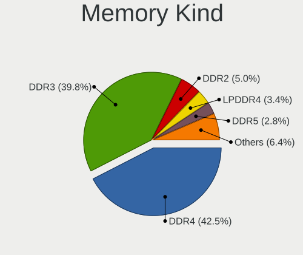

| Kind    | Notebooks | Percent |
|---------|-----------|---------|
| DDR4    | 1661      | 42.47%  |
| DDR3    | 1558      | 39.84%  |
| DDR2    | 197       | 5.04%   |
| LPDDR4  | 132       | 3.38%   |
| DDR5    | 111       | 2.84%   |
| SDRAM   | 83        | 2.12%   |
| LPDDR5  | 67        | 1.71%   |
| LPDDR3  | 48        | 1.23%   |
| DRAM    | 29        | 0.74%   |
| DDR     | 15        | 0.38%   |
| Unknown | 9         | 0.23%   |
| RAM     | 1         | 0.03%   |

Memory Form Factor
------------------

Physical design of the memory module

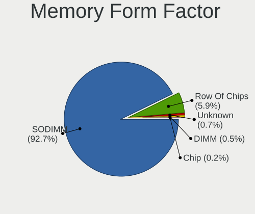

| Name         | Notebooks | Percent |
|--------------|-----------|---------|
| SODIMM       | 3665      | 92.74%  |
| Row Of Chips | 234       | 5.92%   |
| Unknown      | 26        | 0.66%   |
| DIMM         | 21        | 0.53%   |
| Chip         | 6         | 0.15%   |

Memory Size
-----------

Memory module size

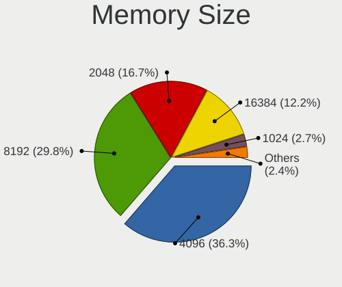

| Size    | Notebooks | Percent |
|---------|-----------|---------|
| 4096    | 1638      | 36.34%  |
| 8192    | 1343      | 29.8%   |
| 2048    | 751       | 16.66%  |
| 16384   | 548       | 12.16%  |
| 1024    | 120       | 2.66%   |
| 32768   | 100       | 2.22%   |
| 512     | 6         | 0.13%   |
| Unknown | 1         | 0.02%   |

Memory Speed
------------

Memory module speed

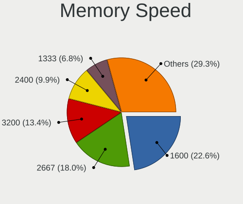

| Speed   | Notebooks | Percent |
|---------|-----------|---------|
| 1600    | 992       | 22.59%  |
| 2667    | 790       | 17.99%  |
| 3200    | 590       | 13.43%  |
| 2400    | 437       | 9.95%   |
| 1333    | 297       | 6.76%   |
| 1334    | 289       | 6.58%   |
| 2133    | 128       | 2.91%   |
| Unknown | 126       | 2.87%   |
| 667     | 93        | 2.12%   |
| 800     | 79        | 1.8%    |
| 1066    | 66        | 1.5%    |
| 5600    | 58        | 1.32%   |
| 4800    | 57        | 1.3%    |
| 1067    | 53        | 1.21%   |
| 4199    | 52        | 1.18%   |
| 4267    | 43        | 0.98%   |
| 6400    | 39        | 0.89%   |
| 975     | 26        | 0.59%   |
| 533     | 26        | 0.59%   |
| 8400    | 25        | 0.57%   |
| 2048    | 22        | 0.5%    |
| 1867    | 22        | 0.5%    |
| 7500    | 16        | 0.36%   |
| 3266    | 15        | 0.34%   |
| 2933    | 8         | 0.18%   |
| 5500    | 5         | 0.11%   |
| 3733    | 5         | 0.11%   |
| 1200    | 5         | 0.11%   |
| 8533    | 4         | 0.09%   |
| 7467    | 3         | 0.07%   |
| 1866    | 3         | 0.07%   |
| 4266    | 2         | 0.05%   |
| 666     | 2         | 0.05%   |
| 400     | 2         | 0.05%   |
| 12800   | 1         | 0.02%   |
| 6000    | 1         | 0.02%   |
| 5200    | 1         | 0.02%   |
| 3466    | 1         | 0.02%   |
| 3400    | 1         | 0.02%   |
| 2666    | 1         | 0.02%   |

Printers & scanners
-------------------

Printer Vendor
--------------

Printer device vendors

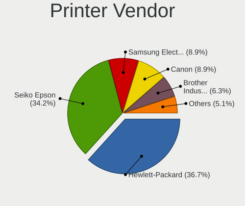

| Vendor              | Notebooks | Percent |
|---------------------|-----------|---------|
| Hewlett-Packard     | 29        | 36.71%  |
| Seiko Epson         | 27        | 34.18%  |
| Samsung Electronics | 7         | 8.86%   |
| Canon               | 7         | 8.86%   |
| Brother Industries  | 5         | 6.33%   |
| Xerox               | 2         | 2.53%   |
| QinHeng Electronics | 1         | 1.27%   |
| MIIIW               | 1         | 1.27%   |

Printer Model
-------------

Printer device models

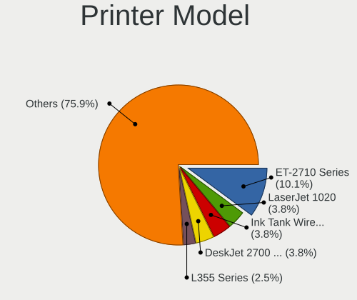

| Model                                         | Notebooks | Percent |
|-----------------------------------------------|-----------|---------|
| Seiko Epson ET-2710 Series                    | 8         | 10.13%  |
| HP LaserJet 1020                              | 3         | 3.8%    |
| HP Ink Tank Wireless 410 series               | 3         | 3.8%    |
| HP DeskJet 2700 series                        | 3         | 3.8%    |
| Seiko Epson L355 Series                       | 2         | 2.53%   |
| Seiko Epson L3210 Series                      | 2         | 2.53%   |
| Seiko Epson L3050 Series                      | 2         | 2.53%   |
| Seiko Epson ET-3750 Series                    | 2         | 2.53%   |
| Samsung M2020 Series                          | 2         | 2.53%   |
| HP LaserJet Professional P1102w               | 2         | 2.53%   |
| HP Deskjet 3050 J610 series                   | 2         | 2.53%   |
| HP Deskjet 2540 series                        | 2         | 2.53%   |
| HP DeskJet 2130 series                        | 2         | 2.53%   |
| Canon PIXMA MG3600 Series                     | 2         | 2.53%   |
| Canon G3000 series                            | 2         | 2.53%   |
| Xerox Phaser 3320                             | 1         | 1.27%   |
| Xerox Phaser 3020                             | 1         | 1.27%   |
| Seiko Epson XP-235 Series                     | 1         | 1.27%   |
| Seiko Epson USB2.0 Printer (Hi-speed)         | 1         | 1.27%   |
| Seiko Epson TM-T20X                           | 1         | 1.27%   |
| Seiko Epson Thermal Receipt Printer [TM-T20]  | 1         | 1.27%   |
| Seiko Epson ME 340 Series/Stylus NX130 Series | 1         | 1.27%   |
| Seiko Epson ME 320/330 Series [Stylus SX125]  | 1         | 1.27%   |
| Seiko Epson M1120 Series                      | 1         | 1.27%   |
| Seiko Epson L805 Series                       | 1         | 1.27%   |
| Seiko Epson L380 Series                       | 1         | 1.27%   |
| Seiko Epson ET-2700 Series                    | 1         | 1.27%   |
| Seiko Epson EPSON L220 Series                 | 1         | 1.27%   |
| Samsung SCX-4623 Series                       | 1         | 1.27%   |
| Samsung SCX-4600 Series                       | 1         | 1.27%   |
| Samsung SCX-4200 series                       | 1         | 1.27%   |
| Samsung ML-216x Series Laser Printer          | 1         | 1.27%   |
| Samsung M332x 382x 402x Series                | 1         | 1.27%   |
| QinHeng CH340S                                | 1         | 1.27%   |
| MIIIW MW Keyboard Air Mini                    | 1         | 1.27%   |
| HP Smart Tank 580-590 series                  | 1         | 1.27%   |
| HP LaserJet P2015 series                      | 1         | 1.27%   |
| HP LaserJet 1018                              | 1         | 1.27%   |
| HP DeskJet Plus 6400 series                   | 1         | 1.27%   |
| HP DeskJet F4200 series                       | 1         | 1.27%   |

Scanner Vendor
--------------

Scanner device vendors

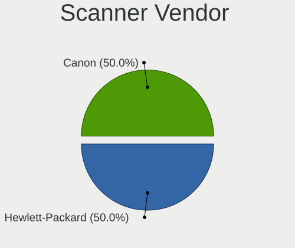

| Vendor          | Notebooks | Percent |
|-----------------|-----------|---------|
| Hewlett-Packard | 3         | 50%     |
| Canon           | 3         | 50%     |

Scanner Model
-------------

Scanner device models

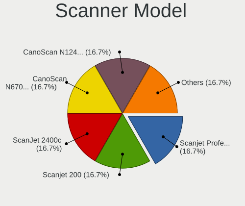

| Model                                       | Notebooks | Percent |
|---------------------------------------------|-----------|---------|
| HP Scanjet Professional 1000 Mobile Scanner | 1         | 16.67%  |
| HP ScanJet 2400c                            | 1         | 16.67%  |
| HP Scanjet 200                              | 1         | 16.67%  |
| Canon CanoScan N670U/N676U/LiDE 20          | 1         | 16.67%  |
| Canon CanoScan N1240U/LiDE 30               | 1         | 16.67%  |
| Canon CanoScan LiDE 110                     | 1         | 16.67%  |

Camera
------

Camera Vendor
-------------

Camera device vendors

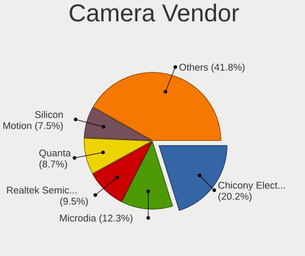

| Vendor                                 | Notebooks | Percent |
|----------------------------------------|-----------|---------|
| Chicony Electronics                    | 2003      | 20.19%  |
| Microdia                               | 1219      | 12.28%  |
| Realtek Semiconductor                  | 945       | 9.52%   |
| Quanta                                 | 860       | 8.67%   |
| Silicon Motion                         | 748       | 7.54%   |
| Sunplus Innovation Technology          | 706       | 7.11%   |
| Bison Electronics                      | 583       | 5.88%   |
| IMC Networks                           | 526       | 5.3%    |
| Suyin                                  | 364       | 3.67%   |
| Syntek                                 | 359       | 3.62%   |
| Apple                                  | 173       | 1.74%   |
| Alcor Micro                            | 169       | 1.7%    |
| Cheng Uei Precision Industry (Foxlink) | 131       | 1.32%   |
| Sonix Technology                       | 101       | 1.02%   |
| Logitech                               | 98        | 0.99%   |
| Unknown                                | 84        | 0.85%   |
| Samsung Electronics                    | 76        | 0.77%   |
| Acer                                   | 68        | 0.69%   |
| Ricoh                                  | 66        | 0.67%   |
| ALi                                    | 61        | 0.61%   |
| SunplusIT                              | 57        | 0.57%   |
| Luxvisions Innotech Limited            | 40        | 0.4%    |
| Lite-On Technology                     | 40        | 0.4%    |
| Importek                               | 31        | 0.31%   |
| Z-Star Microelectronics                | 29        | 0.29%   |
| Y Media                                | 27        | 0.27%   |
| OmniVision Technologies                | 27        | 0.27%   |
| icSpring                               | 26        | 0.26%   |
| Unknown                                | 25        | 0.25%   |
| Shine-optics                           | 24        | 0.24%   |
| kingcome                               | 23        | 0.23%   |
| Generalplus Technology                 | 21        | 0.21%   |
| Lenovo                                 | 17        | 0.17%   |
| Primax Electronics                     | 14        | 0.14%   |
| ShineTech                              | 13        | 0.13%   |
| LG Electronics                         | 12        | 0.12%   |
| Intel                                  | 12        | 0.12%   |
| Pixart Imaging                         | 11        | 0.11%   |
| Shenzhen Kingcome Optoelectronic       | 10        | 0.1%    |
| Sunplus Technology                     | 8         | 0.08%   |

Camera Model
------------

Camera device models

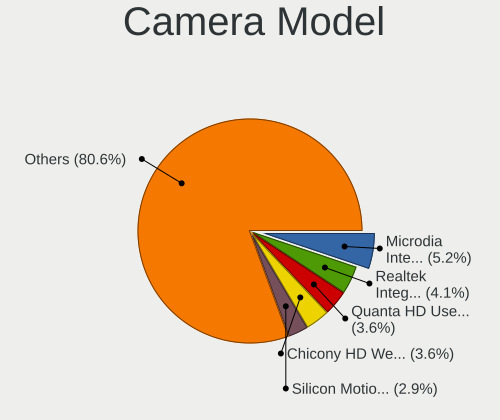

| Model                                     | Notebooks | Percent |
|-------------------------------------------|-----------|---------|
| Microdia Integrated_Webcam_HD             | 514       | 5.17%   |
| Realtek Integrated_Webcam_HD              | 408       | 4.1%    |
| Quanta HD User Facing                     | 361       | 3.63%   |
| Chicony HD WebCam                         | 354       | 3.56%   |
| Silicon Motion Web Camera                 | 291       | 2.93%   |
| Sunplus Integrated_Webcam_HD              | 289       | 2.91%   |
| Chicony HD User Facing                    | 279       | 2.81%   |
| Chicony Integrated Camera                 | 273       | 2.75%   |
| Syntek Integrated Camera                  | 229       | 2.3%    |
| Quanta VGA WebCam                         | 222       | 2.23%   |
| Chicony VGA WebCam                        | 175       | 1.76%   |
| Realtek Integrated Webcam                 | 154       | 1.55%   |
| Quanta HD Webcam                          | 137       | 1.38%   |
| IMC Networks Integrated Camera            | 130       | 1.31%   |
| Sunplus HD WebCam                         | 126       | 1.27%   |
| Microdia Laptop_Integrated_Webcam_HD      | 124       | 1.25%   |
| Chicony USB 2.0 Camera                    | 114       | 1.15%   |
| Alcor Micro USB 2.0 Camera                | 97        | 0.98%   |
| Bison EasyCamera                          | 96        | 0.97%   |
| Sonix USB2.0 HD UVC WebCam                | 93        | 0.94%   |
| IMC Networks USB2.0 HD UVC WebCam         | 90        | 0.91%   |
| Unknown                                   | 88        | 0.89%   |
| Bison Lenovo EasyCamera                   | 86        | 0.87%   |
| Microdia Dell Laptop Integrated Webcam HD | 84        | 0.84%   |
| Bison Integrated Camera                   | 81        | 0.81%   |
| Samsung Galaxy series, misc. (MTP mode)   | 76        | 0.76%   |
| IMC Networks USB2.0 VGA UVC WebCam        | 73        | 0.73%   |
| Silicon Motion WebCam SC-10HDD12636N      | 70        | 0.7%    |
| Microdia Integrated Webcam HD             | 66        | 0.66%   |
| Apple FaceTime HD Camera                  | 65        | 0.65%   |
| Realtek USB Camera                        | 61        | 0.61%   |
| Syntek EasyCamera                         | 57        | 0.57%   |
| Silicon Motion WebCam SC-0311139N         | 57        | 0.57%   |
| Bison VGA WebCam                          | 56        | 0.56%   |
| Bison HD WebCam                           | 56        | 0.56%   |
| Bison BisonCam, NB Pro                    | 56        | 0.56%   |
| Silicon Motion WebCam SCB-1100N           | 54        | 0.54%   |
| Silicon Motion WebCam SC-13HDL11939N      | 54        | 0.54%   |
| Microdia Integrated Webcam                | 54        | 0.54%   |
| Suyin Integrated_Webcam_HD                | 53        | 0.53%   |

Security
--------

Fingerprint Vendor
------------------

Fingerprint sensor vendors

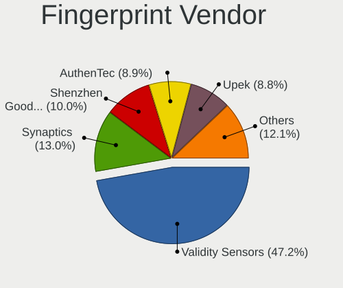

| Vendor                             | Notebooks | Percent |
|------------------------------------|-----------|---------|
| Validity Sensors                   | 398       | 47.21%  |
| Synaptics                          | 110       | 13.05%  |
| Shenzhen Goodix Technology         | 84        | 9.96%   |
| AuthenTec                          | 75        | 8.9%    |
| Upek                               | 74        | 8.78%   |
| LighTuning Technology              | 40        | 4.74%   |
| Samsung Electronics                | 26        | 3.08%   |
| Elan Microelectronics              | 16        | 1.9%    |
| STMicroelectronics                 | 6         | 0.71%   |
| Realtek USB2.0 Finger Print Bridge | 4         | 0.47%   |
| Focal-systems.Corp                 | 4         | 0.47%   |
| Next Biometrics                    | 2         | 0.24%   |
| HOLTEK                             | 2         | 0.24%   |
| DigitalPersona                     | 1         | 0.12%   |
| Dell                               | 1         | 0.12%   |

Fingerprint Model
-----------------

Fingerprint sensor models

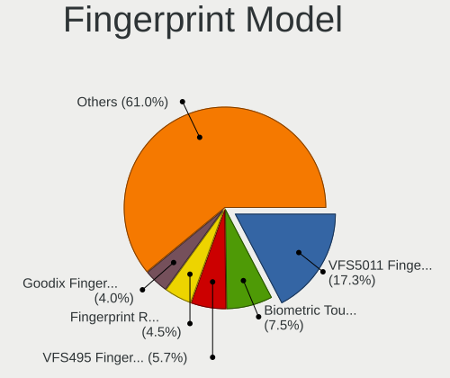

| Model                                                           | Notebooks | Percent |
|-----------------------------------------------------------------|-----------|---------|
| Validity Sensors VFS5011 Fingerprint Reader                     | 146       | 17.32%  |
| Upek Biometric Touchchip/Touchstrip Fingerprint Sensor          | 63        | 7.47%   |
| Validity Sensors VFS495 Fingerprint Reader                      | 48        | 5.69%   |
| Shenzhen Goodix Fingerprint Reader                              | 38        | 4.51%   |
| Shenzhen Goodix  FingerPrint Device                             | 34        | 4.03%   |
| LighTuning ES603 Swipe Fingerprint Sensor                       | 34        | 4.03%   |
| Validity Sensors VFS 5011 fingerprint sensor                    | 33        | 3.91%   |
| Validity Sensors VFS471 Fingerprint Reader                      | 32        | 3.8%    |
| Synaptics Prometheus MIS Touch Fingerprint Reader               | 32        | 3.8%    |
| Synaptics Metallica MOH Touch Fingerprint Reader                | 32        | 3.8%    |
| Validity Sensors Fingerprint scanner                            | 29        | 3.44%   |
| Samsung Fingerprint Device                                      | 26        | 3.08%   |
| AuthenTec AES1660 Fingerprint Sensor                            | 25        | 2.97%   |
| Validity Sensors VFS301 Fingerprint Reader                      | 21        | 2.49%   |
| AuthenTec AES2501 Fingerprint Sensor                            | 18        | 2.14%   |
| Synaptics Metallica MIS Touch Fingerprint Reader                | 17        | 2.02%   |
| Validity Sensors VFS451 Fingerprint Reader                      | 16        | 1.9%    |
| Validity Sensors VFS101 Fingerprint Reader                      | 16        | 1.9%    |
| Validity Sensors VFS491                                         | 14        | 1.66%   |
| Elan ELAN:Fingerprint                                           | 14        | 1.66%   |
| AuthenTec Fingerprint Sensor                                    | 14        | 1.66%   |
| AuthenTec AES2810                                               | 14        | 1.66%   |
| Validity Sensors VFS300 Fingerprint Reader                      | 12        | 1.42%   |
| Shenzhen Goodix FingerPrint                                     | 12        | 1.42%   |
| Validity Sensors Synaptics WBDI                                 | 11        | 1.3%    |
| Validity Sensors Swipe Fingerprint Sensor                       | 11        | 1.3%    |
| Upek TCS5B Fingerprint sensor                                   | 10        | 1.19%   |
| Synaptics  WBDI                                                 | 10        | 1.19%   |
| STMicroelectronics Fingerprint Reader                           | 6         | 0.71%   |
| LighTuning EgisTec Touch Fingerprint Sensor                     | 6         | 0.71%   |
| Synaptics Fingerprint reader [HP G6]                            | 5         | 0.59%   |
| Synaptics UWP WBDI Device                                       | 4         | 0.47%   |
| Synaptics FS7604 Touch Fingerprint Sensor with PurePrint        | 4         | 0.47%   |
| Realtek USB2.0 Finger Print Bridge FocalTech Fingerprint Device | 4         | 0.47%   |
| Focal-systems.Corp FT9201Fingerprint.                           | 4         | 0.47%   |
| AuthenTec AES1600                                               | 4         | 0.47%   |
| Validity Sensors VFS7500 Touch Fingerprint Sensor               | 3         | 0.36%   |
| Validity Sensors VFS7552 Touch Fingerprint Sensor               | 2         | 0.24%   |
| Validity Sensors Synaptics VFS7552 Touch Fingerprint Sensor     | 2         | 0.24%   |
| Synaptics WBDI Device                                           | 2         | 0.24%   |

Chipcard Vendor
---------------

Chipcard module vendors

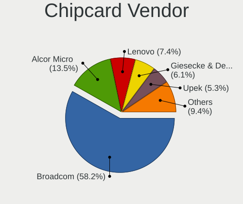

| Vendor                    | Notebooks | Percent |
|---------------------------|-----------|---------|
| Broadcom                  | 142       | 58.2%   |
| Alcor Micro               | 33        | 13.52%  |
| Lenovo                    | 18        | 7.38%   |
| Giesecke & Devrient       | 15        | 6.15%   |
| Upek                      | 13        | 5.33%   |
| Aladdin Knowledge Systems | 7         | 2.87%   |
| Watchdata                 | 5         | 2.05%   |
| O2 Micro                  | 5         | 2.05%   |
| Gemalto (was Gemplus)     | 3         | 1.23%   |
| SCM Microsystems          | 2         | 0.82%   |
| Advanced Card Systems     | 1         | 0.41%   |

Chipcard Model
--------------

Chipcard module models

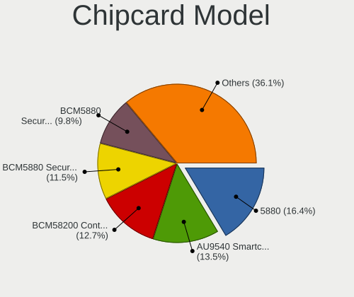

| Model                                                                        | Notebooks | Percent |
|------------------------------------------------------------------------------|-----------|---------|
| Broadcom 5880                                                                | 40        | 16.39%  |
| Alcor Micro AU9540 Smartcard Reader                                          | 33        | 13.52%  |
| Broadcom BCM58200 ControlVault 3 (FingerPrint sensor + Contacted SmartCard)  | 31        | 12.7%   |
| Broadcom BCM5880 Secure Applications Processor                               | 28        | 11.48%  |
| Broadcom BCM5880 Secure Applications Processor with fingerprint swipe sensor | 24        | 9.84%   |
| Lenovo Integrated Smart Card Reader                                          | 18        | 7.38%   |
| Broadcom 58200                                                               | 18        | 7.38%   |
| Upek TouchChip Fingerprint Coprocessor (WBF advanced mode)                   | 13        | 5.33%   |
| Giesecke & Devrient Chipcard Reader                                          | 10        | 4.1%    |
| Aladdin Knowledge Systems Token JC                                           | 7         | 2.87%   |
| Watchdata USB Key                                                            | 5         | 2.05%   |
| Giesecke & Devrient StarSign CUT S                                           | 5         | 2.05%   |
| O2 Micro OZ776 CCID Smartcard Reader                                         | 4         | 1.64%   |
| Gemalto (was Gemplus) GemPC Twin SmartCard Reader                            | 3         | 1.23%   |
| SCM Microsystems uTrust FIDO2 Security Key                                   | 1         | 0.41%   |
| SCM Microsystems SCR35xx Smart Card Reader                                   | 1         | 0.41%   |
| O2 Micro Oz776 SmartCard Reader                                              | 1         | 0.41%   |
| Broadcom BCM5880 Secure Applications Processor with fingerprint touch sensor | 1         | 0.41%   |
| Advanced Card Systems ACR38 SmartCard Reader                                 | 1         | 0.41%   |

Unsupported
-----------

Unsupported Devices
-------------------

Total unsupported devices on board

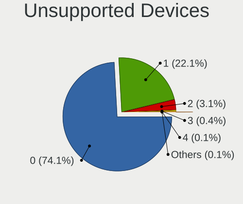

| Total | Notebooks | Percent |
|-------|-----------|---------|
| 0     | 8181      | 74.14%  |
| 1     | 2438      | 22.09%  |
| 2     | 345       | 3.13%   |
| 3     | 49        | 0.44%   |
| 4     | 10        | 0.09%   |
| 7     | 5         | 0.05%   |
| 5     | 4         | 0.04%   |
| 8     | 2         | 0.02%   |
| 6     | 1         | 0.01%   |

Unsupported Device Types
------------------------

Types of unsupported devices

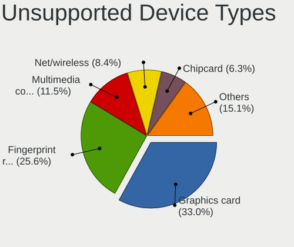

| Type                     | Notebooks | Percent |
|--------------------------|-----------|---------|
| Graphics card            | 1080      | 33.04%  |
| Fingerprint reader       | 838       | 25.63%  |
| Multimedia controller    | 376       | 11.5%   |
| Net/wireless             | 274       | 8.38%   |
| Chipcard                 | 207       | 6.33%   |
| Bluetooth                | 117       | 3.58%   |
| Camera                   | 116       | 3.55%   |
| Communication controller | 62        | 1.9%    |
| Storage                  | 57        | 1.74%   |
| Sound                    | 44        | 1.35%   |
| Net/ethernet             | 41        | 1.25%   |
| Flash memory             | 26        | 0.8%    |
| Card reader              | 9         | 0.28%   |
| Modem                    | 7         | 0.21%   |
| Firewire controller      | 4         | 0.12%   |
| Unassigned class         | 3         | 0.09%   |
| Network                  | 3         | 0.09%   |
| Wireless                 | 1         | 0.03%   |
| Tv card                  | 1         | 0.03%   |
| Storage/nvme             | 1         | 0.03%   |
| Storage/ide              | 1         | 0.03%   |
| Storage/ata              | 1         | 0.03%   |

