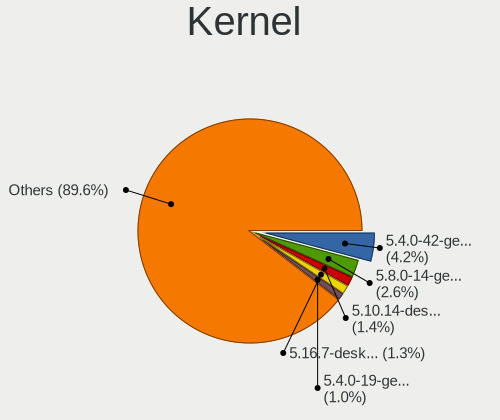
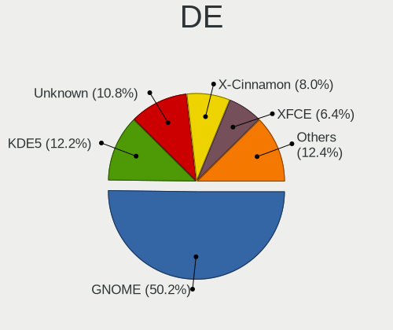
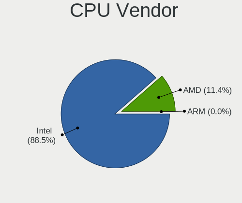
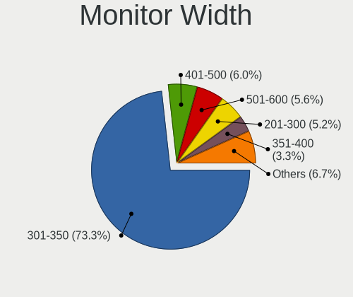
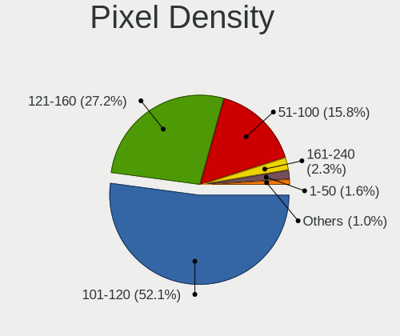
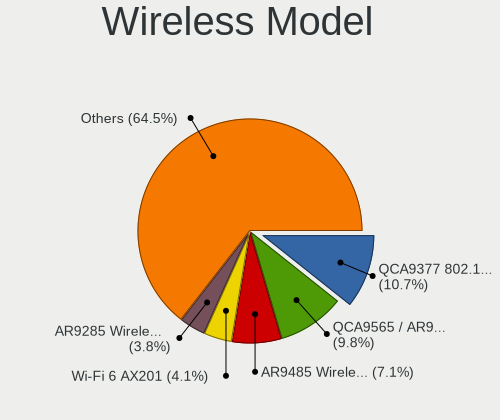
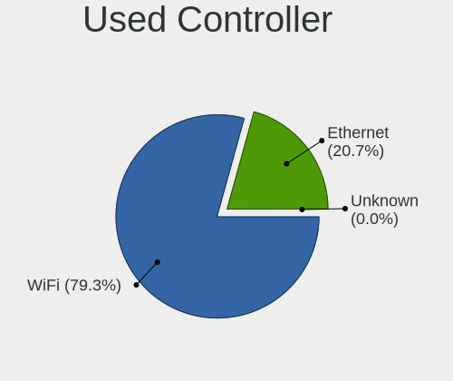
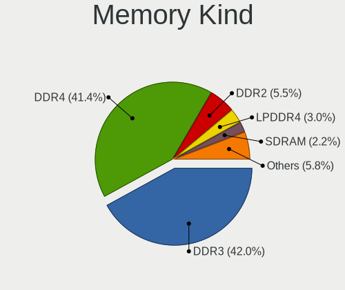
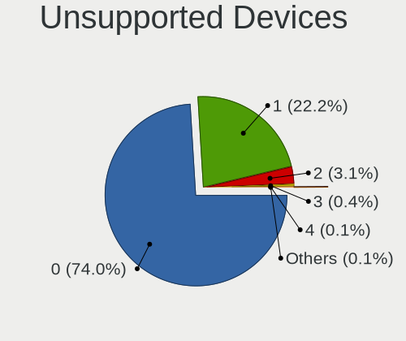

Linux in Brazil - Tested Hardware & Statistics (Notebooks)
----------------------------------------------------------

A project to collect tested hardware configurations for Linux in Brazil.

Anyone can contribute to this report by the [hw-probe](https://github.com/linuxhw/hw-probe) tool:

    sudo -E hw-probe -all -upload

Please contribute! Especially if your hardware is rare.

Contents
--------

* [ Test Cases ](#test-cases)

* [ System ](#system)
  - [ OS                       ](#os)
  - [ OS Family                ](#os-family)
  - [ Kernel                   ](#kernel)
  - [ Kernel Family            ](#kernel-family)
  - [ Kernel Major Ver.        ](#kernel-major-ver)
  - [ Arch                     ](#arch)
  - [ DE                       ](#de)
  - [ Display Server           ](#display-server)
  - [ Display Manager          ](#display-manager)
  - [ OS Lang                  ](#os-lang)
  - [ Boot Mode                ](#boot-mode)
  - [ Filesystem               ](#filesystem)
  - [ Part. scheme             ](#part-scheme)
  - [ Dual Boot with Linux/BSD ](#dual-boot-with-linuxbsd)
  - [ Dual Boot (Win)          ](#dual-boot-win)

* [ Board ](#board)
  - [ Vendor                   ](#vendor)
  - [ Model                    ](#model)
  - [ Model Family             ](#model-family)
  - [ MFG Year                 ](#mfg-year)
  - [ Form Factor              ](#form-factor)
  - [ Secure Boot              ](#secure-boot)
  - [ Coreboot                 ](#coreboot)
  - [ RAM Size                 ](#ram-size)
  - [ RAM Used                 ](#ram-used)
  - [ Total Drives             ](#total-drives)
  - [ Has CD-ROM               ](#has-cd-rom)
  - [ Has Ethernet             ](#has-ethernet)
  - [ Has WiFi                 ](#has-wifi)
  - [ Has Bluetooth            ](#has-bluetooth)

* [ Location ](#location)
  - [ Country                  ](#country)
  - [ City                     ](#city)

* [ Drives ](#drives)
  - [ Drive Vendor             ](#drive-vendor)
  - [ Drive Model              ](#drive-model)
  - [ HDD Vendor               ](#hdd-vendor)
  - [ SSD Vendor               ](#ssd-vendor)
  - [ Drive Kind               ](#drive-kind)
  - [ Drive Connector          ](#drive-connector)
  - [ Drive Size               ](#drive-size)
  - [ Space Total              ](#space-total)
  - [ Space Used               ](#space-used)
  - [ Malfunc. Drives          ](#malfunc-drives)
  - [ Malfunc. Drive Vendor    ](#malfunc-drive-vendor)
  - [ Malfunc. HDD Vendor      ](#malfunc-hdd-vendor)
  - [ Malfunc. Drive Kind      ](#malfunc-drive-kind)
  - [ Failed Drives            ](#failed-drives)
  - [ Failed Drive Vendor      ](#failed-drive-vendor)
  - [ Drive Status             ](#drive-status)

* [ Storage controller ](#storage-controller)
  - [ Storage Vendor           ](#storage-vendor)
  - [ Storage Model            ](#storage-model)
  - [ Storage Kind             ](#storage-kind)

* [ Processor ](#processor)
  - [ CPU Vendor               ](#cpu-vendor)
  - [ CPU Model                ](#cpu-model)
  - [ CPU Model Family         ](#cpu-model-family)
  - [ CPU Cores                ](#cpu-cores)
  - [ CPU Sockets              ](#cpu-sockets)
  - [ CPU Threads              ](#cpu-threads)
  - [ CPU Op-Modes             ](#cpu-op-modes)
  - [ CPU Microcode            ](#cpu-microcode)
  - [ CPU Microarch            ](#cpu-microarch)

* [ Graphics ](#graphics)
  - [ GPU Vendor               ](#gpu-vendor)
  - [ GPU Model                ](#gpu-model)
  - [ GPU Combo                ](#gpu-combo)
  - [ GPU Driver               ](#gpu-driver)
  - [ GPU Memory               ](#gpu-memory)

* [ Monitor ](#monitor)
  - [ Monitor Vendor           ](#monitor-vendor)
  - [ Monitor Model            ](#monitor-model)
  - [ Monitor Resolution       ](#monitor-resolution)
  - [ Monitor Diagonal         ](#monitor-diagonal)
  - [ Monitor Width            ](#monitor-width)
  - [ Aspect Ratio             ](#aspect-ratio)
  - [ Monitor Area             ](#monitor-area)
  - [ Pixel Density            ](#pixel-density)
  - [ Multiple Monitors        ](#multiple-monitors)

* [ Network ](#network)
  - [ Net Controller Vendor    ](#net-controller-vendor)
  - [ Net Controller Model     ](#net-controller-model)
  - [ Wireless Vendor          ](#wireless-vendor)
  - [ Wireless Model           ](#wireless-model)
  - [ Ethernet Vendor          ](#ethernet-vendor)
  - [ Ethernet Model           ](#ethernet-model)
  - [ Net Controller Kind      ](#net-controller-kind)
  - [ Used Controller          ](#used-controller)
  - [ NICs                     ](#nics)
  - [ IPv6                     ](#ipv6)

* [ Bluetooth ](#bluetooth)
  - [ Bluetooth Vendor         ](#bluetooth-vendor)
  - [ Bluetooth Model          ](#bluetooth-model)

* [ Sound ](#sound)
  - [ Sound Vendor             ](#sound-vendor)
  - [ Sound Model              ](#sound-model)

* [ Memory ](#memory)
  - [ Memory Vendor            ](#memory-vendor)
  - [ Memory Model             ](#memory-model)
  - [ Memory Kind              ](#memory-kind)
  - [ Memory Form Factor       ](#memory-form-factor)
  - [ Memory Size              ](#memory-size)
  - [ Memory Speed             ](#memory-speed)

* [ Printers & scanners ](#printers--scanners)
  - [ Printer Vendor           ](#printer-vendor)
  - [ Printer Model            ](#printer-model)
  - [ Scanner Vendor           ](#scanner-vendor)
  - [ Scanner Model            ](#scanner-model)

* [ Camera ](#camera)
  - [ Camera Vendor            ](#camera-vendor)
  - [ Camera Model             ](#camera-model)

* [ Security ](#security)
  - [ Fingerprint Vendor       ](#fingerprint-vendor)
  - [ Fingerprint Model        ](#fingerprint-model)
  - [ Chipcard Vendor          ](#chipcard-vendor)
  - [ Chipcard Model           ](#chipcard-model)

* [ Unsupported ](#unsupported)
  - [ Unsupported Devices      ](#unsupported-devices)
  - [ Unsupported Device Types ](#unsupported-device-types)

Test Cases
----------

Total: 11298

| Vendor        | Model                       | Probe                                                      | Date         |
|---------------|-----------------------------|------------------------------------------------------------|--------------|
| Apple         | MacBookPro8,2               | [8386acaa29](https://linux-hardware.org/?probe=8386acaa29) | Jun 30, 2023 |
| Lenovo        | ThinkPad T495 20NK000XBR    | [2b5e40efaa](https://linux-hardware.org/?probe=2b5e40efaa) | Jun 30, 2023 |
| Toshiba       | IS 1413G                    | [b95a7c049a](https://linux-hardware.org/?probe=b95a7c049a) | Jun 30, 2023 |
| eMachines     | eME443                      | [0d6808da66](https://linux-hardware.org/?probe=0d6808da66) | Jun 30, 2023 |
| Notebook      | NJx0MU                      | [136060092c](https://linux-hardware.org/?probe=136060092c) | Jun 30, 2023 |
| Positivo      | Mobile                      | [fdaaf6915b](https://linux-hardware.org/?probe=fdaaf6915b) | Jun 30, 2023 |
| Multilaser    | MLSH1H LINUX                | [3aa4a11068](https://linux-hardware.org/?probe=3aa4a11068) | Jun 30, 2023 |
| Multilaser    | MLSH1H LINUX                | [3a8a822af9](https://linux-hardware.org/?probe=3a8a822af9) | Jun 30, 2023 |
| Positivo      | S14CT01                     | [b70845bd08](https://linux-hardware.org/?probe=b70845bd08) | Jun 29, 2023 |
| HP            | Pavilion 11 x360 PC         | [cfbc8c8a97](https://linux-hardware.org/?probe=cfbc8c8a97) | Jun 29, 2023 |
| Acer          | TravelMate P449-G2-M        | [b9291d6951](https://linux-hardware.org/?probe=b9291d6951) | Jun 29, 2023 |
| Positivo      | H14CU02                     | [d50e6fbbdc](https://linux-hardware.org/?probe=d50e6fbbdc) | Jun 29, 2023 |
| Dell          | Inspiron 1440               | [ed9bcaecd2](https://linux-hardware.org/?probe=ed9bcaecd2) | Jun 29, 2023 |
| Lenovo        | V14 G2 ITL 82NM             | [25a1aaf938](https://linux-hardware.org/?probe=25a1aaf938) | Jun 29, 2023 |
| Sony          | SVE17137CXB                 | [ed6f82dc16](https://linux-hardware.org/?probe=ed6f82dc16) | Jun 29, 2023 |
| Acer          | Nitro AN515-55              | [a41ff8c573](https://linux-hardware.org/?probe=a41ff8c573) | Jun 29, 2023 |
| Dell          | Inspiron N5010              | [5683980090](https://linux-hardware.org/?probe=5683980090) | Jun 28, 2023 |
| Lenovo        | IdeaPad Gaming 3 15IMH05... | [f64ccf77fb](https://linux-hardware.org/?probe=f64ccf77fb) | Jun 28, 2023 |
| Toshiba       | PORTEGE R500                | [2c6448083e](https://linux-hardware.org/?probe=2c6448083e) | Jun 28, 2023 |
| Acer          | Aspire A315-23G             | [1c07c9f0b8](https://linux-hardware.org/?probe=1c07c9f0b8) | Jun 28, 2023 |
| Notebook      | NJx0MU                      | [235e541e2d](https://linux-hardware.org/?probe=235e541e2d) | Jun 28, 2023 |
| Acer          | Aspire 4349                 | [9064db77e4](https://linux-hardware.org/?probe=9064db77e4) | Jun 28, 2023 |
| Samsung       | 550XCJ/550XCR               | [bca3e799e0](https://linux-hardware.org/?probe=bca3e799e0) | Jun 27, 2023 |
| Acer          | Aspire E1-571               | [894f8583ea](https://linux-hardware.org/?probe=894f8583ea) | Jun 27, 2023 |
| Dell          | Vostro 15 3510              | [adb3a3de68](https://linux-hardware.org/?probe=adb3a3de68) | Jun 27, 2023 |
| Clevo         | M540SS Bottom               | [4b613733a0](https://linux-hardware.org/?probe=4b613733a0) | Jun 27, 2023 |
| Samsung       | 305U1A                      | [cd7de3aecf](https://linux-hardware.org/?probe=cd7de3aecf) | Jun 27, 2023 |
| Lenovo        | IdeaPad S145-15API 81V7     | [ec69000909](https://linux-hardware.org/?probe=ec69000909) | Jun 27, 2023 |
| Acer          | Nitro AN515-45              | [0bfb7dc30a](https://linux-hardware.org/?probe=0bfb7dc30a) | Jun 27, 2023 |
| ASUSTek       | VivoBook_ASUSLaptop X570... | [fce3ec0379](https://linux-hardware.org/?probe=fce3ec0379) | Jun 27, 2023 |
| Lenovo        | IdeaPad Gaming 3 15IMH05... | [5eac5b8b6d](https://linux-hardware.org/?probe=5eac5b8b6d) | Jun 27, 2023 |
| Toshiba       | IS 1413G                    | [882bd512a2](https://linux-hardware.org/?probe=882bd512a2) | Jun 27, 2023 |
| Acer          | Aspire VX5-591G             | [b4bd8360ea](https://linux-hardware.org/?probe=b4bd8360ea) | Jun 27, 2023 |
| Acer          | Aspire VX5-591G             | [1ffeb058e9](https://linux-hardware.org/?probe=1ffeb058e9) | Jun 27, 2023 |
| Daten Tecn... | ESTELAR                     | [0052df6a90](https://linux-hardware.org/?probe=0052df6a90) | Jun 27, 2023 |
| Dell          | Inspiron 3583               | [e1e76b3d77](https://linux-hardware.org/?probe=e1e76b3d77) | Jun 27, 2023 |
| Samsung       | 305U1A                      | [ab46376842](https://linux-hardware.org/?probe=ab46376842) | Jun 27, 2023 |
| Samsung       | 305U1A                      | [b2f2c2b000](https://linux-hardware.org/?probe=b2f2c2b000) | Jun 26, 2023 |
| Dell          | Inspiron 3442               | [6e179dbfb0](https://linux-hardware.org/?probe=6e179dbfb0) | Jun 26, 2023 |
| Daten Tecn... | ESTELAR                     | [d5f99bced6](https://linux-hardware.org/?probe=d5f99bced6) | Jun 26, 2023 |
| Lenovo        | IdeaPad S145-15IWL 81S9     | [e89c1b2b89](https://linux-hardware.org/?probe=e89c1b2b89) | Jun 26, 2023 |
| eMachines     | E525                        | [9e477a5fad](https://linux-hardware.org/?probe=9e477a5fad) | Jun 26, 2023 |
| Acer          | Nitro AN517-54              | [9af91d0ced](https://linux-hardware.org/?probe=9af91d0ced) | Jun 26, 2023 |
| Acer          | Aspire A515-51              | [ee5172b420](https://linux-hardware.org/?probe=ee5172b420) | Jun 26, 2023 |
| Avell High... | A70 HYB                     | [3ccdaf3c82](https://linux-hardware.org/?probe=3ccdaf3c82) | Jun 26, 2023 |
| Acer          | Nitro AN517-54              | [9a87719748](https://linux-hardware.org/?probe=9a87719748) | Jun 25, 2023 |
| Acer          | Aspire A515-56              | [710bc10bf8](https://linux-hardware.org/?probe=710bc10bf8) | Jun 25, 2023 |
| Acer          | Aspire A515-56              | [a9b805ab66](https://linux-hardware.org/?probe=a9b805ab66) | Jun 25, 2023 |
| Notebook      | NJx0MU                      | [47a0ae93f4](https://linux-hardware.org/?probe=47a0ae93f4) | Jun 25, 2023 |
| Toshiba       | IS 1413G                    | [bce89b670d](https://linux-hardware.org/?probe=bce89b670d) | Jun 25, 2023 |
| Sony          | VPCEA23FB                   | [b9a835920f](https://linux-hardware.org/?probe=b9a835920f) | Jun 25, 2023 |
| Sony          | VPCEA23FB                   | [c462c4c75e](https://linux-hardware.org/?probe=c462c4c75e) | Jun 25, 2023 |
| Dell          | Latitude E6430              | [be9b6c75da](https://linux-hardware.org/?probe=be9b6c75da) | Jun 25, 2023 |
| Toshiba       | PORTEGE R500                | [e327093da9](https://linux-hardware.org/?probe=e327093da9) | Jun 25, 2023 |
| Lenovo        | V15 G2 ITL 82ME             | [3fde30195c](https://linux-hardware.org/?probe=3fde30195c) | Jun 25, 2023 |
| Toshiba       | IS 1413G                    | [a87db20468](https://linux-hardware.org/?probe=a87db20468) | Jun 25, 2023 |
| Lenovo        | ThinkPad T440p 20AWS2820... | [0ea92a193f](https://linux-hardware.org/?probe=0ea92a193f) | Jun 24, 2023 |
| Dell          | G5 5590                     | [6d6974b0eb](https://linux-hardware.org/?probe=6d6974b0eb) | Jun 24, 2023 |
| Dell          | Inspiron 7460               | [dcfef21d2b](https://linux-hardware.org/?probe=dcfef21d2b) | Jun 24, 2023 |
| Dell          | Inspiron 7460               | [62d08bd4ca](https://linux-hardware.org/?probe=62d08bd4ca) | Jun 24, 2023 |
| Dell          | Inspiron 3583               | [e0f5116d38](https://linux-hardware.org/?probe=e0f5116d38) | Jun 23, 2023 |
| Dell          | Inspiron 3501               | [60034feb35](https://linux-hardware.org/?probe=60034feb35) | Jun 23, 2023 |
| Dell          | Latitude 3420               | [730bdb05fe](https://linux-hardware.org/?probe=730bdb05fe) | Jun 23, 2023 |
| Lenovo        | IdeaPad Gaming 3 15IHU6 ... | [007cf1edce](https://linux-hardware.org/?probe=007cf1edce) | Jun 23, 2023 |
| Acer          | Predator PH315-54           | [46d748a0a1](https://linux-hardware.org/?probe=46d748a0a1) | Jun 23, 2023 |
| Dell          | Inspiron 3501               | [e8db86e014](https://linux-hardware.org/?probe=e8db86e014) | Jun 22, 2023 |
| Positivo B... | VJFE43F11X-XXXXXX           | [e03310c8e8](https://linux-hardware.org/?probe=e03310c8e8) | Jun 22, 2023 |
| ASUSTek       | X45U                        | [63a491a160](https://linux-hardware.org/?probe=63a491a160) | Jun 22, 2023 |
| Dell          | Inspiron 3583               | [170d1f4f0b](https://linux-hardware.org/?probe=170d1f4f0b) | Jun 22, 2023 |
| Dell          | Inspiron 11-3168            | [8407c1d3cb](https://linux-hardware.org/?probe=8407c1d3cb) | Jun 22, 2023 |
| Samsung       | 550XDA                      | [f20386ccdd](https://linux-hardware.org/?probe=f20386ccdd) | Jun 22, 2023 |
| Lenovo        | IdeaPad Gaming 3 15ACH6 ... | [42cb7025f1](https://linux-hardware.org/?probe=42cb7025f1) | Jun 22, 2023 |
| Dell          | Inspiron 15 3511            | [0ef8557b4d](https://linux-hardware.org/?probe=0ef8557b4d) | Jun 22, 2023 |
| Acer          | Nitro AN515-44              | [d43ff293c1](https://linux-hardware.org/?probe=d43ff293c1) | Jun 22, 2023 |
| Positivo      | Mobile                      | [f9a55866f0](https://linux-hardware.org/?probe=f9a55866f0) | Jun 22, 2023 |
| Positivo      | Mobile                      | [25df2e5abc](https://linux-hardware.org/?probe=25df2e5abc) | Jun 22, 2023 |
| Dell          | Inspiron 1525               | [1cdf3502e8](https://linux-hardware.org/?probe=1cdf3502e8) | Jun 21, 2023 |
| Dell          | Inspiron 1525               | [7bbc89ec0f](https://linux-hardware.org/?probe=7bbc89ec0f) | Jun 21, 2023 |
| Dell          | Inspiron 5557               | [cc0794fa6e](https://linux-hardware.org/?probe=cc0794fa6e) | Jun 21, 2023 |
| ASUSTek       | VivoBook_ASUSLaptop X515... | [817361caf5](https://linux-hardware.org/?probe=817361caf5) | Jun 21, 2023 |
| Dell          | System Inspiron N4110       | [ebaceedccf](https://linux-hardware.org/?probe=ebaceedccf) | Jun 21, 2023 |
| Dell          | System Inspiron N4110       | [a168f45822](https://linux-hardware.org/?probe=a168f45822) | Jun 21, 2023 |
| Toshiba       | IS 1413G                    | [14296e98e7](https://linux-hardware.org/?probe=14296e98e7) | Jun 21, 2023 |
| Dell          | Vostro 5490                 | [10d1aeda8b](https://linux-hardware.org/?probe=10d1aeda8b) | Jun 21, 2023 |
| Lenovo        | IdeaPad S145-15IWL 81S9     | [e67932c5a0](https://linux-hardware.org/?probe=e67932c5a0) | Jun 21, 2023 |
| Daten Tecn... | DCM4D-4 v4                  | [8a05558ee0](https://linux-hardware.org/?probe=8a05558ee0) | Jun 20, 2023 |
| Acer          | Nitro AN517-51              | [b4423e6ac2](https://linux-hardware.org/?probe=b4423e6ac2) | Jun 20, 2023 |
| Lenovo        | IdeaPad 3 15ITL6 82MD       | [c40e92156c](https://linux-hardware.org/?probe=c40e92156c) | Jun 20, 2023 |
| Acer          | TravelMate P449-G2-M        | [98626bde6c](https://linux-hardware.org/?probe=98626bde6c) | Jun 20, 2023 |
| Dell          | Latitude 3410               | [1e0348842a](https://linux-hardware.org/?probe=1e0348842a) | Jun 19, 2023 |
| Sony          | VPCCA15FX                   | [ed7dba1a4c](https://linux-hardware.org/?probe=ed7dba1a4c) | Jun 19, 2023 |
| Sony          | VPCCA15FX                   | [c5660d0020](https://linux-hardware.org/?probe=c5660d0020) | Jun 19, 2023 |
| ASUSTek       | VivoBook_ASUSLaptop X515... | [c0dc86bdc1](https://linux-hardware.org/?probe=c0dc86bdc1) | Jun 19, 2023 |
| HP            | EliteBook 8460p             | [2192185525](https://linux-hardware.org/?probe=2192185525) | Jun 18, 2023 |
| Lenovo        | IdeaPad Flex14 SharkBay     | [e904a7b3ce](https://linux-hardware.org/?probe=e904a7b3ce) | Jun 18, 2023 |
| Lenovo        | IdeaPad Flex14 SharkBay     | [cb84a2778b](https://linux-hardware.org/?probe=cb84a2778b) | Jun 18, 2023 |
| Lenovo        | ThinkPad X1 Carbon 2nd 2... | [d237a2bfe6](https://linux-hardware.org/?probe=d237a2bfe6) | Jun 18, 2023 |
| Dell          | Inspiron 5566               | [be5a148c53](https://linux-hardware.org/?probe=be5a148c53) | Jun 18, 2023 |
| HP            | EliteBook 8460p             | [c0de332a8b](https://linux-hardware.org/?probe=c0de332a8b) | Jun 18, 2023 |
| Acer          | Aspire E5-574               | [ca656065e5](https://linux-hardware.org/?probe=ca656065e5) | Jun 17, 2023 |
| Samsung       | 300E5K/300E5Q               | [a281272278](https://linux-hardware.org/?probe=a281272278) | Jun 17, 2023 |
| Avell High... | A70 HYB                     | [10eb079da8](https://linux-hardware.org/?probe=10eb079da8) | Jun 17, 2023 |
| Sony          | SVF15213CBW                 | [4fcc62d3ac](https://linux-hardware.org/?probe=4fcc62d3ac) | Jun 17, 2023 |
| HP            | Pavilion dv7                | [f010c487a1](https://linux-hardware.org/?probe=f010c487a1) | Jun 17, 2023 |
| Acer          | Nitro AN517-51              | [d2f2f70083](https://linux-hardware.org/?probe=d2f2f70083) | Jun 16, 2023 |
| Unknown       | Unknown                     | [f1294224ee](https://linux-hardware.org/?probe=f1294224ee) | Jun 15, 2023 |
| eMachines     | eMD728                      | [85dd880b0d](https://linux-hardware.org/?probe=85dd880b0d) | Jun 15, 2023 |
| Unknown       | Unknown                     | [9b8a05d0f9](https://linux-hardware.org/?probe=9b8a05d0f9) | Jun 15, 2023 |
| Lenovo        | IdeaPad S145-15IWL 81S9     | [a6f63a08e2](https://linux-hardware.org/?probe=a6f63a08e2) | Jun 15, 2023 |
| Apple         | MacBookAir4,1               | [e8575f0a34](https://linux-hardware.org/?probe=e8575f0a34) | Jun 15, 2023 |
| System76      | Gazelle                     | [79c4236cdd](https://linux-hardware.org/?probe=79c4236cdd) | Jun 15, 2023 |
| Positivo      | Q4128C-S                    | [1fab0b0752](https://linux-hardware.org/?probe=1fab0b0752) | Jun 15, 2023 |
| Dell          | Latitude 5480               | [677cb87f98](https://linux-hardware.org/?probe=677cb87f98) | Jun 14, 2023 |
| Acer          | Aspire A315-54K             | [472d8bc7df](https://linux-hardware.org/?probe=472d8bc7df) | Jun 14, 2023 |
| ASUSTek       | VivoBook 15_ASUS Laptop ... | [49e4d6ccb3](https://linux-hardware.org/?probe=49e4d6ccb3) | Jun 14, 2023 |
| ASUSTek       | VivoBook 15_ASUS Laptop ... | [0c3df957ce](https://linux-hardware.org/?probe=0c3df957ce) | Jun 14, 2023 |
| Samsung       | 670Z5E                      | [20f84530c7](https://linux-hardware.org/?probe=20f84530c7) | Jun 14, 2023 |
| Acer          | Aspire A315-23G             | [18a5adccb6](https://linux-hardware.org/?probe=18a5adccb6) | Jun 14, 2023 |
| Acer          | Nitro AN517-54              | [d0187875be](https://linux-hardware.org/?probe=d0187875be) | Jun 13, 2023 |
| Samsung       | 340XAA/350XAA/550XAA        | [d7c90a9c25](https://linux-hardware.org/?probe=d7c90a9c25) | Jun 13, 2023 |
| Apple         | MacBookPro9,2               | [5223ed2efd](https://linux-hardware.org/?probe=5223ed2efd) | Jun 13, 2023 |
| Apple         | MacBookPro9,2               | [e25224b362](https://linux-hardware.org/?probe=e25224b362) | Jun 13, 2023 |
| Lenovo        | IdeaPad S145-15IIL 82DJ     | [9fe9d9f03f](https://linux-hardware.org/?probe=9fe9d9f03f) | Jun 13, 2023 |
| Samsung       | RV411/RV511/E3511/S3511/... | [1439681971](https://linux-hardware.org/?probe=1439681971) | Jun 13, 2023 |
| Samsung       | RV411/RV511/E3511/S3511/... | [3a8d104147](https://linux-hardware.org/?probe=3a8d104147) | Jun 13, 2023 |
| Lenovo        | ThinkPad E14 Gen 2 20TB0... | [d2e4302f28](https://linux-hardware.org/?probe=d2e4302f28) | Jun 13, 2023 |
| Lenovo        | ThinkPad E14 Gen 2 20TB0... | [e858489484](https://linux-hardware.org/?probe=e858489484) | Jun 13, 2023 |
| Samsung       | 270E5K/270E5Q/271E5K/257... | [c765305160](https://linux-hardware.org/?probe=c765305160) | Jun 13, 2023 |
| Acer          | TravelMate P449-G2-M        | [97b6ba8bd6](https://linux-hardware.org/?probe=97b6ba8bd6) | Jun 13, 2023 |
| Dell          | Vostro 5470                 | [b5294ee338](https://linux-hardware.org/?probe=b5294ee338) | Jun 13, 2023 |
| ASUSTek       | X451MA                      | [bfa5493aa2](https://linux-hardware.org/?probe=bfa5493aa2) | Jun 12, 2023 |
| Positivo      | C14CR01                     | [11d46971fa](https://linux-hardware.org/?probe=11d46971fa) | Jun 12, 2023 |
| ASUSTek       | VivoBook_ASUSLaptop X515... | [a1cbc5571a](https://linux-hardware.org/?probe=a1cbc5571a) | Jun 12, 2023 |
| Lenovo        | IdeaPad 320-15IKB 81G3      | [c09c4a0f69](https://linux-hardware.org/?probe=c09c4a0f69) | Jun 12, 2023 |
| Samsung       | 550XCJ/550XCR               | [679fb4f6ab](https://linux-hardware.org/?probe=679fb4f6ab) | Jun 11, 2023 |
| Dell          | G3 3579                     | [c04bf46d3e](https://linux-hardware.org/?probe=c04bf46d3e) | Jun 11, 2023 |
| Lenovo        | IdeaPad S145-15API 81V7     | [9747487f82](https://linux-hardware.org/?probe=9747487f82) | Jun 11, 2023 |
| Dell          | Latitude 3420               | [07061e9d7d](https://linux-hardware.org/?probe=07061e9d7d) | Jun 10, 2023 |
| Notebook      | NJx0MU                      | [c610b3b9fe](https://linux-hardware.org/?probe=c610b3b9fe) | Jun 10, 2023 |
| Notebook      | NJx0MU                      | [88d3849db5](https://linux-hardware.org/?probe=88d3849db5) | Jun 10, 2023 |
| Acer          | Aspire E5-574G              | [8ca78da386](https://linux-hardware.org/?probe=8ca78da386) | Jun 10, 2023 |
| Acer          | Aspire E1-572               | [532d86f9e6](https://linux-hardware.org/?probe=532d86f9e6) | Jun 10, 2023 |
| Samsung       | 550XCJ/550XCR               | [d8dac01c79](https://linux-hardware.org/?probe=d8dac01c79) | Jun 10, 2023 |
| Valve         | Jupiter                     | [c1e32f24ee](https://linux-hardware.org/?probe=c1e32f24ee) | Jun 10, 2023 |
| Acer          | Nitro AN515-44              | [b3531502a8](https://linux-hardware.org/?probe=b3531502a8) | Jun 10, 2023 |
| Lenovo        | IdeaPad S145-15IWL 81S9     | [0b0c11a052](https://linux-hardware.org/?probe=0b0c11a052) | Jun 09, 2023 |
| Dell          | Vostro 3460                 | [e8ed8e8b1e](https://linux-hardware.org/?probe=e8ed8e8b1e) | Jun 09, 2023 |
| Dell          | Vostro 1310                 | [05fc6f167c](https://linux-hardware.org/?probe=05fc6f167c) | Jun 09, 2023 |
| Digibras      | NH4CU03                     | [c66d30943e](https://linux-hardware.org/?probe=c66d30943e) | Jun 09, 2023 |
| Dell          | Latitude E7240              | [1d8eb4fce4](https://linux-hardware.org/?probe=1d8eb4fce4) | Jun 09, 2023 |
| Dell          | Latitude E7240              | [da22551dca](https://linux-hardware.org/?probe=da22551dca) | Jun 09, 2023 |
| Acer          | TravelMate P449-G2-M        | [6b42200bee](https://linux-hardware.org/?probe=6b42200bee) | Jun 09, 2023 |
| Acer          | TravelMate P449-G2-M        | [0fa009ad04](https://linux-hardware.org/?probe=0fa009ad04) | Jun 08, 2023 |
| Dell          | G15 5520                    | [2410d016d6](https://linux-hardware.org/?probe=2410d016d6) | Jun 08, 2023 |
| Dell          | G15 5520                    | [8d48df5869](https://linux-hardware.org/?probe=8d48df5869) | Jun 07, 2023 |
| Dell          | Inspiron 15 5510            | [98d7cb7ea7](https://linux-hardware.org/?probe=98d7cb7ea7) | Jun 07, 2023 |
| Toshiba       | Satellite C855-233          | [fb90f9aa02](https://linux-hardware.org/?probe=fb90f9aa02) | Jun 07, 2023 |
| Dell          | Inspiron 5548               | [e67581e121](https://linux-hardware.org/?probe=e67581e121) | Jun 07, 2023 |
| Dell          | Vostro 15 3510              | [b661a14644](https://linux-hardware.org/?probe=b661a14644) | Jun 07, 2023 |
| Google        | Chell                       | [cace26f9f9](https://linux-hardware.org/?probe=cace26f9f9) | Jun 07, 2023 |
| Toshiba       | IS 1413G                    | [cc023db7a9](https://linux-hardware.org/?probe=cc023db7a9) | Jun 07, 2023 |
| Acer          | Aspire A315-23              | [cbb39d8d29](https://linux-hardware.org/?probe=cbb39d8d29) | Jun 07, 2023 |
| Acer          | Aspire A315-23              | [47fd407976](https://linux-hardware.org/?probe=47fd407976) | Jun 07, 2023 |
| Acer          | Predator PH315-52           | [f7178495c7](https://linux-hardware.org/?probe=f7178495c7) | Jun 07, 2023 |
| Positivo      | Mobile                      | [12d5c3248c](https://linux-hardware.org/?probe=12d5c3248c) | Jun 06, 2023 |
| Samsung       | 300E5M/300E5L               | [e066300eac](https://linux-hardware.org/?probe=e066300eac) | Jun 06, 2023 |
| Lenovo        | IdeaPad Z500 20202          | [2f138401f6](https://linux-hardware.org/?probe=2f138401f6) | Jun 06, 2023 |
| HP            | Laptop 14s-dq1xxx           | [8f99826bf1](https://linux-hardware.org/?probe=8f99826bf1) | Jun 06, 2023 |
| Notebook      | NJx0MU                      | [0f91c977f0](https://linux-hardware.org/?probe=0f91c977f0) | Jun 06, 2023 |
| Apple         | MacBookAir7,2               | [44cf28ec0e](https://linux-hardware.org/?probe=44cf28ec0e) | Jun 05, 2023 |
| Compaq        | CQ-27                       | [ae3d9bce8c](https://linux-hardware.org/?probe=ae3d9bce8c) | Jun 05, 2023 |
| Acer          | Nitro AN515-52              | [e9d79e576b](https://linux-hardware.org/?probe=e9d79e576b) | Jun 05, 2023 |
| ASUSTek       | VX7SX                       | [ddf3010e73](https://linux-hardware.org/?probe=ddf3010e73) | Jun 05, 2023 |
| Samsung       | 950XEE                      | [cc47fd0df0](https://linux-hardware.org/?probe=cc47fd0df0) | Jun 05, 2023 |
| Notebook      | NJx0MU                      | [ce1569ee48](https://linux-hardware.org/?probe=ce1569ee48) | Jun 05, 2023 |
| Acer          | Aspire A315-42G             | [eb67866c74](https://linux-hardware.org/?probe=eb67866c74) | Jun 05, 2023 |
| Dell          | Latitude 3410               | [820e62c9d3](https://linux-hardware.org/?probe=820e62c9d3) | Jun 04, 2023 |
| Dell          | Latitude 3410               | [12515d41c8](https://linux-hardware.org/?probe=12515d41c8) | Jun 04, 2023 |
| Dell          | Inspiron N4030              | [4d82d8bf8b](https://linux-hardware.org/?probe=4d82d8bf8b) | Jun 04, 2023 |
| Toshiba       | IS 1412                     | [b1b0369688](https://linux-hardware.org/?probe=b1b0369688) | Jun 04, 2023 |
| Dell          | Inspiron 5437               | [d805b4ec1f](https://linux-hardware.org/?probe=d805b4ec1f) | Jun 03, 2023 |
| Compaq        | 420                         | [cf7a8f5641](https://linux-hardware.org/?probe=cf7a8f5641) | Jun 03, 2023 |
| Toshiba       | IS 1412                     | [6ea1bc7e6a](https://linux-hardware.org/?probe=6ea1bc7e6a) | Jun 03, 2023 |
| Samsung       | 670Z5E                      | [647589cbbd](https://linux-hardware.org/?probe=647589cbbd) | Jun 02, 2023 |
| Dell          | Inspiron N4030              | [3c92b81349](https://linux-hardware.org/?probe=3c92b81349) | Jun 02, 2023 |
| Dell          | Inspiron N4030              | [1aca93ba38](https://linux-hardware.org/?probe=1aca93ba38) | Jun 02, 2023 |
| Dell          | Inspiron 15 7000 Gaming     | [664282cc84](https://linux-hardware.org/?probe=664282cc84) | Jun 02, 2023 |
| Dell          | G15 5520                    | [5880c98c54](https://linux-hardware.org/?probe=5880c98c54) | Jun 02, 2023 |
| Acer          | Nitro AN515-51              | [2dc3c08466](https://linux-hardware.org/?probe=2dc3c08466) | Jun 02, 2023 |
| Lenovo        | IdeaPad 320-15IKB 80YH      | [55c7d4b615](https://linux-hardware.org/?probe=55c7d4b615) | Jun 02, 2023 |
| HP            | 420                         | [0e369b273b](https://linux-hardware.org/?probe=0e369b273b) | Jun 02, 2023 |
| Positivo B... | VJFE43F11X-XXXXXX           | [ea337d3d2a](https://linux-hardware.org/?probe=ea337d3d2a) | Jun 02, 2023 |
| Lenovo        | G400s VILG1                 | [fee541ee18](https://linux-hardware.org/?probe=fee541ee18) | Jun 01, 2023 |
| Lenovo        | IdeaPad 330-15IKB 81FD      | [33e440f44f](https://linux-hardware.org/?probe=33e440f44f) | Jun 01, 2023 |
| HP            | Pavilion dv6600             | [5e2867ee61](https://linux-hardware.org/?probe=5e2867ee61) | Jun 01, 2023 |
| Acer          | Aspire A515-45              | [17621fb846](https://linux-hardware.org/?probe=17621fb846) | Jun 01, 2023 |
| Apple         | MacBookPro11,1              | [fd232702db](https://linux-hardware.org/?probe=fd232702db) | Jun 01, 2023 |
| Notebook      | NJx0MU                      | [46f5148174](https://linux-hardware.org/?probe=46f5148174) | Jun 01, 2023 |
| Samsung       | 300E5K/300E5Q               | [00d2d07850](https://linux-hardware.org/?probe=00d2d07850) | May 31, 2023 |
| Unknown       | Unknown                     | [412c6d4af8](https://linux-hardware.org/?probe=412c6d4af8) | May 31, 2023 |
| HP            | Pavilion dv4                | [75797b5ec9](https://linux-hardware.org/?probe=75797b5ec9) | May 31, 2023 |
| Apple         | MacBookPro7,1               | [4fc174a983](https://linux-hardware.org/?probe=4fc174a983) | May 31, 2023 |
| Toshiba       | IS 1413G                    | [d950f8b732](https://linux-hardware.org/?probe=d950f8b732) | May 31, 2023 |
| Acer          | TravelMate P449-G2-M        | [41177ef027](https://linux-hardware.org/?probe=41177ef027) | May 31, 2023 |
| Notebook      | NJx0MU                      | [dab4e98680](https://linux-hardware.org/?probe=dab4e98680) | May 31, 2023 |
| Lenovo        | IdeaPad 320-15IKB 80YH      | [1b457302ec](https://linux-hardware.org/?probe=1b457302ec) | May 31, 2023 |
| Acer          | Nitro AN515-51              | [d3ee3757e0](https://linux-hardware.org/?probe=d3ee3757e0) | May 30, 2023 |
| Notebook      | P15SM-A/SM1-A               | [e71d8e3bc0](https://linux-hardware.org/?probe=e71d8e3bc0) | May 30, 2023 |
| Dell          | Inspiron 15-3567            | [e51e0ef0da](https://linux-hardware.org/?probe=e51e0ef0da) | May 30, 2023 |
| Apple         | MacBookPro11,1              | [ac2f40b972](https://linux-hardware.org/?probe=ac2f40b972) | May 30, 2023 |
| Unknown       | Unknown                     | [9390923473](https://linux-hardware.org/?probe=9390923473) | May 30, 2023 |
| Apple         | MacBookPro11,1              | [f45bc9a282](https://linux-hardware.org/?probe=f45bc9a282) | May 30, 2023 |
| Samsung       | RV419/RV420                 | [ddab046bd5](https://linux-hardware.org/?probe=ddab046bd5) | May 30, 2023 |
| Notebook      | NJx0MU                      | [c0ec67e3b1](https://linux-hardware.org/?probe=c0ec67e3b1) | May 30, 2023 |
| Dell          | Inspiron 1525               | [29d2e377ad](https://linux-hardware.org/?probe=29d2e377ad) | May 29, 2023 |
| Acer          | Aspire A515-57              | [e9f91331b2](https://linux-hardware.org/?probe=e9f91331b2) | May 29, 2023 |
| Avell High... | A70 MOB                     | [70e4c12911](https://linux-hardware.org/?probe=70e4c12911) | May 29, 2023 |
| Dell          | Inspiron 1525               | [7adfc9796d](https://linux-hardware.org/?probe=7adfc9796d) | May 29, 2023 |
| Sony          | VPCSA25GB                   | [981a09e39a](https://linux-hardware.org/?probe=981a09e39a) | May 29, 2023 |
| Sony          | VPCSA25GB                   | [e36e944a92](https://linux-hardware.org/?probe=e36e944a92) | May 29, 2023 |
| Dell          | Inspiron 5447               | [270e3cd993](https://linux-hardware.org/?probe=270e3cd993) | May 29, 2023 |
| HP            | Pavilion g4                 | [12bef484db](https://linux-hardware.org/?probe=12bef484db) | May 29, 2023 |
| Notebook      | NJx0MU                      | [f46b9b1b6a](https://linux-hardware.org/?probe=f46b9b1b6a) | May 29, 2023 |
| Lenovo        | IdeaPad 320-15IKB 80YH      | [14e5763b6f](https://linux-hardware.org/?probe=14e5763b6f) | May 29, 2023 |
| Apple         | MacBookAir5,1               | [4fc496bcc4](https://linux-hardware.org/?probe=4fc496bcc4) | May 29, 2023 |
| Acer          | Aspire VX5-591G             | [1db96272fe](https://linux-hardware.org/?probe=1db96272fe) | May 29, 2023 |
| Dell          | Inspiron 1525               | [99540846c4](https://linux-hardware.org/?probe=99540846c4) | May 28, 2023 |
| Dell          | Inspiron 1525               | [99c9a792f5](https://linux-hardware.org/?probe=99c9a792f5) | May 28, 2023 |
| Lenovo        | IdeaPad Gaming 3 15IMH05... | [95793a85de](https://linux-hardware.org/?probe=95793a85de) | May 28, 2023 |
| Lenovo        | IdeaPad Gaming 3 15IMH05... | [7c9addaf1c](https://linux-hardware.org/?probe=7c9addaf1c) | May 28, 2023 |
| Lenovo        | IdeaPad 320-15IKB 80YH      | [1b4eb11af8](https://linux-hardware.org/?probe=1b4eb11af8) | May 28, 2023 |
| Lenovo        | IdeaPad Gaming 3 15IHU6 ... | [77e5b682ff](https://linux-hardware.org/?probe=77e5b682ff) | May 28, 2023 |
| Unknown       | Unknown                     | [9051961e40](https://linux-hardware.org/?probe=9051961e40) | May 28, 2023 |
| Positivo      | N1250                       | [f014b93eba](https://linux-hardware.org/?probe=f014b93eba) | May 28, 2023 |
| Dell          | Inspiron 5421               | [c559e851a2](https://linux-hardware.org/?probe=c559e851a2) | May 28, 2023 |
| Samsung       | 270E5J/2570EJ               | [f90f831805](https://linux-hardware.org/?probe=f90f831805) | May 28, 2023 |
| Dell          | Vostro 5402                 | [41a9c1dcf2](https://linux-hardware.org/?probe=41a9c1dcf2) | May 28, 2023 |
| Acer          | Aspire A515-45              | [e429db5b0b](https://linux-hardware.org/?probe=e429db5b0b) | May 27, 2023 |
| Dell          | Latitude 7490               | [fbad4c1a53](https://linux-hardware.org/?probe=fbad4c1a53) | May 27, 2023 |
| Dell          | Latitude 7490               | [00c44ed00c](https://linux-hardware.org/?probe=00c44ed00c) | May 27, 2023 |
| Positivo      | C14CR21TV                   | [f3907d940d](https://linux-hardware.org/?probe=f3907d940d) | May 27, 2023 |
| HP            | 1000                        | [f3b014fa71](https://linux-hardware.org/?probe=f3b014fa71) | May 27, 2023 |
| Lenovo        | IdeaPad Gaming 3 15IMH05... | [82cad47c63](https://linux-hardware.org/?probe=82cad47c63) | May 27, 2023 |
| Lenovo        | IdeaPad Gaming 3 15IMH05... | [09cc59aa19](https://linux-hardware.org/?probe=09cc59aa19) | May 27, 2023 |
| HP            | Pavilion dm4                | [708daa02e2](https://linux-hardware.org/?probe=708daa02e2) | May 26, 2023 |
| Lenovo        | IdeaPad 320-14IKB 80YF      | [8b93a6ab33](https://linux-hardware.org/?probe=8b93a6ab33) | May 26, 2023 |
| Lenovo        | IdeaPad 3 15ALC6 82MF       | [2b9c4431c2](https://linux-hardware.org/?probe=2b9c4431c2) | May 26, 2023 |
| Lenovo        | IdeaPad 3 15ALC6 82MF       | [f5b571be32](https://linux-hardware.org/?probe=f5b571be32) | May 26, 2023 |
| Itautec       | Infoway                     | [03be6afc10](https://linux-hardware.org/?probe=03be6afc10) | May 26, 2023 |
| Dell          | Inspiron 15-3567            | [0f79b43742](https://linux-hardware.org/?probe=0f79b43742) | May 26, 2023 |
| Samsung       | 550XDA                      | [6cc9f3cbe4](https://linux-hardware.org/?probe=6cc9f3cbe4) | May 26, 2023 |
| Acer          | Predator PT316-51s          | [0242988287](https://linux-hardware.org/?probe=0242988287) | May 26, 2023 |
| HP            | ProBook 645 G1              | [347779f3bf](https://linux-hardware.org/?probe=347779f3bf) | May 26, 2023 |
| A14CR         | Unknown                     | [a504061244](https://linux-hardware.org/?probe=a504061244) | May 25, 2023 |
| Clevo         | P150HMx                     | [d6c90a2c0c](https://linux-hardware.org/?probe=d6c90a2c0c) | May 25, 2023 |
| ASUSTek       | VivoBook 15_ASUS Laptop ... | [0ffdb62c45](https://linux-hardware.org/?probe=0ffdb62c45) | May 25, 2023 |
| Lenovo        | IdeaPad 330-15IKB 81FE      | [fcecd714d6](https://linux-hardware.org/?probe=fcecd714d6) | May 25, 2023 |
| Lenovo        | IdeaPad 330-15IGM 81FN      | [3304e68c39](https://linux-hardware.org/?probe=3304e68c39) | May 25, 2023 |
| Fujitsu       | LIFEBOOK AH530              | [c885a13922](https://linux-hardware.org/?probe=c885a13922) | May 25, 2023 |
| Fujitsu       | LIFEBOOK AH530              | [897b688aba](https://linux-hardware.org/?probe=897b688aba) | May 25, 2023 |
| PHILCO ELE... | PNB15.6AP34H1W10            | [dc91cb92af](https://linux-hardware.org/?probe=dc91cb92af) | May 25, 2023 |
| ASUSTek       | VivoBook_ASUSLaptop X515... | [86666c3371](https://linux-hardware.org/?probe=86666c3371) | May 24, 2023 |
| Avell High... | A72 HYB                     | [c6f131b8b1](https://linux-hardware.org/?probe=c6f131b8b1) | May 24, 2023 |
| Avell High... | A72 HYB                     | [d54fb61d87](https://linux-hardware.org/?probe=d54fb61d87) | May 24, 2023 |
| Dell          | XPS 13 9300                 | [255811069a](https://linux-hardware.org/?probe=255811069a) | May 23, 2023 |
| Dell          | Inspiron 3583               | [7f5d36cc34](https://linux-hardware.org/?probe=7f5d36cc34) | May 23, 2023 |
| Dell          | Vostro 5402                 | [e6834866ba](https://linux-hardware.org/?probe=e6834866ba) | May 23, 2023 |
| Dell          | Inspiron 1525               | [a92437f5aa](https://linux-hardware.org/?probe=a92437f5aa) | May 23, 2023 |
| Chuwi         | HeroBook Air                | [724db856f3](https://linux-hardware.org/?probe=724db856f3) | May 23, 2023 |
| Notebook      | NJx0MU                      | [1ff1bde0f0](https://linux-hardware.org/?probe=1ff1bde0f0) | May 23, 2023 |
| Dell          | Inspiron 1525               | [2afda2396c](https://linux-hardware.org/?probe=2afda2396c) | May 22, 2023 |
| ASUSTek       | VivoBook_ASUSLaptop X515... | [84717aefdf](https://linux-hardware.org/?probe=84717aefdf) | May 22, 2023 |
| Acer          | Swift SF514-56T             | [81a0e002b7](https://linux-hardware.org/?probe=81a0e002b7) | May 22, 2023 |
| Dell          | Inspiron 3443               | [35923f74b5](https://linux-hardware.org/?probe=35923f74b5) | May 22, 2023 |
| Dell          | Inspiron 7520               | [eeca18ff12](https://linux-hardware.org/?probe=eeca18ff12) | May 22, 2023 |
| Samsung       | 300E5M/300E5L               | [ebd65238d8](https://linux-hardware.org/?probe=ebd65238d8) | May 22, 2023 |
| Notebook      | NJx0MU                      | [98473b6b1e](https://linux-hardware.org/?probe=98473b6b1e) | May 22, 2023 |
| Philco        | 14H                         | [5dbb0cb3b7](https://linux-hardware.org/?probe=5dbb0cb3b7) | May 21, 2023 |
| Dell          | XPS 13 9310                 | [19be933f8a](https://linux-hardware.org/?probe=19be933f8a) | May 21, 2023 |
| Toshiba       | IS 1413G                    | [4c5dce3a01](https://linux-hardware.org/?probe=4c5dce3a01) | May 20, 2023 |
| Acer          | Nitro AN517-54              | [105fb43fc1](https://linux-hardware.org/?probe=105fb43fc1) | May 20, 2023 |
| Samsung       | 300E5EV/300E4EV/270E5EV/... | [42ab4c7e67](https://linux-hardware.org/?probe=42ab4c7e67) | May 20, 2023 |
| Acer          | Nitro AN515-54              | [4f27fb9c64](https://linux-hardware.org/?probe=4f27fb9c64) | May 20, 2023 |
| Lenovo        | IdeaPad 320-15IKB 80YH      | [2cde0cc93d](https://linux-hardware.org/?probe=2cde0cc93d) | May 19, 2023 |
| Acer          | Aspire A315-42G             | [1125a4111e](https://linux-hardware.org/?probe=1125a4111e) | May 19, 2023 |
| Dell          | Inspiron 3442               | [a8bb37c78e](https://linux-hardware.org/?probe=a8bb37c78e) | May 19, 2023 |
| Avell High... | A40 LIV                     | [d1e00e62c4](https://linux-hardware.org/?probe=d1e00e62c4) | May 19, 2023 |
| Samsung       | 300E5EV/300E4EV/270E5EV/... | [9475bc847b](https://linux-hardware.org/?probe=9475bc847b) | May 19, 2023 |
| Dell          | Vostro 15 3515              | [6b5bc55aeb](https://linux-hardware.org/?probe=6b5bc55aeb) | May 18, 2023 |
| Dell          | Vostro 15 3515              | [e26f4ecf2f](https://linux-hardware.org/?probe=e26f4ecf2f) | May 18, 2023 |
| Lenovo        | ThinkPad T400 2767E53       | [5cd6c87b7e](https://linux-hardware.org/?probe=5cd6c87b7e) | May 18, 2023 |
| Dell          | Vostro 15 3510              | [e5e7213107](https://linux-hardware.org/?probe=e5e7213107) | May 18, 2023 |
| Lenovo        | ThinkPad T490s 20NXS01Y0... | [277ed003ce](https://linux-hardware.org/?probe=277ed003ce) | May 18, 2023 |
| Dell          | Inspiron 3583               | [1edee9f902](https://linux-hardware.org/?probe=1edee9f902) | May 18, 2023 |
| Lenovo        | ThinkPad T480s 20L8S8EG0... | [0735cab104](https://linux-hardware.org/?probe=0735cab104) | May 18, 2023 |
| Clevo         | P150HMx                     | [17e11751ef](https://linux-hardware.org/?probe=17e11751ef) | May 18, 2023 |
| Clevo         | P150HMx                     | [f749300168](https://linux-hardware.org/?probe=f749300168) | May 18, 2023 |
| Lenovo        | IdeaPad Z470                | [158feeb98d](https://linux-hardware.org/?probe=158feeb98d) | May 18, 2023 |
| Lenovo        | ThinkPad Edge E430 3254T... | [681fd36c12](https://linux-hardware.org/?probe=681fd36c12) | May 18, 2023 |
| Dell          | Inspiron 15 3511            | [255961cb74](https://linux-hardware.org/?probe=255961cb74) | May 18, 2023 |
| Lenovo        | IdeaPad 320-15IKB 80YH      | [a167afa608](https://linux-hardware.org/?probe=a167afa608) | May 17, 2023 |
| Acer          | Nitro AN517-54              | [9372615767](https://linux-hardware.org/?probe=9372615767) | May 17, 2023 |
| Dell          | Latitude E7240              | [1990186432](https://linux-hardware.org/?probe=1990186432) | May 17, 2023 |
| Dell          | Inspiron 15-7568            | [77675ecccd](https://linux-hardware.org/?probe=77675ecccd) | May 17, 2023 |
| Dell          | Latitude 5420               | [ddd072b69c](https://linux-hardware.org/?probe=ddd072b69c) | May 16, 2023 |
| Acer          | Aspire 5050                 | [44f9abca04](https://linux-hardware.org/?probe=44f9abca04) | May 16, 2023 |
| Dell          | Latitude 7420               | [4e1680877b](https://linux-hardware.org/?probe=4e1680877b) | May 16, 2023 |
| Samsung       | 550XDA                      | [75bc1cdfb3](https://linux-hardware.org/?probe=75bc1cdfb3) | May 16, 2023 |
| Acer          | Aspire E5-571               | [6094f7a191](https://linux-hardware.org/?probe=6094f7a191) | May 16, 2023 |
| Lenovo        | IdeaPad Gaming 3 15IMH05... | [055aae99b8](https://linux-hardware.org/?probe=055aae99b8) | May 16, 2023 |
| Toshiba       | IS 1413G                    | [df01be5efd](https://linux-hardware.org/?probe=df01be5efd) | May 16, 2023 |
| PHILCO ELE... | PNB15.6AP34H1W10            | [4c4c7467ec](https://linux-hardware.org/?probe=4c4c7467ec) | May 16, 2023 |
| Positivo      | Q4128C-S                    | [05c0522fe3](https://linux-hardware.org/?probe=05c0522fe3) | May 16, 2023 |
| Lenovo        | IdeaPad 320-15IKB 80YH      | [fe4f47ccc9](https://linux-hardware.org/?probe=fe4f47ccc9) | May 15, 2023 |
| Dell          | Inspiron 3542               | [a6ffd0df31](https://linux-hardware.org/?probe=a6ffd0df31) | May 15, 2023 |
| Dell          | G3 3590                     | [75a6a8a107](https://linux-hardware.org/?probe=75a6a8a107) | May 15, 2023 |
| Acer          | Aspire A515-45              | [2375fac142](https://linux-hardware.org/?probe=2375fac142) | May 15, 2023 |
| Dell          | G3 3590                     | [b19462038d](https://linux-hardware.org/?probe=b19462038d) | May 15, 2023 |
| ASUSTek       | ZenBook UX325JA_UX325JA     | [f199f11aa5](https://linux-hardware.org/?probe=f199f11aa5) | May 15, 2023 |
| Acer          | AO532h                      | [6cfe2a58cc](https://linux-hardware.org/?probe=6cfe2a58cc) | May 15, 2023 |
| Dell          | Inspiron N5010              | [98f448ed70](https://linux-hardware.org/?probe=98f448ed70) | May 15, 2023 |
| Lenovo        | IdeaPad S145-15IWL 81S9     | [5dadcb24d0](https://linux-hardware.org/?probe=5dadcb24d0) | May 15, 2023 |
| Valve         | Jupiter                     | [dca8b16469](https://linux-hardware.org/?probe=dca8b16469) | May 15, 2023 |
| ASUSTek       | K45VM                       | [eaef457c8a](https://linux-hardware.org/?probe=eaef457c8a) | May 15, 2023 |
| Dell          | G15 5510                    | [5624d414be](https://linux-hardware.org/?probe=5624d414be) | May 15, 2023 |
| Notebook      | NJx0MU                      | [7feff56d1d](https://linux-hardware.org/?probe=7feff56d1d) | May 15, 2023 |
| Dell          | Inspiron 3583               | [3d3bfc28a6](https://linux-hardware.org/?probe=3d3bfc28a6) | May 14, 2023 |
| Lenovo        | ThinkPad T420 4236PJ2       | [22a9e8213e](https://linux-hardware.org/?probe=22a9e8213e) | May 14, 2023 |
| Intel         | W7650                       | [a672f7199c](https://linux-hardware.org/?probe=a672f7199c) | May 14, 2023 |
| Notebook      | NJx0MU                      | [41c5120619](https://linux-hardware.org/?probe=41c5120619) | May 14, 2023 |
| Dell          | Vostro 5471                 | [745ae69749](https://linux-hardware.org/?probe=745ae69749) | May 14, 2023 |
| Toshiba       | IS 1413G                    | [821d79dc3f](https://linux-hardware.org/?probe=821d79dc3f) | May 14, 2023 |
| Dell          | System Inspiron N4120       | [c7f1c9e542](https://linux-hardware.org/?probe=c7f1c9e542) | May 14, 2023 |
| Acer          | Aspire A315-23              | [64237b5d6e](https://linux-hardware.org/?probe=64237b5d6e) | May 14, 2023 |
| Lenovo        | Legion Y540-15IRH 81RJ      | [9eb38c956d](https://linux-hardware.org/?probe=9eb38c956d) | May 14, 2023 |
| HP            | Compaq Presario CQ40        | [22d379cd2f](https://linux-hardware.org/?probe=22d379cd2f) | May 13, 2023 |
| Samsung       | 550XDA                      | [5f562807be](https://linux-hardware.org/?probe=5f562807be) | May 13, 2023 |
| Notebook      | NJx0MU                      | [b14b7c3725](https://linux-hardware.org/?probe=b14b7c3725) | May 13, 2023 |
| Notebook      | NJx0MU                      | [9759b380bb](https://linux-hardware.org/?probe=9759b380bb) | May 13, 2023 |
| Dell          | Inspiron 7580               | [01d9730a88](https://linux-hardware.org/?probe=01d9730a88) | May 12, 2023 |
| Toshiba       | STI NA 1401                 | [c9aa3a7539](https://linux-hardware.org/?probe=c9aa3a7539) | May 12, 2023 |
| ASUSTek       | TUF Gaming FX504GD_FX80G... | [ee8fe21e76](https://linux-hardware.org/?probe=ee8fe21e76) | May 12, 2023 |
| Dell          | Inspiron 15-7568            | [bb8fe2215b](https://linux-hardware.org/?probe=bb8fe2215b) | May 12, 2023 |
| Positivo      | J14GL11                     | [bfdf0df9b8](https://linux-hardware.org/?probe=bfdf0df9b8) | May 12, 2023 |
| Multilaser    | PC150                       | [0a59946a8f](https://linux-hardware.org/?probe=0a59946a8f) | May 12, 2023 |
| Positivo      | J14GL11                     | [9594837399](https://linux-hardware.org/?probe=9594837399) | May 11, 2023 |
| Itautec       | Infoway w7440               | [41eee30825](https://linux-hardware.org/?probe=41eee30825) | May 11, 2023 |
| Alienware     | m15 R6                      | [bfa28cc7bd](https://linux-hardware.org/?probe=bfa28cc7bd) | May 11, 2023 |
| Alienware     | m15 R7                      | [d481f5a70d](https://linux-hardware.org/?probe=d481f5a70d) | May 10, 2023 |
| Dell          | Inspiron 5590               | [117a2b318d](https://linux-hardware.org/?probe=117a2b318d) | May 10, 2023 |
| Dell          | Inspiron 5590               | [9c53d54cae](https://linux-hardware.org/?probe=9c53d54cae) | May 10, 2023 |
| HP            | ENVY 15                     | [ba0636efe5](https://linux-hardware.org/?probe=ba0636efe5) | May 10, 2023 |
| Dell          | Inspiron 5566               | [e1e22ae448](https://linux-hardware.org/?probe=e1e22ae448) | May 10, 2023 |
| Dell          | Inspiron 15 5510            | [174505e46f](https://linux-hardware.org/?probe=174505e46f) | May 10, 2023 |
| Notebook      | NJx0MU                      | [af88b26379](https://linux-hardware.org/?probe=af88b26379) | May 09, 2023 |
| Alienware     | m15 R7                      | [cfd5f51d93](https://linux-hardware.org/?probe=cfd5f51d93) | May 09, 2023 |
| Acer          | Aspire A515-45              | [922a0d7b9e](https://linux-hardware.org/?probe=922a0d7b9e) | May 09, 2023 |
| Acer          | Aspire A515-45              | [4df8233d54](https://linux-hardware.org/?probe=4df8233d54) | May 09, 2023 |
| Avell High... | A40 LIV                     | [c4c4a1fe74](https://linux-hardware.org/?probe=c4c4a1fe74) | May 09, 2023 |
| Acer          | Aspire A514-54              | [dafa2886a3](https://linux-hardware.org/?probe=dafa2886a3) | May 09, 2023 |
| Dell          | Inspiron 3442               | [e858474ff0](https://linux-hardware.org/?probe=e858474ff0) | May 09, 2023 |
| Lenovo        | IdeaPad 3 15ALC6 82MF       | [205b8a8ca7](https://linux-hardware.org/?probe=205b8a8ca7) | May 08, 2023 |
| ASUSTek       | VivoBook_ASUSLaptop X515... | [e0fc6f7617](https://linux-hardware.org/?probe=e0fc6f7617) | May 08, 2023 |
| Samsung       | 550XBE/350XBE               | [479ad5c021](https://linux-hardware.org/?probe=479ad5c021) | May 08, 2023 |
| Avell High... | A65 MOB                     | [d6c6781535](https://linux-hardware.org/?probe=d6c6781535) | May 08, 2023 |
| Avell High... | 1513                        | [6e383641d6](https://linux-hardware.org/?probe=6e383641d6) | May 08, 2023 |
| Notebook      | NJx0MU                      | [9e877e8df9](https://linux-hardware.org/?probe=9e877e8df9) | May 08, 2023 |
| Samsung       | 530XBB                      | [4d039b72a7](https://linux-hardware.org/?probe=4d039b72a7) | May 08, 2023 |
| Dell          | Latitude 7490               | [c871c848b9](https://linux-hardware.org/?probe=c871c848b9) | May 08, 2023 |
| Positivo      | S14CT01                     | [63a129c031](https://linux-hardware.org/?probe=63a129c031) | May 08, 2023 |
| Toshiba       | IS 1413G                    | [c437a16a33](https://linux-hardware.org/?probe=c437a16a33) | May 07, 2023 |
| Biostar       | A320MH                      | [5b240feaed](https://linux-hardware.org/?probe=5b240feaed) | May 07, 2023 |
| Itautec       | Infoway a7420               | [52788f2c92](https://linux-hardware.org/?probe=52788f2c92) | May 07, 2023 |
| HP            | Pavilion dm4                | [8f79a54339](https://linux-hardware.org/?probe=8f79a54339) | May 07, 2023 |
| Dell          | Vostro 14-3468              | [0a096de0e1](https://linux-hardware.org/?probe=0a096de0e1) | May 06, 2023 |
| ASUSTek       | VivoBook_ASUSLaptop X515... | [619dc53d25](https://linux-hardware.org/?probe=619dc53d25) | May 06, 2023 |
| Dell          | Inspiron 15-3567            | [9a510bb01b](https://linux-hardware.org/?probe=9a510bb01b) | May 06, 2023 |
| Lenovo        | IdeaPad S145-15IIL 82DJ     | [696525cf17](https://linux-hardware.org/?probe=696525cf17) | May 06, 2023 |
| ASUSTek       | X441BA                      | [326309c1f1](https://linux-hardware.org/?probe=326309c1f1) | May 06, 2023 |
| ASUSTek       | X441BA                      | [dee3bc2cdb](https://linux-hardware.org/?probe=dee3bc2cdb) | May 06, 2023 |
| Acer          | Nitro AN517-54              | [0a66f5d4e4](https://linux-hardware.org/?probe=0a66f5d4e4) | May 06, 2023 |
| Timi          | Redmi Book Pro 14 2022      | [384cc356fc](https://linux-hardware.org/?probe=384cc356fc) | May 06, 2023 |
| Avell High... | A70 HYB                     | [0d871806d1](https://linux-hardware.org/?probe=0d871806d1) | May 05, 2023 |
| Avell High... | A70 HYB                     | [9519eef96f](https://linux-hardware.org/?probe=9519eef96f) | May 05, 2023 |
| ASUSTek       | VivoBook_ASUSLaptop X515... | [f2c390eb7e](https://linux-hardware.org/?probe=f2c390eb7e) | May 05, 2023 |
| ASUSTek       | K45VM                       | [09e73cade8](https://linux-hardware.org/?probe=09e73cade8) | May 05, 2023 |
| ASUSTek       | VivoBook_ASUSLaptop X515... | [f7046c6c99](https://linux-hardware.org/?probe=f7046c6c99) | May 05, 2023 |
| Positivo      | N4350                       | [ec0df546f9](https://linux-hardware.org/?probe=ec0df546f9) | May 05, 2023 |
| Dell          | Inspiron 7520               | [2ae295d2a0](https://linux-hardware.org/?probe=2ae295d2a0) | May 05, 2023 |
| Acer          | Aspire E1-421               | [45bca26278](https://linux-hardware.org/?probe=45bca26278) | May 05, 2023 |
| Dell          | Inspiron 5490               | [a6c9c8b3b5](https://linux-hardware.org/?probe=a6c9c8b3b5) | May 05, 2023 |
| Avell High... | A40 LIV                     | [5745ae021d](https://linux-hardware.org/?probe=5745ae021d) | May 05, 2023 |
| Dell          | Inspiron 5402               | [bac25fa124](https://linux-hardware.org/?probe=bac25fa124) | May 04, 2023 |
| Avell High... | C62 LIV                     | [b53a07f1a3](https://linux-hardware.org/?probe=b53a07f1a3) | May 04, 2023 |
| Acer          | Aspire A515-52G             | [4f2fbcc26f](https://linux-hardware.org/?probe=4f2fbcc26f) | May 04, 2023 |
| Unknown       | E450                        | [a3261aab47](https://linux-hardware.org/?probe=a3261aab47) | May 04, 2023 |
| Dell          | Latitude 3470               | [532cd0124e](https://linux-hardware.org/?probe=532cd0124e) | May 04, 2023 |
| Lenovo        | B490 37722XP                | [62808a2dee](https://linux-hardware.org/?probe=62808a2dee) | May 04, 2023 |
| Lenovo        | IdeaPad 3 15IGL05 82BU      | [42c07a1fe0](https://linux-hardware.org/?probe=42c07a1fe0) | May 03, 2023 |
| Lenovo        | IdeaPad 3 15IGL05 82BU      | [bbe569dff7](https://linux-hardware.org/?probe=bbe569dff7) | May 03, 2023 |
| ASUSTek       | X751LJ                      | [708ac49447](https://linux-hardware.org/?probe=708ac49447) | May 03, 2023 |
| ASUSTek       | X751LJ                      | [66e45eac2c](https://linux-hardware.org/?probe=66e45eac2c) | May 03, 2023 |
| Lenovo        | ThinkPad T495 20NK000XBR    | [c7ca4b1477](https://linux-hardware.org/?probe=c7ca4b1477) | May 03, 2023 |
| Acer          | Nitro AN517-54              | [c26b48854d](https://linux-hardware.org/?probe=c26b48854d) | May 03, 2023 |
| Toshiba       | IS 1413G                    | [81a4d2ac8b](https://linux-hardware.org/?probe=81a4d2ac8b) | May 03, 2023 |
| Adreamer      | PN1308P                     | [8ae75bc5a0](https://linux-hardware.org/?probe=8ae75bc5a0) | May 02, 2023 |
| Dell          | Inspiron 3501               | [6e70e21e58](https://linux-hardware.org/?probe=6e70e21e58) | May 02, 2023 |
| Lenovo        | IdeaPad 310-15ISK 80UH      | [143b75f514](https://linux-hardware.org/?probe=143b75f514) | May 02, 2023 |
| Samsung       | 550XDA                      | [4bea46787f](https://linux-hardware.org/?probe=4bea46787f) | May 02, 2023 |
| Notebook      | NJx0MU                      | [b7ff999133](https://linux-hardware.org/?probe=b7ff999133) | May 02, 2023 |
| Lenovo        | IdeaPad S145-15IWL 81S9     | [a5ac1bf5b4](https://linux-hardware.org/?probe=a5ac1bf5b4) | May 01, 2023 |
| Notebook      | NJx0MU                      | [c56afa707e](https://linux-hardware.org/?probe=c56afa707e) | May 01, 2023 |
| Dell          | Inspiron 5458               | [c38d3e6513](https://linux-hardware.org/?probe=c38d3e6513) | May 01, 2023 |
| Dell          | Inspiron 7460               | [696014fc68](https://linux-hardware.org/?probe=696014fc68) | May 01, 2023 |
| Notebook      | NJx0MU                      | [99a39f6696](https://linux-hardware.org/?probe=99a39f6696) | May 01, 2023 |
| Acer          | Nitro AN517-54              | [593a6b247f](https://linux-hardware.org/?probe=593a6b247f) | May 01, 2023 |
| Notebook      | NJx0MU                      | [66a3f8bc3a](https://linux-hardware.org/?probe=66a3f8bc3a) | May 01, 2023 |
| Unknown       | Unknown                     | [8978b9aa5f](https://linux-hardware.org/?probe=8978b9aa5f) | May 01, 2023 |
| Lenovo        | IdeaPad 310-15ISK 80UH      | [a7d6d782b2](https://linux-hardware.org/?probe=a7d6d782b2) | May 01, 2023 |
| Notebook      | NJx0MU                      | [193fb3ba91](https://linux-hardware.org/?probe=193fb3ba91) | Apr 30, 2023 |
| Unknown       | Unknown                     | [070854df6b](https://linux-hardware.org/?probe=070854df6b) | Apr 30, 2023 |
| Lenovo        | IdeaPad 3 15ALC6 82MF       | [bd460bdc62](https://linux-hardware.org/?probe=bd460bdc62) | Apr 30, 2023 |
| Lenovo        | IdeaPad 3 15ALC6 82MF       | [edfcd7daa6](https://linux-hardware.org/?probe=edfcd7daa6) | Apr 30, 2023 |
| Positivo      | Q464C                       | [8e41593bd3](https://linux-hardware.org/?probe=8e41593bd3) | Apr 30, 2023 |
| Notebook      | NJx0MU                      | [5fd8f6db6e](https://linux-hardware.org/?probe=5fd8f6db6e) | Apr 30, 2023 |
| Acer          | Nitro AN515-45              | [9b28e69254](https://linux-hardware.org/?probe=9b28e69254) | Apr 30, 2023 |
| Positivo      | S14CT01                     | [b11ef938e1](https://linux-hardware.org/?probe=b11ef938e1) | Apr 29, 2023 |
| Lenovo        | ThinkPad T14 Gen 2i 20W1... | [0a9a85f5f0](https://linux-hardware.org/?probe=0a9a85f5f0) | Apr 29, 2023 |
| Lenovo        | ThinkPad T14 Gen 2i 20W1... | [83b10185e8](https://linux-hardware.org/?probe=83b10185e8) | Apr 29, 2023 |
| Lenovo        | IdeaPad 320-15IKB 80YH      | [af0c1ea83c](https://linux-hardware.org/?probe=af0c1ea83c) | Apr 29, 2023 |
| Lenovo        | IdeaPad 320-15IKB 80YH      | [7c8c5a4668](https://linux-hardware.org/?probe=7c8c5a4668) | Apr 29, 2023 |
| HP            | Pavilion dm4                | [3473d4b312](https://linux-hardware.org/?probe=3473d4b312) | Apr 29, 2023 |
| Apple         | MacBookPro9,2               | [1e75efbfab](https://linux-hardware.org/?probe=1e75efbfab) | Apr 29, 2023 |
| Positivo      | S14CT01                     | [58988f4876](https://linux-hardware.org/?probe=58988f4876) | Apr 29, 2023 |
| Dell          | Inspiron 15-3567            | [33e30c562d](https://linux-hardware.org/?probe=33e30c562d) | Apr 29, 2023 |
| ASUSTek       | Z550SA                      | [7c6c0c9599](https://linux-hardware.org/?probe=7c6c0c9599) | Apr 28, 2023 |
| Acer          | Aspire E5-571               | [1d36dafa86](https://linux-hardware.org/?probe=1d36dafa86) | Apr 28, 2023 |
| HP            | Presario CQ43               | [c14c79b3cf](https://linux-hardware.org/?probe=c14c79b3cf) | Apr 28, 2023 |
| Lenovo        | IdeaPad S145-15IWL 81S9     | [6926565982](https://linux-hardware.org/?probe=6926565982) | Apr 27, 2023 |
| Toshiba       | IS 1413G                    | [f96c9382bd](https://linux-hardware.org/?probe=f96c9382bd) | Apr 27, 2023 |
| Dell          | Latitude D520               | [a643e2e424](https://linux-hardware.org/?probe=a643e2e424) | Apr 27, 2023 |
| Lenovo        | V14 G2 ITL 82NM             | [6a56164bfd](https://linux-hardware.org/?probe=6a56164bfd) | Apr 27, 2023 |
| Acer          | Aspire A315-54              | [8137aa9008](https://linux-hardware.org/?probe=8137aa9008) | Apr 27, 2023 |
| Dell          | Inspiron 5558               | [9f3b8c952d](https://linux-hardware.org/?probe=9f3b8c952d) | Apr 27, 2023 |
| Notebook      | NJx0MU                      | [2306f31aa2](https://linux-hardware.org/?probe=2306f31aa2) | Apr 27, 2023 |
| Lenovo        | IdeaPad 3 15ALC6 82MF       | [393c7b06d5](https://linux-hardware.org/?probe=393c7b06d5) | Apr 26, 2023 |
| Dell          | Inspiron 7580               | [d9fe7034bd](https://linux-hardware.org/?probe=d9fe7034bd) | Apr 26, 2023 |
| Dell          | G15 5510                    | [9dcb76f7c1](https://linux-hardware.org/?probe=9dcb76f7c1) | Apr 26, 2023 |
| Dell          | G15 5510                    | [4030b4f936](https://linux-hardware.org/?probe=4030b4f936) | Apr 26, 2023 |
| Lenovo        | IdeaPad 3 15ALC6 82MF       | [84bc235979](https://linux-hardware.org/?probe=84bc235979) | Apr 26, 2023 |
| Apple         | MacBookAir7,2               | [7cbf188375](https://linux-hardware.org/?probe=7cbf188375) | Apr 26, 2023 |
| Apple         | MacBookAir7,2               | [b94d783285](https://linux-hardware.org/?probe=b94d783285) | Apr 26, 2023 |
| Notebook      | NJx0MU                      | [a660a768ce](https://linux-hardware.org/?probe=a660a768ce) | Apr 26, 2023 |
| Dell          | Inspiron N4030              | [a0f1823b8e](https://linux-hardware.org/?probe=a0f1823b8e) | Apr 26, 2023 |
| Acer          | Nitro AN517-54              | [9fe0f33003](https://linux-hardware.org/?probe=9fe0f33003) | Apr 26, 2023 |
| Toshiba       | IS 1413G                    | [a24f74af8e](https://linux-hardware.org/?probe=a24f74af8e) | Apr 26, 2023 |
| Samsung       | 300E5EV/300E4EV/270E5EV/... | [5c79032176](https://linux-hardware.org/?probe=5c79032176) | Apr 25, 2023 |
| HP            | Pavilion g4                 | [5e2040a91f](https://linux-hardware.org/?probe=5e2040a91f) | Apr 25, 2023 |
| Login Info... | LOG-S14BW01-CD              | [5f6e2a61f2](https://linux-hardware.org/?probe=5f6e2a61f2) | Apr 25, 2023 |
| Dell          | G15 5515                    | [a0dd3f2003](https://linux-hardware.org/?probe=a0dd3f2003) | Apr 25, 2023 |
| Avell High... | A70 HYB BS                  | [c7b5f9ef04](https://linux-hardware.org/?probe=c7b5f9ef04) | Apr 25, 2023 |
| Acer          | Nitro AN515-51              | [48e88f7bd1](https://linux-hardware.org/?probe=48e88f7bd1) | Apr 25, 2023 |
| Dell          | Vostro 3550                 | [653c3c4650](https://linux-hardware.org/?probe=653c3c4650) | Apr 25, 2023 |
| Samsung       | RV411/RV511/E3511/S3511/... | [afcce1c52c](https://linux-hardware.org/?probe=afcce1c52c) | Apr 25, 2023 |
| Dell          | G3 3500                     | [46996524d0](https://linux-hardware.org/?probe=46996524d0) | Apr 25, 2023 |
| Purism        | Librem 14                   | [8462dbaccb](https://linux-hardware.org/?probe=8462dbaccb) | Apr 25, 2023 |
| Lenovo        | V130-15IKB 81HN             | [1b26b3f89b](https://linux-hardware.org/?probe=1b26b3f89b) | Apr 24, 2023 |
| Notebook      | N85_N87HCHNHZ               | [ecb3270b4a](https://linux-hardware.org/?probe=ecb3270b4a) | Apr 24, 2023 |
| Dell          | Vostro 15 3515              | [13c75fa32e](https://linux-hardware.org/?probe=13c75fa32e) | Apr 24, 2023 |
| Apple         | MacBookPro8,1               | [2f1eb3e6ee](https://linux-hardware.org/?probe=2f1eb3e6ee) | Apr 24, 2023 |
| Gateway       | NV55C                       | [3c560a28cf](https://linux-hardware.org/?probe=3c560a28cf) | Apr 24, 2023 |
| Lenovo        | IdeaPad 3 15ALC6 82MF       | [2e7585d261](https://linux-hardware.org/?probe=2e7585d261) | Apr 24, 2023 |
| Dell          | Inspiron 11-3168            | [5ac6392b05](https://linux-hardware.org/?probe=5ac6392b05) | Apr 24, 2023 |
| Lenovo        | IdeaPad 330-15IKB 81FE      | [e562ba35c6](https://linux-hardware.org/?probe=e562ba35c6) | Apr 23, 2023 |
| Dell          | G15 5520                    | [d2cc8527a5](https://linux-hardware.org/?probe=d2cc8527a5) | Apr 23, 2023 |
| HP            | G42                         | [1d5b2eefc3](https://linux-hardware.org/?probe=1d5b2eefc3) | Apr 23, 2023 |
| ASUSTek       | X45C                        | [759ed58d76](https://linux-hardware.org/?probe=759ed58d76) | Apr 23, 2023 |
| Lenovo        | ThinkPad E480 20KQ000EBR    | [90b7213592](https://linux-hardware.org/?probe=90b7213592) | Apr 23, 2023 |
| ASUSTek       | VivoBook_ASUSLaptop X515... | [9a92345b08](https://linux-hardware.org/?probe=9a92345b08) | Apr 23, 2023 |
| Lenovo        | IdeaPad Gaming 3 15IMH05... | [0e798db6a8](https://linux-hardware.org/?probe=0e798db6a8) | Apr 23, 2023 |
| Dell          | G15 5520                    | [238c8f53aa](https://linux-hardware.org/?probe=238c8f53aa) | Apr 22, 2023 |
| LG Electro... | A530-T.BE76P1               | [8bb0353706](https://linux-hardware.org/?probe=8bb0353706) | Apr 22, 2023 |
| LG Electro... | A530-T.BE76P1               | [b699c8ed48](https://linux-hardware.org/?probe=b699c8ed48) | Apr 22, 2023 |
| LG Electro... | A530-T.BE76P1               | [f5c282ca6c](https://linux-hardware.org/?probe=f5c282ca6c) | Apr 22, 2023 |
| Dell          | G15 5520                    | [07751c950a](https://linux-hardware.org/?probe=07751c950a) | Apr 22, 2023 |
| Acer          | Nitro AN515-54              | [452177f9a5](https://linux-hardware.org/?probe=452177f9a5) | Apr 21, 2023 |
| Digibras      | NH4CU53                     | [d6571e3d78](https://linux-hardware.org/?probe=d6571e3d78) | Apr 21, 2023 |
| Multilaser    | PC13X                       | [d1144e31a1](https://linux-hardware.org/?probe=d1144e31a1) | Apr 21, 2023 |
| Positivo      | N6440                       | [b0a1fe417d](https://linux-hardware.org/?probe=b0a1fe417d) | Apr 21, 2023 |
| Dell          | Inspiron 3501               | [e09f00bead](https://linux-hardware.org/?probe=e09f00bead) | Apr 20, 2023 |
| HP            | Pavilion g4                 | [96a0210940](https://linux-hardware.org/?probe=96a0210940) | Apr 20, 2023 |
| Dell          | XPS 13 9310                 | [55685c168f](https://linux-hardware.org/?probe=55685c168f) | Apr 20, 2023 |
| Samsung       | 550P5C/550P7C               | [3648dd39f8](https://linux-hardware.org/?probe=3648dd39f8) | Apr 20, 2023 |
| Dell          | Inspiron 7460               | [bbfe51bf3c](https://linux-hardware.org/?probe=bbfe51bf3c) | Apr 19, 2023 |
| Acer          | AO722                       | [5fe24a9991](https://linux-hardware.org/?probe=5fe24a9991) | Apr 18, 2023 |
| Dell          | Vostro 5402                 | [e492c87b46](https://linux-hardware.org/?probe=e492c87b46) | Apr 18, 2023 |
| Dell          | Vostro 5402                 | [b15f47258b](https://linux-hardware.org/?probe=b15f47258b) | Apr 18, 2023 |
| Dell          | Vostro 3480                 | [f2f48756e6](https://linux-hardware.org/?probe=f2f48756e6) | Apr 18, 2023 |
| Lenovo        | IdeaPad S145-15API 81V7     | [90c4ba9f6e](https://linux-hardware.org/?probe=90c4ba9f6e) | Apr 17, 2023 |
| HP            | 240 G4 Notebook PC          | [6410232c86](https://linux-hardware.org/?probe=6410232c86) | Apr 17, 2023 |
| Dell          | Latitude E5430 non-vPro     | [961e1f1908](https://linux-hardware.org/?probe=961e1f1908) | Apr 17, 2023 |
| Avell High... | A70 MOB                     | [869b1ae79b](https://linux-hardware.org/?probe=869b1ae79b) | Apr 17, 2023 |
| Dell          | Inspiron 5566               | [5e9ebca163](https://linux-hardware.org/?probe=5e9ebca163) | Apr 17, 2023 |
| Samsung       | 700Z3A/700Z4A/700Z5A/700... | [acd0161868](https://linux-hardware.org/?probe=acd0161868) | Apr 17, 2023 |
| Multilaser    | PC13X                       | [3b755838a2](https://linux-hardware.org/?probe=3b755838a2) | Apr 16, 2023 |
| Lenovo        | IdeaPad 3 15ALC6 82MF       | [beac478abb](https://linux-hardware.org/?probe=beac478abb) | Apr 16, 2023 |
| HP            | 240 G2                      | [ca6ae60a2b](https://linux-hardware.org/?probe=ca6ae60a2b) | Apr 16, 2023 |
| ASUSTek       | VivoBook_ASUSLaptop X515... | [482a8c29cc](https://linux-hardware.org/?probe=482a8c29cc) | Apr 16, 2023 |
| Valve         | Jupiter                     | [6c83afd9b3](https://linux-hardware.org/?probe=6c83afd9b3) | Apr 16, 2023 |
| Dell          | Inspiron 1525               | [3b20856ccc](https://linux-hardware.org/?probe=3b20856ccc) | Apr 16, 2023 |
| Acer          | Aspire A515-45              | [5ce7874f2e](https://linux-hardware.org/?probe=5ce7874f2e) | Apr 16, 2023 |
| Itautec       | Infoway                     | [c046d6e093](https://linux-hardware.org/?probe=c046d6e093) | Apr 16, 2023 |
| Positivo      | C14CR01                     | [a5fc85315a](https://linux-hardware.org/?probe=a5fc85315a) | Apr 16, 2023 |
| Lenovo        | IdeaPad 330-15IKB 81FE      | [f7cf140a28](https://linux-hardware.org/?probe=f7cf140a28) | Apr 16, 2023 |
| Acer          | Nitro AN515-54              | [73c46e2901](https://linux-hardware.org/?probe=73c46e2901) | Apr 15, 2023 |
| Dell          | Inspiron 5566               | [3decfdc1f6](https://linux-hardware.org/?probe=3decfdc1f6) | Apr 15, 2023 |
| Lenovo        | V14 G2 ITL 82NM             | [dfed605628](https://linux-hardware.org/?probe=dfed605628) | Apr 15, 2023 |
| Dell          | Inspiron 7460               | [ae861b54cd](https://linux-hardware.org/?probe=ae861b54cd) | Apr 14, 2023 |
| Lenovo        | IdeaPad 320-15IKB 80YH      | [a34f2e065b](https://linux-hardware.org/?probe=a34f2e065b) | Apr 14, 2023 |
| Avell High... | B.ON                        | [0ac252a73b](https://linux-hardware.org/?probe=0ac252a73b) | Apr 14, 2023 |
| Positivo      | Q4128C-S                    | [8dc2eb7738](https://linux-hardware.org/?probe=8dc2eb7738) | Apr 14, 2023 |
| Samsung       | 670Z5E                      | [96bcf536e6](https://linux-hardware.org/?probe=96bcf536e6) | Apr 14, 2023 |
| Samsung       | 670Z5E                      | [dff09c0918](https://linux-hardware.org/?probe=dff09c0918) | Apr 14, 2023 |
| Acer          | Nitro AN515-54              | [07a2ba2393](https://linux-hardware.org/?probe=07a2ba2393) | Apr 13, 2023 |
| Dell          | Inspiron 5515               | [e7306b2521](https://linux-hardware.org/?probe=e7306b2521) | Apr 13, 2023 |
| Dell          | Inspiron 15-3567            | [c200475e1f](https://linux-hardware.org/?probe=c200475e1f) | Apr 13, 2023 |
| Acer          | Aspire A515-54G             | [eedb55e1ba](https://linux-hardware.org/?probe=eedb55e1ba) | Apr 13, 2023 |
| Dell          | Inspiron 15-3567            | [ae928fe177](https://linux-hardware.org/?probe=ae928fe177) | Apr 13, 2023 |
| Toshiba       | IS 1413G                    | [f57cf8ddf4](https://linux-hardware.org/?probe=f57cf8ddf4) | Apr 13, 2023 |
| Samsung       | 270E5G/270E5U               | [ea58c893c1](https://linux-hardware.org/?probe=ea58c893c1) | Apr 13, 2023 |
| Positivo      | H14SU08                     | [8e8d14728f](https://linux-hardware.org/?probe=8e8d14728f) | Apr 13, 2023 |
| Lenovo        | IdeaPad S145-15API 81V7     | [c53ec6a9c0](https://linux-hardware.org/?probe=c53ec6a9c0) | Apr 13, 2023 |
| Positivo      | Q4128C-S                    | [a46ba9bff2](https://linux-hardware.org/?probe=a46ba9bff2) | Apr 12, 2023 |
| Positivo      | Q4128C-S                    | [3b5a11f774](https://linux-hardware.org/?probe=3b5a11f774) | Apr 12, 2023 |
| Intel         | powered classmate PC        | [79b262de52](https://linux-hardware.org/?probe=79b262de52) | Apr 12, 2023 |
| Acer          | Nitro AN515-44              | [12ca37afd3](https://linux-hardware.org/?probe=12ca37afd3) | Apr 12, 2023 |
| Acer          | Nitro AN515-45              | [7b4e6e07cf](https://linux-hardware.org/?probe=7b4e6e07cf) | Apr 12, 2023 |
| Dell          | G3 3579                     | [24d10a8497](https://linux-hardware.org/?probe=24d10a8497) | Apr 12, 2023 |
| Samsung       | 550XCJ/550XCR               | [c074d665d9](https://linux-hardware.org/?probe=c074d665d9) | Apr 11, 2023 |
| Samsung       | 550XCJ/550XCR               | [845a04c326](https://linux-hardware.org/?probe=845a04c326) | Apr 11, 2023 |
| Intel         | W7650                       | [3e4c54a5f0](https://linux-hardware.org/?probe=3e4c54a5f0) | Apr 11, 2023 |
| HP            | Unknown                     | [abc7d95b62](https://linux-hardware.org/?probe=abc7d95b62) | Apr 11, 2023 |
| Acer          | Aspire E5-471               | [6e44530b23](https://linux-hardware.org/?probe=6e44530b23) | Apr 11, 2023 |
| HP            | 250 G8 Notebook PC          | [a60609df80](https://linux-hardware.org/?probe=a60609df80) | Apr 11, 2023 |
| Acer          | Aspire A515-57              | [f577606375](https://linux-hardware.org/?probe=f577606375) | Apr 11, 2023 |
| Acer          | Aspire E5-471               | [dbcbf972e5](https://linux-hardware.org/?probe=dbcbf972e5) | Apr 11, 2023 |
| Dell          | Inspiron N5110              | [4506c94bfd](https://linux-hardware.org/?probe=4506c94bfd) | Apr 11, 2023 |
| Avell High... | A52 HYB                     | [0795bca947](https://linux-hardware.org/?probe=0795bca947) | Apr 11, 2023 |
| Samsung       | 550XDA                      | [e1d5d2f193](https://linux-hardware.org/?probe=e1d5d2f193) | Apr 11, 2023 |
| Acer          | Aspire E5-511               | [f66d23c175](https://linux-hardware.org/?probe=f66d23c175) | Apr 10, 2023 |
| Dell          | Inspiron 3583               | [502c993dfd](https://linux-hardware.org/?probe=502c993dfd) | Apr 10, 2023 |
| Notebook      | NJx0MU                      | [2bb9767ca7](https://linux-hardware.org/?probe=2bb9767ca7) | Apr 10, 2023 |
| Notebook      | NJx0MU                      | [681be67c93](https://linux-hardware.org/?probe=681be67c93) | Apr 09, 2023 |
| Acer          | Aspire 5538                 | [3128c45dbc](https://linux-hardware.org/?probe=3128c45dbc) | Apr 09, 2023 |
| Samsung       | RV419                       | [88985a3d0d](https://linux-hardware.org/?probe=88985a3d0d) | Apr 09, 2023 |
| Lenovo        | ThinkPad E490 20N9001RBR    | [779e8396d6](https://linux-hardware.org/?probe=779e8396d6) | Apr 09, 2023 |
| Lenovo        | ThinkPad Edge E431 62779... | [19fd2b6d0d](https://linux-hardware.org/?probe=19fd2b6d0d) | Apr 09, 2023 |
| Toshiba       | IS 1413G                    | [be9d1636a7](https://linux-hardware.org/?probe=be9d1636a7) | Apr 09, 2023 |
| Dell          | Inspiron N5110              | [6514811aaf](https://linux-hardware.org/?probe=6514811aaf) | Apr 09, 2023 |
| Avell High... | A52 HYB                     | [7da3b9f780](https://linux-hardware.org/?probe=7da3b9f780) | Apr 09, 2023 |
| Acer          | Aspire A515-57              | [e04fc7e8e8](https://linux-hardware.org/?probe=e04fc7e8e8) | Apr 09, 2023 |
| Lenovo        | ThinkPad Edge E431 62779... | [bc402eee2e](https://linux-hardware.org/?probe=bc402eee2e) | Apr 09, 2023 |
| HP            | ProBook 6470b               | [9926dac4aa](https://linux-hardware.org/?probe=9926dac4aa) | Apr 08, 2023 |
| Acer          | Aspire A515-51G             | [34d03fbbcd](https://linux-hardware.org/?probe=34d03fbbcd) | Apr 08, 2023 |
| Sony          | VJF155F11X-B0811B           | [89f9cc86a7](https://linux-hardware.org/?probe=89f9cc86a7) | Apr 08, 2023 |
| MSI           | Katana GF76 11UD            | [6f9a54256f](https://linux-hardware.org/?probe=6f9a54256f) | Apr 07, 2023 |
| Acer          | Aspire 5517                 | [bbedb2d88e](https://linux-hardware.org/?probe=bbedb2d88e) | Apr 07, 2023 |
| HP            | EliteBook 2530p             | [66ec38445f](https://linux-hardware.org/?probe=66ec38445f) | Apr 07, 2023 |
| Acer          | Aspire A515-52              | [3d9e5a4546](https://linux-hardware.org/?probe=3d9e5a4546) | Apr 07, 2023 |
| Positivo      | H14BT58                     | [135bb6e61a](https://linux-hardware.org/?probe=135bb6e61a) | Apr 06, 2023 |
| Dell          | Inspiron 3584               | [50f052ef1c](https://linux-hardware.org/?probe=50f052ef1c) | Apr 06, 2023 |
| ASUSTek       | VivoBook_ASUSLaptop X515... | [cd6431fbf5](https://linux-hardware.org/?probe=cd6431fbf5) | Apr 05, 2023 |
| Lenovo        | ThinkPad E14 Gen 2 20TBC... | [f4dd5b1a73](https://linux-hardware.org/?probe=f4dd5b1a73) | Apr 05, 2023 |
| Multilaser    | PC13X                       | [85579abbc9](https://linux-hardware.org/?probe=85579abbc9) | Apr 05, 2023 |
| Evolute       | B14HM21                     | [be41163512](https://linux-hardware.org/?probe=be41163512) | Apr 05, 2023 |
| HP            | Compaq nx9420 (RH457EA#A... | [473898ff0e](https://linux-hardware.org/?probe=473898ff0e) | Apr 04, 2023 |
| Acer          | Aspire 4349                 | [43ae04b9c3](https://linux-hardware.org/?probe=43ae04b9c3) | Apr 04, 2023 |
| Dell          | Inspiron 5402               | [5035f094da](https://linux-hardware.org/?probe=5035f094da) | Apr 03, 2023 |
| Samsung       | 767XCL                      | [b5a44d9194](https://linux-hardware.org/?probe=b5a44d9194) | Apr 03, 2023 |
| Lenovo        | IdeaPad 330-15IKB 81FE      | [777f7d0fc4](https://linux-hardware.org/?probe=777f7d0fc4) | Apr 03, 2023 |
| ASUSTek       | VivoBook_ASUSLaptop X513... | [8a7681ab18](https://linux-hardware.org/?probe=8a7681ab18) | Apr 03, 2023 |
| ASUSTek       | ROG Strix G513QY_G513QY     | [fc6e550ca1](https://linux-hardware.org/?probe=fc6e550ca1) | Apr 03, 2023 |
| Timi          | RedmiBook Pro 14S           | [e3eb0fe882](https://linux-hardware.org/?probe=e3eb0fe882) | Apr 02, 2023 |
| Samsung       | 550P5C/550P7C               | [8e6191f4bb](https://linux-hardware.org/?probe=8e6191f4bb) | Apr 02, 2023 |
| Dell          | Venue 11 Pro 7130 vPro      | [e42bc1dd05](https://linux-hardware.org/?probe=e42bc1dd05) | Apr 02, 2023 |
| ASUSTek       | X451CA                      | [81002767d0](https://linux-hardware.org/?probe=81002767d0) | Apr 02, 2023 |
| Multilaser    | PC150                       | [0bcb0ca7ba](https://linux-hardware.org/?probe=0bcb0ca7ba) | Apr 02, 2023 |
| Toshiba       | IS 1413G                    | [76a94d8c87](https://linux-hardware.org/?probe=76a94d8c87) | Apr 02, 2023 |
| Alienware     | m15 R7                      | [68b2947cdb](https://linux-hardware.org/?probe=68b2947cdb) | Apr 02, 2023 |
| Dell          | Latitude E5400              | [4b69d7d67c](https://linux-hardware.org/?probe=4b69d7d67c) | Apr 02, 2023 |
| Dell          | Inspiron 5458               | [38b9db2538](https://linux-hardware.org/?probe=38b9db2538) | Apr 01, 2023 |
| Samsung       | 767XCL                      | [a3167908c0](https://linux-hardware.org/?probe=a3167908c0) | Apr 01, 2023 |
| Notebook      | NJx0MU                      | [207edc0a25](https://linux-hardware.org/?probe=207edc0a25) | Apr 01, 2023 |
| Notebook      | NJx0MU                      | [14751f18b3](https://linux-hardware.org/?probe=14751f18b3) | Apr 01, 2023 |
| Itautec       | Infoway w7535               | [48a539f108](https://linux-hardware.org/?probe=48a539f108) | Apr 01, 2023 |
| Valve         | Jupiter                     | [816e9cb6f6](https://linux-hardware.org/?probe=816e9cb6f6) | Apr 01, 2023 |
| Samsung       | 340XAA/350XAA/550XAA        | [93ef0bb287](https://linux-hardware.org/?probe=93ef0bb287) | Apr 01, 2023 |
| Samsung       | 270E5G/270E5U               | [67b91e463a](https://linux-hardware.org/?probe=67b91e463a) | Mar 31, 2023 |
| Acer          | Aspire A315-54K             | [d325177071](https://linux-hardware.org/?probe=d325177071) | Mar 31, 2023 |
| Positivo      | S14CT01                     | [a47919fcc4](https://linux-hardware.org/?probe=a47919fcc4) | Mar 31, 2023 |
| Quanta        | QL3 TBD                     | [21673aecac](https://linux-hardware.org/?probe=21673aecac) | Mar 31, 2023 |
| Dell          | Vostro V131                 | [53538c2ae9](https://linux-hardware.org/?probe=53538c2ae9) | Mar 31, 2023 |
| ASUSTek       | VivoBook_ASUSLaptop X515... | [7597a96654](https://linux-hardware.org/?probe=7597a96654) | Mar 31, 2023 |
| Dell          | Inspiron 5567               | [fe5578a96e](https://linux-hardware.org/?probe=fe5578a96e) | Mar 31, 2023 |
| Acer          | Swift SFA16-41              | [e110fbb7d6](https://linux-hardware.org/?probe=e110fbb7d6) | Mar 31, 2023 |
| Acer          | Aspire A515-56              | [bf846cebb9](https://linux-hardware.org/?probe=bf846cebb9) | Mar 30, 2023 |
| Positivo      | S14SL01                     | [e1c79f71b7](https://linux-hardware.org/?probe=e1c79f71b7) | Mar 30, 2023 |
| Acer          | Prespa M                    | [a6541a27d9](https://linux-hardware.org/?probe=a6541a27d9) | Mar 30, 2023 |
| Dell          | Vostro 5402                 | [27b9c84cbe](https://linux-hardware.org/?probe=27b9c84cbe) | Mar 30, 2023 |
| Dell          | Inspiron 3421               | [5418efd855](https://linux-hardware.org/?probe=5418efd855) | Mar 30, 2023 |
| Lenovo        | Yoga 510-14ISK 80UK         | [722c1e9d68](https://linux-hardware.org/?probe=722c1e9d68) | Mar 30, 2023 |
| Dell          | Latitude 3490               | [16d4f0954b](https://linux-hardware.org/?probe=16d4f0954b) | Mar 30, 2023 |
| Toshiba       | IS 1413G                    | [13f35137bd](https://linux-hardware.org/?probe=13f35137bd) | Mar 30, 2023 |
| Dell          | Vostro 3480                 | [83cb13ffb4](https://linux-hardware.org/?probe=83cb13ffb4) | Mar 30, 2023 |
| Multilaser    | MLSH1H LINUX                | [7ee1845d96](https://linux-hardware.org/?probe=7ee1845d96) | Mar 30, 2023 |
| Multilaser    | MLSH1H LINUX                | [bb80f561a2](https://linux-hardware.org/?probe=bb80f561a2) | Mar 30, 2023 |
| Apple         | MacBookAir9,1               | [1fe20bdfcb](https://linux-hardware.org/?probe=1fe20bdfcb) | Mar 30, 2023 |
| Positivo      | Q232A                       | [2282c5ce96](https://linux-hardware.org/?probe=2282c5ce96) | Mar 30, 2023 |
| Dell          | Inspiron 5566               | [7b53b4da78](https://linux-hardware.org/?probe=7b53b4da78) | Mar 29, 2023 |
| Positivo      | Q232A                       | [98e6b249af](https://linux-hardware.org/?probe=98e6b249af) | Mar 29, 2023 |
| Apple         | MacBookPro8,1               | [6023df2b8b](https://linux-hardware.org/?probe=6023df2b8b) | Mar 29, 2023 |
| Lenovo        | IdeaPad 3 15ALC6 82MF       | [854490056d](https://linux-hardware.org/?probe=854490056d) | Mar 29, 2023 |
| ASUSTek       | X751LJ                      | [cf5d71e2b3](https://linux-hardware.org/?probe=cf5d71e2b3) | Mar 29, 2023 |
| Samsung       | 370E4K                      | [68e9294ac9](https://linux-hardware.org/?probe=68e9294ac9) | Mar 29, 2023 |
| Acer          | Nitro AN515-43              | [47c758c261](https://linux-hardware.org/?probe=47c758c261) | Mar 29, 2023 |
| Samsung       | 670Z5E                      | [2bf528dfb1](https://linux-hardware.org/?probe=2bf528dfb1) | Mar 29, 2023 |
| Samsung       | 300E5M/300E5L               | [9d48f53259](https://linux-hardware.org/?probe=9d48f53259) | Mar 29, 2023 |
| Acer          | Aspire A315-23G             | [5c6734f5e6](https://linux-hardware.org/?probe=5c6734f5e6) | Mar 29, 2023 |
| Dell          | Inspiron 7520               | [8258074853](https://linux-hardware.org/?probe=8258074853) | Mar 28, 2023 |
| HP            | Compaq Presario CQ40        | [7f2e65257c](https://linux-hardware.org/?probe=7f2e65257c) | Mar 28, 2023 |
| HP            | Compaq Presario CQ40        | [9ee954843e](https://linux-hardware.org/?probe=9ee954843e) | Mar 28, 2023 |
| Positivo      | Mobile                      | [60fd382fbf](https://linux-hardware.org/?probe=60fd382fbf) | Mar 28, 2023 |
| Dell          | Vostro 14-5480              | [b1ef6303a6](https://linux-hardware.org/?probe=b1ef6303a6) | Mar 28, 2023 |
| Positivo      | Mobile                      | [b08c430903](https://linux-hardware.org/?probe=b08c430903) | Mar 28, 2023 |
| Dell          | G3 3579                     | [55b5db4326](https://linux-hardware.org/?probe=55b5db4326) | Mar 28, 2023 |
| Toshiba       | IS 1413G                    | [635309aff4](https://linux-hardware.org/?probe=635309aff4) | Mar 28, 2023 |
| Notebook      | NJx0MU                      | [bd4eec08fb](https://linux-hardware.org/?probe=bd4eec08fb) | Mar 27, 2023 |
| Dell          | Inspiron 5448               | [b800b24cbd](https://linux-hardware.org/?probe=b800b24cbd) | Mar 27, 2023 |
| Dell          | G15 5515                    | [9c13066534](https://linux-hardware.org/?probe=9c13066534) | Mar 27, 2023 |
| Acer          | Aspire A515-41G             | [33bccb2234](https://linux-hardware.org/?probe=33bccb2234) | Mar 27, 2023 |
| Dell          | Venue 11 Pro 7130 vPro      | [d1f406ffe7](https://linux-hardware.org/?probe=d1f406ffe7) | Mar 26, 2023 |
| Positivo      | Smash2                      | [b61791c478](https://linux-hardware.org/?probe=b61791c478) | Mar 26, 2023 |
| MSI           | CR620                       | [2fce81cc28](https://linux-hardware.org/?probe=2fce81cc28) | Mar 26, 2023 |
| Notebook      | NJx0MU                      | [5a95cd6ad5](https://linux-hardware.org/?probe=5a95cd6ad5) | Mar 26, 2023 |
| Dell          | Inspiron 15-3567            | [5c3f0186de](https://linux-hardware.org/?probe=5c3f0186de) | Mar 26, 2023 |
| Dell          | G3 3590                     | [db70257507](https://linux-hardware.org/?probe=db70257507) | Mar 26, 2023 |
| Sony          | SVF14215CXB                 | [624af23eb4](https://linux-hardware.org/?probe=624af23eb4) | Mar 26, 2023 |
| Acer          | Nitro AN515-54              | [2163c72a12](https://linux-hardware.org/?probe=2163c72a12) | Mar 25, 2023 |
| Digibras      | NH4CU03                     | [4262f0e159](https://linux-hardware.org/?probe=4262f0e159) | Mar 25, 2023 |
| Dell          | Vostro 15 3515              | [a999580cf7](https://linux-hardware.org/?probe=a999580cf7) | Mar 25, 2023 |
| Samsung       | 550XDA                      | [058982f7d8](https://linux-hardware.org/?probe=058982f7d8) | Mar 25, 2023 |
| ASUSTek       | VivoBook_ASUSLaptop X515... | [2df4a612b4](https://linux-hardware.org/?probe=2df4a612b4) | Mar 25, 2023 |
| Acer          | Aspire 4740                 | [c4e47e53dc](https://linux-hardware.org/?probe=c4e47e53dc) | Mar 25, 2023 |
| ASUSTek       | VivoBook 15_ASUS Laptop ... | [27ff485a92](https://linux-hardware.org/?probe=27ff485a92) | Mar 25, 2023 |
| Acer          | Aspire ES1-411              | [1a4caa9a83](https://linux-hardware.org/?probe=1a4caa9a83) | Mar 24, 2023 |
| Acer          | Aspire E5-574               | [51a085fb56](https://linux-hardware.org/?probe=51a085fb56) | Mar 24, 2023 |
| Dell          | Latitude 5420               | [e6afbbee47](https://linux-hardware.org/?probe=e6afbbee47) | Mar 24, 2023 |
| Dell          | Inspiron 7348               | [4011322039](https://linux-hardware.org/?probe=4011322039) | Mar 24, 2023 |
| Lenovo        | IdeaPad S145-15IWL 81S9     | [56942672e1](https://linux-hardware.org/?probe=56942672e1) | Mar 24, 2023 |
| ASUSTek       | VivoBook_ASUSLaptop X515... | [a9ffd21a7f](https://linux-hardware.org/?probe=a9ffd21a7f) | Mar 24, 2023 |
| Dell          | Latitude 5420               | [42d5b573c4](https://linux-hardware.org/?probe=42d5b573c4) | Mar 24, 2023 |
| Dell          | Latitude 5420               | [9e55d83acd](https://linux-hardware.org/?probe=9e55d83acd) | Mar 23, 2023 |
| Samsung       | 530XBB                      | [2bb5946ee7](https://linux-hardware.org/?probe=2bb5946ee7) | Mar 23, 2023 |
| Avell High... | B.ON                        | [0fe36e1e74](https://linux-hardware.org/?probe=0fe36e1e74) | Mar 23, 2023 |
| Toshiba       | IS 1413G                    | [3a75d7fb8d](https://linux-hardware.org/?probe=3a75d7fb8d) | Mar 23, 2023 |
| Lenovo        | ThinkPad L450 20DSA25V01    | [68b1ae2c5d](https://linux-hardware.org/?probe=68b1ae2c5d) | Mar 23, 2023 |
| Samsung       | 530U3C/530U4C/532U3C        | [64c4a47e0e](https://linux-hardware.org/?probe=64c4a47e0e) | Mar 23, 2023 |
| Acer          | Nitro AN515-44              | [fca39bd9eb](https://linux-hardware.org/?probe=fca39bd9eb) | Mar 22, 2023 |
| Samsung       | 550XDA                      | [b145c438d7](https://linux-hardware.org/?probe=b145c438d7) | Mar 22, 2023 |
| Acer          | Nitro AN515-44              | [e07e3320b1](https://linux-hardware.org/?probe=e07e3320b1) | Mar 22, 2023 |
| Acer          | Nitro AN517-54              | [ebe6cc115e](https://linux-hardware.org/?probe=ebe6cc115e) | Mar 22, 2023 |
| HP            | Pavilion dv4                | [20adc36857](https://linux-hardware.org/?probe=20adc36857) | Mar 22, 2023 |
| Lenovo        | ThinkPad X200 7459L61       | [42742477e3](https://linux-hardware.org/?probe=42742477e3) | Mar 22, 2023 |
| ASUSTek       | VivoBook_ASUSLaptop X515... | [1165b3734c](https://linux-hardware.org/?probe=1165b3734c) | Mar 21, 2023 |
| Avell High... | A62 LIV                     | [14dab05208](https://linux-hardware.org/?probe=14dab05208) | Mar 21, 2023 |
| Toshiba       | Satellite A305              | [ed7bc92488](https://linux-hardware.org/?probe=ed7bc92488) | Mar 21, 2023 |
| Dell          | Vostro 14-5480              | [ee892df403](https://linux-hardware.org/?probe=ee892df403) | Mar 21, 2023 |
| Dell          | Inspiron 15 7000 Gaming     | [b6b5eb415f](https://linux-hardware.org/?probe=b6b5eb415f) | Mar 21, 2023 |
| HP            | EliteBook 8460p             | [e0ec2e73be](https://linux-hardware.org/?probe=e0ec2e73be) | Mar 21, 2023 |
| Dell          | Inspiron 7520               | [330f307e06](https://linux-hardware.org/?probe=330f307e06) | Mar 21, 2023 |
| ASUSTek       | G74Sx                       | [d2b90b7d2f](https://linux-hardware.org/?probe=d2b90b7d2f) | Mar 21, 2023 |
| HP            | ProBook 440 G3              | [217e9242da](https://linux-hardware.org/?probe=217e9242da) | Mar 20, 2023 |
| HP            | ProBook 440 G3              | [b011027d1a](https://linux-hardware.org/?probe=b011027d1a) | Mar 20, 2023 |
| Dell          | Inspiron 5423               | [70f51cbfcb](https://linux-hardware.org/?probe=70f51cbfcb) | Mar 19, 2023 |
| Dell          | G15 5511                    | [ddb34b9c1f](https://linux-hardware.org/?probe=ddb34b9c1f) | Mar 19, 2023 |
| ASUSTek       | G74Sx                       | [f7f92408dc](https://linux-hardware.org/?probe=f7f92408dc) | Mar 19, 2023 |
| Avell High... | B.ON                        | [b215c2fd75](https://linux-hardware.org/?probe=b215c2fd75) | Mar 19, 2023 |
| ASUSTek       | VivoBook_ASUSLaptop X515... | [1292539ef0](https://linux-hardware.org/?probe=1292539ef0) | Mar 19, 2023 |
| Samsung       | 550XDA                      | [5f14b733bb](https://linux-hardware.org/?probe=5f14b733bb) | Mar 19, 2023 |
| Dell          | Inspiron 7520               | [f587cfd0f1](https://linux-hardware.org/?probe=f587cfd0f1) | Mar 19, 2023 |
| HP            | Pavilion Sleekbook 14 PC    | [964d71f3f2](https://linux-hardware.org/?probe=964d71f3f2) | Mar 19, 2023 |
| Notebook      | NJx0MU                      | [cd8f53a887](https://linux-hardware.org/?probe=cd8f53a887) | Mar 19, 2023 |
| Avell High... | C62 MOB                     | [7eaededaac](https://linux-hardware.org/?probe=7eaededaac) | Mar 18, 2023 |
| Clevo         | W340EU                      | [fb9df7f581](https://linux-hardware.org/?probe=fb9df7f581) | Mar 18, 2023 |
| Clevo         | W340EU                      | [176b7d75bf](https://linux-hardware.org/?probe=176b7d75bf) | Mar 18, 2023 |
| Acer          | Aspire A315-54              | [49b005770d](https://linux-hardware.org/?probe=49b005770d) | Mar 18, 2023 |
| Acer          | Aspire A315-54              | [6af556d727](https://linux-hardware.org/?probe=6af556d727) | Mar 18, 2023 |
| Lenovo        | ThinkPad T14 Gen 2i 20W1... | [8c8a87616c](https://linux-hardware.org/?probe=8c8a87616c) | Mar 18, 2023 |
| Notebook      | NJx0MU                      | [45a412e241](https://linux-hardware.org/?probe=45a412e241) | Mar 18, 2023 |
| Positivo      | C14CU51                     | [02fe8f2e3b](https://linux-hardware.org/?probe=02fe8f2e3b) | Mar 18, 2023 |
| Itautec       | Infoway w7440               | [c1e90dd1a3](https://linux-hardware.org/?probe=c1e90dd1a3) | Mar 18, 2023 |
| Clevo         | W340EU                      | [b90ad98b0a](https://linux-hardware.org/?probe=b90ad98b0a) | Mar 18, 2023 |
| ASUSTek       | K84C                        | [1c6b73b907](https://linux-hardware.org/?probe=1c6b73b907) | Mar 18, 2023 |
| Samsung       | 550XDA                      | [210e5d9e14](https://linux-hardware.org/?probe=210e5d9e14) | Mar 17, 2023 |
| Acer          | Aspire V7-482PG             | [9ba6bdc643](https://linux-hardware.org/?probe=9ba6bdc643) | Mar 17, 2023 |
| Lenovo        | IdeaPad S145-15IWL 81S9     | [fc0e66fc8a](https://linux-hardware.org/?probe=fc0e66fc8a) | Mar 17, 2023 |
| Lenovo        | IdeaPad S145-15IIL 82DJ     | [353d82cd61](https://linux-hardware.org/?probe=353d82cd61) | Mar 17, 2023 |
| Positivo      | N1250                       | [e5ee22876a](https://linux-hardware.org/?probe=e5ee22876a) | Mar 17, 2023 |
| Acer          | Nitro AN515-44              | [dd12b2101e](https://linux-hardware.org/?probe=dd12b2101e) | Mar 17, 2023 |
| Lenovo        | G40-80 80JE                 | [a7a6cc1ab5](https://linux-hardware.org/?probe=a7a6cc1ab5) | Mar 17, 2023 |
| Lenovo        | G40-80 80JE                 | [204994be7f](https://linux-hardware.org/?probe=204994be7f) | Mar 17, 2023 |
| Dell          | Inspiron 7520               | [1cedff3f90](https://linux-hardware.org/?probe=1cedff3f90) | Mar 17, 2023 |
| Clevo         | W340EU                      | [240779648a](https://linux-hardware.org/?probe=240779648a) | Mar 17, 2023 |
| Dell          | XPS 13 9310                 | [0d1834afd1](https://linux-hardware.org/?probe=0d1834afd1) | Mar 16, 2023 |
| Avell High... | STORM TWO                   | [e6b20084b5](https://linux-hardware.org/?probe=e6b20084b5) | Mar 16, 2023 |
| Acer          | Aspire A315-34              | [63676e7012](https://linux-hardware.org/?probe=63676e7012) | Mar 16, 2023 |
| LG Electro... | 15Z980-G.BH72P1             | [0bba01d850](https://linux-hardware.org/?probe=0bba01d850) | Mar 16, 2023 |
| Samsung       | 550XBE/350XBE               | [3f7d27d637](https://linux-hardware.org/?probe=3f7d27d637) | Mar 16, 2023 |
| Samsung       | 550XBE/350XBE               | [e670ea3583](https://linux-hardware.org/?probe=e670ea3583) | Mar 16, 2023 |
| Lenovo        | IdeaPad 330-15IGM 81FN      | [5f48c46d68](https://linux-hardware.org/?probe=5f48c46d68) | Mar 16, 2023 |
| Samsung       | RV411/RV511/E3511/S3511/... | [f4374c5a2b](https://linux-hardware.org/?probe=f4374c5a2b) | Mar 15, 2023 |
| Lenovo        | IdeaPad S145-15IIL 82DJ     | [3028035868](https://linux-hardware.org/?probe=3028035868) | Mar 15, 2023 |
| Acer          | Aspire A515-51              | [6e1d22df26](https://linux-hardware.org/?probe=6e1d22df26) | Mar 15, 2023 |
| Acer          | Aspire E1-421               | [bb1dca9ea3](https://linux-hardware.org/?probe=bb1dca9ea3) | Mar 14, 2023 |
| Positivo      | Q464B                       | [5bd9649f43](https://linux-hardware.org/?probe=5bd9649f43) | Mar 14, 2023 |
| Acer          | Aspire A315-34              | [bbb4128793](https://linux-hardware.org/?probe=bbb4128793) | Mar 14, 2023 |
| Dell          | Inspiron 5423               | [4987f344f2](https://linux-hardware.org/?probe=4987f344f2) | Mar 14, 2023 |
| Google        | Celes                       | [4fd0271747](https://linux-hardware.org/?probe=4fd0271747) | Mar 13, 2023 |
| Lenovo        | Yoga 300-11IBR 80M1         | [7ffbc62c94](https://linux-hardware.org/?probe=7ffbc62c94) | Mar 13, 2023 |
| Lenovo        | ThinkPad T14 Gen 2i 20W1... | [4c6424525e](https://linux-hardware.org/?probe=4c6424525e) | Mar 13, 2023 |
| Dell          | Inspiron 13 5320            | [efbe50cd5c](https://linux-hardware.org/?probe=efbe50cd5c) | Mar 13, 2023 |
| HP            | ProBook 6460b               | [c6b7f1ec98](https://linux-hardware.org/?probe=c6b7f1ec98) | Mar 13, 2023 |
| Toshiba       | IS 1413G                    | [b93a4bdcbb](https://linux-hardware.org/?probe=b93a4bdcbb) | Mar 13, 2023 |
| HP            | Pavilion dm1                | [9ed7d80abb](https://linux-hardware.org/?probe=9ed7d80abb) | Mar 13, 2023 |
| Samsung       | 300E5M/300E5L               | [8567b21f41](https://linux-hardware.org/?probe=8567b21f41) | Mar 13, 2023 |
| Acer          | Nitro AN515-55              | [60bc8c1ef5](https://linux-hardware.org/?probe=60bc8c1ef5) | Mar 12, 2023 |
| Dell          | Inspiron 5452               | [2c8ca0e296](https://linux-hardware.org/?probe=2c8ca0e296) | Mar 12, 2023 |
| Dell          | Vostro 14-5480              | [3ea64e75d4](https://linux-hardware.org/?probe=3ea64e75d4) | Mar 12, 2023 |
| HP            | Pavilion Laptop 15-cc6xx    | [bd0af3660b](https://linux-hardware.org/?probe=bd0af3660b) | Mar 12, 2023 |
| Samsung       | 550XDA                      | [c42ead0ecf](https://linux-hardware.org/?probe=c42ead0ecf) | Mar 12, 2023 |
| Positivo      | Q464B                       | [513b08857c](https://linux-hardware.org/?probe=513b08857c) | Mar 11, 2023 |
| Positivo B... | VJFE41F11X-XXXXXX           | [99f410d801](https://linux-hardware.org/?probe=99f410d801) | Mar 11, 2023 |
| Acer          | Aspire A515-51G             | [757a62eff0](https://linux-hardware.org/?probe=757a62eff0) | Mar 11, 2023 |
| Dell          | System XPS L502X            | [b3f35673e6](https://linux-hardware.org/?probe=b3f35673e6) | Mar 11, 2023 |
| Notebook      | NJx0MU                      | [d5426d5f1e](https://linux-hardware.org/?probe=d5426d5f1e) | Mar 11, 2023 |
| Notebook      | NJx0MU                      | [729d9395f0](https://linux-hardware.org/?probe=729d9395f0) | Mar 11, 2023 |
| Toshiba       | IS 1413G                    | [39cc207ce7](https://linux-hardware.org/?probe=39cc207ce7) | Mar 11, 2023 |
| Positivo      | C14CU51                     | [0cc5053d97](https://linux-hardware.org/?probe=0cc5053d97) | Mar 11, 2023 |
| ASUSTek       | VivoBook_ASUSLaptop X515... | [15dd4409fc](https://linux-hardware.org/?probe=15dd4409fc) | Mar 11, 2023 |
| Dell          | Inspiron 5420               | [9e6843fe2e](https://linux-hardware.org/?probe=9e6843fe2e) | Mar 10, 2023 |
| Dell          | Latitude E6420              | [514c8548aa](https://linux-hardware.org/?probe=514c8548aa) | Mar 10, 2023 |
| Lenovo        | IdeaPad 320-15IKB 80YH      | [0d8d93d401](https://linux-hardware.org/?probe=0d8d93d401) | Mar 10, 2023 |
| Dell          | Inspiron 5420               | [77d13c9c12](https://linux-hardware.org/?probe=77d13c9c12) | Mar 10, 2023 |
| HP            | Stream Laptop 14-cb0XX      | [b8dffd9bd3](https://linux-hardware.org/?probe=b8dffd9bd3) | Mar 10, 2023 |
| Dell          | Vostro 5490                 | [d524e6c586](https://linux-hardware.org/?probe=d524e6c586) | Mar 10, 2023 |
| ASUSTek       | VivoBook_ASUSLaptop X513... | [6ae7081970](https://linux-hardware.org/?probe=6ae7081970) | Mar 10, 2023 |
| Dell          | Vostro 5490                 | [2d75f5ea8b](https://linux-hardware.org/?probe=2d75f5ea8b) | Mar 10, 2023 |
| HP            | Pavilion Laptop 15-cc6xx    | [12d1ccac8d](https://linux-hardware.org/?probe=12d1ccac8d) | Mar 09, 2023 |
| Dell          | Vostro 1310                 | [a5677d37dc](https://linux-hardware.org/?probe=a5677d37dc) | Mar 09, 2023 |
| Multilaser    | PC130                       | [37212994df](https://linux-hardware.org/?probe=37212994df) | Mar 09, 2023 |
| ASUSTek       | VivoBook 15_ASUS Laptop ... | [e7429f9be3](https://linux-hardware.org/?probe=e7429f9be3) | Mar 09, 2023 |
| HP            | Laptop 15-dy2xxx            | [97698bd9a9](https://linux-hardware.org/?probe=97698bd9a9) | Mar 09, 2023 |
| Itautec       | Infoway w7440               | [3f6f0bc1a2](https://linux-hardware.org/?probe=3f6f0bc1a2) | Mar 08, 2023 |
| Itautec       | Infoway w7440               | [04d6eb5847](https://linux-hardware.org/?probe=04d6eb5847) | Mar 08, 2023 |
| Samsung       | 550XDA                      | [65093a6cf5](https://linux-hardware.org/?probe=65093a6cf5) | Mar 08, 2023 |
| Dell          | Inspiron 3442               | [8900b65d0b](https://linux-hardware.org/?probe=8900b65d0b) | Mar 08, 2023 |
| Samsung       | 530U3C/530U4C/532U3C        | [4b82b56d82](https://linux-hardware.org/?probe=4b82b56d82) | Mar 08, 2023 |
| Sony          | VPCEA23FB                   | [d6618b65cf](https://linux-hardware.org/?probe=d6618b65cf) | Mar 08, 2023 |
| Dell          | Vostro 3550                 | [30d171ddbc](https://linux-hardware.org/?probe=30d171ddbc) | Mar 08, 2023 |
| Dell          | XPS 13 9380                 | [1edca5142c](https://linux-hardware.org/?probe=1edca5142c) | Mar 07, 2023 |
| Lenovo        | ThinkPad T460 20FMS49100    | [285589b568](https://linux-hardware.org/?probe=285589b568) | Mar 07, 2023 |
| Lenovo        | ThinkPad T430 234424P       | [f9d41f9054](https://linux-hardware.org/?probe=f9d41f9054) | Mar 07, 2023 |
| Toshiba       | IS 1413G                    | [12954ccbdb](https://linux-hardware.org/?probe=12954ccbdb) | Mar 07, 2023 |
| Notebook      | NJx0MU                      | [cb7ac03a2a](https://linux-hardware.org/?probe=cb7ac03a2a) | Mar 07, 2023 |
| Dell          | Vostro 3550                 | [cb9468fb01](https://linux-hardware.org/?probe=cb9468fb01) | Mar 07, 2023 |
| HP            | EliteBook 8460p             | [3519073f46](https://linux-hardware.org/?probe=3519073f46) | Mar 07, 2023 |
| HP            | ENVY TS 17                  | [c915d51f5e](https://linux-hardware.org/?probe=c915d51f5e) | Mar 07, 2023 |
| LG Electro... | A530-U.BE54P1               | [c0260c82db](https://linux-hardware.org/?probe=c0260c82db) | Mar 07, 2023 |
| Samsung       | 550XDA                      | [f73f29bd0b](https://linux-hardware.org/?probe=f73f29bd0b) | Mar 06, 2023 |
| Digibras      | NH4CU03                     | [ff8a1d6dc3](https://linux-hardware.org/?probe=ff8a1d6dc3) | Mar 06, 2023 |
| Acer          | Aspire A515-51              | [ebf75e7be8](https://linux-hardware.org/?probe=ebf75e7be8) | Mar 06, 2023 |
| Acer          | Aspire A515-51              | [ef186545cb](https://linux-hardware.org/?probe=ef186545cb) | Mar 06, 2023 |
| ASUSTek       | VivoBook_ASUSLaptop X515... | [7fb36218d9](https://linux-hardware.org/?probe=7fb36218d9) | Mar 06, 2023 |
| Dell          | G15 5520                    | [0322e7d38c](https://linux-hardware.org/?probe=0322e7d38c) | Mar 06, 2023 |
| ASUSTek       | VivoBook_ASUSLaptop X513... | [2e4f2069e8](https://linux-hardware.org/?probe=2e4f2069e8) | Mar 06, 2023 |
| Digibras      | NH4CU03                     | [9bfa331a22](https://linux-hardware.org/?probe=9bfa331a22) | Mar 06, 2023 |
| Intel         | Crestline & ICH8M Chipse... | [c9e67a9174](https://linux-hardware.org/?probe=c9e67a9174) | Mar 06, 2023 |
| Lenovo        | IdeaPad S145-15IKB 81XM     | [a6c7741454](https://linux-hardware.org/?probe=a6c7741454) | Mar 06, 2023 |
| Acer          | Aspire A515-54              | [a544ef69d8](https://linux-hardware.org/?probe=a544ef69d8) | Mar 05, 2023 |
| Lenovo        | IdeaPad L340-15IRH Gamin... | [96738d19ab](https://linux-hardware.org/?probe=96738d19ab) | Mar 05, 2023 |
| Acer          | Aspire A515-54              | [6c190c594b](https://linux-hardware.org/?probe=6c190c594b) | Mar 05, 2023 |
| Dell          | Vostro 3550                 | [973f97d171](https://linux-hardware.org/?probe=973f97d171) | Mar 05, 2023 |
| Avell High... | A70 MOB                     | [79d3147035](https://linux-hardware.org/?probe=79d3147035) | Mar 05, 2023 |
| Lenovo        | G50-80 80R0                 | [6d4a93e1d8](https://linux-hardware.org/?probe=6d4a93e1d8) | Mar 05, 2023 |
| Avell High... | A70 MOB                     | [38bf7fda89](https://linux-hardware.org/?probe=38bf7fda89) | Mar 05, 2023 |
| Lenovo        | G50-80 80R0                 | [5e640d57d8](https://linux-hardware.org/?probe=5e640d57d8) | Mar 05, 2023 |
| Dell          | Inspiron 5557               | [7950f8f750](https://linux-hardware.org/?probe=7950f8f750) | Mar 05, 2023 |
| Google        | Lillipup                    | [6c7cf4cd9e](https://linux-hardware.org/?probe=6c7cf4cd9e) | Mar 05, 2023 |
| Toshiba       | IS 1413G                    | [a655c49d8b](https://linux-hardware.org/?probe=a655c49d8b) | Mar 05, 2023 |
| Notebook      | NJx0MU                      | [48cf9d748f](https://linux-hardware.org/?probe=48cf9d748f) | Mar 05, 2023 |
| Acer          | Aspire VX5-591G             | [e5e134cc80](https://linux-hardware.org/?probe=e5e134cc80) | Mar 04, 2023 |
| Dell          | Inspiron 5566               | [a067a3c4a6](https://linux-hardware.org/?probe=a067a3c4a6) | Mar 04, 2023 |
| Valve         | Jupiter                     | [05dc2f9352](https://linux-hardware.org/?probe=05dc2f9352) | Mar 04, 2023 |
| Notebook      | NJx0MU                      | [05934ca860](https://linux-hardware.org/?probe=05934ca860) | Mar 04, 2023 |
| Acer          | Nitro AN515-54              | [463de722cd](https://linux-hardware.org/?probe=463de722cd) | Mar 04, 2023 |
| Dell          | G15 5520                    | [1e3dcc41d3](https://linux-hardware.org/?probe=1e3dcc41d3) | Mar 04, 2023 |
| Lenovo        | ThinkPad T430 234424P       | [54a25c6e4b](https://linux-hardware.org/?probe=54a25c6e4b) | Mar 04, 2023 |
| Lenovo        | IdeaPad 3 15ITL6 82MD       | [b7d678deee](https://linux-hardware.org/?probe=b7d678deee) | Mar 04, 2023 |
| Lenovo        | IdeaPad 3 15ITL6 82MD       | [d7b1fc0c9d](https://linux-hardware.org/?probe=d7b1fc0c9d) | Mar 04, 2023 |
| Acer          | Nitro AN515-45              | [c3043c0cba](https://linux-hardware.org/?probe=c3043c0cba) | Mar 03, 2023 |
| Acer          | Aspire A315-53              | [d16e7dcded](https://linux-hardware.org/?probe=d16e7dcded) | Mar 03, 2023 |
| Digibras      | NH4CU03                     | [a5939aa47c](https://linux-hardware.org/?probe=a5939aa47c) | Mar 03, 2023 |
| Notebook      | NJx0MU                      | [be909f0882](https://linux-hardware.org/?probe=be909f0882) | Mar 03, 2023 |
| Acer          | Aspire 5750                 | [d1e6cecff5](https://linux-hardware.org/?probe=d1e6cecff5) | Mar 03, 2023 |
| Dell          | Inspiron N5010              | [5043ee2124](https://linux-hardware.org/?probe=5043ee2124) | Mar 03, 2023 |
| Dell          | Inspiron N5010              | [1139097eb7](https://linux-hardware.org/?probe=1139097eb7) | Mar 03, 2023 |
| HP            | Compaq Presario CQ42        | [f8cfeeb2d9](https://linux-hardware.org/?probe=f8cfeeb2d9) | Mar 03, 2023 |
| Intel         | W7650                       | [30bde4c2d8](https://linux-hardware.org/?probe=30bde4c2d8) | Mar 03, 2023 |
| Dell          | Latitude 3490               | [e23ef8765b](https://linux-hardware.org/?probe=e23ef8765b) | Mar 02, 2023 |
| HP            | Pavilion dv7                | [534da84bd1](https://linux-hardware.org/?probe=534da84bd1) | Mar 02, 2023 |
| Dell          | Vostro 3550                 | [1427d9ce74](https://linux-hardware.org/?probe=1427d9ce74) | Mar 02, 2023 |
| HP            | Pavilion dv7                | [4a0bc37c58](https://linux-hardware.org/?probe=4a0bc37c58) | Mar 02, 2023 |
| Dell          | Vostro 3550                 | [eebbe0447e](https://linux-hardware.org/?probe=eebbe0447e) | Mar 02, 2023 |
| Dell          | Inspiron 3442               | [3a56892391](https://linux-hardware.org/?probe=3a56892391) | Mar 02, 2023 |
| Sony          | VPCEH10EB                   | [9c8bb09559](https://linux-hardware.org/?probe=9c8bb09559) | Mar 01, 2023 |
| Positivo      | S14CT01                     | [312e70e158](https://linux-hardware.org/?probe=312e70e158) | Mar 01, 2023 |
| HP            | Compaq Presario CQ42        | [5118aed3c9](https://linux-hardware.org/?probe=5118aed3c9) | Mar 01, 2023 |
| Notebook      | NJx0MU                      | [884979d592](https://linux-hardware.org/?probe=884979d592) | Mar 01, 2023 |
| Dell          | Vostro 3500                 | [4e540e33b1](https://linux-hardware.org/?probe=4e540e33b1) | Mar 01, 2023 |
| Positivo      | C14CR21                     | [d0041f93e1](https://linux-hardware.org/?probe=d0041f93e1) | Mar 01, 2023 |
| Toshiba       | IS 1413G                    | [05ad6c694b](https://linux-hardware.org/?probe=05ad6c694b) | Mar 01, 2023 |
| Philco        | 10D                         | [dd709d35db](https://linux-hardware.org/?probe=dd709d35db) | Feb 28, 2023 |
| Samsung       | 370E4K                      | [aba5535c2a](https://linux-hardware.org/?probe=aba5535c2a) | Feb 28, 2023 |
| Notebook      | NJx0MU                      | [fd4d00d935](https://linux-hardware.org/?probe=fd4d00d935) | Feb 28, 2023 |
| Lenovo        | IdeaPad S145-15IWL 81S9     | [915fc4d913](https://linux-hardware.org/?probe=915fc4d913) | Feb 28, 2023 |
| Dell          | G15 5510                    | [77ff8fd545](https://linux-hardware.org/?probe=77ff8fd545) | Feb 28, 2023 |
| Dell          | G15 5510                    | [2c8f883abe](https://linux-hardware.org/?probe=2c8f883abe) | Feb 28, 2023 |
| Samsung       | 370E4K                      | [d66bcd2bc8](https://linux-hardware.org/?probe=d66bcd2bc8) | Feb 27, 2023 |
| Dell          | Inspiron 1525               | [264f8cb6db](https://linux-hardware.org/?probe=264f8cb6db) | Feb 27, 2023 |
| Toshiba       | IS 1413G                    | [c361aabb21](https://linux-hardware.org/?probe=c361aabb21) | Feb 27, 2023 |
| Toshiba       | IS 1413G                    | [17338cbd01](https://linux-hardware.org/?probe=17338cbd01) | Feb 27, 2023 |
| Acer          | Aspire E5-571               | [04c721038a](https://linux-hardware.org/?probe=04c721038a) | Feb 27, 2023 |
| HP            | EliteBook 8460p             | [83cb442ad5](https://linux-hardware.org/?probe=83cb442ad5) | Feb 27, 2023 |
| Acer          | Aspire A515-56              | [97e3001416](https://linux-hardware.org/?probe=97e3001416) | Feb 26, 2023 |
| HP            | 430                         | [f90c967f06](https://linux-hardware.org/?probe=f90c967f06) | Feb 26, 2023 |
| ASUSTek       | VivoBook_ASUSLaptop X515... | [86fac430ca](https://linux-hardware.org/?probe=86fac430ca) | Feb 26, 2023 |
| Samsung       | 370E4K                      | [7b769eb33e](https://linux-hardware.org/?probe=7b769eb33e) | Feb 26, 2023 |
| Dell          | Inspiron 3584               | [47eff629e0](https://linux-hardware.org/?probe=47eff629e0) | Feb 26, 2023 |
| Digibras      | NH4CU03                     | [8bfe7e434d](https://linux-hardware.org/?probe=8bfe7e434d) | Feb 26, 2023 |
| Intel         | HuronRiver Platform         | [2168c2bb5c](https://linux-hardware.org/?probe=2168c2bb5c) | Feb 26, 2023 |
| Dell          | G15 5520                    | [d68c28ea8d](https://linux-hardware.org/?probe=d68c28ea8d) | Feb 26, 2023 |
| Acer          | Nitro AN517-54              | [d3d04b2a1e](https://linux-hardware.org/?probe=d3d04b2a1e) | Feb 26, 2023 |
| Lenovo        | IdeaPad 3 15IGL05 82BU      | [75e601b927](https://linux-hardware.org/?probe=75e601b927) | Feb 26, 2023 |
| Dell          | Inspiron 3576               | [5911354b82](https://linux-hardware.org/?probe=5911354b82) | Feb 26, 2023 |
| Dell          | G7 7588                     | [82f1398a69](https://linux-hardware.org/?probe=82f1398a69) | Feb 25, 2023 |
| Acer          | Acadia V1.45                | [faee032e6c](https://linux-hardware.org/?probe=faee032e6c) | Feb 25, 2023 |
| Lenovo        | IdeaPad 3 15ALC6 82MF       | [af95b24466](https://linux-hardware.org/?probe=af95b24466) | Feb 25, 2023 |
| Samsung       | 300E4A/300E5A/300E7A/343... | [eca93ca661](https://linux-hardware.org/?probe=eca93ca661) | Feb 25, 2023 |
| Samsung       | 550XBE/350XBE               | [d9f49e98fd](https://linux-hardware.org/?probe=d9f49e98fd) | Feb 25, 2023 |
| ASUSTek       | VivoBook_ASUSLaptop X515... | [5c3d39f884](https://linux-hardware.org/?probe=5c3d39f884) | Feb 25, 2023 |
| Notebook      | NJx0MU                      | [ec82e38ab0](https://linux-hardware.org/?probe=ec82e38ab0) | Feb 25, 2023 |
| ASUSTek       | Z450LA                      | [304be04748](https://linux-hardware.org/?probe=304be04748) | Feb 25, 2023 |
| Samsung       | RV415/RV515                 | [23c0509d46](https://linux-hardware.org/?probe=23c0509d46) | Feb 25, 2023 |
| Sony          | VPCCW13FB                   | [1772a3987b](https://linux-hardware.org/?probe=1772a3987b) | Feb 25, 2023 |
| Acer          | Aspire A515-56              | [517a6211c9](https://linux-hardware.org/?probe=517a6211c9) | Feb 24, 2023 |
| Samsung       | 340XAA/350XAA/550XAA        | [9cbbaaf012](https://linux-hardware.org/?probe=9cbbaaf012) | Feb 24, 2023 |
| Lenovo        | IdeaPad 3 15ALC6 82MF       | [d3354bd88c](https://linux-hardware.org/?probe=d3354bd88c) | Feb 24, 2023 |
| Digibras      | NH4CU03                     | [85ea6dded1](https://linux-hardware.org/?probe=85ea6dded1) | Feb 24, 2023 |
| Digibras      | NH4CU03                     | [1fb9cfd7d4](https://linux-hardware.org/?probe=1fb9cfd7d4) | Feb 24, 2023 |
| Toshiba       | IS 1412                     | [c2ca1fb2f3](https://linux-hardware.org/?probe=c2ca1fb2f3) | Feb 24, 2023 |
| ASUSTek       | VivoBook_ASUSLaptop X515... | [6dd01c6a20](https://linux-hardware.org/?probe=6dd01c6a20) | Feb 24, 2023 |
| ASUSTek       | VivoBook_ASUSLaptop X515... | [1b5b668cea](https://linux-hardware.org/?probe=1b5b668cea) | Feb 24, 2023 |
| Notebook      | NJx0MU                      | [2cc3513ca3](https://linux-hardware.org/?probe=2cc3513ca3) | Feb 24, 2023 |
| Lenovo        | IdeaPad S145-15IIL 82DJ     | [c0af9c8bdb](https://linux-hardware.org/?probe=c0af9c8bdb) | Feb 24, 2023 |
| Positivo      | N1103                       | [b89c4551aa](https://linux-hardware.org/?probe=b89c4551aa) | Feb 24, 2023 |
| Positivo      | Q464C-O                     | [cda1faecb1](https://linux-hardware.org/?probe=cda1faecb1) | Feb 24, 2023 |
| Dell          | Inspiron 5423               | [7cf47f3118](https://linux-hardware.org/?probe=7cf47f3118) | Feb 23, 2023 |
| Avell High... | A70 MOB                     | [1bf7d82ab3](https://linux-hardware.org/?probe=1bf7d82ab3) | Feb 23, 2023 |
| Dell          | Inspiron N5010              | [5b4def0870](https://linux-hardware.org/?probe=5b4def0870) | Feb 23, 2023 |
| Dell          | Latitude 3420               | [86fd73d1e3](https://linux-hardware.org/?probe=86fd73d1e3) | Feb 23, 2023 |
| Lenovo        | IdeaPad S145-15IWL 81S9     | [d74903e764](https://linux-hardware.org/?probe=d74903e764) | Feb 23, 2023 |
| System76      | Gazelle                     | [609f452af9](https://linux-hardware.org/?probe=609f452af9) | Feb 23, 2023 |
| Acer          | Nitro AN515-52              | [05f7c375b7](https://linux-hardware.org/?probe=05f7c375b7) | Feb 23, 2023 |
| ASUSTek       | VivoBook_ASUSLaptop X515... | [fe9944c457](https://linux-hardware.org/?probe=fe9944c457) | Feb 23, 2023 |
| Lenovo        | IdeaPad S145-15API 81V7     | [e23562af05](https://linux-hardware.org/?probe=e23562af05) | Feb 23, 2023 |
| Positivo      | Q464C                       | [1b08f16a08](https://linux-hardware.org/?probe=1b08f16a08) | Feb 22, 2023 |
| Sony          | SVE15125CBW                 | [5b173518b5](https://linux-hardware.org/?probe=5b173518b5) | Feb 22, 2023 |
| Sony          | SVE15125CBW                 | [107bd5b235](https://linux-hardware.org/?probe=107bd5b235) | Feb 22, 2023 |
| ASUSTek       | VivoBook_ASUSLaptop X515... | [c99d1595ec](https://linux-hardware.org/?probe=c99d1595ec) | Feb 22, 2023 |
| Lenovo        | IdeaPad 3 15ITL6 82MD       | [d16dd6d1f3](https://linux-hardware.org/?probe=d16dd6d1f3) | Feb 22, 2023 |
| Positivo      | S14SL01                     | [914a9e691e](https://linux-hardware.org/?probe=914a9e691e) | Feb 22, 2023 |
| Dell          | Inspiron 3421               | [fd899aea79](https://linux-hardware.org/?probe=fd899aea79) | Feb 22, 2023 |
| Dell          | Inspiron 3583               | [ad766a4190](https://linux-hardware.org/?probe=ad766a4190) | Feb 22, 2023 |
| Positivo      | Q232A                       | [71c020b7e4](https://linux-hardware.org/?probe=71c020b7e4) | Feb 22, 2023 |
| Positivo      | S14CT01                     | [af73fc0481](https://linux-hardware.org/?probe=af73fc0481) | Feb 22, 2023 |
| Samsung       | 767XCL                      | [3fb09fb626](https://linux-hardware.org/?probe=3fb09fb626) | Feb 22, 2023 |
| Dell          | Inspiron 5547               | [ff88bcbafc](https://linux-hardware.org/?probe=ff88bcbafc) | Feb 22, 2023 |
| Acer          | Nitro AN515-55              | [acb8644ede](https://linux-hardware.org/?probe=acb8644ede) | Feb 21, 2023 |
| Timi          | Redmi Book Pro 15 2022      | [818012d7ef](https://linux-hardware.org/?probe=818012d7ef) | Feb 21, 2023 |
| Unknown       | Unknown                     | [08eab2bac4](https://linux-hardware.org/?probe=08eab2bac4) | Feb 21, 2023 |
| Avell High... | 1513                        | [0b46cb6de1](https://linux-hardware.org/?probe=0b46cb6de1) | Feb 21, 2023 |
| ASUSTek       | VivoBook_ASUSLaptop X515... | [caccb434d2](https://linux-hardware.org/?probe=caccb434d2) | Feb 21, 2023 |
| Compaq        | 430                         | [4bd84653a5](https://linux-hardware.org/?probe=4bd84653a5) | Feb 21, 2023 |
| HP            | 1000                        | [91faf9460d](https://linux-hardware.org/?probe=91faf9460d) | Feb 21, 2023 |
| Lenovo        | IdeaPad 320-15IKB 80YH      | [7ac4bb7d51](https://linux-hardware.org/?probe=7ac4bb7d51) | Feb 20, 2023 |
| Lenovo        | IdeaPad 320-15IKB 80YH      | [19e03ac7b2](https://linux-hardware.org/?probe=19e03ac7b2) | Feb 20, 2023 |
| Lenovo        | G40-80 80JE                 | [e7e12370af](https://linux-hardware.org/?probe=e7e12370af) | Feb 20, 2023 |
| Dell          | Inspiron N4050              | [115fa87a77](https://linux-hardware.org/?probe=115fa87a77) | Feb 20, 2023 |
| Unknown       | Unknown                     | [cccf0ea7f3](https://linux-hardware.org/?probe=cccf0ea7f3) | Feb 20, 2023 |
| Acer          | Aspire E1-572               | [234358d23e](https://linux-hardware.org/?probe=234358d23e) | Feb 20, 2023 |
| Acer          | Aspire E1-572               | [1b75d34b95](https://linux-hardware.org/?probe=1b75d34b95) | Feb 20, 2023 |
| Acer          | Predator PH315-52           | [7432db815e](https://linux-hardware.org/?probe=7432db815e) | Feb 19, 2023 |
| Acer          | Predator PH315-52           | [aaee9da394](https://linux-hardware.org/?probe=aaee9da394) | Feb 19, 2023 |
| HP            | Compaq Presario CQ42        | [001f2f1a86](https://linux-hardware.org/?probe=001f2f1a86) | Feb 19, 2023 |
| Acer          | Aspire A515-51G             | [ca537a9b24](https://linux-hardware.org/?probe=ca537a9b24) | Feb 19, 2023 |
| Acer          | Aspire A515-51G             | [d5dbc5770a](https://linux-hardware.org/?probe=d5dbc5770a) | Feb 19, 2023 |
| Notebook      | NJx0MU                      | [76d6c3ad48](https://linux-hardware.org/?probe=76d6c3ad48) | Feb 19, 2023 |
| Multilaser    | PC130                       | [3526846c1f](https://linux-hardware.org/?probe=3526846c1f) | Feb 19, 2023 |
| Acer          | Aspire A515-41G             | [e06b3509f1](https://linux-hardware.org/?probe=e06b3509f1) | Feb 19, 2023 |
| Dell          | Inspiron N4050              | [16350a9c3b](https://linux-hardware.org/?probe=16350a9c3b) | Feb 19, 2023 |
| Avell High... | B.ON                        | [d7f2dafd5e](https://linux-hardware.org/?probe=d7f2dafd5e) | Feb 18, 2023 |
| Samsung       | 300E4A/300E5A/300E7A/343... | [215ae5796f](https://linux-hardware.org/?probe=215ae5796f) | Feb 18, 2023 |
| ASUSTek       | VivoBook_ASUSLaptop X515... | [beff031939](https://linux-hardware.org/?probe=beff031939) | Feb 18, 2023 |
| Acer          | Aspire A515-51              | [9be992efd0](https://linux-hardware.org/?probe=9be992efd0) | Feb 17, 2023 |
| Samsung       | 270E5G/270E5U               | [daf6a78f6f](https://linux-hardware.org/?probe=daf6a78f6f) | Feb 17, 2023 |
| Samsung       | 550XDA                      | [d7f1482689](https://linux-hardware.org/?probe=d7f1482689) | Feb 17, 2023 |
| Notebook      | NJx0MU                      | [90fb04bc05](https://linux-hardware.org/?probe=90fb04bc05) | Feb 17, 2023 |
| Dell          | Inspiron 5566               | [502adcba49](https://linux-hardware.org/?probe=502adcba49) | Feb 17, 2023 |
| Dell          | Inspiron 3583               | [9200702bb7](https://linux-hardware.org/?probe=9200702bb7) | Feb 16, 2023 |
| Dell          | Inspiron 13-5378            | [cf5749e5be](https://linux-hardware.org/?probe=cf5749e5be) | Feb 16, 2023 |
| Positivo      | S14BW01                     | [c14428167e](https://linux-hardware.org/?probe=c14428167e) | Feb 16, 2023 |
| Positivo      | CHT14B                      | [49eff89b98](https://linux-hardware.org/?probe=49eff89b98) | Feb 16, 2023 |
| HP            | EliteBook 8460p             | [6c7f73c4a5](https://linux-hardware.org/?probe=6c7f73c4a5) | Feb 16, 2023 |
| Lenovo        | ThinkPad L470 20J4CTO1WW    | [7d55f655bb](https://linux-hardware.org/?probe=7d55f655bb) | Feb 15, 2023 |
| Acer          | Nitro AN515-54              | [4e0f0e0310](https://linux-hardware.org/?probe=4e0f0e0310) | Feb 15, 2023 |
| Lenovo        | IdeaPad 3 15ALC6 82MF       | [e42ed53dcf](https://linux-hardware.org/?probe=e42ed53dcf) | Feb 15, 2023 |
| Lenovo        | G470 20078                  | [8385999199](https://linux-hardware.org/?probe=8385999199) | Feb 15, 2023 |
| Lenovo        | IdeaPad Gaming 3 15IHU6 ... | [1ca19c3d1d](https://linux-hardware.org/?probe=1ca19c3d1d) | Feb 14, 2023 |
| HP            | EliteBook 8460p             | [92ab9b2e0d](https://linux-hardware.org/?probe=92ab9b2e0d) | Feb 14, 2023 |
| Samsung       | RV419/RV420                 | [7ec9e518c4](https://linux-hardware.org/?probe=7ec9e518c4) | Feb 14, 2023 |
| Apple         | MacBook2,1                  | [915e87767b](https://linux-hardware.org/?probe=915e87767b) | Feb 14, 2023 |
| Acer          | Predator G3-572             | [410a9aae8c](https://linux-hardware.org/?probe=410a9aae8c) | Feb 14, 2023 |
| Daten Tecn... | DCM4D-4 v4                  | [d576d16c25](https://linux-hardware.org/?probe=d576d16c25) | Feb 14, 2023 |
| ASUSTek       | VivoBook_ASUSLaptop X515... | [03f90da8d3](https://linux-hardware.org/?probe=03f90da8d3) | Feb 14, 2023 |
| Lenovo        | G50-80 80R0                 | [86422b9261](https://linux-hardware.org/?probe=86422b9261) | Feb 14, 2023 |
| Samsung       | 305E4A/305E5A/305E7A        | [832920f31b](https://linux-hardware.org/?probe=832920f31b) | Feb 14, 2023 |
| Samsung       | 305E4A/305E5A/305E7A        | [e6f972234b](https://linux-hardware.org/?probe=e6f972234b) | Feb 14, 2023 |
| Dell          | Inspiron 5402               | [805931ad5f](https://linux-hardware.org/?probe=805931ad5f) | Feb 14, 2023 |
| Positivo      | CHT14B                      | [859e8a3c17](https://linux-hardware.org/?probe=859e8a3c17) | Feb 13, 2023 |
| Positivo      | CHT14B                      | [2d5b910ed3](https://linux-hardware.org/?probe=2d5b910ed3) | Feb 13, 2023 |
| Sony          | VPCEG27FM                   | [748a67669f](https://linux-hardware.org/?probe=748a67669f) | Feb 13, 2023 |
| Samsung       | 550XDA                      | [0c3e0dd389](https://linux-hardware.org/?probe=0c3e0dd389) | Feb 13, 2023 |
| Toshiba       | IS 1413G                    | [75f2859a68](https://linux-hardware.org/?probe=75f2859a68) | Feb 12, 2023 |
| Toshiba       | IS 1413G                    | [ec0e0c6dc2](https://linux-hardware.org/?probe=ec0e0c6dc2) | Feb 12, 2023 |
| Samsung       | 767XCL                      | [8a62be0577](https://linux-hardware.org/?probe=8a62be0577) | Feb 11, 2023 |
| Dell          | Vostro 1520                 | [698006ab18](https://linux-hardware.org/?probe=698006ab18) | Feb 11, 2023 |
| Notebook      | NJx0MU                      | [9565a9f43b](https://linux-hardware.org/?probe=9565a9f43b) | Feb 11, 2023 |
| Toshiba       | IS 1413G                    | [e32070b494](https://linux-hardware.org/?probe=e32070b494) | Feb 11, 2023 |
| Notebook      | NJx0MU                      | [8a16d2e4bb](https://linux-hardware.org/?probe=8a16d2e4bb) | Feb 11, 2023 |
| Unknown       | Unknown                     | [31d099a8db](https://linux-hardware.org/?probe=31d099a8db) | Feb 11, 2023 |
| Dell          | Inspiron 5590               | [594e3be773](https://linux-hardware.org/?probe=594e3be773) | Feb 11, 2023 |
| Lenovo        | IdeaPad S145-15IIL 82DJ     | [1a1760b638](https://linux-hardware.org/?probe=1a1760b638) | Feb 11, 2023 |
| Lenovo        | IdeaPad S145-15IIL 82DJ     | [2dca851444](https://linux-hardware.org/?probe=2dca851444) | Feb 11, 2023 |
| Acer          | Aspire A315-23              | [f56c83d6dd](https://linux-hardware.org/?probe=f56c83d6dd) | Feb 11, 2023 |
| Acer          | Aspire 5720                 | [9b71ff828e](https://linux-hardware.org/?probe=9b71ff828e) | Feb 10, 2023 |
| ASUSTek       | ZenBook UX434FAC_UX434FA... | [a1d85b3098](https://linux-hardware.org/?probe=a1d85b3098) | Feb 10, 2023 |
| Acer          | Aspire A515-45              | [ca5ff923cc](https://linux-hardware.org/?probe=ca5ff923cc) | Feb 10, 2023 |
| Intel         | HuronRiver Platform         | [e3ad5a0e88](https://linux-hardware.org/?probe=e3ad5a0e88) | Feb 10, 2023 |
| Dell          | Inspiron 7559               | [956a602343](https://linux-hardware.org/?probe=956a602343) | Feb 10, 2023 |
| Acer          | Nitro AN517-54              | [a068db4d61](https://linux-hardware.org/?probe=a068db4d61) | Feb 10, 2023 |
| Acer          | Aspire E5-553G              | [c81083cd55](https://linux-hardware.org/?probe=c81083cd55) | Feb 10, 2023 |
| Dell          | Inspiron 5402               | [52125d1623](https://linux-hardware.org/?probe=52125d1623) | Feb 10, 2023 |
| Samsung       | 550XDA                      | [45d947c9f9](https://linux-hardware.org/?probe=45d947c9f9) | Feb 10, 2023 |
| Lenovo        | IdeaPad S145-15API 81V7     | [5b22c1a20a](https://linux-hardware.org/?probe=5b22c1a20a) | Feb 09, 2023 |
| ASUSTek       | ZenBook UX434FAC_UX434FA... | [6e8ed5d5d6](https://linux-hardware.org/?probe=6e8ed5d5d6) | Feb 09, 2023 |
| HP            | ProBook 440 G5              | [0f111bd12b](https://linux-hardware.org/?probe=0f111bd12b) | Feb 09, 2023 |
| Dell          | Inspiron 7460               | [2c17efbcd7](https://linux-hardware.org/?probe=2c17efbcd7) | Feb 09, 2023 |
| Positivo      | Smash2                      | [1948e9489d](https://linux-hardware.org/?probe=1948e9489d) | Feb 09, 2023 |
| Positivo      | Smash2                      | [47760ee46f](https://linux-hardware.org/?probe=47760ee46f) | Feb 09, 2023 |
| Toshiba       | IS 1413G                    | [c5c9fb9b41](https://linux-hardware.org/?probe=c5c9fb9b41) | Feb 09, 2023 |
| Acer          | Aspire A315-53G             | [e2a551b06b](https://linux-hardware.org/?probe=e2a551b06b) | Feb 09, 2023 |
| Acer          | Predator PH315-55           | [452c65c04b](https://linux-hardware.org/?probe=452c65c04b) | Feb 09, 2023 |
| Acer          | Aspire A515-51              | [5e1eb34232](https://linux-hardware.org/?probe=5e1eb34232) | Feb 09, 2023 |
| Lenovo        | IdeaPad S145-15IWL 81S9     | [43968e7a27](https://linux-hardware.org/?probe=43968e7a27) | Feb 08, 2023 |
| Lenovo        | IdeaPad 3 15IML05 82BS      | [74f2ac0aeb](https://linux-hardware.org/?probe=74f2ac0aeb) | Feb 08, 2023 |
| Dell          | G15 5515                    | [3b0208199f](https://linux-hardware.org/?probe=3b0208199f) | Feb 08, 2023 |
| Lenovo        | IdeaPad S145-15API 81V7     | [acbbbca6e7](https://linux-hardware.org/?probe=acbbbca6e7) | Feb 08, 2023 |
| Notebook      | NJx0MU                      | [0f01d55766](https://linux-hardware.org/?probe=0f01d55766) | Feb 08, 2023 |
| Notebook      | NJx0MU                      | [ac340725d3](https://linux-hardware.org/?probe=ac340725d3) | Feb 07, 2023 |
| Multilaser    | UB23X LINUX                 | [d630a4eeff](https://linux-hardware.org/?probe=d630a4eeff) | Feb 07, 2023 |
| Lenovo        | IdeaPad 330-15IKB 81FE      | [f6c24b1ea8](https://linux-hardware.org/?probe=f6c24b1ea8) | Feb 07, 2023 |
| Apple         | MacBookAir7,2               | [0a94d67455](https://linux-hardware.org/?probe=0a94d67455) | Feb 07, 2023 |
| ASUSTek       | VivoBook_ASUSLaptop X515... | [a2378e95f6](https://linux-hardware.org/?probe=a2378e95f6) | Feb 06, 2023 |
| Multilaser    | MLSH1H LINUX                | [0e47e3afd8](https://linux-hardware.org/?probe=0e47e3afd8) | Feb 06, 2023 |
| Acer          | TravelMate P256-M           | [add8ce8459](https://linux-hardware.org/?probe=add8ce8459) | Feb 06, 2023 |
| Dell          | Inspiron 7580               | [986d240b5d](https://linux-hardware.org/?probe=986d240b5d) | Feb 06, 2023 |
| Quanta        | TWS                         | [275ccf1b58](https://linux-hardware.org/?probe=275ccf1b58) | Feb 05, 2023 |
| Dell          | G15 5510                    | [41bbdf84c2](https://linux-hardware.org/?probe=41bbdf84c2) | Feb 05, 2023 |
| Acer          | Aspire E1-572               | [02d439f664](https://linux-hardware.org/?probe=02d439f664) | Feb 05, 2023 |
| Lenovo        | G400s VILG1                 | [426348e103](https://linux-hardware.org/?probe=426348e103) | Feb 05, 2023 |
| Dell          | G15 5515                    | [7418ca82c1](https://linux-hardware.org/?probe=7418ca82c1) | Feb 04, 2023 |

...

See full list of test cases in the file [Test_Cases.md](</Location/Brazil/Notebook/Test_Cases.md>).

System
------

OS
--

Installed operating systems

| Name               | Notebooks | Percent |
|--------------------|-----------|---------|
| Ubuntu 20.04       | 922       | 11.45%  |
| Ubuntu 18.04       | 598       | 7.43%   |
| Ubuntu 22.04       | 300       | 3.73%   |
| Pop!_OS 20.04      | 193       | 2.4%    |
| Linux Mint 20      | 189       | 2.35%   |
| Linux Mint 19.3    | 166       | 2.06%   |
| OpenMandriva 4.2   | 157       | 1.95%   |
| OpenMandriva 4.3   | 150       | 1.86%   |
| Pop!_OS 22.04      | 144       | 1.79%   |
| Linux Mint 20.3    | 140       | 1.74%   |
| Manjaro            | 129       | 1.6%    |
| Linux Mint 19.1    | 122       | 1.51%   |
| Linux Mint 20.1    | 119       | 1.48%   |
| Ubuntu 19.04       | 117       | 1.45%   |
| Arch               | 114       | 1.42%   |
| Zorin 16           | 113       | 1.4%    |
| Linux Mint 20.2    | 113       | 1.4%    |
| KDE neon 20.04     | 113       | 1.4%    |
| Debian 11          | 109       | 1.35%   |
| Ubuntu 19.10       | 106       | 1.32%   |
| Zorin 15           | 92        | 1.14%   |
| Arch Rolling       | 88        | 1.09%   |
| Debian 10          | 83        | 1.03%   |
| Fedora 35          | 80        | 0.99%   |
| Linux Mint 21.1    | 79        | 0.98%   |
| Fedora 34          | 73        | 0.91%   |
| Pop!_OS 21.10      | 71        | 0.88%   |
| Fedora 37          | 70        | 0.87%   |
| Fedora 32          | 69        | 0.86%   |
| Endless 3.7.8      | 69        | 0.86%   |
| Xubuntu 20.04      | 68        | 0.84%   |
| OpenMandriva 23.01 | 68        | 0.84%   |
| Fedora 36          | 68        | 0.84%   |
| Pop!_OS 21.04      | 67        | 0.83%   |
| Endless 3.9.5      | 67        | 0.83%   |
| Kubuntu 20.04      | 62        | 0.77%   |
| Pop!_OS 20.10      | 60        | 0.75%   |
| Fedora 33          | 60        | 0.75%   |
| Ubuntu 20.10       | 57        | 0.71%   |
| Linux Mint 21      | 56        | 0.7%    |

OS Family
---------

OS without a version

| Name          | Notebooks | Percent |
|---------------|-----------|---------|
| Ubuntu        | 2240      | 29.19%  |
| Linux Mint    | 1012      | 13.19%  |
| Endless       | 871       | 11.35%  |
| Pop!_OS       | 516       | 6.72%   |
| Fedora        | 490       | 6.38%   |
| OpenMandriva  | 434       | 5.65%   |
| Debian        | 252       | 3.28%   |
| Manjaro       | 230       | 3%      |
| Zorin         | 209       | 2.72%   |
| Arch          | 192       | 2.5%    |
| KDE neon      | 149       | 1.94%   |
| Xubuntu       | 125       | 1.63%   |
| Kubuntu       | 125       | 1.63%   |
| Lubuntu       | 73        | 0.95%   |
| openSUSE      | 69        | 0.9%    |
| Elementary    | 65        | 0.85%   |
| Ubuntu MATE   | 63        | 0.82%   |
| ROSA          | 54        | 0.7%    |
| Ubuntu Unity  | 52        | 0.68%   |
| Kali          | 49        | 0.64%   |
| LMDE          | 38        | 0.5%    |
| Deepin        | 31        | 0.4%    |
| ArcoLinux     | 29        | 0.38%   |
| Ubuntu Budgie | 28        | 0.36%   |
| Clear Linux   | 26        | 0.34%   |
| BigLinux      | 22        | 0.29%   |
| LinuxFX       | 21        | 0.27%   |
| EndeavourOS   | 17        | 0.22%   |
| BlackPanther  | 11        | 0.14%   |
| Reborn OS     | 10        | 0.13%   |
| Parrot        | 10        | 0.13%   |
| CentOS        | 10        | 0.13%   |
| SteamOS       | 9         | 0.12%   |
| Garuda Linux  | 9         | 0.12%   |
| UbuntuDDE     | 8         | 0.1%    |
| Peppermint    | 8         | 0.1%    |
| Nobara        | 8         | 0.1%    |
| MX            | 8         | 0.1%    |
| Gentoo        | 8         | 0.1%    |
| Solus         | 7         | 0.09%   |

Kernel
------

Version of the Linux kernel

| Version                  | Notebooks | Percent |
|--------------------------|-----------|---------|
| 5.4.0-42-generic         | 471       | 5.45%   |
| 5.8.0-14-generic         | 290       | 3.35%   |
| 5.10.14-desktop-1omv4002 | 151       | 1.75%   |
| 5.16.7-desktop-1omv4003  | 144       | 1.67%   |
| 5.4.0-19-generic         | 114       | 1.32%   |
| 5.3.0-28-generic         | 108       | 1.25%   |
| 5.11.0-35-generic        | 95        | 1.1%    |
| 5.4.0-7634-generic       | 74        | 0.86%   |
| 5.15.0-56-generic        | 73        | 0.84%   |
| 5.4.0-48-generic         | 72        | 0.83%   |
| 5.4.0-40-generic         | 70        | 0.81%   |
| 4.15.0-46-generic        | 70        | 0.81%   |
| 6.1.1-desktop-1omv2290   | 66        | 0.76%   |
| 5.4.0-26-generic         | 64        | 0.74%   |
| 5.4.0-58-generic         | 61        | 0.71%   |
| 5.4.0-52-generic         | 57        | 0.66%   |
| 5.4.0-47-generic         | 54        | 0.62%   |
| 5.3.0-19-generic         | 50        | 0.58%   |
| 5.3.0-23-generic         | 47        | 0.54%   |
| 5.3.0-46-generic         | 46        | 0.53%   |
| 5.0.0-32-generic         | 46        | 0.53%   |
| 5.4.0-29-generic         | 44        | 0.51%   |
| 4.18.0-15-generic        | 44        | 0.51%   |
| 5.3.0-40-generic         | 43        | 0.5%    |
| 5.4.0-65-generic         | 42        | 0.49%   |
| 5.4.0-39-generic         | 41        | 0.47%   |
| 5.15.0-52-generic        | 41        | 0.47%   |
| 5.15.0-46-generic        | 41        | 0.47%   |
| 5.0.0-37-generic         | 41        | 0.47%   |
| 6.2.6-desktop-1omv2390   | 40        | 0.46%   |
| 5.4.0-80-generic         | 40        | 0.46%   |
| 5.4.0-70-generic         | 39        | 0.45%   |
| 5.0.0-25-generic         | 39        | 0.45%   |
| 5.15.0-58-generic        | 38        | 0.44%   |
| 5.13.0-30-generic        | 38        | 0.44%   |
| 5.11.0-7620-generic      | 38        | 0.44%   |
| 4.18.0-16-generic        | 38        | 0.44%   |
| 5.4.0-91-generic         | 37        | 0.43%   |
| 5.4.0-37-generic         | 37        | 0.43%   |
| 4.15.0-20-generic        | 37        | 0.43%   |

Kernel Family
-------------

Linux kernel without a distro release

| Version | Notebooks | Percent |
|---------|-----------|---------|
| 5.4.0   | 1846      | 22.49%  |
| 5.8.0   | 624       | 7.6%    |
| 5.3.0   | 535       | 6.52%   |
| 5.15.0  | 525       | 6.4%    |
| 4.15.0  | 516       | 6.29%   |
| 5.11.0  | 440       | 5.36%   |
| 5.0.0   | 320       | 3.9%    |
| 5.13.0  | 274       | 3.34%   |
| 4.18.0  | 232       | 2.83%   |
| 5.19.0  | 175       | 2.13%   |
| 5.10.14 | 153       | 1.86%   |
| 5.10.0  | 146       | 1.78%   |
| 5.16.7  | 144       | 1.75%   |
| 4.19.0  | 101       | 1.23%   |
| 6.1.1   | 73        | 0.89%   |
| 6.2.6   | 71        | 0.87%   |
| 5.17.5  | 35        | 0.43%   |
| 6.0.12  | 31        | 0.38%   |
| 6.2.0   | 30        | 0.37%   |
| 6.1.0   | 30        | 0.37%   |
| 5.16.11 | 29        | 0.35%   |
| 5.14.0  | 28        | 0.34%   |
| 4.4.0   | 27        | 0.33%   |
| 5.7.9   | 26        | 0.32%   |
| 4.9.0   | 22        | 0.27%   |
| 5.15.15 | 20        | 0.24%   |
| 5.15.5  | 19        | 0.23%   |
| 6.2.15  | 17        | 0.21%   |
| 6.0.0   | 17        | 0.21%   |
| 5.9.16  | 17        | 0.21%   |
| 5.7.0   | 17        | 0.21%   |
| 5.6.19  | 16        | 0.19%   |
| 5.16.19 | 16        | 0.19%   |
| 5.11.12 | 16        | 0.19%   |
| 5.3.18  | 15        | 0.18%   |
| 5.18.10 | 15        | 0.18%   |
| 5.16.15 | 15        | 0.18%   |
| 5.17.0  | 14        | 0.17%   |
| 6.2.11  | 13        | 0.16%   |
| 5.9.11  | 13        | 0.16%   |

Kernel Major Ver.
-----------------

Linux kernel major version

| Version | Notebooks | Percent |
|---------|-----------|---------|
| 5.4     | 1919      | 23.67%  |
| 5.15    | 695       | 8.57%   |
| 5.8     | 693       | 8.55%   |
| 5.3     | 579       | 7.14%   |
| 4.15    | 516       | 6.36%   |
| 5.11    | 507       | 6.25%   |
| 5.10    | 404       | 4.98%   |
| 5.0     | 345       | 4.26%   |
| 5.13    | 329       | 4.06%   |
| 5.16    | 270       | 3.33%   |
| 4.18    | 248       | 3.06%   |
| 5.19    | 221       | 2.73%   |
| 6.2     | 191       | 2.36%   |
| 6.1     | 182       | 2.24%   |
| 4.19    | 118       | 1.46%   |
| 6.0     | 111       | 1.37%   |
| 5.7     | 101       | 1.25%   |
| 5.17    | 98        | 1.21%   |
| 5.14    | 88        | 1.09%   |
| 5.18    | 78        | 0.96%   |
| 5.6     | 68        | 0.84%   |
| 5.9     | 66        | 0.81%   |
| 5.12    | 61        | 0.75%   |
| 4.9     | 46        | 0.57%   |
| 6.3     | 36        | 0.44%   |
| 5.5     | 32        | 0.39%   |
| 4.4     | 30        | 0.37%   |
| 5.1     | 28        | 0.35%   |
| 5.2     | 15        | 0.19%   |
| 4.13    | 7         | 0.09%   |
| 4.20    | 5         | 0.06%   |
| 4.14    | 4         | 0.05%   |
| 4.10    | 4         | 0.05%   |
| 4.1     | 4         | 0.05%   |
| 3.10    | 3         | 0.04%   |
| 4.17    | 2         | 0.02%   |
| 6       | 1         | 0.01%   |
| 4.8     | 1         | 0.01%   |
| 4.12    | 1         | 0.01%   |
| Unknown | 1         | 0.01%   |

Arch
----

OS architecture (x86_64, i586, etc.)

| Name   | Notebooks | Percent |
|--------|-----------|---------|
| x86_64 | 7148      | 97.6%   |
| i686   | 174       | 2.38%   |
| armv7l | 2         | 0.03%   |

DE
--

Desktop Environment

| Name            | Notebooks | Percent |
|-----------------|-----------|---------|
| GNOME           | 3817      | 49.92%  |
| Unknown         | 986       | 12.9%   |
| KDE5            | 877       | 11.47%  |
| X-Cinnamon      | 608       | 7.95%   |
| XFCE            | 488       | 6.38%   |
| MATE            | 196       | 2.56%   |
| KDE             | 160       | 2.09%   |
| Cinnamon        | 133       | 1.74%   |
| LXQt            | 76        | 0.99%   |
| Pantheon        | 58        | 0.76%   |
| Unity           | 54        | 0.71%   |
| Deepin          | 41        | 0.54%   |
| Budgie          | 38        | 0.5%    |
| LXDE            | 33        | 0.43%   |
| KDE4            | 25        | 0.33%   |
| i3              | 20        | 0.26%   |
| GNOME Classic   | 10        | 0.13%   |
| sway            | 5         | 0.07%   |
| awesome         | 5         | 0.07%   |
| Hyprland        | 3         | 0.04%   |
| GNOME Flashback | 3         | 0.04%   |
| Enlightenment   | 2         | 0.03%   |
| xmonad          | 1         | 0.01%   |
| Trinity         | 1         | 0.01%   |
| Openbox         | 1         | 0.01%   |
| jwm             | 1         | 0.01%   |
| icewm           | 1         | 0.01%   |
| GNUstep         | 1         | 0.01%   |
| fluxbox         | 1         | 0.01%   |
| bspwm           | 1         | 0.01%   |

Display Server
--------------

X11 or Wayland

| Name    | Notebooks | Percent |
|---------|-----------|---------|
| X11     | 6099      | 81.03%  |
| Wayland | 892       | 11.85%  |
| Unknown | 505       | 6.71%   |
| Tty     | 31        | 0.41%   |

Display Manager
---------------

SDDM, LightDM, etc.

| Name    | Notebooks | Percent |
|---------|-----------|---------|
| Unknown | 4805      | 63.07%  |
| GDM     | 785       | 10.3%   |
| SDDM    | 761       | 9.99%   |
| GDM3    | 534       | 7.01%   |
| LightDM | 404       | 5.3%    |
| TDM     | 292       | 3.83%   |
| KDM     | 26        | 0.34%   |
| XDM     | 6         | 0.08%   |
| SLiM    | 3         | 0.04%   |
| MDM     | 1         | 0.01%   |
| Ly      | 1         | 0.01%   |
| LXDM    | 1         | 0.01%   |

OS Lang
-------

Language

| Lang      | Notebooks | Percent |
|-----------|-----------|---------|
| pt_BR     | 5004      | 66.87%  |
| en_US     | 1343      | 17.95%  |
| Unknown   | 916       | 12.24%  |
| C         | 105       | 1.4%    |
| en_GB     | 38        | 0.51%   |
| pt_PT     | 31        | 0.41%   |
| es_ES     | 13        | 0.17%   |
| en_CA     | 6         | 0.08%   |
| fr_FR     | 5         | 0.07%   |
| POSIX     | 3         | 0.04%   |
| de_DE     | 3         | 0.04%   |
| ja_JP     | 2         | 0.03%   |
| it_IT     | 2         | 0.03%   |
| ru_RU     | 1         | 0.01%   |
| pt_BR~    | 1         | 0.01%   |
| pt_BRutf8 | 1         | 0.01%   |
| es_MX     | 1         | 0.01%   |
| es_CL     | 1         | 0.01%   |
| es_AR     | 1         | 0.01%   |
| en_DK     | 1         | 0.01%   |
| en-US     | 1         | 0.01%   |
| em_US     | 1         | 0.01%   |
| de_CH     | 1         | 0.01%   |
| C.UTF8    | 1         | 0.01%   |
| ar_EG     | 1         | 0.01%   |

Boot Mode
---------

EFI or BIOS

| Mode | Notebooks | Percent |
|------|-----------|---------|
| EFI  | 3779      | 50.34%  |
| BIOS | 3728      | 49.66%  |

Filesystem
----------

Type of filesystem

| Type    | Notebooks | Percent |
|---------|-----------|---------|
| Ext4    | 5874      | 78.23%  |
| Btrfs   | 574       | 7.64%   |
| Overlay | 511       | 6.81%   |
| Unknown | 388       | 5.17%   |
| Tmpfs   | 54        | 0.72%   |
| Xfs     | 51        | 0.68%   |
| Zfs     | 26        | 0.35%   |
| Ext2    | 11        | 0.15%   |
| Ext3    | 10        | 0.13%   |
| F2fs    | 8         | 0.11%   |
| Aufs    | 2         | 0.03%   |

Part. scheme
------------

Scheme of partitioning

| Type    | Notebooks | Percent |
|---------|-----------|---------|
| Unknown | 5011      | 66.56%  |
| GPT     | 1837      | 24.4%   |
| MBR     | 681       | 9.05%   |

Dual Boot with Linux/BSD
------------------------

Hosting more than one Linux/BSD

| Dual boot | Notebooks | Percent |
|-----------|-----------|---------|
| No        | 6717      | 90.72%  |
| Yes       | 687       | 9.28%   |

Dual Boot (Win)
---------------

Hosting Linux and Windows

| Dual boot | Notebooks | Percent |
|-----------|-----------|---------|
| No        | 5803      | 78.03%  |
| Yes       | 1634      | 21.97%  |

Board
-----

Vendor
------

Motherboard manufacturer

| Name                   | Notebooks | Percent |
|------------------------|-----------|---------|
| Dell                   | 1685      | 23.01%  |
| Acer                   | 1423      | 19.43%  |
| Lenovo                 | 922       | 12.59%  |
| Samsung Electronics    | 614       | 8.38%   |
| Hewlett-Packard        | 491       | 6.7%    |
| Positivo               | 483       | 6.6%    |
| ASUSTek Computer       | 418       | 5.71%   |
| Sony                   | 157       | 2.14%   |
| LG Electronics         | 93        | 1.27%   |
| Apple                  | 93        | 1.27%   |
| Avell High Performance | 87        | 1.19%   |
| Digibras               | 70        | 0.96%   |
| Itautec                | 69        | 0.94%   |
| Semp Toshiba           | 65        | 0.89%   |
| Unknown                | 65        | 0.89%   |
| Intel                  | 51        | 0.7%    |
| Multilaser             | 43        | 0.59%   |
| Philco                 | 41        | 0.56%   |
| Compaq                 | 40        | 0.55%   |
| Positivo Bahia - VAIO  | 37        | 0.51%   |
| Toshiba                | 36        | 0.49%   |
| OEM                    | 31        | 0.42%   |
| Notebook               | 27        | 0.37%   |
| Clevo                  | 25        | 0.34%   |
| Gateway                | 21        | 0.29%   |
| Compal                 | 19        | 0.26%   |
| Google                 | 18        | 0.25%   |
| MSI                    | 17        | 0.23%   |
| Alienware              | 15        | 0.2%    |
| eMachines              | 13        | 0.18%   |
| Quanta                 | 12        | 0.16%   |
| Timi                   | 10        | 0.14%   |
| Standard               | 10        | 0.14%   |
| Daten Tecnologia       | 10        | 0.14%   |
| Chuwi                  | 8         | 0.11%   |
| Valve                  | 7         | 0.1%    |
| CCE                    | 7         | 0.1%    |
| Login Informatica      | 6         | 0.08%   |
| LNV                    | 5         | 0.07%   |
| TPVAOC                 | 4         | 0.05%   |

Model
-----

Motherboard model

| Name                                        | Notebooks | Percent |
|---------------------------------------------|-----------|---------|
| Acer Nitro AN515-54                         | 138       | 1.88%   |
| Positivo Mobile                             | 121       | 1.65%   |
| Unknown                                     | 109       | 1.49%   |
| Acer Nitro AN515-44                         | 85        | 1.16%   |
| Samsung 340XAA/350XAA/550XAA                | 68        | 0.93%   |
| Acer Aspire A315-53                         | 68        | 0.93%   |
| Dell Inspiron 5566                          | 66        | 0.9%    |
| Lenovo IdeaPad S145-15API 81V7              | 63        | 0.86%   |
| Dell Inspiron 3583                          | 59        | 0.81%   |
| Dell Inspiron 15-3567                       | 57        | 0.78%   |
| Lenovo IdeaPad 330-15IKB 81FE               | 56        | 0.76%   |
| Lenovo IdeaPad S145-15IWL 81S9              | 54        | 0.74%   |
| Acer Aspire A315-34                         | 54        | 0.74%   |
| Acer Nitro AN517-51                         | 52        | 0.71%   |
| Acer Aspire A515-51                         | 51        | 0.7%    |
| Lenovo IdeaPad 320-15IKB 80YH               | 49        | 0.67%   |
| Acer Nitro AN515-43                         | 45        | 0.61%   |
| Samsung 300E5M/300E5L                       | 43        | 0.59%   |
| Dell Inspiron 3442                          | 42        | 0.57%   |
| Samsung 550XDA                              | 41        | 0.56%   |
| Positivo S14CT01                            | 41        | 0.56%   |
| HP G42                                      | 41        | 0.56%   |
| Dell Inspiron N4050                         | 38        | 0.52%   |
| Dell Inspiron 3421                          | 38        | 0.52%   |
| Acer Nitro AN515-52                         | 37        | 0.51%   |
| Lenovo IdeaPad 3 15ALC6 82MF                | 35        | 0.48%   |
| Samsung RV411/RV511/E3511/S3511/RV711/E3411 | 34        | 0.46%   |
| Digibras NH4CU03                            | 34        | 0.46%   |
| Dell Inspiron 7520                          | 34        | 0.46%   |
| HP Pavilion g4                              | 33        | 0.45%   |
| Acer Aspire E1-571                          | 33        | 0.45%   |
| Dell Inspiron 5458                          | 32        | 0.44%   |
| Dell Inspiron 1545                          | 32        | 0.44%   |
| Acer Aspire E5-571                          | 32        | 0.44%   |
| Dell Inspiron 1525                          | 31        | 0.42%   |
| Itautec Infoway                             | 29        | 0.4%    |
| Dell Inspiron 5437                          | 29        | 0.4%    |
| Dell G3 3590                                | 29        | 0.4%    |
| Samsung 550XBE/350XBE                       | 28        | 0.38%   |
| Dell Inspiron 5423                          | 28        | 0.38%   |

Model Family
------------

Motherboard model prefix

| Name              | Notebooks | Percent |
|-------------------|-----------|---------|
| Dell Inspiron     | 1085      | 14.82%  |
| Acer Aspire       | 922       | 12.59%  |
| Lenovo IdeaPad    | 510       | 6.96%   |
| Acer Nitro        | 403       | 5.5%    |
| Dell Vostro       | 231       | 3.15%   |
| Lenovo ThinkPad   | 206       | 2.81%   |
| HP Pavilion       | 195       | 2.66%   |
| Dell Latitude     | 182       | 2.49%   |
| ASUS VivoBook     | 130       | 1.78%   |
| Positivo Mobile   | 121       | 1.65%   |
| Unknown           | 109       | 1.49%   |
| Itautec Infoway   | 69        | 0.94%   |
| Samsung 340XAA    | 68        | 0.93%   |
| Dell G3           | 57        | 0.78%   |
| HP ProBook        | 49        | 0.67%   |
| Samsung RV411     | 47        | 0.64%   |
| Samsung 300E5M    | 43        | 0.59%   |
| Samsung 550XDA    | 41        | 0.56%   |
| Positivo S14CT01  | 41        | 0.56%   |
| HP G42            | 41        | 0.56%   |
| Dell System       | 39        | 0.53%   |
| Acer Predator     | 37        | 0.51%   |
| HP EliteBook      | 35        | 0.48%   |
| Digibras NH4CU03  | 34        | 0.46%   |
| Semp Toshiba IS   | 33        | 0.45%   |
| Toshiba Satellite | 29        | 0.4%    |
| HP Compaq         | 29        | 0.4%    |
| Samsung 550XBE    | 28        | 0.38%   |
| Digibras NH4CU53  | 27        | 0.37%   |
| Compaq Presario   | 27        | 0.37%   |
| Samsung 370E4K    | 26        | 0.36%   |
| Dell G15          | 26        | 0.36%   |
| Samsung 270E5J    | 25        | 0.34%   |
| Lenovo G400s      | 25        | 0.34%   |
| Dell XPS          | 25        | 0.34%   |
| Samsung RV415     | 24        | 0.33%   |
| Positivo Q232A    | 24        | 0.33%   |
| Positivo H14BT58  | 24        | 0.33%   |
| Samsung 300E5EV   | 23        | 0.31%   |
| Positivo CHT14B   | 23        | 0.31%   |

MFG Year
--------

Motherboard manufacture year

| Year    | Notebooks | Percent |
|---------|-----------|---------|
| 2019    | 958       | 13.08%  |
| 2012    | 747       | 10.2%   |
| 2011    | 668       | 9.12%   |
| 2018    | 590       | 8.06%   |
| 2013    | 566       | 7.73%   |
| 2017    | 546       | 7.46%   |
| 2016    | 531       | 7.25%   |
| 2010    | 442       | 6.04%   |
| 2020    | 440       | 6.01%   |
| 2014    | 398       | 5.43%   |
| 2021    | 377       | 5.15%   |
| 2015    | 327       | 4.47%   |
| 2008    | 266       | 3.63%   |
| 2009    | 229       | 3.13%   |
| 2007    | 91        | 1.24%   |
| 2022    | 69        | 0.94%   |
| 2006    | 36        | 0.49%   |
| Unknown | 27        | 0.37%   |
| 2005    | 9         | 0.12%   |
| 2004    | 4         | 0.05%   |
| 2023    | 2         | 0.03%   |

Form Factor
-----------

Physical design of the computer

| Name     | Notebooks | Percent |
|----------|-----------|---------|
| Notebook | 7323      | 100%    |

Secure Boot
-----------

Enabled or disabled

| State    | Notebooks | Percent |
|----------|-----------|---------|
| Disabled | 6271      | 84.82%  |
| Enabled  | 1122      | 15.18%  |

Coreboot
--------

Have coreboot on board

| Used | Notebooks | Percent |
|------|-----------|---------|
| No   | 7301      | 99.7%   |
| Yes  | 22        | 0.3%    |

RAM Size
--------

Total RAM memory

| Size in GB  | Notebooks | Percent |
|-------------|-----------|---------|
| 4.01-8.0    | 2443      | 32.84%  |
| 3.01-4.0    | 2034      | 27.35%  |
| 8.01-16.0   | 1036      | 13.93%  |
| 16.01-24.0  | 963       | 12.95%  |
| 1.01-2.0    | 541       | 7.27%   |
| 2.01-3.0    | 182       | 2.45%   |
| 32.01-64.0  | 140       | 1.88%   |
| 24.01-32.0  | 38        | 0.51%   |
| 0.51-1.0    | 33        | 0.44%   |
| 64.01-256.0 | 27        | 0.36%   |
| 0.01-0.5    | 1         | 0.01%   |

RAM Used
--------

Used RAM memory

| Used GB    | Notebooks | Percent |
|------------|-----------|---------|
| 1.01-2.0   | 2948      | 36.46%  |
| 2.01-3.0   | 2261      | 27.97%  |
| 3.01-4.0   | 1088      | 13.46%  |
| 4.01-8.0   | 1003      | 12.41%  |
| 0.51-1.0   | 537       | 6.64%   |
| 8.01-16.0  | 191       | 2.36%   |
| 0.01-0.5   | 41        | 0.51%   |
| 16.01-24.0 | 11        | 0.14%   |
| 32.01-64.0 | 3         | 0.04%   |
| Unknown    | 2         | 0.02%   |

Total Drives
------------

Number of drives on board

| Drives | Notebooks | Percent |
|--------|-----------|---------|
| 1      | 5223      | 70.03%  |
| 2      | 2014      | 27%     |
| 3      | 153       | 2.05%   |
| 0      | 54        | 0.72%   |
| 4      | 14        | 0.19%   |

Has CD-ROM
----------

Has CD-ROM on board

| Presented | Notebooks | Percent |
|-----------|-----------|---------|
| No        | 4564      | 62%     |
| Yes       | 2797      | 38%     |

Has Ethernet
------------

Has Ethernet on board

| Presented | Notebooks | Percent |
|-----------|-----------|---------|
| Yes       | 6469      | 88.12%  |
| No        | 872       | 11.88%  |

Has WiFi
--------

Has WiFi module

| Presented | Notebooks | Percent |
|-----------|-----------|---------|
| Yes       | 7096      | 96.62%  |
| No        | 248       | 3.38%   |

Has Bluetooth
-------------

Has Bluetooth module

| Presented | Notebooks | Percent |
|-----------|-----------|---------|
| Yes       | 5270      | 71.21%  |
| No        | 2131      | 28.79%  |

Location
--------

Country
-------

Geographic location (country)

| Country | Notebooks | Percent |
|---------|-----------|---------|
| Brazil  | 7323      | 100%    |

City
----

Geographic location (city)

| City                  | Notebooks | Percent |
|-----------------------|-----------|---------|
| Sao Paulo             | 903       | 11.74%  |
| Rio de Janeiro        | 407       | 5.29%   |
| Braslia             | 243       | 3.16%   |
| Curitiba              | 222       | 2.89%   |
| Belo Horizonte        | 213       | 2.77%   |
| Fortaleza             | 182       | 2.37%   |
| Porto Alegre          | 162       | 2.11%   |
| Salvador              | 120       | 1.56%   |
| Campinas              | 113       | 1.47%   |
| Recife                | 102       | 1.33%   |
| Goinia              | 90        | 1.17%   |
| Florianpolis        | 84        | 1.09%   |
| Santo Andr          | 82        | 1.07%   |
| Natal                 | 82        | 1.07%   |
| Osasco                | 66        | 0.86%   |
| Sao Lus             | 63        | 0.82%   |
| Manaus                | 63        | 0.82%   |
| Sao Jos dos Campos  | 62        | 0.81%   |
| Campo Grande          | 61        | 0.79%   |
| Joao Pessoa           | 58        | 0.75%   |
| Niteri              | 54        | 0.7%    |
| Teresina              | 52        | 0.68%   |
| Belm                | 52        | 0.68%   |
| Maring              | 51        | 0.66%   |
| Guarulhos             | 50        | 0.65%   |
| Uberlndia           | 48        | 0.62%   |
| Sorocaba              | 47        | 0.61%   |
| Joinville             | 45        | 0.58%   |
| Aracaju               | 45        | 0.58%   |
| Londrina              | 44        | 0.57%   |
| Macei               | 43        | 0.56%   |
| Ribeirao Preto        | 42        | 0.55%   |
| Sao Jose              | 36        | 0.47%   |
| Cuiab               | 36        | 0.47%   |
| Juiz de Fora          | 35        | 0.45%   |
| Sao Carlos            | 33        | 0.43%   |
| Canoas                | 33        | 0.43%   |
| Vitria              | 31        | 0.4%    |
| Sao Bernardo do Campo | 31        | 0.4%    |
| Americana             | 30        | 0.39%   |

Drives
------

Drive Vendor
------------

Hard drive vendors

| Vendor                         | Notebooks | Drives | Percent |
|--------------------------------|-----------|--------|---------|
| WDC                            | 2004      | 2445   | 21.98%  |
| Seagate                        | 1368      | 1634   | 15%     |
| Kingston                       | 865       | 1038   | 9.49%   |
| Samsung Electronics            | 641       | 833    | 7.03%   |
| Toshiba                        | 622       | 722    | 6.82%   |
| SanDisk                        | 526       | 693    | 5.77%   |
| Unknown                        | 410       | 547    | 4.5%    |
| A-DATA Technology              | 376       | 481    | 4.12%   |
| Intel                          | 270       | 329    | 2.96%   |
| Hitachi                        | 197       | 240    | 2.16%   |
| ADATA Technology               | 178       | 206    | 1.95%   |
| China                          | 173       | 214    | 1.9%    |
| Crucial                        | 165       | 222    | 1.81%   |
| SK hynix                       | 120       | 153    | 1.32%   |
| LITEON                         | 107       | 127    | 1.17%   |
| HGST                           | 105       | 125    | 1.15%   |
| Silicon Motion                 | 72        | 86     | 0.79%   |
| KingSpec                       | 62        | 70     | 0.68%   |
| SSSTC                          | 48        | 49     | 0.53%   |
| JMicron Technology             | 42        | 48     | 0.46%   |
| Fujitsu                        | 42        | 49     | 0.46%   |
| Apple                          | 38        | 48     | 0.42%   |
| Lexar                          | 36        | 46     | 0.39%   |
| Solid State Storage            | 35        | 40     | 0.38%   |
| Phison                         | 35        | 38     | 0.38%   |
| Solid State Storage Technology | 34        | 47     | 0.37%   |
| Netac                          | 33        | 37     | 0.36%   |
| KIOXIA                         | 33        | 39     | 0.36%   |
| Corsair                        | 26        | 26     | 0.29%   |
| Realtek Semiconductor          | 25        | 32     | 0.27%   |
| Micron Technology              | 25        | 26     | 0.27%   |
| PNY                            | 23        | 34     | 0.25%   |
| Unknown                        | 20        | 24     | 0.22%   |
| Hewlett-Packard                | 19        | 22     | 0.21%   |
| Smart                          | 18        | 20     | 0.2%    |
| Patriot                        | 18        | 21     | 0.2%    |
| XPG                            | 16        | 20     | 0.18%   |
| XrayDisk                       | 15        | 18     | 0.16%   |
| Gigabyte Technology            | 15        | 20     | 0.16%   |
| KingDian                       | 14        | 20     | 0.15%   |

Drive Model
-----------

Hard drive models

| Model                               | Notebooks | Percent |
|-------------------------------------|-----------|---------|
| WDC WD10SPZX-21Z10T0 1TB            | 477       | 5.09%   |
| Kingston SA400S37240G 240GB SSD     | 301       | 3.21%   |
| Seagate ST1000LM024 HN-M101MBB 1TB  | 261       | 2.79%   |
| Seagate ST500LM012 HN-M500MBB 500GB | 226       | 2.41%   |
| Kingston SA400S37480G 480GB SSD     | 165       | 1.76%   |
| Toshiba MQ01ABD100 1TB              | 138       | 1.47%   |
| Kingston SA400S37120G 120GB SSD     | 136       | 1.45%   |
| WDC WD10SPZX-24Z10 1TB              | 128       | 1.37%   |
| Unknown MMC Card  32GB              | 124       | 1.32%   |
| Seagate ST1000LM035-1RK172 1TB      | 101       | 1.08%   |
| WDC WD10JPVX-22JC3T0 1TB            | 100       | 1.07%   |
| Intel NVMe SSD Drive 512GB          | 98        | 1.05%   |
| A-DATA IM2S3338-128GD2 128GB SSD    | 89        | 0.95%   |
| WDC WD10SPZX-75Z10T2 1TB            | 80        | 0.85%   |
| Seagate ST9500325AS 500GB           | 78        | 0.83%   |
| Samsung HM321HI 320GB               | 78        | 0.83%   |
| Toshiba MQ04ABF100 1TB              | 77        | 0.82%   |
| SanDisk NVMe SSD Drive 512GB        | 73        | 0.78%   |
| Intel SSDPEKKW256G7 256GB           | 70        | 0.75%   |
| SanDisk SSD PLUS 240GB              | 69        | 0.74%   |
| ADATA NVMe SSD Drive 256GB          | 68        | 0.73%   |
| WDC WD10JPVX-75JC3T0 1TB            | 62        | 0.66%   |
| Kingston SV300S37A120G 120GB SSD    | 62        | 0.66%   |
| Seagate Expansion 1TB               | 61        | 0.65%   |
| SanDisk SSD PLUS 120GB              | 59        | 0.63%   |
| Toshiba MQ01ABF050 500GB            | 56        | 0.6%    |
| WDC WDS240G2G0A-00JH30 240GB SSD    | 55        | 0.59%   |
| Seagate ST2000LM007-1R8174 2TB      | 55        | 0.59%   |
| Seagate ST320LM001 HN-M320MBB 320GB | 54        | 0.58%   |
| Seagate ST500LT012-9WS142 500GB     | 53        | 0.57%   |
| WDC WD5000LPVX-22V0TT0 500GB        | 49        | 0.52%   |
| A-DATA IM2P33F3A NVMe 256GB         | 49        | 0.52%   |
| WDC WD10JPCX-24UE4T0 1TB            | 48        | 0.51%   |
| Crucial CT240BX500SSD1 240GB        | 48        | 0.51%   |
| WDC WDS240G2G0B-00EPW0 240GB SSD    | 46        | 0.49%   |
| WDC WD10SPZX-75Z10T1 1TB            | 42        | 0.45%   |
| Toshiba MQ01ABD050 500GB            | 41        | 0.44%   |
| Seagate ST1000LM014-1EJ164 1TB      | 40        | 0.43%   |
| Intel NVMe SSD Drive 256GB          | 40        | 0.43%   |
| Seagate ST1000LM048-2E7172 1TB      | 38        | 0.41%   |

HDD Vendor
----------

Hard disk drive vendors

| Vendor              | Notebooks | Drives | Percent |
|---------------------|-----------|--------|---------|
| WDC                 | 1787      | 2104   | 40.51%  |
| Seagate             | 1358      | 1620   | 30.79%  |
| Toshiba             | 587       | 680    | 13.31%  |
| Samsung Electronics | 285       | 329    | 6.46%   |
| Hitachi             | 197       | 240    | 4.47%   |
| HGST                | 105       | 125    | 2.38%   |
| Fujitsu             | 41        | 47     | 0.93%   |
| Unknown             | 22        | 27     | 0.5%    |
| Apple               | 13        | 16     | 0.29%   |
| SAGE                | 6         | 10     | 0.14%   |
| JMicron Technology  | 3         | 3      | 0.07%   |
| USB3.0              | 1         | 1      | 0.02%   |
| Phison              | 1         | 1      | 0.02%   |
| Maxtor 6            | 1         | 1      | 0.02%   |
| Maxtor              | 1         | 1      | 0.02%   |
| Intenso             | 1         | 1      | 0.02%   |
| IBM/Hitachi         | 1         | 2      | 0.02%   |
| CLOVER              | 1         | 1      | 0.02%   |

SSD Vendor
----------

Solid state drive vendors

| Vendor              | Notebooks | Drives | Percent |
|---------------------|-----------|--------|---------|
| Kingston            | 826       | 984    | 30.38%  |
| SanDisk             | 338       | 465    | 12.43%  |
| Samsung Electronics | 228       | 317    | 8.39%   |
| WDC                 | 208       | 257    | 7.65%   |
| A-DATA Technology   | 191       | 234    | 7.02%   |
| China               | 173       | 214    | 6.36%   |
| Crucial             | 156       | 210    | 5.74%   |
| LITEON              | 98        | 118    | 3.6%    |
| KingSpec            | 59        | 67     | 2.17%   |
| Lexar               | 35        | 45     | 1.29%   |
| Netac               | 28        | 30     | 1.03%   |
| PNY                 | 23        | 34     | 0.85%   |
| Intel               | 23        | 27     | 0.85%   |
| Apple               | 23        | 29     | 0.85%   |
| Corsair             | 21        | 21     | 0.77%   |
| Smart               | 18        | 20     | 0.66%   |
| Patriot             | 17        | 20     | 0.63%   |
| SK hynix            | 16        | 19     | 0.59%   |
| Hewlett-Packard     | 15        | 17     | 0.55%   |
| Unknown             | 13        | 14     | 0.48%   |
| LITEONIT            | 13        | 20     | 0.48%   |
| KingDian            | 13        | 19     | 0.48%   |
| Gigabyte Technology | 13        | 18     | 0.48%   |
| XrayDisk            | 10        | 11     | 0.37%   |
| Toshiba             | 10        | 12     | 0.37%   |
| Unknown             | 10        | 11     | 0.37%   |
| Seagate             | 9         | 10     | 0.33%   |
| Win Memory          | 8         | 9      | 0.29%   |
| Micron Technology   | 8         | 9      | 0.29%   |
| BHT                 | 7         | 7      | 0.26%   |
| WALRAM              | 6         | 6      | 0.22%   |
| HUSKY               | 5         | 6      | 0.18%   |
| BIWIN               | 5         | 5      | 0.18%   |
| Transcend           | 4         | 4      | 0.15%   |
| S3+                 | 4         | 4      | 0.15%   |
| Maxtor              | 4         | 4      | 0.15%   |
| Advantech           | 4         | 5      | 0.15%   |
| Vaseky              | 3         | 4      | 0.11%   |
| RZX                 | 3         | 4      | 0.11%   |
| Ramsta              | 3         | 3      | 0.11%   |

Drive Kind
----------

HDD or SSD

| Kind    | Notebooks | Drives | Percent |
|---------|-----------|--------|---------|
| HDD     | 4334      | 5209   | 49.17%  |
| SSD     | 2538      | 3387   | 28.79%  |
| NVMe    | 1536      | 2018   | 17.42%  |
| MMC     | 336       | 472    | 3.81%   |
| Unknown | 71        | 91     | 0.81%   |

Drive Connector
---------------

SATA, SAS, NVMe, etc.

| Type | Notebooks | Drives | Percent |
|------|-----------|--------|---------|
| SATA | 6078      | 8477   | 74.9%   |
| NVMe | 1509      | 1979   | 18.6%   |
| MMC  | 336       | 472    | 4.14%   |
| SAS  | 192       | 249    | 2.37%   |

Drive Size
----------

Size of hard drive

| Size in TB | Notebooks | Drives | Percent |
|------------|-----------|--------|---------|
| 0.01-0.5   | 4304      | 5670   | 64.31%  |
| 0.51-1.0   | 2257      | 2768   | 33.72%  |
| 1.01-2.0   | 120       | 145    | 1.79%   |
| 4.01-10.0  | 8         | 9      | 0.12%   |
| 3.01-4.0   | 3         | 3      | 0.04%   |
| 0          | 1         | 1      | 0.01%   |

Space Total
-----------

Amount of disk space available on the file system

| Size in GB     | Notebooks | Percent |
|----------------|-----------|---------|
| 101-250        | 2294      | 29.73%  |
| 251-500        | 1959      | 25.39%  |
| 501-1000       | 1378      | 17.86%  |
| 1-20           | 566       | 7.34%   |
| 51-100         | 460       | 5.96%   |
| 1001-2000      | 426       | 5.52%   |
| 21-50          | 379       | 4.91%   |
| Unknown        | 116       | 1.5%    |
| 2001-3000      | 75        | 0.97%   |
| More than 3000 | 62        | 0.8%    |

Space Used
----------

Amount of used disk space

| Used GB        | Notebooks | Percent |
|----------------|-----------|---------|
| 1-20           | 3021      | 37.76%  |
| 21-50          | 1898      | 23.72%  |
| 51-100         | 1052      | 13.15%  |
| 101-250        | 1046      | 13.07%  |
| 251-500        | 509       | 6.36%   |
| 501-1000       | 251       | 3.14%   |
| Unknown        | 116       | 1.45%   |
| 1001-2000      | 87        | 1.09%   |
| More than 3000 | 10        | 0.12%   |
| 2001-3000      | 10        | 0.12%   |
| 0              | 1         | 0.01%   |

Malfunc. Drives
---------------

Drive models with a malfunction

| Model                               | Notebooks | Drives | Percent |
|-------------------------------------|-----------|--------|---------|
| Seagate ST1000LM024 HN-M101MBB 1TB  | 35        | 39     | 7.09%   |
| Seagate ST9500325AS 500GB           | 21        | 23     | 4.25%   |
| Seagate ST500LM012 HN-M500MBB 500GB | 19        | 21     | 3.85%   |
| Seagate ST1000LM035-1RK172 1TB      | 13        | 13     | 2.63%   |
| Toshiba MQ01ABD100 1TB              | 12        | 12     | 2.43%   |
| Seagate ST500LT012-9WS142 500GB     | 9         | 11     | 1.82%   |
| Seagate ST9320325AS 320GB           | 8         | 8      | 1.62%   |
| Toshiba MQ01ABF050 500GB            | 7         | 7      | 1.42%   |
| WDC WD5000LPVX-22V0TT0 500GB        | 6         | 7      | 1.21%   |
| WDC WD3200BPVT-22JJ5T0 320GB        | 6         | 6      | 1.21%   |
| Toshiba MQ02ABD100H 1TB             | 6         | 9      | 1.21%   |
| Toshiba MQ01ABD050 500GB            | 6         | 6      | 1.21%   |
| Kingston SV300S37A120G 120GB SSD    | 6         | 7      | 1.21%   |
| Kingston SA400S37240G 240GB SSD     | 6         | 6      | 1.21%   |
| WDC WD5000LPCX-24C6HT0 500GB        | 5         | 6      | 1.01%   |
| WDC WD10JPCX-24UE4T0 1TB            | 5         | 5      | 1.01%   |
| Seagate ST500LT012-1DG142 500GB     | 5         | 6      | 1.01%   |
| Seagate ST320LT007-9ZV142 320GB     | 5         | 5      | 1.01%   |
| Seagate ST1000LM048-2E7172 1TB      | 5         | 6      | 1.01%   |
| Seagate ST1000LM014-1EJ164 1TB      | 5         | 5      | 1.01%   |
| Samsung Electronics HM321HI 320GB   | 5         | 5      | 1.01%   |
| Samsung Electronics HM160HI 160GB   | 5         | 5      | 1.01%   |
| Hitachi HTS547550A9E384 500GB       | 5         | 5      | 1.01%   |
| WDC WD3200BPVT-24JJ5T0 320GB        | 4         | 4      | 0.81%   |
| Seagate ST9500423AS 500GB           | 4         | 4      | 0.81%   |
| Seagate ST320LM001 HN-M320MBB 320GB | 4         | 4      | 0.81%   |
| SanDisk SSD PLUS 480GB              | 4         | 4      | 0.81%   |
| Kingston SA400S37480G 480GB SSD     | 4         | 4      | 0.81%   |
| HGST HTS545050A7E680 500GB          | 4         | 4      | 0.81%   |
| HGST HCC545050A7E380 500GB          | 4         | 4      | 0.81%   |
| China SSD 120GB                     | 4         | 4      | 0.81%   |
| WDC WD7500BPKT-75PK4T0 752GB        | 3         | 3      | 0.61%   |
| WDC WD3200BPVT-00JJ5T0 320GB        | 3         | 5      | 0.61%   |
| WDC WD10SPZX-24Z10T0 1TB            | 3         | 4      | 0.61%   |
| WDC WD10SPZX-24Z10 1TB              | 3         | 3      | 0.61%   |
| WDC WD10JPVX-22JC3T0 1TB            | 3         | 3      | 0.61%   |
| Toshiba MQ01ACF050 500GB            | 3         | 3      | 0.61%   |
| Toshiba MQ01ABD032 320GB            | 3         | 3      | 0.61%   |
| Toshiba MK5061GSYN 500GB            | 3         | 4      | 0.61%   |
| Toshiba MK3259GSXP 320GB            | 3         | 3      | 0.61%   |

Malfunc. Drive Vendor
---------------------

Vendors of faulty drives

| Vendor              | Notebooks | Drives | Percent |
|---------------------|-----------|--------|---------|
| Seagate             | 168       | 185    | 34.29%  |
| WDC                 | 91        | 101    | 18.57%  |
| Toshiba             | 72        | 80     | 14.69%  |
| Hitachi             | 31        | 34     | 6.33%   |
| Samsung Electronics | 28        | 39     | 5.71%   |
| Kingston            | 23        | 27     | 4.69%   |
| SanDisk             | 14        | 14     | 2.86%   |
| China               | 11        | 12     | 2.24%   |
| HGST                | 10        | 10     | 2.04%   |
| A-DATA Technology   | 8         | 9      | 1.63%   |
| Fujitsu             | 4         | 5      | 0.82%   |
| PNY                 | 3         | 5      | 0.61%   |
| LITEON              | 3         | 3      | 0.61%   |
| Intel               | 3         | 3      | 0.61%   |
| WALRAM              | 2         | 2      | 0.41%   |
| KingSpec            | 2         | 2      | 0.41%   |
| Crucial             | 2         | 2      | 0.41%   |
| Apple               | 2         | 2      | 0.41%   |
| XrayDisk            | 1         | 1      | 0.2%    |
| XPG                 | 1         | 1      | 0.2%    |
| SSSTC               | 1         | 1      | 0.2%    |
| SK hynix            | 1         | 1      | 0.2%    |
| Silicon Motion      | 1         | 1      | 0.2%    |
| ShiJi               | 1         | 3      | 0.2%    |
| OCZ                 | 1         | 1      | 0.2%    |
| Netac               | 1         | 1      | 0.2%    |
| Micron Technology   | 1         | 1      | 0.2%    |
| LITEONIT            | 1         | 2      | 0.2%    |
| Kross Elegance      | 1         | 1      | 0.2%    |
| JMicron Technology  | 1         | 1      | 0.2%    |
| ADATA Technology    | 1         | 1      | 0.2%    |

Malfunc. HDD Vendor
-------------------

Vendors of faulty HDD drives

| Vendor              | Notebooks | Drives | Percent |
|---------------------|-----------|--------|---------|
| Seagate             | 168       | 185    | 42.64%  |
| WDC                 | 85        | 95     | 21.57%  |
| Toshiba             | 71        | 79     | 18.02%  |
| Hitachi             | 31        | 34     | 7.87%   |
| Samsung Electronics | 24        | 35     | 6.09%   |
| HGST                | 10        | 10     | 2.54%   |
| Fujitsu             | 4         | 5      | 1.02%   |
| Apple               | 1         | 1      | 0.25%   |

Malfunc. Drive Kind
-------------------

Kinds of faulty drives

| Kind | Notebooks | Drives | Percent |
|------|-----------|--------|---------|
| HDD  | 393       | 444    | 80.37%  |
| SSD  | 81        | 89     | 16.56%  |
| NVMe | 15        | 18     | 3.07%   |

Failed Drives
-------------

Failed drive models

| Model                                            | Notebooks | Drives | Percent |
|--------------------------------------------------|-----------|--------|---------|
| Samsung Electronics HM321HI 320GB                | 2         | 2      | 18.18%  |
| WDC WD10SPZX-75Z10T1 1TB                         | 1         | 1      | 9.09%   |
| WDC WD10SPZX-22Z10T0 1TB                         | 1         | 1      | 9.09%   |
| Toshiba MQ01ABD100 1TB                           | 1         | 1      | 9.09%   |
| Toshiba MK5065GSXN 500GB                         | 1         | 1      | 9.09%   |
| Seagate ST500LM012 HN-M500MBB 500GB              | 1         | 1      | 9.09%   |
| Seagate ST1000LM024 HN-M101MBB 1TB               | 1         | 1      | 9.09%   |
| Samsung Electronics MZNTY128HDHP-000H1 128GB SSD | 1         | 1      | 9.09%   |
| Samsung Electronics HM320JI 320GB                | 1         | 1      | 9.09%   |
| Maxtor STM380215AS 80GB                          | 1         | 1      | 9.09%   |

Failed Drive Vendor
-------------------

Failed drive vendors

| Vendor              | Notebooks | Drives | Percent |
|---------------------|-----------|--------|---------|
| Samsung Electronics | 4         | 4      | 36.36%  |
| WDC                 | 2         | 2      | 18.18%  |
| Toshiba             | 2         | 2      | 18.18%  |
| Seagate             | 2         | 2      | 18.18%  |
| Maxtor              | 1         | 1      | 9.09%   |

Drive Status
------------

Number of failed and malfunc. drives

| Status   | Notebooks | Drives | Percent |
|----------|-----------|--------|---------|
| Detected | 5318      | 8005   | 69.29%  |
| Works    | 1866      | 2609   | 24.31%  |
| Malfunc  | 479       | 551    | 6.24%   |
| Failed   | 11        | 11     | 0.14%   |
| Limited  | 1         | 1      | 0.01%   |

Storage controller
------------------

Storage Vendor
--------------

Storage controller vendors

| Vendor                           | Notebooks | Percent |
|----------------------------------|-----------|---------|
| Intel                            | 6064      | 73.48%  |
| AMD                              | 694       | 8.41%   |
| ADATA Technology                 | 375       | 4.54%   |
| SanDisk                          | 225       | 2.73%   |
| Samsung Electronics              | 150       | 1.82%   |
| Solid State Storage Technology   | 128       | 1.55%   |
| SK hynix                         | 99        | 1.2%    |
| Silicon Integrated Systems [SiS] | 94        | 1.14%   |
| Silicon Motion                   | 80        | 0.97%   |
| Kingston Technology Company      | 54        | 0.65%   |
| Phison Electronics               | 45        | 0.55%   |
| Realtek Semiconductor            | 37        | 0.45%   |
| Nvidia                           | 36        | 0.44%   |
| KIOXIA                           | 31        | 0.38%   |
| VIA Technologies                 | 24        | 0.29%   |
| Toshiba America Info Systems     | 24        | 0.29%   |
| Micron/Crucial Technology        | 21        | 0.25%   |
| Lite-On Technology               | 18        | 0.22%   |
| Micron Technology                | 17        | 0.21%   |
| MAXIO Technology (Hangzhou)      | 8         | 0.1%    |
| Union Memory (Shenzhen)          | 7         | 0.08%   |
| Marvell Technology Group         | 6         | 0.07%   |
| Netac Technology                 | 4         | 0.05%   |
| Shenzhen Longsys Electronics     | 3         | 0.04%   |
| Apple                            | 3         | 0.04%   |
| TenaFe                           | 1         | 0.01%   |
| Seagate Technology               | 1         | 0.01%   |
| O2 Micro                         | 1         | 0.01%   |
| Lenovo                           | 1         | 0.01%   |
| INNOGRIT                         | 1         | 0.01%   |
| Beijing Starblaze Technology     | 1         | 0.01%   |

Storage Model
-------------

Storage controller models

| Model                                                                            | Notebooks | Percent |
|----------------------------------------------------------------------------------|-----------|---------|
| Intel Sunrise Point-LP SATA Controller [AHCI mode]                               | 995       | 10.96%  |
| Intel 7 Series Chipset Family 6-port SATA Controller [AHCI mode]                 | 821       | 9.04%   |
| Intel 82801 Mobile SATA Controller [RAID mode]                                   | 638       | 7.03%   |
| AMD FCH SATA Controller [AHCI mode]                                              | 510       | 5.62%   |
| Intel 6 Series/C200 Series Chipset Family 6 port Mobile SATA AHCI Controller     | 470       | 5.18%   |
| Intel 8 Series SATA Controller 1 [AHCI mode]                                     | 387       | 4.26%   |
| Intel Wildcat Point-LP SATA Controller [AHCI Mode]                               | 320       | 3.52%   |
| Intel 5 Series/3400 Series Chipset 4 port SATA AHCI Controller                   | 304       | 3.35%   |
| Intel 82801IBM/IEM (ICH9M/ICH9M-E) 4 port SATA Controller [AHCI mode]            | 246       | 2.71%   |
| Intel PROSet/Wireless WiFi Software extension                                    | 205       | 2.26%   |
| Intel Cannon Point-LP SATA Controller [AHCI Mode]                                | 203       | 2.24%   |
| Intel Cannon Lake Mobile PCH SATA AHCI Controller                                | 154       | 1.7%    |
| Intel Tiger Lake-LP SATA Controller                                              | 148       | 1.63%   |
| Intel 82801HM/HEM (ICH8M/ICH8M-E) IDE Controller                                 | 143       | 1.57%   |
| ADATA Non-Volatile memory controller                                             | 143       | 1.57%   |
| ADATA IM2P33F8ABR1 NVMe SSD                                                      | 142       | 1.56%   |
| AMD SB7x0/SB8x0/SB9x0 SATA Controller [AHCI mode]                                | 135       | 1.49%   |
| Intel Celeron/Pentium Silver Processor SATA Controller                           | 132       | 1.45%   |
| Intel Comet Lake SATA AHCI Controller                                            | 130       | 1.43%   |
| Intel 82801HM/HEM (ICH8M/ICH8M-E) SATA Controller [AHCI mode]                    | 127       | 1.4%    |
| Intel Volume Management Device NVMe RAID Controller                              | 123       | 1.35%   |
| Intel HM170/QM170 Chipset SATA Controller [AHCI Mode]                            | 122       | 1.34%   |
| Solid State Storage CL1-3D256-Q11 NVMe SSD M.2                                   | 121       | 1.33%   |
| SanDisk WD Blue SN550 NVMe SSD                                                   | 110       | 1.21%   |
| Silicon Integrated Systems [SiS] 5513 IDE Controller                             | 93        | 1.02%   |
| Intel Atom Processor E3800 Series SATA AHCI Controller                           | 92        | 1.01%   |
| Intel 5 Series/3400 Series Chipset 6 port SATA AHCI Controller                   | 79        | 0.87%   |
| Silicon Integrated Systems [SiS] SATA Controller / IDE mode                      | 77        | 0.85%   |
| Samsung NVMe SSD Controller SM981/PM981/PM983                                    | 77        | 0.85%   |
| Silicon Motion SM2263EN/SM2263XT SSD Controller                                  | 75        | 0.83%   |
| Intel Atom/Celeron/Pentium Processor x5-E8000/J3xxx/N3xxx Series SATA Controller | 75        | 0.83%   |
| Intel NM10/ICH7 Family SATA Controller [AHCI mode]                               | 68        | 0.75%   |
| Intel 8 Series/C220 Series Chipset Family 6-port SATA Controller 1 [AHCI mode]   | 65        | 0.72%   |
| ADATA A Non-Volatile memory controller                                           | 65        | 0.72%   |
| Intel 7 Series Chipset Family 4-port SATA Controller [IDE mode]                  | 58        | 0.64%   |
| Intel 7 Series Chipset Family 2-port SATA Controller [IDE mode]                  | 58        | 0.64%   |
| Intel Ice Lake-LP SATA Controller [AHCI mode]                                    | 55        | 0.61%   |
| Intel 400 Series Chipset Family SATA AHCI Controller                             | 52        | 0.57%   |
| Intel 5 Series/3400 Series Chipset 4 port SATA IDE Controller                    | 48        | 0.53%   |
| Intel 5 Series/3400 Series Chipset 2 port SATA IDE Controller                    | 46        | 0.51%   |

Storage Kind
------------

Kind of storage controller (IDE, SATA, NVMe, SAS, ...)

| Kind | Notebooks | Percent |
|------|-----------|---------|
| SATA | 5926      | 67.81%  |
| NVMe | 1514      | 17.32%  |
| RAID | 729       | 8.34%   |
| IDE  | 570       | 6.52%   |

Processor
---------

CPU Vendor
----------

Processor vendors

| Vendor | Notebooks | Percent |
|--------|-----------|---------|
| Intel  | 6570      | 89.72%  |
| AMD    | 751       | 10.26%  |
| ARM    | 2         | 0.03%   |

CPU Model
---------

Processor models

| Model                                         | Notebooks | Percent |
|-----------------------------------------------|-----------|---------|
| Intel Core i5-7200U CPU @ 2.50GHz             | 260       | 3.55%   |
| Intel Core i5-9300H CPU @ 2.40GHz             | 165       | 2.25%   |
| Intel Core i3-6006U CPU @ 2.00GHz             | 149       | 2.03%   |
| Intel Core i7-7500U CPU @ 2.70GHz             | 135       | 1.84%   |
| Intel Core i7-8565U CPU @ 1.80GHz             | 131       | 1.79%   |
| Intel Core i5-8265U CPU @ 1.60GHz             | 131       | 1.79%   |
| Intel Core i5-5200U CPU @ 2.20GHz             | 129       | 1.76%   |
| Intel Core i5-8250U CPU @ 1.60GHz             | 124       | 1.69%   |
| Intel Core i7-9750H CPU @ 2.60GHz             | 122       | 1.67%   |
| Intel Core i7-8550U CPU @ 1.80GHz             | 109       | 1.49%   |
| Intel Atom x5-Z8350 CPU @ 1.44GHz             | 108       | 1.47%   |
| AMD Ryzen 5 3500U with Radeon Vega Mobile Gfx | 100       | 1.36%   |
| Intel Core i7-5500U CPU @ 2.40GHz             | 95        | 1.3%    |
| Intel Core i7-10510U CPU @ 1.80GHz            | 93        | 1.27%   |
| Intel 11th Gen Core i7-1165G7 @ 2.80GHz       | 93        | 1.27%   |
| Intel Core i5-4210U CPU @ 1.70GHz             | 91        | 1.24%   |
| Intel Core i5-2450M CPU @ 2.50GHz             | 91        | 1.24%   |
| Intel Core i3-7020U CPU @ 2.30GHz             | 91        | 1.24%   |
| Intel Core i5-3230M CPU @ 2.60GHz             | 90        | 1.23%   |
| Intel Core i3-3110M CPU @ 2.40GHz             | 85        | 1.16%   |
| Intel Core i5-3210M CPU @ 2.50GHz             | 82        | 1.12%   |
| Intel Core i3-3217U CPU @ 1.80GHz             | 81        | 1.11%   |
| Intel Core i7-7700HQ CPU @ 2.80GHz            | 79        | 1.08%   |
| Intel Core i5-4200U CPU @ 1.60GHz             | 76        | 1.04%   |
| Intel Core i5-2410M CPU @ 2.30GHz             | 74        | 1.01%   |
| Intel Core i5-10210U CPU @ 1.60GHz            | 74        | 1.01%   |
| Intel 11th Gen Core i5-1135G7 @ 2.40GHz       | 72        | 0.98%   |
| Intel Core i3-4005U CPU @ 1.70GHz             | 70        | 0.96%   |
| Intel Core i3-5005U CPU @ 2.00GHz             | 68        | 0.93%   |
| Intel Core i5-3337U CPU @ 1.80GHz             | 67        | 0.91%   |
| Intel Core i3 CPU M 370 @ 2.40GHz             | 67        | 0.91%   |
| Intel Core i3-2310M CPU @ 2.10GHz             | 66        | 0.9%    |
| Intel Core i5-6200U CPU @ 2.30GHz             | 64        | 0.87%   |
| Intel Core i5-1035G1 CPU @ 1.00GHz            | 62        | 0.85%   |
| AMD Ryzen 7 4800H with Radeon Graphics        | 62        | 0.85%   |
| Intel Celeron N4020 CPU @ 1.10GHz             | 60        | 0.82%   |
| Intel Pentium Dual-Core CPU T4500 @ 2.30GHz   | 58        | 0.79%   |
| Intel Core i5 CPU M 480 @ 2.67GHz             | 58        | 0.79%   |
| Intel Core i7-4510U CPU @ 2.00GHz             | 56        | 0.76%   |
| Intel Core i7-4500U CPU @ 1.80GHz             | 56        | 0.76%   |

CPU Model Family
----------------

Processor model prefix

| Model                          | Notebooks | Percent |
|--------------------------------|-----------|---------|
| Intel Core i5                  | 2128      | 29.05%  |
| Intel Core i7                  | 1469      | 20.05%  |
| Intel Core i3                  | 1142      | 15.59%  |
| Intel Celeron                  | 548       | 7.48%   |
| Other                          | 313       | 4.27%   |
| Intel Core 2 Duo               | 272       | 3.71%   |
| Intel Atom                     | 263       | 3.59%   |
| AMD Ryzen 5                    | 195       | 2.66%   |
| AMD Ryzen 7                    | 178       | 2.43%   |
| Intel Pentium Dual-Core        | 143       | 1.95%   |
| Intel Pentium                  | 138       | 1.88%   |
| Intel Pentium Dual             | 74        | 1.01%   |
| AMD E                          | 50        | 0.68%   |
| AMD C-60                       | 38        | 0.52%   |
| AMD E1                         | 33        | 0.45%   |
| AMD A4                         | 28        | 0.38%   |
| Intel Genuine                  | 27        | 0.37%   |
| AMD A6                         | 27        | 0.37%   |
| AMD C-70                       | 23        | 0.31%   |
| AMD A10                        | 22        | 0.3%    |
| Intel Core 2                   | 21        | 0.29%   |
| AMD C-50                       | 18        | 0.25%   |
| Intel Celeron Dual-Core        | 17        | 0.23%   |
| AMD A12                        | 14        | 0.19%   |
| AMD Ryzen 3                    | 12        | 0.16%   |
| AMD Mobile Sempron             | 12        | 0.16%   |
| Intel Celeron M                | 11        | 0.15%   |
| AMD Ryzen 9                    | 9         | 0.12%   |
| AMD Athlon II                  | 9         | 0.12%   |
| AMD Turion 64 Mobile           | 7         | 0.1%    |
| AMD Turion X2 Dual-Core Mobile | 6         | 0.08%   |
| AMD Turion II                  | 5         | 0.07%   |
| AMD Turion 64 X2 Mobile        | 5         | 0.07%   |
| AMD Phenom II                  | 5         | 0.07%   |
| AMD Athlon 64 X2               | 5         | 0.07%   |
| Intel Pentium M                | 4         | 0.05%   |
| Intel Pentium Gold             | 4         | 0.05%   |
| AMD Ryzen 7 PRO                | 4         | 0.05%   |
| AMD A8                         | 4         | 0.05%   |
| AMD V120                       | 3         | 0.04%   |

CPU Cores
---------

Number of processor cores

| Number  | Notebooks | Percent |
|---------|-----------|---------|
| 2       | 4603      | 62.84%  |
| 4       | 2078      | 28.37%  |
| 6       | 298       | 4.07%   |
| 8       | 158       | 2.16%   |
| 1       | 150       | 2.05%   |
| 14      | 16        | 0.22%   |
| 12      | 11        | 0.15%   |
| 10      | 4         | 0.05%   |
| Unknown | 3         | 0.04%   |
| 5       | 2         | 0.03%   |
| 3       | 2         | 0.03%   |

CPU Sockets
-----------

Number of sockets

| Number | Notebooks | Percent |
|--------|-----------|---------|
| 1      | 7323      | 100%    |

CPU Threads
-----------

Threads per core (Hyper-Threading)

| Number  | Notebooks | Percent |
|---------|-----------|---------|
| 2       | 5536      | 75.53%  |
| 1       | 1790      | 24.42%  |
| Unknown | 3         | 0.04%   |
| 8       | 1         | 0.01%   |

CPU Op-Modes
------------

CPU Operation Modes (32-bit, 64-bit)

| Op mode        | Notebooks | Percent |
|----------------|-----------|---------|
| 32-bit, 64-bit | 7006      | 95.18%  |
| Unknown        | 295       | 4.01%   |
| 32-bit         | 45        | 0.61%   |
| 64-bit         | 15        | 0.2%    |

CPU Microcode
-------------

Microcode number

| Number     | Notebooks | Percent |
|------------|-----------|---------|
| Unknown    | 1580      | 20.78%  |
| 0x306a9    | 602       | 7.92%   |
| 0x206a7    | 597       | 7.85%   |
| 0x806e9    | 396       | 5.21%   |
| 0x40651    | 342       | 4.5%    |
| 0x806ec    | 319       | 4.19%   |
| 0x20655    | 297       | 3.91%   |
| 0x906ea    | 296       | 3.89%   |
| 0x306d4    | 282       | 3.71%   |
| 0x406e3    | 270       | 3.55%   |
| 0x1067a    | 263       | 3.46%   |
| 0x806ea    | 248       | 3.26%   |
| 0x806c1    | 185       | 2.43%   |
| 0x406c4    | 162       | 2.13%   |
| 0x6fd      | 149       | 1.96%   |
| 0x08108109 | 89        | 1.17%   |
| 0x05000119 | 88        | 1.16%   |
| 0x08600103 | 85        | 1.12%   |
| 0x906e9    | 84        | 1.1%    |
| 0x30678    | 83        | 1.09%   |
| 0x706e5    | 75        | 0.99%   |
| 0x08108102 | 65        | 0.85%   |
| 0x706a1    | 61        | 0.8%    |
| 0x906ed    | 58        | 0.76%   |
| 0x306c3    | 58        | 0.76%   |
| 0x406c3    | 55        | 0.72%   |
| 0x706a8    | 54        | 0.71%   |
| 0xa0652    | 52        | 0.68%   |
| 0x806eb    | 50        | 0.66%   |
| 0x20652    | 50        | 0.66%   |
| 0x106ca    | 47        | 0.62%   |
| 0x30661    | 33        | 0.43%   |
| 0x10676    | 33        | 0.43%   |
| 0x05000029 | 28        | 0.37%   |
| 0x03000027 | 28        | 0.37%   |
| 0x506c9    | 27        | 0.36%   |
| 0x08608103 | 26        | 0.34%   |
| 0x506e3    | 24        | 0.32%   |
| 0x10661    | 24        | 0.32%   |
| 0x0810100b | 21        | 0.28%   |

CPU Microarch
-------------

Microarchitecture

| Name             | Notebooks | Percent |
|------------------|-----------|---------|
| KabyLake         | 1779      | 24.28%  |
| IvyBridge        | 740       | 10.1%   |
| SandyBridge      | 711       | 9.71%   |
| Haswell          | 479       | 6.54%   |
| Westmere         | 416       | 5.68%   |
| Silvermont       | 365       | 4.98%   |
| Skylake          | 355       | 4.85%   |
| Penryn           | 352       | 4.8%    |
| Broadwell        | 331       | 4.52%   |
| TigerLake        | 244       | 3.33%   |
| Core             | 233       | 3.18%   |
| Zen+             | 193       | 2.63%   |
| Bobcat           | 151       | 2.06%   |
| Goldmont plus    | 133       | 1.82%   |
| IceLake          | 118       | 1.61%   |
| Bonnell          | 99        | 1.35%   |
| Unknown          | 96        | 1.31%   |
| Zen 2            | 94        | 1.28%   |
| CometLake        | 90        | 1.23%   |
| K8 Hammer        | 43        | 0.59%   |
| Excavator        | 42        | 0.57%   |
| Goldmont         | 33        | 0.45%   |
| K10 Llano        | 32        | 0.44%   |
| Zen              | 29        | 0.4%    |
| K10              | 28        | 0.38%   |
| Alderlake Hybrid | 28        | 0.38%   |
| Zen 3            | 27        | 0.37%   |
| P6               | 24        | 0.33%   |
| Jaguar           | 21        | 0.29%   |
| Nehalem          | 12        | 0.16%   |
| K8 & K10 hybrid  | 11        | 0.15%   |
| Piledriver       | 10        | 0.14%   |
| Puma             | 4         | 0.05%   |
| Steamroller      | 2         | 0.03%   |
| NetBurst         | 1         | 0.01%   |

Graphics
--------

GPU Vendor
----------

Vendors of graphics cards

| Vendor                           | Notebooks | Percent |
|----------------------------------|-----------|---------|
| Intel                            | 6305      | 66.41%  |
| Nvidia                           | 1911      | 20.13%  |
| AMD                              | 1160      | 12.22%  |
| Silicon Integrated Systems [SiS] | 94        | 0.99%   |
| VIA Technologies                 | 24        | 0.25%   |

GPU Model
---------

Graphics card models

| Model                                                                                    | Notebooks | Percent |
|------------------------------------------------------------------------------------------|-----------|---------|
| Intel 3rd Gen Core processor Graphics Controller                                         | 730       | 7.49%   |
| Intel 2nd Generation Core Processor Family Integrated Graphics Controller                | 697       | 7.15%   |
| Intel HD Graphics 620                                                                    | 508       | 5.21%   |
| Intel Haswell-ULT Integrated Graphics Controller                                         | 403       | 4.14%   |
| Intel Core Processor Integrated Graphics Controller                                      | 391       | 4.01%   |
| Intel CoffeeLake-H GT2 [UHD Graphics 630]                                                | 382       | 3.92%   |
| Intel HD Graphics 5500                                                                   | 311       | 3.19%   |
| Intel UHD Graphics 620                                                                   | 292       | 3%      |
| Intel Skylake GT2 [HD Graphics 520]                                                      | 290       | 2.98%   |
| Nvidia TU117M [GeForce GTX 1650 Mobile / Max-Q]                                          | 286       | 2.93%   |
| Intel WhiskeyLake-U GT2 [UHD Graphics 620]                                               | 272       | 2.79%   |
| Intel Mobile 4 Series Chipset Integrated Graphics Controller                             | 261       | 2.68%   |
| Intel Atom/Celeron/Pentium Processor x5-E8000/J3xxx/N3xxx Integrated Graphics Controller | 261       | 2.68%   |
| Intel TigerLake-LP GT2 [Iris Xe Graphics]                                                | 205       | 2.1%    |
| AMD Picasso/Raven 2 [Radeon Vega Series / Radeon Vega Mobile Series]                     | 192       | 1.97%   |
| Intel CometLake-U GT2 [UHD Graphics]                                                     | 170       | 1.74%   |
| AMD Topaz XT [Radeon R7 M260/M265 / M340/M360 / M440/M445 / 530/535 / 620/625 Mobile]    | 146       | 1.5%    |
| Intel Mobile GM965/GL960 Integrated Graphics Controller (secondary)                      | 138       | 1.42%   |
| Intel Mobile GM965/GL960 Integrated Graphics Controller (primary)                        | 138       | 1.42%   |
| Intel GeminiLake [UHD Graphics 600]                                                      | 133       | 1.36%   |
| Intel HD Graphics 630                                                                    | 104       | 1.07%   |
| Intel Atom Processor Z36xxx/Z37xxx Series Graphics & Display                             | 104       | 1.07%   |
| Nvidia TU117M                                                                            | 103       | 1.06%   |
| Nvidia GP108M [GeForce MX150]                                                            | 97        | 1%      |
| Nvidia GM108M [GeForce 940MX]                                                            | 95        | 0.97%   |
| Nvidia GM108M [GeForce MX110]                                                            | 93        | 0.95%   |
| AMD Renoir                                                                               | 92        | 0.94%   |
| Silicon Integrated Systems [SiS] 771/671 PCIE VGA Display Adapter                        | 91        | 0.93%   |
| Nvidia GP107M [GeForce GTX 1050 Mobile]                                                  | 90        | 0.92%   |
| Intel Iris Plus Graphics G1 (Ice Lake)                                                   | 85        | 0.87%   |
| Nvidia GF117M [GeForce 610M/710M/810M/820M / GT 620M/625M/630M/720M]                     | 84        | 0.86%   |
| Nvidia GP107M [GeForce GTX 1050 Ti Mobile]                                               | 76        | 0.78%   |
| Intel 4th Gen Core Processor Integrated Graphics Controller                              | 71        | 0.73%   |
| Intel CometLake-H GT2 [UHD Graphics]                                                     | 65        | 0.67%   |
| Nvidia GP108M [GeForce MX250]                                                            | 55        | 0.56%   |
| AMD Lucienne                                                                             | 54        | 0.55%   |
| Intel Atom Processor D4xx/D5xx/N4xx/N5xx Integrated Graphics Controller                  | 51        | 0.52%   |
| Nvidia GF108M [GeForce GT 620M/630M/635M/640M LE]                                        | 48        | 0.49%   |
| Nvidia GP108M [GeForce MX230]                                                            | 45        | 0.46%   |
| AMD Wrestler [Radeon HD 6310]                                                            | 44        | 0.45%   |

GPU Combo
---------

Combinations of graphics cards

| Name           | Notebooks | Percent |
|----------------|-----------|---------|
| 1 x Intel      | 4284      | 58.39%  |
| Intel + Nvidia | 1627      | 22.18%  |
| 1 x AMD        | 542       | 7.39%   |
| Intel + AMD    | 390       | 5.32%   |
| AMD + Nvidia   | 153       | 2.09%   |
| 1 x Nvidia     | 130       | 1.77%   |
| 1 x SiS        | 94        | 1.28%   |
| 2 x AMD        | 74        | 1.01%   |
| 1 x VIA        | 24        | 0.33%   |
| 2 x Intel      | 15        | 0.2%    |
| Other          | 4         | 0.05%   |

GPU Driver
----------

Free vs proprietary

| Driver      | Notebooks | Percent |
|-------------|-----------|---------|
| Free        | 5993      | 81.01%  |
| Proprietary | 1197      | 16.18%  |
| Unknown     | 208       | 2.81%   |

GPU Memory
----------

Total video memory

| Size in GB | Notebooks | Percent |
|------------|-----------|---------|
| Unknown    | 5229      | 69.91%  |
| 1.01-2.0   | 1052      | 14.06%  |
| 0.01-0.5   | 538       | 7.19%   |
| 3.01-4.0   | 385       | 5.15%   |
| 0.51-1.0   | 178       | 2.38%   |
| 5.01-6.0   | 67        | 0.9%    |
| 2.01-3.0   | 16        | 0.21%   |
| 7.01-8.0   | 13        | 0.17%   |
| 8.01-16.0  | 2         | 0.03%   |

Monitor
-------

Monitor Vendor
--------------

Monitor vendors

| Vendor                  | Notebooks | Percent |
|-------------------------|-----------|---------|
| BOE                     | 1581      | 18.95%  |
| AU Optronics            | 1523      | 18.26%  |
| Chimei Innolux          | 1217      | 14.59%  |
| LG Display              | 1144      | 13.72%  |
| Samsung Electronics     | 849       | 10.18%  |
| Goldstar                | 443       | 5.31%   |
| AOC                     | 173       | 2.07%   |
| Dell                    | 167       | 2%      |
| Chi Mei Optoelectronics | 160       | 1.92%   |
| InfoVision              | 122       | 1.46%   |
| PANDA                   | 118       | 1.41%   |
| Philips                 | 96        | 1.15%   |
| Apple                   | 91        | 1.09%   |
| Lenovo                  | 59        | 0.71%   |
| Acer                    | 56        | 0.67%   |
| CPT                     | 49        | 0.59%   |
| HannStar                | 47        | 0.56%   |
| LG Philips              | 38        | 0.46%   |
| Sony                    | 34        | 0.41%   |
| SLD                     | 32        | 0.38%   |
| Hewlett-Packard         | 32        | 0.38%   |
| InnoLux Display         | 30        | 0.36%   |
| Sharp                   | 23        | 0.28%   |
| MTD                     | 20        | 0.24%   |
| KDC                     | 14        | 0.17%   |
| Panasonic               | 13        | 0.16%   |
| BenQ                    | 12        | 0.14%   |
| Toshiba                 | 10        | 0.12%   |
| STA                     | 10        | 0.12%   |
| ASUSTek Computer        | 10        | 0.12%   |
| Unknown                 | 9         | 0.11%   |
| SKY                     | 9         | 0.11%   |
| GDH                     | 9         | 0.11%   |
| Unknown (XXX)           | 7         | 0.08%   |
| NCS                     | 7         | 0.08%   |
| Valve                   | 6         | 0.07%   |
| RTK                     | 6         | 0.07%   |
| MStar                   | 6         | 0.07%   |
| ITE                     | 6         | 0.07%   |
| HB@                     | 6         | 0.07%   |

Monitor Model
-------------

Monitor models

| Model                                                                | Notebooks | Percent |
|----------------------------------------------------------------------|-----------|---------|
| AU Optronics LCD Monitor AUO183C 1366x768 309x173mm 13.9-inch        | 121       | 1.44%   |
| Chimei Innolux LCD Monitor CMN15DC 1366x768 344x193mm 15.5-inch      | 119       | 1.42%   |
| AU Optronics LCD Monitor AUO71EC 1366x768 344x193mm 15.5-inch        | 115       | 1.37%   |
| Chimei Innolux LCD Monitor CMN15E6 1366x768 344x193mm 15.5-inch      | 112       | 1.33%   |
| Samsung Electronics LCD Monitor SEC5441 1366x768 293x165mm 13.2-inch | 103       | 1.23%   |
| Chimei Innolux LCD Monitor CMN15DB 1366x768 344x193mm 15.5-inch      | 103       | 1.23%   |
| AU Optronics LCD Monitor AUO21ED 1920x1080 344x194mm 15.5-inch       | 101       | 1.2%    |
| LG Display LCD Monitor LGD02E9 1366x768 309x174mm 14.0-inch          | 100       | 1.19%   |
| Chimei Innolux LCD Monitor CMN15F5 1920x1080 344x193mm 15.5-inch     | 82        | 0.98%   |
| BOE LCD Monitor BOE0672 1366x768 344x194mm 15.5-inch                 | 76        | 0.91%   |
| BOE LCD Monitor BOE0812 1920x1080 344x194mm 15.5-inch                | 75        | 0.89%   |
| AU Optronics LCD Monitor AUO38ED 1920x1080 344x193mm 15.5-inch       | 75        | 0.89%   |
| AU Optronics LCD Monitor AUO81EC 1366x768 344x193mm 15.5-inch        | 70        | 0.83%   |
| Goldstar ULTRAWIDE GSM59F1 2560x1080 673x284mm 28.8-inch             | 68        | 0.81%   |
| BOE LCD Monitor BOE0757 1366x768 344x194mm 15.5-inch                 | 67        | 0.8%    |
| BOE LCD Monitor BOE0818 1920x1080 344x194mm 15.5-inch                | 63        | 0.75%   |
| LG Display LCD Monitor LGD0385 1366x768 309x174mm 14.0-inch          | 61        | 0.73%   |
| LG Display LCD Monitor LGD02DC 1366x768 344x194mm 15.5-inch          | 59        | 0.7%    |
| AU Optronics LCD Monitor AUO303C 1366x768 309x173mm 13.9-inch        | 58        | 0.69%   |
| BOE LCD Monitor BOE07CE 1366x768 344x193mm 15.5-inch                 | 57        | 0.68%   |
| PANDA LCD Monitor NCP004D 1920x1080 344x194mm 15.5-inch              | 56        | 0.67%   |
| Chimei Innolux LCD Monitor CMN14D4 1920x1080 309x173mm 13.9-inch     | 55        | 0.66%   |
| Samsung Electronics LCD Monitor SEC4542 1366x768 309x174mm 14.0-inch | 54        | 0.64%   |
| Chimei Innolux LCD Monitor CMN15CA 1366x768 344x193mm 15.5-inch      | 54        | 0.64%   |
| InfoVision LCD Monitor IVO057A 1366x768 309x174mm 14.0-inch          | 52        | 0.62%   |
| Chimei Innolux LCD Monitor CMN1470 1366x768 309x174mm 14.0-inch      | 49        | 0.58%   |
| BOE LCD Monitor BOE0671 1366x768 344x194mm 15.5-inch                 | 48        | 0.57%   |
| LG Display LCD Monitor LGD065A 1920x1080 344x194mm 15.5-inch         | 47        | 0.56%   |
| Goldstar HDR WFHD GSM7714 2560x1080 798x334mm 34.1-inch              | 46        | 0.55%   |
| BOE LCD Monitor BOE0696 1366x768 309x173mm 13.9-inch                 | 46        | 0.55%   |
| BOE LCD Monitor BOE05B1 1366x768 309x173mm 13.9-inch                 | 46        | 0.55%   |
| AU Optronics LCD Monitor AUO40EC 1366x768 344x193mm 15.5-inch        | 45        | 0.54%   |
| LG Display LCD Monitor LGD033C 1366x768 309x174mm 14.0-inch          | 42        | 0.5%    |
| BOE LCD Monitor BOE0808 1366x768 344x194mm 15.5-inch                 | 42        | 0.5%    |
| AU Optronics LCD Monitor AUO193C 1366x768 310x170mm 13.9-inch        | 40        | 0.48%   |
| Chimei Innolux LCD Monitor CMN1493 1366x768 309x173mm 13.9-inch      | 39        | 0.46%   |
| InfoVision LCD Monitor IVO03F4 1920x1200 263x164mm 12.2-inch         | 38        | 0.45%   |
| AU Optronics LCD Monitor AUO2E3C 1366x768 309x173mm 13.9-inch        | 38        | 0.45%   |
| Chimei Innolux LCD Monitor CMN1476 1366x768 309x174mm 14.0-inch      | 37        | 0.44%   |
| BOE LCD Monitor BOE07AA 1366x768 344x194mm 15.5-inch                 | 37        | 0.44%   |

Monitor Resolution
------------------

Monitor screen resolution

| Resolution         | Notebooks | Percent |
|--------------------|-----------|---------|
| 1366x768 (WXGA)    | 4378      | 54.99%  |
| 1920x1080 (FHD)    | 2315      | 29.08%  |
| 1280x800 (WXGA)    | 309       | 3.88%   |
| 1600x900 (HD+)     | 171       | 2.15%   |
| 2560x1080          | 163       | 2.05%   |
| 3840x2160 (4K)     | 112       | 1.41%   |
| 1440x900 (WXGA+)   | 96        | 1.21%   |
| 1360x768           | 76        | 0.95%   |
| 2560x1440 (QHD)    | 62        | 0.78%   |
| 1920x1200 (WUXGA)  | 49        | 0.62%   |
| 1024x600           | 42        | 0.53%   |
| 1280x1024 (SXGA)   | 31        | 0.39%   |
| 1680x1050 (WSXGA+) | 29        | 0.36%   |
| 1024x768 (XGA)     | 21        | 0.26%   |
| 1920x540           | 17        | 0.21%   |
| 2560x1600          | 14        | 0.18%   |
| 1280x720 (HD)      | 10        | 0.13%   |
| 2288x1287          | 8         | 0.1%    |
| Unknown            | 8         | 0.1%    |
| 800x1280           | 6         | 0.08%   |
| 3840x2400          | 6         | 0.08%   |
| 2880x1800          | 4         | 0.05%   |
| 3840x1080          | 3         | 0.04%   |
| 3440x1440          | 3         | 0.04%   |
| 3200x1800 (QHD+)   | 3         | 0.04%   |
| 1280x960           | 3         | 0.04%   |
| 2160x1440          | 2         | 0.03%   |
| 1024x576           | 2         | 0.03%   |
| 4240x1080          | 1         | 0.01%   |
| 3926x1080          | 1         | 0.01%   |
| 3840x1600          | 1         | 0.01%   |
| 3600x1080          | 1         | 0.01%   |
| 3286x1080          | 1         | 0.01%   |
| 3200x2000          | 1         | 0.01%   |
| 2880x900           | 1         | 0.01%   |
| 2646x800           | 1         | 0.01%   |
| 2640x800           | 1         | 0.01%   |
| 2400x1600          | 1         | 0.01%   |
| 2304x1440          | 1         | 0.01%   |
| 2256x1504          | 1         | 0.01%   |

Monitor Diagonal
----------------

Diagonal size in inches

| Inches  | Notebooks | Percent |
|---------|-----------|---------|
| 15      | 3581      | 43%     |
| 14      | 1572      | 18.88%  |
| 13      | 1331      | 15.98%  |
| 21      | 248       | 2.98%   |
| 23      | 213       | 2.56%   |
| 17      | 188       | 2.26%   |
| 18      | 172       | 2.07%   |
| 34      | 148       | 1.78%   |
| 24      | 125       | 1.5%    |
| 11      | 117       | 1.41%   |
| 27      | 99        | 1.19%   |
| 12      | 56        | 0.67%   |
| 31      | 53        | 0.64%   |
| 20      | 50        | 0.6%    |
| Unknown | 50        | 0.6%    |
| 19      | 49        | 0.59%   |
| 10      | 46        | 0.55%   |
| 40      | 29        | 0.35%   |
| 28      | 25        | 0.3%    |
| 72      | 19        | 0.23%   |
| 32      | 18        | 0.22%   |
| 84      | 17        | 0.2%    |
| 54      | 17        | 0.2%    |
| 52      | 17        | 0.2%    |
| 22      | 17        | 0.2%    |
| 16      | 16        | 0.19%   |
| 46      | 9         | 0.11%   |
| 37      | 8         | 0.1%    |
| 47      | 7         | 0.08%   |
| 7       | 6         | 0.07%   |
| 26      | 5         | 0.06%   |
| 58      | 3         | 0.04%   |
| 48      | 3         | 0.04%   |
| 65      | 2         | 0.02%   |
| 55      | 2         | 0.02%   |
| 142     | 1         | 0.01%   |
| 60      | 1         | 0.01%   |
| 57      | 1         | 0.01%   |
| 49      | 1         | 0.01%   |
| 43      | 1         | 0.01%   |

Monitor Width
-------------

Physical width

| Width in mm    | Notebooks | Percent |
|----------------|-----------|---------|
| 301-350        | 6160      | 74.57%  |
| 401-500        | 527       | 6.38%   |
| 501-600        | 422       | 5.11%   |
| 201-300        | 415       | 5.02%   |
| 351-400        | 289       | 3.5%    |
| 701-800        | 166       | 2.01%   |
| 601-700        | 85        | 1.03%   |
| 1001-1500      | 63        | 0.76%   |
| Unknown        | 50        | 0.61%   |
| 801-900        | 38        | 0.46%   |
| 1501-2000      | 36        | 0.44%   |
| 1-100          | 6         | 0.07%   |
| 901-1000       | 3         | 0.04%   |
| More than 2000 | 1         | 0.01%   |

Aspect Ratio
------------

Proportional relationship between the width and the height

| Ratio   | Notebooks | Percent |
|---------|-----------|---------|
| 16/9    | 6493      | 88.91%  |
| 16/10   | 524       | 7.18%   |
| 21/9    | 168       | 2.3%    |
| 4/3     | 40        | 0.55%   |
| 5/4     | 31        | 0.42%   |
| Unknown | 24        | 0.33%   |
| 3/2     | 13        | 0.18%   |
| 0.67    | 6         | 0.08%   |
| 32/9    | 3         | 0.04%   |
| 1.00    | 1         | 0.01%   |

Monitor Area
------------

Area in inch

| Area in inch | Notebooks | Percent |
|----------------|-----------|---------|
| 101-110        | 3562      | 42.83%  |
| 81-90          | 2753      | 33.1%   |
| 201-250        | 525       | 6.31%   |
| 351-500        | 225       | 2.71%   |
| 141-150        | 179       | 2.15%   |
| 151-200        | 171       | 2.06%   |
| 71-80          | 146       | 1.76%   |
| 121-130        | 134       | 1.61%   |
| 51-60          | 117       | 1.41%   |
| 301-350        | 101       | 1.21%   |
| More than 1000 | 82        | 0.99%   |
| 501-1000       | 59        | 0.71%   |
| Unknown        | 50        | 0.6%    |
| 41-50          | 46        | 0.55%   |
| 61-70          | 43        | 0.52%   |
| 251-300        | 40        | 0.48%   |
| 91-100         | 34        | 0.41%   |
| 131-140        | 31        | 0.37%   |
| 111-120        | 13        | 0.16%   |
| 1-40           | 6         | 0.07%   |

Pixel Density
-------------

Pixels per inch

| Density       | Notebooks | Percent |
|---------------|-----------|---------|
| 101-120       | 4525      | 55.67%  |
| 121-160       | 2043      | 25.14%  |
| 51-100        | 1236      | 15.21%  |
| 161-240       | 132       | 1.62%   |
| 1-50          | 119       | 1.46%   |
| Unknown       | 50        | 0.62%   |
| More than 240 | 23        | 0.28%   |

Multiple Monitors
-----------------

Total monitors connected

| Total | Notebooks | Percent |
|-------|-----------|---------|
| 1     | 5907      | 78.64%  |
| 2     | 1340      | 17.84%  |
| 0     | 199       | 2.65%   |
| 3     | 63        | 0.84%   |
| 4     | 2         | 0.03%   |

Network
-------

Net Controller Vendor
---------------------

Controller vendors

| Vendor                            | Notebooks | Percent |
|-----------------------------------|-----------|---------|
| Realtek Semiconductor             | 5340      | 41.65%  |
| Qualcomm Atheros                  | 3187      | 24.86%  |
| Intel                             | 2343      | 18.28%  |
| Broadcom                          | 698       | 5.44%   |
| JMicron Technology                | 203       | 1.58%   |
| Marvell Technology Group          | 186       | 1.45%   |
| Broadcom Limited                  | 151       | 1.18%   |
| Ralink                            | 132       | 1.03%   |
| Silicon Integrated Systems [SiS]  | 94        | 0.73%   |
| Ralink Technology                 | 84        | 0.66%   |
| TP-Link                           | 60        | 0.47%   |
| Samsung Electronics               | 52        | 0.41%   |
| Motorola PCS                      | 31        | 0.24%   |
| ASIX Electronics                  | 31        | 0.24%   |
| Nvidia                            | 25        | 0.2%    |
| MediaTek                          | 25        | 0.2%    |
| Xiaomi                            | 24        | 0.19%   |
| VIA Technologies                  | 24        | 0.19%   |
| Qualcomm Atheros Communications   | 24        | 0.19%   |
| D-Link                            | 17        | 0.13%   |
| ICS Advent                        | 10        | 0.08%   |
| D-Link System                     | 10        | 0.08%   |
| DisplayLink                       | 8         | 0.06%   |
| LG Electronics                    | 5         | 0.04%   |
| Lenovo                            | 5         | 0.04%   |
| Dell                              | 5         | 0.04%   |
| Huawei Technologies               | 4         | 0.03%   |
| Ericsson Business Mobile Networks | 4         | 0.03%   |
| Attansic Technology               | 4         | 0.03%   |
| Qualcomm                          | 3         | 0.02%   |
| Edimax Technology                 | 3         | 0.02%   |
| AMD                               | 3         | 0.02%   |
| OPPO Electronics                  | 2         | 0.02%   |
| NetGear                           | 2         | 0.02%   |
| Microsoft                         | 2         | 0.02%   |
| Micro Star International          | 2         | 0.02%   |
| ASUSTek Computer                  | 2         | 0.02%   |
| Arduino SA                        | 2         | 0.02%   |
| ZTE WCDMA Technologies MSM        | 1         | 0.01%   |
| Spreadtrum Communications         | 1         | 0.01%   |

Net Controller Model
--------------------

Controller models

| Model                                                             | Notebooks | Percent |
|-------------------------------------------------------------------|-----------|---------|
| Realtek RTL8111/8168/8411 PCI Express Gigabit Ethernet Controller | 3096      | 22.04%  |
| Realtek RTL810xE PCI Express Fast Ethernet controller             | 1432      | 10.19%  |
| Qualcomm Atheros QCA9377 802.11ac Wireless Network Adapter        | 852       | 6.06%   |
| Qualcomm Atheros QCA9565 / AR9565 Wireless Network Adapter        | 765       | 5.45%   |
| Qualcomm Atheros AR9485 Wireless Network Adapter                  | 582       | 4.14%   |
| Intel Wi-Fi 6 AX200                                               | 322       | 2.29%   |
| Qualcomm Atheros AR9285 Wireless Network Adapter (PCI-Express)    | 307       | 2.19%   |
| Realtek RTL8188CE 802.11b/g/n WiFi Adapter                        | 296       | 2.11%   |
| Qualcomm Atheros QCA6174 802.11ac Wireless Network Adapter        | 294       | 2.09%   |
| Intel Wi-Fi 6 AX201                                               | 229       | 1.63%   |
| Broadcom BCM4313 802.11bgn Wireless Network Adapter               | 218       | 1.55%   |
| Intel Wireless 7265                                               | 170       | 1.21%   |
| Intel Dual Band Wireless-AC 3165 Plus Bluetooth                   | 162       | 1.15%   |
| JMicron JMC250 PCI Express Gigabit Ethernet Controller            | 150       | 1.07%   |
| Intel Cannon Point-LP CNVi [Wireless-AC]                          | 132       | 0.94%   |
| Intel Comet Lake PCH-LP CNVi WiFi                                 | 124       | 0.88%   |
| Realtek Killer E2600 Gigabit Ethernet Controller                  | 114       | 0.81%   |
| Realtek RTL8187B Wireless 802.11g 54Mbps Network Adapter          | 102       | 0.73%   |
| Broadcom NetLink BCM57785 Gigabit Ethernet PCIe                   | 99        | 0.7%    |
| Intel Cannon Lake PCH CNVi WiFi                                   | 98        | 0.7%    |
| Silicon Integrated Systems [SiS] 191 Gigabit Ethernet Adapter     | 91        | 0.65%   |
| Intel Wireless 7260                                               | 90        | 0.64%   |
| Intel 82579LM Gigabit Network Connection (Lewisville)             | 89        | 0.63%   |
| Broadcom BCM4312 802.11b/g LP-PHY                                 | 85        | 0.61%   |
| Realtek RTL8188EE Wireless Network Adapter                        | 83        | 0.59%   |
| Realtek RTL8723BE PCIe Wireless Network Adapter                   | 80        | 0.57%   |
| Marvell Group 88E8040 PCI-E Fast Ethernet Controller              | 80        | 0.57%   |
| Intel Wireless 3165                                               | 80        | 0.57%   |
| Realtek RTL8821CE 802.11ac PCIe Wireless Network Adapter          | 78        | 0.56%   |
| Qualcomm Atheros AR8151 v2.0 Gigabit Ethernet                     | 77        | 0.55%   |
| Qualcomm Atheros AR8162 Fast Ethernet                             | 72        | 0.51%   |
| Intel Comet Lake PCH CNVi WiFi                                    | 70        | 0.5%    |
| Intel Centrino Advanced-N 6235                                    | 68        | 0.48%   |
| Intel Centrino Advanced-N 6205 [Taylor Peak]                      | 68        | 0.48%   |
| Realtek RTL8191SEvB Wireless LAN Controller                       | 64        | 0.46%   |
| Intel Wireless 3160                                               | 63        | 0.45%   |
| Realtek RTL8153 Gigabit Ethernet Adapter                          | 62        | 0.44%   |
| Ralink RT3090 Wireless 802.11n 1T/1R PCIe                         | 61        | 0.43%   |
| Realtek RTL8191SEvA Wireless LAN Controller                       | 59        | 0.42%   |
| Qualcomm Atheros AR9287 Wireless Network Adapter (PCI-Express)    | 59        | 0.42%   |

Wireless Vendor
---------------

Wireless vendors

| Vendor                                | Notebooks | Percent |
|---------------------------------------|-----------|---------|
| Qualcomm Atheros                      | 2998      | 40.77%  |
| Intel                                 | 2286      | 31.09%  |
| Realtek Semiconductor                 | 1117      | 15.19%  |
| Broadcom                              | 503       | 6.84%   |
| Ralink                                | 132       | 1.8%    |
| Broadcom Limited                      | 95        | 1.29%   |
| Ralink Technology                     | 84        | 1.14%   |
| TP-Link                               | 45        | 0.61%   |
| Qualcomm Atheros Communications       | 24        | 0.33%   |
| MediaTek                              | 22        | 0.3%    |
| D-Link                                | 17        | 0.23%   |
| D-Link System                         | 10        | 0.14%   |
| Dell                                  | 4         | 0.05%   |
| Edimax Technology                     | 3         | 0.04%   |
| NetGear                               | 2         | 0.03%   |
| Microsoft                             | 2         | 0.03%   |
| Micro Star International              | 2         | 0.03%   |
| Sierra Wireless                       | 1         | 0.01%   |
| Philips (or NXP)                      | 1         | 0.01%   |
| Pegatron                              | 1         | 0.01%   |
| Mercucys                              | 1         | 0.01%   |
| Linksys                               | 1         | 0.01%   |
| Guillemot                             | 1         | 0.01%   |
| 802.11g Adapter [Linksys WUSB54GC v3] | 1         | 0.01%   |

Wireless Model
--------------

Wireless models

| Model                                                                   | Notebooks | Percent |
|-------------------------------------------------------------------------|-----------|---------|
| Qualcomm Atheros QCA9377 802.11ac Wireless Network Adapter              | 852       | 11.53%  |
| Qualcomm Atheros QCA9565 / AR9565 Wireless Network Adapter              | 765       | 10.35%  |
| Qualcomm Atheros AR9485 Wireless Network Adapter                        | 582       | 7.87%   |
| Intel Wi-Fi 6 AX200                                                     | 322       | 4.36%   |
| Qualcomm Atheros AR9285 Wireless Network Adapter (PCI-Express)          | 307       | 4.15%   |
| Realtek RTL8188CE 802.11b/g/n WiFi Adapter                              | 296       | 4%      |
| Qualcomm Atheros QCA6174 802.11ac Wireless Network Adapter              | 294       | 3.98%   |
| Intel Wi-Fi 6 AX201                                                     | 229       | 3.1%    |
| Broadcom BCM4313 802.11bgn Wireless Network Adapter                     | 218       | 2.95%   |
| Intel Wireless 7265                                                     | 170       | 2.3%    |
| Intel Dual Band Wireless-AC 3165 Plus Bluetooth                         | 162       | 2.19%   |
| Intel Cannon Point-LP CNVi [Wireless-AC]                                | 132       | 1.79%   |
| Intel Comet Lake PCH-LP CNVi WiFi                                       | 124       | 1.68%   |
| Realtek RTL8187B Wireless 802.11g 54Mbps Network Adapter                | 102       | 1.38%   |
| Intel Cannon Lake PCH CNVi WiFi                                         | 98        | 1.33%   |
| Intel Wireless 7260                                                     | 90        | 1.22%   |
| Broadcom BCM4312 802.11b/g LP-PHY                                       | 85        | 1.15%   |
| Realtek RTL8188EE Wireless Network Adapter                              | 83        | 1.12%   |
| Realtek RTL8723BE PCIe Wireless Network Adapter                         | 80        | 1.08%   |
| Intel Wireless 3165                                                     | 80        | 1.08%   |
| Realtek RTL8821CE 802.11ac PCIe Wireless Network Adapter                | 78        | 1.06%   |
| Intel Comet Lake PCH CNVi WiFi                                          | 70        | 0.95%   |
| Intel Centrino Advanced-N 6235                                          | 68        | 0.92%   |
| Intel Centrino Advanced-N 6205 [Taylor Peak]                            | 68        | 0.92%   |
| Realtek RTL8191SEvB Wireless LAN Controller                             | 64        | 0.87%   |
| Intel Wireless 3160                                                     | 63        | 0.85%   |
| Ralink RT3090 Wireless 802.11n 1T/1R PCIe                               | 61        | 0.83%   |
| Realtek RTL8191SEvA Wireless LAN Controller                             | 59        | 0.8%    |
| Qualcomm Atheros AR9287 Wireless Network Adapter (PCI-Express)          | 59        | 0.8%    |
| Realtek RTL8723BU 802.11b/g/n WLAN Adapter                              | 58        | 0.78%   |
| Intel Dual Band Wireless-AC 3168NGW [Stone Peak]                        | 58        | 0.78%   |
| Qualcomm Atheros AR242x / AR542x Wireless Network Adapter (PCI-Express) | 52        | 0.7%    |
| Intel Wireless 8265 / 8275                                              | 52        | 0.7%    |
| Broadcom Limited BCM4312 802.11b/g LP-PHY                               | 52        | 0.7%    |
| Ralink MT7601U Wireless Adapter                                         | 51        | 0.69%   |
| Intel Ice Lake-LP PCH CNVi WiFi                                         | 49        | 0.66%   |
| Ralink RT3290 Wireless 802.11n 1T/1R PCIe                               | 48        | 0.65%   |
| Intel Centrino Wireless-N 1030 [Rainbow Peak]                           | 48        | 0.65%   |
| Realtek RTL8822CE 802.11ac PCIe Wireless Network Adapter                | 46        | 0.62%   |
| Intel PRO/Wireless 3945ABG [Golan] Network Connection                   | 42        | 0.57%   |

Ethernet Vendor
---------------

Ethernet vendors

| Vendor                           | Notebooks | Percent |
|----------------------------------|-----------|---------|
| Realtek Semiconductor            | 4774      | 72.69%  |
| Qualcomm Atheros                 | 419       | 6.38%   |
| Intel                            | 340       | 5.18%   |
| Broadcom                         | 270       | 4.11%   |
| JMicron Technology               | 203       | 3.09%   |
| Marvell Technology Group         | 186       | 2.83%   |
| Silicon Integrated Systems [SiS] | 94        | 1.43%   |
| Broadcom Limited                 | 62        | 0.94%   |
| Samsung Electronics              | 35        | 0.53%   |
| ASIX Electronics                 | 31        | 0.47%   |
| Xiaomi                           | 24        | 0.37%   |
| VIA Technologies                 | 24        | 0.37%   |
| Nvidia                           | 24        | 0.37%   |
| Motorola PCS                     | 24        | 0.37%   |
| TP-Link                          | 15        | 0.23%   |
| ICS Advent                       | 10        | 0.15%   |
| DisplayLink                      | 8         | 0.12%   |
| Lenovo                           | 5         | 0.08%   |
| Attansic Technology              | 4         | 0.06%   |
| Qualcomm                         | 3         | 0.05%   |
| LG Electronics                   | 3         | 0.05%   |
| OPPO Electronics                 | 2         | 0.03%   |
| MediaTek                         | 2         | 0.03%   |
| ASUSTek Computer                 | 2         | 0.03%   |
| Spreadtrum Communications        | 1         | 0.02%   |
| OnePlus Technology (Shenzhen)    | 1         | 0.02%   |
| Huawei Technologies              | 1         | 0.02%   |
| Apple                            | 1         | 0.02%   |

Ethernet Model
--------------

Ethernet models

| Model                                                                          | Notebooks | Percent |
|--------------------------------------------------------------------------------|-----------|---------|
| Realtek RTL8111/8168/8411 PCI Express Gigabit Ethernet Controller              | 3096      | 46.88%  |
| Realtek RTL810xE PCI Express Fast Ethernet controller                          | 1432      | 21.68%  |
| JMicron JMC250 PCI Express Gigabit Ethernet Controller                         | 150       | 2.27%   |
| Realtek Killer E2600 Gigabit Ethernet Controller                               | 114       | 1.73%   |
| Broadcom NetLink BCM57785 Gigabit Ethernet PCIe                                | 99        | 1.5%    |
| Silicon Integrated Systems [SiS] 191 Gigabit Ethernet Adapter                  | 91        | 1.38%   |
| Intel 82579LM Gigabit Network Connection (Lewisville)                          | 89        | 1.35%   |
| Marvell Group 88E8040 PCI-E Fast Ethernet Controller                           | 80        | 1.21%   |
| Qualcomm Atheros AR8151 v2.0 Gigabit Ethernet                                  | 77        | 1.17%   |
| Qualcomm Atheros AR8162 Fast Ethernet                                          | 72        | 1.09%   |
| Realtek RTL8153 Gigabit Ethernet Adapter                                       | 62        | 0.94%   |
| Qualcomm Atheros AR8152 v2.0 Fast Ethernet                                     | 56        | 0.85%   |
| Qualcomm Atheros AR8131 Gigabit Ethernet                                       | 56        | 0.85%   |
| JMicron JMC260 PCI Express Fast Ethernet Controller                            | 53        | 0.8%    |
| Qualcomm Atheros AR8161 Gigabit Ethernet                                       | 44        | 0.67%   |
| Realtek RTL8125 2.5GbE Controller                                              | 40        | 0.61%   |
| Broadcom NetLink BCM57780 Gigabit Ethernet PCIe                                | 38        | 0.58%   |
| Broadcom NetXtreme BCM57786 Gigabit Ethernet PCIe                              | 36        | 0.55%   |
| Samsung Galaxy series, misc. (tethering mode)                                  | 35        | 0.53%   |
| Broadcom NetXtreme BCM57765 Gigabit Ethernet PCIe                              | 35        | 0.53%   |
| Intel Ethernet Connection (4) I219-LM                                          | 33        | 0.5%    |
| Qualcomm Atheros AR8132 Fast Ethernet                                          | 31        | 0.47%   |
| Marvell Group 88E8055 PCI-E Gigabit Ethernet Controller                        | 30        | 0.45%   |
| Broadcom Limited NetLink BCM57780 Gigabit Ethernet PCIe                        | 28        | 0.42%   |
| ASIX AX88179 Gigabit Ethernet                                                  | 26        | 0.39%   |
| VIA VT6102/VT6103 [Rhine-II]                                                   | 24        | 0.36%   |
| Motorola PCS moto g(30)                                                        | 24        | 0.36%   |
| Marvell Group 88E8039 PCI-E Fast Ethernet Controller                           | 23        | 0.35%   |
| Realtek RTL-8100/8101L/8139 PCI Fast Ethernet Adapter                          | 22        | 0.33%   |
| Marvell Group Yukon Optima 88E8059 [PCIe Gigabit Ethernet Controller with AVB] | 22        | 0.33%   |
| Intel Ethernet Connection I219-LM                                              | 22        | 0.33%   |
| Intel 82577LM Gigabit Network Connection                                       | 22        | 0.33%   |
| Xiaomi Mi/Redmi series (RNDIS)                                                 | 21        | 0.32%   |
| Intel Ethernet Connection I218-LM                                              | 20        | 0.3%    |
| Realtek RTL8152 Fast Ethernet Adapter                                          | 18        | 0.27%   |
| Realtek Killer E2500 Gigabit Ethernet Controller                               | 18        | 0.27%   |
| Qualcomm Atheros Killer E2500 Gigabit Ethernet Controller                      | 18        | 0.27%   |
| Intel Ethernet Connection (13) I219-LM                                         | 18        | 0.27%   |
| Qualcomm Atheros QCA8171 Gigabit Ethernet                                      | 17        | 0.26%   |
| Intel Ethernet Connection I217-LM                                              | 17        | 0.26%   |

Net Controller Kind
-------------------

Ethernet, WiFi or modem

| Kind     | Notebooks | Percent |
|----------|-----------|---------|
| WiFi     | 7094      | 52.13%  |
| Ethernet | 6459      | 47.47%  |
| Modem    | 43        | 0.32%   |
| Unknown  | 11        | 0.08%   |

Used Controller
---------------

Currently used network controller

| Kind     | Notebooks | Percent |
|----------|-----------|---------|
| WiFi     | 6124      | 79.62%  |
| Ethernet | 1566      | 20.36%  |
| Modem    | 1         | 0.01%   |
| Unknown  | 1         | 0.01%   |

NICs
----

Total network controllers on board

| Total | Notebooks | Percent |
|-------|-----------|---------|
| 2     | 6085      | 82.9%   |
| 1     | 996       | 13.57%  |
| 0     | 248       | 3.38%   |
| 3     | 11        | 0.15%   |

IPv6
----

IPv6 vs IPv4

| Used | Notebooks | Percent |
|------|-----------|---------|
| No   | 5694      | 75.63%  |
| Yes  | 1835      | 24.37%  |

Bluetooth
---------

Bluetooth Vendor
----------------

Controller vendors

| Vendor                          | Notebooks | Percent |
|---------------------------------|-----------|---------|
| Intel                           | 1947      | 36.72%  |
| Qualcomm Atheros Communications | 1521      | 28.68%  |
| Lite-On Technology              | 665       | 12.54%  |
| Broadcom                        | 206       | 3.88%   |
| Realtek Semiconductor           | 185       | 3.49%   |
| IMC Networks                    | 141       | 2.66%   |
| Foxconn / Hon Hai               | 123       | 2.32%   |
| Cambridge Silicon Radio         | 97        | 1.83%   |
| Apple                           | 90        | 1.7%    |
| Dell                            | 80        | 1.51%   |
| Hewlett-Packard                 | 57        | 1.07%   |
| Ralink                          | 48        | 0.91%   |
| Smart Modular Technologies      | 42        | 0.79%   |
| Qcom                            | 26        | 0.49%   |
| Ralink Technology               | 17        | 0.32%   |
| Foxconn International           | 13        | 0.25%   |
| Alps Electric                   | 13        | 0.25%   |
| Askey Computer                  | 10        | 0.19%   |
| Toshiba                         | 6         | 0.11%   |
| Opticis                         | 5         | 0.09%   |
| Micro Star International        | 4         | 0.08%   |
| ASUSTek Computer                | 4         | 0.08%   |
| Syntek                          | 1         | 0.02%   |
| Integrated System Solution      | 1         | 0.02%   |
| Fujitsu                         | 1         | 0.02%   |

Bluetooth Model
---------------

Controller models

| Model                                                                               | Notebooks | Percent |
|-------------------------------------------------------------------------------------|-----------|---------|
| Qualcomm Atheros  Bluetooth Device                                                  | 876       | 16.52%  |
| Intel Bluetooth wireless interface                                                  | 621       | 11.71%  |
| Intel Bluetooth 9460/9560 Jefferson Peak (JfP)                                      | 535       | 10.09%  |
| Lite-On Qualcomm Atheros QCA9377 Bluetooth                                          | 374       | 7.05%   |
| Intel AX200 Bluetooth                                                               | 318       | 6%      |
| Qualcomm Atheros AR3012 Bluetooth 4.0                                               | 242       | 4.56%   |
| Intel AX201 Bluetooth                                                               | 226       | 4.26%   |
| Qualcomm Atheros AR9462 Bluetooth                                                   | 137       | 2.58%   |
| Qualcomm Atheros Bluetooth USB Host Controller                                      | 130       | 2.45%   |
| Realtek Bluetooth Radio                                                             | 124       | 2.34%   |
| Qualcomm Atheros AR3011 Bluetooth                                                   | 122       | 2.3%    |
| Cambridge Silicon Radio Bluetooth Dongle (HCI mode)                                 | 97        | 1.83%   |
| Lite-On Atheros AR3012 Bluetooth                                                    | 95        | 1.79%   |
| Intel Centrino Bluetooth Wireless Transceiver                                       | 94        | 1.77%   |
| Lite-On Bluetooth Device                                                            | 88        | 1.66%   |
| IMC Networks Bluetooth Radio                                                        | 73        | 1.38%   |
| Lite-On Qualcomm Atheros Bluetooth                                                  | 64        | 1.21%   |
| Broadcom BCM2070 Bluetooth Device                                                   | 59        | 1.11%   |
| Broadcom BCM2070 Bluetooth 2.1 + EDR                                                | 59        | 1.11%   |
| Intel Wireless-AC 3168 Bluetooth                                                    | 57        | 1.07%   |
| Intel Centrino Advanced-N 6230 Bluetooth adapter                                    | 57        | 1.07%   |
| Ralink RT3290 Bluetooth                                                             | 48        | 0.91%   |
| Smart Modular Bluetooth Device                                                      | 42        | 0.79%   |
| Apple Bluetooth Host Controller                                                     | 41        | 0.77%   |
| Dell Wireless 365 Bluetooth                                                         | 35        | 0.66%   |
| Foxconn / Hon Hai Foxconn T77H114 BCM2070 [Single-Chip Bluetooth 2.1 + EDR Adapter] | 32        | 0.6%    |
| IMC Networks Bluetooth Device                                                       | 30        | 0.57%   |
| HP Broadcom 2070 Bluetooth Combo                                                    | 30        | 0.57%   |
| Apple Bluetooth USB Host Controller                                                 | 29        | 0.55%   |
| Foxconn / Hon Hai Bluetooth Device                                                  | 28        | 0.53%   |
| Lite-On Atheros Bluetooth                                                           | 24        | 0.45%   |
| Foxconn / Hon Hai Bluetooth USB Host Controller                                     | 24        | 0.45%   |
| Intel Wireless-AC 9260 Bluetooth Adapter                                            | 22        | 0.41%   |
| Realtek RTL8822BE Bluetooth 4.2 Adapter                                             | 21        | 0.4%    |
| HP Bluetooth 2.0 Interface [Broadcom BCM2045]                                       | 20        | 0.38%   |
| Lite-On Wireless_Device                                                             | 18        | 0.34%   |
| Foxconn / Hon Hai Broadcom Bluetooth 2.1 Device                                     | 18        | 0.34%   |
| Dell DW375 Bluetooth Module                                                         | 17        | 0.32%   |
| Ralink Motorola BC4 Bluetooth 3.0+HS Adapter                                        | 16        | 0.3%    |
| Realtek RTL8723A Bluetooth                                                          | 15        | 0.28%   |

Sound
-----

Sound Vendor
------------

Sound card vendors

| Vendor                                          | Notebooks | Percent |
|-------------------------------------------------|-----------|---------|
| Intel                                           | 6272      | 74.01%  |
| Nvidia                                          | 928       | 10.95%  |
| AMD                                             | 786       | 9.28%   |
| Silicon Integrated Systems [SiS]                | 94        | 1.11%   |
| C-Media Electronics                             | 78        | 0.92%   |
| Logitech                                        | 48        | 0.57%   |
| Generalplus Technology                          | 48        | 0.57%   |
| VIA Technologies                                | 24        | 0.28%   |
| Kingston Technology                             | 23        | 0.27%   |
| JMTek                                           | 20        | 0.24%   |
| Texas Instruments                               | 13        | 0.15%   |
| Corsair                                         | 11        | 0.13%   |
| Realtek Semiconductor                           | 10        | 0.12%   |
| Plantronics                                     | 10        | 0.12%   |
| Microsoft                                       | 10        | 0.12%   |
| GN Netcom                                       | 9         | 0.11%   |
| Sony                                            | 6         | 0.07%   |
| Samsung Electronics                             | 6         | 0.07%   |
| Licensed by Sony Computer Entertainment America | 6         | 0.07%   |
| Samson Technologies                             | 4         | 0.05%   |
| Razer USA                                       | 4         | 0.05%   |
| Jieli Technology                                | 4         | 0.05%   |
| JBL                                             | 4         | 0.05%   |
| SteelSeries ApS                                 | 3         | 0.04%   |
| Meizu                                           | 3         | 0.04%   |
| Lenovo                                          | 3         | 0.04%   |
| Goldvish                                        | 3         | 0.04%   |
| Focusrite-Novation                              | 3         | 0.04%   |
| Dell                                            | 3         | 0.04%   |
| BEHRINGER International                         | 3         | 0.04%   |
| Turtle Beach                                    | 2         | 0.02%   |
| Tdlasunnic                                      | 2         | 0.02%   |
| M-Audio                                         | 2         | 0.02%   |
| EDFIER                                          | 2         | 0.02%   |
| BY EDIFIER                                      | 2         | 0.02%   |
| Astro Gaming                                    | 2         | 0.02%   |
| Zoran Co. Personal Media Division (Nogatech)    | 1         | 0.01%   |
| Winbond Electronics                             | 1         | 0.01%   |
| Trust                                           | 1         | 0.01%   |
| Tenx Technology                                 | 1         | 0.01%   |

Sound Model
-----------

Sound card models

| Model                                                                                             | Notebooks | Percent |
|---------------------------------------------------------------------------------------------------|-----------|---------|
| Intel Sunrise Point-LP HD Audio                                                                   | 1137      | 11.51%  |
| Intel 7 Series/C216 Chipset Family High Definition Audio Controller                               | 949       | 9.6%    |
| Intel 6 Series/C200 Series Chipset Family High Definition Audio Controller                        | 502       | 5.08%   |
| Intel 5 Series/3400 Series Chipset High Definition Audio                                          | 427       | 4.32%   |
| Intel 8 Series HD Audio Controller                                                                | 405       | 4.1%    |
| Intel Haswell-ULT HD Audio Controller                                                             | 401       | 4.06%   |
| Intel Cannon Lake PCH cAVS                                                                        | 399       | 4.04%   |
| AMD Family 17h/19h HD Audio Controller                                                            | 396       | 4.01%   |
| Nvidia TU107 GeForce GTX 1650 High Definition Audio Controller                                    | 346       | 3.5%    |
| Intel Broadwell-U Audio Controller                                                                | 330       | 3.34%   |
| Intel Wildcat Point-LP High Definition Audio Controller                                           | 328       | 3.32%   |
| Intel Cannon Point-LP High Definition Audio Controller                                            | 293       | 2.97%   |
| Intel 82801I (ICH9 Family) HD Audio Controller                                                    | 281       | 2.84%   |
| Intel Tiger Lake-LP Smart Sound Technology Audio Controller                                       | 243       | 2.46%   |
| AMD Raven/Raven2/Fenghuang HDMI/DP Audio Controller                                               | 217       | 2.2%    |
| Intel Comet Lake PCH-LP cAVS                                                                      | 190       | 1.92%   |
| AMD SBx00 Azalia (Intel HDA)                                                                      | 159       | 1.61%   |
| Nvidia GP107GL High Definition Audio Controller                                                   | 154       | 1.56%   |
| Intel 82801H (ICH8 Family) HD Audio Controller                                                    | 151       | 1.53%   |
| AMD Wrestler HDMI Audio                                                                           | 142       | 1.44%   |
| Intel Celeron/Pentium Silver Processor High Definition Audio                                      | 133       | 1.35%   |
| Intel NM10/ICH7 Family High Definition Audio Controller                                           | 126       | 1.28%   |
| AMD FCH Azalia Controller                                                                         | 119       | 1.2%    |
| Intel Atom/Celeron/Pentium Processor x5-E8000/J3xxx/N3xxx Series High Definition Audio Controller | 107       | 1.08%   |
| Intel CM238 HD Audio Controller                                                                   | 105       | 1.06%   |
| Intel Ice Lake-LP Smart Sound Technology Audio Controller                                         | 97        | 0.98%   |
| Intel Atom Processor Z36xxx/Z37xxx Series High Definition Audio Controller                        | 95        | 0.96%   |
| Silicon Integrated Systems [SiS] Azalia Audio Controller                                          | 91        | 0.92%   |
| Nvidia GF108 High Definition Audio Controller                                                     | 86        | 0.87%   |
| AMD Renoir Radeon High Definition Audio Controller                                                | 78        | 0.79%   |
| Intel 8 Series/C220 Series Chipset High Definition Audio Controller                               | 75        | 0.76%   |
| Intel Xeon E3-1200 v3/4th Gen Core Processor HD Audio Controller                                  | 70        | 0.71%   |
| Intel Comet Lake PCH cAVS                                                                         | 70        | 0.71%   |
| AMD Kabini HDMI/DP Audio                                                                          | 56        | 0.57%   |
| Generalplus Technology USB Audio Device                                                           | 48        | 0.49%   |
| Nvidia GK208 HDMI/DP Audio Controller                                                             | 43        | 0.44%   |
| AMD Family 15h (Models 60h-6fh) Audio Controller                                                  | 42        | 0.43%   |
| Nvidia TU106 High Definition Audio Controller                                                     | 41        | 0.41%   |
| Intel Tiger Lake-H HD Audio Controller                                                            | 39        | 0.39%   |
| Intel Celeron N3350/Pentium N4200/Atom E3900 Series Audio Cluster                                 | 33        | 0.33%   |

Memory
------

Memory Vendor
-------------

Memory module vendors

| Vendor              | Notebooks | Percent |
|---------------------|-----------|---------|
| Smart               | 551       | 18.71%  |
| Samsung Electronics | 405       | 13.75%  |
| Unknown             | 278       | 9.44%   |
| SK hynix            | 274       | 9.3%    |
| Kingston            | 270       | 9.17%   |
| A-DATA Technology   | 241       | 8.18%   |
| Teikon              | 153       | 5.2%    |
| Micron Technology   | 126       | 4.28%   |
| Smart Brazil        | 113       | 3.84%   |
| Crucial             | 78        | 2.65%   |
| Corsair             | 65        | 2.21%   |
| High Bridge         | 62        | 2.11%   |
| Elpida              | 44        | 1.49%   |
| Unknown (ABCD)      | 31        | 1.05%   |
| Unknown             | 27        | 0.92%   |
| Multilaser          | 25        | 0.85%   |
| Apacer              | 19        | 0.65%   |
| Nanya Technology    | 17        | 0.58%   |
| Kllisre             | 14        | 0.48%   |
| Patriot             | 13        | 0.44%   |
| Ramaxel Technology  | 12        | 0.41%   |
| HT Micron           | 11        | 0.37%   |
| PUSKILL             | 9         | 0.31%   |
| Smart Modular       | 7         | 0.24%   |
| Unknown (0x0B5E)    | 6         | 0.2%    |
| Avant               | 6         | 0.2%    |
| Atermiter           | 5         | 0.17%   |
| Team                | 4         | 0.14%   |
| RZX                 | 4         | 0.14%   |
| HBS                 | 4         | 0.14%   |
| Carry               | 4         | 0.14%   |
| Walton Chaintech    | 3         | 0.1%    |
| Super Talent        | 3         | 0.1%    |
| Qimonda             | 3         | 0.1%    |
| Kreton              | 3         | 0.1%    |
| Kingmax             | 3         | 0.1%    |
| G.Skill             | 3         | 0.1%    |
| Unknown (8A02)      | 2         | 0.07%   |
| Unknown (898F)      | 2         | 0.07%   |
| Unknown (0xAD0A)    | 2         | 0.07%   |

Memory Model
------------

Memory module models

| Model                                                            | Notebooks | Percent |
|------------------------------------------------------------------|-----------|---------|
| Smart Brazil RAM SMS4TDC3C0K0446SCG 4GB SODIMM DDR4 2667MT/s     | 80        | 2.5%    |
| Smart RAM SH564128FJ8NWRNSQG 4GB SODIMM DDR3 1600MT/s            | 50        | 1.56%   |
| Smart RAM SH564568FH8NZPHSCR 2GB SODIMM DDR3 1333MT/s            | 49        | 1.53%   |
| Smart RAM SH564128FH8NZPHSCG 4GB SODIMM DDR3 1334MT/s            | 46        | 1.44%   |
| Samsung RAM M471A5244CB0-CRC 4GB SODIMM DDR4 2667MT/s            | 45        | 1.4%    |
| Smart RAM SH564128FH8NZQNSCG 4GB SODIMM DDR3 1600MT/s            | 44        | 1.37%   |
| Smart RAM SF4641G8CK8IEHLSBG 8GB SODIMM DDR4 2667MT/s            | 39        | 1.22%   |
| Smart RAM SH564128FJ8NWRNSQR 4GB SODIMM DDR3 1600MT/s            | 38        | 1.19%   |
| Smart RAM SH564128FH8NZPHSCR 4GB SODIMM DDR3 1333MT/s            | 33        | 1.03%   |
| Samsung RAM M471B5773CHS-CH9 2GB SODIMM DDR3 4199MT/s            | 32        | 1%      |
| Unknown (ABCD) RAM 123456789012345678 3GB SODIMM LPDDR4 2400MT/s | 31        | 0.97%   |
| Unknown                                                          | 27        | 0.84%   |
| Smart RAM SH564128FJ8NZRNSDG 4GB SODIMM DDR3 1600MT/s            | 25        | 0.78%   |
| Unknown RAM Module 4096MB SODIMM DDR3                            | 24        | 0.75%   |
| Smart RAM SMS4TDC3C0K0446SCG 4GB SODIMM DDR4 2667MT/s            | 23        | 0.72%   |
| Smart RAM SH564128FJ8NZRNSDR 4096MB SODIMM DDR3 1600MT/s         | 23        | 0.72%   |
| A-DATA RAM AM1P26KC8T1-BAAS 8GB SODIMM DDR4 2667MT/s             | 23        | 0.72%   |
| Smart RAM SH564568FH8NZPHSCG 2GB SODIMM DDR3 1333MT/s            | 22        | 0.69%   |
| Teikon RAM TMA81GS6AFR8N-UHSC 8GB SODIMM DDR4 2400MT/s           | 21        | 0.66%   |
| Smart RAM SH5641G8FJ8NWRNSQG 8GB SODIMM DDR3 1600MT/s            | 21        | 0.66%   |
| A-DATA RAM AE4S240038G17-BHYA 8GB SODIMM DDR4 2400MT/s           | 21        | 0.66%   |
| Samsung RAM M471B5273CH0-CH9 4GB SODIMM DDR3 1334MT/s            | 20        | 0.62%   |
| Smart RAM SH564568FH8NWPHSFG 2GB SODIMM DDR3 1333MT/s            | 19        | 0.59%   |
| Smart RAM SH564568FJ8NZRNSDR 2GB SODIMM DDR3 1600MT/s            | 18        | 0.56%   |
| Smart RAM SG564568FG8NWKF-Z1 2GB SODIMM DDR2 800MT/s             | 18        | 0.56%   |
| Micron RAM 4ATF51264HZ-2G3B1 4GB SODIMM DDR4 2400MT/s            | 18        | 0.56%   |
| Teikon RAM TMT451S6BFR8A-PBHJ 4GB SODIMM DDR3 1600MT/s           | 16        | 0.5%    |
| Smart RAM SF564128CJ8NWMNSEG 4GB SODIMM DDR3 1600MT/s            | 16        | 0.5%    |
| SK hynix RAM HYMP125S64CP8-S6 2GB SODIMM DDR 800MT/s             | 16        | 0.5%    |
| Multilaser RAM MS3512NSZ-CA3G1 4GB SODIMM DDR3 1600MT/s          | 16        | 0.5%    |
| A-DATA RAM AM1P24HC4U1-BBGS 4GB SODIMM DDR4 2400MT/s             | 16        | 0.5%    |
| Smart RAM SMS4WEC8C1K0446FCG 8GB SODIMM DDR4 3200MT/s            | 15        | 0.47%   |
| A-DATA RAM AM1P26KC4U1-BACS 4GB SODIMM DDR4 2667MT/s             | 15        | 0.47%   |
| Unknown RAM Module 4GB SODIMM DDR3                               | 14        | 0.44%   |
| SK hynix RAM HMT451S6BFR8A-PB 4GB SODIMM DDR3 1600MT/s           | 14        | 0.44%   |
| Micron RAM 53E1G32D4NQ-046 2GB Row Of Chips LPDDR4 4267MT/s      | 14        | 0.44%   |
| A-DATA RAM 4JQA-0622AC 4GB SODIMM DDR4 3200MT/s                  | 14        | 0.44%   |
| Unknown RAM Module 8GB SODIMM DDR4 2667MT/s                      | 13        | 0.41%   |
| Teikon RAM TMT451S6BFR8A-PBHC 4GB SODIMM DDR3 1600MT/s           | 13        | 0.41%   |
| Teikon RAM TMA851S6AFR6N-UHHC 4GB SODIMM DDR4 2400MT/s           | 13        | 0.41%   |

Memory Kind
-----------

Memory module kinds

| Kind    | Notebooks | Percent |
|---------|-----------|---------|
| DDR3    | 1102      | 45.22%  |
| DDR4    | 959       | 39.35%  |
| DDR2    | 150       | 6.16%   |
| LPDDR4  | 68        | 2.79%   |
| SDRAM   | 65        | 2.67%   |
| LPDDR3  | 32        | 1.31%   |
| DRAM    | 18        | 0.74%   |
| DDR5    | 18        | 0.74%   |
| DDR     | 12        | 0.49%   |
| Unknown | 7         | 0.29%   |
| LPDDR5  | 5         | 0.21%   |
| RAM     | 1         | 0.04%   |

Memory Form Factor
------------------

Physical design of the memory module

| Name         | Notebooks | Percent |
|--------------|-----------|---------|
| SODIMM       | 2304      | 94.74%  |
| Row Of Chips | 100       | 4.11%   |
| Unknown      | 16        | 0.66%   |
| DIMM         | 10        | 0.41%   |
| Chip         | 2         | 0.08%   |

Memory Size
-----------

Memory module size

| Size  | Notebooks | Percent |
|-------|-----------|---------|
| 4096  | 1100      | 39.51%  |
| 8192  | 747       | 26.83%  |
| 2048  | 552       | 19.83%  |
| 16384 | 264       | 9.48%   |
| 1024  | 88        | 3.16%   |
| 32768 | 28        | 1.01%   |
| 512   | 5         | 0.18%   |

Memory Speed
------------

Memory module speed

| Speed   | Notebooks | Percent |
|---------|-----------|---------|
| 1600    | 700       | 25.46%  |
| 2667    | 516       | 18.77%  |
| 2400    | 312       | 11.35%  |
| 1334    | 230       | 8.37%   |
| 3200    | 207       | 7.53%   |
| 1333    | 193       | 7.02%   |
| Unknown | 91        | 3.31%   |
| 2133    | 90        | 3.27%   |
| 800     | 62        | 2.26%   |
| 667     | 59        | 2.15%   |
| 1066    | 46        | 1.67%   |
| 4199    | 40        | 1.46%   |
| 1067    | 40        | 1.46%   |
| 4267    | 25        | 0.91%   |
| 975     | 22        | 0.8%    |
| 533     | 22        | 0.8%    |
| 2048    | 20        | 0.73%   |
| 4800    | 18        | 0.65%   |
| 1867    | 11        | 0.4%    |
| 3266    | 10        | 0.36%   |
| 8400    | 6         | 0.22%   |
| 6400    | 5         | 0.18%   |
| 3733    | 5         | 0.18%   |
| 1200    | 4         | 0.15%   |
| 2933    | 2         | 0.07%   |
| 400     | 2         | 0.07%   |
| 3466    | 1         | 0.04%   |
| 3400    | 1         | 0.04%   |
| 2666    | 1         | 0.04%   |
| 2267    | 1         | 0.04%   |
| 1866    | 1         | 0.04%   |
| 1776    | 1         | 0.04%   |
| 1639    | 1         | 0.04%   |
| 1400    | 1         | 0.04%   |
| 666     | 1         | 0.04%   |
| 2       | 1         | 0.04%   |
| 1       | 1         | 0.04%   |

Printers & scanners
-------------------

Printer Vendor
--------------

Printer device vendors

| Vendor              | Notebooks | Percent |
|---------------------|-----------|---------|
| Hewlett-Packard     | 22        | 38.6%   |
| Seiko Epson         | 21        | 36.84%  |
| Samsung Electronics | 5         | 8.77%   |
| Canon               | 5         | 8.77%   |
| Brother Industries  | 2         | 3.51%   |
| Xerox               | 1         | 1.75%   |
| MIIIW               | 1         | 1.75%   |

Printer Model
-------------

Printer device models

| Model                                         | Notebooks | Percent |
|-----------------------------------------------|-----------|---------|
| Seiko Epson ET-2710 Series                    | 7         | 12.28%  |
| HP LaserJet 1020                              | 3         | 5.26%   |
| HP DeskJet 2700 series                        | 3         | 5.26%   |
| Seiko Epson L6160 Series                      | 2         | 3.51%   |
| Seiko Epson L396 Series                       | 2         | 3.51%   |
| Seiko Epson L355 Series                       | 2         | 3.51%   |
| Samsung M2020 Series                          | 2         | 3.51%   |
| HP LaserJet Professional P1102w               | 2         | 3.51%   |
| HP Ink Tank Wireless 410 series               | 2         | 3.51%   |
| HP Deskjet 3050 J610 series                   | 2         | 3.51%   |
| HP Deskjet 2540 series                        | 2         | 3.51%   |
| Canon G3000 series                            | 2         | 3.51%   |
| Xerox Phaser 3040                             | 1         | 1.75%   |
| Seiko Epson XP-230 Series                     | 1         | 1.75%   |
| Seiko Epson Thermal Receipt Printer [TM-T20]  | 1         | 1.75%   |
| Seiko Epson ME 340 Series/Stylus NX130 Series | 1         | 1.75%   |
| Seiko Epson ME 320/330 Series [Stylus SX125]  | 1         | 1.75%   |
| Seiko Epson L805 Series                       | 1         | 1.75%   |
| Seiko Epson L380 Series                       | 1         | 1.75%   |
| Seiko Epson L220 Series                       | 1         | 1.75%   |
| Seiko Epson ET-2700 Series                    | 1         | 1.75%   |
| Samsung SCX-4623 Series                       | 1         | 1.75%   |
| Samsung SCX-4200 series                       | 1         | 1.75%   |
| Samsung M332x 382x 402x Series                | 1         | 1.75%   |
| MIIIW MW Keyboard Air Mini                    | 1         | 1.75%   |
| HP LaserJet 1018                              | 1         | 1.75%   |
| HP DeskJet F4200 series                       | 1         | 1.75%   |
| HP DeskJet F4100 Printer series               | 1         | 1.75%   |
| HP DeskJet D1360                              | 1         | 1.75%   |
| HP DeskJet 3630 series                        | 1         | 1.75%   |
| HP DeskJet 2300 series                        | 1         | 1.75%   |
| HP DeskJet 2130 series                        | 1         | 1.75%   |
| HP Deskjet 1510                               | 1         | 1.75%   |
| Canon G4010 series                            | 1         | 1.75%   |
| Canon G4000 series                            | 1         | 1.75%   |
| Canon G3010 series                            | 1         | 1.75%   |
| Brother HL-5250DN Printer                     | 1         | 1.75%   |
| Brother DCP-7040                              | 1         | 1.75%   |

Scanner Vendor
--------------

Scanner device vendors

| Vendor          | Notebooks | Percent |
|-----------------|-----------|---------|
| Canon           | 3         | 60%     |
| Hewlett-Packard | 2         | 40%     |

Scanner Model
-------------

Scanner device models

| Model                              | Notebooks | Percent |
|------------------------------------|-----------|---------|
| HP ScanJet 2400c                   | 1         | 20%     |
| HP Scanjet 200                     | 1         | 20%     |
| Canon CanoScan N670U/N676U/LiDE 20 | 1         | 20%     |
| Canon CanoScan N1240U/LiDE 30      | 1         | 20%     |
| Canon CanoScan LiDE 110            | 1         | 20%     |

Camera
------

Camera Vendor
-------------

Camera device vendors

| Vendor                                 | Notebooks | Percent |
|----------------------------------------|-----------|---------|
| Chicony Electronics                    | 1416      | 21.06%  |
| Microdia                               | 820       | 12.19%  |
| Realtek Semiconductor                  | 675       | 10.04%  |
| Quanta                                 | 621       | 9.23%   |
| Silicon Motion                         | 545       | 8.1%    |
| Sunplus Innovation Technology          | 512       | 7.61%   |
| IMC Networks                           | 312       | 4.64%   |
| Suyin                                  | 285       | 4.24%   |
| Bison Electronics                      | 256       | 3.81%   |
| Syntek                                 | 221       | 3.29%   |
| Acer                                   | 201       | 2.99%   |
| Alcor Micro                            | 128       | 1.9%    |
| Apple                                  | 93        | 1.38%   |
| Cheng Uei Precision Industry (Foxlink) | 85        | 1.26%   |
| Logitech                               | 60        | 0.89%   |
| Samsung Electronics                    | 56        | 0.83%   |
| Ricoh                                  | 50        | 0.74%   |
| ALi                                    | 43        | 0.64%   |
| Sonix Technology                       | 38        | 0.57%   |
| Lite-On Technology                     | 24        | 0.36%   |
| Importek                               | 24        | 0.36%   |
| OmniVision Technologies                | 23        | 0.34%   |
| Z-Star Microelectronics                | 20        | 0.3%    |
| USB Camera                             | 19        | 0.28%   |
| Unknown                                | 18        | 0.27%   |
| Y Media                                | 14        | 0.21%   |
| Lenovo                                 | 12        | 0.18%   |
| Generalplus Technology                 | 12        | 0.18%   |
| SunplusIT                              | 11        | 0.16%   |
| LG Electronics                         | 10        | 0.15%   |
| Intel                                  | 9         | 0.13%   |
| Pixart Imaging                         | 8         | 0.12%   |
| Primax Electronics                     | 7         | 0.1%    |
| Microsoft                              | 7         | 0.1%    |
| Shenzhen Kingcome Optoelectronic       | 6         | 0.09%   |
| Luxvisions Innotech Limited            | 6         | 0.09%   |
| Jieli Technology                       | 6         | 0.09%   |
| Image Processor                        | 6         | 0.09%   |
| Camera                                 | 6         | 0.09%   |
| Sunplus Technology                     | 5         | 0.07%   |

Camera Model
------------

Camera device models

| Model                                     | Notebooks | Percent |
|-------------------------------------------|-----------|---------|
| Microdia Integrated_Webcam_HD             | 315       | 4.68%   |
| Realtek Integrated_Webcam_HD              | 297       | 4.41%   |
| Quanta HD User Facing                     | 270       | 4.01%   |
| Chicony HD Webcam                         | 260       | 3.86%   |
| Chicony HD User Facing                    | 218       | 3.24%   |
| Sunplus Integrated_Webcam_HD              | 204       | 3.03%   |
| Silicon Motion Web Camera                 | 204       | 3.03%   |
| Quanta VGA WebCam                         | 195       | 2.9%    |
| Chicony Integrated Camera                 | 155       | 2.3%    |
| Chicony VGA WebCam                        | 140       | 2.08%   |
| Syntek Integrated Camera                  | 125       | 1.86%   |
| Realtek Integrated Webcam                 | 110       | 1.63%   |
| Sunplus HD WebCam                         | 107       | 1.59%   |
| Chicony USB 2.0 Camera                    | 90        | 1.34%   |
| Quanta HD Webcam                          | 87        | 1.29%   |
| Alcor Micro USB 2.0 Camera                | 78        | 1.16%   |
| Microdia Laptop_Integrated_Webcam_HD      | 77        | 1.14%   |
| Samsung Galaxy A5 (MTP)                   | 56        | 0.83%   |
| Microdia Dell Laptop Integrated Webcam HD | 56        | 0.83%   |
| IMC Networks Integrated Camera            | 55        | 0.82%   |
| Silicon Motion WebCam SC-10HDD12636N      | 53        | 0.79%   |
| IMC Networks USB2.0 VGA UVC WebCam        | 50        | 0.74%   |
| Bison EasyCamera                          | 50        | 0.74%   |
| Microdia Integrated Webcam HD             | 49        | 0.73%   |
| Realtek USB Camera                        | 46        | 0.68%   |
| Bison VGA WebCam                          | 46        | 0.68%   |
| Suyin Integrated_Webcam_HD                | 45        | 0.67%   |
| Acer BisonCam, NB Pro                     | 43        | 0.64%   |
| Silicon Motion WebCam SCB-1100N           | 42        | 0.62%   |
| Bison BisonCam, NB Pro                    | 42        | 0.62%   |
| Silicon Motion WebCam SC-13HDL11939N      | 41        | 0.61%   |
| Syntek EasyCamera                         | 40        | 0.59%   |
| Silicon Motion WebCam SC-0311139N         | 40        | 0.59%   |
| Realtek HD WebCam                         | 39        | 0.58%   |
| IMC Networks USB2.0 HD UVC WebCam         | 39        | 0.58%   |
| Sonix USB2.0 HD UVC WebCam                | 38        | 0.56%   |
| Chicony EasyCamera                        | 38        | 0.56%   |
| Microdia Integrated Webcam                | 35        | 0.52%   |
| Realtek EasyCamera                        | 34        | 0.51%   |
| Acer Lenovo EasyCamera                    | 34        | 0.51%   |

Security
--------

Fingerprint Vendor
------------------

Fingerprint sensor vendors

| Vendor                     | Notebooks | Percent |
|----------------------------|-----------|---------|
| Validity Sensors           | 287       | 48.98%  |
| AuthenTec                  | 62        | 10.58%  |
| Synaptics                  | 60        | 10.24%  |
| Upek                       | 58        | 9.9%    |
| Shenzhen Goodix Technology | 52        | 8.87%   |
| LighTuning Technology      | 32        | 5.46%   |
| Samsung Electronics        | 17        | 2.9%    |
| Elan Microelectronics      | 9         | 1.54%   |
| STMicroelectronics         | 4         | 0.68%   |
| Focal-systems.Corp         | 2         | 0.34%   |
| Next Biometrics            | 1         | 0.17%   |
| DigitalPersona             | 1         | 0.17%   |
| Dell                       | 1         | 0.17%   |

Fingerprint Model
-----------------

Fingerprint sensor models

| Model                                                                      | Notebooks | Percent |
|----------------------------------------------------------------------------|-----------|---------|
| Validity Sensors VFS5011 Fingerprint Reader                                | 110       | 18.77%  |
| Upek Biometric Touchchip/Touchstrip Fingerprint Sensor                     | 49        | 8.36%   |
| Validity Sensors VFS495 Fingerprint Reader                                 | 28        | 4.78%   |
| Synaptics Metallica MOH Touch Fingerprint Reader                           | 27        | 4.61%   |
| Shenzhen Goodix Fingerprint Reader                                         | 27        | 4.61%   |
| LighTuning ES603 Swipe Fingerprint Sensor                                  | 26        | 4.44%   |
| Validity Sensors VFS471 Fingerprint Reader                                 | 24        | 4.1%    |
| Validity Sensors VFS 5011 fingerprint sensor                               | 23        | 3.92%   |
| Validity Sensors Fingerprint scanner                                       | 22        | 3.75%   |
| Validity Sensors VFS301 Fingerprint Reader                                 | 19        | 3.24%   |
| AuthenTec AES1660 Fingerprint Sensor                                       | 19        | 3.24%   |
| Shenzhen Goodix  FingerPrint Device                                        | 18        | 3.07%   |
| Samsung Fingerprint Device                                                 | 17        | 2.9%    |
| Synaptics Prometheus MIS Touch Fingerprint Reader                          | 14        | 2.39%   |
| AuthenTec AES2810                                                          | 14        | 2.39%   |
| AuthenTec AES2501 Fingerprint Sensor                                       | 14        | 2.39%   |
| Validity Sensors VFS101 Fingerprint Reader                                 | 13        | 2.22%   |
| Validity Sensors VFS491                                                    | 11        | 1.88%   |
| Validity Sensors VFS451 Fingerprint Reader                                 | 11        | 1.88%   |
| AuthenTec Fingerprint Sensor                                               | 11        | 1.88%   |
| Elan ELAN:Fingerprint                                                      | 9         | 1.54%   |
| Validity Sensors VFS300 Fingerprint Reader                                 | 8         | 1.37%   |
| Validity Sensors Swipe Fingerprint Sensor                                  | 8         | 1.37%   |
| Upek TCS5B Fingerprint sensor                                              | 8         | 1.37%   |
| Synaptics  WBDI                                                            | 8         | 1.37%   |
| Synaptics Metallica MIS Touch Fingerprint Reader                           | 7         | 1.19%   |
| Shenzhen Goodix FingerPrint                                                | 7         | 1.19%   |
| LighTuning EgisTec Touch Fingerprint Sensor                                | 6         | 1.02%   |
| Validity Sensors Synaptics WBDI                                            | 5         | 0.85%   |
| STMicroelectronics Fingerprint Reader                                      | 4         | 0.68%   |
| AuthenTec AES1600                                                          | 4         | 0.68%   |
| Validity Sensors VFS7552 Touch Fingerprint Sensor                          | 2         | 0.34%   |
| Synaptics  VFS7552 Touch Fingerprint Sensor with PurePrint                 | 2         | 0.34%   |
| Focal-systems.Corp FT9201Fingerprint.                                      | 2         | 0.34%   |
| Validity Sensors VFS7500 Touch Fingerprint Sensor                          | 1         | 0.17%   |
| Validity Sensors VFS Fingerprint sensor                                    | 1         | 0.17%   |
| Validity Sensors Synaptics VFS7552 Touch Fingerprint Sensor with PurePrint | 1         | 0.17%   |
| Upek TouchStrip Fingerprint Sensor                                         | 1         | 0.17%   |
| Synaptics WBDI                                                             | 1         | 0.17%   |
| Synaptics  WBDI Fingerprint Reader - USB 052                               | 1         | 0.17%   |

Chipcard Vendor
---------------

Chipcard module vendors

| Vendor                    | Notebooks | Percent |
|---------------------------|-----------|---------|
| Broadcom                  | 84        | 54.19%  |
| Alcor Micro               | 24        | 15.48%  |
| Lenovo                    | 13        | 8.39%   |
| Upek                      | 10        | 6.45%   |
| Giesecke & Devrient       | 8         | 5.16%   |
| Watchdata                 | 5         | 3.23%   |
| Aladdin Knowledge Systems | 5         | 3.23%   |
| O2 Micro                  | 3         | 1.94%   |
| SCM Microsystems          | 1         | 0.65%   |
| Gemalto (was Gemplus)     | 1         | 0.65%   |
| Advanced Card Systems     | 1         | 0.65%   |

Chipcard Model
--------------

Chipcard module models

| Model                                                                        | Notebooks | Percent |
|------------------------------------------------------------------------------|-----------|---------|
| Alcor Micro AU9540 Smartcard Reader                                          | 24        | 15.48%  |
| Broadcom 58200                                                               | 23        | 14.84%  |
| Broadcom 5880                                                                | 22        | 14.19%  |
| Broadcom BCM5880 Secure Applications Processor                               | 21        | 13.55%  |
| Broadcom BCM5880 Secure Applications Processor with fingerprint swipe sensor | 18        | 11.61%  |
| Lenovo Integrated Smart Card Reader                                          | 13        | 8.39%   |
| Upek TouchChip Fingerprint Coprocessor (WBF advanced mode)                   | 10        | 6.45%   |
| Giesecke & Devrient StarSign CUT                                             | 6         | 3.87%   |
| Watchdata USB Key                                                            | 5         | 3.23%   |
| Aladdin Knowledge Systems Token JC                                           | 5         | 3.23%   |
| O2 Micro OZ776 CCID Smartcard Reader                                         | 2         | 1.29%   |
| Giesecke & Devrient StarSign CUT S                                           | 2         | 1.29%   |
| SCM Microsystems SCR35xx Smart Card Reader                                   | 1         | 0.65%   |
| O2 Micro Oz776 SmartCard Reader                                              | 1         | 0.65%   |
| Gemalto (was Gemplus) GemPC Twin SmartCard Reader                            | 1         | 0.65%   |
| Advanced Card Systems ACR38 SmartCard Reader                                 | 1         | 0.65%   |

Unsupported
-----------

Unsupported Devices
-------------------

Total unsupported devices on board

| Total | Notebooks | Percent |
|-------|-----------|---------|
| 0     | 5654      | 75.9%   |
| 1     | 1562      | 20.97%  |
| 2     | 194       | 2.6%    |
| 3     | 21        | 0.28%   |
| 4     | 9         | 0.12%   |
| 7     | 4         | 0.05%   |
| 5     | 3         | 0.04%   |
| 8     | 2         | 0.03%   |

Unsupported Device Types
------------------------

Types of unsupported devices

| Type                     | Notebooks | Percent |
|--------------------------|-----------|---------|
| Graphics card            | 586       | 28.84%  |
| Fingerprint reader       | 584       | 28.74%  |
| Multimedia controller    | 220       | 10.83%  |
| Net/wireless             | 171       | 8.42%   |
| Chipcard                 | 136       | 6.69%   |
| Bluetooth                | 83        | 4.08%   |
| Camera                   | 64        | 3.15%   |
| Storage                  | 42        | 2.07%   |
| Communication controller | 42        | 2.07%   |
| Sound                    | 35        | 1.72%   |
| Net/ethernet             | 23        | 1.13%   |
| Flash memory             | 21        | 1.03%   |
| Card reader              | 8         | 0.39%   |
| Modem                    | 7         | 0.34%   |
| Firewire controller      | 4         | 0.2%    |
| Network                  | 3         | 0.15%   |
| Unassigned class         | 1         | 0.05%   |
| Storage/nvme             | 1         | 0.05%   |
| Storage/ata              | 1         | 0.05%   |

