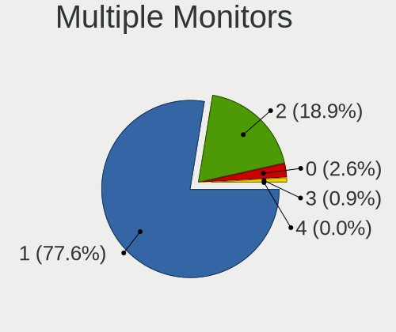
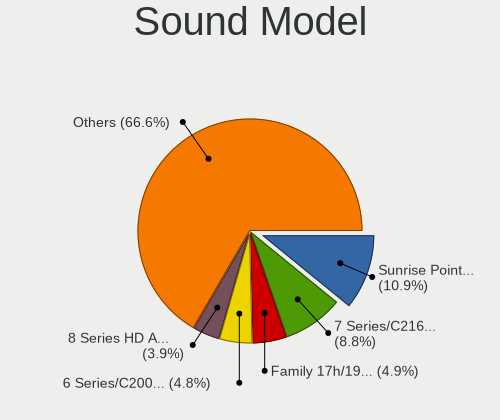

Linux in Brazil - Tested Hardware & Statistics (Notebooks)
----------------------------------------------------------

A project to collect tested hardware configurations for Linux in Brazil.

Anyone can contribute to this report by the [hw-probe](https://github.com/linuxhw/hw-probe) tool:

    sudo -E hw-probe -all -upload

Please contribute! Especially if your hardware is rare.

Contents
--------

* [ Test Cases ](#test-cases)

* [ System ](#system)
  - [ OS                       ](#os)
  - [ OS Family                ](#os-family)
  - [ Kernel                   ](#kernel)
  - [ Kernel Family            ](#kernel-family)
  - [ Kernel Major Ver.        ](#kernel-major-ver)
  - [ Arch                     ](#arch)
  - [ DE                       ](#de)
  - [ Display Server           ](#display-server)
  - [ Display Manager          ](#display-manager)
  - [ OS Lang                  ](#os-lang)
  - [ Boot Mode                ](#boot-mode)
  - [ Filesystem               ](#filesystem)
  - [ Part. scheme             ](#part-scheme)
  - [ Dual Boot with Linux/BSD ](#dual-boot-with-linuxbsd)
  - [ Dual Boot (Win)          ](#dual-boot-win)

* [ Board ](#board)
  - [ Vendor                   ](#vendor)
  - [ Model                    ](#model)
  - [ Model Family             ](#model-family)
  - [ MFG Year                 ](#mfg-year)
  - [ Form Factor              ](#form-factor)
  - [ Secure Boot              ](#secure-boot)
  - [ Coreboot                 ](#coreboot)
  - [ RAM Size                 ](#ram-size)
  - [ RAM Used                 ](#ram-used)
  - [ Total Drives             ](#total-drives)
  - [ Has CD-ROM               ](#has-cd-rom)
  - [ Has Ethernet             ](#has-ethernet)
  - [ Has WiFi                 ](#has-wifi)
  - [ Has Bluetooth            ](#has-bluetooth)

* [ Location ](#location)
  - [ Country                  ](#country)
  - [ City                     ](#city)

* [ Drives ](#drives)
  - [ Drive Vendor             ](#drive-vendor)
  - [ Drive Model              ](#drive-model)
  - [ HDD Vendor               ](#hdd-vendor)
  - [ SSD Vendor               ](#ssd-vendor)
  - [ Drive Kind               ](#drive-kind)
  - [ Drive Connector          ](#drive-connector)
  - [ Drive Size               ](#drive-size)
  - [ Space Total              ](#space-total)
  - [ Space Used               ](#space-used)
  - [ Malfunc. Drives          ](#malfunc-drives)
  - [ Malfunc. Drive Vendor    ](#malfunc-drive-vendor)
  - [ Malfunc. HDD Vendor      ](#malfunc-hdd-vendor)
  - [ Malfunc. Drive Kind      ](#malfunc-drive-kind)
  - [ Failed Drives            ](#failed-drives)
  - [ Failed Drive Vendor      ](#failed-drive-vendor)
  - [ Drive Status             ](#drive-status)

* [ Storage controller ](#storage-controller)
  - [ Storage Vendor           ](#storage-vendor)
  - [ Storage Model            ](#storage-model)
  - [ Storage Kind             ](#storage-kind)

* [ Processor ](#processor)
  - [ CPU Vendor               ](#cpu-vendor)
  - [ CPU Model                ](#cpu-model)
  - [ CPU Model Family         ](#cpu-model-family)
  - [ CPU Cores                ](#cpu-cores)
  - [ CPU Sockets              ](#cpu-sockets)
  - [ CPU Threads              ](#cpu-threads)
  - [ CPU Op-Modes             ](#cpu-op-modes)
  - [ CPU Microcode            ](#cpu-microcode)
  - [ CPU Microarch            ](#cpu-microarch)

* [ Graphics ](#graphics)
  - [ GPU Vendor               ](#gpu-vendor)
  - [ GPU Model                ](#gpu-model)
  - [ GPU Combo                ](#gpu-combo)
  - [ GPU Driver               ](#gpu-driver)
  - [ GPU Memory               ](#gpu-memory)

* [ Monitor ](#monitor)
  - [ Monitor Vendor           ](#monitor-vendor)
  - [ Monitor Model            ](#monitor-model)
  - [ Monitor Resolution       ](#monitor-resolution)
  - [ Monitor Diagonal         ](#monitor-diagonal)
  - [ Monitor Width            ](#monitor-width)
  - [ Aspect Ratio             ](#aspect-ratio)
  - [ Monitor Area             ](#monitor-area)
  - [ Pixel Density            ](#pixel-density)
  - [ Multiple Monitors        ](#multiple-monitors)

* [ Network ](#network)
  - [ Net Controller Vendor    ](#net-controller-vendor)
  - [ Net Controller Model     ](#net-controller-model)
  - [ Wireless Vendor          ](#wireless-vendor)
  - [ Wireless Model           ](#wireless-model)
  - [ Ethernet Vendor          ](#ethernet-vendor)
  - [ Ethernet Model           ](#ethernet-model)
  - [ Net Controller Kind      ](#net-controller-kind)
  - [ Used Controller          ](#used-controller)
  - [ NICs                     ](#nics)
  - [ IPv6                     ](#ipv6)

* [ Bluetooth ](#bluetooth)
  - [ Bluetooth Vendor         ](#bluetooth-vendor)
  - [ Bluetooth Model          ](#bluetooth-model)

* [ Sound ](#sound)
  - [ Sound Vendor             ](#sound-vendor)
  - [ Sound Model              ](#sound-model)

* [ Memory ](#memory)
  - [ Memory Vendor            ](#memory-vendor)
  - [ Memory Model             ](#memory-model)
  - [ Memory Kind              ](#memory-kind)
  - [ Memory Form Factor       ](#memory-form-factor)
  - [ Memory Size              ](#memory-size)
  - [ Memory Speed             ](#memory-speed)

* [ Printers & scanners ](#printers--scanners)
  - [ Printer Vendor           ](#printer-vendor)
  - [ Printer Model            ](#printer-model)
  - [ Scanner Vendor           ](#scanner-vendor)
  - [ Scanner Model            ](#scanner-model)

* [ Camera ](#camera)
  - [ Camera Vendor            ](#camera-vendor)
  - [ Camera Model             ](#camera-model)

* [ Security ](#security)
  - [ Fingerprint Vendor       ](#fingerprint-vendor)
  - [ Fingerprint Model        ](#fingerprint-model)
  - [ Chipcard Vendor          ](#chipcard-vendor)
  - [ Chipcard Model           ](#chipcard-model)

* [ Unsupported ](#unsupported)
  - [ Unsupported Devices      ](#unsupported-devices)
  - [ Unsupported Device Types ](#unsupported-device-types)

Test Cases
----------

Total: 10883

| Vendor        | Model                       | Probe                                                      | Date         |
|---------------|-----------------------------|------------------------------------------------------------|--------------|
| Acer          | Nitro AN517-54              | [593a6b247f](https://linux-hardware.org/?probe=593a6b247f) | May 01, 2023 |
| Notebook      | NJx0MU                      | [66a3f8bc3a](https://linux-hardware.org/?probe=66a3f8bc3a) | May 01, 2023 |
| Unknown       | Unknown                     | [8978b9aa5f](https://linux-hardware.org/?probe=8978b9aa5f) | May 01, 2023 |
| Lenovo        | IdeaPad 310-15ISK 80UH      | [a7d6d782b2](https://linux-hardware.org/?probe=a7d6d782b2) | May 01, 2023 |
| Notebook      | NJx0MU                      | [193fb3ba91](https://linux-hardware.org/?probe=193fb3ba91) | Apr 30, 2023 |
| Unknown       | Unknown                     | [070854df6b](https://linux-hardware.org/?probe=070854df6b) | Apr 30, 2023 |
| Lenovo        | IdeaPad 3 15ALC6 82MF       | [bd460bdc62](https://linux-hardware.org/?probe=bd460bdc62) | Apr 30, 2023 |
| Lenovo        | IdeaPad 3 15ALC6 82MF       | [edfcd7daa6](https://linux-hardware.org/?probe=edfcd7daa6) | Apr 30, 2023 |
| Positivo      | Q464C                       | [8e41593bd3](https://linux-hardware.org/?probe=8e41593bd3) | Apr 30, 2023 |
| Notebook      | NJx0MU                      | [5fd8f6db6e](https://linux-hardware.org/?probe=5fd8f6db6e) | Apr 30, 2023 |
| Acer          | Nitro AN515-45              | [9b28e69254](https://linux-hardware.org/?probe=9b28e69254) | Apr 30, 2023 |
| Positivo      | S14CT01                     | [b11ef938e1](https://linux-hardware.org/?probe=b11ef938e1) | Apr 29, 2023 |
| Lenovo        | ThinkPad T14 Gen 2i 20W1... | [0a9a85f5f0](https://linux-hardware.org/?probe=0a9a85f5f0) | Apr 29, 2023 |
| Lenovo        | ThinkPad T14 Gen 2i 20W1... | [83b10185e8](https://linux-hardware.org/?probe=83b10185e8) | Apr 29, 2023 |
| Lenovo        | IdeaPad 320-15IKB 80YH      | [af0c1ea83c](https://linux-hardware.org/?probe=af0c1ea83c) | Apr 29, 2023 |
| Lenovo        | IdeaPad 320-15IKB 80YH      | [7c8c5a4668](https://linux-hardware.org/?probe=7c8c5a4668) | Apr 29, 2023 |
| HP            | Pavilion dm4                | [3473d4b312](https://linux-hardware.org/?probe=3473d4b312) | Apr 29, 2023 |
| Apple         | MacBookPro9,2               | [1e75efbfab](https://linux-hardware.org/?probe=1e75efbfab) | Apr 29, 2023 |
| Positivo      | S14CT01                     | [58988f4876](https://linux-hardware.org/?probe=58988f4876) | Apr 29, 2023 |
| Dell          | Inspiron 15-3567            | [33e30c562d](https://linux-hardware.org/?probe=33e30c562d) | Apr 29, 2023 |
| ASUSTek       | Z550SA                      | [7c6c0c9599](https://linux-hardware.org/?probe=7c6c0c9599) | Apr 28, 2023 |
| Acer          | Aspire E5-571               | [1d36dafa86](https://linux-hardware.org/?probe=1d36dafa86) | Apr 28, 2023 |
| HP            | Presario CQ43               | [c14c79b3cf](https://linux-hardware.org/?probe=c14c79b3cf) | Apr 28, 2023 |
| Lenovo        | IdeaPad S145-15IWL 81S9     | [6926565982](https://linux-hardware.org/?probe=6926565982) | Apr 27, 2023 |
| Toshiba       | IS 1413G                    | [f96c9382bd](https://linux-hardware.org/?probe=f96c9382bd) | Apr 27, 2023 |
| Dell          | Latitude D520               | [a643e2e424](https://linux-hardware.org/?probe=a643e2e424) | Apr 27, 2023 |
| Lenovo        | V14 G2 ITL 82NM             | [6a56164bfd](https://linux-hardware.org/?probe=6a56164bfd) | Apr 27, 2023 |
| Acer          | Aspire A315-54              | [8137aa9008](https://linux-hardware.org/?probe=8137aa9008) | Apr 27, 2023 |
| Dell          | Inspiron 5558               | [9f3b8c952d](https://linux-hardware.org/?probe=9f3b8c952d) | Apr 27, 2023 |
| Notebook      | NJx0MU                      | [2306f31aa2](https://linux-hardware.org/?probe=2306f31aa2) | Apr 27, 2023 |
| Lenovo        | IdeaPad 3 15ALC6 82MF       | [393c7b06d5](https://linux-hardware.org/?probe=393c7b06d5) | Apr 26, 2023 |
| Dell          | Inspiron 7580               | [d9fe7034bd](https://linux-hardware.org/?probe=d9fe7034bd) | Apr 26, 2023 |
| Dell          | G15 5510                    | [9dcb76f7c1](https://linux-hardware.org/?probe=9dcb76f7c1) | Apr 26, 2023 |
| Dell          | G15 5510                    | [4030b4f936](https://linux-hardware.org/?probe=4030b4f936) | Apr 26, 2023 |
| Lenovo        | IdeaPad 3 15ALC6 82MF       | [84bc235979](https://linux-hardware.org/?probe=84bc235979) | Apr 26, 2023 |
| Apple         | MacBookAir7,2               | [7cbf188375](https://linux-hardware.org/?probe=7cbf188375) | Apr 26, 2023 |
| Apple         | MacBookAir7,2               | [b94d783285](https://linux-hardware.org/?probe=b94d783285) | Apr 26, 2023 |
| Notebook      | NJx0MU                      | [a660a768ce](https://linux-hardware.org/?probe=a660a768ce) | Apr 26, 2023 |
| Dell          | Inspiron N4030              | [a0f1823b8e](https://linux-hardware.org/?probe=a0f1823b8e) | Apr 26, 2023 |
| Acer          | Nitro AN517-54              | [9fe0f33003](https://linux-hardware.org/?probe=9fe0f33003) | Apr 26, 2023 |
| Toshiba       | IS 1413G                    | [a24f74af8e](https://linux-hardware.org/?probe=a24f74af8e) | Apr 26, 2023 |
| Samsung       | 300E5EV/300E4EV/270E5EV/... | [5c79032176](https://linux-hardware.org/?probe=5c79032176) | Apr 25, 2023 |
| HP            | Pavilion g4                 | [5e2040a91f](https://linux-hardware.org/?probe=5e2040a91f) | Apr 25, 2023 |
| Login Info... | LOG-S14BW01-CD              | [5f6e2a61f2](https://linux-hardware.org/?probe=5f6e2a61f2) | Apr 25, 2023 |
| Dell          | G15 5515                    | [a0dd3f2003](https://linux-hardware.org/?probe=a0dd3f2003) | Apr 25, 2023 |
| Avell High... | A70 HYB BS                  | [c7b5f9ef04](https://linux-hardware.org/?probe=c7b5f9ef04) | Apr 25, 2023 |
| Acer          | Nitro AN515-51              | [48e88f7bd1](https://linux-hardware.org/?probe=48e88f7bd1) | Apr 25, 2023 |
| Dell          | Vostro 3550                 | [653c3c4650](https://linux-hardware.org/?probe=653c3c4650) | Apr 25, 2023 |
| Samsung       | RV411/RV511/E3511/S3511/... | [afcce1c52c](https://linux-hardware.org/?probe=afcce1c52c) | Apr 25, 2023 |
| Dell          | G3 3500                     | [46996524d0](https://linux-hardware.org/?probe=46996524d0) | Apr 25, 2023 |
| Purism        | Librem 14                   | [8462dbaccb](https://linux-hardware.org/?probe=8462dbaccb) | Apr 25, 2023 |
| Lenovo        | V130-15IKB 81HN             | [1b26b3f89b](https://linux-hardware.org/?probe=1b26b3f89b) | Apr 24, 2023 |
| Notebook      | N85_N87HCHNHZ               | [ecb3270b4a](https://linux-hardware.org/?probe=ecb3270b4a) | Apr 24, 2023 |
| Dell          | Vostro 15 3515              | [13c75fa32e](https://linux-hardware.org/?probe=13c75fa32e) | Apr 24, 2023 |
| Apple         | MacBookPro8,1               | [2f1eb3e6ee](https://linux-hardware.org/?probe=2f1eb3e6ee) | Apr 24, 2023 |
| Gateway       | NV55C                       | [3c560a28cf](https://linux-hardware.org/?probe=3c560a28cf) | Apr 24, 2023 |
| Lenovo        | IdeaPad 3 15ALC6 82MF       | [2e7585d261](https://linux-hardware.org/?probe=2e7585d261) | Apr 24, 2023 |
| Dell          | Inspiron 11-3168            | [5ac6392b05](https://linux-hardware.org/?probe=5ac6392b05) | Apr 24, 2023 |
| Lenovo        | IdeaPad 330-15IKB 81FE      | [e562ba35c6](https://linux-hardware.org/?probe=e562ba35c6) | Apr 23, 2023 |
| Dell          | G15 5520                    | [d2cc8527a5](https://linux-hardware.org/?probe=d2cc8527a5) | Apr 23, 2023 |
| HP            | G42                         | [1d5b2eefc3](https://linux-hardware.org/?probe=1d5b2eefc3) | Apr 23, 2023 |
| ASUSTek       | X45C                        | [759ed58d76](https://linux-hardware.org/?probe=759ed58d76) | Apr 23, 2023 |
| Lenovo        | ThinkPad E480 20KQ000EBR    | [90b7213592](https://linux-hardware.org/?probe=90b7213592) | Apr 23, 2023 |
| ASUSTek       | VivoBook_ASUSLaptop X515... | [9a92345b08](https://linux-hardware.org/?probe=9a92345b08) | Apr 23, 2023 |
| Lenovo        | IdeaPad Gaming 3 15IMH05... | [0e798db6a8](https://linux-hardware.org/?probe=0e798db6a8) | Apr 23, 2023 |
| Dell          | G15 5520                    | [238c8f53aa](https://linux-hardware.org/?probe=238c8f53aa) | Apr 22, 2023 |
| LG Electro... | A530-T.BE76P1               | [8bb0353706](https://linux-hardware.org/?probe=8bb0353706) | Apr 22, 2023 |
| LG Electro... | A530-T.BE76P1               | [b699c8ed48](https://linux-hardware.org/?probe=b699c8ed48) | Apr 22, 2023 |
| LG Electro... | A530-T.BE76P1               | [f5c282ca6c](https://linux-hardware.org/?probe=f5c282ca6c) | Apr 22, 2023 |
| Dell          | G15 5520                    | [07751c950a](https://linux-hardware.org/?probe=07751c950a) | Apr 22, 2023 |
| Acer          | Nitro AN515-54              | [452177f9a5](https://linux-hardware.org/?probe=452177f9a5) | Apr 21, 2023 |
| Digibras      | NH4CU53                     | [d6571e3d78](https://linux-hardware.org/?probe=d6571e3d78) | Apr 21, 2023 |
| Multilaser    | PC13X                       | [d1144e31a1](https://linux-hardware.org/?probe=d1144e31a1) | Apr 21, 2023 |
| Positivo      | N6440                       | [b0a1fe417d](https://linux-hardware.org/?probe=b0a1fe417d) | Apr 21, 2023 |
| Dell          | Inspiron 3501               | [e09f00bead](https://linux-hardware.org/?probe=e09f00bead) | Apr 20, 2023 |
| HP            | Pavilion g4                 | [96a0210940](https://linux-hardware.org/?probe=96a0210940) | Apr 20, 2023 |
| Dell          | XPS 13 9310                 | [55685c168f](https://linux-hardware.org/?probe=55685c168f) | Apr 20, 2023 |
| Samsung       | 550P5C/550P7C               | [3648dd39f8](https://linux-hardware.org/?probe=3648dd39f8) | Apr 20, 2023 |
| Dell          | Inspiron 7460               | [bbfe51bf3c](https://linux-hardware.org/?probe=bbfe51bf3c) | Apr 19, 2023 |
| Acer          | AO722                       | [5fe24a9991](https://linux-hardware.org/?probe=5fe24a9991) | Apr 18, 2023 |
| Dell          | Vostro 5402                 | [e492c87b46](https://linux-hardware.org/?probe=e492c87b46) | Apr 18, 2023 |
| Dell          | Vostro 5402                 | [b15f47258b](https://linux-hardware.org/?probe=b15f47258b) | Apr 18, 2023 |
| Dell          | Vostro 3480                 | [f2f48756e6](https://linux-hardware.org/?probe=f2f48756e6) | Apr 18, 2023 |
| Lenovo        | IdeaPad S145-15API 81V7     | [90c4ba9f6e](https://linux-hardware.org/?probe=90c4ba9f6e) | Apr 17, 2023 |
| HP            | 240 G4 Notebook PC          | [6410232c86](https://linux-hardware.org/?probe=6410232c86) | Apr 17, 2023 |
| Dell          | Latitude E5430 non-vPro     | [961e1f1908](https://linux-hardware.org/?probe=961e1f1908) | Apr 17, 2023 |
| Avell High... | A70 MOB                     | [869b1ae79b](https://linux-hardware.org/?probe=869b1ae79b) | Apr 17, 2023 |
| Dell          | Inspiron 5566               | [5e9ebca163](https://linux-hardware.org/?probe=5e9ebca163) | Apr 17, 2023 |
| Samsung       | 700Z3A/700Z4A/700Z5A/700... | [acd0161868](https://linux-hardware.org/?probe=acd0161868) | Apr 17, 2023 |
| Multilaser    | PC13X                       | [3b755838a2](https://linux-hardware.org/?probe=3b755838a2) | Apr 16, 2023 |
| Lenovo        | IdeaPad 3 15ALC6 82MF       | [beac478abb](https://linux-hardware.org/?probe=beac478abb) | Apr 16, 2023 |
| HP            | 240 G2                      | [ca6ae60a2b](https://linux-hardware.org/?probe=ca6ae60a2b) | Apr 16, 2023 |
| ASUSTek       | VivoBook_ASUSLaptop X515... | [482a8c29cc](https://linux-hardware.org/?probe=482a8c29cc) | Apr 16, 2023 |
| Valve         | Jupiter                     | [6c83afd9b3](https://linux-hardware.org/?probe=6c83afd9b3) | Apr 16, 2023 |
| Dell          | Inspiron 1525               | [3b20856ccc](https://linux-hardware.org/?probe=3b20856ccc) | Apr 16, 2023 |
| Acer          | Aspire A515-45              | [5ce7874f2e](https://linux-hardware.org/?probe=5ce7874f2e) | Apr 16, 2023 |
| Itautec       | Infoway                     | [c046d6e093](https://linux-hardware.org/?probe=c046d6e093) | Apr 16, 2023 |
| Positivo      | C14CR01                     | [a5fc85315a](https://linux-hardware.org/?probe=a5fc85315a) | Apr 16, 2023 |
| Lenovo        | IdeaPad 330-15IKB 81FE      | [f7cf140a28](https://linux-hardware.org/?probe=f7cf140a28) | Apr 16, 2023 |
| Acer          | Nitro AN515-54              | [73c46e2901](https://linux-hardware.org/?probe=73c46e2901) | Apr 15, 2023 |
| Dell          | Inspiron 5566               | [3decfdc1f6](https://linux-hardware.org/?probe=3decfdc1f6) | Apr 15, 2023 |
| Lenovo        | V14 G2 ITL 82NM             | [dfed605628](https://linux-hardware.org/?probe=dfed605628) | Apr 15, 2023 |
| Dell          | Inspiron 7460               | [ae861b54cd](https://linux-hardware.org/?probe=ae861b54cd) | Apr 14, 2023 |
| Lenovo        | IdeaPad 320-15IKB 80YH      | [a34f2e065b](https://linux-hardware.org/?probe=a34f2e065b) | Apr 14, 2023 |
| Avell High... | B.ON                        | [0ac252a73b](https://linux-hardware.org/?probe=0ac252a73b) | Apr 14, 2023 |
| Positivo      | Q4128C-S                    | [8dc2eb7738](https://linux-hardware.org/?probe=8dc2eb7738) | Apr 14, 2023 |
| Samsung       | 670Z5E                      | [96bcf536e6](https://linux-hardware.org/?probe=96bcf536e6) | Apr 14, 2023 |
| Samsung       | 670Z5E                      | [dff09c0918](https://linux-hardware.org/?probe=dff09c0918) | Apr 14, 2023 |
| Acer          | Nitro AN515-54              | [07a2ba2393](https://linux-hardware.org/?probe=07a2ba2393) | Apr 13, 2023 |
| Dell          | Inspiron 5515               | [e7306b2521](https://linux-hardware.org/?probe=e7306b2521) | Apr 13, 2023 |
| Dell          | Inspiron 15-3567            | [c200475e1f](https://linux-hardware.org/?probe=c200475e1f) | Apr 13, 2023 |
| Acer          | Aspire A515-54G             | [eedb55e1ba](https://linux-hardware.org/?probe=eedb55e1ba) | Apr 13, 2023 |
| Dell          | Inspiron 15-3567            | [ae928fe177](https://linux-hardware.org/?probe=ae928fe177) | Apr 13, 2023 |
| Toshiba       | IS 1413G                    | [f57cf8ddf4](https://linux-hardware.org/?probe=f57cf8ddf4) | Apr 13, 2023 |
| Samsung       | 270E5G/270E5U               | [ea58c893c1](https://linux-hardware.org/?probe=ea58c893c1) | Apr 13, 2023 |
| Positivo      | H14SU08                     | [8e8d14728f](https://linux-hardware.org/?probe=8e8d14728f) | Apr 13, 2023 |
| Lenovo        | IdeaPad S145-15API 81V7     | [c53ec6a9c0](https://linux-hardware.org/?probe=c53ec6a9c0) | Apr 13, 2023 |
| Positivo      | Q4128C-S                    | [a46ba9bff2](https://linux-hardware.org/?probe=a46ba9bff2) | Apr 12, 2023 |
| Positivo      | Q4128C-S                    | [3b5a11f774](https://linux-hardware.org/?probe=3b5a11f774) | Apr 12, 2023 |
| Intel         | powered classmate PC        | [79b262de52](https://linux-hardware.org/?probe=79b262de52) | Apr 12, 2023 |
| Acer          | Nitro AN515-44              | [12ca37afd3](https://linux-hardware.org/?probe=12ca37afd3) | Apr 12, 2023 |
| Acer          | Nitro AN515-45              | [7b4e6e07cf](https://linux-hardware.org/?probe=7b4e6e07cf) | Apr 12, 2023 |
| Dell          | G3 3579                     | [24d10a8497](https://linux-hardware.org/?probe=24d10a8497) | Apr 12, 2023 |
| Samsung       | 550XCJ/550XCR               | [c074d665d9](https://linux-hardware.org/?probe=c074d665d9) | Apr 11, 2023 |
| Samsung       | 550XCJ/550XCR               | [845a04c326](https://linux-hardware.org/?probe=845a04c326) | Apr 11, 2023 |
| Intel         | W7650                       | [3e4c54a5f0](https://linux-hardware.org/?probe=3e4c54a5f0) | Apr 11, 2023 |
| HP            | Unknown                     | [abc7d95b62](https://linux-hardware.org/?probe=abc7d95b62) | Apr 11, 2023 |
| Acer          | Aspire E5-471               | [6e44530b23](https://linux-hardware.org/?probe=6e44530b23) | Apr 11, 2023 |
| HP            | 250 G8 Notebook PC          | [a60609df80](https://linux-hardware.org/?probe=a60609df80) | Apr 11, 2023 |
| Acer          | Aspire A515-57              | [f577606375](https://linux-hardware.org/?probe=f577606375) | Apr 11, 2023 |
| Acer          | Aspire E5-471               | [dbcbf972e5](https://linux-hardware.org/?probe=dbcbf972e5) | Apr 11, 2023 |
| Dell          | Inspiron N5110              | [4506c94bfd](https://linux-hardware.org/?probe=4506c94bfd) | Apr 11, 2023 |
| Avell High... | A52 HYB                     | [0795bca947](https://linux-hardware.org/?probe=0795bca947) | Apr 11, 2023 |
| Samsung       | 550XDA                      | [e1d5d2f193](https://linux-hardware.org/?probe=e1d5d2f193) | Apr 11, 2023 |
| Acer          | Aspire E5-511               | [f66d23c175](https://linux-hardware.org/?probe=f66d23c175) | Apr 10, 2023 |
| Dell          | Inspiron 3583               | [502c993dfd](https://linux-hardware.org/?probe=502c993dfd) | Apr 10, 2023 |
| Notebook      | NJx0MU                      | [2bb9767ca7](https://linux-hardware.org/?probe=2bb9767ca7) | Apr 10, 2023 |
| Notebook      | NJx0MU                      | [681be67c93](https://linux-hardware.org/?probe=681be67c93) | Apr 09, 2023 |
| Acer          | Aspire 5538                 | [3128c45dbc](https://linux-hardware.org/?probe=3128c45dbc) | Apr 09, 2023 |
| Samsung       | RV419                       | [88985a3d0d](https://linux-hardware.org/?probe=88985a3d0d) | Apr 09, 2023 |
| Lenovo        | ThinkPad E490 20N9001RBR    | [779e8396d6](https://linux-hardware.org/?probe=779e8396d6) | Apr 09, 2023 |
| Lenovo        | ThinkPad Edge E431 62779... | [19fd2b6d0d](https://linux-hardware.org/?probe=19fd2b6d0d) | Apr 09, 2023 |
| Toshiba       | IS 1413G                    | [be9d1636a7](https://linux-hardware.org/?probe=be9d1636a7) | Apr 09, 2023 |
| Dell          | Inspiron N5110              | [6514811aaf](https://linux-hardware.org/?probe=6514811aaf) | Apr 09, 2023 |
| Avell High... | A52 HYB                     | [7da3b9f780](https://linux-hardware.org/?probe=7da3b9f780) | Apr 09, 2023 |
| Acer          | Aspire A515-57              | [e04fc7e8e8](https://linux-hardware.org/?probe=e04fc7e8e8) | Apr 09, 2023 |
| Lenovo        | ThinkPad Edge E431 62779... | [bc402eee2e](https://linux-hardware.org/?probe=bc402eee2e) | Apr 09, 2023 |
| HP            | ProBook 6470b               | [9926dac4aa](https://linux-hardware.org/?probe=9926dac4aa) | Apr 08, 2023 |
| Acer          | Aspire A515-51G             | [34d03fbbcd](https://linux-hardware.org/?probe=34d03fbbcd) | Apr 08, 2023 |
| Sony          | VJF155F11X-B0811B           | [89f9cc86a7](https://linux-hardware.org/?probe=89f9cc86a7) | Apr 08, 2023 |
| MSI           | Katana GF76 11UD            | [6f9a54256f](https://linux-hardware.org/?probe=6f9a54256f) | Apr 07, 2023 |
| Acer          | Aspire 5517                 | [bbedb2d88e](https://linux-hardware.org/?probe=bbedb2d88e) | Apr 07, 2023 |
| HP            | EliteBook 2530p             | [66ec38445f](https://linux-hardware.org/?probe=66ec38445f) | Apr 07, 2023 |
| Acer          | Aspire A515-52              | [3d9e5a4546](https://linux-hardware.org/?probe=3d9e5a4546) | Apr 07, 2023 |
| Positivo      | H14BT58                     | [135bb6e61a](https://linux-hardware.org/?probe=135bb6e61a) | Apr 06, 2023 |
| Dell          | Inspiron 3584               | [50f052ef1c](https://linux-hardware.org/?probe=50f052ef1c) | Apr 06, 2023 |
| ASUSTek       | VivoBook_ASUSLaptop X515... | [cd6431fbf5](https://linux-hardware.org/?probe=cd6431fbf5) | Apr 05, 2023 |
| Lenovo        | ThinkPad E14 Gen 2 20TBC... | [f4dd5b1a73](https://linux-hardware.org/?probe=f4dd5b1a73) | Apr 05, 2023 |
| Multilaser    | PC13X                       | [85579abbc9](https://linux-hardware.org/?probe=85579abbc9) | Apr 05, 2023 |
| Evolute       | B14HM21                     | [be41163512](https://linux-hardware.org/?probe=be41163512) | Apr 05, 2023 |
| HP            | Compaq nx9420 (RH457EA#A... | [473898ff0e](https://linux-hardware.org/?probe=473898ff0e) | Apr 04, 2023 |
| Acer          | Aspire 4349                 | [43ae04b9c3](https://linux-hardware.org/?probe=43ae04b9c3) | Apr 04, 2023 |
| Dell          | Inspiron 5402               | [5035f094da](https://linux-hardware.org/?probe=5035f094da) | Apr 03, 2023 |
| Samsung       | 767XCL                      | [b5a44d9194](https://linux-hardware.org/?probe=b5a44d9194) | Apr 03, 2023 |
| Lenovo        | IdeaPad 330-15IKB 81FE      | [777f7d0fc4](https://linux-hardware.org/?probe=777f7d0fc4) | Apr 03, 2023 |
| ASUSTek       | VivoBook_ASUSLaptop X513... | [8a7681ab18](https://linux-hardware.org/?probe=8a7681ab18) | Apr 03, 2023 |
| ASUSTek       | ROG Strix G513QY_G513QY     | [fc6e550ca1](https://linux-hardware.org/?probe=fc6e550ca1) | Apr 03, 2023 |
| Timi          | RedmiBook Pro 14S           | [e3eb0fe882](https://linux-hardware.org/?probe=e3eb0fe882) | Apr 02, 2023 |
| Samsung       | 550P5C/550P7C               | [8e6191f4bb](https://linux-hardware.org/?probe=8e6191f4bb) | Apr 02, 2023 |
| Dell          | Venue 11 Pro 7130 vPro      | [e42bc1dd05](https://linux-hardware.org/?probe=e42bc1dd05) | Apr 02, 2023 |
| ASUSTek       | X451CA                      | [81002767d0](https://linux-hardware.org/?probe=81002767d0) | Apr 02, 2023 |
| Multilaser    | PC150                       | [0bcb0ca7ba](https://linux-hardware.org/?probe=0bcb0ca7ba) | Apr 02, 2023 |
| Toshiba       | IS 1413G                    | [76a94d8c87](https://linux-hardware.org/?probe=76a94d8c87) | Apr 02, 2023 |
| Alienware     | m15 R7                      | [68b2947cdb](https://linux-hardware.org/?probe=68b2947cdb) | Apr 02, 2023 |
| Dell          | Latitude E5400              | [4b69d7d67c](https://linux-hardware.org/?probe=4b69d7d67c) | Apr 02, 2023 |
| Dell          | Inspiron 5458               | [38b9db2538](https://linux-hardware.org/?probe=38b9db2538) | Apr 01, 2023 |
| Samsung       | 767XCL                      | [a3167908c0](https://linux-hardware.org/?probe=a3167908c0) | Apr 01, 2023 |
| Notebook      | NJx0MU                      | [207edc0a25](https://linux-hardware.org/?probe=207edc0a25) | Apr 01, 2023 |
| Notebook      | NJx0MU                      | [14751f18b3](https://linux-hardware.org/?probe=14751f18b3) | Apr 01, 2023 |
| Itautec       | Infoway w7535               | [48a539f108](https://linux-hardware.org/?probe=48a539f108) | Apr 01, 2023 |
| Valve         | Jupiter                     | [816e9cb6f6](https://linux-hardware.org/?probe=816e9cb6f6) | Apr 01, 2023 |
| Samsung       | 340XAA/350XAA/550XAA        | [93ef0bb287](https://linux-hardware.org/?probe=93ef0bb287) | Apr 01, 2023 |
| Samsung       | 270E5G/270E5U               | [67b91e463a](https://linux-hardware.org/?probe=67b91e463a) | Mar 31, 2023 |
| Acer          | Aspire A315-54K             | [d325177071](https://linux-hardware.org/?probe=d325177071) | Mar 31, 2023 |
| Positivo      | S14CT01                     | [a47919fcc4](https://linux-hardware.org/?probe=a47919fcc4) | Mar 31, 2023 |
| Quanta        | QL3 TBD                     | [21673aecac](https://linux-hardware.org/?probe=21673aecac) | Mar 31, 2023 |
| Dell          | Vostro V131                 | [53538c2ae9](https://linux-hardware.org/?probe=53538c2ae9) | Mar 31, 2023 |
| ASUSTek       | VivoBook_ASUSLaptop X515... | [7597a96654](https://linux-hardware.org/?probe=7597a96654) | Mar 31, 2023 |
| Dell          | Inspiron 5567               | [fe5578a96e](https://linux-hardware.org/?probe=fe5578a96e) | Mar 31, 2023 |
| Acer          | Swift SFA16-41              | [e110fbb7d6](https://linux-hardware.org/?probe=e110fbb7d6) | Mar 31, 2023 |
| Acer          | Aspire A515-56              | [bf846cebb9](https://linux-hardware.org/?probe=bf846cebb9) | Mar 30, 2023 |
| Positivo      | S14SL01                     | [e1c79f71b7](https://linux-hardware.org/?probe=e1c79f71b7) | Mar 30, 2023 |
| Acer          | Prespa M                    | [a6541a27d9](https://linux-hardware.org/?probe=a6541a27d9) | Mar 30, 2023 |
| Dell          | Vostro 5402                 | [27b9c84cbe](https://linux-hardware.org/?probe=27b9c84cbe) | Mar 30, 2023 |
| Dell          | Inspiron 3421               | [5418efd855](https://linux-hardware.org/?probe=5418efd855) | Mar 30, 2023 |
| Lenovo        | Yoga 510-14ISK 80UK         | [722c1e9d68](https://linux-hardware.org/?probe=722c1e9d68) | Mar 30, 2023 |
| Dell          | Latitude 3490               | [16d4f0954b](https://linux-hardware.org/?probe=16d4f0954b) | Mar 30, 2023 |
| Toshiba       | IS 1413G                    | [13f35137bd](https://linux-hardware.org/?probe=13f35137bd) | Mar 30, 2023 |
| Dell          | Vostro 3480                 | [83cb13ffb4](https://linux-hardware.org/?probe=83cb13ffb4) | Mar 30, 2023 |
| Multilaser    | MLSH1H LINUX                | [7ee1845d96](https://linux-hardware.org/?probe=7ee1845d96) | Mar 30, 2023 |
| Multilaser    | MLSH1H LINUX                | [bb80f561a2](https://linux-hardware.org/?probe=bb80f561a2) | Mar 30, 2023 |
| Apple         | MacBookAir9,1               | [1fe20bdfcb](https://linux-hardware.org/?probe=1fe20bdfcb) | Mar 30, 2023 |
| Positivo      | Q232A                       | [2282c5ce96](https://linux-hardware.org/?probe=2282c5ce96) | Mar 30, 2023 |
| Dell          | Inspiron 5566               | [7b53b4da78](https://linux-hardware.org/?probe=7b53b4da78) | Mar 29, 2023 |
| Positivo      | Q232A                       | [98e6b249af](https://linux-hardware.org/?probe=98e6b249af) | Mar 29, 2023 |
| Apple         | MacBookPro8,1               | [6023df2b8b](https://linux-hardware.org/?probe=6023df2b8b) | Mar 29, 2023 |
| Lenovo        | IdeaPad 3 15ALC6 82MF       | [854490056d](https://linux-hardware.org/?probe=854490056d) | Mar 29, 2023 |
| ASUSTek       | X751LJ                      | [cf5d71e2b3](https://linux-hardware.org/?probe=cf5d71e2b3) | Mar 29, 2023 |
| Samsung       | 370E4K                      | [68e9294ac9](https://linux-hardware.org/?probe=68e9294ac9) | Mar 29, 2023 |
| Acer          | Nitro AN515-43              | [47c758c261](https://linux-hardware.org/?probe=47c758c261) | Mar 29, 2023 |
| Samsung       | 670Z5E                      | [2bf528dfb1](https://linux-hardware.org/?probe=2bf528dfb1) | Mar 29, 2023 |
| Samsung       | 300E5M/300E5L               | [9d48f53259](https://linux-hardware.org/?probe=9d48f53259) | Mar 29, 2023 |
| Acer          | Aspire A315-23G             | [5c6734f5e6](https://linux-hardware.org/?probe=5c6734f5e6) | Mar 29, 2023 |
| Dell          | Inspiron 7520               | [8258074853](https://linux-hardware.org/?probe=8258074853) | Mar 28, 2023 |
| HP            | Compaq Presario CQ40        | [7f2e65257c](https://linux-hardware.org/?probe=7f2e65257c) | Mar 28, 2023 |
| HP            | Compaq Presario CQ40        | [9ee954843e](https://linux-hardware.org/?probe=9ee954843e) | Mar 28, 2023 |
| Positivo      | Mobile                      | [60fd382fbf](https://linux-hardware.org/?probe=60fd382fbf) | Mar 28, 2023 |
| Dell          | Vostro 14-5480              | [b1ef6303a6](https://linux-hardware.org/?probe=b1ef6303a6) | Mar 28, 2023 |
| Positivo      | Mobile                      | [b08c430903](https://linux-hardware.org/?probe=b08c430903) | Mar 28, 2023 |
| Dell          | G3 3579                     | [55b5db4326](https://linux-hardware.org/?probe=55b5db4326) | Mar 28, 2023 |
| Toshiba       | IS 1413G                    | [635309aff4](https://linux-hardware.org/?probe=635309aff4) | Mar 28, 2023 |
| Notebook      | NJx0MU                      | [bd4eec08fb](https://linux-hardware.org/?probe=bd4eec08fb) | Mar 27, 2023 |
| Dell          | Inspiron 5448               | [b800b24cbd](https://linux-hardware.org/?probe=b800b24cbd) | Mar 27, 2023 |
| Dell          | G15 5515                    | [9c13066534](https://linux-hardware.org/?probe=9c13066534) | Mar 27, 2023 |
| Acer          | Aspire A515-41G             | [33bccb2234](https://linux-hardware.org/?probe=33bccb2234) | Mar 27, 2023 |
| Dell          | Venue 11 Pro 7130 vPro      | [d1f406ffe7](https://linux-hardware.org/?probe=d1f406ffe7) | Mar 26, 2023 |
| Positivo      | Smash2                      | [b61791c478](https://linux-hardware.org/?probe=b61791c478) | Mar 26, 2023 |
| MSI           | CR620                       | [2fce81cc28](https://linux-hardware.org/?probe=2fce81cc28) | Mar 26, 2023 |
| Notebook      | NJx0MU                      | [5a95cd6ad5](https://linux-hardware.org/?probe=5a95cd6ad5) | Mar 26, 2023 |
| Dell          | Inspiron 15-3567            | [5c3f0186de](https://linux-hardware.org/?probe=5c3f0186de) | Mar 26, 2023 |
| Dell          | G3 3590                     | [db70257507](https://linux-hardware.org/?probe=db70257507) | Mar 26, 2023 |
| Sony          | SVF14215CXB                 | [624af23eb4](https://linux-hardware.org/?probe=624af23eb4) | Mar 26, 2023 |
| Acer          | Nitro AN515-54              | [2163c72a12](https://linux-hardware.org/?probe=2163c72a12) | Mar 25, 2023 |
| Digibras      | NH4CU03                     | [4262f0e159](https://linux-hardware.org/?probe=4262f0e159) | Mar 25, 2023 |
| Dell          | Vostro 15 3515              | [a999580cf7](https://linux-hardware.org/?probe=a999580cf7) | Mar 25, 2023 |
| Samsung       | 550XDA                      | [058982f7d8](https://linux-hardware.org/?probe=058982f7d8) | Mar 25, 2023 |
| ASUSTek       | VivoBook_ASUSLaptop X515... | [2df4a612b4](https://linux-hardware.org/?probe=2df4a612b4) | Mar 25, 2023 |
| Acer          | Aspire 4740                 | [c4e47e53dc](https://linux-hardware.org/?probe=c4e47e53dc) | Mar 25, 2023 |
| ASUSTek       | VivoBook 15_ASUS Laptop ... | [27ff485a92](https://linux-hardware.org/?probe=27ff485a92) | Mar 25, 2023 |
| Acer          | Aspire ES1-411              | [1a4caa9a83](https://linux-hardware.org/?probe=1a4caa9a83) | Mar 24, 2023 |
| Acer          | Aspire E5-574               | [51a085fb56](https://linux-hardware.org/?probe=51a085fb56) | Mar 24, 2023 |
| Dell          | Latitude 5420               | [e6afbbee47](https://linux-hardware.org/?probe=e6afbbee47) | Mar 24, 2023 |
| Dell          | Inspiron 7348               | [4011322039](https://linux-hardware.org/?probe=4011322039) | Mar 24, 2023 |
| Lenovo        | IdeaPad S145-15IWL 81S9     | [56942672e1](https://linux-hardware.org/?probe=56942672e1) | Mar 24, 2023 |
| ASUSTek       | VivoBook_ASUSLaptop X515... | [a9ffd21a7f](https://linux-hardware.org/?probe=a9ffd21a7f) | Mar 24, 2023 |
| Dell          | Latitude 5420               | [42d5b573c4](https://linux-hardware.org/?probe=42d5b573c4) | Mar 24, 2023 |
| Dell          | Latitude 5420               | [9e55d83acd](https://linux-hardware.org/?probe=9e55d83acd) | Mar 23, 2023 |
| Samsung       | 530XBB                      | [2bb5946ee7](https://linux-hardware.org/?probe=2bb5946ee7) | Mar 23, 2023 |
| Avell High... | B.ON                        | [0fe36e1e74](https://linux-hardware.org/?probe=0fe36e1e74) | Mar 23, 2023 |
| Toshiba       | IS 1413G                    | [3a75d7fb8d](https://linux-hardware.org/?probe=3a75d7fb8d) | Mar 23, 2023 |
| Lenovo        | ThinkPad L450 20DSA25V01    | [68b1ae2c5d](https://linux-hardware.org/?probe=68b1ae2c5d) | Mar 23, 2023 |
| Samsung       | 530U3C/530U4C/532U3C        | [64c4a47e0e](https://linux-hardware.org/?probe=64c4a47e0e) | Mar 23, 2023 |
| Acer          | Nitro AN515-44              | [fca39bd9eb](https://linux-hardware.org/?probe=fca39bd9eb) | Mar 22, 2023 |
| Samsung       | 550XDA                      | [b145c438d7](https://linux-hardware.org/?probe=b145c438d7) | Mar 22, 2023 |
| Acer          | Nitro AN515-44              | [e07e3320b1](https://linux-hardware.org/?probe=e07e3320b1) | Mar 22, 2023 |
| Acer          | Nitro AN517-54              | [ebe6cc115e](https://linux-hardware.org/?probe=ebe6cc115e) | Mar 22, 2023 |
| HP            | Pavilion dv4                | [20adc36857](https://linux-hardware.org/?probe=20adc36857) | Mar 22, 2023 |
| Lenovo        | ThinkPad X200 7459L61       | [42742477e3](https://linux-hardware.org/?probe=42742477e3) | Mar 22, 2023 |
| ASUSTek       | VivoBook_ASUSLaptop X515... | [1165b3734c](https://linux-hardware.org/?probe=1165b3734c) | Mar 21, 2023 |
| Avell High... | A62 LIV                     | [14dab05208](https://linux-hardware.org/?probe=14dab05208) | Mar 21, 2023 |
| Toshiba       | Satellite A305              | [ed7bc92488](https://linux-hardware.org/?probe=ed7bc92488) | Mar 21, 2023 |
| Dell          | Vostro 14-5480              | [ee892df403](https://linux-hardware.org/?probe=ee892df403) | Mar 21, 2023 |
| Dell          | Inspiron 15 7000 Gaming     | [b6b5eb415f](https://linux-hardware.org/?probe=b6b5eb415f) | Mar 21, 2023 |
| HP            | EliteBook 8460p             | [e0ec2e73be](https://linux-hardware.org/?probe=e0ec2e73be) | Mar 21, 2023 |
| Dell          | Inspiron 7520               | [330f307e06](https://linux-hardware.org/?probe=330f307e06) | Mar 21, 2023 |
| ASUSTek       | G74Sx                       | [d2b90b7d2f](https://linux-hardware.org/?probe=d2b90b7d2f) | Mar 21, 2023 |
| HP            | ProBook 440 G3              | [217e9242da](https://linux-hardware.org/?probe=217e9242da) | Mar 20, 2023 |
| HP            | ProBook 440 G3              | [b011027d1a](https://linux-hardware.org/?probe=b011027d1a) | Mar 20, 2023 |
| Dell          | Inspiron 5423               | [70f51cbfcb](https://linux-hardware.org/?probe=70f51cbfcb) | Mar 19, 2023 |
| Dell          | G15 5511                    | [ddb34b9c1f](https://linux-hardware.org/?probe=ddb34b9c1f) | Mar 19, 2023 |
| ASUSTek       | G74Sx                       | [f7f92408dc](https://linux-hardware.org/?probe=f7f92408dc) | Mar 19, 2023 |
| Avell High... | B.ON                        | [b215c2fd75](https://linux-hardware.org/?probe=b215c2fd75) | Mar 19, 2023 |
| ASUSTek       | VivoBook_ASUSLaptop X515... | [1292539ef0](https://linux-hardware.org/?probe=1292539ef0) | Mar 19, 2023 |
| Samsung       | 550XDA                      | [5f14b733bb](https://linux-hardware.org/?probe=5f14b733bb) | Mar 19, 2023 |
| Dell          | Inspiron 7520               | [f587cfd0f1](https://linux-hardware.org/?probe=f587cfd0f1) | Mar 19, 2023 |
| HP            | Pavilion Sleekbook 14 PC    | [964d71f3f2](https://linux-hardware.org/?probe=964d71f3f2) | Mar 19, 2023 |
| Notebook      | NJx0MU                      | [cd8f53a887](https://linux-hardware.org/?probe=cd8f53a887) | Mar 19, 2023 |
| Avell High... | C62 MOB                     | [7eaededaac](https://linux-hardware.org/?probe=7eaededaac) | Mar 18, 2023 |
| Clevo         | W340EU                      | [fb9df7f581](https://linux-hardware.org/?probe=fb9df7f581) | Mar 18, 2023 |
| Clevo         | W340EU                      | [176b7d75bf](https://linux-hardware.org/?probe=176b7d75bf) | Mar 18, 2023 |
| Acer          | Aspire A315-54              | [49b005770d](https://linux-hardware.org/?probe=49b005770d) | Mar 18, 2023 |
| Acer          | Aspire A315-54              | [6af556d727](https://linux-hardware.org/?probe=6af556d727) | Mar 18, 2023 |
| Lenovo        | ThinkPad T14 Gen 2i 20W1... | [8c8a87616c](https://linux-hardware.org/?probe=8c8a87616c) | Mar 18, 2023 |
| Notebook      | NJx0MU                      | [45a412e241](https://linux-hardware.org/?probe=45a412e241) | Mar 18, 2023 |
| Positivo      | C14CU51                     | [02fe8f2e3b](https://linux-hardware.org/?probe=02fe8f2e3b) | Mar 18, 2023 |
| Itautec       | Infoway w7440               | [c1e90dd1a3](https://linux-hardware.org/?probe=c1e90dd1a3) | Mar 18, 2023 |
| Clevo         | W340EU                      | [b90ad98b0a](https://linux-hardware.org/?probe=b90ad98b0a) | Mar 18, 2023 |
| ASUSTek       | K84C                        | [1c6b73b907](https://linux-hardware.org/?probe=1c6b73b907) | Mar 18, 2023 |
| Samsung       | 550XDA                      | [210e5d9e14](https://linux-hardware.org/?probe=210e5d9e14) | Mar 17, 2023 |
| Acer          | Aspire V7-482PG             | [9ba6bdc643](https://linux-hardware.org/?probe=9ba6bdc643) | Mar 17, 2023 |
| Lenovo        | IdeaPad S145-15IWL 81S9     | [fc0e66fc8a](https://linux-hardware.org/?probe=fc0e66fc8a) | Mar 17, 2023 |
| Lenovo        | IdeaPad S145-15IIL 82DJ     | [353d82cd61](https://linux-hardware.org/?probe=353d82cd61) | Mar 17, 2023 |
| Positivo      | N1250                       | [e5ee22876a](https://linux-hardware.org/?probe=e5ee22876a) | Mar 17, 2023 |
| Acer          | Nitro AN515-44              | [dd12b2101e](https://linux-hardware.org/?probe=dd12b2101e) | Mar 17, 2023 |
| Lenovo        | G40-80 80JE                 | [a7a6cc1ab5](https://linux-hardware.org/?probe=a7a6cc1ab5) | Mar 17, 2023 |
| Lenovo        | G40-80 80JE                 | [204994be7f](https://linux-hardware.org/?probe=204994be7f) | Mar 17, 2023 |
| Dell          | Inspiron 7520               | [1cedff3f90](https://linux-hardware.org/?probe=1cedff3f90) | Mar 17, 2023 |
| Clevo         | W340EU                      | [240779648a](https://linux-hardware.org/?probe=240779648a) | Mar 17, 2023 |
| Dell          | XPS 13 9310                 | [0d1834afd1](https://linux-hardware.org/?probe=0d1834afd1) | Mar 16, 2023 |
| Avell High... | STORM TWO                   | [e6b20084b5](https://linux-hardware.org/?probe=e6b20084b5) | Mar 16, 2023 |
| Acer          | Aspire A315-34              | [63676e7012](https://linux-hardware.org/?probe=63676e7012) | Mar 16, 2023 |
| LG Electro... | 15Z980-G.BH72P1             | [0bba01d850](https://linux-hardware.org/?probe=0bba01d850) | Mar 16, 2023 |
| Samsung       | 550XBE/350XBE               | [3f7d27d637](https://linux-hardware.org/?probe=3f7d27d637) | Mar 16, 2023 |
| Samsung       | 550XBE/350XBE               | [e670ea3583](https://linux-hardware.org/?probe=e670ea3583) | Mar 16, 2023 |
| Lenovo        | IdeaPad 330-15IGM 81FN      | [5f48c46d68](https://linux-hardware.org/?probe=5f48c46d68) | Mar 16, 2023 |
| Samsung       | RV411/RV511/E3511/S3511/... | [f4374c5a2b](https://linux-hardware.org/?probe=f4374c5a2b) | Mar 15, 2023 |
| Lenovo        | IdeaPad S145-15IIL 82DJ     | [3028035868](https://linux-hardware.org/?probe=3028035868) | Mar 15, 2023 |
| Acer          | Aspire A515-51              | [6e1d22df26](https://linux-hardware.org/?probe=6e1d22df26) | Mar 15, 2023 |
| Acer          | Aspire E1-421               | [bb1dca9ea3](https://linux-hardware.org/?probe=bb1dca9ea3) | Mar 14, 2023 |
| Positivo      | Q464B                       | [5bd9649f43](https://linux-hardware.org/?probe=5bd9649f43) | Mar 14, 2023 |
| Acer          | Aspire A315-34              | [bbb4128793](https://linux-hardware.org/?probe=bbb4128793) | Mar 14, 2023 |
| Dell          | Inspiron 5423               | [4987f344f2](https://linux-hardware.org/?probe=4987f344f2) | Mar 14, 2023 |
| Google        | Celes                       | [4fd0271747](https://linux-hardware.org/?probe=4fd0271747) | Mar 13, 2023 |
| Lenovo        | Yoga 300-11IBR 80M1         | [7ffbc62c94](https://linux-hardware.org/?probe=7ffbc62c94) | Mar 13, 2023 |
| Lenovo        | ThinkPad T14 Gen 2i 20W1... | [4c6424525e](https://linux-hardware.org/?probe=4c6424525e) | Mar 13, 2023 |
| Dell          | Inspiron 13 5320            | [efbe50cd5c](https://linux-hardware.org/?probe=efbe50cd5c) | Mar 13, 2023 |
| HP            | ProBook 6460b               | [c6b7f1ec98](https://linux-hardware.org/?probe=c6b7f1ec98) | Mar 13, 2023 |
| Toshiba       | IS 1413G                    | [b93a4bdcbb](https://linux-hardware.org/?probe=b93a4bdcbb) | Mar 13, 2023 |
| HP            | Pavilion dm1                | [9ed7d80abb](https://linux-hardware.org/?probe=9ed7d80abb) | Mar 13, 2023 |
| Samsung       | 300E5M/300E5L               | [8567b21f41](https://linux-hardware.org/?probe=8567b21f41) | Mar 13, 2023 |
| Acer          | Nitro AN515-55              | [60bc8c1ef5](https://linux-hardware.org/?probe=60bc8c1ef5) | Mar 12, 2023 |
| Dell          | Inspiron 5452               | [2c8ca0e296](https://linux-hardware.org/?probe=2c8ca0e296) | Mar 12, 2023 |
| Dell          | Vostro 14-5480              | [3ea64e75d4](https://linux-hardware.org/?probe=3ea64e75d4) | Mar 12, 2023 |
| HP            | Pavilion Laptop 15-cc6xx    | [bd0af3660b](https://linux-hardware.org/?probe=bd0af3660b) | Mar 12, 2023 |
| Samsung       | 550XDA                      | [c42ead0ecf](https://linux-hardware.org/?probe=c42ead0ecf) | Mar 12, 2023 |
| Positivo      | Q464B                       | [513b08857c](https://linux-hardware.org/?probe=513b08857c) | Mar 11, 2023 |
| Positivo B... | VJFE41F11X-XXXXXX           | [99f410d801](https://linux-hardware.org/?probe=99f410d801) | Mar 11, 2023 |
| Acer          | Aspire A515-51G             | [757a62eff0](https://linux-hardware.org/?probe=757a62eff0) | Mar 11, 2023 |
| Dell          | System XPS L502X            | [b3f35673e6](https://linux-hardware.org/?probe=b3f35673e6) | Mar 11, 2023 |
| Notebook      | NJx0MU                      | [d5426d5f1e](https://linux-hardware.org/?probe=d5426d5f1e) | Mar 11, 2023 |
| Notebook      | NJx0MU                      | [729d9395f0](https://linux-hardware.org/?probe=729d9395f0) | Mar 11, 2023 |
| Toshiba       | IS 1413G                    | [39cc207ce7](https://linux-hardware.org/?probe=39cc207ce7) | Mar 11, 2023 |
| Positivo      | C14CU51                     | [0cc5053d97](https://linux-hardware.org/?probe=0cc5053d97) | Mar 11, 2023 |
| ASUSTek       | VivoBook_ASUSLaptop X515... | [15dd4409fc](https://linux-hardware.org/?probe=15dd4409fc) | Mar 11, 2023 |
| Dell          | Inspiron 5420               | [9e6843fe2e](https://linux-hardware.org/?probe=9e6843fe2e) | Mar 10, 2023 |
| Dell          | Latitude E6420              | [514c8548aa](https://linux-hardware.org/?probe=514c8548aa) | Mar 10, 2023 |
| Lenovo        | IdeaPad 320-15IKB 80YH      | [0d8d93d401](https://linux-hardware.org/?probe=0d8d93d401) | Mar 10, 2023 |
| Dell          | Inspiron 5420               | [77d13c9c12](https://linux-hardware.org/?probe=77d13c9c12) | Mar 10, 2023 |
| HP            | Stream Laptop 14-cb0XX      | [b8dffd9bd3](https://linux-hardware.org/?probe=b8dffd9bd3) | Mar 10, 2023 |
| Dell          | Vostro 5490                 | [d524e6c586](https://linux-hardware.org/?probe=d524e6c586) | Mar 10, 2023 |
| ASUSTek       | VivoBook_ASUSLaptop X513... | [6ae7081970](https://linux-hardware.org/?probe=6ae7081970) | Mar 10, 2023 |
| Dell          | Vostro 5490                 | [2d75f5ea8b](https://linux-hardware.org/?probe=2d75f5ea8b) | Mar 10, 2023 |
| HP            | Pavilion Laptop 15-cc6xx    | [12d1ccac8d](https://linux-hardware.org/?probe=12d1ccac8d) | Mar 09, 2023 |
| Dell          | Vostro 1310                 | [a5677d37dc](https://linux-hardware.org/?probe=a5677d37dc) | Mar 09, 2023 |
| Multilaser    | PC130                       | [37212994df](https://linux-hardware.org/?probe=37212994df) | Mar 09, 2023 |
| ASUSTek       | VivoBook 15_ASUS Laptop ... | [e7429f9be3](https://linux-hardware.org/?probe=e7429f9be3) | Mar 09, 2023 |
| HP            | Laptop 15-dy2xxx            | [97698bd9a9](https://linux-hardware.org/?probe=97698bd9a9) | Mar 09, 2023 |
| Itautec       | Infoway w7440               | [3f6f0bc1a2](https://linux-hardware.org/?probe=3f6f0bc1a2) | Mar 08, 2023 |
| Itautec       | Infoway w7440               | [04d6eb5847](https://linux-hardware.org/?probe=04d6eb5847) | Mar 08, 2023 |
| Samsung       | 550XDA                      | [65093a6cf5](https://linux-hardware.org/?probe=65093a6cf5) | Mar 08, 2023 |
| Dell          | Inspiron 3442               | [8900b65d0b](https://linux-hardware.org/?probe=8900b65d0b) | Mar 08, 2023 |
| Samsung       | 530U3C/530U4C/532U3C        | [4b82b56d82](https://linux-hardware.org/?probe=4b82b56d82) | Mar 08, 2023 |
| Sony          | VPCEA23FB                   | [d6618b65cf](https://linux-hardware.org/?probe=d6618b65cf) | Mar 08, 2023 |
| Dell          | Vostro 3550                 | [30d171ddbc](https://linux-hardware.org/?probe=30d171ddbc) | Mar 08, 2023 |
| Dell          | XPS 13 9380                 | [1edca5142c](https://linux-hardware.org/?probe=1edca5142c) | Mar 07, 2023 |
| Lenovo        | ThinkPad T460 20FMS49100    | [285589b568](https://linux-hardware.org/?probe=285589b568) | Mar 07, 2023 |
| Lenovo        | ThinkPad T430 234424P       | [f9d41f9054](https://linux-hardware.org/?probe=f9d41f9054) | Mar 07, 2023 |
| Toshiba       | IS 1413G                    | [12954ccbdb](https://linux-hardware.org/?probe=12954ccbdb) | Mar 07, 2023 |
| Notebook      | NJx0MU                      | [cb7ac03a2a](https://linux-hardware.org/?probe=cb7ac03a2a) | Mar 07, 2023 |
| Dell          | Vostro 3550                 | [cb9468fb01](https://linux-hardware.org/?probe=cb9468fb01) | Mar 07, 2023 |
| HP            | EliteBook 8460p             | [3519073f46](https://linux-hardware.org/?probe=3519073f46) | Mar 07, 2023 |
| HP            | ENVY TS 17                  | [c915d51f5e](https://linux-hardware.org/?probe=c915d51f5e) | Mar 07, 2023 |
| LG Electro... | A530-U.BE54P1               | [c0260c82db](https://linux-hardware.org/?probe=c0260c82db) | Mar 07, 2023 |
| Samsung       | 550XDA                      | [f73f29bd0b](https://linux-hardware.org/?probe=f73f29bd0b) | Mar 06, 2023 |
| Digibras      | NH4CU03                     | [ff8a1d6dc3](https://linux-hardware.org/?probe=ff8a1d6dc3) | Mar 06, 2023 |
| Acer          | Aspire A515-51              | [ebf75e7be8](https://linux-hardware.org/?probe=ebf75e7be8) | Mar 06, 2023 |
| Acer          | Aspire A515-51              | [ef186545cb](https://linux-hardware.org/?probe=ef186545cb) | Mar 06, 2023 |
| ASUSTek       | VivoBook_ASUSLaptop X515... | [7fb36218d9](https://linux-hardware.org/?probe=7fb36218d9) | Mar 06, 2023 |
| Dell          | G15 5520                    | [0322e7d38c](https://linux-hardware.org/?probe=0322e7d38c) | Mar 06, 2023 |
| ASUSTek       | VivoBook_ASUSLaptop X513... | [2e4f2069e8](https://linux-hardware.org/?probe=2e4f2069e8) | Mar 06, 2023 |
| Digibras      | NH4CU03                     | [9bfa331a22](https://linux-hardware.org/?probe=9bfa331a22) | Mar 06, 2023 |
| Intel         | Crestline & ICH8M Chipse... | [c9e67a9174](https://linux-hardware.org/?probe=c9e67a9174) | Mar 06, 2023 |
| Lenovo        | IdeaPad S145-15IKB 81XM     | [a6c7741454](https://linux-hardware.org/?probe=a6c7741454) | Mar 06, 2023 |
| Acer          | Aspire A515-54              | [a544ef69d8](https://linux-hardware.org/?probe=a544ef69d8) | Mar 05, 2023 |
| Lenovo        | IdeaPad L340-15IRH Gamin... | [96738d19ab](https://linux-hardware.org/?probe=96738d19ab) | Mar 05, 2023 |
| Acer          | Aspire A515-54              | [6c190c594b](https://linux-hardware.org/?probe=6c190c594b) | Mar 05, 2023 |
| Dell          | Vostro 3550                 | [973f97d171](https://linux-hardware.org/?probe=973f97d171) | Mar 05, 2023 |
| Avell High... | A70 MOB                     | [79d3147035](https://linux-hardware.org/?probe=79d3147035) | Mar 05, 2023 |
| Lenovo        | G50-80 80R0                 | [6d4a93e1d8](https://linux-hardware.org/?probe=6d4a93e1d8) | Mar 05, 2023 |
| Avell High... | A70 MOB                     | [38bf7fda89](https://linux-hardware.org/?probe=38bf7fda89) | Mar 05, 2023 |
| Lenovo        | G50-80 80R0                 | [5e640d57d8](https://linux-hardware.org/?probe=5e640d57d8) | Mar 05, 2023 |
| Dell          | Inspiron 5557               | [7950f8f750](https://linux-hardware.org/?probe=7950f8f750) | Mar 05, 2023 |
| Google        | Lillipup                    | [6c7cf4cd9e](https://linux-hardware.org/?probe=6c7cf4cd9e) | Mar 05, 2023 |
| Toshiba       | IS 1413G                    | [a655c49d8b](https://linux-hardware.org/?probe=a655c49d8b) | Mar 05, 2023 |
| Notebook      | NJx0MU                      | [48cf9d748f](https://linux-hardware.org/?probe=48cf9d748f) | Mar 05, 2023 |
| Acer          | Aspire VX5-591G             | [e5e134cc80](https://linux-hardware.org/?probe=e5e134cc80) | Mar 04, 2023 |
| Dell          | Inspiron 5566               | [a067a3c4a6](https://linux-hardware.org/?probe=a067a3c4a6) | Mar 04, 2023 |
| Valve         | Jupiter                     | [05dc2f9352](https://linux-hardware.org/?probe=05dc2f9352) | Mar 04, 2023 |
| Notebook      | NJx0MU                      | [05934ca860](https://linux-hardware.org/?probe=05934ca860) | Mar 04, 2023 |
| Acer          | Nitro AN515-54              | [463de722cd](https://linux-hardware.org/?probe=463de722cd) | Mar 04, 2023 |
| Dell          | G15 5520                    | [1e3dcc41d3](https://linux-hardware.org/?probe=1e3dcc41d3) | Mar 04, 2023 |
| Lenovo        | ThinkPad T430 234424P       | [54a25c6e4b](https://linux-hardware.org/?probe=54a25c6e4b) | Mar 04, 2023 |
| Lenovo        | IdeaPad 3 15ITL6 82MD       | [b7d678deee](https://linux-hardware.org/?probe=b7d678deee) | Mar 04, 2023 |
| Lenovo        | IdeaPad 3 15ITL6 82MD       | [d7b1fc0c9d](https://linux-hardware.org/?probe=d7b1fc0c9d) | Mar 04, 2023 |
| Acer          | Nitro AN515-45              | [c3043c0cba](https://linux-hardware.org/?probe=c3043c0cba) | Mar 03, 2023 |
| Acer          | Aspire A315-53              | [d16e7dcded](https://linux-hardware.org/?probe=d16e7dcded) | Mar 03, 2023 |
| Digibras      | NH4CU03                     | [a5939aa47c](https://linux-hardware.org/?probe=a5939aa47c) | Mar 03, 2023 |
| Notebook      | NJx0MU                      | [be909f0882](https://linux-hardware.org/?probe=be909f0882) | Mar 03, 2023 |
| Acer          | Aspire 5750                 | [d1e6cecff5](https://linux-hardware.org/?probe=d1e6cecff5) | Mar 03, 2023 |
| Dell          | Inspiron N5010              | [5043ee2124](https://linux-hardware.org/?probe=5043ee2124) | Mar 03, 2023 |
| Dell          | Inspiron N5010              | [1139097eb7](https://linux-hardware.org/?probe=1139097eb7) | Mar 03, 2023 |
| HP            | Compaq Presario CQ42        | [f8cfeeb2d9](https://linux-hardware.org/?probe=f8cfeeb2d9) | Mar 03, 2023 |
| Intel         | W7650                       | [30bde4c2d8](https://linux-hardware.org/?probe=30bde4c2d8) | Mar 03, 2023 |
| Dell          | Latitude 3490               | [e23ef8765b](https://linux-hardware.org/?probe=e23ef8765b) | Mar 02, 2023 |
| HP            | Pavilion dv7                | [534da84bd1](https://linux-hardware.org/?probe=534da84bd1) | Mar 02, 2023 |
| Dell          | Vostro 3550                 | [1427d9ce74](https://linux-hardware.org/?probe=1427d9ce74) | Mar 02, 2023 |
| HP            | Pavilion dv7                | [4a0bc37c58](https://linux-hardware.org/?probe=4a0bc37c58) | Mar 02, 2023 |
| Dell          | Vostro 3550                 | [eebbe0447e](https://linux-hardware.org/?probe=eebbe0447e) | Mar 02, 2023 |
| Dell          | Inspiron 3442               | [3a56892391](https://linux-hardware.org/?probe=3a56892391) | Mar 02, 2023 |
| Sony          | VPCEH10EB                   | [9c8bb09559](https://linux-hardware.org/?probe=9c8bb09559) | Mar 01, 2023 |
| Positivo      | S14CT01                     | [312e70e158](https://linux-hardware.org/?probe=312e70e158) | Mar 01, 2023 |
| HP            | Compaq Presario CQ42        | [5118aed3c9](https://linux-hardware.org/?probe=5118aed3c9) | Mar 01, 2023 |
| Notebook      | NJx0MU                      | [884979d592](https://linux-hardware.org/?probe=884979d592) | Mar 01, 2023 |
| Dell          | Vostro 3500                 | [4e540e33b1](https://linux-hardware.org/?probe=4e540e33b1) | Mar 01, 2023 |
| Positivo      | C14CR21                     | [d0041f93e1](https://linux-hardware.org/?probe=d0041f93e1) | Mar 01, 2023 |
| Toshiba       | IS 1413G                    | [05ad6c694b](https://linux-hardware.org/?probe=05ad6c694b) | Mar 01, 2023 |
| Philco        | 10D                         | [dd709d35db](https://linux-hardware.org/?probe=dd709d35db) | Feb 28, 2023 |
| Samsung       | 370E4K                      | [aba5535c2a](https://linux-hardware.org/?probe=aba5535c2a) | Feb 28, 2023 |
| Notebook      | NJx0MU                      | [fd4d00d935](https://linux-hardware.org/?probe=fd4d00d935) | Feb 28, 2023 |
| Lenovo        | IdeaPad S145-15IWL 81S9     | [915fc4d913](https://linux-hardware.org/?probe=915fc4d913) | Feb 28, 2023 |
| Dell          | G15 5510                    | [77ff8fd545](https://linux-hardware.org/?probe=77ff8fd545) | Feb 28, 2023 |
| Dell          | G15 5510                    | [2c8f883abe](https://linux-hardware.org/?probe=2c8f883abe) | Feb 28, 2023 |
| Samsung       | 370E4K                      | [d66bcd2bc8](https://linux-hardware.org/?probe=d66bcd2bc8) | Feb 27, 2023 |
| Dell          | Inspiron 1525               | [264f8cb6db](https://linux-hardware.org/?probe=264f8cb6db) | Feb 27, 2023 |
| Toshiba       | IS 1413G                    | [c361aabb21](https://linux-hardware.org/?probe=c361aabb21) | Feb 27, 2023 |
| Toshiba       | IS 1413G                    | [17338cbd01](https://linux-hardware.org/?probe=17338cbd01) | Feb 27, 2023 |
| Acer          | Aspire E5-571               | [04c721038a](https://linux-hardware.org/?probe=04c721038a) | Feb 27, 2023 |
| HP            | EliteBook 8460p             | [83cb442ad5](https://linux-hardware.org/?probe=83cb442ad5) | Feb 27, 2023 |
| Acer          | Aspire A515-56              | [97e3001416](https://linux-hardware.org/?probe=97e3001416) | Feb 26, 2023 |
| HP            | 430                         | [f90c967f06](https://linux-hardware.org/?probe=f90c967f06) | Feb 26, 2023 |
| ASUSTek       | VivoBook_ASUSLaptop X515... | [86fac430ca](https://linux-hardware.org/?probe=86fac430ca) | Feb 26, 2023 |
| Samsung       | 370E4K                      | [7b769eb33e](https://linux-hardware.org/?probe=7b769eb33e) | Feb 26, 2023 |
| Dell          | Inspiron 3584               | [47eff629e0](https://linux-hardware.org/?probe=47eff629e0) | Feb 26, 2023 |
| Digibras      | NH4CU03                     | [8bfe7e434d](https://linux-hardware.org/?probe=8bfe7e434d) | Feb 26, 2023 |
| Intel         | HuronRiver Platform         | [2168c2bb5c](https://linux-hardware.org/?probe=2168c2bb5c) | Feb 26, 2023 |
| Dell          | G15 5520                    | [d68c28ea8d](https://linux-hardware.org/?probe=d68c28ea8d) | Feb 26, 2023 |
| Acer          | Nitro AN517-54              | [d3d04b2a1e](https://linux-hardware.org/?probe=d3d04b2a1e) | Feb 26, 2023 |
| Lenovo        | IdeaPad 3 15IGL05 82BU      | [75e601b927](https://linux-hardware.org/?probe=75e601b927) | Feb 26, 2023 |
| Dell          | Inspiron 3576               | [5911354b82](https://linux-hardware.org/?probe=5911354b82) | Feb 26, 2023 |
| Dell          | G7 7588                     | [82f1398a69](https://linux-hardware.org/?probe=82f1398a69) | Feb 25, 2023 |
| Acer          | Acadia V1.45                | [faee032e6c](https://linux-hardware.org/?probe=faee032e6c) | Feb 25, 2023 |
| Lenovo        | IdeaPad 3 15ALC6 82MF       | [af95b24466](https://linux-hardware.org/?probe=af95b24466) | Feb 25, 2023 |
| Samsung       | 300E4A/300E5A/300E7A/343... | [eca93ca661](https://linux-hardware.org/?probe=eca93ca661) | Feb 25, 2023 |
| Samsung       | 550XBE/350XBE               | [d9f49e98fd](https://linux-hardware.org/?probe=d9f49e98fd) | Feb 25, 2023 |
| ASUSTek       | VivoBook_ASUSLaptop X515... | [5c3d39f884](https://linux-hardware.org/?probe=5c3d39f884) | Feb 25, 2023 |
| Notebook      | NJx0MU                      | [ec82e38ab0](https://linux-hardware.org/?probe=ec82e38ab0) | Feb 25, 2023 |
| ASUSTek       | Z450LA                      | [304be04748](https://linux-hardware.org/?probe=304be04748) | Feb 25, 2023 |
| Samsung       | RV415/RV515                 | [23c0509d46](https://linux-hardware.org/?probe=23c0509d46) | Feb 25, 2023 |
| Sony          | VPCCW13FB                   | [1772a3987b](https://linux-hardware.org/?probe=1772a3987b) | Feb 25, 2023 |
| Acer          | Aspire A515-56              | [517a6211c9](https://linux-hardware.org/?probe=517a6211c9) | Feb 24, 2023 |
| Samsung       | 340XAA/350XAA/550XAA        | [9cbbaaf012](https://linux-hardware.org/?probe=9cbbaaf012) | Feb 24, 2023 |
| Lenovo        | IdeaPad 3 15ALC6 82MF       | [d3354bd88c](https://linux-hardware.org/?probe=d3354bd88c) | Feb 24, 2023 |
| Digibras      | NH4CU03                     | [85ea6dded1](https://linux-hardware.org/?probe=85ea6dded1) | Feb 24, 2023 |
| Digibras      | NH4CU03                     | [1fb9cfd7d4](https://linux-hardware.org/?probe=1fb9cfd7d4) | Feb 24, 2023 |
| Toshiba       | IS 1412                     | [c2ca1fb2f3](https://linux-hardware.org/?probe=c2ca1fb2f3) | Feb 24, 2023 |
| ASUSTek       | VivoBook_ASUSLaptop X515... | [6dd01c6a20](https://linux-hardware.org/?probe=6dd01c6a20) | Feb 24, 2023 |
| ASUSTek       | VivoBook_ASUSLaptop X515... | [1b5b668cea](https://linux-hardware.org/?probe=1b5b668cea) | Feb 24, 2023 |
| Notebook      | NJx0MU                      | [2cc3513ca3](https://linux-hardware.org/?probe=2cc3513ca3) | Feb 24, 2023 |
| Lenovo        | IdeaPad S145-15IIL 82DJ     | [c0af9c8bdb](https://linux-hardware.org/?probe=c0af9c8bdb) | Feb 24, 2023 |
| Positivo      | N1103                       | [b89c4551aa](https://linux-hardware.org/?probe=b89c4551aa) | Feb 24, 2023 |
| Positivo      | Q464C-O                     | [cda1faecb1](https://linux-hardware.org/?probe=cda1faecb1) | Feb 24, 2023 |
| Dell          | Inspiron 5423               | [7cf47f3118](https://linux-hardware.org/?probe=7cf47f3118) | Feb 23, 2023 |
| Avell High... | A70 MOB                     | [1bf7d82ab3](https://linux-hardware.org/?probe=1bf7d82ab3) | Feb 23, 2023 |
| Dell          | Inspiron N5010              | [5b4def0870](https://linux-hardware.org/?probe=5b4def0870) | Feb 23, 2023 |
| Dell          | Latitude 3420               | [86fd73d1e3](https://linux-hardware.org/?probe=86fd73d1e3) | Feb 23, 2023 |
| Lenovo        | IdeaPad S145-15IWL 81S9     | [d74903e764](https://linux-hardware.org/?probe=d74903e764) | Feb 23, 2023 |
| System76      | Gazelle                     | [609f452af9](https://linux-hardware.org/?probe=609f452af9) | Feb 23, 2023 |
| Acer          | Nitro AN515-52              | [05f7c375b7](https://linux-hardware.org/?probe=05f7c375b7) | Feb 23, 2023 |
| ASUSTek       | VivoBook_ASUSLaptop X515... | [fe9944c457](https://linux-hardware.org/?probe=fe9944c457) | Feb 23, 2023 |
| Lenovo        | IdeaPad S145-15API 81V7     | [e23562af05](https://linux-hardware.org/?probe=e23562af05) | Feb 23, 2023 |
| Positivo      | Q464C                       | [1b08f16a08](https://linux-hardware.org/?probe=1b08f16a08) | Feb 22, 2023 |
| Sony          | SVE15125CBW                 | [5b173518b5](https://linux-hardware.org/?probe=5b173518b5) | Feb 22, 2023 |
| Sony          | SVE15125CBW                 | [107bd5b235](https://linux-hardware.org/?probe=107bd5b235) | Feb 22, 2023 |
| ASUSTek       | VivoBook_ASUSLaptop X515... | [c99d1595ec](https://linux-hardware.org/?probe=c99d1595ec) | Feb 22, 2023 |
| Lenovo        | IdeaPad 3 15ITL6 82MD       | [d16dd6d1f3](https://linux-hardware.org/?probe=d16dd6d1f3) | Feb 22, 2023 |
| Positivo      | S14SL01                     | [914a9e691e](https://linux-hardware.org/?probe=914a9e691e) | Feb 22, 2023 |
| Dell          | Inspiron 3421               | [fd899aea79](https://linux-hardware.org/?probe=fd899aea79) | Feb 22, 2023 |
| Dell          | Inspiron 3583               | [ad766a4190](https://linux-hardware.org/?probe=ad766a4190) | Feb 22, 2023 |
| Positivo      | Q232A                       | [71c020b7e4](https://linux-hardware.org/?probe=71c020b7e4) | Feb 22, 2023 |
| Positivo      | S14CT01                     | [af73fc0481](https://linux-hardware.org/?probe=af73fc0481) | Feb 22, 2023 |
| Samsung       | 767XCL                      | [3fb09fb626](https://linux-hardware.org/?probe=3fb09fb626) | Feb 22, 2023 |
| Dell          | Inspiron 5547               | [ff88bcbafc](https://linux-hardware.org/?probe=ff88bcbafc) | Feb 22, 2023 |
| Acer          | Nitro AN515-55              | [acb8644ede](https://linux-hardware.org/?probe=acb8644ede) | Feb 21, 2023 |
| Timi          | Redmi Book Pro 15 2022      | [818012d7ef](https://linux-hardware.org/?probe=818012d7ef) | Feb 21, 2023 |
| Unknown       | Unknown                     | [08eab2bac4](https://linux-hardware.org/?probe=08eab2bac4) | Feb 21, 2023 |
| Avell High... | 1513                        | [0b46cb6de1](https://linux-hardware.org/?probe=0b46cb6de1) | Feb 21, 2023 |
| ASUSTek       | VivoBook_ASUSLaptop X515... | [caccb434d2](https://linux-hardware.org/?probe=caccb434d2) | Feb 21, 2023 |
| Compaq        | 430                         | [4bd84653a5](https://linux-hardware.org/?probe=4bd84653a5) | Feb 21, 2023 |
| HP            | 1000                        | [91faf9460d](https://linux-hardware.org/?probe=91faf9460d) | Feb 21, 2023 |
| Lenovo        | IdeaPad 320-15IKB 80YH      | [7ac4bb7d51](https://linux-hardware.org/?probe=7ac4bb7d51) | Feb 20, 2023 |
| Lenovo        | IdeaPad 320-15IKB 80YH      | [19e03ac7b2](https://linux-hardware.org/?probe=19e03ac7b2) | Feb 20, 2023 |
| Lenovo        | G40-80 80JE                 | [e7e12370af](https://linux-hardware.org/?probe=e7e12370af) | Feb 20, 2023 |
| Dell          | Inspiron N4050              | [115fa87a77](https://linux-hardware.org/?probe=115fa87a77) | Feb 20, 2023 |
| Unknown       | Unknown                     | [cccf0ea7f3](https://linux-hardware.org/?probe=cccf0ea7f3) | Feb 20, 2023 |
| Acer          | Aspire E1-572               | [234358d23e](https://linux-hardware.org/?probe=234358d23e) | Feb 20, 2023 |
| Acer          | Aspire E1-572               | [1b75d34b95](https://linux-hardware.org/?probe=1b75d34b95) | Feb 20, 2023 |
| Acer          | Predator PH315-52           | [7432db815e](https://linux-hardware.org/?probe=7432db815e) | Feb 19, 2023 |
| Acer          | Predator PH315-52           | [aaee9da394](https://linux-hardware.org/?probe=aaee9da394) | Feb 19, 2023 |
| HP            | Compaq Presario CQ42        | [001f2f1a86](https://linux-hardware.org/?probe=001f2f1a86) | Feb 19, 2023 |
| Acer          | Aspire A515-51G             | [ca537a9b24](https://linux-hardware.org/?probe=ca537a9b24) | Feb 19, 2023 |
| Acer          | Aspire A515-51G             | [d5dbc5770a](https://linux-hardware.org/?probe=d5dbc5770a) | Feb 19, 2023 |
| Notebook      | NJx0MU                      | [76d6c3ad48](https://linux-hardware.org/?probe=76d6c3ad48) | Feb 19, 2023 |
| Multilaser    | PC130                       | [3526846c1f](https://linux-hardware.org/?probe=3526846c1f) | Feb 19, 2023 |
| Acer          | Aspire A515-41G             | [e06b3509f1](https://linux-hardware.org/?probe=e06b3509f1) | Feb 19, 2023 |
| Dell          | Inspiron N4050              | [16350a9c3b](https://linux-hardware.org/?probe=16350a9c3b) | Feb 19, 2023 |
| Avell High... | B.ON                        | [d7f2dafd5e](https://linux-hardware.org/?probe=d7f2dafd5e) | Feb 18, 2023 |
| Samsung       | 300E4A/300E5A/300E7A/343... | [215ae5796f](https://linux-hardware.org/?probe=215ae5796f) | Feb 18, 2023 |
| ASUSTek       | VivoBook_ASUSLaptop X515... | [beff031939](https://linux-hardware.org/?probe=beff031939) | Feb 18, 2023 |
| Acer          | Aspire A515-51              | [9be992efd0](https://linux-hardware.org/?probe=9be992efd0) | Feb 17, 2023 |
| Samsung       | 270E5G/270E5U               | [daf6a78f6f](https://linux-hardware.org/?probe=daf6a78f6f) | Feb 17, 2023 |
| Samsung       | 550XDA                      | [d7f1482689](https://linux-hardware.org/?probe=d7f1482689) | Feb 17, 2023 |
| Notebook      | NJx0MU                      | [90fb04bc05](https://linux-hardware.org/?probe=90fb04bc05) | Feb 17, 2023 |
| Dell          | Inspiron 5566               | [502adcba49](https://linux-hardware.org/?probe=502adcba49) | Feb 17, 2023 |
| Dell          | Inspiron 3583               | [9200702bb7](https://linux-hardware.org/?probe=9200702bb7) | Feb 16, 2023 |
| Dell          | Inspiron 13-5378            | [cf5749e5be](https://linux-hardware.org/?probe=cf5749e5be) | Feb 16, 2023 |
| Positivo      | S14BW01                     | [c14428167e](https://linux-hardware.org/?probe=c14428167e) | Feb 16, 2023 |
| Positivo      | CHT14B                      | [49eff89b98](https://linux-hardware.org/?probe=49eff89b98) | Feb 16, 2023 |
| HP            | EliteBook 8460p             | [6c7f73c4a5](https://linux-hardware.org/?probe=6c7f73c4a5) | Feb 16, 2023 |
| Lenovo        | ThinkPad L470 20J4CTO1WW    | [7d55f655bb](https://linux-hardware.org/?probe=7d55f655bb) | Feb 15, 2023 |
| Acer          | Nitro AN515-54              | [4e0f0e0310](https://linux-hardware.org/?probe=4e0f0e0310) | Feb 15, 2023 |
| Lenovo        | IdeaPad 3 15ALC6 82MF       | [e42ed53dcf](https://linux-hardware.org/?probe=e42ed53dcf) | Feb 15, 2023 |
| Lenovo        | G470 20078                  | [8385999199](https://linux-hardware.org/?probe=8385999199) | Feb 15, 2023 |
| Lenovo        | IdeaPad Gaming 3 15IHU6 ... | [1ca19c3d1d](https://linux-hardware.org/?probe=1ca19c3d1d) | Feb 14, 2023 |
| HP            | EliteBook 8460p             | [92ab9b2e0d](https://linux-hardware.org/?probe=92ab9b2e0d) | Feb 14, 2023 |
| Samsung       | RV419/RV420                 | [7ec9e518c4](https://linux-hardware.org/?probe=7ec9e518c4) | Feb 14, 2023 |
| Apple         | MacBook2,1                  | [915e87767b](https://linux-hardware.org/?probe=915e87767b) | Feb 14, 2023 |
| Acer          | Predator G3-572             | [410a9aae8c](https://linux-hardware.org/?probe=410a9aae8c) | Feb 14, 2023 |
| Daten Tecn... | DCM4D-4 v4                  | [d576d16c25](https://linux-hardware.org/?probe=d576d16c25) | Feb 14, 2023 |
| ASUSTek       | VivoBook_ASUSLaptop X515... | [03f90da8d3](https://linux-hardware.org/?probe=03f90da8d3) | Feb 14, 2023 |
| Lenovo        | G50-80 80R0                 | [86422b9261](https://linux-hardware.org/?probe=86422b9261) | Feb 14, 2023 |
| Samsung       | 305E4A/305E5A/305E7A        | [832920f31b](https://linux-hardware.org/?probe=832920f31b) | Feb 14, 2023 |
| Samsung       | 305E4A/305E5A/305E7A        | [e6f972234b](https://linux-hardware.org/?probe=e6f972234b) | Feb 14, 2023 |
| Dell          | Inspiron 5402               | [805931ad5f](https://linux-hardware.org/?probe=805931ad5f) | Feb 14, 2023 |
| Positivo      | CHT14B                      | [859e8a3c17](https://linux-hardware.org/?probe=859e8a3c17) | Feb 13, 2023 |
| Positivo      | CHT14B                      | [2d5b910ed3](https://linux-hardware.org/?probe=2d5b910ed3) | Feb 13, 2023 |
| Sony          | VPCEG27FM                   | [748a67669f](https://linux-hardware.org/?probe=748a67669f) | Feb 13, 2023 |
| Samsung       | 550XDA                      | [0c3e0dd389](https://linux-hardware.org/?probe=0c3e0dd389) | Feb 13, 2023 |
| Toshiba       | IS 1413G                    | [75f2859a68](https://linux-hardware.org/?probe=75f2859a68) | Feb 12, 2023 |
| Toshiba       | IS 1413G                    | [ec0e0c6dc2](https://linux-hardware.org/?probe=ec0e0c6dc2) | Feb 12, 2023 |
| Samsung       | 767XCL                      | [8a62be0577](https://linux-hardware.org/?probe=8a62be0577) | Feb 11, 2023 |
| Dell          | Vostro 1520                 | [698006ab18](https://linux-hardware.org/?probe=698006ab18) | Feb 11, 2023 |
| Notebook      | NJx0MU                      | [9565a9f43b](https://linux-hardware.org/?probe=9565a9f43b) | Feb 11, 2023 |
| Toshiba       | IS 1413G                    | [e32070b494](https://linux-hardware.org/?probe=e32070b494) | Feb 11, 2023 |
| Notebook      | NJx0MU                      | [8a16d2e4bb](https://linux-hardware.org/?probe=8a16d2e4bb) | Feb 11, 2023 |
| Unknown       | Unknown                     | [31d099a8db](https://linux-hardware.org/?probe=31d099a8db) | Feb 11, 2023 |
| Dell          | Inspiron 5590               | [594e3be773](https://linux-hardware.org/?probe=594e3be773) | Feb 11, 2023 |
| Lenovo        | IdeaPad S145-15IIL 82DJ     | [1a1760b638](https://linux-hardware.org/?probe=1a1760b638) | Feb 11, 2023 |
| Lenovo        | IdeaPad S145-15IIL 82DJ     | [2dca851444](https://linux-hardware.org/?probe=2dca851444) | Feb 11, 2023 |
| Acer          | Aspire A315-23              | [f56c83d6dd](https://linux-hardware.org/?probe=f56c83d6dd) | Feb 11, 2023 |
| Acer          | Aspire 5720                 | [9b71ff828e](https://linux-hardware.org/?probe=9b71ff828e) | Feb 10, 2023 |
| ASUSTek       | ZenBook UX434FAC_UX434FA... | [a1d85b3098](https://linux-hardware.org/?probe=a1d85b3098) | Feb 10, 2023 |
| Acer          | Aspire A515-45              | [ca5ff923cc](https://linux-hardware.org/?probe=ca5ff923cc) | Feb 10, 2023 |
| Intel         | HuronRiver Platform         | [e3ad5a0e88](https://linux-hardware.org/?probe=e3ad5a0e88) | Feb 10, 2023 |
| Dell          | Inspiron 7559               | [956a602343](https://linux-hardware.org/?probe=956a602343) | Feb 10, 2023 |
| Acer          | Nitro AN517-54              | [a068db4d61](https://linux-hardware.org/?probe=a068db4d61) | Feb 10, 2023 |
| Acer          | Aspire E5-553G              | [c81083cd55](https://linux-hardware.org/?probe=c81083cd55) | Feb 10, 2023 |
| Dell          | Inspiron 5402               | [52125d1623](https://linux-hardware.org/?probe=52125d1623) | Feb 10, 2023 |
| Samsung       | 550XDA                      | [45d947c9f9](https://linux-hardware.org/?probe=45d947c9f9) | Feb 10, 2023 |
| Lenovo        | IdeaPad S145-15API 81V7     | [5b22c1a20a](https://linux-hardware.org/?probe=5b22c1a20a) | Feb 09, 2023 |
| ASUSTek       | ZenBook UX434FAC_UX434FA... | [6e8ed5d5d6](https://linux-hardware.org/?probe=6e8ed5d5d6) | Feb 09, 2023 |
| HP            | ProBook 440 G5              | [0f111bd12b](https://linux-hardware.org/?probe=0f111bd12b) | Feb 09, 2023 |
| Dell          | Inspiron 7460               | [2c17efbcd7](https://linux-hardware.org/?probe=2c17efbcd7) | Feb 09, 2023 |
| Positivo      | Smash2                      | [1948e9489d](https://linux-hardware.org/?probe=1948e9489d) | Feb 09, 2023 |
| Positivo      | Smash2                      | [47760ee46f](https://linux-hardware.org/?probe=47760ee46f) | Feb 09, 2023 |
| Toshiba       | IS 1413G                    | [c5c9fb9b41](https://linux-hardware.org/?probe=c5c9fb9b41) | Feb 09, 2023 |
| Acer          | Aspire A315-53G             | [e2a551b06b](https://linux-hardware.org/?probe=e2a551b06b) | Feb 09, 2023 |
| Acer          | Predator PH315-55           | [452c65c04b](https://linux-hardware.org/?probe=452c65c04b) | Feb 09, 2023 |
| Acer          | Aspire A515-51              | [5e1eb34232](https://linux-hardware.org/?probe=5e1eb34232) | Feb 09, 2023 |
| Lenovo        | IdeaPad S145-15IWL 81S9     | [43968e7a27](https://linux-hardware.org/?probe=43968e7a27) | Feb 08, 2023 |
| Lenovo        | IdeaPad 3 15IML05 82BS      | [74f2ac0aeb](https://linux-hardware.org/?probe=74f2ac0aeb) | Feb 08, 2023 |
| Dell          | G15 5515                    | [3b0208199f](https://linux-hardware.org/?probe=3b0208199f) | Feb 08, 2023 |
| Lenovo        | IdeaPad S145-15API 81V7     | [acbbbca6e7](https://linux-hardware.org/?probe=acbbbca6e7) | Feb 08, 2023 |
| Notebook      | NJx0MU                      | [0f01d55766](https://linux-hardware.org/?probe=0f01d55766) | Feb 08, 2023 |
| Notebook      | NJx0MU                      | [ac340725d3](https://linux-hardware.org/?probe=ac340725d3) | Feb 07, 2023 |
| Multilaser    | UB23X LINUX                 | [d630a4eeff](https://linux-hardware.org/?probe=d630a4eeff) | Feb 07, 2023 |
| Lenovo        | IdeaPad 330-15IKB 81FE      | [f6c24b1ea8](https://linux-hardware.org/?probe=f6c24b1ea8) | Feb 07, 2023 |
| Apple         | MacBookAir7,2               | [0a94d67455](https://linux-hardware.org/?probe=0a94d67455) | Feb 07, 2023 |
| ASUSTek       | VivoBook_ASUSLaptop X515... | [a2378e95f6](https://linux-hardware.org/?probe=a2378e95f6) | Feb 06, 2023 |
| Multilaser    | MLSH1H LINUX                | [0e47e3afd8](https://linux-hardware.org/?probe=0e47e3afd8) | Feb 06, 2023 |
| Acer          | TravelMate P256-M           | [add8ce8459](https://linux-hardware.org/?probe=add8ce8459) | Feb 06, 2023 |
| Dell          | Inspiron 7580               | [986d240b5d](https://linux-hardware.org/?probe=986d240b5d) | Feb 06, 2023 |
| Quanta        | TWS                         | [275ccf1b58](https://linux-hardware.org/?probe=275ccf1b58) | Feb 05, 2023 |
| Dell          | G15 5510                    | [41bbdf84c2](https://linux-hardware.org/?probe=41bbdf84c2) | Feb 05, 2023 |
| Acer          | Aspire E1-572               | [02d439f664](https://linux-hardware.org/?probe=02d439f664) | Feb 05, 2023 |
| Lenovo        | G400s VILG1                 | [426348e103](https://linux-hardware.org/?probe=426348e103) | Feb 05, 2023 |
| Dell          | G15 5515                    | [7418ca82c1](https://linux-hardware.org/?probe=7418ca82c1) | Feb 04, 2023 |
| Evolute       | SFX-65                      | [7b37b32f92](https://linux-hardware.org/?probe=7b37b32f92) | Feb 04, 2023 |
| Dell          | Inspiron 15-3567            | [7659183894](https://linux-hardware.org/?probe=7659183894) | Feb 04, 2023 |
| HP            | Compaq Presario CQ40        | [de29ca3277](https://linux-hardware.org/?probe=de29ca3277) | Feb 04, 2023 |
| Lenovo        | ThinkPad T14 Gen 2i 20W1... | [701a355d37](https://linux-hardware.org/?probe=701a355d37) | Feb 04, 2023 |
| Notebook      | NJx0MU                      | [a55eba93cc](https://linux-hardware.org/?probe=a55eba93cc) | Feb 04, 2023 |
| Toshiba       | Satellite C855-233          | [8fc7835588](https://linux-hardware.org/?probe=8fc7835588) | Feb 04, 2023 |
| ASUSTek       | K45VM                       | [06af577a0c](https://linux-hardware.org/?probe=06af577a0c) | Feb 04, 2023 |
| Dell          | Precision M4600             | [a0d6749416](https://linux-hardware.org/?probe=a0d6749416) | Feb 04, 2023 |
| Acer          | Aspire E1-572               | [6f3ba6b805](https://linux-hardware.org/?probe=6f3ba6b805) | Feb 04, 2023 |
| Lenovo        | ThinkPad T440p 20ANS09W0... | [17f9df8f2c](https://linux-hardware.org/?probe=17f9df8f2c) | Feb 03, 2023 |
| Acer          | Nitro AN515-55              | [27d852788e](https://linux-hardware.org/?probe=27d852788e) | Feb 03, 2023 |
| Acer          | Nitro AN515-55              | [2ed6b9969d](https://linux-hardware.org/?probe=2ed6b9969d) | Feb 03, 2023 |
| Acer          | Aspire E1-572               | [f99e3aa76d](https://linux-hardware.org/?probe=f99e3aa76d) | Feb 03, 2023 |
| Acer          | Predator PH315-54           | [fe381cbbfe](https://linux-hardware.org/?probe=fe381cbbfe) | Feb 03, 2023 |
| Notebook      | NJx0MU                      | [1a189b08ea](https://linux-hardware.org/?probe=1a189b08ea) | Feb 03, 2023 |
| Samsung       | 530U3C/530U4C/532U3C        | [b82450078c](https://linux-hardware.org/?probe=b82450078c) | Feb 03, 2023 |
| Dell          | Vostro 3550                 | [17a4a2e5fd](https://linux-hardware.org/?probe=17a4a2e5fd) | Feb 02, 2023 |
| Samsung       | 340XAA/350XAA/550XAA        | [92d639c0f4](https://linux-hardware.org/?probe=92d639c0f4) | Feb 02, 2023 |
| Dell          | Latitude 7480               | [8a7e0b16d5](https://linux-hardware.org/?probe=8a7e0b16d5) | Feb 02, 2023 |
| Positivo      | Mobile                      | [966b4e2454](https://linux-hardware.org/?probe=966b4e2454) | Feb 02, 2023 |
| Notebook      | NJx0MU                      | [a174385328](https://linux-hardware.org/?probe=a174385328) | Feb 02, 2023 |
| SmbiosType... | SmbiosType1_SystemProduc... | [721bc8fb78](https://linux-hardware.org/?probe=721bc8fb78) | Feb 02, 2023 |
| Insyde        | Braswell                    | [928b461a5b](https://linux-hardware.org/?probe=928b461a5b) | Feb 02, 2023 |
| Lenovo        | G40-80 80JE                 | [9a5e6fd61e](https://linux-hardware.org/?probe=9a5e6fd61e) | Feb 02, 2023 |
| Philco        | 14I                         | [8f9833285e](https://linux-hardware.org/?probe=8f9833285e) | Feb 01, 2023 |
| Acer          | Aspire E1-572               | [c4e6e989f5](https://linux-hardware.org/?probe=c4e6e989f5) | Feb 01, 2023 |
| Dell          | Inspiron 5566               | [b2dd8d93c7](https://linux-hardware.org/?probe=b2dd8d93c7) | Feb 01, 2023 |
| Lenovo        | IdeaPad S145-15API 81V7     | [7e78833b8b](https://linux-hardware.org/?probe=7e78833b8b) | Feb 01, 2023 |
| Lenovo        | IdeaPad S145-15IWL 81S9     | [2be076637c](https://linux-hardware.org/?probe=2be076637c) | Feb 01, 2023 |
| Dell          | Vostro 3500                 | [fa4104f438](https://linux-hardware.org/?probe=fa4104f438) | Feb 01, 2023 |
| Dell          | Vostro 3500                 | [ec80fcb8a5](https://linux-hardware.org/?probe=ec80fcb8a5) | Feb 01, 2023 |
| Notebook      | NJx0MU                      | [c402e9c063](https://linux-hardware.org/?probe=c402e9c063) | Feb 01, 2023 |
| Acer          | Nitro AN515-54              | [9aee0a798c](https://linux-hardware.org/?probe=9aee0a798c) | Feb 01, 2023 |
| Dell          | Vostro 1520                 | [3fab7107b7](https://linux-hardware.org/?probe=3fab7107b7) | Feb 01, 2023 |
| Dell          | Inspiron 15-3567            | [2f6f4bc8c7](https://linux-hardware.org/?probe=2f6f4bc8c7) | Feb 01, 2023 |
| Notebook      | NJx0MU                      | [eb152c7d4e](https://linux-hardware.org/?probe=eb152c7d4e) | Feb 01, 2023 |
| Samsung       | RV415/RV515                 | [ea50188d5c](https://linux-hardware.org/?probe=ea50188d5c) | Jan 31, 2023 |
| Lenovo        | IdeaPad S145-15API 81V7     | [ebbe861495](https://linux-hardware.org/?probe=ebbe861495) | Jan 31, 2023 |
| Lenovo        | IdeaPad S145-15IIL 82DJ     | [3803fd2405](https://linux-hardware.org/?probe=3803fd2405) | Jan 31, 2023 |
| Lenovo        | IdeaPad S145-15API 81V7     | [949ea399fb](https://linux-hardware.org/?probe=949ea399fb) | Jan 31, 2023 |
| Notebook      | NJx0MU                      | [58d5bdaa2d](https://linux-hardware.org/?probe=58d5bdaa2d) | Jan 31, 2023 |
| Lenovo        | G40-80 80JE                 | [bb5d758714](https://linux-hardware.org/?probe=bb5d758714) | Jan 31, 2023 |
| Lenovo        | G40-80 80JE                 | [e5dc585024](https://linux-hardware.org/?probe=e5dc585024) | Jan 31, 2023 |
| Samsung       | 550XCJ/550XCR               | [75fad3daf3](https://linux-hardware.org/?probe=75fad3daf3) | Jan 31, 2023 |
| Lenovo        | IdeaPad S145-15API 81V7     | [2474b4641c](https://linux-hardware.org/?probe=2474b4641c) | Jan 30, 2023 |
| Acer          | Aspire A315-56              | [93f5ac8f6d](https://linux-hardware.org/?probe=93f5ac8f6d) | Jan 30, 2023 |
| Lenovo        | ThinkPad Edge E431 62779... | [8d7c1dbf4d](https://linux-hardware.org/?probe=8d7c1dbf4d) | Jan 30, 2023 |
| Acer          | Aspire A315-56              | [bacea93055](https://linux-hardware.org/?probe=bacea93055) | Jan 30, 2023 |
| Acer          | Aspire A515-41G             | [88db10e257](https://linux-hardware.org/?probe=88db10e257) | Jan 30, 2023 |
| Avell High... | B11 MOB                     | [dd9d29ddc7](https://linux-hardware.org/?probe=dd9d29ddc7) | Jan 30, 2023 |
| Avell High... | B.ON                        | [721fbbdeb2](https://linux-hardware.org/?probe=721fbbdeb2) | Jan 30, 2023 |
| Acer          | Aspire A515-45              | [42405a6a0c](https://linux-hardware.org/?probe=42405a6a0c) | Jan 30, 2023 |
| Lenovo        | IdeaPad S145-15IWL 81S9     | [1c62beb905](https://linux-hardware.org/?probe=1c62beb905) | Jan 29, 2023 |
| Samsung       | RV415/RV515                 | [c5999dc406](https://linux-hardware.org/?probe=c5999dc406) | Jan 29, 2023 |
| Lenovo        | IdeaPad Gaming 3 15IMH05... | [51245400df](https://linux-hardware.org/?probe=51245400df) | Jan 29, 2023 |
| Dell          | Inspiron 3542               | [42a753536d](https://linux-hardware.org/?probe=42a753536d) | Jan 29, 2023 |
| Notebook      | NJx0MU                      | [10cdf2558f](https://linux-hardware.org/?probe=10cdf2558f) | Jan 29, 2023 |
| Notebook      | NJx0MU                      | [09bbe80125](https://linux-hardware.org/?probe=09bbe80125) | Jan 29, 2023 |
| Positivo      | Q464C-O                     | [e61f2d0622](https://linux-hardware.org/?probe=e61f2d0622) | Jan 29, 2023 |
| Acer          | Aspire 5733                 | [da753d74a1](https://linux-hardware.org/?probe=da753d74a1) | Jan 29, 2023 |
| Dell          | G15 5520                    | [a0c269c5b1](https://linux-hardware.org/?probe=a0c269c5b1) | Jan 28, 2023 |
| ASUSTek       | VivoBook_ASUSLaptop X515... | [f1f5def619](https://linux-hardware.org/?probe=f1f5def619) | Jan 28, 2023 |
| Samsung       | RV415/RV515                 | [fd9d67e4b8](https://linux-hardware.org/?probe=fd9d67e4b8) | Jan 27, 2023 |
| Lenovo        | ThinkPad P15 Gen 1 20SUS... | [c74ea31148](https://linux-hardware.org/?probe=c74ea31148) | Jan 27, 2023 |
| HP            | Compaq 6530b                | [15b987981b](https://linux-hardware.org/?probe=15b987981b) | Jan 27, 2023 |
| Acer          | Aspire ES1-572              | [9f745ecc18](https://linux-hardware.org/?probe=9f745ecc18) | Jan 27, 2023 |
| Lenovo        | IdeaPad 320-15IKB 80YH      | [5a32be51f4](https://linux-hardware.org/?probe=5a32be51f4) | Jan 27, 2023 |
| Acer          | Aspire E5-553G              | [e851efaf39](https://linux-hardware.org/?probe=e851efaf39) | Jan 27, 2023 |
| Philco        | 14E                         | [1c069ed627](https://linux-hardware.org/?probe=1c069ed627) | Jan 27, 2023 |
| Philco        | 14E                         | [cfb283e599](https://linux-hardware.org/?probe=cfb283e599) | Jan 27, 2023 |
| Lenovo        | IdeaPad 3 15ALC6 82MF       | [93be3d62c4](https://linux-hardware.org/?probe=93be3d62c4) | Jan 27, 2023 |
| Compaq        | 430                         | [069fa715b9](https://linux-hardware.org/?probe=069fa715b9) | Jan 27, 2023 |
| Samsung       | 340XAA/350XAA/550XAA        | [b4d0bbaf56](https://linux-hardware.org/?probe=b4d0bbaf56) | Jan 27, 2023 |
| Dell          | Inspiron 5468               | [d155136857](https://linux-hardware.org/?probe=d155136857) | Jan 27, 2023 |
| Samsung       | 340XAA/350XAA/550XAA        | [05dac90dec](https://linux-hardware.org/?probe=05dac90dec) | Jan 27, 2023 |
| Lenovo        | IdeaPad S145-15IIL 82DJ     | [0697311f5f](https://linux-hardware.org/?probe=0697311f5f) | Jan 27, 2023 |
| Dell          | G3 3500                     | [ea11767144](https://linux-hardware.org/?probe=ea11767144) | Jan 26, 2023 |
| Dell          | Vostro 3458                 | [3beffe6710](https://linux-hardware.org/?probe=3beffe6710) | Jan 26, 2023 |
| ASUSTek       | Z550SA                      | [f5ac147c1e](https://linux-hardware.org/?probe=f5ac147c1e) | Jan 26, 2023 |
| Multilaser    | PC150                       | [1c4ace00d1](https://linux-hardware.org/?probe=1c4ace00d1) | Jan 26, 2023 |
| Dell          | Latitude 5490               | [b392e71ce5](https://linux-hardware.org/?probe=b392e71ce5) | Jan 26, 2023 |
| Dell          | G3 3590                     | [8a7e4e4db0](https://linux-hardware.org/?probe=8a7e4e4db0) | Jan 26, 2023 |
| Notebook      | NJx0MU                      | [26e692f7de](https://linux-hardware.org/?probe=26e692f7de) | Jan 26, 2023 |
| HP            | G60                         | [8fe616c588](https://linux-hardware.org/?probe=8fe616c588) | Jan 25, 2023 |
| HP            | Folio 13                    | [214197bef4](https://linux-hardware.org/?probe=214197bef4) | Jan 25, 2023 |
| Notebook      | NJx0MU                      | [7c19df8c01](https://linux-hardware.org/?probe=7c19df8c01) | Jan 25, 2023 |
| Dell          | Vostro 5470                 | [bfd4198155](https://linux-hardware.org/?probe=bfd4198155) | Jan 25, 2023 |
| Dell          | Inspiron 5468               | [3e59c1f38b](https://linux-hardware.org/?probe=3e59c1f38b) | Jan 25, 2023 |
| Lenovo        | IdeaPad 3 15ALC6 82MF       | [0ef51b9eda](https://linux-hardware.org/?probe=0ef51b9eda) | Jan 25, 2023 |
| Digibras      | NH4CU03                     | [7de7df58a3](https://linux-hardware.org/?probe=7de7df58a3) | Jan 24, 2023 |
| Digibras      | NH4CU03                     | [fce5f618d8](https://linux-hardware.org/?probe=fce5f618d8) | Jan 24, 2023 |
| Dell          | Inspiron 3421               | [02491de92f](https://linux-hardware.org/?probe=02491de92f) | Jan 24, 2023 |
| Compaq        | 420                         | [9ed9e081c4](https://linux-hardware.org/?probe=9ed9e081c4) | Jan 24, 2023 |
| Acer          | Aspire A515-51              | [418e5a2787](https://linux-hardware.org/?probe=418e5a2787) | Jan 24, 2023 |
| Notebook      | NJx0MU                      | [54d0592fb2](https://linux-hardware.org/?probe=54d0592fb2) | Jan 24, 2023 |
| Insyde        | Braswell                    | [6abab0adc1](https://linux-hardware.org/?probe=6abab0adc1) | Jan 24, 2023 |
| Positivo      | N1240                       | [e938a6c0b0](https://linux-hardware.org/?probe=e938a6c0b0) | Jan 24, 2023 |
| ASUSTek       | K46CB                       | [62aa75f57a](https://linux-hardware.org/?probe=62aa75f57a) | Jan 23, 2023 |
| Lenovo        | IdeaPad Gaming 3 15IHU6 ... | [4a97e29245](https://linux-hardware.org/?probe=4a97e29245) | Jan 23, 2023 |
| Lenovo        | IdeaPad Gaming 3 15IHU6 ... | [54ebd7c5f8](https://linux-hardware.org/?probe=54ebd7c5f8) | Jan 23, 2023 |
| Dell          | Latitude 3420               | [d2a8b9657a](https://linux-hardware.org/?probe=d2a8b9657a) | Jan 23, 2023 |
| Dell          | Inspiron 7472               | [6395ea422c](https://linux-hardware.org/?probe=6395ea422c) | Jan 23, 2023 |
| Notebook      | NJx0MU                      | [206e04bc7d](https://linux-hardware.org/?probe=206e04bc7d) | Jan 23, 2023 |
| Alienware     | m15 R7                      | [e57302bf60](https://linux-hardware.org/?probe=e57302bf60) | Jan 23, 2023 |
| HP            | 540                         | [a4a7b26f42](https://linux-hardware.org/?probe=a4a7b26f42) | Jan 23, 2023 |
| Lenovo        | IdeaPad S145-15API 81V7     | [7d4406c9bc](https://linux-hardware.org/?probe=7d4406c9bc) | Jan 22, 2023 |
| HP            | Pavilion dv4                | [9fd79086c8](https://linux-hardware.org/?probe=9fd79086c8) | Jan 22, 2023 |
| Notebook      | NJx0MU                      | [9e9dcb9883](https://linux-hardware.org/?probe=9e9dcb9883) | Jan 22, 2023 |
| Notebook      | NJx0MU                      | [fdca7d69cd](https://linux-hardware.org/?probe=fdca7d69cd) | Jan 22, 2023 |
| Dell          | G3 3579                     | [63298dcee9](https://linux-hardware.org/?probe=63298dcee9) | Jan 22, 2023 |
| Dell          | Vostro 3460                 | [569626e023](https://linux-hardware.org/?probe=569626e023) | Jan 22, 2023 |
| Dell          | G3 3500                     | [b3a545ee30](https://linux-hardware.org/?probe=b3a545ee30) | Jan 22, 2023 |
| Itautec       | Infoway w7430               | [b33318e6e0](https://linux-hardware.org/?probe=b33318e6e0) | Jan 22, 2023 |
| Lenovo        | IdeaPad 3 15ALC6 82MF       | [697fbcd8d1](https://linux-hardware.org/?probe=697fbcd8d1) | Jan 22, 2023 |
| Dell          | G3 3500                     | [e81b4d5e46](https://linux-hardware.org/?probe=e81b4d5e46) | Jan 22, 2023 |
| Dell          | Inspiron N4050              | [6ddc2793d7](https://linux-hardware.org/?probe=6ddc2793d7) | Jan 21, 2023 |
| Dell          | Inspiron N4050              | [ae4c9eaa9c](https://linux-hardware.org/?probe=ae4c9eaa9c) | Jan 21, 2023 |
| ASUSTek       | VivoBook_ASUSLaptop X515... | [ed9d60d9b7](https://linux-hardware.org/?probe=ed9d60d9b7) | Jan 21, 2023 |
| Positivo      | S14BW01                     | [241b637096](https://linux-hardware.org/?probe=241b637096) | Jan 21, 2023 |
| Positivo      | S14BW01                     | [c818b70b5b](https://linux-hardware.org/?probe=c818b70b5b) | Jan 21, 2023 |
| Philco        | OEM                         | [a39f50ccfd](https://linux-hardware.org/?probe=a39f50ccfd) | Jan 21, 2023 |
| Notebook      | NJx0MU                      | [edee5aee7a](https://linux-hardware.org/?probe=edee5aee7a) | Jan 21, 2023 |
| Lenovo        | IdeaPad 320-15IKB 80YH      | [fa251ca13c](https://linux-hardware.org/?probe=fa251ca13c) | Jan 21, 2023 |
| Lenovo        | IdeaPad 320-15IKB 80YH      | [965d1fa09f](https://linux-hardware.org/?probe=965d1fa09f) | Jan 20, 2023 |
| Acer          | Aspire E5-571               | [a37e873516](https://linux-hardware.org/?probe=a37e873516) | Jan 20, 2023 |
| Positivo B... | VJFE43F11X-XXXXXX           | [138a9b3b0c](https://linux-hardware.org/?probe=138a9b3b0c) | Jan 20, 2023 |
| Lenovo        | IdeaPad Gaming 3 15IHU6 ... | [6364be5249](https://linux-hardware.org/?probe=6364be5249) | Jan 20, 2023 |
| Dell          | Inspiron N4050              | [46e35da681](https://linux-hardware.org/?probe=46e35da681) | Jan 20, 2023 |
| Lenovo        | IdeaPad 330-15IKB 81FD      | [31698019a3](https://linux-hardware.org/?probe=31698019a3) | Jan 20, 2023 |
| Dell          | Vostro 3400                 | [c158cd6095](https://linux-hardware.org/?probe=c158cd6095) | Jan 20, 2023 |
| Lenovo        | IdeaPad S145-15IWL 81S9     | [169ba5d31f](https://linux-hardware.org/?probe=169ba5d31f) | Jan 20, 2023 |
| Dell          | Venue 8 Pro 5830            | [4f815d5b4f](https://linux-hardware.org/?probe=4f815d5b4f) | Jan 20, 2023 |
| Notebook      | NJx0MU                      | [c7ab1c1990](https://linux-hardware.org/?probe=c7ab1c1990) | Jan 20, 2023 |
| Dell          | Inspiron 15-3567            | [33a3aac223](https://linux-hardware.org/?probe=33a3aac223) | Jan 20, 2023 |
| Acer          | Aspire A515-45              | [9d5faff505](https://linux-hardware.org/?probe=9d5faff505) | Jan 20, 2023 |
| Positivo B... | VJFE43F11X-XXXXXX           | [cc9e6f8862](https://linux-hardware.org/?probe=cc9e6f8862) | Jan 19, 2023 |
| Lenovo        | IdeaPad 320-15IKB 80YH      | [440ff298e7](https://linux-hardware.org/?probe=440ff298e7) | Jan 19, 2023 |
| Lenovo        | IdeaPad S145-15IWL 81S9     | [890980b6a9](https://linux-hardware.org/?probe=890980b6a9) | Jan 19, 2023 |
| Sony          | VPCCA15FX                   | [41138327da](https://linux-hardware.org/?probe=41138327da) | Jan 19, 2023 |
| ASUSTek       | VivoBook_ASUSLaptop X515... | [183de4d0f6](https://linux-hardware.org/?probe=183de4d0f6) | Jan 19, 2023 |
| ASUSTek       | VivoBook_ASUSLaptop X515... | [62aa341472](https://linux-hardware.org/?probe=62aa341472) | Jan 19, 2023 |
| Sony          | VPCF236FM                   | [c2ed0fe829](https://linux-hardware.org/?probe=c2ed0fe829) | Jan 19, 2023 |
| Compal        | Unknown                     | [81abfdb7d5](https://linux-hardware.org/?probe=81abfdb7d5) | Jan 19, 2023 |
| Dell          | Inspiron N5110              | [fd8b8416ea](https://linux-hardware.org/?probe=fd8b8416ea) | Jan 19, 2023 |
| Compal        | Unknown                     | [14cc4178d9](https://linux-hardware.org/?probe=14cc4178d9) | Jan 18, 2023 |
| Acer          | Aspire A315-53              | [fd498f882b](https://linux-hardware.org/?probe=fd498f882b) | Jan 18, 2023 |
| Lenovo        | IdeaPad 3 15ALC6 82MF       | [3f0d644eaf](https://linux-hardware.org/?probe=3f0d644eaf) | Jan 18, 2023 |
| Acer          | Aspire A515-51              | [1aac8c57f8](https://linux-hardware.org/?probe=1aac8c57f8) | Jan 18, 2023 |
| ASUSTek       | VivoBook_ASUSLaptop X515... | [22d07dfddf](https://linux-hardware.org/?probe=22d07dfddf) | Jan 18, 2023 |
| Notebook      | NJx0MU                      | [98f8255c15](https://linux-hardware.org/?probe=98f8255c15) | Jan 18, 2023 |
| ASUSTek       | VivoBook_ASUSLaptop X515... | [009adbd75c](https://linux-hardware.org/?probe=009adbd75c) | Jan 18, 2023 |
| Lenovo        | IdeaPad 330-15IKB 81FE      | [032ac1d52e](https://linux-hardware.org/?probe=032ac1d52e) | Jan 18, 2023 |
| Lenovo        | IdeaPad 3 15IML05 82BS      | [18d3c84771](https://linux-hardware.org/?probe=18d3c84771) | Jan 17, 2023 |
| Lenovo        | IdeaPad 3 15IML05 82BS      | [bd0bc47120](https://linux-hardware.org/?probe=bd0bc47120) | Jan 17, 2023 |
| HP            | Pavilion Notebook           | [c2dd87db86](https://linux-hardware.org/?probe=c2dd87db86) | Jan 17, 2023 |
| Digibras      | NH4CU03                     | [cd9cdce064](https://linux-hardware.org/?probe=cd9cdce064) | Jan 17, 2023 |
| Notebook      | NJx0MU                      | [e76a4c32dc](https://linux-hardware.org/?probe=e76a4c32dc) | Jan 17, 2023 |
| Positivo      | N1103                       | [e5b41b9ed2](https://linux-hardware.org/?probe=e5b41b9ed2) | Jan 17, 2023 |
| Acer          | Aspire E1-572P              | [72afaf995e](https://linux-hardware.org/?probe=72afaf995e) | Jan 17, 2023 |
| Dell          | Inspiron 3583               | [69e87b6d65](https://linux-hardware.org/?probe=69e87b6d65) | Jan 17, 2023 |
| Dell          | Inspiron N4050              | [2de561e7f5](https://linux-hardware.org/?probe=2de561e7f5) | Jan 16, 2023 |
| Lenovo        | IdeaPad 3 15ALC6 82MF       | [b53dd87f87](https://linux-hardware.org/?probe=b53dd87f87) | Jan 16, 2023 |
| Unknown       | X133                        | [8d28e5a95e](https://linux-hardware.org/?probe=8d28e5a95e) | Jan 16, 2023 |
| Positivo      | CHT14B                      | [ab4518f121](https://linux-hardware.org/?probe=ab4518f121) | Jan 16, 2023 |
| Dell          | Inspiron 5502               | [9403074843](https://linux-hardware.org/?probe=9403074843) | Jan 16, 2023 |
| Lenovo        | ThinkPad E14 Gen 2 20TB0... | [a4ec4fedeb](https://linux-hardware.org/?probe=a4ec4fedeb) | Jan 15, 2023 |
| Lenovo        | ThinkPad E14 Gen 2 20TB0... | [e7b345f3e0](https://linux-hardware.org/?probe=e7b345f3e0) | Jan 15, 2023 |
| Multilaser    | UB23X LINUX                 | [34a7d43639](https://linux-hardware.org/?probe=34a7d43639) | Jan 15, 2023 |
| Multilaser    | UB23X LINUX                 | [029812488b](https://linux-hardware.org/?probe=029812488b) | Jan 15, 2023 |
| ASUSTek       | X45C                        | [677c0ac809](https://linux-hardware.org/?probe=677c0ac809) | Jan 15, 2023 |
| Lenovo        | IdeaPad S145-15IIL 82DJ     | [1dab471d62](https://linux-hardware.org/?probe=1dab471d62) | Jan 15, 2023 |
| Acer          | Aspire A315-34              | [656b21ed21](https://linux-hardware.org/?probe=656b21ed21) | Jan 14, 2023 |
| Samsung       | 300E4C/300E5C/300E7C        | [f862a7e702](https://linux-hardware.org/?probe=f862a7e702) | Jan 14, 2023 |
| Dell          | Inspiron 7580               | [99f51ba1ef](https://linux-hardware.org/?probe=99f51ba1ef) | Jan 14, 2023 |
| Notebook      | NJx0MU                      | [cdd815de42](https://linux-hardware.org/?probe=cdd815de42) | Jan 14, 2023 |
| Sony          | VPCEH10EB                   | [c9127c6375](https://linux-hardware.org/?probe=c9127c6375) | Jan 14, 2023 |
| Samsung       | 530XBB                      | [99a0fe43da](https://linux-hardware.org/?probe=99a0fe43da) | Jan 13, 2023 |
| Dell          | Latitude 3490               | [facb8b4852](https://linux-hardware.org/?probe=facb8b4852) | Jan 13, 2023 |
| Acer          | Nitro AN515-44              | [b2c96e31d9](https://linux-hardware.org/?probe=b2c96e31d9) | Jan 13, 2023 |
| Acer          | Aspire M5-481T              | [e2030307c8](https://linux-hardware.org/?probe=e2030307c8) | Jan 13, 2023 |
| Toshiba       | STI NA 1401                 | [8ac3087e41](https://linux-hardware.org/?probe=8ac3087e41) | Jan 13, 2023 |
| Apple         | MacBookAir4,1               | [7b8d494edb](https://linux-hardware.org/?probe=7b8d494edb) | Jan 13, 2023 |
| Notebook      | NJx0MU                      | [ff52c2505f](https://linux-hardware.org/?probe=ff52c2505f) | Jan 13, 2023 |
| Acer          | Aspire E1-421               | [ebfd029f41](https://linux-hardware.org/?probe=ebfd029f41) | Jan 13, 2023 |
| ASUSTek       | X450LD                      | [859eb05149](https://linux-hardware.org/?probe=859eb05149) | Jan 13, 2023 |
| ASUSTek       | X45C                        | [0cf650bc7b](https://linux-hardware.org/?probe=0cf650bc7b) | Jan 13, 2023 |
| Positivo      | Smash2                      | [d160522fb3](https://linux-hardware.org/?probe=d160522fb3) | Jan 13, 2023 |
| Lenovo        | IdeaPad 3 15ALC6 82MF       | [e4912e6bfc](https://linux-hardware.org/?probe=e4912e6bfc) | Jan 12, 2023 |
| Dell          | G15 5520                    | [1aeaf74f9a](https://linux-hardware.org/?probe=1aeaf74f9a) | Jan 12, 2023 |
| Acer          | Nitro AN515-44              | [66d71f6da1](https://linux-hardware.org/?probe=66d71f6da1) | Jan 12, 2023 |
| HP            | Compaq 6530b                | [8ebd66e8e6](https://linux-hardware.org/?probe=8ebd66e8e6) | Jan 12, 2023 |
| Lenovo        | ThinkPad X230 2325AH7       | [c1080083c4](https://linux-hardware.org/?probe=c1080083c4) | Jan 12, 2023 |
| Samsung       | 270E5J/2570EJ               | [22f9a03d68](https://linux-hardware.org/?probe=22f9a03d68) | Jan 12, 2023 |
| Lenovo        | IdeaPad S145-15IIL 82DJ     | [b106ffdf11](https://linux-hardware.org/?probe=b106ffdf11) | Jan 12, 2023 |
| Dell          | Inspiron 3421               | [055d61383e](https://linux-hardware.org/?probe=055d61383e) | Jan 12, 2023 |
| Dell          | Inspiron 3583               | [6081f3b43a](https://linux-hardware.org/?probe=6081f3b43a) | Jan 11, 2023 |
| Dell          | Inspiron 3583               | [e2c3a94f39](https://linux-hardware.org/?probe=e2c3a94f39) | Jan 11, 2023 |
| Dell          | Vostro 3550                 | [28e0a94885](https://linux-hardware.org/?probe=28e0a94885) | Jan 11, 2023 |
| Acer          | Aspire E1-572               | [43c14a1e54](https://linux-hardware.org/?probe=43c14a1e54) | Jan 11, 2023 |
| HP            | Presario C700               | [3674a9a180](https://linux-hardware.org/?probe=3674a9a180) | Jan 11, 2023 |
| Samsung       | 270E5G/270E5U               | [0ddeecd2b8](https://linux-hardware.org/?probe=0ddeecd2b8) | Jan 11, 2023 |
| ASUSTek       | VivoBook_ASUSLaptop X512... | [c79ad1fc10](https://linux-hardware.org/?probe=c79ad1fc10) | Jan 11, 2023 |
| LG Electro... | P420-G.BC44P1               | [7dd7c0d6e8](https://linux-hardware.org/?probe=7dd7c0d6e8) | Jan 11, 2023 |
| Sony          | VPCEA23FB                   | [d6a7454695](https://linux-hardware.org/?probe=d6a7454695) | Jan 11, 2023 |
| Acer          | Aspire E1-571               | [77e844abaf](https://linux-hardware.org/?probe=77e844abaf) | Jan 11, 2023 |
| Compaq        | 420                         | [65070f85d5](https://linux-hardware.org/?probe=65070f85d5) | Jan 11, 2023 |
| ASUSTek       | VivoBook_ASUSLaptop X513... | [a33cdf7213](https://linux-hardware.org/?probe=a33cdf7213) | Jan 11, 2023 |
| ASUSTek       | VivoBook_ASUSLaptop X513... | [83f2f14d5c](https://linux-hardware.org/?probe=83f2f14d5c) | Jan 10, 2023 |
| ASUSTek       | X510UAR                     | [dc3e0fffe7](https://linux-hardware.org/?probe=dc3e0fffe7) | Jan 10, 2023 |
| Acer          | Aspire A515-41G             | [e5ef8ca744](https://linux-hardware.org/?probe=e5ef8ca744) | Jan 10, 2023 |
| HP            | Mini 110-1000               | [05c4656700](https://linux-hardware.org/?probe=05c4656700) | Jan 10, 2023 |
| ASUSTek       | X510UAR                     | [53d6bec0e8](https://linux-hardware.org/?probe=53d6bec0e8) | Jan 10, 2023 |
| Dell          | Inspiron N5010              | [f5d1f04d89](https://linux-hardware.org/?probe=f5d1f04d89) | Jan 10, 2023 |
| Positivo B... | VJFE52F11X-B0611H           | [91caa09e7b](https://linux-hardware.org/?probe=91caa09e7b) | Jan 10, 2023 |
| ASUSTek       | ROG Flow X13 GV301QE_GV3... | [d679fb0fd0](https://linux-hardware.org/?probe=d679fb0fd0) | Jan 10, 2023 |
| Acer          | Aspire A315-56              | [b89e68d5ab](https://linux-hardware.org/?probe=b89e68d5ab) | Jan 10, 2023 |
| Avell High... | B.ON                        | [23b5b8565e](https://linux-hardware.org/?probe=23b5b8565e) | Jan 10, 2023 |
| Clevo         | W240HU/W250HUQ              | [b572e2679d](https://linux-hardware.org/?probe=b572e2679d) | Jan 10, 2023 |
| Acer          | Aspire A514-54              | [a786a0640f](https://linux-hardware.org/?probe=a786a0640f) | Jan 10, 2023 |
| Acer          | Nitro AN517-54              | [8ea20821c8](https://linux-hardware.org/?probe=8ea20821c8) | Jan 10, 2023 |
| Dell          | Inspiron 3442               | [f540a5f964](https://linux-hardware.org/?probe=f540a5f964) | Jan 09, 2023 |
| Dell          | Inspiron N4050              | [fbb23cdb65](https://linux-hardware.org/?probe=fbb23cdb65) | Jan 09, 2023 |
| Samsung       | 550XBE/350XBE               | [0f91e4728c](https://linux-hardware.org/?probe=0f91e4728c) | Jan 09, 2023 |
| ASUSTek       | VivoBook_ASUSLaptop X515... | [ee26fd6a5c](https://linux-hardware.org/?probe=ee26fd6a5c) | Jan 09, 2023 |
| Itautec       | Infoway w7535               | [36f64a3242](https://linux-hardware.org/?probe=36f64a3242) | Jan 09, 2023 |
| Acer          | Aspire 5750                 | [54ad46d626](https://linux-hardware.org/?probe=54ad46d626) | Jan 09, 2023 |
| Notebook      | NJx0MU                      | [03505c402c](https://linux-hardware.org/?probe=03505c402c) | Jan 08, 2023 |
| Notebook      | NJx0MU                      | [7ee7875a97](https://linux-hardware.org/?probe=7ee7875a97) | Jan 08, 2023 |
| HP            | ProBook 6465b               | [336f10e70b](https://linux-hardware.org/?probe=336f10e70b) | Jan 08, 2023 |
| ASUSTek       | X555LF                      | [0ff44cdd4f](https://linux-hardware.org/?probe=0ff44cdd4f) | Jan 08, 2023 |
| Apple         | MacBook6,1                  | [1f38721115](https://linux-hardware.org/?probe=1f38721115) | Jan 08, 2023 |
| Itautec       | Infoway w7535               | [6b8430c407](https://linux-hardware.org/?probe=6b8430c407) | Jan 08, 2023 |
| Dell          | Inspiron 5567               | [a43647cad6](https://linux-hardware.org/?probe=a43647cad6) | Jan 08, 2023 |
| Gateway       | NE570                       | [3f65734a89](https://linux-hardware.org/?probe=3f65734a89) | Jan 07, 2023 |
| Standard      | MB40II                      | [4abb5712cc](https://linux-hardware.org/?probe=4abb5712cc) | Jan 07, 2023 |
| Lenovo        | IdeaPad 3 15ALC6 82MF       | [f33ea77f0b](https://linux-hardware.org/?probe=f33ea77f0b) | Jan 07, 2023 |
| Dell          | Inspiron 15-3567            | [e9dadf5a23](https://linux-hardware.org/?probe=e9dadf5a23) | Jan 07, 2023 |
| ASUSTek       | X45C                        | [6366228fb2](https://linux-hardware.org/?probe=6366228fb2) | Jan 07, 2023 |
| Dell          | Inspiron 15-3567            | [173b427c35](https://linux-hardware.org/?probe=173b427c35) | Jan 07, 2023 |
| Notebook      | P17SM                       | [1822a60f02](https://linux-hardware.org/?probe=1822a60f02) | Jan 07, 2023 |
| Notebook      | NJx0MU                      | [efd4eaee02](https://linux-hardware.org/?probe=efd4eaee02) | Jan 07, 2023 |
| Notebook      | NJx0MU                      | [8b7d2f1a46](https://linux-hardware.org/?probe=8b7d2f1a46) | Jan 07, 2023 |
| ASUSTek       | VivoBook_ASUSLaptop X513... | [313f5897bd](https://linux-hardware.org/?probe=313f5897bd) | Jan 07, 2023 |
| Dell          | G15 5510                    | [210d9c1c73](https://linux-hardware.org/?probe=210d9c1c73) | Jan 07, 2023 |
| Dell          | G15 5510                    | [7009360ecf](https://linux-hardware.org/?probe=7009360ecf) | Jan 07, 2023 |
| Lenovo        | IdeaPad 330-15IKB 81FE      | [7f2254139c](https://linux-hardware.org/?probe=7f2254139c) | Jan 07, 2023 |
| LG Electro... | U460-G.BG31P1               | [dea7419ce8](https://linux-hardware.org/?probe=dea7419ce8) | Jan 07, 2023 |
| ASUSTek       | VivoBook_ASUSLaptop X515... | [79c60c460a](https://linux-hardware.org/?probe=79c60c460a) | Jan 07, 2023 |
| LG Electro... | A530-U.BE54P1               | [39c702d864](https://linux-hardware.org/?probe=39c702d864) | Jan 06, 2023 |
| Acer          | Aspire E5-574               | [511e5df827](https://linux-hardware.org/?probe=511e5df827) | Jan 06, 2023 |
| Acer          | Nitro AN515-44              | [1e24b872bd](https://linux-hardware.org/?probe=1e24b872bd) | Jan 06, 2023 |
| Dell          | G15 5515                    | [f5a10999c3](https://linux-hardware.org/?probe=f5a10999c3) | Jan 06, 2023 |
| Notebook      | NJx0MU                      | [05c69304bb](https://linux-hardware.org/?probe=05c69304bb) | Jan 06, 2023 |
| Acer          | Nitro AN515-44              | [758acf54ff](https://linux-hardware.org/?probe=758acf54ff) | Jan 06, 2023 |
| Multilaser    | PC024                       | [006690ac84](https://linux-hardware.org/?probe=006690ac84) | Jan 06, 2023 |
| Acer          | Nitro AN515-44              | [caa3df2f1c](https://linux-hardware.org/?probe=caa3df2f1c) | Jan 05, 2023 |
| Acer          | Nitro AN515-44              | [c1375455dc](https://linux-hardware.org/?probe=c1375455dc) | Jan 05, 2023 |
| Lenovo        | ThinkPad T460 20FMS49100    | [28af5637ef](https://linux-hardware.org/?probe=28af5637ef) | Jan 05, 2023 |
| Lenovo        | ThinkBook 15 G2 ITL 20VE    | [1d25f1df44](https://linux-hardware.org/?probe=1d25f1df44) | Jan 05, 2023 |
| Lenovo        | ThinkPad T460 20FMS49100    | [4605f322cb](https://linux-hardware.org/?probe=4605f322cb) | Jan 05, 2023 |
| Acer          | Aspire A315-54              | [22b6517ed2](https://linux-hardware.org/?probe=22b6517ed2) | Jan 05, 2023 |
| Notebook      | NJx0MU                      | [fc365670d0](https://linux-hardware.org/?probe=fc365670d0) | Jan 05, 2023 |
| Dell          | G15 5510                    | [e0282d77f8](https://linux-hardware.org/?probe=e0282d77f8) | Jan 05, 2023 |
| Avell High... | B.ON                        | [99a8cc2270](https://linux-hardware.org/?probe=99a8cc2270) | Jan 05, 2023 |
| Multilaser    | PC024                       | [8d9a2a1304](https://linux-hardware.org/?probe=8d9a2a1304) | Jan 05, 2023 |
| ASUSTek       | X510UAR                     | [39f45e87d1](https://linux-hardware.org/?probe=39f45e87d1) | Jan 04, 2023 |
| ASUSTek       | X510UAR                     | [2f4bb5b17d](https://linux-hardware.org/?probe=2f4bb5b17d) | Jan 04, 2023 |
| Acer          | Nitro AN515-54              | [26165b2acb](https://linux-hardware.org/?probe=26165b2acb) | Jan 04, 2023 |
| Acer          | Nitro AN515-54              | [1fd86a44c5](https://linux-hardware.org/?probe=1fd86a44c5) | Jan 04, 2023 |
| Acer          | Aspire A315-58              | [3629e42dc4](https://linux-hardware.org/?probe=3629e42dc4) | Jan 04, 2023 |
| Sony          | VJF153                      | [f3643923cc](https://linux-hardware.org/?probe=f3643923cc) | Jan 04, 2023 |
| HP            | G42                         | [a1e6624ba4](https://linux-hardware.org/?probe=a1e6624ba4) | Jan 03, 2023 |
| Lenovo        | ThinkPad E550 20DF0030US    | [31d3e37e7f](https://linux-hardware.org/?probe=31d3e37e7f) | Jan 03, 2023 |
| ASUSTek       | VivoBook_ASUSLaptop X515... | [37cbf7c1a4](https://linux-hardware.org/?probe=37cbf7c1a4) | Jan 03, 2023 |
| Dell          | Inspiron 5566               | [258412ac0a](https://linux-hardware.org/?probe=258412ac0a) | Jan 03, 2023 |
| Dell          | Inspiron 5423               | [14aa07b144](https://linux-hardware.org/?probe=14aa07b144) | Jan 02, 2023 |
| Dell          | Inspiron 5423               | [0c30f220cb](https://linux-hardware.org/?probe=0c30f220cb) | Jan 02, 2023 |
| Dell          | Latitude 3410               | [0a4720ef85](https://linux-hardware.org/?probe=0a4720ef85) | Jan 02, 2023 |
| Positivo      | H14CU01                     | [f668eee758](https://linux-hardware.org/?probe=f668eee758) | Jan 02, 2023 |
| Notebook      | NJx0MU                      | [0eb54f1078](https://linux-hardware.org/?probe=0eb54f1078) | Jan 01, 2023 |
| Dell          | Inspiron 5566               | [9eadf42d31](https://linux-hardware.org/?probe=9eadf42d31) | Jan 01, 2023 |
| Notebook      | NJx0MU                      | [43923d1e98](https://linux-hardware.org/?probe=43923d1e98) | Jan 01, 2023 |
| Lenovo        | IdeaPad 3 15ALC6 82MF       | [4d7f89dc6d](https://linux-hardware.org/?probe=4d7f89dc6d) | Dec 31, 2022 |
| Valve         | Jupiter                     | [97da60caa9](https://linux-hardware.org/?probe=97da60caa9) | Dec 31, 2022 |
| HP            | Folio 13                    | [9f00cfe432](https://linux-hardware.org/?probe=9f00cfe432) | Dec 31, 2022 |
| HP            | Folio 13                    | [3ed5b405cb](https://linux-hardware.org/?probe=3ed5b405cb) | Dec 31, 2022 |
| Unknown       | Unknown                     | [10496680a5](https://linux-hardware.org/?probe=10496680a5) | Dec 31, 2022 |
| Lenovo        | ThinkPad E470 20H2A02NBR    | [18827f3f77](https://linux-hardware.org/?probe=18827f3f77) | Dec 31, 2022 |
| Acer          | Predator G3-572             | [ab03199a79](https://linux-hardware.org/?probe=ab03199a79) | Dec 30, 2022 |
| Compaq        | CQ-27                       | [fc5b98e1db](https://linux-hardware.org/?probe=fc5b98e1db) | Dec 30, 2022 |
| Apple         | MacBookPro7,1               | [db4379ed1e](https://linux-hardware.org/?probe=db4379ed1e) | Dec 30, 2022 |
| Notebook      | NJx0MU                      | [8540c1c554](https://linux-hardware.org/?probe=8540c1c554) | Dec 30, 2022 |
| Notebook      | NJx0MU                      | [b4c615f28c](https://linux-hardware.org/?probe=b4c615f28c) | Dec 30, 2022 |
| HP            | Pavilion dv6                | [12a8186204](https://linux-hardware.org/?probe=12a8186204) | Dec 30, 2022 |
| Lenovo        | IdeaPad 330-15IKB 81FE      | [d048930c78](https://linux-hardware.org/?probe=d048930c78) | Dec 30, 2022 |
| Dell          | G5 5590                     | [dada63bf04](https://linux-hardware.org/?probe=dada63bf04) | Dec 30, 2022 |
| Acer          | Predator G3-572             | [f99480426f](https://linux-hardware.org/?probe=f99480426f) | Dec 29, 2022 |
| Samsung       | 550XBE/350XBE               | [33c4b80d0a](https://linux-hardware.org/?probe=33c4b80d0a) | Dec 29, 2022 |
| Dell          | Inspiron N4050              | [b34f09894d](https://linux-hardware.org/?probe=b34f09894d) | Dec 29, 2022 |
| Dell          | Inspiron 3583               | [35f6da18cc](https://linux-hardware.org/?probe=35f6da18cc) | Dec 29, 2022 |
| HP            | 250 G8 Notebook PC          | [754ba4696d](https://linux-hardware.org/?probe=754ba4696d) | Dec 29, 2022 |
| HP            | Pavilion Sleekbook 14 PC    | [11d4e1f9a1](https://linux-hardware.org/?probe=11d4e1f9a1) | Dec 29, 2022 |
| Acer          | Aspire A515-55              | [296961ae2d](https://linux-hardware.org/?probe=296961ae2d) | Dec 29, 2022 |
| HP            | Pavilion Sleekbook 14 PC    | [b60b954dc4](https://linux-hardware.org/?probe=b60b954dc4) | Dec 29, 2022 |
| Notebook      | NJx0MU                      | [4a26556b6b](https://linux-hardware.org/?probe=4a26556b6b) | Dec 29, 2022 |
| Acer          | Predator PH315-53           | [d5d0e740c1](https://linux-hardware.org/?probe=d5d0e740c1) | Dec 29, 2022 |
| Dell          | G5 5590                     | [58bd69f40b](https://linux-hardware.org/?probe=58bd69f40b) | Dec 28, 2022 |
| Dell          | Inspiron 5458               | [269d455191](https://linux-hardware.org/?probe=269d455191) | Dec 28, 2022 |
| Lenovo        | 100-14IBY 80R7              | [92b2614ac2](https://linux-hardware.org/?probe=92b2614ac2) | Dec 28, 2022 |
| Samsung       | 550XDA                      | [6d744c7602](https://linux-hardware.org/?probe=6d744c7602) | Dec 28, 2022 |
| Samsung       | 550XDA                      | [b463fa7a54](https://linux-hardware.org/?probe=b463fa7a54) | Dec 28, 2022 |
| Samsung       | 340XAA/350XAA/550XAA        | [5383fb814b](https://linux-hardware.org/?probe=5383fb814b) | Dec 28, 2022 |
| Positivo      | Hendrix                     | [55aa2f92d7](https://linux-hardware.org/?probe=55aa2f92d7) | Dec 27, 2022 |
| Acer          | Aspire E5-574               | [15e48d4c24](https://linux-hardware.org/?probe=15e48d4c24) | Dec 27, 2022 |
| Acer          | Nitro AN515-54              | [5205b7c248](https://linux-hardware.org/?probe=5205b7c248) | Dec 27, 2022 |
| Acer          | Aspire 5741                 | [22540f4247](https://linux-hardware.org/?probe=22540f4247) | Dec 27, 2022 |
| Acer          | Aspire 5741                 | [b47449f70f](https://linux-hardware.org/?probe=b47449f70f) | Dec 27, 2022 |
| Dell          | Inspiron N4050              | [542b5ae2f6](https://linux-hardware.org/?probe=542b5ae2f6) | Dec 27, 2022 |
| Dell          | Vostro 5490                 | [d32b30987a](https://linux-hardware.org/?probe=d32b30987a) | Dec 27, 2022 |
| Chuwi         | HeroBook Air                | [2c6e8a0c9f](https://linux-hardware.org/?probe=2c6e8a0c9f) | Dec 27, 2022 |
| Chuwi         | HeroBook Air                | [b3db56361b](https://linux-hardware.org/?probe=b3db56361b) | Dec 27, 2022 |
| Notebook      | NJx0MU                      | [db1c25cde3](https://linux-hardware.org/?probe=db1c25cde3) | Dec 27, 2022 |
| Samsung       | 300E5M/300E5L               | [669e014ee6](https://linux-hardware.org/?probe=669e014ee6) | Dec 27, 2022 |
| Dell          | Inspiron 15-3567            | [2f5381fa26](https://linux-hardware.org/?probe=2f5381fa26) | Dec 26, 2022 |
| Dell          | Inspiron 7580               | [a1638729b2](https://linux-hardware.org/?probe=a1638729b2) | Dec 26, 2022 |
| Dell          | Vostro 5490                 | [97677e7c79](https://linux-hardware.org/?probe=97677e7c79) | Dec 26, 2022 |
| Dell          | Inspiron 5458               | [4e393c7334](https://linux-hardware.org/?probe=4e393c7334) | Dec 26, 2022 |
| Avell High... | C62 MOB                     | [658f34e70d](https://linux-hardware.org/?probe=658f34e70d) | Dec 26, 2022 |
| ASUSTek       | T100TAS                     | [25894bb300](https://linux-hardware.org/?probe=25894bb300) | Dec 26, 2022 |
| Lenovo        | IdeaPad S145-15API 81V7     | [46687a6be3](https://linux-hardware.org/?probe=46687a6be3) | Dec 26, 2022 |
| Sony          | SVF15213CBB                 | [f8a95f249c](https://linux-hardware.org/?probe=f8a95f249c) | Dec 26, 2022 |
| HP            | ProBook 6465b               | [d0f5218f72](https://linux-hardware.org/?probe=d0f5218f72) | Dec 25, 2022 |
| Notebook      | NJx0MU                      | [037841f71c](https://linux-hardware.org/?probe=037841f71c) | Dec 25, 2022 |
| Toshiba       | PORTEGE Z930                | [4a77067c41](https://linux-hardware.org/?probe=4a77067c41) | Dec 25, 2022 |
| Chuwi         | HeroBook Air                | [ccd5d4bac3](https://linux-hardware.org/?probe=ccd5d4bac3) | Dec 25, 2022 |
| Notebook      | NJx0MU                      | [cc49bb2ef6](https://linux-hardware.org/?probe=cc49bb2ef6) | Dec 25, 2022 |
| HP            | Pavilion g4                 | [a5d26c4498](https://linux-hardware.org/?probe=a5d26c4498) | Dec 24, 2022 |
| Lenovo        | IdeaPad S145-15API 81V7     | [c95a4418f0](https://linux-hardware.org/?probe=c95a4418f0) | Dec 24, 2022 |
| Dell          | Vostro 3500                 | [0d59e2b098](https://linux-hardware.org/?probe=0d59e2b098) | Dec 24, 2022 |
| ASUSTek       | VivoBook_ASUSLaptop X515... | [28b89e2321](https://linux-hardware.org/?probe=28b89e2321) | Dec 24, 2022 |
| Notebook      | NJx0MU                      | [838eb1f6fa](https://linux-hardware.org/?probe=838eb1f6fa) | Dec 24, 2022 |
| Dell          | XPS L322X                   | [c127721464](https://linux-hardware.org/?probe=c127721464) | Dec 24, 2022 |
| Samsung       | RF511/RF411/RF711           | [b0a9f1ed91](https://linux-hardware.org/?probe=b0a9f1ed91) | Dec 24, 2022 |
| Valve         | Jupiter                     | [a38f241e2e](https://linux-hardware.org/?probe=a38f241e2e) | Dec 24, 2022 |
| Acer          | Aspire A514-54              | [ea57f4aa3a](https://linux-hardware.org/?probe=ea57f4aa3a) | Dec 24, 2022 |
| Samsung       | 550XBE/350XBE               | [4ea620705d](https://linux-hardware.org/?probe=4ea620705d) | Dec 24, 2022 |
| Notebook      | NJx0MU                      | [2995a5ea20](https://linux-hardware.org/?probe=2995a5ea20) | Dec 24, 2022 |
| Positivo      | Mobile                      | [6031910e64](https://linux-hardware.org/?probe=6031910e64) | Dec 24, 2022 |
| Avell High... | B.ON                        | [ea8a4babbf](https://linux-hardware.org/?probe=ea8a4babbf) | Dec 24, 2022 |
| Dell          | Latitude 5420               | [201e81d0ed](https://linux-hardware.org/?probe=201e81d0ed) | Dec 23, 2022 |
| Samsung       | 550P5C/550P7C               | [780cc47e7f](https://linux-hardware.org/?probe=780cc47e7f) | Dec 23, 2022 |
| Positivo      | H14BT58                     | [9914219613](https://linux-hardware.org/?probe=9914219613) | Dec 23, 2022 |
| Chuwi         | HeroBook Air                | [8f4eea6be8](https://linux-hardware.org/?probe=8f4eea6be8) | Dec 23, 2022 |
| Dell          | Vostro 3501                 | [8a3788aa78](https://linux-hardware.org/?probe=8a3788aa78) | Dec 23, 2022 |
| Samsung       | 300E4A/300E5A/300E7A/343... | [6b2cd55178](https://linux-hardware.org/?probe=6b2cd55178) | Dec 23, 2022 |
| Dell          | Inspiron 3501               | [297651d437](https://linux-hardware.org/?probe=297651d437) | Dec 23, 2022 |
| Dell          | Inspiron 3501               | [958ee9d145](https://linux-hardware.org/?probe=958ee9d145) | Dec 23, 2022 |
| Dell          | Vostro 3501                 | [258dc5c40d](https://linux-hardware.org/?probe=258dc5c40d) | Dec 23, 2022 |
| Dell          | G3 3590                     | [d75d9e6663](https://linux-hardware.org/?probe=d75d9e6663) | Dec 23, 2022 |
| Acer          | Aspire M5-481T              | [22eafd12e4](https://linux-hardware.org/?probe=22eafd12e4) | Dec 23, 2022 |
| Acer          | Aspire M5-481T              | [f250052dff](https://linux-hardware.org/?probe=f250052dff) | Dec 23, 2022 |
| Positivo      | C4128E-S                    | [2fce43e57f](https://linux-hardware.org/?probe=2fce43e57f) | Dec 23, 2022 |
| Samsung       | 270E5J/2570EJ               | [7efb2defb9](https://linux-hardware.org/?probe=7efb2defb9) | Dec 23, 2022 |
| Acer          | Nitro AN515-51              | [9dca0f7674](https://linux-hardware.org/?probe=9dca0f7674) | Dec 22, 2022 |
| Dell          | Vostro 5490                 | [2d85a576e1](https://linux-hardware.org/?probe=2d85a576e1) | Dec 22, 2022 |
| Notebook      | NJx0MU                      | [c1d47a051f](https://linux-hardware.org/?probe=c1d47a051f) | Dec 22, 2022 |
| Notebook      | NJx0MU                      | [0410be2105](https://linux-hardware.org/?probe=0410be2105) | Dec 22, 2022 |
| Notebook      | NJx0MU                      | [d1dc69cc49](https://linux-hardware.org/?probe=d1dc69cc49) | Dec 22, 2022 |
| Lenovo        | IdeaPad S145-15IIL 82DJ     | [37f100cf13](https://linux-hardware.org/?probe=37f100cf13) | Dec 22, 2022 |
| Dell          | Inspiron 5590               | [4e4cf63a0a](https://linux-hardware.org/?probe=4e4cf63a0a) | Dec 22, 2022 |
| Acer          | Nitro AN517-54              | [08539171a8](https://linux-hardware.org/?probe=08539171a8) | Dec 22, 2022 |
| Dell          | System XPS L502X            | [db4f93ae82](https://linux-hardware.org/?probe=db4f93ae82) | Dec 22, 2022 |
| Dell          | G3 3590                     | [8038491eb0](https://linux-hardware.org/?probe=8038491eb0) | Dec 22, 2022 |
| Positivo      | S14SL01                     | [476e8a784c](https://linux-hardware.org/?probe=476e8a784c) | Dec 21, 2022 |
| Positivo      | S14SL01                     | [08e3a4d7f2](https://linux-hardware.org/?probe=08e3a4d7f2) | Dec 21, 2022 |
| ASUSTek       | X450CA                      | [5b793f14ff](https://linux-hardware.org/?probe=5b793f14ff) | Dec 21, 2022 |
| Multilaser    | MLSH1H LINUX                | [70695e9f3b](https://linux-hardware.org/?probe=70695e9f3b) | Dec 21, 2022 |
| Dell          | Vostro 3583                 | [cf3c6eb18b](https://linux-hardware.org/?probe=cf3c6eb18b) | Dec 21, 2022 |
| Positivo B... | VJFE41F11X-XXXXXX           | [77c9275988](https://linux-hardware.org/?probe=77c9275988) | Dec 21, 2022 |
| Positivo      | C14CR21                     | [be49c26bb4](https://linux-hardware.org/?probe=be49c26bb4) | Dec 21, 2022 |
| Lenovo        | ThinkPad E14 Gen 2 20TB0... | [ec20f98178](https://linux-hardware.org/?probe=ec20f98178) | Dec 21, 2022 |
| Notebook      | NJx0MU                      | [ae1cc3b6c0](https://linux-hardware.org/?probe=ae1cc3b6c0) | Dec 21, 2022 |
| Dell          | Inspiron 3501               | [449e38a14d](https://linux-hardware.org/?probe=449e38a14d) | Dec 21, 2022 |
| Dell          | G3 3590                     | [8272655600](https://linux-hardware.org/?probe=8272655600) | Dec 21, 2022 |
| Dell          | Latitude 3420               | [99d501d768](https://linux-hardware.org/?probe=99d501d768) | Dec 20, 2022 |
| Samsung       | 300E5M/300E5L               | [4c6ab7c16e](https://linux-hardware.org/?probe=4c6ab7c16e) | Dec 20, 2022 |
| Positivo B... | VJFE41F11X-XXXXXX           | [383b0f3311](https://linux-hardware.org/?probe=383b0f3311) | Dec 20, 2022 |
| Positivo      | Master N8340                | [643f2e00e0](https://linux-hardware.org/?probe=643f2e00e0) | Dec 20, 2022 |
| Dell          | Inspiron 15 5510            | [e1d9b06871](https://linux-hardware.org/?probe=e1d9b06871) | Dec 20, 2022 |
| Notebook      | NJx0MU                      | [2f3edb2954](https://linux-hardware.org/?probe=2f3edb2954) | Dec 20, 2022 |
| Acer          | Extensa 5230                | [0cfe897a2b](https://linux-hardware.org/?probe=0cfe897a2b) | Dec 20, 2022 |
| Notebook      | NJx0MU                      | [5542739f1e](https://linux-hardware.org/?probe=5542739f1e) | Dec 20, 2022 |
| Notebook      | NJx0MU                      | [0d03f7978b](https://linux-hardware.org/?probe=0d03f7978b) | Dec 20, 2022 |
| Multilaser    | UB23X LINUX                 | [9f7503d89d](https://linux-hardware.org/?probe=9f7503d89d) | Dec 20, 2022 |
| Acer          | Aspire A315-23G             | [b7999f8a61](https://linux-hardware.org/?probe=b7999f8a61) | Dec 20, 2022 |
| ASUSTek       | VivoBook_ASUSLaptop X515... | [751834957d](https://linux-hardware.org/?probe=751834957d) | Dec 20, 2022 |
| Acer          | Aspire A315-23G             | [04b9163920](https://linux-hardware.org/?probe=04b9163920) | Dec 19, 2022 |
| Multilaser    | UB23X LINUX                 | [502d9cd6ce](https://linux-hardware.org/?probe=502d9cd6ce) | Dec 19, 2022 |
| Sony          | VPCEA23FB                   | [a374bedbed](https://linux-hardware.org/?probe=a374bedbed) | Dec 19, 2022 |
| Acer          | Extensa 5230                | [dfe70c9fdc](https://linux-hardware.org/?probe=dfe70c9fdc) | Dec 19, 2022 |
| HP            | ProBook 4530s               | [2c6a27a08d](https://linux-hardware.org/?probe=2c6a27a08d) | Dec 19, 2022 |
| HP            | ProBook 4530s               | [19892439d6](https://linux-hardware.org/?probe=19892439d6) | Dec 19, 2022 |
| Acer          | Nitro AN515-54              | [5254697dbb](https://linux-hardware.org/?probe=5254697dbb) | Dec 19, 2022 |
| Alienware     | m15 R7                      | [56fbeff19d](https://linux-hardware.org/?probe=56fbeff19d) | Dec 18, 2022 |
| Dell          | Inspiron 3501               | [956aaecbb9](https://linux-hardware.org/?probe=956aaecbb9) | Dec 18, 2022 |
| ASUSTek       | X451CAP                     | [358fa50e0c](https://linux-hardware.org/?probe=358fa50e0c) | Dec 18, 2022 |
| Dell          | Inspiron 3501               | [d5ceb48450](https://linux-hardware.org/?probe=d5ceb48450) | Dec 18, 2022 |
| ASUSTek       | VivoBook_ASUSLaptop X515... | [7b1655d054](https://linux-hardware.org/?probe=7b1655d054) | Dec 18, 2022 |
| Lenovo        | IdeaPad 3 15ALC6 82MF       | [c45ca502c5](https://linux-hardware.org/?probe=c45ca502c5) | Dec 18, 2022 |
| Lenovo        | IdeaPad 3 15ALC6 82MF       | [0d67c53553](https://linux-hardware.org/?probe=0d67c53553) | Dec 18, 2022 |
| ASUSTek       | VivoBook_ASUSLaptop X515... | [07ae580adc](https://linux-hardware.org/?probe=07ae580adc) | Dec 18, 2022 |
| Lenovo        | ThinkPad Edge E430 62718... | [92fede3d5a](https://linux-hardware.org/?probe=92fede3d5a) | Dec 18, 2022 |
| Gateway       | NV55C                       | [150f4e3dbc](https://linux-hardware.org/?probe=150f4e3dbc) | Dec 18, 2022 |
| ASUSTek       | VivoBook_ASUSLaptop X515... | [5c0150b6ae](https://linux-hardware.org/?probe=5c0150b6ae) | Dec 17, 2022 |
| Samsung       | RV415/RV515                 | [dcf4e8200b](https://linux-hardware.org/?probe=dcf4e8200b) | Dec 17, 2022 |

...

See full list of test cases in the file [Test_Cases.md](</Location/Brazil/Notebook/Test_Cases.md>).

System
------

OS
--

Installed operating systems

| Name               | Notebooks | Percent |
|--------------------|-----------|---------|
| Ubuntu 20.04       | 915       | 11.78%  |
| Ubuntu 18.04       | 598       | 7.7%    |
| Ubuntu 22.04       | 269       | 3.46%   |
| Pop!_OS 20.04      | 193       | 2.48%   |
| Linux Mint 20      | 189       | 2.43%   |
| Linux Mint 19.3    | 165       | 2.12%   |
| OpenMandriva 4.2   | 157       | 2.02%   |
| OpenMandriva 4.3   | 149       | 1.92%   |
| Linux Mint 20.3    | 137       | 1.76%   |
| Pop!_OS 22.04      | 125       | 1.61%   |
| Linux Mint 19.1    | 122       | 1.57%   |
| Linux Mint 20.1    | 119       | 1.53%   |
| Manjaro            | 118       | 1.52%   |
| Ubuntu 19.04       | 117       | 1.51%   |
| Arch               | 114       | 1.47%   |
| Linux Mint 20.2    | 112       | 1.44%   |
| KDE neon 20.04     | 112       | 1.44%   |
| Zorin 16           | 107       | 1.38%   |
| Ubuntu 19.10       | 106       | 1.36%   |
| Debian 11          | 100       | 1.29%   |
| Zorin 15           | 91        | 1.17%   |
| Debian 10          | 83        | 1.07%   |
| Fedora 35          | 80        | 1.03%   |
| Arch Rolling       | 76        | 0.98%   |
| Fedora 34          | 73        | 0.94%   |
| Pop!_OS 21.10      | 71        | 0.91%   |
| Fedora 37          | 69        | 0.89%   |
| Fedora 32          | 69        | 0.89%   |
| Endless 3.7.8      | 69        | 0.89%   |
| Xubuntu 20.04      | 68        | 0.88%   |
| Pop!_OS 21.04      | 67        | 0.86%   |
| Endless 3.9.5      | 67        | 0.86%   |
| OpenMandriva 23.01 | 66        | 0.85%   |
| Fedora 36          | 66        | 0.85%   |
| Kubuntu 20.04      | 62        | 0.8%    |
| Pop!_OS 20.10      | 60        | 0.77%   |
| Fedora 33          | 60        | 0.77%   |
| Ubuntu 20.10       | 57        | 0.73%   |
| Linux Mint 21      | 55        | 0.71%   |
| Linux Mint 19.2    | 55        | 0.71%   |

OS Family
---------

OS without a version

| Name          | Notebooks | Percent |
|---------------|-----------|---------|
| Ubuntu        | 2190      | 29.55%  |
| Linux Mint    | 975       | 13.15%  |
| Endless       | 861       | 11.62%  |
| Pop!_OS       | 497       | 6.71%   |
| Fedora        | 450       | 6.07%   |
| OpenMandriva  | 420       | 5.67%   |
| Debian        | 235       | 3.17%   |
| Manjaro       | 216       | 2.91%   |
| Zorin         | 202       | 2.73%   |
| Arch          | 180       | 2.43%   |
| KDE neon      | 143       | 1.93%   |
| Xubuntu       | 123       | 1.66%   |
| Kubuntu       | 122       | 1.65%   |
| Lubuntu       | 72        | 0.97%   |
| openSUSE      | 65        | 0.88%   |
| Elementary    | 64        | 0.86%   |
| Ubuntu MATE   | 60        | 0.81%   |
| ROSA          | 53        | 0.72%   |
| Ubuntu Unity  | 52        | 0.7%    |
| Kali          | 42        | 0.57%   |
| LMDE          | 38        | 0.51%   |
| Deepin        | 31        | 0.42%   |
| Ubuntu Budgie | 28        | 0.38%   |
| Clear Linux   | 26        | 0.35%   |
| ArcoLinux     | 24        | 0.32%   |
| LinuxFX       | 21        | 0.28%   |
| BigLinux      | 18        | 0.24%   |
| EndeavourOS   | 15        | 0.2%    |
| BlackPanther  | 11        | 0.15%   |
| Reborn OS     | 10        | 0.13%   |
| Parrot        | 10        | 0.13%   |
| CentOS        | 10        | 0.13%   |
| Garuda Linux  | 9         | 0.12%   |
| UbuntuDDE     | 8         | 0.11%   |
| Peppermint    | 8         | 0.11%   |
| Nobara        | 8         | 0.11%   |
| MX            | 8         | 0.11%   |
| Gentoo        | 8         | 0.11%   |
| SteamOS       | 6         | 0.08%   |
| Solus         | 6         | 0.08%   |

Kernel
------

Version of the Linux kernel

| Version                  | Notebooks | Percent |
|--------------------------|-----------|---------|
| 5.4.0-42-generic         | 471       | 5.64%   |
| 5.8.0-14-generic         | 287       | 3.44%   |
| 5.10.14-desktop-1omv4002 | 151       | 1.81%   |
| 5.16.7-desktop-1omv4003  | 143       | 1.71%   |
| 5.4.0-19-generic         | 114       | 1.37%   |
| 5.3.0-28-generic         | 108       | 1.29%   |
| 5.11.0-35-generic        | 94        | 1.13%   |
| 5.4.0-7634-generic       | 74        | 0.89%   |
| 5.4.0-48-generic         | 72        | 0.86%   |
| 5.4.0-40-generic         | 70        | 0.84%   |
| 4.15.0-46-generic        | 70        | 0.84%   |
| 5.15.0-56-generic        | 65        | 0.78%   |
| 6.1.1-desktop-1omv2290   | 64        | 0.77%   |
| 5.4.0-26-generic         | 63        | 0.75%   |
| 5.4.0-58-generic         | 61        | 0.73%   |
| 5.4.0-52-generic         | 57        | 0.68%   |
| 5.4.0-47-generic         | 54        | 0.65%   |
| 5.3.0-19-generic         | 50        | 0.6%    |
| 5.3.0-23-generic         | 47        | 0.56%   |
| 5.3.0-46-generic         | 46        | 0.55%   |
| 5.0.0-32-generic         | 46        | 0.55%   |
| 5.4.0-29-generic         | 44        | 0.53%   |
| 4.18.0-15-generic        | 44        | 0.53%   |
| 5.3.0-40-generic         | 43        | 0.52%   |
| 5.4.0-65-generic         | 42        | 0.5%    |
| 5.4.0-39-generic         | 41        | 0.49%   |
| 5.15.0-52-generic        | 41        | 0.49%   |
| 5.0.0-37-generic         | 41        | 0.49%   |
| 5.4.0-80-generic         | 40        | 0.48%   |
| 5.15.0-46-generic        | 40        | 0.48%   |
| 5.4.0-70-generic         | 39        | 0.47%   |
| 5.0.0-25-generic         | 39        | 0.47%   |
| 5.15.0-58-generic        | 38        | 0.46%   |
| 5.13.0-30-generic        | 38        | 0.46%   |
| 5.11.0-7620-generic      | 38        | 0.46%   |
| 4.18.0-16-generic        | 38        | 0.46%   |
| 5.4.0-91-generic         | 37        | 0.44%   |
| 5.4.0-37-generic         | 37        | 0.44%   |
| 4.15.0-20-generic        | 37        | 0.44%   |
| 5.4.0-74-generic         | 35        | 0.42%   |

Kernel Family
-------------

Linux kernel without a distro release

| Version | Notebooks | Percent |
|---------|-----------|---------|
| 5.4.0   | 1841      | 23.26%  |
| 5.8.0   | 621       | 7.85%   |
| 5.3.0   | 535       | 6.76%   |
| 4.15.0  | 516       | 6.52%   |
| 5.15.0  | 467       | 5.9%    |
| 5.11.0  | 439       | 5.55%   |
| 5.0.0   | 320       | 4.04%   |
| 5.13.0  | 271       | 3.42%   |
| 4.18.0  | 232       | 2.93%   |
| 5.10.14 | 153       | 1.93%   |
| 5.16.7  | 143       | 1.81%   |
| 5.10.0  | 137       | 1.73%   |
| 5.19.0  | 131       | 1.66%   |
| 4.19.0  | 101       | 1.28%   |
| 6.1.1   | 71        | 0.9%    |
| 6.2.6   | 41        | 0.52%   |
| 5.17.5  | 35        | 0.44%   |
| 6.0.12  | 30        | 0.38%   |
| 5.16.11 | 29        | 0.37%   |
| 5.14.0  | 28        | 0.35%   |
| 4.4.0   | 27        | 0.34%   |
| 5.7.9   | 26        | 0.33%   |
| 4.9.0   | 22        | 0.28%   |
| 5.15.15 | 20        | 0.25%   |
| 5.15.5  | 19        | 0.24%   |
| 6.0.0   | 17        | 0.21%   |
| 5.9.16  | 17        | 0.21%   |
| 5.7.0   | 17        | 0.21%   |
| 5.6.19  | 16        | 0.2%    |
| 5.16.19 | 16        | 0.2%    |
| 5.11.12 | 16        | 0.2%    |
| 6.2.0   | 15        | 0.19%   |
| 5.3.18  | 15        | 0.19%   |
| 5.16.15 | 15        | 0.19%   |
| 5.18.10 | 14        | 0.18%   |
| 5.17.0  | 14        | 0.18%   |
| 6.1.0   | 13        | 0.16%   |
| 5.9.11  | 13        | 0.16%   |
| 5.6.0   | 13        | 0.16%   |
| 5.15.8  | 13        | 0.16%   |

Kernel Major Ver.
-----------------

Linux kernel major version

| Version | Notebooks | Percent |
|---------|-----------|---------|
| 5.4     | 1914      | 24.47%  |
| 5.8     | 690       | 8.82%   |
| 5.15    | 635       | 8.12%   |
| 5.3     | 579       | 7.4%    |
| 4.15    | 516       | 6.6%    |
| 5.11    | 506       | 6.47%   |
| 5.10    | 395       | 5.05%   |
| 5.0     | 345       | 4.41%   |
| 5.13    | 325       | 4.15%   |
| 5.16    | 269       | 3.44%   |
| 4.18    | 248       | 3.17%   |
| 5.19    | 177       | 2.26%   |
| 6.1     | 146       | 1.87%   |
| 4.19    | 118       | 1.51%   |
| 6.2     | 108       | 1.38%   |
| 6.0     | 108       | 1.38%   |
| 5.7     | 101       | 1.29%   |
| 5.17    | 98        | 1.25%   |
| 5.14    | 88        | 1.13%   |
| 5.18    | 77        | 0.98%   |
| 5.6     | 68        | 0.87%   |
| 5.9     | 66        | 0.84%   |
| 5.12    | 61        | 0.78%   |
| 4.9     | 46        | 0.59%   |
| 5.5     | 32        | 0.41%   |
| 4.4     | 30        | 0.38%   |
| 5.1     | 28        | 0.36%   |
| 5.2     | 15        | 0.19%   |
| 4.13    | 7         | 0.09%   |
| 4.20    | 5         | 0.06%   |
| 4.14    | 4         | 0.05%   |
| 4.10    | 4         | 0.05%   |
| 4.1     | 4         | 0.05%   |
| 3.10    | 3         | 0.04%   |
| 4.17    | 2         | 0.03%   |
| 6       | 1         | 0.01%   |
| 4.8     | 1         | 0.01%   |
| 4.12    | 1         | 0.01%   |
| Unknown | 1         | 0.01%   |

Arch
----

OS architecture (x86_64, i586, etc.)

| Name   | Notebooks | Percent |
|--------|-----------|---------|
| x86_64 | 6905      | 97.54%  |
| i686   | 172       | 2.43%   |
| armv7l | 2         | 0.03%   |

DE
--

Desktop Environment

| Name            | Notebooks | Percent |
|-----------------|-----------|---------|
| GNOME           | 3688      | 49.91%  |
| Unknown         | 982       | 13.29%  |
| KDE5            | 824       | 11.15%  |
| X-Cinnamon      | 580       | 7.85%   |
| XFCE            | 465       | 6.29%   |
| MATE            | 187       | 2.53%   |
| KDE             | 160       | 2.17%   |
| Cinnamon        | 130       | 1.76%   |
| LXQt            | 74        | 1%      |
| Pantheon        | 57        | 0.77%   |
| Unity           | 54        | 0.73%   |
| Deepin          | 41        | 0.55%   |
| Budgie          | 37        | 0.5%    |
| LXDE            | 33        | 0.45%   |
| KDE4            | 25        | 0.34%   |
| i3              | 19        | 0.26%   |
| GNOME Classic   | 10        | 0.14%   |
| sway            | 5         | 0.07%   |
| awesome         | 5         | 0.07%   |
| GNOME Flashback | 3         | 0.04%   |
| Enlightenment   | 2         | 0.03%   |
| xmonad          | 1         | 0.01%   |
| Trinity         | 1         | 0.01%   |
| Openbox         | 1         | 0.01%   |
| jwm             | 1         | 0.01%   |
| icewm           | 1         | 0.01%   |
| Hyprland        | 1         | 0.01%   |
| GNUstep         | 1         | 0.01%   |
| fluxbox         | 1         | 0.01%   |
| bspwm           | 1         | 0.01%   |

Display Server
--------------

X11 or Wayland

| Name    | Notebooks | Percent |
|---------|-----------|---------|
| X11     | 5926      | 81.49%  |
| Wayland | 816       | 11.22%  |
| Unknown | 500       | 6.88%   |
| Tty     | 30        | 0.41%   |

Display Manager
---------------

SDDM, LightDM, etc.

| Name    | Notebooks | Percent |
|---------|-----------|---------|
| Unknown | 4676      | 63.58%  |
| GDM     | 775       | 10.54%  |
| SDDM    | 727       | 9.88%   |
| GDM3    | 479       | 6.51%   |
| LightDM | 368       | 5%      |
| TDM     | 292       | 3.97%   |
| KDM     | 26        | 0.35%   |
| XDM     | 6         | 0.08%   |
| SLiM    | 3         | 0.04%   |
| MDM     | 1         | 0.01%   |
| Ly      | 1         | 0.01%   |
| LXDM    | 1         | 0.01%   |

OS Lang
-------

Language

| Lang      | Notebooks | Percent |
|-----------|-----------|---------|
| pt_BR     | 4836      | 66.86%  |
| en_US     | 1277      | 17.66%  |
| Unknown   | 915       | 12.65%  |
| C         | 100       | 1.38%   |
| en_GB     | 33        | 0.46%   |
| pt_PT     | 29        | 0.4%    |
| es_ES     | 12        | 0.17%   |
| en_CA     | 6         | 0.08%   |
| fr_FR     | 5         | 0.07%   |
| POSIX     | 3         | 0.04%   |
| de_DE     | 3         | 0.04%   |
| ja_JP     | 2         | 0.03%   |
| it_IT     | 2         | 0.03%   |
| ru_RU     | 1         | 0.01%   |
| pt_BRutf8 | 1         | 0.01%   |
| es_MX     | 1         | 0.01%   |
| es_CL     | 1         | 0.01%   |
| es_AR     | 1         | 0.01%   |
| en_DK     | 1         | 0.01%   |
| em_US     | 1         | 0.01%   |
| de_CH     | 1         | 0.01%   |
| C.UTF8    | 1         | 0.01%   |
| ar_EG     | 1         | 0.01%   |

Boot Mode
---------

EFI or BIOS

| Mode | Notebooks | Percent |
|------|-----------|---------|
| EFI  | 3644      | 50.22%  |
| BIOS | 3612      | 49.78%  |

Filesystem
----------

Type of filesystem

| Type    | Notebooks | Percent |
|---------|-----------|---------|
| Ext4    | 5721      | 78.92%  |
| Btrfs   | 521       | 7.19%   |
| Overlay | 493       | 6.8%    |
| Unknown | 388       | 5.35%   |
| Xfs     | 48        | 0.66%   |
| Zfs     | 26        | 0.36%   |
| Tmpfs   | 22        | 0.3%    |
| Ext3    | 10        | 0.14%   |
| Ext2    | 10        | 0.14%   |
| F2fs    | 8         | 0.11%   |
| Aufs    | 2         | 0.03%   |

Part. scheme
------------

Scheme of partitioning

| Type    | Notebooks | Percent |
|---------|-----------|---------|
| Unknown | 4884      | 67.21%  |
| GPT     | 1726      | 23.75%  |
| MBR     | 657       | 9.04%   |

Dual Boot with Linux/BSD
------------------------

Hosting more than one Linux/BSD

| Dual boot | Notebooks | Percent |
|-----------|-----------|---------|
| No        | 6481      | 90.59%  |
| Yes       | 673       | 9.41%   |

Dual Boot (Win)
---------------

Hosting Linux and Windows

| Dual boot | Notebooks | Percent |
|-----------|-----------|---------|
| No        | 5603      | 77.99%  |
| Yes       | 1581      | 22.01%  |

Board
-----

Vendor
------

Motherboard manufacturer

| Name                   | Notebooks | Percent |
|------------------------|-----------|---------|
| Dell                   | 1620      | 22.89%  |
| Acer                   | 1388      | 19.61%  |
| Lenovo                 | 885       | 12.5%   |
| Samsung Electronics    | 596       | 8.42%   |
| Hewlett-Packard        | 480       | 6.78%   |
| Positivo               | 472       | 6.67%   |
| ASUSTek Computer       | 400       | 5.65%   |
| Sony                   | 153       | 2.16%   |
| LG Electronics         | 93        | 1.31%   |
| Apple                  | 86        | 1.22%   |
| Avell High Performance | 81        | 1.14%   |
| Digibras               | 69        | 0.97%   |
| Itautec                | 68        | 0.96%   |
| Unknown                | 63        | 0.89%   |
| Semp Toshiba           | 62        | 0.88%   |
| Intel                  | 51        | 0.72%   |
| Multilaser             | 42        | 0.59%   |
| Philco                 | 40        | 0.57%   |
| Compaq                 | 38        | 0.54%   |
| Positivo Bahia - VAIO  | 36        | 0.51%   |
| Toshiba                | 35        | 0.49%   |
| OEM                    | 31        | 0.44%   |
| Notebook               | 26        | 0.37%   |
| Clevo                  | 23        | 0.32%   |
| Gateway                | 21        | 0.3%    |
| Compal                 | 19        | 0.27%   |
| MSI                    | 17        | 0.24%   |
| Google                 | 17        | 0.24%   |
| Alienware              | 14        | 0.2%    |
| Quanta                 | 12        | 0.17%   |
| Standard               | 10        | 0.14%   |
| eMachines              | 10        | 0.14%   |
| Timi                   | 9         | 0.13%   |
| Daten Tecnologia       | 8         | 0.11%   |
| Chuwi                  | 7         | 0.1%    |
| CCE                    | 7         | 0.1%    |
| Login Informatica      | 6         | 0.08%   |
| Valve                  | 5         | 0.07%   |
| LNV                    | 5         | 0.07%   |
| TPVAOC                 | 4         | 0.06%   |

Model
-----

Motherboard model

| Name                                        | Notebooks | Percent |
|---------------------------------------------|-----------|---------|
| Acer Nitro AN515-54                         | 137       | 1.94%   |
| Positivo Mobile                             | 119       | 1.68%   |
| Unknown                                     | 106       | 1.5%    |
| Acer Nitro AN515-44                         | 83        | 1.17%   |
| Acer Aspire A315-53                         | 68        | 0.96%   |
| Samsung 340XAA/350XAA/550XAA                | 67        | 0.95%   |
| Dell Inspiron 5566                          | 65        | 0.92%   |
| Lenovo IdeaPad S145-15API 81V7              | 61        | 0.86%   |
| Dell Inspiron 3583                          | 59        | 0.83%   |
| Lenovo IdeaPad 330-15IKB 81FE               | 55        | 0.78%   |
| Dell Inspiron 15-3567                       | 55        | 0.78%   |
| Acer Aspire A315-34                         | 54        | 0.76%   |
| Lenovo IdeaPad S145-15IWL 81S9              | 52        | 0.73%   |
| Acer Nitro AN517-51                         | 51        | 0.72%   |
| Acer Aspire A515-51                         | 50        | 0.71%   |
| Lenovo IdeaPad 320-15IKB 80YH               | 45        | 0.64%   |
| Acer Nitro AN515-43                         | 45        | 0.64%   |
| Samsung 300E5M/300E5L                       | 41        | 0.58%   |
| HP G42                                      | 41        | 0.58%   |
| Positivo S14CT01                            | 39        | 0.55%   |
| Dell Inspiron 3442                          | 39        | 0.55%   |
| Dell Inspiron N4050                         | 38        | 0.54%   |
| Dell Inspiron 3421                          | 38        | 0.54%   |
| Samsung 550XDA                              | 37        | 0.52%   |
| Acer Nitro AN515-52                         | 36        | 0.51%   |
| Samsung RV411/RV511/E3511/S3511/RV711/E3411 | 33        | 0.47%   |
| Lenovo IdeaPad 3 15ALC6 82MF                | 33        | 0.47%   |
| Digibras NH4CU03                            | 33        | 0.47%   |
| Dell Inspiron 7520                          | 33        | 0.47%   |
| HP Pavilion g4                              | 32        | 0.45%   |
| Dell Inspiron 1545                          | 32        | 0.45%   |
| Acer Aspire E1-571                          | 32        | 0.45%   |
| Dell Inspiron 5458                          | 31        | 0.44%   |
| Acer Aspire E5-571                          | 31        | 0.44%   |
| Itautec Infoway                             | 29        | 0.41%   |
| Dell Inspiron 5437                          | 28        | 0.4%    |
| Dell Inspiron 5423                          | 28        | 0.4%    |
| Dell Inspiron 1525                          | 28        | 0.4%    |
| Dell G3 3590                                | 28        | 0.4%    |
| Acer Aspire A515-51G                        | 28        | 0.4%    |

Model Family
------------

Motherboard model prefix

| Name              | Notebooks | Percent |
|-------------------|-----------|---------|
| Dell Inspiron     | 1050      | 14.83%  |
| Acer Aspire       | 903       | 12.76%  |
| Lenovo IdeaPad    | 484       | 6.84%   |
| Acer Nitro        | 392       | 5.54%   |
| Dell Vostro       | 219       | 3.09%   |
| Lenovo ThinkPad   | 199       | 2.81%   |
| HP Pavilion       | 190       | 2.68%   |
| Dell Latitude     | 172       | 2.43%   |
| Positivo Mobile   | 119       | 1.68%   |
| ASUS VivoBook     | 119       | 1.68%   |
| Unknown           | 106       | 1.5%    |
| Itautec Infoway   | 68        | 0.96%   |
| Samsung 340XAA    | 67        | 0.95%   |
| Dell G3           | 55        | 0.78%   |
| HP ProBook        | 48        | 0.68%   |
| Samsung RV411     | 46        | 0.65%   |
| Samsung 300E5M    | 41        | 0.58%   |
| HP G42            | 41        | 0.58%   |
| Positivo S14CT01  | 39        | 0.55%   |
| Dell System       | 38        | 0.54%   |
| Samsung 550XDA    | 37        | 0.52%   |
| HP EliteBook      | 35        | 0.49%   |
| Acer Predator     | 34        | 0.48%   |
| Digibras NH4CU03  | 33        | 0.47%   |
| Semp Toshiba IS   | 31        | 0.44%   |
| Toshiba Satellite | 29        | 0.41%   |
| HP Compaq         | 28        | 0.4%    |
| Samsung 550XBE    | 27        | 0.38%   |
| Digibras NH4CU53  | 27        | 0.38%   |
| Compaq Presario   | 27        | 0.38%   |
| Samsung 370E4K    | 26        | 0.37%   |
| Samsung 270E5J    | 25        | 0.35%   |
| Samsung RV415     | 24        | 0.34%   |
| Positivo Q232A    | 24        | 0.34%   |
| Positivo H14BT58  | 24        | 0.34%   |
| Lenovo G400s      | 24        | 0.34%   |
| Dell XPS          | 24        | 0.34%   |
| Positivo CHT14B   | 23        | 0.32%   |
| Dell G15          | 23        | 0.32%   |
| Samsung 300E5EV   | 22        | 0.31%   |

MFG Year
--------

Motherboard manufacture year

| Year    | Notebooks | Percent |
|---------|-----------|---------|
| 2019    | 938       | 13.25%  |
| 2012    | 727       | 10.27%  |
| 2011    | 655       | 9.25%   |
| 2018    | 579       | 8.18%   |
| 2013    | 552       | 7.8%    |
| 2017    | 526       | 7.43%   |
| 2016    | 523       | 7.39%   |
| 2010    | 431       | 6.09%   |
| 2020    | 404       | 5.71%   |
| 2014    | 382       | 5.4%    |
| 2021    | 336       | 4.75%   |
| 2015    | 324       | 4.58%   |
| 2008    | 259       | 3.66%   |
| 2009    | 224       | 3.16%   |
| 2007    | 90        | 1.27%   |
| 2022    | 51        | 0.72%   |
| 2006    | 36        | 0.51%   |
| Unknown | 27        | 0.38%   |
| 2005    | 9         | 0.13%   |
| 2004    | 4         | 0.06%   |
| 2023    | 1         | 0.01%   |

Form Factor
-----------

Physical design of the computer

| Name     | Notebooks | Percent |
|----------|-----------|---------|
| Notebook | 7078      | 100%    |

Secure Boot
-----------

Enabled or disabled

| State    | Notebooks | Percent |
|----------|-----------|---------|
| Disabled | 6049      | 84.68%  |
| Enabled  | 1094      | 15.32%  |

Coreboot
--------

Have coreboot on board

| Used | Notebooks | Percent |
|------|-----------|---------|
| No   | 7057      | 99.7%   |
| Yes  | 21        | 0.3%    |

RAM Size
--------

Total RAM memory

| Size in GB  | Notebooks | Percent |
|-------------|-----------|---------|
| 4.01-8.0    | 2361      | 32.87%  |
| 3.01-4.0    | 1984      | 27.62%  |
| 8.01-16.0   | 1004      | 13.98%  |
| 16.01-24.0  | 911       | 12.68%  |
| 1.01-2.0    | 530       | 7.38%   |
| 2.01-3.0    | 177       | 2.46%   |
| 32.01-64.0  | 122       | 1.7%    |
| 24.01-32.0  | 34        | 0.47%   |
| 0.51-1.0    | 33        | 0.46%   |
| 64.01-256.0 | 25        | 0.35%   |
| 0.01-0.5    | 1         | 0.01%   |

RAM Used
--------

Used RAM memory

| Used GB    | Notebooks | Percent |
|------------|-----------|---------|
| 1.01-2.0   | 2875      | 36.82%  |
| 2.01-3.0   | 2190      | 28.05%  |
| 3.01-4.0   | 1038      | 13.29%  |
| 4.01-8.0   | 944       | 12.09%  |
| 0.51-1.0   | 532       | 6.81%   |
| 8.01-16.0  | 175       | 2.24%   |
| 0.01-0.5   | 40        | 0.51%   |
| 16.01-24.0 | 9         | 0.12%   |
| 32.01-64.0 | 3         | 0.04%   |
| Unknown    | 2         | 0.03%   |

Total Drives
------------

Number of drives on board

| Drives | Notebooks | Percent |
|--------|-----------|---------|
| 1      | 5041      | 69.98%  |
| 2      | 1952      | 27.1%   |
| 3      | 147       | 2.04%   |
| 0      | 53        | 0.74%   |
| 4      | 11        | 0.15%   |

Has CD-ROM
----------

Has CD-ROM on board

| Presented | Notebooks | Percent |
|-----------|-----------|---------|
| No        | 4380      | 61.59%  |
| Yes       | 2732      | 38.41%  |

Has Ethernet
------------

Has Ethernet on board

| Presented | Notebooks | Percent |
|-----------|-----------|---------|
| Yes       | 6264      | 88.31%  |
| No        | 829       | 11.69%  |

Has WiFi
--------

Has WiFi module

| Presented | Notebooks | Percent |
|-----------|-----------|---------|
| Yes       | 6860      | 96.7%   |
| No        | 234       | 3.3%    |

Has Bluetooth
-------------

Has Bluetooth module

| Presented | Notebooks | Percent |
|-----------|-----------|---------|
| Yes       | 5073      | 70.96%  |
| No        | 2076      | 29.04%  |

Location
--------

Country
-------

Geographic location (country)

| Country | Notebooks | Percent |
|---------|-----------|---------|
| Brazil  | 7078      | 100%    |

City
----

Geographic location (city)

| City                  | Notebooks | Percent |
|-----------------------|-----------|---------|
| Sao Paulo             | 870       | 11.71%  |
| Rio de Janeiro        | 386       | 5.19%   |
| Braslia             | 234       | 3.15%   |
| Curitiba              | 216       | 2.91%   |
| Belo Horizonte        | 205       | 2.76%   |
| Fortaleza             | 174       | 2.34%   |
| Porto Alegre          | 156       | 2.1%    |
| Salvador              | 118       | 1.59%   |
| Campinas              | 109       | 1.47%   |
| Recife                | 101       | 1.36%   |
| Goinia              | 85        | 1.14%   |
| Florianpolis        | 83        | 1.12%   |
| Santo Andr          | 79        | 1.06%   |
| Natal                 | 75        | 1.01%   |
| Sao Lus             | 61        | 0.82%   |
| Sao Jos dos Campos  | 60        | 0.81%   |
| Manaus                | 60        | 0.81%   |
| Campo Grande          | 60        | 0.81%   |
| Osasco                | 59        | 0.79%   |
| Niteri              | 54        | 0.73%   |
| Joao Pessoa           | 54        | 0.73%   |
| Teresina              | 51        | 0.69%   |
| Maring              | 50        | 0.67%   |
| Sorocaba              | 49        | 0.66%   |
| Belm                | 49        | 0.66%   |
| Guarulhos             | 48        | 0.65%   |
| Uberlndia           | 45        | 0.61%   |
| Joinville             | 44        | 0.59%   |
| Aracaju               | 43        | 0.58%   |
| Londrina              | 42        | 0.57%   |
| Ribeirao Preto        | 40        | 0.54%   |
| Macei               | 40        | 0.54%   |
| Sao Jose              | 36        | 0.48%   |
| Cuiab               | 36        | 0.48%   |
| Juiz de Fora          | 33        | 0.44%   |
| Sao Bernardo do Campo | 32        | 0.43%   |
| Canoas                | 32        | 0.43%   |
| Vitria              | 31        | 0.42%   |
| Sao Carlos            | 31        | 0.42%   |
| Americana             | 28        | 0.38%   |

Drives
------

Drive Vendor
------------

Hard drive vendors

| Vendor                         | Notebooks | Drives | Percent |
|--------------------------------|-----------|--------|---------|
| WDC                            | 1966      | 2396   | 22.35%  |
| Seagate                        | 1339      | 1595   | 15.22%  |
| Kingston                       | 826       | 996    | 9.39%   |
| Samsung Electronics            | 628       | 811    | 7.14%   |
| Toshiba                        | 610       | 705    | 6.93%   |
| Sandisk                        | 507       | 666    | 5.76%   |
| Unknown                        | 400       | 534    | 4.55%   |
| A-DATA Technology              | 354       | 455    | 4.02%   |
| Intel                          | 266       | 323    | 3.02%   |
| Hitachi                        | 194       | 237    | 2.21%   |
| ADATA Technology               | 162       | 189    | 1.84%   |
| China                          | 160       | 196    | 1.82%   |
| Crucial                        | 157       | 211    | 1.78%   |
| SK hynix                       | 111       | 142    | 1.26%   |
| LITEON                         | 104       | 124    | 1.18%   |
| HGST                           | 103       | 123    | 1.17%   |
| Silicon Motion                 | 67        | 78     | 0.76%   |
| KingSpec                       | 57        | 64     | 0.65%   |
| SSSTC                          | 43        | 44     | 0.49%   |
| Fujitsu                        | 42        | 49     | 0.48%   |
| JMicron Technology             | 39        | 45     | 0.44%   |
| Lexar                          | 34        | 44     | 0.39%   |
| Apple                          | 33        | 42     | 0.38%   |
| Solid State Storage Technology | 32        | 43     | 0.36%   |
| Phison                         | 32        | 35     | 0.36%   |
| Netac                          | 30        | 34     | 0.34%   |
| KIOXIA                         | 30        | 36     | 0.34%   |
| Solid State Storage            | 27        | 32     | 0.31%   |
| Corsair                        | 26        | 26     | 0.3%    |
| Realtek Semiconductor          | 23        | 30     | 0.26%   |
| PNY                            | 21        | 30     | 0.24%   |
| Micron Technology              | 20        | 21     | 0.23%   |
| Unknown                        | 20        | 22     | 0.23%   |
| Patriot                        | 18        | 21     | 0.2%    |
| Smart                          | 17        | 19     | 0.19%   |
| XPG                            | 16        | 19     | 0.18%   |
| Hewlett-Packard                | 16        | 19     | 0.18%   |
| Gigabyte Technology            | 15        | 20     | 0.17%   |
| KingDian                       | 14        | 20     | 0.16%   |
| XrayDisk                       | 13        | 15     | 0.15%   |

Drive Model
-----------

Hard drive models

| Model                               | Notebooks | Percent |
|-------------------------------------|-----------|---------|
| WDC WD10SPZX-21Z10T0 1TB            | 473       | 5.23%   |
| Kingston SA400S37240G 240GB SSD     | 285       | 3.15%   |
| Seagate ST1000LM024 HN-M101MBB 1TB  | 259       | 2.86%   |
| Seagate ST500LM012 HN-M500MBB 500GB | 221       | 2.44%   |
| Kingston SA400S37480G 480GB SSD     | 159       | 1.76%   |
| Toshiba MQ01ABD100 1TB              | 136       | 1.5%    |
| Kingston SA400S37120G 120GB SSD     | 131       | 1.45%   |
| WDC WD10SPZX-24Z10 1TB              | 126       | 1.39%   |
| Unknown MMC Card  32GB              | 122       | 1.35%   |
| Seagate ST1000LM035-1RK172 970GB    | 98        | 1.08%   |
| Intel NVMe SSD Drive 512GB          | 98        | 1.08%   |
| WDC WD10JPVX-22JC3T0 1TB            | 97        | 1.07%   |
| A-DATA IM2S3338-128GD2 128GB SSD    | 88        | 0.97%   |
| WDC WD10SPZX-75Z10T2 1TB            | 78        | 0.86%   |
| Samsung HM321HI 320GB               | 77        | 0.85%   |
| Seagate ST9500325AS 500GB           | 75        | 0.83%   |
| Toshiba MQ04ABF100 1TB              | 73        | 0.81%   |
| SanDisk NVMe SSD Drive 512GB        | 71        | 0.79%   |
| Intel SSDPEKKW256G7 256GB           | 70        | 0.77%   |
| ADATA NVMe SSD Drive 256GB          | 68        | 0.75%   |
| SanDisk SSD PLUS 240GB              | 67        | 0.74%   |
| Kingston SV300S37A120G 120GB SSD    | 62        | 0.69%   |
| WDC WD10JPVX-75JC3T0 1TB            | 60        | 0.66%   |
| Seagate Expansion 4TB               | 59        | 0.65%   |
| SanDisk SSD PLUS 120GB              | 58        | 0.64%   |
| Toshiba MQ01ABF050 500GB            | 56        | 0.62%   |
| Seagate ST2000LM007-1R8174 2TB      | 54        | 0.6%    |
| WDC WDS240G2G0A-00JH30 240GB SSD    | 53        | 0.59%   |
| Seagate ST500LT012-9WS142 500GB     | 53        | 0.59%   |
| Seagate ST320LM001 HN-M320MBB 320GB | 52        | 0.58%   |
| WDC WD5000LPVX-22V0TT0 500GB        | 48        | 0.53%   |
| WDC WD10JPCX-24UE4T0 1TB            | 48        | 0.53%   |
| Crucial CT240BX500SSD1 240GB        | 47        | 0.52%   |
| WDC WDS240G2G0B-00EPW0 240GB SSD    | 46        | 0.51%   |
| A-DATA IM2P33F3A NVMe 256GB         | 44        | 0.49%   |
| WDC WD10SPZX-75Z10T1 1TB            | 42        | 0.46%   |
| Toshiba MQ01ABD050 500GB            | 41        | 0.45%   |
| Seagate ST1000LM014-1EJ164 1TB      | 40        | 0.44%   |
| Intel NVMe SSD Drive 256GB          | 40        | 0.44%   |
| SanDisk SDSSDA240G 240GB            | 37        | 0.41%   |

HDD Vendor
----------

Hard disk drive vendors

| Vendor              | Notebooks | Drives | Percent |
|---------------------|-----------|--------|---------|
| WDC                 | 1758      | 2068   | 40.3%   |
| Seagate             | 1329      | 1581   | 30.47%  |
| Toshiba             | 577       | 667    | 13.23%  |
| Samsung Electronics | 281       | 324    | 6.44%   |
| Hitachi             | 194       | 237    | 4.45%   |
| HGST                | 103       | 123    | 2.36%   |
| Fujitsu             | 41        | 47     | 0.94%   |
| JMicron Technology  | 34        | 40     | 0.78%   |
| Unknown             | 22        | 27     | 0.5%    |
| Apple               | 12        | 15     | 0.28%   |
| SAGE                | 4         | 7      | 0.09%   |
| USB3.0              | 1         | 1      | 0.02%   |
| Phison              | 1         | 1      | 0.02%   |
| Maxtor 6            | 1         | 1      | 0.02%   |
| Maxtor              | 1         | 1      | 0.02%   |
| Intenso             | 1         | 1      | 0.02%   |
| IBM/Hitachi         | 1         | 2      | 0.02%   |
| CLOVER              | 1         | 1      | 0.02%   |

SSD Vendor
----------

Solid state drive vendors

| Vendor              | Notebooks | Drives | Percent |
|---------------------|-----------|--------|---------|
| Kingston            | 792       | 947    | 30.4%   |
| SanDisk             | 330       | 456    | 12.67%  |
| Samsung Electronics | 223       | 307    | 8.56%   |
| WDC                 | 200       | 247    | 7.68%   |
| A-DATA Technology   | 188       | 231    | 7.22%   |
| China               | 160       | 196    | 6.14%   |
| Crucial             | 149       | 200    | 5.72%   |
| LITEON              | 95        | 115    | 3.65%   |
| KingSpec            | 55        | 62     | 2.11%   |
| Lexar               | 33        | 43     | 1.27%   |
| Netac               | 25        | 27     | 0.96%   |
| Intel               | 22        | 26     | 0.84%   |
| PNY                 | 21        | 30     | 0.81%   |
| Corsair             | 21        | 21     | 0.81%   |
| Apple               | 19        | 24     | 0.73%   |
| Smart               | 17        | 19     | 0.65%   |
| Patriot             | 17        | 20     | 0.65%   |
| SK hynix            | 15        | 18     | 0.58%   |
| Unknown             | 13        | 14     | 0.5%    |
| LITEONIT            | 13        | 19     | 0.5%    |
| KingDian            | 13        | 19     | 0.5%    |
| Gigabyte Technology | 13        | 18     | 0.5%    |
| Hewlett-Packard     | 12        | 14     | 0.46%   |
| Unknown             | 10        | 11     | 0.38%   |
| XrayDisk            | 9         | 10     | 0.35%   |
| Toshiba             | 9         | 10     | 0.35%   |
| Seagate             | 9         | 10     | 0.35%   |
| Micron Technology   | 8         | 9      | 0.31%   |
| BHT                 | 7         | 7      | 0.27%   |
| Win Memory          | 6         | 7      | 0.23%   |
| walram              | 6         | 6      | 0.23%   |
| HUSKY               | 5         | 6      | 0.19%   |
| BIWIN               | 5         | 5      | 0.19%   |
| Transcend           | 4         | 4      | 0.15%   |
| S3+                 | 4         | 4      | 0.15%   |
| Maxtor              | 4         | 4      | 0.15%   |
| Vaseky              | 3         | 4      | 0.12%   |
| RZX                 | 3         | 4      | 0.12%   |
| Plextor             | 3         | 3      | 0.12%   |
| OCZ                 | 3         | 3      | 0.12%   |

Drive Kind
----------

HDD or SSD

| Kind    | Notebooks | Drives | Percent |
|---------|-----------|--------|---------|
| HDD     | 4273      | 5144   | 50.21%  |
| SSD     | 2436      | 3248   | 28.63%  |
| NVMe    | 1410      | 1837   | 16.57%  |
| MMC     | 327       | 460    | 3.84%   |
| Unknown | 64        | 81     | 0.75%   |

Drive Connector
---------------

SATA, SAS, NVMe, etc.

| Type | Notebooks | Drives | Percent |
|------|-----------|--------|---------|
| SATA | 5915      | 8239   | 75.52%  |
| NVMe | 1410      | 1837   | 18%     |
| MMC  | 327       | 460    | 4.18%   |
| SAS  | 180       | 234    | 2.3%    |

Drive Size
----------

Size of hard drive

| Size in TB | Notebooks | Drives | Percent |
|------------|-----------|--------|---------|
| 0.01-0.5   | 4179      | 5510   | 63.73%  |
| 0.51-1.0   | 2190      | 2650   | 33.4%   |
| 1.01-2.0   | 120       | 147    | 1.83%   |
| 3.01-4.0   | 61        | 77     | 0.93%   |
| 4.01-10.0  | 6         | 7      | 0.09%   |
| 0          | 1         | 1      | 0.02%   |

Space Total
-----------

Amount of disk space available on the file system

| Size in GB     | Notebooks | Percent |
|----------------|-----------|---------|
| 101-250        | 2213      | 29.7%   |
| 251-500        | 1902      | 25.53%  |
| 501-1000       | 1335      | 17.92%  |
| 1-20           | 549       | 7.37%   |
| 51-100         | 444       | 5.96%   |
| 1001-2000      | 405       | 5.44%   |
| 21-50          | 365       | 4.9%    |
| Unknown        | 109       | 1.46%   |
| 2001-3000      | 71        | 0.95%   |
| More than 3000 | 58        | 0.78%   |

Space Used
----------

Amount of used disk space

| Used GB        | Notebooks | Percent |
|----------------|-----------|---------|
| 1-20           | 2932      | 37.94%  |
| 21-50          | 1838      | 23.78%  |
| 51-100         | 1016      | 13.15%  |
| 101-250        | 1004      | 12.99%  |
| 251-500        | 494       | 6.39%   |
| 501-1000       | 234       | 3.03%   |
| Unknown        | 109       | 1.41%   |
| 1001-2000      | 84        | 1.09%   |
| 2001-3000      | 10        | 0.13%   |
| More than 3000 | 8         | 0.1%    |

Malfunc. Drives
---------------

Drive models with a malfunction

| Model                               | Notebooks | Drives | Percent |
|-------------------------------------|-----------|--------|---------|
| Seagate ST1000LM024 HN-M101MBB 1TB  | 34        | 36     | 7.14%   |
| Seagate ST9500325AS 500GB           | 21        | 23     | 4.41%   |
| Seagate ST500LM012 HN-M500MBB 500GB | 19        | 21     | 3.99%   |
| Toshiba MQ01ABD100 1TB              | 12        | 12     | 2.52%   |
| Seagate ST1000LM035-1RK172 970GB    | 12        | 12     | 2.52%   |
| Seagate ST500LT012-9WS142 500GB     | 9         | 11     | 1.89%   |
| Toshiba MQ01ABF050 500GB            | 7         | 7      | 1.47%   |
| Seagate ST9320325AS 320GB           | 7         | 7      | 1.47%   |
| WDC WD5000LPVX-22V0TT0 500GB        | 6         | 7      | 1.26%   |
| WDC WD3200BPVT-22JJ5T0 320GB        | 6         | 6      | 1.26%   |
| Toshiba MQ02ABD100H 1TB             | 6         | 9      | 1.26%   |
| Toshiba MQ01ABD050 500GB            | 6         | 6      | 1.26%   |
| Kingston SV300S37A120G 120GB SSD    | 6         | 7      | 1.26%   |
| WDC WD5000LPCX-24C6HT0 500GB        | 5         | 6      | 1.05%   |
| WDC WD10JPCX-24UE4T0 1TB            | 5         | 5      | 1.05%   |
| Seagate ST500LT012-1DG142 500GB     | 5         | 6      | 1.05%   |
| Seagate ST320LT007-9ZV142 320GB     | 5         | 5      | 1.05%   |
| Seagate ST1000LM048-2E7172 1TB      | 5         | 6      | 1.05%   |
| Seagate ST1000LM014-1EJ164 1TB      | 5         | 5      | 1.05%   |
| Samsung Electronics HM321HI 320GB   | 5         | 5      | 1.05%   |
| Samsung Electronics HM160HI 160GB   | 5         | 5      | 1.05%   |
| Kingston SA400S37240G 240GB SSD     | 5         | 5      | 1.05%   |
| Hitachi HTS547550A9E384 500GB       | 5         | 5      | 1.05%   |
| Seagate ST9500423AS 500GB           | 4         | 4      | 0.84%   |
| Seagate ST320LM001 HN-M320MBB 320GB | 4         | 4      | 0.84%   |
| SanDisk SSD PLUS 480GB              | 4         | 4      | 0.84%   |
| Kingston SA400S37480G 480GB SSD     | 4         | 4      | 0.84%   |
| HGST HCC545050A7E380 500GB          | 4         | 4      | 0.84%   |
| WDC WD7500BPKT-75PK4T0 752GB        | 3         | 3      | 0.63%   |
| WDC WD3200BPVT-24JJ5T0 320GB        | 3         | 3      | 0.63%   |
| WDC WD3200BPVT-00JJ5T0 320GB        | 3         | 5      | 0.63%   |
| WDC WD10SPZX-24Z10T0 1TB            | 3         | 4      | 0.63%   |
| WDC WD10SPZX-24Z10 1TB              | 3         | 3      | 0.63%   |
| WDC WD10JPVX-22JC3T0 1TB            | 3         | 3      | 0.63%   |
| Toshiba MQ01ACF050 500GB            | 3         | 3      | 0.63%   |
| Toshiba MQ01ABD032 320GB            | 3         | 3      | 0.63%   |
| Toshiba MK5061GSYN 500GB            | 3         | 4      | 0.63%   |
| Toshiba MK3259GSXP 320GB            | 3         | 3      | 0.63%   |
| Seagate ST9320423AS 320GB           | 3         | 3      | 0.63%   |
| Seagate ST9250410AS 250GB           | 3         | 3      | 0.63%   |

Malfunc. Drive Vendor
---------------------

Vendors of faulty drives

| Vendor              | Notebooks | Drives | Percent |
|---------------------|-----------|--------|---------|
| Seagate             | 164       | 178    | 34.75%  |
| WDC                 | 88        | 98     | 18.64%  |
| Toshiba             | 70        | 78     | 14.83%  |
| Hitachi             | 30        | 33     | 6.36%   |
| Samsung Electronics | 28        | 38     | 5.93%   |
| Kingston            | 22        | 26     | 4.66%   |
| SanDisk             | 14        | 14     | 2.97%   |
| HGST                | 9         | 9      | 1.91%   |
| China               | 8         | 9      | 1.69%   |
| A-DATA Technology   | 8         | 8      | 1.69%   |
| Fujitsu             | 4         | 5      | 0.85%   |
| PNY                 | 3         | 5      | 0.64%   |
| Intel               | 3         | 3      | 0.64%   |
| WALRAM              | 2         | 2      | 0.42%   |
| LITEON              | 2         | 2      | 0.42%   |
| KingSpec            | 2         | 2      | 0.42%   |
| Crucial             | 2         | 2      | 0.42%   |
| Apple               | 2         | 2      | 0.42%   |
| XrayDisk            | 1         | 1      | 0.21%   |
| XPG                 | 1         | 1      | 0.21%   |
| SSSTC               | 1         | 1      | 0.21%   |
| SK hynix            | 1         | 1      | 0.21%   |
| ShiJi               | 1         | 1      | 0.21%   |
| OCZ                 | 1         | 1      | 0.21%   |
| Micron Technology   | 1         | 1      | 0.21%   |
| LITEONIT            | 1         | 2      | 0.21%   |
| Kross Elegance      | 1         | 1      | 0.21%   |
| JMicron Technology  | 1         | 1      | 0.21%   |
| ADATA Technology    | 1         | 1      | 0.21%   |

Malfunc. HDD Vendor
-------------------

Vendors of faulty HDD drives

| Vendor              | Notebooks | Drives | Percent |
|---------------------|-----------|--------|---------|
| Seagate             | 164       | 178    | 42.71%  |
| WDC                 | 82        | 92     | 21.35%  |
| Toshiba             | 69        | 77     | 17.97%  |
| Hitachi             | 30        | 33     | 7.81%   |
| Samsung Electronics | 24        | 34     | 6.25%   |
| HGST                | 9         | 9      | 2.34%   |
| Fujitsu             | 4         | 5      | 1.04%   |
| JMicron Technology  | 1         | 1      | 0.26%   |
| Apple               | 1         | 1      | 0.26%   |

Malfunc. Drive Kind
-------------------

Kinds of faulty drives

| Kind | Notebooks | Drives | Percent |
|------|-----------|--------|---------|
| HDD  | 383       | 430    | 81.32%  |
| SSD  | 75        | 83     | 15.92%  |
| NVMe | 13        | 13     | 2.76%   |

Failed Drives
-------------

Failed drive models

| Model                                            | Notebooks | Drives | Percent |
|--------------------------------------------------|-----------|--------|---------|
| Samsung Electronics HM321HI 320GB                | 2         | 2      | 18.18%  |
| WDC WD10SPZX-75Z10T1 1TB                         | 1         | 1      | 9.09%   |
| WDC WD10SPZX-22Z10T0 1TB                         | 1         | 1      | 9.09%   |
| Toshiba MQ01ABD100 1TB                           | 1         | 1      | 9.09%   |
| Toshiba MK5065GSXN 500GB                         | 1         | 1      | 9.09%   |
| Seagate ST500LM012 HN-M500MBB 500GB              | 1         | 1      | 9.09%   |
| Seagate ST1000LM024 HN-M101MBB 1TB               | 1         | 1      | 9.09%   |
| Samsung Electronics MZNTY128HDHP-000H1 128GB SSD | 1         | 1      | 9.09%   |
| Samsung Electronics HM320JI 320GB                | 1         | 1      | 9.09%   |
| Maxtor STM380215AS 80GB                          | 1         | 1      | 9.09%   |

Failed Drive Vendor
-------------------

Failed drive vendors

| Vendor              | Notebooks | Drives | Percent |
|---------------------|-----------|--------|---------|
| Samsung Electronics | 4         | 4      | 36.36%  |
| WDC                 | 2         | 2      | 18.18%  |
| Toshiba             | 2         | 2      | 18.18%  |
| Seagate             | 2         | 2      | 18.18%  |
| Maxtor              | 1         | 1      | 9.09%   |

Drive Status
------------

Number of failed and malfunc. drives

| Status   | Notebooks | Drives | Percent |
|----------|-----------|--------|---------|
| Detected | 5148      | 7743   | 69.53%  |
| Works    | 1783      | 2489   | 24.08%  |
| Malfunc  | 461       | 526    | 6.23%   |
| Failed   | 11        | 11     | 0.15%   |
| Limited  | 1         | 1      | 0.01%   |

Storage controller
------------------

Storage Vendor
--------------

Storage controller vendors

| Vendor                           | Notebooks | Percent |
|----------------------------------|-----------|---------|
| Intel                            | 5878      | 74.16%  |
| AMD                              | 663       | 8.36%   |
| ADATA Technology                 | 341       | 4.3%    |
| SanDisk                          | 212       | 2.67%   |
| Samsung Electronics              | 145       | 1.83%   |
| Solid State Storage Technology   | 114       | 1.44%   |
| Silicon Integrated Systems [SiS] | 94        | 1.19%   |
| SK hynix                         | 91        | 1.15%   |
| Silicon Motion                   | 75        | 0.95%   |
| Kingston Technology Company      | 44        | 0.56%   |
| Phison Electronics               | 42        | 0.53%   |
| Realtek Semiconductor            | 35        | 0.44%   |
| Nvidia                           | 34        | 0.43%   |
| KIOXIA                           | 28        | 0.35%   |
| VIA Technologies                 | 24        | 0.3%    |
| Toshiba America Info Systems     | 23        | 0.29%   |
| Micron/Crucial Technology        | 20        | 0.25%   |
| Lite-On Technology               | 18        | 0.23%   |
| Micron Technology                | 12        | 0.15%   |
| Union Memory (Shenzhen)          | 7         | 0.09%   |
| MAXIO Technology (Hangzhou)      | 7         | 0.09%   |
| Marvell Technology Group         | 5         | 0.06%   |
| Netac Technology                 | 4         | 0.05%   |
| Shenzhen Longsys Electronics     | 3         | 0.04%   |
| Apple                            | 3         | 0.04%   |
| Seagate Technology               | 1         | 0.01%   |
| Lenovo                           | 1         | 0.01%   |
| INNOGRIT                         | 1         | 0.01%   |
| Beijing Starblaze Technology     | 1         | 0.01%   |

Storage Model
-------------

Storage controller models

| Model                                                                            | Notebooks | Percent |
|----------------------------------------------------------------------------------|-----------|---------|
| Intel Sunrise Point-LP SATA Controller [AHCI mode]                               | 971       | 11.12%  |
| Intel 7 Series Chipset Family 6-port SATA Controller [AHCI mode]                 | 802       | 9.19%   |
| Intel 82801 Mobile SATA Controller [RAID mode]                                   | 621       | 7.11%   |
| AMD FCH SATA Controller [AHCI mode]                                              | 483       | 5.53%   |
| Intel 6 Series/C200 Series Chipset Family 6 port Mobile SATA AHCI Controller     | 460       | 5.27%   |
| Intel 8 Series SATA Controller 1 [AHCI mode]                                     | 377       | 4.32%   |
| Intel Wildcat Point-LP SATA Controller [AHCI Mode]                               | 312       | 3.57%   |
| Intel 5 Series/3400 Series Chipset 4 port SATA AHCI Controller                   | 301       | 3.45%   |
| Intel 82801IBM/IEM (ICH9M/ICH9M-E) 4 port SATA Controller [AHCI mode]            | 239       | 2.74%   |
| Intel PROSet/Wireless WiFi Software extension                                    | 205       | 2.35%   |
| Intel Cannon Point-LP SATA Controller [AHCI Mode]                                | 199       | 2.28%   |
| Intel Cannon Lake Mobile PCH SATA AHCI Controller                                | 149       | 1.71%   |
| Intel 82801HM/HEM (ICH8M/ICH8M-E) IDE Controller                                 | 139       | 1.59%   |
| ADATA Non-Volatile memory controller                                             | 135       | 1.55%   |
| AMD SB7x0/SB8x0/SB9x0 SATA Controller [AHCI mode]                                | 132       | 1.51%   |
| ADATA IM2P33F8ABR1 NVMe SSD                                                      | 132       | 1.51%   |
| Intel Tiger Lake-LP SATA Controller                                              | 128       | 1.47%   |
| Intel Celeron/Pentium Silver Processor SATA Controller                           | 126       | 1.44%   |
| Intel Comet Lake SATA AHCI Controller                                            | 124       | 1.42%   |
| Intel 82801HM/HEM (ICH8M/ICH8M-E) SATA Controller [AHCI mode]                    | 123       | 1.41%   |
| Intel HM170/QM170 Chipset SATA Controller [AHCI Mode]                            | 117       | 1.34%   |
| Solid State Storage Non-Volatile memory controller                               | 114       | 1.31%   |
| Intel Volume Management Device NVMe RAID Controller                              | 107       | 1.23%   |
| SanDisk WD Blue SN550 NVMe SSD                                                   | 102       | 1.17%   |
| Silicon Integrated Systems [SiS] 5513 IDE Controller                             | 93        | 1.07%   |
| Intel Atom Processor E3800 Series SATA AHCI Controller                           | 91        | 1.04%   |
| Silicon Integrated Systems [SiS] SATA Controller / IDE mode                      | 77        | 0.88%   |
| Samsung NVMe SSD Controller SM981/PM981/PM983                                    | 77        | 0.88%   |
| Intel 5 Series/3400 Series Chipset 6 port SATA AHCI Controller                   | 75        | 0.86%   |
| Intel Atom/Celeron/Pentium Processor x5-E8000/J3xxx/N3xxx Series SATA Controller | 73        | 0.84%   |
| Silicon Motion SM2263EN/SM2263XT SSD Controller                                  | 71        | 0.81%   |
| Intel NM10/ICH7 Family SATA Controller [AHCI mode]                               | 66        | 0.76%   |
| Intel 8 Series/C220 Series Chipset Family 6-port SATA Controller 1 [AHCI mode]   | 63        | 0.72%   |
| Intel 7 Series Chipset Family 4-port SATA Controller [IDE mode]                  | 58        | 0.66%   |
| Intel 7 Series Chipset Family 2-port SATA Controller [IDE mode]                  | 58        | 0.66%   |
| Intel Ice Lake-LP SATA Controller [AHCI mode]                                    | 50        | 0.57%   |
| ADATA A Non-Volatile memory controller                                           | 50        | 0.57%   |
| Intel 5 Series/3400 Series Chipset 4 port SATA IDE Controller                    | 47        | 0.54%   |
| Intel 400 Series Chipset Family SATA AHCI Controller                             | 47        | 0.54%   |
| Intel 5 Series/3400 Series Chipset 2 port SATA IDE Controller                    | 45        | 0.52%   |

Storage Kind
------------

Kind of storage controller (IDE, SATA, NVMe, SAS, ...)

| Kind | Notebooks | Percent |
|------|-----------|---------|
| SATA | 5761      | 68.55%  |
| NVMe | 1415      | 16.84%  |
| RAID | 668       | 7.95%   |
| IDE  | 560       | 6.66%   |

Processor
---------

CPU Vendor
----------

Processor vendors

| Vendor | Notebooks | Percent |
|--------|-----------|---------|
| Intel  | 6361      | 89.87%  |
| AMD    | 715       | 10.1%   |
| ARM    | 2         | 0.03%   |

CPU Model
---------

Processor models

| Model                                         | Notebooks | Percent |
|-----------------------------------------------|-----------|---------|
| Intel Core i5-7200U CPU @ 2.50GHz             | 254       | 3.59%   |
| Intel Core i5-9300H CPU @ 2.40GHz             | 162       | 2.29%   |
| Intel Core i3-6006U CPU @ 2.00GHz             | 147       | 2.08%   |
| Intel Core i7-7500U CPU @ 2.70GHz             | 132       | 1.86%   |
| Intel Core i7-8565U CPU @ 1.80GHz             | 130       | 1.84%   |
| Intel Core i5-8265U CPU @ 1.60GHz             | 128       | 1.81%   |
| Intel Core i5-5200U CPU @ 2.20GHz             | 125       | 1.77%   |
| Intel Core i7-9750H CPU @ 2.60GHz             | 120       | 1.69%   |
| Intel Core i5-8250U CPU @ 1.60GHz             | 119       | 1.68%   |
| Intel Core i7-8550U CPU @ 1.80GHz             | 108       | 1.52%   |
| Intel Atom x5-Z8350 CPU @ 1.44GHz             | 106       | 1.5%    |
| Intel Core i7-5500U CPU @ 2.40GHz             | 94        | 1.33%   |
| AMD Ryzen 5 3500U with Radeon Vega Mobile Gfx | 92        | 1.3%    |
| Intel Core i5-2450M CPU @ 2.50GHz             | 90        | 1.27%   |
| Intel Core i7-10510U CPU @ 1.80GHz            | 89        | 1.26%   |
| Intel Core i5-4210U CPU @ 1.70GHz             | 88        | 1.24%   |
| Intel Core i3-7020U CPU @ 2.30GHz             | 88        | 1.24%   |
| Intel Core i5-3230M CPU @ 2.60GHz             | 86        | 1.21%   |
| Intel 11th Gen Core i7-1165G7 @ 2.80GHz       | 86        | 1.21%   |
| Intel Core i3-3110M CPU @ 2.40GHz             | 81        | 1.14%   |
| Intel Core i5-3210M CPU @ 2.50GHz             | 80        | 1.13%   |
| Intel Core i3-3217U CPU @ 1.80GHz             | 79        | 1.12%   |
| Intel Core i5-4200U CPU @ 1.60GHz             | 75        | 1.06%   |
| Intel Core i7-7700HQ CPU @ 2.80GHz            | 74        | 1.04%   |
| Intel Core i5-2410M CPU @ 2.30GHz             | 73        | 1.03%   |
| Intel Core i5-10210U CPU @ 1.60GHz            | 73        | 1.03%   |
| Intel Core i3-4005U CPU @ 1.70GHz             | 67        | 0.95%   |
| Intel Core i5-3337U CPU @ 1.80GHz             | 66        | 0.93%   |
| Intel Core i3-5005U CPU @ 2.00GHz             | 65        | 0.92%   |
| Intel Core i3 CPU M 370 @ 2.40GHz             | 65        | 0.92%   |
| Intel Core i3-2310M CPU @ 2.10GHz             | 64        | 0.9%    |
| Intel Core i5-6200U CPU @ 2.30GHz             | 62        | 0.88%   |
| Intel 11th Gen Core i5-1135G7 @ 2.40GHz       | 60        | 0.85%   |
| AMD Ryzen 7 4800H with Radeon Graphics        | 60        | 0.85%   |
| Intel Core i5 CPU M 480 @ 2.67GHz             | 58        | 0.82%   |
| Intel Core i5-1035G1 CPU @ 1.00GHz            | 57        | 0.8%    |
| Intel Pentium Dual-Core CPU T4500 @ 2.30GHz   | 56        | 0.79%   |
| Intel Celeron N4020 CPU @ 1.10GHz             | 56        | 0.79%   |
| Intel Core i7-4510U CPU @ 2.00GHz             | 55        | 0.78%   |
| Intel Core i7-4500U CPU @ 1.80GHz             | 55        | 0.78%   |

CPU Model Family
----------------

Processor model prefix

| Model                          | Notebooks | Percent |
|--------------------------------|-----------|---------|
| Intel Core i5                  | 2072      | 29.26%  |
| Intel Core i7                  | 1427      | 20.15%  |
| Intel Core i3                  | 1111      | 15.69%  |
| Intel Celeron                  | 533       | 7.53%   |
| Other                          | 270       | 3.81%   |
| Intel Core 2 Duo               | 265       | 3.74%   |
| Intel Atom                     | 257       | 3.63%   |
| AMD Ryzen 5                    | 184       | 2.6%    |
| AMD Ryzen 7                    | 166       | 2.34%   |
| Intel Pentium Dual-Core        | 138       | 1.95%   |
| Intel Pentium                  | 136       | 1.92%   |
| Intel Pentium Dual             | 73        | 1.03%   |
| AMD E                          | 49        | 0.69%   |
| AMD C-60                       | 37        | 0.52%   |
| AMD E1                         | 32        | 0.45%   |
| AMD A4                         | 28        | 0.4%    |
| Intel Genuine                  | 26        | 0.37%   |
| AMD A6                         | 25        | 0.35%   |
| AMD C-70                       | 22        | 0.31%   |
| Intel Core 2                   | 21        | 0.3%    |
| AMD A10                        | 21        | 0.3%    |
| Intel Celeron Dual-Core        | 16        | 0.23%   |
| AMD C-50                       | 16        | 0.23%   |
| AMD A12                        | 14        | 0.2%    |
| AMD Ryzen 3                    | 12        | 0.17%   |
| AMD Mobile Sempron             | 12        | 0.17%   |
| Intel Celeron M                | 11        | 0.16%   |
| AMD Ryzen 9                    | 9         | 0.13%   |
| AMD Athlon II                  | 9         | 0.13%   |
| AMD Turion 64 Mobile           | 7         | 0.1%    |
| AMD Turion X2 Dual-Core Mobile | 6         | 0.08%   |
| AMD Turion II                  | 5         | 0.07%   |
| AMD Turion 64 X2 Mobile        | 5         | 0.07%   |
| AMD Phenom II                  | 5         | 0.07%   |
| Intel Pentium M                | 4         | 0.06%   |
| Intel Pentium Gold             | 4         | 0.06%   |
| AMD Ryzen 7 PRO                | 4         | 0.06%   |
| AMD Athlon 64 X2               | 4         | 0.06%   |
| AMD A8                         | 4         | 0.06%   |
| AMD V120                       | 3         | 0.04%   |

CPU Cores
---------

Number of processor cores

| Number  | Notebooks | Percent |
|---------|-----------|---------|
| 2       | 4486      | 63.36%  |
| 4       | 1983      | 28.01%  |
| 6       | 287       | 4.05%   |
| 1       | 148       | 2.09%   |
| 8       | 147       | 2.08%   |
| 14      | 10        | 0.14%   |
| 12      | 8         | 0.11%   |
| 10      | 4         | 0.06%   |
| Unknown | 3         | 0.04%   |
| 5       | 2         | 0.03%   |
| 3       | 2         | 0.03%   |

CPU Sockets
-----------

Number of sockets

| Number | Notebooks | Percent |
|--------|-----------|---------|
| 1      | 7078      | 100%    |

CPU Threads
-----------

Threads per core (Hyper-Threading)

| Number  | Notebooks | Percent |
|---------|-----------|---------|
| 2       | 5339      | 75.37%  |
| 1       | 1741      | 24.58%  |
| Unknown | 3         | 0.04%   |
| 8       | 1         | 0.01%   |

CPU Op-Modes
------------

CPU Operation Modes (32-bit, 64-bit)

| Op mode        | Notebooks | Percent |
|----------------|-----------|---------|
| 32-bit, 64-bit | 6761      | 95.01%  |
| Unknown        | 295       | 4.15%   |
| 32-bit         | 45        | 0.63%   |
| 64-bit         | 15        | 0.21%   |

CPU Microcode
-------------

Microcode number

| Number     | Notebooks | Percent |
|------------|-----------|---------|
| Unknown    | 1426      | 19.43%  |
| 0x306a9    | 600       | 8.17%   |
| 0x206a7    | 589       | 8.02%   |
| 0x806e9    | 388       | 5.29%   |
| 0x40651    | 339       | 4.62%   |
| 0x806ec    | 314       | 4.28%   |
| 0x906ea    | 294       | 4%      |
| 0x20655    | 293       | 3.99%   |
| 0x306d4    | 277       | 3.77%   |
| 0x406e3    | 269       | 3.66%   |
| 0x1067a    | 259       | 3.53%   |
| 0x806ea    | 246       | 3.35%   |
| 0x806c1    | 172       | 2.34%   |
| 0x406c4    | 160       | 2.18%   |
| 0x6fd      | 146       | 1.99%   |
| 0x05000119 | 85        | 1.16%   |
| 0x906e9    | 83        | 1.13%   |
| 0x30678    | 83        | 1.13%   |
| 0x08600103 | 83        | 1.13%   |
| 0x08108109 | 82        | 1.12%   |
| 0x706e5    | 70        | 0.95%   |
| 0x08108102 | 62        | 0.84%   |
| 0x706a1    | 60        | 0.82%   |
| 0x906ed    | 58        | 0.79%   |
| 0x306c3    | 56        | 0.76%   |
| 0x406c3    | 53        | 0.72%   |
| 0x706a8    | 52        | 0.71%   |
| 0xa0652    | 49        | 0.67%   |
| 0x20652    | 49        | 0.67%   |
| 0x806eb    | 48        | 0.65%   |
| 0x106ca    | 46        | 0.63%   |
| 0x30661    | 33        | 0.45%   |
| 0x10676    | 33        | 0.45%   |
| 0x03000027 | 28        | 0.38%   |
| 0x506c9    | 27        | 0.37%   |
| 0x05000029 | 27        | 0.37%   |
| 0x08608103 | 25        | 0.34%   |
| 0x506e3    | 24        | 0.33%   |
| 0x10661    | 24        | 0.33%   |
| 0x0810100b | 21        | 0.29%   |

CPU Microarch
-------------

Microarchitecture

| Name             | Notebooks | Percent |
|------------------|-----------|---------|
| KabyLake         | 1732      | 24.46%  |
| IvyBridge        | 722       | 10.2%   |
| SandyBridge      | 697       | 9.84%   |
| Haswell          | 465       | 6.57%   |
| Westmere         | 408       | 5.76%   |
| Silvermont       | 357       | 5.04%   |
| Skylake          | 347       | 4.9%    |
| Penryn           | 343       | 4.84%   |
| Broadwell        | 322       | 4.55%   |
| Core             | 227       | 3.21%   |
| TigerLake        | 216       | 3.05%   |
| Zen+             | 180       | 2.54%   |
| Bobcat           | 145       | 2.05%   |
| Goldmont plus    | 127       | 1.79%   |
| IceLake          | 105       | 1.48%   |
| Bonnell          | 97        | 1.37%   |
| Zen 2            | 91        | 1.29%   |
| CometLake        | 83        | 1.17%   |
| Unknown          | 82        | 1.16%   |
| K8 Hammer        | 42        | 0.59%   |
| Excavator        | 41        | 0.58%   |
| Goldmont         | 33        | 0.47%   |
| K10 Llano        | 32        | 0.45%   |
| Zen              | 29        | 0.41%   |
| K10              | 28        | 0.4%    |
| Zen 3            | 25        | 0.35%   |
| P6               | 24        | 0.34%   |
| Jaguar           | 21        | 0.3%    |
| Alderlake Hybrid | 21        | 0.3%    |
| Nehalem          | 12        | 0.17%   |
| K8 & K10 hybrid  | 11        | 0.16%   |
| Piledriver       | 8         | 0.11%   |
| Puma             | 4         | 0.06%   |
| Steamroller      | 2         | 0.03%   |
| NetBurst         | 1         | 0.01%   |

Graphics
--------

GPU Vendor
----------

Vendors of graphics cards

| Vendor                           | Notebooks | Percent |
|----------------------------------|-----------|---------|
| Intel                            | 6101      | 66.51%  |
| Nvidia                           | 1838      | 20.04%  |
| AMD                              | 1116      | 12.17%  |
| Silicon Integrated Systems [SiS] | 94        | 1.02%   |
| VIA Technologies                 | 24        | 0.26%   |

GPU Model
---------

Graphics card models

| Model                                                                                    | Notebooks | Percent |
|------------------------------------------------------------------------------------------|-----------|---------|
| Intel 3rd Gen Core processor Graphics Controller                                         | 713       | 7.57%   |
| Intel 2nd Generation Core Processor Family Integrated Graphics Controller                | 685       | 7.27%   |
| Intel HD Graphics 620                                                                    | 494       | 5.25%   |
| Intel Haswell-ULT Integrated Graphics Controller                                         | 392       | 4.16%   |
| Intel Core Processor Integrated Graphics Controller                                      | 383       | 4.07%   |
| Intel CoffeeLake-H GT2 [UHD Graphics 630]                                                | 375       | 3.98%   |
| Intel HD Graphics 5500                                                                   | 303       | 3.22%   |
| Intel Skylake GT2 [HD Graphics 520]                                                      | 284       | 3.02%   |
| Intel UHD Graphics 620                                                                   | 283       | 3.01%   |
| Nvidia TU117M [GeForce GTX 1650 Mobile / Max-Q]                                          | 278       | 2.95%   |
| Intel WhiskeyLake-U GT2 [UHD Graphics 620]                                               | 269       | 2.86%   |
| Intel Atom/Celeron/Pentium Processor x5-E8000/J3xxx/N3xxx Integrated Graphics Controller | 255       | 2.71%   |
| Intel Mobile 4 Series Chipset Integrated Graphics Controller                             | 252       | 2.68%   |
| Intel TigerLake-LP GT2 [Iris Xe Graphics]                                                | 179       | 1.9%    |
| AMD Picasso/Raven 2 [Radeon Vega Series / Radeon Vega Mobile Series]                     | 179       | 1.9%    |
| Intel CometLake-U GT2 [UHD Graphics]                                                     | 165       | 1.75%   |
| AMD Topaz XT [Radeon R7 M260/M265 / M340/M360 / M440/M445 / 530/535 / 620/625 Mobile]    | 143       | 1.52%   |
| Intel Mobile GM965/GL960 Integrated Graphics Controller (secondary)                      | 134       | 1.42%   |
| Intel Mobile GM965/GL960 Integrated Graphics Controller (primary)                        | 134       | 1.42%   |
| Intel GeminiLake [UHD Graphics 600]                                                      | 127       | 1.35%   |
| Intel Atom Processor Z36xxx/Z37xxx Series Graphics & Display                             | 102       | 1.08%   |
| Intel HD Graphics 630                                                                    | 99        | 1.05%   |
| Nvidia TU117M                                                                            | 98        | 1.04%   |
| Nvidia GP108M [GeForce MX150]                                                            | 95        | 1.01%   |
| Nvidia GM108M [GeForce 940MX]                                                            | 92        | 0.98%   |
| Silicon Integrated Systems [SiS] 771/671 PCIE VGA Display Adapter                        | 91        | 0.97%   |
| AMD Renoir                                                                               | 90        | 0.96%   |
| Nvidia GM108M [GeForce MX110]                                                            | 89        | 0.95%   |
| Nvidia GP107M [GeForce GTX 1050 Mobile]                                                  | 87        | 0.92%   |
| Nvidia GF117M [GeForce 610M/710M/810M/820M / GT 620M/625M/630M/720M]                     | 84        | 0.89%   |
| Intel Iris Plus Graphics G1 (Ice Lake)                                                   | 77        | 0.82%   |
| Nvidia GP107M [GeForce GTX 1050 Ti Mobile]                                               | 71        | 0.75%   |
| Intel 4th Gen Core Processor Integrated Graphics Controller                              | 68        | 0.72%   |
| Intel CometLake-H GT2 [UHD Graphics]                                                     | 60        | 0.64%   |
| Nvidia GP108M [GeForce MX250]                                                            | 55        | 0.58%   |
| Intel Atom Processor D4xx/D5xx/N4xx/N5xx Integrated Graphics Controller                  | 50        | 0.53%   |
| AMD Lucienne                                                                             | 49        | 0.52%   |
| Nvidia GF108M [GeForce GT 620M/630M/635M/640M LE]                                        | 47        | 0.5%    |
| AMD Wrestler [Radeon HD 6310]                                                            | 44        | 0.47%   |
| Nvidia GP108M [GeForce MX230]                                                            | 43        | 0.46%   |

GPU Combo
---------

Combinations of graphics cards

| Name           | Notebooks | Percent |
|----------------|-----------|---------|
| 1 x Intel      | 4151      | 58.54%  |
| Intel + Nvidia | 1565      | 22.07%  |
| 1 x AMD        | 513       | 7.23%   |
| Intel + AMD    | 381       | 5.37%   |
| AMD + Nvidia   | 148       | 2.09%   |
| 1 x Nvidia     | 124       | 1.75%   |
| 1 x SiS        | 94        | 1.33%   |
| 2 x AMD        | 73        | 1.03%   |
| 1 x VIA        | 24        | 0.34%   |
| 2 x Intel      | 14        | 0.2%    |
| Other          | 4         | 0.06%   |

GPU Driver
----------

Free vs proprietary

| Driver      | Notebooks | Percent |
|-------------|-----------|---------|
| Free        | 5791      | 81.04%  |
| Proprietary | 1148      | 16.06%  |
| Unknown     | 207       | 2.9%    |

GPU Memory
----------

Total video memory

| Size in GB | Notebooks | Percent |
|------------|-----------|---------|
| Unknown    | 5028      | 69.6%   |
| 1.01-2.0   | 1030      | 14.26%  |
| 0.01-0.5   | 525       | 7.27%   |
| 3.01-4.0   | 375       | 5.19%   |
| 0.51-1.0   | 174       | 2.41%   |
| 5.01-6.0   | 64        | 0.89%   |
| 2.01-3.0   | 15        | 0.21%   |
| 7.01-8.0   | 11        | 0.15%   |
| 8.01-16.0  | 2         | 0.03%   |

Monitor
-------

Monitor Vendor
--------------

Monitor vendors

| Vendor                  | Notebooks | Percent |
|-------------------------|-----------|---------|
| BOE                     | 1513      | 18.83%  |
| AU Optronics            | 1473      | 18.33%  |
| Chimei Innolux          | 1170      | 14.56%  |
| LG Display              | 1112      | 13.84%  |
| Samsung Electronics     | 820       | 10.2%   |
| Goldstar                | 420       | 5.23%   |
| AOC                     | 166       | 2.07%   |
| Chi Mei Optoelectronics | 157       | 1.95%   |
| Dell                    | 156       | 1.94%   |
| InfoVision              | 120       | 1.49%   |
| PANDA                   | 115       | 1.43%   |
| Philips                 | 92        | 1.14%   |
| Apple                   | 84        | 1.05%   |
| Lenovo                  | 59        | 0.73%   |
| Acer                    | 53        | 0.66%   |
| CPT                     | 49        | 0.61%   |
| HannStar                | 47        | 0.58%   |
| LG Philips              | 37        | 0.46%   |
| Sony                    | 33        | 0.41%   |
| SLD                     | 30        | 0.37%   |
| InnoLux Display         | 29        | 0.36%   |
| Hewlett-Packard         | 29        | 0.36%   |
| Sharp                   | 22        | 0.27%   |
| MTD                     | 18        | 0.22%   |
| KDC                     | 14        | 0.17%   |
| Panasonic               | 13        | 0.16%   |
| Toshiba                 | 10        | 0.12%   |
| STA                     | 10        | 0.12%   |
| BenQ                    | 10        | 0.12%   |
| ASUSTek Computer        | 10        | 0.12%   |
| Unknown                 | 9         | 0.11%   |
| SKY                     | 9         | 0.11%   |
| GDH                     | 9         | 0.11%   |
| NCS                     | 7         | 0.09%   |
| Unknown (XXX)           | 6         | 0.07%   |
| RTK                     | 6         | 0.07%   |
| MStar                   | 6         | 0.07%   |
| ITE                     | 6         | 0.07%   |
| HB@                     | 6         | 0.07%   |
| AGO                     | 6         | 0.07%   |

Monitor Model
-------------

Monitor models

| Model                                                                | Notebooks | Percent |
|----------------------------------------------------------------------|-----------|---------|
| Chimei Innolux LCD Monitor CMN15DC 1366x768 344x193mm 15.5-inch      | 119       | 1.47%   |
| AU Optronics LCD Monitor AUO183C 1366x768 309x173mm 13.9-inch        | 117       | 1.45%   |
| AU Optronics LCD Monitor AUO71EC 1366x768 344x193mm 15.5-inch        | 111       | 1.37%   |
| Chimei Innolux LCD Monitor CMN15E6 1366x768 344x193mm 15.5-inch      | 106       | 1.31%   |
| Chimei Innolux LCD Monitor CMN15DB 1366x768 344x193mm 15.5-inch      | 101       | 1.25%   |
| AU Optronics LCD Monitor AUO21ED 1920x1080 344x193mm 15.5-inch       | 101       | 1.25%   |
| Samsung Electronics LCD Monitor SEC5441 1366x768 344x194mm 15.5-inch | 100       | 1.24%   |
| LG Display LCD Monitor LGD02E9 1366x768 309x174mm 14.0-inch          | 97        | 1.2%    |
| Chimei Innolux LCD Monitor CMN15F5 1920x1080 344x193mm 15.5-inch     | 80        | 0.99%   |
| BOE LCD Monitor BOE0672 1366x768 344x194mm 15.5-inch                 | 75        | 0.93%   |
| AU Optronics LCD Monitor AUO38ED 1920x1080 344x193mm 15.5-inch       | 72        | 0.89%   |
| BOE LCD Monitor BOE0812 1920x1080 344x194mm 15.5-inch                | 68        | 0.84%   |
| AU Optronics LCD Monitor AUO81EC 1366x768 344x193mm 15.5-inch        | 67        | 0.83%   |
| Goldstar ULTRAWIDE GSM59F1 2560x1080 673x284mm 28.8-inch             | 66        | 0.82%   |
| BOE LCD Monitor BOE0757 1366x768 344x194mm 15.5-inch                 | 64        | 0.79%   |
| BOE LCD Monitor BOE0818 1920x1080 344x194mm 15.5-inch                | 62        | 0.77%   |
| LG Display LCD Monitor LGD0385 1366x768 309x174mm 14.0-inch          | 58        | 0.72%   |
| LG Display LCD Monitor LGD02DC 1366x768 344x194mm 15.5-inch          | 57        | 0.71%   |
| AU Optronics LCD Monitor AUO303C 1366x768 309x173mm 13.9-inch        | 57        | 0.71%   |
| BOE LCD Monitor BOE07CE 1366x768 344x193mm 15.5-inch                 | 56        | 0.69%   |
| Samsung Electronics LCD Monitor SEC4542 1280x800 303x190mm 14.1-inch | 54        | 0.67%   |
| PANDA LCD Monitor NCP004D 1920x1080 344x194mm 15.5-inch              | 54        | 0.67%   |
| InfoVision LCD Monitor IVO057A 1366x768 309x174mm 14.0-inch          | 52        | 0.64%   |
| Chimei Innolux LCD Monitor CMN15CA 1366x768 344x193mm 15.5-inch      | 52        | 0.64%   |
| Chimei Innolux LCD Monitor CMN14D4 1920x1080 309x173mm 13.9-inch     | 51        | 0.63%   |
| LG Display LCD Monitor LGD065A 1920x1080 344x194mm 15.5-inch         | 46        | 0.57%   |
| BOE LCD Monitor BOE0671 1366x768 344x194mm 15.5-inch                 | 46        | 0.57%   |
| Chimei Innolux LCD Monitor CMN1470 1366x768 309x174mm 14.0-inch      | 45        | 0.56%   |
| BOE LCD Monitor BOE0696 1366x768 309x173mm 13.9-inch                 | 45        | 0.56%   |
| BOE LCD Monitor BOE05B1 1366x768 309x173mm 13.9-inch                 | 45        | 0.56%   |
| Goldstar HDR WFHD GSM7714 2560x1080 798x334mm 34.1-inch              | 43        | 0.53%   |
| AU Optronics LCD Monitor AUO40EC 1366x768 344x193mm 15.5-inch        | 43        | 0.53%   |
| BOE LCD Monitor BOE0808 1366x768 344x194mm 15.5-inch                 | 42        | 0.52%   |
| LG Display LCD Monitor LGD033C 1366x768 309x174mm 14.0-inch          | 41        | 0.51%   |
| AU Optronics LCD Monitor AUO193C 1366x768 309x173mm 13.9-inch        | 40        | 0.49%   |
| Chimei Innolux LCD Monitor CMN1493 1366x768 309x173mm 13.9-inch      | 38        | 0.47%   |
| InfoVision LCD Monitor IVO03F4 1024x600 223x125mm 10.1-inch          | 37        | 0.46%   |
| Chimei Innolux LCD Monitor CMN1476 1366x768 309x174mm 14.0-inch      | 37        | 0.46%   |
| AU Optronics LCD Monitor AUO2E3C 1366x768 309x173mm 13.9-inch        | 37        | 0.46%   |
| LG Display LCD Monitor LGD0456 1366x768 344x194mm 15.5-inch          | 35        | 0.43%   |

Monitor Resolution
------------------

Monitor screen resolution

| Resolution         | Notebooks | Percent |
|--------------------|-----------|---------|
| 1366x768 (WXGA)    | 4264      | 55.57%  |
| 1920x1080 (FHD)    | 2204      | 28.72%  |
| 1280x800 (WXGA)    | 300       | 3.91%   |
| 1600x900 (HD+)     | 167       | 2.18%   |
| 2560x1080          | 153       | 1.99%   |
| 3840x2160 (4K)     | 101       | 1.32%   |
| 1440x900 (WXGA+)   | 92        | 1.2%    |
| 1360x768           | 74        | 0.96%   |
| 2560x1440 (QHD)    | 49        | 0.64%   |
| 1920x1200 (WUXGA)  | 48        | 0.63%   |
| 1024x600           | 41        | 0.53%   |
| 1280x1024 (SXGA)   | 31        | 0.4%    |
| 1680x1050 (WSXGA+) | 29        | 0.38%   |
| 1024x768 (XGA)     | 21        | 0.27%   |
| 1920x540           | 17        | 0.22%   |
| 2560x1600          | 10        | 0.13%   |
| 1280x720 (HD)      | 10        | 0.13%   |
| 2288x1287          | 8         | 0.1%    |
| Unknown            | 8         | 0.1%    |
| 800x1280           | 5         | 0.07%   |
| 3840x2400          | 4         | 0.05%   |
| 2880x1800          | 4         | 0.05%   |
| 3840x1080          | 3         | 0.04%   |
| 3440x1440          | 3         | 0.04%   |
| 3200x1800 (QHD+)   | 3         | 0.04%   |
| 1280x960           | 3         | 0.04%   |
| 2160x1440          | 2         | 0.03%   |
| 1024x576           | 2         | 0.03%   |
| 4240x1080          | 1         | 0.01%   |
| 3926x1080          | 1         | 0.01%   |
| 3600x1080          | 1         | 0.01%   |
| 3286x1080          | 1         | 0.01%   |
| 3200x2000          | 1         | 0.01%   |
| 2880x900           | 1         | 0.01%   |
| 2646x800           | 1         | 0.01%   |
| 2640x800           | 1         | 0.01%   |
| 2400x1600          | 1         | 0.01%   |
| 2304x1440          | 1         | 0.01%   |
| 2256x1504          | 1         | 0.01%   |
| 2160x1350          | 1         | 0.01%   |

Monitor Diagonal
----------------

Diagonal size in inches

| Inches  | Notebooks | Percent |
|---------|-----------|---------|
| 15      | 3453      | 43.02%  |
| 14      | 1520      | 18.94%  |
| 13      | 1292      | 16.1%   |
| 21      | 231       | 2.88%   |
| 23      | 211       | 2.63%   |
| 17      | 182       | 2.27%   |
| 18      | 168       | 2.09%   |
| 34      | 141       | 1.76%   |
| 11      | 112       | 1.4%    |
| 24      | 111       | 1.38%   |
| 27      | 93        | 1.16%   |
| 12      | 55        | 0.69%   |
| 31      | 52        | 0.65%   |
| 20      | 48        | 0.6%    |
| 19      | 48        | 0.6%    |
| Unknown | 48        | 0.6%    |
| 10      | 45        | 0.56%   |
| 40      | 29        | 0.36%   |
| 28      | 21        | 0.26%   |
| 72      | 19        | 0.24%   |
| 32      | 18        | 0.22%   |
| 52      | 17        | 0.21%   |
| 22      | 17        | 0.21%   |
| 84      | 16        | 0.2%    |
| 54      | 16        | 0.2%    |
| 16      | 15        | 0.19%   |
| 47      | 7         | 0.09%   |
| 46      | 7         | 0.09%   |
| 37      | 7         | 0.09%   |
| 26      | 5         | 0.06%   |
| 7       | 5         | 0.06%   |
| 58      | 3         | 0.04%   |
| 48      | 3         | 0.04%   |
| 65      | 2         | 0.02%   |
| 142     | 1         | 0.01%   |
| 60      | 1         | 0.01%   |
| 57      | 1         | 0.01%   |
| 55      | 1         | 0.01%   |
| 49      | 1         | 0.01%   |
| 42      | 1         | 0.01%   |

Monitor Width
-------------

Physical width

| Width in mm    | Notebooks | Percent |
|----------------|-----------|---------|
| 301-350        | 5952      | 74.75%  |
| 401-500        | 505       | 6.34%   |
| 501-600        | 400       | 5.02%   |
| 201-300        | 400       | 5.02%   |
| 351-400        | 280       | 3.52%   |
| 701-800        | 159       | 2%      |
| 601-700        | 80        | 1%      |
| 1001-1500      | 59        | 0.74%   |
| Unknown        | 48        | 0.6%    |
| 801-900        | 37        | 0.46%   |
| 1501-2000      | 35        | 0.44%   |
| 1-100          | 5         | 0.06%   |
| 901-1000       | 2         | 0.03%   |
| More than 2000 | 1         | 0.01%   |

Aspect Ratio
------------

Proportional relationship between the width and the height

| Ratio   | Notebooks | Percent |
|---------|-----------|---------|
| 16/9    | 6274      | 88.97%  |
| 16/10   | 505       | 7.16%   |
| 21/9    | 157       | 2.23%   |
| 4/3     | 40        | 0.57%   |
| 5/4     | 31        | 0.44%   |
| Unknown | 23        | 0.33%   |
| 3/2     | 13        | 0.18%   |
| 0.67    | 5         | 0.07%   |
| 32/9    | 3         | 0.04%   |
| 1.00    | 1         | 0.01%   |

Monitor Area
------------

Area in inch

| Area in inch | Notebooks | Percent |
|----------------|-----------|---------|
| 101-110        | 3434      | 42.84%  |
| 81-90          | 2667      | 33.27%  |
| 201-250        | 492       | 6.14%   |
| 351-500        | 216       | 2.69%   |
| 141-150        | 175       | 2.18%   |
| 151-200        | 168       | 2.1%    |
| 71-80          | 141       | 1.76%   |
| 121-130        | 131       | 1.63%   |
| 51-60          | 112       | 1.4%    |
| 301-350        | 95        | 1.19%   |
| More than 1000 | 79        | 0.99%   |
| 501-1000       | 55        | 0.69%   |
| Unknown        | 48        | 0.6%    |
| 41-50          | 45        | 0.56%   |
| 61-70          | 42        | 0.52%   |
| 251-300        | 37        | 0.46%   |
| 91-100         | 34        | 0.42%   |
| 131-140        | 28        | 0.35%   |
| 111-120        | 12        | 0.15%   |
| 1-40           | 5         | 0.06%   |

Pixel Density
-------------

Pixels per inch

| Density       | Notebooks | Percent |
|---------------|-----------|---------|
| 101-120       | 4398      | 56.15%  |
| 121-160       | 1941      | 24.78%  |
| 51-100        | 1192      | 15.22%  |
| 161-240       | 118       | 1.51%   |
| 1-50          | 115       | 1.47%   |
| Unknown       | 48        | 0.61%   |
| More than 240 | 21        | 0.27%   |

Multiple Monitors
-----------------

Total monitors connected

| Total | Notebooks | Percent |
|-------|-----------|---------|
| 1     | 5725      | 78.88%  |
| 2     | 1275      | 17.57%  |
| 0     | 197       | 2.71%   |
| 3     | 59        | 0.81%   |
| 4     | 2         | 0.03%   |

Network
-------

Net Controller Vendor
---------------------

Controller vendors

| Vendor                            | Notebooks | Percent |
|-----------------------------------|-----------|---------|
| Realtek Semiconductor             | 5154      | 41.58%  |
| Qualcomm Atheros                  | 3118      | 25.15%  |
| Intel                             | 2239      | 18.06%  |
| Broadcom                          | 674       | 5.44%   |
| JMicron Technology                | 194       | 1.57%   |
| Marvell Technology Group          | 182       | 1.47%   |
| Broadcom Limited                  | 147       | 1.19%   |
| Ralink                            | 129       | 1.04%   |
| Silicon Integrated Systems [SiS]  | 94        | 0.76%   |
| Ralink Technology                 | 83        | 0.67%   |
| TP-Link                           | 58        | 0.47%   |
| Samsung Electronics               | 49        | 0.4%    |
| Motorola PCS                      | 31        | 0.25%   |
| ASIX Electronics                  | 28        | 0.23%   |
| VIA Technologies                  | 24        | 0.19%   |
| Nvidia                            | 24        | 0.19%   |
| Qualcomm Atheros Communications   | 23        | 0.19%   |
| Xiaomi                            | 22        | 0.18%   |
| MediaTek                          | 19        | 0.15%   |
| D-Link                            | 17        | 0.14%   |
| ICS Advent                        | 10        | 0.08%   |
| D-Link System                     | 10        | 0.08%   |
| DisplayLink                       | 7         | 0.06%   |
| Lenovo                            | 5         | 0.04%   |
| Dell                              | 5         | 0.04%   |
| LG Electronics                    | 4         | 0.03%   |
| Huawei Technologies               | 4         | 0.03%   |
| Ericsson Business Mobile Networks | 4         | 0.03%   |
| Attansic Technology               | 4         | 0.03%   |
| Qualcomm                          | 3         | 0.02%   |
| Edimax Technology                 | 3         | 0.02%   |
| AMD                               | 3         | 0.02%   |
| OPPO Electronics                  | 2         | 0.02%   |
| NetGear                           | 2         | 0.02%   |
| Microsoft                         | 2         | 0.02%   |
| Micro Star International          | 2         | 0.02%   |
| ASUSTek Computer                  | 2         | 0.02%   |
| Arduino SA                        | 2         | 0.02%   |
| ZTE WCDMA Technologies MSM        | 1         | 0.01%   |
| Spreadtrum Communications         | 1         | 0.01%   |

Net Controller Model
--------------------

Controller models

| Model                                                             | Notebooks | Percent |
|-------------------------------------------------------------------|-----------|---------|
| Realtek RTL8111/8168/8411 PCI Express Gigabit Ethernet Controller | 3000      | 22.08%  |
| Realtek RTL810xE PCI Express Fast Ethernet controller             | 1395      | 10.27%  |
| Qualcomm Atheros QCA9377 802.11ac Wireless Network Adapter        | 832       | 6.12%   |
| Qualcomm Atheros QCA9565 / AR9565 Wireless Network Adapter        | 751       | 5.53%   |
| Qualcomm Atheros AR9485 Wireless Network Adapter                  | 571       | 4.2%    |
| Intel Wi-Fi 6 AX200                                               | 317       | 2.33%   |
| Qualcomm Atheros AR9285 Wireless Network Adapter (PCI-Express)    | 303       | 2.23%   |
| Realtek RTL8188CE 802.11b/g/n WiFi Adapter                        | 289       | 2.13%   |
| Qualcomm Atheros QCA6174 802.11ac Wireless Network Adapter        | 287       | 2.11%   |
| Broadcom BCM4313 802.11bgn Wireless Network Adapter               | 212       | 1.56%   |
| Intel Wi-Fi 6 AX201                                               | 204       | 1.5%    |
| Intel Wireless 7265                                               | 163       | 1.2%    |
| Intel Dual Band Wireless-AC 3165 Plus Bluetooth                   | 157       | 1.16%   |
| JMicron JMC250 PCI Express Gigabit Ethernet Controller            | 144       | 1.06%   |
| Intel Cannon Point-LP CNVi [Wireless-AC]                          | 131       | 0.96%   |
| Intel Comet Lake PCH-LP CNVi WiFi                                 | 118       | 0.87%   |
| Realtek Killer E2600 Gigabit Ethernet Controller                  | 106       | 0.78%   |
| Realtek RTL8187B Wireless 802.11g 54Mbps Network Adapter          | 101       | 0.74%   |
| Broadcom NetLink BCM57785 Gigabit Ethernet PCIe                   | 98        | 0.72%   |
| Intel Cannon Lake PCH CNVi WiFi                                   | 96        | 0.71%   |
| Silicon Integrated Systems [SiS] 191 Gigabit Ethernet Adapter     | 91        | 0.67%   |
| Intel 82579LM Gigabit Network Connection (Lewisville)             | 88        | 0.65%   |
| Intel Wireless 7260                                               | 86        | 0.63%   |
| Realtek RTL8188EE Wireless Network Adapter                        | 80        | 0.59%   |
| Intel Wireless 3165                                               | 80        | 0.59%   |
| Realtek RTL8723BE PCIe Wireless Network Adapter                   | 79        | 0.58%   |
| Broadcom BCM4312 802.11b/g LP-PHY                                 | 79        | 0.58%   |
| Marvell Group 88E8040 PCI-E Fast Ethernet Controller              | 77        | 0.57%   |
| Qualcomm Atheros AR8151 v2.0 Gigabit Ethernet                     | 75        | 0.55%   |
| Qualcomm Atheros AR8162 Fast Ethernet                             | 71        | 0.52%   |
| Intel Centrino Advanced-N 6235                                    | 67        | 0.49%   |
| Intel Centrino Advanced-N 6205 [Taylor Peak]                      | 66        | 0.49%   |
| Realtek RTL8821CE 802.11ac PCIe Wireless Network Adapter          | 65        | 0.48%   |
| Intel Comet Lake PCH CNVi WiFi                                    | 64        | 0.47%   |
| Realtek RTL8191SEvB Wireless LAN Controller                       | 63        | 0.46%   |
| Intel Wireless 3160                                               | 61        | 0.45%   |
| Ralink RT3090 Wireless 802.11n 1T/1R PCIe                         | 60        | 0.44%   |
| Realtek RTL8191SEvA Wireless LAN Controller                       | 58        | 0.43%   |
| Realtek RTL8153 Gigabit Ethernet Adapter                          | 58        | 0.43%   |
| Qualcomm Atheros AR9287 Wireless Network Adapter (PCI-Express)    | 57        | 0.42%   |

Wireless Vendor
---------------

Wireless vendors

| Vendor                                | Notebooks | Percent |
|---------------------------------------|-----------|---------|
| Qualcomm Atheros                      | 2936      | 41.31%  |
| Intel                                 | 2185      | 30.74%  |
| Realtek Semiconductor                 | 1070      | 15.05%  |
| Broadcom                              | 481       | 6.77%   |
| Ralink                                | 129       | 1.81%   |
| Broadcom Limited                      | 92        | 1.29%   |
| Ralink Technology                     | 83        | 1.17%   |
| TP-Link                               | 45        | 0.63%   |
| Qualcomm Atheros Communications       | 23        | 0.32%   |
| MediaTek                              | 17        | 0.24%   |
| D-Link                                | 17        | 0.24%   |
| D-Link System                         | 10        | 0.14%   |
| Dell                                  | 4         | 0.06%   |
| Edimax Technology                     | 3         | 0.04%   |
| NetGear                               | 2         | 0.03%   |
| Microsoft                             | 2         | 0.03%   |
| Micro Star International              | 2         | 0.03%   |
| Sierra Wireless                       | 1         | 0.01%   |
| Philips (or NXP)                      | 1         | 0.01%   |
| Pegatron                              | 1         | 0.01%   |
| Mercucys                              | 1         | 0.01%   |
| Linksys                               | 1         | 0.01%   |
| Guillemot                             | 1         | 0.01%   |
| 802.11g Adapter [Linksys WUSB54GC v3] | 1         | 0.01%   |

Wireless Model
--------------

Wireless models

| Model                                                                   | Notebooks | Percent |
|-------------------------------------------------------------------------|-----------|---------|
| Qualcomm Atheros QCA9377 802.11ac Wireless Network Adapter              | 832       | 11.64%  |
| Qualcomm Atheros QCA9565 / AR9565 Wireless Network Adapter              | 751       | 10.51%  |
| Qualcomm Atheros AR9485 Wireless Network Adapter                        | 571       | 7.99%   |
| Intel Wi-Fi 6 AX200                                                     | 317       | 4.44%   |
| Qualcomm Atheros AR9285 Wireless Network Adapter (PCI-Express)          | 303       | 4.24%   |
| Realtek RTL8188CE 802.11b/g/n WiFi Adapter                              | 289       | 4.04%   |
| Qualcomm Atheros QCA6174 802.11ac Wireless Network Adapter              | 287       | 4.02%   |
| Broadcom BCM4313 802.11bgn Wireless Network Adapter                     | 212       | 2.97%   |
| Intel Wi-Fi 6 AX201                                                     | 204       | 2.85%   |
| Intel Wireless 7265                                                     | 163       | 2.28%   |
| Intel Dual Band Wireless-AC 3165 Plus Bluetooth                         | 157       | 2.2%    |
| Intel Cannon Point-LP CNVi [Wireless-AC]                                | 131       | 1.83%   |
| Intel Comet Lake PCH-LP CNVi WiFi                                       | 118       | 1.65%   |
| Realtek RTL8187B Wireless 802.11g 54Mbps Network Adapter                | 101       | 1.41%   |
| Intel Cannon Lake PCH CNVi WiFi                                         | 96        | 1.34%   |
| Intel Wireless 7260                                                     | 86        | 1.2%    |
| Realtek RTL8188EE Wireless Network Adapter                              | 80        | 1.12%   |
| Intel Wireless 3165                                                     | 80        | 1.12%   |
| Realtek RTL8723BE PCIe Wireless Network Adapter                         | 79        | 1.11%   |
| Broadcom BCM4312 802.11b/g LP-PHY                                       | 79        | 1.11%   |
| Intel Centrino Advanced-N 6235                                          | 67        | 0.94%   |
| Intel Centrino Advanced-N 6205 [Taylor Peak]                            | 66        | 0.92%   |
| Realtek RTL8821CE 802.11ac PCIe Wireless Network Adapter                | 65        | 0.91%   |
| Intel Comet Lake PCH CNVi WiFi                                          | 64        | 0.9%    |
| Realtek RTL8191SEvB Wireless LAN Controller                             | 63        | 0.88%   |
| Intel Wireless 3160                                                     | 61        | 0.85%   |
| Ralink RT3090 Wireless 802.11n 1T/1R PCIe                               | 60        | 0.84%   |
| Realtek RTL8191SEvA Wireless LAN Controller                             | 58        | 0.81%   |
| Qualcomm Atheros AR9287 Wireless Network Adapter (PCI-Express)          | 57        | 0.8%    |
| Intel Dual Band Wireless-AC 3168NGW [Stone Peak]                        | 55        | 0.77%   |
| Realtek RTL8723BU 802.11b/g/n WLAN Adapter                              | 54        | 0.76%   |
| Ralink MT7601U Wireless Adapter                                         | 51        | 0.71%   |
| Qualcomm Atheros AR242x / AR542x Wireless Network Adapter (PCI-Express) | 51        | 0.71%   |
| Broadcom Limited BCM4312 802.11b/g LP-PHY                               | 51        | 0.71%   |
| Intel Wireless 8265 / 8275                                              | 48        | 0.67%   |
| Ralink RT3290 Wireless 802.11n 1T/1R PCIe                               | 47        | 0.66%   |
| Intel Centrino Wireless-N 1030 [Rainbow Peak]                           | 47        | 0.66%   |
| Intel PRO/Wireless 3945ABG [Golan] Network Connection                   | 42        | 0.59%   |
| Intel Ice Lake-LP PCH CNVi WiFi                                         | 42        | 0.59%   |
| Realtek RTL8822CE 802.11ac PCIe Wireless Network Adapter                | 41        | 0.57%   |

Ethernet Vendor
---------------

Ethernet vendors

| Vendor                           | Notebooks | Percent |
|----------------------------------|-----------|---------|
| Realtek Semiconductor            | 4620      | 72.69%  |
| Qualcomm Atheros                 | 407       | 6.4%    |
| Intel                            | 325       | 5.11%   |
| Broadcom                         | 265       | 4.17%   |
| JMicron Technology               | 194       | 3.05%   |
| Marvell Technology Group         | 182       | 2.86%   |
| Silicon Integrated Systems [SiS] | 94        | 1.48%   |
| Broadcom Limited                 | 61        | 0.96%   |
| Samsung Electronics              | 33        | 0.52%   |
| ASIX Electronics                 | 28        | 0.44%   |
| VIA Technologies                 | 24        | 0.38%   |
| Motorola PCS                     | 24        | 0.38%   |
| Nvidia                           | 23        | 0.36%   |
| Xiaomi                           | 22        | 0.35%   |
| TP-Link                          | 13        | 0.2%    |
| ICS Advent                       | 10        | 0.16%   |
| DisplayLink                      | 7         | 0.11%   |
| Lenovo                           | 5         | 0.08%   |
| Attansic Technology              | 4         | 0.06%   |
| Qualcomm                         | 3         | 0.05%   |
| OPPO Electronics                 | 2         | 0.03%   |
| LG Electronics                   | 2         | 0.03%   |
| ASUSTek Computer                 | 2         | 0.03%   |
| ZTE WCDMA Technologies MSM       | 1         | 0.02%   |
| Spreadtrum Communications        | 1         | 0.02%   |
| OnePlus Technology (Shenzhen)    | 1         | 0.02%   |
| MediaTek                         | 1         | 0.02%   |
| Huawei Technologies              | 1         | 0.02%   |
| Apple                            | 1         | 0.02%   |

Ethernet Model
--------------

Ethernet models

| Model                                                                          | Notebooks | Percent |
|--------------------------------------------------------------------------------|-----------|---------|
| Realtek RTL8111/8168/8411 PCI Express Gigabit Ethernet Controller              | 3000      | 46.94%  |
| Realtek RTL810xE PCI Express Fast Ethernet controller                          | 1395      | 21.83%  |
| JMicron JMC250 PCI Express Gigabit Ethernet Controller                         | 144       | 2.25%   |
| Realtek Killer E2600 Gigabit Ethernet Controller                               | 106       | 1.66%   |
| Broadcom NetLink BCM57785 Gigabit Ethernet PCIe                                | 98        | 1.53%   |
| Silicon Integrated Systems [SiS] 191 Gigabit Ethernet Adapter                  | 91        | 1.42%   |
| Intel 82579LM Gigabit Network Connection (Lewisville)                          | 88        | 1.38%   |
| Marvell Group 88E8040 PCI-E Fast Ethernet Controller                           | 77        | 1.2%    |
| Qualcomm Atheros AR8151 v2.0 Gigabit Ethernet                                  | 75        | 1.17%   |
| Qualcomm Atheros AR8162 Fast Ethernet                                          | 71        | 1.11%   |
| Realtek RTL8153 Gigabit Ethernet Adapter                                       | 58        | 0.91%   |
| Qualcomm Atheros AR8131 Gigabit Ethernet                                       | 56        | 0.88%   |
| Qualcomm Atheros AR8152 v2.0 Fast Ethernet                                     | 52        | 0.81%   |
| JMicron JMC260 PCI Express Fast Ethernet Controller                            | 50        | 0.78%   |
| Qualcomm Atheros AR8161 Gigabit Ethernet                                       | 42        | 0.66%   |
| Broadcom NetLink BCM57780 Gigabit Ethernet PCIe                                | 38        | 0.59%   |
| Broadcom NetXtreme BCM57786 Gigabit Ethernet PCIe                              | 36        | 0.56%   |
| Realtek RTL8125 2.5GbE Controller                                              | 34        | 0.53%   |
| Samsung Galaxy series, misc. (tethering mode)                                  | 33        | 0.52%   |
| Broadcom NetXtreme BCM57765 Gigabit Ethernet PCIe                              | 33        | 0.52%   |
| Marvell Group 88E8055 PCI-E Gigabit Ethernet Controller                        | 30        | 0.47%   |
| Intel Ethernet Connection (4) I219-LM                                          | 30        | 0.47%   |
| Qualcomm Atheros AR8132 Fast Ethernet                                          | 29        | 0.45%   |
| Broadcom Limited NetLink BCM57780 Gigabit Ethernet PCIe                        | 27        | 0.42%   |
| VIA VT6102/VT6103 [Rhine-II]                                                   | 24        | 0.38%   |
| Motorola PCS motorola razr 2022                                                | 24        | 0.38%   |
| Marvell Group 88E8039 PCI-E Fast Ethernet Controller                           | 23        | 0.36%   |
| ASIX AX88179 Gigabit Ethernet                                                  | 23        | 0.36%   |
| Realtek RTL-8100/8101L/8139 PCI Fast Ethernet Adapter                          | 22        | 0.34%   |
| Intel 82577LM Gigabit Network Connection                                       | 22        | 0.34%   |
| Marvell Group Yukon Optima 88E8059 [PCIe Gigabit Ethernet Controller with AVB] | 21        | 0.33%   |
| Intel Ethernet Connection I219-LM                                              | 21        | 0.33%   |
| Xiaomi Mi/Redmi series (RNDIS)                                                 | 20        | 0.31%   |
| Intel Ethernet Connection I218-LM                                              | 19        | 0.3%    |
| Realtek Killer E2500 Gigabit Ethernet Controller                               | 17        | 0.27%   |
| Qualcomm Atheros QCA8171 Gigabit Ethernet                                      | 17        | 0.27%   |
| Qualcomm Atheros Killer E2500 Gigabit Ethernet Controller                      | 17        | 0.27%   |
| Intel Ethernet Connection (13) I219-LM                                         | 17        | 0.27%   |
| Realtek RTL8152 Fast Ethernet Adapter                                          | 16        | 0.25%   |
| Intel Ethernet Connection I217-LM                                              | 16        | 0.25%   |

Net Controller Kind
-------------------

Ethernet, WiFi or modem

| Kind     | Notebooks | Percent |
|----------|-----------|---------|
| WiFi     | 6858      | 52.1%   |
| Ethernet | 6254      | 47.51%  |
| Modem    | 41        | 0.31%   |
| Unknown  | 11        | 0.08%   |

Used Controller
---------------

Currently used network controller

| Kind     | Notebooks | Percent |
|----------|-----------|---------|
| WiFi     | 5922      | 79.68%  |
| Ethernet | 1508      | 20.29%  |
| Modem    | 1         | 0.01%   |
| Unknown  | 1         | 0.01%   |

NICs
----

Total network controllers on board

| Total | Notebooks | Percent |
|-------|-----------|---------|
| 2     | 5899      | 83.18%  |
| 1     | 943       | 13.3%   |
| 0     | 240       | 3.38%   |
| 3     | 10        | 0.14%   |

IPv6
----

IPv6 vs IPv4

| Used | Notebooks | Percent |
|------|-----------|---------|
| No   | 5557      | 76.44%  |
| Yes  | 1713      | 23.56%  |

Bluetooth
---------

Bluetooth Vendor
----------------

Controller vendors

| Vendor                          | Notebooks | Percent |
|---------------------------------|-----------|---------|
| Intel                           | 1849      | 36.23%  |
| Qualcomm Atheros Communications | 1482      | 29.04%  |
| Lite-On Technology              | 655       | 12.83%  |
| Broadcom                        | 202       | 3.96%   |
| Realtek Semiconductor           | 175       | 3.43%   |
| IMC Networks                    | 131       | 2.57%   |
| Foxconn / Hon Hai               | 119       | 2.33%   |
| Cambridge Silicon Radio         | 93        | 1.82%   |
| Apple                           | 83        | 1.63%   |
| Dell                            | 78        | 1.53%   |
| Hewlett-Packard                 | 56        | 1.1%    |
| Ralink                          | 47        | 0.92%   |
| Smart Modular Technologies      | 39        | 0.76%   |
| Qcom                            | 26        | 0.51%   |
| Ralink Technology               | 17        | 0.33%   |
| Alps Electric                   | 13        | 0.25%   |
| Foxconn International           | 12        | 0.24%   |
| Askey Computer                  | 9         | 0.18%   |
| Toshiba                         | 4         | 0.08%   |
| Opticis                         | 4         | 0.08%   |
| Micro Star International        | 4         | 0.08%   |
| ASUSTek Computer                | 4         | 0.08%   |
| Syntek                          | 1         | 0.02%   |
| Integrated System Solution      | 1         | 0.02%   |

Bluetooth Model
---------------

Controller models

| Model                                                                               | Notebooks | Percent |
|-------------------------------------------------------------------------------------|-----------|---------|
| Qualcomm Atheros  Bluetooth Device                                                  | 859       | 16.83%  |
| Intel Bluetooth wireless interface                                                  | 599       | 11.74%  |
| Intel Bluetooth 9460/9560 Jefferson Peak (JfP)                                      | 505       | 9.89%   |
| Lite-On Qualcomm Atheros QCA9377 Bluetooth                                          | 371       | 7.27%   |
| Intel AX200 Bluetooth                                                               | 313       | 6.13%   |
| Qualcomm Atheros AR3012 Bluetooth 4.0                                               | 239       | 4.68%   |
| Intel AX201 Bluetooth                                                               | 198       | 3.88%   |
| Qualcomm Atheros AR9462 Bluetooth                                                   | 132       | 2.59%   |
| Qualcomm Atheros Bluetooth USB Host Controller                                      | 128       | 2.51%   |
| Qualcomm Atheros AR3011 Bluetooth                                                   | 121       | 2.37%   |
| Realtek Bluetooth Radio                                                             | 116       | 2.27%   |
| Lite-On Atheros AR3012 Bluetooth                                                    | 94        | 1.84%   |
| Cambridge Silicon Radio Bluetooth Dongle (HCI mode)                                 | 93        | 1.82%   |
| Intel Centrino Bluetooth Wireless Transceiver                                       | 91        | 1.78%   |
| Lite-On Bluetooth Device                                                            | 87        | 1.7%    |
| Lite-On Qualcomm Atheros Bluetooth                                                  | 63        | 1.23%   |
| IMC Networks Bluetooth Radio                                                        | 63        | 1.23%   |
| Broadcom BCM2070 Bluetooth Device                                                   | 59        | 1.16%   |
| Broadcom BCM2070 Bluetooth 2.1 + EDR                                                | 58        | 1.14%   |
| Intel Centrino Advanced-N 6230 Bluetooth adapter                                    | 56        | 1.1%    |
| Intel Wireless-AC 3168 Bluetooth                                                    | 53        | 1.04%   |
| Ralink RT3290 Bluetooth                                                             | 47        | 0.92%   |
| Smart Modular Bluetooth Device                                                      | 39        | 0.76%   |
| Apple Bluetooth Host Controller                                                     | 39        | 0.76%   |
| Dell Wireless 365 Bluetooth                                                         | 34        | 0.67%   |
| Foxconn / Hon Hai Foxconn T77H114 BCM2070 [Single-Chip Bluetooth 2.1 + EDR Adapter] | 31        | 0.61%   |
| IMC Networks Bluetooth Device                                                       | 30        | 0.59%   |
| HP Broadcom 2070 Bluetooth Combo                                                    | 29        | 0.57%   |
| Foxconn / Hon Hai Bluetooth Device                                                  | 28        | 0.55%   |
| Apple Bluetooth USB Host Controller                                                 | 26        | 0.51%   |
| Lite-On Atheros Bluetooth                                                           | 24        | 0.47%   |
| Foxconn / Hon Hai Bluetooth USB Host Controller                                     | 24        | 0.47%   |
| Realtek RTL8822BE Bluetooth 4.2 Adapter                                             | 21        | 0.41%   |
| Intel Wireless-AC 9260 Bluetooth Adapter                                            | 20        | 0.39%   |
| HP Bluetooth 2.0 Interface [Broadcom BCM2045]                                       | 20        | 0.39%   |
| Foxconn / Hon Hai Broadcom Bluetooth 2.1 Device                                     | 17        | 0.33%   |
| Dell DW375 Bluetooth Module                                                         | 17        | 0.33%   |
| Ralink Motorola BC4 Bluetooth 3.0+HS Adapter                                        | 16        | 0.31%   |
| Realtek RTL8723A Bluetooth                                                          | 15        | 0.29%   |
| Qcom Broadcom Bluetooth USB                                                         | 15        | 0.29%   |

Sound
-----

Sound Vendor
------------

Sound card vendors

| Vendor                                          | Notebooks | Percent |
|-------------------------------------------------|-----------|---------|
| Intel                                           | 6067      | 74.37%  |
| Nvidia                                          | 886       | 10.86%  |
| AMD                                             | 749       | 9.18%   |
| Silicon Integrated Systems [SiS]                | 94        | 1.15%   |
| C-Media Electronics                             | 68        | 0.83%   |
| Generalplus Technology                          | 45        | 0.55%   |
| Logitech                                        | 42        | 0.51%   |
| VIA Technologies                                | 24        | 0.29%   |
| Kingston Technology                             | 21        | 0.26%   |
| JMTek                                           | 19        | 0.23%   |
| Texas Instruments                               | 12        | 0.15%   |
| Corsair                                         | 11        | 0.13%   |
| Plantronics                                     | 10        | 0.12%   |
| Microsoft                                       | 10        | 0.12%   |
| Realtek Semiconductor                           | 9         | 0.11%   |
| GN Netcom                                       | 9         | 0.11%   |
| Samsung Electronics                             | 6         | 0.07%   |
| Licensed by Sony Computer Entertainment America | 6         | 0.07%   |
| Sony                                            | 5         | 0.06%   |
| Samson Technologies                             | 4         | 0.05%   |
| Razer USA                                       | 4         | 0.05%   |
| JBL                                             | 4         | 0.05%   |
| SteelSeries ApS                                 | 3         | 0.04%   |
| Meizu                                           | 3         | 0.04%   |
| Lenovo                                          | 3         | 0.04%   |
| Goldvish                                        | 3         | 0.04%   |
| Dell                                            | 3         | 0.04%   |
| BR25                                            | 3         | 0.04%   |
| Turtle Beach                                    | 2         | 0.02%   |
| Tdlasunnic                                      | 2         | 0.02%   |
| M-Audio                                         | 2         | 0.02%   |
| HECATE G30 GAMING HEADSET                       | 2         | 0.02%   |
| Focusrite-Novation                              | 2         | 0.02%   |
| EDFIER                                          | 2         | 0.02%   |
| BEHRINGER International                         | 2         | 0.02%   |
| Astro Gaming                                    | 2         | 0.02%   |
| Zoran Co. Personal Media Division (Nogatech)    | 1         | 0.01%   |
| Winbond Electronics                             | 1         | 0.01%   |
| Tenx Technology                                 | 1         | 0.01%   |
| Syntek                                          | 1         | 0.01%   |

Sound Model
-----------

Sound card models

| Model                                                                                             | Notebooks | Percent |
|---------------------------------------------------------------------------------------------------|-----------|---------|
| Intel Sunrise Point-LP HD Audio                                                                   | 1105      | 11.61%  |
| Intel 7 Series/C216 Chipset Family High Definition Audio Controller                               | 929       | 9.76%   |
| Intel 6 Series/C200 Series Chipset Family High Definition Audio Controller                        | 490       | 5.15%   |
| Intel 5 Series/3400 Series Chipset High Definition Audio                                          | 419       | 4.4%    |
| Intel 8 Series HD Audio Controller                                                                | 394       | 4.14%   |
| Intel Cannon Lake PCH cAVS                                                                        | 392       | 4.12%   |
| Intel Haswell-ULT HD Audio Controller                                                             | 390       | 4.1%    |
| AMD Family 17h/19h HD Audio Controller                                                            | 372       | 3.91%   |
| Nvidia TU107 GeForce GTX 1650 High Definition Audio Controller                                    | 335       | 3.52%   |
| Intel Wildcat Point-LP High Definition Audio Controller                                           | 321       | 3.37%   |
| Intel Broadwell-U Audio Controller                                                                | 321       | 3.37%   |
| Intel Cannon Point-LP High Definition Audio Controller                                            | 287       | 3.02%   |
| Intel 82801I (ICH9 Family) HD Audio Controller                                                    | 272       | 2.86%   |
| Intel Tiger Lake-LP Smart Sound Technology Audio Controller                                       | 215       | 2.26%   |
| AMD Raven/Raven2/Fenghuang HDMI/DP Audio Controller                                               | 204       | 2.14%   |
| Intel Comet Lake PCH-LP cAVS                                                                      | 184       | 1.93%   |
| AMD SBx00 Azalia (Intel HDA)                                                                      | 155       | 1.63%   |
| Nvidia GP107GL High Definition Audio Controller                                                   | 148       | 1.56%   |
| Intel 82801H (ICH8 Family) HD Audio Controller                                                    | 147       | 1.55%   |
| AMD Wrestler HDMI Audio                                                                           | 137       | 1.44%   |
| Intel Celeron/Pentium Silver Processor High Definition Audio                                      | 127       | 1.33%   |
| Intel NM10/ICH7 Family High Definition Audio Controller                                           | 123       | 1.29%   |
| AMD FCH Azalia Controller                                                                         | 115       | 1.21%   |
| Intel Atom/Celeron/Pentium Processor x5-E8000/J3xxx/N3xxx Series High Definition Audio Controller | 105       | 1.1%    |
| Intel CM238 HD Audio Controller                                                                   | 100       | 1.05%   |
| Intel Atom Processor Z36xxx/Z37xxx Series High Definition Audio Controller                        | 93        | 0.98%   |
| Silicon Integrated Systems [SiS] Azalia Audio Controller                                          | 91        | 0.96%   |
| Intel Ice Lake-LP Smart Sound Technology Audio Controller                                         | 86        | 0.9%    |
| Nvidia GF108 High Definition Audio Controller                                                     | 84        | 0.88%   |
| Intel 8 Series/C220 Series Chipset High Definition Audio Controller                               | 72        | 0.76%   |
| AMD Renoir Radeon High Definition Audio Controller                                                | 71        | 0.75%   |
| Intel Xeon E3-1200 v3/4th Gen Core Processor HD Audio Controller                                  | 67        | 0.7%    |
| Intel Comet Lake PCH cAVS                                                                         | 64        | 0.67%   |
| AMD Kabini HDMI/DP Audio                                                                          | 56        | 0.59%   |
| Generalplus Technology USB Audio Device                                                           | 45        | 0.47%   |
| AMD Family 15h (Models 60h-6fh) Audio Controller                                                  | 41        | 0.43%   |
| Nvidia TU106 High Definition Audio Controller                                                     | 39        | 0.41%   |
| Nvidia GK208 HDMI/DP Audio Controller                                                             | 39        | 0.41%   |
| Intel Tiger Lake-H HD Audio Controller                                                            | 34        | 0.36%   |
| Intel Celeron N3350/Pentium N4200/Atom E3900 Series Audio Cluster                                 | 33        | 0.35%   |

Memory
------

Memory Vendor
-------------

Memory module vendors

| Vendor              | Notebooks | Percent |
|---------------------|-----------|---------|
| Smart               | 533       | 18.87%  |
| Samsung Electronics | 384       | 13.6%   |
| Unknown             | 272       | 9.63%   |
| SK hynix            | 266       | 9.42%   |
| Kingston            | 259       | 9.17%   |
| A-DATA Technology   | 229       | 8.11%   |
| Teikon              | 149       | 5.28%   |
| Micron Technology   | 120       | 4.25%   |
| Smart Brazil        | 109       | 3.86%   |
| Crucial             | 72        | 2.55%   |
| Corsair             | 62        | 2.2%    |
| High Bridge         | 60        | 2.12%   |
| Elpida              | 44        | 1.56%   |
| Unknown (ABCD)      | 29        | 1.03%   |
| Multilaser          | 24        | 0.85%   |
| Unknown             | 21        | 0.74%   |
| Apacer              | 18        | 0.64%   |
| Nanya Technology    | 17        | 0.6%    |
| Kllisre             | 14        | 0.5%    |
| Patriot             | 13        | 0.46%   |
| Ramaxel Technology  | 11        | 0.39%   |
| HT Micron           | 11        | 0.39%   |
| PUSKILL             | 8         | 0.28%   |
| Smart Modular       | 7         | 0.25%   |
| Avant               | 6         | 0.21%   |
| Atermiter           | 5         | 0.18%   |
| Unknown (0x0B5E)    | 4         | 0.14%   |
| Team                | 4         | 0.14%   |
| RZX                 | 4         | 0.14%   |
| Carry               | 4         | 0.14%   |
| Walton Chaintech    | 3         | 0.11%   |
| Super Talent        | 3         | 0.11%   |
| Qimonda             | 3         | 0.11%   |
| Kreton              | 3         | 0.11%   |
| Kingmax             | 3         | 0.11%   |
| HBS                 | 3         | 0.11%   |
| G.Skill             | 3         | 0.11%   |
| Unknown (8A02)      | 2         | 0.07%   |
| Unknown (898F)      | 2         | 0.07%   |
| Unknown (0xAD0A)    | 2         | 0.07%   |

Memory Model
------------

Memory module models

| Model                                                            | Notebooks | Percent |
|------------------------------------------------------------------|-----------|---------|
| Smart Brazil RAM SMS4TDC3C0K0446SCG 4GB SODIMM DDR4 2667MT/s     | 78        | 2.54%   |
| Smart RAM SH564128FJ8NWRNSQG 4GB SODIMM DDR3 1600MT/s            | 50        | 1.63%   |
| Smart RAM SH564568FH8NZPHSCR 2GB SODIMM DDR3 1333MT/s            | 48        | 1.57%   |
| Samsung RAM M471A5244CB0-CRC 4GB SODIMM DDR4 2667MT/s            | 44        | 1.43%   |
| Smart RAM SH564128FH8NZQNSCG 4GB SODIMM DDR3 1600MT/s            | 42        | 1.37%   |
| Smart RAM SH564128FH8NZPHSCG 4GB SODIMM DDR3 1334MT/s            | 42        | 1.37%   |
| Smart RAM SH564128FJ8NWRNSQR 4GB SODIMM DDR3 1600MT/s            | 37        | 1.21%   |
| Smart RAM SF4641G8CK8IEHLSBG 8GB SODIMM DDR4 2667MT/s            | 37        | 1.21%   |
| Smart RAM SH564128FH8NZPHSCR 4GB SODIMM DDR3 1333MT/s            | 33        | 1.08%   |
| Samsung RAM M471B5773CHS-CH9 2GB SODIMM DDR3 4199MT/s            | 31        | 1.01%   |
| Unknown (ABCD) RAM 123456789012345678 3GB SODIMM LPDDR4 2400MT/s | 29        | 0.95%   |
| Smart RAM SH564128FJ8NZRNSDG 4GB SODIMM DDR3 1600MT/s            | 25        | 0.82%   |
| Unknown RAM Module 4096MB SODIMM DDR3                            | 24        | 0.78%   |
| Smart RAM SMS4TDC3C0K0446SCG 4GB SODIMM DDR4 2667MT/s            | 23        | 0.75%   |
| Smart RAM SH564128FJ8NZRNSDR 4GB SODIMM DDR3 1600MT/s            | 23        | 0.75%   |
| A-DATA RAM AM1P26KC8T1-BAAS 8GB SODIMM DDR4 2667MT/s             | 23        | 0.75%   |
| Smart RAM SH564568FH8NZPHSCG 2GB SODIMM DDR3 1333MT/s            | 22        | 0.72%   |
| Unknown                                                          | 21        | 0.68%   |
| Samsung RAM M471B5273CH0-CH9 4GB SODIMM DDR3 1334MT/s            | 20        | 0.65%   |
| A-DATA RAM AE4S240038G17-BHYA 8GB SODIMM DDR4 2400MT/s           | 20        | 0.65%   |
| Teikon RAM TMA81GS6AFR8N-UHSC 8GB SODIMM DDR4 2400MT/s           | 19        | 0.62%   |
| Smart RAM SH564568FH8NWPHSFG 2GB SODIMM DDR3 1333MT/s            | 19        | 0.62%   |
| Smart RAM SH564568FJ8NZRNSDR 2GB SODIMM DDR3 1600MT/s            | 18        | 0.59%   |
| Smart RAM SH5641G8FJ8NWRNSQG 8GB SODIMM DDR3 1600MT/s            | 18        | 0.59%   |
| Smart RAM SG564568FG8NWKF-Z1 2GB SODIMM DDR2 800MT/s             | 18        | 0.59%   |
| Micron RAM 4ATF51264HZ-2G3B1 4GB SODIMM DDR4 2400MT/s            | 18        | 0.59%   |
| Teikon RAM TMT451S6BFR8A-PBHJ 4GB SODIMM DDR3 1600MT/s           | 16        | 0.52%   |
| Smart RAM SF564128CJ8NWMNSEG 4GB SODIMM DDR3 1600MT/s            | 16        | 0.52%   |
| SK hynix RAM HYMP125S64CP8-S6 2GB SODIMM DDR 800MT/s             | 16        | 0.52%   |
| Multilaser RAM MS3512NSZ-CA3G1 4GB SODIMM DDR3 1600MT/s          | 16        | 0.52%   |
| A-DATA RAM AM1P24HC4U1-BBGS 4GB SODIMM DDR4 2400MT/s             | 15        | 0.49%   |
| Smart RAM SMS4WEC8C1K0446FCG 8192MB SODIMM DDR4 3200MT/s         | 14        | 0.46%   |
| Micron RAM 53E1G32D4NQ-046 2GB Row Of Chips LPDDR4 4267MT/s      | 14        | 0.46%   |
| A-DATA RAM AM1P26KC4U1-BACS 4GB SODIMM DDR4 2667MT/s             | 14        | 0.46%   |
| Unknown RAM Module 4GB SODIMM DDR3                               | 13        | 0.42%   |
| Teikon RAM TMT451S6BFR8A-PBHC 4GB SODIMM DDR3 1600MT/s           | 13        | 0.42%   |
| Smart RAM SF4642G8CK8IEHLSBG 16GB SODIMM DDR4 2667MT/s           | 13        | 0.42%   |
| SK hynix RAM HMT451S6BFR8A-PB 4GB SODIMM DDR3 1600MT/s           | 13        | 0.42%   |
| SK hynix RAM HMA81GS6AFR8N-UH 8GB SODIMM DDR4 2667MT/s           | 13        | 0.42%   |
| Unknown RAM Module 8GB SODIMM DDR4 2667MT/s                      | 12        | 0.39%   |

Memory Kind
-----------

Memory module kinds

| Kind    | Notebooks | Percent |
|---------|-----------|---------|
| DDR3    | 1071      | 45.85%  |
| DDR4    | 907       | 38.83%  |
| DDR2    | 145       | 6.21%   |
| LPDDR4  | 65        | 2.78%   |
| SDRAM   | 64        | 2.74%   |
| LPDDR3  | 29        | 1.24%   |
| DRAM    | 18        | 0.77%   |
| DDR5    | 12        | 0.51%   |
| DDR     | 12        | 0.51%   |
| Unknown | 7         | 0.3%    |
| LPDDR5  | 5         | 0.21%   |
| RAM     | 1         | 0.04%   |

Memory Form Factor
------------------

Physical design of the memory module

| Name         | Notebooks | Percent |
|--------------|-----------|---------|
| SODIMM       | 2215      | 95.02%  |
| Row Of Chips | 93        | 3.99%   |
| Unknown      | 12        | 0.51%   |
| DIMM         | 9         | 0.39%   |
| Chip         | 2         | 0.09%   |

Memory Size
-----------

Memory module size

| Size  | Notebooks | Percent |
|-------|-----------|---------|
| 4096  | 1066      | 39.97%  |
| 8192  | 707       | 26.51%  |
| 2048  | 538       | 20.17%  |
| 16384 | 239       | 8.96%   |
| 1024  | 86        | 3.22%   |
| 32768 | 26        | 0.97%   |
| 512   | 5         | 0.19%   |

Memory Speed
------------

Memory module speed

| Speed   | Notebooks | Percent |
|---------|-----------|---------|
| 1600    | 677       | 25.72%  |
| 2667    | 495       | 18.81%  |
| 2400    | 297       | 11.28%  |
| 1334    | 223       | 8.47%   |
| 1333    | 188       | 7.14%   |
| 3200    | 184       | 6.99%   |
| Unknown | 90        | 3.42%   |
| 2133    | 86        | 3.27%   |
| 800     | 59        | 2.24%   |
| 667     | 55        | 2.09%   |
| 1066    | 46        | 1.75%   |
| 1067    | 40        | 1.52%   |
| 4199    | 39        | 1.48%   |
| 4267    | 24        | 0.91%   |
| 975     | 22        | 0.84%   |
| 533     | 22        | 0.84%   |
| 2048    | 20        | 0.76%   |
| 4800    | 12        | 0.46%   |
| 1867    | 10        | 0.38%   |
| 3266    | 9         | 0.34%   |
| 8400    | 6         | 0.23%   |
| 6400    | 5         | 0.19%   |
| 3733    | 5         | 0.19%   |
| 1200    | 4         | 0.15%   |
| 400     | 2         | 0.08%   |
| 3466    | 1         | 0.04%   |
| 3400    | 1         | 0.04%   |
| 2933    | 1         | 0.04%   |
| 2666    | 1         | 0.04%   |
| 2267    | 1         | 0.04%   |
| 1866    | 1         | 0.04%   |
| 1776    | 1         | 0.04%   |
| 1639    | 1         | 0.04%   |
| 1400    | 1         | 0.04%   |
| 666     | 1         | 0.04%   |
| 2       | 1         | 0.04%   |
| 1       | 1         | 0.04%   |

Printers & scanners
-------------------

Printer Vendor
--------------

Printer device vendors

| Vendor              | Notebooks | Percent |
|---------------------|-----------|---------|
| Hewlett-Packard     | 22        | 38.6%   |
| Seiko Epson         | 21        | 36.84%  |
| Samsung Electronics | 5         | 8.77%   |
| Canon               | 5         | 8.77%   |
| Brother Industries  | 2         | 3.51%   |
| Xerox               | 1         | 1.75%   |
| MIIIW               | 1         | 1.75%   |

Printer Model
-------------

Printer device models

| Model                                         | Notebooks | Percent |
|-----------------------------------------------|-----------|---------|
| Seiko Epson L3150 Series                      | 7         | 12.28%  |
| HP LaserJet 1020                              | 3         | 5.26%   |
| HP DeskJet 2700 series                        | 3         | 5.26%   |
| Seiko Epson L6160 Series                      | 2         | 3.51%   |
| Seiko Epson L396 Series                       | 2         | 3.51%   |
| Seiko Epson L355 Series                       | 2         | 3.51%   |
| Samsung M2020 Series                          | 2         | 3.51%   |
| HP LaserJet Professional P1102w               | 2         | 3.51%   |
| HP Ink Tank Wireless 410 series               | 2         | 3.51%   |
| HP Deskjet 3050 J610 series                   | 2         | 3.51%   |
| HP Deskjet 2540 series                        | 2         | 3.51%   |
| Canon G3000 series                            | 2         | 3.51%   |
| Xerox Phaser 3040                             | 1         | 1.75%   |
| Seiko Epson XP-230 Series                     | 1         | 1.75%   |
| Seiko Epson Thermal Receipt Printer [TM-T20]  | 1         | 1.75%   |
| Seiko Epson ME 340 Series/Stylus NX130 Series | 1         | 1.75%   |
| Seiko Epson ME 320/330 Series [Stylus SX125]  | 1         | 1.75%   |
| Seiko Epson L805 Series                       | 1         | 1.75%   |
| Seiko Epson L380 Series                       | 1         | 1.75%   |
| Seiko Epson L222 Series                       | 1         | 1.75%   |
| Seiko Epson ET-2700 Series                    | 1         | 1.75%   |
| Samsung SCX-4623 Series                       | 1         | 1.75%   |
| Samsung SCX-4200 series                       | 1         | 1.75%   |
| Samsung M332x 382x 402x Series                | 1         | 1.75%   |
| MIIIW MW Keyboard Air Mini                    | 1         | 1.75%   |
| HP LaserJet 1018                              | 1         | 1.75%   |
| HP DeskJet F4200 series                       | 1         | 1.75%   |
| HP DeskJet F4100 Printer series               | 1         | 1.75%   |
| HP DeskJet D1360                              | 1         | 1.75%   |
| HP DeskJet 3630 series                        | 1         | 1.75%   |
| HP DeskJet 2300 series                        | 1         | 1.75%   |
| HP DeskJet 2130 series                        | 1         | 1.75%   |
| HP Deskjet 1510                               | 1         | 1.75%   |
| Canon G4010 series                            | 1         | 1.75%   |
| Canon G4000 series                            | 1         | 1.75%   |
| Canon G3010 series                            | 1         | 1.75%   |
| Brother HL-5250DN Printer                     | 1         | 1.75%   |
| Brother DCP-7040                              | 1         | 1.75%   |

Scanner Vendor
--------------

Scanner device vendors

| Vendor          | Notebooks | Percent |
|-----------------|-----------|---------|
| Canon           | 3         | 60%     |
| Hewlett-Packard | 2         | 40%     |

Scanner Model
-------------

Scanner device models

| Model                              | Notebooks | Percent |
|------------------------------------|-----------|---------|
| HP ScanJet 2400c                   | 1         | 20%     |
| HP Scanjet 200                     | 1         | 20%     |
| Canon CanoScan N670U/N676U/LiDE 20 | 1         | 20%     |
| Canon CanoScan N1240U/LiDE 30      | 1         | 20%     |
| Canon CanoScan LiDE 110            | 1         | 20%     |

Camera
------

Camera Vendor
-------------

Camera device vendors

| Vendor                                 | Notebooks | Percent |
|----------------------------------------|-----------|---------|
| Chicony Electronics                    | 1381      | 21.3%   |
| Microdia                               | 779       | 12.01%  |
| Realtek Semiconductor                  | 649       | 10.01%  |
| Quanta                                 | 601       | 9.27%   |
| Silicon Motion                         | 533       | 8.22%   |
| Sunplus Innovation Technology          | 498       | 7.68%   |
| IMC Networks                           | 297       | 4.58%   |
| Acer                                   | 280       | 4.32%   |
| Suyin                                  | 279       | 4.3%    |
| Syntek                                 | 209       | 3.22%   |
| Bison Electronics                      | 165       | 2.54%   |
| Alcor Micro                            | 126       | 1.94%   |
| Apple                                  | 86        | 1.33%   |
| Cheng Uei Precision Industry (Foxlink) | 82        | 1.26%   |
| Samsung Electronics                    | 56        | 0.86%   |
| Logitech                               | 50        | 0.77%   |
| Ricoh                                  | 49        | 0.76%   |
| ALi                                    | 42        | 0.65%   |
| Sonix Technology                       | 31        | 0.48%   |
| Lite-On Technology                     | 24        | 0.37%   |
| Importek                               | 23        | 0.35%   |
| OmniVision Technologies                | 22        | 0.34%   |
| Z-Star Microelectronics                | 19        | 0.29%   |
| Unknown                                | 18        | 0.28%   |
| icSpring                               | 16        | 0.25%   |
| Y Media                                | 13        | 0.2%    |
| Lenovo                                 | 12        | 0.19%   |
| LG Electronics                         | 10        | 0.15%   |
| Generalplus Technology                 | 10        | 0.15%   |
| SunplusIT                              | 9         | 0.14%   |
| Intel                                  | 9         | 0.14%   |
| Pixart Imaging                         | 8         | 0.12%   |
| Primax Electronics                     | 7         | 0.11%   |
| Microsoft                              | 7         | 0.11%   |
| Shenzhen Kingcome Optoelectronic       | 6         | 0.09%   |
| Jieli Technology                       | 6         | 0.09%   |
| Image Processor                        | 6         | 0.09%   |
| Camera                                 | 6         | 0.09%   |
| Sunplus Technology                     | 5         | 0.08%   |
| JMicron Technology                     | 5         | 0.08%   |

Camera Model
------------

Camera device models

| Model                                     | Notebooks | Percent |
|-------------------------------------------|-----------|---------|
| Microdia Integrated_Webcam_HD             | 308       | 4.74%   |
| Realtek Integrated_Webcam_HD              | 282       | 4.34%   |
| Chicony HD WebCam                         | 260       | 4%      |
| Quanta HD User Facing                     | 257       | 3.96%   |
| Chicony HD User Facing                    | 213       | 3.28%   |
| Sunplus Integrated_Webcam_HD              | 198       | 3.05%   |
| Silicon Motion Web Camera                 | 197       | 3.03%   |
| Quanta VGA WebCam                         | 178       | 2.74%   |
| Chicony Integrated Camera                 | 151       | 2.33%   |
| Chicony VGA WebCam                        | 139       | 2.14%   |
| Syntek Integrated Camera                  | 118       | 1.82%   |
| Realtek Integrated Webcam                 | 107       | 1.65%   |
| Sunplus HD Webcam                         | 104       | 1.6%    |
| Quanta HD Webcam                          | 100       | 1.54%   |
| Chicony USB 2.0 Camera                    | 90        | 1.39%   |
| Microdia Laptop_Integrated_Webcam_HD      | 78        | 1.2%    |
| Alcor Micro SHUNCCM2MP                    | 78        | 1.2%    |
| Acer BisonCam, NB Pro                     | 65        | 1%      |
| Bison EasyCamera                          | 58        | 0.89%   |
| Samsung Galaxy series, misc. (MTP mode)   | 56        | 0.86%   |
| Microdia Dell Laptop Integrated Webcam HD | 55        | 0.85%   |
| Silicon Motion WebCam SC-10HDD12636N      | 52        | 0.8%    |
| IMC Networks Integrated Camera            | 50        | 0.77%   |
| Microdia Integrated Webcam HD             | 49        | 0.75%   |
| Suyin Integrated_Webcam_HD                | 45        | 0.69%   |
| Realtek USB Camera                        | 45        | 0.69%   |
| IMC Networks USB2.0 VGA UVC WebCam        | 45        | 0.69%   |
| Acer VGA WebCam                           | 44        | 0.68%   |
| Silicon Motion WebCam SCB-1100N           | 41        | 0.63%   |
| Silicon Motion WebCam SC-13HDL11939N      | 41        | 0.63%   |
| Bison HD Webcam                           | 40        | 0.62%   |
| Realtek HD WebCam                         | 39        | 0.6%    |
| Syntek EasyCamera                         | 38        | 0.59%   |
| Silicon Motion WebCam SC-0311139N         | 38        | 0.59%   |
| IMC Networks USB2.0 HD UVC WebCam         | 38        | 0.59%   |
| Chicony EasyCamera                        | 37        | 0.57%   |
| Acer Lenovo EasyCamera                    | 37        | 0.57%   |
| Silicon Motion WebCam SCB-0385N           | 33        | 0.51%   |
| Microdia Integrated Webcam                | 33        | 0.51%   |
| Chicony Lenovo EasyCamera                 | 32        | 0.49%   |

Security
--------

Fingerprint Vendor
------------------

Fingerprint sensor vendors

| Vendor                     | Notebooks | Percent |
|----------------------------|-----------|---------|
| Validity Sensors           | 281       | 49.65%  |
| AuthenTec                  | 59        | 10.42%  |
| Synaptics                  | 57        | 10.07%  |
| Upek                       | 54        | 9.54%   |
| Shenzhen Goodix Technology | 50        | 8.83%   |
| LighTuning Technology      | 30        | 5.3%    |
| Samsung Electronics        | 17        | 3%      |
| Elan Microelectronics      | 9         | 1.59%   |
| STMicroelectronics         | 4         | 0.71%   |
| Focal-systems.Corp         | 2         | 0.35%   |
| Next Biometrics            | 1         | 0.18%   |
| DigitalPersona             | 1         | 0.18%   |
| Dell                       | 1         | 0.18%   |

Fingerprint Model
-----------------

Fingerprint sensor models

| Model                                                                      | Notebooks | Percent |
|----------------------------------------------------------------------------|-----------|---------|
| Validity Sensors VFS5011 Fingerprint Reader                                | 108       | 19.08%  |
| Upek Biometric Touchchip/Touchstrip Fingerprint Sensor                     | 46        | 8.13%   |
| Validity Sensors VFS495 Fingerprint Reader                                 | 27        | 4.77%   |
| Synaptics Metallica MOH Touch Fingerprint Reader                           | 27        | 4.77%   |
| Shenzhen Goodix Fingerprint Reader                                         | 27        | 4.77%   |
| LighTuning ES603 Swipe Fingerprint Sensor                                  | 25        | 4.42%   |
| Validity Sensors VFS471 Fingerprint Reader                                 | 24        | 4.24%   |
| Validity Sensors VFS 5011 fingerprint sensor                               | 23        | 4.06%   |
| Validity Sensors Fingerprint scanner                                       | 21        | 3.71%   |
| Validity Sensors VFS301 Fingerprint Reader                                 | 19        | 3.36%   |
| AuthenTec AES1660 Fingerprint Sensor                                       | 18        | 3.18%   |
| Shenzhen Goodix  FingerPrint Device                                        | 17        | 3%      |
| Samsung Fingerprint Device                                                 | 17        | 3%      |
| AuthenTec AES2810                                                          | 14        | 2.47%   |
| AuthenTec AES2501 Fingerprint Sensor                                       | 14        | 2.47%   |
| Validity Sensors VFS101 Fingerprint Reader                                 | 12        | 2.12%   |
| Synaptics Prometheus MIS Touch Fingerprint Reader                          | 12        | 2.12%   |
| Validity Sensors VFS491                                                    | 11        | 1.94%   |
| Validity Sensors VFS451 Fingerprint Reader                                 | 11        | 1.94%   |
| AuthenTec Fingerprint Sensor                                               | 11        | 1.94%   |
| Elan ELAN:Fingerprint                                                      | 9         | 1.59%   |
| Validity Sensors VFS300 Fingerprint Reader                                 | 8         | 1.41%   |
| Validity Sensors Swipe Fingerprint Sensor                                  | 7         | 1.24%   |
| Upek TCS5B Fingerprint sensor                                              | 7         | 1.24%   |
| Synaptics  WBDI                                                            | 7         | 1.24%   |
| Synaptics Metallica MIS Touch Fingerprint Reader                           | 7         | 1.24%   |
| Shenzhen Goodix FingerPrint                                                | 6         | 1.06%   |
| Validity Sensors Synaptics WBDI                                            | 5         | 0.88%   |
| LighTuning EgisTec Touch Fingerprint Sensor                                | 5         | 0.88%   |
| STMicroelectronics Fingerprint Reader                                      | 4         | 0.71%   |
| Validity Sensors VFS7552 Touch Fingerprint Sensor                          | 2         | 0.35%   |
| Synaptics  VFS7552 Touch Fingerprint Sensor with PurePrint                 | 2         | 0.35%   |
| Focal-systems.Corp FT9201Fingerprint.                                      | 2         | 0.35%   |
| AuthenTec AES1600                                                          | 2         | 0.35%   |
| Validity Sensors VFS7500 Touch Fingerprint Sensor                          | 1         | 0.18%   |
| Validity Sensors VFS Fingerprint sensor                                    | 1         | 0.18%   |
| Validity Sensors Synaptics VFS7552 Touch Fingerprint Sensor with PurePrint | 1         | 0.18%   |
| Upek TouchStrip Fingerprint Sensor                                         | 1         | 0.18%   |
| Synaptics WBDI                                                             | 1         | 0.18%   |
| Synaptics  WBDI Fingerprint Reader - USB 052                               | 1         | 0.18%   |

Chipcard Vendor
---------------

Chipcard module vendors

| Vendor                    | Notebooks | Percent |
|---------------------------|-----------|---------|
| Broadcom                  | 81        | 53.64%  |
| Alcor Micro               | 23        | 15.23%  |
| Lenovo                    | 13        | 8.61%   |
| Upek                      | 10        | 6.62%   |
| Giesecke & Devrient       | 8         | 5.3%    |
| Watchdata                 | 5         | 3.31%   |
| Aladdin Knowledge Systems | 5         | 3.31%   |
| O2 Micro                  | 3         | 1.99%   |
| SCM Microsystems          | 1         | 0.66%   |
| Gemalto (was Gemplus)     | 1         | 0.66%   |
| Advanced Card Systems     | 1         | 0.66%   |

Chipcard Model
--------------

Chipcard module models

| Model                                                                        | Notebooks | Percent |
|------------------------------------------------------------------------------|-----------|---------|
| Alcor Micro AU9540 Smartcard Reader                                          | 23        | 15.23%  |
| Broadcom 58200                                                               | 22        | 14.57%  |
| Broadcom BCM5880 Secure Applications Processor                               | 21        | 13.91%  |
| Broadcom 5880                                                                | 20        | 13.25%  |
| Broadcom BCM5880 Secure Applications Processor with fingerprint swipe sensor | 18        | 11.92%  |
| Lenovo Integrated Smart Card Reader                                          | 13        | 8.61%   |
| Upek TouchChip Fingerprint Coprocessor (WBF advanced mode)                   | 10        | 6.62%   |
| Giesecke & Devrient StarSign CUT                                             | 6         | 3.97%   |
| Watchdata USB Key                                                            | 5         | 3.31%   |
| Aladdin Knowledge Systems Token JC                                           | 5         | 3.31%   |
| O2 Micro OZ776 CCID Smartcard Reader                                         | 2         | 1.32%   |
| Giesecke & Devrient StarSign CUT S                                           | 2         | 1.32%   |
| SCM Microsystems SCR35xx Smart Card Reader                                   | 1         | 0.66%   |
| O2 Micro Oz776 SmartCard Reader                                              | 1         | 0.66%   |
| Gemalto (was Gemplus) GemPC Twin SmartCard Reader                            | 1         | 0.66%   |
| Advanced Card Systems ACR38 SmartCard Reader                                 | 1         | 0.66%   |

Unsupported
-----------

Unsupported Devices
-------------------

Total unsupported devices on board

| Total | Notebooks | Percent |
|-------|-----------|---------|
| 0     | 5440      | 75.53%  |
| 1     | 1525      | 21.17%  |
| 2     | 198       | 2.75%   |
| 3     | 21        | 0.29%   |
| 4     | 9         | 0.12%   |
| 7     | 4         | 0.06%   |
| 5     | 3         | 0.04%   |
| 8     | 2         | 0.03%   |

Unsupported Device Types
------------------------

Types of unsupported devices

| Type                     | Notebooks | Percent |
|--------------------------|-----------|---------|
| Graphics card            | 610       | 30.47%  |
| Fingerprint reader       | 564       | 28.17%  |
| Multimedia controller    | 208       | 10.39%  |
| Net/wireless             | 161       | 8.04%   |
| Chipcard                 | 133       | 6.64%   |
| Bluetooth                | 81        | 4.05%   |
| Camera                   | 62        | 3.1%    |
| Communication controller | 42        | 2.1%    |
| Storage                  | 41        | 2.05%   |
| Sound                    | 32        | 1.6%    |
| Net/ethernet             | 22        | 1.1%    |
| Flash memory             | 21        | 1.05%   |
| Card reader              | 8         | 0.4%    |
| Modem                    | 7         | 0.35%   |
| Firewire controller      | 4         | 0.2%    |
| Network                  | 3         | 0.15%   |
| Unassigned class         | 1         | 0.05%   |
| Storage/nvme             | 1         | 0.05%   |
| Storage/ata              | 1         | 0.05%   |

