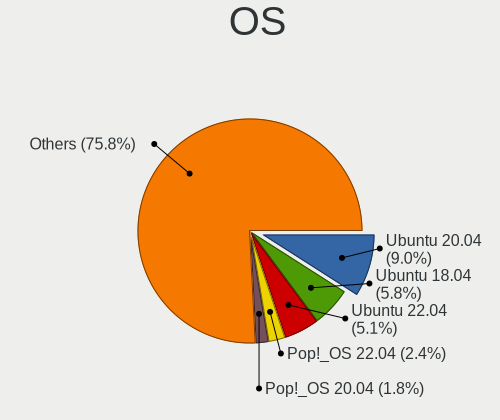
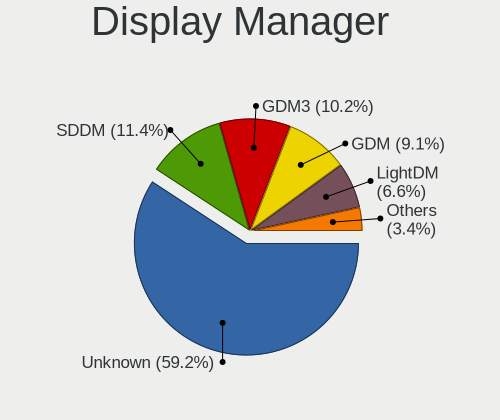
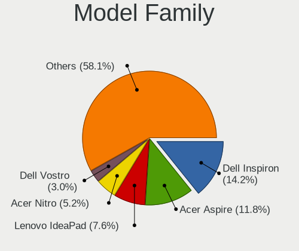
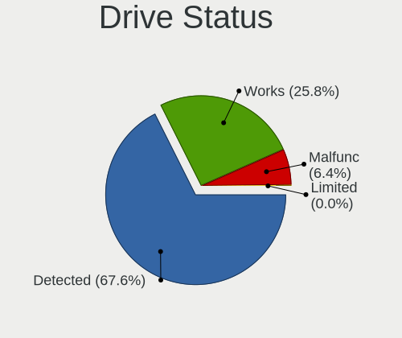
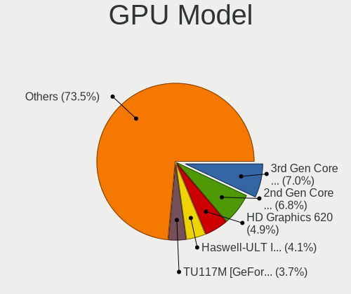
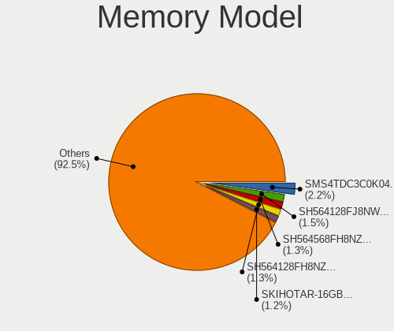
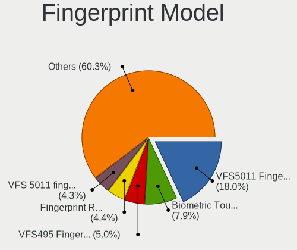

Linux in Brazil - Tested Hardware & Statistics (Notebooks)
----------------------------------------------------------

A project to collect tested hardware configurations for Linux in Brazil.

Anyone can contribute to this report by the [hw-probe](https://github.com/linuxhw/hw-probe) tool:

    sudo -E hw-probe -all -upload

Please contribute! Especially if your hardware is rare.

Contents
--------

* [ Test Cases ](#test-cases)

* [ System ](#system)
  - [ OS                       ](#os)
  - [ OS Family                ](#os-family)
  - [ Kernel                   ](#kernel)
  - [ Kernel Family            ](#kernel-family)
  - [ Kernel Major Ver.        ](#kernel-major-ver)
  - [ Arch                     ](#arch)
  - [ DE                       ](#de)
  - [ Display Server           ](#display-server)
  - [ Display Manager          ](#display-manager)
  - [ OS Lang                  ](#os-lang)
  - [ Boot Mode                ](#boot-mode)
  - [ Filesystem               ](#filesystem)
  - [ Part. scheme             ](#part-scheme)
  - [ Dual Boot with Linux/BSD ](#dual-boot-with-linuxbsd)
  - [ Dual Boot (Win)          ](#dual-boot-win)

* [ Board ](#board)
  - [ Vendor                   ](#vendor)
  - [ Model                    ](#model)
  - [ Model Family             ](#model-family)
  - [ MFG Year                 ](#mfg-year)
  - [ Form Factor              ](#form-factor)
  - [ Secure Boot              ](#secure-boot)
  - [ Coreboot                 ](#coreboot)
  - [ RAM Size                 ](#ram-size)
  - [ RAM Used                 ](#ram-used)
  - [ Total Drives             ](#total-drives)
  - [ Has CD-ROM               ](#has-cd-rom)
  - [ Has Ethernet             ](#has-ethernet)
  - [ Has WiFi                 ](#has-wifi)
  - [ Has Bluetooth            ](#has-bluetooth)

* [ Location ](#location)
  - [ Country                  ](#country)
  - [ City                     ](#city)

* [ Drives ](#drives)
  - [ Drive Vendor             ](#drive-vendor)
  - [ Drive Model              ](#drive-model)
  - [ HDD Vendor               ](#hdd-vendor)
  - [ SSD Vendor               ](#ssd-vendor)
  - [ Drive Kind               ](#drive-kind)
  - [ Drive Connector          ](#drive-connector)
  - [ Drive Size               ](#drive-size)
  - [ Space Total              ](#space-total)
  - [ Space Used               ](#space-used)
  - [ Malfunc. Drives          ](#malfunc-drives)
  - [ Malfunc. Drive Vendor    ](#malfunc-drive-vendor)
  - [ Malfunc. HDD Vendor      ](#malfunc-hdd-vendor)
  - [ Malfunc. Drive Kind      ](#malfunc-drive-kind)
  - [ Failed Drives            ](#failed-drives)
  - [ Failed Drive Vendor      ](#failed-drive-vendor)
  - [ Drive Status             ](#drive-status)

* [ Storage controller ](#storage-controller)
  - [ Storage Vendor           ](#storage-vendor)
  - [ Storage Model            ](#storage-model)
  - [ Storage Kind             ](#storage-kind)

* [ Processor ](#processor)
  - [ CPU Vendor               ](#cpu-vendor)
  - [ CPU Model                ](#cpu-model)
  - [ CPU Model Family         ](#cpu-model-family)
  - [ CPU Cores                ](#cpu-cores)
  - [ CPU Sockets              ](#cpu-sockets)
  - [ CPU Threads              ](#cpu-threads)
  - [ CPU Op-Modes             ](#cpu-op-modes)
  - [ CPU Microcode            ](#cpu-microcode)
  - [ CPU Microarch            ](#cpu-microarch)

* [ Graphics ](#graphics)
  - [ GPU Vendor               ](#gpu-vendor)
  - [ GPU Model                ](#gpu-model)
  - [ GPU Combo                ](#gpu-combo)
  - [ GPU Driver               ](#gpu-driver)
  - [ GPU Memory               ](#gpu-memory)

* [ Monitor ](#monitor)
  - [ Monitor Vendor           ](#monitor-vendor)
  - [ Monitor Model            ](#monitor-model)
  - [ Monitor Resolution       ](#monitor-resolution)
  - [ Monitor Diagonal         ](#monitor-diagonal)
  - [ Monitor Width            ](#monitor-width)
  - [ Aspect Ratio             ](#aspect-ratio)
  - [ Monitor Area             ](#monitor-area)
  - [ Pixel Density            ](#pixel-density)
  - [ Multiple Monitors        ](#multiple-monitors)

* [ Network ](#network)
  - [ Net Controller Vendor    ](#net-controller-vendor)
  - [ Net Controller Model     ](#net-controller-model)
  - [ Wireless Vendor          ](#wireless-vendor)
  - [ Wireless Model           ](#wireless-model)
  - [ Ethernet Vendor          ](#ethernet-vendor)
  - [ Ethernet Model           ](#ethernet-model)
  - [ Net Controller Kind      ](#net-controller-kind)
  - [ Used Controller          ](#used-controller)
  - [ NICs                     ](#nics)
  - [ IPv6                     ](#ipv6)

* [ Bluetooth ](#bluetooth)
  - [ Bluetooth Vendor         ](#bluetooth-vendor)
  - [ Bluetooth Model          ](#bluetooth-model)

* [ Sound ](#sound)
  - [ Sound Vendor             ](#sound-vendor)
  - [ Sound Model              ](#sound-model)

* [ Memory ](#memory)
  - [ Memory Vendor            ](#memory-vendor)
  - [ Memory Model             ](#memory-model)
  - [ Memory Kind              ](#memory-kind)
  - [ Memory Form Factor       ](#memory-form-factor)
  - [ Memory Size              ](#memory-size)
  - [ Memory Speed             ](#memory-speed)

* [ Printers & scanners ](#printers--scanners)
  - [ Printer Vendor           ](#printer-vendor)
  - [ Printer Model            ](#printer-model)
  - [ Scanner Vendor           ](#scanner-vendor)
  - [ Scanner Model            ](#scanner-model)

* [ Camera ](#camera)
  - [ Camera Vendor            ](#camera-vendor)
  - [ Camera Model             ](#camera-model)

* [ Security ](#security)
  - [ Fingerprint Vendor       ](#fingerprint-vendor)
  - [ Fingerprint Model        ](#fingerprint-model)
  - [ Chipcard Vendor          ](#chipcard-vendor)
  - [ Chipcard Model           ](#chipcard-model)

* [ Unsupported ](#unsupported)
  - [ Unsupported Devices      ](#unsupported-devices)
  - [ Unsupported Device Types ](#unsupported-device-types)

Test Cases
----------

Total: 9515

| Vendor        | Model                       | Probe                                                      | Date         |
|---------------|-----------------------------|------------------------------------------------------------|--------------|
| Positivo      | Mobile                      | [640bc1a962](https://linux-hardware.org/?probe=640bc1a962) | Oct 01, 2022 |
| Sony          | VPCCA15FX                   | [5063ea411b](https://linux-hardware.org/?probe=5063ea411b) | Oct 01, 2022 |
| Itautec       | Infoway a7420               | [bb52fe66cf](https://linux-hardware.org/?probe=bb52fe66cf) | Oct 01, 2022 |
| Sony          | VPCCA15FX                   | [96eb3d8cf7](https://linux-hardware.org/?probe=96eb3d8cf7) | Oct 01, 2022 |
| Lenovo        | G400s VILG1                 | [e666344187](https://linux-hardware.org/?probe=e666344187) | Oct 01, 2022 |
| Dell          | Inspiron 5420               | [71f7e67ca7](https://linux-hardware.org/?probe=71f7e67ca7) | Oct 01, 2022 |
| Lenovo        | IdeaPad 330-15IKB 81FE      | [b62ddbdab0](https://linux-hardware.org/?probe=b62ddbdab0) | Oct 01, 2022 |
| Lenovo        | G480 20149                  | [9a047ee214](https://linux-hardware.org/?probe=9a047ee214) | Oct 01, 2022 |
| Lenovo        | G480 20149                  | [4c0a153a12](https://linux-hardware.org/?probe=4c0a153a12) | Oct 01, 2022 |
| Notebook      | NJx0MU                      | [5df0554ade](https://linux-hardware.org/?probe=5df0554ade) | Oct 01, 2022 |
| Notebook      | NJx0MU                      | [9eba2a1ed4](https://linux-hardware.org/?probe=9eba2a1ed4) | Oct 01, 2022 |
| Chuwi         | HeroBook Air                | [1f142c7087](https://linux-hardware.org/?probe=1f142c7087) | Sep 30, 2022 |
| Chuwi         | HeroBook Air                | [263313ef38](https://linux-hardware.org/?probe=263313ef38) | Sep 30, 2022 |
| Positivo      | Mobile                      | [dcf8b09bec](https://linux-hardware.org/?probe=dcf8b09bec) | Sep 30, 2022 |
| Positivo      | Mobile                      | [6d2584bcb8](https://linux-hardware.org/?probe=6d2584bcb8) | Sep 30, 2022 |
| Acer          | Nitro AN515-44              | [149337514c](https://linux-hardware.org/?probe=149337514c) | Sep 30, 2022 |
| ASUSTek       | VivoBook_ASUSLaptop X513... | [fa00f3d0ca](https://linux-hardware.org/?probe=fa00f3d0ca) | Sep 30, 2022 |
| Dell          | Vostro 5402                 | [57995ec944](https://linux-hardware.org/?probe=57995ec944) | Sep 30, 2022 |
| Positivo B... | VJFE42F11X-XXXXXX           | [fdcdf06f55](https://linux-hardware.org/?probe=fdcdf06f55) | Sep 29, 2022 |
| Avell High... | A60 MUV                     | [888e375356](https://linux-hardware.org/?probe=888e375356) | Sep 29, 2022 |
| HP            | Laptop 15-db0xxx            | [067b155d9b](https://linux-hardware.org/?probe=067b155d9b) | Sep 29, 2022 |
| HP            | Laptop 15-db0xxx            | [058aa145d3](https://linux-hardware.org/?probe=058aa145d3) | Sep 29, 2022 |
| Dell          | Inspiron 5447               | [b30346135b](https://linux-hardware.org/?probe=b30346135b) | Sep 28, 2022 |
| Dell          | Inspiron 3442               | [8272a6655b](https://linux-hardware.org/?probe=8272a6655b) | Sep 28, 2022 |
| Dell          | Inspiron 3442               | [be9d7b3e42](https://linux-hardware.org/?probe=be9d7b3e42) | Sep 28, 2022 |
| Dell          | Vostro 15 3515              | [7e4413a053](https://linux-hardware.org/?probe=7e4413a053) | Sep 28, 2022 |
| Lenovo        | IdeaPad 3 15ALC6 82MF       | [bbd715eb5a](https://linux-hardware.org/?probe=bbd715eb5a) | Sep 28, 2022 |
| Dell          | Vostro 15 5510              | [973307d03b](https://linux-hardware.org/?probe=973307d03b) | Sep 28, 2022 |
| Notebook      | NJx0MU                      | [91c0e46209](https://linux-hardware.org/?probe=91c0e46209) | Sep 28, 2022 |
| Acer          | Aspire E5-573               | [f7e628a5a1](https://linux-hardware.org/?probe=f7e628a5a1) | Sep 28, 2022 |
| Positivo      | S14CT01                     | [66e0c53646](https://linux-hardware.org/?probe=66e0c53646) | Sep 28, 2022 |
| Unknown       | Unknown                     | [3e450900da](https://linux-hardware.org/?probe=3e450900da) | Sep 28, 2022 |
| LG Electro... | C400-G.BC22P1               | [a325f5eb86](https://linux-hardware.org/?probe=a325f5eb86) | Sep 28, 2022 |
| Acer          | Aspire A315-23G             | [3eaaf54d1b](https://linux-hardware.org/?probe=3eaaf54d1b) | Sep 28, 2022 |
| Dell          | Inspiron 5566               | [a4b44081c2](https://linux-hardware.org/?probe=a4b44081c2) | Sep 27, 2022 |
| Dell          | Vostro 15 5510              | [730653ea29](https://linux-hardware.org/?probe=730653ea29) | Sep 27, 2022 |
| Lenovo        | G40-80 80JE                 | [a6347449b3](https://linux-hardware.org/?probe=a6347449b3) | Sep 27, 2022 |
| Philco        | PNB14.1AC14S128W10          | [ee4bc98535](https://linux-hardware.org/?probe=ee4bc98535) | Sep 27, 2022 |
| Lenovo        | ThinkPad T410 2537AT9       | [553490bb4c](https://linux-hardware.org/?probe=553490bb4c) | Sep 27, 2022 |
| Standard      | AHV                         | [a80b2d344d](https://linux-hardware.org/?probe=a80b2d344d) | Sep 27, 2022 |
| Acer          | Nitro AN515-45              | [8579eba471](https://linux-hardware.org/?probe=8579eba471) | Sep 26, 2022 |
| Dell          | Latitude 5420               | [bd81c07917](https://linux-hardware.org/?probe=bd81c07917) | Sep 26, 2022 |
| Lenovo        | IdeaPad S145-15IWL 81S9     | [d9187e470e](https://linux-hardware.org/?probe=d9187e470e) | Sep 26, 2022 |
| Lenovo        | ThinkPad T480 20L6SCWK00    | [60933ed48b](https://linux-hardware.org/?probe=60933ed48b) | Sep 26, 2022 |
| Acer          | Aspire A514-54              | [bab009e0b7](https://linux-hardware.org/?probe=bab009e0b7) | Sep 26, 2022 |
| Positivo      | S14CT01                     | [2191cd2dd1](https://linux-hardware.org/?probe=2191cd2dd1) | Sep 26, 2022 |
| HP            | G42                         | [39a4836398](https://linux-hardware.org/?probe=39a4836398) | Sep 26, 2022 |
| Samsung       | 670Z5E                      | [6bce247e38](https://linux-hardware.org/?probe=6bce247e38) | Sep 26, 2022 |
| Positivo      | S14SL01                     | [a6b3c260f4](https://linux-hardware.org/?probe=a6b3c260f4) | Sep 25, 2022 |
| CCE           | Capella & IbexPeak-M Chi... | [07554a7a2b](https://linux-hardware.org/?probe=07554a7a2b) | Sep 25, 2022 |
| Lenovo        | IdeaPad 310-14ISK 80UG      | [d8b270de2b](https://linux-hardware.org/?probe=d8b270de2b) | Sep 25, 2022 |
| Notebook      | NJx0MU                      | [09411a9eb9](https://linux-hardware.org/?probe=09411a9eb9) | Sep 25, 2022 |
| Positivo      | S14SL01                     | [e09fcd6e38](https://linux-hardware.org/?probe=e09fcd6e38) | Sep 25, 2022 |
| Dell          | Inspiron 15 7000 Gaming     | [2e96ddfdd1](https://linux-hardware.org/?probe=2e96ddfdd1) | Sep 25, 2022 |
| Samsung       | RV411/RV511/E3511/S3511/... | [939bba43d1](https://linux-hardware.org/?probe=939bba43d1) | Sep 25, 2022 |
| Avell High... | A70 MOB                     | [b867406b76](https://linux-hardware.org/?probe=b867406b76) | Sep 25, 2022 |
| Acer          | AO532h                      | [383ce70d97](https://linux-hardware.org/?probe=383ce70d97) | Sep 25, 2022 |
| Dell          | Inspiron 3442               | [7fb024bb5d](https://linux-hardware.org/?probe=7fb024bb5d) | Sep 25, 2022 |
| Dell          | Inspiron 3442               | [1190ad2886](https://linux-hardware.org/?probe=1190ad2886) | Sep 24, 2022 |
| Samsung       | RV411/RV511/E3511/S3511/... | [118cf21173](https://linux-hardware.org/?probe=118cf21173) | Sep 24, 2022 |
| Dell          | Latitude E5400              | [09be905a45](https://linux-hardware.org/?probe=09be905a45) | Sep 24, 2022 |
| Notebook      | NJx0MU                      | [25b9bc1637](https://linux-hardware.org/?probe=25b9bc1637) | Sep 24, 2022 |
| Dell          | Latitude 3410               | [ba10ea9fc5](https://linux-hardware.org/?probe=ba10ea9fc5) | Sep 24, 2022 |
| Lenovo        | ThinkPad E480 20KQ000EBR    | [5c39bdf4ab](https://linux-hardware.org/?probe=5c39bdf4ab) | Sep 24, 2022 |
| Samsung       | RV411/RV511/E3511/S3511/... | [2322475867](https://linux-hardware.org/?probe=2322475867) | Sep 24, 2022 |
| Dell          | Latitude 5420               | [170a3248f6](https://linux-hardware.org/?probe=170a3248f6) | Sep 24, 2022 |
| Notebook      | NJx0MU                      | [0cfbd1e652](https://linux-hardware.org/?probe=0cfbd1e652) | Sep 24, 2022 |
| Samsung       | 550XBE/350XBE               | [dec88709ee](https://linux-hardware.org/?probe=dec88709ee) | Sep 23, 2022 |
| Samsung       | 550XBE/350XBE               | [e17fb419bd](https://linux-hardware.org/?probe=e17fb419bd) | Sep 23, 2022 |
| Dell          | Inspiron 5566               | [4ed9eae431](https://linux-hardware.org/?probe=4ed9eae431) | Sep 23, 2022 |
| Acer          | Nitro AN515-44              | [b02d161acb](https://linux-hardware.org/?probe=b02d161acb) | Sep 23, 2022 |
| Dell          | Vostro 15 5510              | [5488a2b9ff](https://linux-hardware.org/?probe=5488a2b9ff) | Sep 22, 2022 |
| Dell          | Vostro 15 5510              | [630b3877c4](https://linux-hardware.org/?probe=630b3877c4) | Sep 22, 2022 |
| Samsung       | 340XAA/350XAA/550XAA        | [d852d9e0dd](https://linux-hardware.org/?probe=d852d9e0dd) | Sep 22, 2022 |
| Avell High... | B.ON                        | [95c7e35ef3](https://linux-hardware.org/?probe=95c7e35ef3) | Sep 22, 2022 |
| Lenovo        | IdeaPad 3 15ALC6 82MF       | [3c93753c6c](https://linux-hardware.org/?probe=3c93753c6c) | Sep 22, 2022 |
| Sony          | SVE15125CBW                 | [50b65906b1](https://linux-hardware.org/?probe=50b65906b1) | Sep 22, 2022 |
| Dell          | Inspiron 5566               | [183f486a54](https://linux-hardware.org/?probe=183f486a54) | Sep 21, 2022 |
| Avell High... | B.ON                        | [aaebcf57bb](https://linux-hardware.org/?probe=aaebcf57bb) | Sep 21, 2022 |
| Lenovo        | IdeaPad 320-15IKB 80YH      | [74d69dbd69](https://linux-hardware.org/?probe=74d69dbd69) | Sep 21, 2022 |
| Acer          | Aspire A515-54              | [8116705a81](https://linux-hardware.org/?probe=8116705a81) | Sep 21, 2022 |
| ASUSTek       | X451CA                      | [bdfe92eb66](https://linux-hardware.org/?probe=bdfe92eb66) | Sep 21, 2022 |
| LG Electro... | C400-G.BC22P1               | [b5aad7f903](https://linux-hardware.org/?probe=b5aad7f903) | Sep 20, 2022 |
| ASUSTek       | K46CB                       | [88cbbeaee6](https://linux-hardware.org/?probe=88cbbeaee6) | Sep 20, 2022 |
| Notebook      | NJx0MU                      | [c89ed0e55a](https://linux-hardware.org/?probe=c89ed0e55a) | Sep 20, 2022 |
| Notebook      | NJx0MU                      | [0a1fb0cc40](https://linux-hardware.org/?probe=0a1fb0cc40) | Sep 20, 2022 |
| LG Electro... | C400-G.BC31P1               | [66c8977810](https://linux-hardware.org/?probe=66c8977810) | Sep 19, 2022 |
| Samsung       | 300E5K/300E5Q               | [aaedf90f31](https://linux-hardware.org/?probe=aaedf90f31) | Sep 19, 2022 |
| Apple         | MacBookPro9,2               | [a681a7cab8](https://linux-hardware.org/?probe=a681a7cab8) | Sep 19, 2022 |
| Lenovo        | G50-80 80R0                 | [f04ed15344](https://linux-hardware.org/?probe=f04ed15344) | Sep 19, 2022 |
| Lenovo        | Legion 5 15ACH6 82QJ        | [e2c5e4775c](https://linux-hardware.org/?probe=e2c5e4775c) | Sep 19, 2022 |
| Notebook      | NJx0MU                      | [47d871031b](https://linux-hardware.org/?probe=47d871031b) | Sep 19, 2022 |
| Lenovo        | IdeaPad S145-15IWL 81S9     | [40629d6fbc](https://linux-hardware.org/?probe=40629d6fbc) | Sep 19, 2022 |
| Acer          | Aspire E1-571               | [b98206a5fb](https://linux-hardware.org/?probe=b98206a5fb) | Sep 19, 2022 |
| Acer          | Aspire A515-45              | [41b1b790fd](https://linux-hardware.org/?probe=41b1b790fd) | Sep 19, 2022 |
| Positivo      | C14CR21                     | [e72ef2677b](https://linux-hardware.org/?probe=e72ef2677b) | Sep 19, 2022 |
| Dell          | Inspiron 5566               | [58d84150d6](https://linux-hardware.org/?probe=58d84150d6) | Sep 18, 2022 |
| Samsung       | 370E4K                      | [1a297b75f9](https://linux-hardware.org/?probe=1a297b75f9) | Sep 18, 2022 |
| Lenovo        | IdeaPad 3 15ALC6 82MF       | [cd1441d5a4](https://linux-hardware.org/?probe=cd1441d5a4) | Sep 18, 2022 |
| Acer          | Aspire A315-23G             | [9e3edc5b61](https://linux-hardware.org/?probe=9e3edc5b61) | Sep 18, 2022 |
| Notebook      | NJx0MU                      | [f27d1aacb6](https://linux-hardware.org/?probe=f27d1aacb6) | Sep 18, 2022 |
| Gateway       | NV55C                       | [e00587af22](https://linux-hardware.org/?probe=e00587af22) | Sep 18, 2022 |
| Dell          | Vostro 3500                 | [08bd4157a3](https://linux-hardware.org/?probe=08bd4157a3) | Sep 18, 2022 |
| Samsung       | 670Z5E                      | [50758a53dd](https://linux-hardware.org/?probe=50758a53dd) | Sep 18, 2022 |
| Notebook      | NJx0MU                      | [2f9a798b3b](https://linux-hardware.org/?probe=2f9a798b3b) | Sep 18, 2022 |
| Lenovo        | ThinkPad T430 23501M2       | [b9503c9c28](https://linux-hardware.org/?probe=b9503c9c28) | Sep 18, 2022 |
| HP            | ProBook 6470b               | [3821322b95](https://linux-hardware.org/?probe=3821322b95) | Sep 18, 2022 |
| Dell          | Inspiron 15 7000 Gaming     | [edc0c871cb](https://linux-hardware.org/?probe=edc0c871cb) | Sep 17, 2022 |
| Acer          | Aspire A315-23G             | [3de0a6e725](https://linux-hardware.org/?probe=3de0a6e725) | Sep 17, 2022 |
| Samsung       | 275E4E/275E5E               | [89706d3dac](https://linux-hardware.org/?probe=89706d3dac) | Sep 17, 2022 |
| ASUSTek       | ROG Zephyrus G15 GA503QR... | [44a3455d48](https://linux-hardware.org/?probe=44a3455d48) | Sep 17, 2022 |
| Dell          | Vostro 15 3510              | [d70dc7ab47](https://linux-hardware.org/?probe=d70dc7ab47) | Sep 16, 2022 |
| Dell          | Vostro 15 3510              | [0bcb975501](https://linux-hardware.org/?probe=0bcb975501) | Sep 16, 2022 |
| Lenovo        | G480 20149                  | [8fed7863dd](https://linux-hardware.org/?probe=8fed7863dd) | Sep 16, 2022 |
| Dell          | Inspiron 5547               | [d66cbae64b](https://linux-hardware.org/?probe=d66cbae64b) | Sep 16, 2022 |
| Acer          | Aspire A515-51              | [59811273b4](https://linux-hardware.org/?probe=59811273b4) | Sep 16, 2022 |
| Daten Tecn... | DT02-M4                     | [0096dc6b88](https://linux-hardware.org/?probe=0096dc6b88) | Sep 16, 2022 |
| Daten Tecn... | DT02-M4                     | [09e9990a2f](https://linux-hardware.org/?probe=09e9990a2f) | Sep 16, 2022 |
| Unknown       | Unknown                     | [d391ace7f8](https://linux-hardware.org/?probe=d391ace7f8) | Sep 16, 2022 |
| Dell          | G7 7588                     | [583c4a4c91](https://linux-hardware.org/?probe=583c4a4c91) | Sep 16, 2022 |
| Acer          | Aspire A315-23G             | [283a38bb80](https://linux-hardware.org/?probe=283a38bb80) | Sep 16, 2022 |
| HP            | Compaq Presario CQ50        | [41dcd9ffc4](https://linux-hardware.org/?probe=41dcd9ffc4) | Sep 16, 2022 |
| HP            | ProBook 4530s               | [821a6eda47](https://linux-hardware.org/?probe=821a6eda47) | Sep 16, 2022 |
| Dell          | Inspiron 11-3168            | [29241bb609](https://linux-hardware.org/?probe=29241bb609) | Sep 15, 2022 |
| Samsung       | 340XAA/350XAA/550XAA        | [13cd2039a1](https://linux-hardware.org/?probe=13cd2039a1) | Sep 15, 2022 |
| Acer          | Aspire E5-571G              | [0a02b8ef94](https://linux-hardware.org/?probe=0a02b8ef94) | Sep 15, 2022 |
| Positivo      | Mobile                      | [f0f7335929](https://linux-hardware.org/?probe=f0f7335929) | Sep 15, 2022 |
| Positivo      | Mobile                      | [ef02cc05aa](https://linux-hardware.org/?probe=ef02cc05aa) | Sep 15, 2022 |
| Notebook      | NJx0MU                      | [43264d7e6e](https://linux-hardware.org/?probe=43264d7e6e) | Sep 15, 2022 |
| Dell          | Latitude 3420               | [5c00a1875c](https://linux-hardware.org/?probe=5c00a1875c) | Sep 14, 2022 |
| Dell          | Inspiron 11-3168            | [763b0fced4](https://linux-hardware.org/?probe=763b0fced4) | Sep 14, 2022 |
| HP            | 1000                        | [65024f3d7a](https://linux-hardware.org/?probe=65024f3d7a) | Sep 13, 2022 |
| Dell          | Vostro 15 5510              | [e63dd14c21](https://linux-hardware.org/?probe=e63dd14c21) | Sep 13, 2022 |
| Dell          | Vostro 15 5510              | [16942cfd78](https://linux-hardware.org/?probe=16942cfd78) | Sep 13, 2022 |
| Lenovo        | B40-70 80F30005BR           | [b899f1b7da](https://linux-hardware.org/?probe=b899f1b7da) | Sep 13, 2022 |
| Lenovo        | B40-70 80F30005BR           | [99be4451df](https://linux-hardware.org/?probe=99be4451df) | Sep 13, 2022 |
| ASUSTek       | VivoBook_ASUSLaptop X515... | [16cf967fc8](https://linux-hardware.org/?probe=16cf967fc8) | Sep 13, 2022 |
| Acer          | Aspire 5050                 | [1961d1c468](https://linux-hardware.org/?probe=1961d1c468) | Sep 13, 2022 |
| Notebook      | NJx0MU                      | [a72ef6cb0b](https://linux-hardware.org/?probe=a72ef6cb0b) | Sep 13, 2022 |
| Compal        | NCL60/61                    | [f1f5499af8](https://linux-hardware.org/?probe=f1f5499af8) | Sep 12, 2022 |
| Dell          | Inspiron 5458               | [bd26475724](https://linux-hardware.org/?probe=bd26475724) | Sep 12, 2022 |
| Dell          | Inspiron 15 7000 Gaming     | [ca9a099cf6](https://linux-hardware.org/?probe=ca9a099cf6) | Sep 12, 2022 |
| Samsung       | RV415/RV515                 | [bc83707f72](https://linux-hardware.org/?probe=bc83707f72) | Sep 12, 2022 |
| HP            | EliteBook 2530p             | [4bae06f3d0](https://linux-hardware.org/?probe=4bae06f3d0) | Sep 12, 2022 |
| Dell          | Inspiron 5548               | [341b48f953](https://linux-hardware.org/?probe=341b48f953) | Sep 12, 2022 |
| Avell High... | B.ON                        | [f30bca74ab](https://linux-hardware.org/?probe=f30bca74ab) | Sep 12, 2022 |
| Acer          | Aspire ES1-411              | [064b2bd5f2](https://linux-hardware.org/?probe=064b2bd5f2) | Sep 11, 2022 |
| Acer          | Aspire A315-42G             | [34964d8e2d](https://linux-hardware.org/?probe=34964d8e2d) | Sep 11, 2022 |
| Dell          | Inspiron 15 7000 Gaming     | [4c6d525103](https://linux-hardware.org/?probe=4c6d525103) | Sep 11, 2022 |
| ASUSTek       | K46CA                       | [9e730cbd6a](https://linux-hardware.org/?probe=9e730cbd6a) | Sep 11, 2022 |
| Toshiba       | IS 1413G                    | [fab48b6c15](https://linux-hardware.org/?probe=fab48b6c15) | Sep 10, 2022 |
| Acer          | Aspire ES1-411              | [6bbebcbcb1](https://linux-hardware.org/?probe=6bbebcbcb1) | Sep 10, 2022 |
| ASUSTek       | K53E                        | [d39f35f5d9](https://linux-hardware.org/?probe=d39f35f5d9) | Sep 10, 2022 |
| Dell          | Inspiron 15 7000 Gaming     | [c027a7cf99](https://linux-hardware.org/?probe=c027a7cf99) | Sep 10, 2022 |
| Lenovo        | ThinkPad T460 20FMS271BR    | [f2f2786b99](https://linux-hardware.org/?probe=f2f2786b99) | Sep 10, 2022 |
| Dell          | G15 5511                    | [b971c27fae](https://linux-hardware.org/?probe=b971c27fae) | Sep 10, 2022 |
| Acer          | Nitro AN515-44              | [9f5bc258b6](https://linux-hardware.org/?probe=9f5bc258b6) | Sep 10, 2022 |
| Notebook      | NJx0MU                      | [8c6f7ca8a0](https://linux-hardware.org/?probe=8c6f7ca8a0) | Sep 10, 2022 |
| LG Electro... | U560-G.BG31P1               | [741c3eddbe](https://linux-hardware.org/?probe=741c3eddbe) | Sep 10, 2022 |
| Lenovo        | ThinkPad L14 Gen 1 20U6S... | [823dbe2390](https://linux-hardware.org/?probe=823dbe2390) | Sep 10, 2022 |
| Acer          | Aspire E1-572               | [1cfbfd9b91](https://linux-hardware.org/?probe=1cfbfd9b91) | Sep 09, 2022 |
| HP            | ProBook 640 G1              | [e6c0d3de61](https://linux-hardware.org/?probe=e6c0d3de61) | Sep 09, 2022 |
| Avell High... | A70 MOB                     | [1cc84e9a0d](https://linux-hardware.org/?probe=1cc84e9a0d) | Sep 09, 2022 |
| Acer          | Aspire A515-54              | [745c098d8a](https://linux-hardware.org/?probe=745c098d8a) | Sep 09, 2022 |
| ASUSTek       | VivoBook_ASUSLaptop X515... | [cc0a825c8e](https://linux-hardware.org/?probe=cc0a825c8e) | Sep 09, 2022 |
| Dell          | Inspiron 5566               | [7d9ebaa4f8](https://linux-hardware.org/?probe=7d9ebaa4f8) | Sep 09, 2022 |
| Dell          | Vostro 3500                 | [92ae6811fa](https://linux-hardware.org/?probe=92ae6811fa) | Sep 09, 2022 |
| Positivo      | H14BT58                     | [669a466b1c](https://linux-hardware.org/?probe=669a466b1c) | Sep 09, 2022 |
| Lenovo        | IdeaPad S400 20195          | [6bd3292f42](https://linux-hardware.org/?probe=6bd3292f42) | Sep 08, 2022 |
| Dell          | Vostro 3500                 | [d37b0f4483](https://linux-hardware.org/?probe=d37b0f4483) | Sep 08, 2022 |
| Dell          | Inspiron 5457               | [e44e9d3a85](https://linux-hardware.org/?probe=e44e9d3a85) | Sep 08, 2022 |
| Dell          | Vostro 3550                 | [f04353bb0e](https://linux-hardware.org/?probe=f04353bb0e) | Sep 08, 2022 |
| ASUSTek       | K46CB                       | [9449630b6a](https://linux-hardware.org/?probe=9449630b6a) | Sep 08, 2022 |
| Samsung       | 300E5M/300E5L               | [1d73ebcfb8](https://linux-hardware.org/?probe=1d73ebcfb8) | Sep 08, 2022 |
| Acer          | Aspire ES1-411              | [d3df9a2592](https://linux-hardware.org/?probe=d3df9a2592) | Sep 08, 2022 |
| Digibras      | US41II1                     | [890a4894cf](https://linux-hardware.org/?probe=890a4894cf) | Sep 08, 2022 |
| Samsung       | 300E5M/300E5L               | [de1ddd77dd](https://linux-hardware.org/?probe=de1ddd77dd) | Sep 08, 2022 |
| Lenovo        | ThinkPad E480 20KQ000EBR    | [09e8283762](https://linux-hardware.org/?probe=09e8283762) | Sep 08, 2022 |
| Lenovo        | ThinkPad E480 20KQ000EBR    | [e73c83b5c7](https://linux-hardware.org/?probe=e73c83b5c7) | Sep 07, 2022 |
| Positivo      | Mobile                      | [1378222b07](https://linux-hardware.org/?probe=1378222b07) | Sep 07, 2022 |
| Lenovo        | ThinkPad T400 2767E53       | [104331cf4c](https://linux-hardware.org/?probe=104331cf4c) | Sep 07, 2022 |
| Positivo      | Smash                       | [0051f458c6](https://linux-hardware.org/?probe=0051f458c6) | Sep 07, 2022 |
| Lenovo        | ThinkPad L14 Gen 1 20U6S... | [c0e98bf9e5](https://linux-hardware.org/?probe=c0e98bf9e5) | Sep 06, 2022 |
| LG Electro... | A530-T.BE76P1               | [46161b573f](https://linux-hardware.org/?probe=46161b573f) | Sep 06, 2022 |
| Lenovo        | ThinkPad T420 4236PNP       | [7c3dc0af20](https://linux-hardware.org/?probe=7c3dc0af20) | Sep 06, 2022 |
| Dell          | Inspiron N5010              | [b12a6d2146](https://linux-hardware.org/?probe=b12a6d2146) | Sep 06, 2022 |
| Dell          | Inspiron N5010              | [48a1236943](https://linux-hardware.org/?probe=48a1236943) | Sep 06, 2022 |
| Lenovo        | G400s VILG1                 | [44c27d1083](https://linux-hardware.org/?probe=44c27d1083) | Sep 06, 2022 |
| Lenovo        | G400s VILG1                 | [ec3283d49b](https://linux-hardware.org/?probe=ec3283d49b) | Sep 06, 2022 |
| Notebook      | NJx0MU                      | [4ac227c8fe](https://linux-hardware.org/?probe=4ac227c8fe) | Sep 06, 2022 |
| HP            | Stream Laptop 14-cb0XX      | [6f848cd309](https://linux-hardware.org/?probe=6f848cd309) | Sep 06, 2022 |
| Dell          | Vostro 14-5480              | [fb3ae25db8](https://linux-hardware.org/?probe=fb3ae25db8) | Sep 06, 2022 |
| Positivo B... | VJFE52F11X-B0611H           | [93d596fc4f](https://linux-hardware.org/?probe=93d596fc4f) | Sep 05, 2022 |
| Dell          | Vostro 15 5510              | [beb1aeb4ad](https://linux-hardware.org/?probe=beb1aeb4ad) | Sep 05, 2022 |
| Alienware     | m15 R7                      | [c9d5bcb40f](https://linux-hardware.org/?probe=c9d5bcb40f) | Sep 05, 2022 |
| Samsung       | 550P5C/550P7C               | [9d9451305b](https://linux-hardware.org/?probe=9d9451305b) | Sep 05, 2022 |
| ASUSTek       | X45C                        | [7267b251b6](https://linux-hardware.org/?probe=7267b251b6) | Sep 05, 2022 |
| Notebook      | NJx0MU                      | [928ba60e7e](https://linux-hardware.org/?probe=928ba60e7e) | Sep 05, 2022 |
| Positivo B... | VJFE52F11X-B0611H           | [0e3fd8d374](https://linux-hardware.org/?probe=0e3fd8d374) | Sep 05, 2022 |
| Lenovo        | G40-80 80JE                 | [c876beae17](https://linux-hardware.org/?probe=c876beae17) | Sep 04, 2022 |
| Lenovo        | IdeaPad 330S-15IKB 81F5     | [61e1164988](https://linux-hardware.org/?probe=61e1164988) | Sep 04, 2022 |
| Lenovo        | G40-80 80JE                 | [e6fa43e12e](https://linux-hardware.org/?probe=e6fa43e12e) | Sep 04, 2022 |
| Lenovo        | IdeaPad 3 15ALC6 82MF       | [920bfdae34](https://linux-hardware.org/?probe=920bfdae34) | Sep 04, 2022 |
| Lenovo        | IdeaPad S145-15API 81V7     | [db5a53a31c](https://linux-hardware.org/?probe=db5a53a31c) | Sep 03, 2022 |
| Timi          | TM1701                      | [740d59830a](https://linux-hardware.org/?probe=740d59830a) | Sep 03, 2022 |
| Samsung       | 300E5M/300E5L               | [3d542c8484](https://linux-hardware.org/?probe=3d542c8484) | Sep 03, 2022 |
| Samsung       | 550P5C/550P7C               | [6aac0a8c6c](https://linux-hardware.org/?probe=6aac0a8c6c) | Sep 03, 2022 |
| Itautec       | Infoway                     | [d207af3252](https://linux-hardware.org/?probe=d207af3252) | Sep 03, 2022 |
| Itautec       | Infoway                     | [737122a0d1](https://linux-hardware.org/?probe=737122a0d1) | Sep 03, 2022 |
| Daten Tecn... | DT02-M4                     | [b697980a15](https://linux-hardware.org/?probe=b697980a15) | Sep 03, 2022 |
| Acer          | Aspire A315-23G             | [9a2200f8f8](https://linux-hardware.org/?probe=9a2200f8f8) | Sep 03, 2022 |
| Lenovo        | ThinkPad E14 20RBS25S00     | [a4290c0678](https://linux-hardware.org/?probe=a4290c0678) | Sep 03, 2022 |
| Samsung       | 670Z5E                      | [0e65ce891e](https://linux-hardware.org/?probe=0e65ce891e) | Sep 02, 2022 |
| Samsung       | 670Z5E                      | [595f13e0b9](https://linux-hardware.org/?probe=595f13e0b9) | Sep 02, 2022 |
| Samsung       | 550XBE/350XBE               | [0104e26464](https://linux-hardware.org/?probe=0104e26464) | Sep 02, 2022 |
| Notebook      | NJx0MU                      | [fd02bdd474](https://linux-hardware.org/?probe=fd02bdd474) | Sep 02, 2022 |
| Samsung       | 270E5G/270E5U               | [7ef3570396](https://linux-hardware.org/?probe=7ef3570396) | Sep 02, 2022 |
| Dell          | G15 5510                    | [78f2f5c95a](https://linux-hardware.org/?probe=78f2f5c95a) | Sep 01, 2022 |
| Dell          | G3 3590                     | [cbe6c26276](https://linux-hardware.org/?probe=cbe6c26276) | Sep 01, 2022 |
| Dell          | Vostro 15 5510              | [1c58d69316](https://linux-hardware.org/?probe=1c58d69316) | Sep 01, 2022 |
| Dell          | Vostro 15 5510              | [e14cc69370](https://linux-hardware.org/?probe=e14cc69370) | Sep 01, 2022 |
| Positivo      | C14CR01                     | [ff4d1d45b7](https://linux-hardware.org/?probe=ff4d1d45b7) | Sep 01, 2022 |
| Positivo      | C14CR01                     | [d1fc217886](https://linux-hardware.org/?probe=d1fc217886) | Sep 01, 2022 |
| Avell High... | C62 MOB                     | [ab93c1f314](https://linux-hardware.org/?probe=ab93c1f314) | Sep 01, 2022 |
| Daten Tecn... | DT02-M4                     | [6e337cb132](https://linux-hardware.org/?probe=6e337cb132) | Sep 01, 2022 |
| Daten Tecn... | DT02-M4                     | [cdac9cafaf](https://linux-hardware.org/?probe=cdac9cafaf) | Sep 01, 2022 |
| Acer          | Aspire E5-571               | [7759e41b1d](https://linux-hardware.org/?probe=7759e41b1d) | Sep 01, 2022 |
| Lenovo        | IdeaPad S145-15API 81V7     | [838e09c9cf](https://linux-hardware.org/?probe=838e09c9cf) | Sep 01, 2022 |
| Samsung       | 340XAA/350XAA/550XAA        | [c1d60c7b0b](https://linux-hardware.org/?probe=c1d60c7b0b) | Aug 31, 2022 |
| Samsung       | 340XAA/350XAA/550XAA        | [dafd789095](https://linux-hardware.org/?probe=dafd789095) | Aug 31, 2022 |
| Notebook      | NJx0MU                      | [169efa4465](https://linux-hardware.org/?probe=169efa4465) | Aug 31, 2022 |
| Acer          | Aspire E1-571               | [4db54180a8](https://linux-hardware.org/?probe=4db54180a8) | Aug 31, 2022 |
| Dell          | Vostro 3550                 | [c26bf23cdd](https://linux-hardware.org/?probe=c26bf23cdd) | Aug 31, 2022 |
| Samsung       | 670Z5E                      | [c72797ddaa](https://linux-hardware.org/?probe=c72797ddaa) | Aug 31, 2022 |
| Lenovo        | ThinkPad T400 2767E53       | [454c7382bd](https://linux-hardware.org/?probe=454c7382bd) | Aug 31, 2022 |
| Notebook      | NJx0MU                      | [81d8e17fed](https://linux-hardware.org/?probe=81d8e17fed) | Aug 31, 2022 |
| Lenovo        | IdeaPad S145-15API 81V7     | [988032b933](https://linux-hardware.org/?probe=988032b933) | Aug 31, 2022 |
| Positivo      | W942SW_SW1                  | [bec76a1474](https://linux-hardware.org/?probe=bec76a1474) | Aug 30, 2022 |
| Dell          | Inspiron N5110              | [9fe8c04ec6](https://linux-hardware.org/?probe=9fe8c04ec6) | Aug 30, 2022 |
| Dell          | Vostro 15 5510              | [c89b1e69f4](https://linux-hardware.org/?probe=c89b1e69f4) | Aug 30, 2022 |
| Avell High... | B.ON                        | [dbc18dad43](https://linux-hardware.org/?probe=dbc18dad43) | Aug 30, 2022 |
| Notebook      | NJx0MU                      | [5103a6fa3d](https://linux-hardware.org/?probe=5103a6fa3d) | Aug 30, 2022 |
| Positivo      | W942SW_SW1                  | [b74260aeaf](https://linux-hardware.org/?probe=b74260aeaf) | Aug 30, 2022 |
| Samsung       | 300E5M/300E5L               | [6f920f9002](https://linux-hardware.org/?probe=6f920f9002) | Aug 29, 2022 |
| Positivo B... | VJFE52F11X-B0611H           | [eedd8fa1eb](https://linux-hardware.org/?probe=eedd8fa1eb) | Aug 29, 2022 |
| Samsung       | 670Z5E                      | [59959102e0](https://linux-hardware.org/?probe=59959102e0) | Aug 29, 2022 |
| Positivo      | W942SW_SW1                  | [62dcad10f0](https://linux-hardware.org/?probe=62dcad10f0) | Aug 29, 2022 |
| Sony          | VPCEB36GM                   | [4495872308](https://linux-hardware.org/?probe=4495872308) | Aug 29, 2022 |
| Lenovo        | ThinkPad T400 2767E53       | [ee3156dfc5](https://linux-hardware.org/?probe=ee3156dfc5) | Aug 29, 2022 |
| Lenovo        | ThinkPad L440 20ASA1V8BP    | [64f71278c7](https://linux-hardware.org/?probe=64f71278c7) | Aug 28, 2022 |
| Google        | Eve                         | [4c83027c9a](https://linux-hardware.org/?probe=4c83027c9a) | Aug 28, 2022 |
| Acer          | Nitro AN515-54              | [211edd7b18](https://linux-hardware.org/?probe=211edd7b18) | Aug 28, 2022 |
| Acer          | Aspire A315-53              | [6ba36ee616](https://linux-hardware.org/?probe=6ba36ee616) | Aug 28, 2022 |
| Samsung       | 670Z5E                      | [8d86f689b4](https://linux-hardware.org/?probe=8d86f689b4) | Aug 28, 2022 |
| Dell          | Inspiron 5567               | [09d8066f44](https://linux-hardware.org/?probe=09d8066f44) | Aug 28, 2022 |
| HP            | ProBook 650 G1              | [7738c266d6](https://linux-hardware.org/?probe=7738c266d6) | Aug 28, 2022 |
| HP            | ENVY dv7                    | [cbd3824347](https://linux-hardware.org/?probe=cbd3824347) | Aug 28, 2022 |
| Dell          | Inspiron 3442               | [46a68b981e](https://linux-hardware.org/?probe=46a68b981e) | Aug 27, 2022 |
| Acer          | Nitro AN515-44              | [7d3e13cfa9](https://linux-hardware.org/?probe=7d3e13cfa9) | Aug 27, 2022 |
| Lenovo        | IdeaPad 3 15ALC6 82MF       | [c155c4b324](https://linux-hardware.org/?probe=c155c4b324) | Aug 27, 2022 |
| Acer          | Nitro AN515-54              | [975f6a801d](https://linux-hardware.org/?probe=975f6a801d) | Aug 27, 2022 |
| Lenovo        | IdeaPad Flex-14API 81SS     | [85e0bc5d57](https://linux-hardware.org/?probe=85e0bc5d57) | Aug 27, 2022 |
| Dell          | Vostro 15 5510              | [c3d134ca75](https://linux-hardware.org/?probe=c3d134ca75) | Aug 27, 2022 |
| Positivo      | C14CR01                     | [bb9a4c427a](https://linux-hardware.org/?probe=bb9a4c427a) | Aug 27, 2022 |
| Alienware     | m15 R6                      | [d39642f1ce](https://linux-hardware.org/?probe=d39642f1ce) | Aug 26, 2022 |
| ASUSTek       | X541NA                      | [4755f121e3](https://linux-hardware.org/?probe=4755f121e3) | Aug 26, 2022 |
| Dell          | Vostro 1520                 | [b51f7dfba6](https://linux-hardware.org/?probe=b51f7dfba6) | Aug 26, 2022 |
| Daten Tecn... | DT02-M4                     | [c8d0dcb323](https://linux-hardware.org/?probe=c8d0dcb323) | Aug 26, 2022 |
| Samsung       | 3570R/370R/470R/450R/510... | [8aa6fdef16](https://linux-hardware.org/?probe=8aa6fdef16) | Aug 26, 2022 |
| Daten Tecn... | DT02-M4                     | [f2de49c59b](https://linux-hardware.org/?probe=f2de49c59b) | Aug 26, 2022 |
| Acer          | Aspire A315-34              | [d71a1ce240](https://linux-hardware.org/?probe=d71a1ce240) | Aug 26, 2022 |
| Notebook      | NJx0MU                      | [d9d556aea3](https://linux-hardware.org/?probe=d9d556aea3) | Aug 26, 2022 |
| Daten Tecn... | DT02-M4                     | [21e69486fd](https://linux-hardware.org/?probe=21e69486fd) | Aug 26, 2022 |
| Dell          | Inspiron 1525               | [46512c691b](https://linux-hardware.org/?probe=46512c691b) | Aug 26, 2022 |
| Dell          | Inspiron 1525               | [47efe2482f](https://linux-hardware.org/?probe=47efe2482f) | Aug 25, 2022 |
| Dell          | Inspiron 5537               | [d05888c5bc](https://linux-hardware.org/?probe=d05888c5bc) | Aug 25, 2022 |
| Lenovo        | IdeaPad 3 15ALC6 82MF       | [843ee79f1b](https://linux-hardware.org/?probe=843ee79f1b) | Aug 25, 2022 |
| Samsung       | 550XDA                      | [505f5100d0](https://linux-hardware.org/?probe=505f5100d0) | Aug 25, 2022 |
| Positivo B... | VJFE52F11X-B0611H           | [635925265e](https://linux-hardware.org/?probe=635925265e) | Aug 25, 2022 |
| Notebook      | NJx0MU                      | [90476bcf5e](https://linux-hardware.org/?probe=90476bcf5e) | Aug 25, 2022 |
| Lenovo        | ThinkPad T480 20L6S9WY00    | [dfb0ad63df](https://linux-hardware.org/?probe=dfb0ad63df) | Aug 25, 2022 |
| Dell          | Inspiron 3583               | [37c79f953b](https://linux-hardware.org/?probe=37c79f953b) | Aug 24, 2022 |
| Dell          | Latitude 5400               | [fce2c90c7e](https://linux-hardware.org/?probe=fce2c90c7e) | Aug 24, 2022 |
| Acer          | Nitro AN515-44              | [b456a14fe0](https://linux-hardware.org/?probe=b456a14fe0) | Aug 24, 2022 |
| ASUSTek       | X202E                       | [b814b9f427](https://linux-hardware.org/?probe=b814b9f427) | Aug 24, 2022 |
| Lenovo        | IdeaPad 320-15IAP 81A3      | [81b42d221d](https://linux-hardware.org/?probe=81b42d221d) | Aug 24, 2022 |
| Lenovo        | IdeaPad S145-15API 81V7     | [8b346ab142](https://linux-hardware.org/?probe=8b346ab142) | Aug 24, 2022 |
| Acer          | Aspire A315-42G             | [d5b057d1c9](https://linux-hardware.org/?probe=d5b057d1c9) | Aug 23, 2022 |
| Samsung       | RV411/RV511/E3511/S3511/... | [3507cf3eab](https://linux-hardware.org/?probe=3507cf3eab) | Aug 23, 2022 |
| Dell          | Inspiron 3583               | [dfbced302f](https://linux-hardware.org/?probe=dfbced302f) | Aug 23, 2022 |
| Dell          | Inspiron 3583               | [d394d086d9](https://linux-hardware.org/?probe=d394d086d9) | Aug 23, 2022 |
| Acer          | Aspire A315-54K             | [685d6acc51](https://linux-hardware.org/?probe=685d6acc51) | Aug 23, 2022 |
| LG Electro... | S430-G.BC33P1               | [d0b4cf47fe](https://linux-hardware.org/?probe=d0b4cf47fe) | Aug 23, 2022 |
| Dell          | Inspiron 3501               | [514172ddcc](https://linux-hardware.org/?probe=514172ddcc) | Aug 23, 2022 |
| HP            | Laptop 14-dq4xxx            | [8171eb84c2](https://linux-hardware.org/?probe=8171eb84c2) | Aug 23, 2022 |
| ASUSTek       | Zenbook UX5401ZA_UX5401Z... | [dd86526296](https://linux-hardware.org/?probe=dd86526296) | Aug 23, 2022 |
| Positivo      | W942SV_SV1                  | [24ad2b387d](https://linux-hardware.org/?probe=24ad2b387d) | Aug 23, 2022 |
| Acer          | Nitro AN515-44              | [092dcdf5b7](https://linux-hardware.org/?probe=092dcdf5b7) | Aug 23, 2022 |
| Dell          | Vostro 15 5510              | [3224d8bdcc](https://linux-hardware.org/?probe=3224d8bdcc) | Aug 23, 2022 |
| ASUSTek       | VivoBook_ASUSLaptop X515... | [3c41ecc4e0](https://linux-hardware.org/?probe=3c41ecc4e0) | Aug 23, 2022 |
| Acer          | Aspire E1-571               | [b2c1a1b4ff](https://linux-hardware.org/?probe=b2c1a1b4ff) | Aug 23, 2022 |
| Samsung       | 340XAA/350XAA/550XAA        | [323faca611](https://linux-hardware.org/?probe=323faca611) | Aug 22, 2022 |
| AMI           | Unknown                     | [b6004987ab](https://linux-hardware.org/?probe=b6004987ab) | Aug 22, 2022 |
| ASUSTek       | X45U                        | [3efe835653](https://linux-hardware.org/?probe=3efe835653) | Aug 22, 2022 |
| ASUSTek       | K53E                        | [65ddd1bb6f](https://linux-hardware.org/?probe=65ddd1bb6f) | Aug 22, 2022 |
| Dell          | Inspiron 13-5368            | [9d0f972a5f](https://linux-hardware.org/?probe=9d0f972a5f) | Aug 22, 2022 |
| Dell          | Inspiron 3501               | [2f3937854b](https://linux-hardware.org/?probe=2f3937854b) | Aug 22, 2022 |
| Lenovo        | IdeaPad S145-15IIL 82DJ     | [64b9832653](https://linux-hardware.org/?probe=64b9832653) | Aug 22, 2022 |
| Notebook      | NJx0MU                      | [7a86bdf14e](https://linux-hardware.org/?probe=7a86bdf14e) | Aug 22, 2022 |
| HP            | Mini 110-3100               | [1e27123078](https://linux-hardware.org/?probe=1e27123078) | Aug 22, 2022 |
| Acer          | Unknown                     | [c35afdde00](https://linux-hardware.org/?probe=c35afdde00) | Aug 21, 2022 |
| Dell          | Inspiron 3583               | [d9ab8accea](https://linux-hardware.org/?probe=d9ab8accea) | Aug 21, 2022 |
| Dell          | Inspiron 3583               | [6ff066abac](https://linux-hardware.org/?probe=6ff066abac) | Aug 21, 2022 |
| Positivo      | C14RV01                     | [818c67da93](https://linux-hardware.org/?probe=818c67da93) | Aug 21, 2022 |
| Dell          | Inspiron 5547               | [f67221bd42](https://linux-hardware.org/?probe=f67221bd42) | Aug 21, 2022 |
| Samsung       | 550XCJ/550XCR               | [cae0d518ee](https://linux-hardware.org/?probe=cae0d518ee) | Aug 21, 2022 |
| Positivo      | C14CU51                     | [288c810d97](https://linux-hardware.org/?probe=288c810d97) | Aug 21, 2022 |
| Acer          | Aspire A315-23G             | [e31fb3f3cf](https://linux-hardware.org/?probe=e31fb3f3cf) | Aug 21, 2022 |
| Positivo      | Mobile                      | [8678ddf7ac](https://linux-hardware.org/?probe=8678ddf7ac) | Aug 20, 2022 |
| Positivo      | Mobile                      | [d1cf6b8c9e](https://linux-hardware.org/?probe=d1cf6b8c9e) | Aug 20, 2022 |
| Dell          | Vostro 15 5510              | [9f5e59e0b9](https://linux-hardware.org/?probe=9f5e59e0b9) | Aug 20, 2022 |
| Positivo      | Q4128C-S                    | [abe16f9b0c](https://linux-hardware.org/?probe=abe16f9b0c) | Aug 19, 2022 |
| Dell          | Vostro 3400                 | [3b7d550ab9](https://linux-hardware.org/?probe=3b7d550ab9) | Aug 19, 2022 |
| Dell          | Vostro 3400                 | [9b438d4bbf](https://linux-hardware.org/?probe=9b438d4bbf) | Aug 19, 2022 |
| Lenovo        | IdeaPad 110-14IBR 80UJ      | [ec1b67985f](https://linux-hardware.org/?probe=ec1b67985f) | Aug 19, 2022 |
| Gateway       | NV55C                       | [37dc8b6dd5](https://linux-hardware.org/?probe=37dc8b6dd5) | Aug 19, 2022 |
| Acer          | Nitro AN515-43              | [59f87a8821](https://linux-hardware.org/?probe=59f87a8821) | Aug 18, 2022 |
| Gateway       | NV55C                       | [377412b832](https://linux-hardware.org/?probe=377412b832) | Aug 18, 2022 |
| ASUSTek       | K45A                        | [b007d7ae1d](https://linux-hardware.org/?probe=b007d7ae1d) | Aug 18, 2022 |
| Acer          | Aspire A515-51G             | [d29438c201](https://linux-hardware.org/?probe=d29438c201) | Aug 18, 2022 |
| Acer          | Aspire A515-52G             | [00a40c053e](https://linux-hardware.org/?probe=00a40c053e) | Aug 18, 2022 |
| Positivo B... | S14SL03                     | [558f5a2f24](https://linux-hardware.org/?probe=558f5a2f24) | Aug 18, 2022 |
| Acer          | Nitro AN515-44              | [aa18fee893](https://linux-hardware.org/?probe=aa18fee893) | Aug 18, 2022 |
| Samsung       | 670Z5E                      | [039ab9ead1](https://linux-hardware.org/?probe=039ab9ead1) | Aug 17, 2022 |
| HP            | 14                          | [0f2cde73bb](https://linux-hardware.org/?probe=0f2cde73bb) | Aug 17, 2022 |
| Positivo      | S14CT01                     | [22d8d4f3a2](https://linux-hardware.org/?probe=22d8d4f3a2) | Aug 17, 2022 |
| Positivo      | S14CT01                     | [2b561def97](https://linux-hardware.org/?probe=2b561def97) | Aug 17, 2022 |
| ASUSTek       | K45A                        | [cbbc0ff58a](https://linux-hardware.org/?probe=cbbc0ff58a) | Aug 17, 2022 |
| ASUSTek       | Z550SA                      | [03ef043fd9](https://linux-hardware.org/?probe=03ef043fd9) | Aug 17, 2022 |
| TPVAOC        | AA183M                      | [089472ea13](https://linux-hardware.org/?probe=089472ea13) | Aug 16, 2022 |
| Lenovo        | ThinkPad T460 20FMS271BR    | [a2c5089e9a](https://linux-hardware.org/?probe=a2c5089e9a) | Aug 16, 2022 |
| Lenovo        | IdeaPad S145-15IWL 81S9     | [35cd057234](https://linux-hardware.org/?probe=35cd057234) | Aug 16, 2022 |
| AMI           | Unknown                     | [a1a8c0b2c5](https://linux-hardware.org/?probe=a1a8c0b2c5) | Aug 15, 2022 |
| Acer          | Aspire A515-51G             | [9ee5f23f82](https://linux-hardware.org/?probe=9ee5f23f82) | Aug 15, 2022 |
| Sony          | VGN-NR230AE                 | [ba78970975](https://linux-hardware.org/?probe=ba78970975) | Aug 15, 2022 |
| Avell High... | A70 HYB                     | [c0e0f2d0a4](https://linux-hardware.org/?probe=c0e0f2d0a4) | Aug 15, 2022 |
| Positivo B... | VJFE52F11X-B0611H           | [3a6b82f27f](https://linux-hardware.org/?probe=3a6b82f27f) | Aug 15, 2022 |
| ASUSTek       | K84C                        | [c19b238bcf](https://linux-hardware.org/?probe=c19b238bcf) | Aug 15, 2022 |
| Itautec       | Infoway W7425               | [64b3153e8a](https://linux-hardware.org/?probe=64b3153e8a) | Aug 15, 2022 |
| Dell          | Vostro 5490                 | [3de3bd4b06](https://linux-hardware.org/?probe=3de3bd4b06) | Aug 15, 2022 |
| Lenovo        | G470 20078                  | [cafdc06a51](https://linux-hardware.org/?probe=cafdc06a51) | Aug 14, 2022 |
| Acer          | Aspire A515-54G             | [e9c64a8a5c](https://linux-hardware.org/?probe=e9c64a8a5c) | Aug 14, 2022 |
| Lenovo        | IdeaPad 3 15ALC6 82MF       | [7209cc1bd4](https://linux-hardware.org/?probe=7209cc1bd4) | Aug 14, 2022 |
| Dell          | Inspiron 5420               | [83b14f40e6](https://linux-hardware.org/?probe=83b14f40e6) | Aug 14, 2022 |
| Dell          | Inspiron 15-3567            | [42223a802a](https://linux-hardware.org/?probe=42223a802a) | Aug 14, 2022 |
| Acer          | Aspire A315-23G             | [cdba281a27](https://linux-hardware.org/?probe=cdba281a27) | Aug 13, 2022 |
| HP            | ProBook 640 G1              | [7f8289a8f3](https://linux-hardware.org/?probe=7f8289a8f3) | Aug 13, 2022 |
| Positivo      | EC10IS1                     | [b66cd42f99](https://linux-hardware.org/?probe=b66cd42f99) | Aug 13, 2022 |
| Samsung       | 340XAA/350XAA/550XAA        | [3ad1413aaa](https://linux-hardware.org/?probe=3ad1413aaa) | Aug 13, 2022 |
| Samsung       | 300E5M/300E5L               | [e39c1b59a6](https://linux-hardware.org/?probe=e39c1b59a6) | Aug 13, 2022 |
| HP            | EliteBook 8460p             | [b7418c601b](https://linux-hardware.org/?probe=b7418c601b) | Aug 13, 2022 |
| ASUSTek       | VivoBook_ASUSLaptop X515... | [837e6e891d](https://linux-hardware.org/?probe=837e6e891d) | Aug 13, 2022 |
| Positivo      | Mobile                      | [bddf3b59d4](https://linux-hardware.org/?probe=bddf3b59d4) | Aug 12, 2022 |
| Samsung       | 550XDA                      | [4964cf32aa](https://linux-hardware.org/?probe=4964cf32aa) | Aug 12, 2022 |
| Acer          | Aspire A514-54              | [be52876050](https://linux-hardware.org/?probe=be52876050) | Aug 12, 2022 |
| Chuwi         | HeroBook Air                | [dcf4a63c1e](https://linux-hardware.org/?probe=dcf4a63c1e) | Aug 12, 2022 |
| Samsung       | R430/R480/R440              | [39323c99dc](https://linux-hardware.org/?probe=39323c99dc) | Aug 12, 2022 |
| Lenovo        | IdeaPad 330S-15IKB 81F5     | [5e0a6f08b1](https://linux-hardware.org/?probe=5e0a6f08b1) | Aug 12, 2022 |
| Positivo      | Q4128C-S                    | [4f8b07c958](https://linux-hardware.org/?probe=4f8b07c958) | Aug 12, 2022 |
| Acer          | Aspire 4330 V1.22           | [dee8895134](https://linux-hardware.org/?probe=dee8895134) | Aug 12, 2022 |
| ASUSTek       | VivoBook_ASUSLaptop X515... | [074b25e3a3](https://linux-hardware.org/?probe=074b25e3a3) | Aug 12, 2022 |
| Positivo      | C14CR21                     | [6e7b0da365](https://linux-hardware.org/?probe=6e7b0da365) | Aug 12, 2022 |
| HP            | OMEN by Laptop 15-dc0xxx    | [31a967ba05](https://linux-hardware.org/?probe=31a967ba05) | Aug 12, 2022 |
| HP            | OMEN by Laptop 15-dc0xxx    | [ff6370169f](https://linux-hardware.org/?probe=ff6370169f) | Aug 11, 2022 |
| Avell High... | B.ON                        | [b057c64850](https://linux-hardware.org/?probe=b057c64850) | Aug 11, 2022 |
| Dell          | Vostro 15 3515              | [087818a904](https://linux-hardware.org/?probe=087818a904) | Aug 11, 2022 |
| Dell          | Vostro 3460                 | [fbaf8208cb](https://linux-hardware.org/?probe=fbaf8208cb) | Aug 11, 2022 |
| Acer          | Aspire 4736Z                | [16cf1afc2a](https://linux-hardware.org/?probe=16cf1afc2a) | Aug 11, 2022 |
| ASUSTek       | X510UR                      | [3faeed2cc1](https://linux-hardware.org/?probe=3faeed2cc1) | Aug 11, 2022 |
| Samsung       | 340XAA/350XAA/550XAA        | [abb938b917](https://linux-hardware.org/?probe=abb938b917) | Aug 10, 2022 |
| Dell          | G3 3590                     | [6284e4a400](https://linux-hardware.org/?probe=6284e4a400) | Aug 10, 2022 |
| CCE           | Capella & IbexPeak-M Chi... | [defafd4f0b](https://linux-hardware.org/?probe=defafd4f0b) | Aug 10, 2022 |
| CCE           | Capella & IbexPeak-M Chi... | [389bef188c](https://linux-hardware.org/?probe=389bef188c) | Aug 10, 2022 |
| ASUSTek       | VivoBook 15_ASUS Laptop ... | [19c10fbafb](https://linux-hardware.org/?probe=19c10fbafb) | Aug 10, 2022 |
| Lenovo        | ThinkPad E14 Gen 2 20TB0... | [84453db535](https://linux-hardware.org/?probe=84453db535) | Aug 10, 2022 |
| Lenovo        | IdeaPad S145-15IWL 81S9     | [3151f7847e](https://linux-hardware.org/?probe=3151f7847e) | Aug 10, 2022 |
| Lenovo        | ThinkPad E14 Gen 2 20TB0... | [87e84c988f](https://linux-hardware.org/?probe=87e84c988f) | Aug 10, 2022 |
| Lenovo        | IdeaPad 110-14IBR 80UJ      | [2f4a79e056](https://linux-hardware.org/?probe=2f4a79e056) | Aug 10, 2022 |
| Intel         | W7650                       | [1c8a9fd64b](https://linux-hardware.org/?probe=1c8a9fd64b) | Aug 10, 2022 |
| Lenovo        | IdeaPad Gaming 3 15IMH05... | [72cfcef1a6](https://linux-hardware.org/?probe=72cfcef1a6) | Aug 10, 2022 |
| Compaq        | Presario CQ-31              | [d22794a255](https://linux-hardware.org/?probe=d22794a255) | Aug 09, 2022 |
| ASUSTek       | VivoBook_ASUSLaptop X515... | [d34fcfc4f7](https://linux-hardware.org/?probe=d34fcfc4f7) | Aug 09, 2022 |
| ASUSTek       | VivoBook_ASUSLaptop X515... | [350a6d8583](https://linux-hardware.org/?probe=350a6d8583) | Aug 09, 2022 |
| Alienware     | x15 R1                      | [59b6412e2f](https://linux-hardware.org/?probe=59b6412e2f) | Aug 09, 2022 |
| Dell          | Inspiron 11-3168            | [11beb61f79](https://linux-hardware.org/?probe=11beb61f79) | Aug 09, 2022 |
| Acer          | Aspire A315-56              | [95de2fe5b3](https://linux-hardware.org/?probe=95de2fe5b3) | Aug 08, 2022 |
| Acer          | Aspire A315-56              | [742452483f](https://linux-hardware.org/?probe=742452483f) | Aug 08, 2022 |
| Lenovo        | ThinkPad L450 20DSS0DH1N    | [1aa79c3fef](https://linux-hardware.org/?probe=1aa79c3fef) | Aug 08, 2022 |
| Dell          | Inspiron 5447               | [65b4e485ad](https://linux-hardware.org/?probe=65b4e485ad) | Aug 08, 2022 |
| Acer          | Nitro AN515-54              | [221d7636db](https://linux-hardware.org/?probe=221d7636db) | Aug 08, 2022 |
| Acer          | Aspire A315-23G             | [46b74e61f0](https://linux-hardware.org/?probe=46b74e61f0) | Aug 08, 2022 |
| HP            | Mini 110-3100               | [f91eefcb06](https://linux-hardware.org/?probe=f91eefcb06) | Aug 07, 2022 |
| Dell          | Inspiron 11-3168            | [7a3c91b14a](https://linux-hardware.org/?probe=7a3c91b14a) | Aug 07, 2022 |
| Avell High... | B.ON                        | [d16f62f2b9](https://linux-hardware.org/?probe=d16f62f2b9) | Aug 07, 2022 |
| ASUSTek       | VivoBook 15_ASUS Laptop ... | [0564acfb6c](https://linux-hardware.org/?probe=0564acfb6c) | Aug 07, 2022 |
| Dell          | XPS 13 9310                 | [7e9a6b9e85](https://linux-hardware.org/?probe=7e9a6b9e85) | Aug 06, 2022 |
| Positivo      | Mobile                      | [017b8eeb6b](https://linux-hardware.org/?probe=017b8eeb6b) | Aug 06, 2022 |
| Positivo      | Mobile                      | [fe169d2119](https://linux-hardware.org/?probe=fe169d2119) | Aug 06, 2022 |
| Sony          | VPCSB35FB                   | [edbd7a9cb8](https://linux-hardware.org/?probe=edbd7a9cb8) | Aug 06, 2022 |
| Lenovo        | Legion 5 15IMH05H 82CF      | [2f96d2d61a](https://linux-hardware.org/?probe=2f96d2d61a) | Aug 06, 2022 |
| Lenovo        | ThinkPad E470 20H2A02NBR    | [6e4a76904c](https://linux-hardware.org/?probe=6e4a76904c) | Aug 06, 2022 |
| Acer          | Swift SF314-511             | [39b2c17704](https://linux-hardware.org/?probe=39b2c17704) | Aug 06, 2022 |
| Toshiba       | PORTEGE Z930                | [6cec3fa330](https://linux-hardware.org/?probe=6cec3fa330) | Aug 06, 2022 |
| Lenovo        | IdeaPad S145-15IIL 82DJ     | [a711d41e0d](https://linux-hardware.org/?probe=a711d41e0d) | Aug 05, 2022 |
| Dell          | Inspiron 5402               | [5373247b06](https://linux-hardware.org/?probe=5373247b06) | Aug 05, 2022 |
| Compaq        | 430                         | [581a8bbf00](https://linux-hardware.org/?probe=581a8bbf00) | Aug 05, 2022 |
| HP            | ProBook 4440s               | [cb7b9336ac](https://linux-hardware.org/?probe=cb7b9336ac) | Aug 04, 2022 |
| MSI           | Katana GF66 11UC            | [8d210c5007](https://linux-hardware.org/?probe=8d210c5007) | Aug 04, 2022 |
| Dell          | Inspiron 3583               | [508f6ab592](https://linux-hardware.org/?probe=508f6ab592) | Aug 04, 2022 |
| HP            | ProBook 645 G1              | [0183d60d2c](https://linux-hardware.org/?probe=0183d60d2c) | Aug 04, 2022 |
| Dell          | Latitude E5470              | [9e78351999](https://linux-hardware.org/?probe=9e78351999) | Aug 04, 2022 |
| Lenovo        | IdeaPad S145-15API 81V7     | [0ef9fef16d](https://linux-hardware.org/?probe=0ef9fef16d) | Aug 04, 2022 |
| Lenovo        | IdeaPad S145-15API 81V7     | [1be0869985](https://linux-hardware.org/?probe=1be0869985) | Aug 04, 2022 |
| Samsung       | 300E4C/300E5C/300E7C        | [8bd9c2f957](https://linux-hardware.org/?probe=8bd9c2f957) | Aug 04, 2022 |
| Positivo      | S14BW01                     | [28c70dfa85](https://linux-hardware.org/?probe=28c70dfa85) | Aug 04, 2022 |
| Sony          | VPCCW13FB                   | [34db85d2d4](https://linux-hardware.org/?probe=34db85d2d4) | Aug 04, 2022 |
| Lenovo        | IdeaPad 330-15IKB 81FE      | [32a99db93e](https://linux-hardware.org/?probe=32a99db93e) | Aug 04, 2022 |
| Dell          | Inspiron 5566               | [91ecf4a05f](https://linux-hardware.org/?probe=91ecf4a05f) | Aug 04, 2022 |
| Dell          | System Inspiron N4110       | [22938e2e62](https://linux-hardware.org/?probe=22938e2e62) | Aug 03, 2022 |
| Acer          | Aspire A315-23G             | [52e4d5e94f](https://linux-hardware.org/?probe=52e4d5e94f) | Aug 03, 2022 |
| Dell          | Inspiron 5502               | [28dcf01e88](https://linux-hardware.org/?probe=28dcf01e88) | Aug 03, 2022 |
| Acer          | Aspire A315-56              | [aed4690a47](https://linux-hardware.org/?probe=aed4690a47) | Aug 03, 2022 |
| Apple         | MacBookPro9,2               | [a1eb69af2d](https://linux-hardware.org/?probe=a1eb69af2d) | Aug 03, 2022 |
| Clevo         | W240BU                      | [df5302b1c3](https://linux-hardware.org/?probe=df5302b1c3) | Aug 03, 2022 |
| Positivo      | Smash                       | [fd44d353d3](https://linux-hardware.org/?probe=fd44d353d3) | Aug 03, 2022 |
| Daten Tecn... | DT02-M4                     | [1dfd4fe5ba](https://linux-hardware.org/?probe=1dfd4fe5ba) | Aug 03, 2022 |
| Sony          | VPCCW13FB                   | [2d36ec46e0](https://linux-hardware.org/?probe=2d36ec46e0) | Aug 03, 2022 |
| ASUSTek       | VivoBook_ASUSLaptop X515... | [03770f280e](https://linux-hardware.org/?probe=03770f280e) | Aug 02, 2022 |
| Dell          | Inspiron 5547               | [cd42712c4c](https://linux-hardware.org/?probe=cd42712c4c) | Aug 02, 2022 |
| Lenovo        | IdeaPad Gaming 3 15IHU6 ... | [8a4208caa8](https://linux-hardware.org/?probe=8a4208caa8) | Aug 02, 2022 |
| Dell          | Inspiron 5547               | [be6e34d630](https://linux-hardware.org/?probe=be6e34d630) | Aug 02, 2022 |
| Apple         | MacBook7,1                  | [84efbc858e](https://linux-hardware.org/?probe=84efbc858e) | Aug 02, 2022 |
| Dell          | G15 5510                    | [f3406b36e3](https://linux-hardware.org/?probe=f3406b36e3) | Aug 02, 2022 |
| HP            | Laptop 15-db0xxx            | [ec7e5864c2](https://linux-hardware.org/?probe=ec7e5864c2) | Aug 02, 2022 |
| Samsung       | 300E4C/300E5C/300E7C        | [ed743724e7](https://linux-hardware.org/?probe=ed743724e7) | Aug 02, 2022 |
| Positivo      | Q232A                       | [da99b8ab1e](https://linux-hardware.org/?probe=da99b8ab1e) | Aug 01, 2022 |
| Positivo      | Q232A                       | [7d860e8f5d](https://linux-hardware.org/?probe=7d860e8f5d) | Aug 01, 2022 |
| ASUSTek       | VivoBook_ASUSLaptop X512... | [4e2361dd88](https://linux-hardware.org/?probe=4e2361dd88) | Aug 01, 2022 |
| Unknown       | Unknown                     | [50153bd9ff](https://linux-hardware.org/?probe=50153bd9ff) | Aug 01, 2022 |
| HP            | Pavilion dv2600             | [87651d6efc](https://linux-hardware.org/?probe=87651d6efc) | Jul 31, 2022 |
| Sony          | VPCCW13FB                   | [453d0f75cc](https://linux-hardware.org/?probe=453d0f75cc) | Jul 31, 2022 |
| Dell          | Inspiron 5590               | [4d91f51698](https://linux-hardware.org/?probe=4d91f51698) | Jul 31, 2022 |
| Clevo         | W240BU                      | [7f4a0b1995](https://linux-hardware.org/?probe=7f4a0b1995) | Jul 31, 2022 |
| Unknown       | Unknown                     | [aa0c007709](https://linux-hardware.org/?probe=aa0c007709) | Jul 31, 2022 |
| Compaq        | Presario CQ-23              | [76ea82c314](https://linux-hardware.org/?probe=76ea82c314) | Jul 30, 2022 |
| Acer          | Nitro AN515-44              | [1c907403d4](https://linux-hardware.org/?probe=1c907403d4) | Jul 30, 2022 |
| Positivo      | C4128E-S                    | [03150bf5fa](https://linux-hardware.org/?probe=03150bf5fa) | Jul 29, 2022 |
| Acer          | Aspire A514-54              | [9a18d7476f](https://linux-hardware.org/?probe=9a18d7476f) | Jul 29, 2022 |
| Samsung       | 340XAA/350XAA/550XAA        | [c8609ab506](https://linux-hardware.org/?probe=c8609ab506) | Jul 29, 2022 |
| Acer          | Aspire E1-531               | [e9161d7c33](https://linux-hardware.org/?probe=e9161d7c33) | Jul 29, 2022 |
| Lenovo        | ThinkPad T480 20L6S9WY00    | [af8fd9ae70](https://linux-hardware.org/?probe=af8fd9ae70) | Jul 29, 2022 |
| Positivo      | C4128E-S                    | [a06c799159](https://linux-hardware.org/?probe=a06c799159) | Jul 29, 2022 |
| Lenovo        | Yoga S740-14IIL 81RM        | [a308d89f1f](https://linux-hardware.org/?probe=a308d89f1f) | Jul 29, 2022 |
| Dell          | Inspiron 5402               | [90df51f92b](https://linux-hardware.org/?probe=90df51f92b) | Jul 29, 2022 |
| Dell          | Inspiron 5402               | [ecdd9197a8](https://linux-hardware.org/?probe=ecdd9197a8) | Jul 29, 2022 |
| Dell          | Inspiron 15-3567            | [ceb521429a](https://linux-hardware.org/?probe=ceb521429a) | Jul 29, 2022 |
| Acer          | Aspire 5750                 | [e3f2dd0271](https://linux-hardware.org/?probe=e3f2dd0271) | Jul 29, 2022 |
| Dell          | Inspiron 7460               | [9f3420ac40](https://linux-hardware.org/?probe=9f3420ac40) | Jul 29, 2022 |
| Dell          | Inspiron 3501               | [be3c46490f](https://linux-hardware.org/?probe=be3c46490f) | Jul 29, 2022 |
| Samsung       | 340XAA/350XAA/550XAA        | [fdb481a551](https://linux-hardware.org/?probe=fdb481a551) | Jul 28, 2022 |
| Acer          | Aspire A514-54              | [4a6c9ef157](https://linux-hardware.org/?probe=4a6c9ef157) | Jul 28, 2022 |
| Lenovo        | IdeaPad S145-15API 81V7     | [adb71c8acc](https://linux-hardware.org/?probe=adb71c8acc) | Jul 28, 2022 |
| A14CR         | Unknown                     | [6315deeec1](https://linux-hardware.org/?probe=6315deeec1) | Jul 28, 2022 |
| Dell          | Latitude 5420               | [3e0d6fec55](https://linux-hardware.org/?probe=3e0d6fec55) | Jul 28, 2022 |
| Sony          | VPCEG27FM                   | [b8c840d19a](https://linux-hardware.org/?probe=b8c840d19a) | Jul 28, 2022 |
| Acer          | Aspire 5742                 | [4e2290847d](https://linux-hardware.org/?probe=4e2290847d) | Jul 28, 2022 |
| Positivo      | Mobile                      | [a8719171ea](https://linux-hardware.org/?probe=a8719171ea) | Jul 28, 2022 |
| Dell          | Vostro 3550                 | [db7097f5f3](https://linux-hardware.org/?probe=db7097f5f3) | Jul 28, 2022 |
| Digibras      | NH4CU03                     | [bf8a8c589a](https://linux-hardware.org/?probe=bf8a8c589a) | Jul 28, 2022 |
| Positivo      | Mobile                      | [422b663a21](https://linux-hardware.org/?probe=422b663a21) | Jul 28, 2022 |
| Unknown       | Unknown                     | [f14e834c32](https://linux-hardware.org/?probe=f14e834c32) | Jul 28, 2022 |
| Dell          | Inspiron 3421               | [67e0e7d1ba](https://linux-hardware.org/?probe=67e0e7d1ba) | Jul 28, 2022 |
| Lenovo        | IdeaPad 320-15IKB 80YH      | [0439161423](https://linux-hardware.org/?probe=0439161423) | Jul 28, 2022 |
| Positivo      | H14BT58                     | [7f271e5d68](https://linux-hardware.org/?probe=7f271e5d68) | Jul 28, 2022 |
| Samsung       | 550XBE/350XBE               | [b7fabad758](https://linux-hardware.org/?probe=b7fabad758) | Jul 27, 2022 |
| Dell          | Vostro 5470                 | [82192dcb1d](https://linux-hardware.org/?probe=82192dcb1d) | Jul 27, 2022 |
| Dell          | Latitude 7480               | [86fd278e6d](https://linux-hardware.org/?probe=86fd278e6d) | Jul 27, 2022 |
| Lenovo        | IdeaPad 120S-11IAP 81A4     | [c872c322dc](https://linux-hardware.org/?probe=c872c322dc) | Jul 27, 2022 |
| Lenovo        | IdeaPad 3 15ALC6 82MF       | [87f0eb95eb](https://linux-hardware.org/?probe=87f0eb95eb) | Jul 27, 2022 |
| Dell          | G5 5590                     | [ae478a8f82](https://linux-hardware.org/?probe=ae478a8f82) | Jul 27, 2022 |
| Dell          | Inspiron 5402               | [6735eaf093](https://linux-hardware.org/?probe=6735eaf093) | Jul 27, 2022 |
| HP            | Pavilion g4                 | [c9aa5e235c](https://linux-hardware.org/?probe=c9aa5e235c) | Jul 27, 2022 |
| Avell High... | B.ON                        | [182df5e0c6](https://linux-hardware.org/?probe=182df5e0c6) | Jul 26, 2022 |
| Intel         | powered classmate PC        | [5ef3ce99dc](https://linux-hardware.org/?probe=5ef3ce99dc) | Jul 26, 2022 |
| Intel         | powered classmate PC        | [53e2fcbd36](https://linux-hardware.org/?probe=53e2fcbd36) | Jul 26, 2022 |
| Dell          | Latitude 131L               | [ec8717bc3f](https://linux-hardware.org/?probe=ec8717bc3f) | Jul 26, 2022 |
| Toshiba       | IS 1413G                    | [adfacec492](https://linux-hardware.org/?probe=adfacec492) | Jul 26, 2022 |
| Dell          | Inspiron 14-3467            | [1c2babaa0a](https://linux-hardware.org/?probe=1c2babaa0a) | Jul 26, 2022 |
| Acer          | Aspire 5050                 | [59d8bb1e10](https://linux-hardware.org/?probe=59d8bb1e10) | Jul 26, 2022 |
| Acer          | Aspire 5050                 | [a8bcc56e78](https://linux-hardware.org/?probe=a8bcc56e78) | Jul 26, 2022 |
| ASUSTek       | VivoBook_ASUSLaptop X515... | [2a9595e780](https://linux-hardware.org/?probe=2a9595e780) | Jul 26, 2022 |
| Lenovo        | IdeaPad S145-15API 81V7     | [7005989783](https://linux-hardware.org/?probe=7005989783) | Jul 26, 2022 |
| Daten Tecn... | DT02-M4                     | [8719e60f77](https://linux-hardware.org/?probe=8719e60f77) | Jul 25, 2022 |
| Positivo      | C14CU51                     | [1bc38897f0](https://linux-hardware.org/?probe=1bc38897f0) | Jul 25, 2022 |
| Acer          | Aspire A315-23G             | [df57effbc5](https://linux-hardware.org/?probe=df57effbc5) | Jul 25, 2022 |
| Samsung       | 300E4C/300E5C/300E7C        | [ff4dba6b3e](https://linux-hardware.org/?probe=ff4dba6b3e) | Jul 24, 2022 |
| Dell          | G15 5515                    | [2d7ddd400c](https://linux-hardware.org/?probe=2d7ddd400c) | Jul 24, 2022 |
| Acer          | Aspire F5-573               | [922044b473](https://linux-hardware.org/?probe=922044b473) | Jul 24, 2022 |
| Lenovo        | IdeaPad 3 15IGL05 82BU      | [252eb862c0](https://linux-hardware.org/?probe=252eb862c0) | Jul 24, 2022 |
| Lenovo        | IdeaPad 330-15IKB 81FE      | [c1515e724a](https://linux-hardware.org/?probe=c1515e724a) | Jul 24, 2022 |
| Toshiba       | IS-1253                     | [d7bfcb65bf](https://linux-hardware.org/?probe=d7bfcb65bf) | Jul 23, 2022 |
| Lenovo        | IdeaPad S400 VIUS3          | [2f8b49e4f8](https://linux-hardware.org/?probe=2f8b49e4f8) | Jul 23, 2022 |
| Apple         | MacBookAir7,1               | [51d002e1b7](https://linux-hardware.org/?probe=51d002e1b7) | Jul 23, 2022 |
| Apple         | MacBookAir7,1               | [41d0e95039](https://linux-hardware.org/?probe=41d0e95039) | Jul 23, 2022 |
| Lenovo        | IdeaPad 330-15IKB 81FD      | [6b6a156202](https://linux-hardware.org/?probe=6b6a156202) | Jul 23, 2022 |
| Lenovo        | Z40-70 80E6                 | [e77b84e593](https://linux-hardware.org/?probe=e77b84e593) | Jul 22, 2022 |
| Dell          | Vostro 5470                 | [95c9916b84](https://linux-hardware.org/?probe=95c9916b84) | Jul 22, 2022 |
| ASUSTek       | X450LCP                     | [0617861116](https://linux-hardware.org/?probe=0617861116) | Jul 22, 2022 |
| Unknown       | Unknown                     | [a93e6b77ec](https://linux-hardware.org/?probe=a93e6b77ec) | Jul 22, 2022 |
| Positivo      | J14AL11                     | [7510e905d8](https://linux-hardware.org/?probe=7510e905d8) | Jul 22, 2022 |
| Acer          | Aspire A315-54              | [9e0bbc26f4](https://linux-hardware.org/?probe=9e0bbc26f4) | Jul 22, 2022 |
| Lenovo        | IdeaPad S145-15IWL 81S9     | [b8ce5a0377](https://linux-hardware.org/?probe=b8ce5a0377) | Jul 22, 2022 |
| Samsung       | 270E5K/270E5Q/271E5K/257... | [2c8cd53533](https://linux-hardware.org/?probe=2c8cd53533) | Jul 22, 2022 |
| Samsung       | 550XBE/350XBE               | [b23cfb57cf](https://linux-hardware.org/?probe=b23cfb57cf) | Jul 21, 2022 |
| Dell          | Vostro 5470                 | [e73fa302e0](https://linux-hardware.org/?probe=e73fa302e0) | Jul 21, 2022 |
| Dell          | Vostro 5470                 | [c6dcb4ffa6](https://linux-hardware.org/?probe=c6dcb4ffa6) | Jul 21, 2022 |
| Dell          | Latitude 3420               | [07c70a9430](https://linux-hardware.org/?probe=07c70a9430) | Jul 20, 2022 |
| Avell High... | A40 LIV                     | [7a685eedd0](https://linux-hardware.org/?probe=7a685eedd0) | Jul 20, 2022 |
| Dell          | Vostro 15 3510              | [8327d57f7b](https://linux-hardware.org/?probe=8327d57f7b) | Jul 20, 2022 |
| Dell          | Inspiron 5447               | [a0b16f7a10](https://linux-hardware.org/?probe=a0b16f7a10) | Jul 19, 2022 |
| Dell          | Inspiron 5447               | [e5b80a7f5e](https://linux-hardware.org/?probe=e5b80a7f5e) | Jul 19, 2022 |
| Dell          | Latitude 3450               | [970985b513](https://linux-hardware.org/?probe=970985b513) | Jul 19, 2022 |
| Avell High... | B.ON                        | [6bd67d621f](https://linux-hardware.org/?probe=6bd67d621f) | Jul 19, 2022 |
| HP            | EliteBook 2530p             | [8dd11387c6](https://linux-hardware.org/?probe=8dd11387c6) | Jul 19, 2022 |
| Samsung       | 270E5G/270E5U               | [c26ed846e9](https://linux-hardware.org/?probe=c26ed846e9) | Jul 19, 2022 |
| Dell          | Inspiron 5566               | [f653a494f3](https://linux-hardware.org/?probe=f653a494f3) | Jul 18, 2022 |
| Samsung       | 270E5G/270E5U               | [d1f2245fb4](https://linux-hardware.org/?probe=d1f2245fb4) | Jul 18, 2022 |
| Dell          | Vostro 15 3510              | [bcb8dbf459](https://linux-hardware.org/?probe=bcb8dbf459) | Jul 18, 2022 |
| Dell          | Inspiron 3583               | [6f281be47b](https://linux-hardware.org/?probe=6f281be47b) | Jul 18, 2022 |
| Acer          | Aspire ES1-411              | [5d551a94bd](https://linux-hardware.org/?probe=5d551a94bd) | Jul 18, 2022 |
| Acer          | Aspire A315-23G             | [268d2145ff](https://linux-hardware.org/?probe=268d2145ff) | Jul 17, 2022 |
| Acer          | Aspire E5-575G              | [78023056af](https://linux-hardware.org/?probe=78023056af) | Jul 17, 2022 |
| ASUSTek       | X541NA                      | [3caa5cc13d](https://linux-hardware.org/?probe=3caa5cc13d) | Jul 17, 2022 |
| ASUSTek       | X510UAR                     | [56298c2c32](https://linux-hardware.org/?probe=56298c2c32) | Jul 17, 2022 |
| Digibras      | NH4CU03                     | [803b7d3211](https://linux-hardware.org/?probe=803b7d3211) | Jul 16, 2022 |
| Digibras      | NH4CU53                     | [f6b402afe8](https://linux-hardware.org/?probe=f6b402afe8) | Jul 16, 2022 |
| Lenovo        | IdeaPad 330-15IKB 81FE      | [79b4ccf8b3](https://linux-hardware.org/?probe=79b4ccf8b3) | Jul 16, 2022 |
| Lenovo        | IdeaPad 330-15IKB 81FE      | [99f294736d](https://linux-hardware.org/?probe=99f294736d) | Jul 16, 2022 |
| Avell High... | B.ON                        | [54cb0cfd97](https://linux-hardware.org/?probe=54cb0cfd97) | Jul 15, 2022 |
| Positivo      | S14CT01                     | [eac9cd386b](https://linux-hardware.org/?probe=eac9cd386b) | Jul 15, 2022 |
| Lenovo        | IdeaPad 330-15IKB 81FD      | [2ee086df64](https://linux-hardware.org/?probe=2ee086df64) | Jul 15, 2022 |
| ASUSTek       | X541NA                      | [b9476b6cf9](https://linux-hardware.org/?probe=b9476b6cf9) | Jul 15, 2022 |
| AMI           | Unknown                     | [2d15648f33](https://linux-hardware.org/?probe=2d15648f33) | Jul 14, 2022 |
| Compaq        | Presario CQ-23              | [589a41e629](https://linux-hardware.org/?probe=589a41e629) | Jul 14, 2022 |
| ASUSTek       | UX301LA                     | [3d4655e7cf](https://linux-hardware.org/?probe=3d4655e7cf) | Jul 14, 2022 |
| Acer          | Aspire A315-23G             | [09f86c23ae](https://linux-hardware.org/?probe=09f86c23ae) | Jul 14, 2022 |
| Dell          | Inspiron 5437               | [1f59d159c7](https://linux-hardware.org/?probe=1f59d159c7) | Jul 14, 2022 |
| Avell High... | B.ON                        | [1e954ba2ad](https://linux-hardware.org/?probe=1e954ba2ad) | Jul 13, 2022 |
| Lenovo        | G400s VILG1                 | [fbaf6e2d8f](https://linux-hardware.org/?probe=fbaf6e2d8f) | Jul 13, 2022 |
| Lenovo        | G400s VILG1                 | [33853365fd](https://linux-hardware.org/?probe=33853365fd) | Jul 13, 2022 |
| Lenovo        | ThinkPad E480 20KQ000EBR    | [399639e6a0](https://linux-hardware.org/?probe=399639e6a0) | Jul 12, 2022 |
| Acer          | Nitro AN517-52              | [5379fd7508](https://linux-hardware.org/?probe=5379fd7508) | Jul 12, 2022 |
| ASUSTek       | VivoBook_ASUSLaptop X513... | [1b31625c12](https://linux-hardware.org/?probe=1b31625c12) | Jul 12, 2022 |
| Dell          | Inspiron 14-3467            | [0b8175d706](https://linux-hardware.org/?probe=0b8175d706) | Jul 12, 2022 |
| Dell          | Latitude E7440              | [4b1c881401](https://linux-hardware.org/?probe=4b1c881401) | Jul 12, 2022 |
| Dell          | Latitude E7440              | [2124e3c599](https://linux-hardware.org/?probe=2124e3c599) | Jul 12, 2022 |
| ASUSTek       | X202E                       | [102f50d1a3](https://linux-hardware.org/?probe=102f50d1a3) | Jul 12, 2022 |
| Dell          | Vostro 5470                 | [aedb7a18da](https://linux-hardware.org/?probe=aedb7a18da) | Jul 11, 2022 |
| Lenovo        | ThinkPad E14 Gen 3 20Y70... | [1bbf224b5c](https://linux-hardware.org/?probe=1bbf224b5c) | Jul 11, 2022 |
| Dell          | Precision 5750              | [213817ad67](https://linux-hardware.org/?probe=213817ad67) | Jul 11, 2022 |
| Positivo      | C14CU51                     | [5888159062](https://linux-hardware.org/?probe=5888159062) | Jul 11, 2022 |
| ASUSTek       | VivoBook_ASUSLaptop X515... | [3ac0019f4e](https://linux-hardware.org/?probe=3ac0019f4e) | Jul 11, 2022 |
| Dell          | Inspiron 14-3467            | [6f6ccba766](https://linux-hardware.org/?probe=6f6ccba766) | Jul 10, 2022 |
| Sony          | VGN-NW270F                  | [81c369f3c6](https://linux-hardware.org/?probe=81c369f3c6) | Jul 10, 2022 |
| Dell          | Inspiron 5421               | [8fda6f0cbc](https://linux-hardware.org/?probe=8fda6f0cbc) | Jul 10, 2022 |
| TPVAOC        | AA183M                      | [a2dcc0c977](https://linux-hardware.org/?probe=a2dcc0c977) | Jul 10, 2022 |
| ASUSTek       | VivoBook 15_ASUS Laptop ... | [ec2174a329](https://linux-hardware.org/?probe=ec2174a329) | Jul 10, 2022 |
| Acer          | Aspire A315-23G             | [a2ef844aef](https://linux-hardware.org/?probe=a2ef844aef) | Jul 10, 2022 |
| Acer          | Aspire A515-52              | [9dc5c32b9f](https://linux-hardware.org/?probe=9dc5c32b9f) | Jul 09, 2022 |
| Lenovo        | IdeaPad 320-15IKB 80YH      | [d8d42d690f](https://linux-hardware.org/?probe=d8d42d690f) | Jul 09, 2022 |
| Lenovo        | IdeaPad 320-15IKB 80YH      | [2d5d0efe6d](https://linux-hardware.org/?probe=2d5d0efe6d) | Jul 09, 2022 |
| Acer          | Aspire E5-574               | [6565916b6f](https://linux-hardware.org/?probe=6565916b6f) | Jul 09, 2022 |
| Acer          | Predator PH315-53           | [b6c6516360](https://linux-hardware.org/?probe=b6c6516360) | Jul 09, 2022 |
| Dell          | Latitude 3400               | [6a36fb9dd9](https://linux-hardware.org/?probe=6a36fb9dd9) | Jul 09, 2022 |
| Coradir       | Coradir/ES10IS5             | [f6e9e6fb39](https://linux-hardware.org/?probe=f6e9e6fb39) | Jul 09, 2022 |
| Acer          | Aspire A315-23              | [304f750248](https://linux-hardware.org/?probe=304f750248) | Jul 08, 2022 |
| Acer          | Predator PH315-53           | [69b6f2bdad](https://linux-hardware.org/?probe=69b6f2bdad) | Jul 08, 2022 |
| Dell          | Inspiron 3583               | [f413588311](https://linux-hardware.org/?probe=f413588311) | Jul 07, 2022 |
| Dell          | Inspiron 1440               | [cb9b1dda1f](https://linux-hardware.org/?probe=cb9b1dda1f) | Jul 07, 2022 |
| Samsung       | 300E4A/300E5A/300E7A/343... | [e850b43a12](https://linux-hardware.org/?probe=e850b43a12) | Jul 07, 2022 |
| Acer          | Aspire 5750Z                | [28c94adfea](https://linux-hardware.org/?probe=28c94adfea) | Jul 07, 2022 |
| Dell          | Vostro 15 3510              | [bb44d4f6ba](https://linux-hardware.org/?probe=bb44d4f6ba) | Jul 07, 2022 |
| Dell          | Latitude 5420               | [9601fde79c](https://linux-hardware.org/?probe=9601fde79c) | Jul 07, 2022 |
| Dell          | Inspiron 7572               | [e249d01b2b](https://linux-hardware.org/?probe=e249d01b2b) | Jul 06, 2022 |
| Samsung       | 550XDA                      | [74bcded10f](https://linux-hardware.org/?probe=74bcded10f) | Jul 06, 2022 |
| Acer          | Aspire E5-571               | [2225f70ee7](https://linux-hardware.org/?probe=2225f70ee7) | Jul 06, 2022 |
| Samsung       | R430/R480/R440              | [70260c78a2](https://linux-hardware.org/?probe=70260c78a2) | Jul 06, 2022 |
| Gateway       | NE56R                       | [69f2805432](https://linux-hardware.org/?probe=69f2805432) | Jul 06, 2022 |
| Samsung       | R430/R480/R440              | [347519269f](https://linux-hardware.org/?probe=347519269f) | Jul 06, 2022 |
| Acer          | Nitro AN515-44              | [d52a3dc4ed](https://linux-hardware.org/?probe=d52a3dc4ed) | Jul 06, 2022 |
| Dell          | Inspiron 7560               | [d9e6fd6bc2](https://linux-hardware.org/?probe=d9e6fd6bc2) | Jul 06, 2022 |
| Samsung       | 500R5M/500R5W/501R5M        | [17607e5f03](https://linux-hardware.org/?probe=17607e5f03) | Jul 06, 2022 |
| Lenovo        | IdeaPad 5 15ARE05 81YQ      | [5afb466a35](https://linux-hardware.org/?probe=5afb466a35) | Jul 06, 2022 |
| Lenovo        | IdeaPad 5 15ARE05 81YQ      | [162080ffcf](https://linux-hardware.org/?probe=162080ffcf) | Jul 06, 2022 |
| Megaware      | Mega netbook IP-M10.6F.2... | [286852aacb](https://linux-hardware.org/?probe=286852aacb) | Jul 06, 2022 |
| HP            | G42                         | [4a57fd54c6](https://linux-hardware.org/?probe=4a57fd54c6) | Jul 06, 2022 |
| Dell          | Vostro 3460                 | [b8795fc256](https://linux-hardware.org/?probe=b8795fc256) | Jul 06, 2022 |
| HP            | Compaq Presario CQ40        | [ca07c0428a](https://linux-hardware.org/?probe=ca07c0428a) | Jul 05, 2022 |
| HP            | Notebook                    | [2bf65688ab](https://linux-hardware.org/?probe=2bf65688ab) | Jul 05, 2022 |
| Acer          | Nitro AN515-54              | [2292096a08](https://linux-hardware.org/?probe=2292096a08) | Jul 05, 2022 |
| Sony          | VJF153                      | [a1efa9107c](https://linux-hardware.org/?probe=a1efa9107c) | Jul 05, 2022 |
| Samsung       | 300E5M/300E5L               | [03926dc548](https://linux-hardware.org/?probe=03926dc548) | Jul 05, 2022 |
| Dell          | Inspiron 14-3467            | [b9a61ec06d](https://linux-hardware.org/?probe=b9a61ec06d) | Jul 05, 2022 |
| Samsung       | RV411/RV511/E3511/S3511/... | [bc1f4a78a2](https://linux-hardware.org/?probe=bc1f4a78a2) | Jul 04, 2022 |
| HP            | Unknown                     | [4c05aaaab8](https://linux-hardware.org/?probe=4c05aaaab8) | Jul 04, 2022 |
| HP            | Unknown                     | [ed13c5f0f5](https://linux-hardware.org/?probe=ed13c5f0f5) | Jul 04, 2022 |
| Multilaser    | PC150                       | [b6fcf6d507](https://linux-hardware.org/?probe=b6fcf6d507) | Jul 04, 2022 |
| Dell          | Vostro 15 3515              | [129ffffad2](https://linux-hardware.org/?probe=129ffffad2) | Jul 03, 2022 |
| Notebook      | P65xHP                      | [2b81391bb4](https://linux-hardware.org/?probe=2b81391bb4) | Jul 03, 2022 |
| Dell          | Vostro 3460                 | [ad605672fd](https://linux-hardware.org/?probe=ad605672fd) | Jul 03, 2022 |
| Unknown       | Unknown                     | [78e8133c88](https://linux-hardware.org/?probe=78e8133c88) | Jul 03, 2022 |
| Lenovo        | IdeaPad S145-15API 81V7     | [c02e6b91bf](https://linux-hardware.org/?probe=c02e6b91bf) | Jul 03, 2022 |
| Dell          | Inspiron 3501               | [6b6b2abba6](https://linux-hardware.org/?probe=6b6b2abba6) | Jul 03, 2022 |
| Samsung       | 370E4K                      | [a6512c1606](https://linux-hardware.org/?probe=a6512c1606) | Jul 03, 2022 |
| Lenovo        | IdeaPad 3 15ALC6 82MF       | [a8c5e48dc8](https://linux-hardware.org/?probe=a8c5e48dc8) | Jul 03, 2022 |
| Intel         | HuronRiver Platform         | [c0d79569d8](https://linux-hardware.org/?probe=c0d79569d8) | Jul 03, 2022 |
| Lenovo        | IdeaPad Z460 0913           | [90ea533adb](https://linux-hardware.org/?probe=90ea533adb) | Jul 02, 2022 |
| Lenovo        | IdeaPad Z460 0913           | [2d50c0ffab](https://linux-hardware.org/?probe=2d50c0ffab) | Jul 02, 2022 |
| Acer          | Aspire VX5-591G             | [5393a13046](https://linux-hardware.org/?probe=5393a13046) | Jul 02, 2022 |
| Lenovo        | IdeaPad 3 15ALC6 82MF       | [75f07cbe46](https://linux-hardware.org/?probe=75f07cbe46) | Jul 02, 2022 |
| eMachines     | E725                        | [531d170b09](https://linux-hardware.org/?probe=531d170b09) | Jul 02, 2022 |
| Samsung       | 300E5M/300E5L               | [497939c649](https://linux-hardware.org/?probe=497939c649) | Jul 02, 2022 |
| Lenovo        | ThinkPad T420 4180M8P       | [8a94c5bc15](https://linux-hardware.org/?probe=8a94c5bc15) | Jul 02, 2022 |
| Acer          | Aspire A315-23G             | [6fc80d8654](https://linux-hardware.org/?probe=6fc80d8654) | Jul 02, 2022 |
| Samsung       | RV420/RV520/RV720/E3530/... | [affc21d7de](https://linux-hardware.org/?probe=affc21d7de) | Jul 02, 2022 |
| ASUSTek       | VivoBook_ASUSLaptop X515... | [81fff806a4](https://linux-hardware.org/?probe=81fff806a4) | Jul 01, 2022 |
| ASUSTek       | VivoBook_ASUSLaptop X515... | [294f501cdd](https://linux-hardware.org/?probe=294f501cdd) | Jul 01, 2022 |
| ASUSTek       | VivoBook_ASUSLaptop X513... | [af946ca10b](https://linux-hardware.org/?probe=af946ca10b) | Jul 01, 2022 |
| OEM           | S20II1                      | [bcaac39dde](https://linux-hardware.org/?probe=bcaac39dde) | Jul 01, 2022 |
| Chuwi         | HeroBook Air                | [217dcb770c](https://linux-hardware.org/?probe=217dcb770c) | Jul 01, 2022 |
| Dell          | Inspiron 5547               | [c2a91cc81e](https://linux-hardware.org/?probe=c2a91cc81e) | Jul 01, 2022 |
| ASUSTek       | VivoBook_ASUSLaptop X515... | [d68cd17ca2](https://linux-hardware.org/?probe=d68cd17ca2) | Jun 30, 2022 |
| LG Electro... | A410-G.BC48P1               | [41e6b25be5](https://linux-hardware.org/?probe=41e6b25be5) | Jun 30, 2022 |
| Acer          | Nitro AN515-44              | [2112b8aff3](https://linux-hardware.org/?probe=2112b8aff3) | Jun 30, 2022 |
| Acer          | Nitro AN515-44              | [09659e3083](https://linux-hardware.org/?probe=09659e3083) | Jun 30, 2022 |
| Dell          | Inspiron 7572               | [a6c34895e2](https://linux-hardware.org/?probe=a6c34895e2) | Jun 30, 2022 |
| Positivo      | CHT14B                      | [7aaac075a6](https://linux-hardware.org/?probe=7aaac075a6) | Jun 30, 2022 |
| Acer          | Aspire A315-23G             | [f5ca75e65b](https://linux-hardware.org/?probe=f5ca75e65b) | Jun 30, 2022 |
| Standard      | Unknown                     | [1a94acbc05](https://linux-hardware.org/?probe=1a94acbc05) | Jun 29, 2022 |
| Dell          | Inspiron 1525               | [8f507b2e8c](https://linux-hardware.org/?probe=8f507b2e8c) | Jun 29, 2022 |
| Dell          | Inspiron 7460               | [c5e8b7f098](https://linux-hardware.org/?probe=c5e8b7f098) | Jun 29, 2022 |
| Acer          | Aspire M5-582PT             | [e159de9f3e](https://linux-hardware.org/?probe=e159de9f3e) | Jun 28, 2022 |
| Acer          | Predator G3-572             | [505efe3b72](https://linux-hardware.org/?probe=505efe3b72) | Jun 28, 2022 |
| Login Info... | LOG-MB47II7                 | [332f799fe9](https://linux-hardware.org/?probe=332f799fe9) | Jun 28, 2022 |
| BenQ          | Joybook Lite U102           | [49bbad20bd](https://linux-hardware.org/?probe=49bbad20bd) | Jun 27, 2022 |
| Positivo      | Q232A                       | [c297e38afb](https://linux-hardware.org/?probe=c297e38afb) | Jun 27, 2022 |
| Positivo      | Q232A                       | [8774fcf3a2](https://linux-hardware.org/?probe=8774fcf3a2) | Jun 27, 2022 |
| Standard      | Unknown                     | [93ac825a25](https://linux-hardware.org/?probe=93ac825a25) | Jun 27, 2022 |
| Acer          | Aspire A515-41G             | [cbb6f48321](https://linux-hardware.org/?probe=cbb6f48321) | Jun 27, 2022 |
| Compaq        | Presario CQ-23              | [f55fd14f61](https://linux-hardware.org/?probe=f55fd14f61) | Jun 26, 2022 |
| Apple         | MacBook5,2                  | [11aefd7938](https://linux-hardware.org/?probe=11aefd7938) | Jun 26, 2022 |
| Acer          | Nitro AN515-44              | [694f0baf86](https://linux-hardware.org/?probe=694f0baf86) | Jun 26, 2022 |
| Positivo      | S14CT01                     | [b973795a61](https://linux-hardware.org/?probe=b973795a61) | Jun 26, 2022 |
| Acer          | Aspire E5-573G              | [9f14a273b0](https://linux-hardware.org/?probe=9f14a273b0) | Jun 26, 2022 |
| Samsung       | 300E5K/300E5Q               | [6fdcfe2be7](https://linux-hardware.org/?probe=6fdcfe2be7) | Jun 26, 2022 |
| Dell          | Inspiron 3442               | [72286bac00](https://linux-hardware.org/?probe=72286bac00) | Jun 26, 2022 |
| Samsung       | 300E5K/300E5Q               | [1b7010c05b](https://linux-hardware.org/?probe=1b7010c05b) | Jun 26, 2022 |
| Acer          | Aspire E5-571G              | [f8c41984c9](https://linux-hardware.org/?probe=f8c41984c9) | Jun 25, 2022 |
| ASUSTek       | VivoBook_ASUSLaptop X515... | [87f6da99c4](https://linux-hardware.org/?probe=87f6da99c4) | Jun 25, 2022 |
| Dell          | Inspiron 5437               | [e206b319a2](https://linux-hardware.org/?probe=e206b319a2) | Jun 25, 2022 |
| Dell          | Vostro 3460                 | [90c701411f](https://linux-hardware.org/?probe=90c701411f) | Jun 25, 2022 |
| Dell          | Vostro 3460                 | [fb02c13e80](https://linux-hardware.org/?probe=fb02c13e80) | Jun 25, 2022 |
| Dell          | Vostro 3460                 | [f3c9818cba](https://linux-hardware.org/?probe=f3c9818cba) | Jun 25, 2022 |
| Lenovo        | IdeaPad L340-15IRH Gamin... | [3b84529124](https://linux-hardware.org/?probe=3b84529124) | Jun 24, 2022 |
| Acer          | Nitro AN515-54              | [7559b1f8fa](https://linux-hardware.org/?probe=7559b1f8fa) | Jun 24, 2022 |
| ASUSTek       | X551MA                      | [e5780aff8c](https://linux-hardware.org/?probe=e5780aff8c) | Jun 24, 2022 |
| Lenovo        | IdeaPad S145-15API 81V7     | [289b09bf25](https://linux-hardware.org/?probe=289b09bf25) | Jun 24, 2022 |
| Samsung       | 370E4K                      | [d930d75576](https://linux-hardware.org/?probe=d930d75576) | Jun 24, 2022 |
| Acer          | Aspire E5-571G              | [6eb35edbfd](https://linux-hardware.org/?probe=6eb35edbfd) | Jun 24, 2022 |
| Acer          | Nitro AN515-54              | [eb8dbfaa92](https://linux-hardware.org/?probe=eb8dbfaa92) | Jun 23, 2022 |
| ASUSTek       | K46CB                       | [65344cb089](https://linux-hardware.org/?probe=65344cb089) | Jun 23, 2022 |
| Acer          | Aspire ES1-572              | [584216bcad](https://linux-hardware.org/?probe=584216bcad) | Jun 23, 2022 |
| Dell          | Vostro 5470                 | [592f0a2f63](https://linux-hardware.org/?probe=592f0a2f63) | Jun 23, 2022 |
| Teclast       | F7S                         | [dba66e9d34](https://linux-hardware.org/?probe=dba66e9d34) | Jun 22, 2022 |
| Acer          | Aspire E1-531               | [415b93724e](https://linux-hardware.org/?probe=415b93724e) | Jun 22, 2022 |
| Dell          | Vostro 5470                 | [9a5e42fa6f](https://linux-hardware.org/?probe=9a5e42fa6f) | Jun 22, 2022 |
| Acer          | Aspire E1-571               | [d863d34426](https://linux-hardware.org/?probe=d863d34426) | Jun 22, 2022 |
| ASUSTek       | VivoBook_ASUSLaptop X513... | [5eaea4e568](https://linux-hardware.org/?probe=5eaea4e568) | Jun 22, 2022 |
| Dell          | Inspiron 7560               | [a65b832b57](https://linux-hardware.org/?probe=a65b832b57) | Jun 22, 2022 |
| Dell          | Inspiron 5537               | [6b549dfe09](https://linux-hardware.org/?probe=6b549dfe09) | Jun 22, 2022 |
| Dell          | Inspiron 15 7000 Gaming     | [d98d060a72](https://linux-hardware.org/?probe=d98d060a72) | Jun 21, 2022 |
| Lenovo        | V14 G2 ITL 82NM             | [8c6cc60dc6](https://linux-hardware.org/?probe=8c6cc60dc6) | Jun 21, 2022 |
| Acer          | Nitro AN515-55              | [b3b8a4d0c8](https://linux-hardware.org/?probe=b3b8a4d0c8) | Jun 21, 2022 |
| Philco        | OEM                         | [bee7961704](https://linux-hardware.org/?probe=bee7961704) | Jun 20, 2022 |
| Acer          | Predator G3-572             | [10466efc20](https://linux-hardware.org/?probe=10466efc20) | Jun 20, 2022 |
| A14CR         | Unknown                     | [8ecee0a59e](https://linux-hardware.org/?probe=8ecee0a59e) | Jun 19, 2022 |
| Samsung       | 300E5M/300E5L               | [9191469ae0](https://linux-hardware.org/?probe=9191469ae0) | Jun 19, 2022 |
| Dell          | Inspiron 5537               | [2b31dedd45](https://linux-hardware.org/?probe=2b31dedd45) | Jun 19, 2022 |
| HP            | ProBook 4440s               | [14d2048e71](https://linux-hardware.org/?probe=14d2048e71) | Jun 19, 2022 |
| Acer          | Aspire E1-571               | [7e2a57a9a2](https://linux-hardware.org/?probe=7e2a57a9a2) | Jun 19, 2022 |
| Acer          | Aspire A315-53              | [cdaacd4b95](https://linux-hardware.org/?probe=cdaacd4b95) | Jun 18, 2022 |
| Acer          | Aspire A315-23G             | [2ec41b35a4](https://linux-hardware.org/?probe=2ec41b35a4) | Jun 18, 2022 |
| HP            | Pavilion dv7                | [7b7e3113e0](https://linux-hardware.org/?probe=7b7e3113e0) | Jun 17, 2022 |
| Lenovo        | IdeaPad S145-15IIL 82DJ     | [e0b7e5c636](https://linux-hardware.org/?probe=e0b7e5c636) | Jun 17, 2022 |
| Acer          | Nitro AN515-44              | [9ed8b5c759](https://linux-hardware.org/?probe=9ed8b5c759) | Jun 17, 2022 |
| Acer          | Aspire E5-574G              | [23c2dd37fe](https://linux-hardware.org/?probe=23c2dd37fe) | Jun 17, 2022 |
| Chuwi         | HeroBook Air                | [e2bfe7dd8f](https://linux-hardware.org/?probe=e2bfe7dd8f) | Jun 17, 2022 |
| Samsung       | 500R5M/500R5W/501R5M        | [91f1df8a58](https://linux-hardware.org/?probe=91f1df8a58) | Jun 17, 2022 |
| Acer          | Predator PH315-53           | [7e65c001a5](https://linux-hardware.org/?probe=7e65c001a5) | Jun 17, 2022 |
| Lenovo        | G400s VILG1                 | [e27b84df4b](https://linux-hardware.org/?probe=e27b84df4b) | Jun 17, 2022 |
| Acer          | Aspire 4741                 | [9f25816784](https://linux-hardware.org/?probe=9f25816784) | Jun 16, 2022 |
| Dell          | Studio 1537                 | [12a651ebd2](https://linux-hardware.org/?probe=12a651ebd2) | Jun 16, 2022 |
| ASUSTek       | K46CA                       | [51480da29e](https://linux-hardware.org/?probe=51480da29e) | Jun 16, 2022 |
| Acer          | Nitro AN515-44              | [5b70211c3a](https://linux-hardware.org/?probe=5b70211c3a) | Jun 16, 2022 |
| Samsung       | 530U3C/530U4C/532U3C        | [b07048db74](https://linux-hardware.org/?probe=b07048db74) | Jun 16, 2022 |
| Lenovo        | IdeaPad Gaming 3 15IMH05... | [cc0719c813](https://linux-hardware.org/?probe=cc0719c813) | Jun 16, 2022 |
| Unknown       | Unknown                     | [2c6bf60a83](https://linux-hardware.org/?probe=2c6bf60a83) | Jun 16, 2022 |
| Itautec       | Infoway w7430               | [776d876064](https://linux-hardware.org/?probe=776d876064) | Jun 16, 2022 |
| Dell          | Inspiron 7520               | [a8f3b0235a](https://linux-hardware.org/?probe=a8f3b0235a) | Jun 16, 2022 |
| Dell          | Inspiron 7520               | [d6e4d7642d](https://linux-hardware.org/?probe=d6e4d7642d) | Jun 16, 2022 |
| Positivo      | S14CT01                     | [8305005ba5](https://linux-hardware.org/?probe=8305005ba5) | Jun 16, 2022 |
| Acer          | Nitro AN515-44              | [edf78ac5ae](https://linux-hardware.org/?probe=edf78ac5ae) | Jun 15, 2022 |
| Dell          | Latitude 3420               | [b10330b427](https://linux-hardware.org/?probe=b10330b427) | Jun 15, 2022 |
| Acer          | Predator PH315-53           | [155af690bd](https://linux-hardware.org/?probe=155af690bd) | Jun 15, 2022 |
| Dell          | Inspiron 7472               | [788b7856ca](https://linux-hardware.org/?probe=788b7856ca) | Jun 15, 2022 |
| Positivo      | W540EU                      | [d3a4747118](https://linux-hardware.org/?probe=d3a4747118) | Jun 15, 2022 |
| Acer          | Nitro AN515-44              | [ce3588c536](https://linux-hardware.org/?probe=ce3588c536) | Jun 15, 2022 |
| Dell          | Inspiron 15-3567            | [16168604f0](https://linux-hardware.org/?probe=16168604f0) | Jun 15, 2022 |
| Positivo      | W540EU                      | [f11b5a9607](https://linux-hardware.org/?probe=f11b5a9607) | Jun 15, 2022 |
| ASUSTek       | Z550SA                      | [c1c96fa0a4](https://linux-hardware.org/?probe=c1c96fa0a4) | Jun 14, 2022 |
| Lenovo        | IdeaPad Z460 0913           | [8e6757afda](https://linux-hardware.org/?probe=8e6757afda) | Jun 14, 2022 |
| Lenovo        | IdeaPad Z460 0913           | [40b40205cd](https://linux-hardware.org/?probe=40b40205cd) | Jun 14, 2022 |
| Avell High... | B.ON                        | [dc7a4710c5](https://linux-hardware.org/?probe=dc7a4710c5) | Jun 14, 2022 |
| ASUSTek       | G751JT                      | [208fe1ea69](https://linux-hardware.org/?probe=208fe1ea69) | Jun 14, 2022 |
| Acer          | Aspire A315-23G             | [b7223cfa1f](https://linux-hardware.org/?probe=b7223cfa1f) | Jun 14, 2022 |
| Samsung       | RV411                       | [ce2e4a5a04](https://linux-hardware.org/?probe=ce2e4a5a04) | Jun 13, 2022 |
| Positivo      | Q464C                       | [1cb4cb4da1](https://linux-hardware.org/?probe=1cb4cb4da1) | Jun 13, 2022 |
| Positivo      | Q464C                       | [a772cd7eae](https://linux-hardware.org/?probe=a772cd7eae) | Jun 13, 2022 |
| Lenovo        | ThinkPad E14 Gen 2 20TB0... | [b8b4869fa1](https://linux-hardware.org/?probe=b8b4869fa1) | Jun 13, 2022 |
| Samsung       | 670Z5E                      | [049e305b33](https://linux-hardware.org/?probe=049e305b33) | Jun 13, 2022 |
| Lenovo        | IdeaPad 110-14IBR 80UJ      | [9baa7ce30e](https://linux-hardware.org/?probe=9baa7ce30e) | Jun 13, 2022 |
| Dell          | Inspiron 7520               | [e678cd4f8e](https://linux-hardware.org/?probe=e678cd4f8e) | Jun 13, 2022 |
| Dell          | Inspiron 1428               | [e47c98983f](https://linux-hardware.org/?probe=e47c98983f) | Jun 13, 2022 |
| Acer          | Aspire E1-421               | [7cbe6cfc8f](https://linux-hardware.org/?probe=7cbe6cfc8f) | Jun 13, 2022 |
| Acer          | Aspire E1-421               | [8ac8a79ce1](https://linux-hardware.org/?probe=8ac8a79ce1) | Jun 13, 2022 |
| Positivo      | W540EU                      | [4f2ffc5663](https://linux-hardware.org/?probe=4f2ffc5663) | Jun 13, 2022 |
| Dell          | Inspiron N4050              | [32f413134f](https://linux-hardware.org/?probe=32f413134f) | Jun 12, 2022 |
| Daten Tecn... | DT02-M4                     | [3b6da08af2](https://linux-hardware.org/?probe=3b6da08af2) | Jun 12, 2022 |
| Dell          | Inspiron 15 7000 Gaming     | [7a52f63b9e](https://linux-hardware.org/?probe=7a52f63b9e) | Jun 12, 2022 |
| Dell          | Inspiron 1545               | [ac1f1fe24f](https://linux-hardware.org/?probe=ac1f1fe24f) | Jun 12, 2022 |
| Dell          | Vostro 3500                 | [1eda18f249](https://linux-hardware.org/?probe=1eda18f249) | Jun 12, 2022 |
| Samsung       | 300E5K/300E5Q               | [d327f4dd9d](https://linux-hardware.org/?probe=d327f4dd9d) | Jun 12, 2022 |
| Dell          | G3 3500                     | [3b770a574b](https://linux-hardware.org/?probe=3b770a574b) | Jun 11, 2022 |
| Dell          | Vostro 5470                 | [8268a00416](https://linux-hardware.org/?probe=8268a00416) | Jun 11, 2022 |
| Positivo      | C4500D                      | [70dc4735fa](https://linux-hardware.org/?probe=70dc4735fa) | Jun 11, 2022 |
| Toshiba       | Satellite C845              | [12d9cc2076](https://linux-hardware.org/?probe=12d9cc2076) | Jun 11, 2022 |
| Dell          | Inspiron 7520               | [4916232f15](https://linux-hardware.org/?probe=4916232f15) | Jun 11, 2022 |
| Acer          | Aspire 4349                 | [7c8c3427a9](https://linux-hardware.org/?probe=7c8c3427a9) | Jun 11, 2022 |
| Dell          | Vostro 14-5480              | [823fc39be6](https://linux-hardware.org/?probe=823fc39be6) | Jun 10, 2022 |
| Samsung       | RV411                       | [d547fdc1ff](https://linux-hardware.org/?probe=d547fdc1ff) | Jun 10, 2022 |
| Dell          | G3 3500                     | [6bd6190df7](https://linux-hardware.org/?probe=6bd6190df7) | Jun 09, 2022 |
| Dell          | Inspiron 1545               | [7ed42ed0a1](https://linux-hardware.org/?probe=7ed42ed0a1) | Jun 09, 2022 |
| Samsung       | 340XAA/350XAA/550XAA        | [642d9c06bc](https://linux-hardware.org/?probe=642d9c06bc) | Jun 09, 2022 |
| Acer          | Aspire A315-56              | [013eee2829](https://linux-hardware.org/?probe=013eee2829) | Jun 09, 2022 |
| Dell          | Inspiron 5567               | [ca630dadfe](https://linux-hardware.org/?probe=ca630dadfe) | Jun 09, 2022 |
| Dell          | Inspiron 7520               | [ebbea30b2b](https://linux-hardware.org/?probe=ebbea30b2b) | Jun 09, 2022 |
| Lenovo        | ThinkPad E14 Gen 2 20TB0... | [e934effe87](https://linux-hardware.org/?probe=e934effe87) | Jun 09, 2022 |
| Dell          | Vostro 3560                 | [4faa4230bd](https://linux-hardware.org/?probe=4faa4230bd) | Jun 08, 2022 |
| Dell          | G7 7588                     | [fee04ee1cb](https://linux-hardware.org/?probe=fee04ee1cb) | Jun 08, 2022 |
| Dell          | Vostro 3560                 | [9eb42db4b8](https://linux-hardware.org/?probe=9eb42db4b8) | Jun 08, 2022 |
| Standard      | Unknown                     | [1806e7f770](https://linux-hardware.org/?probe=1806e7f770) | Jun 08, 2022 |
| Multilaser    | PC150                       | [ee0a35cc62](https://linux-hardware.org/?probe=ee0a35cc62) | Jun 08, 2022 |
| Samsung       | 270E5K/270E5Q/271E5K/257... | [ce022cae76](https://linux-hardware.org/?probe=ce022cae76) | Jun 08, 2022 |
| Positivo      | J14GL11                     | [62ab2ad5f4](https://linux-hardware.org/?probe=62ab2ad5f4) | Jun 08, 2022 |
| Dell          | Inspiron 5458               | [39ebbf309c](https://linux-hardware.org/?probe=39ebbf309c) | Jun 08, 2022 |
| Dell          | Inspiron 3583               | [c9368800c7](https://linux-hardware.org/?probe=c9368800c7) | Jun 08, 2022 |
| Dell          | Vostro 15 3510              | [471dc7f2db](https://linux-hardware.org/?probe=471dc7f2db) | Jun 07, 2022 |
| Avell High... | A62 LIV                     | [5a7be822e3](https://linux-hardware.org/?probe=5a7be822e3) | Jun 07, 2022 |
| LG Electro... | 15Z970-E.BH71P1             | [cc464203ff](https://linux-hardware.org/?probe=cc464203ff) | Jun 07, 2022 |
| Dell          | Inspiron 5537               | [7bb51064db](https://linux-hardware.org/?probe=7bb51064db) | Jun 07, 2022 |
| Dell          | Inspiron N4050              | [ee7e6966f5](https://linux-hardware.org/?probe=ee7e6966f5) | Jun 07, 2022 |
| Dell          | Inspiron 7520               | [5e9bacbd4e](https://linux-hardware.org/?probe=5e9bacbd4e) | Jun 06, 2022 |
| Intel         | W7650                       | [fd4abd788b](https://linux-hardware.org/?probe=fd4abd788b) | Jun 06, 2022 |
| Dell          | Inspiron 15 3515            | [c1aa502d9d](https://linux-hardware.org/?probe=c1aa502d9d) | Jun 06, 2022 |
| Dell          | Inspiron 15 3515            | [14f8f1c91b](https://linux-hardware.org/?probe=14f8f1c91b) | Jun 06, 2022 |
| Lenovo        | IdeaPad 110-14IBR 80UJ      | [96ed2caf25](https://linux-hardware.org/?probe=96ed2caf25) | Jun 06, 2022 |
| Dell          | Inspiron 3583               | [40a0e3f1a6](https://linux-hardware.org/?probe=40a0e3f1a6) | Jun 06, 2022 |
| Lenovo        | IdeaPad S145-15IWL 81S9     | [f4dcc8e7a1](https://linux-hardware.org/?probe=f4dcc8e7a1) | Jun 06, 2022 |
| Dell          | Inspiron 3583               | [3d3fc96968](https://linux-hardware.org/?probe=3d3fc96968) | Jun 06, 2022 |
| Samsung       | 550XDA                      | [f9dd232329](https://linux-hardware.org/?probe=f9dd232329) | Jun 06, 2022 |
| Samsung       | 300E5EV/300E4EV/270E5EV/... | [4af3ead1a7](https://linux-hardware.org/?probe=4af3ead1a7) | Jun 06, 2022 |
| Positivo      | Q464C                       | [e00b91e529](https://linux-hardware.org/?probe=e00b91e529) | Jun 06, 2022 |
| Lenovo        | IdeaPad S145-15IKB 81XM     | [4f9d7a297e](https://linux-hardware.org/?probe=4f9d7a297e) | Jun 05, 2022 |
| Dell          | G7 7588                     | [b3081f079f](https://linux-hardware.org/?probe=b3081f079f) | Jun 05, 2022 |
| Samsung       | 550XBE/350XBE               | [4746fe546b](https://linux-hardware.org/?probe=4746fe546b) | Jun 05, 2022 |
| Positivo      | S14CT01                     | [5ba1c09b38](https://linux-hardware.org/?probe=5ba1c09b38) | Jun 05, 2022 |
| Dell          | Inspiron 5437               | [aa1cb0d7c3](https://linux-hardware.org/?probe=aa1cb0d7c3) | Jun 05, 2022 |
| ASUSTek       | X541NA                      | [0c40d3f3d2](https://linux-hardware.org/?probe=0c40d3f3d2) | Jun 05, 2022 |
| Positivo      | CHT14B                      | [95566d3625](https://linux-hardware.org/?probe=95566d3625) | Jun 05, 2022 |
| Itautec       | Infoway w7430               | [51234f2d08](https://linux-hardware.org/?probe=51234f2d08) | Jun 04, 2022 |
| Positivo      | C4120F-AX                   | [3d98e9959e](https://linux-hardware.org/?probe=3d98e9959e) | Jun 04, 2022 |
| Timi          | RedmiBook Pro 14S           | [f729442cad](https://linux-hardware.org/?probe=f729442cad) | Jun 04, 2022 |
| Acer          | Aspire E1-571               | [9920f1203b](https://linux-hardware.org/?probe=9920f1203b) | Jun 04, 2022 |
| Dell          | Vostro 3480                 | [31825ebb84](https://linux-hardware.org/?probe=31825ebb84) | Jun 04, 2022 |
| Dell          | Inspiron 15-3567            | [fd246079ad](https://linux-hardware.org/?probe=fd246079ad) | Jun 04, 2022 |
| Samsung       | 530XBB                      | [485a99ca42](https://linux-hardware.org/?probe=485a99ca42) | Jun 03, 2022 |
| Acer          | Aspire A315-23G             | [7b3b8ff142](https://linux-hardware.org/?probe=7b3b8ff142) | Jun 03, 2022 |
| Acer          | Aspire A315-23G             | [cfb73d2727](https://linux-hardware.org/?probe=cfb73d2727) | Jun 02, 2022 |
| LG Electro... | P420-G.BC43P1               | [79d3401930](https://linux-hardware.org/?probe=79d3401930) | Jun 02, 2022 |
| Acer          | Nitro AN517-52              | [599f42ff1a](https://linux-hardware.org/?probe=599f42ff1a) | Jun 02, 2022 |
| Dell          | Inspiron 7520               | [ce5fd575ee](https://linux-hardware.org/?probe=ce5fd575ee) | Jun 02, 2022 |
| LG Electro... | 15Z970-E.BH71P1             | [e073539ce5](https://linux-hardware.org/?probe=e073539ce5) | Jun 02, 2022 |
| LG Electro... | 15Z970-E.BH71P1             | [3b5f142164](https://linux-hardware.org/?probe=3b5f142164) | Jun 02, 2022 |
| Dell          | Inspiron 7520               | [9e55bb8c5b](https://linux-hardware.org/?probe=9e55bb8c5b) | Jun 02, 2022 |
| ASUSTek       | K43E                        | [fae9f12beb](https://linux-hardware.org/?probe=fae9f12beb) | Jun 02, 2022 |
| LG Electro... | P420-G.BC43P1               | [a7ea71d295](https://linux-hardware.org/?probe=a7ea71d295) | Jun 02, 2022 |
| Avell High... | 1513                        | [d2088a55fb](https://linux-hardware.org/?probe=d2088a55fb) | Jun 02, 2022 |
| Acer          | Aspire E1-571               | [6ccdc6dda4](https://linux-hardware.org/?probe=6ccdc6dda4) | Jun 02, 2022 |
| Avell High... | B.ON                        | [25890a0c50](https://linux-hardware.org/?probe=25890a0c50) | Jun 01, 2022 |
| HP            | ProBook 640 G1              | [a1c25fad70](https://linux-hardware.org/?probe=a1c25fad70) | Jun 01, 2022 |
| Positivo      | Mobile                      | [96a729443e](https://linux-hardware.org/?probe=96a729443e) | Jun 01, 2022 |
| Positivo      | Mobile                      | [f1346a5d99](https://linux-hardware.org/?probe=f1346a5d99) | Jun 01, 2022 |
| Acer          | Aspire ES1-572              | [6f6e6c038a](https://linux-hardware.org/?probe=6f6e6c038a) | Jun 01, 2022 |
| Lenovo        | G450 2949                   | [081d9f0387](https://linux-hardware.org/?probe=081d9f0387) | Jun 01, 2022 |
| Samsung       | 300E5M/300E5L               | [baa12d722c](https://linux-hardware.org/?probe=baa12d722c) | Jun 01, 2022 |
| Dell          | Inspiron 1525               | [246387e9bc](https://linux-hardware.org/?probe=246387e9bc) | Jun 01, 2022 |
| Dell          | Inspiron 1525               | [1b82b95b9a](https://linux-hardware.org/?probe=1b82b95b9a) | Jun 01, 2022 |
| Dell          | Inspiron 5537               | [506d3fb361](https://linux-hardware.org/?probe=506d3fb361) | Jun 01, 2022 |
| ASUSTek       | VivoBook_ASUSLaptop X515... | [ce70b34b9e](https://linux-hardware.org/?probe=ce70b34b9e) | May 31, 2022 |
| ASUSTek       | X541NA                      | [3d32754542](https://linux-hardware.org/?probe=3d32754542) | May 31, 2022 |
| Samsung       | RF511/RF411/RF711           | [ddafd23ad4](https://linux-hardware.org/?probe=ddafd23ad4) | May 31, 2022 |
| Lenovo        | G450 2949                   | [20a00b739f](https://linux-hardware.org/?probe=20a00b739f) | May 31, 2022 |
| Dell          | Latitude 3420               | [70b898ae27](https://linux-hardware.org/?probe=70b898ae27) | May 31, 2022 |
| Positivo      | C14CR21TV                   | [caf01d40f1](https://linux-hardware.org/?probe=caf01d40f1) | May 31, 2022 |
| Acer          | Aspire A315-34              | [8b9190338e](https://linux-hardware.org/?probe=8b9190338e) | May 31, 2022 |
| ASUSTek       | X450LD                      | [b77a4297da](https://linux-hardware.org/?probe=b77a4297da) | May 31, 2022 |
| Philco        | 10D                         | [b4fc893791](https://linux-hardware.org/?probe=b4fc893791) | May 31, 2022 |
| Lenovo        | ThinkPad X240 20AM0040BR    | [e0ff07b590](https://linux-hardware.org/?probe=e0ff07b590) | May 30, 2022 |
| Dell          | Inspiron 15-3567            | [3299abfc78](https://linux-hardware.org/?probe=3299abfc78) | May 30, 2022 |
| Acer          | Aspire E5-573               | [467494fb1a](https://linux-hardware.org/?probe=467494fb1a) | May 30, 2022 |
| ASUSTek       | X541NA                      | [c1fd0c2d4f](https://linux-hardware.org/?probe=c1fd0c2d4f) | May 30, 2022 |
| Acer          | Nitro AN515-44              | [c3c66e49ab](https://linux-hardware.org/?probe=c3c66e49ab) | May 30, 2022 |
| Acer          | Aspire A515-51              | [4c1c5915bc](https://linux-hardware.org/?probe=4c1c5915bc) | May 29, 2022 |
| Acer          | Aspire A515-51              | [443f0579bb](https://linux-hardware.org/?probe=443f0579bb) | May 29, 2022 |
| Dell          | Inspiron 7472               | [7d8d96d851](https://linux-hardware.org/?probe=7d8d96d851) | May 29, 2022 |
| HP            | Pavilion g4                 | [39cdebfff4](https://linux-hardware.org/?probe=39cdebfff4) | May 29, 2022 |
| Acer          | Aspire A515-45              | [72b7fc79d4](https://linux-hardware.org/?probe=72b7fc79d4) | May 29, 2022 |
| HP            | 240 G2                      | [6fc3a4bb99](https://linux-hardware.org/?probe=6fc3a4bb99) | May 29, 2022 |
| Dell          | Inspiron 3420               | [2e79e10052](https://linux-hardware.org/?probe=2e79e10052) | May 29, 2022 |
| Dell          | Vostro V130                 | [abefbba5b8](https://linux-hardware.org/?probe=abefbba5b8) | May 29, 2022 |
| Lenovo        | IdeaPad S145-15IWL 81S9     | [c908e08818](https://linux-hardware.org/?probe=c908e08818) | May 29, 2022 |
| Lenovo        | IdeaPad S145-15IWL 81S9     | [b8a514c650](https://linux-hardware.org/?probe=b8a514c650) | May 29, 2022 |
| Positivo B... | VJFE51F11X-B0111H           | [68a3e8d432](https://linux-hardware.org/?probe=68a3e8d432) | May 29, 2022 |
| Acer          | Nitro AN515-44              | [fd8554b3de](https://linux-hardware.org/?probe=fd8554b3de) | May 29, 2022 |
| Acer          | Nitro AN515-44              | [2383d77ab9](https://linux-hardware.org/?probe=2383d77ab9) | May 29, 2022 |
| Acer          | Aspire 4349                 | [3d1051c72e](https://linux-hardware.org/?probe=3d1051c72e) | May 29, 2022 |
| Lenovo        | IdeaPad S145-15IWL 81S9     | [09aa4c998d](https://linux-hardware.org/?probe=09aa4c998d) | May 28, 2022 |
| Dell          | G3 3590                     | [59b0590542](https://linux-hardware.org/?probe=59b0590542) | May 28, 2022 |
| Dell          | Inspiron 15-3567            | [ba66fccfa1](https://linux-hardware.org/?probe=ba66fccfa1) | May 28, 2022 |
| Dell          | Inspiron 5566               | [88c420d481](https://linux-hardware.org/?probe=88c420d481) | May 28, 2022 |
| Toshiba       | IS 1413G                    | [c7a5f5eef3](https://linux-hardware.org/?probe=c7a5f5eef3) | May 28, 2022 |
| Dell          | Vostro 5490                 | [56ffa50c5b](https://linux-hardware.org/?probe=56ffa50c5b) | May 28, 2022 |
| Dell          | Vostro 5402                 | [323fc36eb6](https://linux-hardware.org/?probe=323fc36eb6) | May 27, 2022 |
| Login Info... | LOG-QAL30                   | [5643c9fb9b](https://linux-hardware.org/?probe=5643c9fb9b) | May 27, 2022 |
| Login Info... | LOG-QAL30                   | [644f3a8dbc](https://linux-hardware.org/?probe=644f3a8dbc) | May 27, 2022 |
| Dell          | Inspiron 7460               | [3171915433](https://linux-hardware.org/?probe=3171915433) | May 27, 2022 |
| Positivo      | S14CT01                     | [6f98caeed5](https://linux-hardware.org/?probe=6f98caeed5) | May 27, 2022 |
| Positivo      | S14CT01                     | [955a228d56](https://linux-hardware.org/?probe=955a228d56) | May 27, 2022 |
| Dell          | Inspiron 5423               | [bd9cd24b2d](https://linux-hardware.org/?probe=bd9cd24b2d) | May 26, 2022 |
| HP            | Pavilion TS 14              | [b7b3d504e2](https://linux-hardware.org/?probe=b7b3d504e2) | May 26, 2022 |
| Dell          | Inspiron 5502               | [90ee31b219](https://linux-hardware.org/?probe=90ee31b219) | May 26, 2022 |
| Dell          | Inspiron 3420               | [a3509450fc](https://linux-hardware.org/?probe=a3509450fc) | May 26, 2022 |
| Dell          | Inspiron 3420               | [63592b1c26](https://linux-hardware.org/?probe=63592b1c26) | May 26, 2022 |
| Lenovo        | IdeaPad 110-14IBR 80UJ      | [ba19793a38](https://linux-hardware.org/?probe=ba19793a38) | May 26, 2022 |
| Lenovo        | IdeaPad 310-14ISK 80UG      | [2eb4f98b37](https://linux-hardware.org/?probe=2eb4f98b37) | May 26, 2022 |
| Sony          | VPCCA17FX                   | [4ced9d5222](https://linux-hardware.org/?probe=4ced9d5222) | May 26, 2022 |
| HP            | Pavilion tx2500             | [4f5faea87f](https://linux-hardware.org/?probe=4f5faea87f) | May 26, 2022 |
| Samsung       | 550XDA                      | [807781d70e](https://linux-hardware.org/?probe=807781d70e) | May 26, 2022 |
| AMI           | Intel                       | [ee3b1abf63](https://linux-hardware.org/?probe=ee3b1abf63) | May 25, 2022 |
| Samsung       | 550XDA                      | [6a497c5971](https://linux-hardware.org/?probe=6a497c5971) | May 25, 2022 |
| Acer          | Aspire E5-553G              | [2d4c950e2f](https://linux-hardware.org/?probe=2d4c950e2f) | May 25, 2022 |
| Acer          | Aspire E5-553G              | [73139cdb17](https://linux-hardware.org/?probe=73139cdb17) | May 25, 2022 |
| Acer          | Aspire A315-56              | [8a2f221830](https://linux-hardware.org/?probe=8a2f221830) | May 25, 2022 |
| Itautec       | Infoway w7430               | [876a0fae15](https://linux-hardware.org/?probe=876a0fae15) | May 25, 2022 |
| HP            | Unknown                     | [c6b346ecc6](https://linux-hardware.org/?probe=c6b346ecc6) | May 25, 2022 |
| Lenovo        | IdeaPad 310-14ISK 80UG      | [4b23940919](https://linux-hardware.org/?probe=4b23940919) | May 25, 2022 |
| Toshiba       | IS 1413G                    | [a34eaa3e4a](https://linux-hardware.org/?probe=a34eaa3e4a) | May 24, 2022 |
| Lenovo        | IdeaPad S145-15IWL 81S9     | [3ecc5b8b4c](https://linux-hardware.org/?probe=3ecc5b8b4c) | May 24, 2022 |
| Lenovo        | IdeaPad S145-15IWL 81S9     | [75d95076eb](https://linux-hardware.org/?probe=75d95076eb) | May 24, 2022 |
| Toshiba       | IS 1413G                    | [e6e080d6e0](https://linux-hardware.org/?probe=e6e080d6e0) | May 24, 2022 |
| Dell          | Vostro 3480                 | [7c5c6aa985](https://linux-hardware.org/?probe=7c5c6aa985) | May 24, 2022 |
| Dell          | Inspiron 5557               | [1b07902e70](https://linux-hardware.org/?probe=1b07902e70) | May 24, 2022 |
| Dell          | Vostro 3550                 | [eb16993291](https://linux-hardware.org/?probe=eb16993291) | May 24, 2022 |
| Dell          | Vostro 3550                 | [b40dbcb6e4](https://linux-hardware.org/?probe=b40dbcb6e4) | May 23, 2022 |
| Dell          | Latitude 5410               | [3fce888577](https://linux-hardware.org/?probe=3fce888577) | May 23, 2022 |
| Lenovo        | IdeaPad 330-15IKB 81FD      | [77ff0216c6](https://linux-hardware.org/?probe=77ff0216c6) | May 23, 2022 |
| Dell          | Latitude 5400               | [fdfa7356be](https://linux-hardware.org/?probe=fdfa7356be) | May 23, 2022 |
| Acer          | Nitro AN515-54              | [5408aee890](https://linux-hardware.org/?probe=5408aee890) | May 23, 2022 |
| Acer          | Aspire A315-23              | [b5d37bf4f2](https://linux-hardware.org/?probe=b5d37bf4f2) | May 22, 2022 |
| Acer          | Aspire E1-530               | [48747611a5](https://linux-hardware.org/?probe=48747611a5) | May 22, 2022 |
| Lenovo        | B490 37722FP                | [ec2c933c63](https://linux-hardware.org/?probe=ec2c933c63) | May 22, 2022 |
| Apple         | MacBookPro5,5               | [8d2abc6eb8](https://linux-hardware.org/?probe=8d2abc6eb8) | May 22, 2022 |
| LG Electro... | A410-G.BC48P1               | [fb2344f915](https://linux-hardware.org/?probe=fb2344f915) | May 22, 2022 |
| Samsung       | 550XDA                      | [37cd026470](https://linux-hardware.org/?probe=37cd026470) | May 21, 2022 |
| Samsung       | 550XDA                      | [dc90dc647b](https://linux-hardware.org/?probe=dc90dc647b) | May 21, 2022 |
| HP            | Unknown                     | [2277c14d4d](https://linux-hardware.org/?probe=2277c14d4d) | May 21, 2022 |
| ASUSTek       | X510UR                      | [40b1695a67](https://linux-hardware.org/?probe=40b1695a67) | May 21, 2022 |
| ASUSTek       | X510UR                      | [e7cea85f09](https://linux-hardware.org/?probe=e7cea85f09) | May 21, 2022 |
| Standard      | B14HM21                     | [cc85dd7b32](https://linux-hardware.org/?probe=cc85dd7b32) | May 21, 2022 |
| AMI           | Intel                       | [6c571e79d0](https://linux-hardware.org/?probe=6c571e79d0) | May 21, 2022 |
| Positivo      | CHT14B                      | [435bbd3b75](https://linux-hardware.org/?probe=435bbd3b75) | May 20, 2022 |
| HP            | Pavilion g4                 | [b29455a037](https://linux-hardware.org/?probe=b29455a037) | May 20, 2022 |
| HP            | Pavilion g4                 | [001f7d91d2](https://linux-hardware.org/?probe=001f7d91d2) | May 20, 2022 |
| Positivo      | S15KL                       | [71fffe977a](https://linux-hardware.org/?probe=71fffe977a) | May 20, 2022 |
| Dell          | Inspiron 5452               | [16cb0f8cab](https://linux-hardware.org/?probe=16cb0f8cab) | May 20, 2022 |
| Dell          | Inspiron 5452               | [6d7d7710a8](https://linux-hardware.org/?probe=6d7d7710a8) | May 20, 2022 |
| HP            | Mini 210-1000               | [f4d6735690](https://linux-hardware.org/?probe=f4d6735690) | May 20, 2022 |
| Acer          | Aspire A315-56              | [7ee53cbe1b](https://linux-hardware.org/?probe=7ee53cbe1b) | May 20, 2022 |
| Samsung       | 550XDA                      | [1f77e9f8f6](https://linux-hardware.org/?probe=1f77e9f8f6) | May 19, 2022 |
| Samsung       | 550XDA                      | [8c31783747](https://linux-hardware.org/?probe=8c31783747) | May 19, 2022 |
| Positivo      | S14CT01                     | [66c43e49bf](https://linux-hardware.org/?probe=66c43e49bf) | May 19, 2022 |
| Lenovo        | IdeaPad S145-15IGM 81WT     | [08052ba55e](https://linux-hardware.org/?probe=08052ba55e) | May 19, 2022 |
| Compaq        | Presario CQ-25              | [4412b90950](https://linux-hardware.org/?probe=4412b90950) | May 19, 2022 |
| Positivo      | Mobile                      | [1ef43bb988](https://linux-hardware.org/?probe=1ef43bb988) | May 19, 2022 |
| Dell          | Inspiron 3437               | [fcd1a7ae14](https://linux-hardware.org/?probe=fcd1a7ae14) | May 19, 2022 |
| Gateway       | NV55C                       | [16404d222a](https://linux-hardware.org/?probe=16404d222a) | May 18, 2022 |
| Lenovo        | IdeaPad 330S-14IKB 81JM     | [3b3d6ba1e3](https://linux-hardware.org/?probe=3b3d6ba1e3) | May 18, 2022 |
| Gateway       | NV55C                       | [82fcde80bb](https://linux-hardware.org/?probe=82fcde80bb) | May 18, 2022 |
| HP            | ProBook 445 G7 Notebook ... | [e85e2e6559](https://linux-hardware.org/?probe=e85e2e6559) | May 18, 2022 |
| ASUSTek       | X550LA                      | [9f7a5277ee](https://linux-hardware.org/?probe=9f7a5277ee) | May 18, 2022 |
| ASUSTek       | X550LA                      | [49cdc2a458](https://linux-hardware.org/?probe=49cdc2a458) | May 18, 2022 |
| Acer          | Nitro AN515-44              | [82a239d311](https://linux-hardware.org/?probe=82a239d311) | May 18, 2022 |
| Samsung       | 270E5G/270E5U               | [8d8783e43f](https://linux-hardware.org/?probe=8d8783e43f) | May 18, 2022 |
| Samsung       | 270E5G/270E5U               | [6e01c5c9f5](https://linux-hardware.org/?probe=6e01c5c9f5) | May 18, 2022 |
| Dell          | Inspiron 3442               | [5c9ce47f76](https://linux-hardware.org/?probe=5c9ce47f76) | May 17, 2022 |
| Acer          | Aspire 5750                 | [4c6bbffcae](https://linux-hardware.org/?probe=4c6bbffcae) | May 17, 2022 |
| Samsung       | 550XCJ/550XCR               | [5bc959890b](https://linux-hardware.org/?probe=5bc959890b) | May 17, 2022 |
| Samsung       | RV411/RV511/E3511/S3511/... | [e4bf8d23b8](https://linux-hardware.org/?probe=e4bf8d23b8) | May 17, 2022 |
| Acer          | Nitro AN515-44              | [d93d2fe653](https://linux-hardware.org/?probe=d93d2fe653) | May 17, 2022 |
| Acer          | Nitro AN515-44              | [1752fe60cc](https://linux-hardware.org/?probe=1752fe60cc) | May 17, 2022 |
| Sony          | VPCEB23FM                   | [4d73e73cf8](https://linux-hardware.org/?probe=4d73e73cf8) | May 17, 2022 |
| Sony          | VPCEB23FM                   | [07d2cadefb](https://linux-hardware.org/?probe=07d2cadefb) | May 17, 2022 |
| Acer          | Aspire V3-571G              | [e7e00fe579](https://linux-hardware.org/?probe=e7e00fe579) | May 17, 2022 |
| Multilaser    | PC130                       | [eeca6caff7](https://linux-hardware.org/?probe=eeca6caff7) | May 17, 2022 |
| Acer          | Nitro AN515-44              | [a9e249f407](https://linux-hardware.org/?probe=a9e249f407) | May 16, 2022 |
| Dell          | System Vostro 3450          | [b2a981160c](https://linux-hardware.org/?probe=b2a981160c) | May 16, 2022 |
| Dell          | System Vostro 3450          | [e311d7c4c2](https://linux-hardware.org/?probe=e311d7c4c2) | May 16, 2022 |
| Dell          | Inspiron 15-3567            | [6d5340f5fa](https://linux-hardware.org/?probe=6d5340f5fa) | May 16, 2022 |
| Samsung       | RV411/RV511/E3511/S3511/... | [b7466ace8a](https://linux-hardware.org/?probe=b7466ace8a) | May 16, 2022 |
| Samsung       | 530XBB                      | [97c9209a74](https://linux-hardware.org/?probe=97c9209a74) | May 16, 2022 |
| Avell High... | A70 MOB                     | [c8900ed973](https://linux-hardware.org/?probe=c8900ed973) | May 15, 2022 |
| Avell High... | A62 LIV                     | [8b912c2c4f](https://linux-hardware.org/?probe=8b912c2c4f) | May 15, 2022 |
| Dell          | Latitude 5420               | [5cf4c006b2](https://linux-hardware.org/?probe=5cf4c006b2) | May 15, 2022 |
| Positivo      | H14BU08                     | [ba7d402358](https://linux-hardware.org/?probe=ba7d402358) | May 15, 2022 |
| Acer          | Nitro AN515-44              | [412fd25cbf](https://linux-hardware.org/?probe=412fd25cbf) | May 15, 2022 |
| HP            | Folio 13                    | [9c9cd2aa91](https://linux-hardware.org/?probe=9c9cd2aa91) | May 15, 2022 |
| Samsung       | 340XAA/350XAA/550XAA        | [3d2e586d03](https://linux-hardware.org/?probe=3d2e586d03) | May 15, 2022 |
| Dell          | Inspiron 5557               | [b0f50a8bcb](https://linux-hardware.org/?probe=b0f50a8bcb) | May 15, 2022 |
| Dell          | Inspiron 5566               | [d01652f69f](https://linux-hardware.org/?probe=d01652f69f) | May 15, 2022 |
| ASUSTek       | VivoBook_ASUSLaptop X515... | [ad5bd78c6e](https://linux-hardware.org/?probe=ad5bd78c6e) | May 15, 2022 |
| ASUSTek       | K52De                       | [83206ce723](https://linux-hardware.org/?probe=83206ce723) | May 14, 2022 |
| Toshiba       | IS 1413G                    | [6c320568d0](https://linux-hardware.org/?probe=6c320568d0) | May 14, 2022 |
| Samsung       | 270E5J/2570EJ               | [3eaceb3a18](https://linux-hardware.org/?probe=3eaceb3a18) | May 14, 2022 |
| Samsung       | 270E5J/2570EJ               | [1fbf8759b0](https://linux-hardware.org/?probe=1fbf8759b0) | May 14, 2022 |
| Avell High... | B.ON                        | [9069ca4c66](https://linux-hardware.org/?probe=9069ca4c66) | May 13, 2022 |
| Dell          | Latitude 3400               | [caa5d59cbd](https://linux-hardware.org/?probe=caa5d59cbd) | May 13, 2022 |
| Lenovo        | IdeaPad 3 15ALC6 82MF       | [8431edf013](https://linux-hardware.org/?probe=8431edf013) | May 12, 2022 |
| Samsung       | 340XAA/350XAA/550XAA        | [c5f3dd19f8](https://linux-hardware.org/?probe=c5f3dd19f8) | May 12, 2022 |
| Acer          | Aspire 5750                 | [008e256981](https://linux-hardware.org/?probe=008e256981) | May 12, 2022 |
| Samsung       | 550XDA                      | [c65f7949af](https://linux-hardware.org/?probe=c65f7949af) | May 12, 2022 |
| Acer          | Nitro AN515-44              | [fe8e3837f4](https://linux-hardware.org/?probe=fe8e3837f4) | May 12, 2022 |
| Lenovo        | ThinkPad E14 20RBS25S00     | [beaf18770e](https://linux-hardware.org/?probe=beaf18770e) | May 12, 2022 |
| Acer          | Aspire A514-54              | [372742938a](https://linux-hardware.org/?probe=372742938a) | May 12, 2022 |
| Toshiba       | IS 1413G                    | [d4fa91d7b4](https://linux-hardware.org/?probe=d4fa91d7b4) | May 12, 2022 |
| ASUSTek       | VivoBook_ASUSLaptop X515... | [47e5498b35](https://linux-hardware.org/?probe=47e5498b35) | May 12, 2022 |
| Compaq        | Presario CQ-25              | [581b490f0c](https://linux-hardware.org/?probe=581b490f0c) | May 12, 2022 |
| Dell          | Inspiron N4050              | [6f91dbbb6b](https://linux-hardware.org/?probe=6f91dbbb6b) | May 12, 2022 |
| Samsung       | 550XCJ/550XCR               | [2dd9e88806](https://linux-hardware.org/?probe=2dd9e88806) | May 11, 2022 |
| Positivo      | C41TB                       | [2df08b295b](https://linux-hardware.org/?probe=2df08b295b) | May 11, 2022 |
| Positivo      | C41TB                       | [164d3a45c4](https://linux-hardware.org/?probe=164d3a45c4) | May 11, 2022 |
| Lenovo        | B40-70 80F30017BR           | [352c705bf3](https://linux-hardware.org/?probe=352c705bf3) | May 11, 2022 |
| Acer          | Nitro AN515-44              | [e3b90bb036](https://linux-hardware.org/?probe=e3b90bb036) | May 11, 2022 |
| Lenovo        | B40-70 80F30017BR           | [cb100c3884](https://linux-hardware.org/?probe=cb100c3884) | May 11, 2022 |
| Acer          | Nitro AN515-44              | [241c777ac9](https://linux-hardware.org/?probe=241c777ac9) | May 11, 2022 |
| Compaq        | 420                         | [1525a9b616](https://linux-hardware.org/?probe=1525a9b616) | May 10, 2022 |
| Lenovo        | IdeaPad Z400 Touch VIWZ1    | [d15f71eff4](https://linux-hardware.org/?probe=d15f71eff4) | May 10, 2022 |
| Positivo B... | VJFE43F11X-XXXXXX           | [6b22a6e3db](https://linux-hardware.org/?probe=6b22a6e3db) | May 10, 2022 |
| ASUSTek       | VivoBook_ASUSLaptop X515... | [2c069935d3](https://linux-hardware.org/?probe=2c069935d3) | May 10, 2022 |
| Acer          | Aspire 5750                 | [200ac122e9](https://linux-hardware.org/?probe=200ac122e9) | May 09, 2022 |
| ASUSTek       | ZenBook UX435EA_UX435EA     | [ca8143d6eb](https://linux-hardware.org/?probe=ca8143d6eb) | May 09, 2022 |
| Dell          | Inspiron 3501               | [e7ed86ad09](https://linux-hardware.org/?probe=e7ed86ad09) | May 09, 2022 |
| Toshiba       | IS 1413G                    | [fbb3e61ebf](https://linux-hardware.org/?probe=fbb3e61ebf) | May 09, 2022 |
| Positivo      | C41TB                       | [6ba90f69f3](https://linux-hardware.org/?probe=6ba90f69f3) | May 09, 2022 |
| Samsung       | 550XDA                      | [d3d7a64817](https://linux-hardware.org/?probe=d3d7a64817) | May 08, 2022 |
| Lenovo        | ThinkPad T480 MFG_IN_GO     | [9792863fc7](https://linux-hardware.org/?probe=9792863fc7) | May 08, 2022 |
| Lenovo        | ThinkPad T480 MFG_IN_GO     | [bba77106b4](https://linux-hardware.org/?probe=bba77106b4) | May 08, 2022 |
| Samsung       | 800G5M/800G5W               | [057ea02fdb](https://linux-hardware.org/?probe=057ea02fdb) | May 08, 2022 |
| Lenovo        | IdeaPad S145-15API 81V7     | [89ecde894a](https://linux-hardware.org/?probe=89ecde894a) | May 07, 2022 |
| Samsung       | 550XDA                      | [271c745a5a](https://linux-hardware.org/?probe=271c745a5a) | May 07, 2022 |
| HP            | 250 G5 Notebook PC          | [a21e01fec5](https://linux-hardware.org/?probe=a21e01fec5) | May 07, 2022 |
| HP            | Pavilion 11 x360 PC         | [a1271c4465](https://linux-hardware.org/?probe=a1271c4465) | May 07, 2022 |

...

See full list of test cases in the file [Test_Cases.md](</Location/Brazil/Notebook/Test_Cases.md>).

System
------

OS
--

Installed operating systems

| Name             | Notebooks | Percent |
|------------------|-----------|---------|
| Ubuntu 20.04     | 898       | 13.23%  |
| Ubuntu 18.04     | 590       | 8.69%   |
| Pop!_OS 20.04    | 192       | 2.83%   |
| Linux Mint 20    | 189       | 2.78%   |
| Linux Mint 19.3  | 163       | 2.4%    |
| OpenMandriva 4.2 | 155       | 2.28%   |
| Linux Mint 20.3  | 126       | 1.86%   |
| Linux Mint 19.1  | 122       | 1.8%    |
| Ubuntu 22.04     | 121       | 1.78%   |
| Ubuntu 19.04     | 117       | 1.72%   |
| Linux Mint 20.1  | 116       | 1.71%   |
| Arch             | 114       | 1.68%   |
| OpenMandriva 4.3 | 112       | 1.65%   |
| Linux Mint 20.2  | 109       | 1.61%   |
| KDE neon 20.04   | 107       | 1.58%   |
| Ubuntu 19.10     | 106       | 1.56%   |
| Manjaro          | 94        | 1.39%   |
| Zorin 15         | 89        | 1.31%   |
| Debian 10        | 83        | 1.22%   |
| Zorin 16         | 81        | 1.19%   |
| Fedora 35        | 78        | 1.15%   |
| Fedora 34        | 72        | 1.06%   |
| Pop!_OS 21.10    | 71        | 1.05%   |
| Fedora 32        | 69        | 1.02%   |
| Debian 11        | 69        | 1.02%   |
| Endless 3.7.8    | 68        | 1%      |
| Pop!_OS 21.04    | 67        | 0.99%   |
| Endless 3.9.5    | 67        | 0.99%   |
| Xubuntu 20.04    | 66        | 0.97%   |
| Pop!_OS 22.04    | 64        | 0.94%   |
| Kubuntu 20.04    | 62        | 0.91%   |
| Pop!_OS 20.10    | 60        | 0.88%   |
| Fedora 33        | 60        | 0.88%   |
| Ubuntu 20.10     | 56        | 0.83%   |
| Linux Mint 19.2  | 54        | 0.8%    |
| Endless 3.9.1    | 53        | 0.78%   |
| Fedora 36        | 52        | 0.77%   |
| Ubuntu 18.10     | 47        | 0.69%   |
| Endless 3.8.6    | 46        | 0.68%   |
| Endless 3.7.4    | 46        | 0.68%   |

OS Family
---------

OS without a version

| Name          | Notebooks | Percent |
|---------------|-----------|---------|
| Ubuntu        | 1993      | 30.65%  |
| Linux Mint    | 879       | 13.52%  |
| Endless       | 808       | 12.43%  |
| Pop!_OS       | 437       | 6.72%   |
| Fedora        | 364       | 5.6%    |
| OpenMandriva  | 290       | 4.46%   |
| Debian        | 195       | 3%      |
| Manjaro       | 188       | 2.89%   |
| Zorin         | 174       | 2.68%   |
| Arch          | 146       | 2.25%   |
| KDE neon      | 124       | 1.91%   |
| Xubuntu       | 114       | 1.75%   |
| Kubuntu       | 109       | 1.68%   |
| Lubuntu       | 66        | 1.02%   |
| Ubuntu MATE   | 57        | 0.88%   |
| Elementary    | 57        | 0.88%   |
| ROSA          | 50        | 0.77%   |
| Ubuntu Unity  | 48        | 0.74%   |
| openSUSE      | 48        | 0.74%   |
| Kali          | 33        | 0.51%   |
| LMDE          | 32        | 0.49%   |
| Deepin        | 30        | 0.46%   |
| Clear Linux   | 26        | 0.4%    |
| Ubuntu Budgie | 25        | 0.38%   |
| LinuxFX       | 21        | 0.32%   |
| ArcoLinux     | 19        | 0.29%   |
| EndeavourOS   | 12        | 0.18%   |
| BlackPanther  | 11        | 0.17%   |
| BigLinux      | 11        | 0.17%   |
| Reborn OS     | 9         | 0.14%   |
| CentOS        | 9         | 0.14%   |
| UbuntuDDE     | 8         | 0.12%   |
| Peppermint    | 8         | 0.12%   |
| Parrot        | 8         | 0.12%   |
| MX            | 8         | 0.12%   |
| Gentoo        | 7         | 0.11%   |
| Garuda Linux  | 7         | 0.11%   |
| Solus         | 6         | 0.09%   |
| Linux Lite    | 5         | 0.08%   |
| Devuan        | 5         | 0.08%   |

Kernel
------

Version of the Linux kernel

| Version                  | Notebooks | Percent |
|--------------------------|-----------|---------|
| 5.4.0-42-generic         | 469       | 6.43%   |
| 5.8.0-14-generic         | 268       | 3.68%   |
| 5.10.14-desktop-1omv4002 | 149       | 2.04%   |
| 5.4.0-19-generic         | 114       | 1.56%   |
| 5.16.7-desktop-1omv4003  | 108       | 1.48%   |
| 5.3.0-28-generic         | 107       | 1.47%   |
| 5.4.0-7634-generic       | 74        | 1.02%   |
| 5.4.0-48-generic         | 72        | 0.99%   |
| 5.11.0-35-generic        | 71        | 0.97%   |
| 5.4.0-40-generic         | 70        | 0.96%   |
| 4.15.0-46-generic        | 70        | 0.96%   |
| 5.4.0-26-generic         | 63        | 0.86%   |
| 5.4.0-58-generic         | 59        | 0.81%   |
| 5.4.0-52-generic         | 57        | 0.78%   |
| 5.4.0-47-generic         | 54        | 0.74%   |
| 5.3.0-19-generic         | 50        | 0.69%   |
| 5.3.0-23-generic         | 47        | 0.64%   |
| 5.3.0-46-generic         | 46        | 0.63%   |
| 5.0.0-32-generic         | 46        | 0.63%   |
| 5.4.0-29-generic         | 44        | 0.6%    |
| 4.18.0-15-generic        | 44        | 0.6%    |
| 5.3.0-40-generic         | 43        | 0.59%   |
| 5.4.0-65-generic         | 42        | 0.58%   |
| 5.4.0-39-generic         | 41        | 0.56%   |
| 5.0.0-37-generic         | 41        | 0.56%   |
| 5.4.0-80-generic         | 40        | 0.55%   |
| 5.4.0-70-generic         | 39        | 0.54%   |
| 5.0.0-25-generic         | 39        | 0.54%   |
| 5.11.0-7620-generic      | 38        | 0.52%   |
| 4.18.0-16-generic        | 38        | 0.52%   |
| 5.4.0-37-generic         | 37        | 0.51%   |
| 5.15.0-46-generic        | 37        | 0.51%   |
| 5.13.0-30-generic        | 37        | 0.51%   |
| 4.15.0-20-generic        | 37        | 0.51%   |
| 5.4.0-91-generic         | 36        | 0.49%   |
| 5.3.0-51-generic         | 35        | 0.48%   |
| 5.11.0-27-generic        | 35        | 0.48%   |
| 5.4.0-74-generic         | 34        | 0.47%   |
| 5.4.0-72-generic         | 34        | 0.47%   |
| 5.3.0-53-generic         | 33        | 0.45%   |

Kernel Family
-------------

Linux kernel without a distro release

| Version | Notebooks | Percent |
|---------|-----------|---------|
| 5.4.0   | 1809      | 26.21%  |
| 5.8.0   | 599       | 8.68%   |
| 5.3.0   | 534       | 7.74%   |
| 4.15.0  | 512       | 7.42%   |
| 5.11.0  | 407       | 5.9%    |
| 5.0.0   | 320       | 4.64%   |
| 5.13.0  | 263       | 3.81%   |
| 4.18.0  | 231       | 3.35%   |
| 5.15.0  | 207       | 3%      |
| 5.10.14 | 151       | 2.19%   |
| 5.16.7  | 108       | 1.56%   |
| 4.19.0  | 101       | 1.46%   |
| 5.10.0  | 97        | 1.41%   |
| 5.17.5  | 32        | 0.46%   |
| 5.16.11 | 29        | 0.42%   |
| 5.7.9   | 26        | 0.38%   |
| 4.4.0   | 26        | 0.38%   |
| 5.19.0  | 23        | 0.33%   |
| 5.15.15 | 20        | 0.29%   |
| 5.14.0  | 20        | 0.29%   |
| 5.15.5  | 19        | 0.28%   |
| 4.9.0   | 19        | 0.28%   |
| 5.9.16  | 17        | 0.25%   |
| 5.7.0   | 17        | 0.25%   |
| 5.6.19  | 16        | 0.23%   |
| 5.3.18  | 15        | 0.22%   |
| 5.16.19 | 15        | 0.22%   |
| 5.16.15 | 15        | 0.22%   |
| 5.11.12 | 15        | 0.22%   |
| 5.18.10 | 14        | 0.2%    |
| 5.9.11  | 13        | 0.19%   |
| 5.6.0   | 13        | 0.19%   |
| 5.15.8  | 13        | 0.19%   |
| 5.7.10  | 12        | 0.17%   |
| 5.13.13 | 12        | 0.17%   |
| 4.18.16 | 12        | 0.17%   |
| 5.8.18  | 11        | 0.16%   |
| 5.15.23 | 11        | 0.16%   |
| 4.9.60  | 11        | 0.16%   |
| 5.17.0  | 10        | 0.14%   |

Kernel Major Ver.
-----------------

Linux kernel major version

| Version | Notebooks | Percent |
|---------|-----------|---------|
| 5.4     | 1880      | 27.53%  |
| 5.8     | 668       | 9.78%   |
| 5.3     | 578       | 8.47%   |
| 4.15    | 512       | 7.5%    |
| 5.11    | 473       | 6.93%   |
| 5.10    | 350       | 5.13%   |
| 5.15    | 347       | 5.08%   |
| 5.0     | 345       | 5.05%   |
| 5.13    | 317       | 4.64%   |
| 4.18    | 247       | 3.62%   |
| 5.16    | 230       | 3.37%   |
| 4.19    | 118       | 1.73%   |
| 5.7     | 101       | 1.48%   |
| 5.17    | 90        | 1.32%   |
| 5.14    | 76        | 1.11%   |
| 5.18    | 71        | 1.04%   |
| 5.6     | 68        | 1%      |
| 5.9     | 66        | 0.97%   |
| 5.12    | 61        | 0.89%   |
| 5.19    | 49        | 0.72%   |
| 4.9     | 43        | 0.63%   |
| 5.5     | 32        | 0.47%   |
| 4.4     | 29        | 0.42%   |
| 5.1     | 28        | 0.41%   |
| 5.2     | 15        | 0.22%   |
| 4.13    | 7         | 0.1%    |
| 4.20    | 5         | 0.07%   |
| 4.14    | 4         | 0.06%   |
| 4.10    | 4         | 0.06%   |
| 4.1     | 4         | 0.06%   |
| 3.10    | 4         | 0.06%   |
| 4.17    | 2         | 0.03%   |
| 6.0     | 1         | 0.01%   |
| 4.8     | 1         | 0.01%   |
| 4.12    | 1         | 0.01%   |
| Unknown | 1         | 0.01%   |

Arch
----

OS architecture (x86_64, i586, etc.)

| Name   | Notebooks | Percent |
|--------|-----------|---------|
| x86_64 | 6069      | 97.26%  |
| i686   | 168       | 2.69%   |
| armv7l | 3         | 0.05%   |

DE
--

Desktop Environment

| Name            | Notebooks | Percent |
|-----------------|-----------|---------|
| GNOME           | 3236      | 49.85%  |
| Unknown         | 965       | 14.87%  |
| KDE5            | 602       | 9.27%   |
| X-Cinnamon      | 498       | 7.67%   |
| XFCE            | 409       | 6.3%    |
| MATE            | 171       | 2.63%   |
| KDE             | 159       | 2.45%   |
| Cinnamon        | 123       | 1.89%   |
| LXQt            | 61        | 0.94%   |
| Pantheon        | 50        | 0.77%   |
| Unity           | 49        | 0.75%   |
| Deepin          | 38        | 0.59%   |
| Budgie          | 33        | 0.51%   |
| LXDE            | 29        | 0.45%   |
| KDE4            | 25        | 0.39%   |
| i3              | 18        | 0.28%   |
| GNOME Classic   | 8         | 0.12%   |
| awesome         | 5         | 0.08%   |
| GNOME Flashback | 3         | 0.05%   |
| sway            | 2         | 0.03%   |
| Enlightenment   | 2         | 0.03%   |
| xmonad          | 1         | 0.02%   |
| Trinity         | 1         | 0.02%   |
| Openbox         | 1         | 0.02%   |
| jwm             | 1         | 0.02%   |
| bspwm           | 1         | 0.02%   |

Display Server
--------------

X11 or Wayland

| Name    | Notebooks | Percent |
|---------|-----------|---------|
| X11     | 5308      | 83.13%  |
| Wayland | 567       | 8.88%   |
| Unknown | 483       | 7.56%   |
| Tty     | 27        | 0.42%   |

Display Manager
---------------

SDDM, LightDM, etc.

| Name    | Notebooks | Percent |
|---------|-----------|---------|
| Unknown | 4326      | 67.09%  |
| GDM     | 699       | 10.84%  |
| SDDM    | 564       | 8.75%   |
| TDM     | 292       | 4.53%   |
| LightDM | 273       | 4.23%   |
| GDM3    | 259       | 4.02%   |
| KDM     | 26        | 0.4%    |
| XDM     | 4         | 0.06%   |
| SLiM    | 3         | 0.05%   |
| MDM     | 1         | 0.02%   |
| LXDM    | 1         | 0.02%   |

OS Lang
-------

Language

| Lang    | Notebooks | Percent |
|---------|-----------|---------|
| pt_BR   | 4251      | 66.75%  |
| en_US   | 1048      | 16.45%  |
| Unknown | 909       | 14.27%  |
| C       | 84        | 1.32%   |
| pt_PT   | 24        | 0.38%   |
| en_GB   | 24        | 0.38%   |
| es_ES   | 9         | 0.14%   |
| POSIX   | 3         | 0.05%   |
| fr_FR   | 3         | 0.05%   |
| en_CA   | 3         | 0.05%   |
| de_DE   | 3         | 0.05%   |
| ru_RU   | 1         | 0.02%   |
| ja_JP   | 1         | 0.02%   |
| it_IT   | 1         | 0.02%   |
| es_MX   | 1         | 0.02%   |
| es_CL   | 1         | 0.02%   |
| es_AR   | 1         | 0.02%   |
| em_US   | 1         | 0.02%   |
| ar_EG   | 1         | 0.02%   |

Boot Mode
---------

EFI or BIOS

| Mode | Notebooks | Percent |
|------|-----------|---------|
| BIOS | 3212      | 50.34%  |
| EFI  | 3169      | 49.66%  |

Filesystem
----------

Type of filesystem

| Type    | Notebooks | Percent |
|---------|-----------|---------|
| Ext4    | 5141      | 80.76%  |
| Unknown | 386       | 6.06%   |
| Overlay | 373       | 5.86%   |
| Btrfs   | 368       | 5.78%   |
| Xfs     | 38        | 0.6%    |
| Zfs     | 20        | 0.31%   |
| Tmpfs   | 15        | 0.24%   |
| Ext3    | 10        | 0.16%   |
| Ext2    | 9         | 0.14%   |
| F2fs    | 4         | 0.06%   |
| Aufs    | 2         | 0.03%   |

Part. scheme
------------

Scheme of partitioning

| Type    | Notebooks | Percent |
|---------|-----------|---------|
| Unknown | 4552      | 71.44%  |
| GPT     | 1268      | 19.9%   |
| MBR     | 552       | 8.66%   |

Dual Boot with Linux/BSD
------------------------

Hosting more than one Linux/BSD

| Dual boot | Notebooks | Percent |
|-----------|-----------|---------|
| No        | 5738      | 91.12%  |
| Yes       | 559       | 8.88%   |

Dual Boot (Win)
---------------

Hosting Linux and Windows

| Dual boot | Notebooks | Percent |
|-----------|-----------|---------|
| No        | 4937      | 78.13%  |
| Yes       | 1382      | 21.87%  |

Board
-----

Vendor
------

Motherboard manufacturer

| Name                   | Notebooks | Percent |
|------------------------|-----------|---------|
| Dell                   | 1428      | 22.89%  |
| Acer                   | 1253      | 20.08%  |
| Lenovo                 | 761       | 12.2%   |
| Samsung Electronics    | 524       | 8.4%    |
| Hewlett-Packard        | 434       | 6.96%   |
| Positivo               | 421       | 6.75%   |
| ASUSTek Computer       | 337       | 5.4%    |
| Sony                   | 140       | 2.24%   |
| LG Electronics         | 87        | 1.39%   |
| Apple                  | 73        | 1.17%   |
| Itautec                | 62        | 0.99%   |
| Avell High Performance | 62        | 0.99%   |
| Digibras               | 61        | 0.98%   |
| Semp Toshiba           | 57        | 0.91%   |
| Unknown                | 57        | 0.91%   |
| Intel                  | 45        | 0.72%   |
| Philco                 | 35        | 0.56%   |
| Toshiba                | 33        | 0.53%   |
| Multilaser             | 32        | 0.51%   |
| OEM                    | 31        | 0.5%    |
| Compaq                 | 30        | 0.48%   |
| Positivo Bahia - VAIO  | 28        | 0.45%   |
| Notebook               | 24        | 0.38%   |
| Clevo                  | 21        | 0.34%   |
| Gateway                | 19        | 0.3%    |
| Compal                 | 18        | 0.29%   |
| MSI                    | 15        | 0.24%   |
| Google                 | 14        | 0.22%   |
| Quanta                 | 10        | 0.16%   |
| eMachines              | 10        | 0.16%   |
| Alienware              | 9         | 0.14%   |
| Standard               | 8         | 0.13%   |
| Daten Tecnologia       | 7         | 0.11%   |
| CCE                    | 7         | 0.11%   |
| Timi                   | 6         | 0.1%    |
| Chuwi                  | 6         | 0.1%    |
| Login Informatica      | 5         | 0.08%   |
| LNV                    | 5         | 0.08%   |
| TPVAOC                 | 4         | 0.06%   |
| IDEALMAX               | 4         | 0.06%   |

Model
-----

Motherboard model

| Name                                        | Notebooks | Percent |
|---------------------------------------------|-----------|---------|
| Acer Nitro AN515-54                         | 132       | 2.12%   |
| Positivo Mobile                             | 112       | 1.8%    |
| Unknown                                     | 97        | 1.55%   |
| Acer Nitro AN515-44                         | 70        | 1.12%   |
| Acer Aspire A315-53                         | 66        | 1.06%   |
| Samsung 340XAA/350XAA/550XAA                | 64        | 1.03%   |
| Dell Inspiron 5566                          | 54        | 0.87%   |
| Lenovo IdeaPad S145-15API 81V7              | 53        | 0.85%   |
| Dell Inspiron 3583                          | 53        | 0.85%   |
| Lenovo IdeaPad 330-15IKB 81FE               | 51        | 0.82%   |
| Acer Aspire A315-34                         | 51        | 0.82%   |
| Acer Nitro AN517-51                         | 50        | 0.8%    |
| Lenovo IdeaPad S145-15IWL 81S9              | 47        | 0.75%   |
| Dell Inspiron 15-3567                       | 47        | 0.75%   |
| Acer Nitro AN515-43                         | 44        | 0.71%   |
| Acer Aspire A515-51                         | 44        | 0.71%   |
| HP G42                                      | 39        | 0.63%   |
| Samsung 300E5M/300E5L                       | 36        | 0.58%   |
| Positivo S14CT01                            | 36        | 0.58%   |
| Lenovo IdeaPad 320-15IKB 80YH               | 35        | 0.56%   |
| Dell Inspiron 3421                          | 35        | 0.56%   |
| Acer Nitro AN515-52                         | 35        | 0.56%   |
| Dell Inspiron 3442                          | 34        | 0.54%   |
| Dell Inspiron N4050                         | 32        | 0.51%   |
| Dell Inspiron 7520                          | 31        | 0.5%    |
| Samsung RV411/RV511/E3511/S3511/RV711/E3411 | 30        | 0.48%   |
| HP Pavilion g4                              | 30        | 0.48%   |
| Dell Inspiron 1545                          | 30        | 0.48%   |
| Acer Aspire E1-571                          | 29        | 0.46%   |
| Itautec Infoway                             | 28        | 0.45%   |
| Dell Inspiron 5437                          | 28        | 0.45%   |
| Digibras NH4CU03                            | 27        | 0.43%   |
| Acer Aspire E5-571                          | 27        | 0.43%   |
| Digibras NH4CU53                            | 26        | 0.42%   |
| Dell Inspiron 5458                          | 26        | 0.42%   |
| Dell Inspiron 1525                          | 26        | 0.42%   |
| Dell G3 3590                                | 26        | 0.42%   |
| Acer Aspire A515-54G                        | 25        | 0.4%    |
| Acer Aspire A515-51G                        | 25        | 0.4%    |
| Samsung 550XDA                              | 24        | 0.38%   |

Model Family
------------

Motherboard model prefix

| Name              | Notebooks | Percent |
|-------------------|-----------|---------|
| Dell Inspiron     | 948       | 15.19%  |
| Acer Aspire       | 810       | 12.98%  |
| Lenovo IdeaPad    | 404       | 6.48%   |
| Acer Nitro        | 361       | 5.79%   |
| Dell Vostro       | 191       | 3.06%   |
| Lenovo ThinkPad   | 179       | 2.87%   |
| HP Pavilion       | 176       | 2.82%   |
| Dell Latitude     | 149       | 2.39%   |
| Positivo Mobile   | 112       | 1.8%    |
| Unknown           | 97        | 1.55%   |
| ASUS VivoBook     | 76        | 1.22%   |
| Samsung 340XAA    | 64        | 1.03%   |
| Itautec Infoway   | 62        | 0.99%   |
| Dell G3           | 48        | 0.77%   |
| HP ProBook        | 44        | 0.71%   |
| Samsung RV411     | 42        | 0.67%   |
| HP G42            | 39        | 0.63%   |
| Samsung 300E5M    | 36        | 0.58%   |
| Positivo S14CT01  | 36        | 0.58%   |
| Dell System       | 36        | 0.58%   |
| HP EliteBook      | 33        | 0.53%   |
| Acer Predator     | 29        | 0.46%   |
| Toshiba Satellite | 27        | 0.43%   |
| Semp Toshiba IS   | 27        | 0.43%   |
| Digibras NH4CU03  | 27        | 0.43%   |
| Compaq Presario   | 27        | 0.43%   |
| Digibras NH4CU53  | 26        | 0.42%   |
| Samsung 550XDA    | 24        | 0.38%   |
| Samsung RV415     | 23        | 0.37%   |
| Samsung 370E4K    | 23        | 0.37%   |
| Lenovo G400s      | 22        | 0.35%   |
| Samsung 550XBE    | 21        | 0.34%   |
| Samsung 300E5EV   | 21        | 0.34%   |
| Samsung 300E4C    | 21        | 0.34%   |
| Samsung 270E5J    | 21        | 0.34%   |
| Positivo Q232A    | 21        | 0.34%   |
| Positivo H14BT58  | 21        | 0.34%   |
| HP Compaq         | 21        | 0.34%   |
| Positivo CHT14B   | 20        | 0.32%   |
| Dell XPS          | 19        | 0.3%    |

MFG Year
--------

Motherboard manufacture year

| Year    | Notebooks | Percent |
|---------|-----------|---------|
| 2019    | 845       | 13.54%  |
| 2012    | 664       | 10.64%  |
| 2011    | 592       | 9.49%   |
| 2018    | 543       | 8.7%    |
| 2013    | 507       | 8.13%   |
| 2017    | 475       | 7.61%   |
| 2016    | 469       | 7.52%   |
| 2010    | 400       | 6.41%   |
| 2014    | 343       | 5.5%    |
| 2020    | 320       | 5.13%   |
| 2015    | 286       | 4.58%   |
| 2008    | 236       | 3.78%   |
| 2009    | 208       | 3.33%   |
| 2021    | 187       | 3%      |
| 2007    | 82        | 1.31%   |
| 2006    | 34        | 0.54%   |
| Unknown | 24        | 0.38%   |
| 2022    | 11        | 0.18%   |
| 2005    | 9         | 0.14%   |
| 2004    | 4         | 0.06%   |

Form Factor
-----------

Physical design of the computer

| Name     | Notebooks | Percent |
|----------|-----------|---------|
| Notebook | 6239      | 100%    |

Secure Boot
-----------

Enabled or disabled

| State    | Notebooks | Percent |
|----------|-----------|---------|
| Disabled | 5301      | 84.33%  |
| Enabled  | 985       | 15.67%  |

Coreboot
--------

Have coreboot on board

| Used | Notebooks | Percent |
|------|-----------|---------|
| No   | 6223      | 99.74%  |
| Yes  | 16        | 0.26%   |

RAM Size
--------

Total RAM memory

| Size in GB  | Notebooks | Percent |
|-------------|-----------|---------|
| 4.01-8.0    | 2058      | 32.56%  |
| 3.01-4.0    | 1778      | 28.13%  |
| 8.01-16.0   | 874       | 13.83%  |
| 16.01-24.0  | 786       | 12.44%  |
| 1.01-2.0    | 495       | 7.83%   |
| 2.01-3.0    | 163       | 2.58%   |
| 32.01-64.0  | 87        | 1.38%   |
| 0.51-1.0    | 32        | 0.51%   |
| 24.01-32.0  | 26        | 0.41%   |
| 64.01-256.0 | 20        | 0.32%   |
| 0.01-0.5    | 1         | 0.02%   |

RAM Used
--------

Used RAM memory

| Used GB    | Notebooks | Percent |
|------------|-----------|---------|
| 1.01-2.0   | 2572      | 37.48%  |
| 2.01-3.0   | 1931      | 28.14%  |
| 3.01-4.0   | 905       | 13.19%  |
| 4.01-8.0   | 770       | 11.22%  |
| 0.51-1.0   | 496       | 7.23%   |
| 8.01-16.0  | 137       | 2%      |
| 0.01-0.5   | 40        | 0.58%   |
| 16.01-24.0 | 7         | 0.1%    |
| Unknown    | 3         | 0.04%   |
| 32.01-64.0 | 2         | 0.03%   |

Total Drives
------------

Number of drives on board

| Drives | Notebooks | Percent |
|--------|-----------|---------|
| 1      | 4441      | 70.06%  |
| 2      | 1719      | 27.12%  |
| 3      | 124       | 1.96%   |
| 0      | 46        | 0.73%   |
| 4      | 9         | 0.14%   |

Has CD-ROM
----------

Has CD-ROM on board

| Presented | Notebooks | Percent |
|-----------|-----------|---------|
| No        | 3747      | 59.8%   |
| Yes       | 2519      | 40.2%   |

Has Ethernet
------------

Has Ethernet on board

| Presented | Notebooks | Percent |
|-----------|-----------|---------|
| Yes       | 5605      | 89.69%  |
| No        | 644       | 10.31%  |

Has WiFi
--------

Has WiFi module

| Presented | Notebooks | Percent |
|-----------|-----------|---------|
| Yes       | 6044      | 96.69%  |
| No        | 207       | 3.31%   |

Has Bluetooth
-------------

Has Bluetooth module

| Presented | Notebooks | Percent |
|-----------|-----------|---------|
| Yes       | 4419      | 70.18%  |
| No        | 1878      | 29.82%  |

Location
--------

Country
-------

Geographic location (country)

| Country | Notebooks | Percent |
|---------|-----------|---------|
| Brazil  | 6239      | 100%    |

City
----

Geographic location (city)

| City                  | Notebooks | Percent |
|-----------------------|-----------|---------|
| Sao Paulo             | 777       | 11.9%   |
| Rio de Janeiro        | 343       | 5.25%   |
| Braslia             | 213       | 3.26%   |
| Curitiba              | 190       | 2.91%   |
| Belo Horizonte        | 180       | 2.76%   |
| Fortaleza             | 152       | 2.33%   |
| Porto Alegre          | 127       | 1.95%   |
| Salvador              | 107       | 1.64%   |
| Recife                | 91        | 1.39%   |
| Campinas              | 91        | 1.39%   |
| Goinia              | 75        | 1.15%   |
| Florianpolis        | 72        | 1.1%    |
| Santo Andr          | 71        | 1.09%   |
| Natal                 | 65        | 1%      |
| Manaus                | 54        | 0.83%   |
| Osasco                | 53        | 0.81%   |
| Campo Grande          | 53        | 0.81%   |
| Sao Lus             | 52        | 0.8%    |
| Sao Jos dos Campos  | 49        | 0.75%   |
| Teresina              | 46        | 0.7%    |
| Niteri              | 46        | 0.7%    |
| Belm                | 46        | 0.7%    |
| Guarulhos             | 45        | 0.69%   |
| Maring              | 43        | 0.66%   |
| Joinville             | 41        | 0.63%   |
| Sorocaba              | 40        | 0.61%   |
| Aracaju               | 40        | 0.61%   |
| Joao Pessoa           | 38        | 0.58%   |
| Uberlndia           | 36        | 0.55%   |
| Ribeirao Preto        | 36        | 0.55%   |
| Londrina              | 35        | 0.54%   |
| Sao Jose              | 33        | 0.51%   |
| Macei               | 32        | 0.49%   |
| Vitria              | 29        | 0.44%   |
| Sao Carlos            | 29        | 0.44%   |
| Juiz de Fora          | 29        | 0.44%   |
| Cuiab               | 29        | 0.44%   |
| Canoas                | 28        | 0.43%   |
| Americana             | 26        | 0.4%    |
| Sao Bernardo do Campo | 24        | 0.37%   |

Drives
------

Drive Vendor
------------

Hard drive vendors

| Vendor                         | Notebooks | Drives | Percent |
|--------------------------------|-----------|--------|---------|
| WDC                            | 1771      | 2149   | 23%     |
| Seagate                        | 1230      | 1462   | 15.98%  |
| Kingston                       | 718       | 866    | 9.33%   |
| Toshiba                        | 565       | 650    | 7.34%   |
| Samsung Electronics            | 564       | 716    | 7.33%   |
| SanDisk                        | 436       | 562    | 5.66%   |
| Unknown                        | 343       | 459    | 4.46%   |
| A-DATA Technology              | 284       | 354    | 3.69%   |
| Intel                          | 253       | 301    | 3.29%   |
| Hitachi                        | 182       | 222    | 2.36%   |
| Crucial                        | 133       | 180    | 1.73%   |
| ADATA Technology               | 118       | 142    | 1.53%   |
| China                          | 111       | 133    | 1.44%   |
| LITEON                         | 97        | 113    | 1.26%   |
| HGST                           | 93        | 111    | 1.21%   |
| SK hynix                       | 91        | 117    | 1.18%   |
| Silicon Motion                 | 55        | 64     | 0.71%   |
| KingSpec                       | 47        | 52     | 0.61%   |
| Fujitsu                        | 41        | 48     | 0.53%   |
| JMicron Technology             | 33        | 39     | 0.43%   |
| Lexar                          | 31        | 40     | 0.4%    |
| Phison                         | 29        | 31     | 0.38%   |
| Solid State Storage Technology | 28        | 37     | 0.36%   |
| Apple                          | 28        | 35     | 0.36%   |
| SSSTC                          | 26        | 27     | 0.34%   |
| Corsair                        | 24        | 24     | 0.31%   |
| KIOXIA                         | 21        | 24     | 0.27%   |
| Netac                          | 19        | 20     | 0.25%   |
| PNY                            | 18        | 23     | 0.23%   |
| Smart                          | 17        | 18     | 0.22%   |
| Unknown                        | 16        | 16     | 0.21%   |
| Realtek Semiconductor          | 15        | 20     | 0.19%   |
| Patriot                        | 15        | 17     | 0.19%   |
| Hewlett-Packard                | 15        | 18     | 0.19%   |
| XPG                            | 14        | 17     | 0.18%   |
| KingDian                       | 13        | 19     | 0.17%   |
| Gigabyte Technology            | 13        | 17     | 0.17%   |
| Micron Technology              | 12        | 13     | 0.16%   |
| LITEONIT                       | 12        | 18     | 0.16%   |
| Solid State Storage            | 11        | 11     | 0.14%   |

Drive Model
-----------

Hard drive models

| Model                               | Notebooks | Percent |
|-------------------------------------|-----------|---------|
| WDC WD10SPZX-21Z10T0 1TB            | 449       | 5.68%   |
| Kingston SA400S37240G 240GB SSD     | 249       | 3.15%   |
| Seagate ST1000LM024 HN-M101MBB 1TB  | 243       | 3.07%   |
| Seagate ST500LM012 HN-M500MBB 500GB | 202       | 2.56%   |
| Kingston SA400S37480G 480GB SSD     | 130       | 1.64%   |
| Toshiba MQ01ABD100 1TB              | 125       | 1.58%   |
| Kingston SA400S37120G 120GB SSD     | 118       | 1.49%   |
| WDC WD10SPZX-24Z10 1TB              | 115       | 1.45%   |
| Unknown MMC Card  32GB              | 107       | 1.35%   |
| Intel NVMe SSD Drive 512GB          | 98        | 1.24%   |
| Seagate ST1000LM035-1RK172 1TB      | 86        | 1.09%   |
| A-DATA IM2S3338-128GD2 128GB SSD    | 86        | 1.09%   |
| WDC WD10JPVX-22JC3T0 1TB            | 84        | 1.06%   |
| WDC WD10SPZX-75Z10T2 1TB            | 75        | 0.95%   |
| Samsung HM321HI 320GB               | 74        | 0.94%   |
| Intel SSDPEKKW256G7 256GB           | 70        | 0.89%   |
| SanDisk NVMe SSD Drive 512GB        | 69        | 0.87%   |
| Seagate ST9500325AS 500GB           | 67        | 0.85%   |
| ADATA NVMe SSD Drive 256GB          | 66        | 0.83%   |
| Toshiba MQ04ABF100 1TB              | 64        | 0.81%   |
| SanDisk SSD PLUS 240GB              | 62        | 0.78%   |
| SanDisk SSD PLUS 120GB              | 54        | 0.68%   |
| WDC WD10JPVX-75JC3T0 1TB            | 53        | 0.67%   |
| Seagate Expansion 1TB               | 53        | 0.67%   |
| Kingston SV300S37A120G 120GB SSD    | 53        | 0.67%   |
| Toshiba MQ01ABF050 500GB            | 51        | 0.65%   |
| Seagate ST2000LM007-1R8174 2TB      | 51        | 0.65%   |
| Seagate ST320LM001 HN-M320MBB 320GB | 48        | 0.61%   |
| WDC WD5000LPVX-22V0TT0 500GB        | 47        | 0.59%   |
| WDC WDS240G2G0A-00JH30 240GB SSD    | 46        | 0.58%   |
| Seagate ST500LT012-9WS142 500GB     | 46        | 0.58%   |
| WDC WDS240G2G0B-00EPW0 240GB SSD    | 40        | 0.51%   |
| Intel NVMe SSD Drive 256GB          | 40        | 0.51%   |
| WDC WD10JPCX-24UE4T0 1TB            | 39        | 0.49%   |
| Seagate ST1000LM014-1EJ164 1TB      | 39        | 0.49%   |
| Toshiba MQ01ABD050 500GB            | 38        | 0.48%   |
| WDC WD10SPZX-75Z10T1 1TB            | 37        | 0.47%   |
| SanDisk SDSSDA240G 240GB            | 36        | 0.46%   |
| Seagate ST500LT012-1DG142 500GB     | 35        | 0.44%   |
| Crucial CT240BX500SSD1 240GB        | 35        | 0.44%   |

HDD Vendor
----------

Hard disk drive vendors

| Vendor              | Notebooks | Drives | Percent |
|---------------------|-----------|--------|---------|
| WDC                 | 1599      | 1872   | 40.27%  |
| Seagate             | 1224      | 1453   | 30.82%  |
| Toshiba             | 534       | 617    | 13.45%  |
| Samsung Electronics | 264       | 304    | 6.65%   |
| Hitachi             | 182       | 222    | 4.58%   |
| HGST                | 93        | 111    | 2.34%   |
| Fujitsu             | 40        | 46     | 1.01%   |
| Unknown             | 15        | 17     | 0.38%   |
| Apple               | 10        | 13     | 0.25%   |
| JMicron Technology  | 3         | 3      | 0.08%   |
| SAGE                | 2         | 3      | 0.05%   |
| Maxtor 6            | 1         | 1      | 0.03%   |
| Maxtor              | 1         | 1      | 0.03%   |
| Intenso             | 1         | 1      | 0.03%   |
| IBM/Hitachi         | 1         | 2      | 0.03%   |
| CLOVER              | 1         | 1      | 0.03%   |

SSD Vendor
----------

Solid state drive vendors

| Vendor              | Notebooks | Drives | Percent |
|---------------------|-----------|--------|---------|
| Kingston            | 691       | 825    | 30.45%  |
| SanDisk             | 301       | 411    | 13.27%  |
| Samsung Electronics | 207       | 281    | 9.12%   |
| A-DATA Technology   | 175       | 212    | 7.71%   |
| WDC                 | 174       | 212    | 7.67%   |
| Crucial             | 126       | 170    | 5.55%   |
| China               | 111       | 133    | 4.89%   |
| LITEON              | 88        | 104    | 3.88%   |
| KingSpec            | 46        | 51     | 2.03%   |
| Lexar               | 30        | 39     | 1.32%   |
| Intel               | 22        | 26     | 0.97%   |
| Netac               | 19        | 20     | 0.84%   |
| Corsair             | 19        | 19     | 0.84%   |
| PNY                 | 18        | 23     | 0.79%   |
| Smart               | 17        | 18     | 0.75%   |
| Apple               | 17        | 20     | 0.75%   |
| Patriot             | 14        | 16     | 0.62%   |
| Unknown             | 13        | 14     | 0.57%   |
| SK hynix            | 13        | 16     | 0.57%   |
| LITEONIT            | 12        | 18     | 0.53%   |
| KingDian            | 12        | 18     | 0.53%   |
| Gigabyte Technology | 12        | 16     | 0.53%   |
| Hewlett-Packard     | 11        | 13     | 0.48%   |
| Unknown             | 10        | 10     | 0.44%   |
| Toshiba             | 8         | 9      | 0.35%   |
| Micron Technology   | 8         | 9      | 0.35%   |
| Seagate             | 7         | 7      | 0.31%   |
| BHT                 | 6         | 6      | 0.26%   |
| BIWIN               | 5         | 5      | 0.22%   |
| Win Memory          | 4         | 4      | 0.18%   |
| S3+                 | 4         | 4      | 0.18%   |
| XrayDisk            | 3         | 4      | 0.13%   |
| Vaseky              | 3         | 3      | 0.13%   |
| Transcend           | 3         | 3      | 0.13%   |
| RZX                 | 3         | 4      | 0.13%   |
| Plextor             | 3         | 3      | 0.13%   |
| OCZ                 | 3         | 3      | 0.13%   |
| Maxtor              | 3         | 3      | 0.13%   |
| HUSKY               | 3         | 3      | 0.13%   |
| TSA                 | 2         | 2      | 0.09%   |

Drive Kind
----------

HDD or SSD

| Kind    | Notebooks | Drives | Percent |
|---------|-----------|--------|---------|
| HDD     | 3907      | 4667   | 52.16%  |
| SSD     | 2130      | 2806   | 28.44%  |
| NVMe    | 1127      | 1438   | 15.05%  |
| MMC     | 274       | 390    | 3.66%   |
| Unknown | 52        | 62     | 0.69%   |

Drive Connector
---------------

SATA, SAS, NVMe, etc.

| Type | Notebooks | Drives | Percent |
|------|-----------|--------|---------|
| SATA | 5356      | 7384   | 77.85%  |
| NVMe | 1104      | 1406   | 16.05%  |
| MMC  | 274       | 390    | 3.98%   |
| SAS  | 146       | 183    | 2.12%   |

Drive Size
----------

Size of hard drive

| Size in TB | Notebooks | Drives | Percent |
|------------|-----------|--------|---------|
| 0.01-0.5   | 3757      | 4914   | 63.99%  |
| 0.51-1.0   | 2009      | 2429   | 34.22%  |
| 1.01-2.0   | 102       | 127    | 1.74%   |
| 3.01-4.0   | 2         | 2      | 0.03%   |
| 4.01-10.0  | 1         | 1      | 0.02%   |

Space Total
-----------

Amount of disk space available on the file system

| Size in GB     | Notebooks | Percent |
|----------------|-----------|---------|
| 101-250        | 1946      | 29.81%  |
| 251-500        | 1695      | 25.97%  |
| 501-1000       | 1196      | 18.32%  |
| 1-20           | 434       | 6.65%   |
| 51-100         | 401       | 6.14%   |
| 1001-2000      | 340       | 5.21%   |
| 21-50          | 324       | 4.96%   |
| Unknown        | 91        | 1.39%   |
| 2001-3000      | 56        | 0.86%   |
| More than 3000 | 44        | 0.67%   |

Space Used
----------

Amount of used disk space

| Used GB        | Notebooks | Percent |
|----------------|-----------|---------|
| 1-20           | 2590      | 38.25%  |
| 21-50          | 1618      | 23.9%   |
| 51-100         | 893       | 13.19%  |
| 101-250        | 870       | 12.85%  |
| 251-500        | 427       | 6.31%   |
| 501-1000       | 198       | 2.92%   |
| Unknown        | 91        | 1.34%   |
| 1001-2000      | 68        | 1%      |
| 2001-3000      | 9         | 0.13%   |
| More than 3000 | 7         | 0.1%    |

Malfunc. Drives
---------------

Drive models with a malfunction

| Model                               | Notebooks | Drives | Percent |
|-------------------------------------|-----------|--------|---------|
| Seagate ST1000LM024 HN-M101MBB 1TB  | 27        | 29     | 6.85%   |
| Seagate ST9500325AS 500GB           | 18        | 20     | 4.57%   |
| Seagate ST500LM012 HN-M500MBB 500GB | 15        | 17     | 3.81%   |
| Toshiba MQ01ABD100 1TB              | 11        | 11     | 2.79%   |
| Seagate ST1000LM035-1RK172 1TB      | 10        | 10     | 2.54%   |
| Seagate ST500LT012-9WS142 500GB     | 7         | 9      | 1.78%   |
| Toshiba MQ02ABD100H 1TB             | 6         | 9      | 1.52%   |
| Toshiba MQ01ABF050 500GB            | 6         | 6      | 1.52%   |
| Toshiba MQ01ABD050 500GB            | 6         | 6      | 1.52%   |
| Seagate ST9320325AS 320GB           | 6         | 6      | 1.52%   |
| Kingston SV300S37A120G 120GB SSD    | 6         | 7      | 1.52%   |
| WDC WD5000LPVX-22V0TT0 500GB        | 5         | 5      | 1.27%   |
| WDC WD5000LPCX-24C6HT0 500GB        | 5         | 6      | 1.27%   |
| Seagate ST500LT012-1DG142 500GB     | 5         | 6      | 1.27%   |
| Seagate ST320LT007-9ZV142 320GB     | 5         | 5      | 1.27%   |
| Samsung Electronics HM321HI 320GB   | 5         | 5      | 1.27%   |
| Kingston SA400S37240G 240GB SSD     | 5         | 5      | 1.27%   |
| Hitachi HTS547550A9E384 500GB       | 5         | 5      | 1.27%   |
| WDC WD10JPCX-24UE4T0 1TB            | 4         | 4      | 1.02%   |
| Seagate ST1000LM048-2E7172 1TB      | 4         | 4      | 1.02%   |
| Seagate ST1000LM014-1EJ164 1TB      | 4         | 4      | 1.02%   |
| SanDisk SSD PLUS 480GB              | 4         | 4      | 1.02%   |
| Samsung Electronics HM160HI 160GB   | 4         | 4      | 1.02%   |
| WDC WD7500BPKT-75PK4T0 752GB        | 3         | 3      | 0.76%   |
| WDC WD3200BPVT-24JJ5T0 320GB        | 3         | 3      | 0.76%   |
| WDC WD3200BPVT-00JJ5T0 320GB        | 3         | 5      | 0.76%   |
| WDC WD10SPZX-24Z10T0 1TB            | 3         | 4      | 0.76%   |
| Toshiba MQ01ACF050 500GB            | 3         | 3      | 0.76%   |
| Toshiba MQ01ABD032 320GB            | 3         | 3      | 0.76%   |
| Toshiba MK5061GSYN 500GB            | 3         | 3      | 0.76%   |
| Toshiba MK3259GSXP 320GB            | 3         | 3      | 0.76%   |
| Seagate ST9500423AS 500GB           | 3         | 3      | 0.76%   |
| Seagate ST9320423AS 320GB           | 3         | 3      | 0.76%   |
| Seagate ST9250410AS 250GB           | 3         | 3      | 0.76%   |
| Seagate ST9160314AS 160GB           | 3         | 4      | 0.76%   |
| Seagate ST500LM030-2E717D 500GB     | 3         | 3      | 0.76%   |
| Seagate ST320LM001 HN-M320MBB 320GB | 3         | 3      | 0.76%   |
| SanDisk SSD PLUS 240GB              | 3         | 3      | 0.76%   |
| Samsung Electronics HM250HI 250GB   | 3         | 3      | 0.76%   |
| Kingston SA400S37480G 480GB SSD     | 3         | 3      | 0.76%   |

Malfunc. Drive Vendor
---------------------

Vendors of faulty drives

| Vendor              | Notebooks | Drives | Percent |
|---------------------|-----------|--------|---------|
| Seagate             | 136       | 148    | 34.78%  |
| WDC                 | 69        | 76     | 17.65%  |
| Toshiba             | 66        | 72     | 16.88%  |
| Hitachi             | 26        | 28     | 6.65%   |
| Samsung Electronics | 25        | 33     | 6.39%   |
| Kingston            | 20        | 24     | 5.12%   |
| SanDisk             | 11        | 11     | 2.81%   |
| China               | 7         | 8      | 1.79%   |
| HGST                | 5         | 5      | 1.28%   |
| Fujitsu             | 4         | 5      | 1.02%   |
| A-DATA Technology   | 4         | 4      | 1.02%   |
| PNY                 | 3         | 3      | 0.77%   |
| Intel               | 3         | 3      | 0.77%   |
| LITEON              | 2         | 2      | 0.51%   |
| Crucial             | 2         | 2      | 0.51%   |
| Apple               | 2         | 2      | 0.51%   |
| XPG                 | 1         | 1      | 0.26%   |
| SK hynix            | 1         | 1      | 0.26%   |
| ShiJi               | 1         | 1      | 0.26%   |
| OCZ                 | 1         | 1      | 0.26%   |
| Micron Technology   | 1         | 1      | 0.26%   |
| LITEONIT            | 1         | 2      | 0.26%   |

Malfunc. HDD Vendor
-------------------

Vendors of faulty HDD drives

| Vendor              | Notebooks | Drives | Percent |
|---------------------|-----------|--------|---------|
| Seagate             | 136       | 148    | 42.11%  |
| WDC                 | 65        | 72     | 20.12%  |
| Toshiba             | 65        | 71     | 20.12%  |
| Hitachi             | 26        | 28     | 8.05%   |
| Samsung Electronics | 21        | 29     | 6.5%    |
| HGST                | 5         | 5      | 1.55%   |
| Fujitsu             | 4         | 5      | 1.24%   |
| Apple               | 1         | 1      | 0.31%   |

Malfunc. Drive Kind
-------------------

Kinds of faulty drives

| Kind | Notebooks | Drives | Percent |
|------|-----------|--------|---------|
| HDD  | 323       | 359    | 82.61%  |
| SSD  | 61        | 67     | 15.6%   |
| NVMe | 7         | 7      | 1.79%   |

Failed Drives
-------------

Failed drive models

| Model                                            | Notebooks | Drives | Percent |
|--------------------------------------------------|-----------|--------|---------|
| Samsung Electronics HM321HI 320GB                | 2         | 2      | 18.18%  |
| WDC WD10SPZX-75Z10T1 1TB                         | 1         | 1      | 9.09%   |
| WDC WD10SPZX-22Z10T0 1TB                         | 1         | 1      | 9.09%   |
| Toshiba MQ01ABD100 1TB                           | 1         | 1      | 9.09%   |
| Toshiba MK5065GSXN 500GB                         | 1         | 1      | 9.09%   |
| Seagate ST500LM012 HN-M500MBB 500GB              | 1         | 1      | 9.09%   |
| Seagate ST1000LM024 HN-M101MBB 1TB               | 1         | 1      | 9.09%   |
| Samsung Electronics MZNTY128HDHP-000H1 128GB SSD | 1         | 1      | 9.09%   |
| Samsung Electronics HM320JI 320GB                | 1         | 1      | 9.09%   |
| Maxtor STM380215AS 80GB                          | 1         | 1      | 9.09%   |

Failed Drive Vendor
-------------------

Failed drive vendors

| Vendor              | Notebooks | Drives | Percent |
|---------------------|-----------|--------|---------|
| Samsung Electronics | 4         | 4      | 36.36%  |
| WDC                 | 2         | 2      | 18.18%  |
| Toshiba             | 2         | 2      | 18.18%  |
| Seagate             | 2         | 2      | 18.18%  |
| Maxtor              | 1         | 1      | 9.09%   |

Drive Status
------------

Number of failed and malfunc. drives

| Status   | Notebooks | Drives | Percent |
|----------|-----------|--------|---------|
| Detected | 4627      | 6888   | 71.27%  |
| Works    | 1469      | 2031   | 22.63%  |
| Malfunc  | 385       | 433    | 5.93%   |
| Failed   | 11        | 11     | 0.17%   |

Storage controller
------------------

Storage Vendor
--------------

Storage controller vendors

| Vendor                           | Notebooks | Percent |
|----------------------------------|-----------|---------|
| Intel                            | 5233      | 76.31%  |
| AMD                              | 562       | 8.19%   |
| ADATA Technology                 | 241       | 3.51%   |
| SanDisk                          | 160       | 2.33%   |
| Samsung Electronics              | 114       | 1.66%   |
| Silicon Integrated Systems [SiS] | 92        | 1.34%   |
| Solid State Storage Technology   | 77        | 1.12%   |
| SK hynix                         | 73        | 1.06%   |
| Silicon Motion                   | 62        | 0.9%    |
| Phison Electronics               | 36        | 0.52%   |
| Nvidia                           | 31        | 0.45%   |
| Kingston Technology Company      | 30        | 0.44%   |
| Realtek Semiconductor            | 26        | 0.38%   |
| VIA Technologies                 | 23        | 0.34%   |
| Toshiba America Info Systems     | 22        | 0.32%   |
| KIOXIA                           | 20        | 0.29%   |
| Lite-On Technology               | 17        | 0.25%   |
| Micron/Crucial Technology        | 16        | 0.23%   |
| Union Memory (Shenzhen)          | 5         | 0.07%   |
| Micron Technology                | 4         | 0.06%   |
| Marvell Technology Group         | 4         | 0.06%   |
| MAXIO Technology (Hangzhou)      | 3         | 0.04%   |
| Shenzhen Longsys Electronics     | 2         | 0.03%   |
| Apple                            | 2         | 0.03%   |
| Seagate Technology               | 1         | 0.01%   |
| Lenovo                           | 1         | 0.01%   |
| Beijing Starblaze Technology     | 1         | 0.01%   |

Storage Model
-------------

Storage controller models

| Model                                                                            | Notebooks | Percent |
|----------------------------------------------------------------------------------|-----------|---------|
| Intel Sunrise Point-LP SATA Controller [AHCI mode]                               | 876       | 11.56%  |
| Intel 7 Series Chipset Family 6-port SATA Controller [AHCI mode]                 | 727       | 9.6%    |
| Intel 82801 Mobile SATA Controller [RAID mode]                                   | 571       | 7.54%   |
| Intel 6 Series/C200 Series Chipset Family 6 port Mobile SATA AHCI Controller     | 410       | 5.41%   |
| AMD FCH SATA Controller [AHCI mode]                                              | 391       | 5.16%   |
| Intel 8 Series SATA Controller 1 [AHCI mode]                                     | 337       | 4.45%   |
| Intel Wildcat Point-LP SATA Controller [AHCI Mode]                               | 281       | 3.71%   |
| Intel 5 Series/3400 Series Chipset 4 port SATA AHCI Controller                   | 275       | 3.63%   |
| Intel 82801IBM/IEM (ICH9M/ICH9M-E) 4 port SATA Controller [AHCI mode]            | 222       | 2.93%   |
| ADATA Non-Volatile memory controller                                             | 211       | 2.79%   |
| Intel PROSet/Wireless WiFi Software extension                                    | 199       | 2.63%   |
| Intel Cannon Point-LP SATA Controller [AHCI Mode]                                | 180       | 2.38%   |
| Intel Cannon Lake Mobile PCH SATA AHCI Controller                                | 132       | 1.74%   |
| Intel 82801HM/HEM (ICH8M/ICH8M-E) IDE Controller                                 | 128       | 1.69%   |
| AMD SB7x0/SB8x0/SB9x0 SATA Controller [AHCI mode]                                | 124       | 1.64%   |
| Intel 82801HM/HEM (ICH8M/ICH8M-E) SATA Controller [AHCI mode]                    | 112       | 1.48%   |
| Intel HM170/QM170 Chipset SATA Controller [AHCI Mode]                            | 111       | 1.47%   |
| Intel Comet Lake SATA AHCI Controller                                            | 108       | 1.43%   |
| Intel Celeron/Pentium Silver Processor SATA Controller                           | 100       | 1.32%   |
| Silicon Integrated Systems [SiS] 5513 IDE Controller                             | 91        | 1.2%    |
| Intel Atom Processor E3800 Series SATA AHCI Controller                           | 84        | 1.11%   |
| Solid State Storage Non-Volatile memory controller                               | 77        | 1.02%   |
| Silicon Integrated Systems [SiS] SATA Controller / IDE mode                      | 76        | 1%      |
| SanDisk WD Blue SN550 NVMe SSD                                                   | 75        | 0.99%   |
| Intel Tiger Lake-LP SATA Controller                                              | 75        | 0.99%   |
| Intel 5 Series/3400 Series Chipset 6 port SATA AHCI Controller                   | 69        | 0.91%   |
| Samsung NVMe SSD Controller SM981/PM981/PM983                                    | 67        | 0.88%   |
| Intel Atom/Celeron/Pentium Processor x5-E8000/J3xxx/N3xxx Series SATA Controller | 63        | 0.83%   |
| Intel NM10/ICH7 Family SATA Controller [AHCI mode]                               | 61        | 0.81%   |
| Silicon Motion SM2263EN/SM2263XT SSD Controller                                  | 60        | 0.79%   |
| Intel Volume Management Device NVMe RAID Controller                              | 59        | 0.78%   |
| Intel 8 Series/C220 Series Chipset Family 6-port SATA Controller 1 [AHCI mode]   | 59        | 0.78%   |
| Intel 7 Series Chipset Family 4-port SATA Controller [IDE mode]                  | 54        | 0.71%   |
| Intel 7 Series Chipset Family 2-port SATA Controller [IDE mode]                  | 54        | 0.71%   |
| Intel 5 Series/3400 Series Chipset 4 port SATA IDE Controller                    | 42        | 0.55%   |
| Intel 5 Series/3400 Series Chipset 2 port SATA IDE Controller                    | 41        | 0.54%   |
| Intel Ice Lake-LP SATA Controller [AHCI mode]                                    | 38        | 0.5%    |
| Intel 400 Series Chipset Family SATA AHCI Controller                             | 37        | 0.49%   |
| Intel Celeron N3350/Pentium N4200/Atom E3900 Series SATA AHCI Controller         | 32        | 0.42%   |
| Intel 82801IBM/IEM (ICH9M/ICH9M-E) 2 port SATA Controller [IDE mode]             | 32        | 0.42%   |

Storage Kind
------------

Kind of storage controller (IDE, SATA, NVMe, SAS, ...)

| Kind | Notebooks | Percent |
|------|-----------|---------|
| SATA | 5190      | 71.26%  |
| NVMe | 1109      | 15.23%  |
| IDE  | 521       | 7.15%   |
| RAID | 463       | 6.36%   |

Processor
---------

CPU Vendor
----------

Processor vendors

| Vendor | Notebooks | Percent |
|--------|-----------|---------|
| Intel  | 5635      | 90.32%  |
| AMD    | 601       | 9.63%   |
| ARM    | 3         | 0.05%   |

CPU Model
---------

Processor models

| Model                                         | Notebooks | Percent |
|-----------------------------------------------|-----------|---------|
| Intel Core i5-7200U CPU @ 2.50GHz             | 219       | 3.51%   |
| Intel Core i5-9300H CPU @ 2.40GHz             | 158       | 2.53%   |
| Intel Core i3-6006U CPU @ 2.00GHz             | 132       | 2.12%   |
| Intel Core i7-7500U CPU @ 2.70GHz             | 119       | 1.91%   |
| Intel Core i5-8265U CPU @ 1.60GHz             | 117       | 1.88%   |
| Intel Core i7-8565U CPU @ 1.80GHz             | 116       | 1.86%   |
| Intel Core i5-5200U CPU @ 2.20GHz             | 114       | 1.83%   |
| Intel Core i5-8250U CPU @ 1.60GHz             | 112       | 1.79%   |
| Intel Core i7-9750H CPU @ 2.60GHz             | 110       | 1.76%   |
| Intel Core i7-8550U CPU @ 1.80GHz             | 104       | 1.67%   |
| Intel Core i7-5500U CPU @ 2.40GHz             | 86        | 1.38%   |
| Intel Atom x5-Z8350 CPU @ 1.44GHz             | 85        | 1.36%   |
| Intel Core i5-2450M CPU @ 2.50GHz             | 82        | 1.31%   |
| Intel Core i5-4210U CPU @ 1.70GHz             | 81        | 1.3%    |
| Intel Core i5-3230M CPU @ 2.60GHz             | 80        | 1.28%   |
| Intel Core i7-10510U CPU @ 1.80GHz            | 78        | 1.25%   |
| Intel Core i3-7020U CPU @ 2.30GHz             | 76        | 1.22%   |
| Intel Core i3-3110M CPU @ 2.40GHz             | 75        | 1.2%    |
| Intel Core i5-3210M CPU @ 2.50GHz             | 74        | 1.19%   |
| Intel Core i5-4200U CPU @ 1.60GHz             | 72        | 1.15%   |
| Intel Core i7-7700HQ CPU @ 2.80GHz            | 70        | 1.12%   |
| Intel Core i5-2410M CPU @ 2.30GHz             | 68        | 1.09%   |
| Intel Core i3-3217U CPU @ 1.80GHz             | 68        | 1.09%   |
| AMD Ryzen 5 3500U with Radeon Vega Mobile Gfx | 68        | 1.09%   |
| Intel Core i5-10210U CPU @ 1.60GHz            | 65        | 1.04%   |
| Intel 11th Gen Core i7-1165G7 @ 2.80GHz       | 63        | 1.01%   |
| Intel Core i3 CPU M 370 @ 2.40GHz             | 61        | 0.98%   |
| Intel Core i5-3337U CPU @ 1.80GHz             | 60        | 0.96%   |
| Intel Core i5-6200U CPU @ 2.30GHz             | 59        | 0.95%   |
| Intel Core i5 CPU M 480 @ 2.67GHz             | 55        | 0.88%   |
| Intel Core i3-5005U CPU @ 2.00GHz             | 55        | 0.88%   |
| Intel Core i3-4005U CPU @ 1.70GHz             | 55        | 0.88%   |
| Intel Core i3-2310M CPU @ 2.10GHz             | 54        | 0.87%   |
| Intel Pentium Dual-Core CPU T4500 @ 2.30GHz   | 52        | 0.83%   |
| Intel Core i7-4500U CPU @ 1.80GHz             | 52        | 0.83%   |
| AMD Ryzen 7 4800H with Radeon Graphics        | 50        | 0.8%    |
| Intel Core i7-6500U CPU @ 2.50GHz             | 47        | 0.75%   |
| Intel Core i7-8750H CPU @ 2.20GHz             | 46        | 0.74%   |
| Intel Core i7-4510U CPU @ 2.00GHz             | 46        | 0.74%   |
| Intel Core i3 CPU M 380 @ 2.53GHz             | 45        | 0.72%   |

CPU Model Family
----------------

Processor model prefix

| Model                          | Notebooks | Percent |
|--------------------------------|-----------|---------|
| Intel Core i5                  | 1880      | 30.13%  |
| Intel Core i7                  | 1294      | 20.74%  |
| Intel Core i3                  | 976       | 15.64%  |
| Intel Celeron                  | 467       | 7.48%   |
| Intel Core 2 Duo               | 245       | 3.93%   |
| Intel Atom                     | 224       | 3.59%   |
| Other                          | 152       | 2.44%   |
| AMD Ryzen 5                    | 137       | 2.2%    |
| Intel Pentium Dual-Core        | 131       | 2.1%    |
| AMD Ryzen 7                    | 127       | 2.04%   |
| Intel Pentium                  | 117       | 1.88%   |
| Intel Pentium Dual             | 67        | 1.07%   |
| AMD E                          | 46        | 0.74%   |
| AMD C-60                       | 37        | 0.59%   |
| AMD E1                         | 30        | 0.48%   |
| AMD A4                         | 27        | 0.43%   |
| Intel Genuine                  | 26        | 0.42%   |
| AMD A6                         | 23        | 0.37%   |
| AMD C-70                       | 21        | 0.34%   |
| AMD A10                        | 20        | 0.32%   |
| Intel Core 2                   | 18        | 0.29%   |
| Intel Celeron Dual-Core        | 15        | 0.24%   |
| AMD C-50                       | 14        | 0.22%   |
| AMD Ryzen 3                    | 12        | 0.19%   |
| AMD Mobile Sempron             | 12        | 0.19%   |
| Intel Celeron M                | 11        | 0.18%   |
| AMD A12                        | 11        | 0.18%   |
| AMD Athlon II                  | 9         | 0.14%   |
| AMD Turion X2 Dual-Core Mobile | 6         | 0.1%    |
| AMD Turion 64 Mobile           | 6         | 0.1%    |
| AMD Ryzen 9                    | 6         | 0.1%    |
| AMD Turion II                  | 5         | 0.08%   |
| AMD Turion 64 X2 Mobile        | 5         | 0.08%   |
| AMD Phenom II                  | 5         | 0.08%   |
| Intel Pentium M                | 4         | 0.06%   |
| Intel Pentium Gold             | 4         | 0.06%   |
| AMD Ryzen 7 PRO                | 4         | 0.06%   |
| AMD Athlon 64 X2               | 4         | 0.06%   |
| AMD A8                         | 4         | 0.06%   |
| ARM ARMv7                      | 3         | 0.05%   |

CPU Cores
---------

Number of processor cores

| Number  | Notebooks | Percent |
|---------|-----------|---------|
| 2       | 4035      | 64.65%  |
| 4       | 1731      | 27.74%  |
| 6       | 231       | 3.7%    |
| 1       | 141       | 2.26%   |
| 8       | 93        | 1.49%   |
| 14      | 3         | 0.05%   |
| 3       | 3         | 0.05%   |
| Unknown | 3         | 0.05%   |
| 5       | 1         | 0.02%   |

CPU Sockets
-----------

Number of sockets

| Number | Notebooks | Percent |
|--------|-----------|---------|
| 1      | 6239      | 100%    |

CPU Threads
-----------

Threads per core (Hyper-Threading)

| Number  | Notebooks | Percent |
|---------|-----------|---------|
| 2       | 4671      | 74.83%  |
| 1       | 1567      | 25.1%   |
| Unknown | 3         | 0.05%   |
| 8       | 1         | 0.02%   |

CPU Op-Modes
------------

CPU Operation Modes (32-bit, 64-bit)

| Op mode        | Notebooks | Percent |
|----------------|-----------|---------|
| 32-bit, 64-bit | 5922      | 94.36%  |
| Unknown        | 295       | 4.7%    |
| 32-bit         | 44        | 0.7%    |
| 64-bit         | 15        | 0.24%   |

CPU Microcode
-------------

Microcode number

| Number     | Notebooks | Percent |
|------------|-----------|---------|
| Unknown    | 1104      | 17.14%  |
| 0x306a9    | 555       | 8.62%   |
| 0x206a7    | 544       | 8.44%   |
| 0x806e9    | 350       | 5.43%   |
| 0x40651    | 309       | 4.8%    |
| 0x806ec    | 290       | 4.5%    |
| 0x906ea    | 284       | 4.41%   |
| 0x20655    | 273       | 4.24%   |
| 0x406e3    | 254       | 3.94%   |
| 0x306d4    | 253       | 3.93%   |
| 0x1067a    | 243       | 3.77%   |
| 0x806ea    | 238       | 3.69%   |
| 0x406c4    | 135       | 2.1%    |
| 0x6fd      | 134       | 2.08%   |
| 0x806c1    | 113       | 1.75%   |
| 0x05000119 | 83        | 1.29%   |
| 0x906e9    | 78        | 1.21%   |
| 0x30678    | 78        | 1.21%   |
| 0x08600103 | 71        | 1.1%    |
| 0x08108109 | 62        | 0.96%   |
| 0x08108102 | 56        | 0.87%   |
| 0x906ed    | 55        | 0.85%   |
| 0x706e5    | 54        | 0.84%   |
| 0x706a1    | 53        | 0.82%   |
| 0x306c3    | 52        | 0.81%   |
| 0x20652    | 46        | 0.71%   |
| 0x806eb    | 44        | 0.68%   |
| 0x106ca    | 44        | 0.68%   |
| 0x406c3    | 43        | 0.67%   |
| 0x706a8    | 40        | 0.62%   |
| 0xa0652    | 38        | 0.59%   |
| 0x10676    | 32        | 0.5%    |
| 0x30661    | 29        | 0.45%   |
| 0x506c9    | 27        | 0.42%   |
| 0x05000029 | 26        | 0.4%    |
| 0x03000027 | 26        | 0.4%    |
| 0x506e3    | 24        | 0.37%   |
| 0x10661    | 24        | 0.37%   |
| 0x0810100b | 20        | 0.31%   |
| 0x0700010f | 19        | 0.29%   |

CPU Microarch
-------------

Microarchitecture

| Name             | Notebooks | Percent |
|------------------|-----------|---------|
| KabyLake         | 1578      | 25.29%  |
| IvyBridge        | 655       | 10.5%   |
| SandyBridge      | 626       | 10.03%  |
| Haswell          | 420       | 6.73%   |
| Westmere         | 371       | 5.95%   |
| Penryn           | 321       | 5.14%   |
| Skylake          | 317       | 5.08%   |
| Silvermont       | 306       | 4.9%    |
| Broadwell        | 289       | 4.63%   |
| Core             | 208       | 3.33%   |
| Zen+             | 151       | 2.42%   |
| TigerLake        | 140       | 2.24%   |
| Bobcat           | 137       | 2.2%    |
| Goldmont plus    | 101       | 1.62%   |
| Bonnell          | 90        | 1.44%   |
| Zen 2            | 78        | 1.25%   |
| IceLake          | 72        | 1.15%   |
| CometLake        | 63        | 1.01%   |
| K8 Hammer        | 39        | 0.63%   |
| Excavator        | 36        | 0.58%   |
| Goldmont         | 32        | 0.51%   |
| K10 Llano        | 30        | 0.48%   |
| Unknown          | 29        | 0.46%   |
| Zen              | 28        | 0.45%   |
| K10              | 27        | 0.43%   |
| P6               | 24        | 0.38%   |
| Jaguar           | 21        | 0.34%   |
| Zen 3            | 12        | 0.19%   |
| Nehalem          | 12        | 0.19%   |
| K8 & K10 hybrid  | 10        | 0.16%   |
| Piledriver       | 8         | 0.13%   |
| Puma             | 4         | 0.06%   |
| Steamroller      | 2         | 0.03%   |
| Alderlake Hybrid | 2         | 0.03%   |
| NetBurst         | 1         | 0.02%   |

Graphics
--------

GPU Vendor
----------

Vendors of graphics cards

| Vendor                           | Notebooks | Percent |
|----------------------------------|-----------|---------|
| Intel                            | 5391      | 66.47%  |
| Nvidia                           | 1638      | 20.19%  |
| AMD                              | 967       | 11.92%  |
| Silicon Integrated Systems [SiS] | 92        | 1.13%   |
| VIA Technologies                 | 23        | 0.28%   |

GPU Model
---------

Graphics card models

| Model                                                                                    | Notebooks | Percent |
|------------------------------------------------------------------------------------------|-----------|---------|
| Intel 3rd Gen Core processor Graphics Controller                                         | 647       | 7.76%   |
| Intel 2nd Generation Core Processor Family Integrated Graphics Controller                | 615       | 7.38%   |
| Intel HD Graphics 620                                                                    | 407       | 4.88%   |
| Intel CoffeeLake-H GT2 [UHD Graphics 630]                                                | 354       | 4.25%   |
| Intel Haswell-ULT Integrated Graphics Controller                                         | 353       | 4.24%   |
| Intel Core Processor Integrated Graphics Controller                                      | 349       | 4.19%   |
| Intel HD Graphics 5500                                                                   | 272       | 3.26%   |
| Intel UHD Graphics 620                                                                   | 269       | 3.23%   |
| Intel Skylake GT2 [HD Graphics 520]                                                      | 259       | 3.11%   |
| Nvidia TU117M [GeForce GTX 1650 Mobile / Max-Q]                                          | 253       | 3.04%   |
| Intel WhiskeyLake-U GT2 [UHD Graphics 620]                                               | 243       | 2.92%   |
| Intel Mobile 4 Series Chipset Integrated Graphics Controller                             | 234       | 2.81%   |
| Intel Atom/Celeron/Pentium Processor x5-E8000/J3xxx/N3xxx Integrated Graphics Controller | 213       | 2.56%   |
| AMD Picasso/Raven 2 [Radeon Vega Series / Radeon Vega Mobile Series]                     | 150       | 1.8%    |
| Intel CometLake-U GT2 [UHD Graphics]                                                     | 145       | 1.74%   |
| AMD Topaz XT [Radeon R7 M260/M265 / M340/M360 / M440/M445 / 530/535 / 620/625 Mobile]    | 133       | 1.6%    |
| Intel Mobile GM965/GL960 Integrated Graphics Controller (secondary)                      | 124       | 1.49%   |
| Intel Mobile GM965/GL960 Integrated Graphics Controller (primary)                        | 124       | 1.49%   |
| Intel TigerLake-LP GT2 [Iris Xe Graphics]                                                | 123       | 1.48%   |
| Intel GeminiLake [UHD Graphics 600]                                                      | 101       | 1.21%   |
| Intel HD Graphics 630                                                                    | 93        | 1.12%   |
| Intel Atom Processor Z36xxx/Z37xxx Series Graphics & Display                             | 93        | 1.12%   |
| Nvidia GP108M [GeForce MX150]                                                            | 90        | 1.08%   |
| Silicon Integrated Systems [SiS] 771/671 PCIE VGA Display Adapter                        | 89        | 1.07%   |
| Nvidia GP107M [GeForce GTX 1050 Mobile]                                                  | 83        | 1%      |
| Nvidia GM108M [GeForce 940MX]                                                            | 82        | 0.98%   |
| Nvidia TU117M                                                                            | 80        | 0.96%   |
| Nvidia GM108M [GeForce MX110]                                                            | 78        | 0.94%   |
| Nvidia GF117M [GeForce 610M/710M/810M/820M / GT 620M/625M/630M/720M]                     | 78        | 0.94%   |
| AMD Renoir                                                                               | 77        | 0.92%   |
| Nvidia GP107M [GeForce GTX 1050 Ti Mobile]                                               | 65        | 0.78%   |
| Intel 4th Gen Core Processor Integrated Graphics Controller                              | 64        | 0.77%   |
| Intel Iris Plus Graphics G1 (Ice Lake)                                                   | 57        | 0.68%   |
| Nvidia GP108M [GeForce MX250]                                                            | 50        | 0.6%    |
| Intel Atom Processor D4xx/D5xx/N4xx/N5xx Integrated Graphics Controller                  | 48        | 0.58%   |
| Intel CometLake-H GT2 [UHD Graphics]                                                     | 45        | 0.54%   |
| AMD Wrestler [Radeon HD 6310]                                                            | 42        | 0.5%    |
| Nvidia GF108M [GeForce GT 620M/630M/635M/640M LE]                                        | 41        | 0.49%   |
| Nvidia GP108M [GeForce MX230]                                                            | 39        | 0.47%   |
| Nvidia GK208M [GeForce GT 740M]                                                          | 37        | 0.44%   |

GPU Combo
---------

Combinations of graphics cards

| Name           | Notebooks | Percent |
|----------------|-----------|---------|
| 1 x Intel      | 3648      | 58.38%  |
| Intel + Nvidia | 1398      | 22.37%  |
| 1 x AMD        | 426       | 6.82%   |
| Intel + AMD    | 350       | 5.6%    |
| AMD + Nvidia   | 124       | 1.98%   |
| 1 x Nvidia     | 115       | 1.84%   |
| 1 x SiS        | 92        | 1.47%   |
| 2 x AMD        | 66        | 1.06%   |
| 1 x VIA        | 23        | 0.37%   |
| Other          | 5         | 0.08%   |
| 2 x Intel      | 2         | 0.03%   |

GPU Driver
----------

Free vs proprietary

| Driver      | Notebooks | Percent |
|-------------|-----------|---------|
| Free        | 5069      | 80.52%  |
| Proprietary | 1032      | 16.39%  |
| Unknown     | 194       | 3.08%   |

GPU Memory
----------

Total video memory

| Size in GB | Notebooks | Percent |
|------------|-----------|---------|
| Unknown    | 4360      | 68.55%  |
| 1.01-2.0   | 939       | 14.76%  |
| 0.01-0.5   | 468       | 7.36%   |
| 3.01-4.0   | 344       | 5.41%   |
| 0.51-1.0   | 162       | 2.55%   |
| 5.01-6.0   | 61        | 0.96%   |
| 2.01-3.0   | 15        | 0.24%   |
| 7.01-8.0   | 10        | 0.16%   |
| 8.01-16.0  | 1         | 0.02%   |

Monitor
-------

Monitor Vendor
--------------

Monitor vendors

| Vendor                  | Notebooks | Percent |
|-------------------------|-----------|---------|
| AU Optronics            | 1385      | 19.43%  |
| BOE                     | 1288      | 18.07%  |
| Chimei Innolux          | 1011      | 14.18%  |
| LG Display              | 1009      | 14.16%  |
| Samsung Electronics     | 745       | 10.45%  |
| Goldstar                | 372       | 5.22%   |
| AOC                     | 144       | 2.02%   |
| Dell                    | 140       | 1.96%   |
| Chi Mei Optoelectronics | 140       | 1.96%   |
| InfoVision              | 107       | 1.5%    |
| PANDA                   | 93        | 1.3%    |
| Philips                 | 80        | 1.12%   |
| Apple                   | 71        | 1%      |
| Lenovo                  | 55        | 0.77%   |
| HannStar                | 47        | 0.66%   |
| CPT                     | 45        | 0.63%   |
| Acer                    | 43        | 0.6%    |
| LG Philips              | 33        | 0.46%   |
| Sony                    | 29        | 0.41%   |
| InnoLux Display         | 28        | 0.39%   |
| Hewlett-Packard         | 25        | 0.35%   |
| SLD                     | 19        | 0.27%   |
| Sharp                   | 18        | 0.25%   |
| MTD                     | 16        | 0.22%   |
| Panasonic               | 13        | 0.18%   |
| KDC                     | 10        | 0.14%   |
| BenQ                    | 10        | 0.14%   |
| Toshiba                 | 9         | 0.13%   |
| SKY                     | 8         | 0.11%   |
| ASUSTek Computer        | 8         | 0.11%   |
| Unknown                 | 7         | 0.1%    |
| GDH                     | 7         | 0.1%    |
| STA                     | 6         | 0.08%   |
| RTK                     | 6         | 0.08%   |
| NCS                     | 6         | 0.08%   |
| HB@                     | 6         | 0.08%   |
| AGO                     | 6         | 0.08%   |
| Unknown (XXX)           | 5         | 0.07%   |
| Quanta Display          | 5         | 0.07%   |
| MStar                   | 5         | 0.07%   |

Monitor Model
-------------

Monitor models

| Model                                                                | Notebooks | Percent |
|----------------------------------------------------------------------|-----------|---------|
| Chimei Innolux LCD Monitor CMN15DC 1366x768 344x193mm 15.5-inch      | 109       | 1.52%   |
| AU Optronics LCD Monitor AUO183C 1366x768 309x173mm 13.9-inch        | 103       | 1.44%   |
| AU Optronics LCD Monitor AUO71EC 1366x768 344x193mm 15.5-inch        | 99        | 1.38%   |
| AU Optronics LCD Monitor AUO21ED 1920x1080 344x193mm 15.5-inch       | 96        | 1.34%   |
| Samsung Electronics LCD Monitor SEC5441 1366x768 353x198mm 15.9-inch | 93        | 1.3%    |
| LG Display LCD Monitor LGD02E9 1366x768 309x174mm 14.0-inch          | 93        | 1.3%    |
| Chimei Innolux LCD Monitor CMN15E6 1366x768 344x193mm 15.5-inch      | 92        | 1.28%   |
| Chimei Innolux LCD Monitor CMN15DB 1366x768 344x193mm 15.5-inch      | 89        | 1.24%   |
| AU Optronics LCD Monitor AUO61ED 1920x1080 344x194mm 15.5-inch       | 77        | 1.07%   |
| BOE LCD Monitor BOE0672 1366x768 344x194mm 15.5-inch                 | 73        | 1.02%   |
| AU Optronics LCD Monitor AUO38ED 1920x1080 344x193mm 15.5-inch       | 69        | 0.96%   |
| Goldstar ULTRAWIDE GSM59F1 2560x1080 673x284mm 28.8-inch             | 63        | 0.88%   |
| AU Optronics LCD Monitor AUO81EC 1366x768 344x193mm 15.5-inch        | 62        | 0.86%   |
| BOE LCD Monitor BOE0818 1920x1080 344x194mm 15.5-inch                | 61        | 0.85%   |
| BOE LCD Monitor BOE0757 1366x768 344x194mm 15.5-inch                 | 59        | 0.82%   |
| LG Display LCD Monitor LGD0385 1366x768 309x174mm 14.0-inch          | 54        | 0.75%   |
| Samsung Electronics LCD Monitor SEC4542 1366x768 309x174mm 14.0-inch | 53        | 0.74%   |
| AU Optronics LCD Monitor AUO303C 1366x768 309x173mm 13.9-inch        | 53        | 0.74%   |
| BOE LCD Monitor BOE07CE 1366x768 344x193mm 15.5-inch                 | 52        | 0.73%   |
| LG Display LCD Monitor LGD02DC 1366x768 344x194mm 15.5-inch          | 51        | 0.71%   |
| BOE LCD Monitor BOE0812 1920x1080 344x194mm 15.5-inch                | 51        | 0.71%   |
| Chimei Innolux LCD Monitor CMN15CA 1366x768 344x193mm 15.5-inch      | 48        | 0.67%   |
| InfoVision LCD Monitor IVO057A 1366x768 309x174mm 14.0-inch          | 46        | 0.64%   |
| Chimei Innolux LCD Monitor CMN15F5 1920x1080 344x193mm 15.5-inch     | 46        | 0.64%   |
| PANDA LCD Monitor NCP004D 1920x1080 344x194mm 15.5-inch              | 45        | 0.63%   |
| Chimei Innolux LCD Monitor CMN14D4 1920x1080 309x173mm 13.9-inch     | 45        | 0.63%   |
| BOE LCD Monitor BOE05B1 1366x768 309x173mm 13.9-inch                 | 44        | 0.61%   |
| LG Display LCD Monitor LGD065A 1920x1080 344x194mm 15.5-inch         | 43        | 0.6%    |
| LG Display LCD Monitor LGD033C 1366x768 309x174mm 14.0-inch          | 40        | 0.56%   |
| BOE LCD Monitor BOE0696 1366x768 309x173mm 13.9-inch                 | 40        | 0.56%   |
| Chimei Innolux LCD Monitor CMN1470 1366x768 309x174mm 14.0-inch      | 39        | 0.54%   |
| BOE LCD Monitor BOE0808 1366x768 344x194mm 15.5-inch                 | 37        | 0.52%   |
| BOE LCD Monitor BOE0671 1366x768 344x194mm 15.5-inch                 | 37        | 0.52%   |
| AU Optronics LCD Monitor AUO40EC 1366x768 344x193mm 15.5-inch        | 37        | 0.52%   |
| Chimei Innolux LCD Monitor CMN1493 1366x768 309x173mm 13.9-inch      | 35        | 0.49%   |
| AU Optronics LCD Monitor AUO193C 1366x768 309x173mm 13.9-inch        | 35        | 0.49%   |
| Goldstar HDR WFHD GSM7714 2560x1080 798x334mm 34.1-inch              | 34        | 0.47%   |
| Chimei Innolux LCD Monitor CMN1476 1366x768 309x174mm 14.0-inch      | 34        | 0.47%   |
| AU Optronics LCD Monitor AUO48EC 1366x768 344x193mm 15.5-inch        | 33        | 0.46%   |
| AU Optronics LCD Monitor AUO26EC 1366x768 344x193mm 15.5-inch        | 33        | 0.46%   |

Monitor Resolution
------------------

Monitor screen resolution

| Resolution         | Notebooks | Percent |
|--------------------|-----------|---------|
| 1366x768 (WXGA)    | 3816      | 56.05%  |
| 1920x1080 (FHD)    | 1948      | 28.61%  |
| 1280x800 (WXGA)    | 270       | 3.97%   |
| 1600x900 (HD+)     | 152       | 2.23%   |
| 2560x1080          | 133       | 1.95%   |
| 3840x2160 (4K)     | 86        | 1.26%   |
| 1440x900 (WXGA+)   | 81        | 1.19%   |
| 1360x768           | 63        | 0.93%   |
| 1024x600           | 39        | 0.57%   |
| 1920x1200 (WUXGA)  | 37        | 0.54%   |
| 2560x1440 (QHD)    | 36        | 0.53%   |
| 1680x1050 (WSXGA+) | 28        | 0.41%   |
| 1280x1024 (SXGA)   | 26        | 0.38%   |
| 1024x768 (XGA)     | 21        | 0.31%   |
| 1920x540           | 13        | 0.19%   |
| 1280x720 (HD)      | 10        | 0.15%   |
| 2288x1287          | 8         | 0.12%   |
| Unknown            | 6         | 0.09%   |
| 2560x1600          | 5         | 0.07%   |
| 3840x2400          | 3         | 0.04%   |
| 3840x1080          | 3         | 0.04%   |
| 3200x1800 (QHD+)   | 3         | 0.04%   |
| 2880x1800          | 3         | 0.04%   |
| 1280x960           | 3         | 0.04%   |
| 3600x1080          | 1         | 0.01%   |
| 3286x1080          | 1         | 0.01%   |
| 2880x900           | 1         | 0.01%   |
| 2646x800           | 1         | 0.01%   |
| 2640x800           | 1         | 0.01%   |
| 2400x1600          | 1         | 0.01%   |
| 2304x1440          | 1         | 0.01%   |
| 2256x1504          | 1         | 0.01%   |
| 2160x1440          | 1         | 0.01%   |
| 1792x768           | 1         | 0.01%   |
| 1680x945           | 1         | 0.01%   |
| 1600x1200          | 1         | 0.01%   |
| 1360x765           | 1         | 0.01%   |
| 1280x768           | 1         | 0.01%   |
| 1024x576           | 1         | 0.01%   |

Monitor Diagonal
----------------

Diagonal size in inches

| Inches  | Notebooks | Percent |
|---------|-----------|---------|
| 15      | 3068      | 43.11%  |
| 14      | 1360      | 19.11%  |
| 13      | 1156      | 16.24%  |
| 21      | 208       | 2.92%   |
| 23      | 188       | 2.64%   |
| 17      | 157       | 2.21%   |
| 18      | 144       | 2.02%   |
| 34      | 125       | 1.76%   |
| 11      | 102       | 1.43%   |
| 24      | 92        | 1.29%   |
| 27      | 82        | 1.15%   |
| 31      | 50        | 0.7%    |
| 12      | 50        | 0.7%    |
| 10      | 44        | 0.62%   |
| 20      | 43        | 0.6%    |
| Unknown | 41        | 0.58%   |
| 19      | 39        | 0.55%   |
| 40      | 23        | 0.32%   |
| 32      | 18        | 0.25%   |
| 22      | 16        | 0.22%   |
| 72      | 15        | 0.21%   |
| 54      | 14        | 0.2%    |
| 52      | 13        | 0.18%   |
| 84      | 12        | 0.17%   |
| 28      | 12        | 0.17%   |
| 16      | 12        | 0.17%   |
| 47      | 8         | 0.11%   |
| 46      | 6         | 0.08%   |
| 37      | 4         | 0.06%   |
| 48      | 3         | 0.04%   |
| 26      | 3         | 0.04%   |
| 65      | 2         | 0.03%   |
| 142     | 1         | 0.01%   |
| 60      | 1         | 0.01%   |
| 57      | 1         | 0.01%   |
| 55      | 1         | 0.01%   |
| 49      | 1         | 0.01%   |
| 42      | 1         | 0.01%   |
| 41      | 1         | 0.01%   |

Monitor Width
-------------

Physical width

| Width in mm    | Notebooks | Percent |
|----------------|-----------|---------|
| 301-350        | 5302      | 75.08%  |
| 401-500        | 445       | 6.3%    |
| 201-300        | 358       | 5.07%   |
| 501-600        | 347       | 4.91%   |
| 351-400        | 250       | 3.54%   |
| 701-800        | 143       | 2.02%   |
| 601-700        | 69        | 0.98%   |
| 1001-1500      | 50        | 0.71%   |
| Unknown        | 41        | 0.58%   |
| 801-900        | 27        | 0.38%   |
| 1501-2000      | 27        | 0.38%   |
| 901-1000       | 2         | 0.03%   |
| More than 2000 | 1         | 0.01%   |

Aspect Ratio
------------

Proportional relationship between the width and the height

| Ratio   | Notebooks | Percent |
|---------|-----------|---------|
| 16/9    | 5584      | 89.14%  |
| 16/10   | 446       | 7.12%   |
| 21/9    | 134       | 2.14%   |
| 4/3     | 38        | 0.61%   |
| 5/4     | 27        | 0.43%   |
| Unknown | 19        | 0.3%    |
| 3/2     | 13        | 0.21%   |
| 32/9    | 2         | 0.03%   |
| 1.00    | 1         | 0.02%   |

Monitor Area
------------

Area in inch

| Area in inch | Notebooks | Percent |
|----------------|-----------|---------|
| 101-110        | 3051      | 42.93%  |
| 81-90          | 2389      | 33.61%  |
| 201-250        | 430       | 6.05%   |
| 351-500        | 196       | 2.76%   |
| 151-200        | 155       | 2.18%   |
| 141-150        | 145       | 2.04%   |
| 71-80          | 122       | 1.72%   |
| 121-130        | 114       | 1.6%    |
| 51-60          | 102       | 1.44%   |
| 301-350        | 83        | 1.17%   |
| More than 1000 | 62        | 0.87%   |
| 501-1000       | 45        | 0.63%   |
| 41-50          | 44        | 0.62%   |
| Unknown        | 41        | 0.58%   |
| 61-70          | 38        | 0.53%   |
| 91-100         | 31        | 0.44%   |
| 251-300        | 26        | 0.37%   |
| 131-140        | 24        | 0.34%   |
| 111-120        | 9         | 0.13%   |

Pixel Density
-------------

Pixels per inch

| Density       | Notebooks | Percent |
|---------------|-----------|---------|
| 101-120       | 3915      | 56.4%   |
| 121-160       | 1727      | 24.88%  |
| 51-100        | 1053      | 15.17%  |
| 1-50          | 99        | 1.43%   |
| 161-240       | 89        | 1.28%   |
| Unknown       | 41        | 0.59%   |
| More than 240 | 18        | 0.26%   |

Multiple Monitors
-----------------

Total monitors connected

| Total | Notebooks | Percent |
|-------|-----------|---------|
| 1     | 5043      | 78.87%  |
| 2     | 1114      | 17.42%  |
| 0     | 184       | 2.88%   |
| 3     | 53        | 0.83%   |

Network
-------

Net Controller Vendor
---------------------

Controller vendors

| Vendor                            | Notebooks | Percent |
|-----------------------------------|-----------|---------|
| Realtek Semiconductor             | 4550      | 41.42%  |
| Qualcomm Atheros                  | 2832      | 25.78%  |
| Intel                             | 1907      | 17.36%  |
| Broadcom                          | 616       | 5.61%   |
| JMicron Technology                | 172       | 1.57%   |
| Marvell Technology Group          | 168       | 1.53%   |
| Broadcom Limited                  | 135       | 1.23%   |
| Ralink                            | 119       | 1.08%   |
| Silicon Integrated Systems [SiS]  | 92        | 0.84%   |
| Ralink Technology                 | 78        | 0.71%   |
| TP-Link                           | 50        | 0.46%   |
| Samsung Electronics               | 41        | 0.37%   |
| Motorola PCS                      | 28        | 0.25%   |
| VIA Technologies                  | 23        | 0.21%   |
| Nvidia                            | 22        | 0.2%    |
| ASIX Electronics                  | 22        | 0.2%    |
| Qualcomm Atheros Communications   | 21        | 0.19%   |
| Xiaomi                            | 19        | 0.17%   |
| D-Link                            | 13        | 0.12%   |
| ICS Advent                        | 9         | 0.08%   |
| MediaTek                          | 7         | 0.06%   |
| D-Link System                     | 7         | 0.06%   |
| DisplayLink                       | 5         | 0.05%   |
| Lenovo                            | 4         | 0.04%   |
| Attansic Technology               | 4         | 0.04%   |
| LG Electronics                    | 3         | 0.03%   |
| Ericsson Business Mobile Networks | 3         | 0.03%   |
| Dell                              | 3         | 0.03%   |
| AMD                               | 3         | 0.03%   |
| OPPO Electronics                  | 2         | 0.02%   |
| NetGear                           | 2         | 0.02%   |
| Microsoft                         | 2         | 0.02%   |
| Micro Star International          | 2         | 0.02%   |
| Huawei Technologies               | 2         | 0.02%   |
| Edimax Technology                 | 2         | 0.02%   |
| ASUSTek Computer                  | 2         | 0.02%   |
| Arduino SA                        | 2         | 0.02%   |
| ZTE WCDMA Technologies MSM        | 1         | 0.01%   |
| Sierra Wireless                   | 1         | 0.01%   |
| Qualcomm                          | 1         | 0.01%   |

Net Controller Model
--------------------

Controller models

| Model                                                             | Notebooks | Percent |
|-------------------------------------------------------------------|-----------|---------|
| Realtek RTL8111/8168/8411 PCI Express Gigabit Ethernet Controller | 2692      | 22.36%  |
| Realtek RTL810xE PCI Express Fast Ethernet controller             | 1260      | 10.47%  |
| Qualcomm Atheros QCA9377 802.11ac Wireless Network Adapter        | 754       | 6.26%   |
| Qualcomm Atheros QCA9565 / AR9565 Wireless Network Adapter        | 661       | 5.49%   |
| Qualcomm Atheros AR9485 Wireless Network Adapter                  | 533       | 4.43%   |
| Intel Wi-Fi 6 AX200                                               | 285       | 2.37%   |
| Qualcomm Atheros QCA6174 802.11ac Wireless Network Adapter        | 272       | 2.26%   |
| Qualcomm Atheros AR9285 Wireless Network Adapter (PCI-Express)    | 272       | 2.26%   |
| Realtek RTL8188CE 802.11b/g/n WiFi Adapter                        | 261       | 2.17%   |
| Broadcom BCM4313 802.11bgn Wireless Network Adapter               | 197       | 1.64%   |
| Intel Wireless 7265                                               | 146       | 1.21%   |
| Intel Dual Band Wireless-AC 3165 Plus Bluetooth                   | 143       | 1.19%   |
| Intel Wi-Fi 6 AX201                                               | 131       | 1.09%   |
| JMicron JMC250 PCI Express Gigabit Ethernet Controller            | 126       | 1.05%   |
| Intel Cannon Point-LP CNVi [Wireless-AC]                          | 121       | 1%      |
| Intel Comet Lake PCH-LP CNVi WiFi                                 | 100       | 0.83%   |
| Realtek RTL8187B Wireless 802.11g 54Mbps Network Adapter          | 95        | 0.79%   |
| Intel Cannon Lake PCH CNVi WiFi                                   | 90        | 0.75%   |
| Silicon Integrated Systems [SiS] 191 Gigabit Ethernet Adapter     | 89        | 0.74%   |
| Broadcom NetLink BCM57785 Gigabit Ethernet PCIe                   | 89        | 0.74%   |
| Realtek Killer E2600 Gigabit Ethernet Controller                  | 79        | 0.66%   |
| Intel 82579LM Gigabit Network Connection (Lewisville)             | 78        | 0.65%   |
| Intel Wireless 7260                                               | 77        | 0.64%   |
| Intel Wireless 3165                                               | 76        | 0.63%   |
| Realtek RTL8188EE Wireless Network Adapter                        | 74        | 0.61%   |
| Broadcom BCM4312 802.11b/g LP-PHY                                 | 73        | 0.61%   |
| Marvell Group 88E8040 PCI-E Fast Ethernet Controller              | 72        | 0.6%    |
| Realtek RTL8723BE PCIe Wireless Network Adapter                   | 70        | 0.58%   |
| Qualcomm Atheros AR8151 v2.0 Gigabit Ethernet                     | 70        | 0.58%   |
| Qualcomm Atheros AR8162 Fast Ethernet                             | 64        | 0.53%   |
| Realtek RTL8191SEvB Wireless LAN Controller                       | 60        | 0.5%    |
| Intel Centrino Advanced-N 6205 [Taylor Peak]                      | 59        | 0.49%   |
| Ralink RT3090 Wireless 802.11n 1T/1R PCIe                         | 55        | 0.46%   |
| Qualcomm Atheros AR8131 Gigabit Ethernet                          | 54        | 0.45%   |
| Intel Wireless 3160                                               | 54        | 0.45%   |
| Intel Centrino Advanced-N 6235                                    | 54        | 0.45%   |
| Realtek RTL8191SEvA Wireless LAN Controller                       | 53        | 0.44%   |
| Qualcomm Atheros AR9287 Wireless Network Adapter (PCI-Express)    | 51        | 0.42%   |
| Realtek RTL8153 Gigabit Ethernet Adapter                          | 50        | 0.42%   |
| Qualcomm Atheros AR8152 v2.0 Fast Ethernet                        | 49        | 0.41%   |

Wireless Vendor
---------------

Wireless vendors

| Vendor                                | Notebooks | Percent |
|---------------------------------------|-----------|---------|
| Qualcomm Atheros                      | 2662      | 42.56%  |
| Intel                                 | 1860      | 29.74%  |
| Realtek Semiconductor                 | 901       | 14.41%  |
| Broadcom                              | 444       | 7.1%    |
| Ralink                                | 119       | 1.9%    |
| Broadcom Limited                      | 87        | 1.39%   |
| Ralink Technology                     | 78        | 1.25%   |
| TP-Link                               | 40        | 0.64%   |
| Qualcomm Atheros Communications       | 21        | 0.34%   |
| D-Link                                | 13        | 0.21%   |
| D-Link System                         | 7         | 0.11%   |
| MediaTek                              | 5         | 0.08%   |
| NetGear                               | 2         | 0.03%   |
| Microsoft                             | 2         | 0.03%   |
| Micro Star International              | 2         | 0.03%   |
| Edimax Technology                     | 2         | 0.03%   |
| Dell                                  | 2         | 0.03%   |
| Sierra Wireless                       | 1         | 0.02%   |
| Philips (or NXP)                      | 1         | 0.02%   |
| Pegatron                              | 1         | 0.02%   |
| Mercucys                              | 1         | 0.02%   |
| Linksys                               | 1         | 0.02%   |
| Guillemot                             | 1         | 0.02%   |
| 802.11g Adapter [Linksys WUSB54GC v3] | 1         | 0.02%   |

Wireless Model
--------------

Wireless models

| Model                                                                   | Notebooks | Percent |
|-------------------------------------------------------------------------|-----------|---------|
| Qualcomm Atheros QCA9377 802.11ac Wireless Network Adapter              | 754       | 12%     |
| Qualcomm Atheros QCA9565 / AR9565 Wireless Network Adapter              | 661       | 10.52%  |
| Qualcomm Atheros AR9485 Wireless Network Adapter                        | 533       | 8.48%   |
| Intel Wi-Fi 6 AX200                                                     | 285       | 4.53%   |
| Qualcomm Atheros QCA6174 802.11ac Wireless Network Adapter              | 272       | 4.33%   |
| Qualcomm Atheros AR9285 Wireless Network Adapter (PCI-Express)          | 272       | 4.33%   |
| Realtek RTL8188CE 802.11b/g/n WiFi Adapter                              | 261       | 4.15%   |
| Broadcom BCM4313 802.11bgn Wireless Network Adapter                     | 197       | 3.13%   |
| Intel Wireless 7265                                                     | 146       | 2.32%   |
| Intel Dual Band Wireless-AC 3165 Plus Bluetooth                         | 143       | 2.28%   |
| Intel Wi-Fi 6 AX201                                                     | 131       | 2.08%   |
| Intel Cannon Point-LP CNVi [Wireless-AC]                                | 121       | 1.93%   |
| Intel Comet Lake PCH-LP CNVi WiFi                                       | 100       | 1.59%   |
| Realtek RTL8187B Wireless 802.11g 54Mbps Network Adapter                | 95        | 1.51%   |
| Intel Cannon Lake PCH CNVi WiFi                                         | 90        | 1.43%   |
| Intel Wireless 7260                                                     | 77        | 1.23%   |
| Intel Wireless 3165                                                     | 76        | 1.21%   |
| Realtek RTL8188EE Wireless Network Adapter                              | 74        | 1.18%   |
| Broadcom BCM4312 802.11b/g LP-PHY                                       | 73        | 1.16%   |
| Realtek RTL8723BE PCIe Wireless Network Adapter                         | 70        | 1.11%   |
| Realtek RTL8191SEvB Wireless LAN Controller                             | 60        | 0.95%   |
| Intel Centrino Advanced-N 6205 [Taylor Peak]                            | 59        | 0.94%   |
| Ralink RT3090 Wireless 802.11n 1T/1R PCIe                               | 55        | 0.88%   |
| Intel Wireless 3160                                                     | 54        | 0.86%   |
| Intel Centrino Advanced-N 6235                                          | 54        | 0.86%   |
| Realtek RTL8191SEvA Wireless LAN Controller                             | 53        | 0.84%   |
| Qualcomm Atheros AR9287 Wireless Network Adapter (PCI-Express)          | 51        | 0.81%   |
| Broadcom Limited BCM4312 802.11b/g LP-PHY                               | 49        | 0.78%   |
| Intel Dual Band Wireless-AC 3168NGW [Stone Peak]                        | 48        | 0.76%   |
| Intel Comet Lake PCH CNVi WiFi                                          | 48        | 0.76%   |
| Ralink MT7601U Wireless Adapter                                         | 47        | 0.75%   |
| Qualcomm Atheros AR242x / AR542x Wireless Network Adapter (PCI-Express) | 46        | 0.73%   |
| Ralink RT3290 Wireless 802.11n 1T/1R PCIe                               | 45        | 0.72%   |
| Intel Centrino Wireless-N 1030 [Rainbow Peak]                           | 43        | 0.68%   |
| Intel Wireless 8265 / 8275                                              | 42        | 0.67%   |
| Realtek RTL8723BU 802.11b/g/n WLAN Adapter                              | 40        | 0.64%   |
| Realtek RTL8821CE 802.11ac PCIe Wireless Network Adapter                | 39        | 0.62%   |
| Intel PRO/Wireless 3945ABG [Golan] Network Connection                   | 38        | 0.6%    |
| Intel WiFi Link 5100                                                    | 36        | 0.57%   |
| Broadcom BCM43142 802.11b/g/n                                           | 35        | 0.56%   |

Ethernet Vendor
---------------

Ethernet vendors

| Vendor                           | Notebooks | Percent |
|----------------------------------|-----------|---------|
| Realtek Semiconductor            | 4121      | 72.36%  |
| Qualcomm Atheros                 | 380       | 6.67%   |
| Intel                            | 286       | 5.02%   |
| Broadcom                         | 234       | 4.11%   |
| JMicron Technology               | 172       | 3.02%   |
| Marvell Technology Group         | 168       | 2.95%   |
| Silicon Integrated Systems [SiS] | 92        | 1.62%   |
| Broadcom Limited                 | 54        | 0.95%   |
| Samsung Electronics              | 41        | 0.72%   |
| VIA Technologies                 | 23        | 0.4%    |
| ASIX Electronics                 | 22        | 0.39%   |
| Nvidia                           | 21        | 0.37%   |
| Motorola PCS                     | 21        | 0.37%   |
| Xiaomi                           | 19        | 0.33%   |
| TP-Link                          | 10        | 0.18%   |
| ICS Advent                       | 9         | 0.16%   |
| DisplayLink                      | 5         | 0.09%   |
| Lenovo                           | 4         | 0.07%   |
| Attansic Technology              | 4         | 0.07%   |
| OPPO Electronics                 | 2         | 0.04%   |
| ASUSTek Computer                 | 2         | 0.04%   |
| ZTE WCDMA Technologies MSM       | 1         | 0.02%   |
| Qualcomm                         | 1         | 0.02%   |
| OnePlus Technology (Shenzhen)    | 1         | 0.02%   |
| MediaTek                         | 1         | 0.02%   |
| LG Electronics                   | 1         | 0.02%   |

Ethernet Model
--------------

Ethernet models

| Model                                                                          | Notebooks | Percent |
|--------------------------------------------------------------------------------|-----------|---------|
| Realtek RTL8111/8168/8411 PCI Express Gigabit Ethernet Controller              | 2692      | 47.05%  |
| Realtek RTL810xE PCI Express Fast Ethernet controller                          | 1260      | 22.02%  |
| JMicron JMC250 PCI Express Gigabit Ethernet Controller                         | 126       | 2.2%    |
| Silicon Integrated Systems [SiS] 191 Gigabit Ethernet Adapter                  | 89        | 1.56%   |
| Broadcom NetLink BCM57785 Gigabit Ethernet PCIe                                | 89        | 1.56%   |
| Realtek Killer E2600 Gigabit Ethernet Controller                               | 79        | 1.38%   |
| Intel 82579LM Gigabit Network Connection (Lewisville)                          | 78        | 1.36%   |
| Marvell Group 88E8040 PCI-E Fast Ethernet Controller                           | 72        | 1.26%   |
| Qualcomm Atheros AR8151 v2.0 Gigabit Ethernet                                  | 70        | 1.22%   |
| Qualcomm Atheros AR8162 Fast Ethernet                                          | 64        | 1.12%   |
| Qualcomm Atheros AR8131 Gigabit Ethernet                                       | 54        | 0.94%   |
| Realtek RTL8153 Gigabit Ethernet Adapter                                       | 50        | 0.87%   |
| Qualcomm Atheros AR8152 v2.0 Fast Ethernet                                     | 49        | 0.86%   |
| JMicron JMC260 PCI Express Fast Ethernet Controller                            | 46        | 0.8%    |
| Qualcomm Atheros AR8161 Gigabit Ethernet                                       | 40        | 0.7%    |
| Broadcom NetLink BCM57780 Gigabit Ethernet PCIe                                | 36        | 0.63%   |
| Broadcom NetXtreme BCM57786 Gigabit Ethernet PCIe                              | 29        | 0.51%   |
| Broadcom NetXtreme BCM57765 Gigabit Ethernet PCIe                              | 28        | 0.49%   |
| Qualcomm Atheros AR8132 Fast Ethernet                                          | 27        | 0.47%   |
| Marvell Group 88E8055 PCI-E Gigabit Ethernet Controller                        | 27        | 0.47%   |
| Samsung Galaxy series, misc. (tethering mode)                                  | 26        | 0.45%   |
| Intel Ethernet Connection (4) I219-LM                                          | 25        | 0.44%   |
| VIA VT6102/VT6103 [Rhine-II]                                                   | 23        | 0.4%    |
| Broadcom Limited NetLink BCM57780 Gigabit Ethernet PCIe                        | 23        | 0.4%    |
| Marvell Group 88E8039 PCI-E Fast Ethernet Controller                           | 22        | 0.38%   |
| Intel 82577LM Gigabit Network Connection                                       | 22        | 0.38%   |
| Motorola PCS Moto G (5) Plus                                                   | 21        | 0.37%   |
| Realtek RTL-8100/8101L/8139 PCI Fast Ethernet Adapter                          | 20        | 0.35%   |
| Intel Ethernet Connection I219-LM                                              | 20        | 0.35%   |
| Intel Ethernet Connection I218-LM                                              | 19        | 0.33%   |
| Xiaomi Mi/Redmi series (RNDIS)                                                 | 18        | 0.31%   |
| Marvell Group Yukon Optima 88E8059 [PCIe Gigabit Ethernet Controller with AVB] | 18        | 0.31%   |
| Realtek RTL8125 2.5GbE Controller                                              | 17        | 0.3%    |
| ASIX AX88179 Gigabit Ethernet                                                  | 17        | 0.3%    |
| Realtek Killer E2500 Gigabit Ethernet Controller                               | 16        | 0.28%   |
| Qualcomm Atheros QCA8171 Gigabit Ethernet                                      | 16        | 0.28%   |
| Samsung GT-I9070 (network tethering, USB debugging enabled)                    | 15        | 0.26%   |
| Qualcomm Atheros Killer E2500 Gigabit Ethernet Controller                      | 15        | 0.26%   |
| Intel Ethernet Connection I217-LM                                              | 15        | 0.26%   |
| Qualcomm Atheros Killer E2400 Gigabit Ethernet Controller                      | 14        | 0.24%   |

Net Controller Kind
-------------------

Ethernet, WiFi or modem

| Kind     | Notebooks | Percent |
|----------|-----------|---------|
| WiFi     | 6043      | 51.76%  |
| Ethernet | 5599      | 47.96%  |
| Modem    | 23        | 0.2%    |
| Unknown  | 10        | 0.09%   |

Used Controller
---------------

Currently used network controller

| Kind     | Notebooks | Percent |
|----------|-----------|---------|
| WiFi     | 5229      | 79.69%  |
| Ethernet | 1332      | 20.3%   |
| Unknown  | 1         | 0.02%   |

NICs
----

Total network controllers on board

| Total | Notebooks | Percent |
|-------|-----------|---------|
| 2     | 5281      | 84.51%  |
| 1     | 765       | 12.24%  |
| 0     | 196       | 3.14%   |
| 3     | 7         | 0.11%   |

IPv6
----

IPv6 vs IPv4

| Used | Notebooks | Percent |
|------|-----------|---------|
| No   | 5131      | 80.35%  |
| Yes  | 1255      | 19.65%  |

Bluetooth
---------

Bluetooth Vendor
----------------

Controller vendors

| Vendor                          | Notebooks | Percent |
|---------------------------------|-----------|---------|
| Intel                           | 1554      | 34.96%  |
| Qualcomm Atheros Communications | 1330      | 29.92%  |
| Lite-On Technology              | 590       | 13.27%  |
| Broadcom                        | 192       | 4.32%   |
| Realtek Semiconductor           | 134       | 3.01%   |
| Foxconn / Hon Hai               | 107       | 2.41%   |
| IMC Networks                    | 99        | 2.23%   |
| Cambridge Silicon Radio         | 83        | 1.87%   |
| Apple                           | 72        | 1.62%   |
| Dell                            | 69        | 1.55%   |
| Hewlett-Packard                 | 46        | 1.03%   |
| Ralink                          | 45        | 1.01%   |
| Unknown                         | 37        | 0.83%   |
| Qcom                            | 25        | 0.56%   |
| Ralink Technology               | 16        | 0.36%   |
| Alps Electric                   | 13        | 0.29%   |
| Foxconn International           | 12        | 0.27%   |
| Askey Computer                  | 7         | 0.16%   |
| Toshiba                         | 4         | 0.09%   |
| ASUSTek Computer                | 4         | 0.09%   |
| Micro Star International        | 3         | 0.07%   |
| Syntek                          | 1         | 0.02%   |
| Opticis                         | 1         | 0.02%   |
| Integrated System Solution      | 1         | 0.02%   |

Bluetooth Model
---------------

Controller models

| Model                                                                               | Notebooks | Percent |
|-------------------------------------------------------------------------------------|-----------|---------|
| Qualcomm Atheros  Bluetooth Device                                                  | 754       | 16.96%  |
| Intel Bluetooth wireless interface                                                  | 542       | 12.19%  |
| Intel Bluetooth 9460/9560 Jefferson Peak (JfP)                                      | 410       | 9.22%   |
| Lite-On Qualcomm Atheros QCA9377 Bluetooth                                          | 345       | 7.76%   |
| Intel AX200 Bluetooth                                                               | 283       | 6.37%   |
| Qualcomm Atheros AR3012 Bluetooth 4.0                                               | 213       | 4.79%   |
| Intel AX201 Bluetooth                                                               | 124       | 2.79%   |
| Qualcomm Atheros Bluetooth USB Host Controller                                      | 122       | 2.74%   |
| Qualcomm Atheros AR9462 Bluetooth                                                   | 121       | 2.72%   |
| Qualcomm Atheros AR3011 Bluetooth                                                   | 107       | 2.41%   |
| Realtek Bluetooth Radio                                                             | 85        | 1.91%   |
| Cambridge Silicon Radio Bluetooth Dongle (HCI mode)                                 | 83        | 1.87%   |
| Lite-On Atheros AR3012 Bluetooth                                                    | 81        | 1.82%   |
| Lite-On Bluetooth Device                                                            | 80        | 1.8%    |
| Intel Centrino Bluetooth Wireless Transceiver                                       | 75        | 1.69%   |
| Lite-On Qualcomm Atheros Bluetooth                                                  | 56        | 1.26%   |
| Broadcom BCM2070 Bluetooth Device                                                   | 56        | 1.26%   |
| Broadcom BCM2070 Bluetooth 2.1 + EDR                                                | 54        | 1.21%   |
| Intel Centrino Advanced-N 6230 Bluetooth adapter                                    | 52        | 1.17%   |
| Intel Wireless-AC 3168 Bluetooth                                                    | 46        | 1.03%   |
| Ralink RT3290 Bluetooth                                                             | 45        | 1.01%   |
| Unknown Bluetooth Device                                                            | 37        | 0.83%   |
| IMC Networks Bluetooth Radio                                                        | 36        | 0.81%   |
| Dell Wireless 365 Bluetooth                                                         | 31        | 0.7%    |
| Apple Bluetooth Host Controller                                                     | 31        | 0.7%    |
| IMC Networks Bluetooth Device                                                       | 28        | 0.63%   |
| Foxconn / Hon Hai Foxconn T77H114 BCM2070 [Single-Chip Bluetooth 2.1 + EDR Adapter] | 27        | 0.61%   |
| Foxconn / Hon Hai Bluetooth Device                                                  | 27        | 0.61%   |
| HP Broadcom 2070 Bluetooth Combo                                                    | 24        | 0.54%   |
| Apple Bluetooth USB Host Controller                                                 | 24        | 0.54%   |
| Lite-On Atheros Bluetooth                                                           | 22        | 0.49%   |
| Foxconn / Hon Hai Bluetooth USB Host Controller                                     | 21        | 0.47%   |
| Realtek RTL8822BE Bluetooth 4.2 Adapter                                             | 20        | 0.45%   |
| Intel Wireless-AC 9260 Bluetooth Adapter                                            | 16        | 0.36%   |
| HP Bluetooth 2.0 Interface [Broadcom BCM2045]                                       | 16        | 0.36%   |
| Realtek RTL8723A Bluetooth                                                          | 15        | 0.34%   |
| Ralink Motorola BC4 Bluetooth 3.0+HS Adapter                                        | 15        | 0.34%   |
| Foxconn / Hon Hai Broadcom Bluetooth 2.1 Device                                     | 15        | 0.34%   |
| Broadcom BCM2045B (BDC-2.1)                                                         | 15        | 0.34%   |
| Qcom Broadcom Bluetooth USB                                                         | 14        | 0.31%   |

Sound
-----

Sound Vendor
------------

Sound card vendors

| Vendor                                          | Notebooks | Percent |
|-------------------------------------------------|-----------|---------|
| Intel                                           | 5370      | 74.91%  |
| Nvidia                                          | 771       | 10.75%  |
| AMD                                             | 631       | 8.8%    |
| Silicon Integrated Systems [SiS]                | 92        | 1.28%   |
| C-Media Electronics                             | 60        | 0.84%   |
| Generalplus Technology                          | 37        | 0.52%   |
| Logitech                                        | 34        | 0.47%   |
| VIA Technologies                                | 23        | 0.32%   |
| Kingston Technology                             | 18        | 0.25%   |
| JMTek                                           | 16        | 0.22%   |
| Plantronics                                     | 9         | 0.13%   |
| Corsair                                         | 9         | 0.13%   |
| Texas Instruments                               | 8         | 0.11%   |
| Realtek Semiconductor                           | 8         | 0.11%   |
| Microsoft                                       | 7         | 0.1%    |
| GN Netcom                                       | 7         | 0.1%    |
| Licensed by Sony Computer Entertainment America | 6         | 0.08%   |
| Sony                                            | 5         | 0.07%   |
| Samsung Electronics                             | 5         | 0.07%   |
| SteelSeries ApS                                 | 3         | 0.04%   |
| Razer USA                                       | 3         | 0.04%   |
| Meizu                                           | 3         | 0.04%   |
| Lenovo                                          | 3         | 0.04%   |
| JBL                                             | 3         | 0.04%   |
| Turtle Beach                                    | 2         | 0.03%   |
| Tdlasunnic                                      | 2         | 0.03%   |
| M-Audio                                         | 2         | 0.03%   |
| Goldvish                                        | 2         | 0.03%   |
| Focusrite-Novation                              | 2         | 0.03%   |
| Dell                                            | 2         | 0.03%   |
| BY EDIFIER                                      | 2         | 0.03%   |
| BR25                                            | 2         | 0.03%   |
| BEHRINGER International                         | 2         | 0.03%   |
| Astro Gaming                                    | 2         | 0.03%   |
| Winbond Electronics                             | 1         | 0.01%   |
| Tenx Technology                                 | 1         | 0.01%   |
| Syntek                                          | 1         | 0.01%   |
| SOMIC Industrial                                | 1         | 0.01%   |
| Samson Technologies                             | 1         | 0.01%   |
| QinHeng Electronics                             | 1         | 0.01%   |

Sound Model
-----------

Sound card models

| Model                                                                                             | Notebooks | Percent |
|---------------------------------------------------------------------------------------------------|-----------|---------|
| Intel Sunrise Point-LP HD Audio                                                                   | 997       | 11.93%  |
| Intel 7 Series/C216 Chipset Family High Definition Audio Controller                               | 846       | 10.12%  |
| Intel 6 Series/C200 Series Chipset Family High Definition Audio Controller                        | 435       | 5.2%    |
| Intel 5 Series/3400 Series Chipset High Definition Audio                                          | 382       | 4.57%   |
| Intel Cannon Lake PCH cAVS                                                                        | 370       | 4.43%   |
| Intel 8 Series HD Audio Controller                                                                | 353       | 4.22%   |
| Intel Haswell-ULT HD Audio Controller                                                             | 349       | 4.18%   |
| Nvidia TU107 GeForce GTX 1650 High Definition Audio Controller                                    | 294       | 3.52%   |
| Intel Wildcat Point-LP High Definition Audio Controller                                           | 288       | 3.45%   |
| Intel Broadwell-U Audio Controller                                                                | 288       | 3.45%   |
| AMD Family 17h/19h HD Audio Controller                                                            | 283       | 3.39%   |
| Intel Cannon Point-LP High Definition Audio Controller                                            | 259       | 3.1%    |
| Intel 82801I (ICH9 Family) HD Audio Controller                                                    | 252       | 3.01%   |
| AMD Raven/Raven2/Fenghuang HDMI/DP Audio Controller                                               | 174       | 2.08%   |
| Intel Comet Lake PCH-LP cAVS                                                                      | 160       | 1.91%   |
| AMD SBx00 Azalia (Intel HDA)                                                                      | 147       | 1.76%   |
| Nvidia GP107GL High Definition Audio Controller                                                   | 140       | 1.67%   |
| Intel Tiger Lake-LP Smart Sound Technology Audio Controller                                       | 139       | 1.66%   |
| Intel 82801H (ICH8 Family) HD Audio Controller                                                    | 134       | 1.6%    |
| AMD Wrestler HDMI Audio                                                                           | 130       | 1.56%   |
| Intel NM10/ICH7 Family High Definition Audio Controller                                           | 113       | 1.35%   |
| AMD FCH Azalia Controller                                                                         | 110       | 1.32%   |
| Intel Celeron/Pentium Silver Processor High Definition Audio                                      | 101       | 1.21%   |
| Intel CM238 HD Audio Controller                                                                   | 94        | 1.12%   |
| Silicon Integrated Systems [SiS] Azalia Audio Controller                                          | 89        | 1.06%   |
| Intel Atom/Celeron/Pentium Processor x5-E8000/J3xxx/N3xxx Series High Definition Audio Controller | 87        | 1.04%   |
| Intel Atom Processor Z36xxx/Z37xxx Series High Definition Audio Controller                        | 86        | 1.03%   |
| Nvidia GF108 High Definition Audio Controller                                                     | 75        | 0.9%    |
| Intel 8 Series/C220 Series Chipset High Definition Audio Controller                               | 68        | 0.81%   |
| Intel Xeon E3-1200 v3/4th Gen Core Processor HD Audio Controller                                  | 63        | 0.75%   |
| Intel Ice Lake-LP Smart Sound Technology Audio Controller                                         | 63        | 0.75%   |
| AMD Kabini HDMI/DP Audio                                                                          | 52        | 0.62%   |
| Intel Comet Lake PCH cAVS                                                                         | 48        | 0.57%   |
| Nvidia GK208 HDMI/DP Audio Controller                                                             | 37        | 0.44%   |
| Generalplus Technology Usb Audio Device                                                           | 37        | 0.44%   |
| AMD Family 15h (Models 60h-6fh) Audio Controller                                                  | 36        | 0.43%   |
| Nvidia TU106 High Definition Audio Controller                                                     | 34        | 0.41%   |
| AMD Renoir Radeon High Definition Audio Controller                                                | 33        | 0.39%   |
| Intel Celeron N3350/Pentium N4200/Atom E3900 Series Audio Cluster                                 | 32        | 0.38%   |
| AMD BeaverCreek HDMI Audio [Radeon HD 6500D and 6400G-6600G series]                               | 30        | 0.36%   |

Memory
------

Memory Vendor
-------------

Memory module vendors

| Vendor              | Notebooks | Percent |
|---------------------|-----------|---------|
| Smart               | 441       | 19.22%  |
| Samsung Electronics | 315       | 13.73%  |
| Unknown             | 224       | 9.76%   |
| Kingston            | 223       | 9.72%   |
| SK hynix            | 213       | 9.29%   |
| A-DATA Technology   | 169       | 7.37%   |
| Teikon              | 129       | 5.62%   |
| Micron Technology   | 98        | 4.27%   |
| Smart Brazil        | 88        | 3.84%   |
| Crucial             | 55        | 2.4%    |
| High Bridge         | 54        | 2.35%   |
| Corsair             | 52        | 2.27%   |
| Elpida              | 37        | 1.61%   |
| Multilaser          | 21        | 0.92%   |
| Apacer              | 18        | 0.78%   |
| Unknown (ABCD)      | 17        | 0.74%   |
| Nanya Technology    | 16        | 0.7%    |
| Patriot             | 11        | 0.48%   |
| Ramaxel Technology  | 10        | 0.44%   |
| Kllisre             | 10        | 0.44%   |
| HT Micron           | 10        | 0.44%   |
| Unknown             | 7         | 0.31%   |
| Smart Modular       | 5         | 0.22%   |
| Avant               | 5         | 0.22%   |
| RZX                 | 4         | 0.17%   |
| Carry               | 4         | 0.17%   |
| Team                | 3         | 0.13%   |
| PUSKILL             | 3         | 0.13%   |
| Kreton              | 3         | 0.13%   |
| Kingmax             | 3         | 0.13%   |
| HBS                 | 3         | 0.13%   |
| Atermiter           | 3         | 0.13%   |
| Walton Chaintech    | 2         | 0.09%   |
| Unknown (8A02)      | 2         | 0.09%   |
| Unknown (898F)      | 2         | 0.09%   |
| Positivo            | 2         | 0.09%   |
| Lexar               | 2         | 0.09%   |
| G.Skill             | 2         | 0.09%   |
| CSX                 | 2         | 0.09%   |
| Catalyst            | 2         | 0.09%   |

Memory Model
------------

Memory module models

| Model                                                            | Notebooks | Percent |
|------------------------------------------------------------------|-----------|---------|
| Smart Brazil RAM SMS4TDC3C0K0446SCG 4GB SODIMM DDR4 2667MT/s     | 68        | 2.72%   |
| Smart RAM SH564128FJ8NWRNSQG 4GB SODIMM DDR3 1600MT/s            | 44        | 1.76%   |
| Smart RAM SH564568FH8NZPHSCR 2GB SODIMM DDR3 1333MT/s            | 41        | 1.64%   |
| Samsung RAM M471A5244CB0-CRC 4GB SODIMM DDR4 2667MT/s            | 39        | 1.56%   |
| Smart RAM SH564128FH8NZQNSCG 4096MB SODIMM DDR3 1600MT/s         | 36        | 1.44%   |
| Smart RAM SH564128FH8NZPHSCG 4096MB SODIMM DDR3 1334MT/s         | 36        | 1.44%   |
| Smart RAM SF4641G8CK8IEHLSBG 8GB SODIMM DDR4 2667MT/s            | 33        | 1.32%   |
| Smart RAM SH564128FH8NZPHSCR 4GB SODIMM DDR3 1333MT/s            | 29        | 1.16%   |
| Samsung RAM M471B5773CHS-CH9 2GB SODIMM DDR3 4199MT/s            | 28        | 1.12%   |
| Smart RAM SH564128FJ8NWRNSQR 4GB SODIMM DDR3 1600MT/s            | 27        | 1.08%   |
| Unknown RAM Module 4096MB SODIMM DDR3                            | 23        | 0.92%   |
| Smart RAM SH564128FJ8NZRNSDG 4GB SODIMM DDR3 1600MT/s            | 21        | 0.84%   |
| Smart RAM SMS4TDC3C0K0446SCG 4GB SODIMM DDR4 2667MT/s            | 20        | 0.8%    |
| Smart RAM SH564568FH8NZPHSCG 2GB SODIMM DDR3 1333MT/s            | 19        | 0.76%   |
| Samsung RAM M471B5273CH0-CH9 4GB SODIMM DDR3 1334MT/s            | 19        | 0.76%   |
| A-DATA RAM AE4S240038G17-BHYA 8GB SODIMM DDR4 2400MT/s           | 19        | 0.76%   |
| Unknown (ABCD) RAM 123456789012345678 1GB SODIMM LPDDR4 2400MT/s | 17        | 0.68%   |
| Teikon RAM TMA81GS6AFR8N-UHSC 8192MB SODIMM DDR4 2400MT/s        | 17        | 0.68%   |
| Smart RAM SH5641G8FJ8NWRNSQG 8GB SODIMM DDR3 1600MT/s            | 17        | 0.68%   |
| Smart RAM SG564568FG8NWKF-Z1 2GB SODIMM DDR2 800MT/s             | 16        | 0.64%   |
| Smart RAM SH564568FH8NWPHSFG 2GB SODIMM DDR3 1333MT/s            | 15        | 0.6%    |
| Smart RAM SH564128FJ8NZRNSDR 4096MB SODIMM DDR3 1600MT/s         | 15        | 0.6%    |
| Smart RAM SH564568FJ8NZRNSDR 2GB SODIMM DDR3 1600MT/s            | 14        | 0.56%   |
| Multilaser RAM MS3512NSZ-CA3G1 4GB SODIMM DDR3 1600MT/s          | 14        | 0.56%   |
| Micron RAM 53E1G32D4NQ-046 2GB Row Of Chips LPDDR4 4267MT/s      | 14        | 0.56%   |
| Micron RAM 4ATF51264HZ-2G3B1 4GB SODIMM DDR4 2400MT/s            | 14        | 0.56%   |
| A-DATA RAM AM1P24HC4U1-BBGS 4GB SODIMM DDR4 2400MT/s             | 14        | 0.56%   |
| Teikon RAM TMT451S6BFR8A-PBHJ 4096MB SODIMM DDR3 1600MT/s        | 13        | 0.52%   |
| SK hynix RAM HYMP125S64CP8-S6 2GB SODIMM DDR2 800MT/s            | 13        | 0.52%   |
| Teikon RAM TMT451S6BFR8A-PBHC 4GB SODIMM DDR3 1600MT/s           | 12        | 0.48%   |
| Smart RAM SMS4WEC8C1K0446FCG 8GB SODIMM DDR4 3200MT/s            | 12        | 0.48%   |
| Smart RAM SF564128CJ8NWMNSEG 4096MB SODIMM DDR3 1600MT/s         | 12        | 0.48%   |
| Micron RAM 4ATF51264HZ-2G6E1 4GB SODIMM DDR4 2667MT/s            | 12        | 0.48%   |
| Unknown RAM Module 4GB SODIMM DDR3                               | 11        | 0.44%   |
| Unknown RAM Module 2048MB SODIMM DDR2 667MT/s                    | 11        | 0.44%   |
| SK hynix RAM HMA82GS6AFR8N-UH 16GB SODIMM DDR4 2667MT/s          | 11        | 0.44%   |
| Samsung RAM M471A1K43CB1-CRC 8GB SODIMM DDR4 2667MT/s            | 11        | 0.44%   |
| A-DATA RAM AM1P26KC4U1-BACS 4GB SODIMM DDR4 2667MT/s             | 11        | 0.44%   |
| A-DATA RAM 11111111 4GB SODIMM DDR4 2400MT/s                     | 11        | 0.44%   |
| Unknown RAM Module 4096MB SODIMM DDR3 1333MT/s                   | 10        | 0.4%    |

Memory Kind
-----------

Memory module kinds

| Kind    | Notebooks | Percent |
|---------|-----------|---------|
| DDR3    | 904       | 47.38%  |
| DDR4    | 715       | 37.47%  |
| DDR2    | 123       | 6.45%   |
| SDRAM   | 57        | 2.99%   |
| LPDDR4  | 47        | 2.46%   |
| LPDDR3  | 24        | 1.26%   |
| DRAM    | 17        | 0.89%   |
| DDR     | 11        | 0.58%   |
| Unknown | 7         | 0.37%   |
| RAM     | 1         | 0.05%   |
| LPDDR5  | 1         | 0.05%   |
| DDR5    | 1         | 0.05%   |

Memory Form Factor
------------------

Physical design of the memory module

| Name         | Notebooks | Percent |
|--------------|-----------|---------|
| SODIMM       | 1812      | 96.03%  |
| Row Of Chips | 58        | 3.07%   |
| Unknown      | 9         | 0.48%   |
| DIMM         | 6         | 0.32%   |
| Chip         | 2         | 0.11%   |

Memory Size
-----------

Memory module size

| Size  | Notebooks | Percent |
|-------|-----------|---------|
| 4096  | 897       | 41.24%  |
| 8192  | 532       | 24.46%  |
| 2048  | 467       | 21.47%  |
| 16384 | 179       | 8.23%   |
| 1024  | 76        | 3.49%   |
| 32768 | 19        | 0.87%   |
| 512   | 5         | 0.23%   |

Memory Speed
------------

Memory module speed

| Speed   | Notebooks | Percent |
|---------|-----------|---------|
| 1600    | 558       | 25.79%  |
| 2667    | 414       | 19.13%  |
| 2400    | 253       | 11.69%  |
| 1334    | 194       | 8.96%   |
| 1333    | 173       | 7.99%   |
| 3200    | 87        | 4.02%   |
| Unknown | 81        | 3.74%   |
| 2133    | 76        | 3.51%   |
| 800     | 49        | 2.26%   |
| 667     | 47        | 2.17%   |
| 1067    | 37        | 1.71%   |
| 4199    | 34        | 1.57%   |
| 1066    | 29        | 1.34%   |
| 4267    | 22        | 1.02%   |
| 2048    | 19        | 0.88%   |
| 975     | 19        | 0.88%   |
| 533     | 19        | 0.88%   |
| 3266    | 9         | 0.42%   |
| 2933    | 9         | 0.42%   |
| 1867    | 9         | 0.42%   |
| 8400    | 6         | 0.28%   |
| 1200    | 4         | 0.18%   |
| 3733    | 2         | 0.09%   |
| 400     | 2         | 0.09%   |
| 6400    | 1         | 0.05%   |
| 4800    | 1         | 0.05%   |
| 3466    | 1         | 0.05%   |
| 2666    | 1         | 0.05%   |
| 2267    | 1         | 0.05%   |
| 1866    | 1         | 0.05%   |
| 1776    | 1         | 0.05%   |
| 1639    | 1         | 0.05%   |
| 1400    | 1         | 0.05%   |
| 666     | 1         | 0.05%   |
| 2       | 1         | 0.05%   |
| 1       | 1         | 0.05%   |

Printers & scanners
-------------------

Printer Vendor
--------------

Printer device vendors

| Vendor              | Notebooks | Percent |
|---------------------|-----------|---------|
| Hewlett-Packard     | 21        | 42%     |
| Seiko Epson         | 17        | 34%     |
| Samsung Electronics | 4         | 8%      |
| Canon               | 4         | 8%      |
| Brother Industries  | 2         | 4%      |
| Xerox               | 1         | 2%      |
| MIIIW               | 1         | 2%      |

Printer Model
-------------

Printer device models

| Model                                        | Notebooks | Percent |
|----------------------------------------------|-----------|---------|
| Seiko Epson ET-2710 Series                   | 7         | 14%     |
| HP DeskJet 2700 series                       | 3         | 6%      |
| Seiko Epson L395 Series                      | 2         | 4%      |
| Seiko Epson ET-3750 Series                   | 2         | 4%      |
| HP LaserJet Professional P1102w              | 2         | 4%      |
| HP LaserJet 1020                             | 2         | 4%      |
| HP Ink Tank Wireless 410 series              | 2         | 4%      |
| HP Deskjet 3050 J610 series                  | 2         | 4%      |
| HP Deskjet 2540 series                       | 2         | 4%      |
| Canon G3000 series                           | 2         | 4%      |
| Xerox Phaser 3040                            | 1         | 2%      |
| Seiko Epson XP-230 Series                    | 1         | 2%      |
| Seiko Epson ME 320/330 Series [Stylus SX125] | 1         | 2%      |
| Seiko Epson L805 Series                      | 1         | 2%      |
| Seiko Epson L4150 Series                     | 1         | 2%      |
| Seiko Epson L380 Series                      | 1         | 2%      |
| Seiko Epson L222 Series                      | 1         | 2%      |
| Samsung SCX-4623 Series                      | 1         | 2%      |
| Samsung SCX-4200 series                      | 1         | 2%      |
| Samsung M332x 382x 402x Series               | 1         | 2%      |
| Samsung M2020 Series                         | 1         | 2%      |
| MIIIW MW Keyboard Air Mini                   | 1         | 2%      |
| HP LaserJet 1018                             | 1         | 2%      |
| HP DeskJet F4200 series                      | 1         | 2%      |
| HP DeskJet F4100 Printer series              | 1         | 2%      |
| HP DeskJet D1360                             | 1         | 2%      |
| HP DeskJet 3630 series                       | 1         | 2%      |
| HP DeskJet 2300 series                       | 1         | 2%      |
| HP DeskJet 2130 series                       | 1         | 2%      |
| HP Deskjet 1510                              | 1         | 2%      |
| Canon G4010 series                           | 1         | 2%      |
| Canon G4000 series                           | 1         | 2%      |
| Brother HL-5250DN Printer                    | 1         | 2%      |
| Brother DCP-7040                             | 1         | 2%      |

Scanner Vendor
--------------

Scanner device vendors

| Vendor          | Notebooks | Percent |
|-----------------|-----------|---------|
| Canon           | 3         | 60%     |
| Hewlett-Packard | 2         | 40%     |

Scanner Model
-------------

Scanner device models

| Model                              | Notebooks | Percent |
|------------------------------------|-----------|---------|
| HP ScanJet 2400c                   | 1         | 20%     |
| HP Scanjet 200                     | 1         | 20%     |
| Canon CanoScan N670U/N676U/LiDE 20 | 1         | 20%     |
| Canon CanoScan N1240U/LiDE 30      | 1         | 20%     |
| Canon CanoScan LiDE 110            | 1         | 20%     |

Camera
------

Camera Vendor
-------------

Camera device vendors

| Vendor                                 | Notebooks | Percent |
|----------------------------------------|-----------|---------|
| Chicony Electronics                    | 1244      | 21.83%  |
| Microdia                               | 678       | 11.9%   |
| Realtek Semiconductor                  | 576       | 10.11%  |
| Quanta                                 | 542       | 9.51%   |
| Silicon Motion                         | 475       | 8.33%   |
| Sunplus Innovation Technology          | 439       | 7.7%    |
| Acer                                   | 390       | 6.84%   |
| Suyin                                  | 250       | 4.39%   |
| IMC Networks                           | 250       | 4.39%   |
| Syntek                                 | 179       | 3.14%   |
| Alcor Micro                            | 108       | 1.9%    |
| Cheng Uei Precision Industry (Foxlink) | 74        | 1.3%    |
| Apple                                  | 72        | 1.26%   |
| Samsung Electronics                    | 48        | 0.84%   |
| Logitech                               | 45        | 0.79%   |
| Ricoh                                  | 44        | 0.77%   |
| ALi                                    | 40        | 0.7%    |
| Lite-On Technology                     | 22        | 0.39%   |
| Unknown                                | 21        | 0.37%   |
| Importek                               | 21        | 0.37%   |
| OmniVision Technologies                | 20        | 0.35%   |
| Z-Star Microelectronics                | 17        | 0.3%    |
| Lenovo                                 | 12        | 0.21%   |
| icSpring                               | 10        | 0.18%   |
| Generalplus Technology                 | 10        | 0.18%   |
| LG Electronics                         | 9         | 0.16%   |
| Intel                                  | 9         | 0.16%   |
| Y Media                                | 7         | 0.12%   |
| Sonix Technology                       | 7         | 0.12%   |
| Pixart Imaging                         | 7         | 0.12%   |
| SunplusIT                              | 5         | 0.09%   |
| Sunplus Technology                     | 5         | 0.09%   |
| Microsoft                              | 5         | 0.09%   |
| Jieli Technology                       | 5         | 0.09%   |
| Image Processor                        | 5         | 0.09%   |
| DigiTech                               | 5         | 0.09%   |
| Camera                                 | 5         | 0.09%   |
| Primax Electronics                     | 4         | 0.07%   |
| JMicron Technology                     | 4         | 0.07%   |
| Foxconn / Hon Hai                      | 4         | 0.07%   |

Camera Model
------------

Camera device models

| Model                                     | Notebooks | Percent |
|-------------------------------------------|-----------|---------|
| Microdia Integrated_Webcam_HD             | 279       | 4.89%   |
| Realtek Integrated_Webcam_HD              | 245       | 4.29%   |
| Quanta HD User Facing                     | 226       | 3.96%   |
| Chicony HD User Facing                    | 190       | 3.33%   |
| Chicony HD Webcam                         | 181       | 3.17%   |
| Silicon Motion Web Camera                 | 177       | 3.1%    |
| Sunplus Integrated_Webcam_HD              | 173       | 3.03%   |
| Quanta VGA WebCam                         | 169       | 2.96%   |
| Chicony USB 2.0 Camera                    | 132       | 2.31%   |
| Chicony VGA WebCam                        | 130       | 2.28%   |
| Chicony Integrated Camera                 | 125       | 2.19%   |
| Realtek Integrated Webcam                 | 97        | 1.7%    |
| Syntek Integrated Camera                  | 95        | 1.67%   |
| Sunplus HD WebCam                         | 93        | 1.63%   |
| Quanta HD Webcam                          | 93        | 1.63%   |
| Microdia Laptop_Integrated_Webcam_HD      | 70        | 1.23%   |
| Alcor Micro SHUNCCM2MP                    | 67        | 1.17%   |
| Acer BisonCam, NB Pro                     | 62        | 1.09%   |
| Acer Lenovo EasyCamera                    | 59        | 1.03%   |
| Acer EasyCamera                           | 59        | 1.03%   |
| Microdia Dell Laptop Integrated Webcam HD | 53        | 0.93%   |
| Realtek USB Camera                        | 52        | 0.91%   |
| Samsung Galaxy A5 (MTP)                   | 48        | 0.84%   |
| Acer HD Webcam                            | 48        | 0.84%   |
| Silicon Motion WebCam SC-10HDD12636N      | 46        | 0.81%   |
| Acer VGA WebCam                           | 42        | 0.74%   |
| Silicon Motion WebCam SCB-1100N           | 39        | 0.68%   |
| Realtek HD WebCam                         | 38        | 0.67%   |
| IMC Networks USB2.0 VGA UVC WebCam        | 38        | 0.67%   |
| IMC Networks Integrated Camera            | 37        | 0.65%   |
| Silicon Motion WebCam SC-13HDL11939N      | 36        | 0.63%   |
| Syntek EasyCamera                         | 34        | 0.6%    |
| Chicony EasyCamera                        | 34        | 0.6%    |
| Silicon Motion WebCam SC-0311139N         | 33        | 0.58%   |
| Suyin Integrated_Webcam_HD                | 32        | 0.56%   |
| Silicon Motion WebCam SCB-0385N           | 32        | 0.56%   |
| Chicony Lenovo EasyCamera                 | 32        | 0.56%   |
| IMC Networks USB2.0 HD UVC WebCam         | 31        | 0.54%   |
| Realtek EasyCamera                        | 30        | 0.53%   |
| Chicony USB2.0 HD UVC WebCam              | 30        | 0.53%   |

Security
--------

Fingerprint Vendor
------------------

Fingerprint sensor vendors

| Vendor                     | Notebooks | Percent |
|----------------------------|-----------|---------|
| Validity Sensors           | 259       | 50.39%  |
| AuthenTec                  | 53        | 10.31%  |
| Upek                       | 52        | 10.12%  |
| Synaptics                  | 50        | 9.73%   |
| Shenzhen Goodix Technology | 43        | 8.37%   |
| LighTuning Technology      | 28        | 5.45%   |
| Samsung Electronics        | 15        | 2.92%   |
| Elan Microelectronics      | 8         | 1.56%   |
| STMicroelectronics         | 3         | 0.58%   |
| Focal-systems.Corp         | 1         | 0.19%   |
| DigitalPersona             | 1         | 0.19%   |
| Dell                       | 1         | 0.19%   |

Fingerprint Model
-----------------

Fingerprint sensor models

| Model                                                                      | Notebooks | Percent |
|----------------------------------------------------------------------------|-----------|---------|
| Validity Sensors VFS5011 Fingerprint Reader                                | 98        | 19.07%  |
| Upek Biometric Touchchip/Touchstrip Fingerprint Sensor                     | 44        | 8.56%   |
| Validity Sensors VFS495 Fingerprint Reader                                 | 26        | 5.06%   |
| Synaptics Metallica MOH Touch Fingerprint Reader                           | 26        | 5.06%   |
| Shenzhen Goodix Fingerprint Reader                                         | 25        | 4.86%   |
| LighTuning ES603 Swipe Fingerprint Sensor                                  | 23        | 4.47%   |
| Validity Sensors VFS471 Fingerprint Reader                                 | 21        | 4.09%   |
| Validity Sensors VFS 5011 fingerprint sensor                               | 21        | 4.09%   |
| Validity Sensors Fingerprint scanner                                       | 21        | 4.09%   |
| AuthenTec AES1660 Fingerprint Sensor                                       | 18        | 3.5%    |
| Validity Sensors VFS301 Fingerprint Reader                                 | 15        | 2.92%   |
| Samsung Fingerprint Device                                                 | 15        | 2.92%   |
| Shenzhen Goodix  FingerPrint Device                                        | 14        | 2.72%   |
| AuthenTec AES2501 Fingerprint Sensor                                       | 13        | 2.53%   |
| Validity Sensors VFS101 Fingerprint Reader                                 | 12        | 2.33%   |
| Validity Sensors VFS491                                                    | 11        | 2.14%   |
| AuthenTec AES2810                                                          | 11        | 2.14%   |
| Validity Sensors VFS451 Fingerprint Reader                                 | 10        | 1.95%   |
| AuthenTec Fingerprint Sensor                                               | 9         | 1.75%   |
| Validity Sensors VFS300 Fingerprint Reader                                 | 8         | 1.56%   |
| Synaptics Prometheus MIS Touch Fingerprint Reader                          | 8         | 1.56%   |
| Elan ELAN:Fingerprint                                                      | 8         | 1.56%   |
| Upek TCS5B Fingerprint sensor                                              | 7         | 1.36%   |
| Synaptics  WBDI                                                            | 7         | 1.36%   |
| Validity Sensors Swipe Fingerprint Sensor                                  | 6         | 1.17%   |
| Validity Sensors Synaptics WBDI                                            | 5         | 0.97%   |
| Synaptics Metallica MIS Touch Fingerprint Reader                           | 5         | 0.97%   |
| LighTuning EgisTec Touch Fingerprint Sensor                                | 5         | 0.97%   |
| Shenzhen Goodix FingerPrint                                                | 4         | 0.78%   |
| STMicroelectronics Fingerprint Reader                                      | 3         | 0.58%   |
| Validity Sensors VFS7552 Touch Fingerprint Sensor                          | 2         | 0.39%   |
| Synaptics  VFS7552 Touch Fingerprint Sensor with PurePrint                 | 2         | 0.39%   |
| AuthenTec AES1600                                                          | 2         | 0.39%   |
| Validity Sensors VFS7500 Touch Fingerprint Sensor                          | 1         | 0.19%   |
| Validity Sensors VFS Fingerprint sensor                                    | 1         | 0.19%   |
| Validity Sensors Synaptics VFS7552 Touch Fingerprint Sensor with PurePrint | 1         | 0.19%   |
| Upek TouchStrip Fingerprint Sensor                                         | 1         | 0.19%   |
| Synaptics  WBDI Fingerprint Reader - USB 052                               | 1         | 0.19%   |
| Focal-systems.Corp FT9201Fingerprint.                                      | 1         | 0.19%   |
| DigitalPersona Fingerprint Reader                                          | 1         | 0.19%   |

Chipcard Vendor
---------------

Chipcard module vendors

| Vendor                    | Notebooks | Percent |
|---------------------------|-----------|---------|
| Broadcom                  | 70        | 51.47%  |
| Alcor Micro               | 23        | 16.91%  |
| Lenovo                    | 13        | 9.56%   |
| Upek                      | 8         | 5.88%   |
| Giesecke & Devrient       | 7         | 5.15%   |
| Aladdin Knowledge Systems | 5         | 3.68%   |
| Watchdata                 | 4         | 2.94%   |
| O2 Micro                  | 3         | 2.21%   |
| SCM Microsystems          | 1         | 0.74%   |
| Gemalto (was Gemplus)     | 1         | 0.74%   |
| Advanced Card Systems     | 1         | 0.74%   |

Chipcard Model
--------------

Chipcard module models

| Model                                                                        | Notebooks | Percent |
|------------------------------------------------------------------------------|-----------|---------|
| Alcor Micro AU9540 Smartcard Reader                                          | 23        | 16.91%  |
| Broadcom BCM5880 Secure Applications Processor                               | 19        | 13.97%  |
| Broadcom 58200                                                               | 18        | 13.24%  |
| Broadcom 5880                                                                | 17        | 12.5%   |
| Broadcom BCM5880 Secure Applications Processor with fingerprint swipe sensor | 16        | 11.76%  |
| Lenovo Integrated Smart Card Reader                                          | 13        | 9.56%   |
| Upek TouchChip Fingerprint Coprocessor (WBF advanced mode)                   | 8         | 5.88%   |
| Giesecke & Devrient StarSign CUT                                             | 5         | 3.68%   |
| Aladdin Knowledge Systems Token JC                                           | 5         | 3.68%   |
| Watchdata USB Key                                                            | 4         | 2.94%   |
| O2 Micro OZ776 CCID Smartcard Reader                                         | 2         | 1.47%   |
| Giesecke & Devrient StarSign CUT S                                           | 2         | 1.47%   |
| SCM Microsystems SCR35xx Smart Card Reader                                   | 1         | 0.74%   |
| O2 Micro Oz776 SmartCard Reader                                              | 1         | 0.74%   |
| Gemalto (was Gemplus) GemPC Twin SmartCard Reader                            | 1         | 0.74%   |
| Advanced Card Systems ACR38 SmartCard Reader                                 | 1         | 0.74%   |

Unsupported
-----------

Unsupported Devices
-------------------

Total unsupported devices on board

| Total | Notebooks | Percent |
|-------|-----------|---------|
| 0     | 4864      | 76.82%  |
| 1     | 1278      | 20.18%  |
| 2     | 160       | 2.53%   |
| 3     | 17        | 0.27%   |
| 4     | 6         | 0.09%   |
| 7     | 3         | 0.05%   |
| 8     | 2         | 0.03%   |
| 5     | 2         | 0.03%   |

Unsupported Device Types
------------------------

Types of unsupported devices

| Type                     | Notebooks | Percent |
|--------------------------|-----------|---------|
| Fingerprint reader       | 512       | 30.75%  |
| Graphics card            | 458       | 27.51%  |
| Multimedia controller    | 158       | 9.49%   |
| Net/wireless             | 132       | 7.93%   |
| Chipcard                 | 123       | 7.39%   |
| Bluetooth                | 74        | 4.44%   |
| Camera                   | 50        | 3%      |
| Storage                  | 35        | 2.1%    |
| Communication controller | 35        | 2.1%    |
| Sound                    | 25        | 1.5%    |
| Flash memory             | 20        | 1.2%    |
| Net/ethernet             | 18        | 1.08%   |
| Card reader              | 8         | 0.48%   |
| Modem                    | 7         | 0.42%   |
| Firewire controller      | 4         | 0.24%   |
| Network                  | 3         | 0.18%   |
| Unassigned class         | 1         | 0.06%   |
| Storage/nvme             | 1         | 0.06%   |
| Storage/ata              | 1         | 0.06%   |

