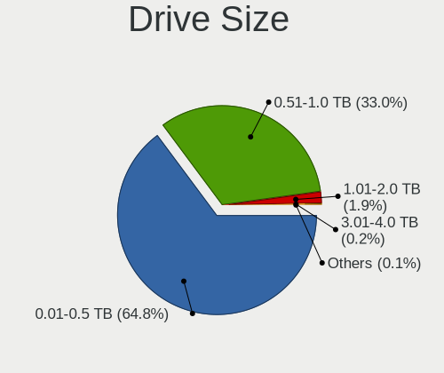
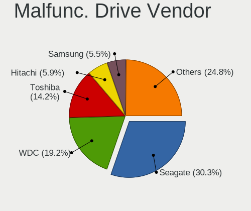
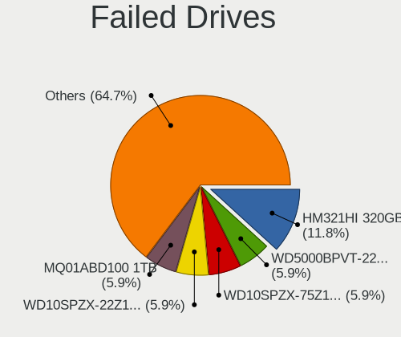
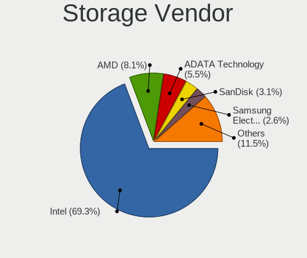
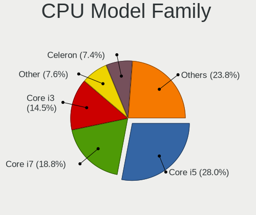
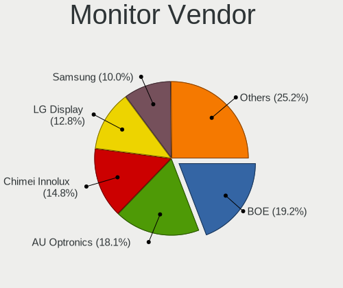
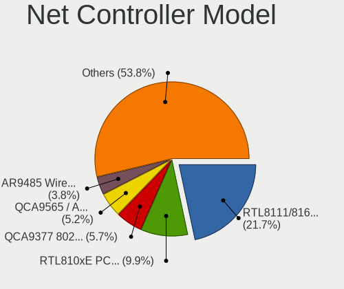
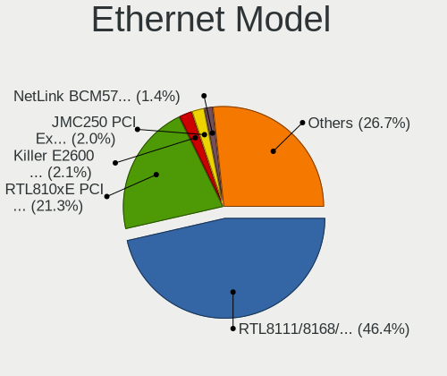

Linux in Brazil - Tested Hardware & Statistics (Notebooks)
----------------------------------------------------------

A project to collect tested hardware configurations for Linux in Brazil.

Anyone can contribute to this report by the [hw-probe](https://github.com/linuxhw/hw-probe) tool:

    sudo -E hw-probe -all -upload

Please contribute! Especially if your hardware is rare.

Contents
--------

* [ Test Cases ](#test-cases)

* [ System ](#system)
  - [ OS                       ](#os)
  - [ OS Family                ](#os-family)
  - [ Kernel                   ](#kernel)
  - [ Kernel Family            ](#kernel-family)
  - [ Kernel Major Ver.        ](#kernel-major-ver)
  - [ Arch                     ](#arch)
  - [ DE                       ](#de)
  - [ Display Server           ](#display-server)
  - [ Display Manager          ](#display-manager)
  - [ OS Lang                  ](#os-lang)
  - [ Boot Mode                ](#boot-mode)
  - [ Filesystem               ](#filesystem)
  - [ Part. scheme             ](#part-scheme)
  - [ Dual Boot with Linux/BSD ](#dual-boot-with-linuxbsd)
  - [ Dual Boot (Win)          ](#dual-boot-win)

* [ Board ](#board)
  - [ Vendor                   ](#vendor)
  - [ Model                    ](#model)
  - [ Model Family             ](#model-family)
  - [ MFG Year                 ](#mfg-year)
  - [ Form Factor              ](#form-factor)
  - [ Secure Boot              ](#secure-boot)
  - [ Coreboot                 ](#coreboot)
  - [ RAM Size                 ](#ram-size)
  - [ RAM Used                 ](#ram-used)
  - [ Total Drives             ](#total-drives)
  - [ Has CD-ROM               ](#has-cd-rom)
  - [ Has Ethernet             ](#has-ethernet)
  - [ Has WiFi                 ](#has-wifi)
  - [ Has Bluetooth            ](#has-bluetooth)

* [ Location ](#location)
  - [ Country                  ](#country)
  - [ City                     ](#city)

* [ Drives ](#drives)
  - [ Drive Vendor             ](#drive-vendor)
  - [ Drive Model              ](#drive-model)
  - [ HDD Vendor               ](#hdd-vendor)
  - [ SSD Vendor               ](#ssd-vendor)
  - [ Drive Kind               ](#drive-kind)
  - [ Drive Connector          ](#drive-connector)
  - [ Drive Size               ](#drive-size)
  - [ Space Total              ](#space-total)
  - [ Space Used               ](#space-used)
  - [ Malfunc. Drives          ](#malfunc-drives)
  - [ Malfunc. Drive Vendor    ](#malfunc-drive-vendor)
  - [ Malfunc. HDD Vendor      ](#malfunc-hdd-vendor)
  - [ Malfunc. Drive Kind      ](#malfunc-drive-kind)
  - [ Failed Drives            ](#failed-drives)
  - [ Failed Drive Vendor      ](#failed-drive-vendor)
  - [ Drive Status             ](#drive-status)

* [ Storage controller ](#storage-controller)
  - [ Storage Vendor           ](#storage-vendor)
  - [ Storage Model            ](#storage-model)
  - [ Storage Kind             ](#storage-kind)

* [ Processor ](#processor)
  - [ CPU Vendor               ](#cpu-vendor)
  - [ CPU Model                ](#cpu-model)
  - [ CPU Model Family         ](#cpu-model-family)
  - [ CPU Cores                ](#cpu-cores)
  - [ CPU Sockets              ](#cpu-sockets)
  - [ CPU Threads              ](#cpu-threads)
  - [ CPU Op-Modes             ](#cpu-op-modes)
  - [ CPU Microcode            ](#cpu-microcode)
  - [ CPU Microarch            ](#cpu-microarch)

* [ Graphics ](#graphics)
  - [ GPU Vendor               ](#gpu-vendor)
  - [ GPU Model                ](#gpu-model)
  - [ GPU Combo                ](#gpu-combo)
  - [ GPU Driver               ](#gpu-driver)
  - [ GPU Memory               ](#gpu-memory)

* [ Monitor ](#monitor)
  - [ Monitor Vendor           ](#monitor-vendor)
  - [ Monitor Model            ](#monitor-model)
  - [ Monitor Resolution       ](#monitor-resolution)
  - [ Monitor Diagonal         ](#monitor-diagonal)
  - [ Monitor Width            ](#monitor-width)
  - [ Aspect Ratio             ](#aspect-ratio)
  - [ Monitor Area             ](#monitor-area)
  - [ Pixel Density            ](#pixel-density)
  - [ Multiple Monitors        ](#multiple-monitors)

* [ Network ](#network)
  - [ Net Controller Vendor    ](#net-controller-vendor)
  - [ Net Controller Model     ](#net-controller-model)
  - [ Wireless Vendor          ](#wireless-vendor)
  - [ Wireless Model           ](#wireless-model)
  - [ Ethernet Vendor          ](#ethernet-vendor)
  - [ Ethernet Model           ](#ethernet-model)
  - [ Net Controller Kind      ](#net-controller-kind)
  - [ Used Controller          ](#used-controller)
  - [ NICs                     ](#nics)
  - [ IPv6                     ](#ipv6)

* [ Bluetooth ](#bluetooth)
  - [ Bluetooth Vendor         ](#bluetooth-vendor)
  - [ Bluetooth Model          ](#bluetooth-model)

* [ Sound ](#sound)
  - [ Sound Vendor             ](#sound-vendor)
  - [ Sound Model              ](#sound-model)

* [ Memory ](#memory)
  - [ Memory Vendor            ](#memory-vendor)
  - [ Memory Model             ](#memory-model)
  - [ Memory Kind              ](#memory-kind)
  - [ Memory Form Factor       ](#memory-form-factor)
  - [ Memory Size              ](#memory-size)
  - [ Memory Speed             ](#memory-speed)

* [ Printers & scanners ](#printers--scanners)
  - [ Printer Vendor           ](#printer-vendor)
  - [ Printer Model            ](#printer-model)
  - [ Scanner Vendor           ](#scanner-vendor)
  - [ Scanner Model            ](#scanner-model)

* [ Camera ](#camera)
  - [ Camera Vendor            ](#camera-vendor)
  - [ Camera Model             ](#camera-model)

* [ Security ](#security)
  - [ Fingerprint Vendor       ](#fingerprint-vendor)
  - [ Fingerprint Model        ](#fingerprint-model)
  - [ Chipcard Vendor          ](#chipcard-vendor)
  - [ Chipcard Model           ](#chipcard-model)

* [ Unsupported ](#unsupported)
  - [ Unsupported Devices      ](#unsupported-devices)
  - [ Unsupported Device Types ](#unsupported-device-types)

Test Cases
----------

Total: 10271

| Vendor        | Model                       | Probe                                                      | Date         |
|---------------|-----------------------------|------------------------------------------------------------|--------------|
| Dell          | Inspiron 5566               | [b2dd8d93c7](https://linux-hardware.org/?probe=b2dd8d93c7) | Feb 01, 2023 |
| Lenovo        | IdeaPad S145-15API 81V7     | [7e78833b8b](https://linux-hardware.org/?probe=7e78833b8b) | Feb 01, 2023 |
| Lenovo        | IdeaPad S145-15IWL 81S9     | [2be076637c](https://linux-hardware.org/?probe=2be076637c) | Feb 01, 2023 |
| Dell          | Vostro 3500                 | [fa4104f438](https://linux-hardware.org/?probe=fa4104f438) | Feb 01, 2023 |
| Dell          | Vostro 3500                 | [ec80fcb8a5](https://linux-hardware.org/?probe=ec80fcb8a5) | Feb 01, 2023 |
| Notebook      | NJx0MU                      | [c402e9c063](https://linux-hardware.org/?probe=c402e9c063) | Feb 01, 2023 |
| Acer          | Nitro AN515-54              | [9aee0a798c](https://linux-hardware.org/?probe=9aee0a798c) | Feb 01, 2023 |
| Dell          | Vostro 1520                 | [3fab7107b7](https://linux-hardware.org/?probe=3fab7107b7) | Feb 01, 2023 |
| Dell          | Inspiron 15-3567            | [2f6f4bc8c7](https://linux-hardware.org/?probe=2f6f4bc8c7) | Feb 01, 2023 |
| Notebook      | NJx0MU                      | [eb152c7d4e](https://linux-hardware.org/?probe=eb152c7d4e) | Feb 01, 2023 |
| Samsung       | RV415/RV515                 | [ea50188d5c](https://linux-hardware.org/?probe=ea50188d5c) | Jan 31, 2023 |
| Lenovo        | IdeaPad S145-15API 81V7     | [ebbe861495](https://linux-hardware.org/?probe=ebbe861495) | Jan 31, 2023 |
| Lenovo        | IdeaPad S145-15IIL 82DJ     | [3803fd2405](https://linux-hardware.org/?probe=3803fd2405) | Jan 31, 2023 |
| Lenovo        | IdeaPad S145-15API 81V7     | [949ea399fb](https://linux-hardware.org/?probe=949ea399fb) | Jan 31, 2023 |
| Notebook      | NJx0MU                      | [58d5bdaa2d](https://linux-hardware.org/?probe=58d5bdaa2d) | Jan 31, 2023 |
| Lenovo        | G40-80 80JE                 | [bb5d758714](https://linux-hardware.org/?probe=bb5d758714) | Jan 31, 2023 |
| Lenovo        | G40-80 80JE                 | [e5dc585024](https://linux-hardware.org/?probe=e5dc585024) | Jan 31, 2023 |
| Samsung       | 550XCJ/550XCR               | [75fad3daf3](https://linux-hardware.org/?probe=75fad3daf3) | Jan 31, 2023 |
| Lenovo        | IdeaPad S145-15API 81V7     | [2474b4641c](https://linux-hardware.org/?probe=2474b4641c) | Jan 30, 2023 |
| Acer          | Aspire A315-56              | [93f5ac8f6d](https://linux-hardware.org/?probe=93f5ac8f6d) | Jan 30, 2023 |
| Lenovo        | ThinkPad Edge E431 62779... | [8d7c1dbf4d](https://linux-hardware.org/?probe=8d7c1dbf4d) | Jan 30, 2023 |
| Acer          | Aspire A315-56              | [bacea93055](https://linux-hardware.org/?probe=bacea93055) | Jan 30, 2023 |
| Acer          | Aspire A515-41G             | [88db10e257](https://linux-hardware.org/?probe=88db10e257) | Jan 30, 2023 |
| Avell High... | B11 MOB                     | [dd9d29ddc7](https://linux-hardware.org/?probe=dd9d29ddc7) | Jan 30, 2023 |
| Avell High... | B.ON                        | [721fbbdeb2](https://linux-hardware.org/?probe=721fbbdeb2) | Jan 30, 2023 |
| Acer          | Aspire A515-45              | [42405a6a0c](https://linux-hardware.org/?probe=42405a6a0c) | Jan 30, 2023 |
| Lenovo        | IdeaPad S145-15IWL 81S9     | [1c62beb905](https://linux-hardware.org/?probe=1c62beb905) | Jan 29, 2023 |
| Samsung       | RV415/RV515                 | [c5999dc406](https://linux-hardware.org/?probe=c5999dc406) | Jan 29, 2023 |
| Lenovo        | IdeaPad Gaming 3 15IMH05... | [51245400df](https://linux-hardware.org/?probe=51245400df) | Jan 29, 2023 |
| Dell          | Inspiron 3542               | [42a753536d](https://linux-hardware.org/?probe=42a753536d) | Jan 29, 2023 |
| Notebook      | NJx0MU                      | [10cdf2558f](https://linux-hardware.org/?probe=10cdf2558f) | Jan 29, 2023 |
| Notebook      | NJx0MU                      | [09bbe80125](https://linux-hardware.org/?probe=09bbe80125) | Jan 29, 2023 |
| Positivo      | Q464C-O                     | [e61f2d0622](https://linux-hardware.org/?probe=e61f2d0622) | Jan 29, 2023 |
| Acer          | Aspire 5733                 | [da753d74a1](https://linux-hardware.org/?probe=da753d74a1) | Jan 29, 2023 |
| Dell          | G15 5520                    | [a0c269c5b1](https://linux-hardware.org/?probe=a0c269c5b1) | Jan 28, 2023 |
| ASUSTek       | VivoBook_ASUSLaptop X515... | [f1f5def619](https://linux-hardware.org/?probe=f1f5def619) | Jan 28, 2023 |
| Samsung       | RV415/RV515                 | [fd9d67e4b8](https://linux-hardware.org/?probe=fd9d67e4b8) | Jan 27, 2023 |
| Lenovo        | ThinkPad P15 Gen 1 20SUS... | [c74ea31148](https://linux-hardware.org/?probe=c74ea31148) | Jan 27, 2023 |
| HP            | Compaq 6530b                | [15b987981b](https://linux-hardware.org/?probe=15b987981b) | Jan 27, 2023 |
| Acer          | Aspire ES1-572              | [9f745ecc18](https://linux-hardware.org/?probe=9f745ecc18) | Jan 27, 2023 |
| Lenovo        | IdeaPad 320-15IKB 80YH      | [5a32be51f4](https://linux-hardware.org/?probe=5a32be51f4) | Jan 27, 2023 |
| Acer          | Aspire E5-553G              | [e851efaf39](https://linux-hardware.org/?probe=e851efaf39) | Jan 27, 2023 |
| Philco        | 14E                         | [1c069ed627](https://linux-hardware.org/?probe=1c069ed627) | Jan 27, 2023 |
| Philco        | 14E                         | [cfb283e599](https://linux-hardware.org/?probe=cfb283e599) | Jan 27, 2023 |
| Lenovo        | IdeaPad 3 15ALC6 82MF       | [93be3d62c4](https://linux-hardware.org/?probe=93be3d62c4) | Jan 27, 2023 |
| Compaq        | 430                         | [069fa715b9](https://linux-hardware.org/?probe=069fa715b9) | Jan 27, 2023 |
| Samsung       | 340XAA/350XAA/550XAA        | [b4d0bbaf56](https://linux-hardware.org/?probe=b4d0bbaf56) | Jan 27, 2023 |
| Dell          | Inspiron 5468               | [d155136857](https://linux-hardware.org/?probe=d155136857) | Jan 27, 2023 |
| Samsung       | 340XAA/350XAA/550XAA        | [05dac90dec](https://linux-hardware.org/?probe=05dac90dec) | Jan 27, 2023 |
| Lenovo        | IdeaPad S145-15IIL 82DJ     | [0697311f5f](https://linux-hardware.org/?probe=0697311f5f) | Jan 27, 2023 |
| Dell          | G3 3500                     | [ea11767144](https://linux-hardware.org/?probe=ea11767144) | Jan 26, 2023 |
| Dell          | Vostro 3458                 | [3beffe6710](https://linux-hardware.org/?probe=3beffe6710) | Jan 26, 2023 |
| ASUSTek       | Z550SA                      | [f5ac147c1e](https://linux-hardware.org/?probe=f5ac147c1e) | Jan 26, 2023 |
| Multilaser    | PC150                       | [1c4ace00d1](https://linux-hardware.org/?probe=1c4ace00d1) | Jan 26, 2023 |
| Dell          | Latitude 5490               | [b392e71ce5](https://linux-hardware.org/?probe=b392e71ce5) | Jan 26, 2023 |
| Dell          | G3 3590                     | [8a7e4e4db0](https://linux-hardware.org/?probe=8a7e4e4db0) | Jan 26, 2023 |
| Notebook      | NJx0MU                      | [26e692f7de](https://linux-hardware.org/?probe=26e692f7de) | Jan 26, 2023 |
| HP            | G60                         | [8fe616c588](https://linux-hardware.org/?probe=8fe616c588) | Jan 25, 2023 |
| HP            | Folio 13                    | [214197bef4](https://linux-hardware.org/?probe=214197bef4) | Jan 25, 2023 |
| Notebook      | NJx0MU                      | [7c19df8c01](https://linux-hardware.org/?probe=7c19df8c01) | Jan 25, 2023 |
| Dell          | Vostro 5470                 | [bfd4198155](https://linux-hardware.org/?probe=bfd4198155) | Jan 25, 2023 |
| Dell          | Inspiron 5468               | [3e59c1f38b](https://linux-hardware.org/?probe=3e59c1f38b) | Jan 25, 2023 |
| Lenovo        | IdeaPad 3 15ALC6 82MF       | [0ef51b9eda](https://linux-hardware.org/?probe=0ef51b9eda) | Jan 25, 2023 |
| Digibras      | NH4CU03                     | [7de7df58a3](https://linux-hardware.org/?probe=7de7df58a3) | Jan 24, 2023 |
| Digibras      | NH4CU03                     | [fce5f618d8](https://linux-hardware.org/?probe=fce5f618d8) | Jan 24, 2023 |
| Dell          | Inspiron 3421               | [02491de92f](https://linux-hardware.org/?probe=02491de92f) | Jan 24, 2023 |
| Compaq        | 420                         | [9ed9e081c4](https://linux-hardware.org/?probe=9ed9e081c4) | Jan 24, 2023 |
| Acer          | Aspire A515-51              | [418e5a2787](https://linux-hardware.org/?probe=418e5a2787) | Jan 24, 2023 |
| Notebook      | NJx0MU                      | [54d0592fb2](https://linux-hardware.org/?probe=54d0592fb2) | Jan 24, 2023 |
| Insyde        | Braswell                    | [6abab0adc1](https://linux-hardware.org/?probe=6abab0adc1) | Jan 24, 2023 |
| Positivo      | N1240                       | [e938a6c0b0](https://linux-hardware.org/?probe=e938a6c0b0) | Jan 24, 2023 |
| ASUSTek       | K46CB                       | [62aa75f57a](https://linux-hardware.org/?probe=62aa75f57a) | Jan 23, 2023 |
| Lenovo        | IdeaPad Gaming 3 15IHU6 ... | [4a97e29245](https://linux-hardware.org/?probe=4a97e29245) | Jan 23, 2023 |
| Lenovo        | IdeaPad Gaming 3 15IHU6 ... | [54ebd7c5f8](https://linux-hardware.org/?probe=54ebd7c5f8) | Jan 23, 2023 |
| Dell          | Latitude 3420               | [d2a8b9657a](https://linux-hardware.org/?probe=d2a8b9657a) | Jan 23, 2023 |
| Dell          | Inspiron 7472               | [6395ea422c](https://linux-hardware.org/?probe=6395ea422c) | Jan 23, 2023 |
| Notebook      | NJx0MU                      | [206e04bc7d](https://linux-hardware.org/?probe=206e04bc7d) | Jan 23, 2023 |
| Alienware     | m15 R7                      | [e57302bf60](https://linux-hardware.org/?probe=e57302bf60) | Jan 23, 2023 |
| HP            | 540                         | [a4a7b26f42](https://linux-hardware.org/?probe=a4a7b26f42) | Jan 23, 2023 |
| Lenovo        | IdeaPad S145-15API 81V7     | [7d4406c9bc](https://linux-hardware.org/?probe=7d4406c9bc) | Jan 22, 2023 |
| HP            | Pavilion dv4                | [9fd79086c8](https://linux-hardware.org/?probe=9fd79086c8) | Jan 22, 2023 |
| Notebook      | NJx0MU                      | [9e9dcb9883](https://linux-hardware.org/?probe=9e9dcb9883) | Jan 22, 2023 |
| Notebook      | NJx0MU                      | [fdca7d69cd](https://linux-hardware.org/?probe=fdca7d69cd) | Jan 22, 2023 |
| Dell          | G3 3579                     | [63298dcee9](https://linux-hardware.org/?probe=63298dcee9) | Jan 22, 2023 |
| Dell          | Vostro 3460                 | [569626e023](https://linux-hardware.org/?probe=569626e023) | Jan 22, 2023 |
| Dell          | G3 3500                     | [b3a545ee30](https://linux-hardware.org/?probe=b3a545ee30) | Jan 22, 2023 |
| Itautec       | Infoway w7430               | [b33318e6e0](https://linux-hardware.org/?probe=b33318e6e0) | Jan 22, 2023 |
| Lenovo        | IdeaPad 3 15ALC6 82MF       | [697fbcd8d1](https://linux-hardware.org/?probe=697fbcd8d1) | Jan 22, 2023 |
| Dell          | G3 3500                     | [e81b4d5e46](https://linux-hardware.org/?probe=e81b4d5e46) | Jan 22, 2023 |
| Dell          | Inspiron N4050              | [6ddc2793d7](https://linux-hardware.org/?probe=6ddc2793d7) | Jan 21, 2023 |
| Dell          | Inspiron N4050              | [ae4c9eaa9c](https://linux-hardware.org/?probe=ae4c9eaa9c) | Jan 21, 2023 |
| ASUSTek       | VivoBook_ASUSLaptop X515... | [ed9d60d9b7](https://linux-hardware.org/?probe=ed9d60d9b7) | Jan 21, 2023 |
| Positivo      | S14BW01                     | [241b637096](https://linux-hardware.org/?probe=241b637096) | Jan 21, 2023 |
| Positivo      | S14BW01                     | [c818b70b5b](https://linux-hardware.org/?probe=c818b70b5b) | Jan 21, 2023 |
| Philco        | OEM                         | [a39f50ccfd](https://linux-hardware.org/?probe=a39f50ccfd) | Jan 21, 2023 |
| Notebook      | NJx0MU                      | [edee5aee7a](https://linux-hardware.org/?probe=edee5aee7a) | Jan 21, 2023 |
| Lenovo        | IdeaPad 320-15IKB 80YH      | [fa251ca13c](https://linux-hardware.org/?probe=fa251ca13c) | Jan 21, 2023 |
| Lenovo        | IdeaPad 320-15IKB 80YH      | [965d1fa09f](https://linux-hardware.org/?probe=965d1fa09f) | Jan 20, 2023 |
| Acer          | Aspire E5-571               | [a37e873516](https://linux-hardware.org/?probe=a37e873516) | Jan 20, 2023 |
| Positivo B... | VJFE43F11X-XXXXXX           | [138a9b3b0c](https://linux-hardware.org/?probe=138a9b3b0c) | Jan 20, 2023 |
| Lenovo        | IdeaPad Gaming 3 15IHU6 ... | [6364be5249](https://linux-hardware.org/?probe=6364be5249) | Jan 20, 2023 |
| Dell          | Inspiron N4050              | [46e35da681](https://linux-hardware.org/?probe=46e35da681) | Jan 20, 2023 |
| Lenovo        | IdeaPad 330-15IKB 81FD      | [31698019a3](https://linux-hardware.org/?probe=31698019a3) | Jan 20, 2023 |
| Dell          | Vostro 3400                 | [c158cd6095](https://linux-hardware.org/?probe=c158cd6095) | Jan 20, 2023 |
| Lenovo        | IdeaPad S145-15IWL 81S9     | [169ba5d31f](https://linux-hardware.org/?probe=169ba5d31f) | Jan 20, 2023 |
| Dell          | Venue 8 Pro 5830            | [4f815d5b4f](https://linux-hardware.org/?probe=4f815d5b4f) | Jan 20, 2023 |
| Notebook      | NJx0MU                      | [c7ab1c1990](https://linux-hardware.org/?probe=c7ab1c1990) | Jan 20, 2023 |
| Dell          | Inspiron 15-3567            | [33a3aac223](https://linux-hardware.org/?probe=33a3aac223) | Jan 20, 2023 |
| Acer          | Aspire A515-45              | [9d5faff505](https://linux-hardware.org/?probe=9d5faff505) | Jan 20, 2023 |
| Positivo B... | VJFE43F11X-XXXXXX           | [cc9e6f8862](https://linux-hardware.org/?probe=cc9e6f8862) | Jan 19, 2023 |
| Lenovo        | IdeaPad 320-15IKB 80YH      | [440ff298e7](https://linux-hardware.org/?probe=440ff298e7) | Jan 19, 2023 |
| Lenovo        | IdeaPad S145-15IWL 81S9     | [890980b6a9](https://linux-hardware.org/?probe=890980b6a9) | Jan 19, 2023 |
| Sony          | VPCCA15FX                   | [41138327da](https://linux-hardware.org/?probe=41138327da) | Jan 19, 2023 |
| ASUSTek       | VivoBook_ASUSLaptop X515... | [183de4d0f6](https://linux-hardware.org/?probe=183de4d0f6) | Jan 19, 2023 |
| ASUSTek       | VivoBook_ASUSLaptop X515... | [62aa341472](https://linux-hardware.org/?probe=62aa341472) | Jan 19, 2023 |
| Sony          | VPCF236FM                   | [c2ed0fe829](https://linux-hardware.org/?probe=c2ed0fe829) | Jan 19, 2023 |
| Compal        | Unknown                     | [81abfdb7d5](https://linux-hardware.org/?probe=81abfdb7d5) | Jan 19, 2023 |
| Dell          | Inspiron N5110              | [fd8b8416ea](https://linux-hardware.org/?probe=fd8b8416ea) | Jan 19, 2023 |
| Compal        | Unknown                     | [14cc4178d9](https://linux-hardware.org/?probe=14cc4178d9) | Jan 18, 2023 |
| Acer          | Aspire A315-53              | [fd498f882b](https://linux-hardware.org/?probe=fd498f882b) | Jan 18, 2023 |
| Lenovo        | IdeaPad 3 15ALC6 82MF       | [3f0d644eaf](https://linux-hardware.org/?probe=3f0d644eaf) | Jan 18, 2023 |
| Acer          | Aspire A515-51              | [1aac8c57f8](https://linux-hardware.org/?probe=1aac8c57f8) | Jan 18, 2023 |
| ASUSTek       | VivoBook_ASUSLaptop X515... | [22d07dfddf](https://linux-hardware.org/?probe=22d07dfddf) | Jan 18, 2023 |
| Notebook      | NJx0MU                      | [98f8255c15](https://linux-hardware.org/?probe=98f8255c15) | Jan 18, 2023 |
| ASUSTek       | VivoBook_ASUSLaptop X515... | [009adbd75c](https://linux-hardware.org/?probe=009adbd75c) | Jan 18, 2023 |
| Lenovo        | IdeaPad 330-15IKB 81FE      | [032ac1d52e](https://linux-hardware.org/?probe=032ac1d52e) | Jan 18, 2023 |
| Lenovo        | IdeaPad 3 15IML05 82BS      | [18d3c84771](https://linux-hardware.org/?probe=18d3c84771) | Jan 17, 2023 |
| Lenovo        | IdeaPad 3 15IML05 82BS      | [bd0bc47120](https://linux-hardware.org/?probe=bd0bc47120) | Jan 17, 2023 |
| HP            | Pavilion Notebook           | [c2dd87db86](https://linux-hardware.org/?probe=c2dd87db86) | Jan 17, 2023 |
| Digibras      | NH4CU03                     | [cd9cdce064](https://linux-hardware.org/?probe=cd9cdce064) | Jan 17, 2023 |
| Notebook      | NJx0MU                      | [e76a4c32dc](https://linux-hardware.org/?probe=e76a4c32dc) | Jan 17, 2023 |
| Positivo      | N1103                       | [e5b41b9ed2](https://linux-hardware.org/?probe=e5b41b9ed2) | Jan 17, 2023 |
| Acer          | Aspire E1-572P              | [72afaf995e](https://linux-hardware.org/?probe=72afaf995e) | Jan 17, 2023 |
| Dell          | Inspiron 3583               | [69e87b6d65](https://linux-hardware.org/?probe=69e87b6d65) | Jan 17, 2023 |
| Dell          | Inspiron N4050              | [2de561e7f5](https://linux-hardware.org/?probe=2de561e7f5) | Jan 16, 2023 |
| Lenovo        | IdeaPad 3 15ALC6 82MF       | [b53dd87f87](https://linux-hardware.org/?probe=b53dd87f87) | Jan 16, 2023 |
| Unknown       | X133                        | [8d28e5a95e](https://linux-hardware.org/?probe=8d28e5a95e) | Jan 16, 2023 |
| Positivo      | CHT14B                      | [ab4518f121](https://linux-hardware.org/?probe=ab4518f121) | Jan 16, 2023 |
| Dell          | Inspiron 5502               | [9403074843](https://linux-hardware.org/?probe=9403074843) | Jan 16, 2023 |
| Lenovo        | ThinkPad E14 Gen 2 20TB0... | [a4ec4fedeb](https://linux-hardware.org/?probe=a4ec4fedeb) | Jan 15, 2023 |
| Lenovo        | ThinkPad E14 Gen 2 20TB0... | [e7b345f3e0](https://linux-hardware.org/?probe=e7b345f3e0) | Jan 15, 2023 |
| Multilaser    | UB23X LINUX                 | [34a7d43639](https://linux-hardware.org/?probe=34a7d43639) | Jan 15, 2023 |
| Multilaser    | UB23X LINUX                 | [029812488b](https://linux-hardware.org/?probe=029812488b) | Jan 15, 2023 |
| ASUSTek       | X45C                        | [677c0ac809](https://linux-hardware.org/?probe=677c0ac809) | Jan 15, 2023 |
| Lenovo        | IdeaPad S145-15IIL 82DJ     | [1dab471d62](https://linux-hardware.org/?probe=1dab471d62) | Jan 15, 2023 |
| Acer          | Aspire A315-34              | [656b21ed21](https://linux-hardware.org/?probe=656b21ed21) | Jan 14, 2023 |
| Samsung       | 300E4C/300E5C/300E7C        | [f862a7e702](https://linux-hardware.org/?probe=f862a7e702) | Jan 14, 2023 |
| Dell          | Inspiron 7580               | [99f51ba1ef](https://linux-hardware.org/?probe=99f51ba1ef) | Jan 14, 2023 |
| Notebook      | NJx0MU                      | [cdd815de42](https://linux-hardware.org/?probe=cdd815de42) | Jan 14, 2023 |
| Sony          | VPCEH10EB                   | [c9127c6375](https://linux-hardware.org/?probe=c9127c6375) | Jan 14, 2023 |
| Samsung       | 530XBB                      | [99a0fe43da](https://linux-hardware.org/?probe=99a0fe43da) | Jan 13, 2023 |
| Dell          | Latitude 3490               | [facb8b4852](https://linux-hardware.org/?probe=facb8b4852) | Jan 13, 2023 |
| Acer          | Nitro AN515-44              | [b2c96e31d9](https://linux-hardware.org/?probe=b2c96e31d9) | Jan 13, 2023 |
| Acer          | Aspire M5-481T              | [e2030307c8](https://linux-hardware.org/?probe=e2030307c8) | Jan 13, 2023 |
| Toshiba       | STI NA 1401                 | [8ac3087e41](https://linux-hardware.org/?probe=8ac3087e41) | Jan 13, 2023 |
| Apple         | MacBookAir4,1               | [7b8d494edb](https://linux-hardware.org/?probe=7b8d494edb) | Jan 13, 2023 |
| Notebook      | NJx0MU                      | [ff52c2505f](https://linux-hardware.org/?probe=ff52c2505f) | Jan 13, 2023 |
| Acer          | Aspire E1-421               | [ebfd029f41](https://linux-hardware.org/?probe=ebfd029f41) | Jan 13, 2023 |
| ASUSTek       | X450LD                      | [859eb05149](https://linux-hardware.org/?probe=859eb05149) | Jan 13, 2023 |
| ASUSTek       | X45C                        | [0cf650bc7b](https://linux-hardware.org/?probe=0cf650bc7b) | Jan 13, 2023 |
| Positivo      | Smash2                      | [d160522fb3](https://linux-hardware.org/?probe=d160522fb3) | Jan 13, 2023 |
| Lenovo        | IdeaPad 3 15ALC6 82MF       | [e4912e6bfc](https://linux-hardware.org/?probe=e4912e6bfc) | Jan 12, 2023 |
| Dell          | G15 5520                    | [1aeaf74f9a](https://linux-hardware.org/?probe=1aeaf74f9a) | Jan 12, 2023 |
| Acer          | Nitro AN515-44              | [66d71f6da1](https://linux-hardware.org/?probe=66d71f6da1) | Jan 12, 2023 |
| HP            | Compaq 6530b                | [8ebd66e8e6](https://linux-hardware.org/?probe=8ebd66e8e6) | Jan 12, 2023 |
| Lenovo        | ThinkPad X230 2325AH7       | [c1080083c4](https://linux-hardware.org/?probe=c1080083c4) | Jan 12, 2023 |
| Samsung       | 270E5J/2570EJ               | [22f9a03d68](https://linux-hardware.org/?probe=22f9a03d68) | Jan 12, 2023 |
| Lenovo        | IdeaPad S145-15IIL 82DJ     | [b106ffdf11](https://linux-hardware.org/?probe=b106ffdf11) | Jan 12, 2023 |
| Dell          | Inspiron 3421               | [055d61383e](https://linux-hardware.org/?probe=055d61383e) | Jan 12, 2023 |
| Dell          | Inspiron 3583               | [6081f3b43a](https://linux-hardware.org/?probe=6081f3b43a) | Jan 11, 2023 |
| Dell          | Inspiron 3583               | [e2c3a94f39](https://linux-hardware.org/?probe=e2c3a94f39) | Jan 11, 2023 |
| Dell          | Vostro 3550                 | [28e0a94885](https://linux-hardware.org/?probe=28e0a94885) | Jan 11, 2023 |
| Acer          | Aspire E1-572               | [43c14a1e54](https://linux-hardware.org/?probe=43c14a1e54) | Jan 11, 2023 |
| HP            | Presario C700               | [3674a9a180](https://linux-hardware.org/?probe=3674a9a180) | Jan 11, 2023 |
| Samsung       | 270E5G/270E5U               | [0ddeecd2b8](https://linux-hardware.org/?probe=0ddeecd2b8) | Jan 11, 2023 |
| ASUSTek       | VivoBook_ASUSLaptop X512... | [c79ad1fc10](https://linux-hardware.org/?probe=c79ad1fc10) | Jan 11, 2023 |
| LG Electro... | P420-G.BC44P1               | [7dd7c0d6e8](https://linux-hardware.org/?probe=7dd7c0d6e8) | Jan 11, 2023 |
| Sony          | VPCEA23FB                   | [d6a7454695](https://linux-hardware.org/?probe=d6a7454695) | Jan 11, 2023 |
| Acer          | Aspire E1-571               | [77e844abaf](https://linux-hardware.org/?probe=77e844abaf) | Jan 11, 2023 |
| Compaq        | 420                         | [65070f85d5](https://linux-hardware.org/?probe=65070f85d5) | Jan 11, 2023 |
| ASUSTek       | VivoBook_ASUSLaptop X513... | [a33cdf7213](https://linux-hardware.org/?probe=a33cdf7213) | Jan 11, 2023 |
| ASUSTek       | VivoBook_ASUSLaptop X513... | [83f2f14d5c](https://linux-hardware.org/?probe=83f2f14d5c) | Jan 10, 2023 |
| ASUSTek       | X510UAR                     | [dc3e0fffe7](https://linux-hardware.org/?probe=dc3e0fffe7) | Jan 10, 2023 |
| Acer          | Aspire A515-41G             | [e5ef8ca744](https://linux-hardware.org/?probe=e5ef8ca744) | Jan 10, 2023 |
| HP            | Mini 110-1000               | [05c4656700](https://linux-hardware.org/?probe=05c4656700) | Jan 10, 2023 |
| ASUSTek       | X510UAR                     | [53d6bec0e8](https://linux-hardware.org/?probe=53d6bec0e8) | Jan 10, 2023 |
| Dell          | Inspiron N5010              | [f5d1f04d89](https://linux-hardware.org/?probe=f5d1f04d89) | Jan 10, 2023 |
| Positivo B... | VJFE52F11X-B0611H           | [91caa09e7b](https://linux-hardware.org/?probe=91caa09e7b) | Jan 10, 2023 |
| ASUSTek       | ROG Flow X13 GV301QE_GV3... | [d679fb0fd0](https://linux-hardware.org/?probe=d679fb0fd0) | Jan 10, 2023 |
| Acer          | Aspire A315-56              | [b89e68d5ab](https://linux-hardware.org/?probe=b89e68d5ab) | Jan 10, 2023 |
| Avell High... | B.ON                        | [23b5b8565e](https://linux-hardware.org/?probe=23b5b8565e) | Jan 10, 2023 |
| Clevo         | W240HU/W250HUQ              | [b572e2679d](https://linux-hardware.org/?probe=b572e2679d) | Jan 10, 2023 |
| Acer          | Aspire A514-54              | [a786a0640f](https://linux-hardware.org/?probe=a786a0640f) | Jan 10, 2023 |
| Acer          | Nitro AN517-54              | [8ea20821c8](https://linux-hardware.org/?probe=8ea20821c8) | Jan 10, 2023 |
| Dell          | Inspiron 3442               | [f540a5f964](https://linux-hardware.org/?probe=f540a5f964) | Jan 09, 2023 |
| Dell          | Inspiron N4050              | [fbb23cdb65](https://linux-hardware.org/?probe=fbb23cdb65) | Jan 09, 2023 |
| Samsung       | 550XBE/350XBE               | [0f91e4728c](https://linux-hardware.org/?probe=0f91e4728c) | Jan 09, 2023 |
| ASUSTek       | VivoBook_ASUSLaptop X515... | [ee26fd6a5c](https://linux-hardware.org/?probe=ee26fd6a5c) | Jan 09, 2023 |
| Itautec       | Infoway w7535               | [36f64a3242](https://linux-hardware.org/?probe=36f64a3242) | Jan 09, 2023 |
| Acer          | Aspire 5750                 | [54ad46d626](https://linux-hardware.org/?probe=54ad46d626) | Jan 09, 2023 |
| Notebook      | NJx0MU                      | [03505c402c](https://linux-hardware.org/?probe=03505c402c) | Jan 08, 2023 |
| Notebook      | NJx0MU                      | [7ee7875a97](https://linux-hardware.org/?probe=7ee7875a97) | Jan 08, 2023 |
| HP            | ProBook 6465b               | [336f10e70b](https://linux-hardware.org/?probe=336f10e70b) | Jan 08, 2023 |
| ASUSTek       | X555LF                      | [0ff44cdd4f](https://linux-hardware.org/?probe=0ff44cdd4f) | Jan 08, 2023 |
| Apple         | MacBook6,1                  | [1f38721115](https://linux-hardware.org/?probe=1f38721115) | Jan 08, 2023 |
| Itautec       | Infoway w7535               | [6b8430c407](https://linux-hardware.org/?probe=6b8430c407) | Jan 08, 2023 |
| Dell          | Inspiron 5567               | [a43647cad6](https://linux-hardware.org/?probe=a43647cad6) | Jan 08, 2023 |
| Gateway       | NE570                       | [3f65734a89](https://linux-hardware.org/?probe=3f65734a89) | Jan 07, 2023 |
| Standard      | MB40II                      | [4abb5712cc](https://linux-hardware.org/?probe=4abb5712cc) | Jan 07, 2023 |
| Lenovo        | IdeaPad 3 15ALC6 82MF       | [f33ea77f0b](https://linux-hardware.org/?probe=f33ea77f0b) | Jan 07, 2023 |
| Dell          | Inspiron 15-3567            | [e9dadf5a23](https://linux-hardware.org/?probe=e9dadf5a23) | Jan 07, 2023 |
| ASUSTek       | X45C                        | [6366228fb2](https://linux-hardware.org/?probe=6366228fb2) | Jan 07, 2023 |
| Dell          | Inspiron 15-3567            | [173b427c35](https://linux-hardware.org/?probe=173b427c35) | Jan 07, 2023 |
| Notebook      | P17SM                       | [1822a60f02](https://linux-hardware.org/?probe=1822a60f02) | Jan 07, 2023 |
| Notebook      | NJx0MU                      | [efd4eaee02](https://linux-hardware.org/?probe=efd4eaee02) | Jan 07, 2023 |
| Notebook      | NJx0MU                      | [8b7d2f1a46](https://linux-hardware.org/?probe=8b7d2f1a46) | Jan 07, 2023 |
| ASUSTek       | VivoBook_ASUSLaptop X513... | [313f5897bd](https://linux-hardware.org/?probe=313f5897bd) | Jan 07, 2023 |
| Dell          | G15 5510                    | [210d9c1c73](https://linux-hardware.org/?probe=210d9c1c73) | Jan 07, 2023 |
| Dell          | G15 5510                    | [7009360ecf](https://linux-hardware.org/?probe=7009360ecf) | Jan 07, 2023 |
| Lenovo        | IdeaPad 330-15IKB 81FE      | [7f2254139c](https://linux-hardware.org/?probe=7f2254139c) | Jan 07, 2023 |
| LG Electro... | U460-G.BG31P1               | [dea7419ce8](https://linux-hardware.org/?probe=dea7419ce8) | Jan 07, 2023 |
| ASUSTek       | VivoBook_ASUSLaptop X515... | [79c60c460a](https://linux-hardware.org/?probe=79c60c460a) | Jan 07, 2023 |
| LG Electro... | A530-U.BE54P1               | [39c702d864](https://linux-hardware.org/?probe=39c702d864) | Jan 06, 2023 |
| Acer          | Aspire E5-574               | [511e5df827](https://linux-hardware.org/?probe=511e5df827) | Jan 06, 2023 |
| Acer          | Nitro AN515-44              | [1e24b872bd](https://linux-hardware.org/?probe=1e24b872bd) | Jan 06, 2023 |
| Dell          | G15 5515                    | [f5a10999c3](https://linux-hardware.org/?probe=f5a10999c3) | Jan 06, 2023 |
| Notebook      | NJx0MU                      | [05c69304bb](https://linux-hardware.org/?probe=05c69304bb) | Jan 06, 2023 |
| Acer          | Nitro AN515-44              | [758acf54ff](https://linux-hardware.org/?probe=758acf54ff) | Jan 06, 2023 |
| Multilaser    | PC024                       | [006690ac84](https://linux-hardware.org/?probe=006690ac84) | Jan 06, 2023 |
| Acer          | Nitro AN515-44              | [caa3df2f1c](https://linux-hardware.org/?probe=caa3df2f1c) | Jan 05, 2023 |
| Acer          | Nitro AN515-44              | [c1375455dc](https://linux-hardware.org/?probe=c1375455dc) | Jan 05, 2023 |
| Lenovo        | ThinkPad T460 20FMS49100    | [28af5637ef](https://linux-hardware.org/?probe=28af5637ef) | Jan 05, 2023 |
| Lenovo        | ThinkBook 15 G2 ITL 20VE    | [1d25f1df44](https://linux-hardware.org/?probe=1d25f1df44) | Jan 05, 2023 |
| Lenovo        | ThinkPad T460 20FMS49100    | [4605f322cb](https://linux-hardware.org/?probe=4605f322cb) | Jan 05, 2023 |
| Acer          | Aspire A315-54              | [22b6517ed2](https://linux-hardware.org/?probe=22b6517ed2) | Jan 05, 2023 |
| Notebook      | NJx0MU                      | [fc365670d0](https://linux-hardware.org/?probe=fc365670d0) | Jan 05, 2023 |
| Dell          | G15 5510                    | [e0282d77f8](https://linux-hardware.org/?probe=e0282d77f8) | Jan 05, 2023 |
| Avell High... | B.ON                        | [99a8cc2270](https://linux-hardware.org/?probe=99a8cc2270) | Jan 05, 2023 |
| Multilaser    | PC024                       | [8d9a2a1304](https://linux-hardware.org/?probe=8d9a2a1304) | Jan 05, 2023 |
| ASUSTek       | X510UAR                     | [39f45e87d1](https://linux-hardware.org/?probe=39f45e87d1) | Jan 04, 2023 |
| ASUSTek       | X510UAR                     | [2f4bb5b17d](https://linux-hardware.org/?probe=2f4bb5b17d) | Jan 04, 2023 |
| Acer          | Nitro AN515-54              | [26165b2acb](https://linux-hardware.org/?probe=26165b2acb) | Jan 04, 2023 |
| Acer          | Nitro AN515-54              | [1fd86a44c5](https://linux-hardware.org/?probe=1fd86a44c5) | Jan 04, 2023 |
| Acer          | Aspire A315-58              | [3629e42dc4](https://linux-hardware.org/?probe=3629e42dc4) | Jan 04, 2023 |
| Sony          | VJF153                      | [f3643923cc](https://linux-hardware.org/?probe=f3643923cc) | Jan 04, 2023 |
| HP            | G42                         | [a1e6624ba4](https://linux-hardware.org/?probe=a1e6624ba4) | Jan 03, 2023 |
| Lenovo        | ThinkPad E550 20DF0030US    | [31d3e37e7f](https://linux-hardware.org/?probe=31d3e37e7f) | Jan 03, 2023 |
| ASUSTek       | VivoBook_ASUSLaptop X515... | [37cbf7c1a4](https://linux-hardware.org/?probe=37cbf7c1a4) | Jan 03, 2023 |
| Dell          | Inspiron 5566               | [258412ac0a](https://linux-hardware.org/?probe=258412ac0a) | Jan 03, 2023 |
| Dell          | Inspiron 5423               | [14aa07b144](https://linux-hardware.org/?probe=14aa07b144) | Jan 02, 2023 |
| Dell          | Inspiron 5423               | [0c30f220cb](https://linux-hardware.org/?probe=0c30f220cb) | Jan 02, 2023 |
| Dell          | Latitude 3410               | [0a4720ef85](https://linux-hardware.org/?probe=0a4720ef85) | Jan 02, 2023 |
| Positivo      | H14CU01                     | [f668eee758](https://linux-hardware.org/?probe=f668eee758) | Jan 02, 2023 |
| Notebook      | NJx0MU                      | [0eb54f1078](https://linux-hardware.org/?probe=0eb54f1078) | Jan 01, 2023 |
| Dell          | Inspiron 5566               | [9eadf42d31](https://linux-hardware.org/?probe=9eadf42d31) | Jan 01, 2023 |
| Notebook      | NJx0MU                      | [43923d1e98](https://linux-hardware.org/?probe=43923d1e98) | Jan 01, 2023 |
| Lenovo        | IdeaPad 3 15ALC6 82MF       | [4d7f89dc6d](https://linux-hardware.org/?probe=4d7f89dc6d) | Dec 31, 2022 |
| Valve         | Jupiter                     | [97da60caa9](https://linux-hardware.org/?probe=97da60caa9) | Dec 31, 2022 |
| HP            | Folio 13                    | [9f00cfe432](https://linux-hardware.org/?probe=9f00cfe432) | Dec 31, 2022 |
| HP            | Folio 13                    | [3ed5b405cb](https://linux-hardware.org/?probe=3ed5b405cb) | Dec 31, 2022 |
| Unknown       | Unknown                     | [10496680a5](https://linux-hardware.org/?probe=10496680a5) | Dec 31, 2022 |
| Lenovo        | ThinkPad E470 20H2A02NBR    | [18827f3f77](https://linux-hardware.org/?probe=18827f3f77) | Dec 31, 2022 |
| Acer          | Predator G3-572             | [ab03199a79](https://linux-hardware.org/?probe=ab03199a79) | Dec 30, 2022 |
| Compaq        | CQ-27                       | [fc5b98e1db](https://linux-hardware.org/?probe=fc5b98e1db) | Dec 30, 2022 |
| Apple         | MacBookPro7,1               | [db4379ed1e](https://linux-hardware.org/?probe=db4379ed1e) | Dec 30, 2022 |
| Notebook      | NJx0MU                      | [8540c1c554](https://linux-hardware.org/?probe=8540c1c554) | Dec 30, 2022 |
| Notebook      | NJx0MU                      | [b4c615f28c](https://linux-hardware.org/?probe=b4c615f28c) | Dec 30, 2022 |
| HP            | Pavilion dv6                | [12a8186204](https://linux-hardware.org/?probe=12a8186204) | Dec 30, 2022 |
| Lenovo        | IdeaPad 330-15IKB 81FE      | [d048930c78](https://linux-hardware.org/?probe=d048930c78) | Dec 30, 2022 |
| Dell          | G5 5590                     | [dada63bf04](https://linux-hardware.org/?probe=dada63bf04) | Dec 30, 2022 |
| Acer          | Predator G3-572             | [f99480426f](https://linux-hardware.org/?probe=f99480426f) | Dec 29, 2022 |
| Samsung       | 550XBE/350XBE               | [33c4b80d0a](https://linux-hardware.org/?probe=33c4b80d0a) | Dec 29, 2022 |
| Dell          | Inspiron N4050              | [b34f09894d](https://linux-hardware.org/?probe=b34f09894d) | Dec 29, 2022 |
| Dell          | Inspiron 3583               | [35f6da18cc](https://linux-hardware.org/?probe=35f6da18cc) | Dec 29, 2022 |
| HP            | 250 G8 Notebook PC          | [754ba4696d](https://linux-hardware.org/?probe=754ba4696d) | Dec 29, 2022 |
| HP            | Pavilion Sleekbook 14 PC    | [11d4e1f9a1](https://linux-hardware.org/?probe=11d4e1f9a1) | Dec 29, 2022 |
| Acer          | Aspire A515-55              | [296961ae2d](https://linux-hardware.org/?probe=296961ae2d) | Dec 29, 2022 |
| HP            | Pavilion Sleekbook 14 PC    | [b60b954dc4](https://linux-hardware.org/?probe=b60b954dc4) | Dec 29, 2022 |
| Notebook      | NJx0MU                      | [4a26556b6b](https://linux-hardware.org/?probe=4a26556b6b) | Dec 29, 2022 |
| Acer          | Predator PH315-53           | [d5d0e740c1](https://linux-hardware.org/?probe=d5d0e740c1) | Dec 29, 2022 |
| Dell          | G5 5590                     | [58bd69f40b](https://linux-hardware.org/?probe=58bd69f40b) | Dec 28, 2022 |
| Dell          | Inspiron 5458               | [269d455191](https://linux-hardware.org/?probe=269d455191) | Dec 28, 2022 |
| Lenovo        | 100-14IBY 80R7              | [92b2614ac2](https://linux-hardware.org/?probe=92b2614ac2) | Dec 28, 2022 |
| Samsung       | 550XDA                      | [6d744c7602](https://linux-hardware.org/?probe=6d744c7602) | Dec 28, 2022 |
| Samsung       | 550XDA                      | [b463fa7a54](https://linux-hardware.org/?probe=b463fa7a54) | Dec 28, 2022 |
| Samsung       | 340XAA/350XAA/550XAA        | [5383fb814b](https://linux-hardware.org/?probe=5383fb814b) | Dec 28, 2022 |
| Positivo      | Hendrix                     | [55aa2f92d7](https://linux-hardware.org/?probe=55aa2f92d7) | Dec 27, 2022 |
| Acer          | Aspire E5-574               | [15e48d4c24](https://linux-hardware.org/?probe=15e48d4c24) | Dec 27, 2022 |
| Acer          | Nitro AN515-54              | [5205b7c248](https://linux-hardware.org/?probe=5205b7c248) | Dec 27, 2022 |
| Acer          | Aspire 5741                 | [22540f4247](https://linux-hardware.org/?probe=22540f4247) | Dec 27, 2022 |
| Acer          | Aspire 5741                 | [b47449f70f](https://linux-hardware.org/?probe=b47449f70f) | Dec 27, 2022 |
| Dell          | Inspiron N4050              | [542b5ae2f6](https://linux-hardware.org/?probe=542b5ae2f6) | Dec 27, 2022 |
| Dell          | Vostro 5490                 | [d32b30987a](https://linux-hardware.org/?probe=d32b30987a) | Dec 27, 2022 |
| Chuwi         | HeroBook Air                | [2c6e8a0c9f](https://linux-hardware.org/?probe=2c6e8a0c9f) | Dec 27, 2022 |
| Chuwi         | HeroBook Air                | [b3db56361b](https://linux-hardware.org/?probe=b3db56361b) | Dec 27, 2022 |
| Notebook      | NJx0MU                      | [db1c25cde3](https://linux-hardware.org/?probe=db1c25cde3) | Dec 27, 2022 |
| Samsung       | 300E5M/300E5L               | [669e014ee6](https://linux-hardware.org/?probe=669e014ee6) | Dec 27, 2022 |
| Dell          | Inspiron 15-3567            | [2f5381fa26](https://linux-hardware.org/?probe=2f5381fa26) | Dec 26, 2022 |
| Dell          | Inspiron 7580               | [a1638729b2](https://linux-hardware.org/?probe=a1638729b2) | Dec 26, 2022 |
| Dell          | Vostro 5490                 | [97677e7c79](https://linux-hardware.org/?probe=97677e7c79) | Dec 26, 2022 |
| Dell          | Inspiron 5458               | [4e393c7334](https://linux-hardware.org/?probe=4e393c7334) | Dec 26, 2022 |
| Avell High... | C62 MOB                     | [658f34e70d](https://linux-hardware.org/?probe=658f34e70d) | Dec 26, 2022 |
| ASUSTek       | T100TAS                     | [25894bb300](https://linux-hardware.org/?probe=25894bb300) | Dec 26, 2022 |
| Lenovo        | IdeaPad S145-15API 81V7     | [46687a6be3](https://linux-hardware.org/?probe=46687a6be3) | Dec 26, 2022 |
| Sony          | SVF15213CBB                 | [f8a95f249c](https://linux-hardware.org/?probe=f8a95f249c) | Dec 26, 2022 |
| HP            | ProBook 6465b               | [d0f5218f72](https://linux-hardware.org/?probe=d0f5218f72) | Dec 25, 2022 |
| Notebook      | NJx0MU                      | [037841f71c](https://linux-hardware.org/?probe=037841f71c) | Dec 25, 2022 |
| Toshiba       | PORTEGE Z930                | [4a77067c41](https://linux-hardware.org/?probe=4a77067c41) | Dec 25, 2022 |
| Chuwi         | HeroBook Air                | [ccd5d4bac3](https://linux-hardware.org/?probe=ccd5d4bac3) | Dec 25, 2022 |
| Notebook      | NJx0MU                      | [cc49bb2ef6](https://linux-hardware.org/?probe=cc49bb2ef6) | Dec 25, 2022 |
| HP            | Pavilion g4                 | [a5d26c4498](https://linux-hardware.org/?probe=a5d26c4498) | Dec 24, 2022 |
| Lenovo        | IdeaPad S145-15API 81V7     | [c95a4418f0](https://linux-hardware.org/?probe=c95a4418f0) | Dec 24, 2022 |
| Dell          | Vostro 3500                 | [0d59e2b098](https://linux-hardware.org/?probe=0d59e2b098) | Dec 24, 2022 |
| ASUSTek       | VivoBook_ASUSLaptop X515... | [28b89e2321](https://linux-hardware.org/?probe=28b89e2321) | Dec 24, 2022 |
| Notebook      | NJx0MU                      | [838eb1f6fa](https://linux-hardware.org/?probe=838eb1f6fa) | Dec 24, 2022 |
| Dell          | XPS L322X                   | [c127721464](https://linux-hardware.org/?probe=c127721464) | Dec 24, 2022 |
| Samsung       | RF511/RF411/RF711           | [b0a9f1ed91](https://linux-hardware.org/?probe=b0a9f1ed91) | Dec 24, 2022 |
| Valve         | Jupiter                     | [a38f241e2e](https://linux-hardware.org/?probe=a38f241e2e) | Dec 24, 2022 |
| Acer          | Aspire A514-54              | [ea57f4aa3a](https://linux-hardware.org/?probe=ea57f4aa3a) | Dec 24, 2022 |
| Samsung       | 550XBE/350XBE               | [4ea620705d](https://linux-hardware.org/?probe=4ea620705d) | Dec 24, 2022 |
| Notebook      | NJx0MU                      | [2995a5ea20](https://linux-hardware.org/?probe=2995a5ea20) | Dec 24, 2022 |
| Positivo      | Mobile                      | [6031910e64](https://linux-hardware.org/?probe=6031910e64) | Dec 24, 2022 |
| Avell High... | B.ON                        | [ea8a4babbf](https://linux-hardware.org/?probe=ea8a4babbf) | Dec 24, 2022 |
| Dell          | Latitude 5420               | [201e81d0ed](https://linux-hardware.org/?probe=201e81d0ed) | Dec 23, 2022 |
| Samsung       | 550P5C/550P7C               | [780cc47e7f](https://linux-hardware.org/?probe=780cc47e7f) | Dec 23, 2022 |
| Positivo      | H14BT58                     | [9914219613](https://linux-hardware.org/?probe=9914219613) | Dec 23, 2022 |
| Chuwi         | HeroBook Air                | [8f4eea6be8](https://linux-hardware.org/?probe=8f4eea6be8) | Dec 23, 2022 |
| Dell          | Vostro 3501                 | [8a3788aa78](https://linux-hardware.org/?probe=8a3788aa78) | Dec 23, 2022 |
| Samsung       | 300E4A/300E5A/300E7A/343... | [6b2cd55178](https://linux-hardware.org/?probe=6b2cd55178) | Dec 23, 2022 |
| Dell          | Inspiron 3501               | [297651d437](https://linux-hardware.org/?probe=297651d437) | Dec 23, 2022 |
| Dell          | Inspiron 3501               | [958ee9d145](https://linux-hardware.org/?probe=958ee9d145) | Dec 23, 2022 |
| Dell          | Vostro 3501                 | [258dc5c40d](https://linux-hardware.org/?probe=258dc5c40d) | Dec 23, 2022 |
| Dell          | G3 3590                     | [d75d9e6663](https://linux-hardware.org/?probe=d75d9e6663) | Dec 23, 2022 |
| Acer          | Aspire M5-481T              | [22eafd12e4](https://linux-hardware.org/?probe=22eafd12e4) | Dec 23, 2022 |
| Acer          | Aspire M5-481T              | [f250052dff](https://linux-hardware.org/?probe=f250052dff) | Dec 23, 2022 |
| Positivo      | C4128E-S                    | [2fce43e57f](https://linux-hardware.org/?probe=2fce43e57f) | Dec 23, 2022 |
| Samsung       | 270E5J/2570EJ               | [7efb2defb9](https://linux-hardware.org/?probe=7efb2defb9) | Dec 23, 2022 |
| Acer          | Nitro AN515-51              | [9dca0f7674](https://linux-hardware.org/?probe=9dca0f7674) | Dec 22, 2022 |
| Dell          | Vostro 5490                 | [2d85a576e1](https://linux-hardware.org/?probe=2d85a576e1) | Dec 22, 2022 |
| Notebook      | NJx0MU                      | [c1d47a051f](https://linux-hardware.org/?probe=c1d47a051f) | Dec 22, 2022 |
| Notebook      | NJx0MU                      | [0410be2105](https://linux-hardware.org/?probe=0410be2105) | Dec 22, 2022 |
| Notebook      | NJx0MU                      | [d1dc69cc49](https://linux-hardware.org/?probe=d1dc69cc49) | Dec 22, 2022 |
| Lenovo        | IdeaPad S145-15IIL 82DJ     | [37f100cf13](https://linux-hardware.org/?probe=37f100cf13) | Dec 22, 2022 |
| Dell          | Inspiron 5590               | [4e4cf63a0a](https://linux-hardware.org/?probe=4e4cf63a0a) | Dec 22, 2022 |
| Acer          | Nitro AN517-54              | [08539171a8](https://linux-hardware.org/?probe=08539171a8) | Dec 22, 2022 |
| Dell          | System XPS L502X            | [db4f93ae82](https://linux-hardware.org/?probe=db4f93ae82) | Dec 22, 2022 |
| Dell          | G3 3590                     | [8038491eb0](https://linux-hardware.org/?probe=8038491eb0) | Dec 22, 2022 |
| Positivo      | S14SL01                     | [476e8a784c](https://linux-hardware.org/?probe=476e8a784c) | Dec 21, 2022 |
| Positivo      | S14SL01                     | [08e3a4d7f2](https://linux-hardware.org/?probe=08e3a4d7f2) | Dec 21, 2022 |
| ASUSTek       | X450CA                      | [5b793f14ff](https://linux-hardware.org/?probe=5b793f14ff) | Dec 21, 2022 |
| Multilaser    | MLSH1H LINUX                | [70695e9f3b](https://linux-hardware.org/?probe=70695e9f3b) | Dec 21, 2022 |
| Dell          | Vostro 3583                 | [cf3c6eb18b](https://linux-hardware.org/?probe=cf3c6eb18b) | Dec 21, 2022 |
| Positivo B... | VJFE41F11X-XXXXXX           | [77c9275988](https://linux-hardware.org/?probe=77c9275988) | Dec 21, 2022 |
| Positivo      | C14CR21                     | [be49c26bb4](https://linux-hardware.org/?probe=be49c26bb4) | Dec 21, 2022 |
| Lenovo        | ThinkPad E14 Gen 2 20TB0... | [ec20f98178](https://linux-hardware.org/?probe=ec20f98178) | Dec 21, 2022 |
| Notebook      | NJx0MU                      | [ae1cc3b6c0](https://linux-hardware.org/?probe=ae1cc3b6c0) | Dec 21, 2022 |
| Dell          | Inspiron 3501               | [449e38a14d](https://linux-hardware.org/?probe=449e38a14d) | Dec 21, 2022 |
| Dell          | G3 3590                     | [8272655600](https://linux-hardware.org/?probe=8272655600) | Dec 21, 2022 |
| Dell          | Latitude 3420               | [99d501d768](https://linux-hardware.org/?probe=99d501d768) | Dec 20, 2022 |
| Samsung       | 300E5M/300E5L               | [4c6ab7c16e](https://linux-hardware.org/?probe=4c6ab7c16e) | Dec 20, 2022 |
| Positivo B... | VJFE41F11X-XXXXXX           | [383b0f3311](https://linux-hardware.org/?probe=383b0f3311) | Dec 20, 2022 |
| Positivo      | Master N8340                | [643f2e00e0](https://linux-hardware.org/?probe=643f2e00e0) | Dec 20, 2022 |
| Dell          | Inspiron 15 5510            | [e1d9b06871](https://linux-hardware.org/?probe=e1d9b06871) | Dec 20, 2022 |
| Notebook      | NJx0MU                      | [2f3edb2954](https://linux-hardware.org/?probe=2f3edb2954) | Dec 20, 2022 |
| Acer          | Extensa 5230                | [0cfe897a2b](https://linux-hardware.org/?probe=0cfe897a2b) | Dec 20, 2022 |
| Notebook      | NJx0MU                      | [5542739f1e](https://linux-hardware.org/?probe=5542739f1e) | Dec 20, 2022 |
| Notebook      | NJx0MU                      | [0d03f7978b](https://linux-hardware.org/?probe=0d03f7978b) | Dec 20, 2022 |
| Multilaser    | UB23X LINUX                 | [9f7503d89d](https://linux-hardware.org/?probe=9f7503d89d) | Dec 20, 2022 |
| Acer          | Aspire A315-23G             | [b7999f8a61](https://linux-hardware.org/?probe=b7999f8a61) | Dec 20, 2022 |
| ASUSTek       | VivoBook_ASUSLaptop X515... | [751834957d](https://linux-hardware.org/?probe=751834957d) | Dec 20, 2022 |
| Acer          | Aspire A315-23G             | [04b9163920](https://linux-hardware.org/?probe=04b9163920) | Dec 19, 2022 |
| Multilaser    | UB23X LINUX                 | [502d9cd6ce](https://linux-hardware.org/?probe=502d9cd6ce) | Dec 19, 2022 |
| Sony          | VPCEA23FB                   | [a374bedbed](https://linux-hardware.org/?probe=a374bedbed) | Dec 19, 2022 |
| Acer          | Extensa 5230                | [dfe70c9fdc](https://linux-hardware.org/?probe=dfe70c9fdc) | Dec 19, 2022 |
| HP            | ProBook 4530s               | [2c6a27a08d](https://linux-hardware.org/?probe=2c6a27a08d) | Dec 19, 2022 |
| HP            | ProBook 4530s               | [19892439d6](https://linux-hardware.org/?probe=19892439d6) | Dec 19, 2022 |
| Acer          | Nitro AN515-54              | [5254697dbb](https://linux-hardware.org/?probe=5254697dbb) | Dec 19, 2022 |
| Alienware     | m15 R7                      | [56fbeff19d](https://linux-hardware.org/?probe=56fbeff19d) | Dec 18, 2022 |
| Dell          | Inspiron 3501               | [956aaecbb9](https://linux-hardware.org/?probe=956aaecbb9) | Dec 18, 2022 |
| ASUSTek       | X451CAP                     | [358fa50e0c](https://linux-hardware.org/?probe=358fa50e0c) | Dec 18, 2022 |
| Dell          | Inspiron 3501               | [d5ceb48450](https://linux-hardware.org/?probe=d5ceb48450) | Dec 18, 2022 |
| ASUSTek       | VivoBook_ASUSLaptop X515... | [7b1655d054](https://linux-hardware.org/?probe=7b1655d054) | Dec 18, 2022 |
| Lenovo        | IdeaPad 3 15ALC6 82MF       | [c45ca502c5](https://linux-hardware.org/?probe=c45ca502c5) | Dec 18, 2022 |
| Lenovo        | IdeaPad 3 15ALC6 82MF       | [0d67c53553](https://linux-hardware.org/?probe=0d67c53553) | Dec 18, 2022 |
| ASUSTek       | VivoBook_ASUSLaptop X515... | [07ae580adc](https://linux-hardware.org/?probe=07ae580adc) | Dec 18, 2022 |
| Lenovo        | ThinkPad Edge E430 62718... | [92fede3d5a](https://linux-hardware.org/?probe=92fede3d5a) | Dec 18, 2022 |
| Gateway       | NV55C                       | [150f4e3dbc](https://linux-hardware.org/?probe=150f4e3dbc) | Dec 18, 2022 |
| ASUSTek       | VivoBook_ASUSLaptop X515... | [5c0150b6ae](https://linux-hardware.org/?probe=5c0150b6ae) | Dec 17, 2022 |
| Samsung       | RV415/RV515                 | [dcf4e8200b](https://linux-hardware.org/?probe=dcf4e8200b) | Dec 17, 2022 |
| Sony          | VPCCW21FX                   | [9d82e3655b](https://linux-hardware.org/?probe=9d82e3655b) | Dec 17, 2022 |
| Avell High... | B.ON                        | [9661ece374](https://linux-hardware.org/?probe=9661ece374) | Dec 17, 2022 |
| Notebook      | NJx0MU                      | [e3ac894e13](https://linux-hardware.org/?probe=e3ac894e13) | Dec 17, 2022 |
| Notebook      | NJx0MU                      | [987d96714a](https://linux-hardware.org/?probe=987d96714a) | Dec 17, 2022 |
| Dell          | Inspiron 5547               | [9dede41c5d](https://linux-hardware.org/?probe=9dede41c5d) | Dec 17, 2022 |
| Dell          | Inspiron 3583               | [5629961182](https://linux-hardware.org/?probe=5629961182) | Dec 17, 2022 |
| Apple         | MacBookPro8,1               | [a30cdfc558](https://linux-hardware.org/?probe=a30cdfc558) | Dec 16, 2022 |
| Digibras      | US41II1                     | [6b1d584ff8](https://linux-hardware.org/?probe=6b1d584ff8) | Dec 16, 2022 |
| Chuwi         | HeroBook Air                | [6da143680b](https://linux-hardware.org/?probe=6da143680b) | Dec 16, 2022 |
| Dell          | Inspiron 5458               | [8ed4687f2f](https://linux-hardware.org/?probe=8ed4687f2f) | Dec 16, 2022 |
| Dell          | Latitude 5480               | [43e6598fd7](https://linux-hardware.org/?probe=43e6598fd7) | Dec 16, 2022 |
| Dell          | Inspiron 5566               | [ccfc358303](https://linux-hardware.org/?probe=ccfc358303) | Dec 16, 2022 |
| Notebook      | NJx0MU                      | [7f2f68d436](https://linux-hardware.org/?probe=7f2f68d436) | Dec 16, 2022 |
| Lenovo        | IdeaPad Gaming 3 15ACH6 ... | [0f73c873b1](https://linux-hardware.org/?probe=0f73c873b1) | Dec 16, 2022 |
| Toshiba       | IS 1442                     | [c028a09103](https://linux-hardware.org/?probe=c028a09103) | Dec 15, 2022 |
| Samsung       | 530U3C/530U4C/532U3C        | [87f99a0bb2](https://linux-hardware.org/?probe=87f99a0bb2) | Dec 15, 2022 |
| ASUSTek       | VivoBook_ASUSLaptop X515... | [0da6ba8094](https://linux-hardware.org/?probe=0da6ba8094) | Dec 15, 2022 |
| Avell High... | A60 MUV                     | [204d35bad7](https://linux-hardware.org/?probe=204d35bad7) | Dec 15, 2022 |
| ASUSTek       | VivoBook_ASUSLaptop X513... | [f5a317963c](https://linux-hardware.org/?probe=f5a317963c) | Dec 15, 2022 |
| Dell          | G15 5511                    | [8454bbb59e](https://linux-hardware.org/?probe=8454bbb59e) | Dec 15, 2022 |
| Acer          | Nitro AN517-51              | [a621dbb00e](https://linux-hardware.org/?probe=a621dbb00e) | Dec 15, 2022 |
| Lenovo        | ThinkPad X230 23245QP       | [e525a77c95](https://linux-hardware.org/?probe=e525a77c95) | Dec 15, 2022 |
| Lenovo        | G460 20041                  | [b76fa704f7](https://linux-hardware.org/?probe=b76fa704f7) | Dec 15, 2022 |
| Dell          | Latitude 3490               | [af008f69f1](https://linux-hardware.org/?probe=af008f69f1) | Dec 14, 2022 |
| Notebook      | NJx0MU                      | [2c5167b360](https://linux-hardware.org/?probe=2c5167b360) | Dec 14, 2022 |
| Notebook      | NJx0MU                      | [ca7464eb3f](https://linux-hardware.org/?probe=ca7464eb3f) | Dec 14, 2022 |
| Dell          | Inspiron 5584               | [274fa56da6](https://linux-hardware.org/?probe=274fa56da6) | Dec 13, 2022 |
| Acer          | Aspire A514-54              | [6aa836cfc6](https://linux-hardware.org/?probe=6aa836cfc6) | Dec 13, 2022 |
| ASUSTek       | VivoBook_ASUSLaptop X515... | [726380956e](https://linux-hardware.org/?probe=726380956e) | Dec 13, 2022 |
| Apple         | MacBookPro8,2               | [05ef133104](https://linux-hardware.org/?probe=05ef133104) | Dec 12, 2022 |
| Positivo B... | VJFE44F11X-B2111H           | [903b25c77f](https://linux-hardware.org/?probe=903b25c77f) | Dec 12, 2022 |
| Lenovo        | IdeaPad S145-15IWL 81S9     | [304bad9c19](https://linux-hardware.org/?probe=304bad9c19) | Dec 12, 2022 |
| ASUSTek       | VivoBook 15_ASUS Laptop ... | [ce1ae34933](https://linux-hardware.org/?probe=ce1ae34933) | Dec 12, 2022 |
| Dell          | Inspiron 15 3511            | [db4a92dae2](https://linux-hardware.org/?probe=db4a92dae2) | Dec 11, 2022 |
| Dell          | Inspiron 1545               | [31ad9ff6a7](https://linux-hardware.org/?probe=31ad9ff6a7) | Dec 10, 2022 |
| Dell          | Inspiron 1545               | [f147df85e6](https://linux-hardware.org/?probe=f147df85e6) | Dec 10, 2022 |
| Acer          | Predator PH315-52           | [e80dfca4a8](https://linux-hardware.org/?probe=e80dfca4a8) | Dec 10, 2022 |
| Acer          | Predator PH315-52           | [72f0e70b26](https://linux-hardware.org/?probe=72f0e70b26) | Dec 10, 2022 |
| Samsung       | 270E5K                      | [9164b7d324](https://linux-hardware.org/?probe=9164b7d324) | Dec 09, 2022 |
| Dell          | Inspiron 3583               | [93934b74f5](https://linux-hardware.org/?probe=93934b74f5) | Dec 09, 2022 |
| Samsung       | 530U3C/530U4C/532U3C        | [63e4c154a2](https://linux-hardware.org/?probe=63e4c154a2) | Dec 09, 2022 |
| Positivo      | Mobile                      | [bc5f4e6c85](https://linux-hardware.org/?probe=bc5f4e6c85) | Dec 09, 2022 |
| Notebook      | NJx0MU                      | [345eb47090](https://linux-hardware.org/?probe=345eb47090) | Dec 09, 2022 |
| Dell          | Inspiron 5566               | [3a1ec09d8a](https://linux-hardware.org/?probe=3a1ec09d8a) | Dec 08, 2022 |
| Dell          | Latitude 3400               | [d01726a4d0](https://linux-hardware.org/?probe=d01726a4d0) | Dec 08, 2022 |
| Digibras      | US41II1                     | [b4651a173e](https://linux-hardware.org/?probe=b4651a173e) | Dec 08, 2022 |
| Dell          | Inspiron 5566               | [dcf5539e74](https://linux-hardware.org/?probe=dcf5539e74) | Dec 08, 2022 |
| Notebook      | NJx0MU                      | [bb704e1b90](https://linux-hardware.org/?probe=bb704e1b90) | Dec 08, 2022 |
| Avell High... | A62 LIV                     | [a4f96694c4](https://linux-hardware.org/?probe=a4f96694c4) | Dec 07, 2022 |
| Lenovo        | V14 G2 ITL 82NM             | [00995baaae](https://linux-hardware.org/?probe=00995baaae) | Dec 07, 2022 |
| Positivo B... | VJFE42F11X-XXXXXX           | [8575adb47e](https://linux-hardware.org/?probe=8575adb47e) | Dec 07, 2022 |
| Digibras      | US41II1                     | [eafbffa1b4](https://linux-hardware.org/?probe=eafbffa1b4) | Dec 07, 2022 |
| ASUSTek       | VivoBook 15_ASUS Laptop ... | [db53a5df72](https://linux-hardware.org/?probe=db53a5df72) | Dec 07, 2022 |
| Positivo      | H14BT58                     | [c038df5c8c](https://linux-hardware.org/?probe=c038df5c8c) | Dec 07, 2022 |
| Dell          | Latitude E6420              | [e87ced9ea4](https://linux-hardware.org/?probe=e87ced9ea4) | Dec 06, 2022 |
| Dell          | Latitude E6420              | [17c9263444](https://linux-hardware.org/?probe=17c9263444) | Dec 06, 2022 |
| Lenovo        | IdeaPad 320-15IKB 80YH      | [87d3ead3ba](https://linux-hardware.org/?probe=87d3ead3ba) | Dec 06, 2022 |
| Lenovo        | IdeaPad Gaming 3 15ACH6 ... | [4eaf92f82b](https://linux-hardware.org/?probe=4eaf92f82b) | Dec 06, 2022 |
| Lenovo        | IdeaPad Gaming 3 15ACH6 ... | [abe6a39746](https://linux-hardware.org/?probe=abe6a39746) | Dec 06, 2022 |
| Lenovo        | IdeaPad 3 15ITL6 82MD       | [7ef192d30d](https://linux-hardware.org/?probe=7ef192d30d) | Dec 06, 2022 |
| Acer          | Aspire F5-573               | [c5f8c3ee20](https://linux-hardware.org/?probe=c5f8c3ee20) | Dec 06, 2022 |
| ASUSTek       | VivoBook_ASUSLaptop X512... | [0e42e5cbeb](https://linux-hardware.org/?probe=0e42e5cbeb) | Dec 06, 2022 |
| Acer          | Aspire A515-56              | [9cb1b48840](https://linux-hardware.org/?probe=9cb1b48840) | Dec 05, 2022 |
| Acer          | Aspire A515-56              | [5108572656](https://linux-hardware.org/?probe=5108572656) | Dec 05, 2022 |
| Acer          | Aspire A315-23G             | [41e6f6a3fa](https://linux-hardware.org/?probe=41e6f6a3fa) | Dec 05, 2022 |
| Lenovo        | IdeaPad 320-15IKB 80YH      | [2ee93ad61d](https://linux-hardware.org/?probe=2ee93ad61d) | Dec 05, 2022 |
| Dell          | Vostro 1310                 | [60bdc28f50](https://linux-hardware.org/?probe=60bdc28f50) | Dec 04, 2022 |
| Acer          | Aspire 5750                 | [bfe28498bd](https://linux-hardware.org/?probe=bfe28498bd) | Dec 04, 2022 |
| Dell          | Inspiron 5566               | [fb9c1854a2](https://linux-hardware.org/?probe=fb9c1854a2) | Dec 04, 2022 |
| Acer          | Aspire A515-45              | [48d98f5da4](https://linux-hardware.org/?probe=48d98f5da4) | Dec 04, 2022 |
| Acer          | Aspire 4736Z                | [05ae64c1b8](https://linux-hardware.org/?probe=05ae64c1b8) | Dec 04, 2022 |
| Acer          | Aspire 4736Z                | [ae6745045a](https://linux-hardware.org/?probe=ae6745045a) | Dec 04, 2022 |
| Samsung       | 270E5J/2570EJ               | [084c39f0b7](https://linux-hardware.org/?probe=084c39f0b7) | Dec 04, 2022 |
| Acer          | Swift SF514-56T             | [07e72975a2](https://linux-hardware.org/?probe=07e72975a2) | Dec 03, 2022 |
| Dell          | Inspiron 5567               | [d64c6bc6f4](https://linux-hardware.org/?probe=d64c6bc6f4) | Dec 03, 2022 |
| Dell          | Inspiron 5567               | [a9f812a233](https://linux-hardware.org/?probe=a9f812a233) | Dec 03, 2022 |
| Sony          | SVE14A18ECH                 | [4ea36d0512](https://linux-hardware.org/?probe=4ea36d0512) | Dec 03, 2022 |
| Notebook      | NJx0MU                      | [bd06d3a448](https://linux-hardware.org/?probe=bd06d3a448) | Dec 03, 2022 |
| Lenovo        | ThinkPad X280 20KE0015BR    | [4c65d4e572](https://linux-hardware.org/?probe=4c65d4e572) | Dec 03, 2022 |
| Acer          | Aspire A515-54G             | [0bcc1e2664](https://linux-hardware.org/?probe=0bcc1e2664) | Dec 02, 2022 |
| HP            | EliteBook 830 G5            | [d42891d37b](https://linux-hardware.org/?probe=d42891d37b) | Dec 02, 2022 |
| ASUSTek       | VivoBook_ASUSLaptop X515... | [2bde4950e9](https://linux-hardware.org/?probe=2bde4950e9) | Dec 02, 2022 |
| Acer          | Aspire A515-45              | [495abda40a](https://linux-hardware.org/?probe=495abda40a) | Dec 02, 2022 |
| Lenovo        | IdeaPad S145-15IWL 81S9     | [ae8f8361c1](https://linux-hardware.org/?probe=ae8f8361c1) | Dec 02, 2022 |
| Positivo B... | VJFE53F11X-B0511H           | [24b1be97d6](https://linux-hardware.org/?probe=24b1be97d6) | Dec 01, 2022 |
| Positivo B... | VJFE53F11X-B0511H           | [a2e91cba31](https://linux-hardware.org/?probe=a2e91cba31) | Dec 01, 2022 |
| Lenovo        | IdeaPad 3 15ALC6 82MF       | [c8ef49d294](https://linux-hardware.org/?probe=c8ef49d294) | Dec 01, 2022 |
| Dell          | Inspiron 13-5378            | [9d25b2f6e0](https://linux-hardware.org/?probe=9d25b2f6e0) | Dec 01, 2022 |
| Samsung       | 300E5K/300E5Q               | [f6bb652f5a](https://linux-hardware.org/?probe=f6bb652f5a) | Nov 30, 2022 |
| Samsung       | 550XDA                      | [7614fde301](https://linux-hardware.org/?probe=7614fde301) | Nov 30, 2022 |
| Samsung       | 530U3C/530U4C/532U3C        | [d95adc01a7](https://linux-hardware.org/?probe=d95adc01a7) | Nov 30, 2022 |
| Notebook      | NJx0MU                      | [d53007b0b3](https://linux-hardware.org/?probe=d53007b0b3) | Nov 30, 2022 |
| Philco        | 14H                         | [8d29065667](https://linux-hardware.org/?probe=8d29065667) | Nov 30, 2022 |
| Lenovo        | IdeaPad S145-15API 81V7     | [53ee9a8fb9](https://linux-hardware.org/?probe=53ee9a8fb9) | Nov 30, 2022 |
| Dell          | Inspiron 5423               | [db57850733](https://linux-hardware.org/?probe=db57850733) | Nov 29, 2022 |
| Positivo B... | S14SL03                     | [a42ebacec4](https://linux-hardware.org/?probe=a42ebacec4) | Nov 29, 2022 |
| Dell          | Vostro 5470                 | [15c504a6ef](https://linux-hardware.org/?probe=15c504a6ef) | Nov 29, 2022 |
| Lenovo        | Legion 5 15IMH05H 82CF      | [adb0404576](https://linux-hardware.org/?probe=adb0404576) | Nov 29, 2022 |
| Acer          | Nitro AN515-51              | [ba6d4f20e7](https://linux-hardware.org/?probe=ba6d4f20e7) | Nov 29, 2022 |
| Dell          | Inspiron 5566               | [a130766490](https://linux-hardware.org/?probe=a130766490) | Nov 29, 2022 |
| Acer          | TravelMate B113             | [567c2d2e20](https://linux-hardware.org/?probe=567c2d2e20) | Nov 28, 2022 |
| Samsung       | 3570R/370R/470R/450R/510... | [51d2b67ca3](https://linux-hardware.org/?probe=51d2b67ca3) | Nov 28, 2022 |
| Dell          | G15 5520                    | [251078d1b4](https://linux-hardware.org/?probe=251078d1b4) | Nov 28, 2022 |
| Dell          | Inspiron 5458               | [624e6b243c](https://linux-hardware.org/?probe=624e6b243c) | Nov 28, 2022 |
| Dell          | Inspiron 5458               | [54e985a956](https://linux-hardware.org/?probe=54e985a956) | Nov 28, 2022 |
| Acer          | Aspire A515-57              | [984e01118e](https://linux-hardware.org/?probe=984e01118e) | Nov 28, 2022 |
| Acer          | Nitro AN517-54              | [a9b90b8910](https://linux-hardware.org/?probe=a9b90b8910) | Nov 27, 2022 |
| Acer          | Nitro AN517-54              | [445583d2bb](https://linux-hardware.org/?probe=445583d2bb) | Nov 27, 2022 |
| Acer          | Aspire V3-571               | [ab9e6cc193](https://linux-hardware.org/?probe=ab9e6cc193) | Nov 27, 2022 |
| Acer          | Aspire V3-571               | [a4d6ce5fa1](https://linux-hardware.org/?probe=a4d6ce5fa1) | Nov 27, 2022 |
| Dell          | Inspiron 5566               | [99e1d10484](https://linux-hardware.org/?probe=99e1d10484) | Nov 27, 2022 |
| Dell          | Inspiron 5566               | [7d3bf460f7](https://linux-hardware.org/?probe=7d3bf460f7) | Nov 27, 2022 |
| Dell          | Inspiron 1545               | [5b13c289e1](https://linux-hardware.org/?probe=5b13c289e1) | Nov 26, 2022 |
| Samsung       | 530U3C/530U4C/532U3C        | [c41d8da6ac](https://linux-hardware.org/?probe=c41d8da6ac) | Nov 26, 2022 |
| Lenovo        | G40-80 80JE                 | [47d9a5f1ca](https://linux-hardware.org/?probe=47d9a5f1ca) | Nov 26, 2022 |
| Lenovo        | G40-80 80JE                 | [5d324af4d0](https://linux-hardware.org/?probe=5d324af4d0) | Nov 26, 2022 |
| ASUSTek       | VivoBook_ASUSLaptop X515... | [c3e10b2149](https://linux-hardware.org/?probe=c3e10b2149) | Nov 26, 2022 |
| ASUSTek       | ROG Flow X13 GV301QE_GV3... | [e784cdc15d](https://linux-hardware.org/?probe=e784cdc15d) | Nov 26, 2022 |
| Samsung       | RV410/RV510/S3510/E3510     | [cd5eb0566d](https://linux-hardware.org/?probe=cd5eb0566d) | Nov 26, 2022 |
| Lenovo        | IdeaPad S145-15API 81V7     | [3e969e8aa0](https://linux-hardware.org/?probe=3e969e8aa0) | Nov 26, 2022 |
| Lenovo        | IdeaPad S145-15API 81V7     | [2965050f1a](https://linux-hardware.org/?probe=2965050f1a) | Nov 25, 2022 |
| ASUSTek       | Z450LA                      | [ffd2220d21](https://linux-hardware.org/?probe=ffd2220d21) | Nov 25, 2022 |
| Notebook      | NJx0MU                      | [05d0bf9d8d](https://linux-hardware.org/?probe=05d0bf9d8d) | Nov 25, 2022 |
| Acer          | Nitro AN515-52              | [c639db74cb](https://linux-hardware.org/?probe=c639db74cb) | Nov 25, 2022 |
| Lenovo        | IdeaPad 3 15IML05 82BS      | [418849100f](https://linux-hardware.org/?probe=418849100f) | Nov 24, 2022 |
| Avell High... | STORM TWO                   | [d8a406b26c](https://linux-hardware.org/?probe=d8a406b26c) | Nov 24, 2022 |
| Sony          | VPCEA23FB                   | [187f57793d](https://linux-hardware.org/?probe=187f57793d) | Nov 24, 2022 |
| Lenovo        | IdeaPad Gaming 3 15IHU6 ... | [96a68d5d80](https://linux-hardware.org/?probe=96a68d5d80) | Nov 24, 2022 |
| ASUSTek       | VivoBook_ASUSLaptop X513... | [47116ddd3e](https://linux-hardware.org/?probe=47116ddd3e) | Nov 24, 2022 |
| Toshiba       | IS 1442                     | [8a2d7b5a48](https://linux-hardware.org/?probe=8a2d7b5a48) | Nov 23, 2022 |
| Notebook      | NJx0MU                      | [bc690a128e](https://linux-hardware.org/?probe=bc690a128e) | Nov 23, 2022 |
| Dell          | System Vostro 3460          | [4f9fb6602d](https://linux-hardware.org/?probe=4f9fb6602d) | Nov 23, 2022 |
| Samsung       | 270E5K                      | [871e23c67c](https://linux-hardware.org/?probe=871e23c67c) | Nov 23, 2022 |
| Samsung       | 270E5K                      | [398893bbd1](https://linux-hardware.org/?probe=398893bbd1) | Nov 23, 2022 |
| Positivo      | Mobile                      | [609b7ff8c9](https://linux-hardware.org/?probe=609b7ff8c9) | Nov 22, 2022 |
| Positivo      | Mobile                      | [5e1d512269](https://linux-hardware.org/?probe=5e1d512269) | Nov 22, 2022 |
| Lenovo        | IdeaPad 3 15ITL6 82MD       | [0fd3b230e0](https://linux-hardware.org/?probe=0fd3b230e0) | Nov 22, 2022 |
| Dell          | Vostro 3501                 | [ea7c3c0cc4](https://linux-hardware.org/?probe=ea7c3c0cc4) | Nov 22, 2022 |
| Acer          | Aspire E5-574G              | [703b6ee54d](https://linux-hardware.org/?probe=703b6ee54d) | Nov 22, 2022 |
| Acer          | Aspire A515-45              | [0dcdb72cd6](https://linux-hardware.org/?probe=0dcdb72cd6) | Nov 22, 2022 |
| Acer          | Nitro AN515-52              | [57b2e84560](https://linux-hardware.org/?probe=57b2e84560) | Nov 22, 2022 |
| Dell          | Latitude 5480               | [5b9f1e717c](https://linux-hardware.org/?probe=5b9f1e717c) | Nov 21, 2022 |
| ASUSTek       | X541NA                      | [8c624c76fa](https://linux-hardware.org/?probe=8c624c76fa) | Nov 21, 2022 |
| Dell          | Inspiron 5548               | [8d8a193e7b](https://linux-hardware.org/?probe=8d8a193e7b) | Nov 21, 2022 |
| Dell          | Inspiron 3442               | [d9678fb5a7](https://linux-hardware.org/?probe=d9678fb5a7) | Nov 21, 2022 |
| Acer          | Nitro AN515-52              | [308968646b](https://linux-hardware.org/?probe=308968646b) | Nov 21, 2022 |
| Toshiba       | IS 1422                     | [aa59e6576d](https://linux-hardware.org/?probe=aa59e6576d) | Nov 21, 2022 |
| ASUSTek       | X541NA                      | [aa4d9601ee](https://linux-hardware.org/?probe=aa4d9601ee) | Nov 21, 2022 |
| Acer          | Aspire A515-45              | [5739045caa](https://linux-hardware.org/?probe=5739045caa) | Nov 20, 2022 |
| Lenovo        | IdeaPad 3 15ALC6 82MF       | [18f301f8c5](https://linux-hardware.org/?probe=18f301f8c5) | Nov 20, 2022 |
| Dell          | Vostro 3458                 | [9f05e54f99](https://linux-hardware.org/?probe=9f05e54f99) | Nov 20, 2022 |
| Acer          | Aspire A515-45              | [11e00d597d](https://linux-hardware.org/?probe=11e00d597d) | Nov 20, 2022 |
| Acer          | Nitro AN515-44              | [c6b85f956a](https://linux-hardware.org/?probe=c6b85f956a) | Nov 20, 2022 |
| Acer          | Aspire E1-571               | [35fc3411ec](https://linux-hardware.org/?probe=35fc3411ec) | Nov 20, 2022 |
| Samsung       | RV411/RV511/E3511/S3511/... | [1253590f60](https://linux-hardware.org/?probe=1253590f60) | Nov 20, 2022 |
| Samsung       | 767XCL                      | [729f4f303e](https://linux-hardware.org/?probe=729f4f303e) | Nov 20, 2022 |
| ASUSTek       | VivoBook_ASUSLaptop X513... | [e777561ba5](https://linux-hardware.org/?probe=e777561ba5) | Nov 19, 2022 |
| HP            | ProBook 6450b               | [10c8ec5d4c](https://linux-hardware.org/?probe=10c8ec5d4c) | Nov 19, 2022 |
| Lenovo        | IdeaPad Gaming 3 15IMH05... | [496647cddb](https://linux-hardware.org/?probe=496647cddb) | Nov 19, 2022 |
| Dell          | Inspiron 15-3567            | [5d6f9e57c5](https://linux-hardware.org/?probe=5d6f9e57c5) | Nov 19, 2022 |
| Dell          | Vostro 3501                 | [39ecfb673f](https://linux-hardware.org/?probe=39ecfb673f) | Nov 19, 2022 |
| Lenovo        | IdeaPad 3 15ALC6 82MF       | [1d527a6849](https://linux-hardware.org/?probe=1d527a6849) | Nov 18, 2022 |
| Dell          | Inspiron 7348               | [6a46a84480](https://linux-hardware.org/?probe=6a46a84480) | Nov 18, 2022 |
| HP            | 14                          | [958eb656f2](https://linux-hardware.org/?probe=958eb656f2) | Nov 18, 2022 |
| HP            | 14                          | [8e4d001eb6](https://linux-hardware.org/?probe=8e4d001eb6) | Nov 18, 2022 |
| HP            | Presario CQ43               | [0ed80872c0](https://linux-hardware.org/?probe=0ed80872c0) | Nov 18, 2022 |
| Samsung       | 270E5K/270E5Q/271E5K/257... | [f796cfccaa](https://linux-hardware.org/?probe=f796cfccaa) | Nov 17, 2022 |
| Lenovo        | IdeaPad S145-15IWL 81S9     | [873552cfae](https://linux-hardware.org/?probe=873552cfae) | Nov 17, 2022 |
| Compaq        | 420                         | [07ab1c2b0f](https://linux-hardware.org/?probe=07ab1c2b0f) | Nov 17, 2022 |
| Notebook      | NJx0MU                      | [f2e60e58dc](https://linux-hardware.org/?probe=f2e60e58dc) | Nov 17, 2022 |
| Toshiba       | IS 1413G                    | [7d7f4061fa](https://linux-hardware.org/?probe=7d7f4061fa) | Nov 17, 2022 |
| Toshiba       | IS 1413G                    | [d36317c3be](https://linux-hardware.org/?probe=d36317c3be) | Nov 17, 2022 |
| Dell          | G15 5510                    | [5d9d96d71e](https://linux-hardware.org/?probe=5d9d96d71e) | Nov 16, 2022 |
| Acer          | Aspire V3-571               | [7aa6773734](https://linux-hardware.org/?probe=7aa6773734) | Nov 16, 2022 |
| Acer          | Aspire V3-571               | [d5c4a2f02e](https://linux-hardware.org/?probe=d5c4a2f02e) | Nov 16, 2022 |
| Lenovo        | IdeaPad 300-15ISK 80RS      | [16dc745785](https://linux-hardware.org/?probe=16dc745785) | Nov 16, 2022 |
| Dell          | Inspiron 3583               | [1dc59dc45d](https://linux-hardware.org/?probe=1dc59dc45d) | Nov 16, 2022 |
| Sony          | SVE14A15FBB                 | [1b368520d1](https://linux-hardware.org/?probe=1b368520d1) | Nov 16, 2022 |
| Positivo B... | VJFE44F11X-B2111H           | [070af1bd42](https://linux-hardware.org/?probe=070af1bd42) | Nov 16, 2022 |
| Notebook      | NJx0MU                      | [fe43edb930](https://linux-hardware.org/?probe=fe43edb930) | Nov 16, 2022 |
| Acer          | Aspire E5-571               | [3e04c315ee](https://linux-hardware.org/?probe=3e04c315ee) | Nov 15, 2022 |
| Daten Tecn... | DT02-M4                     | [783a9a5607](https://linux-hardware.org/?probe=783a9a5607) | Nov 15, 2022 |
| Gateway       | NV55C                       | [64d8e467d4](https://linux-hardware.org/?probe=64d8e467d4) | Nov 15, 2022 |
| Acer          | Aspire A315-23G             | [16e5672a66](https://linux-hardware.org/?probe=16e5672a66) | Nov 15, 2022 |
| Acer          | Aspire ES1-572              | [a21cf96dd6](https://linux-hardware.org/?probe=a21cf96dd6) | Nov 15, 2022 |
| Acer          | Aspire ES1-572              | [14e272fe11](https://linux-hardware.org/?probe=14e272fe11) | Nov 15, 2022 |
| Samsung       | RV411                       | [ded212573f](https://linux-hardware.org/?probe=ded212573f) | Nov 14, 2022 |
| Dell          | Inspiron 5502               | [c6b6ee8cc8](https://linux-hardware.org/?probe=c6b6ee8cc8) | Nov 14, 2022 |
| Dell          | Inspiron 5502               | [e751f32d49](https://linux-hardware.org/?probe=e751f32d49) | Nov 14, 2022 |
| Dell          | Inspiron 7560               | [45474958e5](https://linux-hardware.org/?probe=45474958e5) | Nov 14, 2022 |
| Lenovo        | G50-80 80R0                 | [35193d2431](https://linux-hardware.org/?probe=35193d2431) | Nov 14, 2022 |
| Dell          | Vostro 5470                 | [5b542891b7](https://linux-hardware.org/?probe=5b542891b7) | Nov 14, 2022 |
| Multilaser    | PC121                       | [5870f0d565](https://linux-hardware.org/?probe=5870f0d565) | Nov 14, 2022 |
| Acer          | Nitro AN517-54              | [b5c1404ef7](https://linux-hardware.org/?probe=b5c1404ef7) | Nov 13, 2022 |
| Dell          | G15 5510                    | [641a09f9cc](https://linux-hardware.org/?probe=641a09f9cc) | Nov 13, 2022 |
| HP            | EliteBook 8460p             | [8cb389e68e](https://linux-hardware.org/?probe=8cb389e68e) | Nov 13, 2022 |
| Google        | Celes                       | [4b15e527d5](https://linux-hardware.org/?probe=4b15e527d5) | Nov 12, 2022 |
| Google        | Celes                       | [68323b0e01](https://linux-hardware.org/?probe=68323b0e01) | Nov 12, 2022 |
| Notebook      | NJx0MU                      | [2dc75b76f4](https://linux-hardware.org/?probe=2dc75b76f4) | Nov 12, 2022 |
| Standard      | MB40II                      | [c95529c90a](https://linux-hardware.org/?probe=c95529c90a) | Nov 12, 2022 |
| Sony          | VGN-CR120E                  | [99def76c59](https://linux-hardware.org/?probe=99def76c59) | Nov 12, 2022 |
| Sony          | VGN-CR120E                  | [d3b618e418](https://linux-hardware.org/?probe=d3b618e418) | Nov 12, 2022 |
| Apple         | MacBookPro6,2               | [3c63d3fb1e](https://linux-hardware.org/?probe=3c63d3fb1e) | Nov 11, 2022 |
| Notebook      | NJx0MU                      | [01a339fb27](https://linux-hardware.org/?probe=01a339fb27) | Nov 11, 2022 |
| LG Electro... | 15Z970-E.BH91P1             | [347940efc3](https://linux-hardware.org/?probe=347940efc3) | Nov 11, 2022 |
| Toshiba       | IS 1422+                    | [0c948c9926](https://linux-hardware.org/?probe=0c948c9926) | Nov 11, 2022 |
| Positivo B... | VJFE53F11X-XXXXXX           | [7e81c7cf85](https://linux-hardware.org/?probe=7e81c7cf85) | Nov 10, 2022 |
| Lenovo        | IdeaPad 3 15ALC6 82MF       | [fb2b32db6a](https://linux-hardware.org/?probe=fb2b32db6a) | Nov 10, 2022 |
| Lenovo        | IdeaPad 3 15ALC6 82MF       | [8bb3389cc1](https://linux-hardware.org/?probe=8bb3389cc1) | Nov 10, 2022 |
| Acer          | Nitro AN515-43              | [0e624570e1](https://linux-hardware.org/?probe=0e624570e1) | Nov 10, 2022 |
| Acer          | Aspire 5742                 | [9c688c611e](https://linux-hardware.org/?probe=9c688c611e) | Nov 09, 2022 |
| Acer          | Aspire A515-45              | [73c9a3d81e](https://linux-hardware.org/?probe=73c9a3d81e) | Nov 09, 2022 |
| HP            | Pavilion dv2700             | [a8e36a1579](https://linux-hardware.org/?probe=a8e36a1579) | Nov 08, 2022 |
| H-BUSTER      | HBNB1403                    | [9d439a53b2](https://linux-hardware.org/?probe=9d439a53b2) | Nov 08, 2022 |
| Alienware     | m15 R6                      | [63b53e81ed](https://linux-hardware.org/?probe=63b53e81ed) | Nov 08, 2022 |
| Alienware     | m15 R6                      | [22b8b36df5](https://linux-hardware.org/?probe=22b8b36df5) | Nov 08, 2022 |
| Alienware     | m15 R6                      | [3e808157a3](https://linux-hardware.org/?probe=3e808157a3) | Nov 08, 2022 |
| Samsung       | 500R4K/500R5H/5400RK/501... | [9979d8a6b6](https://linux-hardware.org/?probe=9979d8a6b6) | Nov 08, 2022 |
| Lenovo        | IdeaPad S145-15IWL 81S9     | [b981adc21a](https://linux-hardware.org/?probe=b981adc21a) | Nov 07, 2022 |
| Samsung       | RV411/RV511/E3511/S3511/... | [a4bce0a93a](https://linux-hardware.org/?probe=a4bce0a93a) | Nov 07, 2022 |
| HP            | Pavilion Sleekbook 14 PC    | [589354a449](https://linux-hardware.org/?probe=589354a449) | Nov 07, 2022 |
| Dell          | Latitude 3410               | [f6532fe0ee](https://linux-hardware.org/?probe=f6532fe0ee) | Nov 07, 2022 |
| Samsung       | RV411/RV511/E3511/S3511/... | [c2f8bf4caf](https://linux-hardware.org/?probe=c2f8bf4caf) | Nov 07, 2022 |
| ASUSTek       | K52Jr                       | [7be3408f46](https://linux-hardware.org/?probe=7be3408f46) | Nov 07, 2022 |
| Lenovo        | G475 20080                  | [f0f78f8e7e](https://linux-hardware.org/?probe=f0f78f8e7e) | Nov 07, 2022 |
| Acer          | Aspire 5742                 | [028e3c3f64](https://linux-hardware.org/?probe=028e3c3f64) | Nov 06, 2022 |
| Samsung       | 550XDA                      | [a57a40964e](https://linux-hardware.org/?probe=a57a40964e) | Nov 06, 2022 |
| Lenovo        | IdeaPad Z400 Touch VIWZ1    | [5afc3788fc](https://linux-hardware.org/?probe=5afc3788fc) | Nov 06, 2022 |
| Quanta        | TWS                         | [1ad872afcd](https://linux-hardware.org/?probe=1ad872afcd) | Nov 06, 2022 |
| Positivo      | W940TU                      | [ad13b613fa](https://linux-hardware.org/?probe=ad13b613fa) | Nov 06, 2022 |
| Quanta        | TWS                         | [a800f54191](https://linux-hardware.org/?probe=a800f54191) | Nov 06, 2022 |
| Positivo      | W940TU                      | [ee23486fc7](https://linux-hardware.org/?probe=ee23486fc7) | Nov 06, 2022 |
| Acer          | Nitro AN515-44              | [91851e068d](https://linux-hardware.org/?probe=91851e068d) | Nov 06, 2022 |
| Dell          | Inspiron 15-3552            | [f72391a03b](https://linux-hardware.org/?probe=f72391a03b) | Nov 05, 2022 |
| Dell          | Inspiron 5402               | [109f44c580](https://linux-hardware.org/?probe=109f44c580) | Nov 05, 2022 |
| Samsung       | 270E5J/2570EJ               | [1466580b6e](https://linux-hardware.org/?probe=1466580b6e) | Nov 05, 2022 |
| Dell          | Vostro 13 5310              | [c25e192969](https://linux-hardware.org/?probe=c25e192969) | Nov 05, 2022 |
| Notebook      | NJx0MU                      | [e56aa65a39](https://linux-hardware.org/?probe=e56aa65a39) | Nov 05, 2022 |
| Dell          | Inspiron 11-3168            | [71fac7ca47](https://linux-hardware.org/?probe=71fac7ca47) | Nov 05, 2022 |
| Toshiba       | IS 1422                     | [2ea67b9fac](https://linux-hardware.org/?probe=2ea67b9fac) | Nov 05, 2022 |
| Lenovo        | IdeaPad 3 15ALC6 82MF       | [118a1f505b](https://linux-hardware.org/?probe=118a1f505b) | Nov 04, 2022 |
| Acer          | Nitro AN515-44              | [03176fa010](https://linux-hardware.org/?probe=03176fa010) | Nov 04, 2022 |
| Dell          | G15 5511                    | [68f1e6d4f0](https://linux-hardware.org/?probe=68f1e6d4f0) | Nov 04, 2022 |
| Sony          | VPCEA23FB                   | [ff50b0dd2a](https://linux-hardware.org/?probe=ff50b0dd2a) | Nov 04, 2022 |
| Dell          | Inspiron 3442               | [9fec26118c](https://linux-hardware.org/?probe=9fec26118c) | Nov 04, 2022 |
| Dell          | Inspiron 7520               | [60d8b24187](https://linux-hardware.org/?probe=60d8b24187) | Nov 04, 2022 |
| Dell          | Inspiron 7520               | [81c0293410](https://linux-hardware.org/?probe=81c0293410) | Nov 04, 2022 |
| Sony          | VPCEB4L1E                   | [5448ca63bc](https://linux-hardware.org/?probe=5448ca63bc) | Nov 04, 2022 |
| Timi          | RedmiBook Pro 14S           | [9fbf084c28](https://linux-hardware.org/?probe=9fbf084c28) | Nov 04, 2022 |
| Dell          | Inspiron 15-3567            | [dab31889f1](https://linux-hardware.org/?probe=dab31889f1) | Nov 04, 2022 |
| Avell High... | B.ON                        | [f0ea745f7d](https://linux-hardware.org/?probe=f0ea745f7d) | Nov 03, 2022 |
| HP            | Stream Laptop 14-cb0XX      | [1d618807a7](https://linux-hardware.org/?probe=1d618807a7) | Nov 03, 2022 |
| Intel         | powered classmate PC        | [5e9392864a](https://linux-hardware.org/?probe=5e9392864a) | Nov 03, 2022 |
| Samsung       | RV411/RV511/E3511/S3511/... | [43609f5bd5](https://linux-hardware.org/?probe=43609f5bd5) | Nov 03, 2022 |
| Notebook      | NJx0MU                      | [5c0b61dfb6](https://linux-hardware.org/?probe=5c0b61dfb6) | Nov 03, 2022 |
| Positivo      | Mobile                      | [f35235fdfa](https://linux-hardware.org/?probe=f35235fdfa) | Nov 03, 2022 |
| Positivo      | Mobile                      | [581c79bdee](https://linux-hardware.org/?probe=581c79bdee) | Nov 03, 2022 |
| Notebook      | NJx0MU                      | [342c7609c9](https://linux-hardware.org/?probe=342c7609c9) | Nov 02, 2022 |
| Daten Tecn... | DT02-M4                     | [cdd5c3cca0](https://linux-hardware.org/?probe=cdd5c3cca0) | Nov 02, 2022 |
| Daten Tecn... | DT02-M4                     | [7d43f3c00b](https://linux-hardware.org/?probe=7d43f3c00b) | Nov 02, 2022 |
| Notebook      | NJx0MU                      | [5b45883fef](https://linux-hardware.org/?probe=5b45883fef) | Nov 02, 2022 |
| ASUSTek       | VivoBook_ASUSLaptop X515... | [a156a7484d](https://linux-hardware.org/?probe=a156a7484d) | Nov 02, 2022 |
| Samsung       | 550P5C/550P7C               | [39cb4cb083](https://linux-hardware.org/?probe=39cb4cb083) | Nov 02, 2022 |
| Lenovo        | Legion 5 Pro 16ITH6 82JF    | [09c2704bb0](https://linux-hardware.org/?probe=09c2704bb0) | Nov 02, 2022 |
| Apple         | MacBookPro9,2               | [0f40b36846](https://linux-hardware.org/?probe=0f40b36846) | Nov 02, 2022 |
| HP            | Pavilion 15                 | [8552c17b28](https://linux-hardware.org/?probe=8552c17b28) | Nov 01, 2022 |
| Apple         | MacBookAir6,2               | [053e74af53](https://linux-hardware.org/?probe=053e74af53) | Nov 01, 2022 |
| Lenovo        | IdeaPad 330S-14IKB 81JM     | [da8fec7ac4](https://linux-hardware.org/?probe=da8fec7ac4) | Nov 01, 2022 |
| Notebook      | NJx0MU                      | [6b2b490208](https://linux-hardware.org/?probe=6b2b490208) | Nov 01, 2022 |
| Samsung       | 800G5M/800G5W               | [c91800e8c1](https://linux-hardware.org/?probe=c91800e8c1) | Oct 31, 2022 |
| Lenovo        | IdeaPad S145-15API 81V7     | [973fc77891](https://linux-hardware.org/?probe=973fc77891) | Oct 31, 2022 |
| LG Electro... | A560-T.BG77P1               | [cad4120a42](https://linux-hardware.org/?probe=cad4120a42) | Oct 31, 2022 |
| Avell High... | B.ON                        | [1eb1bf21ed](https://linux-hardware.org/?probe=1eb1bf21ed) | Oct 31, 2022 |
| Notebook      | NJx0MU                      | [1b626eed02](https://linux-hardware.org/?probe=1b626eed02) | Oct 31, 2022 |
| Lenovo        | IdeaPad S145-15IWL 81S9     | [c8970ae94a](https://linux-hardware.org/?probe=c8970ae94a) | Oct 31, 2022 |
| Acer          | Aspire A515-51G             | [12380f78de](https://linux-hardware.org/?probe=12380f78de) | Oct 30, 2022 |
| Lenovo        | IdeaPad 320-15IAP 80XR      | [c49a76df2a](https://linux-hardware.org/?probe=c49a76df2a) | Oct 30, 2022 |
| Notebook      | NJx0MU                      | [1b03bb8445](https://linux-hardware.org/?probe=1b03bb8445) | Oct 30, 2022 |
| Samsung       | 800G5M/800G5W               | [d688233d28](https://linux-hardware.org/?probe=d688233d28) | Oct 29, 2022 |
| Notebook      | NJx0MU                      | [f27aa95917](https://linux-hardware.org/?probe=f27aa95917) | Oct 29, 2022 |
| HP            | InsydeH2O EFI BIOS          | [d157bdbc2b](https://linux-hardware.org/?probe=d157bdbc2b) | Oct 29, 2022 |
| Dell          | Precision 5750              | [9b9addd3b7](https://linux-hardware.org/?probe=9b9addd3b7) | Oct 29, 2022 |
| Acer          | Aspire 4745Z                | [baf4fe6e63](https://linux-hardware.org/?probe=baf4fe6e63) | Oct 29, 2022 |
| ASUSTek       | VivoBook_ASUSLaptop X530... | [893d006e2f](https://linux-hardware.org/?probe=893d006e2f) | Oct 29, 2022 |
| Samsung       | 670Z5E                      | [159f89858c](https://linux-hardware.org/?probe=159f89858c) | Oct 28, 2022 |
| Avell High... | B.ON                        | [194a1eddc3](https://linux-hardware.org/?probe=194a1eddc3) | Oct 28, 2022 |
| Lenovo        | Legion Y540-15IRH 81RJ      | [a90eba59e8](https://linux-hardware.org/?probe=a90eba59e8) | Oct 28, 2022 |
| Samsung       | 275E4E/275E5E               | [d3aebcbac6](https://linux-hardware.org/?probe=d3aebcbac6) | Oct 27, 2022 |
| Lenovo        | Unknown                     | [6a3e704d70](https://linux-hardware.org/?probe=6a3e704d70) | Oct 27, 2022 |
| Lenovo        | IdeaPad 320-14IKB 80YF      | [fe1166a134](https://linux-hardware.org/?probe=fe1166a134) | Oct 27, 2022 |
| Samsung       | 760XBE                      | [436b83d360](https://linux-hardware.org/?probe=436b83d360) | Oct 27, 2022 |
| Lenovo        | IdeaPad 320-14IKB 80YF      | [b35b1298a8](https://linux-hardware.org/?probe=b35b1298a8) | Oct 27, 2022 |
| Acer          | Aspire A315-54              | [6de38f7802](https://linux-hardware.org/?probe=6de38f7802) | Oct 27, 2022 |
| Acer          | Nitro AN515-44              | [189ac65e5b](https://linux-hardware.org/?probe=189ac65e5b) | Oct 27, 2022 |
| Samsung       | 760XBE                      | [6787286004](https://linux-hardware.org/?probe=6787286004) | Oct 27, 2022 |
| Acer          | Aspire A515-45              | [3a09f9ee6b](https://linux-hardware.org/?probe=3a09f9ee6b) | Oct 27, 2022 |
| Notebook      | NJx0MU                      | [2474ff9baf](https://linux-hardware.org/?probe=2474ff9baf) | Oct 27, 2022 |
| Dell          | Inspiron 5402               | [a7a8cc4cff](https://linux-hardware.org/?probe=a7a8cc4cff) | Oct 27, 2022 |
| Avell High... | A60 MUV                     | [ccdf105523](https://linux-hardware.org/?probe=ccdf105523) | Oct 26, 2022 |
| Sony          | VPCEA23FB                   | [1b9688e23f](https://linux-hardware.org/?probe=1b9688e23f) | Oct 26, 2022 |
| Dell          | Inspiron 7580               | [a0adbfd7fe](https://linux-hardware.org/?probe=a0adbfd7fe) | Oct 26, 2022 |
| Apple         | MacBookAir7,2               | [892c5e2cda](https://linux-hardware.org/?probe=892c5e2cda) | Oct 26, 2022 |
| Lenovo        | IdeaPad Gaming 3 15IMH05... | [b98bd6b361](https://linux-hardware.org/?probe=b98bd6b361) | Oct 26, 2022 |
| Dell          | Inspiron 7580               | [519384ee8a](https://linux-hardware.org/?probe=519384ee8a) | Oct 26, 2022 |
| Samsung       | 340XAA/350XAA/550XAA        | [562c9438d1](https://linux-hardware.org/?probe=562c9438d1) | Oct 25, 2022 |
| Avell High... | A62 LIV                     | [673f411692](https://linux-hardware.org/?probe=673f411692) | Oct 25, 2022 |
| Lenovo        | G40-80 80JE                 | [97dfa18602](https://linux-hardware.org/?probe=97dfa18602) | Oct 25, 2022 |
| Toshiba       | K201                        | [63a892bae3](https://linux-hardware.org/?probe=63a892bae3) | Oct 25, 2022 |
| Dell          | Vostro 5490                 | [6b4c7d3c8b](https://linux-hardware.org/?probe=6b4c7d3c8b) | Oct 24, 2022 |
| Acer          | Nitro AN515-43              | [9a9880cc6a](https://linux-hardware.org/?probe=9a9880cc6a) | Oct 24, 2022 |
| Lenovo        | G400s VILG1                 | [b7315785a1](https://linux-hardware.org/?probe=b7315785a1) | Oct 24, 2022 |
| ASUSTek       | S500CA                      | [bc57450141](https://linux-hardware.org/?probe=bc57450141) | Oct 24, 2022 |
| Samsung       | 270E5K/270E5Q/271E5K/257... | [edfb470814](https://linux-hardware.org/?probe=edfb470814) | Oct 23, 2022 |
| Acer          | Aspire A315-53              | [5388646329](https://linux-hardware.org/?probe=5388646329) | Oct 23, 2022 |
| Dell          | Inspiron 3576               | [426ddc8fdb](https://linux-hardware.org/?probe=426ddc8fdb) | Oct 22, 2022 |
| Dell          | Vostro 3560                 | [b438a2ba8f](https://linux-hardware.org/?probe=b438a2ba8f) | Oct 22, 2022 |
| Lenovo        | IdeaPad S145-15IWL 81S9     | [514642847b](https://linux-hardware.org/?probe=514642847b) | Oct 22, 2022 |
| Avell High... | C62 MOB                     | [3baeb7ee26](https://linux-hardware.org/?probe=3baeb7ee26) | Oct 22, 2022 |
| Acer          | Aspire A315-53              | [72f0c231fb](https://linux-hardware.org/?probe=72f0c231fb) | Oct 21, 2022 |
| Positivo      | S14CT01                     | [1a5f77c8f9](https://linux-hardware.org/?probe=1a5f77c8f9) | Oct 21, 2022 |
| Microboard    | Cantiga & ICH9M Chipset     | [1fffce3846](https://linux-hardware.org/?probe=1fffce3846) | Oct 21, 2022 |
| Avell High... | B.ON                        | [17ce0979b3](https://linux-hardware.org/?probe=17ce0979b3) | Oct 21, 2022 |
| Lenovo        | IdeaPad Gaming 3 15IMH05... | [ed692d6080](https://linux-hardware.org/?probe=ed692d6080) | Oct 21, 2022 |
| Itautec       | Infoway N8755               | [7eaba382a5](https://linux-hardware.org/?probe=7eaba382a5) | Oct 21, 2022 |
| Dell          | Latitude E5410              | [f3b5d196ef](https://linux-hardware.org/?probe=f3b5d196ef) | Oct 20, 2022 |
| Positivo      | C4120F                      | [92338290da](https://linux-hardware.org/?probe=92338290da) | Oct 20, 2022 |
| Acer          | Aspire E5-574               | [d9797d9fa7](https://linux-hardware.org/?probe=d9797d9fa7) | Oct 19, 2022 |
| Samsung       | 550XDA                      | [fcfceeaf04](https://linux-hardware.org/?probe=fcfceeaf04) | Oct 19, 2022 |
| Acer          | Aspire A315-23G             | [93584b3b67](https://linux-hardware.org/?probe=93584b3b67) | Oct 19, 2022 |
| Dell          | Inspiron 3583               | [a8170f7786](https://linux-hardware.org/?probe=a8170f7786) | Oct 19, 2022 |
| Samsung       | 270E5J/2570EJ               | [f2750b0a70](https://linux-hardware.org/?probe=f2750b0a70) | Oct 18, 2022 |
| ASUSTek       | Z450LA                      | [ba00eb6516](https://linux-hardware.org/?probe=ba00eb6516) | Oct 18, 2022 |
| Lenovo        | G480                        | [984691a38d](https://linux-hardware.org/?probe=984691a38d) | Oct 18, 2022 |
| Avell High... | B.ON                        | [fc8b4d7534](https://linux-hardware.org/?probe=fc8b4d7534) | Oct 18, 2022 |
| Samsung       | 340XAA/350XAA/550XAA        | [0e827df91b](https://linux-hardware.org/?probe=0e827df91b) | Oct 18, 2022 |
| Teclast       | F7 Plus                     | [e77cad05c2](https://linux-hardware.org/?probe=e77cad05c2) | Oct 17, 2022 |
| ASUSTek       | Z450LA                      | [6042d84470](https://linux-hardware.org/?probe=6042d84470) | Oct 17, 2022 |
| Acer          | Aspire E5-553G              | [bab2e8dad2](https://linux-hardware.org/?probe=bab2e8dad2) | Oct 17, 2022 |
| Dell          | Inspiron 7520               | [732f4ea8fe](https://linux-hardware.org/?probe=732f4ea8fe) | Oct 17, 2022 |
| Dell          | Inspiron 5447               | [735ac089ab](https://linux-hardware.org/?probe=735ac089ab) | Oct 17, 2022 |
| Dell          | Inspiron 3542               | [55f7f983c4](https://linux-hardware.org/?probe=55f7f983c4) | Oct 17, 2022 |
| Multilaser    | PC024                       | [892f53a067](https://linux-hardware.org/?probe=892f53a067) | Oct 17, 2022 |
| Acer          | Aspire 5750                 | [4e90ad293c](https://linux-hardware.org/?probe=4e90ad293c) | Oct 17, 2022 |
| Lenovo        | IdeaPad S145-15IGM 81WT     | [81cec7c137](https://linux-hardware.org/?probe=81cec7c137) | Oct 16, 2022 |
| Lenovo        | IdeaPad S145-15IGM 81WT     | [2d843ba905](https://linux-hardware.org/?probe=2d843ba905) | Oct 16, 2022 |
| Lenovo        | ThinkPad E14 Gen 2 20TB0... | [f20a72be72](https://linux-hardware.org/?probe=f20a72be72) | Oct 16, 2022 |
| Acer          | Nitro AN515-44              | [7293f219d8](https://linux-hardware.org/?probe=7293f219d8) | Oct 16, 2022 |
| Digibras      | NH4CU03                     | [45912a4bae](https://linux-hardware.org/?probe=45912a4bae) | Oct 16, 2022 |
| Alienware     | m15 R6                      | [3cb0cb3e9d](https://linux-hardware.org/?probe=3cb0cb3e9d) | Oct 15, 2022 |
| Acer          | Nitro AN515-44              | [8e16d67f02](https://linux-hardware.org/?probe=8e16d67f02) | Oct 15, 2022 |
| LG Electro... | S460-G.BG31P1               | [a0b3b8e905](https://linux-hardware.org/?probe=a0b3b8e905) | Oct 15, 2022 |
| Compaq        | 420                         | [cc3fae2a79](https://linux-hardware.org/?probe=cc3fae2a79) | Oct 15, 2022 |
| Lenovo        | IdeaPad S145-15IWL 81S9     | [19d249aa9c](https://linux-hardware.org/?probe=19d249aa9c) | Oct 14, 2022 |
| Lenovo        | Legion 5 15ACH6H 82JU       | [b5cfcb5d6c](https://linux-hardware.org/?probe=b5cfcb5d6c) | Oct 14, 2022 |
| Lenovo        | Legion 5 15ACH6H 82JU       | [a65b043bb7](https://linux-hardware.org/?probe=a65b043bb7) | Oct 14, 2022 |
| Dell          | Latitude E5430 non-vPro     | [784360100d](https://linux-hardware.org/?probe=784360100d) | Oct 14, 2022 |
| Dell          | Vostro 15 5510              | [8cf96a6d0b](https://linux-hardware.org/?probe=8cf96a6d0b) | Oct 14, 2022 |
| Dell          | Vostro 15 5510              | [a68e7df338](https://linux-hardware.org/?probe=a68e7df338) | Oct 14, 2022 |
| Lenovo        | B40-70 80F3                 | [491ba5984a](https://linux-hardware.org/?probe=491ba5984a) | Oct 14, 2022 |
| Dell          | Latitude E5430 non-vPro     | [15ba599a80](https://linux-hardware.org/?probe=15ba599a80) | Oct 14, 2022 |
| Lenovo        | B40-70 80F3                 | [d22d4118a7](https://linux-hardware.org/?probe=d22d4118a7) | Oct 14, 2022 |
| Compaq        | PRESARIOCQ18                | [5172032993](https://linux-hardware.org/?probe=5172032993) | Oct 14, 2022 |
| Acer          | Aspire A315-34              | [a95d9e55ba](https://linux-hardware.org/?probe=a95d9e55ba) | Oct 14, 2022 |
| Samsung       | 300E5M/300E5L               | [f8eae084ac](https://linux-hardware.org/?probe=f8eae084ac) | Oct 13, 2022 |
| Lenovo        | G50-80 80R0                 | [990bec11d7](https://linux-hardware.org/?probe=990bec11d7) | Oct 13, 2022 |
| Dell          | Inspiron 5567               | [754608b701](https://linux-hardware.org/?probe=754608b701) | Oct 13, 2022 |
| Lenovo        | IdeaPad 330-15IKB 81FE      | [bb386c7d60](https://linux-hardware.org/?probe=bb386c7d60) | Oct 13, 2022 |
| Acer          | Aspire A315-53              | [3c99de982b](https://linux-hardware.org/?probe=3c99de982b) | Oct 13, 2022 |
| HP            | G42                         | [fd42e3aedb](https://linux-hardware.org/?probe=fd42e3aedb) | Oct 12, 2022 |
| Daten Tecn... | DT02-M4                     | [d800a06da5](https://linux-hardware.org/?probe=d800a06da5) | Oct 12, 2022 |
| Daten Tecn... | DT02-M4                     | [9d4c4f0c96](https://linux-hardware.org/?probe=9d4c4f0c96) | Oct 12, 2022 |
| Acer          | Nitro AN515-52              | [212c135857](https://linux-hardware.org/?probe=212c135857) | Oct 12, 2022 |
| Lenovo        | ThinkPad T480 20L6S1U700    | [df4489e9fb](https://linux-hardware.org/?probe=df4489e9fb) | Oct 12, 2022 |
| Acer          | Aspire ES1-572              | [7741ed43d0](https://linux-hardware.org/?probe=7741ed43d0) | Oct 12, 2022 |
| Acer          | Aspire A514-54              | [b566c0179a](https://linux-hardware.org/?probe=b566c0179a) | Oct 12, 2022 |
| Samsung       | 340XAA/350XAA/550XAA        | [930887578f](https://linux-hardware.org/?probe=930887578f) | Oct 11, 2022 |
| Dell          | Vostro 5402                 | [11f3146366](https://linux-hardware.org/?probe=11f3146366) | Oct 11, 2022 |
| Acer          | Nitro AN515-52              | [8e1e663189](https://linux-hardware.org/?probe=8e1e663189) | Oct 10, 2022 |
| Acer          | Aspire E1-572               | [4097531dec](https://linux-hardware.org/?probe=4097531dec) | Oct 10, 2022 |
| Dell          | Latitude 5410               | [c69cc79a8e](https://linux-hardware.org/?probe=c69cc79a8e) | Oct 10, 2022 |
| Dell          | Inspiron 7520               | [05e8d3583c](https://linux-hardware.org/?probe=05e8d3583c) | Oct 10, 2022 |
| Samsung       | 550XBE/350XBE               | [bfce31736f](https://linux-hardware.org/?probe=bfce31736f) | Oct 10, 2022 |
| Acer          | Aspire 5750                 | [f335fc684d](https://linux-hardware.org/?probe=f335fc684d) | Oct 09, 2022 |
| Dell          | Latitude 5501               | [9051fd0e00](https://linux-hardware.org/?probe=9051fd0e00) | Oct 09, 2022 |
| Dell          | Latitude 5501               | [3396ccdbab](https://linux-hardware.org/?probe=3396ccdbab) | Oct 09, 2022 |
| ASUSTek       | VivoBook 15_ASUS Laptop ... | [65039e3fdd](https://linux-hardware.org/?probe=65039e3fdd) | Oct 09, 2022 |
| Acer          | Nitro AN515-44              | [be45a704e2](https://linux-hardware.org/?probe=be45a704e2) | Oct 09, 2022 |
| Dell          | Inspiron 5558               | [8918b1b82e](https://linux-hardware.org/?probe=8918b1b82e) | Oct 09, 2022 |
| Acer          | Predator PH315-53           | [cc8b98a2ff](https://linux-hardware.org/?probe=cc8b98a2ff) | Oct 09, 2022 |
| HP            | Pavilion Sleekbook 14 PC    | [acd8e18972](https://linux-hardware.org/?probe=acd8e18972) | Oct 08, 2022 |
| Dell          | Vostro 3501                 | [126b7b85f2](https://linux-hardware.org/?probe=126b7b85f2) | Oct 08, 2022 |
| Dell          | Inspiron 5458               | [d6742b3ec0](https://linux-hardware.org/?probe=d6742b3ec0) | Oct 08, 2022 |
| Acer          | Aspire A315-53              | [cdd4dd4637](https://linux-hardware.org/?probe=cdd4dd4637) | Oct 08, 2022 |
| Positivo      | Q232A                       | [658da8785e](https://linux-hardware.org/?probe=658da8785e) | Oct 08, 2022 |
| Standard      | MB40II                      | [97b446abda](https://linux-hardware.org/?probe=97b446abda) | Oct 08, 2022 |
| Unknown       | Unknown                     | [b941499384](https://linux-hardware.org/?probe=b941499384) | Oct 08, 2022 |
| Quanta        | TWS                         | [f7ba149979](https://linux-hardware.org/?probe=f7ba149979) | Oct 08, 2022 |
| Dell          | Inspiron 15 7000 Gaming     | [dd91590e9f](https://linux-hardware.org/?probe=dd91590e9f) | Oct 07, 2022 |
| Acer          | Aspire E1-571               | [fe1e7b060c](https://linux-hardware.org/?probe=fe1e7b060c) | Oct 07, 2022 |
| Lenovo        | IdeaPad 320-15IKB 80YH      | [9ccbc0ed3c](https://linux-hardware.org/?probe=9ccbc0ed3c) | Oct 07, 2022 |
| Dell          | Inspiron 3542               | [f8d7d79e14](https://linux-hardware.org/?probe=f8d7d79e14) | Oct 07, 2022 |
| Positivo B... | VJC141F11X-B0111L           | [6f08bf3d68](https://linux-hardware.org/?probe=6f08bf3d68) | Oct 07, 2022 |
| Positivo      | Mobile                      | [f26e597436](https://linux-hardware.org/?probe=f26e597436) | Oct 06, 2022 |
| Samsung       | 340XAA/350XAA/550XAA        | [986a405690](https://linux-hardware.org/?probe=986a405690) | Oct 06, 2022 |
| Positivo      | W940SU2                     | [d403edabc4](https://linux-hardware.org/?probe=d403edabc4) | Oct 06, 2022 |
| Acer          | Aspire E5-475G              | [a545cecc64](https://linux-hardware.org/?probe=a545cecc64) | Oct 05, 2022 |
| Acer          | Aspire E5-475G              | [06fa787cb1](https://linux-hardware.org/?probe=06fa787cb1) | Oct 05, 2022 |
| Dell          | Inspiron 5537               | [75f96017fd](https://linux-hardware.org/?probe=75f96017fd) | Oct 05, 2022 |
| Positivo      | N1250                       | [9845103c14](https://linux-hardware.org/?probe=9845103c14) | Oct 05, 2022 |
| Positivo      | C14CR01                     | [7c0d0b2efd](https://linux-hardware.org/?probe=7c0d0b2efd) | Oct 05, 2022 |
| Lenovo        | IdeaPad S145-15IWL 81S9     | [d0d3494971](https://linux-hardware.org/?probe=d0d3494971) | Oct 05, 2022 |
| Lenovo        | IdeaPad S145-15IWL 81S9     | [74130061ff](https://linux-hardware.org/?probe=74130061ff) | Oct 05, 2022 |
| Avell High... | B.ON                        | [2b629889c7](https://linux-hardware.org/?probe=2b629889c7) | Oct 05, 2022 |
| Lenovo        | IdeaPad 3 15ALC6 82MF       | [dea0d04059](https://linux-hardware.org/?probe=dea0d04059) | Oct 05, 2022 |
| Acer          | Aspire A315-23G             | [ab3508b938](https://linux-hardware.org/?probe=ab3508b938) | Oct 05, 2022 |
| Dell          | Inspiron 3442               | [612b4b36a1](https://linux-hardware.org/?probe=612b4b36a1) | Oct 04, 2022 |
| Unknown       | Unknown                     | [23c45d949c](https://linux-hardware.org/?probe=23c45d949c) | Oct 04, 2022 |
| Acer          | Nitro AN515-44              | [10fec0d039](https://linux-hardware.org/?probe=10fec0d039) | Oct 04, 2022 |
| Intel         | W7645                       | [4f76b8b5ad](https://linux-hardware.org/?probe=4f76b8b5ad) | Oct 04, 2022 |
| Acer          | Nitro AN515-44              | [f30bf7e978](https://linux-hardware.org/?probe=f30bf7e978) | Oct 04, 2022 |
| Dell          | Inspiron 5590               | [ed3bf1e99b](https://linux-hardware.org/?probe=ed3bf1e99b) | Oct 04, 2022 |
| Lenovo        | IdeaPad 3 15IGL05 82BU      | [a9281e38d4](https://linux-hardware.org/?probe=a9281e38d4) | Oct 04, 2022 |
| Dell          | G3 3500                     | [9a574c1075](https://linux-hardware.org/?probe=9a574c1075) | Oct 04, 2022 |
| Dell          | Latitude E6420              | [652b18aabe](https://linux-hardware.org/?probe=652b18aabe) | Oct 03, 2022 |
| ASUSTek       | VivoBook 15_ASUS Laptop ... | [c277d88bb6](https://linux-hardware.org/?probe=c277d88bb6) | Oct 03, 2022 |
| Sony          | VPCCA15FX                   | [c6c2a651b9](https://linux-hardware.org/?probe=c6c2a651b9) | Oct 03, 2022 |
| Dell          | Inspiron 7520               | [8125b49bea](https://linux-hardware.org/?probe=8125b49bea) | Oct 03, 2022 |
| Acer          | Aspire F5-573G              | [a9f0d894af](https://linux-hardware.org/?probe=a9f0d894af) | Oct 03, 2022 |
| Dell          | Inspiron 5590               | [bdb7d444f0](https://linux-hardware.org/?probe=bdb7d444f0) | Oct 03, 2022 |
| Samsung       | 550XDA                      | [418d32112e](https://linux-hardware.org/?probe=418d32112e) | Oct 03, 2022 |
| Dell          | XPS 13 9300                 | [00ecde42a1](https://linux-hardware.org/?probe=00ecde42a1) | Oct 02, 2022 |
| Unknown       | Unknown                     | [fc558ece05](https://linux-hardware.org/?probe=fc558ece05) | Oct 02, 2022 |
| Dell          | XPS L421X                   | [dc90cf9dbf](https://linux-hardware.org/?probe=dc90cf9dbf) | Oct 02, 2022 |
| Samsung       | 275E4E/275E5E               | [ba82d9366c](https://linux-hardware.org/?probe=ba82d9366c) | Oct 02, 2022 |
| Avell High... | B.ON                        | [240b350525](https://linux-hardware.org/?probe=240b350525) | Oct 02, 2022 |
| Positivo      | Mobile                      | [640bc1a962](https://linux-hardware.org/?probe=640bc1a962) | Oct 01, 2022 |
| Itautec       | Infoway a7420               | [bb52fe66cf](https://linux-hardware.org/?probe=bb52fe66cf) | Oct 01, 2022 |
| Sony          | VPCCA15FX                   | [96eb3d8cf7](https://linux-hardware.org/?probe=96eb3d8cf7) | Oct 01, 2022 |
| Lenovo        | G400s VILG1                 | [e666344187](https://linux-hardware.org/?probe=e666344187) | Oct 01, 2022 |
| Dell          | Inspiron 5420               | [71f7e67ca7](https://linux-hardware.org/?probe=71f7e67ca7) | Oct 01, 2022 |
| Lenovo        | IdeaPad 330-15IKB 81FE      | [b62ddbdab0](https://linux-hardware.org/?probe=b62ddbdab0) | Oct 01, 2022 |
| Lenovo        | G480 20149                  | [9a047ee214](https://linux-hardware.org/?probe=9a047ee214) | Oct 01, 2022 |
| Lenovo        | G480 20149                  | [4c0a153a12](https://linux-hardware.org/?probe=4c0a153a12) | Oct 01, 2022 |
| Chuwi         | HeroBook Air                | [1f142c7087](https://linux-hardware.org/?probe=1f142c7087) | Sep 30, 2022 |
| Chuwi         | HeroBook Air                | [263313ef38](https://linux-hardware.org/?probe=263313ef38) | Sep 30, 2022 |
| Positivo      | Mobile                      | [dcf8b09bec](https://linux-hardware.org/?probe=dcf8b09bec) | Sep 30, 2022 |
| Positivo      | Mobile                      | [6d2584bcb8](https://linux-hardware.org/?probe=6d2584bcb8) | Sep 30, 2022 |
| Acer          | Nitro AN515-44              | [149337514c](https://linux-hardware.org/?probe=149337514c) | Sep 30, 2022 |
| ASUSTek       | VivoBook_ASUSLaptop X513... | [fa00f3d0ca](https://linux-hardware.org/?probe=fa00f3d0ca) | Sep 30, 2022 |
| Dell          | Vostro 5402                 | [57995ec944](https://linux-hardware.org/?probe=57995ec944) | Sep 30, 2022 |
| Positivo B... | VJFE42F11X-XXXXXX           | [fdcdf06f55](https://linux-hardware.org/?probe=fdcdf06f55) | Sep 29, 2022 |
| Avell High... | A60 MUV                     | [888e375356](https://linux-hardware.org/?probe=888e375356) | Sep 29, 2022 |
| HP            | Laptop 15-db0xxx            | [067b155d9b](https://linux-hardware.org/?probe=067b155d9b) | Sep 29, 2022 |
| HP            | Laptop 15-db0xxx            | [058aa145d3](https://linux-hardware.org/?probe=058aa145d3) | Sep 29, 2022 |
| Dell          | Inspiron 5447               | [b30346135b](https://linux-hardware.org/?probe=b30346135b) | Sep 28, 2022 |
| Dell          | Inspiron 3442               | [8272a6655b](https://linux-hardware.org/?probe=8272a6655b) | Sep 28, 2022 |
| Dell          | Inspiron 3442               | [be9d7b3e42](https://linux-hardware.org/?probe=be9d7b3e42) | Sep 28, 2022 |
| Dell          | Vostro 15 3515              | [7e4413a053](https://linux-hardware.org/?probe=7e4413a053) | Sep 28, 2022 |
| Lenovo        | IdeaPad 3 15ALC6 82MF       | [bbd715eb5a](https://linux-hardware.org/?probe=bbd715eb5a) | Sep 28, 2022 |
| Dell          | Vostro 15 5510              | [973307d03b](https://linux-hardware.org/?probe=973307d03b) | Sep 28, 2022 |
| Acer          | Aspire E5-573               | [f7e628a5a1](https://linux-hardware.org/?probe=f7e628a5a1) | Sep 28, 2022 |
| Positivo      | S14CT01                     | [66e0c53646](https://linux-hardware.org/?probe=66e0c53646) | Sep 28, 2022 |
| Unknown       | Unknown                     | [3e450900da](https://linux-hardware.org/?probe=3e450900da) | Sep 28, 2022 |
| LG Electro... | C400-G.BC22P1               | [a325f5eb86](https://linux-hardware.org/?probe=a325f5eb86) | Sep 28, 2022 |
| Acer          | Aspire A315-23G             | [3eaaf54d1b](https://linux-hardware.org/?probe=3eaaf54d1b) | Sep 28, 2022 |
| Dell          | Inspiron 5566               | [a4b44081c2](https://linux-hardware.org/?probe=a4b44081c2) | Sep 27, 2022 |
| Lenovo        | G40-80 80JE                 | [a6347449b3](https://linux-hardware.org/?probe=a6347449b3) | Sep 27, 2022 |
| Philco        | PNB14.1AC14S128W10          | [ee4bc98535](https://linux-hardware.org/?probe=ee4bc98535) | Sep 27, 2022 |
| Lenovo        | ThinkPad T410 2537AT9       | [553490bb4c](https://linux-hardware.org/?probe=553490bb4c) | Sep 27, 2022 |
| Standard      | AHV                         | [a80b2d344d](https://linux-hardware.org/?probe=a80b2d344d) | Sep 27, 2022 |
| Acer          | Nitro AN515-45              | [8579eba471](https://linux-hardware.org/?probe=8579eba471) | Sep 26, 2022 |
| Dell          | Latitude 5420               | [bd81c07917](https://linux-hardware.org/?probe=bd81c07917) | Sep 26, 2022 |
| Lenovo        | IdeaPad S145-15IWL 81S9     | [d9187e470e](https://linux-hardware.org/?probe=d9187e470e) | Sep 26, 2022 |
| Lenovo        | ThinkPad T480 20L6SCWK00    | [60933ed48b](https://linux-hardware.org/?probe=60933ed48b) | Sep 26, 2022 |
| Acer          | Aspire A514-54              | [bab009e0b7](https://linux-hardware.org/?probe=bab009e0b7) | Sep 26, 2022 |
| Positivo      | S14CT01                     | [2191cd2dd1](https://linux-hardware.org/?probe=2191cd2dd1) | Sep 26, 2022 |
| HP            | G42                         | [39a4836398](https://linux-hardware.org/?probe=39a4836398) | Sep 26, 2022 |
| Samsung       | 670Z5E                      | [6bce247e38](https://linux-hardware.org/?probe=6bce247e38) | Sep 26, 2022 |
| Positivo      | S14SL01                     | [a6b3c260f4](https://linux-hardware.org/?probe=a6b3c260f4) | Sep 25, 2022 |
| CCE           | Capella & IbexPeak-M Chi... | [07554a7a2b](https://linux-hardware.org/?probe=07554a7a2b) | Sep 25, 2022 |
| Lenovo        | IdeaPad 310-14ISK 80UG      | [d8b270de2b](https://linux-hardware.org/?probe=d8b270de2b) | Sep 25, 2022 |
| Positivo      | S14SL01                     | [e09fcd6e38](https://linux-hardware.org/?probe=e09fcd6e38) | Sep 25, 2022 |
| Dell          | Inspiron 15 7000 Gaming     | [2e96ddfdd1](https://linux-hardware.org/?probe=2e96ddfdd1) | Sep 25, 2022 |
| Samsung       | RV411/RV511/E3511/S3511/... | [939bba43d1](https://linux-hardware.org/?probe=939bba43d1) | Sep 25, 2022 |
| Avell High... | A70 MOB                     | [b867406b76](https://linux-hardware.org/?probe=b867406b76) | Sep 25, 2022 |
| Acer          | AO532h                      | [383ce70d97](https://linux-hardware.org/?probe=383ce70d97) | Sep 25, 2022 |
| Dell          | Inspiron 3442               | [7fb024bb5d](https://linux-hardware.org/?probe=7fb024bb5d) | Sep 25, 2022 |
| Dell          | Inspiron 3442               | [1190ad2886](https://linux-hardware.org/?probe=1190ad2886) | Sep 24, 2022 |
| Samsung       | RV411/RV511/E3511/S3511/... | [118cf21173](https://linux-hardware.org/?probe=118cf21173) | Sep 24, 2022 |
| Dell          | Latitude E5400              | [09be905a45](https://linux-hardware.org/?probe=09be905a45) | Sep 24, 2022 |
| Dell          | Latitude 3410               | [ba10ea9fc5](https://linux-hardware.org/?probe=ba10ea9fc5) | Sep 24, 2022 |
| Lenovo        | ThinkPad E480 20KQ000EBR    | [5c39bdf4ab](https://linux-hardware.org/?probe=5c39bdf4ab) | Sep 24, 2022 |
| Samsung       | RV411/RV511/E3511/S3511/... | [2322475867](https://linux-hardware.org/?probe=2322475867) | Sep 24, 2022 |
| Dell          | Latitude 5420               | [170a3248f6](https://linux-hardware.org/?probe=170a3248f6) | Sep 24, 2022 |
| Samsung       | 550XBE/350XBE               | [dec88709ee](https://linux-hardware.org/?probe=dec88709ee) | Sep 23, 2022 |
| Samsung       | 550XBE/350XBE               | [e17fb419bd](https://linux-hardware.org/?probe=e17fb419bd) | Sep 23, 2022 |
| Dell          | Inspiron 5566               | [4ed9eae431](https://linux-hardware.org/?probe=4ed9eae431) | Sep 23, 2022 |
| Acer          | Nitro AN515-44              | [b02d161acb](https://linux-hardware.org/?probe=b02d161acb) | Sep 23, 2022 |
| Dell          | Vostro 15 5510              | [630b3877c4](https://linux-hardware.org/?probe=630b3877c4) | Sep 22, 2022 |
| Samsung       | 340XAA/350XAA/550XAA        | [d852d9e0dd](https://linux-hardware.org/?probe=d852d9e0dd) | Sep 22, 2022 |
| Avell High... | B.ON                        | [95c7e35ef3](https://linux-hardware.org/?probe=95c7e35ef3) | Sep 22, 2022 |
| Lenovo        | IdeaPad 3 15ALC6 82MF       | [3c93753c6c](https://linux-hardware.org/?probe=3c93753c6c) | Sep 22, 2022 |
| Sony          | SVE15125CBW                 | [50b65906b1](https://linux-hardware.org/?probe=50b65906b1) | Sep 22, 2022 |
| Dell          | Inspiron 5566               | [183f486a54](https://linux-hardware.org/?probe=183f486a54) | Sep 21, 2022 |
| Avell High... | B.ON                        | [aaebcf57bb](https://linux-hardware.org/?probe=aaebcf57bb) | Sep 21, 2022 |
| Lenovo        | IdeaPad 320-15IKB 80YH      | [74d69dbd69](https://linux-hardware.org/?probe=74d69dbd69) | Sep 21, 2022 |
| Acer          | Aspire A515-54              | [8116705a81](https://linux-hardware.org/?probe=8116705a81) | Sep 21, 2022 |
| ASUSTek       | X451CA                      | [bdfe92eb66](https://linux-hardware.org/?probe=bdfe92eb66) | Sep 21, 2022 |
| LG Electro... | C400-G.BC22P1               | [b5aad7f903](https://linux-hardware.org/?probe=b5aad7f903) | Sep 20, 2022 |
| ASUSTek       | K46CB                       | [88cbbeaee6](https://linux-hardware.org/?probe=88cbbeaee6) | Sep 20, 2022 |
| LG Electro... | C400-G.BC31P1               | [66c8977810](https://linux-hardware.org/?probe=66c8977810) | Sep 19, 2022 |
| Samsung       | 300E5K/300E5Q               | [aaedf90f31](https://linux-hardware.org/?probe=aaedf90f31) | Sep 19, 2022 |
| Apple         | MacBookPro9,2               | [a681a7cab8](https://linux-hardware.org/?probe=a681a7cab8) | Sep 19, 2022 |
| Lenovo        | G50-80 80R0                 | [f04ed15344](https://linux-hardware.org/?probe=f04ed15344) | Sep 19, 2022 |
| Lenovo        | Legion 5 15ACH6 82QJ        | [e2c5e4775c](https://linux-hardware.org/?probe=e2c5e4775c) | Sep 19, 2022 |
| Lenovo        | IdeaPad S145-15IWL 81S9     | [40629d6fbc](https://linux-hardware.org/?probe=40629d6fbc) | Sep 19, 2022 |
| Acer          | Aspire E1-571               | [b98206a5fb](https://linux-hardware.org/?probe=b98206a5fb) | Sep 19, 2022 |
| Acer          | Aspire A515-45              | [41b1b790fd](https://linux-hardware.org/?probe=41b1b790fd) | Sep 19, 2022 |
| Positivo      | C14CR21                     | [e72ef2677b](https://linux-hardware.org/?probe=e72ef2677b) | Sep 19, 2022 |
| Dell          | Inspiron 5566               | [58d84150d6](https://linux-hardware.org/?probe=58d84150d6) | Sep 18, 2022 |
| Samsung       | 370E4K                      | [1a297b75f9](https://linux-hardware.org/?probe=1a297b75f9) | Sep 18, 2022 |
| Lenovo        | IdeaPad 3 15ALC6 82MF       | [cd1441d5a4](https://linux-hardware.org/?probe=cd1441d5a4) | Sep 18, 2022 |
| Acer          | Aspire A315-23G             | [9e3edc5b61](https://linux-hardware.org/?probe=9e3edc5b61) | Sep 18, 2022 |
| Gateway       | NV55C                       | [e00587af22](https://linux-hardware.org/?probe=e00587af22) | Sep 18, 2022 |
| Dell          | Vostro 3500                 | [08bd4157a3](https://linux-hardware.org/?probe=08bd4157a3) | Sep 18, 2022 |
| Samsung       | 670Z5E                      | [50758a53dd](https://linux-hardware.org/?probe=50758a53dd) | Sep 18, 2022 |
| Lenovo        | ThinkPad T430 23501M2       | [b9503c9c28](https://linux-hardware.org/?probe=b9503c9c28) | Sep 18, 2022 |
| HP            | ProBook 6470b               | [3821322b95](https://linux-hardware.org/?probe=3821322b95) | Sep 18, 2022 |
| Dell          | Inspiron 15 7000 Gaming     | [edc0c871cb](https://linux-hardware.org/?probe=edc0c871cb) | Sep 17, 2022 |
| Acer          | Aspire A315-23G             | [3de0a6e725](https://linux-hardware.org/?probe=3de0a6e725) | Sep 17, 2022 |
| Samsung       | 275E4E/275E5E               | [89706d3dac](https://linux-hardware.org/?probe=89706d3dac) | Sep 17, 2022 |
| ASUSTek       | ROG Zephyrus G15 GA503QR... | [44a3455d48](https://linux-hardware.org/?probe=44a3455d48) | Sep 17, 2022 |
| Dell          | Vostro 15 3510              | [d70dc7ab47](https://linux-hardware.org/?probe=d70dc7ab47) | Sep 16, 2022 |
| Dell          | Vostro 15 3510              | [0bcb975501](https://linux-hardware.org/?probe=0bcb975501) | Sep 16, 2022 |
| Lenovo        | G480 20149                  | [8fed7863dd](https://linux-hardware.org/?probe=8fed7863dd) | Sep 16, 2022 |
| Dell          | Inspiron 5547               | [d66cbae64b](https://linux-hardware.org/?probe=d66cbae64b) | Sep 16, 2022 |
| Acer          | Aspire A515-51              | [59811273b4](https://linux-hardware.org/?probe=59811273b4) | Sep 16, 2022 |
| Unknown       | Unknown                     | [d391ace7f8](https://linux-hardware.org/?probe=d391ace7f8) | Sep 16, 2022 |
| Dell          | G7 7588                     | [583c4a4c91](https://linux-hardware.org/?probe=583c4a4c91) | Sep 16, 2022 |
| Acer          | Aspire A315-23G             | [283a38bb80](https://linux-hardware.org/?probe=283a38bb80) | Sep 16, 2022 |
| HP            | Compaq Presario CQ50        | [41dcd9ffc4](https://linux-hardware.org/?probe=41dcd9ffc4) | Sep 16, 2022 |
| HP            | ProBook 4530s               | [821a6eda47](https://linux-hardware.org/?probe=821a6eda47) | Sep 16, 2022 |
| Dell          | Inspiron 11-3168            | [29241bb609](https://linux-hardware.org/?probe=29241bb609) | Sep 15, 2022 |
| Samsung       | 340XAA/350XAA/550XAA        | [13cd2039a1](https://linux-hardware.org/?probe=13cd2039a1) | Sep 15, 2022 |
| Acer          | Aspire E5-571G              | [0a02b8ef94](https://linux-hardware.org/?probe=0a02b8ef94) | Sep 15, 2022 |
| Positivo      | Mobile                      | [f0f7335929](https://linux-hardware.org/?probe=f0f7335929) | Sep 15, 2022 |
| Dell          | Latitude 3420               | [5c00a1875c](https://linux-hardware.org/?probe=5c00a1875c) | Sep 14, 2022 |
| Dell          | Inspiron 11-3168            | [763b0fced4](https://linux-hardware.org/?probe=763b0fced4) | Sep 14, 2022 |
| HP            | 1000                        | [65024f3d7a](https://linux-hardware.org/?probe=65024f3d7a) | Sep 13, 2022 |
| Lenovo        | B40-70 80F30005BR           | [b899f1b7da](https://linux-hardware.org/?probe=b899f1b7da) | Sep 13, 2022 |
| Lenovo        | B40-70 80F30005BR           | [99be4451df](https://linux-hardware.org/?probe=99be4451df) | Sep 13, 2022 |
| ASUSTek       | VivoBook_ASUSLaptop X515... | [16cf967fc8](https://linux-hardware.org/?probe=16cf967fc8) | Sep 13, 2022 |
| Acer          | Aspire 5050                 | [1961d1c468](https://linux-hardware.org/?probe=1961d1c468) | Sep 13, 2022 |
| Compal        | NCL60/61                    | [f1f5499af8](https://linux-hardware.org/?probe=f1f5499af8) | Sep 12, 2022 |
| Dell          | Inspiron 5458               | [bd26475724](https://linux-hardware.org/?probe=bd26475724) | Sep 12, 2022 |
| Dell          | Inspiron 15 7000 Gaming     | [ca9a099cf6](https://linux-hardware.org/?probe=ca9a099cf6) | Sep 12, 2022 |
| Samsung       | RV415/RV515                 | [bc83707f72](https://linux-hardware.org/?probe=bc83707f72) | Sep 12, 2022 |
| HP            | EliteBook 2530p             | [4bae06f3d0](https://linux-hardware.org/?probe=4bae06f3d0) | Sep 12, 2022 |
| Dell          | Inspiron 5548               | [341b48f953](https://linux-hardware.org/?probe=341b48f953) | Sep 12, 2022 |
| Avell High... | B.ON                        | [f30bca74ab](https://linux-hardware.org/?probe=f30bca74ab) | Sep 12, 2022 |
| Acer          | Aspire ES1-411              | [064b2bd5f2](https://linux-hardware.org/?probe=064b2bd5f2) | Sep 11, 2022 |
| Acer          | Aspire A315-42G             | [34964d8e2d](https://linux-hardware.org/?probe=34964d8e2d) | Sep 11, 2022 |
| ASUSTek       | K46CA                       | [9e730cbd6a](https://linux-hardware.org/?probe=9e730cbd6a) | Sep 11, 2022 |
| Toshiba       | IS 1413G                    | [fab48b6c15](https://linux-hardware.org/?probe=fab48b6c15) | Sep 10, 2022 |
| Acer          | Aspire ES1-411              | [6bbebcbcb1](https://linux-hardware.org/?probe=6bbebcbcb1) | Sep 10, 2022 |
| ASUSTek       | K53E                        | [d39f35f5d9](https://linux-hardware.org/?probe=d39f35f5d9) | Sep 10, 2022 |
| Dell          | Inspiron 15 7000 Gaming     | [c027a7cf99](https://linux-hardware.org/?probe=c027a7cf99) | Sep 10, 2022 |
| Lenovo        | ThinkPad T460 20FMS271BR    | [f2f2786b99](https://linux-hardware.org/?probe=f2f2786b99) | Sep 10, 2022 |
| Dell          | G15 5511                    | [b971c27fae](https://linux-hardware.org/?probe=b971c27fae) | Sep 10, 2022 |
| Acer          | Nitro AN515-44              | [9f5bc258b6](https://linux-hardware.org/?probe=9f5bc258b6) | Sep 10, 2022 |
| LG Electro... | U560-G.BG31P1               | [741c3eddbe](https://linux-hardware.org/?probe=741c3eddbe) | Sep 10, 2022 |
| Lenovo        | ThinkPad L14 Gen 1 20U6S... | [823dbe2390](https://linux-hardware.org/?probe=823dbe2390) | Sep 10, 2022 |
| Acer          | Aspire E1-572               | [1cfbfd9b91](https://linux-hardware.org/?probe=1cfbfd9b91) | Sep 09, 2022 |
| HP            | ProBook 640 G1              | [e6c0d3de61](https://linux-hardware.org/?probe=e6c0d3de61) | Sep 09, 2022 |
| Avell High... | A70 MOB                     | [1cc84e9a0d](https://linux-hardware.org/?probe=1cc84e9a0d) | Sep 09, 2022 |
| Acer          | Aspire A515-54              | [745c098d8a](https://linux-hardware.org/?probe=745c098d8a) | Sep 09, 2022 |
| ASUSTek       | VivoBook_ASUSLaptop X515... | [cc0a825c8e](https://linux-hardware.org/?probe=cc0a825c8e) | Sep 09, 2022 |
| Dell          | Inspiron 5566               | [7d9ebaa4f8](https://linux-hardware.org/?probe=7d9ebaa4f8) | Sep 09, 2022 |
| Dell          | Vostro 3500                 | [92ae6811fa](https://linux-hardware.org/?probe=92ae6811fa) | Sep 09, 2022 |
| Positivo      | H14BT58                     | [669a466b1c](https://linux-hardware.org/?probe=669a466b1c) | Sep 09, 2022 |
| Lenovo        | IdeaPad S400 20195          | [6bd3292f42](https://linux-hardware.org/?probe=6bd3292f42) | Sep 08, 2022 |
| Dell          | Vostro 3500                 | [d37b0f4483](https://linux-hardware.org/?probe=d37b0f4483) | Sep 08, 2022 |
| Dell          | Inspiron 5457               | [e44e9d3a85](https://linux-hardware.org/?probe=e44e9d3a85) | Sep 08, 2022 |
| Dell          | Vostro 3550                 | [f04353bb0e](https://linux-hardware.org/?probe=f04353bb0e) | Sep 08, 2022 |
| ASUSTek       | K46CB                       | [9449630b6a](https://linux-hardware.org/?probe=9449630b6a) | Sep 08, 2022 |
| Samsung       | 300E5M/300E5L               | [1d73ebcfb8](https://linux-hardware.org/?probe=1d73ebcfb8) | Sep 08, 2022 |
| Acer          | Aspire ES1-411              | [d3df9a2592](https://linux-hardware.org/?probe=d3df9a2592) | Sep 08, 2022 |
| Digibras      | US41II1                     | [890a4894cf](https://linux-hardware.org/?probe=890a4894cf) | Sep 08, 2022 |
| Samsung       | 300E5M/300E5L               | [de1ddd77dd](https://linux-hardware.org/?probe=de1ddd77dd) | Sep 08, 2022 |
| Lenovo        | ThinkPad E480 20KQ000EBR    | [09e8283762](https://linux-hardware.org/?probe=09e8283762) | Sep 08, 2022 |
| Lenovo        | ThinkPad E480 20KQ000EBR    | [e73c83b5c7](https://linux-hardware.org/?probe=e73c83b5c7) | Sep 07, 2022 |
| Positivo      | Mobile                      | [1378222b07](https://linux-hardware.org/?probe=1378222b07) | Sep 07, 2022 |
| Lenovo        | ThinkPad T400 2767E53       | [104331cf4c](https://linux-hardware.org/?probe=104331cf4c) | Sep 07, 2022 |
| Positivo      | Smash                       | [0051f458c6](https://linux-hardware.org/?probe=0051f458c6) | Sep 07, 2022 |
| Lenovo        | ThinkPad L14 Gen 1 20U6S... | [c0e98bf9e5](https://linux-hardware.org/?probe=c0e98bf9e5) | Sep 06, 2022 |
| LG Electro... | A530-T.BE76P1               | [46161b573f](https://linux-hardware.org/?probe=46161b573f) | Sep 06, 2022 |
| Lenovo        | ThinkPad T420 4236PNP       | [7c3dc0af20](https://linux-hardware.org/?probe=7c3dc0af20) | Sep 06, 2022 |
| Dell          | Inspiron N5010              | [b12a6d2146](https://linux-hardware.org/?probe=b12a6d2146) | Sep 06, 2022 |
| Dell          | Inspiron N5010              | [48a1236943](https://linux-hardware.org/?probe=48a1236943) | Sep 06, 2022 |
| Lenovo        | G400s VILG1                 | [44c27d1083](https://linux-hardware.org/?probe=44c27d1083) | Sep 06, 2022 |
| Lenovo        | G400s VILG1                 | [ec3283d49b](https://linux-hardware.org/?probe=ec3283d49b) | Sep 06, 2022 |
| HP            | Stream Laptop 14-cb0XX      | [6f848cd309](https://linux-hardware.org/?probe=6f848cd309) | Sep 06, 2022 |
| Dell          | Vostro 14-5480              | [fb3ae25db8](https://linux-hardware.org/?probe=fb3ae25db8) | Sep 06, 2022 |
| Positivo B... | VJFE52F11X-B0611H           | [93d596fc4f](https://linux-hardware.org/?probe=93d596fc4f) | Sep 05, 2022 |
| Dell          | Vostro 15 5510              | [beb1aeb4ad](https://linux-hardware.org/?probe=beb1aeb4ad) | Sep 05, 2022 |
| Alienware     | m15 R7                      | [c9d5bcb40f](https://linux-hardware.org/?probe=c9d5bcb40f) | Sep 05, 2022 |
| Samsung       | 550P5C/550P7C               | [9d9451305b](https://linux-hardware.org/?probe=9d9451305b) | Sep 05, 2022 |
| ASUSTek       | X45C                        | [7267b251b6](https://linux-hardware.org/?probe=7267b251b6) | Sep 05, 2022 |
| Positivo B... | VJFE52F11X-B0611H           | [0e3fd8d374](https://linux-hardware.org/?probe=0e3fd8d374) | Sep 05, 2022 |
| Lenovo        | G40-80 80JE                 | [c876beae17](https://linux-hardware.org/?probe=c876beae17) | Sep 04, 2022 |
| Lenovo        | IdeaPad 330S-15IKB 81F5     | [61e1164988](https://linux-hardware.org/?probe=61e1164988) | Sep 04, 2022 |
| Lenovo        | G40-80 80JE                 | [e6fa43e12e](https://linux-hardware.org/?probe=e6fa43e12e) | Sep 04, 2022 |

...

See full list of test cases in the file [Test_Cases.md](</Location/Brazil/Notebook/Test_Cases.md>).

System
------

OS
--

Installed operating systems

| Name             | Notebooks | Percent |
|------------------|-----------|---------|
| Ubuntu 20.04     | 908       | 12.35%  |
| Ubuntu 18.04     | 593       | 8.06%   |
| Ubuntu 22.04     | 209       | 2.84%   |
| Pop!_OS 20.04    | 193       | 2.62%   |
| Linux Mint 20    | 189       | 2.57%   |
| Linux Mint 19.3  | 165       | 2.24%   |
| OpenMandriva 4.2 | 156       | 2.12%   |
| OpenMandriva 4.3 | 143       | 1.94%   |
| Linux Mint 20.3  | 135       | 1.84%   |
| Linux Mint 19.1  | 122       | 1.66%   |
| Ubuntu 19.04     | 117       | 1.59%   |
| Linux Mint 20.1  | 117       | 1.59%   |
| Arch             | 114       | 1.55%   |
| Linux Mint 20.2  | 112       | 1.52%   |
| KDE neon 20.04   | 112       | 1.52%   |
| Manjaro          | 107       | 1.45%   |
| Ubuntu 19.10     | 106       | 1.44%   |
| Pop!_OS 22.04    | 102       | 1.39%   |
| Zorin 16         | 93        | 1.26%   |
| Zorin 15         | 91        | 1.24%   |
| Debian 11        | 90        | 1.22%   |
| Debian 10        | 83        | 1.13%   |
| Fedora 35        | 80        | 1.09%   |
| Fedora 34        | 73        | 0.99%   |
| Pop!_OS 21.10    | 71        | 0.97%   |
| Fedora 32        | 69        | 0.94%   |
| Endless 3.7.8    | 69        | 0.94%   |
| Xubuntu 20.04    | 68        | 0.92%   |
| Pop!_OS 21.04    | 67        | 0.91%   |
| Endless 3.9.5    | 67        | 0.91%   |
| Fedora 36        | 66        | 0.9%    |
| Kubuntu 20.04    | 62        | 0.84%   |
| Pop!_OS 20.10    | 60        | 0.82%   |
| Fedora 33        | 60        | 0.82%   |
| Arch Rolling     | 60        | 0.82%   |
| Ubuntu 20.10     | 56        | 0.76%   |
| Linux Mint 21    | 55        | 0.75%   |
| Linux Mint 19.2  | 55        | 0.75%   |
| Endless 3.9.1    | 53        | 0.72%   |
| Ubuntu 18.10     | 47        | 0.64%   |

OS Family
---------

OS without a version

| Name          | Notebooks | Percent |
|---------------|-----------|---------|
| Ubuntu        | 2102      | 29.9%   |
| Linux Mint    | 943       | 13.41%  |
| Endless       | 840       | 11.95%  |
| Pop!_OS       | 474       | 6.74%   |
| Fedora        | 412       | 5.86%   |
| OpenMandriva  | 370       | 5.26%   |
| Debian        | 219       | 3.12%   |
| Manjaro       | 202       | 2.87%   |
| Zorin         | 188       | 2.67%   |
| Arch          | 164       | 2.33%   |
| KDE neon      | 136       | 1.93%   |
| Xubuntu       | 121       | 1.72%   |
| Kubuntu       | 116       | 1.65%   |
| Lubuntu       | 68        | 0.97%   |
| Elementary    | 62        | 0.88%   |
| Ubuntu MATE   | 60        | 0.85%   |
| openSUSE      | 60        | 0.85%   |
| ROSA          | 52        | 0.74%   |
| Ubuntu Unity  | 51        | 0.73%   |
| Kali          | 38        | 0.54%   |
| LMDE          | 36        | 0.51%   |
| Deepin        | 30        | 0.43%   |
| Ubuntu Budgie | 28        | 0.4%    |
| Clear Linux   | 26        | 0.37%   |
| LinuxFX       | 21        | 0.3%    |
| ArcoLinux     | 20        | 0.28%   |
| BigLinux      | 14        | 0.2%    |
| EndeavourOS   | 13        | 0.18%   |
| BlackPanther  | 11        | 0.16%   |
| CentOS        | 10        | 0.14%   |
| Reborn OS     | 9         | 0.13%   |
| Parrot        | 9         | 0.13%   |
| Garuda Linux  | 9         | 0.13%   |
| UbuntuDDE     | 8         | 0.11%   |
| Peppermint    | 8         | 0.11%   |
| MX            | 8         | 0.11%   |
| Gentoo        | 7         | 0.1%    |
| Solus         | 6         | 0.09%   |
| Slackware     | 5         | 0.07%   |
| Linux Lite    | 5         | 0.07%   |

Kernel
------

Version of the Linux kernel

| Version                  | Notebooks | Percent |
|--------------------------|-----------|---------|
| 5.4.0-42-generic         | 471       | 5.97%   |
| 5.8.0-14-generic         | 281       | 3.56%   |
| 5.10.14-desktop-1omv4002 | 150       | 1.9%    |
| 5.16.7-desktop-1omv4003  | 138       | 1.75%   |
| 5.4.0-19-generic         | 114       | 1.45%   |
| 5.3.0-28-generic         | 108       | 1.37%   |
| 5.11.0-35-generic        | 87        | 1.1%    |
| 5.4.0-7634-generic       | 74        | 0.94%   |
| 5.4.0-48-generic         | 72        | 0.91%   |
| 5.4.0-40-generic         | 70        | 0.89%   |
| 4.15.0-46-generic        | 70        | 0.89%   |
| 5.4.0-26-generic         | 63        | 0.8%    |
| 5.4.0-58-generic         | 59        | 0.75%   |
| 5.15.0-56-generic        | 59        | 0.75%   |
| 5.4.0-52-generic         | 57        | 0.72%   |
| 5.4.0-47-generic         | 54        | 0.68%   |
| 5.3.0-19-generic         | 50        | 0.63%   |
| 5.3.0-23-generic         | 47        | 0.6%    |
| 5.3.0-46-generic         | 46        | 0.58%   |
| 5.0.0-32-generic         | 46        | 0.58%   |
| 5.4.0-29-generic         | 44        | 0.56%   |
| 4.18.0-15-generic        | 44        | 0.56%   |
| 5.3.0-40-generic         | 43        | 0.55%   |
| 5.4.0-65-generic         | 42        | 0.53%   |
| 5.4.0-39-generic         | 41        | 0.52%   |
| 5.0.0-37-generic         | 41        | 0.52%   |
| 6.1.1-desktop-1omv2290   | 40        | 0.51%   |
| 5.4.0-80-generic         | 40        | 0.51%   |
| 5.15.0-46-generic        | 40        | 0.51%   |
| 5.4.0-70-generic         | 39        | 0.49%   |
| 5.0.0-25-generic         | 39        | 0.49%   |
| 5.15.0-52-generic        | 38        | 0.48%   |
| 5.13.0-30-generic        | 38        | 0.48%   |
| 5.11.0-7620-generic      | 38        | 0.48%   |
| 4.18.0-16-generic        | 38        | 0.48%   |
| 5.4.0-91-generic         | 37        | 0.47%   |
| 5.4.0-37-generic         | 37        | 0.47%   |
| 4.15.0-20-generic        | 37        | 0.47%   |
| 5.4.0-74-generic         | 35        | 0.44%   |
| 5.3.0-51-generic         | 35        | 0.44%   |

Kernel Family
-------------

Linux kernel without a distro release

| Version | Notebooks | Percent |
|---------|-----------|---------|
| 5.4.0   | 1831      | 24.49%  |
| 5.8.0   | 613       | 8.2%    |
| 5.3.0   | 535       | 7.15%   |
| 4.15.0  | 514       | 6.87%   |
| 5.11.0  | 427       | 5.71%   |
| 5.15.0  | 389       | 5.2%    |
| 5.0.0   | 320       | 4.28%   |
| 5.13.0  | 267       | 3.57%   |
| 4.18.0  | 231       | 3.09%   |
| 5.10.14 | 152       | 2.03%   |
| 5.16.7  | 138       | 1.85%   |
| 5.10.0  | 123       | 1.64%   |
| 4.19.0  | 101       | 1.35%   |
| 5.19.0  | 56        | 0.75%   |
| 6.1.1   | 46        | 0.62%   |
| 5.17.5  | 35        | 0.47%   |
| 5.16.11 | 29        | 0.39%   |
| 5.7.9   | 26        | 0.35%   |
| 5.14.0  | 26        | 0.35%   |
| 4.4.0   | 26        | 0.35%   |
| 6.0.12  | 20        | 0.27%   |
| 5.15.15 | 20        | 0.27%   |
| 5.15.5  | 19        | 0.25%   |
| 4.9.0   | 19        | 0.25%   |
| 5.9.16  | 17        | 0.23%   |
| 5.7.0   | 17        | 0.23%   |
| 5.6.19  | 16        | 0.21%   |
| 5.16.19 | 16        | 0.21%   |
| 5.3.18  | 15        | 0.2%    |
| 5.16.15 | 15        | 0.2%    |
| 5.11.12 | 15        | 0.2%    |
| 6.0.0   | 14        | 0.19%   |
| 5.18.10 | 14        | 0.19%   |
| 5.9.11  | 13        | 0.17%   |
| 5.6.0   | 13        | 0.17%   |
| 5.15.8  | 13        | 0.17%   |
| 6.0.6   | 12        | 0.16%   |
| 5.7.10  | 12        | 0.16%   |
| 5.17.0  | 12        | 0.16%   |
| 5.13.13 | 12        | 0.16%   |

Kernel Major Ver.
-----------------

Linux kernel major version

| Version | Notebooks | Percent |
|---------|-----------|---------|
| 5.4     | 1903      | 25.76%  |
| 5.8     | 682       | 9.23%   |
| 5.3     | 579       | 7.84%   |
| 5.15    | 548       | 7.42%   |
| 4.15    | 514       | 6.96%   |
| 5.11    | 493       | 6.67%   |
| 5.10    | 379       | 5.13%   |
| 5.0     | 345       | 4.67%   |
| 5.13    | 321       | 4.34%   |
| 5.16    | 263       | 3.56%   |
| 4.18    | 247       | 3.34%   |
| 4.19    | 118       | 1.6%    |
| 5.19    | 102       | 1.38%   |
| 5.7     | 101       | 1.37%   |
| 5.17    | 96        | 1.3%    |
| 6.0     | 91        | 1.23%   |
| 5.14    | 85        | 1.15%   |
| 5.18    | 76        | 1.03%   |
| 6.1     | 69        | 0.93%   |
| 5.6     | 68        | 0.92%   |
| 5.9     | 66        | 0.89%   |
| 5.12    | 61        | 0.83%   |
| 4.9     | 43        | 0.58%   |
| 5.5     | 32        | 0.43%   |
| 4.4     | 29        | 0.39%   |
| 5.1     | 28        | 0.38%   |
| 5.2     | 15        | 0.2%    |
| 4.13    | 7         | 0.09%   |
| 4.20    | 5         | 0.07%   |
| 4.14    | 4         | 0.05%   |
| 4.10    | 4         | 0.05%   |
| 4.1     | 4         | 0.05%   |
| 3.10    | 3         | 0.04%   |
| 4.17    | 2         | 0.03%   |
| 6.2     | 1         | 0.01%   |
| 6       | 1         | 0.01%   |
| 4.8     | 1         | 0.01%   |
| 4.12    | 1         | 0.01%   |
| Unknown | 1         | 0.01%   |

Arch
----

OS architecture (x86_64, i586, etc.)

| Name   | Notebooks | Percent |
|--------|-----------|---------|
| x86_64 | 6554      | 97.43%  |
| i686   | 171       | 2.54%   |
| armv7l | 2         | 0.03%   |

DE
--

Desktop Environment

| Name            | Notebooks | Percent |
|-----------------|-----------|---------|
| GNOME           | 3492      | 49.81%  |
| Unknown         | 973       | 13.88%  |
| KDE5            | 735       | 10.48%  |
| X-Cinnamon      | 553       | 7.89%   |
| XFCE            | 438       | 6.25%   |
| MATE            | 181       | 2.58%   |
| KDE             | 159       | 2.27%   |
| Cinnamon        | 129       | 1.84%   |
| LXQt            | 66        | 0.94%   |
| Pantheon        | 55        | 0.78%   |
| Unity           | 52        | 0.74%   |
| Deepin          | 39        | 0.56%   |
| Budgie          | 37        | 0.53%   |
| LXDE            | 31        | 0.44%   |
| KDE4            | 25        | 0.36%   |
| i3              | 19        | 0.27%   |
| GNOME Classic   | 8         | 0.11%   |
| awesome         | 5         | 0.07%   |
| sway            | 3         | 0.04%   |
| GNOME Flashback | 3         | 0.04%   |
| Enlightenment   | 2         | 0.03%   |
| xmonad          | 1         | 0.01%   |
| Trinity         | 1         | 0.01%   |
| Openbox         | 1         | 0.01%   |
| jwm             | 1         | 0.01%   |
| GNUstep         | 1         | 0.01%   |
| bspwm           | 1         | 0.01%   |

Display Server
--------------

X11 or Wayland

| Name    | Notebooks | Percent |
|---------|-----------|---------|
| X11     | 5685      | 82.43%  |
| Wayland | 692       | 10.03%  |
| Unknown | 493       | 7.15%   |
| Tty     | 27        | 0.39%   |

Display Manager
---------------

SDDM, LightDM, etc.

| Name    | Notebooks | Percent |
|---------|-----------|---------|
| Unknown | 4523      | 64.86%  |
| GDM     | 742       | 10.64%  |
| SDDM    | 658       | 9.44%   |
| GDM3    | 386       | 5.54%   |
| LightDM | 336       | 4.82%   |
| TDM     | 292       | 4.19%   |
| KDM     | 26        | 0.37%   |
| XDM     | 5         | 0.07%   |
| SLiM    | 3         | 0.04%   |
| MDM     | 1         | 0.01%   |
| LXDM    | 1         | 0.01%   |

OS Lang
-------

Language

| Lang      | Notebooks | Percent |
|-----------|-----------|---------|
| pt_BR     | 4594      | 66.86%  |
| en_US     | 1186      | 17.26%  |
| Unknown   | 911       | 13.26%  |
| C         | 90        | 1.31%   |
| en_GB     | 29        | 0.42%   |
| pt_PT     | 26        | 0.38%   |
| es_ES     | 10        | 0.15%   |
| fr_FR     | 4         | 0.06%   |
| en_CA     | 4         | 0.06%   |
| POSIX     | 3         | 0.04%   |
| de_DE     | 3         | 0.04%   |
| ja_JP     | 2         | 0.03%   |
| it_IT     | 2         | 0.03%   |
| ru_RU     | 1         | 0.01%   |
| pt_BRutf8 | 1         | 0.01%   |
| es_MX     | 1         | 0.01%   |
| es_CL     | 1         | 0.01%   |
| es_AR     | 1         | 0.01%   |
| em_US     | 1         | 0.01%   |
| ar_EG     | 1         | 0.01%   |

Boot Mode
---------

EFI or BIOS

| Mode | Notebooks | Percent |
|------|-----------|---------|
| BIOS | 3454      | 50.15%  |
| EFI  | 3433      | 49.85%  |

Filesystem
----------

Type of filesystem

| Type    | Notebooks | Percent |
|---------|-----------|---------|
| Ext4    | 5474      | 79.62%  |
| Btrfs   | 454       | 6.6%    |
| Overlay | 453       | 6.59%   |
| Unknown | 386       | 5.61%   |
| Xfs     | 42        | 0.61%   |
| Zfs     | 23        | 0.33%   |
| Tmpfs   | 15        | 0.22%   |
| Ext3    | 10        | 0.15%   |
| Ext2    | 10        | 0.15%   |
| F2fs    | 6         | 0.09%   |
| Aufs    | 2         | 0.03%   |

Part. scheme
------------

Scheme of partitioning

| Type    | Notebooks | Percent |
|---------|-----------|---------|
| Unknown | 4739      | 68.79%  |
| GPT     | 1533      | 22.25%  |
| MBR     | 617       | 8.96%   |

Dual Boot with Linux/BSD
------------------------

Hosting more than one Linux/BSD

| Dual boot | Notebooks | Percent |
|-----------|-----------|---------|
| No        | 6168      | 90.84%  |
| Yes       | 622       | 9.16%   |

Dual Boot (Win)
---------------

Hosting Linux and Windows

| Dual boot | Notebooks | Percent |
|-----------|-----------|---------|
| No        | 5319      | 78.01%  |
| Yes       | 1499      | 21.99%  |

Board
-----

Vendor
------

Motherboard manufacturer

| Name                   | Notebooks | Percent |
|------------------------|-----------|---------|
| Dell                   | 1545      | 22.97%  |
| Acer                   | 1334      | 19.83%  |
| Lenovo                 | 838       | 12.46%  |
| Samsung Electronics    | 566       | 8.42%   |
| Hewlett-Packard        | 457       | 6.79%   |
| Positivo               | 446       | 6.63%   |
| ASUSTek Computer       | 372       | 5.53%   |
| Sony                   | 149       | 2.22%   |
| LG Electronics         | 92        | 1.37%   |
| Apple                  | 82        | 1.22%   |
| Avell High Performance | 70        | 1.04%   |
| Itautec                | 65        | 0.97%   |
| Digibras               | 64        | 0.95%   |
| Semp Toshiba           | 61        | 0.91%   |
| Unknown                | 60        | 0.89%   |
| Intel                  | 47        | 0.7%    |
| Philco                 | 38        | 0.56%   |
| Multilaser             | 37        | 0.55%   |
| Compaq                 | 37        | 0.55%   |
| Positivo Bahia - VAIO  | 35        | 0.52%   |
| Toshiba                | 33        | 0.49%   |
| OEM                    | 31        | 0.46%   |
| Notebook               | 25        | 0.37%   |
| Clevo                  | 22        | 0.33%   |
| Gateway                | 21        | 0.31%   |
| Compal                 | 19        | 0.28%   |
| MSI                    | 15        | 0.22%   |
| Google                 | 15        | 0.22%   |
| Alienware              | 13        | 0.19%   |
| Standard               | 10        | 0.15%   |
| Quanta                 | 10        | 0.15%   |
| eMachines              | 10        | 0.15%   |
| Timi                   | 7         | 0.1%    |
| Daten Tecnologia       | 7         | 0.1%    |
| Chuwi                  | 7         | 0.1%    |
| CCE                    | 7         | 0.1%    |
| Login Informatica      | 5         | 0.07%   |
| LNV                    | 5         | 0.07%   |
| TPVAOC                 | 4         | 0.06%   |
| IDEALMAX               | 4         | 0.06%   |

Model
-----

Motherboard model

| Name                                        | Notebooks | Percent |
|---------------------------------------------|-----------|---------|
| Acer Nitro AN515-54                         | 135       | 2.01%   |
| Positivo Mobile                             | 117       | 1.74%   |
| Unknown                                     | 102       | 1.52%   |
| Acer Nitro AN515-44                         | 79        | 1.17%   |
| Acer Aspire A315-53                         | 68        | 1.01%   |
| Samsung 340XAA/350XAA/550XAA                | 66        | 0.98%   |
| Dell Inspiron 5566                          | 60        | 0.89%   |
| Lenovo IdeaPad S145-15API 81V7              | 58        | 0.86%   |
| Dell Inspiron 3583                          | 57        | 0.85%   |
| Lenovo IdeaPad 330-15IKB 81FE               | 53        | 0.79%   |
| Acer Aspire A315-34                         | 53        | 0.79%   |
| Dell Inspiron 15-3567                       | 52        | 0.77%   |
| Lenovo IdeaPad S145-15IWL 81S9              | 51        | 0.76%   |
| Acer Nitro AN517-51                         | 51        | 0.76%   |
| Acer Aspire A515-51                         | 46        | 0.68%   |
| Acer Nitro AN515-43                         | 45        | 0.67%   |
| Lenovo IdeaPad 320-15IKB 80YH               | 41        | 0.61%   |
| HP G42                                      | 40        | 0.59%   |
| Samsung 300E5M/300E5L                       | 39        | 0.58%   |
| Positivo S14CT01                            | 37        | 0.55%   |
| Dell Inspiron N4050                         | 37        | 0.55%   |
| Dell Inspiron 3442                          | 37        | 0.55%   |
| Dell Inspiron 3421                          | 37        | 0.55%   |
| Acer Nitro AN515-52                         | 36        | 0.54%   |
| Dell Inspiron 7520                          | 33        | 0.49%   |
| Samsung RV411/RV511/E3511/S3511/RV711/E3411 | 32        | 0.48%   |
| Dell Inspiron 1545                          | 32        | 0.48%   |
| Acer Aspire E1-571                          | 32        | 0.48%   |
| HP Pavilion g4                              | 31        | 0.46%   |
| Dell Inspiron 5458                          | 30        | 0.45%   |
| Samsung 550XDA                              | 29        | 0.43%   |
| Digibras NH4CU03                            | 29        | 0.43%   |
| Acer Aspire E5-571                          | 29        | 0.43%   |
| Itautec Infoway                             | 28        | 0.42%   |
| Dell Inspiron 5437                          | 28        | 0.42%   |
| Dell G3 3590                                | 28        | 0.42%   |
| Lenovo IdeaPad 3 15ALC6 82MF                | 26        | 0.39%   |
| Digibras NH4CU53                            | 26        | 0.39%   |
| Dell Inspiron 5423                          | 26        | 0.39%   |
| Dell Inspiron 1525                          | 26        | 0.39%   |

Model Family
------------

Motherboard model prefix

| Name              | Notebooks | Percent |
|-------------------|-----------|---------|
| Dell Inspiron     | 1012      | 15.05%  |
| Acer Aspire       | 867       | 12.89%  |
| Lenovo IdeaPad    | 455       | 6.76%   |
| Acer Nitro        | 380       | 5.65%   |
| Dell Vostro       | 209       | 3.11%   |
| Lenovo ThinkPad   | 189       | 2.81%   |
| HP Pavilion       | 184       | 2.74%   |
| Dell Latitude     | 164       | 2.44%   |
| Positivo Mobile   | 117       | 1.74%   |
| Unknown           | 102       | 1.52%   |
| ASUS VivoBook     | 100       | 1.49%   |
| Samsung 340XAA    | 66        | 0.98%   |
| Itautec Infoway   | 65        | 0.97%   |
| Dell G3           | 53        | 0.79%   |
| HP ProBook        | 46        | 0.68%   |
| Samsung RV411     | 45        | 0.67%   |
| HP G42            | 40        | 0.59%   |
| Samsung 300E5M    | 39        | 0.58%   |
| Positivo S14CT01  | 37        | 0.55%   |
| Dell System       | 37        | 0.55%   |
| HP EliteBook      | 34        | 0.51%   |
| Acer Predator     | 31        | 0.46%   |
| Semp Toshiba IS   | 30        | 0.45%   |
| Samsung 550XDA    | 29        | 0.43%   |
| Digibras NH4CU03  | 29        | 0.43%   |
| Toshiba Satellite | 27        | 0.4%    |
| Compaq Presario   | 27        | 0.4%    |
| Digibras NH4CU53  | 26        | 0.39%   |
| Samsung 550XBE    | 25        | 0.37%   |
| Samsung 270E5J    | 25        | 0.37%   |
| Samsung RV415     | 23        | 0.34%   |
| Samsung 370E4K    | 23        | 0.34%   |
| Positivo H14BT58  | 23        | 0.34%   |
| Lenovo G400s      | 23        | 0.34%   |
| HP Compaq         | 23        | 0.34%   |
| Samsung 300E4C    | 22        | 0.33%   |
| Positivo Q232A    | 22        | 0.33%   |
| Dell XPS          | 22        | 0.33%   |
| Samsung 300E5EV   | 21        | 0.31%   |
| Positivo CHT14B   | 21        | 0.31%   |

MFG Year
--------

Motherboard manufacture year

| Year    | Notebooks | Percent |
|---------|-----------|---------|
| 2019    | 897       | 13.34%  |
| 2012    | 706       | 10.5%   |
| 2011    | 626       | 9.31%   |
| 2018    | 563       | 8.37%   |
| 2013    | 532       | 7.91%   |
| 2017    | 502       | 7.46%   |
| 2016    | 501       | 7.45%   |
| 2010    | 421       | 6.26%   |
| 2020    | 378       | 5.62%   |
| 2014    | 369       | 5.49%   |
| 2015    | 307       | 4.56%   |
| 2021    | 272       | 4.04%   |
| 2008    | 248       | 3.69%   |
| 2009    | 218       | 3.24%   |
| 2007    | 86        | 1.28%   |
| 2006    | 34        | 0.51%   |
| 2022    | 28        | 0.42%   |
| Unknown | 25        | 0.37%   |
| 2005    | 9         | 0.13%   |
| 2004    | 4         | 0.06%   |

Form Factor
-----------

Physical design of the computer

| Name     | Notebooks | Percent |
|----------|-----------|---------|
| Notebook | 6726      | 100%    |

Secure Boot
-----------

Enabled or disabled

| State    | Notebooks | Percent |
|----------|-----------|---------|
| Disabled | 5735      | 84.54%  |
| Enabled  | 1049      | 15.46%  |

Coreboot
--------

Have coreboot on board

| Used | Notebooks | Percent |
|------|-----------|---------|
| No   | 6708      | 99.73%  |
| Yes  | 18        | 0.27%   |

RAM Size
--------

Total RAM memory

| Size in GB  | Notebooks | Percent |
|-------------|-----------|---------|
| 4.01-8.0    | 2242      | 32.9%   |
| 3.01-4.0    | 1895      | 27.81%  |
| 8.01-16.0   | 954       | 14%     |
| 16.01-24.0  | 850       | 12.47%  |
| 1.01-2.0    | 510       | 7.48%   |
| 2.01-3.0    | 169       | 2.48%   |
| 32.01-64.0  | 108       | 1.58%   |
| 0.51-1.0    | 33        | 0.48%   |
| 24.01-32.0  | 31        | 0.45%   |
| 64.01-256.0 | 22        | 0.32%   |
| 0.01-0.5    | 1         | 0.01%   |

RAM Used
--------

Used RAM memory

| Used GB    | Notebooks | Percent |
|------------|-----------|---------|
| 1.01-2.0   | 2767      | 37.38%  |
| 2.01-3.0   | 2063      | 27.87%  |
| 3.01-4.0   | 980       | 13.24%  |
| 4.01-8.0   | 868       | 11.72%  |
| 0.51-1.0   | 512       | 6.92%   |
| 8.01-16.0  | 160       | 2.16%   |
| 0.01-0.5   | 40        | 0.54%   |
| 16.01-24.0 | 8         | 0.11%   |
| 32.01-64.0 | 3         | 0.04%   |
| Unknown    | 2         | 0.03%   |

Total Drives
------------

Number of drives on board

| Drives | Notebooks | Percent |
|--------|-----------|---------|
| 1      | 4796      | 70.13%  |
| 2      | 1847      | 27.01%  |
| 3      | 134       | 1.96%   |
| 0      | 51        | 0.75%   |
| 4      | 11        | 0.16%   |

Has CD-ROM
----------

Has CD-ROM on board

| Presented | Notebooks | Percent |
|-----------|-----------|---------|
| No        | 4108      | 60.79%  |
| Yes       | 2650      | 39.21%  |

Has Ethernet
------------

Has Ethernet on board

| Presented | Notebooks | Percent |
|-----------|-----------|---------|
| Yes       | 5992      | 88.89%  |
| No        | 749       | 11.11%  |

Has WiFi
--------

Has WiFi module

| Presented | Notebooks | Percent |
|-----------|-----------|---------|
| Yes       | 6522      | 96.77%  |
| No        | 218       | 3.23%   |

Has Bluetooth
-------------

Has Bluetooth module

| Presented | Notebooks | Percent |
|-----------|-----------|---------|
| Yes       | 4810      | 70.8%   |
| No        | 1984      | 29.2%   |

Location
--------

Country
-------

Geographic location (country)

| Country | Notebooks | Percent |
|---------|-----------|---------|
| Brazil  | 6726      | 100%    |

City
----

Geographic location (city)

| City                  | Notebooks | Percent |
|-----------------------|-----------|---------|
| Sao Paulo             | 837       | 11.88%  |
| Rio de Janeiro        | 364       | 5.16%   |
| Braslia             | 222       | 3.15%   |
| Curitiba              | 207       | 2.94%   |
| Belo Horizonte        | 197       | 2.8%    |
| Fortaleza             | 167       | 2.37%   |
| Porto Alegre          | 143       | 2.03%   |
| Salvador              | 114       | 1.62%   |
| Campinas              | 100       | 1.42%   |
| Recife                | 97        | 1.38%   |
| Goinia              | 83        | 1.18%   |
| Florianpolis        | 76        | 1.08%   |
| Santo Andr          | 74        | 1.05%   |
| Natal                 | 73        | 1.04%   |
| Sao Lus             | 59        | 0.84%   |
| Campo Grande          | 57        | 0.81%   |
| Manaus                | 56        | 0.79%   |
| Osasco                | 55        | 0.78%   |
| Sao Jos dos Campos  | 53        | 0.75%   |
| Niteri              | 51        | 0.72%   |
| Teresina              | 48        | 0.68%   |
| Maring              | 48        | 0.68%   |
| Belm                | 47        | 0.67%   |
| Guarulhos             | 46        | 0.65%   |
| Sorocaba              | 45        | 0.64%   |
| Joao Pessoa           | 44        | 0.62%   |
| Joinville             | 43        | 0.61%   |
| Aracaju               | 41        | 0.58%   |
| Uberlndia           | 40        | 0.57%   |
| Ribeirao Preto        | 39        | 0.55%   |
| Macei               | 39        | 0.55%   |
| Londrina              | 39        | 0.55%   |
| Sao Jose              | 36        | 0.51%   |
| Cuiab               | 35        | 0.5%    |
| Sao Carlos            | 31        | 0.44%   |
| Juiz de Fora          | 31        | 0.44%   |
| Canoas                | 31        | 0.44%   |
| Vitria              | 30        | 0.43%   |
| Sao Bernardo do Campo | 30        | 0.43%   |
| Americana             | 27        | 0.38%   |

Drives
------

Drive Vendor
------------

Hard drive vendors

| Vendor                         | Notebooks | Drives | Percent |
|--------------------------------|-----------|--------|---------|
| WDC                            | 1890      | 2296   | 22.72%  |
| Seagate                        | 1289      | 1535   | 15.5%   |
| Kingston                       | 781       | 941    | 9.39%   |
| Samsung Electronics            | 595       | 765    | 7.15%   |
| Toshiba                        | 592       | 683    | 7.12%   |
| SanDisk                        | 478       | 620    | 5.75%   |
| Unknown                        | 369       | 491    | 4.44%   |
| A-DATA Technology              | 332       | 418    | 3.99%   |
| Intel                          | 262       | 317    | 3.15%   |
| Hitachi                        | 188       | 230    | 2.26%   |
| Crucial                        | 146       | 199    | 1.76%   |
| ADATA Technology               | 136       | 160    | 1.64%   |
| China                          | 135       | 164    | 1.62%   |
| SK hynix                       | 103       | 131    | 1.24%   |
| LITEON                         | 101       | 120    | 1.21%   |
| HGST                           | 97        | 116    | 1.17%   |
| Silicon Motion                 | 61        | 71     | 0.73%   |
| KingSpec                       | 51        | 57     | 0.61%   |
| Fujitsu                        | 42        | 49     | 0.5%    |
| JMicron Technology             | 35        | 41     | 0.42%   |
| Lexar                          | 34        | 43     | 0.41%   |
| SSSTC                          | 32        | 33     | 0.38%   |
| Apple                          | 32        | 39     | 0.38%   |
| Solid State Storage Technology | 31        | 42     | 0.37%   |
| Phison                         | 30        | 33     | 0.36%   |
| KIOXIA                         | 29        | 33     | 0.35%   |
| Netac                          | 26        | 28     | 0.31%   |
| Corsair                        | 25        | 25     | 0.3%    |
| Solid State Storage            | 23        | 25     | 0.28%   |
| Realtek Semiconductor          | 21        | 27     | 0.25%   |
| PNY                            | 19        | 26     | 0.23%   |
| Patriot                        | 18        | 21     | 0.22%   |
| Micron Technology              | 18        | 19     | 0.22%   |
| Smart                          | 17        | 19     | 0.2%    |
| Unknown                        | 17        | 17     | 0.2%    |
| XPG                            | 15        | 18     | 0.18%   |
| Hewlett-Packard                | 15        | 18     | 0.18%   |
| Gigabyte Technology            | 14        | 18     | 0.17%   |
| Micron/Crucial Technology      | 13        | 14     | 0.16%   |
| LITEONIT                       | 13        | 19     | 0.16%   |

Drive Model
-----------

Hard drive models

| Model                               | Notebooks | Percent |
|-------------------------------------|-----------|---------|
| WDC WD10SPZX-21Z10T0 1TB            | 461       | 5.39%   |
| Kingston SA400S37240G 240GB SSD     | 272       | 3.18%   |
| Seagate ST1000LM024 HN-M101MBB 1TB  | 253       | 2.96%   |
| Seagate ST500LM012 HN-M500MBB 500GB | 211       | 2.47%   |
| Kingston SA400S37480G 480GB SSD     | 146       | 1.71%   |
| Toshiba MQ01ABD100 1TB              | 133       | 1.56%   |
| Kingston SA400S37120G 120GB SSD     | 124       | 1.45%   |
| WDC WD10SPZX-24Z10 1TB              | 121       | 1.42%   |
| Unknown MMC Card  32GB              | 114       | 1.33%   |
| Intel NVMe SSD Drive 512GB          | 98        | 1.15%   |
| WDC WD10JPVX-22JC3T0 1TB            | 94        | 1.1%    |
| Seagate ST1000LM035-1RK172 1TB      | 94        | 1.1%    |
| A-DATA IM2S3338-128GD2 128GB SSD    | 87        | 1.02%   |
| WDC WD10SPZX-75Z10T2 1TB            | 76        | 0.89%   |
| Samsung HM321HI 320GB               | 76        | 0.89%   |
| Seagate ST9500325AS 500GB           | 72        | 0.84%   |
| Intel SSDPEKKW256G7 256GB           | 70        | 0.82%   |
| Toshiba MQ04ABF100 1TB              | 69        | 0.81%   |
| SanDisk NVMe SSD Drive 512GB        | 69        | 0.81%   |
| ADATA NVMe SSD Drive 256GB          | 67        | 0.78%   |
| SanDisk SSD PLUS 240GB              | 66        | 0.77%   |
| Kingston SV300S37A120G 120GB SSD    | 59        | 0.69%   |
| WDC WD10JPVX-75JC3T0 1TB            | 58        | 0.68%   |
| Toshiba MQ01ABF050 500GB            | 56        | 0.66%   |
| SanDisk SSD PLUS 120GB              | 56        | 0.66%   |
| Seagate Expansion 240GB             | 55        | 0.64%   |
| Seagate ST500LT012-9WS142 500GB     | 53        | 0.62%   |
| Seagate ST2000LM007-1R8174 2TB      | 53        | 0.62%   |
| WDC WDS240G2G0A-00JH30 240GB SSD    | 51        | 0.6%    |
| Seagate ST320LM001 HN-M320MBB 320GB | 49        | 0.57%   |
| WDC WD5000LPVX-22V0TT0 500GB        | 47        | 0.55%   |
| WDC WDS240G2G0B-00EPW0 240GB SSD    | 45        | 0.53%   |
| WDC WD10JPCX-24UE4T0 1TB            | 44        | 0.51%   |
| WDC WD10SPZX-75Z10T1 1TB            | 41        | 0.48%   |
| Crucial CT240BX500SSD1 240GB        | 41        | 0.48%   |
| Intel NVMe SSD Drive 256GB          | 40        | 0.47%   |
| A-DATA IM2P33F3A NVMe 256GB         | 40        | 0.47%   |
| Seagate ST1000LM014-1EJ164 1TB      | 39        | 0.46%   |
| Toshiba MQ01ABD050 500GB            | 38        | 0.44%   |
| SanDisk SDSSDA240G 240GB            | 37        | 0.43%   |

HDD Vendor
----------

Hard disk drive vendors

| Vendor              | Notebooks | Drives | Percent |
|---------------------|-----------|--------|---------|
| WDC                 | 1691      | 1985   | 40.48%  |
| Seagate             | 1281      | 1524   | 30.67%  |
| Toshiba             | 561       | 647    | 13.43%  |
| Samsung Electronics | 272       | 313    | 6.51%   |
| Hitachi             | 188       | 230    | 4.5%    |
| HGST                | 97        | 116    | 2.32%   |
| Fujitsu             | 41        | 47     | 0.98%   |
| Unknown             | 20        | 23     | 0.48%   |
| Apple               | 12        | 15     | 0.29%   |
| SAGE                | 4         | 7      | 0.1%    |
| JMicron Technology  | 3         | 3      | 0.07%   |
| Phison              | 1         | 1      | 0.02%   |
| Maxtor 6            | 1         | 1      | 0.02%   |
| Maxtor              | 1         | 1      | 0.02%   |
| Intenso             | 1         | 1      | 0.02%   |
| IBM/Hitachi         | 1         | 2      | 0.02%   |
| CLOVER              | 1         | 1      | 0.02%   |
| ASMT                | 1         | 1      | 0.02%   |

SSD Vendor
----------

Solid state drive vendors

| Vendor              | Notebooks | Drives | Percent |
|---------------------|-----------|--------|---------|
| Kingston            | 751       | 896    | 30.17%  |
| SanDisk             | 321       | 440    | 12.9%   |
| Samsung Electronics | 215       | 295    | 8.64%   |
| WDC                 | 192       | 234    | 7.71%   |
| A-DATA Technology   | 184       | 223    | 7.39%   |
| Crucial             | 138       | 188    | 5.54%   |
| China               | 135       | 164    | 5.42%   |
| LITEON              | 92        | 111    | 3.7%    |
| KingSpec            | 50        | 56     | 2.01%   |
| Lexar               | 33        | 42     | 1.33%   |
| JMicron Technology  | 27        | 33     | 1.08%   |
| Netac               | 22        | 24     | 0.88%   |
| Intel               | 22        | 26     | 0.88%   |
| Corsair             | 20        | 20     | 0.8%    |
| PNY                 | 19        | 26     | 0.76%   |
| Apple               | 19        | 22     | 0.76%   |
| Smart               | 17        | 19     | 0.68%   |
| Patriot             | 17        | 20     | 0.68%   |
| SK hynix            | 14        | 17     | 0.56%   |
| Unknown             | 13        | 14     | 0.52%   |
| LITEONIT            | 13        | 19     | 0.52%   |
| KingDian            | 12        | 18     | 0.48%   |
| Gigabyte Technology | 12        | 16     | 0.48%   |
| Hewlett-Packard     | 11        | 13     | 0.44%   |
| Unknown             | 10        | 10     | 0.4%    |
| Toshiba             | 8         | 9      | 0.32%   |
| Seagate             | 8         | 8      | 0.32%   |
| Micron Technology   | 8         | 9      | 0.32%   |
| BHT                 | 7         | 7      | 0.28%   |
| XrayDisk            | 6         | 7      | 0.24%   |
| WALRAM              | 5         | 5      | 0.2%    |
| BIWIN               | 5         | 5      | 0.2%    |
| Win Memory          | 4         | 5      | 0.16%   |
| S3+                 | 4         | 4      | 0.16%   |
| Maxtor              | 4         | 4      | 0.16%   |
| Vaseky              | 3         | 4      | 0.12%   |
| Transcend           | 3         | 3      | 0.12%   |
| RZX                 | 3         | 4      | 0.12%   |
| Plextor             | 3         | 3      | 0.12%   |
| OCZ                 | 3         | 3      | 0.12%   |

Drive Kind
----------

HDD or SSD

| Kind    | Notebooks | Drives | Percent |
|---------|-----------|--------|---------|
| HDD     | 4104      | 4918   | 50.89%  |
| SSD     | 2321      | 3088   | 28.78%  |
| NVMe    | 1285      | 1655   | 15.94%  |
| MMC     | 296       | 416    | 3.67%   |
| Unknown | 58        | 71     | 0.72%   |

Drive Connector
---------------

SATA, SAS, NVMe, etc.

| Type | Notebooks | Drives | Percent |
|------|-----------|--------|---------|
| SATA | 5684      | 7870   | 76.54%  |
| NVMe | 1284      | 1654   | 17.29%  |
| MMC  | 296       | 416    | 3.99%   |
| SAS  | 162       | 208    | 2.18%   |

Drive Size
----------

Size of hard drive

| Size in TB | Notebooks | Drives | Percent |
|------------|-----------|--------|---------|
| 0.01-0.5   | 4027      | 5345   | 64.51%  |
| 0.51-1.0   | 2091      | 2511   | 33.5%   |
| 1.01-2.0   | 115       | 140    | 1.84%   |
| 4.01-10.0  | 5         | 6      | 0.08%   |
| 3.01-4.0   | 3         | 3      | 0.05%   |
| 0          | 1         | 1      | 0.02%   |

Space Total
-----------

Amount of disk space available on the file system

| Size in GB     | Notebooks | Percent |
|----------------|-----------|---------|
| 101-250        | 2107      | 29.85%  |
| 251-500        | 1810      | 25.64%  |
| 501-1000       | 1285      | 18.2%   |
| 1-20           | 504       | 7.14%   |
| 51-100         | 423       | 5.99%   |
| 1001-2000      | 372       | 5.27%   |
| 21-50          | 346       | 4.9%    |
| Unknown        | 97        | 1.37%   |
| 2001-3000      | 63        | 0.89%   |
| More than 3000 | 52        | 0.74%   |

Space Used
----------

Amount of used disk space

| Used GB        | Notebooks | Percent |
|----------------|-----------|---------|
| 1-20           | 2800      | 38.25%  |
| 21-50          | 1735      | 23.7%   |
| 51-100         | 967       | 13.21%  |
| 101-250        | 953       | 13.02%  |
| 251-500        | 464       | 6.34%   |
| 501-1000       | 213       | 2.91%   |
| Unknown        | 97        | 1.32%   |
| 1001-2000      | 76        | 1.04%   |
| 2001-3000      | 9         | 0.12%   |
| More than 3000 | 7         | 0.1%    |

Malfunc. Drives
---------------

Drive models with a malfunction

| Model                               | Notebooks | Drives | Percent |
|-------------------------------------|-----------|--------|---------|
| Seagate ST1000LM024 HN-M101MBB 1TB  | 30        | 32     | 6.82%   |
| Seagate ST9500325AS 500GB           | 21        | 23     | 4.77%   |
| Seagate ST500LM012 HN-M500MBB 500GB | 18        | 20     | 4.09%   |
| Toshiba MQ01ABD100 1TB              | 12        | 12     | 2.73%   |
| Seagate ST1000LM035-1RK172 1TB      | 12        | 12     | 2.73%   |
| Seagate ST500LT012-9WS142 500GB     | 9         | 11     | 2.05%   |
| Toshiba MQ01ABF050 500GB            | 7         | 7      | 1.59%   |
| Toshiba MQ02ABD100H 1TB             | 6         | 9      | 1.36%   |
| Toshiba MQ01ABD050 500GB            | 6         | 6      | 1.36%   |
| Seagate ST9320325AS 320GB           | 6         | 6      | 1.36%   |
| Kingston SV300S37A120G 120GB SSD    | 6         | 7      | 1.36%   |
| WDC WD5000LPVX-22V0TT0 500GB        | 5         | 5      | 1.14%   |
| WDC WD5000LPCX-24C6HT0 500GB        | 5         | 6      | 1.14%   |
| Seagate ST500LT012-1DG142 500GB     | 5         | 6      | 1.14%   |
| Seagate ST320LT007-9ZV142 320GB     | 5         | 5      | 1.14%   |
| Samsung Electronics HM321HI 320GB   | 5         | 5      | 1.14%   |
| Kingston SA400S37240G 240GB SSD     | 5         | 5      | 1.14%   |
| Hitachi HTS547550A9E384 500GB       | 5         | 5      | 1.14%   |
| WDC WD10JPCX-24UE4T0 1TB            | 4         | 4      | 0.91%   |
| Seagate ST1000LM048-2E7172 1TB      | 4         | 4      | 0.91%   |
| Seagate ST1000LM014-1EJ164 1TB      | 4         | 4      | 0.91%   |
| SanDisk SSD PLUS 480GB              | 4         | 4      | 0.91%   |
| Samsung Electronics HM160HI 160GB   | 4         | 4      | 0.91%   |
| Kingston SA400S37480G 480GB SSD     | 4         | 4      | 0.91%   |
| HGST HCC545050A7E380 500GB          | 4         | 4      | 0.91%   |
| WDC WD7500BPKT-75PK4T0 752GB        | 3         | 3      | 0.68%   |
| WDC WD3200BPVT-24JJ5T0 320GB        | 3         | 3      | 0.68%   |
| WDC WD3200BPVT-22JJ5T0 320GB        | 3         | 3      | 0.68%   |
| WDC WD3200BPVT-00JJ5T0 320GB        | 3         | 5      | 0.68%   |
| WDC WD10SPZX-24Z10T0 1TB            | 3         | 4      | 0.68%   |
| WDC WD10SPZX-24Z10 1TB              | 3         | 3      | 0.68%   |
| WDC WD10JPVX-22JC3T0 1TB            | 3         | 3      | 0.68%   |
| Toshiba MQ01ACF050 500GB            | 3         | 3      | 0.68%   |
| Toshiba MQ01ABD032 320GB            | 3         | 3      | 0.68%   |
| Toshiba MK5061GSYN 500GB            | 3         | 3      | 0.68%   |
| Toshiba MK3259GSXP 320GB            | 3         | 3      | 0.68%   |
| Seagate ST9500423AS 500GB           | 3         | 3      | 0.68%   |
| Seagate ST9320423AS 320GB           | 3         | 3      | 0.68%   |
| Seagate ST9250410AS 250GB           | 3         | 3      | 0.68%   |
| Seagate ST9160314AS 160GB           | 3         | 4      | 0.68%   |

Malfunc. Drive Vendor
---------------------

Vendors of faulty drives

| Vendor              | Notebooks | Drives | Percent |
|---------------------|-----------|--------|---------|
| Seagate             | 154       | 166    | 35.32%  |
| WDC                 | 79        | 88     | 18.12%  |
| Toshiba             | 68        | 74     | 15.6%   |
| Hitachi             | 27        | 29     | 6.19%   |
| Samsung Electronics | 25        | 33     | 5.73%   |
| Kingston            | 22        | 26     | 5.05%   |
| SanDisk             | 11        | 11     | 2.52%   |
| HGST                | 8         | 8      | 1.83%   |
| China               | 8         | 9      | 1.83%   |
| A-DATA Technology   | 7         | 7      | 1.61%   |
| Fujitsu             | 4         | 5      | 0.92%   |
| PNY                 | 3         | 5      | 0.69%   |
| Intel               | 3         | 3      | 0.69%   |
| walram              | 2         | 2      | 0.46%   |
| LITEON              | 2         | 2      | 0.46%   |
| Crucial             | 2         | 2      | 0.46%   |
| Apple               | 2         | 2      | 0.46%   |
| XrayDisk            | 1         | 1      | 0.23%   |
| XPG                 | 1         | 1      | 0.23%   |
| SK hynix            | 1         | 1      | 0.23%   |
| ShiJi               | 1         | 1      | 0.23%   |
| OCZ                 | 1         | 1      | 0.23%   |
| Micron Technology   | 1         | 1      | 0.23%   |
| LITEONIT            | 1         | 2      | 0.23%   |
| KingSpec            | 1         | 1      | 0.23%   |
| ADATA Technology    | 1         | 1      | 0.23%   |

Malfunc. HDD Vendor
-------------------

Vendors of faulty HDD drives

| Vendor              | Notebooks | Drives | Percent |
|---------------------|-----------|--------|---------|
| Seagate             | 154       | 166    | 43.38%  |
| WDC                 | 73        | 82     | 20.56%  |
| Toshiba             | 67        | 73     | 18.87%  |
| Hitachi             | 27        | 29     | 7.61%   |
| Samsung Electronics | 21        | 29     | 5.92%   |
| HGST                | 8         | 8      | 2.25%   |
| Fujitsu             | 4         | 5      | 1.13%   |
| Apple               | 1         | 1      | 0.28%   |

Malfunc. Drive Kind
-------------------

Kinds of faulty drives

| Kind | Notebooks | Drives | Percent |
|------|-----------|--------|---------|
| HDD  | 354       | 393    | 81.38%  |
| SSD  | 70        | 78     | 16.09%  |
| NVMe | 11        | 11     | 2.53%   |

Failed Drives
-------------

Failed drive models

| Model                                            | Notebooks | Drives | Percent |
|--------------------------------------------------|-----------|--------|---------|
| Samsung Electronics HM321HI 320GB                | 2         | 2      | 18.18%  |
| WDC WD10SPZX-75Z10T1 1TB                         | 1         | 1      | 9.09%   |
| WDC WD10SPZX-22Z10T0 1TB                         | 1         | 1      | 9.09%   |
| Toshiba MQ01ABD100 1TB                           | 1         | 1      | 9.09%   |
| Toshiba MK5065GSXN 500GB                         | 1         | 1      | 9.09%   |
| Seagate ST500LM012 HN-M500MBB 500GB              | 1         | 1      | 9.09%   |
| Seagate ST1000LM024 HN-M101MBB 1TB               | 1         | 1      | 9.09%   |
| Samsung Electronics MZNTY128HDHP-000H1 128GB SSD | 1         | 1      | 9.09%   |
| Samsung Electronics HM320JI 320GB                | 1         | 1      | 9.09%   |
| Maxtor STM380215AS 80GB                          | 1         | 1      | 9.09%   |

Failed Drive Vendor
-------------------

Failed drive vendors

| Vendor              | Notebooks | Drives | Percent |
|---------------------|-----------|--------|---------|
| Samsung Electronics | 4         | 4      | 36.36%  |
| WDC                 | 2         | 2      | 18.18%  |
| Toshiba             | 2         | 2      | 18.18%  |
| Seagate             | 2         | 2      | 18.18%  |
| Maxtor              | 1         | 1      | 9.09%   |

Drive Status
------------

Number of failed and malfunc. drives

| Status   | Notebooks | Drives | Percent |
|----------|-----------|--------|---------|
| Detected | 4935      | 7373   | 70.37%  |
| Works    | 1639      | 2281   | 23.37%  |
| Malfunc  | 427       | 482    | 6.09%   |
| Failed   | 11        | 11     | 0.16%   |
| Limited  | 1         | 1      | 0.01%   |

Storage controller
------------------

Storage Vendor
--------------

Storage controller vendors

| Vendor                           | Notebooks | Percent |
|----------------------------------|-----------|---------|
| Intel                            | 5622      | 75.03%  |
| AMD                              | 617       | 8.23%   |
| ADATA Technology                 | 296       | 3.95%   |
| SanDisk                          | 191       | 2.55%   |
| Samsung Electronics              | 129       | 1.72%   |
| Solid State Storage Technology   | 99        | 1.32%   |
| Silicon Integrated Systems [SiS] | 94        | 1.25%   |
| SK hynix                         | 84        | 1.12%   |
| Silicon Motion                   | 70        | 0.93%   |
| Phison Electronics               | 40        | 0.53%   |
| Kingston Technology Company      | 38        | 0.51%   |
| Nvidia                           | 34        | 0.45%   |
| Realtek Semiconductor            | 33        | 0.44%   |
| KIOXIA                           | 28        | 0.37%   |
| VIA Technologies                 | 24        | 0.32%   |
| Toshiba America Info Systems     | 22        | 0.29%   |
| Micron/Crucial Technology        | 20        | 0.27%   |
| Lite-On Technology               | 18        | 0.24%   |
| Micron Technology                | 10        | 0.13%   |
| Union Memory (Shenzhen)          | 5         | 0.07%   |
| Marvell Technology Group         | 5         | 0.07%   |
| Netac Technology                 | 3         | 0.04%   |
| MAXIO Technology (Hangzhou)      | 3         | 0.04%   |
| Shenzhen Longsys Electronics     | 2         | 0.03%   |
| Apple                            | 2         | 0.03%   |
| Seagate Technology               | 1         | 0.01%   |
| Lenovo                           | 1         | 0.01%   |
| INNOGRIT                         | 1         | 0.01%   |
| Beijing Starblaze Technology     | 1         | 0.01%   |

Storage Model
-------------

Storage controller models

| Model                                                                            | Notebooks | Percent |
|----------------------------------------------------------------------------------|-----------|---------|
| Intel Sunrise Point-LP SATA Controller [AHCI mode]                               | 928       | 11.23%  |
| Intel 7 Series Chipset Family 6-port SATA Controller [AHCI mode]                 | 774       | 9.36%   |
| Intel 82801 Mobile SATA Controller [RAID mode]                                   | 602       | 7.28%   |
| AMD FCH SATA Controller [AHCI mode]                                              | 444       | 5.37%   |
| Intel 6 Series/C200 Series Chipset Family 6 port Mobile SATA AHCI Controller     | 437       | 5.29%   |
| Intel 8 Series SATA Controller 1 [AHCI mode]                                     | 363       | 4.39%   |
| Intel Wildcat Point-LP SATA Controller [AHCI Mode]                               | 298       | 3.6%    |
| Intel 5 Series/3400 Series Chipset 4 port SATA AHCI Controller                   | 293       | 3.54%   |
| Intel 82801IBM/IEM (ICH9M/ICH9M-E) 4 port SATA Controller [AHCI mode]            | 231       | 2.79%   |
| Intel PROSet/Wireless WiFi Software extension                                    | 203       | 2.46%   |
| Intel Cannon Point-LP SATA Controller [AHCI Mode]                                | 195       | 2.36%   |
| Intel Cannon Lake Mobile PCH SATA AHCI Controller                                | 142       | 1.72%   |
| Intel 82801HM/HEM (ICH8M/ICH8M-E) IDE Controller                                 | 132       | 1.6%    |
| ADATA Non-Volatile memory controller                                             | 128       | 1.55%   |
| AMD SB7x0/SB8x0/SB9x0 SATA Controller [AHCI mode]                                | 126       | 1.52%   |
| Intel Comet Lake SATA AHCI Controller                                            | 120       | 1.45%   |
| ADATA IM2P33F8ABR1 NVMe SSD                                                      | 119       | 1.44%   |
| Intel Celeron/Pentium Silver Processor SATA Controller                           | 117       | 1.42%   |
| Intel 82801HM/HEM (ICH8M/ICH8M-E) SATA Controller [AHCI mode]                    | 116       | 1.4%    |
| Intel HM170/QM170 Chipset SATA Controller [AHCI Mode]                            | 115       | 1.39%   |
| Intel Tiger Lake-LP SATA Controller                                              | 108       | 1.31%   |
| Solid State Storage Non-Volatile memory controller                               | 99        | 1.2%    |
| Silicon Integrated Systems [SiS] 5513 IDE Controller                             | 93        | 1.12%   |
| SanDisk WD Blue SN550 NVMe SSD                                                   | 93        | 1.12%   |
| Intel Volume Management Device NVMe RAID Controller                              | 93        | 1.12%   |
| Intel Atom Processor E3800 Series SATA AHCI Controller                           | 89        | 1.08%   |
| Silicon Integrated Systems [SiS] SATA Controller / IDE mode                      | 77        | 0.93%   |
| Intel 5 Series/3400 Series Chipset 6 port SATA AHCI Controller                   | 73        | 0.88%   |
| Samsung NVMe SSD Controller SM981/PM981/PM983                                    | 71        | 0.86%   |
| Intel Atom/Celeron/Pentium Processor x5-E8000/J3xxx/N3xxx Series SATA Controller | 70        | 0.85%   |
| Silicon Motion SM2263EN/SM2263XT SSD Controller                                  | 66        | 0.8%    |
| Intel NM10/ICH7 Family SATA Controller [AHCI mode]                               | 64        | 0.77%   |
| Intel 8 Series/C220 Series Chipset Family 6-port SATA Controller 1 [AHCI mode]   | 60        | 0.73%   |
| Intel 7 Series Chipset Family 4-port SATA Controller [IDE mode]                  | 56        | 0.68%   |
| Intel 7 Series Chipset Family 2-port SATA Controller [IDE mode]                  | 56        | 0.68%   |
| Intel Ice Lake-LP SATA Controller [AHCI mode]                                    | 48        | 0.58%   |
| Intel 5 Series/3400 Series Chipset 4 port SATA IDE Controller                    | 45        | 0.54%   |
| Intel 400 Series Chipset Family SATA AHCI Controller                             | 44        | 0.53%   |
| Intel 5 Series/3400 Series Chipset 2 port SATA IDE Controller                    | 43        | 0.52%   |
| Intel 82801IBM/IEM (ICH9M/ICH9M-E) 2 port SATA Controller [IDE mode]             | 34        | 0.41%   |

Storage Kind
------------

Kind of storage controller (IDE, SATA, NVMe, SAS, ...)

| Kind | Notebooks | Percent |
|------|-----------|---------|
| SATA | 5611      | 70.55%  |
| NVMe | 1289      | 16.21%  |
| IDE  | 543       | 6.83%   |
| RAID | 510       | 6.41%   |

Processor
---------

CPU Vendor
----------

Processor vendors

| Vendor | Notebooks | Percent |
|--------|-----------|---------|
| Intel  | 6061      | 90.11%  |
| AMD    | 663       | 9.86%   |
| ARM    | 2         | 0.03%   |

CPU Model
---------

Processor models

| Model                                         | Notebooks | Percent |
|-----------------------------------------------|-----------|---------|
| Intel Core i5-7200U CPU @ 2.50GHz             | 238       | 3.54%   |
| Intel Core i5-9300H CPU @ 2.40GHz             | 160       | 2.38%   |
| Intel Core i3-6006U CPU @ 2.00GHz             | 144       | 2.14%   |
| Intel Core i7-8565U CPU @ 1.80GHz             | 126       | 1.87%   |
| Intel Core i7-7500U CPU @ 2.70GHz             | 124       | 1.84%   |
| Intel Core i5-8265U CPU @ 1.60GHz             | 124       | 1.84%   |
| Intel Core i5-5200U CPU @ 2.20GHz             | 121       | 1.8%    |
| Intel Core i7-9750H CPU @ 2.60GHz             | 118       | 1.75%   |
| Intel Core i5-8250U CPU @ 1.60GHz             | 115       | 1.71%   |
| Intel Core i7-8550U CPU @ 1.80GHz             | 107       | 1.59%   |
| Intel Atom x5-Z8350 CPU @ 1.44GHz             | 92        | 1.37%   |
| Intel Core i7-5500U CPU @ 2.40GHz             | 91        | 1.35%   |
| Intel Core i5-2450M CPU @ 2.50GHz             | 89        | 1.32%   |
| Intel Core i5-4210U CPU @ 1.70GHz             | 87        | 1.29%   |
| Intel Core i7-10510U CPU @ 1.80GHz            | 85        | 1.26%   |
| Intel Core i5-3230M CPU @ 2.60GHz             | 83        | 1.23%   |
| Intel Core i3-7020U CPU @ 2.30GHz             | 82        | 1.22%   |
| AMD Ryzen 5 3500U with Radeon Vega Mobile Gfx | 80        | 1.19%   |
| Intel Core i5-3210M CPU @ 2.50GHz             | 79        | 1.17%   |
| Intel 11th Gen Core i7-1165G7 @ 2.80GHz       | 77        | 1.14%   |
| Intel Core i3-3110M CPU @ 2.40GHz             | 76        | 1.13%   |
| Intel Core i3-3217U CPU @ 1.80GHz             | 75        | 1.11%   |
| Intel Core i5-4200U CPU @ 1.60GHz             | 74        | 1.1%    |
| Intel Core i7-7700HQ CPU @ 2.80GHz            | 72        | 1.07%   |
| Intel Core i5-2410M CPU @ 2.30GHz             | 72        | 1.07%   |
| Intel Core i5-10210U CPU @ 1.60GHz            | 71        | 1.06%   |
| Intel Core i5-3337U CPU @ 1.80GHz             | 63        | 0.94%   |
| Intel Core i3-4005U CPU @ 1.70GHz             | 63        | 0.94%   |
| Intel Core i3 CPU M 370 @ 2.40GHz             | 63        | 0.94%   |
| Intel Core i5-6200U CPU @ 2.30GHz             | 61        | 0.91%   |
| Intel Core i3-5005U CPU @ 2.00GHz             | 60        | 0.89%   |
| Intel Core i3-2310M CPU @ 2.10GHz             | 60        | 0.89%   |
| Intel Core i5 CPU M 480 @ 2.67GHz             | 57        | 0.85%   |
| AMD Ryzen 7 4800H with Radeon Graphics        | 56        | 0.83%   |
| Intel Pentium Dual-Core CPU T4500 @ 2.30GHz   | 54        | 0.8%    |
| Intel Core i7-4500U CPU @ 1.80GHz             | 54        | 0.8%    |
| Intel Core i7-4510U CPU @ 2.00GHz             | 53        | 0.79%   |
| Intel Core i5-1035G1 CPU @ 1.00GHz            | 53        | 0.79%   |
| Intel Core i3 CPU M 380 @ 2.53GHz             | 53        | 0.79%   |
| Intel 11th Gen Core i5-1135G7 @ 2.40GHz       | 52        | 0.77%   |

CPU Model Family
----------------

Processor model prefix

| Model                          | Notebooks | Percent |
|--------------------------------|-----------|---------|
| Intel Core i5                  | 2003      | 29.78%  |
| Intel Core i7                  | 1376      | 20.45%  |
| Intel Core i3                  | 1054      | 15.67%  |
| Intel Celeron                  | 503       | 7.48%   |
| Intel Core 2 Duo               | 258       | 3.84%   |
| Intel Atom                     | 239       | 3.55%   |
| Other                          | 213       | 3.17%   |
| AMD Ryzen 5                    | 164       | 2.44%   |
| AMD Ryzen 7                    | 150       | 2.23%   |
| Intel Pentium Dual-Core        | 134       | 1.99%   |
| Intel Pentium                  | 130       | 1.93%   |
| Intel Pentium Dual             | 71        | 1.06%   |
| AMD E                          | 46        | 0.68%   |
| AMD C-60                       | 37        | 0.55%   |
| AMD E1                         | 32        | 0.48%   |
| AMD A4                         | 27        | 0.4%    |
| Intel Genuine                  | 26        | 0.39%   |
| AMD A6                         | 24        | 0.36%   |
| AMD C-70                       | 21        | 0.31%   |
| AMD A10                        | 21        | 0.31%   |
| Intel Core 2                   | 18        | 0.27%   |
| Intel Celeron Dual-Core        | 15        | 0.22%   |
| AMD C-50                       | 15        | 0.22%   |
| AMD A12                        | 13        | 0.19%   |
| AMD Ryzen 3                    | 12        | 0.18%   |
| AMD Mobile Sempron             | 12        | 0.18%   |
| Intel Celeron M                | 11        | 0.16%   |
| AMD Athlon II                  | 9         | 0.13%   |
| AMD Ryzen 9                    | 7         | 0.1%    |
| AMD Turion X2 Dual-Core Mobile | 6         | 0.09%   |
| AMD Turion 64 Mobile           | 6         | 0.09%   |
| AMD Turion II                  | 5         | 0.07%   |
| AMD Turion 64 X2 Mobile        | 5         | 0.07%   |
| AMD Phenom II                  | 5         | 0.07%   |
| Intel Pentium M                | 4         | 0.06%   |
| Intel Pentium Gold             | 4         | 0.06%   |
| AMD Ryzen 7 PRO                | 4         | 0.06%   |
| AMD Athlon 64 X2               | 4         | 0.06%   |
| AMD A8                         | 4         | 0.06%   |
| AMD V120                       | 3         | 0.04%   |

CPU Cores
---------

Number of processor cores

| Number  | Notebooks | Percent |
|---------|-----------|---------|
| 2       | 4301      | 63.93%  |
| 4       | 1876      | 27.88%  |
| 6       | 266       | 3.95%   |
| 1       | 145       | 2.16%   |
| 8       | 121       | 1.8%    |
| 14      | 6         | 0.09%   |
| 12      | 4         | 0.06%   |
| Unknown | 3         | 0.04%   |
| 10      | 2         | 0.03%   |
| 5       | 2         | 0.03%   |
| 3       | 2         | 0.03%   |

CPU Sockets
-----------

Number of sockets

| Number | Notebooks | Percent |
|--------|-----------|---------|
| 1      | 6726      | 100%    |

CPU Threads
-----------

Threads per core (Hyper-Threading)

| Number  | Notebooks | Percent |
|---------|-----------|---------|
| 2       | 5065      | 75.27%  |
| 1       | 1660      | 24.67%  |
| Unknown | 3         | 0.04%   |
| 8       | 1         | 0.01%   |

CPU Op-Modes
------------

CPU Operation Modes (32-bit, 64-bit)

| Op mode        | Notebooks | Percent |
|----------------|-----------|---------|
| 32-bit, 64-bit | 6408      | 94.75%  |
| Unknown        | 295       | 4.36%   |
| 32-bit         | 45        | 0.67%   |
| 64-bit         | 15        | 0.22%   |

CPU Microcode
-------------

Microcode number

| Number     | Notebooks | Percent |
|------------|-----------|---------|
| Unknown    | 1268      | 18.23%  |
| 0x306a9    | 585       | 8.41%   |
| 0x206a7    | 573       | 8.24%   |
| 0x806e9    | 370       | 5.32%   |
| 0x40651    | 328       | 4.72%   |
| 0x806ec    | 308       | 4.43%   |
| 0x906ea    | 291       | 4.18%   |
| 0x20655    | 288       | 4.14%   |
| 0x306d4    | 266       | 3.82%   |
| 0x406e3    | 264       | 3.8%    |
| 0x1067a    | 253       | 3.64%   |
| 0x806ea    | 243       | 3.49%   |
| 0x406c4    | 146       | 2.1%    |
| 0x806c1    | 145       | 2.08%   |
| 0x6fd      | 143       | 2.06%   |
| 0x05000119 | 84        | 1.21%   |
| 0x906e9    | 82        | 1.18%   |
| 0x30678    | 82        | 1.18%   |
| 0x08600103 | 79        | 1.14%   |
| 0x08108109 | 72        | 1.04%   |
| 0x706e5    | 64        | 0.92%   |
| 0x08108102 | 59        | 0.85%   |
| 0x906ed    | 58        | 0.83%   |
| 0x706a1    | 58        | 0.83%   |
| 0x306c3    | 54        | 0.78%   |
| 0x406c3    | 50        | 0.72%   |
| 0x20652    | 48        | 0.69%   |
| 0x806eb    | 47        | 0.68%   |
| 0x706a8    | 47        | 0.68%   |
| 0xa0652    | 46        | 0.66%   |
| 0x106ca    | 46        | 0.66%   |
| 0x10676    | 32        | 0.46%   |
| 0x30661    | 31        | 0.45%   |
| 0x506c9    | 27        | 0.39%   |
| 0x05000029 | 27        | 0.39%   |
| 0x03000027 | 27        | 0.39%   |
| 0x506e3    | 24        | 0.35%   |
| 0x10661    | 24        | 0.35%   |
| 0x0810100b | 21        | 0.3%    |
| 0x0600611a | 20        | 0.29%   |

CPU Microarch
-------------

Microarchitecture

| Name             | Notebooks | Percent |
|------------------|-----------|---------|
| KabyLake         | 1667      | 24.78%  |
| IvyBridge        | 695       | 10.33%  |
| SandyBridge      | 668       | 9.93%   |
| Haswell          | 448       | 6.66%   |
| Westmere         | 396       | 5.89%   |
| Skylake          | 338       | 5.02%   |
| Penryn           | 333       | 4.95%   |
| Silvermont       | 332       | 4.94%   |
| Broadwell        | 308       | 4.58%   |
| Core             | 218       | 3.24%   |
| TigerLake        | 182       | 2.71%   |
| Zen+             | 167       | 2.48%   |
| Bobcat           | 140       | 2.08%   |
| Goldmont plus    | 118       | 1.75%   |
| Bonnell          | 95        | 1.41%   |
| IceLake          | 94        | 1.4%    |
| Zen 2            | 87        | 1.29%   |
| CometLake        | 76        | 1.13%   |
| Unknown          | 57        | 0.85%   |
| K8 Hammer        | 39        | 0.58%   |
| Excavator        | 39        | 0.58%   |
| Goldmont         | 33        | 0.49%   |
| K10 Llano        | 31        | 0.46%   |
| Zen              | 29        | 0.43%   |
| K10              | 28        | 0.42%   |
| P6               | 24        | 0.36%   |
| Jaguar           | 21        | 0.31%   |
| Zen 3            | 17        | 0.25%   |
| Nehalem          | 12        | 0.18%   |
| K8 & K10 hybrid  | 11        | 0.16%   |
| Alderlake Hybrid | 9         | 0.13%   |
| Piledriver       | 8         | 0.12%   |
| Puma             | 4         | 0.06%   |
| Steamroller      | 2         | 0.03%   |
| NetBurst         | 1         | 0.01%   |

Graphics
--------

GPU Vendor
----------

Vendors of graphics cards

| Vendor                           | Notebooks | Percent |
|----------------------------------|-----------|---------|
| Intel                            | 5807      | 66.5%   |
| Nvidia                           | 1759      | 20.14%  |
| AMD                              | 1048      | 12%     |
| Silicon Integrated Systems [SiS] | 94        | 1.08%   |
| VIA Technologies                 | 24        | 0.27%   |

GPU Model
---------

Graphics card models

| Model                                                                                    | Notebooks | Percent |
|------------------------------------------------------------------------------------------|-----------|---------|
| Intel 3rd Gen Core processor Graphics Controller                                         | 687       | 7.66%   |
| Intel 2nd Generation Core Processor Family Integrated Graphics Controller                | 657       | 7.33%   |
| Intel HD Graphics 620                                                                    | 463       | 5.16%   |
| Intel Haswell-ULT Integrated Graphics Controller                                         | 380       | 4.24%   |
| Intel Core Processor Integrated Graphics Controller                                      | 371       | 4.14%   |
| Intel CoffeeLake-H GT2 [UHD Graphics 630]                                                | 367       | 4.09%   |
| Intel HD Graphics 5500                                                                   | 290       | 3.23%   |
| Intel UHD Graphics 620                                                                   | 277       | 3.09%   |
| Intel Skylake GT2 [HD Graphics 520]                                                      | 276       | 3.08%   |
| Nvidia TU117M [GeForce GTX 1650 Mobile / Max-Q]                                          | 267       | 2.98%   |
| Intel WhiskeyLake-U GT2 [UHD Graphics 620]                                               | 261       | 2.91%   |
| Intel Mobile 4 Series Chipset Integrated Graphics Controller                             | 244       | 2.72%   |
| Intel Atom/Celeron/Pentium Processor x5-E8000/J3xxx/N3xxx Integrated Graphics Controller | 232       | 2.59%   |
| AMD Picasso/Raven 2 [Radeon Vega Series / Radeon Vega Mobile Series]                     | 166       | 1.85%   |
| Intel CometLake-U GT2 [UHD Graphics]                                                     | 158       | 1.76%   |
| Intel TigerLake-LP GT2 [Iris Xe Graphics]                                                | 154       | 1.72%   |
| AMD Topaz XT [Radeon R7 M260/M265 / M340/M360 / M440/M445 / 530/535 / 620/625 Mobile]    | 141       | 1.57%   |
| Intel Mobile GM965/GL960 Integrated Graphics Controller (secondary)                      | 129       | 1.44%   |
| Intel Mobile GM965/GL960 Integrated Graphics Controller (primary)                        | 129       | 1.44%   |
| Intel GeminiLake [UHD Graphics 600]                                                      | 118       | 1.32%   |
| Intel Atom Processor Z36xxx/Z37xxx Series Graphics & Display                             | 100       | 1.12%   |
| Intel HD Graphics 630                                                                    | 97        | 1.08%   |
| Nvidia GP108M [GeForce MX150]                                                            | 94        | 1.05%   |
| Nvidia TU117M                                                                            | 93        | 1.04%   |
| Silicon Integrated Systems [SiS] 771/671 PCIE VGA Display Adapter                        | 91        | 1.01%   |
| Nvidia GP107M [GeForce GTX 1050 Mobile]                                                  | 87        | 0.97%   |
| Nvidia GM108M [GeForce 940MX]                                                            | 87        | 0.97%   |
| Nvidia GM108M [GeForce MX110]                                                            | 86        | 0.96%   |
| AMD Renoir                                                                               | 86        | 0.96%   |
| Nvidia GF117M [GeForce 610M/710M/810M/820M / GT 620M/625M/630M/720M]                     | 83        | 0.93%   |
| Intel Iris Plus Graphics G1 (Ice Lake)                                                   | 71        | 0.79%   |
| Nvidia GP107M [GeForce GTX 1050 Ti Mobile]                                               | 66        | 0.74%   |
| Intel 4th Gen Core Processor Integrated Graphics Controller                              | 65        | 0.72%   |
| Intel CometLake-H GT2 [UHD Graphics]                                                     | 55        | 0.61%   |
| Nvidia GP108M [GeForce MX250]                                                            | 53        | 0.59%   |
| Intel Atom Processor D4xx/D5xx/N4xx/N5xx Integrated Graphics Controller                  | 50        | 0.56%   |
| Nvidia GF108M [GeForce GT 620M/630M/635M/640M LE]                                        | 43        | 0.48%   |
| Nvidia GP108M [GeForce MX230]                                                            | 42        | 0.47%   |
| AMD Wrestler [Radeon HD 6310]                                                            | 42        | 0.47%   |
| Nvidia GK208M [GeForce GT 740M]                                                          | 39        | 0.43%   |

GPU Combo
---------

Combinations of graphics cards

| Name           | Notebooks | Percent |
|----------------|-----------|---------|
| 1 x Intel      | 3941      | 58.51%  |
| Intel + Nvidia | 1498      | 22.24%  |
| 1 x AMD        | 469       | 6.96%   |
| Intel + AMD    | 369       | 5.48%   |
| AMD + Nvidia   | 138       | 2.05%   |
| 1 x Nvidia     | 122       | 1.81%   |
| 1 x SiS        | 94        | 1.4%    |
| 2 x AMD        | 71        | 1.05%   |
| 1 x VIA        | 24        | 0.36%   |
| 2 x Intel      | 6         | 0.09%   |
| Other          | 4         | 0.06%   |

GPU Driver
----------

Free vs proprietary

| Driver      | Notebooks | Percent |
|-------------|-----------|---------|
| Free        | 5482      | 80.75%  |
| Proprietary | 1106      | 16.29%  |
| Unknown     | 201       | 2.96%   |

GPU Memory
----------

Total video memory

| Size in GB | Notebooks | Percent |
|------------|-----------|---------|
| Unknown    | 4752      | 69.28%  |
| 1.01-2.0   | 993       | 14.48%  |
| 0.01-0.5   | 497       | 7.25%   |
| 3.01-4.0   | 359       | 5.23%   |
| 0.51-1.0   | 168       | 2.45%   |
| 5.01-6.0   | 63        | 0.92%   |
| 2.01-3.0   | 15        | 0.22%   |
| 7.01-8.0   | 11        | 0.16%   |
| 8.01-16.0  | 1         | 0.01%   |

Monitor
-------

Monitor Vendor
--------------

Monitor vendors

| Vendor                  | Notebooks | Percent |
|-------------------------|-----------|---------|
| AU Optronics            | 1477      | 19.15%  |
| BOE                     | 1420      | 18.42%  |
| Chimei Innolux          | 1104      | 14.32%  |
| LG Display              | 1073      | 13.92%  |
| Samsung Electronics     | 784       | 10.17%  |
| Goldstar                | 405       | 5.25%   |
| AOC                     | 156       | 2.02%   |
| Dell                    | 154       | 2%      |
| Chi Mei Optoelectronics | 151       | 1.96%   |
| InfoVision              | 117       | 1.52%   |
| PANDA                   | 109       | 1.41%   |
| Philips                 | 89        | 1.15%   |
| Apple                   | 80        | 1.04%   |
| Lenovo                  | 57        | 0.74%   |
| HannStar                | 47        | 0.61%   |
| Acer                    | 47        | 0.61%   |
| CPT                     | 46        | 0.6%    |
| LG Philips              | 35        | 0.45%   |
| Sony                    | 32        | 0.41%   |
| InnoLux Display         | 28        | 0.36%   |
| Hewlett-Packard         | 28        | 0.36%   |
| SLD                     | 25        | 0.32%   |
| Sharp                   | 21        | 0.27%   |
| MTD                     | 17        | 0.22%   |
| Panasonic               | 13        | 0.17%   |
| KDC                     | 12        | 0.16%   |
| BenQ                    | 10        | 0.13%   |
| Toshiba                 | 9         | 0.12%   |
| STA                     | 9         | 0.12%   |
| SKY                     | 9         | 0.12%   |
| Unknown                 | 8         | 0.1%    |
| ASUSTek Computer        | 8         | 0.1%    |
| NCS                     | 7         | 0.09%   |
| GDH                     | 7         | 0.09%   |
| RTK                     | 6         | 0.08%   |
| MStar                   | 6         | 0.08%   |
| HB@                     | 6         | 0.08%   |
| AGO                     | 6         | 0.08%   |
| Unknown (XXX)           | 5         | 0.06%   |
| Quanta Display          | 5         | 0.06%   |

Monitor Model
-------------

Monitor models

| Model                                                                | Notebooks | Percent |
|----------------------------------------------------------------------|-----------|---------|
| Chimei Innolux LCD Monitor CMN15DC 1366x768 344x193mm 15.5-inch      | 115       | 1.48%   |
| AU Optronics LCD Monitor AUO183C 1366x768 309x173mm 13.9-inch        | 109       | 1.41%   |
| AU Optronics LCD Monitor AUO71EC 1366x768 344x193mm 15.5-inch        | 105       | 1.35%   |
| Chimei Innolux LCD Monitor CMN15E6 1366x768 344x193mm 15.5-inch      | 102       | 1.31%   |
| AU Optronics LCD Monitor AUO21ED 1920x1080 344x194mm 15.5-inch       | 101       | 1.3%    |
| Samsung Electronics LCD Monitor SEC5441 1366x768 344x194mm 15.5-inch | 96        | 1.24%   |
| LG Display LCD Monitor LGD02E9 1366x768 310x170mm 13.9-inch          | 96        | 1.24%   |
| Chimei Innolux LCD Monitor CMN15DB 1366x768 344x193mm 15.5-inch      | 96        | 1.24%   |
| AU Optronics LCD Monitor AUO61ED 1920x1080 344x194mm 15.5-inch       | 78        | 1.01%   |
| BOE LCD Monitor BOE0672 1366x768 344x194mm 15.5-inch                 | 73        | 0.94%   |
| AU Optronics LCD Monitor AUO38ED 1920x1080 344x193mm 15.5-inch       | 71        | 0.92%   |
| Chimei Innolux LCD Monitor CMN15F5 1920x1080 344x193mm 15.5-inch     | 67        | 0.86%   |
| Goldstar LG ULTRAWIDE GSM59F1 2560x1080 670x280mm 28.6-inch          | 66        | 0.85%   |
| AU Optronics LCD Monitor AUO81EC 1366x768 344x193mm 15.5-inch        | 65        | 0.84%   |
| BOE LCD Monitor BOE0818 1920x1080 344x194mm 15.5-inch                | 62        | 0.8%    |
| BOE LCD Monitor BOE0757 1366x768 344x194mm 15.5-inch                 | 61        | 0.79%   |
| BOE LCD Monitor BOE0812 1920x1080 344x194mm 15.5-inch                | 60        | 0.77%   |
| LG Display LCD Monitor LGD02DC 1366x768 344x194mm 15.5-inch          | 57        | 0.73%   |
| LG Display LCD Monitor LGD0385 1366x768 309x174mm 14.0-inch          | 55        | 0.71%   |
| AU Optronics LCD Monitor AUO303C 1366x768 309x173mm 13.9-inch        | 55        | 0.71%   |
| Samsung Electronics LCD Monitor SEC4542 1366x768 309x174mm 14.0-inch | 54        | 0.7%    |
| BOE LCD Monitor BOE07CE 1366x768 344x193mm 15.5-inch                 | 54        | 0.7%    |
| InfoVision M140NWR2 R1 IVO057A 1366x768 309x174mm 14.0-inch          | 52        | 0.67%   |
| PANDA LCD Monitor NCP004D 1920x1080 344x194mm 15.5-inch              | 51        | 0.66%   |
| Chimei Innolux LCD Monitor CMN15CA 1366x768 344x193mm 15.5-inch      | 50        | 0.64%   |
| Chimei Innolux LCD Monitor CMN14D4 1920x1080 309x173mm 13.9-inch     | 49        | 0.63%   |
| LG Display LCD Monitor LGD065A 1920x1080 344x194mm 15.5-inch         | 44        | 0.57%   |
| BOE LCD Monitor BOE05B1 1366x768 309x173mm 13.9-inch                 | 44        | 0.57%   |
| BOE LCD Monitor BOE0671 1366x768 344x194mm 15.5-inch                 | 43        | 0.55%   |
| Chimei Innolux LCD Monitor CMN1470 1366x768 309x174mm 14.0-inch      | 42        | 0.54%   |
| BOE LCD Monitor BOE0696 1366x768 309x173mm 13.9-inch                 | 42        | 0.54%   |
| LG Display LCD Monitor LGD033C 1366x768 309x174mm 14.0-inch          | 40        | 0.52%   |
| Goldstar HDR WFHD GSM7714 2560x1080 798x334mm 34.1-inch              | 40        | 0.52%   |
| BOE LCD Monitor BOE0808 1366x768 344x194mm 15.5-inch                 | 40        | 0.52%   |
| AU Optronics LCD Monitor AUO40EC 1366x768 344x193mm 15.5-inch        | 40        | 0.52%   |
| AU Optronics LCD Monitor AUO193C 1366x768 309x173mm 13.9-inch        | 37        | 0.48%   |
| Chimei Innolux LCD Monitor CMN1476 1366x768 309x174mm 14.0-inch      | 36        | 0.46%   |
| InfoVision LCD Monitor IVO03F4 1024x600 223x125mm 10.1-inch          | 35        | 0.45%   |
| Chimei Innolux LCD Monitor CMN1493 1366x768 309x173mm 13.9-inch      | 35        | 0.45%   |
| BOE LCD Monitor BOE05F0 1366x768 309x173mm 13.9-inch                 | 34        | 0.44%   |

Monitor Resolution
------------------

Monitor screen resolution

| Resolution         | Notebooks | Percent |
|--------------------|-----------|---------|
| 1366x768 (WXGA)    | 4080      | 55.46%  |
| 1920x1080 (FHD)    | 2138      | 29.06%  |
| 1280x800 (WXGA)    | 285       | 3.87%   |
| 1600x900 (HD+)     | 162       | 2.2%    |
| 2560x1080          | 147       | 2%      |
| 3840x2160 (4K)     | 95        | 1.29%   |
| 1440x900 (WXGA+)   | 91        | 1.24%   |
| 1360x768           | 67        | 0.91%   |
| 1920x1200 (WUXGA)  | 44        | 0.6%    |
| 2560x1440 (QHD)    | 42        | 0.57%   |
| 1024x600           | 40        | 0.54%   |
| 1280x1024 (SXGA)   | 30        | 0.41%   |
| 1680x1050 (WSXGA+) | 28        | 0.38%   |
| 1024x768 (XGA)     | 21        | 0.29%   |
| 1920x540           | 17        | 0.23%   |
| 1280x720 (HD)      | 10        | 0.14%   |
| 2560x1600          | 8         | 0.11%   |
| 2288x1287          | 8         | 0.11%   |
| Unknown            | 7         | 0.1%    |
| 2880x1800          | 4         | 0.05%   |
| 3840x2400          | 3         | 0.04%   |
| 3840x1080          | 3         | 0.04%   |
| 3200x1800 (QHD+)   | 3         | 0.04%   |
| 1280x960           | 3         | 0.04%   |
| 800x1280           | 2         | 0.03%   |
| 1024x576           | 2         | 0.03%   |
| 4240x1080          | 1         | 0.01%   |
| 3600x1080          | 1         | 0.01%   |
| 3440x1440          | 1         | 0.01%   |
| 3286x1080          | 1         | 0.01%   |
| 2880x900           | 1         | 0.01%   |
| 2646x800           | 1         | 0.01%   |
| 2640x800           | 1         | 0.01%   |
| 2400x1600          | 1         | 0.01%   |
| 2304x1440          | 1         | 0.01%   |
| 2256x1504          | 1         | 0.01%   |
| 2160x1440          | 1         | 0.01%   |
| 2160x1350          | 1         | 0.01%   |
| 1792x768           | 1         | 0.01%   |
| 1680x945           | 1         | 0.01%   |

Monitor Diagonal
----------------

Diagonal size in inches

| Inches  | Notebooks | Percent |
|---------|-----------|---------|
| 15      | 3347      | 43.47%  |
| 14      | 1440      | 18.7%   |
| 13      | 1240      | 16.1%   |
| 21      | 221       | 2.87%   |
| 23      | 205       | 2.66%   |
| 17      | 170       | 2.21%   |
| 18      | 155       | 2.01%   |
| 34      | 135       | 1.75%   |
| 11      | 108       | 1.4%    |
| 24      | 103       | 1.34%   |
| 27      | 87        | 1.13%   |
| 12      | 54        | 0.7%    |
| 31      | 52        | 0.68%   |
| 20      | 47        | 0.61%   |
| Unknown | 47        | 0.61%   |
| 19      | 46        | 0.6%    |
| 10      | 45        | 0.58%   |
| 40      | 28        | 0.36%   |
| 72      | 18        | 0.23%   |
| 32      | 18        | 0.23%   |
| 28      | 18        | 0.23%   |
| 22      | 16        | 0.21%   |
| 84      | 15        | 0.19%   |
| 54      | 14        | 0.18%   |
| 52      | 14        | 0.18%   |
| 16      | 14        | 0.18%   |
| 47      | 7         | 0.09%   |
| 46      | 7         | 0.09%   |
| 37      | 7         | 0.09%   |
| 26      | 4         | 0.05%   |
| 58      | 3         | 0.04%   |
| 48      | 3         | 0.04%   |
| 65      | 2         | 0.03%   |
| 7       | 2         | 0.03%   |
| 142     | 1         | 0.01%   |
| 60      | 1         | 0.01%   |
| 57      | 1         | 0.01%   |
| 55      | 1         | 0.01%   |
| 49      | 1         | 0.01%   |
| 42      | 1         | 0.01%   |

Monitor Width
-------------

Physical width

| Width in mm    | Notebooks | Percent |
|----------------|-----------|---------|
| 301-350        | 5728      | 74.98%  |
| 401-500        | 478       | 6.26%   |
| 201-300        | 384       | 5.03%   |
| 501-600        | 380       | 4.97%   |
| 351-400        | 264       | 3.46%   |
| 701-800        | 153       | 2%      |
| 601-700        | 77        | 1.01%   |
| 1001-1500      | 54        | 0.71%   |
| Unknown        | 47        | 0.62%   |
| 801-900        | 36        | 0.47%   |
| 1501-2000      | 33        | 0.43%   |
| 901-1000       | 2         | 0.03%   |
| 1-100          | 2         | 0.03%   |
| More than 2000 | 1         | 0.01%   |

Aspect Ratio
------------

Proportional relationship between the width and the height

| Ratio   | Notebooks | Percent |
|---------|-----------|---------|
| 16/9    | 6028      | 89.09%  |
| 16/10   | 478       | 7.06%   |
| 21/9    | 149       | 2.2%    |
| 4/3     | 39        | 0.58%   |
| 5/4     | 31        | 0.46%   |
| Unknown | 22        | 0.33%   |
| 3/2     | 13        | 0.19%   |
| 32/9    | 3         | 0.04%   |
| 0.67    | 2         | 0.03%   |
| 1.00    | 1         | 0.01%   |

Monitor Area
------------

Area in inch

| Area in inch | Notebooks | Percent |
|----------------|-----------|---------|
| 101-110        | 3328      | 43.28%  |
| 81-90          | 2544      | 33.08%  |
| 201-250        | 469       | 6.1%    |
| 351-500        | 209       | 2.72%   |
| 151-200        | 163       | 2.12%   |
| 141-150        | 162       | 2.11%   |
| 71-80          | 132       | 1.72%   |
| 121-130        | 122       | 1.59%   |
| 51-60          | 108       | 1.4%    |
| 301-350        | 88        | 1.14%   |
| More than 1000 | 72        | 0.94%   |
| 501-1000       | 54        | 0.7%    |
| Unknown        | 47        | 0.61%   |
| 41-50          | 45        | 0.59%   |
| 61-70          | 41        | 0.53%   |
| 251-300        | 34        | 0.44%   |
| 91-100         | 34        | 0.44%   |
| 131-140        | 25        | 0.33%   |
| 111-120        | 11        | 0.14%   |
| 1-40           | 2         | 0.03%   |

Pixel Density
-------------

Pixels per inch

| Density       | Notebooks | Percent |
|---------------|-----------|---------|
| 101-120       | 4198      | 55.84%  |
| 121-160       | 1899      | 25.26%  |
| 51-100        | 1142      | 15.19%  |
| 1-50          | 108       | 1.44%   |
| 161-240       | 105       | 1.4%    |
| Unknown       | 47        | 0.63%   |
| More than 240 | 19        | 0.25%   |

Multiple Monitors
-----------------

Total monitors connected

| Total | Notebooks | Percent |
|-------|-----------|---------|
| 1     | 5430      | 78.79%  |
| 2     | 1213      | 17.6%   |
| 0     | 190       | 2.76%   |
| 3     | 57        | 0.83%   |
| 4     | 2         | 0.03%   |

Network
-------

Net Controller Vendor
---------------------

Controller vendors

| Vendor                            | Notebooks | Percent |
|-----------------------------------|-----------|---------|
| Realtek Semiconductor             | 4901      | 41.5%   |
| Qualcomm Atheros                  | 3008      | 25.47%  |
| Intel                             | 2090      | 17.7%   |
| Broadcom                          | 655       | 5.55%   |
| JMicron Technology                | 185       | 1.57%   |
| Marvell Technology Group          | 177       | 1.5%    |
| Broadcom Limited                  | 144       | 1.22%   |
| Ralink                            | 126       | 1.07%   |
| Silicon Integrated Systems [SiS]  | 94        | 0.8%    |
| Ralink Technology                 | 82        | 0.69%   |
| TP-Link                           | 52        | 0.44%   |
| Samsung Electronics               | 45        | 0.38%   |
| Motorola PCS                      | 30        | 0.25%   |
| VIA Technologies                  | 24        | 0.2%    |
| Nvidia                            | 24        | 0.2%    |
| ASIX Electronics                  | 24        | 0.2%    |
| Qualcomm Atheros Communications   | 23        | 0.19%   |
| Xiaomi                            | 20        | 0.17%   |
| D-Link                            | 15        | 0.13%   |
| MediaTek                          | 12        | 0.1%    |
| ICS Advent                        | 10        | 0.08%   |
| D-Link System                     | 9         | 0.08%   |
| DisplayLink                       | 6         | 0.05%   |
| Lenovo                            | 5         | 0.04%   |
| Huawei Technologies               | 4         | 0.03%   |
| Attansic Technology               | 4         | 0.03%   |
| LG Electronics                    | 3         | 0.03%   |
| Ericsson Business Mobile Networks | 3         | 0.03%   |
| Dell                              | 3         | 0.03%   |
| AMD                               | 3         | 0.03%   |
| Qualcomm                          | 2         | 0.02%   |
| OPPO Electronics                  | 2         | 0.02%   |
| NetGear                           | 2         | 0.02%   |
| Microsoft                         | 2         | 0.02%   |
| Micro Star International          | 2         | 0.02%   |
| Edimax Technology                 | 2         | 0.02%   |
| ASUSTek Computer                  | 2         | 0.02%   |
| Arduino SA                        | 2         | 0.02%   |
| ZTE WCDMA Technologies MSM        | 1         | 0.01%   |
| Spreadtrum Communications         | 1         | 0.01%   |

Net Controller Model
--------------------

Controller models

| Model                                                             | Notebooks | Percent |
|-------------------------------------------------------------------|-----------|---------|
| Realtek RTL8111/8168/8411 PCI Express Gigabit Ethernet Controller | 2871      | 22.18%  |
| Realtek RTL810xE PCI Express Fast Ethernet controller             | 1341      | 10.36%  |
| Qualcomm Atheros QCA9377 802.11ac Wireless Network Adapter        | 798       | 6.17%   |
| Qualcomm Atheros QCA9565 / AR9565 Wireless Network Adapter        | 721       | 5.57%   |
| Qualcomm Atheros AR9485 Wireless Network Adapter                  | 556       | 4.3%    |
| Intel Wi-Fi 6 AX200                                               | 304       | 2.35%   |
| Qualcomm Atheros AR9285 Wireless Network Adapter (PCI-Express)    | 291       | 2.25%   |
| Qualcomm Atheros QCA6174 802.11ac Wireless Network Adapter        | 282       | 2.18%   |
| Realtek RTL8188CE 802.11b/g/n WiFi Adapter                        | 279       | 2.16%   |
| Broadcom BCM4313 802.11bgn Wireless Network Adapter               | 207       | 1.6%    |
| Intel Wi-Fi 6 AX201                                               | 171       | 1.32%   |
| Intel Wireless 7265                                               | 154       | 1.19%   |
| Intel Dual Band Wireless-AC 3165 Plus Bluetooth                   | 152       | 1.17%   |
| JMicron JMC250 PCI Express Gigabit Ethernet Controller            | 135       | 1.04%   |
| Intel Cannon Point-LP CNVi [Wireless-AC]                          | 128       | 0.99%   |
| Intel Comet Lake PCH-LP CNVi WiFi                                 | 113       | 0.87%   |
| Realtek RTL8187B Wireless 802.11g 54Mbps Network Adapter          | 99        | 0.76%   |
| Broadcom NetLink BCM57785 Gigabit Ethernet PCIe                   | 97        | 0.75%   |
| Realtek Killer E2600 Gigabit Ethernet Controller                  | 94        | 0.73%   |
| Intel Cannon Lake PCH CNVi WiFi                                   | 93        | 0.72%   |
| Silicon Integrated Systems [SiS] 191 Gigabit Ethernet Adapter     | 91        | 0.7%    |
| Intel 82579LM Gigabit Network Connection (Lewisville)             | 83        | 0.64%   |
| Intel Wireless 7260                                               | 79        | 0.61%   |
| Intel Wireless 3165                                               | 79        | 0.61%   |
| Realtek RTL8723BE PCIe Wireless Network Adapter                   | 77        | 0.59%   |
| Broadcom BCM4312 802.11b/g LP-PHY                                 | 76        | 0.59%   |
| Realtek RTL8188EE Wireless Network Adapter                        | 75        | 0.58%   |
| Marvell Group 88E8040 PCI-E Fast Ethernet Controller              | 75        | 0.58%   |
| Qualcomm Atheros AR8151 v2.0 Gigabit Ethernet                     | 73        | 0.56%   |
| Qualcomm Atheros AR8162 Fast Ethernet                             | 67        | 0.52%   |
| Intel Centrino Advanced-N 6205 [Taylor Peak]                      | 63        | 0.49%   |
| Realtek RTL8191SEvB Wireless LAN Controller                       | 61        | 0.47%   |
| Intel Centrino Advanced-N 6235                                    | 61        | 0.47%   |
| Intel Comet Lake PCH CNVi WiFi                                    | 59        | 0.46%   |
| Realtek RTL8153 Gigabit Ethernet Adapter                          | 58        | 0.45%   |
| Ralink RT3090 Wireless 802.11n 1T/1R PCIe                         | 58        | 0.45%   |
| Intel Wireless 3160                                               | 57        | 0.44%   |
| Qualcomm Atheros AR9287 Wireless Network Adapter (PCI-Express)    | 56        | 0.43%   |
| Qualcomm Atheros AR8131 Gigabit Ethernet                          | 56        | 0.43%   |
| Realtek RTL8191SEvA Wireless LAN Controller                       | 54        | 0.42%   |

Wireless Vendor
---------------

Wireless vendors

| Vendor                                | Notebooks | Percent |
|---------------------------------------|-----------|---------|
| Qualcomm Atheros                      | 2831      | 41.93%  |
| Intel                                 | 2040      | 30.21%  |
| Realtek Semiconductor                 | 998       | 14.78%  |
| Broadcom                              | 469       | 6.95%   |
| Ralink                                | 126       | 1.87%   |
| Broadcom Limited                      | 91        | 1.35%   |
| Ralink Technology                     | 82        | 1.21%   |
| TP-Link                               | 41        | 0.61%   |
| Qualcomm Atheros Communications       | 23        | 0.34%   |
| D-Link                                | 15        | 0.22%   |
| MediaTek                              | 10        | 0.15%   |
| D-Link System                         | 9         | 0.13%   |
| NetGear                               | 2         | 0.03%   |
| Microsoft                             | 2         | 0.03%   |
| Micro Star International              | 2         | 0.03%   |
| Edimax Technology                     | 2         | 0.03%   |
| Dell                                  | 2         | 0.03%   |
| Sierra Wireless                       | 1         | 0.01%   |
| Philips (or NXP)                      | 1         | 0.01%   |
| Pegatron                              | 1         | 0.01%   |
| Mercucys                              | 1         | 0.01%   |
| Linksys                               | 1         | 0.01%   |
| Guillemot                             | 1         | 0.01%   |
| 802.11g Adapter [Linksys WUSB54GC v3] | 1         | 0.01%   |

Wireless Model
--------------

Wireless models

| Model                                                                   | Notebooks | Percent |
|-------------------------------------------------------------------------|-----------|---------|
| Qualcomm Atheros QCA9377 802.11ac Wireless Network Adapter              | 798       | 11.75%  |
| Qualcomm Atheros QCA9565 / AR9565 Wireless Network Adapter              | 721       | 10.62%  |
| Qualcomm Atheros AR9485 Wireless Network Adapter                        | 556       | 8.19%   |
| Intel Wi-Fi 6 AX200                                                     | 304       | 4.48%   |
| Qualcomm Atheros AR9285 Wireless Network Adapter (PCI-Express)          | 291       | 4.29%   |
| Qualcomm Atheros QCA6174 802.11ac Wireless Network Adapter              | 282       | 4.15%   |
| Realtek RTL8188CE 802.11b/g/n WiFi Adapter                              | 279       | 4.11%   |
| Broadcom BCM4313 802.11bgn Wireless Network Adapter                     | 207       | 3.05%   |
| Intel Wi-Fi 6 AX201                                                     | 171       | 2.52%   |
| Intel Wireless 7265                                                     | 154       | 2.27%   |
| Intel Dual Band Wireless-AC 3165 Plus Bluetooth                         | 152       | 2.24%   |
| Intel Cannon Point-LP CNVi [Wireless-AC]                                | 128       | 1.89%   |
| Intel Comet Lake PCH-LP CNVi WiFi                                       | 113       | 1.66%   |
| Realtek RTL8187B Wireless 802.11g 54Mbps Network Adapter                | 99        | 1.46%   |
| Intel Cannon Lake PCH CNVi WiFi                                         | 93        | 1.37%   |
| Intel Wireless 7260                                                     | 79        | 1.16%   |
| Intel Wireless 3165                                                     | 79        | 1.16%   |
| Realtek RTL8723BE PCIe Wireless Network Adapter                         | 77        | 1.13%   |
| Broadcom BCM4312 802.11b/g LP-PHY                                       | 76        | 1.12%   |
| Realtek RTL8188EE Wireless Network Adapter                              | 75        | 1.1%    |
| Intel Centrino Advanced-N 6205 [Taylor Peak]                            | 63        | 0.93%   |
| Realtek RTL8191SEvB Wireless LAN Controller                             | 61        | 0.9%    |
| Intel Centrino Advanced-N 6235                                          | 61        | 0.9%    |
| Intel Comet Lake PCH CNVi WiFi                                          | 59        | 0.87%   |
| Ralink RT3090 Wireless 802.11n 1T/1R PCIe                               | 58        | 0.85%   |
| Intel Wireless 3160                                                     | 57        | 0.84%   |
| Qualcomm Atheros AR9287 Wireless Network Adapter (PCI-Express)          | 56        | 0.82%   |
| Realtek RTL8191SEvA Wireless LAN Controller                             | 54        | 0.8%    |
| Realtek RTL8821CE 802.11ac PCIe Wireless Network Adapter                | 52        | 0.77%   |
| Intel Dual Band Wireless-AC 3168NGW [Stone Peak]                        | 51        | 0.75%   |
| Broadcom Limited BCM4312 802.11b/g LP-PHY                               | 51        | 0.75%   |
| Realtek RTL8723BU 802.11b/g/n WLAN Adapter                              | 50        | 0.74%   |
| Ralink MT7601U Wireless Adapter                                         | 50        | 0.74%   |
| Qualcomm Atheros AR242x / AR542x Wireless Network Adapter (PCI-Express) | 48        | 0.71%   |
| Ralink RT3290 Wireless 802.11n 1T/1R PCIe                               | 47        | 0.69%   |
| Intel Wireless 8265 / 8275                                              | 46        | 0.68%   |
| Intel Centrino Wireless-N 1030 [Rainbow Peak]                           | 44        | 0.65%   |
| Intel PRO/Wireless 3945ABG [Golan] Network Connection                   | 39        | 0.57%   |
| Intel Ice Lake-LP PCH CNVi WiFi                                         | 39        | 0.57%   |
| Intel WiFi Link 5100                                                    | 37        | 0.54%   |

Ethernet Vendor
---------------

Ethernet vendors

| Vendor                           | Notebooks | Percent |
|----------------------------------|-----------|---------|
| Realtek Semiconductor            | 4409      | 72.43%  |
| Qualcomm Atheros                 | 396       | 6.51%   |
| Intel                            | 304       | 4.99%   |
| Broadcom                         | 256       | 4.21%   |
| JMicron Technology               | 185       | 3.04%   |
| Marvell Technology Group         | 177       | 2.91%   |
| Silicon Integrated Systems [SiS] | 94        | 1.54%   |
| Broadcom Limited                 | 59        | 0.97%   |
| Samsung Electronics              | 45        | 0.74%   |
| VIA Technologies                 | 24        | 0.39%   |
| ASIX Electronics                 | 24        | 0.39%   |
| Nvidia                           | 23        | 0.38%   |
| Motorola PCS                     | 23        | 0.38%   |
| Xiaomi                           | 20        | 0.33%   |
| TP-Link                          | 11        | 0.18%   |
| ICS Advent                       | 10        | 0.16%   |
| DisplayLink                      | 6         | 0.1%    |
| Lenovo                           | 5         | 0.08%   |
| Attansic Technology              | 4         | 0.07%   |
| Qualcomm                         | 2         | 0.03%   |
| OPPO Electronics                 | 2         | 0.03%   |
| ASUSTek Computer                 | 2         | 0.03%   |
| ZTE WCDMA Technologies MSM       | 1         | 0.02%   |
| Spreadtrum Communications        | 1         | 0.02%   |
| OnePlus Technology (Shenzhen)    | 1         | 0.02%   |
| MediaTek                         | 1         | 0.02%   |
| LG Electronics                   | 1         | 0.02%   |
| Huawei Technologies              | 1         | 0.02%   |

Ethernet Model
--------------

Ethernet models

| Model                                                                          | Notebooks | Percent |
|--------------------------------------------------------------------------------|-----------|---------|
| Realtek RTL8111/8168/8411 PCI Express Gigabit Ethernet Controller              | 2871      | 46.91%  |
| Realtek RTL810xE PCI Express Fast Ethernet controller                          | 1341      | 21.91%  |
| JMicron JMC250 PCI Express Gigabit Ethernet Controller                         | 135       | 2.21%   |
| Broadcom NetLink BCM57785 Gigabit Ethernet PCIe                                | 97        | 1.58%   |
| Realtek Killer E2600 Gigabit Ethernet Controller                               | 94        | 1.54%   |
| Silicon Integrated Systems [SiS] 191 Gigabit Ethernet Adapter                  | 91        | 1.49%   |
| Intel 82579LM Gigabit Network Connection (Lewisville)                          | 83        | 1.36%   |
| Marvell Group 88E8040 PCI-E Fast Ethernet Controller                           | 75        | 1.23%   |
| Qualcomm Atheros AR8151 v2.0 Gigabit Ethernet                                  | 73        | 1.19%   |
| Qualcomm Atheros AR8162 Fast Ethernet                                          | 67        | 1.09%   |
| Realtek RTL8153 Gigabit Ethernet Adapter                                       | 58        | 0.95%   |
| Qualcomm Atheros AR8131 Gigabit Ethernet                                       | 56        | 0.92%   |
| Qualcomm Atheros AR8152 v2.0 Fast Ethernet                                     | 50        | 0.82%   |
| JMicron JMC260 PCI Express Fast Ethernet Controller                            | 50        | 0.82%   |
| Qualcomm Atheros AR8161 Gigabit Ethernet                                       | 42        | 0.69%   |
| Broadcom NetLink BCM57780 Gigabit Ethernet PCIe                                | 38        | 0.62%   |
| Broadcom NetXtreme BCM57786 Gigabit Ethernet PCIe                              | 33        | 0.54%   |
| Broadcom NetXtreme BCM57765 Gigabit Ethernet PCIe                              | 31        | 0.51%   |
| Samsung Galaxy series, misc. (tethering mode)                                  | 30        | 0.49%   |
| Intel Ethernet Connection (4) I219-LM                                          | 29        | 0.47%   |
| Qualcomm Atheros AR8132 Fast Ethernet                                          | 28        | 0.46%   |
| Marvell Group 88E8055 PCI-E Gigabit Ethernet Controller                        | 28        | 0.46%   |
| Broadcom Limited NetLink BCM57780 Gigabit Ethernet PCIe                        | 26        | 0.42%   |
| VIA VT6102/VT6103 [Rhine-II]                                                   | 24        | 0.39%   |
| Motorola PCS motorola one 5G ace                                               | 23        | 0.38%   |
| Marvell Group 88E8039 PCI-E Fast Ethernet Controller                           | 23        | 0.38%   |
| Realtek RTL8125 2.5GbE Controller                                              | 22        | 0.36%   |
| Intel 82577LM Gigabit Network Connection                                       | 22        | 0.36%   |
| Realtek RTL-8100/8101L/8139 PCI Fast Ethernet Adapter                          | 21        | 0.34%   |
| Marvell Group Yukon Optima 88E8059 [PCIe Gigabit Ethernet Controller with AVB] | 21        | 0.34%   |
| Intel Ethernet Connection I219-LM                                              | 21        | 0.34%   |
| Xiaomi Mi/Redmi series (RNDIS)                                                 | 19        | 0.31%   |
| Intel Ethernet Connection I218-LM                                              | 19        | 0.31%   |
| ASIX AX88179 Gigabit Ethernet                                                  | 19        | 0.31%   |
| Realtek Killer E2500 Gigabit Ethernet Controller                               | 17        | 0.28%   |
| Qualcomm Atheros QCA8171 Gigabit Ethernet                                      | 17        | 0.28%   |
| Qualcomm Atheros Killer E2500 Gigabit Ethernet Controller                      | 16        | 0.26%   |
| Samsung GT-I9070 (network tethering, USB debugging enabled)                    | 15        | 0.25%   |
| Intel Ethernet Connection I217-LM                                              | 15        | 0.25%   |
| Qualcomm Atheros Killer E2400 Gigabit Ethernet Controller                      | 14        | 0.23%   |

Net Controller Kind
-------------------

Ethernet, WiFi or modem

| Kind     | Notebooks | Percent |
|----------|-----------|---------|
| WiFi     | 6520      | 52.01%  |
| Ethernet | 5983      | 47.72%  |
| Modem    | 24        | 0.19%   |
| Unknown  | 10        | 0.08%   |

Used Controller
---------------

Currently used network controller

| Kind     | Notebooks | Percent |
|----------|-----------|---------|
| WiFi     | 5634      | 79.71%  |
| Ethernet | 1433      | 20.27%  |
| Unknown  | 1         | 0.01%   |

NICs
----

Total network controllers on board

| Total | Notebooks | Percent |
|-------|-----------|---------|
| 2     | 5641      | 83.72%  |
| 1     | 870       | 12.91%  |
| 0     | 219       | 3.25%   |
| 3     | 8         | 0.12%   |

IPv6
----

IPv6 vs IPv4

| Used | Notebooks | Percent |
|------|-----------|---------|
| No   | 5366      | 77.86%  |
| Yes  | 1526      | 22.14%  |

Bluetooth
---------

Bluetooth Vendor
----------------

Controller vendors

| Vendor                          | Notebooks | Percent |
|---------------------------------|-----------|---------|
| Intel                           | 1721      | 35.57%  |
| Qualcomm Atheros Communications | 1427      | 29.5%   |
| Lite-On Technology              | 628       | 12.98%  |
| Broadcom                        | 200       | 4.13%   |
| Realtek Semiconductor           | 160       | 3.31%   |
| IMC Networks                    | 117       | 2.42%   |
| Foxconn / Hon Hai               | 115       | 2.38%   |
| Cambridge Silicon Radio         | 88        | 1.82%   |
| Apple                           | 81        | 1.67%   |
| Dell                            | 75        | 1.55%   |
| Hewlett-Packard                 | 52        | 1.07%   |
| Ralink                          | 47        | 0.97%   |
| Unknown                         | 38        | 0.79%   |
| Qcom                            | 25        | 0.52%   |
| Ralink Technology               | 16        | 0.33%   |
| Alps Electric                   | 13        | 0.27%   |
| Foxconn International           | 12        | 0.25%   |
| Askey Computer                  | 8         | 0.17%   |
| Toshiba                         | 4         | 0.08%   |
| ASUSTek Computer                | 4         | 0.08%   |
| Micro Star International        | 3         | 0.06%   |
| Opticis                         | 2         | 0.04%   |
| Syntek                          | 1         | 0.02%   |
| Integrated System Solution      | 1         | 0.02%   |

Bluetooth Model
---------------

Controller models

| Model                                                                               | Notebooks | Percent |
|-------------------------------------------------------------------------------------|-----------|---------|
| Qualcomm Atheros  Bluetooth Device                                                  | 814       | 16.83%  |
| Intel Bluetooth wireless interface                                                  | 573       | 11.84%  |
| Intel Bluetooth 9460/9560 Jefferson Peak (JfP)                                      | 469       | 9.69%   |
| Lite-On Bluetooth Device                                                            | 443       | 9.16%   |
| Intel AX200 Bluetooth                                                               | 300       | 6.2%    |
| Qualcomm Atheros AR3012 Bluetooth 4.0                                               | 230       | 4.75%   |
| Intel Bluetooth Device                                                              | 169       | 3.49%   |
| Qualcomm Atheros AR9462 Bluetooth                                                   | 130       | 2.69%   |
| Qualcomm Atheros Bluetooth USB Host Controller                                      | 125       | 2.58%   |
| Qualcomm Atheros AR3011 Bluetooth                                                   | 115       | 2.38%   |
| Realtek Bluetooth Radio                                                             | 104       | 2.15%   |
| Cambridge Silicon Radio Bluetooth Dongle (HCI mode)                                 | 88        | 1.82%   |
| Lite-On Atheros AR3012 Bluetooth                                                    | 87        | 1.8%    |
| Intel Centrino Bluetooth Wireless Transceiver                                       | 84        | 1.74%   |
| Lite-On Qualcomm Atheros Bluetooth                                                  | 63        | 1.3%    |
| Broadcom BCM2070 Bluetooth Device                                                   | 59        | 1.22%   |
| Broadcom BCM2070 Bluetooth 2.1 + EDR                                                | 56        | 1.16%   |
| Intel Centrino Advanced-N 6230 Bluetooth adapter                                    | 53        | 1.1%    |
| IMC Networks Bluetooth Radio                                                        | 50        | 1.03%   |
| Intel Wireless-AC 3168 Bluetooth                                                    | 49        | 1.01%   |
| Ralink RT3290 Bluetooth                                                             | 47        | 0.97%   |
| Unknown Bluetooth Device                                                            | 38        | 0.79%   |
| Apple Bluetooth Host Controller                                                     | 36        | 0.74%   |
| Dell Wireless 365 Bluetooth                                                         | 33        | 0.68%   |
| Foxconn / Hon Hai Foxconn T77H114 BCM2070 [Single-Chip Bluetooth 2.1 + EDR Adapter] | 31        | 0.64%   |
| IMC Networks Bluetooth Device                                                       | 30        | 0.62%   |
| Foxconn / Hon Hai Bluetooth Device                                                  | 27        | 0.56%   |
| Apple Bluetooth USB Host Controller                                                 | 27        | 0.56%   |
| HP Broadcom 2070 Bluetooth Combo                                                    | 26        | 0.54%   |
| Lite-On Atheros Bluetooth                                                           | 24        | 0.5%    |
| Foxconn / Hon Hai Bluetooth USB Host Controller                                     | 23        | 0.48%   |
| Realtek RTL8822BE Bluetooth 4.2 Adapter                                             | 20        | 0.41%   |
| Intel Wireless-AC 9260 Bluetooth Adapter                                            | 19        | 0.39%   |
| HP Bluetooth 2.0 Interface [Broadcom BCM2045]                                       | 19        | 0.39%   |
| Foxconn / Hon Hai Broadcom Bluetooth 2.1 Device                                     | 17        | 0.35%   |
| Dell DW375 Bluetooth Module                                                         | 16        | 0.33%   |
| Realtek RTL8723A Bluetooth                                                          | 15        | 0.31%   |
| Ralink Motorola BC4 Bluetooth 3.0+HS Adapter                                        | 15        | 0.31%   |
| Broadcom BCM20702 Bluetooth 4.0 [ThinkPad]                                          | 15        | 0.31%   |
| Broadcom BCM2045B (BDC-2.1)                                                         | 15        | 0.31%   |

Sound
-----

Sound Vendor
------------

Sound card vendors

| Vendor                                          | Notebooks | Percent |
|-------------------------------------------------|-----------|---------|
| Intel                                           | 5782      | 74.64%  |
| Nvidia                                          | 837       | 10.8%   |
| AMD                                             | 693       | 8.95%   |
| Silicon Integrated Systems [SiS]                | 94        | 1.21%   |
| C-Media Electronics                             | 67        | 0.86%   |
| Generalplus Technology                          | 41        | 0.53%   |
| Logitech                                        | 40        | 0.52%   |
| VIA Technologies                                | 24        | 0.31%   |
| Kingston Technology                             | 19        | 0.25%   |
| JMTek                                           | 18        | 0.23%   |
| Plantronics                                     | 10        | 0.13%   |
| Corsair                                         | 10        | 0.13%   |
| Texas Instruments                               | 9         | 0.12%   |
| Realtek Semiconductor                           | 9         | 0.12%   |
| Microsoft                                       | 9         | 0.12%   |
| GN Netcom                                       | 9         | 0.12%   |
| Samsung Electronics                             | 6         | 0.08%   |
| Licensed by Sony Computer Entertainment America | 6         | 0.08%   |
| Sony                                            | 5         | 0.06%   |
| Samson Technologies                             | 4         | 0.05%   |
| JBL                                             | 4         | 0.05%   |
| SteelSeries ApS                                 | 3         | 0.04%   |
| Razer USA                                       | 3         | 0.04%   |
| Meizu                                           | 3         | 0.04%   |
| Lenovo                                          | 3         | 0.04%   |
| Goldvish                                        | 3         | 0.04%   |
| Dell                                            | 3         | 0.04%   |
| Turtle Beach                                    | 2         | 0.03%   |
| Tdlasunnic                                      | 2         | 0.03%   |
| M-Audio                                         | 2         | 0.03%   |
| Jieli Technology                                | 2         | 0.03%   |
| Focusrite-Novation                              | 2         | 0.03%   |
| BY EDIFIER                                      | 2         | 0.03%   |
| BEHRINGER International                         | 2         | 0.03%   |
| Astro Gaming                                    | 2         | 0.03%   |
| Winbond Electronics                             | 1         | 0.01%   |
| Unknown (ABC)                                   | 1         | 0.01%   |
| Tenx Technology                                 | 1         | 0.01%   |
| Syntek                                          | 1         | 0.01%   |
| SOMIC Industrial                                | 1         | 0.01%   |

Sound Model
-----------

Sound card models

| Model                                                                                             | Notebooks | Percent |
|---------------------------------------------------------------------------------------------------|-----------|---------|
| Intel Sunrise Point-LP HD Audio                                                                   | 1058      | 11.72%  |
| Intel 7 Series/C216 Chipset Family High Definition Audio Controller                               | 898       | 9.94%   |
| Intel 6 Series/C200 Series Chipset Family High Definition Audio Controller                        | 465       | 5.15%   |
| Intel 5 Series/3400 Series Chipset High Definition Audio                                          | 407       | 4.51%   |
| Intel Cannon Lake PCH cAVS                                                                        | 383       | 4.24%   |
| Intel 8 Series HD Audio Controller                                                                | 380       | 4.21%   |
| Intel Haswell-ULT HD Audio Controller                                                             | 376       | 4.16%   |
| AMD Family 17h/19h HD Audio Controller                                                            | 334       | 3.7%    |
| Nvidia TU107 GeForce GTX 1650 High Definition Audio Controller                                    | 318       | 3.52%   |
| Intel Wildcat Point-LP High Definition Audio Controller                                           | 307       | 3.4%    |
| Intel Broadwell-U Audio Controller                                                                | 307       | 3.4%    |
| Intel Cannon Point-LP High Definition Audio Controller                                            | 278       | 3.08%   |
| Intel 82801I (ICH9 Family) HD Audio Controller                                                    | 263       | 2.91%   |
| AMD Raven/Raven2/Fenghuang HDMI/DP Audio Controller                                               | 191       | 2.11%   |
| Intel Tiger Lake-LP Smart Sound Technology Audio Controller                                       | 181       | 2%      |
| Intel Comet Lake PCH-LP cAVS                                                                      | 175       | 1.94%   |
| AMD SBx00 Azalia (Intel HDA)                                                                      | 149       | 1.65%   |
| Nvidia GP107GL High Definition Audio Controller                                                   | 143       | 1.58%   |
| Intel 82801H (ICH8 Family) HD Audio Controller                                                    | 140       | 1.55%   |
| AMD Wrestler HDMI Audio                                                                           | 132       | 1.46%   |
| Intel NM10/ICH7 Family High Definition Audio Controller                                           | 118       | 1.31%   |
| Intel Celeron/Pentium Silver Processor High Definition Audio                                      | 118       | 1.31%   |
| AMD FCH Azalia Controller                                                                         | 113       | 1.25%   |
| Intel CM238 HD Audio Controller                                                                   | 98        | 1.09%   |
| Intel Atom/Celeron/Pentium Processor x5-E8000/J3xxx/N3xxx Series High Definition Audio Controller | 98        | 1.09%   |
| Silicon Integrated Systems [SiS] Azalia Audio Controller                                          | 91        | 1.01%   |
| Intel Atom Processor Z36xxx/Z37xxx Series High Definition Audio Controller                        | 91        | 1.01%   |
| Nvidia GF108 High Definition Audio Controller                                                     | 79        | 0.87%   |
| Intel Ice Lake-LP Smart Sound Technology Audio Controller                                         | 79        | 0.87%   |
| Intel 8 Series/C220 Series Chipset High Definition Audio Controller                               | 69        | 0.76%   |
| Intel Xeon E3-1200 v3/4th Gen Core Processor HD Audio Controller                                  | 64        | 0.71%   |
| Intel Comet Lake PCH cAVS                                                                         | 59        | 0.65%   |
| AMD Renoir Radeon High Definition Audio Controller                                                | 56        | 0.62%   |
| AMD Kabini HDMI/DP Audio                                                                          | 55        | 0.61%   |
| Generalplus Technology USB Audio Device                                                           | 41        | 0.45%   |
| AMD Family 15h (Models 60h-6fh) Audio Controller                                                  | 39        | 0.43%   |
| Nvidia TU106 High Definition Audio Controller                                                     | 38        | 0.42%   |
| Nvidia GK208 HDMI/DP Audio Controller                                                             | 38        | 0.42%   |
| Intel Celeron N3350/Pentium N4200/Atom E3900 Series Audio Cluster                                 | 33        | 0.37%   |
| AMD BeaverCreek HDMI Audio [Radeon HD 6500D and 6400G-6600G series]                               | 31        | 0.34%   |

Memory
------

Memory Vendor
-------------

Memory module vendors

| Vendor              | Notebooks | Percent |
|---------------------|-----------|---------|
| Smart               | 498       | 19.21%  |
| Samsung Electronics | 347       | 13.38%  |
| Unknown             | 252       | 9.72%   |
| Kingston            | 245       | 9.45%   |
| SK hynix            | 237       | 9.14%   |
| A-DATA Technology   | 201       | 7.75%   |
| Teikon              | 140       | 5.4%    |
| Micron Technology   | 112       | 4.32%   |
| Smart Brazil        | 102       | 3.93%   |
| Crucial             | 66        | 2.55%   |
| Corsair             | 62        | 2.39%   |
| High Bridge         | 58        | 2.24%   |
| Elpida              | 41        | 1.58%   |
| Unknown (ABCD)      | 25        | 0.96%   |
| Multilaser          | 22        | 0.85%   |
| Apacer              | 18        | 0.69%   |
| Nanya Technology    | 16        | 0.62%   |
| Unknown             | 14        | 0.54%   |
| Patriot             | 12        | 0.46%   |
| Ramaxel Technology  | 11        | 0.42%   |
| Kllisre             | 11        | 0.42%   |
| HT Micron           | 11        | 0.42%   |
| PUSKILL             | 6         | 0.23%   |
| Smart Modular       | 5         | 0.19%   |
| Avant               | 5         | 0.19%   |
| Team                | 4         | 0.15%   |
| RZX                 | 4         | 0.15%   |
| Carry               | 4         | 0.15%   |
| Atermiter           | 4         | 0.15%   |
| Kreton              | 3         | 0.12%   |
| Kingmax             | 3         | 0.12%   |
| HBS                 | 3         | 0.12%   |
| G.Skill             | 3         | 0.12%   |
| Walton Chaintech    | 2         | 0.08%   |
| Unknown (8A02)      | 2         | 0.08%   |
| Unknown (898F)      | 2         | 0.08%   |
| Unknown (0xAD0A)    | 2         | 0.08%   |
| Unknown (0x0B5E)    | 2         | 0.08%   |
| Transcend           | 2         | 0.08%   |
| Super Talent        | 2         | 0.08%   |

Memory Model
------------

Memory module models

| Model                                                            | Notebooks | Percent |
|------------------------------------------------------------------|-----------|---------|
| Smart Brazil RAM SMS4TDC3C0K0446SCG 4GB SODIMM DDR4 2667MT/s     | 74        | 2.63%   |
| Smart RAM SH564128FJ8NWRNSQG 4GB SODIMM DDR3 1600MT/s            | 48        | 1.7%    |
| Smart RAM SH564568FH8NZPHSCR 2GB SODIMM DDR3 1333MT/s            | 45        | 1.6%    |
| Samsung RAM M471A5244CB0-CRC 4GB SODIMM DDR4 2667MT/s            | 41        | 1.46%   |
| Smart RAM SH564128FH8NZQNSCG 4GB SODIMM DDR3 1600MT/s            | 40        | 1.42%   |
| Smart RAM SH564128FH8NZPHSCG 4GB SODIMM DDR3 1334MT/s            | 38        | 1.35%   |
| Smart RAM SF4641G8CK8IEHLSBG 8192MB SODIMM DDR4 2667MT/s         | 34        | 1.21%   |
| Smart RAM SH564128FJ8NWRNSQR 4GB SODIMM DDR3 1600MT/s            | 33        | 1.17%   |
| Smart RAM SH564128FH8NZPHSCR 4GB SODIMM DDR3 1333MT/s            | 33        | 1.17%   |
| Samsung RAM M471B5773CHS-CH9 2GB SODIMM DDR3 4199MT/s            | 29        | 1.03%   |
| Unknown (ABCD) RAM 123456789012345678 2GB SODIMM LPDDR4 2400MT/s | 25        | 0.89%   |
| Unknown RAM Module 4096MB SODIMM DDR3                            | 24        | 0.85%   |
| Smart RAM SH564128FJ8NZRNSDG 4GB SODIMM DDR3 1600MT/s            | 23        | 0.82%   |
| Smart RAM SMS4TDC3C0K0446SCG 4GB SODIMM DDR4 2667MT/s            | 22        | 0.78%   |
| Smart RAM SH564568FH8NZPHSCG 2GB SODIMM DDR3 1333MT/s            | 21        | 0.75%   |
| A-DATA RAM AM1P26KC8T1-BAAS 8GB SODIMM DDR4 2667MT/s             | 21        | 0.75%   |
| Samsung RAM M471B5273CH0-CH9 4GB SODIMM DDR3 1334MT/s            | 20        | 0.71%   |
| Smart RAM SH564568FH8NWPHSFG 2GB SODIMM DDR3 1333MT/s            | 19        | 0.67%   |
| Smart RAM SH564128FJ8NZRNSDR 4GB SODIMM DDR3 1600MT/s            | 19        | 0.67%   |
| A-DATA RAM AE4S240038G17-BHYA 8GB SODIMM DDR4 2400MT/s           | 19        | 0.67%   |
| Teikon RAM TMA81GS6AFR8N-UHSC 8GB SODIMM DDR4 2400MT/s           | 18        | 0.64%   |
| Smart RAM SG564568FG8NWKF-Z1 2GB SODIMM DDR2 800MT/s             | 18        | 0.64%   |
| Smart RAM SH564568FJ8NZRNSDR 2GB SODIMM DDR3 1600MT/s            | 17        | 0.6%    |
| Smart RAM SH5641G8FJ8NWRNSQG 8GB SODIMM DDR3 1600MT/s            | 17        | 0.6%    |
| Micron RAM 4ATF51264HZ-2G3B1 4GB SODIMM DDR4 2400MT/s            | 16        | 0.57%   |
| Teikon RAM TMT451S6BFR8A-PBHJ 4GB SODIMM DDR3 1600MT/s           | 15        | 0.53%   |
| SK hynix RAM HYMP125S64CP8-S6 2GB SODIMM DDR 800MT/s             | 15        | 0.53%   |
| Multilaser RAM MS3512NSZ-CA3G1 4GB SODIMM DDR3 1600MT/s          | 15        | 0.53%   |
| A-DATA RAM AM1P24HC4U1-BBGS 4GB SODIMM DDR4 2400MT/s             | 15        | 0.53%   |
| Smart RAM SMS4WEC8C1K0446FCG 8192MB SODIMM DDR4 3200MT/s         | 14        | 0.5%    |
| Smart RAM SF564128CJ8NWMNSEG 4GB SODIMM DDR3 1600MT/s            | 14        | 0.5%    |
| Micron RAM 53E1G32D4NQ-046 2GB Row Of Chips LPDDR4 4267MT/s      | 14        | 0.5%    |
| Unknown                                                          | 14        | 0.5%    |
| Unknown RAM Module 4GB SODIMM DDR3                               | 13        | 0.46%   |
| Teikon RAM TMT451S6BFR8A-PBHC 4GB SODIMM DDR3 1600MT/s           | 13        | 0.46%   |
| SK hynix RAM HMA81GS6AFR8N-UH 8192MB SODIMM DDR4 2667MT/s        | 13        | 0.46%   |
| A-DATA RAM AM1P26KC4U1-BACS 4GB SODIMM DDR4 2667MT/s             | 13        | 0.46%   |
| Smart RAM SF4642G8CK8IEHLSBG 16384MB SODIMM DDR4 2667MT/s        | 12        | 0.43%   |
| Micron RAM 4ATF51264HZ-2G6E1 4GB SODIMM DDR4 2667MT/s            | 12        | 0.43%   |
| A-DATA RAM 11111111 4GB SODIMM DDR4 2400MT/s                     | 12        | 0.43%   |

Memory Kind
-----------

Memory module kinds

| Kind    | Notebooks | Percent |
|---------|-----------|---------|
| DDR3    | 1003      | 46.74%  |
| DDR4    | 820       | 38.21%  |
| DDR2    | 134       | 6.24%   |
| SDRAM   | 61        | 2.84%   |
| LPDDR4  | 56        | 2.61%   |
| LPDDR3  | 26        | 1.21%   |
| DRAM    | 18        | 0.84%   |
| DDR     | 12        | 0.56%   |
| Unknown | 7         | 0.33%   |
| DDR5    | 6         | 0.28%   |
| LPDDR5  | 2         | 0.09%   |
| RAM     | 1         | 0.05%   |

Memory Form Factor
------------------

Physical design of the memory module

| Name         | Notebooks | Percent |
|--------------|-----------|---------|
| SODIMM       | 2042      | 95.73%  |
| Row Of Chips | 73        | 3.42%   |
| Unknown      | 10        | 0.47%   |
| DIMM         | 6         | 0.28%   |
| Chip         | 2         | 0.09%   |

Memory Size
-----------

Memory module size

| Size  | Notebooks | Percent |
|-------|-----------|---------|
| 4096  | 995       | 40.51%  |
| 8192  | 629       | 25.61%  |
| 2048  | 506       | 20.6%   |
| 16384 | 220       | 8.96%   |
| 1024  | 79        | 3.22%   |
| 32768 | 22        | 0.9%    |
| 512   | 5         | 0.2%    |

Memory Speed
------------

Memory module speed

| Speed   | Notebooks | Percent |
|---------|-----------|---------|
| 1600    | 627       | 25.82%  |
| 2667    | 461       | 18.99%  |
| 2400    | 280       | 11.53%  |
| 1334    | 215       | 8.86%   |
| 1333    | 188       | 7.74%   |
| 3200    | 136       | 5.6%    |
| Unknown | 89        | 3.67%   |
| 2133    | 79        | 3.25%   |
| 800     | 55        | 2.27%   |
| 667     | 49        | 2.02%   |
| 1067    | 38        | 1.57%   |
| 4199    | 37        | 1.52%   |
| 1066    | 37        | 1.52%   |
| 4267    | 23        | 0.95%   |
| 975     | 21        | 0.86%   |
| 533     | 21        | 0.86%   |
| 2048    | 19        | 0.78%   |
| 3266    | 9         | 0.37%   |
| 1867    | 9         | 0.37%   |
| 8400    | 6         | 0.25%   |
| 4800    | 6         | 0.25%   |
| 1200    | 4         | 0.16%   |
| 6400    | 2         | 0.08%   |
| 3733    | 2         | 0.08%   |
| 2933    | 2         | 0.08%   |
| 400     | 2         | 0.08%   |
| 3466    | 1         | 0.04%   |
| 3400    | 1         | 0.04%   |
| 2666    | 1         | 0.04%   |
| 2267    | 1         | 0.04%   |
| 1866    | 1         | 0.04%   |
| 1776    | 1         | 0.04%   |
| 1639    | 1         | 0.04%   |
| 1400    | 1         | 0.04%   |
| 666     | 1         | 0.04%   |
| 2       | 1         | 0.04%   |
| 1       | 1         | 0.04%   |

Printers & scanners
-------------------

Printer Vendor
--------------

Printer device vendors

| Vendor              | Notebooks | Percent |
|---------------------|-----------|---------|
| Hewlett-Packard     | 22        | 40%     |
| Seiko Epson         | 19        | 34.55%  |
| Samsung Electronics | 5         | 9.09%   |
| Canon               | 5         | 9.09%   |
| Brother Industries  | 2         | 3.64%   |
| Xerox               | 1         | 1.82%   |
| MIIIW               | 1         | 1.82%   |

Printer Model
-------------

Printer device models

| Model                                        | Notebooks | Percent |
|----------------------------------------------|-----------|---------|
| Seiko Epson ET-2710 Series                   | 7         | 12.73%  |
| HP LaserJet 1020                             | 3         | 5.45%   |
| HP DeskJet 2700 series                       | 3         | 5.45%   |
| Seiko Epson L396 Series                      | 2         | 3.64%   |
| Seiko Epson L355 Series                      | 2         | 3.64%   |
| Seiko Epson ET-3750 Series                   | 2         | 3.64%   |
| Samsung M2020 Series                         | 2         | 3.64%   |
| HP LaserJet Professional P1102w              | 2         | 3.64%   |
| HP Ink Tank Wireless 410 series              | 2         | 3.64%   |
| HP Deskjet 3050 J610 series                  | 2         | 3.64%   |
| HP Deskjet 2540 series                       | 2         | 3.64%   |
| Canon G3000 series                           | 2         | 3.64%   |
| Xerox Phaser 3040                            | 1         | 1.82%   |
| Seiko Epson XP-230 Series                    | 1         | 1.82%   |
| Seiko Epson ME 320/330 Series [Stylus SX125] | 1         | 1.82%   |
| Seiko Epson L805 Series                      | 1         | 1.82%   |
| Seiko Epson L380 Series                      | 1         | 1.82%   |
| Seiko Epson L220 Series                      | 1         | 1.82%   |
| Seiko Epson ET-2700 Series                   | 1         | 1.82%   |
| Samsung SCX-4623 Series                      | 1         | 1.82%   |
| Samsung SCX-4200 series                      | 1         | 1.82%   |
| Samsung M332x 382x 402x Series               | 1         | 1.82%   |
| MIIIW MW Keyboard Air Mini                   | 1         | 1.82%   |
| HP LaserJet 1018                             | 1         | 1.82%   |
| HP DeskJet F4200 series                      | 1         | 1.82%   |
| HP DeskJet F4100 Printer series              | 1         | 1.82%   |
| HP DeskJet D1360                             | 1         | 1.82%   |
| HP DeskJet 3630 series                       | 1         | 1.82%   |
| HP DeskJet 2300 series                       | 1         | 1.82%   |
| HP DeskJet 2130 series                       | 1         | 1.82%   |
| HP Deskjet 1510                              | 1         | 1.82%   |
| Canon G4010 series                           | 1         | 1.82%   |
| Canon G4000 series                           | 1         | 1.82%   |
| Canon G3010 series                           | 1         | 1.82%   |
| Brother HL-5250DN Printer                    | 1         | 1.82%   |
| Brother DCP-7040                             | 1         | 1.82%   |

Scanner Vendor
--------------

Scanner device vendors

| Vendor          | Notebooks | Percent |
|-----------------|-----------|---------|
| Canon           | 3         | 60%     |
| Hewlett-Packard | 2         | 40%     |

Scanner Model
-------------

Scanner device models

| Model                              | Notebooks | Percent |
|------------------------------------|-----------|---------|
| HP ScanJet 2400c                   | 1         | 20%     |
| HP Scanjet 200                     | 1         | 20%     |
| Canon CanoScan N670U/N676U/LiDE 20 | 1         | 20%     |
| Canon CanoScan N1240U/LiDE 30      | 1         | 20%     |
| Canon CanoScan LiDE 110            | 1         | 20%     |

Camera
------

Camera Vendor
-------------

Camera device vendors

| Vendor                                 | Notebooks | Percent |
|----------------------------------------|-----------|---------|
| Chicony Electronics                    | 1319      | 21.42%  |
| Microdia                               | 742       | 12.05%  |
| Realtek Semiconductor                  | 623       | 10.12%  |
| Quanta                                 | 579       | 9.4%    |
| Silicon Motion                         | 508       | 8.25%   |
| Sunplus Innovation Technology          | 468       | 7.6%    |
| Acer                                   | 418       | 6.79%   |
| IMC Networks                           | 283       | 4.59%   |
| Suyin                                  | 269       | 4.37%   |
| Syntek                                 | 199       | 3.23%   |
| Alcor Micro                            | 116       | 1.88%   |
| Apple                                  | 83        | 1.35%   |
| Cheng Uei Precision Industry (Foxlink) | 76        | 1.23%   |
| Samsung Electronics                    | 51        | 0.83%   |
| Logitech                               | 49        | 0.8%    |
| Ricoh                                  | 47        | 0.76%   |
| ALi                                    | 42        | 0.68%   |
| Unknown                                | 24        | 0.39%   |
| Lite-On Technology                     | 22        | 0.36%   |
| Importek                               | 22        | 0.36%   |
| Sonix Technology                       | 20        | 0.32%   |
| OmniVision Technologies                | 20        | 0.32%   |
| Z-Star Microelectronics                | 19        | 0.31%   |
| icSpring                               | 14        | 0.23%   |
| Lenovo                                 | 12        | 0.19%   |
| Y Media                                | 10        | 0.16%   |
| LG Electronics                         | 10        | 0.16%   |
| Generalplus Technology                 | 10        | 0.16%   |
| Intel                                  | 9         | 0.15%   |
| SunplusIT                              | 8         | 0.13%   |
| Pixart Imaging                         | 7         | 0.11%   |
| Microsoft                              | 7         | 0.11%   |
| Primax Electronics                     | 6         | 0.1%    |
| Camera                                 | 6         | 0.1%    |
| Sunplus Technology                     | 5         | 0.08%   |
| Jieli Technology                       | 5         | 0.08%   |
| Image Processor                        | 5         | 0.08%   |
| GEMBIRD                                | 5         | 0.08%   |
| Foxconn / Hon Hai                      | 5         | 0.08%   |
| DigiTech                               | 5         | 0.08%   |

Camera Model
------------

Camera device models

| Model                                     | Notebooks | Percent |
|-------------------------------------------|-----------|---------|
| Microdia Integrated_Webcam_HD             | 287       | 4.66%   |
| Realtek Integrated_Webcam_HD              | 272       | 4.41%   |
| Quanta HD User Facing                     | 246       | 3.99%   |
| Chicony HD Webcam                         | 245       | 3.97%   |
| Chicony HD User Facing                    | 204       | 3.31%   |
| Silicon Motion Web Camera                 | 190       | 3.08%   |
| Sunplus Integrated_Webcam_HD              | 187       | 3.03%   |
| Quanta VGA WebCam                         | 175       | 2.84%   |
| Chicony Integrated Camera                 | 139       | 2.25%   |
| Chicony VGA Webcam                        | 136       | 2.21%   |
| Syntek Integrated Camera                  | 111       | 1.8%    |
| Realtek Integrated Webcam                 | 100       | 1.62%   |
| Sunplus HD WebCam                         | 99        | 1.61%   |
| Quanta HD Webcam                          | 98        | 1.59%   |
| Chicony USB 2.0 Camera                    | 84        | 1.36%   |
| Acer Lenovo EasyCamera                    | 80        | 1.3%    |
| Microdia Laptop_Integrated_Webcam_HD      | 75        | 1.22%   |
| Alcor Micro USB Camera                    | 71        | 1.15%   |
| Acer BisonCam, NB Pro                     | 65        | 1.05%   |
| Acer EasyCamera                           | 61        | 0.99%   |
| Realtek USB Camera                        | 58        | 0.94%   |
| Microdia Dell Laptop Integrated Webcam HD | 54        | 0.88%   |
| Samsung Galaxy A5 (MTP)                   | 51        | 0.83%   |
| Silicon Motion WebCam SC-10HDD12636N      | 49        | 0.79%   |
| IMC Networks Integrated Camera            | 49        | 0.79%   |
| Microdia Integrated Webcam HD             | 47        | 0.76%   |
| Acer VGA WebCam                           | 43        | 0.7%    |
| IMC Networks USB2.0 VGA UVC WebCam        | 41        | 0.67%   |
| Silicon Motion WebCam SCB-1100N           | 40        | 0.65%   |
| Silicon Motion WebCam SC-13HDL11939N      | 39        | 0.63%   |
| Realtek HD WebCam                         | 39        | 0.63%   |
| Suyin Integrated_Webcam_HD                | 38        | 0.62%   |
| Syntek EasyCamera                         | 37        | 0.6%    |
| Silicon Motion WebCam SC-0311139N         | 36        | 0.58%   |
| IMC Networks USB2.0 HD UVC WebCam         | 36        | 0.58%   |
| Chicony EasyCamera                        | 35        | 0.57%   |
| Acer HD Webcam                            | 35        | 0.57%   |
| Sunplus Integrated Webcam                 | 34        | 0.55%   |
| Acer USB Camera                           | 34        | 0.55%   |
| Silicon Motion WebCam SCB-0385N           | 32        | 0.52%   |

Security
--------

Fingerprint Vendor
------------------

Fingerprint sensor vendors

| Vendor                     | Notebooks | Percent |
|----------------------------|-----------|---------|
| Validity Sensors           | 269       | 49.45%  |
| AuthenTec                  | 58        | 10.66%  |
| Upek                       | 54        | 9.93%   |
| Synaptics                  | 53        | 9.74%   |
| Shenzhen Goodix Technology | 48        | 8.82%   |
| LighTuning Technology      | 29        | 5.33%   |
| Samsung Electronics        | 16        | 2.94%   |
| Elan Microelectronics      | 8         | 1.47%   |
| STMicroelectronics         | 4         | 0.74%   |
| Focal-systems.Corp         | 2         | 0.37%   |
| Next Biometrics            | 1         | 0.18%   |
| DigitalPersona             | 1         | 0.18%   |
| Dell                       | 1         | 0.18%   |

Fingerprint Model
-----------------

Fingerprint sensor models

| Model                                                                      | Notebooks | Percent |
|----------------------------------------------------------------------------|-----------|---------|
| Validity Sensors VFS5011 Fingerprint Reader                                | 103       | 18.93%  |
| Upek Biometric Touchchip/Touchstrip Fingerprint Sensor                     | 46        | 8.46%   |
| Shenzhen Goodix Fingerprint Reader                                         | 27        | 4.96%   |
| Validity Sensors VFS495 Fingerprint Reader                                 | 26        | 4.78%   |
| Synaptics Metallica MOH Touch Fingerprint Reader                           | 26        | 4.78%   |
| LighTuning ES603 Swipe Fingerprint Sensor                                  | 24        | 4.41%   |
| Validity Sensors VFS471 Fingerprint Reader                                 | 23        | 4.23%   |
| Validity Sensors VFS 5011 fingerprint sensor                               | 22        | 4.04%   |
| Validity Sensors Fingerprint scanner                                       | 21        | 3.86%   |
| AuthenTec AES1660 Fingerprint Sensor                                       | 18        | 3.31%   |
| Validity Sensors VFS301 Fingerprint Reader                                 | 16        | 2.94%   |
| Shenzhen Goodix  FingerPrint Device                                        | 16        | 2.94%   |
| Samsung Fingerprint Device                                                 | 16        | 2.94%   |
| AuthenTec AES2810                                                          | 14        | 2.57%   |
| AuthenTec AES2501 Fingerprint Sensor                                       | 14        | 2.57%   |
| Validity Sensors VFS101 Fingerprint Reader                                 | 12        | 2.21%   |
| Validity Sensors VFS491                                                    | 11        | 2.02%   |
| Validity Sensors VFS451 Fingerprint Reader                                 | 11        | 2.02%   |
| AuthenTec Fingerprint Sensor                                               | 10        | 1.84%   |
| Synaptics Prometheus MIS Touch Fingerprint Reader                          | 9         | 1.65%   |
| Validity Sensors VFS300 Fingerprint Reader                                 | 8         | 1.47%   |
| Elan ELAN:Fingerprint                                                      | 8         | 1.47%   |
| Upek TCS5B Fingerprint sensor                                              | 7         | 1.29%   |
| Synaptics  WBDI                                                            | 7         | 1.29%   |
| Synaptics Metallica MIS Touch Fingerprint Reader                           | 7         | 1.29%   |
| Validity Sensors Swipe Fingerprint Sensor                                  | 6         | 1.1%    |
| Validity Sensors Synaptics WBDI                                            | 5         | 0.92%   |
| Shenzhen Goodix FingerPrint                                                | 5         | 0.92%   |
| LighTuning EgisTec Touch Fingerprint Sensor                                | 5         | 0.92%   |
| STMicroelectronics Fingerprint Reader                                      | 4         | 0.74%   |
| Validity Sensors VFS7552 Touch Fingerprint Sensor                          | 2         | 0.37%   |
| Synaptics  VFS7552 Touch Fingerprint Sensor with PurePrint                 | 2         | 0.37%   |
| Focal-systems.Corp FT9201Fingerprint.                                      | 2         | 0.37%   |
| AuthenTec AES1600                                                          | 2         | 0.37%   |
| Validity Sensors VFS7500 Touch Fingerprint Sensor                          | 1         | 0.18%   |
| Validity Sensors VFS Fingerprint sensor                                    | 1         | 0.18%   |
| Validity Sensors Synaptics VFS7552 Touch Fingerprint Sensor with PurePrint | 1         | 0.18%   |
| Upek TouchStrip Fingerprint Sensor                                         | 1         | 0.18%   |
| Synaptics  WBDI Fingerprint Reader - USB 052                               | 1         | 0.18%   |
| Next Biometrics NB-2020-U Fingerprint Reader                               | 1         | 0.18%   |

Chipcard Vendor
---------------

Chipcard module vendors

| Vendor                    | Notebooks | Percent |
|---------------------------|-----------|---------|
| Broadcom                  | 76        | 53.15%  |
| Alcor Micro               | 23        | 16.08%  |
| Lenovo                    | 13        | 9.09%   |
| Upek                      | 9         | 6.29%   |
| Giesecke & Devrient       | 7         | 4.9%    |
| Aladdin Knowledge Systems | 5         | 3.5%    |
| Watchdata                 | 4         | 2.8%    |
| O2 Micro                  | 3         | 2.1%    |
| SCM Microsystems          | 1         | 0.7%    |
| Gemalto (was Gemplus)     | 1         | 0.7%    |
| Advanced Card Systems     | 1         | 0.7%    |

Chipcard Model
--------------

Chipcard module models

| Model                                                                        | Notebooks | Percent |
|------------------------------------------------------------------------------|-----------|---------|
| Alcor Micro AU9540 Smartcard Reader                                          | 23        | 16.08%  |
| Broadcom BCM5880 Secure Applications Processor                               | 20        | 13.99%  |
| Broadcom 58200                                                               | 20        | 13.99%  |
| Broadcom 5880                                                                | 19        | 13.29%  |
| Broadcom BCM5880 Secure Applications Processor with fingerprint swipe sensor | 17        | 11.89%  |
| Lenovo Integrated Smart Card Reader                                          | 13        | 9.09%   |
| Upek TouchChip Fingerprint Coprocessor (WBF advanced mode)                   | 9         | 6.29%   |
| Giesecke & Devrient StarSign CUT                                             | 5         | 3.5%    |
| Aladdin Knowledge Systems Token JC                                           | 5         | 3.5%    |
| Watchdata USB Key                                                            | 4         | 2.8%    |
| O2 Micro OZ776 CCID Smartcard Reader                                         | 2         | 1.4%    |
| Giesecke & Devrient StarSign CUT S                                           | 2         | 1.4%    |
| SCM Microsystems SCR35xx Smart Card Reader                                   | 1         | 0.7%    |
| O2 Micro Oz776 SmartCard Reader                                              | 1         | 0.7%    |
| Gemalto (was Gemplus) GemPC Twin SmartCard Reader                            | 1         | 0.7%    |
| Advanced Card Systems ACR38 SmartCard Reader                                 | 1         | 0.7%    |

Unsupported
-----------

Unsupported Devices
-------------------

Total unsupported devices on board

| Total | Notebooks | Percent |
|-------|-----------|---------|
| 0     | 5205      | 76.16%  |
| 1     | 1422      | 20.81%  |
| 2     | 174       | 2.55%   |
| 3     | 17        | 0.25%   |
| 4     | 8         | 0.12%   |
| 7     | 4         | 0.06%   |
| 8     | 2         | 0.03%   |
| 5     | 2         | 0.03%   |

Unsupported Device Types
------------------------

Types of unsupported devices

| Type                     | Notebooks | Percent |
|--------------------------|-----------|---------|
| Fingerprint reader       | 542       | 29.38%  |
| Graphics card            | 535       | 29%     |
| Multimedia controller    | 184       | 9.97%   |
| Net/wireless             | 148       | 8.02%   |
| Chipcard                 | 127       | 6.88%   |
| Bluetooth                | 79        | 4.28%   |
| Camera                   | 55        | 2.98%   |
| Communication controller | 40        | 2.17%   |
| Storage                  | 39        | 2.11%   |
| Sound                    | 30        | 1.63%   |
| Net/ethernet             | 21        | 1.14%   |
| Flash memory             | 20        | 1.08%   |
| Card reader              | 8         | 0.43%   |
| Modem                    | 7         | 0.38%   |
| Firewire controller      | 4         | 0.22%   |
| Network                  | 3         | 0.16%   |
| Unassigned class         | 1         | 0.05%   |
| Storage/nvme             | 1         | 0.05%   |
| Storage/ata              | 1         | 0.05%   |

