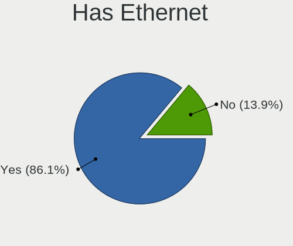
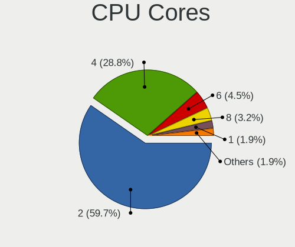
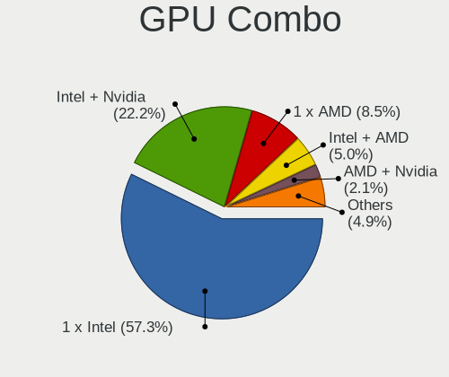
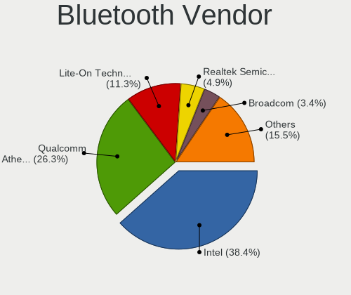
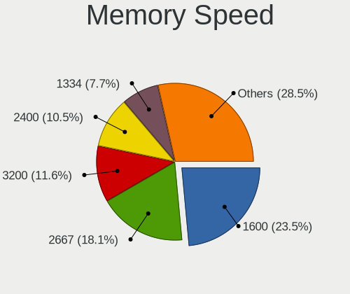

Linux in Brazil - Tested Hardware & Statistics (Notebooks)
----------------------------------------------------------

A project to collect tested hardware configurations for Linux in Brazil.

Anyone can contribute to this report by the [hw-probe](https://github.com/linuxhw/hw-probe) tool:

    sudo -E hw-probe -all -upload

Please contribute! Especially if your hardware is rare.

Contents
--------

* [ Test Cases ](#test-cases)

* [ System ](#system)
  - [ OS                       ](#os)
  - [ OS Family                ](#os-family)
  - [ Kernel                   ](#kernel)
  - [ Kernel Family            ](#kernel-family)
  - [ Kernel Major Ver.        ](#kernel-major-ver)
  - [ Arch                     ](#arch)
  - [ DE                       ](#de)
  - [ Display Server           ](#display-server)
  - [ Display Manager          ](#display-manager)
  - [ OS Lang                  ](#os-lang)
  - [ Boot Mode                ](#boot-mode)
  - [ Filesystem               ](#filesystem)
  - [ Part. scheme             ](#part-scheme)
  - [ Dual Boot with Linux/BSD ](#dual-boot-with-linuxbsd)
  - [ Dual Boot (Win)          ](#dual-boot-win)

* [ Board ](#board)
  - [ Vendor                   ](#vendor)
  - [ Model                    ](#model)
  - [ Model Family             ](#model-family)
  - [ MFG Year                 ](#mfg-year)
  - [ Form Factor              ](#form-factor)
  - [ Secure Boot              ](#secure-boot)
  - [ Coreboot                 ](#coreboot)
  - [ RAM Size                 ](#ram-size)
  - [ RAM Used                 ](#ram-used)
  - [ Total Drives             ](#total-drives)
  - [ Has CD-ROM               ](#has-cd-rom)
  - [ Has Ethernet             ](#has-ethernet)
  - [ Has WiFi                 ](#has-wifi)
  - [ Has Bluetooth            ](#has-bluetooth)

* [ Location ](#location)
  - [ Country                  ](#country)
  - [ City                     ](#city)

* [ Drives ](#drives)
  - [ Drive Vendor             ](#drive-vendor)
  - [ Drive Model              ](#drive-model)
  - [ HDD Vendor               ](#hdd-vendor)
  - [ SSD Vendor               ](#ssd-vendor)
  - [ Drive Kind               ](#drive-kind)
  - [ Drive Connector          ](#drive-connector)
  - [ Drive Size               ](#drive-size)
  - [ Space Total              ](#space-total)
  - [ Space Used               ](#space-used)
  - [ Malfunc. Drives          ](#malfunc-drives)
  - [ Malfunc. Drive Vendor    ](#malfunc-drive-vendor)
  - [ Malfunc. HDD Vendor      ](#malfunc-hdd-vendor)
  - [ Malfunc. Drive Kind      ](#malfunc-drive-kind)
  - [ Failed Drives            ](#failed-drives)
  - [ Failed Drive Vendor      ](#failed-drive-vendor)
  - [ Drive Status             ](#drive-status)

* [ Storage controller ](#storage-controller)
  - [ Storage Vendor           ](#storage-vendor)
  - [ Storage Model            ](#storage-model)
  - [ Storage Kind             ](#storage-kind)

* [ Processor ](#processor)
  - [ CPU Vendor               ](#cpu-vendor)
  - [ CPU Model                ](#cpu-model)
  - [ CPU Model Family         ](#cpu-model-family)
  - [ CPU Cores                ](#cpu-cores)
  - [ CPU Sockets              ](#cpu-sockets)
  - [ CPU Threads              ](#cpu-threads)
  - [ CPU Op-Modes             ](#cpu-op-modes)
  - [ CPU Microcode            ](#cpu-microcode)
  - [ CPU Microarch            ](#cpu-microarch)

* [ Graphics ](#graphics)
  - [ GPU Vendor               ](#gpu-vendor)
  - [ GPU Model                ](#gpu-model)
  - [ GPU Combo                ](#gpu-combo)
  - [ GPU Driver               ](#gpu-driver)
  - [ GPU Memory               ](#gpu-memory)

* [ Monitor ](#monitor)
  - [ Monitor Vendor           ](#monitor-vendor)
  - [ Monitor Model            ](#monitor-model)
  - [ Monitor Resolution       ](#monitor-resolution)
  - [ Monitor Diagonal         ](#monitor-diagonal)
  - [ Monitor Width            ](#monitor-width)
  - [ Aspect Ratio             ](#aspect-ratio)
  - [ Monitor Area             ](#monitor-area)
  - [ Pixel Density            ](#pixel-density)
  - [ Multiple Monitors        ](#multiple-monitors)

* [ Network ](#network)
  - [ Net Controller Vendor    ](#net-controller-vendor)
  - [ Net Controller Model     ](#net-controller-model)
  - [ Wireless Vendor          ](#wireless-vendor)
  - [ Wireless Model           ](#wireless-model)
  - [ Ethernet Vendor          ](#ethernet-vendor)
  - [ Ethernet Model           ](#ethernet-model)
  - [ Net Controller Kind      ](#net-controller-kind)
  - [ Used Controller          ](#used-controller)
  - [ NICs                     ](#nics)
  - [ IPv6                     ](#ipv6)

* [ Bluetooth ](#bluetooth)
  - [ Bluetooth Vendor         ](#bluetooth-vendor)
  - [ Bluetooth Model          ](#bluetooth-model)

* [ Sound ](#sound)
  - [ Sound Vendor             ](#sound-vendor)
  - [ Sound Model              ](#sound-model)

* [ Memory ](#memory)
  - [ Memory Vendor            ](#memory-vendor)
  - [ Memory Model             ](#memory-model)
  - [ Memory Kind              ](#memory-kind)
  - [ Memory Form Factor       ](#memory-form-factor)
  - [ Memory Size              ](#memory-size)
  - [ Memory Speed             ](#memory-speed)

* [ Printers & scanners ](#printers--scanners)
  - [ Printer Vendor           ](#printer-vendor)
  - [ Printer Model            ](#printer-model)
  - [ Scanner Vendor           ](#scanner-vendor)
  - [ Scanner Model            ](#scanner-model)

* [ Camera ](#camera)
  - [ Camera Vendor            ](#camera-vendor)
  - [ Camera Model             ](#camera-model)

* [ Security ](#security)
  - [ Fingerprint Vendor       ](#fingerprint-vendor)
  - [ Fingerprint Model        ](#fingerprint-model)
  - [ Chipcard Vendor          ](#chipcard-vendor)
  - [ Chipcard Model           ](#chipcard-model)

* [ Unsupported ](#unsupported)
  - [ Unsupported Devices      ](#unsupported-devices)
  - [ Unsupported Device Types ](#unsupported-device-types)

Test Cases
----------

Total: 14681

| Vendor        | Model                       | Probe                                                      | Date         |
|---------------|-----------------------------|------------------------------------------------------------|--------------|
| Lenovo        | ThinkPad SL400 2743A48      | [0c0f6ef206](https://linux-hardware.org/?probe=0c0f6ef206) | Jan 06, 2025 |
| Notebook      | NJx0MU                      | [1a436745ab](https://linux-hardware.org/?probe=1a436745ab) | Jan 06, 2025 |
| Positivo B... | VJFE59F11X-B1011H           | [eeea3c518d](https://linux-hardware.org/?probe=eeea3c518d) | Jan 06, 2025 |
| Notebook      | NJx0MU                      | [67d6f124c9](https://linux-hardware.org/?probe=67d6f124c9) | Jan 06, 2025 |
| Dell          | Vostro 14-5480              | [30963b610d](https://linux-hardware.org/?probe=30963b610d) | Jan 06, 2025 |
| Dell          | Vostro 14-5480              | [5232467681](https://linux-hardware.org/?probe=5232467681) | Jan 05, 2025 |
| Lenovo        | IdeaPad Z400 VIWZ1          | [516947871e](https://linux-hardware.org/?probe=516947871e) | Jan 05, 2025 |
| Lenovo        | IdeaPad S145-15API 81V7     | [1df5680b90](https://linux-hardware.org/?probe=1df5680b90) | Jan 05, 2025 |
| Dell          | G3 3500                     | [5c6b757b24](https://linux-hardware.org/?probe=5c6b757b24) | Jan 05, 2025 |
| Lenovo        | B490 377222P                | [4e6cc04345](https://linux-hardware.org/?probe=4e6cc04345) | Jan 04, 2025 |
| Sony          | SVF15213CBW                 | [2a3349eb69](https://linux-hardware.org/?probe=2a3349eb69) | Jan 04, 2025 |
| ASUSTek       | VivoBook_ASUSLaptop X515... | [3eeaef91d5](https://linux-hardware.org/?probe=3eeaef91d5) | Jan 04, 2025 |
| ASUSTek       | VivoBook_ASUSLaptop X515... | [ca47c65b3a](https://linux-hardware.org/?probe=ca47c65b3a) | Jan 04, 2025 |
| Dell          | Inspiron 5566               | [9653ac70bc](https://linux-hardware.org/?probe=9653ac70bc) | Jan 04, 2025 |
| Alienware     | m16 R1                      | [a61a1d8c59](https://linux-hardware.org/?probe=a61a1d8c59) | Jan 03, 2025 |
| HP            | ProBook 640 G1              | [f901f7b9aa](https://linux-hardware.org/?probe=f901f7b9aa) | Jan 03, 2025 |
| Lenovo        | ThinkPad E14 Gen 2 20TB0... | [a301b43994](https://linux-hardware.org/?probe=a301b43994) | Jan 03, 2025 |
| ASUSTek       | VivoBook_ASUSLaptop X515... | [ac0b2b8219](https://linux-hardware.org/?probe=ac0b2b8219) | Jan 03, 2025 |
| Avell High... | Avell G1513 MUV / A52 MU... | [ca3162cf4a](https://linux-hardware.org/?probe=ca3162cf4a) | Jan 03, 2025 |
| Sony          | VPCF236FM                   | [1c0abb00b2](https://linux-hardware.org/?probe=1c0abb00b2) | Jan 03, 2025 |
| Dell          | Inspiron 3583               | [d2423ded38](https://linux-hardware.org/?probe=d2423ded38) | Jan 03, 2025 |
| Positivo B... | VJFE52F11X-B2511H           | [4ee757e2c0](https://linux-hardware.org/?probe=4ee757e2c0) | Jan 03, 2025 |
| Lenovo        | ThinkPad Z16 Gen 1 21D50... | [821891b6b6](https://linux-hardware.org/?probe=821891b6b6) | Jan 02, 2025 |
| Acer          | Aspire A315-510P            | [f3fd803275](https://linux-hardware.org/?probe=f3fd803275) | Jan 01, 2025 |
| Dell          | Latitude 7490               | [5781936456](https://linux-hardware.org/?probe=5781936456) | Dec 31, 2024 |
| Samsung       | 550XDA                      | [f23c082843](https://linux-hardware.org/?probe=f23c082843) | Dec 31, 2024 |
| Acer          | Aspire ES1-572              | [419ddbb177](https://linux-hardware.org/?probe=419ddbb177) | Dec 31, 2024 |
| ASUSTek       | S451LA                      | [3da156f5be](https://linux-hardware.org/?probe=3da156f5be) | Dec 31, 2024 |
| Samsung       | 370E4K                      | [ba2171b4e3](https://linux-hardware.org/?probe=ba2171b4e3) | Dec 31, 2024 |
| ASUSTek       | S451LA                      | [9837408f80](https://linux-hardware.org/?probe=9837408f80) | Dec 31, 2024 |
| Acer          | Aspire ES1-572              | [dc58f6466e](https://linux-hardware.org/?probe=dc58f6466e) | Dec 31, 2024 |
| ASUSTek       | 1005HA                      | [334101d338](https://linux-hardware.org/?probe=334101d338) | Dec 31, 2024 |
| Lenovo        | G400s VILG1                 | [5363dba88d](https://linux-hardware.org/?probe=5363dba88d) | Dec 31, 2024 |
| Acer          | Aspire E1-531               | [dcd279939a](https://linux-hardware.org/?probe=dcd279939a) | Dec 31, 2024 |
| Acer          | Aspire A315-42              | [734fd13848](https://linux-hardware.org/?probe=734fd13848) | Dec 31, 2024 |
| Acer          | Nitro AN517-54              | [8461425ec1](https://linux-hardware.org/?probe=8461425ec1) | Dec 31, 2024 |
| Lenovo        | G460 20041                  | [f5b6aed89d](https://linux-hardware.org/?probe=f5b6aed89d) | Dec 31, 2024 |
| Acer          | Aspire A315-510P            | [b079131625](https://linux-hardware.org/?probe=b079131625) | Dec 30, 2024 |
| Apple         | MacBookPro9,2               | [a509973046](https://linux-hardware.org/?probe=a509973046) | Dec 30, 2024 |
| Apple         | MacBookPro9,2               | [1e4cb7054c](https://linux-hardware.org/?probe=1e4cb7054c) | Dec 30, 2024 |
| Acer          | Aspire A315-510P            | [ede893e1e1](https://linux-hardware.org/?probe=ede893e1e1) | Dec 30, 2024 |
| Lenovo        | ThinkPad L14 Gen 1 20U60... | [031c8d3940](https://linux-hardware.org/?probe=031c8d3940) | Dec 30, 2024 |
| Acer          | Aspire A515-57              | [d2483d4bb8](https://linux-hardware.org/?probe=d2483d4bb8) | Dec 30, 2024 |
| Positivo B... | VJFE52F11X-B2291H           | [3c5b6bf03a](https://linux-hardware.org/?probe=3c5b6bf03a) | Dec 30, 2024 |
| Apple         | MacBookAir6,2               | [f8255d3c15](https://linux-hardware.org/?probe=f8255d3c15) | Dec 30, 2024 |
| Samsung       | RV411/RV511/E3511/S3511/... | [89094bd2df](https://linux-hardware.org/?probe=89094bd2df) | Dec 30, 2024 |
| Acer          | Nitro AN515-45              | [cf19396a9a](https://linux-hardware.org/?probe=cf19396a9a) | Dec 30, 2024 |
| Lenovo        | Legion 5 15IAH7H 82TB       | [37b8fbc02a](https://linux-hardware.org/?probe=37b8fbc02a) | Dec 29, 2024 |
| Lenovo        | LOQ 16APH8 82XU             | [1a6aebd2e4](https://linux-hardware.org/?probe=1a6aebd2e4) | Dec 29, 2024 |
| Acer          | Aspire 5253                 | [8129d03feb](https://linux-hardware.org/?probe=8129d03feb) | Dec 29, 2024 |
| Lenovo        | V14 G2 ITL 82NM             | [079c56ceab](https://linux-hardware.org/?probe=079c56ceab) | Dec 28, 2024 |
| Dell          | Latitude E5470              | [e7d5673567](https://linux-hardware.org/?probe=e7d5673567) | Dec 28, 2024 |
| Acer          | Aspire VX5-591G             | [723f61dbcf](https://linux-hardware.org/?probe=723f61dbcf) | Dec 27, 2024 |
| Acer          | Aspire VX5-591G             | [773ac488ff](https://linux-hardware.org/?probe=773ac488ff) | Dec 27, 2024 |
| Lenovo        | V15 G2 ITL 82ME             | [4c710eefac](https://linux-hardware.org/?probe=4c710eefac) | Dec 27, 2024 |
| Acer          | Swift SF314-511             | [f0e61d80d6](https://linux-hardware.org/?probe=f0e61d80d6) | Dec 27, 2024 |
| Positivo B... | VJFE52F11X-XXXXXX           | [83dc0c4a71](https://linux-hardware.org/?probe=83dc0c4a71) | Dec 27, 2024 |
| ASUSTek       | ASUS TUF Gaming F15 FX50... | [4bfed8719e](https://linux-hardware.org/?probe=4bfed8719e) | Dec 27, 2024 |
| Avell High... | A70 HYB                     | [aea76220df](https://linux-hardware.org/?probe=aea76220df) | Dec 26, 2024 |
| Gateway       | NV55C                       | [060f326f5d](https://linux-hardware.org/?probe=060f326f5d) | Dec 26, 2024 |
| Gateway       | NV55C                       | [3cacf3568a](https://linux-hardware.org/?probe=3cacf3568a) | Dec 26, 2024 |
| ASUSTek       | VivoBook_ASUSLaptop K360... | [4c2cba015f](https://linux-hardware.org/?probe=4c2cba015f) | Dec 26, 2024 |
| ASUSTek       | VivoBook_ASUSLaptop K360... | [fcb6f7fe6c](https://linux-hardware.org/?probe=fcb6f7fe6c) | Dec 25, 2024 |
| Acer          | Nitro ANV15-51              | [652451b779](https://linux-hardware.org/?probe=652451b779) | Dec 25, 2024 |
| Acer          | Nitro ANV15-51              | [ce85c5a816](https://linux-hardware.org/?probe=ce85c5a816) | Dec 25, 2024 |
| Lenovo        | ThinkPad T480 20L6SA0X00    | [89c4986258](https://linux-hardware.org/?probe=89c4986258) | Dec 25, 2024 |
| Apple         | MacBookPro8,1               | [19e759cb83](https://linux-hardware.org/?probe=19e759cb83) | Dec 25, 2024 |
| Acer          | Aspire A315-41              | [fe6c49574a](https://linux-hardware.org/?probe=fe6c49574a) | Dec 24, 2024 |
| Dell          | Inspiron 5458               | [463ab8c7ce](https://linux-hardware.org/?probe=463ab8c7ce) | Dec 24, 2024 |
| Dell          | Latitude 5430               | [cc52da1214](https://linux-hardware.org/?probe=cc52da1214) | Dec 23, 2024 |
| Positivo      | W940TU                      | [b5cb158e93](https://linux-hardware.org/?probe=b5cb158e93) | Dec 23, 2024 |
| Samsung       | 370E4K                      | [b2200db0dc](https://linux-hardware.org/?probe=b2200db0dc) | Dec 23, 2024 |
| HP            | ProBook 645 G2              | [fdd8177594](https://linux-hardware.org/?probe=fdd8177594) | Dec 23, 2024 |
| HP            | ProBook 645 G2              | [6042ac6425](https://linux-hardware.org/?probe=6042ac6425) | Dec 23, 2024 |
| Avell         | B.ON                        | [8a06f2de3b](https://linux-hardware.org/?probe=8a06f2de3b) | Dec 23, 2024 |
| ASUSTek       | VivoBook_ASUSLaptop K360... | [8690e3274f](https://linux-hardware.org/?probe=8690e3274f) | Dec 23, 2024 |
| ASUSTek       | VivoBook_ASUSLaptop K360... | [5a779ffa7e](https://linux-hardware.org/?probe=5a779ffa7e) | Dec 23, 2024 |
| Samsung       | 370E4K                      | [6c1eff379e](https://linux-hardware.org/?probe=6c1eff379e) | Dec 23, 2024 |
| Acer          | Aspire F5-573G              | [b5e37804c4](https://linux-hardware.org/?probe=b5e37804c4) | Dec 23, 2024 |
| Acer          | Aspire F5-573G              | [29bad5d443](https://linux-hardware.org/?probe=29bad5d443) | Dec 23, 2024 |
| Lenovo        | Legion Slim 5 16APH8 82Y... | [26b810b462](https://linux-hardware.org/?probe=26b810b462) | Dec 22, 2024 |
| Acer          | Aspire A315-510P            | [e373d8aef5](https://linux-hardware.org/?probe=e373d8aef5) | Dec 22, 2024 |
| Digibras      | NH4CU53                     | [d9869c203b](https://linux-hardware.org/?probe=d9869c203b) | Dec 22, 2024 |
| Notebook      | NJx0MU                      | [0f16f634ba](https://linux-hardware.org/?probe=0f16f634ba) | Dec 22, 2024 |
| Lenovo        | ThinkPad T430 2347G2P       | [31c6e468d6](https://linux-hardware.org/?probe=31c6e468d6) | Dec 22, 2024 |
| Dell          | Latitude 5175               | [50e07a5bed](https://linux-hardware.org/?probe=50e07a5bed) | Dec 22, 2024 |
| Avell         | B.ON                        | [4cdfce4d81](https://linux-hardware.org/?probe=4cdfce4d81) | Dec 21, 2024 |
| Lenovo        | ThinkPad T430 2347G2P       | [76ea7c137e](https://linux-hardware.org/?probe=76ea7c137e) | Dec 21, 2024 |
| Acer          | Nitro AN515-54              | [6c1a9f6cda](https://linux-hardware.org/?probe=6c1a9f6cda) | Dec 21, 2024 |
| Dell          | Inspiron 3442               | [cfc2614cfb](https://linux-hardware.org/?probe=cfc2614cfb) | Dec 20, 2024 |
| Lenovo        | IdeaPad S145-15IIL 82DJ     | [69da2b0a14](https://linux-hardware.org/?probe=69da2b0a14) | Dec 20, 2024 |
| Lenovo        | Yoga 510-14ISK 80UK         | [4fa862c4fc](https://linux-hardware.org/?probe=4fa862c4fc) | Dec 20, 2024 |
| Timi          | RedmiBook Pro 14            | [e53024745e](https://linux-hardware.org/?probe=e53024745e) | Dec 20, 2024 |
| Lenovo        | IdeaPad 3 15ALC6 82MF       | [ec99b76d7b](https://linux-hardware.org/?probe=ec99b76d7b) | Dec 19, 2024 |
| Samsung       | 960XGL                      | [020d5b8c25](https://linux-hardware.org/?probe=020d5b8c25) | Dec 19, 2024 |
| Samsung       | 960XGL                      | [e6a4a30978](https://linux-hardware.org/?probe=e6a4a30978) | Dec 19, 2024 |
| Apple         | MacBookAir6,1               | [ec57f00f41](https://linux-hardware.org/?probe=ec57f00f41) | Dec 19, 2024 |
| Apple         | MacBookAir6,1               | [16547e9167](https://linux-hardware.org/?probe=16547e9167) | Dec 19, 2024 |
| Lenovo        | IdeaPad 1 15AMN7 82X5       | [cbf8e95fa9](https://linux-hardware.org/?probe=cbf8e95fa9) | Dec 19, 2024 |
| Samsung       | 300E4C/300E5C/300E7C        | [00d3503d79](https://linux-hardware.org/?probe=00d3503d79) | Dec 18, 2024 |
| Samsung       | 300E4C/300E5C/300E7C        | [45dea0b50b](https://linux-hardware.org/?probe=45dea0b50b) | Dec 18, 2024 |
| Lenovo        | IdeaPad 330-15IKB 81FD      | [bc07631f18](https://linux-hardware.org/?probe=bc07631f18) | Dec 18, 2024 |
| Positivo      | R516256AI-15                | [9a731a05a6](https://linux-hardware.org/?probe=9a731a05a6) | Dec 18, 2024 |
| Lenovo        | IdeaPad 3 15IML05 82BS      | [b55322dd58](https://linux-hardware.org/?probe=b55322dd58) | Dec 18, 2024 |
| Lenovo        | S10-3                       | [3ba705e8e3](https://linux-hardware.org/?probe=3ba705e8e3) | Dec 18, 2024 |
| Apple         | MacBookPro7,1               | [47aa54e827](https://linux-hardware.org/?probe=47aa54e827) | Dec 18, 2024 |
| Positivo      | R516256AI-15                | [19cb460e74](https://linux-hardware.org/?probe=19cb460e74) | Dec 18, 2024 |
| Samsung       | 550XDA                      | [d1b77b4082](https://linux-hardware.org/?probe=d1b77b4082) | Dec 17, 2024 |
| Samsung       | 550XDA                      | [d986e68aed](https://linux-hardware.org/?probe=d986e68aed) | Dec 17, 2024 |
| HP            | 240 G4 Notebook PC          | [1e82cc2079](https://linux-hardware.org/?probe=1e82cc2079) | Dec 17, 2024 |
| Samsung       | 940XGK                      | [9e997ae718](https://linux-hardware.org/?probe=9e997ae718) | Dec 17, 2024 |
| Samsung       | 940XGK                      | [9cb3541052](https://linux-hardware.org/?probe=9cb3541052) | Dec 17, 2024 |
| Acer          | Nitro AN517-54              | [2a5849148d](https://linux-hardware.org/?probe=2a5849148d) | Dec 17, 2024 |
| Dell          | Inspiron 15 5510            | [2ec814c4a6](https://linux-hardware.org/?probe=2ec814c4a6) | Dec 17, 2024 |
| Dell          | XPS 13 9340                 | [914be0c9e8](https://linux-hardware.org/?probe=914be0c9e8) | Dec 17, 2024 |
| Lenovo        | IdeaPad S145-15IWL 81S9     | [c3141e65eb](https://linux-hardware.org/?probe=c3141e65eb) | Dec 17, 2024 |
| Samsung       | 800G5M/800G5W               | [f721641c6c](https://linux-hardware.org/?probe=f721641c6c) | Dec 17, 2024 |
| Apple         | MacBookPro8,1               | [d898ddc5ac](https://linux-hardware.org/?probe=d898ddc5ac) | Dec 17, 2024 |
| Apple         | MacBookPro8,1               | [1dab55d205](https://linux-hardware.org/?probe=1dab55d205) | Dec 17, 2024 |
| ASUSTek       | G750JS                      | [f33b8f1749](https://linux-hardware.org/?probe=f33b8f1749) | Dec 17, 2024 |
| Dell          | G15 5515                    | [7e4b127e3e](https://linux-hardware.org/?probe=7e4b127e3e) | Dec 17, 2024 |
| Positivo      | C464F                       | [6ba50c5c35](https://linux-hardware.org/?probe=6ba50c5c35) | Dec 17, 2024 |
| Dell          | G15 5530                    | [348b21d35f](https://linux-hardware.org/?probe=348b21d35f) | Dec 16, 2024 |
| Lenovo        | ThinkBook 14 G6 IRL 21NQ    | [5c45e2bfee](https://linux-hardware.org/?probe=5c45e2bfee) | Dec 16, 2024 |
| Lenovo        | ThinkPad MFG_IN_GO          | [3c0105bc7f](https://linux-hardware.org/?probe=3c0105bc7f) | Dec 16, 2024 |
| Acer          | Aspire A515-54              | [6fa352739e](https://linux-hardware.org/?probe=6fa352739e) | Dec 16, 2024 |
| Compaq        | Presario CQ-23              | [6def2d2a1a](https://linux-hardware.org/?probe=6def2d2a1a) | Dec 15, 2024 |
| Acer          | Aspire A315-56              | [139641552f](https://linux-hardware.org/?probe=139641552f) | Dec 15, 2024 |
| Acer          | Aspire A315-24P             | [0b3d428148](https://linux-hardware.org/?probe=0b3d428148) | Dec 15, 2024 |
| HP            | Pavilion dv6500             | [0e780e73a8](https://linux-hardware.org/?probe=0e780e73a8) | Dec 15, 2024 |
| Acer          | Aspire A315-34              | [6c8d585d0b](https://linux-hardware.org/?probe=6c8d585d0b) | Dec 15, 2024 |
| Intel         | X99-P4 V5.1                 | [1b51ac4e5f](https://linux-hardware.org/?probe=1b51ac4e5f) | Dec 15, 2024 |
| Dell          | Inspiron 3583               | [06f46f7744](https://linux-hardware.org/?probe=06f46f7744) | Dec 15, 2024 |
| Acer          | Nitro AN515-55              | [e322fbd405](https://linux-hardware.org/?probe=e322fbd405) | Dec 14, 2024 |
| Samsung       | 950XDB/951XDB/950XDY        | [a53cca0335](https://linux-hardware.org/?probe=a53cca0335) | Dec 14, 2024 |
| Dell          | Inspiron 15 3520            | [ef79faf01a](https://linux-hardware.org/?probe=ef79faf01a) | Dec 14, 2024 |
| Dell          | Inspiron 5547               | [4427bcded0](https://linux-hardware.org/?probe=4427bcded0) | Dec 14, 2024 |
| Dell          | Inspiron 5566               | [05c31ee89d](https://linux-hardware.org/?probe=05c31ee89d) | Dec 14, 2024 |
| Dell          | Inspiron 5547               | [5641fb7941](https://linux-hardware.org/?probe=5641fb7941) | Dec 14, 2024 |
| Dell          | Inspiron 5566               | [f5a22b54ca](https://linux-hardware.org/?probe=f5a22b54ca) | Dec 14, 2024 |
| Positivo      | Mobile                      | [3ffa6c7d77](https://linux-hardware.org/?probe=3ffa6c7d77) | Dec 14, 2024 |
| Acer          | Aspire A515-51              | [ce7759feac](https://linux-hardware.org/?probe=ce7759feac) | Dec 14, 2024 |
| ASUSTek       | VivoBook_ASUSLaptop X540... | [188828cb26](https://linux-hardware.org/?probe=188828cb26) | Dec 14, 2024 |
| HP            | EliteBook 745 G3            | [7384d01ae6](https://linux-hardware.org/?probe=7384d01ae6) | Dec 14, 2024 |
| Acer          | Aspire A515-45              | [12ef38498b](https://linux-hardware.org/?probe=12ef38498b) | Dec 13, 2024 |
| Samsung       | 550XDA                      | [6013fd585a](https://linux-hardware.org/?probe=6013fd585a) | Dec 13, 2024 |
| Dell          | Inspiron 3443               | [ba6daf3a46](https://linux-hardware.org/?probe=ba6daf3a46) | Dec 13, 2024 |
| Lenovo        | G400s VILG1                 | [f5eca00369](https://linux-hardware.org/?probe=f5eca00369) | Dec 13, 2024 |
| Dell          | Inspiron 15 3520            | [c6c434f6db](https://linux-hardware.org/?probe=c6c434f6db) | Dec 13, 2024 |
| Dell          | Inspiron 15 3520            | [a9a0bade6e](https://linux-hardware.org/?probe=a9a0bade6e) | Dec 13, 2024 |
| Dell          | Inspiron 15 3520            | [157197d70c](https://linux-hardware.org/?probe=157197d70c) | Dec 13, 2024 |
| Dell          | Inspiron 15 5510            | [6c7232c77d](https://linux-hardware.org/?probe=6c7232c77d) | Dec 13, 2024 |
| Dell          | Latitude E6430              | [200bed6a55](https://linux-hardware.org/?probe=200bed6a55) | Dec 13, 2024 |
| Dell          | Inspiron 15 3511            | [e584837d78](https://linux-hardware.org/?probe=e584837d78) | Dec 12, 2024 |
| Samsung       | 530U3BI/530U4BI/530U4BH     | [8fab92cc9d](https://linux-hardware.org/?probe=8fab92cc9d) | Dec 12, 2024 |
| ASUSTek       | X45C                        | [4d8d6df206](https://linux-hardware.org/?probe=4d8d6df206) | Dec 12, 2024 |
| Acer          | Aspire A515-51              | [615b9706b0](https://linux-hardware.org/?probe=615b9706b0) | Dec 12, 2024 |
| Dell          | Vostro 3550                 | [3b5445782a](https://linux-hardware.org/?probe=3b5445782a) | Dec 12, 2024 |
| Dell          | Inspiron 15-3567            | [587f8ef283](https://linux-hardware.org/?probe=587f8ef283) | Dec 12, 2024 |
| Apple         | MacBookPro8,1               | [802c98fd5c](https://linux-hardware.org/?probe=802c98fd5c) | Dec 12, 2024 |
| Lenovo        | IdeaPad 320-15IKB 80YH      | [5979a585ea](https://linux-hardware.org/?probe=5979a585ea) | Dec 12, 2024 |
| Dell          | Inspiron 15 3515            | [c8c7a8be17](https://linux-hardware.org/?probe=c8c7a8be17) | Dec 11, 2024 |
| Samsung       | 550XDA                      | [aaef6e9779](https://linux-hardware.org/?probe=aaef6e9779) | Dec 11, 2024 |
| Dell          | Inspiron 3584               | [3a3f027b1e](https://linux-hardware.org/?probe=3a3f027b1e) | Dec 11, 2024 |
| Dell          | Vostro 3550                 | [c45c7e2e64](https://linux-hardware.org/?probe=c45c7e2e64) | Dec 11, 2024 |
| Dell          | Inspiron 5437               | [3df37e9946](https://linux-hardware.org/?probe=3df37e9946) | Dec 11, 2024 |
| Notebook      | N85_N87,HJ,HJ1,HK1          | [c252814d3e](https://linux-hardware.org/?probe=c252814d3e) | Dec 11, 2024 |
| Dell          | Vostro 1320                 | [af0ef0c04a](https://linux-hardware.org/?probe=af0ef0c04a) | Dec 11, 2024 |
| Notebook      | 14M2                        | [30b428ea7b](https://linux-hardware.org/?probe=30b428ea7b) | Dec 11, 2024 |
| Lenovo        | IdeaPad 320-15IKB 80YH      | [d595bcedb4](https://linux-hardware.org/?probe=d595bcedb4) | Dec 10, 2024 |
| ASUSTek       | K46CA                       | [3f1038d713](https://linux-hardware.org/?probe=3f1038d713) | Dec 10, 2024 |
| Dell          | G15 5530                    | [f2e8fbbc50](https://linux-hardware.org/?probe=f2e8fbbc50) | Dec 10, 2024 |
| ASUSTek       | G750JM                      | [3b9ba01301](https://linux-hardware.org/?probe=3b9ba01301) | Dec 10, 2024 |
| Lenovo        | Yoga Slim 6 14IAP8 83C7     | [90bb1c3ab1](https://linux-hardware.org/?probe=90bb1c3ab1) | Dec 10, 2024 |
| Samsung       | 550XCJ/550XCR               | [4367cfa222](https://linux-hardware.org/?probe=4367cfa222) | Dec 10, 2024 |
| Acer          | Aspire A315-41G             | [36adcc0875](https://linux-hardware.org/?probe=36adcc0875) | Dec 10, 2024 |
| HP            | ProBook 640 G1              | [9a57299146](https://linux-hardware.org/?probe=9a57299146) | Dec 09, 2024 |
| ASUSTek       | X555UB                      | [48b994930e](https://linux-hardware.org/?probe=48b994930e) | Dec 09, 2024 |
| ASUSTek       | VivoBook_ASUSLaptop K360... | [8169d4ab51](https://linux-hardware.org/?probe=8169d4ab51) | Dec 09, 2024 |
| Dell          | XPS 13 9310                 | [f7daee63db](https://linux-hardware.org/?probe=f7daee63db) | Dec 09, 2024 |
| Dell          | Inspiron 5502               | [7bac372167](https://linux-hardware.org/?probe=7bac372167) | Dec 09, 2024 |
| Samsung       | 550XDA                      | [c9233c6566](https://linux-hardware.org/?probe=c9233c6566) | Dec 08, 2024 |
| Dell          | G15 5515                    | [c8e7750350](https://linux-hardware.org/?probe=c8e7750350) | Dec 08, 2024 |
| ASUSTek       | ASUS Zenbook S 14 UX5406... | [a92beb8e79](https://linux-hardware.org/?probe=a92beb8e79) | Dec 08, 2024 |
| ASUSTek       | VivoBook_ASUSLaptop X515... | [183432796c](https://linux-hardware.org/?probe=183432796c) | Dec 08, 2024 |
| ASUSTek       | Z450LA                      | [2281fa41ae](https://linux-hardware.org/?probe=2281fa41ae) | Dec 08, 2024 |
| Dell          | Inspiron N4050              | [7194f36c08](https://linux-hardware.org/?probe=7194f36c08) | Dec 08, 2024 |
| Positivo B... | VJFE52F11X-B2511H           | [3bba6aad86](https://linux-hardware.org/?probe=3bba6aad86) | Dec 08, 2024 |
| Dell          | Inspiron 15 5510            | [bd969c198e](https://linux-hardware.org/?probe=bd969c198e) | Dec 07, 2024 |
| Acer          | Nitro AN515-54              | [a1ca34ba37](https://linux-hardware.org/?probe=a1ca34ba37) | Dec 07, 2024 |
| Dell          | Inspiron 15-3567            | [31df2faf94](https://linux-hardware.org/?probe=31df2faf94) | Dec 07, 2024 |
| Positivo B... | VJFE52F11X-B2511H           | [749e89dab5](https://linux-hardware.org/?probe=749e89dab5) | Dec 07, 2024 |
| ASUSTek       | S550CA                      | [82763191e1](https://linux-hardware.org/?probe=82763191e1) | Dec 06, 2024 |
| ASUSTek       | S550CA                      | [4092156aab](https://linux-hardware.org/?probe=4092156aab) | Dec 06, 2024 |
| Dell          | Inspiron 15 3520            | [58cfe39a15](https://linux-hardware.org/?probe=58cfe39a15) | Dec 06, 2024 |
| ASUSTek       | VivoBook_ASUSLaptop X512... | [d80d3ac983](https://linux-hardware.org/?probe=d80d3ac983) | Dec 05, 2024 |
| ASUSTek       | VivoBook_ASUSLaptop X512... | [7b16195c49](https://linux-hardware.org/?probe=7b16195c49) | Dec 05, 2024 |
| Positivo      | R516256AI-15                | [5e090ab777](https://linux-hardware.org/?probe=5e090ab777) | Dec 05, 2024 |
| Positivo      | Q4128C                      | [866dca1d74](https://linux-hardware.org/?probe=866dca1d74) | Dec 05, 2024 |
| Avell         | B.ON                        | [257abe1dc4](https://linux-hardware.org/?probe=257abe1dc4) | Dec 05, 2024 |
| HP            | Pavilion g4                 | [bb26b30a98](https://linux-hardware.org/?probe=bb26b30a98) | Dec 05, 2024 |
| Lenovo        | ThinkPad E480 20KQA01PBR    | [f38bbbfa9a](https://linux-hardware.org/?probe=f38bbbfa9a) | Dec 05, 2024 |
| MSI           | Raider GE68 HX 14VGG        | [0e76370025](https://linux-hardware.org/?probe=0e76370025) | Dec 05, 2024 |
| Dell          | Inspiron 15-3567            | [8abc9fa20f](https://linux-hardware.org/?probe=8abc9fa20f) | Dec 05, 2024 |
| Avell High... | A70 MOB                     | [96b305b64c](https://linux-hardware.org/?probe=96b305b64c) | Dec 05, 2024 |
| HP            | 14                          | [28802b9b1c](https://linux-hardware.org/?probe=28802b9b1c) | Dec 04, 2024 |
| ASUSTek       | ASUS Zenbook S 14 UX5406... | [624864b56b](https://linux-hardware.org/?probe=624864b56b) | Dec 04, 2024 |
| Dell          | Inspiron 3583               | [21db2dc4ce](https://linux-hardware.org/?probe=21db2dc4ce) | Dec 03, 2024 |
| Positivo B... | VJFE59F11X-B1811H           | [606d4eb856](https://linux-hardware.org/?probe=606d4eb856) | Dec 03, 2024 |
| Lenovo        | IdeaPad S145-15API 81V7     | [30e11ead8d](https://linux-hardware.org/?probe=30e11ead8d) | Dec 03, 2024 |
| Lenovo        | IdeaPad S145-15API 81V7     | [8f1919da6d](https://linux-hardware.org/?probe=8f1919da6d) | Dec 03, 2024 |
| Lenovo        | ThinkPad T450 20BUS0EJ10    | [8f280e1d31](https://linux-hardware.org/?probe=8f280e1d31) | Dec 03, 2024 |
| Dell          | Latitude 3550               | [fe2494f626](https://linux-hardware.org/?probe=fe2494f626) | Dec 03, 2024 |
| Samsung       | 550XDA                      | [f698576590](https://linux-hardware.org/?probe=f698576590) | Dec 03, 2024 |
| Lenovo        | IdeaPad 3 15ALC6 82MF       | [59d4f74fbf](https://linux-hardware.org/?probe=59d4f74fbf) | Dec 03, 2024 |
| Unknown       | Unknown                     | [26f56c98be](https://linux-hardware.org/?probe=26f56c98be) | Dec 03, 2024 |
| Dell          | Inspiron N4050              | [e313259fca](https://linux-hardware.org/?probe=e313259fca) | Dec 03, 2024 |
| Acer          | Aspire VN7-792G             | [3b6cf51a19](https://linux-hardware.org/?probe=3b6cf51a19) | Dec 02, 2024 |
| HP            | ProBook 4320s               | [9bfc564078](https://linux-hardware.org/?probe=9bfc564078) | Dec 02, 2024 |
| Acer          | Nitro ANV15-51              | [ac43db5c18](https://linux-hardware.org/?probe=ac43db5c18) | Dec 02, 2024 |
| Dell          | XPS 13 9380                 | [265dad936c](https://linux-hardware.org/?probe=265dad936c) | Dec 01, 2024 |
| Dell          | Latitude 5420               | [5002efd6a5](https://linux-hardware.org/?probe=5002efd6a5) | Dec 01, 2024 |
| LG Electro... | S425-G.BC34P1               | [abbae32be1](https://linux-hardware.org/?probe=abbae32be1) | Dec 01, 2024 |
| LG Electro... | 14Z980-G.BH51P1             | [c7c214def1](https://linux-hardware.org/?probe=c7c214def1) | Dec 01, 2024 |
| Acer          | Nitro AN515-45              | [0188b1df97](https://linux-hardware.org/?probe=0188b1df97) | Nov 30, 2024 |
| Acer          | Nitro AN515-45              | [01f38573f1](https://linux-hardware.org/?probe=01f38573f1) | Nov 30, 2024 |
| Lenovo        | IdeaPad 1 15AMN7 82X5       | [ef069e335b](https://linux-hardware.org/?probe=ef069e335b) | Nov 29, 2024 |
| Acer          | Predator PT316-51s          | [01e433bc5b](https://linux-hardware.org/?probe=01e433bc5b) | Nov 29, 2024 |
| Dell          | Latitude E5430 non-vPro     | [f0a42c0331](https://linux-hardware.org/?probe=f0a42c0331) | Nov 29, 2024 |
| Lenovo        | ThinkPad E14 Gen 2 20T7S... | [eedc1ae95c](https://linux-hardware.org/?probe=eedc1ae95c) | Nov 28, 2024 |
| Lenovo        | IdeaPad Gaming 3 15IMH05... | [85f38c21b8](https://linux-hardware.org/?probe=85f38c21b8) | Nov 28, 2024 |
| Dell          | Inspiron 7580               | [8d6ab843cc](https://linux-hardware.org/?probe=8d6ab843cc) | Nov 27, 2024 |
| Lenovo        | IdeaPad S145-15IWL 81S9     | [29af941409](https://linux-hardware.org/?probe=29af941409) | Nov 27, 2024 |
| ASUSTek       | K54L                        | [be228218d5](https://linux-hardware.org/?probe=be228218d5) | Nov 27, 2024 |
| Lenovo        | IdeaPad Gaming 3 15ACH6 ... | [afdf6ad9bd](https://linux-hardware.org/?probe=afdf6ad9bd) | Nov 27, 2024 |
| Lenovo        | IdeaPad Gaming 3 15ACH6 ... | [970d25268e](https://linux-hardware.org/?probe=970d25268e) | Nov 27, 2024 |
| Positivo      | R516256AI-15                | [f5ea887fec](https://linux-hardware.org/?probe=f5ea887fec) | Nov 27, 2024 |
| Dell          | Inspiron 3583               | [a8954557d8](https://linux-hardware.org/?probe=a8954557d8) | Nov 26, 2024 |
| Samsung       | 940XGK                      | [6d9574a7ed](https://linux-hardware.org/?probe=6d9574a7ed) | Nov 26, 2024 |
| Samsung       | 940XGK                      | [2cd0f44890](https://linux-hardware.org/?probe=2cd0f44890) | Nov 26, 2024 |
| Dell          | Latitude E5430 non-vPro     | [819377ad01](https://linux-hardware.org/?probe=819377ad01) | Nov 26, 2024 |
| Samsung       | RV411/RV511/E3511/S3511/... | [5dd1a2b1ec](https://linux-hardware.org/?probe=5dd1a2b1ec) | Nov 26, 2024 |
| Acer          | Aspire ES1-572              | [612f5558b5](https://linux-hardware.org/?probe=612f5558b5) | Nov 26, 2024 |
| Samsung       | 550XDA                      | [489626fc5e](https://linux-hardware.org/?probe=489626fc5e) | Nov 25, 2024 |
| Acer          | AO722                       | [15b4d05c90](https://linux-hardware.org/?probe=15b4d05c90) | Nov 25, 2024 |
| Acer          | AO722                       | [f5300839f0](https://linux-hardware.org/?probe=f5300839f0) | Nov 25, 2024 |
| Samsung       | 550XCJ/550XCR               | [16d18461fa](https://linux-hardware.org/?probe=16d18461fa) | Nov 25, 2024 |
| Positivo B... | VJFE59F11X-B1011H           | [3d6118cb75](https://linux-hardware.org/?probe=3d6118cb75) | Nov 25, 2024 |
| HP            | ProBook 445 14 inch G9 N... | [5cb01fc1b2](https://linux-hardware.org/?probe=5cb01fc1b2) | Nov 25, 2024 |
| Samsung       | 550XDA                      | [ff7f8d5657](https://linux-hardware.org/?probe=ff7f8d5657) | Nov 25, 2024 |
| Lenovo        | IdeaPad 1 15AMN7 82X5       | [ce9660e165](https://linux-hardware.org/?probe=ce9660e165) | Nov 25, 2024 |
| Notebook      | NJx0MU                      | [20e57b7eca](https://linux-hardware.org/?probe=20e57b7eca) | Nov 24, 2024 |
| HP            | Pavilion dv6500             | [0ce3102aaa](https://linux-hardware.org/?probe=0ce3102aaa) | Nov 24, 2024 |
| Lenovo        | IdeaPad 1 15IAU7 82VY       | [5e869e5fb0](https://linux-hardware.org/?probe=5e869e5fb0) | Nov 23, 2024 |
| Notebook      | NJx0MU                      | [76c5e79d46](https://linux-hardware.org/?probe=76c5e79d46) | Nov 23, 2024 |
| Acer          | Aspire E1-572               | [9b7ef062c2](https://linux-hardware.org/?probe=9b7ef062c2) | Nov 23, 2024 |
| Samsung       | R430/R480/R440              | [c1d927ad2a](https://linux-hardware.org/?probe=c1d927ad2a) | Nov 23, 2024 |
| Lenovo        | IdeaPad 3 15ALC6 82MF       | [f39fbc4af3](https://linux-hardware.org/?probe=f39fbc4af3) | Nov 23, 2024 |
| Lenovo        | IdeaPad 3 15ITL6 82MD       | [fd49240dd9](https://linux-hardware.org/?probe=fd49240dd9) | Nov 23, 2024 |
| Acer          | Aspire A515-45              | [2a8023af67](https://linux-hardware.org/?probe=2a8023af67) | Nov 22, 2024 |
| Lenovo        | ThinkPad T530 2392ASU       | [c822bcb2e0](https://linux-hardware.org/?probe=c822bcb2e0) | Nov 22, 2024 |
| Samsung       | 550XBE/350XBE               | [99c04f555b](https://linux-hardware.org/?probe=99c04f555b) | Nov 22, 2024 |
| Samsung       | 550XBE/350XBE               | [036cea56a5](https://linux-hardware.org/?probe=036cea56a5) | Nov 22, 2024 |
| Positivo B... | VJFE41F11X-XXXXXX           | [0efd10fc40](https://linux-hardware.org/?probe=0efd10fc40) | Nov 21, 2024 |
| Avell         | 147                         | [a2a7b90a9e](https://linux-hardware.org/?probe=a2a7b90a9e) | Nov 21, 2024 |
| Avell         | 147                         | [4c903739e3](https://linux-hardware.org/?probe=4c903739e3) | Nov 21, 2024 |
| Itautec       | Infoway                     | [466651a218](https://linux-hardware.org/?probe=466651a218) | Nov 21, 2024 |
| Alienware     | 15 R2                       | [e19cff46a5](https://linux-hardware.org/?probe=e19cff46a5) | Nov 21, 2024 |
| Positivo B... | VJFE41F11X-XXXXXX           | [67ea5dfb8d](https://linux-hardware.org/?probe=67ea5dfb8d) | Nov 21, 2024 |
| Samsung       | 340XAA/350XAA/550XAA        | [02d7d6b714](https://linux-hardware.org/?probe=02d7d6b714) | Nov 21, 2024 |
| Dell          | G15 5530                    | [0b025aca7b](https://linux-hardware.org/?probe=0b025aca7b) | Nov 20, 2024 |
| Apple         | MacBookPro9,2               | [5137bf2d70](https://linux-hardware.org/?probe=5137bf2d70) | Nov 20, 2024 |
| Lenovo        | Legion 5 15IAH7H 82TB       | [7c177a6a4a](https://linux-hardware.org/?probe=7c177a6a4a) | Nov 20, 2024 |
| Dell          | Latitude 3420               | [a2738a5c7c](https://linux-hardware.org/?probe=a2738a5c7c) | Nov 20, 2024 |
| Apple         | MacBookPro8,1               | [0b4c64ff80](https://linux-hardware.org/?probe=0b4c64ff80) | Nov 20, 2024 |
| Dell          | Inspiron 5570               | [f000fe5bb8](https://linux-hardware.org/?probe=f000fe5bb8) | Nov 19, 2024 |
| ASUSTek       | Vivobook Go E1504FA_E150... | [0b8343fcb0](https://linux-hardware.org/?probe=0b8343fcb0) | Nov 19, 2024 |
| Timi          | Redmi Book Pro 15 2022      | [be60b887e5](https://linux-hardware.org/?probe=be60b887e5) | Nov 19, 2024 |
| Lenovo        | ThinkPad E14 Gen 2 20TB0... | [35c0e60566](https://linux-hardware.org/?probe=35c0e60566) | Nov 19, 2024 |
| Samsung       | 550XBE/350XBE               | [a59631d657](https://linux-hardware.org/?probe=a59631d657) | Nov 19, 2024 |
| Lenovo        | IdeaPad 1 15AMN7 82X5       | [e3e7e1634f](https://linux-hardware.org/?probe=e3e7e1634f) | Nov 18, 2024 |
| Lenovo        | IdeaPad 1 15AMN7 82X5       | [4bca41e041](https://linux-hardware.org/?probe=4bca41e041) | Nov 18, 2024 |
| Dell          | System Inspiron N4110       | [9337d58c59](https://linux-hardware.org/?probe=9337d58c59) | Nov 18, 2024 |
| Lenovo        | ThinkPad X1 Carbon 4th 2... | [0f00e2c895](https://linux-hardware.org/?probe=0f00e2c895) | Nov 18, 2024 |
| Acer          | Aspire VN7-792G             | [b857c2f69b](https://linux-hardware.org/?probe=b857c2f69b) | Nov 18, 2024 |
| Lenovo        | IdeaPad 3 15ITL6 82MD       | [fd53276193](https://linux-hardware.org/?probe=fd53276193) | Nov 18, 2024 |
| Dell          | Latitude E5440              | [7a042d3cd2](https://linux-hardware.org/?probe=7a042d3cd2) | Nov 17, 2024 |
| Acer          | Aspire A515-45              | [a10f9b0aa6](https://linux-hardware.org/?probe=a10f9b0aa6) | Nov 17, 2024 |
| Dell          | Latitude E5440              | [4bd6ecbf70](https://linux-hardware.org/?probe=4bd6ecbf70) | Nov 17, 2024 |
| Samsung       | 550XDA                      | [01ef3193ec](https://linux-hardware.org/?probe=01ef3193ec) | Nov 17, 2024 |
| Avell         | B.ON                        | [886931da84](https://linux-hardware.org/?probe=886931da84) | Nov 16, 2024 |
| Acer          | Aspire M5-481T              | [c77edf8a80](https://linux-hardware.org/?probe=c77edf8a80) | Nov 16, 2024 |
| Compaq        | Presario CQ-23              | [a89bbf6c2d](https://linux-hardware.org/?probe=a89bbf6c2d) | Nov 16, 2024 |
| Toshiba       | K201                        | [ea9c66694d](https://linux-hardware.org/?probe=ea9c66694d) | Nov 16, 2024 |
| Samsung       | 340XAA/350XAA/550XAA        | [0cc613be0d](https://linux-hardware.org/?probe=0cc613be0d) | Nov 16, 2024 |
| Lenovo        | IdeaPad 3 15ITL6 82MD       | [7767925a13](https://linux-hardware.org/?probe=7767925a13) | Nov 16, 2024 |
| Unknown       | Unknown                     | [1b2213821a](https://linux-hardware.org/?probe=1b2213821a) | Nov 16, 2024 |
| Apple         | MacBookPro8,1               | [1d9eb9584a](https://linux-hardware.org/?probe=1d9eb9584a) | Nov 16, 2024 |
| Dell          | Inspiron 15-3567            | [a835751386](https://linux-hardware.org/?probe=a835751386) | Nov 15, 2024 |
| ASUSTek       | VivoBook_ASUSLaptop X515... | [32b8993767](https://linux-hardware.org/?probe=32b8993767) | Nov 15, 2024 |
| Lenovo        | IdeaPad 320-15IKB 80YH      | [bdda320b36](https://linux-hardware.org/?probe=bdda320b36) | Nov 14, 2024 |
| Lenovo        | ThinkPad P16 Gen 1 21D6C... | [ec728fd727](https://linux-hardware.org/?probe=ec728fd727) | Nov 14, 2024 |
| HP            | ZBook 15 G2                 | [2fa525d5ec](https://linux-hardware.org/?probe=2fa525d5ec) | Nov 14, 2024 |
| HP            | ZBook 15 G2                 | [5a642bf273](https://linux-hardware.org/?probe=5a642bf273) | Nov 14, 2024 |
| Samsung       | 550XED                      | [b2bbc1a516](https://linux-hardware.org/?probe=b2bbc1a516) | Nov 14, 2024 |
| Positivo      | C8256AI-14                  | [509c3d8d69](https://linux-hardware.org/?probe=509c3d8d69) | Nov 14, 2024 |
| Lenovo        | ThinkPad P1 20TJS2F42V      | [6d7dd4ff42](https://linux-hardware.org/?probe=6d7dd4ff42) | Nov 14, 2024 |
| Acer          | Aspire A114-31              | [f5c25ddebd](https://linux-hardware.org/?probe=f5c25ddebd) | Nov 14, 2024 |
| Lenovo        | IdeaPad 3 15ALC6 82MF       | [84de7f4342](https://linux-hardware.org/?probe=84de7f4342) | Nov 13, 2024 |
| Acer          | Nitro AN515-51              | [b4bf8cdee4](https://linux-hardware.org/?probe=b4bf8cdee4) | Nov 13, 2024 |
| HP            | ProBook 6475b               | [808603ce16](https://linux-hardware.org/?probe=808603ce16) | Nov 13, 2024 |
| Apple         | MacBookPro8,1               | [019e5470dc](https://linux-hardware.org/?probe=019e5470dc) | Nov 13, 2024 |
| Dell          | Inspiron 5420               | [00ddbfabc2](https://linux-hardware.org/?probe=00ddbfabc2) | Nov 13, 2024 |
| Dell          | G15 5510                    | [ba5b004636](https://linux-hardware.org/?probe=ba5b004636) | Nov 13, 2024 |
| Dell          | G15 5510                    | [4db7ad1e83](https://linux-hardware.org/?probe=4db7ad1e83) | Nov 13, 2024 |
| Samsung       | 270E5G/270E5U               | [d4eba09088](https://linux-hardware.org/?probe=d4eba09088) | Nov 13, 2024 |
| Samsung       | RV410/RV510/S3510/E3510     | [dc0261731f](https://linux-hardware.org/?probe=dc0261731f) | Nov 13, 2024 |
| HP            | NOTEBOOK-HP Pavilion 11-... | [a56e457bf4](https://linux-hardware.org/?probe=a56e457bf4) | Nov 13, 2024 |
| Acer          | Aspire A515-56              | [c9c09f75b4](https://linux-hardware.org/?probe=c9c09f75b4) | Nov 13, 2024 |
| Lenovo        | 81JQ                        | [0c4b1551bf](https://linux-hardware.org/?probe=0c4b1551bf) | Nov 12, 2024 |
| Timi          | Redmi Book Pro 15 2022      | [1d38109046](https://linux-hardware.org/?probe=1d38109046) | Nov 11, 2024 |
| Lenovo        | IdeaPad 320-15IKB 80YH      | [d39f3e11a8](https://linux-hardware.org/?probe=d39f3e11a8) | Nov 11, 2024 |
| Dell          | Vostro 1320                 | [b6f385727c](https://linux-hardware.org/?probe=b6f385727c) | Nov 11, 2024 |
| OEM           | Unknown                     | [da6c715062](https://linux-hardware.org/?probe=da6c715062) | Nov 11, 2024 |
| Dell          | Vostro 1310                 | [add2298606](https://linux-hardware.org/?probe=add2298606) | Nov 11, 2024 |
| Dell          | G5 5590                     | [b797a36b4c](https://linux-hardware.org/?probe=b797a36b4c) | Nov 10, 2024 |
| Acer          | Aspire 5050                 | [eac5cc26a2](https://linux-hardware.org/?probe=eac5cc26a2) | Nov 10, 2024 |
| Valve         | Jupiter                     | [bc6dab074b](https://linux-hardware.org/?probe=bc6dab074b) | Nov 10, 2024 |
| Positivo      | C4128A-14                   | [50f4d77aed](https://linux-hardware.org/?probe=50f4d77aed) | Nov 10, 2024 |
| Positivo      | C4128A-14                   | [49eddb2601](https://linux-hardware.org/?probe=49eddb2601) | Nov 10, 2024 |
| Apple         | MacBookPro8,1               | [d4fcd6e635](https://linux-hardware.org/?probe=d4fcd6e635) | Nov 09, 2024 |
| Acer          | Nitro AN517-55              | [1ef6262fa9](https://linux-hardware.org/?probe=1ef6262fa9) | Nov 08, 2024 |
| Valve         | Jupiter                     | [e121f7e4c8](https://linux-hardware.org/?probe=e121f7e4c8) | Nov 08, 2024 |
| HP            | Presario CQ42               | [afee708cb6](https://linux-hardware.org/?probe=afee708cb6) | Nov 08, 2024 |
| HP            | Presario CQ42               | [a71192175b](https://linux-hardware.org/?probe=a71192175b) | Nov 08, 2024 |
| Samsung       | 550XDA                      | [db43fa9eb9](https://linux-hardware.org/?probe=db43fa9eb9) | Nov 08, 2024 |
| Acer          | Aspire A515-57              | [fa767a7ead](https://linux-hardware.org/?probe=fa767a7ead) | Nov 08, 2024 |
| Acer          | Aspire A515-57              | [dbda1c37ac](https://linux-hardware.org/?probe=dbda1c37ac) | Nov 08, 2024 |
| Dell          | Inspiron 5590               | [7ff5741bda](https://linux-hardware.org/?probe=7ff5741bda) | Nov 07, 2024 |
| Dell          | Inspiron 7520               | [a1002f437d](https://linux-hardware.org/?probe=a1002f437d) | Nov 07, 2024 |
| Dell          | Inspiron 5590               | [38356e5d93](https://linux-hardware.org/?probe=38356e5d93) | Nov 07, 2024 |
| Valve         | Jupiter                     | [f53913cff8](https://linux-hardware.org/?probe=f53913cff8) | Nov 07, 2024 |
| Dell          | G15 5530                    | [159f7e0af4](https://linux-hardware.org/?probe=159f7e0af4) | Nov 07, 2024 |
| ASUSTek       | ROG Flow X13 GV301QE_GV3... | [65d7d0e79d](https://linux-hardware.org/?probe=65d7d0e79d) | Nov 07, 2024 |
| Positivo      | C14CU51                     | [910164dc5c](https://linux-hardware.org/?probe=910164dc5c) | Nov 06, 2024 |
| Lenovo        | ThinkPad T14s Gen 2i 20W... | [98f109bd42](https://linux-hardware.org/?probe=98f109bd42) | Nov 06, 2024 |
| Unknown       | Unknown                     | [9e2dbb429e](https://linux-hardware.org/?probe=9e2dbb429e) | Nov 06, 2024 |
| Dell          | Vostro 3401                 | [219518f971](https://linux-hardware.org/?probe=219518f971) | Nov 06, 2024 |
| Lenovo        | G40-70 80GA                 | [ba688aca3d](https://linux-hardware.org/?probe=ba688aca3d) | Nov 05, 2024 |
| Lenovo        | G40-70 80GA                 | [5f8395be15](https://linux-hardware.org/?probe=5f8395be15) | Nov 05, 2024 |
| Unknown       | Unknown                     | [8f55981d0c](https://linux-hardware.org/?probe=8f55981d0c) | Nov 05, 2024 |
| Positivo      | H14CU01                     | [e4176402e3](https://linux-hardware.org/?probe=e4176402e3) | Nov 04, 2024 |
| ASUSTek       | VivoBook_ASUSLaptop K360... | [a3816ce6d3](https://linux-hardware.org/?probe=a3816ce6d3) | Nov 04, 2024 |
| Lenovo        | IdeaPad S145-15API 81V7     | [c76a75684d](https://linux-hardware.org/?probe=c76a75684d) | Nov 04, 2024 |
| Acer          | Nitro AN515-58              | [49b45e8170](https://linux-hardware.org/?probe=49b45e8170) | Nov 04, 2024 |
| Samsung       | 340XAA/350XAA/550XAA        | [b846b291d3](https://linux-hardware.org/?probe=b846b291d3) | Nov 04, 2024 |
| Lenovo        | IdeaPad 3 15ALC6 82MF       | [773b8e9b23](https://linux-hardware.org/?probe=773b8e9b23) | Nov 04, 2024 |
| ASUSTek       | VivoBook_ASUSLaptop X515... | [efd17d10c5](https://linux-hardware.org/?probe=efd17d10c5) | Nov 04, 2024 |
| ASUSTek       | VivoBook_ASUSLaptop K650... | [565bce4e4f](https://linux-hardware.org/?probe=565bce4e4f) | Nov 04, 2024 |
| Sony          | SVE14A18ECH                 | [121ce83647](https://linux-hardware.org/?probe=121ce83647) | Nov 03, 2024 |
| HP            | Pavilion dv6500             | [116231ed5e](https://linux-hardware.org/?probe=116231ed5e) | Nov 03, 2024 |
| Sony          | VPCF132FX                   | [b584189661](https://linux-hardware.org/?probe=b584189661) | Nov 03, 2024 |
| Lenovo        | LOQ 15IRH8 83EU             | [78e8d0380e](https://linux-hardware.org/?probe=78e8d0380e) | Nov 03, 2024 |
| Apple         | MacBookAir6,1               | [35fac455c0](https://linux-hardware.org/?probe=35fac455c0) | Nov 03, 2024 |
| Apple         | MacBookAir6,1               | [7421a8ebc1](https://linux-hardware.org/?probe=7421a8ebc1) | Nov 03, 2024 |
| Lenovo        | IdeaPad S145-15API 81V7     | [0f0375d12d](https://linux-hardware.org/?probe=0f0375d12d) | Nov 02, 2024 |
| Lenovo        | IdeaPad 3 15ITL6 82MD       | [3a42e83092](https://linux-hardware.org/?probe=3a42e83092) | Nov 02, 2024 |
| ASUSTek       | VivoBook_ASUSLaptop X515... | [4c355fc31c](https://linux-hardware.org/?probe=4c355fc31c) | Nov 02, 2024 |
| Dell          | Vostro 15 3510              | [c0c5246557](https://linux-hardware.org/?probe=c0c5246557) | Nov 02, 2024 |
| Dell          | Inspiron 15-3567            | [1a0c9fb790](https://linux-hardware.org/?probe=1a0c9fb790) | Nov 01, 2024 |
| Lenovo        | ThinkPad W520 4282A34       | [9c2a644e93](https://linux-hardware.org/?probe=9c2a644e93) | Nov 01, 2024 |
| Valve         | Jupiter                     | [21f659115d](https://linux-hardware.org/?probe=21f659115d) | Nov 01, 2024 |
| Positivo      | C14CU51                     | [d4ad968066](https://linux-hardware.org/?probe=d4ad968066) | Oct 31, 2024 |
| Acer          | Aspire A515-54G             | [8b1abbd55e](https://linux-hardware.org/?probe=8b1abbd55e) | Oct 30, 2024 |
| Dell          | Inspiron 15-3567            | [dda32fb9f7](https://linux-hardware.org/?probe=dda32fb9f7) | Oct 29, 2024 |
| Dell          | Vostro 3550                 | [2dfbdb4cc3](https://linux-hardware.org/?probe=2dfbdb4cc3) | Oct 29, 2024 |
| Dell          | Vostro 3550                 | [a488480949](https://linux-hardware.org/?probe=a488480949) | Oct 29, 2024 |
| Acer          | Aspire A315-53              | [7210c6bb41](https://linux-hardware.org/?probe=7210c6bb41) | Oct 29, 2024 |
| LG Electro... | X110-L.B7BLP1               | [a71f31873d](https://linux-hardware.org/?probe=a71f31873d) | Oct 29, 2024 |
| Samsung       | 550XDA                      | [73f1e82856](https://linux-hardware.org/?probe=73f1e82856) | Oct 28, 2024 |
| Positivo      | N6440                       | [11f3656786](https://linux-hardware.org/?probe=11f3656786) | Oct 28, 2024 |
| Unknown       | Unknown                     | [5e2c531d43](https://linux-hardware.org/?probe=5e2c531d43) | Oct 28, 2024 |
| HP            | Pavilion G4-2265BR NB PC    | [8a01da4323](https://linux-hardware.org/?probe=8a01da4323) | Oct 28, 2024 |
| HP            | Pavilion G4-2265BR NB PC    | [0fc9859e9e](https://linux-hardware.org/?probe=0fc9859e9e) | Oct 28, 2024 |
| Dell          | Latitude 5400               | [772d666dab](https://linux-hardware.org/?probe=772d666dab) | Oct 27, 2024 |
| Dell          | Inspiron N4020              | [11fefb4d88](https://linux-hardware.org/?probe=11fefb4d88) | Oct 27, 2024 |
| Avell High... | Avell G1750 MUV / C65 MU... | [5efedd5ac9](https://linux-hardware.org/?probe=5efedd5ac9) | Oct 27, 2024 |
| Acer          | Aspire A515-57              | [17d9cf69ee](https://linux-hardware.org/?probe=17d9cf69ee) | Oct 27, 2024 |
| Samsung       | 370E4K                      | [9ad45ccd8d](https://linux-hardware.org/?probe=9ad45ccd8d) | Oct 26, 2024 |
| OEM           | I42IL1                      | [3a9938d946](https://linux-hardware.org/?probe=3a9938d946) | Oct 26, 2024 |
| Alienware     | m16 R1                      | [da15c91477](https://linux-hardware.org/?probe=da15c91477) | Oct 25, 2024 |
| Alienware     | m16 R1                      | [1e49172947](https://linux-hardware.org/?probe=1e49172947) | Oct 25, 2024 |
| Dell          | Inspiron 15 3520            | [4a89653f44](https://linux-hardware.org/?probe=4a89653f44) | Oct 25, 2024 |
| Lenovo        | G470 20078                  | [f2b0a607fe](https://linux-hardware.org/?probe=f2b0a607fe) | Oct 25, 2024 |
| ASUSTek       | K53E                        | [d27b0b2eee](https://linux-hardware.org/?probe=d27b0b2eee) | Oct 24, 2024 |
| HP            | ProBook 640 G8 Notebook ... | [233ef06f43](https://linux-hardware.org/?probe=233ef06f43) | Oct 24, 2024 |
| Unknown       | Unknown                     | [98d6d0497e](https://linux-hardware.org/?probe=98d6d0497e) | Oct 24, 2024 |
| Dell          | Inspiron 15-3567            | [4379516edc](https://linux-hardware.org/?probe=4379516edc) | Oct 24, 2024 |
| ASUSTek       | ASUS TUF Gaming F15 FX50... | [0a783a20c1](https://linux-hardware.org/?probe=0a783a20c1) | Oct 24, 2024 |
| Itautec       | Infoway w7730               | [031ee64761](https://linux-hardware.org/?probe=031ee64761) | Oct 23, 2024 |
| HP            | ProBook 6465b               | [3afb9ebed6](https://linux-hardware.org/?probe=3afb9ebed6) | Oct 23, 2024 |
| Positivo B... | VJFE55F11X-B0211H           | [e018b67f9b](https://linux-hardware.org/?probe=e018b67f9b) | Oct 23, 2024 |
| Dell          | Inspiron 15 3535            | [54b7377997](https://linux-hardware.org/?probe=54b7377997) | Oct 23, 2024 |
| Dell          | Inspiron 15 3535            | [c38ffd4514](https://linux-hardware.org/?probe=c38ffd4514) | Oct 23, 2024 |
| Dell          | Vostro 3550                 | [e9bb2708b0](https://linux-hardware.org/?probe=e9bb2708b0) | Oct 23, 2024 |
| Dell          | Vostro 3550                 | [e8577f4996](https://linux-hardware.org/?probe=e8577f4996) | Oct 23, 2024 |
| Dell          | Inspiron 5448               | [e8dba1a869](https://linux-hardware.org/?probe=e8dba1a869) | Oct 23, 2024 |
| ASUSTek       | VivoBook_ASUSLaptop K650... | [8ac43abbf3](https://linux-hardware.org/?probe=8ac43abbf3) | Oct 22, 2024 |
| Lenovo        | ThinkPad T440 20B7A1BRBR    | [e6b3d99057](https://linux-hardware.org/?probe=e6b3d99057) | Oct 22, 2024 |
| Dell          | Inspiron 5448               | [339f0b99dc](https://linux-hardware.org/?probe=339f0b99dc) | Oct 22, 2024 |
| Dell          | XPS 13 9340                 | [cbda962c33](https://linux-hardware.org/?probe=cbda962c33) | Oct 22, 2024 |
| Itautec       | Infoway n8645               | [007a56a3ba](https://linux-hardware.org/?probe=007a56a3ba) | Oct 22, 2024 |
| Lenovo        | ThinkPad E14 Gen 2 20TB0... | [c2f01e3b64](https://linux-hardware.org/?probe=c2f01e3b64) | Oct 22, 2024 |
| Dell          | System Inspiron N4110       | [fe7c181867](https://linux-hardware.org/?probe=fe7c181867) | Oct 22, 2024 |
| Lenovo        | ThinkPad T440 20B7A1BRBR    | [ca303af007](https://linux-hardware.org/?probe=ca303af007) | Oct 22, 2024 |
| Acer          | Nitro AN517-51              | [9f8c8540d3](https://linux-hardware.org/?probe=9f8c8540d3) | Oct 21, 2024 |
| HP            | EliteBook 8460p             | [5bb585061d](https://linux-hardware.org/?probe=5bb585061d) | Oct 21, 2024 |
| GPU Compan... | GGNC51518                   | [b267b34e26](https://linux-hardware.org/?probe=b267b34e26) | Oct 21, 2024 |
| Avell High... | A70 HYB                     | [1db3351fb7](https://linux-hardware.org/?probe=1db3351fb7) | Oct 21, 2024 |
| Avell High... | A70 HYB                     | [3563c980ba](https://linux-hardware.org/?probe=3563c980ba) | Oct 21, 2024 |
| Apple         | MacBookAir7,2               | [7f72600a21](https://linux-hardware.org/?probe=7f72600a21) | Oct 20, 2024 |
| Acer          | Aspire V5-123               | [a47bf6ca57](https://linux-hardware.org/?probe=a47bf6ca57) | Oct 20, 2024 |
| Dell          | System Inspiron N4110       | [826dbd78ff](https://linux-hardware.org/?probe=826dbd78ff) | Oct 19, 2024 |
| Samsung       | 370E4K                      | [5316144029](https://linux-hardware.org/?probe=5316144029) | Oct 19, 2024 |
| Samsung       | 530U3BI/530U4BI/530U4BH     | [e041b45976](https://linux-hardware.org/?probe=e041b45976) | Oct 19, 2024 |
| Samsung       | 530U3BI/530U4BI/530U4BH     | [b56d767db4](https://linux-hardware.org/?probe=b56d767db4) | Oct 19, 2024 |
| Dell          | Vostro 15 3510              | [29c3d00679](https://linux-hardware.org/?probe=29c3d00679) | Oct 19, 2024 |
| Samsung       | 370E4K                      | [72b8154d51](https://linux-hardware.org/?probe=72b8154d51) | Oct 19, 2024 |
| Dell          | Inspiron 5437               | [3bc123ae62](https://linux-hardware.org/?probe=3bc123ae62) | Oct 19, 2024 |
| Lenovo        | IdeaPad 1 15IGL7 82VX       | [40864646b0](https://linux-hardware.org/?probe=40864646b0) | Oct 19, 2024 |
| Positivo      | C14CR21                     | [9712b3c674](https://linux-hardware.org/?probe=9712b3c674) | Oct 19, 2024 |
| Dell          | XPS 13 9310                 | [5fc84cbd5e](https://linux-hardware.org/?probe=5fc84cbd5e) | Oct 19, 2024 |
| Avell         | A52 HYB NEW                 | [625d67538f](https://linux-hardware.org/?probe=625d67538f) | Oct 19, 2024 |
| Acer          | Aspire A515-45              | [681059ba90](https://linux-hardware.org/?probe=681059ba90) | Oct 19, 2024 |
| Lenovo        | IdeaPad Gaming 3 15ACH6 ... | [bba754ffb3](https://linux-hardware.org/?probe=bba754ffb3) | Oct 18, 2024 |
| Lenovo        | IdeaPad Gaming 3 15ACH6 ... | [8cfcab6740](https://linux-hardware.org/?probe=8cfcab6740) | Oct 18, 2024 |
| Lenovo        | IdeaPad 310-15ISK 80UH      | [065239fc07](https://linux-hardware.org/?probe=065239fc07) | Oct 18, 2024 |
| Dell          | XPS 13 9310                 | [b8119f542b](https://linux-hardware.org/?probe=b8119f542b) | Oct 18, 2024 |
| Dell          | XPS 13 9310                 | [92736b8de6](https://linux-hardware.org/?probe=92736b8de6) | Oct 18, 2024 |
| LG Electro... | S425-G.BE35P1               | [31259d6063](https://linux-hardware.org/?probe=31259d6063) | Oct 18, 2024 |
| ASUSTek       | VivoBook_ASUSLaptop X150... | [69ce6b81ca](https://linux-hardware.org/?probe=69ce6b81ca) | Oct 17, 2024 |
| Lenovo        | IdeaPad S145-15IWL 81S9     | [7b11e20229](https://linux-hardware.org/?probe=7b11e20229) | Oct 17, 2024 |
| Dell          | Latitude E5440              | [e910be9ef4](https://linux-hardware.org/?probe=e910be9ef4) | Oct 17, 2024 |
| Lenovo        | IdeaPad S145-15IWL 81S9     | [dfd3357305](https://linux-hardware.org/?probe=dfd3357305) | Oct 17, 2024 |
| Positivo      | C4500D                      | [8cc65dc6f7](https://linux-hardware.org/?probe=8cc65dc6f7) | Oct 17, 2024 |
| Positivo      | C8256AI-15                  | [c3bad33452](https://linux-hardware.org/?probe=c3bad33452) | Oct 16, 2024 |
| Daten Tecn... | DCM3A-4                     | [60ec088768](https://linux-hardware.org/?probe=60ec088768) | Oct 16, 2024 |
| Lenovo        | IdeaPad 330S-15IKB 81F5     | [be67857435](https://linux-hardware.org/?probe=be67857435) | Oct 16, 2024 |
| Lenovo        | IdeaPad 330S-15IKB 81F5     | [4ef504c41a](https://linux-hardware.org/?probe=4ef504c41a) | Oct 16, 2024 |
| Dell          | Inspiron 3583               | [0f4eaa8a55](https://linux-hardware.org/?probe=0f4eaa8a55) | Oct 16, 2024 |
| ASUSTek       | ROG Flow X13 GV301QE_GV3... | [a813c0f99d](https://linux-hardware.org/?probe=a813c0f99d) | Oct 15, 2024 |
| ASUSTek       | VivoBook_ASUSLaptop X513... | [51728519a7](https://linux-hardware.org/?probe=51728519a7) | Oct 15, 2024 |
| Dell          | Inspiron 3583               | [593ebb6a9e](https://linux-hardware.org/?probe=593ebb6a9e) | Oct 15, 2024 |
| Lenovo        | IdeaPad 3 15ALC6 82MF       | [7fda70977b](https://linux-hardware.org/?probe=7fda70977b) | Oct 15, 2024 |
| Lenovo        | IdeaPad 3 15ALC6 82MF       | [cae2546635](https://linux-hardware.org/?probe=cae2546635) | Oct 15, 2024 |
| Dell          | System Inspiron N4110       | [d8eb051a4d](https://linux-hardware.org/?probe=d8eb051a4d) | Oct 15, 2024 |
| Acer          | Aspire A515-51G             | [60faadeb76](https://linux-hardware.org/?probe=60faadeb76) | Oct 15, 2024 |
| Lenovo        | IdeaPad S145-15API 81V7     | [9ae59f6ed9](https://linux-hardware.org/?probe=9ae59f6ed9) | Oct 14, 2024 |
| HP            | Pavilion dv6500             | [b2277e71e1](https://linux-hardware.org/?probe=b2277e71e1) | Oct 14, 2024 |
| Samsung       | 300E5EV/300E4EV/270E5EV/... | [0df65229e7](https://linux-hardware.org/?probe=0df65229e7) | Oct 14, 2024 |
| Acer          | Aspire V5-471               | [47d623d405](https://linux-hardware.org/?probe=47d623d405) | Oct 14, 2024 |
| Apple         | MacBook7,1                  | [bbc1331626](https://linux-hardware.org/?probe=bbc1331626) | Oct 14, 2024 |
| Apple         | MacBookPro9,2               | [2408ee5d67](https://linux-hardware.org/?probe=2408ee5d67) | Oct 14, 2024 |
| Valve         | Jupiter                     | [2e2320aaa0](https://linux-hardware.org/?probe=2e2320aaa0) | Oct 13, 2024 |
| Notebook      | NJx0MU                      | [78a5ceba6e](https://linux-hardware.org/?probe=78a5ceba6e) | Oct 12, 2024 |
| Lenovo        | ThinkPad E14 Gen 2 20TB0... | [2991edd87b](https://linux-hardware.org/?probe=2991edd87b) | Oct 12, 2024 |
| Samsung       | 270E5G/270E5U               | [5c391c318b](https://linux-hardware.org/?probe=5c391c318b) | Oct 12, 2024 |
| Acer          | Nitro AN515-52              | [7700aaaef5](https://linux-hardware.org/?probe=7700aaaef5) | Oct 12, 2024 |
| Positivo      | C14CU51                     | [a50a121b61](https://linux-hardware.org/?probe=a50a121b61) | Oct 12, 2024 |
| Positivo      | N3240                       | [9c315c6ddb](https://linux-hardware.org/?probe=9c315c6ddb) | Oct 12, 2024 |
| Lenovo        | IdeaPad S145-15IIL 82DJ     | [1be67f0437](https://linux-hardware.org/?probe=1be67f0437) | Oct 12, 2024 |
| Dell          | Inspiron 1545               | [817fd73eeb](https://linux-hardware.org/?probe=817fd73eeb) | Oct 11, 2024 |
| Dell          | G15 5530                    | [48e59eadf1](https://linux-hardware.org/?probe=48e59eadf1) | Oct 11, 2024 |
| Samsung       | 370E4K                      | [a2b6c4cb49](https://linux-hardware.org/?probe=a2b6c4cb49) | Oct 11, 2024 |
| Acer          | Aspire A515-57              | [4e4e4b33ec](https://linux-hardware.org/?probe=4e4e4b33ec) | Oct 11, 2024 |
| Lenovo        | 3000 G530 4151/200          | [ed19617c56](https://linux-hardware.org/?probe=ed19617c56) | Oct 11, 2024 |
| HP            | Pavilion g4                 | [5b973e5e00](https://linux-hardware.org/?probe=5b973e5e00) | Oct 11, 2024 |
| Dell          | Inspiron 3501               | [aee223eca2](https://linux-hardware.org/?probe=aee223eca2) | Oct 11, 2024 |
| Notebook      | NJx0MU                      | [4a7041c67c](https://linux-hardware.org/?probe=4a7041c67c) | Oct 11, 2024 |
| Acer          | Aspire A515-47              | [ebd23b3fc4](https://linux-hardware.org/?probe=ebd23b3fc4) | Oct 11, 2024 |
| OEM           | Unknown                     | [ceb87bcdba](https://linux-hardware.org/?probe=ceb87bcdba) | Oct 11, 2024 |
| Samsung       | 550XBE/350XBE               | [f6303aadd6](https://linux-hardware.org/?probe=f6303aadd6) | Oct 11, 2024 |
| Samsung       | 550XED                      | [aa44e7c959](https://linux-hardware.org/?probe=aa44e7c959) | Oct 11, 2024 |
| Samsung       | 550XED                      | [80d9bb413f](https://linux-hardware.org/?probe=80d9bb413f) | Oct 11, 2024 |
| Positivo      | A14CR6A                     | [0ec3226457](https://linux-hardware.org/?probe=0ec3226457) | Oct 11, 2024 |
| Dell          | Inspiron 3583               | [f2fd99c3f0](https://linux-hardware.org/?probe=f2fd99c3f0) | Oct 10, 2024 |
| ASUSTek       | VivoBook_ASUSLaptop K360... | [8dd84b85fa](https://linux-hardware.org/?probe=8dd84b85fa) | Oct 10, 2024 |
| Positivo      | S14BW01                     | [ee0cddf586](https://linux-hardware.org/?probe=ee0cddf586) | Oct 10, 2024 |
| Acer          | Nitro ANV15-51              | [7a65e38a37](https://linux-hardware.org/?probe=7a65e38a37) | Oct 10, 2024 |
| Positivo      | N3240                       | [ce2105487f](https://linux-hardware.org/?probe=ce2105487f) | Oct 10, 2024 |
| Positivo      | J14GL11                     | [8978098dbf](https://linux-hardware.org/?probe=8978098dbf) | Oct 10, 2024 |
| Apple         | MacBookPro11,3              | [46acb8c4d7](https://linux-hardware.org/?probe=46acb8c4d7) | Oct 10, 2024 |
| HP            | Laptop 15-db0xxx            | [677ed88457](https://linux-hardware.org/?probe=677ed88457) | Oct 10, 2024 |
| Acer          | Aspire A515-57              | [1e73b44291](https://linux-hardware.org/?probe=1e73b44291) | Oct 10, 2024 |
| eMachines     | eMD732                      | [0eb906c266](https://linux-hardware.org/?probe=0eb906c266) | Oct 09, 2024 |
| Acer          | Aspire A515-51G             | [7f75b94b8a](https://linux-hardware.org/?probe=7f75b94b8a) | Oct 09, 2024 |
| Google        | Atlas                       | [86f42628c5](https://linux-hardware.org/?probe=86f42628c5) | Oct 09, 2024 |
| Google        | Atlas                       | [3816e06fdc](https://linux-hardware.org/?probe=3816e06fdc) | Oct 09, 2024 |
| ASUSTek       | X555UB                      | [670b796747](https://linux-hardware.org/?probe=670b796747) | Oct 09, 2024 |
| ASUSTek       | VivoBook_ASUSLaptop X515... | [f53a768cc3](https://linux-hardware.org/?probe=f53a768cc3) | Oct 09, 2024 |
| Acer          | Nitro AN515-58              | [ed859cf79b](https://linux-hardware.org/?probe=ed859cf79b) | Oct 09, 2024 |
| Itautec       | W7655                       | [b423f7e91d](https://linux-hardware.org/?probe=b423f7e91d) | Oct 09, 2024 |
| ASUSTek       | VivoBook_ASUSLaptop M150... | [8260fb5b8b](https://linux-hardware.org/?probe=8260fb5b8b) | Oct 08, 2024 |
| Acer          | Aspire A515-54              | [cb6a0fb6b2](https://linux-hardware.org/?probe=cb6a0fb6b2) | Oct 08, 2024 |
| Lenovo        | IdeaPad S145-15API 81V7     | [e30072cbc9](https://linux-hardware.org/?probe=e30072cbc9) | Oct 08, 2024 |
| Lenovo        | IdeaPad 3 15ALC6 82MF       | [746a5763bf](https://linux-hardware.org/?probe=746a5763bf) | Oct 08, 2024 |
| ASUSTek       | VivoBook_ASUSLaptop M150... | [b9166248c4](https://linux-hardware.org/?probe=b9166248c4) | Oct 08, 2024 |
| Acer          | Aspire A315-42G             | [ae30736d7d](https://linux-hardware.org/?probe=ae30736d7d) | Oct 07, 2024 |
| Dell          | Inspiron 5537               | [ae9d9a4bb9](https://linux-hardware.org/?probe=ae9d9a4bb9) | Oct 07, 2024 |
| Lenovo        | IdeaPad Gaming 3 15IMH05... | [3b75796061](https://linux-hardware.org/?probe=3b75796061) | Oct 07, 2024 |
| Dell          | G15 5530                    | [10ffd756e1](https://linux-hardware.org/?probe=10ffd756e1) | Oct 07, 2024 |
| Samsung       | 370E4K                      | [f87816505c](https://linux-hardware.org/?probe=f87816505c) | Oct 07, 2024 |
| ASUSTek       | ASUS TUF Gaming F15 FX50... | [b71b9be2da](https://linux-hardware.org/?probe=b71b9be2da) | Oct 06, 2024 |
| ASUSTek       | ASUS TUF Gaming F15 FX50... | [81ebaca48f](https://linux-hardware.org/?probe=81ebaca48f) | Oct 06, 2024 |
| Dell          | Vostro 5470                 | [983e045a8a](https://linux-hardware.org/?probe=983e045a8a) | Oct 06, 2024 |
| Lenovo        | LOQ 15IRH8 83EU             | [a7b0ff3425](https://linux-hardware.org/?probe=a7b0ff3425) | Oct 05, 2024 |
| Lenovo        | LOQ 15IRH8 83EU             | [f16315d3be](https://linux-hardware.org/?probe=f16315d3be) | Oct 05, 2024 |
| Lenovo        | ThinkPad L14 Gen 1 20U60... | [1734e91761](https://linux-hardware.org/?probe=1734e91761) | Oct 05, 2024 |
| Dell          | G15 5530                    | [ed22a9795e](https://linux-hardware.org/?probe=ed22a9795e) | Oct 05, 2024 |
| HP            | Pavilion g4                 | [f4e0ac0658](https://linux-hardware.org/?probe=f4e0ac0658) | Oct 05, 2024 |
| HP            | Pavilion g4                 | [934cf2a99b](https://linux-hardware.org/?probe=934cf2a99b) | Oct 05, 2024 |
| Dell          | Inspiron 5566               | [b6a6b14505](https://linux-hardware.org/?probe=b6a6b14505) | Oct 05, 2024 |
| Dell          | Inspiron 5566               | [3d3887c4a0](https://linux-hardware.org/?probe=3d3887c4a0) | Oct 05, 2024 |
| Dell          | Latitude 5420               | [e65d154af3](https://linux-hardware.org/?probe=e65d154af3) | Oct 05, 2024 |
| Lenovo        | IdeaPad 3 15ALC6 82MF       | [1f98a2157c](https://linux-hardware.org/?probe=1f98a2157c) | Oct 04, 2024 |
| Samsung       | 550XED                      | [da76a0e07b](https://linux-hardware.org/?probe=da76a0e07b) | Oct 04, 2024 |
| Samsung       | 550XED                      | [d8bebe5591](https://linux-hardware.org/?probe=d8bebe5591) | Oct 04, 2024 |
| Dell          | Inspiron 7520               | [b222dbff7d](https://linux-hardware.org/?probe=b222dbff7d) | Oct 04, 2024 |
| Avell         | 145                         | [dcc42c4f78](https://linux-hardware.org/?probe=dcc42c4f78) | Oct 04, 2024 |
| Acer          | Nitro AN517-54              | [6d3f1a9cac](https://linux-hardware.org/?probe=6d3f1a9cac) | Oct 04, 2024 |
| Lenovo        | ThinkPad E15 Gen 4 21E70... | [28caf4f8a8](https://linux-hardware.org/?probe=28caf4f8a8) | Oct 04, 2024 |
| Multilaser    | PC28X                       | [4be19dd4d5](https://linux-hardware.org/?probe=4be19dd4d5) | Oct 03, 2024 |
| Avell         | 145                         | [bbc1c79572](https://linux-hardware.org/?probe=bbc1c79572) | Oct 03, 2024 |
| Sony          | SVS13A25PBS                 | [d72c4011f8](https://linux-hardware.org/?probe=d72c4011f8) | Oct 03, 2024 |
| Sony          | SVS13A25PBS                 | [2997b7fe5a](https://linux-hardware.org/?probe=2997b7fe5a) | Oct 03, 2024 |
| Apple         | MacBook9,1                  | [72ef5c8583](https://linux-hardware.org/?probe=72ef5c8583) | Oct 02, 2024 |
| Apple         | MacBookPro8,1               | [632dfc1140](https://linux-hardware.org/?probe=632dfc1140) | Oct 02, 2024 |
| Acer          | Aspire A315-510P            | [7a6bda4554](https://linux-hardware.org/?probe=7a6bda4554) | Oct 02, 2024 |
| Acer          | Aspire A515-45              | [8b4bc215f3](https://linux-hardware.org/?probe=8b4bc215f3) | Oct 02, 2024 |
| Acer          | Aspire E1-531               | [25e5161f8f](https://linux-hardware.org/?probe=25e5161f8f) | Oct 01, 2024 |
| Dell          | Latitude E7240              | [19b6586031](https://linux-hardware.org/?probe=19b6586031) | Oct 01, 2024 |
| Samsung       | 550XED                      | [28d8731a31](https://linux-hardware.org/?probe=28d8731a31) | Oct 01, 2024 |
| Samsung       | 550XCJ/550XCR               | [c68df5226e](https://linux-hardware.org/?probe=c68df5226e) | Oct 01, 2024 |
| Lenovo        | G470 20078                  | [6c70ad2067](https://linux-hardware.org/?probe=6c70ad2067) | Oct 01, 2024 |
| Positivo      | R516512AI-15                | [ea6017ef32](https://linux-hardware.org/?probe=ea6017ef32) | Sep 30, 2024 |
| GPD           | G1618-04                    | [be67fe0e3e](https://linux-hardware.org/?probe=be67fe0e3e) | Sep 30, 2024 |
| Lenovo        | ThinkPad T410 2522E34       | [22aef19581](https://linux-hardware.org/?probe=22aef19581) | Sep 30, 2024 |
| ASUSTek       | VivoBook_ASUSLaptop X515... | [36174c650c](https://linux-hardware.org/?probe=36174c650c) | Sep 30, 2024 |
| LG Electro... | A560-T.BG77P1               | [ecbba00380](https://linux-hardware.org/?probe=ecbba00380) | Sep 30, 2024 |
| Lenovo        | IdeaPad S145-15IWL 81S9     | [5cdf246355](https://linux-hardware.org/?probe=5cdf246355) | Sep 30, 2024 |
| Avell         | A52i                        | [1f3cf9ea52](https://linux-hardware.org/?probe=1f3cf9ea52) | Sep 30, 2024 |
| Avell         | A52i                        | [6f978df6e3](https://linux-hardware.org/?probe=6f978df6e3) | Sep 30, 2024 |
| HP            | Folio 13                    | [83bf0a4e66](https://linux-hardware.org/?probe=83bf0a4e66) | Sep 30, 2024 |
| Acer          | Aspire A515-57              | [619261162f](https://linux-hardware.org/?probe=619261162f) | Sep 29, 2024 |
| Lenovo        | IdeaPad 3 15ALC6 82MF       | [d1718d14ab](https://linux-hardware.org/?probe=d1718d14ab) | Sep 29, 2024 |
| Digibras      | NH4CU53                     | [6eb13ba6df](https://linux-hardware.org/?probe=6eb13ba6df) | Sep 28, 2024 |
| ASUSTek       | VivoBook_ASUSLaptop K650... | [23d85de192](https://linux-hardware.org/?probe=23d85de192) | Sep 28, 2024 |
| HP            | Pavilion dv6500             | [7eccfe4395](https://linux-hardware.org/?probe=7eccfe4395) | Sep 28, 2024 |
| Positivo      | Q4128C-S                    | [d956dcf37e](https://linux-hardware.org/?probe=d956dcf37e) | Sep 28, 2024 |
| Positivo      | Q4128C-S                    | [9b234e2aa4](https://linux-hardware.org/?probe=9b234e2aa4) | Sep 28, 2024 |
| Lenovo        | IdeaPad Gaming 3 15IMH05... | [b3a8e4c5e9](https://linux-hardware.org/?probe=b3a8e4c5e9) | Sep 28, 2024 |
| Digibras      | NH4CU53                     | [7254433879](https://linux-hardware.org/?probe=7254433879) | Sep 27, 2024 |
| Apple         | MacBookPro8,1               | [57f528793e](https://linux-hardware.org/?probe=57f528793e) | Sep 27, 2024 |
| Positivo      | Mobile                      | [aeb1cab172](https://linux-hardware.org/?probe=aeb1cab172) | Sep 27, 2024 |
| ASUSTek       | VivoBook_ASUSLaptop X509... | [fcfdbb1225](https://linux-hardware.org/?probe=fcfdbb1225) | Sep 27, 2024 |
| ASRock        | N68-GS4 FX R2.0             | [5e82748806](https://linux-hardware.org/?probe=5e82748806) | Sep 26, 2024 |
| Acer          | Nitro AN515-58              | [6d84f2b0a7](https://linux-hardware.org/?probe=6d84f2b0a7) | Sep 26, 2024 |
| ASUSTek       | VivoBook_ASUS Laptop E51... | [ab4875281f](https://linux-hardware.org/?probe=ab4875281f) | Sep 26, 2024 |
| ASUSTek       | VivoBook_ASUSLaptop M150... | [a123744b71](https://linux-hardware.org/?probe=a123744b71) | Sep 26, 2024 |
| Lenovo        | V14 G2 ITL 82NM             | [6ca9ff799b](https://linux-hardware.org/?probe=6ca9ff799b) | Sep 26, 2024 |
| Samsung       | 767XCL                      | [5e048b57e0](https://linux-hardware.org/?probe=5e048b57e0) | Sep 26, 2024 |
| Positivo      | Mobile                      | [7b8314aa59](https://linux-hardware.org/?probe=7b8314aa59) | Sep 26, 2024 |
| Positivo      | Mobile                      | [6b9044e6ef](https://linux-hardware.org/?probe=6b9044e6ef) | Sep 26, 2024 |
| GPD           | G1618-04                    | [70157d76bb](https://linux-hardware.org/?probe=70157d76bb) | Sep 26, 2024 |
| Lenovo        | IdeaPad 330-15IKB 81FE      | [7f07e86f5c](https://linux-hardware.org/?probe=7f07e86f5c) | Sep 25, 2024 |
| Dell          | Inspiron 5447               | [4543c01d21](https://linux-hardware.org/?probe=4543c01d21) | Sep 25, 2024 |
| Acer          | Nitro AN515-57              | [4cd5e49a76](https://linux-hardware.org/?probe=4cd5e49a76) | Sep 25, 2024 |
| Dell          | Precision 5560              | [76b90a1500](https://linux-hardware.org/?probe=76b90a1500) | Sep 25, 2024 |
| Dell          | Inspiron 15-3567            | [a1569ace68](https://linux-hardware.org/?probe=a1569ace68) | Sep 25, 2024 |
| Toshiba       | Satellite A215              | [208cc6a4e8](https://linux-hardware.org/?probe=208cc6a4e8) | Sep 25, 2024 |
| Lenovo        | Unknown                     | [4ce4f608b4](https://linux-hardware.org/?probe=4ce4f608b4) | Sep 25, 2024 |
| Toshiba       | STI NA 1402                 | [41344003cf](https://linux-hardware.org/?probe=41344003cf) | Sep 24, 2024 |
| Lenovo        | Unknown                     | [e5d9460e3d](https://linux-hardware.org/?probe=e5d9460e3d) | Sep 24, 2024 |
| Lenovo        | V14 G2 ITL 82NM             | [33fb3994d7](https://linux-hardware.org/?probe=33fb3994d7) | Sep 24, 2024 |
| Lenovo        | Z40-70 80E6                 | [a846bc34e2](https://linux-hardware.org/?probe=a846bc34e2) | Sep 24, 2024 |
| ASUSTek       | VivoBook_ASUS Laptop E51... | [307a21ea25](https://linux-hardware.org/?probe=307a21ea25) | Sep 24, 2024 |
| Positivo B... | VJFE42F11X-XXXXXX           | [5e4b29dffc](https://linux-hardware.org/?probe=5e4b29dffc) | Sep 24, 2024 |
| Positivo B... | VJFE42F11X-XXXXXX           | [585be08697](https://linux-hardware.org/?probe=585be08697) | Sep 24, 2024 |
| Dell          | Inspiron 3480               | [427d801a8c](https://linux-hardware.org/?probe=427d801a8c) | Sep 24, 2024 |
| Lenovo        | Unknown                     | [64aa785a1a](https://linux-hardware.org/?probe=64aa785a1a) | Sep 23, 2024 |
| Acer          | Nitro ANV15-51              | [cb05db35d0](https://linux-hardware.org/?probe=cb05db35d0) | Sep 23, 2024 |
| Lenovo        | ThinkPad E15 Gen 4 21E70... | [df85d46568](https://linux-hardware.org/?probe=df85d46568) | Sep 23, 2024 |
| Samsung       | 300E5M/300E5L               | [2410e3bb5f](https://linux-hardware.org/?probe=2410e3bb5f) | Sep 23, 2024 |
| Samsung       | 500R5M/500R5W/501R5M        | [f0b8286153](https://linux-hardware.org/?probe=f0b8286153) | Sep 23, 2024 |
| Samsung       | 550XDA                      | [0743d55931](https://linux-hardware.org/?probe=0743d55931) | Sep 23, 2024 |
| Dell          | Inspiron 3583               | [6439b77bd4](https://linux-hardware.org/?probe=6439b77bd4) | Sep 23, 2024 |
| Lenovo        | IdeaPad 3 15ALC6 82MF       | [e6d5ee9fc0](https://linux-hardware.org/?probe=e6d5ee9fc0) | Sep 23, 2024 |
| MSI           | H110M PRO-VH PLUS           | [9ad9765626](https://linux-hardware.org/?probe=9ad9765626) | Sep 23, 2024 |
| ASUSTek       | TUF Gaming B550M-PLUS       | [b2ee829194](https://linux-hardware.org/?probe=b2ee829194) | Sep 22, 2024 |
| Toshiba       | STI NI 1401                 | [3abf4867f1](https://linux-hardware.org/?probe=3abf4867f1) | Sep 22, 2024 |
| Avell High... | B.ON                        | [e0a58907d4](https://linux-hardware.org/?probe=e0a58907d4) | Sep 22, 2024 |
| ASUSTek       | ROG Flow X13 GV301QE_GV3... | [dbbdf82c36](https://linux-hardware.org/?probe=dbbdf82c36) | Sep 21, 2024 |
| Samsung       | 550XDA                      | [444b4a0ec4](https://linux-hardware.org/?probe=444b4a0ec4) | Sep 21, 2024 |
| ASUSTek       | VivoBook_ASUSLaptop X515... | [c504205882](https://linux-hardware.org/?probe=c504205882) | Sep 21, 2024 |
| Lenovo        | IdeaPad 1 15AMN7 82X5       | [b1d22b77a2](https://linux-hardware.org/?probe=b1d22b77a2) | Sep 20, 2024 |
| Multilaser    | PC28X                       | [203660b8fa](https://linux-hardware.org/?probe=203660b8fa) | Sep 20, 2024 |
| Multilaser    | PC28X                       | [3b3c37ca8f](https://linux-hardware.org/?probe=3b3c37ca8f) | Sep 20, 2024 |
| Acer          | Aspire A514-53G             | [0d459c25ca](https://linux-hardware.org/?probe=0d459c25ca) | Sep 20, 2024 |
| Avell High... | A62 LIV                     | [aa80a76284](https://linux-hardware.org/?probe=aa80a76284) | Sep 20, 2024 |
| Lenovo        | IdeaPad S145-15API 81V7     | [96d0c8fdb6](https://linux-hardware.org/?probe=96d0c8fdb6) | Sep 20, 2024 |
| Dell          | Inspiron 7460               | [15df31e515](https://linux-hardware.org/?probe=15df31e515) | Sep 19, 2024 |
| Dell          | Inspiron N4030              | [22f6504e99](https://linux-hardware.org/?probe=22f6504e99) | Sep 19, 2024 |
| ASUSTek       | VivoBook_ASUSLaptop X515... | [c5b8360cb2](https://linux-hardware.org/?probe=c5b8360cb2) | Sep 19, 2024 |
| HP            | OMEN by Gaming Laptop 16... | [a14464335b](https://linux-hardware.org/?probe=a14464335b) | Sep 18, 2024 |
| Acer          | Aspire VX5-591G             | [aaa481ce02](https://linux-hardware.org/?probe=aaa481ce02) | Sep 18, 2024 |
| Acer          | Aspire A315-24P             | [c66c13efe7](https://linux-hardware.org/?probe=c66c13efe7) | Sep 17, 2024 |
| Lenovo        | IdeaPad 320-15IKB 80YH      | [02da0ba3a4](https://linux-hardware.org/?probe=02da0ba3a4) | Sep 17, 2024 |
| HP            | G42                         | [1fa39a4ae1](https://linux-hardware.org/?probe=1fa39a4ae1) | Sep 17, 2024 |
| Acer          | Aspire 5733                 | [68fe5110bf](https://linux-hardware.org/?probe=68fe5110bf) | Sep 17, 2024 |
| ASUSTek       | X202E                       | [e2c264ca4e](https://linux-hardware.org/?probe=e2c264ca4e) | Sep 17, 2024 |
| Dell          | Inspiron 5567               | [2aa09caab7](https://linux-hardware.org/?probe=2aa09caab7) | Sep 16, 2024 |
| Dell          | Inspiron 5567               | [369ac3b5ef](https://linux-hardware.org/?probe=369ac3b5ef) | Sep 16, 2024 |
| Lenovo        | ThinkPad E14 Gen 2 20TB0... | [1a0ec4e233](https://linux-hardware.org/?probe=1a0ec4e233) | Sep 16, 2024 |
| Positivo      | EC10IS1                     | [e715b4c073](https://linux-hardware.org/?probe=e715b4c073) | Sep 16, 2024 |
| Avell High... | A62 LIV                     | [370e5a7262](https://linux-hardware.org/?probe=370e5a7262) | Sep 16, 2024 |
| Dell          | Inspiron 7560               | [6e9451de3a](https://linux-hardware.org/?probe=6e9451de3a) | Sep 15, 2024 |
| Dell          | Inspiron 7560               | [fed6c12a5e](https://linux-hardware.org/?probe=fed6c12a5e) | Sep 15, 2024 |
| Acer          | Aspire A315-34              | [a199f003d9](https://linux-hardware.org/?probe=a199f003d9) | Sep 15, 2024 |
| Positivo      | C8256AI-15                  | [6450ee18ce](https://linux-hardware.org/?probe=6450ee18ce) | Sep 15, 2024 |
| Dell          | G15 5530                    | [37940230f3](https://linux-hardware.org/?probe=37940230f3) | Sep 14, 2024 |
| HP            | Pavilion G4-2265BR NB PC    | [cbfcccf64c](https://linux-hardware.org/?probe=cbfcccf64c) | Sep 14, 2024 |
| Acer          | Swift SF514-56T             | [9810b40a09](https://linux-hardware.org/?probe=9810b40a09) | Sep 14, 2024 |
| Dell          | Inspiron 14 5440            | [744bdd1981](https://linux-hardware.org/?probe=744bdd1981) | Sep 14, 2024 |
| HP            | 14                          | [f4d37324e9](https://linux-hardware.org/?probe=f4d37324e9) | Sep 13, 2024 |
| Lenovo        | IdeaPad Z400 Touch VIWZ1    | [a0d1a43f2a](https://linux-hardware.org/?probe=a0d1a43f2a) | Sep 13, 2024 |
| Positivo B... | VJFE42F11X-XXXXXX           | [72098dd8b6](https://linux-hardware.org/?probe=72098dd8b6) | Sep 12, 2024 |
| Acer          | Aspire A517-53              | [e65dd5192b](https://linux-hardware.org/?probe=e65dd5192b) | Sep 12, 2024 |
| Positivo      | S14SL01                     | [c7cedf5551](https://linux-hardware.org/?probe=c7cedf5551) | Sep 11, 2024 |
| Lenovo        | ThinkPad Edge E431 62771... | [bbbe39a9e9](https://linux-hardware.org/?probe=bbbe39a9e9) | Sep 11, 2024 |
| Acer          | Nitro ANV15-51              | [3496cc9987](https://linux-hardware.org/?probe=3496cc9987) | Sep 11, 2024 |
| HP            | Pavilion dv6500             | [5766b47503](https://linux-hardware.org/?probe=5766b47503) | Sep 11, 2024 |
| Apple         | MacBookPro8,1               | [6d4697db22](https://linux-hardware.org/?probe=6d4697db22) | Sep 11, 2024 |
| Apple         | MacBookPro8,1               | [75b4cf0028](https://linux-hardware.org/?probe=75b4cf0028) | Sep 11, 2024 |
| Apple         | MacBookPro8,1               | [0e0c21021d](https://linux-hardware.org/?probe=0e0c21021d) | Sep 11, 2024 |
| Acer          | Predator PT316-51s          | [6115a8c519](https://linux-hardware.org/?probe=6115a8c519) | Sep 11, 2024 |
| Dell          | Inspiron 15 7000 Gaming     | [d9d1b453e2](https://linux-hardware.org/?probe=d9d1b453e2) | Sep 10, 2024 |
| Dell          | Inspiron 15 7000 Gaming     | [35ebae4c04](https://linux-hardware.org/?probe=35ebae4c04) | Sep 10, 2024 |
| Dell          | Inspiron 15 7000 Gaming     | [d8b1c359a7](https://linux-hardware.org/?probe=d8b1c359a7) | Sep 10, 2024 |
| Apple         | MacBookPro8,1               | [fdb4c24263](https://linux-hardware.org/?probe=fdb4c24263) | Sep 10, 2024 |
| Dell          | Inspiron 15 3520            | [91ef18ff7f](https://linux-hardware.org/?probe=91ef18ff7f) | Sep 10, 2024 |
| Dell          | Latitude 5400               | [0cfad4f158](https://linux-hardware.org/?probe=0cfad4f158) | Sep 10, 2024 |
| Positivo      | R78256AI-15                 | [c848ae7984](https://linux-hardware.org/?probe=c848ae7984) | Sep 10, 2024 |
| Dell          | Inspiron 15 7000 Gaming     | [8a13bf7683](https://linux-hardware.org/?probe=8a13bf7683) | Sep 10, 2024 |
| HP            | Presario CQ42               | [bd24eb99d5](https://linux-hardware.org/?probe=bd24eb99d5) | Sep 09, 2024 |
| Acer          | Aspire A515-57              | [654a0c2e82](https://linux-hardware.org/?probe=654a0c2e82) | Sep 09, 2024 |
| Lenovo        | IdeaPad 1 15AMN7 82X5       | [7c88f99720](https://linux-hardware.org/?probe=7c88f99720) | Sep 09, 2024 |
| ASUSTek       | VivoBook_ASUSLaptop K650... | [86c9d69829](https://linux-hardware.org/?probe=86c9d69829) | Sep 08, 2024 |
| Lenovo        | IdeaPad 3 15ITL6 82MD       | [904f6381b8](https://linux-hardware.org/?probe=904f6381b8) | Sep 08, 2024 |
| Toshiba       | NB305                       | [333e7c6277](https://linux-hardware.org/?probe=333e7c6277) | Sep 08, 2024 |
| Lenovo        | IdeaPad 3 15ITL6 82MD       | [4f805f1c14](https://linux-hardware.org/?probe=4f805f1c14) | Sep 08, 2024 |
| Dell          | Inspiron 3583               | [53c404cece](https://linux-hardware.org/?probe=53c404cece) | Sep 07, 2024 |
| ASUSTek       | X510URR                     | [27ad81edd7](https://linux-hardware.org/?probe=27ad81edd7) | Sep 07, 2024 |
| Dell          | Latitude 3490               | [e0b48e8d4f](https://linux-hardware.org/?probe=e0b48e8d4f) | Sep 07, 2024 |
| Notebook      | NJx0MU                      | [759b1d1403](https://linux-hardware.org/?probe=759b1d1403) | Sep 07, 2024 |
| Notebook      | NJx0MU                      | [7582b12cfa](https://linux-hardware.org/?probe=7582b12cfa) | Sep 07, 2024 |
| Samsung       | RV415                       | [e3d0816997](https://linux-hardware.org/?probe=e3d0816997) | Sep 07, 2024 |
| Dell          | XPS 9315                    | [71c7416e85](https://linux-hardware.org/?probe=71c7416e85) | Sep 06, 2024 |
| HP            | Pavilion G4-2265BR NB PC    | [f1638c73c4](https://linux-hardware.org/?probe=f1638c73c4) | Sep 06, 2024 |
| Dell          | Vostro 1310                 | [6848f19e24](https://linux-hardware.org/?probe=6848f19e24) | Sep 06, 2024 |
| MSI           | GS70 2PC Stealth            | [db7810c975](https://linux-hardware.org/?probe=db7810c975) | Sep 06, 2024 |
| Avell         | A52 HYB NEW                 | [5781bd393f](https://linux-hardware.org/?probe=5781bd393f) | Sep 06, 2024 |
| Avell         | A52 HYB NEW                 | [15c7a91a65](https://linux-hardware.org/?probe=15c7a91a65) | Sep 06, 2024 |
| HP            | Pavilion dv2700             | [dae4a490a7](https://linux-hardware.org/?probe=dae4a490a7) | Sep 06, 2024 |
| HP            | Pavilion dv2700             | [3dd25c19fb](https://linux-hardware.org/?probe=3dd25c19fb) | Sep 06, 2024 |
| Lenovo        | IdeaPad 3 15ALC6 82MF       | [825f329b50](https://linux-hardware.org/?probe=825f329b50) | Sep 05, 2024 |
| Samsung       | 960XGL                      | [92c178c78e](https://linux-hardware.org/?probe=92c178c78e) | Sep 05, 2024 |
| Lenovo        | IdeaPad L340-15IRH Gamin... | [9da4458d4a](https://linux-hardware.org/?probe=9da4458d4a) | Sep 05, 2024 |
| Acer          | Nitro AN515-44              | [5234d0784e](https://linux-hardware.org/?probe=5234d0784e) | Sep 05, 2024 |
| ASUSTek       | UL30VT                      | [8b417dda95](https://linux-hardware.org/?probe=8b417dda95) | Sep 04, 2024 |
| Dell          | Inspiron 7572               | [48752ba8a1](https://linux-hardware.org/?probe=48752ba8a1) | Sep 04, 2024 |
| Philco        | 14H                         | [77e51c14b8](https://linux-hardware.org/?probe=77e51c14b8) | Sep 04, 2024 |
| Quanta        | QL3 TBD                     | [f3a35430d8](https://linux-hardware.org/?probe=f3a35430d8) | Sep 04, 2024 |
| Dell          | Inspiron 5566               | [84f12b65b5](https://linux-hardware.org/?probe=84f12b65b5) | Sep 03, 2024 |
| Lenovo        | IdeaPad 330-15IKB 81FD      | [55acecc69d](https://linux-hardware.org/?probe=55acecc69d) | Sep 03, 2024 |
| Samsung       | 340XAA/350XAA/550XAA        | [cf888e7bab](https://linux-hardware.org/?probe=cf888e7bab) | Sep 03, 2024 |
| Lenovo        | G40-70 80GA                 | [59c437e9e2](https://linux-hardware.org/?probe=59c437e9e2) | Sep 03, 2024 |
| Dell          | Vostro 5481                 | [bf7406f7cb](https://linux-hardware.org/?probe=bf7406f7cb) | Sep 03, 2024 |
| HP            | EliteBook 8440p             | [70ad6eb824](https://linux-hardware.org/?probe=70ad6eb824) | Sep 03, 2024 |
| Acer          | Aspire A315-42G             | [c49c45d4ab](https://linux-hardware.org/?probe=c49c45d4ab) | Sep 03, 2024 |
| Samsung       | 960XFH                      | [f6d935ecdc](https://linux-hardware.org/?probe=f6d935ecdc) | Sep 02, 2024 |
| Positivo      | Mobile                      | [524ca2ad44](https://linux-hardware.org/?probe=524ca2ad44) | Sep 02, 2024 |
| Dell          | Vostro 5470                 | [01c6b379b5](https://linux-hardware.org/?probe=01c6b379b5) | Sep 02, 2024 |
| Positivo      | S14BW01                     | [436d9031f2](https://linux-hardware.org/?probe=436d9031f2) | Sep 02, 2024 |
| Acer          | Aspire E1-572               | [ddac2a5179](https://linux-hardware.org/?probe=ddac2a5179) | Sep 02, 2024 |
| Avell         | A52i                        | [c3a2ce627d](https://linux-hardware.org/?probe=c3a2ce627d) | Sep 02, 2024 |
| Positivo      | C8240AI-15                  | [cf5df4af8e](https://linux-hardware.org/?probe=cf5df4af8e) | Sep 02, 2024 |
| Lenovo        | V14 G2 ITL 82NM             | [fb02fb7b4a](https://linux-hardware.org/?probe=fb02fb7b4a) | Sep 02, 2024 |
| Dell          | Inspiron 3501               | [384782e9c9](https://linux-hardware.org/?probe=384782e9c9) | Sep 02, 2024 |
| HP            | EliteBook 745 G2            | [2a343711c6](https://linux-hardware.org/?probe=2a343711c6) | Sep 01, 2024 |
| Dell          | Inspiron 3501               | [4764c1393a](https://linux-hardware.org/?probe=4764c1393a) | Aug 31, 2024 |
| ASUSTek       | Vivobook Go E1504FA_E150... | [dc26855cd1](https://linux-hardware.org/?probe=dc26855cd1) | Aug 31, 2024 |
| Acer          | Predator PT316-51s          | [165b9b21e4](https://linux-hardware.org/?probe=165b9b21e4) | Aug 31, 2024 |
| Avell High... | A62 LIV                     | [88cbf3c8bc](https://linux-hardware.org/?probe=88cbf3c8bc) | Aug 31, 2024 |
| Acer          | Nitro AN515-54              | [3384c472d8](https://linux-hardware.org/?probe=3384c472d8) | Aug 31, 2024 |
| Acer          | Nitro AN515-54              | [9d1b584051](https://linux-hardware.org/?probe=9d1b584051) | Aug 31, 2024 |
| Avell High... | A62 LIV                     | [11abb87f47](https://linux-hardware.org/?probe=11abb87f47) | Aug 31, 2024 |
| Apple         | MacBookPro14,1              | [fcd8ec0f22](https://linux-hardware.org/?probe=fcd8ec0f22) | Aug 31, 2024 |
| Lenovo        | ThinkPad X1 Carbon 4th 2... | [e8af93bafb](https://linux-hardware.org/?probe=e8af93bafb) | Aug 31, 2024 |
| ASUSTek       | ZenBook UX434FQV_UX434FQ    | [3c8fddc945](https://linux-hardware.org/?probe=3c8fddc945) | Aug 31, 2024 |
| Dell          | Latitude 5490               | [0282c1e6b1](https://linux-hardware.org/?probe=0282c1e6b1) | Aug 31, 2024 |
| ASUSTek       | VivoBook 15_ASUS Laptop ... | [223fdd5867](https://linux-hardware.org/?probe=223fdd5867) | Aug 30, 2024 |
| Toshiba       | STI NI 1401                 | [43c42c00f4](https://linux-hardware.org/?probe=43c42c00f4) | Aug 30, 2024 |
| Apple         | MacBookPro11,1              | [fcd59758e3](https://linux-hardware.org/?probe=fcd59758e3) | Aug 30, 2024 |
| Compaq        | Presario CQ-21              | [4c41e71d5a](https://linux-hardware.org/?probe=4c41e71d5a) | Aug 30, 2024 |
| Positivo      | C14CR21                     | [1ee6ac63c7](https://linux-hardware.org/?probe=1ee6ac63c7) | Aug 30, 2024 |
| HUAWEI        | NBLB-WAX9N                  | [3a7f0764b0](https://linux-hardware.org/?probe=3a7f0764b0) | Aug 29, 2024 |
| HP            | Pavilion g4                 | [d7344a3802](https://linux-hardware.org/?probe=d7344a3802) | Aug 29, 2024 |
| Lenovo        | B330-15IKBR 81M1            | [65ae4e8b9a](https://linux-hardware.org/?probe=65ae4e8b9a) | Aug 29, 2024 |
| Samsung       | 300E5K/300E5Q               | [e558a3c796](https://linux-hardware.org/?probe=e558a3c796) | Aug 29, 2024 |
| Apple         | MacBookPro8,2               | [23e6c52258](https://linux-hardware.org/?probe=23e6c52258) | Aug 29, 2024 |
| Unknown       | Unknown                     | [5e7a0795ec](https://linux-hardware.org/?probe=5e7a0795ec) | Aug 28, 2024 |
| ASUSTek       | VivoBook_ASUSLaptop X515... | [f46290e3ed](https://linux-hardware.org/?probe=f46290e3ed) | Aug 28, 2024 |
| MSI           | Bravo 15 C7VFKP             | [1a65a8d444](https://linux-hardware.org/?probe=1a65a8d444) | Aug 28, 2024 |
| Lenovo        | IdeaPad 3 15ITL6 82MD       | [60ec9f5b80](https://linux-hardware.org/?probe=60ec9f5b80) | Aug 28, 2024 |
| Sony          | SVS13A25PBS                 | [1a864e2a63](https://linux-hardware.org/?probe=1a864e2a63) | Aug 28, 2024 |
| Dell          | Inspiron 7460               | [f3b882910e](https://linux-hardware.org/?probe=f3b882910e) | Aug 28, 2024 |
| Avell         | A70 ION                     | [afe0116751](https://linux-hardware.org/?probe=afe0116751) | Aug 28, 2024 |
| Avell         | A70 ION                     | [690eb5e9c8](https://linux-hardware.org/?probe=690eb5e9c8) | Aug 27, 2024 |
| Dell          | Inspiron 1545               | [120b7ffea6](https://linux-hardware.org/?probe=120b7ffea6) | Aug 27, 2024 |
| Acer          | Aspire A515-45              | [ec51172fcf](https://linux-hardware.org/?probe=ec51172fcf) | Aug 27, 2024 |
| Apple         | MacBookPro6,2               | [051889efb2](https://linux-hardware.org/?probe=051889efb2) | Aug 27, 2024 |
| Dell          | Inspiron 5502               | [8c8a24c745](https://linux-hardware.org/?probe=8c8a24c745) | Aug 27, 2024 |
| Lenovo        | G50-80 80R0                 | [fef5f4b6e6](https://linux-hardware.org/?probe=fef5f4b6e6) | Aug 27, 2024 |
| Samsung       | 550XED                      | [da9a7eef16](https://linux-hardware.org/?probe=da9a7eef16) | Aug 27, 2024 |
| ASUSTek       | ASUS TUF Gaming F15 FX50... | [3745bf6bc8](https://linux-hardware.org/?probe=3745bf6bc8) | Aug 27, 2024 |
| Acer          | Aspire A315-24P             | [4fd489e895](https://linux-hardware.org/?probe=4fd489e895) | Aug 27, 2024 |
| Acer          | Aspire A515-57              | [4131b43f77](https://linux-hardware.org/?probe=4131b43f77) | Aug 27, 2024 |
| Dell          | Inspiron 5437               | [9e42cff7eb](https://linux-hardware.org/?probe=9e42cff7eb) | Aug 26, 2024 |
| Lenovo        | G50-80 80R0                 | [e2934da80c](https://linux-hardware.org/?probe=e2934da80c) | Aug 26, 2024 |
| Acer          | Nitro AN515-43              | [38dbf54973](https://linux-hardware.org/?probe=38dbf54973) | Aug 26, 2024 |
| ASUSTek       | Q550LF                      | [506eddd317](https://linux-hardware.org/?probe=506eddd317) | Aug 26, 2024 |
| Dell          | Vostro 1310                 | [ccf601027e](https://linux-hardware.org/?probe=ccf601027e) | Aug 26, 2024 |
| ASUSTek       | VivoBook_ASUSLaptop X515... | [f922356011](https://linux-hardware.org/?probe=f922356011) | Aug 26, 2024 |
| ASUSTek       | VivoBook_ASUSLaptop X515... | [c3bc0d70a0](https://linux-hardware.org/?probe=c3bc0d70a0) | Aug 26, 2024 |
| Positivo      | I38512BI-15                 | [6f39a3ff4e](https://linux-hardware.org/?probe=6f39a3ff4e) | Aug 25, 2024 |
| Lenovo        | 3000 G530 4151/200          | [747b84bd17](https://linux-hardware.org/?probe=747b84bd17) | Aug 25, 2024 |
| Dell          | Inspiron 3583               | [eb13398fde](https://linux-hardware.org/?probe=eb13398fde) | Aug 25, 2024 |
| Samsung       | 750XGL                      | [8f90253ea1](https://linux-hardware.org/?probe=8f90253ea1) | Aug 25, 2024 |
| Lenovo        | IdeaPad Z360                | [e87a8556e8](https://linux-hardware.org/?probe=e87a8556e8) | Aug 25, 2024 |
| Clevo         | M720R                       | [7e0cf9341b](https://linux-hardware.org/?probe=7e0cf9341b) | Aug 25, 2024 |
| Dell          | Inspiron 3583               | [d1d0cd1e75](https://linux-hardware.org/?probe=d1d0cd1e75) | Aug 25, 2024 |
| HP            | Pavilion G4-2265BR NB PC    | [947484e6e9](https://linux-hardware.org/?probe=947484e6e9) | Aug 24, 2024 |
| Dell          | Latitude 3410               | [d6d8aa3d7b](https://linux-hardware.org/?probe=d6d8aa3d7b) | Aug 24, 2024 |
| ASUSTek       | Q550LF                      | [008af5e707](https://linux-hardware.org/?probe=008af5e707) | Aug 24, 2024 |
| Toshiba       | TECRA R940                  | [94a8813314](https://linux-hardware.org/?probe=94a8813314) | Aug 24, 2024 |
| Dell          | Inspiron 3583               | [b5226cfc05](https://linux-hardware.org/?probe=b5226cfc05) | Aug 24, 2024 |
| Positivo      | Q4128C-S                    | [85bbf83b0b](https://linux-hardware.org/?probe=85bbf83b0b) | Aug 23, 2024 |
| Lenovo        | IdeaPad 3 15ALC6 82MF       | [14931f4f5a](https://linux-hardware.org/?probe=14931f4f5a) | Aug 23, 2024 |
| Dell          | G15 5520                    | [db544d3ed5](https://linux-hardware.org/?probe=db544d3ed5) | Aug 23, 2024 |
| Samsung       | 960XFH                      | [b91c71f3ee](https://linux-hardware.org/?probe=b91c71f3ee) | Aug 23, 2024 |
| Dell          | G3 3579                     | [e205cfc5e8](https://linux-hardware.org/?probe=e205cfc5e8) | Aug 23, 2024 |
| Acer          | Aspire A315-54K             | [d73269df6b](https://linux-hardware.org/?probe=d73269df6b) | Aug 23, 2024 |
| Unknown       | Unknown                     | [d7d0b9502f](https://linux-hardware.org/?probe=d7d0b9502f) | Aug 22, 2024 |
| Dell          | Inspiron 15-7568            | [4adc5e488f](https://linux-hardware.org/?probe=4adc5e488f) | Aug 22, 2024 |
| Positivo      | H14CU02                     | [7177758034](https://linux-hardware.org/?probe=7177758034) | Aug 22, 2024 |
| Lenovo        | IdeaPad 3 15ALC6 82MF       | [72eca7fd69](https://linux-hardware.org/?probe=72eca7fd69) | Aug 22, 2024 |
| Lenovo        | IdeaPad 3 15ALC6 82MF       | [0cd831a254](https://linux-hardware.org/?probe=0cd831a254) | Aug 22, 2024 |
| Lenovo        | IdeaPad L340-15IRH Gamin... | [39bee515c4](https://linux-hardware.org/?probe=39bee515c4) | Aug 21, 2024 |
| Acer          | Aspire A515-57              | [5f4bfb50db](https://linux-hardware.org/?probe=5f4bfb50db) | Aug 21, 2024 |
| Acer          | Aspire A515-45              | [d011f81b2c](https://linux-hardware.org/?probe=d011f81b2c) | Aug 21, 2024 |
| Dell          | Latitude 3420               | [f13d050d62](https://linux-hardware.org/?probe=f13d050d62) | Aug 21, 2024 |
| Samsung       | 550XDA                      | [4b19c8cb9a](https://linux-hardware.org/?probe=4b19c8cb9a) | Aug 21, 2024 |
| Acer          | AO722                       | [28de91ec46](https://linux-hardware.org/?probe=28de91ec46) | Aug 21, 2024 |
| Acer          | AO722                       | [edeba77549](https://linux-hardware.org/?probe=edeba77549) | Aug 21, 2024 |
| Acer          | Nitro AN515-54              | [ad3c00e8f4](https://linux-hardware.org/?probe=ad3c00e8f4) | Aug 21, 2024 |
| Samsung       | 550XDA                      | [80e552244b](https://linux-hardware.org/?probe=80e552244b) | Aug 21, 2024 |
| Samsung       | 370E4J/370E4Q               | [5627935947](https://linux-hardware.org/?probe=5627935947) | Aug 21, 2024 |
| Sony          | VJF155F11X-B0211B           | [f946ef031b](https://linux-hardware.org/?probe=f946ef031b) | Aug 21, 2024 |
| Lenovo        | IdeaPad 3 15ALC6 82MF       | [9486cd6bd6](https://linux-hardware.org/?probe=9486cd6bd6) | Aug 20, 2024 |
| Dell          | Inspiron 7580               | [c28d1cfba8](https://linux-hardware.org/?probe=c28d1cfba8) | Aug 20, 2024 |
| Acer          | Nitro ANV15-51              | [556728b7e2](https://linux-hardware.org/?probe=556728b7e2) | Aug 20, 2024 |
| Dell          | Inspiron 3442               | [06ed5222d7](https://linux-hardware.org/?probe=06ed5222d7) | Aug 20, 2024 |
| Dell          | G15 5530                    | [f8aa12b742](https://linux-hardware.org/?probe=f8aa12b742) | Aug 20, 2024 |
| Positivo B... | VJFE52F11X-B2291H           | [4f00dbcd1c](https://linux-hardware.org/?probe=4f00dbcd1c) | Aug 20, 2024 |
| Lenovo        | IdeaPad 330-15IKB 81FE      | [326698319c](https://linux-hardware.org/?probe=326698319c) | Aug 20, 2024 |
| ASUSTek       | ASUS TUF Gaming F15 FX50... | [2b6bf26d9c](https://linux-hardware.org/?probe=2b6bf26d9c) | Aug 19, 2024 |
| Lenovo        | G460 20041                  | [c71e1c6f89](https://linux-hardware.org/?probe=c71e1c6f89) | Aug 19, 2024 |
| Acer          | Nitro AN515-44              | [0a1309c9da](https://linux-hardware.org/?probe=0a1309c9da) | Aug 19, 2024 |
| Samsung       | 960XFH                      | [3cdba39179](https://linux-hardware.org/?probe=3cdba39179) | Aug 19, 2024 |
| Notebook      | N85_N87HCHN                 | [0f1213f3e0](https://linux-hardware.org/?probe=0f1213f3e0) | Aug 19, 2024 |
| MSI           | GS70 2PC Stealth            | [1be745f442](https://linux-hardware.org/?probe=1be745f442) | Aug 19, 2024 |
| Lenovo        | IdeaPad 3 15ALC6 82MF       | [708046bc71](https://linux-hardware.org/?probe=708046bc71) | Aug 19, 2024 |
| Lenovo        | IdeaPad 3 15ALC6 82MF       | [f461574001](https://linux-hardware.org/?probe=f461574001) | Aug 18, 2024 |
| Acer          | Nitro AN515-58              | [c9aa638cca](https://linux-hardware.org/?probe=c9aa638cca) | Aug 18, 2024 |
| Dell          | Inspiron 15-3567            | [5040de05ac](https://linux-hardware.org/?probe=5040de05ac) | Aug 18, 2024 |
| Dell          | Inspiron 5547               | [8301d6782e](https://linux-hardware.org/?probe=8301d6782e) | Aug 18, 2024 |
| Lenovo        | ThinkPad Edge E430 3254H... | [446f0c7ee7](https://linux-hardware.org/?probe=446f0c7ee7) | Aug 17, 2024 |
| Acer          | Aspire A515-57              | [31d6ecb010](https://linux-hardware.org/?probe=31d6ecb010) | Aug 17, 2024 |
| Acer          | Aspire A514-54              | [3b205aebb0](https://linux-hardware.org/?probe=3b205aebb0) | Aug 17, 2024 |
| Dell          | Latitude 3420               | [6a1249a9f9](https://linux-hardware.org/?probe=6a1249a9f9) | Aug 17, 2024 |
| Unknown       | Unknown                     | [dcec7f8dfd](https://linux-hardware.org/?probe=dcec7f8dfd) | Aug 17, 2024 |
| Intelbras     | S41ILx                      | [554c02c4dc](https://linux-hardware.org/?probe=554c02c4dc) | Aug 17, 2024 |
| Avell High... | A60 MUV                     | [4ae33dd238](https://linux-hardware.org/?probe=4ae33dd238) | Aug 17, 2024 |
| Lenovo        | ThinkPad T14 Gen 2a 20XL... | [c764cd2ca5](https://linux-hardware.org/?probe=c764cd2ca5) | Aug 17, 2024 |
| Compaq        | Presario CQ-31              | [f7a18d1efe](https://linux-hardware.org/?probe=f7a18d1efe) | Aug 17, 2024 |
| Dell          | Inspiron 3421               | [2e8d65ad6c](https://linux-hardware.org/?probe=2e8d65ad6c) | Aug 17, 2024 |
| Lenovo        | IdeaPad 3 15ITL6 82MD       | [3864206d01](https://linux-hardware.org/?probe=3864206d01) | Aug 17, 2024 |
| Dell          | Inspiron 5447               | [3ca233c313](https://linux-hardware.org/?probe=3ca233c313) | Aug 16, 2024 |
| Dell          | Inspiron 5547               | [9fa2e46e1b](https://linux-hardware.org/?probe=9fa2e46e1b) | Aug 16, 2024 |
| Lenovo        | ThinkPad E14 Gen 2 20TB0... | [d6a7815a2e](https://linux-hardware.org/?probe=d6a7815a2e) | Aug 16, 2024 |
| Dell          | XPS 9315                    | [098a425d5e](https://linux-hardware.org/?probe=098a425d5e) | Aug 16, 2024 |
| HP            | Pavilion dv6500             | [d88e803d28](https://linux-hardware.org/?probe=d88e803d28) | Aug 16, 2024 |
| Dell          | Inspiron 15-7568            | [ebea08c4a3](https://linux-hardware.org/?probe=ebea08c4a3) | Aug 16, 2024 |
| Dell          | XPS 9315                    | [f0db491807](https://linux-hardware.org/?probe=f0db491807) | Aug 16, 2024 |
| ASUSTek       | ASUS TUF Gaming F15 FX50... | [106986db58](https://linux-hardware.org/?probe=106986db58) | Aug 16, 2024 |
| Lenovo        | IdeaPad 330-15IKB 81FE      | [93c57db1a8](https://linux-hardware.org/?probe=93c57db1a8) | Aug 15, 2024 |
| Lenovo        | IdeaPad 3 15ITL6 82MD       | [1f09456a76](https://linux-hardware.org/?probe=1f09456a76) | Aug 15, 2024 |
| Notebook      | NJx0MU                      | [4fd40665fe](https://linux-hardware.org/?probe=4fd40665fe) | Aug 15, 2024 |
| Notebook      | NJx0MU                      | [752565b32e](https://linux-hardware.org/?probe=752565b32e) | Aug 15, 2024 |
| Dell          | XPS 9315                    | [4e8f6ff853](https://linux-hardware.org/?probe=4e8f6ff853) | Aug 15, 2024 |
| Acer          | Nitro AN515-54              | [5e665a9269](https://linux-hardware.org/?probe=5e665a9269) | Aug 15, 2024 |
| Positivo      | S14BW01                     | [0c8932da58](https://linux-hardware.org/?probe=0c8932da58) | Aug 15, 2024 |
| Lenovo        | IdeaPad 3 15ALC6 82MF       | [dc1db68500](https://linux-hardware.org/?probe=dc1db68500) | Aug 15, 2024 |
| Acer          | Predator G3-572             | [8aad815cf6](https://linux-hardware.org/?probe=8aad815cf6) | Aug 15, 2024 |
| Dell          | Inspiron 15 5510            | [7fd5e88801](https://linux-hardware.org/?probe=7fd5e88801) | Aug 15, 2024 |
| Samsung       | 270E5G/270E5U               | [3c10e369f4](https://linux-hardware.org/?probe=3c10e369f4) | Aug 15, 2024 |
| Samsung       | 340XAA/350XAA/550XAA        | [baecf6dfde](https://linux-hardware.org/?probe=baecf6dfde) | Aug 14, 2024 |
| Lenovo        | ThinkPad X1 Carbon 4th 2... | [832d0f58a1](https://linux-hardware.org/?probe=832d0f58a1) | Aug 14, 2024 |
| Positivo      | N1103                       | [299d981b42](https://linux-hardware.org/?probe=299d981b42) | Aug 14, 2024 |
| Lenovo        | IdeaPad 3 15ITL6 82MD       | [b9d3a6f664](https://linux-hardware.org/?probe=b9d3a6f664) | Aug 14, 2024 |
| Notebook      | NJx0MU                      | [72a76100c0](https://linux-hardware.org/?probe=72a76100c0) | Aug 14, 2024 |
| HP            | OMEN by Laptop 16-c0xxx     | [5344fbb7a8](https://linux-hardware.org/?probe=5344fbb7a8) | Aug 13, 2024 |
| Avell High... | A62 LIV                     | [89892c500e](https://linux-hardware.org/?probe=89892c500e) | Aug 13, 2024 |
| ASUSTek       | VivoBook_ASUSLaptop X515... | [00ff3f6969](https://linux-hardware.org/?probe=00ff3f6969) | Aug 13, 2024 |
| HP            | Compaq nx6325 (EY785AV)     | [98b9ea7db1](https://linux-hardware.org/?probe=98b9ea7db1) | Aug 12, 2024 |
| Samsung       | 270E5J/2570EJ               | [a36ab4dcb6](https://linux-hardware.org/?probe=a36ab4dcb6) | Aug 12, 2024 |
| Lenovo        | IdeaPad 3 15IML05 82BS      | [aae5e89e27](https://linux-hardware.org/?probe=aae5e89e27) | Aug 12, 2024 |
| Dell          | Inspiron 15 3520            | [95d797cbc0](https://linux-hardware.org/?probe=95d797cbc0) | Aug 12, 2024 |
| Dell          | Inspiron 15-7568            | [d3c0650acc](https://linux-hardware.org/?probe=d3c0650acc) | Aug 11, 2024 |
| Lenovo        | ThinkPad X1 Carbon 4th 2... | [5df62a610c](https://linux-hardware.org/?probe=5df62a610c) | Aug 11, 2024 |
| HP            | Compaq nx6325 (EY785AV)     | [c4dc54fc5c](https://linux-hardware.org/?probe=c4dc54fc5c) | Aug 11, 2024 |
| Acer          | Aspire A515-57              | [97464e75cf](https://linux-hardware.org/?probe=97464e75cf) | Aug 11, 2024 |
| ASUSTek       | X540SA                      | [683c8f3f4b](https://linux-hardware.org/?probe=683c8f3f4b) | Aug 11, 2024 |
| Samsung       | 550XBE/350XBE               | [c410bff8d2](https://linux-hardware.org/?probe=c410bff8d2) | Aug 11, 2024 |
| Dell          | Inspiron 5448               | [1280e98bdd](https://linux-hardware.org/?probe=1280e98bdd) | Aug 10, 2024 |
| Unknown       | Unknown                     | [c19d2e52d7](https://linux-hardware.org/?probe=c19d2e52d7) | Aug 09, 2024 |
| ASUSTek       | X450LCP                     | [607c09a587](https://linux-hardware.org/?probe=607c09a587) | Aug 09, 2024 |
| Dell          | XPS 9315                    | [bb293944d5](https://linux-hardware.org/?probe=bb293944d5) | Aug 09, 2024 |
| Digibras      | NH4CU53                     | [ab93cac3a8](https://linux-hardware.org/?probe=ab93cac3a8) | Aug 09, 2024 |
| Avell         | A65 ION                     | [99c6b3e102](https://linux-hardware.org/?probe=99c6b3e102) | Aug 09, 2024 |
| Lenovo        | V14 G2 ITL 82NM             | [589642642a](https://linux-hardware.org/?probe=589642642a) | Aug 09, 2024 |
| ASUSTek       | VivoBook 15_ASUS Laptop ... | [0cd104e585](https://linux-hardware.org/?probe=0cd104e585) | Aug 09, 2024 |
| Dell          | Latitude 3420               | [dbe73490d2](https://linux-hardware.org/?probe=dbe73490d2) | Aug 08, 2024 |
| ASUSTek       | VivoBook 15_ASUS Laptop ... | [2e6a748862](https://linux-hardware.org/?probe=2e6a748862) | Aug 08, 2024 |
| ASUSTek       | X555LF                      | [54630e35eb](https://linux-hardware.org/?probe=54630e35eb) | Aug 08, 2024 |
| Lenovo        | IdeaPad U530 Touch 20289    | [a08e92ba45](https://linux-hardware.org/?probe=a08e92ba45) | Aug 08, 2024 |
| Positivo      | S14CT01                     | [4dd77dfb05](https://linux-hardware.org/?probe=4dd77dfb05) | Aug 08, 2024 |
| Lenovo        | IdeaPad 330-15IKB 81FD      | [6f76ec0e5f](https://linux-hardware.org/?probe=6f76ec0e5f) | Aug 08, 2024 |
| HP            | Pavilion g7                 | [fb41962065](https://linux-hardware.org/?probe=fb41962065) | Aug 08, 2024 |
| ASUSTek       | X555LF                      | [cfb3e05d31](https://linux-hardware.org/?probe=cfb3e05d31) | Aug 08, 2024 |
| Acer          | Aspire E1-531               | [c22203417a](https://linux-hardware.org/?probe=c22203417a) | Aug 07, 2024 |
| Dell          | Inspiron 5547               | [dd78fce53b](https://linux-hardware.org/?probe=dd78fce53b) | Aug 07, 2024 |
| HP            | Pavilion dv2700             | [e8050764e2](https://linux-hardware.org/?probe=e8050764e2) | Aug 07, 2024 |
| Dell          | Vostro 3520                 | [290969f6d7](https://linux-hardware.org/?probe=290969f6d7) | Aug 07, 2024 |
| Lenovo        | IdeaPad 3 15ALC6 82MF       | [ef1df870ea](https://linux-hardware.org/?probe=ef1df870ea) | Aug 07, 2024 |
| Acer          | Nitro AN515-51              | [11416c0cdb](https://linux-hardware.org/?probe=11416c0cdb) | Aug 07, 2024 |
| HP            | Pavilion dv4                | [9d3424e152](https://linux-hardware.org/?probe=9d3424e152) | Aug 07, 2024 |
| Avell High... | A70 MOB                     | [4fdf29dafe](https://linux-hardware.org/?probe=4fdf29dafe) | Aug 07, 2024 |
| HP            | 246 G5 Notebook PC          | [46f18db31d](https://linux-hardware.org/?probe=46f18db31d) | Aug 06, 2024 |
| Samsung       | 530U3C/530U4C/532U3C        | [14dae70f7e](https://linux-hardware.org/?probe=14dae70f7e) | Aug 06, 2024 |
| Lenovo        | IdeaPad 3 15ALC6 82MF       | [999b794c48](https://linux-hardware.org/?probe=999b794c48) | Aug 06, 2024 |
| Lenovo        | IdeaPad 3 15ALC6 82MF       | [ccd5460563](https://linux-hardware.org/?probe=ccd5460563) | Aug 05, 2024 |
| Acer          | Aspire A515-45              | [4e93bf3943](https://linux-hardware.org/?probe=4e93bf3943) | Aug 05, 2024 |
| Acer          | Aspire A315-24P             | [86141fc5e8](https://linux-hardware.org/?probe=86141fc5e8) | Aug 05, 2024 |
| ASUSTek       | X450LCP                     | [3378c92fb9](https://linux-hardware.org/?probe=3378c92fb9) | Aug 05, 2024 |
| Acer          | Aspire E5-571               | [0d7edc7b97](https://linux-hardware.org/?probe=0d7edc7b97) | Aug 04, 2024 |
| Dell          | Inspiron 5566               | [f7563bbfd1](https://linux-hardware.org/?probe=f7563bbfd1) | Aug 04, 2024 |
| Compaq        | PRESARIOCQ18                | [7dc3f2f2b2](https://linux-hardware.org/?probe=7dc3f2f2b2) | Aug 04, 2024 |
| Valve         | Jupiter                     | [f12b84e716](https://linux-hardware.org/?probe=f12b84e716) | Aug 04, 2024 |
| Acer          | Aspire E5-553G              | [672e3df75a](https://linux-hardware.org/?probe=672e3df75a) | Aug 04, 2024 |
| Acer          | Aspire E1-571               | [700fe99095](https://linux-hardware.org/?probe=700fe99095) | Aug 04, 2024 |
| Dell          | Inspiron 5566               | [eee1a0e2c1](https://linux-hardware.org/?probe=eee1a0e2c1) | Aug 03, 2024 |
| Samsung       | 340XAA/350XAA/550XAA        | [5054565b58](https://linux-hardware.org/?probe=5054565b58) | Aug 03, 2024 |
| Apple         | MacBook4,1                  | [fc8045beff](https://linux-hardware.org/?probe=fc8045beff) | Aug 03, 2024 |
| Samsung       | 300E4C/300E5C/300E7C        | [41bee1a398](https://linux-hardware.org/?probe=41bee1a398) | Aug 02, 2024 |
| Dell          | Inspiron 15-7568            | [200385a65c](https://linux-hardware.org/?probe=200385a65c) | Aug 02, 2024 |
| Samsung       | 550XDA                      | [c0e6dded61](https://linux-hardware.org/?probe=c0e6dded61) | Aug 01, 2024 |
| Sony          | SVS13A25PBS                 | [d94f7cdf09](https://linux-hardware.org/?probe=d94f7cdf09) | Aug 01, 2024 |
| Samsung       | 550XDA                      | [b44f472f8f](https://linux-hardware.org/?probe=b44f472f8f) | Aug 01, 2024 |
| Positivo B... | VJFE55F11X-B0211H           | [10d5dbe15d](https://linux-hardware.org/?probe=10d5dbe15d) | Aug 01, 2024 |
| Acer          | Nitro AN515-58              | [e3ff2d0d33](https://linux-hardware.org/?probe=e3ff2d0d33) | Aug 01, 2024 |
| Acer          | Aspire A515-52G             | [1cc3b703fd](https://linux-hardware.org/?probe=1cc3b703fd) | Jul 31, 2024 |
| Dell          | Inspiron 5458               | [05268c8052](https://linux-hardware.org/?probe=05268c8052) | Jul 31, 2024 |
| Dell          | Latitude D630               | [3d8db66642](https://linux-hardware.org/?probe=3d8db66642) | Jul 31, 2024 |
| Acer          | Aspire A515-45              | [bae09d1cd8](https://linux-hardware.org/?probe=bae09d1cd8) | Jul 31, 2024 |
| Dell          | Inspiron 5547               | [0d1c2ea0af](https://linux-hardware.org/?probe=0d1c2ea0af) | Jul 31, 2024 |
| LG Electro... | S430-G.BC32P1               | [bffce75cef](https://linux-hardware.org/?probe=bffce75cef) | Jul 30, 2024 |
| HP            | Pavilion dv6500             | [18d72ed0d9](https://linux-hardware.org/?probe=18d72ed0d9) | Jul 30, 2024 |
| Acer          | Aspire A315-53              | [c63f2333ce](https://linux-hardware.org/?probe=c63f2333ce) | Jul 30, 2024 |
| ASUSTek       | VivoBook_ASUSLaptop X350... | [4211b324e7](https://linux-hardware.org/?probe=4211b324e7) | Jul 30, 2024 |
| LG Electro... | S430-G.BC32P1               | [246b20c6ef](https://linux-hardware.org/?probe=246b20c6ef) | Jul 30, 2024 |
| Lenovo        | V15 G3 IAP 82UM             | [30661ef01e](https://linux-hardware.org/?probe=30661ef01e) | Jul 29, 2024 |
| Samsung       | 550XCJ/550XCR               | [150b6268c8](https://linux-hardware.org/?probe=150b6268c8) | Jul 29, 2024 |
| Dell          | Inspiron 15 3530            | [9ea10af9b1](https://linux-hardware.org/?probe=9ea10af9b1) | Jul 29, 2024 |
| Sony          | VGN-FZ240N                  | [f0ba948fd2](https://linux-hardware.org/?probe=f0ba948fd2) | Jul 29, 2024 |
| Acer          | Aspire A315-24P             | [4e3d036a91](https://linux-hardware.org/?probe=4e3d036a91) | Jul 29, 2024 |
| Sony          | SVS13A25PBS                 | [408978a559](https://linux-hardware.org/?probe=408978a559) | Jul 29, 2024 |
| Acer          | Aspire VN7-792G             | [bd03360331](https://linux-hardware.org/?probe=bd03360331) | Jul 29, 2024 |
| Sony          | SVS13A25PBS                 | [2c872b7d2c](https://linux-hardware.org/?probe=2c872b7d2c) | Jul 28, 2024 |
| Dell          | Vostro 5402                 | [4c847bf45a](https://linux-hardware.org/?probe=4c847bf45a) | Jul 28, 2024 |
| Dell          | Inspiron 5420               | [66be781f5f](https://linux-hardware.org/?probe=66be781f5f) | Jul 28, 2024 |
| Dell          | Inspiron 5537               | [0250e1cec4](https://linux-hardware.org/?probe=0250e1cec4) | Jul 28, 2024 |
| Dell          | Inspiron 5448               | [3386b3c6dc](https://linux-hardware.org/?probe=3386b3c6dc) | Jul 28, 2024 |
| Toshiba       | STI NI 1401                 | [fcd906e15e](https://linux-hardware.org/?probe=fcd906e15e) | Jul 27, 2024 |
| Toshiba       | STI NI 1401                 | [5990ba6215](https://linux-hardware.org/?probe=5990ba6215) | Jul 27, 2024 |
| ASUSTek       | VivoBook_ASUSLaptop X150... | [b83c73ebb9](https://linux-hardware.org/?probe=b83c73ebb9) | Jul 27, 2024 |
| GPD           | G1618-04                    | [c6aefccb2c](https://linux-hardware.org/?probe=c6aefccb2c) | Jul 27, 2024 |
| ASUSTek       | VivoBook_ASUSLaptop X515... | [1b26a5bcd4](https://linux-hardware.org/?probe=1b26a5bcd4) | Jul 26, 2024 |
| Avell High... | A70 MOB                     | [e2268495b7](https://linux-hardware.org/?probe=e2268495b7) | Jul 26, 2024 |
| Sony          | SVS13A25PBS                 | [d50fdcb1b0](https://linux-hardware.org/?probe=d50fdcb1b0) | Jul 26, 2024 |
| Acer          | Nitro AN515-54              | [7796c935a6](https://linux-hardware.org/?probe=7796c935a6) | Jul 26, 2024 |
| Acer          | Nitro AN515-54              | [0d317e0b45](https://linux-hardware.org/?probe=0d317e0b45) | Jul 26, 2024 |
| Samsung       | Q210                        | [d67b2789e3](https://linux-hardware.org/?probe=d67b2789e3) | Jul 26, 2024 |
| Lenovo        | ThinkPad E14 Gen 3 20YD0... | [6649de3bc7](https://linux-hardware.org/?probe=6649de3bc7) | Jul 26, 2024 |
| Positivo B... | VJFE42F11X-XXXXXX           | [55e484bff2](https://linux-hardware.org/?probe=55e484bff2) | Jul 25, 2024 |
| LG Electro... | 23V545-G.BK31P1             | [3c7257e9a3](https://linux-hardware.org/?probe=3c7257e9a3) | Jul 25, 2024 |
| Lenovo        | ThinkPad T440s 20ARS1MS0... | [58ffea1682](https://linux-hardware.org/?probe=58ffea1682) | Jul 25, 2024 |
| Lenovo        | V14 G2 ITL 82NM             | [43c3d54837](https://linux-hardware.org/?probe=43c3d54837) | Jul 25, 2024 |
| Apple         | MacBook6,1                  | [eac4844547](https://linux-hardware.org/?probe=eac4844547) | Jul 25, 2024 |
| HP            | ProBook 6460b               | [4adc8cbf42](https://linux-hardware.org/?probe=4adc8cbf42) | Jul 25, 2024 |
| Positivo      | S14CT01                     | [4ad22182c4](https://linux-hardware.org/?probe=4ad22182c4) | Jul 25, 2024 |
| Positivo      | S14CT01                     | [ad0784a5fb](https://linux-hardware.org/?probe=ad0784a5fb) | Jul 25, 2024 |
| Acer          | Nitro AN515-54              | [781c3e4619](https://linux-hardware.org/?probe=781c3e4619) | Jul 25, 2024 |
| HP            | Pavilion dm1                | [52a2354742](https://linux-hardware.org/?probe=52a2354742) | Jul 25, 2024 |
| Acer          | Nitro AN515-54              | [77a18061c9](https://linux-hardware.org/?probe=77a18061c9) | Jul 25, 2024 |
| Acer          | Nitro AN515-54              | [e33fecf7b9](https://linux-hardware.org/?probe=e33fecf7b9) | Jul 24, 2024 |
| HP            | 14                          | [6381dc091b](https://linux-hardware.org/?probe=6381dc091b) | Jul 24, 2024 |
| HP            | Pavilion dv6500             | [28da8893c5](https://linux-hardware.org/?probe=28da8893c5) | Jul 24, 2024 |
| HP            | Pavilion dv5                | [7a28321887](https://linux-hardware.org/?probe=7a28321887) | Jul 24, 2024 |
| Dell          | G15 5515                    | [63793984ad](https://linux-hardware.org/?probe=63793984ad) | Jul 23, 2024 |
| Apple         | MacBookPro11,1              | [b851bf3a8e](https://linux-hardware.org/?probe=b851bf3a8e) | Jul 23, 2024 |
| Itautec       | Infoway                     | [c916d2d58b](https://linux-hardware.org/?probe=c916d2d58b) | Jul 23, 2024 |
| ASUSTek       | X202EP                      | [35016ffa4d](https://linux-hardware.org/?probe=35016ffa4d) | Jul 23, 2024 |
| Lenovo        | Unknown                     | [ed39d084f2](https://linux-hardware.org/?probe=ed39d084f2) | Jul 23, 2024 |
| Acer          | Aspire E1-571               | [c1984136dc](https://linux-hardware.org/?probe=c1984136dc) | Jul 23, 2024 |
| Dell          | Latitude 5420               | [3ac923be04](https://linux-hardware.org/?probe=3ac923be04) | Jul 23, 2024 |
| Dell          | Latitude 5420               | [89d2b9d5b2](https://linux-hardware.org/?probe=89d2b9d5b2) | Jul 23, 2024 |
| Samsung       | 340XAA/350XAA/550XAA        | [0c8fbdb5b2](https://linux-hardware.org/?probe=0c8fbdb5b2) | Jul 23, 2024 |
| Samsung       | 340XAA/350XAA/550XAA        | [bf6a8a3159](https://linux-hardware.org/?probe=bf6a8a3159) | Jul 23, 2024 |
| Samsung       | 275E4E/275E5E               | [76664dd4c1](https://linux-hardware.org/?probe=76664dd4c1) | Jul 23, 2024 |
| HP            | ProBook 645 G1              | [a16f515745](https://linux-hardware.org/?probe=a16f515745) | Jul 23, 2024 |
| Dell          | Inspiron 7472               | [5124620552](https://linux-hardware.org/?probe=5124620552) | Jul 23, 2024 |
| ASUSTek       | ASUS TUF Gaming F15 FX50... | [af38eddfb9](https://linux-hardware.org/?probe=af38eddfb9) | Jul 23, 2024 |
| ONKYO         | ONKYOPC                     | [09b23f2d51](https://linux-hardware.org/?probe=09b23f2d51) | Jul 23, 2024 |
| Dell          | Inspiron 5567               | [5d1aa619df](https://linux-hardware.org/?probe=5d1aa619df) | Jul 23, 2024 |
| Lenovo        | IdeaPad S400U VIUS3         | [ff057efab2](https://linux-hardware.org/?probe=ff057efab2) | Jul 23, 2024 |
| HP            | 14                          | [0c704da202](https://linux-hardware.org/?probe=0c704da202) | Jul 22, 2024 |
| Positivo      | C14CU51                     | [8b409abdcb](https://linux-hardware.org/?probe=8b409abdcb) | Jul 22, 2024 |
| Lenovo        | IdeaPad 3 15ITL6 82MD       | [bf2a6360f0](https://linux-hardware.org/?probe=bf2a6360f0) | Jul 22, 2024 |
| Acer          | Nitro AN515-44              | [9e1fa0814a](https://linux-hardware.org/?probe=9e1fa0814a) | Jul 22, 2024 |
| Positivo      | I38512BI-15                 | [d10b676d0e](https://linux-hardware.org/?probe=d10b676d0e) | Jul 21, 2024 |
| Toshiba       | Satellite C655              | [d9e4c8eff9](https://linux-hardware.org/?probe=d9e4c8eff9) | Jul 21, 2024 |
| Samsung       | N150P                       | [29634e5ef3](https://linux-hardware.org/?probe=29634e5ef3) | Jul 21, 2024 |
| Dell          | Latitude 5480               | [793652c84d](https://linux-hardware.org/?probe=793652c84d) | Jul 20, 2024 |
| ASUSTek       | Vivobook Go E1504FA_E150... | [c3d14e33c4](https://linux-hardware.org/?probe=c3d14e33c4) | Jul 20, 2024 |
| Dell          | G15 5520                    | [2f43a3e1a1](https://linux-hardware.org/?probe=2f43a3e1a1) | Jul 20, 2024 |
| ASUSTek       | Vivobook Go E1504FA_E150... | [11f53b9ee8](https://linux-hardware.org/?probe=11f53b9ee8) | Jul 20, 2024 |
| Dell          | Inspiron 5448               | [8182748e40](https://linux-hardware.org/?probe=8182748e40) | Jul 20, 2024 |
| HP            | Folio 13                    | [8e2db3f28d](https://linux-hardware.org/?probe=8e2db3f28d) | Jul 20, 2024 |
| ASUSTek       | ROG Strix G614JI_G614JI     | [8b25a741af](https://linux-hardware.org/?probe=8b25a741af) | Jul 20, 2024 |
| ASUSTek       | ROG Strix G614JI_G614JI     | [2e4db106bc](https://linux-hardware.org/?probe=2e4db106bc) | Jul 20, 2024 |
| Dell          | G15 5520                    | [b36d90400f](https://linux-hardware.org/?probe=b36d90400f) | Jul 19, 2024 |
| Dell          | Inspiron 5559               | [27e3f82459](https://linux-hardware.org/?probe=27e3f82459) | Jul 19, 2024 |
| ASUSTek       | VivoBook_ASUSLaptop X515... | [b450d3ac07](https://linux-hardware.org/?probe=b450d3ac07) | Jul 19, 2024 |
| HP            | Pavilion g4                 | [01ea6f9dc0](https://linux-hardware.org/?probe=01ea6f9dc0) | Jul 19, 2024 |
| Acer          | Aspire A515-57              | [a235cd9477](https://linux-hardware.org/?probe=a235cd9477) | Jul 19, 2024 |
| Positivo      | N1240                       | [322b19c691](https://linux-hardware.org/?probe=322b19c691) | Jul 19, 2024 |
| Apple         | MacBookAir7,2               | [3db358c50d](https://linux-hardware.org/?probe=3db358c50d) | Jul 19, 2024 |
| Sony          | VPCCW23FX                   | [fd563e5be0](https://linux-hardware.org/?probe=fd563e5be0) | Jul 18, 2024 |
| Lenovo        | IdeaPad S145-15IGM 81WT     | [6b11963a37](https://linux-hardware.org/?probe=6b11963a37) | Jul 18, 2024 |
| Lenovo        | ThinkPad T440p 20AWS0TN0... | [91a09b0bd1](https://linux-hardware.org/?probe=91a09b0bd1) | Jul 18, 2024 |
| ASUSTek       | N53Ta                       | [5a3682e5b5](https://linux-hardware.org/?probe=5a3682e5b5) | Jul 18, 2024 |
| HP            | Pavilion dv5                | [64e47581bd](https://linux-hardware.org/?probe=64e47581bd) | Jul 18, 2024 |
| Acer          | Nitro AN515-51              | [1e21d843a7](https://linux-hardware.org/?probe=1e21d843a7) | Jul 18, 2024 |
| MSI           | Katana GF76 11UD            | [970f29e1af](https://linux-hardware.org/?probe=970f29e1af) | Jul 18, 2024 |
| Apple         | MacBookPro8,2               | [3908b93934](https://linux-hardware.org/?probe=3908b93934) | Jul 17, 2024 |
| ASUSTek       | VivoBook_ASUSLaptop X515... | [20cf6445c3](https://linux-hardware.org/?probe=20cf6445c3) | Jul 17, 2024 |
| Dell          | Inspiron 3442               | [a93df4905b](https://linux-hardware.org/?probe=a93df4905b) | Jul 17, 2024 |
| Positivo      | N1240                       | [6d4b2e70e6](https://linux-hardware.org/?probe=6d4b2e70e6) | Jul 17, 2024 |
| Lenovo        | IdeaPad 320-15IKB 80YH      | [6e0d43723a](https://linux-hardware.org/?probe=6e0d43723a) | Jul 17, 2024 |
| Lenovo        | IdeaPad Gaming 3 15IMH05... | [1bb4a1f3ee](https://linux-hardware.org/?probe=1bb4a1f3ee) | Jul 17, 2024 |
| MSI           | MS-1759                     | [671a5518e5](https://linux-hardware.org/?probe=671a5518e5) | Jul 17, 2024 |
| Positivo B... | VJFE55F11X-B0211H           | [a63e5a6faf](https://linux-hardware.org/?probe=a63e5a6faf) | Jul 16, 2024 |
| Apple         | MacBookPro5,4               | [44267b835a](https://linux-hardware.org/?probe=44267b835a) | Jul 16, 2024 |
| Lenovo        | IdeaPad Gaming 3 15ACH6 ... | [3609e26dbd](https://linux-hardware.org/?probe=3609e26dbd) | Jul 16, 2024 |
| Dell          | Inspiron 3583               | [dccbf42cb3](https://linux-hardware.org/?probe=dccbf42cb3) | Jul 16, 2024 |
| Acer          | Nitro AN515-57              | [4055812e05](https://linux-hardware.org/?probe=4055812e05) | Jul 15, 2024 |
| Apple         | MacBookPro12,1              | [ab74f8d29b](https://linux-hardware.org/?probe=ab74f8d29b) | Jul 15, 2024 |
| Apple         | MacBookPro8,1               | [df8bdf0f4b](https://linux-hardware.org/?probe=df8bdf0f4b) | Jul 15, 2024 |
| Acer          | Aspire 4720Z                | [00b706d11f](https://linux-hardware.org/?probe=00b706d11f) | Jul 15, 2024 |
| HP            | Compaq Presario CQ40        | [d1e485d3c7](https://linux-hardware.org/?probe=d1e485d3c7) | Jul 15, 2024 |

...

See full list of test cases in the file [Test_Cases.md](</Location/Brazil/Notebook/Test_Cases.md>).

System
------

OS
--

Installed operating systems

| Name                         | Notebooks | Percent |
|------------------------------|-----------|---------|
| Ubuntu 20.04                 | 951       | 9.05%   |
| Ubuntu 18.04                 | 608       | 5.78%   |
| Ubuntu 22.04                 | 535       | 5.09%   |
| Pop!_OS 22.04                | 255       | 2.43%   |
| Pop!_OS 20.04                | 194       | 1.85%   |
| Linux Mint 20                | 190       | 1.81%   |
| Arch Rolling                 | 182       | 1.73%   |
| Linux Mint 19.3              | 167       | 1.59%   |
| OpenMandriva 4.2             | 163       | 1.55%   |
| Manjaro                      | 158       | 1.5%    |
| OpenMandriva 4.3             | 157       | 1.49%   |
| Linux Mint 20.3              | 155       | 1.47%   |
| Zorin 17                     | 149       | 1.42%   |
| Zorin 16                     | 141       | 1.34%   |
| Debian 11                    | 131       | 1.25%   |
| Fedora 40                    | 126       | 1.2%    |
| Ubuntu 24.04                 | 124       | 1.18%   |
| Fedora 38                    | 123       | 1.17%   |
| Linux Mint 19.1              | 122       | 1.16%   |
| Linux Mint 20.1              | 120       | 1.14%   |
| Ubuntu 19.04                 | 117       | 1.11%   |
| Debian 12                    | 117       | 1.11%   |
| KDE neon 20.04               | 114       | 1.08%   |
| Arch                         | 114       | 1.08%   |
| Linux Mint 20.2              | 113       | 1.07%   |
| Fedora 39                    | 113       | 1.07%   |
| Linux Mint 21.1              | 110       | 1.05%   |
| Ubuntu 19.10                 | 106       | 1.01%   |
| OpenMandriva 23.08           | 104       | 0.99%   |
| Zorin 15                     | 94        | 0.89%   |
| Debian 10                    | 85        | 0.81%   |
| Linux Mint 21.2              | 80        | 0.76%   |
| Fedora 35                    | 80        | 0.76%   |
| openSUSE Tumbleweed-XXXXXXXX | 78        | 0.74%   |
| OpenMandriva 23.01           | 75        | 0.71%   |
| Fedora 34                    | 73        | 0.69%   |
| Pop!_OS 21.10                | 71        | 0.68%   |
| Fedora 37                    | 71        | 0.68%   |
| Xubuntu 20.04                | 69        | 0.66%   |
| Fedora 32                    | 69        | 0.66%   |

OS Family
---------

OS without a version

| Name             | Notebooks | Percent |
|------------------|-----------|---------|
| Ubuntu           | 2686      | 26.95%  |
| Linux Mint       | 1230      | 12.34%  |
| Endless          | 937       | 9.4%    |
| Fedora           | 806       | 8.09%   |
| Pop!_OS          | 632       | 6.34%   |
| OpenMandriva     | 632       | 6.34%   |
| Debian           | 388       | 3.89%   |
| Zorin            | 387       | 3.88%   |
| Arch             | 286       | 2.87%   |
| Manjaro          | 275       | 2.76%   |
| KDE neon         | 177       | 1.78%   |
| Kubuntu          | 159       | 1.6%    |
| Xubuntu          | 144       | 1.44%   |
| openSUSE         | 121       | 1.21%   |
| Lubuntu          | 95        | 0.95%   |
| Elementary       | 90        | 0.9%    |
| Ubuntu MATE      | 71        | 0.71%   |
| Kali             | 63        | 0.63%   |
| BigLinux         | 62        | 0.62%   |
| ROSA             | 60        | 0.6%    |
| ArcoLinux        | 59        | 0.59%   |
| Ubuntu Unity     | 57        | 0.57%   |
| LMDE             | 52        | 0.52%   |
| SteamOS          | 37        | 0.37%   |
| Ubuntu Budgie    | 31        | 0.31%   |
| Deepin           | 31        | 0.31%   |
| EndeavourOS      | 30        | 0.3%    |
| Clear Linux      | 29        | 0.29%   |
| Nobara           | 22        | 0.22%   |
| LinuxFX          | 21        | 0.21%   |
| MX               | 18        | 0.18%   |
| Garuda Linux     | 17        | 0.17%   |
| Parrot           | 13        | 0.13%   |
| CentOS           | 12        | 0.12%   |
| BlackPanther     | 11        | 0.11%   |
| Reborn OS        | 10        | 0.1%    |
| Peppermint       | 10        | 0.1%    |
| org.kde.Platform | 10        | 0.1%    |
| NixOS            | 10        | 0.1%    |
| Gentoo           | 10        | 0.1%    |

Kernel
------

Version of the Linux kernel

| Version                  | Notebooks | Percent |
|--------------------------|-----------|---------|
| 5.4.0-42-generic         | 472       | 4.16%   |
| 5.8.0-14-generic         | 292       | 2.57%   |
| 5.10.14-desktop-1omv4002 | 157       | 1.38%   |
| 5.16.7-desktop-1omv4003  | 149       | 1.31%   |
| 5.4.0-19-generic         | 114       | 1%      |
| 5.3.0-28-generic         | 108       | 0.95%   |
| 5.11.0-35-generic        | 102       | 0.9%    |
| 6.4.11-desktop-1omv2390  | 85        | 0.75%   |
| 5.15.0-56-generic        | 78        | 0.69%   |
| 5.4.0-7634-generic       | 74        | 0.65%   |
| 6.1.1-desktop-1omv2290   | 73        | 0.64%   |
| 5.4.0-48-generic         | 72        | 0.63%   |
| 5.4.0-40-generic         | 70        | 0.62%   |
| 4.15.0-46-generic        | 70        | 0.62%   |
| 5.4.0-26-generic         | 63        | 0.56%   |
| 5.4.0-58-generic         | 60        | 0.53%   |
| 5.4.0-52-generic         | 57        | 0.5%    |
| 6.2.6-desktop-1omv2390   | 54        | 0.48%   |
| 5.4.0-47-generic         | 54        | 0.48%   |
| 5.3.0-19-generic         | 50        | 0.44%   |
| 5.15.0-47-generic        | 50        | 0.44%   |
| 5.3.0-23-generic         | 47        | 0.41%   |
| 5.0.0-32-generic         | 47        | 0.41%   |
| 5.3.0-46-generic         | 46        | 0.41%   |
| 6.8.0-40-generic         | 44        | 0.39%   |
| 5.4.0-29-generic         | 44        | 0.39%   |
| 4.18.0-15-generic        | 44        | 0.39%   |
| 5.3.0-40-generic         | 43        | 0.38%   |
| 5.15.0-46-generic        | 43        | 0.38%   |
| 5.4.0-65-generic         | 42        | 0.37%   |
| 5.15.0-52-generic        | 42        | 0.37%   |
| 5.4.0-39-generic         | 41        | 0.36%   |
| 5.0.0-37-generic         | 41        | 0.36%   |
| 6.9.3-76060903-generic   | 39        | 0.34%   |
| 6.2.6-76060206-generic   | 39        | 0.34%   |
| 5.4.0-80-generic         | 39        | 0.34%   |
| 5.4.0-70-generic         | 39        | 0.34%   |
| 5.0.0-25-generic         | 39        | 0.34%   |
| 5.15.0-58-generic        | 38        | 0.33%   |
| 5.13.0-30-generic        | 38        | 0.33%   |

Kernel Family
-------------

Linux kernel without a distro release

| Version | Notebooks | Percent |
|---------|-----------|---------|
| 5.4.0   | 1873      | 17.35%  |
| 5.15.0  | 785       | 7.27%   |
| 5.8.0   | 627       | 5.81%   |
| 5.3.0   | 535       | 4.96%   |
| 4.15.0  | 525       | 4.86%   |
| 5.11.0  | 472       | 4.37%   |
| 5.0.0   | 322       | 2.98%   |
| 6.5.0   | 317       | 2.94%   |
| 6.8.0   | 282       | 2.61%   |
| 5.13.0  | 281       | 2.6%    |
| 4.18.0  | 232       | 2.15%   |
| 5.19.0  | 216       | 2%      |
| 6.2.0   | 191       | 1.77%   |
| 5.10.0  | 173       | 1.6%    |
| 6.1.0   | 159       | 1.47%   |
| 5.10.14 | 159       | 1.47%   |
| 5.16.7  | 149       | 1.38%   |
| 4.19.0  | 104       | 0.96%   |
| 6.2.6   | 95        | 0.88%   |
| 6.4.11  | 94        | 0.87%   |
| 6.1.1   | 80        | 0.74%   |
| 6.9.3   | 44        | 0.41%   |
| 6.6.2   | 40        | 0.37%   |
| 5.17.5  | 35        | 0.32%   |
| 5.14.0  | 34        | 0.31%   |
| 6.0.12  | 32        | 0.3%    |
| 6.11.0  | 30        | 0.28%   |
| 5.16.11 | 30        | 0.28%   |
| 6.5.6   | 29        | 0.27%   |
| 6.6.10  | 28        | 0.26%   |
| 4.4.0   | 28        | 0.26%   |
| 6.10.0  | 27        | 0.25%   |
| 6.4.6   | 26        | 0.24%   |
| 5.7.9   | 26        | 0.24%   |
| 6.4.8   | 25        | 0.23%   |
| 6.5.5   | 23        | 0.21%   |
| 4.9.0   | 23        | 0.21%   |
| 6.8.5   | 21        | 0.19%   |
| 5.14.21 | 21        | 0.19%   |
| 5.15.15 | 20        | 0.19%   |

Kernel Major Ver.
-----------------

Linux kernel major version

| Version | Notebooks | Percent |
|---------|-----------|---------|
| 5.4     | 1946      | 18.25%  |
| 5.15    | 963       | 9.03%   |
| 5.8     | 696       | 6.53%   |
| 5.3     | 579       | 5.43%   |
| 5.11    | 539       | 5.05%   |
| 4.15    | 525       | 4.92%   |
| 5.10    | 439       | 4.12%   |
| 6.5     | 435       | 4.08%   |
| 6.2     | 389       | 3.65%   |
| 6.8     | 381       | 3.57%   |
| 6.1     | 374       | 3.51%   |
| 5.0     | 347       | 3.25%   |
| 5.13    | 336       | 3.15%   |
| 5.16    | 278       | 2.61%   |
| 5.19    | 264       | 2.48%   |
| 4.18    | 248       | 2.33%   |
| 6.4     | 219       | 2.05%   |
| 6.6     | 198       | 1.86%   |
| 4.19    | 121       | 1.13%   |
| 6.9     | 115       | 1.08%   |
| 6.0     | 115       | 1.08%   |
| 6.10    | 105       | 0.98%   |
| 5.14    | 104       | 0.98%   |
| 5.7     | 101       | 0.95%   |
| 5.17    | 100       | 0.94%   |
| 6.11    | 98        | 0.92%   |
| 5.18    | 81        | 0.76%   |
| 6.7     | 77        | 0.72%   |
| 5.6     | 70        | 0.66%   |
| 5.9     | 66        | 0.62%   |
| 6.3     | 64        | 0.6%    |
| 5.12    | 61        | 0.57%   |
| 4.9     | 47        | 0.44%   |
| 6.12    | 45        | 0.42%   |
| 5.5     | 32        | 0.3%    |
| 4.4     | 31        | 0.29%   |
| 5.1     | 28        | 0.26%   |
| 5.2     | 15        | 0.14%   |
| 4.13    | 7         | 0.07%   |
| 4.20    | 5         | 0.05%   |

Arch
----

OS architecture (x86_64, i586, etc.)

| Name   | Notebooks | Percent |
|--------|-----------|---------|
| x86_64 | 9282      | 98%     |
| i686   | 187       | 1.97%   |
| armv7l | 2         | 0.02%   |

DE
--

Desktop Environment

| Name             | Notebooks | Percent |
|------------------|-----------|---------|
| GNOME            | 4985      | 50.21%  |
| KDE5             | 1215      | 12.24%  |
| Unknown          | 1068      | 10.76%  |
| X-Cinnamon       | 794       | 8%      |
| XFCE             | 635       | 6.4%    |
| MATE             | 233       | 2.35%   |
| KDE              | 168       | 1.69%   |
| Cinnamon         | 148       | 1.49%   |
| KDE6             | 127       | 1.28%   |
| LXQt             | 119       | 1.2%    |
| Pantheon         | 84        | 0.85%   |
| Unity            | 59        | 0.59%   |
| Deepin           | 47        | 0.47%   |
| Budgie           | 46        | 0.46%   |
| LXDE             | 36        | 0.36%   |
| i3               | 32        | 0.32%   |
| KDE4             | 29        | 0.29%   |
| Endless:GNOME    | 28        | 0.28%   |
| GNOME Classic    | 12        | 0.12%   |
| Hyprland         | 11        | 0.11%   |
| sway             | 10        | 0.1%    |
| awesome          | 6         | 0.06%   |
| Enlightenment    | 5         | 0.05%   |
| GNOME Flashback  | 4         | 0.04%   |
| COSMIC           | 4         | 0.04%   |
| openbox          | 3         | 0.03%   |
| icewm            | 2         | 0.02%   |
| DDE              | 2         | 0.02%   |
| xmonad           | 1         | 0.01%   |
| UKUI             | 1         | 0.01%   |
| Trinity          | 1         | 0.01%   |
| qtile            | 1         | 0.01%   |
| Lubuntu          | 1         | 0.01%   |
| lightdm-xsession | 1         | 0.01%   |
| jwm              | 1         | 0.01%   |
| i3-with-shmlog   | 1         | 0.01%   |
| Hypr             | 1         | 0.01%   |
| GNUstep          | 1         | 0.01%   |
| GNOME-Classic    | 1         | 0.01%   |
| fluxbox          | 1         | 0.01%   |

Display Server
--------------

X11 or Wayland

| Name    | Notebooks | Percent |
|---------|-----------|---------|
| X11     | 7228      | 73.74%  |
| Wayland | 2003      | 20.43%  |
| Unknown | 528       | 5.39%   |
| Tty     | 43        | 0.44%   |

Display Manager
---------------

SDDM, LightDM, etc.

| Name    | Notebooks | Percent |
|---------|-----------|---------|
| Unknown | 5855      | 59.23%  |
| SDDM    | 1126      | 11.39%  |
| GDM3    | 1013      | 10.25%  |
| GDM     | 902       | 9.12%   |
| LightDM | 653       | 6.61%   |
| TDM     | 293       | 2.96%   |
| KDM     | 26        | 0.26%   |
| XDM     | 7         | 0.07%   |
| SLiM    | 4         | 0.04%   |
| Ly      | 2         | 0.02%   |
| SLIMSKI | 1         | 0.01%   |
| MDM     | 1         | 0.01%   |
| LY-DM   | 1         | 0.01%   |
| LXDM    | 1         | 0.01%   |
| GREETD  | 1         | 0.01%   |

OS Lang
-------

Language

| Lang      | Notebooks | Percent |
|-----------|-----------|---------|
| pt_BR     | 6539      | 67.48%  |
| en_US     | 1899      | 19.6%   |
| Unknown   | 932       | 9.62%   |
| C         | 163       | 1.68%   |
| en_GB     | 51        | 0.53%   |
| pt_PT     | 37        | 0.38%   |
| es_ES     | 18        | 0.19%   |
| en_CA     | 7         | 0.07%   |
| de_DE     | 7         | 0.07%   |
| POSIX     | 5         | 0.05%   |
| fr_FR     | 5         | 0.05%   |
| it_IT     | 4         | 0.04%   |
| en_DK     | 4         | 0.04%   |
| ja_JP     | 2         | 0.02%   |
| es_CL     | 2         | 0.02%   |
| en_ZA     | 2         | 0.02%   |
| UTF-8     | 1         | 0.01%   |
| ru_RU     | 1         | 0.01%   |
| pt_BR~    | 1         | 0.01%   |
| pt_BRutf8 | 1         | 0.01%   |
| es_VE     | 1         | 0.01%   |
| es_PY     | 1         | 0.01%   |
| es_MX     | 1         | 0.01%   |
| es_AR     | 1         | 0.01%   |
| en-US     | 1         | 0.01%   |
| em_US     | 1         | 0.01%   |
| de_CH     | 1         | 0.01%   |
| C.UTF8    | 1         | 0.01%   |
| ar_EG     | 1         | 0.01%   |

Boot Mode
---------

EFI or BIOS

| Mode | Notebooks | Percent |
|------|-----------|---------|
| BIOS | 4963      | 50.99%  |
| EFI  | 4771      | 49.01%  |

Filesystem
----------

Type of filesystem

| Type    | Notebooks | Percent |
|---------|-----------|---------|
| Ext4    | 7100      | 72.6%   |
| Btrfs   | 1101      | 11.26%  |
| Overlay | 663       | 6.78%   |
| Unknown | 389       | 3.98%   |
| Tmpfs   | 382       | 3.91%   |
| Xfs     | 72        | 0.74%   |
| Zfs     | 36        | 0.37%   |
| Ext2    | 14        | 0.14%   |
| Ext3    | 11        | 0.11%   |
| F2fs    | 10        | 0.1%    |
| Aufs    | 2         | 0.02%   |

Part. scheme
------------

Scheme of partitioning

| Type    | Notebooks | Percent |
|---------|-----------|---------|
| Unknown | 6036      | 61.8%   |
| GPT     | 2869      | 29.37%  |
| MBR     | 862       | 8.83%   |

Dual Boot with Linux/BSD
------------------------

Hosting more than one Linux/BSD

| Dual boot | Notebooks | Percent |
|-----------|-----------|---------|
| No        | 8705      | 90.64%  |
| Yes       | 899       | 9.36%   |

Dual Boot (Win)
---------------

Hosting Linux and Windows

| Dual boot | Notebooks | Percent |
|-----------|-----------|---------|
| No        | 7575      | 78.68%  |
| Yes       | 2052      | 21.32%  |

Board
-----

Vendor
------

Motherboard manufacturer

| Name                   | Notebooks | Percent |
|------------------------|-----------|---------|
| Dell                   | 2161      | 22.82%  |
| Acer                   | 1730      | 18.27%  |
| Lenovo                 | 1278      | 13.5%   |
| Samsung Electronics    | 793       | 8.37%   |
| Hewlett-Packard        | 620       | 6.55%   |
| Positivo               | 599       | 6.33%   |
| ASUSTek Computer       | 595       | 6.28%   |
| Sony                   | 185       | 1.95%   |
| Apple                  | 160       | 1.69%   |
| LG Electronics         | 111       | 1.17%   |
| Avell High Performance | 106       | 1.12%   |
| Digibras               | 86        | 0.91%   |
| Unknown                | 83        | 0.88%   |
| Itautec                | 81        | 0.86%   |
| Semp Toshiba           | 77        | 0.81%   |
| Positivo Bahia - VAIO  | 63        | 0.67%   |
| Compaq                 | 59        | 0.62%   |
| Intel                  | 58        | 0.61%   |
| Multilaser             | 54        | 0.57%   |
| Philco                 | 48        | 0.51%   |
| Toshiba                | 44        | 0.46%   |
| OEM                    | 36        | 0.38%   |
| Notebook               | 33        | 0.35%   |
| Valve                  | 31        | 0.33%   |
| Alienware              | 30        | 0.32%   |
| Clevo                  | 27        | 0.29%   |
| MSI                    | 25        | 0.26%   |
| Gateway                | 25        | 0.26%   |
| Google                 | 23        | 0.24%   |
| Compal                 | 21        | 0.22%   |
| Daten Tecnologia       | 19        | 0.2%    |
| Avell                  | 15        | 0.16%   |
| Quanta                 | 14        | 0.15%   |
| eMachines              | 14        | 0.15%   |
| Timi                   | 13        | 0.14%   |
| Standard               | 12        | 0.13%   |
| Chuwi                  | 9         | 0.1%    |
| Login Informatica      | 8         | 0.08%   |
| CCE                    | 7         | 0.07%   |
| LNV                    | 6         | 0.06%   |

Model
-----

Motherboard model

| Name                                        | Notebooks | Percent |
|---------------------------------------------|-----------|---------|
| Positivo Mobile                             | 143       | 1.51%   |
| Acer Nitro AN515-54                         | 143       | 1.51%   |
| Unknown                                     | 139       | 1.47%   |
| Acer Nitro AN515-44                         | 98        | 1.03%   |
| Samsung 340XAA/350XAA/550XAA                | 81        | 0.86%   |
| Lenovo IdeaPad 3 15ALC6 82MF                | 79        | 0.83%   |
| Dell Inspiron 5566                          | 79        | 0.83%   |
| Lenovo IdeaPad S145-15API 81V7              | 78        | 0.82%   |
| Dell Inspiron 15-3567                       | 75        | 0.79%   |
| Dell Inspiron 3583                          | 74        | 0.78%   |
| Acer Aspire A315-53                         | 74        | 0.78%   |
| Lenovo IdeaPad S145-15IWL 81S9              | 68        | 0.72%   |
| Lenovo IdeaPad 330-15IKB 81FE               | 68        | 0.72%   |
| Samsung 550XDA                              | 64        | 0.68%   |
| Lenovo IdeaPad 320-15IKB 80YH               | 60        | 0.63%   |
| Acer Aspire A515-51                         | 57        | 0.6%    |
| Acer Aspire A315-34                         | 56        | 0.59%   |
| Acer Nitro AN517-51                         | 55        | 0.58%   |
| Samsung 300E5M/300E5L                       | 53        | 0.56%   |
| Dell Inspiron 3442                          | 51        | 0.54%   |
| Positivo S14CT01                            | 50        | 0.53%   |
| Acer Nitro AN515-43                         | 49        | 0.52%   |
| HP G42                                      | 47        | 0.5%    |
| Dell Inspiron N4050                         | 47        | 0.5%    |
| Dell Inspiron 3421                          | 44        | 0.46%   |
| HP Pavilion g4                              | 42        | 0.44%   |
| Acer Nitro AN515-52                         | 42        | 0.44%   |
| Digibras NH4CU03                            | 39        | 0.41%   |
| ASUS VivoBook_ASUSLaptop X515EA_X515EA      | 39        | 0.41%   |
| Acer Aspire A515-51G                        | 39        | 0.41%   |
| Samsung RV411/RV511/E3511/S3511/RV711/E3411 | 38        | 0.4%    |
| Dell Inspiron 7520                          | 38        | 0.4%    |
| Acer Aspire E5-571                          | 38        | 0.4%    |
| Acer Aspire E1-571                          | 38        | 0.4%    |
| Dell Inspiron 5458                          | 37        | 0.39%   |
| Lenovo IdeaPad S145-15IIL 82DJ              | 36        | 0.38%   |
| Digibras NH4CU53                            | 36        | 0.38%   |
| ASUS VivoBook_ASUSLaptop X515DA_X515DA      | 36        | 0.38%   |
| Samsung 550XBE/350XBE                       | 35        | 0.37%   |
| Dell Inspiron 5437                          | 35        | 0.37%   |

Model Family
------------

Motherboard model prefix

| Name              | Notebooks | Percent |
|-------------------|-----------|---------|
| Dell Inspiron     | 1347      | 14.22%  |
| Acer Aspire       | 1121      | 11.84%  |
| Lenovo IdeaPad    | 722       | 7.62%   |
| Acer Nitro        | 489       | 5.16%   |
| Dell Vostro       | 286       | 3.02%   |
| Lenovo ThinkPad   | 282       | 2.98%   |
| Dell Latitude     | 264       | 2.79%   |
| HP Pavilion       | 243       | 2.57%   |
| ASUS VivoBook     | 234       | 2.47%   |
| Positivo Mobile   | 143       | 1.51%   |
| Unknown           | 139       | 1.47%   |
| Samsung 340XAA    | 81        | 0.86%   |
| Itautec Infoway   | 80        | 0.84%   |
| Dell G3           | 69        | 0.73%   |
| Samsung 550XDA    | 64        | 0.68%   |
| HP ProBook        | 62        | 0.65%   |
| Dell G15          | 61        | 0.64%   |
| Samsung 300E5M    | 53        | 0.56%   |
| Samsung RV411     | 52        | 0.55%   |
| Positivo S14CT01  | 50        | 0.53%   |
| Acer Predator     | 49        | 0.52%   |
| HP G42            | 47        | 0.5%    |
| HP EliteBook      | 47        | 0.5%    |
| Dell System       | 46        | 0.49%   |
| Digibras NH4CU03  | 39        | 0.41%   |
| Dell XPS          | 39        | 0.41%   |
| Apple MacBookPro8 | 39        | 0.41%   |
| Semp Toshiba IS   | 38        | 0.4%    |
| Digibras NH4CU53  | 36        | 0.38%   |
| Samsung 550XBE    | 35        | 0.37%   |
| HP Compaq         | 35        | 0.37%   |
| Compaq Presario   | 35        | 0.37%   |
| Samsung 370E4K    | 34        | 0.36%   |
| Toshiba Satellite | 33        | 0.35%   |
| Samsung 270E5J    | 33        | 0.35%   |
| Valve Jupiter     | 31        | 0.33%   |
| Samsung RV415     | 31        | 0.33%   |
| Samsung 300E5EV   | 30        | 0.32%   |
| Lenovo Legion     | 30        | 0.32%   |
| Samsung 550XCJ    | 29        | 0.31%   |

MFG Year
--------

Motherboard manufacture year

| Year    | Notebooks | Percent |
|---------|-----------|---------|
| 2019    | 1051      | 11.1%   |
| 2012    | 965       | 10.19%  |
| 2011    | 816       | 8.62%   |
| 2013    | 730       | 7.71%   |
| 2018    | 711       | 7.51%   |
| 2021    | 703       | 7.42%   |
| 2017    | 668       | 7.05%   |
| 2016    | 654       | 6.91%   |
| 2020    | 588       | 6.21%   |
| 2010    | 534       | 5.64%   |
| 2014    | 509       | 5.37%   |
| 2015    | 381       | 4.02%   |
| 2008    | 318       | 3.36%   |
| 2009    | 269       | 2.84%   |
| 2022    | 214       | 2.26%   |
| 2007    | 121       | 1.28%   |
| 2023    | 120       | 1.27%   |
| 2006    | 39        | 0.41%   |
| 2024    | 37        | 0.39%   |
| Unknown | 29        | 0.31%   |
| 2005    | 9         | 0.1%    |
| 2004    | 4         | 0.04%   |

Form Factor
-----------

Physical design of the computer

| Name     | Notebooks | Percent |
|----------|-----------|---------|
| Notebook | 9470      | 100%    |

Secure Boot
-----------

Enabled or disabled

| State    | Notebooks | Percent |
|----------|-----------|---------|
| Disabled | 8280      | 86.48%  |
| Enabled  | 1295      | 13.52%  |

Coreboot
--------

Have coreboot on board

| Used | Notebooks | Percent |
|------|-----------|---------|
| No   | 9442      | 99.7%   |
| Yes  | 28        | 0.3%    |

RAM Size
--------

Total RAM memory

| Size in GB  | Notebooks | Percent |
|-------------|-----------|---------|
| 4.01-8.0    | 3160      | 32.73%  |
| 3.01-4.0    | 2475      | 25.64%  |
| 16.01-24.0  | 1398      | 14.48%  |
| 8.01-16.0   | 1360      | 14.09%  |
| 1.01-2.0    | 619       | 6.41%   |
| 32.01-64.0  | 279       | 2.89%   |
| 2.01-3.0    | 213       | 2.21%   |
| 24.01-32.0  | 74        | 0.77%   |
| 64.01-256.0 | 40        | 0.41%   |
| 0.51-1.0    | 35        | 0.36%   |
| 0.01-0.5    | 1         | 0.01%   |

RAM Used
--------

Used RAM memory

| Used GB    | Notebooks | Percent |
|------------|-----------|---------|
| 1.01-2.0   | 3526      | 33.51%  |
| 2.01-3.0   | 2953      | 28.06%  |
| 4.01-8.0   | 1522      | 14.46%  |
| 3.01-4.0   | 1516      | 14.41%  |
| 0.51-1.0   | 632       | 6.01%   |
| 8.01-16.0  | 299       | 2.84%   |
| 0.01-0.5   | 46        | 0.44%   |
| 16.01-24.0 | 19        | 0.18%   |
| 24.01-32.0 | 5         | 0.05%   |
| 32.01-64.0 | 3         | 0.03%   |
| Unknown    | 2         | 0.02%   |

Total Drives
------------

Number of drives on board

| Drives | Notebooks | Percent |
|--------|-----------|---------|
| 1      | 6712      | 69.49%  |
| 2      | 2637      | 27.3%   |
| 3      | 220       | 2.28%   |
| 0      | 65        | 0.67%   |
| 4      | 24        | 0.25%   |
| 6      | 1         | 0.01%   |

Has CD-ROM
----------

Has CD-ROM on board

| Presented | Notebooks | Percent |
|-----------|-----------|---------|
| No        | 6214      | 65.31%  |
| Yes       | 3301      | 34.69%  |

Has Ethernet
------------

Has Ethernet on board

| Presented | Notebooks | Percent |
|-----------|-----------|---------|
| Yes       | 8174      | 86.07%  |
| No        | 1323      | 13.93%  |

Has WiFi
--------

Has WiFi module

| Presented | Notebooks | Percent |
|-----------|-----------|---------|
| Yes       | 9151      | 96.37%  |
| No        | 345       | 3.63%   |

Has Bluetooth
-------------

Has Bluetooth module

| Presented | Notebooks | Percent |
|-----------|-----------|---------|
| Yes       | 6997      | 73.08%  |
| No        | 2578      | 26.92%  |

Location
--------

Country
-------

Geographic location (country)

| Country | Notebooks | Percent |
|---------|-----------|---------|
| Brazil  | 9470      | 100%    |

City
----

Geographic location (city)

| City                  | Notebooks | Percent |
|-----------------------|-----------|---------|
| Sao Paulo             | 1143      | 11.47%  |
| Rio de Janeiro        | 533       | 5.35%   |
| Braslia             | 322       | 3.23%   |
| Curitiba              | 292       | 2.93%   |
| Belo Horizonte        | 268       | 2.69%   |
| Fortaleza             | 240       | 2.41%   |
| Porto Alegre          | 205       | 2.06%   |
| Salvador              | 159       | 1.6%    |
| Campinas              | 154       | 1.55%   |
| Recife                | 134       | 1.34%   |
| Florianpolis        | 112       | 1.12%   |
| Goinia              | 107       | 1.07%   |
| Santo Andr          | 96        | 0.96%   |
| Natal                 | 91        | 0.91%   |
| Manaus                | 89        | 0.89%   |
| Osasco                | 81        | 0.81%   |
| Joao Pessoa           | 81        | 0.81%   |
| Sao Lus             | 79        | 0.79%   |
| Campo Grande          | 79        | 0.79%   |
| Sao Jos dos Campos  | 78        | 0.78%   |
| Maring              | 75        | 0.75%   |
| Belm                | 75        | 0.75%   |
| Niteri              | 64        | 0.64%   |
| Aracaju               | 63        | 0.63%   |
| Teresina              | 62        | 0.62%   |
| Guarulhos             | 62        | 0.62%   |
| Ribeirao Preto        | 61        | 0.61%   |
| Joinville             | 60        | 0.6%    |
| Uberlndia           | 59        | 0.59%   |
| Sorocaba              | 58        | 0.58%   |
| Londrina              | 53        | 0.53%   |
| Macei               | 51        | 0.51%   |
| Sao Carlos            | 45        | 0.45%   |
| Sao Bernardo do Campo | 41        | 0.41%   |
| Cuiab               | 41        | 0.41%   |
| Juiz de Fora          | 40        | 0.4%    |
| Canoas                | 39        | 0.39%   |
| Vitria              | 38        | 0.38%   |
| Contagem              | 38        | 0.38%   |
| Sao Jose              | 37        | 0.37%   |

Drives
------

Drive Vendor
------------

Hard drive vendors

| Vendor                         | Notebooks | Drives | Percent |
|--------------------------------|-----------|--------|---------|
| WDC                            | 2349      | 2902   | 19.65%  |
| Seagate                        | 1589      | 1906   | 13.29%  |
| Kingston                       | 1177      | 1429   | 9.85%   |
| Samsung Electronics            | 846       | 1122   | 7.08%   |
| Toshiba                        | 746       | 880    | 6.24%   |
| SanDisk                        | 699       | 938    | 5.85%   |
| Unknown                        | 514       | 679    | 4.3%    |
| A-DATA Technology              | 510       | 659    | 4.27%   |
| ADATA Technology               | 318       | 369    | 2.66%   |
| Intel                          | 316       | 397    | 2.64%   |
| China                          | 282       | 360    | 2.36%   |
| Hitachi                        | 231       | 278    | 1.93%   |
| Crucial                        | 226       | 301    | 1.89%   |
| SK hynix                       | 210       | 267    | 1.76%   |
| LITEON                         | 136       | 162    | 1.14%   |
| HGST                           | 130       | 152    | 1.09%   |
| Silicon Motion                 | 104       | 128    | 0.87%   |
| KingSpec                       | 91        | 101    | 0.76%   |
| SSSTC                          | 73        | 78     | 0.61%   |
| Solid State Storage            | 73        | 90     | 0.61%   |
| Solid State Storage Technology | 70        | 96     | 0.59%   |
| Apple                          | 68        | 86     | 0.57%   |
| Micron Technology              | 66        | 74     | 0.55%   |
| JMicron Technology             | 66        | 72     | 0.55%   |
| KIOXIA                         | 62        | 77     | 0.52%   |
| Kingston Technology Company    | 58        | 62     | 0.49%   |
| Fujitsu                        | 54        | 64     | 0.45%   |
| Lexar                          | 51        | 67     | 0.43%   |
| Unknown                        | 50        | 56     | 0.42%   |
| Netac                          | 49        | 61     | 0.41%   |
| Realtek Semiconductor          | 45        | 60     | 0.38%   |
| XrayDisk                       | 42        | 52     | 0.35%   |
| Phison                         | 37        | 40     | 0.31%   |
| MAXIO Technology (Hangzhou)    | 32        | 35     | 0.27%   |
| Corsair                        | 31        | 32     | 0.26%   |
| PNY                            | 27        | 48     | 0.23%   |
| Patriot                        | 26        | 29     | 0.22%   |
| Micron/Crucial Technology      | 23        | 29     | 0.19%   |
| WALRAM                         | 22        | 25     | 0.18%   |
| Hewlett-Packard                | 22        | 24     | 0.18%   |

Drive Model
-----------

Hard drive models

| Model                                     | Notebooks | Percent |
|-------------------------------------------|-----------|---------|
| WDC WD10SPZX-21Z10T0 1TB                  | 520       | 4.23%   |
| Kingston SA400S37240G 240GB SSD           | 392       | 3.19%   |
| Seagate ST1000LM024 HN-M101MBB 1TB        | 292       | 2.38%   |
| Seagate ST500LM012 HN-M500MBB 500GB       | 269       | 2.19%   |
| Kingston SA400S37480G 480GB SSD           | 241       | 1.96%   |
| Kingston SA400S37120G 120GB SSD           | 170       | 1.38%   |
| WDC WD10SPZX-24Z10 1TB                    | 158       | 1.29%   |
| Toshiba MQ01ABD100 1TB                    | 153       | 1.24%   |
| Unknown MMC Card  32GB                    | 146       | 1.19%   |
| Seagate ST1000LM035-1RK172 1TB            | 121       | 0.98%   |
| WDC WD10JPVX-22JC3T0 1TB                  | 115       | 0.94%   |
| Toshiba MQ04ABF100 1TB                    | 104       | 0.85%   |
| Intel NVMe SSD Drive 512GB                | 98        | 0.8%    |
| A-DATA IM2S3338-128GD2 128GB SSD          | 95        | 0.77%   |
| WDC WD10SPZX-75Z10T2 1TB                  | 94        | 0.76%   |
| Samsung HM321HI 320GB                     | 89        | 0.72%   |
| Seagate ST9500325AS 500GB                 | 87        | 0.71%   |
| SanDisk SSD PLUS 240GB                    | 82        | 0.67%   |
| Seagate Expansion 1TB                     | 78        | 0.63%   |
| WDC WD10JPVX-75JC3T0 1TB                  | 76        | 0.62%   |
| SanDisk NVMe SSD Drive 512GB              | 76        | 0.62%   |
| Kingston SV300S37A120G 120GB SSD          | 74        | 0.6%    |
| A-DATA IM2P33F3A NVMe 256GB               | 72        | 0.59%   |
| Intel SSDPEKKW256G7 256GB                 | 70        | 0.57%   |
| ADATA NVMe SSD Drive 256GB                | 70        | 0.57%   |
| Toshiba MQ01ABF050 500GB                  | 69        | 0.56%   |
| SanDisk SSD PLUS 120GB                    | 67        | 0.55%   |
| ADATA SM2P32A8-256GC1 256GB               | 66        | 0.54%   |
| Seagate ST2000LM007-1R8174 2TB            | 63        | 0.51%   |
| WDC WDS240G2G0A-00JH30 240GB SSD          | 62        | 0.5%    |
| Seagate ST500LT012-9WS142 500GB           | 61        | 0.5%    |
| Seagate ST320LM001 HN-M320MBB 320GB       | 61        | 0.5%    |
| Crucial CT240BX500SSD1 240GB              | 60        | 0.49%   |
| WDC WD5000LPVX-22V0TT0 500GB              | 58        | 0.47%   |
| Toshiba MQ01ABD050 500GB                  | 57        | 0.46%   |
| Sandisk WD Blue SN550 NVMe SSD 256GB      | 56        | 0.46%   |
| WDC WDS240G2G0B-00EPW0 240GB SSD          | 55        | 0.45%   |
| WDC WD10SPZX-75Z10T1 1TB                  | 55        | 0.45%   |
| WDC WD10JPCX-24UE4T0 1TB                  | 54        | 0.44%   |
| Solid State Storage SSSTC CL1-4D256 256GB | 52        | 0.42%   |

HDD Vendor
----------

Hard disk drive vendors

| Vendor              | Notebooks | Drives | Percent |
|---------------------|-----------|--------|---------|
| WDC                 | 2069      | 2462   | 39.74%  |
| Seagate             | 1576      | 1889   | 30.27%  |
| Toshiba             | 704       | 829    | 13.52%  |
| Samsung Electronics | 327       | 378    | 6.28%   |
| Hitachi             | 231       | 278    | 4.44%   |
| HGST                | 130       | 152    | 2.5%    |
| Fujitsu             | 52        | 61     | 1%      |
| JMicron Technology  | 50        | 56     | 0.96%   |
| Unknown             | 26        | 33     | 0.5%    |
| Apple               | 14        | 17     | 0.27%   |
| SAGE                | 9         | 13     | 0.17%   |
| XrayDisk            | 4         | 5      | 0.08%   |
| TO Exter            | 3         | 5      | 0.06%   |
| Maxtor              | 2         | 2      | 0.04%   |
| External            | 2         | 2      | 0.04%   |
| WALRAM              | 1         | 1      | 0.02%   |
| Phison              | 1         | 1      | 0.02%   |
| Maxtor 6            | 1         | 1      | 0.02%   |
| Intenso             | 1         | 1      | 0.02%   |
| IBM/Hitachi         | 1         | 2      | 0.02%   |
| CLOVER              | 1         | 1      | 0.02%   |
| ASMT                | 1         | 1      | 0.02%   |

SSD Vendor
----------

Solid state drive vendors

| Vendor              | Notebooks | Drives | Percent |
|---------------------|-----------|--------|---------|
| Kingston            | 1098      | 1319   | 30.27%  |
| SanDisk             | 413       | 578    | 11.39%  |
| China               | 282       | 360    | 7.78%   |
| Samsung Electronics | 270       | 381    | 7.44%   |
| WDC                 | 261       | 332    | 7.2%    |
| A-DATA Technology   | 237       | 286    | 6.53%   |
| Crucial             | 215       | 284    | 5.93%   |
| LITEON              | 127       | 153    | 3.5%    |
| KingSpec            | 87        | 97     | 2.4%    |
| Apple               | 46        | 57     | 1.27%   |
| Lexar               | 45        | 60     | 1.24%   |
| Netac               | 39        | 46     | 1.08%   |
| XrayDisk            | 28        | 32     | 0.77%   |
| Intel               | 28        | 34     | 0.77%   |
| PNY                 | 27        | 48     | 0.74%   |
| Patriot             | 24        | 27     | 0.66%   |
| Corsair             | 24        | 25     | 0.66%   |
| Unknown             | 23        | 24     | 0.63%   |
| Smart               | 21        | 23     | 0.58%   |
| SK hynix            | 19        | 22     | 0.52%   |
| Gigabyte Technology | 18        | 26     | 0.5%    |
| Hewlett-Packard     | 17        | 19     | 0.47%   |
| LITEONIT            | 15        | 23     | 0.41%   |
| Unknown             | 14        | 15     | 0.39%   |
| KingDian            | 14        | 20     | 0.39%   |
| HUSKY               | 13        | 14     | 0.36%   |
| Win Memory          | 11        | 14     | 0.3%    |
| Toshiba             | 11        | 15     | 0.3%    |
| Micron Technology   | 10        | 13     | 0.28%   |
| Seagate             | 9         | 10     | 0.25%   |
| BIWIN               | 9         | 10     | 0.25%   |
| BHT                 | 9         | 9      | 0.25%   |
| WALRAM              | 8         | 8      | 0.22%   |
| Team                | 6         | 7      | 0.17%   |
| S3+                 | 6         | 6      | 0.17%   |
| Maxtor              | 6         | 6      | 0.17%   |
| Advantech           | 6         | 7      | 0.17%   |
| USB3.0              | 5         | 5      | 0.14%   |
| Transcend           | 5         | 5      | 0.14%   |
| RZX                 | 5         | 6      | 0.14%   |

Drive Kind
----------

HDD or SSD

| Kind    | Notebooks | Drives | Percent |
|---------|-----------|--------|---------|
| HDD     | 5077      | 6190   | 44.37%  |
| SSD     | 3382      | 4556   | 29.56%  |
| NVMe    | 2413      | 3297   | 21.09%  |
| MMC     | 428       | 590    | 3.74%   |
| Unknown | 142       | 175    | 1.24%   |

Drive Connector
---------------

SATA, SAS, NVMe, etc.

| Type | Notebooks | Drives | Percent |
|------|-----------|--------|---------|
| SATA | 7478      | 10540  | 70.45%  |
| NVMe | 2412      | 3292   | 22.72%  |
| MMC  | 428       | 590    | 4.03%   |
| SAS  | 296       | 386    | 2.79%   |

Drive Size
----------

Size of hard drive

| Size in TB | Notebooks | Drives | Percent |
|------------|-----------|--------|---------|
| 0.01-0.5   | 5338      | 7138   | 64.82%  |
| 0.51-1.0   | 2717      | 3381   | 32.99%  |
| 1.01-2.0   | 156       | 194    | 1.89%   |
| 3.01-4.0   | 14        | 22     | 0.17%   |
| 10.01-20.0 | 5         | 5      | 0.06%   |
| 4.01-10.0  | 4         | 5      | 0.05%   |
| 0          | 1         | 1      | 0.01%   |

Space Total
-----------

Amount of disk space available on the file system

| Size in GB     | Notebooks | Percent |
|----------------|-----------|---------|
| 101-250        | 2997      | 29.81%  |
| 251-500        | 2531      | 25.17%  |
| 501-1000       | 1735      | 17.26%  |
| 1-20           | 736       | 7.32%   |
| 1001-2000      | 629       | 6.26%   |
| 51-100         | 568       | 5.65%   |
| 21-50          | 454       | 4.52%   |
| Unknown        | 167       | 1.66%   |
| More than 3000 | 119       | 1.18%   |
| 2001-3000      | 119       | 1.18%   |

Space Used
----------

Amount of used disk space

| Used GB        | Notebooks | Percent |
|----------------|-----------|---------|
| 1-20           | 3861      | 37.05%  |
| 21-50          | 2387      | 22.91%  |
| 101-250        | 1399      | 13.43%  |
| 51-100         | 1386      | 13.3%   |
| 251-500        | 695       | 6.67%   |
| 501-1000       | 358       | 3.44%   |
| Unknown        | 167       | 1.6%    |
| 1001-2000      | 131       | 1.26%   |
| 2001-3000      | 17        | 0.16%   |
| More than 3000 | 16        | 0.15%   |
| 0              | 3         | 0.03%   |

Malfunc. Drives
---------------

Drive models with a malfunction

| Model                                  | Notebooks | Drives | Percent |
|----------------------------------------|-----------|--------|---------|
| Seagate ST1000LM024 HN-M101MBB 1TB     | 42        | 46     | 6.33%   |
| Seagate ST500LM012 HN-M500MBB 500GB    | 24        | 26     | 3.61%   |
| Seagate ST9500325AS 500GB              | 23        | 25     | 3.46%   |
| Seagate ST1000LM035-1RK172 1TB         | 15        | 15     | 2.26%   |
| Toshiba MQ01ABD100 1TB                 | 14        | 15     | 2.11%   |
| Seagate ST500LT012-9WS142 500GB        | 11        | 14     | 1.66%   |
| Toshiba MQ01ABD050 500GB               | 10        | 10     | 1.51%   |
| Samsung Electronics HM160HI 160GB      | 9         | 9      | 1.36%   |
| Seagate ST9320325AS 320GB              | 8         | 8      | 1.2%    |
| Kingston SA400S37240G 240GB SSD        | 8         | 8      | 1.2%    |
| Toshiba MQ01ABF050 500GB               | 7         | 7      | 1.05%   |
| Seagate ST1000LM048-2E7172 1TB         | 7         | 9      | 1.05%   |
| Kingston SV300S37A120G 120GB SSD       | 7         | 8      | 1.05%   |
| HGST HTS545050A7E680 500GB             | 7         | 7      | 1.05%   |
| WDC WD5000LPVX-22V0TT0 500GB           | 6         | 7      | 0.9%    |
| WDC WD3200BPVT-22JJ5T0 320GB           | 6         | 6      | 0.9%    |
| Toshiba MQ02ABD100H 1TB                | 6         | 9      | 0.9%    |
| Seagate ST500LT012-1DG142 500GB        | 6         | 7      | 0.9%    |
| Seagate ST320LM001 HN-M320MBB 320GB    | 6         | 6      | 0.9%    |
| Seagate ST1000LM014-1EJ164 1TB         | 6         | 6      | 0.9%    |
| SanDisk SSD PLUS 480GB                 | 6         | 6      | 0.9%    |
| Kingston SA400S37480G 480GB SSD        | 6         | 6      | 0.9%    |
| A-DATA Technology IM2P33F3A NVMe 256GB | 6         | 11     | 0.9%    |
| WDC WD5000LPCX-24C6HT0 500GB           | 5         | 6      | 0.75%   |
| WDC WD3200BPVT-24JJ5T0 320GB           | 5         | 5      | 0.75%   |
| WDC WD10SPZX-24Z10T0 1TB               | 5         | 6      | 0.75%   |
| WDC WD10JPVX-75JC3T0 1TB               | 5         | 5      | 0.75%   |
| WDC WD10JPVX-22JC3T0 1TB               | 5         | 5      | 0.75%   |
| WDC WD10JPCX-24UE4T0 1TB               | 5         | 5      | 0.75%   |
| Seagate ST320LT007-9ZV142 320GB        | 5         | 5      | 0.75%   |
| Samsung Electronics HM321HI 320GB      | 5         | 5      | 0.75%   |
| Hitachi HTS547550A9E384 500GB          | 5         | 5      | 0.75%   |
| Hitachi HTS545050A7E380 500GB          | 5         | 6      | 0.75%   |
| WDC WDS240G2G0A-00JH30 240GB SSD       | 4         | 4      | 0.6%    |
| WDC WD10SPZX-75Z10T2 1TB               | 4         | 4      | 0.6%    |
| Toshiba MK5065GSXF 500GB               | 4         | 5      | 0.6%    |
| Toshiba MK5061GSYN 500GB               | 4         | 6      | 0.6%    |
| Toshiba MK5059GSXP 500GB               | 4         | 4      | 0.6%    |
| Toshiba MK3259GSXP 320GB               | 4         | 4      | 0.6%    |
| Seagate ST9500423AS 500GB              | 4         | 4      | 0.6%    |

Malfunc. Drive Vendor
---------------------

Vendors of faulty drives

| Vendor                      | Notebooks | Drives | Percent |
|-----------------------------|-----------|--------|---------|
| Seagate                     | 200       | 225    | 30.3%   |
| WDC                         | 127       | 138    | 19.24%  |
| Toshiba                     | 94        | 106    | 14.24%  |
| Hitachi                     | 39        | 43     | 5.91%   |
| Samsung Electronics         | 36        | 47     | 5.45%   |
| Kingston                    | 35        | 40     | 5.3%    |
| SanDisk                     | 21        | 23     | 3.18%   |
| China                       | 20        | 22     | 3.03%   |
| HGST                        | 16        | 17     | 2.42%   |
| A-DATA Technology           | 16        | 21     | 2.42%   |
| Fujitsu                     | 6         | 7      | 0.91%   |
| LITEON                      | 5         | 6      | 0.76%   |
| PNY                         | 4         | 6      | 0.61%   |
| Intel                       | 4         | 4      | 0.61%   |
| Netac                       | 3         | 3      | 0.45%   |
| Micron Technology           | 3         | 3      | 0.45%   |
| KingSpec                    | 3         | 3      | 0.45%   |
| Crucial                     | 3         | 3      | 0.45%   |
| XPG                         | 2         | 2      | 0.3%    |
| WALRAM                      | 2         | 2      | 0.3%    |
| SK hynix                    | 2         | 2      | 0.3%    |
| Silicon Motion              | 2         | 2      | 0.3%    |
| SAGE                        | 2         | 2      | 0.3%    |
| Apple                       | 2         | 2      | 0.3%    |
| XrayDisk                    | 1         | 1      | 0.15%   |
| SSSTC                       | 1         | 1      | 0.15%   |
| ShiJi                       | 1         | 7      | 0.15%   |
| Realtek Semiconductor       | 1         | 1      | 0.15%   |
| OCZ                         | 1         | 1      | 0.15%   |
| MAXIO Technology (Hangzhou) | 1         | 1      | 0.15%   |
| LITEONIT                    | 1         | 2      | 0.15%   |
| Kross Elegance              | 1         | 1      | 0.15%   |
| JMicron Technology          | 1         | 1      | 0.15%   |
| HS-SSD-C100                 | 1         | 1      | 0.15%   |
| Corsair                     | 1         | 1      | 0.15%   |
| ADATA Technology            | 1         | 1      | 0.15%   |
| Unknown                     | 1         | 1      | 0.15%   |

Malfunc. HDD Vendor
-------------------

Vendors of faulty HDD drives

| Vendor              | Notebooks | Drives | Percent |
|---------------------|-----------|--------|---------|
| Seagate             | 200       | 225    | 39.76%  |
| WDC                 | 113       | 123    | 22.47%  |
| Toshiba             | 93        | 105    | 18.49%  |
| Hitachi             | 39        | 43     | 7.75%   |
| Samsung Electronics | 32        | 43     | 6.36%   |
| HGST                | 16        | 17     | 3.18%   |
| Fujitsu             | 6         | 7      | 1.19%   |
| SAGE                | 2         | 2      | 0.4%    |
| JMicron Technology  | 1         | 1      | 0.2%    |
| Apple               | 1         | 1      | 0.2%    |

Malfunc. Drive Kind
-------------------

Kinds of faulty drives

| Kind | Notebooks | Drives | Percent |
|------|-----------|--------|---------|
| HDD  | 500       | 567    | 76.22%  |
| SSD  | 131       | 146    | 19.97%  |
| NVMe | 25        | 36     | 3.81%   |

Failed Drives
-------------

Failed drive models

| Model                                            | Notebooks | Drives | Percent |
|--------------------------------------------------|-----------|--------|---------|
| Samsung Electronics HM321HI 320GB                | 2         | 2      | 11.76%  |
| WDC WD5000BPVT-22HXZT1 500GB                     | 1         | 1      | 5.88%   |
| WDC WD10SPZX-75Z10T1 1TB                         | 1         | 1      | 5.88%   |
| WDC WD10SPZX-22Z10T0 1TB                         | 1         | 1      | 5.88%   |
| Toshiba MQ01ABD100 1TB                           | 1         | 1      | 5.88%   |
| Toshiba MQ01ABD050 500GB                         | 1         | 1      | 5.88%   |
| Toshiba MK5065GSXN 500GB                         | 1         | 1      | 5.88%   |
| Seagate ST500LM012 HN-M500MBB 500GB              | 1         | 1      | 5.88%   |
| Seagate ST1000LM024 HN-M101MBB 1TB               | 1         | 1      | 5.88%   |
| Samsung Electronics MZNTY128HDHP-000H1 128GB SSD | 1         | 1      | 5.88%   |
| Samsung Electronics MZMPC032HBCD-000H1 32GB SSD  | 1         | 1      | 5.88%   |
| Samsung Electronics HM320JI 320GB                | 1         | 1      | 5.88%   |
| Samsung Electronics HM250HI 250GB                | 1         | 1      | 5.88%   |
| Maxtor STM380215AS 80GB                          | 1         | 1      | 5.88%   |
| Hitachi HTS545032B9A300 320GB                    | 1         | 1      | 5.88%   |
| HGST HTS541010A9E680 1TB                         | 1         | 1      | 5.88%   |

Failed Drive Vendor
-------------------

Failed drive vendors

| Vendor              | Notebooks | Drives | Percent |
|---------------------|-----------|--------|---------|
| Samsung Electronics | 6         | 6      | 35.29%  |
| WDC                 | 3         | 3      | 17.65%  |
| Toshiba             | 3         | 3      | 17.65%  |
| Seagate             | 2         | 2      | 11.76%  |
| Maxtor              | 1         | 1      | 5.88%   |
| Hitachi             | 1         | 1      | 5.88%   |
| HGST                | 1         | 1      | 5.88%   |

Drive Status
------------

Number of failed and malfunc. drives

| Status   | Notebooks | Drives | Percent |
|----------|-----------|--------|---------|
| Detected | 6758      | 10351  | 67.59%  |
| Works    | 2580      | 3690   | 25.8%   |
| Malfunc  | 643       | 749    | 6.43%   |
| Failed   | 17        | 17     | 0.17%   |
| Limited  | 1         | 1      | 0.01%   |

Storage controller
------------------

Storage Vendor
--------------

Storage controller vendors

| Vendor                           | Notebooks | Percent |
|----------------------------------|-----------|---------|
| Intel                            | 7655      | 69.28%  |
| AMD                              | 896       | 8.11%   |
| ADATA Technology                 | 606       | 5.48%   |
| SanDisk                          | 341       | 3.09%   |
| Samsung Electronics              | 286       | 2.59%   |
| Solid State Storage Technology   | 220       | 1.99%   |
| SK hynix                         | 185       | 1.67%   |
| Kingston Technology Company      | 138       | 1.25%   |
| Silicon Motion                   | 116       | 1.05%   |
| Silicon Integrated Systems [SiS] | 108       | 0.98%   |
| Phison Electronics               | 62        | 0.56%   |
| Realtek Semiconductor            | 58        | 0.52%   |
| KIOXIA                           | 58        | 0.52%   |
| Micron Technology                | 56        | 0.51%   |
| Nvidia                           | 48        | 0.43%   |
| MAXIO Technology (Hangzhou)      | 44        | 0.4%    |
| Micron/Crucial Technology        | 33        | 0.3%    |
| Toshiba America Info Systems     | 32        | 0.29%   |
| VIA Technologies                 | 26        | 0.24%   |
| Lite-On Technology               | 22        | 0.2%    |
| Netac Technology                 | 11        | 0.1%    |
| Union Memory (Shenzhen)          | 9         | 0.08%   |
| Marvell Technology Group         | 9         | 0.08%   |
| Apple                            | 9         | 0.08%   |
| Shenzhen Longsys Electronics     | 8         | 0.07%   |
| O2 Micro                         | 5         | 0.05%   |
| INNOGRIT                         | 3         | 0.03%   |
| TenaFe                           | 1         | 0.01%   |
| Seagate Technology               | 1         | 0.01%   |
| Lenovo                           | 1         | 0.01%   |
| JMicron Technology               | 1         | 0.01%   |
| Hosin Global Electronics         | 1         | 0.01%   |
| Beijing Starblaze Technology     | 1         | 0.01%   |

Storage Model
-------------

Storage controller models

| Model                                                                            | Notebooks | Percent |
|----------------------------------------------------------------------------------|-----------|---------|
| Intel Sunrise Point-LP SATA Controller [AHCI mode]                               | 1228      | 10.15%  |
| Intel 7 Series Chipset Family 6-port SATA Controller [AHCI mode]                 | 990       | 8.18%   |
| Intel 82801 Mobile SATA Controller [RAID mode]                                   | 741       | 6.12%   |
| AMD FCH SATA Controller [AHCI mode]                                              | 677       | 5.6%    |
| Intel 6 Series/C200 Series Chipset Family 6 port Mobile SATA AHCI Controller     | 577       | 4.77%   |
| Intel 8 Series SATA Controller 1 [AHCI mode]                                     | 478       | 3.95%   |
| Intel Wildcat Point-LP SATA Controller [AHCI Mode]                               | 379       | 3.13%   |
| Intel 5 Series/3400 Series Chipset 4 port SATA AHCI Controller                   | 357       | 2.95%   |
| Intel 82801IBM/IEM (ICH9M/ICH9M-E) 4 port SATA Controller [AHCI mode]            | 294       | 2.43%   |
| Intel Tiger Lake-LP SATA Controller                                              | 283       | 2.34%   |
| Intel Volume Management Device NVMe RAID Controller                              | 265       | 2.19%   |
| Intel Cannon Point-LP SATA Controller [AHCI Mode]                                | 253       | 2.09%   |
| Intel PROSet/Wireless WiFi Software extension                                    | 209       | 1.73%   |
| ADATA IM2P33F8 series NVMe SSD (DRAM-less)                                       | 195       | 1.61%   |
| Intel Cannon Lake Mobile PCH SATA AHCI Controller                                | 190       | 1.57%   |
| ADATA IM2P33F3 NVMe SSD (DRAM-less)                                              | 190       | 1.57%   |
| Intel Comet Lake SATA AHCI Controller                                            | 181       | 1.5%    |
| Solid State Storage CL1-3D256-Q11 NVMe SSD M.2                                   | 177       | 1.46%   |
| Intel Celeron/Pentium Silver Processor SATA Controller                           | 177       | 1.46%   |
| Intel 82801HM/HEM (ICH8M/ICH8M-E) IDE Controller                                 | 171       | 1.41%   |
| AMD SB7x0/SB8x0/SB9x0 SATA Controller [AHCI mode]                                | 161       | 1.33%   |
| Intel 82801HM/HEM (ICH8M/ICH8M-E) SATA Controller [AHCI mode]                    | 153       | 1.26%   |
| Intel HM170/QM170 Chipset SATA Controller [AHCI Mode]                            | 149       | 1.23%   |
| SanDisk Ultra 3D / WD PC SN530, IX SN530, Blue SN550 NVMe SSD (DRAM-less)        | 143       | 1.18%   |
| Intel Atom Processor E3800 Series SATA AHCI Controller                           | 112       | 0.93%   |
| Silicon Motion SM2263EN/SM2263XT (DRAM-less) NVMe SSD Controllers                | 109       | 0.9%    |
| Silicon Integrated Systems [SiS] 5513 IDE Controller                             | 106       | 0.88%   |
| Samsung NVMe SSD Controller 980 (DRAM-less)                                      | 100       | 0.83%   |
| Intel 5 Series/3400 Series Chipset 6 port SATA AHCI Controller                   | 100       | 0.83%   |
| Intel Atom/Celeron/Pentium Processor x5-E8000/J3xxx/N3xxx Series SATA Controller | 99        | 0.82%   |
| Samsung NVMe SSD Controller SM981/PM981/PM983                                    | 98        | 0.81%   |
| ADATA SM2P32A8 NVMe SSD (DRAM-less)                                              | 89        | 0.74%   |
| Silicon Integrated Systems [SiS] SATA Controller / IDE mode                      | 88        | 0.73%   |
| Intel NM10/ICH7 Family SATA Controller [AHCI mode]                               | 83        | 0.69%   |
| Intel 8 Series/C220 Series Chipset Family 6-port SATA Controller 1 [AHCI mode]   | 79        | 0.65%   |
| Intel 400 Series Chipset Family SATA AHCI Controller                             | 79        | 0.65%   |
| Intel Ice Lake-LP SATA Controller [AHCI mode]                                    | 78        | 0.64%   |
| Intel Tiger Lake SATA AHCI Controller                                            | 69        | 0.57%   |
| Intel 7 Series Chipset Family 4-port SATA Controller [IDE mode]                  | 66        | 0.55%   |
| Intel 7 Series Chipset Family 2-port SATA Controller [IDE mode]                  | 66        | 0.55%   |

Storage Kind
------------

Kind of storage controller (IDE, SATA, NVMe, SAS, ...)

| Kind | Notebooks | Percent |
|------|-----------|---------|
| SATA | 7494      | 64.52%  |
| NVMe | 2417      | 20.81%  |
| RAID | 1041      | 8.96%   |
| IDE  | 663       | 5.71%   |

Processor
---------

CPU Vendor
----------

Processor vendors

| Vendor | Notebooks | Percent |
|--------|-----------|---------|
| Intel  | 8384      | 88.53%  |
| AMD    | 1084      | 11.45%  |
| ARM    | 2         | 0.02%   |

CPU Model
---------

Processor models

| Model                                         | Notebooks | Percent |
|-----------------------------------------------|-----------|---------|
| Intel Core i5-7200U CPU @ 2.50GHz             | 314       | 3.31%   |
| Intel Core i3-6006U CPU @ 2.00GHz             | 182       | 1.92%   |
| Intel Core i5-9300H CPU @ 2.40GHz             | 177       | 1.87%   |
| Intel Core i7-7500U CPU @ 2.70GHz             | 166       | 1.75%   |
| Intel Core i5-8250U CPU @ 1.60GHz             | 165       | 1.74%   |
| Intel Core i5-8265U CPU @ 1.60GHz             | 161       | 1.7%    |
| Intel Core i5-5200U CPU @ 2.20GHz             | 154       | 1.62%   |
| Intel Core i7-8565U CPU @ 1.80GHz             | 152       | 1.6%    |
| Intel 11th Gen Core i5-1135G7 @ 2.40GHz       | 142       | 1.5%    |
| Intel Core i7-9750H CPU @ 2.60GHz             | 136       | 1.43%   |
| Intel Core i7-8550U CPU @ 1.80GHz             | 134       | 1.41%   |
| Intel 11th Gen Core i7-1165G7 @ 2.80GHz       | 131       | 1.38%   |
| AMD Ryzen 5 3500U with Radeon Vega Mobile Gfx | 131       | 1.38%   |
| Intel Atom x5-Z8350 CPU @ 1.44GHz             | 126       | 1.33%   |
| Intel Core i3-7020U CPU @ 2.30GHz             | 110       | 1.16%   |
| Intel Core i7-5500U CPU @ 2.40GHz             | 109       | 1.15%   |
| Intel Core i5-4210U CPU @ 1.70GHz             | 109       | 1.15%   |
| Intel Core i5-3230M CPU @ 2.60GHz             | 109       | 1.15%   |
| Intel Core i3-3110M CPU @ 2.40GHz             | 107       | 1.13%   |
| Intel Core i7-10510U CPU @ 1.80GHz            | 106       | 1.12%   |
| Intel Core i5-10210U CPU @ 1.60GHz            | 105       | 1.11%   |
| Intel Core i5-2450M CPU @ 2.50GHz             | 104       | 1.1%    |
| Intel Core i5-4200U CPU @ 1.60GHz             | 101       | 1.07%   |
| Intel Core i7-7700HQ CPU @ 2.80GHz            | 100       | 1.06%   |
| Intel Core i5-3210M CPU @ 2.50GHz             | 100       | 1.06%   |
| Intel Core i3-3217U CPU @ 1.80GHz             | 93        | 0.98%   |
| Intel Core i5-2410M CPU @ 2.30GHz             | 91        | 0.96%   |
| Intel Core i5-1035G1 CPU @ 1.00GHz            | 88        | 0.93%   |
| Intel Core i3-4005U CPU @ 1.70GHz             | 84        | 0.89%   |
| Intel Celeron N4020 CPU @ 1.10GHz             | 84        | 0.89%   |
| Intel Core i5-3337U CPU @ 1.80GHz             | 82        | 0.87%   |
| Intel Core i3 CPU M 370 @ 2.40GHz             | 79        | 0.83%   |
| Intel Core i3-2310M CPU @ 2.10GHz             | 77        | 0.81%   |
| Intel Core i5-6200U CPU @ 2.30GHz             | 76        | 0.8%    |
| Intel Core i3-5005U CPU @ 2.00GHz             | 76        | 0.8%    |
| AMD Ryzen 7 4800H with Radeon Graphics        | 73        | 0.77%   |
| Intel Core i7-4500U CPU @ 1.80GHz             | 72        | 0.76%   |
| Intel Core i7-4510U CPU @ 2.00GHz             | 68        | 0.72%   |
| AMD Ryzen 5 5500U with Radeon Graphics        | 68        | 0.72%   |
| Intel Core i5 CPU M 480 @ 2.67GHz             | 66        | 0.7%    |

CPU Model Family
----------------

Processor model prefix

| Model                          | Notebooks | Percent |
|--------------------------------|-----------|---------|
| Intel Core i5                  | 2650      | 27.97%  |
| Intel Core i7                  | 1777      | 18.75%  |
| Intel Core i3                  | 1375      | 14.51%  |
| Other                          | 716       | 7.56%   |
| Intel Celeron                  | 705       | 7.44%   |
| Intel Core 2 Duo               | 338       | 3.57%   |
| AMD Ryzen 5                    | 330       | 3.48%   |
| Intel Atom                     | 315       | 3.32%   |
| AMD Ryzen 7                    | 259       | 2.73%   |
| Intel Pentium                  | 177       | 1.87%   |
| Intel Pentium Dual-Core        | 164       | 1.73%   |
| Intel Pentium Dual             | 83        | 0.88%   |
| AMD E                          | 67        | 0.71%   |
| AMD C-60                       | 43        | 0.45%   |
| AMD E1                         | 39        | 0.41%   |
| AMD A4                         | 36        | 0.38%   |
| AMD A6                         | 31        | 0.33%   |
| Intel Genuine                  | 30        | 0.32%   |
| AMD A10                        | 27        | 0.28%   |
| Intel Core 2                   | 25        | 0.26%   |
| AMD C-70                       | 25        | 0.26%   |
| AMD Ryzen 3                    | 22        | 0.23%   |
| Intel Celeron Dual-Core        | 20        | 0.21%   |
| AMD C-50                       | 19        | 0.2%    |
| AMD A12                        | 16        | 0.17%   |
| AMD Ryzen 9                    | 14        | 0.15%   |
| Intel Celeron M                | 13        | 0.14%   |
| AMD Mobile Sempron             | 12        | 0.13%   |
| AMD Athlon II                  | 11        | 0.12%   |
| AMD Ryzen 7 PRO                | 10        | 0.11%   |
| Intel Core                     | 9         | 0.09%   |
| AMD Turion 64 X2 Mobile        | 8         | 0.08%   |
| AMD A8                         | 8         | 0.08%   |
| AMD Turion 64 Mobile           | 7         | 0.07%   |
| AMD Turion X2 Dual-Core Mobile | 6         | 0.06%   |
| AMD Ryzen 5 PRO                | 6         | 0.06%   |
| AMD Turion II                  | 5         | 0.05%   |
| AMD Phenom II                  | 5         | 0.05%   |
| AMD Athlon 64 X2               | 5         | 0.05%   |
| Intel Pentium M                | 4         | 0.04%   |

CPU Cores
---------

Number of processor cores

| Number  | Notebooks | Percent |
|---------|-----------|---------|
| 2       | 5653      | 59.67%  |
| 4       | 2726      | 28.78%  |
| 6       | 431       | 4.55%   |
| 8       | 307       | 3.24%   |
| 1       | 179       | 1.89%   |
| 10      | 67        | 0.71%   |
| 14      | 56        | 0.59%   |
| 12      | 32        | 0.34%   |
| 16      | 9         | 0.1%    |
| 24      | 4         | 0.04%   |
| 5       | 3         | 0.03%   |
| 3       | 3         | 0.03%   |
| Unknown | 3         | 0.03%   |

CPU Sockets
-----------

Number of sockets

| Number | Notebooks | Percent |
|--------|-----------|---------|
| 1      | 9470      | 100%    |

CPU Threads
-----------

Threads per core (Hyper-Threading)

| Number  | Notebooks | Percent |
|---------|-----------|---------|
| 2       | 7247      | 76.42%  |
| 1       | 2232      | 23.54%  |
| Unknown | 3         | 0.03%   |
| 8       | 1         | 0.01%   |

CPU Op-Modes
------------

CPU Operation Modes (32-bit, 64-bit)

| Op mode        | Notebooks | Percent |
|----------------|-----------|---------|
| 32-bit, 64-bit | 9149      | 96.2%   |
| Unknown        | 296       | 3.11%   |
| 32-bit         | 50        | 0.53%   |
| 64-bit         | 15        | 0.16%   |

CPU Microcode
-------------

Microcode number

| Number     | Notebooks | Percent |
|------------|-----------|---------|
| Unknown    | 3305      | 33.45%  |
| 0x206a7    | 637       | 6.45%   |
| 0x306a9    | 629       | 6.37%   |
| 0x806e9    | 420       | 4.25%   |
| 0x40651    | 372       | 3.77%   |
| 0x806ec    | 336       | 3.4%    |
| 0x20655    | 319       | 3.23%   |
| 0x906ea    | 301       | 3.05%   |
| 0x306d4    | 296       | 3%      |
| 0x406e3    | 284       | 2.87%   |
| 0x1067a    | 282       | 2.85%   |
| 0x806ea    | 262       | 2.65%   |
| 0x806c1    | 233       | 2.36%   |
| 0x406c4    | 170       | 1.72%   |
| 0x6fd      | 155       | 1.57%   |
| 0x08108109 | 113       | 1.14%   |
| 0x05000119 | 96        | 0.97%   |
| 0x08600103 | 94        | 0.95%   |
| 0x30678    | 90        | 0.91%   |
| 0x906e9    | 87        | 0.88%   |
| 0x706e5    | 87        | 0.88%   |
| 0x08108102 | 70        | 0.71%   |
| 0x706a1    | 66        | 0.67%   |
| 0x406c3    | 64        | 0.65%   |
| 0x306c3    | 62        | 0.63%   |
| 0x906ed    | 60        | 0.61%   |
| 0x706a8    | 60        | 0.61%   |
| 0xa0652    | 57        | 0.58%   |
| 0x20652    | 55        | 0.56%   |
| 0x806eb    | 50        | 0.51%   |
| 0x106ca    | 50        | 0.51%   |
| 0x08608103 | 50        | 0.51%   |
| 0x10676    | 37        | 0.37%   |
| 0x30661    | 36        | 0.36%   |
| 0x03000027 | 32        | 0.32%   |
| 0x506c9    | 30        | 0.3%    |
| 0x0a50000c | 30        | 0.3%    |
| 0x05000029 | 30        | 0.3%    |
| 0x906a3    | 27        | 0.27%   |
| 0x10661    | 27        | 0.27%   |

CPU Microarch
-------------

Microarchitecture

| Name              | Notebooks | Percent |
|-------------------|-----------|---------|
| KabyLake          | 2168      | 22.86%  |
| IvyBridge         | 895       | 9.44%   |
| SandyBridge       | 870       | 9.18%   |
| Haswell           | 605       | 6.38%   |
| Westmere          | 494       | 5.21%   |
| Silvermont        | 444       | 4.68%   |
| Skylake           | 437       | 4.61%   |
| Penryn            | 428       | 4.51%   |
| TigerLake         | 424       | 4.47%   |
| Broadwell         | 399       | 4.21%   |
| Unknown           | 342       | 3.61%   |
| Core              | 271       | 2.86%   |
| Zen+              | 247       | 2.6%    |
| IceLake           | 181       | 1.91%   |
| Goldmont plus     | 179       | 1.89%   |
| Bobcat            | 178       | 1.88%   |
| CometLake         | 130       | 1.37%   |
| Zen 2             | 126       | 1.33%   |
| Alderlake Hybrid  | 123       | 1.3%    |
| Bonnell           | 122       | 1.29%   |
| Zen 3             | 56        | 0.59%   |
| Excavator         | 53        | 0.56%   |
| K8 Hammer         | 47        | 0.5%    |
| Goldmont          | 42        | 0.44%   |
| Zen               | 40        | 0.42%   |
| K10 Llano         | 40        | 0.42%   |
| K10               | 30        | 0.32%   |
| Jaguar            | 27        | 0.28%   |
| P6                | 25        | 0.26%   |
| Piledriver        | 14        | 0.15%   |
| Nehalem           | 14        | 0.15%   |
| K8 & K10 hybrid   | 11        | 0.12%   |
| Puma              | 5         | 0.05%   |
| Meteorlake Hybrid | 5         | 0.05%   |
| Gracemont         | 5         | 0.05%   |
| Steamroller       | 3         | 0.03%   |
| NetBurst          | 1         | 0.01%   |
| Lunarlake Hybrid  | 1         | 0.01%   |

Graphics
--------

GPU Vendor
----------

Vendors of graphics cards

| Vendor                           | Notebooks | Percent |
|----------------------------------|-----------|---------|
| Intel                            | 8052      | 65.67%  |
| Nvidia                           | 2491      | 20.32%  |
| AMD                              | 1584      | 12.92%  |
| Silicon Integrated Systems [SiS] | 108       | 0.88%   |
| VIA Technologies                 | 26        | 0.21%   |

GPU Model
---------

Graphics card models

| Model                                                                                    | Notebooks | Percent |
|------------------------------------------------------------------------------------------|-----------|---------|
| Intel 3rd Gen Core processor Graphics Controller                                         | 885       | 7.04%   |
| Intel 2nd Generation Core Processor Family Integrated Graphics Controller                | 853       | 6.79%   |
| Intel HD Graphics 620                                                                    | 618       | 4.92%   |
| Intel Haswell-ULT Integrated Graphics Controller                                         | 509       | 4.05%   |
| Nvidia TU117M [GeForce GTX 1650 Mobile / Max-Q]                                          | 463       | 3.68%   |
| Intel Core Processor Integrated Graphics Controller                                      | 462       | 3.68%   |
| Intel CoffeeLake-H GT2 [UHD Graphics 630]                                                | 425       | 3.38%   |
| Intel UHD Graphics 620                                                                   | 371       | 2.95%   |
| Intel HD Graphics 5500                                                                   | 364       | 2.9%    |
| Intel Skylake GT2 [HD Graphics 520]                                                      | 352       | 2.8%    |
| Intel TigerLake-LP GT2 [Iris Xe Graphics]                                                | 344       | 2.74%   |
| Intel WhiskeyLake-U GT2 [UHD Graphics 620]                                               | 330       | 2.63%   |
| Intel Atom/Celeron/Pentium Processor x5-E8000/J3xxx/N3xxx Integrated Graphics Controller | 320       | 2.55%   |
| Intel Mobile 4 Series Chipset Integrated Graphics Controller                             | 310       | 2.47%   |
| AMD Picasso/Raven 2 [Radeon Vega Series / Radeon Vega Mobile Series]                     | 246       | 1.96%   |
| Intel CometLake-U GT2 [UHD Graphics]                                                     | 219       | 1.74%   |
| AMD Topaz XT [Radeon R7 M260/M265 / M340/M360 / M440/M445 / 530/535 / 620/625 Mobile]    | 184       | 1.46%   |
| Intel GeminiLake [UHD Graphics 600]                                                      | 179       | 1.42%   |
| Intel Mobile GM965/GL960 Integrated Graphics Controller (secondary)                      | 164       | 1.31%   |
| Intel Mobile GM965/GL960 Integrated Graphics Controller (primary)                        | 164       | 1.31%   |
| Intel HD Graphics 630                                                                    | 130       | 1.03%   |
| AMD Lucienne                                                                             | 129       | 1.03%   |
| Intel Atom Processor Z36xxx/Z37xxx Series Graphics & Display                             | 124       | 0.99%   |
| AMD Renoir [Radeon Vega Series / Radeon Vega Mobile Series]                              | 123       | 0.98%   |
| Intel Iris Plus Graphics G1 (Ice Lake)                                                   | 122       | 0.97%   |
| Nvidia GP108M [GeForce MX150]                                                            | 119       | 0.95%   |
| Nvidia GM108M [GeForce 940MX]                                                            | 119       | 0.95%   |
| Nvidia GM108M [GeForce MX110]                                                            | 115       | 0.92%   |
| Nvidia GF117M [GeForce 610M/710M/810M/820M / GT 620M/625M/630M/720M]                     | 109       | 0.87%   |
| Silicon Integrated Systems [SiS] 771/671 PCIE VGA Display Adapter                        | 105       | 0.84%   |
| Nvidia GP107M [GeForce GTX 1050 Mobile]                                                  | 101       | 0.8%    |
| Nvidia GP107M [GeForce GTX 1050 Ti Mobile]                                               | 96        | 0.76%   |
| Intel CometLake-H GT2 [UHD Graphics]                                                     | 91        | 0.72%   |
| Intel 4th Gen Core Processor Integrated Graphics Controller                              | 87        | 0.69%   |
| Intel Tiger Lake-LP GT2 [UHD Graphics G4]                                                | 80        | 0.64%   |
| Intel TigerLake-H GT1 [UHD Graphics]                                                     | 72        | 0.57%   |
| Intel Atom Processor D4xx/D5xx/N4xx/N5xx Integrated Graphics Controller                  | 64        | 0.51%   |
| Nvidia GP108M [GeForce MX250]                                                            | 63        | 0.5%    |
| Nvidia GA107M [GeForce RTX 3050 Mobile]                                                  | 60        | 0.48%   |
| Intel Alder Lake-P GT2 [Iris Xe Graphics]                                                | 59        | 0.47%   |

GPU Combo
---------

Combinations of graphics cards

| Name           | Notebooks | Percent |
|----------------|-----------|---------|
| 1 x Intel      | 5437      | 57.28%  |
| Intel + Nvidia | 2103      | 22.16%  |
| 1 x AMD        | 811       | 8.54%   |
| Intel + AMD    | 477       | 5.03%   |
| AMD + Nvidia   | 203       | 2.14%   |
| 1 x Nvidia     | 184       | 1.94%   |
| 1 x SiS        | 108       | 1.14%   |
| 2 x AMD        | 91        | 0.96%   |
| 2 x Intel      | 47        | 0.5%    |
| 1 x VIA        | 26        | 0.27%   |
| Other          | 4         | 0.04%   |
| 2 x Nvidia     | 1         | 0.01%   |

GPU Driver
----------

Free vs proprietary

| Driver      | Notebooks | Percent |
|-------------|-----------|---------|
| Free        | 7730      | 80.68%  |
| Proprietary | 1525      | 15.92%  |
| Unknown     | 326       | 3.4%    |

GPU Memory
----------

Total video memory

| Size in GB | Notebooks | Percent |
|------------|-----------|---------|
| Unknown    | 7043      | 72.75%  |
| 1.01-2.0   | 1196      | 12.35%  |
| 0.01-0.5   | 660       | 6.82%   |
| 3.01-4.0   | 440       | 4.54%   |
| 0.51-1.0   | 218       | 2.25%   |
| 5.01-6.0   | 84        | 0.87%   |
| 7.01-8.0   | 19        | 0.2%    |
| 2.01-3.0   | 18        | 0.19%   |
| 8.01-16.0  | 3         | 0.03%   |

Monitor
-------

Monitor Vendor
--------------

Monitor vendors

| Vendor                  | Notebooks | Percent |
|-------------------------|-----------|---------|
| BOE                     | 2099      | 19.18%  |
| AU Optronics            | 1976      | 18.05%  |
| Chimei Innolux          | 1622      | 14.82%  |
| LG Display              | 1398      | 12.77%  |
| Samsung Electronics     | 1098      | 10.03%  |
| Goldstar                | 612       | 5.59%   |
| Dell                    | 221       | 2.02%   |
| AOC                     | 219       | 2%      |
| Chi Mei Optoelectronics | 188       | 1.72%   |
| PANDA                   | 161       | 1.47%   |
| InfoVision              | 156       | 1.43%   |
| Apple                   | 154       | 1.41%   |
| Philips                 | 124       | 1.13%   |
| Lenovo                  | 86        | 0.79%   |
| Acer                    | 71        | 0.65%   |
| HannStar                | 54        | 0.49%   |
| CPT                     | 53        | 0.48%   |
| LG Philips              | 49        | 0.45%   |
| Sony                    | 48        | 0.44%   |
| Hewlett-Packard         | 45        | 0.41%   |
| SLD                     | 40        | 0.37%   |
| InnoLux Display         | 37        | 0.34%   |
| Sharp                   | 33        | 0.3%    |
| Valve                   | 29        | 0.26%   |
| MTD                     | 22        | 0.2%    |
| KDC                     | 18        | 0.16%   |
| Panasonic               | 17        | 0.16%   |
| GDH                     | 16        | 0.15%   |
| ASUSTek Computer        | 15        | 0.14%   |
| VIE                     | 14        | 0.13%   |
| Unknown (XXX)           | 12        | 0.11%   |
| Toshiba                 | 12        | 0.11%   |
| BenQ                    | 12        | 0.11%   |
| STA                     | 11        | 0.1%    |
| NCS                     | 11        | 0.1%    |
| Unknown                 | 10        | 0.09%   |
| SKY                     | 10        | 0.09%   |
| RTK                     | 9         | 0.08%   |
| ITE                     | 8         | 0.07%   |
| CSO                     | 7         | 0.06%   |

Monitor Model
-------------

Monitor models

| Model                                                                | Notebooks | Percent |
|----------------------------------------------------------------------|-----------|---------|
| Chimei Innolux LCD Monitor CMN15F5 1920x1080 344x193mm 15.5-inch     | 156       | 1.41%   |
| AU Optronics LCD Monitor AUO183C 1366x768 309x173mm 13.9-inch        | 146       | 1.32%   |
| Chimei Innolux LCD Monitor CMN15E6 1366x768 344x193mm 15.5-inch      | 145       | 1.31%   |
| Chimei Innolux LCD Monitor CMN15DC 1366x768 344x193mm 15.5-inch      | 139       | 1.26%   |
| AU Optronics LCD Monitor AUO71EC 1366x768 344x193mm 15.5-inch        | 139       | 1.26%   |
| Chimei Innolux LCD Monitor CMN15DB 1366x768 344x193mm 15.5-inch      | 132       | 1.2%    |
| Samsung Electronics LCD Monitor SEC5441 1280x800 286x179mm 13.3-inch | 120       | 1.09%   |
| LG Display LCD Monitor LGD02E9 1366x768 309x174mm 14.0-inch          | 117       | 1.06%   |
| BOE LCD Monitor BOE0812 1920x1080 344x194mm 15.5-inch                | 111       | 1.01%   |
| AU Optronics LCD Monitor AUO21ED 1920x1080 344x193mm 15.5-inch       | 109       | 0.99%   |
| AU Optronics LCD Monitor AUO81EC 1366x768 344x193mm 15.5-inch        | 104       | 0.94%   |
| BOE LCD Monitor BOE0757 1366x768 344x194mm 15.5-inch                 | 99        | 0.9%    |
| AU Optronics LCD Monitor AUO38ED 1920x1080 344x193mm 15.5-inch       | 91        | 0.83%   |
| BOE LCD Monitor BOE0672 1366x768 344x194mm 15.5-inch                 | 89        | 0.81%   |
| Goldstar ULTRAWIDE GSM59F1 2560x1080 677x290mm 29.0-inch             | 87        | 0.79%   |
| LG Display LCD Monitor LGD0385 1366x768 309x174mm 14.0-inch          | 78        | 0.71%   |
| InfoVision M140NWR2 R1 IVO057A 1366x768 309x174mm 14.0-inch          | 73        | 0.66%   |
| BOE LCD Monitor BOE0818 1920x1080 344x194mm 15.5-inch                | 73        | 0.66%   |
| AU Optronics LCD Monitor AUO303C 1366x768 309x173mm 13.9-inch        | 72        | 0.65%   |
| LG Display LCD Monitor LGD02DC 1366x768 344x194mm 15.5-inch          | 71        | 0.64%   |
| Goldstar HDR WFHD GSM7714 2560x1080 798x334mm 34.1-inch              | 70        | 0.63%   |
| PANDA LCD Monitor NCP004D 1920x1080 344x194mm 15.5-inch              | 67        | 0.61%   |
| Chimei Innolux LCD Monitor CMN14D4 1920x1080 309x173mm 13.9-inch     | 67        | 0.61%   |
| Chimei Innolux LCD Monitor CMN15CA 1366x768 344x193mm 15.5-inch      | 61        | 0.55%   |
| BOE LCD Monitor BOE07CE 1366x768 344x193mm 15.5-inch                 | 60        | 0.54%   |
| Samsung Electronics LCD Monitor SEC4542 1366x768 309x174mm 14.0-inch | 59        | 0.54%   |
| Chimei Innolux LCD Monitor CMN1470 1366x768 309x174mm 14.0-inch      | 58        | 0.53%   |
| BOE LCD Monitor BOE08D5 1920x1080 344x194mm 15.5-inch                | 55        | 0.5%    |
| BOE LCD Monitor BOE0696 1366x768 309x173mm 13.9-inch                 | 55        | 0.5%    |
| BOE LCD Monitor BOE0671 1366x768 344x194mm 15.5-inch                 | 55        | 0.5%    |
| BOE LCD Monitor BOE0808 1366x768 344x194mm 15.5-inch                 | 54        | 0.49%   |
| AU Optronics LCD Monitor AUOAF90 1920x1080 344x193mm 15.5-inch       | 54        | 0.49%   |
| BOE LCD Monitor BOE05B1 1366x768 309x173mm 13.9-inch                 | 51        | 0.46%   |
| AU Optronics LCD Monitor AUO40EC 1366x768 344x193mm 15.5-inch        | 51        | 0.46%   |
| LG Display LCD Monitor LGD033C 1366x768 309x174mm 14.0-inch          | 50        | 0.45%   |
| LG Display LCD Monitor LGD065A 1920x1080 344x194mm 15.5-inch         | 48        | 0.44%   |
| BOE LCD Monitor BOE07AA 1366x768 344x194mm 15.5-inch                 | 48        | 0.44%   |
| AU Optronics LCD Monitor AUO2E3C 1366x768 309x173mm 13.9-inch        | 48        | 0.44%   |
| AU Optronics LCD Monitor AUO193C 1366x768 309x173mm 13.9-inch        | 47        | 0.43%   |
| Goldstar FULL HD GSM5B55 1920x1080 480x270mm 21.7-inch               | 46        | 0.42%   |

Monitor Resolution
------------------

Monitor screen resolution

| Resolution         | Notebooks | Percent |
|--------------------|-----------|---------|
| 1366x768 (WXGA)    | 5273      | 50.67%  |
| 1920x1080 (FHD)    | 3242      | 31.15%  |
| 1280x800 (WXGA)    | 379       | 3.64%   |
| 2560x1080          | 235       | 2.26%   |
| 1600x900 (HD+)     | 213       | 2.05%   |
| 3840x2160 (4K)     | 183       | 1.76%   |
| 1920x1200 (WUXGA)  | 171       | 1.64%   |
| 1440x900 (WXGA+)   | 133       | 1.28%   |
| 2560x1440 (QHD)    | 102       | 0.98%   |
| 1360x768           | 91        | 0.87%   |
| 1024x600           | 49        | 0.47%   |
| 1680x1050 (WSXGA+) | 43        | 0.41%   |
| 2560x1600          | 39        | 0.37%   |
| 1280x1024 (SXGA)   | 35        | 0.34%   |
| 800x1280           | 29        | 0.28%   |
| 2880x1800          | 26        | 0.25%   |
| 1024x768 (XGA)     | 25        | 0.24%   |
| 1920x540           | 22        | 0.21%   |
| 3840x2400          | 13        | 0.12%   |
| 1280x720 (HD)      | 12        | 0.12%   |
| 1600x2560          | 11        | 0.11%   |
| Unknown            | 11        | 0.11%   |
| 2288x1287          | 10        | 0.1%    |
| 3440x1440          | 8         | 0.08%   |
| 3840x1080          | 5         | 0.05%   |
| 3200x1800 (QHD+)   | 5         | 0.05%   |
| 1280x960           | 5         | 0.05%   |
| 2304x1440          | 3         | 0.03%   |
| 2160x1440          | 3         | 0.03%   |
| 3200x2000          | 2         | 0.02%   |
| 3072x1920          | 2         | 0.02%   |
| 2944x1840          | 2         | 0.02%   |
| 2240x1400          | 2         | 0.02%   |
| 1680x945           | 2         | 0.02%   |
| 1024x576           | 2         | 0.02%   |
| 720x1280           | 1         | 0.01%   |
| 5760x2160          | 1         | 0.01%   |
| 4240x1080          | 1         | 0.01%   |
| 3926x1080          | 1         | 0.01%   |
| 3840x1600          | 1         | 0.01%   |

Monitor Diagonal
----------------

Diagonal size in inches

| Inches  | Notebooks | Percent |
|---------|-----------|---------|
| 15      | 4716      | 43.17%  |
| 14      | 1943      | 17.78%  |
| 13      | 1686      | 15.43%  |
| 21      | 295       | 2.7%    |
| 23      | 269       | 2.46%   |
| 17      | 238       | 2.18%   |
| 34      | 211       | 1.93%   |
| 18      | 203       | 1.86%   |
| 24      | 186       | 1.7%    |
| 27      | 164       | 1.5%    |
| 11      | 149       | 1.36%   |
| 31      | 135       | 1.24%   |
| 19      | 76        | 0.7%    |
| 12      | 75        | 0.69%   |
| 20      | 66        | 0.6%    |
| Unknown | 64        | 0.59%   |
| 16      | 61        | 0.56%   |
| 10      | 54        | 0.49%   |
| 40      | 38        | 0.35%   |
| 28      | 38        | 0.35%   |
| 54      | 32        | 0.29%   |
| 72      | 31        | 0.28%   |
| 7       | 29        | 0.27%   |
| 52      | 27        | 0.25%   |
| 84      | 24        | 0.22%   |
| 32      | 23        | 0.21%   |
| 22      | 21        | 0.19%   |
| 46      | 11        | 0.1%    |
| 37      | 9         | 0.08%   |
| 26      | 9         | 0.08%   |
| 48      | 7         | 0.06%   |
| 25      | 5         | 0.05%   |
| 65      | 4         | 0.04%   |
| 58      | 4         | 0.04%   |
| 86      | 3         | 0.03%   |
| 49      | 3         | 0.03%   |
| 47      | 3         | 0.03%   |
| 55      | 2         | 0.02%   |
| 41      | 2         | 0.02%   |
| 36      | 2         | 0.02%   |

Monitor Width
-------------

Physical width

| Width in mm    | Notebooks | Percent |
|----------------|-----------|---------|
| 301-350        | 7946      | 73.26%  |
| 401-500        | 649       | 5.98%   |
| 501-600        | 604       | 5.57%   |
| 201-300        | 564       | 5.2%    |
| 351-400        | 359       | 3.31%   |
| 701-800        | 236       | 2.18%   |
| 601-700        | 190       | 1.75%   |
| 1001-1500      | 98        | 0.9%    |
| Unknown        | 64        | 0.59%   |
| 1501-2000      | 55        | 0.51%   |
| 801-900        | 48        | 0.44%   |
| 1-100          | 29        | 0.27%   |
| 901-1000       | 4         | 0.04%   |
| More than 2000 | 1         | 0.01%   |

Aspect Ratio
------------

Proportional relationship between the width and the height

| Ratio   | Notebooks | Percent |
|---------|-----------|---------|
| 16/9    | 8368      | 87.83%  |
| 16/10   | 743       | 7.8%    |
| 21/9    | 245       | 2.57%   |
| 4/3     | 49        | 0.51%   |
| 5/4     | 37        | 0.39%   |
| Unknown | 30        | 0.31%   |
| 0.67    | 29        | 0.3%    |
| 3/2     | 15        | 0.16%   |
| 32/9    | 6         | 0.06%   |
| 0.56    | 4         | 0.04%   |
| 1.00    | 2         | 0.02%   |

Monitor Area
------------

Area in inch

| Area in inch | Notebooks | Percent |
|----------------|-----------|---------|
| 101-110        | 4699      | 43.05%  |
| 81-90          | 3414      | 31.28%  |
| 201-250        | 659       | 6.04%   |
| 351-500        | 376       | 3.45%   |
| 151-200        | 233       | 2.13%   |
| 141-150        | 212       | 1.94%   |
| 71-80          | 206       | 1.89%   |
| 121-130        | 174       | 1.59%   |
| 301-350        | 169       | 1.55%   |
| 51-60          | 149       | 1.37%   |
| More than 1000 | 135       | 1.24%   |
| 251-300        | 76        | 0.7%    |
| 501-1000       | 73        | 0.67%   |
| Unknown        | 64        | 0.59%   |
| 61-70          | 57        | 0.52%   |
| 41-50          | 54        | 0.49%   |
| 111-120        | 50        | 0.46%   |
| 91-100         | 46        | 0.42%   |
| 131-140        | 39        | 0.36%   |
| 1-40           | 29        | 0.27%   |

Pixel Density
-------------

Pixels per inch

| Density       | Notebooks | Percent |
|---------------|-----------|---------|
| 101-120       | 5562      | 52.12%  |
| 121-160       | 2902      | 27.2%   |
| 51-100        | 1681      | 15.75%  |
| 161-240       | 244       | 2.29%   |
| 1-50          | 175       | 1.64%   |
| Unknown       | 64        | 0.6%    |
| More than 240 | 43        | 0.4%    |

Multiple Monitors
-----------------

Total monitors connected

| Total | Notebooks | Percent |
|-------|-----------|---------|
| 1     | 7559      | 77.58%  |
| 2     | 1842      | 18.9%   |
| 0     | 250       | 2.57%   |
| 3     | 90        | 0.92%   |
| 4     | 3         | 0.03%   |

Network
-------

Net Controller Vendor
---------------------

Controller vendors

| Vendor                            | Notebooks | Percent |
|-----------------------------------|-----------|---------|
| Realtek Semiconductor             | 6871      | 41.95%  |
| Qualcomm Atheros                  | 3803      | 23.22%  |
| Intel                             | 3191      | 19.48%  |
| Broadcom                          | 883       | 5.39%   |
| JMicron Technology                | 232       | 1.42%   |
| Marvell Technology Group          | 214       | 1.31%   |
| Broadcom Limited                  | 185       | 1.13%   |
| Ralink                            | 165       | 1.01%   |
| Silicon Integrated Systems [SiS]  | 108       | 0.66%   |
| Ralink Technology                 | 104       | 0.63%   |
| MediaTek                          | 98        | 0.6%    |
| TP-Link                           | 87        | 0.53%   |
| Samsung Electronics               | 78        | 0.48%   |
| ASIX Electronics                  | 64        | 0.39%   |
| Motorola PCS                      | 37        | 0.23%   |
| Nvidia                            | 33        | 0.2%    |
| Xiaomi                            | 30        | 0.18%   |
| VIA Technologies                  | 26        | 0.16%   |
| Qualcomm Atheros Communications   | 26        | 0.16%   |
| D-Link                            | 21        | 0.13%   |
| ICS Advent                        | 12        | 0.07%   |
| D-Link System                     | 12        | 0.07%   |
| DisplayLink                       | 10        | 0.06%   |
| Dell                              | 9         | 0.05%   |
| Qualcomm                          | 8         | 0.05%   |
| Lenovo                            | 6         | 0.04%   |
| OPPO Electronics                  | 5         | 0.03%   |
| LG Electronics                    | 5         | 0.03%   |
| Ericsson Business Mobile Networks | 5         | 0.03%   |
| Edimax Technology                 | 5         | 0.03%   |
| Attansic Technology               | 5         | 0.03%   |
| QinHeng Electronics               | 4         | 0.02%   |
| Microsoft                         | 4         | 0.02%   |
| Huawei Technologies               | 4         | 0.02%   |
| AMD                               | 3         | 0.02%   |
| NetGear                           | 2         | 0.01%   |
| Micro Star International          | 2         | 0.01%   |
| Hewlett-Packard                   | 2         | 0.01%   |
| ASUSTek Computer                  | 2         | 0.01%   |
| Arduino SA                        | 2         | 0.01%   |

Net Controller Model
--------------------

Controller models

| Model                                                                  | Notebooks | Percent |
|------------------------------------------------------------------------|-----------|---------|
| Realtek RTL8111/8168/8211/8411 PCI Express Gigabit Ethernet Controller | 3898      | 21.66%  |
| Realtek RTL810xE PCI Express Fast Ethernet controller                  | 1789      | 9.94%   |
| Qualcomm Atheros QCA9377 802.11ac Wireless Network Adapter             | 1020      | 5.67%   |
| Qualcomm Atheros QCA9565 / AR9565 Wireless Network Adapter             | 932       | 5.18%   |
| Qualcomm Atheros AR9485 Wireless Network Adapter                       | 682       | 3.79%   |
| Intel Wi-Fi 6 AX201                                                    | 391       | 2.17%   |
| Qualcomm Atheros AR9285 Wireless Network Adapter (PCI-Express)         | 363       | 2.02%   |
| Realtek RTL8188CE 802.11b/g/n WiFi Adapter                             | 356       | 1.98%   |
| Intel Wi-Fi 6 AX200                                                    | 355       | 1.97%   |
| Qualcomm Atheros QCA6174 802.11ac Wireless Network Adapter             | 353       | 1.96%   |
| Broadcom BCM4313 802.11bgn Wireless Network Adapter                    | 257       | 1.43%   |
| Intel Wireless 7265                                                    | 209       | 1.16%   |
| Intel Dual Band Wireless-AC 3165 Plus Bluetooth                        | 202       | 1.12%   |
| Realtek Killer E2600 GbE Controller                                    | 178       | 0.99%   |
| Intel Comet Lake PCH-LP CNVi WiFi                                      | 175       | 0.97%   |
| JMicron JMC250 PCI Express Gigabit Ethernet Controller                 | 171       | 0.95%   |
| Intel Cannon Point-LP CNVi [Wireless-AC]                               | 163       | 0.91%   |
| Realtek RTL8821CE 802.11ac PCIe Wireless Network Adapter               | 160       | 0.89%   |
| Intel Wireless 7260                                                    | 126       | 0.7%    |
| Realtek RTL8822CE 802.11ac PCIe Wireless Network Adapter               | 124       | 0.69%   |
| Broadcom NetLink BCM57785 Gigabit Ethernet PCIe                        | 116       | 0.64%   |
| Realtek RTL8187B Wireless 802.11g 54Mbps Network Adapter               | 115       | 0.64%   |
| Intel Cannon Lake PCH CNVi WiFi                                        | 114       | 0.63%   |
| Intel Alder Lake-P PCH CNVi WiFi                                       | 107       | 0.59%   |
| Realtek RTL8153 Gigabit Ethernet Adapter                               | 106       | 0.59%   |
| Intel 82579LM Gigabit Network Connection (Lewisville)                  | 106       | 0.59%   |
| Broadcom BCM4312 802.11b/g LP-PHY                                      | 106       | 0.59%   |
| Silicon Integrated Systems [SiS] 191 Gigabit Ethernet Adapter          | 105       | 0.58%   |
| Intel Wireless 3165                                                    | 104       | 0.58%   |
| Realtek RTL8188EE Wireless Network Adapter                             | 100       | 0.56%   |
| Realtek RTL8723BE PCIe Wireless Network Adapter                        | 97        | 0.54%   |
| Intel Comet Lake PCH CNVi WiFi                                         | 97        | 0.54%   |
| Qualcomm Atheros AR8151 v2.0 Gigabit Ethernet                          | 92        | 0.51%   |
| Marvell Group 88E8040 PCI-E Fast Ethernet Controller                   | 91        | 0.51%   |
| Qualcomm Atheros AR8162 Fast Ethernet                                  | 82        | 0.46%   |
| Intel Centrino Advanced-N 6235                                         | 80        | 0.44%   |
| Intel Centrino Advanced-N 6205 [Taylor Peak]                           | 79        | 0.44%   |
| Realtek RTL8723BU 802.11b/g/n WLAN Adapter                             | 78        | 0.43%   |
| Intel Wireless 3160                                                    | 78        | 0.43%   |
| Intel Tiger Lake PCH CNVi WiFi                                         | 74        | 0.41%   |

Wireless Vendor
---------------

Wireless vendors

| Vendor                                | Notebooks | Percent |
|---------------------------------------|-----------|---------|
| Qualcomm Atheros                      | 3575      | 37.65%  |
| Intel                                 | 3099      | 32.64%  |
| Realtek Semiconductor                 | 1538      | 16.2%   |
| Broadcom                              | 644       | 6.78%   |
| Ralink                                | 165       | 1.74%   |
| Broadcom Limited                      | 122       | 1.28%   |
| Ralink Technology                     | 104       | 1.1%    |
| MediaTek                              | 90        | 0.95%   |
| TP-Link                               | 66        | 0.7%    |
| Qualcomm Atheros Communications       | 26        | 0.27%   |
| D-Link                                | 21        | 0.22%   |
| D-Link System                         | 12        | 0.13%   |
| Dell                                  | 8         | 0.08%   |
| Edimax Technology                     | 5         | 0.05%   |
| Qualcomm                              | 4         | 0.04%   |
| Microsoft                             | 4         | 0.04%   |
| NetGear                               | 2         | 0.02%   |
| Micro Star International              | 2         | 0.02%   |
| Sierra Wireless                       | 1         | 0.01%   |
| Qualcomm Technologies                 | 1         | 0.01%   |
| Philips (or NXP)                      | 1         | 0.01%   |
| Pegatron                              | 1         | 0.01%   |
| Mercucys                              | 1         | 0.01%   |
| Linksys                               | 1         | 0.01%   |
| Guillemot                             | 1         | 0.01%   |
| 802.11g Adapter [Linksys WUSB54GC v3] | 1         | 0.01%   |

Wireless Model
--------------

Wireless models

| Model                                                                   | Notebooks | Percent |
|-------------------------------------------------------------------------|-----------|---------|
| Qualcomm Atheros QCA9377 802.11ac Wireless Network Adapter              | 1020      | 10.69%  |
| Qualcomm Atheros QCA9565 / AR9565 Wireless Network Adapter              | 932       | 9.77%   |
| Qualcomm Atheros AR9485 Wireless Network Adapter                        | 682       | 7.15%   |
| Intel Wi-Fi 6 AX201                                                     | 391       | 4.1%    |
| Qualcomm Atheros AR9285 Wireless Network Adapter (PCI-Express)          | 363       | 3.8%    |
| Realtek RTL8188CE 802.11b/g/n WiFi Adapter                              | 356       | 3.73%   |
| Intel Wi-Fi 6 AX200                                                     | 355       | 3.72%   |
| Qualcomm Atheros QCA6174 802.11ac Wireless Network Adapter              | 353       | 3.7%    |
| Broadcom BCM4313 802.11bgn Wireless Network Adapter                     | 257       | 2.69%   |
| Intel Wireless 7265                                                     | 209       | 2.19%   |
| Intel Dual Band Wireless-AC 3165 Plus Bluetooth                         | 202       | 2.12%   |
| Intel Comet Lake PCH-LP CNVi WiFi                                       | 175       | 1.83%   |
| Intel Cannon Point-LP CNVi [Wireless-AC]                                | 163       | 1.71%   |
| Realtek RTL8821CE 802.11ac PCIe Wireless Network Adapter                | 160       | 1.68%   |
| Intel Wireless 7260                                                     | 126       | 1.32%   |
| Realtek RTL8822CE 802.11ac PCIe Wireless Network Adapter                | 124       | 1.3%    |
| Realtek RTL8187B Wireless 802.11g 54Mbps Network Adapter                | 115       | 1.21%   |
| Intel Cannon Lake PCH CNVi WiFi                                         | 114       | 1.19%   |
| Broadcom BCM4312 802.11b/g LP-PHY                                       | 106       | 1.11%   |
| Intel Wireless 3165                                                     | 104       | 1.09%   |
| Realtek RTL8188EE Wireless Network Adapter                              | 100       | 1.05%   |
| Realtek RTL8723BE PCIe Wireless Network Adapter                         | 97        | 1.02%   |
| Intel Comet Lake PCH CNVi WiFi                                          | 97        | 1.02%   |
| Intel Alder Lake-P PCH CNVi WiFi                                        | 93        | 0.97%   |
| Intel Centrino Advanced-N 6235                                          | 80        | 0.84%   |
| Intel Centrino Advanced-N 6205 [Taylor Peak]                            | 79        | 0.83%   |
| Realtek RTL8723BU 802.11b/g/n WLAN Adapter                              | 78        | 0.82%   |
| Intel Wireless 3160                                                     | 78        | 0.82%   |
| Intel Tiger Lake PCH CNVi WiFi                                          | 74        | 0.78%   |
| Intel Wireless 8265 / 8275                                              | 73        | 0.77%   |
| Intel Ice Lake-LP PCH CNVi WiFi                                         | 72        | 0.75%   |
| Intel Dual Band Wireless-AC 3168NGW [Stone Peak]                        | 72        | 0.75%   |
| Realtek RTL8191SEvA Wireless LAN Controller                             | 71        | 0.74%   |
| Qualcomm Atheros AR9287 Wireless Network Adapter (PCI-Express)          | 71        | 0.74%   |
| Realtek RTL8191SEvB Wireless LAN Controller                             | 70        | 0.73%   |
| Ralink RT3090 Wireless 802.11n 1T/1R PCIe                               | 69        | 0.72%   |
| Ralink RT3290 Wireless 802.11n 1T/1R PCIe                               | 63        | 0.66%   |
| Ralink MT7601U Wireless Adapter                                         | 61        | 0.64%   |
| MediaTek MT7921 802.11ax PCI Express Wireless Network Adapter           | 61        | 0.64%   |
| Qualcomm Atheros AR242x / AR542x Wireless Network Adapter (PCI-Express) | 59        | 0.62%   |

Ethernet Vendor
---------------

Ethernet vendors

| Vendor                           | Notebooks | Percent |
|----------------------------------|-----------|---------|
| Realtek Semiconductor            | 6064      | 72.83%  |
| Qualcomm Atheros                 | 494       | 5.93%   |
| Intel                            | 475       | 5.71%   |
| Broadcom                         | 344       | 4.13%   |
| JMicron Technology               | 232       | 2.79%   |
| Marvell Technology Group         | 214       | 2.57%   |
| Silicon Integrated Systems [SiS] | 108       | 1.3%    |
| Broadcom Limited                 | 70        | 0.84%   |
| ASIX Electronics                 | 64        | 0.77%   |
| Samsung Electronics              | 55        | 0.66%   |
| Motorola PCS                     | 37        | 0.44%   |
| Nvidia                           | 32        | 0.38%   |
| Xiaomi                           | 30        | 0.36%   |
| VIA Technologies                 | 26        | 0.31%   |
| TP-Link                          | 21        | 0.25%   |
| ICS Advent                       | 12        | 0.14%   |
| DisplayLink                      | 10        | 0.12%   |
| MediaTek                         | 7         | 0.08%   |
| Lenovo                           | 6         | 0.07%   |
| OPPO Electronics                 | 5         | 0.06%   |
| Attansic Technology              | 5         | 0.06%   |
| Qualcomm                         | 4         | 0.05%   |
| LG Electronics                   | 3         | 0.04%   |
| ASUSTek Computer                 | 2         | 0.02%   |
| Spreadtrum Communications        | 1         | 0.01%   |
| QinHeng Electronics              | 1         | 0.01%   |
| OnePlus Technology (Shenzhen)    | 1         | 0.01%   |
| Huawei Technologies              | 1         | 0.01%   |
| Google                           | 1         | 0.01%   |
| Apple                            | 1         | 0.01%   |

Ethernet Model
--------------

Ethernet models

| Model                                                                          | Notebooks | Percent |
|--------------------------------------------------------------------------------|-----------|---------|
| Realtek RTL8111/8168/8211/8411 PCI Express Gigabit Ethernet Controller         | 3898      | 46.44%  |
| Realtek RTL810xE PCI Express Fast Ethernet controller                          | 1789      | 21.31%  |
| Realtek Killer E2600 GbE Controller                                            | 178       | 2.12%   |
| JMicron JMC250 PCI Express Gigabit Ethernet Controller                         | 171       | 2.04%   |
| Broadcom NetLink BCM57785 Gigabit Ethernet PCIe                                | 116       | 1.38%   |
| Realtek RTL8153 Gigabit Ethernet Adapter                                       | 106       | 1.26%   |
| Intel 82579LM Gigabit Network Connection (Lewisville)                          | 106       | 1.26%   |
| Silicon Integrated Systems [SiS] 191 Gigabit Ethernet Adapter                  | 105       | 1.25%   |
| Qualcomm Atheros AR8151 v2.0 Gigabit Ethernet                                  | 92        | 1.1%    |
| Marvell Group 88E8040 PCI-E Fast Ethernet Controller                           | 91        | 1.08%   |
| Qualcomm Atheros AR8162 Fast Ethernet                                          | 82        | 0.98%   |
| Qualcomm Atheros AR8152 v2.0 Fast Ethernet                                     | 69        | 0.82%   |
| Qualcomm Atheros AR8131 Gigabit Ethernet                                       | 66        | 0.79%   |
| Realtek RTL8125 2.5GbE Controller                                              | 65        | 0.77%   |
| JMicron JMC260 PCI Express Fast Ethernet Controller                            | 61        | 0.73%   |
| Broadcom NetXtreme BCM57765 Gigabit Ethernet PCIe                              | 60        | 0.71%   |
| ASIX AX88179 Gigabit Ethernet                                                  | 57        | 0.68%   |
| Samsung Galaxy series, misc. (tethering mode)                                  | 55        | 0.66%   |
| Qualcomm Atheros AR8161 Gigabit Ethernet                                       | 50        | 0.6%    |
| Intel Ethernet Connection (4) I219-LM                                          | 44        | 0.52%   |
| Broadcom NetXtreme BCM57786 Gigabit Ethernet PCIe                              | 44        | 0.52%   |
| Broadcom NetLink BCM57780 Gigabit Ethernet PCIe                                | 44        | 0.52%   |
| Qualcomm Atheros AR8132 Fast Ethernet                                          | 33        | 0.39%   |
| Marvell Group 88E8055 PCI-E Gigabit Ethernet Controller                        | 33        | 0.39%   |
| Broadcom Limited NetLink BCM57780 Gigabit Ethernet PCIe                        | 32        | 0.38%   |
| Intel 82577LM Gigabit Network Connection                                       | 30        | 0.36%   |
| Intel Ethernet Connection I218-LM                                              | 29        | 0.35%   |
| Realtek RTL8152 Fast Ethernet Adapter                                          | 28        | 0.33%   |
| Motorola PCS moto g84 5G                                                       | 28        | 0.33%   |
| Intel Ethernet Connection I219-LM                                              | 28        | 0.33%   |
| VIA VT6102/VT6103 [Rhine-II]                                                   | 26        | 0.31%   |
| Marvell Group 88E8039 PCI-E Fast Ethernet Controller                           | 26        | 0.31%   |
| Intel Ethernet Connection (13) I219-LM                                         | 26        | 0.31%   |
| Xiaomi Mi/Redmi series (RNDIS)                                                 | 25        | 0.3%    |
| Realtek RTL-8100/8101L/8139 PCI Fast Ethernet Adapter                          | 25        | 0.3%    |
| Marvell Group Yukon Optima 88E8059 [PCIe Gigabit Ethernet Controller with AVB] | 25        | 0.3%    |
| Intel Ethernet Connection I217-LM                                              | 25        | 0.3%    |
| TP-Link UE300 10/100/1000 LAN (ethernet mode) [Realtek RTL8153]                | 21        | 0.25%   |
| Realtek Killer E2500 Gigabit Ethernet Controller                               | 21        | 0.25%   |
| Qualcomm Atheros QCA8171 Gigabit Ethernet                                      | 21        | 0.25%   |

Net Controller Kind
-------------------

Ethernet, WiFi or modem

| Kind     | Notebooks | Percent |
|----------|-----------|---------|
| WiFi     | 9147      | 52.68%  |
| Ethernet | 8159      | 46.99%  |
| Modem    | 55        | 0.32%   |
| Unknown  | 3         | 0.02%   |

Used Controller
---------------

Currently used network controller

| Kind     | Notebooks | Percent |
|----------|-----------|---------|
| WiFi     | 7886      | 79.3%   |
| Ethernet | 2055      | 20.67%  |
| Modem    | 2         | 0.02%   |
| Unknown  | 1         | 0.01%   |

NICs
----

Total network controllers on board

| Total | Notebooks | Percent |
|-------|-----------|---------|
| 2     | 7621      | 80.25%  |
| 1     | 1550      | 16.32%  |
| 0     | 311       | 3.27%   |
| 3     | 15        | 0.16%   |

IPv6
----

IPv6 vs IPv4

| Used | Notebooks | Percent |
|------|-----------|---------|
| No   | 6778      | 69.3%   |
| Yes  | 3003      | 30.7%   |

Bluetooth
---------

Bluetooth Vendor
----------------

Controller vendors

| Vendor                          | Notebooks | Percent |
|---------------------------------|-----------|---------|
| Intel                           | 2709      | 38.44%  |
| Qualcomm Atheros Communications | 1856      | 26.33%  |
| Lite-On Technology              | 797       | 11.31%  |
| Realtek Semiconductor           | 348       | 4.94%   |
| Broadcom                        | 243       | 3.45%   |
| IMC Networks                    | 238       | 3.38%   |
| Foxconn / Hon Hai               | 157       | 2.23%   |
| Apple                           | 150       | 2.13%   |
| Cambridge Silicon Radio         | 132       | 1.87%   |
| Dell                            | 95        | 1.35%   |
| Hewlett-Packard                 | 74        | 1.05%   |
| Ralink                          | 63        | 0.89%   |
| Smart Modular Technologies      | 51        | 0.72%   |
| Qcom                            | 31        | 0.44%   |
| Ralink Technology               | 19        | 0.27%   |
| Foxconn International           | 18        | 0.26%   |
| Alps Electric                   | 16        | 0.23%   |
| Askey Computer                  | 11        | 0.16%   |
| Toshiba                         | 8         | 0.11%   |
| ASUSTek Computer                | 7         | 0.1%    |
| USI                             | 5         | 0.07%   |
| Opticis                         | 5         | 0.07%   |
| Micro Star International        | 5         | 0.07%   |
| MediaTek                        | 3         | 0.04%   |
| TP-Link                         | 2         | 0.03%   |
| Syntek                          | 2         | 0.03%   |
| Realtek                         | 1         | 0.01%   |
| Integrated System Solution      | 1         | 0.01%   |
| Fujitsu                         | 1         | 0.01%   |

Bluetooth Model
---------------

Controller models

| Model                                                                               | Notebooks | Percent |
|-------------------------------------------------------------------------------------|-----------|---------|
| Qualcomm Atheros  Bluetooth Device                                                  | 1074      | 15.24%  |
| Intel Bluetooth wireless interface                                                  | 799       | 11.34%  |
| Intel Bluetooth 9460/9560 Jefferson Peak (JfP)                                      | 771       | 10.94%  |
| Lite-On Qualcomm Atheros QCA9377 Bluetooth                                          | 425       | 6.03%   |
| Intel AX201 Bluetooth                                                               | 423       | 6%      |
| Intel AX200 Bluetooth                                                               | 351       | 4.98%   |
| Qualcomm Atheros AR3012 Bluetooth 4.0                                               | 297       | 4.21%   |
| Realtek Bluetooth Radio                                                             | 179       | 2.54%   |
| Qualcomm Atheros AR9462 Bluetooth                                                   | 169       | 2.4%    |
| Qualcomm Atheros Bluetooth USB Host Controller                                      | 149       | 2.11%   |
| Qualcomm Atheros AR3011 Bluetooth                                                   | 146       | 2.07%   |
| IMC Networks Bluetooth Radio                                                        | 134       | 1.9%    |
| Cambridge Silicon Radio Bluetooth Dongle (HCI mode)                                 | 132       | 1.87%   |
| Lite-On Bluetooth Device                                                            | 111       | 1.57%   |
| Intel Centrino Bluetooth Wireless Transceiver                                       | 110       | 1.56%   |
| Lite-On Atheros AR3012 Bluetooth                                                    | 109       | 1.55%   |
| Realtek 802.11ac WLAN Adapter                                                       | 90        | 1.28%   |
| Apple Bluetooth Host Controller                                                     | 81        | 1.15%   |
| Lite-On Qualcomm Atheros Bluetooth                                                  | 74        | 1.05%   |
| Broadcom BCM2070 Bluetooth 2.1 + EDR                                                | 73        | 1.04%   |
| Intel Wireless-AC 3168 Bluetooth                                                    | 71        | 1.01%   |
| Intel Centrino Advanced-N 6230 Bluetooth adapter                                    | 70        | 0.99%   |
| Broadcom BCM2070 Bluetooth Device                                                   | 64        | 0.91%   |
| Ralink RT3290 Bluetooth                                                             | 63        | 0.89%   |
| Intel AX211 Bluetooth                                                               | 62        | 0.88%   |
| Smart Modular Bluetooth Device                                                      | 51        | 0.72%   |
| Lite-On Wireless_Device                                                             | 50        | 0.71%   |
| Apple Bluetooth USB Host Controller                                                 | 44        | 0.62%   |
| HP Broadcom 2070 Bluetooth Combo                                                    | 40        | 0.57%   |
| Dell Wireless 365 Bluetooth                                                         | 40        | 0.57%   |
| Foxconn / Hon Hai Foxconn T77H114 BCM2070 [Single-Chip Bluetooth 2.1 + EDR Adapter] | 39        | 0.55%   |
| IMC Networks Bluetooth Device                                                       | 35        | 0.5%    |
| Foxconn / Hon Hai Bluetooth Device                                                  | 33        | 0.47%   |
| Intel Wireless-AC 9260 Bluetooth Adapter                                            | 28        | 0.4%    |
| HP Bluetooth 2.0 Interface [Broadcom BCM2045]                                       | 26        | 0.37%   |
| Foxconn / Hon Hai Bluetooth USB Host Controller                                     | 26        | 0.37%   |
| Realtek RTL8822BE Bluetooth 4.2 Adapter                                             | 25        | 0.35%   |
| Lite-On Atheros Bluetooth                                                           | 25        | 0.35%   |
| IMC Networks Wireless_Device                                                        | 21        | 0.3%    |
| Foxconn / Hon Hai Broadcom Bluetooth 2.1 Device                                     | 21        | 0.3%    |

Sound
-----

Sound Vendor
------------

Sound card vendors

| Vendor                                          | Notebooks | Percent |
|-------------------------------------------------|-----------|---------|
| Intel                                           | 8028      | 72.47%  |
| Nvidia                                          | 1257      | 11.35%  |
| AMD                                             | 1133      | 10.23%  |
| Silicon Integrated Systems [SiS]                | 108       | 0.97%   |
| C-Media Electronics                             | 101       | 0.91%   |
| Logitech                                        | 69        | 0.62%   |
| Generalplus Technology                          | 64        | 0.58%   |
| Kingston Technology                             | 31        | 0.28%   |
| VIA Technologies                                | 26        | 0.23%   |
| JMTek                                           | 26        | 0.23%   |
| Texas Instruments                               | 20        | 0.18%   |
| Plantronics                                     | 17        | 0.15%   |
| Microsoft                                       | 15        | 0.14%   |
| Corsair                                         | 14        | 0.13%   |
| Sony                                            | 13        | 0.12%   |
| Realtek Semiconductor                           | 12        | 0.11%   |
| GN Netcom                                       | 10        | 0.09%   |
| Unknown                                         | 8         | 0.07%   |
| Samsung Electronics                             | 7         | 0.06%   |
| Razer USA                                       | 6         | 0.05%   |
| Licensed by Sony Computer Entertainment America | 6         | 0.05%   |
| Jieli Technology                                | 6         | 0.05%   |
| Dell                                            | 6         | 0.05%   |
| JBL                                             | 5         | 0.05%   |
| Samson Technologies                             | 4         | 0.04%   |
| M-Audio                                         | 4         | 0.04%   |
| Focusrite-Novation                              | 4         | 0.04%   |
| BY EDIFIER                                      | 4         | 0.04%   |
| SteelSeries ApS                                 | 3         | 0.03%   |
| Meizu                                           | 3         | 0.03%   |
| Lenovo                                          | 3         | 0.03%   |
| Hewlett-Packard                                 | 3         | 0.03%   |
| Goldvish                                        | 3         | 0.03%   |
| BEHRINGER International                         | 3         | 0.03%   |
| Astro Gaming                                    | 3         | 0.03%   |
| Turtle Beach                                    | 2         | 0.02%   |
| Tenx Technology                                 | 2         | 0.02%   |
| Tdlasunnic                                      | 2         | 0.02%   |
| Silicon Motion                                  | 2         | 0.02%   |
| Megawin Technology                              | 2         | 0.02%   |

Sound Model
-----------

Sound card models

| Model                                                                                             | Notebooks | Percent |
|---------------------------------------------------------------------------------------------------|-----------|---------|
| Intel Sunrise Point-LP HD Audio                                                                   | 1411      | 10.89%  |
| Intel 7 Series/C216 Chipset Family High Definition Audio Controller                               | 1143      | 8.82%   |
| AMD Family 17h/19h/1ah HD Audio Controller                                                        | 639       | 4.93%   |
| Intel 6 Series/C200 Series Chipset Family High Definition Audio Controller                        | 621       | 4.79%   |
| Intel 8 Series HD Audio Controller                                                                | 511       | 3.94%   |
| Intel 5 Series/3400 Series Chipset High Definition Audio                                          | 507       | 3.91%   |
| Intel Haswell-ULT HD Audio Controller                                                             | 506       | 3.91%   |
| Intel Cannon Lake PCH cAVS                                                                        | 445       | 3.44%   |
| Intel Tiger Lake-LP Smart Sound Technology Audio Controller                                       | 423       | 3.27%   |
| Nvidia TU107 GeForce GTX 1650 High Definition Audio Controller                                    | 414       | 3.2%    |
| Intel Broadwell-U Audio Controller                                                                | 398       | 3.07%   |
| Intel Wildcat Point-LP High Definition Audio Controller                                           | 396       | 3.06%   |
| Intel Cannon Point-LP High Definition Audio Controller                                            | 358       | 2.76%   |
| Intel 82801I (ICH9 Family) HD Audio Controller                                                    | 336       | 2.59%   |
| AMD Raven/Raven2/Fenghuang HDMI/DP Audio Controller                                               | 280       | 2.16%   |
| Intel Comet Lake PCH-LP cAVS                                                                      | 248       | 1.91%   |
| AMD Renoir Radeon High Definition Audio Controller                                                | 191       | 1.47%   |
| AMD SBx00 Azalia (Intel HDA)                                                                      | 188       | 1.45%   |
| Nvidia GP107GL High Definition Audio Controller                                                   | 187       | 1.44%   |
| Intel 82801H (ICH8 Family) HD Audio Controller                                                    | 180       | 1.39%   |
| Intel Celeron/Pentium Silver Processor High Definition Audio                                      | 179       | 1.38%   |
| AMD Wrestler HDMI Audio                                                                           | 168       | 1.3%    |
| Intel NM10/ICH7 Family High Definition Audio Controller                                           | 152       | 1.17%   |
| AMD FCH Azalia Controller                                                                         | 141       | 1.09%   |
| Intel Ice Lake-LP Smart Sound Technology Audio Controller                                         | 140       | 1.08%   |
| Intel Atom/Celeron/Pentium Processor x5-E8000/J3xxx/N3xxx Series High Definition Audio Controller | 137       | 1.06%   |
| Intel Alder Lake PCH-P High Definition Audio Controller                                           | 134       | 1.03%   |
| Intel CM238 HD Audio Controller                                                                   | 133       | 1.03%   |
| Intel Atom Processor Z36xxx/Z37xxx Series High Definition Audio Controller                        | 115       | 0.89%   |
| Nvidia GF108 High Definition Audio Controller                                                     | 108       | 0.83%   |
| Silicon Integrated Systems [SiS] Azalia Audio Controller                                          | 105       | 0.81%   |
| Intel Comet Lake PCH cAVS                                                                         | 101       | 0.78%   |
| Nvidia GA107 High Definition Audio Controller                                                     | 96        | 0.74%   |
| Intel 8 Series/C220 Series Chipset High Definition Audio Controller                               | 93        | 0.72%   |
| Intel Xeon E3-1200 v3/4th Gen Core Processor HD Audio Controller                                  | 85        | 0.66%   |
| Intel Tiger Lake-H HD Audio Controller                                                            | 76        | 0.59%   |
| AMD Rembrandt Radeon High Definition Audio Controller                                             | 76        | 0.59%   |
| AMD Kabini HDMI/DP Audio                                                                          | 70        | 0.54%   |
| Generalplus Technology USB Audio Device                                                           | 64        | 0.49%   |
| Nvidia GK208 HDMI/DP Audio Controller                                                             | 52        | 0.4%    |

Memory
------

Memory Vendor
-------------

Memory module vendors

| Vendor              | Notebooks | Percent |
|---------------------|-----------|---------|
| Smart               | 726       | 17.79%  |
| Samsung Electronics | 554       | 13.58%  |
| Kingston            | 387       | 9.49%   |
| SK hynix            | 370       | 9.07%   |
| Unknown             | 364       | 8.92%   |
| A-DATA Technology   | 360       | 8.82%   |
| Teikon              | 191       | 4.68%   |
| Micron Technology   | 178       | 4.36%   |
| Smart Brazil        | 153       | 3.75%   |
| Crucial             | 127       | 3.11%   |
| Corsair             | 86        | 2.11%   |
| High Bridge         | 74        | 1.81%   |
| Elpida              | 57        | 1.4%    |
| Unknown             | 55        | 1.35%   |
| Unknown (ABCD)      | 50        | 1.23%   |
| Multilaser          | 30        | 0.74%   |
| Apacer              | 24        | 0.59%   |
| Nanya Technology    | 23        | 0.56%   |
| Kllisre             | 21        | 0.51%   |
| HT Micron           | 19        | 0.47%   |
| Unknown (0x0B5E)    | 18        | 0.44%   |
| Ramaxel Technology  | 15        | 0.37%   |
| PUSKILL             | 15        | 0.37%   |
| Patriot             | 15        | 0.37%   |
| Smart Modular       | 13        | 0.32%   |
| Team                | 7         | 0.17%   |
| Avant               | 7         | 0.17%   |
| Transcend           | 6         | 0.15%   |
| Atermiter           | 6         | 0.15%   |
| 48spaces            | 6         | 0.15%   |
| Walton Chaintech    | 5         | 0.12%   |
| G.Skill             | 5         | 0.12%   |
| RZX                 | 4         | 0.1%    |
| Kingmax             | 4         | 0.1%    |
| Juhor               | 4         | 0.1%    |
| HBS                 | 4         | 0.1%    |
| Carry               | 4         | 0.1%    |
| 8F9400008F94        | 4         | 0.1%    |
| Unknown (0x0F94)    | 3         | 0.07%   |
| Super Talent        | 3         | 0.07%   |

Memory Model
------------

Memory module models

| Model                                                            | Notebooks | Percent |
|------------------------------------------------------------------|-----------|---------|
| Smart Brazil RAM SMS4TDC3C0K0446SCG 4GB SODIMM DDR4 2667MT/s     | 96        | 2.18%   |
| Smart RAM SH564128FJ8NWRNSQG 4GB SODIMM DDR3 1600MT/s            | 65        | 1.47%   |
| Smart RAM SH564568FH8NZPHSCR 2GB SODIMM DDR3 1334MT/s            | 59        | 1.34%   |
| Smart RAM SH564128FH8NZPHSCG 4GB SODIMM DDR3 1334MT/s            | 57        | 1.29%   |
| Unknown                                                          | 55        | 1.25%   |
| Smart RAM SH564128FJ8NWRNSQR 4GB SODIMM DDR3 1600MT/s            | 51        | 1.16%   |
| Smart RAM SH564128FH8NZQNSCG 4GB SODIMM DDR3 1600MT/s            | 51        | 1.16%   |
| Unknown (ABCD) RAM 123456789012345678 2GB SODIMM LPDDR3 2400MT/s | 50        | 1.13%   |
| Samsung RAM M471A5244CB0-CRC 4GB SODIMM DDR4 2667MT/s            | 50        | 1.13%   |
| Smart RAM SF4641G8CK8IEHLSBG 8GB SODIMM DDR4 2667MT/s            | 48        | 1.09%   |
| Smart RAM SH564128FH8NZPHSCR 4GB SODIMM DDR3 1333MT/s            | 38        | 0.86%   |
| Samsung RAM M471B5773CHS-CH9 2GB SODIMM DDR3 4199MT/s            | 35        | 0.79%   |
| Smart RAM SMS4WEC8C1K0446FCG 8GB SODIMM DDR4 3200MT/s            | 32        | 0.73%   |
| Smart RAM SH564568FH8NZPHSCG 2GB SODIMM DDR3 1333MT/s            | 31        | 0.7%    |
| A-DATA RAM AM1P26KC8T1-BAAS 8GB SODIMM DDR4 2667MT/s             | 31        | 0.7%    |
| Smart RAM SH5641G8FJ8NWRNSQG 8GB SODIMM DDR3 1600MT/s            | 29        | 0.66%   |
| Smart RAM SMS4TDC3C0K0446SCG 4GB SODIMM DDR4 2667MT/s            | 28        | 0.63%   |
| Smart RAM SH564128FJ8NZRNSDR 4GB SODIMM DDR3 1600MT/s            | 28        | 0.63%   |
| Smart RAM SH564128FJ8NZRNSDG 4GB SODIMM DDR3 1600MT/s            | 28        | 0.63%   |
| Smart RAM SH564568FH8NWPHSFG 2GB SODIMM DDR3 1333MT/s            | 26        | 0.59%   |
| Smart RAM SF564128CJ8NWMNSEG 4GB SODIMM DDR3 1600MT/s            | 26        | 0.59%   |
| A-DATA RAM AM1P24HC4U1-BBGS 4GB SODIMM DDR4 2400MT/s             | 26        | 0.59%   |
| Unknown RAM Module 4096MB SODIMM DDR3                            | 24        | 0.54%   |
| Teikon RAM TMA81GS6AFR8N-UHSC 8GB SODIMM DDR4 2400MT/s           | 24        | 0.54%   |
| A-DATA RAM AE4S240038G17-BHYA 8GB SODIMM DDR4 2400MT/s           | 24        | 0.54%   |
| Unknown RAM Module 4GB SODIMM DDR3                               | 23        | 0.52%   |
| Samsung RAM M471B5273CH0-CH9 4GB SODIMM DDR3 1334MT/s            | 23        | 0.52%   |
| Unknown RAM Module 8GB SODIMM DDR4 2667MT/s                      | 22        | 0.5%    |
| Unknown RAM Module 2GB SODIMM DDR2 667MT/s                       | 22        | 0.5%    |
| A-DATA RAM 4JQA-0622AC 4GB SODIMM DDR4 3200MT/s                  | 22        | 0.5%    |
| Teikon RAM TMT451S6BFR8A-PBHJ 4GB SODIMM DDR3 1600MT/s           | 21        | 0.48%   |
| Smart RAM SG564568FG8NWKF-Z1 2GB SODIMM DDR2 800MT/s             | 21        | 0.48%   |
| Micron RAM 4ATF51264HZ-2G3B1 4GB SODIMM DDR4 3200MT/s            | 21        | 0.48%   |
| SK hynix RAM HMA81GS6AFR8N-UH 8GB SODIMM DDR4 2667MT/s           | 20        | 0.45%   |
| Samsung RAM M471A5244CB0-CWE 4096MB Row Of Chips DDR4 3200MT/s   | 20        | 0.45%   |
| A-DATA RAM AM1P26KC4U1-BACS 4GB SODIMM DDR4 2667MT/s             | 20        | 0.45%   |
| Unknown RAM Module 4GB SODIMM DDR4 2667MT/s                      | 19        | 0.43%   |
| Smart RAM SH564568FJ8NZRNSDR 2GB SODIMM DDR3 1600MT/s            | 19        | 0.43%   |
| SK hynix RAM HYMP125S64CP8-S6 2048MB SODIMM DDR2 975MT/s         | 19        | 0.43%   |
| Kingston RAM 9905428-155.A00LF 4GB SODIMM DDR3 1600MT/s          | 19        | 0.43%   |

Memory Kind
-----------

Memory module kinds

| Kind    | Notebooks | Percent |
|---------|-----------|---------|
| DDR3    | 1407      | 42.03%  |
| DDR4    | 1385      | 41.37%  |
| DDR2    | 185       | 5.53%   |
| LPDDR4  | 102       | 3.05%   |
| SDRAM   | 74        | 2.21%   |
| DDR5    | 63        | 1.88%   |
| LPDDR3  | 43        | 1.28%   |
| LPDDR5  | 40        | 1.19%   |
| DRAM    | 26        | 0.78%   |
| DDR     | 13        | 0.39%   |
| Unknown | 9         | 0.27%   |
| RAM     | 1         | 0.03%   |

Memory Form Factor
------------------

Physical design of the memory module

| Name         | Notebooks | Percent |
|--------------|-----------|---------|
| SODIMM       | 3153      | 93.39%  |
| Row Of Chips | 184       | 5.45%   |
| Unknown      | 19        | 0.56%   |
| DIMM         | 17        | 0.5%    |
| Chip         | 3         | 0.09%   |

Memory Size
-----------

Memory module size

| Size    | Notebooks | Percent |
|---------|-----------|---------|
| 4096    | 1437      | 37.16%  |
| 8192    | 1124      | 29.07%  |
| 2048    | 685       | 17.71%  |
| 16384   | 433       | 11.2%   |
| 1024    | 108       | 2.79%   |
| 32768   | 74        | 1.91%   |
| 512     | 5         | 0.13%   |
| Unknown | 1         | 0.03%   |

Memory Speed
------------

Memory module speed

| Speed   | Notebooks | Percent |
|---------|-----------|---------|
| 1600    | 886       | 23.53%  |
| 2667    | 683       | 18.14%  |
| 3200    | 437       | 11.6%   |
| 2400    | 396       | 10.52%  |
| 1334    | 290       | 7.7%    |
| 1333    | 259       | 6.88%   |
| Unknown | 115       | 3.05%   |
| 2133    | 110       | 2.92%   |
| 667     | 84        | 2.23%   |
| 800     | 75        | 1.99%   |
| 1066    | 60        | 1.59%   |
| 1067    | 47        | 1.25%   |
| 4199    | 45        | 1.19%   |
| 4800    | 43        | 1.14%   |
| 4267    | 35        | 0.93%   |
| 975     | 27        | 0.72%   |
| 6400    | 23        | 0.61%   |
| 5600    | 23        | 0.61%   |
| 533     | 23        | 0.61%   |
| 2048    | 21        | 0.56%   |
| 1867    | 15        | 0.4%    |
| 3266    | 14        | 0.37%   |
| 7500    | 9         | 0.24%   |
| 8400    | 8         | 0.21%   |
| 5500    | 5         | 0.13%   |
| 3733    | 5         | 0.13%   |
| 1200    | 5         | 0.13%   |
| 2933    | 4         | 0.11%   |
| 8533    | 2         | 0.05%   |
| 7467    | 2         | 0.05%   |
| 400     | 2         | 0.05%   |
| 5200    | 1         | 0.03%   |
| 4266    | 1         | 0.03%   |
| 3466    | 1         | 0.03%   |
| 3400    | 1         | 0.03%   |
| 2666    | 1         | 0.03%   |
| 2267    | 1         | 0.03%   |
| 1866    | 1         | 0.03%   |
| 1776    | 1         | 0.03%   |
| 1639    | 1         | 0.03%   |

Printers & scanners
-------------------

Printer Vendor
--------------

Printer device vendors

| Vendor              | Notebooks | Percent |
|---------------------|-----------|---------|
| Hewlett-Packard     | 29        | 37.66%  |
| Seiko Epson         | 26        | 33.77%  |
| Samsung Electronics | 7         | 9.09%   |
| Canon               | 7         | 9.09%   |
| Brother Industries  | 4         | 5.19%   |
| Xerox               | 2         | 2.6%    |
| QinHeng Electronics | 1         | 1.3%    |
| MIIIW               | 1         | 1.3%    |

Printer Model
-------------

Printer device models

| Model                                         | Notebooks | Percent |
|-----------------------------------------------|-----------|---------|
| Seiko Epson L3150 Series                      | 7         | 9.09%   |
| HP LaserJet 1020                              | 3         | 3.9%    |
| HP Ink Tank Wireless 410 series               | 3         | 3.9%    |
| HP DeskJet 2700 series                        | 3         | 3.9%    |
| Seiko Epson L355 Series                       | 2         | 2.6%    |
| Seiko Epson L3210 Series                      | 2         | 2.6%    |
| Seiko Epson ET-3750 Series                    | 2         | 2.6%    |
| Seiko Epson ET-2600 Series                    | 2         | 2.6%    |
| Samsung M2020 Series                          | 2         | 2.6%    |
| HP LaserJet Professional P1102w               | 2         | 2.6%    |
| HP Deskjet 3050 J610 series                   | 2         | 2.6%    |
| HP Deskjet 2540 series                        | 2         | 2.6%    |
| HP DeskJet 2130 series                        | 2         | 2.6%    |
| Canon PIXMA MG3600 Series                     | 2         | 2.6%    |
| Canon G3000 series                            | 2         | 2.6%    |
| Xerox Phaser 3040                             | 1         | 1.3%    |
| Xerox Phaser 3020                             | 1         | 1.3%    |
| Seiko Epson XP-235 Series                     | 1         | 1.3%    |
| Seiko Epson USB2.0 Printer                    | 1         | 1.3%    |
| Seiko Epson TM-T20X                           | 1         | 1.3%    |
| Seiko Epson Thermal Receipt Printer [TM-T20]  | 1         | 1.3%    |
| Seiko Epson ME 340 Series/Stylus NX130 Series | 1         | 1.3%    |
| Seiko Epson ME 320/330 Series [Stylus SX125]  | 1         | 1.3%    |
| Seiko Epson M1120 Series                      | 1         | 1.3%    |
| Seiko Epson L805 Series                       | 1         | 1.3%    |
| Seiko Epson L382 Series                       | 1         | 1.3%    |
| Seiko Epson L360 Series                       | 1         | 1.3%    |
| Seiko Epson ET-2700 Series                    | 1         | 1.3%    |
| Samsung SCX-4623 Series                       | 1         | 1.3%    |
| Samsung SCX-4600 Series                       | 1         | 1.3%    |
| Samsung SCX-4200 series                       | 1         | 1.3%    |
| Samsung ML-216x Series Laser Printer          | 1         | 1.3%    |
| Samsung M332x 382x 402x Series                | 1         | 1.3%    |
| QinHeng CH340S                                | 1         | 1.3%    |
| MIIIW MW Keyboard Air Mini                    | 1         | 1.3%    |
| HP Smart Tank 580-590 series                  | 1         | 1.3%    |
| HP LaserJet P2015 series                      | 1         | 1.3%    |
| HP LaserJet 1018                              | 1         | 1.3%    |
| HP DeskJet Plus 6400 series                   | 1         | 1.3%    |
| HP DeskJet F4200 series                       | 1         | 1.3%    |

Scanner Vendor
--------------

Scanner device vendors

| Vendor          | Notebooks | Percent |
|-----------------|-----------|---------|
| Hewlett-Packard | 3         | 50%     |
| Canon           | 3         | 50%     |

Scanner Model
-------------

Scanner device models

| Model                                       | Notebooks | Percent |
|---------------------------------------------|-----------|---------|
| HP Scanjet Professional 1000 Mobile Scanner | 1         | 16.67%  |
| HP ScanJet 2400c                            | 1         | 16.67%  |
| HP Scanjet 200                              | 1         | 16.67%  |
| Canon CanoScan N670U/N676U/LiDE 20          | 1         | 16.67%  |
| Canon CanoScan N1240U/LiDE 30               | 1         | 16.67%  |
| Canon CanoScan LiDE 110                     | 1         | 16.67%  |

Camera
------

Camera Vendor
-------------

Camera device vendors

| Vendor                                 | Notebooks | Percent |
|----------------------------------------|-----------|---------|
| Chicony Electronics                    | 1786      | 20.54%  |
| Microdia                               | 1086      | 12.49%  |
| Realtek Semiconductor                  | 849       | 9.77%   |
| Quanta                                 | 771       | 8.87%   |
| Silicon Motion                         | 665       | 7.65%   |
| Sunplus Innovation Technology          | 625       | 7.19%   |
| Bison Electronics                      | 488       | 5.61%   |
| IMC Networks                           | 445       | 5.12%   |
| Suyin                                  | 337       | 3.88%   |
| Syntek                                 | 306       | 3.52%   |
| Alcor Micro                            | 153       | 1.76%   |
| Apple                                  | 143       | 1.64%   |
| Cheng Uei Precision Industry (Foxlink) | 108       | 1.24%   |
| Acer                                   | 95        | 1.09%   |
| Logitech                               | 85        | 0.98%   |
| Sonix Technology                       | 83        | 0.95%   |
| Samsung Electronics                    | 69        | 0.79%   |
| Ricoh                                  | 60        | 0.69%   |
| ALi                                    | 52        | 0.6%    |
| Unknown                                | 36        | 0.41%   |
| SunplusIT                              | 35        | 0.4%    |
| Lite-On Technology                     | 30        | 0.35%   |
| Importek                               | 29        | 0.33%   |
| OmniVision Technologies                | 26        | 0.3%    |
| icSpring                               | 25        | 0.29%   |
| Z-Star Microelectronics                | 24        | 0.28%   |
| Luxvisions Innotech Limited            | 24        | 0.28%   |
| Unknown                                | 22        | 0.25%   |
| Y Media                                | 20        | 0.23%   |
| Generalplus Technology                 | 17        | 0.2%    |
| Lenovo                                 | 15        | 0.17%   |
| Primax Electronics                     | 13        | 0.15%   |
| Shine-optics                           | 12        | 0.14%   |
| LG Electronics                         | 12        | 0.14%   |
| kingcome                               | 11        | 0.13%   |
| Shenzhen Kingcome Optoelectronic       | 10        | 0.12%   |
| Intel                                  | 10        | 0.12%   |
| Pixart Imaging                         | 9         | 0.1%    |
| Microsoft                              | 8         | 0.09%   |
| Image Processor                        | 8         | 0.09%   |

Camera Model
------------

Camera device models

| Model                                     | Notebooks | Percent |
|-------------------------------------------|-----------|---------|
| Microdia Integrated_Webcam_HD             | 450       | 5.17%   |
| Realtek Integrated_Webcam_HD              | 369       | 4.24%   |
| Quanta HD User Facing                     | 335       | 3.85%   |
| Chicony HD Webcam                         | 284       | 3.26%   |
| Chicony HD User Facing                    | 256       | 2.94%   |
| Silicon Motion Web Camera                 | 252       | 2.89%   |
| Sunplus Integrated_Webcam_HD              | 248       | 2.85%   |
| Chicony Integrated Camera                 | 229       | 2.63%   |
| Quanta VGA WebCam                         | 207       | 2.38%   |
| Syntek Integrated Camera                  | 188       | 2.16%   |
| Chicony VGA Webcam                        | 165       | 1.9%    |
| Realtek Integrated Webcam                 | 142       | 1.63%   |
| Sunplus HD WebCam                         | 125       | 1.44%   |
| Quanta HD Webcam                          | 118       | 1.36%   |
| Chicony USB 2.0 Camera                    | 105       | 1.21%   |
| IMC Networks Integrated Camera            | 98        | 1.13%   |
| Alcor Micro USB 2.0 Camera                | 90        | 1.03%   |
| Microdia Laptop_Integrated_Webcam_HD      | 89        | 1.02%   |
| Bison EasyCamera                          | 82        | 0.94%   |
| Sonix USB2.0 HD UVC WebCam                | 78        | 0.9%    |
| Microdia Dell Laptop Integrated Webcam HD | 76        | 0.87%   |
| IMC Networks USB2.0 HD UVC WebCam         | 73        | 0.84%   |
| Samsung Galaxy series, misc. (MTP mode)   | 69        | 0.79%   |
| Bison Lenovo EasyCamera                   | 69        | 0.79%   |
| Silicon Motion WebCam SC-10HDD12636N      | 66        | 0.76%   |
| IMC Networks USB2.0 VGA UVC WebCam        | 66        | 0.76%   |
| Bison Integrated Camera                   | 64        | 0.74%   |
| Microdia Integrated Webcam HD             | 63        | 0.72%   |
| Realtek USB Camera                        | 57        | 0.65%   |
| Bison VGA WebCam                          | 55        | 0.63%   |
| Apple FaceTime HD Camera                  | 55        | 0.63%   |
| Syntek EasyCamera                         | 51        | 0.59%   |
| Suyin Integrated_Webcam_HD                | 50        | 0.57%   |
| Silicon Motion WebCam SCB-1100N           | 50        | 0.57%   |
| Silicon Motion WebCam SC-0311139N         | 49        | 0.56%   |
| Bison BisonCam, NB Pro                    | 49        | 0.56%   |
| Chicony EasyCamera                        | 48        | 0.55%   |
| Silicon Motion WebCam SC-13HDL11939N      | 47        | 0.54%   |
| Microdia Integrated Webcam                | 46        | 0.53%   |
| Realtek HD WebCam                         | 44        | 0.51%   |

Security
--------

Fingerprint Vendor
------------------

Fingerprint sensor vendors

| Vendor                             | Notebooks | Percent |
|------------------------------------|-----------|---------|
| Validity Sensors                   | 358       | 48.12%  |
| Synaptics                          | 88        | 11.83%  |
| Shenzhen Goodix Technology         | 70        | 9.41%   |
| Upek                               | 69        | 9.27%   |
| AuthenTec                          | 69        | 9.27%   |
| LighTuning Technology              | 36        | 4.84%   |
| Samsung Electronics                | 23        | 3.09%   |
| Elan Microelectronics              | 14        | 1.88%   |
| STMicroelectronics                 | 5         | 0.67%   |
| Focal-systems.Corp                 | 4         | 0.54%   |
| Realtek USB2.0 Finger Print Bridge | 3         | 0.4%    |
| Next Biometrics                    | 2         | 0.27%   |
| HOLTEK                             | 1         | 0.13%   |
| DigitalPersona                     | 1         | 0.13%   |
| Dell                               | 1         | 0.13%   |

Fingerprint Model
-----------------

Fingerprint sensor models

| Model                                                           | Notebooks | Percent |
|-----------------------------------------------------------------|-----------|---------|
| Validity Sensors VFS5011 Fingerprint Reader                     | 134       | 18.01%  |
| Upek Biometric Touchchip/Touchstrip Fingerprint Sensor          | 59        | 7.93%   |
| Validity Sensors VFS495 Fingerprint Reader                      | 37        | 4.97%   |
| Shenzhen Goodix Fingerprint Reader                              | 33        | 4.44%   |
| Validity Sensors VFS 5011 fingerprint sensor                    | 32        | 4.3%    |
| Synaptics Metallica MOH Touch Fingerprint Reader                | 31        | 4.17%   |
| LighTuning ES603 Swipe Fingerprint Sensor                       | 30        | 4.03%   |
| Validity Sensors VFS471 Fingerprint Reader                      | 29        | 3.9%    |
| Validity Sensors Fingerprint scanner                            | 26        | 3.49%   |
| Shenzhen Goodix  FingerPrint Device                             | 26        | 3.49%   |
| Synaptics Prometheus MIS Touch Fingerprint Reader               | 24        | 3.23%   |
| Samsung Fingerprint Device                                      | 23        | 3.09%   |
| Validity Sensors VFS301 Fingerprint Reader                      | 21        | 2.82%   |
| AuthenTec AES1660 Fingerprint Sensor                            | 21        | 2.82%   |
| AuthenTec AES2501 Fingerprint Sensor                            | 17        | 2.28%   |
| Validity Sensors VFS101 Fingerprint Reader                      | 16        | 2.15%   |
| Validity Sensors VFS451 Fingerprint Reader                      | 15        | 2.02%   |
| AuthenTec AES2810                                               | 14        | 1.88%   |
| Validity Sensors VFS491                                         | 13        | 1.75%   |
| AuthenTec Fingerprint Sensor                                    | 13        | 1.75%   |
| Synaptics Metallica MIS Touch Fingerprint Reader                | 12        | 1.61%   |
| Validity Sensors VFS300 Fingerprint Reader                      | 11        | 1.48%   |
| Shenzhen Goodix FingerPrint                                     | 11        | 1.48%   |
| Validity Sensors Swipe Fingerprint Sensor                       | 10        | 1.34%   |
| Synaptics  WBDI                                                 | 10        | 1.34%   |
| Upek TCS5B Fingerprint sensor                                   | 9         | 1.21%   |
| Validity Sensors Synaptics WBDI                                 | 7         | 0.94%   |
| LighTuning EgisTec Touch Fingerprint Sensor                     | 6         | 0.81%   |
| Elan WBF Fingerprint Sensor                                     | 6         | 0.81%   |
| Elan ELAN:Fingerprint                                           | 6         | 0.81%   |
| STMicroelectronics Fingerprint Reader                           | 5         | 0.67%   |
| Focal-systems.Corp FT9201Fingerprint.                       | 4         | 0.54%   |
| AuthenTec AES1600                                               | 4         | 0.54%   |
| Synaptics UWP WBDI Device                                       | 3         | 0.4%    |
| Synaptics Fingerprint reader [HP G6]                            | 3         | 0.4%    |
| Realtek USB2.0 Finger Print Bridge FocalTech Fingerprint Device | 3         | 0.4%    |
| Validity Sensors VFS7552 Touch Fingerprint Sensor               | 2         | 0.27%   |
| Validity Sensors VFS7500 Touch Fingerprint Sensor               | 2         | 0.27%   |
| Synaptics WBDI                                                  | 2         | 0.27%   |
| Next Biometrics NB-2020-U Fingerprint Reader                    | 2         | 0.27%   |

Chipcard Vendor
---------------

Chipcard module vendors

| Vendor                    | Notebooks | Percent |
|---------------------------|-----------|---------|
| Broadcom                  | 117       | 55.98%  |
| Alcor Micro               | 29        | 13.88%  |
| Lenovo                    | 17        | 8.13%   |
| Giesecke & Devrient       | 14        | 6.7%    |
| Upek                      | 12        | 5.74%   |
| Aladdin Knowledge Systems | 7         | 3.35%   |
| Watchdata                 | 5         | 2.39%   |
| O2 Micro                  | 4         | 1.91%   |
| Gemalto (was Gemplus)     | 2         | 0.96%   |
| SCM Microsystems          | 1         | 0.48%   |
| Advanced Card Systems     | 1         | 0.48%   |

Chipcard Model
--------------

Chipcard module models

| Model                                                                        | Notebooks | Percent |
|------------------------------------------------------------------------------|-----------|---------|
| Broadcom 58200                                                               | 37        | 17.7%   |
| Broadcom 5880                                                                | 31        | 14.83%  |
| Alcor Micro AU9540 Smartcard Reader                                          | 29        | 13.88%  |
| Broadcom BCM5880 Secure Applications Processor                               | 26        | 12.44%  |
| Broadcom BCM5880 Secure Applications Processor with fingerprint swipe sensor | 23        | 11%     |
| Lenovo Integrated Smart Card Reader                                          | 17        | 8.13%   |
| Upek TouchChip Fingerprint Coprocessor (WBF advanced mode)                   | 12        | 5.74%   |
| Giesecke & Devrient StarSign CUT                                             | 9         | 4.31%   |
| Aladdin Knowledge Systems Token JC                                           | 7         | 3.35%   |
| Watchdata USB Key                                                            | 5         | 2.39%   |
| Giesecke & Devrient StarSign CUT S                                           | 5         | 2.39%   |
| O2 Micro OZ776 CCID Smartcard Reader                                         | 3         | 1.44%   |
| Gemalto (was Gemplus) GemPC Twin SmartCard Reader                            | 2         | 0.96%   |
| SCM Microsystems SCR35xx Smart Card Reader                                   | 1         | 0.48%   |
| O2 Micro Oz776 SmartCard Reader                                              | 1         | 0.48%   |
| Advanced Card Systems ACR38 SmartCard Reader                                 | 1         | 0.48%   |

Unsupported
-----------

Unsupported Devices
-------------------

Total unsupported devices on board

| Total | Notebooks | Percent |
|-------|-----------|---------|
| 0     | 7154      | 74.03%  |
| 1     | 2150      | 22.25%  |
| 2     | 296       | 3.06%   |
| 3     | 43        | 0.44%   |
| 4     | 10        | 0.1%    |
| 7     | 4         | 0.04%   |
| 5     | 3         | 0.03%   |
| 8     | 2         | 0.02%   |
| 6     | 1         | 0.01%   |

Unsupported Device Types
------------------------

Types of unsupported devices

| Type                     | Notebooks | Percent |
|--------------------------|-----------|---------|
| Graphics card            | 959       | 33.52%  |
| Fingerprint reader       | 741       | 25.9%   |
| Multimedia controller    | 319       | 11.15%  |
| Net/wireless             | 229       | 8%      |
| Chipcard                 | 178       | 6.22%   |
| Bluetooth                | 106       | 3.7%    |
| Camera                   | 98        | 3.43%   |
| Storage                  | 54        | 1.89%   |
| Communication controller | 53        | 1.85%   |
| Sound                    | 40        | 1.4%    |
| Net/ethernet             | 30        | 1.05%   |
| Flash memory             | 25        | 0.87%   |
| Card reader              | 9         | 0.31%   |
| Modem                    | 7         | 0.24%   |
| Firewire controller      | 4         | 0.14%   |
| Network                  | 3         | 0.1%    |
| Unassigned class         | 2         | 0.07%   |
| Wireless                 | 1         | 0.03%   |
| Tv card                  | 1         | 0.03%   |
| Storage/nvme             | 1         | 0.03%   |
| Storage/ata              | 1         | 0.03%   |

