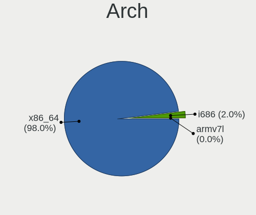
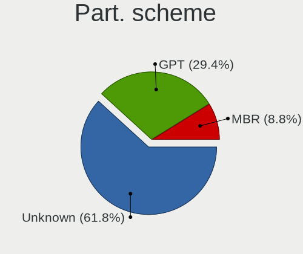
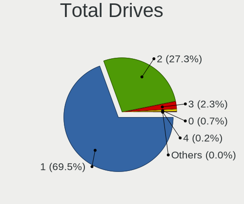
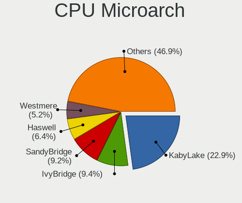
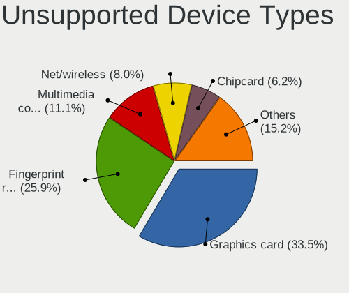

Linux in Brazil - Tested Hardware & Statistics (Notebooks)
----------------------------------------------------------

A project to collect tested hardware configurations for Linux in Brazil.

Anyone can contribute to this report by the [hw-probe](https://github.com/linuxhw/hw-probe) tool:

    sudo -E hw-probe -all -upload

Please contribute! Especially if your hardware is rare.

Contents
--------

* [ Test Cases ](#test-cases)

* [ System ](#system)
  - [ OS                       ](#os)
  - [ OS Family                ](#os-family)
  - [ Kernel                   ](#kernel)
  - [ Kernel Family            ](#kernel-family)
  - [ Kernel Major Ver.        ](#kernel-major-ver)
  - [ Arch                     ](#arch)
  - [ DE                       ](#de)
  - [ Display Server           ](#display-server)
  - [ Display Manager          ](#display-manager)
  - [ OS Lang                  ](#os-lang)
  - [ Boot Mode                ](#boot-mode)
  - [ Filesystem               ](#filesystem)
  - [ Part. scheme             ](#part-scheme)
  - [ Dual Boot with Linux/BSD ](#dual-boot-with-linuxbsd)
  - [ Dual Boot (Win)          ](#dual-boot-win)

* [ Board ](#board)
  - [ Vendor                   ](#vendor)
  - [ Model                    ](#model)
  - [ Model Family             ](#model-family)
  - [ MFG Year                 ](#mfg-year)
  - [ Form Factor              ](#form-factor)
  - [ Secure Boot              ](#secure-boot)
  - [ Coreboot                 ](#coreboot)
  - [ RAM Size                 ](#ram-size)
  - [ RAM Used                 ](#ram-used)
  - [ Total Drives             ](#total-drives)
  - [ Has CD-ROM               ](#has-cd-rom)
  - [ Has Ethernet             ](#has-ethernet)
  - [ Has WiFi                 ](#has-wifi)
  - [ Has Bluetooth            ](#has-bluetooth)

* [ Location ](#location)
  - [ Country                  ](#country)
  - [ City                     ](#city)

* [ Drives ](#drives)
  - [ Drive Vendor             ](#drive-vendor)
  - [ Drive Model              ](#drive-model)
  - [ HDD Vendor               ](#hdd-vendor)
  - [ SSD Vendor               ](#ssd-vendor)
  - [ Drive Kind               ](#drive-kind)
  - [ Drive Connector          ](#drive-connector)
  - [ Drive Size               ](#drive-size)
  - [ Space Total              ](#space-total)
  - [ Space Used               ](#space-used)
  - [ Malfunc. Drives          ](#malfunc-drives)
  - [ Malfunc. Drive Vendor    ](#malfunc-drive-vendor)
  - [ Malfunc. HDD Vendor      ](#malfunc-hdd-vendor)
  - [ Malfunc. Drive Kind      ](#malfunc-drive-kind)
  - [ Failed Drives            ](#failed-drives)
  - [ Failed Drive Vendor      ](#failed-drive-vendor)
  - [ Drive Status             ](#drive-status)

* [ Storage controller ](#storage-controller)
  - [ Storage Vendor           ](#storage-vendor)
  - [ Storage Model            ](#storage-model)
  - [ Storage Kind             ](#storage-kind)

* [ Processor ](#processor)
  - [ CPU Vendor               ](#cpu-vendor)
  - [ CPU Model                ](#cpu-model)
  - [ CPU Model Family         ](#cpu-model-family)
  - [ CPU Cores                ](#cpu-cores)
  - [ CPU Sockets              ](#cpu-sockets)
  - [ CPU Threads              ](#cpu-threads)
  - [ CPU Op-Modes             ](#cpu-op-modes)
  - [ CPU Microcode            ](#cpu-microcode)
  - [ CPU Microarch            ](#cpu-microarch)

* [ Graphics ](#graphics)
  - [ GPU Vendor               ](#gpu-vendor)
  - [ GPU Model                ](#gpu-model)
  - [ GPU Combo                ](#gpu-combo)
  - [ GPU Driver               ](#gpu-driver)
  - [ GPU Memory               ](#gpu-memory)

* [ Monitor ](#monitor)
  - [ Monitor Vendor           ](#monitor-vendor)
  - [ Monitor Model            ](#monitor-model)
  - [ Monitor Resolution       ](#monitor-resolution)
  - [ Monitor Diagonal         ](#monitor-diagonal)
  - [ Monitor Width            ](#monitor-width)
  - [ Aspect Ratio             ](#aspect-ratio)
  - [ Monitor Area             ](#monitor-area)
  - [ Pixel Density            ](#pixel-density)
  - [ Multiple Monitors        ](#multiple-monitors)

* [ Network ](#network)
  - [ Net Controller Vendor    ](#net-controller-vendor)
  - [ Net Controller Model     ](#net-controller-model)
  - [ Wireless Vendor          ](#wireless-vendor)
  - [ Wireless Model           ](#wireless-model)
  - [ Ethernet Vendor          ](#ethernet-vendor)
  - [ Ethernet Model           ](#ethernet-model)
  - [ Net Controller Kind      ](#net-controller-kind)
  - [ Used Controller          ](#used-controller)
  - [ NICs                     ](#nics)
  - [ IPv6                     ](#ipv6)

* [ Bluetooth ](#bluetooth)
  - [ Bluetooth Vendor         ](#bluetooth-vendor)
  - [ Bluetooth Model          ](#bluetooth-model)

* [ Sound ](#sound)
  - [ Sound Vendor             ](#sound-vendor)
  - [ Sound Model              ](#sound-model)

* [ Memory ](#memory)
  - [ Memory Vendor            ](#memory-vendor)
  - [ Memory Model             ](#memory-model)
  - [ Memory Kind              ](#memory-kind)
  - [ Memory Form Factor       ](#memory-form-factor)
  - [ Memory Size              ](#memory-size)
  - [ Memory Speed             ](#memory-speed)

* [ Printers & scanners ](#printers--scanners)
  - [ Printer Vendor           ](#printer-vendor)
  - [ Printer Model            ](#printer-model)
  - [ Scanner Vendor           ](#scanner-vendor)
  - [ Scanner Model            ](#scanner-model)

* [ Camera ](#camera)
  - [ Camera Vendor            ](#camera-vendor)
  - [ Camera Model             ](#camera-model)

* [ Security ](#security)
  - [ Fingerprint Vendor       ](#fingerprint-vendor)
  - [ Fingerprint Model        ](#fingerprint-model)
  - [ Chipcard Vendor          ](#chipcard-vendor)
  - [ Chipcard Model           ](#chipcard-model)

* [ Unsupported ](#unsupported)
  - [ Unsupported Devices      ](#unsupported-devices)
  - [ Unsupported Device Types ](#unsupported-device-types)

Test Cases
----------

Total: 13287

| Vendor        | Model                       | Probe                                                      | Date         |
|---------------|-----------------------------|------------------------------------------------------------|--------------|
| HP            | Pavilion dv6500             | [a9906a0a37](https://linux-hardware.org/?probe=a9906a0a37) | May 09, 2024 |
| LG Electro... | A410-G.BC44P1               | [e687d57757](https://linux-hardware.org/?probe=e687d57757) | May 09, 2024 |
| ASUSTek       | VivoBook_ASUSLaptop M150... | [b81a572516](https://linux-hardware.org/?probe=b81a572516) | May 09, 2024 |
| Lenovo        | IdeaPad 3 15ALC6 82MF       | [413b207df0](https://linux-hardware.org/?probe=413b207df0) | May 09, 2024 |
| Notebook      | NJx0MU                      | [ee086eec1f](https://linux-hardware.org/?probe=ee086eec1f) | May 09, 2024 |
| Sony          | VPCYB45JB                   | [6f70d22391](https://linux-hardware.org/?probe=6f70d22391) | May 09, 2024 |
| Dell          | Inspiron 13-7359            | [ed773eb204](https://linux-hardware.org/?probe=ed773eb204) | May 09, 2024 |
| Dell          | Inspiron 15-3567            | [4f2761bde5](https://linux-hardware.org/?probe=4f2761bde5) | May 09, 2024 |
| Ultra         | UB42X                       | [b7f2dbd777](https://linux-hardware.org/?probe=b7f2dbd777) | May 09, 2024 |
| Ultra         | UB42X                       | [4597d0586d](https://linux-hardware.org/?probe=4597d0586d) | May 08, 2024 |
| Avell High... | A70 MOB                     | [2be654083e](https://linux-hardware.org/?probe=2be654083e) | May 08, 2024 |
| ASUSTek       | ASUS TUF Gaming F15 FX50... | [7c01de63e1](https://linux-hardware.org/?probe=7c01de63e1) | May 08, 2024 |
| Samsung       | 270E5G/270E5U               | [11c56432a4](https://linux-hardware.org/?probe=11c56432a4) | May 08, 2024 |
| ASUSTek       | Q550LF                      | [15c9500499](https://linux-hardware.org/?probe=15c9500499) | May 07, 2024 |
| ASUSTek       | Q550LF                      | [98ddf90ae6](https://linux-hardware.org/?probe=98ddf90ae6) | May 07, 2024 |
| Samsung       | 530XBB                      | [5c0772cde4](https://linux-hardware.org/?probe=5c0772cde4) | May 07, 2024 |
| Daten Tecn... | DT02-M4                     | [88093023ed](https://linux-hardware.org/?probe=88093023ed) | May 07, 2024 |
| Apple         | MacBookPro8,1               | [abbe6a092c](https://linux-hardware.org/?probe=abbe6a092c) | May 07, 2024 |
| Apple         | MacBookPro8,1               | [dcd5e1e281](https://linux-hardware.org/?probe=dcd5e1e281) | May 07, 2024 |
| Unknown       | Unknown                     | [09d2748c7a](https://linux-hardware.org/?probe=09d2748c7a) | May 07, 2024 |
| ASUSTek       | S451LA                      | [f3720aa6f9](https://linux-hardware.org/?probe=f3720aa6f9) | May 07, 2024 |
| Alienware     | m15 R7                      | [445b29da20](https://linux-hardware.org/?probe=445b29da20) | May 06, 2024 |
| Acer          | Aspire E1-572               | [3df494e445](https://linux-hardware.org/?probe=3df494e445) | May 06, 2024 |
| Dell          | Latitude 5440               | [f6c9287953](https://linux-hardware.org/?probe=f6c9287953) | May 06, 2024 |
| Acer          | Nitro AN515-43              | [c65a5efcdb](https://linux-hardware.org/?probe=c65a5efcdb) | May 06, 2024 |
| Samsung       | 550XDA                      | [1ea7dfb8ae](https://linux-hardware.org/?probe=1ea7dfb8ae) | May 06, 2024 |
| Itautec       | Itautec                     | [cb012e89fc](https://linux-hardware.org/?probe=cb012e89fc) | May 06, 2024 |
| Itautec       | Itautec                     | [e1d6b279b9](https://linux-hardware.org/?probe=e1d6b279b9) | May 06, 2024 |
| Dell          | Inspiron N4050              | [0b1ac68bc9](https://linux-hardware.org/?probe=0b1ac68bc9) | May 06, 2024 |
| Dell          | Vostro 5471                 | [dae50714b1](https://linux-hardware.org/?probe=dae50714b1) | May 06, 2024 |
| Dell          | Vostro 5471                 | [92897b02b9](https://linux-hardware.org/?probe=92897b02b9) | May 06, 2024 |
| Samsung       | 370E4K                      | [f0c626e7ca](https://linux-hardware.org/?probe=f0c626e7ca) | May 05, 2024 |
| Positivo      | J14GL11                     | [71f761fa87](https://linux-hardware.org/?probe=71f761fa87) | May 05, 2024 |
| ASUSTek       | VivoBook_ASUSLaptop X515... | [278add8d07](https://linux-hardware.org/?probe=278add8d07) | May 05, 2024 |
| Acer          | Aspire A315-510P            | [802925480b](https://linux-hardware.org/?probe=802925480b) | May 05, 2024 |
| Dell          | Inspiron 7520               | [87c4f1733b](https://linux-hardware.org/?probe=87c4f1733b) | May 05, 2024 |
| Positivo      | S14CT01                     | [45c8a9d70b](https://linux-hardware.org/?probe=45c8a9d70b) | May 04, 2024 |
| Positivo      | S14CT01                     | [f2994ff445](https://linux-hardware.org/?probe=f2994ff445) | May 04, 2024 |
| Samsung       | 270E5J/2570EJ               | [1349bac413](https://linux-hardware.org/?probe=1349bac413) | May 04, 2024 |
| Dell          | Vostro 15 5510              | [a3b2e8da38](https://linux-hardware.org/?probe=a3b2e8da38) | May 04, 2024 |
| Positivo      | 115T0810HN1C                | [1f932ed3b4](https://linux-hardware.org/?probe=1f932ed3b4) | May 03, 2024 |
| Itautec       | Infoway w7730               | [65fba1a766](https://linux-hardware.org/?probe=65fba1a766) | May 03, 2024 |
| Lenovo        | IdeaPad S145-15IWL 81S9     | [eb0a05de27](https://linux-hardware.org/?probe=eb0a05de27) | May 03, 2024 |
| Sony          | SVS13A25PBS                 | [32dc3304ac](https://linux-hardware.org/?probe=32dc3304ac) | May 02, 2024 |
| HP            | Pavilion g4                 | [d8f20744c2](https://linux-hardware.org/?probe=d8f20744c2) | May 02, 2024 |
| Dell          | Inspiron 3501               | [a2ef1e08ed](https://linux-hardware.org/?probe=a2ef1e08ed) | May 02, 2024 |
| Lenovo        | G400s VILG1                 | [f604dc3e58](https://linux-hardware.org/?probe=f604dc3e58) | May 02, 2024 |
| Alienware     | x17 R2                      | [4a80e449db](https://linux-hardware.org/?probe=4a80e449db) | May 02, 2024 |
| Lenovo        | IdeaPad S145-15IIL 82DJ     | [0656624c78](https://linux-hardware.org/?probe=0656624c78) | May 02, 2024 |
| HP            | Pavilion dv6500             | [ad0b9eaa92](https://linux-hardware.org/?probe=ad0b9eaa92) | May 02, 2024 |
| Dell          | Vostro 5402                 | [34a28e5fd3](https://linux-hardware.org/?probe=34a28e5fd3) | May 01, 2024 |
| Alienware     | x17 R2                      | [a98affb69b](https://linux-hardware.org/?probe=a98affb69b) | May 01, 2024 |
| Lenovo        | IdeaPad S145-15IWL 81S9     | [890bf7c3a6](https://linux-hardware.org/?probe=890bf7c3a6) | May 01, 2024 |
| Acer          | Swift SF514-56T             | [0d461b4a29](https://linux-hardware.org/?probe=0d461b4a29) | May 01, 2024 |
| ASUSTek       | VivoBook_ASUSLaptop X512... | [ad08810e0e](https://linux-hardware.org/?probe=ad08810e0e) | May 01, 2024 |
| Lenovo        | IdeaPad P400 Touch 20211    | [cacd80cba3](https://linux-hardware.org/?probe=cacd80cba3) | May 01, 2024 |
| Lenovo        | IdeaPad S145-15IWL 81S9     | [6c6c6b3f93](https://linux-hardware.org/?probe=6c6c6b3f93) | May 01, 2024 |
| ASUSTek       | VivoBook_ASUSLaptop X515... | [badf656eaf](https://linux-hardware.org/?probe=badf656eaf) | May 01, 2024 |
| HP            | G42                         | [6c3591bf85](https://linux-hardware.org/?probe=6c3591bf85) | Apr 30, 2024 |
| HP            | G42                         | [577968802f](https://linux-hardware.org/?probe=577968802f) | Apr 30, 2024 |
| Lenovo        | IdeaPad S145-15IWL 81S9     | [e7b0c31433](https://linux-hardware.org/?probe=e7b0c31433) | Apr 30, 2024 |
| Lenovo        | IdeaPad S145-15IWL 81S9     | [83497aeda8](https://linux-hardware.org/?probe=83497aeda8) | Apr 30, 2024 |
| Lenovo        | IdeaPad 320-15IKB 80YH      | [d8017ef206](https://linux-hardware.org/?probe=d8017ef206) | Apr 30, 2024 |
| Lenovo        | IdeaPad 320-15IKB 80YH      | [7cc4d5fb6b](https://linux-hardware.org/?probe=7cc4d5fb6b) | Apr 30, 2024 |
| Samsung       | 550XDA                      | [6cf8613d4e](https://linux-hardware.org/?probe=6cf8613d4e) | Apr 30, 2024 |
| HP            | Mini 210-1000               | [f44ded04c1](https://linux-hardware.org/?probe=f44ded04c1) | Apr 29, 2024 |
| Dell          | Vostro 14-3468              | [4d24830aa0](https://linux-hardware.org/?probe=4d24830aa0) | Apr 29, 2024 |
| Acer          | Aspire A315-32              | [452883ee31](https://linux-hardware.org/?probe=452883ee31) | Apr 29, 2024 |
| Dell          | Inspiron 3442               | [05db1722f8](https://linux-hardware.org/?probe=05db1722f8) | Apr 29, 2024 |
| Samsung       | 550XDA                      | [24b83d160f](https://linux-hardware.org/?probe=24b83d160f) | Apr 29, 2024 |
| Alienware     | m15 R7                      | [ab03c1cde2](https://linux-hardware.org/?probe=ab03c1cde2) | Apr 29, 2024 |
| ASUSTek       | X451CA                      | [30d9b5f4ee](https://linux-hardware.org/?probe=30d9b5f4ee) | Apr 28, 2024 |
| Avell High... | Avell G1513 MUV / A52 MU... | [2abfc3ebc0](https://linux-hardware.org/?probe=2abfc3ebc0) | Apr 28, 2024 |
| Dell          | Latitude E6410              | [14cad1b34b](https://linux-hardware.org/?probe=14cad1b34b) | Apr 28, 2024 |
| Lenovo        | IdeaPad Gaming 3 15IMH05... | [bb0733cb2a](https://linux-hardware.org/?probe=bb0733cb2a) | Apr 28, 2024 |
| Acer          | Aspire 5733                 | [f7af5c9308](https://linux-hardware.org/?probe=f7af5c9308) | Apr 27, 2024 |
| Lenovo        | IdeaPad G485 QAWGE          | [364be8242a](https://linux-hardware.org/?probe=364be8242a) | Apr 27, 2024 |
| Lenovo        | ThinkPad X61 76754KU        | [1a083b94dc](https://linux-hardware.org/?probe=1a083b94dc) | Apr 27, 2024 |
| Lenovo        | Legion 5 15IMH05H 82CF      | [46b36289be](https://linux-hardware.org/?probe=46b36289be) | Apr 27, 2024 |
| Samsung       | 550XDA                      | [de2396f0a2](https://linux-hardware.org/?probe=de2396f0a2) | Apr 27, 2024 |
| Lenovo        | ThinkPad E14 Gen 3 20YD0... | [b52a110875](https://linux-hardware.org/?probe=b52a110875) | Apr 27, 2024 |
| Lenovo        | ThinkPad P52 20MAS04M23     | [3cc3f4dcc1](https://linux-hardware.org/?probe=3cc3f4dcc1) | Apr 27, 2024 |
| ASUSTek       | K45A                        | [7bed7e12ab](https://linux-hardware.org/?probe=7bed7e12ab) | Apr 27, 2024 |
| Lenovo        | IdeaPad S145-15API 81V7     | [d815a3ca77](https://linux-hardware.org/?probe=d815a3ca77) | Apr 26, 2024 |
| Lenovo        | IdeaPad S145-15API 81V7     | [079540b490](https://linux-hardware.org/?probe=079540b490) | Apr 26, 2024 |
| Dell          | Inspiron 1525               | [c609a3560c](https://linux-hardware.org/?probe=c609a3560c) | Apr 26, 2024 |
| Positivo      | S15SL                       | [7eeb7b8841](https://linux-hardware.org/?probe=7eeb7b8841) | Apr 26, 2024 |
| Positivo      | S15SL                       | [94429966a7](https://linux-hardware.org/?probe=94429966a7) | Apr 26, 2024 |
| Valve         | Jupiter                     | [5430bf31d1](https://linux-hardware.org/?probe=5430bf31d1) | Apr 26, 2024 |
| Valve         | Jupiter                     | [81ec451d66](https://linux-hardware.org/?probe=81ec451d66) | Apr 26, 2024 |
| Apple         | MacBookPro9,2               | [583ea6bc03](https://linux-hardware.org/?probe=583ea6bc03) | Apr 25, 2024 |
| Acer          | Aspire A315-510P            | [d30b9a7a06](https://linux-hardware.org/?probe=d30b9a7a06) | Apr 25, 2024 |
| ASUSTek       | VivoBook_ASUSLaptop M150... | [6230432bc4](https://linux-hardware.org/?probe=6230432bc4) | Apr 25, 2024 |
| Acer          | Aspire A315-33              | [5f7edad747](https://linux-hardware.org/?probe=5f7edad747) | Apr 25, 2024 |
| Acer          | Aspire A315-33              | [8f762b36cd](https://linux-hardware.org/?probe=8f762b36cd) | Apr 25, 2024 |
| Dell          | Inspiron 15 3515            | [cd29a525ed](https://linux-hardware.org/?probe=cd29a525ed) | Apr 24, 2024 |
| Dell          | Inspiron N4050              | [cbcc357ce6](https://linux-hardware.org/?probe=cbcc357ce6) | Apr 24, 2024 |
| Samsung       | 550XDA                      | [7d2c852ee6](https://linux-hardware.org/?probe=7d2c852ee6) | Apr 24, 2024 |
| Toshiba       | STI NI 1401                 | [caed126d9e](https://linux-hardware.org/?probe=caed126d9e) | Apr 24, 2024 |
| Lenovo        | ThinkPad P16s Gen 2 21K9... | [ac5431b1ee](https://linux-hardware.org/?probe=ac5431b1ee) | Apr 24, 2024 |
| Unknown       | F42                         | [947c137825](https://linux-hardware.org/?probe=947c137825) | Apr 23, 2024 |
| Lenovo        | IdeaPad Gaming 3 15IMH05... | [6f01a069fa](https://linux-hardware.org/?probe=6f01a069fa) | Apr 23, 2024 |
| Dell          | Vostro 15 5510              | [aedc6ae848](https://linux-hardware.org/?probe=aedc6ae848) | Apr 23, 2024 |
| Acer          | Aspire A315-24P             | [9145d16c0f](https://linux-hardware.org/?probe=9145d16c0f) | Apr 22, 2024 |
| Apple         | MacBookPro14,1              | [743a3ab71e](https://linux-hardware.org/?probe=743a3ab71e) | Apr 22, 2024 |
| Samsung       | 300E5EV/300E4EV/270E5EV/... | [e499f5d301](https://linux-hardware.org/?probe=e499f5d301) | Apr 22, 2024 |
| Itautec       | Infoway w7730               | [904234ad57](https://linux-hardware.org/?probe=904234ad57) | Apr 22, 2024 |
| Positivo      | S14SL01                     | [4840897917](https://linux-hardware.org/?probe=4840897917) | Apr 21, 2024 |
| HP            | Pavilion dm4                | [a22add80ac](https://linux-hardware.org/?probe=a22add80ac) | Apr 21, 2024 |
| HP            | Pavilion dm4                | [5f731468da](https://linux-hardware.org/?probe=5f731468da) | Apr 21, 2024 |
| Lenovo        | G470 20078                  | [63d40af7a3](https://linux-hardware.org/?probe=63d40af7a3) | Apr 21, 2024 |
| Positivo      | Mobile                      | [c74545679c](https://linux-hardware.org/?probe=c74545679c) | Apr 20, 2024 |
| ASUSTek       | VivoBook_ASUSLaptop K360... | [9e43e9df38](https://linux-hardware.org/?probe=9e43e9df38) | Apr 19, 2024 |
| Lenovo        | G480 20149                  | [ad23e3678b](https://linux-hardware.org/?probe=ad23e3678b) | Apr 19, 2024 |
| Dell          | G15 5530                    | [c1f49dc2d9](https://linux-hardware.org/?probe=c1f49dc2d9) | Apr 19, 2024 |
| Dell          | Inspiron N4050              | [c35c8bb833](https://linux-hardware.org/?probe=c35c8bb833) | Apr 19, 2024 |
| Dell          | Inspiron N4050              | [0e75a1591d](https://linux-hardware.org/?probe=0e75a1591d) | Apr 19, 2024 |
| Acer          | Predator PH315-52           | [62dede0f49](https://linux-hardware.org/?probe=62dede0f49) | Apr 19, 2024 |
| Acer          | V5-171                      | [1c5fdb6bae](https://linux-hardware.org/?probe=1c5fdb6bae) | Apr 18, 2024 |
| Lenovo        | Slim Pro 9 14IRP8 83BV      | [7b5eee5473](https://linux-hardware.org/?probe=7b5eee5473) | Apr 18, 2024 |
| Samsung       | 960XFH                      | [ebd54da0c3](https://linux-hardware.org/?probe=ebd54da0c3) | Apr 17, 2024 |
| Dell          | Latitude 5310               | [e46914e458](https://linux-hardware.org/?probe=e46914e458) | Apr 17, 2024 |
| Acer          | Nitro AN515-45              | [224785342d](https://linux-hardware.org/?probe=224785342d) | Apr 17, 2024 |
| Lenovo        | 100-14IBY 80R7              | [c186027176](https://linux-hardware.org/?probe=c186027176) | Apr 17, 2024 |
| Dell          | Inspiron 5547               | [695c284c67](https://linux-hardware.org/?probe=695c284c67) | Apr 17, 2024 |
| Valve         | Jupiter                     | [d5c75e66f1](https://linux-hardware.org/?probe=d5c75e66f1) | Apr 16, 2024 |
| Lenovo        | G480 20149                  | [4acc655121](https://linux-hardware.org/?probe=4acc655121) | Apr 16, 2024 |
| Dell          | Inspiron 7520               | [9f294b2198](https://linux-hardware.org/?probe=9f294b2198) | Apr 16, 2024 |
| ASUSTek       | VivoBook_ASUSLaptop X515... | [d4e5c0b729](https://linux-hardware.org/?probe=d4e5c0b729) | Apr 16, 2024 |
| Dell          | Inspiron 5547               | [088cb90432](https://linux-hardware.org/?probe=088cb90432) | Apr 16, 2024 |
| Sony          | SVE14A16FBW                 | [7f4b9fd407](https://linux-hardware.org/?probe=7f4b9fd407) | Apr 16, 2024 |
| ASUSTek       | VivoBook_ASUSLaptop X515... | [9f9dc48ef8](https://linux-hardware.org/?probe=9f9dc48ef8) | Apr 15, 2024 |
| Acer          | Aspire A515-51              | [7ff3e868b5](https://linux-hardware.org/?probe=7ff3e868b5) | Apr 15, 2024 |
| Dell          | G15 5525                    | [74c6d6a8f8](https://linux-hardware.org/?probe=74c6d6a8f8) | Apr 15, 2024 |
| Dell          | Inspiron 5566               | [b766f56874](https://linux-hardware.org/?probe=b766f56874) | Apr 15, 2024 |
| Acer          | Nitro AN515-51              | [46d9c6bc98](https://linux-hardware.org/?probe=46d9c6bc98) | Apr 14, 2024 |
| Dell          | Latitude 3440               | [e334ba82e5](https://linux-hardware.org/?probe=e334ba82e5) | Apr 14, 2024 |
| Dell          | Latitude 3440               | [77e2af784e](https://linux-hardware.org/?probe=77e2af784e) | Apr 14, 2024 |
| Sony          | SVF14A15CLB                 | [473cac0cd4](https://linux-hardware.org/?probe=473cac0cd4) | Apr 14, 2024 |
| Dell          | G15 5530                    | [b44b0fd700](https://linux-hardware.org/?probe=b44b0fd700) | Apr 14, 2024 |
| Dell          | Inspiron 3721               | [49aec34132](https://linux-hardware.org/?probe=49aec34132) | Apr 13, 2024 |
| Acer          | Aspire 5733                 | [3451c7aac4](https://linux-hardware.org/?probe=3451c7aac4) | Apr 13, 2024 |
| ASUSTek       | X451MA                      | [8e0f92ef8c](https://linux-hardware.org/?probe=8e0f92ef8c) | Apr 13, 2024 |
| HP            | Folio 13                    | [2112e4d193](https://linux-hardware.org/?probe=2112e4d193) | Apr 13, 2024 |
| Dell          | G15 5530                    | [cbc77bc17c](https://linux-hardware.org/?probe=cbc77bc17c) | Apr 13, 2024 |
| Acer          | Aspire A315-41              | [df30810cbe](https://linux-hardware.org/?probe=df30810cbe) | Apr 13, 2024 |
| Sony          | VPCEH30EB                   | [a3ce44d34f](https://linux-hardware.org/?probe=a3ce44d34f) | Apr 12, 2024 |
| Samsung       | 550XDA                      | [2679015030](https://linux-hardware.org/?probe=2679015030) | Apr 12, 2024 |
| Dell          | G15 5525                    | [7842ec2d68](https://linux-hardware.org/?probe=7842ec2d68) | Apr 12, 2024 |
| Samsung       | 370E4K                      | [362fb05bf2](https://linux-hardware.org/?probe=362fb05bf2) | Apr 12, 2024 |
| Samsung       | 550XDA                      | [ac02b37e1d](https://linux-hardware.org/?probe=ac02b37e1d) | Apr 12, 2024 |
| Dell          | G15 5510                    | [9820798256](https://linux-hardware.org/?probe=9820798256) | Apr 12, 2024 |
| HP            | 240 G2                      | [330b73b67e](https://linux-hardware.org/?probe=330b73b67e) | Apr 12, 2024 |
| Lenovo        | IdeaPad 110-14IBR 80UJ      | [ed5c941b3f](https://linux-hardware.org/?probe=ed5c941b3f) | Apr 12, 2024 |
| Acer          | Nitro AN515-43              | [36bf325205](https://linux-hardware.org/?probe=36bf325205) | Apr 12, 2024 |
| HP            | 15 Notebook PC              | [875d44f61b](https://linux-hardware.org/?probe=875d44f61b) | Apr 12, 2024 |
| Dell          | Inspiron 15-3567            | [ce468a8cb4](https://linux-hardware.org/?probe=ce468a8cb4) | Apr 12, 2024 |
| HP            | ProBook 6360b               | [81b9d0706b](https://linux-hardware.org/?probe=81b9d0706b) | Apr 11, 2024 |
| Dell          | Inspiron 3576               | [bfe2a1295a](https://linux-hardware.org/?probe=bfe2a1295a) | Apr 11, 2024 |
| Positivo      | J14KR11                     | [f6a61def89](https://linux-hardware.org/?probe=f6a61def89) | Apr 11, 2024 |
| ASUSTek       | X550LA                      | [fdc043786b](https://linux-hardware.org/?probe=fdc043786b) | Apr 11, 2024 |
| Avell High... | Avell G1513 MUV / A52 MU... | [839c6f47f8](https://linux-hardware.org/?probe=839c6f47f8) | Apr 11, 2024 |
| Dell          | Vostro 2421                 | [0ba1cc79bc](https://linux-hardware.org/?probe=0ba1cc79bc) | Apr 10, 2024 |
| Dell          | Vostro 2421                 | [905003a077](https://linux-hardware.org/?probe=905003a077) | Apr 10, 2024 |
| Lenovo        | IdeaPad S145-15IIL 82DJ     | [9b695f494c](https://linux-hardware.org/?probe=9b695f494c) | Apr 10, 2024 |
| Dell          | Inspiron 15-3567            | [0b670a40da](https://linux-hardware.org/?probe=0b670a40da) | Apr 10, 2024 |
| Dell          | Inspiron 15-3567            | [657780c9cf](https://linux-hardware.org/?probe=657780c9cf) | Apr 09, 2024 |
| Unknown       | Unknown                     | [5f24c3f8d5](https://linux-hardware.org/?probe=5f24c3f8d5) | Apr 09, 2024 |
| ASUSTek       | VivoBook_ASUSLaptop X512... | [24377a30f1](https://linux-hardware.org/?probe=24377a30f1) | Apr 09, 2024 |
| ASUSTek       | VivoBook_ASUSLaptop X512... | [fbf6dbe5f2](https://linux-hardware.org/?probe=fbf6dbe5f2) | Apr 09, 2024 |
| HP            | Mini 210-1000               | [0afce35d6b](https://linux-hardware.org/?probe=0afce35d6b) | Apr 09, 2024 |
| Quanta        | QL3 TBD                     | [0f0abe3406](https://linux-hardware.org/?probe=0f0abe3406) | Apr 09, 2024 |
| Philco        | 14I                         | [c7ac543990](https://linux-hardware.org/?probe=c7ac543990) | Apr 09, 2024 |
| ASUSTek       | X550LA                      | [eb0300d0da](https://linux-hardware.org/?probe=eb0300d0da) | Apr 08, 2024 |
| Dell          | Latitude E5440              | [0a699f11f9](https://linux-hardware.org/?probe=0a699f11f9) | Apr 08, 2024 |
| MSI           | PR600                       | [ae78fa3936](https://linux-hardware.org/?probe=ae78fa3936) | Apr 08, 2024 |
| Lenovo        | IdeaPad 3 15ALC6 82MF       | [38e6d94c4b](https://linux-hardware.org/?probe=38e6d94c4b) | Apr 08, 2024 |
| Lenovo        | IdeaPad 3 15ALC6 82MF       | [3430881bac](https://linux-hardware.org/?probe=3430881bac) | Apr 08, 2024 |
| Dell          | Latitude E5440              | [babec5f894](https://linux-hardware.org/?probe=babec5f894) | Apr 08, 2024 |
| HP            | ProBook 4440s               | [f0a2427210](https://linux-hardware.org/?probe=f0a2427210) | Apr 08, 2024 |
| Lenovo        | IdeaPad 110-15IBR 80W2      | [ad8752e70f](https://linux-hardware.org/?probe=ad8752e70f) | Apr 07, 2024 |
| Notebook      | NJx0MU                      | [e8546100eb](https://linux-hardware.org/?probe=e8546100eb) | Apr 07, 2024 |
| Dell          | Inspiron 3443               | [0794f7cac6](https://linux-hardware.org/?probe=0794f7cac6) | Apr 07, 2024 |
| Valve         | Jupiter                     | [36089b579d](https://linux-hardware.org/?probe=36089b579d) | Apr 07, 2024 |
| Unknown       | Unknown                     | [ab6d1d60f8](https://linux-hardware.org/?probe=ab6d1d60f8) | Apr 07, 2024 |
| Sony          | VPCEA3UFX                   | [78c3a51c50](https://linux-hardware.org/?probe=78c3a51c50) | Apr 07, 2024 |
| Sony          | VPCEA3UFX                   | [e3907afc62](https://linux-hardware.org/?probe=e3907afc62) | Apr 07, 2024 |
| Positivo      | S14BW01                     | [c47eb17b8e](https://linux-hardware.org/?probe=c47eb17b8e) | Apr 07, 2024 |
| Alienware     | M11x                        | [46d76b27a2](https://linux-hardware.org/?probe=46d76b27a2) | Apr 06, 2024 |
| Timi          | RedmiBook Pro 14S           | [31ba113e59](https://linux-hardware.org/?probe=31ba113e59) | Apr 06, 2024 |
| Login Info... | LOG-M301H                   | [85373f9f2b](https://linux-hardware.org/?probe=85373f9f2b) | Apr 06, 2024 |
| Intel         | HuronRiver Platform         | [aa62416169](https://linux-hardware.org/?probe=aa62416169) | Apr 06, 2024 |
| Samsung       | RV411/RV511/E3511/S3511/... | [872085ccb5](https://linux-hardware.org/?probe=872085ccb5) | Apr 06, 2024 |
| Unknown       | Unknown                     | [f99dfc4c8c](https://linux-hardware.org/?probe=f99dfc4c8c) | Apr 06, 2024 |
| Acer          | Aspire E5-571G              | [c43dd19a4d](https://linux-hardware.org/?probe=c43dd19a4d) | Apr 06, 2024 |
| Acer          | Aspire 3690                 | [a3091a1ceb](https://linux-hardware.org/?probe=a3091a1ceb) | Apr 06, 2024 |
| Avell High... | B.ON                        | [9070104d8b](https://linux-hardware.org/?probe=9070104d8b) | Apr 05, 2024 |
| ASUSTek       | VivoBook_ASUSLaptop X515... | [8cc539a26d](https://linux-hardware.org/?probe=8cc539a26d) | Apr 05, 2024 |
| Dell          | Latitude 7490               | [4f520772ca](https://linux-hardware.org/?probe=4f520772ca) | Apr 05, 2024 |
| Lenovo        | ThinkPad L14 Gen 3 21C60... | [81925bcc23](https://linux-hardware.org/?probe=81925bcc23) | Apr 05, 2024 |
| Dell          | Inspiron 5448               | [61862de5ae](https://linux-hardware.org/?probe=61862de5ae) | Apr 05, 2024 |
| Positivo      | S14CT01                     | [bccc1bda0b](https://linux-hardware.org/?probe=bccc1bda0b) | Apr 05, 2024 |
| Samsung       | 530U3C/530U4C/532U3C        | [134adc8004](https://linux-hardware.org/?probe=134adc8004) | Apr 05, 2024 |
| Digibras      | CL341                       | [7cc99d85ef](https://linux-hardware.org/?probe=7cc99d85ef) | Apr 04, 2024 |
| Lenovo        | IdeaPad 330-17IKB 81DM      | [3662d6cc3b](https://linux-hardware.org/?probe=3662d6cc3b) | Apr 04, 2024 |
| Lenovo        | IdeaPad 330-17IKB 81DM      | [1d78723489](https://linux-hardware.org/?probe=1d78723489) | Apr 04, 2024 |
| Dell          | Inspiron 3721               | [bea7567e40](https://linux-hardware.org/?probe=bea7567e40) | Apr 04, 2024 |
| Dell          | Inspiron 5566               | [a22633719c](https://linux-hardware.org/?probe=a22633719c) | Apr 04, 2024 |
| Digibras      | CL341                       | [da58ad0afb](https://linux-hardware.org/?probe=da58ad0afb) | Apr 04, 2024 |
| Dell          | Latitude E5440              | [98d9e8d96d](https://linux-hardware.org/?probe=98d9e8d96d) | Apr 04, 2024 |
| ASUSTek       | K42F                        | [73ef819d0c](https://linux-hardware.org/?probe=73ef819d0c) | Apr 04, 2024 |
| Sony          | VPCS131FM                   | [6065941e59](https://linux-hardware.org/?probe=6065941e59) | Apr 04, 2024 |
| Notebook      | NJx0MU                      | [4f2bc03aca](https://linux-hardware.org/?probe=4f2bc03aca) | Apr 04, 2024 |
| Lenovo        | IdeaPad 3 15ALC6 82MF       | [9ae8603096](https://linux-hardware.org/?probe=9ae8603096) | Apr 03, 2024 |
| Positivo      | C14CR01                     | [a707fed87d](https://linux-hardware.org/?probe=a707fed87d) | Apr 03, 2024 |
| Dell          | Vostro 3520                 | [2dbcd4c125](https://linux-hardware.org/?probe=2dbcd4c125) | Apr 03, 2024 |
| Positivo      | Master N8340                | [03fe191f29](https://linux-hardware.org/?probe=03fe191f29) | Apr 03, 2024 |
| Dell          | G3 3579                     | [a59eaf07a6](https://linux-hardware.org/?probe=a59eaf07a6) | Apr 03, 2024 |
| Dell          | Latitude E6220              | [a795975b1e](https://linux-hardware.org/?probe=a795975b1e) | Apr 02, 2024 |
| Dell          | Latitude 3540               | [452a3babe4](https://linux-hardware.org/?probe=452a3babe4) | Apr 02, 2024 |
| Avell High... | B.ON                        | [27a4a2ab6d](https://linux-hardware.org/?probe=27a4a2ab6d) | Apr 02, 2024 |
| Apple         | MacBookPro12,1              | [25dad77212](https://linux-hardware.org/?probe=25dad77212) | Apr 02, 2024 |
| Toshiba       | IS 1414                     | [ed4c6a96f7](https://linux-hardware.org/?probe=ed4c6a96f7) | Apr 02, 2024 |
| Philco        | 14H                         | [93e4cd1668](https://linux-hardware.org/?probe=93e4cd1668) | Apr 02, 2024 |
| Dell          | G15 5525                    | [761f9399bc](https://linux-hardware.org/?probe=761f9399bc) | Apr 02, 2024 |
| Avell High... | A62 LIV                     | [a7d1ceac6e](https://linux-hardware.org/?probe=a7d1ceac6e) | Apr 02, 2024 |
| Dell          | Latitude 3540               | [11fa6df76e](https://linux-hardware.org/?probe=11fa6df76e) | Apr 01, 2024 |
| Lenovo        | G470 20078                  | [191de11ee9](https://linux-hardware.org/?probe=191de11ee9) | Apr 01, 2024 |
| Dell          | Inspiron 5448               | [34d0f4de88](https://linux-hardware.org/?probe=34d0f4de88) | Apr 01, 2024 |
| Samsung       | RV411/RV511/E3511/S3511/... | [647f73c4ba](https://linux-hardware.org/?probe=647f73c4ba) | Apr 01, 2024 |
| Dell          | Inspiron 5458               | [ca0954019d](https://linux-hardware.org/?probe=ca0954019d) | Mar 31, 2024 |
| HP            | Presario CQ43               | [194f843d4b](https://linux-hardware.org/?probe=194f843d4b) | Mar 31, 2024 |
| BANGHO        | BES G0304                   | [0076ea4f99](https://linux-hardware.org/?probe=0076ea4f99) | Mar 31, 2024 |
| Samsung       | 270E5G/270E5U               | [f29778819d](https://linux-hardware.org/?probe=f29778819d) | Mar 31, 2024 |
| Lenovo        | IdeaPad 3 15ALC6 82MF       | [a0a6ed01a8](https://linux-hardware.org/?probe=a0a6ed01a8) | Mar 31, 2024 |
| Samsung       | RV415                       | [24a62a71a5](https://linux-hardware.org/?probe=24a62a71a5) | Mar 30, 2024 |
| Avell High... | B.ON                        | [577f3c12bf](https://linux-hardware.org/?probe=577f3c12bf) | Mar 30, 2024 |
| Lenovo        | Legion Y540-15IRH 81RJ      | [1daccd6fd0](https://linux-hardware.org/?probe=1daccd6fd0) | Mar 30, 2024 |
| Acer          | Aspire E5-573               | [e8626b5548](https://linux-hardware.org/?probe=e8626b5548) | Mar 30, 2024 |
| Lenovo        | IdeaPad Gaming 3 15IHU6 ... | [7749361e37](https://linux-hardware.org/?probe=7749361e37) | Mar 30, 2024 |
| Lenovo        | IdeaPad 3 15ITL6 82MD       | [b56fd43be2](https://linux-hardware.org/?probe=b56fd43be2) | Mar 30, 2024 |
| Alienware     | 15 R2                       | [2b6cb8a942](https://linux-hardware.org/?probe=2b6cb8a942) | Mar 29, 2024 |
| ASUSTek       | S451LA                      | [bc6298d214](https://linux-hardware.org/?probe=bc6298d214) | Mar 29, 2024 |
| Alienware     | 15 R2                       | [de21034f41](https://linux-hardware.org/?probe=de21034f41) | Mar 29, 2024 |
| Lenovo        | IdeaPad Gaming 3 15IMH05... | [9d668bab07](https://linux-hardware.org/?probe=9d668bab07) | Mar 29, 2024 |
| Dell          | Inspiron 5423               | [0c6c4c6a58](https://linux-hardware.org/?probe=0c6c4c6a58) | Mar 29, 2024 |
| Lenovo        | IdeaPad S145-15API 81V7     | [7e9163e0f0](https://linux-hardware.org/?probe=7e9163e0f0) | Mar 29, 2024 |
| Positivo      | S15SL                       | [4a479bd2b9](https://linux-hardware.org/?probe=4a479bd2b9) | Mar 28, 2024 |
| LG Electro... | S460-G.BG41P1               | [a2a99943f1](https://linux-hardware.org/?probe=a2a99943f1) | Mar 28, 2024 |
| ASUSTek       | Z450UA                      | [13ee658c0e](https://linux-hardware.org/?probe=13ee658c0e) | Mar 28, 2024 |
| Acer          | Aspire 4349                 | [8bf51e5557](https://linux-hardware.org/?probe=8bf51e5557) | Mar 28, 2024 |
| ASUSTek       | VivoBook_ASUSLaptop M150... | [951f003b12](https://linux-hardware.org/?probe=951f003b12) | Mar 28, 2024 |
| Samsung       | RV411/RV511/E3511/S3511/... | [08bb97803b](https://linux-hardware.org/?probe=08bb97803b) | Mar 27, 2024 |
| Dell          | Latitude 3410               | [3aee33bb58](https://linux-hardware.org/?probe=3aee33bb58) | Mar 27, 2024 |
| Dell          | G15 5530                    | [e2421ca4e6](https://linux-hardware.org/?probe=e2421ca4e6) | Mar 27, 2024 |
| Samsung       | RV411/RV511/E3511/S3511/... | [432c806a52](https://linux-hardware.org/?probe=432c806a52) | Mar 27, 2024 |
| HP            | G42                         | [cecc4382e7](https://linux-hardware.org/?probe=cecc4382e7) | Mar 27, 2024 |
| Sony          | SVS13A25PBS                 | [6ee5930fa8](https://linux-hardware.org/?probe=6ee5930fa8) | Mar 27, 2024 |
| Lenovo        | IdeaPad S145-15IIL 82DJ     | [a089051410](https://linux-hardware.org/?probe=a089051410) | Mar 26, 2024 |
| Samsung       | 550XED                      | [ab624683ca](https://linux-hardware.org/?probe=ab624683ca) | Mar 26, 2024 |
| Dell          | Inspiron 5520               | [27255ef603](https://linux-hardware.org/?probe=27255ef603) | Mar 26, 2024 |
| Notebook      | N85_N87,HJ,HJ1,HK1          | [0c82d13ac8](https://linux-hardware.org/?probe=0c82d13ac8) | Mar 26, 2024 |
| Apple         | MacBookPro8,1               | [343977b6e1](https://linux-hardware.org/?probe=343977b6e1) | Mar 26, 2024 |
| ASUSTek       | VivoBook_ASUSLaptop M150... | [2f1729ec9e](https://linux-hardware.org/?probe=2f1729ec9e) | Mar 26, 2024 |
| Apple         | MacBookPro8,1               | [3bb66ab23c](https://linux-hardware.org/?probe=3bb66ab23c) | Mar 26, 2024 |
| Dell          | Inspiron N5110              | [797b6572e3](https://linux-hardware.org/?probe=797b6572e3) | Mar 26, 2024 |
| Dell          | Inspiron 5557               | [34a0a8f527](https://linux-hardware.org/?probe=34a0a8f527) | Mar 26, 2024 |
| Unknown       | Unknown                     | [f39e53816d](https://linux-hardware.org/?probe=f39e53816d) | Mar 25, 2024 |
| HP            | Folio 13                    | [982ad443c6](https://linux-hardware.org/?probe=982ad443c6) | Mar 25, 2024 |
| Dell          | G15 5525                    | [504ff7b25b](https://linux-hardware.org/?probe=504ff7b25b) | Mar 25, 2024 |
| Toshiba       | IS 1413G                    | [782f26bdde](https://linux-hardware.org/?probe=782f26bdde) | Mar 25, 2024 |
| Gateway       | NE56R                       | [b2b46439db](https://linux-hardware.org/?probe=b2b46439db) | Mar 25, 2024 |
| HP            | ProBook 645 G1              | [62db4c657a](https://linux-hardware.org/?probe=62db4c657a) | Mar 24, 2024 |
| Lenovo        | IdeaPad 1 15AMN7 82X5       | [f047c09f26](https://linux-hardware.org/?probe=f047c09f26) | Mar 24, 2024 |
| ASUSTek       | VivoBook_ASUSLaptop X515... | [4f333791ed](https://linux-hardware.org/?probe=4f333791ed) | Mar 23, 2024 |
| Samsung       | 300E5EV/300E4EV/270E5EV/... | [42a2c2872a](https://linux-hardware.org/?probe=42a2c2872a) | Mar 23, 2024 |
| Positivo      | Q232A                       | [46c3ff72eb](https://linux-hardware.org/?probe=46c3ff72eb) | Mar 23, 2024 |
| Positivo      | Q232A                       | [924bb4b4ee](https://linux-hardware.org/?probe=924bb4b4ee) | Mar 23, 2024 |
| Samsung       | 340XAA/350XAA/550XAA        | [ffe8ceea5a](https://linux-hardware.org/?probe=ffe8ceea5a) | Mar 23, 2024 |
| Acer          | Aspire 4739                 | [cdcf8bfc41](https://linux-hardware.org/?probe=cdcf8bfc41) | Mar 23, 2024 |
| Lenovo        | ThinkPad L450 20DS0006BR    | [b6daa171f8](https://linux-hardware.org/?probe=b6daa171f8) | Mar 23, 2024 |
| Lenovo        | IdeaPad S145-15API 81V7     | [815151eddd](https://linux-hardware.org/?probe=815151eddd) | Mar 23, 2024 |
| Samsung       | 270E5G/270E5U               | [a6ca61fb86](https://linux-hardware.org/?probe=a6ca61fb86) | Mar 22, 2024 |
| Acer          | Aspire E5-571               | [f3e2cf7bad](https://linux-hardware.org/?probe=f3e2cf7bad) | Mar 22, 2024 |
| Samsung       | RV415                       | [d49edbbf72](https://linux-hardware.org/?probe=d49edbbf72) | Mar 22, 2024 |
| Lenovo        | IdeaPad 3 15ALC6 82MF       | [2c74228344](https://linux-hardware.org/?probe=2c74228344) | Mar 22, 2024 |
| Avell High... | STORM TWO                   | [59a88fad54](https://linux-hardware.org/?probe=59a88fad54) | Mar 22, 2024 |
| HP            | 1000                        | [47443e706a](https://linux-hardware.org/?probe=47443e706a) | Mar 21, 2024 |
| Dell          | Inspiron 5557               | [3ebf8986f4](https://linux-hardware.org/?probe=3ebf8986f4) | Mar 21, 2024 |
| Lenovo        | IdeaPad 1 15AMN7 82X5       | [db9abbb031](https://linux-hardware.org/?probe=db9abbb031) | Mar 20, 2024 |
| Lenovo        | IdeaPad 1 15AMN7 82X5       | [e789f94ec2](https://linux-hardware.org/?probe=e789f94ec2) | Mar 20, 2024 |
| Samsung       | RV415                       | [890eb5d5d0](https://linux-hardware.org/?probe=890eb5d5d0) | Mar 20, 2024 |
| Lenovo        | IdeaPad L340-15IRH Gamin... | [34d75fb399](https://linux-hardware.org/?probe=34d75fb399) | Mar 20, 2024 |
| ASUSTek       | VivoBook 15_ASUS Laptop ... | [e778bbfc4b](https://linux-hardware.org/?probe=e778bbfc4b) | Mar 20, 2024 |
| HP            | Laptop 15-dw3xxx            | [a3fbb21c48](https://linux-hardware.org/?probe=a3fbb21c48) | Mar 20, 2024 |
| HP            | Laptop 15-dw3xxx            | [f49c4a1d34](https://linux-hardware.org/?probe=f49c4a1d34) | Mar 20, 2024 |
| ASUSTek       | VivoBook_ASUSLaptop X515... | [90adc9f40e](https://linux-hardware.org/?probe=90adc9f40e) | Mar 20, 2024 |
| Samsung       | 530U3C/530U4C/532U3C        | [a06517f205](https://linux-hardware.org/?probe=a06517f205) | Mar 20, 2024 |
| Dell          | System XPS L321X            | [8160aed0c7](https://linux-hardware.org/?probe=8160aed0c7) | Mar 20, 2024 |
| Multilaser    | UB32X                       | [ef0be1fa36](https://linux-hardware.org/?probe=ef0be1fa36) | Mar 20, 2024 |
| Acer          | Aspire A514-54              | [fbe957e40f](https://linux-hardware.org/?probe=fbe957e40f) | Mar 20, 2024 |
| Lenovo        | IdeaPad Gaming 3 15ACH6 ... | [276662c281](https://linux-hardware.org/?probe=276662c281) | Mar 20, 2024 |
| Dell          | G3 3590                     | [9b4bd4862a](https://linux-hardware.org/?probe=9b4bd4862a) | Mar 20, 2024 |
| Lenovo        | IdeaPad 3 15IGL05 82BU      | [e660816556](https://linux-hardware.org/?probe=e660816556) | Mar 20, 2024 |
| HP            | EliteBook 2560p             | [a67fc46555](https://linux-hardware.org/?probe=a67fc46555) | Mar 19, 2024 |
| HP            | EliteBook 2560p             | [93c91024ea](https://linux-hardware.org/?probe=93c91024ea) | Mar 19, 2024 |
| Dell          | Inspiron 7560               | [15ed0f4211](https://linux-hardware.org/?probe=15ed0f4211) | Mar 19, 2024 |
| Dell          | Inspiron 7560               | [5c08b9fd43](https://linux-hardware.org/?probe=5c08b9fd43) | Mar 19, 2024 |
| Avell High... | B.ON                        | [24fc9741c2](https://linux-hardware.org/?probe=24fc9741c2) | Mar 19, 2024 |
| Positivo      | S14CT01                     | [8272c84692](https://linux-hardware.org/?probe=8272c84692) | Mar 19, 2024 |
| Gateway       | NE56R                       | [4e5c0a6186](https://linux-hardware.org/?probe=4e5c0a6186) | Mar 18, 2024 |
| Lenovo        | IdeaPad Gaming 3 15IHU6 ... | [0622336d7e](https://linux-hardware.org/?probe=0622336d7e) | Mar 18, 2024 |
| Lenovo        | IdeaPad 3 15ALC6 82MF       | [2d61b43821](https://linux-hardware.org/?probe=2d61b43821) | Mar 18, 2024 |
| Lenovo        | ThinkPad E14 Gen 3 20YD0... | [642984d668](https://linux-hardware.org/?probe=642984d668) | Mar 17, 2024 |
| Dell          | Inspiron 3443               | [6f40825570](https://linux-hardware.org/?probe=6f40825570) | Mar 17, 2024 |
| Toshiba       | IS 1414                     | [2a7e7dd16f](https://linux-hardware.org/?probe=2a7e7dd16f) | Mar 17, 2024 |
| ODM           | Unknown                     | [5a87f7eaeb](https://linux-hardware.org/?probe=5a87f7eaeb) | Mar 17, 2024 |
| Dell          | Vostro 3458                 | [7c022b5ffa](https://linux-hardware.org/?probe=7c022b5ffa) | Mar 16, 2024 |
| ASUSTek       | VivoBook_ASUSLaptop X515... | [e0ee84189e](https://linux-hardware.org/?probe=e0ee84189e) | Mar 16, 2024 |
| Sony          | VPCEH30EB                   | [5fcc8ea369](https://linux-hardware.org/?probe=5fcc8ea369) | Mar 16, 2024 |
| Lenovo        | IdeaPad 330-15IKB 81FE      | [abac559576](https://linux-hardware.org/?probe=abac559576) | Mar 16, 2024 |
| Dell          | Inspiron 3583               | [0bd478d9d8](https://linux-hardware.org/?probe=0bd478d9d8) | Mar 15, 2024 |
| Samsung       | 340XAA/350XAA/550XAA        | [637324dc21](https://linux-hardware.org/?probe=637324dc21) | Mar 15, 2024 |
| Compaq        | 420                         | [af5f1900e1](https://linux-hardware.org/?probe=af5f1900e1) | Mar 15, 2024 |
| Acer          | Aspire A315-58              | [95365aa6fa](https://linux-hardware.org/?probe=95365aa6fa) | Mar 14, 2024 |
| Samsung       | Q210                        | [6ed3932ecd](https://linux-hardware.org/?probe=6ed3932ecd) | Mar 14, 2024 |
| Dell          | Inspiron N4030              | [294acdea48](https://linux-hardware.org/?probe=294acdea48) | Mar 14, 2024 |
| Dell          | Inspiron N4030              | [d5de19c3e5](https://linux-hardware.org/?probe=d5de19c3e5) | Mar 14, 2024 |
| Toshiba       | TECRA R940                  | [196adc3bd7](https://linux-hardware.org/?probe=196adc3bd7) | Mar 13, 2024 |
| Apple         | MacBook5,2                  | [e482eea403](https://linux-hardware.org/?probe=e482eea403) | Mar 13, 2024 |
| Apple         | MacBook5,2                  | [7e0aa86d1c](https://linux-hardware.org/?probe=7e0aa86d1c) | Mar 13, 2024 |
| Toshiba       | Satellite Pro A50-C         | [165e0df252](https://linux-hardware.org/?probe=165e0df252) | Mar 13, 2024 |
| Samsung       | 300E5EV/300E4EV/270E5EV/... | [4c2166e670](https://linux-hardware.org/?probe=4c2166e670) | Mar 13, 2024 |
| Apple         | MacBookPro9,2               | [add6eef34a](https://linux-hardware.org/?probe=add6eef34a) | Mar 12, 2024 |
| Samsung       | Q210                        | [8ba6bac7d7](https://linux-hardware.org/?probe=8ba6bac7d7) | Mar 12, 2024 |
| Intel         | IC4I                        | [a0eb949231](https://linux-hardware.org/?probe=a0eb949231) | Mar 12, 2024 |
| Lenovo        | G485 20136                  | [930fda78a0](https://linux-hardware.org/?probe=930fda78a0) | Mar 12, 2024 |
| Apple         | MacBookAir7,2               | [38c3b6472b](https://linux-hardware.org/?probe=38c3b6472b) | Mar 12, 2024 |
| Acer          | Nitro AN515-45              | [d5d941f35c](https://linux-hardware.org/?probe=d5d941f35c) | Mar 12, 2024 |
| Acer          | Aspire 5750                 | [57cb2f13a9](https://linux-hardware.org/?probe=57cb2f13a9) | Mar 11, 2024 |
| Dell          | G7 7588                     | [201e08795e](https://linux-hardware.org/?probe=201e08795e) | Mar 11, 2024 |
| Philco        | 14I                         | [67e82d4b02](https://linux-hardware.org/?probe=67e82d4b02) | Mar 11, 2024 |
| Acer          | Aspire A315-42G             | [c80d192c1d](https://linux-hardware.org/?probe=c80d192c1d) | Mar 11, 2024 |
| Avell High... | Avell G1513 MUV / A52 MU... | [e41f767d2a](https://linux-hardware.org/?probe=e41f767d2a) | Mar 10, 2024 |
| Sony          | VPCS131FM                   | [51b54e4b81](https://linux-hardware.org/?probe=51b54e4b81) | Mar 10, 2024 |
| Dell          | G15 5530                    | [98d7cf49d0](https://linux-hardware.org/?probe=98d7cf49d0) | Mar 10, 2024 |
| Dell          | Inspiron N4050              | [aebd0ccbc7](https://linux-hardware.org/?probe=aebd0ccbc7) | Mar 10, 2024 |
| Apple         | MacBook5,1                  | [ec5813091b](https://linux-hardware.org/?probe=ec5813091b) | Mar 10, 2024 |
| Unknown       | Unknown                     | [ad4e2e26c8](https://linux-hardware.org/?probe=ad4e2e26c8) | Mar 10, 2024 |
| Avell High... | Avell G1513 MUV / A52 MU... | [c82748fe8b](https://linux-hardware.org/?probe=c82748fe8b) | Mar 10, 2024 |
| Apple         | MacBook5,1                  | [25f0708b52](https://linux-hardware.org/?probe=25f0708b52) | Mar 10, 2024 |
| Dell          | Inspiron 3583               | [bd115bc176](https://linux-hardware.org/?probe=bd115bc176) | Mar 10, 2024 |
| Dell          | Inspiron 5452               | [d81294ea2d](https://linux-hardware.org/?probe=d81294ea2d) | Mar 10, 2024 |
| Dell          | Inspiron 5452               | [5facfe9737](https://linux-hardware.org/?probe=5facfe9737) | Mar 10, 2024 |
| Acer          | Nitro AN517-54              | [ad3f4806d3](https://linux-hardware.org/?probe=ad3f4806d3) | Mar 09, 2024 |
| ASUSTek       | TUF Gaming FX504GD_FX80G... | [76844655f2](https://linux-hardware.org/?probe=76844655f2) | Mar 09, 2024 |
| Lenovo        | IdeaPad 3 15ALC6 82MF       | [be36822e7b](https://linux-hardware.org/?probe=be36822e7b) | Mar 09, 2024 |
| HP            | 1000                        | [12df954c4d](https://linux-hardware.org/?probe=12df954c4d) | Mar 09, 2024 |
| Login Info... | LOG-S14BW01-CD              | [7f65234175](https://linux-hardware.org/?probe=7f65234175) | Mar 08, 2024 |
| Acer          | Aspire E5-574G              | [e2b9eeaf50](https://linux-hardware.org/?probe=e2b9eeaf50) | Mar 08, 2024 |
| Acer          | Aspire A515-57              | [4767e446b4](https://linux-hardware.org/?probe=4767e446b4) | Mar 08, 2024 |
| Dell          | Inspiron 7520               | [7179076e03](https://linux-hardware.org/?probe=7179076e03) | Mar 08, 2024 |
| Dell          | Inspiron 7520               | [af48789c93](https://linux-hardware.org/?probe=af48789c93) | Mar 08, 2024 |
| Dell          | Inspiron 5520               | [ded3e0cf33](https://linux-hardware.org/?probe=ded3e0cf33) | Mar 08, 2024 |
| Positivo B... | VJFE42F11X-B1151H           | [dc3d9edffb](https://linux-hardware.org/?probe=dc3d9edffb) | Mar 07, 2024 |
| Lenovo        | ThinkPad T450 20BU006VBR    | [6364b3a16a](https://linux-hardware.org/?probe=6364b3a16a) | Mar 07, 2024 |
| Apple         | MacBookPro8,1               | [f1f560a5d9](https://linux-hardware.org/?probe=f1f560a5d9) | Mar 07, 2024 |
| Dell          | Latitude 3410               | [5ea9fa7a7c](https://linux-hardware.org/?probe=5ea9fa7a7c) | Mar 07, 2024 |
| ASUSTek       | K46CM                       | [cea6814d2b](https://linux-hardware.org/?probe=cea6814d2b) | Mar 07, 2024 |
| ASUSTek       | K46CM                       | [6ebd0b1dfc](https://linux-hardware.org/?probe=6ebd0b1dfc) | Mar 07, 2024 |
| Positivo      | C4500D                      | [48ef880987](https://linux-hardware.org/?probe=48ef880987) | Mar 06, 2024 |
| Positivo      | Q4128C                      | [0e62c41fff](https://linux-hardware.org/?probe=0e62c41fff) | Mar 05, 2024 |
| Compaq        | PRESARIOCQ18                | [8077da8d33](https://linux-hardware.org/?probe=8077da8d33) | Mar 04, 2024 |
| Apple         | MacBookPro8,1               | [b5d292fc18](https://linux-hardware.org/?probe=b5d292fc18) | Mar 04, 2024 |
| Dell          | Vostro 3550                 | [15e459747d](https://linux-hardware.org/?probe=15e459747d) | Mar 04, 2024 |
| Dell          | Inspiron 5537               | [721b7dd97e](https://linux-hardware.org/?probe=721b7dd97e) | Mar 04, 2024 |
| Dell          | Inspiron 5537               | [4fe6a94fb2](https://linux-hardware.org/?probe=4fe6a94fb2) | Mar 04, 2024 |
| Dell          | XPS 9320                    | [cb10809a8f](https://linux-hardware.org/?probe=cb10809a8f) | Mar 04, 2024 |
| Acer          | Nitro AN515-57              | [d65faae98f](https://linux-hardware.org/?probe=d65faae98f) | Mar 03, 2024 |
| ASUSTek       | TUF Gaming FX504GD_FX80G... | [bafdcef8e7](https://linux-hardware.org/?probe=bafdcef8e7) | Mar 03, 2024 |
| Acer          | Aspire A315-53              | [8f6f1b8a89](https://linux-hardware.org/?probe=8f6f1b8a89) | Mar 03, 2024 |
| Lenovo        | IdeaPad S145-15API 81V7     | [f9efc24735](https://linux-hardware.org/?probe=f9efc24735) | Mar 03, 2024 |
| ASUSTek       | X555LF                      | [82af3e46f1](https://linux-hardware.org/?probe=82af3e46f1) | Mar 02, 2024 |
| Valve         | Jupiter                     | [8a19c9b077](https://linux-hardware.org/?probe=8a19c9b077) | Mar 02, 2024 |
| Positivo B... | VJFE52F11X-B0611H           | [e0d963006b](https://linux-hardware.org/?probe=e0d963006b) | Mar 02, 2024 |
| Positivo      | C8240AI-14                  | [5471a28a50](https://linux-hardware.org/?probe=5471a28a50) | Mar 02, 2024 |
| ASUSTek       | VivoBook_ASUSLaptop X515... | [5af612903d](https://linux-hardware.org/?probe=5af612903d) | Mar 01, 2024 |
| ASUSTek       | VivoBook_ASUSLaptop X515... | [bebd4ae82b](https://linux-hardware.org/?probe=bebd4ae82b) | Mar 01, 2024 |
| HP            | Folio 13                    | [4d66cbd88e](https://linux-hardware.org/?probe=4d66cbd88e) | Mar 01, 2024 |
| Lenovo        | IdeaPad 3 15ALC6 82MF       | [edcd356d73](https://linux-hardware.org/?probe=edcd356d73) | Mar 01, 2024 |
| ASUSTek       | B150M-C/BR                  | [09ca7c7aaf](https://linux-hardware.org/?probe=09ca7c7aaf) | Mar 01, 2024 |
| Lenovo        | IdeaPad 3 15ALC6 82MF       | [fe3f707bbb](https://linux-hardware.org/?probe=fe3f707bbb) | Mar 01, 2024 |
| Dell          | Latitude 3420               | [14abe3f1a9](https://linux-hardware.org/?probe=14abe3f1a9) | Mar 01, 2024 |
| Dell          | Latitude 3420               | [3d73b774d3](https://linux-hardware.org/?probe=3d73b774d3) | Feb 29, 2024 |
| Samsung       | 550XDA                      | [8d3ae1c4e8](https://linux-hardware.org/?probe=8d3ae1c4e8) | Feb 29, 2024 |
| HP            | Pavilion dv6                | [2f58ea89cb](https://linux-hardware.org/?probe=2f58ea89cb) | Feb 29, 2024 |
| HP            | Pavilion dv6                | [2e9dd88746](https://linux-hardware.org/?probe=2e9dd88746) | Feb 29, 2024 |
| HP            | Pavilion dv6                | [cf2278e66a](https://linux-hardware.org/?probe=cf2278e66a) | Feb 29, 2024 |
| Acer          | Aspire A515-51G             | [629ba79344](https://linux-hardware.org/?probe=629ba79344) | Feb 29, 2024 |
| Positivo      | C4240AI-15                  | [9c0dc5edf3](https://linux-hardware.org/?probe=9c0dc5edf3) | Feb 29, 2024 |
| ASUSTek       | VivoBook_ASUSLaptop X513... | [3135fc9346](https://linux-hardware.org/?probe=3135fc9346) | Feb 29, 2024 |
| Samsung       | 300E5M/300E5L               | [2ba6cdb37b](https://linux-hardware.org/?probe=2ba6cdb37b) | Feb 28, 2024 |
| Apple         | MacBookPro11,3              | [a77f2601a1](https://linux-hardware.org/?probe=a77f2601a1) | Feb 28, 2024 |
| Dell          | Inspiron 3583               | [abc636bde8](https://linux-hardware.org/?probe=abc636bde8) | Feb 28, 2024 |
| HP            | 14                          | [abadaf3341](https://linux-hardware.org/?probe=abadaf3341) | Feb 27, 2024 |
| Lenovo        | Legion Slim 5 16IRH8 83D... | [25eb202dbc](https://linux-hardware.org/?probe=25eb202dbc) | Feb 27, 2024 |
| Lenovo        | Legion Slim 5 16IRH8 83D... | [146b1f6c7e](https://linux-hardware.org/?probe=146b1f6c7e) | Feb 27, 2024 |
| Lenovo        | IdeaPad Gaming 3 15ACH6 ... | [bccc7e9b25](https://linux-hardware.org/?probe=bccc7e9b25) | Feb 27, 2024 |
| Lenovo        | ThinkPad X1 Carbon 2nd 2... | [49ac7f8a77](https://linux-hardware.org/?probe=49ac7f8a77) | Feb 27, 2024 |
| Lenovo        | IdeaPad 330S-15IKB 81JN     | [396597726a](https://linux-hardware.org/?probe=396597726a) | Feb 27, 2024 |
| Toshiba       | IS 1413G                    | [0f39b4b446](https://linux-hardware.org/?probe=0f39b4b446) | Feb 27, 2024 |
| Dell          | Inspiron 5547               | [a7e7b853e8](https://linux-hardware.org/?probe=a7e7b853e8) | Feb 27, 2024 |
| HP            | Unknown                     | [0bd77335e5](https://linux-hardware.org/?probe=0bd77335e5) | Feb 27, 2024 |
| Lenovo        | IdeaPad 3 15ALC6 82MF       | [ad9632b089](https://linux-hardware.org/?probe=ad9632b089) | Feb 27, 2024 |
| ASUSTek       | VivoBook_ASUSLaptop X509... | [0ef3ee0033](https://linux-hardware.org/?probe=0ef3ee0033) | Feb 27, 2024 |
| Lenovo        | IdeaPad S400 Touch VIUS3    | [61e571e08f](https://linux-hardware.org/?probe=61e571e08f) | Feb 26, 2024 |
| Toshiba       | IS 1413G                    | [3ac5348400](https://linux-hardware.org/?probe=3ac5348400) | Feb 26, 2024 |
| Digibras      | NH4CU03                     | [956488a68b](https://linux-hardware.org/?probe=956488a68b) | Feb 26, 2024 |
| ASUSTek       | X202EP                      | [0500d514e8](https://linux-hardware.org/?probe=0500d514e8) | Feb 26, 2024 |
| Dell          | Inspiron 5584               | [bd12d2d290](https://linux-hardware.org/?probe=bd12d2d290) | Feb 25, 2024 |
| Dell          | Latitude 3470               | [3206463509](https://linux-hardware.org/?probe=3206463509) | Feb 25, 2024 |
| Samsung       | RV411/RV511/E3511/S3511     | [5af12a1d29](https://linux-hardware.org/?probe=5af12a1d29) | Feb 25, 2024 |
| Apple         | MacBookAir3,2               | [82df38cf02](https://linux-hardware.org/?probe=82df38cf02) | Feb 24, 2024 |
| Lenovo        | IdeaPad 320-15IKB 80YH      | [eaca048668](https://linux-hardware.org/?probe=eaca048668) | Feb 24, 2024 |
| Dell          | Vostro 3550                 | [d68cf6ae93](https://linux-hardware.org/?probe=d68cf6ae93) | Feb 24, 2024 |
| Positivo      | Mobile                      | [2fb0a42611](https://linux-hardware.org/?probe=2fb0a42611) | Feb 24, 2024 |
| Notebook      | P65_67HSHP                  | [034a2fa28a](https://linux-hardware.org/?probe=034a2fa28a) | Feb 24, 2024 |
| Lenovo        | IdeaPad S145-15IWL 81S9     | [665ff24829](https://linux-hardware.org/?probe=665ff24829) | Feb 24, 2024 |
| Acer          | Aspire A515-55G             | [46ccc39ce8](https://linux-hardware.org/?probe=46ccc39ce8) | Feb 23, 2024 |
| Positivo B... | VJFE59F11X-B0411H           | [f193f8bd36](https://linux-hardware.org/?probe=f193f8bd36) | Feb 23, 2024 |
| Positivo      | C4128E-S                    | [ef50210dea](https://linux-hardware.org/?probe=ef50210dea) | Feb 23, 2024 |
| Acer          | Nitro AN515-44              | [f0b2b76ba7](https://linux-hardware.org/?probe=f0b2b76ba7) | Feb 23, 2024 |
| Dell          | G15 5510                    | [fb27e848b8](https://linux-hardware.org/?probe=fb27e848b8) | Feb 23, 2024 |
| Valve         | Jupiter                     | [17b0edd6f8](https://linux-hardware.org/?probe=17b0edd6f8) | Feb 23, 2024 |
| Unknown       | Unknown                     | [e8e63a7a1a](https://linux-hardware.org/?probe=e8e63a7a1a) | Feb 23, 2024 |
| Acer          | Aspire A315-53              | [df2380ffc9](https://linux-hardware.org/?probe=df2380ffc9) | Feb 22, 2024 |
| Acer          | Aspire A315-53              | [a55ad08e6f](https://linux-hardware.org/?probe=a55ad08e6f) | Feb 22, 2024 |
| Apple         | MacBookAir6,2               | [54592d709b](https://linux-hardware.org/?probe=54592d709b) | Feb 22, 2024 |
| Toshiba       | IS 1413G                    | [c88a0acd8e](https://linux-hardware.org/?probe=c88a0acd8e) | Feb 22, 2024 |
| Apple         | MacBookAir6,2               | [2aa7ffe7c0](https://linux-hardware.org/?probe=2aa7ffe7c0) | Feb 22, 2024 |
| Samsung       | 340XAA/350XAA/550XAA        | [8003385539](https://linux-hardware.org/?probe=8003385539) | Feb 22, 2024 |
| Dell          | Inspiron 5423               | [0296c8b2a1](https://linux-hardware.org/?probe=0296c8b2a1) | Feb 22, 2024 |
| Acer          | Nitro AN515-43              | [033fe9a8a6](https://linux-hardware.org/?probe=033fe9a8a6) | Feb 22, 2024 |
| Lenovo        | Legion Slim 5 16IRH8 83D... | [ccdf64923c](https://linux-hardware.org/?probe=ccdf64923c) | Feb 22, 2024 |
| Positivo      | S14BW01                     | [1cf9ea5bae](https://linux-hardware.org/?probe=1cf9ea5bae) | Feb 22, 2024 |
| Samsung       | 300E4A/300E5A/300E7A/343... | [c097d5d800](https://linux-hardware.org/?probe=c097d5d800) | Feb 22, 2024 |
| HP            | 14                          | [3ad74f832e](https://linux-hardware.org/?probe=3ad74f832e) | Feb 21, 2024 |
| Samsung       | 960XFH                      | [8e5835109d](https://linux-hardware.org/?probe=8e5835109d) | Feb 21, 2024 |
| Samsung       | 960XFH                      | [a2402bb44c](https://linux-hardware.org/?probe=a2402bb44c) | Feb 21, 2024 |
| Valve         | Jupiter                     | [fa56f61268](https://linux-hardware.org/?probe=fa56f61268) | Feb 21, 2024 |
| Valve         | Jupiter                     | [e0565441ff](https://linux-hardware.org/?probe=e0565441ff) | Feb 21, 2024 |
| Positivo B... | VJFE59F11X-B1011H           | [24245b6f59](https://linux-hardware.org/?probe=24245b6f59) | Feb 21, 2024 |
| OEM           | I42IL1                      | [611c2ea482](https://linux-hardware.org/?probe=611c2ea482) | Feb 21, 2024 |
| Dell          | Inspiron 3442               | [cd19fdf665](https://linux-hardware.org/?probe=cd19fdf665) | Feb 21, 2024 |
| Dell          | Inspiron N5010              | [87b9bc457e](https://linux-hardware.org/?probe=87b9bc457e) | Feb 21, 2024 |
| Acer          | Nitro AN515-44              | [f0d7ba3ff2](https://linux-hardware.org/?probe=f0d7ba3ff2) | Feb 21, 2024 |
| Dell          | Inspiron N5010              | [4f5b1f05ed](https://linux-hardware.org/?probe=4f5b1f05ed) | Feb 21, 2024 |
| Samsung       | 300E5M/300E5L               | [93d1eb95a8](https://linux-hardware.org/?probe=93d1eb95a8) | Feb 21, 2024 |
| Lenovo        | IdeaPad 1 15AMN7 82X5       | [96fb9606bf](https://linux-hardware.org/?probe=96fb9606bf) | Feb 20, 2024 |
| Lenovo        | IdeaPad 1 15AMN7 82X5       | [520188b3c6](https://linux-hardware.org/?probe=520188b3c6) | Feb 20, 2024 |
| Lenovo        | IdeaPad 3 15ALC6 82MF       | [6505abea2b](https://linux-hardware.org/?probe=6505abea2b) | Feb 20, 2024 |
| Acer          | Aspire A315-24P             | [a5ad93fa0a](https://linux-hardware.org/?probe=a5ad93fa0a) | Feb 20, 2024 |
| Acer          | Aspire A315-24P             | [08191524c7](https://linux-hardware.org/?probe=08191524c7) | Feb 20, 2024 |
| Acer          | Aspire A315-56              | [a7f440e11c](https://linux-hardware.org/?probe=a7f440e11c) | Feb 20, 2024 |
| Acer          | Aspire A315-56              | [57497aae34](https://linux-hardware.org/?probe=57497aae34) | Feb 20, 2024 |
| Multilaser    | PC310                       | [b385930be9](https://linux-hardware.org/?probe=b385930be9) | Feb 20, 2024 |
| Acer          | Nitro AN517-52              | [a5af54a5aa](https://linux-hardware.org/?probe=a5af54a5aa) | Feb 20, 2024 |
| Notebook      | NJx0MU                      | [645bf6be84](https://linux-hardware.org/?probe=645bf6be84) | Feb 20, 2024 |
| ASUSTek       | X200MA                      | [a782c6aee2](https://linux-hardware.org/?probe=a782c6aee2) | Feb 20, 2024 |
| Lenovo        | Y720-15IKB 81CQ             | [c62e8797a8](https://linux-hardware.org/?probe=c62e8797a8) | Feb 19, 2024 |
| ASUSTek       | VivoBook_ASUSLaptop K360... | [1c13d8e845](https://linux-hardware.org/?probe=1c13d8e845) | Feb 19, 2024 |
| Dell          | Inspiron 3583               | [ff9b94f97c](https://linux-hardware.org/?probe=ff9b94f97c) | Feb 19, 2024 |
| Acer          | Swift SF514-56T             | [b0d174ec2e](https://linux-hardware.org/?probe=b0d174ec2e) | Feb 19, 2024 |
| Notebook      | NJx0MU                      | [3c40fa1a9f](https://linux-hardware.org/?probe=3c40fa1a9f) | Feb 19, 2024 |
| Apple         | MacBookAir7,2               | [75fdc8cc2a](https://linux-hardware.org/?probe=75fdc8cc2a) | Feb 18, 2024 |
| Pegatron      | B34C                        | [a062b68bf6](https://linux-hardware.org/?probe=a062b68bf6) | Feb 18, 2024 |
| Toshiba       | Satellite C855-1W0          | [ea0ae771ec](https://linux-hardware.org/?probe=ea0ae771ec) | Feb 18, 2024 |
| Lenovo        | IdeaPad S145-15IKB 81XM     | [f99270aed9](https://linux-hardware.org/?probe=f99270aed9) | Feb 18, 2024 |
| Acer          | Aspire ES1-572              | [7c61f04e95](https://linux-hardware.org/?probe=7c61f04e95) | Feb 18, 2024 |
| Valve         | Jupiter                     | [1fea584115](https://linux-hardware.org/?probe=1fea584115) | Feb 17, 2024 |
| Positivo      | S14CT01                     | [58466f1a8a](https://linux-hardware.org/?probe=58466f1a8a) | Feb 17, 2024 |
| Samsung       | RV415/RV515                 | [81e334c78b](https://linux-hardware.org/?probe=81e334c78b) | Feb 17, 2024 |
| HP            | Pavilion dm1                | [37c3b86254](https://linux-hardware.org/?probe=37c3b86254) | Feb 17, 2024 |
| Acer          | Aspire A515-51G             | [95a4fc5f97](https://linux-hardware.org/?probe=95a4fc5f97) | Feb 17, 2024 |
| Lenovo        | IdeaPad 330-15IKB 81FE      | [4417761682](https://linux-hardware.org/?probe=4417761682) | Feb 17, 2024 |
| ASUSTek       | VivoBook 15_ASUS Laptop ... | [f2d1a190af](https://linux-hardware.org/?probe=f2d1a190af) | Feb 17, 2024 |
| Acer          | Aspire A515-54G             | [4a2773a633](https://linux-hardware.org/?probe=4a2773a633) | Feb 17, 2024 |
| Acer          | Nitro AN515-52              | [ecfbf20c60](https://linux-hardware.org/?probe=ecfbf20c60) | Feb 16, 2024 |
| Acer          | Nitro AN515-44              | [f5476226be](https://linux-hardware.org/?probe=f5476226be) | Feb 15, 2024 |
| Apple         | MacBookPro8,2               | [c0874b3628](https://linux-hardware.org/?probe=c0874b3628) | Feb 15, 2024 |
| Samsung       | 270E5J/2570EJ               | [f737fa55d3](https://linux-hardware.org/?probe=f737fa55d3) | Feb 15, 2024 |
| Avell         | A65 ION                     | [5bab87fb41](https://linux-hardware.org/?probe=5bab87fb41) | Feb 15, 2024 |
| Dell          | Vostro 5490                 | [00960760d5](https://linux-hardware.org/?probe=00960760d5) | Feb 15, 2024 |
| Samsung       | 530XBB                      | [f98c88531f](https://linux-hardware.org/?probe=f98c88531f) | Feb 15, 2024 |
| Lenovo        | IdeaPad Gaming 3 15IHU6 ... | [2774d3fb8e](https://linux-hardware.org/?probe=2774d3fb8e) | Feb 15, 2024 |
| Dell          | G15 5511                    | [fd765dee62](https://linux-hardware.org/?probe=fd765dee62) | Feb 14, 2024 |
| Acer          | Nitro AN515-47              | [eb8d1814b3](https://linux-hardware.org/?probe=eb8d1814b3) | Feb 14, 2024 |
| Acer          | Nitro AN515-44              | [1edc94c98a](https://linux-hardware.org/?probe=1edc94c98a) | Feb 14, 2024 |
| Sony          | SVF14215CBB                 | [0bf2ba1658](https://linux-hardware.org/?probe=0bf2ba1658) | Feb 14, 2024 |
| Dell          | Vostro 5471                 | [2385def746](https://linux-hardware.org/?probe=2385def746) | Feb 14, 2024 |
| Samsung       | 300E5M/300E5L               | [c3f528e22b](https://linux-hardware.org/?probe=c3f528e22b) | Feb 13, 2024 |
| Acer          | Aspire A515-54              | [1727f6552e](https://linux-hardware.org/?probe=1727f6552e) | Feb 13, 2024 |
| Dell          | Vostro 5470                 | [205cc0dc82](https://linux-hardware.org/?probe=205cc0dc82) | Feb 13, 2024 |
| HP            | 14                          | [136a016b8a](https://linux-hardware.org/?probe=136a016b8a) | Feb 13, 2024 |
| Dell          | Inspiron 15 3515            | [d390525317](https://linux-hardware.org/?probe=d390525317) | Feb 13, 2024 |
| Apple         | MacBook8,1                  | [0aedf0f85e](https://linux-hardware.org/?probe=0aedf0f85e) | Feb 13, 2024 |
| Dell          | Inspiron 5566               | [455b01be5b](https://linux-hardware.org/?probe=455b01be5b) | Feb 13, 2024 |
| Positivo      | S14BW01                     | [b3a37f08ad](https://linux-hardware.org/?probe=b3a37f08ad) | Feb 13, 2024 |
| Acer          | Predator G3-572             | [edd8c0ee59](https://linux-hardware.org/?probe=edd8c0ee59) | Feb 13, 2024 |
| Apple         | MacBook8,1                  | [c78d6fe3b8](https://linux-hardware.org/?probe=c78d6fe3b8) | Feb 12, 2024 |
| Lenovo        | IdeaPad S145-15IWL 81S9     | [f42e552ded](https://linux-hardware.org/?probe=f42e552ded) | Feb 12, 2024 |
| ASUSTek       | G74Sx                       | [51e3e0a738](https://linux-hardware.org/?probe=51e3e0a738) | Feb 12, 2024 |
| Apple         | MacBookAir2,1               | [81d42f4115](https://linux-hardware.org/?probe=81d42f4115) | Feb 12, 2024 |
| LG Electro... | A520-U.BE44P1               | [c2eb023bef](https://linux-hardware.org/?probe=c2eb023bef) | Feb 11, 2024 |
| Positivo      | N4350                       | [295e7d702b](https://linux-hardware.org/?probe=295e7d702b) | Feb 11, 2024 |
| Digibras      | NH4CU53                     | [1e3d9f1795](https://linux-hardware.org/?probe=1e3d9f1795) | Feb 10, 2024 |
| LG Electro... | 17Z90N-V.BJ51P1             | [df1bbe4be6](https://linux-hardware.org/?probe=df1bbe4be6) | Feb 10, 2024 |
| Positivo B... | VJFE59F11X-B0821H           | [749f5aacff](https://linux-hardware.org/?probe=749f5aacff) | Feb 10, 2024 |
| Lenovo        | ThinkPad T470 20HES58A1M    | [797512c167](https://linux-hardware.org/?probe=797512c167) | Feb 10, 2024 |
| Sony          | VPCEH3P1E                   | [63d0520d0e](https://linux-hardware.org/?probe=63d0520d0e) | Feb 10, 2024 |
| Dell          | Inspiron 5566               | [5a5a1c2f79](https://linux-hardware.org/?probe=5a5a1c2f79) | Feb 09, 2024 |
| Positivo      | Mobile                      | [56d0964730](https://linux-hardware.org/?probe=56d0964730) | Feb 09, 2024 |
| Digibras      | NH4CU03                     | [7f77d98ba4](https://linux-hardware.org/?probe=7f77d98ba4) | Feb 09, 2024 |
| Dell          | Latitude E6540              | [caed0dbe5a](https://linux-hardware.org/?probe=caed0dbe5a) | Feb 09, 2024 |
| Lenovo        | ThinkPad P15 Gen 1 20SUS... | [de7016928c](https://linux-hardware.org/?probe=de7016928c) | Feb 09, 2024 |
| Apple         | MacBookAir7,1               | [7a4fac13ba](https://linux-hardware.org/?probe=7a4fac13ba) | Feb 09, 2024 |
| Apple         | MacBookAir7,1               | [5441e78866](https://linux-hardware.org/?probe=5441e78866) | Feb 09, 2024 |
| Dell          | Inspiron 3501               | [b2094bf82c](https://linux-hardware.org/?probe=b2094bf82c) | Feb 08, 2024 |
| Positivo      | C14CR21                     | [90c3040e85](https://linux-hardware.org/?probe=90c3040e85) | Feb 08, 2024 |
| Lenovo        | Unknown                     | [31ddd61ed8](https://linux-hardware.org/?probe=31ddd61ed8) | Feb 08, 2024 |
| Acer          | Aspire A514-54              | [efbe704c3e](https://linux-hardware.org/?probe=efbe704c3e) | Feb 08, 2024 |
| Acer          | Aspire A514-54              | [aee0159f07](https://linux-hardware.org/?probe=aee0159f07) | Feb 07, 2024 |
| Dell          | Inspiron 15 5510            | [4b8d1cba9b](https://linux-hardware.org/?probe=4b8d1cba9b) | Feb 07, 2024 |
| Dell          | Inspiron 5590               | [428f5c6325](https://linux-hardware.org/?probe=428f5c6325) | Feb 07, 2024 |
| Positivo      | C14CR21                     | [0c5f4aa87b](https://linux-hardware.org/?probe=0c5f4aa87b) | Feb 07, 2024 |
| Positivo      | Q464B                       | [2c8add86eb](https://linux-hardware.org/?probe=2c8add86eb) | Feb 07, 2024 |
| ASUSTek       | K45VM                       | [0c6b8c405a](https://linux-hardware.org/?probe=0c6b8c405a) | Feb 07, 2024 |
| Acer          | Aspire A315-510P            | [4c44ba2081](https://linux-hardware.org/?probe=4c44ba2081) | Feb 07, 2024 |
| Acer          | Aspire VX5-591G             | [2f528de3f8](https://linux-hardware.org/?probe=2f528de3f8) | Feb 07, 2024 |
| Samsung       | 550XED                      | [b9f0652ead](https://linux-hardware.org/?probe=b9f0652ead) | Feb 07, 2024 |
| Lenovo        | IdeaPad S145-15IIL 82DJ     | [85d5d9f115](https://linux-hardware.org/?probe=85d5d9f115) | Feb 07, 2024 |
| Dell          | G15 5530                    | [fcdc077a83](https://linux-hardware.org/?probe=fcdc077a83) | Feb 07, 2024 |
| Samsung       | 550XED                      | [02e66bc5af](https://linux-hardware.org/?probe=02e66bc5af) | Feb 07, 2024 |
| Lenovo        | V14 G2 ITL 82NM             | [63414b2c0d](https://linux-hardware.org/?probe=63414b2c0d) | Feb 07, 2024 |
| Lenovo        | IdeaPad 310-15ISK 80UH      | [e690ae4ce3](https://linux-hardware.org/?probe=e690ae4ce3) | Feb 06, 2024 |
| Dell          | Inspiron 15 3511            | [c4917b46de](https://linux-hardware.org/?probe=c4917b46de) | Feb 06, 2024 |
| Samsung       | 300E5EV/300E4EV/270E5EV/... | [d535f3f49d](https://linux-hardware.org/?probe=d535f3f49d) | Feb 06, 2024 |
| Samsung       | 300E5EV/300E4EV/270E5EV/... | [67cec052d1](https://linux-hardware.org/?probe=67cec052d1) | Feb 06, 2024 |
| Lenovo        | V14 G2 ITL 82NM             | [287f9807c6](https://linux-hardware.org/?probe=287f9807c6) | Feb 06, 2024 |
| ASUSTek       | VivoBook_ASUSLaptop X515... | [51c0983be8](https://linux-hardware.org/?probe=51c0983be8) | Feb 06, 2024 |
| Acer          | Aspire A315-510P            | [e90f84656d](https://linux-hardware.org/?probe=e90f84656d) | Feb 06, 2024 |
| Avell High... | B.ON                        | [770ca9cf75](https://linux-hardware.org/?probe=770ca9cf75) | Feb 06, 2024 |
| Positivo      | Q4128C-S                    | [8c01f80e79](https://linux-hardware.org/?probe=8c01f80e79) | Feb 06, 2024 |
| Lenovo        | IdeaPad 3 15ALC6 82MF       | [7055651f1b](https://linux-hardware.org/?probe=7055651f1b) | Feb 06, 2024 |
| Dell          | Inspiron 3421               | [26b24bc980](https://linux-hardware.org/?probe=26b24bc980) | Feb 05, 2024 |
| Lenovo        | ThinkPad E480 20KQ000EBR    | [8700336241](https://linux-hardware.org/?probe=8700336241) | Feb 05, 2024 |
| Lenovo        | Legion Slim 5 16IRH8 83D... | [28309bc13d](https://linux-hardware.org/?probe=28309bc13d) | Feb 05, 2024 |
| Itautec       | Infoway w7430               | [4928095170](https://linux-hardware.org/?probe=4928095170) | Feb 05, 2024 |
| Toshiba       | QOSMIO X505                 | [109be22d5f](https://linux-hardware.org/?probe=109be22d5f) | Feb 05, 2024 |
| Apple         | MacBookAir2,1               | [61b7c2a16b](https://linux-hardware.org/?probe=61b7c2a16b) | Feb 05, 2024 |
| Acer          | Nitro AN515-44              | [adc3c93e72](https://linux-hardware.org/?probe=adc3c93e72) | Feb 05, 2024 |
| HP            | EliteBook 8440p (XA191EP... | [7cdaec1dfa](https://linux-hardware.org/?probe=7cdaec1dfa) | Feb 05, 2024 |
| LG Electro... | X110-L.B7BLP1               | [26f739e197](https://linux-hardware.org/?probe=26f739e197) | Feb 04, 2024 |
| LG Electro... | X110-L.B7BLP1               | [8f020d4f16](https://linux-hardware.org/?probe=8f020d4f16) | Feb 04, 2024 |
| HP            | Folio 13                    | [cc970233dd](https://linux-hardware.org/?probe=cc970233dd) | Feb 04, 2024 |
| HP            | Folio 13                    | [45eb01868c](https://linux-hardware.org/?probe=45eb01868c) | Feb 04, 2024 |
| Positivo      | H14CU01                     | [bbd7ac4070](https://linux-hardware.org/?probe=bbd7ac4070) | Feb 04, 2024 |
| HP            | ProBook 640 G1              | [d0c4bc4c45](https://linux-hardware.org/?probe=d0c4bc4c45) | Feb 04, 2024 |
| Lenovo        | IdeaPad S145-15IIL 82DJ     | [facb8efc9a](https://linux-hardware.org/?probe=facb8efc9a) | Feb 03, 2024 |
| Lenovo        | IdeaPad S145-15API 81V7     | [d2b295447b](https://linux-hardware.org/?probe=d2b295447b) | Feb 03, 2024 |
| Lenovo        | IdeaPad 320-15IKB 80YH      | [42176cf259](https://linux-hardware.org/?probe=42176cf259) | Feb 03, 2024 |
| Dell          | G15 5530                    | [4f1c28f2b3](https://linux-hardware.org/?probe=4f1c28f2b3) | Feb 03, 2024 |
| Lenovo        | Legion Slim 5 16IRH8 83D... | [1016a98d9d](https://linux-hardware.org/?probe=1016a98d9d) | Feb 03, 2024 |
| Acer          | Nitro AN517-54              | [e29ea22904](https://linux-hardware.org/?probe=e29ea22904) | Feb 03, 2024 |
| HP            | Pavilion g4                 | [c918dcf201](https://linux-hardware.org/?probe=c918dcf201) | Feb 03, 2024 |
| HP            | Pavilion dv6                | [52c0814c31](https://linux-hardware.org/?probe=52c0814c31) | Feb 03, 2024 |
| HP            | Pavilion dv6                | [d477732dfa](https://linux-hardware.org/?probe=d477732dfa) | Feb 03, 2024 |
| Lenovo        | IdeaPad 320-15ABR 80XS      | [2d5d06f897](https://linux-hardware.org/?probe=2d5d06f897) | Feb 03, 2024 |
| ODM           | Unknown                     | [0ad5efc9ef](https://linux-hardware.org/?probe=0ad5efc9ef) | Feb 03, 2024 |
| Notebook      | NJx0MU                      | [dbe298a22e](https://linux-hardware.org/?probe=dbe298a22e) | Feb 03, 2024 |
| Lenovo        | Legion Slim 5 16IRH8 83D... | [2389b9fc2f](https://linux-hardware.org/?probe=2389b9fc2f) | Feb 02, 2024 |
| Lenovo        | Legion Slim 5 16IRH8 83D... | [32facc4f9e](https://linux-hardware.org/?probe=32facc4f9e) | Feb 02, 2024 |
| Dell          | Inspiron 3583               | [3c532c85ec](https://linux-hardware.org/?probe=3c532c85ec) | Feb 02, 2024 |
| Dell          | Inspiron 3442               | [ca29fa6852](https://linux-hardware.org/?probe=ca29fa6852) | Feb 02, 2024 |
| Dell          | G7 7588                     | [fdc746ce61](https://linux-hardware.org/?probe=fdc746ce61) | Feb 02, 2024 |
| Dell          | Latitude 7420               | [5eb0b85732](https://linux-hardware.org/?probe=5eb0b85732) | Feb 02, 2024 |
| Notebook      | NJx0MU                      | [6259b53b1c](https://linux-hardware.org/?probe=6259b53b1c) | Feb 02, 2024 |
| Dell          | Inspiron 5547               | [507fad3c00](https://linux-hardware.org/?probe=507fad3c00) | Feb 02, 2024 |
| ASUSTek       | VivoBook_ASUSLaptop X515... | [e5bbf9598f](https://linux-hardware.org/?probe=e5bbf9598f) | Feb 01, 2024 |
| Notebook      | NJx0MU                      | [7def8ee544](https://linux-hardware.org/?probe=7def8ee544) | Feb 01, 2024 |
| Samsung       | 750XFH                      | [47d573ccf5](https://linux-hardware.org/?probe=47d573ccf5) | Feb 01, 2024 |
| Acer          | Swift SF514-56T             | [320f3db548](https://linux-hardware.org/?probe=320f3db548) | Jan 31, 2024 |
| Evolute       | B14HM21                     | [c5a911ad90](https://linux-hardware.org/?probe=c5a911ad90) | Jan 31, 2024 |
| Dell          | Inspiron N4050              | [9126475882](https://linux-hardware.org/?probe=9126475882) | Jan 31, 2024 |
| ASUSTek       | TP550LA                     | [2fa23ece92](https://linux-hardware.org/?probe=2fa23ece92) | Jan 31, 2024 |
| Avell         | B.ON                        | [45a01901e9](https://linux-hardware.org/?probe=45a01901e9) | Jan 31, 2024 |
| Dell          | Inspiron 5537               | [7c7904f383](https://linux-hardware.org/?probe=7c7904f383) | Jan 31, 2024 |
| Dell          | Inspiron 5537               | [7a4e4ac7ba](https://linux-hardware.org/?probe=7a4e4ac7ba) | Jan 31, 2024 |
| Dell          | Studio 1450                 | [cdeeb53e43](https://linux-hardware.org/?probe=cdeeb53e43) | Jan 31, 2024 |
| HP            | Presario C700               | [d309190dbb](https://linux-hardware.org/?probe=d309190dbb) | Jan 30, 2024 |
| Dell          | G15 5510                    | [9f3691e991](https://linux-hardware.org/?probe=9f3691e991) | Jan 30, 2024 |
| Notebook      | NJx0MU                      | [6f8f587ec5](https://linux-hardware.org/?probe=6f8f587ec5) | Jan 30, 2024 |
| Lenovo        | IdeaPad Gaming 3 15IMH05... | [0b6e8d1e4b](https://linux-hardware.org/?probe=0b6e8d1e4b) | Jan 30, 2024 |
| Acer          | Nitro AN515-44              | [05ec6529d7](https://linux-hardware.org/?probe=05ec6529d7) | Jan 29, 2024 |
| Acer          | Aspire A315-58              | [c1af8d7ca2](https://linux-hardware.org/?probe=c1af8d7ca2) | Jan 29, 2024 |
| Compaq        | Presario CQ-21              | [b947b6f2b8](https://linux-hardware.org/?probe=b947b6f2b8) | Jan 29, 2024 |
| Acer          | Aspire 5750                 | [f05ba6ae6f](https://linux-hardware.org/?probe=f05ba6ae6f) | Jan 29, 2024 |
| HP            | Pavilion 11 x360 PC         | [1d8dbbd8af](https://linux-hardware.org/?probe=1d8dbbd8af) | Jan 29, 2024 |
| Avell High... | B.ON                        | [8b9b2f2129](https://linux-hardware.org/?probe=8b9b2f2129) | Jan 28, 2024 |
| Lenovo        | IdeaPad 130-15AST 81H5      | [81e9c9a499](https://linux-hardware.org/?probe=81e9c9a499) | Jan 28, 2024 |
| Lenovo        | IdeaPad 130-15AST 81H5      | [465b69ceca](https://linux-hardware.org/?probe=465b69ceca) | Jan 28, 2024 |
| Dell          | Inspiron 15-3567            | [9ce085875f](https://linux-hardware.org/?probe=9ce085875f) | Jan 27, 2024 |
| HP            | Pavilion 14                 | [93fffe502f](https://linux-hardware.org/?probe=93fffe502f) | Jan 27, 2024 |
| Lenovo        | G50-80 80R0                 | [980165425e](https://linux-hardware.org/?probe=980165425e) | Jan 27, 2024 |
| Lenovo        | G50-80 80R0                 | [eeee227df0](https://linux-hardware.org/?probe=eeee227df0) | Jan 26, 2024 |
| Dell          | Latitude 3480               | [5ccc62ce95](https://linux-hardware.org/?probe=5ccc62ce95) | Jan 26, 2024 |
| Lenovo        | IdeaPad Gaming 3 15ACH6 ... | [8cafa419c5](https://linux-hardware.org/?probe=8cafa419c5) | Jan 26, 2024 |
| ASUSTek       | VivoBook_ASUSLaptop X515... | [7dd8607755](https://linux-hardware.org/?probe=7dd8607755) | Jan 26, 2024 |
| Lenovo        | ThinkPad Edge E430 3254H... | [ec87598c40](https://linux-hardware.org/?probe=ec87598c40) | Jan 26, 2024 |
| Lenovo        | G460 0677                   | [d4624cb524](https://linux-hardware.org/?probe=d4624cb524) | Jan 26, 2024 |
| Lenovo        | IdeaPad Gaming 3 15IHU6 ... | [606adf78f9](https://linux-hardware.org/?probe=606adf78f9) | Jan 24, 2024 |
| ODM           | Unknown                     | [2d8310fe96](https://linux-hardware.org/?probe=2d8310fe96) | Jan 24, 2024 |
| Acer          | Nitro AN515-55              | [876874e8b5](https://linux-hardware.org/?probe=876874e8b5) | Jan 24, 2024 |
| Dell          | Vostro 5490                 | [ef2aff4ed1](https://linux-hardware.org/?probe=ef2aff4ed1) | Jan 23, 2024 |
| HP            | Pavilion g4                 | [f0cc56ebca](https://linux-hardware.org/?probe=f0cc56ebca) | Jan 23, 2024 |
| Acer          | Aspire A315-54              | [83570af6ad](https://linux-hardware.org/?probe=83570af6ad) | Jan 23, 2024 |
| Valve         | Jupiter                     | [9ac816140b](https://linux-hardware.org/?probe=9ac816140b) | Jan 23, 2024 |
| Positivo      | Mobile                      | [d1ca90b4f5](https://linux-hardware.org/?probe=d1ca90b4f5) | Jan 23, 2024 |
| Dell          | Inspiron 5570               | [9fd4f31b80](https://linux-hardware.org/?probe=9fd4f31b80) | Jan 22, 2024 |
| Dell          | Inspiron 3421               | [a15cb7d764](https://linux-hardware.org/?probe=a15cb7d764) | Jan 22, 2024 |
| Dell          | Inspiron 5490               | [e879f5dd00](https://linux-hardware.org/?probe=e879f5dd00) | Jan 22, 2024 |
| Gigabyte      | H510M H                     | [88b87b3353](https://linux-hardware.org/?probe=88b87b3353) | Jan 22, 2024 |
| HP            | Folio 13                    | [a4be721bb8](https://linux-hardware.org/?probe=a4be721bb8) | Jan 22, 2024 |
| ASUSTek       | S400CA                      | [87f5dfadc9](https://linux-hardware.org/?probe=87f5dfadc9) | Jan 22, 2024 |
| Acer          | Aspire A315-58              | [4a991bd59b](https://linux-hardware.org/?probe=4a991bd59b) | Jan 22, 2024 |
| Valve         | Jupiter                     | [9e62126d95](https://linux-hardware.org/?probe=9e62126d95) | Jan 21, 2024 |
| Lenovo        | G460 20041                  | [becc9c140b](https://linux-hardware.org/?probe=becc9c140b) | Jan 21, 2024 |
| Valve         | Jupiter                     | [4d7a6b2c71](https://linux-hardware.org/?probe=4d7a6b2c71) | Jan 21, 2024 |
| Acer          | Nitro AN515-55              | [428442a3ab](https://linux-hardware.org/?probe=428442a3ab) | Jan 21, 2024 |
| Acer          | Aspire A315-59              | [07f3899f3a](https://linux-hardware.org/?probe=07f3899f3a) | Jan 21, 2024 |
| Acer          | Aspire A315-59              | [7bb9b69a14](https://linux-hardware.org/?probe=7bb9b69a14) | Jan 21, 2024 |
| Acer          | Aspire A315-59              | [124da06515](https://linux-hardware.org/?probe=124da06515) | Jan 21, 2024 |
| Acer          | Aspire A315-59              | [01d1c30937](https://linux-hardware.org/?probe=01d1c30937) | Jan 21, 2024 |
| Samsung       | 270E5K/270E5Q/271E5K/257... | [e8a23ca7a0](https://linux-hardware.org/?probe=e8a23ca7a0) | Jan 20, 2024 |
| Lenovo        | ThinkPad T14 Gen 2i 20W1... | [ef0e698daf](https://linux-hardware.org/?probe=ef0e698daf) | Jan 20, 2024 |
| Lenovo        | IdeaPad 3 15ITL6 82MD       | [48653c026b](https://linux-hardware.org/?probe=48653c026b) | Jan 20, 2024 |
| HP            | Presario CQ43               | [ad1175a3a8](https://linux-hardware.org/?probe=ad1175a3a8) | Jan 20, 2024 |
| Dell          | Latitude 3490               | [367100a9ad](https://linux-hardware.org/?probe=367100a9ad) | Jan 20, 2024 |
| Lenovo        | IdeaPad S145-15IKB 81XM     | [f88694f40b](https://linux-hardware.org/?probe=f88694f40b) | Jan 20, 2024 |
| Lenovo        | IdeaPad S145-15IKB 81XM     | [1ce9d8eb2f](https://linux-hardware.org/?probe=1ce9d8eb2f) | Jan 20, 2024 |
| Samsung       | 960XFH                      | [fa6946bc7b](https://linux-hardware.org/?probe=fa6946bc7b) | Jan 19, 2024 |
| Dell          | Inspiron 7520               | [5768e68147](https://linux-hardware.org/?probe=5768e68147) | Jan 19, 2024 |
| Samsung       | RV415/RV515                 | [5002fd9959](https://linux-hardware.org/?probe=5002fd9959) | Jan 19, 2024 |
| Dell          | Inspiron 15-3567            | [dafbbbb67c](https://linux-hardware.org/?probe=dafbbbb67c) | Jan 19, 2024 |
| Lenovo        | IdeaPad 3 15ALC6 82MF       | [c7ab1232bb](https://linux-hardware.org/?probe=c7ab1232bb) | Jan 18, 2024 |
| Dell          | Inspiron 3480               | [0c15974fbb](https://linux-hardware.org/?probe=0c15974fbb) | Jan 18, 2024 |
| Lenovo        | IdeaPad S145-15IWL 81S9     | [3bb54b1a3a](https://linux-hardware.org/?probe=3bb54b1a3a) | Jan 18, 2024 |
| Dell          | Inspiron 3583               | [e70de12740](https://linux-hardware.org/?probe=e70de12740) | Jan 18, 2024 |
| Samsung       | RV415/RV515                 | [282ae0ae50](https://linux-hardware.org/?probe=282ae0ae50) | Jan 18, 2024 |
| Acer          | Aspire A315-42G             | [5f7172f388](https://linux-hardware.org/?probe=5f7172f388) | Jan 18, 2024 |
| Lenovo        | ThinkPad X1 Carbon 2nd 2... | [86d22c9b40](https://linux-hardware.org/?probe=86d22c9b40) | Jan 17, 2024 |
| Acer          | Aspire A515-54              | [4d6487e7f5](https://linux-hardware.org/?probe=4d6487e7f5) | Jan 17, 2024 |
| ASUSTek       | K43E                        | [ac83dcf66b](https://linux-hardware.org/?probe=ac83dcf66b) | Jan 17, 2024 |
| Dell          | Inspiron 7348               | [a3c452af85](https://linux-hardware.org/?probe=a3c452af85) | Jan 17, 2024 |
| LG Electro... | A530-U.BE54P1               | [b396bdcd52](https://linux-hardware.org/?probe=b396bdcd52) | Jan 16, 2024 |
| Compaq        | 430                         | [a8dc50fedd](https://linux-hardware.org/?probe=a8dc50fedd) | Jan 16, 2024 |
| Acer          | Aspire F5-573G              | [6ba3da1f95](https://linux-hardware.org/?probe=6ba3da1f95) | Jan 16, 2024 |
| Lenovo        | ThinkPad E490 20N90000BR    | [94ef2c20ba](https://linux-hardware.org/?probe=94ef2c20ba) | Jan 16, 2024 |
| Lenovo        | Yoga 300-11IBR 80M1         | [8bbf7916f3](https://linux-hardware.org/?probe=8bbf7916f3) | Jan 15, 2024 |
| Acer          | Nitro AN515-58              | [ed413e1907](https://linux-hardware.org/?probe=ed413e1907) | Jan 15, 2024 |
| Multilaser    | MLGW08                      | [abfe537d6f](https://linux-hardware.org/?probe=abfe537d6f) | Jan 15, 2024 |
| Apple         | MacBookPro10,1              | [29522391fa](https://linux-hardware.org/?probe=29522391fa) | Jan 15, 2024 |
| Lenovo        | IdeaPad 330-15IKB 81FE      | [95569b47c5](https://linux-hardware.org/?probe=95569b47c5) | Jan 14, 2024 |
| Apple         | MacBookPro11,1              | [e865dbe75e](https://linux-hardware.org/?probe=e865dbe75e) | Jan 14, 2024 |
| Lenovo        | Yoga Slim 6 14IAP8 83C7     | [4e4c095efb](https://linux-hardware.org/?probe=4e4c095efb) | Jan 14, 2024 |
| Positivo      | Harrison                    | [bc50c3c3ca](https://linux-hardware.org/?probe=bc50c3c3ca) | Jan 14, 2024 |
| Samsung       | 300E5M/300E5L               | [9c43a79143](https://linux-hardware.org/?probe=9c43a79143) | Jan 14, 2024 |
| Lenovo        | IdeaPad 320-15IKB 80YH      | [c7e3069d99](https://linux-hardware.org/?probe=c7e3069d99) | Jan 14, 2024 |
| Lenovo        | ThinkPad T400 6474EU3       | [0d9d328c8d](https://linux-hardware.org/?probe=0d9d328c8d) | Jan 14, 2024 |
| Positivo      | Mobile                      | [750ee7ae05](https://linux-hardware.org/?probe=750ee7ae05) | Jan 14, 2024 |
| Positivo B... | VJFE53F11X-XXXXXX           | [ebd0135392](https://linux-hardware.org/?probe=ebd0135392) | Jan 14, 2024 |
| Digibras      | NH4CU03                     | [7cccdf824c](https://linux-hardware.org/?probe=7cccdf824c) | Jan 13, 2024 |
| Samsung       | 550XED                      | [a9cdc1201c](https://linux-hardware.org/?probe=a9cdc1201c) | Jan 13, 2024 |
| Acer          | Nitro AN515-47              | [521b0ef15b](https://linux-hardware.org/?probe=521b0ef15b) | Jan 13, 2024 |
| Lenovo        | IdeaPad 3 15ALC6 82MF       | [63d2ac1744](https://linux-hardware.org/?probe=63d2ac1744) | Jan 13, 2024 |
| Dell          | Latitude E5450              | [a9275ec728](https://linux-hardware.org/?probe=a9275ec728) | Jan 13, 2024 |
| Apple         | MacBookPro10,1              | [dc905da8e7](https://linux-hardware.org/?probe=dc905da8e7) | Jan 12, 2024 |
| Dell          | Latitude 3440               | [b8145337d1](https://linux-hardware.org/?probe=b8145337d1) | Jan 12, 2024 |
| Dell          | Inspiron 5447               | [12ec54ffaf](https://linux-hardware.org/?probe=12ec54ffaf) | Jan 12, 2024 |
| Acer          | Predator PH315-53           | [bb3670e4b7](https://linux-hardware.org/?probe=bb3670e4b7) | Jan 12, 2024 |
| HP            | Folio 13                    | [c2c19d8d51](https://linux-hardware.org/?probe=c2c19d8d51) | Jan 11, 2024 |
| Positivo      | S14SL01                     | [0dd36639d2](https://linux-hardware.org/?probe=0dd36639d2) | Jan 11, 2024 |
| Acer          | Aspire F5-573G              | [e37a928b80](https://linux-hardware.org/?probe=e37a928b80) | Jan 11, 2024 |
| Dell          | Inspiron 7572               | [19c0615c74](https://linux-hardware.org/?probe=19c0615c74) | Jan 11, 2024 |
| Dell          | Inspiron 7572               | [62b4f5a943](https://linux-hardware.org/?probe=62b4f5a943) | Jan 11, 2024 |
| Dell          | Inspiron 11-3168            | [f7763a1298](https://linux-hardware.org/?probe=f7763a1298) | Jan 10, 2024 |
| Positivo      | C14CU51                     | [efceb077f1](https://linux-hardware.org/?probe=efceb077f1) | Jan 10, 2024 |
| Toshiba       | STI NI 1401                 | [be4bcf5468](https://linux-hardware.org/?probe=be4bcf5468) | Jan 10, 2024 |
| Gigazone      | X107(B-B)                   | [a72cbb0097](https://linux-hardware.org/?probe=a72cbb0097) | Jan 10, 2024 |
| HP            | EliteBook 2540p             | [088dbf4c2f](https://linux-hardware.org/?probe=088dbf4c2f) | Jan 10, 2024 |
| Dell          | Inspiron 15-3567            | [0420a7ddaa](https://linux-hardware.org/?probe=0420a7ddaa) | Jan 09, 2024 |
| Gigazone      | X107(B-B)                   | [54085fcb32](https://linux-hardware.org/?probe=54085fcb32) | Jan 09, 2024 |
| Dell          | Inspiron 15 3515            | [1ca72e6562](https://linux-hardware.org/?probe=1ca72e6562) | Jan 09, 2024 |
| Login Info... | LOG-QAL30                   | [7d09dd9a16](https://linux-hardware.org/?probe=7d09dd9a16) | Jan 09, 2024 |
| Dell          | XPS 13 9300                 | [c054440c09](https://linux-hardware.org/?probe=c054440c09) | Jan 09, 2024 |
| Toshiba       | IS 1413G                    | [5fa474d76d](https://linux-hardware.org/?probe=5fa474d76d) | Jan 09, 2024 |
| Lenovo        | ThinkPad Edge E430 3254H... | [9ff97bbae7](https://linux-hardware.org/?probe=9ff97bbae7) | Jan 09, 2024 |
| Samsung       | 550XBE/350XBE               | [40266fb2b6](https://linux-hardware.org/?probe=40266fb2b6) | Jan 08, 2024 |
| Login Info... | LOG-QAL30                   | [73a33a80ae](https://linux-hardware.org/?probe=73a33a80ae) | Jan 08, 2024 |
| Positivo B... | VJFE42F11X-B2891H           | [95a3cef171](https://linux-hardware.org/?probe=95a3cef171) | Jan 08, 2024 |
| Toshiba       | IS 1413G                    | [714f151f30](https://linux-hardware.org/?probe=714f151f30) | Jan 08, 2024 |
| Samsung       | RV415/RV515                 | [5451d552aa](https://linux-hardware.org/?probe=5451d552aa) | Jan 07, 2024 |
| Lenovo        | IdeaPad 3 15IML05 82BS      | [2c36dcaa22](https://linux-hardware.org/?probe=2c36dcaa22) | Jan 07, 2024 |
| Lenovo        | ThinkPad L14 Gen 3 21C60... | [739eae84a2](https://linux-hardware.org/?probe=739eae84a2) | Jan 07, 2024 |
| Acer          | Aspire E5-574               | [4c6e591812](https://linux-hardware.org/?probe=4c6e591812) | Jan 06, 2024 |
| Acer          | Aspire A514-54              | [513f1c7737](https://linux-hardware.org/?probe=513f1c7737) | Jan 06, 2024 |
| Acer          | Aspire A514-54              | [97b3214a42](https://linux-hardware.org/?probe=97b3214a42) | Jan 06, 2024 |
| HP            | Pavilion 14                 | [82550ce5ae](https://linux-hardware.org/?probe=82550ce5ae) | Jan 06, 2024 |
| Dell          | Latitude 3420               | [39d522ead5](https://linux-hardware.org/?probe=39d522ead5) | Jan 05, 2024 |
| Unknown       | Unknown                     | [d135277737](https://linux-hardware.org/?probe=d135277737) | Jan 05, 2024 |
| Unknown       | Unknown                     | [5e7209bd1a](https://linux-hardware.org/?probe=5e7209bd1a) | Jan 05, 2024 |
| Toshiba       | IS 1413G                    | [5e4cd95800](https://linux-hardware.org/?probe=5e4cd95800) | Jan 05, 2024 |
| ASUSTek       | TP301UA                     | [0617a0e757](https://linux-hardware.org/?probe=0617a0e757) | Jan 05, 2024 |
| Digibras      | NH4CU03                     | [be0eab4038](https://linux-hardware.org/?probe=be0eab4038) | Jan 05, 2024 |
| Samsung       | 670Z5E                      | [c4bce26993](https://linux-hardware.org/?probe=c4bce26993) | Jan 04, 2024 |
| Acer          | Nitro AN515-44              | [6a2df7d4aa](https://linux-hardware.org/?probe=6a2df7d4aa) | Jan 04, 2024 |
| Acer          | Aspire A515-56G             | [084e91606c](https://linux-hardware.org/?probe=084e91606c) | Jan 04, 2024 |
| LG Electro... | 23V545-G.BK55P1             | [6cf752515c](https://linux-hardware.org/?probe=6cf752515c) | Jan 04, 2024 |
| Acer          | Aspire E1-572               | [a68d0f8100](https://linux-hardware.org/?probe=a68d0f8100) | Jan 04, 2024 |
| Acer          | Aspire A515-56G             | [e1554fcb98](https://linux-hardware.org/?probe=e1554fcb98) | Jan 04, 2024 |
| Samsung       | RV411/RV511/E3511/S3511/... | [3557687358](https://linux-hardware.org/?probe=3557687358) | Jan 04, 2024 |
| Positivo      | Q4128CI                     | [3b0b3095d2](https://linux-hardware.org/?probe=3b0b3095d2) | Jan 03, 2024 |
| Positivo      | Q4128CI                     | [7f3766e4dc](https://linux-hardware.org/?probe=7f3766e4dc) | Jan 03, 2024 |
| Positivo      | C4128A-15                   | [52bd86685b](https://linux-hardware.org/?probe=52bd86685b) | Jan 03, 2024 |
| Lenovo        | IdeaPad 3 15ITL6 82MD       | [1755330be9](https://linux-hardware.org/?probe=1755330be9) | Jan 03, 2024 |
| Lenovo        | IdeaPad S145-15IWL 81S9     | [c278d1e669](https://linux-hardware.org/?probe=c278d1e669) | Jan 03, 2024 |
| Dell          | Inspiron 3442               | [6d9d64e6f6](https://linux-hardware.org/?probe=6d9d64e6f6) | Jan 03, 2024 |
| Acer          | Nitro AN515-52              | [b789e33c24](https://linux-hardware.org/?probe=b789e33c24) | Jan 03, 2024 |
| Positivo B... | VJFE42F11X-B2891H           | [47c3c6c806](https://linux-hardware.org/?probe=47c3c6c806) | Jan 03, 2024 |
| Acer          | Aspire ES1-572              | [65c6d98c36](https://linux-hardware.org/?probe=65c6d98c36) | Jan 02, 2024 |
| Dell          | Inspiron 15-3567            | [589f53595e](https://linux-hardware.org/?probe=589f53595e) | Jan 02, 2024 |
| Notebook      | NJx0MU                      | [c038b7f7e4](https://linux-hardware.org/?probe=c038b7f7e4) | Jan 02, 2024 |
| Dell          | Inspiron 15-3567            | [50d926ec76](https://linux-hardware.org/?probe=50d926ec76) | Jan 02, 2024 |
| Samsung       | 550XCJ/550XCR               | [daf43e4658](https://linux-hardware.org/?probe=daf43e4658) | Jan 02, 2024 |
| HP            | Pavilion Gaming Laptop 1... | [88bc9fe11f](https://linux-hardware.org/?probe=88bc9fe11f) | Jan 02, 2024 |
| HP            | 15 Notebook PC              | [9eb25ba0bf](https://linux-hardware.org/?probe=9eb25ba0bf) | Jan 02, 2024 |
| Acer          | Nitro AN515-44              | [9ac5286530](https://linux-hardware.org/?probe=9ac5286530) | Jan 02, 2024 |
| Philco        | 14M2                        | [b5771423fb](https://linux-hardware.org/?probe=b5771423fb) | Jan 02, 2024 |
| Acer          | Aspire A515-51G             | [e7b0efb20a](https://linux-hardware.org/?probe=e7b0efb20a) | Jan 02, 2024 |
| Lenovo        | IdeaPad 330-15IKB 81FE      | [14df5ebb53](https://linux-hardware.org/?probe=14df5ebb53) | Jan 02, 2024 |
| Lenovo        | IdeaPad 330-15IKB 81FE      | [00ee13cdb6](https://linux-hardware.org/?probe=00ee13cdb6) | Jan 01, 2024 |
| Notebook      | NJx0MU                      | [cdb97873fa](https://linux-hardware.org/?probe=cdb97873fa) | Jan 01, 2024 |
| Timi          | RedmiBook Pro 14S           | [08718e205b](https://linux-hardware.org/?probe=08718e205b) | Jan 01, 2024 |
| Notebook      | NJx0MU                      | [f9d4fa4d55](https://linux-hardware.org/?probe=f9d4fa4d55) | Jan 01, 2024 |
| Sony          | VJF153                      | [9bf924f424](https://linux-hardware.org/?probe=9bf924f424) | Jan 01, 2024 |
| Dell          | Latitude 5310               | [87c543db6f](https://linux-hardware.org/?probe=87c543db6f) | Jan 01, 2024 |
| Sony          | VJF153                      | [b3949d3670](https://linux-hardware.org/?probe=b3949d3670) | Jan 01, 2024 |
| Dell          | Inspiron 15-3567            | [390160b8e5](https://linux-hardware.org/?probe=390160b8e5) | Dec 31, 2023 |
| Notebook      | NJx0MU                      | [c7f2d68d77](https://linux-hardware.org/?probe=c7f2d68d77) | Dec 30, 2023 |
| Lenovo        | IdeaPad 3 15ALC6 82MF       | [2352ac6075](https://linux-hardware.org/?probe=2352ac6075) | Dec 30, 2023 |
| Lenovo        | IdeaPad 3 15ALC6 82MF       | [5f33ce2d18](https://linux-hardware.org/?probe=5f33ce2d18) | Dec 30, 2023 |
| Dell          | Inspiron 7460               | [1085eef155](https://linux-hardware.org/?probe=1085eef155) | Dec 30, 2023 |
| Dell          | Inspiron 15-3567            | [5d1ed5c106](https://linux-hardware.org/?probe=5d1ed5c106) | Dec 30, 2023 |
| Lenovo        | IdeaPad 3 15ITL6 82MD       | [33556742c3](https://linux-hardware.org/?probe=33556742c3) | Dec 30, 2023 |
| Positivo      | C4128A-15                   | [6416d967b8](https://linux-hardware.org/?probe=6416d967b8) | Dec 30, 2023 |
| Positivo      | C4128A-15                   | [bd9afc6d73](https://linux-hardware.org/?probe=bd9afc6d73) | Dec 30, 2023 |
| Positivo      | Harrison                    | [bf31594bef](https://linux-hardware.org/?probe=bf31594bef) | Dec 30, 2023 |
| Acer          | Aspire A515-54G             | [35e2f8c10c](https://linux-hardware.org/?probe=35e2f8c10c) | Dec 29, 2023 |
| HP            | EliteBook 8560w             | [c7e5dc5d9b](https://linux-hardware.org/?probe=c7e5dc5d9b) | Dec 29, 2023 |
| HP            | EliteBook 8560w             | [e3ecbaedf9](https://linux-hardware.org/?probe=e3ecbaedf9) | Dec 29, 2023 |
| Acer          | Aspire A315-24P             | [64dddef2fa](https://linux-hardware.org/?probe=64dddef2fa) | Dec 29, 2023 |
| ASUSTek       | VivoBook_ASUSLaptop X515... | [03199adbd4](https://linux-hardware.org/?probe=03199adbd4) | Dec 29, 2023 |
| Dell          | Inspiron 3443               | [0c56a0465b](https://linux-hardware.org/?probe=0c56a0465b) | Dec 29, 2023 |
| Dell          | Inspiron 3584               | [818e96295f](https://linux-hardware.org/?probe=818e96295f) | Dec 29, 2023 |
| Lenovo        | B490 37722KP                | [194971e987](https://linux-hardware.org/?probe=194971e987) | Dec 29, 2023 |
| Acer          | Aspire 4736Z                | [ea8dffb40f](https://linux-hardware.org/?probe=ea8dffb40f) | Dec 29, 2023 |
| HP            | Pavilion dv6                | [9992f9523e](https://linux-hardware.org/?probe=9992f9523e) | Dec 29, 2023 |
| Lenovo        | IdeaPad 3 15IML05 82BS      | [a86830ecd2](https://linux-hardware.org/?probe=a86830ecd2) | Dec 28, 2023 |
| Positivo      | Harrison                    | [e12b67378a](https://linux-hardware.org/?probe=e12b67378a) | Dec 28, 2023 |
| Lenovo        | ThinkPad E14 20RBS25S00     | [a1652ba789](https://linux-hardware.org/?probe=a1652ba789) | Dec 28, 2023 |
| HP            | 250 G8 Notebook PC          | [255c0c95bc](https://linux-hardware.org/?probe=255c0c95bc) | Dec 28, 2023 |
| win elemen... | MoreFine S500+              | [6880205d9e](https://linux-hardware.org/?probe=6880205d9e) | Dec 28, 2023 |
| ASUSTek       | VivoBook_ASUSLaptop X515... | [09d63b8472](https://linux-hardware.org/?probe=09d63b8472) | Dec 28, 2023 |
| Purism        | Librem 14                   | [215d922345](https://linux-hardware.org/?probe=215d922345) | Dec 28, 2023 |
| Samsung       | 550XCJ/550XCR               | [c62c257897](https://linux-hardware.org/?probe=c62c257897) | Dec 27, 2023 |
| Dell          | G3 3500                     | [87c0216250](https://linux-hardware.org/?probe=87c0216250) | Dec 27, 2023 |
| Dell          | Inspiron 5570               | [84242f4904](https://linux-hardware.org/?probe=84242f4904) | Dec 27, 2023 |
| Dell          | Inspiron 3583               | [de1dd08f64](https://linux-hardware.org/?probe=de1dd08f64) | Dec 27, 2023 |
| Dell          | Inspiron 15 3515            | [6369debba7](https://linux-hardware.org/?probe=6369debba7) | Dec 26, 2023 |
| ASUSTek       | VivoBook_ASUSLaptop X515... | [971e3fe3eb](https://linux-hardware.org/?probe=971e3fe3eb) | Dec 26, 2023 |
| ASUSTek       | VivoBook_ASUSLaptop X515... | [7d873eb94f](https://linux-hardware.org/?probe=7d873eb94f) | Dec 26, 2023 |
| Acer          | Aspire A315-24P             | [eade6242b7](https://linux-hardware.org/?probe=eade6242b7) | Dec 25, 2023 |
| Acer          | Aspire A315-24P             | [7f11ff0265](https://linux-hardware.org/?probe=7f11ff0265) | Dec 25, 2023 |
| ASUSTek       | VivoBook_ASUSLaptop X515... | [850fedd929](https://linux-hardware.org/?probe=850fedd929) | Dec 25, 2023 |
| Google        | Aleena                      | [a5a888a877](https://linux-hardware.org/?probe=a5a888a877) | Dec 25, 2023 |
| Acer          | Aspire A515-51G             | [6705535031](https://linux-hardware.org/?probe=6705535031) | Dec 25, 2023 |
| Notebook      | NJx0MU                      | [87cef435db](https://linux-hardware.org/?probe=87cef435db) | Dec 24, 2023 |
| Acer          | Aspire A315-41              | [a54e95fcab](https://linux-hardware.org/?probe=a54e95fcab) | Dec 24, 2023 |
| Lenovo        | IdeaPad L340-15IRH Gamin... | [a5d5ac012b](https://linux-hardware.org/?probe=a5d5ac012b) | Dec 24, 2023 |
| Valve         | Jupiter                     | [19f8d4f0b4](https://linux-hardware.org/?probe=19f8d4f0b4) | Dec 24, 2023 |
| Samsung       | RV415/RV515                 | [da980644b4](https://linux-hardware.org/?probe=da980644b4) | Dec 24, 2023 |
| Notebook      | NJx0MU                      | [b57fdd9854](https://linux-hardware.org/?probe=b57fdd9854) | Dec 24, 2023 |
| Acer          | Nitro AN515-44              | [cc87c11e7b](https://linux-hardware.org/?probe=cc87c11e7b) | Dec 24, 2023 |
| Acer          | Nitro AN515-51              | [52a7a4d6d8](https://linux-hardware.org/?probe=52a7a4d6d8) | Dec 23, 2023 |
| Lenovo        | IdeaPad S145-15IGM 81WT     | [d409d2fe79](https://linux-hardware.org/?probe=d409d2fe79) | Dec 23, 2023 |
| Lenovo        | IdeaPad S145-15IGM 81WT     | [eae7bab112](https://linux-hardware.org/?probe=eae7bab112) | Dec 23, 2023 |
| Lenovo        | ThinkPad E14 20RB000UBR     | [d65cca0578](https://linux-hardware.org/?probe=d65cca0578) | Dec 22, 2023 |
| Positivo      | W940TU                      | [40dff18a74](https://linux-hardware.org/?probe=40dff18a74) | Dec 22, 2023 |
| Acer          | Nitro AN515-44              | [5f1c04a086](https://linux-hardware.org/?probe=5f1c04a086) | Dec 22, 2023 |
| Dell          | Inspiron 7572               | [b6a03a82a6](https://linux-hardware.org/?probe=b6a03a82a6) | Dec 22, 2023 |
| Lenovo        | IdeaPad 3 15ALC6 82MF       | [808fe0568d](https://linux-hardware.org/?probe=808fe0568d) | Dec 21, 2023 |
| Dell          | Inspiron 5448               | [edf818740d](https://linux-hardware.org/?probe=edf818740d) | Dec 21, 2023 |
| Dell          | Vostro 3550                 | [2c9d7daa8b](https://linux-hardware.org/?probe=2c9d7daa8b) | Dec 21, 2023 |
| Dell          | Inspiron 7572               | [cd9385a64b](https://linux-hardware.org/?probe=cd9385a64b) | Dec 21, 2023 |
| Alienware     | m16 R1 AMD                  | [8fc737975c](https://linux-hardware.org/?probe=8fc737975c) | Dec 21, 2023 |
| Valve         | Jupiter                     | [aecbb83cd6](https://linux-hardware.org/?probe=aecbb83cd6) | Dec 20, 2023 |
| ASUSTek       | X556URK                     | [b4f01c5bd5](https://linux-hardware.org/?probe=b4f01c5bd5) | Dec 19, 2023 |
| Daten Tecn... | DT02-M4                     | [8f754589f6](https://linux-hardware.org/?probe=8f754589f6) | Dec 19, 2023 |
| Acer          | Nitro AN515-43              | [963de967ae](https://linux-hardware.org/?probe=963de967ae) | Dec 19, 2023 |
| Acer          | Aspire E5-571               | [55a802f43c](https://linux-hardware.org/?probe=55a802f43c) | Dec 18, 2023 |
| Dell          | Latitude 3420               | [5fdda723cd](https://linux-hardware.org/?probe=5fdda723cd) | Dec 18, 2023 |
| GPD           | G1619-04                    | [63b517665b](https://linux-hardware.org/?probe=63b517665b) | Dec 18, 2023 |
| Toshiba       | IS 1413G                    | [458a8fb3f1](https://linux-hardware.org/?probe=458a8fb3f1) | Dec 18, 2023 |
| Dell          | G3 3590                     | [15decf2dfc](https://linux-hardware.org/?probe=15decf2dfc) | Dec 18, 2023 |
| Samsung       | 550P5C/550P7C               | [b06e8fbef4](https://linux-hardware.org/?probe=b06e8fbef4) | Dec 18, 2023 |
| Acer          | Nitro AN515-57              | [1bd5e5e36f](https://linux-hardware.org/?probe=1bd5e5e36f) | Dec 18, 2023 |
| Compal        | PBL1011                     | [8983f2e331](https://linux-hardware.org/?probe=8983f2e331) | Dec 18, 2023 |
| Acer          | Nitro AN517-54              | [c18f5d3a21](https://linux-hardware.org/?probe=c18f5d3a21) | Dec 18, 2023 |
| Acer          | Nitro AN517-54              | [982ae3655c](https://linux-hardware.org/?probe=982ae3655c) | Dec 18, 2023 |
| Notebook      | NJx0MU                      | [1446130ae9](https://linux-hardware.org/?probe=1446130ae9) | Dec 17, 2023 |
| Toshiba       | IS 1413G                    | [dde306e444](https://linux-hardware.org/?probe=dde306e444) | Dec 17, 2023 |
| Notebook      | NJx0MU                      | [80281cb193](https://linux-hardware.org/?probe=80281cb193) | Dec 17, 2023 |
| Dell          | Inspiron N4030              | [a77869199a](https://linux-hardware.org/?probe=a77869199a) | Dec 17, 2023 |
| Samsung       | 550XDA                      | [10ec283ed4](https://linux-hardware.org/?probe=10ec283ed4) | Dec 17, 2023 |
| Samsung       | RV410/RV510/S3510/E3510     | [be717cf064](https://linux-hardware.org/?probe=be717cf064) | Dec 16, 2023 |
| Dell          | Inspiron 15-3567            | [570a822273](https://linux-hardware.org/?probe=570a822273) | Dec 16, 2023 |
| Dell          | Inspiron 3583               | [890cf9cc41](https://linux-hardware.org/?probe=890cf9cc41) | Dec 16, 2023 |
| Dell          | Vostro 5490                 | [ca117be9d4](https://linux-hardware.org/?probe=ca117be9d4) | Dec 16, 2023 |
| Acer          | Nitro AN515-51              | [de83793263](https://linux-hardware.org/?probe=de83793263) | Dec 16, 2023 |
| Toshiba       | IS 1413G                    | [09d89c7989](https://linux-hardware.org/?probe=09d89c7989) | Dec 15, 2023 |
| Dell          | Inspiron 1525               | [b9daaa5978](https://linux-hardware.org/?probe=b9daaa5978) | Dec 15, 2023 |
| Acer          | Nitro AN515-57              | [7e43febcae](https://linux-hardware.org/?probe=7e43febcae) | Dec 15, 2023 |
| HP            | OMEN by Laptop 16-c0xxx     | [a043c13550](https://linux-hardware.org/?probe=a043c13550) | Dec 14, 2023 |
| Acer          | Nitro AN517-54              | [c16cb0947e](https://linux-hardware.org/?probe=c16cb0947e) | Dec 14, 2023 |
| Dell          | G15 5520                    | [12b6fa0914](https://linux-hardware.org/?probe=12b6fa0914) | Dec 14, 2023 |
| Dell          | Inspiron 7560               | [83034fb404](https://linux-hardware.org/?probe=83034fb404) | Dec 14, 2023 |
| Lenovo        | IdeaPad Gaming 3 15IHU6 ... | [d2b1e67451](https://linux-hardware.org/?probe=d2b1e67451) | Dec 14, 2023 |
| Dell          | G15 5520                    | [d212fe82aa](https://linux-hardware.org/?probe=d212fe82aa) | Dec 14, 2023 |
| Acer          | Nitro AN515-45              | [1ff0d683f4](https://linux-hardware.org/?probe=1ff0d683f4) | Dec 13, 2023 |
| Acer          | Nitro AN515-51              | [1522c84fb7](https://linux-hardware.org/?probe=1522c84fb7) | Dec 13, 2023 |
| Lenovo        | IdeaPad Gaming 3 15IHU6 ... | [bd8707be32](https://linux-hardware.org/?probe=bd8707be32) | Dec 13, 2023 |
| Dell          | Latitude E5470              | [cc7982deb0](https://linux-hardware.org/?probe=cc7982deb0) | Dec 13, 2023 |
| Dell          | Inspiron 15 5510            | [41dbdcf594](https://linux-hardware.org/?probe=41dbdcf594) | Dec 13, 2023 |
| Dell          | Latitude 3420               | [b344d71410](https://linux-hardware.org/?probe=b344d71410) | Dec 13, 2023 |
| Dell          | System XPS L502X            | [75c612f90d](https://linux-hardware.org/?probe=75c612f90d) | Dec 13, 2023 |
| Dell          | G3 3590                     | [e764bfc760](https://linux-hardware.org/?probe=e764bfc760) | Dec 13, 2023 |
| Acer          | Aspire A515-51G             | [295f9127b0](https://linux-hardware.org/?probe=295f9127b0) | Dec 12, 2023 |
| Acer          | Aspire A515-45              | [74dc572dd7](https://linux-hardware.org/?probe=74dc572dd7) | Dec 12, 2023 |
| Lenovo        | IdeaPad S145-15IWL 81S9     | [74c0490d28](https://linux-hardware.org/?probe=74c0490d28) | Dec 12, 2023 |
| Positivo      | H14BT58                     | [74530bb40a](https://linux-hardware.org/?probe=74530bb40a) | Dec 12, 2023 |
| Positivo      | CHT12CP                     | [d9d4327551](https://linux-hardware.org/?probe=d9d4327551) | Dec 12, 2023 |
| Acer          | Predator G3-572             | [7de00d4eab](https://linux-hardware.org/?probe=7de00d4eab) | Dec 12, 2023 |
| Acer          | Aspire A315-510P            | [e2bdedca29](https://linux-hardware.org/?probe=e2bdedca29) | Dec 12, 2023 |
| ASUSTek       | VivoBook_ASUSLaptop M150... | [843d02bea4](https://linux-hardware.org/?probe=843d02bea4) | Dec 11, 2023 |
| Positivo      | Q464C                       | [47071c986c](https://linux-hardware.org/?probe=47071c986c) | Dec 11, 2023 |
| Samsung       | Q470C/500P4C                | [f904c4ea67](https://linux-hardware.org/?probe=f904c4ea67) | Dec 11, 2023 |
| Dell          | Inspiron 3442               | [deced1a058](https://linux-hardware.org/?probe=deced1a058) | Dec 11, 2023 |
| Dell          | System XPS L502X            | [a612ae1881](https://linux-hardware.org/?probe=a612ae1881) | Dec 11, 2023 |
| Lenovo        | IdeaPad Gaming 3 15IHU6 ... | [4af70588d9](https://linux-hardware.org/?probe=4af70588d9) | Dec 10, 2023 |
| Acer          | Aspire 5750                 | [bedb502b74](https://linux-hardware.org/?probe=bedb502b74) | Dec 10, 2023 |
| Acer          | Aspire A515-57              | [1adc377142](https://linux-hardware.org/?probe=1adc377142) | Dec 10, 2023 |
| MSI           | Modern 15 B7M               | [cc6c41e7fd](https://linux-hardware.org/?probe=cc6c41e7fd) | Dec 10, 2023 |
| Toshiba       | IS 1412                     | [b5f0453a4b](https://linux-hardware.org/?probe=b5f0453a4b) | Dec 09, 2023 |
| Dell          | Vostro 3550                 | [f1a1a0841c](https://linux-hardware.org/?probe=f1a1a0841c) | Dec 08, 2023 |
| Dell          | Inspiron 15 3520            | [6452783d8a](https://linux-hardware.org/?probe=6452783d8a) | Dec 08, 2023 |
| ASUSTek       | VivoBook_ASUSLaptop X513... | [9f878d8d30](https://linux-hardware.org/?probe=9f878d8d30) | Dec 08, 2023 |
| Acer          | Aspire A315-41              | [778176acbe](https://linux-hardware.org/?probe=778176acbe) | Dec 08, 2023 |
| ASUSTek       | VivoBook_ASUSLaptop X513... | [88ed0c98a0](https://linux-hardware.org/?probe=88ed0c98a0) | Dec 07, 2023 |
| Samsung       | 550XDA                      | [6501dce45c](https://linux-hardware.org/?probe=6501dce45c) | Dec 07, 2023 |
| Positivo      | Q4128C-S                    | [018aab637c](https://linux-hardware.org/?probe=018aab637c) | Dec 07, 2023 |
| Positivo B... | VJFE59F11X-B1011H           | [2f497e2103](https://linux-hardware.org/?probe=2f497e2103) | Dec 06, 2023 |
| ASUSTek       | K45A                        | [a5e618b2f9](https://linux-hardware.org/?probe=a5e618b2f9) | Dec 06, 2023 |
| ASUSTek       | K45A                        | [96d1051ede](https://linux-hardware.org/?probe=96d1051ede) | Dec 06, 2023 |
| Acer          | Nitro AN515-57              | [5b38f6200a](https://linux-hardware.org/?probe=5b38f6200a) | Dec 06, 2023 |
| Dell          | Inspiron 7472               | [ef77efb220](https://linux-hardware.org/?probe=ef77efb220) | Dec 06, 2023 |
| Dell          | Precision 7720              | [da0616987d](https://linux-hardware.org/?probe=da0616987d) | Dec 05, 2023 |
| Samsung       | RV419/RV420                 | [5f29bdfad1](https://linux-hardware.org/?probe=5f29bdfad1) | Dec 05, 2023 |
| Acer          | Aspire AV15-51              | [2691ac3f7d](https://linux-hardware.org/?probe=2691ac3f7d) | Dec 05, 2023 |
| Dell          | G7 7588                     | [8564f8e395](https://linux-hardware.org/?probe=8564f8e395) | Dec 05, 2023 |
| Valve         | Jupiter                     | [4ffa224365](https://linux-hardware.org/?probe=4ffa224365) | Dec 05, 2023 |
| Acer          | Aspire AV15-51              | [758a277d68](https://linux-hardware.org/?probe=758a277d68) | Dec 04, 2023 |
| Dell          | Inspiron 5567               | [03fe12170c](https://linux-hardware.org/?probe=03fe12170c) | Dec 04, 2023 |
| Samsung       | 550XDA                      | [b5bfe47576](https://linux-hardware.org/?probe=b5bfe47576) | Dec 04, 2023 |
| MSI           | Modern 15 B7M               | [f1757e8248](https://linux-hardware.org/?probe=f1757e8248) | Dec 04, 2023 |
| Lenovo        | ThinkPad T14 Gen 2i 20W1... | [3222457362](https://linux-hardware.org/?probe=3222457362) | Dec 03, 2023 |
| Lenovo        | ThinkPad T480 20L6S9UY00    | [318a41e343](https://linux-hardware.org/?probe=318a41e343) | Dec 03, 2023 |
| ASUSTek       | VivoBook_ASUSLaptop X515... | [a7c5eb788c](https://linux-hardware.org/?probe=a7c5eb788c) | Dec 03, 2023 |
| ASUSTek       | VivoBook_ASUSLaptop X571... | [da6b435afa](https://linux-hardware.org/?probe=da6b435afa) | Dec 02, 2023 |
| Acer          | Aspire V5-472               | [c4839c409c](https://linux-hardware.org/?probe=c4839c409c) | Dec 02, 2023 |
| Acer          | Aspire V5-472               | [0dc4701502](https://linux-hardware.org/?probe=0dc4701502) | Dec 02, 2023 |
| Dell          | Latitude 3540               | [64067574ad](https://linux-hardware.org/?probe=64067574ad) | Dec 02, 2023 |
| Dell          | G15 5510                    | [bdfca2648a](https://linux-hardware.org/?probe=bdfca2648a) | Dec 02, 2023 |
| Dell          | Vostro 3525                 | [6d84ce1284](https://linux-hardware.org/?probe=6d84ce1284) | Dec 01, 2023 |
| Dell          | Inspiron 15-3567            | [520e1bdfa8](https://linux-hardware.org/?probe=520e1bdfa8) | Dec 01, 2023 |
| Acer          | Aspire A515-45              | [9875097d6a](https://linux-hardware.org/?probe=9875097d6a) | Dec 01, 2023 |
| Lenovo        | IdeaPad 3 15IML05 82BS      | [32a0e568cc](https://linux-hardware.org/?probe=32a0e568cc) | Dec 01, 2023 |
| Lenovo        | ThinkPad E14 Gen 3 20YD0... | [dcbc9946d8](https://linux-hardware.org/?probe=dcbc9946d8) | Dec 01, 2023 |
| Lenovo        | ThinkPad E14 Gen 3 20YD0... | [95221dfaaf](https://linux-hardware.org/?probe=95221dfaaf) | Dec 01, 2023 |
| Dell          | Vostro 1510                 | [65480134bd](https://linux-hardware.org/?probe=65480134bd) | Dec 01, 2023 |
| HP            | Presario CQ43               | [5edf6adf85](https://linux-hardware.org/?probe=5edf6adf85) | Dec 01, 2023 |
| Dell          | Latitude E5410              | [074e7de8d8](https://linux-hardware.org/?probe=074e7de8d8) | Dec 01, 2023 |
| Multilaser    | PC31X                       | [1f63edb2f9](https://linux-hardware.org/?probe=1f63edb2f9) | Dec 01, 2023 |
| Dell          | Inspiron 15 3515            | [162854d649](https://linux-hardware.org/?probe=162854d649) | Nov 30, 2023 |
| Acer          | Predator PH315-52           | [bb1fc18586](https://linux-hardware.org/?probe=bb1fc18586) | Nov 30, 2023 |
| Samsung       | 550XDA                      | [5778304f73](https://linux-hardware.org/?probe=5778304f73) | Nov 30, 2023 |
| Dell          | G15 5511                    | [f77d3ad016](https://linux-hardware.org/?probe=f77d3ad016) | Nov 30, 2023 |
| Dell          | Vostro 3500                 | [bd6506d274](https://linux-hardware.org/?probe=bd6506d274) | Nov 30, 2023 |
| AMI           | AMD                         | [9f3f9ba617](https://linux-hardware.org/?probe=9f3f9ba617) | Nov 29, 2023 |
| Avell High... | B.ON                        | [22a1430347](https://linux-hardware.org/?probe=22a1430347) | Nov 29, 2023 |
| Lenovo        | IdeaPad S145-15API 81V7     | [d9b203868f](https://linux-hardware.org/?probe=d9b203868f) | Nov 29, 2023 |
| Lenovo        | IdeaPad S145-15API 81V7     | [7db0c2781b](https://linux-hardware.org/?probe=7db0c2781b) | Nov 29, 2023 |
| HP            | Pavilion dv6                | [ddce26dd72](https://linux-hardware.org/?probe=ddce26dd72) | Nov 29, 2023 |
| HP            | Pavilion 11 x360 PC         | [c6f9c552b6](https://linux-hardware.org/?probe=c6f9c552b6) | Nov 29, 2023 |
| Acer          | Aspire 4732Z                | [6a849535fb](https://linux-hardware.org/?probe=6a849535fb) | Nov 29, 2023 |
| Dell          | Inspiron 15 3515            | [20007eacdb](https://linux-hardware.org/?probe=20007eacdb) | Nov 28, 2023 |
| Dell          | Inspiron 15 3515            | [e41d34ea1c](https://linux-hardware.org/?probe=e41d34ea1c) | Nov 28, 2023 |
| HP            | Presario CQ43               | [eaab50d59c](https://linux-hardware.org/?probe=eaab50d59c) | Nov 28, 2023 |
| Dell          | Vostro 3583                 | [68c6f002f5](https://linux-hardware.org/?probe=68c6f002f5) | Nov 28, 2023 |
| Lenovo        | IdeaPad S145-15IIL 82DJ     | [1eda316922](https://linux-hardware.org/?probe=1eda316922) | Nov 28, 2023 |
| Lenovo        | ThinkPad E480 20KQ000EBR    | [3531e02313](https://linux-hardware.org/?probe=3531e02313) | Nov 27, 2023 |
| Daten Tecn... | DCM3A-4                     | [66b8d06d48](https://linux-hardware.org/?probe=66b8d06d48) | Nov 27, 2023 |
| Dell          | Inspiron 5566               | [df3eed7cc0](https://linux-hardware.org/?probe=df3eed7cc0) | Nov 27, 2023 |
| Dell          | Vostro 1510                 | [8cb1e628c2](https://linux-hardware.org/?probe=8cb1e628c2) | Nov 27, 2023 |
| Lenovo        | ThinkPad T410 2522F25       | [d6988c10b5](https://linux-hardware.org/?probe=d6988c10b5) | Nov 27, 2023 |
| Lenovo        | ThinkPad T410 2522F25       | [aadbbad61f](https://linux-hardware.org/?probe=aadbbad61f) | Nov 27, 2023 |
| Valve         | Jupiter                     | [a208b7bd3a](https://linux-hardware.org/?probe=a208b7bd3a) | Nov 26, 2023 |
| Philco        | 14H                         | [f4256fe390](https://linux-hardware.org/?probe=f4256fe390) | Nov 26, 2023 |
| Acer          | Swift SF514-56T             | [687fc34fd5](https://linux-hardware.org/?probe=687fc34fd5) | Nov 26, 2023 |
| Lenovo        | Unknown                     | [504a4bd033](https://linux-hardware.org/?probe=504a4bd033) | Nov 26, 2023 |
| HP            | Pavilion 14                 | [af5d0c670a](https://linux-hardware.org/?probe=af5d0c670a) | Nov 26, 2023 |
| Lenovo        | IdeaPad Gaming 3 15IMH05... | [0f05f2568e](https://linux-hardware.org/?probe=0f05f2568e) | Nov 25, 2023 |
| Positivo      | C41TF                       | [09be1cbd3a](https://linux-hardware.org/?probe=09be1cbd3a) | Nov 25, 2023 |
| Dell          | Latitude 7430               | [1074b5c005](https://linux-hardware.org/?probe=1074b5c005) | Nov 25, 2023 |
| Lenovo        | IdeaPad 3 15ALC6 82MF       | [0c42791b33](https://linux-hardware.org/?probe=0c42791b33) | Nov 25, 2023 |
| Dell          | Inspiron 5468               | [3422c91458](https://linux-hardware.org/?probe=3422c91458) | Nov 24, 2023 |
| Positivo      | S14CT01                     | [c1b3f4bc65](https://linux-hardware.org/?probe=c1b3f4bc65) | Nov 24, 2023 |
| Lenovo        | IdeaPad 320-15IKB 80YH      | [d69be34130](https://linux-hardware.org/?probe=d69be34130) | Nov 24, 2023 |
| A14CR         | Unknown                     | [c0924a368e](https://linux-hardware.org/?probe=c0924a368e) | Nov 24, 2023 |
| HP            | G62                         | [9d6424c4cc](https://linux-hardware.org/?probe=9d6424c4cc) | Nov 24, 2023 |
| ASUSTek       | VivoBook_ASUSLaptop X515... | [199f9814a0](https://linux-hardware.org/?probe=199f9814a0) | Nov 24, 2023 |
| Samsung       | 960XFH                      | [2ad3d93589](https://linux-hardware.org/?probe=2ad3d93589) | Nov 24, 2023 |
| Compaq        | 420                         | [651aec3a5c](https://linux-hardware.org/?probe=651aec3a5c) | Nov 24, 2023 |
| Compaq        | 420                         | [df09fad001](https://linux-hardware.org/?probe=df09fad001) | Nov 23, 2023 |
| Samsung       | 270E5J/2570EJ               | [d6ab9c6df5](https://linux-hardware.org/?probe=d6ab9c6df5) | Nov 23, 2023 |
| Avell High... | A70 MOB                     | [d936aa95ef](https://linux-hardware.org/?probe=d936aa95ef) | Nov 23, 2023 |
| HP            | ProBook 4430s               | [847fb6fb22](https://linux-hardware.org/?probe=847fb6fb22) | Nov 23, 2023 |
| Acer          | Aspire A515-57              | [676da26c54](https://linux-hardware.org/?probe=676da26c54) | Nov 23, 2023 |
| HP            | ProBook 4430s               | [1b34dd379f](https://linux-hardware.org/?probe=1b34dd379f) | Nov 23, 2023 |
| HP            | 430                         | [a5ad87647a](https://linux-hardware.org/?probe=a5ad87647a) | Nov 23, 2023 |
| Acer          | Aspire ES1-531              | [01d429e284](https://linux-hardware.org/?probe=01d429e284) | Nov 22, 2023 |
| Lenovo        | IdeaPad 1 15AMN7 82X5       | [8d944b2cf7](https://linux-hardware.org/?probe=8d944b2cf7) | Nov 22, 2023 |
| Lenovo        | IdeaPad S145-15API 81V7     | [93a21a43d5](https://linux-hardware.org/?probe=93a21a43d5) | Nov 22, 2023 |
| Acer          | Aspire A515-51              | [b8a36c00e8](https://linux-hardware.org/?probe=b8a36c00e8) | Nov 22, 2023 |
| Lenovo        | IdeaPad S145-15API 81V7     | [e95ef90dec](https://linux-hardware.org/?probe=e95ef90dec) | Nov 22, 2023 |
| Dell          | Inspiron 5502               | [eb86dc0b36](https://linux-hardware.org/?probe=eb86dc0b36) | Nov 22, 2023 |
| Dell          | Latitude 7430               | [44557e3a83](https://linux-hardware.org/?probe=44557e3a83) | Nov 22, 2023 |
| ASUSTek       | VivoBook_ASUSLaptop X515... | [0a82a8edc6](https://linux-hardware.org/?probe=0a82a8edc6) | Nov 22, 2023 |
| ASUSTek       | VivoBook_ASUSLaptop X515... | [f30de31399](https://linux-hardware.org/?probe=f30de31399) | Nov 22, 2023 |
| Samsung       | 300E5EV/300E4EV/270E5EV/... | [2d0d992e3e](https://linux-hardware.org/?probe=2d0d992e3e) | Nov 22, 2023 |
| Positivo      | S14CT01                     | [dab6f65392](https://linux-hardware.org/?probe=dab6f65392) | Nov 22, 2023 |
| Positivo      | S14CT01                     | [b92cdc7457](https://linux-hardware.org/?probe=b92cdc7457) | Nov 22, 2023 |
| Samsung       | 530XBB                      | [c31efedbdf](https://linux-hardware.org/?probe=c31efedbdf) | Nov 22, 2023 |
| Dell          | Inspiron N5010              | [688d81c63c](https://linux-hardware.org/?probe=688d81c63c) | Nov 22, 2023 |
| Toshiba       | IS 1413G                    | [2f025c011d](https://linux-hardware.org/?probe=2f025c011d) | Nov 22, 2023 |
| Samsung       | 960XFH                      | [c8ff018414](https://linux-hardware.org/?probe=c8ff018414) | Nov 22, 2023 |
| Samsung       | 960XFH                      | [a379f59fb3](https://linux-hardware.org/?probe=a379f59fb3) | Nov 22, 2023 |
| Dell          | Inspiron 5547               | [d679a12a36](https://linux-hardware.org/?probe=d679a12a36) | Nov 21, 2023 |
| Acer          | Aspire A515-54G             | [8e8de2388b](https://linux-hardware.org/?probe=8e8de2388b) | Nov 21, 2023 |
| Toshiba       | IS 1412                     | [0ed3e8195d](https://linux-hardware.org/?probe=0ed3e8195d) | Nov 21, 2023 |
| HP            | 430                         | [65a26f2a32](https://linux-hardware.org/?probe=65a26f2a32) | Nov 21, 2023 |
| Samsung       | 550XDA                      | [4c1328b562](https://linux-hardware.org/?probe=4c1328b562) | Nov 21, 2023 |
| ASUSTek       | VivoBook_ASUSLaptop X515... | [d6c8994c15](https://linux-hardware.org/?probe=d6c8994c15) | Nov 20, 2023 |
| Notebook      | NJx0MU                      | [96d6ec7f1f](https://linux-hardware.org/?probe=96d6ec7f1f) | Nov 20, 2023 |
| Notebook      | NJx0MU                      | [c0a0353d6f](https://linux-hardware.org/?probe=c0a0353d6f) | Nov 20, 2023 |
| Dell          | G15 5530                    | [0d608c0d48](https://linux-hardware.org/?probe=0d608c0d48) | Nov 20, 2023 |
| Acer          | Nitro AN517-54              | [b93c6fb412](https://linux-hardware.org/?probe=b93c6fb412) | Nov 20, 2023 |
| Digibras      | NH4CU53                     | [25fff3f773](https://linux-hardware.org/?probe=25fff3f773) | Nov 20, 2023 |
| Lenovo        | IdeaPad 320-15IKB 80YH      | [a8e951e3b6](https://linux-hardware.org/?probe=a8e951e3b6) | Nov 20, 2023 |
| HP            | Presario C700               | [c8a9963f71](https://linux-hardware.org/?probe=c8a9963f71) | Nov 19, 2023 |
| Lenovo        | IdeaPad S145-15API 81V7     | [5edc51a963](https://linux-hardware.org/?probe=5edc51a963) | Nov 19, 2023 |
| Acer          | Predator PH315-52           | [b53d35a567](https://linux-hardware.org/?probe=b53d35a567) | Nov 19, 2023 |
| Dell          | Inspiron 5548               | [63fec114db](https://linux-hardware.org/?probe=63fec114db) | Nov 19, 2023 |
| ASUSTek       | VivoBook_ASUSLaptop X515... | [e26c4bc5ff](https://linux-hardware.org/?probe=e26c4bc5ff) | Nov 19, 2023 |
| Lenovo        | IdeaPad Gaming 3 15IHU6 ... | [97ebdb3c3a](https://linux-hardware.org/?probe=97ebdb3c3a) | Nov 19, 2023 |
| Dell          | Inspiron 15-5568            | [18712e5bfd](https://linux-hardware.org/?probe=18712e5bfd) | Nov 19, 2023 |
| Acer          | Aspire 5920                 | [ceafa361bc](https://linux-hardware.org/?probe=ceafa361bc) | Nov 19, 2023 |
| ASUSTek       | ASUS TUF Gaming F15 FX50... | [07aecd2eb5](https://linux-hardware.org/?probe=07aecd2eb5) | Nov 19, 2023 |
| Lenovo        | ThinkPad T480 20L6S9UY00    | [21433a0601](https://linux-hardware.org/?probe=21433a0601) | Nov 19, 2023 |
| Acer          | Nitro AN515-52              | [a9b37fa8a9](https://linux-hardware.org/?probe=a9b37fa8a9) | Nov 19, 2023 |
| Acer          | Nitro AN515-52              | [0e1fa61401](https://linux-hardware.org/?probe=0e1fa61401) | Nov 19, 2023 |
| ASUSTek       | VivoBook_ASUSLaptop X515... | [9073144bc1](https://linux-hardware.org/?probe=9073144bc1) | Nov 19, 2023 |

...

See full list of test cases in the file [Test_Cases.md](</Location/Brazil/Notebook/Test_Cases.md>).

System
------

OS
--

Installed operating systems

| Name                         | Notebooks | Percent |
|------------------------------|-----------|---------|
| Ubuntu 20.04                 | 944       | 9.94%   |
| Ubuntu 18.04                 | 604       | 6.36%   |
| Ubuntu 22.04                 | 473       | 4.98%   |
| Pop!_OS 22.04                | 209       | 2.2%    |
| Pop!_OS 20.04                | 194       | 2.04%   |
| Linux Mint 20                | 190       | 2%      |
| Linux Mint 19.3              | 166       | 1.75%   |
| OpenMandriva 4.2             | 163       | 1.72%   |
| OpenMandriva 4.3             | 156       | 1.64%   |
| Linux Mint 20.3              | 153       | 1.61%   |
| Manjaro                      | 149       | 1.57%   |
| Zorin 16                     | 139       | 1.46%   |
| Arch Rolling                 | 138       | 1.45%   |
| Debian 11                    | 125       | 1.32%   |
| Linux Mint 19.1              | 122       | 1.29%   |
| Fedora 38                    | 122       | 1.29%   |
| Linux Mint 20.1              | 120       | 1.26%   |
| Ubuntu 19.04                 | 117       | 1.23%   |
| KDE neon 20.04               | 114       | 1.2%    |
| Arch                         | 114       | 1.2%    |
| Linux Mint 20.2              | 113       | 1.19%   |
| Linux Mint 21.1              | 108       | 1.14%   |
| Fedora 39                    | 107       | 1.13%   |
| Ubuntu 19.10                 | 106       | 1.12%   |
| Zorin 15                     | 94        | 0.99%   |
| OpenMandriva 23.08           | 89        | 0.94%   |
| Debian 10                    | 83        | 0.87%   |
| Fedora 35                    | 80        | 0.84%   |
| OpenMandriva 23.01           | 75        | 0.79%   |
| Linux Mint 21.2              | 73        | 0.77%   |
| Fedora 34                    | 73        | 0.77%   |
| Pop!_OS 21.10                | 71        | 0.75%   |
| Fedora 37                    | 71        | 0.75%   |
| Debian 12                    | 70        | 0.74%   |
| Fedora 32                    | 69        | 0.73%   |
| Endless 3.7.8                | 69        | 0.73%   |
| Xubuntu 20.04                | 68        | 0.72%   |
| Fedora 36                    | 68        | 0.72%   |
| Pop!_OS 21.04                | 67        | 0.71%   |
| openSUSE Tumbleweed-XXXXXXXX | 67        | 0.71%   |

OS Family
---------

OS without a version

| Name          | Notebooks | Percent |
|---------------|-----------|---------|
| Ubuntu        | 2498      | 27.72%  |
| Linux Mint    | 1152      | 12.78%  |
| Endless       | 919       | 10.2%   |
| Fedora        | 658       | 7.3%    |
| Pop!_OS       | 582       | 6.46%   |
| OpenMandriva  | 564       | 6.26%   |
| Debian        | 330       | 3.66%   |
| Zorin         | 290       | 3.22%   |
| Manjaro       | 262       | 2.91%   |
| Arch          | 242       | 2.69%   |
| KDE neon      | 163       | 1.81%   |
| Kubuntu       | 141       | 1.56%   |
| Xubuntu       | 137       | 1.52%   |
| openSUSE      | 103       | 1.14%   |
| Lubuntu       | 84        | 0.93%   |
| Elementary    | 80        | 0.89%   |
| Ubuntu MATE   | 67        | 0.74%   |
| ROSA          | 57        | 0.63%   |
| Kali          | 57        | 0.63%   |
| Ubuntu Unity  | 55        | 0.61%   |
| LMDE          | 50        | 0.55%   |
| ArcoLinux     | 50        | 0.55%   |
| BigLinux      | 40        | 0.44%   |
| Deepin        | 31        | 0.34%   |
| SteamOS       | 30        | 0.33%   |
| Ubuntu Budgie | 29        | 0.32%   |
| Clear Linux   | 28        | 0.31%   |
| EndeavourOS   | 23        | 0.26%   |
| LinuxFX       | 21        | 0.23%   |
| Nobara        | 20        | 0.22%   |
| MX            | 15        | 0.17%   |
| Garuda Linux  | 13        | 0.14%   |
| Parrot        | 12        | 0.13%   |
| BlackPanther  | 11        | 0.12%   |
| Reborn OS     | 10        | 0.11%   |
| Peppermint    | 10        | 0.11%   |
| Gentoo        | 10        | 0.11%   |
| Devuan        | 10        | 0.11%   |
| CentOS        | 10        | 0.11%   |
| Artix         | 10        | 0.11%   |

Kernel
------

Version of the Linux kernel

| Version                  | Notebooks | Percent |
|--------------------------|-----------|---------|
| 5.4.0-42-generic         | 471       | 4.61%   |
| 5.8.0-14-generic         | 291       | 2.85%   |
| 5.10.14-desktop-1omv4002 | 157       | 1.54%   |
| 5.16.7-desktop-1omv4003  | 148       | 1.45%   |
| 5.4.0-19-generic         | 114       | 1.12%   |
| 5.3.0-28-generic         | 108       | 1.06%   |
| 5.11.0-35-generic        | 99        | 0.97%   |
| 5.15.0-56-generic        | 77        | 0.75%   |
| 5.4.0-7634-generic       | 74        | 0.72%   |
| 6.1.1-desktop-1omv2290   | 73        | 0.71%   |
| 6.4.11-desktop-1omv2390  | 72        | 0.7%    |
| 5.4.0-48-generic         | 72        | 0.7%    |
| 5.4.0-40-generic         | 70        | 0.68%   |
| 4.15.0-46-generic        | 70        | 0.68%   |
| 5.4.0-26-generic         | 63        | 0.62%   |
| 5.4.0-58-generic         | 60        | 0.59%   |
| 5.4.0-52-generic         | 57        | 0.56%   |
| 5.4.0-47-generic         | 54        | 0.53%   |
| 6.2.6-desktop-1omv2390   | 53        | 0.52%   |
| 5.3.0-19-generic         | 50        | 0.49%   |
| 5.15.0-47-generic        | 50        | 0.49%   |
| 5.3.0-23-generic         | 47        | 0.46%   |
| 5.3.0-46-generic         | 46        | 0.45%   |
| 5.0.0-32-generic         | 46        | 0.45%   |
| 5.4.0-29-generic         | 44        | 0.43%   |
| 4.18.0-15-generic        | 44        | 0.43%   |
| 5.3.0-40-generic         | 43        | 0.42%   |
| 5.15.0-46-generic        | 43        | 0.42%   |
| 5.4.0-65-generic         | 42        | 0.41%   |
| 5.15.0-52-generic        | 42        | 0.41%   |
| 5.4.0-39-generic         | 41        | 0.4%    |
| 5.0.0-37-generic         | 41        | 0.4%    |
| 6.2.6-76060206-generic   | 39        | 0.38%   |
| 5.4.0-80-generic         | 39        | 0.38%   |
| 5.4.0-70-generic         | 39        | 0.38%   |
| 5.0.0-25-generic         | 39        | 0.38%   |
| 5.15.0-58-generic        | 38        | 0.37%   |
| 5.13.0-30-generic        | 38        | 0.37%   |
| 5.11.0-7620-generic      | 38        | 0.37%   |
| 4.18.0-16-generic        | 38        | 0.37%   |

Kernel Family
-------------

Linux kernel without a distro release

| Version | Notebooks | Percent |
|---------|-----------|---------|
| 5.4.0   | 1865      | 19.17%  |
| 5.15.0  | 729       | 7.49%   |
| 5.8.0   | 626       | 6.43%   |
| 5.3.0   | 535       | 5.5%    |
| 4.15.0  | 522       | 5.36%   |
| 5.11.0  | 463       | 4.76%   |
| 5.0.0   | 321       | 3.3%    |
| 5.13.0  | 281       | 2.89%   |
| 4.18.0  | 232       | 2.38%   |
| 5.19.0  | 213       | 2.19%   |
| 6.5.0   | 195       | 2%      |
| 6.2.0   | 186       | 1.91%   |
| 5.10.0  | 171       | 1.76%   |
| 5.10.14 | 159       | 1.63%   |
| 5.16.7  | 148       | 1.52%   |
| 6.1.0   | 105       | 1.08%   |
| 4.19.0  | 101       | 1.04%   |
| 6.2.6   | 94        | 0.97%   |
| 6.4.11  | 81        | 0.83%   |
| 6.1.1   | 80        | 0.82%   |
| 5.17.5  | 35        | 0.36%   |
| 6.0.12  | 32        | 0.33%   |
| 5.16.11 | 30        | 0.31%   |
| 5.14.0  | 30        | 0.31%   |
| 6.6.2   | 29        | 0.3%    |
| 6.5.6   | 29        | 0.3%    |
| 4.4.0   | 28        | 0.29%   |
| 6.6.10  | 27        | 0.28%   |
| 5.7.9   | 26        | 0.27%   |
| 6.4.6   | 25        | 0.26%   |
| 6.5.5   | 23        | 0.24%   |
| 6.4.8   | 23        | 0.24%   |
| 4.9.0   | 23        | 0.24%   |
| 5.15.15 | 20        | 0.21%   |
| 5.15.5  | 19        | 0.2%    |
| 5.14.21 | 19        | 0.2%    |
| 6.2.15  | 18        | 0.18%   |
| 6.0.0   | 18        | 0.18%   |
| 5.9.16  | 17        | 0.17%   |
| 5.7.0   | 17        | 0.17%   |

Kernel Major Ver.
-----------------

Linux kernel major version

| Version | Notebooks | Percent |
|---------|-----------|---------|
| 5.4     | 1938      | 20.16%  |
| 5.15    | 904       | 9.4%    |
| 5.8     | 695       | 7.23%   |
| 5.3     | 579       | 6.02%   |
| 5.11    | 530       | 5.51%   |
| 4.15    | 522       | 5.43%   |
| 5.10    | 437       | 4.55%   |
| 6.2     | 381       | 3.96%   |
| 5.0     | 346       | 3.6%    |
| 5.13    | 336       | 3.49%   |
| 6.1     | 314       | 3.27%   |
| 6.5     | 313       | 3.26%   |
| 5.16    | 277       | 2.88%   |
| 5.19    | 261       | 2.71%   |
| 4.18    | 248       | 2.58%   |
| 6.4     | 197       | 2.05%   |
| 6.6     | 148       | 1.54%   |
| 4.19    | 118       | 1.23%   |
| 6.0     | 114       | 1.19%   |
| 5.7     | 101       | 1.05%   |
| 5.17    | 98        | 1.02%   |
| 5.14    | 98        | 1.02%   |
| 5.18    | 79        | 0.82%   |
| 6.7     | 73        | 0.76%   |
| 5.6     | 70        | 0.73%   |
| 5.9     | 66        | 0.69%   |
| 6.3     | 64        | 0.67%   |
| 5.12    | 61        | 0.63%   |
| 6.8     | 60        | 0.62%   |
| 4.9     | 47        | 0.49%   |
| 5.5     | 32        | 0.33%   |
| 4.4     | 31        | 0.32%   |
| 5.1     | 28        | 0.29%   |
| 5.2     | 15        | 0.16%   |
| 4.13    | 7         | 0.07%   |
| 4.20    | 5         | 0.05%   |
| 4.14    | 4         | 0.04%   |
| 4.10    | 4         | 0.04%   |
| 4.1     | 4         | 0.04%   |
| 3.10    | 3         | 0.03%   |

Arch
----

OS architecture (x86_64, i586, etc.)

| Name   | Notebooks | Percent |
|--------|-----------|---------|
| x86_64 | 8404      | 97.88%  |
| i686   | 180       | 2.1%    |
| armv7l | 2         | 0.02%   |

DE
--

Desktop Environment

| Name            | Notebooks | Percent |
|-----------------|-----------|---------|
| GNOME           | 4486      | 49.99%  |
| KDE5            | 1150      | 12.82%  |
| Unknown         | 1006      | 11.21%  |
| X-Cinnamon      | 730       | 8.14%   |
| XFCE            | 587       | 6.54%   |
| MATE            | 216       | 2.41%   |
| KDE             | 160       | 1.78%   |
| Cinnamon        | 144       | 1.6%    |
| LXQt            | 99        | 1.1%    |
| Pantheon        | 74        | 0.82%   |
| Unity           | 57        | 0.64%   |
| Deepin          | 46        | 0.51%   |
| Budgie          | 42        | 0.47%   |
| LXDE            | 35        | 0.39%   |
| KDE4            | 27        | 0.3%    |
| i3              | 26        | 0.29%   |
| Endless:GNOME   | 18        | 0.2%    |
| KDE6            | 12        | 0.13%   |
| GNOME Classic   | 11        | 0.12%   |
| Hyprland        | 9         | 0.1%    |
| sway            | 8         | 0.09%   |
| awesome         | 6         | 0.07%   |
| GNOME Flashback | 4         | 0.04%   |
| Openbox         | 3         | 0.03%   |
| Enlightenment   | 3         | 0.03%   |
| xmonad          | 1         | 0.01%   |
| Trinity         | 1         | 0.01%   |
| Lubuntu         | 1         | 0.01%   |
| jwm             | 1         | 0.01%   |
| icewm           | 1         | 0.01%   |
| i3-with-shmlog  | 1         | 0.01%   |
| Hypr            | 1         | 0.01%   |
| GNUstep         | 1         | 0.01%   |
| GNOME-Classic   | 1         | 0.01%   |
| fluxbox         | 1         | 0.01%   |
| dk              | 1         | 0.01%   |
| DDE             | 1         | 0.01%   |
| chadwm          | 1         | 0.01%   |
| bspwm           | 1         | 0.01%   |

Display Server
--------------

X11 or Wayland

| Name    | Notebooks | Percent |
|---------|-----------|---------|
| X11     | 6804      | 76.76%  |
| Wayland | 1505      | 16.98%  |
| Unknown | 518       | 5.84%   |
| Tty     | 37        | 0.42%   |

Display Manager
---------------

SDDM, LightDM, etc.

| Name    | Notebooks | Percent |
|---------|-----------|---------|
| Unknown | 5434      | 60.75%  |
| SDDM    | 974       | 10.89%  |
| GDM     | 846       | 9.46%   |
| GDM3    | 803       | 8.98%   |
| LightDM | 554       | 6.19%   |
| TDM     | 293       | 3.28%   |
| KDM     | 26        | 0.29%   |
| XDM     | 7         | 0.08%   |
| SLiM    | 4         | 0.04%   |
| Ly      | 2         | 0.02%   |
| MDM     | 1         | 0.01%   |
| LXDM    | 1         | 0.01%   |

OS Lang
-------

Language

| Lang      | Notebooks | Percent |
|-----------|-----------|---------|
| pt_BR     | 5903      | 67.23%  |
| en_US     | 1683      | 19.17%  |
| Unknown   | 925       | 10.54%  |
| C         | 132       | 1.5%    |
| en_GB     | 44        | 0.5%    |
| pt_PT     | 34        | 0.39%   |
| es_ES     | 15        | 0.17%   |
| en_CA     | 6         | 0.07%   |
| fr_FR     | 5         | 0.06%   |
| de_DE     | 5         | 0.06%   |
| POSIX     | 3         | 0.03%   |
| it_IT     | 3         | 0.03%   |
| en_DK     | 3         | 0.03%   |
| ja_JP     | 2         | 0.02%   |
| es_CL     | 2         | 0.02%   |
| en_ZA     | 2         | 0.02%   |
| UTF-8     | 1         | 0.01%   |
| ru_RU     | 1         | 0.01%   |
| pt_BR~    | 1         | 0.01%   |
| pt_BRutf8 | 1         | 0.01%   |
| es_VE     | 1         | 0.01%   |
| es_PY     | 1         | 0.01%   |
| es_MX     | 1         | 0.01%   |
| es_AR     | 1         | 0.01%   |
| en-US     | 1         | 0.01%   |
| em_US     | 1         | 0.01%   |
| de_CH     | 1         | 0.01%   |
| C.UTF8    | 1         | 0.01%   |
| ar_EG     | 1         | 0.01%   |

Boot Mode
---------

EFI or BIOS

| Mode | Notebooks | Percent |
|------|-----------|---------|
| BIOS | 4413      | 50.07%  |
| EFI  | 4400      | 49.93%  |

Filesystem
----------

Type of filesystem

| Type    | Notebooks | Percent |
|---------|-----------|---------|
| Ext4    | 6629      | 74.97%  |
| Btrfs   | 863       | 9.76%   |
| Overlay | 598       | 6.76%   |
| Unknown | 389       | 4.4%    |
| Tmpfs   | 231       | 2.61%   |
| Xfs     | 63        | 0.71%   |
| Zfs     | 33        | 0.37%   |
| Ext2    | 13        | 0.15%   |
| Ext3    | 11        | 0.12%   |
| F2fs    | 10        | 0.11%   |
| Aufs    | 2         | 0.02%   |

Part. scheme
------------

Scheme of partitioning

| Type    | Notebooks | Percent |
|---------|-----------|---------|
| Unknown | 5628      | 63.67%  |
| GPT     | 2413      | 27.3%   |
| MBR     | 799       | 9.04%   |

Dual Boot with Linux/BSD
------------------------

Hosting more than one Linux/BSD

| Dual boot | Notebooks | Percent |
|-----------|-----------|---------|
| No        | 7878      | 90.6%   |
| Yes       | 817       | 9.4%    |

Dual Boot (Win)
---------------

Hosting Linux and Windows

| Dual boot | Notebooks | Percent |
|-----------|-----------|---------|
| No        | 6838      | 78.43%  |
| Yes       | 1881      | 21.57%  |

Board
-----

Vendor
------

Motherboard manufacturer

| Name                   | Notebooks | Percent |
|------------------------|-----------|---------|
| Dell                   | 1971      | 22.96%  |
| Acer                   | 1601      | 18.65%  |
| Lenovo                 | 1124      | 13.09%  |
| Samsung Electronics    | 721       | 8.4%    |
| Hewlett-Packard        | 572       | 6.66%   |
| Positivo               | 549       | 6.39%   |
| ASUSTek Computer       | 513       | 5.98%   |
| Sony                   | 177       | 2.06%   |
| Apple                  | 128       | 1.49%   |
| LG Electronics         | 106       | 1.23%   |
| Avell High Performance | 97        | 1.13%   |
| Digibras               | 81        | 0.94%   |
| Itautec                | 76        | 0.89%   |
| Unknown                | 75        | 0.87%   |
| Semp Toshiba           | 72        | 0.84%   |
| Intel                  | 56        | 0.65%   |
| Compaq                 | 54        | 0.63%   |
| Multilaser             | 52        | 0.61%   |
| Positivo Bahia - VAIO  | 50        | 0.58%   |
| Philco                 | 46        | 0.54%   |
| Toshiba                | 40        | 0.47%   |
| OEM                    | 33        | 0.38%   |
| Notebook               | 30        | 0.35%   |
| Clevo                  | 26        | 0.3%    |
| Valve                  | 25        | 0.29%   |
| Alienware              | 25        | 0.29%   |
| Gateway                | 24        | 0.28%   |
| Google                 | 22        | 0.26%   |
| Compal                 | 21        | 0.24%   |
| MSI                    | 20        | 0.23%   |
| Daten Tecnologia       | 17        | 0.2%    |
| Quanta                 | 13        | 0.15%   |
| eMachines              | 13        | 0.15%   |
| Standard               | 12        | 0.14%   |
| Timi                   | 11        | 0.13%   |
| Chuwi                  | 9         | 0.1%    |
| Login Informatica      | 8         | 0.09%   |
| CCE                    | 7         | 0.08%   |
| Gigabyte Technology    | 6         | 0.07%   |
| LNV                    | 5         | 0.06%   |

Model
-----

Motherboard model

| Name                                        | Notebooks | Percent |
|---------------------------------------------|-----------|---------|
| Acer Nitro AN515-54                         | 139       | 1.62%   |
| Positivo Mobile                             | 133       | 1.55%   |
| Unknown                                     | 125       | 1.46%   |
| Acer Nitro AN515-44                         | 94        | 1.09%   |
| Samsung 340XAA/350XAA/550XAA                | 76        | 0.89%   |
| Lenovo IdeaPad S145-15API 81V7              | 73        | 0.85%   |
| Dell Inspiron 5566                          | 73        | 0.85%   |
| Acer Aspire A315-53                         | 72        | 0.84%   |
| Dell Inspiron 15-3567                       | 68        | 0.79%   |
| Dell Inspiron 3583                          | 66        | 0.77%   |
| Lenovo IdeaPad 330-15IKB 81FE               | 64        | 0.75%   |
| Lenovo IdeaPad S145-15IWL 81S9              | 63        | 0.73%   |
| Lenovo IdeaPad 3 15ALC6 82MF                | 57        | 0.66%   |
| Lenovo IdeaPad 320-15IKB 80YH               | 56        | 0.65%   |
| Acer Aspire A515-51                         | 55        | 0.64%   |
| Samsung 550XDA                              | 54        | 0.63%   |
| Acer Aspire A315-34                         | 54        | 0.63%   |
| Acer Nitro AN517-51                         | 53        | 0.62%   |
| Samsung 300E5M/300E5L                       | 52        | 0.61%   |
| Positivo S14CT01                            | 48        | 0.56%   |
| Dell Inspiron 3442                          | 48        | 0.56%   |
| Acer Nitro AN515-43                         | 48        | 0.56%   |
| HP G42                                      | 45        | 0.52%   |
| Dell Inspiron N4050                         | 45        | 0.52%   |
| Dell Inspiron 3421                          | 41        | 0.48%   |
| Acer Nitro AN515-52                         | 41        | 0.48%   |
| HP Pavilion g4                              | 38        | 0.44%   |
| Digibras NH4CU03                            | 38        | 0.44%   |
| Samsung RV411/RV511/E3511/S3511/RV711/E3411 | 37        | 0.43%   |
| Acer Aspire E5-571                          | 37        | 0.43%   |
| Dell Inspiron 7520                          | 36        | 0.42%   |
| Dell Inspiron 5458                          | 35        | 0.41%   |
| Acer Aspire E1-571                          | 35        | 0.41%   |
| Acer Aspire A515-51G                        | 35        | 0.41%   |
| Dell Inspiron 1525                          | 34        | 0.4%    |
| Lenovo IdeaPad S145-15IIL 82DJ              | 33        | 0.38%   |
| Dell G3 3590                                | 33        | 0.38%   |
| ASUS VivoBook_ASUSLaptop X515DA_X515DA      | 33        | 0.38%   |
| Samsung 550XBE/350XBE                       | 32        | 0.37%   |
| Digibras NH4CU53                            | 32        | 0.37%   |

Model Family
------------

Motherboard model prefix

| Name              | Notebooks | Percent |
|-------------------|-----------|---------|
| Dell Inspiron     | 1240      | 14.44%  |
| Acer Aspire       | 1041      | 12.13%  |
| Lenovo IdeaPad    | 641       | 7.47%   |
| Acer Nitro        | 451       | 5.25%   |
| Dell Vostro       | 267       | 3.11%   |
| Lenovo ThinkPad   | 244       | 2.84%   |
| Dell Latitude     | 235       | 2.74%   |
| HP Pavilion       | 223       | 2.6%    |
| ASUS VivoBook     | 187       | 2.18%   |
| Positivo Mobile   | 133       | 1.55%   |
| Unknown           | 125       | 1.46%   |
| Samsung 340XAA    | 76        | 0.89%   |
| Itautec Infoway   | 75        | 0.87%   |
| Dell G3           | 66        | 0.77%   |
| Samsung 550XDA    | 54        | 0.63%   |
| HP ProBook        | 54        | 0.63%   |
| Samsung 300E5M    | 52        | 0.61%   |
| Samsung RV411     | 51        | 0.59%   |
| Positivo S14CT01  | 48        | 0.56%   |
| Dell G15          | 47        | 0.55%   |
| HP G42            | 45        | 0.52%   |
| HP EliteBook      | 44        | 0.51%   |
| Acer Predator     | 43        | 0.5%    |
| Dell System       | 42        | 0.49%   |
| Semp Toshiba IS   | 38        | 0.44%   |
| Digibras NH4CU03  | 38        | 0.44%   |
| HP Compaq         | 33        | 0.38%   |
| Samsung 550XBE    | 32        | 0.37%   |
| Digibras NH4CU53  | 32        | 0.37%   |
| Toshiba Satellite | 31        | 0.36%   |
| Dell XPS          | 31        | 0.36%   |
| Compaq Presario   | 31        | 0.36%   |
| Samsung RV415     | 30        | 0.35%   |
| Samsung 370E4K    | 30        | 0.35%   |
| Samsung 270E5J    | 30        | 0.35%   |
| Apple MacBookPro8 | 29        | 0.34%   |
| Samsung 300E5EV   | 28        | 0.33%   |
| Lenovo Legion     | 26        | 0.3%    |
| Lenovo G400s      | 26        | 0.3%    |
| Valve Jupiter     | 25        | 0.29%   |

MFG Year
--------

Motherboard manufacture year

| Year    | Notebooks | Percent |
|---------|-----------|---------|
| 2019    | 990       | 11.53%  |
| 2012    | 916       | 10.67%  |
| 2011    | 764       | 8.9%    |
| 2018    | 662       | 7.71%   |
| 2013    | 662       | 7.71%   |
| 2017    | 628       | 7.32%   |
| 2016    | 612       | 7.13%   |
| 2021    | 570       | 6.64%   |
| 2020    | 525       | 6.12%   |
| 2010    | 498       | 5.8%    |
| 2014    | 449       | 5.23%   |
| 2015    | 367       | 4.27%   |
| 2008    | 296       | 3.45%   |
| 2009    | 252       | 2.94%   |
| 2022    | 138       | 1.61%   |
| 2007    | 112       | 1.3%    |
| 2023    | 62        | 0.72%   |
| 2006    | 39        | 0.45%   |
| Unknown | 30        | 0.35%   |
| 2005    | 9         | 0.1%    |
| 2004    | 4         | 0.05%   |

Form Factor
-----------

Physical design of the computer

| Name     | Notebooks | Percent |
|----------|-----------|---------|
| Notebook | 8585      | 100%    |

Secure Boot
-----------

Enabled or disabled

| State    | Notebooks | Percent |
|----------|-----------|---------|
| Disabled | 7439      | 85.77%  |
| Enabled  | 1234      | 14.23%  |

Coreboot
--------

Have coreboot on board

| Used | Notebooks | Percent |
|------|-----------|---------|
| No   | 8559      | 99.7%   |
| Yes  | 26        | 0.3%    |

RAM Size
--------

Total RAM memory

| Size in GB  | Notebooks | Percent |
|-------------|-----------|---------|
| 4.01-8.0    | 2853      | 32.64%  |
| 3.01-4.0    | 2327      | 26.62%  |
| 16.01-24.0  | 1222      | 13.98%  |
| 8.01-16.0   | 1216      | 13.91%  |
| 1.01-2.0    | 593       | 6.78%   |
| 32.01-64.0  | 210       | 2.4%    |
| 2.01-3.0    | 200       | 2.29%   |
| 24.01-32.0  | 51        | 0.58%   |
| 0.51-1.0    | 35        | 0.4%    |
| 64.01-256.0 | 34        | 0.39%   |
| 0.01-0.5    | 1         | 0.01%   |

RAM Used
--------

Used RAM memory

| Used GB    | Notebooks | Percent |
|------------|-----------|---------|
| 1.01-2.0   | 3308      | 34.77%  |
| 2.01-3.0   | 2689      | 28.26%  |
| 3.01-4.0   | 1324      | 13.92%  |
| 4.01-8.0   | 1273      | 13.38%  |
| 0.51-1.0   | 603       | 6.34%   |
| 8.01-16.0  | 247       | 2.6%    |
| 0.01-0.5   | 44        | 0.46%   |
| 16.01-24.0 | 18        | 0.19%   |
| 32.01-64.0 | 3         | 0.03%   |
| 24.01-32.0 | 3         | 0.03%   |
| Unknown    | 2         | 0.02%   |

Total Drives
------------

Number of drives on board

| Drives | Notebooks | Percent |
|--------|-----------|---------|
| 1      | 6081      | 69.48%  |
| 2      | 2391      | 27.32%  |
| 3      | 196       | 2.24%   |
| 0      | 62        | 0.71%   |
| 4      | 21        | 0.24%   |
| 6      | 1         | 0.01%   |

Has CD-ROM
----------

Has CD-ROM on board

| Presented | Notebooks | Percent |
|-----------|-----------|---------|
| No        | 5517      | 63.97%  |
| Yes       | 3108      | 36.03%  |

Has Ethernet
------------

Has Ethernet on board

| Presented | Notebooks | Percent |
|-----------|-----------|---------|
| Yes       | 7484      | 86.95%  |
| No        | 1123      | 13.05%  |

Has WiFi
--------

Has WiFi module

| Presented | Notebooks | Percent |
|-----------|-----------|---------|
| Yes       | 8314      | 96.56%  |
| No        | 296       | 3.44%   |

Has Bluetooth
-------------

Has Bluetooth module

| Presented | Notebooks | Percent |
|-----------|-----------|---------|
| Yes       | 6257      | 72.09%  |
| No        | 2423      | 27.91%  |

Location
--------

Country
-------

Geographic location (country)

| Country | Notebooks | Percent |
|---------|-----------|---------|
| Brazil  | 8585      | 100%    |

City
----

Geographic location (city)

| City                  | Notebooks | Percent |
|-----------------------|-----------|---------|
| Sao Paulo             | 1029      | 11.41%  |
| Rio de Janeiro        | 476       | 5.28%   |
| Braslia             | 288       | 3.19%   |
| Curitiba              | 262       | 2.9%    |
| Belo Horizonte        | 242       | 2.68%   |
| Fortaleza             | 214       | 2.37%   |
| Porto Alegre          | 190       | 2.11%   |
| Salvador              | 144       | 1.6%    |
| Campinas              | 135       | 1.5%    |
| Recife                | 121       | 1.34%   |
| Goinia              | 102       | 1.13%   |
| Florianpolis        | 98        | 1.09%   |
| Santo Andr          | 90        | 1%      |
| Natal                 | 88        | 0.98%   |
| Manaus                | 80        | 0.89%   |
| Osasco                | 76        | 0.84%   |
| Campo Grande          | 74        | 0.82%   |
| Sao Lus             | 72        | 0.8%    |
| Sao Jos dos Campos  | 72        | 0.8%    |
| Joao Pessoa           | 68        | 0.75%   |
| Belm                | 64        | 0.71%   |
| Maring              | 63        | 0.7%    |
| Niteri              | 60        | 0.67%   |
| Teresina              | 56        | 0.62%   |
| Joinville             | 56        | 0.62%   |
| Guarulhos             | 56        | 0.62%   |
| Uberlndia           | 55        | 0.61%   |
| Sorocaba              | 55        | 0.61%   |
| Aracaju               | 55        | 0.61%   |
| Ribeirao Preto        | 53        | 0.59%   |
| Londrina              | 49        | 0.54%   |
| Macei               | 47        | 0.52%   |
| Cuiab               | 40        | 0.44%   |
| Sao Carlos            | 39        | 0.43%   |
| Sao Bernardo do Campo | 39        | 0.43%   |
| Juiz de Fora          | 39        | 0.43%   |
| Sao Jose              | 37        | 0.41%   |
| Canoas                | 36        | 0.4%    |
| Vitria              | 35        | 0.39%   |
| Americana             | 34        | 0.38%   |

Drives
------

Drive Vendor
------------

Hard drive vendors

| Vendor                         | Notebooks | Drives | Percent |
|--------------------------------|-----------|--------|---------|
| WDC                            | 2215      | 2724   | 20.53%  |
| Seagate                        | 1502      | 1804   | 13.92%  |
| Kingston                       | 1063      | 1276   | 9.85%   |
| Samsung Electronics            | 771       | 1010   | 7.14%   |
| Toshiba                        | 706       | 828    | 6.54%   |
| SanDisk                        | 619       | 826    | 5.74%   |
| Unknown                        | 477       | 634    | 4.42%   |
| A-DATA Technology              | 461       | 594    | 4.27%   |
| Intel                          | 291       | 364    | 2.7%    |
| China                          | 249       | 317    | 2.31%   |
| ADATA Technology               | 248       | 284    | 2.3%    |
| Hitachi                        | 222       | 266    | 2.06%   |
| Crucial                        | 204       | 277    | 1.89%   |
| SK hynix                       | 166       | 214    | 1.54%   |
| LITEON                         | 122       | 146    | 1.13%   |
| HGST                           | 116       | 138    | 1.07%   |
| Silicon Motion                 | 96        | 118    | 0.89%   |
| KingSpec                       | 83        | 92     | 0.77%   |
| SSSTC                          | 65        | 70     | 0.6%    |
| JMicron Technology             | 60        | 66     | 0.56%   |
| Apple                          | 55        | 68     | 0.51%   |
| Solid State Storage            | 53        | 68     | 0.49%   |
| Solid State Storage Technology | 52        | 68     | 0.48%   |
| Fujitsu                        | 48        | 58     | 0.44%   |
| KIOXIA                         | 47        | 58     | 0.44%   |
| Lexar                          | 45        | 58     | 0.42%   |
| Netac                          | 44        | 53     | 0.41%   |
| Micron Technology              | 42        | 44     | 0.39%   |
| Realtek Semiconductor          | 39        | 49     | 0.36%   |
| Phison                         | 36        | 39     | 0.33%   |
| Kingston Technology Company    | 35        | 37     | 0.32%   |
| Unknown                        | 35        | 40     | 0.32%   |
| Corsair                        | 29        | 29     | 0.27%   |
| XrayDisk                       | 27        | 33     | 0.25%   |
| PNY                            | 25        | 41     | 0.23%   |
| Patriot                        | 23        | 26     | 0.21%   |
| Hewlett-Packard                | 22        | 24     | 0.2%    |
| WALRAM                         | 20        | 22     | 0.19%   |
| Smart                          | 19        | 21     | 0.18%   |
| Gigabyte Technology            | 18        | 25     | 0.17%   |

Drive Model
-----------

Hard drive models

| Model                               | Notebooks | Percent |
|-------------------------------------|-----------|---------|
| WDC WD10SPZX-21Z10T0 1TB            | 503       | 4.53%   |
| Kingston SA400S37240G 240GB SSD     | 357       | 3.22%   |
| Seagate ST1000LM024 HN-M101MBB 1TB  | 279       | 2.51%   |
| Seagate ST500LM012 HN-M500MBB 500GB | 254       | 2.29%   |
| Kingston SA400S37480G 480GB SSD     | 214       | 1.93%   |
| Kingston SA400S37120G 120GB SSD     | 157       | 1.41%   |
| WDC WD10SPZX-24Z10 1TB              | 149       | 1.34%   |
| Toshiba MQ01ABD100 1TB              | 146       | 1.32%   |
| Unknown MMC Card  32GB              | 139       | 1.25%   |
| Seagate ST1000LM035-1RK172 1TB      | 115       | 1.04%   |
| WDC WD10JPVX-22JC3T0 1TB            | 110       | 0.99%   |
| Intel NVMe SSD Drive 512GB          | 98        | 0.88%   |
| A-DATA IM2S3338-128GD2 128GB SSD    | 94        | 0.85%   |
| Toshiba MQ04ABF100 1TB              | 93        | 0.84%   |
| WDC WD10SPZX-75Z10T2 1TB            | 90        | 0.81%   |
| Samsung HM321HI 320GB               | 86        | 0.77%   |
| Seagate ST9500325AS 500GB           | 82        | 0.74%   |
| SanDisk SSD PLUS 240GB              | 75        | 0.68%   |
| SanDisk NVMe SSD Drive 512GB        | 75        | 0.68%   |
| Seagate Expansion 2TB               | 71        | 0.64%   |
| Kingston SV300S37A120G 120GB SSD    | 71        | 0.64%   |
| Intel SSDPEKKW256G7 256GB           | 70        | 0.63%   |
| ADATA NVMe SSD Drive 256GB          | 70        | 0.63%   |
| WDC WD10JPVX-75JC3T0 1TB            | 69        | 0.62%   |
| Toshiba MQ01ABF050 500GB            | 66        | 0.59%   |
| A-DATA IM2P33F3A NVMe 256GB         | 64        | 0.58%   |
| SanDisk SSD PLUS 120GB              | 62        | 0.56%   |
| Seagate ST2000LM007-1R8174 2TB      | 61        | 0.55%   |
| WDC WDS240G2G0A-00JH30 240GB SSD    | 60        | 0.54%   |
| ADATA SM2P32A8-256GC1 256GB         | 59        | 0.53%   |
| Seagate ST500LT012-9WS142 500GB     | 57        | 0.51%   |
| WDC WD5000LPVX-22V0TT0 500GB        | 56        | 0.5%    |
| Seagate ST320LM001 HN-M320MBB 320GB | 55        | 0.5%    |
| Crucial CT240BX500SSD1 240GB        | 55        | 0.5%    |
| Toshiba MQ01ABD050 500GB            | 53        | 0.48%   |
| WDC WD10JPCX-24UE4T0 1TB            | 52        | 0.47%   |
| WDC WDS240G2G0B-00EPW0 240GB SSD    | 49        | 0.44%   |
| WDC WD10SPZX-75Z10T1 1TB            | 48        | 0.43%   |
| SanDisk SSD PLUS 480GB              | 47        | 0.42%   |
| Sandisk WD Blue SN550 NVMe SSD 2TB  | 45        | 0.41%   |

HDD Vendor
----------

Hard disk drive vendors

| Vendor              | Notebooks | Drives | Percent |
|---------------------|-----------|--------|---------|
| WDC                 | 1958      | 2322   | 39.79%  |
| Seagate             | 1490      | 1788   | 30.28%  |
| Toshiba             | 667       | 780    | 13.55%  |
| Samsung Electronics | 314       | 365    | 6.38%   |
| Hitachi             | 222       | 266    | 4.51%   |
| HGST                | 116       | 138    | 2.36%   |
| JMicron Technology  | 47        | 53     | 0.96%   |
| Fujitsu             | 46        | 55     | 0.93%   |
| Unknown             | 27        | 34     | 0.55%   |
| Apple               | 13        | 16     | 0.26%   |
| SAGE                | 8         | 12     | 0.16%   |
| XrayDisk            | 3         | 4      | 0.06%   |
| TO Exter            | 3         | 4      | 0.06%   |
| WALRAM              | 1         | 1      | 0.02%   |
| Phison              | 1         | 1      | 0.02%   |
| Maxtor 6            | 1         | 1      | 0.02%   |
| Maxtor              | 1         | 1      | 0.02%   |
| Intenso             | 1         | 1      | 0.02%   |
| IBM/Hitachi         | 1         | 2      | 0.02%   |
| CLOVER              | 1         | 1      | 0.02%   |

SSD Vendor
----------

Solid state drive vendors

| Vendor              | Notebooks | Drives | Percent |
|---------------------|-----------|--------|---------|
| Kingston            | 1002      | 1193   | 30.6%   |
| SanDisk             | 378       | 525    | 11.54%  |
| Samsung Electronics | 258       | 361    | 7.88%   |
| China               | 249       | 317    | 7.6%    |
| WDC                 | 241       | 302    | 7.36%   |
| A-DATA Technology   | 221       | 266    | 6.75%   |
| Crucial             | 193       | 260    | 5.89%   |
| LITEON              | 113       | 137    | 3.45%   |
| KingSpec            | 79        | 88     | 2.41%   |
| Lexar               | 41        | 54     | 1.25%   |
| Apple               | 36        | 44     | 1.1%    |
| Netac               | 35        | 40     | 1.07%   |
| Intel               | 27        | 33     | 0.82%   |
| PNY                 | 25        | 41     | 0.76%   |
| Corsair             | 22        | 22     | 0.67%   |
| Patriot             | 21        | 24     | 0.64%   |
| XrayDisk            | 20        | 22     | 0.61%   |
| Smart               | 19        | 21     | 0.58%   |
| SK hynix            | 18        | 21     | 0.55%   |
| Hewlett-Packard     | 17        | 19     | 0.52%   |
| Unknown             | 17        | 18     | 0.52%   |
| Gigabyte Technology | 16        | 22     | 0.49%   |
| LITEONIT            | 14        | 21     | 0.43%   |
| KingDian            | 13        | 19     | 0.4%    |
| Unknown             | 12        | 13     | 0.37%   |
| Toshiba             | 10        | 14     | 0.31%   |
| Win Memory          | 9         | 12     | 0.27%   |
| Seagate             | 9         | 10     | 0.27%   |
| Micron Technology   | 9         | 10     | 0.27%   |
| walram              | 8         | 8      | 0.24%   |
| BIWIN               | 8         | 9      | 0.24%   |
| HUSKY               | 7         | 8      | 0.21%   |
| BHT                 | 7         | 7      | 0.21%   |
| S3+                 | 6         | 6      | 0.18%   |
| Advantech           | 5         | 6      | 0.15%   |
| Transcend           | 4         | 4      | 0.12%   |
| Team                | 4         | 4      | 0.12%   |
| RZX                 | 4         | 5      | 0.12%   |
| Plextor             | 4         | 4      | 0.12%   |
| OCZ                 | 4         | 4      | 0.12%   |

Drive Kind
----------

HDD or SSD

| Kind    | Notebooks | Drives | Percent |
|---------|-----------|--------|---------|
| HDD     | 4803      | 5845   | 46.32%  |
| SSD     | 3059      | 4092   | 29.5%   |
| NVMe    | 2002      | 2695   | 19.31%  |
| MMC     | 395       | 548    | 3.81%   |
| Unknown | 111       | 136    | 1.07%   |

Drive Connector
---------------

SATA, SAS, NVMe, etc.

| Type | Notebooks | Drives | Percent |
|------|-----------|--------|---------|
| SATA | 6946      | 9738   | 72.35%  |
| NVMe | 2002      | 2694   | 20.85%  |
| MMC  | 395       | 548    | 4.11%   |
| SAS  | 258       | 336    | 2.69%   |

Drive Size
----------

Size of hard drive

| Size in TB | Notebooks | Drives | Percent |
|------------|-----------|--------|---------|
| 0.01-0.5   | 4952      | 6601   | 64.51%  |
| 0.51-1.0   | 2492      | 3050   | 32.46%  |
| 1.01-2.0   | 214       | 267    | 2.79%   |
| 3.01-4.0   | 12        | 13     | 0.16%   |
| 10.01-20.0 | 4         | 4      | 0.05%   |
| 2.01-3.0   | 1         | 1      | 0.01%   |
| 0          | 1         | 1      | 0.01%   |

Space Total
-----------

Amount of disk space available on the file system

| Size in GB     | Notebooks | Percent |
|----------------|-----------|---------|
| 101-250        | 2693      | 29.66%  |
| 251-500        | 2302      | 25.36%  |
| 501-1000       | 1583      | 17.44%  |
| 1-20           | 672       | 7.4%    |
| 1001-2000      | 537       | 5.91%   |
| 51-100         | 525       | 5.78%   |
| 21-50          | 428       | 4.71%   |
| Unknown        | 143       | 1.58%   |
| 2001-3000      | 103       | 1.13%   |
| More than 3000 | 93        | 1.02%   |

Space Used
----------

Amount of used disk space

| Used GB        | Notebooks | Percent |
|----------------|-----------|---------|
| 1-20           | 3525      | 37.48%  |
| 21-50          | 2195      | 23.34%  |
| 51-100         | 1241      | 13.19%  |
| 101-250        | 1239      | 13.17%  |
| 251-500        | 613       | 6.52%   |
| 501-1000       | 303       | 3.22%   |
| Unknown        | 143       | 1.52%   |
| 1001-2000      | 117       | 1.24%   |
| 2001-3000      | 15        | 0.16%   |
| More than 3000 | 14        | 0.15%   |
| 0              | 1         | 0.01%   |

Malfunc. Drives
---------------

Drive models with a malfunction

| Model                               | Notebooks | Drives | Percent |
|-------------------------------------|-----------|--------|---------|
| Seagate ST1000LM024 HN-M101MBB 1TB  | 39        | 43     | 6.5%    |
| Seagate ST500LM012 HN-M500MBB 500GB | 22        | 24     | 3.67%   |
| Seagate ST9500325AS 500GB           | 21        | 23     | 3.5%    |
| Seagate ST1000LM035-1RK172 1TB      | 15        | 15     | 2.5%    |
| Toshiba MQ01ABD100 1TB              | 12        | 12     | 2%      |
| Seagate ST500LT012-9WS142 500GB     | 10        | 13     | 1.67%   |
| Toshiba MQ01ABD050 500GB            | 9         | 9      | 1.5%    |
| Samsung Electronics HM160HI 160GB   | 9         | 9      | 1.5%    |
| Seagate ST9320325AS 320GB           | 8         | 8      | 1.33%   |
| Toshiba MQ01ABF050 500GB            | 7         | 7      | 1.17%   |
| Kingston SV300S37A120G 120GB SSD    | 7         | 8      | 1.17%   |
| Kingston SA400S37240G 240GB SSD     | 7         | 7      | 1.17%   |
| WDC WD5000LPVX-22V0TT0 500GB        | 6         | 7      | 1%      |
| WDC WD3200BPVT-22JJ5T0 320GB        | 6         | 6      | 1%      |
| Toshiba MQ02ABD100H 1TB             | 6         | 9      | 1%      |
| Seagate ST500LT012-1DG142 500GB     | 6         | 7      | 1%      |
| Seagate ST1000LM048-2E7172 1TB      | 6         | 7      | 1%      |
| Seagate ST1000LM014-1EJ164 1TB      | 6         | 6      | 1%      |
| SanDisk SSD PLUS 480GB              | 6         | 6      | 1%      |
| WDC WD5000LPCX-24C6HT0 500GB        | 5         | 6      | 0.83%   |
| WDC WD10SPZX-24Z10T0 1TB            | 5         | 6      | 0.83%   |
| WDC WD10JPCX-24UE4T0 1TB            | 5         | 5      | 0.83%   |
| Seagate ST320LT007-9ZV142 320GB     | 5         | 5      | 0.83%   |
| Samsung Electronics HM321HI 320GB   | 5         | 5      | 0.83%   |
| Hitachi HTS547550A9E384 500GB       | 5         | 5      | 0.83%   |
| HGST HTS545050A7E680 500GB          | 5         | 5      | 0.83%   |
| WDC WDS240G2G0A-00JH30 240GB SSD    | 4         | 4      | 0.67%   |
| WDC WD3200BPVT-24JJ5T0 320GB        | 4         | 4      | 0.67%   |
| WDC WD10SPZX-75Z10T2 1TB            | 4         | 4      | 0.67%   |
| WDC WD10JPVX-75JC3T0 1TB            | 4         | 4      | 0.67%   |
| WDC WD10JPVX-22JC3T0 1TB            | 4         | 4      | 0.67%   |
| Toshiba MK5065GSXF 500GB            | 4         | 5      | 0.67%   |
| Toshiba MK3259GSXP 320GB            | 4         | 4      | 0.67%   |
| Seagate ST9500423AS 500GB           | 4         | 4      | 0.67%   |
| Seagate ST320LM001 HN-M320MBB 320GB | 4         | 4      | 0.67%   |
| Seagate ST2000LM007-1R8174 2TB      | 4         | 4      | 0.67%   |
| Samsung Electronics HM500JI 500GB   | 4         | 4      | 0.67%   |
| Kingston SUV400S37240G 240GB SSD    | 4         | 5      | 0.67%   |
| Kingston SA400S37480G 480GB SSD     | 4         | 4      | 0.67%   |
| Kingston SA400S37120G 120GB SSD     | 4         | 5      | 0.67%   |

Malfunc. Drive Vendor
---------------------

Vendors of faulty drives

| Vendor                | Notebooks | Drives | Percent |
|-----------------------|-----------|--------|---------|
| Seagate               | 188       | 208    | 31.54%  |
| WDC                   | 116       | 126    | 19.46%  |
| Toshiba               | 88        | 97     | 14.77%  |
| Hitachi               | 37        | 40     | 6.21%   |
| Samsung Electronics   | 33        | 44     | 5.54%   |
| Kingston              | 31        | 35     | 5.2%    |
| SanDisk               | 17        | 17     | 2.85%   |
| China                 | 17        | 19     | 2.85%   |
| A-DATA Technology     | 13        | 17     | 2.18%   |
| HGST                  | 12        | 13     | 2.01%   |
| LITEON                | 5         | 6      | 0.84%   |
| Intel                 | 4         | 4      | 0.67%   |
| Fujitsu               | 4         | 5      | 0.67%   |
| PNY                   | 3         | 5      | 0.5%    |
| KingSpec              | 3         | 3      | 0.5%    |
| Crucial               | 3         | 3      | 0.5%    |
| walram                | 2         | 2      | 0.34%   |
| SAGE                  | 2         | 2      | 0.34%   |
| Netac                 | 2         | 2      | 0.34%   |
| Micron Technology     | 2         | 2      | 0.34%   |
| Apple                 | 2         | 2      | 0.34%   |
| XrayDisk              | 1         | 1      | 0.17%   |
| XPG                   | 1         | 1      | 0.17%   |
| SSSTC                 | 1         | 1      | 0.17%   |
| SK hynix              | 1         | 1      | 0.17%   |
| Silicon Motion        | 1         | 1      | 0.17%   |
| ShiJi                 | 1         | 4      | 0.17%   |
| Realtek Semiconductor | 1         | 1      | 0.17%   |
| OCZ                   | 1         | 1      | 0.17%   |
| LITEONIT              | 1         | 2      | 0.17%   |
| Kross Elegance        | 1         | 1      | 0.17%   |
| JMicron Technology    | 1         | 1      | 0.17%   |
| ADATA Technology      | 1         | 1      | 0.17%   |

Malfunc. HDD Vendor
-------------------

Vendors of faulty HDD drives

| Vendor              | Notebooks | Drives | Percent |
|---------------------|-----------|--------|---------|
| Seagate             | 188       | 208    | 40.43%  |
| WDC                 | 104       | 114    | 22.37%  |
| Toshiba             | 87        | 96     | 18.71%  |
| Hitachi             | 37        | 40     | 7.96%   |
| Samsung Electronics | 29        | 40     | 6.24%   |
| HGST                | 12        | 13     | 2.58%   |
| Fujitsu             | 4         | 5      | 0.86%   |
| SAGE                | 2         | 2      | 0.43%   |
| JMicron Technology  | 1         | 1      | 0.22%   |
| Apple               | 1         | 1      | 0.22%   |

Malfunc. Drive Kind
-------------------

Kinds of faulty drives

| Kind | Notebooks | Drives | Percent |
|------|-----------|--------|---------|
| HDD  | 464       | 520    | 77.98%  |
| SSD  | 112       | 122    | 18.82%  |
| NVMe | 19        | 26     | 3.19%   |

Failed Drives
-------------

Failed drive models

| Model                                            | Notebooks | Drives | Percent |
|--------------------------------------------------|-----------|--------|---------|
| Samsung Electronics HM321HI 320GB                | 2         | 2      | 13.33%  |
| WDC WD10SPZX-75Z10T1 1TB                         | 1         | 1      | 6.67%   |
| WDC WD10SPZX-22Z10T0 1TB                         | 1         | 1      | 6.67%   |
| Toshiba MQ01ABD100 1TB                           | 1         | 1      | 6.67%   |
| Toshiba MQ01ABD050 500GB                         | 1         | 1      | 6.67%   |
| Toshiba MK5065GSXN 500GB                         | 1         | 1      | 6.67%   |
| Seagate ST500LM012 HN-M500MBB 500GB              | 1         | 1      | 6.67%   |
| Seagate ST1000LM024 HN-M101MBB 1TB               | 1         | 1      | 6.67%   |
| Samsung Electronics MZNTY128HDHP-000H1 128GB SSD | 1         | 1      | 6.67%   |
| Samsung Electronics MZMPC032HBCD-000H1 32GB SSD  | 1         | 1      | 6.67%   |
| Samsung Electronics HM320JI 320GB                | 1         | 1      | 6.67%   |
| Samsung Electronics HM250HI 250GB                | 1         | 1      | 6.67%   |
| Maxtor STM380215AS 80GB                          | 1         | 1      | 6.67%   |
| Hitachi HTS545032B9A300 320GB                    | 1         | 1      | 6.67%   |

Failed Drive Vendor
-------------------

Failed drive vendors

| Vendor              | Notebooks | Drives | Percent |
|---------------------|-----------|--------|---------|
| Samsung Electronics | 6         | 6      | 40%     |
| Toshiba             | 3         | 3      | 20%     |
| WDC                 | 2         | 2      | 13.33%  |
| Seagate             | 2         | 2      | 13.33%  |
| Maxtor              | 1         | 1      | 6.67%   |
| Hitachi             | 1         | 1      | 6.67%   |

Drive Status
------------

Number of failed and malfunc. drives

| Status   | Notebooks | Drives | Percent |
|----------|-----------|--------|---------|
| Detected | 6176      | 9408   | 68.28%  |
| Works    | 2269      | 3224   | 25.09%  |
| Malfunc  | 584       | 668    | 6.46%   |
| Failed   | 15        | 15     | 0.17%   |
| Limited  | 1         | 1      | 0.01%   |

Storage controller
------------------

Storage Vendor
--------------

Storage controller vendors

| Vendor                           | Notebooks | Percent |
|----------------------------------|-----------|---------|
| Intel                            | 7016      | 71.07%  |
| AMD                              | 810       | 8.21%   |
| ADATA Technology                 | 500       | 5.06%   |
| Sandisk                          | 290       | 2.94%   |
| Samsung Electronics              | 229       | 2.32%   |
| Solid State Storage Technology   | 177       | 1.79%   |
| SK hynix                         | 143       | 1.45%   |
| Silicon Motion                   | 106       | 1.07%   |
| Silicon Integrated Systems [SiS] | 102       | 1.03%   |
| Kingston Technology Company      | 97        | 0.98%   |
| Phison Electronics               | 55        | 0.56%   |
| Realtek Semiconductor            | 51        | 0.52%   |
| KIOXIA                           | 44        | 0.45%   |
| Nvidia                           | 42        | 0.43%   |
| Micron Technology                | 33        | 0.33%   |
| Toshiba America Info Systems     | 29        | 0.29%   |
| Micron/Crucial Technology        | 27        | 0.27%   |
| MAXIO Technology (Hangzhou)      | 27        | 0.27%   |
| VIA Technologies                 | 25        | 0.25%   |
| Lite-On Technology               | 22        | 0.22%   |
| Netac Technology                 | 10        | 0.1%    |
| Union Memory (Shenzhen)          | 8         | 0.08%   |
| Marvell Technology Group         | 8         | 0.08%   |
| Apple                            | 7         | 0.07%   |
| Shenzhen Longsys Electronics     | 4         | 0.04%   |
| O2 Micro                         | 4         | 0.04%   |
| TenaFe                           | 1         | 0.01%   |
| Seagate Technology               | 1         | 0.01%   |
| Lenovo                           | 1         | 0.01%   |
| JMicron Technology               | 1         | 0.01%   |
| INNOGRIT                         | 1         | 0.01%   |
| Beijing Starblaze Technology     | 1         | 0.01%   |

Storage Model
-------------

Storage controller models

| Model                                                                            | Notebooks | Percent |
|----------------------------------------------------------------------------------|-----------|---------|
| Intel Sunrise Point-LP SATA Controller [AHCI mode]                               | 1144      | 10.56%  |
| Intel 7 Series Chipset Family 6-port SATA Controller [AHCI mode]                 | 923       | 8.52%   |
| Intel 82801 Mobile SATA Controller [RAID mode]                                   | 708       | 6.54%   |
| AMD FCH SATA Controller [AHCI mode]                                              | 603       | 5.57%   |
| Intel 6 Series/C200 Series Chipset Family 6 port Mobile SATA AHCI Controller     | 541       | 5%      |
| Intel 8 Series SATA Controller 1 [AHCI mode]                                     | 440       | 4.06%   |
| Intel Wildcat Point-LP SATA Controller [AHCI Mode]                               | 357       | 3.3%    |
| Intel 5 Series/3400 Series Chipset 4 port SATA AHCI Controller                   | 343       | 3.17%   |
| Intel 82801IBM/IEM (ICH9M/ICH9M-E) 4 port SATA Controller [AHCI mode]            | 270       | 2.49%   |
| Intel Tiger Lake-LP SATA Controller                                              | 235       | 2.17%   |
| Intel Cannon Point-LP SATA Controller [AHCI Mode]                                | 229       | 2.11%   |
| Intel PROSet/Wireless WiFi Software extension                                    | 209       | 1.93%   |
| Intel Volume Management Device NVMe RAID Controller                              | 204       | 1.88%   |
| ADATA IM2P33F8 series NVMe SSD (DRAM-less)                                       | 174       | 1.61%   |
| Intel Cannon Lake Mobile PCH SATA AHCI Controller                                | 172       | 1.59%   |
| ADATA IM2P33F3 NVMe SSD (DRAM-less)                                              | 172       | 1.59%   |
| Intel 82801HM/HEM (ICH8M/ICH8M-E) IDE Controller                                 | 161       | 1.49%   |
| Intel Comet Lake SATA AHCI Controller                                            | 160       | 1.48%   |
| Intel Celeron/Pentium Silver Processor SATA Controller                           | 159       | 1.47%   |
| Solid State Storage CL1-3D256-Q11 NVMe SSD M.2                                   | 153       | 1.41%   |
| AMD SB7x0/SB8x0/SB9x0 SATA Controller [AHCI mode]                                | 153       | 1.41%   |
| Intel 82801HM/HEM (ICH8M/ICH8M-E) SATA Controller [AHCI mode]                    | 145       | 1.34%   |
| Intel HM170/QM170 Chipset SATA Controller [AHCI Mode]                            | 138       | 1.27%   |
| SanDisk Ultra 3D / WD Blue SN550 NVMe SSD                                        | 129       | 1.19%   |
| Intel Atom Processor E3800 Series SATA AHCI Controller                           | 105       | 0.97%   |
| Silicon Motion SM2263EN/SM2263XT (DRAM-less) NVMe SSD Controllers                | 100       | 0.92%   |
| Silicon Integrated Systems [SiS] 5513 IDE Controller                             | 100       | 0.92%   |
| Intel Atom/Celeron/Pentium Processor x5-E8000/J3xxx/N3xxx Series SATA Controller | 92        | 0.85%   |
| Intel 5 Series/3400 Series Chipset 6 port SATA AHCI Controller                   | 92        | 0.85%   |
| Samsung NVMe SSD Controller SM981/PM981/PM983                                    | 90        | 0.83%   |
| Silicon Integrated Systems [SiS] SATA Controller / IDE mode                      | 83        | 0.77%   |
| Samsung NVMe SSD Controller 980 (DRAM-less)                                      | 78        | 0.72%   |
| Intel NM10/ICH7 Family SATA Controller [AHCI mode]                               | 76        | 0.7%    |
| ADATA SM2P32A8 NVMe SSD (DRAM-less)                                              | 76        | 0.7%    |
| Intel 8 Series/C220 Series Chipset Family 6-port SATA Controller 1 [AHCI mode]   | 73        | 0.67%   |
| Intel 400 Series Chipset Family SATA AHCI Controller                             | 71        | 0.66%   |
| Intel Ice Lake-LP SATA Controller [AHCI mode]                                    | 69        | 0.64%   |
| Intel 7 Series Chipset Family 4-port SATA Controller [IDE mode]                  | 62        | 0.57%   |
| Intel 7 Series Chipset Family 2-port SATA Controller [IDE mode]                  | 62        | 0.57%   |
| Intel Tiger Lake SATA AHCI Controller                                            | 56        | 0.52%   |

Storage Kind
------------

Kind of storage controller (IDE, SATA, NVMe, SAS, ...)

| Kind | Notebooks | Percent |
|------|-----------|---------|
| SATA | 6923      | 66.5%   |
| NVMe | 2007      | 19.28%  |
| RAID | 857       | 8.23%   |
| IDE  | 624       | 5.99%   |

Processor
---------

CPU Vendor
----------

Processor vendors

| Vendor | Notebooks | Percent |
|--------|-----------|---------|
| Intel  | 7646      | 89.06%  |
| AMD    | 937       | 10.91%  |
| ARM    | 2         | 0.02%   |

CPU Model
---------

Processor models

| Model                                         | Notebooks | Percent |
|-----------------------------------------------|-----------|---------|
| Intel Core i5-7200U CPU @ 2.50GHz             | 288       | 3.35%   |
| Intel Core i3-6006U CPU @ 2.00GHz             | 173       | 2.01%   |
| Intel Core i5-9300H CPU @ 2.40GHz             | 171       | 1.99%   |
| Intel Core i7-7500U CPU @ 2.70GHz             | 154       | 1.79%   |
| Intel Core i5-8250U CPU @ 1.60GHz             | 152       | 1.77%   |
| Intel Core i5-8265U CPU @ 1.60GHz             | 147       | 1.71%   |
| Intel Core i5-5200U CPU @ 2.20GHz             | 146       | 1.7%    |
| Intel Core i7-8565U CPU @ 1.80GHz             | 143       | 1.66%   |
| Intel Core i7-9750H CPU @ 2.60GHz             | 129       | 1.5%    |
| Intel Core i7-8550U CPU @ 1.80GHz             | 126       | 1.47%   |
| AMD Ryzen 5 3500U with Radeon Vega Mobile Gfx | 121       | 1.41%   |
| Intel Atom x5-Z8350 CPU @ 1.44GHz             | 120       | 1.4%    |
| Intel 11th Gen Core i7-1165G7 @ 2.80GHz       | 116       | 1.35%   |
| Intel 11th Gen Core i5-1135G7 @ 2.40GHz       | 115       | 1.34%   |
| Intel Core i7-5500U CPU @ 2.40GHz             | 104       | 1.21%   |
| Intel Core i3-7020U CPU @ 2.30GHz             | 104       | 1.21%   |
| Intel Core i7-10510U CPU @ 1.80GHz            | 103       | 1.2%    |
| Intel Core i5-4210U CPU @ 1.70GHz             | 103       | 1.2%    |
| Intel Core i5-2450M CPU @ 2.50GHz             | 100       | 1.16%   |
| Intel Core i5-3230M CPU @ 2.60GHz             | 99        | 1.15%   |
| Intel Core i3-3110M CPU @ 2.40GHz             | 95        | 1.11%   |
| Intel Core i7-7700HQ CPU @ 2.80GHz            | 93        | 1.08%   |
| Intel Core i5-4200U CPU @ 1.60GHz             | 92        | 1.07%   |
| Intel Core i5-3210M CPU @ 2.50GHz             | 91        | 1.06%   |
| Intel Core i5-10210U CPU @ 1.60GHz            | 90        | 1.05%   |
| Intel Core i3-3217U CPU @ 1.80GHz             | 90        | 1.05%   |
| Intel Core i5-2410M CPU @ 2.30GHz             | 85        | 0.99%   |
| Intel Core i3-4005U CPU @ 1.70GHz             | 78        | 0.91%   |
| Intel Core i5-3337U CPU @ 1.80GHz             | 76        | 0.88%   |
| Intel Core i5-1035G1 CPU @ 1.00GHz            | 76        | 0.88%   |
| Intel Core i3-2310M CPU @ 2.10GHz             | 75        | 0.87%   |
| Intel Core i3 CPU M 370 @ 2.40GHz             | 74        | 0.86%   |
| Intel Core i5-6200U CPU @ 2.30GHz             | 72        | 0.84%   |
| Intel Core i3-5005U CPU @ 2.00GHz             | 72        | 0.84%   |
| Intel Celeron N4020 CPU @ 1.10GHz             | 72        | 0.84%   |
| AMD Ryzen 7 4800H with Radeon Graphics        | 69        | 0.8%    |
| Intel Core i5 CPU M 480 @ 2.67GHz             | 66        | 0.77%   |
| Intel Core i7-4500U CPU @ 1.80GHz             | 65        | 0.76%   |
| Intel Pentium Dual-Core CPU T4500 @ 2.30GHz   | 62        | 0.72%   |
| Intel Core i7-4510U CPU @ 2.00GHz             | 61        | 0.71%   |

CPU Model Family
----------------

Processor model prefix

| Model                          | Notebooks | Percent |
|--------------------------------|-----------|---------|
| Intel Core i5                  | 2448      | 28.5%   |
| Intel Core i7                  | 1659      | 19.32%  |
| Intel Core i3                  | 1298      | 15.11%  |
| Intel Celeron                  | 649       | 7.56%   |
| Other                          | 518       | 6.03%   |
| Intel Core 2 Duo               | 309       | 3.6%    |
| Intel Atom                     | 296       | 3.45%   |
| AMD Ryzen 5                    | 267       | 3.11%   |
| AMD Ryzen 7                    | 223       | 2.6%    |
| Intel Pentium                  | 166       | 1.93%   |
| Intel Pentium Dual-Core        | 155       | 1.8%    |
| Intel Pentium Dual             | 77        | 0.9%    |
| AMD E                          | 62        | 0.72%   |
| AMD C-60                       | 42        | 0.49%   |
| AMD E1                         | 36        | 0.42%   |
| AMD A4                         | 34        | 0.4%    |
| Intel Genuine                  | 29        | 0.34%   |
| AMD A6                         | 29        | 0.34%   |
| AMD C-70                       | 25        | 0.29%   |
| Intel Core 2                   | 24        | 0.28%   |
| AMD A10                        | 24        | 0.28%   |
| Intel Celeron Dual-Core        | 19        | 0.22%   |
| AMD C-50                       | 18        | 0.21%   |
| AMD Ryzen 3                    | 17        | 0.2%    |
| AMD A12                        | 16        | 0.19%   |
| Intel Celeron M                | 13        | 0.15%   |
| AMD Ryzen 9                    | 13        | 0.15%   |
| AMD Mobile Sempron             | 12        | 0.14%   |
| AMD Athlon II                  | 10        | 0.12%   |
| AMD Turion 64 Mobile           | 7         | 0.08%   |
| AMD Ryzen 7 PRO                | 7         | 0.08%   |
| AMD Turion X2 Dual-Core Mobile | 6         | 0.07%   |
| AMD Turion 64 X2 Mobile        | 6         | 0.07%   |
| AMD Turion II                  | 5         | 0.06%   |
| AMD Phenom II                  | 5         | 0.06%   |
| AMD Athlon 64 X2               | 5         | 0.06%   |
| AMD A8                         | 5         | 0.06%   |
| Intel Pentium M                | 4         | 0.05%   |
| Intel Pentium Gold             | 4         | 0.05%   |
| AMD Turion Neo X2              | 4         | 0.05%   |

CPU Cores
---------

Number of processor cores

| Number  | Notebooks | Percent |
|---------|-----------|---------|
| 2       | 5256      | 61.21%  |
| 4       | 2481      | 28.89%  |
| 6       | 364       | 4.24%   |
| 8       | 228       | 2.66%   |
| 1       | 167       | 1.94%   |
| 14      | 34        | 0.4%    |
| 10      | 27        | 0.31%   |
| 12      | 22        | 0.26%   |
| Unknown | 3         | 0.03%   |
| 5       | 2         | 0.02%   |
| 3       | 2         | 0.02%   |
| 16      | 1         | 0.01%   |

CPU Sockets
-----------

Number of sockets

| Number | Notebooks | Percent |
|--------|-----------|---------|
| 1      | 8585      | 100%    |

CPU Threads
-----------

Threads per core (Hyper-Threading)

| Number  | Notebooks | Percent |
|---------|-----------|---------|
| 2       | 6535      | 76.04%  |
| 1       | 2055      | 23.91%  |
| Unknown | 3         | 0.03%   |
| 8       | 1         | 0.01%   |

CPU Op-Modes
------------

CPU Operation Modes (32-bit, 64-bit)

| Op mode        | Notebooks | Percent |
|----------------|-----------|---------|
| 32-bit, 64-bit | 8265      | 95.84%  |
| Unknown        | 296       | 3.43%   |
| 32-bit         | 48        | 0.56%   |
| 64-bit         | 15        | 0.17%   |

CPU Microcode
-------------

Microcode number

| Number     | Notebooks | Percent |
|------------|-----------|---------|
| Unknown    | 2508      | 28.03%  |
| 0x206a7    | 629       | 7.03%   |
| 0x306a9    | 622       | 6.95%   |
| 0x806e9    | 411       | 4.59%   |
| 0x40651    | 361       | 4.03%   |
| 0x806ec    | 333       | 3.72%   |
| 0x20655    | 314       | 3.51%   |
| 0x906ea    | 301       | 3.36%   |
| 0x306d4    | 293       | 3.27%   |
| 0x406e3    | 282       | 3.15%   |
| 0x1067a    | 275       | 3.07%   |
| 0x806ea    | 260       | 2.91%   |
| 0x806c1    | 223       | 2.49%   |
| 0x406c4    | 168       | 1.88%   |
| 0x6fd      | 155       | 1.73%   |
| 0x08108109 | 109       | 1.22%   |
| 0x05000119 | 95        | 1.06%   |
| 0x08600103 | 92        | 1.03%   |
| 0x30678    | 88        | 0.98%   |
| 0x906e9    | 87        | 0.97%   |
| 0x706e5    | 85        | 0.95%   |
| 0x08108102 | 69        | 0.77%   |
| 0x706a1    | 65        | 0.73%   |
| 0x406c3    | 64        | 0.72%   |
| 0x306c3    | 60        | 0.67%   |
| 0x906ed    | 59        | 0.66%   |
| 0x706a8    | 58        | 0.65%   |
| 0xa0652    | 57        | 0.64%   |
| 0x20652    | 53        | 0.59%   |
| 0x806eb    | 50        | 0.56%   |
| 0x106ca    | 49        | 0.55%   |
| 0x08608103 | 45        | 0.5%    |
| 0x10676    | 36        | 0.4%    |
| 0x30661    | 34        | 0.38%   |
| 0x506c9    | 30        | 0.34%   |
| 0x0a50000c | 30        | 0.34%   |
| 0x03000027 | 30        | 0.34%   |
| 0x05000029 | 29        | 0.32%   |
| 0x10661    | 27        | 0.3%    |
| 0x506e3    | 24        | 0.27%   |

CPU Microarch
-------------

Microarchitecture

| Name             | Notebooks | Percent |
|------------------|-----------|---------|
| KabyLake         | 2015      | 23.45%  |
| IvyBridge        | 831       | 9.67%   |
| SandyBridge      | 816       | 9.5%    |
| Haswell          | 550       | 6.4%    |
| Westmere         | 473       | 5.51%   |
| Silvermont       | 420       | 4.89%   |
| Skylake          | 409       | 4.76%   |
| Penryn           | 393       | 4.57%   |
| Broadwell        | 375       | 4.37%   |
| TigerLake        | 353       | 4.11%   |
| Core             | 258       | 3%      |
| Zen+             | 231       | 2.69%   |
| Unknown          | 203       | 2.36%   |
| Bobcat           | 170       | 1.98%   |
| Icelake          | 161       | 1.87%   |
| Goldmont plus    | 161       | 1.87%   |
| CometLake        | 117       | 1.36%   |
| Zen 2            | 111       | 1.29%   |
| Bonnell          | 111       | 1.29%   |
| Alderlake Hybrid | 61        | 0.71%   |
| Excavator        | 50        | 0.58%   |
| K8 Hammer        | 45        | 0.52%   |
| Zen 3            | 44        | 0.51%   |
| Goldmont         | 39        | 0.45%   |
| K10 Llano        | 35        | 0.41%   |
| Zen              | 34        | 0.4%    |
| K10              | 29        | 0.34%   |
| P6               | 25        | 0.29%   |
| Jaguar           | 24        | 0.28%   |
| Nehalem          | 13        | 0.15%   |
| Piledriver       | 11        | 0.13%   |
| K8 & K10 hybrid  | 11        | 0.13%   |
| Puma             | 5         | 0.06%   |
| Gracemont        | 4         | 0.05%   |
| Steamroller      | 2         | 0.02%   |
| NetBurst         | 1         | 0.01%   |

Graphics
--------

GPU Vendor
----------

Vendors of graphics cards

| Vendor                           | Notebooks | Percent |
|----------------------------------|-----------|---------|
| Intel                            | 7338      | 66.1%   |
| Nvidia                           | 2232      | 20.1%   |
| AMD                              | 1405      | 12.66%  |
| Silicon Integrated Systems [SiS] | 102       | 0.92%   |
| VIA Technologies                 | 25        | 0.23%   |

GPU Model
---------

Graphics card models

| Model                                                                                    | Notebooks | Percent |
|------------------------------------------------------------------------------------------|-----------|---------|
| Intel 3rd Gen Core processor Graphics Controller                                         | 821       | 7.21%   |
| Intel 2nd Generation Core Processor Family Integrated Graphics Controller                | 800       | 7.03%   |
| Intel HD Graphics 620                                                                    | 571       | 5.02%   |
| Intel Haswell-ULT Integrated Graphics Controller                                         | 464       | 4.08%   |
| Intel Core Processor Integrated Graphics Controller                                      | 442       | 3.88%   |
| Nvidia TU117M [GeForce GTX 1650 Mobile / Max-Q]                                          | 439       | 3.86%   |
| Intel CoffeeLake-H GT2 [UHD Graphics 630]                                                | 406       | 3.57%   |
| Intel UHD Graphics 620                                                                   | 346       | 3.04%   |
| Intel HD Graphics 5500                                                                   | 346       | 3.04%   |
| Intel Skylake GT2 [HD Graphics 520]                                                      | 330       | 2.9%    |
| Intel WhiskeyLake-U GT2 [UHD Graphics 620]                                               | 304       | 2.67%   |
| Intel Atom/Celeron/Pentium Processor x5-E8000/J3xxx/N3xxx Integrated Graphics Controller | 303       | 2.66%   |
| Intel TigerLake-LP GT2 [Iris Xe Graphics]                                                | 290       | 2.55%   |
| Intel Mobile 4 Series Chipset Integrated Graphics Controller                             | 287       | 2.52%   |
| AMD Picasso/Raven 2 [Radeon Vega Series / Radeon Vega Mobile Series]                     | 231       | 2.03%   |
| Intel CometLake-U GT2 [UHD Graphics]                                                     | 201       | 1.77%   |
| AMD Topaz XT [Radeon R7 M260/M265 / M340/M360 / M440/M445 / 530/535 / 620/625 Mobile]    | 166       | 1.46%   |
| Intel GeminiLake [UHD Graphics 600]                                                      | 161       | 1.41%   |
| Intel Mobile GM965/GL960 Integrated Graphics Controller (secondary)                      | 154       | 1.35%   |
| Intel Mobile GM965/GL960 Integrated Graphics Controller (primary)                        | 154       | 1.35%   |
| Intel HD Graphics 630                                                                    | 120       | 1.05%   |
| Intel Atom Processor Z36xxx/Z37xxx Series Graphics & Display                             | 117       | 1.03%   |
| Nvidia GP108M [GeForce MX150]                                                            | 111       | 0.97%   |
| Nvidia GM108M [GeForce 940MX]                                                            | 108       | 0.95%   |
| Intel Iris Plus Graphics G1 (Ice Lake)                                                   | 108       | 0.95%   |
| AMD Renoir [Radeon RX Vega 6 (Ryzen 4000/5000 Mobile Series)]                            | 108       | 0.95%   |
| Nvidia GM108M [GeForce MX110]                                                            | 106       | 0.93%   |
| Silicon Integrated Systems [SiS] 771/671 PCIE VGA Display Adapter                        | 99        | 0.87%   |
| Nvidia GP107M [GeForce GTX 1050 Mobile]                                                  | 98        | 0.86%   |
| Nvidia GF117M [GeForce 610M/710M/810M/820M / GT 620M/625M/630M/720M]                     | 98        | 0.86%   |
| AMD Lucienne                                                                             | 88        | 0.77%   |
| Nvidia GP107M [GeForce GTX 1050 Ti Mobile]                                               | 87        | 0.76%   |
| Intel CometLake-H GT2 [UHD Graphics]                                                     | 84        | 0.74%   |
| Intel 4th Gen Core Processor Integrated Graphics Controller                              | 79        | 0.69%   |
| Intel Tiger Lake-LP GT2 [UHD Graphics G4]                                                | 63        | 0.55%   |
| Nvidia GP108M [GeForce MX250]                                                            | 61        | 0.54%   |
| Intel Atom Processor D4xx/D5xx/N4xx/N5xx Integrated Graphics Controller                  | 57        | 0.5%    |
| Intel TigerLake-H GT1 [UHD Graphics]                                                     | 56        | 0.49%   |
| AMD Wrestler [Radeon HD 6310]                                                            | 54        | 0.47%   |
| Nvidia GP108M [GeForce MX230]                                                            | 51        | 0.45%   |

GPU Combo
---------

Combinations of graphics cards

| Name           | Notebooks | Percent |
|----------------|-----------|---------|
| 1 x Intel      | 4995      | 58.06%  |
| Intel + Nvidia | 1882      | 21.88%  |
| 1 x AMD        | 693       | 8.06%   |
| Intel + AMD    | 444       | 5.16%   |
| AMD + Nvidia   | 184       | 2.14%   |
| 1 x Nvidia     | 163       | 1.89%   |
| 1 x SiS        | 102       | 1.19%   |
| 2 x AMD        | 82        | 0.95%   |
| 2 x Intel      | 29        | 0.34%   |
| 1 x VIA        | 25        | 0.29%   |
| Other          | 4         | 0.05%   |

GPU Driver
----------

Free vs proprietary

| Driver      | Notebooks | Percent |
|-------------|-----------|---------|
| Free        | 7051      | 81.29%  |
| Proprietary | 1376      | 15.86%  |
| Unknown     | 247       | 2.85%   |

GPU Memory
----------

Total video memory

| Size in GB | Notebooks | Percent |
|------------|-----------|---------|
| Unknown    | 6280      | 71.62%  |
| 1.01-2.0   | 1148      | 13.09%  |
| 0.01-0.5   | 607       | 6.92%   |
| 3.01-4.0   | 418       | 4.77%   |
| 0.51-1.0   | 205       | 2.34%   |
| 5.01-6.0   | 75        | 0.86%   |
| 2.01-3.0   | 18        | 0.21%   |
| 7.01-8.0   | 14        | 0.16%   |
| 8.01-16.0  | 3         | 0.03%   |

Monitor
-------

Monitor Vendor
--------------

Monitor vendors

| Vendor                  | Notebooks | Percent |
|-------------------------|-----------|---------|
| BOE                     | 1881      | 19.03%  |
| AU Optronics            | 1794      | 18.15%  |
| Chimei Innolux          | 1465      | 14.82%  |
| LG Display              | 1294      | 13.09%  |
| Samsung Electronics     | 1003      | 10.15%  |
| Goldstar                | 544       | 5.5%    |
| Dell                    | 200       | 2.02%   |
| AOC                     | 198       | 2%      |
| Chi Mei Optoelectronics | 177       | 1.79%   |
| PANDA                   | 142       | 1.44%   |
| InfoVision              | 142       | 1.44%   |
| Apple                   | 124       | 1.25%   |
| Philips                 | 114       | 1.15%   |
| Lenovo                  | 76        | 0.77%   |
| Acer                    | 64        | 0.65%   |
| HannStar                | 52        | 0.53%   |
| CPT                     | 51        | 0.52%   |
| LG Philips              | 44        | 0.45%   |
| Sony                    | 42        | 0.42%   |
| Hewlett-Packard         | 39        | 0.39%   |
| SLD                     | 38        | 0.38%   |
| InnoLux Display         | 34        | 0.34%   |
| Sharp                   | 26        | 0.26%   |
| Valve                   | 23        | 0.23%   |
| MTD                     | 21        | 0.21%   |
| Panasonic               | 16        | 0.16%   |
| KDC                     | 16        | 0.16%   |
| ASUSTek Computer        | 14        | 0.14%   |
| GDH                     | 12        | 0.12%   |
| BenQ                    | 12        | 0.12%   |
| Unknown (XXX)           | 11        | 0.11%   |
| STA                     | 11        | 0.11%   |
| Toshiba                 | 10        | 0.1%    |
| NCS                     | 10        | 0.1%    |
| VIE                     | 9         | 0.09%   |
| Unknown                 | 9         | 0.09%   |
| SKY                     | 9         | 0.09%   |
| RTK                     | 8         | 0.08%   |
| ITE                     | 8         | 0.08%   |
| AGO                     | 7         | 0.07%   |

Monitor Model
-------------

Monitor models

| Model                                                                | Notebooks | Percent |
|----------------------------------------------------------------------|-----------|---------|
| Chimei Innolux LCD Monitor CMN15E6 1366x768 344x193mm 15.5-inch      | 134       | 1.35%   |
| AU Optronics LCD Monitor AUO183C 1366x768 309x173mm 13.9-inch        | 134       | 1.35%   |
| Chimei Innolux LCD Monitor CMN15DC 1366x768 344x193mm 15.5-inch      | 133       | 1.34%   |
| AU Optronics LCD Monitor AUO71EC 1366x768 344x193mm 15.5-inch        | 129       | 1.3%    |
| Chimei Innolux LCD Monitor CMN15F5 1920x1080 344x193mm 15.5-inch     | 127       | 1.28%   |
| Chimei Innolux LCD Monitor CMN15DB 1366x768 344x193mm 15.5-inch      | 122       | 1.23%   |
| Samsung Electronics LCD Monitor SEC5441 1366x768 344x194mm 15.5-inch | 114       | 1.15%   |
| LG Display LCD Monitor LGD02E9 1366x768 309x174mm 14.0-inch          | 111       | 1.12%   |
| AU Optronics LCD Monitor AUO21ED 1920x1080 344x193mm 15.5-inch       | 106       | 1.07%   |
| BOE LCD Monitor BOE0812 1920x1080 344x194mm 15.5-inch                | 98        | 0.98%   |
| BOE LCD Monitor BOE0757 1366x768 344x194mm 15.5-inch                 | 91        | 0.91%   |
| AU Optronics LCD Monitor AUO81EC 1366x768 344x193mm 15.5-inch        | 87        | 0.87%   |
| BOE LCD Monitor BOE0672 1366x768 344x194mm 15.5-inch                 | 85        | 0.85%   |
| AU Optronics LCD Monitor AUO38ED 1920x1080 344x193mm 15.5-inch       | 83        | 0.83%   |
| Goldstar ULTRAWIDE GSM59F1 2560x1080 673x284mm 28.8-inch             | 81        | 0.81%   |
| LG Display LCD Monitor LGD0385 1366x768 309x174mm 14.0-inch          | 72        | 0.72%   |
| BOE LCD Monitor BOE0818 1920x1080 344x194mm 15.5-inch                | 69        | 0.69%   |
| LG Display LCD Monitor LGD02DC 1366x768 344x194mm 15.5-inch          | 66        | 0.66%   |
| Chimei Innolux LCD Monitor CMN14D4 1920x1080 309x173mm 13.9-inch     | 66        | 0.66%   |
| AU Optronics LCD Monitor AUO303C 1366x768 309x173mm 13.9-inch        | 66        | 0.66%   |
| InfoVision M140NWR2 R1 IVO057A 1366x768 309x174mm 14.0-inch          | 65        | 0.65%   |
| PANDA LCD Monitor NCP004D 1920x1080 344x194mm 15.5-inch              | 62        | 0.62%   |
| Goldstar HDR WFHD GSM7714 2560x1080 798x334mm 34.1-inch              | 60        | 0.6%    |
| Chimei Innolux LCD Monitor CMN15CA 1366x768 344x193mm 15.5-inch      | 59        | 0.59%   |
| BOE LCD Monitor BOE07CE 1366x768 344x193mm 15.5-inch                 | 59        | 0.59%   |
| Samsung Electronics LCD Monitor SEC4542 1366x768 309x174mm 14.0-inch | 58        | 0.58%   |
| Chimei Innolux LCD Monitor CMN1470 1366x768 309x174mm 14.0-inch      | 54        | 0.54%   |
| BOE LCD Monitor BOE0671 1366x768 344x194mm 15.5-inch                 | 52        | 0.52%   |
| BOE LCD Monitor BOE0696 1366x768 309x173mm 13.9-inch                 | 51        | 0.51%   |
| AU Optronics LCD Monitor AUO40EC 1366x768 344x193mm 15.5-inch        | 51        | 0.51%   |
| BOE LCD Monitor BOE0808 1366x768 344x194mm 15.5-inch                 | 50        | 0.5%    |
| BOE LCD Monitor BOE05B1 1366x768 309x173mm 13.9-inch                 | 49        | 0.49%   |
| LG Display LCD Monitor LGD065A 1920x1080 344x194mm 15.5-inch         | 47        | 0.47%   |
| LG Display LCD Monitor LGD033C 1366x768 310x170mm 13.9-inch          | 47        | 0.47%   |
| AU Optronics LCD Monitor AUO2E3C 1366x768 309x173mm 13.9-inch        | 46        | 0.46%   |
| BOE LCD Monitor BOE07AA 1366x768 344x194mm 15.5-inch                 | 45        | 0.45%   |
| AU Optronics LCD Monitor AUOAF90 1920x1080 344x193mm 15.5-inch       | 45        | 0.45%   |
| Goldstar FULL HD GSM5B55 1920x1080 480x270mm 21.7-inch               | 43        | 0.43%   |
| Chimei Innolux LCD Monitor CMN1493 1366x768 309x173mm 13.9-inch      | 43        | 0.43%   |
| AU Optronics LCD Monitor AUO193C 1366x768 309x173mm 13.9-inch        | 43        | 0.43%   |

Monitor Resolution
------------------

Monitor screen resolution

| Resolution         | Notebooks | Percent |
|--------------------|-----------|---------|
| 1366x768 (WXGA)    | 5002      | 53.16%  |
| 1920x1080 (FHD)    | 2829      | 30.06%  |
| 1280x800 (WXGA)    | 349       | 3.71%   |
| 2560x1080          | 207       | 2.2%    |
| 1600x900 (HD+)     | 200       | 2.13%   |
| 3840x2160 (4K)     | 155       | 1.65%   |
| 1440x900 (WXGA+)   | 118       | 1.25%   |
| 2560x1440 (QHD)    | 87        | 0.92%   |
| 1360x768           | 85        | 0.9%    |
| 1920x1200 (WUXGA)  | 60        | 0.64%   |
| 1024x600           | 45        | 0.48%   |
| 1680x1050 (WSXGA+) | 38        | 0.4%    |
| 1280x1024 (SXGA)   | 33        | 0.35%   |
| 2560x1600          | 26        | 0.28%   |
| 1024x768 (XGA)     | 24        | 0.26%   |
| 800x1280           | 23        | 0.24%   |
| 1920x540           | 21        | 0.22%   |
| 2880x1800          | 15        | 0.16%   |
| 1280x720 (HD)      | 11        | 0.12%   |
| 2288x1287          | 9         | 0.1%    |
| Unknown            | 9         | 0.1%    |
| 3840x2400          | 8         | 0.09%   |
| 1600x2560          | 8         | 0.09%   |
| 3440x1440          | 6         | 0.06%   |
| 3840x1080          | 5         | 0.05%   |
| 1280x960           | 5         | 0.05%   |
| 3200x1800 (QHD+)   | 4         | 0.04%   |
| 2160x1440          | 3         | 0.03%   |
| 2304x1440          | 2         | 0.02%   |
| 1680x945           | 2         | 0.02%   |
| 1024x576           | 2         | 0.02%   |
| 4240x1080          | 1         | 0.01%   |
| 3926x1080          | 1         | 0.01%   |
| 3840x1600          | 1         | 0.01%   |
| 3600x1080          | 1         | 0.01%   |
| 3456x2160          | 1         | 0.01%   |
| 3286x1080          | 1         | 0.01%   |
| 3200x2000          | 1         | 0.01%   |
| 3072x1920          | 1         | 0.01%   |
| 2880x900           | 1         | 0.01%   |

Monitor Diagonal
----------------

Diagonal size in inches

| Inches  | Notebooks | Percent |
|---------|-----------|---------|
| 15      | 4241      | 42.97%  |
| 14      | 1786      | 18.1%   |
| 13      | 1559      | 15.8%   |
| 21      | 305       | 3.09%   |
| 23      | 242       | 2.45%   |
| 17      | 220       | 2.23%   |
| 18      | 197       | 2%      |
| 34      | 187       | 1.89%   |
| 24      | 164       | 1.66%   |
| 11      | 136       | 1.38%   |
| 27      | 128       | 1.3%    |
| 31      | 77        | 0.78%   |
| 12      | 69        | 0.7%    |
| 19      | 63        | 0.64%   |
| 20      | 62        | 0.63%   |
| Unknown | 54        | 0.55%   |
| 10      | 50        | 0.51%   |
| 40      | 35        | 0.35%   |
| 28      | 35        | 0.35%   |
| 16      | 34        | 0.34%   |
| 54      | 29        | 0.29%   |
| 72      | 26        | 0.26%   |
| 32      | 24        | 0.24%   |
| 7       | 23        | 0.23%   |
| 84      | 22        | 0.22%   |
| 52      | 20        | 0.2%    |
| 22      | 20        | 0.2%    |
| 46      | 10        | 0.1%    |
| 37      | 9         | 0.09%   |
| 26      | 9         | 0.09%   |
| 48      | 5         | 0.05%   |
| 65      | 4         | 0.04%   |
| 58      | 4         | 0.04%   |
| 47      | 3         | 0.03%   |
| 86      | 2         | 0.02%   |
| 55      | 2         | 0.02%   |
| 49      | 2         | 0.02%   |
| 36      | 2         | 0.02%   |
| 25      | 2         | 0.02%   |
| 142     | 1         | 0.01%   |

Monitor Width
-------------

Physical width

| Width in mm    | Notebooks | Percent |
|----------------|-----------|---------|
| 301-350        | 7209      | 73.61%  |
| 401-500        | 637       | 6.5%    |
| 501-600        | 521       | 5.32%   |
| 201-300        | 500       | 5.11%   |
| 351-400        | 335       | 3.42%   |
| 701-800        | 213       | 2.17%   |
| 601-700        | 122       | 1.25%   |
| 1001-1500      | 83        | 0.85%   |
| Unknown        | 54        | 0.55%   |
| 1501-2000      | 48        | 0.49%   |
| 801-900        | 45        | 0.46%   |
| 1-100          | 23        | 0.23%   |
| 901-1000       | 3         | 0.03%   |
| More than 2000 | 1         | 0.01%   |

Aspect Ratio
------------

Proportional relationship between the width and the height

| Ratio   | Notebooks | Percent |
|---------|-----------|---------|
| 16/9    | 7610      | 88.37%  |
| 16/10   | 634       | 7.36%   |
| 21/9    | 215       | 2.5%    |
| 4/3     | 47        | 0.55%   |
| 5/4     | 35        | 0.41%   |
| Unknown | 25        | 0.29%   |
| 0.67    | 23        | 0.27%   |
| 3/2     | 15        | 0.17%   |
| 32/9    | 5         | 0.06%   |
| 0.56    | 2         | 0.02%   |
| 1.00    | 1         | 0.01%   |

Monitor Area
------------

Area in inch

| Area in inch | Notebooks | Percent |
|----------------|-----------|---------|
| 101-110        | 4224      | 42.84%  |
| 81-90          | 3157      | 32.02%  |
| 201-250        | 629       | 6.38%   |
| 351-500        | 296       | 3%      |
| 151-200        | 210       | 2.13%   |
| 141-150        | 205       | 2.08%   |
| 71-80          | 184       | 1.87%   |
| 121-130        | 159       | 1.61%   |
| 51-60          | 136       | 1.38%   |
| 301-350        | 132       | 1.34%   |
| More than 1000 | 115       | 1.17%   |
| 501-1000       | 67        | 0.68%   |
| 251-300        | 64        | 0.65%   |
| Unknown        | 54        | 0.55%   |
| 61-70          | 52        | 0.53%   |
| 41-50          | 50        | 0.51%   |
| 91-100         | 40        | 0.41%   |
| 131-140        | 38        | 0.39%   |
| 111-120        | 24        | 0.24%   |
| 1-40           | 23        | 0.23%   |

Pixel Density
-------------

Pixels per inch

| Density       | Notebooks | Percent |
|---------------|-----------|---------|
| 101-120       | 5184      | 53.87%  |
| 121-160       | 2514      | 26.12%  |
| 51-100        | 1493      | 15.51%  |
| 161-240       | 195       | 2.03%   |
| 1-50          | 152       | 1.58%   |
| Unknown       | 54        | 0.56%   |
| More than 240 | 31        | 0.32%   |

Multiple Monitors
-----------------

Total monitors connected

| Total | Notebooks | Percent |
|-------|-----------|---------|
| 1     | 6862      | 77.82%  |
| 2     | 1644      | 18.64%  |
| 0     | 229       | 2.6%    |
| 3     | 81        | 0.92%   |
| 4     | 2         | 0.02%   |

Network
-------

Net Controller Vendor
---------------------

Controller vendors

| Vendor                            | Notebooks | Percent |
|-----------------------------------|-----------|---------|
| Realtek Semiconductor             | 6237      | 41.82%  |
| Qualcomm Atheros                  | 3575      | 23.97%  |
| Intel                             | 2838      | 19.03%  |
| Broadcom                          | 807       | 5.41%   |
| JMicron Technology                | 223       | 1.5%    |
| Marvell Technology Group          | 200       | 1.34%   |
| Broadcom Limited                  | 169       | 1.13%   |
| Ralink                            | 154       | 1.03%   |
| Silicon Integrated Systems [SiS]  | 102       | 0.68%   |
| Ralink Technology                 | 94        | 0.63%   |
| TP-Link                           | 74        | 0.5%    |
| Samsung Electronics               | 67        | 0.45%   |
| ASIX Electronics                  | 55        | 0.37%   |
| MediaTek                          | 54        | 0.36%   |
| Motorola PCS                      | 36        | 0.24%   |
| Nvidia                            | 28        | 0.19%   |
| Xiaomi                            | 27        | 0.18%   |
| VIA Technologies                  | 25        | 0.17%   |
| Qualcomm Atheros Communications   | 24        | 0.16%   |
| D-Link                            | 17        | 0.11%   |
| ICS Advent                        | 12        | 0.08%   |
| D-Link System                     | 11        | 0.07%   |
| DisplayLink                       | 10        | 0.07%   |
| Dell                              | 7         | 0.05%   |
| Qualcomm                          | 5         | 0.03%   |
| LG Electronics                    | 5         | 0.03%   |
| Lenovo                            | 5         | 0.03%   |
| Ericsson Business Mobile Networks | 5         | 0.03%   |
| OPPO Electronics                  | 4         | 0.03%   |
| Microsoft                         | 4         | 0.03%   |
| Huawei Technologies               | 4         | 0.03%   |
| Attansic Technology               | 4         | 0.03%   |
| Edimax Technology                 | 3         | 0.02%   |
| AMD                               | 3         | 0.02%   |
| QinHeng Electronics               | 2         | 0.01%   |
| NetGear                           | 2         | 0.01%   |
| Micro Star International          | 2         | 0.01%   |
| Hewlett-Packard                   | 2         | 0.01%   |
| ASUSTek Computer                  | 2         | 0.01%   |
| Arduino SA                        | 2         | 0.01%   |

Net Controller Model
--------------------

Controller models

| Model                                                                  | Notebooks | Percent |
|------------------------------------------------------------------------|-----------|---------|
| Realtek RTL8111/8168/8211/8411 PCI Express Gigabit Ethernet Controller | 3564      | 21.76%  |
| Realtek RTL810xE PCI Express Fast Ethernet controller                  | 1652      | 10.09%  |
| Qualcomm Atheros QCA9377 802.11ac Wireless Network Adapter             | 957       | 5.84%   |
| Qualcomm Atheros QCA9565 / AR9565 Wireless Network Adapter             | 867       | 5.29%   |
| Qualcomm Atheros AR9485 Wireless Network Adapter                       | 643       | 3.93%   |
| Qualcomm Atheros AR9285 Wireless Network Adapter (PCI-Express)         | 347       | 2.12%   |
| Intel Wi-Fi 6 AX200                                                    | 340       | 2.08%   |
| Qualcomm Atheros QCA6174 802.11ac Wireless Network Adapter             | 335       | 2.05%   |
| Realtek RTL8188CE 802.11b/g/n WiFi Adapter                             | 332       | 2.03%   |
| Intel Wi-Fi 6 AX201                                                    | 326       | 1.99%   |
| Broadcom BCM4313 802.11bgn Wireless Network Adapter                    | 240       | 1.47%   |
| Intel Wireless 7265                                                    | 194       | 1.18%   |
| Intel Dual Band Wireless-AC 3165 Plus Bluetooth                        | 188       | 1.15%   |
| JMicron JMC250 PCI Express Gigabit Ethernet Controller                 | 165       | 1.01%   |
| Intel Comet Lake PCH-LP CNVi WiFi                                      | 155       | 0.95%   |
| Realtek Killer E2600 GbE Controller                                    | 152       | 0.93%   |
| Intel Cannon Point-LP CNVi [Wireless-AC]                               | 149       | 0.91%   |
| Realtek RTL8821CE 802.11ac PCIe Wireless Network Adapter               | 117       | 0.71%   |
| Intel Wireless 7260                                                    | 113       | 0.69%   |
| Intel Cannon Lake PCH CNVi WiFi                                        | 110       | 0.67%   |
| Broadcom NetLink BCM57785 Gigabit Ethernet PCIe                        | 110       | 0.67%   |
| Realtek RTL8187B Wireless 802.11g 54Mbps Network Adapter               | 108       | 0.66%   |
| Intel 82579LM Gigabit Network Connection (Lewisville)                  | 101       | 0.62%   |
| Silicon Integrated Systems [SiS] 191 Gigabit Ethernet Adapter          | 99        | 0.6%    |
| Broadcom BCM4312 802.11b/g LP-PHY                                      | 98        | 0.6%    |
| Intel Wireless 3165                                                    | 96        | 0.59%   |
| Realtek RTL8188EE Wireless Network Adapter                             | 94        | 0.57%   |
| Realtek RTL8822CE 802.11ac PCIe Wireless Network Adapter               | 93        | 0.57%   |
| Realtek RTL8153 Gigabit Ethernet Adapter                               | 90        | 0.55%   |
| Realtek RTL8723BE PCIe Wireless Network Adapter                        | 89        | 0.54%   |
| Intel Comet Lake PCH CNVi WiFi                                         | 89        | 0.54%   |
| Marvell Group 88E8040 PCI-E Fast Ethernet Controller                   | 85        | 0.52%   |
| Qualcomm Atheros AR8151 v2.0 Gigabit Ethernet                          | 83        | 0.51%   |
| Qualcomm Atheros AR8162 Fast Ethernet                                  | 79        | 0.48%   |
| Intel Centrino Advanced-N 6235                                         | 77        | 0.47%   |
| Intel Centrino Advanced-N 6205 [Taylor Peak]                           | 76        | 0.46%   |
| Realtek RTL8723BU 802.11b/g/n WLAN Adapter                             | 74        | 0.45%   |
| Intel Wireless 3160                                                    | 71        | 0.43%   |
| Realtek RTL8191SEvB Wireless LAN Controller                            | 67        | 0.41%   |
| Qualcomm Atheros AR9287 Wireless Network Adapter (PCI-Express)         | 67        | 0.41%   |

Wireless Vendor
---------------

Wireless vendors

| Vendor                                | Notebooks | Percent |
|---------------------------------------|-----------|---------|
| Qualcomm Atheros                      | 3364      | 39.05%  |
| Intel                                 | 2771      | 32.16%  |
| Realtek Semiconductor                 | 1359      | 15.77%  |
| Broadcom                              | 582       | 6.76%   |
| Ralink                                | 154       | 1.79%   |
| Broadcom Limited                      | 109       | 1.27%   |
| Ralink Technology                     | 94        | 1.09%   |
| TP-Link                               | 55        | 0.64%   |
| MediaTek                              | 49        | 0.57%   |
| Qualcomm Atheros Communications       | 24        | 0.28%   |
| D-Link                                | 17        | 0.2%    |
| D-Link System                         | 11        | 0.13%   |
| Dell                                  | 6         | 0.07%   |
| Microsoft                             | 4         | 0.05%   |
| Edimax Technology                     | 3         | 0.03%   |
| NetGear                               | 2         | 0.02%   |
| Micro Star International              | 2         | 0.02%   |
| Sierra Wireless                       | 1         | 0.01%   |
| Qualcomm Technologies                 | 1         | 0.01%   |
| Qualcomm                              | 1         | 0.01%   |
| Philips (or NXP)                      | 1         | 0.01%   |
| Pegatron                              | 1         | 0.01%   |
| Mercucys                              | 1         | 0.01%   |
| Linksys                               | 1         | 0.01%   |
| Guillemot                             | 1         | 0.01%   |
| 802.11g Adapter [Linksys WUSB54GC v3] | 1         | 0.01%   |

Wireless Model
--------------

Wireless models

| Model                                                                   | Notebooks | Percent |
|-------------------------------------------------------------------------|-----------|---------|
| Qualcomm Atheros QCA9377 802.11ac Wireless Network Adapter              | 957       | 11.05%  |
| Qualcomm Atheros QCA9565 / AR9565 Wireless Network Adapter              | 867       | 10.01%  |
| Qualcomm Atheros AR9485 Wireless Network Adapter                        | 643       | 7.43%   |
| Qualcomm Atheros AR9285 Wireless Network Adapter (PCI-Express)          | 347       | 4.01%   |
| Intel Wi-Fi 6 AX200                                                     | 340       | 3.93%   |
| Qualcomm Atheros QCA6174 802.11ac Wireless Network Adapter              | 335       | 3.87%   |
| Realtek RTL8188CE 802.11b/g/n WiFi Adapter                              | 332       | 3.83%   |
| Intel Wi-Fi 6 AX201                                                     | 326       | 3.77%   |
| Broadcom BCM4313 802.11bgn Wireless Network Adapter                     | 240       | 2.77%   |
| Intel Wireless 7265                                                     | 194       | 2.24%   |
| Intel Dual Band Wireless-AC 3165 Plus Bluetooth                         | 188       | 2.17%   |
| Intel Comet Lake PCH-LP CNVi WiFi                                       | 155       | 1.79%   |
| Intel Cannon Point-LP CNVi [Wireless-AC]                                | 149       | 1.72%   |
| Realtek RTL8821CE 802.11ac PCIe Wireless Network Adapter                | 117       | 1.35%   |
| Intel Wireless 7260                                                     | 113       | 1.31%   |
| Intel Cannon Lake PCH CNVi WiFi                                         | 110       | 1.27%   |
| Realtek RTL8187B Wireless 802.11g 54Mbps Network Adapter                | 108       | 1.25%   |
| Broadcom BCM4312 802.11b/g LP-PHY                                       | 98        | 1.13%   |
| Intel Wireless 3165                                                     | 96        | 1.11%   |
| Realtek RTL8188EE Wireless Network Adapter                              | 94        | 1.09%   |
| Realtek RTL8822CE 802.11ac PCIe Wireless Network Adapter                | 93        | 1.07%   |
| Realtek RTL8723BE PCIe Wireless Network Adapter                         | 89        | 1.03%   |
| Intel Comet Lake PCH CNVi WiFi                                          | 89        | 1.03%   |
| Intel Centrino Advanced-N 6235                                          | 77        | 0.89%   |
| Intel Centrino Advanced-N 6205 [Taylor Peak]                            | 76        | 0.88%   |
| Realtek RTL8723BU 802.11b/g/n WLAN Adapter                              | 74        | 0.85%   |
| Intel Wireless 3160                                                     | 71        | 0.82%   |
| Realtek RTL8191SEvB Wireless LAN Controller                             | 67        | 0.77%   |
| Qualcomm Atheros AR9287 Wireless Network Adapter (PCI-Express)          | 67        | 0.77%   |
| Intel Wireless 8265 / 8275                                              | 67        | 0.77%   |
| Realtek RTL8191SEvA Wireless LAN Controller                             | 66        | 0.76%   |
| Intel Dual Band Wireless-AC 3168NGW [Stone Peak]                        | 66        | 0.76%   |
| Ralink RT3090 Wireless 802.11n 1T/1R PCIe                               | 65        | 0.75%   |
| Intel Ice Lake-LP PCH CNVi WiFi                                         | 64        | 0.74%   |
| Intel Alder Lake-P PCH CNVi WiFi                                        | 60        | 0.69%   |
| Ralink RT3290 Wireless 802.11n 1T/1R PCIe                               | 59        | 0.68%   |
| Intel Tiger Lake PCH CNVi WiFi                                          | 57        | 0.66%   |
| Qualcomm Atheros AR242x / AR542x Wireless Network Adapter (PCI-Express) | 56        | 0.65%   |
| Ralink MT7601U Wireless Adapter                                         | 55        | 0.64%   |
| Broadcom Limited BCM4312 802.11b/g LP-PHY                               | 53        | 0.61%   |

Ethernet Vendor
---------------

Ethernet vendors

| Vendor                           | Notebooks | Percent |
|----------------------------------|-----------|---------|
| Realtek Semiconductor            | 5534      | 72.62%  |
| Qualcomm Atheros                 | 463       | 6.08%   |
| Intel                            | 413       | 5.42%   |
| Broadcom                         | 316       | 4.15%   |
| JMicron Technology               | 223       | 2.93%   |
| Marvell Technology Group         | 200       | 2.62%   |
| Silicon Integrated Systems [SiS] | 102       | 1.34%   |
| Samsung Electronics              | 67        | 0.88%   |
| Broadcom Limited                 | 67        | 0.88%   |
| ASIX Electronics                 | 55        | 0.72%   |
| Motorola PCS                     | 28        | 0.37%   |
| Xiaomi                           | 27        | 0.35%   |
| Nvidia                           | 27        | 0.35%   |
| VIA Technologies                 | 25        | 0.33%   |
| TP-Link                          | 19        | 0.25%   |
| ICS Advent                       | 12        | 0.16%   |
| DisplayLink                      | 10        | 0.13%   |
| Lenovo                           | 5         | 0.07%   |
| Qualcomm                         | 4         | 0.05%   |
| OPPO Electronics                 | 4         | 0.05%   |
| MediaTek                         | 4         | 0.05%   |
| Attansic Technology              | 4         | 0.05%   |
| LG Electronics                   | 3         | 0.04%   |
| ASUSTek Computer                 | 2         | 0.03%   |
| ZTE WCDMA Technologies MSM       | 1         | 0.01%   |
| Spreadtrum Communications        | 1         | 0.01%   |
| OnePlus Technology (Shenzhen)    | 1         | 0.01%   |
| Huawei Technologies              | 1         | 0.01%   |
| Google                           | 1         | 0.01%   |
| Apple                            | 1         | 0.01%   |

Ethernet Model
--------------

Ethernet models

| Model                                                                          | Notebooks | Percent |
|--------------------------------------------------------------------------------|-----------|---------|
| Realtek RTL8111/8168/8211/8411 PCI Express Gigabit Ethernet Controller         | 3564      | 46.43%  |
| Realtek RTL810xE PCI Express Fast Ethernet controller                          | 1652      | 21.52%  |
| JMicron JMC250 PCI Express Gigabit Ethernet Controller                         | 165       | 2.15%   |
| Realtek Killer E2600 GbE Controller                                            | 152       | 1.98%   |
| Broadcom NetLink BCM57785 Gigabit Ethernet PCIe                                | 110       | 1.43%   |
| Intel 82579LM Gigabit Network Connection (Lewisville)                          | 101       | 1.32%   |
| Silicon Integrated Systems [SiS] 191 Gigabit Ethernet Adapter                  | 99        | 1.29%   |
| Realtek RTL8153 Gigabit Ethernet Adapter                                       | 90        | 1.17%   |
| Marvell Group 88E8040 PCI-E Fast Ethernet Controller                           | 85        | 1.11%   |
| Qualcomm Atheros AR8151 v2.0 Gigabit Ethernet                                  | 83        | 1.08%   |
| Qualcomm Atheros AR8162 Fast Ethernet                                          | 79        | 1.03%   |
| Qualcomm Atheros AR8131 Gigabit Ethernet                                       | 65        | 0.85%   |
| Qualcomm Atheros AR8152 v2.0 Fast Ethernet                                     | 64        | 0.83%   |
| JMicron JMC260 PCI Express Fast Ethernet Controller                            | 58        | 0.76%   |
| Realtek RTL8125 2.5GbE Controller                                              | 52        | 0.68%   |
| ASIX AX88179 Gigabit Ethernet                                                  | 49        | 0.64%   |
| Qualcomm Atheros AR8161 Gigabit Ethernet                                       | 48        | 0.63%   |
| Broadcom NetXtreme BCM57765 Gigabit Ethernet PCIe                              | 47        | 0.61%   |
| Samsung Galaxy series, misc. (tethering mode)                                  | 46        | 0.6%    |
| Broadcom NetXtreme BCM57786 Gigabit Ethernet PCIe                              | 43        | 0.56%   |
| Broadcom NetLink BCM57780 Gigabit Ethernet PCIe                                | 43        | 0.56%   |
| Intel Ethernet Connection (4) I219-LM                                          | 39        | 0.51%   |
| Qualcomm Atheros AR8132 Fast Ethernet                                          | 32        | 0.42%   |
| Marvell Group 88E8055 PCI-E Gigabit Ethernet Controller                        | 32        | 0.42%   |
| Broadcom Limited NetLink BCM57780 Gigabit Ethernet PCIe                        | 30        | 0.39%   |
| Motorola PCS moto g(7) power                                                   | 28        | 0.36%   |
| Intel 82577LM Gigabit Network Connection                                       | 28        | 0.36%   |
| Intel Ethernet Connection I219-LM                                              | 26        | 0.34%   |
| VIA VT6102/VT6103 [Rhine-II]                                                   | 25        | 0.33%   |
| Realtek RTL-8100/8101L/8139 PCI Fast Ethernet Adapter                          | 25        | 0.33%   |
| Marvell Group Yukon Optima 88E8059 [PCIe Gigabit Ethernet Controller with AVB] | 25        | 0.33%   |
| Marvell Group 88E8039 PCI-E Fast Ethernet Controller                           | 24        | 0.31%   |
| Intel Ethernet Connection I218-LM                                              | 24        | 0.31%   |
| Xiaomi Mi/Redmi series (RNDIS)                                                 | 23        | 0.3%    |
| Intel Ethernet Connection I217-LM                                              | 22        | 0.29%   |
| Samsung GT-I9070 (network tethering, USB debugging enabled)                    | 21        | 0.27%   |
| Realtek RTL8152 Fast Ethernet Adapter                                          | 21        | 0.27%   |
| Qualcomm Atheros Killer E2500 Gigabit Ethernet Controller                      | 21        | 0.27%   |
| Intel Ethernet Connection (13) I219-LM                                         | 21        | 0.27%   |
| Realtek Killer E2500 Gigabit Ethernet Controller                               | 20        | 0.26%   |

Net Controller Kind
-------------------

Ethernet, WiFi or modem

| Kind     | Notebooks | Percent |
|----------|-----------|---------|
| WiFi     | 8310      | 52.52%  |
| Ethernet | 7471      | 47.22%  |
| Modem    | 30        | 0.19%   |
| Unknown  | 12        | 0.08%   |

Used Controller
---------------

Currently used network controller

| Kind     | Notebooks | Percent |
|----------|-----------|---------|
| WiFi     | 7147      | 79.37%  |
| Ethernet | 1857      | 20.62%  |
| Unknown  | 1         | 0.01%   |

NICs
----

Total network controllers on board

| Total | Notebooks | Percent |
|-------|-----------|---------|
| 2     | 6999      | 81.3%   |
| 1     | 1305      | 15.16%  |
| 0     | 292       | 3.39%   |
| 3     | 13        | 0.15%   |

IPv6
----

IPv6 vs IPv4

| Used | Notebooks | Percent |
|------|-----------|---------|
| No   | 6340      | 71.67%  |
| Yes  | 2506      | 28.33%  |

Bluetooth
---------

Bluetooth Vendor
----------------

Controller vendors

| Vendor                          | Notebooks | Percent |
|---------------------------------|-----------|---------|
| Intel                           | 2377      | 37.74%  |
| Qualcomm Atheros Communications | 1729      | 27.45%  |
| Lite-On Technology              | 739       | 11.73%  |
| Realtek Semiconductor           | 266       | 4.22%   |
| Broadcom                        | 225       | 3.57%   |
| IMC Networks                    | 193       | 3.06%   |
| Foxconn / Hon Hai               | 145       | 2.3%    |
| Apple                           | 121       | 1.92%   |
| Cambridge Silicon Radio         | 116       | 1.84%   |
| Dell                            | 89        | 1.41%   |
| Hewlett-Packard                 | 69        | 1.1%    |
| Ralink                          | 59        | 0.94%   |
| Smart Modular Technologies      | 49        | 0.78%   |
| Qcom                            | 30        | 0.48%   |
| Ralink Technology               | 18        | 0.29%   |
| Foxconn International           | 16        | 0.25%   |
| Alps Electric                   | 15        | 0.24%   |
| Askey Computer                  | 11        | 0.17%   |
| Toshiba                         | 7         | 0.11%   |
| ASUSTek Computer                | 6         | 0.1%    |
| Opticis                         | 5         | 0.08%   |
| Micro Star International        | 5         | 0.08%   |
| USI                             | 2         | 0.03%   |
| Syntek                          | 2         | 0.03%   |
| Realtek                         | 1         | 0.02%   |
| MediaTek                        | 1         | 0.02%   |
| Integrated System Solution      | 1         | 0.02%   |
| Fujitsu                         | 1         | 0.02%   |

Bluetooth Model
---------------

Controller models

| Model                                                                               | Notebooks | Percent |
|-------------------------------------------------------------------------------------|-----------|---------|
| Qualcomm Atheros  Bluetooth Device                                                  | 1005      | 15.95%  |
| Intel Bluetooth 9460/9560 Jefferson Peak (JfP)                                      | 674       | 10.7%   |
| Intel Bluetooth wireless interface                                                  | 640       | 10.16%  |
| Lite-On Qualcomm Atheros QCA9377 Bluetooth                                          | 404       | 6.41%   |
| Intel AX200 Bluetooth                                                               | 336       | 5.33%   |
| Intel AX201 Bluetooth                                                               | 333       | 5.29%   |
| Qualcomm Atheros AR3012 Bluetooth 4.0                                               | 270       | 4.29%   |
| Realtek Bluetooth Radio                                                             | 194       | 3.08%   |
| Qualcomm Atheros AR9462 Bluetooth                                                   | 155       | 2.46%   |
| Qualcomm Atheros Bluetooth USB Host Controller                                      | 141       | 2.24%   |
| Qualcomm Atheros AR3011 Bluetooth                                                   | 139       | 2.21%   |
| Cambridge Silicon Radio Bluetooth Dongle (HCI mode)                                 | 116       | 1.84%   |
| IMC Networks Bluetooth Radio                                                        | 110       | 1.75%   |
| Lite-On Atheros AR3012 Bluetooth                                                    | 107       | 1.7%    |
| Intel Centrino Bluetooth Wireless Transceiver                                       | 104       | 1.65%   |
| Lite-On Bluetooth Device                                                            | 103       | 1.64%   |
| Intel Bluetooth Device                                                              | 95        | 1.51%   |
| Lite-On Qualcomm Atheros Bluetooth                                                  | 72        | 1.14%   |
| Broadcom BCM2070 Bluetooth 2.1 + EDR                                                | 66        | 1.05%   |
| Intel Wireless-AC 3168 Bluetooth                                                    | 64        | 1.02%   |
| Apple Bluetooth Host Controller                                                     | 63        | 1%      |
| Intel Centrino Advanced-N 6230 Bluetooth adapter                                    | 62        | 0.98%   |
| Broadcom BCM2070 Bluetooth Device                                                   | 62        | 0.98%   |
| Ralink RT3290 Bluetooth                                                             | 59        | 0.94%   |
| Smart Modular Bluetooth Device                                                      | 49        | 0.78%   |
| HP Broadcom 2070 Bluetooth Combo                                                    | 39        | 0.62%   |
| Dell Wireless 365 Bluetooth                                                         | 38        | 0.6%    |
| Foxconn / Hon Hai Foxconn T77H114 BCM2070 [Single-Chip Bluetooth 2.1 + EDR Adapter] | 37        | 0.59%   |
| Apple Bluetooth USB Host Controller                                                 | 36        | 0.57%   |
| Intel AX211 Bluetooth                                                               | 34        | 0.54%   |
| IMC Networks Bluetooth Device                                                       | 31        | 0.49%   |
| Foxconn / Hon Hai Bluetooth Device                                                  | 31        | 0.49%   |
| Lite-On Wireless_Device                                                             | 27        | 0.43%   |
| Foxconn / Hon Hai Bluetooth USB Host Controller                                     | 26        | 0.41%   |
| Intel Wireless-AC 9260 Bluetooth Adapter                                            | 25        | 0.4%    |
| Realtek RTL8822BE Bluetooth 4.2 Adapter                                             | 24        | 0.38%   |
| Lite-On Atheros Bluetooth                                                           | 24        | 0.38%   |
| HP Bluetooth 2.0 Interface [Broadcom BCM2045]                                       | 23        | 0.37%   |
| Dell DW375 Bluetooth Module                                                         | 20        | 0.32%   |
| Realtek RTL8723A Bluetooth                                                          | 19        | 0.3%    |

Sound
-----

Sound Vendor
------------

Sound card vendors

| Vendor                                          | Notebooks | Percent |
|-------------------------------------------------|-----------|---------|
| Intel                                           | 7310      | 73.09%  |
| Nvidia                                          | 1111      | 11.11%  |
| AMD                                             | 983       | 9.83%   |
| Silicon Integrated Systems [SiS]                | 102       | 1.02%   |
| C-Media Electronics                             | 92        | 0.92%   |
| Logitech                                        | 61        | 0.61%   |
| Generalplus Technology                          | 60        | 0.6%    |
| Kingston Technology                             | 30        | 0.3%    |
| VIA Technologies                                | 25        | 0.25%   |
| JMTek                                           | 23        | 0.23%   |
| Texas Instruments                               | 18        | 0.18%   |
| Plantronics                                     | 14        | 0.14%   |
| Microsoft                                       | 14        | 0.14%   |
| Corsair                                         | 14        | 0.14%   |
| Realtek Semiconductor                           | 11        | 0.11%   |
| Sony                                            | 10        | 0.1%    |
| GN Netcom                                       | 10        | 0.1%    |
| Samsung Electronics                             | 7         | 0.07%   |
| Licensed by Sony Computer Entertainment America | 6         | 0.06%   |
| Dell                                            | 6         | 0.06%   |
| Razer USA                                       | 5         | 0.05%   |
| JBL                                             | 5         | 0.05%   |
| Samson Technologies                             | 4         | 0.04%   |
| BY EDIFIER                                      | 4         | 0.04%   |
| BR25                                            | 4         | 0.04%   |
| Unknown                                         | 4         | 0.04%   |
| SteelSeries ApS                                 | 3         | 0.03%   |
| Meizu                                           | 3         | 0.03%   |
| M-Audio                                         | 3         | 0.03%   |
| Lenovo                                          | 3         | 0.03%   |
| Goldvish                                        | 3         | 0.03%   |
| Focusrite-Novation                              | 3         | 0.03%   |
| BEHRINGER International                         | 3         | 0.03%   |
| Astro Gaming                                    | 3         | 0.03%   |
| Turtle Beach                                    | 2         | 0.02%   |
| Tdlasunnic                                      | 2         | 0.02%   |
| Silicon Motion                                  | 2         | 0.02%   |
| Hewlett-Packard                                 | 2         | 0.02%   |
| FIFINE Microphones                              | 2         | 0.02%   |
| Edifier Technology                              | 2         | 0.02%   |

Sound Model
-----------

Sound card models

| Model                                                                                             | Notebooks | Percent |
|---------------------------------------------------------------------------------------------------|-----------|---------|
| Intel Sunrise Point-LP HD Audio                                                                   | 1310      | 11.23%  |
| Intel 7 Series/C216 Chipset Family High Definition Audio Controller                               | 1068      | 9.15%   |
| Intel 6 Series/C200 Series Chipset Family High Definition Audio Controller                        | 579       | 4.96%   |
| AMD Family 17h/19h HD Audio Controller                                                            | 525       | 4.5%    |
| Intel 5 Series/3400 Series Chipset High Definition Audio                                          | 485       | 4.16%   |
| Intel 8 Series HD Audio Controller                                                                | 466       | 3.99%   |
| Intel Haswell-ULT HD Audio Controller                                                             | 461       | 3.95%   |
| Intel Cannon Lake PCH cAVS                                                                        | 426       | 3.65%   |
| Nvidia TU107 GeForce GTX 1650 High Definition Audio Controller                                    | 388       | 3.33%   |
| Intel Broadwell-U Audio Controller                                                                | 374       | 3.21%   |
| Intel Wildcat Point-LP High Definition Audio Controller                                           | 372       | 3.19%   |
| Intel Tiger Lake-LP Smart Sound Technology Audio Controller                                       | 352       | 3.02%   |
| Intel Cannon Point-LP High Definition Audio Controller                                            | 330       | 2.83%   |
| Intel 82801I (ICH9 Family) HD Audio Controller                                                    | 311       | 2.67%   |
| AMD Raven/Raven2/Fenghuang HDMI/DP Audio Controller                                               | 259       | 2.22%   |
| Intel Comet Lake PCH-LP cAVS                                                                      | 226       | 1.94%   |
| AMD SBx00 Azalia (Intel HDA)                                                                      | 179       | 1.53%   |
| Nvidia GP107GL High Definition Audio Controller                                                   | 174       | 1.49%   |
| Intel 82801H (ICH8 Family) HD Audio Controller                                                    | 169       | 1.45%   |
| Intel Celeron/Pentium Silver Processor High Definition Audio                                      | 161       | 1.38%   |
| AMD Wrestler HDMI Audio                                                                           | 160       | 1.37%   |
| Intel NM10/ICH7 Family High Definition Audio Controller                                           | 141       | 1.21%   |
| AMD Renoir Radeon High Definition Audio Controller                                                | 129       | 1.11%   |
| AMD FCH Azalia Controller                                                                         | 129       | 1.11%   |
| Intel Atom/Celeron/Pentium Processor x5-E8000/J3xxx/N3xxx Series High Definition Audio Controller | 128       | 1.1%    |
| Intel Ice Lake-LP Smart Sound Technology Audio Controller                                         | 124       | 1.06%   |
| Intel CM238 HD Audio Controller                                                                   | 123       | 1.05%   |
| Intel Atom Processor Z36xxx/Z37xxx Series High Definition Audio Controller                        | 108       | 0.93%   |
| Silicon Integrated Systems [SiS] Azalia Audio Controller                                          | 99        | 0.85%   |
| Nvidia GF108 High Definition Audio Controller                                                     | 99        | 0.85%   |
| Intel Comet Lake PCH cAVS                                                                         | 92        | 0.79%   |
| Intel 8 Series/C220 Series Chipset High Definition Audio Controller                               | 84        | 0.72%   |
| Intel Xeon E3-1200 v3/4th Gen Core Processor HD Audio Controller                                  | 78        | 0.67%   |
| Intel Alder Lake PCH-P High Definition Audio Controller                                           | 65        | 0.56%   |
| AMD Kabini HDMI/DP Audio                                                                          | 64        | 0.55%   |
| Nvidia Audio device                                                                               | 62        | 0.53%   |
| Intel Tiger Lake-H HD Audio Controller                                                            | 60        | 0.51%   |
| Generalplus Technology USB Audio Device                                                           | 60        | 0.51%   |
| Nvidia GK208 HDMI/DP Audio Controller                                                             | 49        | 0.42%   |
| Nvidia TU106 High Definition Audio Controller                                                     | 48        | 0.41%   |

Memory
------

Memory Vendor
-------------

Memory module vendors

| Vendor              | Notebooks | Percent |
|---------------------|-----------|---------|
| Smart               | 654       | 18.13%  |
| Samsung Electronics | 495       | 13.72%  |
| Kingston            | 346       | 9.59%   |
| Unknown             | 327       | 9.06%   |
| SK hynix            | 327       | 9.06%   |
| A-DATA Technology   | 304       | 8.43%   |
| Teikon              | 184       | 5.1%    |
| Micron Technology   | 154       | 4.27%   |
| Smart Brazil        | 136       | 3.77%   |
| Crucial             | 102       | 2.83%   |
| Corsair             | 77        | 2.13%   |
| High Bridge         | 70        | 1.94%   |
| Elpida              | 51        | 1.41%   |
| Unknown             | 43        | 1.19%   |
| Unknown (ABCD)      | 41        | 1.14%   |
| Multilaser          | 29        | 0.8%    |
| Nanya Technology    | 22        | 0.61%   |
| Apacer              | 22        | 0.61%   |
| HT Micron           | 18        | 0.5%    |
| Kllisre             | 17        | 0.47%   |
| Patriot             | 15        | 0.42%   |
| Ramaxel Technology  | 13        | 0.36%   |
| Unknown (0x0B5E)    | 12        | 0.33%   |
| PUSKILL             | 11        | 0.3%    |
| Smart Modular       | 9         | 0.25%   |
| Avant               | 7         | 0.19%   |
| Team                | 6         | 0.17%   |
| Atermiter           | 6         | 0.17%   |
| Walton Chaintech    | 5         | 0.14%   |
| Transcend           | 5         | 0.14%   |
| G.Skill             | 5         | 0.14%   |
| RZX                 | 4         | 0.11%   |
| Kingmax             | 4         | 0.11%   |
| Juhor               | 4         | 0.11%   |
| HBS                 | 4         | 0.11%   |
| Carry               | 4         | 0.11%   |
| 48spaces            | 4         | 0.11%   |
| Super Talent        | 3         | 0.08%   |
| Qimonda             | 3         | 0.08%   |
| Kreton              | 3         | 0.08%   |

Memory Model
------------

Memory module models

| Model                                                            | Notebooks | Percent |
|------------------------------------------------------------------|-----------|---------|
| Smart Brazil RAM SMS4TDC3C0K0446SCG 4GB SODIMM DDR4 2667MT/s     | 89        | 2.28%   |
| Smart RAM SH564568FH8NZPHSCR 2GB SODIMM DDR3 1334MT/s            | 57        | 1.46%   |
| Smart RAM SH564128FJ8NWRNSQG 4GB SODIMM DDR3 1600MT/s            | 55        | 1.41%   |
| Smart RAM SH564128FH8NZPHSCG 4GB SODIMM DDR3 1334MT/s            | 54        | 1.38%   |
| Samsung RAM M471A5244CB0-CRC 4GB SODIMM DDR4 2667MT/s            | 49        | 1.26%   |
| Smart RAM SH564128FJ8NWRNSQR 4GB SODIMM DDR3 1600MT/s            | 46        | 1.18%   |
| Smart RAM SH564128FH8NZQNSCG 4GB SODIMM DDR3 1600MT/s            | 46        | 1.18%   |
| Smart RAM SF4641G8CK8IEHLSBG 8GB SODIMM DDR4 2667MT/s            | 45        | 1.15%   |
| Unknown                                                          | 43        | 1.1%    |
| Unknown (ABCD) RAM 123456789012345678 2GB SODIMM LPDDR4 2400MT/s | 41        | 1.05%   |
| Smart RAM SH564128FH8NZPHSCR 4GB SODIMM DDR3 1333MT/s            | 38        | 0.97%   |
| Samsung RAM M471B5773CHS-CH9 2048MB SODIMM DDR3 4199MT/s         | 34        | 0.87%   |
| A-DATA RAM AM1P26KC8T1-BAAS 8GB SODIMM DDR4 2667MT/s             | 28        | 0.72%   |
| Smart RAM SH564568FH8NZPHSCG 2GB SODIMM DDR3 1333MT/s            | 27        | 0.69%   |
| Smart RAM SH564128FJ8NZRNSDR 4GB SODIMM DDR3 1600MT/s            | 27        | 0.69%   |
| Smart RAM SH564128FJ8NZRNSDG 4GB SODIMM DDR3 1600MT/s            | 27        | 0.69%   |
| Smart RAM SMS4TDC3C0K0446SCG 4GB SODIMM DDR4 2667MT/s            | 26        | 0.67%   |
| Smart RAM SH5641G8FJ8NWRNSQG 8GB SODIMM DDR3 1600MT/s            | 26        | 0.67%   |
| Smart RAM SMS4WEC8C1K0446FCG 8GB SODIMM DDR4 3200MT/s            | 25        | 0.64%   |
| Unknown RAM Module 4096MB SODIMM DDR3                            | 24        | 0.61%   |
| Teikon RAM TMA81GS6AFR8N-UHSC 8GB SODIMM DDR4 2400MT/s           | 24        | 0.61%   |
| Smart RAM SH564568FH8NWPHSFG 2GB SODIMM DDR3 1333MT/s            | 24        | 0.61%   |
| A-DATA RAM AM1P24HC4U1-BBGS 4GB SODIMM DDR4 2400MT/s             | 24        | 0.61%   |
| Samsung RAM M471B5273CH0-CH9 4GB SODIMM DDR3 1334MT/s            | 23        | 0.59%   |
| A-DATA RAM AE4S240038G17-BHYA 8GB SODIMM DDR4 2400MT/s           | 23        | 0.59%   |
| Unknown RAM Module 4GB SODIMM DDR3                               | 21        | 0.54%   |
| Smart RAM SF564128CJ8NWMNSEG 4GB SODIMM DDR3 1600MT/s            | 21        | 0.54%   |
| Unknown RAM Module 8GB SODIMM DDR4 2667MT/s                      | 20        | 0.51%   |
| Teikon RAM TMT451S6BFR8A-PBHJ 4GB SODIMM DDR3 1600MT/s           | 20        | 0.51%   |
| Micron RAM 4ATF51264HZ-2G3B1 4GB SODIMM DDR4 3200MT/s            | 20        | 0.51%   |
| Smart RAM SH564568FJ8NZRNSDR 2GB SODIMM DDR3 1600MT/s            | 19        | 0.49%   |
| Smart RAM SG564568FG8NWKF-Z1 2GB SODIMM DDR2 800MT/s             | 19        | 0.49%   |
| SK hynix RAM HMA81GS6AFR8N-UH 8GB SODIMM DDR4 2667MT/s           | 19        | 0.49%   |
| SK hynix RAM HYMP125S64CP8-S6 2GB SODIMM DDR2 975MT/s            | 18        | 0.46%   |
| A-DATA RAM 4JQA-0622AC 4GB SODIMM DDR4 3200MT/s                  | 18        | 0.46%   |
| Unknown RAM Module 4GB SODIMM DDR4 2667MT/s                      | 17        | 0.44%   |
| Teikon RAM TMT451S6BFR8A-PBHC 4GB SODIMM DDR3 1600MT/s           | 17        | 0.44%   |
| Smart RAM SF4642G8CK8IEHLSBG 16GB SODIMM DDR4 2667MT/s           | 17        | 0.44%   |
| Multilaser RAM MS3512NSZ-CA3G1 4GB SODIMM DDR3 1600MT/s          | 17        | 0.44%   |
| A-DATA RAM AM1P26KC4U1-BACS 4GB SODIMM DDR4 2667MT/s             | 17        | 0.44%   |

Memory Kind
-----------

Memory module kinds

| Kind    | Notebooks | Percent |
|---------|-----------|---------|
| DDR3    | 1298      | 43.82%  |
| DDR4    | 1202      | 40.58%  |
| DDR2    | 168       | 5.67%   |
| LPDDR4  | 86        | 2.9%    |
| SDRAM   | 72        | 2.43%   |
| LPDDR3  | 36        | 1.22%   |
| DDR5    | 34        | 1.15%   |
| DRAM    | 23        | 0.78%   |
| LPDDR5  | 21        | 0.71%   |
| DDR     | 13        | 0.44%   |
| Unknown | 8         | 0.27%   |
| RAM     | 1         | 0.03%   |

Memory Form Factor
------------------

Physical design of the memory module

| Name         | Notebooks | Percent |
|--------------|-----------|---------|
| SODIMM       | 2796      | 93.95%  |
| Row Of Chips | 143       | 4.81%   |
| Unknown      | 19        | 0.64%   |
| DIMM         | 16        | 0.54%   |
| Chip         | 2         | 0.07%   |

Memory Size
-----------

Memory module size

| Size    | Notebooks | Percent |
|---------|-----------|---------|
| 4096    | 1288      | 37.82%  |
| 8192    | 959       | 28.16%  |
| 2048    | 634       | 18.61%  |
| 16384   | 352       | 10.33%  |
| 1024    | 100       | 2.94%   |
| 32768   | 67        | 1.97%   |
| 512     | 5         | 0.15%   |
| Unknown | 1         | 0.03%   |

Memory Speed
------------

Memory module speed

| Speed   | Notebooks | Percent |
|---------|-----------|---------|
| 1600    | 823       | 24.57%  |
| 2667    | 623       | 18.6%   |
| 2400    | 357       | 10.66%  |
| 3200    | 329       | 9.82%   |
| 1334    | 272       | 8.12%   |
| 1333    | 237       | 7.07%   |
| Unknown | 110       | 3.28%   |
| 2133    | 106       | 3.16%   |
| 800     | 71        | 2.12%   |
| 667     | 68        | 2.03%   |
| 1066    | 53        | 1.58%   |
| 4199    | 44        | 1.31%   |
| 1067    | 42        | 1.25%   |
| 4800    | 31        | 0.93%   |
| 4267    | 29        | 0.87%   |
| 975     | 25        | 0.75%   |
| 533     | 23        | 0.69%   |
| 2048    | 21        | 0.63%   |
| 6400    | 17        | 0.51%   |
| 1867    | 13        | 0.39%   |
| 3266    | 12        | 0.36%   |
| 8400    | 7         | 0.21%   |
| 5600    | 6         | 0.18%   |
| 3733    | 5         | 0.15%   |
| 2933    | 4         | 0.12%   |
| 1200    | 4         | 0.12%   |
| 7467    | 3         | 0.09%   |
| 400     | 2         | 0.06%   |
| 5500    | 1         | 0.03%   |
| 3466    | 1         | 0.03%   |
| 3400    | 1         | 0.03%   |
| 3066    | 1         | 0.03%   |
| 2666    | 1         | 0.03%   |
| 2267    | 1         | 0.03%   |
| 1866    | 1         | 0.03%   |
| 1776    | 1         | 0.03%   |
| 1639    | 1         | 0.03%   |
| 1400    | 1         | 0.03%   |
| 666     | 1         | 0.03%   |
| 2       | 1         | 0.03%   |

Printers & scanners
-------------------

Printer Vendor
--------------

Printer device vendors

| Vendor              | Notebooks | Percent |
|---------------------|-----------|---------|
| Hewlett-Packard     | 26        | 37.68%  |
| Seiko Epson         | 24        | 34.78%  |
| Canon               | 7         | 10.14%  |
| Samsung Electronics | 6         | 8.7%    |
| Brother Industries  | 4         | 5.8%    |
| Xerox               | 1         | 1.45%   |
| MIIIW               | 1         | 1.45%   |

Printer Model
-------------

Printer device models

| Model                                         | Notebooks | Percent |
|-----------------------------------------------|-----------|---------|
| Seiko Epson ET-2710 Series                    | 7         | 10.14%  |
| HP LaserJet 1020                              | 3         | 4.35%   |
| HP DeskJet 2700 series                        | 3         | 4.35%   |
| Seiko Epson L6160 Series                      | 2         | 2.9%    |
| Seiko Epson L395 Series                       | 2         | 2.9%    |
| Seiko Epson L355 Series                       | 2         | 2.9%    |
| Samsung M2020 Series                          | 2         | 2.9%    |
| HP LaserJet Professional P1102w               | 2         | 2.9%    |
| HP Ink Tank Wireless 410 series               | 2         | 2.9%    |
| HP Deskjet 3050 J610 series                   | 2         | 2.9%    |
| HP Deskjet 2540 series                        | 2         | 2.9%    |
| Canon PIXMA MG3600 Series                     | 2         | 2.9%    |
| Canon G3000 series                            | 2         | 2.9%    |
| Xerox Phaser 3040                             | 1         | 1.45%   |
| Seiko Epson XP-235 Series                     | 1         | 1.45%   |
| Seiko Epson USB2.0 Printer                    | 1         | 1.45%   |
| Seiko Epson Thermal Receipt Printer [TM-T20]  | 1         | 1.45%   |
| Seiko Epson ME 340 Series/Stylus NX130 Series | 1         | 1.45%   |
| Seiko Epson ME 320/330 Series [Stylus SX125]  | 1         | 1.45%   |
| Seiko Epson M1120 Series                      | 1         | 1.45%   |
| Seiko Epson L805 Series                       | 1         | 1.45%   |
| Seiko Epson L382 Series                       | 1         | 1.45%   |
| Seiko Epson L360 Series                       | 1         | 1.45%   |
| Seiko Epson L3210 Series                      | 1         | 1.45%   |
| Seiko Epson ET-2700 Series                    | 1         | 1.45%   |
| Samsung SCX-4623 Series                       | 1         | 1.45%   |
| Samsung SCX-4200 series                       | 1         | 1.45%   |
| Samsung ML-216x Series Laser Printer          | 1         | 1.45%   |
| Samsung M332x 382x 402x Series                | 1         | 1.45%   |
| MIIIW MW Keyboard Air Mini                    | 1         | 1.45%   |
| HP Smart Tank 580-590 series                  | 1         | 1.45%   |
| HP LaserJet P2015 series                      | 1         | 1.45%   |
| HP LaserJet 1018                              | 1         | 1.45%   |
| HP DeskJet Plus 6400 series                   | 1         | 1.45%   |
| HP DeskJet F4200 series                       | 1         | 1.45%   |
| HP DeskJet F4100 Printer series               | 1         | 1.45%   |
| HP DeskJet D1360                              | 1         | 1.45%   |
| HP DeskJet 3700 series                        | 1         | 1.45%   |
| HP DeskJet 3630 series                        | 1         | 1.45%   |
| HP DeskJet 2300 series                        | 1         | 1.45%   |

Scanner Vendor
--------------

Scanner device vendors

| Vendor          | Notebooks | Percent |
|-----------------|-----------|---------|
| Hewlett-Packard | 3         | 50%     |
| Canon           | 3         | 50%     |

Scanner Model
-------------

Scanner device models

| Model                                       | Notebooks | Percent |
|---------------------------------------------|-----------|---------|
| HP Scanjet Professional 1000 Mobile Scanner | 1         | 16.67%  |
| HP ScanJet 2400c                            | 1         | 16.67%  |
| HP Scanjet 200                              | 1         | 16.67%  |
| Canon CanoScan N670U/N676U/LiDE 20          | 1         | 16.67%  |
| Canon CanoScan N1240U/LiDE 30               | 1         | 16.67%  |
| Canon CanoScan LiDE 110                     | 1         | 16.67%  |

Camera
------

Camera Vendor
-------------

Camera device vendors

| Vendor                                 | Notebooks | Percent |
|----------------------------------------|-----------|---------|
| Chicony Electronics                    | 1634      | 20.73%  |
| Microdia                               | 982       | 12.46%  |
| Realtek Semiconductor                  | 783       | 9.93%   |
| Quanta                                 | 700       | 8.88%   |
| Silicon Motion                         | 624       | 7.91%   |
| Sunplus Innovation Technology          | 578       | 7.33%   |
| IMC Networks                           | 384       | 4.87%   |
| Bison Electronics                      | 330       | 4.19%   |
| Suyin                                  | 320       | 4.06%   |
| Syntek                                 | 280       | 3.55%   |
| Acer                                   | 204       | 2.59%   |
| Alcor Micro                            | 147       | 1.86%   |
| Apple                                  | 117       | 1.48%   |
| Cheng Uei Precision Industry (Foxlink) | 99        | 1.26%   |
| Logitech                               | 72        | 0.91%   |
| Samsung Electronics                    | 65        | 0.82%   |
| Sonix Technology                       | 63        | 0.8%    |
| Ricoh                                  | 55        | 0.7%    |
| ALi                                    | 49        | 0.62%   |
| Lite-On Technology                     | 28        | 0.36%   |
| Importek                               | 26        | 0.33%   |
| OmniVision Technologies                | 25        | 0.32%   |
| SunplusIT                              | 24        | 0.3%    |
| icSpring                               | 24        | 0.3%    |
| Z-Star Microelectronics                | 22        | 0.28%   |
| Unknown                                | 21        | 0.27%   |
| Y Media                                | 20        | 0.25%   |
| Unknown                                | 15        | 0.19%   |
| Luxvisions Innotech Limited            | 14        | 0.18%   |
| Lenovo                                 | 14        | 0.18%   |
| Generalplus Technology                 | 14        | 0.18%   |
| LG Electronics                         | 12        | 0.15%   |
| Primax Electronics                     | 11        | 0.14%   |
| Intel                                  | 9         | 0.11%   |
| Pixart Imaging                         | 8         | 0.1%    |
| Image Processor                        | 8         | 0.1%    |
| Sunplus Technology                     | 7         | 0.09%   |
| Shenzhen Kingcome Optoelectronic       | 7         | 0.09%   |
| Microsoft                              | 7         | 0.09%   |
| Camera                                 | 7         | 0.09%   |

Camera Model
------------

Camera device models

| Model                                     | Notebooks | Percent |
|-------------------------------------------|-----------|---------|
| Microdia Integrated_Webcam_HD             | 397       | 5.03%   |
| Realtek Integrated_Webcam_HD              | 339       | 4.29%   |
| Quanta HD User Facing                     | 305       | 3.86%   |
| Chicony HD User Facing                    | 244       | 3.09%   |
| Silicon Motion Web Camera                 | 235       | 2.98%   |
| Sunplus Integrated_Webcam_HD              | 232       | 2.94%   |
| Chicony HD WebCam                         | 229       | 2.9%    |
| Quanta VGA WebCam                         | 209       | 2.65%   |
| Chicony Integrated Camera                 | 189       | 2.39%   |
| Syntek Integrated Camera                  | 170       | 2.15%   |
| Chicony VGA WebCam                        | 155       | 1.96%   |
| Chicony USB 2.0 Camera                    | 147       | 1.86%   |
| Realtek Integrated Webcam                 | 129       | 1.63%   |
| Sunplus HD WebCam                         | 112       | 1.42%   |
| Microdia Laptop_Integrated_Webcam_HD      | 105       | 1.33%   |
| Quanta HD Webcam                          | 97        | 1.23%   |
| Realtek USB Camera                        | 86        | 1.09%   |
| Alcor Micro USB 2.0 PC cam                | 86        | 1.09%   |
| IMC Networks Integrated Camera            | 80        | 1.01%   |
| Microdia Dell Laptop Integrated Webcam HD | 69        | 0.87%   |
| Samsung Galaxy series, misc. (MTP mode)   | 65        | 0.82%   |
| Bison EasyCamera                          | 64        | 0.81%   |
| Sonix USB2.0 HD UVC WebCam                | 61        | 0.77%   |
| Silicon Motion WebCam SC-10HDD12636N      | 61        | 0.77%   |
| IMC Networks USB2.0 HD UVC WebCam         | 60        | 0.76%   |
| IMC Networks USB2.0 VGA UVC WebCam        | 59        | 0.75%   |
| Microdia Integrated Webcam HD             | 57        | 0.72%   |
| Bison VGA WebCam                          | 53        | 0.67%   |
| Acer Lenovo EasyCamera                    | 53        | 0.67%   |
| Silicon Motion WebCam SCB-1100N           | 49        | 0.62%   |
| Silicon Motion WebCam SC-0311139N         | 49        | 0.62%   |
| Suyin Integrated_Webcam_HD                | 47        | 0.6%    |
| Bison Integrated Camera                   | 47        | 0.6%    |
| Syntek EasyCamera                         | 46        | 0.58%   |
| Bison HD Webcam                           | 46        | 0.58%   |
| Acer BisonCam, NB Pro                     | 46        | 0.58%   |
| Silicon Motion WebCam SC-13HDL11939N      | 45        | 0.57%   |
| Chicony EasyCamera                        | 45        | 0.57%   |
| Apple FaceTime HD Camera                  | 43        | 0.54%   |
| Realtek HD WebCam                         | 42        | 0.53%   |

Security
--------

Fingerprint Vendor
------------------

Fingerprint sensor vendors

| Vendor                     | Notebooks | Percent |
|----------------------------|-----------|---------|
| Validity Sensors           | 327       | 48.3%   |
| Synaptics                  | 75        | 11.08%  |
| AuthenTec                  | 66        | 9.75%   |
| Upek                       | 65        | 9.6%    |
| Shenzhen Goodix Technology | 62        | 9.16%   |
| LighTuning Technology      | 35        | 5.17%   |
| Samsung Electronics        | 22        | 3.25%   |
| Elan Microelectronics      | 12        | 1.77%   |
| STMicroelectronics         | 5         | 0.74%   |
| Focal-systems.Corp         | 3         | 0.44%   |
| Next Biometrics            | 2         | 0.3%    |
| HOLTEK                     | 1         | 0.15%   |
| DigitalPersona             | 1         | 0.15%   |
| Dell                       | 1         | 0.15%   |

Fingerprint Model
-----------------

Fingerprint sensor models

| Model                                                                      | Notebooks | Percent |
|----------------------------------------------------------------------------|-----------|---------|
| Validity Sensors VFS5011 Fingerprint Reader                                | 123       | 18.17%  |
| Upek Biometric Touchchip/Touchstrip Fingerprint Sensor                     | 55        | 8.12%   |
| Validity Sensors VFS495 Fingerprint Reader                                 | 31        | 4.58%   |
| Synaptics Metallica MOH Touch Fingerprint Reader                           | 30        | 4.43%   |
| Shenzhen Goodix Fingerprint Reader                                         | 30        | 4.43%   |
| LighTuning ES603 Swipe Fingerprint Sensor                                  | 29        | 4.28%   |
| Validity Sensors VFS471 Fingerprint Reader                                 | 28        | 4.14%   |
| Validity Sensors VFS 5011 fingerprint sensor                               | 28        | 4.14%   |
| Validity Sensors Fingerprint scanner                                       | 24        | 3.55%   |
| Shenzhen Goodix  FingerPrint Device                                        | 23        | 3.4%    |
| Samsung Fingerprint Device                                                 | 22        | 3.25%   |
| Validity Sensors VFS301 Fingerprint Reader                                 | 21        | 3.1%    |
| AuthenTec AES1660 Fingerprint Sensor                                       | 20        | 2.95%   |
| Synaptics Prometheus MIS Touch Fingerprint Reader                          | 18        | 2.66%   |
| AuthenTec AES2501 Fingerprint Sensor                                       | 15        | 2.22%   |
| Validity Sensors VFS451 Fingerprint Reader                                 | 14        | 2.07%   |
| Validity Sensors VFS101 Fingerprint Reader                                 | 14        | 2.07%   |
| AuthenTec AES2810                                                          | 14        | 2.07%   |
| Validity Sensors VFS491                                                    | 13        | 1.92%   |
| AuthenTec Fingerprint Sensor                                               | 13        | 1.92%   |
| Elan ELAN:Fingerprint                                                      | 11        | 1.62%   |
| Validity Sensors VFS300 Fingerprint Reader                                 | 10        | 1.48%   |
| Synaptics  WBDI                                                            | 10        | 1.48%   |
| Synaptics Metallica MIS Touch Fingerprint Reader                           | 10        | 1.48%   |
| Validity Sensors Swipe Fingerprint Sensor                                  | 9         | 1.33%   |
| Upek TCS5B Fingerprint sensor                                              | 9         | 1.33%   |
| Shenzhen Goodix FingerPrint                                                | 9         | 1.33%   |
| Validity Sensors Synaptics WBDI                                            | 6         | 0.89%   |
| LighTuning EgisTec Touch Fingerprint Sensor                                | 6         | 0.89%   |
| STMicroelectronics Fingerprint Reader                                      | 5         | 0.74%   |
| AuthenTec AES1600                                                          | 4         | 0.59%   |
| Synaptics Fingerprint reader [HP G6]                                       | 3         | 0.44%   |
| Focal-systems.Corp FT9201Fingerprint.                                      | 3         | 0.44%   |
| Validity Sensors VFS7552 Touch Fingerprint Sensor                          | 2         | 0.3%    |
| Next Biometrics NB-2020-U Fingerprint Reader                               | 2         | 0.3%    |
| Validity Sensors VFS7500 Touch Fingerprint Sensor                          | 1         | 0.15%   |
| Validity Sensors VFS Fingerprint sensor                                    | 1         | 0.15%   |
| Validity Sensors Synaptics VFS7552 Touch Fingerprint Sensor with PurePrint | 1         | 0.15%   |
| Validity Sensors Synaptics VFS7552 Touch Fingerprint Sensor                | 1         | 0.15%   |
| Upek TouchStrip Fingerprint Sensor                                         | 1         | 0.15%   |

Chipcard Vendor
---------------

Chipcard module vendors

| Vendor                    | Notebooks | Percent |
|---------------------------|-----------|---------|
| Broadcom                  | 105       | 56.45%  |
| Alcor Micro               | 26        | 13.98%  |
| Lenovo                    | 15        | 8.06%   |
| Giesecke & Devrient       | 11        | 5.91%   |
| Upek                      | 10        | 5.38%   |
| Aladdin Knowledge Systems | 7         | 3.76%   |
| Watchdata                 | 5         | 2.69%   |
| O2 Micro                  | 3         | 1.61%   |
| Gemalto (was Gemplus)     | 2         | 1.08%   |
| SCM Microsystems          | 1         | 0.54%   |
| Advanced Card Systems     | 1         | 0.54%   |

Chipcard Model
--------------

Chipcard module models

| Model                                                                        | Notebooks | Percent |
|------------------------------------------------------------------------------|-----------|---------|
| Broadcom 58200                                                               | 31        | 16.67%  |
| Broadcom 5880                                                                | 27        | 14.52%  |
| Broadcom BCM5880 Secure Applications Processor                               | 26        | 13.98%  |
| Alcor Micro AU9540 Smartcard Reader                                          | 26        | 13.98%  |
| Broadcom BCM5880 Secure Applications Processor with fingerprint swipe sensor | 21        | 11.29%  |
| Lenovo Integrated Smart Card Reader                                          | 15        | 8.06%   |
| Upek TouchChip Fingerprint Coprocessor (WBF advanced mode)                   | 10        | 5.38%   |
| Giesecke & Devrient StarSign CUT                                             | 8         | 4.3%    |
| Aladdin Knowledge Systems Token JC                                           | 7         | 3.76%   |
| Watchdata USB Key                                                            | 5         | 2.69%   |
| Giesecke & Devrient StarSign CUT S                                           | 3         | 1.61%   |
| O2 Micro OZ776 CCID Smartcard Reader                                         | 2         | 1.08%   |
| Gemalto (was Gemplus) GemPC Twin SmartCard Reader                            | 2         | 1.08%   |
| SCM Microsystems SCR35xx Smart Card Reader                                   | 1         | 0.54%   |
| O2 Micro Oz776 SmartCard Reader                                              | 1         | 0.54%   |
| Advanced Card Systems ACR38 SmartCard Reader                                 | 1         | 0.54%   |

Unsupported
-----------

Unsupported Devices
-------------------

Total unsupported devices on board

| Total | Notebooks | Percent |
|-------|-----------|---------|
| 0     | 6594      | 75.33%  |
| 1     | 1861      | 21.26%  |
| 2     | 241       | 2.75%   |
| 3     | 38        | 0.43%   |
| 4     | 9         | 0.1%    |
| 7     | 4         | 0.05%   |
| 5     | 3         | 0.03%   |
| 8     | 2         | 0.02%   |
| 6     | 1         | 0.01%   |

Unsupported Device Types
------------------------

Types of unsupported devices

| Type                     | Notebooks | Percent |
|--------------------------|-----------|---------|
| Graphics card            | 752       | 30.54%  |
| Fingerprint reader       | 674       | 27.38%  |
| Multimedia controller    | 275       | 11.17%  |
| Net/wireless             | 202       | 8.2%    |
| Chipcard                 | 162       | 6.58%   |
| Bluetooth                | 100       | 4.06%   |
| Camera                   | 80        | 3.25%   |
| Storage                  | 51        | 2.07%   |
| Communication controller | 49        | 1.99%   |
| Sound                    | 38        | 1.54%   |
| Net/ethernet             | 28        | 1.14%   |
| Flash memory             | 24        | 0.97%   |
| Card reader              | 8         | 0.32%   |
| Modem                    | 7         | 0.28%   |
| Firewire controller      | 4         | 0.16%   |
| Network                  | 3         | 0.12%   |
| Wireless                 | 1         | 0.04%   |
| Unassigned class         | 1         | 0.04%   |
| Tv card                  | 1         | 0.04%   |
| Storage/nvme             | 1         | 0.04%   |
| Storage/ata              | 1         | 0.04%   |

