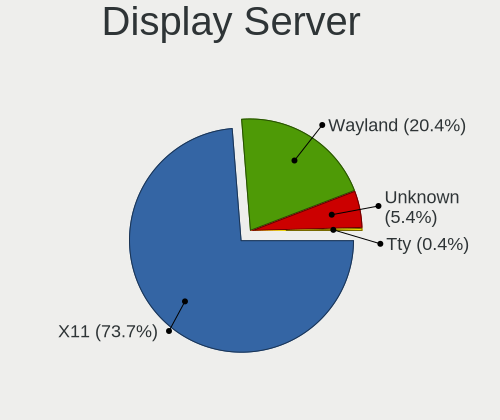
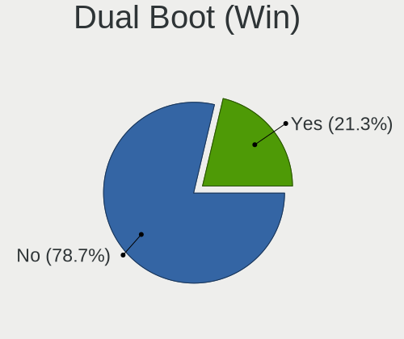
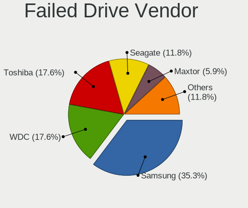
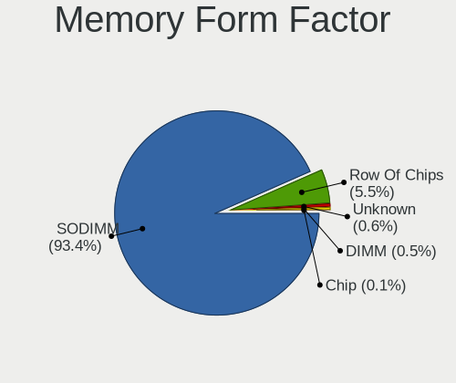
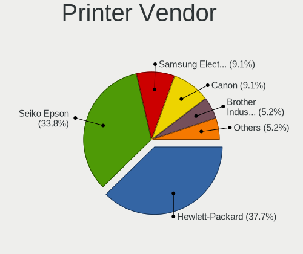

Linux in Brazil - Tested Hardware & Statistics (Notebooks)
----------------------------------------------------------

A project to collect tested hardware configurations for Linux in Brazil.

Anyone can contribute to this report by the [hw-probe](https://github.com/linuxhw/hw-probe) tool:

    sudo -E hw-probe -all -upload

Please contribute! Especially if your hardware is rare.

Contents
--------

* [ Test Cases ](#test-cases)

* [ System ](#system)
  - [ OS                       ](#os)
  - [ OS Family                ](#os-family)
  - [ Kernel                   ](#kernel)
  - [ Kernel Family            ](#kernel-family)
  - [ Kernel Major Ver.        ](#kernel-major-ver)
  - [ Arch                     ](#arch)
  - [ DE                       ](#de)
  - [ Display Server           ](#display-server)
  - [ Display Manager          ](#display-manager)
  - [ OS Lang                  ](#os-lang)
  - [ Boot Mode                ](#boot-mode)
  - [ Filesystem               ](#filesystem)
  - [ Part. scheme             ](#part-scheme)
  - [ Dual Boot with Linux/BSD ](#dual-boot-with-linuxbsd)
  - [ Dual Boot (Win)          ](#dual-boot-win)

* [ Board ](#board)
  - [ Vendor                   ](#vendor)
  - [ Model                    ](#model)
  - [ Model Family             ](#model-family)
  - [ MFG Year                 ](#mfg-year)
  - [ Form Factor              ](#form-factor)
  - [ Secure Boot              ](#secure-boot)
  - [ Coreboot                 ](#coreboot)
  - [ RAM Size                 ](#ram-size)
  - [ RAM Used                 ](#ram-used)
  - [ Total Drives             ](#total-drives)
  - [ Has CD-ROM               ](#has-cd-rom)
  - [ Has Ethernet             ](#has-ethernet)
  - [ Has WiFi                 ](#has-wifi)
  - [ Has Bluetooth            ](#has-bluetooth)

* [ Location ](#location)
  - [ Country                  ](#country)
  - [ City                     ](#city)

* [ Drives ](#drives)
  - [ Drive Vendor             ](#drive-vendor)
  - [ Drive Model              ](#drive-model)
  - [ HDD Vendor               ](#hdd-vendor)
  - [ SSD Vendor               ](#ssd-vendor)
  - [ Drive Kind               ](#drive-kind)
  - [ Drive Connector          ](#drive-connector)
  - [ Drive Size               ](#drive-size)
  - [ Space Total              ](#space-total)
  - [ Space Used               ](#space-used)
  - [ Malfunc. Drives          ](#malfunc-drives)
  - [ Malfunc. Drive Vendor    ](#malfunc-drive-vendor)
  - [ Malfunc. HDD Vendor      ](#malfunc-hdd-vendor)
  - [ Malfunc. Drive Kind      ](#malfunc-drive-kind)
  - [ Failed Drives            ](#failed-drives)
  - [ Failed Drive Vendor      ](#failed-drive-vendor)
  - [ Drive Status             ](#drive-status)

* [ Storage controller ](#storage-controller)
  - [ Storage Vendor           ](#storage-vendor)
  - [ Storage Model            ](#storage-model)
  - [ Storage Kind             ](#storage-kind)

* [ Processor ](#processor)
  - [ CPU Vendor               ](#cpu-vendor)
  - [ CPU Model                ](#cpu-model)
  - [ CPU Model Family         ](#cpu-model-family)
  - [ CPU Cores                ](#cpu-cores)
  - [ CPU Sockets              ](#cpu-sockets)
  - [ CPU Threads              ](#cpu-threads)
  - [ CPU Op-Modes             ](#cpu-op-modes)
  - [ CPU Microcode            ](#cpu-microcode)
  - [ CPU Microarch            ](#cpu-microarch)

* [ Graphics ](#graphics)
  - [ GPU Vendor               ](#gpu-vendor)
  - [ GPU Model                ](#gpu-model)
  - [ GPU Combo                ](#gpu-combo)
  - [ GPU Driver               ](#gpu-driver)
  - [ GPU Memory               ](#gpu-memory)

* [ Monitor ](#monitor)
  - [ Monitor Vendor           ](#monitor-vendor)
  - [ Monitor Model            ](#monitor-model)
  - [ Monitor Resolution       ](#monitor-resolution)
  - [ Monitor Diagonal         ](#monitor-diagonal)
  - [ Monitor Width            ](#monitor-width)
  - [ Aspect Ratio             ](#aspect-ratio)
  - [ Monitor Area             ](#monitor-area)
  - [ Pixel Density            ](#pixel-density)
  - [ Multiple Monitors        ](#multiple-monitors)

* [ Network ](#network)
  - [ Net Controller Vendor    ](#net-controller-vendor)
  - [ Net Controller Model     ](#net-controller-model)
  - [ Wireless Vendor          ](#wireless-vendor)
  - [ Wireless Model           ](#wireless-model)
  - [ Ethernet Vendor          ](#ethernet-vendor)
  - [ Ethernet Model           ](#ethernet-model)
  - [ Net Controller Kind      ](#net-controller-kind)
  - [ Used Controller          ](#used-controller)
  - [ NICs                     ](#nics)
  - [ IPv6                     ](#ipv6)

* [ Bluetooth ](#bluetooth)
  - [ Bluetooth Vendor         ](#bluetooth-vendor)
  - [ Bluetooth Model          ](#bluetooth-model)

* [ Sound ](#sound)
  - [ Sound Vendor             ](#sound-vendor)
  - [ Sound Model              ](#sound-model)

* [ Memory ](#memory)
  - [ Memory Vendor            ](#memory-vendor)
  - [ Memory Model             ](#memory-model)
  - [ Memory Kind              ](#memory-kind)
  - [ Memory Form Factor       ](#memory-form-factor)
  - [ Memory Size              ](#memory-size)
  - [ Memory Speed             ](#memory-speed)

* [ Printers & scanners ](#printers--scanners)
  - [ Printer Vendor           ](#printer-vendor)
  - [ Printer Model            ](#printer-model)
  - [ Scanner Vendor           ](#scanner-vendor)
  - [ Scanner Model            ](#scanner-model)

* [ Camera ](#camera)
  - [ Camera Vendor            ](#camera-vendor)
  - [ Camera Model             ](#camera-model)

* [ Security ](#security)
  - [ Fingerprint Vendor       ](#fingerprint-vendor)
  - [ Fingerprint Model        ](#fingerprint-model)
  - [ Chipcard Vendor          ](#chipcard-vendor)
  - [ Chipcard Model           ](#chipcard-model)

* [ Unsupported ](#unsupported)
  - [ Unsupported Devices      ](#unsupported-devices)
  - [ Unsupported Device Types ](#unsupported-device-types)

Test Cases
----------

Total: 9298

| Vendor        | Model                       | Probe                                                      | Date         |
|---------------|-----------------------------|------------------------------------------------------------|--------------|
| Dell          | G15 5510                    | [78f2f5c95a](https://linux-hardware.org/?probe=78f2f5c95a) | Sep 01, 2022 |
| Dell          | G3 3590                     | [cbe6c26276](https://linux-hardware.org/?probe=cbe6c26276) | Sep 01, 2022 |
| Dell          | Vostro 15 5510              | [1c58d69316](https://linux-hardware.org/?probe=1c58d69316) | Sep 01, 2022 |
| Dell          | Vostro 15 5510              | [e14cc69370](https://linux-hardware.org/?probe=e14cc69370) | Sep 01, 2022 |
| Positivo      | C14CR01                     | [ff4d1d45b7](https://linux-hardware.org/?probe=ff4d1d45b7) | Sep 01, 2022 |
| Positivo      | C14CR01                     | [d1fc217886](https://linux-hardware.org/?probe=d1fc217886) | Sep 01, 2022 |
| Avell High... | C62 MOB                     | [ab93c1f314](https://linux-hardware.org/?probe=ab93c1f314) | Sep 01, 2022 |
| Daten Tecn... | DT02-M4                     | [6e337cb132](https://linux-hardware.org/?probe=6e337cb132) | Sep 01, 2022 |
| Daten Tecn... | DT02-M4                     | [cdac9cafaf](https://linux-hardware.org/?probe=cdac9cafaf) | Sep 01, 2022 |
| Acer          | Aspire E5-571               | [7759e41b1d](https://linux-hardware.org/?probe=7759e41b1d) | Sep 01, 2022 |
| Lenovo        | IdeaPad S145-15API 81V7     | [838e09c9cf](https://linux-hardware.org/?probe=838e09c9cf) | Sep 01, 2022 |
| Samsung       | 340XAA/350XAA/550XAA        | [c1d60c7b0b](https://linux-hardware.org/?probe=c1d60c7b0b) | Aug 31, 2022 |
| Samsung       | 340XAA/350XAA/550XAA        | [dafd789095](https://linux-hardware.org/?probe=dafd789095) | Aug 31, 2022 |
| Notebook      | NJx0MU                      | [169efa4465](https://linux-hardware.org/?probe=169efa4465) | Aug 31, 2022 |
| Acer          | Aspire E1-571               | [4db54180a8](https://linux-hardware.org/?probe=4db54180a8) | Aug 31, 2022 |
| Dell          | Vostro 3550                 | [c26bf23cdd](https://linux-hardware.org/?probe=c26bf23cdd) | Aug 31, 2022 |
| Samsung       | 670Z5E                      | [c72797ddaa](https://linux-hardware.org/?probe=c72797ddaa) | Aug 31, 2022 |
| Lenovo        | ThinkPad T400 2767E53       | [454c7382bd](https://linux-hardware.org/?probe=454c7382bd) | Aug 31, 2022 |
| Notebook      | NJx0MU                      | [81d8e17fed](https://linux-hardware.org/?probe=81d8e17fed) | Aug 31, 2022 |
| Lenovo        | IdeaPad S145-15API 81V7     | [988032b933](https://linux-hardware.org/?probe=988032b933) | Aug 31, 2022 |
| Positivo      | W942SW_SW1                  | [bec76a1474](https://linux-hardware.org/?probe=bec76a1474) | Aug 30, 2022 |
| Dell          | Inspiron N5110              | [9fe8c04ec6](https://linux-hardware.org/?probe=9fe8c04ec6) | Aug 30, 2022 |
| Dell          | Vostro 15 5510              | [c89b1e69f4](https://linux-hardware.org/?probe=c89b1e69f4) | Aug 30, 2022 |
| Avell High... | B.ON                        | [dbc18dad43](https://linux-hardware.org/?probe=dbc18dad43) | Aug 30, 2022 |
| Notebook      | NJx0MU                      | [5103a6fa3d](https://linux-hardware.org/?probe=5103a6fa3d) | Aug 30, 2022 |
| Positivo      | W942SW_SW1                  | [b74260aeaf](https://linux-hardware.org/?probe=b74260aeaf) | Aug 30, 2022 |
| Samsung       | 300E5M/300E5L               | [6f920f9002](https://linux-hardware.org/?probe=6f920f9002) | Aug 29, 2022 |
| Positivo B... | VJFE52F11X-B0611H           | [eedd8fa1eb](https://linux-hardware.org/?probe=eedd8fa1eb) | Aug 29, 2022 |
| Samsung       | 670Z5E                      | [59959102e0](https://linux-hardware.org/?probe=59959102e0) | Aug 29, 2022 |
| Positivo      | W942SW_SW1                  | [62dcad10f0](https://linux-hardware.org/?probe=62dcad10f0) | Aug 29, 2022 |
| Sony          | VPCEB36GM                   | [4495872308](https://linux-hardware.org/?probe=4495872308) | Aug 29, 2022 |
| Lenovo        | ThinkPad T400 2767E53       | [ee3156dfc5](https://linux-hardware.org/?probe=ee3156dfc5) | Aug 29, 2022 |
| Lenovo        | ThinkPad L440 20ASA1V8BP    | [64f71278c7](https://linux-hardware.org/?probe=64f71278c7) | Aug 28, 2022 |
| Google        | Eve                         | [4c83027c9a](https://linux-hardware.org/?probe=4c83027c9a) | Aug 28, 2022 |
| Acer          | Nitro AN515-54              | [211edd7b18](https://linux-hardware.org/?probe=211edd7b18) | Aug 28, 2022 |
| Acer          | Aspire A315-53              | [6ba36ee616](https://linux-hardware.org/?probe=6ba36ee616) | Aug 28, 2022 |
| Samsung       | 670Z5E                      | [8d86f689b4](https://linux-hardware.org/?probe=8d86f689b4) | Aug 28, 2022 |
| Dell          | Inspiron 5567               | [09d8066f44](https://linux-hardware.org/?probe=09d8066f44) | Aug 28, 2022 |
| HP            | ProBook 650 G1              | [7738c266d6](https://linux-hardware.org/?probe=7738c266d6) | Aug 28, 2022 |
| HP            | ENVY dv7                    | [cbd3824347](https://linux-hardware.org/?probe=cbd3824347) | Aug 28, 2022 |
| Dell          | Inspiron 3442               | [46a68b981e](https://linux-hardware.org/?probe=46a68b981e) | Aug 27, 2022 |
| Acer          | Nitro AN515-44              | [7d3e13cfa9](https://linux-hardware.org/?probe=7d3e13cfa9) | Aug 27, 2022 |
| Lenovo        | IdeaPad 3 15ALC6 82MF       | [c155c4b324](https://linux-hardware.org/?probe=c155c4b324) | Aug 27, 2022 |
| Acer          | Nitro AN515-54              | [975f6a801d](https://linux-hardware.org/?probe=975f6a801d) | Aug 27, 2022 |
| Lenovo        | IdeaPad Flex-14API 81SS     | [85e0bc5d57](https://linux-hardware.org/?probe=85e0bc5d57) | Aug 27, 2022 |
| Dell          | Vostro 15 5510              | [c3d134ca75](https://linux-hardware.org/?probe=c3d134ca75) | Aug 27, 2022 |
| Positivo      | C14CR01                     | [bb9a4c427a](https://linux-hardware.org/?probe=bb9a4c427a) | Aug 27, 2022 |
| Alienware     | m15 R6                      | [d39642f1ce](https://linux-hardware.org/?probe=d39642f1ce) | Aug 26, 2022 |
| ASUSTek       | X541NA                      | [4755f121e3](https://linux-hardware.org/?probe=4755f121e3) | Aug 26, 2022 |
| Dell          | Vostro 1520                 | [b51f7dfba6](https://linux-hardware.org/?probe=b51f7dfba6) | Aug 26, 2022 |
| Daten Tecn... | DT02-M4                     | [c8d0dcb323](https://linux-hardware.org/?probe=c8d0dcb323) | Aug 26, 2022 |
| Samsung       | 3570R/370R/470R/450R/510... | [8aa6fdef16](https://linux-hardware.org/?probe=8aa6fdef16) | Aug 26, 2022 |
| Daten Tecn... | DT02-M4                     | [f2de49c59b](https://linux-hardware.org/?probe=f2de49c59b) | Aug 26, 2022 |
| Acer          | Aspire A315-34              | [d71a1ce240](https://linux-hardware.org/?probe=d71a1ce240) | Aug 26, 2022 |
| Notebook      | NJx0MU                      | [d9d556aea3](https://linux-hardware.org/?probe=d9d556aea3) | Aug 26, 2022 |
| Daten Tecn... | DT02-M4                     | [21e69486fd](https://linux-hardware.org/?probe=21e69486fd) | Aug 26, 2022 |
| Dell          | Inspiron 1525               | [46512c691b](https://linux-hardware.org/?probe=46512c691b) | Aug 26, 2022 |
| Dell          | Inspiron 1525               | [47efe2482f](https://linux-hardware.org/?probe=47efe2482f) | Aug 25, 2022 |
| Dell          | Inspiron 5537               | [d05888c5bc](https://linux-hardware.org/?probe=d05888c5bc) | Aug 25, 2022 |
| Lenovo        | IdeaPad 3 15ALC6 82MF       | [843ee79f1b](https://linux-hardware.org/?probe=843ee79f1b) | Aug 25, 2022 |
| Samsung       | 550XDA                      | [505f5100d0](https://linux-hardware.org/?probe=505f5100d0) | Aug 25, 2022 |
| Positivo B... | VJFE52F11X-B0611H           | [635925265e](https://linux-hardware.org/?probe=635925265e) | Aug 25, 2022 |
| Notebook      | NJx0MU                      | [90476bcf5e](https://linux-hardware.org/?probe=90476bcf5e) | Aug 25, 2022 |
| Lenovo        | ThinkPad T480 20L6S9WY00    | [dfb0ad63df](https://linux-hardware.org/?probe=dfb0ad63df) | Aug 25, 2022 |
| Dell          | Inspiron 3583               | [37c79f953b](https://linux-hardware.org/?probe=37c79f953b) | Aug 24, 2022 |
| Dell          | Latitude 5400               | [fce2c90c7e](https://linux-hardware.org/?probe=fce2c90c7e) | Aug 24, 2022 |
| Acer          | Nitro AN515-44              | [b456a14fe0](https://linux-hardware.org/?probe=b456a14fe0) | Aug 24, 2022 |
| ASUSTek       | X202E                       | [b814b9f427](https://linux-hardware.org/?probe=b814b9f427) | Aug 24, 2022 |
| Lenovo        | IdeaPad 320-15IAP 81A3      | [81b42d221d](https://linux-hardware.org/?probe=81b42d221d) | Aug 24, 2022 |
| Lenovo        | IdeaPad S145-15API 81V7     | [8b346ab142](https://linux-hardware.org/?probe=8b346ab142) | Aug 24, 2022 |
| Acer          | Aspire A315-42G             | [d5b057d1c9](https://linux-hardware.org/?probe=d5b057d1c9) | Aug 23, 2022 |
| Samsung       | RV411/RV511/E3511/S3511/... | [3507cf3eab](https://linux-hardware.org/?probe=3507cf3eab) | Aug 23, 2022 |
| Dell          | Inspiron 3583               | [dfbced302f](https://linux-hardware.org/?probe=dfbced302f) | Aug 23, 2022 |
| Dell          | Inspiron 3583               | [d394d086d9](https://linux-hardware.org/?probe=d394d086d9) | Aug 23, 2022 |
| Acer          | Aspire A315-54K             | [685d6acc51](https://linux-hardware.org/?probe=685d6acc51) | Aug 23, 2022 |
| LG Electro... | S430-G.BC33P1               | [d0b4cf47fe](https://linux-hardware.org/?probe=d0b4cf47fe) | Aug 23, 2022 |
| Dell          | Inspiron 3501               | [514172ddcc](https://linux-hardware.org/?probe=514172ddcc) | Aug 23, 2022 |
| HP            | Laptop 14-dq4xxx            | [8171eb84c2](https://linux-hardware.org/?probe=8171eb84c2) | Aug 23, 2022 |
| ASUSTek       | Zenbook UX5401ZA_UX5401Z... | [dd86526296](https://linux-hardware.org/?probe=dd86526296) | Aug 23, 2022 |
| Positivo      | W942SV_SV1                  | [24ad2b387d](https://linux-hardware.org/?probe=24ad2b387d) | Aug 23, 2022 |
| Acer          | Nitro AN515-44              | [092dcdf5b7](https://linux-hardware.org/?probe=092dcdf5b7) | Aug 23, 2022 |
| Dell          | Vostro 15 5510              | [3224d8bdcc](https://linux-hardware.org/?probe=3224d8bdcc) | Aug 23, 2022 |
| ASUSTek       | VivoBook_ASUSLaptop X515... | [3c41ecc4e0](https://linux-hardware.org/?probe=3c41ecc4e0) | Aug 23, 2022 |
| Acer          | Aspire E1-571               | [b2c1a1b4ff](https://linux-hardware.org/?probe=b2c1a1b4ff) | Aug 23, 2022 |
| Samsung       | 340XAA/350XAA/550XAA        | [323faca611](https://linux-hardware.org/?probe=323faca611) | Aug 22, 2022 |
| AMI           | Unknown                     | [b6004987ab](https://linux-hardware.org/?probe=b6004987ab) | Aug 22, 2022 |
| ASUSTek       | X45U                        | [3efe835653](https://linux-hardware.org/?probe=3efe835653) | Aug 22, 2022 |
| ASUSTek       | K53E                        | [65ddd1bb6f](https://linux-hardware.org/?probe=65ddd1bb6f) | Aug 22, 2022 |
| Dell          | Inspiron 13-5368            | [9d0f972a5f](https://linux-hardware.org/?probe=9d0f972a5f) | Aug 22, 2022 |
| Dell          | Inspiron 3501               | [2f3937854b](https://linux-hardware.org/?probe=2f3937854b) | Aug 22, 2022 |
| Lenovo        | IdeaPad S145-15IIL 82DJ     | [64b9832653](https://linux-hardware.org/?probe=64b9832653) | Aug 22, 2022 |
| Notebook      | NJx0MU                      | [7a86bdf14e](https://linux-hardware.org/?probe=7a86bdf14e) | Aug 22, 2022 |
| HP            | Mini 110-3100               | [1e27123078](https://linux-hardware.org/?probe=1e27123078) | Aug 22, 2022 |
| Acer          | Unknown                     | [c35afdde00](https://linux-hardware.org/?probe=c35afdde00) | Aug 21, 2022 |
| Dell          | Inspiron 3583               | [d9ab8accea](https://linux-hardware.org/?probe=d9ab8accea) | Aug 21, 2022 |
| Dell          | Inspiron 3583               | [6ff066abac](https://linux-hardware.org/?probe=6ff066abac) | Aug 21, 2022 |
| Positivo      | C14RV01                     | [818c67da93](https://linux-hardware.org/?probe=818c67da93) | Aug 21, 2022 |
| Dell          | Inspiron 5547               | [f67221bd42](https://linux-hardware.org/?probe=f67221bd42) | Aug 21, 2022 |
| Samsung       | 550XCJ/550XCR               | [cae0d518ee](https://linux-hardware.org/?probe=cae0d518ee) | Aug 21, 2022 |
| Positivo      | C14CU51                     | [288c810d97](https://linux-hardware.org/?probe=288c810d97) | Aug 21, 2022 |
| Acer          | Aspire A315-23G             | [e31fb3f3cf](https://linux-hardware.org/?probe=e31fb3f3cf) | Aug 21, 2022 |
| Positivo      | Mobile                      | [8678ddf7ac](https://linux-hardware.org/?probe=8678ddf7ac) | Aug 20, 2022 |
| Positivo      | Mobile                      | [d1cf6b8c9e](https://linux-hardware.org/?probe=d1cf6b8c9e) | Aug 20, 2022 |
| Dell          | Vostro 15 5510              | [9f5e59e0b9](https://linux-hardware.org/?probe=9f5e59e0b9) | Aug 20, 2022 |
| Positivo      | Q4128C-S                    | [abe16f9b0c](https://linux-hardware.org/?probe=abe16f9b0c) | Aug 19, 2022 |
| Dell          | Vostro 3400                 | [3b7d550ab9](https://linux-hardware.org/?probe=3b7d550ab9) | Aug 19, 2022 |
| Dell          | Vostro 3400                 | [9b438d4bbf](https://linux-hardware.org/?probe=9b438d4bbf) | Aug 19, 2022 |
| Lenovo        | IdeaPad 110-14IBR 80UJ      | [ec1b67985f](https://linux-hardware.org/?probe=ec1b67985f) | Aug 19, 2022 |
| Gateway       | NV55C                       | [37dc8b6dd5](https://linux-hardware.org/?probe=37dc8b6dd5) | Aug 19, 2022 |
| Acer          | Nitro AN515-43              | [59f87a8821](https://linux-hardware.org/?probe=59f87a8821) | Aug 18, 2022 |
| Gateway       | NV55C                       | [377412b832](https://linux-hardware.org/?probe=377412b832) | Aug 18, 2022 |
| ASUSTek       | K45A                        | [b007d7ae1d](https://linux-hardware.org/?probe=b007d7ae1d) | Aug 18, 2022 |
| Acer          | Aspire A515-51G             | [d29438c201](https://linux-hardware.org/?probe=d29438c201) | Aug 18, 2022 |
| Acer          | Aspire A515-52G             | [00a40c053e](https://linux-hardware.org/?probe=00a40c053e) | Aug 18, 2022 |
| Positivo B... | S14SL03                     | [558f5a2f24](https://linux-hardware.org/?probe=558f5a2f24) | Aug 18, 2022 |
| Acer          | Nitro AN515-44              | [aa18fee893](https://linux-hardware.org/?probe=aa18fee893) | Aug 18, 2022 |
| Samsung       | 670Z5E                      | [039ab9ead1](https://linux-hardware.org/?probe=039ab9ead1) | Aug 17, 2022 |
| HP            | 14                          | [0f2cde73bb](https://linux-hardware.org/?probe=0f2cde73bb) | Aug 17, 2022 |
| Positivo      | S14CT01                     | [22d8d4f3a2](https://linux-hardware.org/?probe=22d8d4f3a2) | Aug 17, 2022 |
| Positivo      | S14CT01                     | [2b561def97](https://linux-hardware.org/?probe=2b561def97) | Aug 17, 2022 |
| ASUSTek       | K45A                        | [cbbc0ff58a](https://linux-hardware.org/?probe=cbbc0ff58a) | Aug 17, 2022 |
| ASUSTek       | Z550SA                      | [03ef043fd9](https://linux-hardware.org/?probe=03ef043fd9) | Aug 17, 2022 |
| TPVAOC        | AA183M                      | [089472ea13](https://linux-hardware.org/?probe=089472ea13) | Aug 16, 2022 |
| Lenovo        | ThinkPad T460 20FMS271BR    | [a2c5089e9a](https://linux-hardware.org/?probe=a2c5089e9a) | Aug 16, 2022 |
| Lenovo        | IdeaPad S145-15IWL 81S9     | [35cd057234](https://linux-hardware.org/?probe=35cd057234) | Aug 16, 2022 |
| AMI           | Unknown                     | [a1a8c0b2c5](https://linux-hardware.org/?probe=a1a8c0b2c5) | Aug 15, 2022 |
| Acer          | Aspire A515-51G             | [9ee5f23f82](https://linux-hardware.org/?probe=9ee5f23f82) | Aug 15, 2022 |
| Sony          | VGN-NR230AE                 | [ba78970975](https://linux-hardware.org/?probe=ba78970975) | Aug 15, 2022 |
| Avell High... | A70 HYB                     | [c0e0f2d0a4](https://linux-hardware.org/?probe=c0e0f2d0a4) | Aug 15, 2022 |
| Positivo B... | VJFE52F11X-B0611H           | [3a6b82f27f](https://linux-hardware.org/?probe=3a6b82f27f) | Aug 15, 2022 |
| ASUSTek       | K84C                        | [c19b238bcf](https://linux-hardware.org/?probe=c19b238bcf) | Aug 15, 2022 |
| Itautec       | Infoway W7425               | [64b3153e8a](https://linux-hardware.org/?probe=64b3153e8a) | Aug 15, 2022 |
| Dell          | Vostro 5490                 | [3de3bd4b06](https://linux-hardware.org/?probe=3de3bd4b06) | Aug 15, 2022 |
| Lenovo        | G470 20078                  | [cafdc06a51](https://linux-hardware.org/?probe=cafdc06a51) | Aug 14, 2022 |
| Acer          | Aspire A515-54G             | [e9c64a8a5c](https://linux-hardware.org/?probe=e9c64a8a5c) | Aug 14, 2022 |
| Lenovo        | IdeaPad 3 15ALC6 82MF       | [7209cc1bd4](https://linux-hardware.org/?probe=7209cc1bd4) | Aug 14, 2022 |
| Dell          | Inspiron 5420               | [83b14f40e6](https://linux-hardware.org/?probe=83b14f40e6) | Aug 14, 2022 |
| Dell          | Inspiron 15-3567            | [42223a802a](https://linux-hardware.org/?probe=42223a802a) | Aug 14, 2022 |
| Acer          | Aspire A315-23G             | [cdba281a27](https://linux-hardware.org/?probe=cdba281a27) | Aug 13, 2022 |
| HP            | ProBook 640 G1              | [7f8289a8f3](https://linux-hardware.org/?probe=7f8289a8f3) | Aug 13, 2022 |
| Positivo      | EC10IS1                     | [b66cd42f99](https://linux-hardware.org/?probe=b66cd42f99) | Aug 13, 2022 |
| Samsung       | 340XAA/350XAA/550XAA        | [3ad1413aaa](https://linux-hardware.org/?probe=3ad1413aaa) | Aug 13, 2022 |
| Samsung       | 300E5M/300E5L               | [e39c1b59a6](https://linux-hardware.org/?probe=e39c1b59a6) | Aug 13, 2022 |
| HP            | EliteBook 8460p             | [b7418c601b](https://linux-hardware.org/?probe=b7418c601b) | Aug 13, 2022 |
| ASUSTek       | VivoBook_ASUSLaptop X515... | [837e6e891d](https://linux-hardware.org/?probe=837e6e891d) | Aug 13, 2022 |
| Positivo      | Mobile                      | [bddf3b59d4](https://linux-hardware.org/?probe=bddf3b59d4) | Aug 12, 2022 |
| Samsung       | 550XDA                      | [4964cf32aa](https://linux-hardware.org/?probe=4964cf32aa) | Aug 12, 2022 |
| Acer          | Aspire A514-54              | [be52876050](https://linux-hardware.org/?probe=be52876050) | Aug 12, 2022 |
| Chuwi         | HeroBook Air                | [dcf4a63c1e](https://linux-hardware.org/?probe=dcf4a63c1e) | Aug 12, 2022 |
| Samsung       | R430/R480/R440              | [39323c99dc](https://linux-hardware.org/?probe=39323c99dc) | Aug 12, 2022 |
| Lenovo        | IdeaPad 330S-15IKB 81F5     | [5e0a6f08b1](https://linux-hardware.org/?probe=5e0a6f08b1) | Aug 12, 2022 |
| Positivo      | Q4128C-S                    | [4f8b07c958](https://linux-hardware.org/?probe=4f8b07c958) | Aug 12, 2022 |
| Acer          | Aspire 4330 V1.22           | [dee8895134](https://linux-hardware.org/?probe=dee8895134) | Aug 12, 2022 |
| ASUSTek       | VivoBook_ASUSLaptop X515... | [074b25e3a3](https://linux-hardware.org/?probe=074b25e3a3) | Aug 12, 2022 |
| Positivo      | C14CR21                     | [6e7b0da365](https://linux-hardware.org/?probe=6e7b0da365) | Aug 12, 2022 |
| HP            | OMEN by Laptop 15-dc0xxx    | [31a967ba05](https://linux-hardware.org/?probe=31a967ba05) | Aug 12, 2022 |
| HP            | OMEN by Laptop 15-dc0xxx    | [ff6370169f](https://linux-hardware.org/?probe=ff6370169f) | Aug 11, 2022 |
| Avell High... | B.ON                        | [b057c64850](https://linux-hardware.org/?probe=b057c64850) | Aug 11, 2022 |
| Dell          | Vostro 15 3515              | [087818a904](https://linux-hardware.org/?probe=087818a904) | Aug 11, 2022 |
| Dell          | Vostro 3460                 | [fbaf8208cb](https://linux-hardware.org/?probe=fbaf8208cb) | Aug 11, 2022 |
| Acer          | Aspire 4736Z                | [16cf1afc2a](https://linux-hardware.org/?probe=16cf1afc2a) | Aug 11, 2022 |
| ASUSTek       | X510UR                      | [3faeed2cc1](https://linux-hardware.org/?probe=3faeed2cc1) | Aug 11, 2022 |
| Samsung       | 340XAA/350XAA/550XAA        | [abb938b917](https://linux-hardware.org/?probe=abb938b917) | Aug 10, 2022 |
| Dell          | G3 3590                     | [6284e4a400](https://linux-hardware.org/?probe=6284e4a400) | Aug 10, 2022 |
| CCE           | Capella & IbexPeak-M Chi... | [defafd4f0b](https://linux-hardware.org/?probe=defafd4f0b) | Aug 10, 2022 |
| CCE           | Capella & IbexPeak-M Chi... | [389bef188c](https://linux-hardware.org/?probe=389bef188c) | Aug 10, 2022 |
| ASUSTek       | VivoBook 15_ASUS Laptop ... | [19c10fbafb](https://linux-hardware.org/?probe=19c10fbafb) | Aug 10, 2022 |
| Lenovo        | ThinkPad E14 Gen 2 20TB0... | [84453db535](https://linux-hardware.org/?probe=84453db535) | Aug 10, 2022 |
| Lenovo        | IdeaPad S145-15IWL 81S9     | [3151f7847e](https://linux-hardware.org/?probe=3151f7847e) | Aug 10, 2022 |
| Lenovo        | ThinkPad E14 Gen 2 20TB0... | [87e84c988f](https://linux-hardware.org/?probe=87e84c988f) | Aug 10, 2022 |
| Lenovo        | IdeaPad 110-14IBR 80UJ      | [2f4a79e056](https://linux-hardware.org/?probe=2f4a79e056) | Aug 10, 2022 |
| Intel         | W7650                       | [1c8a9fd64b](https://linux-hardware.org/?probe=1c8a9fd64b) | Aug 10, 2022 |
| Lenovo        | IdeaPad Gaming 3 15IMH05... | [72cfcef1a6](https://linux-hardware.org/?probe=72cfcef1a6) | Aug 10, 2022 |
| Compaq        | Presario CQ-31              | [d22794a255](https://linux-hardware.org/?probe=d22794a255) | Aug 09, 2022 |
| ASUSTek       | VivoBook_ASUSLaptop X515... | [d34fcfc4f7](https://linux-hardware.org/?probe=d34fcfc4f7) | Aug 09, 2022 |
| ASUSTek       | VivoBook_ASUSLaptop X515... | [350a6d8583](https://linux-hardware.org/?probe=350a6d8583) | Aug 09, 2022 |
| Alienware     | x15 R1                      | [59b6412e2f](https://linux-hardware.org/?probe=59b6412e2f) | Aug 09, 2022 |
| Dell          | Inspiron 11-3168            | [11beb61f79](https://linux-hardware.org/?probe=11beb61f79) | Aug 09, 2022 |
| Acer          | Aspire A315-56              | [95de2fe5b3](https://linux-hardware.org/?probe=95de2fe5b3) | Aug 08, 2022 |
| Acer          | Aspire A315-56              | [742452483f](https://linux-hardware.org/?probe=742452483f) | Aug 08, 2022 |
| Lenovo        | ThinkPad L450 20DSS0DH1N    | [1aa79c3fef](https://linux-hardware.org/?probe=1aa79c3fef) | Aug 08, 2022 |
| Dell          | Inspiron 5447               | [65b4e485ad](https://linux-hardware.org/?probe=65b4e485ad) | Aug 08, 2022 |
| Acer          | Nitro AN515-54              | [221d7636db](https://linux-hardware.org/?probe=221d7636db) | Aug 08, 2022 |
| Acer          | Aspire A315-23G             | [46b74e61f0](https://linux-hardware.org/?probe=46b74e61f0) | Aug 08, 2022 |
| HP            | Mini 110-3100               | [f91eefcb06](https://linux-hardware.org/?probe=f91eefcb06) | Aug 07, 2022 |
| Dell          | Inspiron 11-3168            | [7a3c91b14a](https://linux-hardware.org/?probe=7a3c91b14a) | Aug 07, 2022 |
| Avell High... | B.ON                        | [d16f62f2b9](https://linux-hardware.org/?probe=d16f62f2b9) | Aug 07, 2022 |
| ASUSTek       | VivoBook 15_ASUS Laptop ... | [0564acfb6c](https://linux-hardware.org/?probe=0564acfb6c) | Aug 07, 2022 |
| Dell          | XPS 13 9310                 | [7e9a6b9e85](https://linux-hardware.org/?probe=7e9a6b9e85) | Aug 06, 2022 |
| Positivo      | Mobile                      | [017b8eeb6b](https://linux-hardware.org/?probe=017b8eeb6b) | Aug 06, 2022 |
| Positivo      | Mobile                      | [fe169d2119](https://linux-hardware.org/?probe=fe169d2119) | Aug 06, 2022 |
| Sony          | VPCSB35FB                   | [edbd7a9cb8](https://linux-hardware.org/?probe=edbd7a9cb8) | Aug 06, 2022 |
| Lenovo        | Legion 5 15IMH05H 82CF      | [2f96d2d61a](https://linux-hardware.org/?probe=2f96d2d61a) | Aug 06, 2022 |
| Lenovo        | ThinkPad E470 20H2A02NBR    | [6e4a76904c](https://linux-hardware.org/?probe=6e4a76904c) | Aug 06, 2022 |
| Acer          | Swift SF314-511             | [39b2c17704](https://linux-hardware.org/?probe=39b2c17704) | Aug 06, 2022 |
| Toshiba       | PORTEGE Z930                | [6cec3fa330](https://linux-hardware.org/?probe=6cec3fa330) | Aug 06, 2022 |
| Lenovo        | IdeaPad S145-15IIL 82DJ     | [a711d41e0d](https://linux-hardware.org/?probe=a711d41e0d) | Aug 05, 2022 |
| Dell          | Inspiron 5402               | [5373247b06](https://linux-hardware.org/?probe=5373247b06) | Aug 05, 2022 |
| Compaq        | 430                         | [581a8bbf00](https://linux-hardware.org/?probe=581a8bbf00) | Aug 05, 2022 |
| HP            | ProBook 4440s               | [cb7b9336ac](https://linux-hardware.org/?probe=cb7b9336ac) | Aug 04, 2022 |
| MSI           | Katana GF66 11UC            | [8d210c5007](https://linux-hardware.org/?probe=8d210c5007) | Aug 04, 2022 |
| Dell          | Inspiron 3583               | [508f6ab592](https://linux-hardware.org/?probe=508f6ab592) | Aug 04, 2022 |
| HP            | ProBook 645 G1              | [0183d60d2c](https://linux-hardware.org/?probe=0183d60d2c) | Aug 04, 2022 |
| Dell          | Latitude E5470              | [9e78351999](https://linux-hardware.org/?probe=9e78351999) | Aug 04, 2022 |
| Lenovo        | IdeaPad S145-15API 81V7     | [0ef9fef16d](https://linux-hardware.org/?probe=0ef9fef16d) | Aug 04, 2022 |
| Lenovo        | IdeaPad S145-15API 81V7     | [1be0869985](https://linux-hardware.org/?probe=1be0869985) | Aug 04, 2022 |
| Samsung       | 300E4C/300E5C/300E7C        | [8bd9c2f957](https://linux-hardware.org/?probe=8bd9c2f957) | Aug 04, 2022 |
| Positivo      | S14BW01                     | [28c70dfa85](https://linux-hardware.org/?probe=28c70dfa85) | Aug 04, 2022 |
| Sony          | VPCCW13FB                   | [34db85d2d4](https://linux-hardware.org/?probe=34db85d2d4) | Aug 04, 2022 |
| Lenovo        | IdeaPad 330-15IKB 81FE      | [32a99db93e](https://linux-hardware.org/?probe=32a99db93e) | Aug 04, 2022 |
| Dell          | Inspiron 5566               | [91ecf4a05f](https://linux-hardware.org/?probe=91ecf4a05f) | Aug 04, 2022 |
| Dell          | System Inspiron N4110       | [22938e2e62](https://linux-hardware.org/?probe=22938e2e62) | Aug 03, 2022 |
| Acer          | Aspire A315-23G             | [52e4d5e94f](https://linux-hardware.org/?probe=52e4d5e94f) | Aug 03, 2022 |
| Dell          | Inspiron 5502               | [28dcf01e88](https://linux-hardware.org/?probe=28dcf01e88) | Aug 03, 2022 |
| Acer          | Aspire A315-56              | [aed4690a47](https://linux-hardware.org/?probe=aed4690a47) | Aug 03, 2022 |
| Apple         | MacBookPro9,2               | [a1eb69af2d](https://linux-hardware.org/?probe=a1eb69af2d) | Aug 03, 2022 |
| Clevo         | W240BU                      | [df5302b1c3](https://linux-hardware.org/?probe=df5302b1c3) | Aug 03, 2022 |
| Positivo      | Smash                       | [fd44d353d3](https://linux-hardware.org/?probe=fd44d353d3) | Aug 03, 2022 |
| Daten Tecn... | DT02-M4                     | [1dfd4fe5ba](https://linux-hardware.org/?probe=1dfd4fe5ba) | Aug 03, 2022 |
| Sony          | VPCCW13FB                   | [2d36ec46e0](https://linux-hardware.org/?probe=2d36ec46e0) | Aug 03, 2022 |
| ASUSTek       | VivoBook_ASUSLaptop X515... | [03770f280e](https://linux-hardware.org/?probe=03770f280e) | Aug 02, 2022 |
| Dell          | Inspiron 5547               | [cd42712c4c](https://linux-hardware.org/?probe=cd42712c4c) | Aug 02, 2022 |
| Lenovo        | IdeaPad Gaming 3 15IHU6 ... | [8a4208caa8](https://linux-hardware.org/?probe=8a4208caa8) | Aug 02, 2022 |
| Dell          | Inspiron 5547               | [be6e34d630](https://linux-hardware.org/?probe=be6e34d630) | Aug 02, 2022 |
| Apple         | MacBook7,1                  | [84efbc858e](https://linux-hardware.org/?probe=84efbc858e) | Aug 02, 2022 |
| Dell          | G15 5510                    | [f3406b36e3](https://linux-hardware.org/?probe=f3406b36e3) | Aug 02, 2022 |
| HP            | Laptop 15-db0xxx            | [ec7e5864c2](https://linux-hardware.org/?probe=ec7e5864c2) | Aug 02, 2022 |
| Samsung       | 300E4C/300E5C/300E7C        | [ed743724e7](https://linux-hardware.org/?probe=ed743724e7) | Aug 02, 2022 |
| Positivo      | Q232A                       | [da99b8ab1e](https://linux-hardware.org/?probe=da99b8ab1e) | Aug 01, 2022 |
| Positivo      | Q232A                       | [7d860e8f5d](https://linux-hardware.org/?probe=7d860e8f5d) | Aug 01, 2022 |
| ASUSTek       | VivoBook_ASUSLaptop X512... | [4e2361dd88](https://linux-hardware.org/?probe=4e2361dd88) | Aug 01, 2022 |
| Unknown       | Unknown                     | [50153bd9ff](https://linux-hardware.org/?probe=50153bd9ff) | Aug 01, 2022 |
| HP            | Pavilion dv2600             | [87651d6efc](https://linux-hardware.org/?probe=87651d6efc) | Jul 31, 2022 |
| Sony          | VPCCW13FB                   | [453d0f75cc](https://linux-hardware.org/?probe=453d0f75cc) | Jul 31, 2022 |
| Dell          | Inspiron 5590               | [4d91f51698](https://linux-hardware.org/?probe=4d91f51698) | Jul 31, 2022 |
| Clevo         | W240BU                      | [7f4a0b1995](https://linux-hardware.org/?probe=7f4a0b1995) | Jul 31, 2022 |
| Unknown       | Unknown                     | [aa0c007709](https://linux-hardware.org/?probe=aa0c007709) | Jul 31, 2022 |
| Compaq        | Presario CQ-23              | [76ea82c314](https://linux-hardware.org/?probe=76ea82c314) | Jul 30, 2022 |
| Acer          | Nitro AN515-44              | [1c907403d4](https://linux-hardware.org/?probe=1c907403d4) | Jul 30, 2022 |
| Positivo      | C4128E-S                    | [03150bf5fa](https://linux-hardware.org/?probe=03150bf5fa) | Jul 29, 2022 |
| Acer          | Aspire A514-54              | [9a18d7476f](https://linux-hardware.org/?probe=9a18d7476f) | Jul 29, 2022 |
| Samsung       | 340XAA/350XAA/550XAA        | [c8609ab506](https://linux-hardware.org/?probe=c8609ab506) | Jul 29, 2022 |
| Acer          | Aspire E1-531               | [e9161d7c33](https://linux-hardware.org/?probe=e9161d7c33) | Jul 29, 2022 |
| Lenovo        | ThinkPad T480 20L6S9WY00    | [af8fd9ae70](https://linux-hardware.org/?probe=af8fd9ae70) | Jul 29, 2022 |
| Positivo      | C4128E-S                    | [a06c799159](https://linux-hardware.org/?probe=a06c799159) | Jul 29, 2022 |
| Lenovo        | Yoga S740-14IIL 81RM        | [a308d89f1f](https://linux-hardware.org/?probe=a308d89f1f) | Jul 29, 2022 |
| Dell          | Inspiron 5402               | [90df51f92b](https://linux-hardware.org/?probe=90df51f92b) | Jul 29, 2022 |
| Dell          | Inspiron 5402               | [ecdd9197a8](https://linux-hardware.org/?probe=ecdd9197a8) | Jul 29, 2022 |
| Dell          | Inspiron 15-3567            | [ceb521429a](https://linux-hardware.org/?probe=ceb521429a) | Jul 29, 2022 |
| Acer          | Aspire 5750                 | [e3f2dd0271](https://linux-hardware.org/?probe=e3f2dd0271) | Jul 29, 2022 |
| Dell          | Inspiron 7460               | [9f3420ac40](https://linux-hardware.org/?probe=9f3420ac40) | Jul 29, 2022 |
| Dell          | Inspiron 3501               | [be3c46490f](https://linux-hardware.org/?probe=be3c46490f) | Jul 29, 2022 |
| Samsung       | 340XAA/350XAA/550XAA        | [fdb481a551](https://linux-hardware.org/?probe=fdb481a551) | Jul 28, 2022 |
| Acer          | Aspire A514-54              | [4a6c9ef157](https://linux-hardware.org/?probe=4a6c9ef157) | Jul 28, 2022 |
| Lenovo        | IdeaPad S145-15API 81V7     | [adb71c8acc](https://linux-hardware.org/?probe=adb71c8acc) | Jul 28, 2022 |
| A14CR         | Unknown                     | [6315deeec1](https://linux-hardware.org/?probe=6315deeec1) | Jul 28, 2022 |
| Dell          | Latitude 5420               | [3e0d6fec55](https://linux-hardware.org/?probe=3e0d6fec55) | Jul 28, 2022 |
| Sony          | VPCEG27FM                   | [b8c840d19a](https://linux-hardware.org/?probe=b8c840d19a) | Jul 28, 2022 |
| Acer          | Aspire 5742                 | [4e2290847d](https://linux-hardware.org/?probe=4e2290847d) | Jul 28, 2022 |
| Positivo      | Mobile                      | [a8719171ea](https://linux-hardware.org/?probe=a8719171ea) | Jul 28, 2022 |
| Dell          | Vostro 3550                 | [db7097f5f3](https://linux-hardware.org/?probe=db7097f5f3) | Jul 28, 2022 |
| Digibras      | NH4CU03                     | [bf8a8c589a](https://linux-hardware.org/?probe=bf8a8c589a) | Jul 28, 2022 |
| Positivo      | Mobile                      | [422b663a21](https://linux-hardware.org/?probe=422b663a21) | Jul 28, 2022 |
| Unknown       | Unknown                     | [f14e834c32](https://linux-hardware.org/?probe=f14e834c32) | Jul 28, 2022 |
| Dell          | Inspiron 3421               | [67e0e7d1ba](https://linux-hardware.org/?probe=67e0e7d1ba) | Jul 28, 2022 |
| Lenovo        | IdeaPad 320-15IKB 80YH      | [0439161423](https://linux-hardware.org/?probe=0439161423) | Jul 28, 2022 |
| Positivo      | H14BT58                     | [7f271e5d68](https://linux-hardware.org/?probe=7f271e5d68) | Jul 28, 2022 |
| Samsung       | 550XBE/350XBE               | [b7fabad758](https://linux-hardware.org/?probe=b7fabad758) | Jul 27, 2022 |
| Dell          | Vostro 5470                 | [82192dcb1d](https://linux-hardware.org/?probe=82192dcb1d) | Jul 27, 2022 |
| Dell          | Latitude 7480               | [86fd278e6d](https://linux-hardware.org/?probe=86fd278e6d) | Jul 27, 2022 |
| Lenovo        | IdeaPad 120S-11IAP 81A4     | [c872c322dc](https://linux-hardware.org/?probe=c872c322dc) | Jul 27, 2022 |
| Lenovo        | IdeaPad 3 15ALC6 82MF       | [87f0eb95eb](https://linux-hardware.org/?probe=87f0eb95eb) | Jul 27, 2022 |
| Dell          | G5 5590                     | [ae478a8f82](https://linux-hardware.org/?probe=ae478a8f82) | Jul 27, 2022 |
| Dell          | Inspiron 5402               | [6735eaf093](https://linux-hardware.org/?probe=6735eaf093) | Jul 27, 2022 |
| HP            | Pavilion g4                 | [c9aa5e235c](https://linux-hardware.org/?probe=c9aa5e235c) | Jul 27, 2022 |
| Avell High... | B.ON                        | [182df5e0c6](https://linux-hardware.org/?probe=182df5e0c6) | Jul 26, 2022 |
| Intel         | powered classmate PC        | [5ef3ce99dc](https://linux-hardware.org/?probe=5ef3ce99dc) | Jul 26, 2022 |
| Intel         | powered classmate PC        | [53e2fcbd36](https://linux-hardware.org/?probe=53e2fcbd36) | Jul 26, 2022 |
| Dell          | Latitude 131L               | [ec8717bc3f](https://linux-hardware.org/?probe=ec8717bc3f) | Jul 26, 2022 |
| Toshiba       | IS 1413G                    | [adfacec492](https://linux-hardware.org/?probe=adfacec492) | Jul 26, 2022 |
| Dell          | Inspiron 14-3467            | [1c2babaa0a](https://linux-hardware.org/?probe=1c2babaa0a) | Jul 26, 2022 |
| Acer          | Aspire 5050                 | [59d8bb1e10](https://linux-hardware.org/?probe=59d8bb1e10) | Jul 26, 2022 |
| Acer          | Aspire 5050                 | [a8bcc56e78](https://linux-hardware.org/?probe=a8bcc56e78) | Jul 26, 2022 |
| ASUSTek       | VivoBook_ASUSLaptop X515... | [2a9595e780](https://linux-hardware.org/?probe=2a9595e780) | Jul 26, 2022 |
| Lenovo        | IdeaPad S145-15API 81V7     | [7005989783](https://linux-hardware.org/?probe=7005989783) | Jul 26, 2022 |
| Daten Tecn... | DT02-M4                     | [8719e60f77](https://linux-hardware.org/?probe=8719e60f77) | Jul 25, 2022 |
| Positivo      | C14CU51                     | [1bc38897f0](https://linux-hardware.org/?probe=1bc38897f0) | Jul 25, 2022 |
| Acer          | Aspire A315-23G             | [df57effbc5](https://linux-hardware.org/?probe=df57effbc5) | Jul 25, 2022 |
| Samsung       | 300E4C/300E5C/300E7C        | [ff4dba6b3e](https://linux-hardware.org/?probe=ff4dba6b3e) | Jul 24, 2022 |
| Dell          | G15 5515                    | [2d7ddd400c](https://linux-hardware.org/?probe=2d7ddd400c) | Jul 24, 2022 |
| Acer          | Aspire F5-573               | [922044b473](https://linux-hardware.org/?probe=922044b473) | Jul 24, 2022 |
| Lenovo        | IdeaPad 3 15IGL05 82BU      | [252eb862c0](https://linux-hardware.org/?probe=252eb862c0) | Jul 24, 2022 |
| Lenovo        | IdeaPad 330-15IKB 81FE      | [c1515e724a](https://linux-hardware.org/?probe=c1515e724a) | Jul 24, 2022 |
| Toshiba       | IS-1253                     | [d7bfcb65bf](https://linux-hardware.org/?probe=d7bfcb65bf) | Jul 23, 2022 |
| Lenovo        | IdeaPad S400 VIUS3          | [2f8b49e4f8](https://linux-hardware.org/?probe=2f8b49e4f8) | Jul 23, 2022 |
| Apple         | MacBookAir7,1               | [51d002e1b7](https://linux-hardware.org/?probe=51d002e1b7) | Jul 23, 2022 |
| Apple         | MacBookAir7,1               | [41d0e95039](https://linux-hardware.org/?probe=41d0e95039) | Jul 23, 2022 |
| Lenovo        | IdeaPad 330-15IKB 81FD      | [6b6a156202](https://linux-hardware.org/?probe=6b6a156202) | Jul 23, 2022 |
| Lenovo        | Z40-70 80E6                 | [e77b84e593](https://linux-hardware.org/?probe=e77b84e593) | Jul 22, 2022 |
| Dell          | Vostro 5470                 | [95c9916b84](https://linux-hardware.org/?probe=95c9916b84) | Jul 22, 2022 |
| ASUSTek       | X450LCP                     | [0617861116](https://linux-hardware.org/?probe=0617861116) | Jul 22, 2022 |
| Unknown       | Unknown                     | [a93e6b77ec](https://linux-hardware.org/?probe=a93e6b77ec) | Jul 22, 2022 |
| Positivo      | J14AL11                     | [7510e905d8](https://linux-hardware.org/?probe=7510e905d8) | Jul 22, 2022 |
| Acer          | Aspire A315-54              | [9e0bbc26f4](https://linux-hardware.org/?probe=9e0bbc26f4) | Jul 22, 2022 |
| Lenovo        | IdeaPad S145-15IWL 81S9     | [b8ce5a0377](https://linux-hardware.org/?probe=b8ce5a0377) | Jul 22, 2022 |
| Samsung       | 270E5K/270E5Q/271E5K/257... | [2c8cd53533](https://linux-hardware.org/?probe=2c8cd53533) | Jul 22, 2022 |
| Samsung       | 550XBE/350XBE               | [b23cfb57cf](https://linux-hardware.org/?probe=b23cfb57cf) | Jul 21, 2022 |
| Dell          | Vostro 5470                 | [e73fa302e0](https://linux-hardware.org/?probe=e73fa302e0) | Jul 21, 2022 |
| Dell          | Vostro 5470                 | [c6dcb4ffa6](https://linux-hardware.org/?probe=c6dcb4ffa6) | Jul 21, 2022 |
| Dell          | Latitude 3420               | [07c70a9430](https://linux-hardware.org/?probe=07c70a9430) | Jul 20, 2022 |
| Avell High... | A40 LIV                     | [7a685eedd0](https://linux-hardware.org/?probe=7a685eedd0) | Jul 20, 2022 |
| Dell          | Vostro 15 3510              | [8327d57f7b](https://linux-hardware.org/?probe=8327d57f7b) | Jul 20, 2022 |
| Dell          | Inspiron 5447               | [a0b16f7a10](https://linux-hardware.org/?probe=a0b16f7a10) | Jul 19, 2022 |
| Dell          | Inspiron 5447               | [e5b80a7f5e](https://linux-hardware.org/?probe=e5b80a7f5e) | Jul 19, 2022 |
| Dell          | Latitude 3450               | [970985b513](https://linux-hardware.org/?probe=970985b513) | Jul 19, 2022 |
| Avell High... | B.ON                        | [6bd67d621f](https://linux-hardware.org/?probe=6bd67d621f) | Jul 19, 2022 |
| HP            | EliteBook 2530p             | [8dd11387c6](https://linux-hardware.org/?probe=8dd11387c6) | Jul 19, 2022 |
| Samsung       | 270E5G/270E5U               | [c26ed846e9](https://linux-hardware.org/?probe=c26ed846e9) | Jul 19, 2022 |
| Dell          | Inspiron 5566               | [f653a494f3](https://linux-hardware.org/?probe=f653a494f3) | Jul 18, 2022 |
| Samsung       | 270E5G/270E5U               | [d1f2245fb4](https://linux-hardware.org/?probe=d1f2245fb4) | Jul 18, 2022 |
| Dell          | Vostro 15 3510              | [bcb8dbf459](https://linux-hardware.org/?probe=bcb8dbf459) | Jul 18, 2022 |
| Dell          | Inspiron 3583               | [6f281be47b](https://linux-hardware.org/?probe=6f281be47b) | Jul 18, 2022 |
| Acer          | Aspire ES1-411              | [5d551a94bd](https://linux-hardware.org/?probe=5d551a94bd) | Jul 18, 2022 |
| Acer          | Aspire A315-23G             | [268d2145ff](https://linux-hardware.org/?probe=268d2145ff) | Jul 17, 2022 |
| Acer          | Aspire E5-575G              | [78023056af](https://linux-hardware.org/?probe=78023056af) | Jul 17, 2022 |
| ASUSTek       | X541NA                      | [3caa5cc13d](https://linux-hardware.org/?probe=3caa5cc13d) | Jul 17, 2022 |
| ASUSTek       | X510UAR                     | [56298c2c32](https://linux-hardware.org/?probe=56298c2c32) | Jul 17, 2022 |
| Digibras      | NH4CU03                     | [803b7d3211](https://linux-hardware.org/?probe=803b7d3211) | Jul 16, 2022 |
| Digibras      | NH4CU53                     | [f6b402afe8](https://linux-hardware.org/?probe=f6b402afe8) | Jul 16, 2022 |
| Lenovo        | IdeaPad 330-15IKB 81FE      | [79b4ccf8b3](https://linux-hardware.org/?probe=79b4ccf8b3) | Jul 16, 2022 |
| Lenovo        | IdeaPad 330-15IKB 81FE      | [99f294736d](https://linux-hardware.org/?probe=99f294736d) | Jul 16, 2022 |
| Avell High... | B.ON                        | [54cb0cfd97](https://linux-hardware.org/?probe=54cb0cfd97) | Jul 15, 2022 |
| Positivo      | S14CT01                     | [eac9cd386b](https://linux-hardware.org/?probe=eac9cd386b) | Jul 15, 2022 |
| Lenovo        | IdeaPad 330-15IKB 81FD      | [2ee086df64](https://linux-hardware.org/?probe=2ee086df64) | Jul 15, 2022 |
| ASUSTek       | X541NA                      | [b9476b6cf9](https://linux-hardware.org/?probe=b9476b6cf9) | Jul 15, 2022 |
| AMI           | Unknown                     | [2d15648f33](https://linux-hardware.org/?probe=2d15648f33) | Jul 14, 2022 |
| Compaq        | Presario CQ-23              | [589a41e629](https://linux-hardware.org/?probe=589a41e629) | Jul 14, 2022 |
| ASUSTek       | UX301LA                     | [3d4655e7cf](https://linux-hardware.org/?probe=3d4655e7cf) | Jul 14, 2022 |
| Acer          | Aspire A315-23G             | [09f86c23ae](https://linux-hardware.org/?probe=09f86c23ae) | Jul 14, 2022 |
| Dell          | Inspiron 5437               | [1f59d159c7](https://linux-hardware.org/?probe=1f59d159c7) | Jul 14, 2022 |
| Avell High... | B.ON                        | [1e954ba2ad](https://linux-hardware.org/?probe=1e954ba2ad) | Jul 13, 2022 |
| Lenovo        | G400s VILG1                 | [fbaf6e2d8f](https://linux-hardware.org/?probe=fbaf6e2d8f) | Jul 13, 2022 |
| Lenovo        | G400s VILG1                 | [33853365fd](https://linux-hardware.org/?probe=33853365fd) | Jul 13, 2022 |
| Lenovo        | ThinkPad E480 20KQ000EBR    | [399639e6a0](https://linux-hardware.org/?probe=399639e6a0) | Jul 12, 2022 |
| Acer          | Nitro AN517-52              | [5379fd7508](https://linux-hardware.org/?probe=5379fd7508) | Jul 12, 2022 |
| ASUSTek       | VivoBook_ASUSLaptop X513... | [1b31625c12](https://linux-hardware.org/?probe=1b31625c12) | Jul 12, 2022 |
| Dell          | Inspiron 14-3467            | [0b8175d706](https://linux-hardware.org/?probe=0b8175d706) | Jul 12, 2022 |
| Dell          | Latitude E7440              | [4b1c881401](https://linux-hardware.org/?probe=4b1c881401) | Jul 12, 2022 |
| Dell          | Latitude E7440              | [2124e3c599](https://linux-hardware.org/?probe=2124e3c599) | Jul 12, 2022 |
| ASUSTek       | X202E                       | [102f50d1a3](https://linux-hardware.org/?probe=102f50d1a3) | Jul 12, 2022 |
| Dell          | Vostro 5470                 | [aedb7a18da](https://linux-hardware.org/?probe=aedb7a18da) | Jul 11, 2022 |
| Lenovo        | ThinkPad E14 Gen 3 20Y70... | [1bbf224b5c](https://linux-hardware.org/?probe=1bbf224b5c) | Jul 11, 2022 |
| Dell          | Precision 5750              | [213817ad67](https://linux-hardware.org/?probe=213817ad67) | Jul 11, 2022 |
| Positivo      | C14CU51                     | [5888159062](https://linux-hardware.org/?probe=5888159062) | Jul 11, 2022 |
| ASUSTek       | VivoBook_ASUSLaptop X515... | [3ac0019f4e](https://linux-hardware.org/?probe=3ac0019f4e) | Jul 11, 2022 |
| Dell          | Inspiron 14-3467            | [6f6ccba766](https://linux-hardware.org/?probe=6f6ccba766) | Jul 10, 2022 |
| Sony          | VGN-NW270F                  | [81c369f3c6](https://linux-hardware.org/?probe=81c369f3c6) | Jul 10, 2022 |
| Dell          | Inspiron 5421               | [8fda6f0cbc](https://linux-hardware.org/?probe=8fda6f0cbc) | Jul 10, 2022 |
| TPVAOC        | AA183M                      | [a2dcc0c977](https://linux-hardware.org/?probe=a2dcc0c977) | Jul 10, 2022 |
| ASUSTek       | VivoBook 15_ASUS Laptop ... | [ec2174a329](https://linux-hardware.org/?probe=ec2174a329) | Jul 10, 2022 |
| Acer          | Aspire A315-23G             | [a2ef844aef](https://linux-hardware.org/?probe=a2ef844aef) | Jul 10, 2022 |
| Acer          | Aspire A515-52              | [9dc5c32b9f](https://linux-hardware.org/?probe=9dc5c32b9f) | Jul 09, 2022 |
| Lenovo        | IdeaPad 320-15IKB 80YH      | [d8d42d690f](https://linux-hardware.org/?probe=d8d42d690f) | Jul 09, 2022 |
| Lenovo        | IdeaPad 320-15IKB 80YH      | [2d5d0efe6d](https://linux-hardware.org/?probe=2d5d0efe6d) | Jul 09, 2022 |
| Acer          | Aspire E5-574               | [6565916b6f](https://linux-hardware.org/?probe=6565916b6f) | Jul 09, 2022 |
| Acer          | Predator PH315-53           | [b6c6516360](https://linux-hardware.org/?probe=b6c6516360) | Jul 09, 2022 |
| Dell          | Latitude 3400               | [6a36fb9dd9](https://linux-hardware.org/?probe=6a36fb9dd9) | Jul 09, 2022 |
| Coradir       | Coradir/ES10IS5             | [f6e9e6fb39](https://linux-hardware.org/?probe=f6e9e6fb39) | Jul 09, 2022 |
| Acer          | Aspire A315-23              | [304f750248](https://linux-hardware.org/?probe=304f750248) | Jul 08, 2022 |
| Acer          | Predator PH315-53           | [69b6f2bdad](https://linux-hardware.org/?probe=69b6f2bdad) | Jul 08, 2022 |
| Dell          | Inspiron 3583               | [f413588311](https://linux-hardware.org/?probe=f413588311) | Jul 07, 2022 |
| Dell          | Inspiron 1440               | [cb9b1dda1f](https://linux-hardware.org/?probe=cb9b1dda1f) | Jul 07, 2022 |
| Samsung       | 300E4A/300E5A/300E7A/343... | [e850b43a12](https://linux-hardware.org/?probe=e850b43a12) | Jul 07, 2022 |
| Acer          | Aspire 5750Z                | [28c94adfea](https://linux-hardware.org/?probe=28c94adfea) | Jul 07, 2022 |
| Dell          | Vostro 15 3510              | [bb44d4f6ba](https://linux-hardware.org/?probe=bb44d4f6ba) | Jul 07, 2022 |
| Dell          | Latitude 5420               | [9601fde79c](https://linux-hardware.org/?probe=9601fde79c) | Jul 07, 2022 |
| Dell          | Inspiron 7572               | [e249d01b2b](https://linux-hardware.org/?probe=e249d01b2b) | Jul 06, 2022 |
| Samsung       | 550XDA                      | [74bcded10f](https://linux-hardware.org/?probe=74bcded10f) | Jul 06, 2022 |
| Acer          | Aspire E5-571               | [2225f70ee7](https://linux-hardware.org/?probe=2225f70ee7) | Jul 06, 2022 |
| Samsung       | R430/R480/R440              | [70260c78a2](https://linux-hardware.org/?probe=70260c78a2) | Jul 06, 2022 |
| Gateway       | NE56R                       | [69f2805432](https://linux-hardware.org/?probe=69f2805432) | Jul 06, 2022 |
| Samsung       | R430/R480/R440              | [347519269f](https://linux-hardware.org/?probe=347519269f) | Jul 06, 2022 |
| Acer          | Nitro AN515-44              | [d52a3dc4ed](https://linux-hardware.org/?probe=d52a3dc4ed) | Jul 06, 2022 |
| Dell          | Inspiron 7560               | [d9e6fd6bc2](https://linux-hardware.org/?probe=d9e6fd6bc2) | Jul 06, 2022 |
| Samsung       | 500R5M/500R5W/501R5M        | [17607e5f03](https://linux-hardware.org/?probe=17607e5f03) | Jul 06, 2022 |
| Lenovo        | IdeaPad 5 15ARE05 81YQ      | [5afb466a35](https://linux-hardware.org/?probe=5afb466a35) | Jul 06, 2022 |
| Lenovo        | IdeaPad 5 15ARE05 81YQ      | [162080ffcf](https://linux-hardware.org/?probe=162080ffcf) | Jul 06, 2022 |
| Megaware      | Mega netbook IP-M10.6F.2... | [286852aacb](https://linux-hardware.org/?probe=286852aacb) | Jul 06, 2022 |
| HP            | G42                         | [4a57fd54c6](https://linux-hardware.org/?probe=4a57fd54c6) | Jul 06, 2022 |
| Dell          | Vostro 3460                 | [b8795fc256](https://linux-hardware.org/?probe=b8795fc256) | Jul 06, 2022 |
| HP            | Compaq Presario CQ40        | [ca07c0428a](https://linux-hardware.org/?probe=ca07c0428a) | Jul 05, 2022 |
| HP            | Notebook                    | [2bf65688ab](https://linux-hardware.org/?probe=2bf65688ab) | Jul 05, 2022 |
| Acer          | Nitro AN515-54              | [2292096a08](https://linux-hardware.org/?probe=2292096a08) | Jul 05, 2022 |
| Sony          | VJF153                      | [a1efa9107c](https://linux-hardware.org/?probe=a1efa9107c) | Jul 05, 2022 |
| Samsung       | 300E5M/300E5L               | [03926dc548](https://linux-hardware.org/?probe=03926dc548) | Jul 05, 2022 |
| Dell          | Inspiron 14-3467            | [b9a61ec06d](https://linux-hardware.org/?probe=b9a61ec06d) | Jul 05, 2022 |
| Samsung       | RV411/RV511/E3511/S3511/... | [bc1f4a78a2](https://linux-hardware.org/?probe=bc1f4a78a2) | Jul 04, 2022 |
| HP            | Unknown                     | [4c05aaaab8](https://linux-hardware.org/?probe=4c05aaaab8) | Jul 04, 2022 |
| HP            | Unknown                     | [ed13c5f0f5](https://linux-hardware.org/?probe=ed13c5f0f5) | Jul 04, 2022 |
| Multilaser    | PC150                       | [b6fcf6d507](https://linux-hardware.org/?probe=b6fcf6d507) | Jul 04, 2022 |
| Dell          | Vostro 15 3515              | [129ffffad2](https://linux-hardware.org/?probe=129ffffad2) | Jul 03, 2022 |
| Notebook      | P65xHP                      | [2b81391bb4](https://linux-hardware.org/?probe=2b81391bb4) | Jul 03, 2022 |
| Dell          | Vostro 3460                 | [ad605672fd](https://linux-hardware.org/?probe=ad605672fd) | Jul 03, 2022 |
| Unknown       | Unknown                     | [78e8133c88](https://linux-hardware.org/?probe=78e8133c88) | Jul 03, 2022 |
| Lenovo        | IdeaPad S145-15API 81V7     | [c02e6b91bf](https://linux-hardware.org/?probe=c02e6b91bf) | Jul 03, 2022 |
| Dell          | Inspiron 3501               | [6b6b2abba6](https://linux-hardware.org/?probe=6b6b2abba6) | Jul 03, 2022 |
| Samsung       | 370E4K                      | [a6512c1606](https://linux-hardware.org/?probe=a6512c1606) | Jul 03, 2022 |
| Lenovo        | IdeaPad 3 15ALC6 82MF       | [a8c5e48dc8](https://linux-hardware.org/?probe=a8c5e48dc8) | Jul 03, 2022 |
| Intel         | HuronRiver Platform         | [c0d79569d8](https://linux-hardware.org/?probe=c0d79569d8) | Jul 03, 2022 |
| Lenovo        | IdeaPad Z460 0913           | [90ea533adb](https://linux-hardware.org/?probe=90ea533adb) | Jul 02, 2022 |
| Lenovo        | IdeaPad Z460 0913           | [2d50c0ffab](https://linux-hardware.org/?probe=2d50c0ffab) | Jul 02, 2022 |
| Acer          | Aspire VX5-591G             | [5393a13046](https://linux-hardware.org/?probe=5393a13046) | Jul 02, 2022 |
| Lenovo        | IdeaPad 3 15ALC6 82MF       | [75f07cbe46](https://linux-hardware.org/?probe=75f07cbe46) | Jul 02, 2022 |
| eMachines     | E725                        | [531d170b09](https://linux-hardware.org/?probe=531d170b09) | Jul 02, 2022 |
| Samsung       | 300E5M/300E5L               | [497939c649](https://linux-hardware.org/?probe=497939c649) | Jul 02, 2022 |
| Lenovo        | ThinkPad T420 4180M8P       | [8a94c5bc15](https://linux-hardware.org/?probe=8a94c5bc15) | Jul 02, 2022 |
| Acer          | Aspire A315-23G             | [6fc80d8654](https://linux-hardware.org/?probe=6fc80d8654) | Jul 02, 2022 |
| Samsung       | RV420/RV520/RV720/E3530/... | [affc21d7de](https://linux-hardware.org/?probe=affc21d7de) | Jul 02, 2022 |
| ASUSTek       | VivoBook_ASUSLaptop X515... | [81fff806a4](https://linux-hardware.org/?probe=81fff806a4) | Jul 01, 2022 |
| ASUSTek       | VivoBook_ASUSLaptop X515... | [294f501cdd](https://linux-hardware.org/?probe=294f501cdd) | Jul 01, 2022 |
| ASUSTek       | VivoBook_ASUSLaptop X513... | [af946ca10b](https://linux-hardware.org/?probe=af946ca10b) | Jul 01, 2022 |
| OEM           | S20II1                      | [bcaac39dde](https://linux-hardware.org/?probe=bcaac39dde) | Jul 01, 2022 |
| Chuwi         | HeroBook Air                | [217dcb770c](https://linux-hardware.org/?probe=217dcb770c) | Jul 01, 2022 |
| Dell          | Inspiron 5547               | [c2a91cc81e](https://linux-hardware.org/?probe=c2a91cc81e) | Jul 01, 2022 |
| ASUSTek       | VivoBook_ASUSLaptop X515... | [d68cd17ca2](https://linux-hardware.org/?probe=d68cd17ca2) | Jun 30, 2022 |
| LG Electro... | A410-G.BC48P1               | [41e6b25be5](https://linux-hardware.org/?probe=41e6b25be5) | Jun 30, 2022 |
| Acer          | Nitro AN515-44              | [2112b8aff3](https://linux-hardware.org/?probe=2112b8aff3) | Jun 30, 2022 |
| Acer          | Nitro AN515-44              | [09659e3083](https://linux-hardware.org/?probe=09659e3083) | Jun 30, 2022 |
| Dell          | Inspiron 7572               | [a6c34895e2](https://linux-hardware.org/?probe=a6c34895e2) | Jun 30, 2022 |
| Positivo      | CHT14B                      | [7aaac075a6](https://linux-hardware.org/?probe=7aaac075a6) | Jun 30, 2022 |
| Acer          | Aspire A315-23G             | [f5ca75e65b](https://linux-hardware.org/?probe=f5ca75e65b) | Jun 30, 2022 |
| Standard      | Unknown                     | [1a94acbc05](https://linux-hardware.org/?probe=1a94acbc05) | Jun 29, 2022 |
| Dell          | Inspiron 1525               | [8f507b2e8c](https://linux-hardware.org/?probe=8f507b2e8c) | Jun 29, 2022 |
| Dell          | Inspiron 7460               | [c5e8b7f098](https://linux-hardware.org/?probe=c5e8b7f098) | Jun 29, 2022 |
| Acer          | Aspire M5-582PT             | [e159de9f3e](https://linux-hardware.org/?probe=e159de9f3e) | Jun 28, 2022 |
| Acer          | Predator G3-572             | [505efe3b72](https://linux-hardware.org/?probe=505efe3b72) | Jun 28, 2022 |
| Login Info... | LOG-MB47II7                 | [332f799fe9](https://linux-hardware.org/?probe=332f799fe9) | Jun 28, 2022 |
| BenQ          | Joybook Lite U102           | [49bbad20bd](https://linux-hardware.org/?probe=49bbad20bd) | Jun 27, 2022 |
| Positivo      | Q232A                       | [c297e38afb](https://linux-hardware.org/?probe=c297e38afb) | Jun 27, 2022 |
| Positivo      | Q232A                       | [8774fcf3a2](https://linux-hardware.org/?probe=8774fcf3a2) | Jun 27, 2022 |
| Standard      | Unknown                     | [93ac825a25](https://linux-hardware.org/?probe=93ac825a25) | Jun 27, 2022 |
| Acer          | Aspire A515-41G             | [cbb6f48321](https://linux-hardware.org/?probe=cbb6f48321) | Jun 27, 2022 |
| Compaq        | Presario CQ-23              | [f55fd14f61](https://linux-hardware.org/?probe=f55fd14f61) | Jun 26, 2022 |
| Apple         | MacBook5,2                  | [11aefd7938](https://linux-hardware.org/?probe=11aefd7938) | Jun 26, 2022 |
| Acer          | Nitro AN515-44              | [694f0baf86](https://linux-hardware.org/?probe=694f0baf86) | Jun 26, 2022 |
| Positivo      | S14CT01                     | [b973795a61](https://linux-hardware.org/?probe=b973795a61) | Jun 26, 2022 |
| Acer          | Aspire E5-573G              | [9f14a273b0](https://linux-hardware.org/?probe=9f14a273b0) | Jun 26, 2022 |
| Samsung       | 300E5K/300E5Q               | [6fdcfe2be7](https://linux-hardware.org/?probe=6fdcfe2be7) | Jun 26, 2022 |
| Dell          | Inspiron 3442               | [72286bac00](https://linux-hardware.org/?probe=72286bac00) | Jun 26, 2022 |
| Samsung       | 300E5K/300E5Q               | [1b7010c05b](https://linux-hardware.org/?probe=1b7010c05b) | Jun 26, 2022 |
| Acer          | Aspire E5-571G              | [f8c41984c9](https://linux-hardware.org/?probe=f8c41984c9) | Jun 25, 2022 |
| ASUSTek       | VivoBook_ASUSLaptop X515... | [87f6da99c4](https://linux-hardware.org/?probe=87f6da99c4) | Jun 25, 2022 |
| Dell          | Inspiron 5437               | [e206b319a2](https://linux-hardware.org/?probe=e206b319a2) | Jun 25, 2022 |
| Dell          | Vostro 3460                 | [90c701411f](https://linux-hardware.org/?probe=90c701411f) | Jun 25, 2022 |
| Dell          | Vostro 3460                 | [fb02c13e80](https://linux-hardware.org/?probe=fb02c13e80) | Jun 25, 2022 |
| Dell          | Vostro 3460                 | [f3c9818cba](https://linux-hardware.org/?probe=f3c9818cba) | Jun 25, 2022 |
| Lenovo        | IdeaPad L340-15IRH Gamin... | [3b84529124](https://linux-hardware.org/?probe=3b84529124) | Jun 24, 2022 |
| Acer          | Nitro AN515-54              | [7559b1f8fa](https://linux-hardware.org/?probe=7559b1f8fa) | Jun 24, 2022 |
| ASUSTek       | X551MA                      | [e5780aff8c](https://linux-hardware.org/?probe=e5780aff8c) | Jun 24, 2022 |
| Lenovo        | IdeaPad S145-15API 81V7     | [289b09bf25](https://linux-hardware.org/?probe=289b09bf25) | Jun 24, 2022 |
| Samsung       | 370E4K                      | [d930d75576](https://linux-hardware.org/?probe=d930d75576) | Jun 24, 2022 |
| Acer          | Aspire E5-571G              | [6eb35edbfd](https://linux-hardware.org/?probe=6eb35edbfd) | Jun 24, 2022 |
| Acer          | Nitro AN515-54              | [eb8dbfaa92](https://linux-hardware.org/?probe=eb8dbfaa92) | Jun 23, 2022 |
| ASUSTek       | K46CB                       | [65344cb089](https://linux-hardware.org/?probe=65344cb089) | Jun 23, 2022 |
| Acer          | Aspire ES1-572              | [584216bcad](https://linux-hardware.org/?probe=584216bcad) | Jun 23, 2022 |
| Dell          | Vostro 5470                 | [592f0a2f63](https://linux-hardware.org/?probe=592f0a2f63) | Jun 23, 2022 |
| Teclast       | F7S                         | [dba66e9d34](https://linux-hardware.org/?probe=dba66e9d34) | Jun 22, 2022 |
| Acer          | Aspire E1-531               | [415b93724e](https://linux-hardware.org/?probe=415b93724e) | Jun 22, 2022 |
| Dell          | Vostro 5470                 | [9a5e42fa6f](https://linux-hardware.org/?probe=9a5e42fa6f) | Jun 22, 2022 |
| Acer          | Aspire E1-571               | [d863d34426](https://linux-hardware.org/?probe=d863d34426) | Jun 22, 2022 |
| ASUSTek       | VivoBook_ASUSLaptop X513... | [5eaea4e568](https://linux-hardware.org/?probe=5eaea4e568) | Jun 22, 2022 |
| Dell          | Inspiron 7560               | [a65b832b57](https://linux-hardware.org/?probe=a65b832b57) | Jun 22, 2022 |
| Dell          | Inspiron 5537               | [6b549dfe09](https://linux-hardware.org/?probe=6b549dfe09) | Jun 22, 2022 |
| Dell          | Inspiron 15 7000 Gaming     | [d98d060a72](https://linux-hardware.org/?probe=d98d060a72) | Jun 21, 2022 |
| Lenovo        | V14 G2 ITL 82NM             | [8c6cc60dc6](https://linux-hardware.org/?probe=8c6cc60dc6) | Jun 21, 2022 |
| Acer          | Nitro AN515-55              | [b3b8a4d0c8](https://linux-hardware.org/?probe=b3b8a4d0c8) | Jun 21, 2022 |
| Philco        | OEM                         | [bee7961704](https://linux-hardware.org/?probe=bee7961704) | Jun 20, 2022 |
| Acer          | Predator G3-572             | [10466efc20](https://linux-hardware.org/?probe=10466efc20) | Jun 20, 2022 |
| A14CR         | Unknown                     | [8ecee0a59e](https://linux-hardware.org/?probe=8ecee0a59e) | Jun 19, 2022 |
| Samsung       | 300E5M/300E5L               | [9191469ae0](https://linux-hardware.org/?probe=9191469ae0) | Jun 19, 2022 |
| Dell          | Inspiron 5537               | [2b31dedd45](https://linux-hardware.org/?probe=2b31dedd45) | Jun 19, 2022 |
| HP            | ProBook 4440s               | [14d2048e71](https://linux-hardware.org/?probe=14d2048e71) | Jun 19, 2022 |
| Acer          | Aspire E1-571               | [7e2a57a9a2](https://linux-hardware.org/?probe=7e2a57a9a2) | Jun 19, 2022 |
| Acer          | Aspire A315-53              | [cdaacd4b95](https://linux-hardware.org/?probe=cdaacd4b95) | Jun 18, 2022 |
| Acer          | Aspire A315-23G             | [2ec41b35a4](https://linux-hardware.org/?probe=2ec41b35a4) | Jun 18, 2022 |
| HP            | Pavilion dv7                | [7b7e3113e0](https://linux-hardware.org/?probe=7b7e3113e0) | Jun 17, 2022 |
| Lenovo        | IdeaPad S145-15IIL 82DJ     | [e0b7e5c636](https://linux-hardware.org/?probe=e0b7e5c636) | Jun 17, 2022 |
| Acer          | Nitro AN515-44              | [9ed8b5c759](https://linux-hardware.org/?probe=9ed8b5c759) | Jun 17, 2022 |
| Acer          | Aspire E5-574G              | [23c2dd37fe](https://linux-hardware.org/?probe=23c2dd37fe) | Jun 17, 2022 |
| Chuwi         | HeroBook Air                | [e2bfe7dd8f](https://linux-hardware.org/?probe=e2bfe7dd8f) | Jun 17, 2022 |
| Samsung       | 500R5M/500R5W/501R5M        | [91f1df8a58](https://linux-hardware.org/?probe=91f1df8a58) | Jun 17, 2022 |
| Acer          | Predator PH315-53           | [7e65c001a5](https://linux-hardware.org/?probe=7e65c001a5) | Jun 17, 2022 |
| Lenovo        | G400s VILG1                 | [e27b84df4b](https://linux-hardware.org/?probe=e27b84df4b) | Jun 17, 2022 |
| Acer          | Aspire 4741                 | [9f25816784](https://linux-hardware.org/?probe=9f25816784) | Jun 16, 2022 |
| Dell          | Studio 1537                 | [12a651ebd2](https://linux-hardware.org/?probe=12a651ebd2) | Jun 16, 2022 |
| ASUSTek       | K46CA                       | [51480da29e](https://linux-hardware.org/?probe=51480da29e) | Jun 16, 2022 |
| Acer          | Nitro AN515-44              | [5b70211c3a](https://linux-hardware.org/?probe=5b70211c3a) | Jun 16, 2022 |
| Samsung       | 530U3C/530U4C/532U3C        | [b07048db74](https://linux-hardware.org/?probe=b07048db74) | Jun 16, 2022 |
| Lenovo        | IdeaPad Gaming 3 15IMH05... | [cc0719c813](https://linux-hardware.org/?probe=cc0719c813) | Jun 16, 2022 |
| Unknown       | Unknown                     | [2c6bf60a83](https://linux-hardware.org/?probe=2c6bf60a83) | Jun 16, 2022 |
| Itautec       | Infoway w7430               | [776d876064](https://linux-hardware.org/?probe=776d876064) | Jun 16, 2022 |
| Dell          | Inspiron 7520               | [a8f3b0235a](https://linux-hardware.org/?probe=a8f3b0235a) | Jun 16, 2022 |
| Dell          | Inspiron 7520               | [d6e4d7642d](https://linux-hardware.org/?probe=d6e4d7642d) | Jun 16, 2022 |
| Positivo      | S14CT01                     | [8305005ba5](https://linux-hardware.org/?probe=8305005ba5) | Jun 16, 2022 |
| Acer          | Nitro AN515-44              | [edf78ac5ae](https://linux-hardware.org/?probe=edf78ac5ae) | Jun 15, 2022 |
| Dell          | Latitude 3420               | [b10330b427](https://linux-hardware.org/?probe=b10330b427) | Jun 15, 2022 |
| Acer          | Predator PH315-53           | [155af690bd](https://linux-hardware.org/?probe=155af690bd) | Jun 15, 2022 |
| Dell          | Inspiron 7472               | [788b7856ca](https://linux-hardware.org/?probe=788b7856ca) | Jun 15, 2022 |
| Positivo      | W540EU                      | [d3a4747118](https://linux-hardware.org/?probe=d3a4747118) | Jun 15, 2022 |
| Acer          | Nitro AN515-44              | [ce3588c536](https://linux-hardware.org/?probe=ce3588c536) | Jun 15, 2022 |
| Dell          | Inspiron 15-3567            | [16168604f0](https://linux-hardware.org/?probe=16168604f0) | Jun 15, 2022 |
| Positivo      | W540EU                      | [f11b5a9607](https://linux-hardware.org/?probe=f11b5a9607) | Jun 15, 2022 |
| ASUSTek       | Z550SA                      | [c1c96fa0a4](https://linux-hardware.org/?probe=c1c96fa0a4) | Jun 14, 2022 |
| Lenovo        | IdeaPad Z460 0913           | [8e6757afda](https://linux-hardware.org/?probe=8e6757afda) | Jun 14, 2022 |
| Lenovo        | IdeaPad Z460 0913           | [40b40205cd](https://linux-hardware.org/?probe=40b40205cd) | Jun 14, 2022 |
| Avell High... | B.ON                        | [dc7a4710c5](https://linux-hardware.org/?probe=dc7a4710c5) | Jun 14, 2022 |
| ASUSTek       | G751JT                      | [208fe1ea69](https://linux-hardware.org/?probe=208fe1ea69) | Jun 14, 2022 |
| Acer          | Aspire A315-23G             | [b7223cfa1f](https://linux-hardware.org/?probe=b7223cfa1f) | Jun 14, 2022 |
| Samsung       | RV411                       | [ce2e4a5a04](https://linux-hardware.org/?probe=ce2e4a5a04) | Jun 13, 2022 |
| Positivo      | Q464C                       | [1cb4cb4da1](https://linux-hardware.org/?probe=1cb4cb4da1) | Jun 13, 2022 |
| Positivo      | Q464C                       | [a772cd7eae](https://linux-hardware.org/?probe=a772cd7eae) | Jun 13, 2022 |
| Lenovo        | ThinkPad E14 Gen 2 20TB0... | [b8b4869fa1](https://linux-hardware.org/?probe=b8b4869fa1) | Jun 13, 2022 |
| Samsung       | 670Z5E                      | [049e305b33](https://linux-hardware.org/?probe=049e305b33) | Jun 13, 2022 |
| Lenovo        | IdeaPad 110-14IBR 80UJ      | [9baa7ce30e](https://linux-hardware.org/?probe=9baa7ce30e) | Jun 13, 2022 |
| Dell          | Inspiron 7520               | [e678cd4f8e](https://linux-hardware.org/?probe=e678cd4f8e) | Jun 13, 2022 |
| Dell          | Inspiron 1428               | [e47c98983f](https://linux-hardware.org/?probe=e47c98983f) | Jun 13, 2022 |
| Acer          | Aspire E1-421               | [7cbe6cfc8f](https://linux-hardware.org/?probe=7cbe6cfc8f) | Jun 13, 2022 |
| Acer          | Aspire E1-421               | [8ac8a79ce1](https://linux-hardware.org/?probe=8ac8a79ce1) | Jun 13, 2022 |
| Positivo      | W540EU                      | [4f2ffc5663](https://linux-hardware.org/?probe=4f2ffc5663) | Jun 13, 2022 |
| Dell          | Inspiron N4050              | [32f413134f](https://linux-hardware.org/?probe=32f413134f) | Jun 12, 2022 |
| Daten Tecn... | DT02-M4                     | [3b6da08af2](https://linux-hardware.org/?probe=3b6da08af2) | Jun 12, 2022 |
| Dell          | Inspiron 15 7000 Gaming     | [7a52f63b9e](https://linux-hardware.org/?probe=7a52f63b9e) | Jun 12, 2022 |
| Dell          | Inspiron 1545               | [ac1f1fe24f](https://linux-hardware.org/?probe=ac1f1fe24f) | Jun 12, 2022 |
| Dell          | Vostro 3500                 | [1eda18f249](https://linux-hardware.org/?probe=1eda18f249) | Jun 12, 2022 |
| Samsung       | 300E5K/300E5Q               | [d327f4dd9d](https://linux-hardware.org/?probe=d327f4dd9d) | Jun 12, 2022 |
| Dell          | G3 3500                     | [3b770a574b](https://linux-hardware.org/?probe=3b770a574b) | Jun 11, 2022 |
| Dell          | Vostro 5470                 | [8268a00416](https://linux-hardware.org/?probe=8268a00416) | Jun 11, 2022 |
| Positivo      | C4500D                      | [70dc4735fa](https://linux-hardware.org/?probe=70dc4735fa) | Jun 11, 2022 |
| Toshiba       | Satellite C845              | [12d9cc2076](https://linux-hardware.org/?probe=12d9cc2076) | Jun 11, 2022 |
| Dell          | Inspiron 7520               | [4916232f15](https://linux-hardware.org/?probe=4916232f15) | Jun 11, 2022 |
| Acer          | Aspire 4349                 | [7c8c3427a9](https://linux-hardware.org/?probe=7c8c3427a9) | Jun 11, 2022 |
| Dell          | Vostro 14-5480              | [823fc39be6](https://linux-hardware.org/?probe=823fc39be6) | Jun 10, 2022 |
| Samsung       | RV411                       | [d547fdc1ff](https://linux-hardware.org/?probe=d547fdc1ff) | Jun 10, 2022 |
| Dell          | G3 3500                     | [6bd6190df7](https://linux-hardware.org/?probe=6bd6190df7) | Jun 09, 2022 |
| Dell          | Inspiron 1545               | [7ed42ed0a1](https://linux-hardware.org/?probe=7ed42ed0a1) | Jun 09, 2022 |
| Samsung       | 340XAA/350XAA/550XAA        | [642d9c06bc](https://linux-hardware.org/?probe=642d9c06bc) | Jun 09, 2022 |
| Acer          | Aspire A315-56              | [013eee2829](https://linux-hardware.org/?probe=013eee2829) | Jun 09, 2022 |
| Dell          | Inspiron 5567               | [ca630dadfe](https://linux-hardware.org/?probe=ca630dadfe) | Jun 09, 2022 |
| Dell          | Inspiron 7520               | [ebbea30b2b](https://linux-hardware.org/?probe=ebbea30b2b) | Jun 09, 2022 |
| Lenovo        | ThinkPad E14 Gen 2 20TB0... | [e934effe87](https://linux-hardware.org/?probe=e934effe87) | Jun 09, 2022 |
| Dell          | Vostro 3560                 | [4faa4230bd](https://linux-hardware.org/?probe=4faa4230bd) | Jun 08, 2022 |
| Dell          | G7 7588                     | [fee04ee1cb](https://linux-hardware.org/?probe=fee04ee1cb) | Jun 08, 2022 |
| Dell          | Vostro 3560                 | [9eb42db4b8](https://linux-hardware.org/?probe=9eb42db4b8) | Jun 08, 2022 |
| Standard      | Unknown                     | [1806e7f770](https://linux-hardware.org/?probe=1806e7f770) | Jun 08, 2022 |
| Multilaser    | PC150                       | [ee0a35cc62](https://linux-hardware.org/?probe=ee0a35cc62) | Jun 08, 2022 |
| Samsung       | 270E5K/270E5Q/271E5K/257... | [ce022cae76](https://linux-hardware.org/?probe=ce022cae76) | Jun 08, 2022 |
| Positivo      | J14GL11                     | [62ab2ad5f4](https://linux-hardware.org/?probe=62ab2ad5f4) | Jun 08, 2022 |
| Dell          | Inspiron 5458               | [39ebbf309c](https://linux-hardware.org/?probe=39ebbf309c) | Jun 08, 2022 |
| Dell          | Inspiron 3583               | [c9368800c7](https://linux-hardware.org/?probe=c9368800c7) | Jun 08, 2022 |
| Dell          | Vostro 15 3510              | [471dc7f2db](https://linux-hardware.org/?probe=471dc7f2db) | Jun 07, 2022 |
| Avell High... | A62 LIV                     | [5a7be822e3](https://linux-hardware.org/?probe=5a7be822e3) | Jun 07, 2022 |
| LG Electro... | 15Z970-E.BH71P1             | [cc464203ff](https://linux-hardware.org/?probe=cc464203ff) | Jun 07, 2022 |
| Dell          | Inspiron 5537               | [7bb51064db](https://linux-hardware.org/?probe=7bb51064db) | Jun 07, 2022 |
| Dell          | Inspiron N4050              | [ee7e6966f5](https://linux-hardware.org/?probe=ee7e6966f5) | Jun 07, 2022 |
| Dell          | Inspiron 7520               | [5e9bacbd4e](https://linux-hardware.org/?probe=5e9bacbd4e) | Jun 06, 2022 |
| Intel         | W7650                       | [fd4abd788b](https://linux-hardware.org/?probe=fd4abd788b) | Jun 06, 2022 |
| Dell          | Inspiron 15 3515            | [c1aa502d9d](https://linux-hardware.org/?probe=c1aa502d9d) | Jun 06, 2022 |
| Dell          | Inspiron 15 3515            | [14f8f1c91b](https://linux-hardware.org/?probe=14f8f1c91b) | Jun 06, 2022 |
| Lenovo        | IdeaPad 110-14IBR 80UJ      | [96ed2caf25](https://linux-hardware.org/?probe=96ed2caf25) | Jun 06, 2022 |
| Dell          | Inspiron 3583               | [40a0e3f1a6](https://linux-hardware.org/?probe=40a0e3f1a6) | Jun 06, 2022 |
| Lenovo        | IdeaPad S145-15IWL 81S9     | [f4dcc8e7a1](https://linux-hardware.org/?probe=f4dcc8e7a1) | Jun 06, 2022 |
| Dell          | Inspiron 3583               | [3d3fc96968](https://linux-hardware.org/?probe=3d3fc96968) | Jun 06, 2022 |
| Samsung       | 550XDA                      | [f9dd232329](https://linux-hardware.org/?probe=f9dd232329) | Jun 06, 2022 |
| Samsung       | 300E5EV/300E4EV/270E5EV/... | [4af3ead1a7](https://linux-hardware.org/?probe=4af3ead1a7) | Jun 06, 2022 |
| Positivo      | Q464C                       | [e00b91e529](https://linux-hardware.org/?probe=e00b91e529) | Jun 06, 2022 |
| Lenovo        | IdeaPad S145-15IKB 81XM     | [4f9d7a297e](https://linux-hardware.org/?probe=4f9d7a297e) | Jun 05, 2022 |
| Dell          | G7 7588                     | [b3081f079f](https://linux-hardware.org/?probe=b3081f079f) | Jun 05, 2022 |
| Samsung       | 550XBE/350XBE               | [4746fe546b](https://linux-hardware.org/?probe=4746fe546b) | Jun 05, 2022 |
| Positivo      | S14CT01                     | [5ba1c09b38](https://linux-hardware.org/?probe=5ba1c09b38) | Jun 05, 2022 |
| Dell          | Inspiron 5437               | [aa1cb0d7c3](https://linux-hardware.org/?probe=aa1cb0d7c3) | Jun 05, 2022 |
| ASUSTek       | X541NA                      | [0c40d3f3d2](https://linux-hardware.org/?probe=0c40d3f3d2) | Jun 05, 2022 |
| Positivo      | CHT14B                      | [95566d3625](https://linux-hardware.org/?probe=95566d3625) | Jun 05, 2022 |
| Itautec       | Infoway w7430               | [51234f2d08](https://linux-hardware.org/?probe=51234f2d08) | Jun 04, 2022 |
| Positivo      | C4120F-AX                   | [3d98e9959e](https://linux-hardware.org/?probe=3d98e9959e) | Jun 04, 2022 |
| Timi          | RedmiBook Pro 14S           | [f729442cad](https://linux-hardware.org/?probe=f729442cad) | Jun 04, 2022 |
| Acer          | Aspire E1-571               | [9920f1203b](https://linux-hardware.org/?probe=9920f1203b) | Jun 04, 2022 |
| Dell          | Vostro 3480                 | [31825ebb84](https://linux-hardware.org/?probe=31825ebb84) | Jun 04, 2022 |
| Dell          | Inspiron 15-3567            | [fd246079ad](https://linux-hardware.org/?probe=fd246079ad) | Jun 04, 2022 |
| Samsung       | 530XBB                      | [485a99ca42](https://linux-hardware.org/?probe=485a99ca42) | Jun 03, 2022 |
| Acer          | Aspire A315-23G             | [7b3b8ff142](https://linux-hardware.org/?probe=7b3b8ff142) | Jun 03, 2022 |
| Acer          | Aspire A315-23G             | [cfb73d2727](https://linux-hardware.org/?probe=cfb73d2727) | Jun 02, 2022 |
| LG Electro... | P420-G.BC43P1               | [79d3401930](https://linux-hardware.org/?probe=79d3401930) | Jun 02, 2022 |
| Acer          | Nitro AN517-52              | [599f42ff1a](https://linux-hardware.org/?probe=599f42ff1a) | Jun 02, 2022 |
| Dell          | Inspiron 7520               | [ce5fd575ee](https://linux-hardware.org/?probe=ce5fd575ee) | Jun 02, 2022 |
| LG Electro... | 15Z970-E.BH71P1             | [e073539ce5](https://linux-hardware.org/?probe=e073539ce5) | Jun 02, 2022 |
| LG Electro... | 15Z970-E.BH71P1             | [3b5f142164](https://linux-hardware.org/?probe=3b5f142164) | Jun 02, 2022 |
| Dell          | Inspiron 7520               | [9e55bb8c5b](https://linux-hardware.org/?probe=9e55bb8c5b) | Jun 02, 2022 |
| ASUSTek       | K43E                        | [fae9f12beb](https://linux-hardware.org/?probe=fae9f12beb) | Jun 02, 2022 |
| LG Electro... | P420-G.BC43P1               | [a7ea71d295](https://linux-hardware.org/?probe=a7ea71d295) | Jun 02, 2022 |
| Avell High... | 1513                        | [d2088a55fb](https://linux-hardware.org/?probe=d2088a55fb) | Jun 02, 2022 |
| Acer          | Aspire E1-571               | [6ccdc6dda4](https://linux-hardware.org/?probe=6ccdc6dda4) | Jun 02, 2022 |
| Avell High... | B.ON                        | [25890a0c50](https://linux-hardware.org/?probe=25890a0c50) | Jun 01, 2022 |
| HP            | ProBook 640 G1              | [a1c25fad70](https://linux-hardware.org/?probe=a1c25fad70) | Jun 01, 2022 |
| Positivo      | Mobile                      | [96a729443e](https://linux-hardware.org/?probe=96a729443e) | Jun 01, 2022 |
| Positivo      | Mobile                      | [f1346a5d99](https://linux-hardware.org/?probe=f1346a5d99) | Jun 01, 2022 |
| Acer          | Aspire ES1-572              | [6f6e6c038a](https://linux-hardware.org/?probe=6f6e6c038a) | Jun 01, 2022 |
| Lenovo        | G450 2949                   | [081d9f0387](https://linux-hardware.org/?probe=081d9f0387) | Jun 01, 2022 |
| Samsung       | 300E5M/300E5L               | [baa12d722c](https://linux-hardware.org/?probe=baa12d722c) | Jun 01, 2022 |
| Dell          | Inspiron 1525               | [246387e9bc](https://linux-hardware.org/?probe=246387e9bc) | Jun 01, 2022 |
| Dell          | Inspiron 1525               | [1b82b95b9a](https://linux-hardware.org/?probe=1b82b95b9a) | Jun 01, 2022 |
| Dell          | Inspiron 5537               | [506d3fb361](https://linux-hardware.org/?probe=506d3fb361) | Jun 01, 2022 |
| ASUSTek       | VivoBook_ASUSLaptop X515... | [ce70b34b9e](https://linux-hardware.org/?probe=ce70b34b9e) | May 31, 2022 |
| ASUSTek       | X541NA                      | [3d32754542](https://linux-hardware.org/?probe=3d32754542) | May 31, 2022 |
| Samsung       | RF511/RF411/RF711           | [ddafd23ad4](https://linux-hardware.org/?probe=ddafd23ad4) | May 31, 2022 |
| Lenovo        | G450 2949                   | [20a00b739f](https://linux-hardware.org/?probe=20a00b739f) | May 31, 2022 |
| Dell          | Latitude 3420               | [70b898ae27](https://linux-hardware.org/?probe=70b898ae27) | May 31, 2022 |
| Positivo      | C14CR21TV                   | [caf01d40f1](https://linux-hardware.org/?probe=caf01d40f1) | May 31, 2022 |
| Acer          | Aspire A315-34              | [8b9190338e](https://linux-hardware.org/?probe=8b9190338e) | May 31, 2022 |
| ASUSTek       | X450LD                      | [b77a4297da](https://linux-hardware.org/?probe=b77a4297da) | May 31, 2022 |
| Philco        | 10D                         | [b4fc893791](https://linux-hardware.org/?probe=b4fc893791) | May 31, 2022 |
| Lenovo        | ThinkPad X240 20AM0040BR    | [e0ff07b590](https://linux-hardware.org/?probe=e0ff07b590) | May 30, 2022 |
| Dell          | Inspiron 15-3567            | [3299abfc78](https://linux-hardware.org/?probe=3299abfc78) | May 30, 2022 |
| Acer          | Aspire E5-573               | [467494fb1a](https://linux-hardware.org/?probe=467494fb1a) | May 30, 2022 |
| ASUSTek       | X541NA                      | [c1fd0c2d4f](https://linux-hardware.org/?probe=c1fd0c2d4f) | May 30, 2022 |
| Acer          | Nitro AN515-44              | [c3c66e49ab](https://linux-hardware.org/?probe=c3c66e49ab) | May 30, 2022 |
| Acer          | Aspire A515-51              | [4c1c5915bc](https://linux-hardware.org/?probe=4c1c5915bc) | May 29, 2022 |
| Acer          | Aspire A515-51              | [443f0579bb](https://linux-hardware.org/?probe=443f0579bb) | May 29, 2022 |
| Dell          | Inspiron 7472               | [7d8d96d851](https://linux-hardware.org/?probe=7d8d96d851) | May 29, 2022 |
| HP            | Pavilion g4                 | [39cdebfff4](https://linux-hardware.org/?probe=39cdebfff4) | May 29, 2022 |
| Acer          | Aspire A515-45              | [72b7fc79d4](https://linux-hardware.org/?probe=72b7fc79d4) | May 29, 2022 |
| HP            | 240 G2                      | [6fc3a4bb99](https://linux-hardware.org/?probe=6fc3a4bb99) | May 29, 2022 |
| Dell          | Inspiron 3420               | [2e79e10052](https://linux-hardware.org/?probe=2e79e10052) | May 29, 2022 |
| Dell          | Vostro V130                 | [abefbba5b8](https://linux-hardware.org/?probe=abefbba5b8) | May 29, 2022 |
| Lenovo        | IdeaPad S145-15IWL 81S9     | [c908e08818](https://linux-hardware.org/?probe=c908e08818) | May 29, 2022 |
| Lenovo        | IdeaPad S145-15IWL 81S9     | [b8a514c650](https://linux-hardware.org/?probe=b8a514c650) | May 29, 2022 |
| Positivo B... | VJFE51F11X-B0111H           | [68a3e8d432](https://linux-hardware.org/?probe=68a3e8d432) | May 29, 2022 |
| Acer          | Nitro AN515-44              | [fd8554b3de](https://linux-hardware.org/?probe=fd8554b3de) | May 29, 2022 |
| Acer          | Nitro AN515-44              | [2383d77ab9](https://linux-hardware.org/?probe=2383d77ab9) | May 29, 2022 |
| Acer          | Aspire 4349                 | [3d1051c72e](https://linux-hardware.org/?probe=3d1051c72e) | May 29, 2022 |
| Lenovo        | IdeaPad S145-15IWL 81S9     | [09aa4c998d](https://linux-hardware.org/?probe=09aa4c998d) | May 28, 2022 |
| Dell          | G3 3590                     | [59b0590542](https://linux-hardware.org/?probe=59b0590542) | May 28, 2022 |
| Dell          | Inspiron 15-3567            | [ba66fccfa1](https://linux-hardware.org/?probe=ba66fccfa1) | May 28, 2022 |
| Dell          | Inspiron 5566               | [88c420d481](https://linux-hardware.org/?probe=88c420d481) | May 28, 2022 |
| Toshiba       | IS 1413G                    | [c7a5f5eef3](https://linux-hardware.org/?probe=c7a5f5eef3) | May 28, 2022 |
| Dell          | Vostro 5490                 | [56ffa50c5b](https://linux-hardware.org/?probe=56ffa50c5b) | May 28, 2022 |
| Dell          | Vostro 5402                 | [323fc36eb6](https://linux-hardware.org/?probe=323fc36eb6) | May 27, 2022 |
| Login Info... | LOG-QAL30                   | [5643c9fb9b](https://linux-hardware.org/?probe=5643c9fb9b) | May 27, 2022 |
| Login Info... | LOG-QAL30                   | [644f3a8dbc](https://linux-hardware.org/?probe=644f3a8dbc) | May 27, 2022 |
| Dell          | Inspiron 7460               | [3171915433](https://linux-hardware.org/?probe=3171915433) | May 27, 2022 |
| Positivo      | S14CT01                     | [6f98caeed5](https://linux-hardware.org/?probe=6f98caeed5) | May 27, 2022 |
| Positivo      | S14CT01                     | [955a228d56](https://linux-hardware.org/?probe=955a228d56) | May 27, 2022 |
| Dell          | Inspiron 5423               | [bd9cd24b2d](https://linux-hardware.org/?probe=bd9cd24b2d) | May 26, 2022 |
| HP            | Pavilion TS 14              | [b7b3d504e2](https://linux-hardware.org/?probe=b7b3d504e2) | May 26, 2022 |
| Dell          | Inspiron 5502               | [90ee31b219](https://linux-hardware.org/?probe=90ee31b219) | May 26, 2022 |
| Dell          | Inspiron 3420               | [a3509450fc](https://linux-hardware.org/?probe=a3509450fc) | May 26, 2022 |
| Dell          | Inspiron 3420               | [63592b1c26](https://linux-hardware.org/?probe=63592b1c26) | May 26, 2022 |
| Lenovo        | IdeaPad 110-14IBR 80UJ      | [ba19793a38](https://linux-hardware.org/?probe=ba19793a38) | May 26, 2022 |
| Lenovo        | IdeaPad 310-14ISK 80UG      | [2eb4f98b37](https://linux-hardware.org/?probe=2eb4f98b37) | May 26, 2022 |
| Sony          | VPCCA17FX                   | [4ced9d5222](https://linux-hardware.org/?probe=4ced9d5222) | May 26, 2022 |
| HP            | Pavilion tx2500             | [4f5faea87f](https://linux-hardware.org/?probe=4f5faea87f) | May 26, 2022 |
| Samsung       | 550XDA                      | [807781d70e](https://linux-hardware.org/?probe=807781d70e) | May 26, 2022 |
| AMI           | Intel                       | [ee3b1abf63](https://linux-hardware.org/?probe=ee3b1abf63) | May 25, 2022 |
| Samsung       | 550XDA                      | [6a497c5971](https://linux-hardware.org/?probe=6a497c5971) | May 25, 2022 |
| Acer          | Aspire E5-553G              | [2d4c950e2f](https://linux-hardware.org/?probe=2d4c950e2f) | May 25, 2022 |
| Acer          | Aspire E5-553G              | [73139cdb17](https://linux-hardware.org/?probe=73139cdb17) | May 25, 2022 |
| Acer          | Aspire A315-56              | [8a2f221830](https://linux-hardware.org/?probe=8a2f221830) | May 25, 2022 |
| Itautec       | Infoway w7430               | [876a0fae15](https://linux-hardware.org/?probe=876a0fae15) | May 25, 2022 |
| HP            | Unknown                     | [c6b346ecc6](https://linux-hardware.org/?probe=c6b346ecc6) | May 25, 2022 |
| Lenovo        | IdeaPad 310-14ISK 80UG      | [4b23940919](https://linux-hardware.org/?probe=4b23940919) | May 25, 2022 |
| Toshiba       | IS 1413G                    | [a34eaa3e4a](https://linux-hardware.org/?probe=a34eaa3e4a) | May 24, 2022 |
| Lenovo        | IdeaPad S145-15IWL 81S9     | [3ecc5b8b4c](https://linux-hardware.org/?probe=3ecc5b8b4c) | May 24, 2022 |
| Lenovo        | IdeaPad S145-15IWL 81S9     | [75d95076eb](https://linux-hardware.org/?probe=75d95076eb) | May 24, 2022 |
| Toshiba       | IS 1413G                    | [e6e080d6e0](https://linux-hardware.org/?probe=e6e080d6e0) | May 24, 2022 |
| Dell          | Vostro 3480                 | [7c5c6aa985](https://linux-hardware.org/?probe=7c5c6aa985) | May 24, 2022 |
| Dell          | Inspiron 5557               | [1b07902e70](https://linux-hardware.org/?probe=1b07902e70) | May 24, 2022 |
| Dell          | Vostro 3550                 | [eb16993291](https://linux-hardware.org/?probe=eb16993291) | May 24, 2022 |
| Dell          | Vostro 3550                 | [b40dbcb6e4](https://linux-hardware.org/?probe=b40dbcb6e4) | May 23, 2022 |
| Dell          | Latitude 5410               | [3fce888577](https://linux-hardware.org/?probe=3fce888577) | May 23, 2022 |
| Lenovo        | IdeaPad 330-15IKB 81FD      | [77ff0216c6](https://linux-hardware.org/?probe=77ff0216c6) | May 23, 2022 |
| Dell          | Latitude 5400               | [fdfa7356be](https://linux-hardware.org/?probe=fdfa7356be) | May 23, 2022 |
| Acer          | Nitro AN515-54              | [5408aee890](https://linux-hardware.org/?probe=5408aee890) | May 23, 2022 |
| Acer          | Aspire A315-23              | [b5d37bf4f2](https://linux-hardware.org/?probe=b5d37bf4f2) | May 22, 2022 |
| Acer          | Aspire E1-530               | [48747611a5](https://linux-hardware.org/?probe=48747611a5) | May 22, 2022 |
| Lenovo        | B490 37722FP                | [ec2c933c63](https://linux-hardware.org/?probe=ec2c933c63) | May 22, 2022 |
| Apple         | MacBookPro5,5               | [8d2abc6eb8](https://linux-hardware.org/?probe=8d2abc6eb8) | May 22, 2022 |
| LG Electro... | A410-G.BC48P1               | [fb2344f915](https://linux-hardware.org/?probe=fb2344f915) | May 22, 2022 |
| Samsung       | 550XDA                      | [37cd026470](https://linux-hardware.org/?probe=37cd026470) | May 21, 2022 |
| Samsung       | 550XDA                      | [dc90dc647b](https://linux-hardware.org/?probe=dc90dc647b) | May 21, 2022 |
| HP            | Unknown                     | [2277c14d4d](https://linux-hardware.org/?probe=2277c14d4d) | May 21, 2022 |
| ASUSTek       | X510UR                      | [40b1695a67](https://linux-hardware.org/?probe=40b1695a67) | May 21, 2022 |
| ASUSTek       | X510UR                      | [e7cea85f09](https://linux-hardware.org/?probe=e7cea85f09) | May 21, 2022 |
| Standard      | B14HM21                     | [cc85dd7b32](https://linux-hardware.org/?probe=cc85dd7b32) | May 21, 2022 |
| AMI           | Intel                       | [6c571e79d0](https://linux-hardware.org/?probe=6c571e79d0) | May 21, 2022 |
| Positivo      | CHT14B                      | [435bbd3b75](https://linux-hardware.org/?probe=435bbd3b75) | May 20, 2022 |
| HP            | Pavilion g4                 | [b29455a037](https://linux-hardware.org/?probe=b29455a037) | May 20, 2022 |
| HP            | Pavilion g4                 | [001f7d91d2](https://linux-hardware.org/?probe=001f7d91d2) | May 20, 2022 |
| Positivo      | S15KL                       | [71fffe977a](https://linux-hardware.org/?probe=71fffe977a) | May 20, 2022 |
| Dell          | Inspiron 5452               | [16cb0f8cab](https://linux-hardware.org/?probe=16cb0f8cab) | May 20, 2022 |
| Dell          | Inspiron 5452               | [6d7d7710a8](https://linux-hardware.org/?probe=6d7d7710a8) | May 20, 2022 |
| HP            | Mini 210-1000               | [f4d6735690](https://linux-hardware.org/?probe=f4d6735690) | May 20, 2022 |
| Acer          | Aspire A315-56              | [7ee53cbe1b](https://linux-hardware.org/?probe=7ee53cbe1b) | May 20, 2022 |
| Samsung       | 550XDA                      | [1f77e9f8f6](https://linux-hardware.org/?probe=1f77e9f8f6) | May 19, 2022 |
| Samsung       | 550XDA                      | [8c31783747](https://linux-hardware.org/?probe=8c31783747) | May 19, 2022 |
| Positivo      | S14CT01                     | [66c43e49bf](https://linux-hardware.org/?probe=66c43e49bf) | May 19, 2022 |
| Lenovo        | IdeaPad S145-15IGM 81WT     | [08052ba55e](https://linux-hardware.org/?probe=08052ba55e) | May 19, 2022 |
| Compaq        | Presario CQ-25              | [4412b90950](https://linux-hardware.org/?probe=4412b90950) | May 19, 2022 |
| Positivo      | Mobile                      | [1ef43bb988](https://linux-hardware.org/?probe=1ef43bb988) | May 19, 2022 |
| Dell          | Inspiron 3437               | [fcd1a7ae14](https://linux-hardware.org/?probe=fcd1a7ae14) | May 19, 2022 |
| Gateway       | NV55C                       | [16404d222a](https://linux-hardware.org/?probe=16404d222a) | May 18, 2022 |
| Lenovo        | IdeaPad 330S-14IKB 81JM     | [3b3d6ba1e3](https://linux-hardware.org/?probe=3b3d6ba1e3) | May 18, 2022 |
| Gateway       | NV55C                       | [82fcde80bb](https://linux-hardware.org/?probe=82fcde80bb) | May 18, 2022 |
| HP            | ProBook 445 G7 Notebook ... | [e85e2e6559](https://linux-hardware.org/?probe=e85e2e6559) | May 18, 2022 |
| ASUSTek       | X550LA                      | [9f7a5277ee](https://linux-hardware.org/?probe=9f7a5277ee) | May 18, 2022 |
| ASUSTek       | X550LA                      | [49cdc2a458](https://linux-hardware.org/?probe=49cdc2a458) | May 18, 2022 |
| Acer          | Nitro AN515-44              | [82a239d311](https://linux-hardware.org/?probe=82a239d311) | May 18, 2022 |
| Samsung       | 270E5G/270E5U               | [8d8783e43f](https://linux-hardware.org/?probe=8d8783e43f) | May 18, 2022 |
| Samsung       | 270E5G/270E5U               | [6e01c5c9f5](https://linux-hardware.org/?probe=6e01c5c9f5) | May 18, 2022 |
| Dell          | Inspiron 3442               | [5c9ce47f76](https://linux-hardware.org/?probe=5c9ce47f76) | May 17, 2022 |
| Acer          | Aspire 5750                 | [4c6bbffcae](https://linux-hardware.org/?probe=4c6bbffcae) | May 17, 2022 |
| Samsung       | 550XCJ/550XCR               | [5bc959890b](https://linux-hardware.org/?probe=5bc959890b) | May 17, 2022 |
| Samsung       | RV411/RV511/E3511/S3511/... | [e4bf8d23b8](https://linux-hardware.org/?probe=e4bf8d23b8) | May 17, 2022 |
| Acer          | Nitro AN515-44              | [d93d2fe653](https://linux-hardware.org/?probe=d93d2fe653) | May 17, 2022 |
| Acer          | Nitro AN515-44              | [1752fe60cc](https://linux-hardware.org/?probe=1752fe60cc) | May 17, 2022 |
| Sony          | VPCEB23FM                   | [4d73e73cf8](https://linux-hardware.org/?probe=4d73e73cf8) | May 17, 2022 |
| Sony          | VPCEB23FM                   | [07d2cadefb](https://linux-hardware.org/?probe=07d2cadefb) | May 17, 2022 |
| Acer          | Aspire V3-571G              | [e7e00fe579](https://linux-hardware.org/?probe=e7e00fe579) | May 17, 2022 |
| Multilaser    | PC130                       | [eeca6caff7](https://linux-hardware.org/?probe=eeca6caff7) | May 17, 2022 |
| Acer          | Nitro AN515-44              | [a9e249f407](https://linux-hardware.org/?probe=a9e249f407) | May 16, 2022 |
| Dell          | System Vostro 3450          | [b2a981160c](https://linux-hardware.org/?probe=b2a981160c) | May 16, 2022 |
| Dell          | System Vostro 3450          | [e311d7c4c2](https://linux-hardware.org/?probe=e311d7c4c2) | May 16, 2022 |
| Dell          | Inspiron 15-3567            | [6d5340f5fa](https://linux-hardware.org/?probe=6d5340f5fa) | May 16, 2022 |
| Samsung       | RV411/RV511/E3511/S3511/... | [b7466ace8a](https://linux-hardware.org/?probe=b7466ace8a) | May 16, 2022 |
| Samsung       | 530XBB                      | [97c9209a74](https://linux-hardware.org/?probe=97c9209a74) | May 16, 2022 |
| Avell High... | A70 MOB                     | [c8900ed973](https://linux-hardware.org/?probe=c8900ed973) | May 15, 2022 |
| Avell High... | A62 LIV                     | [8b912c2c4f](https://linux-hardware.org/?probe=8b912c2c4f) | May 15, 2022 |
| Dell          | Latitude 5420               | [5cf4c006b2](https://linux-hardware.org/?probe=5cf4c006b2) | May 15, 2022 |
| Positivo      | H14BU08                     | [ba7d402358](https://linux-hardware.org/?probe=ba7d402358) | May 15, 2022 |
| Acer          | Nitro AN515-44              | [412fd25cbf](https://linux-hardware.org/?probe=412fd25cbf) | May 15, 2022 |
| HP            | Folio 13                    | [9c9cd2aa91](https://linux-hardware.org/?probe=9c9cd2aa91) | May 15, 2022 |
| Samsung       | 340XAA/350XAA/550XAA        | [3d2e586d03](https://linux-hardware.org/?probe=3d2e586d03) | May 15, 2022 |
| Dell          | Inspiron 5557               | [b0f50a8bcb](https://linux-hardware.org/?probe=b0f50a8bcb) | May 15, 2022 |
| Dell          | Inspiron 5566               | [d01652f69f](https://linux-hardware.org/?probe=d01652f69f) | May 15, 2022 |
| ASUSTek       | VivoBook_ASUSLaptop X515... | [ad5bd78c6e](https://linux-hardware.org/?probe=ad5bd78c6e) | May 15, 2022 |
| ASUSTek       | K52De                       | [83206ce723](https://linux-hardware.org/?probe=83206ce723) | May 14, 2022 |
| Toshiba       | IS 1413G                    | [6c320568d0](https://linux-hardware.org/?probe=6c320568d0) | May 14, 2022 |
| Samsung       | 270E5J/2570EJ               | [3eaceb3a18](https://linux-hardware.org/?probe=3eaceb3a18) | May 14, 2022 |
| Samsung       | 270E5J/2570EJ               | [1fbf8759b0](https://linux-hardware.org/?probe=1fbf8759b0) | May 14, 2022 |
| Avell High... | B.ON                        | [9069ca4c66](https://linux-hardware.org/?probe=9069ca4c66) | May 13, 2022 |
| Dell          | Latitude 3400               | [caa5d59cbd](https://linux-hardware.org/?probe=caa5d59cbd) | May 13, 2022 |
| Lenovo        | IdeaPad 3 15ALC6 82MF       | [8431edf013](https://linux-hardware.org/?probe=8431edf013) | May 12, 2022 |
| Samsung       | 340XAA/350XAA/550XAA        | [c5f3dd19f8](https://linux-hardware.org/?probe=c5f3dd19f8) | May 12, 2022 |
| Acer          | Aspire 5750                 | [008e256981](https://linux-hardware.org/?probe=008e256981) | May 12, 2022 |
| Samsung       | 550XDA                      | [c65f7949af](https://linux-hardware.org/?probe=c65f7949af) | May 12, 2022 |
| Acer          | Nitro AN515-44              | [fe8e3837f4](https://linux-hardware.org/?probe=fe8e3837f4) | May 12, 2022 |
| Lenovo        | ThinkPad E14 20RBS25S00     | [beaf18770e](https://linux-hardware.org/?probe=beaf18770e) | May 12, 2022 |
| Acer          | Aspire A514-54              | [372742938a](https://linux-hardware.org/?probe=372742938a) | May 12, 2022 |
| Toshiba       | IS 1413G                    | [d4fa91d7b4](https://linux-hardware.org/?probe=d4fa91d7b4) | May 12, 2022 |
| ASUSTek       | VivoBook_ASUSLaptop X515... | [47e5498b35](https://linux-hardware.org/?probe=47e5498b35) | May 12, 2022 |
| Compaq        | Presario CQ-25              | [581b490f0c](https://linux-hardware.org/?probe=581b490f0c) | May 12, 2022 |
| Dell          | Inspiron N4050              | [6f91dbbb6b](https://linux-hardware.org/?probe=6f91dbbb6b) | May 12, 2022 |
| Samsung       | 550XCJ/550XCR               | [2dd9e88806](https://linux-hardware.org/?probe=2dd9e88806) | May 11, 2022 |
| Positivo      | C41TB                       | [2df08b295b](https://linux-hardware.org/?probe=2df08b295b) | May 11, 2022 |
| Positivo      | C41TB                       | [164d3a45c4](https://linux-hardware.org/?probe=164d3a45c4) | May 11, 2022 |
| Lenovo        | B40-70 80F30017BR           | [352c705bf3](https://linux-hardware.org/?probe=352c705bf3) | May 11, 2022 |
| Acer          | Nitro AN515-44              | [e3b90bb036](https://linux-hardware.org/?probe=e3b90bb036) | May 11, 2022 |
| Lenovo        | B40-70 80F30017BR           | [cb100c3884](https://linux-hardware.org/?probe=cb100c3884) | May 11, 2022 |
| Acer          | Nitro AN515-44              | [241c777ac9](https://linux-hardware.org/?probe=241c777ac9) | May 11, 2022 |
| Compaq        | 420                         | [1525a9b616](https://linux-hardware.org/?probe=1525a9b616) | May 10, 2022 |
| Lenovo        | IdeaPad Z400 Touch VIWZ1    | [d15f71eff4](https://linux-hardware.org/?probe=d15f71eff4) | May 10, 2022 |
| Positivo B... | VJFE43F11X-XXXXXX           | [6b22a6e3db](https://linux-hardware.org/?probe=6b22a6e3db) | May 10, 2022 |
| ASUSTek       | VivoBook_ASUSLaptop X515... | [2c069935d3](https://linux-hardware.org/?probe=2c069935d3) | May 10, 2022 |
| Acer          | Aspire 5750                 | [200ac122e9](https://linux-hardware.org/?probe=200ac122e9) | May 09, 2022 |
| ASUSTek       | ZenBook UX435EA_UX435EA     | [ca8143d6eb](https://linux-hardware.org/?probe=ca8143d6eb) | May 09, 2022 |
| Dell          | Inspiron 3501               | [e7ed86ad09](https://linux-hardware.org/?probe=e7ed86ad09) | May 09, 2022 |
| Toshiba       | IS 1413G                    | [fbb3e61ebf](https://linux-hardware.org/?probe=fbb3e61ebf) | May 09, 2022 |
| Positivo      | C41TB                       | [6ba90f69f3](https://linux-hardware.org/?probe=6ba90f69f3) | May 09, 2022 |
| Samsung       | 550XDA                      | [d3d7a64817](https://linux-hardware.org/?probe=d3d7a64817) | May 08, 2022 |
| Lenovo        | ThinkPad T480 MFG_IN_GO     | [9792863fc7](https://linux-hardware.org/?probe=9792863fc7) | May 08, 2022 |
| Lenovo        | ThinkPad T480 MFG_IN_GO     | [bba77106b4](https://linux-hardware.org/?probe=bba77106b4) | May 08, 2022 |
| Samsung       | 800G5M/800G5W               | [057ea02fdb](https://linux-hardware.org/?probe=057ea02fdb) | May 08, 2022 |
| Lenovo        | IdeaPad S145-15API 81V7     | [89ecde894a](https://linux-hardware.org/?probe=89ecde894a) | May 07, 2022 |
| Samsung       | 550XDA                      | [271c745a5a](https://linux-hardware.org/?probe=271c745a5a) | May 07, 2022 |
| HP            | 250 G5 Notebook PC          | [a21e01fec5](https://linux-hardware.org/?probe=a21e01fec5) | May 07, 2022 |
| HP            | Pavilion 11 x360 PC         | [a1271c4465](https://linux-hardware.org/?probe=a1271c4465) | May 07, 2022 |
| Samsung       | 670Z5E                      | [3ded76a717](https://linux-hardware.org/?probe=3ded76a717) | May 07, 2022 |
| HP            | ProBook 645 G1              | [c8bd8caf2f](https://linux-hardware.org/?probe=c8bd8caf2f) | May 07, 2022 |
| Samsung       | 550XDA                      | [a616d83a41](https://linux-hardware.org/?probe=a616d83a41) | May 07, 2022 |
| Intel         | W7650                       | [bd5d159229](https://linux-hardware.org/?probe=bd5d159229) | May 07, 2022 |
| Lenovo        | V14 G2 ITL 82NM             | [6a3cbcae26](https://linux-hardware.org/?probe=6a3cbcae26) | May 06, 2022 |
| Gateway       | NV55C                       | [2cbbfa9c42](https://linux-hardware.org/?probe=2cbbfa9c42) | May 06, 2022 |
| Dell          | Vostro 15 5510              | [e2b06a4a28](https://linux-hardware.org/?probe=e2b06a4a28) | May 05, 2022 |
| Philco        | 10D                         | [d2f71d99cd](https://linux-hardware.org/?probe=d2f71d99cd) | May 05, 2022 |
| Philco        | 10D                         | [9882f4ca80](https://linux-hardware.org/?probe=9882f4ca80) | May 05, 2022 |
| Acer          | Aspire A315-41G             | [af3af97b7d](https://linux-hardware.org/?probe=af3af97b7d) | May 05, 2022 |
| Toshiba       | IS 1413G                    | [8ca57528af](https://linux-hardware.org/?probe=8ca57528af) | May 04, 2022 |
| Acer          | Aspire E1-532               | [a7305e2070](https://linux-hardware.org/?probe=a7305e2070) | May 04, 2022 |
| Toshiba       | IS 1413G                    | [3bc61ca207](https://linux-hardware.org/?probe=3bc61ca207) | May 04, 2022 |
| Dell          | Inspiron N4010              | [f1e24327ba](https://linux-hardware.org/?probe=f1e24327ba) | May 04, 2022 |
| Lenovo        | IdeaPad S145-15IWL 81S9     | [3c081a7012](https://linux-hardware.org/?probe=3c081a7012) | May 04, 2022 |
| Dell          | Inspiron 5558               | [3cab561b32](https://linux-hardware.org/?probe=3cab561b32) | May 04, 2022 |
| Dell          | Inspiron 3501               | [2b5958e2dd](https://linux-hardware.org/?probe=2b5958e2dd) | May 04, 2022 |
| Samsung       | RV415/RV515                 | [bc88bd7582](https://linux-hardware.org/?probe=bc88bd7582) | May 04, 2022 |
| Dell          | Inspiron 3583               | [f5e954ea5e](https://linux-hardware.org/?probe=f5e954ea5e) | May 04, 2022 |
| Lenovo        | ThinkPad T480s 20L8S2N70... | [9da4b1ddc5](https://linux-hardware.org/?probe=9da4b1ddc5) | May 03, 2022 |
| Acer          | Aspire F5-573G              | [2136362d58](https://linux-hardware.org/?probe=2136362d58) | May 03, 2022 |
| Lenovo        | ThinkPad P15 Gen 1 20STS... | [1d4b493814](https://linux-hardware.org/?probe=1d4b493814) | May 03, 2022 |
| Lenovo        | ThinkPad E15 Gen 2 20T80... | [f9db97e5d3](https://linux-hardware.org/?probe=f9db97e5d3) | May 03, 2022 |
| Dell          | Inspiron 3583               | [bd62b32976](https://linux-hardware.org/?probe=bd62b32976) | May 03, 2022 |
| ASUSTek       | VivoBook_ASUSLaptop X515... | [4516542417](https://linux-hardware.org/?probe=4516542417) | May 03, 2022 |
| Lenovo        | IdeaPad 330-15IKB 81FE      | [ff291ff9e3](https://linux-hardware.org/?probe=ff291ff9e3) | May 03, 2022 |
| Acer          | Aspire A315-23G             | [f749343aee](https://linux-hardware.org/?probe=f749343aee) | May 03, 2022 |
| HP            | Pavilion dv6                | [7587fe8761](https://linux-hardware.org/?probe=7587fe8761) | May 03, 2022 |
| HP            | Pavilion dv6                | [bf79099573](https://linux-hardware.org/?probe=bf79099573) | May 03, 2022 |
| Acer          | Aspire E1-531               | [ab72c3ae3f](https://linux-hardware.org/?probe=ab72c3ae3f) | May 03, 2022 |
| Dell          | Inspiron 3583               | [c47758f125](https://linux-hardware.org/?probe=c47758f125) | May 03, 2022 |
| Dell          | Inspiron 5566               | [ba926f40d8](https://linux-hardware.org/?probe=ba926f40d8) | May 02, 2022 |
| Avell High... | B.ON                        | [5de402efe5](https://linux-hardware.org/?probe=5de402efe5) | May 02, 2022 |
| Acer          | Aspire F5-573               | [f571b0dc6f](https://linux-hardware.org/?probe=f571b0dc6f) | May 02, 2022 |
| Acer          | Aspire E1-532               | [88080c45b1](https://linux-hardware.org/?probe=88080c45b1) | May 02, 2022 |
| Dell          | Vostro 5470                 | [8fbdd05b2a](https://linux-hardware.org/?probe=8fbdd05b2a) | May 02, 2022 |
| Toshiba       | Satellite M55               | [9d5733c6fc](https://linux-hardware.org/?probe=9d5733c6fc) | May 02, 2022 |
| Lenovo        | IdeaPad 310-14ISK 80UG      | [72f6ebfc11](https://linux-hardware.org/?probe=72f6ebfc11) | May 01, 2022 |
| Lenovo        | IdeaPad 310-14ISK 80UG      | [0205c9da07](https://linux-hardware.org/?probe=0205c9da07) | May 01, 2022 |
| Dell          | Vostro 5470                 | [85d403928b](https://linux-hardware.org/?probe=85d403928b) | May 01, 2022 |
| Lenovo        | IdeaPad 3 15ALC6 82MF       | [414334d8e3](https://linux-hardware.org/?probe=414334d8e3) | May 01, 2022 |
| Avell High... | A70 MOB                     | [cb532b211e](https://linux-hardware.org/?probe=cb532b211e) | May 01, 2022 |
| LG Electro... | P430-G.BC41P1               | [527905ca3b](https://linux-hardware.org/?probe=527905ca3b) | May 01, 2022 |
| Toshiba       | IS 1413G                    | [6d0ad0b8f2](https://linux-hardware.org/?probe=6d0ad0b8f2) | May 01, 2022 |
| Acer          | F5-573                      | [47c8b0dd51](https://linux-hardware.org/?probe=47c8b0dd51) | May 01, 2022 |
| Acer          | Aspire 5741                 | [f82c315ff4](https://linux-hardware.org/?probe=f82c315ff4) | May 01, 2022 |
| HP            | EliteBook 8440p             | [31fdda39b1](https://linux-hardware.org/?probe=31fdda39b1) | May 01, 2022 |
| Dell          | Inspiron 15-3567            | [589f58c857](https://linux-hardware.org/?probe=589f58c857) | Apr 30, 2022 |
| HP            | EliteBook 8440p             | [3782e39a43](https://linux-hardware.org/?probe=3782e39a43) | Apr 30, 2022 |
| Acer          | V5-171                      | [a07ba20ff0](https://linux-hardware.org/?probe=a07ba20ff0) | Apr 30, 2022 |
| Dell          | System XPS L502X            | [77e1846d8d](https://linux-hardware.org/?probe=77e1846d8d) | Apr 30, 2022 |
| Itautec       | Infoway w7535               | [ac87d9e508](https://linux-hardware.org/?probe=ac87d9e508) | Apr 30, 2022 |
| Positivo      | S14CT01                     | [7260e4f199](https://linux-hardware.org/?probe=7260e4f199) | Apr 30, 2022 |
| Lenovo        | G40-70 80GA                 | [fcd20cb250](https://linux-hardware.org/?probe=fcd20cb250) | Apr 30, 2022 |
| Positivo      | S14CT01                     | [dec0b170c2](https://linux-hardware.org/?probe=dec0b170c2) | Apr 30, 2022 |
| Toshiba       | IS 1413G                    | [8074a86bc7](https://linux-hardware.org/?probe=8074a86bc7) | Apr 30, 2022 |
| Acer          | Aspire A514-54              | [70efbbb6c7](https://linux-hardware.org/?probe=70efbbb6c7) | Apr 30, 2022 |
| Philco        | 14I                         | [03bb0fdeef](https://linux-hardware.org/?probe=03bb0fdeef) | Apr 30, 2022 |
| Acer          | V5-171                      | [8500a1c376](https://linux-hardware.org/?probe=8500a1c376) | Apr 30, 2022 |
| Dell          | Inspiron N4010              | [e1369b0428](https://linux-hardware.org/?probe=e1369b0428) | Apr 29, 2022 |
| Avell High... | B.ON                        | [eb3d4d0f78](https://linux-hardware.org/?probe=eb3d4d0f78) | Apr 29, 2022 |
| Dell          | Inspiron 3421               | [15a2c261da](https://linux-hardware.org/?probe=15a2c261da) | Apr 29, 2022 |
| Lenovo        | IdeaPad 330-15IKB 81FE      | [6ace557278](https://linux-hardware.org/?probe=6ace557278) | Apr 29, 2022 |
| Dell          | Inspiron 5547               | [a5d8e73a23](https://linux-hardware.org/?probe=a5d8e73a23) | Apr 28, 2022 |
| Dell          | Inspiron 5547               | [be4ab0fd27](https://linux-hardware.org/?probe=be4ab0fd27) | Apr 28, 2022 |
| Acer          | Aspire A515-54              | [4ff968ef61](https://linux-hardware.org/?probe=4ff968ef61) | Apr 28, 2022 |
| Toshiba       | IS 1413G                    | [995f77010e](https://linux-hardware.org/?probe=995f77010e) | Apr 28, 2022 |
| Toshiba       | IS 1413G                    | [e2293170b3](https://linux-hardware.org/?probe=e2293170b3) | Apr 28, 2022 |
| Acer          | Aspire E5-553G              | [00a648bda6](https://linux-hardware.org/?probe=00a648bda6) | Apr 28, 2022 |
| Acer          | Aspire E5-553G              | [4646f6cd23](https://linux-hardware.org/?probe=4646f6cd23) | Apr 28, 2022 |
| Dell          | Inspiron 5570               | [8105c6bf09](https://linux-hardware.org/?probe=8105c6bf09) | Apr 28, 2022 |
| Acer          | Nitro AN515-44              | [11b568f82d](https://linux-hardware.org/?probe=11b568f82d) | Apr 28, 2022 |
| Toshiba       | IS 1413G                    | [a63dc69025](https://linux-hardware.org/?probe=a63dc69025) | Apr 28, 2022 |
| Samsung       | 670Z5E                      | [39efe61675](https://linux-hardware.org/?probe=39efe61675) | Apr 28, 2022 |
| Dell          | Vostro 3560                 | [56d52ea265](https://linux-hardware.org/?probe=56d52ea265) | Apr 28, 2022 |
| Dell          | Inspiron 5566               | [49396d0706](https://linux-hardware.org/?probe=49396d0706) | Apr 28, 2022 |
| Dell          | Inspiron 3583               | [740919a383](https://linux-hardware.org/?probe=740919a383) | Apr 28, 2022 |
| Dell          | Inspiron 5566               | [695d362d8f](https://linux-hardware.org/?probe=695d362d8f) | Apr 27, 2022 |
| Dell          | XPS 13 9310                 | [d394f4e0d9](https://linux-hardware.org/?probe=d394f4e0d9) | Apr 27, 2022 |
| Dell          | Vostro 15 3515              | [7c99d7d4c5](https://linux-hardware.org/?probe=7c99d7d4c5) | Apr 27, 2022 |
| Unknown       | Unknown                     | [e77a313003](https://linux-hardware.org/?probe=e77a313003) | Apr 27, 2022 |
| Lenovo        | ThinkPad T480 20L6SJN400    | [294a5ef80c](https://linux-hardware.org/?probe=294a5ef80c) | Apr 27, 2022 |
| Lenovo        | IdeaPad S145-15API 81V7     | [b7ac79ff8f](https://linux-hardware.org/?probe=b7ac79ff8f) | Apr 27, 2022 |
| Lenovo        | IdeaPad 330-15IKB 81FE      | [593ee8ccf3](https://linux-hardware.org/?probe=593ee8ccf3) | Apr 27, 2022 |
| Lenovo        | IdeaPad S145-15API 81V7     | [9e7c77d251](https://linux-hardware.org/?probe=9e7c77d251) | Apr 27, 2022 |
| Acer          | Aspire A315-34              | [a49e25f2b8](https://linux-hardware.org/?probe=a49e25f2b8) | Apr 27, 2022 |
| Positivo      | S14SL01                     | [f8bdbe707d](https://linux-hardware.org/?probe=f8bdbe707d) | Apr 27, 2022 |
| Dell          | Latitude 5410               | [1a67b58656](https://linux-hardware.org/?probe=1a67b58656) | Apr 27, 2022 |
| Samsung       | RV411/RV511/E3511/S3511/... | [f3c9dd19da](https://linux-hardware.org/?probe=f3c9dd19da) | Apr 26, 2022 |
| Dell          | Inspiron 3583               | [bca722d45d](https://linux-hardware.org/?probe=bca722d45d) | Apr 26, 2022 |
| Google        | Relm                        | [edd0a8864b](https://linux-hardware.org/?probe=edd0a8864b) | Apr 26, 2022 |
| Dell          | Inspiron 3442               | [d4b7580074](https://linux-hardware.org/?probe=d4b7580074) | Apr 26, 2022 |
| Dell          | Inspiron 3442               | [d994ff2a13](https://linux-hardware.org/?probe=d994ff2a13) | Apr 26, 2022 |
| Lenovo        | IdeaPad 330-15IKB 81FE      | [64cd863479](https://linux-hardware.org/?probe=64cd863479) | Apr 26, 2022 |
| Acer          | Aspire A315-41              | [a42b1cda2c](https://linux-hardware.org/?probe=a42b1cda2c) | Apr 26, 2022 |
| Apple         | MacBookPro9,1               | [35b3b3ae30](https://linux-hardware.org/?probe=35b3b3ae30) | Apr 26, 2022 |
| Acer          | Aspire A515-45              | [128cdc0a61](https://linux-hardware.org/?probe=128cdc0a61) | Apr 26, 2022 |
| Dell          | Inspiron 5447               | [0adfe1cfb9](https://linux-hardware.org/?probe=0adfe1cfb9) | Apr 25, 2022 |
| Toshiba       | Satellite S55-C             | [05afb55e10](https://linux-hardware.org/?probe=05afb55e10) | Apr 25, 2022 |
| Lenovo        | ThinkPad E14 20RBS25S00     | [89debf3e0e](https://linux-hardware.org/?probe=89debf3e0e) | Apr 25, 2022 |
| Dell          | Inspiron 1525               | [47a349b8db](https://linux-hardware.org/?probe=47a349b8db) | Apr 25, 2022 |
| Unknown       | Unknown                     | [8f76034215](https://linux-hardware.org/?probe=8f76034215) | Apr 25, 2022 |
| Acer          | Nitro AN515-44              | [319cbc94dd](https://linux-hardware.org/?probe=319cbc94dd) | Apr 25, 2022 |
| Sony          | SVS13A25PBS                 | [c1be74b619](https://linux-hardware.org/?probe=c1be74b619) | Apr 25, 2022 |
| Dell          | Inspiron N4050              | [7b82407cba](https://linux-hardware.org/?probe=7b82407cba) | Apr 25, 2022 |
| Samsung       | 340XAA/350XAA/550XAA        | [7423afe5a1](https://linux-hardware.org/?probe=7423afe5a1) | Apr 25, 2022 |
| Dell          | Inspiron 7460               | [6a67f6de58](https://linux-hardware.org/?probe=6a67f6de58) | Apr 25, 2022 |
| Google        | Bobba                       | [008afa9913](https://linux-hardware.org/?probe=008afa9913) | Apr 25, 2022 |
| Sony          | VPCEH25FM                   | [bceedddb01](https://linux-hardware.org/?probe=bceedddb01) | Apr 24, 2022 |
| Apple         | MacBookPro9,1               | [faf447a067](https://linux-hardware.org/?probe=faf447a067) | Apr 24, 2022 |
| Avell High... | C65 MOB                     | [b8e185c194](https://linux-hardware.org/?probe=b8e185c194) | Apr 24, 2022 |
| Samsung       | 550XCJ/550XCR               | [4f5bd4cb03](https://linux-hardware.org/?probe=4f5bd4cb03) | Apr 23, 2022 |
| ASUSTek       | VivoBook 15_ASUS Laptop ... | [3e3f727deb](https://linux-hardware.org/?probe=3e3f727deb) | Apr 23, 2022 |
| Acer          | Nitro AN515-44              | [6e05fa6a88](https://linux-hardware.org/?probe=6e05fa6a88) | Apr 23, 2022 |
| Gateway       | NE570                       | [1cb22c0c86](https://linux-hardware.org/?probe=1cb22c0c86) | Apr 23, 2022 |
| Lenovo        | ThinkPad P50 20EQS64N1N     | [c3d792a237](https://linux-hardware.org/?probe=c3d792a237) | Apr 23, 2022 |
| Google        | Bobba                       | [5ad66cbf53](https://linux-hardware.org/?probe=5ad66cbf53) | Apr 22, 2022 |
| Lenovo        | IdeaPad S145-15IWL 81S9     | [e97ab3fc6c](https://linux-hardware.org/?probe=e97ab3fc6c) | Apr 22, 2022 |
| Acer          | Aspire A515-54G             | [9eeb0ced39](https://linux-hardware.org/?probe=9eeb0ced39) | Apr 22, 2022 |
| Samsung       | 550XDA                      | [379e724ba3](https://linux-hardware.org/?probe=379e724ba3) | Apr 22, 2022 |
| Samsung       | 300E4C/300E5C/300E7C        | [f3e50d22aa](https://linux-hardware.org/?probe=f3e50d22aa) | Apr 22, 2022 |
| Positivo      | W942SW_SW1                  | [36b0510bae](https://linux-hardware.org/?probe=36b0510bae) | Apr 22, 2022 |
| Samsung       | 300E4C/300E5C/300E7C        | [d90f38b2ad](https://linux-hardware.org/?probe=d90f38b2ad) | Apr 22, 2022 |
| Samsung       | 550XDA                      | [a3011752e2](https://linux-hardware.org/?probe=a3011752e2) | Apr 22, 2022 |
| Acer          | Aspire F5-573G              | [c4cfcaf69e](https://linux-hardware.org/?probe=c4cfcaf69e) | Apr 22, 2022 |
| Dell          | Inspiron 1525               | [b5dbaddd84](https://linux-hardware.org/?probe=b5dbaddd84) | Apr 22, 2022 |
| Lenovo        | IdeaPad 320-15IKB 80YH      | [f5f36d1c44](https://linux-hardware.org/?probe=f5f36d1c44) | Apr 22, 2022 |
| Lenovo        | IdeaPad 320-15IKB 80YH      | [05dfaaa5c7](https://linux-hardware.org/?probe=05dfaaa5c7) | Apr 21, 2022 |
| Acer          | Nitro AN515-51              | [6a3938aa9c](https://linux-hardware.org/?probe=6a3938aa9c) | Apr 21, 2022 |
| Acer          | Nitro AN515-51              | [db446247f1](https://linux-hardware.org/?probe=db446247f1) | Apr 21, 2022 |
| Dell          | Inspiron 5447               | [b5f1325640](https://linux-hardware.org/?probe=b5f1325640) | Apr 21, 2022 |
| Dell          | Inspiron 5447               | [f68123a23d](https://linux-hardware.org/?probe=f68123a23d) | Apr 21, 2022 |
| Acer          | Aspire 1410                 | [703c2ec84a](https://linux-hardware.org/?probe=703c2ec84a) | Apr 21, 2022 |
| Acer          | Nitro AN515-55              | [49bb0bd1ff](https://linux-hardware.org/?probe=49bb0bd1ff) | Apr 21, 2022 |
| Positivo      | W940TU                      | [4d03effd28](https://linux-hardware.org/?probe=4d03effd28) | Apr 20, 2022 |
| Positivo      | W940TU                      | [971493b883](https://linux-hardware.org/?probe=971493b883) | Apr 20, 2022 |
| Philco        | Unknown                     | [16719246ff](https://linux-hardware.org/?probe=16719246ff) | Apr 20, 2022 |
| Samsung       | 550XDA                      | [66cb0691e0](https://linux-hardware.org/?probe=66cb0691e0) | Apr 20, 2022 |
| HP            | Pavilion dv6                | [8a3a510921](https://linux-hardware.org/?probe=8a3a510921) | Apr 20, 2022 |
| Acer          | Aspire A315-23              | [5593faa826](https://linux-hardware.org/?probe=5593faa826) | Apr 20, 2022 |
| Acer          | Nitro AN515-44              | [5549666ce7](https://linux-hardware.org/?probe=5549666ce7) | Apr 20, 2022 |
| Intel         | W7650                       | [edb281c81e](https://linux-hardware.org/?probe=edb281c81e) | Apr 20, 2022 |
| HP            | ElitePad 1000 G2            | [05daf3f64b](https://linux-hardware.org/?probe=05daf3f64b) | Apr 20, 2022 |
| Intel         | W7650                       | [cdf0885f07](https://linux-hardware.org/?probe=cdf0885f07) | Apr 20, 2022 |
| Positivo      | Q464C                       | [b68073fbe4](https://linux-hardware.org/?probe=b68073fbe4) | Apr 20, 2022 |
| Positivo      | Q464C                       | [31c6ba5157](https://linux-hardware.org/?probe=31c6ba5157) | Apr 20, 2022 |
| HP            | ProBook 440 G5              | [288c8e99b2](https://linux-hardware.org/?probe=288c8e99b2) | Apr 20, 2022 |
| Acer          | Aspire E5-574               | [6f1f7031bb](https://linux-hardware.org/?probe=6f1f7031bb) | Apr 19, 2022 |
| HP            | Pavilion Laptop 14-bk0xx    | [61ebff551a](https://linux-hardware.org/?probe=61ebff551a) | Apr 19, 2022 |
| Acer          | Aspire A315-23              | [4b9d2c67fe](https://linux-hardware.org/?probe=4b9d2c67fe) | Apr 19, 2022 |
| Dell          | Latitude 3410               | [d932874d9c](https://linux-hardware.org/?probe=d932874d9c) | Apr 19, 2022 |
| Positivo      | N1250                       | [c2dfeaab53](https://linux-hardware.org/?probe=c2dfeaab53) | Apr 19, 2022 |
| Dell          | XPS 13 9310                 | [0f924d06d6](https://linux-hardware.org/?probe=0f924d06d6) | Apr 19, 2022 |
| Acer          | Aspire A315-42G             | [3654d1f0fa](https://linux-hardware.org/?probe=3654d1f0fa) | Apr 19, 2022 |
| Samsung       | 370E4K                      | [b3d7575f01](https://linux-hardware.org/?probe=b3d7575f01) | Apr 18, 2022 |
| Lenovo        | IdeaPad S145-15API 81V7     | [746e2ea0d2](https://linux-hardware.org/?probe=746e2ea0d2) | Apr 18, 2022 |
| Unknown       | Unknown                     | [b903351314](https://linux-hardware.org/?probe=b903351314) | Apr 18, 2022 |
| Dell          | Inspiron 5567               | [e9f6594677](https://linux-hardware.org/?probe=e9f6594677) | Apr 18, 2022 |
| Dell          | Inspiron 5567               | [d6b72a0160](https://linux-hardware.org/?probe=d6b72a0160) | Apr 18, 2022 |
| Avell High... | B.ON                        | [6f37e0aabc](https://linux-hardware.org/?probe=6f37e0aabc) | Apr 18, 2022 |
| Toshiba       | IS 1413G                    | [1b3267b605](https://linux-hardware.org/?probe=1b3267b605) | Apr 18, 2022 |
| Lenovo        | ThinkPad T480s 20L8S2N70... | [db5f56be25](https://linux-hardware.org/?probe=db5f56be25) | Apr 18, 2022 |
| HP            | ElitePad 1000 G2            | [f7888cc252](https://linux-hardware.org/?probe=f7888cc252) | Apr 18, 2022 |
| Samsung       | RV415/RV515                 | [e2462a2328](https://linux-hardware.org/?probe=e2462a2328) | Apr 17, 2022 |
| Positivo      | Mobile                      | [0cfa1a5e22](https://linux-hardware.org/?probe=0cfa1a5e22) | Apr 17, 2022 |
| Gateway       | NE570                       | [d4b1bdce70](https://linux-hardware.org/?probe=d4b1bdce70) | Apr 17, 2022 |
| Apple         | MacBookPro7,1               | [4def2a51dc](https://linux-hardware.org/?probe=4def2a51dc) | Apr 17, 2022 |
| Lenovo        | G40-80 80JE                 | [28c58e21e0](https://linux-hardware.org/?probe=28c58e21e0) | Apr 16, 2022 |
| Positivo      | H14BU08                     | [43d44df3d2](https://linux-hardware.org/?probe=43d44df3d2) | Apr 16, 2022 |
| Dell          | Inspiron 5458               | [5f7dafa5b9](https://linux-hardware.org/?probe=5f7dafa5b9) | Apr 16, 2022 |
| Toshiba       | IS 1413G                    | [e9e45e7f91](https://linux-hardware.org/?probe=e9e45e7f91) | Apr 16, 2022 |
| Toshiba       | IS 1413G                    | [e51d0544a1](https://linux-hardware.org/?probe=e51d0544a1) | Apr 16, 2022 |
| Dell          | Inspiron 15 7000 Gaming     | [b07e7e9974](https://linux-hardware.org/?probe=b07e7e9974) | Apr 16, 2022 |
| Positivo B... | VJC141F11X-B0111L           | [5ea499eca7](https://linux-hardware.org/?probe=5ea499eca7) | Apr 16, 2022 |
| Acer          | Aspire E1-572               | [27d5f97167](https://linux-hardware.org/?probe=27d5f97167) | Apr 16, 2022 |
| HP            | Pavilion dv6                | [639a7422d8](https://linux-hardware.org/?probe=639a7422d8) | Apr 16, 2022 |
| Compaq        | Presario CQ-29              | [4c37a60084](https://linux-hardware.org/?probe=4c37a60084) | Apr 15, 2022 |
| Lenovo        | ThinkPad E14 Gen 2 20TB0... | [3b30ef3d55](https://linux-hardware.org/?probe=3b30ef3d55) | Apr 15, 2022 |
| Intel         | W7650                       | [9144ca0d30](https://linux-hardware.org/?probe=9144ca0d30) | Apr 15, 2022 |
| Dell          | Inspiron 7559               | [5302420f94](https://linux-hardware.org/?probe=5302420f94) | Apr 15, 2022 |
| Dell          | Latitude 5420               | [7b97392ed4](https://linux-hardware.org/?probe=7b97392ed4) | Apr 15, 2022 |
| Lenovo        | IdeaPad S145-15API 81V7     | [0646755403](https://linux-hardware.org/?probe=0646755403) | Apr 15, 2022 |
| Dell          | Latitude 5420               | [7ef3e515d9](https://linux-hardware.org/?probe=7ef3e515d9) | Apr 15, 2022 |
| Dell          | Inspiron 3481               | [69d336ac59](https://linux-hardware.org/?probe=69d336ac59) | Apr 15, 2022 |
| Dell          | XPS L322X                   | [eee5065a27](https://linux-hardware.org/?probe=eee5065a27) | Apr 14, 2022 |
| Dell          | Inspiron N4010              | [d29ff8a54e](https://linux-hardware.org/?probe=d29ff8a54e) | Apr 14, 2022 |
| Acer          | Aspire A514-54              | [8c6aae59db](https://linux-hardware.org/?probe=8c6aae59db) | Apr 14, 2022 |
| HP            | G42                         | [e717533860](https://linux-hardware.org/?probe=e717533860) | Apr 14, 2022 |
| Dell          | Inspiron 15 7000 Gaming     | [a7f25c6027](https://linux-hardware.org/?probe=a7f25c6027) | Apr 14, 2022 |
| Toshiba       | IS 1413G                    | [f8f13d5514](https://linux-hardware.org/?probe=f8f13d5514) | Apr 14, 2022 |
| Lenovo        | IdeaPad S145-15IWL 81S9     | [3752ecab33](https://linux-hardware.org/?probe=3752ecab33) | Apr 14, 2022 |
| Gateway       | NE570                       | [3635e5c663](https://linux-hardware.org/?probe=3635e5c663) | Apr 14, 2022 |
| Acer          | Aspire A514-54G             | [af418a6f28](https://linux-hardware.org/?probe=af418a6f28) | Apr 13, 2022 |
| Dell          | Inspiron 7560               | [1bb75ffe05](https://linux-hardware.org/?probe=1bb75ffe05) | Apr 13, 2022 |
| Samsung       | 270E5J/2570EJ               | [4aeb8de6f6](https://linux-hardware.org/?probe=4aeb8de6f6) | Apr 13, 2022 |
| Lenovo        | BS145-15IIL 82HB            | [e595769424](https://linux-hardware.org/?probe=e595769424) | Apr 13, 2022 |
| Toshiba       | Satellite U845W             | [c8b77c70a6](https://linux-hardware.org/?probe=c8b77c70a6) | Apr 13, 2022 |
| Multilaser    | M11W                        | [4be432c77a](https://linux-hardware.org/?probe=4be432c77a) | Apr 13, 2022 |
| Avell High... | B.ON                        | [0e81f76e2b](https://linux-hardware.org/?probe=0e81f76e2b) | Apr 13, 2022 |
| Gateway       | NE570                       | [068d4c39f2](https://linux-hardware.org/?probe=068d4c39f2) | Apr 13, 2022 |
| Acer          | Aspire E5-553G              | [abebd4506d](https://linux-hardware.org/?probe=abebd4506d) | Apr 13, 2022 |
| Apple         | MacBookPro8,1               | [fad4436356](https://linux-hardware.org/?probe=fad4436356) | Apr 13, 2022 |
| Dell          | Inspiron N4010              | [9fa510fc02](https://linux-hardware.org/?probe=9fa510fc02) | Apr 13, 2022 |
| Dell          | Vostro 3500                 | [080cbf45eb](https://linux-hardware.org/?probe=080cbf45eb) | Apr 13, 2022 |
| Lenovo        | IdeaPad 320-15IKB 80YH      | [85062520f7](https://linux-hardware.org/?probe=85062520f7) | Apr 13, 2022 |
| Dell          | Vostro 5470                 | [e79417a89e](https://linux-hardware.org/?probe=e79417a89e) | Apr 13, 2022 |
| Positivo      | Mobile                      | [1bd294322c](https://linux-hardware.org/?probe=1bd294322c) | Apr 12, 2022 |
| Lenovo        | IdeaPad L340-15IRH Gamin... | [24545103f4](https://linux-hardware.org/?probe=24545103f4) | Apr 12, 2022 |
| Dell          | Vostro 5490                 | [0e748100fa](https://linux-hardware.org/?probe=0e748100fa) | Apr 12, 2022 |
| Lenovo        | IdeaPad L340-15IRH Gamin... | [73bb0eeab0](https://linux-hardware.org/?probe=73bb0eeab0) | Apr 12, 2022 |
| ASUSTek       | X451CA                      | [865aec543f](https://linux-hardware.org/?probe=865aec543f) | Apr 12, 2022 |
| Intel         | W7650                       | [4bd778e810](https://linux-hardware.org/?probe=4bd778e810) | Apr 11, 2022 |
| Dell          | Latitude 5420               | [8f23343086](https://linux-hardware.org/?probe=8f23343086) | Apr 11, 2022 |
| Acer          | Nitro AN515-44              | [6748a96716](https://linux-hardware.org/?probe=6748a96716) | Apr 11, 2022 |
| Samsung       | 300V3A/300V4A/300V5A/200... | [e6adfda5ec](https://linux-hardware.org/?probe=e6adfda5ec) | Apr 11, 2022 |
| Intel         | W7650                       | [7c970783e1](https://linux-hardware.org/?probe=7c970783e1) | Apr 11, 2022 |
| Dell          | Latitude E5400              | [0ac76c891f](https://linux-hardware.org/?probe=0ac76c891f) | Apr 11, 2022 |
| Samsung       | 530U3C/530U4C/532U3C        | [50f8111e57](https://linux-hardware.org/?probe=50f8111e57) | Apr 10, 2022 |
| LG Electro... | U460-G.BG51P1               | [33afe2c679](https://linux-hardware.org/?probe=33afe2c679) | Apr 10, 2022 |
| Dell          | Inspiron 5458               | [7b3a49ec3c](https://linux-hardware.org/?probe=7b3a49ec3c) | Apr 09, 2022 |
| Dell          | Inspiron 15-3567            | [3ffa339c32](https://linux-hardware.org/?probe=3ffa339c32) | Apr 09, 2022 |
| Positivo      | N1250                       | [c64a47d6fc](https://linux-hardware.org/?probe=c64a47d6fc) | Apr 09, 2022 |
| Acer          | Aspire E1-531               | [9dbe75c090](https://linux-hardware.org/?probe=9dbe75c090) | Apr 09, 2022 |
| HP            | G42                         | [32fad98d60](https://linux-hardware.org/?probe=32fad98d60) | Apr 09, 2022 |
| Positivo      | S14CT01                     | [a98fcbb9f2](https://linux-hardware.org/?probe=a98fcbb9f2) | Apr 08, 2022 |
| LG Electro... | S430-G.BC33P1               | [95f8d514d6](https://linux-hardware.org/?probe=95f8d514d6) | Apr 08, 2022 |
| Acer          | Aspire E5-553G              | [cdc96ed221](https://linux-hardware.org/?probe=cdc96ed221) | Apr 08, 2022 |
| Lenovo        | IdeaPad 320-15IAP 81A3      | [ca8d7c1137](https://linux-hardware.org/?probe=ca8d7c1137) | Apr 08, 2022 |
| Samsung       | 340XAA/350XAA/550XAA        | [cd93e2fd82](https://linux-hardware.org/?probe=cd93e2fd82) | Apr 08, 2022 |
| Positivo      | NB50TH                      | [8b6dbaa2a6](https://linux-hardware.org/?probe=8b6dbaa2a6) | Apr 08, 2022 |
| Dell          | Latitude 5420               | [b107483192](https://linux-hardware.org/?probe=b107483192) | Apr 07, 2022 |
| HP            | ProBook 445 G7 Notebook ... | [0d15f8a702](https://linux-hardware.org/?probe=0d15f8a702) | Apr 07, 2022 |
| ASUSTek       | VivoBook_ASUSLaptop X515... | [54bc7d6864](https://linux-hardware.org/?probe=54bc7d6864) | Apr 07, 2022 |
| Dell          | Vostro 3560                 | [f29ab972e7](https://linux-hardware.org/?probe=f29ab972e7) | Apr 07, 2022 |
| Lenovo        | IdeaPad S145-15IWL 81S9     | [297454c537](https://linux-hardware.org/?probe=297454c537) | Apr 07, 2022 |
| HP            | ZBook 15 G6                 | [d98ca9a688](https://linux-hardware.org/?probe=d98ca9a688) | Apr 07, 2022 |
| Lenovo        | IdeaPad 330-15IKB 81FD      | [0f8f2d9229](https://linux-hardware.org/?probe=0f8f2d9229) | Apr 07, 2022 |
| Lenovo        | ThinkPad E490 20N9001MBR    | [1b041100a3](https://linux-hardware.org/?probe=1b041100a3) | Apr 07, 2022 |
| Positivo      | S14SL01                     | [092f7c7d2b](https://linux-hardware.org/?probe=092f7c7d2b) | Apr 07, 2022 |
| Intel         | Shark Bay Client platfor... | [8b1a97afe3](https://linux-hardware.org/?probe=8b1a97afe3) | Apr 06, 2022 |
| ASUSTek       | PRIME B450M-GAMING/BR       | [a6c37e7ee4](https://linux-hardware.org/?probe=a6c37e7ee4) | Apr 06, 2022 |
| Positivo      | Mobile                      | [024848f840](https://linux-hardware.org/?probe=024848f840) | Apr 06, 2022 |
| Positivo B... | VJFE41F11X-XXXXXX           | [7ba2d85c09](https://linux-hardware.org/?probe=7ba2d85c09) | Apr 06, 2022 |
| Lenovo        | IdeaPad 3 15ALC6 82MF       | [3719a80289](https://linux-hardware.org/?probe=3719a80289) | Apr 06, 2022 |
| Acer          | Nitro AN515-44              | [8c8679b57b](https://linux-hardware.org/?probe=8c8679b57b) | Apr 06, 2022 |
| Samsung       | 270E5J/2570EJ               | [0887c85f98](https://linux-hardware.org/?probe=0887c85f98) | Apr 06, 2022 |
| Dell          | Inspiron 5458               | [6caf8b778d](https://linux-hardware.org/?probe=6caf8b778d) | Apr 06, 2022 |
| Acer          | Aspire E5-576               | [520cbf0afa](https://linux-hardware.org/?probe=520cbf0afa) | Apr 06, 2022 |
| Dell          | Inspiron 5458               | [d430c4bae4](https://linux-hardware.org/?probe=d430c4bae4) | Apr 06, 2022 |
| LG Electro... | C400-G.BC22P1               | [652cd5fc07](https://linux-hardware.org/?probe=652cd5fc07) | Apr 06, 2022 |
| ASUSTek       | 1015PE                      | [0643abbf5b](https://linux-hardware.org/?probe=0643abbf5b) | Apr 05, 2022 |
| Multilaser    | PC121                       | [f93e89718f](https://linux-hardware.org/?probe=f93e89718f) | Apr 05, 2022 |
| Dell          | Inspiron 15-3567            | [a5e25a491a](https://linux-hardware.org/?probe=a5e25a491a) | Apr 05, 2022 |
| Acer          | Nitro AN515-44              | [e007605c2c](https://linux-hardware.org/?probe=e007605c2c) | Apr 05, 2022 |
| ASUSTek       | GL502VT                     | [7f0692eb54](https://linux-hardware.org/?probe=7f0692eb54) | Apr 05, 2022 |
| Multilaser    | PC121                       | [31f2c02434](https://linux-hardware.org/?probe=31f2c02434) | Apr 05, 2022 |
| Philco        | 14H                         | [4408057803](https://linux-hardware.org/?probe=4408057803) | Apr 04, 2022 |
| Acer          | Aspire A515-45              | [eb69a7978b](https://linux-hardware.org/?probe=eb69a7978b) | Apr 04, 2022 |
| Dell          | Inspiron 5448               | [b8e5b302de](https://linux-hardware.org/?probe=b8e5b302de) | Apr 04, 2022 |
| Lenovo        | IdeaPad 320-14IKB 80YF      | [4fdc33f1a2](https://linux-hardware.org/?probe=4fdc33f1a2) | Apr 04, 2022 |
| HP            | ElitePad 1000 G2            | [d479e2ae4a](https://linux-hardware.org/?probe=d479e2ae4a) | Apr 04, 2022 |
| Acer          | Nitro AN515-52              | [08491e74ef](https://linux-hardware.org/?probe=08491e74ef) | Apr 04, 2022 |
| Lenovo        | G400s VILG1                 | [93c2d9ec80](https://linux-hardware.org/?probe=93c2d9ec80) | Apr 03, 2022 |
| Lenovo        | IdeaPad S145-15IWL 81S9     | [ecdd532a2c](https://linux-hardware.org/?probe=ecdd532a2c) | Apr 03, 2022 |
| Acer          | Nitro AN515-44              | [ab77f43b05](https://linux-hardware.org/?probe=ab77f43b05) | Apr 03, 2022 |
| HP            | ProBook 445 G8 Notebook ... | [2f79554fe5](https://linux-hardware.org/?probe=2f79554fe5) | Apr 03, 2022 |
| HP            | Pavilion dm1                | [6b26166587](https://linux-hardware.org/?probe=6b26166587) | Apr 03, 2022 |
| Samsung       | 270E5J/2570EJ               | [2911dea3f0](https://linux-hardware.org/?probe=2911dea3f0) | Apr 02, 2022 |
| Dell          | Inspiron 7559               | [312811bfc3](https://linux-hardware.org/?probe=312811bfc3) | Apr 02, 2022 |
| Positivo      | S14CT01                     | [93170d0c1b](https://linux-hardware.org/?probe=93170d0c1b) | Apr 02, 2022 |
| Dell          | Inspiron 7559               | [a4c9ba22ca](https://linux-hardware.org/?probe=a4c9ba22ca) | Apr 02, 2022 |
| Dell          | Inspiron 5402               | [039209129c](https://linux-hardware.org/?probe=039209129c) | Apr 02, 2022 |
| Dell          | Inspiron 5402               | [45b26abf42](https://linux-hardware.org/?probe=45b26abf42) | Apr 02, 2022 |
| Acer          | Nitro AN515-44              | [53c0c6467d](https://linux-hardware.org/?probe=53c0c6467d) | Apr 01, 2022 |
| Samsung       | 340XAA/350XAA/550XAA        | [9173259aed](https://linux-hardware.org/?probe=9173259aed) | Apr 01, 2022 |
| Avell High... | C62 MOB                     | [ca7d796269](https://linux-hardware.org/?probe=ca7d796269) | Apr 01, 2022 |
| HP            | G42                         | [4768d00265](https://linux-hardware.org/?probe=4768d00265) | Apr 01, 2022 |
| Dell          | Inspiron 15-3567            | [47059c6626](https://linux-hardware.org/?probe=47059c6626) | Apr 01, 2022 |
| HP            | ElitePad 1000 G2            | [b6da5f9629](https://linux-hardware.org/?probe=b6da5f9629) | Apr 01, 2022 |
| Acer          | Nitro AN515-44              | [6a7bc096c0](https://linux-hardware.org/?probe=6a7bc096c0) | Apr 01, 2022 |
| Multilaser    | PC13X                       | [d62e1676c3](https://linux-hardware.org/?probe=d62e1676c3) | Apr 01, 2022 |
| Dell          | Inspiron N5110              | [6b0cd44dbb](https://linux-hardware.org/?probe=6b0cd44dbb) | Apr 01, 2022 |
| Avell High... | A70 MOB                     | [9e095642f0](https://linux-hardware.org/?probe=9e095642f0) | Apr 01, 2022 |
| Samsung       | 300E5EV/300E4EV/270E5EV/... | [21a9f5c811](https://linux-hardware.org/?probe=21a9f5c811) | Apr 01, 2022 |
| ASUSTek       | X102BA                      | [78ecf202d2](https://linux-hardware.org/?probe=78ecf202d2) | Apr 01, 2022 |
| Acer          | Nitro AN515-51              | [61a7788bfa](https://linux-hardware.org/?probe=61a7788bfa) | Mar 31, 2022 |
| Avell High... | B.ON                        | [d2628705e8](https://linux-hardware.org/?probe=d2628705e8) | Mar 31, 2022 |
| Multilaser    | PC13X                       | [e0e93fcf81](https://linux-hardware.org/?probe=e0e93fcf81) | Mar 30, 2022 |
| Acer          | Aspire 5050                 | [d01eb61b5a](https://linux-hardware.org/?probe=d01eb61b5a) | Mar 30, 2022 |
| Lenovo        | G40-80 80JE                 | [47c1543863](https://linux-hardware.org/?probe=47c1543863) | Mar 30, 2022 |
| HP            | Pavilion dv5                | [29096b57ad](https://linux-hardware.org/?probe=29096b57ad) | Mar 30, 2022 |
| Samsung       | 530XBB                      | [cf7f06b3fe](https://linux-hardware.org/?probe=cf7f06b3fe) | Mar 30, 2022 |
| Dell          | Vostro 15 3515              | [b61b3e31e7](https://linux-hardware.org/?probe=b61b3e31e7) | Mar 30, 2022 |
| Dell          | Inspiron 15-3567            | [323f2d9a1c](https://linux-hardware.org/?probe=323f2d9a1c) | Mar 30, 2022 |
| Lenovo        | IdeaPad S145-15IIL 82DJ     | [af894bb443](https://linux-hardware.org/?probe=af894bb443) | Mar 30, 2022 |
| Dell          | Vostro 5402                 | [9fde02b49a](https://linux-hardware.org/?probe=9fde02b49a) | Mar 30, 2022 |
| Philco        | 14I                         | [f49a55854c](https://linux-hardware.org/?probe=f49a55854c) | Mar 30, 2022 |
| Avell High... | B.ON                        | [697fc1d4ec](https://linux-hardware.org/?probe=697fc1d4ec) | Mar 29, 2022 |
| Lenovo        | ThinkPad T440p 20AW002VB... | [e3ec03ac31](https://linux-hardware.org/?probe=e3ec03ac31) | Mar 29, 2022 |
| Acer          | Nitro AN515-44              | [36681f4a2f](https://linux-hardware.org/?probe=36681f4a2f) | Mar 28, 2022 |
| HP            | Pavilion g4                 | [5f8c09baeb](https://linux-hardware.org/?probe=5f8c09baeb) | Mar 28, 2022 |
| Dell          | Inspiron N5110              | [23eba220fc](https://linux-hardware.org/?probe=23eba220fc) | Mar 28, 2022 |
| Positivo      | Q464C                       | [16e296228a](https://linux-hardware.org/?probe=16e296228a) | Mar 28, 2022 |
| Intel         | W7650                       | [67d43b2ee4](https://linux-hardware.org/?probe=67d43b2ee4) | Mar 28, 2022 |
| Multilaser    | PC13X_DS                    | [7f7481d038](https://linux-hardware.org/?probe=7f7481d038) | Mar 27, 2022 |
| Acer          | Aspire A315-41              | [1c9b405e1b](https://linux-hardware.org/?probe=1c9b405e1b) | Mar 27, 2022 |
| Acer          | Aspire A515-51              | [94cfb244c9](https://linux-hardware.org/?probe=94cfb244c9) | Mar 27, 2022 |
| Acer          | Aspire A515-51              | [b596ec9c95](https://linux-hardware.org/?probe=b596ec9c95) | Mar 27, 2022 |
| Toshiba       | Satellite A135              | [cf23c9bdb5](https://linux-hardware.org/?probe=cf23c9bdb5) | Mar 27, 2022 |
| Lenovo        | IdeaPad S145-15IIL 82DJ     | [f457ad3a65](https://linux-hardware.org/?probe=f457ad3a65) | Mar 27, 2022 |
| Dell          | Latitude 3410               | [503bb0a712](https://linux-hardware.org/?probe=503bb0a712) | Mar 27, 2022 |
| Acer          | Aspire A515-54G             | [b4864a1611](https://linux-hardware.org/?probe=b4864a1611) | Mar 27, 2022 |
| Dell          | Latitude E6430              | [1e9495c4f6](https://linux-hardware.org/?probe=1e9495c4f6) | Mar 27, 2022 |
| Dell          | Inspiron 5548               | [710ec26531](https://linux-hardware.org/?probe=710ec26531) | Mar 27, 2022 |
| Positivo      | Q232A                       | [fe29ba6b10](https://linux-hardware.org/?probe=fe29ba6b10) | Mar 27, 2022 |
| Acer          | Aspire ES1-572              | [06ef38ab3e](https://linux-hardware.org/?probe=06ef38ab3e) | Mar 26, 2022 |
| ASUSTek       | VivoBook_ASUSLaptop X570... | [d4655e802a](https://linux-hardware.org/?probe=d4655e802a) | Mar 26, 2022 |
| Samsung       | 700Z3A/700Z4A/700Z5A/700... | [081389ed06](https://linux-hardware.org/?probe=081389ed06) | Mar 26, 2022 |
| HP            | ElitePad 1000 G2            | [5861c8e75a](https://linux-hardware.org/?probe=5861c8e75a) | Mar 26, 2022 |
| Acer          | Aspire E5-573G              | [b78f0137ba](https://linux-hardware.org/?probe=b78f0137ba) | Mar 26, 2022 |
| Lenovo        | IdeaPad 330-15IKB 81FE      | [a7d9a4a0de](https://linux-hardware.org/?probe=a7d9a4a0de) | Mar 26, 2022 |
| Apple         | MacBookPro7,1               | [ca93a32a4b](https://linux-hardware.org/?probe=ca93a32a4b) | Mar 25, 2022 |
| Alienware     | m15 R6                      | [5505410995](https://linux-hardware.org/?probe=5505410995) | Mar 25, 2022 |
| Dell          | Vostro 7590                 | [1a15d49b97](https://linux-hardware.org/?probe=1a15d49b97) | Mar 25, 2022 |
| Acer          | Nitro AN515-44              | [1ab1216e5b](https://linux-hardware.org/?probe=1ab1216e5b) | Mar 25, 2022 |
| Dell          | Vostro 5402                 | [b47655a721](https://linux-hardware.org/?probe=b47655a721) | Mar 25, 2022 |
| Acer          | Nitro AN515-44              | [29d034d804](https://linux-hardware.org/?probe=29d034d804) | Mar 25, 2022 |
| Sony          | VGN-FW180D                  | [9bbcb3d0ac](https://linux-hardware.org/?probe=9bbcb3d0ac) | Mar 25, 2022 |
| Acer          | Nitro AN515-44              | [ca13a081ff](https://linux-hardware.org/?probe=ca13a081ff) | Mar 25, 2022 |
| Samsung       | 550XDA                      | [3b0cca4251](https://linux-hardware.org/?probe=3b0cca4251) | Mar 25, 2022 |
| Avell High... | B.ON                        | [19b689aa12](https://linux-hardware.org/?probe=19b689aa12) | Mar 25, 2022 |
| Dell          | Latitude 7380               | [d3302e2138](https://linux-hardware.org/?probe=d3302e2138) | Mar 24, 2022 |
| Dell          | Vostro 5490                 | [1017a921d7](https://linux-hardware.org/?probe=1017a921d7) | Mar 24, 2022 |
| HP            | Pavilion 11 x360 PC         | [7c506671a1](https://linux-hardware.org/?probe=7c506671a1) | Mar 24, 2022 |
| HP            | ProBook 6465b               | [2e1792442b](https://linux-hardware.org/?probe=2e1792442b) | Mar 24, 2022 |
| HP            | ProBook 6465b               | [51a296abf8](https://linux-hardware.org/?probe=51a296abf8) | Mar 24, 2022 |
| Lenovo        | V15 G2 ITL 82ME             | [f89824dbc7](https://linux-hardware.org/?probe=f89824dbc7) | Mar 24, 2022 |
| Lenovo        | IdeaPad S145-15API 81V7     | [9612c1e4bd](https://linux-hardware.org/?probe=9612c1e4bd) | Mar 24, 2022 |
| Acer          | Aspire E5-553G              | [930cc740b2](https://linux-hardware.org/?probe=930cc740b2) | Mar 24, 2022 |
| Lenovo        | IdeaPad S145-15API 81V7     | [08c4b3b7a5](https://linux-hardware.org/?probe=08c4b3b7a5) | Mar 24, 2022 |
| Dell          | Vostro 5490                 | [bc18447c4b](https://linux-hardware.org/?probe=bc18447c4b) | Mar 24, 2022 |
| HP            | Pavilion g4                 | [bbb464378e](https://linux-hardware.org/?probe=bbb464378e) | Mar 23, 2022 |
| HP            | Laptop 15-db0xxx            | [ef1af7bbae](https://linux-hardware.org/?probe=ef1af7bbae) | Mar 23, 2022 |
| AMI           | Cherry Trail CR             | [af80d44a27](https://linux-hardware.org/?probe=af80d44a27) | Mar 23, 2022 |
| Dell          | Inspiron 3442               | [687fcb0605](https://linux-hardware.org/?probe=687fcb0605) | Mar 23, 2022 |
| Dell          | Vostro 5481                 | [82934a5fbf](https://linux-hardware.org/?probe=82934a5fbf) | Mar 23, 2022 |
| Positivo      | H14BT58                     | [3380c2e20d](https://linux-hardware.org/?probe=3380c2e20d) | Mar 23, 2022 |
| Acer          | Nitro AN515-44              | [4e75dbe2d2](https://linux-hardware.org/?probe=4e75dbe2d2) | Mar 23, 2022 |
| Acer          | Aspire 5750                 | [ef32f1be04](https://linux-hardware.org/?probe=ef32f1be04) | Mar 23, 2022 |
| Positivo      | C14CU51                     | [1ca3c10e9b](https://linux-hardware.org/?probe=1ca3c10e9b) | Mar 23, 2022 |
| Acer          | Nitro AN515-44              | [d2733b3c95](https://linux-hardware.org/?probe=d2733b3c95) | Mar 22, 2022 |
| Lenovo        | IdeaPad 3 15IML05 82BS      | [edaf75da5f](https://linux-hardware.org/?probe=edaf75da5f) | Mar 22, 2022 |
| Avell High... | B.ON                        | [28dd4cfea0](https://linux-hardware.org/?probe=28dd4cfea0) | Mar 22, 2022 |
| Sony          | VPCEH10EB                   | [921d432c3c](https://linux-hardware.org/?probe=921d432c3c) | Mar 22, 2022 |
| Dell          | Inspiron 5437               | [3b5a987609](https://linux-hardware.org/?probe=3b5a987609) | Mar 22, 2022 |
| Dell          | Inspiron 5566               | [de3d4db2c5](https://linux-hardware.org/?probe=de3d4db2c5) | Mar 22, 2022 |
| LG Electro... | R480-L.B211P1               | [0ab46e5aba](https://linux-hardware.org/?probe=0ab46e5aba) | Mar 22, 2022 |
| Dell          | Inspiron 5423               | [ea335b5e3b](https://linux-hardware.org/?probe=ea335b5e3b) | Mar 21, 2022 |
| ASUSTek       | K40IJ                       | [dbc0e61f47](https://linux-hardware.org/?probe=dbc0e61f47) | Mar 21, 2022 |
| Lenovo        | IdeaPad 3 15ALC6 82MF       | [6b216c3e7c](https://linux-hardware.org/?probe=6b216c3e7c) | Mar 21, 2022 |
| Dell          | Latitude 3410               | [6d78749bd6](https://linux-hardware.org/?probe=6d78749bd6) | Mar 21, 2022 |
| Multilaser    | MLSH1H LINUX                | [fcf20188d2](https://linux-hardware.org/?probe=fcf20188d2) | Mar 21, 2022 |
| Lenovo        | IdeaPad S145-15IWL 81S9     | [0626cf6142](https://linux-hardware.org/?probe=0626cf6142) | Mar 21, 2022 |
| Acer          | Aspire A515-51G             | [aaf1f9eb09](https://linux-hardware.org/?probe=aaf1f9eb09) | Mar 20, 2022 |
| LG Electro... | A410-G.BC51P1               | [9054ee5a3d](https://linux-hardware.org/?probe=9054ee5a3d) | Mar 20, 2022 |
| Apple         | MacBook5,2                  | [26c6fa4da4](https://linux-hardware.org/?probe=26c6fa4da4) | Mar 20, 2022 |
| Dell          | Latitude E6430              | [50348e45ec](https://linux-hardware.org/?probe=50348e45ec) | Mar 20, 2022 |
| Acer          | Aspire E1-571               | [ef43a1dac3](https://linux-hardware.org/?probe=ef43a1dac3) | Mar 20, 2022 |
| Dell          | Inspiron 7520               | [3617d07720](https://linux-hardware.org/?probe=3617d07720) | Mar 20, 2022 |
| Acer          | Nitro AN515-44              | [519b33398d](https://linux-hardware.org/?probe=519b33398d) | Mar 20, 2022 |
| Samsung       | 550XDA                      | [a5d8eebb8c](https://linux-hardware.org/?probe=a5d8eebb8c) | Mar 20, 2022 |
| Lenovo        | G550 2958                   | [ada99ba65e](https://linux-hardware.org/?probe=ada99ba65e) | Mar 19, 2022 |
| Compal        | NCL60/61                    | [39c9e97e85](https://linux-hardware.org/?probe=39c9e97e85) | Mar 19, 2022 |
| Dell          | Inspiron 5502               | [9719c4cdeb](https://linux-hardware.org/?probe=9719c4cdeb) | Mar 19, 2022 |
| Lenovo        | Legion 5 Pro 16ACH6H 82J... | [be18e33911](https://linux-hardware.org/?probe=be18e33911) | Mar 19, 2022 |
| ASUSTek       | K46CM                       | [8366f92538](https://linux-hardware.org/?probe=8366f92538) | Mar 19, 2022 |
| ASUSTek       | K46CM                       | [8f96005683](https://linux-hardware.org/?probe=8f96005683) | Mar 19, 2022 |
| Lenovo        | IdeaPad 330-15IKB 81FE      | [3693169add](https://linux-hardware.org/?probe=3693169add) | Mar 19, 2022 |
| Digibras      | NH4CU03                     | [7970a8e8d2](https://linux-hardware.org/?probe=7970a8e8d2) | Mar 19, 2022 |
| Positivo      | Mobile                      | [a1eb18d712](https://linux-hardware.org/?probe=a1eb18d712) | Mar 18, 2022 |
| Dell          | Inspiron 5566               | [7ab3aba611](https://linux-hardware.org/?probe=7ab3aba611) | Mar 18, 2022 |
| Philco        | 14I                         | [ceefb7fc2f](https://linux-hardware.org/?probe=ceefb7fc2f) | Mar 18, 2022 |
| Itautec       | Infoway w7535               | [e963149321](https://linux-hardware.org/?probe=e963149321) | Mar 18, 2022 |
| Acer          | Aspire A514-54G             | [9dc0d76053](https://linux-hardware.org/?probe=9dc0d76053) | Mar 17, 2022 |
| Lenovo        | G40-80 80JE                 | [c41639222f](https://linux-hardware.org/?probe=c41639222f) | Mar 17, 2022 |
| Lenovo        | IdeaPad S145-15IIL 82DJ     | [47a984d336](https://linux-hardware.org/?probe=47a984d336) | Mar 17, 2022 |
| Lenovo        | IdeaPad 320-15IKB 81G3      | [75909ee2fc](https://linux-hardware.org/?probe=75909ee2fc) | Mar 17, 2022 |
| Acer          | Nitro AN515-44              | [be2d436df6](https://linux-hardware.org/?probe=be2d436df6) | Mar 17, 2022 |
| Acer          | Nitro AN515-44              | [05d071af74](https://linux-hardware.org/?probe=05d071af74) | Mar 16, 2022 |
| Acer          | Nitro AN515-44              | [83d37bb724](https://linux-hardware.org/?probe=83d37bb724) | Mar 16, 2022 |
| Positivo      | W942SW_SW1                  | [bd035566a4](https://linux-hardware.org/?probe=bd035566a4) | Mar 16, 2022 |
| Acer          | Nitro AN515-44              | [e5d7cda06b](https://linux-hardware.org/?probe=e5d7cda06b) | Mar 16, 2022 |
| Dell          | Inspiron 5502               | [09340e0b12](https://linux-hardware.org/?probe=09340e0b12) | Mar 16, 2022 |
| Lenovo        | IdeaPad 3 15ALC6 82MF       | [be15e65580](https://linux-hardware.org/?probe=be15e65580) | Mar 15, 2022 |
| Dell          | Vostro 5402                 | [62038e09e8](https://linux-hardware.org/?probe=62038e09e8) | Mar 15, 2022 |
| Dell          | Vostro 5402                 | [cbebb0b476](https://linux-hardware.org/?probe=cbebb0b476) | Mar 15, 2022 |
| Intel         | powered classmate PC        | [6938945c70](https://linux-hardware.org/?probe=6938945c70) | Mar 15, 2022 |
| Lenovo        | IdeaPad S145-15IIL 82DJ     | [c95c5598af](https://linux-hardware.org/?probe=c95c5598af) | Mar 15, 2022 |
| Lenovo        | ThinkPad R61 7733B46        | [d2220c6c2e](https://linux-hardware.org/?probe=d2220c6c2e) | Mar 14, 2022 |
| Dell          | G3 3500                     | [7c50a4be17](https://linux-hardware.org/?probe=7c50a4be17) | Mar 14, 2022 |
| Acer          | Aspire E5-553G              | [ebeea29eda](https://linux-hardware.org/?probe=ebeea29eda) | Mar 14, 2022 |
| HP            | ProBook 6465b               | [95ecc6cdbd](https://linux-hardware.org/?probe=95ecc6cdbd) | Mar 14, 2022 |
| Dell          | G3 3500                     | [65879fdfa3](https://linux-hardware.org/?probe=65879fdfa3) | Mar 14, 2022 |
| HP            | ENVY Pro 4-b000 Ultraboo... | [38f9d1058f](https://linux-hardware.org/?probe=38f9d1058f) | Mar 14, 2022 |
| Positivo      | C14RV01                     | [c3bea5a62d](https://linux-hardware.org/?probe=c3bea5a62d) | Mar 14, 2022 |
| Dell          | Inspiron 3421               | [9636a8d68a](https://linux-hardware.org/?probe=9636a8d68a) | Mar 14, 2022 |
| Positivo      | Q232A                       | [87c79b8f05](https://linux-hardware.org/?probe=87c79b8f05) | Mar 13, 2022 |
| Positivo      | N1250                       | [e0ac8b69f1](https://linux-hardware.org/?probe=e0ac8b69f1) | Mar 13, 2022 |
| Acer          | Aspire E5-571               | [824c5eb97d](https://linux-hardware.org/?probe=824c5eb97d) | Mar 13, 2022 |
| Samsung       | 340XAA/350XAA/550XAA        | [6b62eaea48](https://linux-hardware.org/?probe=6b62eaea48) | Mar 13, 2022 |
| Acer          | Aspire A515-52G             | [e86cb3194d](https://linux-hardware.org/?probe=e86cb3194d) | Mar 13, 2022 |
| Positivo      | S14CT01                     | [198fc329a3](https://linux-hardware.org/?probe=198fc329a3) | Mar 12, 2022 |
| Avell High... | B.ON                        | [3632f15fda](https://linux-hardware.org/?probe=3632f15fda) | Mar 12, 2022 |
| Dell          | Inspiron N4030              | [7828723d3d](https://linux-hardware.org/?probe=7828723d3d) | Mar 12, 2022 |
| Dell          | Inspiron N4030              | [22c9e04b22](https://linux-hardware.org/?probe=22c9e04b22) | Mar 12, 2022 |
| Dell          | Inspiron 5590               | [30f82f9c0a](https://linux-hardware.org/?probe=30f82f9c0a) | Mar 12, 2022 |
| Philco        | 10D                         | [c983be3bb0](https://linux-hardware.org/?probe=c983be3bb0) | Mar 11, 2022 |
| Lenovo        | IdeaPad Gaming 3 15IMH05... | [a6ec683476](https://linux-hardware.org/?probe=a6ec683476) | Mar 11, 2022 |
| HP            | 1000                        | [c43fd3bfa5](https://linux-hardware.org/?probe=c43fd3bfa5) | Mar 11, 2022 |
| Acer          | Aspire A515-54              | [e5242e79bd](https://linux-hardware.org/?probe=e5242e79bd) | Mar 11, 2022 |
| Samsung       | 270E5K/270E5Q/271E5K/257... | [734698831b](https://linux-hardware.org/?probe=734698831b) | Mar 11, 2022 |
| Acer          | Aspire 5250                 | [a3f9e83752](https://linux-hardware.org/?probe=a3f9e83752) | Mar 11, 2022 |
| Dell          | Vostro 5471                 | [8248b17f01](https://linux-hardware.org/?probe=8248b17f01) | Mar 11, 2022 |
| ASUSTek       | X451CAP                     | [9a92c2571b](https://linux-hardware.org/?probe=9a92c2571b) | Mar 11, 2022 |
| Lenovo        | IdeaPad 330-15IKB 81FE      | [22452f39c2](https://linux-hardware.org/?probe=22452f39c2) | Mar 11, 2022 |
| Acer          | Nitro AN515-54              | [cca64bfd46](https://linux-hardware.org/?probe=cca64bfd46) | Mar 10, 2022 |
| Dell          | Inspiron 7520               | [2e4bdb96fa](https://linux-hardware.org/?probe=2e4bdb96fa) | Mar 10, 2022 |
| Lenovo        | G400s VILG1                 | [d20ef03d37](https://linux-hardware.org/?probe=d20ef03d37) | Mar 10, 2022 |
| Chuwi         | HeroBook Air                | [674a4fbede](https://linux-hardware.org/?probe=674a4fbede) | Mar 10, 2022 |
| Dell          | Latitude E5430 non-vPro     | [282f0e1f65](https://linux-hardware.org/?probe=282f0e1f65) | Mar 10, 2022 |
| Acer          | Aspire A315-56              | [dbc222289c](https://linux-hardware.org/?probe=dbc222289c) | Mar 10, 2022 |
| Dell          | Inspiron 3583               | [7280c9c630](https://linux-hardware.org/?probe=7280c9c630) | Mar 10, 2022 |
| Positivo      | S14CT01                     | [89ff3431e1](https://linux-hardware.org/?probe=89ff3431e1) | Mar 09, 2022 |
| Sony          | VJF153                      | [5aa5f532b7](https://linux-hardware.org/?probe=5aa5f532b7) | Mar 09, 2022 |
| Dell          | Inspiron 15-3567            | [490da26167](https://linux-hardware.org/?probe=490da26167) | Mar 09, 2022 |
| Dell          | Inspiron 15 7000 Gaming     | [849f4141ce](https://linux-hardware.org/?probe=849f4141ce) | Mar 09, 2022 |
| Dell          | Inspiron 15 7000 Gaming     | [49503537f5](https://linux-hardware.org/?probe=49503537f5) | Mar 09, 2022 |
| Positivo      | CHT12CP                     | [fa7f40245b](https://linux-hardware.org/?probe=fa7f40245b) | Mar 09, 2022 |
| Dell          | Latitude 5420               | [81bcf5ce9c](https://linux-hardware.org/?probe=81bcf5ce9c) | Mar 09, 2022 |
| Acer          | Predator G3-572             | [56f568ccef](https://linux-hardware.org/?probe=56f568ccef) | Mar 08, 2022 |
| Lenovo        | IdeaPad S145-15IIL 82DJ     | [e1e3698dbc](https://linux-hardware.org/?probe=e1e3698dbc) | Mar 08, 2022 |
| Samsung       | 550XDA                      | [cca05024ce](https://linux-hardware.org/?probe=cca05024ce) | Mar 08, 2022 |
| Lenovo        | IdeaPad S145-15IIL 82DJ     | [c7025ac75e](https://linux-hardware.org/?probe=c7025ac75e) | Mar 08, 2022 |
| Dell          | Vostro 3550                 | [25951f4351](https://linux-hardware.org/?probe=25951f4351) | Mar 08, 2022 |
| Dell          | Inspiron 5458               | [16f5e2d856](https://linux-hardware.org/?probe=16f5e2d856) | Mar 08, 2022 |
| ASUSTek       | VivoBook_ASUSLaptop X513... | [f118a17b6e](https://linux-hardware.org/?probe=f118a17b6e) | Mar 08, 2022 |
| System76      | Lemur Pro                   | [69ce23b9f3](https://linux-hardware.org/?probe=69ce23b9f3) | Mar 07, 2022 |
| Acer          | Predator G3-572             | [156e7734be](https://linux-hardware.org/?probe=156e7734be) | Mar 07, 2022 |
| Samsung       | 340XAA/350XAA/550XAA        | [88c5f71c1d](https://linux-hardware.org/?probe=88c5f71c1d) | Mar 07, 2022 |
| Sony          | SVE15111EBS                 | [5e2a00d875](https://linux-hardware.org/?probe=5e2a00d875) | Mar 07, 2022 |
| HP            | G42                         | [a6ea4c70b4](https://linux-hardware.org/?probe=a6ea4c70b4) | Mar 07, 2022 |
| Samsung       | 767XCL                      | [7685cdcfb9](https://linux-hardware.org/?probe=7685cdcfb9) | Mar 07, 2022 |
| HP            | G42                         | [77c16390cc](https://linux-hardware.org/?probe=77c16390cc) | Mar 07, 2022 |
| Sony          | SVE15111EBS                 | [49294d3345](https://linux-hardware.org/?probe=49294d3345) | Mar 06, 2022 |
| Avell High... | 1513                        | [c2a1be9b32](https://linux-hardware.org/?probe=c2a1be9b32) | Mar 06, 2022 |
| Sony          | SVE15111EBS                 | [f6c420fad1](https://linux-hardware.org/?probe=f6c420fad1) | Mar 06, 2022 |
| Lenovo        | G40-80 80JE                 | [2bf4890b1b](https://linux-hardware.org/?probe=2bf4890b1b) | Mar 06, 2022 |
| Dell          | Inspiron 5547               | [45abb29457](https://linux-hardware.org/?probe=45abb29457) | Mar 06, 2022 |
| Sony          | SVE15111EBS                 | [2a9bee0a38](https://linux-hardware.org/?probe=2a9bee0a38) | Mar 06, 2022 |
| Acer          | Aspire 4745Z                | [a3021ea674](https://linux-hardware.org/?probe=a3021ea674) | Mar 06, 2022 |
| Samsung       | 270E5K/270E5Q/271E5K/257... | [632b62bd7c](https://linux-hardware.org/?probe=632b62bd7c) | Mar 06, 2022 |
| Dell          | Inspiron 5547               | [d7c3e61995](https://linux-hardware.org/?probe=d7c3e61995) | Mar 06, 2022 |
| Positivo      | C14RV01                     | [2ac19f368f](https://linux-hardware.org/?probe=2ac19f368f) | Mar 06, 2022 |
| Dell          | Inspiron 5437               | [6b892c83ff](https://linux-hardware.org/?probe=6b892c83ff) | Mar 06, 2022 |
| Samsung       | 767XCL                      | [a45c6cfda9](https://linux-hardware.org/?probe=a45c6cfda9) | Mar 05, 2022 |
| Acer          | Aspire 5733                 | [79a1d21f1e](https://linux-hardware.org/?probe=79a1d21f1e) | Mar 05, 2022 |
| Lenovo        | IdeaPad 320-15IKB 80YH      | [54a840498f](https://linux-hardware.org/?probe=54a840498f) | Mar 05, 2022 |
| Positivo B... | VJC141F11X-B0111L           | [5699a5d3e2](https://linux-hardware.org/?probe=5699a5d3e2) | Mar 05, 2022 |
| ASUSTek       | VivoBook_ASUSLaptop X515... | [14fc889e5f](https://linux-hardware.org/?probe=14fc889e5f) | Mar 05, 2022 |
| Dell          | Inspiron N4030              | [ac4c492fcf](https://linux-hardware.org/?probe=ac4c492fcf) | Mar 05, 2022 |
| Dell          | Inspiron N4030              | [e5e17e5138](https://linux-hardware.org/?probe=e5e17e5138) | Mar 05, 2022 |
| Acer          | Aspire A515-51G             | [a578472a20](https://linux-hardware.org/?probe=a578472a20) | Mar 05, 2022 |
| Avell High... | A40 LIV                     | [6056996dfb](https://linux-hardware.org/?probe=6056996dfb) | Mar 05, 2022 |
| Positivo      | Q232A                       | [0244ef1064](https://linux-hardware.org/?probe=0244ef1064) | Mar 05, 2022 |
| Positivo      | Q232A                       | [1f2ae579f6](https://linux-hardware.org/?probe=1f2ae579f6) | Mar 05, 2022 |
| Acer          | Aspire A515-54              | [5119ee3a39](https://linux-hardware.org/?probe=5119ee3a39) | Mar 05, 2022 |
| Samsung       | 767XCL                      | [fddef2f8df](https://linux-hardware.org/?probe=fddef2f8df) | Mar 05, 2022 |
| Acer          | Aspire A315-42G             | [d08f8cbc35](https://linux-hardware.org/?probe=d08f8cbc35) | Mar 05, 2022 |
| Positivo B... | VJFE42F11X-XXXXXX           | [be345eb07f](https://linux-hardware.org/?probe=be345eb07f) | Mar 04, 2022 |
| Positivo B... | VJFE42F11X-XXXXXX           | [779a3314fd](https://linux-hardware.org/?probe=779a3314fd) | Mar 04, 2022 |
| Positivo B... | VJFE52F11X-XXXXXX           | [d40ec33f5e](https://linux-hardware.org/?probe=d40ec33f5e) | Mar 04, 2022 |
| Avell High... | C62 MOB                     | [7557a0afed](https://linux-hardware.org/?probe=7557a0afed) | Mar 03, 2022 |
| Acer          | Aspire E5-553G              | [5597750b89](https://linux-hardware.org/?probe=5597750b89) | Mar 03, 2022 |
| Acer          | V5-171                      | [8c620eae72](https://linux-hardware.org/?probe=8c620eae72) | Mar 03, 2022 |
| Acer          | Aspire A515-51              | [77e4345afe](https://linux-hardware.org/?probe=77e4345afe) | Mar 03, 2022 |
| Sony          | VPCCW2UFX                   | [47587383d1](https://linux-hardware.org/?probe=47587383d1) | Mar 03, 2022 |
| Avell High... | A70 MOB                     | [09b1cd7548](https://linux-hardware.org/?probe=09b1cd7548) | Mar 03, 2022 |
| Dell          | Inspiron 3583               | [f87b97e105](https://linux-hardware.org/?probe=f87b97e105) | Mar 03, 2022 |
| OEM           | I42IL1                      | [0920ee7ed1](https://linux-hardware.org/?probe=0920ee7ed1) | Mar 03, 2022 |
| Positivo      | H14BT58                     | [5bcf783e8d](https://linux-hardware.org/?probe=5bcf783e8d) | Mar 02, 2022 |
| Positivo      | S14SL01                     | [7cea537f9c](https://linux-hardware.org/?probe=7cea537f9c) | Mar 02, 2022 |
| Lenovo        | IdeaPad S145-15IIL 82DJ     | [35507d8b67](https://linux-hardware.org/?probe=35507d8b67) | Mar 02, 2022 |
| Positivo      | S14SL01                     | [066bae4a89](https://linux-hardware.org/?probe=066bae4a89) | Mar 02, 2022 |
| Lenovo        | IdeaPad 3 15ALC6 82MF       | [9444d52862](https://linux-hardware.org/?probe=9444d52862) | Mar 02, 2022 |
| Lenovo        | G40-80 80JE                 | [476396ef7c](https://linux-hardware.org/?probe=476396ef7c) | Mar 02, 2022 |
| Samsung       | 670Z5E                      | [fd7ddf8a96](https://linux-hardware.org/?probe=fd7ddf8a96) | Mar 01, 2022 |
| Lenovo        | IdeaPad S145-15IIL 82DJ     | [8c1bcab1d9](https://linux-hardware.org/?probe=8c1bcab1d9) | Mar 01, 2022 |
| Lenovo        | IdeaPad S145-15API 81V7     | [ecd28158cc](https://linux-hardware.org/?probe=ecd28158cc) | Mar 01, 2022 |
| Lenovo        | IdeaPad S145-15API 81V7     | [2d76cb0d68](https://linux-hardware.org/?probe=2d76cb0d68) | Mar 01, 2022 |
| Samsung       | 370E4K                      | [2aaabbb5c7](https://linux-hardware.org/?probe=2aaabbb5c7) | Mar 01, 2022 |
| Philco        | O E M                       | [47cc99022d](https://linux-hardware.org/?probe=47cc99022d) | Mar 01, 2022 |
| Acer          | Aspire E5-553G              | [f38fb6bf3f](https://linux-hardware.org/?probe=f38fb6bf3f) | Feb 28, 2022 |
| Acer          | Aspire 5050                 | [38a96041fa](https://linux-hardware.org/?probe=38a96041fa) | Feb 28, 2022 |
| Dell          | Inspiron 5566               | [f0c13794e9](https://linux-hardware.org/?probe=f0c13794e9) | Feb 28, 2022 |
| Toshiba       | Satellite S55-C             | [e194d9993d](https://linux-hardware.org/?probe=e194d9993d) | Feb 28, 2022 |
| Positivo B... | VJFE42F11X-XXXXXX           | [122a25202d](https://linux-hardware.org/?probe=122a25202d) | Feb 28, 2022 |
| Positivo B... | VJFE42F11X-XXXXXX           | [846c33b65f](https://linux-hardware.org/?probe=846c33b65f) | Feb 28, 2022 |
| Acer          | Aspire A315-23G             | [21165232d6](https://linux-hardware.org/?probe=21165232d6) | Feb 28, 2022 |
| Lenovo        | IdeaPad 330-15IKB 81FE      | [cc638e722f](https://linux-hardware.org/?probe=cc638e722f) | Feb 27, 2022 |
| LG Electro... | C400-G.BC22P1               | [fb656318f6](https://linux-hardware.org/?probe=fb656318f6) | Feb 27, 2022 |
| Positivo B... | VJFE42F11X-XXXXXX           | [7cc9909959](https://linux-hardware.org/?probe=7cc9909959) | Feb 27, 2022 |
| Positivo      | C14CU41TV                   | [7cabe0e07c](https://linux-hardware.org/?probe=7cabe0e07c) | Feb 27, 2022 |
| Lenovo        | IdeaPad 320-15IKB 80YH      | [e65c4dc3c7](https://linux-hardware.org/?probe=e65c4dc3c7) | Feb 26, 2022 |
| ASUSTek       | X451CAP                     | [733cc22d43](https://linux-hardware.org/?probe=733cc22d43) | Feb 26, 2022 |
| Samsung       | 550XDA                      | [460d65857c](https://linux-hardware.org/?probe=460d65857c) | Feb 26, 2022 |
| Samsung       | 550XDA                      | [a41870c5b7](https://linux-hardware.org/?probe=a41870c5b7) | Feb 26, 2022 |
| Samsung       | RF511/RF411/RF711           | [567a2d4073](https://linux-hardware.org/?probe=567a2d4073) | Feb 26, 2022 |
| HP            | Pavilion g4                 | [0e40990ec2](https://linux-hardware.org/?probe=0e40990ec2) | Feb 26, 2022 |
| Positivo B... | VJFE52F11X-B1111S           | [893011f788](https://linux-hardware.org/?probe=893011f788) | Feb 26, 2022 |
| Lenovo        | IdeaPad 110-14IBR 80UJ      | [dfea927361](https://linux-hardware.org/?probe=dfea927361) | Feb 26, 2022 |
| Dell          | Inspiron 5537               | [72d6263861](https://linux-hardware.org/?probe=72d6263861) | Feb 26, 2022 |
| Acer          | Aspire E5-553G              | [17586d38de](https://linux-hardware.org/?probe=17586d38de) | Feb 26, 2022 |
| Dell          | Inspiron 5448               | [2458e07e0d](https://linux-hardware.org/?probe=2458e07e0d) | Feb 25, 2022 |
| Acer          | Aspire A315-42G             | [75830af7ff](https://linux-hardware.org/?probe=75830af7ff) | Feb 25, 2022 |
| Lenovo        | IdeaPad 310-15ISK 80UH      | [9e276a3e5b](https://linux-hardware.org/?probe=9e276a3e5b) | Feb 25, 2022 |
| Acer          | Nitro AN515-44              | [8340571f28](https://linux-hardware.org/?probe=8340571f28) | Feb 25, 2022 |
| Acer          | Aspire A315-53              | [903ce0415a](https://linux-hardware.org/?probe=903ce0415a) | Feb 25, 2022 |
| Lenovo        | G40-80 80JE                 | [c55ba8cab2](https://linux-hardware.org/?probe=c55ba8cab2) | Feb 25, 2022 |
| Acer          | Aspire A315-34              | [d02db54216](https://linux-hardware.org/?probe=d02db54216) | Feb 24, 2022 |
| LG Electro... | S425-G.BC31P1               | [d08e9c2b6c](https://linux-hardware.org/?probe=d08e9c2b6c) | Feb 24, 2022 |
| Lenovo        | ThinkPad E14 Gen 2 20TB0... | [cbdc973c33](https://linux-hardware.org/?probe=cbdc973c33) | Feb 24, 2022 |
| Lenovo        | IdeaPad S145-15API 81V7     | [b1354ad7df](https://linux-hardware.org/?probe=b1354ad7df) | Feb 24, 2022 |
| Samsung       | RV411/RV511/E3511/S3511/... | [7f2fc1617a](https://linux-hardware.org/?probe=7f2fc1617a) | Feb 24, 2022 |
| Samsung       | 530XBB                      | [88ec5ad0c4](https://linux-hardware.org/?probe=88ec5ad0c4) | Feb 24, 2022 |
| HP            | Pavilion dv4 2055br         | [11dee71ccf](https://linux-hardware.org/?probe=11dee71ccf) | Feb 24, 2022 |
| HP            | Pavilion dm1                | [cc944526a3](https://linux-hardware.org/?probe=cc944526a3) | Feb 24, 2022 |
| HP            | Pavilion dm1                | [6553871bc1](https://linux-hardware.org/?probe=6553871bc1) | Feb 24, 2022 |
| Toshiba       | IS 1412                     | [3621d1064d](https://linux-hardware.org/?probe=3621d1064d) | Feb 24, 2022 |
| Lenovo        | IdeaPad 310-14ISK 80UG      | [19a31feaf4](https://linux-hardware.org/?probe=19a31feaf4) | Feb 22, 2022 |
| ASUSTek       | VivoBook 15_ASUS Laptop ... | [34efccbe97](https://linux-hardware.org/?probe=34efccbe97) | Feb 22, 2022 |
| Acer          | V5-171                      | [2ef877834d](https://linux-hardware.org/?probe=2ef877834d) | Feb 22, 2022 |
| Dell          | Latitude 3420               | [fb586744c3](https://linux-hardware.org/?probe=fb586744c3) | Feb 22, 2022 |
| LG Electro... | R410-L.D211P1               | [db073c90fd](https://linux-hardware.org/?probe=db073c90fd) | Feb 22, 2022 |
| Positivo      | Mobile                      | [5192d94c20](https://linux-hardware.org/?probe=5192d94c20) | Feb 22, 2022 |
| Lenovo        | IdeaPad S145-15IWL 81S9     | [c4ba00804b](https://linux-hardware.org/?probe=c4ba00804b) | Feb 22, 2022 |
| Lenovo        | ThinkPad T420 4180LVP       | [f044c1a44d](https://linux-hardware.org/?probe=f044c1a44d) | Feb 21, 2022 |
| Acer          | Aspire E5-553G              | [750e864bf2](https://linux-hardware.org/?probe=750e864bf2) | Feb 21, 2022 |
| Acer          | Aspire E5-553G              | [c84d38d52f](https://linux-hardware.org/?probe=c84d38d52f) | Feb 21, 2022 |
| Lenovo        | ThinkPad X1 Carbon 5th 2... | [d8c0892058](https://linux-hardware.org/?probe=d8c0892058) | Feb 21, 2022 |
| Lenovo        | ThinkPad X1 Carbon 5th 2... | [fa1b42a476](https://linux-hardware.org/?probe=fa1b42a476) | Feb 21, 2022 |
| Positivo      | Smash                       | [68fd957c2e](https://linux-hardware.org/?probe=68fd957c2e) | Feb 21, 2022 |
| Acer          | Aspire A315-54              | [1a5f1021df](https://linux-hardware.org/?probe=1a5f1021df) | Feb 21, 2022 |
| Acer          | Aspire A515-54G             | [388a17923c](https://linux-hardware.org/?probe=388a17923c) | Feb 20, 2022 |
| Multilaser    | PC130                       | [4a49294d21](https://linux-hardware.org/?probe=4a49294d21) | Feb 20, 2022 |
| Multilaser    | PC130                       | [4681b7ae9e](https://linux-hardware.org/?probe=4681b7ae9e) | Feb 20, 2022 |
| Acer          | Aspire 5250                 | [65c44b63d6](https://linux-hardware.org/?probe=65c44b63d6) | Feb 20, 2022 |
| Acer          | Aspire 5250                 | [d8c4226f82](https://linux-hardware.org/?probe=d8c4226f82) | Feb 20, 2022 |
| Positivo B... | VJFE42F11X-XXXXXX           | [e844adcca1](https://linux-hardware.org/?probe=e844adcca1) | Feb 20, 2022 |
| HP            | Pavilion dv4 2055br         | [726c38b448](https://linux-hardware.org/?probe=726c38b448) | Feb 20, 2022 |
| Acer          | Aspire A315-34              | [642e1f0705](https://linux-hardware.org/?probe=642e1f0705) | Feb 20, 2022 |
| Acer          | Aspire A315-34              | [8c976c5259](https://linux-hardware.org/?probe=8c976c5259) | Feb 20, 2022 |
| Acer          | Nitro AN515-44              | [198452fc15](https://linux-hardware.org/?probe=198452fc15) | Feb 20, 2022 |
| Dell          | Inspiron 15 7000 Gaming     | [8a64c8dde8](https://linux-hardware.org/?probe=8a64c8dde8) | Feb 19, 2022 |
| Acer          | Aspire A515-54G             | [5d973743c8](https://linux-hardware.org/?probe=5d973743c8) | Feb 19, 2022 |
| Acer          | Nitro AN515-44              | [c73dc0aa9f](https://linux-hardware.org/?probe=c73dc0aa9f) | Feb 19, 2022 |
| Dell          | Inspiron 5590               | [f1f8a3c656](https://linux-hardware.org/?probe=f1f8a3c656) | Feb 19, 2022 |
| LG Electro... | U460-G.BG51P1               | [493da7c326](https://linux-hardware.org/?probe=493da7c326) | Feb 19, 2022 |
| ASUSTek       | VivoBook_ASUSLaptop X515... | [86af1dc736](https://linux-hardware.org/?probe=86af1dc736) | Feb 19, 2022 |
| Acer          | Aspire 4738                 | [f4b2c409f4](https://linux-hardware.org/?probe=f4b2c409f4) | Feb 19, 2022 |
| Positivo      | CHT14B                      | [c2f39e4414](https://linux-hardware.org/?probe=c2f39e4414) | Feb 19, 2022 |
| Positivo      | CHT14B                      | [674256dc2a](https://linux-hardware.org/?probe=674256dc2a) | Feb 19, 2022 |
| Samsung       | RC420/RC520/RC720           | [0b554c2d97](https://linux-hardware.org/?probe=0b554c2d97) | Feb 19, 2022 |
| Positivo      | S14CT01                     | [eac3e2cb5d](https://linux-hardware.org/?probe=eac3e2cb5d) | Feb 19, 2022 |
| Lenovo        | ThinkPad T440 20B7008ABR    | [b690de8548](https://linux-hardware.org/?probe=b690de8548) | Feb 19, 2022 |
| Acer          | Nitro AN515-44              | [cce1f45d54](https://linux-hardware.org/?probe=cce1f45d54) | Feb 19, 2022 |
| Lenovo        | Yoga 500-14IBD 80NE         | [8b199e2a77](https://linux-hardware.org/?probe=8b199e2a77) | Feb 19, 2022 |
| Lenovo        | IdeaPad S145-15API 81V7     | [ef345f036b](https://linux-hardware.org/?probe=ef345f036b) | Feb 19, 2022 |
| Acer          | Aspire V5-471               | [700b7ea8e8](https://linux-hardware.org/?probe=700b7ea8e8) | Feb 18, 2022 |
| Avell High... | B.ON                        | [9ef94d96d1](https://linux-hardware.org/?probe=9ef94d96d1) | Feb 18, 2022 |
| Acer          | Aspire 5741Z                | [93f3b53e77](https://linux-hardware.org/?probe=93f3b53e77) | Feb 18, 2022 |
| Samsung       | 300E4A/300E5A/300E7A/343... | [c2df5bb692](https://linux-hardware.org/?probe=c2df5bb692) | Feb 18, 2022 |
| Intel         | W7650                       | [df2f2041d1](https://linux-hardware.org/?probe=df2f2041d1) | Feb 18, 2022 |
| Dell          | Latitude E5430 non-vPro     | [e0837f8e22](https://linux-hardware.org/?probe=e0837f8e22) | Feb 18, 2022 |
| Lenovo        | ThinkPad T440 20B7003LBR    | [74fa6de20d](https://linux-hardware.org/?probe=74fa6de20d) | Feb 18, 2022 |
| Compaq        | Presario CQ-17              | [02d0a5926f](https://linux-hardware.org/?probe=02d0a5926f) | Feb 18, 2022 |
| Avell High... | B.ON                        | [3b3e1a7730](https://linux-hardware.org/?probe=3b3e1a7730) | Feb 18, 2022 |
| ATI           | BONEFISH                    | [caa7c41c75](https://linux-hardware.org/?probe=caa7c41c75) | Feb 17, 2022 |
| Positivo      | W942SW_SW1                  | [4a66255bed](https://linux-hardware.org/?probe=4a66255bed) | Feb 17, 2022 |
| Avell High... | B.ON                        | [26b25d67d6](https://linux-hardware.org/?probe=26b25d67d6) | Feb 17, 2022 |
| Lenovo        | IdeaPad 110-14IBR 80UJ      | [311429d9ef](https://linux-hardware.org/?probe=311429d9ef) | Feb 16, 2022 |
| Lenovo        | IdeaPad S145-15API 81V7     | [e03bf2b8a8](https://linux-hardware.org/?probe=e03bf2b8a8) | Feb 16, 2022 |
| Acer          | Nitro AN515-44              | [21d0529167](https://linux-hardware.org/?probe=21d0529167) | Feb 16, 2022 |
| Dell          | Inspiron 5468               | [06eaa64926](https://linux-hardware.org/?probe=06eaa64926) | Feb 15, 2022 |
| Intel         | W7650                       | [16cb290b88](https://linux-hardware.org/?probe=16cb290b88) | Feb 15, 2022 |
| LG Electro... | C400-G.BC22P1               | [e202260efb](https://linux-hardware.org/?probe=e202260efb) | Feb 14, 2022 |
| Avell High... | B.ON                        | [736bab4e42](https://linux-hardware.org/?probe=736bab4e42) | Feb 14, 2022 |
| Lenovo        | IdeaPad Z400 Touch VIWZ1    | [dfe8d18c8d](https://linux-hardware.org/?probe=dfe8d18c8d) | Feb 14, 2022 |
| Positivo      | CHT12CP                     | [d0d94ff35a](https://linux-hardware.org/?probe=d0d94ff35a) | Feb 14, 2022 |
| System76      | Galago Pro                  | [6ecd530026](https://linux-hardware.org/?probe=6ecd530026) | Feb 14, 2022 |
| Samsung       | 550XBE/350XBE               | [6846e14550](https://linux-hardware.org/?probe=6846e14550) | Feb 14, 2022 |
| Acer          | V5-171                      | [0200220f80](https://linux-hardware.org/?probe=0200220f80) | Feb 14, 2022 |
| System76      | Galago Pro                  | [b3b3e5cfa0](https://linux-hardware.org/?probe=b3b3e5cfa0) | Feb 14, 2022 |
| Lenovo        | IdeaPad 330S-14IKB 81JM     | [aa3ec329c6](https://linux-hardware.org/?probe=aa3ec329c6) | Feb 14, 2022 |
| Dell          | Inspiron 1525               | [3db88da0ec](https://linux-hardware.org/?probe=3db88da0ec) | Feb 13, 2022 |
| Sony          | VGN-Z550N                   | [2ea7027f87](https://linux-hardware.org/?probe=2ea7027f87) | Feb 13, 2022 |
| HP            | 250 G7 Notebook PC          | [f2968206ac](https://linux-hardware.org/?probe=f2968206ac) | Feb 13, 2022 |
| Dell          | Latitude E7440              | [a43b6273dd](https://linux-hardware.org/?probe=a43b6273dd) | Feb 13, 2022 |
| Apple         | MacBookAir6,2               | [d7da9b2ff3](https://linux-hardware.org/?probe=d7da9b2ff3) | Feb 13, 2022 |
| Acer          | Aspire E5-553G              | [0303c5a132](https://linux-hardware.org/?probe=0303c5a132) | Feb 13, 2022 |
| Acer          | Aspire A315-53              | [2a2ca89607](https://linux-hardware.org/?probe=2a2ca89607) | Feb 13, 2022 |
| Dell          | Latitude E5450              | [09fa63b2aa](https://linux-hardware.org/?probe=09fa63b2aa) | Feb 13, 2022 |
| Acer          | Aspire A514-54              | [1f5dd04a09](https://linux-hardware.org/?probe=1f5dd04a09) | Feb 13, 2022 |
| Acer          | Aspire A315-23              | [2e9d58f492](https://linux-hardware.org/?probe=2e9d58f492) | Feb 13, 2022 |
| Dell          | Inspiron 3421               | [dd5c587aaa](https://linux-hardware.org/?probe=dd5c587aaa) | Feb 13, 2022 |
| Lenovo        | IdeaPad 110-15IBR 80W2      | [045c989217](https://linux-hardware.org/?probe=045c989217) | Feb 13, 2022 |
| ASUSTek       | K84C                        | [4ca657e962](https://linux-hardware.org/?probe=4ca657e962) | Feb 12, 2022 |
| Dell          | Latitude 5490               | [4de050de9d](https://linux-hardware.org/?probe=4de050de9d) | Feb 12, 2022 |
| Lenovo        | G40-80 80JE                 | [efb0663602](https://linux-hardware.org/?probe=efb0663602) | Feb 12, 2022 |
| ASUSTek       | X540NA                      | [a9271fbd9f](https://linux-hardware.org/?probe=a9271fbd9f) | Feb 12, 2022 |
| Positivo      | N4340                       | [45302cfd33](https://linux-hardware.org/?probe=45302cfd33) | Feb 12, 2022 |
| Dell          | Inspiron 1545               | [037faea8f6](https://linux-hardware.org/?probe=037faea8f6) | Feb 12, 2022 |
| Acer          | Aspire 5738                 | [5124a5816c](https://linux-hardware.org/?probe=5124a5816c) | Feb 12, 2022 |
| Samsung       | 530XBB                      | [4da9be49c4](https://linux-hardware.org/?probe=4da9be49c4) | Feb 12, 2022 |
| ASUSTek       | K84C                        | [338aea772f](https://linux-hardware.org/?probe=338aea772f) | Feb 11, 2022 |
| Philco        | 10D                         | [562bb178d4](https://linux-hardware.org/?probe=562bb178d4) | Feb 11, 2022 |
| Acer          | Nitro AN515-44              | [dbacdb1c14](https://linux-hardware.org/?probe=dbacdb1c14) | Feb 11, 2022 |
| ASUSTek       | X102BA                      | [401e015fff](https://linux-hardware.org/?probe=401e015fff) | Feb 11, 2022 |
| Acer          | Nitro AN515-44              | [f886f43d19](https://linux-hardware.org/?probe=f886f43d19) | Feb 11, 2022 |
| Samsung       | 670Z5E                      | [d6a821dc5b](https://linux-hardware.org/?probe=d6a821dc5b) | Feb 11, 2022 |
| Lenovo        | IdeaPad 330S-14IKB 81JM     | [c400d6b3f2](https://linux-hardware.org/?probe=c400d6b3f2) | Feb 11, 2022 |
| Digibras      | CL341                       | [f3b678924d](https://linux-hardware.org/?probe=f3b678924d) | Feb 11, 2022 |
| HP            | ProBook 640 G4              | [c155b2bd06](https://linux-hardware.org/?probe=c155b2bd06) | Feb 10, 2022 |
| Lenovo        | IdeaPad 310-15ISK 80UH      | [bd8513dc66](https://linux-hardware.org/?probe=bd8513dc66) | Feb 10, 2022 |
| Lenovo        | IdeaPad 330-15IKB 81FE      | [6a4a06344a](https://linux-hardware.org/?probe=6a4a06344a) | Feb 10, 2022 |
| ASUSTek       | Z450UAK                     | [d619483cc3](https://linux-hardware.org/?probe=d619483cc3) | Feb 10, 2022 |
| Sony          | VGN-Z550N                   | [9d1ed43ea9](https://linux-hardware.org/?probe=9d1ed43ea9) | Feb 10, 2022 |
| Lenovo        | V14 G2 ITL 82NM             | [b53861af9b](https://linux-hardware.org/?probe=b53861af9b) | Feb 09, 2022 |
| Avell High... | B.ON                        | [299d30a86c](https://linux-hardware.org/?probe=299d30a86c) | Feb 09, 2022 |
| ASUSTek       | X200MA                      | [dfb7099c69](https://linux-hardware.org/?probe=dfb7099c69) | Feb 09, 2022 |
| Positivo B... | VJFE52F11X-B1111S           | [75e404cde1](https://linux-hardware.org/?probe=75e404cde1) | Feb 09, 2022 |
| Acer          | Nitro AN515-54              | [3f2bbe863b](https://linux-hardware.org/?probe=3f2bbe863b) | Feb 09, 2022 |
| Lenovo        | IdeaPad G485 QAWGE          | [6e92f61334](https://linux-hardware.org/?probe=6e92f61334) | Feb 09, 2022 |
| Lenovo        | IdeaPad Gaming 3 15IMH05... | [6e83303f73](https://linux-hardware.org/?probe=6e83303f73) | Feb 09, 2022 |
| Dell          | XPS L421X                   | [f84aa1d978](https://linux-hardware.org/?probe=f84aa1d978) | Feb 09, 2022 |
| Samsung       | RV411/RV511/E3511/S3511/... | [6140bf02fa](https://linux-hardware.org/?probe=6140bf02fa) | Feb 09, 2022 |
| Dell          | XPS L421X                   | [e869731d45](https://linux-hardware.org/?probe=e869731d45) | Feb 09, 2022 |
| Lenovo        | IdeaPad S145-15API 81V7     | [0d09c987ef](https://linux-hardware.org/?probe=0d09c987ef) | Feb 09, 2022 |
| Samsung       | 340XAA/350XAA/550XAA        | [3dffdcc5d3](https://linux-hardware.org/?probe=3dffdcc5d3) | Feb 09, 2022 |
| Razer         | Blade                       | [688d6b74bc](https://linux-hardware.org/?probe=688d6b74bc) | Feb 09, 2022 |
| Positivo      | N600                        | [0181f9186d](https://linux-hardware.org/?probe=0181f9186d) | Feb 08, 2022 |
| Acer          | Nitro AN515-44              | [74eb28f4a3](https://linux-hardware.org/?probe=74eb28f4a3) | Feb 08, 2022 |
| Dell          | Inspiron 15-3567            | [c5f7e8a1d6](https://linux-hardware.org/?probe=c5f7e8a1d6) | Feb 08, 2022 |
| Positivo B... | VJFE42F11X-XXXXXX           | [9aa6cb1e41](https://linux-hardware.org/?probe=9aa6cb1e41) | Feb 08, 2022 |
| Samsung       | 340XAA/350XAA/550XAA        | [4b3eedcd91](https://linux-hardware.org/?probe=4b3eedcd91) | Feb 08, 2022 |
| Samsung       | 550XDA                      | [ec92003cdd](https://linux-hardware.org/?probe=ec92003cdd) | Feb 08, 2022 |
| Samsung       | 550XCJ/550XCR               | [36b7150c17](https://linux-hardware.org/?probe=36b7150c17) | Feb 08, 2022 |
| Sony          | VPCF236FM                   | [08bf40800a](https://linux-hardware.org/?probe=08bf40800a) | Feb 08, 2022 |
| Dell          | Inspiron 3542               | [9d53729c91](https://linux-hardware.org/?probe=9d53729c91) | Feb 07, 2022 |
| Dell          | Inspiron 11-3168            | [c4ed40f38f](https://linux-hardware.org/?probe=c4ed40f38f) | Feb 07, 2022 |
| Gateway       | NV55C                       | [27fd1ff7f1](https://linux-hardware.org/?probe=27fd1ff7f1) | Feb 07, 2022 |
| Acer          | Nitro AN515-54              | [38aadf36ea](https://linux-hardware.org/?probe=38aadf36ea) | Feb 07, 2022 |
| Lenovo        | ThinkPad E490 20N9A02FBR    | [f7c6505e86](https://linux-hardware.org/?probe=f7c6505e86) | Feb 07, 2022 |
| Dell          | Inspiron 11-3168            | [2178360bbd](https://linux-hardware.org/?probe=2178360bbd) | Feb 07, 2022 |
| Acer          | Aspire E1-571               | [37a64d4872](https://linux-hardware.org/?probe=37a64d4872) | Feb 06, 2022 |
| Lenovo        | G40-80 80JE                 | [dd6e3f3a64](https://linux-hardware.org/?probe=dd6e3f3a64) | Feb 06, 2022 |
| Positivo      | C14CU51                     | [c3d5c7e4a7](https://linux-hardware.org/?probe=c3d5c7e4a7) | Feb 06, 2022 |
| Acer          | Aspire E5-553G              | [d6f8f41bc5](https://linux-hardware.org/?probe=d6f8f41bc5) | Feb 06, 2022 |
| Samsung       | 550XDA                      | [9c9b8d6672](https://linux-hardware.org/?probe=9c9b8d6672) | Feb 06, 2022 |
| Acer          | Aspire E5-553G              | [1f5badca6e](https://linux-hardware.org/?probe=1f5badca6e) | Feb 06, 2022 |
| ASUSTek       | K42F                        | [8bab320535](https://linux-hardware.org/?probe=8bab320535) | Feb 06, 2022 |
| Acer          | Aspire A315-53              | [345a864747](https://linux-hardware.org/?probe=345a864747) | Feb 06, 2022 |
| ASUSTek       | VivoBook_ASUSLaptop X515... | [a41632fc91](https://linux-hardware.org/?probe=a41632fc91) | Feb 05, 2022 |
| Acer          | Nitro AN515-43              | [bf8d058c93](https://linux-hardware.org/?probe=bf8d058c93) | Feb 05, 2022 |
| Dell          | Inspiron 5537               | [79e02b1ade](https://linux-hardware.org/?probe=79e02b1ade) | Feb 05, 2022 |
| Samsung       | 530XBB                      | [ccc2c811de](https://linux-hardware.org/?probe=ccc2c811de) | Feb 05, 2022 |
| Itautec       | Infoway w7730               | [c3d571b041](https://linux-hardware.org/?probe=c3d571b041) | Feb 05, 2022 |
| HP            | Pavilion dm1                | [4b0fcd3df5](https://linux-hardware.org/?probe=4b0fcd3df5) | Feb 04, 2022 |
| Acer          | Nitro AN515-44              | [37c0fc9564](https://linux-hardware.org/?probe=37c0fc9564) | Feb 04, 2022 |
| Acer          | Nitro AN515-44              | [417bb2f526](https://linux-hardware.org/?probe=417bb2f526) | Feb 04, 2022 |
| Positivo      | Mobile                      | [762406b308](https://linux-hardware.org/?probe=762406b308) | Feb 04, 2022 |
| Acer          | Aspire V3-571               | [9a2365cd5c](https://linux-hardware.org/?probe=9a2365cd5c) | Feb 04, 2022 |
| Lenovo        | ThinkPad E14 20RBS25S00     | [1f4e97ac28](https://linux-hardware.org/?probe=1f4e97ac28) | Feb 04, 2022 |
| Dell          | Inspiron 7520               | [9b5cf9015f](https://linux-hardware.org/?probe=9b5cf9015f) | Feb 04, 2022 |
| Dell          | Latitude 5420               | [bbf52a52c3](https://linux-hardware.org/?probe=bbf52a52c3) | Feb 03, 2022 |
| ASUSTek       | VivoBook_ASUSLaptop X540... | [a720c94820](https://linux-hardware.org/?probe=a720c94820) | Feb 03, 2022 |
| Dell          | Latitude 5420               | [29b1f9a6d4](https://linux-hardware.org/?probe=29b1f9a6d4) | Feb 03, 2022 |
| Acer          | Aspire 5738                 | [fc543d0d57](https://linux-hardware.org/?probe=fc543d0d57) | Feb 03, 2022 |
| Dell          | Inspiron 7520               | [f260feda72](https://linux-hardware.org/?probe=f260feda72) | Feb 03, 2022 |
| Dell          | Inspiron N4050              | [1add69d20a](https://linux-hardware.org/?probe=1add69d20a) | Feb 03, 2022 |
| Samsung       | RV415/RV515                 | [1762291c98](https://linux-hardware.org/?probe=1762291c98) | Feb 02, 2022 |
| Acer          | Aspire E5-553G              | [a7b8841235](https://linux-hardware.org/?probe=a7b8841235) | Feb 02, 2022 |
| Acer          | Aspire E5-553G              | [f8f690a2b4](https://linux-hardware.org/?probe=f8f690a2b4) | Feb 02, 2022 |
| Samsung       | RV415/RV515                 | [1fc021cf65](https://linux-hardware.org/?probe=1fc021cf65) | Feb 02, 2022 |
| LG Electro... | S425-G.BC31P1               | [fa414c50c0](https://linux-hardware.org/?probe=fa414c50c0) | Feb 02, 2022 |
| Intel         | W7650                       | [930e8f9b6a](https://linux-hardware.org/?probe=930e8f9b6a) | Feb 02, 2022 |
| Intel         | W7650                       | [5ea44e43ef](https://linux-hardware.org/?probe=5ea44e43ef) | Feb 02, 2022 |
| Lenovo        | IdeaPad S145-15IWL 81S9     | [6ad31c02f7](https://linux-hardware.org/?probe=6ad31c02f7) | Feb 02, 2022 |
| Dell          | Inspiron 5423               | [087f6b0b86](https://linux-hardware.org/?probe=087f6b0b86) | Feb 02, 2022 |
| Acer          | Aspire E5-553G              | [9d8d2dafa1](https://linux-hardware.org/?probe=9d8d2dafa1) | Feb 02, 2022 |
| Acer          | Nitro AN515-55              | [f12174ddb8](https://linux-hardware.org/?probe=f12174ddb8) | Feb 02, 2022 |
| Samsung       | 670Z5E                      | [874f163f65](https://linux-hardware.org/?probe=874f163f65) | Feb 02, 2022 |
| Notebook      | W35xSTQ_370ST               | [7b278e62d8](https://linux-hardware.org/?probe=7b278e62d8) | Feb 01, 2022 |
| Notebook      | W35xSTQ_370ST               | [5cc8e8f8d3](https://linux-hardware.org/?probe=5cc8e8f8d3) | Feb 01, 2022 |
| Samsung       | 270E5J/2570EJ               | [ac0fd77d33](https://linux-hardware.org/?probe=ac0fd77d33) | Feb 01, 2022 |
| HP            | ProBook 6465b               | [aca95b9f2d](https://linux-hardware.org/?probe=aca95b9f2d) | Feb 01, 2022 |
| Avell High... | B.ON                        | [845b25e77d](https://linux-hardware.org/?probe=845b25e77d) | Feb 01, 2022 |
| ASUSTek       | VivoBook_ASUSLaptop X515... | [d3a9e62b95](https://linux-hardware.org/?probe=d3a9e62b95) | Feb 01, 2022 |
| ASUSTek       | N53Ta                       | [7b343f4dfd](https://linux-hardware.org/?probe=7b343f4dfd) | Feb 01, 2022 |
| Acer          | Aspire E5-553G              | [93038a58a7](https://linux-hardware.org/?probe=93038a58a7) | Feb 01, 2022 |
| Lenovo        | ThinkPad Edge 05782GP       | [fc49fcb2f6](https://linux-hardware.org/?probe=fc49fcb2f6) | Jan 31, 2022 |
| Dell          | Inspiron 3576               | [4ea07fe50a](https://linux-hardware.org/?probe=4ea07fe50a) | Jan 31, 2022 |
| Lenovo        | IdeaPad S145-15IWL 81S9     | [54b9aa9f99](https://linux-hardware.org/?probe=54b9aa9f99) | Jan 31, 2022 |
| Itautec       | Infoway a7420               | [b58a27017b](https://linux-hardware.org/?probe=b58a27017b) | Jan 31, 2022 |
| Sony          | SVF15213CBW                 | [cf01ca64c3](https://linux-hardware.org/?probe=cf01ca64c3) | Jan 31, 2022 |
| Samsung       | R430/P430/R480              | [b08c9147e6](https://linux-hardware.org/?probe=b08c9147e6) | Jan 31, 2022 |
| Sony          | SVF15213CBW                 | [17015b4fbe](https://linux-hardware.org/?probe=17015b4fbe) | Jan 30, 2022 |
| Acer          | Aspire A315-23              | [7cf619e5e4](https://linux-hardware.org/?probe=7cf619e5e4) | Jan 30, 2022 |
| Acer          | Aspire A515-51              | [d38f4418f9](https://linux-hardware.org/?probe=d38f4418f9) | Jan 30, 2022 |
| Acer          | Aspire A515-51              | [f1987d67dc](https://linux-hardware.org/?probe=f1987d67dc) | Jan 30, 2022 |
| Acer          | Aspire A514-54              | [094fd8e853](https://linux-hardware.org/?probe=094fd8e853) | Jan 29, 2022 |
| Positivo      | H14BT58                     | [1469696155](https://linux-hardware.org/?probe=1469696155) | Jan 29, 2022 |
| Acer          | Nitro AN515-44              | [313d4824d2](https://linux-hardware.org/?probe=313d4824d2) | Jan 29, 2022 |
| Lenovo        | IdeaPad Gaming 3 15IMH05... | [479381fba6](https://linux-hardware.org/?probe=479381fba6) | Jan 29, 2022 |
| Lenovo        | IdeaPad L340-15IRH Gamin... | [4a98af8b6c](https://linux-hardware.org/?probe=4a98af8b6c) | Jan 29, 2022 |
| Acer          | Aspire A315-53              | [e0b0cbe190](https://linux-hardware.org/?probe=e0b0cbe190) | Jan 29, 2022 |
| Dell          | Inspiron 1525               | [cf0c5309ad](https://linux-hardware.org/?probe=cf0c5309ad) | Jan 29, 2022 |
| Toshiba       | Satellite S55-C             | [467509424b](https://linux-hardware.org/?probe=467509424b) | Jan 28, 2022 |
| Samsung       | 340XAA/350XAA/550XAA        | [95423d6649](https://linux-hardware.org/?probe=95423d6649) | Jan 28, 2022 |
| Positivo      | Mobile                      | [c461425f95](https://linux-hardware.org/?probe=c461425f95) | Jan 28, 2022 |
| Acer          | Aspire 5738                 | [f35d941d2a](https://linux-hardware.org/?probe=f35d941d2a) | Jan 28, 2022 |
| ASUSTek       | X550CA                      | [81cfc7fba7](https://linux-hardware.org/?probe=81cfc7fba7) | Jan 28, 2022 |
| Dell          | Inspiron 7560               | [ce1c4e39c2](https://linux-hardware.org/?probe=ce1c4e39c2) | Jan 28, 2022 |
| Acer          | Aspire E5-553G              | [6e72e70430](https://linux-hardware.org/?probe=6e72e70430) | Jan 28, 2022 |
| Acer          | Nitro AN515-53              | [dfcbe10351](https://linux-hardware.org/?probe=dfcbe10351) | Jan 28, 2022 |
| Dell          | Inspiron 15 3515            | [22a2219833](https://linux-hardware.org/?probe=22a2219833) | Jan 27, 2022 |
| Lenovo        | ThinkPad Edge E431 62779... | [622d718c89](https://linux-hardware.org/?probe=622d718c89) | Jan 27, 2022 |
| Positivo      | S14BW01                     | [b406634127](https://linux-hardware.org/?probe=b406634127) | Jan 27, 2022 |
| Dell          | Vostro 3500                 | [a952a9ecbb](https://linux-hardware.org/?probe=a952a9ecbb) | Jan 27, 2022 |
| Sony          | SVE14A15FBP                 | [df5205f4d5](https://linux-hardware.org/?probe=df5205f4d5) | Jan 27, 2022 |
| Positivo      | Harrison                    | [320f20f33d](https://linux-hardware.org/?probe=320f20f33d) | Jan 27, 2022 |
| Alienware     | x15 R1                      | [4d82c0e97f](https://linux-hardware.org/?probe=4d82c0e97f) | Jan 26, 2022 |
| Positivo B... | VJFE43F11X-XXXXXX           | [ef86245dd3](https://linux-hardware.org/?probe=ef86245dd3) | Jan 26, 2022 |
| Dell          | Inspiron 5502               | [d3df4ed8e6](https://linux-hardware.org/?probe=d3df4ed8e6) | Jan 26, 2022 |
| Acer          | Aspire E5-574G              | [0dab243a9d](https://linux-hardware.org/?probe=0dab243a9d) | Jan 26, 2022 |
| Acer          | Aspire E5-574G              | [eedcd1e054](https://linux-hardware.org/?probe=eedcd1e054) | Jan 26, 2022 |
| Lenovo        | IdeaPad S145-15API 81V7     | [3e03426280](https://linux-hardware.org/?probe=3e03426280) | Jan 26, 2022 |
| Lenovo        | IdeaPad S145-15IWL 81S9     | [4a3755734e](https://linux-hardware.org/?probe=4a3755734e) | Jan 26, 2022 |
| Lenovo        | IdeaPad S145-15API 81V7     | [4283316d8a](https://linux-hardware.org/?probe=4283316d8a) | Jan 26, 2022 |
| Acer          | Aspire 4741                 | [bb695da9c9](https://linux-hardware.org/?probe=bb695da9c9) | Jan 26, 2022 |
| Acer          | Aspire A515-52G             | [57a443437c](https://linux-hardware.org/?probe=57a443437c) | Jan 26, 2022 |
| Acer          | Aspire V3-772               | [52bad055e2](https://linux-hardware.org/?probe=52bad055e2) | Jan 26, 2022 |
| Samsung       | 550XCJ/550XCR               | [934887404f](https://linux-hardware.org/?probe=934887404f) | Jan 26, 2022 |
| Lenovo        | IdeaPad 320-15IKB 80YH      | [8f09e74061](https://linux-hardware.org/?probe=8f09e74061) | Jan 26, 2022 |
| Acer          | Nitro AN515-52              | [e9f06efa7a](https://linux-hardware.org/?probe=e9f06efa7a) | Jan 26, 2022 |
| Lenovo        | IdeaPad L340-15IRH Gamin... | [041c78217d](https://linux-hardware.org/?probe=041c78217d) | Jan 26, 2022 |
| Sony          | SVS13125PBB                 | [ad2c655a36](https://linux-hardware.org/?probe=ad2c655a36) | Jan 25, 2022 |
| Lenovo        | V14 G2 ITL 82NM             | [1816cd81d3](https://linux-hardware.org/?probe=1816cd81d3) | Jan 25, 2022 |
| HP            | G42                         | [3d3f5f2d07](https://linux-hardware.org/?probe=3d3f5f2d07) | Jan 25, 2022 |
| Compal        | Unknown                     | [d1d374e6df](https://linux-hardware.org/?probe=d1d374e6df) | Jan 25, 2022 |
| Dell          | G3 3500                     | [57dd97e7c8](https://linux-hardware.org/?probe=57dd97e7c8) | Jan 25, 2022 |
| Itautec       | Infoway N8755               | [34a8012b59](https://linux-hardware.org/?probe=34a8012b59) | Jan 25, 2022 |
| Dell          | Inspiron 5567               | [e0eb175311](https://linux-hardware.org/?probe=e0eb175311) | Jan 25, 2022 |
| Positivo      | Mobile                      | [9b53719e46](https://linux-hardware.org/?probe=9b53719e46) | Jan 25, 2022 |
| Dell          | Inspiron 5566               | [184ff94e21](https://linux-hardware.org/?probe=184ff94e21) | Jan 25, 2022 |
| Dell          | Latitude 5420               | [3aad8f46c6](https://linux-hardware.org/?probe=3aad8f46c6) | Jan 24, 2022 |
| HP            | 250 G7 Notebook PC          | [032ee6d6c0](https://linux-hardware.org/?probe=032ee6d6c0) | Jan 24, 2022 |
| Dell          | Inspiron 3583               | [9ea2007217](https://linux-hardware.org/?probe=9ea2007217) | Jan 24, 2022 |
| Acer          | Aspire A315-34              | [8a843419b7](https://linux-hardware.org/?probe=8a843419b7) | Jan 23, 2022 |
| Positivo      | Q464C                       | [c5fa0e3561](https://linux-hardware.org/?probe=c5fa0e3561) | Jan 23, 2022 |
| Acer          | Nitro AN515-44              | [a74c254bb3](https://linux-hardware.org/?probe=a74c254bb3) | Jan 23, 2022 |
| Dell          | Vostro 1014                 | [16809ca9dd](https://linux-hardware.org/?probe=16809ca9dd) | Jan 22, 2022 |
| Acer          | Aspire A315-54              | [5eb9b9e574](https://linux-hardware.org/?probe=5eb9b9e574) | Jan 22, 2022 |
| Dell          | Latitude 3420               | [5cb8ff854b](https://linux-hardware.org/?probe=5cb8ff854b) | Jan 21, 2022 |
| HP            | 250 G7 Notebook PC          | [44abfe4d29](https://linux-hardware.org/?probe=44abfe4d29) | Jan 21, 2022 |
| Lenovo        | G400s VILG1                 | [4a721e7678](https://linux-hardware.org/?probe=4a721e7678) | Jan 21, 2022 |
| Dell          | Latitude 3420               | [2882c1a5d4](https://linux-hardware.org/?probe=2882c1a5d4) | Jan 21, 2022 |
| Sony          | SVS13125PBB                 | [6f5c214fe0](https://linux-hardware.org/?probe=6f5c214fe0) | Jan 21, 2022 |
| Acer          | Nitro AN515-44              | [e9a3d35409](https://linux-hardware.org/?probe=e9a3d35409) | Jan 21, 2022 |
| Philco        | 14I                         | [5006ca52e2](https://linux-hardware.org/?probe=5006ca52e2) | Jan 21, 2022 |
| Avell High... | C62 MOB                     | [11de4173b1](https://linux-hardware.org/?probe=11de4173b1) | Jan 21, 2022 |
| Positivo      | ES10IS2                     | [c4980689e4](https://linux-hardware.org/?probe=c4980689e4) | Jan 21, 2022 |
| Dell          | Vostro 3500                 | [3bf6b408ee](https://linux-hardware.org/?probe=3bf6b408ee) | Jan 21, 2022 |
| ASUSTek       | VivoBook 15_ASUS Laptop ... | [f5e870f95b](https://linux-hardware.org/?probe=f5e870f95b) | Jan 21, 2022 |
| Sony          | VPCYB15AB                   | [1d7c8aa76a](https://linux-hardware.org/?probe=1d7c8aa76a) | Jan 21, 2022 |
| Acer          | Aspire A315-41G             | [03a8c77758](https://linux-hardware.org/?probe=03a8c77758) | Jan 20, 2022 |
| Acer          | Aspire A315-41G             | [df698a1427](https://linux-hardware.org/?probe=df698a1427) | Jan 20, 2022 |
| Dell          | Inspiron 3583               | [1ab15ca104](https://linux-hardware.org/?probe=1ab15ca104) | Jan 20, 2022 |
| Lenovo        | B490 37722QP                | [6b32b6b8ef](https://linux-hardware.org/?probe=6b32b6b8ef) | Jan 20, 2022 |
| Multilaser    | UB32X                       | [bd6f4152df](https://linux-hardware.org/?probe=bd6f4152df) | Jan 20, 2022 |
| Dell          | Latitude E6330              | [c7b076f945](https://linux-hardware.org/?probe=c7b076f945) | Jan 20, 2022 |
| Samsung       | 340XAA/350XAA/550XAA        | [6a311bab4a](https://linux-hardware.org/?probe=6a311bab4a) | Jan 19, 2022 |
| Positivo      | H14BU08                     | [8fb0d7e730](https://linux-hardware.org/?probe=8fb0d7e730) | Jan 19, 2022 |
| Samsung       | 270E5K/270E5Q/271E5K/257... | [0779d5bf00](https://linux-hardware.org/?probe=0779d5bf00) | Jan 19, 2022 |
| Acer          | Nitro AN517-51              | [fbcf7fffa8](https://linux-hardware.org/?probe=fbcf7fffa8) | Jan 19, 2022 |
| Samsung       | 550XDA                      | [cf44d057a0](https://linux-hardware.org/?probe=cf44d057a0) | Jan 19, 2022 |
| Lenovo        | B490 37722QP                | [3113fb2078](https://linux-hardware.org/?probe=3113fb2078) | Jan 18, 2022 |
| ASUSTek       | N46VM                       | [0a88f88571](https://linux-hardware.org/?probe=0a88f88571) | Jan 18, 2022 |
| Acer          | Nitro AN515-54              | [b6d4b36704](https://linux-hardware.org/?probe=b6d4b36704) | Jan 18, 2022 |
| Positivo      | S14SL01                     | [01a64fab08](https://linux-hardware.org/?probe=01a64fab08) | Jan 18, 2022 |
| ASUSTek       | N46VM                       | [4d85d5ff13](https://linux-hardware.org/?probe=4d85d5ff13) | Jan 18, 2022 |
| Lenovo        | IdeaPad S145-15API 81V7     | [839a67f960](https://linux-hardware.org/?probe=839a67f960) | Jan 18, 2022 |
| Positivo      | Mobile                      | [5f360ec080](https://linux-hardware.org/?probe=5f360ec080) | Jan 18, 2022 |
| Dell          | Inspiron 3421               | [1f699a9a4d](https://linux-hardware.org/?probe=1f699a9a4d) | Jan 17, 2022 |
| Samsung       | RV411/RV511/E3511/S3511/... | [92d72ff4a1](https://linux-hardware.org/?probe=92d72ff4a1) | Jan 17, 2022 |
| LG Electro... | U460-G.BK51P1               | [de3d27183a](https://linux-hardware.org/?probe=de3d27183a) | Jan 17, 2022 |
| Compal        | NBLBX                       | [87344a7bf7](https://linux-hardware.org/?probe=87344a7bf7) | Jan 16, 2022 |
| Lenovo        | IdeaPad 330-15IKB 81FE      | [7a5ba5f560](https://linux-hardware.org/?probe=7a5ba5f560) | Jan 16, 2022 |
| Dell          | Inspiron 5490               | [b3a3cf01c7](https://linux-hardware.org/?probe=b3a3cf01c7) | Jan 16, 2022 |
| Acer          | Aspire A315-53              | [4bcdec655f](https://linux-hardware.org/?probe=4bcdec655f) | Jan 16, 2022 |
| Lenovo        | IdeaPad L340-15IRH Gamin... | [30c9fe2f5f](https://linux-hardware.org/?probe=30c9fe2f5f) | Jan 16, 2022 |
| Lenovo        | ThinkPad T420 4180AG3       | [2c3cd27ad2](https://linux-hardware.org/?probe=2c3cd27ad2) | Jan 16, 2022 |
| Samsung       | 550XDA                      | [14e342e56d](https://linux-hardware.org/?probe=14e342e56d) | Jan 16, 2022 |
| Samsung       | 550XDA                      | [6c0b2cc195](https://linux-hardware.org/?probe=6c0b2cc195) | Jan 16, 2022 |
| Dell          | Vostro 5470                 | [1e97f26a27](https://linux-hardware.org/?probe=1e97f26a27) | Jan 15, 2022 |
| Lenovo        | IdeaPad 330-15IKB 81FE      | [5ede90aefe](https://linux-hardware.org/?probe=5ede90aefe) | Jan 15, 2022 |
| Dell          | Inspiron 1420               | [35d076d3df](https://linux-hardware.org/?probe=35d076d3df) | Jan 15, 2022 |
| Multilaser    | UB32X                       | [f65b37d922](https://linux-hardware.org/?probe=f65b37d922) | Jan 15, 2022 |
| Samsung       | RV411/RV511/E3511/S3511/... | [c52da73717](https://linux-hardware.org/?probe=c52da73717) | Jan 14, 2022 |
| Acer          | Aspire A515-54              | [3ea50d80ec](https://linux-hardware.org/?probe=3ea50d80ec) | Jan 14, 2022 |
| Samsung       | RV411/RV511/E3511/S3511/... | [2d1fa4cb30](https://linux-hardware.org/?probe=2d1fa4cb30) | Jan 14, 2022 |
| LG Electro... | R580-G.BP21P1               | [925fe25a7c](https://linux-hardware.org/?probe=925fe25a7c) | Jan 13, 2022 |
| HP            | 240 G6 Notebook PC          | [792a79c2fb](https://linux-hardware.org/?probe=792a79c2fb) | Jan 13, 2022 |
| Dell          | Vostro 3300                 | [d9ee3ea8d1](https://linux-hardware.org/?probe=d9ee3ea8d1) | Jan 13, 2022 |
| Lenovo        | G40-70 80GA                 | [6321546415](https://linux-hardware.org/?probe=6321546415) | Jan 12, 2022 |
| Dell          | Inspiron 1545               | [f598674489](https://linux-hardware.org/?probe=f598674489) | Jan 12, 2022 |
| Dell          | Inspiron 1545               | [2a29726d59](https://linux-hardware.org/?probe=2a29726d59) | Jan 12, 2022 |
| Acer          | Aspire A515-51              | [b4c83278e2](https://linux-hardware.org/?probe=b4c83278e2) | Jan 12, 2022 |
| Dell          | Inspiron 7348               | [acd1da8f35](https://linux-hardware.org/?probe=acd1da8f35) | Jan 12, 2022 |
| Compal        | NCL60/61                    | [3f71d0d088](https://linux-hardware.org/?probe=3f71d0d088) | Jan 12, 2022 |
| ASUSTek       | Z550SA                      | [322fa160ae](https://linux-hardware.org/?probe=322fa160ae) | Jan 11, 2022 |
| Dell          | Inspiron 5402               | [6b764029b7](https://linux-hardware.org/?probe=6b764029b7) | Jan 11, 2022 |
| Dell          | Inspiron 5402               | [60f264617e](https://linux-hardware.org/?probe=60f264617e) | Jan 11, 2022 |
| Acer          | Aspire V5-471               | [7411a4cc5e](https://linux-hardware.org/?probe=7411a4cc5e) | Jan 11, 2022 |
| Dell          | Vostro 3300                 | [5ed8f41517](https://linux-hardware.org/?probe=5ed8f41517) | Jan 11, 2022 |
| Dell          | Vostro 3300                 | [f67eed490e](https://linux-hardware.org/?probe=f67eed490e) | Jan 11, 2022 |
| Apple         | MacBookPro9,2               | [34acf9099a](https://linux-hardware.org/?probe=34acf9099a) | Jan 11, 2022 |
| Acer          | Aspire A315-34              | [52197b0dea](https://linux-hardware.org/?probe=52197b0dea) | Jan 11, 2022 |
| Lenovo        | IdeaPad S145-15API 81V7     | [12077557be](https://linux-hardware.org/?probe=12077557be) | Jan 11, 2022 |
| Lenovo        | IdeaPad S145-15API 81V7     | [73dbecedf2](https://linux-hardware.org/?probe=73dbecedf2) | Jan 11, 2022 |
| Dell          | Vostro 1520                 | [2278a225cd](https://linux-hardware.org/?probe=2278a225cd) | Jan 11, 2022 |
| Dell          | Inspiron N5110              | [c9765c772f](https://linux-hardware.org/?probe=c9765c772f) | Jan 11, 2022 |
| Positivo      | N600                        | [2088081d6e](https://linux-hardware.org/?probe=2088081d6e) | Jan 10, 2022 |
| Acer          | Nitro AN515-55              | [33159068d9](https://linux-hardware.org/?probe=33159068d9) | Jan 10, 2022 |
| ASUSTek       | K53SD                       | [dfa3a6df3f](https://linux-hardware.org/?probe=dfa3a6df3f) | Jan 10, 2022 |
| ASUSTek       | K53SD                       | [c7ec6cce32](https://linux-hardware.org/?probe=c7ec6cce32) | Jan 10, 2022 |
| Lenovo        | B490 37722LP                | [c36fa4c158](https://linux-hardware.org/?probe=c36fa4c158) | Jan 10, 2022 |
| LG Electro... | A530-T.BE76P1               | [9fdbf19ebf](https://linux-hardware.org/?probe=9fdbf19ebf) | Jan 09, 2022 |
| Acer          | Aspire A315-34              | [609662084d](https://linux-hardware.org/?probe=609662084d) | Jan 09, 2022 |
| Dell          | Inspiron 7560               | [18daf15e61](https://linux-hardware.org/?probe=18daf15e61) | Jan 09, 2022 |
| Lenovo        | IdeaPad 330-15IKB 81FD      | [6b6c84515a](https://linux-hardware.org/?probe=6b6c84515a) | Jan 09, 2022 |
| Dell          | Latitude E5400              | [4f72d3dae0](https://linux-hardware.org/?probe=4f72d3dae0) | Jan 09, 2022 |
| HP            | ProBook 6450b               | [cf1a585619](https://linux-hardware.org/?probe=cf1a585619) | Jan 09, 2022 |
| Dell          | Inspiron 5557               | [fb29216e68](https://linux-hardware.org/?probe=fb29216e68) | Jan 09, 2022 |
| Lenovo        | IdeaPad 330-15IKB 81FD      | [ceb31a41b4](https://linux-hardware.org/?probe=ceb31a41b4) | Jan 08, 2022 |
| Lenovo        | G460 20041                  | [feff8775da](https://linux-hardware.org/?probe=feff8775da) | Jan 08, 2022 |
| Dell          | Inspiron 7560               | [a17707c45d](https://linux-hardware.org/?probe=a17707c45d) | Jan 08, 2022 |
| Lenovo        | IdeaPad S145-15API 81V7     | [6c9118e320](https://linux-hardware.org/?probe=6c9118e320) | Jan 08, 2022 |
| Lenovo        | IdeaPad S145-15API 81V7     | [103f52795a](https://linux-hardware.org/?probe=103f52795a) | Jan 08, 2022 |
| Lenovo        | IdeaPad S145-15API 81V7     | [c87cec55bd](https://linux-hardware.org/?probe=c87cec55bd) | Jan 07, 2022 |
| HP            | Compaq 6910p (GX316UC#AB... | [0ffa23c15e](https://linux-hardware.org/?probe=0ffa23c15e) | Jan 07, 2022 |
| HP            | 240 G6 Notebook PC          | [079d91dda3](https://linux-hardware.org/?probe=079d91dda3) | Jan 07, 2022 |
| Dell          | Latitude 5420               | [ab3973e74b](https://linux-hardware.org/?probe=ab3973e74b) | Jan 07, 2022 |
| Dell          | Latitude 5420               | [517adf10a8](https://linux-hardware.org/?probe=517adf10a8) | Jan 06, 2022 |
| Acer          | Aspire A315-42              | [5222b66726](https://linux-hardware.org/?probe=5222b66726) | Jan 05, 2022 |
| Samsung       | 550XDA                      | [1bdf544285](https://linux-hardware.org/?probe=1bdf544285) | Jan 05, 2022 |
| Lenovo        | Y720-15IKB 81CQ             | [13cbd87036](https://linux-hardware.org/?probe=13cbd87036) | Jan 05, 2022 |
| Dell          | Inspiron 5566               | [8355b9f07c](https://linux-hardware.org/?probe=8355b9f07c) | Jan 05, 2022 |
| ASUSTek       | VivoBook 15_ASUS Laptop ... | [bcc46e9fcb](https://linux-hardware.org/?probe=bcc46e9fcb) | Jan 05, 2022 |
| HP            | ProBook 4430s               | [aafb807fc2](https://linux-hardware.org/?probe=aafb807fc2) | Jan 04, 2022 |
| HP            | ProBook 4430s               | [f534b0dd91](https://linux-hardware.org/?probe=f534b0dd91) | Jan 04, 2022 |
| Lenovo        | IdeaPad Z470                | [b6c0836e89](https://linux-hardware.org/?probe=b6c0836e89) | Jan 04, 2022 |
| Lenovo        | G400s VILG1                 | [1cd4b24f16](https://linux-hardware.org/?probe=1cd4b24f16) | Jan 04, 2022 |
| ASUSTek       | K46CA                       | [61978f9418](https://linux-hardware.org/?probe=61978f9418) | Jan 04, 2022 |
| Dell          | Vostro 5402                 | [c66b09770b](https://linux-hardware.org/?probe=c66b09770b) | Jan 04, 2022 |
| Dell          | Vostro 5402                 | [e41a208158](https://linux-hardware.org/?probe=e41a208158) | Jan 04, 2022 |
| Lenovo        | Legion Y530-15ICH 81GT      | [c694c358f9](https://linux-hardware.org/?probe=c694c358f9) | Jan 04, 2022 |
| HP            | Pavilion dv2700             | [c8aafbbc8d](https://linux-hardware.org/?probe=c8aafbbc8d) | Jan 04, 2022 |
| Dell          | Inspiron 5402               | [3cae008c9d](https://linux-hardware.org/?probe=3cae008c9d) | Jan 04, 2022 |
| Samsung       | RV411/RV511/E3511/S3511/... | [9d4bddea4d](https://linux-hardware.org/?probe=9d4bddea4d) | Jan 03, 2022 |
| Samsung       | 750XBE/730XBE               | [5608016bcb](https://linux-hardware.org/?probe=5608016bcb) | Jan 03, 2022 |
| HP            | ENVY TS 15                  | [bb57e8f3b9](https://linux-hardware.org/?probe=bb57e8f3b9) | Jan 03, 2022 |
| Dell          | Inspiron 15-3567            | [8bec3c5b12](https://linux-hardware.org/?probe=8bec3c5b12) | Jan 03, 2022 |
| Dell          | Inspiron 5458               | [47887a95e0](https://linux-hardware.org/?probe=47887a95e0) | Jan 02, 2022 |
| Positivo      | Q464C                       | [6b04ee9d48](https://linux-hardware.org/?probe=6b04ee9d48) | Jan 02, 2022 |
| Dell          | Inspiron 3583               | [4b12ee93be](https://linux-hardware.org/?probe=4b12ee93be) | Jan 02, 2022 |
| HP            | Compaq Presario CQ43        | [af69f165f8](https://linux-hardware.org/?probe=af69f165f8) | Jan 02, 2022 |
| HP            | Compaq Presario CQ43        | [6e0b499d88](https://linux-hardware.org/?probe=6e0b499d88) | Jan 02, 2022 |
| Samsung       | 300E5M/300E5L               | [3d96bb9bc2](https://linux-hardware.org/?probe=3d96bb9bc2) | Jan 02, 2022 |
| Dell          | Inspiron 1428               | [29a20cfbd9](https://linux-hardware.org/?probe=29a20cfbd9) | Jan 02, 2022 |
| Apple         | MacBookPro9,2               | [d70ae1191d](https://linux-hardware.org/?probe=d70ae1191d) | Jan 02, 2022 |
| Dell          | Inspiron 15-3567            | [355b4fcf61](https://linux-hardware.org/?probe=355b4fcf61) | Jan 02, 2022 |
| Digibras      | NH4CU03                     | [ffd9717d80](https://linux-hardware.org/?probe=ffd9717d80) | Jan 02, 2022 |
| Acer          | Nitro AN515-44              | [be76922082](https://linux-hardware.org/?probe=be76922082) | Jan 02, 2022 |
| ASUSTek       | ROG Zephyrus M16 GU603HM... | [f6393f5788](https://linux-hardware.org/?probe=f6393f5788) | Jan 01, 2022 |
| Lenovo        | IdeaPad S145-15IIL 82DJ     | [e0415c1970](https://linux-hardware.org/?probe=e0415c1970) | Jan 01, 2022 |
| Samsung       | 340XAA/350XAA/550XAA        | [d7774870db](https://linux-hardware.org/?probe=d7774870db) | Jan 01, 2022 |
| Dell          | Inspiron 5480               | [cf92148eac](https://linux-hardware.org/?probe=cf92148eac) | Jan 01, 2022 |
| HP            | G60                         | [08350a2b75](https://linux-hardware.org/?probe=08350a2b75) | Jan 01, 2022 |
| Toshiba       | AS 1301                     | [8617f80de9](https://linux-hardware.org/?probe=8617f80de9) | Jan 01, 2022 |
| Dell          | Inspiron 7560               | [1521c2f202](https://linux-hardware.org/?probe=1521c2f202) | Jan 01, 2022 |
| ASUSTek       | ROG Zephyrus M16 GU603HM... | [74de092c5f](https://linux-hardware.org/?probe=74de092c5f) | Jan 01, 2022 |
| Positivo      | SW6H                        | [a7566e6187](https://linux-hardware.org/?probe=a7566e6187) | Jan 01, 2022 |
| Acer          | Aspire VX5-591G             | [0a7a64e88d](https://linux-hardware.org/?probe=0a7a64e88d) | Dec 31, 2021 |
| Samsung       | 300E4C/300E5C/300E7C        | [0bfa74fa9f](https://linux-hardware.org/?probe=0bfa74fa9f) | Dec 31, 2021 |
| Dell          | Latitude E6230              | [fd4e9c6d43](https://linux-hardware.org/?probe=fd4e9c6d43) | Dec 31, 2021 |
| Lenovo        | IdeaPad S145-15IIL 82DJ     | [2ddd424f94](https://linux-hardware.org/?probe=2ddd424f94) | Dec 31, 2021 |
| Lenovo        | G460 20041                  | [65aab50b2c](https://linux-hardware.org/?probe=65aab50b2c) | Dec 31, 2021 |
| Dell          | Inspiron 5458on             | [265cd0c910](https://linux-hardware.org/?probe=265cd0c910) | Dec 31, 2021 |
| Samsung       | 270E5G/270E5U               | [0f92fab3db](https://linux-hardware.org/?probe=0f92fab3db) | Dec 31, 2021 |
| Dell          | Inspiron 5447               | [0012b60e04](https://linux-hardware.org/?probe=0012b60e04) | Dec 31, 2021 |
| Dell          | Inspiron 5447               | [ee494391f7](https://linux-hardware.org/?probe=ee494391f7) | Dec 31, 2021 |
| Samsung       | 550XDA                      | [8f01f7ab00](https://linux-hardware.org/?probe=8f01f7ab00) | Dec 30, 2021 |
| Dell          | XPS 13 9370                 | [17548c6fc7](https://linux-hardware.org/?probe=17548c6fc7) | Dec 30, 2021 |
| HP            | Unknown                     | [e1eb3d8838](https://linux-hardware.org/?probe=e1eb3d8838) | Dec 30, 2021 |
| Lenovo        | IdeaPad 320-15IKB 81G3      | [c076e4939e](https://linux-hardware.org/?probe=c076e4939e) | Dec 30, 2021 |
| Lenovo        | ThinkPad E480 20KQ000EBR    | [e4d3f29412](https://linux-hardware.org/?probe=e4d3f29412) | Dec 30, 2021 |
| Acer          | Nitro AN515-54              | [deb4e10a41](https://linux-hardware.org/?probe=deb4e10a41) | Dec 29, 2021 |
| Dell          | Latitude 5420               | [42e63fd746](https://linux-hardware.org/?probe=42e63fd746) | Dec 29, 2021 |
| Dell          | Latitude 5420               | [ae4bf2544b](https://linux-hardware.org/?probe=ae4bf2544b) | Dec 29, 2021 |
| Acer          | Nitro AN515-44              | [0ba9ee7a74](https://linux-hardware.org/?probe=0ba9ee7a74) | Dec 29, 2021 |
| Dell          | Inspiron 5490               | [863f8366a7](https://linux-hardware.org/?probe=863f8366a7) | Dec 29, 2021 |
| Dell          | Inspiron 5490               | [6214557268](https://linux-hardware.org/?probe=6214557268) | Dec 29, 2021 |
| Acer          | Aspire A315-34              | [93ddeaab25](https://linux-hardware.org/?probe=93ddeaab25) | Dec 29, 2021 |
| Apple         | MacBookPro9,2               | [18a966b290](https://linux-hardware.org/?probe=18a966b290) | Dec 29, 2021 |
| Samsung       | RF511/RF411/RF711           | [7c247b0c9f](https://linux-hardware.org/?probe=7c247b0c9f) | Dec 29, 2021 |
| Acer          | Aspire A315-54K             | [b662c9c046](https://linux-hardware.org/?probe=b662c9c046) | Dec 28, 2021 |
| Samsung       | RF511/RF411/RF711           | [5cff8b82d5](https://linux-hardware.org/?probe=5cff8b82d5) | Dec 28, 2021 |
| Acer          | Aspire A315-34              | [af582ea780](https://linux-hardware.org/?probe=af582ea780) | Dec 28, 2021 |
| ASUSTek       | X555UB                      | [e0844450ac](https://linux-hardware.org/?probe=e0844450ac) | Dec 28, 2021 |
| Dell          | Inspiron 15-3567            | [be839fd24d](https://linux-hardware.org/?probe=be839fd24d) | Dec 28, 2021 |
| Dell          | Inspiron 7560               | [5ad630b5e5](https://linux-hardware.org/?probe=5ad630b5e5) | Dec 28, 2021 |
| ASUSTek       | G74Sx                       | [7ae1568f36](https://linux-hardware.org/?probe=7ae1568f36) | Dec 27, 2021 |
| Dell          | Inspiron 5537               | [f4878864ec](https://linux-hardware.org/?probe=f4878864ec) | Dec 27, 2021 |
| Avell High... | A70 MOB                     | [dac7555e81](https://linux-hardware.org/?probe=dac7555e81) | Dec 27, 2021 |
| ASUSTek       | X45U                        | [55d2da3313](https://linux-hardware.org/?probe=55d2da3313) | Dec 27, 2021 |
| Acer          | Aspire A315-53              | [eaee471d35](https://linux-hardware.org/?probe=eaee471d35) | Dec 27, 2021 |
| Dell          | Inspiron 5570               | [d0059fcd5a](https://linux-hardware.org/?probe=d0059fcd5a) | Dec 27, 2021 |
| Sony          | SVT11125CBS                 | [961f242a60](https://linux-hardware.org/?probe=961f242a60) | Dec 27, 2021 |
| Acer          | Aspire A315-53              | [5e78de369f](https://linux-hardware.org/?probe=5e78de369f) | Dec 27, 2021 |
| Acer          | Aspire A315-53              | [8cf9037edf](https://linux-hardware.org/?probe=8cf9037edf) | Dec 27, 2021 |
| Dell          | Inspiron 3583               | [adcf14bf31](https://linux-hardware.org/?probe=adcf14bf31) | Dec 27, 2021 |
| Positivo      | V142N_4G                    | [fb167e6518](https://linux-hardware.org/?probe=fb167e6518) | Dec 27, 2021 |
| OEM           | I38II                       | [52bc5190dd](https://linux-hardware.org/?probe=52bc5190dd) | Dec 27, 2021 |
| Lenovo        | ThinkPad T430 23501M2       | [2645817d64](https://linux-hardware.org/?probe=2645817d64) | Dec 26, 2021 |
| Acer          | Nitro AN515-44              | [d0bf339bdf](https://linux-hardware.org/?probe=d0bf339bdf) | Dec 26, 2021 |
| Dell          | Inspiron 7572               | [661d4c5b99](https://linux-hardware.org/?probe=661d4c5b99) | Dec 26, 2021 |
| Dell          | Inspiron 5502               | [42837842b9](https://linux-hardware.org/?probe=42837842b9) | Dec 26, 2021 |
| Lenovo        | IdeaPad S145-15API 81V7     | [9a6b436bcb](https://linux-hardware.org/?probe=9a6b436bcb) | Dec 26, 2021 |
| Avell High... | A62 LIV                     | [06de3a03ad](https://linux-hardware.org/?probe=06de3a03ad) | Dec 26, 2021 |
| HP            | Compaq Presario CQ43        | [19fc1f14de](https://linux-hardware.org/?probe=19fc1f14de) | Dec 26, 2021 |
| Acer          | Aspire M5-481T              | [2515a869a5](https://linux-hardware.org/?probe=2515a869a5) | Dec 26, 2021 |
| Acer          | Aspire M5-481T              | [1ef9b940b2](https://linux-hardware.org/?probe=1ef9b940b2) | Dec 26, 2021 |
| Acer          | Aspire A315-42G             | [453f75585c](https://linux-hardware.org/?probe=453f75585c) | Dec 25, 2021 |
| LG Electro... | A410-G.BC51P1               | [b231405a63](https://linux-hardware.org/?probe=b231405a63) | Dec 24, 2021 |
| Lenovo        | V470 439627U                | [7c44d560dc](https://linux-hardware.org/?probe=7c44d560dc) | Dec 24, 2021 |
| Samsung       | RV411/RV511/E3511/S3511/... | [6eec25d058](https://linux-hardware.org/?probe=6eec25d058) | Dec 24, 2021 |
| Acer          | Aspire 5250                 | [bef8e4334a](https://linux-hardware.org/?probe=bef8e4334a) | Dec 23, 2021 |
| Positivo B... | VJFE42F11X-XXXXXX           | [f6beaa3bcc](https://linux-hardware.org/?probe=f6beaa3bcc) | Dec 23, 2021 |
| Dell          | System Vostro 3450          | [9499015c46](https://linux-hardware.org/?probe=9499015c46) | Dec 23, 2021 |
| Acer          | Nitro AN515-54              | [3a101db74b](https://linux-hardware.org/?probe=3a101db74b) | Dec 23, 2021 |
| Acer          | Aspire A315-34              | [40e8ac4ece](https://linux-hardware.org/?probe=40e8ac4ece) | Dec 23, 2021 |
| Lenovo        | V470 439627U                | [71387b4f47](https://linux-hardware.org/?probe=71387b4f47) | Dec 23, 2021 |
| Positivo      | CHT14B                      | [ae9f7801cf](https://linux-hardware.org/?probe=ae9f7801cf) | Dec 23, 2021 |
| Positivo      | CHT14B                      | [3efc353498](https://linux-hardware.org/?probe=3efc353498) | Dec 23, 2021 |
| Dell          | Vostro 3480                 | [99e4c4339b](https://linux-hardware.org/?probe=99e4c4339b) | Dec 22, 2021 |
| Dell          | Inspiron 5447               | [83331a9c7c](https://linux-hardware.org/?probe=83331a9c7c) | Dec 22, 2021 |
| Lenovo        | ThinkPad E14 20RBS3LV00     | [c3ff7fe60b](https://linux-hardware.org/?probe=c3ff7fe60b) | Dec 22, 2021 |
| Lenovo        | ThinkPad E14 20RBS3LV00     | [4a65927165](https://linux-hardware.org/?probe=4a65927165) | Dec 22, 2021 |
| Dell          | Inspiron 5547               | [605e3df140](https://linux-hardware.org/?probe=605e3df140) | Dec 22, 2021 |
| ASUSTek       | G74Sx                       | [ac5f615cbd](https://linux-hardware.org/?probe=ac5f615cbd) | Dec 22, 2021 |
| Dell          | Inspiron 5437               | [c44547da71](https://linux-hardware.org/?probe=c44547da71) | Dec 22, 2021 |
| OEM           | B14HM21                     | [8b8a787f86](https://linux-hardware.org/?probe=8b8a787f86) | Dec 22, 2021 |
| Acer          | Aspire E1-571               | [8b94542162](https://linux-hardware.org/?probe=8b94542162) | Dec 22, 2021 |
| Lenovo        | IdeaPad S145-15IWL 81S9     | [985fc37716](https://linux-hardware.org/?probe=985fc37716) | Dec 22, 2021 |
| Apple         | MacBookPro7,1               | [5994dbd498](https://linux-hardware.org/?probe=5994dbd498) | Dec 21, 2021 |
| HP            | Compaq Mini 311-1100        | [d1aaa6b464](https://linux-hardware.org/?probe=d1aaa6b464) | Dec 21, 2021 |
| ASUSTek       | X55U                        | [6c10bfc423](https://linux-hardware.org/?probe=6c10bfc423) | Dec 21, 2021 |
| Apple         | MacBookPro7,1               | [5f47284626](https://linux-hardware.org/?probe=5f47284626) | Dec 21, 2021 |
| Dell          | Inspiron 15-3567            | [6c17de2a03](https://linux-hardware.org/?probe=6c17de2a03) | Dec 21, 2021 |
| Apple         | MacBookPro4,1               | [855e5ba65d](https://linux-hardware.org/?probe=855e5ba65d) | Dec 21, 2021 |
| ASUSTek       | VivoBook 15_ASUS Laptop ... | [9775119696](https://linux-hardware.org/?probe=9775119696) | Dec 21, 2021 |
| ASUSTek       | VivoBook 15_ASUS Laptop ... | [148afb76d9](https://linux-hardware.org/?probe=148afb76d9) | Dec 21, 2021 |
| Avell High... | A62 LIV                     | [b2108dd133](https://linux-hardware.org/?probe=b2108dd133) | Dec 21, 2021 |
| HP            | G42                         | [9253a8caf5](https://linux-hardware.org/?probe=9253a8caf5) | Dec 20, 2021 |
| ASUSTek       | X555UB                      | [32b9121efc](https://linux-hardware.org/?probe=32b9121efc) | Dec 20, 2021 |
| Dell          | Inspiron 15-3567            | [44d2768522](https://linux-hardware.org/?probe=44d2768522) | Dec 20, 2021 |
| Dell          | Inspiron N4030              | [f5b5166d80](https://linux-hardware.org/?probe=f5b5166d80) | Dec 20, 2021 |
| Digibras      | NH4CU03                     | [517425552d](https://linux-hardware.org/?probe=517425552d) | Dec 19, 2021 |
| Samsung       | 270E5J/2570EJ               | [a15986fe04](https://linux-hardware.org/?probe=a15986fe04) | Dec 19, 2021 |
| Dell          | Inspiron N4050              | [069b0b5d94](https://linux-hardware.org/?probe=069b0b5d94) | Dec 19, 2021 |
| Acer          | Unknown                     | [21b566f81d](https://linux-hardware.org/?probe=21b566f81d) | Dec 19, 2021 |
| Lenovo        | IdeaPad S145-15IWL 81S9     | [fbd0755545](https://linux-hardware.org/?probe=fbd0755545) | Dec 19, 2021 |
| MSI           | GT80 2QC                    | [68b70c6ff9](https://linux-hardware.org/?probe=68b70c6ff9) | Dec 19, 2021 |
| HP            | Compaq Presario CQ43        | [7841090d93](https://linux-hardware.org/?probe=7841090d93) | Dec 18, 2021 |
| Apple         | MacBookPro8,1               | [44b1bbbb9c](https://linux-hardware.org/?probe=44b1bbbb9c) | Dec 18, 2021 |
| Acer          | Nitro AN515-53              | [a9affc8e28](https://linux-hardware.org/?probe=a9affc8e28) | Dec 18, 2021 |
| Dell          | Inspiron 5490               | [861cccd79f](https://linux-hardware.org/?probe=861cccd79f) | Dec 18, 2021 |
| Samsung       | 550XDA                      | [6b3fd04b47](https://linux-hardware.org/?probe=6b3fd04b47) | Dec 18, 2021 |
| Acer          | Aspire 5733                 | [3854ed74f2](https://linux-hardware.org/?probe=3854ed74f2) | Dec 17, 2021 |
| Lenovo        | IdeaPad S145-15IGM 81WT     | [57431951a3](https://linux-hardware.org/?probe=57431951a3) | Dec 17, 2021 |
| Acer          | V5-171                      | [2058672bcf](https://linux-hardware.org/?probe=2058672bcf) | Dec 17, 2021 |
| Positivo      | C14CR21TV                   | [e9cbfcb4b8](https://linux-hardware.org/?probe=e9cbfcb4b8) | Dec 17, 2021 |
| HP            | Pavilion 14                 | [be9e6368e4](https://linux-hardware.org/?probe=be9e6368e4) | Dec 17, 2021 |
| Acer          | Aspire A515-52              | [c21343c233](https://linux-hardware.org/?probe=c21343c233) | Dec 17, 2021 |
| ASUSTek       | VivoBook_ASUSLaptop X515... | [d3de4858ff](https://linux-hardware.org/?probe=d3de4858ff) | Dec 16, 2021 |
| Login Info... | LOG-MB47II7                 | [58eb588f8b](https://linux-hardware.org/?probe=58eb588f8b) | Dec 16, 2021 |
| Login Info... | LOG-MB47II7                 | [84cabc70f7](https://linux-hardware.org/?probe=84cabc70f7) | Dec 16, 2021 |
| ASUSTek       | VivoBook 15_ASUS Laptop ... | [ecf858d3fa](https://linux-hardware.org/?probe=ecf858d3fa) | Dec 16, 2021 |
| Lenovo        | Legion 5 15IMH05H 82CF      | [7ca51b2384](https://linux-hardware.org/?probe=7ca51b2384) | Dec 16, 2021 |
| Samsung       | 340XAA/350XAA/550XAA        | [49692045a2](https://linux-hardware.org/?probe=49692045a2) | Dec 16, 2021 |
| Positivo      | S14BW01                     | [94de31910c](https://linux-hardware.org/?probe=94de31910c) | Dec 16, 2021 |
| Acer          | Aspire E1-571               | [27923678bd](https://linux-hardware.org/?probe=27923678bd) | Dec 16, 2021 |
| Acer          | Aspire 5750Z                | [6a4339303f](https://linux-hardware.org/?probe=6a4339303f) | Dec 15, 2021 |
| Samsung       | 275E4E/275E5E               | [3d01509464](https://linux-hardware.org/?probe=3d01509464) | Dec 15, 2021 |
| Dell          | Inspiron N5010              | [061faf00df](https://linux-hardware.org/?probe=061faf00df) | Dec 15, 2021 |
| Acer          | Aspire A315-34              | [c76d68c4fd](https://linux-hardware.org/?probe=c76d68c4fd) | Dec 15, 2021 |
| ASUSTek       | K43U                        | [d7df2cd94e](https://linux-hardware.org/?probe=d7df2cd94e) | Dec 15, 2021 |
| Dell          | Vostro 5402                 | [e57dc7794c](https://linux-hardware.org/?probe=e57dc7794c) | Dec 15, 2021 |
| Dell          | Vostro 5402                 | [2cc6e5b35b](https://linux-hardware.org/?probe=2cc6e5b35b) | Dec 15, 2021 |
| Unknown       | Unknown                     | [9e4b4af367](https://linux-hardware.org/?probe=9e4b4af367) | Dec 15, 2021 |
| Apple         | MacBook4,1                  | [661e7dae0c](https://linux-hardware.org/?probe=661e7dae0c) | Dec 15, 2021 |
| Apple         | MacBook4,1                  | [b682cee818](https://linux-hardware.org/?probe=b682cee818) | Dec 15, 2021 |
| Acer          | Nitro AN517-51              | [214ea4e512](https://linux-hardware.org/?probe=214ea4e512) | Dec 15, 2021 |
| Dell          | Vostro 3583                 | [ce55356c09](https://linux-hardware.org/?probe=ce55356c09) | Dec 15, 2021 |
| Positivo      | W942SW_SW1                  | [8022ee0ceb](https://linux-hardware.org/?probe=8022ee0ceb) | Dec 14, 2021 |
| Acer          | Nitro AN515-44              | [4a44000cf0](https://linux-hardware.org/?probe=4a44000cf0) | Dec 14, 2021 |
| Acer          | Nitro AN517-51              | [9002ea7794](https://linux-hardware.org/?probe=9002ea7794) | Dec 14, 2021 |
| Dell          | Inspiron 15 5510            | [dd29feeb10](https://linux-hardware.org/?probe=dd29feeb10) | Dec 14, 2021 |
| Digibras      | NH4CU03                     | [97b0f21219](https://linux-hardware.org/?probe=97b0f21219) | Dec 14, 2021 |
| Acer          | Nitro AN515-44              | [44d2be94f6](https://linux-hardware.org/?probe=44d2be94f6) | Dec 13, 2021 |
| Samsung       | RV415/RV515                 | [16af5a00db](https://linux-hardware.org/?probe=16af5a00db) | Dec 13, 2021 |
| Acer          | Aspire A515-52              | [ef791632cf](https://linux-hardware.org/?probe=ef791632cf) | Dec 13, 2021 |
| Dell          | Vostro 5402                 | [2074bdb7a5](https://linux-hardware.org/?probe=2074bdb7a5) | Dec 13, 2021 |
| Lenovo        | IdeaPad S145-15IGM 81WT     | [770a0db869](https://linux-hardware.org/?probe=770a0db869) | Dec 13, 2021 |
| Digibras      | NH4CU03                     | [5ffb383677](https://linux-hardware.org/?probe=5ffb383677) | Dec 13, 2021 |
| Sony          | VPCYB15AB                   | [780ef18db3](https://linux-hardware.org/?probe=780ef18db3) | Dec 13, 2021 |
| Avell High... | A70 LIV                     | [3930fc87b1](https://linux-hardware.org/?probe=3930fc87b1) | Dec 12, 2021 |
| Lenovo        | IdeaPad S145-15IWL 81S9     | [499d539995](https://linux-hardware.org/?probe=499d539995) | Dec 12, 2021 |
| MSI           | Katana GF66 11UC            | [4160ab78a5](https://linux-hardware.org/?probe=4160ab78a5) | Dec 12, 2021 |
| Acer          | Aspire A515-52              | [d9958d2f46](https://linux-hardware.org/?probe=d9958d2f46) | Dec 12, 2021 |
| Positivo      | CHT14B                      | [6ebdfd7b1f](https://linux-hardware.org/?probe=6ebdfd7b1f) | Dec 12, 2021 |
| Acer          | Nitro AN515-44              | [f5ae8cd0ac](https://linux-hardware.org/?probe=f5ae8cd0ac) | Dec 12, 2021 |
| Dell          | Inspiron 3421               | [b18adbf17f](https://linux-hardware.org/?probe=b18adbf17f) | Dec 11, 2021 |
| Dell          | Vostro 3550                 | [ffd4903a50](https://linux-hardware.org/?probe=ffd4903a50) | Dec 11, 2021 |
| ASUSTek       | ZenBook UX325JA_UX325JA     | [7d7873b658](https://linux-hardware.org/?probe=7d7873b658) | Dec 11, 2021 |
| Dell          | Vostro 3550                 | [8fa258429d](https://linux-hardware.org/?probe=8fa258429d) | Dec 11, 2021 |
| Acer          | Nitro AN515-44              | [1acc5eb194](https://linux-hardware.org/?probe=1acc5eb194) | Dec 10, 2021 |
| Acer          | Aspire A514-53              | [eb51cb66cb](https://linux-hardware.org/?probe=eb51cb66cb) | Dec 10, 2021 |
| Lenovo        | IdeaPad 300-15ISK 80RS      | [1c9ca21f4e](https://linux-hardware.org/?probe=1c9ca21f4e) | Dec 10, 2021 |
| Acer          | Aspire A315-23              | [ed02327600](https://linux-hardware.org/?probe=ed02327600) | Dec 10, 2021 |
| Lenovo        | V14 G2 ITL 82NM             | [939be3ba51](https://linux-hardware.org/?probe=939be3ba51) | Dec 10, 2021 |
| ASUSTek       | VivoBook_ASUSLaptop X513... | [176194b06f](https://linux-hardware.org/?probe=176194b06f) | Dec 10, 2021 |
| Acer          | Aspire A315-34              | [862ca9280c](https://linux-hardware.org/?probe=862ca9280c) | Dec 10, 2021 |
| Acer          | Aspire A514-53              | [90975ac5a8](https://linux-hardware.org/?probe=90975ac5a8) | Dec 09, 2021 |
| Lenovo        | IdeaPad 300-15ISK 80RS      | [17d73377a6](https://linux-hardware.org/?probe=17d73377a6) | Dec 09, 2021 |
| LG Electro... | A410-G.BC49P1               | [5f952dc625](https://linux-hardware.org/?probe=5f952dc625) | Dec 09, 2021 |
| Dell          | Inspiron 7472               | [64b7b3a797](https://linux-hardware.org/?probe=64b7b3a797) | Dec 09, 2021 |
| Lenovo        | ThinkPad SL400 2743A37      | [d32c954439](https://linux-hardware.org/?probe=d32c954439) | Dec 09, 2021 |
| Lenovo        | IdeaPad 320-15IKB 80YH      | [24da5b4ebe](https://linux-hardware.org/?probe=24da5b4ebe) | Dec 08, 2021 |
| Lenovo        | IdeaPad 320-15IKB 80YH      | [eff62b036a](https://linux-hardware.org/?probe=eff62b036a) | Dec 08, 2021 |
| Razer         | Blade 15 Advanced Model ... | [ccc253bb9a](https://linux-hardware.org/?probe=ccc253bb9a) | Dec 08, 2021 |
| Lenovo        | IdeaPad S145-15IIL 82DJ     | [b8c7e334d0](https://linux-hardware.org/?probe=b8c7e334d0) | Dec 08, 2021 |
| Dell          | Vostro 3583                 | [5c12c4090b](https://linux-hardware.org/?probe=5c12c4090b) | Dec 08, 2021 |
| HP            | Unknown                     | [33ca2db025](https://linux-hardware.org/?probe=33ca2db025) | Dec 07, 2021 |
| Dell          | Vostro 5481                 | [aff3262599](https://linux-hardware.org/?probe=aff3262599) | Dec 07, 2021 |
| Avell High... | B.ON                        | [5bfb9e677a](https://linux-hardware.org/?probe=5bfb9e677a) | Dec 07, 2021 |
| Avell High... | B.ON                        | [d2b832ea0a](https://linux-hardware.org/?probe=d2b832ea0a) | Dec 07, 2021 |
| Dell          | Inspiron 5566               | [9fa66d6287](https://linux-hardware.org/?probe=9fa66d6287) | Dec 07, 2021 |
| Dell          | Inspiron 5566               | [4bc9eb7cea](https://linux-hardware.org/?probe=4bc9eb7cea) | Dec 07, 2021 |
| Lenovo        | ThinkPad T14s Gen 1 20T1... | [ad406a6f63](https://linux-hardware.org/?probe=ad406a6f63) | Dec 07, 2021 |
| Dell          | Inspiron 7520               | [d4b308c0c8](https://linux-hardware.org/?probe=d4b308c0c8) | Dec 07, 2021 |
| Intel         | HuronRiver Platform         | [95d3387e6c](https://linux-hardware.org/?probe=95d3387e6c) | Dec 07, 2021 |
| Samsung       | 550XDA                      | [948f6de494](https://linux-hardware.org/?probe=948f6de494) | Dec 07, 2021 |
| Lenovo        | IdeaPad 330-15IKB 81FE      | [1b7cc00c10](https://linux-hardware.org/?probe=1b7cc00c10) | Dec 07, 2021 |
| Acer          | Aspire A315-34              | [7fe252c0cd](https://linux-hardware.org/?probe=7fe252c0cd) | Dec 07, 2021 |
| Acer          | Nitro AN515-44              | [88d9ee29b4](https://linux-hardware.org/?probe=88d9ee29b4) | Dec 07, 2021 |
| Dell          | Latitude 3420               | [4885c88ddc](https://linux-hardware.org/?probe=4885c88ddc) | Dec 06, 2021 |
| Positivo      | J14AL11                     | [2e5fd22945](https://linux-hardware.org/?probe=2e5fd22945) | Dec 06, 2021 |
| ASUSTek       | VivoBook 15_ASUS Laptop ... | [059c42fd1a](https://linux-hardware.org/?probe=059c42fd1a) | Dec 06, 2021 |
| Acer          | Aspire E1-421               | [a7c18d534d](https://linux-hardware.org/?probe=a7c18d534d) | Dec 06, 2021 |
| Acer          | Nitro AN515-54              | [7763d72707](https://linux-hardware.org/?probe=7763d72707) | Dec 06, 2021 |
| Toshiba       | IS-1253                     | [0b8914d4c8](https://linux-hardware.org/?probe=0b8914d4c8) | Dec 06, 2021 |
| Lenovo        | ThinkPad T14 Gen 1 20UES... | [ed493cd76f](https://linux-hardware.org/?probe=ed493cd76f) | Dec 05, 2021 |
| ASUSTek       | VivoBook 15_ASUS Laptop ... | [a838b63586](https://linux-hardware.org/?probe=a838b63586) | Dec 05, 2021 |
| Acer          | Aspire E1-572               | [a3524e5c56](https://linux-hardware.org/?probe=a3524e5c56) | Dec 05, 2021 |
| Acer          | Aspire A315-34              | [b4382c3b38](https://linux-hardware.org/?probe=b4382c3b38) | Dec 04, 2021 |
| Positivo      | NB50TH                      | [705bae2d39](https://linux-hardware.org/?probe=705bae2d39) | Dec 04, 2021 |
| Acer          | Aspire A514-54G             | [ff52dd520c](https://linux-hardware.org/?probe=ff52dd520c) | Dec 04, 2021 |
| Acer          | Nitro AN515-54              | [cda3dbe636](https://linux-hardware.org/?probe=cda3dbe636) | Dec 04, 2021 |
| Avell High... | B.ON                        | [91a81934ed](https://linux-hardware.org/?probe=91a81934ed) | Dec 04, 2021 |
| Acer          | Aspire A315-34              | [bc211e09fd](https://linux-hardware.org/?probe=bc211e09fd) | Dec 04, 2021 |
| Lenovo        | IdeaPad 330-15IKB 81FE      | [2b7412b23b](https://linux-hardware.org/?probe=2b7412b23b) | Dec 04, 2021 |
| Dell          | Inspiron 5490               | [21da3b7e37](https://linux-hardware.org/?probe=21da3b7e37) | Dec 03, 2021 |
| Samsung       | 300E4C/300E5C/300E7C        | [58020d3b39](https://linux-hardware.org/?probe=58020d3b39) | Dec 03, 2021 |
| Sony          | SVE14A15FBP                 | [4a5895c643](https://linux-hardware.org/?probe=4a5895c643) | Dec 03, 2021 |
| Lenovo        | IdeaPad S145-15API 81V7     | [29ff3edb05](https://linux-hardware.org/?probe=29ff3edb05) | Dec 03, 2021 |
| Lenovo        | IdeaPad Gaming 3 15IMH05... | [59795a80ef](https://linux-hardware.org/?probe=59795a80ef) | Dec 03, 2021 |
| Dell          | Inspiron 15-3567            | [4012763f85](https://linux-hardware.org/?probe=4012763f85) | Dec 03, 2021 |
| Sony          | VPCEA47FX                   | [088fab187c](https://linux-hardware.org/?probe=088fab187c) | Dec 03, 2021 |
| Sony          | VPCEA47FX                   | [2f6f3b14de](https://linux-hardware.org/?probe=2f6f3b14de) | Dec 03, 2021 |
| LG Electro... | S460-G.BG31P1               | [bbdfd3b78e](https://linux-hardware.org/?probe=bbdfd3b78e) | Dec 02, 2021 |
| Positivo      | H14BT58                     | [7e692b3a7a](https://linux-hardware.org/?probe=7e692b3a7a) | Dec 02, 2021 |
| Acer          | Nitro AN515-44              | [a824747d21](https://linux-hardware.org/?probe=a824747d21) | Dec 02, 2021 |
| Dell          | Inspiron 15-3567            | [6491dbee12](https://linux-hardware.org/?probe=6491dbee12) | Dec 02, 2021 |
| Dell          | Inspiron N4050              | [46f1d21cbc](https://linux-hardware.org/?probe=46f1d21cbc) | Dec 02, 2021 |
| Acer          | Aspire A315-23              | [5c74762b22](https://linux-hardware.org/?probe=5c74762b22) | Dec 02, 2021 |
| Apple         | MacBookPro9,1               | [4f46a6c92a](https://linux-hardware.org/?probe=4f46a6c92a) | Dec 02, 2021 |
| Apple         | MacBookPro9,1               | [1521941a87](https://linux-hardware.org/?probe=1521941a87) | Dec 02, 2021 |
| Apple         | MacBookAir6,2               | [4a21fcd64f](https://linux-hardware.org/?probe=4a21fcd64f) | Dec 02, 2021 |
| Philco        | 14F                         | [ab69e64295](https://linux-hardware.org/?probe=ab69e64295) | Dec 02, 2021 |
| Avell High... | B.ON                        | [a7513f22ee](https://linux-hardware.org/?probe=a7513f22ee) | Dec 02, 2021 |
| Acer          | Aspire A315-34              | [9bbfd01bca](https://linux-hardware.org/?probe=9bbfd01bca) | Dec 01, 2021 |
| Acer          | Aspire A315-53              | [18d91295e1](https://linux-hardware.org/?probe=18d91295e1) | Dec 01, 2021 |
| Dell          | Inspiron 5502               | [6522739036](https://linux-hardware.org/?probe=6522739036) | Dec 01, 2021 |
| Dell          | Inspiron 5502               | [3438f86ded](https://linux-hardware.org/?probe=3438f86ded) | Dec 01, 2021 |
| Samsung       | 550XDA                      | [30c24b17f4](https://linux-hardware.org/?probe=30c24b17f4) | Dec 01, 2021 |
| Acer          | Nitro AN515-54              | [991967c2ff](https://linux-hardware.org/?probe=991967c2ff) | Nov 30, 2021 |
| ASUSTek       | VivoBook_ASUSLaptop X513... | [74ce8e4fbe](https://linux-hardware.org/?probe=74ce8e4fbe) | Nov 30, 2021 |
| Dell          | Inspiron 7460               | [0a6feb58e7](https://linux-hardware.org/?probe=0a6feb58e7) | Nov 30, 2021 |
| Dell          | Vostro 5471                 | [3da13c5e1b](https://linux-hardware.org/?probe=3da13c5e1b) | Nov 30, 2021 |
| Acer          | Nitro AN515-44              | [7edf9fe1b5](https://linux-hardware.org/?probe=7edf9fe1b5) | Nov 30, 2021 |
| Acer          | Aspire A515-51G             | [6ee6a2bc49](https://linux-hardware.org/?probe=6ee6a2bc49) | Nov 30, 2021 |
| Acer          | Nitro AN517-51              | [e7af37db76](https://linux-hardware.org/?probe=e7af37db76) | Nov 30, 2021 |
| Lenovo        | IdeaPad S145-15API 81V7     | [ecc61836da](https://linux-hardware.org/?probe=ecc61836da) | Nov 30, 2021 |
| Dell          | G5 5590                     | [e569e56450](https://linux-hardware.org/?probe=e569e56450) | Nov 29, 2021 |
| HP            | Compaq Presario CQ40        | [677782bf59](https://linux-hardware.org/?probe=677782bf59) | Nov 29, 2021 |
| Lenovo        | ThinkPad SL400 2743A37      | [26cba9b931](https://linux-hardware.org/?probe=26cba9b931) | Nov 29, 2021 |
| Dell          | Inspiron 15-3567            | [3a2bf12582](https://linux-hardware.org/?probe=3a2bf12582) | Nov 29, 2021 |
| Acer          | Nitro AN515-43              | [10754c360e](https://linux-hardware.org/?probe=10754c360e) | Nov 29, 2021 |
| Acer          | Nitro AN515-44              | [71e47d66a9](https://linux-hardware.org/?probe=71e47d66a9) | Nov 28, 2021 |
| Acer          | Nitro AN515-44              | [7add4c45f0](https://linux-hardware.org/?probe=7add4c45f0) | Nov 28, 2021 |
| Dell          | Vostro 5402                 | [aa9b2c7788](https://linux-hardware.org/?probe=aa9b2c7788) | Nov 28, 2021 |
| Acer          | Nitro AN515-44              | [c3ac874c98](https://linux-hardware.org/?probe=c3ac874c98) | Nov 28, 2021 |
| Philco        | OEM                         | [3d13f6a539](https://linux-hardware.org/?probe=3d13f6a539) | Nov 28, 2021 |
| Dell          | Inspiron 5447               | [bbdd9f0b69](https://linux-hardware.org/?probe=bbdd9f0b69) | Nov 28, 2021 |
| Acer          | Aspire 5050                 | [7935d8067b](https://linux-hardware.org/?probe=7935d8067b) | Nov 28, 2021 |
| Acer          | Nitro AN515-44              | [02b7a680cd](https://linux-hardware.org/?probe=02b7a680cd) | Nov 28, 2021 |
| Dell          | Inspiron 5421               | [2bf059f608](https://linux-hardware.org/?probe=2bf059f608) | Nov 27, 2021 |
| Acer          | Nitro AN515-54              | [b63d468197](https://linux-hardware.org/?probe=b63d468197) | Nov 27, 2021 |
| Login Info... | LOG-MB47II7                 | [1c2d866625](https://linux-hardware.org/?probe=1c2d866625) | Nov 27, 2021 |
| Acer          | Aspire A515-51              | [942114b7ed](https://linux-hardware.org/?probe=942114b7ed) | Nov 27, 2021 |
| Dell          | Inspiron 7572               | [08c282da3a](https://linux-hardware.org/?probe=08c282da3a) | Nov 27, 2021 |
| Samsung       | 300E4C/300E5C/300E7C        | [16be623c84](https://linux-hardware.org/?probe=16be623c84) | Nov 27, 2021 |
| Dell          | Inspiron 7559               | [e2b7b798a8](https://linux-hardware.org/?probe=e2b7b798a8) | Nov 27, 2021 |
| Samsung       | 300E5EV/300E4EV/270E5EV/... | [8a5475fd42](https://linux-hardware.org/?probe=8a5475fd42) | Nov 26, 2021 |
| LG Electro... | Z430-G.BE41P1               | [d2a91c1633](https://linux-hardware.org/?probe=d2a91c1633) | Nov 26, 2021 |
| LG Electro... | Z430-G.BE41P1               | [10770dac94](https://linux-hardware.org/?probe=10770dac94) | Nov 26, 2021 |
| Positivo      | Mobile                      | [f67e7cf244](https://linux-hardware.org/?probe=f67e7cf244) | Nov 25, 2021 |
| Avell High... | B.ON                        | [5fd318217e](https://linux-hardware.org/?probe=5fd318217e) | Nov 25, 2021 |
| Positivo      | Mobile                      | [aa89357d9f](https://linux-hardware.org/?probe=aa89357d9f) | Nov 25, 2021 |
| Lenovo        | ThinkPad Edge E431 62779... | [1ec79ee5e6](https://linux-hardware.org/?probe=1ec79ee5e6) | Nov 25, 2021 |
| Lenovo        | ThinkPad SL400 2743A37      | [cd408c48d0](https://linux-hardware.org/?probe=cd408c48d0) | Nov 25, 2021 |
| Dell          | Inspiron 5437               | [3c089ce814](https://linux-hardware.org/?probe=3c089ce814) | Nov 25, 2021 |
| Dell          | Vostro 5402                 | [a10a19ecfb](https://linux-hardware.org/?probe=a10a19ecfb) | Nov 25, 2021 |
| Samsung       | RF511/RF411/RF711           | [df371e2ae6](https://linux-hardware.org/?probe=df371e2ae6) | Nov 25, 2021 |
| Dell          | Inspiron 5537               | [be435b0de0](https://linux-hardware.org/?probe=be435b0de0) | Nov 25, 2021 |
| Dell          | Inspiron 5537               | [d09709c348](https://linux-hardware.org/?probe=d09709c348) | Nov 25, 2021 |
| HP            | ProBook 6460b               | [a072a6246d](https://linux-hardware.org/?probe=a072a6246d) | Nov 25, 2021 |
| Acer          | Nitro AN515-54              | [4766af9ef7](https://linux-hardware.org/?probe=4766af9ef7) | Nov 25, 2021 |
| Multilaser    | PC024                       | [7979d1f6b5](https://linux-hardware.org/?probe=7979d1f6b5) | Nov 25, 2021 |
| LG Electro... | S425-L.BC24P1               | [6d6d4fca9b](https://linux-hardware.org/?probe=6d6d4fca9b) | Nov 24, 2021 |
| Dell          | Inspiron 1564               | [7cb7c080e6](https://linux-hardware.org/?probe=7cb7c080e6) | Nov 24, 2021 |
| Toshiba       | STI NA 1401                 | [e2440e4557](https://linux-hardware.org/?probe=e2440e4557) | Nov 24, 2021 |
| Positivo B... | VJFE43F11X-XXXXXX           | [64e0d3193c](https://linux-hardware.org/?probe=64e0d3193c) | Nov 24, 2021 |
| Acer          | Aspire A515-54              | [35daf15c62](https://linux-hardware.org/?probe=35daf15c62) | Nov 24, 2021 |
| ASUSTek       | VivoBook_ASUSLaptop X512... | [b6bfa4b827](https://linux-hardware.org/?probe=b6bfa4b827) | Nov 24, 2021 |
| Acer          | Aspire A315-53              | [9dcd5129ea](https://linux-hardware.org/?probe=9dcd5129ea) | Nov 24, 2021 |
| Acer          | Aspire E5-511               | [d4bfc15ece](https://linux-hardware.org/?probe=d4bfc15ece) | Nov 24, 2021 |
| Samsung       | RV419                       | [61ed787e01](https://linux-hardware.org/?probe=61ed787e01) | Nov 24, 2021 |
| Acer          | Aspire A515-54              | [ba05aeb5fe](https://linux-hardware.org/?probe=ba05aeb5fe) | Nov 23, 2021 |
| HP            | ENVY 17                     | [55408e2f19](https://linux-hardware.org/?probe=55408e2f19) | Nov 23, 2021 |
| Acer          | Aspire 5338                 | [db097f4f70](https://linux-hardware.org/?probe=db097f4f70) | Nov 23, 2021 |
| Dell          | Inspiron 11-3168            | [b7b3b8ef38](https://linux-hardware.org/?probe=b7b3b8ef38) | Nov 23, 2021 |
| Dell          | Vostro 1510                 | [3eb9def4af](https://linux-hardware.org/?probe=3eb9def4af) | Nov 23, 2021 |
| Acer          | Nitro AN515-44              | [9fd987e7d8](https://linux-hardware.org/?probe=9fd987e7d8) | Nov 23, 2021 |
| Dell          | Inspiron 7560               | [8a73006911](https://linux-hardware.org/?probe=8a73006911) | Nov 23, 2021 |
| Lenovo        | B40-70 80F30006BR           | [d29d6c2f61](https://linux-hardware.org/?probe=d29d6c2f61) | Nov 23, 2021 |
| Lenovo        | B40-70 80F30006BR           | [6e361a8715](https://linux-hardware.org/?probe=6e361a8715) | Nov 23, 2021 |
| Acer          | Nitro AN515-43              | [457a2ff293](https://linux-hardware.org/?probe=457a2ff293) | Nov 23, 2021 |
| Lenovo        | IdeaPad S145-15IWL 81S9     | [ef65932064](https://linux-hardware.org/?probe=ef65932064) | Nov 23, 2021 |
| Sony          | VGN-FZ480E                  | [18898ae0ab](https://linux-hardware.org/?probe=18898ae0ab) | Nov 21, 2021 |
| Samsung       | 300E5EV/300E4EV/270E5EV/... | [423bdd7d74](https://linux-hardware.org/?probe=423bdd7d74) | Nov 21, 2021 |
| Samsung       | RV411/RV511/E3511/S3511/... | [bb0a461d82](https://linux-hardware.org/?probe=bb0a461d82) | Nov 21, 2021 |
| ASUSTek       | K43E                        | [5d93c9b5e1](https://linux-hardware.org/?probe=5d93c9b5e1) | Nov 20, 2021 |
| Positivo      | CHT12CP                     | [53054c8f7a](https://linux-hardware.org/?probe=53054c8f7a) | Nov 20, 2021 |
| Dell          | Inspiron 5566               | [c5dc9a3bde](https://linux-hardware.org/?probe=c5dc9a3bde) | Nov 20, 2021 |
| Toshiba       | IS 1462B                    | [682a8f788c](https://linux-hardware.org/?probe=682a8f788c) | Nov 20, 2021 |
| ASUSTek       | VivoBook_ASUS Laptop E51... | [31cebd4e96](https://linux-hardware.org/?probe=31cebd4e96) | Nov 19, 2021 |
| ASUSTek       | VivoBook_ASUS Laptop E51... | [0be43eb710](https://linux-hardware.org/?probe=0be43eb710) | Nov 19, 2021 |
| Positivo      | C14CR21                     | [a771171160](https://linux-hardware.org/?probe=a771171160) | Nov 19, 2021 |
| Acer          | Aspire 4745                 | [9edc4a1dd4](https://linux-hardware.org/?probe=9edc4a1dd4) | Nov 19, 2021 |
| Dell          | Inspiron 5402               | [495017ce96](https://linux-hardware.org/?probe=495017ce96) | Nov 19, 2021 |
| LG Electro... | S460-G.BG31P1               | [96d8266022](https://linux-hardware.org/?probe=96d8266022) | Nov 19, 2021 |
| HP            | Compaq Presario CQ50        | [75700ea22a](https://linux-hardware.org/?probe=75700ea22a) | Nov 19, 2021 |
| Acer          | Aspire F5-573G              | [ac573c69d3](https://linux-hardware.org/?probe=ac573c69d3) | Nov 18, 2021 |
| Samsung       | 550XCJ/550XCR               | [d850875f62](https://linux-hardware.org/?probe=d850875f62) | Nov 17, 2021 |
| Samsung       | 550XCJ/550XCR               | [e4919b1254](https://linux-hardware.org/?probe=e4919b1254) | Nov 17, 2021 |
| Login Info... | LOG-QAL30                   | [585419cd38](https://linux-hardware.org/?probe=585419cd38) | Nov 17, 2021 |
| Login Info... | LOG-QAL30                   | [9dff5423c9](https://linux-hardware.org/?probe=9dff5423c9) | Nov 17, 2021 |
| Lenovo        | ThinkPad Edge E431 62779... | [30520d2f19](https://linux-hardware.org/?probe=30520d2f19) | Nov 17, 2021 |
| Acer          | Nitro AN515-44              | [d71fa6378d](https://linux-hardware.org/?probe=d71fa6378d) | Nov 17, 2021 |
| Positivo      | Mobile                      | [9b83c09ad3](https://linux-hardware.org/?probe=9b83c09ad3) | Nov 17, 2021 |
| Dell          | Inspiron 5437               | [dc16c3ef7d](https://linux-hardware.org/?probe=dc16c3ef7d) | Nov 17, 2021 |
| Samsung       | 550XDA                      | [607bff4b5f](https://linux-hardware.org/?probe=607bff4b5f) | Nov 17, 2021 |
| Acer          | Aspire F5-573G              | [217880cca8](https://linux-hardware.org/?probe=217880cca8) | Nov 17, 2021 |
| Dell          | Inspiron 7560               | [84b417f9d3](https://linux-hardware.org/?probe=84b417f9d3) | Nov 17, 2021 |
| Lenovo        | ThinkPad E14 20RBS2D100     | [f3a3d2668d](https://linux-hardware.org/?probe=f3a3d2668d) | Nov 17, 2021 |
| Lenovo        | ThinkPad E14 20RBS2D100     | [e0a279ef7e](https://linux-hardware.org/?probe=e0a279ef7e) | Nov 16, 2021 |
| Acer          | Aspire E1-421               | [52cc14391a](https://linux-hardware.org/?probe=52cc14391a) | Nov 16, 2021 |
| Lenovo        | IdeaPad Z460 0913           | [0bb3eea006](https://linux-hardware.org/?probe=0bb3eea006) | Nov 16, 2021 |
| Acer          | Aspire E1-572               | [dbaa27643e](https://linux-hardware.org/?probe=dbaa27643e) | Nov 16, 2021 |
| Acer          | Aspire E1-572               | [aad4a92e0e](https://linux-hardware.org/?probe=aad4a92e0e) | Nov 16, 2021 |
| LG Electro... | X140-G.BG12P1               | [337924a30c](https://linux-hardware.org/?probe=337924a30c) | Nov 16, 2021 |
| LG Electro... | X140-G.BG12P1               | [abe339e912](https://linux-hardware.org/?probe=abe339e912) | Nov 16, 2021 |
| ASUSTek       | X751LJ                      | [79030e87e9](https://linux-hardware.org/?probe=79030e87e9) | Nov 15, 2021 |
| Dell          | Inspiron 3442               | [b6630ba66c](https://linux-hardware.org/?probe=b6630ba66c) | Nov 15, 2021 |
| ASUSTek       | VivoBook_ASUSLaptop X512... | [74ce7d98c6](https://linux-hardware.org/?probe=74ce7d98c6) | Nov 15, 2021 |
| ASUSTek       | VivoBook_ASUSLaptop X512... | [180bbba91c](https://linux-hardware.org/?probe=180bbba91c) | Nov 15, 2021 |
| Dell          | Inspiron 7520               | [ca5c253749](https://linux-hardware.org/?probe=ca5c253749) | Nov 14, 2021 |
| Lenovo        | G470 20078                  | [cd92d6030e](https://linux-hardware.org/?probe=cd92d6030e) | Nov 14, 2021 |
| Acer          | Nitro AN515-44              | [328668f616](https://linux-hardware.org/?probe=328668f616) | Nov 14, 2021 |
| Acer          | Aspire A315-34              | [29d6ad8b6f](https://linux-hardware.org/?probe=29d6ad8b6f) | Nov 14, 2021 |
| Dell          | Inspiron 3442               | [832b5007b0](https://linux-hardware.org/?probe=832b5007b0) | Nov 14, 2021 |
| Dell          | Vostro 3460                 | [3a6a636384](https://linux-hardware.org/?probe=3a6a636384) | Nov 14, 2021 |
| OEM           | I38II                       | [0b2d349414](https://linux-hardware.org/?probe=0b2d349414) | Nov 14, 2021 |
| Positivo      | H14SU08                     | [5e9259bbd3](https://linux-hardware.org/?probe=5e9259bbd3) | Nov 14, 2021 |
| Samsung       | RF511/RF411/RF711           | [ffbf11ec7f](https://linux-hardware.org/?probe=ffbf11ec7f) | Nov 14, 2021 |
| Samsung       | RF511/RF411/RF711           | [8968b7142d](https://linux-hardware.org/?probe=8968b7142d) | Nov 14, 2021 |
| Samsung       | 270E5J/2570EJ               | [bb0216f047](https://linux-hardware.org/?probe=bb0216f047) | Nov 13, 2021 |
| Lenovo        | IdeaPad S145-15IWL 81S9     | [ed343e426b](https://linux-hardware.org/?probe=ed343e426b) | Nov 13, 2021 |
| Login Info... | LOG-MB47II7                 | [4a568a9bdf](https://linux-hardware.org/?probe=4a568a9bdf) | Nov 13, 2021 |
| HP            | Pavilion 11 x360 PC         | [3eaabe505d](https://linux-hardware.org/?probe=3eaabe505d) | Nov 13, 2021 |
| HP            | Pavilion 11 x360 PC         | [8f763c3644](https://linux-hardware.org/?probe=8f763c3644) | Nov 13, 2021 |
| Lenovo        | IdeaPad S145-15API 81V7     | [06699211b6](https://linux-hardware.org/?probe=06699211b6) | Nov 13, 2021 |
| Acer          | Aspire A515-54              | [7f5b5d0c7a](https://linux-hardware.org/?probe=7f5b5d0c7a) | Nov 13, 2021 |
| Acer          | Aspire A315-34              | [e9840b2a27](https://linux-hardware.org/?probe=e9840b2a27) | Nov 13, 2021 |
| Positivo      | V142N_4G                    | [6afdf02b96](https://linux-hardware.org/?probe=6afdf02b96) | Nov 13, 2021 |
| Acer          | Nitro AN515-54              | [2a98c5ad7b](https://linux-hardware.org/?probe=2a98c5ad7b) | Nov 13, 2021 |
| Samsung       | 550XDA                      | [69fe372895](https://linux-hardware.org/?probe=69fe372895) | Nov 12, 2021 |
| Samsung       | 550XDA                      | [61a4dbe6b6](https://linux-hardware.org/?probe=61a4dbe6b6) | Nov 12, 2021 |
| ASUSTek       | X541UAK                     | [7d4b51e485](https://linux-hardware.org/?probe=7d4b51e485) | Nov 12, 2021 |
| Samsung       | RV411/RV511/E3511/S3511/... | [3bbda8b194](https://linux-hardware.org/?probe=3bbda8b194) | Nov 12, 2021 |
| Dell          | Inspiron 15-3567            | [e8879e98df](https://linux-hardware.org/?probe=e8879e98df) | Nov 12, 2021 |
| Samsung       | 370E4K                      | [f076dae1f9](https://linux-hardware.org/?probe=f076dae1f9) | Nov 12, 2021 |
| Dell          | G5 5590                     | [5965461af0](https://linux-hardware.org/?probe=5965461af0) | Nov 12, 2021 |
| Dell          | G5 5590                     | [42c0049b50](https://linux-hardware.org/?probe=42c0049b50) | Nov 12, 2021 |
| Dell          | Latitude 3420               | [d58aa8a60c](https://linux-hardware.org/?probe=d58aa8a60c) | Nov 11, 2021 |
| Dell          | Vostro 5402                 | [db067048aa](https://linux-hardware.org/?probe=db067048aa) | Nov 11, 2021 |
| Dell          | Inspiron 5584               | [ae7c7124b8](https://linux-hardware.org/?probe=ae7c7124b8) | Nov 11, 2021 |
| Acer          | Aspire A515-52              | [665fa7f7f2](https://linux-hardware.org/?probe=665fa7f7f2) | Nov 11, 2021 |
| Acer          | Nitro AN515-55              | [b0556699a5](https://linux-hardware.org/?probe=b0556699a5) | Nov 11, 2021 |
| Samsung       | 370E4K                      | [a296e36d75](https://linux-hardware.org/?probe=a296e36d75) | Nov 11, 2021 |
| Lenovo        | ThinkPad Edge E431 62779... | [0d059f1720](https://linux-hardware.org/?probe=0d059f1720) | Nov 11, 2021 |
| Dell          | G3 3579                     | [de2e21fc7d](https://linux-hardware.org/?probe=de2e21fc7d) | Nov 11, 2021 |
| Toshiba       | NA 1402                     | [a32237ae56](https://linux-hardware.org/?probe=a32237ae56) | Nov 11, 2021 |
| Dell          | Vostro 3480                 | [25a0c10009](https://linux-hardware.org/?probe=25a0c10009) | Nov 11, 2021 |
| Dell          | Inspiron 3501               | [f5eba44619](https://linux-hardware.org/?probe=f5eba44619) | Nov 11, 2021 |
| Dell          | Vostro 3480                 | [a4167ceb73](https://linux-hardware.org/?probe=a4167ceb73) | Nov 11, 2021 |
| HP            | Pavilion 14                 | [1ed6c4bf90](https://linux-hardware.org/?probe=1ed6c4bf90) | Nov 10, 2021 |
| HP            | Pavilion 14                 | [4772b8de9b](https://linux-hardware.org/?probe=4772b8de9b) | Nov 10, 2021 |
| Dell          | Vostro 3500                 | [5842108f8f](https://linux-hardware.org/?probe=5842108f8f) | Nov 10, 2021 |
| Samsung       | 550XCJ/550XCR               | [3fad218eef](https://linux-hardware.org/?probe=3fad218eef) | Nov 10, 2021 |
| Acer          | AOD257                      | [f9faa5980e](https://linux-hardware.org/?probe=f9faa5980e) | Nov 10, 2021 |
| Acer          | AOD257                      | [3ecb22f1c0](https://linux-hardware.org/?probe=3ecb22f1c0) | Nov 10, 2021 |
| Acer          | Nitro AN515-55              | [d3b67380f0](https://linux-hardware.org/?probe=d3b67380f0) | Nov 10, 2021 |
| Samsung       | 370E4K                      | [0e84b827bd](https://linux-hardware.org/?probe=0e84b827bd) | Nov 10, 2021 |
| Samsung       | 550XBE/350XBE               | [0597be3c31](https://linux-hardware.org/?probe=0597be3c31) | Nov 09, 2021 |
| Samsung       | 550XBE/350XBE               | [3dcebc581d](https://linux-hardware.org/?probe=3dcebc581d) | Nov 09, 2021 |
| Lenovo        | IdeaPad 330-15IKB 81FE      | [bc08546f3f](https://linux-hardware.org/?probe=bc08546f3f) | Nov 09, 2021 |
| Lenovo        | ThinkPad E14 20RBS25S00     | [ac46929783](https://linux-hardware.org/?probe=ac46929783) | Nov 09, 2021 |
| Dell          | Vostro 5402                 | [6d46de50cb](https://linux-hardware.org/?probe=6d46de50cb) | Nov 09, 2021 |
| Lenovo        | IdeaPad 330-15IKB 81FE      | [325cc5e53a](https://linux-hardware.org/?probe=325cc5e53a) | Nov 09, 2021 |
| Lenovo        | ThinkPad E470 20H2A02NBR    | [fc450330af](https://linux-hardware.org/?probe=fc450330af) | Nov 09, 2021 |
| Samsung       | R430/R480/R440              | [04996a81f4](https://linux-hardware.org/?probe=04996a81f4) | Nov 08, 2021 |
| HP            | Pavilion dv7                | [a19e73fd27](https://linux-hardware.org/?probe=a19e73fd27) | Nov 08, 2021 |
| ASUSTek       | K42F                        | [a0fc0b335f](https://linux-hardware.org/?probe=a0fc0b335f) | Nov 07, 2021 |
| Dell          | Inspiron 5490               | [abf9aa4a6c](https://linux-hardware.org/?probe=abf9aa4a6c) | Nov 07, 2021 |
| Lenovo        | IdeaPad S145-15IIL 82DJ     | [4b98da95b0](https://linux-hardware.org/?probe=4b98da95b0) | Nov 06, 2021 |
| Positivo      | Mobile                      | [17b00479c7](https://linux-hardware.org/?probe=17b00479c7) | Nov 06, 2021 |
| Dell          | Inspiron 15-3567            | [9c14e4d461](https://linux-hardware.org/?probe=9c14e4d461) | Nov 06, 2021 |
| Positivo      | W942SW_SW1                  | [3a8406ec90](https://linux-hardware.org/?probe=3a8406ec90) | Nov 06, 2021 |
| Lenovo        | G50-80 80R0                 | [a24e6b4e38](https://linux-hardware.org/?probe=a24e6b4e38) | Nov 06, 2021 |
| Lenovo        | G50-80 80R0                 | [94d7421e0c](https://linux-hardware.org/?probe=94d7421e0c) | Nov 06, 2021 |
| Acer          | Aspire 5250                 | [effc5cc35d](https://linux-hardware.org/?probe=effc5cc35d) | Nov 06, 2021 |
| Dell          | G3 3590                     | [aa237dfc61](https://linux-hardware.org/?probe=aa237dfc61) | Nov 06, 2021 |
| Acer          | Aspire XXXX                 | [2e486fd092](https://linux-hardware.org/?probe=2e486fd092) | Nov 05, 2021 |
| Avell High... | A70 LIV                     | [b4d7b0e021](https://linux-hardware.org/?probe=b4d7b0e021) | Nov 05, 2021 |
| Dell          | Inspiron 5547               | [6ebd71080f](https://linux-hardware.org/?probe=6ebd71080f) | Nov 04, 2021 |
| HP            | Pavilion dv4                | [d37c348339](https://linux-hardware.org/?probe=d37c348339) | Nov 04, 2021 |
| Acer          | Aspire A515-51              | [6b5f820af1](https://linux-hardware.org/?probe=6b5f820af1) | Nov 04, 2021 |
| Lenovo        | IdeaPad 330-15IKB 81FE      | [3e926045ee](https://linux-hardware.org/?probe=3e926045ee) | Nov 04, 2021 |
| Toshiba       | IS 1462B                    | [a5538db795](https://linux-hardware.org/?probe=a5538db795) | Nov 04, 2021 |
| Positivo      | Mobile                      | [36163a2c6c](https://linux-hardware.org/?probe=36163a2c6c) | Nov 04, 2021 |
| Acer          | Aspire A514-54              | [8724bc9bbf](https://linux-hardware.org/?probe=8724bc9bbf) | Nov 04, 2021 |
| Acer          | Aspire A514-54G             | [8908b4165a](https://linux-hardware.org/?probe=8908b4165a) | Nov 03, 2021 |
| HP            | Pavilion Gaming Laptop 1... | [661a73d3c5](https://linux-hardware.org/?probe=661a73d3c5) | Nov 03, 2021 |
| Dell          | Inspiron 5566               | [d6b72b3f64](https://linux-hardware.org/?probe=d6b72b3f64) | Nov 03, 2021 |
| Dell          | Inspiron 5437               | [8326fcc8b9](https://linux-hardware.org/?probe=8326fcc8b9) | Nov 02, 2021 |
| HP            | Pavilion Gaming Laptop 1... | [1b665c64fd](https://linux-hardware.org/?probe=1b665c64fd) | Nov 02, 2021 |
| Dell          | Vostro 5402                 | [b15e80cab7](https://linux-hardware.org/?probe=b15e80cab7) | Nov 01, 2021 |
| Acer          | Nitro AN515-44              | [754d944557](https://linux-hardware.org/?probe=754d944557) | Nov 01, 2021 |
| Acer          | Aspire E1-531               | [8c7226d96a](https://linux-hardware.org/?probe=8c7226d96a) | Nov 01, 2021 |
| Dell          | Vostro 5402                 | [f7fa163f1f](https://linux-hardware.org/?probe=f7fa163f1f) | Nov 01, 2021 |
| Dell          | Latitude E6430              | [d35b1ab829](https://linux-hardware.org/?probe=d35b1ab829) | Nov 01, 2021 |
| Toshiba       | Satellite S55-C             | [9bb9999a3a](https://linux-hardware.org/?probe=9bb9999a3a) | Nov 01, 2021 |
| Dell          | Inspiron 5437               | [2d4b614d02](https://linux-hardware.org/?probe=2d4b614d02) | Nov 01, 2021 |
| Acer          | Aspire A315-53              | [4faa88a423](https://linux-hardware.org/?probe=4faa88a423) | Nov 01, 2021 |
| Toshiba       | Satellite S55-C             | [1cc5699354](https://linux-hardware.org/?probe=1cc5699354) | Nov 01, 2021 |
| Acer          | Aspire A515-54G             | [807a8b23ce](https://linux-hardware.org/?probe=807a8b23ce) | Nov 01, 2021 |
| Dell          | Vostro 5471                 | [8182230d1d](https://linux-hardware.org/?probe=8182230d1d) | Nov 01, 2021 |
| Standard      | AHV                         | [a960753588](https://linux-hardware.org/?probe=a960753588) | Oct 31, 2021 |
| Dell          | Inspiron 5437               | [0f2394b49d](https://linux-hardware.org/?probe=0f2394b49d) | Oct 31, 2021 |
| Toshiba       | IS 1412                     | [c0faa178a2](https://linux-hardware.org/?probe=c0faa178a2) | Oct 31, 2021 |
| Dell          | Inspiron 5437               | [3e3fea2e0f](https://linux-hardware.org/?probe=3e3fea2e0f) | Oct 30, 2021 |
| Dell          | Inspiron 5421               | [d70e2b74d0](https://linux-hardware.org/?probe=d70e2b74d0) | Oct 30, 2021 |
| Dell          | Inspiron 5421               | [d4d3ebf711](https://linux-hardware.org/?probe=d4d3ebf711) | Oct 30, 2021 |
| Samsung       | 270E5G/270E5U               | [31ae4d8fda](https://linux-hardware.org/?probe=31ae4d8fda) | Oct 30, 2021 |
| Dell          | Vostro 5402                 | [5434b808b5](https://linux-hardware.org/?probe=5434b808b5) | Oct 30, 2021 |
| Acer          | Nitro AN515-54              | [bc9dc107d1](https://linux-hardware.org/?probe=bc9dc107d1) | Oct 30, 2021 |
| Dell          | Inspiron 5420               | [8bd0954be7](https://linux-hardware.org/?probe=8bd0954be7) | Oct 30, 2021 |
| Dell          | Vostro 5402                 | [3914304341](https://linux-hardware.org/?probe=3914304341) | Oct 30, 2021 |
| Lenovo        | G480 20149                  | [ee0a6fc9ca](https://linux-hardware.org/?probe=ee0a6fc9ca) | Oct 30, 2021 |
| Sony          | SVF15213CBB                 | [1d79ed8874](https://linux-hardware.org/?probe=1d79ed8874) | Oct 30, 2021 |
| Lenovo        | IdeaPad S145-15API 81V7     | [88286c36e9](https://linux-hardware.org/?probe=88286c36e9) | Oct 29, 2021 |
| Dell          | Latitude 7420               | [20266b5994](https://linux-hardware.org/?probe=20266b5994) | Oct 29, 2021 |
| Dell          | System XPS L502X            | [8f052d2acb](https://linux-hardware.org/?probe=8f052d2acb) | Oct 29, 2021 |
| Acer          | Aspire F5-573G              | [1be6c8dc87](https://linux-hardware.org/?probe=1be6c8dc87) | Oct 29, 2021 |
| Acer          | Aspire A515-54G             | [7463facb20](https://linux-hardware.org/?probe=7463facb20) | Oct 29, 2021 |
| Acer          | Aspire A515-54G             | [270d4c1d21](https://linux-hardware.org/?probe=270d4c1d21) | Oct 28, 2021 |
| Lenovo        | IdeaPad S145-15IWL 81S9     | [f1941a09e5](https://linux-hardware.org/?probe=f1941a09e5) | Oct 28, 2021 |
| Dell          | Vostro 14-5480              | [5d323af087](https://linux-hardware.org/?probe=5d323af087) | Oct 28, 2021 |
| Dell          | Vostro 14-5480              | [e2c5f1bdea](https://linux-hardware.org/?probe=e2c5f1bdea) | Oct 28, 2021 |
| Lenovo        | IdeaPad S145-15IWL 81S9     | [89afa44bcf](https://linux-hardware.org/?probe=89afa44bcf) | Oct 28, 2021 |
| Lenovo        | IdeaPad 330-15IKB 81FE      | [27d2383b87](https://linux-hardware.org/?probe=27d2383b87) | Oct 27, 2021 |
| BESSTAR Te... | X400                        | [9cfc0bb300](https://linux-hardware.org/?probe=9cfc0bb300) | Oct 27, 2021 |
| Dell          | Vostro 3400                 | [608e1f800d](https://linux-hardware.org/?probe=608e1f800d) | Oct 27, 2021 |
| Samsung       | 340XAA/350XAA/550XAA        | [f3400508fb](https://linux-hardware.org/?probe=f3400508fb) | Oct 27, 2021 |
| Lenovo        | ThinkPad T480 20L6SCWK00    | [feb7f2a285](https://linux-hardware.org/?probe=feb7f2a285) | Oct 27, 2021 |
| Sony          | VGN-FZ480E                  | [83564443b9](https://linux-hardware.org/?probe=83564443b9) | Oct 26, 2021 |
| Acer          | Aspire A315-53              | [e348a818bd](https://linux-hardware.org/?probe=e348a818bd) | Oct 26, 2021 |
| Dell          | Inspiron 5537               | [e2d02f71bc](https://linux-hardware.org/?probe=e2d02f71bc) | Oct 26, 2021 |
| Dell          | Inspiron 5570               | [c01fa4b013](https://linux-hardware.org/?probe=c01fa4b013) | Oct 26, 2021 |
| HP            | Unknown                     | [f31ac36b11](https://linux-hardware.org/?probe=f31ac36b11) | Oct 25, 2021 |
| Dell          | Inspiron N5110              | [df7b7986f5](https://linux-hardware.org/?probe=df7b7986f5) | Oct 25, 2021 |
| Dell          | Inspiron N5110              | [d9e192761c](https://linux-hardware.org/?probe=d9e192761c) | Oct 25, 2021 |
| Acer          | AO722                       | [832ca83fcd](https://linux-hardware.org/?probe=832ca83fcd) | Oct 25, 2021 |
| Positivo B... | VJFE53F11X-XXXXXX           | [d3720f9145](https://linux-hardware.org/?probe=d3720f9145) | Oct 25, 2021 |
| Dell          | Latitude 3420               | [e330d77b1f](https://linux-hardware.org/?probe=e330d77b1f) | Oct 25, 2021 |
| HP            | Pavilion 14                 | [e12e55583d](https://linux-hardware.org/?probe=e12e55583d) | Oct 25, 2021 |
| ASUSTek       | X555LF                      | [984c7c6778](https://linux-hardware.org/?probe=984c7c6778) | Oct 25, 2021 |
| Dell          | Latitude E5430 non-vPro     | [39348a932e](https://linux-hardware.org/?probe=39348a932e) | Oct 25, 2021 |
| Dell          | System XPS L502X            | [3397631304](https://linux-hardware.org/?probe=3397631304) | Oct 25, 2021 |
| Compaq        | Presario CQ-25              | [ff46dc73d4](https://linux-hardware.org/?probe=ff46dc73d4) | Oct 25, 2021 |
| Acer          | Nitro AN515-43              | [bcc833ac3c](https://linux-hardware.org/?probe=bcc833ac3c) | Oct 25, 2021 |
| Acer          | Aspire VX5-591G             | [6ad3cf44dc](https://linux-hardware.org/?probe=6ad3cf44dc) | Oct 24, 2021 |
| Positivo      | C14CR21                     | [9f3a43bc94](https://linux-hardware.org/?probe=9f3a43bc94) | Oct 24, 2021 |
| Acer          | Nitro AN515-43              | [1e8a2612aa](https://linux-hardware.org/?probe=1e8a2612aa) | Oct 24, 2021 |
| Acer          | Aspire A315-34              | [f901b7640e](https://linux-hardware.org/?probe=f901b7640e) | Oct 24, 2021 |
| Acer          | Aspire A515-54G             | [fdbf1831d8](https://linux-hardware.org/?probe=fdbf1831d8) | Oct 24, 2021 |
| Acer          | Aspire A515-54G             | [a81bf18dd8](https://linux-hardware.org/?probe=a81bf18dd8) | Oct 24, 2021 |
| Dell          | Inspiron 3583               | [217767cb69](https://linux-hardware.org/?probe=217767cb69) | Oct 23, 2021 |
| Acer          | Acadia V1.42                | [01122f69f4](https://linux-hardware.org/?probe=01122f69f4) | Oct 23, 2021 |
| Dell          | Latitude 3420               | [ed2568dfa1](https://linux-hardware.org/?probe=ed2568dfa1) | Oct 23, 2021 |
| Dell          | Inspiron N5010              | [557421f62e](https://linux-hardware.org/?probe=557421f62e) | Oct 23, 2021 |
| Dell          | Inspiron N5010              | [f5703d2f8f](https://linux-hardware.org/?probe=f5703d2f8f) | Oct 23, 2021 |
| Lenovo        | IdeaPad 330-15IKB 81FE      | [6f89504680](https://linux-hardware.org/?probe=6f89504680) | Oct 23, 2021 |
| Samsung       | 340XAA/350XAA/550XAA        | [80a124f9cd](https://linux-hardware.org/?probe=80a124f9cd) | Oct 23, 2021 |
| HP            | Pavilion dv4-1120br         | [10e4cb83a8](https://linux-hardware.org/?probe=10e4cb83a8) | Oct 23, 2021 |
| Dell          | Latitude 3400               | [7f519c2721](https://linux-hardware.org/?probe=7f519c2721) | Oct 23, 2021 |
| Dell          | Inspiron 3583               | [8d8e23af16](https://linux-hardware.org/?probe=8d8e23af16) | Oct 23, 2021 |
| Acer          | Acadia V1.42                | [11b24034fc](https://linux-hardware.org/?probe=11b24034fc) | Oct 23, 2021 |
| Acer          | Nitro AN517-51              | [271c2188cb](https://linux-hardware.org/?probe=271c2188cb) | Oct 23, 2021 |
| Dell          | Inspiron 3437               | [5c433f99b1](https://linux-hardware.org/?probe=5c433f99b1) | Oct 22, 2021 |
| Positivo      | S14BW01                     | [6b146fc86e](https://linux-hardware.org/?probe=6b146fc86e) | Oct 22, 2021 |
| Dell          | Inspiron N4050              | [970402d06d](https://linux-hardware.org/?probe=970402d06d) | Oct 22, 2021 |
| Samsung       | 340XAA/350XAA/550XAA        | [f06d6b9f20](https://linux-hardware.org/?probe=f06d6b9f20) | Oct 22, 2021 |
| ASUSTek       | VivoBook_ASUSLaptop X515... | [0ec4e1e668](https://linux-hardware.org/?probe=0ec4e1e668) | Oct 22, 2021 |
| ASUSTek       | VivoBook_ASUSLaptop X515... | [88f5592418](https://linux-hardware.org/?probe=88f5592418) | Oct 22, 2021 |
| HP            | Pavilion g4                 | [3b86797a83](https://linux-hardware.org/?probe=3b86797a83) | Oct 22, 2021 |
| Samsung       | 300E5K/300E5Q               | [967d1d28ce](https://linux-hardware.org/?probe=967d1d28ce) | Oct 22, 2021 |
| Dell          | Inspiron N4050              | [85a514f622](https://linux-hardware.org/?probe=85a514f622) | Oct 22, 2021 |
| Dell          | Inspiron 15 7000 Gaming     | [19f7ba4a63](https://linux-hardware.org/?probe=19f7ba4a63) | Oct 22, 2021 |
| ASUSTek       | VivoBook 15_ASUS Laptop ... | [703d0f2090](https://linux-hardware.org/?probe=703d0f2090) | Oct 21, 2021 |
| Samsung       | 300E5EV/300E4EV/270E5EV/... | [3fe556cde3](https://linux-hardware.org/?probe=3fe556cde3) | Oct 21, 2021 |
| Samsung       | 300E5EV/300E4EV/270E5EV/... | [0413ebb72c](https://linux-hardware.org/?probe=0413ebb72c) | Oct 21, 2021 |
| HP            | Pavilion dm1                | [1408d15ece](https://linux-hardware.org/?probe=1408d15ece) | Oct 21, 2021 |
| Dell          | Inspiron N5110              | [5153e99cce](https://linux-hardware.org/?probe=5153e99cce) | Oct 21, 2021 |
| Samsung       | 900X5T                      | [4f39e11826](https://linux-hardware.org/?probe=4f39e11826) | Oct 21, 2021 |
| Samsung       | 900X5T                      | [3e27247540](https://linux-hardware.org/?probe=3e27247540) | Oct 21, 2021 |
| Lenovo        | G470 20078                  | [394cdd726f](https://linux-hardware.org/?probe=394cdd726f) | Oct 21, 2021 |
| Lenovo        | IdeaPad 320-14IKB 80YF      | [cd748cc7d4](https://linux-hardware.org/?probe=cd748cc7d4) | Oct 20, 2021 |
| Lenovo        | G470 20078                  | [3ad2e537e7](https://linux-hardware.org/?probe=3ad2e537e7) | Oct 20, 2021 |
| Lenovo        | G550 2958                   | [25cfcf0ca1](https://linux-hardware.org/?probe=25cfcf0ca1) | Oct 20, 2021 |
| Acer          | Nitro AN515-44              | [e00a2deae3](https://linux-hardware.org/?probe=e00a2deae3) | Oct 20, 2021 |
| Acer          | Aspire 5750                 | [b66eb36016](https://linux-hardware.org/?probe=b66eb36016) | Oct 20, 2021 |
| Lenovo        | IdeaPad Flex14 20308        | [33d071cbec](https://linux-hardware.org/?probe=33d071cbec) | Oct 20, 2021 |
| Dell          | Inspiron 5481               | [beb9349c6e](https://linux-hardware.org/?probe=beb9349c6e) | Oct 20, 2021 |
| Intel         | W7650                       | [6fb87337c0](https://linux-hardware.org/?probe=6fb87337c0) | Oct 19, 2021 |
| Lenovo        | IdeaPad 330-15IKB 81FD      | [f1f5f6bf59](https://linux-hardware.org/?probe=f1f5f6bf59) | Oct 19, 2021 |
| Lenovo        | IdeaPad S145-15API 81V7     | [a174c1781d](https://linux-hardware.org/?probe=a174c1781d) | Oct 19, 2021 |
| Toshiba       | STI NA 1401                 | [6e93fdc0c9](https://linux-hardware.org/?probe=6e93fdc0c9) | Oct 18, 2021 |
| LG Electro... | A410-K.BE43P1               | [a4bb8bffd7](https://linux-hardware.org/?probe=a4bb8bffd7) | Oct 18, 2021 |
| Dell          | Inspiron N5110              | [3aa7fc8e09](https://linux-hardware.org/?probe=3aa7fc8e09) | Oct 18, 2021 |
| Login Info... | LOG-MB47II7                 | [b277a4e2db](https://linux-hardware.org/?probe=b277a4e2db) | Oct 18, 2021 |
| Lenovo        | ThinkPad E490 20N9001FBR    | [7c1d310221](https://linux-hardware.org/?probe=7c1d310221) | Oct 18, 2021 |
| Lenovo        | IdeaPad S145-15API 81V7     | [374e69046b](https://linux-hardware.org/?probe=374e69046b) | Oct 18, 2021 |
| Positivo      | C14CR21                     | [ef9930e6f9](https://linux-hardware.org/?probe=ef9930e6f9) | Oct 17, 2021 |
| Positivo      | C14CR21                     | [942958ab88](https://linux-hardware.org/?probe=942958ab88) | Oct 17, 2021 |
| Dell          | G3 3579                     | [28d725057f](https://linux-hardware.org/?probe=28d725057f) | Oct 17, 2021 |
| ASUSTek       | VivoBook_ASUSLaptop X513... | [383e24fcf5](https://linux-hardware.org/?probe=383e24fcf5) | Oct 17, 2021 |
| Acer          | Aspire A515-54G             | [baebf9648a](https://linux-hardware.org/?probe=baebf9648a) | Oct 17, 2021 |
| Acer          | Aspire A515-54G             | [a306e628c3](https://linux-hardware.org/?probe=a306e628c3) | Oct 17, 2021 |
| Samsung       | 370E4K                      | [e96252931e](https://linux-hardware.org/?probe=e96252931e) | Oct 17, 2021 |
| Samsung       | 550XDA                      | [b4026018fe](https://linux-hardware.org/?probe=b4026018fe) | Oct 16, 2021 |
| Lenovo        | IdeaPad Gaming 3 15IMH05... | [397c4c2aca](https://linux-hardware.org/?probe=397c4c2aca) | Oct 16, 2021 |
| LG Electro... | A550-C.BE55P1               | [cac46f39f4](https://linux-hardware.org/?probe=cac46f39f4) | Oct 16, 2021 |
| Acer          | Nitro AN515-54              | [ec55317836](https://linux-hardware.org/?probe=ec55317836) | Oct 16, 2021 |
| Positivo      | C14CR21                     | [07aaf675fd](https://linux-hardware.org/?probe=07aaf675fd) | Oct 16, 2021 |
| Unknown       | Unknown                     | [3233e1293c](https://linux-hardware.org/?probe=3233e1293c) | Oct 15, 2021 |
| ASUSTek       | Z550SA                      | [9728ec8a83](https://linux-hardware.org/?probe=9728ec8a83) | Oct 15, 2021 |
| Acer          | Nitro AN517-51              | [a6d2f51c46](https://linux-hardware.org/?probe=a6d2f51c46) | Oct 15, 2021 |
| OEM           | I41SI                       | [814ebd5dd1](https://linux-hardware.org/?probe=814ebd5dd1) | Oct 15, 2021 |
| LG Electro... | U460-G.BG31P1               | [082c923ad8](https://linux-hardware.org/?probe=082c923ad8) | Oct 15, 2021 |
| LG Electro... | U460-G.BG31P1               | [a2979e1c5f](https://linux-hardware.org/?probe=a2979e1c5f) | Oct 15, 2021 |
| Positivo      | S14SL01                     | [5d92191da4](https://linux-hardware.org/?probe=5d92191da4) | Oct 15, 2021 |
| Dell          | Inspiron 1525               | [39495897d7](https://linux-hardware.org/?probe=39495897d7) | Oct 15, 2021 |
| Dell          | Vostro 5402                 | [eec2fcfa3b](https://linux-hardware.org/?probe=eec2fcfa3b) | Oct 15, 2021 |
| HP            | EliteBook 8470p             | [3c24201057](https://linux-hardware.org/?probe=3c24201057) | Oct 15, 2021 |
| Lenovo        | ThinkPad E490 20N9CTO1WW    | [69243ba50f](https://linux-hardware.org/?probe=69243ba50f) | Oct 14, 2021 |
| Dell          | G3 3590                     | [3165d77a8e](https://linux-hardware.org/?probe=3165d77a8e) | Oct 14, 2021 |
| Positivo      | Smash3                      | [3c9fe4acb8](https://linux-hardware.org/?probe=3c9fe4acb8) | Oct 14, 2021 |
| Positivo      | Smash3                      | [ab60c4e746](https://linux-hardware.org/?probe=ab60c4e746) | Oct 14, 2021 |
| Lenovo        | Y520-15IKBN 80WK            | [a4834f8957](https://linux-hardware.org/?probe=a4834f8957) | Oct 13, 2021 |
| HP            | ProBook 445 G7 Notebook ... | [83045a6763](https://linux-hardware.org/?probe=83045a6763) | Oct 13, 2021 |
| HP            | ENVY TS m6 Sleekbook        | [8ada30dc90](https://linux-hardware.org/?probe=8ada30dc90) | Oct 13, 2021 |
| Samsung       | 550XCJ/550XCR               | [4121b728e7](https://linux-hardware.org/?probe=4121b728e7) | Oct 13, 2021 |
| Samsung       | 550XCJ/550XCR               | [125473d905](https://linux-hardware.org/?probe=125473d905) | Oct 13, 2021 |
| Samsung       | 305E4A/305E5A/305E7A        | [77065a0cd8](https://linux-hardware.org/?probe=77065a0cd8) | Oct 13, 2021 |
| Samsung       | 305E4A/305E5A/305E7A        | [a8e5248d3d](https://linux-hardware.org/?probe=a8e5248d3d) | Oct 13, 2021 |
| Acer          | Aspire E1-572               | [dc154fe7c0](https://linux-hardware.org/?probe=dc154fe7c0) | Oct 13, 2021 |
| Lenovo        | IdeaPad S145-15API 81V7     | [589e47b071](https://linux-hardware.org/?probe=589e47b071) | Oct 13, 2021 |
| Positivo      | S14BW01                     | [0f03880266](https://linux-hardware.org/?probe=0f03880266) | Oct 13, 2021 |
| Lenovo        | IdeaPad S145-15API 81V7     | [82498fffc2](https://linux-hardware.org/?probe=82498fffc2) | Oct 12, 2021 |
| Lenovo        | IdeaPad 310-15ISK 80UH      | [60b294879d](https://linux-hardware.org/?probe=60b294879d) | Oct 12, 2021 |
| Lenovo        | IdeaPad S145-15API 81V7     | [5caa8b5a71](https://linux-hardware.org/?probe=5caa8b5a71) | Oct 12, 2021 |
| Acer          | Aspire A315-53              | [0a00ed81de](https://linux-hardware.org/?probe=0a00ed81de) | Oct 12, 2021 |
| Acer          | Aspire A315-42G             | [5b667bff5d](https://linux-hardware.org/?probe=5b667bff5d) | Oct 12, 2021 |
| HP            | Pavilion dv2000 (RP408UA... | [31a42ed2b6](https://linux-hardware.org/?probe=31a42ed2b6) | Oct 12, 2021 |
| Avell High... | A60 MUV                     | [e6b31a5408](https://linux-hardware.org/?probe=e6b31a5408) | Oct 12, 2021 |
| ASUSTek       | Z550MA                      | [dc911b6ef4](https://linux-hardware.org/?probe=dc911b6ef4) | Oct 12, 2021 |
| Lenovo        | IdeaPad S145-15API 81V7     | [edd8f01f22](https://linux-hardware.org/?probe=edd8f01f22) | Oct 12, 2021 |
| Dell          | G3 3590                     | [4c5db870d5](https://linux-hardware.org/?probe=4c5db870d5) | Oct 12, 2021 |
| Positivo      | S14BW01                     | [0a725f31b4](https://linux-hardware.org/?probe=0a725f31b4) | Oct 11, 2021 |
| Samsung       | 550XCJ/550XCR               | [5dd4cb8920](https://linux-hardware.org/?probe=5dd4cb8920) | Oct 11, 2021 |
| ASUSTek       | X510UR                      | [40a5b25871](https://linux-hardware.org/?probe=40a5b25871) | Oct 11, 2021 |
| Dell          | Inspiron 3442               | [c471d24818](https://linux-hardware.org/?probe=c471d24818) | Oct 11, 2021 |
| Samsung       | 550XBE/350XBE               | [34b3be8c54](https://linux-hardware.org/?probe=34b3be8c54) | Oct 11, 2021 |
| ASUSTek       | X451CAP                     | [3312d93006](https://linux-hardware.org/?probe=3312d93006) | Oct 11, 2021 |
| Acer          | Nitro AN515-43              | [e6eee85025](https://linux-hardware.org/?probe=e6eee85025) | Oct 11, 2021 |
| Samsung       | 340XAA/350XAA/550XAA        | [61e272a119](https://linux-hardware.org/?probe=61e272a119) | Oct 10, 2021 |
| Lenovo        | IdeaPad S145-15IWL 81S9     | [f5147cd609](https://linux-hardware.org/?probe=f5147cd609) | Oct 10, 2021 |
| Acer          | Nitro AN515-44              | [5070a2bdc7](https://linux-hardware.org/?probe=5070a2bdc7) | Oct 10, 2021 |
| Acer          | Aspire E1-571               | [661aa3980f](https://linux-hardware.org/?probe=661aa3980f) | Oct 10, 2021 |
| Acer          | Aspire E5-571               | [d68a1a657f](https://linux-hardware.org/?probe=d68a1a657f) | Oct 10, 2021 |
| Lenovo        | IdeaPad S145-15API 81V7     | [5b4efb9e18](https://linux-hardware.org/?probe=5b4efb9e18) | Oct 10, 2021 |
| Lenovo        | IdeaPad S145-15API 81V7     | [3abe7cda22](https://linux-hardware.org/?probe=3abe7cda22) | Oct 10, 2021 |
| Samsung       | 550XCJ/550XCR               | [c0ae5669be](https://linux-hardware.org/?probe=c0ae5669be) | Oct 10, 2021 |
| Samsung       | 550P5C/550P7C               | [3c7018cbdf](https://linux-hardware.org/?probe=3c7018cbdf) | Oct 10, 2021 |
| Digibras      | NH4CU53                     | [2d576fc462](https://linux-hardware.org/?probe=2d576fc462) | Oct 10, 2021 |
| HP            | Pavilion g4                 | [ec01cc8010](https://linux-hardware.org/?probe=ec01cc8010) | Oct 10, 2021 |
| Dell          | Inspiron 5447               | [689944cbda](https://linux-hardware.org/?probe=689944cbda) | Oct 10, 2021 |
| Dell          | Inspiron 1545               | [ce0b4be791](https://linux-hardware.org/?probe=ce0b4be791) | Oct 10, 2021 |
| Acer          | Aspire ES1-411              | [04643df6f1](https://linux-hardware.org/?probe=04643df6f1) | Oct 10, 2021 |
| Acer          | Nitro AN515-54              | [47d670e622](https://linux-hardware.org/?probe=47d670e622) | Oct 10, 2021 |
| Acer          | Nitro AN515-54              | [5bba08307b](https://linux-hardware.org/?probe=5bba08307b) | Oct 10, 2021 |
| Toshiba       | Satellite C655              | [39f61ad9fd](https://linux-hardware.org/?probe=39f61ad9fd) | Oct 09, 2021 |
| HP            | TouchSmart tm2              | [4a04d297c6](https://linux-hardware.org/?probe=4a04d297c6) | Oct 09, 2021 |
| Sony          | SVT13115FBS                 | [381872f3b9](https://linux-hardware.org/?probe=381872f3b9) | Oct 09, 2021 |
| Acer          | Nitro AN515-54              | [f15efc966d](https://linux-hardware.org/?probe=f15efc966d) | Oct 08, 2021 |
| Dell          | G3 3500                     | [b4e985bcba](https://linux-hardware.org/?probe=b4e985bcba) | Oct 08, 2021 |
| Multilaser    | UB32X                       | [e5e22df913](https://linux-hardware.org/?probe=e5e22df913) | Oct 08, 2021 |
| OEM           | Unknown                     | [81ab5eba46](https://linux-hardware.org/?probe=81ab5eba46) | Oct 08, 2021 |
| Sony          | VPCEA20FB                   | [de4d94232e](https://linux-hardware.org/?probe=de4d94232e) | Oct 07, 2021 |
| Sony          | VPCEA20FB                   | [52e6abba3c](https://linux-hardware.org/?probe=52e6abba3c) | Oct 07, 2021 |
| ASUSTek       | X751LJ                      | [08ba22fc67](https://linux-hardware.org/?probe=08ba22fc67) | Oct 07, 2021 |
| OEM           | Unknown                     | [d7843090fc](https://linux-hardware.org/?probe=d7843090fc) | Oct 07, 2021 |
| Lenovo        | B320-14IKB 81CC             | [d2b36ea612](https://linux-hardware.org/?probe=d2b36ea612) | Oct 07, 2021 |
| Lenovo        | IdeaPad S145-15API 81V7     | [9ed170f601](https://linux-hardware.org/?probe=9ed170f601) | Oct 07, 2021 |
| Lenovo        | IdeaPad S145-15API 81V7     | [97f69ae3fa](https://linux-hardware.org/?probe=97f69ae3fa) | Oct 07, 2021 |
| Philco        | 14I                         | [0080a4ef97](https://linux-hardware.org/?probe=0080a4ef97) | Oct 07, 2021 |
| Philco        | 14I                         | [ff6fc89ff5](https://linux-hardware.org/?probe=ff6fc89ff5) | Oct 07, 2021 |
| Acer          | Aspire ES1-533              | [a1a36f11f4](https://linux-hardware.org/?probe=a1a36f11f4) | Oct 07, 2021 |
| Dell          | Latitude 5400               | [53a7573a6f](https://linux-hardware.org/?probe=53a7573a6f) | Oct 06, 2021 |
| Samsung       | 300E4C/300E5C/300E7C        | [eb4d94004c](https://linux-hardware.org/?probe=eb4d94004c) | Oct 06, 2021 |
| Sony          | VPCEH40EB                   | [aa24653464](https://linux-hardware.org/?probe=aa24653464) | Oct 06, 2021 |
| Sony          | VPCEH40EB                   | [ea7ca4b810](https://linux-hardware.org/?probe=ea7ca4b810) | Oct 06, 2021 |
| Acer          | Aspire A515-54              | [d5dbcb7130](https://linux-hardware.org/?probe=d5dbcb7130) | Oct 06, 2021 |
| Acer          | Aspire A515-54              | [4ca9b7c23a](https://linux-hardware.org/?probe=4ca9b7c23a) | Oct 06, 2021 |
| Dell          | Inspiron 5570               | [d4931747ca](https://linux-hardware.org/?probe=d4931747ca) | Oct 05, 2021 |
| Lenovo        | IdeaPad 310-15ISK 80UH      | [e9b9d62598](https://linux-hardware.org/?probe=e9b9d62598) | Oct 05, 2021 |
| Dell          | Inspiron 5537               | [edd8cf99a2](https://linux-hardware.org/?probe=edd8cf99a2) | Oct 05, 2021 |
| Dell          | Inspiron N4010              | [717531e025](https://linux-hardware.org/?probe=717531e025) | Oct 05, 2021 |
| Dell          | Inspiron 5537               | [dc1d70608c](https://linux-hardware.org/?probe=dc1d70608c) | Oct 04, 2021 |
| HP            | 240 G1                      | [9aba4f2689](https://linux-hardware.org/?probe=9aba4f2689) | Oct 03, 2021 |
| Dell          | Vostro 3550                 | [e8fd995776](https://linux-hardware.org/?probe=e8fd995776) | Oct 03, 2021 |
| Sony          | VPCEH10EB                   | [c75fe465b1](https://linux-hardware.org/?probe=c75fe465b1) | Oct 03, 2021 |
| Acer          | Nitro AN515-54              | [f6aeb86bde](https://linux-hardware.org/?probe=f6aeb86bde) | Oct 02, 2021 |
| Lenovo        | ThinkPad P1 Gen 3 20TJS2... | [3047b3ec7c](https://linux-hardware.org/?probe=3047b3ec7c) | Oct 02, 2021 |
| Dell          | Inspiron 3421               | [8169f29a6a](https://linux-hardware.org/?probe=8169f29a6a) | Oct 02, 2021 |
| HP            | 250 G7 Notebook PC          | [b33c31b0cf](https://linux-hardware.org/?probe=b33c31b0cf) | Oct 02, 2021 |
| Lenovo        | Unknown                     | [56e7fa3c9b](https://linux-hardware.org/?probe=56e7fa3c9b) | Oct 02, 2021 |
| Acer          | Aspire A315-34              | [ffb9699d7a](https://linux-hardware.org/?probe=ffb9699d7a) | Oct 02, 2021 |
| Samsung       | 340XAA/350XAA/550XAA        | [c2fda06302](https://linux-hardware.org/?probe=c2fda06302) | Oct 01, 2021 |
| Samsung       | 550XDA                      | [03b0767f75](https://linux-hardware.org/?probe=03b0767f75) | Oct 01, 2021 |
| Acer          | Aspire ES1-431              | [e8ca351107](https://linux-hardware.org/?probe=e8ca351107) | Oct 01, 2021 |
| Acer          | Aspire ES1-431              | [6e3f9142f0](https://linux-hardware.org/?probe=6e3f9142f0) | Oct 01, 2021 |
| Lenovo        | IdeaPad Yoga 13 20175       | [f5565dfb2a](https://linux-hardware.org/?probe=f5565dfb2a) | Oct 01, 2021 |
| Lenovo        | IdeaPad Yoga 13 20175       | [090eee57b7](https://linux-hardware.org/?probe=090eee57b7) | Oct 01, 2021 |
| Dell          | Inspiron 7520               | [2968458879](https://linux-hardware.org/?probe=2968458879) | Oct 01, 2021 |
| Lenovo        | IdeaPad S145-15API 81V7     | [2e10a8baf0](https://linux-hardware.org/?probe=2e10a8baf0) | Sep 30, 2021 |
| Positivo      | Mobile                      | [9e098ffe5e](https://linux-hardware.org/?probe=9e098ffe5e) | Sep 30, 2021 |
| Samsung       | RV411/RV511/E3511/S3511/... | [60fe11ee00](https://linux-hardware.org/?probe=60fe11ee00) | Sep 30, 2021 |
| Apple         | MacBook5,2                  | [359171629f](https://linux-hardware.org/?probe=359171629f) | Sep 30, 2021 |
| Apple         | MacBook5,2                  | [4e125287e4](https://linux-hardware.org/?probe=4e125287e4) | Sep 30, 2021 |
| Positivo      | Mobile                      | [fb85092913](https://linux-hardware.org/?probe=fb85092913) | Sep 30, 2021 |
| Positivo      | Mobile                      | [e45a4b5186](https://linux-hardware.org/?probe=e45a4b5186) | Sep 30, 2021 |
| HP            | EliteBook 830 G5            | [d0c34db7d4](https://linux-hardware.org/?probe=d0c34db7d4) | Sep 29, 2021 |
| Samsung       | 270E5G/270E5U               | [5b9a273adf](https://linux-hardware.org/?probe=5b9a273adf) | Sep 29, 2021 |
| Acer          | Aspire VX5-591G             | [949ac66eff](https://linux-hardware.org/?probe=949ac66eff) | Sep 29, 2021 |
| Positivo      | Smash3                      | [fe185c2e3f](https://linux-hardware.org/?probe=fe185c2e3f) | Sep 29, 2021 |
| Acer          | Aspire E5-573G              | [6c15236ba3](https://linux-hardware.org/?probe=6c15236ba3) | Sep 29, 2021 |
| Lenovo        | B320-14IKB 81CC             | [a460edd4e8](https://linux-hardware.org/?probe=a460edd4e8) | Sep 29, 2021 |
| Dell          | Inspiron 7520               | [f3e306d3de](https://linux-hardware.org/?probe=f3e306d3de) | Sep 29, 2021 |
| Acer          | TravelMate P449-G2-M        | [17a839112e](https://linux-hardware.org/?probe=17a839112e) | Sep 28, 2021 |
| Acer          | TravelMate P449-G2-M        | [bde64491bc](https://linux-hardware.org/?probe=bde64491bc) | Sep 28, 2021 |
| ASUSTek       | VivoBook_ASUSLaptop X570... | [c81def3b2e](https://linux-hardware.org/?probe=c81def3b2e) | Sep 28, 2021 |
| ASUSTek       | VivoBook_ASUSLaptop X570... | [50601caf44](https://linux-hardware.org/?probe=50601caf44) | Sep 28, 2021 |
| CCE           | Capella & IbexPeak-M Chi... | [062fa178c0](https://linux-hardware.org/?probe=062fa178c0) | Sep 28, 2021 |
| Acer          | Aspire V5-471               | [a9e4f4822e](https://linux-hardware.org/?probe=a9e4f4822e) | Sep 28, 2021 |
| Positivo      | Mobile                      | [960cbb831a](https://linux-hardware.org/?probe=960cbb831a) | Sep 28, 2021 |
| Acer          | Aspire A315-56              | [3fc47b2c92](https://linux-hardware.org/?probe=3fc47b2c92) | Sep 27, 2021 |
| Positivo      | S14BW01                     | [6a9cecbb0e](https://linux-hardware.org/?probe=6a9cecbb0e) | Sep 27, 2021 |
| Acer          | Aspire E1-471               | [dc9d130047](https://linux-hardware.org/?probe=dc9d130047) | Sep 27, 2021 |
| Acer          | Aspire 4553                 | [70acc3adae](https://linux-hardware.org/?probe=70acc3adae) | Sep 27, 2021 |
| Digibras      | NH4CU53                     | [f0615abf72](https://linux-hardware.org/?probe=f0615abf72) | Sep 27, 2021 |
| HP            | Pavilion g4                 | [bb0793d3ab](https://linux-hardware.org/?probe=bb0793d3ab) | Sep 27, 2021 |
| HP            | Pavilion g4                 | [029c21cd2d](https://linux-hardware.org/?probe=029c21cd2d) | Sep 27, 2021 |
| ASUSTek       | X550CA                      | [721c266b6b](https://linux-hardware.org/?probe=721c266b6b) | Sep 27, 2021 |
| ASUSTek       | X550CA                      | [00d9651c96](https://linux-hardware.org/?probe=00d9651c96) | Sep 27, 2021 |
| Dell          | Inspiron 3421               | [82bd2ec7eb](https://linux-hardware.org/?probe=82bd2ec7eb) | Sep 27, 2021 |
| Sony          | VPCEA47FX                   | [630184b246](https://linux-hardware.org/?probe=630184b246) | Sep 27, 2021 |
| Positivo      | W940TU                      | [0153e89101](https://linux-hardware.org/?probe=0153e89101) | Sep 27, 2021 |
| Positivo      | EC10IS1                     | [3e75f71b33](https://linux-hardware.org/?probe=3e75f71b33) | Sep 26, 2021 |
| Gateway       | NE56R                       | [09c06599e4](https://linux-hardware.org/?probe=09c06599e4) | Sep 26, 2021 |
| Positivo      | W940TU                      | [fc44f175b0](https://linux-hardware.org/?probe=fc44f175b0) | Sep 26, 2021 |
| Dell          | Inspiron 1420               | [6786f73aaa](https://linux-hardware.org/?probe=6786f73aaa) | Sep 26, 2021 |
| LG Electro... | X140-G.BG12P1               | [626d49a6a9](https://linux-hardware.org/?probe=626d49a6a9) | Sep 26, 2021 |
| Lenovo        | Legion 5 15IMH05H 82CF      | [8c5d298498](https://linux-hardware.org/?probe=8c5d298498) | Sep 26, 2021 |
| Lenovo        | ThinkPad X200 2024A16       | [36fb1f3891](https://linux-hardware.org/?probe=36fb1f3891) | Sep 26, 2021 |
| Acer          | Aspire A515-54G             | [65f21b6089](https://linux-hardware.org/?probe=65f21b6089) | Sep 26, 2021 |
| HP            | Pavilion 14                 | [2ab5781fef](https://linux-hardware.org/?probe=2ab5781fef) | Sep 25, 2021 |
| HP            | ProBook 6465b               | [dbff45c387](https://linux-hardware.org/?probe=dbff45c387) | Sep 25, 2021 |
| Dell          | Inspiron 5502               | [b484f4f0cc](https://linux-hardware.org/?probe=b484f4f0cc) | Sep 25, 2021 |
| Dell          | Inspiron 5402               | [a48ffce26d](https://linux-hardware.org/?probe=a48ffce26d) | Sep 25, 2021 |
| Dell          | Latitude E6430              | [cf0b1842b5](https://linux-hardware.org/?probe=cf0b1842b5) | Sep 25, 2021 |
| ASUSTek       | VivoBook 15_ASUS Laptop ... | [5dc4b1b49b](https://linux-hardware.org/?probe=5dc4b1b49b) | Sep 25, 2021 |
| Positivo      | Smash3                      | [ee8284c509](https://linux-hardware.org/?probe=ee8284c509) | Sep 24, 2021 |
| Lenovo        | G40-70 80GA                 | [f2f6396a3c](https://linux-hardware.org/?probe=f2f6396a3c) | Sep 24, 2021 |
| LG Electro... | X140-G.BG12P1               | [d5bb2a15f6](https://linux-hardware.org/?probe=d5bb2a15f6) | Sep 24, 2021 |
| Positivo      | CHT12CP                     | [0a2987d902](https://linux-hardware.org/?probe=0a2987d902) | Sep 24, 2021 |
| Dell          | Inspiron 3584               | [4f8cf87cd0](https://linux-hardware.org/?probe=4f8cf87cd0) | Sep 24, 2021 |
| Avell High... | B.ON                        | [45c4ec81ea](https://linux-hardware.org/?probe=45c4ec81ea) | Sep 24, 2021 |
| Positivo      | Smash3                      | [9789e38ff6](https://linux-hardware.org/?probe=9789e38ff6) | Sep 23, 2021 |
| Acer          | Nitro AN515-54              | [1f03dc33de](https://linux-hardware.org/?probe=1f03dc33de) | Sep 23, 2021 |
| Philco        | 14F                         | [093b9632e8](https://linux-hardware.org/?probe=093b9632e8) | Sep 23, 2021 |
| Dell          | System Inspiron N4120       | [5da38a8b5e](https://linux-hardware.org/?probe=5da38a8b5e) | Sep 23, 2021 |
| Acer          | Nitro AN515-54              | [abdedf857f](https://linux-hardware.org/?probe=abdedf857f) | Sep 23, 2021 |
| Positivo      | NB50TH 11144919             | [25c060dd59](https://linux-hardware.org/?probe=25c060dd59) | Sep 23, 2021 |
| Positivo      | CHT12CP                     | [1473ddbea8](https://linux-hardware.org/?probe=1473ddbea8) | Sep 22, 2021 |
| Lenovo        | ThinkPad T480 20L6SCWK00    | [d8f862995c](https://linux-hardware.org/?probe=d8f862995c) | Sep 22, 2021 |
| Dell          | Inspiron 6000               | [f48bad44cd](https://linux-hardware.org/?probe=f48bad44cd) | Sep 22, 2021 |
| Positivo      | NB50TH 11144919             | [8aea8bce96](https://linux-hardware.org/?probe=8aea8bce96) | Sep 22, 2021 |
| Samsung       | 340XAA/350XAA/550XAA        | [86fcd8882b](https://linux-hardware.org/?probe=86fcd8882b) | Sep 22, 2021 |
| Dell          | G5 5590                     | [90e0f568ef](https://linux-hardware.org/?probe=90e0f568ef) | Sep 22, 2021 |
| Dell          | G5 5590                     | [484c36584c](https://linux-hardware.org/?probe=484c36584c) | Sep 22, 2021 |
| Toshiba       | IS 1442                     | [26b3724f40](https://linux-hardware.org/?probe=26b3724f40) | Sep 22, 2021 |
| ASUSTek       | X510UR                      | [fb80dd8209](https://linux-hardware.org/?probe=fb80dd8209) | Sep 22, 2021 |
| Dell          | Vostro 5402                 | [9662887c26](https://linux-hardware.org/?probe=9662887c26) | Sep 22, 2021 |
| Apple         | MacBookPro9,2               | [effa7b0365](https://linux-hardware.org/?probe=effa7b0365) | Sep 22, 2021 |
| Samsung       | 550XCJ/550XCR               | [e886fe36b0](https://linux-hardware.org/?probe=e886fe36b0) | Sep 22, 2021 |
| Samsung       | RV411/RV511/E3511/S3511/... | [04f654bbf6](https://linux-hardware.org/?probe=04f654bbf6) | Sep 22, 2021 |
| HP            | ProBook 445 G7 Notebook ... | [c9a187f9b5](https://linux-hardware.org/?probe=c9a187f9b5) | Sep 22, 2021 |
| Samsung       | RV415                       | [9fbf78d306](https://linux-hardware.org/?probe=9fbf78d306) | Sep 21, 2021 |
| Acer          | Aspire E5-571               | [984abecd8d](https://linux-hardware.org/?probe=984abecd8d) | Sep 21, 2021 |
| Apple         | MacBookPro8,1               | [a08d8ecd94](https://linux-hardware.org/?probe=a08d8ecd94) | Sep 21, 2021 |
| Acer          | Aspire A315-54              | [f06a523887](https://linux-hardware.org/?probe=f06a523887) | Sep 21, 2021 |
| Lenovo        | IdeaPad Gaming 3 15IMH05... | [cc973ea077](https://linux-hardware.org/?probe=cc973ea077) | Sep 21, 2021 |
| ASUSTek       | ROG Strix G512LW_G512LW     | [be7dfbdb8e](https://linux-hardware.org/?probe=be7dfbdb8e) | Sep 21, 2021 |
| ASUSTek       | VivoBook_ASUSLaptop X571... | [91055c07be](https://linux-hardware.org/?probe=91055c07be) | Sep 20, 2021 |
| LG Electro... | C400-G.BC22P1               | [ae16407ef3](https://linux-hardware.org/?probe=ae16407ef3) | Sep 20, 2021 |
| LG Electro... | C400-G.BC22P1               | [9d2e1404e3](https://linux-hardware.org/?probe=9d2e1404e3) | Sep 20, 2021 |
| Dell          | Inspiron 5537               | [e118644949](https://linux-hardware.org/?probe=e118644949) | Sep 20, 2021 |
| Dell          | Inspiron 5537               | [e713d93c95](https://linux-hardware.org/?probe=e713d93c95) | Sep 20, 2021 |
| Unknown       | Unknown                     | [2380a0486d](https://linux-hardware.org/?probe=2380a0486d) | Sep 20, 2021 |
| Lenovo        | IdeaPad S145-15API 81V7     | [fb681f1d38](https://linux-hardware.org/?probe=fb681f1d38) | Sep 20, 2021 |
| Acer          | Aspire A515-51              | [aa89265aaf](https://linux-hardware.org/?probe=aa89265aaf) | Sep 20, 2021 |
| HP            | Pavilion dv6                | [05a48a70a1](https://linux-hardware.org/?probe=05a48a70a1) | Sep 19, 2021 |
| Positivo      | S14CT01                     | [0d1ab84e09](https://linux-hardware.org/?probe=0d1ab84e09) | Sep 19, 2021 |
| Apple         | MacBookPro9,2               | [37f34b16c5](https://linux-hardware.org/?probe=37f34b16c5) | Sep 19, 2021 |
| Apple         | MacBook4,1                  | [92c40f2b14](https://linux-hardware.org/?probe=92c40f2b14) | Sep 19, 2021 |
| Acer          | Nitro AN515-54              | [25fd382b32](https://linux-hardware.org/?probe=25fd382b32) | Sep 19, 2021 |
| Notebook      | W65_W67RN,RC1,RCY           | [c3f2419a83](https://linux-hardware.org/?probe=c3f2419a83) | Sep 18, 2021 |
| Notebook      | W65_W67RN,RC1,RCY           | [63dde78ef0](https://linux-hardware.org/?probe=63dde78ef0) | Sep 18, 2021 |
| HP            | G42                         | [0e9914c9cc](https://linux-hardware.org/?probe=0e9914c9cc) | Sep 18, 2021 |
| Acer          | Aspire A515-54              | [e44f6e672e](https://linux-hardware.org/?probe=e44f6e672e) | Sep 18, 2021 |
| Acer          | AO725                       | [8b4adc738c](https://linux-hardware.org/?probe=8b4adc738c) | Sep 18, 2021 |
| Dell          | Inspiron 15-3567            | [44902b132d](https://linux-hardware.org/?probe=44902b132d) | Sep 18, 2021 |
| Dell          | Latitude 3490               | [bf645d2394](https://linux-hardware.org/?probe=bf645d2394) | Sep 17, 2021 |
| Lenovo        | G460 0677                   | [6f23b54ef5](https://linux-hardware.org/?probe=6f23b54ef5) | Sep 17, 2021 |
| Positivo      | Mobile                      | [6f701d72fd](https://linux-hardware.org/?probe=6f701d72fd) | Sep 17, 2021 |
| Acer          | Aspire F5-573G              | [fb99d0767d](https://linux-hardware.org/?probe=fb99d0767d) | Sep 17, 2021 |
| Acer          | Aspire V3-572G              | [addf12cb05](https://linux-hardware.org/?probe=addf12cb05) | Sep 16, 2021 |
| Unknown       | Unknown                     | [d7b86e803f](https://linux-hardware.org/?probe=d7b86e803f) | Sep 16, 2021 |
| HP            | Laptop 15-db0xxx            | [94284ba5b0](https://linux-hardware.org/?probe=94284ba5b0) | Sep 16, 2021 |
| Lenovo        | ThinkPad E14 20RBS25S00     | [1982fe12c4](https://linux-hardware.org/?probe=1982fe12c4) | Sep 16, 2021 |
| Dell          | Vostro 5402                 | [134631220f](https://linux-hardware.org/?probe=134631220f) | Sep 16, 2021 |
| Acer          | Predator PH315-52           | [30772ab737](https://linux-hardware.org/?probe=30772ab737) | Sep 16, 2021 |
| HP            | Laptop 15-bs1xx             | [226f916086](https://linux-hardware.org/?probe=226f916086) | Sep 15, 2021 |
| Samsung       | 700Z3C/700Z5C               | [8307888e2a](https://linux-hardware.org/?probe=8307888e2a) | Sep 15, 2021 |
| Dell          | Inspiron 3437               | [67069e48f0](https://linux-hardware.org/?probe=67069e48f0) | Sep 15, 2021 |
| Dell          | Inspiron 1545               | [8cdc0019ed](https://linux-hardware.org/?probe=8cdc0019ed) | Sep 15, 2021 |
| Acer          | Nitro AN515-54              | [6a3592ad63](https://linux-hardware.org/?probe=6a3592ad63) | Sep 15, 2021 |
| Dell          | Vostro 3560                 | [571644e06b](https://linux-hardware.org/?probe=571644e06b) | Sep 14, 2021 |
| Lenovo        | ThinkPad T450s 20BWZ0CKU... | [a9e206d41b](https://linux-hardware.org/?probe=a9e206d41b) | Sep 14, 2021 |
| Lenovo        | IdeaPad S145-15IWL 81S9     | [785f6c0a11](https://linux-hardware.org/?probe=785f6c0a11) | Sep 14, 2021 |
| Dell          | Inspiron 15-3567            | [7e486cd179](https://linux-hardware.org/?probe=7e486cd179) | Sep 14, 2021 |
| Dell          | Latitude 3400               | [bfc68e0d9b](https://linux-hardware.org/?probe=bfc68e0d9b) | Sep 14, 2021 |
| Acer          | Aspire S3                   | [1c1964dc70](https://linux-hardware.org/?probe=1c1964dc70) | Sep 14, 2021 |
| Acer          | Nitro AN515-54              | [8f215120c2](https://linux-hardware.org/?probe=8f215120c2) | Sep 13, 2021 |
| Dell          | Inspiron 5402               | [f6865a8228](https://linux-hardware.org/?probe=f6865a8228) | Sep 13, 2021 |
| Acer          | Aspire A515-54              | [d27165285a](https://linux-hardware.org/?probe=d27165285a) | Sep 13, 2021 |
| Lenovo        | BS145-15IIL 82HB            | [c731e4ee9d](https://linux-hardware.org/?probe=c731e4ee9d) | Sep 13, 2021 |
| Lenovo        | BS145-15IIL 82HB            | [267d8551a9](https://linux-hardware.org/?probe=267d8551a9) | Sep 13, 2021 |
| ASUSTek       | VivoBook_ASUSLaptop X515... | [7e31c12fab](https://linux-hardware.org/?probe=7e31c12fab) | Sep 13, 2021 |
| Qbex          | UDPAIOQBEX01                | [34c385cfe4](https://linux-hardware.org/?probe=34c385cfe4) | Sep 13, 2021 |
| Lenovo        | ThinkPad E14 20RB0028BR     | [8b1b3a98ba](https://linux-hardware.org/?probe=8b1b3a98ba) | Sep 12, 2021 |
| Dell          | Inspiron 1545               | [271309ac53](https://linux-hardware.org/?probe=271309ac53) | Sep 12, 2021 |
| Dell          | Inspiron 5420               | [bc80b42442](https://linux-hardware.org/?probe=bc80b42442) | Sep 12, 2021 |
| Dell          | Inspiron 5448               | [2a2625d85f](https://linux-hardware.org/?probe=2a2625d85f) | Sep 11, 2021 |
| ASUSTek       | VivoBook 15_ASUS Laptop ... | [1465a2e9d6](https://linux-hardware.org/?probe=1465a2e9d6) | Sep 11, 2021 |
| ASUSTek       | Z550MA                      | [4786139b6b](https://linux-hardware.org/?probe=4786139b6b) | Sep 11, 2021 |
| Digibras      | NH4CU53                     | [5f2f500f7a](https://linux-hardware.org/?probe=5f2f500f7a) | Sep 10, 2021 |
| Lenovo        | IdeaPad 3 14ALC6 82KT       | [dd09fcf11e](https://linux-hardware.org/?probe=dd09fcf11e) | Sep 10, 2021 |
| ASUSTek       | X45U                        | [ebb2079624](https://linux-hardware.org/?probe=ebb2079624) | Sep 10, 2021 |
| Positivo      | C14RV01                     | [fc6fa07b38](https://linux-hardware.org/?probe=fc6fa07b38) | Sep 10, 2021 |
| HP            | EliteBook 840 G6            | [797c4816b1](https://linux-hardware.org/?probe=797c4816b1) | Sep 09, 2021 |
| Dell          | Inspiron 5570               | [3ea6af2159](https://linux-hardware.org/?probe=3ea6af2159) | Sep 09, 2021 |
| Dell          | Inspiron 5570               | [981856c740](https://linux-hardware.org/?probe=981856c740) | Sep 09, 2021 |
| Dell          | XPS 13 9370                 | [8dfaed35a4](https://linux-hardware.org/?probe=8dfaed35a4) | Sep 09, 2021 |
| ASUSTek       | K84C                        | [6a6f283e0f](https://linux-hardware.org/?probe=6a6f283e0f) | Sep 09, 2021 |
| Itautec       | Infoway a7420               | [282046f0c0](https://linux-hardware.org/?probe=282046f0c0) | Sep 09, 2021 |
| Dell          | Inspiron 7348               | [d0d5054fe1](https://linux-hardware.org/?probe=d0d5054fe1) | Sep 09, 2021 |
| LG Electro... | A530-T.BE76P1               | [844d7b2492](https://linux-hardware.org/?probe=844d7b2492) | Sep 09, 2021 |
| LG Electro... | A410-K.BE43P1               | [7add887914](https://linux-hardware.org/?probe=7add887914) | Sep 08, 2021 |
| Dell          | Inspiron N4030              | [8944573827](https://linux-hardware.org/?probe=8944573827) | Sep 08, 2021 |
| Acer          | Aspire F5-573G              | [527f58e3a8](https://linux-hardware.org/?probe=527f58e3a8) | Sep 08, 2021 |
| HP            | Pavilion dv4-1120br         | [07bd9042be](https://linux-hardware.org/?probe=07bd9042be) | Sep 08, 2021 |
| HP            | ENVY Sleekbook 4 PC         | [e8f88bd1b2](https://linux-hardware.org/?probe=e8f88bd1b2) | Sep 08, 2021 |
| HP            | Pavilion dv4-1120br         | [e56dba587b](https://linux-hardware.org/?probe=e56dba587b) | Sep 08, 2021 |
| HP            | G42                         | [bd7069bf8d](https://linux-hardware.org/?probe=bd7069bf8d) | Sep 07, 2021 |
| Acer          | Aspire E1-571               | [6eb800a8c2](https://linux-hardware.org/?probe=6eb800a8c2) | Sep 07, 2021 |
| Acer          | Nitro AN515-54              | [62020026f9](https://linux-hardware.org/?probe=62020026f9) | Sep 07, 2021 |
| Acer          | Nitro AN515-44              | [550876baee](https://linux-hardware.org/?probe=550876baee) | Sep 07, 2021 |
| Acer          | V5-171                      | [8068be142e](https://linux-hardware.org/?probe=8068be142e) | Sep 07, 2021 |
| Acer          | Nitro AN515-54              | [ff1e6a6f98](https://linux-hardware.org/?probe=ff1e6a6f98) | Sep 07, 2021 |
| Lenovo        | IdeaPad S145-15API 81V7     | [1b6daffa3e](https://linux-hardware.org/?probe=1b6daffa3e) | Sep 07, 2021 |
| Positivo      | Mobile                      | [dbef32639d](https://linux-hardware.org/?probe=dbef32639d) | Sep 07, 2021 |
| LG Electro... | S425-L.BC24P1               | [f3a726fe5e](https://linux-hardware.org/?probe=f3a726fe5e) | Sep 06, 2021 |
| Positivo      | Mobile                      | [a309a16af9](https://linux-hardware.org/?probe=a309a16af9) | Sep 06, 2021 |
| Samsung       | 550XBE/350XBE               | [b6ebf59cfa](https://linux-hardware.org/?probe=b6ebf59cfa) | Sep 06, 2021 |
| ASUSTek       | VivoBook_ASUSLaptop X512... | [d1af312696](https://linux-hardware.org/?probe=d1af312696) | Sep 06, 2021 |
| Dell          | Vostro 5490                 | [b6e28c84c8](https://linux-hardware.org/?probe=b6e28c84c8) | Sep 06, 2021 |
| LG Electro... | A410-K.BE43P1               | [889fd56c8b](https://linux-hardware.org/?probe=889fd56c8b) | Sep 05, 2021 |
| Dell          | Inspiron N4050              | [486c5704ac](https://linux-hardware.org/?probe=486c5704ac) | Sep 05, 2021 |
| Sony          | VPCS135FX                   | [55c2fa54ae](https://linux-hardware.org/?probe=55c2fa54ae) | Sep 05, 2021 |
| Lenovo        | ThinkPad P50 20EQS64N1N     | [51637c3908](https://linux-hardware.org/?probe=51637c3908) | Sep 05, 2021 |
| Dell          | Inspiron N5110              | [e4b4aa030b](https://linux-hardware.org/?probe=e4b4aa030b) | Sep 05, 2021 |
| Acer          | Aspire 6935                 | [6380b270a4](https://linux-hardware.org/?probe=6380b270a4) | Sep 05, 2021 |
| Dell          | System Vostro 3460          | [e725d75229](https://linux-hardware.org/?probe=e725d75229) | Sep 05, 2021 |
| Acer          | Aspire 4736Z                | [4e468942bb](https://linux-hardware.org/?probe=4e468942bb) | Sep 05, 2021 |
| Acer          | Aspire 4736Z                | [fdc2390413](https://linux-hardware.org/?probe=fdc2390413) | Sep 05, 2021 |
| Dell          | Inspiron N4050              | [b86818b509](https://linux-hardware.org/?probe=b86818b509) | Sep 05, 2021 |
| Intel         | SharkBay Platform           | [a19a4b3125](https://linux-hardware.org/?probe=a19a4b3125) | Sep 05, 2021 |
| Acer          | Nitro AN515-52              | [e0579175c3](https://linux-hardware.org/?probe=e0579175c3) | Sep 05, 2021 |
| ASUSTek       | GL553VD                     | [340d7d28d0](https://linux-hardware.org/?probe=340d7d28d0) | Sep 05, 2021 |
| ASUSTek       | GL553VD                     | [a1dd62b9c8](https://linux-hardware.org/?probe=a1dd62b9c8) | Sep 04, 2021 |
| Dell          | Latitude 3490               | [304e16b939](https://linux-hardware.org/?probe=304e16b939) | Sep 04, 2021 |
| Dell          | Latitude 3490               | [edc14d7a25](https://linux-hardware.org/?probe=edc14d7a25) | Sep 04, 2021 |
| Positivo      | Mobile                      | [6d447067b0](https://linux-hardware.org/?probe=6d447067b0) | Sep 04, 2021 |
| Dell          | Inspiron 7572               | [5fa8f9c97d](https://linux-hardware.org/?probe=5fa8f9c97d) | Sep 04, 2021 |
| Dell          | Inspiron 7572               | [107f6fe7d8](https://linux-hardware.org/?probe=107f6fe7d8) | Sep 04, 2021 |
| Acer          | Nitro AN515-44              | [01078048fe](https://linux-hardware.org/?probe=01078048fe) | Sep 04, 2021 |
| Samsung       | 275E4E/275E5E               | [1503acee14](https://linux-hardware.org/?probe=1503acee14) | Sep 04, 2021 |
| Acer          | Nitro AN515-44              | [328451404d](https://linux-hardware.org/?probe=328451404d) | Sep 04, 2021 |
| Lenovo        | IdeaPad G485 QAWGE          | [e4e83ad591](https://linux-hardware.org/?probe=e4e83ad591) | Sep 04, 2021 |
| HP            | G42                         | [cace650582](https://linux-hardware.org/?probe=cace650582) | Sep 03, 2021 |
| Positivo      | S14CT01                     | [f766cef59e](https://linux-hardware.org/?probe=f766cef59e) | Sep 03, 2021 |
| Lenovo        | IdeaPad 330-15IKB 81FE      | [0d9d760140](https://linux-hardware.org/?probe=0d9d760140) | Sep 03, 2021 |
| Acer          | Nitro AN515-44              | [556461d567](https://linux-hardware.org/?probe=556461d567) | Sep 03, 2021 |
| HP            | Pavilion g4                 | [383792988a](https://linux-hardware.org/?probe=383792988a) | Sep 02, 2021 |
| Acer          | Aspire A515-54              | [71929d46ed](https://linux-hardware.org/?probe=71929d46ed) | Sep 02, 2021 |
| Toshiba       | Satellite C655              | [1a24fad6d9](https://linux-hardware.org/?probe=1a24fad6d9) | Sep 02, 2021 |
| Lenovo        | IdeaPad 310-15ISK 80UH      | [7a7454a9ae](https://linux-hardware.org/?probe=7a7454a9ae) | Sep 02, 2021 |
| Acer          | Unknown                     | [e05afa34e0](https://linux-hardware.org/?probe=e05afa34e0) | Sep 02, 2021 |
| Toshiba       | IS 1412                     | [ae90a1e459](https://linux-hardware.org/?probe=ae90a1e459) | Sep 02, 2021 |
| HP            | Pavilion 14                 | [351766240c](https://linux-hardware.org/?probe=351766240c) | Sep 02, 2021 |
| Acer          | Aspire A515-54G             | [ac85e51b51](https://linux-hardware.org/?probe=ac85e51b51) | Sep 02, 2021 |
| Positivo      | C41TB                       | [d100e19cde](https://linux-hardware.org/?probe=d100e19cde) | Sep 01, 2021 |
| ASUSTek       | X550LN                      | [46a61ffaa2](https://linux-hardware.org/?probe=46a61ffaa2) | Aug 31, 2021 |
| Samsung       | 550XCJ/550XCR               | [85fa26ea9e](https://linux-hardware.org/?probe=85fa26ea9e) | Aug 31, 2021 |
| Acer          | Nitro AN515-54              | [7a1f1f60c1](https://linux-hardware.org/?probe=7a1f1f60c1) | Aug 31, 2021 |
| Acer          | Nitro AN515-54              | [88ff21e302](https://linux-hardware.org/?probe=88ff21e302) | Aug 31, 2021 |
| HP            | Pavilion dv9000 (RP250UA... | [0c205a9a39](https://linux-hardware.org/?probe=0c205a9a39) | Aug 31, 2021 |
| Lenovo        | IdeaPad S145-15IWL 81S9     | [372bae9a90](https://linux-hardware.org/?probe=372bae9a90) | Aug 31, 2021 |
| Ultra         | UB422                       | [80ab2e8dfb](https://linux-hardware.org/?probe=80ab2e8dfb) | Aug 31, 2021 |
| Ultra         | UB422                       | [b8580b548d](https://linux-hardware.org/?probe=b8580b548d) | Aug 31, 2021 |
| HP            | ENVY Laptop 17m-ae1xx       | [d92f056ec4](https://linux-hardware.org/?probe=d92f056ec4) | Aug 31, 2021 |
| HP            | ENVY Laptop 17m-ae1xx       | [a2bd6f37f5](https://linux-hardware.org/?probe=a2bd6f37f5) | Aug 31, 2021 |
| Acer          | Nitro AN515-43              | [580efac81c](https://linux-hardware.org/?probe=580efac81c) | Aug 30, 2021 |
| Lenovo        | IdeaPad S145-15IWL 81S9     | [35c20c8cde](https://linux-hardware.org/?probe=35c20c8cde) | Aug 30, 2021 |
| Dell          | Inspiron 5420               | [e2c3cab1e6](https://linux-hardware.org/?probe=e2c3cab1e6) | Aug 30, 2021 |
| Acer          | Aspire A515-54G             | [d072375b90](https://linux-hardware.org/?probe=d072375b90) | Aug 30, 2021 |
| ASUSTek       | X55U                        | [b37f7fdf24](https://linux-hardware.org/?probe=b37f7fdf24) | Aug 30, 2021 |
| PC Special... | Standard                    | [d0f28adb7f](https://linux-hardware.org/?probe=d0f28adb7f) | Aug 30, 2021 |
| Lenovo        | IdeaPad S145-15API 81V7     | [05e455f345](https://linux-hardware.org/?probe=05e455f345) | Aug 29, 2021 |
| Dell          | Inspiron N5110              | [b833562cba](https://linux-hardware.org/?probe=b833562cba) | Aug 28, 2021 |
| Lenovo        | G40-70 80GA                 | [aed5859ee4](https://linux-hardware.org/?probe=aed5859ee4) | Aug 28, 2021 |
| Lenovo        | ThinkPad L450 20DS0090BR    | [d70471f6ed](https://linux-hardware.org/?probe=d70471f6ed) | Aug 28, 2021 |
| Samsung       | 340XAA/350XAA/550XAA        | [24a34a526e](https://linux-hardware.org/?probe=24a34a526e) | Aug 28, 2021 |
| Acer          | Aspire A515-51              | [6acb0f573a](https://linux-hardware.org/?probe=6acb0f573a) | Aug 28, 2021 |
| Dell          | Vostro 14-5480              | [7f02b7109c](https://linux-hardware.org/?probe=7f02b7109c) | Aug 28, 2021 |
| Dell          | Vostro 14-5480              | [d258b6a34d](https://linux-hardware.org/?probe=d258b6a34d) | Aug 28, 2021 |
| ASUSTek       | TUF Gaming FX505DT_FX505... | [7945f91910](https://linux-hardware.org/?probe=7945f91910) | Aug 28, 2021 |
| Philco        | 14I                         | [b317859f95](https://linux-hardware.org/?probe=b317859f95) | Aug 27, 2021 |
| HP            | Pavilion Sleekbook 15 PC    | [96188348ae](https://linux-hardware.org/?probe=96188348ae) | Aug 27, 2021 |
| Dell          | Inspiron 5566               | [2c2761e770](https://linux-hardware.org/?probe=2c2761e770) | Aug 27, 2021 |
| Itautec       | Infoway w7535               | [f7d8a66820](https://linux-hardware.org/?probe=f7d8a66820) | Aug 27, 2021 |
| Lenovo        | IdeaPad S145-15API 81V7     | [4b3639d80e](https://linux-hardware.org/?probe=4b3639d80e) | Aug 27, 2021 |
| Acer          | Nitro AN515-44              | [b962febc08](https://linux-hardware.org/?probe=b962febc08) | Aug 27, 2021 |
| Acer          | Nitro AN515-44              | [9860810902](https://linux-hardware.org/?probe=9860810902) | Aug 27, 2021 |
| Dell          | Inspiron 5566               | [21f8762e74](https://linux-hardware.org/?probe=21f8762e74) | Aug 26, 2021 |
| Acer          | Nitro AN515-51              | [93805b6685](https://linux-hardware.org/?probe=93805b6685) | Aug 26, 2021 |
| Dell          | Inspiron 5566               | [42184613d7](https://linux-hardware.org/?probe=42184613d7) | Aug 26, 2021 |
| Dell          | Inspiron 3421               | [06a0a6486b](https://linux-hardware.org/?probe=06a0a6486b) | Aug 26, 2021 |
| ASUSTek       | S400CA                      | [d1c2760711](https://linux-hardware.org/?probe=d1c2760711) | Aug 26, 2021 |
| Lenovo        | IdeaPad S145-15IWL 81S9     | [9e833b1841](https://linux-hardware.org/?probe=9e833b1841) | Aug 25, 2021 |
| HP            | Mini 110-3100               | [2bca9a30ab](https://linux-hardware.org/?probe=2bca9a30ab) | Aug 25, 2021 |
| HP            | Compaq Presario CQ40        | [536d19c594](https://linux-hardware.org/?probe=536d19c594) | Aug 25, 2021 |
| Unknown       | Unknown                     | [e18bc8fe09](https://linux-hardware.org/?probe=e18bc8fe09) | Aug 25, 2021 |
| OEM           | I41SI1                      | [5eb737349b](https://linux-hardware.org/?probe=5eb737349b) | Aug 25, 2021 |
| Positivo      | C14CU51                     | [76dacbccfb](https://linux-hardware.org/?probe=76dacbccfb) | Aug 25, 2021 |
| Acer          | Nitro AN515-43              | [051ab1f020](https://linux-hardware.org/?probe=051ab1f020) | Aug 25, 2021 |
| Acer          | Aspire A315-56              | [bf1f07bd8f](https://linux-hardware.org/?probe=bf1f07bd8f) | Aug 25, 2021 |
| Unknown       | Unknown                     | [a722690d72](https://linux-hardware.org/?probe=a722690d72) | Aug 25, 2021 |
| Unknown       | Unknown                     | [e576736426](https://linux-hardware.org/?probe=e576736426) | Aug 25, 2021 |
| Compaq        | Presario CQ-17              | [4580d3fd1e](https://linux-hardware.org/?probe=4580d3fd1e) | Aug 25, 2021 |
| Acer          | Aspire A315-34              | [2bafe062e1](https://linux-hardware.org/?probe=2bafe062e1) | Aug 25, 2021 |
| Dell          | Inspiron 1564               | [2447fab09a](https://linux-hardware.org/?probe=2447fab09a) | Aug 25, 2021 |
| Dell          | Inspiron 5490               | [0899ac7f63](https://linux-hardware.org/?probe=0899ac7f63) | Aug 24, 2021 |
| LG Electro... | S460-G.BG31P1               | [99df59aebd](https://linux-hardware.org/?probe=99df59aebd) | Aug 24, 2021 |
| Lenovo        | ThinkPad T410 2537NP8       | [e17d2f91ab](https://linux-hardware.org/?probe=e17d2f91ab) | Aug 24, 2021 |
| Dell          | Inspiron 6000               | [f4ae3e605a](https://linux-hardware.org/?probe=f4ae3e605a) | Aug 24, 2021 |
| HP            | ENVY Sleekbook 4 PC         | [3d58cb6ce0](https://linux-hardware.org/?probe=3d58cb6ce0) | Aug 24, 2021 |
| Toshiba       | QOSMIO X875                 | [e1a32c586a](https://linux-hardware.org/?probe=e1a32c586a) | Aug 24, 2021 |
| Itautec       | W7655                       | [82b2d38326](https://linux-hardware.org/?probe=82b2d38326) | Aug 24, 2021 |
| Acer          | Nitro AN517-51              | [71ccda2082](https://linux-hardware.org/?probe=71ccda2082) | Aug 24, 2021 |
| Itautec       | W7655                       | [5952ec3a0f](https://linux-hardware.org/?probe=5952ec3a0f) | Aug 24, 2021 |
| Acer          | Nitro AN515-44              | [9d3109723f](https://linux-hardware.org/?probe=9d3109723f) | Aug 24, 2021 |
| HP            | 14                          | [e6bbdc5a92](https://linux-hardware.org/?probe=e6bbdc5a92) | Aug 24, 2021 |
| HP            | Pavilion 11 x360 PC         | [aae4194abb](https://linux-hardware.org/?probe=aae4194abb) | Aug 24, 2021 |
| Acer          | Nitro AN515-54              | [5305fab05a](https://linux-hardware.org/?probe=5305fab05a) | Aug 24, 2021 |
| Unknown       | Unknown                     | [a12413ac7e](https://linux-hardware.org/?probe=a12413ac7e) | Aug 24, 2021 |
| LG Electro... | A410-K.BE47P1               | [bfc75c9c3d](https://linux-hardware.org/?probe=bfc75c9c3d) | Aug 24, 2021 |
| Acer          | Swift SF314-52              | [25ce57f1be](https://linux-hardware.org/?probe=25ce57f1be) | Aug 23, 2021 |
| Acer          | Swift SF314-52              | [cef75c8a5a](https://linux-hardware.org/?probe=cef75c8a5a) | Aug 23, 2021 |
| Dell          | Inspiron 5566               | [c56758deca](https://linux-hardware.org/?probe=c56758deca) | Aug 23, 2021 |
| Dell          | Inspiron 5566               | [eaef6e8392](https://linux-hardware.org/?probe=eaef6e8392) | Aug 23, 2021 |
| Positivo      | C14CR21                     | [c4ae2acc0b](https://linux-hardware.org/?probe=c4ae2acc0b) | Aug 23, 2021 |
| Acer          | Nitro AN515-44              | [fd63229980](https://linux-hardware.org/?probe=fd63229980) | Aug 23, 2021 |
| Acer          | Aspire 4736Z                | [a8d66e3be1](https://linux-hardware.org/?probe=a8d66e3be1) | Aug 23, 2021 |
| Dell          | Vostro 1014                 | [9979ecdb25](https://linux-hardware.org/?probe=9979ecdb25) | Aug 23, 2021 |
| LG Electro... | N450-P.BE55P1               | [45e186ba9b](https://linux-hardware.org/?probe=45e186ba9b) | Aug 23, 2021 |
| LG Electro... | N450-P.BE55P1               | [c36379f182](https://linux-hardware.org/?probe=c36379f182) | Aug 23, 2021 |
| Samsung       | 340XAA/350XAA/550XAA        | [ab8a4f01d9](https://linux-hardware.org/?probe=ab8a4f01d9) | Aug 22, 2021 |
| Unknown       | Unknown                     | [e492f61253](https://linux-hardware.org/?probe=e492f61253) | Aug 22, 2021 |
| Unknown       | Unknown                     | [cd6f08757d](https://linux-hardware.org/?probe=cd6f08757d) | Aug 22, 2021 |
| Acer          | Nitro AN515-44              | [cc4028eb7e](https://linux-hardware.org/?probe=cc4028eb7e) | Aug 22, 2021 |
| Acer          | Aspire 4553                 | [df2b36e50f](https://linux-hardware.org/?probe=df2b36e50f) | Aug 22, 2021 |
| Acer          | Aspire ES1-572              | [07e3a21f1c](https://linux-hardware.org/?probe=07e3a21f1c) | Aug 22, 2021 |
| Dell          | Inspiron 3583               | [0c1b7de3c6](https://linux-hardware.org/?probe=0c1b7de3c6) | Aug 22, 2021 |
| Dell          | Inspiron 5458               | [be003da971](https://linux-hardware.org/?probe=be003da971) | Aug 22, 2021 |
| ASUSTek       | S301LA                      | [24c5da75b2](https://linux-hardware.org/?probe=24c5da75b2) | Aug 21, 2021 |
| Acer          | Aspire 4553                 | [6f2a2ea051](https://linux-hardware.org/?probe=6f2a2ea051) | Aug 21, 2021 |
| Itautec       | Infoway w7535               | [ea3f721976](https://linux-hardware.org/?probe=ea3f721976) | Aug 21, 2021 |
| Acer          | Nitro AN515-44              | [c8d4e3b3d3](https://linux-hardware.org/?probe=c8d4e3b3d3) | Aug 21, 2021 |
| Positivo      | Mobile                      | [e4a47e39b6](https://linux-hardware.org/?probe=e4a47e39b6) | Aug 21, 2021 |
| Avell High... | 1513                        | [ae529ae231](https://linux-hardware.org/?probe=ae529ae231) | Aug 20, 2021 |
| Lenovo        | IdeaPad S145-15IIL 82DJ     | [b5ff89deed](https://linux-hardware.org/?probe=b5ff89deed) | Aug 20, 2021 |
| Sony          | VGN-FW235J                  | [cf6cd49762](https://linux-hardware.org/?probe=cf6cd49762) | Aug 20, 2021 |
| Samsung       | RV419                       | [ba6f454b7d](https://linux-hardware.org/?probe=ba6f454b7d) | Aug 20, 2021 |
| HP            | ENVY Sleekbook 4 PC         | [231e17454e](https://linux-hardware.org/?probe=231e17454e) | Aug 19, 2021 |
| ASUSTek       | VivoBook_ASUSLaptop X513... | [6c1165c1e8](https://linux-hardware.org/?probe=6c1165c1e8) | Aug 19, 2021 |
| HP            | ENVY Sleekbook 4 PC         | [c3ee19c6e2](https://linux-hardware.org/?probe=c3ee19c6e2) | Aug 19, 2021 |
| ASUSTek       | VivoBook_ASUSLaptop X513... | [aac5b963b0](https://linux-hardware.org/?probe=aac5b963b0) | Aug 19, 2021 |
| HP            | EliteBook 820 G1            | [cc95a4d3a9](https://linux-hardware.org/?probe=cc95a4d3a9) | Aug 19, 2021 |
| Philco        | 14L                         | [55ea231ff3](https://linux-hardware.org/?probe=55ea231ff3) | Aug 19, 2021 |
| Acer          | Nitro AN515-44              | [4cb9827a7f](https://linux-hardware.org/?probe=4cb9827a7f) | Aug 19, 2021 |
| Acer          | Aspire A315-42              | [5d7d169777](https://linux-hardware.org/?probe=5d7d169777) | Aug 19, 2021 |
| Positivo      | Q232A                       | [f76d2dc489](https://linux-hardware.org/?probe=f76d2dc489) | Aug 19, 2021 |
| Acer          | Nitro AN515-54              | [52732fb8ca](https://linux-hardware.org/?probe=52732fb8ca) | Aug 19, 2021 |
| Dell          | Vostro 1014                 | [e2df3814b5](https://linux-hardware.org/?probe=e2df3814b5) | Aug 19, 2021 |
| Positivo      | C14CR01                     | [3840d4dd93](https://linux-hardware.org/?probe=3840d4dd93) | Aug 19, 2021 |
| Acer          | Aspire F5-573G              | [9d7628068c](https://linux-hardware.org/?probe=9d7628068c) | Aug 19, 2021 |
| Dell          | Vostro 5402                 | [680ab5d19d](https://linux-hardware.org/?probe=680ab5d19d) | Aug 19, 2021 |
| HP            | 14                          | [cd7597d02c](https://linux-hardware.org/?probe=cd7597d02c) | Aug 18, 2021 |
| Positivo      | WCBT1013                    | [83538351b9](https://linux-hardware.org/?probe=83538351b9) | Aug 18, 2021 |
| Acer          | Nitro AN515-55              | [3a47dca146](https://linux-hardware.org/?probe=3a47dca146) | Aug 18, 2021 |
| Notebook      | N85_N870HL                  | [76e346d6a9](https://linux-hardware.org/?probe=76e346d6a9) | Aug 18, 2021 |
| Dell          | Inspiron 3481               | [9ed5edd900](https://linux-hardware.org/?probe=9ed5edd900) | Aug 18, 2021 |
| Gateway       | NE56R                       | [24dbdd4cdc](https://linux-hardware.org/?probe=24dbdd4cdc) | Aug 17, 2021 |
| Acer          | Nitro AN515-54              | [646a9b0d66](https://linux-hardware.org/?probe=646a9b0d66) | Aug 17, 2021 |
| Samsung       | 275E4E/275E5E               | [26f7b81074](https://linux-hardware.org/?probe=26f7b81074) | Aug 17, 2021 |
| Dell          | Latitude E6430              | [6ef784ba77](https://linux-hardware.org/?probe=6ef784ba77) | Aug 16, 2021 |
| Itautec       | Infoway                     | [f66edac6bd](https://linux-hardware.org/?probe=f66edac6bd) | Aug 16, 2021 |
| Itautec       | Infoway                     | [94c198d530](https://linux-hardware.org/?probe=94c198d530) | Aug 16, 2021 |
| Dell          | Inspiron 7520               | [bfd895d451](https://linux-hardware.org/?probe=bfd895d451) | Aug 16, 2021 |
| Lenovo        | ThinkPad E490 20N9CTO1WW    | [4d4823043b](https://linux-hardware.org/?probe=4d4823043b) | Aug 16, 2021 |
| Lenovo        | IdeaPad 330-15IKB 81FE      | [fa6c69671f](https://linux-hardware.org/?probe=fa6c69671f) | Aug 16, 2021 |
| Acer          | Aspire A315-33              | [a35ed6ad38](https://linux-hardware.org/?probe=a35ed6ad38) | Aug 15, 2021 |
| Acer          | Nitro AN515-44              | [d7303a008e](https://linux-hardware.org/?probe=d7303a008e) | Aug 15, 2021 |
| Acer          | Nitro AN515-44              | [c30f044292](https://linux-hardware.org/?probe=c30f044292) | Aug 15, 2021 |
| Samsung       | 550XDA                      | [244a7e0557](https://linux-hardware.org/?probe=244a7e0557) | Aug 15, 2021 |
| Samsung       | 550XDA                      | [a4a0ff8db8](https://linux-hardware.org/?probe=a4a0ff8db8) | Aug 15, 2021 |
| Positivo      | EC10IS1                     | [b980b4ac41](https://linux-hardware.org/?probe=b980b4ac41) | Aug 15, 2021 |
| HP            | Unknown                     | [11a771b463](https://linux-hardware.org/?probe=11a771b463) | Aug 15, 2021 |
| Acer          | Aspire A515-54G             | [b259e8a5e4](https://linux-hardware.org/?probe=b259e8a5e4) | Aug 15, 2021 |
| ASUSTek       | VivoBook_ASUSLaptop X515... | [4cfe1daabe](https://linux-hardware.org/?probe=4cfe1daabe) | Aug 14, 2021 |
| ASUSTek       | VivoBook_ASUSLaptop X515... | [1ffa5f6a0e](https://linux-hardware.org/?probe=1ffa5f6a0e) | Aug 14, 2021 |
| ASUSTek       | VivoBook_ASUSLaptop X515... | [d00e9f1724](https://linux-hardware.org/?probe=d00e9f1724) | Aug 14, 2021 |
| Samsung       | 550XCJ/550XCR               | [a0310af3b9](https://linux-hardware.org/?probe=a0310af3b9) | Aug 14, 2021 |
| Lenovo        | IdeaPad S145-15IWL 81S9     | [eda5da5e9d](https://linux-hardware.org/?probe=eda5da5e9d) | Aug 14, 2021 |
| Lenovo        | IdeaPad S145-15IWL 81S9     | [518309e6c8](https://linux-hardware.org/?probe=518309e6c8) | Aug 14, 2021 |
| SiS           | M672 Board SI94B-20+SI96... | [8268c73ee9](https://linux-hardware.org/?probe=8268c73ee9) | Aug 14, 2021 |
| Acer          | Aspire F5-573               | [8a33fea383](https://linux-hardware.org/?probe=8a33fea383) | Aug 14, 2021 |
| Acer          | Aspire F5-573               | [cada2d25da](https://linux-hardware.org/?probe=cada2d25da) | Aug 14, 2021 |
| Samsung       | 550XCJ/550XCR               | [7645f25b97](https://linux-hardware.org/?probe=7645f25b97) | Aug 13, 2021 |
| HP            | Pavilion g7                 | [cf766b8d76](https://linux-hardware.org/?probe=cf766b8d76) | Aug 13, 2021 |
| Acer          | Aspire ES1-572              | [06ddc49173](https://linux-hardware.org/?probe=06ddc49173) | Aug 13, 2021 |
| Samsung       | 500R5L/501R5L/500R5P        | [921a3dd63a](https://linux-hardware.org/?probe=921a3dd63a) | Aug 13, 2021 |
| Toshiba       | STI NI 1401                 | [29e772749b](https://linux-hardware.org/?probe=29e772749b) | Aug 13, 2021 |
| Quanta        | QL5 TBD                     | [be465dec60](https://linux-hardware.org/?probe=be465dec60) | Aug 13, 2021 |
| Lenovo        | IdeaPad L340-15IRH Gamin... | [a858b600af](https://linux-hardware.org/?probe=a858b600af) | Aug 13, 2021 |
| Lenovo        | IdeaPad L340-15IRH Gamin... | [7f2119c011](https://linux-hardware.org/?probe=7f2119c011) | Aug 13, 2021 |
| Lenovo        | IdeaPad L340-15IRH Gamin... | [6f0b883adb](https://linux-hardware.org/?probe=6f0b883adb) | Aug 13, 2021 |
| Lenovo        | IdeaPad L340-15IRH Gamin... | [5d036af9c0](https://linux-hardware.org/?probe=5d036af9c0) | Aug 13, 2021 |
| Lenovo        | IdeaPad S400 Touch VIUS3    | [d6050ff7fd](https://linux-hardware.org/?probe=d6050ff7fd) | Aug 12, 2021 |
| Acer          | Aspire E5-574               | [7fb046bc6a](https://linux-hardware.org/?probe=7fb046bc6a) | Aug 12, 2021 |
| Dell          | Latitude 3480               | [183e87c32a](https://linux-hardware.org/?probe=183e87c32a) | Aug 12, 2021 |
| Acer          | Nitro AN515-44              | [be5e662b8b](https://linux-hardware.org/?probe=be5e662b8b) | Aug 12, 2021 |
| Dell          | Vostro 3500                 | [53a1179121](https://linux-hardware.org/?probe=53a1179121) | Aug 12, 2021 |
| HP            | EliteBook 840 G3            | [922c919fee](https://linux-hardware.org/?probe=922c919fee) | Aug 12, 2021 |
| Acer          | Nitro AN515-54              | [59cbec874f](https://linux-hardware.org/?probe=59cbec874f) | Aug 12, 2021 |
| Acer          | Aspire A315-42              | [d0df04d5c7](https://linux-hardware.org/?probe=d0df04d5c7) | Aug 12, 2021 |
| ASUSTek       | S400CA                      | [30f4447442](https://linux-hardware.org/?probe=30f4447442) | Aug 12, 2021 |
| Philco        | 14I                         | [573449b1ca](https://linux-hardware.org/?probe=573449b1ca) | Aug 12, 2021 |
| Acer          | Nitro AN515-54              | [278d8c1623](https://linux-hardware.org/?probe=278d8c1623) | Aug 12, 2021 |
| Acer          | Nitro AN515-54              | [80e53d2ec8](https://linux-hardware.org/?probe=80e53d2ec8) | Aug 12, 2021 |
| Lenovo        | ThinkPad Edge E431 62779... | [a95c474a81](https://linux-hardware.org/?probe=a95c474a81) | Aug 12, 2021 |
| Positivo B... | VJFE41F11X                  | [4b6dfe8371](https://linux-hardware.org/?probe=4b6dfe8371) | Aug 11, 2021 |
| Samsung       | 300E5M/300E5L               | [4139a3a855](https://linux-hardware.org/?probe=4139a3a855) | Aug 11, 2021 |
| Samsung       | 300E5M/300E5L               | [48573ed425](https://linux-hardware.org/?probe=48573ed425) | Aug 11, 2021 |
| Digibras      | NH4CU53                     | [815877fb99](https://linux-hardware.org/?probe=815877fb99) | Aug 11, 2021 |
| Dell          | Inspiron 3421               | [c7b2e290c1](https://linux-hardware.org/?probe=c7b2e290c1) | Aug 11, 2021 |
| Acer          | Aspire ES1-531              | [7e9380ffa9](https://linux-hardware.org/?probe=7e9380ffa9) | Aug 11, 2021 |
| Lenovo        | IdeaPad 330-15IKB 81FD      | [476430ab6f](https://linux-hardware.org/?probe=476430ab6f) | Aug 11, 2021 |
| Acer          | Aspire 3810TZ               | [6b7176e5ed](https://linux-hardware.org/?probe=6b7176e5ed) | Aug 10, 2021 |
| Dell          | Inspiron 15 7000 Gaming     | [8fa18dec63](https://linux-hardware.org/?probe=8fa18dec63) | Aug 10, 2021 |
| HP            | Pavilion dv6700             | [ebf6b956cb](https://linux-hardware.org/?probe=ebf6b956cb) | Aug 10, 2021 |
| Samsung       | RV419                       | [66823b7d4d](https://linux-hardware.org/?probe=66823b7d4d) | Aug 10, 2021 |
| Dell          | Inspiron 7460               | [f954aa3826](https://linux-hardware.org/?probe=f954aa3826) | Aug 10, 2021 |
| Samsung       | R430/R480/R440              | [bd73bb6812](https://linux-hardware.org/?probe=bd73bb6812) | Aug 10, 2021 |
| ASUSTek       | VivoBook 15_ASUS Laptop ... | [1f76a0939f](https://linux-hardware.org/?probe=1f76a0939f) | Aug 10, 2021 |
| Clevo         | W240HU/W250HUQ              | [24fa19e6a1](https://linux-hardware.org/?probe=24fa19e6a1) | Aug 09, 2021 |
| Lenovo        | ThinkPad X230 2325GB9       | [6e5ea08d23](https://linux-hardware.org/?probe=6e5ea08d23) | Aug 09, 2021 |
| Lenovo        | G400s VILG1                 | [fafcd58ccb](https://linux-hardware.org/?probe=fafcd58ccb) | Aug 09, 2021 |
| Pegatron      | B34C                        | [0a163fa2df](https://linux-hardware.org/?probe=0a163fa2df) | Aug 08, 2021 |
| Pegatron      | B34C                        | [a87801960b](https://linux-hardware.org/?probe=a87801960b) | Aug 08, 2021 |
| Dell          | Inspiron 7560               | [6c973f6f58](https://linux-hardware.org/?probe=6c973f6f58) | Aug 08, 2021 |
| ASUSTek       | X451CAP                     | [2158b6df09](https://linux-hardware.org/?probe=2158b6df09) | Aug 07, 2021 |
| Clevo         | P170EM                      | [f101b2b318](https://linux-hardware.org/?probe=f101b2b318) | Aug 07, 2021 |
| Dell          | Inspiron 3421               | [dc8767625f](https://linux-hardware.org/?probe=dc8767625f) | Aug 07, 2021 |
| ASUSTek       | K43E                        | [eddd994d41](https://linux-hardware.org/?probe=eddd994d41) | Aug 07, 2021 |
| Dell          | Inspiron 5452               | [0c9b3ec7a9](https://linux-hardware.org/?probe=0c9b3ec7a9) | Aug 07, 2021 |
| ASUSTek       | K43E                        | [b2b2898af3](https://linux-hardware.org/?probe=b2b2898af3) | Aug 07, 2021 |
| HP            | ProBook 4430s               | [5187fa9afd](https://linux-hardware.org/?probe=5187fa9afd) | Aug 07, 2021 |
| Samsung       | RC420/RC520/RC720           | [2b8b502924](https://linux-hardware.org/?probe=2b8b502924) | Aug 07, 2021 |
| ASUSTek       | Z450UAK                     | [51f0a2a12b](https://linux-hardware.org/?probe=51f0a2a12b) | Aug 07, 2021 |
| Dell          | Vostro 5402                 | [de89abacfd](https://linux-hardware.org/?probe=de89abacfd) | Aug 07, 2021 |
| Dell          | Inspiron 3421               | [52f396865d](https://linux-hardware.org/?probe=52f396865d) | Aug 07, 2021 |
| Sony          | VPCEB15FB                   | [15c824ba8c](https://linux-hardware.org/?probe=15c824ba8c) | Aug 07, 2021 |
| Positivo      | CHT14B                      | [c8d89d2cde](https://linux-hardware.org/?probe=c8d89d2cde) | Aug 06, 2021 |
| ASUSTek       | VivoBook 15_ASUS Laptop ... | [8e20b8e1ff](https://linux-hardware.org/?probe=8e20b8e1ff) | Aug 06, 2021 |
| Notebook      | Titanium B155 MAX           | [f1fd39abcd](https://linux-hardware.org/?probe=f1fd39abcd) | Aug 06, 2021 |
| Dell          | Inspiron 5558               | [d0439be169](https://linux-hardware.org/?probe=d0439be169) | Aug 06, 2021 |
| Dell          | Inspiron 7572               | [aea38e48c7](https://linux-hardware.org/?probe=aea38e48c7) | Aug 06, 2021 |
| Notebook      | Titanium B155 MAX           | [2311d7a604](https://linux-hardware.org/?probe=2311d7a604) | Aug 05, 2021 |
| Unknown       | Unknown                     | [608425d791](https://linux-hardware.org/?probe=608425d791) | Aug 05, 2021 |
| ASUSTek       | VivoBook_ASUSLaptop X513... | [6fe693a80e](https://linux-hardware.org/?probe=6fe693a80e) | Aug 05, 2021 |
| Lenovo        | IdeaPad S145-15API 81V7     | [0291d9e90b](https://linux-hardware.org/?probe=0291d9e90b) | Aug 05, 2021 |
| Lenovo        | G460 0677                   | [18dd5bf1b0](https://linux-hardware.org/?probe=18dd5bf1b0) | Aug 05, 2021 |
| Acer          | Aspire A515-54              | [a1d988707a](https://linux-hardware.org/?probe=a1d988707a) | Aug 04, 2021 |
| OEM           | I41SI                       | [949fab8463](https://linux-hardware.org/?probe=949fab8463) | Aug 04, 2021 |
| Acer          | Aspire A515-54              | [f1c771a10e](https://linux-hardware.org/?probe=f1c771a10e) | Aug 04, 2021 |
| Dell          | Latitude 3410               | [b90142817a](https://linux-hardware.org/?probe=b90142817a) | Aug 04, 2021 |
| Dell          | G5 5590                     | [946f31a6ac](https://linux-hardware.org/?probe=946f31a6ac) | Aug 04, 2021 |
| Gateway       | NE56R                       | [410babdbe5](https://linux-hardware.org/?probe=410babdbe5) | Aug 04, 2021 |
| Dell          | Vostro 3400                 | [575772d086](https://linux-hardware.org/?probe=575772d086) | Aug 04, 2021 |
| Dell          | Vostro 3400                 | [cf87b58d05](https://linux-hardware.org/?probe=cf87b58d05) | Aug 04, 2021 |
| ASUSTek       | X510UR                      | [8e08727583](https://linux-hardware.org/?probe=8e08727583) | Aug 03, 2021 |
| Samsung       | RV415                       | [941435e9c5](https://linux-hardware.org/?probe=941435e9c5) | Aug 03, 2021 |
| Lenovo        | ThinkPad T460 20FN002VUS    | [7e1580d21a](https://linux-hardware.org/?probe=7e1580d21a) | Aug 03, 2021 |
| Dell          | Inspiron 5301               | [2387a6a66c](https://linux-hardware.org/?probe=2387a6a66c) | Aug 03, 2021 |
| HP            | ProBook 4540s               | [42b95781f5](https://linux-hardware.org/?probe=42b95781f5) | Aug 03, 2021 |
| Acer          | Aspire A315-54K             | [9c4ca39872](https://linux-hardware.org/?probe=9c4ca39872) | Aug 03, 2021 |
| Lenovo        | G460 0677                   | [1563cdbde9](https://linux-hardware.org/?probe=1563cdbde9) | Aug 02, 2021 |
| HP            | Pavilion g4                 | [8db8c40052](https://linux-hardware.org/?probe=8db8c40052) | Aug 02, 2021 |
| HP            | EliteBook 840 G3            | [db33a4a9ff](https://linux-hardware.org/?probe=db33a4a9ff) | Aug 02, 2021 |
| Unknown       | Unknown                     | [e24e46e21d](https://linux-hardware.org/?probe=e24e46e21d) | Aug 02, 2021 |
| Acer          | Aspire A315-41G             | [24a1d5180b](https://linux-hardware.org/?probe=24a1d5180b) | Aug 02, 2021 |
| Acer          | Nitro AN515-54              | [f46595224c](https://linux-hardware.org/?probe=f46595224c) | Aug 02, 2021 |
| Dell          | Inspiron 7391               | [c4ac48e264](https://linux-hardware.org/?probe=c4ac48e264) | Aug 02, 2021 |
| Dell          | Inspiron 3584               | [e05a37c968](https://linux-hardware.org/?probe=e05a37c968) | Aug 02, 2021 |
| Positivo      | W540EU                      | [9b2fe3c683](https://linux-hardware.org/?probe=9b2fe3c683) | Aug 02, 2021 |
| Acer          | Nitro AN515-51              | [a31f6e35a8](https://linux-hardware.org/?probe=a31f6e35a8) | Aug 02, 2021 |
| Samsung       | 800G5M/800G5W               | [72323e95ac](https://linux-hardware.org/?probe=72323e95ac) | Aug 01, 2021 |
| Digibras      | NH4CU53                     | [9c3d346f18](https://linux-hardware.org/?probe=9c3d346f18) | Aug 01, 2021 |
| Dell          | Inspiron 3421               | [b91e9c9b04](https://linux-hardware.org/?probe=b91e9c9b04) | Aug 01, 2021 |
| Acer          | Nitro AN515-43              | [a84b8b8484](https://linux-hardware.org/?probe=a84b8b8484) | Aug 01, 2021 |
| Acer          | Nitro AN515-54              | [80dfa52021](https://linux-hardware.org/?probe=80dfa52021) | Aug 01, 2021 |
| Acer          | Aspire A515-51              | [986d2d52fe](https://linux-hardware.org/?probe=986d2d52fe) | Aug 01, 2021 |
| Acer          | Aspire A315-54K             | [494562b622](https://linux-hardware.org/?probe=494562b622) | Aug 01, 2021 |
| Acer          | Aspire A515-54G             | [8431041495](https://linux-hardware.org/?probe=8431041495) | Aug 01, 2021 |
| Acer          | Aspire A515-54G             | [8218aa8198](https://linux-hardware.org/?probe=8218aa8198) | Aug 01, 2021 |
| ASUSTek       | VivoBook_ASUSLaptop X513... | [e88f8edeb9](https://linux-hardware.org/?probe=e88f8edeb9) | Jul 31, 2021 |
| ASUSTek       | VivoBook_ASUSLaptop X513... | [e5e3591da2](https://linux-hardware.org/?probe=e5e3591da2) | Jul 31, 2021 |
| Dell          | Inspiron 5458               | [bd589490df](https://linux-hardware.org/?probe=bd589490df) | Jul 31, 2021 |
| Dell          | Inspiron 5547               | [5956d016c4](https://linux-hardware.org/?probe=5956d016c4) | Jul 31, 2021 |
| Samsung       | 270E5J/2570EJ               | [f9ae9a1b3e](https://linux-hardware.org/?probe=f9ae9a1b3e) | Jul 30, 2021 |
| Lenovo        | G400s VILG1                 | [48553f1ff1](https://linux-hardware.org/?probe=48553f1ff1) | Jul 30, 2021 |
| Sony          | VGN-FW190E                  | [76c6658153](https://linux-hardware.org/?probe=76c6658153) | Jul 30, 2021 |
| Sony          | VPCEH30EB                   | [ec33405baf](https://linux-hardware.org/?probe=ec33405baf) | Jul 30, 2021 |
| Acer          | Nitro AN515-54              | [f70d19b81f](https://linux-hardware.org/?probe=f70d19b81f) | Jul 30, 2021 |
| HP            | ProBook 6460b               | [7d52bd3983](https://linux-hardware.org/?probe=7d52bd3983) | Jul 30, 2021 |
| HP            | 250 G7 Notebook PC          | [d5c1760f1e](https://linux-hardware.org/?probe=d5c1760f1e) | Jul 30, 2021 |
| Acer          | Aspire F5-573               | [8ca138437d](https://linux-hardware.org/?probe=8ca138437d) | Jul 30, 2021 |
| Alienware     | 17 R2                       | [897bcbbe33](https://linux-hardware.org/?probe=897bcbbe33) | Jul 30, 2021 |
| Acer          | Nitro AN515-54              | [1978fa6aeb](https://linux-hardware.org/?probe=1978fa6aeb) | Jul 30, 2021 |
| Digibras      | NH4CU03                     | [3b8fda5c89](https://linux-hardware.org/?probe=3b8fda5c89) | Jul 30, 2021 |
| Acer          | Nitro AN515-54              | [bd29363ad5](https://linux-hardware.org/?probe=bd29363ad5) | Jul 29, 2021 |
| Acer          | Nitro AN515-54              | [eace9bc218](https://linux-hardware.org/?probe=eace9bc218) | Jul 29, 2021 |
| Dell          | Inspiron 3583               | [ac429960eb](https://linux-hardware.org/?probe=ac429960eb) | Jul 29, 2021 |
| Acer          | Aspire F5-573               | [b9659974d6](https://linux-hardware.org/?probe=b9659974d6) | Jul 29, 2021 |
| Dell          | Inspiron 5402               | [88a300abb6](https://linux-hardware.org/?probe=88a300abb6) | Jul 29, 2021 |
| Acer          | Nitro AN515-55              | [43b20b25c7](https://linux-hardware.org/?probe=43b20b25c7) | Jul 29, 2021 |
| Acer          | Aspire E5-574               | [cfe7be64c7](https://linux-hardware.org/?probe=cfe7be64c7) | Jul 29, 2021 |
| Samsung       | 550XCJ/550XCR               | [334e198807](https://linux-hardware.org/?probe=334e198807) | Jul 29, 2021 |
| Acer          | Aspire 5742                 | [cc4e3c3712](https://linux-hardware.org/?probe=cc4e3c3712) | Jul 28, 2021 |
| Lenovo        | ThinkPad X201 Tablet 311... | [09419fd70a](https://linux-hardware.org/?probe=09419fd70a) | Jul 28, 2021 |
| Acer          | Aspire A515-52G             | [46e28144ec](https://linux-hardware.org/?probe=46e28144ec) | Jul 28, 2021 |
| Positivo      | S14BW01                     | [2c773d0a85](https://linux-hardware.org/?probe=2c773d0a85) | Jul 28, 2021 |
| Lenovo        | IdeaPad S145-15API 81V7     | [a1e01af796](https://linux-hardware.org/?probe=a1e01af796) | Jul 28, 2021 |
| Positivo      | H14BT58                     | [4bd1d4c963](https://linux-hardware.org/?probe=4bd1d4c963) | Jul 28, 2021 |
| Acer          | Nitro AN515-52              | [68e8608d11](https://linux-hardware.org/?probe=68e8608d11) | Jul 28, 2021 |
| Digibras      | NH4CU03                     | [29e30b2f47](https://linux-hardware.org/?probe=29e30b2f47) | Jul 28, 2021 |
| Acer          | Nitro AN515-55              | [d83b05ee2d](https://linux-hardware.org/?probe=d83b05ee2d) | Jul 28, 2021 |
| ASUSTek       | Z450UAK                     | [4e15167795](https://linux-hardware.org/?probe=4e15167795) | Jul 28, 2021 |
| Dell          | Inspiron N4050              | [8445a26a9a](https://linux-hardware.org/?probe=8445a26a9a) | Jul 28, 2021 |
| Clevo         | M720R                       | [a52f0f2d7c](https://linux-hardware.org/?probe=a52f0f2d7c) | Jul 27, 2021 |
| Positivo      | Mobile                      | [f73fc27d4a](https://linux-hardware.org/?probe=f73fc27d4a) | Jul 27, 2021 |
| Positivo      | CHT12CP                     | [85ff7d5708](https://linux-hardware.org/?probe=85ff7d5708) | Jul 27, 2021 |
| Sony          | SVE15125CBW                 | [75fd5f573d](https://linux-hardware.org/?probe=75fd5f573d) | Jul 27, 2021 |
| ASUSTek       | G73Jh                       | [e7af78fad2](https://linux-hardware.org/?probe=e7af78fad2) | Jul 26, 2021 |
| Samsung       | QX310/QX410/QX510/SF310/... | [ac0d1596c6](https://linux-hardware.org/?probe=ac0d1596c6) | Jul 26, 2021 |
| Dell          | Precision 5540              | [82e2f9c381](https://linux-hardware.org/?probe=82e2f9c381) | Jul 26, 2021 |
| Lenovo        | ThinkPad T480 20L5A00PCD    | [000f7a827b](https://linux-hardware.org/?probe=000f7a827b) | Jul 26, 2021 |
| Positivo      | Mobile                      | [e5b8b3d91a](https://linux-hardware.org/?probe=e5b8b3d91a) | Jul 26, 2021 |
| Dell          | Inspiron 1545               | [74149faa68](https://linux-hardware.org/?probe=74149faa68) | Jul 26, 2021 |
| Dell          | Inspiron 1545               | [519d8ddd2b](https://linux-hardware.org/?probe=519d8ddd2b) | Jul 26, 2021 |
| Acer          | Aspire ES1-411              | [ead7fa07f8](https://linux-hardware.org/?probe=ead7fa07f8) | Jul 26, 2021 |
| Lenovo        | IdeaPad Z400 Touch VIWZ1    | [75a01751c3](https://linux-hardware.org/?probe=75a01751c3) | Jul 25, 2021 |
| Acer          | Aspire E1-571               | [561ec14e6b](https://linux-hardware.org/?probe=561ec14e6b) | Jul 25, 2021 |
| Acer          | Aspire E1-571               | [068e66bfae](https://linux-hardware.org/?probe=068e66bfae) | Jul 25, 2021 |
| Dell          | System XPS L502X            | [5b8b12ee95](https://linux-hardware.org/?probe=5b8b12ee95) | Jul 25, 2021 |
| Acer          | Aspire A315-42G             | [bfb12f37c8](https://linux-hardware.org/?probe=bfb12f37c8) | Jul 25, 2021 |
| Dell          | System XPS L502X            | [c0068476a5](https://linux-hardware.org/?probe=c0068476a5) | Jul 25, 2021 |
| Intel         | W7645                       | [8465fa1bd1](https://linux-hardware.org/?probe=8465fa1bd1) | Jul 25, 2021 |
| Dell          | Latitude E7440              | [d07ef29ea4](https://linux-hardware.org/?probe=d07ef29ea4) | Jul 25, 2021 |
| Lenovo        | ThinkPad E14 20RB000UBR     | [c25d549bd7](https://linux-hardware.org/?probe=c25d549bd7) | Jul 25, 2021 |
| Samsung       | RF511/RF411/RF711           | [42762c8986](https://linux-hardware.org/?probe=42762c8986) | Jul 25, 2021 |
| Samsung       | RF511/RF411/RF711           | [b5d92e9f80](https://linux-hardware.org/?probe=b5d92e9f80) | Jul 25, 2021 |
| Digibras      | NH4CU03                     | [9c841f3605](https://linux-hardware.org/?probe=9c841f3605) | Jul 24, 2021 |
| HP            | ProBook 6465b               | [c510c740d4](https://linux-hardware.org/?probe=c510c740d4) | Jul 24, 2021 |
| Multilaser    | PC024                       | [2e48bf495b](https://linux-hardware.org/?probe=2e48bf495b) | Jul 24, 2021 |
| Dell          | Vostro 5470                 | [dd78839cfd](https://linux-hardware.org/?probe=dd78839cfd) | Jul 24, 2021 |
| Dell          | Inspiron 3583               | [46f1655ef9](https://linux-hardware.org/?probe=46f1655ef9) | Jul 24, 2021 |
| Digibras      | US41II1                     | [d754670ad9](https://linux-hardware.org/?probe=d754670ad9) | Jul 23, 2021 |
| Multilaser    | PC024                       | [d079b16a02](https://linux-hardware.org/?probe=d079b16a02) | Jul 23, 2021 |
| Dell          | Inspiron 7560               | [3cc56271ad](https://linux-hardware.org/?probe=3cc56271ad) | Jul 23, 2021 |
| Compaq        | Presario CQ-17              | [5635d81ecf](https://linux-hardware.org/?probe=5635d81ecf) | Jul 23, 2021 |
| Compaq        | Presario CQ-17              | [1b96ec0a4d](https://linux-hardware.org/?probe=1b96ec0a4d) | Jul 23, 2021 |
| Dell          | Inspiron 7560               | [46032a26c5](https://linux-hardware.org/?probe=46032a26c5) | Jul 23, 2021 |
| Lenovo        | IdeaPad S145-15API 81V7     | [2640930f28](https://linux-hardware.org/?probe=2640930f28) | Jul 23, 2021 |
| Dell          | Inspiron N4010              | [e1c1df1682](https://linux-hardware.org/?probe=e1c1df1682) | Jul 23, 2021 |
| Acer          | Aspire A315-34              | [69ef9cdbb5](https://linux-hardware.org/?probe=69ef9cdbb5) | Jul 23, 2021 |
| Acer          | Aspire A315-34              | [8f2809e187](https://linux-hardware.org/?probe=8f2809e187) | Jul 22, 2021 |
| Toshiba       | Satellite S55t-B            | [6f1ca4c9fd](https://linux-hardware.org/?probe=6f1ca4c9fd) | Jul 22, 2021 |
| Dell          | Latitude E5500              | [36da1c5256](https://linux-hardware.org/?probe=36da1c5256) | Jul 22, 2021 |
| Samsung       | RV411/RV511/E3511/S3511/... | [022685129b](https://linux-hardware.org/?probe=022685129b) | Jul 22, 2021 |
| Positivo      | C41TB                       | [fa578942bc](https://linux-hardware.org/?probe=fa578942bc) | Jul 22, 2021 |
| Sony          | VPCEH30EB                   | [cac0bb6997](https://linux-hardware.org/?probe=cac0bb6997) | Jul 22, 2021 |
| Acer          | Predator PH315-52           | [a3fc6e5400](https://linux-hardware.org/?probe=a3fc6e5400) | Jul 22, 2021 |
| Dell          | Latitude 5410               | [cb463b1fc3](https://linux-hardware.org/?probe=cb463b1fc3) | Jul 22, 2021 |
| Dell          | Latitude 3410               | [4446f22eb0](https://linux-hardware.org/?probe=4446f22eb0) | Jul 22, 2021 |
| Dell          | Inspiron N4030              | [e4d4d87612](https://linux-hardware.org/?probe=e4d4d87612) | Jul 22, 2021 |
| Dell          | Latitude 3410               | [15a8bcf96d](https://linux-hardware.org/?probe=15a8bcf96d) | Jul 21, 2021 |
| Dell          | Latitude 3410               | [4058065b38](https://linux-hardware.org/?probe=4058065b38) | Jul 21, 2021 |
| Dell          | Inspiron 7572               | [0b2a96b6d7](https://linux-hardware.org/?probe=0b2a96b6d7) | Jul 21, 2021 |
| ASUSTek       | K84C                        | [3c199f4247](https://linux-hardware.org/?probe=3c199f4247) | Jul 21, 2021 |
| OEM           | I41SI                       | [ee7129e197](https://linux-hardware.org/?probe=ee7129e197) | Jul 21, 2021 |
| Lenovo        | IdeaPad 320-14IKB 80YF      | [e8094ccb5e](https://linux-hardware.org/?probe=e8094ccb5e) | Jul 20, 2021 |
| ASUSTek       | K46CM                       | [0940de0aa3](https://linux-hardware.org/?probe=0940de0aa3) | Jul 20, 2021 |
| Acer          | Aspire A315-41              | [09872beb4e](https://linux-hardware.org/?probe=09872beb4e) | Jul 20, 2021 |
| HP            | Pavilion dv6500             | [e4aa7493f2](https://linux-hardware.org/?probe=e4aa7493f2) | Jul 19, 2021 |
| ASUSTek       | X510UR                      | [deab3977f1](https://linux-hardware.org/?probe=deab3977f1) | Jul 19, 2021 |
| ASUSTek       | X510UR                      | [ded2c79fd6](https://linux-hardware.org/?probe=ded2c79fd6) | Jul 19, 2021 |
| ASUSTek       | VivoBook_ASUSLaptop X512... | [8fc400a46a](https://linux-hardware.org/?probe=8fc400a46a) | Jul 18, 2021 |
| Acer          | Aspire A315-54K             | [10eac9e8d2](https://linux-hardware.org/?probe=10eac9e8d2) | Jul 18, 2021 |
| Lenovo        | IdeaPad 330-15IKB 81FE      | [9b9629e155](https://linux-hardware.org/?probe=9b9629e155) | Jul 18, 2021 |
| Dell          | Vostro 3560                 | [68d21d8f50](https://linux-hardware.org/?probe=68d21d8f50) | Jul 18, 2021 |
| Lenovo        | ThinkPad X270 20HNA003CD    | [51faf0c18d](https://linux-hardware.org/?probe=51faf0c18d) | Jul 18, 2021 |
| Dell          | Latitude E6330              | [1495c91445](https://linux-hardware.org/?probe=1495c91445) | Jul 18, 2021 |
| Samsung       | 305E4A/305E5A/305E7A        | [198a7eece4](https://linux-hardware.org/?probe=198a7eece4) | Jul 18, 2021 |
| LG Electro... | S425-G.BC34P1               | [3b7ad3360a](https://linux-hardware.org/?probe=3b7ad3360a) | Jul 18, 2021 |
| Google        | Kip                         | [4239289cf3](https://linux-hardware.org/?probe=4239289cf3) | Jul 17, 2021 |
| Notebook      | W35xSTQ_370ST               | [b6e8dea799](https://linux-hardware.org/?probe=b6e8dea799) | Jul 17, 2021 |
| Acer          | Aspire A315-53              | [734ffe5fc6](https://linux-hardware.org/?probe=734ffe5fc6) | Jul 17, 2021 |
| ASUSTek       | K45VM                       | [916d9c7dfe](https://linux-hardware.org/?probe=916d9c7dfe) | Jul 17, 2021 |
| Avell High... | A62 LIV                     | [a1398c199a](https://linux-hardware.org/?probe=a1398c199a) | Jul 17, 2021 |
| Avell High... | A62 LIV                     | [2e01a9aa5b](https://linux-hardware.org/?probe=2e01a9aa5b) | Jul 17, 2021 |
| Dell          | G3 3500                     | [12e1eb1ce7](https://linux-hardware.org/?probe=12e1eb1ce7) | Jul 17, 2021 |
| Intel         | W7435                       | [47b6a65565](https://linux-hardware.org/?probe=47b6a65565) | Jul 17, 2021 |
| Philco        | 14I                         | [97af09cd5c](https://linux-hardware.org/?probe=97af09cd5c) | Jul 16, 2021 |
| Dell          | Inspiron N5110              | [ebd4b8cec5](https://linux-hardware.org/?probe=ebd4b8cec5) | Jul 16, 2021 |
| Sony          | SVE15111EBS                 | [65df293d03](https://linux-hardware.org/?probe=65df293d03) | Jul 16, 2021 |
| Unknown       | Unknown                     | [a24da0bb81](https://linux-hardware.org/?probe=a24da0bb81) | Jul 16, 2021 |
| Dell          | Inspiron N5110              | [cd4e9e008d](https://linux-hardware.org/?probe=cd4e9e008d) | Jul 16, 2021 |
| Positivo      | CHT12CP                     | [f339240754](https://linux-hardware.org/?probe=f339240754) | Jul 15, 2021 |
| Pine Micro... | Pine64 Pinebook Pro         | [3c3dba14b5](https://linux-hardware.org/?probe=3c3dba14b5) | Jul 15, 2021 |
| Toshiba       | K201                        | [85abf16ca0](https://linux-hardware.org/?probe=85abf16ca0) | Jul 15, 2021 |
| Samsung       | 800G5H/800G5S               | [43c5271ff4](https://linux-hardware.org/?probe=43c5271ff4) | Jul 15, 2021 |
| Pine Micro... | Pine64 Pinebook Pro         | [327a33843c](https://linux-hardware.org/?probe=327a33843c) | Jul 15, 2021 |
| Dell          | Latitude E6420              | [e2e96ce9d8](https://linux-hardware.org/?probe=e2e96ce9d8) | Jul 14, 2021 |
| Intel         | W7645                       | [06dc7b0fd1](https://linux-hardware.org/?probe=06dc7b0fd1) | Jul 14, 2021 |
| Lenovo        | ThinkPad E14 20RBS7WC00     | [4d34393d9f](https://linux-hardware.org/?probe=4d34393d9f) | Jul 14, 2021 |
| Lenovo        | IdeaPad 320-14IKB 80YF      | [d4852f4d01](https://linux-hardware.org/?probe=d4852f4d01) | Jul 14, 2021 |
| Unknown       | Unknown                     | [832a7cbb12](https://linux-hardware.org/?probe=832a7cbb12) | Jul 14, 2021 |
| Lenovo        | IdeaPad S145-15IWL 81S9     | [d3a3591561](https://linux-hardware.org/?probe=d3a3591561) | Jul 14, 2021 |
| Teclast       | TbooK 10 S                  | [096daaa093](https://linux-hardware.org/?probe=096daaa093) | Jul 14, 2021 |
| Acer          | Nitro AN515-54              | [c8642b1182](https://linux-hardware.org/?probe=c8642b1182) | Jul 14, 2021 |
| ASUSTek       | X450LCP                     | [3c6fb338b5](https://linux-hardware.org/?probe=3c6fb338b5) | Jul 13, 2021 |
| Lenovo        | ThinkPad E14 20RB002UBR     | [e4dc8e2dbc](https://linux-hardware.org/?probe=e4dc8e2dbc) | Jul 13, 2021 |
| LG Electro... | Z330-G.BE51P1               | [8c69de9f09](https://linux-hardware.org/?probe=8c69de9f09) | Jul 13, 2021 |
| Dell          | Inspiron 1545               | [e4d655b420](https://linux-hardware.org/?probe=e4d655b420) | Jul 13, 2021 |
| ASUSTek       | S400CA                      | [982b30ab33](https://linux-hardware.org/?probe=982b30ab33) | Jul 13, 2021 |
| Acer          | Nitro AN515-51              | [130fff31f2](https://linux-hardware.org/?probe=130fff31f2) | Jul 12, 2021 |
| ASUSTek       | VivoBook_ASUSLaptop X512... | [81a878aea5](https://linux-hardware.org/?probe=81a878aea5) | Jul 12, 2021 |
| Lenovo        | Legion 5 15IMH05H 82CF      | [afedd27cb5](https://linux-hardware.org/?probe=afedd27cb5) | Jul 12, 2021 |
| HP            | ENVY 17                     | [9530254987](https://linux-hardware.org/?probe=9530254987) | Jul 12, 2021 |
| Lenovo        | IdeaPad 330-15IKB 81FD      | [cd32be6d20](https://linux-hardware.org/?probe=cd32be6d20) | Jul 12, 2021 |
| ASUSTek       | ZenBook UX333FA_UX333FA     | [35eef02824](https://linux-hardware.org/?probe=35eef02824) | Jul 11, 2021 |
| Qbex          | UDPAIOQBEX01                | [9b96573429](https://linux-hardware.org/?probe=9b96573429) | Jul 11, 2021 |
| Lenovo        | G460e 1049                  | [444c0fb58d](https://linux-hardware.org/?probe=444c0fb58d) | Jul 11, 2021 |
| Megaware      | W240BU                      | [8144e0b1ed](https://linux-hardware.org/?probe=8144e0b1ed) | Jul 11, 2021 |
| Lenovo        | G460e 1049                  | [89b02002a5](https://linux-hardware.org/?probe=89b02002a5) | Jul 11, 2021 |
| Samsung       | 300E5K/300E5Q               | [1c4febdfb6](https://linux-hardware.org/?probe=1c4febdfb6) | Jul 11, 2021 |
| ASUSTek       | X550EA                      | [197d3df7ef](https://linux-hardware.org/?probe=197d3df7ef) | Jul 11, 2021 |
| Dell          | Inspiron 7520               | [c48b21407b](https://linux-hardware.org/?probe=c48b21407b) | Jul 11, 2021 |
| Intel Clie... | A60 MUV                     | [f2c8c49a38](https://linux-hardware.org/?probe=f2c8c49a38) | Jul 11, 2021 |
| Dell          | Vostro 3500                 | [ff5e8e2016](https://linux-hardware.org/?probe=ff5e8e2016) | Jul 10, 2021 |
| Gateway       | NE56R                       | [94fe19c4ee](https://linux-hardware.org/?probe=94fe19c4ee) | Jul 10, 2021 |
| ASUSTek       | K84C                        | [42cc44efde](https://linux-hardware.org/?probe=42cc44efde) | Jul 10, 2021 |
| Dell          | XPS 15 9560                 | [83250f42ef](https://linux-hardware.org/?probe=83250f42ef) | Jul 09, 2021 |
| Dell          | Vostro 5470                 | [aff224171e](https://linux-hardware.org/?probe=aff224171e) | Jul 09, 2021 |
| Itautec       | Infoway                     | [93a997fc2d](https://linux-hardware.org/?probe=93a997fc2d) | Jul 09, 2021 |
| Acer          | Aspire E5-571               | [aa752be0c2](https://linux-hardware.org/?probe=aa752be0c2) | Jul 09, 2021 |
| Lenovo        | ThinkPad T450 20BUS41100    | [039b1c7dcb](https://linux-hardware.org/?probe=039b1c7dcb) | Jul 09, 2021 |
| Lenovo        | ThinkPad T450 20BUS41100    | [720670f2fe](https://linux-hardware.org/?probe=720670f2fe) | Jul 09, 2021 |
| Acer          | Aspire A515-54G             | [e7561debf6](https://linux-hardware.org/?probe=e7561debf6) | Jul 09, 2021 |
| Acer          | Aspire A315-23G             | [e6aa891005](https://linux-hardware.org/?probe=e6aa891005) | Jul 08, 2021 |
| ASUSTek       | VivoBook_ASUSLaptop X513... | [cca31087c0](https://linux-hardware.org/?probe=cca31087c0) | Jul 08, 2021 |
| Dell          | Inspiron 7472               | [6f6b7cbdf5](https://linux-hardware.org/?probe=6f6b7cbdf5) | Jul 08, 2021 |
| Acer          | Nitro AN517-51              | [20e31ad5b3](https://linux-hardware.org/?probe=20e31ad5b3) | Jul 08, 2021 |
| Acer          | Nitro AN517-51              | [90e68f86cf](https://linux-hardware.org/?probe=90e68f86cf) | Jul 08, 2021 |
| Acer          | Aspire 4745Z                | [1fb1281214](https://linux-hardware.org/?probe=1fb1281214) | Jul 08, 2021 |
| Dell          | Inspiron 3421               | [38c7582eb5](https://linux-hardware.org/?probe=38c7582eb5) | Jul 08, 2021 |
| Toshiba       | IS 1412                     | [dca13f88c7](https://linux-hardware.org/?probe=dca13f88c7) | Jul 08, 2021 |
| Samsung       | 300E5M/300E5L               | [26b85ebbce](https://linux-hardware.org/?probe=26b85ebbce) | Jul 07, 2021 |
| Acer          | Nitro AN515-54              | [4b3c9afde7](https://linux-hardware.org/?probe=4b3c9afde7) | Jul 07, 2021 |
| Samsung       | 340XAA/350XAA/550XAA        | [c431ee437b](https://linux-hardware.org/?probe=c431ee437b) | Jul 07, 2021 |
| Standard      | AHV                         | [b2c72bc162](https://linux-hardware.org/?probe=b2c72bc162) | Jul 07, 2021 |
| Dell          | Vostro 3460                 | [d24bfb0cba](https://linux-hardware.org/?probe=d24bfb0cba) | Jul 07, 2021 |
| Acer          | Aspire E5-574               | [72aa4529ca](https://linux-hardware.org/?probe=72aa4529ca) | Jul 07, 2021 |
| Acer          | Aspire E5-574               | [8360c2bcdc](https://linux-hardware.org/?probe=8360c2bcdc) | Jul 07, 2021 |
| Sony          | VPCSB25FB                   | [6de928a758](https://linux-hardware.org/?probe=6de928a758) | Jul 07, 2021 |
| Acer          | Aspire 4736Z                | [efefc68616](https://linux-hardware.org/?probe=efefc68616) | Jul 07, 2021 |
| Acer          | Nitro AN515-52              | [8f6373fbf1](https://linux-hardware.org/?probe=8f6373fbf1) | Jul 07, 2021 |
| Acer          | Aspire 4745Z                | [c0534127fe](https://linux-hardware.org/?probe=c0534127fe) | Jul 07, 2021 |
| ASUSTek       | VivoBook_ASUSLaptop X513... | [8e3d43d0c9](https://linux-hardware.org/?probe=8e3d43d0c9) | Jul 07, 2021 |
| ASUSTek       | VivoBook_ASUSLaptop X513... | [307428e41c](https://linux-hardware.org/?probe=307428e41c) | Jul 07, 2021 |
| Lenovo        | IdeaPad Z470                | [dd85c4e64c](https://linux-hardware.org/?probe=dd85c4e64c) | Jul 06, 2021 |
| Intel         | HuronRiver Platform         | [bcb40b4146](https://linux-hardware.org/?probe=bcb40b4146) | Jul 06, 2021 |
| Dell          | Latitude 5490               | [baf09f99e3](https://linux-hardware.org/?probe=baf09f99e3) | Jul 06, 2021 |
| Acer          | Aspire A515-54G             | [4a19b59c46](https://linux-hardware.org/?probe=4a19b59c46) | Jul 06, 2021 |
| Toshiba       | IS 1412                     | [914f5ee7dd](https://linux-hardware.org/?probe=914f5ee7dd) | Jul 06, 2021 |
| Lenovo        | IdeaPad S145-15API 81V7     | [273cea91c3](https://linux-hardware.org/?probe=273cea91c3) | Jul 06, 2021 |
| Acer          | V5-171                      | [1000a5aa83](https://linux-hardware.org/?probe=1000a5aa83) | Jul 06, 2021 |
| ASUSTek       | 1015PE                      | [051265df6e](https://linux-hardware.org/?probe=051265df6e) | Jul 05, 2021 |
| Acer          | AOD270                      | [c829f9921a](https://linux-hardware.org/?probe=c829f9921a) | Jul 05, 2021 |
| Acer          | Aspire 1410                 | [57c8c863ae](https://linux-hardware.org/?probe=57c8c863ae) | Jul 05, 2021 |
| Acer          | Aspire 1410                 | [59a3f54dc6](https://linux-hardware.org/?probe=59a3f54dc6) | Jul 05, 2021 |
| Acer          | Predator PH315-52           | [9768281e5c](https://linux-hardware.org/?probe=9768281e5c) | Jul 05, 2021 |
| Acer          | Predator PH315-52           | [e5b46dfbae](https://linux-hardware.org/?probe=e5b46dfbae) | Jul 05, 2021 |
| Acer          | Aspire A515-54G             | [f926fbd545](https://linux-hardware.org/?probe=f926fbd545) | Jul 04, 2021 |
| Login Info... | LOG-QAL30                   | [3376c8f541](https://linux-hardware.org/?probe=3376c8f541) | Jul 04, 2021 |
| HP            | ProBook 6465b               | [27a6794579](https://linux-hardware.org/?probe=27a6794579) | Jul 04, 2021 |
| ASUSTek       | VivoBook_ASUSLaptop X513... | [f2d67e7bde](https://linux-hardware.org/?probe=f2d67e7bde) | Jul 04, 2021 |
| Lenovo        | IdeaPad Z470                | [97f380d55e](https://linux-hardware.org/?probe=97f380d55e) | Jul 04, 2021 |
| Acer          | Aspire A515-51              | [f94bb31c5a](https://linux-hardware.org/?probe=f94bb31c5a) | Jul 03, 2021 |
| Acer          | Aspire A515-41G             | [a16bbe7db7](https://linux-hardware.org/?probe=a16bbe7db7) | Jul 03, 2021 |
| Acer          | Aspire A515-41G             | [ce5d5b0086](https://linux-hardware.org/?probe=ce5d5b0086) | Jul 03, 2021 |
| Acer          | AO722                       | [3f8c0961a3](https://linux-hardware.org/?probe=3f8c0961a3) | Jul 03, 2021 |
| Lenovo        | B40-70 80F3000CBR           | [1c25814a0d](https://linux-hardware.org/?probe=1c25814a0d) | Jul 03, 2021 |
| Lenovo        | B40-70 80F3000CBR           | [88b35fd418](https://linux-hardware.org/?probe=88b35fd418) | Jul 03, 2021 |
| Acer          | Nitro AN515-54              | [3be93cbc0c](https://linux-hardware.org/?probe=3be93cbc0c) | Jul 03, 2021 |
| Dell          | Latitude 3440               | [2488842dfc](https://linux-hardware.org/?probe=2488842dfc) | Jul 03, 2021 |
| Lenovo        | IdeaPad 330-15IKB 81FE      | [e735a4421a](https://linux-hardware.org/?probe=e735a4421a) | Jul 02, 2021 |
| Positivo      | EC10IS1                     | [56138bf27a](https://linux-hardware.org/?probe=56138bf27a) | Jul 02, 2021 |
| Acer          | Predator PH315-52           | [a69b63dc2b](https://linux-hardware.org/?probe=a69b63dc2b) | Jul 02, 2021 |
| Lenovo        | IdeaPad 330-15IKB 81FE      | [a6415f17f7](https://linux-hardware.org/?probe=a6415f17f7) | Jul 02, 2021 |
| Avell High... | A75 RTX MUV/ G1575 RTX M... | [1d31a2326c](https://linux-hardware.org/?probe=1d31a2326c) | Jul 02, 2021 |
| Gateway       | NE56R                       | [06b945a761](https://linux-hardware.org/?probe=06b945a761) | Jul 02, 2021 |
| Sony          | VGN-FE880E                  | [920adf56ec](https://linux-hardware.org/?probe=920adf56ec) | Jul 02, 2021 |
| Sony          | VGN-FE880E                  | [6ae2ef9b19](https://linux-hardware.org/?probe=6ae2ef9b19) | Jul 02, 2021 |
| Lenovo        | IdeaPad 330-15IKB 81FD      | [dfb688fc60](https://linux-hardware.org/?probe=dfb688fc60) | Jul 02, 2021 |
| Lenovo        | IdeaPad 330-15IKB 81FD      | [5fffdfae1d](https://linux-hardware.org/?probe=5fffdfae1d) | Jul 02, 2021 |
| Unknown       | Unknown                     | [99c56b3bda](https://linux-hardware.org/?probe=99c56b3bda) | Jul 01, 2021 |
| HP            | Pavilion dv2600             | [6db4e087c0](https://linux-hardware.org/?probe=6db4e087c0) | Jul 01, 2021 |
| Positivo      | S14CT01                     | [a2a7c040a8](https://linux-hardware.org/?probe=a2a7c040a8) | Jul 01, 2021 |
| Positivo      | S14CT01                     | [2988ca2bae](https://linux-hardware.org/?probe=2988ca2bae) | Jul 01, 2021 |
| Lenovo        | ThinkPad T460 20FN002VUS    | [13ca6385ce](https://linux-hardware.org/?probe=13ca6385ce) | Jul 01, 2021 |
| Samsung       | 340XAA/350XAA/550XAA        | [a92028f13a](https://linux-hardware.org/?probe=a92028f13a) | Jul 01, 2021 |
| Lenovo        | ThinkPad T460 20FN002VUS    | [fbb0cc180c](https://linux-hardware.org/?probe=fbb0cc180c) | Jul 01, 2021 |
| Acer          | Aspire A515-51              | [6ee9cba880](https://linux-hardware.org/?probe=6ee9cba880) | Jul 01, 2021 |
| Acer          | Aspire A515-51              | [c2eb051f8c](https://linux-hardware.org/?probe=c2eb051f8c) | Jul 01, 2021 |
| Acer          | Aspire E1-471               | [35271c8973](https://linux-hardware.org/?probe=35271c8973) | Jul 01, 2021 |
| Acer          | Aspire E1-471               | [384d51f444](https://linux-hardware.org/?probe=384d51f444) | Jul 01, 2021 |
| HP            | Pavilion g4                 | [552e43c438](https://linux-hardware.org/?probe=552e43c438) | Jun 30, 2021 |
| HP            | Pavilion g4                 | [fa58b1dd24](https://linux-hardware.org/?probe=fa58b1dd24) | Jun 30, 2021 |
| Dell          | Inspiron 7472               | [0624b57fad](https://linux-hardware.org/?probe=0624b57fad) | Jun 30, 2021 |
| Samsung       | RV415/RV515                 | [581180a4d8](https://linux-hardware.org/?probe=581180a4d8) | Jun 30, 2021 |
| Samsung       | 300E5EV/300E4EV/270E5EV/... | [937053a530](https://linux-hardware.org/?probe=937053a530) | Jun 30, 2021 |
| HP            | EliteBook 8470p             | [e0e0307e93](https://linux-hardware.org/?probe=e0e0307e93) | Jun 30, 2021 |
| Dell          | Vostro 3560                 | [70106921f8](https://linux-hardware.org/?probe=70106921f8) | Jun 30, 2021 |
| Dell          | Vostro 3560                 | [0ef7327bae](https://linux-hardware.org/?probe=0ef7327bae) | Jun 30, 2021 |
| Dell          | G3 3579                     | [e8247fe520](https://linux-hardware.org/?probe=e8247fe520) | Jun 30, 2021 |
| Positivo      | Smash                       | [78aff01d49](https://linux-hardware.org/?probe=78aff01d49) | Jun 30, 2021 |
| Positivo      | Smash                       | [4b5d1c11ff](https://linux-hardware.org/?probe=4b5d1c11ff) | Jun 30, 2021 |
| Acer          | Predator PH315-52           | [fbe99870e9](https://linux-hardware.org/?probe=fbe99870e9) | Jun 29, 2021 |
| HP            | G42                         | [111aa8ff1b](https://linux-hardware.org/?probe=111aa8ff1b) | Jun 29, 2021 |
| Login Info... | LOG-MB47II7                 | [a4a339a28c](https://linux-hardware.org/?probe=a4a339a28c) | Jun 29, 2021 |
| Login Info... | LOG-MB47II7                 | [ad2829b254](https://linux-hardware.org/?probe=ad2829b254) | Jun 29, 2021 |
| Dell          | Inspiron N5110              | [b24be80abf](https://linux-hardware.org/?probe=b24be80abf) | Jun 29, 2021 |
| Dell          | Inspiron 3421               | [1900fb77ec](https://linux-hardware.org/?probe=1900fb77ec) | Jun 29, 2021 |
| ASUSTek       | VivoBook_ASUS Laptop X51... | [67e302d5d5](https://linux-hardware.org/?probe=67e302d5d5) | Jun 29, 2021 |
| Acer          | Aspire E5-473               | [4ee1cfe01b](https://linux-hardware.org/?probe=4ee1cfe01b) | Jun 28, 2021 |
| Acer          | Nitro AN515-54              | [42e31b505d](https://linux-hardware.org/?probe=42e31b505d) | Jun 28, 2021 |
| Samsung       | RV415/RV515                 | [99a0739814](https://linux-hardware.org/?probe=99a0739814) | Jun 28, 2021 |
| Samsung       | 300E5K/300E5Q               | [ae7eded1e1](https://linux-hardware.org/?probe=ae7eded1e1) | Jun 28, 2021 |
| Dell          | Vostro 1000                 | [9230a6f1a1](https://linux-hardware.org/?probe=9230a6f1a1) | Jun 28, 2021 |
| Acer          | Nitro AN515-54              | [db60dbc891](https://linux-hardware.org/?probe=db60dbc891) | Jun 27, 2021 |
| Philco        | 14I                         | [6d8ccae707](https://linux-hardware.org/?probe=6d8ccae707) | Jun 27, 2021 |
| Multilaser    | PC301                       | [55b685927b](https://linux-hardware.org/?probe=55b685927b) | Jun 27, 2021 |
| Lenovo        | ThinkPad X100e 28762FP      | [95661d2e39](https://linux-hardware.org/?probe=95661d2e39) | Jun 27, 2021 |
| Acer          | Aspire 3000                 | [d0c68c57a8](https://linux-hardware.org/?probe=d0c68c57a8) | Jun 26, 2021 |
| ASUSTek       | 1005HA                      | [e3bbe8cc57](https://linux-hardware.org/?probe=e3bbe8cc57) | Jun 26, 2021 |
| Positivo      | CHT14B                      | [4fd6be9b48](https://linux-hardware.org/?probe=4fd6be9b48) | Jun 26, 2021 |
| HP            | Pavilion dv6                | [44c09f0096](https://linux-hardware.org/?probe=44c09f0096) | Jun 26, 2021 |
| Dell          | Inspiron 1545               | [0f2110892b](https://linux-hardware.org/?probe=0f2110892b) | Jun 26, 2021 |
| ASUSTek       | X510URR                     | [980f6dda35](https://linux-hardware.org/?probe=980f6dda35) | Jun 25, 2021 |
| Acer          | Nitro AN517-51              | [91a3c1eeed](https://linux-hardware.org/?probe=91a3c1eeed) | Jun 25, 2021 |
| Dell          | Inspiron 3583               | [bc81dcf649](https://linux-hardware.org/?probe=bc81dcf649) | Jun 25, 2021 |
| Dell          | Vostro 5490                 | [60568dfa0d](https://linux-hardware.org/?probe=60568dfa0d) | Jun 25, 2021 |
| Acer          | Aspire E1-572P              | [b6b916afd7](https://linux-hardware.org/?probe=b6b916afd7) | Jun 25, 2021 |
| Dell          | Inspiron 3576               | [849d571ef0](https://linux-hardware.org/?probe=849d571ef0) | Jun 24, 2021 |
| Lenovo        | IdeaPad 330-15IKB 81FE      | [7b98c8285d](https://linux-hardware.org/?probe=7b98c8285d) | Jun 24, 2021 |
| Acer          | Nitro AN515-54              | [2d9860375c](https://linux-hardware.org/?probe=2d9860375c) | Jun 24, 2021 |
| Acer          | Nitro AN515-54              | [9d6c6de501](https://linux-hardware.org/?probe=9d6c6de501) | Jun 24, 2021 |

...

See full list of test cases in the file [Test_Cases.md](</Location/Brazil/Notebook/Test_Cases.md>).

System
------

OS
--

Installed operating systems

| Name                         | Notebooks | Percent |
|------------------------------|-----------|---------|
| Ubuntu 20.04                 | 903       | 13.56%  |
| Ubuntu 18.04                 | 595       | 8.94%   |
| Pop!_OS 20.04                | 192       | 2.88%   |
| Linux Mint 20                | 189       | 2.84%   |
| Linux Mint 19.3              | 163       | 2.45%   |
| OpenMandriva 4.2             | 154       | 2.31%   |
| Linux Mint 19.1              | 122       | 1.83%   |
| Linux Mint 20.3              | 121       | 1.82%   |
| Ubuntu 19.04                 | 117       | 1.76%   |
| Linux Mint 20.1              | 116       | 1.74%   |
| Arch                         | 112       | 1.68%   |
| KDE neon 20.04               | 107       | 1.61%   |
| Ubuntu 19.10                 | 106       | 1.59%   |
| Linux Mint 20.2              | 106       | 1.59%   |
| OpenMandriva 4.3             | 97        | 1.46%   |
| Manjaro                      | 94        | 1.41%   |
| Ubuntu 22.04                 | 92        | 1.38%   |
| Zorin 15                     | 89        | 1.34%   |
| Debian 10                    | 83        | 1.25%   |
| Zorin 16                     | 78        | 1.17%   |
| Fedora 35                    | 78        | 1.17%   |
| Fedora 34                    | 72        | 1.08%   |
| Pop!_OS 21.10                | 71        | 1.07%   |
| Fedora 32                    | 69        | 1.04%   |
| Endless 3.7.8                | 68        | 1.02%   |
| Pop!_OS 21.04                | 67        | 1.01%   |
| Endless 3.9.5                | 67        | 1.01%   |
| Debian 11                    | 66        | 0.99%   |
| Xubuntu 20.04                | 65        | 0.98%   |
| Ubuntu 16.04                 | 61        | 0.92%   |
| Kubuntu 20.04                | 61        | 0.92%   |
| Pop!_OS 20.10                | 60        | 0.9%    |
| Fedora 33                    | 60        | 0.9%    |
| Ubuntu 20.10                 | 56        | 0.84%   |
| Pop!_OS 22.04                | 55        | 0.83%   |
| Linux Mint 19.2              | 54        | 0.81%   |
| Endless 3.9.1                | 53        | 0.8%    |
| Ubuntu 18.10                 | 47        | 0.71%   |
| Endless 3.8.6                | 46        | 0.69%   |
| Endless 3.7.4                | 46        | 0.69%   |
| Fedora 36                    | 44        | 0.66%   |
| Endless 3.9.4                | 43        | 0.65%   |
| Endless 3.8.7                | 43        | 0.65%   |
| Arch Rolling                 | 42        | 0.63%   |
| Endless 3.9.3                | 41        | 0.62%   |
| Ubuntu 21.10                 | 40        | 0.6%    |
| Endless 3.8.4                | 39        | 0.59%   |
| Ubuntu 21.04                 | 38        | 0.57%   |
| Xubuntu 18.04                | 37        | 0.56%   |
| Ubuntu MATE 20.04            | 37        | 0.56%   |
| Fedora 31                    | 36        | 0.54%   |
| Endless 3.8.0                | 30        | 0.45%   |
| Endless 3.8.3                | 29        | 0.44%   |
| Manjaro 20.0.3               | 27        | 0.41%   |
| Lubuntu 20.04                | 27        | 0.41%   |
| Endless 4.0.2                | 26        | 0.39%   |
| openSUSE Tumbleweed-XXXXXXXX | 25        | 0.38%   |
| LMDE 4                       | 24        | 0.36%   |
| Debian Testing               | 24        | 0.36%   |
| Endless 3.9.0                | 23        | 0.35%   |

OS Family
---------

OS without a version

| Name          | Notebooks | Percent |
|---------------|-----------|---------|
| Ubuntu        | 2008      | 31.44%  |
| Linux Mint    | 865       | 13.55%  |
| Endless       | 801       | 12.54%  |
| Pop!_OS       | 431       | 6.75%   |
| Fedora        | 358       | 5.61%   |
| OpenMandriva  | 269       | 4.21%   |
| Debian        | 190       | 2.98%   |
| Manjaro       | 187       | 2.93%   |
| Zorin         | 171       | 2.68%   |
| Arch          | 144       | 2.25%   |
| KDE neon      | 123       | 1.93%   |
| Xubuntu       | 114       | 1.79%   |
| Kubuntu       | 105       | 1.64%   |
| Lubuntu       | 65        | 1.02%   |
| Ubuntu MATE   | 57        | 0.89%   |
| Elementary    | 55        | 0.86%   |
| ROSA          | 49        | 0.77%   |
| openSUSE      | 47        | 0.74%   |
| Kali          | 33        | 0.52%   |
| LMDE          | 31        | 0.49%   |
| Deepin        | 30        | 0.47%   |
| Clear Linux   | 26        | 0.41%   |
| Ubuntu Budgie | 25        | 0.39%   |
| LinuxFX       | 21        | 0.33%   |
| ArcoLinux     | 18        | 0.28%   |
| EndeavourOS   | 11        | 0.17%   |
| BlackPanther  | 11        | 0.17%   |
| BigLinux      | 11        | 0.17%   |
| Reborn OS     | 9         | 0.14%   |
| CentOS        | 9         | 0.14%   |
| UbuntuDDE     | 8         | 0.13%   |
| Peppermint    | 8         | 0.13%   |
| Parrot        | 8         | 0.13%   |
| MX            | 8         | 0.13%   |
| Solus         | 6         | 0.09%   |
| Gentoo        | 6         | 0.09%   |
| Linux Lite    | 5         | 0.08%   |
| Garuda Linux  | 5         | 0.08%   |
| Devuan        | 5         | 0.08%   |
| Artix         | 5         | 0.08%   |
| Void Linux    | 4         | 0.06%   |
| Slackware     | 4         | 0.06%   |
| PostmarketOS  | 3         | 0.05%   |
| Oracle Linux  | 3         | 0.05%   |
| Ubuntu Studio | 2         | 0.03%   |
| SteamOS       | 2         | 0.03%   |
| RHEL          | 2         | 0.03%   |
| PCLinuxOS     | 2         | 0.03%   |
| GNOME OS      | 2         | 0.03%   |
| Funtoo        | 2         | 0.03%   |
| Chrome OS     | 2         | 0.03%   |
| BlackArch     | 2         | 0.03%   |
| Alpine        | 2         | 0.03%   |
| Rocky Linux   | 1         | 0.02%   |
| Q4OS          | 1         | 0.02%   |
| PureOS        | 1         | 0.02%   |
| Pardus        | 1         | 0.02%   |
| Nitrux        | 1         | 0.02%   |
| Netrunner     | 1         | 0.02%   |
| Mageia        | 1         | 0.02%   |

Kernel
------

Version of the Linux kernel

| Version                  | Notebooks | Percent |
|--------------------------|-----------|---------|
| 5.4.0-42-generic         | 469       | 6.56%   |
| 5.8.0-14-generic         | 267       | 3.74%   |
| 5.10.14-desktop-1omv4002 | 148       | 2.07%   |
| 5.4.0-19-generic         | 113       | 1.58%   |
| 5.3.0-28-generic         | 107       | 1.5%    |
| 5.16.7-desktop-1omv4003  | 93        | 1.3%    |
| 5.4.0-7634-generic       | 74        | 1.04%   |
| 5.4.0-48-generic         | 72        | 1.01%   |
| 5.4.0-40-generic         | 70        | 0.98%   |
| 4.15.0-46-generic        | 70        | 0.98%   |
| 5.11.0-35-generic        | 67        | 0.94%   |
| 5.4.0-26-generic         | 63        | 0.88%   |
| 5.4.0-58-generic         | 59        | 0.83%   |
| 5.4.0-52-generic         | 57        | 0.8%    |
| 5.4.0-47-generic         | 54        | 0.76%   |
| 5.3.0-19-generic         | 50        | 0.7%    |
| 5.3.0-23-generic         | 47        | 0.66%   |
| 5.3.0-46-generic         | 46        | 0.64%   |
| 5.0.0-32-generic         | 46        | 0.64%   |
| 5.4.0-29-generic         | 44        | 0.62%   |
| 4.18.0-15-generic        | 44        | 0.62%   |
| 5.3.0-40-generic         | 43        | 0.6%    |
| 5.4.0-65-generic         | 42        | 0.59%   |
| 5.4.0-39-generic         | 41        | 0.57%   |
| 5.0.0-37-generic         | 41        | 0.57%   |
| 5.4.0-80-generic         | 40        | 0.56%   |
| 5.4.0-70-generic         | 39        | 0.55%   |
| 5.0.0-25-generic         | 39        | 0.55%   |
| 5.11.0-7620-generic      | 38        | 0.53%   |
| 4.18.0-16-generic        | 38        | 0.53%   |
| 5.4.0-91-generic         | 37        | 0.52%   |
| 5.4.0-37-generic         | 37        | 0.52%   |
| 5.13.0-30-generic        | 37        | 0.52%   |
| 4.15.0-20-generic        | 37        | 0.52%   |
| 5.3.0-51-generic         | 35        | 0.49%   |
| 5.11.0-27-generic        | 35        | 0.49%   |
| 5.4.0-72-generic         | 34        | 0.48%   |
| 5.4.0-74-generic         | 33        | 0.46%   |
| 5.3.0-53-generic         | 33        | 0.46%   |
| 5.11.0-37-generic        | 33        | 0.46%   |
| 5.4.0-45-generic         | 32        | 0.45%   |
| 5.8.0-50-generic         | 31        | 0.43%   |
| 5.15.0-46-generic        | 31        | 0.43%   |
| 5.0.0-23-generic         | 31        | 0.43%   |
| 5.8.0-43-generic         | 30        | 0.42%   |
| 5.4.0-7642-generic       | 30        | 0.42%   |
| 5.0.0-13-generic         | 30        | 0.42%   |
| 4.18.0-17-generic        | 30        | 0.42%   |
| 4.15.0-47-generic        | 30        | 0.42%   |
| 5.4.0-66-generic         | 29        | 0.41%   |
| 5.4.0-54-generic         | 29        | 0.41%   |
| 4.18.0-25-generic        | 29        | 0.41%   |
| 5.8.0-7630-generic       | 28        | 0.39%   |
| 5.4.0-73-generic         | 28        | 0.39%   |
| 5.13.0-7620-generic      | 28        | 0.39%   |
| 5.13.0-39-generic        | 28        | 0.39%   |
| 5.8.0-41-generic         | 27        | 0.38%   |
| 5.3.0-62-generic         | 27        | 0.38%   |
| 5.15.0-41-generic        | 27        | 0.38%   |
| 5.4.0-56-generic         | 26        | 0.36%   |

Kernel Family
-------------

Linux kernel without a distro release

| Version | Notebooks | Percent |
|---------|-----------|---------|
| 5.4.0   | 1799      | 26.57%  |
| 5.8.0   | 598       | 8.83%   |
| 5.3.0   | 534       | 7.89%   |
| 4.15.0  | 509       | 7.52%   |
| 5.11.0  | 402       | 5.94%   |
| 5.0.0   | 320       | 4.73%   |
| 5.13.0  | 263       | 3.88%   |
| 4.18.0  | 231       | 3.41%   |
| 5.15.0  | 162       | 2.39%   |
| 5.10.14 | 150       | 2.22%   |
| 4.19.0  | 101       | 1.49%   |
| 5.16.7  | 93        | 1.37%   |
| 5.10.0  | 92        | 1.36%   |
| 5.17.5  | 32        | 0.47%   |
| 5.16.11 | 29        | 0.43%   |
| 5.7.9   | 26        | 0.38%   |
| 4.4.0   | 26        | 0.38%   |
| 5.15.15 | 20        | 0.3%    |
| 5.15.5  | 19        | 0.28%   |
| 5.14.0  | 19        | 0.28%   |
| 4.9.0   | 19        | 0.28%   |
| 5.9.16  | 17        | 0.25%   |
| 5.7.0   | 17        | 0.25%   |
| 5.6.19  | 16        | 0.24%   |
| 5.3.18  | 15        | 0.22%   |
| 5.16.19 | 15        | 0.22%   |
| 5.16.15 | 15        | 0.22%   |
| 5.11.12 | 15        | 0.22%   |
| 5.18.10 | 14        | 0.21%   |
| 5.9.11  | 13        | 0.19%   |
| 5.6.0   | 13        | 0.19%   |
| 5.15.8  | 13        | 0.19%   |
| 5.7.10  | 12        | 0.18%   |
| 5.13.13 | 12        | 0.18%   |
| 4.18.16 | 12        | 0.18%   |
| 5.8.18  | 11        | 0.16%   |
| 5.19.0  | 11        | 0.16%   |
| 5.15.23 | 11        | 0.16%   |
| 4.9.60  | 11        | 0.16%   |
| 5.15.11 | 10        | 0.15%   |
| 5.11.11 | 10        | 0.15%   |
| 5.6.15  | 9         | 0.13%   |
| 5.17.9  | 9         | 0.13%   |
| 5.14.10 | 9         | 0.13%   |
| 5.13.19 | 9         | 0.13%   |
| 5.12.9  | 9         | 0.13%   |
| 5.1.0   | 9         | 0.13%   |
| 5.8.15  | 8         | 0.12%   |
| 5.7.8   | 8         | 0.12%   |
| 5.17.1  | 8         | 0.12%   |
| 5.16.13 | 8         | 0.12%   |
| 5.16.12 | 8         | 0.12%   |
| 5.15.7  | 8         | 0.12%   |
| 5.12.4  | 8         | 0.12%   |
| 5.9.10  | 7         | 0.1%    |
| 5.8.16  | 7         | 0.1%    |
| 5.6.6   | 7         | 0.1%    |
| 5.4.52  | 7         | 0.1%    |
| 5.4.50  | 7         | 0.1%    |
| 5.3.7   | 7         | 0.1%    |

Kernel Major Ver.
-----------------

Linux kernel major version

| Version | Notebooks | Percent |
|---------|-----------|---------|
| 5.4     | 1870      | 27.91%  |
| 5.8     | 667       | 9.96%   |
| 5.3     | 578       | 8.63%   |
| 4.15    | 509       | 7.6%    |
| 5.11    | 468       | 6.99%   |
| 5.0     | 345       | 5.15%   |
| 5.10    | 343       | 5.12%   |
| 5.13    | 317       | 4.73%   |
| 5.15    | 300       | 4.48%   |
| 4.18    | 247       | 3.69%   |
| 5.16    | 215       | 3.21%   |
| 4.19    | 118       | 1.76%   |
| 5.7     | 101       | 1.51%   |
| 5.17    | 87        | 1.3%    |
| 5.14    | 75        | 1.12%   |
| 5.6     | 68        | 1.02%   |
| 5.9     | 66        | 0.99%   |
| 5.18    | 66        | 0.99%   |
| 5.12    | 61        | 0.91%   |
| 4.9     | 43        | 0.64%   |
| 5.5     | 32        | 0.48%   |
| 4.4     | 29        | 0.43%   |
| 5.1     | 28        | 0.42%   |
| 5.19    | 18        | 0.27%   |
| 5.2     | 15        | 0.22%   |
| 4.13    | 7         | 0.1%    |
| 4.20    | 5         | 0.07%   |
| 4.14    | 4         | 0.06%   |
| 4.10    | 4         | 0.06%   |
| 4.1     | 4         | 0.06%   |
| 3.10    | 4         | 0.06%   |
| 4.17    | 2         | 0.03%   |
| 4.8     | 1         | 0.01%   |
| 4.12    | 1         | 0.01%   |
| Unknown | 1         | 0.01%   |

Arch
----

OS architecture (x86_64, i586, etc.)

| Name   | Notebooks | Percent |
|--------|-----------|---------|
| x86_64 | 5965      | 97.23%  |
| i686   | 167       | 2.72%   |
| armv7l | 3         | 0.05%   |

DE
--

Desktop Environment

| Name            | Notebooks | Percent |
|-----------------|-----------|---------|
| GNOME           | 3183      | 49.89%  |
| Unknown         | 964       | 15.11%  |
| KDE5            | 572       | 8.97%   |
| X-Cinnamon      | 486       | 7.62%   |
| XFCE            | 406       | 6.36%   |
| MATE            | 166       | 2.6%    |
| KDE             | 159       | 2.49%   |
| Cinnamon        | 121       | 1.9%    |
| LXQt            | 60        | 0.94%   |
| Unity           | 48        | 0.75%   |
| Pantheon        | 48        | 0.75%   |
| Deepin          | 38        | 0.6%    |
| Budgie          | 33        | 0.52%   |
| LXDE            | 29        | 0.45%   |
| KDE4            | 25        | 0.39%   |
| i3              | 18        | 0.28%   |
| GNOME Classic   | 8         | 0.13%   |
| awesome         | 5         | 0.08%   |
| GNOME Flashback | 3         | 0.05%   |
| sway            | 2         | 0.03%   |
| Enlightenment   | 2         | 0.03%   |
| xmonad          | 1         | 0.02%   |
| Trinity         | 1         | 0.02%   |
| Openbox         | 1         | 0.02%   |
| bspwm           | 1         | 0.02%   |

Display Server
--------------

X11 or Wayland

| Name    | Notebooks | Percent |
|---------|-----------|---------|
| X11     | 5228      | 83.33%  |
| Wayland | 537       | 8.56%   |
| Unknown | 483       | 7.7%    |
| Tty     | 26        | 0.41%   |

Display Manager
---------------

SDDM, LightDM, etc.

| Name    | Notebooks | Percent |
|---------|-----------|---------|
| Unknown | 4290      | 67.71%  |
| GDM     | 695       | 10.97%  |
| SDDM    | 537       | 8.48%   |
| TDM     | 294       | 4.64%   |
| LightDM | 259       | 4.09%   |
| GDM3    | 227       | 3.58%   |
| KDM     | 26        | 0.41%   |
| XDM     | 3         | 0.05%   |
| SLiM    | 3         | 0.05%   |
| MDM     | 1         | 0.02%   |
| LXDM    | 1         | 0.02%   |

OS Lang
-------

Language

| Lang    | Notebooks | Percent |
|---------|-----------|---------|
| pt_BR   | 4173      | 66.63%  |
| en_US   | 1021      | 16.3%   |
| Unknown | 908       | 14.5%   |
| C       | 84        | 1.34%   |
| pt_PT   | 24        | 0.38%   |
| en_GB   | 24        | 0.38%   |
| es_ES   | 9         | 0.14%   |
| POSIX   | 3         | 0.05%   |
| fr_FR   | 3         | 0.05%   |
| en_CA   | 3         | 0.05%   |
| de_DE   | 3         | 0.05%   |
| ru_RU   | 1         | 0.02%   |
| ja_JP   | 1         | 0.02%   |
| it_IT   | 1         | 0.02%   |
| es_MX   | 1         | 0.02%   |
| es_CL   | 1         | 0.02%   |
| es_AR   | 1         | 0.02%   |
| em_US   | 1         | 0.02%   |
| ar_EG   | 1         | 0.02%   |

Boot Mode
---------

EFI or BIOS

| Mode | Notebooks | Percent |
|------|-----------|---------|
| BIOS | 3145      | 50.18%  |
| EFI  | 3123      | 49.82%  |

Filesystem
----------

Type of filesystem

| Type    | Notebooks | Percent |
|---------|-----------|---------|
| Ext4    | 5063      | 80.93%  |
| Unknown | 386       | 6.17%   |
| Overlay | 355       | 5.67%   |
| Btrfs   | 355       | 5.67%   |
| Xfs     | 38        | 0.61%   |
| Zfs     | 20        | 0.32%   |
| Tmpfs   | 15        | 0.24%   |
| Ext3    | 9         | 0.14%   |
| Ext2    | 9         | 0.14%   |
| F2fs    | 4         | 0.06%   |
| Aufs    | 2         | 0.03%   |

Part. scheme
------------

Scheme of partitioning

| Type    | Notebooks | Percent |
|---------|-----------|---------|
| Unknown | 4492      | 71.72%  |
| GPT     | 1235      | 19.72%  |
| MBR     | 536       | 8.56%   |

Dual Boot with Linux/BSD
------------------------

Hosting more than one Linux/BSD

| Dual boot | Notebooks | Percent |
|-----------|-----------|---------|
| No        | 5644      | 91.16%  |
| Yes       | 547       | 8.84%   |

Dual Boot (Win)
---------------

Hosting Linux and Windows

| Dual boot | Notebooks | Percent |
|-----------|-----------|---------|
| No        | 4865      | 78.33%  |
| Yes       | 1346      | 21.67%  |

Board
-----

Vendor
------

Motherboard manufacturer

| Name                   | Notebooks | Percent |
|------------------------|-----------|---------|
| Dell                   | 1407      | 22.94%  |
| Acer                   | 1239      | 20.2%   |
| Lenovo                 | 745       | 12.15%  |
| Samsung Electronics    | 513       | 8.36%   |
| Hewlett-Packard        | 428       | 6.98%   |
| Positivo               | 413       | 6.73%   |
| ASUSTek Computer       | 329       | 5.36%   |
| Sony                   | 138       | 2.25%   |
| LG Electronics         | 83        | 1.35%   |
| Apple                  | 72        | 1.17%   |
| Itautec                | 60        | 0.98%   |
| Digibras               | 60        | 0.98%   |
| Avell High Performance | 60        | 0.98%   |
| Semp Toshiba           | 57        | 0.93%   |
| Unknown                | 55        | 0.9%    |
| Intel                  | 45        | 0.73%   |
| Philco                 | 34        | 0.55%   |
| Toshiba                | 33        | 0.54%   |
| Multilaser             | 32        | 0.52%   |
| OEM                    | 31        | 0.51%   |
| Compaq                 | 30        | 0.49%   |
| Positivo Bahia - VAIO  | 28        | 0.46%   |
| Notebook               | 24        | 0.39%   |
| Clevo                  | 21        | 0.34%   |
| Gateway                | 19        | 0.31%   |
| Compal                 | 17        | 0.28%   |
| MSI                    | 15        | 0.24%   |
| Google                 | 14        | 0.23%   |
| Quanta                 | 10        | 0.16%   |
| eMachines              | 10        | 0.16%   |
| Alienware              | 8         | 0.13%   |
| Standard               | 7         | 0.11%   |
| Daten Tecnologia       | 7         | 0.11%   |
| CCE                    | 6         | 0.1%    |
| Timi                   | 5         | 0.08%   |
| Login Informatica      | 5         | 0.08%   |
| LNV                    | 5         | 0.08%   |
| Chuwi                  | 5         | 0.08%   |
| TPVAOC                 | 4         | 0.07%   |
| IDEALMAX               | 4         | 0.07%   |
| Gigabyte Technology    | 4         | 0.07%   |
| Pegatron               | 3         | 0.05%   |
| Megaware               | 3         | 0.05%   |
| Coradir                | 3         | 0.05%   |
| AMI                    | 3         | 0.05%   |
| Teclast                | 2         | 0.03%   |
| System76               | 2         | 0.03%   |
| Razer                  | 2         | 0.03%   |
| Qbex                   | 2         | 0.03%   |
| Phoenix/SiS            | 2         | 0.03%   |
| ODM                    | 2         | 0.03%   |
| Haier                  | 2         | 0.03%   |
| ATI                    | 2         | 0.03%   |
| A14CR                  | 2         | 0.03%   |
| VIT                    | 1         | 0.02%   |
| Ultra                  | 1         | 0.02%   |
| TUXEDO                 | 1         | 0.02%   |
| SiS                    | 1         | 0.02%   |
| Pine Microsystems      | 1         | 0.02%   |
| PC Specialist          | 1         | 0.02%   |

Model
-----

Motherboard model

| Name                                        | Notebooks | Percent |
|---------------------------------------------|-----------|---------|
| Acer Nitro AN515-54                         | 132       | 2.15%   |
| Positivo Mobile                             | 110       | 1.79%   |
| Unknown                                     | 95        | 1.55%   |
| Acer Nitro AN515-44                         | 67        | 1.09%   |
| Acer Aspire A315-53                         | 66        | 1.08%   |
| Samsung 340XAA/350XAA/550XAA                | 64        | 1.04%   |
| Lenovo IdeaPad S145-15API 81V7              | 53        | 0.86%   |
| Dell Inspiron 3583                          | 53        | 0.86%   |
| Dell Inspiron 5566                          | 52        | 0.85%   |
| Acer Aspire A315-34                         | 51        | 0.83%   |
| Lenovo IdeaPad 330-15IKB 81FE               | 50        | 0.82%   |
| Acer Nitro AN517-51                         | 50        | 0.82%   |
| Dell Inspiron 15-3567                       | 47        | 0.77%   |
| Lenovo IdeaPad S145-15IWL 81S9              | 46        | 0.75%   |
| Acer Nitro AN515-43                         | 44        | 0.72%   |
| Acer Aspire A515-51                         | 43        | 0.7%    |
| HP G42                                      | 39        | 0.64%   |
| Dell Inspiron 3421                          | 35        | 0.57%   |
| Acer Nitro AN515-52                         | 35        | 0.57%   |
| Samsung 300E5M/300E5L                       | 34        | 0.55%   |
| Positivo S14CT01                            | 34        | 0.55%   |
| Lenovo IdeaPad 320-15IKB 80YH               | 34        | 0.55%   |
| Dell Inspiron 3442                          | 33        | 0.54%   |
| Dell Inspiron N4050                         | 32        | 0.52%   |
| Dell Inspiron 7520                          | 31        | 0.51%   |
| HP Pavilion g4                              | 30        | 0.49%   |
| Dell Inspiron 1545                          | 30        | 0.49%   |
| Acer Aspire E1-571                          | 29        | 0.47%   |
| Samsung RV411/RV511/E3511/S3511/RV711/E3411 | 28        | 0.46%   |
| Dell Inspiron 5437                          | 28        | 0.46%   |
| Itautec Infoway                             | 27        | 0.44%   |
| Digibras NH4CU03                            | 27        | 0.44%   |
| Acer Aspire E5-571                          | 27        | 0.44%   |
| Digibras NH4CU53                            | 26        | 0.42%   |
| Dell Inspiron 1525                          | 26        | 0.42%   |
| Dell G3 3590                                | 26        | 0.42%   |
| Dell Inspiron 5458                          | 25        | 0.41%   |
| Acer Aspire A515-54G                        | 25        | 0.41%   |
| Acer Aspire A515-51G                        | 25        | 0.41%   |
| Samsung 550XDA                              | 24        | 0.39%   |
| Dell Inspiron 5423                          | 24        | 0.39%   |
| Dell Inspiron 5557                          | 23        | 0.37%   |
| Dell Inspiron 5537                          | 23        | 0.37%   |
| Dell Inspiron 15 7000 Gaming                | 23        | 0.37%   |
| Acer Nitro AN515-51                         | 23        | 0.37%   |
| Samsung 370E4K                              | 22        | 0.36%   |
| Dell Vostro 5470                            | 22        | 0.36%   |
| Samsung 300E4C/300E5C/300E7C                | 21        | 0.34%   |
| Samsung 270E5J/2570EJ                       | 21        | 0.34%   |
| Positivo Q232A                              | 21        | 0.34%   |
| Dell Vostro 5490                            | 21        | 0.34%   |
| Dell Inspiron 7560                          | 21        | 0.34%   |
| Samsung 550XBE/350XBE                       | 20        | 0.33%   |
| Positivo H14BT58                            | 20        | 0.33%   |
| Positivo CHT14B                             | 20        | 0.33%   |
| Dell Inspiron 7460                          | 20        | 0.33%   |
| Lenovo G400s VILG1                          | 19        | 0.31%   |
| Dell Vostro 3550                            | 19        | 0.31%   |
| Acer Aspire ES1-572                         | 19        | 0.31%   |
| Lenovo IdeaPad S145-15IIL 82DJ              | 18        | 0.29%   |

Model Family
------------

Motherboard model prefix

| Name                        | Notebooks | Percent |
|-----------------------------|-----------|---------|
| Dell Inspiron               | 938       | 15.29%  |
| Acer Aspire                 | 801       | 13.06%  |
| Lenovo IdeaPad              | 397       | 6.47%   |
| Acer Nitro                  | 357       | 5.82%   |
| Dell Vostro                 | 185       | 3.02%   |
| HP Pavilion                 | 176       | 2.87%   |
| Lenovo ThinkPad             | 175       | 2.85%   |
| Dell Latitude               | 146       | 2.38%   |
| Positivo Mobile             | 110       | 1.79%   |
| Unknown                     | 95        | 1.55%   |
| ASUS VivoBook               | 74        | 1.21%   |
| Samsung 340XAA              | 64        | 1.04%   |
| Itautec Infoway             | 60        | 0.98%   |
| Dell G3                     | 48        | 0.78%   |
| HP ProBook                  | 42        | 0.68%   |
| Samsung RV411               | 40        | 0.65%   |
| HP G42                      | 39        | 0.64%   |
| Dell System                 | 36        | 0.59%   |
| Samsung 300E5M              | 34        | 0.55%   |
| Positivo S14CT01            | 34        | 0.55%   |
| HP EliteBook                | 32        | 0.52%   |
| Acer Predator               | 29        | 0.47%   |
| Toshiba Satellite           | 27        | 0.44%   |
| Semp Toshiba IS             | 27        | 0.44%   |
| Digibras NH4CU03            | 27        | 0.44%   |
| Compaq Presario             | 27        | 0.44%   |
| Digibras NH4CU53            | 26        | 0.42%   |
| Samsung 550XDA              | 24        | 0.39%   |
| Samsung RV415               | 22        | 0.36%   |
| Samsung 370E4K              | 22        | 0.36%   |
| Samsung 300E5EV             | 21        | 0.34%   |
| Samsung 300E4C              | 21        | 0.34%   |
| Samsung 270E5J              | 21        | 0.34%   |
| Positivo Q232A              | 21        | 0.34%   |
| Samsung 550XBE              | 20        | 0.33%   |
| Positivo H14BT58            | 20        | 0.33%   |
| Positivo CHT14B             | 20        | 0.33%   |
| Lenovo G400s                | 20        | 0.33%   |
| HP Compaq                   | 20        | 0.33%   |
| Dell XPS                    | 19        | 0.31%   |
| HP ENVY                     | 18        | 0.29%   |
| Samsung 270E5G              | 17        | 0.28%   |
| Samsung 550XCJ              | 16        | 0.26%   |
| Positivo S14SL01            | 16        | 0.26%   |
| Positivo C14CR21            | 16        | 0.26%   |
| Samsung 300E5K              | 15        | 0.24%   |
| Intel Infoway               | 15        | 0.24%   |
| Apple MacBookPro8           | 15        | 0.24%   |
| Samsung RF511               | 14        | 0.23%   |
| Positivo C14CU51            | 14        | 0.23%   |
| Lenovo G40-80               | 14        | 0.23%   |
| Avell High Performance B.ON | 14        | 0.23%   |
| Positivo S14BW01            | 13        | 0.21%   |
| Philco 14I                  | 13        | 0.21%   |
| Lenovo Legion               | 13        | 0.21%   |
| Lenovo G40-70               | 13        | 0.21%   |
| HP 14                       | 13        | 0.21%   |
| Samsung 550P5C              | 12        | 0.2%    |
| Samsung 270E5K              | 12        | 0.2%    |
| Positivo C14CR01            | 12        | 0.2%    |

MFG Year
--------

Motherboard manufacture year

| Year    | Notebooks | Percent |
|---------|-----------|---------|
| 2019    | 839       | 13.68%  |
| 2012    | 653       | 10.65%  |
| 2011    | 582       | 9.49%   |
| 2018    | 541       | 8.82%   |
| 2013    | 496       | 8.09%   |
| 2017    | 468       | 7.63%   |
| 2016    | 463       | 7.55%   |
| 2010    | 392       | 6.39%   |
| 2014    | 335       | 5.46%   |
| 2020    | 313       | 5.1%    |
| 2015    | 282       | 4.6%    |
| 2008    | 233       | 3.8%    |
| 2009    | 205       | 3.34%   |
| 2021    | 170       | 2.77%   |
| 2007    | 82        | 1.34%   |
| 2006    | 33        | 0.54%   |
| Unknown | 24        | 0.39%   |
| 2022    | 10        | 0.16%   |
| 2005    | 9         | 0.15%   |
| 2004    | 4         | 0.07%   |

Form Factor
-----------

Physical design of the computer

| Name     | Notebooks | Percent |
|----------|-----------|---------|
| Notebook | 6134      | 100%    |

Secure Boot
-----------

Enabled or disabled

| State    | Notebooks | Percent |
|----------|-----------|---------|
| Disabled | 5202      | 84.2%   |
| Enabled  | 976       | 15.8%   |

Coreboot
--------

Have coreboot on board

| Used | Notebooks | Percent |
|------|-----------|---------|
| No   | 6118      | 99.74%  |
| Yes  | 16        | 0.26%   |

RAM Size
--------

Total RAM memory

| Size in GB  | Notebooks | Percent |
|-------------|-----------|---------|
| 4.01-8.0    | 2022      | 32.54%  |
| 3.01-4.0    | 1748      | 28.13%  |
| 8.01-16.0   | 861       | 13.86%  |
| 16.01-24.0  | 772       | 12.42%  |
| 1.01-2.0    | 490       | 7.89%   |
| 2.01-3.0    | 162       | 2.61%   |
| 32.01-64.0  | 84        | 1.35%   |
| 0.51-1.0    | 30        | 0.48%   |
| 24.01-32.0  | 24        | 0.39%   |
| 64.01-256.0 | 20        | 0.32%   |
| 0.01-0.5    | 1         | 0.02%   |

RAM Used
--------

Used RAM memory

| Used GB    | Notebooks | Percent |
|------------|-----------|---------|
| 1.01-2.0   | 2527      | 37.52%  |
| 2.01-3.0   | 1903      | 28.26%  |
| 3.01-4.0   | 883       | 13.11%  |
| 4.01-8.0   | 753       | 11.18%  |
| 0.51-1.0   | 489       | 7.26%   |
| 8.01-16.0  | 128       | 1.9%    |
| 0.01-0.5   | 40        | 0.59%   |
| 16.01-24.0 | 7         | 0.1%    |
| Unknown    | 3         | 0.04%   |
| 32.01-64.0 | 2         | 0.03%   |

Total Drives
------------

Number of drives on board

| Drives | Notebooks | Percent |
|--------|-----------|---------|
| 1      | 4359      | 69.96%  |
| 2      | 1694      | 27.19%  |
| 3      | 123       | 1.97%   |
| 0      | 46        | 0.74%   |
| 4      | 9         | 0.14%   |

Has CD-ROM
----------

Has CD-ROM on board

| Presented | Notebooks | Percent |
|-----------|-----------|---------|
| No        | 3680      | 59.72%  |
| Yes       | 2482      | 40.28%  |

Has Ethernet
------------

Has Ethernet on board

| Presented | Notebooks | Percent |
|-----------|-----------|---------|
| Yes       | 5516      | 89.78%  |
| No        | 628       | 10.22%  |

Has WiFi
--------

Has WiFi module

| Presented | Notebooks | Percent |
|-----------|-----------|---------|
| Yes       | 5941      | 96.7%   |
| No        | 203       | 3.3%    |

Has Bluetooth
-------------

Has Bluetooth module

| Presented | Notebooks | Percent |
|-----------|-----------|---------|
| Yes       | 4343      | 70.16%  |
| No        | 1847      | 29.84%  |

Location
--------

Country
-------

Geographic location (country)

| Country | Notebooks | Percent |
|---------|-----------|---------|
| Brazil  | 6134      | 100%    |

City
----

Geographic location (city)

| City                  | Notebooks | Percent |
|-----------------------|-----------|---------|
| Sao Paulo             | 766       | 11.94%  |
| Rio de Janeiro        | 337       | 5.25%   |
| Braslia             | 209       | 3.26%   |
| Curitiba              | 188       | 2.93%   |
| Belo Horizonte        | 177       | 2.76%   |
| Fortaleza             | 147       | 2.29%   |
| Porto Alegre          | 127       | 1.98%   |
| Salvador              | 106       | 1.65%   |
| Recife                | 91        | 1.42%   |
| Campinas              | 91        | 1.42%   |
| Goinia              | 73        | 1.14%   |
| Florianpolis        | 71        | 1.11%   |
| Santo Andr          | 70        | 1.09%   |
| Natal                 | 65        | 1.01%   |
| Osasco                | 53        | 0.83%   |
| Manaus                | 52        | 0.81%   |
| Sao Lus             | 50        | 0.78%   |
| Campo Grande          | 50        | 0.78%   |
| Sao Jos dos Campos  | 48        | 0.75%   |
| Teresina              | 46        | 0.72%   |
| Belm                | 46        | 0.72%   |
| Niteri              | 45        | 0.7%    |
| Guarulhos             | 45        | 0.7%    |
| Maring              | 42        | 0.65%   |
| Sorocaba              | 40        | 0.62%   |
| Joinville             | 40        | 0.62%   |
| Aracaju               | 40        | 0.62%   |
| Joao Pessoa           | 38        | 0.59%   |
| Uberlndia           | 36        | 0.56%   |
| Ribeirao Preto        | 35        | 0.55%   |
| Londrina              | 33        | 0.51%   |
| Macei               | 32        | 0.5%    |
| Sao Jose              | 31        | 0.48%   |
| Sao Carlos            | 29        | 0.45%   |
| Cuiab               | 28        | 0.44%   |
| Canoas                | 28        | 0.44%   |
| Vitria              | 27        | 0.42%   |
| Juiz de Fora          | 27        | 0.42%   |
| Americana             | 26        | 0.41%   |
| Sao Bernardo do Campo | 24        | 0.37%   |
| Serra                 | 23        | 0.36%   |
| Duque de Caxias       | 22        | 0.34%   |
| Blumenau              | 22        | 0.34%   |
| Vila Velha            | 21        | 0.33%   |
| Jundia              | 21        | 0.33%   |
| Taubate               | 20        | 0.31%   |
| Santos                | 19        | 0.3%    |
| Praia Grande          | 19        | 0.3%    |
| Petrpolis           | 19        | 0.3%    |
| Chapec              | 19        | 0.3%    |
| Piracicaba            | 18        | 0.28%   |
| Contagem              | 18        | 0.28%   |
| Pelotas               | 17        | 0.26%   |
| Foz do Iguau        | 17        | 0.26%   |
| Caxias do Sul         | 17        | 0.26%   |
| Barueri               | 17        | 0.26%   |
| Sao Goncalo           | 16        | 0.25%   |
| Sao Caetano do Sul    | 16        | 0.25%   |
| Porto Velho           | 16        | 0.25%   |
| Petrolina             | 16        | 0.25%   |

Drives
------

Drive Vendor
------------

Hard drive vendors

| Vendor                         | Notebooks | Drives | Percent |
|--------------------------------|-----------|--------|---------|
| WDC                            | 1749      | 2119   | 23.12%  |
| Seagate                        | 1221      | 1449   | 16.14%  |
| Kingston                       | 698       | 843    | 9.23%   |
| Samsung Electronics            | 559       | 706    | 7.39%   |
| Toshiba                        | 555       | 636    | 7.34%   |
| SanDisk                        | 426       | 551    | 5.63%   |
| Unknown                        | 336       | 452    | 4.44%   |
| A-DATA Technology              | 273       | 339    | 3.61%   |
| Intel                          | 252       | 299    | 3.33%   |
| Hitachi                        | 179       | 219    | 2.37%   |
| Crucial                        | 131       | 175    | 1.73%   |
| ADATA Technology               | 115       | 137    | 1.52%   |
| China                          | 108       | 128    | 1.43%   |
| LITEON                         | 96        | 111    | 1.27%   |
| HGST                           | 92        | 110    | 1.22%   |
| SK hynix                       | 89        | 114    | 1.18%   |
| Silicon Motion                 | 54        | 62     | 0.71%   |
| KingSpec                       | 46        | 49     | 0.61%   |
| Fujitsu                        | 41        | 48     | 0.54%   |
| JMicron Technology             | 33        | 39     | 0.44%   |
| Lexar                          | 30        | 38     | 0.4%    |
| Apple                          | 28        | 35     | 0.37%   |
| Solid State Storage Technology | 27        | 33     | 0.36%   |
| Phison                         | 27        | 29     | 0.36%   |
| SSSTC                          | 25        | 25     | 0.33%   |
| Corsair                        | 24        | 24     | 0.32%   |
| KIOXIA                         | 20        | 23     | 0.26%   |
| Smart                          | 17        | 18     | 0.22%   |
| PNY                            | 17        | 22     | 0.22%   |
| Netac                          | 17        | 18     | 0.22%   |
| Realtek Semiconductor          | 15        | 20     | 0.2%    |
| Patriot                        | 15        | 16     | 0.2%    |
| XPG                            | 14        | 17     | 0.19%   |
| Hewlett-Packard                | 14        | 17     | 0.19%   |
| Unknown                        | 14        | 14     | 0.19%   |
| KingDian                       | 13        | 19     | 0.17%   |
| LITEONIT                       | 12        | 18     | 0.16%   |
| Gigabyte Technology            | 12        | 16     | 0.16%   |
| Micron Technology              | 11        | 12     | 0.15%   |
| Solid State Storage            | 10        | 10     | 0.13%   |
| Micron/Crucial Technology      | 9         | 10     | 0.12%   |
| Lite-On                        | 9         | 10     | 0.12%   |
| XrayDisk                       | 7         | 9      | 0.09%   |
| BIWIN                          | 6         | 6      | 0.08%   |
| BHT                            | 5         | 5      | 0.07%   |
| Win Memory                     | 4         | 4      | 0.05%   |
| Vaseky                         | 4         | 4      | 0.05%   |
| S3+                            | 4         | 4      | 0.05%   |
| Maxtor                         | 4         | 4      | 0.05%   |
| HS-SSD-C100                    | 4         | 8      | 0.05%   |
| Union Memory                   | 3         | 3      | 0.04%   |
| Transcend                      | 3         | 3      | 0.04%   |
| ShiJi                          | 3         | 3      | 0.04%   |
| RZX                            | 3         | 4      | 0.04%   |
| Plextor                        | 3         | 3      | 0.04%   |
| OCZ                            | 3         | 3      | 0.04%   |
| JASTER                         | 3         | 4      | 0.04%   |
| HUSKY                          | 3         | 3      | 0.04%   |
| Dell                           | 3         | 3      | 0.04%   |
| TSA                            | 2         | 2      | 0.03%   |

Drive Model
-----------

Hard drive models

| Model                                    | Notebooks | Percent |
|------------------------------------------|-----------|---------|
| WDC WD10SPZX-21Z10T0 1TB                 | 447       | 5.75%   |
| Seagate ST1000LM024 HN-M101MBB 1TB       | 243       | 3.13%   |
| Kingston SA400S37240G 240GB SSD          | 243       | 3.13%   |
| Seagate ST500LM012 HN-M500MBB 500GB      | 200       | 2.57%   |
| Kingston SA400S37480G 480GB SSD          | 126       | 1.62%   |
| Toshiba MQ01ABD100 1TB                   | 122       | 1.57%   |
| WDC WD10SPZX-24Z10 1TB                   | 113       | 1.45%   |
| Kingston SA400S37120G 120GB SSD          | 113       | 1.45%   |
| Unknown MMC Card  32GB                   | 105       | 1.35%   |
| Intel NVMe SSD Drive 512GB               | 98        | 1.26%   |
| A-DATA IM2S3338-128GD2 128GB SSD         | 86        | 1.11%   |
| Seagate ST1000LM035-1RK172 1TB           | 85        | 1.09%   |
| WDC WD10JPVX-22JC3T0 1TB                 | 83        | 1.07%   |
| WDC WD10SPZX-75Z10T2 1TB                 | 74        | 0.95%   |
| Samsung HM321HI 320GB                    | 74        | 0.95%   |
| Intel SSDPEKKW256G7 256GB                | 70        | 0.9%    |
| SanDisk NVMe SSD Drive 512GB             | 68        | 0.88%   |
| Seagate ST9500325AS 500GB                | 66        | 0.85%   |
| ADATA NVMe SSD Drive 256GB               | 65        | 0.84%   |
| Toshiba MQ04ABF100 1TB                   | 63        | 0.81%   |
| SanDisk SSD PLUS 240GB                   | 60        | 0.77%   |
| SanDisk SSD PLUS 120GB                   | 54        | 0.7%    |
| Seagate Expansion 500GB                  | 53        | 0.68%   |
| Kingston SV300S37A120G 120GB SSD         | 53        | 0.68%   |
| WDC WD10JPVX-75JC3T0 1TB                 | 52        | 0.67%   |
| Toshiba MQ01ABF050 500GB                 | 51        | 0.66%   |
| Seagate ST2000LM007-1R8174 2TB           | 51        | 0.66%   |
| Seagate ST320LM001 HN-M320MBB 320GB      | 47        | 0.61%   |
| WDC WD5000LPVX-22V0TT0 500GB             | 46        | 0.59%   |
| Seagate ST500LT012-9WS142 500GB          | 46        | 0.59%   |
| WDC WDS240G2G0A-00JH30 240GB SSD         | 45        | 0.58%   |
| WDC WDS240G2G0B-00EPW0 240GB SSD         | 40        | 0.51%   |
| Seagate ST1000LM014-1EJ164 1TB           | 39        | 0.5%    |
| Intel NVMe SSD Drive 256GB               | 39        | 0.5%    |
| WDC WD10JPCX-24UE4T0 1TB                 | 38        | 0.49%   |
| WDC WD10SPZX-75Z10T1 1TB                 | 36        | 0.46%   |
| Toshiba MQ01ABD050 500GB                 | 36        | 0.46%   |
| SanDisk SDSSDA240G 240GB                 | 36        | 0.46%   |
| Seagate ST500LT012-1DG142 500GB          | 35        | 0.45%   |
| Crucial CT240BX500SSD1 240GB             | 35        | 0.45%   |
| Unknown NVMe SSD Drive 256GB             | 34        | 0.44%   |
| SK hynix NVMe SSD Drive 256GB            | 34        | 0.44%   |
| Samsung MZMPC032HBCD-000D1 32GB SSD      | 32        | 0.41%   |
| Seagate ST1000LM048-2E7172 1TB           | 31        | 0.4%    |
| SanDisk SSD PLUS 480GB                   | 31        | 0.4%    |
| WDC WD5000LPCX-24VHAT0 500GB             | 29        | 0.37%   |
| WDC WD5000LPCX-24C6HT0 500GB             | 29        | 0.37%   |
| Unknown MMC Card  16GB                   | 29        | 0.37%   |
| WDC WD10SPZX-24Z10T0 1TB                 | 28        | 0.36%   |
| Samsung HM160HI 160GB                    | 28        | 0.36%   |
| Hitachi HTS547550A9E384 500GB            | 28        | 0.36%   |
| A-DATA IM2P33F3A NVMe 256GB              | 28        | 0.36%   |
| Crucial CT480BX500SSD1 480GB             | 27        | 0.35%   |
| ADATA NVMe SSD Drive 128GB               | 27        | 0.35%   |
| Samsung HM500JI 500GB                    | 26        | 0.33%   |
| Kingston SV300S37A240G 240GB SSD         | 26        | 0.33%   |
| Toshiba MQ02ABD100H 1TB                  | 25        | 0.32%   |
| JMicron Generic 160GB                    | 25        | 0.32%   |
| Seagate ST9500420AS 500GB                | 24        | 0.31%   |
| Solid State Storage NVMe SSD Drive 256GB | 23        | 0.3%    |

HDD Vendor
----------

Hard disk drive vendors

| Vendor              | Notebooks | Drives | Percent |
|---------------------|-----------|--------|---------|
| WDC                 | 1580      | 1847   | 40.2%   |
| Seagate             | 1215      | 1440   | 30.92%  |
| Toshiba             | 524       | 603    | 13.33%  |
| Samsung Electronics | 264       | 304    | 6.72%   |
| Hitachi             | 179       | 219    | 4.55%   |
| HGST                | 92        | 110    | 2.34%   |
| Fujitsu             | 40        | 46     | 1.02%   |
| Unknown             | 15        | 17     | 0.38%   |
| Apple               | 10        | 13     | 0.25%   |
| JMicron Technology  | 3         | 3      | 0.08%   |
| SAGE                | 2         | 3      | 0.05%   |
| Maxtor 6            | 1         | 1      | 0.03%   |
| Maxtor              | 1         | 1      | 0.03%   |
| Intenso             | 1         | 1      | 0.03%   |
| IBM/Hitachi         | 1         | 2      | 0.03%   |
| CLOVER              | 1         | 1      | 0.03%   |
| ASMT                | 1         | 1      | 0.03%   |

SSD Vendor
----------

Solid state drive vendors

| Vendor              | Notebooks | Drives | Percent |
|---------------------|-----------|--------|---------|
| Kingston            | 671       | 802    | 29.88%  |
| SanDisk             | 297       | 407    | 13.22%  |
| Samsung Electronics | 204       | 276    | 9.08%   |
| WDC                 | 173       | 209    | 7.7%    |
| A-DATA Technology   | 173       | 210    | 7.7%    |
| Crucial             | 124       | 165    | 5.52%   |
| China               | 108       | 128    | 4.81%   |
| LITEON              | 87        | 102    | 3.87%   |
| KingSpec            | 45        | 48     | 2%      |
| Lexar               | 29        | 37     | 1.29%   |
| JMicron Technology  | 25        | 31     | 1.11%   |
| Intel               | 22        | 26     | 0.98%   |
| Corsair             | 19        | 19     | 0.85%   |
| Smart               | 17        | 18     | 0.76%   |
| PNY                 | 17        | 22     | 0.76%   |
| Netac               | 17        | 18     | 0.76%   |
| Apple               | 17        | 20     | 0.76%   |
| Patriot             | 14        | 15     | 0.62%   |
| Unknown             | 13        | 14     | 0.58%   |
| SK hynix            | 13        | 16     | 0.58%   |
| LITEONIT            | 12        | 18     | 0.53%   |
| KingDian            | 12        | 18     | 0.53%   |
| Gigabyte Technology | 11        | 15     | 0.49%   |
| Hewlett-Packard     | 10        | 12     | 0.45%   |
| Unknown             | 9         | 9      | 0.4%    |
| Toshiba             | 8         | 9      | 0.36%   |
| Micron Technology   | 8         | 9      | 0.36%   |
| Seagate             | 7         | 7      | 0.31%   |
| BIWIN               | 5         | 5      | 0.22%   |
| BHT                 | 5         | 5      | 0.22%   |
| Win Memory          | 4         | 4      | 0.18%   |
| S3+                 | 4         | 4      | 0.18%   |
| XrayDisk            | 3         | 4      | 0.13%   |
| Vaseky              | 3         | 3      | 0.13%   |
| Transcend           | 3         | 3      | 0.13%   |
| RZX                 | 3         | 4      | 0.13%   |
| Plextor             | 3         | 3      | 0.13%   |
| OCZ                 | 3         | 3      | 0.13%   |
| Maxtor              | 3         | 3      | 0.13%   |
| HUSKY               | 3         | 3      | 0.13%   |
| TSA                 | 2         | 2      | 0.09%   |
| TO Exter            | 2         | 3      | 0.09%   |
| Ramsta              | 2         | 2      | 0.09%   |
| Pichau              | 2         | 2      | 0.09%   |
| KINGBANK            | 2         | 2      | 0.09%   |
| HS-SSD-C100         | 2         | 2      | 0.09%   |
| GLOWAY              | 2         | 2      | 0.09%   |
| Dell                | 2         | 2      | 0.09%   |
| AEGO                | 2         | 2      | 0.09%   |
| Zheino              | 1         | 1      | 0.04%   |
| WANGCHU             | 1         | 1      | 0.04%   |
| WALRAM              | 1         | 1      | 0.04%   |
| Teclast             | 1         | 1      | 0.04%   |
| Team                | 1         | 1      | 0.04%   |
| SuperSSpeed         | 1         | 1      | 0.04%   |
| Super Talent        | 1         | 1      | 0.04%   |
| SPCC                | 1         | 1      | 0.04%   |
| Mushkin             | 1         | 1      | 0.04%   |
| Kross Elegance      | 1         | 1      | 0.04%   |
| JASTER              | 1         | 1      | 0.04%   |

Drive Kind
----------

HDD or SSD

| Kind    | Notebooks | Drives | Percent |
|---------|-----------|--------|---------|
| HDD     | 3867      | 4612   | 52.58%  |
| SSD     | 2095      | 2771   | 28.48%  |
| NVMe    | 1079      | 1356   | 14.67%  |
| MMC     | 266       | 382    | 3.62%   |
| Unknown | 48        | 58     | 0.65%   |

Drive Connector
---------------

SATA, SAS, NVMe, etc.

| Type | Notebooks | Drives | Percent |
|------|-----------|--------|---------|
| SATA | 5280      | 7260   | 78%     |
| NVMe | 1078      | 1355   | 15.93%  |
| MMC  | 266       | 382    | 3.93%   |
| SAS  | 145       | 182    | 2.14%   |

Drive Size
----------

Size of hard drive

| Size in TB | Notebooks | Drives | Percent |
|------------|-----------|--------|---------|
| 0.01-0.5   | 3722      | 4917   | 64.28%  |
| 0.51-1.0   | 1960      | 2333   | 33.85%  |
| 1.01-2.0   | 101       | 125    | 1.74%   |
| 3.01-4.0   | 6         | 7      | 0.1%    |
| 4.01-10.0  | 1         | 1      | 0.02%   |

Space Total
-----------

Amount of disk space available on the file system

| Size in GB     | Notebooks | Percent |
|----------------|-----------|---------|
| 101-250        | 1914      | 29.87%  |
| 251-500        | 1672      | 26.09%  |
| 501-1000       | 1178      | 18.38%  |
| 1-20           | 419       | 6.54%   |
| 51-100         | 396       | 6.18%   |
| 1001-2000      | 328       | 5.12%   |
| 21-50          | 317       | 4.95%   |
| Unknown        | 87        | 1.36%   |
| 2001-3000      | 55        | 0.86%   |
| More than 3000 | 42        | 0.66%   |

Space Used
----------

Amount of used disk space

| Used GB        | Notebooks | Percent |
|----------------|-----------|---------|
| 1-20           | 2539      | 38.2%   |
| 21-50          | 1593      | 23.97%  |
| 51-100         | 879       | 13.23%  |
| 101-250        | 855       | 12.86%  |
| 251-500        | 420       | 6.32%   |
| 501-1000       | 192       | 2.89%   |
| Unknown        | 87        | 1.31%   |
| 1001-2000      | 65        | 0.98%   |
| 2001-3000      | 9         | 0.14%   |
| More than 3000 | 7         | 0.11%   |

Malfunc. Drives
---------------

Drive models with a malfunction

| Model                                | Notebooks | Drives | Percent |
|--------------------------------------|-----------|--------|---------|
| Seagate ST1000LM024 HN-M101MBB 1TB   | 27        | 29     | 7.16%   |
| Seagate ST9500325AS 500GB            | 18        | 20     | 4.77%   |
| Seagate ST500LM012 HN-M500MBB 500GB  | 15        | 17     | 3.98%   |
| Toshiba MQ01ABD100 1TB               | 10        | 10     | 2.65%   |
| Seagate ST1000LM035-1RK172 1TB       | 10        | 10     | 2.65%   |
| Seagate ST500LT012-9WS142 500GB      | 7         | 9      | 1.86%   |
| Toshiba MQ02ABD100H 1TB              | 6         | 9      | 1.59%   |
| Toshiba MQ01ABF050 500GB             | 6         | 6      | 1.59%   |
| Seagate ST9320325AS 320GB            | 6         | 6      | 1.59%   |
| Kingston SV300S37A120G 120GB SSD     | 6         | 7      | 1.59%   |
| WDC WD5000LPCX-24C6HT0 500GB         | 5         | 6      | 1.33%   |
| Seagate ST500LT012-1DG142 500GB      | 5         | 6      | 1.33%   |
| Samsung Electronics HM321HI 320GB    | 5         | 5      | 1.33%   |
| Kingston SA400S37240G 240GB SSD      | 5         | 5      | 1.33%   |
| Hitachi HTS547550A9E384 500GB        | 5         | 5      | 1.33%   |
| WDC WD5000LPVX-22V0TT0 500GB         | 4         | 4      | 1.06%   |
| WDC WD10JPCX-24UE4T0 1TB             | 4         | 4      | 1.06%   |
| Toshiba MQ01ABD050 500GB             | 4         | 4      | 1.06%   |
| Seagate ST320LT007-9ZV142 320GB      | 4         | 4      | 1.06%   |
| Seagate ST1000LM014-1EJ164 1TB       | 4         | 4      | 1.06%   |
| SanDisk SSD PLUS 480GB               | 4         | 4      | 1.06%   |
| Samsung Electronics HM160HI 160GB    | 4         | 4      | 1.06%   |
| WDC WD7500BPKT-75PK4T0 752GB         | 3         | 3      | 0.8%    |
| WDC WD3200BPVT-24JJ5T0 320GB         | 3         | 3      | 0.8%    |
| WDC WD3200BPVT-00JJ5T0 320GB         | 3         | 5      | 0.8%    |
| WDC WD10SPZX-24Z10T0 1TB             | 3         | 4      | 0.8%    |
| Toshiba MQ01ACF050 500GB             | 3         | 3      | 0.8%    |
| Toshiba MQ01ABD032 320GB             | 3         | 3      | 0.8%    |
| Toshiba MK3259GSXP 320GB             | 3         | 3      | 0.8%    |
| Seagate ST9500423AS 500GB            | 3         | 3      | 0.8%    |
| Seagate ST9320423AS 320GB            | 3         | 3      | 0.8%    |
| Seagate ST9250410AS 250GB            | 3         | 3      | 0.8%    |
| Seagate ST9160314AS 160GB            | 3         | 4      | 0.8%    |
| Seagate ST500LM030-2E717D 500GB      | 3         | 3      | 0.8%    |
| Seagate ST1000LM048-2E7172 1TB       | 3         | 3      | 0.8%    |
| SanDisk SSD PLUS 240GB               | 3         | 3      | 0.8%    |
| Samsung Electronics HM250HI 250GB    | 3         | 3      | 0.8%    |
| Kingston SA400S37480G 480GB SSD      | 3         | 3      | 0.8%    |
| Hitachi HTS545050A7E380 500GB        | 3         | 4      | 0.8%    |
| Hitachi HTS545025B9A300 250GB        | 3         | 3      | 0.8%    |
| HGST HTS545050A7E680 500GB           | 3         | 3      | 0.8%    |
| WDC WDS480G2G0A-00JH30 480GB SSD     | 2         | 2      | 0.53%   |
| WDC WD3200BPVT-22JJ5T0 320GB         | 2         | 2      | 0.53%   |
| WDC WD3200BEKT-60V5T1 320GB          | 2         | 4      | 0.53%   |
| WDC WD10SPZX-24Z10 1TB               | 2         | 2      | 0.53%   |
| WDC WD10JPVX-75JC3T0 1TB             | 2         | 2      | 0.53%   |
| WDC WD10JPVX-22JC3T0 1TB             | 2         | 2      | 0.53%   |
| Toshiba MK7575GSX 752GB              | 2         | 3      | 0.53%   |
| Toshiba MK6465GSX 640GB              | 2         | 2      | 0.53%   |
| Toshiba MK5065GSXF 500GB             | 2         | 2      | 0.53%   |
| Toshiba MK5061GSYN 500GB             | 2         | 2      | 0.53%   |
| Toshiba MK5059GSXP 500GB             | 2         | 2      | 0.53%   |
| Toshiba MK2555GSX 250GB              | 2         | 2      | 0.53%   |
| Seagate ST9250315AS 250GB            | 2         | 2      | 0.53%   |
| Seagate ST320LM001 HN-M320MBB 320GB  | 2         | 2      | 0.53%   |
| Samsung Electronics HN-M500MBB 500GB | 2         | 2      | 0.53%   |
| Samsung Electronics HM500JI 500GB    | 2         | 2      | 0.53%   |
| Samsung Electronics HM320JI 320GB    | 2         | 3      | 0.53%   |
| LITEON CV8-8E256-HP 256GB SSD        | 2         | 2      | 0.53%   |
| Kingston SUV400S37240G 240GB SSD     | 2         | 3      | 0.53%   |

Malfunc. Drive Vendor
---------------------

Vendors of faulty drives

| Vendor              | Notebooks | Drives | Percent |
|---------------------|-----------|--------|---------|
| Seagate             | 133       | 145    | 35.56%  |
| WDC                 | 67        | 74     | 17.91%  |
| Toshiba             | 60        | 66     | 16.04%  |
| Hitachi             | 25        | 27     | 6.68%   |
| Samsung Electronics | 24        | 32     | 6.42%   |
| Kingston            | 19        | 23     | 5.08%   |
| SanDisk             | 10        | 10     | 2.67%   |
| China               | 6         | 7      | 1.6%    |
| HGST                | 5         | 5      | 1.34%   |
| Fujitsu             | 4         | 5      | 1.07%   |
| A-DATA Technology   | 4         | 4      | 1.07%   |
| Intel               | 3         | 3      | 0.8%    |
| PNY                 | 2         | 2      | 0.53%   |
| LITEON              | 2         | 2      | 0.53%   |
| Crucial             | 2         | 2      | 0.53%   |
| Apple               | 2         | 2      | 0.53%   |
| XPG                 | 1         | 1      | 0.27%   |
| SK hynix            | 1         | 1      | 0.27%   |
| ShiJi               | 1         | 1      | 0.27%   |
| OCZ                 | 1         | 1      | 0.27%   |
| Micron Technology   | 1         | 1      | 0.27%   |
| LITEONIT            | 1         | 2      | 0.27%   |

Malfunc. HDD Vendor
-------------------

Vendors of faulty HDD drives

| Vendor              | Notebooks | Drives | Percent |
|---------------------|-----------|--------|---------|
| Seagate             | 133       | 145    | 42.77%  |
| WDC                 | 63        | 70     | 20.26%  |
| Toshiba             | 59        | 65     | 18.97%  |
| Hitachi             | 25        | 27     | 8.04%   |
| Samsung Electronics | 21        | 29     | 6.75%   |
| HGST                | 5         | 5      | 1.61%   |
| Fujitsu             | 4         | 5      | 1.29%   |
| Apple               | 1         | 1      | 0.32%   |

Malfunc. Drive Kind
-------------------

Kinds of faulty drives

| Kind | Notebooks | Drives | Percent |
|------|-----------|--------|---------|
| HDD  | 311       | 347    | 83.16%  |
| SSD  | 56        | 62     | 14.97%  |
| NVMe | 7         | 7      | 1.87%   |

Failed Drives
-------------

Failed drive models

| Model                                            | Notebooks | Drives | Percent |
|--------------------------------------------------|-----------|--------|---------|
| Samsung Electronics HM321HI 320GB                | 2         | 2      | 18.18%  |
| WDC WD10SPZX-75Z10T1 1TB                         | 1         | 1      | 9.09%   |
| WDC WD10SPZX-22Z10T0 1TB                         | 1         | 1      | 9.09%   |
| Toshiba MQ01ABD100 1TB                           | 1         | 1      | 9.09%   |
| Toshiba MK5065GSXN 500GB                         | 1         | 1      | 9.09%   |
| Seagate ST500LM012 HN-M500MBB 500GB              | 1         | 1      | 9.09%   |
| Seagate ST1000LM024 HN-M101MBB 1TB               | 1         | 1      | 9.09%   |
| Samsung Electronics MZNTY128HDHP-000H1 128GB SSD | 1         | 1      | 9.09%   |
| Samsung Electronics HM320JI 320GB                | 1         | 1      | 9.09%   |
| Maxtor STM380215AS 80GB                          | 1         | 1      | 9.09%   |

Failed Drive Vendor
-------------------

Failed drive vendors

| Vendor              | Notebooks | Drives | Percent |
|---------------------|-----------|--------|---------|
| Samsung Electronics | 4         | 4      | 36.36%  |
| WDC                 | 2         | 2      | 18.18%  |
| Toshiba             | 2         | 2      | 18.18%  |
| Seagate             | 2         | 2      | 18.18%  |
| Maxtor              | 1         | 1      | 9.09%   |

Drive Status
------------

Number of failed and malfunc. drives

| Status   | Notebooks | Drives | Percent |
|----------|-----------|--------|---------|
| Detected | 4561      | 6780   | 71.55%  |
| Works    | 1434      | 1972   | 22.49%  |
| Malfunc  | 369       | 416    | 5.79%   |
| Failed   | 11        | 11     | 0.17%   |

Storage controller
------------------

Storage Vendor
--------------

Storage controller vendors

| Vendor                           | Notebooks | Percent |
|----------------------------------|-----------|---------|
| Intel                            | 5152      | 76.47%  |
| AMD                              | 550       | 8.16%   |
| ADATA Technology                 | 231       | 3.43%   |
| SanDisk                          | 154       | 2.29%   |
| Samsung Electronics              | 112       | 1.66%   |
| Silicon Integrated Systems [SiS] | 91        | 1.35%   |
| Solid State Storage Technology   | 75        | 1.11%   |
| SK hynix                         | 71        | 1.05%   |
| Silicon Motion                   | 61        | 0.91%   |
| Phison Electronics               | 34        | 0.5%    |
| Nvidia                           | 31        | 0.46%   |
| Kingston Technology Company      | 30        | 0.45%   |
| Realtek Semiconductor            | 26        | 0.39%   |
| VIA Technologies                 | 23        | 0.34%   |
| Toshiba America Info Systems     | 22        | 0.33%   |
| KIOXIA                           | 19        | 0.28%   |
| Lite-On Technology               | 17        | 0.25%   |
| Micron/Crucial Technology        | 16        | 0.24%   |
| Union Memory (Shenzhen)          | 5         | 0.07%   |
| Marvell Technology Group         | 4         | 0.06%   |
| Micron Technology                | 3         | 0.04%   |
| MAXIO Technology (Hangzhou)      | 3         | 0.04%   |
| Shenzhen Longsys Electronics     | 2         | 0.03%   |
| Apple                            | 2         | 0.03%   |
| Seagate Technology               | 1         | 0.01%   |
| Lenovo                           | 1         | 0.01%   |
| Beijing Starblaze Technology     | 1         | 0.01%   |

Storage Model
-------------

Storage controller models

| Model                                                                                  | Notebooks | Percent |
|----------------------------------------------------------------------------------------|-----------|---------|
| Intel Sunrise Point-LP SATA Controller [AHCI mode]                                     | 868       | 11.66%  |
| Intel 7 Series Chipset Family 6-port SATA Controller [AHCI mode]                       | 710       | 9.54%   |
| Intel 82801 Mobile SATA Controller [RAID mode]                                         | 568       | 7.63%   |
| Intel 6 Series/C200 Series Chipset Family 6 port Mobile SATA AHCI Controller           | 405       | 5.44%   |
| AMD FCH SATA Controller [AHCI mode]                                                    | 381       | 5.12%   |
| Intel 8 Series SATA Controller 1 [AHCI mode]                                           | 333       | 4.47%   |
| Intel Wildcat Point-LP SATA Controller [AHCI Mode]                                     | 273       | 3.67%   |
| Intel 5 Series/3400 Series Chipset 4 port SATA AHCI Controller                         | 270       | 3.63%   |
| Intel 82801IBM/IEM (ICH9M/ICH9M-E) 4 port SATA Controller [AHCI mode]                  | 219       | 2.94%   |
| ADATA Non-Volatile memory controller                                                   | 202       | 2.71%   |
| Intel PROSet/Wireless WiFi Software extension                                          | 198       | 2.66%   |
| Intel Cannon Point-LP SATA Controller [AHCI Mode]                                      | 178       | 2.39%   |
| Intel Cannon Lake Mobile PCH SATA AHCI Controller                                      | 130       | 1.75%   |
| Intel 82801HM/HEM (ICH8M/ICH8M-E) IDE Controller                                       | 128       | 1.72%   |
| AMD SB7x0/SB8x0/SB9x0 SATA Controller [AHCI mode]                                      | 123       | 1.65%   |
| Intel 82801HM/HEM (ICH8M/ICH8M-E) SATA Controller [AHCI mode]                          | 112       | 1.5%    |
| Intel HM170/QM170 Chipset SATA Controller [AHCI Mode]                                  | 109       | 1.46%   |
| Intel Comet Lake SATA AHCI Controller                                                  | 106       | 1.42%   |
| Intel Celeron/Pentium Silver Processor SATA Controller                                 | 99        | 1.33%   |
| Silicon Integrated Systems [SiS] 5513 IDE Controller                                   | 90        | 1.21%   |
| Intel Atom Processor E3800 Series SATA AHCI Controller                                 | 82        | 1.1%    |
| Solid State Storage Non-Volatile memory controller                                     | 75        | 1.01%   |
| Silicon Integrated Systems [SiS] SATA Controller / IDE mode                            | 75        | 1.01%   |
| SanDisk WD Blue SN550 NVMe SSD                                                         | 72        | 0.97%   |
| Intel Tiger Lake-LP SATA Controller                                                    | 72        | 0.97%   |
| Samsung NVMe SSD Controller SM981/PM981/PM983                                          | 67        | 0.9%    |
| Intel 5 Series/3400 Series Chipset 6 port SATA AHCI Controller                         | 66        | 0.89%   |
| Intel Atom/Celeron/Pentium Processor x5-E8000/J3xxx/N3xxx Series SATA Controller       | 63        | 0.85%   |
| Intel NM10/ICH7 Family SATA Controller [AHCI mode]                                     | 60        | 0.81%   |
| Silicon Motion SM2263EN/SM2263XT SSD Controller                                        | 59        | 0.79%   |
| Intel 8 Series/C220 Series Chipset Family 6-port SATA Controller 1 [AHCI mode]         | 59        | 0.79%   |
| Intel Volume Management Device NVMe RAID Controller                                    | 55        | 0.74%   |
| Intel 7 Series Chipset Family 4-port SATA Controller [IDE mode]                        | 52        | 0.7%    |
| Intel 7 Series Chipset Family 2-port SATA Controller [IDE mode]                        | 52        | 0.7%    |
| Intel 5 Series/3400 Series Chipset 4 port SATA IDE Controller                          | 41        | 0.55%   |
| Intel 5 Series/3400 Series Chipset 2 port SATA IDE Controller                          | 40        | 0.54%   |
| Intel 400 Series Chipset Family SATA AHCI Controller                                   | 37        | 0.5%    |
| Intel Ice Lake-LP SATA Controller [AHCI mode]                                          | 36        | 0.48%   |
| Intel 82801IBM/IEM (ICH9M/ICH9M-E) 2 port SATA Controller [IDE mode]                   | 32        | 0.43%   |
| SK hynix BC501 NVMe Solid State Drive                                                  | 31        | 0.42%   |
| Intel Celeron N3350/Pentium N4200/Atom E3900 Series SATA AHCI Controller               | 31        | 0.42%   |
| SanDisk WD Blue SN500 / PC SN520 NVMe SSD                                              | 29        | 0.39%   |
| SanDisk PC SN520 NVMe SSD                                                              | 25        | 0.34%   |
| VIA VT82C586A/B/VT82C686/A/B/VT823x/A/C PIPC Bus Master IDE                            | 23        | 0.31%   |
| VIA VT8237A SATA 2-Port Controller                                                     | 23        | 0.31%   |
| Intel 82801HM/HEM (ICH8M/ICH8M-E) SATA Controller [IDE mode]                           | 23        | 0.31%   |
| AMD SB7x0/SB8x0/SB9x0 IDE Controller                                                   | 23        | 0.31%   |
| ADATA XPG SX8200 Pro PCIe Gen3x4 M.2 2280 Solid State Drive                            | 23        | 0.31%   |
| SK hynix BC511                                                                         | 20        | 0.27%   |
| Samsung NVMe SSD Controller 980                                                        | 20        | 0.27%   |
| Intel 82801GBM/GHM (ICH7-M Family) SATA Controller [IDE mode]                          | 20        | 0.27%   |
| KIOXIA NVMe SSD Controller BG4                                                         | 19        | 0.26%   |
| Intel 6 Series/C200 Series Chipset Family Mobile SATA Controller (IDE mode, ports 4-5) | 19        | 0.26%   |
| Intel 6 Series/C200 Series Chipset Family Mobile SATA Controller (IDE mode, ports 0-3) | 19        | 0.26%   |
| Phison PS5013 E13 NVMe Controller                                                      | 16        | 0.21%   |
| Kingston Company U-SNS8154P3 NVMe SSD                                                  | 16        | 0.21%   |
| Realtek Realtek Non-Volatile memory controller                                         | 15        | 0.2%    |
| Phison E12 NVMe Controller                                                             | 15        | 0.2%    |
| Intel SSD 660P Series                                                                  | 15        | 0.2%    |
| Samsung NVMe SSD Controller SM961/PM961/SM963                                          | 14        | 0.19%   |

Storage Kind
------------

Kind of storage controller (IDE, SATA, NVMe, SAS, ...)

| Kind | Notebooks | Percent |
|------|-----------|---------|
| SATA | 5139      | 71.79%  |
| NVMe | 1083      | 15.13%  |
| IDE  | 514       | 7.18%   |
| RAID | 422       | 5.9%    |

Processor
---------

CPU Vendor
----------

Processor vendors

| Vendor | Notebooks | Percent |
|--------|-----------|---------|
| Intel  | 5545      | 90.4%   |
| AMD    | 586       | 9.55%   |
| ARM    | 3         | 0.05%   |

CPU Model
---------

Processor models

| Model                                         | Notebooks | Percent |
|-----------------------------------------------|-----------|---------|
| Intel Core i5-7200U CPU @ 2.50GHz             | 214       | 3.49%   |
| Intel Core i5-9300H CPU @ 2.40GHz             | 158       | 2.58%   |
| Intel Core i3-6006U CPU @ 2.00GHz             | 131       | 2.14%   |
| Intel Core i7-7500U CPU @ 2.70GHz             | 118       | 1.92%   |
| Intel Core i5-8265U CPU @ 1.60GHz             | 116       | 1.89%   |
| Intel Core i7-8565U CPU @ 1.80GHz             | 115       | 1.87%   |
| Intel Core i5-5200U CPU @ 2.20GHz             | 111       | 1.81%   |
| Intel Core i5-8250U CPU @ 1.60GHz             | 110       | 1.79%   |
| Intel Core i7-9750H CPU @ 2.60GHz             | 109       | 1.78%   |
| Intel Core i7-8550U CPU @ 1.80GHz             | 104       | 1.7%    |
| Intel Atom x5-Z8350 CPU @ 1.44GHz             | 84        | 1.37%   |
| Intel Core i7-5500U CPU @ 2.40GHz             | 83        | 1.35%   |
| Intel Core i5-2450M CPU @ 2.50GHz             | 81        | 1.32%   |
| Intel Core i5-4210U CPU @ 1.70GHz             | 80        | 1.3%    |
| Intel Core i7-10510U CPU @ 1.80GHz            | 78        | 1.27%   |
| Intel Core i5-3230M CPU @ 2.60GHz             | 78        | 1.27%   |
| Intel Core i3-7020U CPU @ 2.30GHz             | 76        | 1.24%   |
| Intel Core i5-3210M CPU @ 2.50GHz             | 73        | 1.19%   |
| Intel Core i3-3110M CPU @ 2.40GHz             | 73        | 1.19%   |
| Intel Core i5-4200U CPU @ 1.60GHz             | 71        | 1.16%   |
| Intel Core i7-7700HQ CPU @ 2.80GHz            | 69        | 1.12%   |
| AMD Ryzen 5 3500U with Radeon Vega Mobile Gfx | 68        | 1.11%   |
| Intel Core i5-2410M CPU @ 2.30GHz             | 67        | 1.09%   |
| Intel Core i3-3217U CPU @ 1.80GHz             | 67        | 1.09%   |
| Intel Core i5-10210U CPU @ 1.60GHz            | 62        | 1.01%   |
| Intel Core i5-3337U CPU @ 1.80GHz             | 60        | 0.98%   |
| Intel Core i3 CPU M 370 @ 2.40GHz             | 60        | 0.98%   |
| Intel 11th Gen Core i7-1165G7 @ 2.80GHz       | 60        | 0.98%   |
| Intel Core i5-6200U CPU @ 2.30GHz             | 59        | 0.96%   |
| Intel Core i5 CPU M 480 @ 2.67GHz             | 54        | 0.88%   |
| Intel Core i3-4005U CPU @ 1.70GHz             | 54        | 0.88%   |
| Intel Core i3-5005U CPU @ 2.00GHz             | 53        | 0.86%   |
| Intel Pentium Dual-Core CPU T4500 @ 2.30GHz   | 52        | 0.85%   |
| Intel Core i7-4500U CPU @ 1.80GHz             | 52        | 0.85%   |
| Intel Core i3-2310M CPU @ 2.10GHz             | 52        | 0.85%   |
| AMD Ryzen 7 4800H with Radeon Graphics        | 47        | 0.77%   |
| Intel Core i7-6500U CPU @ 2.50GHz             | 46        | 0.75%   |
| Intel Core i7-8750H CPU @ 2.20GHz             | 45        | 0.73%   |
| Intel Core i7-4510U CPU @ 2.00GHz             | 45        | 0.73%   |
| Intel Core i5-3317U CPU @ 1.70GHz             | 42        | 0.68%   |
| Intel Core i3 CPU M 380 @ 2.53GHz             | 42        | 0.68%   |
| Intel Celeron N4020 CPU @ 1.10GHz             | 41        | 0.67%   |
| Intel Celeron CPU N3060 @ 1.60GHz             | 41        | 0.67%   |
| Intel 11th Gen Core i5-1135G7 @ 2.40GHz       | 40        | 0.65%   |
| Intel Core i5-8300H CPU @ 2.30GHz             | 39        | 0.64%   |
| Intel Core i3-8130U CPU @ 2.20GHz             | 39        | 0.64%   |
| Intel Celeron CPU 847 @ 1.10GHz               | 39        | 0.64%   |
| Intel Core i5-1035G1 CPU @ 1.00GHz            | 38        | 0.62%   |
| Intel Core i3-6100U CPU @ 2.30GHz             | 38        | 0.62%   |
| Intel Celeron N4000 CPU @ 1.10GHz             | 38        | 0.62%   |
| AMD Ryzen 7 3750H with Radeon Vega Mobile Gfx | 37        | 0.6%    |
| Intel Core i7-3632QM CPU @ 2.20GHz            | 36        | 0.59%   |
| Intel Core i3 CPU M 350 @ 2.27GHz             | 36        | 0.59%   |
| Intel Pentium Dual-Core CPU T4300 @ 2.10GHz   | 35        | 0.57%   |
| Intel Core i3-2330M CPU @ 2.20GHz             | 35        | 0.57%   |
| Intel Atom x5-Z8300 CPU @ 1.44GHz             | 35        | 0.57%   |
| Intel Core i5 CPU M 460 @ 2.53GHz             | 34        | 0.55%   |
| Intel Core 2 Duo CPU T6600 @ 2.20GHz          | 34        | 0.55%   |
| AMD C-60 APU with Radeon HD Graphics          | 33        | 0.54%   |
| Intel Core i7-10750H CPU @ 2.60GHz            | 31        | 0.51%   |

CPU Model Family
----------------

Processor model prefix

| Model                                | Notebooks | Percent |
|--------------------------------------|-----------|---------|
| Intel Core i5                        | 1853      | 30.2%   |
| Intel Core i7                        | 1276      | 20.8%   |
| Intel Core i3                        | 957       | 15.6%   |
| Intel Celeron                        | 460       | 7.5%    |
| Intel Core 2 Duo                     | 242       | 3.94%   |
| Intel Atom                           | 219       | 3.57%   |
| Other                                | 144       | 2.35%   |
| AMD Ryzen 5                          | 135       | 2.2%    |
| Intel Pentium Dual-Core              | 131       | 2.14%   |
| AMD Ryzen 7                          | 120       | 1.96%   |
| Intel Pentium                        | 116       | 1.89%   |
| Intel Pentium Dual                   | 66        | 1.08%   |
| AMD E                                | 45        | 0.73%   |
| AMD C-60                             | 36        | 0.59%   |
| AMD E1                               | 29        | 0.47%   |
| AMD A4                               | 27        | 0.44%   |
| Intel Genuine                        | 26        | 0.42%   |
| AMD A6                               | 23        | 0.37%   |
| AMD C-70                             | 21        | 0.34%   |
| AMD A10                              | 20        | 0.33%   |
| Intel Core 2                         | 17        | 0.28%   |
| Intel Celeron Dual-Core              | 15        | 0.24%   |
| AMD C-50                             | 14        | 0.23%   |
| AMD Ryzen 3                          | 12        | 0.2%    |
| AMD Mobile Sempron                   | 12        | 0.2%    |
| Intel Celeron M                      | 11        | 0.18%   |
| AMD A12                              | 11        | 0.18%   |
| AMD Athlon II                        | 9         | 0.15%   |
| AMD Turion X2 Dual-Core Mobile       | 6         | 0.1%    |
| AMD Turion 64 Mobile                 | 6         | 0.1%    |
| AMD Turion II                        | 5         | 0.08%   |
| AMD Turion 64 X2 Mobile              | 5         | 0.08%   |
| AMD Phenom II                        | 5         | 0.08%   |
| Intel Pentium M                      | 4         | 0.07%   |
| Intel Pentium Gold                   | 4         | 0.07%   |
| AMD Ryzen 9                          | 4         | 0.07%   |
| AMD Athlon 64 X2                     | 4         | 0.07%   |
| AMD A8                               | 4         | 0.07%   |
| ARM ARMv7                            | 3         | 0.05%   |
| AMD V120                             | 3         | 0.05%   |
| AMD Turion Neo X2                    | 3         | 0.05%   |
| AMD Ryzen 7 PRO                      | 3         | 0.05%   |
| Intel Core i9                        | 2         | 0.03%   |
| Intel Core 2 Solo                    | 2         | 0.03%   |
| AMD Turion 64 X2                     | 2         | 0.03%   |
| AMD E2                               | 2         | 0.03%   |
| AMD Athlon X2                        | 2         | 0.03%   |
| AMD Athlon Neo X2                    | 2         | 0.03%   |
| AMD Athlon II Dual-Core              | 2         | 0.03%   |
| AMD Athlon                           | 2         | 0.03%   |
| Intel Pentium 4                      | 1         | 0.02%   |
| Intel Core m7                        | 1         | 0.02%   |
| Intel Core m3                        | 1         | 0.02%   |
| Intel Core Duo                       | 1         | 0.02%   |
| AMD Turion II Ultra Dual-Core Mobile | 1         | 0.02%   |
| AMD Turion Dual-Core                 | 1         | 0.02%   |
| AMD Turion                           | 1         | 0.02%   |
| AMD Sempron                          | 1         | 0.02%   |
| AMD Ryzen 5 PRO                      | 1         | 0.02%   |
| AMD Quad-Core                        | 1         | 0.02%   |

CPU Cores
---------

Number of processor cores

| Number  | Notebooks | Percent |
|---------|-----------|---------|
| 2       | 3971      | 64.72%  |
| 4       | 1708      | 27.84%  |
| 6       | 227       | 3.7%    |
| 1       | 139       | 2.27%   |
| 8       | 82        | 1.34%   |
| 3       | 3         | 0.05%   |
| Unknown | 3         | 0.05%   |
| 14      | 2         | 0.03%   |
| 5       | 1         | 0.02%   |

CPU Sockets
-----------

Number of sockets

| Number | Notebooks | Percent |
|--------|-----------|---------|
| 1      | 6134      | 100%    |

CPU Threads
-----------

Threads per core (Hyper-Threading)

| Number  | Notebooks | Percent |
|---------|-----------|---------|
| 2       | 4585      | 74.71%  |
| 1       | 1548      | 25.22%  |
| Unknown | 3         | 0.05%   |
| 8       | 1         | 0.02%   |

CPU Op-Modes
------------

CPU Operation Modes (32-bit, 64-bit)

| Op mode        | Notebooks | Percent |
|----------------|-----------|---------|
| 32-bit, 64-bit | 5817      | 94.26%  |
| Unknown        | 295       | 4.78%   |
| 32-bit         | 44        | 0.71%   |
| 64-bit         | 15        | 0.24%   |

CPU Microcode
-------------

Microcode number

| Number     | Notebooks | Percent |
|------------|-----------|---------|
| Unknown    | 1066      | 16.84%  |
| 0x306a9    | 544       | 8.59%   |
| 0x206a7    | 535       | 8.45%   |
| 0x806e9    | 348       | 5.5%    |
| 0x40651    | 306       | 4.83%   |
| 0x806ec    | 289       | 4.57%   |
| 0x906ea    | 282       | 4.45%   |
| 0x20655    | 268       | 4.23%   |
| 0x406e3    | 253       | 4%      |
| 0x306d4    | 248       | 3.92%   |
| 0x1067a    | 241       | 3.81%   |
| 0x806ea    | 236       | 3.73%   |
| 0x6fd      | 133       | 2.1%    |
| 0x406c4    | 133       | 2.1%    |
| 0x806c1    | 109       | 1.72%   |
| 0x05000119 | 82        | 1.3%    |
| 0x906e9    | 77        | 1.22%   |
| 0x30678    | 76        | 1.2%    |
| 0x08600103 | 68        | 1.07%   |
| 0x08108109 | 62        | 0.98%   |
| 0x08108102 | 56        | 0.88%   |
| 0x906ed    | 55        | 0.87%   |
| 0x706a1    | 53        | 0.84%   |
| 0x706e5    | 52        | 0.82%   |
| 0x306c3    | 52        | 0.82%   |
| 0x20652    | 45        | 0.71%   |
| 0x806eb    | 43        | 0.68%   |
| 0x406c3    | 43        | 0.68%   |
| 0x106ca    | 42        | 0.66%   |
| 0x706a8    | 39        | 0.62%   |
| 0xa0652    | 38        | 0.6%    |
| 0x10676    | 31        | 0.49%   |
| 0x30661    | 29        | 0.46%   |
| 0x506c9    | 27        | 0.43%   |
| 0x05000029 | 26        | 0.41%   |
| 0x03000027 | 26        | 0.41%   |
| 0x506e3    | 24        | 0.38%   |
| 0x10661    | 24        | 0.38%   |
| 0x0810100b | 20        | 0.32%   |
| 0x0700010f | 19        | 0.3%    |
| 0x0600611a | 18        | 0.28%   |
| 0x010000c8 | 17        | 0.27%   |
| 0x6ec      | 12        | 0.19%   |
| 0xa0660    | 11        | 0.17%   |
| 0x106e5    | 11        | 0.17%   |
| 0x106c2    | 11        | 0.17%   |
| 0x6fb      | 10        | 0.16%   |
| 0x08608103 | 10        | 0.16%   |
| 0x0500010d | 10        | 0.16%   |
| 0x6f6      | 9         | 0.14%   |
| 0x30673    | 9         | 0.14%   |
| 0x806d1    | 8         | 0.13%   |
| 0x6e8      | 8         | 0.13%   |
| 0x6fa      | 7         | 0.11%   |
| 0x0a50000c | 7         | 0.11%   |
| 0x6f2      | 5         | 0.08%   |
| 0x06001119 | 5         | 0.08%   |
| 0x02000057 | 5         | 0.08%   |
| 0x6d8      | 4         | 0.06%   |
| 0x08600106 | 4         | 0.06%   |

CPU Microarch
-------------

Microarchitecture

| Name             | Notebooks | Percent |
|------------------|-----------|---------|
| KabyLake         | 1562      | 25.46%  |
| IvyBridge        | 641       | 10.45%  |
| SandyBridge      | 615       | 10.03%  |
| Haswell          | 416       | 6.78%   |
| Westmere         | 362       | 5.9%    |
| Penryn           | 318       | 5.18%   |
| Skylake          | 315       | 5.14%   |
| Silvermont       | 300       | 4.89%   |
| Broadwell        | 281       | 4.58%   |
| Core             | 206       | 3.36%   |
| Zen+             | 151       | 2.46%   |
| TigerLake        | 134       | 2.18%   |
| Bobcat           | 134       | 2.18%   |
| Goldmont plus    | 100       | 1.63%   |
| Bonnell          | 88        | 1.43%   |
| Zen 2            | 74        | 1.21%   |
| IceLake          | 68        | 1.11%   |
| CometLake        | 63        | 1.03%   |
| K8 Hammer        | 39        | 0.64%   |
| Excavator        | 36        | 0.59%   |
| Goldmont         | 31        | 0.51%   |
| K10 Llano        | 30        | 0.49%   |
| Zen              | 28        | 0.46%   |
| K10              | 27        | 0.44%   |
| P6               | 24        | 0.39%   |
| Unknown          | 23        | 0.37%   |
| Jaguar           | 21        | 0.34%   |
| Nehalem          | 12        | 0.2%    |
| K8 & K10 hybrid  | 10        | 0.16%   |
| Zen 3            | 8         | 0.13%   |
| Piledriver       | 8         | 0.13%   |
| Puma             | 4         | 0.07%   |
| Steamroller      | 2         | 0.03%   |
| Alderlake Hybrid | 2         | 0.03%   |
| NetBurst         | 1         | 0.02%   |

Graphics
--------

GPU Vendor
----------

Vendors of graphics cards

| Vendor                           | Notebooks | Percent |
|----------------------------------|-----------|---------|
| Intel                            | 5303      | 66.45%  |
| Nvidia                           | 1614      | 20.23%  |
| AMD                              | 949       | 11.89%  |
| Silicon Integrated Systems [SiS] | 91        | 1.14%   |
| VIA Technologies                 | 23        | 0.29%   |

GPU Model
---------

Graphics card models

| Model                                                                                    | Notebooks | Percent |
|------------------------------------------------------------------------------------------|-----------|---------|
| Intel 3rd Gen Core processor Graphics Controller                                         | 633       | 7.72%   |
| Intel 2nd Generation Core Processor Family Integrated Graphics Controller                | 604       | 7.36%   |
| Intel HD Graphics 620                                                                    | 401       | 4.89%   |
| Intel CoffeeLake-H GT2 [UHD Graphics 630]                                                | 352       | 4.29%   |
| Intel Haswell-ULT Integrated Graphics Controller                                         | 349       | 4.25%   |
| Intel Core Processor Integrated Graphics Controller                                      | 341       | 4.16%   |
| Intel UHD Graphics 620                                                                   | 267       | 3.25%   |
| Intel HD Graphics 5500                                                                   | 264       | 3.22%   |
| Intel Skylake GT2 [HD Graphics 520]                                                      | 257       | 3.13%   |
| Nvidia TU117M [GeForce GTX 1650 Mobile / Max-Q]                                          | 252       | 3.07%   |
| Intel WhiskeyLake-U GT2 [UHD Graphics 620]                                               | 241       | 2.94%   |
| Intel Mobile 4 Series Chipset Integrated Graphics Controller                             | 231       | 2.82%   |
| Intel Atom/Celeron/Pentium Processor x5-E8000/J3xxx/N3xxx Integrated Graphics Controller | 209       | 2.55%   |
| AMD Picasso/Raven 2 [Radeon Vega Series / Radeon Vega Mobile Series]                     | 150       | 1.83%   |
| Intel CometLake-U GT2 [UHD Graphics]                                                     | 142       | 1.73%   |
| AMD Topaz XT [Radeon R7 M260/M265 / M340/M360 / M440/M445 / 530/535 / 620/625 Mobile]    | 130       | 1.58%   |
| Intel Mobile GM965/GL960 Integrated Graphics Controller (secondary)                      | 124       | 1.51%   |
| Intel Mobile GM965/GL960 Integrated Graphics Controller (primary)                        | 124       | 1.51%   |
| Intel TigerLake-LP GT2 [Iris Xe Graphics]                                                | 117       | 1.43%   |
| Intel GeminiLake [UHD Graphics 600]                                                      | 100       | 1.22%   |
| Intel HD Graphics 630                                                                    | 92        | 1.12%   |
| Intel Atom Processor Z36xxx/Z37xxx Series Graphics & Display                             | 91        | 1.11%   |
| Nvidia GP108M [GeForce MX150]                                                            | 89        | 1.08%   |
| Silicon Integrated Systems [SiS] 771/671 PCIE VGA Display Adapter                        | 88        | 1.07%   |
| Nvidia GP107M [GeForce GTX 1050 Mobile]                                                  | 83        | 1.01%   |
| Nvidia GM108M [GeForce 940MX]                                                            | 82        | 1%      |
| Nvidia TU117M                                                                            | 77        | 0.94%   |
| Nvidia GM108M [GeForce MX110]                                                            | 77        | 0.94%   |
| Nvidia GF117M [GeForce 610M/710M/810M/820M / GT 620M/625M/630M/720M]                     | 77        | 0.94%   |
| AMD Renoir                                                                               | 73        | 0.89%   |
| Nvidia GP107M [GeForce GTX 1050 Ti Mobile]                                               | 64        | 0.78%   |
| Intel 4th Gen Core Processor Integrated Graphics Controller                              | 64        | 0.78%   |
| Intel Iris Plus Graphics G1 (Ice Lake)                                                   | 54        | 0.66%   |
| Nvidia GP108M [GeForce MX250]                                                            | 50        | 0.61%   |
| Intel Atom Processor D4xx/D5xx/N4xx/N5xx Integrated Graphics Controller                  | 46        | 0.56%   |
| Intel CometLake-H GT2 [UHD Graphics]                                                     | 45        | 0.55%   |
| AMD Wrestler [Radeon HD 6310]                                                            | 41        | 0.5%    |
| Nvidia GP108M [GeForce MX230]                                                            | 39        | 0.48%   |
| Nvidia GF108M [GeForce GT 620M/630M/635M/640M LE]                                        | 39        | 0.48%   |
| Nvidia GK208M [GeForce GT 740M]                                                          | 37        | 0.45%   |
| AMD Wrestler [Radeon HD 6290]                                                            | 36        | 0.44%   |
| AMD Whistler [Radeon HD 6630M/6650M/6750M/7670M/7690M]                                   | 36        | 0.44%   |
| AMD Seymour [Radeon HD 6400M/7400M Series]                                               | 36        | 0.44%   |
| Nvidia GK208BM [GeForce 920M]                                                            | 35        | 0.43%   |
| Nvidia GP107M [GeForce GTX 1050 3 GB Max-Q]                                              | 34        | 0.41%   |
| Nvidia GM108M [GeForce 930M]                                                             | 34        | 0.41%   |
| Nvidia GM108M [GeForce MX130]                                                            | 33        | 0.4%    |
| Intel Mobile 945GM/GMS/GME, 943/940GML Express Integrated Graphics Controller            | 32        | 0.39%   |
| Intel HD Graphics 500                                                                    | 31        | 0.38%   |
| AMD Jet PRO [Radeon R5 M230 / R7 M260DX / Radeon 520 Mobile]                             | 31        | 0.38%   |
| AMD Thames [Radeon HD 7550M/7570M/7650M]                                                 | 30        | 0.37%   |
| Intel Atom Processor D2xxx/N2xxx Integrated Graphics Controller                          | 29        | 0.35%   |
| AMD Chelsea LP [Radeon HD 7730M]                                                         | 29        | 0.35%   |
| Nvidia TU106M [GeForce RTX 2060 Mobile]                                                  | 28        | 0.34%   |
| AMD Wani [Radeon R5/R6/R7 Graphics]                                                      | 28        | 0.34%   |
| Intel HD Graphics 520                                                                    | 27        | 0.33%   |
| Intel HD Graphics 530                                                                    | 26        | 0.32%   |
| AMD Raven Ridge [Radeon Vega Series / Radeon Vega Mobile Series]                         | 26        | 0.32%   |
| Nvidia GP106M [GeForce GTX 1060 Mobile]                                                  | 25        | 0.3%    |
| Intel Kaby Lake-U GT2f HD 620 Graphics Controller                                        | 25        | 0.3%    |

GPU Combo
---------

Combinations of graphics cards

| Name           | Notebooks | Percent |
|----------------|-----------|---------|
| 1 x Intel      | 3581      | 58.29%  |
| Intel + Nvidia | 1381      | 22.48%  |
| 1 x AMD        | 417       | 6.79%   |
| Intel + AMD    | 346       | 5.63%   |
| AMD + Nvidia   | 119       | 1.94%   |
| 1 x Nvidia     | 113       | 1.84%   |
| 1 x SiS        | 91        | 1.48%   |
| 2 x AMD        | 66        | 1.07%   |
| 1 x VIA        | 23        | 0.37%   |
| Other          | 5         | 0.08%   |
| 2 x Intel      | 1         | 0.02%   |

GPU Driver
----------

Free vs proprietary

| Driver      | Notebooks | Percent |
|-------------|-----------|---------|
| Free        | 4977      | 80.43%  |
| Proprietary | 1019      | 16.47%  |
| Unknown     | 192       | 3.1%    |

GPU Memory
----------

Total video memory

| Size in GB | Notebooks | Percent |
|------------|-----------|---------|
| Unknown    | 4274      | 68.37%  |
| 1.01-2.0   | 931       | 14.89%  |
| 0.01-0.5   | 459       | 7.34%   |
| 3.01-4.0   | 341       | 5.46%   |
| 0.51-1.0   | 161       | 2.58%   |
| 5.01-6.0   | 61        | 0.98%   |
| 2.01-3.0   | 15        | 0.24%   |
| 7.01-8.0   | 8         | 0.13%   |
| 8.01-16.0  | 1         | 0.02%   |

Monitor
-------

Monitor Vendor
--------------

Monitor vendors

| Vendor                  | Notebooks | Percent |
|-------------------------|-----------|---------|
| AU Optronics            | 1364      | 19.47%  |
| BOE                     | 1267      | 18.09%  |
| Chimei Innolux          | 991       | 14.15%  |
| LG Display              | 988       | 14.11%  |
| Samsung Electronics     | 738       | 10.54%  |
| Goldstar                | 364       | 5.2%    |
| AOC                     | 141       | 2.01%   |
| Chi Mei Optoelectronics | 136       | 1.94%   |
| Dell                    | 134       | 1.91%   |
| InfoVision              | 106       | 1.51%   |
| PANDA                   | 92        | 1.31%   |
| Philips                 | 79        | 1.13%   |
| Apple                   | 70        | 1%      |
| Lenovo                  | 55        | 0.79%   |
| HannStar                | 46        | 0.66%   |
| CPT                     | 44        | 0.63%   |
| Acer                    | 42        | 0.6%    |
| LG Philips              | 33        | 0.47%   |
| Sony                    | 29        | 0.41%   |
| InnoLux Display         | 27        | 0.39%   |
| Hewlett-Packard         | 25        | 0.36%   |
| SLD                     | 18        | 0.26%   |
| Sharp                   | 18        | 0.26%   |
| MTD                     | 16        | 0.23%   |
| Panasonic               | 13        | 0.19%   |
| KDC                     | 10        | 0.14%   |
| BenQ                    | 10        | 0.14%   |
| Toshiba                 | 9         | 0.13%   |
| SKY                     | 8         | 0.11%   |
| ASUSTek Computer        | 8         | 0.11%   |
| Unknown                 | 7         | 0.1%    |
| GDH                     | 7         | 0.1%    |
| STA                     | 6         | 0.09%   |
| RTK                     | 6         | 0.09%   |
| NCS                     | 6         | 0.09%   |
| HB@                     | 6         | 0.09%   |
| AGO                     | 6         | 0.09%   |
| Unknown (XXX)           | 5         | 0.07%   |
| Quanta Display          | 5         | 0.07%   |
| MStar                   | 5         | 0.07%   |
| LGD                     | 5         | 0.07%   |
| Seiko/Epson             | 4         | 0.06%   |
| ITE                     | 4         | 0.06%   |
| VIE                     | 3         | 0.04%   |
| Positivo                | 3         | 0.04%   |
| LG Electronics          | 3         | 0.04%   |
| Envision                | 3         | 0.04%   |
| Ancor Communications    | 3         | 0.04%   |
| ___                     | 2         | 0.03%   |
| PZG                     | 2         | 0.03%   |
| Pixio                   | 2         | 0.03%   |
| MLT                     | 2         | 0.03%   |
| HBTV-29D07HD            | 2         | 0.03%   |
| DTV                     | 2         | 0.03%   |
| CCE                     | 2         | 0.03%   |
| BOE Technology Group    | 2         | 0.03%   |
| XKX                     | 1         | 0.01%   |
| Westinghouse            | 1         | 0.01%   |
| WAN                     | 1         | 0.01%   |
| Wacom                   | 1         | 0.01%   |

Monitor Model
-------------

Monitor models

| Model                                                                | Notebooks | Percent |
|----------------------------------------------------------------------|-----------|---------|
| Chimei Innolux LCD Monitor CMN15DC 1366x768 344x193mm 15.5-inch      | 108       | 1.53%   |
| AU Optronics LCD Monitor AUO183C 1366x768 309x173mm 13.9-inch        | 103       | 1.46%   |
| AU Optronics LCD Monitor AUO71EC 1366x768 344x193mm 15.5-inch        | 98        | 1.39%   |
| AU Optronics LCD Monitor AUO21ED 1920x1080 344x193mm 15.5-inch       | 96        | 1.36%   |
| Chimei Innolux LCD Monitor CMN15E6 1366x768 344x193mm 15.5-inch      | 92        | 1.31%   |
| Samsung Electronics LCD Monitor SEC5441 1366x768 344x194mm 15.5-inch | 91        | 1.29%   |
| LG Display LCD Monitor LGD02E9 1366x768 309x174mm 14.0-inch          | 91        | 1.29%   |
| Chimei Innolux LCD Monitor CMN15DB 1366x768 344x193mm 15.5-inch      | 87        | 1.23%   |
| AU Optronics LCD Monitor AUO61ED 1920x1080 344x193mm 15.5-inch       | 76        | 1.08%   |
| BOE LCD Monitor BOE0672 1366x768 344x194mm 15.5-inch                 | 73        | 1.04%   |
| AU Optronics LCD Monitor AUO38ED 1920x1080 344x193mm 15.5-inch       | 69        | 0.98%   |
| Goldstar ULTRAWIDE GSM59F1 2560x1080 673x284mm 28.8-inch             | 63        | 0.89%   |
| AU Optronics LCD Monitor AUO81EC 1366x768 344x193mm 15.5-inch        | 62        | 0.88%   |
| BOE LCD Monitor BOE0818 1920x1080 344x194mm 15.5-inch                | 61        | 0.87%   |
| BOE LCD Monitor BOE0757 1366x768 344x194mm 15.5-inch                 | 58        | 0.82%   |
| Samsung Electronics LCD Monitor SEC4542 1366x768 309x174mm 14.0-inch | 53        | 0.75%   |
| LG Display LCD Monitor LGD0385 1366x768 309x174mm 14.0-inch          | 53        | 0.75%   |
| BOE LCD Monitor BOE07CE 1366x768 344x193mm 15.5-inch                 | 52        | 0.74%   |
| LG Display LCD Monitor LGD02DC 1366x768 344x194mm 15.5-inch          | 51        | 0.72%   |
| BOE LCD Monitor BOE0812 1920x1080 344x194mm 15.5-inch                | 51        | 0.72%   |
| AU Optronics LCD Monitor AUO303C 1366x768 309x173mm 13.9-inch        | 49        | 0.7%    |
| Chimei Innolux LCD Monitor CMN15CA 1366x768 344x193mm 15.5-inch      | 47        | 0.67%   |
| InfoVision M140NWR2 R1 IVO057A 1366x768 309x174mm 14.0-inch          | 45        | 0.64%   |
| PANDA LCD Monitor NCP004D 1920x1080 344x194mm 15.5-inch              | 44        | 0.62%   |
| Chimei Innolux LCD Monitor CMN14D4 1920x1080 309x173mm 13.9-inch     | 44        | 0.62%   |
| BOE LCD Monitor BOE05B1 1366x768 309x173mm 13.9-inch                 | 44        | 0.62%   |
| LG Display LCD Monitor LGD065A 1920x1080 344x194mm 15.5-inch         | 43        | 0.61%   |
| Chimei Innolux LCD Monitor CMN15F5 1920x1080 344x193mm 15.5-inch     | 41        | 0.58%   |
| LG Display LCD Monitor LGD033C 1366x768 309x174mm 14.0-inch          | 40        | 0.57%   |
| BOE LCD Monitor BOE0696 1366x768 309x173mm 13.9-inch                 | 39        | 0.55%   |
| Chimei Innolux LCD Monitor CMN1470 1366x768 309x174mm 14.0-inch      | 37        | 0.53%   |
| BOE LCD Monitor BOE0808 1366x768 344x194mm 15.5-inch                 | 37        | 0.53%   |
| AU Optronics LCD Monitor AUO40EC 1366x768 344x193mm 15.5-inch        | 36        | 0.51%   |
| BOE LCD Monitor BOE0671 1366x768 344x194mm 15.5-inch                 | 35        | 0.5%    |
| AU Optronics LCD Monitor AUO193C 1366x768 309x173mm 13.9-inch        | 35        | 0.5%    |
| Chimei Innolux LCD Monitor CMN1493 1366x768 309x174mm 14.0-inch      | 34        | 0.48%   |
| Goldstar HDR WFHD GSM7714 2560x1080 798x334mm 34.1-inch              | 33        | 0.47%   |
| Chimei Innolux LCD Monitor CMN1476 1366x768 309x174mm 14.0-inch      | 33        | 0.47%   |
| AU Optronics LCD Monitor AUO48EC 1366x768 344x193mm 15.5-inch        | 33        | 0.47%   |
| AU Optronics LCD Monitor AUO26EC 1366x768 344x193mm 15.5-inch        | 33        | 0.47%   |
| InfoVision LCD Monitor IVO03F4 1024x600 223x125mm 10.1-inch          | 32        | 0.45%   |
| BOE LCD Monitor BOE0839 1920x1080 382x215mm 17.3-inch                | 32        | 0.45%   |
| AU Optronics LCD Monitor AUO22EC 1366x768 344x193mm 15.5-inch        | 32        | 0.45%   |
| AU Optronics LCD Monitor AUO103C 1366x768 309x173mm 13.9-inch        | 32        | 0.45%   |
| Chimei Innolux LCD Monitor CMN14C3 1366x768 309x173mm 13.9-inch      | 31        | 0.44%   |
| BOE LCD Monitor BOE05F0 1366x768 309x173mm 13.9-inch                 | 31        | 0.44%   |
| AU Optronics LCD Monitor AUO323C 1366x768 309x173mm 13.9-inch        | 31        | 0.44%   |
| LG Display LCD Monitor LGD0456 1366x768 344x194mm 15.5-inch          | 30        | 0.43%   |
| LG Display LCD Monitor LGD03B7 1366x768 309x174mm 14.0-inch          | 30        | 0.43%   |
| AU Optronics LCD Monitor AUO10ED 1920x1080 344x193mm 15.5-inch       | 29        | 0.41%   |
| BOE LCD Monitor BOE0674 1366x768 344x194mm 15.5-inch                 | 28        | 0.4%    |
| AU Optronics LCD Monitor AUO2E3C 1366x768 309x173mm 13.9-inch        | 27        | 0.38%   |
| AU Optronics LCD Monitor AUO45EC 1366x768 344x193mm 15.5-inch        | 26        | 0.37%   |
| Samsung Electronics LCD Monitor SEC3358 1280x800 331x207mm 15.4-inch | 25        | 0.35%   |
| LG Display LCD Monitor LGD02F8 1366x768 309x174mm 14.0-inch          | 25        | 0.35%   |
| HannStar HSD140PHW1 HSD0583 1366x768 309x174mm 14.0-inch             | 25        | 0.35%   |
| Chimei Innolux LCD Monitor CMN15D5 1920x1080 344x193mm 15.5-inch     | 25        | 0.35%   |
| BOE LCD Monitor BOE0819 1920x1080 344x194mm 15.5-inch                | 25        | 0.35%   |
| AU Optronics LCD Monitor AUOAF90 1920x1080 344x193mm 15.5-inch       | 25        | 0.35%   |
| Goldstar ULTRAWIDE GSM76F9 2560x1080 531x298mm 24.0-inch             | 24        | 0.34%   |

Monitor Resolution
------------------

Monitor screen resolution

| Resolution         | Notebooks | Percent |
|--------------------|-----------|---------|
| 1366x768 (WXGA)    | 3754      | 56.14%  |
| 1920x1080 (FHD)    | 1909      | 28.55%  |
| 1280x800 (WXGA)    | 267       | 3.99%   |
| 1600x900 (HD+)     | 148       | 2.21%   |
| 2560x1080          | 129       | 1.93%   |
| 3840x2160 (4K)     | 86        | 1.29%   |
| 1440x900 (WXGA+)   | 80        | 1.2%    |
| 1360x768           | 62        | 0.93%   |
| 1024x600           | 38        | 0.57%   |
| 1920x1200 (WUXGA)  | 37        | 0.55%   |
| 2560x1440 (QHD)    | 31        | 0.46%   |
| 1680x1050 (WSXGA+) | 27        | 0.4%    |
| 1280x1024 (SXGA)   | 26        | 0.39%   |
| 1024x768 (XGA)     | 21        | 0.31%   |
| 1920x540           | 13        | 0.19%   |
| 1280x720 (HD)      | 10        | 0.15%   |
| 2288x1287          | 8         | 0.12%   |
| Unknown            | 6         | 0.09%   |
| 2560x1600          | 5         | 0.07%   |
| 3840x2400          | 3         | 0.04%   |
| 3840x1080          | 3         | 0.04%   |
| 3200x1800 (QHD+)   | 3         | 0.04%   |
| 2880x1800          | 3         | 0.04%   |
| 1280x960           | 3         | 0.04%   |
| 3600x1080          | 1         | 0.01%   |
| 3286x1080          | 1         | 0.01%   |
| 2880x900           | 1         | 0.01%   |
| 2646x800           | 1         | 0.01%   |
| 2640x800           | 1         | 0.01%   |
| 2400x1600          | 1         | 0.01%   |
| 2304x1440          | 1         | 0.01%   |
| 2256x1504          | 1         | 0.01%   |
| 2160x1440          | 1         | 0.01%   |
| 1792x768           | 1         | 0.01%   |
| 1680x945           | 1         | 0.01%   |
| 1600x1200          | 1         | 0.01%   |
| 1360x765           | 1         | 0.01%   |
| 1280x768           | 1         | 0.01%   |
| 1024x576           | 1         | 0.01%   |

Monitor Diagonal
----------------

Diagonal size in inches

| Inches  | Notebooks | Percent |
|---------|-----------|---------|
| 15      | 3015      | 43.11%  |
| 14      | 1334      | 19.08%  |
| 13      | 1139      | 16.29%  |
| 21      | 203       | 2.9%    |
| 23      | 185       | 2.65%   |
| 17      | 156       | 2.23%   |
| 18      | 141       | 2.02%   |
| 34      | 121       | 1.73%   |
| 11      | 101       | 1.44%   |
| 24      | 91        | 1.3%    |
| 27      | 78        | 1.12%   |
| 31      | 50        | 0.72%   |
| 12      | 49        | 0.7%    |
| 10      | 43        | 0.61%   |
| 20      | 42        | 0.6%    |
| Unknown | 40        | 0.57%   |
| 19      | 38        | 0.54%   |
| 40      | 23        | 0.33%   |
| 32      | 18        | 0.26%   |
| 22      | 16        | 0.23%   |
| 72      | 15        | 0.21%   |
| 54      | 13        | 0.19%   |
| 52      | 13        | 0.19%   |
| 84      | 12        | 0.17%   |
| 28      | 12        | 0.17%   |
| 16      | 12        | 0.17%   |
| 47      | 8         | 0.11%   |
| 46      | 6         | 0.09%   |
| 37      | 4         | 0.06%   |
| 48      | 3         | 0.04%   |
| 26      | 3         | 0.04%   |
| 65      | 2         | 0.03%   |
| 142     | 1         | 0.01%   |
| 60      | 1         | 0.01%   |
| 57      | 1         | 0.01%   |
| 55      | 1         | 0.01%   |
| 49      | 1         | 0.01%   |
| 42      | 1         | 0.01%   |
| 41      | 1         | 0.01%   |

Monitor Width
-------------

Physical width

| Width in mm    | Notebooks | Percent |
|----------------|-----------|---------|
| 301-350        | 5208      | 75.05%  |
| 401-500        | 435       | 6.27%   |
| 201-300        | 355       | 5.12%   |
| 501-600        | 340       | 4.9%    |
| 351-400        | 247       | 3.56%   |
| 701-800        | 139       | 2%      |
| 601-700        | 69        | 0.99%   |
| 1001-1500      | 49        | 0.71%   |
| Unknown        | 40        | 0.58%   |
| 801-900        | 27        | 0.39%   |
| 1501-2000      | 27        | 0.39%   |
| 901-1000       | 2         | 0.03%   |
| More than 2000 | 1         | 0.01%   |

Aspect Ratio
------------

Proportional relationship between the width and the height

| Ratio   | Notebooks | Percent |
|---------|-----------|---------|
| 16/9    | 5486      | 89.1%   |
| 16/10   | 442       | 7.18%   |
| 21/9    | 130       | 2.11%   |
| 4/3     | 38        | 0.62%   |
| 5/4     | 27        | 0.44%   |
| Unknown | 19        | 0.31%   |
| 3/2     | 12        | 0.19%   |
| 32/9    | 2         | 0.03%   |
| 1.00    | 1         | 0.02%   |

Monitor Area
------------

Area in inch

| Area in inch | Notebooks | Percent |
|----------------|-----------|---------|
| 101-110        | 2999      | 42.94%  |
| 81-90          | 2345      | 33.58%  |
| 201-250        | 424       | 6.07%   |
| 351-500        | 192       | 2.75%   |
| 151-200        | 151       | 2.16%   |
| 141-150        | 142       | 2.03%   |
| 71-80          | 123       | 1.76%   |
| 121-130        | 114       | 1.63%   |
| 51-60          | 101       | 1.45%   |
| 301-350        | 79        | 1.13%   |
| More than 1000 | 61        | 0.87%   |
| 501-1000       | 45        | 0.64%   |
| 41-50          | 43        | 0.62%   |
| Unknown        | 40        | 0.57%   |
| 61-70          | 37        | 0.53%   |
| 91-100         | 30        | 0.43%   |
| 251-300        | 26        | 0.37%   |
| 131-140        | 23        | 0.33%   |
| 111-120        | 9         | 0.13%   |

Pixel Density
-------------

Pixels per inch

| Density       | Notebooks | Percent |
|---------------|-----------|---------|
| 101-120       | 3854      | 56.49%  |
| 121-160       | 1691      | 24.79%  |
| 51-100        | 1034      | 15.16%  |
| 1-50          | 98        | 1.44%   |
| 161-240       | 87        | 1.28%   |
| Unknown       | 40        | 0.59%   |
| More than 240 | 18        | 0.26%   |

Multiple Monitors
-----------------

Total monitors connected

| Total | Notebooks | Percent |
|-------|-----------|---------|
| 1     | 4957      | 78.9%   |
| 2     | 1093      | 17.4%   |
| 0     | 182       | 2.9%    |
| 3     | 51        | 0.81%   |

Network
-------

Net Controller Vendor
---------------------

Controller vendors

| Vendor                                | Notebooks | Percent |
|---------------------------------------|-----------|---------|
| Realtek Semiconductor                 | 4469      | 41.38%  |
| Qualcomm Atheros                      | 2787      | 25.8%   |
| Intel                                 | 1874      | 17.35%  |
| Broadcom                              | 611       | 5.66%   |
| JMicron Technology                    | 169       | 1.56%   |
| Marvell Technology Group              | 168       | 1.56%   |
| Broadcom Limited                      | 134       | 1.24%   |
| Ralink                                | 117       | 1.08%   |
| Silicon Integrated Systems [SiS]      | 91        | 0.84%   |
| Ralink Technology                     | 77        | 0.71%   |
| TP-Link                               | 48        | 0.44%   |
| Samsung Electronics                   | 39        | 0.36%   |
| Motorola PCS                          | 28        | 0.26%   |
| VIA Technologies                      | 23        | 0.21%   |
| Nvidia                                | 22        | 0.2%    |
| Qualcomm Atheros Communications       | 20        | 0.19%   |
| ASIX Electronics                      | 20        | 0.19%   |
| Xiaomi                                | 18        | 0.17%   |
| D-Link                                | 13        | 0.12%   |
| ICS Advent                            | 9         | 0.08%   |
| D-Link System                         | 6         | 0.06%   |
| MediaTek                              | 5         | 0.05%   |
| DisplayLink                           | 5         | 0.05%   |
| Lenovo                                | 4         | 0.04%   |
| Attansic Technology                   | 4         | 0.04%   |
| LG Electronics                        | 3         | 0.03%   |
| Ericsson Business Mobile Networks     | 3         | 0.03%   |
| Dell                                  | 3         | 0.03%   |
| AMD                                   | 3         | 0.03%   |
| OPPO Electronics                      | 2         | 0.02%   |
| NetGear                               | 2         | 0.02%   |
| Microsoft                             | 2         | 0.02%   |
| Micro Star International              | 2         | 0.02%   |
| Huawei Technologies                   | 2         | 0.02%   |
| Edimax Technology                     | 2         | 0.02%   |
| ASUSTek Computer                      | 2         | 0.02%   |
| Arduino SA                            | 2         | 0.02%   |
| ZTE WCDMA Technologies MSM            | 1         | 0.01%   |
| Sierra Wireless                       | 1         | 0.01%   |
| Qualcomm                              | 1         | 0.01%   |
| Philips (or NXP)                      | 1         | 0.01%   |
| Pegatron                              | 1         | 0.01%   |
| OnePlus Technology (Shenzhen)         | 1         | 0.01%   |
| Mercucys                              | 1         | 0.01%   |
| Manta                                 | 1         | 0.01%   |
| Linksys                               | 1         | 0.01%   |
| Hewlett-Packard                       | 1         | 0.01%   |
| Guillemot                             | 1         | 0.01%   |
| 802.11g Adapter [Linksys WUSB54GC v3] | 1         | 0.01%   |

Net Controller Model
--------------------

Controller models

| Model                                                                   | Notebooks | Percent |
|-------------------------------------------------------------------------|-----------|---------|
| Realtek RTL8111/8168/8411 PCI Express Gigabit Ethernet Controller       | 2651      | 22.39%  |
| Realtek RTL810xE PCI Express Fast Ethernet controller                   | 1240      | 10.47%  |
| Qualcomm Atheros QCA9377 802.11ac Wireless Network Adapter              | 747       | 6.31%   |
| Qualcomm Atheros QCA9565 / AR9565 Wireless Network Adapter              | 647       | 5.47%   |
| Qualcomm Atheros AR9485 Wireless Network Adapter                        | 525       | 4.43%   |
| Intel Wi-Fi 6 AX200                                                     | 280       | 2.37%   |
| Qualcomm Atheros QCA6174 802.11ac Wireless Network Adapter              | 269       | 2.27%   |
| Qualcomm Atheros AR9285 Wireless Network Adapter (PCI-Express)          | 265       | 2.24%   |
| Realtek RTL8188CE 802.11b/g/n WiFi Adapter                              | 255       | 2.15%   |
| Broadcom BCM4313 802.11bgn Wireless Network Adapter                     | 195       | 1.65%   |
| Intel Wireless 7265                                                     | 144       | 1.22%   |
| Intel Dual Band Wireless-AC 3165 Plus Bluetooth                         | 141       | 1.19%   |
| Intel Wi-Fi 6 AX201                                                     | 125       | 1.06%   |
| JMicron JMC250 PCI Express Gigabit Ethernet Controller                  | 124       | 1.05%   |
| Intel Cannon Point-LP CNVi [Wireless-AC]                                | 121       | 1.02%   |
| Intel Comet Lake PCH-LP CNVi WiFi                                       | 99        | 0.84%   |
| Realtek RTL8187B Wireless 802.11g 54Mbps Network Adapter                | 94        | 0.79%   |
| Intel Cannon Lake PCH CNVi WiFi                                         | 90        | 0.76%   |
| Broadcom NetLink BCM57785 Gigabit Ethernet PCIe                         | 89        | 0.75%   |
| Silicon Integrated Systems [SiS] 191 Gigabit Ethernet Adapter           | 88        | 0.74%   |
| Intel Wireless 7260                                                     | 76        | 0.64%   |
| Intel Wireless 3165                                                     | 76        | 0.64%   |
| Intel 82579LM Gigabit Network Connection (Lewisville)                   | 75        | 0.63%   |
| Realtek Killer E2600 Gigabit Ethernet Controller                        | 74        | 0.63%   |
| Realtek RTL8188EE Wireless Network Adapter                              | 73        | 0.62%   |
| Broadcom BCM4312 802.11b/g LP-PHY                                       | 73        | 0.62%   |
| Marvell Group 88E8040 PCI-E Fast Ethernet Controller                    | 72        | 0.61%   |
| Realtek RTL8723BE PCIe Wireless Network Adapter                         | 69        | 0.58%   |
| Qualcomm Atheros AR8151 v2.0 Gigabit Ethernet                           | 68        | 0.57%   |
| Qualcomm Atheros AR8162 Fast Ethernet                                   | 61        | 0.52%   |
| Realtek RTL8191SEvB Wireless LAN Controller                             | 60        | 0.51%   |
| Intel Centrino Advanced-N 6205 [Taylor Peak]                            | 56        | 0.47%   |
| Ralink RT3090 Wireless 802.11n 1T/1R PCIe                               | 54        | 0.46%   |
| Qualcomm Atheros AR8131 Gigabit Ethernet                                | 54        | 0.46%   |
| Realtek RTL8191SEvA Wireless LAN Controller                             | 53        | 0.45%   |
| Intel Wireless 3160                                                     | 53        | 0.45%   |
| Intel Centrino Advanced-N 6235                                          | 53        | 0.45%   |
| Qualcomm Atheros AR9287 Wireless Network Adapter (PCI-Express)          | 50        | 0.42%   |
| Realtek RTL8153 Gigabit Ethernet Adapter                                | 49        | 0.41%   |
| Qualcomm Atheros AR8152 v2.0 Fast Ethernet                              | 49        | 0.41%   |
| Intel Dual Band Wireless-AC 3168NGW [Stone Peak]                        | 48        | 0.41%   |
| Intel Comet Lake PCH CNVi WiFi                                          | 48        | 0.41%   |
| Broadcom Limited BCM4312 802.11b/g LP-PHY                               | 48        | 0.41%   |
| Ralink MT7601U Wireless Adapter                                         | 47        | 0.4%    |
| Ralink RT3290 Wireless 802.11n 1T/1R PCIe                               | 45        | 0.38%   |
| Qualcomm Atheros AR242x / AR542x Wireless Network Adapter (PCI-Express) | 45        | 0.38%   |
| JMicron JMC260 PCI Express Fast Ethernet Controller                     | 45        | 0.38%   |
| Intel Centrino Wireless-N 1030 [Rainbow Peak]                           | 43        | 0.36%   |
| Intel Wireless 8265 / 8275                                              | 41        | 0.35%   |
| Qualcomm Atheros AR8161 Gigabit Ethernet                                | 40        | 0.34%   |
| Realtek RTL8723BU 802.11b/g/n WLAN Adapter                              | 39        | 0.33%   |
| Realtek RTL8821CE 802.11ac PCIe Wireless Network Adapter                | 38        | 0.32%   |
| Intel PRO/Wireless 3945ABG [Golan] Network Connection                   | 37        | 0.31%   |
| Intel WiFi Link 5100                                                    | 36        | 0.3%    |
| Broadcom NetLink BCM57780 Gigabit Ethernet PCIe                         | 36        | 0.3%    |
| Broadcom BCM43142 802.11b/g/n                                           | 35        | 0.3%    |
| Qualcomm Atheros AR928X Wireless Network Adapter (PCI-Express)          | 31        | 0.26%   |
| Realtek RTL8822BE 802.11a/b/g/n/ac WiFi adapter                         | 29        | 0.24%   |
| Qualcomm Atheros AR9462 Wireless Network Adapter                        | 29        | 0.24%   |
| Realtek RTL8723AE PCIe Wireless Network Adapter                         | 28        | 0.24%   |

Wireless Vendor
---------------

Wireless vendors

| Vendor                                | Notebooks | Percent |
|---------------------------------------|-----------|---------|
| Qualcomm Atheros                      | 2621      | 42.64%  |
| Intel                                 | 1828      | 29.74%  |
| Realtek Semiconductor                 | 879       | 14.3%   |
| Broadcom                              | 441       | 7.17%   |
| Ralink                                | 117       | 1.9%    |
| Broadcom Limited                      | 86        | 1.4%    |
| Ralink Technology                     | 77        | 1.25%   |
| TP-Link                               | 39        | 0.63%   |
| Qualcomm Atheros Communications       | 20        | 0.33%   |
| D-Link                                | 13        | 0.21%   |
| D-Link System                         | 6         | 0.1%    |
| MediaTek                              | 3         | 0.05%   |
| NetGear                               | 2         | 0.03%   |
| Microsoft                             | 2         | 0.03%   |
| Micro Star International              | 2         | 0.03%   |
| Edimax Technology                     | 2         | 0.03%   |
| Dell                                  | 2         | 0.03%   |
| Sierra Wireless                       | 1         | 0.02%   |
| Philips (or NXP)                      | 1         | 0.02%   |
| Pegatron                              | 1         | 0.02%   |
| Mercucys                              | 1         | 0.02%   |
| Linksys                               | 1         | 0.02%   |
| Guillemot                             | 1         | 0.02%   |
| 802.11g Adapter [Linksys WUSB54GC v3] | 1         | 0.02%   |

Wireless Model
--------------

Wireless models

| Model                                                                   | Notebooks | Percent |
|-------------------------------------------------------------------------|-----------|---------|
| Qualcomm Atheros QCA9377 802.11ac Wireless Network Adapter              | 747       | 12.09%  |
| Qualcomm Atheros QCA9565 / AR9565 Wireless Network Adapter              | 647       | 10.47%  |
| Qualcomm Atheros AR9485 Wireless Network Adapter                        | 525       | 8.5%    |
| Intel Wi-Fi 6 AX200                                                     | 280       | 4.53%   |
| Qualcomm Atheros QCA6174 802.11ac Wireless Network Adapter              | 269       | 4.35%   |
| Qualcomm Atheros AR9285 Wireless Network Adapter (PCI-Express)          | 265       | 4.29%   |
| Realtek RTL8188CE 802.11b/g/n WiFi Adapter                              | 255       | 4.13%   |
| Broadcom BCM4313 802.11bgn Wireless Network Adapter                     | 195       | 3.16%   |
| Intel Wireless 7265                                                     | 144       | 2.33%   |
| Intel Dual Band Wireless-AC 3165 Plus Bluetooth                         | 141       | 2.28%   |
| Intel Wi-Fi 6 AX201                                                     | 125       | 2.02%   |
| Intel Cannon Point-LP CNVi [Wireless-AC]                                | 121       | 1.96%   |
| Intel Comet Lake PCH-LP CNVi WiFi                                       | 99        | 1.6%    |
| Realtek RTL8187B Wireless 802.11g 54Mbps Network Adapter                | 94        | 1.52%   |
| Intel Cannon Lake PCH CNVi WiFi                                         | 90        | 1.46%   |
| Intel Wireless 7260                                                     | 76        | 1.23%   |
| Intel Wireless 3165                                                     | 76        | 1.23%   |
| Realtek RTL8188EE Wireless Network Adapter                              | 73        | 1.18%   |
| Broadcom BCM4312 802.11b/g LP-PHY                                       | 73        | 1.18%   |
| Realtek RTL8723BE PCIe Wireless Network Adapter                         | 69        | 1.12%   |
| Realtek RTL8191SEvB Wireless LAN Controller                             | 60        | 0.97%   |
| Intel Centrino Advanced-N 6205 [Taylor Peak]                            | 56        | 0.91%   |
| Ralink RT3090 Wireless 802.11n 1T/1R PCIe                               | 54        | 0.87%   |
| Realtek RTL8191SEvA Wireless LAN Controller                             | 53        | 0.86%   |
| Intel Wireless 3160                                                     | 53        | 0.86%   |
| Intel Centrino Advanced-N 6235                                          | 53        | 0.86%   |
| Qualcomm Atheros AR9287 Wireless Network Adapter (PCI-Express)          | 50        | 0.81%   |
| Intel Dual Band Wireless-AC 3168NGW [Stone Peak]                        | 48        | 0.78%   |
| Intel Comet Lake PCH CNVi WiFi                                          | 48        | 0.78%   |
| Broadcom Limited BCM4312 802.11b/g LP-PHY                               | 48        | 0.78%   |
| Ralink MT7601U Wireless Adapter                                         | 47        | 0.76%   |
| Ralink RT3290 Wireless 802.11n 1T/1R PCIe                               | 45        | 0.73%   |
| Qualcomm Atheros AR242x / AR542x Wireless Network Adapter (PCI-Express) | 45        | 0.73%   |
| Intel Centrino Wireless-N 1030 [Rainbow Peak]                           | 43        | 0.7%    |
| Intel Wireless 8265 / 8275                                              | 41        | 0.66%   |
| Realtek RTL8723BU 802.11b/g/n WLAN Adapter                              | 39        | 0.63%   |
| Realtek RTL8821CE 802.11ac PCIe Wireless Network Adapter                | 38        | 0.61%   |
| Intel PRO/Wireless 3945ABG [Golan] Network Connection                   | 37        | 0.6%    |
| Intel WiFi Link 5100                                                    | 36        | 0.58%   |
| Broadcom BCM43142 802.11b/g/n                                           | 35        | 0.57%   |
| Qualcomm Atheros AR928X Wireless Network Adapter (PCI-Express)          | 31        | 0.5%    |
| Realtek RTL8822BE 802.11a/b/g/n/ac WiFi adapter                         | 29        | 0.47%   |
| Qualcomm Atheros AR9462 Wireless Network Adapter                        | 29        | 0.47%   |
| Realtek RTL8723AE PCIe Wireless Network Adapter                         | 28        | 0.45%   |
| Intel Ice Lake-LP PCH CNVi WiFi                                         | 28        | 0.45%   |
| Realtek RTL8188EUS 802.11n Wireless Network Adapter                     | 27        | 0.44%   |
| Intel Centrino Wireless-N 1000 [Condor Peak]                            | 27        | 0.44%   |
| Intel Centrino Advanced-N 6200                                          | 27        | 0.44%   |
| Broadcom BCM4331 802.11a/b/g/n                                          | 26        | 0.42%   |
| Intel PRO/Wireless 4965 AG or AGN [Kedron] Network Connection           | 25        | 0.4%    |
| Intel Wireless 8260                                                     | 22        | 0.36%   |
| Broadcom BCM4311 802.11b/g WLAN                                         | 22        | 0.36%   |
| Broadcom BCM43225 802.11b/g/n                                           | 21        | 0.34%   |
| Realtek 802.11ac NIC                                                    | 20        | 0.32%   |
| Intel Centrino Wireless-N 2230                                          | 20        | 0.32%   |
| Realtek RTL8187SE Wireless LAN Controller                               | 18        | 0.29%   |
| Qualcomm Atheros AR9271 802.11n                                         | 18        | 0.29%   |
| Intel Wireless-AC 9260                                                  | 18        | 0.29%   |
| Broadcom BCM43224 802.11a/b/g/n                                         | 18        | 0.29%   |
| Intel PRO/Wireless 5100 AGN [Shiloh] Network Connection                 | 16        | 0.26%   |

Ethernet Vendor
---------------

Ethernet vendors

| Vendor                           | Notebooks | Percent |
|----------------------------------|-----------|---------|
| Realtek Semiconductor            | 4053      | 72.38%  |
| Qualcomm Atheros                 | 373       | 6.66%   |
| Intel                            | 280       | 5%      |
| Broadcom                         | 231       | 4.13%   |
| JMicron Technology               | 169       | 3.02%   |
| Marvell Technology Group         | 168       | 3%      |
| Silicon Integrated Systems [SiS] | 91        | 1.63%   |
| Broadcom Limited                 | 54        | 0.96%   |
| Samsung Electronics              | 39        | 0.7%    |
| VIA Technologies                 | 23        | 0.41%   |
| Nvidia                           | 21        | 0.38%   |
| Motorola PCS                     | 21        | 0.38%   |
| ASIX Electronics                 | 20        | 0.36%   |
| Xiaomi                           | 18        | 0.32%   |
| TP-Link                          | 9         | 0.16%   |
| ICS Advent                       | 9         | 0.16%   |
| DisplayLink                      | 5         | 0.09%   |
| Lenovo                           | 4         | 0.07%   |
| Attansic Technology              | 4         | 0.07%   |
| OPPO Electronics                 | 2         | 0.04%   |
| ASUSTek Computer                 | 2         | 0.04%   |
| Qualcomm                         | 1         | 0.02%   |
| OnePlus Technology (Shenzhen)    | 1         | 0.02%   |
| MediaTek                         | 1         | 0.02%   |
| LG Electronics                   | 1         | 0.02%   |

Ethernet Model
--------------

Ethernet models

| Model                                                                          | Notebooks | Percent |
|--------------------------------------------------------------------------------|-----------|---------|
| Realtek RTL8111/8168/8411 PCI Express Gigabit Ethernet Controller              | 2651      | 47.13%  |
| Realtek RTL810xE PCI Express Fast Ethernet controller                          | 1240      | 22.04%  |
| JMicron JMC250 PCI Express Gigabit Ethernet Controller                         | 124       | 2.2%    |
| Broadcom NetLink BCM57785 Gigabit Ethernet PCIe                                | 89        | 1.58%   |
| Silicon Integrated Systems [SiS] 191 Gigabit Ethernet Adapter                  | 88        | 1.56%   |
| Intel 82579LM Gigabit Network Connection (Lewisville)                          | 75        | 1.33%   |
| Realtek Killer E2600 Gigabit Ethernet Controller                               | 74        | 1.32%   |
| Marvell Group 88E8040 PCI-E Fast Ethernet Controller                           | 72        | 1.28%   |
| Qualcomm Atheros AR8151 v2.0 Gigabit Ethernet                                  | 68        | 1.21%   |
| Qualcomm Atheros AR8162 Fast Ethernet                                          | 61        | 1.08%   |
| Qualcomm Atheros AR8131 Gigabit Ethernet                                       | 54        | 0.96%   |
| Realtek RTL8153 Gigabit Ethernet Adapter                                       | 49        | 0.87%   |
| Qualcomm Atheros AR8152 v2.0 Fast Ethernet                                     | 49        | 0.87%   |
| JMicron JMC260 PCI Express Fast Ethernet Controller                            | 45        | 0.8%    |
| Qualcomm Atheros AR8161 Gigabit Ethernet                                       | 40        | 0.71%   |
| Broadcom NetLink BCM57780 Gigabit Ethernet PCIe                                | 36        | 0.64%   |
| Broadcom NetXtreme BCM57786 Gigabit Ethernet PCIe                              | 28        | 0.5%    |
| Marvell Group 88E8055 PCI-E Gigabit Ethernet Controller                        | 27        | 0.48%   |
| Broadcom NetXtreme BCM57765 Gigabit Ethernet PCIe                              | 27        | 0.48%   |
| Qualcomm Atheros AR8132 Fast Ethernet                                          | 26        | 0.46%   |
| Samsung Galaxy series, misc. (tethering mode)                                  | 25        | 0.44%   |
| Intel Ethernet Connection (4) I219-LM                                          | 25        | 0.44%   |
| VIA VT6102/VT6103 [Rhine-II]                                                   | 23        | 0.41%   |
| Broadcom Limited NetLink BCM57780 Gigabit Ethernet PCIe                        | 23        | 0.41%   |
| Marvell Group 88E8039 PCI-E Fast Ethernet Controller                           | 22        | 0.39%   |
| Motorola PCS Moto E (4) Plus                                                   | 21        | 0.37%   |
| Intel 82577LM Gigabit Network Connection                                       | 21        | 0.37%   |
| Intel Ethernet Connection I219-LM                                              | 20        | 0.36%   |
| Realtek RTL-8100/8101L/8139 PCI Fast Ethernet Adapter                          | 19        | 0.34%   |
| Intel Ethernet Connection I218-LM                                              | 19        | 0.34%   |
| Marvell Group Yukon Optima 88E8059 [PCIe Gigabit Ethernet Controller with AVB] | 18        | 0.32%   |
| Xiaomi Mi/Redmi series (RNDIS)                                                 | 17        | 0.3%    |
| Realtek RTL8125 2.5GbE Controller                                              | 16        | 0.28%   |
| Realtek Killer E2500 Gigabit Ethernet Controller                               | 16        | 0.28%   |
| Qualcomm Atheros QCA8171 Gigabit Ethernet                                      | 16        | 0.28%   |
| Qualcomm Atheros Killer E2500 Gigabit Ethernet Controller                      | 15        | 0.27%   |
| Intel Ethernet Connection I217-LM                                              | 15        | 0.27%   |
| ASIX AX88179 Gigabit Ethernet                                                  | 15        | 0.27%   |
| Samsung GT-I9070 (network tethering, USB debugging enabled)                    | 14        | 0.25%   |
| Qualcomm Atheros Killer E2400 Gigabit Ethernet Controller                      | 13        | 0.23%   |
| Intel 82567LM Gigabit Network Connection                                       | 12        | 0.21%   |
| Realtek RTL8152 Fast Ethernet Adapter                                          | 11        | 0.2%    |
| Intel Ethernet Connection (3) I218-LM                                          | 11        | 0.2%    |
| Nvidia MCP79 Ethernet                                                          | 10        | 0.18%   |
| Broadcom Limited BCM4401-B0 100Base-TX                                         | 10        | 0.18%   |
| TP-Link UE300 10/100/1000 LAN (ethernet mode) [Realtek RTL8153]                | 9         | 0.16%   |
| Qualcomm Atheros AR8151 v1.0 Gigabit Ethernet                                  | 9         | 0.16%   |
| Marvell Group 88E8057 PCI-E Gigabit Ethernet Controller                        | 9         | 0.16%   |
| Intel Ethernet Connection I217-V                                               | 9         | 0.16%   |
| Intel Ethernet Connection (6) I219-LM                                          | 9         | 0.16%   |
| Intel Ethernet Connection (13) I219-LM                                         | 9         | 0.16%   |
| ICS Advent DM9601 Fast Ethernet Adapter                                        | 9         | 0.16%   |
| Broadcom NetLink BCM5787M Gigabit Ethernet PCI Express                         | 9         | 0.16%   |
| Qualcomm Atheros QCA8172 Fast Ethernet                                         | 8         | 0.14%   |
| Intel Ethernet Connection (10) I219-LM                                         | 8         | 0.14%   |
| Broadcom NetLink BCM5906M Fast Ethernet PCI Express                            | 8         | 0.14%   |
| Broadcom NetLink BCM5784M Gigabit Ethernet PCIe                                | 8         | 0.14%   |
| Broadcom BCM4401-B0 100Base-TX                                                 | 8         | 0.14%   |
| Marvell Group 88E8058 PCI-E Gigabit Ethernet Controller                        | 7         | 0.12%   |
| Broadcom Limited NetLink BCM5787M Gigabit Ethernet PCI Express                 | 7         | 0.12%   |

Net Controller Kind
-------------------

Ethernet, WiFi or modem

| Kind     | Notebooks | Percent |
|----------|-----------|---------|
| WiFi     | 5940      | 51.72%  |
| Ethernet | 5510      | 47.98%  |
| Modem    | 24        | 0.21%   |
| Unknown  | 10        | 0.09%   |

Used Controller
---------------

Currently used network controller

| Kind     | Notebooks | Percent |
|----------|-----------|---------|
| WiFi     | 5140      | 79.64%  |
| Ethernet | 1313      | 20.34%  |
| Unknown  | 1         | 0.02%   |

NICs
----

Total network controllers on board

| Total | Notebooks | Percent |
|-------|-----------|---------|
| 2     | 5195      | 84.58%  |
| 1     | 749       | 12.19%  |
| 0     | 191       | 3.11%   |
| 3     | 7         | 0.11%   |

IPv6
----

IPv6 vs IPv4

| Used | Notebooks | Percent |
|------|-----------|---------|
| No   | 5073      | 80.82%  |
| Yes  | 1204      | 19.18%  |

Bluetooth
---------

Bluetooth Vendor
----------------

Controller vendors

| Vendor                          | Notebooks | Percent |
|---------------------------------|-----------|---------|
| Intel                           | 1526      | 34.94%  |
| Qualcomm Atheros Communications | 1311      | 30.01%  |
| Lite-On Technology              | 581       | 13.3%   |
| Broadcom                        | 189       | 4.33%   |
| Realtek Semiconductor           | 125       | 2.86%   |
| Foxconn / Hon Hai               | 106       | 2.43%   |
| IMC Networks                    | 96        | 2.2%    |
| Cambridge Silicon Radio         | 83        | 1.9%    |
| Apple                           | 71        | 1.63%   |
| Dell                            | 67        | 1.53%   |
| Ralink                          | 45        | 1.03%   |
| Hewlett-Packard                 | 45        | 1.03%   |
| Unknown                         | 37        | 0.85%   |
| Qcom                            | 25        | 0.57%   |
| Ralink Technology               | 16        | 0.37%   |
| Alps Electric                   | 13        | 0.3%    |
| Foxconn International           | 12        | 0.27%   |
| Askey Computer                  | 7         | 0.16%   |
| Toshiba                         | 4         | 0.09%   |
| Micro Star International        | 3         | 0.07%   |
| ASUSTek Computer                | 3         | 0.07%   |
| Syntek                          | 1         | 0.02%   |
| Opticis                         | 1         | 0.02%   |
| Integrated System Solution      | 1         | 0.02%   |

Bluetooth Model
---------------

Controller models

| Model                                                                               | Notebooks | Percent |
|-------------------------------------------------------------------------------------|-----------|---------|
| Qualcomm Atheros  Bluetooth Device                                                  | 743       | 17.01%  |
| Intel Bluetooth wireless interface                                                  | 533       | 12.2%   |
| Intel Bluetooth 9460/9560 Jefferson Peak (JfP)                                      | 405       | 9.27%   |
| Lite-On Qualcomm Atheros QCA9377 Bluetooth                                          | 342       | 7.83%   |
| Intel AX200 Bluetooth                                                               | 278       | 6.36%   |
| Qualcomm Atheros AR3012 Bluetooth 4.0                                               | 208       | 4.76%   |
| Qualcomm Atheros Bluetooth USB Host Controller                                      | 122       | 2.79%   |
| Qualcomm Atheros AR9462 Bluetooth                                                   | 120       | 2.75%   |
| Intel AX201 Bluetooth                                                               | 119       | 2.72%   |
| Qualcomm Atheros AR3011 Bluetooth                                                   | 105       | 2.4%    |
| Cambridge Silicon Radio Bluetooth Dongle (HCI mode)                                 | 83        | 1.9%    |
| Lite-On Bluetooth Device                                                            | 80        | 1.83%   |
| Lite-On Atheros AR3012 Bluetooth                                                    | 78        | 1.79%   |
| Realtek Bluetooth Radio                                                             | 76        | 1.74%   |
| Intel Centrino Bluetooth Wireless Transceiver                                       | 74        | 1.69%   |
| Lite-On Qualcomm Atheros Bluetooth                                                  | 56        | 1.28%   |
| Broadcom BCM2070 Bluetooth Device                                                   | 56        | 1.28%   |
| Broadcom BCM2070 Bluetooth 2.1 + EDR                                                | 54        | 1.24%   |
| Intel Centrino Advanced-N 6230 Bluetooth adapter                                    | 51        | 1.17%   |
| Intel Wireless-AC 3168 Bluetooth                                                    | 46        | 1.05%   |
| Ralink RT3290 Bluetooth                                                             | 45        | 1.03%   |
| Unknown Bluetooth Device                                                            | 37        | 0.85%   |
| IMC Networks Bluetooth Radio                                                        | 36        | 0.82%   |
| Apple Bluetooth Host Controller                                                     | 31        | 0.71%   |
| Dell Wireless 365 Bluetooth                                                         | 29        | 0.66%   |
| IMC Networks Bluetooth Device                                                       | 27        | 0.62%   |
| Foxconn / Hon Hai Foxconn T77H114 BCM2070 [Single-Chip Bluetooth 2.1 + EDR Adapter] | 27        | 0.62%   |
| Foxconn / Hon Hai Bluetooth Device                                                  | 27        | 0.62%   |
| HP Broadcom 2070 Bluetooth Combo                                                    | 24        | 0.55%   |
| Apple Bluetooth USB Host Controller                                                 | 23        | 0.53%   |
| Lite-On Atheros Bluetooth                                                           | 21        | 0.48%   |
| Realtek RTL8822BE Bluetooth 4.2 Adapter                                             | 20        | 0.46%   |
| Foxconn / Hon Hai Bluetooth USB Host Controller                                     | 20        | 0.46%   |
| Intel Wireless-AC 9260 Bluetooth Adapter                                            | 16        | 0.37%   |
| Ralink Motorola BC4 Bluetooth 3.0+HS Adapter                                        | 15        | 0.34%   |
| HP Bluetooth 2.0 Interface [Broadcom BCM2045]                                       | 15        | 0.34%   |
| Foxconn / Hon Hai Broadcom Bluetooth 2.1 Device                                     | 15        | 0.34%   |
| Realtek RTL8723A Bluetooth                                                          | 14        | 0.32%   |
| Qcom Broadcom Bluetooth USB                                                         | 14        | 0.32%   |
| Dell DW375 Bluetooth Module                                                         | 14        | 0.32%   |
| Broadcom BCM2045B (BDC-2.1)                                                         | 14        | 0.32%   |
| Broadcom BCM20702 Bluetooth 4.0 [ThinkPad]                                          | 13        | 0.3%    |
| IMC Networks Atheros AR3012 Bluetooth 4.0 Adapter                                   | 12        | 0.27%   |
| Foxconn International BCM43142A0 Bluetooth module                                   | 12        | 0.27%   |
| Foxconn / Hon Hai BCM43142A0                                                        | 12        | 0.27%   |
| Qualcomm Atheros QCA61x4 Bluetooth 4.0                                              | 11        | 0.25%   |
| Qcom Bluetooth USB                                                                  | 11        | 0.25%   |
| IMC Networks Bluetooth                                                              | 10        | 0.23%   |
| Dell Wireless 355 Bluetooth                                                         | 9         | 0.21%   |
| Dell BCM20702A0 Bluetooth Module                                                    | 9         | 0.21%   |
| Apple Built-in Bluetooth 2.0+EDR HCI                                                | 9         | 0.21%   |
| Alps Electric BCM2046 Bluetooth Device                                              | 9         | 0.21%   |
| Broadcom BCM20702A0                                                                 | 8         | 0.18%   |
| Apple Bluetooth HCI                                                                 | 8         | 0.18%   |
| Broadcom BCM2045 Bluetooth                                                          | 7         | 0.16%   |
| Askey Bluetooth Device                                                              | 7         | 0.16%   |
| Realtek  Bluetooth 4.2 Adapter                                                      | 6         | 0.14%   |
| Broadcom HP Portable SoftSailing                                                    | 6         | 0.14%   |
| Realtek RTL8723B Bluetooth                                                          | 5         | 0.11%   |
| Broadcom HP Portable Bumble Bee                                                     | 5         | 0.11%   |

Sound
-----

Sound Vendor
------------

Sound card vendors

| Vendor                                          | Notebooks | Percent |
|-------------------------------------------------|-----------|---------|
| Intel                                           | 5284      | 75.04%  |
| Nvidia                                          | 753       | 10.69%  |
| AMD                                             | 616       | 8.75%   |
| Silicon Integrated Systems [SiS]                | 91        | 1.29%   |
| C-Media Electronics                             | 58        | 0.82%   |
| Generalplus Technology                          | 37        | 0.53%   |
| Logitech                                        | 33        | 0.47%   |
| VIA Technologies                                | 23        | 0.33%   |
| Kingston Technology                             | 17        | 0.24%   |
| JMTek                                           | 16        | 0.23%   |
| Plantronics                                     | 9         | 0.13%   |
| Realtek Semiconductor                           | 8         | 0.11%   |
| Corsair                                         | 8         | 0.11%   |
| Texas Instruments                               | 7         | 0.1%    |
| Microsoft                                       | 7         | 0.1%    |
| GN Netcom                                       | 7         | 0.1%    |
| Licensed by Sony Computer Entertainment America | 6         | 0.09%   |
| Sony                                            | 5         | 0.07%   |
| Samsung Electronics                             | 5         | 0.07%   |
| SteelSeries ApS                                 | 3         | 0.04%   |
| Razer USA                                       | 3         | 0.04%   |
| Meizu                                           | 3         | 0.04%   |
| Lenovo                                          | 3         | 0.04%   |
| JBL                                             | 3         | 0.04%   |
| Turtle Beach                                    | 2         | 0.03%   |
| Tdlasunnic                                      | 2         | 0.03%   |
| M-Audio                                         | 2         | 0.03%   |
| Goldvish                                        | 2         | 0.03%   |
| Focusrite-Novation                              | 2         | 0.03%   |
| Dell                                            | 2         | 0.03%   |
| BY EDIFIER                                      | 2         | 0.03%   |
| BR25                                            | 2         | 0.03%   |
| BEHRINGER International                         | 2         | 0.03%   |
| Astro Gaming                                    | 2         | 0.03%   |
| Winbond Electronics                             | 1         | 0.01%   |
| Tenx Technology                                 | 1         | 0.01%   |
| Syntek                                          | 1         | 0.01%   |
| SOMIC Industrial                                | 1         | 0.01%   |
| Sennheiser Communications                       | 1         | 0.01%   |
| Samson Technologies                             | 1         | 0.01%   |
| QinHeng Electronics                             | 1         | 0.01%   |
| Philips (or NXP)                                | 1         | 0.01%   |
| Micronas                                        | 1         | 0.01%   |
| FIFINE Microphones                              | 1         | 0.01%   |
| eMPIA Technology                                | 1         | 0.01%   |
| Elite Silicon                                   | 1         | 0.01%   |
| Edifier Technology                              | 1         | 0.01%   |
| EDFIER                                          | 1         | 0.01%   |
| Creative Technology                             | 1         | 0.01%   |
| Casio Computer                                  | 1         | 0.01%   |
| Barco Display Systems                           | 1         | 0.01%   |

Sound Model
-----------

Sound card models

| Model                                                                                             | Notebooks | Percent |
|---------------------------------------------------------------------------------------------------|-----------|---------|
| Intel Sunrise Point-LP HD Audio                                                                   | 987       | 12.02%  |
| Intel 7 Series/C216 Chipset Family High Definition Audio Controller                               | 827       | 10.07%  |
| Intel 6 Series/C200 Series Chipset Family High Definition Audio Controller                        | 429       | 5.23%   |
| Intel 5 Series/3400 Series Chipset High Definition Audio                                          | 373       | 4.54%   |
| Intel Cannon Lake PCH cAVS                                                                        | 368       | 4.48%   |
| Intel 8 Series HD Audio Controller                                                                | 349       | 4.25%   |
| Intel Haswell-ULT HD Audio Controller                                                             | 345       | 4.2%    |
| Nvidia TU107 GeForce GTX 1650 High Definition Audio Controller                                    | 290       | 3.53%   |
| Intel Wildcat Point-LP High Definition Audio Controller                                           | 280       | 3.41%   |
| Intel Broadwell-U Audio Controller                                                                | 280       | 3.41%   |
| AMD Family 17h/19h HD Audio Controller                                                            | 271       | 3.3%    |
| Intel Cannon Point-LP High Definition Audio Controller                                            | 257       | 3.13%   |
| Intel 82801I (ICH9 Family) HD Audio Controller                                                    | 249       | 3.03%   |
| AMD Raven/Raven2/Fenghuang HDMI/DP Audio Controller                                               | 174       | 2.12%   |
| Intel Comet Lake PCH-LP cAVS                                                                      | 157       | 1.91%   |
| AMD SBx00 Azalia (Intel HDA)                                                                      | 145       | 1.77%   |
| Nvidia GP107GL High Definition Audio Controller                                                   | 138       | 1.68%   |
| Intel 82801H (ICH8 Family) HD Audio Controller                                                    | 134       | 1.63%   |
| Intel Tiger Lake-LP Smart Sound Technology Audio Controller                                       | 133       | 1.62%   |
| AMD Wrestler HDMI Audio                                                                           | 127       | 1.55%   |
| Intel NM10/ICH7 Family High Definition Audio Controller                                           | 110       | 1.34%   |
| AMD FCH Azalia Controller                                                                         | 109       | 1.33%   |
| Intel Celeron/Pentium Silver Processor High Definition Audio                                      | 100       | 1.22%   |
| Intel CM238 HD Audio Controller                                                                   | 93        | 1.13%   |
| Silicon Integrated Systems [SiS] Azalia Audio Controller                                          | 88        | 1.07%   |
| Intel Atom/Celeron/Pentium Processor x5-E8000/J3xxx/N3xxx Series High Definition Audio Controller | 86        | 1.05%   |
| Intel Atom Processor Z36xxx/Z37xxx Series High Definition Audio Controller                        | 84        | 1.02%   |
| Nvidia GF108 High Definition Audio Controller                                                     | 73        | 0.89%   |
| Intel 8 Series/C220 Series Chipset High Definition Audio Controller                               | 68        | 0.83%   |
| Intel Xeon E3-1200 v3/4th Gen Core Processor HD Audio Controller                                  | 63        | 0.77%   |
| Intel Ice Lake-LP Smart Sound Technology Audio Controller                                         | 60        | 0.73%   |
| AMD Kabini HDMI/DP Audio                                                                          | 52        | 0.63%   |
| Intel Comet Lake PCH cAVS                                                                         | 48        | 0.58%   |
| Nvidia GK208 HDMI/DP Audio Controller                                                             | 37        | 0.45%   |
| Generalplus Technology USB Audio Device                                                           | 37        | 0.45%   |
| AMD Family 15h (Models 60h-6fh) Audio Controller                                                  | 36        | 0.44%   |
| Nvidia TU106 High Definition Audio Controller                                                     | 34        | 0.41%   |
| Intel Celeron N3350/Pentium N4200/Atom E3900 Series Audio Cluster                                 | 31        | 0.38%   |
| AMD BeaverCreek HDMI Audio [Radeon HD 6500D and 6400G-6600G series]                               | 30        | 0.37%   |
| Intel 100 Series/C230 Series Chipset Family HD Audio Controller                                   | 28        | 0.34%   |
| AMD Renoir Radeon High Definition Audio Controller                                                | 26        | 0.32%   |
| Nvidia GP106 High Definition Audio Controller                                                     | 25        | 0.3%    |
| VIA Technologies VX900/VT8xxx High Definition Audio Controller                                    | 23        | 0.28%   |
| Nvidia TU116 High Definition Audio Controller                                                     | 23        | 0.28%   |
| Nvidia High Definition Audio Controller                                                           | 23        | 0.28%   |
| AMD RS880 HDMI Audio [Radeon HD 4200 Series]                                                      | 23        | 0.28%   |
| Nvidia GK107 HDMI Audio Controller                                                                | 19        | 0.23%   |
| Nvidia GM107 High Definition Audio Controller [GeForce 940MX]                                     | 18        | 0.22%   |
| Logitech H390 headset with microphone                                                             | 15        | 0.18%   |
| C-Media Electronics USB Audio Device                                                              | 15        | 0.18%   |
| C-Media Electronics CM108 Audio Controller                                                        | 15        | 0.18%   |
| AMD RV710/730 HDMI Audio [Radeon HD 4000 series]                                                  | 15        | 0.18%   |
| JMTek USB PnP Audio Device                                                                        | 13        | 0.16%   |
| Intel USB PnP Sound Device                                                                        | 13        | 0.16%   |
| Intel Tiger Lake-H HD Audio Controller                                                            | 13        | 0.16%   |
| Nvidia MCP79 High Definition Audio                                                                | 12        | 0.15%   |
| Nvidia GA106 High Definition Audio Controller                                                     | 10        | 0.12%   |
| Nvidia MCP89 High Definition Audio                                                                | 9         | 0.11%   |
| C-Media Electronics Audio Adapter (Unitek Y-247A)                                                 | 9         | 0.11%   |
| AMD RS780 HDMI Audio [Radeon 3000/3100 / HD 3200/3300]                                            | 9         | 0.11%   |

Memory
------

Memory Vendor
-------------

Memory module vendors

| Vendor                       | Notebooks | Percent |
|------------------------------|-----------|---------|
| Smart                        | 423       | 18.93%  |
| Samsung Electronics          | 307       | 13.74%  |
| Kingston                     | 222       | 9.93%   |
| Unknown                      | 221       | 9.89%   |
| SK hynix                     | 209       | 9.35%   |
| A-DATA Technology            | 164       | 7.34%   |
| Teikon                       | 126       | 5.64%   |
| Micron Technology            | 96        | 4.3%    |
| Smart Brazil                 | 88        | 3.94%   |
| Crucial                      | 54        | 2.42%   |
| High Bridge                  | 52        | 2.33%   |
| Corsair                      | 49        | 2.19%   |
| Elpida                       | 37        | 1.66%   |
| Multilaser                   | 21        | 0.94%   |
| Unknown (ABCD)               | 17        | 0.76%   |
| Nanya Technology             | 16        | 0.72%   |
| Apacer                       | 16        | 0.72%   |
| Patriot                      | 11        | 0.49%   |
| Ramaxel Technology           | 10        | 0.45%   |
| Kllisre                      | 10        | 0.45%   |
| HT Micron                    | 10        | 0.45%   |
| Smart Modular                | 5         | 0.22%   |
| Avant                        | 5         | 0.22%   |
| Unknown                      | 5         | 0.22%   |
| RZX                          | 4         | 0.18%   |
| Carry                        | 4         | 0.18%   |
| Team                         | 3         | 0.13%   |
| PUSKILL                      | 3         | 0.13%   |
| Kreton                       | 3         | 0.13%   |
| Kingmax                      | 3         | 0.13%   |
| HBS                          | 3         | 0.13%   |
| Unknown (8A02)               | 2         | 0.09%   |
| Unknown (898F)               | 2         | 0.09%   |
| Positivo                     | 2         | 0.09%   |
| Lexar                        | 2         | 0.09%   |
| G.Skill                      | 2         | 0.09%   |
| CSX                          | 2         | 0.09%   |
| Catalyst                     | 2         | 0.09%   |
| Atermiter                    | 2         | 0.09%   |
| Apogee                       | 2         | 0.09%   |
| ZIFEI                        | 1         | 0.04%   |
| Walton Chaintech             | 1         | 0.04%   |
| Unknown (0xC209)             | 1         | 0.04%   |
| Unknown (0xAD0A)             | 1         | 0.04%   |
| Unknown (0x0194)             | 1         | 0.04%   |
| Unknown (0x0043415455000000) | 1         | 0.04%   |
| Unknown (08AE)               | 1         | 0.04%   |
| Unifosa                      | 1         | 0.04%   |
| Transcend                    | 1         | 0.04%   |
| Super Talent                 | 1         | 0.04%   |
| Qumo                         | 1         | 0.04%   |
| KANMEIQi                     | 1         | 0.04%   |
| Intel                        | 1         | 0.04%   |
| Hewlett-Packard              | 1         | 0.04%   |
| Goldkey                      | 1         | 0.04%   |
| Golden Empire                | 1         | 0.04%   |
| Digiboard                    | 1         | 0.04%   |
| Apotop                       | 1         | 0.04%   |
| 89F700000000                 | 1         | 0.04%   |
| 48spaces                     | 1         | 0.04%   |

Memory Model
------------

Memory module models

| Model                                                               | Notebooks | Percent |
|---------------------------------------------------------------------|-----------|---------|
| Smart Brazil RAM SMS4TDC3C0K0446SCG 4GB SODIMM DDR4 2667MT/s        | 68        | 2.79%   |
| Smart RAM SH564128FJ8NWRNSQG 4GB SODIMM DDR3 1600MT/s               | 43        | 1.77%   |
| Smart RAM SH564568FH8NZPHSCR 2048MB SODIMM DDR3 1333MT/s            | 39        | 1.6%    |
| Samsung RAM M471A5244CB0-CRC 4GB SODIMM DDR4 2667MT/s               | 39        | 1.6%    |
| Smart RAM SH564128FH8NZPHSCG 4GB SODIMM DDR3 1334MT/s               | 34        | 1.4%    |
| Smart RAM SH564128FH8NZQNSCG 4GB SODIMM DDR3 1600MT/s               | 33        | 1.36%   |
| Smart RAM SF4641G8CK8IEHLSBG 8192MB SODIMM DDR4 2667MT/s            | 32        | 1.32%   |
| Smart RAM SH564128FH8NZPHSCR 4GB SODIMM DDR3 1333MT/s               | 28        | 1.15%   |
| Smart RAM SH564128FJ8NWRNSQR 4GB SODIMM DDR3 1600MT/s               | 26        | 1.07%   |
| Samsung RAM M471B5773CHS-CH9 2GB SODIMM DDR3 4199MT/s               | 26        | 1.07%   |
| Unknown RAM Module 4096MB SODIMM DDR3                               | 23        | 0.95%   |
| Smart RAM SH564128FJ8NZRNSDG 4GB SODIMM DDR3 1600MT/s               | 21        | 0.86%   |
| Smart RAM SMS4TDC3C0K0446SCG 4GB SODIMM DDR4 2667MT/s               | 20        | 0.82%   |
| Samsung RAM M471B5273CH0-CH9 4096MB SODIMM DDR3 1334MT/s            | 19        | 0.78%   |
| A-DATA RAM AE4S240038G17-BHYA 8GB SODIMM DDR4 2400MT/s              | 19        | 0.78%   |
| Unknown (ABCD) RAM 123456789012345678 2048MB SODIMM LPDDR4 2400MT/s | 17        | 0.7%    |
| Teikon RAM TMA81GS6AFR8N-UHSC 8192MB SODIMM DDR4 2400MT/s           | 17        | 0.7%    |
| Smart RAM SH564568FH8NZPHSCG 2GB SODIMM DDR3 1333MT/s               | 17        | 0.7%    |
| Smart RAM SH5641G8FJ8NWRNSQG 8GB SODIMM DDR3 1600MT/s               | 16        | 0.66%   |
| Smart RAM SG564568FG8NWKF-Z1 2GB SODIMM DDR2 800MT/s                | 16        | 0.66%   |
| Smart RAM SH564128FJ8NZRNSDR 4GB SODIMM DDR3 1600MT/s               | 15        | 0.62%   |
| Smart RAM SH564568FH8NWPHSFG 2048MB SODIMM DDR3 1333MT/s            | 14        | 0.58%   |
| SK hynix RAM HYMP125S64CP8-S6 2GB SODIMM DDR2 800MT/s               | 14        | 0.58%   |
| Multilaser RAM MS3512NSZ-CA3G1 4GB SODIMM DDR3 1600MT/s             | 14        | 0.58%   |
| Micron RAM 4ATF51264HZ-2G3B1 4GB SODIMM DDR4 2400MT/s               | 14        | 0.58%   |
| A-DATA RAM AM1P24HC4U1-BBGS 4GB SODIMM DDR4 2400MT/s                | 14        | 0.58%   |
| Teikon RAM TMT451S6BFR8A-PBHJ 4096MB SODIMM DDR3 1600MT/s           | 13        | 0.53%   |
| Smart RAM SH564568FJ8NZRNSDR 2GB SODIMM DDR3 1600MT/s               | 13        | 0.53%   |
| Micron RAM 53E1G32D4NQ-046 2GB Row Of Chips LPDDR4 4267MT/s         | 13        | 0.53%   |
| Micron RAM 4ATF51264HZ-2G6E1 4GB SODIMM DDR4 2667MT/s               | 12        | 0.49%   |
| Unknown RAM Module 4GB SODIMM DDR3                                  | 11        | 0.45%   |
| Unknown RAM Module 2048MB SODIMM DDR2 667MT/s                       | 11        | 0.45%   |
| Teikon RAM TMT451S6BFR8A-PBHC 4GB SODIMM DDR3 1600MT/s              | 11        | 0.45%   |
| Smart RAM SMS4WEC8C1K0446FCG 8GB SODIMM DDR4 3200MT/s               | 11        | 0.45%   |
| Smart RAM SF564128CJ8NWMNSEG 4GB SODIMM DDR3 1600MT/s               | 11        | 0.45%   |
| SK hynix RAM HMA82GS6AFR8N-UH 16GB SODIMM DDR4 2667MT/s             | 11        | 0.45%   |
| Samsung RAM M471A1K43CB1-CRC 8GB SODIMM DDR4 2667MT/s               | 11        | 0.45%   |
| A-DATA RAM AM1P26KC4U1-BACS 4GB SODIMM DDR4 2667MT/s                | 11        | 0.45%   |
| A-DATA RAM 11111111 4GB SODIMM DDR4 2400MT/s                        | 11        | 0.45%   |
| Unknown RAM Module 4096MB SODIMM DDR3 1333MT/s                      | 10        | 0.41%   |
| Teikon RAM TMT251S6CFR8C-PBHC 4GB SODIMM DDR3 1600MT/s              | 10        | 0.41%   |
| SK hynix RAM HMA81GS6AFR8N-UH 8GB SODIMM DDR4 2667MT/s              | 10        | 0.41%   |
| Samsung RAM M471B5673FH0-CH9 2GB SODIMM DDR3 1334MT/s               | 10        | 0.41%   |
| A-DATA RAM AM1P26KC8T1-BAAS 8GB SODIMM DDR4 2667MT/s                | 10        | 0.41%   |
| Unknown RAM Module 2048MB SODIMM DDR3 1333MT/s                      | 9         | 0.37%   |
| Unknown RAM Module 2048MB SODIMM DDR3                               | 9         | 0.37%   |
| Teikon RAM TMA81GS6CJR8N-VKSC 8GB SODIMM DDR4 2667MT/s              | 9         | 0.37%   |
| Smart RAM SH564568FH8NWPHSFR 2GB SODIMM DDR3 1334MT/s               | 9         | 0.37%   |
| SK hynix RAM HMT451S6BFR8A-PB 4GB SODIMM DDR3 1600MT/s              | 9         | 0.37%   |
| Samsung RAM M471A5244CB0-CTD 4096MB SODIMM DDR4 3266MT/s            | 9         | 0.37%   |
| Samsung RAM M471A5244BB0-CPB 4096MB SODIMM DDR4 2400MT/s            | 9         | 0.37%   |
| Kingston RAM KHX2400C14S4/8G 8GB SODIMM DDR4 2400MT/s               | 9         | 0.37%   |
| Kingston RAM 99U5428-018.A00LF 8GB SODIMM DDR3 1600MT/s             | 9         | 0.37%   |
| HT Micron RAM HTH5AN8G6NAFR-UHD 4GB SODIMM DDR4 2400MT/s            | 9         | 0.37%   |
| High Bridge RAM HB3SU004GFM8MMD33 4GB SODIMM DDR3 1333MT/s          | 9         | 0.37%   |
| A-DATA RAM AM1P26KC8T1-BAAS 8192MB SODIMM DDR4 2667MT/s             | 9         | 0.37%   |
| Unknown RAM Module 8GB SODIMM DDR4 2667MT/s                         | 8         | 0.33%   |
| Unknown RAM Module 4GB SODIMM DDR4 2667MT/s                         | 8         | 0.33%   |
| Unknown RAM Module 4GB SODIMM DDR3 1333MT/s                         | 8         | 0.33%   |
| Unknown RAM Module 2GB SODIMM DDR3                                  | 8         | 0.33%   |

Memory Kind
-----------

Memory module kinds

| Kind    | Notebooks | Percent |
|---------|-----------|---------|
| DDR3    | 875       | 47.09%  |
| DDR4    | 701       | 37.73%  |
| DDR2    | 123       | 6.62%   |
| SDRAM   | 52        | 2.8%    |
| LPDDR4  | 46        | 2.48%   |
| LPDDR3  | 24        | 1.29%   |
| DRAM    | 17        | 0.91%   |
| DDR     | 11        | 0.59%   |
| Unknown | 7         | 0.38%   |
| RAM     | 1         | 0.05%   |
| LPDDR5  | 1         | 0.05%   |

Memory Form Factor
------------------

Physical design of the memory module

| Name         | Notebooks | Percent |
|--------------|-----------|---------|
| SODIMM       | 1764      | 95.97%  |
| Row Of Chips | 57        | 3.1%    |
| Unknown      | 9         | 0.49%   |
| DIMM         | 6         | 0.33%   |
| Chip         | 2         | 0.11%   |

Memory Size
-----------

Memory module size

| Size  | Notebooks | Percent |
|-------|-----------|---------|
| 4096  | 881       | 41.67%  |
| 8192  | 518       | 24.5%   |
| 2048  | 452       | 21.38%  |
| 16384 | 163       | 7.71%   |
| 1024  | 76        | 3.6%    |
| 32768 | 19        | 0.9%    |
| 512   | 5         | 0.24%   |

Memory Speed
------------

Memory module speed

| Speed   | Notebooks | Percent |
|---------|-----------|---------|
| 1600    | 537       | 25.49%  |
| 2667    | 411       | 19.51%  |
| 2400    | 252       | 11.96%  |
| 1334    | 180       | 8.54%   |
| 1333    | 176       | 8.35%   |
| Unknown | 81        | 3.84%   |
| 3200    | 79        | 3.75%   |
| 2133    | 75        | 3.56%   |
| 800     | 49        | 2.33%   |
| 667     | 44        | 2.09%   |
| 1067    | 36        | 1.71%   |
| 4199    | 31        | 1.47%   |
| 1066    | 29        | 1.38%   |
| 4267    | 21        | 1%      |
| 975     | 19        | 0.9%    |
| 533     | 19        | 0.9%    |
| 2048    | 17        | 0.81%   |
| 3266    | 9         | 0.43%   |
| 1867    | 9         | 0.43%   |
| 2933    | 8         | 0.38%   |
| 8400    | 6         | 0.28%   |
| 1200    | 4         | 0.19%   |
| 3733    | 2         | 0.09%   |
| 400     | 2         | 0.09%   |
| 6400    | 1         | 0.05%   |
| 3466    | 1         | 0.05%   |
| 2666    | 1         | 0.05%   |
| 2267    | 1         | 0.05%   |
| 1866    | 1         | 0.05%   |
| 1776    | 1         | 0.05%   |
| 1639    | 1         | 0.05%   |
| 1400    | 1         | 0.05%   |
| 666     | 1         | 0.05%   |
| 2       | 1         | 0.05%   |
| 1       | 1         | 0.05%   |

Printers & scanners
-------------------

Printer Vendor
--------------

Printer device vendors

| Vendor              | Notebooks | Percent |
|---------------------|-----------|---------|
| Hewlett-Packard     | 20        | 40.82%  |
| Seiko Epson         | 17        | 34.69%  |
| Samsung Electronics | 4         | 8.16%   |
| Canon               | 4         | 8.16%   |
| Brother Industries  | 2         | 4.08%   |
| Xerox               | 1         | 2.04%   |
| MIIIW               | 1         | 2.04%   |

Printer Model
-------------

Printer device models

| Model                                        | Notebooks | Percent |
|----------------------------------------------|-----------|---------|
| Seiko Epson L3150 Series                     | 7         | 14.29%  |
| Seiko Epson L395 Series                      | 2         | 4.08%   |
| Seiko Epson ET-3750 Series                   | 2         | 4.08%   |
| HP LaserJet Professional P1102w              | 2         | 4.08%   |
| HP LaserJet 1020                             | 2         | 4.08%   |
| HP Ink Tank Wireless 410 series              | 2         | 4.08%   |
| HP Deskjet 3050 J610 series                  | 2         | 4.08%   |
| HP DeskJet 2700 series                       | 2         | 4.08%   |
| HP Deskjet 2540 series                       | 2         | 4.08%   |
| Canon G3000 series                           | 2         | 4.08%   |
| Xerox Phaser 3040                            | 1         | 2.04%   |
| Seiko Epson XP-230 Series                    | 1         | 2.04%   |
| Seiko Epson ME 320/330 Series [Stylus SX125] | 1         | 2.04%   |
| Seiko Epson L805 Series                      | 1         | 2.04%   |
| Seiko Epson L4150 Series                     | 1         | 2.04%   |
| Seiko Epson L380 Series                      | 1         | 2.04%   |
| Seiko Epson L220 Series                      | 1         | 2.04%   |
| Samsung SCX-4623 Series                      | 1         | 2.04%   |
| Samsung SCX-4200 series                      | 1         | 2.04%   |
| Samsung M332x 382x 402x Series               | 1         | 2.04%   |
| Samsung M2020 Series                         | 1         | 2.04%   |
| MIIIW MW Keyboard Air Mini                   | 1         | 2.04%   |
| HP LaserJet 1018                             | 1         | 2.04%   |
| HP DeskJet F4200 series                      | 1         | 2.04%   |
| HP DeskJet F4100 Printer series              | 1         | 2.04%   |
| HP DeskJet D1360                             | 1         | 2.04%   |
| HP DeskJet 3630 series                       | 1         | 2.04%   |
| HP DeskJet 2300 series                       | 1         | 2.04%   |
| HP DeskJet 2130 series                       | 1         | 2.04%   |
| HP Deskjet 1510                              | 1         | 2.04%   |
| Canon G4010 series                           | 1         | 2.04%   |
| Canon G4000 series                           | 1         | 2.04%   |
| Brother HL-5250DN Printer                    | 1         | 2.04%   |
| Brother DCP-7040                             | 1         | 2.04%   |

Scanner Vendor
--------------

Scanner device vendors

| Vendor          | Notebooks | Percent |
|-----------------|-----------|---------|
| Canon           | 3         | 60%     |
| Hewlett-Packard | 2         | 40%     |

Scanner Model
-------------

Scanner device models

| Model                              | Notebooks | Percent |
|------------------------------------|-----------|---------|
| HP ScanJet 2400c                   | 1         | 20%     |
| HP Scanjet 200                     | 1         | 20%     |
| Canon CanoScan N670U/N676U/LiDE 20 | 1         | 20%     |
| Canon CanoScan N1240U/LiDE 30      | 1         | 20%     |
| Canon CanoScan LiDE 110            | 1         | 20%     |

Camera
------

Camera Vendor
-------------

Camera device vendors

| Vendor                                 | Notebooks | Percent |
|----------------------------------------|-----------|---------|
| Chicony Electronics                    | 1227      | 21.89%  |
| Microdia                               | 666       | 11.88%  |
| Realtek Semiconductor                  | 564       | 10.06%  |
| Quanta                                 | 534       | 9.53%   |
| Silicon Motion                         | 463       | 8.26%   |
| Sunplus Innovation Technology          | 433       | 7.73%   |
| Acer                                   | 386       | 6.89%   |
| Suyin                                  | 246       | 4.39%   |
| IMC Networks                           | 242       | 4.32%   |
| Syntek                                 | 177       | 3.16%   |
| Alcor Micro                            | 107       | 1.91%   |
| Cheng Uei Precision Industry (Foxlink) | 73        | 1.3%    |
| Apple                                  | 71        | 1.27%   |
| Samsung Electronics                    | 48        | 0.86%   |
| Ricoh                                  | 44        | 0.79%   |
| Logitech                               | 44        | 0.79%   |
| ALi                                    | 40        | 0.71%   |
| Lite-On Technology                     | 22        | 0.39%   |
| Unknown                                | 21        | 0.37%   |
| Importek                               | 21        | 0.37%   |
| OmniVision Technologies                | 20        | 0.36%   |
| Z-Star Microelectronics                | 17        | 0.3%    |
| Lenovo                                 | 11        | 0.2%    |
| Generalplus Technology                 | 10        | 0.18%   |
| LG Electronics                         | 9         | 0.16%   |
| Intel                                  | 9         | 0.16%   |
| icSpring                               | 8         | 0.14%   |
| Y Media                                | 7         | 0.12%   |
| Sonix Technology                       | 7         | 0.12%   |
| Pixart Imaging                         | 7         | 0.12%   |
| SunplusIT                              | 5         | 0.09%   |
| Sunplus Technology                     | 5         | 0.09%   |
| Microsoft                              | 5         | 0.09%   |
| Jieli Technology                       | 5         | 0.09%   |
| Image Processor                        | 5         | 0.09%   |
| DigiTech                               | 5         | 0.09%   |
| Camera                                 | 5         | 0.09%   |
| JMicron Technology                     | 4         | 0.07%   |
| Foxconn / Hon Hai                      | 4         | 0.07%   |
| Primax Electronics                     | 3         | 0.05%   |
| Luxvisions Innotech Limited            | 3         | 0.05%   |
| GEMBIRD                                | 3         | 0.05%   |
| Fitipower Integrated Technology        | 3         | 0.05%   |
| YGTek                                  | 2         | 0.04%   |
| GenesysLogic Technology                | 2         | 0.04%   |
| Denron                                 | 2         | 0.04%   |
| Xiaomi                                 | 1         | 0.02%   |
| WCM_USB                                | 1         | 0.02%   |
| MacroSilicon                           | 1         | 0.02%   |
| Leopard Imaging                        | 1         | 0.02%   |
| KYE Systems (Mouse Systems)            | 1         | 0.02%   |
| globaloptics                           | 1         | 0.02%   |
| Genesys Logic                          | 1         | 0.02%   |
| Cubeternet                             | 1         | 0.02%   |
| Arkmicro Technologies                  | 1         | 0.02%   |
| ANYKA                                  | 1         | 0.02%   |

Camera Model
------------

Camera device models

| Model                                     | Notebooks | Percent |
|-------------------------------------------|-----------|---------|
| Microdia Integrated_Webcam_HD             | 273       | 4.87%   |
| Realtek Integrated_Webcam_HD              | 238       | 4.24%   |
| Quanta HD User Facing                     | 220       | 3.92%   |
| Chicony HD User Facing                    | 188       | 3.35%   |
| Chicony HD Webcam                         | 179       | 3.19%   |
| Silicon Motion Web Camera                 | 173       | 3.08%   |
| Sunplus Integrated_Webcam_HD              | 171       | 3.05%   |
| Quanta VGA WebCam                         | 169       | 3.01%   |
| Chicony USB 2.0 Camera                    | 130       | 2.32%   |
| Chicony VGA WebCam                        | 128       | 2.28%   |
| Chicony Integrated Camera                 | 120       | 2.14%   |
| Realtek Integrated Webcam                 | 97        | 1.73%   |
| Syntek Integrated Camera                  | 93        | 1.66%   |
| Sunplus HD WebCam                         | 92        | 1.64%   |
| Quanta HD Webcam                          | 92        | 1.64%   |
| Microdia Laptop_Integrated_Webcam_HD      | 68        | 1.21%   |
| Alcor Micro USB 2.0 Camera                | 66        | 1.18%   |
| Acer BisonCam, NB Pro                     | 62        | 1.11%   |
| Acer EasyCamera                           | 59        | 1.05%   |
| Acer Lenovo EasyCamera                    | 58        | 1.03%   |
| Microdia Dell Laptop Integrated Webcam HD | 53        | 0.94%   |
| Realtek USB Camera                        | 52        | 0.93%   |
| Samsung Galaxy series, misc. (MTP mode)   | 48        | 0.86%   |
| Acer HD Webcam                            | 48        | 0.86%   |
| Silicon Motion WebCam SC-10HDD12636N      | 44        | 0.78%   |
| Acer VGA WebCam                           | 40        | 0.71%   |
| Silicon Motion WebCam SCB-1100N           | 39        | 0.7%    |
| Realtek HD WebCam                         | 38        | 0.68%   |
| IMC Networks USB2.0 VGA UVC WebCam        | 37        | 0.66%   |
| IMC Networks Integrated Camera            | 36        | 0.64%   |
| Silicon Motion WebCam SC-13HDL11939N      | 35        | 0.62%   |
| Syntek EasyCamera                         | 34        | 0.61%   |
| Chicony EasyCamera                        | 34        | 0.61%   |
| Silicon Motion WebCam SCB-0385N           | 32        | 0.57%   |
| Chicony Lenovo EasyCamera                 | 32        | 0.57%   |
| Suyin Integrated_Webcam_HD                | 31        | 0.55%   |
| IMC Networks USB2.0 HD UVC WebCam         | 31        | 0.55%   |
| Silicon Motion WebCam SC-0311139N         | 30        | 0.53%   |
| Chicony USB2.0 HD UVC WebCam              | 30        | 0.53%   |
| Realtek EasyCamera                        | 29        | 0.52%   |
| Microdia Integrated Webcam                | 29        | 0.52%   |
| Chicony USB2.0 VGA UVC WebCam             | 27        | 0.48%   |
| Chicony HP TrueVision HD                  | 27        | 0.48%   |
| Chicony HD WebCam (Acer)                  | 27        | 0.48%   |
| Sunplus Laptop_Integrated_Webcam_FHD      | 26        | 0.46%   |
| Apple FaceTime HD Camera                  | 26        | 0.46%   |
| Suyin HP Webcam-101                       | 25        | 0.45%   |
| Silicon Motion ATIV VGA Camera            | 25        | 0.45%   |
| Chicony USB2.0 Camera                     | 24        | 0.43%   |
| Chicony Integrated Camera (1280x720@30)   | 24        | 0.43%   |
| Sunplus Integrated Webcam                 | 23        | 0.41%   |
| Microdia Sonix USB 2.0 Camera             | 23        | 0.41%   |
| Microdia Integrated_Webcam_1.3M           | 23        | 0.41%   |
| Apple iPhone 5/5C/5S/6/SE                 | 23        | 0.41%   |
| Microdia Webcam SC-10HDD12636P            | 22        | 0.39%   |
| IMC Networks EasyCamera                   | 21        | 0.37%   |
| Syntek Lenovo EasyCamera                  | 20        | 0.36%   |
| OmniVision OV2640 Webcam                  | 20        | 0.36%   |
| Acer Integrated Camera                    | 20        | 0.36%   |
| Microdia Laptop_Integrated_Webcam_E4HD    | 19        | 0.34%   |

Security
--------

Fingerprint Vendor
------------------

Fingerprint sensor vendors

| Vendor                     | Notebooks | Percent |
|----------------------------|-----------|---------|
| Validity Sensors           | 254       | 50.4%   |
| Upek                       | 51        | 10.12%  |
| AuthenTec                  | 51        | 10.12%  |
| Synaptics                  | 50        | 9.92%   |
| Shenzhen Goodix Technology | 42        | 8.33%   |
| LighTuning Technology      | 28        | 5.56%   |
| Samsung Electronics        | 15        | 2.98%   |
| Elan Microelectronics      | 7         | 1.39%   |
| STMicroelectronics         | 3         | 0.6%    |
| Focal-systems.Corp         | 1         | 0.2%    |
| DigitalPersona             | 1         | 0.2%    |
| Dell                       | 1         | 0.2%    |

Fingerprint Model
-----------------

Fingerprint sensor models

| Model                                                                      | Notebooks | Percent |
|----------------------------------------------------------------------------|-----------|---------|
| Validity Sensors VFS5011 Fingerprint Reader                                | 95        | 18.85%  |
| Upek Biometric Touchchip/Touchstrip Fingerprint Sensor                     | 43        | 8.53%   |
| Validity Sensors VFS495 Fingerprint Reader                                 | 26        | 5.16%   |
| Synaptics Metallica MOH Touch Fingerprint Reader                           | 26        | 5.16%   |
| Shenzhen Goodix Fingerprint Reader                                         | 24        | 4.76%   |
| LighTuning ES603 Swipe Fingerprint Sensor                                  | 23        | 4.56%   |
| Validity Sensors VFS 5011 fingerprint sensor                               | 21        | 4.17%   |
| Validity Sensors Fingerprint scanner                                       | 21        | 4.17%   |
| Validity Sensors VFS471 Fingerprint Reader                                 | 20        | 3.97%   |
| AuthenTec AES1660 Fingerprint Sensor                                       | 18        | 3.57%   |
| Validity Sensors VFS301 Fingerprint Reader                                 | 15        | 2.98%   |
| Samsung Fingerprint Device                                                 | 15        | 2.98%   |
| Shenzhen Goodix  FingerPrint Device                                        | 14        | 2.78%   |
| AuthenTec AES2501 Fingerprint Sensor                                       | 13        | 2.58%   |
| Validity Sensors VFS101 Fingerprint Reader                                 | 12        | 2.38%   |
| Validity Sensors VFS491                                                    | 10        | 1.98%   |
| Validity Sensors VFS451 Fingerprint Reader                                 | 10        | 1.98%   |
| AuthenTec AES2810                                                          | 10        | 1.98%   |
| Validity Sensors VFS300 Fingerprint Reader                                 | 8         | 1.59%   |
| Synaptics Prometheus MIS Touch Fingerprint Reader                          | 8         | 1.59%   |
| AuthenTec Fingerprint Sensor                                               | 8         | 1.59%   |
| Upek TCS5B Fingerprint sensor                                              | 7         | 1.39%   |
| Synaptics  WBDI                                                            | 7         | 1.39%   |
| Elan ELAN:Fingerprint                                                      | 7         | 1.39%   |
| Validity Sensors Swipe Fingerprint Sensor                                  | 6         | 1.19%   |
| Validity Sensors Synaptics WBDI                                            | 5         | 0.99%   |
| Synaptics Metallica MIS Touch Fingerprint Reader                           | 5         | 0.99%   |
| LighTuning EgisTec Touch Fingerprint Sensor                                | 5         | 0.99%   |
| Shenzhen Goodix FingerPrint                                                | 4         | 0.79%   |
| STMicroelectronics Fingerprint Reader                                      | 3         | 0.6%    |
| Validity Sensors VFS7552 Touch Fingerprint Sensor                          | 2         | 0.4%    |
| Synaptics  VFS7552 Touch Fingerprint Sensor with PurePrint                 | 2         | 0.4%    |
| AuthenTec AES1600                                                          | 2         | 0.4%    |
| Validity Sensors VFS7500 Touch Fingerprint Sensor                          | 1         | 0.2%    |
| Validity Sensors VFS Fingerprint sensor                                    | 1         | 0.2%    |
| Validity Sensors Synaptics VFS7552 Touch Fingerprint Sensor with PurePrint | 1         | 0.2%    |
| Upek TouchStrip Fingerprint Sensor                                         | 1         | 0.2%    |
| Synaptics  WBDI Fingerprint Reader - USB 052                               | 1         | 0.2%    |
| Focal-systems.Corp FT9201Fingerprint.                                      | 1         | 0.2%    |
| DigitalPersona Fingerprint Reader                                          | 1         | 0.2%    |
| Dell MS819 Wired Mouse With Fingerprint Reader                             | 1         | 0.2%    |
| Unknown                                                                    | 1         | 0.2%    |

Chipcard Vendor
---------------

Chipcard module vendors

| Vendor                    | Notebooks | Percent |
|---------------------------|-----------|---------|
| Broadcom                  | 69        | 52.27%  |
| Alcor Micro               | 23        | 17.42%  |
| Lenovo                    | 12        | 9.09%   |
| Upek                      | 8         | 6.06%   |
| Giesecke & Devrient       | 7         | 5.3%    |
| Aladdin Knowledge Systems | 4         | 3.03%   |
| Watchdata                 | 3         | 2.27%   |
| O2 Micro                  | 3         | 2.27%   |
| SCM Microsystems          | 1         | 0.76%   |
| Gemalto (was Gemplus)     | 1         | 0.76%   |
| Advanced Card Systems     | 1         | 0.76%   |

Chipcard Model
--------------

Chipcard module models

| Model                                                                        | Notebooks | Percent |
|------------------------------------------------------------------------------|-----------|---------|
| Alcor Micro AU9540 Smartcard Reader                                          | 23        | 17.42%  |
| Broadcom BCM5880 Secure Applications Processor                               | 19        | 14.39%  |
| Broadcom 5880                                                                | 17        | 12.88%  |
| Broadcom 58200                                                               | 17        | 12.88%  |
| Broadcom BCM5880 Secure Applications Processor with fingerprint swipe sensor | 16        | 12.12%  |
| Lenovo Integrated Smart Card Reader                                          | 12        | 9.09%   |
| Upek TouchChip Fingerprint Coprocessor (WBF advanced mode)                   | 8         | 6.06%   |
| Giesecke & Devrient StarSign CUT                                             | 5         | 3.79%   |
| Aladdin Knowledge Systems Token JC                                           | 4         | 3.03%   |
| Watchdata USB Key                                                            | 3         | 2.27%   |
| O2 Micro OZ776 CCID Smartcard Reader                                         | 2         | 1.52%   |
| Giesecke & Devrient StarSign CUT S                                           | 2         | 1.52%   |
| SCM Microsystems SCR35xx Smart Card Reader                                   | 1         | 0.76%   |
| O2 Micro Oz776 SmartCard Reader                                              | 1         | 0.76%   |
| Gemalto (was Gemplus) GemPC Twin SmartCard Reader                            | 1         | 0.76%   |
| Advanced Card Systems ACR38 SmartCard Reader                                 | 1         | 0.76%   |

Unsupported
-----------

Unsupported Devices
-------------------

Total unsupported devices on board

| Total | Notebooks | Percent |
|-------|-----------|---------|
| 0     | 4801      | 77.15%  |
| 1     | 1245      | 20.01%  |
| 2     | 149       | 2.39%   |
| 3     | 15        | 0.24%   |
| 4     | 6         | 0.1%    |
| 7     | 3         | 0.05%   |
| 8     | 2         | 0.03%   |
| 5     | 2         | 0.03%   |

Unsupported Device Types
------------------------

Types of unsupported devices

| Type                     | Notebooks | Percent |
|--------------------------|-----------|---------|
| Fingerprint reader       | 502       | 31.24%  |
| Graphics card            | 430       | 26.76%  |
| Multimedia controller    | 151       | 9.4%    |
| Net/wireless             | 127       | 7.9%    |
| Chipcard                 | 121       | 7.53%   |
| Bluetooth                | 74        | 4.6%    |
| Camera                   | 48        | 2.99%   |
| Storage                  | 35        | 2.18%   |
| Communication controller | 33        | 2.05%   |
| Sound                    | 24        | 1.49%   |
| Flash memory             | 20        | 1.24%   |
| Net/ethernet             | 18        | 1.12%   |
| Card reader              | 8         | 0.5%    |
| Modem                    | 7         | 0.44%   |
| Firewire controller      | 4         | 0.25%   |
| Network                  | 2         | 0.12%   |
| Unassigned class         | 1         | 0.06%   |
| Storage/nvme             | 1         | 0.06%   |
| Storage/ata              | 1         | 0.06%   |

