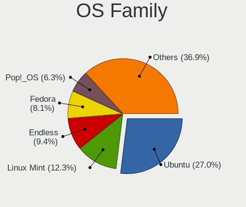
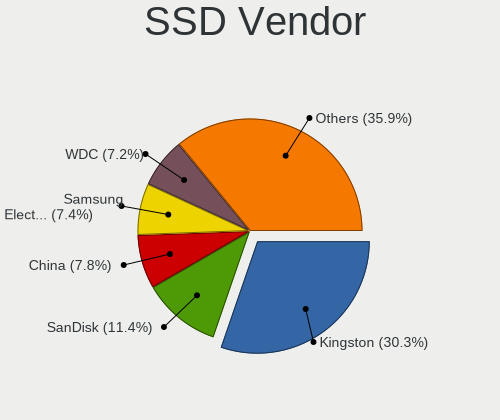

Linux in Brazil - Tested Hardware & Statistics (Notebooks)
----------------------------------------------------------

A project to collect tested hardware configurations for Linux in Brazil.

Anyone can contribute to this report by the [hw-probe](https://github.com/linuxhw/hw-probe) tool:

    sudo -E hw-probe -all -upload

Please contribute! Especially if your hardware is rare.

Contents
--------

* [ Test Cases ](#test-cases)

* [ System ](#system)
  - [ OS                       ](#os)
  - [ OS Family                ](#os-family)
  - [ Kernel                   ](#kernel)
  - [ Kernel Family            ](#kernel-family)
  - [ Kernel Major Ver.        ](#kernel-major-ver)
  - [ Arch                     ](#arch)
  - [ DE                       ](#de)
  - [ Display Server           ](#display-server)
  - [ Display Manager          ](#display-manager)
  - [ OS Lang                  ](#os-lang)
  - [ Boot Mode                ](#boot-mode)
  - [ Filesystem               ](#filesystem)
  - [ Part. scheme             ](#part-scheme)
  - [ Dual Boot with Linux/BSD ](#dual-boot-with-linuxbsd)
  - [ Dual Boot (Win)          ](#dual-boot-win)

* [ Board ](#board)
  - [ Vendor                   ](#vendor)
  - [ Model                    ](#model)
  - [ Model Family             ](#model-family)
  - [ MFG Year                 ](#mfg-year)
  - [ Form Factor              ](#form-factor)
  - [ Secure Boot              ](#secure-boot)
  - [ Coreboot                 ](#coreboot)
  - [ RAM Size                 ](#ram-size)
  - [ RAM Used                 ](#ram-used)
  - [ Total Drives             ](#total-drives)
  - [ Has CD-ROM               ](#has-cd-rom)
  - [ Has Ethernet             ](#has-ethernet)
  - [ Has WiFi                 ](#has-wifi)
  - [ Has Bluetooth            ](#has-bluetooth)

* [ Location ](#location)
  - [ Country                  ](#country)
  - [ City                     ](#city)

* [ Drives ](#drives)
  - [ Drive Vendor             ](#drive-vendor)
  - [ Drive Model              ](#drive-model)
  - [ HDD Vendor               ](#hdd-vendor)
  - [ SSD Vendor               ](#ssd-vendor)
  - [ Drive Kind               ](#drive-kind)
  - [ Drive Connector          ](#drive-connector)
  - [ Drive Size               ](#drive-size)
  - [ Space Total              ](#space-total)
  - [ Space Used               ](#space-used)
  - [ Malfunc. Drives          ](#malfunc-drives)
  - [ Malfunc. Drive Vendor    ](#malfunc-drive-vendor)
  - [ Malfunc. HDD Vendor      ](#malfunc-hdd-vendor)
  - [ Malfunc. Drive Kind      ](#malfunc-drive-kind)
  - [ Failed Drives            ](#failed-drives)
  - [ Failed Drive Vendor      ](#failed-drive-vendor)
  - [ Drive Status             ](#drive-status)

* [ Storage controller ](#storage-controller)
  - [ Storage Vendor           ](#storage-vendor)
  - [ Storage Model            ](#storage-model)
  - [ Storage Kind             ](#storage-kind)

* [ Processor ](#processor)
  - [ CPU Vendor               ](#cpu-vendor)
  - [ CPU Model                ](#cpu-model)
  - [ CPU Model Family         ](#cpu-model-family)
  - [ CPU Cores                ](#cpu-cores)
  - [ CPU Sockets              ](#cpu-sockets)
  - [ CPU Threads              ](#cpu-threads)
  - [ CPU Op-Modes             ](#cpu-op-modes)
  - [ CPU Microcode            ](#cpu-microcode)
  - [ CPU Microarch            ](#cpu-microarch)

* [ Graphics ](#graphics)
  - [ GPU Vendor               ](#gpu-vendor)
  - [ GPU Model                ](#gpu-model)
  - [ GPU Combo                ](#gpu-combo)
  - [ GPU Driver               ](#gpu-driver)
  - [ GPU Memory               ](#gpu-memory)

* [ Monitor ](#monitor)
  - [ Monitor Vendor           ](#monitor-vendor)
  - [ Monitor Model            ](#monitor-model)
  - [ Monitor Resolution       ](#monitor-resolution)
  - [ Monitor Diagonal         ](#monitor-diagonal)
  - [ Monitor Width            ](#monitor-width)
  - [ Aspect Ratio             ](#aspect-ratio)
  - [ Monitor Area             ](#monitor-area)
  - [ Pixel Density            ](#pixel-density)
  - [ Multiple Monitors        ](#multiple-monitors)

* [ Network ](#network)
  - [ Net Controller Vendor    ](#net-controller-vendor)
  - [ Net Controller Model     ](#net-controller-model)
  - [ Wireless Vendor          ](#wireless-vendor)
  - [ Wireless Model           ](#wireless-model)
  - [ Ethernet Vendor          ](#ethernet-vendor)
  - [ Ethernet Model           ](#ethernet-model)
  - [ Net Controller Kind      ](#net-controller-kind)
  - [ Used Controller          ](#used-controller)
  - [ NICs                     ](#nics)
  - [ IPv6                     ](#ipv6)

* [ Bluetooth ](#bluetooth)
  - [ Bluetooth Vendor         ](#bluetooth-vendor)
  - [ Bluetooth Model          ](#bluetooth-model)

* [ Sound ](#sound)
  - [ Sound Vendor             ](#sound-vendor)
  - [ Sound Model              ](#sound-model)

* [ Memory ](#memory)
  - [ Memory Vendor            ](#memory-vendor)
  - [ Memory Model             ](#memory-model)
  - [ Memory Kind              ](#memory-kind)
  - [ Memory Form Factor       ](#memory-form-factor)
  - [ Memory Size              ](#memory-size)
  - [ Memory Speed             ](#memory-speed)

* [ Printers & scanners ](#printers--scanners)
  - [ Printer Vendor           ](#printer-vendor)
  - [ Printer Model            ](#printer-model)
  - [ Scanner Vendor           ](#scanner-vendor)
  - [ Scanner Model            ](#scanner-model)

* [ Camera ](#camera)
  - [ Camera Vendor            ](#camera-vendor)
  - [ Camera Model             ](#camera-model)

* [ Security ](#security)
  - [ Fingerprint Vendor       ](#fingerprint-vendor)
  - [ Fingerprint Model        ](#fingerprint-model)
  - [ Chipcard Vendor          ](#chipcard-vendor)
  - [ Chipcard Model           ](#chipcard-model)

* [ Unsupported ](#unsupported)
  - [ Unsupported Devices      ](#unsupported-devices)
  - [ Unsupported Device Types ](#unsupported-device-types)

Test Cases
----------

Total: 12196

| Vendor        | Model                       | Probe                                                      | Date         |
|---------------|-----------------------------|------------------------------------------------------------|--------------|
| HP            | ENVY 15                     | [5f301610ee](https://linux-hardware.org/?probe=5f301610ee) | Nov 06, 2023 |
| Acer          | Aspire A515-51              | [5fafb134cf](https://linux-hardware.org/?probe=5fafb134cf) | Nov 06, 2023 |
| HP            | ENVY 15                     | [150ca6a1a0](https://linux-hardware.org/?probe=150ca6a1a0) | Nov 06, 2023 |
| Samsung       | 550P5C/550P7C               | [f87e3a97c4](https://linux-hardware.org/?probe=f87e3a97c4) | Nov 06, 2023 |
| Acer          | Aspire A315-53              | [3daa9909b3](https://linux-hardware.org/?probe=3daa9909b3) | Nov 06, 2023 |
| Positivo      | C41TF                       | [4bb5f6150c](https://linux-hardware.org/?probe=4bb5f6150c) | Nov 06, 2023 |
| Notebook      | NJx0MU                      | [24a052bf0c](https://linux-hardware.org/?probe=24a052bf0c) | Nov 06, 2023 |
| Lenovo        | IdeaPad S145-15IWL 81S9     | [f0b35f0acb](https://linux-hardware.org/?probe=f0b35f0acb) | Nov 05, 2023 |
| Lenovo        | IdeaPad S145-15IWL 81S9     | [7060a82ed0](https://linux-hardware.org/?probe=7060a82ed0) | Nov 05, 2023 |
| Toshiba       | IS 1412                     | [486d28dfeb](https://linux-hardware.org/?probe=486d28dfeb) | Nov 05, 2023 |
| Digibras      | NH4CU53                     | [2c274cbad8](https://linux-hardware.org/?probe=2c274cbad8) | Nov 05, 2023 |
| Toshiba       | IS 1412                     | [d423a5c34a](https://linux-hardware.org/?probe=d423a5c34a) | Nov 04, 2023 |
| Dell          | Latitude E6430              | [6a724d5aa8](https://linux-hardware.org/?probe=6a724d5aa8) | Nov 04, 2023 |
| ASUSTek       | UX31A                       | [013a7815c3](https://linux-hardware.org/?probe=013a7815c3) | Nov 04, 2023 |
| ASUSTek       | VivoBook_ASUSLaptop X515... | [80d949b057](https://linux-hardware.org/?probe=80d949b057) | Nov 04, 2023 |
| Google        | Bluebird                    | [55dbc11653](https://linux-hardware.org/?probe=55dbc11653) | Nov 04, 2023 |
| MSI           | MS-1759                     | [2dd46c2a71](https://linux-hardware.org/?probe=2dd46c2a71) | Nov 04, 2023 |
| Google        | Bluebird                    | [9e12130a28](https://linux-hardware.org/?probe=9e12130a28) | Nov 04, 2023 |
| HP            | 246 G6 Notebook PC          | [cd997e5a97](https://linux-hardware.org/?probe=cd997e5a97) | Nov 03, 2023 |
| Dell          | Inspiron N4010              | [f8aed4abab](https://linux-hardware.org/?probe=f8aed4abab) | Nov 03, 2023 |
| Dell          | Latitude 3420               | [9211e0f588](https://linux-hardware.org/?probe=9211e0f588) | Nov 03, 2023 |
| Multilaser    | PC13X                       | [1c6a314055](https://linux-hardware.org/?probe=1c6a314055) | Nov 03, 2023 |
| Acer          | Aspire 5750                 | [429b14ee32](https://linux-hardware.org/?probe=429b14ee32) | Nov 03, 2023 |
| Lenovo        | ThinkPad E14 Gen 2 20TB0... | [6987861086](https://linux-hardware.org/?probe=6987861086) | Nov 03, 2023 |
| Lenovo        | IdeaPad 330-15IGM 81FN      | [5d06dbbe5f](https://linux-hardware.org/?probe=5d06dbbe5f) | Nov 03, 2023 |
| Dell          | Inspiron 5547               | [e14eb66450](https://linux-hardware.org/?probe=e14eb66450) | Nov 03, 2023 |
| Lenovo        | IdeaPad 330-15IGM 81FN      | [9552d5f729](https://linux-hardware.org/?probe=9552d5f729) | Nov 02, 2023 |
| Acer          | AO722                       | [3464dc7b3c](https://linux-hardware.org/?probe=3464dc7b3c) | Nov 02, 2023 |
| Dell          | Latitude 3440               | [b50ed47992](https://linux-hardware.org/?probe=b50ed47992) | Nov 02, 2023 |
| Dell          | Latitude 3440               | [9426910684](https://linux-hardware.org/?probe=9426910684) | Nov 02, 2023 |
| HP            | ZBook 17 G5                 | [4377844e75](https://linux-hardware.org/?probe=4377844e75) | Nov 02, 2023 |
| Samsung       | 960XFH                      | [6076e144ac](https://linux-hardware.org/?probe=6076e144ac) | Nov 01, 2023 |
| Apple         | MacBookPro8,1               | [b03928bc33](https://linux-hardware.org/?probe=b03928bc33) | Nov 01, 2023 |
| Dell          | Inspiron 5502               | [a1d2f7988e](https://linux-hardware.org/?probe=a1d2f7988e) | Nov 01, 2023 |
| Lenovo        | IdeaPad 320-14IKB 80YF      | [643c7ccd9b](https://linux-hardware.org/?probe=643c7ccd9b) | Nov 01, 2023 |
| Lenovo        | IdeaPad S145-15IWL 81S9     | [446efaf1bb](https://linux-hardware.org/?probe=446efaf1bb) | Oct 31, 2023 |
| Apple         | MacBookPro8,1               | [27c6a9540f](https://linux-hardware.org/?probe=27c6a9540f) | Oct 31, 2023 |
| Lenovo        | ThinkPad E14 Gen 3 20YD0... | [5b8af0fd77](https://linux-hardware.org/?probe=5b8af0fd77) | Oct 31, 2023 |
| Dell          | G15 5515                    | [c59e97ba9e](https://linux-hardware.org/?probe=c59e97ba9e) | Oct 31, 2023 |
| ASUSTek       | VivoBook_ASUSLaptop K350... | [40ae523147](https://linux-hardware.org/?probe=40ae523147) | Oct 31, 2023 |
| HP            | ProBook 645 G1              | [b637cedab4](https://linux-hardware.org/?probe=b637cedab4) | Oct 31, 2023 |
| Dell          | Latitude 5400               | [e7f91d1c69](https://linux-hardware.org/?probe=e7f91d1c69) | Oct 30, 2023 |
| LG Electro... | 14Z980-G.BH51P1             | [879ba00b91](https://linux-hardware.org/?probe=879ba00b91) | Oct 30, 2023 |
| Acer          | Aspire 5733                 | [8a925b3630](https://linux-hardware.org/?probe=8a925b3630) | Oct 30, 2023 |
| ASUSTek       | VivoBook_ASUSLaptop X515... | [931f0ed896](https://linux-hardware.org/?probe=931f0ed896) | Oct 30, 2023 |
| Dell          | Inspiron N4050              | [7d5dc09b04](https://linux-hardware.org/?probe=7d5dc09b04) | Oct 30, 2023 |
| Lenovo        | ThinkPad T480 20L6S0CE13    | [28a8f59777](https://linux-hardware.org/?probe=28a8f59777) | Oct 29, 2023 |
| Sony          | VPCCW13FB                   | [96516448b2](https://linux-hardware.org/?probe=96516448b2) | Oct 29, 2023 |
| Sony          | VPCCW13FB                   | [7092dfafd9](https://linux-hardware.org/?probe=7092dfafd9) | Oct 29, 2023 |
| Samsung       | 370E4K                      | [78ec3e796a](https://linux-hardware.org/?probe=78ec3e796a) | Oct 28, 2023 |
| Acer          | Aspire V3-571               | [6aa696ac55](https://linux-hardware.org/?probe=6aa696ac55) | Oct 28, 2023 |
| Samsung       | 550XCJ/550XCR               | [9d34ff8710](https://linux-hardware.org/?probe=9d34ff8710) | Oct 27, 2023 |
| Acer          | Aspire A315-42G             | [114e1e6d66](https://linux-hardware.org/?probe=114e1e6d66) | Oct 27, 2023 |
| Sony          | SVS13A25PBS                 | [7cb087bd2d](https://linux-hardware.org/?probe=7cb087bd2d) | Oct 27, 2023 |
| Avell High... | 1513 Mxti                   | [9f5d60c02b](https://linux-hardware.org/?probe=9f5d60c02b) | Oct 27, 2023 |
| Acer          | Nitro AN515-47              | [8516768801](https://linux-hardware.org/?probe=8516768801) | Oct 26, 2023 |
| Acer          | Aspire 5050                 | [2129ab3e24](https://linux-hardware.org/?probe=2129ab3e24) | Oct 26, 2023 |
| Lenovo        | IdeaPad Gaming 3 15ACH6 ... | [2bee900f03](https://linux-hardware.org/?probe=2bee900f03) | Oct 26, 2023 |
| Dell          | Inspiron 3437               | [a57068abbc](https://linux-hardware.org/?probe=a57068abbc) | Oct 26, 2023 |
| ASUSTek       | VivoBook_ASUSLaptop X515... | [c9e8482167](https://linux-hardware.org/?probe=c9e8482167) | Oct 26, 2023 |
| Lenovo        | Y720-15IKB 81CQ             | [7aec151a1c](https://linux-hardware.org/?probe=7aec151a1c) | Oct 25, 2023 |
| Dell          | Inspiron 3442               | [7fc2a154e5](https://linux-hardware.org/?probe=7fc2a154e5) | Oct 25, 2023 |
| Lenovo        | IdeaPad 3 15ALC6 82MF       | [9a4561dabf](https://linux-hardware.org/?probe=9a4561dabf) | Oct 25, 2023 |
| ASUSTek       | VivoBook_ASUSLaptop X515... | [76d22d10e6](https://linux-hardware.org/?probe=76d22d10e6) | Oct 25, 2023 |
| Samsung       | 270E5J/2570EJ               | [94f358053d](https://linux-hardware.org/?probe=94f358053d) | Oct 24, 2023 |
| Dell          | Vostro 3550                 | [2fb1e4bb71](https://linux-hardware.org/?probe=2fb1e4bb71) | Oct 24, 2023 |
| Samsung       | 670Z5E                      | [101b5bda5b](https://linux-hardware.org/?probe=101b5bda5b) | Oct 24, 2023 |
| Dell          | Inspiron 15-3567            | [879198d56a](https://linux-hardware.org/?probe=879198d56a) | Oct 24, 2023 |
| Dell          | Inspiron 15-3567            | [0e451d6616](https://linux-hardware.org/?probe=0e451d6616) | Oct 24, 2023 |
| Lenovo        | Y720-15IKB 81CQ             | [c0601dc338](https://linux-hardware.org/?probe=c0601dc338) | Oct 24, 2023 |
| Lenovo        | IdeaPad S145-15IWL 81S9     | [744dddac21](https://linux-hardware.org/?probe=744dddac21) | Oct 24, 2023 |
| Alienware     | m15 R6                      | [c6711f7b02](https://linux-hardware.org/?probe=c6711f7b02) | Oct 24, 2023 |
| Valve         | Jupiter                     | [83d3faf177](https://linux-hardware.org/?probe=83d3faf177) | Oct 23, 2023 |
| Dell          | Inspiron 7559               | [24a664955f](https://linux-hardware.org/?probe=24a664955f) | Oct 23, 2023 |
| Acer          | Aspire A315-42G             | [65494c95ec](https://linux-hardware.org/?probe=65494c95ec) | Oct 23, 2023 |
| Dell          | Inspiron 7559               | [c931b1ef73](https://linux-hardware.org/?probe=c931b1ef73) | Oct 23, 2023 |
| Lenovo        | IdeaPad Gaming 3 15IHU6 ... | [da2cda923f](https://linux-hardware.org/?probe=da2cda923f) | Oct 23, 2023 |
| Dell          | Vostro 3400                 | [9c24bc3329](https://linux-hardware.org/?probe=9c24bc3329) | Oct 23, 2023 |
| Samsung       | RF511/RF411/RF711           | [6a62fa5cb6](https://linux-hardware.org/?probe=6a62fa5cb6) | Oct 23, 2023 |
| HP            | Pavilion dv7                | [c3e7ebfd20](https://linux-hardware.org/?probe=c3e7ebfd20) | Oct 23, 2023 |
| Acer          | Aspire E5-573               | [d83f4bf9ad](https://linux-hardware.org/?probe=d83f4bf9ad) | Oct 23, 2023 |
| Dell          | G15 5515                    | [758d007f45](https://linux-hardware.org/?probe=758d007f45) | Oct 23, 2023 |
| Dell          | G15 5515                    | [5853f5312f](https://linux-hardware.org/?probe=5853f5312f) | Oct 23, 2023 |
| Positivo      | C4128G-15                   | [8d9aa2f206](https://linux-hardware.org/?probe=8d9aa2f206) | Oct 23, 2023 |
| Acer          | Aspire A315-58              | [60402f4ad8](https://linux-hardware.org/?probe=60402f4ad8) | Oct 23, 2023 |
| Samsung       | 340XAA/350XAA/550XAA        | [48d2114a2e](https://linux-hardware.org/?probe=48d2114a2e) | Oct 22, 2023 |
| HP            | Folio 13                    | [b7ed500d93](https://linux-hardware.org/?probe=b7ed500d93) | Oct 22, 2023 |
| Clevo         | M660SR                      | [56f8ab01f9](https://linux-hardware.org/?probe=56f8ab01f9) | Oct 22, 2023 |
| Dell          | Inspiron 3437               | [331cbd427d](https://linux-hardware.org/?probe=331cbd427d) | Oct 21, 2023 |
| HP            | Pavilion dv7                | [3379c8b4e7](https://linux-hardware.org/?probe=3379c8b4e7) | Oct 21, 2023 |
| Notebook      | NJx0MU                      | [961c369ea4](https://linux-hardware.org/?probe=961c369ea4) | Oct 21, 2023 |
| Lenovo        | IdeaPad S145-15IGM 81WT     | [ad7ca8e192](https://linux-hardware.org/?probe=ad7ca8e192) | Oct 21, 2023 |
| Notebook      | NJx0MU                      | [f19c18154b](https://linux-hardware.org/?probe=f19c18154b) | Oct 21, 2023 |
| Gateway       | NV55C                       | [bb0eb9e5dd](https://linux-hardware.org/?probe=bb0eb9e5dd) | Oct 21, 2023 |
| Acer          | Aspire A315-23              | [d3b1d639f5](https://linux-hardware.org/?probe=d3b1d639f5) | Oct 21, 2023 |
| Compaq        | 434                         | [094bba21f8](https://linux-hardware.org/?probe=094bba21f8) | Oct 21, 2023 |
| LG Electro... | R410-G.BP21P1               | [36849f1a4c](https://linux-hardware.org/?probe=36849f1a4c) | Oct 21, 2023 |
| HP            | Folio 13                    | [99ff48ac3f](https://linux-hardware.org/?probe=99ff48ac3f) | Oct 20, 2023 |
| Avell High... | B.ON                        | [7f8ce9da76](https://linux-hardware.org/?probe=7f8ce9da76) | Oct 20, 2023 |
| Samsung       | 670Z5E                      | [ddc0c78bff](https://linux-hardware.org/?probe=ddc0c78bff) | Oct 20, 2023 |
| Dell          | Latitude 3490               | [174ee1b12e](https://linux-hardware.org/?probe=174ee1b12e) | Oct 20, 2023 |
| Dell          | Vostro 3300                 | [827b95e65c](https://linux-hardware.org/?probe=827b95e65c) | Oct 20, 2023 |
| Acer          | Nitro AN515-51              | [be03ed57d8](https://linux-hardware.org/?probe=be03ed57d8) | Oct 20, 2023 |
| Acer          | Nitro AN515-51              | [e648a8c32a](https://linux-hardware.org/?probe=e648a8c32a) | Oct 20, 2023 |
| Acer          | Aspire A315-42G             | [46d5d338b3](https://linux-hardware.org/?probe=46d5d338b3) | Oct 20, 2023 |
| Dell          | Vostro 3550                 | [db4e9dfc27](https://linux-hardware.org/?probe=db4e9dfc27) | Oct 20, 2023 |
| Lenovo        | IdeaPad S145-15API 81V7     | [0506dfa238](https://linux-hardware.org/?probe=0506dfa238) | Oct 19, 2023 |
| Dell          | Vostro 3560                 | [aa95d1c178](https://linux-hardware.org/?probe=aa95d1c178) | Oct 19, 2023 |
| Dell          | Inspiron 5547               | [3dc947b334](https://linux-hardware.org/?probe=3dc947b334) | Oct 19, 2023 |
| Samsung       | 670Z5E                      | [aeec82cef9](https://linux-hardware.org/?probe=aeec82cef9) | Oct 19, 2023 |
| Lenovo        | IdeaPad 320-15IKB 80YH      | [e94e48868c](https://linux-hardware.org/?probe=e94e48868c) | Oct 19, 2023 |
| Lenovo        | G450 2949                   | [abafeadb35](https://linux-hardware.org/?probe=abafeadb35) | Oct 19, 2023 |
| Compaq        | Presario CQ-23              | [15c10707d0](https://linux-hardware.org/?probe=15c10707d0) | Oct 19, 2023 |
| Lenovo        | G450 2949                   | [ab3c18427d](https://linux-hardware.org/?probe=ab3c18427d) | Oct 19, 2023 |
| ASUSTek       | ASUS TUF Gaming F15 FX50... | [a8e2b482f4](https://linux-hardware.org/?probe=a8e2b482f4) | Oct 19, 2023 |
| Lenovo        | IdeaPad Gaming 3 15ACH6 ... | [ab21923ddd](https://linux-hardware.org/?probe=ab21923ddd) | Oct 19, 2023 |
| Dell          | Inspiron 15-3567            | [486e66cdee](https://linux-hardware.org/?probe=486e66cdee) | Oct 18, 2023 |
| Lenovo        | IdeaPad Gaming 3 15IMH05... | [495a705c9e](https://linux-hardware.org/?probe=495a705c9e) | Oct 18, 2023 |
| Lenovo        | IdeaPad S145-15API 81V7     | [315376a82a](https://linux-hardware.org/?probe=315376a82a) | Oct 18, 2023 |
| Lenovo        | IdeaPad Gaming 3 15IMH05... | [cf6314850a](https://linux-hardware.org/?probe=cf6314850a) | Oct 18, 2023 |
| Positivo      | Mobile                      | [5dedeac18e](https://linux-hardware.org/?probe=5dedeac18e) | Oct 18, 2023 |
| Sony          | VPCEA23FB                   | [dbfa513b31](https://linux-hardware.org/?probe=dbfa513b31) | Oct 18, 2023 |
| Acer          | Nitro AN515-54              | [877ec2dd85](https://linux-hardware.org/?probe=877ec2dd85) | Oct 18, 2023 |
| Dell          | Inspiron 15-3567            | [d77237b330](https://linux-hardware.org/?probe=d77237b330) | Oct 18, 2023 |
| Samsung       | 670Z5E                      | [65ee0747bc](https://linux-hardware.org/?probe=65ee0747bc) | Oct 18, 2023 |
| Lenovo        | B330S-15IKBR 81JV           | [5df1834272](https://linux-hardware.org/?probe=5df1834272) | Oct 18, 2023 |
| HP            | Pavilion Sleekbook 14 PC    | [041aba02ce](https://linux-hardware.org/?probe=041aba02ce) | Oct 17, 2023 |
| Dell          | Inspiron 7559               | [6280e4287a](https://linux-hardware.org/?probe=6280e4287a) | Oct 17, 2023 |
| Lenovo        | B330S-15IKBR 81JV           | [9e1356181f](https://linux-hardware.org/?probe=9e1356181f) | Oct 17, 2023 |
| Dell          | Inspiron 5448               | [5901b49079](https://linux-hardware.org/?probe=5901b49079) | Oct 17, 2023 |
| Apple         | MacBookPro11,1              | [33cba76fe6](https://linux-hardware.org/?probe=33cba76fe6) | Oct 17, 2023 |
| HP            | Folio 13 - 2000             | [c541a1603c](https://linux-hardware.org/?probe=c541a1603c) | Oct 17, 2023 |
| Dell          | Vostro 3550                 | [25ba718720](https://linux-hardware.org/?probe=25ba718720) | Oct 16, 2023 |
| Positivo B... | VJFE42F11X-XXXXXX           | [d271c61b92](https://linux-hardware.org/?probe=d271c61b92) | Oct 16, 2023 |
| Multilaser    | MLSH1H LINUX                | [e87c9aab74](https://linux-hardware.org/?probe=e87c9aab74) | Oct 16, 2023 |
| Dell          | XPS 13 9300                 | [e66f442843](https://linux-hardware.org/?probe=e66f442843) | Oct 16, 2023 |
| Dell          | XPS 13 9300                 | [eab86d1cc0](https://linux-hardware.org/?probe=eab86d1cc0) | Oct 16, 2023 |
| Positivo      | Q4128C-S                    | [ea1c91d413](https://linux-hardware.org/?probe=ea1c91d413) | Oct 16, 2023 |
| Acer          | Aspire E5-571               | [fcc76a61ae](https://linux-hardware.org/?probe=fcc76a61ae) | Oct 16, 2023 |
| Multilaser    | MLSH1H LINUX                | [0ca88d127f](https://linux-hardware.org/?probe=0ca88d127f) | Oct 16, 2023 |
| Acer          | Nitro AN515-52              | [7f9e09a9e1](https://linux-hardware.org/?probe=7f9e09a9e1) | Oct 16, 2023 |
| Acer          | Nitro AN515-52              | [2571e4fd1b](https://linux-hardware.org/?probe=2571e4fd1b) | Oct 16, 2023 |
| Avell High... | C62 MOB                     | [116667b041](https://linux-hardware.org/?probe=116667b041) | Oct 16, 2023 |
| HP            | Pavilion dv6                | [4faf7bb285](https://linux-hardware.org/?probe=4faf7bb285) | Oct 15, 2023 |
| Lenovo        | ThinkPad T470 W10DG 20JN... | [90b07f2a8b](https://linux-hardware.org/?probe=90b07f2a8b) | Oct 15, 2023 |
| HP            | Pavilion dv6                | [52e554d0dc](https://linux-hardware.org/?probe=52e554d0dc) | Oct 15, 2023 |
| Lenovo        | IdeaPad S145-15API 81V7     | [c12987d53a](https://linux-hardware.org/?probe=c12987d53a) | Oct 15, 2023 |
| Samsung       | 340XAA/350XAA/550XAA        | [079342de2b](https://linux-hardware.org/?probe=079342de2b) | Oct 15, 2023 |
| Dell          | Inspiron N5010              | [9dae04bd63](https://linux-hardware.org/?probe=9dae04bd63) | Oct 15, 2023 |
| Acer          | Nitro AN517-54              | [2f6c2f44d3](https://linux-hardware.org/?probe=2f6c2f44d3) | Oct 15, 2023 |
| Samsung       | 550XCJ/550XCR               | [579dc4dabc](https://linux-hardware.org/?probe=579dc4dabc) | Oct 15, 2023 |
| ASUSTek       | VivoBook_ASUSLaptop X515... | [33a143a23d](https://linux-hardware.org/?probe=33a143a23d) | Oct 15, 2023 |
| Lenovo        | IdeaPad 3 15ALC6 82MF       | [3c91ad6491](https://linux-hardware.org/?probe=3c91ad6491) | Oct 14, 2023 |
| Lenovo        | IdeaPad 3 15ALC6 82MF       | [160af8609e](https://linux-hardware.org/?probe=160af8609e) | Oct 14, 2023 |
| Dell          | Inspiron 3501               | [a1ada382fa](https://linux-hardware.org/?probe=a1ada382fa) | Oct 14, 2023 |
| HP            | ProBook 640 G1              | [b00d98a451](https://linux-hardware.org/?probe=b00d98a451) | Oct 14, 2023 |
| HP            | ProBook 640 G1              | [15168951ed](https://linux-hardware.org/?probe=15168951ed) | Oct 13, 2023 |
| Samsung       | 550XBE/350XBE               | [27ea9922a6](https://linux-hardware.org/?probe=27ea9922a6) | Oct 13, 2023 |
| Dell          | Inspiron 5548               | [edb6e06451](https://linux-hardware.org/?probe=edb6e06451) | Oct 13, 2023 |
| Digibras      | NH4CU53                     | [40f4cfc21c](https://linux-hardware.org/?probe=40f4cfc21c) | Oct 13, 2023 |
| Acer          | Aspire A515-45              | [f5e57e4558](https://linux-hardware.org/?probe=f5e57e4558) | Oct 13, 2023 |
| Acer          | Nitro AN515-44              | [1f1524c080](https://linux-hardware.org/?probe=1f1524c080) | Oct 13, 2023 |
| Acer          | Nitro AN515-47              | [0592faaf34](https://linux-hardware.org/?probe=0592faaf34) | Oct 12, 2023 |
| Acer          | Nitro AN515-44              | [65b1e10033](https://linux-hardware.org/?probe=65b1e10033) | Oct 12, 2023 |
| Acer          | Nitro AN515-44              | [6d2fdd060b](https://linux-hardware.org/?probe=6d2fdd060b) | Oct 12, 2023 |
| Acer          | Aspire E1-571               | [94754c98ce](https://linux-hardware.org/?probe=94754c98ce) | Oct 12, 2023 |
| Dell          | Latitude 3490               | [1c5aa8fca4](https://linux-hardware.org/?probe=1c5aa8fca4) | Oct 12, 2023 |
| Apple         | MacBookPro5,4               | [f68b19bbe5](https://linux-hardware.org/?probe=f68b19bbe5) | Oct 12, 2023 |
| Acer          | Aspire VX5-591G             | [586d280ca5](https://linux-hardware.org/?probe=586d280ca5) | Oct 12, 2023 |
| Dell          | Vostro 5490                 | [616aecbfbd](https://linux-hardware.org/?probe=616aecbfbd) | Oct 11, 2023 |
| Gateway       | NE570                       | [533fec5226](https://linux-hardware.org/?probe=533fec5226) | Oct 11, 2023 |
| Avell High... | B.ON                        | [3a419fbd20](https://linux-hardware.org/?probe=3a419fbd20) | Oct 11, 2023 |
| Lenovo        | IdeaPad Gaming 3 15ACH6 ... | [19f231af9a](https://linux-hardware.org/?probe=19f231af9a) | Oct 11, 2023 |
| Dell          | Vostro 1510                 | [6324053514](https://linux-hardware.org/?probe=6324053514) | Oct 10, 2023 |
| Avell High... | C62 MOB                     | [0e1ec62b3b](https://linux-hardware.org/?probe=0e1ec62b3b) | Oct 10, 2023 |
| ASUSTek       | VivoBook_ASUSLaptop X509... | [c0882707d4](https://linux-hardware.org/?probe=c0882707d4) | Oct 10, 2023 |
| Lenovo        | IdeaPad S145-15IWL 81S9     | [c397035651](https://linux-hardware.org/?probe=c397035651) | Oct 10, 2023 |
| Dell          | Latitude E6420              | [7508b7cf4f](https://linux-hardware.org/?probe=7508b7cf4f) | Oct 10, 2023 |
| Apple         | MacBookPro11,1              | [8a64a738ca](https://linux-hardware.org/?probe=8a64a738ca) | Oct 10, 2023 |
| Apple         | MacBookPro8,1               | [2192f74b2d](https://linux-hardware.org/?probe=2192f74b2d) | Oct 09, 2023 |
| Dell          | Inspiron 3421               | [1da5f9aefa](https://linux-hardware.org/?probe=1da5f9aefa) | Oct 09, 2023 |
| Apple         | MacBookPro4,1               | [407c6f0e29](https://linux-hardware.org/?probe=407c6f0e29) | Oct 09, 2023 |
| Lenovo        | ThinkPad T490 20N3S8HL00    | [e75ca9bf06](https://linux-hardware.org/?probe=e75ca9bf06) | Oct 09, 2023 |
| Lenovo        | G480 20149                  | [ff58b011f2](https://linux-hardware.org/?probe=ff58b011f2) | Oct 09, 2023 |
| Dell          | Inspiron 3583               | [f2fe39dcc0](https://linux-hardware.org/?probe=f2fe39dcc0) | Oct 09, 2023 |
| Dell          | Inspiron 3583               | [f78bda610e](https://linux-hardware.org/?probe=f78bda610e) | Oct 09, 2023 |
| ASUSTek       | VivoBook_ASUSLaptop X515... | [508c438c6a](https://linux-hardware.org/?probe=508c438c6a) | Oct 09, 2023 |
| Dell          | Vostro 7590                 | [d7188e68cb](https://linux-hardware.org/?probe=d7188e68cb) | Oct 08, 2023 |
| Lenovo        | ThinkPad E14 20RB0028BR     | [bb9133e0b8](https://linux-hardware.org/?probe=bb9133e0b8) | Oct 08, 2023 |
| Dell          | Inspiron 3421               | [b8557f2880](https://linux-hardware.org/?probe=b8557f2880) | Oct 08, 2023 |
| Dell          | Inspiron 3576               | [7e5e46c41a](https://linux-hardware.org/?probe=7e5e46c41a) | Oct 08, 2023 |
| Acer          | Swift SF514-56T             | [0d2d2cf2ae](https://linux-hardware.org/?probe=0d2d2cf2ae) | Oct 08, 2023 |
| HP            | ENVY dv7                    | [05ca6a125d](https://linux-hardware.org/?probe=05ca6a125d) | Oct 08, 2023 |
| HP            | Folio 13                    | [f4ed29d660](https://linux-hardware.org/?probe=f4ed29d660) | Oct 08, 2023 |
| HP            | Pavilion g4                 | [3e5383da88](https://linux-hardware.org/?probe=3e5383da88) | Oct 08, 2023 |
| HP            | Pavilion g4                 | [cab160aff3](https://linux-hardware.org/?probe=cab160aff3) | Oct 08, 2023 |
| Acer          | Nitro AN515-58              | [907f3a4cf1](https://linux-hardware.org/?probe=907f3a4cf1) | Oct 08, 2023 |
| Acer          | Nitro AN515-58              | [d003fa7343](https://linux-hardware.org/?probe=d003fa7343) | Oct 08, 2023 |
| ASUSTek       | G60JX                       | [e455f7fb08](https://linux-hardware.org/?probe=e455f7fb08) | Oct 08, 2023 |
| ASUSTek       | G60JX                       | [335e991de2](https://linux-hardware.org/?probe=335e991de2) | Oct 08, 2023 |
| Acer          | Aspire ES1-572              | [ac5943ef0c](https://linux-hardware.org/?probe=ac5943ef0c) | Oct 08, 2023 |
| Acer          | Swift SF514-56T             | [9f94f8934f](https://linux-hardware.org/?probe=9f94f8934f) | Oct 07, 2023 |
| HP            | OMEN by Laptop 17-an0xx     | [d375cfe649](https://linux-hardware.org/?probe=d375cfe649) | Oct 07, 2023 |
| Samsung       | 960XFH                      | [0d8aca1f6e](https://linux-hardware.org/?probe=0d8aca1f6e) | Oct 07, 2023 |
| Samsung       | 960XFH                      | [a2138fa3f8](https://linux-hardware.org/?probe=a2138fa3f8) | Oct 07, 2023 |
| Alienware     | m15 R7                      | [7bd2b6300f](https://linux-hardware.org/?probe=7bd2b6300f) | Oct 07, 2023 |
| Dell          | Latitude 3490               | [723d6797ae](https://linux-hardware.org/?probe=723d6797ae) | Oct 07, 2023 |
| Dell          | Inspiron 5421               | [90c1f511a6](https://linux-hardware.org/?probe=90c1f511a6) | Oct 06, 2023 |
| Dell          | Vostro 1510                 | [39ee83fbf5](https://linux-hardware.org/?probe=39ee83fbf5) | Oct 06, 2023 |
| Lenovo        | IdeaPad 330-15IKB 81FE      | [62c8d86cfa](https://linux-hardware.org/?probe=62c8d86cfa) | Oct 06, 2023 |
| Acer          | Aspire ES1-572              | [2e48163fbd](https://linux-hardware.org/?probe=2e48163fbd) | Oct 06, 2023 |
| Sony          | VGN-SR150A                  | [f8fcbe4227](https://linux-hardware.org/?probe=f8fcbe4227) | Oct 06, 2023 |
| Positivo B... | VJFE55F11X-B0211H           | [8d54d8438d](https://linux-hardware.org/?probe=8d54d8438d) | Oct 05, 2023 |
| Acer          | Aspire ES1-572              | [651a8f8f97](https://linux-hardware.org/?probe=651a8f8f97) | Oct 05, 2023 |
| Apple         | MacBookPro11,1              | [e346a58990](https://linux-hardware.org/?probe=e346a58990) | Oct 05, 2023 |
| Philco Inf... | EC10IS2                     | [f85315b46a](https://linux-hardware.org/?probe=f85315b46a) | Oct 04, 2023 |
| Dell          | Inspiron 5490               | [5ab40107ce](https://linux-hardware.org/?probe=5ab40107ce) | Oct 04, 2023 |
| HUAWEI        | NBLK-WAX9X                  | [a49cef1179](https://linux-hardware.org/?probe=a49cef1179) | Oct 04, 2023 |
| Positivo      | S14BW01                     | [3027fc7d9b](https://linux-hardware.org/?probe=3027fc7d9b) | Oct 04, 2023 |
| Dell          | Inspiron 5575               | [48afb4262c](https://linux-hardware.org/?probe=48afb4262c) | Oct 04, 2023 |
| Lenovo        | IdeaPad S145-15API 81V7     | [7bb81b99a0](https://linux-hardware.org/?probe=7bb81b99a0) | Oct 04, 2023 |
| Dell          | Inspiron 5547               | [06d30a9c8d](https://linux-hardware.org/?probe=06d30a9c8d) | Oct 03, 2023 |
| Apple         | MacBookPro8,1               | [cf2552023d](https://linux-hardware.org/?probe=cf2552023d) | Oct 03, 2023 |
| Lenovo        | IdeaPad 330-15IKB 81FD      | [5813f8d107](https://linux-hardware.org/?probe=5813f8d107) | Oct 03, 2023 |
| MSI           | CR620                       | [be490381a9](https://linux-hardware.org/?probe=be490381a9) | Oct 03, 2023 |
| Dell          | Inspiron 5558               | [81c44f8b56](https://linux-hardware.org/?probe=81c44f8b56) | Oct 03, 2023 |
| Dell          | Inspiron 5480               | [666fbb9e46](https://linux-hardware.org/?probe=666fbb9e46) | Oct 03, 2023 |
| ASUSTek       | K45VM                       | [b4f51ced7a](https://linux-hardware.org/?probe=b4f51ced7a) | Oct 02, 2023 |
| Dell          | Latitude E6420              | [90883fd019](https://linux-hardware.org/?probe=90883fd019) | Oct 02, 2023 |
| Lenovo        | ThinkPad Edge E431 62779... | [9574c05fb2](https://linux-hardware.org/?probe=9574c05fb2) | Oct 02, 2023 |
| Compaq        | 420                         | [b327579e60](https://linux-hardware.org/?probe=b327579e60) | Oct 02, 2023 |
| HP            | Victus by Gaming Laptop ... | [60a8a7d13f](https://linux-hardware.org/?probe=60a8a7d13f) | Oct 02, 2023 |
| HP            | Victus by Gaming Laptop ... | [28a54d8189](https://linux-hardware.org/?probe=28a54d8189) | Oct 02, 2023 |
| Dell          | Inspiron 5437               | [a348906862](https://linux-hardware.org/?probe=a348906862) | Oct 02, 2023 |
| Notebook      | NJx0MU                      | [f510af1acf](https://linux-hardware.org/?probe=f510af1acf) | Oct 01, 2023 |
| Dell          | Inspiron 15 3515            | [44bfa52d57](https://linux-hardware.org/?probe=44bfa52d57) | Oct 01, 2023 |
| Dell          | Inspiron 7580               | [8fa784881e](https://linux-hardware.org/?probe=8fa784881e) | Oct 01, 2023 |
| Notebook      | NJx0MU                      | [7b44ef8cd1](https://linux-hardware.org/?probe=7b44ef8cd1) | Oct 01, 2023 |
| Lenovo        | ThinkPad L14 Gen 1 20U6S... | [b79529501a](https://linux-hardware.org/?probe=b79529501a) | Oct 01, 2023 |
| Notebook      | NJx0MU                      | [a1f20bb140](https://linux-hardware.org/?probe=a1f20bb140) | Sep 30, 2023 |
| Notebook      | NJx0MU                      | [1449844643](https://linux-hardware.org/?probe=1449844643) | Sep 30, 2023 |
| Tectoy        | Pense Bem Notebook          | [6a6e6af34c](https://linux-hardware.org/?probe=6a6e6af34c) | Sep 29, 2023 |
| Positivo      | C14CR01                     | [11b171838d](https://linux-hardware.org/?probe=11b171838d) | Sep 29, 2023 |
| ASUSTek       | VivoBook_ASUSLaptop X515... | [772e866a05](https://linux-hardware.org/?probe=772e866a05) | Sep 29, 2023 |
| Dell          | Inspiron 5437               | [c0301c2fbb](https://linux-hardware.org/?probe=c0301c2fbb) | Sep 29, 2023 |
| Acer          | Nitro AN515-43              | [e55a394d41](https://linux-hardware.org/?probe=e55a394d41) | Sep 29, 2023 |
| Samsung       | 340XAA/350XAA/550XAA        | [ccc715eeb6](https://linux-hardware.org/?probe=ccc715eeb6) | Sep 29, 2023 |
| Lenovo        | IdeaPad 330S-15IKB 81JN     | [747f0d45fe](https://linux-hardware.org/?probe=747f0d45fe) | Sep 28, 2023 |
| Dell          | Vostro 5470                 | [b6f9976e23](https://linux-hardware.org/?probe=b6f9976e23) | Sep 28, 2023 |
| ASUSTek       | K45VM                       | [6c167e69a4](https://linux-hardware.org/?probe=6c167e69a4) | Sep 28, 2023 |
| Acer          | Acadia V1.35                | [c2074b2535](https://linux-hardware.org/?probe=c2074b2535) | Sep 28, 2023 |
| Acer          | Aspire E5-571               | [acd3733ebf](https://linux-hardware.org/?probe=acd3733ebf) | Sep 27, 2023 |
| EUROCOM       | RACER 2.0                   | [4351733d37](https://linux-hardware.org/?probe=4351733d37) | Sep 27, 2023 |
| Samsung       | 550XDA                      | [ab1fabfe9b](https://linux-hardware.org/?probe=ab1fabfe9b) | Sep 27, 2023 |
| Dell          | System XPS L502X            | [06d6fd95d1](https://linux-hardware.org/?probe=06d6fd95d1) | Sep 27, 2023 |
| Acer          | Aspire A315-53              | [c20a9f8f96](https://linux-hardware.org/?probe=c20a9f8f96) | Sep 27, 2023 |
| Dell          | G15 5520                    | [64cfeba3ee](https://linux-hardware.org/?probe=64cfeba3ee) | Sep 26, 2023 |
| Dell          | Inspiron 5423               | [a6a3b2697f](https://linux-hardware.org/?probe=a6a3b2697f) | Sep 26, 2023 |
| Dell          | Inspiron 5567               | [6ebf39a37a](https://linux-hardware.org/?probe=6ebf39a37a) | Sep 26, 2023 |
| Dell          | Inspiron 5567               | [644a616222](https://linux-hardware.org/?probe=644a616222) | Sep 26, 2023 |
| Samsung       | 340XAA/350XAA/550XAA        | [3d8dfdbf80](https://linux-hardware.org/?probe=3d8dfdbf80) | Sep 26, 2023 |
| HP            | Folio 13                    | [a5a1ae29a7](https://linux-hardware.org/?probe=a5a1ae29a7) | Sep 26, 2023 |
| Notebook      | NJx0MU                      | [89d81885ff](https://linux-hardware.org/?probe=89d81885ff) | Sep 26, 2023 |
| Intel         | W7645                       | [8a83c23785](https://linux-hardware.org/?probe=8a83c23785) | Sep 25, 2023 |
| HP            | Presario CQ43               | [c206dc84ad](https://linux-hardware.org/?probe=c206dc84ad) | Sep 25, 2023 |
| Acer          | Aspire F5-573G              | [a2f6814940](https://linux-hardware.org/?probe=a2f6814940) | Sep 25, 2023 |
| Dell          | Latitude E5440              | [f4accb1cb0](https://linux-hardware.org/?probe=f4accb1cb0) | Sep 25, 2023 |
| Dell          | XPS 13 9380                 | [705c3fdeff](https://linux-hardware.org/?probe=705c3fdeff) | Sep 25, 2023 |
| Acer          | Aspire E5-571               | [e74a87d3f4](https://linux-hardware.org/?probe=e74a87d3f4) | Sep 25, 2023 |
| HP            | Presario CQ43               | [b2663eb2fa](https://linux-hardware.org/?probe=b2663eb2fa) | Sep 25, 2023 |
| Acer          | Nitro AN515-51              | [6d6d719f30](https://linux-hardware.org/?probe=6d6d719f30) | Sep 25, 2023 |
| Acer          | Aspire R3-131T              | [c643f10970](https://linux-hardware.org/?probe=c643f10970) | Sep 24, 2023 |
| Samsung       | 550XBE/350XBE               | [cdbacef976](https://linux-hardware.org/?probe=cdbacef976) | Sep 24, 2023 |
| Lenovo        | IdeaPad S145-15API 81V7     | [eb82ffb863](https://linux-hardware.org/?probe=eb82ffb863) | Sep 24, 2023 |
| ASUSTek       | VivoBook_ASUSLaptop X515... | [d71e760b5c](https://linux-hardware.org/?probe=d71e760b5c) | Sep 24, 2023 |
| Notebook      | NJx0MU                      | [84bba5e5a7](https://linux-hardware.org/?probe=84bba5e5a7) | Sep 24, 2023 |
| HP            | Presario CQ43               | [d5ee5e4318](https://linux-hardware.org/?probe=d5ee5e4318) | Sep 23, 2023 |
| Lenovo        | IdeaPad S145-15IGM 81WT     | [7022eac21d](https://linux-hardware.org/?probe=7022eac21d) | Sep 23, 2023 |
| Valve         | Jupiter                     | [287bf4d933](https://linux-hardware.org/?probe=287bf4d933) | Sep 23, 2023 |
| Acer          | Aspire A514-54              | [c74511d498](https://linux-hardware.org/?probe=c74511d498) | Sep 22, 2023 |
| Lenovo        | IdeaPad S145-15IWL 81S9     | [04141bd71c](https://linux-hardware.org/?probe=04141bd71c) | Sep 22, 2023 |
| Dell          | Latitude E7440              | [53e90ca355](https://linux-hardware.org/?probe=53e90ca355) | Sep 22, 2023 |
| Lenovo        | IdeaPad S145-15IGM 81WT     | [65a21a4968](https://linux-hardware.org/?probe=65a21a4968) | Sep 22, 2023 |
| HP            | Folio 13                    | [66f8752b64](https://linux-hardware.org/?probe=66f8752b64) | Sep 22, 2023 |
| Lenovo        | ThinkPad X220 4286BB2       | [a3b217a707](https://linux-hardware.org/?probe=a3b217a707) | Sep 21, 2023 |
| Lenovo        | IdeaPad 3 15ITL6 82MD       | [dd328a6f1f](https://linux-hardware.org/?probe=dd328a6f1f) | Sep 21, 2023 |
| Samsung       | 550XBE/350XBE               | [522d50a437](https://linux-hardware.org/?probe=522d50a437) | Sep 21, 2023 |
| Samsung       | 550XDA                      | [2d15b3f4ca](https://linux-hardware.org/?probe=2d15b3f4ca) | Sep 21, 2023 |
| Samsung       | 340XAA/350XAA/550XAA        | [5a74bb7dde](https://linux-hardware.org/?probe=5a74bb7dde) | Sep 20, 2023 |
| Dell          | XPS 13 9300                 | [49bb68e979](https://linux-hardware.org/?probe=49bb68e979) | Sep 20, 2023 |
| ASUSTek       | Z450UA                      | [60d85e59da](https://linux-hardware.org/?probe=60d85e59da) | Sep 20, 2023 |
| Dell          | Inspiron 15 7000 Gaming     | [16b2b018c1](https://linux-hardware.org/?probe=16b2b018c1) | Sep 20, 2023 |
| Chuwi         | GemiBook Pro                | [d8305c7c45](https://linux-hardware.org/?probe=d8305c7c45) | Sep 20, 2023 |
| Samsung       | 960XFH                      | [c25c858bd4](https://linux-hardware.org/?probe=c25c858bd4) | Sep 19, 2023 |
| Chuwi         | GemiBook Pro                | [7ff48f538f](https://linux-hardware.org/?probe=7ff48f538f) | Sep 19, 2023 |
| Dell          | Inspiron 3442               | [1f6ca2e4f7](https://linux-hardware.org/?probe=1f6ca2e4f7) | Sep 19, 2023 |
| Samsung       | 550XDA                      | [763631bfe7](https://linux-hardware.org/?probe=763631bfe7) | Sep 19, 2023 |
| Daten Tecn... | DT02-M4                     | [67c158a4f1](https://linux-hardware.org/?probe=67c158a4f1) | Sep 19, 2023 |
| Dell          | XPS 15 9560                 | [28d0c94948](https://linux-hardware.org/?probe=28d0c94948) | Sep 19, 2023 |
| Lenovo        | B490 37722QP                | [d68a92e72a](https://linux-hardware.org/?probe=d68a92e72a) | Sep 19, 2023 |
| Lenovo        | B490 37722QP                | [8b335d6bb0](https://linux-hardware.org/?probe=8b335d6bb0) | Sep 19, 2023 |
| ASUSTek       | VivoBook_ASUSLaptop X513... | [0ec89ecd46](https://linux-hardware.org/?probe=0ec89ecd46) | Sep 19, 2023 |
| Acer          | Aspire 5742                 | [430ed1fe6c](https://linux-hardware.org/?probe=430ed1fe6c) | Sep 19, 2023 |
| HP            | Compaq Mini 311-1100        | [418d54b71d](https://linux-hardware.org/?probe=418d54b71d) | Sep 18, 2023 |
| ASUSTek       | VivoBook_ASUSLaptop X515... | [0b036a6058](https://linux-hardware.org/?probe=0b036a6058) | Sep 18, 2023 |
| Dell          | XPS 15 9510                 | [5701fbde3e](https://linux-hardware.org/?probe=5701fbde3e) | Sep 18, 2023 |
| Dell          | Inspiron 5480               | [51aca22643](https://linux-hardware.org/?probe=51aca22643) | Sep 18, 2023 |
| Dell          | XPS 15 9510                 | [514a5308f2](https://linux-hardware.org/?probe=514a5308f2) | Sep 18, 2023 |
| ASUSTek       | X450CA                      | [b43a3aa61c](https://linux-hardware.org/?probe=b43a3aa61c) | Sep 18, 2023 |
| Lenovo        | IdeaPad S145-15IKB 81XM     | [aebeeb7401](https://linux-hardware.org/?probe=aebeeb7401) | Sep 17, 2023 |
| Apple         | MacBookPro9,2               | [b8459514db](https://linux-hardware.org/?probe=b8459514db) | Sep 17, 2023 |
| Dell          | Inspiron 5566               | [56f2d4d1eb](https://linux-hardware.org/?probe=56f2d4d1eb) | Sep 17, 2023 |
| Lenovo        | IdeaPad 320-15IKB 80YH      | [48ea99b656](https://linux-hardware.org/?probe=48ea99b656) | Sep 16, 2023 |
| Acer          | Aspire 5750Z                | [d42482a830](https://linux-hardware.org/?probe=d42482a830) | Sep 16, 2023 |
| Lenovo        | IdeaPad 320-15IKB 80YH      | [f95cfdee8d](https://linux-hardware.org/?probe=f95cfdee8d) | Sep 16, 2023 |
| Dell          | Latitude E6430              | [a426075604](https://linux-hardware.org/?probe=a426075604) | Sep 16, 2023 |
| Compaq        | 420                         | [a0ce747ff2](https://linux-hardware.org/?probe=a0ce747ff2) | Sep 16, 2023 |
| ASUSTek       | ROG CROSSHAIR VIII HERO     | [4298a1ab82](https://linux-hardware.org/?probe=4298a1ab82) | Sep 16, 2023 |
| Digibras      | CL341                       | [a358f5d40c](https://linux-hardware.org/?probe=a358f5d40c) | Sep 15, 2023 |
| Dell          | Vostro 1510                 | [bf4d733039](https://linux-hardware.org/?probe=bf4d733039) | Sep 15, 2023 |
| Lenovo        | Slim Pro 9 14IRP8 83BV      | [bc86928972](https://linux-hardware.org/?probe=bc86928972) | Sep 15, 2023 |
| Itautec       | Infoway                     | [d4a8bc6420](https://linux-hardware.org/?probe=d4a8bc6420) | Sep 14, 2023 |
| HP            | Folio 13                    | [9ed048b9e4](https://linux-hardware.org/?probe=9ed048b9e4) | Sep 14, 2023 |
| Acer          | Swift SF314-511             | [4714deba45](https://linux-hardware.org/?probe=4714deba45) | Sep 14, 2023 |
| Dell          | Vostro 1520                 | [5d70233702](https://linux-hardware.org/?probe=5d70233702) | Sep 14, 2023 |
| Dell          | Inspiron 5566               | [6c9eaad10e](https://linux-hardware.org/?probe=6c9eaad10e) | Sep 13, 2023 |
| Positivo      | C14CR21                     | [9d48466eab](https://linux-hardware.org/?probe=9d48466eab) | Sep 13, 2023 |
| Lenovo        | IdeaPad 310-15ISK 80UH      | [df7945af41](https://linux-hardware.org/?probe=df7945af41) | Sep 13, 2023 |
| Dell          | Latitude E4300              | [ed27d2d51c](https://linux-hardware.org/?probe=ed27d2d51c) | Sep 13, 2023 |
| Dell          | Inspiron 5590               | [32b69241bf](https://linux-hardware.org/?probe=32b69241bf) | Sep 13, 2023 |
| Valve         | Jupiter                     | [bee3c23461](https://linux-hardware.org/?probe=bee3c23461) | Sep 12, 2023 |
| Dell          | Inspiron 15-3567            | [cb58094846](https://linux-hardware.org/?probe=cb58094846) | Sep 12, 2023 |
| Acer          | Aspire A514-54              | [8ddb560fdc](https://linux-hardware.org/?probe=8ddb560fdc) | Sep 12, 2023 |
| HP            | EliteBook 840 G6            | [4318e0630c](https://linux-hardware.org/?probe=4318e0630c) | Sep 12, 2023 |
| LG Electro... | C400-G.BC22P1               | [caef8df1be](https://linux-hardware.org/?probe=caef8df1be) | Sep 12, 2023 |
| ASUSTek       | VivoBook_ASUSLaptop X571... | [564a2ea72e](https://linux-hardware.org/?probe=564a2ea72e) | Sep 12, 2023 |
| Lenovo        | ThinkPad Edge E431 62779... | [68f0df2a6c](https://linux-hardware.org/?probe=68f0df2a6c) | Sep 12, 2023 |
| Dell          | Latitude E6420              | [2a15e9a8e0](https://linux-hardware.org/?probe=2a15e9a8e0) | Sep 12, 2023 |
| Samsung       | 300E4M/300E4S/300E4L        | [a1f824e885](https://linux-hardware.org/?probe=a1f824e885) | Sep 12, 2023 |
| Positivo      | S14CT01                     | [57ed555d4b](https://linux-hardware.org/?probe=57ed555d4b) | Sep 11, 2023 |
| Dell          | Inspiron 5458               | [ab3824f3d0](https://linux-hardware.org/?probe=ab3824f3d0) | Sep 11, 2023 |
| Acer          | Aspire A315-23              | [ecdef7173c](https://linux-hardware.org/?probe=ecdef7173c) | Sep 11, 2023 |
| Acer          | Aspire A515-47              | [fdc2e70c28](https://linux-hardware.org/?probe=fdc2e70c28) | Sep 11, 2023 |
| Dell          | Vostro 3501                 | [7caa16d219](https://linux-hardware.org/?probe=7caa16d219) | Sep 11, 2023 |
| Dell          | Latitude E6420              | [7e57362cdc](https://linux-hardware.org/?probe=7e57362cdc) | Sep 11, 2023 |
| ASUSTek       | X510UAR                     | [671415f9ca](https://linux-hardware.org/?probe=671415f9ca) | Sep 11, 2023 |
| Samsung       | 530XBB                      | [f6039477c2](https://linux-hardware.org/?probe=f6039477c2) | Sep 11, 2023 |
| Sony          | VGN-FZ140E                  | [361226919e](https://linux-hardware.org/?probe=361226919e) | Sep 11, 2023 |
| Samsung       | 550XED                      | [69d754d35b](https://linux-hardware.org/?probe=69d754d35b) | Sep 11, 2023 |
| Samsung       | 550XED                      | [8187eca3e3](https://linux-hardware.org/?probe=8187eca3e3) | Sep 11, 2023 |
| Dell          | Vostro 3550                 | [4f0a6ec78c](https://linux-hardware.org/?probe=4f0a6ec78c) | Sep 10, 2023 |
| Positivo      | C464F                       | [e8154e06d4](https://linux-hardware.org/?probe=e8154e06d4) | Sep 10, 2023 |
| Dell          | G15 5511                    | [c382a29576](https://linux-hardware.org/?probe=c382a29576) | Sep 09, 2023 |
| Lenovo        | V720-14 80Y1                | [ec869beffd](https://linux-hardware.org/?probe=ec869beffd) | Sep 09, 2023 |
| Samsung       | 340XAA/350XAA/550XAA        | [7403fec062](https://linux-hardware.org/?probe=7403fec062) | Sep 09, 2023 |
| Dell          | Latitude 7390               | [3644f0b002](https://linux-hardware.org/?probe=3644f0b002) | Sep 08, 2023 |
| ASUSTek       | VivoBook_ASUSLaptop X571... | [7c5a19bc69](https://linux-hardware.org/?probe=7c5a19bc69) | Sep 08, 2023 |
| HP            | Compaq Presario CQ40        | [4695b758c9](https://linux-hardware.org/?probe=4695b758c9) | Sep 08, 2023 |
| HP            | Compaq Presario CQ40        | [e8a4fb3aea](https://linux-hardware.org/?probe=e8a4fb3aea) | Sep 08, 2023 |
| Lenovo        | IdeaPad S145-15IIL 82DJ     | [b05fdf4d62](https://linux-hardware.org/?probe=b05fdf4d62) | Sep 08, 2023 |
| Digibras      | NH4CU03                     | [0d0d0bf884](https://linux-hardware.org/?probe=0d0d0bf884) | Sep 07, 2023 |
| HP            | G42                         | [b33a0d0bf6](https://linux-hardware.org/?probe=b33a0d0bf6) | Sep 07, 2023 |
| Lenovo        | IdeaPad 3 15ALC6 82MF       | [89772ef854](https://linux-hardware.org/?probe=89772ef854) | Sep 07, 2023 |
| ASUSTek       | N56VZ                       | [37b42fff22](https://linux-hardware.org/?probe=37b42fff22) | Sep 07, 2023 |
| Lenovo        | IdeaPad 3 15ALC6 82MF       | [c9ea6ff204](https://linux-hardware.org/?probe=c9ea6ff204) | Sep 07, 2023 |
| ASUSTek       | VivoBook_ASUSLaptop X570... | [584a31e54e](https://linux-hardware.org/?probe=584a31e54e) | Sep 07, 2023 |
| Lenovo        | ThinkPad E14 Gen 3 20YD0... | [2eae1044fc](https://linux-hardware.org/?probe=2eae1044fc) | Sep 07, 2023 |
| Notebook      | NJx0MU                      | [4e54155977](https://linux-hardware.org/?probe=4e54155977) | Sep 07, 2023 |
| Samsung       | 300E5M/300E5L               | [8274cbca33](https://linux-hardware.org/?probe=8274cbca33) | Sep 07, 2023 |
| Acer          | AO722                       | [ae49a1e9c0](https://linux-hardware.org/?probe=ae49a1e9c0) | Sep 07, 2023 |
| Notebook      | NJx0MU                      | [db4ba96400](https://linux-hardware.org/?probe=db4ba96400) | Sep 07, 2023 |
| ASUSTek       | ASUS TUF Gaming F15 FX50... | [e207539e68](https://linux-hardware.org/?probe=e207539e68) | Sep 07, 2023 |
| Multilaser    | PC31X                       | [96d451c4a5](https://linux-hardware.org/?probe=96d451c4a5) | Sep 07, 2023 |
| Lenovo        | IdeaPad 330-15IKB 81FE      | [7410c2416c](https://linux-hardware.org/?probe=7410c2416c) | Sep 07, 2023 |
| Alienware     | m15 R7                      | [9e6b80bbf2](https://linux-hardware.org/?probe=9e6b80bbf2) | Sep 07, 2023 |
| Dell          | Inspiron 7460               | [03726302da](https://linux-hardware.org/?probe=03726302da) | Sep 07, 2023 |
| Samsung       | RF511/RF411/RF711           | [ef99cba7a5](https://linux-hardware.org/?probe=ef99cba7a5) | Sep 06, 2023 |
| ASUSTek       | VivoBook_ASUSLaptop X513... | [29f1d7759a](https://linux-hardware.org/?probe=29f1d7759a) | Sep 06, 2023 |
| ASUSTek       | VivoBook_ASUSLaptop X513... | [344a00d524](https://linux-hardware.org/?probe=344a00d524) | Sep 06, 2023 |
| Standard      | MB45II/MB45IN               | [1e46c6aa81](https://linux-hardware.org/?probe=1e46c6aa81) | Sep 06, 2023 |
| Acer          | Aspire E1-571               | [5d22a61587](https://linux-hardware.org/?probe=5d22a61587) | Sep 06, 2023 |
| Samsung       | 340XAA/350XAA/550XAA        | [ba05ae3ca2](https://linux-hardware.org/?probe=ba05ae3ca2) | Sep 06, 2023 |
| Samsung       | 340XAA/350XAA/550XAA        | [299a459ec5](https://linux-hardware.org/?probe=299a459ec5) | Sep 06, 2023 |
| Lenovo        | IdeaPad Z360                | [1bb5ebf339](https://linux-hardware.org/?probe=1bb5ebf339) | Sep 06, 2023 |
| Lenovo        | IdeaPad 310-15ISK 80UH      | [0deab6fc8b](https://linux-hardware.org/?probe=0deab6fc8b) | Sep 06, 2023 |
| Dell          | Vostro 5470                 | [aa37593b87](https://linux-hardware.org/?probe=aa37593b87) | Sep 06, 2023 |
| Dell          | Vostro 5470                 | [230cd8c32e](https://linux-hardware.org/?probe=230cd8c32e) | Sep 06, 2023 |
| Dell          | G3 3500                     | [5da26d2241](https://linux-hardware.org/?probe=5da26d2241) | Sep 06, 2023 |
| Valve         | Jupiter                     | [da71ec43ea](https://linux-hardware.org/?probe=da71ec43ea) | Sep 06, 2023 |
| Lenovo        | IdeaPad 310-15ISK 80UH      | [479d5ea49e](https://linux-hardware.org/?probe=479d5ea49e) | Sep 06, 2023 |
| Acer          | Aspire 5750Z                | [5bec99a137](https://linux-hardware.org/?probe=5bec99a137) | Sep 05, 2023 |
| Dell          | Inspiron 7560               | [dc22012520](https://linux-hardware.org/?probe=dc22012520) | Sep 05, 2023 |
| Dell          | G15 5530                    | [91dcc569ee](https://linux-hardware.org/?probe=91dcc569ee) | Sep 05, 2023 |
| HP            | EliteBook 8470p             | [a658addd87](https://linux-hardware.org/?probe=a658addd87) | Sep 05, 2023 |
| Notebook      | NJx0MU                      | [c02fef3ca2](https://linux-hardware.org/?probe=c02fef3ca2) | Sep 05, 2023 |
| HP            | EliteBook 8470p             | [5cb02e099f](https://linux-hardware.org/?probe=5cb02e099f) | Sep 04, 2023 |
| Dell          | Inspiron 3576               | [5139d104cc](https://linux-hardware.org/?probe=5139d104cc) | Sep 04, 2023 |
| Acer          | Aspire A315-56              | [1f090fc4fd](https://linux-hardware.org/?probe=1f090fc4fd) | Sep 04, 2023 |
| Dell          | Inspiron 7580               | [b021fe57a6](https://linux-hardware.org/?probe=b021fe57a6) | Sep 04, 2023 |
| Lenovo        | ThinkPad E14 Gen 3 20YD0... | [8253da4d01](https://linux-hardware.org/?probe=8253da4d01) | Sep 04, 2023 |
| Lenovo        | IdeaPad S400 Touch VIUS3    | [d2ac233994](https://linux-hardware.org/?probe=d2ac233994) | Sep 04, 2023 |
| Dell          | Inspiron 3542               | [6046f9d74b](https://linux-hardware.org/?probe=6046f9d74b) | Sep 04, 2023 |
| Compaq        | 430                         | [ac9fb09e14](https://linux-hardware.org/?probe=ac9fb09e14) | Sep 04, 2023 |
| ASUSTek       | VivoBook_ASUSLaptop X515... | [aeebc4664f](https://linux-hardware.org/?probe=aeebc4664f) | Sep 04, 2023 |
| HP            | ENVY 14 SPECTRE             | [1f0a26899c](https://linux-hardware.org/?probe=1f0a26899c) | Sep 04, 2023 |
| HP            | 1000                        | [59cd8d1250](https://linux-hardware.org/?probe=59cd8d1250) | Sep 04, 2023 |
| Notebook      | NJx0MU                      | [1c048ac799](https://linux-hardware.org/?probe=1c048ac799) | Sep 04, 2023 |
| Samsung       | RV415                       | [dc6aa3101f](https://linux-hardware.org/?probe=dc6aa3101f) | Sep 03, 2023 |
| Samsung       | RF511/RF411/RF711           | [522a10f139](https://linux-hardware.org/?probe=522a10f139) | Sep 03, 2023 |
| HP            | Folio 13                    | [d5844cc9e8](https://linux-hardware.org/?probe=d5844cc9e8) | Sep 03, 2023 |
| Acer          | Aspire 5750Z                | [f0b466e572](https://linux-hardware.org/?probe=f0b466e572) | Sep 03, 2023 |
| Lenovo        | ThinkPad E490 20N9001RBR    | [b9de538f7e](https://linux-hardware.org/?probe=b9de538f7e) | Sep 03, 2023 |
| Dell          | Inspiron 5537               | [3aa237c8c6](https://linux-hardware.org/?probe=3aa237c8c6) | Sep 03, 2023 |
| Acer          | Aspire 5750                 | [2b257d37b3](https://linux-hardware.org/?probe=2b257d37b3) | Sep 03, 2023 |
| ASUSTek       | TUF Gaming FX504GD_FX80G... | [c93a88de93](https://linux-hardware.org/?probe=c93a88de93) | Sep 02, 2023 |
| ASUSTek       | VivoBook_ASUSLaptop X513... | [76b9023610](https://linux-hardware.org/?probe=76b9023610) | Sep 02, 2023 |
| ASUSTek       | VivoBook_ASUSLaptop X515... | [f5f8737b58](https://linux-hardware.org/?probe=f5f8737b58) | Sep 02, 2023 |
| Apple         | MacBookAir3,2               | [5ee8cbf433](https://linux-hardware.org/?probe=5ee8cbf433) | Sep 02, 2023 |
| Samsung       | 530XBB                      | [30365848c4](https://linux-hardware.org/?probe=30365848c4) | Sep 02, 2023 |
| Dell          | Latitude 7400               | [c98434cc21](https://linux-hardware.org/?probe=c98434cc21) | Sep 02, 2023 |
| Lenovo        | Legion 5 15ACH6 82QJ        | [5897684d9e](https://linux-hardware.org/?probe=5897684d9e) | Sep 02, 2023 |
| Samsung       | 500R5L/501R5L/500R5P        | [681c0ca0f9](https://linux-hardware.org/?probe=681c0ca0f9) | Sep 02, 2023 |
| Dell          | Latitude 2120               | [65eed61467](https://linux-hardware.org/?probe=65eed61467) | Sep 02, 2023 |
| Dell          | Latitude 3410               | [695e65a1f0](https://linux-hardware.org/?probe=695e65a1f0) | Sep 02, 2023 |
| Samsung       | 370E4K                      | [19f41e00da](https://linux-hardware.org/?probe=19f41e00da) | Sep 02, 2023 |
| Samsung       | 270E5K/270E5Q/271E5K/257... | [1c1b1adcc9](https://linux-hardware.org/?probe=1c1b1adcc9) | Sep 02, 2023 |
| Samsung       | 550XBE/350XBE               | [6953a7b5f2](https://linux-hardware.org/?probe=6953a7b5f2) | Sep 02, 2023 |
| Dell          | Inspiron 15 7000 Gaming     | [87e1726495](https://linux-hardware.org/?probe=87e1726495) | Sep 01, 2023 |
| Dell          | Inspiron 15 7000 Gaming     | [e73e853358](https://linux-hardware.org/?probe=e73e853358) | Sep 01, 2023 |
| Samsung       | 550XED                      | [ba2fe18193](https://linux-hardware.org/?probe=ba2fe18193) | Sep 01, 2023 |
| Dell          | G15 5520                    | [9cfb8ce55a](https://linux-hardware.org/?probe=9cfb8ce55a) | Sep 01, 2023 |
| ASUSTek       | VivoBook_ASUSLaptop X515... | [1f29e90c7f](https://linux-hardware.org/?probe=1f29e90c7f) | Sep 01, 2023 |
| Positivo      | Mobile                      | [3b32864073](https://linux-hardware.org/?probe=3b32864073) | Sep 01, 2023 |
| Dell          | Inspiron 5558               | [77c6379594](https://linux-hardware.org/?probe=77c6379594) | Sep 01, 2023 |
| Google        | Barla                       | [1beaca005d](https://linux-hardware.org/?probe=1beaca005d) | Sep 01, 2023 |
| HP            | Presario CQ43               | [9a02828a68](https://linux-hardware.org/?probe=9a02828a68) | Sep 01, 2023 |
| Dell          | Inspiron N4050              | [311af8113f](https://linux-hardware.org/?probe=311af8113f) | Aug 31, 2023 |
| Acer          | Predator PH315-52           | [fd3c900751](https://linux-hardware.org/?probe=fd3c900751) | Aug 31, 2023 |
| Samsung       | 340XAA/350XAA/550XAA        | [064705b919](https://linux-hardware.org/?probe=064705b919) | Aug 31, 2023 |
| Acer          | Nitro AN515-55              | [6c5da44516](https://linux-hardware.org/?probe=6c5da44516) | Aug 31, 2023 |
| Dell          | Inspiron 15-3567            | [9e1df9ff88](https://linux-hardware.org/?probe=9e1df9ff88) | Aug 31, 2023 |
| HP            | Pavilion dv4                | [c84d5215be](https://linux-hardware.org/?probe=c84d5215be) | Aug 30, 2023 |
| Dell          | G15 5530                    | [1027c8fe19](https://linux-hardware.org/?probe=1027c8fe19) | Aug 30, 2023 |
| Avell High... | C62 MOB                     | [04e247a3d3](https://linux-hardware.org/?probe=04e247a3d3) | Aug 30, 2023 |
| Lenovo        | IdeaPad S145-15IWL 81S9     | [7075df2d62](https://linux-hardware.org/?probe=7075df2d62) | Aug 30, 2023 |
| Acer          | Aspire E5-571               | [500ef94276](https://linux-hardware.org/?probe=500ef94276) | Aug 29, 2023 |
| Lenovo        | IdeaPad 3 15ALC6 82MF       | [2a5afc6557](https://linux-hardware.org/?probe=2a5afc6557) | Aug 29, 2023 |
| Lenovo        | IdeaPad Z470                | [d3c372d869](https://linux-hardware.org/?probe=d3c372d869) | Aug 29, 2023 |
| Lenovo        | IdeaPad 330-15IGM 81FN      | [a5f9c0a211](https://linux-hardware.org/?probe=a5f9c0a211) | Aug 29, 2023 |
| Sony          | VPCEA36FX                   | [174aefbf35](https://linux-hardware.org/?probe=174aefbf35) | Aug 29, 2023 |
| Lenovo        | V14 G2 ITL 82NM             | [fd0950b7c1](https://linux-hardware.org/?probe=fd0950b7c1) | Aug 28, 2023 |
| Lenovo        | Legion 5 15IMH 82CF         | [4d8ac47399](https://linux-hardware.org/?probe=4d8ac47399) | Aug 28, 2023 |
| Positivo B... | VJFE43F11X-XXXXXX           | [94f2581f9f](https://linux-hardware.org/?probe=94f2581f9f) | Aug 28, 2023 |
| Lenovo        | ThinkPad E480 20KQ000EBR    | [40c64b6ec2](https://linux-hardware.org/?probe=40c64b6ec2) | Aug 28, 2023 |
| Acer          | Aspire 5741Z                | [2127326562](https://linux-hardware.org/?probe=2127326562) | Aug 28, 2023 |
| Samsung       | 340XAA/350XAA/550XAA        | [379728237a](https://linux-hardware.org/?probe=379728237a) | Aug 28, 2023 |
| ASUSTek       | VivoBook_ASUSLaptop X515... | [30006f030a](https://linux-hardware.org/?probe=30006f030a) | Aug 28, 2023 |
| Acer          | Aspire 4738                 | [6051c9190a](https://linux-hardware.org/?probe=6051c9190a) | Aug 28, 2023 |
| Apple         | MacBookPro16,2              | [65408b783f](https://linux-hardware.org/?probe=65408b783f) | Aug 28, 2023 |
| Lenovo        | IdeaPad Gaming 3 15IMH05... | [e02ef868a3](https://linux-hardware.org/?probe=e02ef868a3) | Aug 28, 2023 |
| Positivo      | C14CU51                     | [7fa280c987](https://linux-hardware.org/?probe=7fa280c987) | Aug 28, 2023 |
| Dell          | Inspiron 5590               | [5036ce79f9](https://linux-hardware.org/?probe=5036ce79f9) | Aug 27, 2023 |
| ASUSTek       | VivoBook_ASUSLaptop X515... | [8b82375189](https://linux-hardware.org/?probe=8b82375189) | Aug 27, 2023 |
| Dell          | Inspiron 5502               | [b2ecdef159](https://linux-hardware.org/?probe=b2ecdef159) | Aug 27, 2023 |
| Dell          | Vostro 3501                 | [0211379a67](https://linux-hardware.org/?probe=0211379a67) | Aug 27, 2023 |
| LG Electro... | A530-T.BE76P1               | [6b9ae23c76](https://linux-hardware.org/?probe=6b9ae23c76) | Aug 27, 2023 |
| Samsung       | 300E4M/300E4S/300E4L        | [633ddecba0](https://linux-hardware.org/?probe=633ddecba0) | Aug 27, 2023 |
| HP            | 250 G7 Notebook PC          | [a284c141d8](https://linux-hardware.org/?probe=a284c141d8) | Aug 27, 2023 |
| Timi          | TM1701                      | [2a6a4225a0](https://linux-hardware.org/?probe=2a6a4225a0) | Aug 27, 2023 |
| Timi          | TM1701                      | [8ea7c21e18](https://linux-hardware.org/?probe=8ea7c21e18) | Aug 27, 2023 |
| Lenovo        | ThinkPad E14 Gen 2 20TBS... | [7566a0ed19](https://linux-hardware.org/?probe=7566a0ed19) | Aug 27, 2023 |
| Lenovo        | IdeaPad S145-15IWL 81S9     | [35fede08aa](https://linux-hardware.org/?probe=35fede08aa) | Aug 26, 2023 |
| Positivo      | CHT14B                      | [81a8519b9e](https://linux-hardware.org/?probe=81a8519b9e) | Aug 26, 2023 |
| Lenovo        | IdeaPad 3 15IGL05 82BU      | [c0957b3538](https://linux-hardware.org/?probe=c0957b3538) | Aug 26, 2023 |
| Positivo B... | VJFE42F11X-XXXXXX           | [01750cc1d8](https://linux-hardware.org/?probe=01750cc1d8) | Aug 26, 2023 |
| Samsung       | RV419/RV420                 | [77e9d34f16](https://linux-hardware.org/?probe=77e9d34f16) | Aug 26, 2023 |
| Samsung       | 300E5K/300E5Q               | [f0f9f25268](https://linux-hardware.org/?probe=f0f9f25268) | Aug 26, 2023 |
| Samsung       | 300E5K/300E5Q               | [95aa33fc09](https://linux-hardware.org/?probe=95aa33fc09) | Aug 26, 2023 |
| Google        | Kasumi                      | [9af5f77257](https://linux-hardware.org/?probe=9af5f77257) | Aug 25, 2023 |
| Dell          | Latitude E6440              | [759a858fa1](https://linux-hardware.org/?probe=759a858fa1) | Aug 25, 2023 |
| ASUSTek       | VivoBook_ASUSLaptop X515... | [878476c63f](https://linux-hardware.org/?probe=878476c63f) | Aug 25, 2023 |
| Acer          | Nitro AN515-44              | [b14dfb0798](https://linux-hardware.org/?probe=b14dfb0798) | Aug 25, 2023 |
| Samsung       | RV419/RV420                 | [275cd1500e](https://linux-hardware.org/?probe=275cd1500e) | Aug 25, 2023 |
| Dell          | Inspiron 15-3567            | [49769c9b38](https://linux-hardware.org/?probe=49769c9b38) | Aug 25, 2023 |
| Dell          | Inspiron 15-3567            | [e3bc104b50](https://linux-hardware.org/?probe=e3bc104b50) | Aug 25, 2023 |
| Samsung       | 305E4A/305E5A/305E7A        | [decfff1e51](https://linux-hardware.org/?probe=decfff1e51) | Aug 25, 2023 |
| Acer          | Aspire ES1-512              | [22187e6de0](https://linux-hardware.org/?probe=22187e6de0) | Aug 25, 2023 |
| Dell          | Vostro 5470                 | [2e62ce7973](https://linux-hardware.org/?probe=2e62ce7973) | Aug 25, 2023 |
| Acer          | Aspire A315-23              | [34e1a0c5c4](https://linux-hardware.org/?probe=34e1a0c5c4) | Aug 24, 2023 |
| Samsung       | 300E5M/300E5L               | [4d99c3a598](https://linux-hardware.org/?probe=4d99c3a598) | Aug 24, 2023 |
| Acer          | Aspire 7741                 | [648f667e11](https://linux-hardware.org/?probe=648f667e11) | Aug 24, 2023 |
| Dell          | Inspiron 15 3511            | [744be89da4](https://linux-hardware.org/?probe=744be89da4) | Aug 24, 2023 |
| Dell          | Inspiron 7572               | [84f4498af0](https://linux-hardware.org/?probe=84f4498af0) | Aug 24, 2023 |
| Lenovo        | ThinkPad T460 20FMA00F00    | [370de86ed7](https://linux-hardware.org/?probe=370de86ed7) | Aug 24, 2023 |
| Positivo B... | VJFE59F11X-B0411H           | [5e5059f835](https://linux-hardware.org/?probe=5e5059f835) | Aug 23, 2023 |
| Lenovo        | IdeaPad S145-15IWL 81S9     | [d44597af00](https://linux-hardware.org/?probe=d44597af00) | Aug 23, 2023 |
| Dell          | System XPS L502X            | [a5357a41b4](https://linux-hardware.org/?probe=a5357a41b4) | Aug 23, 2023 |
| Acer          | Aspire A314-35              | [c9896d5610](https://linux-hardware.org/?probe=c9896d5610) | Aug 23, 2023 |
| Positivo      | M7X0S Bottom                | [f78713080f](https://linux-hardware.org/?probe=f78713080f) | Aug 23, 2023 |
| Positivo      | C14CU51                     | [b8c9fbc7b7](https://linux-hardware.org/?probe=b8c9fbc7b7) | Aug 23, 2023 |
| Samsung       | 370E4K                      | [074e0669c7](https://linux-hardware.org/?probe=074e0669c7) | Aug 22, 2023 |
| Dell          | G3 3579                     | [49b4227da5](https://linux-hardware.org/?probe=49b4227da5) | Aug 22, 2023 |
| Dell          | Inspiron N4050              | [7d5c45785c](https://linux-hardware.org/?probe=7d5c45785c) | Aug 22, 2023 |
| ASUSTek       | VivoBook_ASUSLaptop X515... | [f2d55c9619](https://linux-hardware.org/?probe=f2d55c9619) | Aug 22, 2023 |
| Lenovo        | IdeaPad S145-15IIL 82DJ     | [698fbb24ed](https://linux-hardware.org/?probe=698fbb24ed) | Aug 22, 2023 |
| Acer          | Aspire 5250                 | [8812e20762](https://linux-hardware.org/?probe=8812e20762) | Aug 22, 2023 |
| ASUSTek       | X510UAR                     | [cdef569014](https://linux-hardware.org/?probe=cdef569014) | Aug 22, 2023 |
| Acer          | Aspire E5-553G              | [d5350f0d1c](https://linux-hardware.org/?probe=d5350f0d1c) | Aug 22, 2023 |
| ASUSTek       | Z450UAK                     | [68fb2ce5ec](https://linux-hardware.org/?probe=68fb2ce5ec) | Aug 22, 2023 |
| Samsung       | 270E5J/2570EJ               | [04a07b8fa6](https://linux-hardware.org/?probe=04a07b8fa6) | Aug 22, 2023 |
| Intel         | HuronRiver Platform         | [7cf233eb4d](https://linux-hardware.org/?probe=7cf233eb4d) | Aug 22, 2023 |
| Sony          | SVE14123CBW                 | [b7891b51b2](https://linux-hardware.org/?probe=b7891b51b2) | Aug 21, 2023 |
| Sony          | SVE14123CBW                 | [9730d7f8f5](https://linux-hardware.org/?probe=9730d7f8f5) | Aug 21, 2023 |
| Acer          | Aspire 5750Z                | [8c15b251a7](https://linux-hardware.org/?probe=8c15b251a7) | Aug 21, 2023 |
| Dell          | Inspiron 15 3515            | [534e1dc3e5](https://linux-hardware.org/?probe=534e1dc3e5) | Aug 21, 2023 |
| ASUSTek       | X510URR                     | [d1ee285db9](https://linux-hardware.org/?probe=d1ee285db9) | Aug 21, 2023 |
| Packard Be... | EasyNote MZ36               | [d628db6497](https://linux-hardware.org/?probe=d628db6497) | Aug 21, 2023 |
| HP            | Pavilion Sleekbook 14 PC    | [feeca36aa9](https://linux-hardware.org/?probe=feeca36aa9) | Aug 21, 2023 |
| Lenovo        | IdeaPad S145-15IIL 82DJ     | [e2c346429e](https://linux-hardware.org/?probe=e2c346429e) | Aug 21, 2023 |
| Clevo         | W240HU/W250HUQ              | [4590ebf626](https://linux-hardware.org/?probe=4590ebf626) | Aug 21, 2023 |
| Samsung       | 270E5G/270E5U               | [930d312c36](https://linux-hardware.org/?probe=930d312c36) | Aug 21, 2023 |
| Samsung       | 270E5G/270E5U               | [2bc8c24081](https://linux-hardware.org/?probe=2bc8c24081) | Aug 21, 2023 |
| ASUSTek       | VivoBook_ASUSLaptop X515... | [b86411b8b0](https://linux-hardware.org/?probe=b86411b8b0) | Aug 21, 2023 |
| Dell          | Inspiron 5737               | [665dbda021](https://linux-hardware.org/?probe=665dbda021) | Aug 21, 2023 |
| Sony          | VPCEG15FB                   | [e3b2126509](https://linux-hardware.org/?probe=e3b2126509) | Aug 20, 2023 |
| Dell          | Inspiron 5558               | [ee47d4b6a7](https://linux-hardware.org/?probe=ee47d4b6a7) | Aug 20, 2023 |
| Apple         | MacBookPro8,1               | [41edd1a16e](https://linux-hardware.org/?probe=41edd1a16e) | Aug 20, 2023 |
| Acer          | Aspire 5750                 | [5b7f4b5a45](https://linux-hardware.org/?probe=5b7f4b5a45) | Aug 20, 2023 |
| Lenovo        | ThinkPad Edge 0578A66       | [6b3703818a](https://linux-hardware.org/?probe=6b3703818a) | Aug 20, 2023 |
| Acer          | Aspire A315-53              | [03bd8885a0](https://linux-hardware.org/?probe=03bd8885a0) | Aug 20, 2023 |
| EUROCOM       | RACER 2.0                   | [b27f687c16](https://linux-hardware.org/?probe=b27f687c16) | Aug 20, 2023 |
| Alienware     | m15 R4                      | [46f36f26ff](https://linux-hardware.org/?probe=46f36f26ff) | Aug 20, 2023 |
| Apple         | MacBookPro4,1               | [1c57edc329](https://linux-hardware.org/?probe=1c57edc329) | Aug 19, 2023 |
| Lenovo        | IdeaPad 1 15AMN7 82X5       | [f75baa8a07](https://linux-hardware.org/?probe=f75baa8a07) | Aug 19, 2023 |
| Alienware     | m15 R4                      | [cf9a9e0729](https://linux-hardware.org/?probe=cf9a9e0729) | Aug 19, 2023 |
| Samsung       | 550XBE/350XBE               | [1d08f612ba](https://linux-hardware.org/?probe=1d08f612ba) | Aug 19, 2023 |
| Dell          | Inspiron 5447               | [07a24f8880](https://linux-hardware.org/?probe=07a24f8880) | Aug 19, 2023 |
| ASUSTek       | UX410UQK                    | [cf7a7946dc](https://linux-hardware.org/?probe=cf7a7946dc) | Aug 19, 2023 |
| Samsung       | 300E5M/300E5L               | [e625280525](https://linux-hardware.org/?probe=e625280525) | Aug 19, 2023 |
| ASUSTek       | VivoBook_ASUSLaptop X513... | [f44bc6c057](https://linux-hardware.org/?probe=f44bc6c057) | Aug 19, 2023 |
| Positivo      | CHT14B                      | [28106aa94b](https://linux-hardware.org/?probe=28106aa94b) | Aug 19, 2023 |
| Dell          | Inspiron 7520               | [3cdfdae368](https://linux-hardware.org/?probe=3cdfdae368) | Aug 19, 2023 |
| Lenovo        | B490 377224P                | [0e516ea22b](https://linux-hardware.org/?probe=0e516ea22b) | Aug 19, 2023 |
| Toshiba       | IS 1422                     | [2ad1bbf471](https://linux-hardware.org/?probe=2ad1bbf471) | Aug 18, 2023 |
| Dell          | Inspiron 15-3567            | [58af8f5102](https://linux-hardware.org/?probe=58af8f5102) | Aug 18, 2023 |
| Acer          | Aspire E1-421               | [bab5968f80](https://linux-hardware.org/?probe=bab5968f80) | Aug 18, 2023 |
| Samsung       | RV411/RV511/E3511/S3511/... | [04ebdc3ec0](https://linux-hardware.org/?probe=04ebdc3ec0) | Aug 18, 2023 |
| Lenovo        | IdeaPad S145-15IIL 82DJ     | [55b9d87888](https://linux-hardware.org/?probe=55b9d87888) | Aug 18, 2023 |
| Dell          | G3 3579                     | [567acf505b](https://linux-hardware.org/?probe=567acf505b) | Aug 17, 2023 |
| Dell          | Inspiron 15-3567            | [1739e9ff2d](https://linux-hardware.org/?probe=1739e9ff2d) | Aug 17, 2023 |
| Lenovo        | IdeaPad 3 15ALC6 82MF       | [1f416788fa](https://linux-hardware.org/?probe=1f416788fa) | Aug 17, 2023 |
| ASUSTek       | VivoBook_ASUSLaptop X515... | [35b8929f7f](https://linux-hardware.org/?probe=35b8929f7f) | Aug 17, 2023 |
| Daten Tecn... | DV3N-4                      | [7a95cb94da](https://linux-hardware.org/?probe=7a95cb94da) | Aug 17, 2023 |
| Acer          | Aspire A315-33              | [a1db467e0a](https://linux-hardware.org/?probe=a1db467e0a) | Aug 16, 2023 |
| Acer          | Aspire 5050                 | [63329f0ff6](https://linux-hardware.org/?probe=63329f0ff6) | Aug 16, 2023 |
| Acer          | Aspire 5750                 | [ec4afb1917](https://linux-hardware.org/?probe=ec4afb1917) | Aug 16, 2023 |
| Lenovo        | IdeaPad Gaming 3 15IHU6 ... | [8733f22b33](https://linux-hardware.org/?probe=8733f22b33) | Aug 16, 2023 |
| Lenovo        | IdeaPad S145-15IIL 82DJ     | [d7ec063f46](https://linux-hardware.org/?probe=d7ec063f46) | Aug 16, 2023 |
| Apple         | MacBookPro11,1              | [a6ad62b671](https://linux-hardware.org/?probe=a6ad62b671) | Aug 15, 2023 |
| Dell          | Vostro 3501                 | [c36d4d9de0](https://linux-hardware.org/?probe=c36d4d9de0) | Aug 15, 2023 |
| Samsung       | 550XDA                      | [5e5606074a](https://linux-hardware.org/?probe=5e5606074a) | Aug 15, 2023 |
| Multilaser    | PC13X                       | [d79767b027](https://linux-hardware.org/?probe=d79767b027) | Aug 15, 2023 |
| Topstar       | Cantiga & ICH9M Chipset     | [5102056c71](https://linux-hardware.org/?probe=5102056c71) | Aug 15, 2023 |
| Dell          | Latitude E6530              | [9cbe752127](https://linux-hardware.org/?probe=9cbe752127) | Aug 15, 2023 |
| Positivo      | S14CT01                     | [e865565207](https://linux-hardware.org/?probe=e865565207) | Aug 15, 2023 |
| Samsung       | 340XAA/350XAA/550XAA        | [da3036b8e3](https://linux-hardware.org/?probe=da3036b8e3) | Aug 14, 2023 |
| Positivo      | N1250                       | [8c1d1f89f7](https://linux-hardware.org/?probe=8c1d1f89f7) | Aug 14, 2023 |
| Positivo      | N1250                       | [17ce4f01a7](https://linux-hardware.org/?probe=17ce4f01a7) | Aug 14, 2023 |
| Positivo      | Mobile                      | [4111fa6520](https://linux-hardware.org/?probe=4111fa6520) | Aug 14, 2023 |
| Alienware     | m15 R7                      | [a501a43d37](https://linux-hardware.org/?probe=a501a43d37) | Aug 14, 2023 |
| Acer          | Aspire E1-571               | [0afd683e48](https://linux-hardware.org/?probe=0afd683e48) | Aug 13, 2023 |
| HP            | 450                         | [242d41f5e9](https://linux-hardware.org/?probe=242d41f5e9) | Aug 13, 2023 |
| Acer          | Aspire A515-51              | [7dd490a028](https://linux-hardware.org/?probe=7dd490a028) | Aug 13, 2023 |
| Daten Tecn... | DT02-M4                     | [39acd7fbd5](https://linux-hardware.org/?probe=39acd7fbd5) | Aug 13, 2023 |
| HP            | Folio 13                    | [62fcebde8c](https://linux-hardware.org/?probe=62fcebde8c) | Aug 13, 2023 |
| Notebook      | NJx0MU                      | [b97fcb7117](https://linux-hardware.org/?probe=b97fcb7117) | Aug 12, 2023 |
| Samsung       | 300E5M/300E5L               | [9aa2cd7b81](https://linux-hardware.org/?probe=9aa2cd7b81) | Aug 12, 2023 |
| Notebook      | NJx0MU                      | [6f230d02c1](https://linux-hardware.org/?probe=6f230d02c1) | Aug 12, 2023 |
| HP            | Compaq nx9420 (RH457EA#A... | [1b7c441369](https://linux-hardware.org/?probe=1b7c441369) | Aug 12, 2023 |
| Multilaser    | PC024                       | [3311e26ac5](https://linux-hardware.org/?probe=3311e26ac5) | Aug 12, 2023 |
| Lenovo        | ThinkPad T14 Gen 1 20S00... | [53196a01fa](https://linux-hardware.org/?probe=53196a01fa) | Aug 12, 2023 |
| Dell          | Inspiron 5558               | [5bb31ccda3](https://linux-hardware.org/?probe=5bb31ccda3) | Aug 12, 2023 |
| Dell          | G3 3579                     | [09ba53e3c1](https://linux-hardware.org/?probe=09ba53e3c1) | Aug 12, 2023 |
| Acer          | Aspire F5-573G              | [019f3a6d1f](https://linux-hardware.org/?probe=019f3a6d1f) | Aug 11, 2023 |
| Acer          | Nitro AN517-54              | [4daff2c43f](https://linux-hardware.org/?probe=4daff2c43f) | Aug 11, 2023 |
| Unknown       | Unknown                     | [8d7674c3b3](https://linux-hardware.org/?probe=8d7674c3b3) | Aug 11, 2023 |
| Dell          | G15 5520                    | [3bec284af8](https://linux-hardware.org/?probe=3bec284af8) | Aug 11, 2023 |
| Lenovo        | IdeaPad 320-15IKB 81G3      | [83879b8247](https://linux-hardware.org/?probe=83879b8247) | Aug 11, 2023 |
| Notebook      | NJx0MU                      | [ea4ae0e0f3](https://linux-hardware.org/?probe=ea4ae0e0f3) | Aug 11, 2023 |
| Acer          | Aspire A515-51              | [4856b9b32f](https://linux-hardware.org/?probe=4856b9b32f) | Aug 11, 2023 |
| Lenovo        | ThinkPad X1 Carbon 2nd 2... | [97e0c46487](https://linux-hardware.org/?probe=97e0c46487) | Aug 11, 2023 |
| Avell High... | A40 LIV                     | [9bc62c7eec](https://linux-hardware.org/?probe=9bc62c7eec) | Aug 11, 2023 |
| Notebook      | NJx0MU                      | [2db90ee24e](https://linux-hardware.org/?probe=2db90ee24e) | Aug 11, 2023 |
| Acer          | Nitro AN515-52              | [30748e95eb](https://linux-hardware.org/?probe=30748e95eb) | Aug 11, 2023 |
| Lenovo        | IdeaPad S145-15IWL 81S9     | [7fe6adce5e](https://linux-hardware.org/?probe=7fe6adce5e) | Aug 10, 2023 |
| Acer          | Aspire E5-571G              | [6c55de5ac8](https://linux-hardware.org/?probe=6c55de5ac8) | Aug 10, 2023 |
| Avell High... | A70 HYB                     | [9b03ae1cd3](https://linux-hardware.org/?probe=9b03ae1cd3) | Aug 10, 2023 |
| HP            | Folio 13                    | [67121fc711](https://linux-hardware.org/?probe=67121fc711) | Aug 10, 2023 |
| Avell         | A70 ION                     | [6ab02a34e4](https://linux-hardware.org/?probe=6ab02a34e4) | Aug 10, 2023 |
| Avell         | A70 ION                     | [b71c176ce3](https://linux-hardware.org/?probe=b71c176ce3) | Aug 10, 2023 |
| Acer          | Nitro AN517-51              | [bd3b7989f0](https://linux-hardware.org/?probe=bd3b7989f0) | Aug 10, 2023 |
| Dell          | Vostro 3501                 | [d606f83745](https://linux-hardware.org/?probe=d606f83745) | Aug 10, 2023 |
| Lenovo        | IdeaPad U430 Touch 20270    | [4446f503d5](https://linux-hardware.org/?probe=4446f503d5) | Aug 10, 2023 |
| Positivo      | Presley 3                   | [16ddbd1a75](https://linux-hardware.org/?probe=16ddbd1a75) | Aug 10, 2023 |
| HP            | Folio 13                    | [889aae1772](https://linux-hardware.org/?probe=889aae1772) | Aug 10, 2023 |
| Positivo      | Presley 3                   | [9edde2ea30](https://linux-hardware.org/?probe=9edde2ea30) | Aug 09, 2023 |
| ASRock        | H81M-HG4 R4.0               | [26c322239f](https://linux-hardware.org/?probe=26c322239f) | Aug 09, 2023 |
| Lenovo        | ThinkPad T460 20FMA00F00    | [4bd13ae71d](https://linux-hardware.org/?probe=4bd13ae71d) | Aug 09, 2023 |
| Acer          | Aspire A515-54G             | [cc5ec06f60](https://linux-hardware.org/?probe=cc5ec06f60) | Aug 08, 2023 |
| Dell          | Inspiron 15 3515            | [7ce5fc846b](https://linux-hardware.org/?probe=7ce5fc846b) | Aug 08, 2023 |
| Acer          | Aspire A515-54G             | [14e4cbffd4](https://linux-hardware.org/?probe=14e4cbffd4) | Aug 08, 2023 |
| Dell          | Inspiron 15 3511            | [13cec81a99](https://linux-hardware.org/?probe=13cec81a99) | Aug 08, 2023 |
| Samsung       | 340XAA/350XAA/550XAA        | [d6b7da58e7](https://linux-hardware.org/?probe=d6b7da58e7) | Aug 08, 2023 |
| Acer          | Aspire A515-51G             | [1105c8c2ea](https://linux-hardware.org/?probe=1105c8c2ea) | Aug 08, 2023 |
| ASUSTek       | VivoBook_ASUSLaptop X515... | [dd127ca2df](https://linux-hardware.org/?probe=dd127ca2df) | Aug 08, 2023 |
| ASRock        | H81M-HG4 R4.0               | [788c24d04a](https://linux-hardware.org/?probe=788c24d04a) | Aug 08, 2023 |
| Lenovo        | IdeaPad 330-15IKB 81FE      | [965f96493c](https://linux-hardware.org/?probe=965f96493c) | Aug 08, 2023 |
| Lenovo        | IdeaPad Gaming 3 15IMH05... | [ec7a911951](https://linux-hardware.org/?probe=ec7a911951) | Aug 08, 2023 |
| Avell High... | A40 LIV                     | [4022d66d9a](https://linux-hardware.org/?probe=4022d66d9a) | Aug 08, 2023 |
| Acer          | Aspire E5-553G              | [f7845429c8](https://linux-hardware.org/?probe=f7845429c8) | Aug 07, 2023 |
| Acer          | Nitro AN517-52              | [d24385ceb8](https://linux-hardware.org/?probe=d24385ceb8) | Aug 07, 2023 |
| Lenovo        | IdeaPad 330-15IKB 81FE      | [7e185ae211](https://linux-hardware.org/?probe=7e185ae211) | Aug 07, 2023 |
| HP            | 250 G6 Notebook PC          | [c130dece41](https://linux-hardware.org/?probe=c130dece41) | Aug 06, 2023 |
| Dell          | Inspiron 5547               | [8f33c0cf28](https://linux-hardware.org/?probe=8f33c0cf28) | Aug 06, 2023 |
| Notebook      | 1745                        | [3561a5dbbe](https://linux-hardware.org/?probe=3561a5dbbe) | Aug 06, 2023 |
| Dell          | Inspiron 15-3567            | [2e8d48f9bc](https://linux-hardware.org/?probe=2e8d48f9bc) | Aug 06, 2023 |
| HP            | Pavilion dm4                | [521b8518ed](https://linux-hardware.org/?probe=521b8518ed) | Aug 06, 2023 |
| Lenovo        | IdeaPad 3 15IGL05 82BU      | [52b9918d42](https://linux-hardware.org/?probe=52b9918d42) | Aug 06, 2023 |
| Dell          | Inspiron N4050              | [af35c9ce49](https://linux-hardware.org/?probe=af35c9ce49) | Aug 05, 2023 |
| Acer          | Aspire E5-553G              | [39140ff7de](https://linux-hardware.org/?probe=39140ff7de) | Aug 05, 2023 |
| Lenovo        | IdeaPad S145-15IWL 81S9     | [6de5534e97](https://linux-hardware.org/?probe=6de5534e97) | Aug 05, 2023 |
| Dell          | Latitude 5410               | [2838e5d74c](https://linux-hardware.org/?probe=2838e5d74c) | Aug 05, 2023 |
| Dell          | Latitude E5440              | [f6981c56b7](https://linux-hardware.org/?probe=f6981c56b7) | Aug 05, 2023 |
| Multilaser    | PC024                       | [85a4bdd497](https://linux-hardware.org/?probe=85a4bdd497) | Aug 05, 2023 |
| Lenovo        | B330-15IKBR 81M1            | [f03fa524d7](https://linux-hardware.org/?probe=f03fa524d7) | Aug 05, 2023 |
| Multilaser    | PC13X                       | [2f79cffddd](https://linux-hardware.org/?probe=2f79cffddd) | Aug 05, 2023 |
| HP            | Pavilion g4                 | [2094186715](https://linux-hardware.org/?probe=2094186715) | Aug 05, 2023 |
| Samsung       | 300E4C/300E5C/300E7C        | [24a5183e69](https://linux-hardware.org/?probe=24a5183e69) | Aug 05, 2023 |
| Dell          | G15 5520                    | [baca0d14f5](https://linux-hardware.org/?probe=baca0d14f5) | Aug 05, 2023 |
| ASUSTek       | VivoBook_ASUSLaptop X512... | [8292d9f518](https://linux-hardware.org/?probe=8292d9f518) | Aug 04, 2023 |
| Itautec       | Infoway                     | [1708f5baae](https://linux-hardware.org/?probe=1708f5baae) | Aug 04, 2023 |
| Notebook      | NJx0MU                      | [8b6b5ff142](https://linux-hardware.org/?probe=8b6b5ff142) | Aug 04, 2023 |
| Apple         | MacBookPro8,1               | [61cb65a2e9](https://linux-hardware.org/?probe=61cb65a2e9) | Aug 04, 2023 |
| Acer          | Nitro AN517-54              | [aee5a21c76](https://linux-hardware.org/?probe=aee5a21c76) | Aug 04, 2023 |
| Notebook      | NJx0MU                      | [bd88b4e8fa](https://linux-hardware.org/?probe=bd88b4e8fa) | Aug 04, 2023 |
| ASUSTek       | UX490UAR                    | [6a305978e3](https://linux-hardware.org/?probe=6a305978e3) | Aug 03, 2023 |
| Dell          | Inspiron 5566               | [21d7f13381](https://linux-hardware.org/?probe=21d7f13381) | Aug 03, 2023 |
| Lenovo        | ThinkPad Edge E431 6277C... | [6c542a6490](https://linux-hardware.org/?probe=6c542a6490) | Aug 03, 2023 |
| Acer          | Nitro AN515-44              | [25dcc9a7c5](https://linux-hardware.org/?probe=25dcc9a7c5) | Aug 03, 2023 |
| ASUSTek       | TUF Gaming FX505DD_FX505... | [67d851300e](https://linux-hardware.org/?probe=67d851300e) | Aug 03, 2023 |
| Positivo      | Q232B                       | [006d77a18c](https://linux-hardware.org/?probe=006d77a18c) | Aug 02, 2023 |
| Acer          | Aspire E1-572               | [af04d8d764](https://linux-hardware.org/?probe=af04d8d764) | Aug 02, 2023 |
| Samsung       | 300E5M/300E5L               | [d4c5149060](https://linux-hardware.org/?probe=d4c5149060) | Aug 02, 2023 |
| Dell          | Inspiron 5566               | [c4e404738e](https://linux-hardware.org/?probe=c4e404738e) | Aug 01, 2023 |
| Apple         | MacBookPro8,1               | [56e2fa207e](https://linux-hardware.org/?probe=56e2fa207e) | Aug 01, 2023 |
| Itautec       | Infoway a7420               | [da7459a0ea](https://linux-hardware.org/?probe=da7459a0ea) | Aug 01, 2023 |
| Lenovo        | B330-15IKBR 81M1            | [1f69ed5c1e](https://linux-hardware.org/?probe=1f69ed5c1e) | Aug 01, 2023 |
| HP            | Pavilion 14                 | [313aedd888](https://linux-hardware.org/?probe=313aedd888) | Jul 31, 2023 |
| Acer          | Aspire V3-571               | [9b9830aedf](https://linux-hardware.org/?probe=9b9830aedf) | Jul 31, 2023 |
| Dell          | Inspiron 7520               | [b87690f890](https://linux-hardware.org/?probe=b87690f890) | Jul 31, 2023 |
| Dell          | Latitude E5510              | [b9208e8c08](https://linux-hardware.org/?probe=b9208e8c08) | Jul 31, 2023 |
| Samsung       | 305E4A/305E5A/305E7A        | [67fbb84480](https://linux-hardware.org/?probe=67fbb84480) | Jul 31, 2023 |
| Dell          | Vostro 1510                 | [8e49dde20d](https://linux-hardware.org/?probe=8e49dde20d) | Jul 31, 2023 |
| Dell          | Vostro 1510                 | [8d6d8b9243](https://linux-hardware.org/?probe=8d6d8b9243) | Jul 31, 2023 |
| Dell          | Vostro 1510                 | [13e9f3fa3c](https://linux-hardware.org/?probe=13e9f3fa3c) | Jul 31, 2023 |
| Lenovo        | ThinkPad T460 20FMA00F00    | [9268d1c4f9](https://linux-hardware.org/?probe=9268d1c4f9) | Jul 30, 2023 |
| Lenovo        | IdeaPad S145-15API 81V7     | [9371aa866b](https://linux-hardware.org/?probe=9371aa866b) | Jul 30, 2023 |
| Apple         | MacBookPro4,1               | [eedbe7eb59](https://linux-hardware.org/?probe=eedbe7eb59) | Jul 30, 2023 |
| Acer          | Aspire A315-53              | [28ff56233b](https://linux-hardware.org/?probe=28ff56233b) | Jul 30, 2023 |
| Dell          | Inspiron 5547               | [f3de23350d](https://linux-hardware.org/?probe=f3de23350d) | Jul 30, 2023 |
| Dell          | Inspiron 5547               | [3be466c09c](https://linux-hardware.org/?probe=3be466c09c) | Jul 30, 2023 |
| Lenovo        | ThinkPad E14 20RBS25S00     | [ae14da63f3](https://linux-hardware.org/?probe=ae14da63f3) | Jul 30, 2023 |
| Lenovo        | B330-15IKBR 81M1            | [2a0777f1fd](https://linux-hardware.org/?probe=2a0777f1fd) | Jul 30, 2023 |
| Positivo B... | VJFE59F11X-B0411H           | [24c271e6fd](https://linux-hardware.org/?probe=24c271e6fd) | Jul 30, 2023 |
| Positivo B... | VJFE59F11X-B0411H           | [bb2245d195](https://linux-hardware.org/?probe=bb2245d195) | Jul 30, 2023 |
| Dell          | Inspiron 5577               | [10b634ac99](https://linux-hardware.org/?probe=10b634ac99) | Jul 29, 2023 |
| Acer          | Nitro AN515-52              | [393c4b7fd3](https://linux-hardware.org/?probe=393c4b7fd3) | Jul 29, 2023 |
| HP            | Pavilion 11 x360 PC         | [d693783e7a](https://linux-hardware.org/?probe=d693783e7a) | Jul 29, 2023 |
| HP            | Folio 13                    | [baaa648a4b](https://linux-hardware.org/?probe=baaa648a4b) | Jul 29, 2023 |
| Lenovo        | Unknown                     | [a1dac68b95](https://linux-hardware.org/?probe=a1dac68b95) | Jul 29, 2023 |
| Samsung       | 550XDA                      | [c140c9176e](https://linux-hardware.org/?probe=c140c9176e) | Jul 29, 2023 |
| Dell          | Inspiron N4050              | [701402e2a7](https://linux-hardware.org/?probe=701402e2a7) | Jul 29, 2023 |
| HP            | 250 G8 Notebook PC          | [502747dd18](https://linux-hardware.org/?probe=502747dd18) | Jul 29, 2023 |
| Dell          | Latitude 5400               | [9416ce803c](https://linux-hardware.org/?probe=9416ce803c) | Jul 28, 2023 |
| Dell          | Inspiron 7520               | [7509644961](https://linux-hardware.org/?probe=7509644961) | Jul 28, 2023 |
| Acer          | Aspire 5350                 | [698672b19c](https://linux-hardware.org/?probe=698672b19c) | Jul 28, 2023 |
| Acer          | Aspire A315-42G             | [0e3aa83494](https://linux-hardware.org/?probe=0e3aa83494) | Jul 28, 2023 |
| Samsung       | 340XAA/350XAA/550XAA        | [8ca0357bf1](https://linux-hardware.org/?probe=8ca0357bf1) | Jul 28, 2023 |
| ASUSTek       | TUF Gaming FX504GD_FX80G... | [bca814cbb5](https://linux-hardware.org/?probe=bca814cbb5) | Jul 28, 2023 |
| Acer          | Aspire A515-45              | [6287e66ff2](https://linux-hardware.org/?probe=6287e66ff2) | Jul 27, 2023 |
| HP            | EliteBook 8540w             | [d91f2ff8ba](https://linux-hardware.org/?probe=d91f2ff8ba) | Jul 27, 2023 |
| A14CR         | Unknown                     | [4ceb4f6761](https://linux-hardware.org/?probe=4ceb4f6761) | Jul 27, 2023 |
| Compaq        | PRESARIOCQ18                | [c528c90b50](https://linux-hardware.org/?probe=c528c90b50) | Jul 27, 2023 |
| Biostar       | B450MHP                     | [bb12598429](https://linux-hardware.org/?probe=bb12598429) | Jul 27, 2023 |
| Samsung       | 300E5M/300E5L               | [23b23d59aa](https://linux-hardware.org/?probe=23b23d59aa) | Jul 27, 2023 |
| Multilaser    | PC024                       | [fa5b5a3146](https://linux-hardware.org/?probe=fa5b5a3146) | Jul 27, 2023 |
| Acer          | Aspire A315-23G             | [4d7b874be2](https://linux-hardware.org/?probe=4d7b874be2) | Jul 27, 2023 |
| HP            | Folio 13                    | [a3269c0930](https://linux-hardware.org/?probe=a3269c0930) | Jul 26, 2023 |
| HP            | Pavilion 11 x360 PC         | [8daa291377](https://linux-hardware.org/?probe=8daa291377) | Jul 26, 2023 |
| Dell          | G3 3579                     | [b6b50ffa46](https://linux-hardware.org/?probe=b6b50ffa46) | Jul 26, 2023 |
| Dell          | Vostro 15 5510              | [2e810b1c93](https://linux-hardware.org/?probe=2e810b1c93) | Jul 26, 2023 |
| Dell          | Vostro 15 5510              | [4171fc8925](https://linux-hardware.org/?probe=4171fc8925) | Jul 26, 2023 |
| Apple         | MacBookPro12,1              | [45bc8cd978](https://linux-hardware.org/?probe=45bc8cd978) | Jul 26, 2023 |
| HP            | ProBook 640 G2              | [f6400e37f6](https://linux-hardware.org/?probe=f6400e37f6) | Jul 26, 2023 |
| Dell          | Inspiron 5548               | [22b2519a90](https://linux-hardware.org/?probe=22b2519a90) | Jul 26, 2023 |
| HP            | ProBook 640 G2              | [7814bf14ac](https://linux-hardware.org/?probe=7814bf14ac) | Jul 26, 2023 |
| Valve         | Jupiter                     | [8ba9103155](https://linux-hardware.org/?probe=8ba9103155) | Jul 26, 2023 |
| Dell          | Inspiron 5548               | [b583a1fbee](https://linux-hardware.org/?probe=b583a1fbee) | Jul 26, 2023 |
| ASUSTek       | Zenbook UX3402ZA_UX3402Z... | [9878121979](https://linux-hardware.org/?probe=9878121979) | Jul 26, 2023 |
| Notebook      | NJx0MU                      | [f720b1a032](https://linux-hardware.org/?probe=f720b1a032) | Jul 26, 2023 |
| Lenovo        | IdeaPad S145-15IWL 81S9     | [6c978ec74d](https://linux-hardware.org/?probe=6c978ec74d) | Jul 26, 2023 |
| Dell          | Inspiron 3501               | [62bcc903fd](https://linux-hardware.org/?probe=62bcc903fd) | Jul 25, 2023 |
| Acer          | Aspire A514-54              | [787270abee](https://linux-hardware.org/?probe=787270abee) | Jul 25, 2023 |
| Acer          | Aspire E5-571G              | [3f39162908](https://linux-hardware.org/?probe=3f39162908) | Jul 25, 2023 |
| Dell          | Inspiron 5548               | [3d3696e8fa](https://linux-hardware.org/?probe=3d3696e8fa) | Jul 25, 2023 |
| Positivo      | S14SL01                     | [7ee0f7e8d1](https://linux-hardware.org/?probe=7ee0f7e8d1) | Jul 25, 2023 |
| Compaq        | Presario CQ-23              | [b78363eeaf](https://linux-hardware.org/?probe=b78363eeaf) | Jul 25, 2023 |
| Toshiba       | IS 1442                     | [3a66df4c2d](https://linux-hardware.org/?probe=3a66df4c2d) | Jul 25, 2023 |
| Notebook      | NJx0MU                      | [c675a3feab](https://linux-hardware.org/?probe=c675a3feab) | Jul 25, 2023 |
| Dell          | Latitude 3420               | [18d920dab2](https://linux-hardware.org/?probe=18d920dab2) | Jul 24, 2023 |
| Dell          | Inspiron 5490               | [25f155c61a](https://linux-hardware.org/?probe=25f155c61a) | Jul 24, 2023 |
| Dell          | Inspiron 5490               | [6b80b41fee](https://linux-hardware.org/?probe=6b80b41fee) | Jul 24, 2023 |
| Lenovo        | IdeaPad 3 15ALC6 82MF       | [f1844a5f28](https://linux-hardware.org/?probe=f1844a5f28) | Jul 24, 2023 |
| Acer          | Nitro AN515-57              | [ae6caf81d7](https://linux-hardware.org/?probe=ae6caf81d7) | Jul 24, 2023 |
| OEM           | Unknown                     | [d0d59fb363](https://linux-hardware.org/?probe=d0d59fb363) | Jul 24, 2023 |
| Acer          | Aspire A515-45              | [e1de4fabc7](https://linux-hardware.org/?probe=e1de4fabc7) | Jul 24, 2023 |
| Dell          | G15 5510                    | [18ceaecd85](https://linux-hardware.org/?probe=18ceaecd85) | Jul 24, 2023 |
| LG Electro... | R490-G.BR51P1               | [eecedbc045](https://linux-hardware.org/?probe=eecedbc045) | Jul 24, 2023 |
| Dell          | Inspiron 13-5378            | [7f6b8fc2db](https://linux-hardware.org/?probe=7f6b8fc2db) | Jul 23, 2023 |
| OEM           | Unknown                     | [a45e07b803](https://linux-hardware.org/?probe=a45e07b803) | Jul 23, 2023 |
| HP            | EliteBook 2530p             | [3733be1f95](https://linux-hardware.org/?probe=3733be1f95) | Jul 23, 2023 |
| Lenovo        | ThinkPad X1 Carbon 2nd 2... | [808ae8a334](https://linux-hardware.org/?probe=808ae8a334) | Jul 22, 2023 |
| Sony          | SVF15213CBB                 | [569ed328f7](https://linux-hardware.org/?probe=569ed328f7) | Jul 22, 2023 |
| Samsung       | 340XAA/350XAA/550XAA        | [c361b3b1ac](https://linux-hardware.org/?probe=c361b3b1ac) | Jul 22, 2023 |
| Samsung       | 550XDA                      | [c298263c6c](https://linux-hardware.org/?probe=c298263c6c) | Jul 22, 2023 |
| Samsung       | 300E5EV/300E4EV/270E5EV/... | [a9af1efc27](https://linux-hardware.org/?probe=a9af1efc27) | Jul 22, 2023 |
| Acer          | Nitro AN515-44              | [306d51185f](https://linux-hardware.org/?probe=306d51185f) | Jul 21, 2023 |
| Lenovo        | V14 G2 ITL 82NM             | [031d46c9d0](https://linux-hardware.org/?probe=031d46c9d0) | Jul 21, 2023 |
| Lenovo        | ThinkPad T450s 20BWS05G0... | [fc45e9b064](https://linux-hardware.org/?probe=fc45e9b064) | Jul 21, 2023 |
| Avell High... | B.ON                        | [8269a683ef](https://linux-hardware.org/?probe=8269a683ef) | Jul 21, 2023 |
| LG Electro... | S425-G.BC31P1               | [2f54821f3f](https://linux-hardware.org/?probe=2f54821f3f) | Jul 21, 2023 |
| Positivo B... | VJFE42F11X-XXXXXX           | [2269e1f3d7](https://linux-hardware.org/?probe=2269e1f3d7) | Jul 21, 2023 |
| Dell          | Latitude 5290               | [66860827b9](https://linux-hardware.org/?probe=66860827b9) | Jul 21, 2023 |
| Itautec       | Infoway w7535               | [bde95c0c99](https://linux-hardware.org/?probe=bde95c0c99) | Jul 21, 2023 |
| Dell          | Inspiron 15 5510            | [df2bfbf3e1](https://linux-hardware.org/?probe=df2bfbf3e1) | Jul 20, 2023 |
| Acer          | Nitro AN515-55              | [4f438fcc8b](https://linux-hardware.org/?probe=4f438fcc8b) | Jul 20, 2023 |
| Lenovo        | Legion 5 15ACH6 82QJ        | [c7e1f17f9e](https://linux-hardware.org/?probe=c7e1f17f9e) | Jul 20, 2023 |
| Alienware     | m15 R6                      | [93d5e98358](https://linux-hardware.org/?probe=93d5e98358) | Jul 20, 2023 |
| Lenovo        | IdeaPad S145-15IWL 81S9     | [9b44d7bd03](https://linux-hardware.org/?probe=9b44d7bd03) | Jul 19, 2023 |
| Lenovo        | IdeaPad 330-15IKB 81FD      | [da1ea699ed](https://linux-hardware.org/?probe=da1ea699ed) | Jul 19, 2023 |
| Gateway       | NV55C                       | [a87e93c2a7](https://linux-hardware.org/?probe=a87e93c2a7) | Jul 19, 2023 |
| Unknown       | Unknown                     | [7ff33d80d7](https://linux-hardware.org/?probe=7ff33d80d7) | Jul 19, 2023 |
| Acer          | Nitro AN515-57              | [cdad3aa931](https://linux-hardware.org/?probe=cdad3aa931) | Jul 19, 2023 |
| Lenovo        | IdeaPad 3 15ALC6 82MF       | [bddb3e26c1](https://linux-hardware.org/?probe=bddb3e26c1) | Jul 19, 2023 |
| Avell High... | B.ON                        | [bf1f683383](https://linux-hardware.org/?probe=bf1f683383) | Jul 18, 2023 |
| LG Electro... | P420-G.BE42P1               | [9dea573574](https://linux-hardware.org/?probe=9dea573574) | Jul 18, 2023 |
| Positivo      | N4340                       | [fdcc9c264b](https://linux-hardware.org/?probe=fdcc9c264b) | Jul 18, 2023 |
| Positivo      | N4340                       | [1a7db9f33d](https://linux-hardware.org/?probe=1a7db9f33d) | Jul 18, 2023 |
| Positivo      | W942SW_SW1                  | [f8f65185cd](https://linux-hardware.org/?probe=f8f65185cd) | Jul 18, 2023 |
| Positivo      | Mobile                      | [1a6243fc5d](https://linux-hardware.org/?probe=1a6243fc5d) | Jul 18, 2023 |
| Positivo      | Mobile                      | [0c194a9d1d](https://linux-hardware.org/?probe=0c194a9d1d) | Jul 18, 2023 |
| Lenovo        | IdeaPad S145-15IWL 81S9     | [4cdb03ec24](https://linux-hardware.org/?probe=4cdb03ec24) | Jul 18, 2023 |
| Multilaser    | PC024                       | [b1220586b0](https://linux-hardware.org/?probe=b1220586b0) | Jul 18, 2023 |
| Acer          | Aspire A515-51G             | [0236d26da7](https://linux-hardware.org/?probe=0236d26da7) | Jul 17, 2023 |
| Multilaser    | PC024                       | [04c0168bce](https://linux-hardware.org/?probe=04c0168bce) | Jul 17, 2023 |
| Lenovo        | IdeaPad Gaming 3 15IMH05... | [86f515ebce](https://linux-hardware.org/?probe=86f515ebce) | Jul 17, 2023 |
| Multilaser    | PC204                       | [35e4b7c5c9](https://linux-hardware.org/?probe=35e4b7c5c9) | Jul 17, 2023 |
| Unknown       | TU-142                      | [d62ade82c2](https://linux-hardware.org/?probe=d62ade82c2) | Jul 17, 2023 |
| Lenovo        | IdeaPad Gaming 3 15IMH05... | [4abe81669a](https://linux-hardware.org/?probe=4abe81669a) | Jul 17, 2023 |
| LG Electro... | A410-G.BC48P1               | [947acba673](https://linux-hardware.org/?probe=947acba673) | Jul 17, 2023 |
| Digibras      | NH4CU53                     | [14efcb6869](https://linux-hardware.org/?probe=14efcb6869) | Jul 17, 2023 |
| Acer          | Aspire A315-23G             | [df26ae3dab](https://linux-hardware.org/?probe=df26ae3dab) | Jul 17, 2023 |
| Acer          | Aspire 5920                 | [f574cf0363](https://linux-hardware.org/?probe=f574cf0363) | Jul 16, 2023 |
| Intel         | powered classmate PC        | [fc6b28eb14](https://linux-hardware.org/?probe=fc6b28eb14) | Jul 16, 2023 |
| Dell          | G15 5520                    | [ed22e67151](https://linux-hardware.org/?probe=ed22e67151) | Jul 16, 2023 |
| Compaq        | 420                         | [e5b8695df7](https://linux-hardware.org/?probe=e5b8695df7) | Jul 16, 2023 |
| Dell          | Vostro 5470                 | [0e3bc07183](https://linux-hardware.org/?probe=0e3bc07183) | Jul 16, 2023 |
| Dell          | Inspiron 5537               | [428df654fb](https://linux-hardware.org/?probe=428df654fb) | Jul 16, 2023 |
| Samsung       | 300E4C/300E5C/300E7C        | [7278a4ed50](https://linux-hardware.org/?probe=7278a4ed50) | Jul 16, 2023 |
| Lenovo        | IdeaPad S145-15API 81V7     | [46cfd28279](https://linux-hardware.org/?probe=46cfd28279) | Jul 16, 2023 |
| Acer          | Aspire 5750                 | [e46208d592](https://linux-hardware.org/?probe=e46208d592) | Jul 16, 2023 |
| Lenovo        | ThinkPad X1 Carbon 2nd 2... | [45c881b739](https://linux-hardware.org/?probe=45c881b739) | Jul 16, 2023 |
| Samsung       | 300E4C/300E5C/300E7C        | [9b0f9e2480](https://linux-hardware.org/?probe=9b0f9e2480) | Jul 16, 2023 |
| Dell          | Inspiron 3442               | [4767e5dc31](https://linux-hardware.org/?probe=4767e5dc31) | Jul 15, 2023 |
| Acer          | Aspire A515-41G             | [a9cb1108f6](https://linux-hardware.org/?probe=a9cb1108f6) | Jul 15, 2023 |
| HP            | ProBook 640 G1              | [d7512ceea8](https://linux-hardware.org/?probe=d7512ceea8) | Jul 15, 2023 |
| Positivo      | Mobile                      | [fdc2d91a25](https://linux-hardware.org/?probe=fdc2d91a25) | Jul 15, 2023 |
| Lenovo        | Legion 5 15IMH05H 82CF      | [804b227bff](https://linux-hardware.org/?probe=804b227bff) | Jul 15, 2023 |
| Lenovo        | IdeaPad 3 15ALC6 82MF       | [c9cc25539e](https://linux-hardware.org/?probe=c9cc25539e) | Jul 15, 2023 |
| Lenovo        | IdeaPad 3 15ALC6 82MF       | [5fe3ea6d25](https://linux-hardware.org/?probe=5fe3ea6d25) | Jul 15, 2023 |
| Samsung       | 300E5K/300E5Q               | [92bd2944cb](https://linux-hardware.org/?probe=92bd2944cb) | Jul 15, 2023 |
| Lenovo        | ThinkPad X250 20CL00DHBR    | [dd92f9ce05](https://linux-hardware.org/?probe=dd92f9ce05) | Jul 14, 2023 |
| Alienware     | m15 R7                      | [99e796a389](https://linux-hardware.org/?probe=99e796a389) | Jul 14, 2023 |
| Alienware     | m15 R7                      | [e80cfeb390](https://linux-hardware.org/?probe=e80cfeb390) | Jul 14, 2023 |
| Lenovo        | ThinkPad X260 20F5S4NR00    | [281c5a429c](https://linux-hardware.org/?probe=281c5a429c) | Jul 13, 2023 |
| Apple         | MacBookPro8,1               | [29a9ad60a6](https://linux-hardware.org/?probe=29a9ad60a6) | Jul 13, 2023 |
| Dell          | Inspiron 1525               | [d63b2efc8b](https://linux-hardware.org/?probe=d63b2efc8b) | Jul 13, 2023 |
| Acer          | Nitro AN515-45              | [c347746634](https://linux-hardware.org/?probe=c347746634) | Jul 13, 2023 |
| Apple         | MacBookPro10,1              | [adad96c487](https://linux-hardware.org/?probe=adad96c487) | Jul 13, 2023 |
| HP            | EliteBook 8440p             | [f7a66609af](https://linux-hardware.org/?probe=f7a66609af) | Jul 13, 2023 |
| Acer          | Aspire A515-52              | [56b110f152](https://linux-hardware.org/?probe=56b110f152) | Jul 13, 2023 |
| Dell          | Inspiron 5458               | [4760e0c113](https://linux-hardware.org/?probe=4760e0c113) | Jul 13, 2023 |
| Acer          | Aspire A515-52              | [ad9fd505fa](https://linux-hardware.org/?probe=ad9fd505fa) | Jul 13, 2023 |
| Positivo      | A14CR6A                     | [7ad49c61bd](https://linux-hardware.org/?probe=7ad49c61bd) | Jul 13, 2023 |
| ASUSTek       | VivoBook_ASUSLaptop X515... | [392b02a797](https://linux-hardware.org/?probe=392b02a797) | Jul 13, 2023 |
| Apple         | MacBookPro9,2               | [9cab0f6446](https://linux-hardware.org/?probe=9cab0f6446) | Jul 13, 2023 |
| Apple         | MacBookPro9,2               | [c1a6aea2fc](https://linux-hardware.org/?probe=c1a6aea2fc) | Jul 13, 2023 |
| HP            | Compaq Presario CQ40        | [fbc602a7b6](https://linux-hardware.org/?probe=fbc602a7b6) | Jul 12, 2023 |
| Positivo      | Mobile                      | [463636c0a2](https://linux-hardware.org/?probe=463636c0a2) | Jul 12, 2023 |
| Lenovo        | IdeaPad S145-15IKB 81XM     | [480fe73577](https://linux-hardware.org/?probe=480fe73577) | Jul 12, 2023 |
| Positivo      | Donatello                   | [c9740822e6](https://linux-hardware.org/?probe=c9740822e6) | Jul 12, 2023 |
| Acer          | Aspire A515-54              | [64e1f03cea](https://linux-hardware.org/?probe=64e1f03cea) | Jul 12, 2023 |
| ASUSTek       | VivoBook_ASUSLaptop X515... | [8980149c48](https://linux-hardware.org/?probe=8980149c48) | Jul 11, 2023 |
| Lenovo        | IdeaPad 310-15ISK 80UH      | [e688a998bc](https://linux-hardware.org/?probe=e688a998bc) | Jul 11, 2023 |
| HP            | Folio 13                    | [864b74d611](https://linux-hardware.org/?probe=864b74d611) | Jul 11, 2023 |
| Dell          | Inspiron 7520               | [154a4104b1](https://linux-hardware.org/?probe=154a4104b1) | Jul 11, 2023 |
| Dell          | Inspiron 7560               | [a761bfffd2](https://linux-hardware.org/?probe=a761bfffd2) | Jul 11, 2023 |
| HP            | Folio 13                    | [35d5a3c2a3](https://linux-hardware.org/?probe=35d5a3c2a3) | Jul 11, 2023 |
| Dell          | Latitude E5410              | [8d980136c2](https://linux-hardware.org/?probe=8d980136c2) | Jul 10, 2023 |
| Acer          | Aspire A315-23              | [b5a021ae8a](https://linux-hardware.org/?probe=b5a021ae8a) | Jul 10, 2023 |
| Avell High... | A52 LIV                     | [eeee2d0bf9](https://linux-hardware.org/?probe=eeee2d0bf9) | Jul 10, 2023 |
| Dell          | Latitude 3490               | [6fcb4ace67](https://linux-hardware.org/?probe=6fcb4ace67) | Jul 10, 2023 |
| Compaq        | 420                         | [6f4350d53e](https://linux-hardware.org/?probe=6f4350d53e) | Jul 10, 2023 |
| Acer          | Nitro AN515-43              | [b463aaca78](https://linux-hardware.org/?probe=b463aaca78) | Jul 10, 2023 |
| Dell          | Inspiron 3521               | [49c5ec535d](https://linux-hardware.org/?probe=49c5ec535d) | Jul 09, 2023 |
| Samsung       | 340XAA/350XAA/550XAA        | [ccc541ee78](https://linux-hardware.org/?probe=ccc541ee78) | Jul 09, 2023 |
| Samsung       | 950XDB/951XDB/950XDY        | [5e41313f45](https://linux-hardware.org/?probe=5e41313f45) | Jul 09, 2023 |
| Dell          | Inspiron 5566               | [afc295d4b4](https://linux-hardware.org/?probe=afc295d4b4) | Jul 09, 2023 |
| Lenovo        | IdeaPad 330-15IKB 81FD      | [065b0237d3](https://linux-hardware.org/?probe=065b0237d3) | Jul 09, 2023 |
| Notebook      | NJx0MU                      | [cc7487e50f](https://linux-hardware.org/?probe=cc7487e50f) | Jul 09, 2023 |
| Dell          | Latitude 5400               | [e8b701bf4e](https://linux-hardware.org/?probe=e8b701bf4e) | Jul 09, 2023 |
| Acer          | Predator G3-572             | [fe7753845c](https://linux-hardware.org/?probe=fe7753845c) | Jul 09, 2023 |
| HP            | G42                         | [e215b464bf](https://linux-hardware.org/?probe=e215b464bf) | Jul 09, 2023 |
| HP            | ProBook 6460b               | [af3006237f](https://linux-hardware.org/?probe=af3006237f) | Jul 09, 2023 |
| HP            | Pavilion dm3                | [a1bc8d5217](https://linux-hardware.org/?probe=a1bc8d5217) | Jul 09, 2023 |
| Notebook      | NJx0MU                      | [502c216e98](https://linux-hardware.org/?probe=502c216e98) | Jul 08, 2023 |
| Multilaser    | MLSH1H LINUX                | [e699ffe719](https://linux-hardware.org/?probe=e699ffe719) | Jul 08, 2023 |
| Toshiba       | IS 1413G                    | [cf96aafbc0](https://linux-hardware.org/?probe=cf96aafbc0) | Jul 08, 2023 |
| Dell          | Inspiron 13-5378            | [8337bfbb61](https://linux-hardware.org/?probe=8337bfbb61) | Jul 08, 2023 |
| HP            | 14                          | [71d49b008d](https://linux-hardware.org/?probe=71d49b008d) | Jul 08, 2023 |
| HP            | 14                          | [ba511c29ac](https://linux-hardware.org/?probe=ba511c29ac) | Jul 08, 2023 |
| Lenovo        | ThinkPad X1 Carbon 2nd 2... | [28b061f34f](https://linux-hardware.org/?probe=28b061f34f) | Jul 08, 2023 |
| Lenovo        | IdeaPad 330-15IKB 81FE      | [dd8bd37036](https://linux-hardware.org/?probe=dd8bd37036) | Jul 08, 2023 |
| Acer          | Aspire A315-53              | [488366cee5](https://linux-hardware.org/?probe=488366cee5) | Jul 08, 2023 |
| Lenovo        | ThinkPad X1 Carbon 2nd 2... | [63669f1312](https://linux-hardware.org/?probe=63669f1312) | Jul 08, 2023 |
| Acer          | Nitro AN515-44              | [d695952680](https://linux-hardware.org/?probe=d695952680) | Jul 07, 2023 |
| HP            | Folio 13                    | [dd1a09fa9d](https://linux-hardware.org/?probe=dd1a09fa9d) | Jul 07, 2023 |
| Samsung       | 300E5M/300E5L               | [f60025eb2c](https://linux-hardware.org/?probe=f60025eb2c) | Jul 07, 2023 |
| Timi          | RedmiBook Pro 14S           | [54262c3aeb](https://linux-hardware.org/?probe=54262c3aeb) | Jul 07, 2023 |
| Acer          | Mammoth                     | [2cac6d75d0](https://linux-hardware.org/?probe=2cac6d75d0) | Jul 07, 2023 |
| Sony          | VPCSB25FB                   | [fda12b9c70](https://linux-hardware.org/?probe=fda12b9c70) | Jul 07, 2023 |
| Dell          | Inspiron N4030              | [7fca58229c](https://linux-hardware.org/?probe=7fca58229c) | Jul 07, 2023 |
| HP            | Pavilion Sleekbook 14 PC    | [fdb4fd8cb4](https://linux-hardware.org/?probe=fdb4fd8cb4) | Jul 07, 2023 |
| Dell          | Inspiron 5447               | [284afde913](https://linux-hardware.org/?probe=284afde913) | Jul 07, 2023 |
| Dell          | Inspiron 5447               | [22e09bd073](https://linux-hardware.org/?probe=22e09bd073) | Jul 07, 2023 |
| Dell          | Inspiron 3501               | [e657049abf](https://linux-hardware.org/?probe=e657049abf) | Jul 06, 2023 |
| ASUSTek       | VivoBook_ASUSLaptop X515... | [f7991ee84b](https://linux-hardware.org/?probe=f7991ee84b) | Jul 06, 2023 |
| Lenovo        | IdeaPad 520-15IKB 81BF      | [681a43f02f](https://linux-hardware.org/?probe=681a43f02f) | Jul 06, 2023 |
| Lenovo        | IdeaPad 520-15IKB 81BF      | [6539d1f91c](https://linux-hardware.org/?probe=6539d1f91c) | Jul 06, 2023 |
| Dell          | Latitude E6420              | [620b3c9397](https://linux-hardware.org/?probe=620b3c9397) | Jul 06, 2023 |
| Dell          | G3 3590                     | [e3cfb2968a](https://linux-hardware.org/?probe=e3cfb2968a) | Jul 06, 2023 |
| Toshiba       | IS 1413G                    | [f2a99b72dc](https://linux-hardware.org/?probe=f2a99b72dc) | Jul 06, 2023 |
| Apple         | MacBookPro7,1               | [c85ac748f8](https://linux-hardware.org/?probe=c85ac748f8) | Jul 06, 2023 |
| HP            | Pavilion dv4 2055br         | [d06fc3c63a](https://linux-hardware.org/?probe=d06fc3c63a) | Jul 06, 2023 |
| Acer          | Nitro AN517-54              | [2943ff2787](https://linux-hardware.org/?probe=2943ff2787) | Jul 06, 2023 |
| Dell          | Latitude 3420               | [346bb9a98d](https://linux-hardware.org/?probe=346bb9a98d) | Jul 06, 2023 |
| Lenovo        | ThinkPad P15 Gen 1 20SUS... | [9b01a450b1](https://linux-hardware.org/?probe=9b01a450b1) | Jul 05, 2023 |
| Lenovo        | G405                        | [2246272bf6](https://linux-hardware.org/?probe=2246272bf6) | Jul 05, 2023 |
| Dell          | Latitude 3490               | [a730cef547](https://linux-hardware.org/?probe=a730cef547) | Jul 05, 2023 |
| Dell          | G3 3590                     | [35906fded9](https://linux-hardware.org/?probe=35906fded9) | Jul 05, 2023 |
| ASUSTek       | VX7SX                       | [2ef4295d22](https://linux-hardware.org/?probe=2ef4295d22) | Jul 05, 2023 |
| Lenovo        | Yoga 510-14ISK 80UK         | [7a1c9a74b9](https://linux-hardware.org/?probe=7a1c9a74b9) | Jul 05, 2023 |
| ASUSTek       | VivoBook_ASUSLaptop X515... | [708fb65c2c](https://linux-hardware.org/?probe=708fb65c2c) | Jul 05, 2023 |
| Lenovo        | ThinkPad X250 20CL00DHBR    | [e8f0daea94](https://linux-hardware.org/?probe=e8f0daea94) | Jul 04, 2023 |
| Standard      | ECT                         | [42f38309b9](https://linux-hardware.org/?probe=42f38309b9) | Jul 04, 2023 |
| Dell          | Vostro 1000                 | [b83feae6f5](https://linux-hardware.org/?probe=b83feae6f5) | Jul 04, 2023 |
| Acer          | Aspire ES1-411              | [898ea84872](https://linux-hardware.org/?probe=898ea84872) | Jul 04, 2023 |
| Notebook      | NJx0MU                      | [700348835b](https://linux-hardware.org/?probe=700348835b) | Jul 04, 2023 |
| Acer          | Nitro AN515-44              | [d3aeb3e580](https://linux-hardware.org/?probe=d3aeb3e580) | Jul 03, 2023 |
| Lenovo        | IdeaPad S145-15IWL 81S9     | [7ee43d9cad](https://linux-hardware.org/?probe=7ee43d9cad) | Jul 03, 2023 |
| Positivo      | C14CU51                     | [8b8d839dc0](https://linux-hardware.org/?probe=8b8d839dc0) | Jul 03, 2023 |
| Digibras      | NH4CU03                     | [c073941827](https://linux-hardware.org/?probe=c073941827) | Jul 03, 2023 |
| GPD           | MicroPC                     | [f666f4c574](https://linux-hardware.org/?probe=f666f4c574) | Jul 03, 2023 |
| HP            | Folio 13                    | [faf3cb7d1f](https://linux-hardware.org/?probe=faf3cb7d1f) | Jul 03, 2023 |
| HP            | Pavilion Sleekbook 14 PC    | [f78f6977d9](https://linux-hardware.org/?probe=f78f6977d9) | Jul 03, 2023 |
| Lenovo        | ThinkPad T420 4180AG3       | [21fe808c05](https://linux-hardware.org/?probe=21fe808c05) | Jul 02, 2023 |
| Notebook      | NJx0MU                      | [63a0b07325](https://linux-hardware.org/?probe=63a0b07325) | Jul 02, 2023 |
| HP            | Pavilion Sleekbook 14 PC    | [8120591fdf](https://linux-hardware.org/?probe=8120591fdf) | Jul 02, 2023 |
| HP            | Stream Laptop 14-cb0XX      | [4a3acc3b0d](https://linux-hardware.org/?probe=4a3acc3b0d) | Jul 02, 2023 |
| Positivo      | Q464B                       | [9dad5f0aa1](https://linux-hardware.org/?probe=9dad5f0aa1) | Jul 02, 2023 |
| Dell          | Inspiron 5566               | [c0fa0d6c73](https://linux-hardware.org/?probe=c0fa0d6c73) | Jul 02, 2023 |
| Samsung       | 300E5K/300E5Q               | [5248df0795](https://linux-hardware.org/?probe=5248df0795) | Jul 01, 2023 |
| Dell          | Inspiron 7460               | [07f04b7377](https://linux-hardware.org/?probe=07f04b7377) | Jul 01, 2023 |
| Dell          | Inspiron 7460               | [65c2a81637](https://linux-hardware.org/?probe=65c2a81637) | Jul 01, 2023 |
| Unknown       | Unknown                     | [8b4c8e0e14](https://linux-hardware.org/?probe=8b4c8e0e14) | Jul 01, 2023 |
| Acer          | JM11-MS                     | [ad02c854e0](https://linux-hardware.org/?probe=ad02c854e0) | Jul 01, 2023 |
| Dell          | Inspiron 5457               | [af20c68e45](https://linux-hardware.org/?probe=af20c68e45) | Jul 01, 2023 |
| Notebook      | NJx0MU                      | [6896f4aafb](https://linux-hardware.org/?probe=6896f4aafb) | Jul 01, 2023 |
| Apple         | MacBookPro8,2               | [8386acaa29](https://linux-hardware.org/?probe=8386acaa29) | Jun 30, 2023 |
| Lenovo        | ThinkPad T495 20NK000XBR    | [2b5e40efaa](https://linux-hardware.org/?probe=2b5e40efaa) | Jun 30, 2023 |
| Toshiba       | IS 1413G                    | [b95a7c049a](https://linux-hardware.org/?probe=b95a7c049a) | Jun 30, 2023 |
| eMachines     | eME443                      | [0d6808da66](https://linux-hardware.org/?probe=0d6808da66) | Jun 30, 2023 |
| Notebook      | NJx0MU                      | [136060092c](https://linux-hardware.org/?probe=136060092c) | Jun 30, 2023 |
| Positivo      | Mobile                      | [fdaaf6915b](https://linux-hardware.org/?probe=fdaaf6915b) | Jun 30, 2023 |
| Multilaser    | MLSH1H LINUX                | [3aa4a11068](https://linux-hardware.org/?probe=3aa4a11068) | Jun 30, 2023 |
| Multilaser    | MLSH1H LINUX                | [3a8a822af9](https://linux-hardware.org/?probe=3a8a822af9) | Jun 30, 2023 |
| Positivo      | S14CT01                     | [b70845bd08](https://linux-hardware.org/?probe=b70845bd08) | Jun 29, 2023 |
| HP            | Pavilion 11 x360 PC         | [cfbc8c8a97](https://linux-hardware.org/?probe=cfbc8c8a97) | Jun 29, 2023 |
| Acer          | TravelMate P449-G2-M        | [b9291d6951](https://linux-hardware.org/?probe=b9291d6951) | Jun 29, 2023 |
| Positivo      | H14CU02                     | [d50e6fbbdc](https://linux-hardware.org/?probe=d50e6fbbdc) | Jun 29, 2023 |
| Dell          | Inspiron 1440               | [ed9bcaecd2](https://linux-hardware.org/?probe=ed9bcaecd2) | Jun 29, 2023 |
| Lenovo        | V14 G2 ITL 82NM             | [25a1aaf938](https://linux-hardware.org/?probe=25a1aaf938) | Jun 29, 2023 |
| Sony          | SVE17137CXB                 | [ed6f82dc16](https://linux-hardware.org/?probe=ed6f82dc16) | Jun 29, 2023 |
| Acer          | Nitro AN515-55              | [a41ff8c573](https://linux-hardware.org/?probe=a41ff8c573) | Jun 29, 2023 |
| Dell          | Inspiron N5010              | [5683980090](https://linux-hardware.org/?probe=5683980090) | Jun 28, 2023 |
| Lenovo        | IdeaPad Gaming 3 15IMH05... | [f64ccf77fb](https://linux-hardware.org/?probe=f64ccf77fb) | Jun 28, 2023 |
| Toshiba       | PORTEGE R500                | [2c6448083e](https://linux-hardware.org/?probe=2c6448083e) | Jun 28, 2023 |
| Acer          | Aspire A315-23G             | [1c07c9f0b8](https://linux-hardware.org/?probe=1c07c9f0b8) | Jun 28, 2023 |
| Notebook      | NJx0MU                      | [235e541e2d](https://linux-hardware.org/?probe=235e541e2d) | Jun 28, 2023 |
| Acer          | Aspire 4349                 | [9064db77e4](https://linux-hardware.org/?probe=9064db77e4) | Jun 28, 2023 |
| Samsung       | 550XCJ/550XCR               | [bca3e799e0](https://linux-hardware.org/?probe=bca3e799e0) | Jun 27, 2023 |
| Acer          | Aspire E1-571               | [894f8583ea](https://linux-hardware.org/?probe=894f8583ea) | Jun 27, 2023 |
| Dell          | Vostro 15 3510              | [adb3a3de68](https://linux-hardware.org/?probe=adb3a3de68) | Jun 27, 2023 |
| Clevo         | M540SS Bottom               | [4b613733a0](https://linux-hardware.org/?probe=4b613733a0) | Jun 27, 2023 |
| Samsung       | 305U1A                      | [cd7de3aecf](https://linux-hardware.org/?probe=cd7de3aecf) | Jun 27, 2023 |
| Lenovo        | IdeaPad S145-15API 81V7     | [ec69000909](https://linux-hardware.org/?probe=ec69000909) | Jun 27, 2023 |
| Acer          | Nitro AN515-45              | [0bfb7dc30a](https://linux-hardware.org/?probe=0bfb7dc30a) | Jun 27, 2023 |
| ASUSTek       | VivoBook_ASUSLaptop X570... | [fce3ec0379](https://linux-hardware.org/?probe=fce3ec0379) | Jun 27, 2023 |
| Lenovo        | IdeaPad Gaming 3 15IMH05... | [5eac5b8b6d](https://linux-hardware.org/?probe=5eac5b8b6d) | Jun 27, 2023 |
| Toshiba       | IS 1413G                    | [882bd512a2](https://linux-hardware.org/?probe=882bd512a2) | Jun 27, 2023 |
| Acer          | Aspire VX5-591G             | [b4bd8360ea](https://linux-hardware.org/?probe=b4bd8360ea) | Jun 27, 2023 |
| Acer          | Aspire VX5-591G             | [1ffeb058e9](https://linux-hardware.org/?probe=1ffeb058e9) | Jun 27, 2023 |
| Daten Tecn... | ESTELAR                     | [0052df6a90](https://linux-hardware.org/?probe=0052df6a90) | Jun 27, 2023 |
| Dell          | Inspiron 3583               | [e1e76b3d77](https://linux-hardware.org/?probe=e1e76b3d77) | Jun 27, 2023 |
| Samsung       | 305U1A                      | [ab46376842](https://linux-hardware.org/?probe=ab46376842) | Jun 27, 2023 |
| Samsung       | 305U1A                      | [b2f2c2b000](https://linux-hardware.org/?probe=b2f2c2b000) | Jun 26, 2023 |
| Dell          | Inspiron 3442               | [6e179dbfb0](https://linux-hardware.org/?probe=6e179dbfb0) | Jun 26, 2023 |
| Daten Tecn... | ESTELAR                     | [d5f99bced6](https://linux-hardware.org/?probe=d5f99bced6) | Jun 26, 2023 |
| Lenovo        | IdeaPad S145-15IWL 81S9     | [e89c1b2b89](https://linux-hardware.org/?probe=e89c1b2b89) | Jun 26, 2023 |
| eMachines     | E525                        | [9e477a5fad](https://linux-hardware.org/?probe=9e477a5fad) | Jun 26, 2023 |
| Acer          | Nitro AN517-54              | [9af91d0ced](https://linux-hardware.org/?probe=9af91d0ced) | Jun 26, 2023 |
| Acer          | Aspire A515-51              | [ee5172b420](https://linux-hardware.org/?probe=ee5172b420) | Jun 26, 2023 |
| Avell High... | A70 HYB                     | [3ccdaf3c82](https://linux-hardware.org/?probe=3ccdaf3c82) | Jun 26, 2023 |
| Acer          | Nitro AN517-54              | [9a87719748](https://linux-hardware.org/?probe=9a87719748) | Jun 25, 2023 |
| Acer          | Aspire A515-56              | [710bc10bf8](https://linux-hardware.org/?probe=710bc10bf8) | Jun 25, 2023 |
| Acer          | Aspire A515-56              | [a9b805ab66](https://linux-hardware.org/?probe=a9b805ab66) | Jun 25, 2023 |
| Notebook      | NJx0MU                      | [47a0ae93f4](https://linux-hardware.org/?probe=47a0ae93f4) | Jun 25, 2023 |
| Toshiba       | IS 1413G                    | [bce89b670d](https://linux-hardware.org/?probe=bce89b670d) | Jun 25, 2023 |
| Sony          | VPCEA23FB                   | [b9a835920f](https://linux-hardware.org/?probe=b9a835920f) | Jun 25, 2023 |
| Sony          | VPCEA23FB                   | [c462c4c75e](https://linux-hardware.org/?probe=c462c4c75e) | Jun 25, 2023 |
| Dell          | Latitude E6430              | [be9b6c75da](https://linux-hardware.org/?probe=be9b6c75da) | Jun 25, 2023 |
| Toshiba       | PORTEGE R500                | [e327093da9](https://linux-hardware.org/?probe=e327093da9) | Jun 25, 2023 |
| Lenovo        | V15 G2 ITL 82ME             | [3fde30195c](https://linux-hardware.org/?probe=3fde30195c) | Jun 25, 2023 |
| Toshiba       | IS 1413G                    | [a87db20468](https://linux-hardware.org/?probe=a87db20468) | Jun 25, 2023 |
| Lenovo        | ThinkPad T440p 20AWS2820... | [0ea92a193f](https://linux-hardware.org/?probe=0ea92a193f) | Jun 24, 2023 |
| Dell          | G5 5590                     | [6d6974b0eb](https://linux-hardware.org/?probe=6d6974b0eb) | Jun 24, 2023 |
| Dell          | Inspiron 7460               | [dcfef21d2b](https://linux-hardware.org/?probe=dcfef21d2b) | Jun 24, 2023 |
| Dell          | Inspiron 7460               | [62d08bd4ca](https://linux-hardware.org/?probe=62d08bd4ca) | Jun 24, 2023 |
| Dell          | Inspiron 3583               | [e0f5116d38](https://linux-hardware.org/?probe=e0f5116d38) | Jun 23, 2023 |
| Dell          | Inspiron 3501               | [60034feb35](https://linux-hardware.org/?probe=60034feb35) | Jun 23, 2023 |
| Dell          | Latitude 3420               | [730bdb05fe](https://linux-hardware.org/?probe=730bdb05fe) | Jun 23, 2023 |
| Lenovo        | IdeaPad Gaming 3 15IHU6 ... | [007cf1edce](https://linux-hardware.org/?probe=007cf1edce) | Jun 23, 2023 |
| Acer          | Predator PH315-54           | [46d748a0a1](https://linux-hardware.org/?probe=46d748a0a1) | Jun 23, 2023 |
| Dell          | Inspiron 3501               | [e8db86e014](https://linux-hardware.org/?probe=e8db86e014) | Jun 22, 2023 |
| Positivo B... | VJFE43F11X-XXXXXX           | [e03310c8e8](https://linux-hardware.org/?probe=e03310c8e8) | Jun 22, 2023 |
| ASUSTek       | X45U                        | [63a491a160](https://linux-hardware.org/?probe=63a491a160) | Jun 22, 2023 |
| Dell          | Inspiron 3583               | [170d1f4f0b](https://linux-hardware.org/?probe=170d1f4f0b) | Jun 22, 2023 |
| Dell          | Inspiron 11-3168            | [8407c1d3cb](https://linux-hardware.org/?probe=8407c1d3cb) | Jun 22, 2023 |
| Samsung       | 550XDA                      | [f20386ccdd](https://linux-hardware.org/?probe=f20386ccdd) | Jun 22, 2023 |
| Lenovo        | IdeaPad Gaming 3 15ACH6 ... | [42cb7025f1](https://linux-hardware.org/?probe=42cb7025f1) | Jun 22, 2023 |
| Dell          | Inspiron 15 3511            | [0ef8557b4d](https://linux-hardware.org/?probe=0ef8557b4d) | Jun 22, 2023 |
| Acer          | Nitro AN515-44              | [d43ff293c1](https://linux-hardware.org/?probe=d43ff293c1) | Jun 22, 2023 |
| Positivo      | Mobile                      | [f9a55866f0](https://linux-hardware.org/?probe=f9a55866f0) | Jun 22, 2023 |
| Positivo      | Mobile                      | [25df2e5abc](https://linux-hardware.org/?probe=25df2e5abc) | Jun 22, 2023 |
| Dell          | Inspiron 1525               | [1cdf3502e8](https://linux-hardware.org/?probe=1cdf3502e8) | Jun 21, 2023 |
| Dell          | Inspiron 1525               | [7bbc89ec0f](https://linux-hardware.org/?probe=7bbc89ec0f) | Jun 21, 2023 |
| Dell          | Inspiron 5557               | [cc0794fa6e](https://linux-hardware.org/?probe=cc0794fa6e) | Jun 21, 2023 |
| ASUSTek       | VivoBook_ASUSLaptop X515... | [817361caf5](https://linux-hardware.org/?probe=817361caf5) | Jun 21, 2023 |
| Dell          | System Inspiron N4110       | [ebaceedccf](https://linux-hardware.org/?probe=ebaceedccf) | Jun 21, 2023 |
| Dell          | System Inspiron N4110       | [a168f45822](https://linux-hardware.org/?probe=a168f45822) | Jun 21, 2023 |
| Toshiba       | IS 1413G                    | [14296e98e7](https://linux-hardware.org/?probe=14296e98e7) | Jun 21, 2023 |
| Dell          | Vostro 5490                 | [10d1aeda8b](https://linux-hardware.org/?probe=10d1aeda8b) | Jun 21, 2023 |
| Lenovo        | IdeaPad S145-15IWL 81S9     | [e67932c5a0](https://linux-hardware.org/?probe=e67932c5a0) | Jun 21, 2023 |
| Daten Tecn... | DCM4D-4 v4                  | [8a05558ee0](https://linux-hardware.org/?probe=8a05558ee0) | Jun 20, 2023 |
| Acer          | Nitro AN517-51              | [b4423e6ac2](https://linux-hardware.org/?probe=b4423e6ac2) | Jun 20, 2023 |
| Lenovo        | IdeaPad 3 15ITL6 82MD       | [c40e92156c](https://linux-hardware.org/?probe=c40e92156c) | Jun 20, 2023 |
| Acer          | TravelMate P449-G2-M        | [98626bde6c](https://linux-hardware.org/?probe=98626bde6c) | Jun 20, 2023 |
| Dell          | Latitude 3410               | [1e0348842a](https://linux-hardware.org/?probe=1e0348842a) | Jun 19, 2023 |
| Sony          | VPCCA15FX                   | [ed7dba1a4c](https://linux-hardware.org/?probe=ed7dba1a4c) | Jun 19, 2023 |
| Sony          | VPCCA15FX                   | [c5660d0020](https://linux-hardware.org/?probe=c5660d0020) | Jun 19, 2023 |
| ASUSTek       | VivoBook_ASUSLaptop X515... | [c0dc86bdc1](https://linux-hardware.org/?probe=c0dc86bdc1) | Jun 19, 2023 |
| HP            | EliteBook 8460p             | [2192185525](https://linux-hardware.org/?probe=2192185525) | Jun 18, 2023 |
| Lenovo        | IdeaPad Flex14 SharkBay     | [e904a7b3ce](https://linux-hardware.org/?probe=e904a7b3ce) | Jun 18, 2023 |
| Lenovo        | IdeaPad Flex14 SharkBay     | [cb84a2778b](https://linux-hardware.org/?probe=cb84a2778b) | Jun 18, 2023 |
| Lenovo        | ThinkPad X1 Carbon 2nd 2... | [d237a2bfe6](https://linux-hardware.org/?probe=d237a2bfe6) | Jun 18, 2023 |
| Dell          | Inspiron 5566               | [be5a148c53](https://linux-hardware.org/?probe=be5a148c53) | Jun 18, 2023 |
| HP            | EliteBook 8460p             | [c0de332a8b](https://linux-hardware.org/?probe=c0de332a8b) | Jun 18, 2023 |
| Acer          | Aspire E5-574               | [ca656065e5](https://linux-hardware.org/?probe=ca656065e5) | Jun 17, 2023 |
| Samsung       | 300E5K/300E5Q               | [a281272278](https://linux-hardware.org/?probe=a281272278) | Jun 17, 2023 |
| Avell High... | A70 HYB                     | [10eb079da8](https://linux-hardware.org/?probe=10eb079da8) | Jun 17, 2023 |
| Sony          | SVF15213CBW                 | [4fcc62d3ac](https://linux-hardware.org/?probe=4fcc62d3ac) | Jun 17, 2023 |

...

See full list of test cases in the file [Test_Cases.md](</Location/Brazil/Notebook/Test_Cases.md>).

System
------

OS
--

Installed operating systems

| Name               | Notebooks | Percent |
|--------------------|-----------|---------|
| Ubuntu 20.04       | 932       | 10.71%  |
| Ubuntu 18.04       | 602       | 6.92%   |
| Ubuntu 22.04       | 379       | 4.36%   |
| Pop!_OS 20.04      | 194       | 2.23%   |
| Linux Mint 20      | 190       | 2.18%   |
| Pop!_OS 22.04      | 176       | 2.02%   |
| Linux Mint 19.3    | 166       | 1.91%   |
| OpenMandriva 4.2   | 162       | 1.86%   |
| OpenMandriva 4.3   | 153       | 1.76%   |
| Linux Mint 20.3    | 148       | 1.7%    |
| Manjaro            | 137       | 1.57%   |
| Zorin 16           | 129       | 1.48%   |
| Linux Mint 19.1    | 122       | 1.4%    |
| Linux Mint 20.1    | 120       | 1.38%   |
| Ubuntu 19.04       | 117       | 1.34%   |
| Fedora 38          | 116       | 1.33%   |
| Debian 11          | 114       | 1.31%   |
| Arch               | 114       | 1.31%   |
| Linux Mint 20.2    | 113       | 1.3%    |
| KDE neon 20.04     | 113       | 1.3%    |
| Arch Rolling       | 109       | 1.25%   |
| Ubuntu 19.10       | 106       | 1.22%   |
| Linux Mint 21.1    | 103       | 1.18%   |
| Zorin 15           | 94        | 1.08%   |
| Debian 10          | 83        | 0.95%   |
| Fedora 35          | 80        | 0.92%   |
| OpenMandriva 23.01 | 73        | 0.84%   |
| Fedora 34          | 73        | 0.84%   |
| Pop!_OS 21.10      | 71        | 0.82%   |
| Fedora 37          | 71        | 0.82%   |
| Fedora 32          | 69        | 0.79%   |
| Endless 3.7.8      | 69        | 0.79%   |
| Xubuntu 20.04      | 68        | 0.78%   |
| Fedora 36          | 68        | 0.78%   |
| Pop!_OS 21.04      | 67        | 0.77%   |
| Endless 3.9.5      | 67        | 0.77%   |
| Kubuntu 20.04      | 62        | 0.71%   |
| Pop!_OS 20.10      | 60        | 0.69%   |
| Linux Mint 21      | 60        | 0.69%   |
| Fedora 33          | 60        | 0.69%   |

OS Family
---------

OS without a version

| Name          | Notebooks | Percent |
|---------------|-----------|---------|
| Ubuntu        | 2355      | 28.45%  |
| Linux Mint    | 1093      | 13.2%   |
| Endless       | 895       | 10.81%  |
| Pop!_OS       | 549       | 6.63%   |
| Fedora        | 548       | 6.62%   |
| OpenMandriva  | 515       | 6.22%   |
| Debian        | 286       | 3.45%   |
| Manjaro       | 243       | 2.94%   |
| Zorin         | 227       | 2.74%   |
| Arch          | 213       | 2.57%   |
| KDE neon      | 155       | 1.87%   |
| Xubuntu       | 132       | 1.59%   |
| Kubuntu       | 131       | 1.58%   |
| openSUSE      | 85        | 1.03%   |
| Lubuntu       | 76        | 0.92%   |
| Elementary    | 71        | 0.86%   |
| Ubuntu MATE   | 65        | 0.79%   |
| ROSA          | 56        | 0.68%   |
| Ubuntu Unity  | 54        | 0.65%   |
| Kali          | 54        | 0.65%   |
| LMDE          | 47        | 0.57%   |
| ArcoLinux     | 41        | 0.5%    |
| Deepin        | 31        | 0.37%   |
| BigLinux      | 29        | 0.35%   |
| Ubuntu Budgie | 28        | 0.34%   |
| Clear Linux   | 27        | 0.33%   |
| LinuxFX       | 21        | 0.25%   |
| EndeavourOS   | 18        | 0.22%   |
| SteamOS       | 16        | 0.19%   |
| Parrot        | 11        | 0.13%   |
| Garuda Linux  | 11        | 0.13%   |
| BlackPanther  | 11        | 0.13%   |
| Reborn OS     | 10        | 0.12%   |
| Nobara        | 10        | 0.12%   |
| MX            | 10        | 0.12%   |
| CentOS        | 10        | 0.12%   |
| Peppermint    | 9         | 0.11%   |
| Gentoo        | 9         | 0.11%   |
| UbuntuDDE     | 8         | 0.1%    |
| Artix         | 8         | 0.1%    |

Kernel
------

Version of the Linux kernel

| Version                  | Notebooks | Percent |
|--------------------------|-----------|---------|
| 5.4.0-42-generic         | 471       | 5.03%   |
| 5.8.0-14-generic         | 291       | 3.11%   |
| 5.10.14-desktop-1omv4002 | 156       | 1.67%   |
| 5.16.7-desktop-1omv4003  | 145       | 1.55%   |
| 5.4.0-19-generic         | 114       | 1.22%   |
| 5.3.0-28-generic         | 108       | 1.15%   |
| 5.11.0-35-generic        | 96        | 1.03%   |
| 5.15.0-56-generic        | 78        | 0.83%   |
| 5.4.0-7634-generic       | 74        | 0.79%   |
| 5.4.0-48-generic         | 72        | 0.77%   |
| 6.1.1-desktop-1omv2290   | 71        | 0.76%   |
| 5.4.0-40-generic         | 70        | 0.75%   |
| 4.15.0-46-generic        | 70        | 0.75%   |
| 5.4.0-26-generic         | 64        | 0.68%   |
| 5.4.0-58-generic         | 61        | 0.65%   |
| 5.4.0-52-generic         | 57        | 0.61%   |
| 5.4.0-47-generic         | 54        | 0.58%   |
| 6.2.6-desktop-1omv2390   | 52        | 0.56%   |
| 5.3.0-19-generic         | 50        | 0.53%   |
| 5.3.0-23-generic         | 47        | 0.5%    |
| 5.3.0-46-generic         | 46        | 0.49%   |
| 5.15.0-47-generic        | 46        | 0.49%   |
| 5.0.0-32-generic         | 46        | 0.49%   |
| 5.4.0-29-generic         | 44        | 0.47%   |
| 4.18.0-15-generic        | 44        | 0.47%   |
| 5.3.0-40-generic         | 43        | 0.46%   |
| 5.4.0-65-generic         | 42        | 0.45%   |
| 5.15.0-52-generic        | 42        | 0.45%   |
| 5.4.0-39-generic         | 41        | 0.44%   |
| 5.15.0-46-generic        | 41        | 0.44%   |
| 5.0.0-37-generic         | 41        | 0.44%   |
| 5.4.0-80-generic         | 40        | 0.43%   |
| 6.4.11-desktop-1omv2390  | 39        | 0.42%   |
| 6.2.6-76060206-generic   | 39        | 0.42%   |
| 5.4.0-70-generic         | 39        | 0.42%   |
| 5.0.0-25-generic         | 39        | 0.42%   |
| 5.15.0-58-generic        | 38        | 0.41%   |
| 5.13.0-30-generic        | 38        | 0.41%   |
| 5.11.0-7620-generic      | 38        | 0.41%   |
| 4.18.0-16-generic        | 38        | 0.41%   |

Kernel Family
-------------

Linux kernel without a distro release

| Version | Notebooks | Percent |
|---------|-----------|---------|
| 5.4.0   | 1859      | 20.9%   |
| 5.15.0  | 642       | 7.22%   |
| 5.8.0   | 625       | 7.03%   |
| 5.3.0   | 535       | 6.02%   |
| 4.15.0  | 519       | 5.84%   |
| 5.11.0  | 452       | 5.08%   |
| 5.0.0   | 320       | 3.6%    |
| 5.13.0  | 280       | 3.15%   |
| 4.18.0  | 232       | 2.61%   |
| 5.19.0  | 208       | 2.34%   |
| 5.10.0  | 160       | 1.8%    |
| 5.10.14 | 158       | 1.78%   |
| 5.16.7  | 145       | 1.63%   |
| 6.2.0   | 135       | 1.52%   |
| 4.19.0  | 101       | 1.14%   |
| 6.2.6   | 93        | 1.05%   |
| 6.1.1   | 78        | 0.88%   |
| 6.1.0   | 65        | 0.73%   |
| 6.4.11  | 47        | 0.53%   |
| 5.17.5  | 35        | 0.39%   |
| 6.0.12  | 32        | 0.36%   |
| 5.16.11 | 30        | 0.34%   |
| 5.14.0  | 28        | 0.31%   |
| 4.4.0   | 27        | 0.3%    |
| 5.7.9   | 26        | 0.29%   |
| 6.4.6   | 25        | 0.28%   |
| 4.9.0   | 23        | 0.26%   |
| 5.15.15 | 20        | 0.22%   |
| 6.4.8   | 19        | 0.21%   |
| 5.15.5  | 19        | 0.21%   |
| 6.5.5   | 18        | 0.2%    |
| 6.2.15  | 17        | 0.19%   |
| 6.0.0   | 17        | 0.19%   |
| 5.9.16  | 17        | 0.19%   |
| 5.7.0   | 17        | 0.19%   |
| 5.6.19  | 16        | 0.18%   |
| 5.16.19 | 16        | 0.18%   |
| 5.14.21 | 16        | 0.18%   |
| 5.11.12 | 16        | 0.18%   |
| 5.6.0   | 15        | 0.17%   |

Kernel Major Ver.
-----------------

Linux kernel major version

| Version | Notebooks | Percent |
|---------|-----------|---------|
| 5.4     | 1932      | 21.99%  |
| 5.15    | 814       | 9.27%   |
| 5.8     | 694       | 7.9%    |
| 5.3     | 579       | 6.59%   |
| 5.11    | 519       | 5.91%   |
| 4.15    | 519       | 5.91%   |
| 5.10    | 424       | 4.83%   |
| 5.0     | 345       | 3.93%   |
| 5.13    | 335       | 3.81%   |
| 6.2     | 326       | 3.71%   |
| 5.16    | 274       | 3.12%   |
| 5.19    | 254       | 2.89%   |
| 4.18    | 248       | 2.82%   |
| 6.1     | 245       | 2.79%   |
| 6.4     | 158       | 1.8%    |
| 4.19    | 118       | 1.34%   |
| 6.0     | 112       | 1.27%   |
| 5.7     | 101       | 1.15%   |
| 5.17    | 98        | 1.12%   |
| 5.14    | 93        | 1.06%   |
| 5.18    | 78        | 0.89%   |
| 6.5     | 74        | 0.84%   |
| 5.6     | 70        | 0.8%    |
| 5.9     | 66        | 0.75%   |
| 6.3     | 63        | 0.72%   |
| 5.12    | 61        | 0.69%   |
| 4.9     | 47        | 0.54%   |
| 5.5     | 32        | 0.36%   |
| 4.4     | 30        | 0.34%   |
| 5.1     | 28        | 0.32%   |
| 5.2     | 15        | 0.17%   |
| 4.13    | 7         | 0.08%   |
| 4.20    | 5         | 0.06%   |
| 4.14    | 4         | 0.05%   |
| 4.10    | 4         | 0.05%   |
| 4.1     | 4         | 0.05%   |
| 3.10    | 3         | 0.03%   |
| 4.17    | 2         | 0.02%   |
| 6       | 1         | 0.01%   |
| 4.8     | 1         | 0.01%   |

Arch
----

OS architecture (x86_64, i586, etc.)

| Name   | Notebooks | Percent |
|--------|-----------|---------|
| x86_64 | 7709      | 97.73%  |
| i686   | 177       | 2.24%   |
| armv7l | 2         | 0.03%   |

DE
--

Desktop Environment

| Name            | Notebooks | Percent |
|-----------------|-----------|---------|
| GNOME           | 4099      | 49.73%  |
| KDE5            | 1013      | 12.29%  |
| Unknown         | 994       | 12.06%  |
| X-Cinnamon      | 679       | 8.24%   |
| XFCE            | 535       | 6.49%   |
| MATE            | 207       | 2.51%   |
| KDE             | 160       | 1.94%   |
| Cinnamon        | 137       | 1.66%   |
| LXQt            | 84        | 1.02%   |
| Pantheon        | 65        | 0.79%   |
| Unity           | 56        | 0.68%   |
| Deepin          | 43        | 0.52%   |
| Budgie          | 40        | 0.49%   |
| LXDE            | 35        | 0.42%   |
| KDE4            | 25        | 0.3%    |
| i3              | 23        | 0.28%   |
| GNOME Classic   | 10        | 0.12%   |
| awesome         | 6         | 0.07%   |
| sway            | 5         | 0.06%   |
| Hyprland        | 5         | 0.06%   |
| GNOME Flashback | 3         | 0.04%   |
| Endless:GNOME   | 3         | 0.04%   |
| Openbox         | 2         | 0.02%   |
| Enlightenment   | 2         | 0.02%   |
| xmonad          | 1         | 0.01%   |
| Trinity         | 1         | 0.01%   |
| Lubuntu         | 1         | 0.01%   |
| jwm             | 1         | 0.01%   |
| icewm           | 1         | 0.01%   |
| Hypr            | 1         | 0.01%   |
| GNUstep         | 1         | 0.01%   |
| GNOME-Classic   | 1         | 0.01%   |
| fluxbox         | 1         | 0.01%   |
| chadwm          | 1         | 0.01%   |
| bspwm           | 1         | 0.01%   |

Display Server
--------------

X11 or Wayland

| Name    | Notebooks | Percent |
|---------|-----------|---------|
| X11     | 6448      | 79.33%  |
| Wayland | 1137      | 13.99%  |
| Unknown | 509       | 6.26%   |
| Tty     | 34        | 0.42%   |

Display Manager
---------------

SDDM, LightDM, etc.

| Name    | Notebooks | Percent |
|---------|-----------|---------|
| Unknown | 5059      | 61.6%   |
| SDDM    | 875       | 10.66%  |
| GDM     | 816       | 9.94%   |
| GDM3    | 655       | 7.98%   |
| LightDM | 475       | 5.78%   |
| TDM     | 292       | 3.56%   |
| KDM     | 26        | 0.32%   |
| XDM     | 7         | 0.09%   |
| SLiM    | 4         | 0.05%   |
| MDM     | 1         | 0.01%   |
| Ly      | 1         | 0.01%   |
| LXDM    | 1         | 0.01%   |

OS Lang
-------

Language

| Lang      | Notebooks | Percent |
|-----------|-----------|---------|
| pt_BR     | 5411      | 67.09%  |
| en_US     | 1491      | 18.49%  |
| Unknown   | 918       | 11.38%  |
| C         | 116       | 1.44%   |
| en_GB     | 42        | 0.52%   |
| pt_PT     | 33        | 0.41%   |
| es_ES     | 13        | 0.16%   |
| en_CA     | 6         | 0.07%   |
| fr_FR     | 5         | 0.06%   |
| de_DE     | 5         | 0.06%   |
| POSIX     | 3         | 0.04%   |
| ja_JP     | 2         | 0.02%   |
| it_IT     | 2         | 0.02%   |
| es_CL     | 2         | 0.02%   |
| en_DK     | 2         | 0.02%   |
| UTF-8     | 1         | 0.01%   |
| ru_RU     | 1         | 0.01%   |
| pt_BR~    | 1         | 0.01%   |
| pt_BRutf8 | 1         | 0.01%   |
| es_VE     | 1         | 0.01%   |
| es_PY     | 1         | 0.01%   |
| es_MX     | 1         | 0.01%   |
| es_AR     | 1         | 0.01%   |
| en_ZA     | 1         | 0.01%   |
| en-US     | 1         | 0.01%   |
| em_US     | 1         | 0.01%   |
| de_CH     | 1         | 0.01%   |
| C.UTF8    | 1         | 0.01%   |
| ar_EG     | 1         | 0.01%   |

Boot Mode
---------

EFI or BIOS

| Mode | Notebooks | Percent |
|------|-----------|---------|
| EFI  | 4068      | 50.28%  |
| BIOS | 4022      | 49.72%  |

Filesystem
----------

Type of filesystem

| Type    | Notebooks | Percent |
|---------|-----------|---------|
| Ext4    | 6218      | 76.67%  |
| Btrfs   | 686       | 8.46%   |
| Overlay | 558       | 6.88%   |
| Unknown | 389       | 4.8%    |
| Tmpfs   | 138       | 1.7%    |
| Xfs     | 58        | 0.72%   |
| Zfs     | 28        | 0.35%   |
| Ext2    | 13        | 0.16%   |
| F2fs    | 10        | 0.12%   |
| Ext3    | 10        | 0.12%   |
| Aufs    | 2         | 0.02%   |

Part. scheme
------------

Scheme of partitioning

| Type    | Notebooks | Percent |
|---------|-----------|---------|
| Unknown | 5264      | 64.84%  |
| GPT     | 2099      | 25.86%  |
| MBR     | 755       | 9.3%    |

Dual Boot with Linux/BSD
------------------------

Hosting more than one Linux/BSD

| Dual boot | Notebooks | Percent |
|-----------|-----------|---------|
| No        | 7234      | 90.65%  |
| Yes       | 746       | 9.35%   |

Dual Boot (Win)
---------------

Hosting Linux and Windows

| Dual boot | Notebooks | Percent |
|-----------|-----------|---------|
| No        | 6252      | 78.05%  |
| Yes       | 1758      | 21.95%  |

Board
-----

Vendor
------

Motherboard manufacturer

| Name                   | Notebooks | Percent |
|------------------------|-----------|---------|
| Dell                   | 1815      | 23.01%  |
| Acer                   | 1503      | 19.06%  |
| Lenovo                 | 1009      | 12.79%  |
| Samsung Electronics    | 666       | 8.44%   |
| Hewlett-Packard        | 530       | 6.72%   |
| Positivo               | 511       | 6.48%   |
| ASUSTek Computer       | 461       | 5.85%   |
| Sony                   | 165       | 2.09%   |
| Apple                  | 109       | 1.38%   |
| LG Electronics         | 99        | 1.26%   |
| Avell High Performance | 90        | 1.14%   |
| Digibras               | 75        | 0.95%   |
| Itautec                | 73        | 0.93%   |
| Semp Toshiba           | 68        | 0.86%   |
| Unknown                | 68        | 0.86%   |
| Intel                  | 54        | 0.68%   |
| Compaq                 | 48        | 0.61%   |
| Multilaser             | 47        | 0.6%    |
| Positivo Bahia - VAIO  | 43        | 0.55%   |
| Philco                 | 41        | 0.52%   |
| Toshiba                | 36        | 0.46%   |
| OEM                    | 32        | 0.41%   |
| Notebook               | 28        | 0.36%   |
| Clevo                  | 26        | 0.33%   |
| Gateway                | 23        | 0.29%   |
| Google                 | 21        | 0.27%   |
| Compal                 | 19        | 0.24%   |
| Alienware              | 19        | 0.24%   |
| MSI                    | 18        | 0.23%   |
| eMachines              | 13        | 0.16%   |
| Daten Tecnologia       | 13        | 0.16%   |
| Valve                  | 12        | 0.15%   |
| Standard               | 12        | 0.15%   |
| Quanta                 | 12        | 0.15%   |
| Timi                   | 11        | 0.14%   |
| Chuwi                  | 9         | 0.11%   |
| CCE                    | 7         | 0.09%   |
| Login Informatica      | 6         | 0.08%   |
| LNV                    | 5         | 0.06%   |
| TPVAOC                 | 4         | 0.05%   |

Model
-----

Motherboard model

| Name                                        | Notebooks | Percent |
|---------------------------------------------|-----------|---------|
| Acer Nitro AN515-54                         | 138       | 1.75%   |
| Positivo Mobile                             | 128       | 1.62%   |
| Unknown                                     | 115       | 1.46%   |
| Acer Nitro AN515-44                         | 88        | 1.12%   |
| Samsung 340XAA/350XAA/550XAA                | 73        | 0.93%   |
| Acer Aspire A315-53                         | 70        | 0.89%   |
| Dell Inspiron 5566                          | 69        | 0.87%   |
| Lenovo IdeaPad S145-15API 81V7              | 68        | 0.86%   |
| Dell Inspiron 15-3567                       | 62        | 0.79%   |
| Lenovo IdeaPad 330-15IKB 81FE               | 60        | 0.76%   |
| Dell Inspiron 3583                          | 60        | 0.76%   |
| Lenovo IdeaPad S145-15IWL 81S9              | 57        | 0.72%   |
| Acer Aspire A315-34                         | 54        | 0.68%   |
| Acer Nitro AN517-51                         | 53        | 0.67%   |
| Acer Aspire A515-51                         | 53        | 0.67%   |
| Samsung 300E5M/300E5L                       | 50        | 0.63%   |
| Lenovo IdeaPad 320-15IKB 80YH               | 50        | 0.63%   |
| Acer Nitro AN515-43                         | 46        | 0.58%   |
| Samsung 550XDA                              | 45        | 0.57%   |
| Dell Inspiron 3442                          | 44        | 0.56%   |
| Positivo S14CT01                            | 43        | 0.55%   |
| Lenovo IdeaPad 3 15ALC6 82MF                | 42        | 0.53%   |
| HP G42                                      | 42        | 0.53%   |
| Dell Inspiron N4050                         | 41        | 0.52%   |
| Dell Inspiron 3421                          | 40        | 0.51%   |
| Acer Nitro AN515-52                         | 39        | 0.49%   |
| Samsung RV411/RV511/E3511/S3511/RV711/E3411 | 35        | 0.44%   |
| HP Pavilion g4                              | 35        | 0.44%   |
| Digibras NH4CU03                            | 35        | 0.44%   |
| Dell Inspiron 7520                          | 35        | 0.44%   |
| Acer Aspire E5-571                          | 35        | 0.44%   |
| Acer Aspire E1-571                          | 35        | 0.44%   |
| Dell Inspiron 5458                          | 34        | 0.43%   |
| Dell Inspiron 1545                          | 32        | 0.41%   |
| Dell Inspiron 1525                          | 32        | 0.41%   |
| Samsung 550XBE/350XBE                       | 31        | 0.39%   |
| Itautec Infoway                             | 31        | 0.39%   |
| Dell Inspiron 5437                          | 31        | 0.39%   |
| ASUS VivoBook_ASUSLaptop X515DA_X515DA      | 31        | 0.39%   |
| Digibras NH4CU53                            | 30        | 0.38%   |

Model Family
------------

Motherboard model prefix

| Name              | Notebooks | Percent |
|-------------------|-----------|---------|
| Dell Inspiron     | 1156      | 14.66%  |
| Acer Aspire       | 978       | 12.4%   |
| Lenovo IdeaPad    | 561       | 7.11%   |
| Acer Nitro        | 421       | 5.34%   |
| Dell Vostro       | 245       | 3.11%   |
| Lenovo ThinkPad   | 226       | 2.87%   |
| Dell Latitude     | 209       | 2.65%   |
| HP Pavilion       | 208       | 2.64%   |
| ASUS VivoBook     | 156       | 1.98%   |
| Positivo Mobile   | 128       | 1.62%   |
| Unknown           | 115       | 1.46%   |
| Samsung 340XAA    | 73        | 0.93%   |
| Itautec Infoway   | 73        | 0.93%   |
| Dell G3           | 61        | 0.77%   |
| HP ProBook        | 51        | 0.65%   |
| Samsung 300E5M    | 50        | 0.63%   |
| Samsung RV411     | 48        | 0.61%   |
| Samsung 550XDA    | 45        | 0.57%   |
| Positivo S14CT01  | 43        | 0.55%   |
| HP G42            | 42        | 0.53%   |
| Dell System       | 40        | 0.51%   |
| HP EliteBook      | 39        | 0.49%   |
| Acer Predator     | 39        | 0.49%   |
| Semp Toshiba IS   | 36        | 0.46%   |
| Digibras NH4CU03  | 35        | 0.44%   |
| Dell G15          | 34        | 0.43%   |
| HP Compaq         | 32        | 0.41%   |
| Samsung 550XBE    | 31        | 0.39%   |
| Digibras NH4CU53  | 30        | 0.38%   |
| Dell XPS          | 30        | 0.38%   |
| Toshiba Satellite | 29        | 0.37%   |
| Compaq Presario   | 29        | 0.37%   |
| Samsung 370E4K    | 28        | 0.36%   |
| Samsung 270E5J    | 27        | 0.34%   |
| Samsung RV415     | 25        | 0.32%   |
| Positivo CHT14B   | 25        | 0.32%   |
| Lenovo G400s      | 25        | 0.32%   |
| Apple MacBookPro8 | 25        | 0.32%   |
| Samsung 300E5EV   | 24        | 0.3%    |
| Samsung 300E4C    | 24        | 0.3%    |

MFG Year
--------

Motherboard manufacture year

| Year    | Notebooks | Percent |
|---------|-----------|---------|
| 2019    | 1004      | 12.73%  |
| 2012    | 788       | 9.99%   |
| 2011    | 719       | 9.12%   |
| 2018    | 628       | 7.96%   |
| 2013    | 612       | 7.76%   |
| 2017    | 586       | 7.43%   |
| 2016    | 580       | 7.35%   |
| 2020    | 485       | 6.15%   |
| 2010    | 467       | 5.92%   |
| 2021    | 448       | 5.68%   |
| 2014    | 419       | 5.31%   |
| 2015    | 343       | 4.35%   |
| 2008    | 280       | 3.55%   |
| 2009    | 241       | 3.06%   |
| 2007    | 97        | 1.23%   |
| 2022    | 90        | 1.14%   |
| 2006    | 38        | 0.48%   |
| Unknown | 29        | 0.37%   |
| 2023    | 20        | 0.25%   |
| 2005    | 9         | 0.11%   |
| 2004    | 4         | 0.05%   |

Form Factor
-----------

Physical design of the computer

| Name     | Notebooks | Percent |
|----------|-----------|---------|
| Notebook | 7887      | 100%    |

Secure Boot
-----------

Enabled or disabled

| State    | Notebooks | Percent |
|----------|-----------|---------|
| Disabled | 6788      | 85.2%   |
| Enabled  | 1179      | 14.8%   |

Coreboot
--------

Have coreboot on board

| Used | Notebooks | Percent |
|------|-----------|---------|
| No   | 7862      | 99.68%  |
| Yes  | 25        | 0.32%   |

RAM Size
--------

Total RAM memory

| Size in GB  | Notebooks | Percent |
|-------------|-----------|---------|
| 4.01-8.0    | 2637      | 32.86%  |
| 3.01-4.0    | 2176      | 27.12%  |
| 8.01-16.0   | 1098      | 13.68%  |
| 16.01-24.0  | 1078      | 13.43%  |
| 1.01-2.0    | 565       | 7.04%   |
| 2.01-3.0    | 189       | 2.36%   |
| 32.01-64.0  | 171       | 2.13%   |
| 24.01-32.0  | 47        | 0.59%   |
| 0.51-1.0    | 34        | 0.42%   |
| 64.01-256.0 | 29        | 0.36%   |
| 0.01-0.5    | 1         | 0.01%   |

RAM Used
--------

Used RAM memory

| Used GB    | Notebooks | Percent |
|------------|-----------|---------|
| 1.01-2.0   | 3138      | 36.02%  |
| 2.01-3.0   | 2445      | 28.06%  |
| 3.01-4.0   | 1177      | 13.51%  |
| 4.01-8.0   | 1116      | 12.81%  |
| 0.51-1.0   | 560       | 6.43%   |
| 8.01-16.0  | 214       | 2.46%   |
| 0.01-0.5   | 41        | 0.47%   |
| 16.01-24.0 | 15        | 0.17%   |
| 32.01-64.0 | 3         | 0.03%   |
| 24.01-32.0 | 2         | 0.02%   |
| Unknown    | 2         | 0.02%   |

Total Drives
------------

Number of drives on board

| Drives | Notebooks | Percent |
|--------|-----------|---------|
| 1      | 5597      | 69.63%  |
| 2      | 2199      | 27.36%  |
| 3      | 165       | 2.05%   |
| 0      | 59        | 0.73%   |
| 4      | 17        | 0.21%   |
| 6      | 1         | 0.01%   |

Has CD-ROM
----------

Has CD-ROM on board

| Presented | Notebooks | Percent |
|-----------|-----------|---------|
| No        | 4989      | 62.98%  |
| Yes       | 2932      | 37.02%  |

Has Ethernet
------------

Has Ethernet on board

| Presented | Notebooks | Percent |
|-----------|-----------|---------|
| Yes       | 6925      | 87.6%   |
| No        | 980       | 12.4%   |

Has WiFi
--------

Has WiFi module

| Presented | Notebooks | Percent |
|-----------|-----------|---------|
| Yes       | 7644      | 96.62%  |
| No        | 267       | 3.38%   |

Has Bluetooth
-------------

Has Bluetooth module

| Presented | Notebooks | Percent |
|-----------|-----------|---------|
| Yes       | 5707      | 71.57%  |
| No        | 2267      | 28.43%  |

Location
--------

Country
-------

Geographic location (country)

| Country | Notebooks | Percent |
|---------|-----------|---------|
| Brazil  | 7887      | 100%    |

City
----

Geographic location (city)

| City                  | Notebooks | Percent |
|-----------------------|-----------|---------|
| Sao Paulo             | 955       | 11.53%  |
| Rio de Janeiro        | 439       | 5.3%    |
| Braslia             | 268       | 3.23%   |
| Curitiba              | 245       | 2.96%   |
| Belo Horizonte        | 230       | 2.78%   |
| Fortaleza             | 192       | 2.32%   |
| Porto Alegre          | 170       | 2.05%   |
| Salvador              | 130       | 1.57%   |
| Campinas              | 125       | 1.51%   |
| Recife                | 111       | 1.34%   |
| Goinia              | 96        | 1.16%   |
| Florianpolis        | 91        | 1.1%    |
| Santo Andr          | 87        | 1.05%   |
| Natal                 | 86        | 1.04%   |
| Manaus                | 72        | 0.87%   |
| Osasco                | 71        | 0.86%   |
| Sao Jos dos Campos  | 69        | 0.83%   |
| Campo Grande          | 68        | 0.82%   |
| Sao Lus             | 66        | 0.8%    |
| Joao Pessoa           | 61        | 0.74%   |
| Maring              | 59        | 0.71%   |
| Niteri              | 58        | 0.7%    |
| Belm                | 57        | 0.69%   |
| Teresina              | 54        | 0.65%   |
| Aracaju               | 52        | 0.63%   |
| Sorocaba              | 51        | 0.62%   |
| Guarulhos             | 51        | 0.62%   |
| Uberlndia           | 50        | 0.6%    |
| Joinville             | 49        | 0.59%   |
| Ribeirao Preto        | 46        | 0.56%   |
| Londrina              | 46        | 0.56%   |
| Macei               | 44        | 0.53%   |
| Juiz de Fora          | 38        | 0.46%   |
| Cuiab               | 38        | 0.46%   |
| Sao Jose              | 37        | 0.45%   |
| Sao Bernardo do Campo | 36        | 0.43%   |
| Sao Carlos            | 34        | 0.41%   |
| Canoas                | 34        | 0.41%   |
| Vitria              | 32        | 0.39%   |
| Americana             | 31        | 0.37%   |

Drives
------

Drive Vendor
------------

Hard drive vendors

| Vendor                         | Notebooks | Drives | Percent |
|--------------------------------|-----------|--------|---------|
| WDC                            | 2104      | 2580   | 21.33%  |
| Seagate                        | 1437      | 1719   | 14.57%  |
| Kingston                       | 950       | 1140   | 9.63%   |
| Samsung Electronics            | 700       | 911    | 7.1%    |
| Toshiba                        | 659       | 772    | 6.68%   |
| SanDisk                        | 560       | 742    | 5.68%   |
| Unknown                        | 440       | 585    | 4.46%   |
| A-DATA Technology              | 414       | 530    | 4.2%    |
| Intel                          | 281       | 349    | 2.85%   |
| China                          | 210       | 263    | 2.13%   |
| ADATA Technology               | 209       | 242    | 2.12%   |
| Hitachi                        | 208       | 251    | 2.11%   |
| Crucial                        | 182       | 248    | 1.84%   |
| SK hynix                       | 139       | 178    | 1.41%   |
| LITEON                         | 113       | 134    | 1.15%   |
| HGST                           | 110       | 131    | 1.11%   |
| Silicon Motion                 | 82        | 97     | 0.83%   |
| KingSpec                       | 71        | 80     | 0.72%   |
| SSSTC                          | 55        | 57     | 0.56%   |
| Fujitsu                        | 47        | 55     | 0.48%   |
| JMicron Technology             | 45        | 51     | 0.46%   |
| Apple                          | 44        | 54     | 0.45%   |
| Solid State Storage            | 43        | 52     | 0.44%   |
| Solid State Storage Technology | 39        | 53     | 0.4%    |
| Netac                          | 39        | 44     | 0.4%    |
| KIOXIA                         | 39        | 47     | 0.4%    |
| Lexar                          | 37        | 47     | 0.38%   |
| Phison                         | 35        | 38     | 0.35%   |
| Micron Technology              | 33        | 34     | 0.33%   |
| Realtek Semiconductor          | 28        | 36     | 0.28%   |
| Corsair                        | 28        | 28     | 0.28%   |
| Unknown                        | 27        | 31     | 0.27%   |
| Kingston Technology Company    | 24        | 25     | 0.24%   |
| PNY                            | 23        | 37     | 0.23%   |
| XrayDisk                       | 22        | 26     | 0.22%   |
| Patriot                        | 21        | 24     | 0.21%   |
| Hewlett-Packard                | 20        | 23     | 0.2%    |
| Smart                          | 18        | 20     | 0.18%   |
| XPG                            | 17        | 21     | 0.17%   |
| WALRAM                         | 17        | 18     | 0.17%   |

Drive Model
-----------

Hard drive models

| Model                               | Notebooks | Percent |
|-------------------------------------|-----------|---------|
| WDC WD10SPZX-21Z10T0 1TB            | 487       | 4.8%    |
| Kingston SA400S37240G 240GB SSD     | 327       | 3.22%   |
| Seagate ST1000LM024 HN-M101MBB 1TB  | 273       | 2.69%   |
| Seagate ST500LM012 HN-M500MBB 500GB | 238       | 2.35%   |
| Kingston SA400S37480G 480GB SSD     | 184       | 1.81%   |
| Kingston SA400S37120G 120GB SSD     | 143       | 1.41%   |
| Toshiba MQ01ABD100 1TB              | 142       | 1.4%    |
| WDC WD10SPZX-24Z10 1TB              | 138       | 1.36%   |
| Unknown MMC Card  32GB              | 130       | 1.28%   |
| Seagate ST1000LM035-1RK172 1TB      | 110       | 1.08%   |
| WDC WD10JPVX-22JC3T0 1TB            | 104       | 1.03%   |
| Intel NVMe SSD Drive 512GB          | 98        | 0.97%   |
| A-DATA IM2S3338-128GD2 128GB SSD    | 91        | 0.9%    |
| WDC WD10SPZX-75Z10T2 1TB            | 86        | 0.85%   |
| Toshiba MQ04ABF100 1TB              | 85        | 0.84%   |
| Samsung HM321HI 320GB               | 82        | 0.81%   |
| Seagate ST9500325AS 500GB           | 80        | 0.79%   |
| SanDisk NVMe SSD Drive 512GB        | 73        | 0.72%   |
| SanDisk SSD PLUS 240GB              | 72        | 0.71%   |
| Intel SSDPEKKW256G7 256GB           | 70        | 0.69%   |
| ADATA NVMe SSD Drive 256GB          | 68        | 0.67%   |
| Kingston SV300S37A120G 120GB SSD    | 67        | 0.66%   |
| WDC WD10JPVX-75JC3T0 1TB            | 64        | 0.63%   |
| Seagate Expansion 1TB               | 64        | 0.63%   |
| SanDisk SSD PLUS 120GB              | 61        | 0.6%    |
| Toshiba MQ01ABF050 500GB            | 59        | 0.58%   |
| WDC WDS240G2G0A-00JH30 240GB SSD    | 57        | 0.56%   |
| Seagate ST2000LM007-1R8174 2TB      | 56        | 0.55%   |
| WDC WD5000LPVX-22V0TT0 500GB        | 55        | 0.54%   |
| Seagate ST500LT012-9WS142 500GB     | 55        | 0.54%   |
| A-DATA IM2P33F3A NVMe 256GB         | 55        | 0.54%   |
| Seagate ST320LM001 HN-M320MBB 320GB | 54        | 0.53%   |
| Crucial CT240BX500SSD1 240GB        | 53        | 0.52%   |
| ADATA SM2P32A8-256GC1 256GB         | 50        | 0.49%   |
| WDC WDS240G2G0B-00EPW0 240GB SSD    | 49        | 0.48%   |
| WDC WD10JPCX-24UE4T0 1TB            | 48        | 0.47%   |
| WDC WD10SPZX-75Z10T1 1TB            | 45        | 0.44%   |
| Toshiba MQ01ABD050 500GB            | 44        | 0.43%   |
| Seagate ST1000LM014-1EJ164 1TB      | 41        | 0.4%    |
| SanDisk SSD PLUS 480GB              | 41        | 0.4%    |

HDD Vendor
----------

Hard disk drive vendors

| Vendor              | Notebooks | Drives | Percent |
|---------------------|-----------|--------|---------|
| WDC                 | 1867      | 2204   | 40.25%  |
| Seagate             | 1426      | 1704   | 30.74%  |
| Toshiba             | 621       | 725    | 13.39%  |
| Samsung Electronics | 301       | 350    | 6.49%   |
| Hitachi             | 208       | 251    | 4.48%   |
| HGST                | 110       | 131    | 2.37%   |
| Fujitsu             | 46        | 53     | 0.99%   |
| Unknown             | 25        | 30     | 0.54%   |
| Apple               | 13        | 16     | 0.28%   |
| SAGE                | 7         | 11     | 0.15%   |
| USB3.0              | 3         | 3      | 0.06%   |
| JMicron Technology  | 3         | 3      | 0.06%   |
| External            | 2         | 2      | 0.04%   |
| WALRAM              | 1         | 1      | 0.02%   |
| Phison              | 1         | 1      | 0.02%   |
| Maxtor 6            | 1         | 1      | 0.02%   |
| Maxtor              | 1         | 1      | 0.02%   |
| Intenso             | 1         | 1      | 0.02%   |
| IBM/Hitachi         | 1         | 2      | 0.02%   |
| CLOVER              | 1         | 1      | 0.02%   |

SSD Vendor
----------

Solid state drive vendors

| Vendor              | Notebooks | Drives | Percent |
|---------------------|-----------|--------|---------|
| Kingston            | 904       | 1076   | 30.43%  |
| SanDisk             | 354       | 489    | 11.92%  |
| Samsung Electronics | 241       | 336    | 8.11%   |
| WDC                 | 225       | 282    | 7.57%   |
| China               | 210       | 263    | 7.07%   |
| A-DATA Technology   | 208       | 251    | 7%      |
| Crucial             | 172       | 234    | 5.79%   |
| LITEON              | 104       | 125    | 3.5%    |
| KingSpec            | 67        | 76     | 2.26%   |
| Lexar               | 36        | 46     | 1.21%   |
| Netac               | 33        | 36     | 1.11%   |
| Apple               | 28        | 34     | 0.94%   |
| Intel               | 25        | 30     | 0.84%   |
| PNY                 | 23        | 37     | 0.77%   |
| Corsair             | 21        | 21     | 0.71%   |
| Patriot             | 20        | 23     | 0.67%   |
| Smart               | 18        | 20     | 0.61%   |
| SK hynix            | 16        | 19     | 0.54%   |
| Hewlett-Packard     | 16        | 18     | 0.54%   |
| XrayDisk            | 15        | 16     | 0.5%    |
| Gigabyte Technology | 15        | 21     | 0.5%    |
| Unknown             | 13        | 14     | 0.44%   |
| LITEONIT            | 13        | 20     | 0.44%   |
| KingDian            | 13        | 19     | 0.44%   |
| Unknown             | 13        | 14     | 0.44%   |
| Toshiba             | 10        | 14     | 0.34%   |
| Seagate             | 9         | 10     | 0.3%    |
| Micron Technology   | 9         | 10     | 0.3%    |
| Win Memory          | 8         | 9      | 0.27%   |
| WALRAM              | 8         | 8      | 0.27%   |
| BHT                 | 7         | 7      | 0.24%   |
| HUSKY               | 6         | 7      | 0.2%    |
| BIWIN               | 6         | 6      | 0.2%    |
| S3+                 | 5         | 5      | 0.17%   |
| Advantech           | 5         | 6      | 0.17%   |
| Transcend           | 4         | 4      | 0.13%   |
| Maxtor              | 4         | 4      | 0.13%   |
| Lenovo              | 4         | 4      | 0.13%   |
| Vaseky              | 3         | 4      | 0.1%    |
| TO Exter            | 3         | 4      | 0.1%    |

Drive Kind
----------

HDD or SSD

| Kind    | Notebooks | Drives | Percent |
|---------|-----------|--------|---------|
| HDD     | 4553      | 5491   | 47.85%  |
| SSD     | 2776      | 3705   | 29.17%  |
| NVMe    | 1731      | 2307   | 18.19%  |
| MMC     | 364       | 507    | 3.83%   |
| Unknown | 92        | 114    | 0.97%   |

Drive Connector
---------------

SATA, SAS, NVMe, etc.

| Type | Notebooks | Drives | Percent |
|------|-----------|--------|---------|
| SATA | 6488      | 9068   | 73.95%  |
| NVMe | 1702      | 2266   | 19.4%   |
| MMC  | 364       | 507    | 4.15%   |
| SAS  | 219       | 283    | 2.5%    |

Drive Size
----------

Size of hard drive

| Size in TB | Notebooks | Drives | Percent |
|------------|-----------|--------|---------|
| 0.01-0.5   | 4594      | 6075   | 64.4%   |
| 0.51-1.0   | 2386      | 2938   | 33.45%  |
| 1.01-2.0   | 141       | 169    | 1.98%   |
| 2.01-3.0   | 5         | 6      | 0.07%   |
| 3.01-4.0   | 4         | 4      | 0.06%   |
| 4.01-10.0  | 3         | 3      | 0.04%   |
| 0          | 1         | 1      | 0.01%   |

Space Total
-----------

Amount of disk space available on the file system

| Size in GB     | Notebooks | Percent |
|----------------|-----------|---------|
| 101-250        | 2474      | 29.72%  |
| 251-500        | 2108      | 25.32%  |
| 501-1000       | 1463      | 17.58%  |
| 1-20           | 621       | 7.46%   |
| 51-100         | 499       | 5.99%   |
| 1001-2000      | 468       | 5.62%   |
| 21-50          | 401       | 4.82%   |
| Unknown        | 124       | 1.49%   |
| 2001-3000      | 91        | 1.09%   |
| More than 3000 | 75        | 0.9%    |

Space Used
----------

Amount of used disk space

| Used GB        | Notebooks | Percent |
|----------------|-----------|---------|
| 1-20           | 3266      | 37.84%  |
| 21-50          | 2031      | 23.53%  |
| 101-250        | 1128      | 13.07%  |
| 51-100         | 1126      | 13.05%  |
| 251-500        | 559       | 6.48%   |
| 501-1000       | 273       | 3.16%   |
| Unknown        | 124       | 1.44%   |
| 1001-2000      | 98        | 1.14%   |
| 2001-3000      | 13        | 0.15%   |
| More than 3000 | 12        | 0.14%   |
| 0              | 1         | 0.01%   |

Malfunc. Drives
---------------

Drive models with a malfunction

| Model                               | Notebooks | Drives | Percent |
|-------------------------------------|-----------|--------|---------|
| Seagate ST1000LM024 HN-M101MBB 1TB  | 38        | 42     | 7.02%   |
| Seagate ST9500325AS 500GB           | 21        | 23     | 3.88%   |
| Seagate ST500LM012 HN-M500MBB 500GB | 21        | 23     | 3.88%   |
| Seagate ST1000LM035-1RK172 1TB      | 14        | 14     | 2.59%   |
| Toshiba MQ01ABD100 1TB              | 12        | 12     | 2.22%   |
| Seagate ST500LT012-9WS142 500GB     | 10        | 12     | 1.85%   |
| Seagate ST9320325AS 320GB           | 8         | 8      | 1.48%   |
| Samsung Electronics HM160HI 160GB   | 8         | 8      | 1.48%   |
| Toshiba MQ01ABF050 500GB            | 7         | 7      | 1.29%   |
| Kingston SV300S37A120G 120GB SSD    | 7         | 8      | 1.29%   |
| WDC WD5000LPVX-22V0TT0 500GB        | 6         | 7      | 1.11%   |
| WDC WD3200BPVT-22JJ5T0 320GB        | 6         | 6      | 1.11%   |
| Toshiba MQ02ABD100H 1TB             | 6         | 9      | 1.11%   |
| Toshiba MQ01ABD050 500GB            | 6         | 6      | 1.11%   |
| Seagate ST1000LM048-2E7172 1TB      | 6         | 7      | 1.11%   |
| SanDisk SSD PLUS 480GB              | 6         | 6      | 1.11%   |
| Kingston SA400S37240G 240GB SSD     | 6         | 6      | 1.11%   |
| WDC WD5000LPCX-24C6HT0 500GB        | 5         | 6      | 0.92%   |
| WDC WD10JPCX-24UE4T0 1TB            | 5         | 5      | 0.92%   |
| Seagate ST500LT012-1DG142 500GB     | 5         | 6      | 0.92%   |
| Seagate ST320LT007-9ZV142 320GB     | 5         | 5      | 0.92%   |
| Seagate ST1000LM014-1EJ164 1TB      | 5         | 5      | 0.92%   |
| Samsung Electronics HM321HI 320GB   | 5         | 5      | 0.92%   |
| Hitachi HTS547550A9E384 500GB       | 5         | 5      | 0.92%   |
| HGST HTS545050A7E680 500GB          | 5         | 5      | 0.92%   |
| WDC WD3200BPVT-24JJ5T0 320GB        | 4         | 4      | 0.74%   |
| WDC WD10SPZX-24Z10T0 1TB            | 4         | 5      | 0.74%   |
| Toshiba MK5065GSXF 500GB            | 4         | 5      | 0.74%   |
| Toshiba MK3259GSXP 320GB            | 4         | 4      | 0.74%   |
| Seagate ST9500423AS 500GB           | 4         | 4      | 0.74%   |
| Seagate ST320LM001 HN-M320MBB 320GB | 4         | 4      | 0.74%   |
| Samsung Electronics HM500JI 500GB   | 4         | 4      | 0.74%   |
| Kingston SUV400S37240G 240GB SSD    | 4         | 5      | 0.74%   |
| Kingston SA400S37480G 480GB SSD     | 4         | 4      | 0.74%   |
| HGST HCC545050A7E380 500GB          | 4         | 5      | 0.74%   |
| China SSD 120GB                     | 4         | 4      | 0.74%   |
| WDC WDS240G2G0A-00JH30 240GB SSD    | 3         | 3      | 0.55%   |
| WDC WD7500BPKT-75PK4T0 752GB        | 3         | 3      | 0.55%   |
| WDC WD3200BPVT-00JJ5T0 320GB        | 3         | 5      | 0.55%   |
| WDC WD10SPZX-24Z10 1TB              | 3         | 3      | 0.55%   |

Malfunc. Drive Vendor
---------------------

Vendors of faulty drives

| Vendor                | Notebooks | Drives | Percent |
|-----------------------|-----------|--------|---------|
| Seagate               | 180       | 197    | 33.52%  |
| WDC                   | 100       | 110    | 18.62%  |
| Toshiba               | 76        | 85     | 14.15%  |
| Samsung Electronics   | 32        | 43     | 5.96%   |
| Hitachi               | 32        | 35     | 5.96%   |
| Kingston              | 25        | 29     | 4.66%   |
| SanDisk               | 16        | 16     | 2.98%   |
| China                 | 13        | 15     | 2.42%   |
| HGST                  | 12        | 13     | 2.23%   |
| A-DATA Technology     | 9         | 11     | 1.68%   |
| LITEON                | 4         | 5      | 0.74%   |
| Intel                 | 4         | 4      | 0.74%   |
| Fujitsu               | 4         | 5      | 0.74%   |
| PNY                   | 3         | 5      | 0.56%   |
| KingSpec              | 3         | 3      | 0.56%   |
| Crucial               | 3         | 3      | 0.56%   |
| WALRAM                | 2         | 2      | 0.37%   |
| Netac                 | 2         | 2      | 0.37%   |
| Micron Technology     | 2         | 2      | 0.37%   |
| Apple                 | 2         | 2      | 0.37%   |
| XrayDisk              | 1         | 1      | 0.19%   |
| XPG                   | 1         | 1      | 0.19%   |
| SSSTC                 | 1         | 1      | 0.19%   |
| SK hynix              | 1         | 1      | 0.19%   |
| Silicon Motion        | 1         | 1      | 0.19%   |
| ShiJi                 | 1         | 4      | 0.19%   |
| SAGE                  | 1         | 1      | 0.19%   |
| Realtek Semiconductor | 1         | 1      | 0.19%   |
| OCZ                   | 1         | 1      | 0.19%   |
| LITEONIT              | 1         | 2      | 0.19%   |
| Kross Elegance        | 1         | 1      | 0.19%   |
| JMicron Technology    | 1         | 1      | 0.19%   |
| ADATA Technology      | 1         | 1      | 0.19%   |

Malfunc. HDD Vendor
-------------------

Vendors of faulty HDD drives

| Vendor              | Notebooks | Drives | Percent |
|---------------------|-----------|--------|---------|
| Seagate             | 180       | 197    | 42.45%  |
| WDC                 | 91        | 101    | 21.46%  |
| Toshiba             | 75        | 84     | 17.69%  |
| Hitachi             | 32        | 35     | 7.55%   |
| Samsung Electronics | 28        | 39     | 6.6%    |
| HGST                | 12        | 13     | 2.83%   |
| Fujitsu             | 4         | 5      | 0.94%   |
| SAGE                | 1         | 1      | 0.24%   |
| Apple               | 1         | 1      | 0.24%   |

Malfunc. Drive Kind
-------------------

Kinds of faulty drives

| Kind | Notebooks | Drives | Percent |
|------|-----------|--------|---------|
| HDD  | 423       | 476    | 78.92%  |
| SSD  | 97        | 107    | 18.1%   |
| NVMe | 16        | 21     | 2.99%   |

Failed Drives
-------------

Failed drive models

| Model                                            | Notebooks | Drives | Percent |
|--------------------------------------------------|-----------|--------|---------|
| Samsung Electronics HM321HI 320GB                | 2         | 2      | 14.29%  |
| WDC WD10SPZX-75Z10T1 1TB                         | 1         | 1      | 7.14%   |
| WDC WD10SPZX-22Z10T0 1TB                         | 1         | 1      | 7.14%   |
| Toshiba MQ01ABD100 1TB                           | 1         | 1      | 7.14%   |
| Toshiba MK5065GSXN 500GB                         | 1         | 1      | 7.14%   |
| Seagate ST500LM012 HN-M500MBB 500GB              | 1         | 1      | 7.14%   |
| Seagate ST1000LM024 HN-M101MBB 1TB               | 1         | 1      | 7.14%   |
| Samsung Electronics MZNTY128HDHP-000H1 128GB SSD | 1         | 1      | 7.14%   |
| Samsung Electronics MZMPC032HBCD-000H1 32GB SSD  | 1         | 1      | 7.14%   |
| Samsung Electronics HM320JI 320GB                | 1         | 1      | 7.14%   |
| Samsung Electronics HM250HI 250GB                | 1         | 1      | 7.14%   |
| Maxtor STM380215AS 80GB                          | 1         | 1      | 7.14%   |
| Hitachi HTS545032B9A300 320GB                    | 1         | 1      | 7.14%   |

Failed Drive Vendor
-------------------

Failed drive vendors

| Vendor              | Notebooks | Drives | Percent |
|---------------------|-----------|--------|---------|
| Samsung Electronics | 6         | 6      | 42.86%  |
| WDC                 | 2         | 2      | 14.29%  |
| Toshiba             | 2         | 2      | 14.29%  |
| Seagate             | 2         | 2      | 14.29%  |
| Maxtor              | 1         | 1      | 7.14%   |
| Hitachi             | 1         | 1      | 7.14%   |

Drive Status
------------

Number of failed and malfunc. drives

| Status   | Notebooks | Drives | Percent |
|----------|-----------|--------|---------|
| Detected | 5677      | 8596   | 68.52%  |
| Works    | 2067      | 2909   | 24.95%  |
| Malfunc  | 526       | 604    | 6.35%   |
| Failed   | 14        | 14     | 0.17%   |
| Limited  | 1         | 1      | 0.01%   |

Storage controller
------------------

Storage Vendor
--------------

Storage controller vendors

| Vendor                           | Notebooks | Percent |
|----------------------------------|-----------|---------|
| Intel                            | 6501      | 72.53%  |
| AMD                              | 747       | 8.33%   |
| ADATA Technology                 | 427       | 4.76%   |
| SanDisk                          | 248       | 2.77%   |
| Samsung Electronics              | 185       | 2.06%   |
| Solid State Storage Technology   | 144       | 1.61%   |
| SK hynix                         | 118       | 1.32%   |
| Silicon Integrated Systems [SiS] | 99        | 1.1%    |
| Silicon Motion                   | 91        | 1.02%   |
| Kingston Technology Company      | 72        | 0.8%    |
| Phison Electronics               | 49        | 0.55%   |
| Realtek Semiconductor            | 40        | 0.45%   |
| Nvidia                           | 39        | 0.44%   |
| KIOXIA                           | 36        | 0.4%    |
| Toshiba America Info Systems     | 28        | 0.31%   |
| VIA Technologies                 | 25        | 0.28%   |
| Micron/Crucial Technology        | 24        | 0.27%   |
| Micron Technology                | 24        | 0.27%   |
| Lite-On Technology               | 19        | 0.21%   |
| MAXIO Technology (Hangzhou)      | 15        | 0.17%   |
| Union Memory (Shenzhen)          | 7         | 0.08%   |
| Marvell Technology Group         | 6         | 0.07%   |
| Netac Technology                 | 5         | 0.06%   |
| Apple                            | 4         | 0.04%   |
| Shenzhen Longsys Electronics     | 3         | 0.03%   |
| O2 Micro                         | 2         | 0.02%   |
| TenaFe                           | 1         | 0.01%   |
| Seagate Technology               | 1         | 0.01%   |
| Lenovo                           | 1         | 0.01%   |
| INNOGRIT                         | 1         | 0.01%   |
| Beijing Starblaze Technology     | 1         | 0.01%   |

Storage Model
-------------

Storage controller models

| Model                                                                            | Notebooks | Percent |
|----------------------------------------------------------------------------------|-----------|---------|
| Intel Sunrise Point-LP SATA Controller [AHCI mode]                               | 1075      | 10.91%  |
| Intel 7 Series Chipset Family 6-port SATA Controller [AHCI mode]                 | 866       | 8.79%   |
| Intel 82801 Mobile SATA Controller [RAID mode]                                   | 669       | 6.79%   |
| AMD FCH SATA Controller [AHCI mode]                                              | 552       | 5.6%    |
| Intel 6 Series/C200 Series Chipset Family 6 port Mobile SATA AHCI Controller     | 507       | 5.15%   |
| Intel 8 Series SATA Controller 1 [AHCI mode]                                     | 413       | 4.19%   |
| Intel Wildcat Point-LP SATA Controller [AHCI Mode]                               | 335       | 3.4%    |
| Intel 5 Series/3400 Series Chipset 4 port SATA AHCI Controller                   | 324       | 3.29%   |
| Intel 82801IBM/IEM (ICH9M/ICH9M-E) 4 port SATA Controller [AHCI mode]            | 256       | 2.6%    |
| Intel Cannon Point-LP SATA Controller [AHCI Mode]                                | 215       | 2.18%   |
| Intel PROSet/Wireless WiFi Software extension                                    | 206       | 2.09%   |
| Intel Tiger Lake-LP SATA Controller                                              | 183       | 1.86%   |
| Intel Cannon Lake Mobile PCH SATA AHCI Controller                                | 160       | 1.62%   |
| Intel Volume Management Device NVMe RAID Controller                              | 157       | 1.59%   |
| ADATA IM2P33F3 NVMe SSD (DRAM-less)                                              | 157       | 1.59%   |
| Intel 82801HM/HEM (ICH8M/ICH8M-E) IDE Controller                                 | 152       | 1.54%   |
| ADATA IM2P33F8 series NVMe SSD (DRAM-less)                                       | 150       | 1.52%   |
| Intel Celeron/Pentium Silver Processor SATA Controller                           | 146       | 1.48%   |
| Intel Comet Lake SATA AHCI Controller                                            | 142       | 1.44%   |
| AMD SB7x0/SB8x0/SB9x0 SATA Controller [AHCI mode]                                | 141       | 1.43%   |
| Intel 82801HM/HEM (ICH8M/ICH8M-E) SATA Controller [AHCI mode]                    | 136       | 1.38%   |
| Solid State Storage CL1-3D256-Q11 NVMe SSD M.2                                   | 133       | 1.35%   |
| Intel HM170/QM170 Chipset SATA Controller [AHCI Mode]                            | 130       | 1.32%   |
| SanDisk Ultra 3D / WD Blue SN550 NVMe SSD                                        | 118       | 1.2%    |
| Silicon Integrated Systems [SiS] 5513 IDE Controller                             | 98        | 0.99%   |
| Intel Atom Processor E3800 Series SATA AHCI Controller                           | 98        | 0.99%   |
| Silicon Motion SM2263EN/SM2263XT (DRAM-less) NVMe SSD Controllers                | 86        | 0.87%   |
| Samsung NVMe SSD Controller SM981/PM981/PM983                                    | 84        | 0.85%   |
| Intel 5 Series/3400 Series Chipset 6 port SATA AHCI Controller                   | 83        | 0.84%   |
| Silicon Integrated Systems [SiS] SATA Controller / IDE mode                      | 82        | 0.83%   |
| Intel Atom/Celeron/Pentium Processor x5-E8000/J3xxx/N3xxx Series SATA Controller | 82        | 0.83%   |
| Intel NM10/ICH7 Family SATA Controller [AHCI mode]                               | 72        | 0.73%   |
| Intel 8 Series/C220 Series Chipset Family 6-port SATA Controller 1 [AHCI mode]   | 70        | 0.71%   |
| ADATA SM2P32A8 NVMe SSD (DRAM-less)                                              | 63        | 0.64%   |
| Intel Ice Lake-LP SATA Controller [AHCI mode]                                    | 62        | 0.63%   |
| Intel 400 Series Chipset Family SATA AHCI Controller                             | 62        | 0.63%   |
| Intel 7 Series Chipset Family 4-port SATA Controller [IDE mode]                  | 60        | 0.61%   |
| Intel 7 Series Chipset Family 2-port SATA Controller [IDE mode]                  | 60        | 0.61%   |
| Samsung NVMe SSD Controller 980 (DRAM-less)                                      | 57        | 0.58%   |
| Intel 5 Series/3400 Series Chipset 4 port SATA IDE Controller                    | 52        | 0.53%   |

Storage Kind
------------

Kind of storage controller (IDE, SATA, NVMe, SAS, ...)

| Kind | Notebooks | Percent |
|------|-----------|---------|
| SATA | 6493      | 68.6%   |
| NVMe | 1704      | 18%     |
| RAID | 670       | 7.08%   |
| IDE  | 598       | 6.32%   |

Processor
---------

CPU Vendor
----------

Processor vendors

| Vendor | Notebooks | Percent |
|--------|-----------|---------|
| Intel  | 7062      | 89.54%  |
| AMD    | 823       | 10.43%  |
| ARM    | 2         | 0.03%   |

CPU Model
---------

Processor models

| Model                                         | Notebooks | Percent |
|-----------------------------------------------|-----------|---------|
| Intel Core i5-7200U CPU @ 2.50GHz             | 273       | 3.46%   |
| Intel Core i5-9300H CPU @ 2.40GHz             | 167       | 2.12%   |
| Intel Core i3-6006U CPU @ 2.00GHz             | 160       | 2.03%   |
| Intel Core i7-7500U CPU @ 2.70GHz             | 146       | 1.85%   |
| Intel Core i5-8250U CPU @ 1.60GHz             | 141       | 1.79%   |
| Intel Core i5-8265U CPU @ 1.60GHz             | 137       | 1.74%   |
| Intel Core i7-8565U CPU @ 1.80GHz             | 136       | 1.72%   |
| Intel Core i5-5200U CPU @ 2.20GHz             | 136       | 1.72%   |
| Intel Core i7-9750H CPU @ 2.60GHz             | 124       | 1.57%   |
| Intel Core i7-8550U CPU @ 1.80GHz             | 115       | 1.46%   |
| Intel Atom x5-Z8350 CPU @ 1.44GHz             | 114       | 1.44%   |
| AMD Ryzen 5 3500U with Radeon Vega Mobile Gfx | 113       | 1.43%   |
| Intel 11th Gen Core i7-1165G7 @ 2.80GHz       | 104       | 1.32%   |
| Intel Core i3-7020U CPU @ 2.30GHz             | 99        | 1.25%   |
| Intel Core i7-5500U CPU @ 2.40GHz             | 98        | 1.24%   |
| Intel Core i7-10510U CPU @ 1.80GHz            | 98        | 1.24%   |
| Intel Core i5-4210U CPU @ 1.70GHz             | 97        | 1.23%   |
| Intel Core i5-2450M CPU @ 2.50GHz             | 96        | 1.22%   |
| Intel Core i5-3230M CPU @ 2.60GHz             | 95        | 1.2%    |
| Intel 11th Gen Core i5-1135G7 @ 2.40GHz       | 92        | 1.17%   |
| Intel Core i3-3110M CPU @ 2.40GHz             | 89        | 1.13%   |
| Intel Core i7-7700HQ CPU @ 2.80GHz            | 87        | 1.1%    |
| Intel Core i5-4200U CPU @ 1.60GHz             | 85        | 1.08%   |
| Intel Core i5-3210M CPU @ 2.50GHz             | 84        | 1.06%   |
| Intel Core i3-3217U CPU @ 1.80GHz             | 83        | 1.05%   |
| Intel Core i5-2410M CPU @ 2.30GHz             | 81        | 1.03%   |
| Intel Core i5-10210U CPU @ 1.60GHz            | 79        | 1%      |
| Intel Core i3-4005U CPU @ 1.70GHz             | 75        | 0.95%   |
| Intel Core i3-2310M CPU @ 2.10GHz             | 72        | 0.91%   |
| Intel Core i5-3337U CPU @ 1.80GHz             | 71        | 0.9%    |
| Intel Core i3 CPU M 370 @ 2.40GHz             | 71        | 0.9%    |
| Intel Core i3-5005U CPU @ 2.00GHz             | 70        | 0.89%   |
| Intel Core i5-6200U CPU @ 2.30GHz             | 67        | 0.85%   |
| Intel Core i5-1035G1 CPU @ 1.00GHz            | 67        | 0.85%   |
| Intel Celeron N4020 CPU @ 1.10GHz             | 67        | 0.85%   |
| AMD Ryzen 7 4800H with Radeon Graphics        | 64        | 0.81%   |
| Intel Core i5 CPU M 480 @ 2.67GHz             | 62        | 0.79%   |
| Intel Pentium Dual-Core CPU T4500 @ 2.30GHz   | 59        | 0.75%   |
| Intel Core i7-4510U CPU @ 2.00GHz             | 59        | 0.75%   |
| Intel Core i7-4500U CPU @ 1.80GHz             | 59        | 0.75%   |

CPU Model Family
----------------

Processor model prefix

| Model                          | Notebooks | Percent |
|--------------------------------|-----------|---------|
| Intel Core i5                  | 2281      | 28.91%  |
| Intel Core i7                  | 1565      | 19.83%  |
| Intel Core i3                  | 1211      | 15.35%  |
| Intel Celeron                  | 600       | 7.6%    |
| Other                          | 387       | 4.9%    |
| Intel Core 2 Duo               | 292       | 3.7%    |
| Intel Atom                     | 277       | 3.51%   |
| AMD Ryzen 5                    | 223       | 2.83%   |
| AMD Ryzen 7                    | 195       | 2.47%   |
| Intel Pentium                  | 150       | 1.9%    |
| Intel Pentium Dual-Core        | 147       | 1.86%   |
| Intel Pentium Dual             | 76        | 0.96%   |
| AMD E                          | 53        | 0.67%   |
| AMD C-60                       | 41        | 0.52%   |
| AMD E1                         | 35        | 0.44%   |
| AMD A4                         | 32        | 0.41%   |
| AMD A6                         | 28        | 0.35%   |
| Intel Genuine                  | 27        | 0.34%   |
| Intel Core 2                   | 23        | 0.29%   |
| AMD C-70                       | 23        | 0.29%   |
| AMD A10                        | 23        | 0.29%   |
| AMD C-50                       | 18        | 0.23%   |
| Intel Celeron Dual-Core        | 17        | 0.22%   |
| AMD Ryzen 3                    | 15        | 0.19%   |
| AMD A12                        | 15        | 0.19%   |
| AMD Mobile Sempron             | 12        | 0.15%   |
| Intel Celeron M                | 11        | 0.14%   |
| AMD Ryzen 9                    | 10        | 0.13%   |
| AMD Athlon II                  | 9         | 0.11%   |
| AMD Turion 64 Mobile           | 7         | 0.09%   |
| AMD Turion X2 Dual-Core Mobile | 6         | 0.08%   |
| AMD Turion 64 X2 Mobile        | 6         | 0.08%   |
| AMD Turion II                  | 5         | 0.06%   |
| AMD Ryzen 7 PRO                | 5         | 0.06%   |
| AMD Phenom II                  | 5         | 0.06%   |
| AMD Athlon 64 X2               | 5         | 0.06%   |
| Intel Pentium M                | 4         | 0.05%   |
| Intel Pentium Gold             | 4         | 0.05%   |
| AMD Turion Neo X2              | 4         | 0.05%   |
| AMD A8                         | 4         | 0.05%   |

CPU Cores
---------

Number of processor cores

| Number  | Notebooks | Percent |
|---------|-----------|---------|
| 2       | 4913      | 62.28%  |
| 4       | 2256      | 28.6%   |
| 6       | 325       | 4.12%   |
| 8       | 179       | 2.27%   |
| 1       | 159       | 2.02%   |
| 14      | 25        | 0.32%   |
| 12      | 16        | 0.2%    |
| 10      | 9         | 0.11%   |
| Unknown | 3         | 0.04%   |
| 5       | 2         | 0.03%   |
| 3       | 2         | 0.03%   |

CPU Sockets
-----------

Number of sockets

| Number | Notebooks | Percent |
|--------|-----------|---------|
| 1      | 7887      | 100%    |

CPU Threads
-----------

Threads per core (Hyper-Threading)

| Number  | Notebooks | Percent |
|---------|-----------|---------|
| 2       | 5980      | 75.73%  |
| 1       | 1912      | 24.21%  |
| Unknown | 3         | 0.04%   |
| 8       | 1         | 0.01%   |

CPU Op-Modes
------------

CPU Operation Modes (32-bit, 64-bit)

| Op mode        | Notebooks | Percent |
|----------------|-----------|---------|
| 32-bit, 64-bit | 7571      | 95.52%  |
| Unknown        | 295       | 3.72%   |
| 32-bit         | 45        | 0.57%   |
| 64-bit         | 15        | 0.19%   |

CPU Microcode
-------------

Microcode number

| Number     | Notebooks | Percent |
|------------|-----------|---------|
| Unknown    | 1961      | 23.87%  |
| 0x206a7    | 618       | 7.52%   |
| 0x306a9    | 613       | 7.46%   |
| 0x806e9    | 403       | 4.91%   |
| 0x40651    | 356       | 4.33%   |
| 0x806ec    | 325       | 3.96%   |
| 0x20655    | 309       | 3.76%   |
| 0x906ea    | 300       | 3.65%   |
| 0x306d4    | 289       | 3.52%   |
| 0x406e3    | 277       | 3.37%   |
| 0x1067a    | 270       | 3.29%   |
| 0x806ea    | 257       | 3.13%   |
| 0x806c1    | 204       | 2.48%   |
| 0x406c4    | 167       | 2.03%   |
| 0x6fd      | 155       | 1.89%   |
| 0x08108109 | 98        | 1.19%   |
| 0x05000119 | 91        | 1.11%   |
| 0x08600103 | 88        | 1.07%   |
| 0x30678    | 86        | 1.05%   |
| 0x906e9    | 85        | 1.03%   |
| 0x706e5    | 81        | 0.99%   |
| 0x08108102 | 69        | 0.84%   |
| 0x706a1    | 63        | 0.77%   |
| 0x306c3    | 60        | 0.73%   |
| 0x406c3    | 59        | 0.72%   |
| 0x906ed    | 58        | 0.71%   |
| 0x706a8    | 56        | 0.68%   |
| 0xa0652    | 54        | 0.66%   |
| 0x20652    | 52        | 0.63%   |
| 0x806eb    | 50        | 0.61%   |
| 0x106ca    | 48        | 0.58%   |
| 0x10676    | 36        | 0.44%   |
| 0x08608103 | 35        | 0.43%   |
| 0x30661    | 34        | 0.41%   |
| 0x03000027 | 30        | 0.37%   |
| 0x506c9    | 28        | 0.34%   |
| 0x05000029 | 28        | 0.34%   |
| 0x10661    | 27        | 0.33%   |
| 0x506e3    | 24        | 0.29%   |
| 0x0a50000c | 24        | 0.29%   |

CPU Microarch
-------------

Microarchitecture

| Name             | Notebooks | Percent |
|------------------|-----------|---------|
| KabyLake         | 1891      | 23.96%  |
| IvyBridge        | 782       | 9.91%   |
| SandyBridge      | 764       | 9.68%   |
| Haswell          | 515       | 6.53%   |
| Westmere         | 443       | 5.61%   |
| Silvermont       | 388       | 4.92%   |
| Skylake          | 382       | 4.84%   |
| Penryn           | 372       | 4.71%   |
| Broadwell        | 348       | 4.41%   |
| TigerLake        | 287       | 3.64%   |
| Core             | 246       | 3.12%   |
| Zen+             | 211       | 2.67%   |
| Bobcat           | 158       | 2%      |
| Goldmont plus    | 148       | 1.88%   |
| Icelake          | 135       | 1.71%   |
| Unknown          | 131       | 1.66%   |
| Bonnell          | 105       | 1.33%   |
| CometLake        | 103       | 1.31%   |
| Zen 2            | 100       | 1.27%   |
| Excavator        | 46        | 0.58%   |
| K8 Hammer        | 45        | 0.57%   |
| Alderlake Hybrid | 42        | 0.53%   |
| Goldmont         | 36        | 0.46%   |
| K10 Llano        | 35        | 0.44%   |
| Zen 3            | 34        | 0.43%   |
| Zen              | 30        | 0.38%   |
| K10              | 28        | 0.35%   |
| P6               | 24        | 0.3%    |
| Jaguar           | 22        | 0.28%   |
| Nehalem          | 13        | 0.16%   |
| K8 & K10 hybrid  | 11        | 0.14%   |
| Piledriver       | 10        | 0.13%   |
| Puma             | 4         | 0.05%   |
| Steamroller      | 2         | 0.03%   |
| NetBurst         | 1         | 0.01%   |

Graphics
--------

GPU Vendor
----------

Vendors of graphics cards

| Vendor                           | Notebooks | Percent |
|----------------------------------|-----------|---------|
| Intel                            | 6776      | 66.31%  |
| Nvidia                           | 2060      | 20.16%  |
| AMD                              | 1258      | 12.31%  |
| Silicon Integrated Systems [SiS] | 99        | 0.97%   |
| VIA Technologies                 | 25        | 0.24%   |

GPU Model
---------

Graphics card models

| Model                                                                                    | Notebooks | Percent |
|------------------------------------------------------------------------------------------|-----------|---------|
| Intel 3rd Gen Core processor Graphics Controller                                         | 772       | 7.37%   |
| Intel 2nd Generation Core Processor Family Integrated Graphics Controller                | 750       | 7.16%   |
| Intel HD Graphics 620                                                                    | 541       | 5.16%   |
| Intel Haswell-ULT Integrated Graphics Controller                                         | 434       | 4.14%   |
| Intel Core Processor Integrated Graphics Controller                                      | 416       | 3.97%   |
| Nvidia TU117M [GeForce GTX 1650 Mobile / Max-Q]                                          | 406       | 3.87%   |
| Intel CoffeeLake-H GT2 [UHD Graphics 630]                                                | 392       | 3.74%   |
| Intel HD Graphics 5500                                                                   | 325       | 3.1%    |
| Intel UHD Graphics 620                                                                   | 319       | 3.04%   |
| Intel Skylake GT2 [HD Graphics 520]                                                      | 310       | 2.96%   |
| Intel WhiskeyLake-U GT2 [UHD Graphics 620]                                               | 288       | 2.75%   |
| Intel Atom/Celeron/Pentium Processor x5-E8000/J3xxx/N3xxx Integrated Graphics Controller | 278       | 2.65%   |
| Intel Mobile 4 Series Chipset Integrated Graphics Controller                             | 272       | 2.59%   |
| Intel TigerLake-LP GT2 [Iris Xe Graphics]                                                | 240       | 2.29%   |
| AMD Picasso/Raven 2 [Radeon Vega Series / Radeon Vega Mobile Series]                     | 210       | 2%      |
| Intel CometLake-U GT2 [UHD Graphics]                                                     | 182       | 1.74%   |
| AMD Topaz XT [Radeon R7 M260/M265 / M340/M360 / M440/M445 / 530/535 / 620/625 Mobile]    | 155       | 1.48%   |
| Intel GeminiLake [UHD Graphics 600]                                                      | 148       | 1.41%   |
| Intel Mobile GM965/GL960 Integrated Graphics Controller (secondary)                      | 146       | 1.39%   |
| Intel Mobile GM965/GL960 Integrated Graphics Controller (primary)                        | 146       | 1.39%   |
| Intel HD Graphics 630                                                                    | 113       | 1.08%   |
| Intel Atom Processor Z36xxx/Z37xxx Series Graphics & Display                             | 110       | 1.05%   |
| Nvidia GP108M [GeForce MX150]                                                            | 105       | 1%      |
| Nvidia GM108M [GeForce 940MX]                                                            | 102       | 0.97%   |
| Nvidia GM108M [GeForce MX110]                                                            | 101       | 0.96%   |
| AMD Renoir [Radeon RX Vega 6 (Ryzen 4000/5000 Mobile Series)]                            | 97        | 0.93%   |
| Silicon Integrated Systems [SiS] 771/671 PCIE VGA Display Adapter                        | 96        | 0.92%   |
| Nvidia GP107M [GeForce GTX 1050 Mobile]                                                  | 95        | 0.91%   |
| Intel Iris Plus Graphics G1 (Ice Lake)                                                   | 95        | 0.91%   |
| Nvidia GF117M [GeForce 610M/710M/810M/820M / GT 620M/625M/630M/720M]                     | 92        | 0.88%   |
| Nvidia GP107M [GeForce GTX 1050 Ti Mobile]                                               | 83        | 0.79%   |
| Intel 4th Gen Core Processor Integrated Graphics Controller                              | 75        | 0.72%   |
| Intel CometLake-H GT2 [UHD Graphics]                                                     | 74        | 0.71%   |
| AMD Lucienne                                                                             | 68        | 0.65%   |
| Nvidia GP108M [GeForce MX250]                                                            | 58        | 0.55%   |
| Intel Atom Processor D4xx/D5xx/N4xx/N5xx Integrated Graphics Controller                  | 55        | 0.52%   |
| Nvidia GF108M [GeForce GT 620M/630M/635M/640M LE]                                        | 50        | 0.48%   |
| Nvidia GP108M [GeForce MX230]                                                            | 47        | 0.45%   |
| Intel Tiger Lake-LP GT2 [UHD Graphics G4]                                                | 47        | 0.45%   |
| AMD Wrestler [Radeon HD 6310]                                                            | 47        | 0.45%   |

GPU Combo
---------

Combinations of graphics cards

| Name           | Notebooks | Percent |
|----------------|-----------|---------|
| 1 x Intel      | 4606      | 58.29%  |
| Intel + Nvidia | 1748      | 22.12%  |
| 1 x AMD        | 597       | 7.56%   |
| Intel + AMD    | 414       | 5.24%   |
| AMD + Nvidia   | 167       | 2.11%   |
| 1 x Nvidia     | 144       | 1.82%   |
| 1 x SiS        | 99        | 1.25%   |
| 2 x AMD        | 79        | 1%      |
| 1 x VIA        | 25        | 0.32%   |
| 2 x Intel      | 19        | 0.24%   |
| Other          | 4         | 0.05%   |

GPU Driver
----------

Free vs proprietary

| Driver      | Notebooks | Percent |
|-------------|-----------|---------|
| Free        | 6460      | 81.06%  |
| Proprietary | 1281      | 16.07%  |
| Unknown     | 228       | 2.86%   |

GPU Memory
----------

Total video memory

| Size in GB | Notebooks | Percent |
|------------|-----------|---------|
| Unknown    | 5686      | 70.6%   |
| 1.01-2.0   | 1100      | 13.66%  |
| 0.01-0.5   | 571       | 7.09%   |
| 3.01-4.0   | 402       | 4.99%   |
| 0.51-1.0   | 194       | 2.41%   |
| 5.01-6.0   | 70        | 0.87%   |
| 2.01-3.0   | 16        | 0.2%    |
| 7.01-8.0   | 13        | 0.16%   |
| 8.01-16.0  | 2         | 0.02%   |

Monitor
-------

Monitor Vendor
--------------

Monitor vendors

| Vendor                  | Notebooks | Percent |
|-------------------------|-----------|---------|
| BOE                     | 1702      | 18.88%  |
| AU Optronics            | 1659      | 18.4%   |
| Chimei Innolux          | 1327      | 14.72%  |
| LG Display              | 1213      | 13.46%  |
| Samsung Electronics     | 912       | 10.12%  |
| Goldstar                | 487       | 5.4%    |
| Dell                    | 187       | 2.07%   |
| AOC                     | 181       | 2.01%   |
| Chi Mei Optoelectronics | 166       | 1.84%   |
| InfoVision              | 132       | 1.46%   |
| PANDA                   | 128       | 1.42%   |
| Apple                   | 106       | 1.18%   |
| Philips                 | 101       | 1.12%   |
| Lenovo                  | 65        | 0.72%   |
| Acer                    | 59        | 0.65%   |
| CPT                     | 50        | 0.55%   |
| HannStar                | 48        | 0.53%   |
| LG Philips              | 44        | 0.49%   |
| Sony                    | 37        | 0.41%   |
| SLD                     | 34        | 0.38%   |
| Hewlett-Packard         | 34        | 0.38%   |
| InnoLux Display         | 30        | 0.33%   |
| Sharp                   | 26        | 0.29%   |
| MTD                     | 20        | 0.22%   |
| Panasonic               | 15        | 0.17%   |
| KDC                     | 14        | 0.16%   |
| BenQ                    | 12        | 0.13%   |
| ASUSTek Computer        | 12        | 0.13%   |
| Valve                   | 11        | 0.12%   |
| STA                     | 11        | 0.12%   |
| GDH                     | 11        | 0.12%   |
| Toshiba                 | 10        | 0.11%   |
| Unknown                 | 9         | 0.1%    |
| SKY                     | 9         | 0.1%    |
| Unknown (XXX)           | 8         | 0.09%   |
| NCS                     | 7         | 0.08%   |
| ITE                     | 7         | 0.08%   |
| VIE                     | 6         | 0.07%   |
| RTK                     | 6         | 0.07%   |
| MStar                   | 6         | 0.07%   |

Monitor Model
-------------

Monitor models

| Model                                                                | Notebooks | Percent |
|----------------------------------------------------------------------|-----------|---------|
| AU Optronics LCD Monitor AUO183C 1366x768 309x173mm 13.9-inch        | 127       | 1.4%    |
| Chimei Innolux LCD Monitor CMN15DC 1366x768 344x193mm 15.5-inch      | 125       | 1.38%   |
| AU Optronics LCD Monitor AUO71EC 1366x768 344x193mm 15.5-inch        | 125       | 1.38%   |
| Chimei Innolux LCD Monitor CMN15E6 1366x768 344x193mm 15.5-inch      | 122       | 1.35%   |
| Chimei Innolux LCD Monitor CMN15DB 1366x768 344x193mm 15.5-inch      | 114       | 1.26%   |
| Samsung Electronics LCD Monitor SEC5441 1366x768 309x174mm 14.0-inch | 110       | 1.21%   |
| LG Display LCD Monitor LGD02E9 1366x768 309x174mm 14.0-inch          | 105       | 1.16%   |
| AU Optronics LCD Monitor AUO21ED 1920x1080 344x194mm 15.5-inch       | 103       | 1.14%   |
| Chimei Innolux LCD Monitor CMN15F5 1920x1080 344x193mm 15.5-inch     | 99        | 1.09%   |
| BOE LCD Monitor BOE0812 1920x1080 344x194mm 15.5-inch                | 82        | 0.9%    |
| BOE LCD Monitor BOE0672 1366x768 344x194mm 15.5-inch                 | 80        | 0.88%   |
| AU Optronics LCD Monitor AUO38ED 1920x1080 344x193mm 15.5-inch       | 80        | 0.88%   |
| AU Optronics LCD Monitor AUO81EC 1366x768 344x193mm 15.5-inch        | 78        | 0.86%   |
| BOE LCD Monitor BOE0757 1366x768 344x194mm 15.5-inch                 | 76        | 0.84%   |
| Goldstar LG ULTRAWIDE GSM59F1 2560x1080 800x340mm 34.2-inch          | 71        | 0.78%   |
| LG Display LCD Monitor LGD0385 1366x768 309x174mm 14.0-inch          | 68        | 0.75%   |
| BOE LCD Monitor BOE0818 1920x1080 344x194mm 15.5-inch                | 65        | 0.72%   |
| AU Optronics LCD Monitor AUO303C 1366x768 309x173mm 13.9-inch        | 61        | 0.67%   |
| LG Display LCD Monitor LGD02DC 1366x768 344x194mm 15.5-inch          | 60        | 0.66%   |
| InfoVision M140NWR2 R1 IVO057A 1366x768 309x174mm 14.0-inch          | 58        | 0.64%   |
| Chimei Innolux LCD Monitor CMN14D4 1920x1080 309x173mm 13.9-inch     | 58        | 0.64%   |
| PANDA LCD Monitor NCP004D 1920x1080 344x194mm 15.5-inch              | 57        | 0.63%   |
| Chimei Innolux LCD Monitor CMN15CA 1366x768 344x193mm 15.5-inch      | 57        | 0.63%   |
| BOE LCD Monitor BOE07CE 1366x768 344x193mm 15.5-inch                 | 57        | 0.63%   |
| Goldstar HDR WFHD GSM7714 2560x1080 798x334mm 34.1-inch              | 55        | 0.61%   |
| Samsung Electronics LCD Monitor SEC4542 1366x768 309x174mm 14.0-inch | 54        | 0.6%    |
| Chimei Innolux LCD Monitor CMN1470 1366x768 309x174mm 14.0-inch      | 51        | 0.56%   |
| BOE LCD Monitor BOE0671 1366x768 344x194mm 15.5-inch                 | 51        | 0.56%   |
| AU Optronics LCD Monitor AUO40EC 1366x768 344x193mm 15.5-inch        | 48        | 0.53%   |
| LG Display LCD Monitor LGD065A 1920x1080 344x194mm 15.5-inch         | 47        | 0.52%   |
| BOE LCD Monitor BOE0696 1366x768 309x173mm 13.9-inch                 | 47        | 0.52%   |
| BOE LCD Monitor BOE05B1 1366x768 309x173mm 13.9-inch                 | 46        | 0.51%   |
| LG Display LCD Monitor LGD033C 1366x768 309x174mm 14.0-inch          | 45        | 0.5%    |
| Chimei Innolux LCD Monitor CMN1493 1366x768 309x173mm 13.9-inch      | 43        | 0.47%   |
| BOE LCD Monitor BOE0808 1366x768 344x194mm 15.5-inch                 | 43        | 0.47%   |
| BOE LCD Monitor BOE07AA 1366x768 344x194mm 15.5-inch                 | 42        | 0.46%   |
| AU Optronics LCD Monitor AUO2E3C 1366x768 309x173mm 13.9-inch        | 42        | 0.46%   |
| AU Optronics LCD Monitor AUO193C 1366x768 309x173mm 13.9-inch        | 41        | 0.45%   |
| InfoVision LCD Monitor IVO03F4 1024x600 223x125mm 10.1-inch          | 40        | 0.44%   |
| AU Optronics LCD Monitor AUO26EC 1366x768 344x193mm 15.5-inch        | 40        | 0.44%   |

Monitor Resolution
------------------

Monitor screen resolution

| Resolution         | Notebooks | Percent |
|--------------------|-----------|---------|
| 1366x768 (WXGA)    | 4668      | 54.3%   |
| 1920x1080 (FHD)    | 2527      | 29.4%   |
| 1280x800 (WXGA)    | 330       | 3.84%   |
| 2560x1080          | 185       | 2.15%   |
| 1600x900 (HD+)     | 181       | 2.11%   |
| 3840x2160 (4K)     | 131       | 1.52%   |
| 1440x900 (WXGA+)   | 107       | 1.24%   |
| 1360x768           | 78        | 0.91%   |
| 2560x1440 (QHD)    | 72        | 0.84%   |
| 1920x1200 (WUXGA)  | 54        | 0.63%   |
| 1024x600           | 42        | 0.49%   |
| 1680x1050 (WSXGA+) | 32        | 0.37%   |
| 1280x1024 (SXGA)   | 31        | 0.36%   |
| 1024x768 (XGA)     | 22        | 0.26%   |
| 1920x540           | 21        | 0.24%   |
| 2560x1600          | 20        | 0.23%   |
| 800x1280           | 11        | 0.13%   |
| 1280x720 (HD)      | 11        | 0.13%   |
| 2880x1800          | 9         | 0.1%    |
| 2288x1287          | 9         | 0.1%    |
| Unknown            | 8         | 0.09%   |
| 3840x2400          | 7         | 0.08%   |
| 3440x1440          | 4         | 0.05%   |
| 3200x1800 (QHD+)   | 4         | 0.05%   |
| 1280x960           | 4         | 0.05%   |
| 3840x1080          | 3         | 0.03%   |
| 2160x1440          | 3         | 0.03%   |
| 1024x576           | 2         | 0.02%   |
| 4240x1080          | 1         | 0.01%   |
| 3926x1080          | 1         | 0.01%   |
| 3840x1600          | 1         | 0.01%   |
| 3600x1080          | 1         | 0.01%   |
| 3456x2160          | 1         | 0.01%   |
| 3286x1080          | 1         | 0.01%   |
| 3200x2000          | 1         | 0.01%   |
| 3072x1920          | 1         | 0.01%   |
| 2880x900           | 1         | 0.01%   |
| 2646x800           | 1         | 0.01%   |
| 2640x800           | 1         | 0.01%   |
| 2400x1600          | 1         | 0.01%   |

Monitor Diagonal
----------------

Diagonal size in inches

| Inches  | Notebooks | Percent |
|---------|-----------|---------|
| 15      | 3871      | 43.02%  |
| 14      | 1667      | 18.52%  |
| 13      | 1435      | 15.95%  |
| 21      | 272       | 3.02%   |
| 23      | 232       | 2.58%   |
| 17      | 205       | 2.28%   |
| 18      | 179       | 1.99%   |
| 34      | 167       | 1.86%   |
| 24      | 137       | 1.52%   |
| 11      | 126       | 1.4%    |
| 27      | 114       | 1.27%   |
| 12      | 62        | 0.69%   |
| 31      | 56        | 0.62%   |
| 20      | 54        | 0.6%    |
| 19      | 54        | 0.6%    |
| Unknown | 51        | 0.57%   |
| 10      | 47        | 0.52%   |
| 40      | 29        | 0.32%   |
| 28      | 29        | 0.32%   |
| 54      | 24        | 0.27%   |
| 16      | 24        | 0.27%   |
| 72      | 22        | 0.24%   |
| 32      | 22        | 0.24%   |
| 84      | 19        | 0.21%   |
| 52      | 19        | 0.21%   |
| 22      | 18        | 0.2%    |
| 7       | 11        | 0.12%   |
| 46      | 9         | 0.1%    |
| 37      | 9         | 0.1%    |
| 26      | 8         | 0.09%   |
| 58      | 4         | 0.04%   |
| 65      | 3         | 0.03%   |
| 48      | 3         | 0.03%   |
| 86      | 2         | 0.02%   |
| 55      | 2         | 0.02%   |
| 47      | 2         | 0.02%   |
| 25      | 2         | 0.02%   |
| 142     | 1         | 0.01%   |
| 60      | 1         | 0.01%   |
| 57      | 1         | 0.01%   |

Monitor Width
-------------

Physical width

| Width in mm    | Notebooks | Percent |
|----------------|-----------|---------|
| 301-350        | 6620      | 74.12%  |
| 401-500        | 567       | 6.35%   |
| 501-600        | 469       | 5.25%   |
| 201-300        | 456       | 5.11%   |
| 351-400        | 316       | 3.54%   |
| 701-800        | 190       | 2.13%   |
| 601-700        | 96        | 1.07%   |
| 1001-1500      | 71        | 0.79%   |
| Unknown        | 51        | 0.57%   |
| 1501-2000      | 41        | 0.46%   |
| 801-900        | 39        | 0.44%   |
| 1-100          | 11        | 0.12%   |
| 901-1000       | 3         | 0.03%   |
| More than 2000 | 1         | 0.01%   |

Aspect Ratio
------------

Proportional relationship between the width and the height

| Ratio   | Notebooks | Percent |
|---------|-----------|---------|
| 16/9    | 6992      | 88.65%  |
| 16/10   | 576       | 7.3%    |
| 21/9    | 191       | 2.42%   |
| 4/3     | 39        | 0.49%   |
| 5/4     | 34        | 0.43%   |
| Unknown | 24        | 0.3%    |
| 3/2     | 14        | 0.18%   |
| 0.67    | 11        | 0.14%   |
| 32/9    | 3         | 0.04%   |
| 0.56    | 2         | 0.03%   |
| 1.00    | 1         | 0.01%   |

Monitor Area
------------

Area in inch

| Area in inch | Notebooks | Percent |
|----------------|-----------|---------|
| 101-110        | 3852      | 42.85%  |
| 81-90          | 2932      | 32.62%  |
| 201-250        | 576       | 6.41%   |
| 351-500        | 252       | 2.8%    |
| 141-150        | 187       | 2.08%   |
| 151-200        | 184       | 2.05%   |
| 71-80          | 164       | 1.82%   |
| 121-130        | 147       | 1.64%   |
| 51-60          | 126       | 1.4%    |
| 301-350        | 118       | 1.31%   |
| More than 1000 | 100       | 1.11%   |
| 501-1000       | 56        | 0.62%   |
| Unknown        | 51        | 0.57%   |
| 61-70          | 49        | 0.55%   |
| 41-50          | 47        | 0.52%   |
| 251-300        | 47        | 0.52%   |
| 91-100         | 37        | 0.41%   |
| 131-140        | 36        | 0.4%    |
| 111-120        | 17        | 0.19%   |
| 1-40           | 11        | 0.12%   |

Pixel Density
-------------

Pixels per inch

| Density       | Notebooks | Percent |
|---------------|-----------|---------|
| 101-120       | 4829      | 54.97%  |
| 121-160       | 2242      | 25.52%  |
| 51-100        | 1345      | 15.31%  |
| 161-240       | 158       | 1.8%    |
| 1-50          | 132       | 1.5%    |
| Unknown       | 51        | 0.58%   |
| More than 240 | 28        | 0.32%   |

Multiple Monitors
-----------------

Total monitors connected

| Total | Notebooks | Percent |
|-------|-----------|---------|
| 1     | 6341      | 78.33%  |
| 2     | 1465      | 18.1%   |
| 0     | 217       | 2.68%   |
| 3     | 70        | 0.86%   |
| 4     | 2         | 0.02%   |

Network
-------

Net Controller Vendor
---------------------

Controller vendors

| Vendor                            | Notebooks | Percent |
|-----------------------------------|-----------|---------|
| Realtek Semiconductor             | 5727      | 41.63%  |
| Qualcomm Atheros                  | 3360      | 24.43%  |
| Intel                             | 2571      | 18.69%  |
| Broadcom                          | 760       | 5.52%   |
| JMicron Technology                | 211       | 1.53%   |
| Marvell Technology Group          | 194       | 1.41%   |
| Broadcom Limited                  | 161       | 1.17%   |
| Ralink                            | 145       | 1.05%   |
| Silicon Integrated Systems [SiS]  | 99        | 0.72%   |
| Ralink Technology                 | 88        | 0.64%   |
| TP-Link                           | 64        | 0.47%   |
| Samsung Electronics               | 56        | 0.41%   |
| ASIX Electronics                  | 37        | 0.27%   |
| MediaTek                          | 36        | 0.26%   |
| Motorola PCS                      | 33        | 0.24%   |
| Nvidia                            | 26        | 0.19%   |
| Xiaomi                            | 25        | 0.18%   |
| VIA Technologies                  | 25        | 0.18%   |
| Qualcomm Atheros Communications   | 24        | 0.17%   |
| D-Link                            | 17        | 0.12%   |
| ICS Advent                        | 12        | 0.09%   |
| D-Link System                     | 11        | 0.08%   |
| DisplayLink                       | 8         | 0.06%   |
| Dell                              | 6         | 0.04%   |
| LG Electronics                    | 5         | 0.04%   |
| Lenovo                            | 5         | 0.04%   |
| Microsoft                         | 4         | 0.03%   |
| Huawei Technologies               | 4         | 0.03%   |
| Ericsson Business Mobile Networks | 4         | 0.03%   |
| Attansic Technology               | 4         | 0.03%   |
| Qualcomm                          | 3         | 0.02%   |
| Edimax Technology                 | 3         | 0.02%   |
| AMD                               | 3         | 0.02%   |
| OPPO Electronics                  | 2         | 0.01%   |
| NetGear                           | 2         | 0.01%   |
| Micro Star International          | 2         | 0.01%   |
| ASUSTek Computer                  | 2         | 0.01%   |
| Arduino SA                        | 2         | 0.01%   |
| ZTE WCDMA Technologies MSM        | 1         | 0.01%   |
| Spreadtrum Communications         | 1         | 0.01%   |

Net Controller Model
--------------------

Controller models

| Model                                                             | Notebooks | Percent |
|-------------------------------------------------------------------|-----------|---------|
| Realtek RTL8111/8168/8411 PCI Express Gigabit Ethernet Controller | 3304      | 21.9%   |
| Realtek RTL810xE PCI Express Fast Ethernet controller             | 1531      | 10.15%  |
| Qualcomm Atheros QCA9377 802.11ac Wireless Network Adapter        | 901       | 5.97%   |
| Qualcomm Atheros QCA9565 / AR9565 Wireless Network Adapter        | 813       | 5.39%   |
| Qualcomm Atheros AR9485 Wireless Network Adapter                  | 610       | 4.04%   |
| Intel Wi-Fi 6 AX200                                               | 330       | 2.19%   |
| Qualcomm Atheros AR9285 Wireless Network Adapter (PCI-Express)    | 319       | 2.11%   |
| Realtek RTL8188CE 802.11b/g/n WiFi Adapter                        | 313       | 2.07%   |
| Qualcomm Atheros QCA6174 802.11ac Wireless Network Adapter        | 311       | 2.06%   |
| Intel Wi-Fi 6 AX201                                               | 269       | 1.78%   |
| Broadcom BCM4313 802.11bgn Wireless Network Adapter               | 229       | 1.52%   |
| Intel Wireless 7265                                               | 182       | 1.21%   |
| Intel Dual Band Wireless-AC 3165 Plus Bluetooth                   | 177       | 1.17%   |
| JMicron JMC250 PCI Express Gigabit Ethernet Controller            | 156       | 1.03%   |
| Intel Cannon Point-LP CNVi [Wireless-AC]                          | 139       | 0.92%   |
| Intel Comet Lake PCH-LP CNVi WiFi                                 | 137       | 0.91%   |
| Realtek Killer E2600 Gigabit Ethernet Controller                  | 128       | 0.85%   |
| Broadcom NetLink BCM57785 Gigabit Ethernet PCIe                   | 108       | 0.72%   |
| Realtek RTL8187B Wireless 802.11g 54Mbps Network Adapter          | 107       | 0.71%   |
| Intel Wireless 7260                                               | 103       | 0.68%   |
| Intel Cannon Lake PCH CNVi WiFi                                   | 103       | 0.68%   |
| Intel 82579LM Gigabit Network Connection (Lewisville)             | 98        | 0.65%   |
| Silicon Integrated Systems [SiS] 191 Gigabit Ethernet Adapter     | 96        | 0.64%   |
| Broadcom BCM4312 802.11b/g LP-PHY                                 | 94        | 0.62%   |
| Realtek RTL8821CE 802.11ac PCIe Wireless Network Adapter          | 90        | 0.6%    |
| Realtek RTL8188EE Wireless Network Adapter                        | 88        | 0.58%   |
| Realtek RTL8723BE PCIe Wireless Network Adapter                   | 85        | 0.56%   |
| Intel Wireless 3165                                               | 85        | 0.56%   |
| Marvell Group 88E8040 PCI-E Fast Ethernet Controller              | 82        | 0.54%   |
| Qualcomm Atheros AR8151 v2.0 Gigabit Ethernet                     | 80        | 0.53%   |
| Intel Comet Lake PCH CNVi WiFi                                    | 79        | 0.52%   |
| Realtek RTL8153 Gigabit Ethernet Adapter                          | 74        | 0.49%   |
| Qualcomm Atheros AR8162 Fast Ethernet                             | 74        | 0.49%   |
| Intel Centrino Advanced-N 6235                                    | 74        | 0.49%   |
| Intel Centrino Advanced-N 6205 [Taylor Peak]                      | 73        | 0.48%   |
| Realtek RTL8723BU 802.11b/g/n WLAN Adapter                        | 67        | 0.44%   |
| Intel Wireless 3160                                               | 67        | 0.44%   |
| Qualcomm Atheros AR9287 Wireless Network Adapter (PCI-Express)    | 66        | 0.44%   |
| Realtek RTL8191SEvB Wireless LAN Controller                       | 64        | 0.42%   |
| Ralink RT3090 Wireless 802.11n 1T/1R PCIe                         | 63        | 0.42%   |

Wireless Vendor
---------------

Wireless vendors

| Vendor                                | Notebooks | Percent |
|---------------------------------------|-----------|---------|
| Qualcomm Atheros                      | 3163      | 39.92%  |
| Intel                                 | 2509      | 31.67%  |
| Realtek Semiconductor                 | 1216      | 15.35%  |
| Broadcom                              | 545       | 6.88%   |
| Ralink                                | 145       | 1.83%   |
| Broadcom Limited                      | 101       | 1.27%   |
| Ralink Technology                     | 88        | 1.11%   |
| TP-Link                               | 48        | 0.61%   |
| MediaTek                              | 32        | 0.4%    |
| Qualcomm Atheros Communications       | 24        | 0.3%    |
| D-Link                                | 17        | 0.21%   |
| D-Link System                         | 11        | 0.14%   |
| Dell                                  | 5         | 0.06%   |
| Microsoft                             | 4         | 0.05%   |
| Edimax Technology                     | 3         | 0.04%   |
| NetGear                               | 2         | 0.03%   |
| Micro Star International              | 2         | 0.03%   |
| Sierra Wireless                       | 1         | 0.01%   |
| Philips (or NXP)                      | 1         | 0.01%   |
| Pegatron                              | 1         | 0.01%   |
| Mercucys                              | 1         | 0.01%   |
| Linksys                               | 1         | 0.01%   |
| Guillemot                             | 1         | 0.01%   |
| Ericsson Business Mobile Networks     | 1         | 0.01%   |
| 802.11g Adapter [Linksys WUSB54GC v3] | 1         | 0.01%   |

Wireless Model
--------------

Wireless models

| Model                                                                   | Notebooks | Percent |
|-------------------------------------------------------------------------|-----------|---------|
| Qualcomm Atheros QCA9377 802.11ac Wireless Network Adapter              | 901       | 11.32%  |
| Qualcomm Atheros QCA9565 / AR9565 Wireless Network Adapter              | 813       | 10.21%  |
| Qualcomm Atheros AR9485 Wireless Network Adapter                        | 610       | 7.66%   |
| Intel Wi-Fi 6 AX200                                                     | 330       | 4.14%   |
| Qualcomm Atheros AR9285 Wireless Network Adapter (PCI-Express)          | 319       | 4.01%   |
| Realtek RTL8188CE 802.11b/g/n WiFi Adapter                              | 313       | 3.93%   |
| Qualcomm Atheros QCA6174 802.11ac Wireless Network Adapter              | 311       | 3.91%   |
| Intel Wi-Fi 6 AX201                                                     | 269       | 3.38%   |
| Broadcom BCM4313 802.11bgn Wireless Network Adapter                     | 229       | 2.88%   |
| Intel Wireless 7265                                                     | 182       | 2.29%   |
| Intel Dual Band Wireless-AC 3165 Plus Bluetooth                         | 177       | 2.22%   |
| Intel Cannon Point-LP CNVi [Wireless-AC]                                | 139       | 1.75%   |
| Intel Comet Lake PCH-LP CNVi WiFi                                       | 137       | 1.72%   |
| Realtek RTL8187B Wireless 802.11g 54Mbps Network Adapter                | 107       | 1.34%   |
| Intel Wireless 7260                                                     | 103       | 1.29%   |
| Intel Cannon Lake PCH CNVi WiFi                                         | 103       | 1.29%   |
| Broadcom BCM4312 802.11b/g LP-PHY                                       | 94        | 1.18%   |
| Realtek RTL8821CE 802.11ac PCIe Wireless Network Adapter                | 90        | 1.13%   |
| Realtek RTL8188EE Wireless Network Adapter                              | 88        | 1.11%   |
| Realtek RTL8723BE PCIe Wireless Network Adapter                         | 85        | 1.07%   |
| Intel Wireless 3165                                                     | 85        | 1.07%   |
| Intel Comet Lake PCH CNVi WiFi                                          | 79        | 0.99%   |
| Intel Centrino Advanced-N 6235                                          | 74        | 0.93%   |
| Intel Centrino Advanced-N 6205 [Taylor Peak]                            | 73        | 0.92%   |
| Realtek RTL8723BU 802.11b/g/n WLAN Adapter                              | 67        | 0.84%   |
| Intel Wireless 3160                                                     | 67        | 0.84%   |
| Qualcomm Atheros AR9287 Wireless Network Adapter (PCI-Express)          | 66        | 0.83%   |
| Realtek RTL8191SEvB Wireless LAN Controller                             | 64        | 0.8%    |
| Ralink RT3090 Wireless 802.11n 1T/1R PCIe                               | 63        | 0.79%   |
| Intel Wireless 8265 / 8275                                              | 63        | 0.79%   |
| Realtek RTL8822CE 802.11ac PCIe Wireless Network Adapter                | 62        | 0.78%   |
| Intel Dual Band Wireless-AC 3168NGW [Stone Peak]                        | 61        | 0.77%   |
| Realtek RTL8191SEvA Wireless LAN Controller                             | 59        | 0.74%   |
| Ralink RT3290 Wireless 802.11n 1T/1R PCIe                               | 56        | 0.7%    |
| Intel Ice Lake-LP PCH CNVi WiFi                                         | 56        | 0.7%    |
| Ralink MT7601U Wireless Adapter                                         | 54        | 0.68%   |
| Qualcomm Atheros AR242x / AR542x Wireless Network Adapter (PCI-Express) | 53        | 0.67%   |
| Broadcom Limited BCM4312 802.11b/g LP-PHY                               | 53        | 0.67%   |
| Intel Centrino Wireless-N 1030 [Rainbow Peak]                           | 50        | 0.63%   |
| Intel Tiger Lake PCH CNVi WiFi                                          | 44        | 0.55%   |

Ethernet Vendor
---------------

Ethernet vendors

| Vendor                           | Notebooks | Percent |
|----------------------------------|-----------|---------|
| Realtek Semiconductor            | 5107      | 72.5%   |
| Qualcomm Atheros                 | 435       | 6.18%   |
| Intel                            | 375       | 5.32%   |
| Broadcom                         | 300       | 4.26%   |
| JMicron Technology               | 211       | 3%      |
| Marvell Technology Group         | 194       | 2.75%   |
| Silicon Integrated Systems [SiS] | 99        | 1.41%   |
| Broadcom Limited                 | 67        | 0.95%   |
| Samsung Electronics              | 56        | 0.8%    |
| ASIX Electronics                 | 37        | 0.53%   |
| Xiaomi                           | 25        | 0.35%   |
| VIA Technologies                 | 25        | 0.35%   |
| Nvidia                           | 25        | 0.35%   |
| Motorola PCS                     | 25        | 0.35%   |
| TP-Link                          | 16        | 0.23%   |
| ICS Advent                       | 12        | 0.17%   |
| DisplayLink                      | 8         | 0.11%   |
| Lenovo                           | 5         | 0.07%   |
| Attansic Technology              | 4         | 0.06%   |
| Qualcomm                         | 3         | 0.04%   |
| MediaTek                         | 3         | 0.04%   |
| LG Electronics                   | 3         | 0.04%   |
| OPPO Electronics                 | 2         | 0.03%   |
| ASUSTek Computer                 | 2         | 0.03%   |
| ZTE WCDMA Technologies MSM       | 1         | 0.01%   |
| Spreadtrum Communications        | 1         | 0.01%   |
| OnePlus Technology (Shenzhen)    | 1         | 0.01%   |
| Huawei Technologies              | 1         | 0.01%   |
| Apple                            | 1         | 0.01%   |

Ethernet Model
--------------

Ethernet models

| Model                                                                          | Notebooks | Percent |
|--------------------------------------------------------------------------------|-----------|---------|
| Realtek RTL8111/8168/8411 PCI Express Gigabit Ethernet Controller              | 3304      | 46.61%  |
| Realtek RTL810xE PCI Express Fast Ethernet controller                          | 1531      | 21.6%   |
| JMicron JMC250 PCI Express Gigabit Ethernet Controller                         | 156       | 2.2%    |
| Realtek Killer E2600 Gigabit Ethernet Controller                               | 128       | 1.81%   |
| Broadcom NetLink BCM57785 Gigabit Ethernet PCIe                                | 108       | 1.52%   |
| Intel 82579LM Gigabit Network Connection (Lewisville)                          | 98        | 1.38%   |
| Silicon Integrated Systems [SiS] 191 Gigabit Ethernet Adapter                  | 96        | 1.35%   |
| Marvell Group 88E8040 PCI-E Fast Ethernet Controller                           | 82        | 1.16%   |
| Qualcomm Atheros AR8151 v2.0 Gigabit Ethernet                                  | 80        | 1.13%   |
| Realtek RTL8153 Gigabit Ethernet Adapter                                       | 74        | 1.04%   |
| Qualcomm Atheros AR8162 Fast Ethernet                                          | 74        | 1.04%   |
| Qualcomm Atheros AR8152 v2.0 Fast Ethernet                                     | 59        | 0.83%   |
| Qualcomm Atheros AR8131 Gigabit Ethernet                                       | 59        | 0.83%   |
| JMicron JMC260 PCI Express Fast Ethernet Controller                            | 55        | 0.78%   |
| Qualcomm Atheros AR8161 Gigabit Ethernet                                       | 45        | 0.63%   |
| Realtek RTL8125 2.5GbE Controller                                              | 44        | 0.62%   |
| Broadcom NetLink BCM57780 Gigabit Ethernet PCIe                                | 42        | 0.59%   |
| Broadcom NetXtreme BCM57765 Gigabit Ethernet PCIe                              | 41        | 0.58%   |
| Broadcom NetXtreme BCM57786 Gigabit Ethernet PCIe                              | 39        | 0.55%   |
| Samsung Galaxy series, misc. (tethering mode)                                  | 37        | 0.52%   |
| Intel Ethernet Connection (4) I219-LM                                          | 36        | 0.51%   |
| Qualcomm Atheros AR8132 Fast Ethernet                                          | 31        | 0.44%   |
| ASIX AX88179 Gigabit Ethernet                                                  | 31        | 0.44%   |
| Marvell Group 88E8055 PCI-E Gigabit Ethernet Controller                        | 30        | 0.42%   |
| Broadcom Limited NetLink BCM57780 Gigabit Ethernet PCIe                        | 30        | 0.42%   |
| VIA VT6102/VT6103 [Rhine-II]                                                   | 25        | 0.35%   |
| Motorola PCS motorola one macro                                                | 25        | 0.35%   |
| Intel Ethernet Connection I219-LM                                              | 25        | 0.35%   |
| Marvell Group Yukon Optima 88E8059 [PCIe Gigabit Ethernet Controller with AVB] | 24        | 0.34%   |
| Marvell Group 88E8039 PCI-E Fast Ethernet Controller                           | 24        | 0.34%   |
| Intel 82577LM Gigabit Network Connection                                       | 24        | 0.34%   |
| Realtek RTL-8100/8101L/8139 PCI Fast Ethernet Adapter                          | 23        | 0.32%   |
| Intel Ethernet Connection I218-LM                                              | 22        | 0.31%   |
| Xiaomi Mi/Redmi series (RNDIS)                                                 | 21        | 0.3%    |
| Samsung GT-I9070 (network tethering, USB debugging enabled)                    | 19        | 0.27%   |
| Realtek RTL8152 Fast Ethernet Adapter                                          | 19        | 0.27%   |
| Realtek Killer E2500 Gigabit Ethernet Controller                               | 19        | 0.27%   |
| Qualcomm Atheros Killer E2500 Gigabit Ethernet Controller                      | 19        | 0.27%   |
| Intel Ethernet Connection I217-LM                                              | 19        | 0.27%   |
| Intel Ethernet Connection (13) I219-LM                                         | 18        | 0.25%   |

Net Controller Kind
-------------------

Ethernet, WiFi or modem

| Kind     | Notebooks | Percent |
|----------|-----------|---------|
| WiFi     | 7640      | 52.35%  |
| Ethernet | 6915      | 47.39%  |
| Modem    | 26        | 0.18%   |
| Unknown  | 12        | 0.08%   |

Used Controller
---------------

Currently used network controller

| Kind     | Notebooks | Percent |
|----------|-----------|---------|
| WiFi     | 6585      | 79.5%   |
| Ethernet | 1697      | 20.49%  |
| Unknown  | 1         | 0.01%   |

NICs
----

Total network controllers on board

| Total | Notebooks | Percent |
|-------|-----------|---------|
| 2     | 6500      | 82.17%  |
| 1     | 1132      | 14.31%  |
| 0     | 266       | 3.36%   |
| 3     | 12        | 0.15%   |

IPv6
----

IPv6 vs IPv4

| Used | Notebooks | Percent |
|------|-----------|---------|
| No   | 5982      | 73.72%  |
| Yes  | 2133      | 26.28%  |

Bluetooth
---------

Bluetooth Vendor
----------------

Controller vendors

| Vendor                          | Notebooks | Percent |
|---------------------------------|-----------|---------|
| Intel                           | 2141      | 37.28%  |
| Qualcomm Atheros Communications | 1619      | 28.19%  |
| Lite-On Technology              | 696       | 12.12%  |
| Realtek Semiconductor           | 214       | 3.73%   |
| Broadcom                        | 214       | 3.73%   |
| IMC Networks                    | 157       | 2.73%   |
| Foxconn / Hon Hai               | 131       | 2.28%   |
| Apple                           | 105       | 1.83%   |
| Cambridge Silicon Radio         | 104       | 1.81%   |
| Dell                            | 86        | 1.5%    |
| Hewlett-Packard                 | 64        | 1.11%   |
| Ralink                          | 56        | 0.98%   |
| Smart Modular Technologies      | 45        | 0.78%   |
| Qcom                            | 28        | 0.49%   |
| Ralink Technology               | 17        | 0.3%    |
| Foxconn International           | 15        | 0.26%   |
| Alps Electric                   | 15        | 0.26%   |
| Askey Computer                  | 10        | 0.17%   |
| Toshiba                         | 6         | 0.1%    |
| Opticis                         | 5         | 0.09%   |
| ASUSTek Computer                | 5         | 0.09%   |
| Micro Star International        | 4         | 0.07%   |
| Syntek                          | 2         | 0.03%   |
| USI                             | 1         | 0.02%   |
| Realtek                         | 1         | 0.02%   |
| Integrated System Solution      | 1         | 0.02%   |
| Fujitsu                         | 1         | 0.02%   |

Bluetooth Model
---------------

Controller models

| Model                                                                               | Notebooks | Percent |
|-------------------------------------------------------------------------------------|-----------|---------|
| Qualcomm Atheros  Bluetooth Device                                                  | 939       | 16.35%  |
| Intel Bluetooth wireless interface                                                  | 683       | 11.89%  |
| Intel Bluetooth 9460/9560 Jefferson Peak (JfP)                                      | 596       | 10.38%  |
| Lite-On Qualcomm Atheros QCA9377 Bluetooth                                          | 385       | 6.7%    |
| Intel AX200 Bluetooth                                                               | 326       | 5.68%   |
| Intel AX201 Bluetooth                                                               | 264       | 4.6%    |
| Qualcomm Atheros AR3012 Bluetooth 4.0                                               | 257       | 4.48%   |
| Realtek Bluetooth Radio                                                             | 146       | 2.54%   |
| Qualcomm Atheros AR9462 Bluetooth                                                   | 146       | 2.54%   |
| Qualcomm Atheros Bluetooth USB Host Controller                                      | 135       | 2.35%   |
| Qualcomm Atheros AR3011 Bluetooth                                                   | 127       | 2.21%   |
| Cambridge Silicon Radio Bluetooth Dongle (HCI mode)                                 | 104       | 1.81%   |
| Lite-On Atheros AR3012 Bluetooth                                                    | 102       | 1.78%   |
| Intel Centrino Bluetooth Wireless Transceiver                                       | 100       | 1.74%   |
| Lite-On Bluetooth Device                                                            | 93        | 1.62%   |
| IMC Networks Bluetooth Radio                                                        | 86        | 1.5%    |
| Intel Bluetooth Device                                                              | 78        | 1.36%   |
| Lite-On Qualcomm Atheros Bluetooth                                                  | 68        | 1.18%   |
| Broadcom BCM2070 Bluetooth 2.1 + EDR                                                | 62        | 1.08%   |
| Intel Wireless-AC 3168 Bluetooth                                                    | 60        | 1.04%   |
| Broadcom BCM2070 Bluetooth Device                                                   | 60        | 1.04%   |
| Ralink RT3290 Bluetooth                                                             | 56        | 0.98%   |
| Apple Bluetooth Host Controller                                                     | 54        | 0.94%   |
| Smart Modular Bluetooth Device                                                      | 45        | 0.78%   |
| Dell Wireless 365 Bluetooth                                                         | 36        | 0.63%   |
| HP Broadcom 2070 Bluetooth Combo                                                    | 34        | 0.59%   |
| Foxconn / Hon Hai Foxconn T77H114 BCM2070 [Single-Chip Bluetooth 2.1 + EDR Adapter] | 33        | 0.57%   |
| IMC Networks Bluetooth Device                                                       | 31        | 0.54%   |
| Apple Bluetooth USB Host Controller                                                 | 30        | 0.52%   |
| Foxconn / Hon Hai Bluetooth Device                                                  | 29        | 0.5%    |
| Intel Wireless-AC 9260 Bluetooth Adapter                                            | 25        | 0.44%   |
| Foxconn / Hon Hai Bluetooth USB Host Controller                                     | 25        | 0.44%   |
| Lite-On Atheros Bluetooth                                                           | 24        | 0.42%   |
| HP Bluetooth 2.0 Interface [Broadcom BCM2045]                                       | 23        | 0.4%    |
| Realtek RTL8822BE Bluetooth 4.2 Adapter                                             | 22        | 0.38%   |
| Lite-On Wireless_Device                                                             | 22        | 0.38%   |
| Dell DW375 Bluetooth Module                                                         | 20        | 0.35%   |
| Foxconn / Hon Hai Broadcom Bluetooth 2.1 Device                                     | 19        | 0.33%   |
| Realtek RTL8723A Bluetooth                                                          | 17        | 0.3%    |
| Qcom Broadcom Bluetooth USB                                                         | 17        | 0.3%    |

Sound
-----

Sound Vendor
------------

Sound card vendors

| Vendor                                          | Notebooks | Percent |
|-------------------------------------------------|-----------|---------|
| Intel                                           | 6745      | 73.69%  |
| Nvidia                                          | 1007      | 11%     |
| AMD                                             | 863       | 9.43%   |
| Silicon Integrated Systems [SiS]                | 99        | 1.08%   |
| C-Media Electronics                             | 86        | 0.94%   |
| Logitech                                        | 52        | 0.57%   |
| Generalplus Technology                          | 50        | 0.55%   |
| Kingston Technology                             | 28        | 0.31%   |
| VIA Technologies                                | 25        | 0.27%   |
| JMTek                                           | 21        | 0.23%   |
| Texas Instruments                               | 15        | 0.16%   |
| Plantronics                                     | 13        | 0.14%   |
| Corsair                                         | 13        | 0.14%   |
| Realtek Semiconductor                           | 11        | 0.12%   |
| Microsoft                                       | 11        | 0.12%   |
| GN Netcom                                       | 9         | 0.1%    |
| Sony                                            | 8         | 0.09%   |
| Samsung Electronics                             | 6         | 0.07%   |
| Licensed by Sony Computer Entertainment America | 6         | 0.07%   |
| Jieli Technology                                | 5         | 0.05%   |
| JBL                                             | 5         | 0.05%   |
| Dell                                            | 5         | 0.05%   |
| Samson Technologies                             | 4         | 0.04%   |
| Razer USA                                       | 4         | 0.04%   |
| SteelSeries ApS                                 | 3         | 0.03%   |
| Meizu                                           | 3         | 0.03%   |
| Lenovo                                          | 3         | 0.03%   |
| Goldvish                                        | 3         | 0.03%   |
| Focusrite-Novation                              | 3         | 0.03%   |
| BEHRINGER International                         | 3         | 0.03%   |
| Turtle Beach                                    | 2         | 0.02%   |
| Tdlasunnic                                      | 2         | 0.02%   |
| M-Audio                                         | 2         | 0.02%   |
| HECATE G4 TE GAMING HEADSET                     | 2         | 0.02%   |
| EDFIER                                          | 2         | 0.02%   |
| Astro Gaming                                    | 2         | 0.02%   |
| Apple                                           | 2         | 0.02%   |
| Zoran Co. Personal Media Division (Nogatech)    | 1         | 0.01%   |
| Winbond Electronics                             | 1         | 0.01%   |
| Trust                                           | 1         | 0.01%   |

Sound Model
-----------

Sound card models

| Model                                                                                             | Notebooks | Percent |
|---------------------------------------------------------------------------------------------------|-----------|---------|
| Intel Sunrise Point-LP HD Audio                                                                   | 1226      | 11.5%   |
| Intel 7 Series/C216 Chipset Family High Definition Audio Controller                               | 1005      | 9.42%   |
| Intel 6 Series/C200 Series Chipset Family High Definition Audio Controller                        | 541       | 5.07%   |
| Intel 5 Series/3400 Series Chipset High Definition Audio                                          | 455       | 4.27%   |
| AMD Family 17h/19h HD Audio Controller                                                            | 445       | 4.17%   |
| Intel 8 Series HD Audio Controller                                                                | 436       | 4.09%   |
| Intel Haswell-ULT HD Audio Controller                                                             | 431       | 4.04%   |
| Intel Cannon Lake PCH cAVS                                                                        | 409       | 3.83%   |
| Nvidia TU107 GeForce GTX 1650 High Definition Audio Controller                                    | 362       | 3.39%   |
| Intel Broadwell-U Audio Controller                                                                | 347       | 3.25%   |
| Intel Wildcat Point-LP High Definition Audio Controller                                           | 345       | 3.23%   |
| Intel Cannon Point-LP High Definition Audio Controller                                            | 310       | 2.91%   |
| Intel 82801I (ICH9 Family) HD Audio Controller                                                    | 294       | 2.76%   |
| Intel Tiger Lake-LP Smart Sound Technology Audio Controller                                       | 286       | 2.68%   |
| AMD Raven/Raven2/Fenghuang HDMI/DP Audio Controller                                               | 235       | 2.2%    |
| Intel Comet Lake PCH-LP cAVS                                                                      | 204       | 1.91%   |
| AMD SBx00 Azalia (Intel HDA)                                                                      | 167       | 1.57%   |
| Nvidia GP107GL High Definition Audio Controller                                                   | 163       | 1.53%   |
| Intel 82801H (ICH8 Family) HD Audio Controller                                                    | 160       | 1.5%    |
| Intel Celeron/Pentium Silver Processor High Definition Audio                                      | 148       | 1.39%   |
| AMD Wrestler HDMI Audio                                                                           | 148       | 1.39%   |
| Intel NM10/ICH7 Family High Definition Audio Controller                                           | 133       | 1.25%   |
| AMD FCH Azalia Controller                                                                         | 124       | 1.16%   |
| Intel Atom/Celeron/Pentium Processor x5-E8000/J3xxx/N3xxx Series High Definition Audio Controller | 116       | 1.09%   |
| Intel CM238 HD Audio Controller                                                                   | 115       | 1.08%   |
| Intel Ice Lake-LP Smart Sound Technology Audio Controller                                         | 109       | 1.02%   |
| Intel Atom Processor Z36xxx/Z37xxx Series High Definition Audio Controller                        | 101       | 0.95%   |
| AMD Renoir Radeon High Definition Audio Controller                                                | 97        | 0.91%   |
| Silicon Integrated Systems [SiS] Azalia Audio Controller                                          | 96        | 0.9%    |
| Nvidia GF108 High Definition Audio Controller                                                     | 93        | 0.87%   |
| Intel Comet Lake PCH cAVS                                                                         | 81        | 0.76%   |
| Intel 8 Series/C220 Series Chipset High Definition Audio Controller                               | 79        | 0.74%   |
| Intel Xeon E3-1200 v3/4th Gen Core Processor HD Audio Controller                                  | 74        | 0.69%   |
| AMD Kabini HDMI/DP Audio                                                                          | 59        | 0.55%   |
| Generalplus Technology USB Audio Device                                                           | 50        | 0.47%   |
| Nvidia GK208 HDMI/DP Audio Controller                                                             | 46        | 0.43%   |
| Intel Tiger Lake-H HD Audio Controller                                                            | 46        | 0.43%   |
| Nvidia TU106 High Definition Audio Controller                                                     | 45        | 0.42%   |
| Intel Alder Lake PCH-P High Definition Audio Controller                                           | 45        | 0.42%   |
| AMD Family 15h (Models 60h-6fh) Audio Controller                                                  | 44        | 0.41%   |

Memory
------

Memory Vendor
-------------

Memory module vendors

| Vendor              | Notebooks | Percent |
|---------------------|-----------|---------|
| Smart               | 614       | 18.81%  |
| Samsung Electronics | 448       | 13.73%  |
| Kingston            | 304       | 9.31%   |
| SK hynix            | 302       | 9.25%   |
| Unknown             | 294       | 9.01%   |
| A-DATA Technology   | 267       | 8.18%   |
| Teikon              | 167       | 5.12%   |
| Micron Technology   | 138       | 4.23%   |
| Smart Brazil        | 125       | 3.83%   |
| Crucial             | 88        | 2.7%    |
| Corsair             | 74        | 2.27%   |
| High Bridge         | 67        | 2.05%   |
| Elpida              | 46        | 1.41%   |
| Unknown (ABCD)      | 37        | 1.13%   |
| Unknown             | 33        | 1.01%   |
| Multilaser          | 27        | 0.83%   |
| Apacer              | 21        | 0.64%   |
| Nanya Technology    | 20        | 0.61%   |
| Kllisre             | 16        | 0.49%   |
| Patriot             | 14        | 0.43%   |
| Ramaxel Technology  | 13        | 0.4%    |
| HT Micron           | 13        | 0.4%    |
| PUSKILL             | 10        | 0.31%   |
| Smart Modular       | 8         | 0.25%   |
| Unknown (0x0B5E)    | 7         | 0.21%   |
| Avant               | 7         | 0.21%   |
| Team                | 6         | 0.18%   |
| Atermiter           | 6         | 0.18%   |
| Walton Chaintech    | 4         | 0.12%   |
| Transcend           | 4         | 0.12%   |
| RZX                 | 4         | 0.12%   |
| Kingmax             | 4         | 0.12%   |
| HBS                 | 4         | 0.12%   |
| G.Skill             | 4         | 0.12%   |
| Carry               | 4         | 0.12%   |
| 48spaces            | 4         | 0.12%   |
| Super Talent        | 3         | 0.09%   |
| Qimonda             | 3         | 0.09%   |
| Kreton              | 3         | 0.09%   |
| Unknown (8A02)      | 2         | 0.06%   |

Memory Model
------------

Memory module models

| Model                                                            | Notebooks | Percent |
|------------------------------------------------------------------|-----------|---------|
| Smart Brazil RAM SMS4TDC3C0K0446SCG 4GB SODIMM DDR4 2667MT/s     | 85        | 2.4%    |
| Smart RAM SH564568FH8NZPHSCR 2048MB SODIMM DDR3 1333MT/s         | 53        | 1.5%    |
| Smart RAM SH564128FJ8NWRNSQG 4GB SODIMM DDR3 1600MT/s            | 53        | 1.5%    |
| Smart RAM SH564128FH8NZPHSCG 4GB SODIMM DDR3 1334MT/s            | 49        | 1.38%   |
| Smart RAM SH564128FH8NZQNSCG 4GB SODIMM DDR3 1600MT/s            | 46        | 1.3%    |
| Samsung RAM M471A5244CB0-CRC 4GB SODIMM DDR4 2667MT/s            | 46        | 1.3%    |
| Smart RAM SF4641G8CK8IEHLSBG 8GB SODIMM DDR4 2667MT/s            | 43        | 1.22%   |
| Smart RAM SH564128FJ8NWRNSQR 4GB SODIMM DDR3 1600MT/s            | 41        | 1.16%   |
| Unknown (ABCD) RAM 123456789012345678 2GB SODIMM LPDDR4 2400MT/s | 37        | 1.05%   |
| Smart RAM SH564128FH8NZPHSCR 4GB SODIMM DDR3 1333MT/s            | 36        | 1.02%   |
| Samsung RAM M471B5773CHS-CH9 2GB SODIMM 4199MT/s                 | 33        | 0.93%   |
| Unknown                                                          | 33        | 0.93%   |
| Smart RAM SH564128FJ8NZRNSDG 4GB SODIMM DDR3 1600MT/s            | 27        | 0.76%   |
| Smart RAM SH564128FJ8NZRNSDR 4GB SODIMM DDR3 1600MT/s            | 26        | 0.73%   |
| A-DATA RAM AM1P26KC8T1-BAAS 8GB SODIMM DDR4 2667MT/s             | 26        | 0.73%   |
| Unknown RAM Module 4096MB SODIMM DDR3                            | 24        | 0.68%   |
| Smart RAM SH564568FH8NZPHSCG 2GB SODIMM DDR3 1333MT/s            | 24        | 0.68%   |
| Smart RAM SH5641G8FJ8NWRNSQG 8GB SODIMM DDR3 1600MT/s            | 24        | 0.68%   |
| Teikon RAM TMA81GS6AFR8N-UHSC 8GB SODIMM DDR4 2400MT/s           | 23        | 0.65%   |
| Smart RAM SMS4TDC3C0K0446SCG 4GB SODIMM DDR4 2667MT/s            | 23        | 0.65%   |
| Samsung RAM M471B5273CH0-CH9 4GB SODIMM DDR3 1334MT/s            | 22        | 0.62%   |
| A-DATA RAM AM1P24HC4U1-BBGS 4GB SODIMM DDR4 2400MT/s             | 22        | 0.62%   |
| A-DATA RAM AE4S240038G17-BHYA 8GB SODIMM DDR4 2400MT/s           | 22        | 0.62%   |
| Smart RAM SMS4WEC8C1K0446FCG 8GB SODIMM DDR4 3200MT/s            | 21        | 0.59%   |
| Smart RAM SH564568FH8NWPHSFG 2GB SODIMM DDR3 1333MT/s            | 21        | 0.59%   |
| Micron RAM 4ATF51264HZ-2G3B1 4GB SODIMM DDR4 3200MT/s            | 19        | 0.54%   |
| Teikon RAM TMT451S6BFR8A-PBHJ 4GB SODIMM DDR3 1600MT/s           | 18        | 0.51%   |
| Smart RAM SH564568FJ8NZRNSDR 2GB SODIMM DDR3 1600MT/s            | 18        | 0.51%   |
| Smart RAM SG564568FG8NWKF-Z1 2GB SODIMM DDR2 800MT/s             | 18        | 0.51%   |
| Smart RAM SF564128CJ8NWMNSEG 4096MB SODIMM DDR3 1600MT/s         | 18        | 0.51%   |
| Smart RAM SF4642G8CK8IEHLSBG 16GB SODIMM DDR4 2667MT/s           | 17        | 0.48%   |
| SK hynix RAM HMA81GS6AFR8N-UH 8GB SODIMM DDR4 2667MT/s           | 17        | 0.48%   |
| Unknown RAM Module 4GB SODIMM DDR3                               | 16        | 0.45%   |
| SK hynix RAM HYMP125S64CP8-S6 2048MB SODIMM DDR 975MT/s          | 16        | 0.45%   |
| Multilaser RAM MS3512NSZ-CA3G1 4GB SODIMM DDR3 1600MT/s          | 16        | 0.45%   |
| A-DATA RAM AM1P26KC4U1-BACS 4GB SODIMM DDR4 2667MT/s             | 16        | 0.45%   |
| A-DATA RAM 4JQA-0622AC 4GB SODIMM DDR4 3200MT/s                  | 16        | 0.45%   |
| Unknown RAM Module 4GB SODIMM DDR3 1333MT/s                      | 15        | 0.42%   |
| Teikon RAM TMT451S6BFR8A-PBHC 4GB SODIMM DDR3 1600MT/s           | 15        | 0.42%   |
| Teikon RAM TMA851S6AFR6N-UHHC 4GB SODIMM DDR4 2400MT/s           | 14        | 0.4%    |

Memory Kind
-----------

Memory module kinds

| Kind    | Notebooks | Percent |
|---------|-----------|---------|
| DDR3    | 1206      | 44.77%  |
| DDR4    | 1074      | 39.87%  |
| DDR2    | 154       | 5.72%   |
| LPDDR4  | 79        | 2.93%   |
| SDRAM   | 68        | 2.52%   |
| LPDDR3  | 34        | 1.26%   |
| DDR5    | 25        | 0.93%   |
| DRAM    | 22        | 0.82%   |
| DDR     | 13        | 0.48%   |
| LPDDR5  | 11        | 0.41%   |
| Unknown | 7         | 0.26%   |
| RAM     | 1         | 0.04%   |

Memory Form Factor
------------------

Physical design of the memory module

| Name         | Notebooks | Percent |
|--------------|-----------|---------|
| SODIMM       | 2542      | 94.39%  |
| Row Of Chips | 118       | 4.38%   |
| Unknown      | 19        | 0.71%   |
| DIMM         | 12        | 0.45%   |
| Chip         | 2         | 0.07%   |

Memory Size
-----------

Memory module size

| Size  | Notebooks | Percent |
|-------|-----------|---------|
| 4096  | 1189      | 38.49%  |
| 8192  | 855       | 27.68%  |
| 2048  | 590       | 19.1%   |
| 16384 | 306       | 9.91%   |
| 1024  | 91        | 2.95%   |
| 32768 | 53        | 1.72%   |
| 512   | 5         | 0.16%   |

Memory Speed
------------

Memory module speed

| Speed   | Notebooks | Percent |
|---------|-----------|---------|
| 1600    | 765       | 25.11%  |
| 2667    | 564       | 18.51%  |
| 2400    | 334       | 10.96%  |
| 3200    | 270       | 8.86%   |
| 1334    | 250       | 8.2%    |
| 1333    | 222       | 7.29%   |
| 2133    | 100       | 3.28%   |
| Unknown | 97        | 3.18%   |
| 800     | 64        | 2.1%    |
| 667     | 63        | 2.07%   |
| 1066    | 50        | 1.64%   |
| 4199    | 42        | 1.38%   |
| 1067    | 41        | 1.35%   |
| 4267    | 27        | 0.89%   |
| 4800    | 24        | 0.79%   |
| 975     | 22        | 0.72%   |
| 533     | 22        | 0.72%   |
| 2048    | 21        | 0.69%   |
| 3266    | 12        | 0.39%   |
| 1867    | 12        | 0.39%   |
| 6400    | 8         | 0.26%   |
| 8400    | 7         | 0.23%   |
| 3733    | 5         | 0.16%   |
| 1200    | 4         | 0.13%   |
| 7467    | 3         | 0.1%    |
| 2933    | 3         | 0.1%    |
| 5600    | 2         | 0.07%   |
| 400     | 2         | 0.07%   |
| 3466    | 1         | 0.03%   |
| 3400    | 1         | 0.03%   |
| 2666    | 1         | 0.03%   |
| 2267    | 1         | 0.03%   |
| 1866    | 1         | 0.03%   |
| 1776    | 1         | 0.03%   |
| 1639    | 1         | 0.03%   |
| 1400    | 1         | 0.03%   |
| 666     | 1         | 0.03%   |
| 2       | 1         | 0.03%   |
| 1       | 1         | 0.03%   |

Printers & scanners
-------------------

Printer Vendor
--------------

Printer device vendors

| Vendor              | Notebooks | Percent |
|---------------------|-----------|---------|
| Hewlett-Packard     | 24        | 38.1%   |
| Seiko Epson         | 22        | 34.92%  |
| Canon               | 7         | 11.11%  |
| Samsung Electronics | 5         | 7.94%   |
| Brother Industries  | 3         | 4.76%   |
| Xerox               | 1         | 1.59%   |
| MIIIW               | 1         | 1.59%   |

Printer Model
-------------

Printer device models

| Model                                         | Notebooks | Percent |
|-----------------------------------------------|-----------|---------|
| Seiko Epson ET-2710 Series                    | 7         | 11.11%  |
| HP LaserJet 1020                              | 3         | 4.76%   |
| HP DeskJet 2700 series                        | 3         | 4.76%   |
| Seiko Epson L6160 Series                      | 2         | 3.17%   |
| Seiko Epson L355 Series                       | 2         | 3.17%   |
| Seiko Epson ET-2600 Series                    | 2         | 3.17%   |
| Samsung M2020 Series                          | 2         | 3.17%   |
| HP LaserJet Professional P1102w               | 2         | 3.17%   |
| HP Ink Tank Wireless 410 series               | 2         | 3.17%   |
| HP Deskjet 3050 J610 series                   | 2         | 3.17%   |
| HP Deskjet 2540 series                        | 2         | 3.17%   |
| Canon PIXMA MG3600 Series                     | 2         | 3.17%   |
| Canon G3000 series                            | 2         | 3.17%   |
| Xerox Phaser 3040                             | 1         | 1.59%   |
| Seiko Epson XP-235 Series                     | 1         | 1.59%   |
| Seiko Epson USB2.0 Printer                    | 1         | 1.59%   |
| Seiko Epson Thermal Receipt Printer [TM-T20]  | 1         | 1.59%   |
| Seiko Epson ME 340 Series/Stylus NX130 Series | 1         | 1.59%   |
| Seiko Epson ME 320/330 Series [Stylus SX125]  | 1         | 1.59%   |
| Seiko Epson L805 Series                       | 1         | 1.59%   |
| Seiko Epson L380 Series                       | 1         | 1.59%   |
| Seiko Epson L360 Series                       | 1         | 1.59%   |
| Seiko Epson ET-2700 Series                    | 1         | 1.59%   |
| Samsung SCX-4623 Series                       | 1         | 1.59%   |
| Samsung SCX-4200 series                       | 1         | 1.59%   |
| Samsung M332x 382x 402x Series                | 1         | 1.59%   |
| MIIIW MW Keyboard Air Mini                    | 1         | 1.59%   |
| HP LaserJet P2015 series                      | 1         | 1.59%   |
| HP LaserJet 1018                              | 1         | 1.59%   |
| HP DeskJet Plus 6400 series                   | 1         | 1.59%   |
| HP DeskJet F4200 series                       | 1         | 1.59%   |
| HP DeskJet F4100 Printer series               | 1         | 1.59%   |
| HP DeskJet D1360                              | 1         | 1.59%   |
| HP DeskJet 3630 series                        | 1         | 1.59%   |
| HP DeskJet 2300 series                        | 1         | 1.59%   |
| HP DeskJet 2130 series                        | 1         | 1.59%   |
| HP Deskjet 1510                               | 1         | 1.59%   |
| Canon G4010 series                            | 1         | 1.59%   |
| Canon G4000 series                            | 1         | 1.59%   |
| Canon G3010 series                            | 1         | 1.59%   |

Scanner Vendor
--------------

Scanner device vendors

| Vendor          | Notebooks | Percent |
|-----------------|-----------|---------|
| Canon           | 3         | 60%     |
| Hewlett-Packard | 2         | 40%     |

Scanner Model
-------------

Scanner device models

| Model                              | Notebooks | Percent |
|------------------------------------|-----------|---------|
| HP ScanJet 2400c                   | 1         | 20%     |
| HP Scanjet 200                     | 1         | 20%     |
| Canon CanoScan N670U/N676U/LiDE 20 | 1         | 20%     |
| Canon CanoScan N1240U/LiDE 30      | 1         | 20%     |
| Canon CanoScan LiDE 110            | 1         | 20%     |

Camera
------

Camera Vendor
-------------

Camera device vendors

| Vendor                                 | Notebooks | Percent |
|----------------------------------------|-----------|---------|
| Chicony Electronics                    | 1510      | 20.84%  |
| Microdia                               | 890       | 12.29%  |
| Realtek Semiconductor                  | 731       | 10.09%  |
| Quanta                                 | 649       | 8.96%   |
| Silicon Motion                         | 585       | 8.08%   |
| Sunplus Innovation Technology          | 542       | 7.48%   |
| Bison Electronics                      | 379       | 5.23%   |
| IMC Networks                           | 341       | 4.71%   |
| Suyin                                  | 301       | 4.16%   |
| Syntek                                 | 245       | 3.38%   |
| Alcor Micro                            | 138       | 1.91%   |
| Acer                                   | 118       | 1.63%   |
| Apple                                  | 106       | 1.46%   |
| Cheng Uei Precision Industry (Foxlink) | 94        | 1.3%    |
| Logitech                               | 65        | 0.9%    |
| Samsung Electronics                    | 60        | 0.83%   |
| Ricoh                                  | 53        | 0.73%   |
| Sonix Technology                       | 48        | 0.66%   |
| ALi                                    | 47        | 0.65%   |
| Lite-On Technology                     | 26        | 0.36%   |
| Importek                               | 25        | 0.35%   |
| OmniVision Technologies                | 24        | 0.33%   |
| icSpring                               | 21        | 0.29%   |
| Z-Star Microelectronics                | 20        | 0.28%   |
| Unknown                                | 19        | 0.26%   |
| SunplusIT                              | 18        | 0.25%   |
| Y Media                                | 16        | 0.22%   |
| Generalplus Technology                 | 13        | 0.18%   |
| Lenovo                                 | 12        | 0.17%   |
| LG Electronics                         | 10        | 0.14%   |
| Luxvisions Innotech Limited            | 9         | 0.12%   |
| Intel                                  | 9         | 0.12%   |
| Primax Electronics                     | 8         | 0.11%   |
| Pixart Imaging                         | 8         | 0.11%   |
| Sunplus Technology                     | 7         | 0.1%    |
| Shenzhen Kingcome Optoelectronic       | 7         | 0.1%    |
| Microsoft                              | 7         | 0.1%    |
| Image Processor                        | 7         | 0.1%    |
| Camera                                 | 7         | 0.1%    |
| Unknown                                | 7         | 0.1%    |

Camera Model
------------

Camera device models

| Model                                     | Notebooks | Percent |
|-------------------------------------------|-----------|---------|
| Microdia Integrated_Webcam_HD             | 365       | 5.03%   |
| Realtek Integrated_Webcam_HD              | 317       | 4.37%   |
| Quanta HD User Facing                     | 283       | 3.9%    |
| Chicony HD User Facing                    | 229       | 3.16%   |
| Silicon Motion Web Camera                 | 225       | 3.1%    |
| Sunplus Integrated_Webcam_HD              | 219       | 3.02%   |
| Quanta VGA WebCam                         | 199       | 2.74%   |
| Chicony HD WebCam                         | 198       | 2.73%   |
| Chicony Integrated Camera                 | 171       | 2.36%   |
| Chicony VGA WebCam                        | 148       | 2.04%   |
| Chicony USB 2.0 Camera                    | 144       | 1.99%   |
| Syntek Integrated Camera                  | 143       | 1.97%   |
| Realtek Integrated Webcam                 | 119       | 1.64%   |
| Sunplus HD WebCam                         | 116       | 1.6%    |
| Quanta HD Webcam                          | 90        | 1.24%   |
| Microdia Laptop_Integrated_Webcam_HD      | 81        | 1.12%   |
| Alcor Micro USB 2.0 Camera                | 81        | 1.12%   |
| Bison EasyCamera                          | 69        | 0.95%   |
| Microdia Dell Laptop Integrated Webcam HD | 64        | 0.88%   |
| IMC Networks Integrated Camera            | 63        | 0.87%   |
| Samsung Galaxy series, misc. (MTP mode)   | 60        | 0.83%   |
| Bison HD Webcam                           | 60        | 0.83%   |
| Bison Lenovo EasyCamera                   | 58        | 0.8%    |
| Silicon Motion WebCam SC-10HDD12636N      | 55        | 0.76%   |
| Microdia Integrated Webcam HD             | 53        | 0.73%   |
| IMC Networks USB2.0 VGA UVC WebCam        | 53        | 0.73%   |
| IMC Networks USB2.0 HD UVC WebCam         | 51        | 0.7%    |
| Sonix USB2.0 HD UVC WebCam                | 48        | 0.66%   |
| Realtek USB Camera                        | 48        | 0.66%   |
| Bison VGA WebCam                          | 48        | 0.66%   |
| Silicon Motion WebCam SCB-1100N           | 46        | 0.63%   |
| Silicon Motion WebCam SC-13HDL11939N      | 44        | 0.61%   |
| Suyin Integrated_Webcam_HD                | 43        | 0.59%   |
| Syntek EasyCamera                         | 42        | 0.58%   |
| Silicon Motion WebCam SC-0311139N         | 42        | 0.58%   |
| Realtek HD WebCam                         | 42        | 0.58%   |
| Microdia Integrated Webcam                | 41        | 0.57%   |
| Chicony EasyCamera                        | 40        | 0.55%   |
| Bison BisonCam, NB Pro                    | 40        | 0.55%   |
| Realtek EasyCamera                        | 38        | 0.52%   |

Security
--------

Fingerprint Vendor
------------------

Fingerprint sensor vendors

| Vendor                     | Notebooks | Percent |
|----------------------------|-----------|---------|
| Validity Sensors           | 309       | 48.82%  |
| Synaptics                  | 67        | 10.58%  |
| Upek                       | 63        | 9.95%   |
| AuthenTec                  | 63        | 9.95%   |
| Shenzhen Goodix Technology | 60        | 9.48%   |
| LighTuning Technology      | 32        | 5.06%   |
| Samsung Electronics        | 19        | 3%      |
| Elan Microelectronics      | 11        | 1.74%   |
| STMicroelectronics         | 4         | 0.63%   |
| Focal-systems.Corp         | 2         | 0.32%   |
| Next Biometrics            | 1         | 0.16%   |
| DigitalPersona             | 1         | 0.16%   |
| Dell                       | 1         | 0.16%   |

Fingerprint Model
-----------------

Fingerprint sensor models

| Model                                                                      | Notebooks | Percent |
|----------------------------------------------------------------------------|-----------|---------|
| Validity Sensors VFS5011 Fingerprint Reader                                | 118       | 18.64%  |
| Upek Biometric Touchchip/Touchstrip Fingerprint Sensor                     | 53        | 8.37%   |
| Validity Sensors VFS495 Fingerprint Reader                                 | 30        | 4.74%   |
| Shenzhen Goodix Fingerprint Reader                                         | 29        | 4.58%   |
| Synaptics Metallica MOH Touch Fingerprint Reader                           | 28        | 4.42%   |
| Validity Sensors VFS 5011 fingerprint sensor                               | 26        | 4.11%   |
| LighTuning ES603 Swipe Fingerprint Sensor                                  | 26        | 4.11%   |
| Validity Sensors VFS471 Fingerprint Reader                                 | 24        | 3.79%   |
| Validity Sensors Fingerprint scanner                                       | 24        | 3.79%   |
| Shenzhen Goodix  FingerPrint Device                                        | 22        | 3.48%   |
| Validity Sensors VFS301 Fingerprint Reader                                 | 20        | 3.16%   |
| AuthenTec AES1660 Fingerprint Sensor                                       | 20        | 3.16%   |
| Samsung Fingerprint Device                                                 | 19        | 3%      |
| Synaptics Prometheus MIS Touch Fingerprint Reader                          | 16        | 2.53%   |
| Validity Sensors VFS101 Fingerprint Reader                                 | 14        | 2.21%   |
| AuthenTec AES2810                                                          | 14        | 2.21%   |
| AuthenTec AES2501 Fingerprint Sensor                                       | 14        | 2.21%   |
| Validity Sensors VFS491                                                    | 12        | 1.9%    |
| Validity Sensors VFS451 Fingerprint Reader                                 | 12        | 1.9%    |
| Elan ELAN:Fingerprint                                                      | 11        | 1.74%   |
| AuthenTec Fingerprint Sensor                                               | 11        | 1.74%   |
| Synaptics  WBDI                                                            | 10        | 1.58%   |
| Validity Sensors VFS300 Fingerprint Reader                                 | 9         | 1.42%   |
| Validity Sensors Swipe Fingerprint Sensor                                  | 9         | 1.42%   |
| Upek TCS5B Fingerprint sensor                                              | 9         | 1.42%   |
| Shenzhen Goodix FingerPrint                                                | 9         | 1.42%   |
| Synaptics Metallica MIS Touch Fingerprint Reader                           | 8         | 1.26%   |
| LighTuning EgisTec Touch Fingerprint Sensor                                | 6         | 0.95%   |
| Validity Sensors Synaptics WBDI                                            | 5         | 0.79%   |
| STMicroelectronics Fingerprint Reader                                      | 4         | 0.63%   |
| AuthenTec AES1600                                                          | 4         | 0.63%   |
| Validity Sensors VFS7552 Touch Fingerprint Sensor                          | 2         | 0.32%   |
| Synaptics Fingerprint reader [HP G6]                                       | 2         | 0.32%   |
| Focal-systems.Corp FT9201Fingerprint.                                      | 2         | 0.32%   |
| Validity Sensors VFS7500 Touch Fingerprint Sensor                          | 1         | 0.16%   |
| Validity Sensors VFS Fingerprint sensor                                    | 1         | 0.16%   |
| Validity Sensors Synaptics VFS7552 Touch Fingerprint Sensor with PurePrint | 1         | 0.16%   |
| Validity Sensors Synaptics VFS7552 Touch Fingerprint Sensor                | 1         | 0.16%   |
| Upek TouchStrip Fingerprint Sensor                                         | 1         | 0.16%   |
| Synaptics WBDI Device                                                      | 1         | 0.16%   |

Chipcard Vendor
---------------

Chipcard module vendors

| Vendor                    | Notebooks | Percent |
|---------------------------|-----------|---------|
| Broadcom                  | 96        | 56.14%  |
| Alcor Micro               | 25        | 14.62%  |
| Lenovo                    | 14        | 8.19%   |
| Upek                      | 10        | 5.85%   |
| Giesecke & Devrient       | 8         | 4.68%   |
| Aladdin Knowledge Systems | 7         | 4.09%   |
| Watchdata                 | 5         | 2.92%   |
| O2 Micro                  | 3         | 1.75%   |
| SCM Microsystems          | 1         | 0.58%   |
| Gemalto (was Gemplus)     | 1         | 0.58%   |
| Advanced Card Systems     | 1         | 0.58%   |

Chipcard Model
--------------

Chipcard module models

| Model                                                                        | Notebooks | Percent |
|------------------------------------------------------------------------------|-----------|---------|
| Broadcom 58200                                                               | 27        | 15.79%  |
| Broadcom BCM5880 Secure Applications Processor                               | 25        | 14.62%  |
| Alcor Micro AU9540 Smartcard Reader                                          | 25        | 14.62%  |
| Broadcom 5880                                                                | 24        | 14.04%  |
| Broadcom BCM5880 Secure Applications Processor with fingerprint swipe sensor | 20        | 11.7%   |
| Lenovo Integrated Smart Card Reader                                          | 14        | 8.19%   |
| Upek TouchChip Fingerprint Coprocessor (WBF advanced mode)                   | 10        | 5.85%   |
| Aladdin Knowledge Systems Token JC                                           | 7         | 4.09%   |
| Giesecke & Devrient StarSign CUT                                             | 6         | 3.51%   |
| Watchdata USB Key                                                            | 5         | 2.92%   |
| O2 Micro OZ776 CCID Smartcard Reader                                         | 2         | 1.17%   |
| Giesecke & Devrient StarSign CUT S                                           | 2         | 1.17%   |
| SCM Microsystems SCR35xx Smart Card Reader                                   | 1         | 0.58%   |
| O2 Micro Oz776 SmartCard Reader                                              | 1         | 0.58%   |
| Gemalto (was Gemplus) GemPC Twin SmartCard Reader                            | 1         | 0.58%   |
| Advanced Card Systems ACR38 SmartCard Reader                                 | 1         | 0.58%   |

Unsupported
-----------

Unsupported Devices
-------------------

Total unsupported devices on board

| Total | Notebooks | Percent |
|-------|-----------|---------|
| 0     | 6051      | 75.35%  |
| 1     | 1695      | 21.11%  |
| 2     | 237       | 2.95%   |
| 3     | 30        | 0.37%   |
| 4     | 9         | 0.11%   |
| 7     | 4         | 0.05%   |
| 5     | 3         | 0.04%   |
| 8     | 2         | 0.02%   |

Unsupported Device Types
------------------------

Types of unsupported devices

| Type                     | Notebooks | Percent |
|--------------------------|-----------|---------|
| Graphics card            | 679       | 30.02%  |
| Fingerprint reader       | 631       | 27.9%   |
| Multimedia controller    | 241       | 10.65%  |
| Net/wireless             | 186       | 8.22%   |
| Chipcard                 | 152       | 6.72%   |
| Bluetooth                | 94        | 4.16%   |
| Camera                   | 74        | 3.27%   |
| Storage                  | 48        | 2.12%   |
| Communication controller | 47        | 2.08%   |
| Sound                    | 37        | 1.64%   |
| Net/ethernet             | 26        | 1.15%   |
| Flash memory             | 22        | 0.97%   |
| Card reader              | 8         | 0.35%   |
| Modem                    | 7         | 0.31%   |
| Firewire controller      | 4         | 0.18%   |
| Network                  | 3         | 0.13%   |
| Unassigned class         | 1         | 0.04%   |
| Storage/nvme             | 1         | 0.04%   |
| Storage/ata              | 1         | 0.04%   |

