Linux in Brazil - Tested Hardware & Statistics
----------------------------------------------

A project to collect tested hardware configurations for Linux in Brazil.

Anyone can contribute to this report by the [hw-probe](https://github.com/linuxhw/hw-probe) tool:

    sudo -E hw-probe -all -upload

Please contribute! Especially if your hardware is rare.

This is a report for all computer types. See also reports for [desktops](/Location/Brazil/Desktop/README.md) and [notebooks](/Location/Brazil/Notebook/README.md).

Contents
--------

* [ Test Cases ](#test-cases)

* [ System ](#system)
  - [ OS                       ](#os)
  - [ OS Family                ](#os-family)
  - [ Kernel                   ](#kernel)
  - [ Kernel Family            ](#kernel-family)
  - [ Kernel Major Ver.        ](#kernel-major-ver)
  - [ Arch                     ](#arch)
  - [ DE                       ](#de)
  - [ Display Server           ](#display-server)
  - [ Display Manager          ](#display-manager)
  - [ OS Lang                  ](#os-lang)
  - [ Boot Mode                ](#boot-mode)
  - [ Filesystem               ](#filesystem)
  - [ Part. scheme             ](#part-scheme)
  - [ Dual Boot with Linux/BSD ](#dual-boot-with-linuxbsd)
  - [ Dual Boot (Win)          ](#dual-boot-win)

* [ Board ](#board)
  - [ Vendor                   ](#vendor)
  - [ Model                    ](#model)
  - [ Model Family             ](#model-family)
  - [ MFG Year                 ](#mfg-year)
  - [ Form Factor              ](#form-factor)
  - [ Secure Boot              ](#secure-boot)
  - [ Coreboot                 ](#coreboot)
  - [ RAM Size                 ](#ram-size)
  - [ RAM Used                 ](#ram-used)
  - [ Total Drives             ](#total-drives)
  - [ Has CD-ROM               ](#has-cd-rom)
  - [ Has Ethernet             ](#has-ethernet)
  - [ Has WiFi                 ](#has-wifi)
  - [ Has Bluetooth            ](#has-bluetooth)

* [ Location ](#location)
  - [ Country                  ](#country)
  - [ City                     ](#city)

* [ Drives ](#drives)
  - [ Drive Vendor             ](#drive-vendor)
  - [ Drive Model              ](#drive-model)
  - [ HDD Vendor               ](#hdd-vendor)
  - [ SSD Vendor               ](#ssd-vendor)
  - [ Drive Kind               ](#drive-kind)
  - [ Drive Connector          ](#drive-connector)
  - [ Drive Size               ](#drive-size)
  - [ Space Total              ](#space-total)
  - [ Space Used               ](#space-used)
  - [ Malfunc. Drives          ](#malfunc-drives)
  - [ Malfunc. Drive Vendor    ](#malfunc-drive-vendor)
  - [ Malfunc. HDD Vendor      ](#malfunc-hdd-vendor)
  - [ Malfunc. Drive Kind      ](#malfunc-drive-kind)
  - [ Failed Drives            ](#failed-drives)
  - [ Failed Drive Vendor      ](#failed-drive-vendor)
  - [ Drive Status             ](#drive-status)

* [ Storage controller ](#storage-controller)
  - [ Storage Vendor           ](#storage-vendor)
  - [ Storage Model            ](#storage-model)
  - [ Storage Kind             ](#storage-kind)

* [ Processor ](#processor)
  - [ CPU Vendor               ](#cpu-vendor)
  - [ CPU Model                ](#cpu-model)
  - [ CPU Model Family         ](#cpu-model-family)
  - [ CPU Cores                ](#cpu-cores)
  - [ CPU Sockets              ](#cpu-sockets)
  - [ CPU Threads              ](#cpu-threads)
  - [ CPU Op-Modes             ](#cpu-op-modes)
  - [ CPU Microcode            ](#cpu-microcode)
  - [ CPU Microarch            ](#cpu-microarch)

* [ Graphics ](#graphics)
  - [ GPU Vendor               ](#gpu-vendor)
  - [ GPU Model                ](#gpu-model)
  - [ GPU Combo                ](#gpu-combo)
  - [ GPU Driver               ](#gpu-driver)
  - [ GPU Memory               ](#gpu-memory)

* [ Monitor ](#monitor)
  - [ Monitor Vendor           ](#monitor-vendor)
  - [ Monitor Model            ](#monitor-model)
  - [ Monitor Resolution       ](#monitor-resolution)
  - [ Monitor Diagonal         ](#monitor-diagonal)
  - [ Monitor Width            ](#monitor-width)
  - [ Aspect Ratio             ](#aspect-ratio)
  - [ Monitor Area             ](#monitor-area)
  - [ Pixel Density            ](#pixel-density)
  - [ Multiple Monitors        ](#multiple-monitors)

* [ Network ](#network)
  - [ Net Controller Vendor    ](#net-controller-vendor)
  - [ Net Controller Model     ](#net-controller-model)
  - [ Wireless Vendor          ](#wireless-vendor)
  - [ Wireless Model           ](#wireless-model)
  - [ Ethernet Vendor          ](#ethernet-vendor)
  - [ Ethernet Model           ](#ethernet-model)
  - [ Net Controller Kind      ](#net-controller-kind)
  - [ Used Controller          ](#used-controller)
  - [ NICs                     ](#nics)
  - [ IPv6                     ](#ipv6)

* [ Bluetooth ](#bluetooth)
  - [ Bluetooth Vendor         ](#bluetooth-vendor)
  - [ Bluetooth Model          ](#bluetooth-model)

* [ Sound ](#sound)
  - [ Sound Vendor             ](#sound-vendor)
  - [ Sound Model              ](#sound-model)

* [ Memory ](#memory)
  - [ Memory Vendor            ](#memory-vendor)
  - [ Memory Model             ](#memory-model)
  - [ Memory Kind              ](#memory-kind)
  - [ Memory Form Factor       ](#memory-form-factor)
  - [ Memory Size              ](#memory-size)
  - [ Memory Speed             ](#memory-speed)

* [ Printers & scanners ](#printers--scanners)
  - [ Printer Vendor           ](#printer-vendor)
  - [ Printer Model            ](#printer-model)
  - [ Scanner Vendor           ](#scanner-vendor)
  - [ Scanner Model            ](#scanner-model)

* [ Camera ](#camera)
  - [ Camera Vendor            ](#camera-vendor)
  - [ Camera Model             ](#camera-model)

* [ Security ](#security)
  - [ Fingerprint Vendor       ](#fingerprint-vendor)
  - [ Fingerprint Model        ](#fingerprint-model)
  - [ Chipcard Vendor          ](#chipcard-vendor)
  - [ Chipcard Model           ](#chipcard-model)

* [ Unsupported ](#unsupported)
  - [ Unsupported Devices      ](#unsupported-devices)
  - [ Unsupported Device Types ](#unsupported-device-types)

Test Cases
----------

Total: 29372

| Vendor        | Model                       | Form-Factor | Probe                                                      | Date         |
|---------------|-----------------------------|-------------|------------------------------------------------------------|--------------|
| Intel         | NUC11TNBi3 M11908-403       | Mini pc     | [ac1efd7249](https://linux-hardware.org/?probe=ac1efd7249) | Jan 03, 2026 |
| Intel         | NUC11TNBi3 M11908-403       | Mini pc     | [409b0995db](https://linux-hardware.org/?probe=409b0995db) | Jan 03, 2026 |
| Dell          | Latitude 3540               | Notebook    | [d656755088](https://linux-hardware.org/?probe=d656755088) | Jan 03, 2026 |
| Multilaser    | PC302                       | Convertible | [5db4fb3910](https://linux-hardware.org/?probe=5db4fb3910) | Jan 03, 2026 |
| Dell          | 042P49 A01                  | Desktop     | [175500ac35](https://linux-hardware.org/?probe=175500ac35) | Jan 03, 2026 |
| Intel         | H110                        | Desktop     | [dae9aab101](https://linux-hardware.org/?probe=dae9aab101) | Jan 03, 2026 |
| Acer          | Aspire VN7-792G             | Notebook    | [877c97847e](https://linux-hardware.org/?probe=877c97847e) | Jan 03, 2026 |
| Acer          | Aspire A515-41G             | Notebook    | [f47905d4de](https://linux-hardware.org/?probe=f47905d4de) | Jan 03, 2026 |
| Acer          | Aspire VN7-792G             | Notebook    | [3f2175f501](https://linux-hardware.org/?probe=3f2175f501) | Jan 03, 2026 |
| MSI           | A520M-A PRO                 | Desktop     | [43d033633c](https://linux-hardware.org/?probe=43d033633c) | Jan 03, 2026 |
| ASUSTek       | TUF Gaming B550M-PLUS       | Desktop     | [40a3c9deff](https://linux-hardware.org/?probe=40a3c9deff) | Jan 03, 2026 |
| ASUSTek       | S400CA                      | Notebook    | [c3002a13d7](https://linux-hardware.org/?probe=c3002a13d7) | Jan 03, 2026 |
| Dell          | Inspiron 15 7000 Gaming     | Notebook    | [87390776f0](https://linux-hardware.org/?probe=87390776f0) | Jan 03, 2026 |
| Intel         | X99                         | Desktop     | [a3ce3bf346](https://linux-hardware.org/?probe=a3ce3bf346) | Jan 02, 2026 |
| Valve         | Jupiter                     | Notebook    | [d968817ad5](https://linux-hardware.org/?probe=d968817ad5) | Jan 02, 2026 |
| Dell          | Inspiron 5557               | Notebook    | [64c3860ab4](https://linux-hardware.org/?probe=64c3860ab4) | Jan 02, 2026 |
| Lenovo        | IdeaPad 3 15ITL6 82MD       | Notebook    | [b3e8c508e6](https://linux-hardware.org/?probe=b3e8c508e6) | Jan 02, 2026 |
| ASUSTek       | P7P55D-E                    | Desktop     | [e317cf27ff](https://linux-hardware.org/?probe=e317cf27ff) | Jan 02, 2026 |
| Acer          | Aspire A315-56              | Notebook    | [f77cb59b47](https://linux-hardware.org/?probe=f77cb59b47) | Jan 02, 2026 |
| Dell          | XPS 13 9310                 | Notebook    | [75f667f931](https://linux-hardware.org/?probe=75f667f931) | Jan 01, 2026 |
| Toshiba       | IS 1412                     | Notebook    | [3d23ac137a](https://linux-hardware.org/?probe=3d23ac137a) | Jan 01, 2026 |
| Dell          | Inspiron 13-5378            | Notebook    | [ce07c7b172](https://linux-hardware.org/?probe=ce07c7b172) | Jan 01, 2026 |
| Multilaser    | PC224                       | Notebook    | [7a37068737](https://linux-hardware.org/?probe=7a37068737) | Dec 31, 2025 |
| MAXSUN        | MS-Challenger A520M         | Desktop     | [93a97665c5](https://linux-hardware.org/?probe=93a97665c5) | Dec 31, 2025 |
| Intel         | H110                        | Desktop     | [e90255c768](https://linux-hardware.org/?probe=e90255c768) | Dec 31, 2025 |
| Lenovo        | LOQ 15IAX9E 83ME            | Notebook    | [13e643c73b](https://linux-hardware.org/?probe=13e643c73b) | Dec 31, 2025 |
| AFOX          | B550-MA-V4                  | Desktop     | [1b50ecfef0](https://linux-hardware.org/?probe=1b50ecfef0) | Dec 31, 2025 |
| ASUSTek       | P7H55-M BR                  | Desktop     | [920e2b25f7](https://linux-hardware.org/?probe=920e2b25f7) | Dec 31, 2025 |
| Acer          | Calpella                    | Notebook    | [f93e5f8729](https://linux-hardware.org/?probe=f93e5f8729) | Dec 31, 2025 |
| Lenovo        | ThinkPad T480 20L6SF8X00    | Notebook    | [f0a4466a60](https://linux-hardware.org/?probe=f0a4466a60) | Dec 31, 2025 |
| Intel         | H81                         | Desktop     | [026b93dd4c](https://linux-hardware.org/?probe=026b93dd4c) | Dec 31, 2025 |
| Positivo      | Q4128C-S                    | Notebook    | [1eac53a163](https://linux-hardware.org/?probe=1eac53a163) | Dec 31, 2025 |
| VSAP          | VNJH-1402                   | Notebook    | [baba5bb5ad](https://linux-hardware.org/?probe=baba5bb5ad) | Dec 31, 2025 |
| ASUSTek       | Vivobook Go E1504FA_E150... | Notebook    | [58edfabeaf](https://linux-hardware.org/?probe=58edfabeaf) | Dec 31, 2025 |
| AMD           | A520                        | Desktop     | [bfcd6cab84](https://linux-hardware.org/?probe=bfcd6cab84) | Dec 30, 2025 |
| AMD           | A520                        | Desktop     | [905c5e97cd](https://linux-hardware.org/?probe=905c5e97cd) | Dec 30, 2025 |
| Dell          | Latitude 3540               | Notebook    | [e31e80c869](https://linux-hardware.org/?probe=e31e80c869) | Dec 30, 2025 |
| Gigabyte      | B550M AORUS ELITE           | Desktop     | [83a0820981](https://linux-hardware.org/?probe=83a0820981) | Dec 30, 2025 |
| HP            | Pavilion dv2700             | Notebook    | [bb343dff7a](https://linux-hardware.org/?probe=bb343dff7a) | Dec 30, 2025 |
| Dell          | 00V62H A00                  | Desktop     | [b284550c31](https://linux-hardware.org/?probe=b284550c31) | Dec 30, 2025 |
| Unknown       | Unknown                     | Desktop     | [3787122273](https://linux-hardware.org/?probe=3787122273) | Dec 30, 2025 |
| ASUSTek       | VivoBook_ASUSLaptop X515... | Notebook    | [2b1c87ff82](https://linux-hardware.org/?probe=2b1c87ff82) | Dec 30, 2025 |
| Positivo B... | VJFE62F11X-B1111H           | Notebook    | [331b563fd3](https://linux-hardware.org/?probe=331b563fd3) | Dec 30, 2025 |
| Intel         | X79F1 V2.0                  | Desktop     | [cfb1152bbf](https://linux-hardware.org/?probe=cfb1152bbf) | Dec 30, 2025 |
| Unknown       | Unknown                     | Desktop     | [d78cc8f286](https://linux-hardware.org/?probe=d78cc8f286) | Dec 30, 2025 |
| MSI           | MPG B550 GAMING PLUS        | Desktop     | [863f30dc69](https://linux-hardware.org/?probe=863f30dc69) | Dec 30, 2025 |
| ASUSTek       | ROG STRIX B460-G GAMING     | Desktop     | [c8c69cd98c](https://linux-hardware.org/?probe=c8c69cd98c) | Dec 30, 2025 |
| Intel         | X79F1 V2.0                  | Desktop     | [f54f824dff](https://linux-hardware.org/?probe=f54f824dff) | Dec 30, 2025 |
| Samsung       | 500R4K/500R5H/5400RK/501... | Notebook    | [7b5c617f4f](https://linux-hardware.org/?probe=7b5c617f4f) | Dec 30, 2025 |
| MSI           | MPG B550 GAMING PLUS        | Desktop     | [567c497668](https://linux-hardware.org/?probe=567c497668) | Dec 29, 2025 |
| ASUSTek       | TUF Gaming B560M-PLUS       | Desktop     | [ca41065bdd](https://linux-hardware.org/?probe=ca41065bdd) | Dec 29, 2025 |
| ASUSTek       | M5A78L-M PLUS/USB3          | Desktop     | [44655f71ac](https://linux-hardware.org/?probe=44655f71ac) | Dec 29, 2025 |
| ASUSTek       | M5A78L-M PLUS/USB3          | Desktop     | [6614233f22](https://linux-hardware.org/?probe=6614233f22) | Dec 29, 2025 |
| Intel         | X99E V1.0                   | Desktop     | [d916c24c78](https://linux-hardware.org/?probe=d916c24c78) | Dec 29, 2025 |
| Sony          | SVF15A1BCXB                 | Notebook    | [bb4052c955](https://linux-hardware.org/?probe=bb4052c955) | Dec 28, 2025 |
| Dell          | Inspiron 11-3168            | Notebook    | [2f49308824](https://linux-hardware.org/?probe=2f49308824) | Dec 28, 2025 |
| Samsung       | 550XCJ/550XCR               | Notebook    | [60a4544ecc](https://linux-hardware.org/?probe=60a4544ecc) | Dec 28, 2025 |
| ASUSTek       | B85M-E/BR                   | Desktop     | [fd108e88b6](https://linux-hardware.org/?probe=fd108e88b6) | Dec 28, 2025 |
| Intel         | H81                         | Desktop     | [5768aa11c6](https://linux-hardware.org/?probe=5768aa11c6) | Dec 28, 2025 |
| Acer          | Aspire A315-53              | Notebook    | [1029255302](https://linux-hardware.org/?probe=1029255302) | Dec 28, 2025 |
| ASUSTek       | Pro WS WRX80E-SAGE SE WI... | Desktop     | [d2af67b2b5](https://linux-hardware.org/?probe=d2af67b2b5) | Dec 28, 2025 |
| Samsung       | 550XCJ/550XCR               | Notebook    | [92a50351d8](https://linux-hardware.org/?probe=92a50351d8) | Dec 28, 2025 |
| ASUSTek       | P5KPL-AM-CKD-VISUM-SI       | Desktop     | [a0d89d8c43](https://linux-hardware.org/?probe=a0d89d8c43) | Dec 28, 2025 |
| Google        | Kench                       | Desktop     | [f46d338b71](https://linux-hardware.org/?probe=f46d338b71) | Dec 28, 2025 |
| Gigabyte      | B550M K                     | Desktop     | [0cec765a3c](https://linux-hardware.org/?probe=0cec765a3c) | Dec 28, 2025 |
| MSI           | H81M-E33                    | Desktop     | [63885387d0](https://linux-hardware.org/?probe=63885387d0) | Dec 28, 2025 |
| ASUSTek       | P5KPL-AM-CKD-VISUM-SI       | Desktop     | [8c6ef3db45](https://linux-hardware.org/?probe=8c6ef3db45) | Dec 28, 2025 |
| Positivo B... | VJFE62F11X-B1111H           | Notebook    | [b1ee47d0d8](https://linux-hardware.org/?probe=b1ee47d0d8) | Dec 28, 2025 |
| Dell          | G7 7588                     | Notebook    | [bc007cf3d7](https://linux-hardware.org/?probe=bc007cf3d7) | Dec 27, 2025 |
| Biostar       | A320MH PRO                  | Desktop     | [b99a12247a](https://linux-hardware.org/?probe=b99a12247a) | Dec 27, 2025 |
| Acer          | Aspire AG15-51P             | Notebook    | [f849b9cfcb](https://linux-hardware.org/?probe=f849b9cfcb) | Dec 27, 2025 |
| Dell          | G7 7588                     | Notebook    | [27e5431605](https://linux-hardware.org/?probe=27e5431605) | Dec 27, 2025 |
| ASUSTek       | M4N68T-M-LE-V2              | Desktop     | [ed304bde5a](https://linux-hardware.org/?probe=ed304bde5a) | Dec 27, 2025 |
| Intel         | H110                        | Desktop     | [7fd460ca87](https://linux-hardware.org/?probe=7fd460ca87) | Dec 27, 2025 |
| Samsung       | 550XDA                      | Notebook    | [7d55122f35](https://linux-hardware.org/?probe=7d55122f35) | Dec 27, 2025 |
| ASUSTek       | ROG Zephyrus G14 GA401QM... | Notebook    | [5c305ed8dd](https://linux-hardware.org/?probe=5c305ed8dd) | Dec 27, 2025 |
| MSI           | B550M PRO-VDH WIFI          | Desktop     | [bfd2ab96d8](https://linux-hardware.org/?probe=bfd2ab96d8) | Dec 27, 2025 |
| Lenovo        | ThinkPad X1 Yoga 1st 20F... | Convertible | [18389e473d](https://linux-hardware.org/?probe=18389e473d) | Dec 27, 2025 |
| Shenzhen M... | SHWSA                       | Mini pc     | [9ce4309c1f](https://linux-hardware.org/?probe=9ce4309c1f) | Dec 27, 2025 |
| Intel         | H61                         | Desktop     | [90f6e246b8](https://linux-hardware.org/?probe=90f6e246b8) | Dec 27, 2025 |
| Intel         | X99                         | Desktop     | [47b3587e79](https://linux-hardware.org/?probe=47b3587e79) | Dec 26, 2025 |
| ASRock        | B250M Pro4                  | Desktop     | [ccdca07581](https://linux-hardware.org/?probe=ccdca07581) | Dec 26, 2025 |
| HP            | 240 G7 Notebook PC          | Notebook    | [cb66119e78](https://linux-hardware.org/?probe=cb66119e78) | Dec 26, 2025 |
| HP            | 240 G7 Notebook PC          | Notebook    | [191c4ad471](https://linux-hardware.org/?probe=191c4ad471) | Dec 26, 2025 |
| Apple         | Mac-031AEE4D24BFF0B1 Mac... | Mini pc     | [3f5df53fd0](https://linux-hardware.org/?probe=3f5df53fd0) | Dec 26, 2025 |
| Gigabyte      | B450M DS3H-CF               | Desktop     | [4e2e1d3bc2](https://linux-hardware.org/?probe=4e2e1d3bc2) | Dec 26, 2025 |
| AZW           | U59                         | Desktop     | [de6cc89c20](https://linux-hardware.org/?probe=de6cc89c20) | Dec 26, 2025 |
| ASUSTek       | ROG STRIX Z390-H GAMING     | Desktop     | [6008c1505d](https://linux-hardware.org/?probe=6008c1505d) | Dec 26, 2025 |
| HP            | EliteBook 840 G6            | Notebook    | [f81f5c4885](https://linux-hardware.org/?probe=f81f5c4885) | Dec 26, 2025 |
| HP            | ProBook 645 G3              | Notebook    | [742ce1abd0](https://linux-hardware.org/?probe=742ce1abd0) | Dec 26, 2025 |
| Positivo      | POS-PIB150DR                | Desktop     | [a0e653cf7a](https://linux-hardware.org/?probe=a0e653cf7a) | Dec 26, 2025 |
| Lenovo        | B320-14IKB 81CC             | Notebook    | [84456b17f2](https://linux-hardware.org/?probe=84456b17f2) | Dec 26, 2025 |
| ASUSTek       | ASUS TUF Gaming A15 FA50... | Notebook    | [31d2df6ebd](https://linux-hardware.org/?probe=31d2df6ebd) | Dec 26, 2025 |
| ASRock        | FM2A68M-HD+ R2.0            | Desktop     | [52d78a3235](https://linux-hardware.org/?probe=52d78a3235) | Dec 26, 2025 |
| ASRock        | FM2A68M-HD+ R2.0            | Desktop     | [0f8b8ab7bc](https://linux-hardware.org/?probe=0f8b8ab7bc) | Dec 26, 2025 |
| ASUSTek       | VivoBook_ASUSLaptop X515... | Notebook    | [bb8fd81973](https://linux-hardware.org/?probe=bb8fd81973) | Dec 25, 2025 |
| Positivo      | POS-AG31AP                  | Desktop     | [90c0ac98df](https://linux-hardware.org/?probe=90c0ac98df) | Dec 25, 2025 |
| Dell          | Precision 5520              | Notebook    | [4540729ad5](https://linux-hardware.org/?probe=4540729ad5) | Dec 25, 2025 |
| Acer          | Predator G3-572             | Notebook    | [674a0ae611](https://linux-hardware.org/?probe=674a0ae611) | Dec 25, 2025 |
| ASUSTek       | TUF Gaming A620M-PLUS WI... | Notebook    | [0baaeb9bc9](https://linux-hardware.org/?probe=0baaeb9bc9) | Dec 25, 2025 |
| Dell          | Inspiron 15-3567            | Notebook    | [967328f8ff](https://linux-hardware.org/?probe=967328f8ff) | Dec 25, 2025 |
| ASUSTek       | PRIME H310M-E/BR            | Desktop     | [1a3941dc1c](https://linux-hardware.org/?probe=1a3941dc1c) | Dec 25, 2025 |
| ASUSTek       | TUF Gaming X570-PLUS_BR     | Desktop     | [519d459930](https://linux-hardware.org/?probe=519d459930) | Dec 25, 2025 |
| Unknown       | Unknown                     | Desktop     | [ce1bbd12ea](https://linux-hardware.org/?probe=ce1bbd12ea) | Dec 25, 2025 |
| Acer          | Nitro ANV15-41              | Notebook    | [7a17abcef8](https://linux-hardware.org/?probe=7a17abcef8) | Dec 24, 2025 |
| MAXSUN        | MS-Challenger B760M         | Desktop     | [878a9c4c66](https://linux-hardware.org/?probe=878a9c4c66) | Dec 24, 2025 |
| Gigabyte      | B550M AORUS ELITE           | Desktop     | [8494135d97](https://linux-hardware.org/?probe=8494135d97) | Dec 24, 2025 |
| Dell          | 0NNYWM A01                  | Desktop     | [927653b07d](https://linux-hardware.org/?probe=927653b07d) | Dec 24, 2025 |
| Dell          | 0N826N A01                  | Desktop     | [ce4e163173](https://linux-hardware.org/?probe=ce4e163173) | Dec 24, 2025 |
| Lenovo        | 30D0 SDK0J40697 WIN 3305... | Desktop     | [ea949decee](https://linux-hardware.org/?probe=ea949decee) | Dec 24, 2025 |
| VX            | B75                         | Desktop     | [48ca782567](https://linux-hardware.org/?probe=48ca782567) | Dec 24, 2025 |
| ASRock        | B450 Steel Legend           | Desktop     | [310df92a85](https://linux-hardware.org/?probe=310df92a85) | Dec 24, 2025 |
| ASUSTek       | P7H55-M BR                  | Desktop     | [da346ce3ba](https://linux-hardware.org/?probe=da346ce3ba) | Dec 23, 2025 |
| Itautec       | ST 4265 ST-4265 Padrao 0... | Desktop     | [3e960a5c1d](https://linux-hardware.org/?probe=3e960a5c1d) | Dec 23, 2025 |
| ASUSTek       | TUF Gaming B550M-PLUS       | Desktop     | [82cb92e41f](https://linux-hardware.org/?probe=82cb92e41f) | Dec 23, 2025 |
| Dell          | Inspiron 15 3515            | Notebook    | [c620213f63](https://linux-hardware.org/?probe=c620213f63) | Dec 23, 2025 |
| Acer          | Aspire A515-45              | Notebook    | [e397b73b3b](https://linux-hardware.org/?probe=e397b73b3b) | Dec 23, 2025 |
| Gateway       | NE56R                       | Notebook    | [9f8f8bc1ac](https://linux-hardware.org/?probe=9f8f8bc1ac) | Dec 23, 2025 |
| Standard      | MB40II                      | Notebook    | [cacc7093b8](https://linux-hardware.org/?probe=cacc7093b8) | Dec 23, 2025 |
| Gigabyte      | A320M-S2H V2-CF             | Desktop     | [cf2162dec3](https://linux-hardware.org/?probe=cf2162dec3) | Dec 23, 2025 |
| Apple         | MacBookPro11,1              | Notebook    | [ffa7550e0a](https://linux-hardware.org/?probe=ffa7550e0a) | Dec 23, 2025 |
| Gigabyte      | B150M-D3H DDR3-CF           | Desktop     | [1a5b5770bd](https://linux-hardware.org/?probe=1a5b5770bd) | Dec 23, 2025 |
| ASUSTek       | TUF Gaming B650M-E WIFI     | Desktop     | [1f4cb70b97](https://linux-hardware.org/?probe=1f4cb70b97) | Dec 23, 2025 |
| Acer          | Aspire AG15-51P             | Notebook    | [6942148cd6](https://linux-hardware.org/?probe=6942148cd6) | Dec 23, 2025 |
| MACHINIST     | X99-RS9 V3.1                | Notebook    | [728a490788](https://linux-hardware.org/?probe=728a490788) | Dec 23, 2025 |
| Lenovo        | Yoga 6 13ABR8 83B2          | Convertible | [c02805857d](https://linux-hardware.org/?probe=c02805857d) | Dec 23, 2025 |
| ASUSTek       | ASUS Vivobook S 14 S3407... | Notebook    | [e617968f10](https://linux-hardware.org/?probe=e617968f10) | Dec 23, 2025 |
| Fujitsu       | D3513-A1 S26361-D3513-A1    | Desktop     | [01489ce15d](https://linux-hardware.org/?probe=01489ce15d) | Dec 23, 2025 |
| ASUSTek       | P8H61-M LX                  | Desktop     | [9493f0443e](https://linux-hardware.org/?probe=9493f0443e) | Dec 23, 2025 |
| Acer          | Aspire E1-571               | Notebook    | [33aff8d239](https://linux-hardware.org/?probe=33aff8d239) | Dec 22, 2025 |
| Dell          | 0307N2 A00                  | Desktop     | [8a35a85d3e](https://linux-hardware.org/?probe=8a35a85d3e) | Dec 22, 2025 |
| Lenovo        | IdeaPad S145-15API 81V7     | Notebook    | [f73cd0397c](https://linux-hardware.org/?probe=f73cd0397c) | Dec 22, 2025 |
| ASUSTek       | TUF Gaming B650M-E WIFI     | Desktop     | [dc68701119](https://linux-hardware.org/?probe=dc68701119) | Dec 22, 2025 |
| Intel         | B75                         | Desktop     | [ba14dd73c2](https://linux-hardware.org/?probe=ba14dd73c2) | Dec 22, 2025 |
| Dell          | G15 5530                    | Notebook    | [9564d033f9](https://linux-hardware.org/?probe=9564d033f9) | Dec 22, 2025 |
| HP            | 871A                        | Mini pc     | [e391c1b107](https://linux-hardware.org/?probe=e391c1b107) | Dec 22, 2025 |
| Dell          | Inspiron 3583               | Notebook    | [a526821da0](https://linux-hardware.org/?probe=a526821da0) | Dec 22, 2025 |
| Acer          | Aspire 4745                 | Notebook    | [bbba5f5295](https://linux-hardware.org/?probe=bbba5f5295) | Dec 22, 2025 |
| Intel         | H61                         | Desktop     | [da947ff567](https://linux-hardware.org/?probe=da947ff567) | Dec 22, 2025 |
| Gigabyte      | AX370-Gaming 5              | Desktop     | [cf2d5e45d3](https://linux-hardware.org/?probe=cf2d5e45d3) | Dec 22, 2025 |
| Gigabyte      | X870E AORUS PRO ICE         | Desktop     | [19dd148245](https://linux-hardware.org/?probe=19dd148245) | Dec 22, 2025 |
| MSI           | Z97-G45 GAMING              | Desktop     | [5ee39f093f](https://linux-hardware.org/?probe=5ee39f093f) | Dec 22, 2025 |
| ASUSTek       | PRIME B450M-GAMING/BR       | Desktop     | [ef11e23fa8](https://linux-hardware.org/?probe=ef11e23fa8) | Dec 22, 2025 |
| ASUSTek       | PRIME A320M-K/BR            | Desktop     | [4c9cbbd6fa](https://linux-hardware.org/?probe=4c9cbbd6fa) | Dec 22, 2025 |
| Acer          | Aspire A315-24P             | Notebook    | [251bc0aff0](https://linux-hardware.org/?probe=251bc0aff0) | Dec 22, 2025 |
| Dell          | Latitude 3540               | Notebook    | [8ad8860309](https://linux-hardware.org/?probe=8ad8860309) | Dec 22, 2025 |
| Dell          | Latitude 3540               | Notebook    | [d7b60c706d](https://linux-hardware.org/?probe=d7b60c706d) | Dec 22, 2025 |
| Dell          | Inspiron 3421               | Notebook    | [9ff979e0db](https://linux-hardware.org/?probe=9ff979e0db) | Dec 21, 2025 |
| Acer          | Aspire AG15-71P             | Notebook    | [1886ba408d](https://linux-hardware.org/?probe=1886ba408d) | Dec 21, 2025 |
| ASUSTek       | G53SX                       | Notebook    | [dd6c3b82ef](https://linux-hardware.org/?probe=dd6c3b82ef) | Dec 21, 2025 |
| Biostar       | B450MHP                     | Desktop     | [f1be78596b](https://linux-hardware.org/?probe=f1be78596b) | Dec 21, 2025 |
| Lenovo        | ThinkPad T60 2007FH7        | Notebook    | [5d2a8d664a](https://linux-hardware.org/?probe=5d2a8d664a) | Dec 21, 2025 |
| HPE           | ProLiant MicroServer Gen... | Desktop     | [945862a75b](https://linux-hardware.org/?probe=945862a75b) | Dec 21, 2025 |
| Lenovo        | 30D0 SDK0J40697 WIN 3305... | Desktop     | [9c6cdd41ee](https://linux-hardware.org/?probe=9c6cdd41ee) | Dec 21, 2025 |
| HP            | G42                         | Notebook    | [359279df67](https://linux-hardware.org/?probe=359279df67) | Dec 21, 2025 |
| Lenovo        | SHARKBAY 0B98401 WIN        | Desktop     | [51ac5c2410](https://linux-hardware.org/?probe=51ac5c2410) | Dec 21, 2025 |
| ASRock        | B550M Pro4                  | Desktop     | [e0d0d353d4](https://linux-hardware.org/?probe=e0d0d353d4) | Dec 21, 2025 |
| Sony          | SVF15213CBW                 | Notebook    | [3c782a244f](https://linux-hardware.org/?probe=3c782a244f) | Dec 21, 2025 |
| Sony          | SVF15213CBW                 | Notebook    | [58bab95fb9](https://linux-hardware.org/?probe=58bab95fb9) | Dec 21, 2025 |
| HP            | Pavilion G4-2265BR NB PC    | Notebook    | [35eb81e654](https://linux-hardware.org/?probe=35eb81e654) | Dec 21, 2025 |
| Samsung       | 300E5K/300E5Q               | Notebook    | [811ac4667a](https://linux-hardware.org/?probe=811ac4667a) | Dec 20, 2025 |
| Acer          | Aspire A315-23G             | Notebook    | [a4d1953ea3](https://linux-hardware.org/?probe=a4d1953ea3) | Dec 20, 2025 |
| Unknown       | Unknown                     | Desktop     | [6cfd603b81](https://linux-hardware.org/?probe=6cfd603b81) | Dec 20, 2025 |
| Multilaser    | MLSH4D                      | Notebook    | [b58affec34](https://linux-hardware.org/?probe=b58affec34) | Dec 20, 2025 |
| Gigabyte      | B450M GAMING                | Desktop     | [3c2b56c3da](https://linux-hardware.org/?probe=3c2b56c3da) | Dec 20, 2025 |
| Multilaser    | MLSH4D                      | Notebook    | [57fc217a5e](https://linux-hardware.org/?probe=57fc217a5e) | Dec 20, 2025 |
| Positivo      | R732512AI-15                | Notebook    | [24e72a74e0](https://linux-hardware.org/?probe=24e72a74e0) | Dec 20, 2025 |
| Samsung       | 340XAA/350XAA/550XAA        | Notebook    | [70b7496265](https://linux-hardware.org/?probe=70b7496265) | Dec 20, 2025 |
| Apple         | Mac-F2218EA9                | All in one  | [685e3afaae](https://linux-hardware.org/?probe=685e3afaae) | Dec 20, 2025 |
| Google        | Bluebird                    | Notebook    | [57d5fc18f3](https://linux-hardware.org/?probe=57d5fc18f3) | Dec 20, 2025 |
| Supermicro    | X9DBL-3F/X9DBL-iF           | Server      | [5b96054dc1](https://linux-hardware.org/?probe=5b96054dc1) | Dec 20, 2025 |
| ASUSTek       | Z97M-PLUS/BR                | Desktop     | [c1c0dbacc3](https://linux-hardware.org/?probe=c1c0dbacc3) | Dec 20, 2025 |
| Supermicro    | X9DBL-3F/X9DBL-iF           | Server      | [96e32bfd11](https://linux-hardware.org/?probe=96e32bfd11) | Dec 20, 2025 |
| Acer          | Aspire A315-23G             | Notebook    | [9e6cc2f3c3](https://linux-hardware.org/?probe=9e6cc2f3c3) | Dec 20, 2025 |
| Samsung       | 550XED                      | Notebook    | [340eb52628](https://linux-hardware.org/?probe=340eb52628) | Dec 19, 2025 |
| Apple         | Mac-F2218EA9                | All in one  | [9d0ec0034e](https://linux-hardware.org/?probe=9d0ec0034e) | Dec 19, 2025 |
| HP            | G42                         | Notebook    | [9d6f15030d](https://linux-hardware.org/?probe=9d6f15030d) | Dec 19, 2025 |
| ASUSTek       | VivoBook_ASUSLaptop K360... | Notebook    | [953622387b](https://linux-hardware.org/?probe=953622387b) | Dec 19, 2025 |
| Samsung       | 550XED                      | Notebook    | [5a485b134c](https://linux-hardware.org/?probe=5a485b134c) | Dec 19, 2025 |
| Apple         | MacBookPro8,1               | Notebook    | [947ab153a4](https://linux-hardware.org/?probe=947ab153a4) | Dec 19, 2025 |
| Acer          | Aspire 4739                 | Notebook    | [9ce390ae45](https://linux-hardware.org/?probe=9ce390ae45) | Dec 19, 2025 |
| Intel         | X99                         | Desktop     | [c5d974af69](https://linux-hardware.org/?probe=c5d974af69) | Dec 19, 2025 |
| Dell          | 04FF21 A01                  | Desktop     | [e73e732fe7](https://linux-hardware.org/?probe=e73e732fe7) | Dec 19, 2025 |
| Gigabyte      | A520M K V2                  | Desktop     | [a20bc98bd7](https://linux-hardware.org/?probe=a20bc98bd7) | Dec 18, 2025 |
| Toshiba       | IS 1442                     | Notebook    | [57d15750ad](https://linux-hardware.org/?probe=57d15750ad) | Dec 18, 2025 |
| Dell          | Inspiron 15-7568            | Notebook    | [f3a02f03aa](https://linux-hardware.org/?probe=f3a02f03aa) | Dec 18, 2025 |
| Samsung       | 530XBB                      | Notebook    | [9aa986f083](https://linux-hardware.org/?probe=9aa986f083) | Dec 18, 2025 |
| Dell          | Inspiron 5402               | Notebook    | [b761587255](https://linux-hardware.org/?probe=b761587255) | Dec 18, 2025 |
| MACHINIST     | X99 PR9                     | Desktop     | [105c41697e](https://linux-hardware.org/?probe=105c41697e) | Dec 18, 2025 |
| ASUSTek       | P8H61-M LX3 R2.0            | Desktop     | [f1a68cdc46](https://linux-hardware.org/?probe=f1a68cdc46) | Dec 18, 2025 |
| Gigabyte      | X870 AORUS ELITE WIFI7      | Desktop     | [547bbf0898](https://linux-hardware.org/?probe=547bbf0898) | Dec 18, 2025 |
| Acer          | Aspire A315-23G             | Notebook    | [3b17a1d2df](https://linux-hardware.org/?probe=3b17a1d2df) | Dec 17, 2025 |
| Intel         | B75                         | Desktop     | [6e92ca85ee](https://linux-hardware.org/?probe=6e92ca85ee) | Dec 17, 2025 |
| Acer          | Aspire A514-54              | Notebook    | [3d0b2ac1ff](https://linux-hardware.org/?probe=3d0b2ac1ff) | Dec 17, 2025 |
| ASUSTek       | K46CA                       | Notebook    | [101400f7b1](https://linux-hardware.org/?probe=101400f7b1) | Dec 17, 2025 |
| Login Info... | BLUE-B75-M2                 | Desktop     | [14fa271ebf](https://linux-hardware.org/?probe=14fa271ebf) | Dec 17, 2025 |
| Daten Tecn... | DH61MXV                     | Desktop     | [d65dd23aab](https://linux-hardware.org/?probe=d65dd23aab) | Dec 17, 2025 |
| ASRock        | B450M-HDV R4.0              | Desktop     | [aaedaa2027](https://linux-hardware.org/?probe=aaedaa2027) | Dec 17, 2025 |
| Dell          | Latitude 3490               | Notebook    | [5f0b742cb5](https://linux-hardware.org/?probe=5f0b742cb5) | Dec 16, 2025 |
| Avell High... | A72 HYB                     | Notebook    | [4991202ec8](https://linux-hardware.org/?probe=4991202ec8) | Dec 16, 2025 |
| Gigabyte      | A520M K V2                  | Desktop     | [b89b2ab626](https://linux-hardware.org/?probe=b89b2ab626) | Dec 16, 2025 |
| Intel         | HM570                       | Desktop     | [4b23926958](https://linux-hardware.org/?probe=4b23926958) | Dec 16, 2025 |
| Huanan        | X99-QD4 V1.0                | Desktop     | [d3619e272a](https://linux-hardware.org/?probe=d3619e272a) | Dec 16, 2025 |
| Acer          | Aspire A515-45              | Notebook    | [9bd1b5a6d7](https://linux-hardware.org/?probe=9bd1b5a6d7) | Dec 16, 2025 |
| Acer          | Aspire A515-45              | Notebook    | [6734accf07](https://linux-hardware.org/?probe=6734accf07) | Dec 16, 2025 |
| Dell          | 0278MP A00                  | Desktop     | [c1cf483ceb](https://linux-hardware.org/?probe=c1cf483ceb) | Dec 16, 2025 |
| ASUSTek       | ASUS Zenbook 14 UX3405MA... | Notebook    | [2ce8ad8715](https://linux-hardware.org/?probe=2ce8ad8715) | Dec 16, 2025 |
| MACHINIST     | X99 B9                      | Desktop     | [13929bb3e7](https://linux-hardware.org/?probe=13929bb3e7) | Dec 16, 2025 |
| Avell         | 350r                        | Notebook    | [dd8a378bad](https://linux-hardware.org/?probe=dd8a378bad) | Dec 16, 2025 |
| Acer          | Aspire A315-53              | Notebook    | [e21cdc2b24](https://linux-hardware.org/?probe=e21cdc2b24) | Dec 16, 2025 |
| Gigabyte      | AB350M-Gaming 3-CF          | Desktop     | [20e72c0672](https://linux-hardware.org/?probe=20e72c0672) | Dec 16, 2025 |
| Lenovo        | ThinkPad E470 20H2A083BR    | Notebook    | [f2ac65dba0](https://linux-hardware.org/?probe=f2ac65dba0) | Dec 16, 2025 |
| ASUSTek       | M5A78L-M LX/BR              | Desktop     | [1fd997a9a4](https://linux-hardware.org/?probe=1fd997a9a4) | Dec 16, 2025 |
| ZRD           | H618D3G V10                 | Desktop     | [459aa28ab4](https://linux-hardware.org/?probe=459aa28ab4) | Dec 16, 2025 |
| Dell          | Vostro 3458                 | Notebook    | [7f3c2439fe](https://linux-hardware.org/?probe=7f3c2439fe) | Dec 15, 2025 |
| ASUSTek       | B150M-C/BR                  | Desktop     | [f95ce6abb9](https://linux-hardware.org/?probe=f95ce6abb9) | Dec 15, 2025 |
| Intel         | B75                         | Desktop     | [31661cdbba](https://linux-hardware.org/?probe=31661cdbba) | Dec 15, 2025 |
| Avell         | 560                         | Notebook    | [6e81681486](https://linux-hardware.org/?probe=6e81681486) | Dec 15, 2025 |
| Gigabyte      | B450 AORUS M                | Desktop     | [f56a7e28c7](https://linux-hardware.org/?probe=f56a7e28c7) | Dec 15, 2025 |
| ASUSTek       | PRIME H510M-E               | Desktop     | [e5a3d85c4f](https://linux-hardware.org/?probe=e5a3d85c4f) | Dec 15, 2025 |
| LG Electro... | White Tip Mountain FAB3     | All in one  | [c0c31bf27a](https://linux-hardware.org/?probe=c0c31bf27a) | Dec 15, 2025 |
| Dell          | Inspiron 5547               | Notebook    | [196d1642a2](https://linux-hardware.org/?probe=196d1642a2) | Dec 14, 2025 |
| Huanan        | X99-QD4 V1.0                | Desktop     | [1e6f62ab06](https://linux-hardware.org/?probe=1e6f62ab06) | Dec 14, 2025 |
| Avell High... | A72 HYB                     | Notebook    | [f6b91a8e3c](https://linux-hardware.org/?probe=f6b91a8e3c) | Dec 14, 2025 |
| MACHINIST     | X99-RS9 V2.0                | Desktop     | [4bc608374d](https://linux-hardware.org/?probe=4bc608374d) | Dec 14, 2025 |
| Dell          | Inspiron 7460               | Notebook    | [353b55882f](https://linux-hardware.org/?probe=353b55882f) | Dec 14, 2025 |
| Dell          | Inspiron 7460               | Notebook    | [e88da05787](https://linux-hardware.org/?probe=e88da05787) | Dec 14, 2025 |
| ASRock        | H61M-VG3                    | Desktop     | [8de142a061](https://linux-hardware.org/?probe=8de142a061) | Dec 14, 2025 |
| Acer          | Aspire A315-24P             | Notebook    | [56fb9838ce](https://linux-hardware.org/?probe=56fb9838ce) | Dec 13, 2025 |
| Acer          | Aspire A514-54              | Notebook    | [d1589e7d49](https://linux-hardware.org/?probe=d1589e7d49) | Dec 13, 2025 |
| Lenovo        | ThinkPad L14 Gen 2 20X20... | Notebook    | [b29aec059d](https://linux-hardware.org/?probe=b29aec059d) | Dec 13, 2025 |
| Gigabyte      | A520M K V2                  | Desktop     | [66f23f0ead](https://linux-hardware.org/?probe=66f23f0ead) | Dec 13, 2025 |
| Dell          | Inspiron 5584               | Notebook    | [48de1201bd](https://linux-hardware.org/?probe=48de1201bd) | Dec 13, 2025 |
| Positivo      | POS-MIH61CF POSITIVO        | Desktop     | [e51f3410af](https://linux-hardware.org/?probe=e51f3410af) | Dec 13, 2025 |
| Acer          | Aspire 5750                 | Notebook    | [5ad938d9f8](https://linux-hardware.org/?probe=5ad938d9f8) | Dec 13, 2025 |
| Gigabyte      | A520M K V2                  | Desktop     | [e5f9a5a456](https://linux-hardware.org/?probe=e5f9a5a456) | Dec 13, 2025 |
| Gigabyte      | B450M GAMING                | Desktop     | [741c8600f7](https://linux-hardware.org/?probe=741c8600f7) | Dec 13, 2025 |
| Avell         | 560                         | Notebook    | [22f523edd2](https://linux-hardware.org/?probe=22f523edd2) | Dec 13, 2025 |
| Gigabyte      | B760M D2H DDR4              | Desktop     | [7c24790dd6](https://linux-hardware.org/?probe=7c24790dd6) | Dec 13, 2025 |
| ASUSTek       | M5A78L-M PLUS/USB3          | Desktop     | [dfc517c3dc](https://linux-hardware.org/?probe=dfc517c3dc) | Dec 12, 2025 |
| ASUSTek       | TUF Gaming B650M-E WIFI     | Desktop     | [976dd927a7](https://linux-hardware.org/?probe=976dd927a7) | Dec 12, 2025 |
| Itautec       | Itautec                     | Notebook    | [4c0a7cc084](https://linux-hardware.org/?probe=4c0a7cc084) | Dec 12, 2025 |
| Acer          | Aspire E1-572               | Notebook    | [2b5dfce65a](https://linux-hardware.org/?probe=2b5dfce65a) | Dec 12, 2025 |
| MSI           | MPG B550 GAMING PLUS        | Desktop     | [9e27c35981](https://linux-hardware.org/?probe=9e27c35981) | Dec 12, 2025 |
| ASUSTek       | PRIME A320M-K               | Desktop     | [4a5b00ff49](https://linux-hardware.org/?probe=4a5b00ff49) | Dec 12, 2025 |
| Digibras      | NH4CU03                     | Notebook    | [e6ebb487a3](https://linux-hardware.org/?probe=e6ebb487a3) | Dec 11, 2025 |
| Acer          | Aspire VN7-792G             | Notebook    | [fc910a3f34](https://linux-hardware.org/?probe=fc910a3f34) | Dec 11, 2025 |
| Intel         | B85                         | Desktop     | [ee29b1fae9](https://linux-hardware.org/?probe=ee29b1fae9) | Dec 11, 2025 |
| Dell          | Vostro 3560                 | Notebook    | [f7120310b7](https://linux-hardware.org/?probe=f7120310b7) | Dec 11, 2025 |
| Lenovo        | ThinkPad L14 Gen 2 20X2S... | Notebook    | [c84a304dcc](https://linux-hardware.org/?probe=c84a304dcc) | Dec 10, 2025 |
| Dell          | Pro 14 Plus PB14250         | Notebook    | [f6857f700c](https://linux-hardware.org/?probe=f6857f700c) | Dec 10, 2025 |
| Alienware     | 16 Aurora AC16250           | Notebook    | [78c6064246](https://linux-hardware.org/?probe=78c6064246) | Dec 10, 2025 |
| ASUSTek       | VivoBook 15_ASUS Laptop ... | Notebook    | [04e9f928eb](https://linux-hardware.org/?probe=04e9f928eb) | Dec 10, 2025 |
| Dell          | G15 5530                    | Notebook    | [54ce7e63d6](https://linux-hardware.org/?probe=54ce7e63d6) | Dec 10, 2025 |
| Dell          | G15 5530                    | Notebook    | [c6ebd83510](https://linux-hardware.org/?probe=c6ebd83510) | Dec 10, 2025 |
| ASUSTek       | TUF Gaming B550M-PLUS       | Desktop     | [b9bb0881b3](https://linux-hardware.org/?probe=b9bb0881b3) | Dec 10, 2025 |
| Dell          | G15 5530                    | Notebook    | [f451ba666b](https://linux-hardware.org/?probe=f451ba666b) | Dec 10, 2025 |
| ASUSTek       | TUF Gaming B550M-PLUS       | Desktop     | [a70fc399d2](https://linux-hardware.org/?probe=a70fc399d2) | Dec 10, 2025 |
| Positivo      | I38256CI-15                 | Notebook    | [d3d1f978b9](https://linux-hardware.org/?probe=d3d1f978b9) | Dec 10, 2025 |
| ASUSTek       | TUF Gaming X570-PLUS_BR     | Desktop     | [cfb2775b1f](https://linux-hardware.org/?probe=cfb2775b1f) | Dec 10, 2025 |
| ASUSTek       | TUF B450M-PLUS GAMING       | Desktop     | [71d5a606ff](https://linux-hardware.org/?probe=71d5a606ff) | Dec 10, 2025 |
| TGT           | H61-T V1.0                  | Desktop     | [48ed4fe8db](https://linux-hardware.org/?probe=48ed4fe8db) | Dec 10, 2025 |
| ASUSTek       | TUF Gaming A520M-PLUS II    | Desktop     | [609fd3dd19](https://linux-hardware.org/?probe=609fd3dd19) | Dec 10, 2025 |
| ASUSTek       | H81M-C/BR                   | Desktop     | [4fb2d9d429](https://linux-hardware.org/?probe=4fb2d9d429) | Dec 10, 2025 |
| Dell          | Vostro 1320                 | Notebook    | [b4c3f97876](https://linux-hardware.org/?probe=b4c3f97876) | Dec 10, 2025 |
| ASUSTek       | M5A78L-M PLUS/USB3          | Desktop     | [8a3c1cfa03](https://linux-hardware.org/?probe=8a3c1cfa03) | Dec 09, 2025 |
| HP            | ProBook 640 G1              | Notebook    | [c2d0492cb6](https://linux-hardware.org/?probe=c2d0492cb6) | Dec 09, 2025 |
| Apple         | Mac-35C5E08120C7EEAF Mac... | Mini pc     | [bcb82ace46](https://linux-hardware.org/?probe=bcb82ace46) | Dec 09, 2025 |
| Dell          | 07VWPG A01                  | Desktop     | [3565b99abd](https://linux-hardware.org/?probe=3565b99abd) | Dec 09, 2025 |
| Intel         | H81                         | Desktop     | [f452b86ea5](https://linux-hardware.org/?probe=f452b86ea5) | Dec 09, 2025 |
| Intel         | H81                         | Desktop     | [bb10448ca8](https://linux-hardware.org/?probe=bb10448ca8) | Dec 09, 2025 |
| ASUSTek       | PRIME A320M-K/BR            | Desktop     | [9d2f93dd97](https://linux-hardware.org/?probe=9d2f93dd97) | Dec 09, 2025 |
| Dell          | G15 5515                    | Notebook    | [f5975e38ac](https://linux-hardware.org/?probe=f5975e38ac) | Dec 09, 2025 |
| HP            | 0B4Ch D                     | Desktop     | [e6d202c541](https://linux-hardware.org/?probe=e6d202c541) | Dec 09, 2025 |
| Acer          | Aspire A515-51G             | Notebook    | [6bd9e7b4ac](https://linux-hardware.org/?probe=6bd9e7b4ac) | Dec 09, 2025 |
| ASUSTek       | VivoBook_ASUSLaptop X515... | Notebook    | [a585a186ce](https://linux-hardware.org/?probe=a585a186ce) | Dec 09, 2025 |
| ASRock        | B450M Steel Legend          | Desktop     | [e1cdd2f147](https://linux-hardware.org/?probe=e1cdd2f147) | Dec 09, 2025 |
| Lenovo        | IdeaPad 1 15AMN7 82X5       | Notebook    | [bd0fc7f59c](https://linux-hardware.org/?probe=bd0fc7f59c) | Dec 09, 2025 |
| HP            | ProBook 640 G5              | Notebook    | [348677c998](https://linux-hardware.org/?probe=348677c998) | Dec 09, 2025 |
| ASUSTek       | PRIME B450M-GAMING/BR       | Desktop     | [b135ff85d4](https://linux-hardware.org/?probe=b135ff85d4) | Dec 08, 2025 |
| HP            | 240 G4 Notebook PC          | Notebook    | [7bea3aac34](https://linux-hardware.org/?probe=7bea3aac34) | Dec 08, 2025 |
| MSI           | B550M PRO-VDH WIFI          | Desktop     | [61ad7b683e](https://linux-hardware.org/?probe=61ad7b683e) | Dec 08, 2025 |
| Gigabyte      | B660M GAMING X DDR4         | Desktop     | [475e8a21d3](https://linux-hardware.org/?probe=475e8a21d3) | Dec 08, 2025 |
| ASUSTek       | B150 PRO GAMING             | Desktop     | [802eeaef5c](https://linux-hardware.org/?probe=802eeaef5c) | Dec 08, 2025 |
| ASUSTek       | B150 PRO GAMING             | Desktop     | [2764cbd0d2](https://linux-hardware.org/?probe=2764cbd0d2) | Dec 08, 2025 |
| Itautec       | Infoway                     | Notebook    | [4bd99ade21](https://linux-hardware.org/?probe=4bd99ade21) | Dec 08, 2025 |
| Gigabyte      | H77N-WIFI                   | Desktop     | [4880ab8346](https://linux-hardware.org/?probe=4880ab8346) | Dec 08, 2025 |
| ASUSTek       | P8Z77-V DELUXE              | Desktop     | [0e4c42bb39](https://linux-hardware.org/?probe=0e4c42bb39) | Dec 08, 2025 |
| HP            | ProBook 640 G4              | Notebook    | [c27769f34a](https://linux-hardware.org/?probe=c27769f34a) | Dec 08, 2025 |
| Dell          | G15 5520                    | Notebook    | [2cf45cd3a5](https://linux-hardware.org/?probe=2cf45cd3a5) | Dec 08, 2025 |
| ASUSTek       | X550CA                      | Notebook    | [68be535442](https://linux-hardware.org/?probe=68be535442) | Dec 08, 2025 |
| Intel         | B75                         | Desktop     | [1765729c31](https://linux-hardware.org/?probe=1765729c31) | Dec 08, 2025 |
| Gigabyte      | X870 AORUS ELITE WIFI7      | Desktop     | [ba951808aa](https://linux-hardware.org/?probe=ba951808aa) | Dec 07, 2025 |
| Gigabyte      | X870E AORUS ELITE WIFI7     | Desktop     | [ee8d04b4cd](https://linux-hardware.org/?probe=ee8d04b4cd) | Dec 07, 2025 |
| HP            | 256R 15.6 inch G9 Notebo... | Notebook    | [efe560eb7e](https://linux-hardware.org/?probe=efe560eb7e) | Dec 07, 2025 |
| ASUSTek       | ROG STRIX X870E-H GAMING... | Desktop     | [04a392296f](https://linux-hardware.org/?probe=04a392296f) | Dec 07, 2025 |
| HP            | 256R 15.6 inch G9 Notebo... | Notebook    | [2cb543f9cc](https://linux-hardware.org/?probe=2cb543f9cc) | Dec 07, 2025 |
| Intel         | H55                         | Desktop     | [6456f6a275](https://linux-hardware.org/?probe=6456f6a275) | Dec 07, 2025 |
| Gigabyte      | B550M DS3H                  | Desktop     | [53509a74aa](https://linux-hardware.org/?probe=53509a74aa) | Dec 07, 2025 |
| Intel         | CedarTrail                  | Notebook    | [6367a570d1](https://linux-hardware.org/?probe=6367a570d1) | Dec 07, 2025 |
| ASUSTek       | TUF Gaming FX504GE_FX80G... | Notebook    | [00bb3ce8bd](https://linux-hardware.org/?probe=00bb3ce8bd) | Dec 07, 2025 |
| ZR            | B450M-F 1006                | Desktop     | [c97ea52d0c](https://linux-hardware.org/?probe=c97ea52d0c) | Dec 07, 2025 |
| Gigabyte      | B450M DS3H V2               | Desktop     | [9271381f89](https://linux-hardware.org/?probe=9271381f89) | Dec 07, 2025 |
| ASRock        | B450M Steel Legend          | Desktop     | [dd47b5ee13](https://linux-hardware.org/?probe=dd47b5ee13) | Dec 06, 2025 |
| Gigabyte      | AB350M-DS3H V2-CF           | Desktop     | [a62e37c81a](https://linux-hardware.org/?probe=a62e37c81a) | Dec 06, 2025 |
| DUEX          | A520 Ver:1.00               | Desktop     | [3f52da0ed2](https://linux-hardware.org/?probe=3f52da0ed2) | Dec 06, 2025 |
| Dell          | Pro 14 Plus PB14250         | Notebook    | [23cf12c280](https://linux-hardware.org/?probe=23cf12c280) | Dec 06, 2025 |
| HP            | 256R 15.6 inch G9 Notebo... | Notebook    | [37114d861d](https://linux-hardware.org/?probe=37114d861d) | Dec 06, 2025 |
| MSI           | B550M PRO-VDH WIFI          | Desktop     | [59fe64f3a5](https://linux-hardware.org/?probe=59fe64f3a5) | Dec 06, 2025 |
| Lenovo        | ThinkPad T480 20L6S71101    | Notebook    | [8095d7a70b](https://linux-hardware.org/?probe=8095d7a70b) | Dec 06, 2025 |
| MSI           | A520M-A PRO                 | Desktop     | [335d462af3](https://linux-hardware.org/?probe=335d462af3) | Dec 06, 2025 |
| Gigabyte      | B450M DS3H V2               | Desktop     | [7c16b6421c](https://linux-hardware.org/?probe=7c16b6421c) | Dec 06, 2025 |
| Acer          | Predator PHN16-72           | Notebook    | [40a2e9e6a0](https://linux-hardware.org/?probe=40a2e9e6a0) | Dec 06, 2025 |
| ASUSTek       | TUF Gaming B550M-PLUS       | Desktop     | [c4b776edaf](https://linux-hardware.org/?probe=c4b776edaf) | Dec 06, 2025 |
| Acer          | Aspire E5-574               | Notebook    | [9ca31cb281](https://linux-hardware.org/?probe=9ca31cb281) | Dec 06, 2025 |
| ASUSTek       | PRIME H610M-CS D4           | Desktop     | [9f0adef507](https://linux-hardware.org/?probe=9f0adef507) | Dec 06, 2025 |
| Gigabyte      | X570 GAMING X               | Desktop     | [ccf0814d7d](https://linux-hardware.org/?probe=ccf0814d7d) | Dec 06, 2025 |
| Sony          | VGN-FW390J                  | Notebook    | [9b90281234](https://linux-hardware.org/?probe=9b90281234) | Dec 06, 2025 |
| SZMZ          | B75-H                       | Desktop     | [15cdde6c25](https://linux-hardware.org/?probe=15cdde6c25) | Dec 06, 2025 |
| Lenovo        | MAHOBAY NO DPK              | Desktop     | [ed4d53721d](https://linux-hardware.org/?probe=ed4d53721d) | Dec 06, 2025 |
| Positivo      | S15SL                       | Notebook    | [bee66e21ad](https://linux-hardware.org/?probe=bee66e21ad) | Dec 06, 2025 |
| Gigabyte      | B850M GAMING X WIFI6E       | Desktop     | [05284642d8](https://linux-hardware.org/?probe=05284642d8) | Dec 06, 2025 |
| ASUSTek       | X451MA                      | Notebook    | [08f18c8824](https://linux-hardware.org/?probe=08f18c8824) | Dec 06, 2025 |
| Sony          | VGN-NR22M_S                 | Notebook    | [7c55c763b1](https://linux-hardware.org/?probe=7c55c763b1) | Dec 06, 2025 |
| Sony          | VGN-NR22M_S                 | Notebook    | [1b28324d99](https://linux-hardware.org/?probe=1b28324d99) | Dec 05, 2025 |
| Alienware     | 16 Aurora AC16250           | Notebook    | [2ab50848b1](https://linux-hardware.org/?probe=2ab50848b1) | Dec 05, 2025 |
| ASUSTek       | VivoBook_ASUSLaptop K360... | Notebook    | [5159583acd](https://linux-hardware.org/?probe=5159583acd) | Dec 05, 2025 |
| Dell          | Latitude 5400               | Notebook    | [bed8f704fb](https://linux-hardware.org/?probe=bed8f704fb) | Dec 05, 2025 |
| ASUSTek       | X550CA                      | Notebook    | [93ebb6590e](https://linux-hardware.org/?probe=93ebb6590e) | Dec 05, 2025 |
| Lenovo        | IdeaPad 330-15IKB 81FE      | Notebook    | [af6e569a33](https://linux-hardware.org/?probe=af6e569a33) | Dec 05, 2025 |
| ASUSTek       | G53SX                       | Notebook    | [2e780a44f8](https://linux-hardware.org/?probe=2e780a44f8) | Dec 05, 2025 |
| ASUSTek       | TUF Gaming B650M-PLUS       | Desktop     | [09b0bc7450](https://linux-hardware.org/?probe=09b0bc7450) | Dec 05, 2025 |
| MSI           | B550M PRO-VDH WIFI          | Desktop     | [6627dfe0e4](https://linux-hardware.org/?probe=6627dfe0e4) | Dec 05, 2025 |
| Unknown       | Unknown                     | Desktop     | [d416af5048](https://linux-hardware.org/?probe=d416af5048) | Dec 04, 2025 |
| Unknown       | Unknown                     | Desktop     | [82c6beb342](https://linux-hardware.org/?probe=82c6beb342) | Dec 04, 2025 |
| Gigabyte      | H81M-H                      | Desktop     | [c61ffc5306](https://linux-hardware.org/?probe=c61ffc5306) | Dec 04, 2025 |
| Lenovo        | ThinkPad E14 Gen 4 21E40... | Notebook    | [ee4f9b80bd](https://linux-hardware.org/?probe=ee4f9b80bd) | Dec 04, 2025 |
| Samsung       | 550XDA                      | Notebook    | [dc3a0648fa](https://linux-hardware.org/?probe=dc3a0648fa) | Dec 04, 2025 |
| ASUSTek       | TUF H310M-PLUS GAMING/BR    | Desktop     | [cd9b138293](https://linux-hardware.org/?probe=cd9b138293) | Dec 04, 2025 |
| MSI           | PRO B650M-E                 | Desktop     | [8709047d78](https://linux-hardware.org/?probe=8709047d78) | Dec 04, 2025 |
| ASUSTek       | TUF H310M-PLUS GAMING/BR    | Desktop     | [0b0a0fee90](https://linux-hardware.org/?probe=0b0a0fee90) | Dec 04, 2025 |
| Samsung       | 750QFG                      | Convertible | [9660d32dd2](https://linux-hardware.org/?probe=9660d32dd2) | Dec 03, 2025 |
| Lenovo        | ThinkPad                    | Notebook    | [f9161d546b](https://linux-hardware.org/?probe=f9161d546b) | Dec 03, 2025 |
| Positivo      | CHT14B                      | Notebook    | [6bee4bd390](https://linux-hardware.org/?probe=6bee4bd390) | Dec 03, 2025 |
| Acer          | Aspire A515-51              | Notebook    | [6dd4ae966c](https://linux-hardware.org/?probe=6dd4ae966c) | Dec 03, 2025 |
| Dell          | Inspiron 7460               | Notebook    | [4ebee9032e](https://linux-hardware.org/?probe=4ebee9032e) | Dec 03, 2025 |
| Acer          | Nitro ANV15-52              | Notebook    | [03f1e19f52](https://linux-hardware.org/?probe=03f1e19f52) | Dec 03, 2025 |
| Lenovo        | IdeaPad 310-15ISK 80UH      | Notebook    | [9c258027d1](https://linux-hardware.org/?probe=9c258027d1) | Dec 03, 2025 |
| Lenovo        | IdeaPad 310-15ISK 80UH      | Notebook    | [4fa1db8031](https://linux-hardware.org/?probe=4fa1db8031) | Dec 03, 2025 |
| Samsung       | 800G5M/800G5W               | Notebook    | [632a991d85](https://linux-hardware.org/?probe=632a991d85) | Dec 03, 2025 |
| ASUSTek       | M5A78L-M PLUS/USB3          | Desktop     | [19931e5374](https://linux-hardware.org/?probe=19931e5374) | Dec 03, 2025 |
| AMI           | Aptio CRB                   | Mini pc     | [6e1acbb114](https://linux-hardware.org/?probe=6e1acbb114) | Dec 03, 2025 |
| Intel         | H61                         | Desktop     | [748af5cc07](https://linux-hardware.org/?probe=748af5cc07) | Dec 03, 2025 |
| Lenovo        | IdeaPad 3 15ALC6 82MF       | Notebook    | [79a2040837](https://linux-hardware.org/?probe=79a2040837) | Dec 03, 2025 |
| Lenovo        | IdeaPad 110-15IBR 80W2      | Notebook    | [b9696cacf4](https://linux-hardware.org/?probe=b9696cacf4) | Dec 02, 2025 |
| Lenovo        | IdeaPad 110-15IBR 80W2      | Notebook    | [1de55db875](https://linux-hardware.org/?probe=1de55db875) | Dec 02, 2025 |
| Avell         | ION A70                     | Notebook    | [aeda0fe4f9](https://linux-hardware.org/?probe=aeda0fe4f9) | Dec 02, 2025 |
| Gigabyte      | B450M DS3H V2               | Desktop     | [e3a4684bfd](https://linux-hardware.org/?probe=e3a4684bfd) | Dec 02, 2025 |
| ASUSTek       | P8H61-M LX3 PLUS R2.0       | Desktop     | [10746b5be6](https://linux-hardware.org/?probe=10746b5be6) | Dec 02, 2025 |
| Acer          | Spin SP315-51               | Convertible | [eaf4303025](https://linux-hardware.org/?probe=eaf4303025) | Dec 02, 2025 |
| Positivo B... | VJFE59F11X-B0521H           | Notebook    | [666aa09460](https://linux-hardware.org/?probe=666aa09460) | Dec 02, 2025 |
| Apple         | MacBookPro8,1               | Notebook    | [1c26637170](https://linux-hardware.org/?probe=1c26637170) | Dec 02, 2025 |
| Lenovo        | ThinkBook 14 G6 IRL 21NQ    | Notebook    | [923356db70](https://linux-hardware.org/?probe=923356db70) | Dec 02, 2025 |
| Apple         | Mac-F221BEC8                | Desktop     | [f6cc3444d6](https://linux-hardware.org/?probe=f6cc3444d6) | Dec 02, 2025 |
| Unknown       | Unknown                     | Desktop     | [bfb22347c1](https://linux-hardware.org/?probe=bfb22347c1) | Dec 02, 2025 |
| Lenovo        | IdeaPad 1 15AMN7 82X5       | Notebook    | [406fa2a970](https://linux-hardware.org/?probe=406fa2a970) | Dec 02, 2025 |
| Intel         | H61                         | Desktop     | [a578a99bd9](https://linux-hardware.org/?probe=a578a99bd9) | Dec 02, 2025 |
| ASUSTek       | M5A78L-M/USB3               | Desktop     | [c72ffa1768](https://linux-hardware.org/?probe=c72ffa1768) | Dec 02, 2025 |
| Gigabyte      | B450M DS3H V2               | Desktop     | [c1b73d575f](https://linux-hardware.org/?probe=c1b73d575f) | Dec 02, 2025 |
| Dell          | G3 3500                     | Notebook    | [1cf20bf08d](https://linux-hardware.org/?probe=1cf20bf08d) | Dec 02, 2025 |
| Samsung       | RF511/RF411/RF711           | Notebook    | [a3c7318a8f](https://linux-hardware.org/?probe=a3c7318a8f) | Dec 01, 2025 |
| Toshiba       | IS 1442                     | Notebook    | [8de11c824b](https://linux-hardware.org/?probe=8de11c824b) | Dec 01, 2025 |
| Lenovo        | 1048 NOK                    | Desktop     | [f11d583215](https://linux-hardware.org/?probe=f11d583215) | Dec 01, 2025 |
| Gigabyte      | B850M D3HP                  | Desktop     | [87be5531ef](https://linux-hardware.org/?probe=87be5531ef) | Dec 01, 2025 |
| Dell          | Inspiron 14 5435            | Notebook    | [342f08b2fb](https://linux-hardware.org/?probe=342f08b2fb) | Dec 01, 2025 |
| Positivo      | POS-PIB150DT                | Desktop     | [2fb94995c6](https://linux-hardware.org/?probe=2fb94995c6) | Dec 01, 2025 |
| MSI           | MAG B850M MORTAR WIFI       | Desktop     | [715fe77fbd](https://linux-hardware.org/?probe=715fe77fbd) | Dec 01, 2025 |
| MSI           | MEG Z390 GODLIKE            | Desktop     | [c65d90afe0](https://linux-hardware.org/?probe=c65d90afe0) | Nov 30, 2025 |
| MSI           | A520M-A PRO                 | Desktop     | [f586fe0edc](https://linux-hardware.org/?probe=f586fe0edc) | Nov 30, 2025 |
| ASRock        | B450M Steel Legend          | Desktop     | [019274f8f7](https://linux-hardware.org/?probe=019274f8f7) | Nov 30, 2025 |
| MSI           | B550M PRO-VDH WIFI          | Desktop     | [82440db433](https://linux-hardware.org/?probe=82440db433) | Nov 30, 2025 |
| ASUSTek       | ROG CROSSHAIR X670E HERO    | Desktop     | [771b1ea402](https://linux-hardware.org/?probe=771b1ea402) | Nov 30, 2025 |
| Lenovo        | Win8 STD EM DPK TPG         | Desktop     | [d37fcd1541](https://linux-hardware.org/?probe=d37fcd1541) | Nov 30, 2025 |
| Notebook      | NJx0MU                      | Notebook    | [dec7e38f82](https://linux-hardware.org/?probe=dec7e38f82) | Nov 29, 2025 |
| Intel         | H81                         | Desktop     | [0e235d2382](https://linux-hardware.org/?probe=0e235d2382) | Nov 29, 2025 |
| Notebook      | P65xHP                      | Notebook    | [3bf0d402fa](https://linux-hardware.org/?probe=3bf0d402fa) | Nov 29, 2025 |
| Notebook      | P65xHP                      | Notebook    | [b995cc74fe](https://linux-hardware.org/?probe=b995cc74fe) | Nov 29, 2025 |
| Samsung       | 340XAA/350XAA/550XAA        | Notebook    | [380a78a34e](https://linux-hardware.org/?probe=380a78a34e) | Nov 29, 2025 |
| ASUSTek       | TUF Gaming B550M-PLUS       | Desktop     | [2a82b17bc8](https://linux-hardware.org/?probe=2a82b17bc8) | Nov 29, 2025 |
| Acer          | Aspire A315-24P             | Notebook    | [e591745fd5](https://linux-hardware.org/?probe=e591745fd5) | Nov 29, 2025 |
| ASUSTek       | PRIME B450M-GAMING/BR       | Desktop     | [fec762ddea](https://linux-hardware.org/?probe=fec762ddea) | Nov 29, 2025 |
| Biostar       | A320MH PRO                  | Desktop     | [987ce86888](https://linux-hardware.org/?probe=987ce86888) | Nov 29, 2025 |
| Gigabyte      | H410M H V3                  | Desktop     | [32280f1860](https://linux-hardware.org/?probe=32280f1860) | Nov 29, 2025 |
| Gigabyte      | H410M H V3                  | Desktop     | [b64e7368e9](https://linux-hardware.org/?probe=b64e7368e9) | Nov 29, 2025 |
| ASUSTek       | TUF Gaming A620M-PLUS       | Desktop     | [ade415fb83](https://linux-hardware.org/?probe=ade415fb83) | Nov 29, 2025 |
| ASUSTek       | X550CA                      | Notebook    | [f21f5ae949](https://linux-hardware.org/?probe=f21f5ae949) | Nov 29, 2025 |
| Notebook      | NJx0MU                      | Notebook    | [e626dd69dc](https://linux-hardware.org/?probe=e626dd69dc) | Nov 29, 2025 |
| ASUSTek       | X550EA                      | Notebook    | [8e74840ba1](https://linux-hardware.org/?probe=8e74840ba1) | Nov 29, 2025 |
| Intel         | H81                         | Desktop     | [1ec4172ab3](https://linux-hardware.org/?probe=1ec4172ab3) | Nov 29, 2025 |
| HP            | 86FC MVB                    | Desktop     | [154d64d508](https://linux-hardware.org/?probe=154d64d508) | Nov 29, 2025 |
| MSI           | MPG X570S CARBON MAX WIF... | Desktop     | [81de2c1f88](https://linux-hardware.org/?probe=81de2c1f88) | Nov 29, 2025 |
| ASUSTek       | ROG STRIX B450-F GAMING     | Desktop     | [91f435eab5](https://linux-hardware.org/?probe=91f435eab5) | Nov 29, 2025 |
| Acer          | Aspire A315-24P             | Notebook    | [1ddb883942](https://linux-hardware.org/?probe=1ddb883942) | Nov 29, 2025 |
| Positivo B... | VJFH51F11X-XXXXXX           | Notebook    | [d0d20ca13a](https://linux-hardware.org/?probe=d0d20ca13a) | Nov 28, 2025 |
| GOLDENTEC     | B450 Ver:1.00               | Desktop     | [2ad8254460](https://linux-hardware.org/?probe=2ad8254460) | Nov 28, 2025 |
| Lenovo        | IdeaPad 320-15IKB 80YH      | Notebook    | [78ab9a5e7a](https://linux-hardware.org/?probe=78ab9a5e7a) | Nov 28, 2025 |
| Lenovo        | IdeaPad 320-15IKB 80YH      | Notebook    | [3ab7d1eda8](https://linux-hardware.org/?probe=3ab7d1eda8) | Nov 28, 2025 |
| Lenovo        | G40-80 80JE                 | Notebook    | [c10062261d](https://linux-hardware.org/?probe=c10062261d) | Nov 28, 2025 |
| MSI           | H110M PRO-VH PLUS           | Desktop     | [98b98fb0da](https://linux-hardware.org/?probe=98b98fb0da) | Nov 28, 2025 |
| Lenovo        | LOQ 15IAX9E 83ME            | Notebook    | [1b03a13228](https://linux-hardware.org/?probe=1b03a13228) | Nov 28, 2025 |
| MSI           | MS-6657                     | All in one  | [5e81416571](https://linux-hardware.org/?probe=5e81416571) | Nov 28, 2025 |
| Multilaser    | PC31X                       | Notebook    | [8d13219537](https://linux-hardware.org/?probe=8d13219537) | Nov 28, 2025 |
| MSI           | PRO B650M-E                 | Desktop     | [72b99e47ac](https://linux-hardware.org/?probe=72b99e47ac) | Nov 28, 2025 |
| MSI           | B650M GAMING WIFI           | Desktop     | [2bc1e34e99](https://linux-hardware.org/?probe=2bc1e34e99) | Nov 28, 2025 |
| Dell          | Latitude 5480               | Notebook    | [2c7750fec4](https://linux-hardware.org/?probe=2c7750fec4) | Nov 28, 2025 |
| MSI           | PRO B650M-E                 | Desktop     | [de378a7b31](https://linux-hardware.org/?probe=de378a7b31) | Nov 27, 2025 |
| Gigabyte      | AB350M-DS3H V2-CF           | Desktop     | [c07116472b](https://linux-hardware.org/?probe=c07116472b) | Nov 27, 2025 |
| Dell          | Inspiron 15 7000 Gaming     | Notebook    | [2475382858](https://linux-hardware.org/?probe=2475382858) | Nov 27, 2025 |
| Intel         | H61                         | Desktop     | [e99e4379c7](https://linux-hardware.org/?probe=e99e4379c7) | Nov 27, 2025 |
| HP            | EliteBook 840 G1            | Notebook    | [8eec48eaea](https://linux-hardware.org/?probe=8eec48eaea) | Nov 27, 2025 |
| Lenovo        | SHARKBAY 0B98401 PRO        | Desktop     | [b80ef9d9c1](https://linux-hardware.org/?probe=b80ef9d9c1) | Nov 27, 2025 |
| ASUSTek       | H81M-C/BR                   | Desktop     | [f10dcf6a5b](https://linux-hardware.org/?probe=f10dcf6a5b) | Nov 27, 2025 |
| ASRock        | A55M-HVS                    | Desktop     | [e52e4fd626](https://linux-hardware.org/?probe=e52e4fd626) | Nov 27, 2025 |
| Positivo      | CHT14B                      | Notebook    | [fc3e6a265d](https://linux-hardware.org/?probe=fc3e6a265d) | Nov 27, 2025 |
| Positivo      | CHT14B                      | Notebook    | [4a4ff1feef](https://linux-hardware.org/?probe=4a4ff1feef) | Nov 27, 2025 |
| Apple         | MacBook8,1                  | Notebook    | [e4d491c744](https://linux-hardware.org/?probe=e4d491c744) | Nov 27, 2025 |
| Dell          | Inspiron 15 3511            | Notebook    | [9e8b28003e](https://linux-hardware.org/?probe=9e8b28003e) | Nov 27, 2025 |
| Dell          | 0NW6H5 A00                  | Desktop     | [b2d88e5a10](https://linux-hardware.org/?probe=b2d88e5a10) | Nov 26, 2025 |
| Itautec       | ST 4265                     | Desktop     | [45604ff6a2](https://linux-hardware.org/?probe=45604ff6a2) | Nov 26, 2025 |
| Intel         | H61                         | Desktop     | [81866f3ad5](https://linux-hardware.org/?probe=81866f3ad5) | Nov 26, 2025 |
| ASRock        | B450M Steel Legend          | Desktop     | [743ca6a387](https://linux-hardware.org/?probe=743ca6a387) | Nov 26, 2025 |
| ASUSTek       | B85M-G                      | Desktop     | [7ff9b822d8](https://linux-hardware.org/?probe=7ff9b822d8) | Nov 25, 2025 |
| Intel         | H81                         | Desktop     | [4cf99569b8](https://linux-hardware.org/?probe=4cf99569b8) | Nov 25, 2025 |
| Acer          | Aspire A515-51G             | Notebook    | [73a3ad3105](https://linux-hardware.org/?probe=73a3ad3105) | Nov 25, 2025 |
| Acer          | Aspire A515-51G             | Notebook    | [bf3742e6c4](https://linux-hardware.org/?probe=bf3742e6c4) | Nov 25, 2025 |
| Positivo      | C4128A-14                   | Notebook    | [8265853882](https://linux-hardware.org/?probe=8265853882) | Nov 25, 2025 |
| AZW           | MINI S                      | Mini pc     | [893a1be8dc](https://linux-hardware.org/?probe=893a1be8dc) | Nov 25, 2025 |
| MACHINIST     | X99 PR9                     | Desktop     | [1ce7d029e8](https://linux-hardware.org/?probe=1ce7d029e8) | Nov 25, 2025 |
| ASUSTek       | TUF Gaming B850M-PLUS WI... | Desktop     | [0047b206a9](https://linux-hardware.org/?probe=0047b206a9) | Nov 25, 2025 |
| Apple         | MacBookPro10,1              | Notebook    | [ffe325d821](https://linux-hardware.org/?probe=ffe325d821) | Nov 25, 2025 |
| ASRock        | 760GM-HD                    | Desktop     | [f8a558bc3b](https://linux-hardware.org/?probe=f8a558bc3b) | Nov 25, 2025 |
| ASRock        | 760GM-HD                    | Desktop     | [a9172032f6](https://linux-hardware.org/?probe=a9172032f6) | Nov 25, 2025 |
| Acer          | Nitro AN515-43              | Notebook    | [eb5cb77bee](https://linux-hardware.org/?probe=eb5cb77bee) | Nov 25, 2025 |
| TGT           | H61-T V1.0                  | Desktop     | [183f2b661e](https://linux-hardware.org/?probe=183f2b661e) | Nov 25, 2025 |
| Coradir       | Coradir/ES10IS5             | Notebook    | [a29a2c20d6](https://linux-hardware.org/?probe=a29a2c20d6) | Nov 25, 2025 |
| ASRock        | A320M-HD                    | Desktop     | [93730d237f](https://linux-hardware.org/?probe=93730d237f) | Nov 25, 2025 |
| Gigabyte      | H610M K DDR4                | Desktop     | [8f5e5a01cc](https://linux-hardware.org/?probe=8f5e5a01cc) | Nov 25, 2025 |
| TGT           | H61-T V1.0                  | Desktop     | [ac69feb3f2](https://linux-hardware.org/?probe=ac69feb3f2) | Nov 25, 2025 |
| Intel         | X99E V1.0                   | Desktop     | [90cbf18c2e](https://linux-hardware.org/?probe=90cbf18c2e) | Nov 24, 2025 |
| ASUSTek       | P5KPL-AM-CKD-VISUM-SI       | Desktop     | [50a455937c](https://linux-hardware.org/?probe=50a455937c) | Nov 24, 2025 |
| Lenovo        | IdeaPad Slim 3 15IRH10 8... | Notebook    | [36b5f91910](https://linux-hardware.org/?probe=36b5f91910) | Nov 24, 2025 |
| Unknown       | DH61BR G32662-203           | Desktop     | [eaf2cb84f8](https://linux-hardware.org/?probe=eaf2cb84f8) | Nov 24, 2025 |
| ASUSTek       | PRIME B450M-GAMING/BR       | Desktop     | [b65d33482e](https://linux-hardware.org/?probe=b65d33482e) | Nov 24, 2025 |
| Dell          | Inspiron 3501               | Notebook    | [de9a7d3955](https://linux-hardware.org/?probe=de9a7d3955) | Nov 24, 2025 |
| Dell          | Inspiron 5547               | Notebook    | [0a7d9d2e2d](https://linux-hardware.org/?probe=0a7d9d2e2d) | Nov 24, 2025 |
| ASUSTek       | TUF Gaming B450M-PRO II     | Desktop     | [e0106d8040](https://linux-hardware.org/?probe=e0106d8040) | Nov 24, 2025 |
| Intel         | X99E V1.0                   | Desktop     | [417424c46c](https://linux-hardware.org/?probe=417424c46c) | Nov 24, 2025 |
| ASUSTek       | TUF Gaming A520M-PLUS II    | Desktop     | [68efed7638](https://linux-hardware.org/?probe=68efed7638) | Nov 23, 2025 |
| ASUSTek       | X550CA                      | Notebook    | [cda92591f9](https://linux-hardware.org/?probe=cda92591f9) | Nov 23, 2025 |
| ASUSTek       | X550CA                      | Notebook    | [fbd67ee666](https://linux-hardware.org/?probe=fbd67ee666) | Nov 23, 2025 |
| GMKtec        | NucBoxG2 Plus               | Desktop     | [54f90eb360](https://linux-hardware.org/?probe=54f90eb360) | Nov 23, 2025 |
| Intel         | B85                         | Desktop     | [d98650604f](https://linux-hardware.org/?probe=d98650604f) | Nov 23, 2025 |
| Intel         | B85                         | Desktop     | [9afca459f7](https://linux-hardware.org/?probe=9afca459f7) | Nov 23, 2025 |
| Samsung       | 550XDA                      | Notebook    | [46db1c7328](https://linux-hardware.org/?probe=46db1c7328) | Nov 23, 2025 |
| Dell          | Inspiron 1545               | Notebook    | [b5638a32bb](https://linux-hardware.org/?probe=b5638a32bb) | Nov 23, 2025 |
| ASRock        | B550M Pro4                  | Desktop     | [486d97b085](https://linux-hardware.org/?probe=486d97b085) | Nov 23, 2025 |
| ASRock        | B550M Pro4                  | Desktop     | [e2e2b3524a](https://linux-hardware.org/?probe=e2e2b3524a) | Nov 23, 2025 |
| ASUSTek       | X550CA                      | Notebook    | [347a9258ca](https://linux-hardware.org/?probe=347a9258ca) | Nov 23, 2025 |
| HP            | Pavilion 11 x360 PC         | Notebook    | [f5a19a1374](https://linux-hardware.org/?probe=f5a19a1374) | Nov 23, 2025 |
| MSI           | MPG B550 GAMING PLUS        | Notebook    | [bed6eecda8](https://linux-hardware.org/?probe=bed6eecda8) | Nov 23, 2025 |
| Dell          | 0TVR1F A01                  | Desktop     | [21a5f36aab](https://linux-hardware.org/?probe=21a5f36aab) | Nov 23, 2025 |
| HP            | EliteBook 8760w             | Notebook    | [4abd540dd9](https://linux-hardware.org/?probe=4abd540dd9) | Nov 22, 2025 |
| Acer          | Aspire A315-34              | Notebook    | [1f0be388a1](https://linux-hardware.org/?probe=1f0be388a1) | Nov 22, 2025 |
| ASUSTek       | ROG CROSSHAIR VIII DARK ... | Desktop     | [a99f7f4abc](https://linux-hardware.org/?probe=a99f7f4abc) | Nov 22, 2025 |
| Intel         | X79 (INTEL Xeon E5/Corei... | Desktop     | [c12d5472cd](https://linux-hardware.org/?probe=c12d5472cd) | Nov 22, 2025 |
| Gigabyte      | G41MT-S2P                   | Desktop     | [a92b8d7f95](https://linux-hardware.org/?probe=a92b8d7f95) | Nov 22, 2025 |
| AMD           | A520                        | Desktop     | [9e59086f46](https://linux-hardware.org/?probe=9e59086f46) | Nov 22, 2025 |
| Lenovo        | ThinkPad E14 Gen 2 20TB0... | Notebook    | [3cd7b2effd](https://linux-hardware.org/?probe=3cd7b2effd) | Nov 22, 2025 |
| MSI           | B360M PRO-VDH               | Desktop     | [3c42c1ea52](https://linux-hardware.org/?probe=3c42c1ea52) | Nov 22, 2025 |
| ASUSTek       | X555UQ                      | Notebook    | [976df60f39](https://linux-hardware.org/?probe=976df60f39) | Nov 22, 2025 |
| ASRock        | N68-GS4 FX                  | Desktop     | [da8c5605e4](https://linux-hardware.org/?probe=da8c5605e4) | Nov 22, 2025 |
| Lenovo        | IdeaPad 320-14IKB 80YF      | Notebook    | [16dab74363](https://linux-hardware.org/?probe=16dab74363) | Nov 22, 2025 |
| ASUSTek       | TUF H310M-PLUS GAMING/BR    | Desktop     | [58bb243b4c](https://linux-hardware.org/?probe=58bb243b4c) | Nov 21, 2025 |
| ASUSTek       | PRIME H610M-A D4            | Desktop     | [cafb7fef70](https://linux-hardware.org/?probe=cafb7fef70) | Nov 21, 2025 |
| Goldentec     | H310 VER                    | Desktop     | [39aab2c670](https://linux-hardware.org/?probe=39aab2c670) | Nov 21, 2025 |
| Biostar       | A320MH                      | Desktop     | [6952877335](https://linux-hardware.org/?probe=6952877335) | Nov 21, 2025 |
| GMKtec        | NucBoxG2 Plus               | Desktop     | [131c880d29](https://linux-hardware.org/?probe=131c880d29) | Nov 21, 2025 |
| Samsung       | 300E5M/300E5L               | Notebook    | [6aa3e674ec](https://linux-hardware.org/?probe=6aa3e674ec) | Nov 21, 2025 |
| Itautec       | ST 4265                     | Desktop     | [7fedd23ed9](https://linux-hardware.org/?probe=7fedd23ed9) | Nov 21, 2025 |
| Intel         | X99 V1.0                    | Desktop     | [7aabf3c2ad](https://linux-hardware.org/?probe=7aabf3c2ad) | Nov 21, 2025 |
| haoqing       | H61                         | Desktop     | [264b3d7b3b](https://linux-hardware.org/?probe=264b3d7b3b) | Nov 21, 2025 |
| MSI           | MEG Z390 GODLIKE            | Desktop     | [674c122df3](https://linux-hardware.org/?probe=674c122df3) | Nov 21, 2025 |
| Dell          | Latitude 5410               | Notebook    | [24a0270afa](https://linux-hardware.org/?probe=24a0270afa) | Nov 21, 2025 |
| Dell          | Latitude 3540               | Notebook    | [ccb224f155](https://linux-hardware.org/?probe=ccb224f155) | Nov 21, 2025 |
| Acer          | Nitro ANV15-52              | Notebook    | [b0fd6998f5](https://linux-hardware.org/?probe=b0fd6998f5) | Nov 21, 2025 |
| ASUSTek       | PRIME H610M-A D4            | Desktop     | [e4bb81c32a](https://linux-hardware.org/?probe=e4bb81c32a) | Nov 21, 2025 |
| Intel         | H61                         | Desktop     | [d112900142](https://linux-hardware.org/?probe=d112900142) | Nov 21, 2025 |
| ASUSTek       | VivoBook_ASUSLaptop X150... | Notebook    | [0dc8d4bf1e](https://linux-hardware.org/?probe=0dc8d4bf1e) | Nov 21, 2025 |
| Dell          | Latitude 3420               | Notebook    | [9df58b3f00](https://linux-hardware.org/?probe=9df58b3f00) | Nov 21, 2025 |
| Samsung       | 960XGL                      | Notebook    | [105124b859](https://linux-hardware.org/?probe=105124b859) | Nov 21, 2025 |
| Daten Tecn... | DVRN-4                      | Notebook    | [2146dd4395](https://linux-hardware.org/?probe=2146dd4395) | Nov 21, 2025 |
| Dell          | Latitude 3420               | Notebook    | [9dc456f631](https://linux-hardware.org/?probe=9dc456f631) | Nov 21, 2025 |
| Lenovo        | IdeaPad S145-15IIL 82DJ     | Notebook    | [6f2b936d66](https://linux-hardware.org/?probe=6f2b936d66) | Nov 20, 2025 |
| ASUSTek       | TUF Gaming B550M-PLUS WI... | Desktop     | [dd571f3528](https://linux-hardware.org/?probe=dd571f3528) | Nov 20, 2025 |
| Gigabyte      | B850M D3HP                  | Desktop     | [b870135964](https://linux-hardware.org/?probe=b870135964) | Nov 20, 2025 |
| Gigabyte      | B450M S2H                   | Desktop     | [0797744678](https://linux-hardware.org/?probe=0797744678) | Nov 20, 2025 |
| Lenovo        | ThinkPad T14 Gen 3 21AJS... | Notebook    | [cf78547822](https://linux-hardware.org/?probe=cf78547822) | Nov 20, 2025 |
| Intel         | H61                         | Desktop     | [ee988f992d](https://linux-hardware.org/?probe=ee988f992d) | Nov 20, 2025 |
| Raspberry ... | Raspberry Pi                | Soc         | [bc2c2f64f0](https://linux-hardware.org/?probe=bc2c2f64f0) | Nov 19, 2025 |
| Samsung       | 300E5M/300E5L               | Notebook    | [9ca8b1b686](https://linux-hardware.org/?probe=9ca8b1b686) | Nov 19, 2025 |
| Intel         | H81                         | Desktop     | [fc4726b6b1](https://linux-hardware.org/?probe=fc4726b6b1) | Nov 19, 2025 |
| ASRock        | X570 Taichi                 | Desktop     | [3aa8f2fc4e](https://linux-hardware.org/?probe=3aa8f2fc4e) | Nov 19, 2025 |
| Itautec       | ST 4265 ST-4265 Padrao 0... | Desktop     | [bc6ca18877](https://linux-hardware.org/?probe=bc6ca18877) | Nov 19, 2025 |
| Positivo B... | VJFE69F11X-B0121H           | Notebook    | [f34a38678d](https://linux-hardware.org/?probe=f34a38678d) | Nov 19, 2025 |
| Samsung       | RV411/RV511/E3511/S3511/... | Notebook    | [f510c4c554](https://linux-hardware.org/?probe=f510c4c554) | Nov 19, 2025 |
| Samsung       | RV411/RV511/E3511/S3511/... | Notebook    | [2c033f7646](https://linux-hardware.org/?probe=2c033f7646) | Nov 19, 2025 |
| MSI           | MEG Z390 GODLIKE            | Desktop     | [a08a9a8c9e](https://linux-hardware.org/?probe=a08a9a8c9e) | Nov 19, 2025 |
| Avell High... | B.ON                        | Notebook    | [493a7ce0bd](https://linux-hardware.org/?probe=493a7ce0bd) | Nov 18, 2025 |
| ASUSTek       | S451LA                      | Notebook    | [c08f21bb64](https://linux-hardware.org/?probe=c08f21bb64) | Nov 18, 2025 |
| Acer          | Nitro AN515-44              | Notebook    | [a793bee3ff](https://linux-hardware.org/?probe=a793bee3ff) | Nov 18, 2025 |
| Acer          | Nitro AN515-44              | Notebook    | [7dc0d4b4c9](https://linux-hardware.org/?probe=7dc0d4b4c9) | Nov 18, 2025 |
| Gigabyte      | 990FXA-UD3                  | Notebook    | [b13fa6812a](https://linux-hardware.org/?probe=b13fa6812a) | Nov 18, 2025 |
| ASUSTek       | TUF Gaming X670E-PLUS       | Desktop     | [b26b05b109](https://linux-hardware.org/?probe=b26b05b109) | Nov 18, 2025 |
| LG Electro... | 22V270 2                    | All in one  | [e184c3588a](https://linux-hardware.org/?probe=e184c3588a) | Nov 18, 2025 |
| ASUSTek       | TUF Gaming B760M-PLUS II    | Desktop     | [869576b914](https://linux-hardware.org/?probe=869576b914) | Nov 17, 2025 |
| Gigabyte      | B450M GAMING                | Desktop     | [5d3db728eb](https://linux-hardware.org/?probe=5d3db728eb) | Nov 17, 2025 |
| Toshiba       | IS 1442                     | Notebook    | [52ca28bff8](https://linux-hardware.org/?probe=52ca28bff8) | Nov 17, 2025 |
| Gigabyte      | B450 AORUS ELITE V2         | Desktop     | [fa0623e0eb](https://linux-hardware.org/?probe=fa0623e0eb) | Nov 17, 2025 |
| ASUSTek       | PRIME A320M-K               | Desktop     | [64f7df090b](https://linux-hardware.org/?probe=64f7df090b) | Nov 17, 2025 |
| Dell          | Inspiron N4050              | Notebook    | [ee0e9f25b2](https://linux-hardware.org/?probe=ee0e9f25b2) | Nov 17, 2025 |
| AOC           | BTDD-EAIO                   | All in one  | [67ffec837e](https://linux-hardware.org/?probe=67ffec837e) | Nov 17, 2025 |
| Samsung       | 550XDA                      | Notebook    | [435a38a415](https://linux-hardware.org/?probe=435a38a415) | Nov 17, 2025 |
| Acer          | Predator PH315-54           | Notebook    | [1f0045f333](https://linux-hardware.org/?probe=1f0045f333) | Nov 16, 2025 |
| ASUSTek       | TUF Gaming B650M-PLUS WI... | Desktop     | [5ac2fbc668](https://linux-hardware.org/?probe=5ac2fbc668) | Nov 16, 2025 |
| QIYIDA        | ED4 V1.1                    | Desktop     | [052c31a347](https://linux-hardware.org/?probe=052c31a347) | Nov 16, 2025 |
| Mancer        | B450M-DA V1.1               | Desktop     | [b5cf104129](https://linux-hardware.org/?probe=b5cf104129) | Nov 16, 2025 |
| MSI           | MS-6657                     | All in one  | [31c42763b4](https://linux-hardware.org/?probe=31c42763b4) | Nov 16, 2025 |
| ASUSTek       | PRIME B450M-GAMING/BR       | Desktop     | [41c3cc0497](https://linux-hardware.org/?probe=41c3cc0497) | Nov 16, 2025 |
| Itautec       | Infoway w7430               | Notebook    | [327a070968](https://linux-hardware.org/?probe=327a070968) | Nov 15, 2025 |
| Acer          | Aspire E5-571G              | Notebook    | [eea479806b](https://linux-hardware.org/?probe=eea479806b) | Nov 15, 2025 |
| Itautec       | Infoway w7430               | Notebook    | [157049ec05](https://linux-hardware.org/?probe=157049ec05) | Nov 15, 2025 |
| Intel         | NUC10i7FNB M38062-306       | Mini pc     | [c8978c583b](https://linux-hardware.org/?probe=c8978c583b) | Nov 15, 2025 |
| Acer          | Nitro ANV15-51              | Notebook    | [0410a2333b](https://linux-hardware.org/?probe=0410a2333b) | Nov 15, 2025 |
| ASUSTek       | J1800I-C/BR                 | Desktop     | [ee5322eddc](https://linux-hardware.org/?probe=ee5322eddc) | Nov 15, 2025 |
| Apple         | MacBookPro14,3              | Notebook    | [e8a218136f](https://linux-hardware.org/?probe=e8a218136f) | Nov 15, 2025 |
| Gigabyte      | A520M DS3H                  | Desktop     | [09744da28b](https://linux-hardware.org/?probe=09744da28b) | Nov 15, 2025 |
| MAXSUN        | MS-Challenger B760M         | Desktop     | [9d2183a169](https://linux-hardware.org/?probe=9d2183a169) | Nov 15, 2025 |
| Gigabyte      | B550M AORUS ELITE           | Desktop     | [92aec3a665](https://linux-hardware.org/?probe=92aec3a665) | Nov 15, 2025 |
| HP            | 1495                        | Desktop     | [29a889f6a6](https://linux-hardware.org/?probe=29a889f6a6) | Nov 15, 2025 |
| Lenovo        | ThinkPad T14 Gen 3 21AJS... | Notebook    | [98dbd297a5](https://linux-hardware.org/?probe=98dbd297a5) | Nov 14, 2025 |
| ASRock        | A320M-HDV                   | Desktop     | [5b57fb0f99](https://linux-hardware.org/?probe=5b57fb0f99) | Nov 14, 2025 |
| ASRock        | A320M-HDV                   | Desktop     | [2e904cc5a3](https://linux-hardware.org/?probe=2e904cc5a3) | Nov 14, 2025 |
| Itautec       | ST 4273 ST-4273 Custom 0... | Desktop     | [ec80449c30](https://linux-hardware.org/?probe=ec80449c30) | Nov 14, 2025 |
| Intel         | H61                         | Desktop     | [57460be260](https://linux-hardware.org/?probe=57460be260) | Nov 14, 2025 |
| HP            | ENVY TS 17                  | Notebook    | [8df2d31385](https://linux-hardware.org/?probe=8df2d31385) | Nov 14, 2025 |
| Apple         | MacBookAir5,2               | Notebook    | [ce7f7d6d4e](https://linux-hardware.org/?probe=ce7f7d6d4e) | Nov 14, 2025 |
| Lenovo        | IdeaPad 300-15ISK 80RS      | Notebook    | [21b6906e4c](https://linux-hardware.org/?probe=21b6906e4c) | Nov 14, 2025 |
| QIYIDA        | ED4 V1.1                    | Desktop     | [ecb4048b19](https://linux-hardware.org/?probe=ecb4048b19) | Nov 14, 2025 |
| ASUSTek       | ROG STRIX B850-F GAMING ... | Desktop     | [a060e62c7a](https://linux-hardware.org/?probe=a060e62c7a) | Nov 14, 2025 |
| Unknown       | DELTA-H61M2K                | Desktop     | [ab05d15ebd](https://linux-hardware.org/?probe=ab05d15ebd) | Nov 14, 2025 |
| Intel         | B75                         | Desktop     | [f6d0587f92](https://linux-hardware.org/?probe=f6d0587f92) | Nov 13, 2025 |
| Dell          | Latitude 7480               | Notebook    | [d8d4c9a2b3](https://linux-hardware.org/?probe=d8d4c9a2b3) | Nov 13, 2025 |
| Acer          | Nitro ANV15-51              | Notebook    | [abf3c85360](https://linux-hardware.org/?probe=abf3c85360) | Nov 13, 2025 |
| ASUSTek       | ASUS TUF Gaming F15 FX50... | Notebook    | [8de82f9bb0](https://linux-hardware.org/?probe=8de82f9bb0) | Nov 13, 2025 |
| Lenovo        | IdeaPad 300-15ISK 80RS      | Notebook    | [270c90da08](https://linux-hardware.org/?probe=270c90da08) | Nov 13, 2025 |
| Intel         | X99-D4 V3.01                | Desktop     | [99549b2ad8](https://linux-hardware.org/?probe=99549b2ad8) | Nov 13, 2025 |
| HP            | Pavilion g7                 | Notebook    | [c9021131bb](https://linux-hardware.org/?probe=c9021131bb) | Nov 13, 2025 |
| VX            | B75                         | Desktop     | [3666cac626](https://linux-hardware.org/?probe=3666cac626) | Nov 13, 2025 |
| Huanan        | X99-F8 V5.0 JX-30MV         | Desktop     | [aeca76e1af](https://linux-hardware.org/?probe=aeca76e1af) | Nov 13, 2025 |
| ASUSTek       | P8H61-M LX2 R2.0            | Desktop     | [9506598526](https://linux-hardware.org/?probe=9506598526) | Nov 13, 2025 |
| Intel         | H61                         | Desktop     | [4687e25798](https://linux-hardware.org/?probe=4687e25798) | Nov 13, 2025 |
| Dell          | Vostro 5490                 | Notebook    | [381456b065](https://linux-hardware.org/?probe=381456b065) | Nov 13, 2025 |
| AZW           | MINI S                      | Desktop     | [90b95bb53e](https://linux-hardware.org/?probe=90b95bb53e) | Nov 13, 2025 |
| ASUSTek       | P8H61-M LX2 R2.0            | Desktop     | [cd3b16f85e](https://linux-hardware.org/?probe=cd3b16f85e) | Nov 13, 2025 |
| PCWare        | IPMH110G-DDR3               | Desktop     | [4c2d691948](https://linux-hardware.org/?probe=4c2d691948) | Nov 13, 2025 |
| Dell          | Inspiron 5567               | Notebook    | [ffddd5c95b](https://linux-hardware.org/?probe=ffddd5c95b) | Nov 13, 2025 |
| ASUSTek       | VivoBook_ASUSLaptop X150... | Notebook    | [3ee9e47377](https://linux-hardware.org/?probe=3ee9e47377) | Nov 12, 2025 |
| ASUSTek       | VivoBook_ASUSLaptop X150... | Notebook    | [b0edef25ef](https://linux-hardware.org/?probe=b0edef25ef) | Nov 12, 2025 |
| Dell          | Latitude 5450               | Notebook    | [5c18d10449](https://linux-hardware.org/?probe=5c18d10449) | Nov 12, 2025 |
| ASUSTek       | B650M-AYW WIFI              | Desktop     | [9f82b4d584](https://linux-hardware.org/?probe=9f82b4d584) | Nov 12, 2025 |
| Avell         | STORM GO                    | Notebook    | [dc04dc5562](https://linux-hardware.org/?probe=dc04dc5562) | Nov 12, 2025 |
| Dell          | Vostro 15 3510              | Notebook    | [c130697ced](https://linux-hardware.org/?probe=c130697ced) | Nov 12, 2025 |
| HP            | Pavilion dv6                | Notebook    | [b40aa4d651](https://linux-hardware.org/?probe=b40aa4d651) | Nov 12, 2025 |
| Dell          | 0KRXWM A02                  | Desktop     | [1feeaa28c0](https://linux-hardware.org/?probe=1feeaa28c0) | Nov 12, 2025 |
| HP            | Pavilion dv6                | Notebook    | [8149bfcaf0](https://linux-hardware.org/?probe=8149bfcaf0) | Nov 12, 2025 |
| Lenovo        | B490 37722LP                | Notebook    | [d06f773b41](https://linux-hardware.org/?probe=d06f773b41) | Nov 12, 2025 |
| ASUSTek       | TUF Gaming Z590-PLUS        | Desktop     | [b471e805b7](https://linux-hardware.org/?probe=b471e805b7) | Nov 12, 2025 |
| Samsung       | 300E4A/300E5A/300E7A/343... | Notebook    | [4d492c7379](https://linux-hardware.org/?probe=4d492c7379) | Nov 12, 2025 |
| Samsung       | 300E4A/300E5A/300E7A/343... | Notebook    | [19f27c6a17](https://linux-hardware.org/?probe=19f27c6a17) | Nov 12, 2025 |
| Dell          | Latitude E5410              | Notebook    | [81d3c4d838](https://linux-hardware.org/?probe=81d3c4d838) | Nov 12, 2025 |
| Gigabyte      | 970A-DS3P FX                | Desktop     | [eeca2554e3](https://linux-hardware.org/?probe=eeca2554e3) | Nov 12, 2025 |
| Dell          | Inspiron 1545               | Notebook    | [1e9900453b](https://linux-hardware.org/?probe=1e9900453b) | Nov 11, 2025 |
| HP            | 18E7                        | Desktop     | [d324d3c2ca](https://linux-hardware.org/?probe=d324d3c2ca) | Nov 11, 2025 |
| AZW           | MINI S                      | Desktop     | [2694898ef5](https://linux-hardware.org/?probe=2694898ef5) | Nov 11, 2025 |
| LG Electro... | P430-K.BE44P1               | Notebook    | [71415405b6](https://linux-hardware.org/?probe=71415405b6) | Nov 11, 2025 |
| LG Electro... | P430-K.BE44P1               | Notebook    | [34be758609](https://linux-hardware.org/?probe=34be758609) | Nov 11, 2025 |
| Samsung       | 550XED                      | Notebook    | [d958c5ab09](https://linux-hardware.org/?probe=d958c5ab09) | Nov 11, 2025 |
| Lenovo        | ThinkPad T420 42363R8       | Notebook    | [0f42f64e45](https://linux-hardware.org/?probe=0f42f64e45) | Nov 11, 2025 |
| Samsung       | 550XBE/350XBE               | Notebook    | [fd49787420](https://linux-hardware.org/?probe=fd49787420) | Nov 11, 2025 |
| Lenovo        | ThinkPad T420 42363R8       | Notebook    | [0eb21d1ced](https://linux-hardware.org/?probe=0eb21d1ced) | Nov 11, 2025 |
| Intel         | X99-P4 V9.01                | Desktop     | [e88b0e2914](https://linux-hardware.org/?probe=e88b0e2914) | Nov 11, 2025 |
| Lenovo        | IdeaPad 330-15IGM 81FN      | Notebook    | [2ef4bbdaee](https://linux-hardware.org/?probe=2ef4bbdaee) | Nov 11, 2025 |
| Gigabyte      | B550M K                     | Desktop     | [c4324962b4](https://linux-hardware.org/?probe=c4324962b4) | Nov 11, 2025 |
| Itautec       | Infoway w7535               | Notebook    | [b386f7df59](https://linux-hardware.org/?probe=b386f7df59) | Nov 11, 2025 |
| Gigabyte      | B550M K                     | Desktop     | [79dc2282c2](https://linux-hardware.org/?probe=79dc2282c2) | Nov 11, 2025 |
| Avell High... | A70 MOB                     | Notebook    | [d3464efb20](https://linux-hardware.org/?probe=d3464efb20) | Nov 11, 2025 |
| HP            | EliteBook 845 G8 Noteboo... | Notebook    | [c48bf0deaa](https://linux-hardware.org/?probe=c48bf0deaa) | Nov 10, 2025 |
| Samsung       | 270E5K/270E5Q/271E5K/257... | Notebook    | [2ae022cacb](https://linux-hardware.org/?probe=2ae022cacb) | Nov 10, 2025 |
| Gigabyte      | B250M-Gaming 3-CF           | Desktop     | [0792b6c7a9](https://linux-hardware.org/?probe=0792b6c7a9) | Nov 10, 2025 |
| Gigabyte      | B250M-Gaming 3-CF           | Desktop     | [37c22b756d](https://linux-hardware.org/?probe=37c22b756d) | Nov 10, 2025 |
| Dell          | Vostro 5490                 | Notebook    | [f47fb3022d](https://linux-hardware.org/?probe=f47fb3022d) | Nov 10, 2025 |
| ASRock        | X570 Steel Legend WiFi a... | Desktop     | [721f2b1e2c](https://linux-hardware.org/?probe=721f2b1e2c) | Nov 10, 2025 |
| HP            | 18E7                        | Desktop     | [9645414710](https://linux-hardware.org/?probe=9645414710) | Nov 09, 2025 |
| Dell          | Latitude 3420               | Notebook    | [5c348ce01c](https://linux-hardware.org/?probe=5c348ce01c) | Nov 09, 2025 |
| Samsung       | 670Z5E                      | Notebook    | [3fdf3edac0](https://linux-hardware.org/?probe=3fdf3edac0) | Nov 09, 2025 |
| Samsung       | 670Z5E                      | Notebook    | [6aac219151](https://linux-hardware.org/?probe=6aac219151) | Nov 09, 2025 |
| Acer          | Aspire 5741                 | Notebook    | [1b7cbc3b39](https://linux-hardware.org/?probe=1b7cbc3b39) | Nov 09, 2025 |
| Acer          | Nitro AN517-54              | Notebook    | [6f4ccbe14f](https://linux-hardware.org/?probe=6f4ccbe14f) | Nov 09, 2025 |
| ASUSTek       | TUF Gaming X570-PLUS_BR     | Desktop     | [c8c334eb41](https://linux-hardware.org/?probe=c8c334eb41) | Nov 09, 2025 |
| Samsung       | 300E4C/300E5C/300E7C        | Notebook    | [883b8a8eed](https://linux-hardware.org/?probe=883b8a8eed) | Nov 09, 2025 |
| Gigabyte      | B450M DS3H V2               | Desktop     | [6b69f660ab](https://linux-hardware.org/?probe=6b69f660ab) | Nov 08, 2025 |
| Samsung       | 550XDA                      | Notebook    | [d292ad9342](https://linux-hardware.org/?probe=d292ad9342) | Nov 08, 2025 |
| Dell          | System XPS L502X            | Notebook    | [7ece39a805](https://linux-hardware.org/?probe=7ece39a805) | Nov 08, 2025 |
| Intel         | H310                        | Desktop     | [68a4c370a8](https://linux-hardware.org/?probe=68a4c370a8) | Nov 08, 2025 |
| Acer          | Nitro AN515-52              | Notebook    | [3aedcd3bbf](https://linux-hardware.org/?probe=3aedcd3bbf) | Nov 08, 2025 |
| Lenovo        | IdeaPad Z400 Touch VIWZ1    | Notebook    | [4c08928a55](https://linux-hardware.org/?probe=4c08928a55) | Nov 08, 2025 |
| Lenovo        | IdeaPad 3 15ALC6 82MF       | Notebook    | [b7d320ac6c](https://linux-hardware.org/?probe=b7d320ac6c) | Nov 08, 2025 |
| Acer          | Aspire A315-34              | Notebook    | [5982922c98](https://linux-hardware.org/?probe=5982922c98) | Nov 08, 2025 |
| Dell          | 00V166 A01                  | Desktop     | [e4b5f21c25](https://linux-hardware.org/?probe=e4b5f21c25) | Nov 08, 2025 |
| ASUSTek       | PRIME H510M-A               | Desktop     | [6f57a5659e](https://linux-hardware.org/?probe=6f57a5659e) | Nov 08, 2025 |
| Lenovo        | IdeaPad Z400 Touch VIWZ1    | Notebook    | [b7707e93fa](https://linux-hardware.org/?probe=b7707e93fa) | Nov 08, 2025 |
| Lenovo        | IdeaPad 3 15ALC6 82MF       | Notebook    | [d0545e098b](https://linux-hardware.org/?probe=d0545e098b) | Nov 08, 2025 |
| ASUSTek       | TUF Gaming A520M-PLUS II    | Desktop     | [f0b4e8d121](https://linux-hardware.org/?probe=f0b4e8d121) | Nov 08, 2025 |
| Samsung       | 550XED                      | Notebook    | [5cb84633df](https://linux-hardware.org/?probe=5cb84633df) | Nov 08, 2025 |
| Gigabyte      | B450M GAMING                | Desktop     | [2c79f9c7ea](https://linux-hardware.org/?probe=2c79f9c7ea) | Nov 08, 2025 |
| ASUSTek       | PRIME A320M-K/BR            | Desktop     | [fc1dcad88b](https://linux-hardware.org/?probe=fc1dcad88b) | Nov 08, 2025 |
| Gigabyte      | A520M K V2                  | Desktop     | [08afcd7926](https://linux-hardware.org/?probe=08afcd7926) | Nov 08, 2025 |
| Lenovo        | SHARKBAY SDK0E50510 WIN     | Desktop     | [ae48ff6128](https://linux-hardware.org/?probe=ae48ff6128) | Nov 08, 2025 |
| Dell          | Inspiron 5420               | Notebook    | [df8c24bc92](https://linux-hardware.org/?probe=df8c24bc92) | Nov 08, 2025 |
| AMD           | A88                         | Desktop     | [1f10921a08](https://linux-hardware.org/?probe=1f10921a08) | Nov 08, 2025 |
| PCWare        | IPX1800E2                   | Desktop     | [9c01591845](https://linux-hardware.org/?probe=9c01591845) | Nov 07, 2025 |
| Samsung       | 270E5K/270E5Q/271E5K/257... | Notebook    | [d17bcb93c2](https://linux-hardware.org/?probe=d17bcb93c2) | Nov 07, 2025 |
| Dell          | System Inspiron N7110       | Notebook    | [bf0e363bef](https://linux-hardware.org/?probe=bf0e363bef) | Nov 07, 2025 |
| Dell          | Latitude 3410               | Notebook    | [f03c526968](https://linux-hardware.org/?probe=f03c526968) | Nov 07, 2025 |
| ASUSTek       | TUF Gaming B660M-PLUS WI... | Desktop     | [adf7edefc2](https://linux-hardware.org/?probe=adf7edefc2) | Nov 07, 2025 |
| Biostar       | Z690A VALKYRIE              | Desktop     | [60f5438f53](https://linux-hardware.org/?probe=60f5438f53) | Nov 07, 2025 |
| ASRock        | B450M Steel Legend          | Desktop     | [61fb120714](https://linux-hardware.org/?probe=61fb120714) | Nov 07, 2025 |
| ASUSTek       | TUF Gaming B550M-PLUS       | Desktop     | [8b8b2fee1b](https://linux-hardware.org/?probe=8b8b2fee1b) | Nov 07, 2025 |
| Positivo      | C4128A-15                   | Notebook    | [e4595c62a8](https://linux-hardware.org/?probe=e4595c62a8) | Nov 07, 2025 |
| Lenovo        | LOQ 15IRX9 83KH             | Notebook    | [7e3b6f6a03](https://linux-hardware.org/?probe=7e3b6f6a03) | Nov 06, 2025 |
| Apple         | MacBookPro9,2               | Notebook    | [808f88c8d7](https://linux-hardware.org/?probe=808f88c8d7) | Nov 06, 2025 |
| Dell          | Inspiron N4030              | Notebook    | [1d78d381a1](https://linux-hardware.org/?probe=1d78d381a1) | Nov 06, 2025 |
| Apple         | MacBookPro9,2               | Notebook    | [0e3028376a](https://linux-hardware.org/?probe=0e3028376a) | Nov 06, 2025 |
| ASUSTek       | TUF Gaming B550M-PLUS       | Desktop     | [1b6064170b](https://linux-hardware.org/?probe=1b6064170b) | Nov 06, 2025 |
| ASUSTek       | PRIME A320M-K/BR            | Desktop     | [477c7cbe97](https://linux-hardware.org/?probe=477c7cbe97) | Nov 06, 2025 |
| HP            | ProBook 645 G4              | Notebook    | [f41337bbfd](https://linux-hardware.org/?probe=f41337bbfd) | Nov 06, 2025 |
| Intel         | Unknown                     | Desktop     | [689c049b8f](https://linux-hardware.org/?probe=689c049b8f) | Nov 06, 2025 |
| Lenovo        | G40-70 80GA                 | Notebook    | [92b7528e66](https://linux-hardware.org/?probe=92b7528e66) | Nov 06, 2025 |
| Lenovo        | G40-70 80GA                 | Notebook    | [5dac03a6bf](https://linux-hardware.org/?probe=5dac03a6bf) | Nov 06, 2025 |
| MAXSUN        | MS-TZZ A520M                | Desktop     | [d65008bce9](https://linux-hardware.org/?probe=d65008bce9) | Nov 06, 2025 |
| Amlogic       | Meson GXL (S905W) P281 D... | Soc         | [18183bd62a](https://linux-hardware.org/?probe=18183bd62a) | Nov 06, 2025 |
| ASRock        | X670E Taichi                | Desktop     | [b638fb7057](https://linux-hardware.org/?probe=b638fb7057) | Nov 05, 2025 |
| Lenovo        | SHARKBAY NOK                | Desktop     | [6b83c01330](https://linux-hardware.org/?probe=6b83c01330) | Nov 05, 2025 |
| ASRock        | X670E Taichi                | Desktop     | [d296b00f20](https://linux-hardware.org/?probe=d296b00f20) | Nov 05, 2025 |
| Dell          | 08NPPY A00                  | Desktop     | [2c4d3d62f3](https://linux-hardware.org/?probe=2c4d3d62f3) | Nov 05, 2025 |
| Acer          | Nitro AN517-54              | Notebook    | [adc57d859c](https://linux-hardware.org/?probe=adc57d859c) | Nov 05, 2025 |
| ASUSTek       | PRIME Z790-P WIFI           | Desktop     | [15939cb6c2](https://linux-hardware.org/?probe=15939cb6c2) | Nov 05, 2025 |
| ASUSTek       | TUF Gaming A520M-PLUS II    | Desktop     | [dae90e620d](https://linux-hardware.org/?probe=dae90e620d) | Nov 05, 2025 |
| ASUSTek       | PRIME Z790-P WIFI           | Desktop     | [8e7b6d764f](https://linux-hardware.org/?probe=8e7b6d764f) | Nov 05, 2025 |
| MACHINIST     | E5 MR9A PRO MAX V1.1        | Desktop     | [32d810084a](https://linux-hardware.org/?probe=32d810084a) | Nov 05, 2025 |
| Lenovo        | G400s VILG1                 | Notebook    | [abee63d56b](https://linux-hardware.org/?probe=abee63d56b) | Nov 05, 2025 |
| Intel         | H61                         | Desktop     | [98257ca668](https://linux-hardware.org/?probe=98257ca668) | Nov 05, 2025 |
| Gigabyte      | B550M AORUS ELITE           | Desktop     | [c53552ed73](https://linux-hardware.org/?probe=c53552ed73) | Nov 05, 2025 |
| Dell          | Inspiron 3443               | Notebook    | [e85aa1b88f](https://linux-hardware.org/?probe=e85aa1b88f) | Nov 05, 2025 |
| Intel         | H81                         | Desktop     | [9552e25089](https://linux-hardware.org/?probe=9552e25089) | Nov 04, 2025 |
| Dell          | Inspiron 20-3052            | All in one  | [7ffb399bce](https://linux-hardware.org/?probe=7ffb399bce) | Nov 04, 2025 |
| Huanan        | X99-4MF V1.0                | Desktop     | [39b8da196e](https://linux-hardware.org/?probe=39b8da196e) | Nov 04, 2025 |
| Gigabyte      | H110M-H DDR3-CF             | Desktop     | [e6f53e648c](https://linux-hardware.org/?probe=e6f53e648c) | Nov 04, 2025 |
| Dell          | Inspiron 3443               | Notebook    | [5225a6fd27](https://linux-hardware.org/?probe=5225a6fd27) | Nov 04, 2025 |
| Dell          | Vostro 3560                 | Notebook    | [93f7879121](https://linux-hardware.org/?probe=93f7879121) | Nov 04, 2025 |
| EUROCOM       | M5 Pro8                     | Notebook    | [633213c0ce](https://linux-hardware.org/?probe=633213c0ce) | Nov 04, 2025 |
| Lenovo        | ThinkPad E14 Gen 2 20TB0... | Notebook    | [d55f821f7d](https://linux-hardware.org/?probe=d55f821f7d) | Nov 04, 2025 |
| Positivo B... | VJFE52F11X-B0611H           | Notebook    | [92b378f2b4](https://linux-hardware.org/?probe=92b378f2b4) | Nov 04, 2025 |
| Dell          | Latitude 3400               | Notebook    | [06d570d3a0](https://linux-hardware.org/?probe=06d570d3a0) | Nov 03, 2025 |
| ASUSTek       | TUF Gaming B550M-PLUS WI... | Desktop     | [1ca6be30e5](https://linux-hardware.org/?probe=1ca6be30e5) | Nov 03, 2025 |
| Notebook      | NJx0MU                      | Notebook    | [185eeb0de5](https://linux-hardware.org/?probe=185eeb0de5) | Nov 03, 2025 |
| HP            | ProBook 4421s               | Notebook    | [5618a34a7b](https://linux-hardware.org/?probe=5618a34a7b) | Nov 03, 2025 |
| HP            | ProBook 4421s               | Notebook    | [3e2c2ff6fa](https://linux-hardware.org/?probe=3e2c2ff6fa) | Nov 03, 2025 |
| Positivo      | POS-RIH470EM 11178483       | Desktop     | [37ee9f4759](https://linux-hardware.org/?probe=37ee9f4759) | Nov 03, 2025 |
| Notebook      | NJx0MU                      | Notebook    | [2854b13d1e](https://linux-hardware.org/?probe=2854b13d1e) | Nov 03, 2025 |
| Dell          | Inspiron 3443               | Notebook    | [2b7e62f81c](https://linux-hardware.org/?probe=2b7e62f81c) | Nov 03, 2025 |
| Dell          | Inspiron 1545               | Notebook    | [1591a14b52](https://linux-hardware.org/?probe=1591a14b52) | Nov 03, 2025 |
| Biostar       | A320MH PRO                  | Desktop     | [defa049fb0](https://linux-hardware.org/?probe=defa049fb0) | Nov 03, 2025 |
| Positivo B... | VJFE49F11X-B0111H           | Notebook    | [149b36d2aa](https://linux-hardware.org/?probe=149b36d2aa) | Nov 03, 2025 |
| Dell          | 04FFFM A00                  | Desktop     | [69a928145f](https://linux-hardware.org/?probe=69a928145f) | Nov 03, 2025 |
| Biostar       | A520MH                      | Desktop     | [0153aa3e0e](https://linux-hardware.org/?probe=0153aa3e0e) | Nov 03, 2025 |
| Foxconn       | 2ABF                        | Desktop     | [e95fa6da0c](https://linux-hardware.org/?probe=e95fa6da0c) | Nov 03, 2025 |
| Acer          | Aspire A515-41G             | Notebook    | [f00f5c43a6](https://linux-hardware.org/?probe=f00f5c43a6) | Nov 03, 2025 |
| Megaware      | MW-H61H2-M2                 | Desktop     | [df75e5e3e0](https://linux-hardware.org/?probe=df75e5e3e0) | Nov 03, 2025 |
| MAXSUN        | MS-TZZ A520M                | Desktop     | [96b5296f35](https://linux-hardware.org/?probe=96b5296f35) | Nov 03, 2025 |
| Intel         | W7435                       | Notebook    | [9d1144dd1b](https://linux-hardware.org/?probe=9d1144dd1b) | Nov 03, 2025 |
| ASUSTek       | TUF Gaming A620-PRO WIFI    | Desktop     | [da54fd8737](https://linux-hardware.org/?probe=da54fd8737) | Nov 03, 2025 |
| Lenovo        | IdeaPad 320-15IKB 80YH      | Notebook    | [5b941675be](https://linux-hardware.org/?probe=5b941675be) | Nov 03, 2025 |
| Gigabyte      | AB350M-Gaming 3-CF          | Desktop     | [78a5f3d91f](https://linux-hardware.org/?probe=78a5f3d91f) | Nov 02, 2025 |
| Gigabyte      | H410M H                     | Desktop     | [55ebf95bf0](https://linux-hardware.org/?probe=55ebf95bf0) | Nov 02, 2025 |
| ASUSTek       | PRIME A320M-K/BR            | Desktop     | [e4364c380c](https://linux-hardware.org/?probe=e4364c380c) | Nov 02, 2025 |
| Lenovo        | ThinkPad T480 20L6SF8X00    | Notebook    | [df0697d849](https://linux-hardware.org/?probe=df0697d849) | Nov 02, 2025 |
| Samsung       | 340XAA/350XAA/550XAA        | Notebook    | [7e6c1aa5e9](https://linux-hardware.org/?probe=7e6c1aa5e9) | Nov 02, 2025 |
| LG Electro... | 22V280 FAB1                 | All in one  | [61d5bb7efe](https://linux-hardware.org/?probe=61d5bb7efe) | Nov 02, 2025 |
| Samsung       | 275E4E/275E5E               | Notebook    | [5fb36675e0](https://linux-hardware.org/?probe=5fb36675e0) | Nov 02, 2025 |
| ASUSTek       | M5A78L-M PLUS/USB3          | Desktop     | [0cd551459d](https://linux-hardware.org/?probe=0cd551459d) | Nov 02, 2025 |
| ASUSTek       | VivoBook_ASUSLaptop X540... | Notebook    | [758a387a92](https://linux-hardware.org/?probe=758a387a92) | Nov 02, 2025 |
| Intel         | X99                         | Desktop     | [9194308882](https://linux-hardware.org/?probe=9194308882) | Nov 02, 2025 |
| Acer          | Aspire M5-481T              | Notebook    | [c0edab198d](https://linux-hardware.org/?probe=c0edab198d) | Nov 01, 2025 |
| ASUSTek       | P8Z68 DELUXE                | Desktop     | [b6963df9f9](https://linux-hardware.org/?probe=b6963df9f9) | Nov 01, 2025 |
| Lenovo        | IdeaPad S145-15IIL 82DJ     | Notebook    | [11cbb0a140](https://linux-hardware.org/?probe=11cbb0a140) | Nov 01, 2025 |
| Dell          | Inspiron 7559               | Notebook    | [1651066ba0](https://linux-hardware.org/?probe=1651066ba0) | Nov 01, 2025 |
| Gigabyte      | A520M S2H                   | Desktop     | [1c9a21c2ef](https://linux-hardware.org/?probe=1c9a21c2ef) | Nov 01, 2025 |
| Samsung       | N150P                       | Notebook    | [7646cd91af](https://linux-hardware.org/?probe=7646cd91af) | Nov 01, 2025 |
| Intel         | H61                         | Desktop     | [5791f68a50](https://linux-hardware.org/?probe=5791f68a50) | Nov 01, 2025 |
| Dell          | Inspiron 3443               | Notebook    | [800174d454](https://linux-hardware.org/?probe=800174d454) | Nov 01, 2025 |
| Lenovo        | IdeaPad S145-15IWL 81S9     | Notebook    | [90e7baf00a](https://linux-hardware.org/?probe=90e7baf00a) | Nov 01, 2025 |
| Dell          | 0Y7WYT A00                  | Desktop     | [5c60c9a614](https://linux-hardware.org/?probe=5c60c9a614) | Nov 01, 2025 |
| Acer          | Aspire A515-45              | Notebook    | [ccdb495210](https://linux-hardware.org/?probe=ccdb495210) | Oct 31, 2025 |
| MACHINIST     | X99 PR9                     | Desktop     | [e6d134fa00](https://linux-hardware.org/?probe=e6d134fa00) | Oct 31, 2025 |
| Dell          | Inspiron 7577               | Notebook    | [a60a901cde](https://linux-hardware.org/?probe=a60a901cde) | Oct 31, 2025 |
| Dell          | Vostro 3300                 | Notebook    | [fd653cec9c](https://linux-hardware.org/?probe=fd653cec9c) | Oct 31, 2025 |
| AFOX          | IH110D4-MA5                 | Desktop     | [8735e26d82](https://linux-hardware.org/?probe=8735e26d82) | Oct 30, 2025 |
| Dell          | 04YP6J A03                  | Desktop     | [a0ff7c7a2a](https://linux-hardware.org/?probe=a0ff7c7a2a) | Oct 30, 2025 |
| Intel         | X99-D4-V5 BSF Ver:1.00      | Desktop     | [c6656a994e](https://linux-hardware.org/?probe=c6656a994e) | Oct 30, 2025 |
| Intel         | X99                         | Desktop     | [5a218ed564](https://linux-hardware.org/?probe=5a218ed564) | Oct 30, 2025 |
| HP            | ProLiant ML30 Gen9          | Desktop     | [6437559426](https://linux-hardware.org/?probe=6437559426) | Oct 30, 2025 |
| Lenovo        | IdeaPad 3 15IIL05 81WE      | Notebook    | [39c1bc3a69](https://linux-hardware.org/?probe=39c1bc3a69) | Oct 30, 2025 |
| HP            | ProLiant ML30 Gen9          | Desktop     | [63df3348af](https://linux-hardware.org/?probe=63df3348af) | Oct 30, 2025 |
| Gigabyte      | B550M AORUS ELITE           | Desktop     | [18968551b5](https://linux-hardware.org/?probe=18968551b5) | Oct 30, 2025 |
| HP            | 873E MVB                    | Server      | [cd16e8e24d](https://linux-hardware.org/?probe=cd16e8e24d) | Oct 30, 2025 |
| HP            | 873E MVB                    | Server      | [268eb0ab6c](https://linux-hardware.org/?probe=268eb0ab6c) | Oct 30, 2025 |
| MACHINIST     | X99-MR9A PRO MAX V5.1       | Desktop     | [5e79486208](https://linux-hardware.org/?probe=5e79486208) | Oct 30, 2025 |
| ASUSTek       | P8H61-M LX2 R2.0            | Desktop     | [660344157f](https://linux-hardware.org/?probe=660344157f) | Oct 30, 2025 |
| Positivo      | Master N4340                | Notebook    | [378fe7157e](https://linux-hardware.org/?probe=378fe7157e) | Oct 30, 2025 |
| Acer          | Aspire A315-34              | Notebook    | [64c6e0703b](https://linux-hardware.org/?probe=64c6e0703b) | Oct 30, 2025 |
| Samsung       | 530U3BI/530U4BI/530U4BH     | Notebook    | [b9baa94ec4](https://linux-hardware.org/?probe=b9baa94ec4) | Oct 30, 2025 |
| Itautec       | ST 4265 ST-4265 Padrao 0... | Desktop     | [9e0452f60a](https://linux-hardware.org/?probe=9e0452f60a) | Oct 30, 2025 |
| Intel         | H61                         | Desktop     | [345d238d49](https://linux-hardware.org/?probe=345d238d49) | Oct 29, 2025 |
| DUEX          | A320 Ver:1.21               | Desktop     | [d38354d384](https://linux-hardware.org/?probe=d38354d384) | Oct 29, 2025 |
| Intel         | B75                         | Desktop     | [74cfc1e403](https://linux-hardware.org/?probe=74cfc1e403) | Oct 29, 2025 |
| Intel         | Unknown                     | Desktop     | [480423a6b1](https://linux-hardware.org/?probe=480423a6b1) | Oct 29, 2025 |
| ASUSTek       | PRIME A520M-A II            | Desktop     | [2045d55a3c](https://linux-hardware.org/?probe=2045d55a3c) | Oct 29, 2025 |
| MSI           | B450M PRO-VDH MAX           | Desktop     | [2ecb3b563f](https://linux-hardware.org/?probe=2ecb3b563f) | Oct 29, 2025 |
| Apple         | MacBookAir7,2               | Notebook    | [ce9867b679](https://linux-hardware.org/?probe=ce9867b679) | Oct 29, 2025 |
| ASUSTek       | ROG STRIX Z490-G GAMING     | Desktop     | [c19dc113f5](https://linux-hardware.org/?probe=c19dc113f5) | Oct 28, 2025 |
| ASUSTek       | VivoBook_ASUSLaptop M150... | Notebook    | [8ce330eb65](https://linux-hardware.org/?probe=8ce330eb65) | Oct 28, 2025 |
| Oracle        | ASM,MOBO TRAY,2U            | Server      | [c0876759c6](https://linux-hardware.org/?probe=c0876759c6) | Oct 27, 2025 |
| Lenovo        | ThinkPad E420 1141EJP       | Notebook    | [2d0e17beaf](https://linux-hardware.org/?probe=2d0e17beaf) | Oct 27, 2025 |
| MSI           | MPG B550 GAMING PLUS        | Desktop     | [cc862822dc](https://linux-hardware.org/?probe=cc862822dc) | Oct 27, 2025 |
| Dell          | Inspiron 15-3567            | Notebook    | [566ac540d8](https://linux-hardware.org/?probe=566ac540d8) | Oct 27, 2025 |
| Lenovo        | ThinkPad E14 Gen 3 20YD0... | Notebook    | [f8368acf87](https://linux-hardware.org/?probe=f8368acf87) | Oct 27, 2025 |
| Lenovo        | ThinkPad Z13 Gen 2 21JW0... | Notebook    | [18fa83ebe8](https://linux-hardware.org/?probe=18fa83ebe8) | Oct 27, 2025 |
| Lenovo        | IdeaPad S145-15API 81V7     | Notebook    | [6fcd4a2b1a](https://linux-hardware.org/?probe=6fcd4a2b1a) | Oct 27, 2025 |
| Lenovo        | IdeaPad S145-15API 81V7     | Notebook    | [28ed31a8a7](https://linux-hardware.org/?probe=28ed31a8a7) | Oct 27, 2025 |
| Gigabyte      | Q77M-D2H                    | Desktop     | [1cb2baa6e5](https://linux-hardware.org/?probe=1cb2baa6e5) | Oct 27, 2025 |
| ASUSTek       | TUF Gaming B660M-PLUS WI... | Desktop     | [51c8a79c10](https://linux-hardware.org/?probe=51c8a79c10) | Oct 27, 2025 |
| Lenovo        | Legion Y530-15ICH 81GT      | Notebook    | [d2364dcfe2](https://linux-hardware.org/?probe=d2364dcfe2) | Oct 27, 2025 |
| Samsung       | 550XDA                      | Notebook    | [e489b3c6a9](https://linux-hardware.org/?probe=e489b3c6a9) | Oct 27, 2025 |
| ASUSTek       | TUF B360M-PLUS GAMING/BR    | Desktop     | [67086ce84c](https://linux-hardware.org/?probe=67086ce84c) | Oct 26, 2025 |
| ASRock        | X570 Taichi                 | Desktop     | [54f987ce1b](https://linux-hardware.org/?probe=54f987ce1b) | Oct 26, 2025 |
| ASUSTek       | TUF B360M-PLUS GAMING/BR    | Desktop     | [32206be85f](https://linux-hardware.org/?probe=32206be85f) | Oct 26, 2025 |
| ASUSTek       | H110M-D                     | Desktop     | [072ec3b6f3](https://linux-hardware.org/?probe=072ec3b6f3) | Oct 26, 2025 |
| Acer          | Aspire AG15-71P             | Notebook    | [85421014fd](https://linux-hardware.org/?probe=85421014fd) | Oct 26, 2025 |
| Samsung       | 300E5K/300E5Q               | Notebook    | [a9eb534bfe](https://linux-hardware.org/?probe=a9eb534bfe) | Oct 26, 2025 |
| HP            | 1000                        | Notebook    | [0e167988e4](https://linux-hardware.org/?probe=0e167988e4) | Oct 26, 2025 |
| Lenovo        | IdeaPad 1 15IAU7 82VY       | Notebook    | [245a500233](https://linux-hardware.org/?probe=245a500233) | Oct 26, 2025 |
| MACHINIST     | E5 MR9A PRO MAX V1.1        | Desktop     | [5accee6e84](https://linux-hardware.org/?probe=5accee6e84) | Oct 25, 2025 |
| Dell          | Inspiron 5565               | Notebook    | [c12c952a95](https://linux-hardware.org/?probe=c12c952a95) | Oct 25, 2025 |
| Intel         | Unknown                     | Notebook    | [a62cc746f0](https://linux-hardware.org/?probe=a62cc746f0) | Oct 25, 2025 |
| Positivo      | POS-ECIG41BSA               | Desktop     | [a6c3c8f68d](https://linux-hardware.org/?probe=a6c3c8f68d) | Oct 25, 2025 |
| Gigabyte      | B450M S2H                   | Desktop     | [ce37916ab8](https://linux-hardware.org/?probe=ce37916ab8) | Oct 25, 2025 |
| HP            | 2215                        | Desktop     | [df3ae26acb](https://linux-hardware.org/?probe=df3ae26acb) | Oct 25, 2025 |
| Positivo      | Master D480 POSITIVO        | Desktop     | [c378a9990d](https://linux-hardware.org/?probe=c378a9990d) | Oct 25, 2025 |
| Lenovo        | IdeaPad 1 15IRU7 83QJ       | Notebook    | [bfadd71cfd](https://linux-hardware.org/?probe=bfadd71cfd) | Oct 25, 2025 |
| Avell         | A72                         | Notebook    | [eca16b692f](https://linux-hardware.org/?probe=eca16b692f) | Oct 25, 2025 |
| MACHINIST     | E5-D8-MAX V1.0              | Desktop     | [789da109bb](https://linux-hardware.org/?probe=789da109bb) | Oct 24, 2025 |
| ASRock        | A320M-HD                    | Desktop     | [2d899a27e2](https://linux-hardware.org/?probe=2d899a27e2) | Oct 24, 2025 |
| LG Electro... | 23V545-G.BK31P1             | Notebook    | [cbb8bf7417](https://linux-hardware.org/?probe=cbb8bf7417) | Oct 24, 2025 |
| Intel         | H110                        | Desktop     | [38c0fd96ce](https://linux-hardware.org/?probe=38c0fd96ce) | Oct 24, 2025 |
| Dell          | 02YRK5 A03                  | Desktop     | [252b53df77](https://linux-hardware.org/?probe=252b53df77) | Oct 24, 2025 |
| Apple         | MacBookPro9,2               | Notebook    | [fddbbeb57c](https://linux-hardware.org/?probe=fddbbeb57c) | Oct 24, 2025 |
| Intel         | X99H                        | Desktop     | [ca607eaacd](https://linux-hardware.org/?probe=ca607eaacd) | Oct 24, 2025 |
| TGT           | H61-T V1.0                  | Desktop     | [74b0c872f8](https://linux-hardware.org/?probe=74b0c872f8) | Oct 24, 2025 |
| Intel         | H61                         | Desktop     | [9fbbaac6f4](https://linux-hardware.org/?probe=9fbbaac6f4) | Oct 24, 2025 |
| Positivo      | POS-AG31AP                  | Desktop     | [8582866e63](https://linux-hardware.org/?probe=8582866e63) | Oct 24, 2025 |
| Gigabyte      | Q2432M                      | Notebook    | [d7ed236336](https://linux-hardware.org/?probe=d7ed236336) | Oct 24, 2025 |
| Clevo         | W340EU                      | Notebook    | [700802b81e](https://linux-hardware.org/?probe=700802b81e) | Oct 24, 2025 |
| Positivo      | POS-AG31AP                  | Desktop     | [3f60ef89b8](https://linux-hardware.org/?probe=3f60ef89b8) | Oct 24, 2025 |
| Toshiba       | STI 014349                  | Desktop     | [42dd80d41e](https://linux-hardware.org/?probe=42dd80d41e) | Oct 23, 2025 |
| HP            | ProBook 4320s               | Notebook    | [aa6a1ad7c4](https://linux-hardware.org/?probe=aa6a1ad7c4) | Oct 23, 2025 |
| ASUSTek       | Vivobook Go E1504FA_E150... | Notebook    | [43a86eb8dc](https://linux-hardware.org/?probe=43a86eb8dc) | Oct 23, 2025 |
| Dell          | Inspiron 5558               | Notebook    | [1fbac4344c](https://linux-hardware.org/?probe=1fbac4344c) | Oct 23, 2025 |
| Acer          | Aspire E1-571               | Notebook    | [c18e2ff72e](https://linux-hardware.org/?probe=c18e2ff72e) | Oct 22, 2025 |
| Dell          | Latitude E5530 non-vPro     | Notebook    | [11672128bc](https://linux-hardware.org/?probe=11672128bc) | Oct 22, 2025 |
| Gigabyte      | A320M-S2H V2-CF             | Desktop     | [c07f9b635c](https://linux-hardware.org/?probe=c07f9b635c) | Oct 22, 2025 |
| Gigabyte      | H310M M.2                   | Desktop     | [afd4f91524](https://linux-hardware.org/?probe=afd4f91524) | Oct 22, 2025 |
| ASUSTek       | TUF Gaming A520M-PLUS       | Desktop     | [81bdefa2b7](https://linux-hardware.org/?probe=81bdefa2b7) | Oct 22, 2025 |
| ASUSTek       | P7P55D PRO                  | Desktop     | [c561131007](https://linux-hardware.org/?probe=c561131007) | Oct 22, 2025 |
| ASUSTek       | TUF Gaming B550M-PLUS       | Desktop     | [03a186ff50](https://linux-hardware.org/?probe=03a186ff50) | Oct 22, 2025 |
| Samsung       | 340XAA/350XAA/550XAA        | Notebook    | [520779892b](https://linux-hardware.org/?probe=520779892b) | Oct 22, 2025 |
| Apple         | Mac-8ED6AF5B48C039E1 Mac... | Mini pc     | [c160c8268d](https://linux-hardware.org/?probe=c160c8268d) | Oct 22, 2025 |
| MACHINIST     | X99 PR9                     | Desktop     | [373056817c](https://linux-hardware.org/?probe=373056817c) | Oct 22, 2025 |
| ASUSTek       | TUF Gaming B550M-PLUS       | Desktop     | [8de635c0f2](https://linux-hardware.org/?probe=8de635c0f2) | Oct 22, 2025 |
| Positivo      | CHT12CP                     | Notebook    | [0bc1eb83b4](https://linux-hardware.org/?probe=0bc1eb83b4) | Oct 22, 2025 |
| Gigabyte      | B450 AORUS M                | Desktop     | [86c7bb922c](https://linux-hardware.org/?probe=86c7bb922c) | Oct 21, 2025 |
| Positivo      | CHT12CP                     | Notebook    | [83e7a404ad](https://linux-hardware.org/?probe=83e7a404ad) | Oct 21, 2025 |
| Dell          | Inspiron 15 3511            | Notebook    | [72e5cdd621](https://linux-hardware.org/?probe=72e5cdd621) | Oct 21, 2025 |
| Dell          | Inspiron 15 3511            | Notebook    | [710333a4d2](https://linux-hardware.org/?probe=710333a4d2) | Oct 21, 2025 |
| Daten Tecn... | DCM3A-4                     | Notebook    | [e442715e0c](https://linux-hardware.org/?probe=e442715e0c) | Oct 21, 2025 |
| Dell          | Latitude E5530 non-vPro     | Notebook    | [06fa540da6](https://linux-hardware.org/?probe=06fa540da6) | Oct 21, 2025 |
| Lenovo        | IdeaPad 320-15IKB 80YH      | Notebook    | [c94acd4bc9](https://linux-hardware.org/?probe=c94acd4bc9) | Oct 21, 2025 |
| Lenovo        | IdeaPad 320-15IKB 80YH      | Notebook    | [517490b69d](https://linux-hardware.org/?probe=517490b69d) | Oct 21, 2025 |
| PCWare        | IPMH81G1                    | Desktop     | [836b5e9269](https://linux-hardware.org/?probe=836b5e9269) | Oct 21, 2025 |
| ASUSTek       | VivoBook_ASUS Laptop E51... | Notebook    | [34d7d5e218](https://linux-hardware.org/?probe=34d7d5e218) | Oct 21, 2025 |
| Dell          | Inspiron 5567               | Notebook    | [2f13ec3188](https://linux-hardware.org/?probe=2f13ec3188) | Oct 21, 2025 |
| Dell          | Inspiron 5567               | Notebook    | [e9f9adf8ef](https://linux-hardware.org/?probe=e9f9adf8ef) | Oct 21, 2025 |
| Gigabyte      | B760M GAMING X DDR4         | Desktop     | [d4fc2481ea](https://linux-hardware.org/?probe=d4fc2481ea) | Oct 21, 2025 |
| Dell          | Inspiron N4020              | Notebook    | [400774de7d](https://linux-hardware.org/?probe=400774de7d) | Oct 21, 2025 |
| Positivo      | Mobile                      | Notebook    | [edd12f1c95](https://linux-hardware.org/?probe=edd12f1c95) | Oct 21, 2025 |
| Lenovo        | 318E SDK0L22692 WIN 3792... | Desktop     | [1d71832f4d](https://linux-hardware.org/?probe=1d71832f4d) | Oct 20, 2025 |
| Multilaser    | PC024                       | Notebook    | [8fb762c889](https://linux-hardware.org/?probe=8fb762c889) | Oct 20, 2025 |
| Apple         | Mac-F226BEC8 PVT            | All in one  | [0bada08af9](https://linux-hardware.org/?probe=0bada08af9) | Oct 20, 2025 |
| Intel         | X99 V1.0                    | Desktop     | [19388c27b6](https://linux-hardware.org/?probe=19388c27b6) | Oct 20, 2025 |
| Dell          | Inspiron 5447               | Notebook    | [e14e25f1d5](https://linux-hardware.org/?probe=e14e25f1d5) | Oct 20, 2025 |
| Gigabyte      | B550M AORUS ELITE           | Desktop     | [02595ec392](https://linux-hardware.org/?probe=02595ec392) | Oct 20, 2025 |
| Samsung       | 300E4C/300E5C/300E7C        | Notebook    | [91bc3c367a](https://linux-hardware.org/?probe=91bc3c367a) | Oct 20, 2025 |
| Positivo      | Mobile                      | Notebook    | [9283891ba0](https://linux-hardware.org/?probe=9283891ba0) | Oct 20, 2025 |
| Lenovo        | IdeaPad 3 15IML05 82BS      | Notebook    | [9af9b0e592](https://linux-hardware.org/?probe=9af9b0e592) | Oct 20, 2025 |
| Huanan        | X99-F8D PLUS V1.3           | Desktop     | [ac0f8b3712](https://linux-hardware.org/?probe=ac0f8b3712) | Oct 20, 2025 |
| Huanan        | X99-F8D PLUS V1.3           | Desktop     | [c2ec807464](https://linux-hardware.org/?probe=c2ec807464) | Oct 20, 2025 |
| Apple         | Mac-942B59F58194171B iMa... | All in one  | [13ecee49e0](https://linux-hardware.org/?probe=13ecee49e0) | Oct 20, 2025 |
| Acer          | Aspire E5-553G              | Notebook    | [842fdd10a9](https://linux-hardware.org/?probe=842fdd10a9) | Oct 20, 2025 |
| Samsung       | 550P5C/550P7C               | Notebook    | [c8adc0cb4d](https://linux-hardware.org/?probe=c8adc0cb4d) | Oct 19, 2025 |
| Lenovo        | IdeaPad 3 15IML05 82BS      | Notebook    | [7aa22f1005](https://linux-hardware.org/?probe=7aa22f1005) | Oct 19, 2025 |
| Dell          | Inspiron 14 7440 2-in-1     | Convertible | [88abc7e35a](https://linux-hardware.org/?probe=88abc7e35a) | Oct 19, 2025 |
| Dell          | Inspiron 14 7440 2-in-1     | Convertible | [e08620d298](https://linux-hardware.org/?probe=e08620d298) | Oct 19, 2025 |
| Samsung       | 370E4K                      | Notebook    | [96d8b4375e](https://linux-hardware.org/?probe=96d8b4375e) | Oct 19, 2025 |
| Samsung       | 370E4K                      | Notebook    | [dd28c6a63c](https://linux-hardware.org/?probe=dd28c6a63c) | Oct 19, 2025 |
| LORD ELECT... | LORD G4x 775 ICH7 8712 A... | Desktop     | [8e3e1551d7](https://linux-hardware.org/?probe=8e3e1551d7) | Oct 18, 2025 |
| ASRock        | FM2A68M-HD+ R2.0            | Desktop     | [2d9fce4150](https://linux-hardware.org/?probe=2d9fce4150) | Oct 18, 2025 |
| Apple         | Mac-031AEE4D24BFF0B1 Mac... | Mini pc     | [67d2e75277](https://linux-hardware.org/?probe=67d2e75277) | Oct 18, 2025 |
| ASRock        | B450M-HDV R4.0              | Desktop     | [cebd9436bb](https://linux-hardware.org/?probe=cebd9436bb) | Oct 18, 2025 |
| Unknown       | Unknown                     | Soc         | [3949ff1da1](https://linux-hardware.org/?probe=3949ff1da1) | Oct 18, 2025 |
| Samsung       | 600B4C/600B5C               | Notebook    | [8ffb73cea9](https://linux-hardware.org/?probe=8ffb73cea9) | Oct 18, 2025 |
| HC Technol... | HCAR6000-MI2                | Desktop     | [ac3c8aafa1](https://linux-hardware.org/?probe=ac3c8aafa1) | Oct 18, 2025 |
| Apple         | MacBookPro15,2              | Notebook    | [9bbd324483](https://linux-hardware.org/?probe=9bbd324483) | Oct 18, 2025 |
| ECS           | MCP61M-M3                   | Desktop     | [f8f60fbd2c](https://linux-hardware.org/?probe=f8f60fbd2c) | Oct 18, 2025 |
| MSI           | H310M PRO-VDH               | Desktop     | [865e1257a0](https://linux-hardware.org/?probe=865e1257a0) | Oct 18, 2025 |
| ASUSTek       | P5G41T-M LX2/BR             | Desktop     | [50ca13b66b](https://linux-hardware.org/?probe=50ca13b66b) | Oct 18, 2025 |
| Acer          | Predator G3-572             | Notebook    | [1f06037753](https://linux-hardware.org/?probe=1f06037753) | Oct 18, 2025 |
| ASUSTek       | PRIME H310M-E R2.0/BR       | Desktop     | [7ffd664eaa](https://linux-hardware.org/?probe=7ffd664eaa) | Oct 18, 2025 |
| ASUSTek       | PRIME H310M-E R2.0/BR       | Desktop     | [692247351b](https://linux-hardware.org/?probe=692247351b) | Oct 18, 2025 |
| Lenovo        | IdeaPad 1 15IAU7 82VY       | Notebook    | [ddbf41c096](https://linux-hardware.org/?probe=ddbf41c096) | Oct 18, 2025 |
| Acer          | Aspire E5-571               | Notebook    | [a3a93365af](https://linux-hardware.org/?probe=a3a93365af) | Oct 18, 2025 |
| Acer          | Aspire A315-24P             | Notebook    | [dff9bd1563](https://linux-hardware.org/?probe=dff9bd1563) | Oct 18, 2025 |
| ASUSTek       | H110M-CS/BR                 | Notebook    | [d2914f1cb5](https://linux-hardware.org/?probe=d2914f1cb5) | Oct 17, 2025 |
| Kllisre       | X99-F4 V2.0                 | Desktop     | [6737f1b15c](https://linux-hardware.org/?probe=6737f1b15c) | Oct 17, 2025 |
| Intel         | H61                         | Desktop     | [e035e33ec1](https://linux-hardware.org/?probe=e035e33ec1) | Oct 17, 2025 |
| ASUSTek       | M4N68T-M LE                 | Desktop     | [65d829607f](https://linux-hardware.org/?probe=65d829607f) | Oct 17, 2025 |
| Gateway       | NE56R                       | Notebook    | [ee5d3d1793](https://linux-hardware.org/?probe=ee5d3d1793) | Oct 17, 2025 |
| MSI           | Z270 SLI PLUS               | Desktop     | [00366bf0d6](https://linux-hardware.org/?probe=00366bf0d6) | Oct 17, 2025 |
| Intel         | X99 V1.0                    | Desktop     | [cef0922929](https://linux-hardware.org/?probe=cef0922929) | Oct 17, 2025 |
| Dell          | Inspiron 5557               | Notebook    | [c97072c109](https://linux-hardware.org/?probe=c97072c109) | Oct 17, 2025 |
| Acer          | Aspire A315-24P             | Notebook    | [621c2dccf9](https://linux-hardware.org/?probe=621c2dccf9) | Oct 17, 2025 |
| Intel         | DH77KC AAG39641-401         | Desktop     | [edb42fe89c](https://linux-hardware.org/?probe=edb42fe89c) | Oct 16, 2025 |
| Intel         | DH77KC AAG39641-401         | Desktop     | [bf016278d7](https://linux-hardware.org/?probe=bf016278d7) | Oct 16, 2025 |
| Lenovo        | V15 G4 IRU 83GL             | Notebook    | [e4597a1450](https://linux-hardware.org/?probe=e4597a1450) | Oct 16, 2025 |
| Lenovo        | 330B SDK0T76538 WIN 3556... | Mini pc     | [332da387ff](https://linux-hardware.org/?probe=332da387ff) | Oct 16, 2025 |
| MACHINIST     | X99-MR9A PRO MAX V5.1       | Desktop     | [71a8a408a2](https://linux-hardware.org/?probe=71a8a408a2) | Oct 16, 2025 |
| Acer          | Nitro AN515-43              | Notebook    | [df6b2c4c53](https://linux-hardware.org/?probe=df6b2c4c53) | Oct 16, 2025 |
| MACHINIST     | X99 PR9                     | Desktop     | [68e23eb4db](https://linux-hardware.org/?probe=68e23eb4db) | Oct 16, 2025 |
| Positivo      | POS-PIB150DT                | Desktop     | [f7049afbf6](https://linux-hardware.org/?probe=f7049afbf6) | Oct 16, 2025 |
| Samsung       | 905S3G/906S3G/915S3G/930... | Notebook    | [17c559bccc](https://linux-hardware.org/?probe=17c559bccc) | Oct 16, 2025 |
| Compal        | QAL51                       | Notebook    | [059f91a467](https://linux-hardware.org/?probe=059f91a467) | Oct 16, 2025 |
| Dell          | Inspiron 5458               | Notebook    | [9b6d917c06](https://linux-hardware.org/?probe=9b6d917c06) | Oct 16, 2025 |
| Gigabyte      | B550M AORUS ELITE           | Desktop     | [f969b3fe6b](https://linux-hardware.org/?probe=f969b3fe6b) | Oct 16, 2025 |
| Gigabyte      | B550M AORUS ELITE           | Desktop     | [2672384558](https://linux-hardware.org/?probe=2672384558) | Oct 16, 2025 |
| Lenovo        | IdeaPad 1 15IAU7 82VY       | Notebook    | [55ba057db8](https://linux-hardware.org/?probe=55ba057db8) | Oct 16, 2025 |
| Gigabyte      | A520M K V2                  | Desktop     | [46aaa5ab00](https://linux-hardware.org/?probe=46aaa5ab00) | Oct 16, 2025 |
| Unknown       | Unknown                     | Desktop     | [a4f2f08816](https://linux-hardware.org/?probe=a4f2f08816) | Oct 15, 2025 |
| Gigabyte      | A320M-S2H V2-CF             | Desktop     | [bf66fb8b0e](https://linux-hardware.org/?probe=bf66fb8b0e) | Oct 15, 2025 |
| Samsung       | 340XAA/350XAA/550XAA        | Notebook    | [7279297316](https://linux-hardware.org/?probe=7279297316) | Oct 15, 2025 |
| Dell          | Latitude 3540               | Notebook    | [ae10d9fec5](https://linux-hardware.org/?probe=ae10d9fec5) | Oct 15, 2025 |
| Intel         | X99-D4 V2.0                 | Desktop     | [95e7fbf563](https://linux-hardware.org/?probe=95e7fbf563) | Oct 15, 2025 |
| Lenovo        | Unknown                     | Notebook    | [9b84efb0d5](https://linux-hardware.org/?probe=9b84efb0d5) | Oct 15, 2025 |
| Lenovo        | ThinkBook 14 G6 IRL 21NQ    | Notebook    | [4f41460bf7](https://linux-hardware.org/?probe=4f41460bf7) | Oct 15, 2025 |
| Lenovo        | ThinkBook 14 G6 IRL 21NQ    | Notebook    | [bca5fd7f73](https://linux-hardware.org/?probe=bca5fd7f73) | Oct 15, 2025 |
| Dell          | Latitude 3440               | Notebook    | [e517d40b3f](https://linux-hardware.org/?probe=e517d40b3f) | Oct 15, 2025 |
| Dell          | Latitude 3440               | Notebook    | [807869cc0a](https://linux-hardware.org/?probe=807869cc0a) | Oct 15, 2025 |
| AZW           | SER V1.0                    | Desktop     | [d149ac7e5d](https://linux-hardware.org/?probe=d149ac7e5d) | Oct 15, 2025 |
| Lenovo        | IdeaPad 3 15ALC6 82MF       | Notebook    | [b718e88c72](https://linux-hardware.org/?probe=b718e88c72) | Oct 15, 2025 |
| Dell          | Inspiron 14 5440            | Notebook    | [4f63aec401](https://linux-hardware.org/?probe=4f63aec401) | Oct 15, 2025 |
| Dell          | Inspiron 14 5440            | Notebook    | [b9438f806f](https://linux-hardware.org/?probe=b9438f806f) | Oct 15, 2025 |
| ASUSTek       | ASUS TUF Gaming F15 FX50... | Notebook    | [8b29ddab2e](https://linux-hardware.org/?probe=8b29ddab2e) | Oct 15, 2025 |
| Positivo      | R732512AI-15                | Notebook    | [65d775732a](https://linux-hardware.org/?probe=65d775732a) | Oct 15, 2025 |
| Avell         | A70i                        | Notebook    | [973ac7557f](https://linux-hardware.org/?probe=973ac7557f) | Oct 15, 2025 |
| Pegatron      | IPMH61P1                    | Desktop     | [fb672fff9e](https://linux-hardware.org/?probe=fb672fff9e) | Oct 15, 2025 |
| ASUSTek       | TUF Gaming B550M-PLUS WI... | Desktop     | [1e1b6ad657](https://linux-hardware.org/?probe=1e1b6ad657) | Oct 15, 2025 |
| Unknown       | Unknown                     | Soc         | [b278396b49](https://linux-hardware.org/?probe=b278396b49) | Oct 14, 2025 |
| Gigabyte      | H81M-S1                     | Desktop     | [92d13be6ed](https://linux-hardware.org/?probe=92d13be6ed) | Oct 14, 2025 |
| Megaware      | MW-H61HD-MA 06/17/2013 -... | Desktop     | [34ef4841ee](https://linux-hardware.org/?probe=34ef4841ee) | Oct 14, 2025 |
| MACHINIST     | X99-MR9S V6.1               | Desktop     | [aa4eafb2a9](https://linux-hardware.org/?probe=aa4eafb2a9) | Oct 14, 2025 |
| Lenovo        | IdeaCentre B550 F0A60004... | All in one  | [7f3552063a](https://linux-hardware.org/?probe=7f3552063a) | Oct 14, 2025 |
| Positivo      | Mobile                      | Notebook    | [47e315066b](https://linux-hardware.org/?probe=47e315066b) | Oct 14, 2025 |
| Coradir       | Coradir/ES10IS5             | Notebook    | [5958557ced](https://linux-hardware.org/?probe=5958557ced) | Oct 14, 2025 |
| Positivo      | R732512BI-15                | Notebook    | [a3d131c053](https://linux-hardware.org/?probe=a3d131c053) | Oct 14, 2025 |
| Positivo      | R732512BI-15                | Notebook    | [70571558f3](https://linux-hardware.org/?probe=70571558f3) | Oct 14, 2025 |
| Huanan        | X99-8M-F V1.1               | Desktop     | [17dc8aaa5a](https://linux-hardware.org/?probe=17dc8aaa5a) | Oct 14, 2025 |
| Huanan        | X99-8M-F V1.1               | Desktop     | [39e624b8f2](https://linux-hardware.org/?probe=39e624b8f2) | Oct 14, 2025 |
| Unknown       | Unknown                     | Notebook    | [c99bc682a3](https://linux-hardware.org/?probe=c99bc682a3) | Oct 14, 2025 |
| Lenovo        | IdeaPad S145-15IGM 81WT     | Notebook    | [9622cb9b0a](https://linux-hardware.org/?probe=9622cb9b0a) | Oct 14, 2025 |
| Toshiba       | Satellite Pro L450          | Notebook    | [b3f3e56595](https://linux-hardware.org/?probe=b3f3e56595) | Oct 13, 2025 |
| Gigabyte      | B660M GAMING X DDR4         | Desktop     | [dfa55d79d4](https://linux-hardware.org/?probe=dfa55d79d4) | Oct 13, 2025 |
| Positivo      | R58256A-15                  | Notebook    | [492ed1675e](https://linux-hardware.org/?probe=492ed1675e) | Oct 13, 2025 |
| Samsung       | 960XGL                      | Notebook    | [45a49d6b47](https://linux-hardware.org/?probe=45a49d6b47) | Oct 13, 2025 |
| Sony          | VPCEE43EB                   | Notebook    | [d62cc49203](https://linux-hardware.org/?probe=d62cc49203) | Oct 13, 2025 |
| Intel         | H310                        | Desktop     | [4ea29f8a1e](https://linux-hardware.org/?probe=4ea29f8a1e) | Oct 13, 2025 |
| Multilaser    | PC302                       | Convertible | [e96900fa1f](https://linux-hardware.org/?probe=e96900fa1f) | Oct 13, 2025 |
| Apple         | MacBookPro15,2              | Notebook    | [2d0b672ed8](https://linux-hardware.org/?probe=2d0b672ed8) | Oct 13, 2025 |
| MSI           | PRO A620M-E                 | Desktop     | [9fd530d388](https://linux-hardware.org/?probe=9fd530d388) | Oct 12, 2025 |
| Dell          | Inspiron 5458               | Notebook    | [06642362ac](https://linux-hardware.org/?probe=06642362ac) | Oct 12, 2025 |
| Notebook      | NJx0MU                      | Notebook    | [ff4271e356](https://linux-hardware.org/?probe=ff4271e356) | Oct 12, 2025 |
| Shenzhen W... | Alder Lake N                | Notebook    | [950098db30](https://linux-hardware.org/?probe=950098db30) | Oct 12, 2025 |
| Intel         | B75                         | Desktop     | [e9ee6830cf](https://linux-hardware.org/?probe=e9ee6830cf) | Oct 12, 2025 |
| Notebook      | NJx0MU                      | Notebook    | [9651553719](https://linux-hardware.org/?probe=9651553719) | Oct 12, 2025 |
| Dell          | Inspiron 15 3511            | Notebook    | [0eb9aada3e](https://linux-hardware.org/?probe=0eb9aada3e) | Oct 12, 2025 |
| Acer          | Nitro AN515-45              | Notebook    | [dd6bec8e34](https://linux-hardware.org/?probe=dd6bec8e34) | Oct 12, 2025 |
| ASUSTek       | PRIME B550M-K               | Desktop     | [765ccfd607](https://linux-hardware.org/?probe=765ccfd607) | Oct 12, 2025 |
| MSI           | B550M PRO-VDH WIFI          | Desktop     | [819375b66e](https://linux-hardware.org/?probe=819375b66e) | Oct 12, 2025 |
| Intel         | H55                         | Desktop     | [68f96dc3f9](https://linux-hardware.org/?probe=68f96dc3f9) | Oct 12, 2025 |
| Intel         | H61                         | Desktop     | [a37fc0c7d2](https://linux-hardware.org/?probe=a37fc0c7d2) | Oct 12, 2025 |
| Acer          | Aspire 4745Z                | Notebook    | [2097033e92](https://linux-hardware.org/?probe=2097033e92) | Oct 12, 2025 |
| Positivo      | POS-PIMCP7ABP               | Desktop     | [8479545354](https://linux-hardware.org/?probe=8479545354) | Oct 11, 2025 |
| Centrium      | C2018-H310CH5-M2            | Desktop     | [8f20332550](https://linux-hardware.org/?probe=8f20332550) | Oct 11, 2025 |
| ECS           | G31T-M7                     | Desktop     | [5d4d69e4ce](https://linux-hardware.org/?probe=5d4d69e4ce) | Oct 11, 2025 |
| Lenovo        | SDK0E50510 WIN 262507903... | Desktop     | [522119ffe8](https://linux-hardware.org/?probe=522119ffe8) | Oct 11, 2025 |
| MEGA          | G41T-M7 LGT                 | Desktop     | [c3d1052d13](https://linux-hardware.org/?probe=c3d1052d13) | Oct 11, 2025 |
| Acer          | Aspire 4738                 | Notebook    | [2f7e121ee0](https://linux-hardware.org/?probe=2f7e121ee0) | Oct 11, 2025 |
| Unknown       | Unknown                     | Desktop     | [543918185c](https://linux-hardware.org/?probe=543918185c) | Oct 11, 2025 |
| Samsung       | 550XBE/350XBE               | Notebook    | [87fdb4b973](https://linux-hardware.org/?probe=87fdb4b973) | Oct 11, 2025 |
| ASUSTek       | M5A99X EVO R2.0             | Desktop     | [5004eeac27](https://linux-hardware.org/?probe=5004eeac27) | Oct 11, 2025 |
| Positivo      | POS-PIH81DL                 | Desktop     | [c819e3261b](https://linux-hardware.org/?probe=c819e3261b) | Oct 11, 2025 |
| Gigabyte      | B450M DS3H-CF               | Desktop     | [3ea8d01032](https://linux-hardware.org/?probe=3ea8d01032) | Oct 10, 2025 |
| Dell          | Inspiron N4020              | Notebook    | [45dd2629b5](https://linux-hardware.org/?probe=45dd2629b5) | Oct 10, 2025 |
| Dell          | Inspiron 5537               | Notebook    | [e4ee80152e](https://linux-hardware.org/?probe=e4ee80152e) | Oct 10, 2025 |
| Gigabyte      | B550M K                     | Desktop     | [d69ebdf89b](https://linux-hardware.org/?probe=d69ebdf89b) | Oct 10, 2025 |
| Gigabyte      | B550M K                     | Desktop     | [f9d1e8bf8f](https://linux-hardware.org/?probe=f9d1e8bf8f) | Oct 10, 2025 |
| Intel         | H55                         | Desktop     | [e031db9f42](https://linux-hardware.org/?probe=e031db9f42) | Oct 10, 2025 |
| AMD           | A88                         | Desktop     | [26327eea36](https://linux-hardware.org/?probe=26327eea36) | Oct 10, 2025 |
| ASUSTek       | P8H61-M LE R2.0             | Desktop     | [d98a856238](https://linux-hardware.org/?probe=d98a856238) | Oct 10, 2025 |
| ASUSTek       | P8H61-M LE R2.0             | Desktop     | [a4e4d751a5](https://linux-hardware.org/?probe=a4e4d751a5) | Oct 10, 2025 |
| Lenovo        | ThinkPad L14 Gen 2 20X20... | Notebook    | [6ab22b3ec8](https://linux-hardware.org/?probe=6ab22b3ec8) | Oct 09, 2025 |
| Lenovo        | ThinkPad L14 Gen 2 20X20... | Notebook    | [bb7880cc28](https://linux-hardware.org/?probe=bb7880cc28) | Oct 09, 2025 |
| Samsung       | 550XDA                      | Notebook    | [9f8b7beffc](https://linux-hardware.org/?probe=9f8b7beffc) | Oct 09, 2025 |
| Intel         | H61                         | Desktop     | [6bc0c0b75c](https://linux-hardware.org/?probe=6bc0c0b75c) | Oct 09, 2025 |
| ASUSTek       | Vivobook Go E1504FA_E150... | Notebook    | [40234768b3](https://linux-hardware.org/?probe=40234768b3) | Oct 09, 2025 |
| Lenovo        | IdeaPad 1 15IAU7 82VY       | Notebook    | [7ce8d32623](https://linux-hardware.org/?probe=7ce8d32623) | Oct 08, 2025 |
| Lenovo        | IdeaPad 3 15ALC6 82MF       | Notebook    | [fe29726285](https://linux-hardware.org/?probe=fe29726285) | Oct 08, 2025 |
| Intel         | B75                         | Desktop     | [119bc0844e](https://linux-hardware.org/?probe=119bc0844e) | Oct 08, 2025 |
| Acer          | Aspire E5-573G              | Notebook    | [8c0f56ee17](https://linux-hardware.org/?probe=8c0f56ee17) | Oct 08, 2025 |
| Google        | Kench                       | Desktop     | [4fe6e07003](https://linux-hardware.org/?probe=4fe6e07003) | Oct 08, 2025 |
| ASUSTek       | G750JS                      | Notebook    | [7d3acdb389](https://linux-hardware.org/?probe=7d3acdb389) | Oct 08, 2025 |
| Dell          | Inspiron 5584               | Notebook    | [b92b86e6c1](https://linux-hardware.org/?probe=b92b86e6c1) | Oct 08, 2025 |
| Positivo      | W540EU                      | Notebook    | [2c9fd81aed](https://linux-hardware.org/?probe=2c9fd81aed) | Oct 08, 2025 |
| MSI           | 2A9C                        | Desktop     | [d836966f5b](https://linux-hardware.org/?probe=d836966f5b) | Oct 08, 2025 |
| Dell          | Inspiron 5584               | Notebook    | [3854293ef5](https://linux-hardware.org/?probe=3854293ef5) | Oct 08, 2025 |
| MSI           | PRO A620M-E                 | Desktop     | [1e59901caa](https://linux-hardware.org/?probe=1e59901caa) | Oct 08, 2025 |
| Samsung       | 550XBE/350XBE               | Notebook    | [dd4fba204b](https://linux-hardware.org/?probe=dd4fba204b) | Oct 08, 2025 |
| Samsung       | 960XGL                      | Notebook    | [2cd7955df6](https://linux-hardware.org/?probe=2cd7955df6) | Oct 07, 2025 |
| Apple         | MacBookAir4,1               | Notebook    | [4197d1f2e4](https://linux-hardware.org/?probe=4197d1f2e4) | Oct 07, 2025 |
| Intel         | H61                         | Desktop     | [a895991035](https://linux-hardware.org/?probe=a895991035) | Oct 06, 2025 |
| Dell          | Inspiron 7559               | Notebook    | [dd3eb4c63f](https://linux-hardware.org/?probe=dd3eb4c63f) | Oct 06, 2025 |
| Apple         | MacBookPro9,2               | Notebook    | [b233dc2236](https://linux-hardware.org/?probe=b233dc2236) | Oct 06, 2025 |
| Samsung       | 550XCJ/550XCR               | Notebook    | [9165a2cbd0](https://linux-hardware.org/?probe=9165a2cbd0) | Oct 06, 2025 |
| ASUSTek       | H110M-K                     | Desktop     | [89e41130e0](https://linux-hardware.org/?probe=89e41130e0) | Oct 06, 2025 |
| Dell          | Inspiron 5437               | Notebook    | [96d2c3b593](https://linux-hardware.org/?probe=96d2c3b593) | Oct 06, 2025 |
| Gigabyte      | GA-MA69VM-S2                | Desktop     | [8141c664d7](https://linux-hardware.org/?probe=8141c664d7) | Oct 06, 2025 |
| Samsung       | 305E4A/305E5A/305E7A        | Notebook    | [81d1a3e7a8](https://linux-hardware.org/?probe=81d1a3e7a8) | Oct 06, 2025 |
| Dell          | 0478VN A00                  | Desktop     | [8e9f46e664](https://linux-hardware.org/?probe=8e9f46e664) | Oct 06, 2025 |
| Dell          | 0478VN A00                  | Desktop     | [2f9659ad8a](https://linux-hardware.org/?probe=2f9659ad8a) | Oct 06, 2025 |
| Intel         | H61                         | Desktop     | [eb598432b7](https://linux-hardware.org/?probe=eb598432b7) | Oct 06, 2025 |
| ASUSTek       | PRIME A520M-K               | Desktop     | [97e334dac0](https://linux-hardware.org/?probe=97e334dac0) | Oct 06, 2025 |
| Gateway       | NE56R                       | Notebook    | [06fb4294b5](https://linux-hardware.org/?probe=06fb4294b5) | Oct 06, 2025 |
| Intel         | H61                         | Desktop     | [0b41ca5709](https://linux-hardware.org/?probe=0b41ca5709) | Oct 05, 2025 |
| Positivo      | POS-EINM70CS SIM            | Desktop     | [f99f418e26](https://linux-hardware.org/?probe=f99f418e26) | Oct 05, 2025 |
| ASRock        | A520M-HVS                   | Desktop     | [dfafb8474a](https://linux-hardware.org/?probe=dfafb8474a) | Oct 05, 2025 |
| ASUSTek       | ROG STRIX B760-F GAMING ... | Desktop     | [eb61d229d4](https://linux-hardware.org/?probe=eb61d229d4) | Oct 05, 2025 |
| MSI           | G31M3-L V2                  | Desktop     | [0355864ab9](https://linux-hardware.org/?probe=0355864ab9) | Oct 05, 2025 |
| Acer          | Aspire A515-51G             | Notebook    | [7527dad063](https://linux-hardware.org/?probe=7527dad063) | Oct 05, 2025 |
| ASUSTek       | P8H61-M LX3 PLUS R2.0       | Desktop     | [e3994848b6](https://linux-hardware.org/?probe=e3994848b6) | Oct 05, 2025 |
| Tectoy        | Pense Bem Tablet            | Tablet      | [840ef63c4d](https://linux-hardware.org/?probe=840ef63c4d) | Oct 05, 2025 |
| AMD           | A520                        | Desktop     | [c9ccbfcc24](https://linux-hardware.org/?probe=c9ccbfcc24) | Oct 05, 2025 |
| Intel         | B75                         | Desktop     | [983ea706db](https://linux-hardware.org/?probe=983ea706db) | Oct 05, 2025 |
| Mancer        | B450M-DA V1.1               | Desktop     | [9278d0f4cd](https://linux-hardware.org/?probe=9278d0f4cd) | Oct 05, 2025 |
| JGINYUE       | B650M Snow Dream Ver:       | Desktop     | [9e61a14478](https://linux-hardware.org/?probe=9e61a14478) | Oct 05, 2025 |

...

See full list of test cases in the file [Test_Cases.md](</Location/Brazil/All/Test_Cases.md>).

System
------

OS
--

Installed operating systems

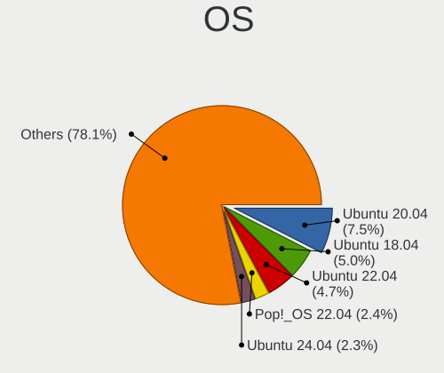

| Name                         | Computers | Percent |
|------------------------------|-----------|---------|
| Ubuntu 20.04                 | 1590      | 7.52%   |
| Ubuntu 18.04                 | 1055      | 4.99%   |
| Ubuntu 22.04                 | 984       | 4.65%   |
| Pop!_OS 22.04                | 509       | 2.41%   |
| Ubuntu 24.04                 | 489       | 2.31%   |
| Zorin 17                     | 486       | 2.3%    |
| Arch Rolling                 | 444       | 2.1%    |
| OpenMandriva 4.2             | 346       | 1.64%   |
| Pop!_OS 20.04                | 319       | 1.51%   |
| Linux Mint 20                | 318       | 1.5%    |
| Debian 12                    | 313       | 1.48%   |
| OpenMandriva 4.3             | 312       | 1.48%   |
| Manjaro                      | 291       | 1.38%   |
| Linux Mint 19.3              | 291       | 1.38%   |
| Zorin 16                     | 256       | 1.21%   |
| Fedora 40                    | 250       | 1.18%   |
| Linux Mint 20.3              | 249       | 1.18%   |
| Linux Mint 19.1              | 235       | 1.11%   |
| Debian 11                    | 228       | 1.08%   |
| OpenMandriva 23.08           | 224       | 1.06%   |
| Ubuntu 19.04                 | 218       | 1.03%   |
| Linux Mint 20.1              | 216       | 1.02%   |
| KDE neon 20.04               | 216       | 1.02%   |
| Fedora 38                    | 212       | 1%      |
| Fedora 39                    | 205       | 0.97%   |
| Linux Mint 21.1              | 198       | 0.94%   |
| Arch                         | 189       | 0.89%   |
| Linux Mint 22.1              | 187       | 0.88%   |
| Linux Mint 20.2              | 187       | 0.88%   |
| Fedora 41                    | 180       | 0.85%   |
| Ubuntu 19.10                 | 173       | 0.82%   |
| Fedora 42                    | 173       | 0.82%   |
| openSUSE Tumbleweed-XXXXXXXX | 161       | 0.76%   |
| Debian 10                    | 158       | 0.75%   |
| OpenMandriva 25.90           | 157       | 0.74%   |
| Zorin 15                     | 152       | 0.72%   |
| Linux Mint 21.2              | 145       | 0.69%   |
| OpenMandriva 23.01           | 139       | 0.66%   |
| Fedora 37                    | 139       | 0.66%   |
| Linux Mint 21.3              | 137       | 0.65%   |

OS Family
---------

OS without a version

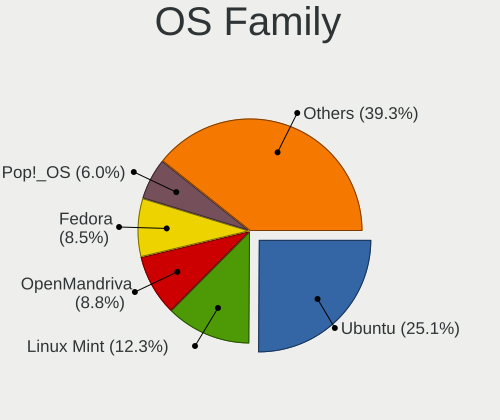

| Name          | Computers | Percent |
|---------------|-----------|---------|
| Ubuntu        | 5017      | 25.1%   |
| Linux Mint    | 2466      | 12.34%  |
| OpenMandriva  | 1763      | 8.82%   |
| Fedora        | 1690      | 8.46%   |
| Pop!_OS       | 1201      | 6.01%   |
| Endless       | 1136      | 5.68%   |
| Zorin         | 1019      | 5.1%    |
| Debian        | 865       | 4.33%   |
| Arch          | 620       | 3.1%    |
| Manjaro       | 508       | 2.54%   |
| KDE neon      | 348       | 1.74%   |
| Kubuntu       | 330       | 1.65%   |
| Xubuntu       | 286       | 1.43%   |
| openSUSE      | 241       | 1.21%   |
| BigLinux      | 168       | 0.84%   |
| ROSA          | 164       | 0.82%   |
| Ubuntu MATE   | 159       | 0.8%    |
| Elementary    | 156       | 0.78%   |
| Lubuntu       | 154       | 0.77%   |
| Bazzite       | 139       | 0.7%    |
| ArcoLinux     | 123       | 0.62%   |
| Kali          | 112       | 0.56%   |
| LMDE          | 106       | 0.53%   |
| Ubuntu Unity  | 97        | 0.49%   |
| SteamOS       | 70        | 0.35%   |
| Nobara        | 61        | 0.31%   |
| EndeavourOS   | 58        | 0.29%   |
| Ubuntu Budgie | 57        | 0.29%   |
| Deepin        | 54        | 0.27%   |
| CentOS        | 46        | 0.23%   |
| CachyOS       | 44        | 0.22%   |
| LinuxFX       | 41        | 0.21%   |
| Clear Linux   | 41        | 0.21%   |
| MX            | 38        | 0.19%   |
| Garuda Linux  | 36        | 0.18%   |
| Gentoo        | 35        | 0.18%   |
| BlackPanther  | 32        | 0.16%   |
| Parrot        | 28        | 0.14%   |
| NixOS         | 22        | 0.11%   |
| Void Linux    | 20        | 0.1%    |

Kernel
------

Version of the Linux kernel

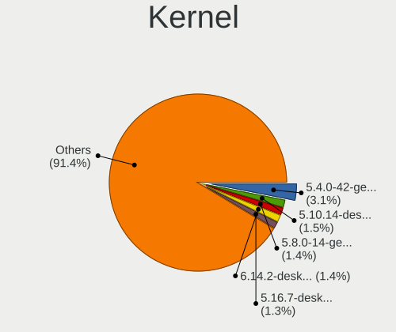

| Version                  | Computers | Percent |
|--------------------------|-----------|---------|
| 5.4.0-42-generic         | 711       | 3.1%    |
| 5.10.14-desktop-1omv4002 | 335       | 1.46%   |
| 5.8.0-14-generic         | 321       | 1.4%    |
| 6.14.2-desktop-3omv2590  | 314       | 1.37%   |
| 5.16.7-desktop-1omv4003  | 291       | 1.27%   |
| 6.4.11-desktop-1omv2390  | 182       | 0.79%   |
| 4.15.0-46-generic        | 156       | 0.68%   |
| 5.3.0-28-generic         | 146       | 0.64%   |
| 5.4.0-48-generic         | 138       | 0.6%    |
| 5.4.0-19-generic         | 138       | 0.6%    |
| 6.1.1-desktop-1omv2290   | 129       | 0.56%   |
| 6.2.6-desktop-1omv2390   | 128       | 0.56%   |
| 5.15.0-56-generic        | 126       | 0.55%   |
| 5.4.0-7634-generic       | 123       | 0.54%   |
| 5.11.0-35-generic        | 119       | 0.52%   |
| 6.8.0-52-generic         | 116       | 0.51%   |
| 6.8.0-51-generic         | 115       | 0.5%    |
| 5.4.0-58-generic         | 111       | 0.48%   |
| 5.4.0-40-generic         | 111       | 0.48%   |
| 5.4.0-26-generic         | 106       | 0.46%   |
| 5.4.0-52-generic         | 101       | 0.44%   |
| 6.12.1-desktop-1omv2490  | 100       | 0.44%   |
| 4.18.0-15-generic        | 97        | 0.42%   |
| 5.4.0-47-generic         | 96        | 0.42%   |
| 6.8.0-60-generic         | 95        | 0.41%   |
| 6.9.3-76060903-generic   | 90        | 0.39%   |
| 5.3.0-40-generic         | 89        | 0.39%   |
| 6.8.0-40-generic         | 81        | 0.35%   |
| 6.6.2-desktop-1omv2390   | 80        | 0.35%   |
| 5.0.0-32-generic         | 79        | 0.34%   |
| 5.11.0-7620-generic      | 78        | 0.34%   |
| 6.14.0-33-generic        | 77        | 0.34%   |
| 5.3.0-46-generic         | 77        | 0.34%   |
| 6.8.0-45-generic         | 74        | 0.32%   |
| 5.15.0-47-generic        | 73        | 0.32%   |
| 4.15.0-20-generic        | 73        | 0.32%   |
| 6.2.6-76060206-generic   | 72        | 0.31%   |
| 5.4.0-91-generic         | 72        | 0.31%   |
| 5.0.0-37-generic         | 72        | 0.31%   |
| 5.4.0-70-generic         | 71        | 0.31%   |

Kernel Family
-------------

Linux kernel without a distro release

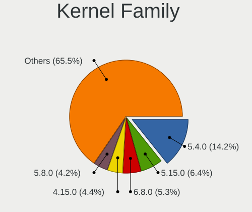

| Version | Computers | Percent |
|---------|-----------|---------|
| 5.4.0   | 3104      | 14.24%  |
| 5.15.0  | 1401      | 6.43%   |
| 6.8.0   | 1148      | 5.27%   |
| 4.15.0  | 967       | 4.44%   |
| 5.8.0   | 907       | 4.16%   |
| 5.3.0   | 799       | 3.67%   |
| 5.11.0  | 742       | 3.4%    |
| 5.0.0   | 569       | 2.61%   |
| 6.5.0   | 548       | 2.51%   |
| 5.13.0  | 475       | 2.18%   |
| 4.18.0  | 422       | 1.94%   |
| 6.14.0  | 391       | 1.79%   |
| 5.19.0  | 386       | 1.77%   |
| 6.1.0   | 375       | 1.72%   |
| 5.10.14 | 337       | 1.55%   |
| 6.14.2  | 334       | 1.53%   |
| 6.2.0   | 333       | 1.53%   |
| 5.16.7  | 291       | 1.34%   |
| 5.10.0  | 291       | 1.34%   |
| 6.11.0  | 213       | 0.98%   |
| 6.2.6   | 206       | 0.95%   |
| 6.4.11  | 200       | 0.92%   |
| 4.19.0  | 187       | 0.86%   |
| 6.1.1   | 139       | 0.64%   |
| 6.12.1  | 107       | 0.49%   |
| 6.9.3   | 101       | 0.46%   |
| 6.6.2   | 99        | 0.45%   |
| 6.12.10 | 70        | 0.32%   |
| 6.10.0  | 67        | 0.31%   |
| 5.14.0  | 63        | 0.29%   |
| 5.17.5  | 59        | 0.27%   |
| 6.5.6   | 58        | 0.27%   |
| 6.4.8   | 55        | 0.25%   |
| 6.17.7  | 54        | 0.25%   |
| 4.4.0   | 50        | 0.23%   |
| 6.0.12  | 49        | 0.22%   |
| 6.6.10  | 47        | 0.22%   |
| 5.7.9   | 47        | 0.22%   |
| 6.8.5   | 44        | 0.2%    |
| 6.16.3  | 44        | 0.2%    |

Kernel Major Ver.
-----------------

Linux kernel major version

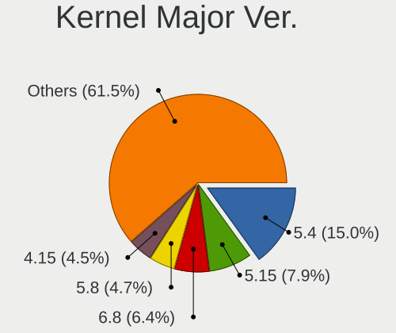

| Version | Computers | Percent |
|---------|-----------|---------|
| 5.4     | 3232      | 15.04%  |
| 5.15    | 1699      | 7.91%   |
| 6.8     | 1366      | 6.36%   |
| 5.8     | 1020      | 4.75%   |
| 4.15    | 967       | 4.5%    |
| 5.3     | 870       | 4.05%   |
| 6.14    | 843       | 3.92%   |
| 5.11    | 840       | 3.91%   |
| 5.10    | 833       | 3.88%   |
| 6.1     | 771       | 3.59%   |
| 6.5     | 753       | 3.5%    |
| 6.2     | 715       | 3.33%   |
| 5.0     | 611       | 2.84%   |
| 5.13    | 568       | 2.64%   |
| 6.12    | 527       | 2.45%   |
| 5.19    | 490       | 2.28%   |
| 5.16    | 483       | 2.25%   |
| 4.18    | 457       | 2.13%   |
| 6.4     | 420       | 1.95%   |
| 6.6     | 418       | 1.94%   |
| 6.11    | 391       | 1.82%   |
| 6.9     | 253       | 1.18%   |
| 4.19    | 224       | 1.04%   |
| 6.0     | 217       | 1.01%   |
| 6.17    | 216       | 1.01%   |
| 6.10    | 209       | 0.97%   |
| 5.14    | 178       | 0.83%   |
| 5.7     | 172       | 0.8%    |
| 6.15    | 163       | 0.76%   |
| 5.17    | 157       | 0.73%   |
| 6.7     | 151       | 0.7%    |
| 5.18    | 142       | 0.66%   |
| 6.13    | 132       | 0.61%   |
| 6.16    | 130       | 0.6%    |
| 5.6     | 128       | 0.6%    |
| 6.3     | 125       | 0.58%   |
| 5.12    | 113       | 0.53%   |
| 4.9     | 113       | 0.53%   |
| 5.9     | 111       | 0.52%   |
| 4.4     | 58        | 0.27%   |

Arch
----

OS architecture (x86_64, i586, etc.)

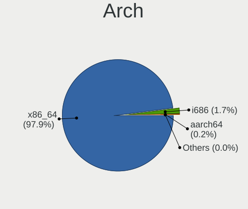

| Name    | Computers | Percent |
|---------|-----------|---------|
| x86_64  | 18600     | 97.94%  |
| i686    | 329       | 1.73%   |
| aarch64 | 41        | 0.22%   |
| armv7l  | 18        | 0.09%   |
| riscv64 | 1         | 0.01%   |
| armv8l  | 1         | 0.01%   |
| armv6l  | 1         | 0.01%   |

DE
--

Desktop Environment

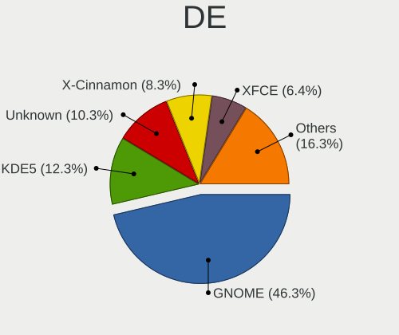

| Name             | Computers | Percent |
|------------------|-----------|---------|
| GNOME            | 9265      | 46.34%  |
| KDE5             | 2455      | 12.28%  |
| Unknown          | 2066      | 10.33%  |
| X-Cinnamon       | 1658      | 8.29%   |
| XFCE             | 1289      | 6.45%   |
| KDE6             | 1051      | 5.26%   |
| MATE             | 477       | 2.39%   |
| KDE              | 346       | 1.73%   |
| Cinnamon         | 258       | 1.29%   |
| LXQt             | 231       | 1.16%   |
| Pantheon         | 145       | 0.73%   |
| Unity            | 100       | 0.5%    |
| Budgie           | 89        | 0.45%   |
| KDE4             | 82        | 0.41%   |
| Deepin           | 71        | 0.36%   |
| LXDE             | 64        | 0.32%   |
| i3               | 53        | 0.27%   |
| Endless:GNOME    | 50        | 0.25%   |
| COSMIC           | 45        | 0.23%   |
| Hyprland         | 36        | 0.18%   |
| GNOME Classic    | 26        | 0.13%   |
| GNOME Flashback  | 22        | 0.11%   |
| sway             | 19        | 0.1%    |
| Enlightenment    | 14        | 0.07%   |
| Openbox          | 11        | 0.06%   |
| awesome          | 11        | 0.06%   |
| DDE              | 10        | 0.05%   |
| icewm            | 9         | 0.05%   |
| bspwm            | 5         | 0.03%   |
| Trinity          | 3         | 0.02%   |
| qtile            | 3         | 0.02%   |
| niri             | 2         | 0.01%   |
| lightdm-xsession | 2         | 0.01%   |
| fluxbox          | 2         | 0.01%   |
| dwm              | 2         | 0.01%   |
| default          | 2         | 0.01%   |
| xmonad           | 1         | 0.01%   |
| WindowMaker      | 1         | 0.01%   |
| UKUI             | 1         | 0.01%   |
| Phosh:GNOME      | 1         | 0.01%   |

Display Server
--------------

X11 or Wayland

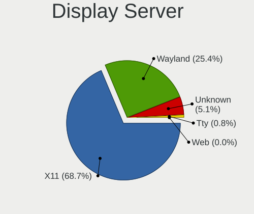

| Name    | Computers | Percent |
|---------|-----------|---------|
| X11     | 13514     | 68.66%  |
| Wayland | 4992      | 25.36%  |
| Unknown | 1009      | 5.13%   |
| Tty     | 162       | 0.82%   |
| Web     | 5         | 0.03%   |

Display Manager
---------------

SDDM, LightDM, etc.

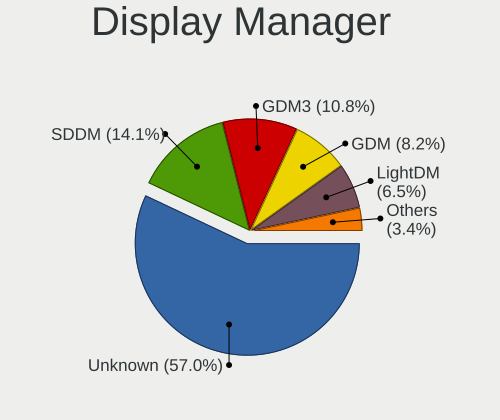

| Name           | Computers | Percent |
|----------------|-----------|---------|
| Unknown        | 11267     | 57.01%  |
| SDDM           | 2777      | 14.05%  |
| GDM3           | 2137      | 10.81%  |
| GDM            | 1628      | 8.24%   |
| LightDM        | 1290      | 6.53%   |
| TDM            | 541       | 2.74%   |
| KDM            | 69        | 0.35%   |
| XDM            | 13        | 0.07%   |
| SLiM           | 11        | 0.06%   |
| SLIMSKI        | 7         | 0.04%   |
| LY-DM          | 5         | 0.03%   |
| LXDM           | 5         | 0.03%   |
| COSMIC-GREETER | 4         | 0.02%   |
| GREETD         | 3         | 0.02%   |
| MDM            | 2         | 0.01%   |
| Ly             | 2         | 0.01%   |
| LIDM           | 1         | 0.01%   |

OS Lang
-------

Language

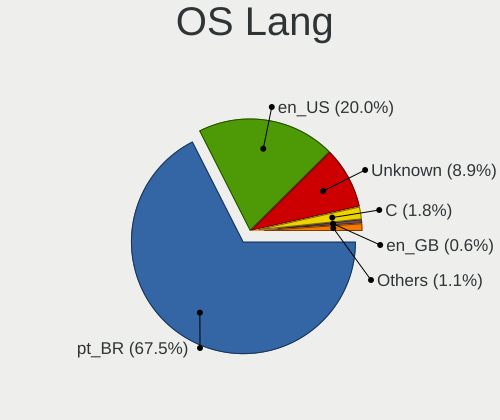

| Lang        | Computers | Percent |
|-------------|-----------|---------|
| pt_BR       | 13135     | 67.53%  |
| en_US       | 3898      | 20.04%  |
| Unknown     | 1738      | 8.93%   |
| C           | 358       | 1.84%   |
| en_GB       | 109       | 0.56%   |
| pt_PT       | 87        | 0.45%   |
| es_ES       | 28        | 0.14%   |
| en_CA       | 15        | 0.08%   |
| de_DE       | 11        | 0.06%   |
| POSIX       | 7         | 0.04%   |
| fr_FR       | 7         | 0.04%   |
| en_DK       | 7         | 0.04%   |
| it_IT       | 5         | 0.03%   |
| es_VE       | 3         | 0.02%   |
| C.UTF8      | 3         | 0.02%   |
| UTF-8       | 2         | 0.01%   |
| pt_BRutf8   | 2         | 0.01%   |
| pt_BR.UTF8  | 2         | 0.01%   |
| ja_JP       | 2         | 0.01%   |
| es_US       | 2         | 0.01%   |
| es_PY       | 2         | 0.01%   |
| es_PE       | 2         | 0.01%   |
| es_MX       | 2         | 0.01%   |
| es_CL       | 2         | 0.01%   |
| es_AR       | 2         | 0.01%   |
| en_ZA       | 2         | 0.01%   |
| en_US.UTF8  | 2         | 0.01%   |
| en_IN       | 2         | 0.01%   |
| en_AG       | 2         | 0.01%   |
| ru_RU       | 1         | 0.01%   |
| pt_BR~      | 1         | 0.01%   |
| pt_BR.UFT-8 | 1         | 0.01%   |
| it_CH       | 1         | 0.01%   |
| es_BO       | 1         | 0.01%   |
| eo          | 1         | 0.01%   |
| en_US.utf-8 | 1         | 0.01%   |
| en_US.UFT-8 | 1         | 0.01%   |
| en_IE.UTF8  | 1         | 0.01%   |
| en-US       | 1         | 0.01%   |
| em_US       | 1         | 0.01%   |

Boot Mode
---------

EFI or BIOS

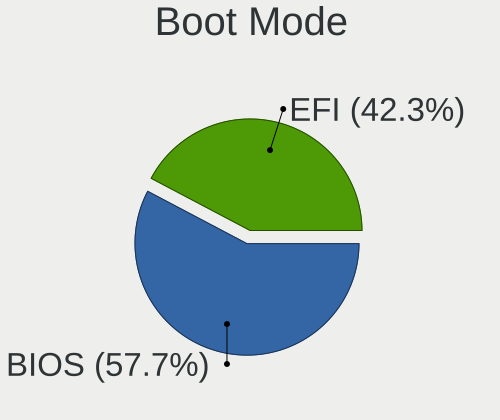

| Mode | Computers | Percent |
|------|-----------|---------|
| BIOS | 11269     | 57.72%  |
| EFI  | 8253      | 42.28%  |

Filesystem
----------

Type of filesystem

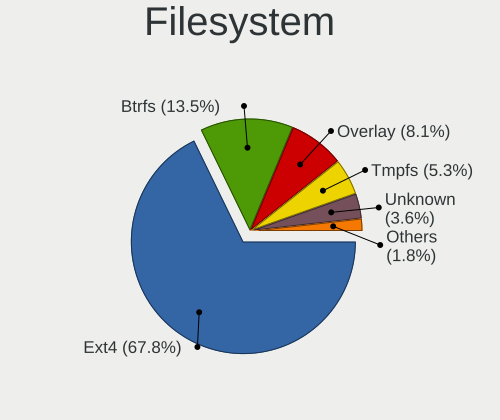

| Type     | Computers | Percent |
|----------|-----------|---------|
| Ext4     | 13336     | 67.79%  |
| Btrfs    | 2647      | 13.46%  |
| Overlay  | 1589      | 8.08%   |
| Tmpfs    | 1038      | 5.28%   |
| Unknown  | 711       | 3.61%   |
| Xfs      | 191       | 0.97%   |
| Zfs      | 74        | 0.38%   |
| F2fs     | 28        | 0.14%   |
| Ext3     | 25        | 0.13%   |
| Ext2     | 25        | 0.13%   |
| Aufs     | 4         | 0.02%   |
| XXXXXXX  | 1         | 0.01%   |
| XXXXX    | 1         | 0.01%   |
| Reiserfs | 1         | 0.01%   |
| Jfs      | 1         | 0.01%   |

Part. scheme
------------

Scheme of partitioning

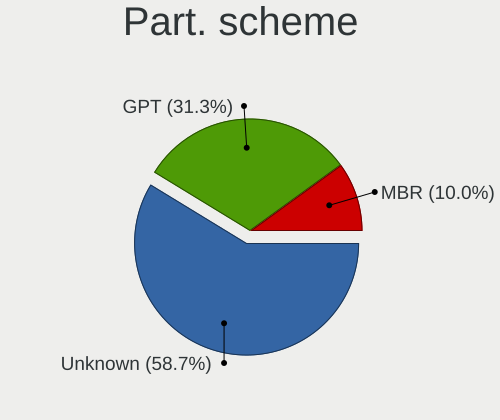

| Type    | Computers | Percent |
|---------|-----------|---------|
| Unknown | 11487     | 58.72%  |
| GPT     | 6121      | 31.29%  |
| MBR     | 1953      | 9.98%   |

Dual Boot with Linux/BSD
------------------------

Hosting more than one Linux/BSD

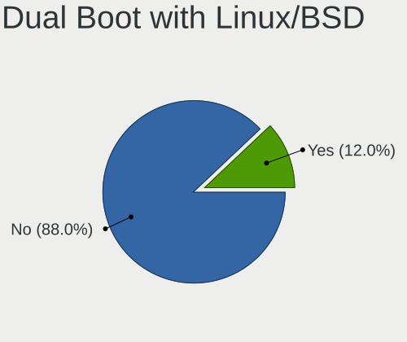

| Dual boot | Computers | Percent |
|-----------|-----------|---------|
| No        | 17028     | 87.96%  |
| Yes       | 2331      | 12.04%  |

Dual Boot (Win)
---------------

Hosting Linux and Windows

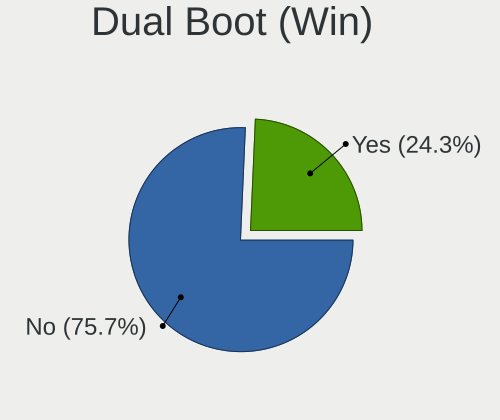

| Dual boot | Computers | Percent |
|-----------|-----------|---------|
| No        | 14661     | 75.69%  |
| Yes       | 4708      | 24.31%  |

Board
-----

Vendor
------

Motherboard manufacturer

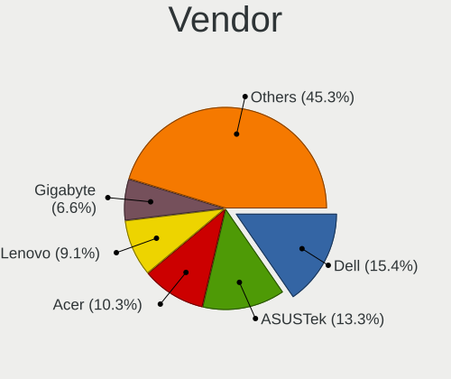

| Name                   | Computers | Percent |
|------------------------|-----------|---------|
| Dell                   | 2924      | 15.4%   |
| ASUSTek Computer       | 2519      | 13.27%  |
| Acer                   | 1951      | 10.28%  |
| Lenovo                 | 1736      | 9.14%   |
| Gigabyte Technology    | 1259      | 6.63%   |
| Positivo               | 1007      | 5.3%    |
| Samsung Electronics    | 965       | 5.08%   |
| Hewlett-Packard        | 935       | 4.93%   |
| Intel                  | 888       | 4.68%   |
| ASRock                 | 642       | 3.38%   |
| MSI                    | 405       | 2.13%   |
| Unknown                | 351       | 1.85%   |
| Apple                  | 274       | 1.44%   |
| Sony                   | 208       | 1.1%    |
| LG Electronics         | 182       | 0.96%   |
| Itautec                | 168       | 0.88%   |
| Biostar                | 164       | 0.86%   |
| PCWare                 | 150       | 0.79%   |
| Semp Toshiba           | 148       | 0.78%   |
| Avell High Performance | 113       | 0.6%    |
| Pegatron               | 101       | 0.53%   |
| Positivo Bahia - VAIO  | 99        | 0.52%   |
| Digibras               | 98        | 0.52%   |
| ECS                    | 89        | 0.47%   |
| MACHINIST              | 88        | 0.46%   |
| Multilaser             | 82        | 0.43%   |
| OEM                    | 72        | 0.38%   |
| Philco                 | 68        | 0.36%   |
| Compaq                 | 66        | 0.35%   |
| Huanan                 | 65        | 0.34%   |
| Daten Tecnologia       | 54        | 0.28%   |
| Toshiba                | 48        | 0.25%   |
| Valve                  | 41        | 0.22%   |
| Megaware               | 39        | 0.21%   |
| AZW                    | 37        | 0.19%   |
| Alienware              | 37        | 0.19%   |
| Notebook               | 36        | 0.19%   |
| Foxconn                | 35        | 0.18%   |
| AMD                    | 34        | 0.18%   |
| Avell                  | 33        | 0.17%   |

Model
-----

Motherboard model

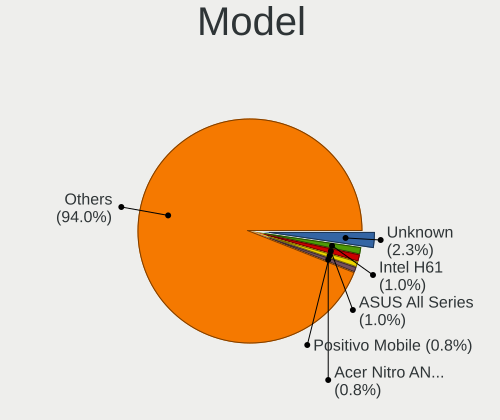

| Name                           | Computers | Percent |
|--------------------------------|-----------|---------|
| Unknown                        | 438       | 2.31%   |
| Intel H61                      | 199       | 1.05%   |
| ASUS All Series                | 197       | 1.04%   |
| Positivo Mobile                | 157       | 0.83%   |
| Acer Nitro AN515-54            | 146       | 0.77%   |
| Acer Nitro AN515-44            | 102       | 0.54%   |
| ASUS PRIME B450M-GAMING/BR     | 98        | 0.52%   |
| Intel B75                      | 96        | 0.51%   |
| Samsung 340XAA/350XAA/550XAA   | 93        | 0.49%   |
| Lenovo IdeaPad 3 15ALC6 82MF   | 88        | 0.46%   |
| Lenovo IdeaPad S145-15API 81V7 | 85        | 0.45%   |
| Samsung 550XDA                 | 80        | 0.42%   |
| Intel H55                      | 80        | 0.42%   |
| Dell Inspiron 5566             | 80        | 0.42%   |
| Dell Inspiron 15-3567          | 80        | 0.42%   |
| Dell Inspiron 3583             | 79        | 0.42%   |
| ASUS PRIME A320M-K/BR          | 79        | 0.42%   |
| Acer Aspire A315-53            | 79        | 0.42%   |
| Lenovo IdeaPad 330-15IKB 81FE  | 76        | 0.4%    |
| ASRock B450M Steel Legend      | 76        | 0.4%    |
| ASRock A320M-HD                | 76        | 0.4%    |
| Lenovo IdeaPad S145-15IWL 81S9 | 72        | 0.38%   |
| Semp Toshiba STI               | 66        | 0.35%   |
| Lenovo IdeaPad 320-15IKB 80YH  | 64        | 0.34%   |
| Acer Aspire A515-51            | 60        | 0.32%   |
| Acer Aspire A315-34            | 58        | 0.31%   |
| ASUS M5A78L-M LX/BR            | 57        | 0.3%    |
| Samsung 300E5M/300E5L          | 55        | 0.29%   |
| Acer Nitro AN517-51            | 55        | 0.29%   |
| Dell Inspiron 3421             | 54        | 0.28%   |
| Positivo S14CT01               | 52        | 0.27%   |
| Dell Inspiron 3442             | 52        | 0.27%   |
| ASUS TUF Gaming B550M-PLUS     | 52        | 0.27%   |
| Acer Nitro AN515-43            | 51        | 0.27%   |
| Itautec Infoway                | 50        | 0.26%   |
| HP G42                         | 50        | 0.26%   |
| Gigabyte A320M-S2H             | 50        | 0.26%   |
| Dell Inspiron N4050            | 48        | 0.25%   |
| Acer Aspire A515-51G           | 47        | 0.25%   |
| Lenovo IdeaPad S145-15IIL 82DJ | 46        | 0.24%   |

Model Family
------------

Motherboard model prefix

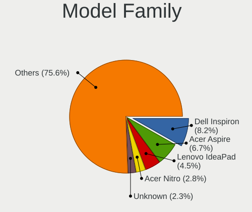

| Name               | Computers | Percent |
|--------------------|-----------|---------|
| Dell Inspiron      | 1556      | 8.2%    |
| Acer Aspire        | 1264      | 6.66%   |
| Lenovo IdeaPad     | 850       | 4.48%   |
| Acer Nitro         | 532       | 2.8%    |
| Unknown            | 438       | 2.31%   |
| ASUS PRIME         | 389       | 2.05%   |
| Dell Vostro        | 351       | 1.85%   |
| Lenovo ThinkPad    | 341       | 1.8%    |
| Dell Latitude      | 323       | 1.7%    |
| ASUS TUF           | 287       | 1.51%   |
| ASUS VivoBook      | 282       | 1.49%   |
| HP Pavilion        | 265       | 1.4%    |
| Dell OptiPlex      | 256       | 1.35%   |
| Intel H61          | 209       | 1.1%    |
| ASUS All           | 197       | 1.04%   |
| Positivo Mobile    | 157       | 0.83%   |
| Itautec Infoway    | 155       | 0.82%   |
| ASUS M5A78L-M      | 152       | 0.8%    |
| HP Compaq          | 138       | 0.73%   |
| Lenovo ThinkCentre | 124       | 0.65%   |
| ASUS P8H61-M       | 111       | 0.58%   |
| ASUS ROG           | 107       | 0.56%   |
| Intel B75          | 101       | 0.53%   |
| Dell XPS           | 100       | 0.53%   |
| Samsung 340XAA     | 93        | 0.49%   |
| Dell G15           | 85        | 0.45%   |
| ASRock A320M-HD    | 82        | 0.43%   |
| Gigabyte B450M     | 81        | 0.43%   |
| Semp Toshiba STI   | 80        | 0.42%   |
| Samsung 550XDA     | 80        | 0.42%   |
| Intel H55          | 80        | 0.42%   |
| ASRock B450M       | 79        | 0.42%   |
| HP ProBook         | 72        | 0.38%   |
| Dell G3            | 72        | 0.38%   |
| Acer Predator      | 65        | 0.34%   |
| Gigabyte B550M     | 60        | 0.32%   |
| Samsung RV411      | 59        | 0.31%   |
| HP EliteBook       | 59        | 0.31%   |
| Samsung 300E5M     | 55        | 0.29%   |
| Positivo S14CT01   | 52        | 0.27%   |

MFG Year
--------

Motherboard manufacture year

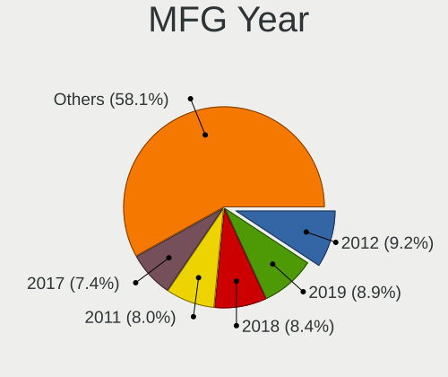

| Year    | Computers | Percent |
|---------|-----------|---------|
| 2012    | 1756      | 9.25%   |
| 2019    | 1686      | 8.88%   |
| 2018    | 1598      | 8.42%   |
| 2011    | 1511      | 7.96%   |
| 2017    | 1407      | 7.41%   |
| 2013    | 1382      | 7.28%   |
| 2020    | 1233      | 6.49%   |
| 2021    | 1169      | 6.16%   |
| 2010    | 1047      | 5.52%   |
| 2016    | 1044      | 5.5%    |
| 2014    | 1029      | 5.42%   |
| 2009    | 896       | 4.72%   |
| 2008    | 639       | 3.37%   |
| 2015    | 617       | 3.25%   |
| 2022    | 590       | 3.11%   |
| 2023    | 508       | 2.68%   |
| 2007    | 359       | 1.89%   |
| 2024    | 215       | 1.13%   |
| 2006    | 118       | 0.62%   |
| Unknown | 83        | 0.44%   |
| 2025    | 59        | 0.31%   |
| 2005    | 26        | 0.14%   |
| 2004    | 10        | 0.05%   |
| 2003    | 1         | 0.01%   |
| 2002    | 1         | 0.01%   |

Form Factor
-----------

Physical design of the computer

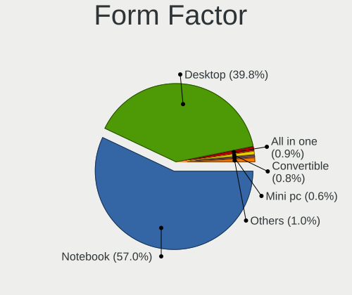

| Name           | Computers | Percent |
|----------------|-----------|---------|
| Notebook       | 10826     | 57.03%  |
| Desktop        | 7551      | 39.78%  |
| All in one     | 168       | 0.88%   |
| Convertible    | 149       | 0.78%   |
| Mini pc        | 108       | 0.57%   |
| Server         | 76        | 0.4%    |
| System on chip | 56        | 0.29%   |
| Tablet         | 42        | 0.22%   |
| Phone          | 4         | 0.02%   |
| Other          | 3         | 0.02%   |
| Firewall       | 1         | 0.01%   |

Secure Boot
-----------

Enabled or disabled

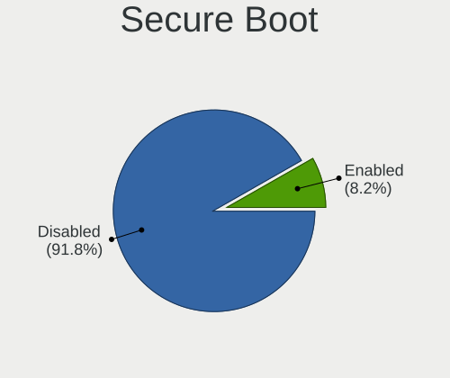

| State    | Computers | Percent |
|----------|-----------|---------|
| Disabled | 17553     | 91.76%  |
| Enabled  | 1577      | 8.24%   |

Coreboot
--------

Have coreboot on board

| Used | Computers | Percent |
|------|-----------|---------|
| No   | 18950     | 99.82%  |
| Yes  | 34        | 0.18%   |

RAM Size
--------

Total RAM memory

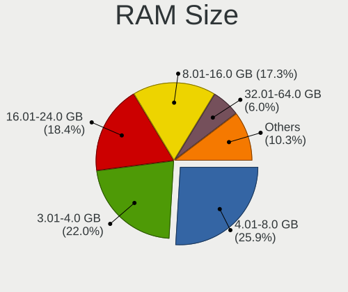

| Size in GB      | Computers | Percent |
|-----------------|-----------|---------|
| 4.01-8.0        | 5043      | 25.95%  |
| 3.01-4.0        | 4277      | 22%     |
| 16.01-24.0      | 3580      | 18.42%  |
| 8.01-16.0       | 3368      | 17.33%  |
| 32.01-64.0      | 1160      | 5.97%   |
| 1.01-2.0        | 1000      | 5.14%   |
| 2.01-3.0        | 346       | 1.78%   |
| 24.01-32.0      | 327       | 1.68%   |
| 64.01-256.0     | 246       | 1.27%   |
| 0.51-1.0        | 69        | 0.35%   |
| More than 256.0 | 13        | 0.07%   |
| 0.01-0.5        | 6         | 0.03%   |
| Unknown         | 2         | 0.01%   |

RAM Used
--------

Used RAM memory

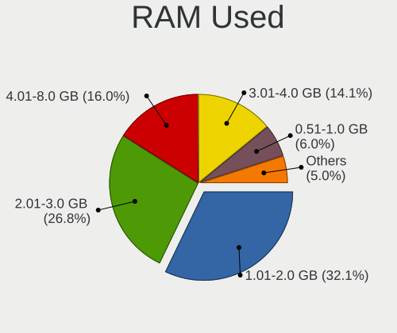

| Used GB     | Computers | Percent |
|-------------|-----------|---------|
| 1.01-2.0    | 6814      | 32.14%  |
| 2.01-3.0    | 5689      | 26.83%  |
| 4.01-8.0    | 3386      | 15.97%  |
| 3.01-4.0    | 2990      | 14.1%   |
| 0.51-1.0    | 1264      | 5.96%   |
| 8.01-16.0   | 751       | 3.54%   |
| 0.01-0.5    | 172       | 0.81%   |
| 16.01-24.0  | 84        | 0.4%    |
| 24.01-32.0  | 21        | 0.1%    |
| 32.01-64.0  | 17        | 0.08%   |
| Unknown     | 7         | 0.03%   |
| 64.01-256.0 | 4         | 0.02%   |
| 0           | 1         | 0.005%  |

Total Drives
------------

Number of drives on board

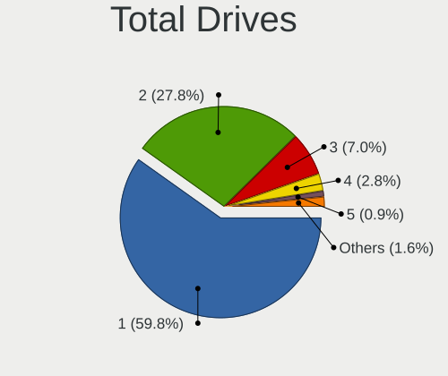

| Drives  | Computers | Percent |
|---------|-----------|---------|
| 1       | 11733     | 59.85%  |
| 2       | 5446      | 27.78%  |
| 3       | 1375      | 7.01%   |
| 4       | 549       | 2.8%    |
| 5       | 184       | 0.94%   |
| 0       | 170       | 0.87%   |
| 6       | 88        | 0.45%   |
| 7       | 26        | 0.13%   |
| 8       | 14        | 0.07%   |
| 9       | 9         | 0.05%   |
| 10      | 3         | 0.02%   |
| 15      | 2         | 0.01%   |
| 26      | 1         | 0.01%   |
| 25      | 1         | 0.01%   |
| 20      | 1         | 0.01%   |
| 18      | 1         | 0.01%   |
| 14      | 1         | 0.01%   |
| Unknown | 1         | 0.01%   |

Has CD-ROM
----------

Has CD-ROM on board

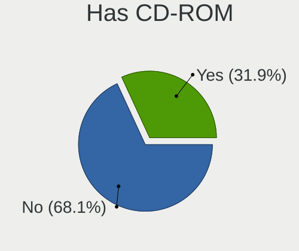

| Presented | Computers | Percent |
|-----------|-----------|---------|
| No        | 13045     | 68.12%  |
| Yes       | 6104      | 31.88%  |

Has Ethernet
------------

Has Ethernet on board

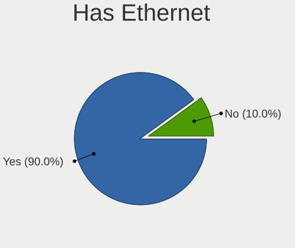

| Presented | Computers | Percent |
|-----------|-----------|---------|
| Yes       | 17123     | 90.03%  |
| No        | 1897      | 9.97%   |

Has WiFi
--------

Has WiFi module

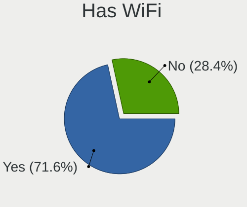

| Presented | Computers | Percent |
|-----------|-----------|---------|
| Yes       | 13721     | 71.6%   |
| No        | 5442      | 28.4%   |

Has Bluetooth
-------------

Has Bluetooth module

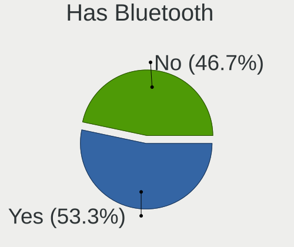

| Presented | Computers | Percent |
|-----------|-----------|---------|
| Yes       | 10249     | 53.31%  |
| No        | 8978      | 46.69%  |

Location
--------

Country
-------

Geographic location (country)

| Country | Computers | Percent |
|---------|-----------|---------|
| Brazil  | 18984     | 100%    |

City
----

Geographic location (city)

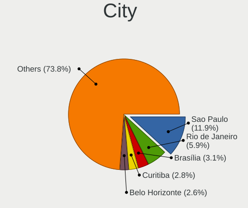

| City                  | Computers | Percent |
|-----------------------|-----------|---------|
| Sao Paulo             | 2364      | 11.85%  |
| Rio de Janeiro        | 1177      | 5.9%    |
| Brasília             | 613       | 3.07%   |
| Curitiba              | 555       | 2.78%   |
| Belo Horizonte        | 521       | 2.61%   |
| Porto Alegre          | 442       | 2.22%   |
| Fortaleza             | 436       | 2.19%   |
| Campinas              | 309       | 1.55%   |
| Salvador              | 277       | 1.39%   |
| Recife                | 256       | 1.28%   |
| Florianópolis        | 220       | 1.1%    |
| Goiânia              | 207       | 1.04%   |
| Santo André          | 188       | 0.94%   |
| Manaus                | 169       | 0.85%   |
| Sao José dos Campos  | 162       | 0.81%   |
| Osasco                | 158       | 0.79%   |
| Natal                 | 149       | 0.75%   |
| Guarulhos             | 145       | 0.73%   |
| Niterói              | 141       | 0.71%   |
| Joao Pessoa           | 140       | 0.7%    |
| Belém                | 139       | 0.7%    |
| Maringá              | 129       | 0.65%   |
| Campo Grande          | 129       | 0.65%   |
| Joinville             | 124       | 0.62%   |
| Ribeirao Preto        | 122       | 0.61%   |
| Sorocaba              | 118       | 0.59%   |
| Sao Luís             | 118       | 0.59%   |
| Teresina              | 115       | 0.58%   |
| Aracaju               | 111       | 0.56%   |
| Londrina              | 109       | 0.55%   |
| Uberlândia           | 104       | 0.52%   |
| Juiz de Fora          | 98        | 0.49%   |
| Sao Carlos            | 87        | 0.44%   |
| Sao Goncalo           | 84        | 0.42%   |
| Sao Bernardo do Campo | 84        | 0.42%   |
| Maceió               | 84        | 0.42%   |
| Contagem              | 84        | 0.42%   |
| Palmas                | 80        | 0.4%    |
| Serra                 | 74        | 0.37%   |
| Vitória              | 73        | 0.37%   |

Drives
------

Drive Vendor
------------

Hard drive vendors

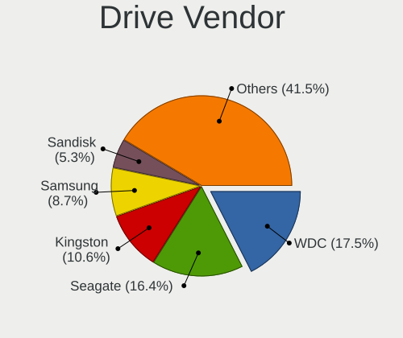

| Vendor                         | Computers | Drives | Percent |
|--------------------------------|-----------|--------|---------|
| WDC                            | 4832      | 6368   | 17.52%  |
| Seagate                        | 4535      | 6674   | 16.44%  |
| Kingston                       | 2925      | 3889   | 10.6%   |
| Samsung Electronics            | 2403      | 3424   | 8.71%   |
| Sandisk                        | 1449      | 1975   | 5.25%   |
| Toshiba                        | 1360      | 1628   | 4.93%   |
| China                          | 893       | 1094   | 3.24%   |
| Unknown                        | 794       | 1077   | 2.88%   |
| A-DATA Technology              | 777       | 1002   | 2.82%   |
| Crucial                        | 575       | 742    | 2.08%   |
| ADATA Technology               | 542       | 640    | 1.96%   |
| Hitachi                        | 510       | 633    | 1.85%   |
| Silicon Motion                 | 389       | 508    | 1.41%   |
| Intel                          | 389       | 493    | 1.41%   |
| SK hynix                       | 313       | 419    | 1.13%   |
| Kingston Technology Company    | 306       | 382    | 1.11%   |
| KingSpec                       | 238       | 279    | 0.86%   |
| HGST                           | 218       | 264    | 0.79%   |
| Realtek Semiconductor          | 207       | 265    | 0.75%   |
| MAXIO Technology (Hangzhou)    | 199       | 274    | 0.72%   |
| LITEON                         | 187       | 228    | 0.68%   |
| Unknown                        | 169       | 203    | 0.61%   |
| Lexar                          | 168       | 216    | 0.61%   |
| Maxtor                         | 154       | 182    | 0.56%   |
| JMicron Technology             | 145       | 160    | 0.53%   |
| XrayDisk                       | 140       | 181    | 0.51%   |
| Netac                          | 132       | 179    | 0.48%   |
| Micron Technology              | 132       | 159    | 0.48%   |
| Patriot                        | 113       | 145    | 0.41%   |
| Solid State Storage Technology | 112       | 147    | 0.41%   |
| Apple                          | 103       | 137    | 0.37%   |
| Solid State Storage            | 101       | 123    | 0.37%   |
| Phison Electronics             | 101       | 152    | 0.37%   |
| SSSTC                          | 91        | 96     | 0.33%   |
| KIOXIA                         | 88        | 112    | 0.32%   |
| PNY                            | 85        | 114    | 0.31%   |
| Corsair                        | 81        | 95     | 0.29%   |
| XPG                            | 76        | 94     | 0.28%   |
| Phison                         | 76        | 100    | 0.28%   |
| Hewlett-Packard                | 74        | 96     | 0.27%   |

Drive Model
-----------

Hard drive models

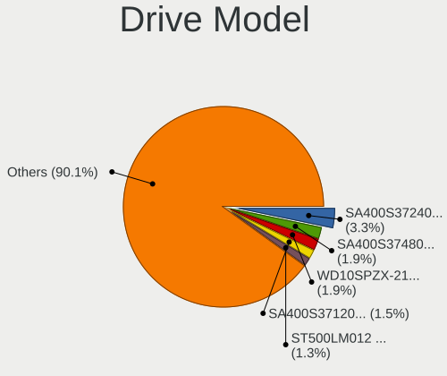

| Model                                                 | Computers | Percent |
|-------------------------------------------------------|-----------|---------|
| Kingston SA400S37240G 240GB SSD                       | 958       | 3.25%   |
| Kingston SA400S37480G 480GB SSD                       | 570       | 1.93%   |
| WDC WD10SPZX-21Z10T0 1TB                              | 560       | 1.9%    |
| Kingston SA400S37120G 120GB SSD                       | 442       | 1.5%    |
| Seagate ST500LM012 HN-M500MBB 500GB                   | 397       | 1.35%   |
| Seagate ST1000LM024 HN-M101MBB 1TB                    | 395       | 1.34%   |
| Seagate ST1000DM010-2EP102 1TB                        | 354       | 1.2%    |
| Seagate ST500DM002-1BD142 500GB                       | 336       | 1.14%   |
| WDC WD10SPZX-24Z10 1TB                                | 211       | 0.72%   |
| SanDisk SSD PLUS 240GB                                | 205       | 0.7%    |
| Toshiba MQ01ABD100 1TB                                | 201       | 0.68%   |
| Unknown MMC Card  32GB                                | 197       | 0.67%   |
| Silicon Motion SM2263EN/SM2263XT SSD Controller 512GB | 196       | 0.67%   |
| Kingston SV300S37A120G 120GB SSD                      | 196       | 0.67%   |
| Seagate Expansion 2TB                                 | 178       | 0.6%    |
| Crucial CT240BX500SSD1 240GB                          | 172       | 0.58%   |
| Samsung HD322HJ 320GB                                 | 169       | 0.57%   |
| Unknown                                               | 169       | 0.57%   |
| Seagate ST1000LM035-1RK172 1TB                        | 165       | 0.56%   |
| WDC WDS240G2G0A-00JH30 240GB SSD                      | 163       | 0.55%   |
| Kingston Company SNV2S1000G 1TB                       | 156       | 0.53%   |
| WDC WD10JPVX-22JC3T0 1TB                              | 153       | 0.52%   |
| MAXIO (Hangzhou) NVMe SSD Controller MAP1202 2TB      | 142       | 0.48%   |
| Samsung HD502HJ 500GB                                 | 138       | 0.47%   |
| Seagate ST1000DM003-1ER162 1TB                        | 136       | 0.46%   |
| Seagate ST1000DM003-1CH162 1TB                        | 135       | 0.46%   |
| Samsung HM321HI 320GB                                 | 135       | 0.46%   |
| Samsung HD161HJ 160GB                                 | 133       | 0.45%   |
| SanDisk SSD PLUS 120GB                                | 129       | 0.44%   |
| Toshiba MQ04ABF100 1TB                                | 125       | 0.42%   |
| Toshiba MQ01ABF050 500GB                              | 124       | 0.42%   |
| Samsung HD502HI 500GB                                 | 122       | 0.41%   |
| Kingston SA400S37960G 960GB SSD                       | 122       | 0.41%   |
| SanDisk SSD PLUS 480GB                                | 119       | 0.4%    |
| Seagate ST9500325AS 500GB                             | 117       | 0.4%    |
| JMicron Generic 320GB                                 | 113       | 0.38%   |
| WDC WD10SPZX-75Z10T2 1TB                              | 103       | 0.35%   |
| Intel NVMe SSD Drive 512GB                            | 103       | 0.35%   |
| WDC WD10JPVX-75JC3T0 1TB                              | 101       | 0.34%   |
| WDC WD5000AAKX-003CA0 500GB                           | 100       | 0.34%   |

HDD Vendor
----------

Hard disk drive vendors

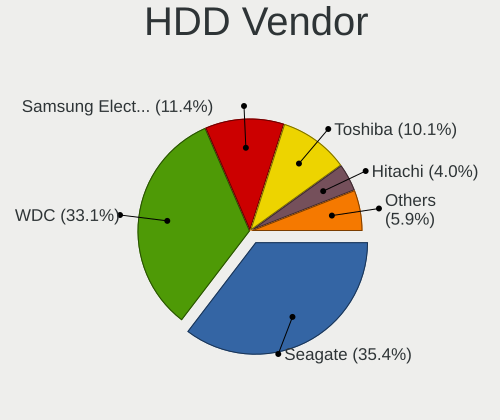

| Vendor              | Computers | Drives | Percent |
|---------------------|-----------|--------|---------|
| Seagate             | 4500      | 6613   | 35.38%  |
| WDC                 | 4211      | 5390   | 33.11%  |
| Samsung Electronics | 1454      | 1943   | 11.43%  |
| Toshiba             | 1289      | 1539   | 10.14%  |
| Hitachi             | 510       | 633    | 4.01%   |
| HGST                | 217       | 263    | 1.71%   |
| Maxtor              | 142       | 168    | 1.12%   |
| JMicron Technology  | 113       | 127    | 0.89%   |
| Fujitsu             | 72        | 88     | 0.57%   |
| Unknown             | 49        | 56     | 0.39%   |
| Hewlett-Packard     | 33        | 50     | 0.26%   |
| Apple               | 28        | 41     | 0.22%   |
| USB3.0              | 16        | 17     | 0.13%   |
| ExcelStor           | 14        | 15     | 0.11%   |
| SAGE                | 11        | 17     | 0.09%   |
| XrayDisk            | 10        | 11     | 0.08%   |
| HPE                 | 7         | 7      | 0.06%   |
| External            | 6         | 6      | 0.05%   |
| TO Exter            | 4         | 6      | 0.03%   |
| WALRAM              | 3         | 3      | 0.02%   |
| Min Yi U            | 3         | 3      | 0.02%   |
| Initio              | 3         | 3      | 0.02%   |
| T-FORCE             | 2         | 2      | 0.02%   |
| SATAFIRM            | 2         | 2      | 0.02%   |
| DELLBOSS            | 2         | 2      | 0.02%   |
| TerraMas            | 1         | 11     | 0.01%   |
| Shenzhen            | 1         | 1      | 0.01%   |
| Phison              | 1         | 1      | 0.01%   |
| NVME USB            | 1         | 1      | 0.01%   |
| NETAPP              | 1         | 3      | 0.01%   |
| MDT                 | 1         | 1      | 0.01%   |
| Maxtor 6            | 1         | 1      | 0.01%   |
| MARVELL             | 1         | 2      | 0.01%   |
| Lenovo              | 1         | 1      | 0.01%   |
| Intenso             | 1         | 1      | 0.01%   |
| IBM/Hitachi         | 1         | 2      | 0.01%   |
| IBM                 | 1         | 3      | 0.01%   |
| HGST HTS            | 1         | 1      | 0.01%   |
| FEASSO              | 1         | 2      | 0.01%   |
| CLOVER              | 1         | 1      | 0.01%   |

SSD Vendor
----------

Solid state drive vendors

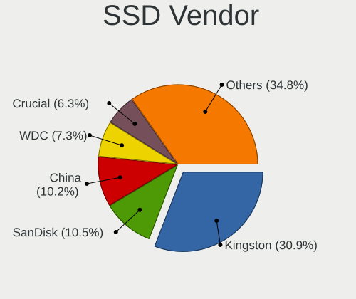

| Vendor              | Computers | Drives | Percent |
|---------------------|-----------|--------|---------|
| Kingston            | 2684      | 3518   | 30.85%  |
| SanDisk             | 916       | 1264   | 10.53%  |
| China               | 888       | 1087   | 10.21%  |
| WDC                 | 631       | 808    | 7.25%   |
| Crucial             | 552       | 711    | 6.35%   |
| Samsung Electronics | 487       | 770    | 5.6%    |
| A-DATA Technology   | 429       | 521    | 4.93%   |
| KingSpec            | 231       | 272    | 2.66%   |
| LITEON              | 171       | 211    | 1.97%   |
| Lexar               | 155       | 196    | 1.78%   |
| Patriot             | 103       | 133    | 1.18%   |
| Unknown             | 98        | 116    | 1.13%   |
| Netac               | 89        | 113    | 1.02%   |
| PNY                 | 83        | 112    | 0.95%   |
| XrayDisk            | 79        | 98     | 0.91%   |
| Intel               | 69        | 88     | 0.79%   |
| Apple               | 66        | 80     | 0.76%   |
| Corsair             | 60        | 71     | 0.69%   |
| Gigabyte Technology | 46        | 62     | 0.53%   |
| HUSKY               | 36        | 58     | 0.41%   |
| KingDian            | 32        | 45     | 0.37%   |
| Smart               | 31        | 35     | 0.36%   |
| Hewlett-Packard     | 31        | 35     | 0.36%   |
| Toshiba             | 27        | 35     | 0.31%   |
| Team                | 27        | 67     | 0.31%   |
| Seagate             | 27        | 33     | 0.31%   |
| SK hynix            | 26        | 30     | 0.3%    |
| Win Memory          | 23        | 29     | 0.26%   |
| Unknown             | 23        | 25     | 0.26%   |
| OCZ                 | 21        | 23     | 0.24%   |
| BHT                 | 19        | 29     | 0.22%   |
| WALRAM              | 17        | 20     | 0.2%    |
| RZX                 | 17        | 25     | 0.2%    |
| Micron Technology   | 17        | 31     | 0.2%    |
| LITEONIT            | 17        | 25     | 0.2%    |
| HS-SSD-C100         | 14        | 15     | 0.16%   |
| Pichau              | 13        | 13     | 0.15%   |
| BIWIN               | 13        | 15     | 0.15%   |
| Maxtor              | 12        | 14     | 0.14%   |
| NTC                 | 10        | 10     | 0.11%   |

Drive Kind
----------

HDD or SSD

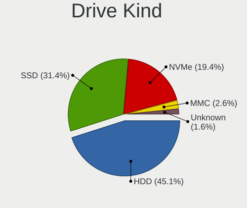

| Kind    | Computers | Drives | Percent |
|---------|-----------|--------|---------|
| HDD     | 11123     | 17040  | 45.07%  |
| SSD     | 7738      | 11341  | 31.36%  |
| NVMe    | 4789      | 6966   | 19.41%  |
| MMC     | 633       | 869    | 2.57%   |
| Unknown | 394       | 525    | 1.6%    |

Drive Connector
---------------

SATA, SAS, NVMe, etc.

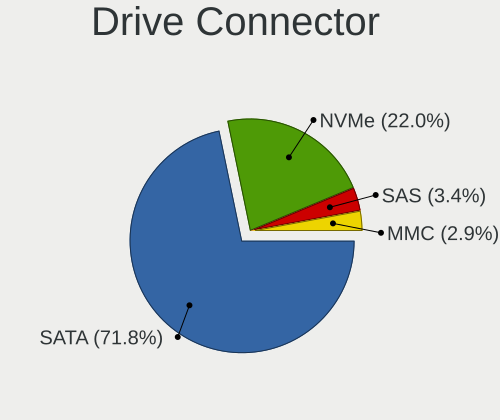

| Type | Computers | Drives | Percent |
|------|-----------|--------|---------|
| SATA | 15623     | 27904  | 71.76%  |
| NVMe | 4780      | 6937   | 21.96%  |
| SAS  | 735       | 1031   | 3.38%   |
| MMC  | 633       | 869    | 2.91%   |

Drive Size
----------

Size of hard drive

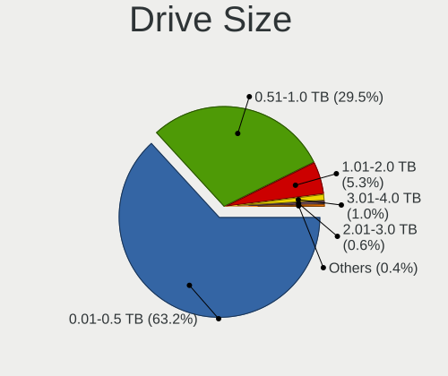

| Size in TB | Computers | Drives | Percent |
|------------|-----------|--------|---------|
| 0.01-0.5   | 11904     | 18442  | 63.19%  |
| 0.51-1.0   | 5559      | 7653   | 29.51%  |
| 1.01-2.0   | 991       | 1450   | 5.26%   |
| 3.01-4.0   | 197       | 456    | 1.05%   |
| 2.01-3.0   | 108       | 155    | 0.57%   |
| 4.01-10.0  | 64        | 169    | 0.34%   |
| 10.01-20.0 | 13        | 47     | 0.07%   |
| 20.01-50.0 | 1         | 8      | 0.01%   |
| 0          | 1         | 1      | 0.01%   |

Space Total
-----------

Amount of disk space available on the file system

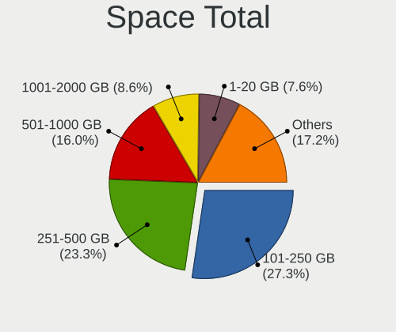

| Size in GB     | Computers | Percent |
|----------------|-----------|---------|
| 101-250        | 5555      | 27.31%  |
| 251-500        | 4740      | 23.31%  |
| 501-1000       | 3249      | 15.98%  |
| 1001-2000      | 1747      | 8.59%   |
| 1-20           | 1543      | 7.59%   |
| 51-100         | 1149      | 5.65%   |
| 21-50          | 777       | 3.82%   |
| 2001-3000      | 545       | 2.68%   |
| More than 3000 | 540       | 2.66%   |
| Unknown        | 492       | 2.42%   |

Space Used
----------

Amount of used disk space

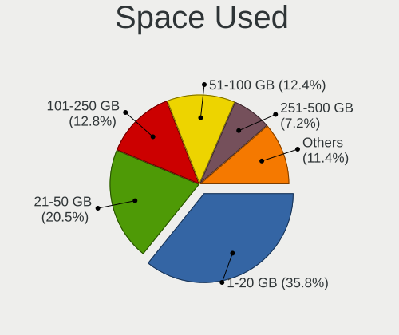

| Used GB        | Computers | Percent |
|----------------|-----------|---------|
| 1-20           | 7527      | 35.78%  |
| 21-50          | 4309      | 20.48%  |
| 101-250        | 2696      | 12.81%  |
| 51-100         | 2609      | 12.4%   |
| 251-500        | 1505      | 7.15%   |
| 501-1000       | 1103      | 5.24%   |
| 1001-2000      | 496       | 2.36%   |
| Unknown        | 492       | 2.34%   |
| More than 3000 | 148       | 0.7%    |
| 2001-3000      | 135       | 0.64%   |
| 0              | 19        | 0.09%   |

Malfunc. Drives
---------------

Drive models with a malfunction

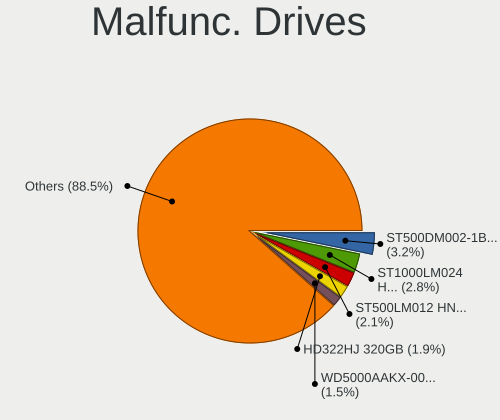

| Model                               | Computers | Drives | Percent |
|-------------------------------------|-----------|--------|---------|
| Seagate ST500DM002-1BD142 500GB     | 68        | 79     | 3.23%   |
| Seagate ST1000LM024 HN-M101MBB 1TB  | 60        | 68     | 2.85%   |
| Seagate ST500LM012 HN-M500MBB 500GB | 45        | 49     | 2.13%   |
| Samsung Electronics HD322HJ 320GB   | 39        | 59     | 1.85%   |
| WDC WD5000AAKX-003CA0 500GB         | 31        | 34     | 1.47%   |
| Seagate ST9500325AS 500GB           | 30        | 32     | 1.42%   |
| Samsung Electronics HD161HJ 160GB   | 27        | 30     | 1.28%   |
| Samsung Electronics HD502HI 500GB   | 26        | 33     | 1.23%   |
| Toshiba MQ01ABD050 500GB            | 23        | 23     | 1.09%   |
| WDC WD10EARS-00Y5B1 1TB             | 20        | 22     | 0.95%   |
| Samsung Electronics HD502HJ 500GB   | 20        | 21     | 0.95%   |
| Toshiba MQ01ABD100 1TB              | 19        | 20     | 0.9%    |
| Seagate ST1000DM010-2EP102 1TB      | 19        | 26     | 0.9%    |
| Seagate ST500LT012-9WS142 500GB     | 18        | 21     | 0.85%   |
| Seagate ST1000LM035-1RK172 1TB      | 18        | 19     | 0.85%   |
| Samsung Electronics HM321HI 320GB   | 17        | 17     | 0.81%   |
| Kingston SV300S37A120G 120GB SSD    | 16        | 17     | 0.76%   |
| Kingston SA400S37240G 240GB SSD     | 15        | 15     | 0.71%   |
| Seagate ST1000DM003-1CH162 1TB      | 14        | 20     | 0.66%   |
| Maxtor STM3160215AS 160GB           | 14        | 17     | 0.66%   |
| WDC WD3200AAJS-00L7A0 320GB         | 13        | 13     | 0.62%   |
| Seagate ST9320325AS 320GB           | 13        | 13     | 0.62%   |
| Seagate ST3500418AS 500GB           | 13        | 18     | 0.62%   |
| Seagate ST3500312CS 500GB           | 13        | 14     | 0.62%   |
| Seagate ST31000524AS 1TB            | 13        | 13     | 0.62%   |
| SanDisk SSD PLUS 240GB              | 13        | 14     | 0.62%   |
| Samsung Electronics HM160HI 160GB   | 13        | 14     | 0.62%   |
| Kingston SA400S37120G 120GB SSD     | 13        | 20     | 0.62%   |
| WDC WDS240G2G0A-00JH30 240GB SSD    | 12        | 13     | 0.57%   |
| Seagate ST3320418AS 320GB           | 12        | 16     | 0.57%   |
| Samsung Electronics HD250HJ 250GB   | 12        | 13     | 0.57%   |
| Kingston SA400S37480G 480GB SSD     | 12        | 14     | 0.57%   |
| Toshiba MQ01ABF050 500GB            | 11        | 12     | 0.52%   |
| Seagate ST1000DM003-1ER162 1TB      | 11        | 14     | 0.52%   |
| Samsung Electronics HD080HJ/ 80GB   | 11        | 13     | 0.52%   |
| China SSD 240GB                     | 11        | 12     | 0.52%   |
| China SSD 120GB                     | 11        | 12     | 0.52%   |
| Seagate ST500LT012-1DG142 500GB     | 10        | 11     | 0.47%   |
| Seagate ST3500413AS 500GB           | 10        | 11     | 0.47%   |
| Seagate ST320LM001 HN-M320MBB 320GB | 10        | 11     | 0.47%   |

Malfunc. Drive Vendor
---------------------

Vendors of faulty drives

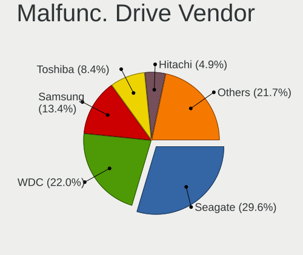

| Vendor                         | Computers | Drives | Percent |
|--------------------------------|-----------|--------|---------|
| Seagate                        | 599       | 736    | 29.61%  |
| WDC                            | 445       | 517    | 22%     |
| Samsung Electronics            | 271       | 354    | 13.4%   |
| Toshiba                        | 170       | 186    | 8.4%    |
| Hitachi                        | 100       | 112    | 4.94%   |
| Kingston                       | 83        | 96     | 4.1%    |
| China                          | 68        | 73     | 3.36%   |
| SanDisk                        | 42        | 46     | 2.08%   |
| Maxtor                         | 31        | 37     | 1.53%   |
| HGST                           | 24        | 25     | 1.19%   |
| A-DATA Technology              | 23        | 28     | 1.14%   |
| Crucial                        | 12        | 12     | 0.59%   |
| Netac                          | 10        | 12     | 0.49%   |
| Fujitsu                        | 10        | 12     | 0.49%   |
| XPG                            | 9         | 9      | 0.44%   |
| Intel                          | 8         | 8      | 0.4%    |
| Realtek Semiconductor          | 7         | 9      | 0.35%   |
| LITEON                         | 6         | 7      | 0.3%    |
| KingSpec                       | 6         | 6      | 0.3%    |
| Unknown                        | 6         | 6      | 0.3%    |
| PNY                            | 5         | 7      | 0.25%   |
| XrayDisk                       | 4         | 6      | 0.2%    |
| Micron Technology              | 4         | 11     | 0.2%    |
| JMicron Technology             | 4         | 4      | 0.2%    |
| Hewlett-Packard                | 4         | 5      | 0.2%    |
| Corsair                        | 4         | 4      | 0.2%    |
| ADATA Technology               | 4         | 4      | 0.2%    |
| SK hynix                       | 3         | 3      | 0.15%   |
| Silicon Motion                 | 3         | 6      | 0.15%   |
| OCZ                            | 3         | 3      | 0.15%   |
| Apple                          | 3         | 3      | 0.15%   |
| walram                         | 2         | 2      | 0.1%    |
| SSSTC                          | 2         | 2      | 0.1%    |
| Solid State Storage Technology | 2         | 2      | 0.1%    |
| ShiJi                          | 2         | 8      | 0.1%    |
| SAGE                           | 2         | 2      | 0.1%    |
| Mushkin                        | 2         | 2      | 0.1%    |
| MAXIO Technology (Hangzhou)    | 2         | 3      | 0.1%    |
| HUSKY                          | 2         | 2      | 0.1%    |
| Fanxiang                       | 2         | 2      | 0.1%    |

Malfunc. HDD Vendor
-------------------

Vendors of faulty HDD drives

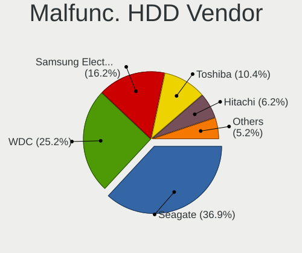

| Vendor              | Computers | Drives | Percent |
|---------------------|-----------|--------|---------|
| Seagate             | 599       | 736    | 36.88%  |
| WDC                 | 409       | 477    | 25.18%  |
| Samsung Electronics | 263       | 344    | 16.19%  |
| Toshiba             | 169       | 185    | 10.41%  |
| Hitachi             | 100       | 112    | 6.16%   |
| Maxtor              | 31        | 37     | 1.91%   |
| HGST                | 24        | 25     | 1.48%   |
| Fujitsu             | 10        | 12     | 0.62%   |
| JMicron Technology  | 4         | 4      | 0.25%   |
| Hewlett-Packard     | 4         | 5      | 0.25%   |
| SAGE                | 2         | 2      | 0.12%   |
| ExcelStor           | 2         | 3      | 0.12%   |
| Apple               | 2         | 2      | 0.12%   |
| USB3.0              | 1         | 1      | 0.06%   |
| Min Yi U            | 1         | 1      | 0.06%   |
| Initio              | 1         | 1      | 0.06%   |
| HPE                 | 1         | 1      | 0.06%   |
| FEASSO              | 1         | 2      | 0.06%   |

Malfunc. Drive Kind
-------------------

Kinds of faulty drives

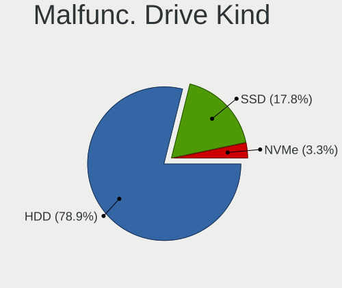

| Kind | Computers | Drives | Percent |
|------|-----------|--------|---------|
| HDD  | 1482      | 1950   | 78.91%  |
| SSD  | 334       | 378    | 17.78%  |
| NVMe | 62        | 83     | 3.3%    |

Failed Drives
-------------

Failed drive models

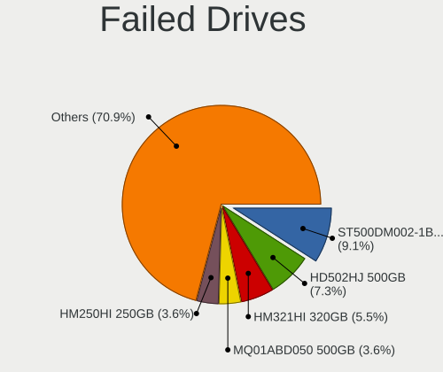

| Model                                            | Computers | Drives | Percent |
|--------------------------------------------------|-----------|--------|---------|
| Seagate ST500DM002-1BD142 500GB                  | 5         | 5      | 9.09%   |
| Samsung Electronics HD502HJ 500GB                | 4         | 8      | 7.27%   |
| Samsung Electronics HM321HI 320GB                | 3         | 3      | 5.45%   |
| Toshiba MQ01ABD050 500GB                         | 2         | 2      | 3.64%   |
| Samsung Electronics HM250HI 250GB                | 2         | 2      | 3.64%   |
| Samsung Electronics HD103SJ 1TB                  | 2         | 2      | 3.64%   |
| WDC WD5000LPVX-00V0TT0 500GB                     | 1         | 1      | 1.82%   |
| WDC WD5000BPVT-22HXZT1 500GB                     | 1         | 1      | 1.82%   |
| WDC WD5000AZLX-60K2TA1 500GB                     | 1         | 1      | 1.82%   |
| WDC WD5000AAKS-00C8A0 500GB                      | 1         | 1      | 1.82%   |
| WDC WD3200BPVT-24JJ5T0 320GB                     | 1         | 1      | 1.82%   |
| WDC WD3200BPVT-22JJ5T0 320GB                     | 1         | 1      | 1.82%   |
| WDC WD3200BPVT-00JJ5T0 320GB                     | 1         | 1      | 1.82%   |
| WDC WD1600BEVT-22ZCT0 160GB                      | 1         | 1      | 1.82%   |
| WDC WD10SPZX-75Z10T1 1TB                         | 1         | 1      | 1.82%   |
| WDC WD10SPZX-24Z10 1TB                           | 1         | 1      | 1.82%   |
| WDC WD10SPZX-22Z10T0 1TB                         | 1         | 1      | 1.82%   |
| Toshiba MQ01ABD100 1TB                           | 1         | 1      | 1.82%   |
| Toshiba MK5065GSXN 500GB                         | 1         | 1      | 1.82%   |
| Toshiba DT01ACA100 1TB                           | 1         | 1      | 1.82%   |
| SK hynix BC501 NVMe Solid State Drive 512GB      | 1         | 1      | 1.82%   |
| Seagate ST500LM012 HN-M500MBB 500GB              | 1         | 1      | 1.82%   |
| Seagate ST3320613AS 320GB                        | 1         | 1      | 1.82%   |
| Seagate ST3320418AS 320GB                        | 1         | 1      | 1.82%   |
| Seagate ST3250318AS 250GB                        | 1         | 1      | 1.82%   |
| Seagate ST31000528AS 1TB                         | 1         | 1      | 1.82%   |
| Seagate ST31000340NS 1TB                         | 1         | 1      | 1.82%   |
| Seagate ST1000LM024 HN-M101MBB 1TB               | 1         | 1      | 1.82%   |
| Samsung Electronics MZNTY128HDHP-000H1 128GB SSD | 1         | 1      | 1.82%   |
| Samsung Electronics MZMPC032HBCD-000H1 32GB SSD  | 1         | 1      | 1.82%   |
| Samsung Electronics HM641JI 640GB                | 1         | 1      | 1.82%   |
| Samsung Electronics HM320JI 320GB                | 1         | 1      | 1.82%   |
| Samsung Electronics HD322GJ 320GB                | 1         | 1      | 1.82%   |
| Samsung Electronics HD080HJ/ 80GB                | 1         | 1      | 1.82%   |
| Realtek Semiconductor XrayDisk 1TB SSD           | 1         | 1      | 1.82%   |
| Maxtor STM380215AS 80GB                          | 1         | 1      | 1.82%   |
| Kingston SHSS37A480G 480GB SSD                   | 1         | 1      | 1.82%   |
| Hitachi HTS545032B9A300 320GB                    | 1         | 1      | 1.82%   |
| Hitachi HDS721050DLE630 500GB                    | 1         | 1      | 1.82%   |
| HGST HTS541010A9E680 1TB                         | 1         | 1      | 1.82%   |

Failed Drive Vendor
-------------------

Failed drive vendors

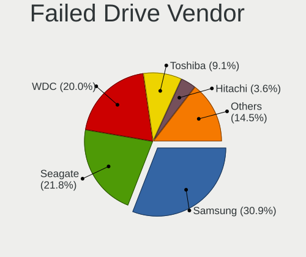

| Vendor                | Computers | Drives | Percent |
|-----------------------|-----------|--------|---------|
| Samsung Electronics   | 17        | 21     | 30.91%  |
| Seagate               | 12        | 12     | 21.82%  |
| WDC                   | 11        | 11     | 20%     |
| Toshiba               | 5         | 5      | 9.09%   |
| Hitachi               | 2         | 2      | 3.64%   |
| SK hynix              | 1         | 1      | 1.82%   |
| Realtek Semiconductor | 1         | 1      | 1.82%   |
| Maxtor                | 1         | 1      | 1.82%   |
| Kingston              | 1         | 1      | 1.82%   |
| HGST                  | 1         | 1      | 1.82%   |
| China                 | 1         | 1      | 1.82%   |
| Apple                 | 1         | 1      | 1.82%   |
| ADATA Technology      | 1         | 1      | 1.82%   |

Drive Status
------------

Number of failed and malfunc. drives

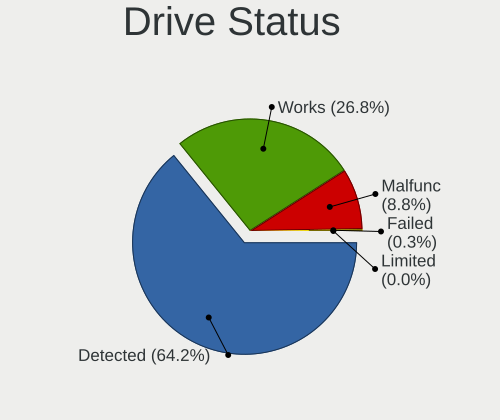

| Status   | Computers | Drives | Percent |
|----------|-----------|--------|---------|
| Detected | 13140     | 24626  | 64.17%  |
| Works    | 5481      | 9644   | 26.77%  |
| Malfunc  | 1799      | 2411   | 8.79%   |
| Failed   | 55        | 59     | 0.27%   |
| Limited  | 1         | 1      | 0.005%  |

Storage controller
------------------

Storage Vendor
--------------

Storage controller vendors

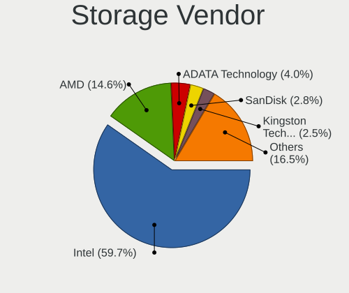

| Vendor                           | Computers | Percent |
|----------------------------------|-----------|---------|
| Intel                            | 13831     | 59.74%  |
| AMD                              | 3369      | 14.55%  |
| ADATA Technology                 | 921       | 3.98%   |
| SanDisk                          | 645       | 2.79%   |
| Kingston Technology Company      | 571       | 2.47%   |
| Samsung Electronics              | 544       | 2.35%   |
| Silicon Motion                   | 431       | 1.86%   |
| Nvidia                           | 317       | 1.37%   |
| Solid State Storage Technology   | 306       | 1.32%   |
| SK hynix                         | 279       | 1.21%   |
| Realtek Semiconductor            | 251       | 1.08%   |
| MAXIO Technology (Hangzhou)      | 228       | 0.98%   |
| Phison Electronics               | 204       | 0.88%   |
| Marvell Technology Group         | 136       | 0.59%   |
| Silicon Integrated Systems [SiS] | 126       | 0.54%   |
| ASMedia Technology               | 126       | 0.54%   |
| Micron Technology                | 117       | 0.51%   |
| JMicron Technology               | 109       | 0.47%   |
| Micron/Crucial Technology        | 92        | 0.4%    |
| VIA Technologies                 | 85        | 0.37%   |
| KIOXIA                           | 85        | 0.37%   |
| Shenzhen Longsys Electronics     | 52        | 0.22%   |
| Toshiba America Info Systems     | 40        | 0.17%   |
| LSI Logic / Symbios Logic        | 39        | 0.17%   |
| Lite-On Technology               | 39        | 0.17%   |
| Netac Technology                 | 38        | 0.16%   |
| INNOGRIT                         | 30        | 0.13%   |
| Broadcom / LSI                   | 24        | 0.1%    |
| Hosin Global Electronics         | 22        | 0.1%    |
| Union Memory (Shenzhen)          | 13        | 0.06%   |
| Apple                            | 11        | 0.05%   |
| Silicon Image                    | 8         | 0.03%   |
| O2 Micro                         | 8         | 0.03%   |
| Hewlett-Packard                  | 8         | 0.03%   |
| Beijing Starblaze Technology     | 8         | 0.03%   |
| Seagate Technology               | 6         | 0.03%   |
| Adaptec                          | 5         | 0.02%   |
| OCZ Technology Group             | 4         | 0.02%   |
| Dell                             | 4         | 0.02%   |
| Yangtze Memory Technologies      | 3         | 0.01%   |

Storage Model
-------------

Storage controller models

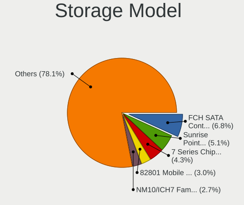

| Model                                                                                   | Computers | Percent |
|-----------------------------------------------------------------------------------------|-----------|---------|
| AMD FCH SATA Controller [AHCI mode]                                                     | 1873      | 6.82%   |
| Intel Sunrise Point-LP SATA Controller [AHCI mode]                                      | 1407      | 5.12%   |
| Intel 7 Series Chipset Family 6-port SATA Controller [AHCI mode]                        | 1176      | 4.28%   |
| Intel 82801 Mobile SATA Controller [RAID mode]                                          | 811       | 2.95%   |
| Intel NM10/ICH7 Family SATA Controller [IDE mode]                                       | 751       | 2.74%   |
| Intel 6 Series/C200 Series Chipset Family 6 port Desktop SATA AHCI Controller           | 701       | 2.55%   |
| Intel 8 Series/C220 Series Chipset Family 6-port SATA Controller 1 [AHCI mode]          | 680       | 2.48%   |
| Intel 6 Series/C200 Series Chipset Family 6 port Mobile SATA AHCI Controller            | 656       | 2.39%   |
| Intel 82801G (ICH7 Family) IDE Controller                                               | 586       | 2.13%   |
| Intel 8 Series SATA Controller 1 [AHCI mode]                                            | 539       | 1.96%   |
| AMD 400 Series Chipset SATA Controller                                                  | 460       | 1.68%   |
| AMD SB7x0/SB8x0/SB9x0 IDE Controller                                                    | 438       | 1.6%    |
| Intel Wildcat Point-LP SATA Controller [AHCI Mode]                                      | 428       | 1.56%   |
| Intel 5 Series/3400 Series Chipset 4 port SATA AHCI Controller                          | 427       | 1.56%   |
| AMD SB7x0/SB8x0/SB9x0 SATA Controller [AHCI mode]                                       | 420       | 1.53%   |
| Silicon Motion SM2263EN/SM2263XT (DRAM-less) NVMe SSD Controllers                       | 384       | 1.4%    |
| AMD 500 Series Chipset SATA Controller                                                  | 370       | 1.35%   |
| AMD A320 Chipset SATA Controller [AHCI mode]                                            | 368       | 1.34%   |
| Intel 7 Series/C210 Series Chipset Family 6-port SATA Controller [AHCI mode]            | 349       | 1.27%   |
| Intel Volume Management Device NVMe RAID Controller                                     | 341       | 1.24%   |
| Intel Tiger Lake-LP SATA Controller                                                     | 339       | 1.23%   |
| AMD SB7x0/SB8x0/SB9x0 SATA Controller [IDE mode]                                        | 325       | 1.18%   |
| Intel 6 Series/C200 Series Chipset Family Desktop SATA Controller (IDE mode, ports 4-5) | 323       | 1.18%   |
| Intel 6 Series/C200 Series Chipset Family Desktop SATA Controller (IDE mode, ports 0-3) | 323       | 1.18%   |
| Intel 82801IBM/IEM (ICH9M/ICH9M-E) 4 port SATA Controller [AHCI mode]                   | 322       | 1.17%   |
| Intel Cannon Point-LP SATA Controller [AHCI Mode]                                       | 294       | 1.07%   |
| Intel Q170/Q150/B150/H170/H110/Z170/CM236 Chipset SATA Controller [AHCI Mode]           | 288       | 1.05%   |
| Intel Celeron/Pentium Silver Processor SATA Controller                                  | 268       | 0.98%   |
| Intel Comet Lake SATA AHCI Controller                                                   | 256       | 0.93%   |
| Intel 5 Series/3400 Series Chipset 6 port SATA AHCI Controller                          | 236       | 0.86%   |
| ADATA IM2P33F8 series NVMe SSD (DRAM-less)                                              | 229       | 0.83%   |
| Solid State Storage CL1-3D256-Q11 NVMe SSD M.2                                          | 222       | 0.81%   |
| Intel Atom Processor E3800 Series SATA AHCI Controller                                  | 218       | 0.79%   |
| Intel PROSet/Wireless WiFi Software extension                                           | 214       | 0.78%   |
| Nvidia MCP61 SATA Controller                                                            | 212       | 0.77%   |
| Intel Cannon Lake PCH SATA AHCI Controller                                              | 211       | 0.77%   |
| ADATA IM2P33F3 NVMe SSD (DRAM-less)                                                     | 210       | 0.76%   |
| Intel 200 Series PCH SATA controller [AHCI mode]                                        | 208       | 0.76%   |
| Intel Cannon Lake Mobile PCH SATA AHCI Controller                                       | 204       | 0.74%   |
| Intel 82801HM/HEM (ICH8M/ICH8M-E) IDE Controller                                        | 199       | 0.72%   |

Storage Kind
------------

Kind of storage controller (IDE, SATA, NVMe, SAS, ...)

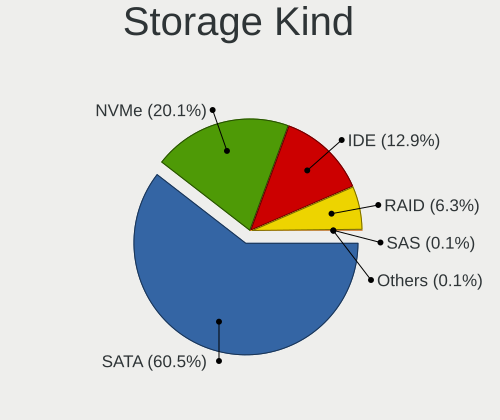

| Kind | Computers | Percent |
|------|-----------|---------|
| SATA | 14426     | 60.49%  |
| NVMe | 4795      | 20.11%  |
| IDE  | 3080      | 12.91%  |
| RAID | 1506      | 6.31%   |
| SAS  | 23        | 0.1%    |
| SCSI | 19        | 0.08%   |

Processor
---------

CPU Vendor
----------

Processor vendors

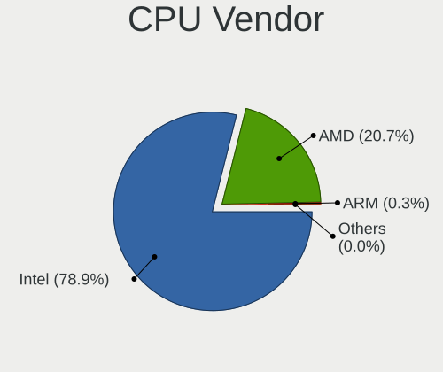

| Vendor       | Computers | Percent |
|--------------|-----------|---------|
| Intel        | 14982     | 78.91%  |
| AMD          | 3937      | 20.74%  |
| ARM          | 57        | 0.3%    |
| CentaurHauls | 5         | 0.03%   |
| Qualcomm     | 3         | 0.02%   |
| lekkit,rvvm  | 1         | 0.01%   |
| Unknown      | 1         | 0.01%   |

CPU Model
---------

Processor models

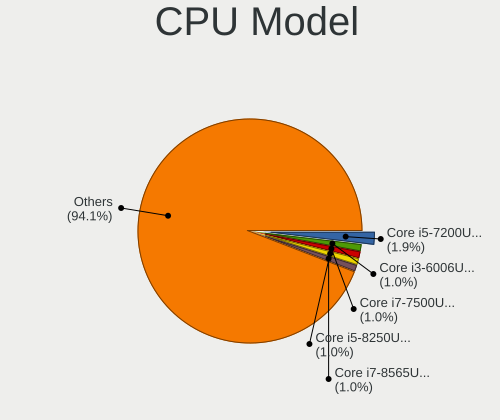

| Model                                         | Computers | Percent |
|-----------------------------------------------|-----------|---------|
| Intel Core i5-7200U CPU @ 2.50GHz             | 356       | 1.87%   |
| Intel Core i3-6006U CPU @ 2.00GHz             | 199       | 1.04%   |
| Intel Core i7-7500U CPU @ 2.70GHz             | 191       | 1%      |
| Intel Core i5-8250U CPU @ 1.60GHz             | 189       | 0.99%   |
| Intel Core i7-8565U CPU @ 1.80GHz             | 182       | 0.96%   |
| Intel Core i5-9300H CPU @ 2.40GHz             | 180       | 0.94%   |
| Intel Core i5-8265U CPU @ 1.60GHz             | 176       | 0.92%   |
| Intel 11th Gen Core i5-1135G7 @ 2.40GHz       | 176       | 0.92%   |
| Intel Core i5-5200U CPU @ 2.20GHz             | 175       | 0.92%   |
| Intel Atom x5-Z8350 CPU @ 1.44GHz             | 167       | 0.88%   |
| Intel 11th Gen Core i7-1165G7 @ 2.80GHz       | 158       | 0.83%   |
| Intel Core i5-3470 CPU @ 3.20GHz              | 157       | 0.82%   |
| Intel Core i7-8550U CPU @ 1.80GHz             | 151       | 0.79%   |
| AMD Ryzen 5 3500U with Radeon Vega Mobile Gfx | 146       | 0.77%   |
| Intel Core i7-9750H CPU @ 2.60GHz             | 140       | 0.73%   |
| Intel Core i5-3210M CPU @ 2.50GHz             | 132       | 0.69%   |
| AMD FX-6300 Six-Core Processor                | 124       | 0.65%   |
| Intel Core i5-10210U CPU @ 1.60GHz            | 122       | 0.64%   |
| Intel Core i7-5500U CPU @ 2.40GHz             | 121       | 0.64%   |
| Intel Core i5-4210U CPU @ 1.70GHz             | 120       | 0.63%   |
| Intel Core i3-7020U CPU @ 2.30GHz             | 120       | 0.63%   |
| Intel Core i7-7700HQ CPU @ 2.80GHz            | 117       | 0.61%   |
| Intel Core i5-3230M CPU @ 2.60GHz             | 117       | 0.61%   |
| Intel Core i3-3110M CPU @ 2.40GHz             | 115       | 0.6%    |
| Intel Core 2 Duo CPU E7500 @ 2.93GHz          | 115       | 0.6%    |
| Intel Core i7-3770 CPU @ 3.40GHz              | 113       | 0.59%   |
| Intel Core i7-10510U CPU @ 1.80GHz            | 113       | 0.59%   |
| Intel Core i5-2450M CPU @ 2.50GHz             | 113       | 0.59%   |
| Intel Celeron N4020 CPU @ 1.10GHz             | 113       | 0.59%   |
| Intel Core i3-3217U CPU @ 1.80GHz             | 112       | 0.59%   |
| Intel Core i5-4200U CPU @ 1.60GHz             | 110       | 0.58%   |
| Intel Core i3-2100 CPU @ 3.10GHz              | 108       | 0.57%   |
| Intel Core i5-3330 CPU @ 3.00GHz              | 106       | 0.56%   |
| Intel Core i5-1035G1 CPU @ 1.00GHz            | 104       | 0.55%   |
| Intel Core i5-2410M CPU @ 2.30GHz             | 102       | 0.54%   |
| AMD Ryzen 5 3600 6-Core Processor             | 101       | 0.53%   |
| Intel Core i5 CPU 650 @ 3.20GHz               | 100       | 0.52%   |
| Intel Core i5-2400 CPU @ 3.10GHz              | 99        | 0.52%   |
| Intel Celeron CPU 847 @ 1.10GHz               | 94        | 0.49%   |
| AMD Ryzen 5 5600G with Radeon Graphics        | 94        | 0.49%   |

CPU Model Family
----------------

Processor model prefix

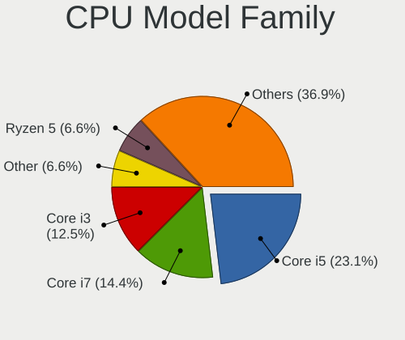

| Model                   | Computers | Percent |
|-------------------------|-----------|---------|
| Intel Core i5           | 4404      | 23.13%  |
| Intel Core i7           | 2740      | 14.39%  |
| Intel Core i3           | 2377      | 12.48%  |
| Other                   | 1252      | 6.58%   |
| AMD Ryzen 5             | 1248      | 6.55%   |
| Intel Celeron           | 1218      | 6.4%    |
| AMD Ryzen 7             | 725       | 3.81%   |
| Intel Core 2 Duo        | 720       | 3.78%   |
| Intel Xeon              | 552       | 2.9%    |
| Intel Atom              | 422       | 2.22%   |
| Intel Pentium Dual-Core | 400       | 2.1%    |
| Intel Pentium           | 396       | 2.08%   |
| AMD FX                  | 354       | 1.86%   |
| AMD Ryzen 3             | 192       | 1.01%   |
| Intel Pentium Dual      | 174       | 0.91%   |
| Intel Core 2 Quad       | 135       | 0.71%   |
| AMD Ryzen 9             | 116       | 0.61%   |
| AMD Phenom II X4        | 107       | 0.56%   |
| AMD E                   | 86        | 0.45%   |
| AMD Athlon II X2        | 86        | 0.45%   |
| AMD A4                  | 78        | 0.41%   |
| AMD A10                 | 78        | 0.41%   |
| AMD A6                  | 76        | 0.4%    |
| AMD Athlon              | 73        | 0.38%   |
| AMD A8                  | 73        | 0.38%   |
| Intel Core 2            | 65        | 0.34%   |
| AMD Athlon 64 X2        | 53        | 0.28%   |
| Intel Genuine           | 52        | 0.27%   |
| AMD C-60                | 52        | 0.27%   |
| AMD E1                  | 47        | 0.25%   |
| AMD Phenom II X6        | 41        | 0.22%   |
| Intel Core i9           | 40        | 0.21%   |
| AMD Sempron             | 34        | 0.18%   |
| AMD Ryzen 5 PRO         | 33        | 0.17%   |
| Intel Pentium Gold      | 32        | 0.17%   |
| Intel Core              | 32        | 0.17%   |
| AMD C-70                | 32        | 0.17%   |
| Intel Pentium 4         | 30        | 0.16%   |
| AMD Phenom II X2        | 29        | 0.15%   |
| AMD C-50                | 25        | 0.13%   |

CPU Cores
---------

Number of processor cores

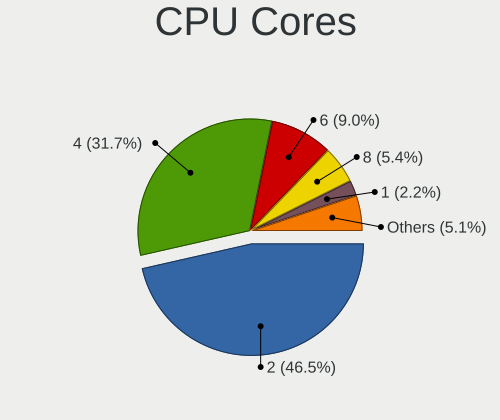

| Number  | Computers | Percent |
|---------|-----------|---------|
| 2       | 8847      | 46.45%  |
| 4       | 6044      | 31.73%  |
| 6       | 1718      | 9.02%   |
| 8       | 1035      | 5.43%   |
| 1       | 422       | 2.22%   |
| 10      | 261       | 1.37%   |
| 12      | 212       | 1.11%   |
| 3       | 173       | 0.91%   |
| 14      | 131       | 0.69%   |
| 16      | 85        | 0.45%   |
| 24      | 36        | 0.19%   |
| Unknown | 26        | 0.14%   |
| 20      | 18        | 0.09%   |
| 18      | 10        | 0.05%   |
| 5       | 7         | 0.04%   |
| 32      | 6         | 0.03%   |
| 28      | 5         | 0.03%   |
| 36      | 3         | 0.02%   |
| 44      | 2         | 0.01%   |
| 22      | 2         | 0.01%   |
| 96      | 1         | 0.01%   |
| 40      | 1         | 0.01%   |
| 13      | 1         | 0.01%   |

CPU Sockets
-----------

Number of sockets

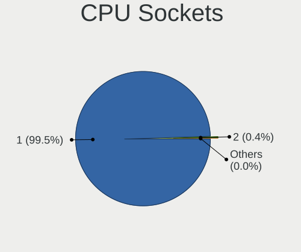

| Number  | Computers | Percent |
|---------|-----------|---------|
| 1       | 18887     | 99.48%  |
| 2       | 79        | 0.42%   |
| Unknown | 13        | 0.07%   |
| 4       | 5         | 0.03%   |
| 16      | 1         | 0.01%   |
| 8       | 1         | 0.01%   |

CPU Threads
-----------

Threads per core (Hyper-Threading)

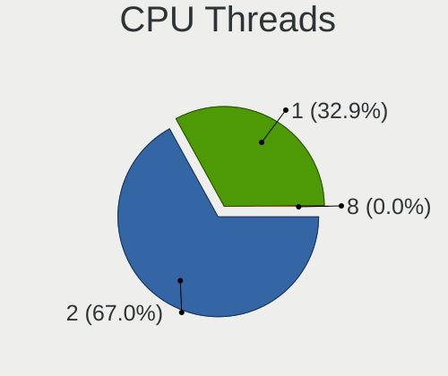

| Number  | Computers | Percent |
|---------|-----------|---------|
| 2       | 12743     | 66.99%  |
| 1       | 6250      | 32.86%  |
| Unknown | 26        | 0.14%   |
| 4       | 2         | 0.01%   |
| 8       | 1         | 0.01%   |

CPU Op-Modes
------------

CPU Operation Modes (32-bit, 64-bit)

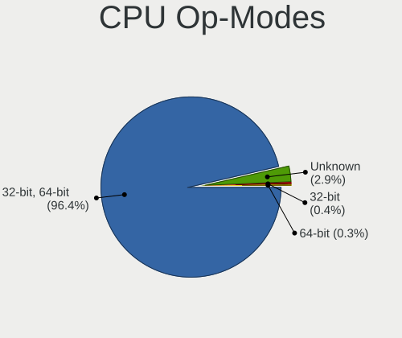

| Op mode        | Computers | Percent |
|----------------|-----------|---------|
| 32-bit, 64-bit | 18368     | 96.39%  |
| Unknown        | 559       | 2.93%   |
| 32-bit         | 70        | 0.37%   |
| 64-bit         | 59        | 0.31%   |

CPU Microcode
-------------

Microcode number

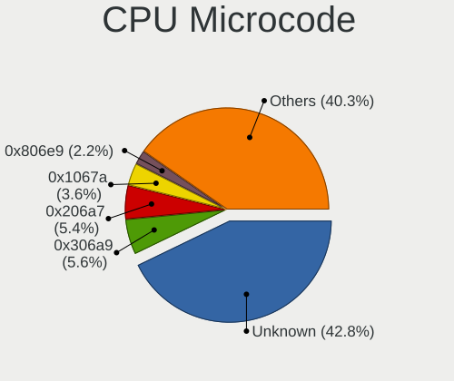

| Number     | Computers | Percent |
|------------|-----------|---------|
| Unknown    | 8479      | 42.83%  |
| 0x306a9    | 1117      | 5.64%   |
| 0x206a7    | 1069      | 5.4%    |
| 0x1067a    | 709       | 3.58%   |
| 0x806e9    | 445       | 2.25%   |
| 0x906ea    | 431       | 2.18%   |
| 0x306c3    | 414       | 2.09%   |
| 0x20655    | 409       | 2.07%   |
| 0x40651    | 377       | 1.9%    |
| 0x806ec    | 351       | 1.77%   |
| 0x306d4    | 304       | 1.54%   |
| 0x406e3    | 296       | 1.5%    |
| 0x806ea    | 269       | 1.36%   |
| 0x6fd      | 261       | 1.32%   |
| 0x806c1    | 244       | 1.23%   |
| 0x906e9    | 235       | 1.19%   |
| 0x08108109 | 217       | 1.1%    |
| 0x406c4    | 197       | 0.99%   |
| 0x06000852 | 174       | 0.88%   |
| 0x010000c8 | 147       | 0.74%   |
| 0x30678    | 140       | 0.71%   |
| 0x05000119 | 109       | 0.55%   |
| 0x20652    | 106       | 0.54%   |
| 0x706e5    | 96        | 0.48%   |
| 0x08600103 | 96        | 0.48%   |
| 0x906ed    | 95        | 0.48%   |
| 0x0800820d | 94        | 0.47%   |
| 0x08108102 | 90        | 0.45%   |
| 0x10676    | 89        | 0.45%   |
| 0x08701021 | 87        | 0.44%   |
| 0x506e3    | 84        | 0.42%   |
| 0x706a1    | 82        | 0.41%   |
| 0x306f2    | 77        | 0.39%   |
| 0x406c3    | 71        | 0.36%   |
| 0x706a8    | 69        | 0.35%   |
| 0x6fb      | 69        | 0.35%   |
| 0x106ca    | 69        | 0.35%   |
| 0x0600611a | 60        | 0.3%    |
| 0x806eb    | 58        | 0.29%   |
| 0x106e5    | 58        | 0.29%   |

CPU Microarch
-------------

Microarchitecture

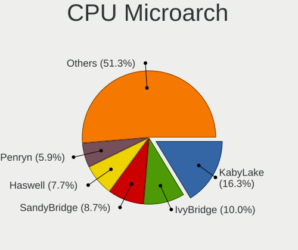

| Name              | Computers | Percent |
|-------------------|-----------|---------|
| KabyLake          | 3103      | 16.29%  |
| IvyBridge         | 1909      | 10.02%  |
| SandyBridge       | 1664      | 8.74%   |
| Haswell           | 1465      | 7.69%   |
| Penryn            | 1128      | 5.92%   |
| Unknown           | 876       | 4.6%    |
| Westmere          | 778       | 4.09%   |
| Skylake           | 651       | 3.42%   |
| Zen+              | 646       | 3.39%   |
| Silvermont        | 643       | 3.38%   |
| Core              | 586       | 3.08%   |
| Broadwell         | 560       | 2.94%   |
| Zen 3             | 551       | 2.89%   |
| TigerLake         | 509       | 2.67%   |
| Zen 2             | 503       | 2.64%   |
| K10               | 382       | 2.01%   |
| Piledriver        | 378       | 1.98%   |
| CometLake         | 330       | 1.73%   |
| Zen               | 327       | 1.72%   |
| Alderlake Hybrid  | 287       | 1.51%   |
| Goldmont plus     | 273       | 1.43%   |
| IceLake           | 250       | 1.31%   |
| Bobcat            | 224       | 1.18%   |
| Bonnell           | 177       | 0.93%   |
| Excavator         | 124       | 0.65%   |
| K8 Hammer         | 120       | 0.63%   |
| Nehalem           | 117       | 0.61%   |
| Goldmont          | 89        | 0.47%   |
| K10 Llano         | 66        | 0.35%   |
| Steamroller       | 64        | 0.34%   |
| Jaguar            | 57        | 0.3%    |
| Bulldozer         | 57        | 0.3%    |
| NetBurst          | 55        | 0.29%   |
| P6                | 27        | 0.14%   |
| Tremont           | 17        | 0.09%   |
| Gracemont         | 14        | 0.07%   |
| Meteorlake Hybrid | 13        | 0.07%   |
| K8 & K10 hybrid   | 11        | 0.06%   |
| Puma              | 8         | 0.04%   |
| Lunarlake Hybrid  | 3         | 0.02%   |

Graphics
--------

GPU Vendor
----------

Vendors of graphics cards

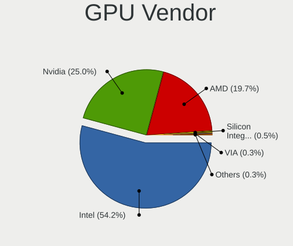

| Vendor                           | Computers | Percent |
|----------------------------------|-----------|---------|
| Intel                            | 12241     | 54.21%  |
| Nvidia                           | 5640      | 24.98%  |
| AMD                              | 4438      | 19.65%  |
| Silicon Integrated Systems [SiS] | 121       | 0.54%   |
| VIA Technologies                 | 62        | 0.27%   |
| Matrox Electronics Systems       | 53        | 0.23%   |
| ASPEED Technology                | 15        | 0.07%   |
| ATI Technologies                 | 5         | 0.02%   |
| Silicon Motion                   | 4         | 0.02%   |
| S3 Graphics                      | 1         | 0.004%  |
| Red Hat                          | 1         | 0.004%  |

GPU Model
---------

Graphics card models

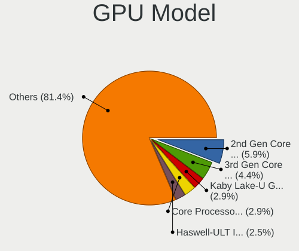

| Model                                                                                    | Computers | Percent |
|------------------------------------------------------------------------------------------|-----------|---------|
| Intel 2nd Generation Core Processor Family Integrated Graphics Controller                | 1361      | 5.88%   |
| Intel 3rd Gen Core processor Graphics Controller                                         | 1029      | 4.45%   |
| Intel Kaby Lake-U GT2 [HD Graphics 620]                                                  | 672       | 2.9%    |
| Intel Core Processor Integrated Graphics Controller                                      | 660       | 2.85%   |
| Intel Haswell-ULT Integrated Graphics Controller                                         | 577       | 2.49%   |
| Nvidia TU117M [GeForce GTX 1650 Mobile / Max-Q]                                          | 494       | 2.13%   |
| Intel CoffeeLake-H GT2 [UHD Graphics 630]                                                | 442       | 1.91%   |
| AMD Picasso/Raven 2 [Radeon Vega Series / Radeon Vega Mobile Series]                     | 429       | 1.85%   |
| Intel Kaby Lake-R GT2 [UHD Graphics 620]                                                 | 426       | 1.84%   |
| Intel TigerLake-LP GT2 [Iris Xe Graphics]                                                | 412       | 1.78%   |
| Intel Broadwell-U GT2 [HD Graphics 5500]                                                 | 409       | 1.77%   |
| Intel Xeon E3-1200 v2/3rd Gen Core processor Graphics Controller                         | 405       | 1.75%   |
| Intel Atom/Celeron/Pentium Processor x5-E8000/J3xxx/N3xxx Integrated Graphics Controller | 404       | 1.75%   |
| Intel Skylake-U GT2 [HD Graphics 520]                                                    | 396       | 1.71%   |
| Intel WhiskeyLake-U GT2 [UHD Graphics 620]                                               | 382       | 1.65%   |
| Intel Mobile 4 Series Chipset Integrated Graphics Controller                             | 339       | 1.46%   |
| AMD Ellesmere [Radeon RX 470/480/570/570X/580/580X/590]                                  | 286       | 1.24%   |
| Intel Xeon E3-1200 v3/4th Gen Core Processor Integrated Graphics Controller              | 283       | 1.22%   |
| Intel GeminiLake [UHD Graphics 600]                                                      | 273       | 1.18%   |
| Intel CometLake-U GT2 [UHD Graphics]                                                     | 253       | 1.09%   |
| Intel Atom Processor Z36xxx/Z37xxx Series Graphics & Display                             | 239       | 1.03%   |
| Intel 4 Series Chipset Integrated Graphics Controller                                    | 231       | 1%      |
| AMD Renoir [Radeon Vega Series / Radeon Vega Mobile Series]                              | 208       | 0.9%    |
| AMD Cezanne [Radeon Vega Series / Radeon Vega Mobile Series]                             | 206       | 0.89%   |
| Intel 82G33/G31 Express Integrated Graphics Controller                                   | 203       | 0.88%   |
| Nvidia GT218 [GeForce 210]                                                               | 200       | 0.86%   |
| AMD Topaz XT [Radeon R7 M260/M265 / M340/M360 / M440/M445 / 530/535 / 620/625 Mobile]    | 196       | 0.85%   |
| Intel Mobile GM965/GL960 Integrated Graphics Controller (secondary)                      | 179       | 0.77%   |
| Intel Mobile GM965/GL960 Integrated Graphics Controller (primary)                        | 179       | 0.77%   |
| AMD Lucienne                                                                             | 175       | 0.76%   |
| Nvidia GP107 [GeForce GTX 1050 Ti]                                                       | 166       | 0.72%   |
| Intel CoffeeLake-S GT2 [UHD Graphics 630]                                                | 159       | 0.69%   |
| AMD Lexa PRO [Radeon 540/540X/550/550X / RX 540X/550/550X]                               | 156       | 0.67%   |
| Intel Kaby Lake-H GT2 [HD Graphics 630]                                                  | 152       | 0.66%   |
| AMD Raven Ridge [Radeon Vega Series / Radeon Vega Mobile Series]                         | 151       | 0.65%   |
| Intel Iris Plus Graphics G1 (Ice Lake)                                                   | 145       | 0.63%   |
| Nvidia GM108M [GeForce 940MX]                                                            | 135       | 0.58%   |
| Nvidia GP108M [GeForce MX150]                                                            | 130       | 0.56%   |
| Nvidia GM108M [GeForce MX110]                                                            | 130       | 0.56%   |
| Nvidia GK208B [GeForce GT 710]                                                           | 126       | 0.54%   |

GPU Combo
---------

Combinations of graphics cards

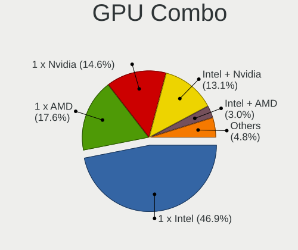

| Name                     | Computers | Percent |
|--------------------------|-----------|---------|
| 1 x Intel                | 8985      | 46.9%   |
| 1 x AMD                  | 3380      | 17.64%  |
| 1 x Nvidia               | 2793      | 14.58%  |
| Intel + Nvidia           | 2507      | 13.09%  |
| Intel + AMD              | 567       | 2.96%   |
| AMD + Nvidia             | 306       | 1.6%    |
| 2 x AMD                  | 205       | 1.07%   |
| 1 x SiS                  | 121       | 0.63%   |
| 2 x Intel                | 68        | 0.35%   |
| Other                    | 65        | 0.34%   |
| 1 x VIA                  | 61        | 0.32%   |
| 1 x Matrox               | 50        | 0.26%   |
| 2 x Nvidia               | 23        | 0.12%   |
| 1 x ASPEED               | 12        | 0.06%   |
| Nvidia + ASPEED          | 3         | 0.02%   |
| Intel + Silicon Motion   | 2         | 0.01%   |
| AMD + Matrox             | 2         | 0.01%   |
| 1 x Silicon Motion       | 1         | 0.01%   |
| 1 x S3 Graphics          | 1         | 0.01%   |
| 1 x Red Hat              | 1         | 0.01%   |
| Nvidia + Silicon Motion  | 1         | 0.01%   |
| Nvidia + Matrox          | 1         | 0.01%   |
| Intel + 2 x AMD          | 1         | 0.01%   |
| Intel + AMD + 1 x Nvidia | 1         | 0.01%   |
| AMD + 2 x Nvidia         | 1         | 0.01%   |

GPU Driver
----------

Free vs proprietary

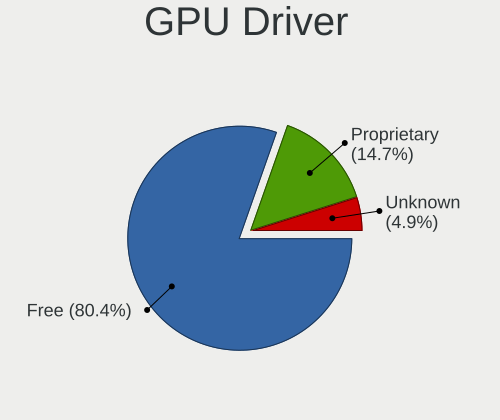

| Driver      | Computers | Percent |
|-------------|-----------|---------|
| Free        | 15485     | 80.37%  |
| Proprietary | 2839      | 14.74%  |
| Unknown     | 942       | 4.89%   |

GPU Memory
----------

Total video memory

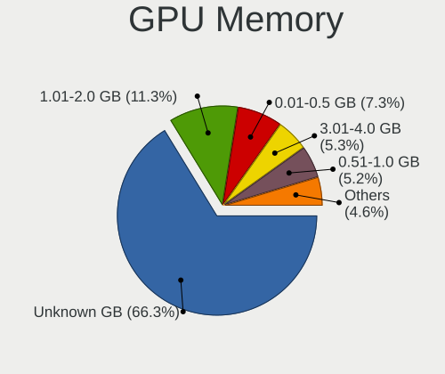

| Size in GB     | Computers | Percent |
|----------------|-----------|---------|
| Unknown        | 12960     | 66.25%  |
| 1.01-2.0       | 2202      | 11.26%  |
| 0.01-0.5       | 1429      | 7.31%   |
| 3.01-4.0       | 1035      | 5.29%   |
| 0.51-1.0       | 1026      | 5.25%   |
| 7.01-8.0       | 434       | 2.22%   |
| 5.01-6.0       | 268       | 1.37%   |
| 8.01-16.0      | 115       | 0.59%   |
| 2.01-3.0       | 79        | 0.4%    |
| 16.01-24.0     | 9         | 0.05%   |
| 4.01-5.0       | 3         | 0.02%   |
| More than 64.0 | 1         | 0.01%   |

Monitor
-------

Monitor Vendor
--------------

Monitor vendors

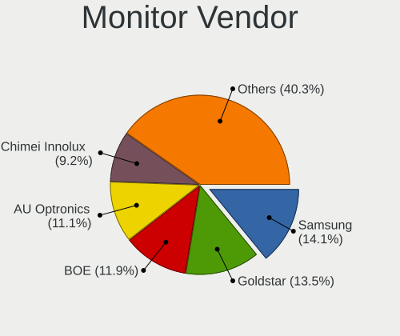

| Vendor                  | Computers | Percent |
|-------------------------|-----------|---------|
| Samsung Electronics     | 2932      | 14.1%   |
| Goldstar                | 2804      | 13.48%  |
| BOE                     | 2477      | 11.91%  |
| AU Optronics            | 2303      | 11.07%  |
| Chimei Innolux          | 1907      | 9.17%   |
| LG Display              | 1583      | 7.61%   |
| AOC                     | 1428      | 6.87%   |
| Dell                    | 861       | 4.14%   |
| Philips                 | 543       | 2.61%   |
| Acer                    | 352       | 1.69%   |
| Apple                   | 231       | 1.11%   |
| Hewlett-Packard         | 213       | 1.02%   |
| Lenovo                  | 196       | 0.94%   |
| Chi Mei Optoelectronics | 195       | 0.94%   |
| PANDA                   | 192       | 0.92%   |
| LG Electronics          | 186       | 0.89%   |
| InfoVision              | 181       | 0.87%   |
| Sony                    | 143       | 0.69%   |
| Unknown                 | 110       | 0.53%   |
| BenQ                    | 93        | 0.45%   |
| VIE                     | 82        | 0.39%   |
| RTK                     | 81        | 0.39%   |
| Unknown (XXX)           | 80        | 0.38%   |
| ASUSTek Computer        | 72        | 0.35%   |
| Positivo                | 66        | 0.32%   |
| HannStar                | 57        | 0.27%   |
| CPT                     | 56        | 0.27%   |
| Panasonic               | 53        | 0.25%   |
| LG Philips              | 51        | 0.25%   |
| SLD                     | 44        | 0.21%   |
| Sharp                   | 44        | 0.21%   |
| InnoLux Display         | 44        | 0.21%   |
| GDH                     | 44        | 0.21%   |
| Valve                   | 39        | 0.19%   |
| Ancor Communications    | 36        | 0.17%   |
| Denver                  | 33        | 0.16%   |
| STA                     | 30        | 0.14%   |
| NCS                     | 30        | 0.14%   |
| Toshiba                 | 27        | 0.13%   |
| Pixio                   | 26        | 0.13%   |

Monitor Model
-------------

Monitor models

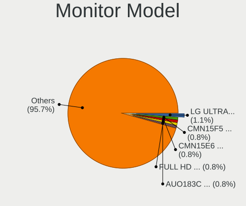

| Model                                                                | Computers | Percent |
|----------------------------------------------------------------------|-----------|---------|
| Goldstar LG ULTRAWIDE GSM59F1 2560x1080 670x280mm 28.6-inch          | 240       | 1.12%   |
| Chimei Innolux LCD Monitor CMN15F5 1920x1080 344x193mm 15.5-inch     | 176       | 0.82%   |
| Chimei Innolux LCD Monitor CMN15E6 1366x768 344x193mm 15.5-inch      | 175       | 0.82%   |
| Goldstar FULL HD GSM5B55 1920x1080 480x270mm 21.7-inch               | 174       | 0.81%   |
| AU Optronics LCD Monitor AUO183C 1366x768 309x173mm 13.9-inch        | 167       | 0.78%   |
| AU Optronics LCD Monitor AUO71EC 1366x768 344x193mm 15.5-inch        | 154       | 0.72%   |
| Chimei Innolux LCD Monitor CMN15DC 1366x768 344x193mm 15.5-inch      | 150       | 0.7%    |
| Chimei Innolux LCD Monitor CMN15DB 1366x768 344x193mm 15.5-inch      | 143       | 0.67%   |
| BOE LCD Monitor BOE0812 1920x1080 344x194mm 15.5-inch                | 143       | 0.67%   |
| Goldstar HDR WFHD GSM7714 2560x1080 798x334mm 34.1-inch              | 136       | 0.63%   |
| AU Optronics LCD Monitor AUO81EC 1366x768 344x193mm 15.5-inch        | 131       | 0.61%   |
| Samsung Electronics LCD Monitor SEC5441 1280x800 331x207mm 15.4-inch | 127       | 0.59%   |
| LG Display LCD Monitor LGD02E9 1366x768 309x174mm 14.0-inch          | 126       | 0.59%   |
| AU Optronics LCD Monitor AUO21ED 1920x1080 344x193mm 15.5-inch       | 116       | 0.54%   |
| AOC 1970W AOC1970 1366x768 410x230mm 18.5-inch                       | 114       | 0.53%   |
| BOE LCD Monitor BOE0757 1366x768 344x194mm 15.5-inch                 | 110       | 0.51%   |
| AU Optronics LCD Monitor AUO38ED 1920x1080 344x193mm 15.5-inch       | 100       | 0.47%   |
| BOE LCD Monitor BOE0672 1366x768 344x194mm 15.5-inch                 | 93        | 0.43%   |
| Goldstar ULTRAWIDE GSM76F9 2560x1080 531x298mm 24.0-inch             | 92        | 0.43%   |
| LG Display LCD Monitor LGD0385 1366x768 309x174mm 14.0-inch          | 85        | 0.4%    |
| Goldstar HD GSM5ACB 1366x768 410x230mm 18.5-inch                     | 84        | 0.39%   |
| AU Optronics LCD Monitor AUO303C 1366x768 309x173mm 13.9-inch        | 84        | 0.39%   |
| InfoVision M140NWR2 R1 IVO057A 1366x768 309x174mm 14.0-inch          | 83        | 0.39%   |
| Chimei Innolux LCD Monitor CMN14D4 1920x1080 309x173mm 13.9-inch     | 82        | 0.38%   |
| LG Display LCD Monitor LGD02DC 1366x768 344x194mm 15.5-inch          | 76        | 0.35%   |
| Goldstar 25UM58G GSM5B98 2560x1080 673x284mm 28.8-inch               | 75        | 0.35%   |
| BOE LCD Monitor BOE0818 1920x1080 344x194mm 15.5-inch                | 75        | 0.35%   |
| PANDA LCD Monitor NCP004D 1920x1080 344x194mm 15.5-inch              | 71        | 0.33%   |
| Goldstar 2D HD TV GSM59CA 1366x768 509x286mm 23.0-inch               | 71        | 0.33%   |
| Goldstar 23MP55 GSM5A23 1920x1080 510x290mm 23.1-inch                | 69        | 0.32%   |
| AOC 27G2G4 AOC2702 1920x1080 598x336mm 27.0-inch                     | 68        | 0.32%   |
| Chimei Innolux LCD Monitor CMN15CA 1366x768 344x193mm 15.5-inch      | 67        | 0.31%   |
| BOE LCD Monitor BOE07CE 1366x768 344x193mm 15.5-inch                 | 66        | 0.31%   |
| Samsung Electronics LCD Monitor SEC4542 1366x768 309x174mm 14.0-inch | 65        | 0.3%    |
| AU Optronics LCD Monitor AUO2E3C 1366x768 309x173mm 13.9-inch        | 63        | 0.29%   |
| AOC F19 AOC1900 1366x768 410x230mm 18.5-inch                         | 63        | 0.29%   |
| Chimei Innolux LCD Monitor CMN14C3 1366x768 309x173mm 13.9-inch      | 61        | 0.28%   |
| Chimei Innolux LCD Monitor CMN1470 1366x768 309x174mm 14.0-inch      | 61        | 0.28%   |
| BOE LCD Monitor BOE0696 1366x768 309x173mm 13.9-inch                 | 61        | 0.28%   |
| BOE LCD Monitor BOE08D5 1920x1080 344x194mm 15.5-inch                | 60        | 0.28%   |

Monitor Resolution
------------------

Monitor screen resolution

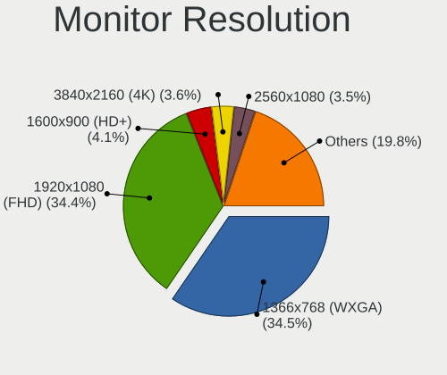

| Resolution         | Computers | Percent |
|--------------------|-----------|---------|
| 1366x768 (WXGA)    | 6960      | 34.55%  |
| 1920x1080 (FHD)    | 6938      | 34.44%  |
| 1600x900 (HD+)     | 818       | 4.06%   |
| 3840x2160 (4K)     | 735       | 3.65%   |
| 2560x1080          | 696       | 3.45%   |
| 1440x900 (WXGA+)   | 681       | 3.38%   |
| 1360x768           | 489       | 2.43%   |
| 1280x1024 (SXGA)   | 464       | 2.3%    |
| 1280x800 (WXGA)    | 418       | 2.07%   |
| 2560x1440 (QHD)    | 374       | 1.86%   |
| 1920x1200 (WUXGA)  | 286       | 1.42%   |
| 1680x1050 (WSXGA+) | 261       | 1.3%    |
| 1024x768 (XGA)     | 162       | 0.8%    |
| Unknown            | 126       | 0.63%   |
| 1920x540           | 76        | 0.38%   |
| 1280x720 (HD)      | 73        | 0.36%   |
| 2560x1600          | 72        | 0.36%   |
| 2288x1287          | 60        | 0.3%    |
| 3440x1440          | 59        | 0.29%   |
| 1024x600           | 52        | 0.26%   |
| 2880x1800          | 50        | 0.25%   |
| 3840x1080          | 39        | 0.19%   |
| 800x1280           | 38        | 0.19%   |
| 3840x2400          | 14        | 0.07%   |
| 1600x2560          | 14        | 0.07%   |
| 1280x960           | 11        | 0.05%   |
| 1600x1200          | 10        | 0.05%   |
| 1152x864           | 10        | 0.05%   |
| 5760x1080          | 7         | 0.03%   |
| 3286x1080          | 7         | 0.03%   |
| 3200x1800 (QHD+)   | 7         | 0.03%   |
| 2160x1440          | 7         | 0.03%   |
| 4480x1080          | 6         | 0.03%   |
| 3360x1080          | 5         | 0.02%   |
| 3200x1080          | 5         | 0.02%   |
| 5760x2160          | 4         | 0.02%   |
| 3520x1080          | 4         | 0.02%   |
| 2880x1920          | 4         | 0.02%   |
| 2304x1440          | 4         | 0.02%   |
| 2240x1400          | 4         | 0.02%   |

Monitor Diagonal
----------------

Diagonal size in inches

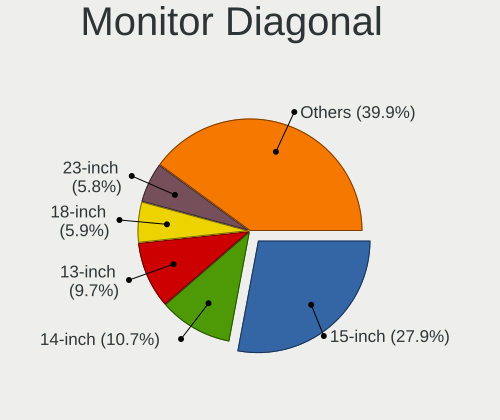

| Inches  | Computers | Percent |
|---------|-----------|---------|
| 15      | 5843      | 27.95%  |
| 14      | 2237      | 10.7%   |
| 13      | 2022      | 9.67%   |
| 18      | 1237      | 5.92%   |
| 23      | 1217      | 5.82%   |
| 21      | 1216      | 5.82%   |
| 24      | 899       | 4.3%    |
| 27      | 736       | 3.52%   |
| 17      | 724       | 3.46%   |
| Unknown | 652       | 3.12%   |
| 19      | 557       | 2.66%   |
| 31      | 526       | 2.52%   |
| 20      | 512       | 2.45%   |
| 34      | 465       | 2.22%   |
| 11      | 191       | 0.91%   |
| 22      | 176       | 0.84%   |
| 63      | 153       | 0.73%   |
| 16      | 146       | 0.7%    |
| 28      | 137       | 0.66%   |
| 32      | 121       | 0.58%   |
| 54      | 120       | 0.57%   |
| 72      | 118       | 0.56%   |
| 12      | 114       | 0.55%   |
| 40      | 111       | 0.53%   |
| 84      | 104       | 0.5%    |
| 52      | 76        | 0.36%   |
| 26      | 67        | 0.32%   |
| 10      | 62        | 0.3%    |
| 46      | 51        | 0.24%   |
| 142     | 46        | 0.22%   |
| 7       | 43        | 0.21%   |
| 25      | 41        | 0.2%    |
| 49      | 27        | 0.13%   |
| 48      | 27        | 0.13%   |
| 37      | 25        | 0.12%   |
| 65      | 19        | 0.09%   |
| 43      | 11        | 0.05%   |
| 58      | 10        | 0.05%   |
| 29      | 10        | 0.05%   |
| 47      | 8         | 0.04%   |

Monitor Width
-------------

Physical width

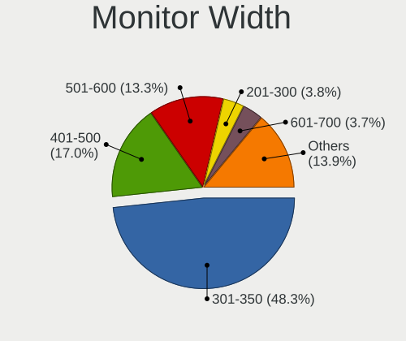

| Width in mm    | Computers | Percent |
|----------------|-----------|---------|
| 301-350        | 9950      | 48.33%  |
| 401-500        | 3500      | 17%     |
| 501-600        | 2733      | 13.28%  |
| 201-300        | 778       | 3.78%   |
| 601-700        | 755       | 3.67%   |
| Unknown        | 652       | 3.17%   |
| 351-400        | 641       | 3.11%   |
| 701-800        | 587       | 2.85%   |
| 1001-1500      | 511       | 2.48%   |
| 1501-2000      | 224       | 1.09%   |
| 801-900        | 146       | 0.71%   |
| More than 2000 | 46        | 0.22%   |
| 1-100          | 38        | 0.18%   |
| 901-1000       | 21        | 0.1%    |
| 101-200        | 5         | 0.02%   |

Aspect Ratio
------------

Proportional relationship between the width and the height

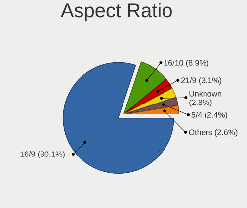

| Ratio   | Computers | Percent |
|---------|-----------|---------|
| 16/9    | 14897     | 80.13%  |
| 16/10   | 1652      | 8.89%   |
| 21/9    | 581       | 3.13%   |
| Unknown | 525       | 2.82%   |
| 5/4     | 455       | 2.45%   |
| 4/3     | 253       | 1.36%   |
| 3/2     | 85        | 0.46%   |
| 1.00    | 49        | 0.26%   |
| 0.67    | 37        | 0.2%    |
| 32/9    | 34        | 0.18%   |
| 2.00    | 12        | 0.06%   |
| 0.56    | 5         | 0.03%   |
| 6/5     | 3         | 0.02%   |
| 2.24    | 1         | 0.01%   |
| 1.96    | 1         | 0.01%   |
| 0.62    | 1         | 0.01%   |
| 0.25    | 1         | 0.01%   |

Monitor Area
------------

Area in inch²

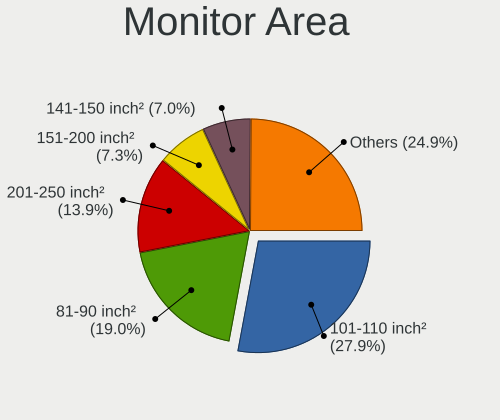

| Area in inch² | Computers | Percent |
|----------------|-----------|---------|
| 101-110        | 5801      | 27.94%  |
| 81-90          | 3944      | 18.99%  |
| 201-250        | 2892      | 13.93%  |
| 151-200        | 1507      | 7.26%   |
| 141-150        | 1451      | 6.99%   |
| 351-500        | 1147      | 5.52%   |
| 301-350        | 760       | 3.66%   |
| More than 1000 | 687       | 3.31%   |
| Unknown        | 652       | 3.14%   |
| 251-300        | 387       | 1.86%   |
| 71-80          | 307       | 1.48%   |
| 501-1000       | 264       | 1.27%   |
| 121-130        | 220       | 1.06%   |
| 51-60          | 191       | 0.92%   |
| 131-140        | 167       | 0.8%    |
| 111-120        | 144       | 0.69%   |
| 91-100         | 72        | 0.35%   |
| 61-70          | 66        | 0.32%   |
| 41-50          | 62        | 0.3%    |
| 1-40           | 43        | 0.21%   |

Pixel Density
-------------

Pixels per inch

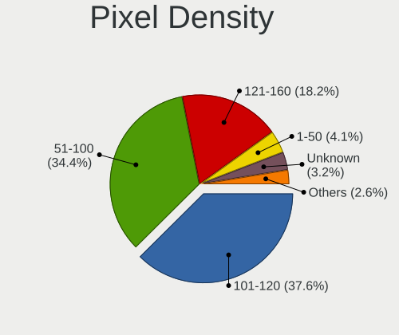

| Density       | Computers | Percent |
|---------------|-----------|---------|
| 101-120       | 7546      | 37.55%  |
| 51-100        | 6904      | 34.36%  |
| 121-160       | 3653      | 18.18%  |
| 1-50          | 818       | 4.07%   |
| Unknown       | 653       | 3.25%   |
| 161-240       | 450       | 2.24%   |
| More than 240 | 71        | 0.35%   |

Multiple Monitors
-----------------

Total monitors connected

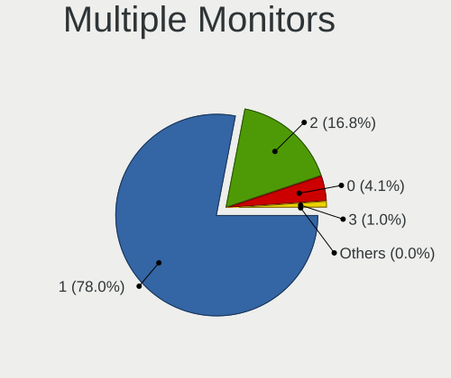

| Total | Computers | Percent |
|-------|-----------|---------|
| 1     | 15206     | 78.02%  |
| 2     | 3279      | 16.82%  |
| 0     | 793       | 4.07%   |
| 3     | 200       | 1.03%   |
| 4     | 12        | 0.06%   |
| 6     | 1         | 0.01%   |

Network
-------

Net Controller Vendor
---------------------

Controller vendors

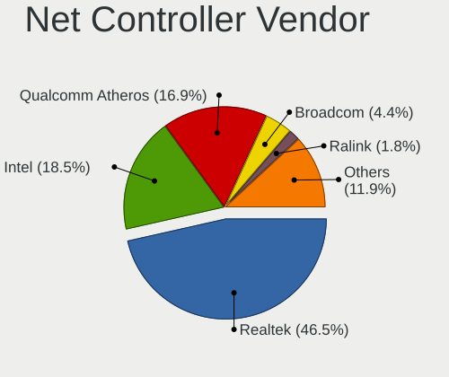

| Vendor                                 | Computers | Percent |
|----------------------------------------|-----------|---------|
| Realtek Semiconductor                  | 13780     | 46.48%  |
| Intel                                  | 5492      | 18.52%  |
| Qualcomm Atheros                       | 4998      | 16.86%  |
| Broadcom                               | 1316      | 4.44%   |
| Ralink Technology                      | 536       | 1.81%   |
| TP-Link                                | 322       | 1.09%   |
| Ralink                                 | 309       | 1.04%   |
| Marvell Technology Group               | 298       | 1.01%   |
| MediaTek                               | 291       | 0.98%   |
| JMicron Technology                     | 287       | 0.97%   |
| Broadcom Limited                       | 268       | 0.9%    |
| Nvidia                                 | 258       | 0.87%   |
| Samsung Electronics                    | 204       | 0.69%   |
| Qualcomm Atheros Communications        | 176       | 0.59%   |
| Silicon Integrated Systems [SiS]       | 123       | 0.41%   |
| D-Link                                 | 108       | 0.36%   |
| ASIX Electronics                       | 99        | 0.33%   |
| Xiaomi                                 | 96        | 0.32%   |
| VIA Technologies                       | 80        | 0.27%   |
| Microsoft                              | 75        | 0.25%   |
| Motorola PCS                           | 73        | 0.25%   |
| D-Link System                          | 55        | 0.19%   |
| Shenzhen Goodix Technology             | 42        | 0.14%   |
| ICS Advent                             | 27        | 0.09%   |
| DisplayLink                            | 17        | 0.06%   |
| Qualcomm                               | 16        | 0.05%   |
| QinHeng Electronics                    | 16        | 0.05%   |
| Dell                                   | 16        | 0.05%   |
| Motorola                               | 15        | 0.05%   |
| Huawei Technologies                    | 15        | 0.05%   |
| Microchip Technology                   | 14        | 0.05%   |
| Edimax Technology                      | 14        | 0.05%   |
| Lenovo                                 | 10        | 0.03%   |
| ASUSTek Computer                       | 9         | 0.03%   |
| OPPO Electronics                       | 8         | 0.03%   |
| LG Electronics                         | 8         | 0.03%   |
| Aquantia                               | 8         | 0.03%   |
| Suzhou Motorcomm Electronic Technology | 7         | 0.02%   |
| Mercucys                               | 7         | 0.02%   |
| Sundance Technology Inc / IC Plus      | 6         | 0.02%   |

Net Controller Model
--------------------

Controller models

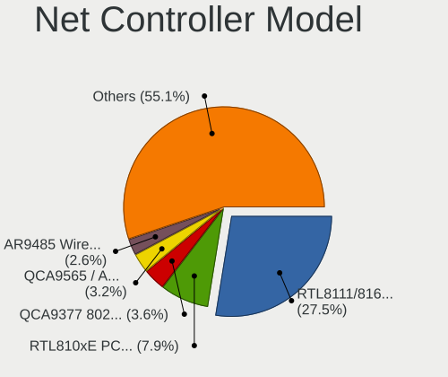

| Model                                                                  | Computers | Percent |
|------------------------------------------------------------------------|-----------|---------|
| Realtek RTL8111/8168/8211/8411 PCI Express Gigabit Ethernet Controller | 9024      | 27.55%  |
| Realtek RTL810xE PCI Express Fast Ethernet controller                  | 2595      | 7.92%   |
| Qualcomm Atheros QCA9377 802.11ac Wireless Network Adapter             | 1172      | 3.58%   |
| Qualcomm Atheros QCA9565 / AR9565 Wireless Network Adapter             | 1043      | 3.18%   |
| Qualcomm Atheros AR9485 Wireless Network Adapter                       | 864       | 2.64%   |
| Intel Wi-Fi 6 AX200                                                    | 488       | 1.49%   |
| Intel Wi-Fi 6 AX201                                                    | 463       | 1.41%   |
| Realtek RTL8188CE 802.11b/g/n WiFi Adapter                             | 434       | 1.32%   |
| Qualcomm Atheros QCA6174 802.11ac Wireless Network Adapter             | 429       | 1.31%   |
| Qualcomm Atheros AR9285 Wireless Network Adapter (PCI-Express)         | 420       | 1.28%   |
| Realtek RTL8125 2.5GbE Controller                                      | 352       | 1.07%   |
| Ralink MT7601U Wireless Adapter                                        | 308       | 0.94%   |
| Broadcom BCM4313 802.11bgn Wireless Network Adapter                    | 290       | 0.89%   |
| Realtek RTL8821CE 802.11ac PCIe Wireless Network Adapter               | 268       | 0.82%   |
| Intel Wireless 7265                                                    | 261       | 0.8%    |
| Intel 82579LM Gigabit Network Connection (Lewisville)                  | 254       | 0.78%   |
| Intel Dual Band Wireless-AC 3165 Plus Bluetooth                        | 232       | 0.71%   |
| Realtek 802.11ac NIC                                                   | 218       | 0.67%   |
| Intel Comet Lake PCH-LP CNVi WiFi                                      | 212       | 0.65%   |
| Realtek Killer E2600 GbE Controller                                    | 211       | 0.64%   |
| Qualcomm Atheros AR8151 v2.0 Gigabit Ethernet                          | 204       | 0.62%   |
| JMicron JMC250 PCI Express Gigabit Ethernet Controller                 | 203       | 0.62%   |
| Intel Wireless 7260                                                    | 200       | 0.61%   |
| Intel Alder Lake-P PCH CNVi WiFi                                       | 190       | 0.58%   |
| Intel Cannon Point-LP CNVi [Wireless-AC]                               | 188       | 0.57%   |
| Realtek RTL8188FTV 802.11b/g/n 1T1R 2.4G WLAN Adapter                  | 187       | 0.57%   |
| Nvidia MCP61 Ethernet                                                  | 187       | 0.57%   |
| Realtek RTL8153 Gigabit Ethernet Adapter                               | 184       | 0.56%   |
| Realtek RTL8188EUS 802.11n Wireless Network Adapter                    | 177       | 0.54%   |
| Realtek RTL8188EE Wireless Network Adapter                             | 176       | 0.54%   |
| Realtek RTL8822CE 802.11ac PCIe Wireless Network Adapter               | 163       | 0.5%    |
| Qualcomm Atheros AR9271 802.11n                                        | 159       | 0.49%   |
| Samsung Galaxy series, misc. (tethering mode)                          | 151       | 0.46%   |
| Intel Cannon Lake PCH CNVi WiFi                                        | 149       | 0.45%   |
| Intel Wireless 3165                                                    | 144       | 0.44%   |
| Qualcomm Atheros AR8152 v2.0 Fast Ethernet                             | 143       | 0.44%   |
| Intel Wi-Fi 6E(802.11ax) AX210/AX1675* 2x2 [Typhoon Peak]              | 141       | 0.43%   |
| Realtek RTL8187B Wireless 802.11g 54Mbps Network Adapter               | 140       | 0.43%   |
| Realtek RTL-8100/8101L/8139 PCI Fast Ethernet Adapter                  | 140       | 0.43%   |
| Intel Dual Band Wireless-AC 3168NGW [Stone Peak]                       | 135       | 0.41%   |

Wireless Vendor
---------------

Wireless vendors

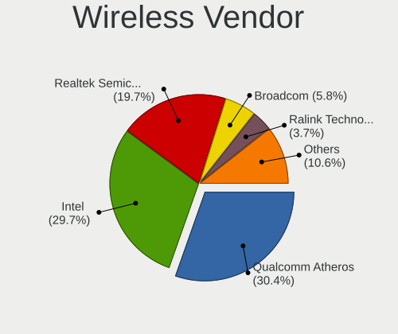

| Vendor                                | Computers | Percent |
|---------------------------------------|-----------|---------|
| Qualcomm Atheros                      | 4347      | 30.39%  |
| Intel                                 | 4250      | 29.71%  |
| Realtek Semiconductor                 | 2824      | 19.74%  |
| Broadcom                              | 828       | 5.79%   |
| Ralink Technology                     | 536       | 3.75%   |
| Ralink                                | 309       | 2.16%   |
| TP-Link                               | 289       | 2.02%   |
| MediaTek                              | 263       | 1.84%   |
| Qualcomm Atheros Communications       | 176       | 1.23%   |
| Broadcom Limited                      | 164       | 1.15%   |
| D-Link                                | 108       | 0.75%   |
| Microsoft                             | 75        | 0.52%   |
| D-Link System                         | 40        | 0.28%   |
| Edimax Technology                     | 14        | 0.1%    |
| Marvell Technology Group              | 11        | 0.08%   |
| Dell                                  | 11        | 0.08%   |
| Mercucys                              | 7         | 0.05%   |
| Qualcomm                              | 5         | 0.03%   |
| Micro Star International              | 5         | 0.03%   |
| Encore Electronics                    | 5         | 0.03%   |
| ZTopInc                               | 4         | 0.03%   |
| NetGear                               | 4         | 0.03%   |
| Linksys                               | 4         | 0.03%   |
| Qualcomm Technologies                 | 3         | 0.02%   |
| Philips (or NXP)                      | 3         | 0.02%   |
| ASUSTek Computer                      | 3         | 0.02%   |
| 802.11g Adapter [Linksys WUSB54GC v3] | 3         | 0.02%   |
| Xiaomi                                | 2         | 0.01%   |
| Sierra Wireless                       | 2         | 0.01%   |
| IMC Networks                          | 2         | 0.01%   |
| Accton Technology                     | 2         | 0.01%   |
| ZyDAS                                 | 1         | 0.01%   |
| Texas Instruments                     | 1         | 0.01%   |
| Samsung Electronics                   | 1         | 0.01%   |
| Realtek                               | 1         | 0.01%   |
| Pegatron                              | 1         | 0.01%   |
| Guillemot                             | 1         | 0.01%   |

Wireless Model
--------------

Wireless models

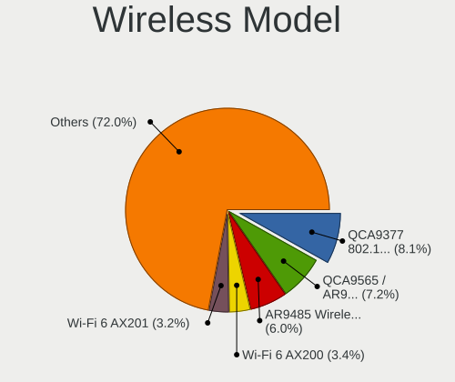

| Model                                                                | Computers | Percent |
|----------------------------------------------------------------------|-----------|---------|
| Qualcomm Atheros QCA9377 802.11ac Wireless Network Adapter           | 1172      | 8.13%   |
| Qualcomm Atheros QCA9565 / AR9565 Wireless Network Adapter           | 1043      | 7.24%   |
| Qualcomm Atheros AR9485 Wireless Network Adapter                     | 864       | 6%      |
| Intel Wi-Fi 6 AX200                                                  | 488       | 3.39%   |
| Intel Wi-Fi 6 AX201                                                  | 463       | 3.21%   |
| Realtek RTL8188CE 802.11b/g/n WiFi Adapter                           | 434       | 3.01%   |
| Qualcomm Atheros QCA6174 802.11ac Wireless Network Adapter           | 429       | 2.98%   |
| Qualcomm Atheros AR9285 Wireless Network Adapter (PCI-Express)       | 420       | 2.92%   |
| Ralink MT7601U Wireless Adapter                                      | 308       | 2.14%   |
| Broadcom BCM4313 802.11bgn Wireless Network Adapter                  | 290       | 2.01%   |
| Realtek RTL8821CE 802.11ac PCIe Wireless Network Adapter             | 268       | 1.86%   |
| Intel Wireless 7265                                                  | 261       | 1.81%   |
| Intel Dual Band Wireless-AC 3165 Plus Bluetooth                      | 232       | 1.61%   |
| Realtek 802.11ac NIC                                                 | 218       | 1.51%   |
| Intel Comet Lake PCH-LP CNVi WiFi                                    | 212       | 1.47%   |
| Intel Wireless 7260                                                  | 200       | 1.39%   |
| Intel Cannon Point-LP CNVi [Wireless-AC]                             | 188       | 1.3%    |
| Realtek RTL8188FTV 802.11b/g/n 1T1R 2.4G WLAN Adapter                | 187       | 1.3%    |
| Realtek RTL8188EUS 802.11n Wireless Network Adapter                  | 177       | 1.23%   |
| Realtek RTL8188EE Wireless Network Adapter                           | 176       | 1.22%   |
| Realtek RTL8822CE 802.11ac PCIe Wireless Network Adapter             | 163       | 1.13%   |
| Qualcomm Atheros AR9271 802.11n                                      | 159       | 1.1%    |
| Intel Cannon Lake PCH CNVi WiFi                                      | 149       | 1.03%   |
| Intel Wireless 3165                                                  | 144       | 1%      |
| Intel Wi-Fi 6E(802.11ax) AX210/AX1675* 2x2 [Typhoon Peak]            | 141       | 0.98%   |
| Realtek RTL8187B Wireless 802.11g 54Mbps Network Adapter             | 140       | 0.97%   |
| Intel Dual Band Wireless-AC 3168NGW [Stone Peak]                     | 135       | 0.94%   |
| Intel Alder Lake-P PCH CNVi WiFi                                     | 135       | 0.94%   |
| Intel Comet Lake PCH CNVi WiFi                                       | 127       | 0.88%   |
| Realtek RTL8723BU 802.11b/g/n WLAN Adapter                           | 122       | 0.85%   |
| Realtek RTL8723BE PCIe Wireless Network Adapter                      | 120       | 0.83%   |
| Broadcom BCM4312 802.11b/g LP-PHY                                    | 117       | 0.81%   |
| Intel Wireless 8265 / 8275                                           | 115       | 0.8%    |
| MediaTek MT7921 802.11ax PCIe Wireless Network Adapter [Filogic 330] | 114       | 0.79%   |
| Intel Wireless 3160                                                  | 113       | 0.78%   |
| Qualcomm Atheros AR9287 Wireless Network Adapter (PCI-Express)       | 109       | 0.76%   |
| Realtek RTL88x2bu [AC1200 Techkey]                                   | 108       | 0.75%   |
| Ralink RT5370 Wireless Adapter                                       | 107       | 0.74%   |
| Intel Centrino Advanced-N 6235                                       | 97        | 0.67%   |
| Intel Tiger Lake PCH CNVi WiFi                                       | 96        | 0.67%   |

Ethernet Vendor
---------------

Ethernet vendors

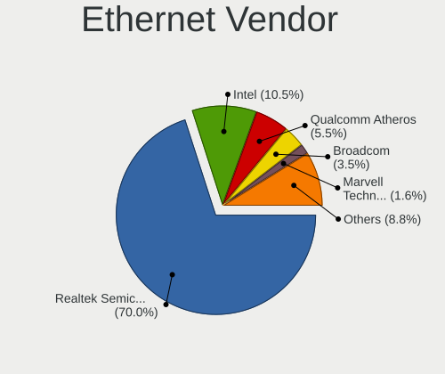

| Vendor                                 | Computers | Percent |
|----------------------------------------|-----------|---------|
| Realtek Semiconductor                  | 12513     | 70.04%  |
| Intel                                  | 1878      | 10.51%  |
| Qualcomm Atheros                       | 979       | 5.48%   |
| Broadcom                               | 633       | 3.54%   |
| Marvell Technology Group               | 287       | 1.61%   |
| JMicron Technology                     | 287       | 1.61%   |
| Nvidia                                 | 257       | 1.44%   |
| Samsung Electronics                    | 203       | 1.14%   |
| Silicon Integrated Systems [SiS]       | 123       | 0.69%   |
| Broadcom Limited                       | 111       | 0.62%   |
| ASIX Electronics                       | 99        | 0.55%   |
| Xiaomi                                 | 94        | 0.53%   |
| VIA Technologies                       | 79        | 0.44%   |
| Motorola PCS                           | 73        | 0.41%   |
| TP-Link                                | 33        | 0.18%   |
| MediaTek                               | 27        | 0.15%   |
| ICS Advent                             | 27        | 0.15%   |
| DisplayLink                            | 17        | 0.1%    |
| D-Link System                          | 15        | 0.08%   |
| Qualcomm                               | 10        | 0.06%   |
| Lenovo                                 | 9         | 0.05%   |
| Huawei Technologies                    | 9         | 0.05%   |
| OPPO Electronics                       | 8         | 0.04%   |
| Microchip Technology                   | 8         | 0.04%   |
| Aquantia                               | 8         | 0.04%   |
| Suzhou Motorcomm Electronic Technology | 7         | 0.04%   |
| Sundance Technology Inc / IC Plus      | 6         | 0.03%   |
| LG Electronics                         | 6         | 0.03%   |
| ASUSTek Computer                       | 6         | 0.03%   |
| Attansic Technology                    | 5         | 0.03%   |
| 3Com                                   | 5         | 0.03%   |
| QinHeng Electronics                    | 4         | 0.02%   |
| Hangzhou Silan Microelectronics        | 4         | 0.02%   |
| Dell                                   | 4         | 0.02%   |
| Spreadtrum Communications              | 3         | 0.02%   |
| Raspberry Pi                           | 3         | 0.02%   |
| Motorcomm Microelectronics.            | 3         | 0.02%   |
| Apple                                  | 3         | 0.02%   |
| Accton Technology                      | 3         | 0.02%   |
| T & A Mobile Phones                    | 2         | 0.01%   |

Ethernet Model
--------------

Ethernet models

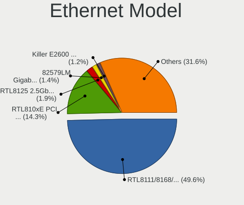

| Model                                                                  | Computers | Percent |
|------------------------------------------------------------------------|-----------|---------|
| Realtek RTL8111/8168/8211/8411 PCI Express Gigabit Ethernet Controller | 9024      | 49.62%  |
| Realtek RTL810xE PCI Express Fast Ethernet controller                  | 2595      | 14.27%  |
| Realtek RTL8125 2.5GbE Controller                                      | 352       | 1.94%   |
| Intel 82579LM Gigabit Network Connection (Lewisville)                  | 254       | 1.4%    |
| Realtek Killer E2600 GbE Controller                                    | 211       | 1.16%   |
| Qualcomm Atheros AR8151 v2.0 Gigabit Ethernet                          | 204       | 1.12%   |
| JMicron JMC250 PCI Express Gigabit Ethernet Controller                 | 203       | 1.12%   |
| Nvidia MCP61 Ethernet                                                  | 187       | 1.03%   |
| Realtek RTL8153 Gigabit Ethernet Adapter                               | 184       | 1.01%   |
| Samsung Galaxy series, misc. (tethering mode)                          | 151       | 0.83%   |
| Qualcomm Atheros AR8152 v2.0 Fast Ethernet                             | 143       | 0.79%   |
| Realtek RTL-8100/8101L/8139 PCI Fast Ethernet Adapter                  | 140       | 0.77%   |
| Intel Ethernet Connection (2) I219-V                                   | 130       | 0.71%   |
| Broadcom NetLink BCM57785 Gigabit Ethernet PCIe                        | 126       | 0.69%   |
| Intel Ethernet Connection (7) I219-V                                   | 124       | 0.68%   |
| Intel I211 Gigabit Network Connection                                  | 118       | 0.65%   |
| Silicon Integrated Systems [SiS] 191 Gigabit Ethernet Adapter          | 116       | 0.64%   |
| Intel Ethernet Connection I217-LM                                      | 109       | 0.6%    |
| Marvell Group 88E8040 PCI-E Fast Ethernet Controller                   | 100       | 0.55%   |
| Qualcomm Atheros AR8131 Gigabit Ethernet                               | 97        | 0.53%   |
| Qualcomm Atheros AR8161 Gigabit Ethernet                               | 95        | 0.52%   |
| Intel 82579V Gigabit Network Connection                                | 93        | 0.51%   |
| Broadcom NetXtreme BCM57765 Gigabit Ethernet PCIe                      | 93        | 0.51%   |
| ASIX AX88179 Gigabit Ethernet                                          | 90        | 0.49%   |
| Qualcomm Atheros AR8162 Fast Ethernet                                  | 88        | 0.48%   |
| JMicron JMC260 PCI Express Fast Ethernet Controller                    | 84        | 0.46%   |
| Xiaomi Mi/Redmi series (RNDIS)                                         | 73        | 0.4%    |
| Intel Ethernet Connection (4) I219-LM                                  | 64        | 0.35%   |
| Broadcom NetLink BCM57780 Gigabit Ethernet PCIe                        | 64        | 0.35%   |
| Intel Ethernet Controller I225-V                                       | 62        | 0.34%   |
| VIA VT6102/VT6103 [Rhine-II]                                           | 60        | 0.33%   |
| Qualcomm Atheros Attansic L2 Fast Ethernet                             | 59        | 0.32%   |
| Motorola PCS motorola one 5G ace                                       | 57        | 0.31%   |
| Intel Alder Lake-P PCH CNVi WiFi                                       | 55        | 0.3%    |
| Broadcom NetXtreme BCM5761 Gigabit Ethernet PCIe                       | 55        | 0.3%    |
| Samsung GT-I9070 (network tethering, USB debugging enabled)            | 54        | 0.3%    |
| Realtek RTL8152 Fast Ethernet Adapter                                  | 54        | 0.3%    |
| Intel 82567LM-3 Gigabit Network Connection                             | 53        | 0.29%   |
| Broadcom NetXtreme BCM57786 Gigabit Ethernet PCIe                      | 53        | 0.29%   |
| Qualcomm Atheros AR8132 Fast Ethernet                                  | 52        | 0.29%   |

Net Controller Kind
-------------------

Ethernet, WiFi or modem

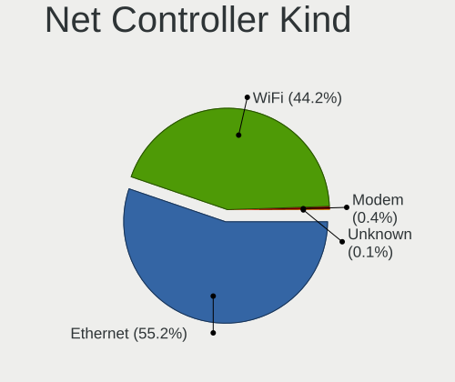

| Kind     | Computers | Percent |
|----------|-----------|---------|
| Ethernet | 17103     | 55.24%  |
| WiFi     | 13699     | 44.24%  |
| Modem    | 139       | 0.45%   |
| Unknown  | 23        | 0.07%   |

Used Controller
---------------

Currently used network controller

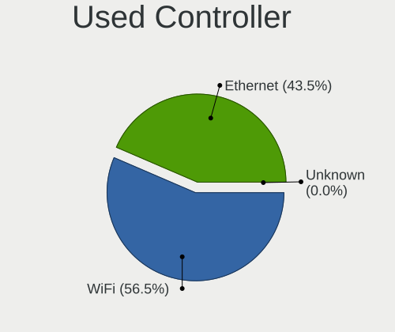

| Kind     | Computers | Percent |
|----------|-----------|---------|
| WiFi     | 11101     | 56.46%  |
| Ethernet | 8557      | 43.52%  |
| Modem    | 1         | 0.01%   |
| Unknown  | 1         | 0.01%   |

NICs
----

Total network controllers on board

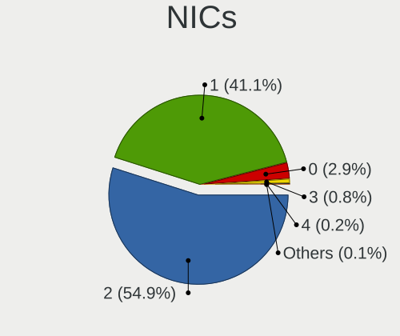

| Total | Computers | Percent |
|-------|-----------|---------|
| 2     | 10484     | 54.91%  |
| 1     | 7845      | 41.09%  |
| 0     | 554       | 2.9%    |
| 3     | 156       | 0.82%   |
| 4     | 40        | 0.21%   |
| 6     | 5         | 0.03%   |
| 5     | 5         | 0.03%   |
| 10    | 3         | 0.02%   |
| 8     | 2         | 0.01%   |

IPv6
----

IPv6 vs IPv4

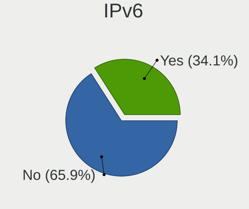

| Used | Computers | Percent |
|------|-----------|---------|
| No   | 12933     | 65.93%  |
| Yes  | 6684      | 34.07%  |

Bluetooth
---------

Bluetooth Vendor
----------------

Controller vendors

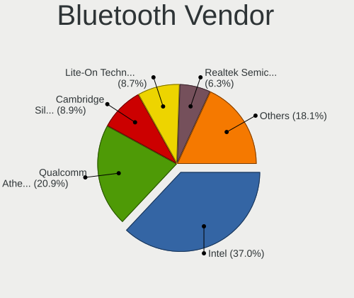

| Vendor                          | Computers | Percent |
|---------------------------------|-----------|---------|
| Intel                           | 3831      | 37.01%  |
| Qualcomm Atheros Communications | 2168      | 20.94%  |
| Cambridge Silicon Radio         | 925       | 8.94%   |
| Lite-On Technology              | 896       | 8.66%   |
| Realtek Semiconductor           | 654       | 6.32%   |
| IMC Networks                    | 376       | 3.63%   |
| Broadcom                        | 306       | 2.96%   |
| Apple                           | 276       | 2.67%   |
| Foxconn / Hon Hai               | 216       | 2.09%   |
| Dell                            | 105       | 1.01%   |
| Hewlett-Packard                 | 77        | 0.74%   |
| Smart Modular Technologies      | 69        | 0.67%   |
| Ralink                          | 69        | 0.67%   |
| TP-Link                         | 59        | 0.57%   |
| MediaTek                        | 58        | 0.56%   |
| Qcom                            | 41        | 0.4%    |
| ASUSTek Computer                | 35        | 0.34%   |
| Actions                         | 23        | 0.22%   |
| Unknown                         | 23        | 0.22%   |
| Foxconn International           | 20        | 0.19%   |
| Ralink Technology               | 19        | 0.18%   |
| Alps Electric                   | 19        | 0.18%   |
| Askey Computer                  | 12        | 0.12%   |
| Realtek                         | 10        | 0.1%    |
| Toshiba                         | 9         | 0.09%   |
| Integrated System Solution      | 9         | 0.09%   |
| SiW                             | 8         | 0.08%   |
| Micro Star International        | 7         | 0.07%   |
| USI                             | 6         | 0.06%   |
| Opticis                         | 5         | 0.05%   |
| Marvell Semiconductor           | 4         | 0.04%   |
| Conwise Technology              | 3         | 0.03%   |
| Syntek                          | 2         | 0.02%   |
| SINO WEALTH                     | 2         | 0.02%   |
| Motorola PCS                    | 1         | 0.01%   |
| Logitech                        | 1         | 0.01%   |
| Fujitsu                         | 1         | 0.01%   |
| Edimax Technology               | 1         | 0.01%   |
| Dynex                           | 1         | 0.01%   |
| D-Link                          | 1         | 0.01%   |

Bluetooth Model
---------------

Controller models

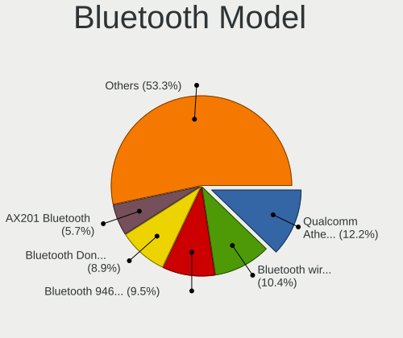

| Model                                                                               | Computers | Percent |
|-------------------------------------------------------------------------------------|-----------|---------|
| Qualcomm Atheros  Bluetooth Device                                                  | 1265      | 12.22%  |
| Intel Bluetooth wireless interface                                                  | 1073      | 10.36%  |
| Intel Bluetooth 9460/9560 Jefferson Peak (JfP)                                      | 981       | 9.47%   |
| Cambridge Silicon Radio Bluetooth Dongle (HCI mode)                                 | 925       | 8.93%   |
| Intel AX201 Bluetooth                                                               | 589       | 5.69%   |
| Realtek Bluetooth Radio                                                             | 543       | 5.24%   |
| Intel AX200 Bluetooth                                                               | 472       | 4.56%   |
| Lite-On Qualcomm Atheros QCA9377 Bluetooth                                          | 463       | 4.47%   |
| Qualcomm Atheros AR3012 Bluetooth 4.0                                               | 333       | 3.22%   |
| IMC Networks Bluetooth Radio                                                        | 196       | 1.89%   |
| Qualcomm Atheros Bluetooth USB Host Controller                                      | 192       | 1.85%   |
| Qualcomm Atheros AR9462 Bluetooth                                                   | 192       | 1.85%   |
| Intel Bluetooth Device                                                              | 169       | 1.63%   |
| Qualcomm Atheros AR3011 Bluetooth                                                   | 156       | 1.51%   |
| Intel Centrino Bluetooth Wireless Transceiver                                       | 138       | 1.33%   |
| Intel Wireless-AC 3168 Bluetooth                                                    | 134       | 1.29%   |
| Intel AX210 Bluetooth                                                               | 132       | 1.27%   |
| Apple Bluetooth Host Controller                                                     | 130       | 1.26%   |
| Lite-On Bluetooth Device                                                            | 124       | 1.2%    |
| Lite-On Atheros AR3012 Bluetooth                                                    | 121       | 1.17%   |
| Lite-On Qualcomm Atheros Bluetooth                                                  | 86        | 0.83%   |
| IMC Networks Wireless_Device                                                        | 84        | 0.81%   |
| Intel Centrino Advanced-N 6230 Bluetooth adapter                                    | 80        | 0.77%   |
| Broadcom BCM2070 Bluetooth 2.1 + EDR                                                | 80        | 0.77%   |
| Apple Bluetooth USB Host Controller                                                 | 75        | 0.72%   |
| Broadcom BCM2070 Bluetooth Device                                                   | 74        | 0.71%   |
| Lite-On Wireless_Device                                                             | 73        | 0.7%    |
| Smart Modular Bluetooth Device                                                      | 69        | 0.67%   |
| Ralink RT3290 Bluetooth                                                             | 69        | 0.67%   |
| Intel Wireless-AC 9260 Bluetooth Adapter                                            | 64        | 0.62%   |
| TP-Link TP-T@- UB500 Adapter                                                        | 59        | 0.57%   |
| MediaTek Wireless_Device                                                            | 58        | 0.56%   |
| Foxconn / Hon Hai Bluetooth Device                                                  | 47        | 0.45%   |
| Apple Built-in Bluetooth 2.0+EDR HCI                                                | 46        | 0.44%   |
| IMC Networks Bluetooth Device                                                       | 45        | 0.43%   |
| Dell Wireless 365 Bluetooth                                                         | 44        | 0.42%   |
| HP Broadcom 2070 Bluetooth Combo                                                    | 43        | 0.42%   |
| Foxconn / Hon Hai Foxconn T77H114 BCM2070 [Single-Chip Bluetooth 2.1 + EDR Adapter] | 43        | 0.42%   |
| Foxconn / Hon Hai Wireless_Device                                                   | 32        | 0.31%   |
| Foxconn / Hon Hai Bluetooth USB Host Controller                                     | 28        | 0.27%   |

Sound
-----

Sound Vendor
------------

Sound card vendors

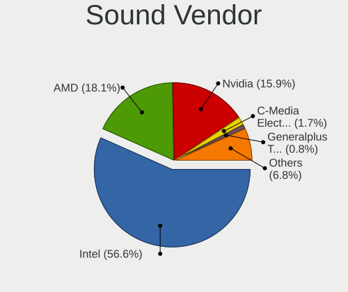

| Vendor                                          | Computers | Percent |
|-------------------------------------------------|-----------|---------|
| Intel                                           | 14353     | 56.64%  |
| AMD                                             | 4582      | 18.08%  |
| Nvidia                                          | 4036      | 15.93%  |
| C-Media Electronics                             | 433       | 1.71%   |
| Generalplus Technology                          | 214       | 0.84%   |
| Logitech                                        | 186       | 0.73%   |
| Silicon Integrated Systems [SiS]                | 125       | 0.49%   |
| JMTek                                           | 122       | 0.48%   |
| Kingston Technology                             | 104       | 0.41%   |
| VIA Technologies                                | 88        | 0.35%   |
| Texas Instruments                               | 88        | 0.35%   |
| Creative Labs                                   | 54        | 0.21%   |
| Jieli Technology                                | 50        | 0.2%    |
| Corsair                                         | 45        | 0.18%   |
| Unknown                                         | 39        | 0.15%   |
| Sony                                            | 38        | 0.15%   |
| Microsoft                                       | 36        | 0.14%   |
| Plantronics                                     | 34        | 0.13%   |
| Razer USA                                       | 30        | 0.12%   |
| Realtek Semiconductor                           | 29        | 0.11%   |
| ASUSTek Computer                                | 29        | 0.11%   |
| FIFINE Microphones                              | 26        | 0.1%    |
| Hewlett-Packard                                 | 23        | 0.09%   |
| GN Netcom                                       | 22        | 0.09%   |
| Tenx Technology                                 | 21        | 0.08%   |
| Licensed by Sony Computer Entertainment America | 20        | 0.08%   |
| KTMicro                                         | 20        | 0.08%   |
| Weltrend Semiconductor                          | 19        | 0.07%   |
| Goldvish                                        | 19        | 0.07%   |
| Dell                                            | 19        | 0.07%   |
| Zoran Co. Personal Media Division (Nogatech)    | 17        | 0.07%   |
| Focusrite-Novation                              | 17        | 0.07%   |
| BEHRINGER International                         | 17        | 0.07%   |
| JBL                                             | 16        | 0.06%   |
| Creative Technology                             | 16        | 0.06%   |
| SteelSeries ApS                                 | 15        | 0.06%   |
| Samson Technologies                             | 12        | 0.05%   |
| M-Audio                                         | 11        | 0.04%   |
| Samsung Electronics                             | 10        | 0.04%   |
| Medeli Electronics                              | 10        | 0.04%   |

Sound Model
-----------

Sound card models

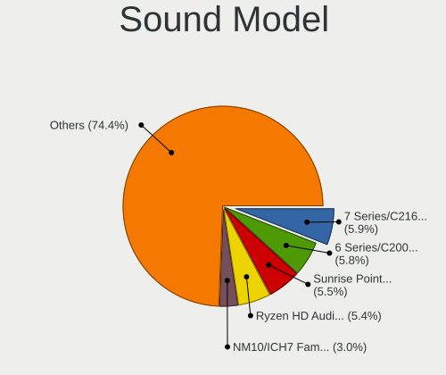

| Model                                                                      | Computers | Percent |
|----------------------------------------------------------------------------|-----------|---------|
| Intel 7 Series/C216 Chipset Family High Definition Audio Controller        | 1771      | 5.95%   |
| Intel 6 Series/C200 Series Chipset Family High Definition Audio Controller | 1715      | 5.76%   |
| Intel Sunrise Point-LP HD Audio                                            | 1632      | 5.48%   |
| AMD Ryzen HD Audio Controller                                              | 1598      | 5.37%   |
| Intel NM10/ICH7 Family High Definition Audio Controller                    | 906       | 3.04%   |
| Intel 5 Series/3400 Series Chipset High Definition Audio                   | 847       | 2.85%   |
| Intel 8 Series/C220 Series Chipset High Definition Audio Controller        | 762       | 2.56%   |
| AMD SBx00 Azalia (Intel HDA)                                               | 751       | 2.52%   |
| Intel Cannon Lake PCH cAVS                                                 | 699       | 2.35%   |
| AMD Renoir/Cezanne HDMI/DP Audio Controller                                | 617       | 2.07%   |
| Intel 8 Series HD Audio Controller                                         | 579       | 1.94%   |
| AMD Raven/Raven2/Fenghuang HDMI/DP Audio Controller                        | 576       | 1.93%   |
| Intel Haswell-ULT HD Audio Controller                                      | 572       | 1.92%   |
| Nvidia TU107 GeForce GTX 1650 High Definition Audio Controller             | 509       | 1.71%   |
| Intel Tiger Lake-LP Smart Sound Technology Audio Controller                | 508       | 1.71%   |
| AMD Starship/Matisse HD Audio Controller                                   | 471       | 1.58%   |
| Intel Broadwell-U Audio Controller                                         | 453       | 1.52%   |
| Intel Wildcat Point-LP High Definition Audio Controller                    | 448       | 1.5%    |
| Nvidia GP107GL High Definition Audio Controller                            | 431       | 1.45%   |
| Intel 82801I (ICH9 Family) HD Audio Controller                             | 421       | 1.41%   |
| Intel Cannon Point-LP High Definition Audio Controller                     | 416       | 1.4%    |
| Intel Xeon E3-1200 v3/4th Gen Core Processor HD Audio Controller           | 414       | 1.39%   |
| AMD Ellesmere HDMI Audio [Radeon RX 470/480 / 570/580/590]                 | 398       | 1.34%   |
| Nvidia High Definition Audio Controller                                    | 351       | 1.18%   |
| AMD FCH Azalia Controller                                                  | 351       | 1.18%   |
| Intel 100 Series/C230 Series Chipset Family HD Audio Controller            | 331       | 1.11%   |
| AMD Family 17h (Models 00h-0fh) HD Audio Controller                        | 312       | 1.05%   |
| Intel Comet Lake PCH-LP cAVS                                               | 290       | 0.97%   |
| Nvidia GF108 High Definition Audio Controller                              | 278       | 0.93%   |
| Intel Celeron/Pentium Silver Processor High Definition Audio               | 273       | 0.92%   |
| AMD Baffin HDMI/DP Audio [Radeon RX 550 640SP / RX 560/560X]               | 260       | 0.87%   |
| Intel Alder Lake PCH-P High Definition Audio Controller                    | 249       | 0.84%   |
| Intel 200 Series PCH HD Audio                                              | 247       | 0.83%   |
| AMD Radeon High Definition Audio Controller                                | 230       | 0.77%   |
| Nvidia GK208 HDMI/DP Audio Controller                                      | 229       | 0.77%   |
| Intel 82801H (ICH8 Family) HD Audio Controller                             | 228       | 0.77%   |
| Intel Atom Processor Z36xxx/Z37xxx Series High Definition Audio Controller | 225       | 0.76%   |
| Generalplus Technology USB Audio Device                                    | 214       | 0.72%   |
| Nvidia MCP61 High Definition Audio                                         | 204       | 0.69%   |
| AMD Wrestler HDMI Audio                                                    | 195       | 0.66%   |

Memory
------

Memory Vendor
-------------

Memory module vendors

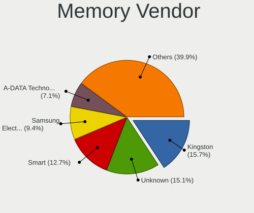

| Vendor              | Computers | Percent |
|---------------------|-----------|---------|
| Kingston            | 1368      | 15.75%  |
| Unknown             | 1313      | 15.11%  |
| Smart               | 1105      | 12.72%  |
| Samsung Electronics | 820       | 9.44%   |
| A-DATA Technology   | 618       | 7.11%   |
| SK hynix            | 564       | 6.49%   |
| Corsair             | 381       | 4.39%   |
| Crucial             | 317       | 3.65%   |
| Micron Technology   | 309       | 3.56%   |
| Teikon              | 262       | 3.02%   |
| Unknown             | 202       | 2.33%   |
| Smart Brazil        | 168       | 1.93%   |
| Team                | 100       | 1.15%   |
| Unknown (ABCD)      | 86        | 0.99%   |
| High Bridge         | 85        | 0.98%   |
| Elpida              | 76        | 0.87%   |
| Multilaser          | 71        | 0.82%   |
| G.Skill             | 61        | 0.7%    |
| Apacer              | 52        | 0.6%    |
| Kllisre             | 47        | 0.54%   |
| Patriot             | 41        | 0.47%   |
| Nanya Technology    | 32        | 0.37%   |
| Atermiter           | 32        | 0.37%   |
| Unknown (0x0B5E)    | 30        | 0.35%   |
| Smart Modular       | 27        | 0.31%   |
| PUSKILL             | 25        | 0.29%   |
| HT Micron           | 23        | 0.26%   |
| Avant               | 23        | 0.26%   |
| Asgard              | 23        | 0.26%   |
| Ramaxel Technology  | 17        | 0.2%    |
| Kreton              | 16        | 0.18%   |
| Juhor               | 16        | 0.18%   |
| Hewlett-Packard     | 15        | 0.17%   |
| RZX                 | 12        | 0.14%   |
| HBS                 | 12        | 0.14%   |
| Transcend           | 11        | 0.13%   |
| GeIL                | 11        | 0.13%   |
| Neo Forza           | 10        | 0.12%   |
| Hikvision           | 10        | 0.12%   |
| DATEN               | 10        | 0.12%   |

Memory Model
------------

Memory module models

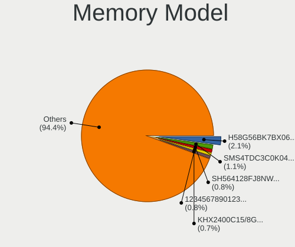

| Model                                                            | Computers | Percent |
|------------------------------------------------------------------|-----------|---------|
| Unknown                                                          | 202       | 2.14%   |
| Smart Brazil RAM SMS4TDC3C0K0446SCG 4GB SODIMM DDR4 2667MT/s     | 107       | 1.13%   |
| Smart RAM SH564128FJ8NWRNSQG 4GB SODIMM DDR3 1600MT/s            | 80        | 0.85%   |
| Unknown (ABCD) RAM 123456789012345678 2GB SODIMM LPDDR4 2400MT/s | 74        | 0.78%   |
| Kingston RAM KHX2400C15/8G 8GB DIMM DDR4 3400MT/s                | 69        | 0.73%   |
| Smart RAM SH564568FH8NZPHSCR 2GB SODIMM DDR3 1334MT/s            | 66        | 0.7%    |
| Samsung RAM M471A5244CB0-CRC 4GB SODIMM DDR4 2667MT/s            | 65        | 0.69%   |
| Smart RAM SF4641G8CK8IEHLSBG 8GB SODIMM DDR4 2667MT/s            | 63        | 0.67%   |
| Smart RAM SH564128FJ8NWRNSQR 4GB SODIMM DDR3 1600MT/s            | 61        | 0.65%   |
| Smart RAM SH564128FH8NZPHSCG 4GB SODIMM DDR3 1334MT/s            | 60        | 0.63%   |
| Unknown RAM Module 2GB DIMM SDRAM                                | 57        | 0.6%    |
| Smart RAM SH564128FH8NZQNSCG 4GB SODIMM DDR3 1600MT/s            | 57        | 0.6%    |
| Unknown RAM Module 4GB DIMM DDR3 1333MT/s                        | 52        | 0.55%   |
| Smart RAM SH564128FH8NZPHSCR 4GB SODIMM DDR3 1334MT/s            | 48        | 0.51%   |
| Smart RAM SMS4TDC3C0K0446SCG 4GB SODIMM DDR4 2667MT/s            | 42        | 0.44%   |
| Kingston RAM KHX2666C16/8G 8GiB DIMM DDR4 3466MT/s               | 42        | 0.44%   |
| Smart RAM SH564568FH8NZPHSCG 2GB SODIMM DDR3 1333MT/s            | 39        | 0.41%   |
| Samsung RAM M471B5773CHS-CH9 2GB SODIMM DDR3 4199MT/s            | 39        | 0.41%   |
| Kingston RAM KHX1600C10D3/8G 8GB DIMM DDR3 2133MT/s              | 39        | 0.41%   |
| A-DATA RAM AM1P26KC8T1-BAAS 8GB SODIMM DDR4 2667MT/s             | 38        | 0.4%    |
| Unknown RAM Module 4GB DIMM 1333MT/s                             | 36        | 0.38%   |
| Smart RAM SH5641G8FJ8NWRNSQG 8GB SODIMM DDR3 1600MT/s            | 34        | 0.36%   |
| Smart RAM SH564128FJ8NZRNSDR 4GB SODIMM DDR3 1600MT/s            | 34        | 0.36%   |
| Smart RAM SMS4WEC8C1K0446FCG 8GB SODIMM DDR4 3200MT/s            | 33        | 0.35%   |
| Smart RAM SH564128FJ8NZRNSDG 4GB SODIMM DDR3 1600MT/s            | 33        | 0.35%   |
| Smart RAM SH564568FH8NWPHSFG 2GB SODIMM DDR3 1333MT/s            | 32        | 0.34%   |
| Unknown RAM Module 4GB DIMM SDRAM                                | 31        | 0.33%   |
| Unknown RAM Module 4096MB DIMM DDR3 1333MT/s                     | 31        | 0.33%   |
| Smart RAM SF564128CJ8NWMNSEG 4GB SODIMM DDR3 1600MT/s            | 31        | 0.33%   |
| Micron RAM 4ATF51264HZ-2G3B1 4GB SODIMM DDR4 3200MT/s            | 30        | 0.32%   |
| Unknown RAM Module 2048MB DIMM SDRAM                             | 29        | 0.31%   |
| Unknown RAM Module 4GB SODIMM DDR3                               | 28        | 0.3%    |
| Unknown RAM Module 2GB DIMM DDR2 800MT/s                         | 28        | 0.3%    |
| Unknown RAM Module 2GB DIMM DDR2                                 | 28        | 0.3%    |
| Smart RAM SH564128FH8N6TNSQG 4GB DIMM DDR3 1600MT/s              | 28        | 0.3%    |
| A-DATA RAM AM1P24HC4U1-BBGS 4GB SODIMM DDR4 2400MT/s             | 28        | 0.3%    |
| SK hynix RAM HMA81GS6AFR8N-UH 8GB SODIMM DDR4 2667MT/s           | 27        | 0.29%   |
| A-DATA RAM AE4S240038G17-BHYA 8GB SODIMM DDR4 2400MT/s           | 27        | 0.29%   |
| Unknown RAM Module 4096MB DIMM 1333MT/s                          | 26        | 0.27%   |
| Unknown RAM Module 2GB SODIMM DDR2 667MT/s                       | 26        | 0.27%   |

Memory Kind
-----------

Memory module kinds

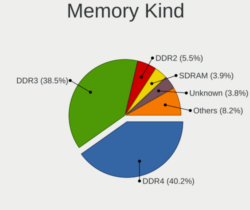

| Kind         | Computers | Percent |
|--------------|-----------|---------|
| DDR4         | 2942      | 40.21%  |
| DDR3         | 2814      | 38.46%  |
| DDR2         | 403       | 5.51%   |
| SDRAM        | 283       | 3.87%   |
| Unknown      | 276       | 3.77%   |
| DDR5         | 201       | 2.75%   |
| LPDDR4       | 181       | 2.47%   |
| LPDDR5       | 72        | 0.98%   |
| DDR          | 54        | 0.74%   |
| LPDDR3       | 52        | 0.71%   |
| DRAM         | 34        | 0.46%   |
| RAM          | 4         | 0.05%   |
| DDR2 FB-DIMM | 1         | 0.01%   |

Memory Form Factor
------------------

Physical design of the memory module

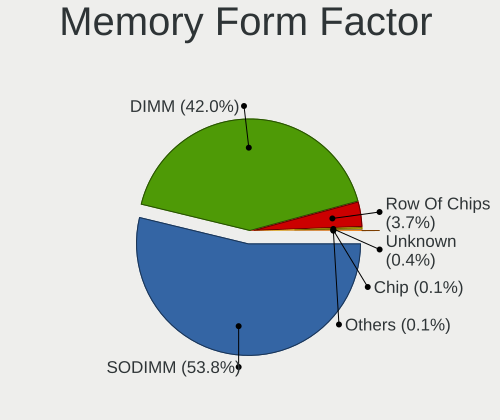

| Name         | Computers | Percent |
|--------------|-----------|---------|
| SODIMM       | 3934      | 53.78%  |
| DIMM         | 3071      | 41.98%  |
| Row Of Chips | 268       | 3.66%   |
| Unknown      | 26        | 0.36%   |
| Chip         | 7         | 0.1%    |
| RIMM         | 5         | 0.07%   |
| FB-DIMM      | 4         | 0.05%   |

Memory Size
-----------

Memory module size

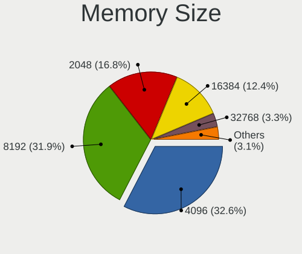

| Size    | Computers | Percent |
|---------|-----------|---------|
| 4096    | 2700      | 32.6%   |
| 8192    | 2641      | 31.89%  |
| 2048    | 1391      | 16.8%   |
| 16384   | 1023      | 12.35%  |
| 32768   | 272       | 3.28%   |
| 1024    | 221       | 2.67%   |
| 512     | 20        | 0.24%   |
| 65536   | 3         | 0.04%   |
| 256     | 3         | 0.04%   |
| 12288   | 2         | 0.02%   |
| 49152   | 1         | 0.01%   |
| 24576   | 1         | 0.01%   |
| 15616   | 1         | 0.01%   |
| 1536    | 1         | 0.01%   |
| 16      | 1         | 0.01%   |
| Unknown | 1         | 0.01%   |

Memory Speed
------------

Memory module speed

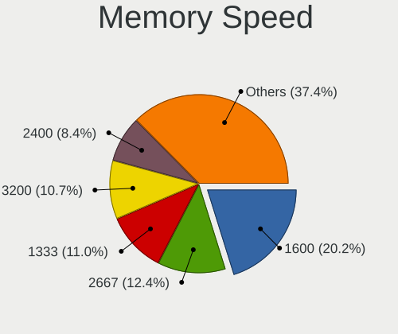

| Speed   | Computers | Percent |
|---------|-----------|---------|
| 1600    | 1650      | 20.18%  |
| 2667    | 1011      | 12.37%  |
| 1333    | 901       | 11.02%  |
| 3200    | 871       | 10.65%  |
| 2400    | 684       | 8.37%   |
| Unknown | 390       | 4.77%   |
| 1334    | 307       | 3.76%   |
| 2133    | 288       | 3.52%   |
| 800     | 221       | 2.7%    |
| 667     | 215       | 2.63%   |
| 3600    | 146       | 1.79%   |
| 1066    | 110       | 1.35%   |
| 3400    | 96        | 1.17%   |
| 1067    | 87        | 1.06%   |
| 4800    | 81        | 0.99%   |
| 1866    | 69        | 0.84%   |
| 3000    | 68        | 0.83%   |
| 4267    | 67        | 0.82%   |
| 5600    | 66        | 0.81%   |
| 4199    | 54        | 0.66%   |
| 2666    | 51        | 0.62%   |
| 3733    | 48        | 0.59%   |
| 3466    | 47        | 0.57%   |
| 6400    | 44        | 0.54%   |
| 533     | 44        | 0.54%   |
| 3800    | 40        | 0.49%   |
| 6000    | 34        | 0.42%   |
| 1867    | 33        | 0.4%    |
| 8400    | 29        | 0.35%   |
| 2933    | 29        | 0.35%   |
| 3266    | 28        | 0.34%   |
| 975     | 28        | 0.34%   |
| 400     | 26        | 0.32%   |
| 2048    | 25        | 0.31%   |
| 2800    | 21        | 0.26%   |
| 3151    | 18        | 0.22%   |
| 333     | 18        | 0.22%   |
| 7500    | 17        | 0.21%   |
| 3066    | 17        | 0.21%   |
| 1800    | 15        | 0.18%   |

Printers & scanners
-------------------

Printer Vendor
--------------

Printer device vendors

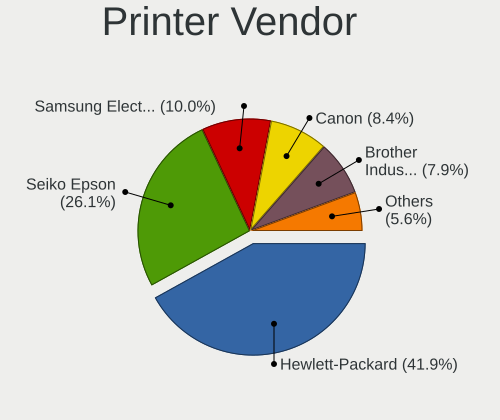

| Vendor                | Computers | Percent |
|-----------------------|-----------|---------|
| Hewlett-Packard       | 164       | 41.94%  |
| Seiko Epson           | 102       | 26.09%  |
| Samsung Electronics   | 39        | 9.97%   |
| Canon                 | 33        | 8.44%   |
| Brother Industries    | 31        | 7.93%   |
| QinHeng Electronics   | 4         | 1.02%   |
| Lexmark International | 4         | 1.02%   |
| Xerox                 | 3         | 0.77%   |
| Apple                 | 2         | 0.51%   |
| Xiaomi                | 1         | 0.26%   |
| Ricoh                 | 1         | 0.26%   |
| Prolific Technology   | 1         | 0.26%   |
| Pantum                | 1         | 0.26%   |
| Oki Data              | 1         | 0.26%   |
| NXP Semiconductors    | 1         | 0.26%   |
| MIIIW                 | 1         | 0.26%   |
| ICS Advent            | 1         | 0.26%   |
| ARGOX                 | 1         | 0.26%   |

Printer Model
-------------

Printer device models

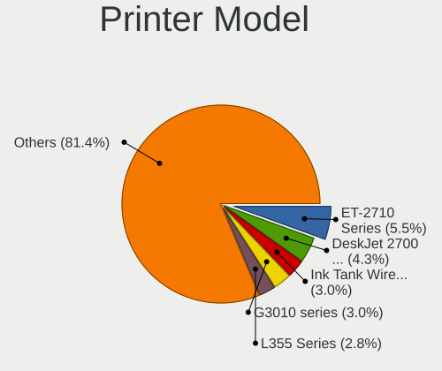

| Model                                        | Computers | Percent |
|----------------------------------------------|-----------|---------|
| Seiko Epson ET-2710 Series                   | 22        | 5.54%   |
| HP DeskJet 2700 series                       | 17        | 4.28%   |
| HP Ink Tank Wireless 410 series              | 12        | 3.02%   |
| Canon G3010 series                           | 12        | 3.02%   |
| Seiko Epson L355 Series                      | 11        | 2.77%   |
| Seiko Epson L3050 Series                     | 11        | 2.77%   |
| HP DeskJet 2130 series                       | 10        | 2.52%   |
| HP Deskjet 3050 J610 series                  | 9         | 2.27%   |
| Seiko Epson L365 Series                      | 8         | 2.02%   |
| Samsung M2070 Series                         | 7         | 1.76%   |
| HP LaserJet 1020                             | 7         | 1.76%   |
| HP DeskJet 3630 series                       | 7         | 1.76%   |
| HP Deskjet 2540 series                       | 7         | 1.76%   |
| Samsung M2020 Series                         | 6         | 1.51%   |
| HP LaserJet Professional P1102w              | 6         | 1.51%   |
| HP LaserJet P1005                            | 6         | 1.51%   |
| HP DeskJet F4100 Printer series              | 6         | 1.51%   |
| HP DeskJet 2600 series                       | 6         | 1.51%   |
| HP Deskjet 2050 J510                         | 6         | 1.51%   |
| Brother HL-1200 series                       | 6         | 1.51%   |
| Seiko Epson ET-2810 Series                   | 5         | 1.26%   |
| Samsung SCX-4200 series                      | 5         | 1.26%   |
| HP DeskJet 2300 series                       | 5         | 1.26%   |
| Seiko Epson L3110 Series                     | 4         | 1.01%   |
| Seiko Epson EPSON L220 Series                | 4         | 1.01%   |
| Samsung ML-216x Series Laser Printer         | 4         | 1.01%   |
| QinHeng CH340S                               | 4         | 1.01%   |
| HP Deskjet F4400 series                      | 4         | 1.01%   |
| HP DeskJet F4200 series                      | 4         | 1.01%   |
| Canon PIXMA MG3600 Series                    | 4         | 1.01%   |
| Canon G4010 series                           | 4         | 1.01%   |
| Seiko Epson XP-240 Series                    | 3         | 0.76%   |
| Seiko Epson ME 320/330 Series [Stylus SX125] | 3         | 0.76%   |
| Seiko Epson L375 Series                      | 3         | 0.76%   |
| Seiko Epson L3210 Series                     | 3         | 0.76%   |
| Seiko Epson L210 Series                      | 3         | 0.76%   |
| Seiko Epson L120 Series                      | 3         | 0.76%   |
| Samsung SCX-4600 Series                      | 3         | 0.76%   |
| Samsung SCX-3200 Series                      | 3         | 0.76%   |
| HP Smart Tank 510 series                     | 3         | 0.76%   |

Scanner Vendor
--------------

Scanner device vendors

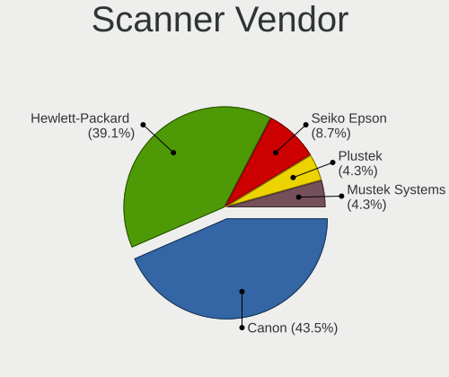

| Vendor          | Computers | Percent |
|-----------------|-----------|---------|
| Canon           | 10        | 43.48%  |
| Hewlett-Packard | 9         | 39.13%  |
| Seiko Epson     | 2         | 8.7%    |
| Plustek         | 1         | 4.35%   |
| Mustek Systems  | 1         | 4.35%   |

Scanner Model
-------------

Scanner device models

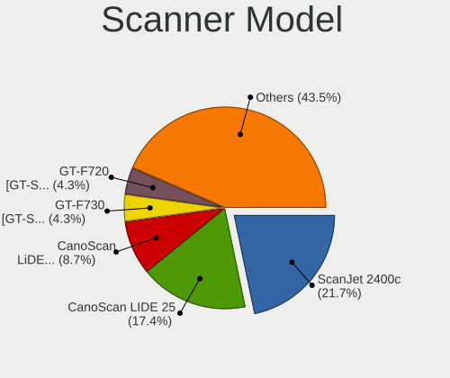

| Model                                                   | Computers | Percent |
|---------------------------------------------------------|-----------|---------|
| HP ScanJet 2400c                                        | 5         | 21.74%  |
| Canon CanoScan LIDE 25                                  | 4         | 17.39%  |
| Canon CanoScan LiDE 110                                 | 2         | 8.7%    |
| Seiko Epson GT-F730 [GT-S630/Perfection V33/V330 Photo] | 1         | 4.35%   |
| Seiko Epson GT-F720 [GT-S620/Perfection V30/V300 Photo] | 1         | 4.35%   |
| Plustek 1200dpi USB Scanner                             | 1         | 4.35%   |
| Mustek Systems ScanExpress 1200 UB                      | 1         | 4.35%   |
| HP Scanjet Professional 1000 Mobile Scanner             | 1         | 4.35%   |
| HP ScanJet G4050                                        | 1         | 4.35%   |
| HP ScanJet 3800c                                        | 1         | 4.35%   |
| HP Scanjet 200                                          | 1         | 4.35%   |
| Canon CanoScan N670U/N676U/LiDE 20                      | 1         | 4.35%   |
| Canon CanoScan N1240U/LiDE 30                           | 1         | 4.35%   |
| Canon CanoScan LiDE 500F                                | 1         | 4.35%   |
| Canon CanoScan LiDE 210                                 | 1         | 4.35%   |

Camera
------

Camera Vendor
-------------

Camera device vendors

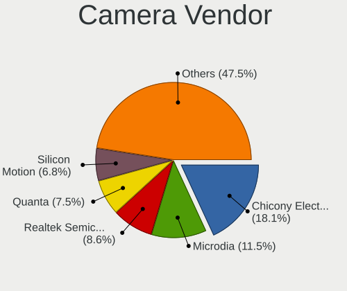

| Vendor                                 | Computers | Percent |
|----------------------------------------|-----------|---------|
| Chicony Electronics                    | 2084      | 18.12%  |
| Microdia                               | 1322      | 11.49%  |
| Realtek Semiconductor                  | 989       | 8.6%    |
| Quanta                                 | 861       | 7.49%   |
| Silicon Motion                         | 779       | 6.77%   |
| Sunplus Innovation Technology          | 749       | 6.51%   |
| Bison Electronics                      | 617       | 5.36%   |
| IMC Networks                           | 536       | 4.66%   |
| Logitech                               | 501       | 4.36%   |
| Suyin                                  | 365       | 3.17%   |
| Syntek                                 | 364       | 3.16%   |
| Apple                                  | 224       | 1.95%   |
| Alcor Micro                            | 199       | 1.73%   |
| Samsung Electronics                    | 137       | 1.19%   |
| Cheng Uei Precision Industry (Foxlink) | 136       | 1.18%   |
| Generalplus Technology                 | 126       | 1.1%    |
| Sonix Technology                       | 109       | 0.95%   |
| SunplusIT                              | 91        | 0.79%   |
| Z-Star Microelectronics                | 85        | 0.74%   |
| Microsoft                              | 84        | 0.73%   |
| Unknown                                | 84        | 0.73%   |
| Acer                                   | 72        | 0.63%   |
| Ricoh                                  | 66        | 0.57%   |
| ALi                                    | 64        | 0.56%   |
| GEMBIRD                                | 45        | 0.39%   |
| Luxvisions Innotech Limited            | 44        | 0.38%   |
| Lite-On Technology                     | 40        | 0.35%   |
| Jieli Technology                       | 40        | 0.35%   |
| icSpring                               | 39        | 0.34%   |
| Unknown                                | 37        | 0.32%   |
| Aveo Technology                        | 32        | 0.28%   |
| Importek                               | 31        | 0.27%   |
| OmniVision Technologies                | 28        | 0.24%   |
| Y Media                                | 27        | 0.23%   |
| Pixart Imaging                         | 27        | 0.23%   |
| Lenovo                                 | 27        | 0.23%   |
| Shine-optics                           | 24        | 0.21%   |
| LG Electronics                         | 23        | 0.2%    |
| kingcome                               | 23        | 0.2%    |
| Cubeternet                             | 21        | 0.18%   |

Camera Model
------------

Camera device models

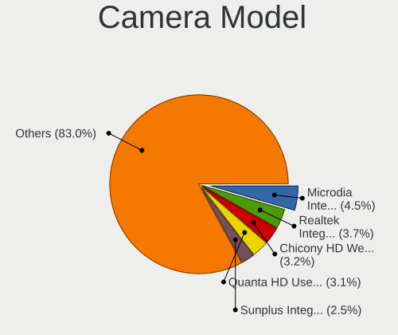

| Model                                     | Computers | Percent |
|-------------------------------------------|-----------|---------|
| Microdia Integrated_Webcam_HD             | 519       | 4.5%    |
| Realtek Integrated_Webcam_HD              | 421       | 3.65%   |
| Chicony HD WebCam                         | 370       | 3.21%   |
| Quanta HD User Facing                     | 361       | 3.13%   |
| Sunplus Integrated_Webcam_HD              | 291       | 2.52%   |
| Silicon Motion Web Camera                 | 291       | 2.52%   |
| Chicony HD User Facing                    | 280       | 2.43%   |
| Chicony Integrated Camera                 | 274       | 2.38%   |
| Syntek Integrated Camera                  | 234       | 2.03%   |
| Quanta VGA WebCam                         | 222       | 1.93%   |
| Chicony VGA WebCam                        | 175       | 1.52%   |
| Logitech Webcam C270                      | 168       | 1.46%   |
| Realtek Integrated Webcam                 | 154       | 1.34%   |
| Quanta HD Webcam                          | 137       | 1.19%   |
| Samsung Galaxy series, misc. (MTP mode)   | 135       | 1.17%   |
| IMC Networks Integrated Camera            | 134       | 1.16%   |
| Microdia Laptop_Integrated_Webcam_HD      | 130       | 1.13%   |
| Sunplus HD WebCam                         | 126       | 1.09%   |
| Chicony USB 2.0 Camera                    | 120       | 1.04%   |
| Alcor Micro USB 2.0 Camera                | 113       | 0.98%   |
| Bison EasyCamera                          | 103       | 0.89%   |
| Logitech HD Pro Webcam C920               | 101       | 0.88%   |
| Bison Integrated Camera                   | 97        | 0.84%   |
| Sonix USB2.0 HD UVC WebCam                | 93        | 0.81%   |
| IMC Networks USB2.0 HD UVC WebCam         | 91        | 0.79%   |
| Unknown                                   | 89        | 0.77%   |
| Bison Lenovo EasyCamera                   | 86        | 0.75%   |
| Microdia Dell Laptop Integrated Webcam HD | 84        | 0.73%   |
| Generalplus GENERAL WEBCAM                | 79        | 0.69%   |
| IMC Networks USB2.0 VGA UVC WebCam        | 73        | 0.63%   |
| Silicon Motion WebCam SC-10HDD12636N      | 70        | 0.61%   |
| Realtek USB Camera                        | 68        | 0.59%   |
| Microdia Integrated Webcam HD             | 66        | 0.57%   |
| Apple FaceTime HD Camera                  | 65        | 0.56%   |
| Bison BisonCam, NB Pro                    | 62        | 0.54%   |
| Chicony EasyCamera                        | 61        | 0.53%   |
| Apple iPhone 5/5C/5S/6/SE/7/8/X           | 61        | 0.53%   |
| Microdia USB 2.0 Camera                   | 59        | 0.51%   |
| Bison HD WebCam                           | 58        | 0.5%    |
| Syntek EasyCamera                         | 57        | 0.49%   |

Security
--------

Fingerprint Vendor
------------------

Fingerprint sensor vendors

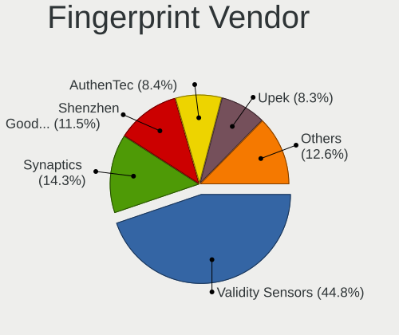

| Vendor                             | Computers | Percent |
|------------------------------------|-----------|---------|
| Validity Sensors                   | 404       | 44.79%  |
| Synaptics                          | 129       | 14.3%   |
| Shenzhen Goodix Technology         | 104       | 11.53%  |
| AuthenTec                          | 76        | 8.43%   |
| Upek                               | 75        | 8.31%   |
| LighTuning Technology              | 43        | 4.77%   |
| Samsung Electronics                | 26        | 2.88%   |
| Elan Microelectronics              | 19        | 2.11%   |
| STMicroelectronics                 | 6         | 0.67%   |
| Realtek USB2.0 Finger Print Bridge | 4         | 0.44%   |
| Focal-systems.Corp                 | 4         | 0.44%   |
| DigitalPersona                     | 3         | 0.33%   |
| Dell                               | 3         | 0.33%   |
| Next Biometrics                    | 2         | 0.22%   |
| HOLTEK                             | 2         | 0.22%   |
| Futronic Technology                | 2         | 0.22%   |

Fingerprint Model
-----------------

Fingerprint sensor models

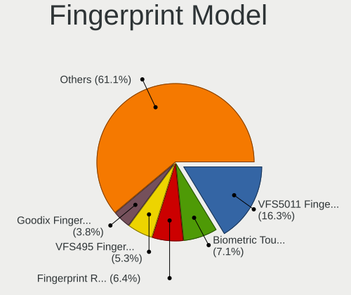

| Model                                                           | Computers | Percent |
|-----------------------------------------------------------------|-----------|---------|
| Validity Sensors VFS5011 Fingerprint Reader                     | 147       | 16.3%   |
| Upek Biometric Touchchip/Touchstrip Fingerprint Sensor          | 64        | 7.1%    |
| Shenzhen Goodix Fingerprint Reader                              | 58        | 6.43%   |
| Validity Sensors VFS495 Fingerprint Reader                      | 48        | 5.32%   |
| Shenzhen Goodix  FingerPrint Device                             | 34        | 3.77%   |
| LighTuning ES603 Swipe Fingerprint Sensor                       | 34        | 3.77%   |
| Validity Sensors VFS 5011 fingerprint sensor                    | 33        | 3.66%   |
| Validity Sensors VFS471 Fingerprint Reader                      | 32        | 3.55%   |
| Synaptics Prometheus MIS Touch Fingerprint Reader               | 32        | 3.55%   |
| Synaptics Metallica MOH Touch Fingerprint Reader                | 32        | 3.55%   |
| Validity Sensors Fingerprint scanner                            | 29        | 3.22%   |
| Samsung Fingerprint Device                                      | 26        | 2.88%   |
| AuthenTec AES1660 Fingerprint Sensor                            | 25        | 2.77%   |
| Synaptics  WBDI                                                 | 22        | 2.44%   |
| Validity Sensors VFS301 Fingerprint Reader                      | 21        | 2.33%   |
| AuthenTec AES2501 Fingerprint Sensor                            | 18        | 2%      |
| Synaptics Metallica MIS Touch Fingerprint Reader                | 17        | 1.88%   |
| Elan ELAN:Fingerprint                                           | 17        | 1.88%   |
| Validity Sensors VFS451 Fingerprint Reader                      | 16        | 1.77%   |
| Validity Sensors VFS101 Fingerprint Reader                      | 16        | 1.77%   |
| Validity Sensors VFS491                                         | 14        | 1.55%   |
| AuthenTec Fingerprint Sensor                                    | 14        | 1.55%   |
| AuthenTec AES2810                                               | 14        | 1.55%   |
| Validity Sensors VFS300 Fingerprint Reader                      | 12        | 1.33%   |
| Validity Sensors Synaptics WBDI                                 | 12        | 1.33%   |
| Shenzhen Goodix FingerPrint                                     | 12        | 1.33%   |
| Validity Sensors Swipe Fingerprint Sensor                       | 11        | 1.22%   |
| Upek TCS5B Fingerprint sensor                                   | 10        | 1.11%   |
| Synaptics WBDI                                                  | 7         | 0.78%   |
| STMicroelectronics Fingerprint Reader                           | 6         | 0.67%   |
| LighTuning EgisTec Touch Fingerprint Sensor                     | 6         | 0.67%   |
| Synaptics Fingerprint reader [HP G6]                            | 5         | 0.55%   |
| AuthenTec AES1600                                               | 5         | 0.55%   |
| Validity Sensors VFS7552 Touch Fingerprint Sensor               | 4         | 0.44%   |
| Validity Sensors VFS7500 Touch Fingerprint Sensor               | 4         | 0.44%   |
| Synaptics UWP WBDI Device                                       | 4         | 0.44%   |
| Synaptics FS7604 Touch Fingerprint Sensor with PurePrint        | 4         | 0.44%   |
| Realtek USB2.0 Finger Print Bridge FocalTech Fingerprint Device | 4         | 0.44%   |
| Focal-systems.Corp FT9201Fingerprint.                           | 4         | 0.44%   |
| Validity Sensors Synaptics VFS7552 Touch Fingerprint Sensor     | 3         | 0.33%   |

Chipcard Vendor
---------------

Chipcard module vendors

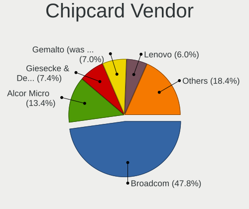

| Vendor                            | Computers | Percent |
|-----------------------------------|-----------|---------|
| Broadcom                          | 143       | 47.83%  |
| Alcor Micro                       | 40        | 13.38%  |
| Giesecke & Devrient               | 22        | 7.36%   |
| Gemalto (was Gemplus)             | 21        | 7.02%   |
| Lenovo                            | 18        | 6.02%   |
| Upek                              | 13        | 4.35%   |
| Aladdin Knowledge Systems         | 11        | 3.68%   |
| Watchdata                         | 7         | 2.34%   |
| SCM Microsystems                  | 7         | 2.34%   |
| O2 Micro                          | 5         | 1.67%   |
| Chicony Electronics               | 4         | 1.34%   |
| OmniKey                           | 3         | 1%      |
| Castles Technology                | 2         | 0.67%   |
| VASCO Data Security International | 1         | 0.33%   |
| Realtek Semiconductor             | 1         | 0.33%   |
| Advanced Card Systems             | 1         | 0.33%   |

Chipcard Model
--------------

Chipcard module models

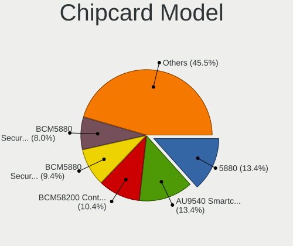

| Model                                                                        | Computers | Percent |
|------------------------------------------------------------------------------|-----------|---------|
| Broadcom 5880                                                                | 40        | 13.38%  |
| Alcor Micro AU9540 Smartcard Reader                                          | 40        | 13.38%  |
| Broadcom BCM58200 ControlVault 3 (FingerPrint sensor + Contacted SmartCard)  | 31        | 10.37%  |
| Broadcom BCM5880 Secure Applications Processor                               | 28        | 9.36%   |
| Broadcom BCM5880 Secure Applications Processor with fingerprint swipe sensor | 24        | 8.03%   |
| Gemalto (was Gemplus) GemPC Twin SmartCard Reader                            | 20        | 6.69%   |
| Broadcom 58200                                                               | 19        | 6.35%   |
| Lenovo Integrated Smart Card Reader                                          | 18        | 6.02%   |
| Upek TouchChip Fingerprint Coprocessor (WBF advanced mode)                   | 13        | 4.35%   |
| Giesecke & Devrient StarSign CUT S                                           | 11        | 3.68%   |
| Giesecke & Devrient Chipcard Reader                                          | 11        | 3.68%   |
| Aladdin Knowledge Systems Token JC                                           | 11        | 3.68%   |
| Watchdata USB Key                                                            | 7         | 2.34%   |
| SCM Microsystems SCR331-LC1 / SCR3310 SmartCard Reader                       | 4         | 1.34%   |
| O2 Micro OZ776 CCID Smartcard Reader                                         | 4         | 1.34%   |
| Chicony Electronics HP Skylab USB Smartcard Keyboard                         | 4         | 1.34%   |
| SCM Microsystems SCR35xx Smart Card Reader                                   | 2         | 0.67%   |
| OmniKey CardMan 3021 / 3121                                                  | 2         | 0.67%   |
| Castles Technology EZCCID Smart Card Reader                                  | 2         | 0.67%   |
| VASCO Data Security International Digipass 905 SmartCard Reader              | 1         | 0.33%   |
| SCM Microsystems uTrust FIDO2 Security Key                                   | 1         | 0.33%   |
| Realtek Semiconductor Smart Card Reader Interface                            | 1         | 0.33%   |
| OmniKey CardMan Smart@Link                                                   | 1         | 0.33%   |
| O2 Micro Oz776 SmartCard Reader                                              | 1         | 0.33%   |
| Gemalto (was Gemplus) GemPC Key SmartCard Reader                             | 1         | 0.33%   |
| Broadcom BCM5880 Secure Applications Processor with fingerprint touch sensor | 1         | 0.33%   |
| Advanced Card Systems ACR38 SmartCard Reader                                 | 1         | 0.33%   |

Unsupported
-----------

Unsupported Devices
-------------------

Total unsupported devices on board

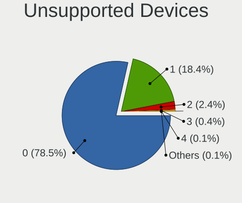

| Total | Computers | Percent |
|-------|-----------|---------|
| 0     | 15213     | 78.52%  |
| 1     | 3571      | 18.43%  |
| 2     | 466       | 2.41%   |
| 3     | 82        | 0.42%   |
| 4     | 24        | 0.12%   |
| 5     | 8         | 0.04%   |
| 7     | 6         | 0.03%   |
| 8     | 2         | 0.01%   |
| 6     | 2         | 0.01%   |

Unsupported Device Types
------------------------

Types of unsupported devices

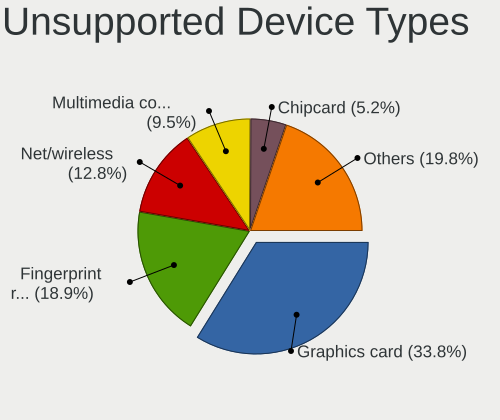

| Type                     | Computers | Percent |
|--------------------------|-----------|---------|
| Graphics card            | 1599      | 33.84%  |
| Fingerprint reader       | 894       | 18.92%  |
| Net/wireless             | 606       | 12.83%  |
| Multimedia controller    | 448       | 9.48%   |
| Chipcard                 | 244       | 5.16%   |
| Communication controller | 184       | 3.89%   |
| Unassigned class         | 141       | 2.98%   |
| Camera                   | 140       | 2.96%   |
| Bluetooth                | 131       | 2.77%   |
| Sound                    | 91        | 1.93%   |
| Net/ethernet             | 64        | 1.35%   |
| Storage                  | 58        | 1.23%   |
| Flash memory             | 26        | 0.55%   |
| Modem                    | 25        | 0.53%   |
| Card reader              | 15        | 0.32%   |
| Storage/raid             | 14        | 0.3%    |
| Network                  | 14        | 0.3%    |
| Storage/ide              | 10        | 0.21%   |
| Firewire controller      | 7         | 0.15%   |
| Storage/nvme             | 5         | 0.11%   |
| Dvb card                 | 3         | 0.06%   |
| Wireless                 | 2         | 0.04%   |
| Video                    | 1         | 0.02%   |
| Unclassified device      | 1         | 0.02%   |
| Tv card                  | 1         | 0.02%   |
| Storage/ata              | 1         | 0.02%   |

