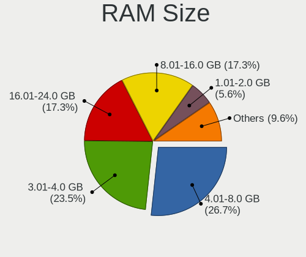
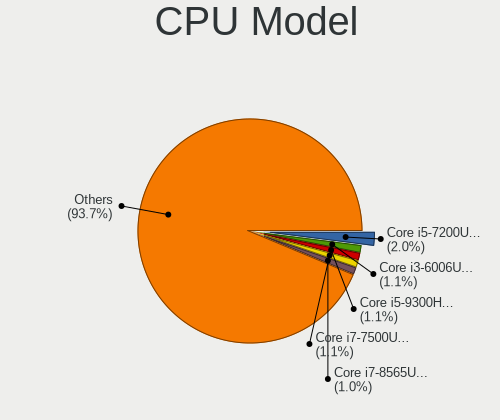

Linux in Brazil - Tested Hardware & Statistics
----------------------------------------------

A project to collect tested hardware configurations for Linux in Brazil.

Anyone can contribute to this report by the [hw-probe](https://github.com/linuxhw/hw-probe) tool:

    sudo -E hw-probe -all -upload

Please contribute! Especially if your hardware is rare.

This is a report for all computer types. See also reports for [desktops](/Location/Brazil/Desktop/README.md) and [notebooks](/Location/Brazil/Notebook/README.md).

Contents
--------

* [ Test Cases ](#test-cases)

* [ System ](#system)
  - [ OS                       ](#os)
  - [ OS Family                ](#os-family)
  - [ Kernel                   ](#kernel)
  - [ Kernel Family            ](#kernel-family)
  - [ Kernel Major Ver.        ](#kernel-major-ver)
  - [ Arch                     ](#arch)
  - [ DE                       ](#de)
  - [ Display Server           ](#display-server)
  - [ Display Manager          ](#display-manager)
  - [ OS Lang                  ](#os-lang)
  - [ Boot Mode                ](#boot-mode)
  - [ Filesystem               ](#filesystem)
  - [ Part. scheme             ](#part-scheme)
  - [ Dual Boot with Linux/BSD ](#dual-boot-with-linuxbsd)
  - [ Dual Boot (Win)          ](#dual-boot-win)

* [ Board ](#board)
  - [ Vendor                   ](#vendor)
  - [ Model                    ](#model)
  - [ Model Family             ](#model-family)
  - [ MFG Year                 ](#mfg-year)
  - [ Form Factor              ](#form-factor)
  - [ Secure Boot              ](#secure-boot)
  - [ Coreboot                 ](#coreboot)
  - [ RAM Size                 ](#ram-size)
  - [ RAM Used                 ](#ram-used)
  - [ Total Drives             ](#total-drives)
  - [ Has CD-ROM               ](#has-cd-rom)
  - [ Has Ethernet             ](#has-ethernet)
  - [ Has WiFi                 ](#has-wifi)
  - [ Has Bluetooth            ](#has-bluetooth)

* [ Location ](#location)
  - [ Country                  ](#country)
  - [ City                     ](#city)

* [ Drives ](#drives)
  - [ Drive Vendor             ](#drive-vendor)
  - [ Drive Model              ](#drive-model)
  - [ HDD Vendor               ](#hdd-vendor)
  - [ SSD Vendor               ](#ssd-vendor)
  - [ Drive Kind               ](#drive-kind)
  - [ Drive Connector          ](#drive-connector)
  - [ Drive Size               ](#drive-size)
  - [ Space Total              ](#space-total)
  - [ Space Used               ](#space-used)
  - [ Malfunc. Drives          ](#malfunc-drives)
  - [ Malfunc. Drive Vendor    ](#malfunc-drive-vendor)
  - [ Malfunc. HDD Vendor      ](#malfunc-hdd-vendor)
  - [ Malfunc. Drive Kind      ](#malfunc-drive-kind)
  - [ Failed Drives            ](#failed-drives)
  - [ Failed Drive Vendor      ](#failed-drive-vendor)
  - [ Drive Status             ](#drive-status)

* [ Storage controller ](#storage-controller)
  - [ Storage Vendor           ](#storage-vendor)
  - [ Storage Model            ](#storage-model)
  - [ Storage Kind             ](#storage-kind)

* [ Processor ](#processor)
  - [ CPU Vendor               ](#cpu-vendor)
  - [ CPU Model                ](#cpu-model)
  - [ CPU Model Family         ](#cpu-model-family)
  - [ CPU Cores                ](#cpu-cores)
  - [ CPU Sockets              ](#cpu-sockets)
  - [ CPU Threads              ](#cpu-threads)
  - [ CPU Op-Modes             ](#cpu-op-modes)
  - [ CPU Microcode            ](#cpu-microcode)
  - [ CPU Microarch            ](#cpu-microarch)

* [ Graphics ](#graphics)
  - [ GPU Vendor               ](#gpu-vendor)
  - [ GPU Model                ](#gpu-model)
  - [ GPU Combo                ](#gpu-combo)
  - [ GPU Driver               ](#gpu-driver)
  - [ GPU Memory               ](#gpu-memory)

* [ Monitor ](#monitor)
  - [ Monitor Vendor           ](#monitor-vendor)
  - [ Monitor Model            ](#monitor-model)
  - [ Monitor Resolution       ](#monitor-resolution)
  - [ Monitor Diagonal         ](#monitor-diagonal)
  - [ Monitor Width            ](#monitor-width)
  - [ Aspect Ratio             ](#aspect-ratio)
  - [ Monitor Area             ](#monitor-area)
  - [ Pixel Density            ](#pixel-density)
  - [ Multiple Monitors        ](#multiple-monitors)

* [ Network ](#network)
  - [ Net Controller Vendor    ](#net-controller-vendor)
  - [ Net Controller Model     ](#net-controller-model)
  - [ Wireless Vendor          ](#wireless-vendor)
  - [ Wireless Model           ](#wireless-model)
  - [ Ethernet Vendor          ](#ethernet-vendor)
  - [ Ethernet Model           ](#ethernet-model)
  - [ Net Controller Kind      ](#net-controller-kind)
  - [ Used Controller          ](#used-controller)
  - [ NICs                     ](#nics)
  - [ IPv6                     ](#ipv6)

* [ Bluetooth ](#bluetooth)
  - [ Bluetooth Vendor         ](#bluetooth-vendor)
  - [ Bluetooth Model          ](#bluetooth-model)

* [ Sound ](#sound)
  - [ Sound Vendor             ](#sound-vendor)
  - [ Sound Model              ](#sound-model)

* [ Memory ](#memory)
  - [ Memory Vendor            ](#memory-vendor)
  - [ Memory Model             ](#memory-model)
  - [ Memory Kind              ](#memory-kind)
  - [ Memory Form Factor       ](#memory-form-factor)
  - [ Memory Size              ](#memory-size)
  - [ Memory Speed             ](#memory-speed)

* [ Printers & scanners ](#printers--scanners)
  - [ Printer Vendor           ](#printer-vendor)
  - [ Printer Model            ](#printer-model)
  - [ Scanner Vendor           ](#scanner-vendor)
  - [ Scanner Model            ](#scanner-model)

* [ Camera ](#camera)
  - [ Camera Vendor            ](#camera-vendor)
  - [ Camera Model             ](#camera-model)

* [ Security ](#security)
  - [ Fingerprint Vendor       ](#fingerprint-vendor)
  - [ Fingerprint Model        ](#fingerprint-model)
  - [ Chipcard Vendor          ](#chipcard-vendor)
  - [ Chipcard Model           ](#chipcard-model)

* [ Unsupported ](#unsupported)
  - [ Unsupported Devices      ](#unsupported-devices)
  - [ Unsupported Device Types ](#unsupported-device-types)

Test Cases
----------

Total: 16811

| Vendor        | Model                       | Form-Factor | Probe                                                      | Date         |
|---------------|-----------------------------|-------------|------------------------------------------------------------|--------------|
| Notebook      | NJx0MU                      | Notebook    | [43923d1e98](https://linux-hardware.org/?probe=43923d1e98) | Jan 01, 2023 |
| Lenovo        | IdeaPad 3 15ALC6 82MF       | Notebook    | [4d7f89dc6d](https://linux-hardware.org/?probe=4d7f89dc6d) | Dec 31, 2022 |
| ASUSTek       | TUF Z390-PRO GAMING         | Desktop     | [de65f4b654](https://linux-hardware.org/?probe=de65f4b654) | Dec 31, 2022 |
| Valve         | Jupiter                     | Notebook    | [97da60caa9](https://linux-hardware.org/?probe=97da60caa9) | Dec 31, 2022 |
| HP            | Folio 13                    | Notebook    | [9f00cfe432](https://linux-hardware.org/?probe=9f00cfe432) | Dec 31, 2022 |
| HP            | Folio 13                    | Notebook    | [3ed5b405cb](https://linux-hardware.org/?probe=3ed5b405cb) | Dec 31, 2022 |
| Dell          | 0VR8V9 A01                  | Desktop     | [0e7d4ac326](https://linux-hardware.org/?probe=0e7d4ac326) | Dec 31, 2022 |
| Unknown       | Unknown                     | Notebook    | [10496680a5](https://linux-hardware.org/?probe=10496680a5) | Dec 31, 2022 |
| ASUSTek       | M5A78L-M/USB3               | Desktop     | [2508c5972e](https://linux-hardware.org/?probe=2508c5972e) | Dec 31, 2022 |
| Lenovo        | ThinkPad E470 20H2A02NBR    | Notebook    | [18827f3f77](https://linux-hardware.org/?probe=18827f3f77) | Dec 31, 2022 |
| ASRock        | B360M Performance           | Desktop     | [679d25f9be](https://linux-hardware.org/?probe=679d25f9be) | Dec 31, 2022 |
| Dell          | 0PV3YR A05                  | Server      | [3710331d81](https://linux-hardware.org/?probe=3710331d81) | Dec 31, 2022 |
| Gigabyte      | G31M-S2C                    | Desktop     | [39f08657f8](https://linux-hardware.org/?probe=39f08657f8) | Dec 31, 2022 |
| Acer          | Predator G3-572             | Notebook    | [ab03199a79](https://linux-hardware.org/?probe=ab03199a79) | Dec 30, 2022 |
| Compaq        | CQ-27                       | Notebook    | [fc5b98e1db](https://linux-hardware.org/?probe=fc5b98e1db) | Dec 30, 2022 |
| Apple         | MacBookPro7,1               | Notebook    | [db4379ed1e](https://linux-hardware.org/?probe=db4379ed1e) | Dec 30, 2022 |
| Notebook      | NJx0MU                      | Notebook    | [8540c1c554](https://linux-hardware.org/?probe=8540c1c554) | Dec 30, 2022 |
| Notebook      | NJx0MU                      | Notebook    | [b4c615f28c](https://linux-hardware.org/?probe=b4c615f28c) | Dec 30, 2022 |
| HOUTER        | IPMIP-GS                    | Desktop     | [6fddf7d035](https://linux-hardware.org/?probe=6fddf7d035) | Dec 30, 2022 |
| HP            | Pavilion dv6                | Notebook    | [12a8186204](https://linux-hardware.org/?probe=12a8186204) | Dec 30, 2022 |
| Dell          | 0PV3YR A05                  | Server      | [a295f18c9f](https://linux-hardware.org/?probe=a295f18c9f) | Dec 30, 2022 |
| Lenovo        | IdeaPad 330-15IKB 81FE      | Notebook    | [d048930c78](https://linux-hardware.org/?probe=d048930c78) | Dec 30, 2022 |
| Gigabyte      | AB350M-DS3H V2-CF           | Desktop     | [1c7a329282](https://linux-hardware.org/?probe=1c7a329282) | Dec 30, 2022 |
| Dell          | G5 5590                     | Notebook    | [dada63bf04](https://linux-hardware.org/?probe=dada63bf04) | Dec 30, 2022 |
| Acer          | Predator G3-572             | Notebook    | [f99480426f](https://linux-hardware.org/?probe=f99480426f) | Dec 29, 2022 |
| Samsung       | 550XBE/350XBE               | Notebook    | [33c4b80d0a](https://linux-hardware.org/?probe=33c4b80d0a) | Dec 29, 2022 |
| Dell          | Inspiron N4050              | Notebook    | [b34f09894d](https://linux-hardware.org/?probe=b34f09894d) | Dec 29, 2022 |
| Dell          | Inspiron 3583               | Notebook    | [35f6da18cc](https://linux-hardware.org/?probe=35f6da18cc) | Dec 29, 2022 |
| HP            | 250 G8 Notebook PC          | Notebook    | [754ba4696d](https://linux-hardware.org/?probe=754ba4696d) | Dec 29, 2022 |
| HP            | Pavilion Sleekbook 14 PC    | Notebook    | [11d4e1f9a1](https://linux-hardware.org/?probe=11d4e1f9a1) | Dec 29, 2022 |
| Acer          | Aspire A515-55              | Notebook    | [296961ae2d](https://linux-hardware.org/?probe=296961ae2d) | Dec 29, 2022 |
| HP            | Pavilion Sleekbook 14 PC    | Notebook    | [b60b954dc4](https://linux-hardware.org/?probe=b60b954dc4) | Dec 29, 2022 |
| Dell          | 0PV3YR A05                  | Server      | [4239e2fa3c](https://linux-hardware.org/?probe=4239e2fa3c) | Dec 29, 2022 |
| Notebook      | NJx0MU                      | Notebook    | [4a26556b6b](https://linux-hardware.org/?probe=4a26556b6b) | Dec 29, 2022 |
| Acer          | Predator PH315-53           | Notebook    | [d5d0e740c1](https://linux-hardware.org/?probe=d5d0e740c1) | Dec 29, 2022 |
| PCWare        | IPMH61R1                    | Desktop     | [a221946f02](https://linux-hardware.org/?probe=a221946f02) | Dec 29, 2022 |
| Dell          | G5 5590                     | Notebook    | [58bd69f40b](https://linux-hardware.org/?probe=58bd69f40b) | Dec 28, 2022 |
| Gigabyte      | A320M-H-CF                  | Desktop     | [83608f4248](https://linux-hardware.org/?probe=83608f4248) | Dec 28, 2022 |
| Dell          | Inspiron 5458               | Notebook    | [269d455191](https://linux-hardware.org/?probe=269d455191) | Dec 28, 2022 |
| Dell          | 0PV3YR A05                  | Server      | [ec0ad4d293](https://linux-hardware.org/?probe=ec0ad4d293) | Dec 28, 2022 |
| Lenovo        | 100-14IBY 80R7              | Notebook    | [92b2614ac2](https://linux-hardware.org/?probe=92b2614ac2) | Dec 28, 2022 |
| Gigabyte      | AB350M-DS3H V2-CF           | Desktop     | [2522f716da](https://linux-hardware.org/?probe=2522f716da) | Dec 28, 2022 |
| Samsung       | 550XDA                      | Notebook    | [6d744c7602](https://linux-hardware.org/?probe=6d744c7602) | Dec 28, 2022 |
| Samsung       | 550XDA                      | Notebook    | [b463fa7a54](https://linux-hardware.org/?probe=b463fa7a54) | Dec 28, 2022 |
| Samsung       | 340XAA/350XAA/550XAA        | Notebook    | [5383fb814b](https://linux-hardware.org/?probe=5383fb814b) | Dec 28, 2022 |
| Positivo      | Hendrix                     | Notebook    | [55aa2f92d7](https://linux-hardware.org/?probe=55aa2f92d7) | Dec 27, 2022 |
| Acer          | Aspire E5-574               | Notebook    | [15e48d4c24](https://linux-hardware.org/?probe=15e48d4c24) | Dec 27, 2022 |
| Itautec       | ST 4265                     | Desktop     | [38e4a07f9a](https://linux-hardware.org/?probe=38e4a07f9a) | Dec 27, 2022 |
| Acer          | Nitro AN515-54              | Notebook    | [5205b7c248](https://linux-hardware.org/?probe=5205b7c248) | Dec 27, 2022 |
| Acer          | Aspire 5741                 | Notebook    | [22540f4247](https://linux-hardware.org/?probe=22540f4247) | Dec 27, 2022 |
| Acer          | Aspire 5741                 | Notebook    | [b47449f70f](https://linux-hardware.org/?probe=b47449f70f) | Dec 27, 2022 |
| ASRock        | H61M-HG4                    | Desktop     | [8658fa0fa3](https://linux-hardware.org/?probe=8658fa0fa3) | Dec 27, 2022 |
| ASRock        | H61M-HG4                    | Desktop     | [cf7ba71c5e](https://linux-hardware.org/?probe=cf7ba71c5e) | Dec 27, 2022 |
| Unknown       | Unknown                     | Phone       | [1bf74daa90](https://linux-hardware.org/?probe=1bf74daa90) | Dec 27, 2022 |
| Megaware      | MW-H61M-2H v1.3 - 17/07/... | Desktop     | [868a87a1f8](https://linux-hardware.org/?probe=868a87a1f8) | Dec 27, 2022 |
| Dell          | Inspiron N4050              | Notebook    | [542b5ae2f6](https://linux-hardware.org/?probe=542b5ae2f6) | Dec 27, 2022 |
| Dell          | Vostro 5490                 | Notebook    | [d32b30987a](https://linux-hardware.org/?probe=d32b30987a) | Dec 27, 2022 |
| Chuwi         | HeroBook Air                | Notebook    | [2c6e8a0c9f](https://linux-hardware.org/?probe=2c6e8a0c9f) | Dec 27, 2022 |
| Chuwi         | HeroBook Air                | Notebook    | [b3db56361b](https://linux-hardware.org/?probe=b3db56361b) | Dec 27, 2022 |
| Notebook      | NJx0MU                      | Notebook    | [db1c25cde3](https://linux-hardware.org/?probe=db1c25cde3) | Dec 27, 2022 |
| Samsung       | 300E5M/300E5L               | Notebook    | [669e014ee6](https://linux-hardware.org/?probe=669e014ee6) | Dec 27, 2022 |
| Dell          | Inspiron 15-3567            | Notebook    | [2f5381fa26](https://linux-hardware.org/?probe=2f5381fa26) | Dec 26, 2022 |
| Itautec       | ST 4265                     | Desktop     | [8323542129](https://linux-hardware.org/?probe=8323542129) | Dec 26, 2022 |
| Dell          | Inspiron 7580               | Notebook    | [a1638729b2](https://linux-hardware.org/?probe=a1638729b2) | Dec 26, 2022 |
| Dell          | Vostro 5490                 | Notebook    | [97677e7c79](https://linux-hardware.org/?probe=97677e7c79) | Dec 26, 2022 |
| Dell          | Inspiron 5458               | Notebook    | [4e393c7334](https://linux-hardware.org/?probe=4e393c7334) | Dec 26, 2022 |
| Dell          | 0PV3YR A05                  | Server      | [67fee9ab39](https://linux-hardware.org/?probe=67fee9ab39) | Dec 26, 2022 |
| Avell High... | C62 MOB                     | Notebook    | [658f34e70d](https://linux-hardware.org/?probe=658f34e70d) | Dec 26, 2022 |
| ASUSTek       | T100TAS                     | Notebook    | [25894bb300](https://linux-hardware.org/?probe=25894bb300) | Dec 26, 2022 |
| Lenovo        | IdeaPad S145-15API 81V7     | Notebook    | [46687a6be3](https://linux-hardware.org/?probe=46687a6be3) | Dec 26, 2022 |
| Sony          | SVF15213CBB                 | Notebook    | [f8a95f249c](https://linux-hardware.org/?probe=f8a95f249c) | Dec 26, 2022 |
| HP            | ProBook 6465b               | Notebook    | [d0f5218f72](https://linux-hardware.org/?probe=d0f5218f72) | Dec 25, 2022 |
| LG Electro... | 22V270 2                    | All in one  | [04d33628a1](https://linux-hardware.org/?probe=04d33628a1) | Dec 25, 2022 |
| LG Electro... | 22V270 2                    | All in one  | [8408ee3692](https://linux-hardware.org/?probe=8408ee3692) | Dec 25, 2022 |
| Notebook      | NJx0MU                      | Notebook    | [037841f71c](https://linux-hardware.org/?probe=037841f71c) | Dec 25, 2022 |
| ASUSTek       | PRIME B450M-GAMING/BR       | Desktop     | [e12a45a65f](https://linux-hardware.org/?probe=e12a45a65f) | Dec 25, 2022 |
| ASUSTek       | PRIME B450M-GAMING/BR       | Desktop     | [4f28247dcb](https://linux-hardware.org/?probe=4f28247dcb) | Dec 25, 2022 |
| Dell          | 0PV3YR A05                  | Server      | [5977afc830](https://linux-hardware.org/?probe=5977afc830) | Dec 25, 2022 |
| Toshiba       | PORTEGE Z930                | Notebook    | [4a77067c41](https://linux-hardware.org/?probe=4a77067c41) | Dec 25, 2022 |
| Chuwi         | HeroBook Air                | Notebook    | [ccd5d4bac3](https://linux-hardware.org/?probe=ccd5d4bac3) | Dec 25, 2022 |
| Notebook      | NJx0MU                      | Notebook    | [cc49bb2ef6](https://linux-hardware.org/?probe=cc49bb2ef6) | Dec 25, 2022 |
| MSI           | MAG B650M MORTAR WIFI       | Desktop     | [d66db29328](https://linux-hardware.org/?probe=d66db29328) | Dec 25, 2022 |
| HP            | Pavilion g4                 | Notebook    | [a5d26c4498](https://linux-hardware.org/?probe=a5d26c4498) | Dec 24, 2022 |
| Lenovo        | IdeaPad S145-15API 81V7     | Notebook    | [c95a4418f0](https://linux-hardware.org/?probe=c95a4418f0) | Dec 24, 2022 |
| Dell          | Vostro 3500                 | Notebook    | [0d59e2b098](https://linux-hardware.org/?probe=0d59e2b098) | Dec 24, 2022 |
| ASUSTek       | VivoBook_ASUSLaptop X515... | Notebook    | [28b89e2321](https://linux-hardware.org/?probe=28b89e2321) | Dec 24, 2022 |
| Notebook      | NJx0MU                      | Notebook    | [838eb1f6fa](https://linux-hardware.org/?probe=838eb1f6fa) | Dec 24, 2022 |
| ASUSTek       | PRIME B450M-GAMING/BR       | Desktop     | [c7d8ce8f80](https://linux-hardware.org/?probe=c7d8ce8f80) | Dec 24, 2022 |
| Dell          | XPS L322X                   | Notebook    | [c127721464](https://linux-hardware.org/?probe=c127721464) | Dec 24, 2022 |
| MACHINIST     | X99-RS9 V2.0                | Desktop     | [27612d2f72](https://linux-hardware.org/?probe=27612d2f72) | Dec 24, 2022 |
| Samsung       | RF511/RF411/RF711           | Notebook    | [b0a9f1ed91](https://linux-hardware.org/?probe=b0a9f1ed91) | Dec 24, 2022 |
| Dell          | 0PV3YR A05                  | Server      | [39f35288d4](https://linux-hardware.org/?probe=39f35288d4) | Dec 24, 2022 |
| Valve         | Jupiter                     | Notebook    | [a38f241e2e](https://linux-hardware.org/?probe=a38f241e2e) | Dec 24, 2022 |
| Acer          | Aspire A514-54              | Notebook    | [ea57f4aa3a](https://linux-hardware.org/?probe=ea57f4aa3a) | Dec 24, 2022 |
| Samsung       | 550XBE/350XBE               | Notebook    | [4ea620705d](https://linux-hardware.org/?probe=4ea620705d) | Dec 24, 2022 |
| Notebook      | NJx0MU                      | Notebook    | [2995a5ea20](https://linux-hardware.org/?probe=2995a5ea20) | Dec 24, 2022 |
| Intel         | H61                         | Desktop     | [8d5eb236e1](https://linux-hardware.org/?probe=8d5eb236e1) | Dec 24, 2022 |
| Positivo      | Mobile                      | Notebook    | [6031910e64](https://linux-hardware.org/?probe=6031910e64) | Dec 24, 2022 |
| MSI           | MAG B650M MORTAR WIFI       | Desktop     | [2979740651](https://linux-hardware.org/?probe=2979740651) | Dec 24, 2022 |
| Avell High... | B.ON                        | Notebook    | [ea8a4babbf](https://linux-hardware.org/?probe=ea8a4babbf) | Dec 24, 2022 |
| Dell          | Latitude 5420               | Notebook    | [201e81d0ed](https://linux-hardware.org/?probe=201e81d0ed) | Dec 23, 2022 |
| Samsung       | 550P5C/550P7C               | Notebook    | [780cc47e7f](https://linux-hardware.org/?probe=780cc47e7f) | Dec 23, 2022 |
| Positivo      | H14BT58                     | Notebook    | [9914219613](https://linux-hardware.org/?probe=9914219613) | Dec 23, 2022 |
| Chuwi         | HeroBook Air                | Notebook    | [8f4eea6be8](https://linux-hardware.org/?probe=8f4eea6be8) | Dec 23, 2022 |
| Dell          | Vostro 3501                 | Notebook    | [8a3788aa78](https://linux-hardware.org/?probe=8a3788aa78) | Dec 23, 2022 |
| Samsung       | 300E4A/300E5A/300E7A/343... | Notebook    | [6b2cd55178](https://linux-hardware.org/?probe=6b2cd55178) | Dec 23, 2022 |
| Dell          | Inspiron 3501               | Notebook    | [297651d437](https://linux-hardware.org/?probe=297651d437) | Dec 23, 2022 |
| Samsung       | 730QED                      | Convertible | [0c36621efa](https://linux-hardware.org/?probe=0c36621efa) | Dec 23, 2022 |
| Dell          | 0PV3YR A05                  | Server      | [d5625e9592](https://linux-hardware.org/?probe=d5625e9592) | Dec 23, 2022 |
| Dell          | Inspiron 3501               | Notebook    | [958ee9d145](https://linux-hardware.org/?probe=958ee9d145) | Dec 23, 2022 |
| Dell          | Vostro 3501                 | Notebook    | [258dc5c40d](https://linux-hardware.org/?probe=258dc5c40d) | Dec 23, 2022 |
| Dell          | G3 3590                     | Notebook    | [d75d9e6663](https://linux-hardware.org/?probe=d75d9e6663) | Dec 23, 2022 |
| Acer          | Aspire M5-481T              | Notebook    | [22eafd12e4](https://linux-hardware.org/?probe=22eafd12e4) | Dec 23, 2022 |
| Acer          | Aspire M5-481T              | Notebook    | [f250052dff](https://linux-hardware.org/?probe=f250052dff) | Dec 23, 2022 |
| Positivo      | C4128E-S                    | Notebook    | [2fce43e57f](https://linux-hardware.org/?probe=2fce43e57f) | Dec 23, 2022 |
| Samsung       | 270E5J/2570EJ               | Notebook    | [7efb2defb9](https://linux-hardware.org/?probe=7efb2defb9) | Dec 23, 2022 |
| LG Electro... | White Tip Mountain FAB3     | All in one  | [a847e86a17](https://linux-hardware.org/?probe=a847e86a17) | Dec 22, 2022 |
| ASRock        | A320M-HD                    | Desktop     | [5307c53c91](https://linux-hardware.org/?probe=5307c53c91) | Dec 22, 2022 |
| Acer          | Nitro AN515-51              | Notebook    | [9dca0f7674](https://linux-hardware.org/?probe=9dca0f7674) | Dec 22, 2022 |
| Dell          | Vostro 5490                 | Notebook    | [2d85a576e1](https://linux-hardware.org/?probe=2d85a576e1) | Dec 22, 2022 |
| Notebook      | NJx0MU                      | Notebook    | [c1d47a051f](https://linux-hardware.org/?probe=c1d47a051f) | Dec 22, 2022 |
| Notebook      | NJx0MU                      | Notebook    | [0410be2105](https://linux-hardware.org/?probe=0410be2105) | Dec 22, 2022 |
| Dell          | 0PV3YR A05                  | Server      | [3a87279be6](https://linux-hardware.org/?probe=3a87279be6) | Dec 22, 2022 |
| Notebook      | NJx0MU                      | Notebook    | [d1dc69cc49](https://linux-hardware.org/?probe=d1dc69cc49) | Dec 22, 2022 |
| Lenovo        | IdeaPad S145-15IIL 82DJ     | Notebook    | [37f100cf13](https://linux-hardware.org/?probe=37f100cf13) | Dec 22, 2022 |
| LG Electro... | White Tip Mountain FAB3     | All in one  | [a582c04486](https://linux-hardware.org/?probe=a582c04486) | Dec 22, 2022 |
| Dell          | Inspiron 5590               | Notebook    | [4e4cf63a0a](https://linux-hardware.org/?probe=4e4cf63a0a) | Dec 22, 2022 |
| Acer          | Nitro AN517-54              | Notebook    | [08539171a8](https://linux-hardware.org/?probe=08539171a8) | Dec 22, 2022 |
| Dell          | System XPS L502X            | Notebook    | [db4f93ae82](https://linux-hardware.org/?probe=db4f93ae82) | Dec 22, 2022 |
| Dell          | G3 3590                     | Notebook    | [8038491eb0](https://linux-hardware.org/?probe=8038491eb0) | Dec 22, 2022 |
| PERTOSA       | IPMSBA                      | Desktop     | [8cd4fff2ce](https://linux-hardware.org/?probe=8cd4fff2ce) | Dec 22, 2022 |
| Positivo      | S14SL01                     | Notebook    | [476e8a784c](https://linux-hardware.org/?probe=476e8a784c) | Dec 21, 2022 |
| Positivo      | S14SL01                     | Notebook    | [08e3a4d7f2](https://linux-hardware.org/?probe=08e3a4d7f2) | Dec 21, 2022 |
| ASUSTek       | X450CA                      | Notebook    | [5b793f14ff](https://linux-hardware.org/?probe=5b793f14ff) | Dec 21, 2022 |
| Multilaser    | MLSH1H LINUX                | Notebook    | [70695e9f3b](https://linux-hardware.org/?probe=70695e9f3b) | Dec 21, 2022 |
| Dell          | Vostro 3583                 | Notebook    | [cf3c6eb18b](https://linux-hardware.org/?probe=cf3c6eb18b) | Dec 21, 2022 |
| LG Electro... | 22V270 2                    | All in one  | [f743a68647](https://linux-hardware.org/?probe=f743a68647) | Dec 21, 2022 |
| Positivo B... | VJFE41F11X-XXXXXX           | Notebook    | [77c9275988](https://linux-hardware.org/?probe=77c9275988) | Dec 21, 2022 |
| Positivo      | C14CR21                     | Notebook    | [be49c26bb4](https://linux-hardware.org/?probe=be49c26bb4) | Dec 21, 2022 |
| Lenovo        | ThinkPad E14 Gen 2 20TB0... | Notebook    | [ec20f98178](https://linux-hardware.org/?probe=ec20f98178) | Dec 21, 2022 |
| PCWare        | IPMH310 PRO 1.0             | Desktop     | [c4dea5edbb](https://linux-hardware.org/?probe=c4dea5edbb) | Dec 21, 2022 |
| PERTOSA       | GA-H110TN-M                 | Desktop     | [048d8cca49](https://linux-hardware.org/?probe=048d8cca49) | Dec 21, 2022 |
| Dell          | 0PV3YR A05                  | Server      | [428c861575](https://linux-hardware.org/?probe=428c861575) | Dec 21, 2022 |
| Intel         | X99 V1.0                    | Desktop     | [20c96ed6dd](https://linux-hardware.org/?probe=20c96ed6dd) | Dec 21, 2022 |
| Notebook      | NJx0MU                      | Notebook    | [ae1cc3b6c0](https://linux-hardware.org/?probe=ae1cc3b6c0) | Dec 21, 2022 |
| Dell          | Inspiron 3501               | Notebook    | [449e38a14d](https://linux-hardware.org/?probe=449e38a14d) | Dec 21, 2022 |
| Gigabyte      | M68MT-S2P                   | Desktop     | [363c106fa2](https://linux-hardware.org/?probe=363c106fa2) | Dec 21, 2022 |
| Dell          | G3 3590                     | Notebook    | [8272655600](https://linux-hardware.org/?probe=8272655600) | Dec 21, 2022 |
| Gigabyte      | M68MT-S2P                   | Desktop     | [ed29442d39](https://linux-hardware.org/?probe=ed29442d39) | Dec 21, 2022 |
| Intel         | B75                         | Desktop     | [368e71afd7](https://linux-hardware.org/?probe=368e71afd7) | Dec 21, 2022 |
| Intel         | X99 V1.x                    | Desktop     | [5e961d12dc](https://linux-hardware.org/?probe=5e961d12dc) | Dec 21, 2022 |
| PCWare        | IPMH81G1                    | Desktop     | [3dc25592eb](https://linux-hardware.org/?probe=3dc25592eb) | Dec 20, 2022 |
| Dell          | Latitude 3420               | Notebook    | [99d501d768](https://linux-hardware.org/?probe=99d501d768) | Dec 20, 2022 |
| Intel         | H81                         | Desktop     | [747dd5e27a](https://linux-hardware.org/?probe=747dd5e27a) | Dec 20, 2022 |
| Samsung       | 300E5M/300E5L               | Notebook    | [4c6ab7c16e](https://linux-hardware.org/?probe=4c6ab7c16e) | Dec 20, 2022 |
| Positivo B... | VJFE41F11X-XXXXXX           | Notebook    | [383b0f3311](https://linux-hardware.org/?probe=383b0f3311) | Dec 20, 2022 |
| Positivo      | Master N8340                | Notebook    | [643f2e00e0](https://linux-hardware.org/?probe=643f2e00e0) | Dec 20, 2022 |
| Dell          | Inspiron 15 5510            | Notebook    | [e1d9b06871](https://linux-hardware.org/?probe=e1d9b06871) | Dec 20, 2022 |
| Notebook      | NJx0MU                      | Notebook    | [2f3edb2954](https://linux-hardware.org/?probe=2f3edb2954) | Dec 20, 2022 |
| Acer          | Extensa 5230                | Notebook    | [0cfe897a2b](https://linux-hardware.org/?probe=0cfe897a2b) | Dec 20, 2022 |
| Dell          | 0PV3YR A05                  | Server      | [68731f4d29](https://linux-hardware.org/?probe=68731f4d29) | Dec 20, 2022 |
| Gigabyte      | F2A68HM-H                   | Desktop     | [79cf1b618f](https://linux-hardware.org/?probe=79cf1b618f) | Dec 20, 2022 |
| Notebook      | NJx0MU                      | Notebook    | [5542739f1e](https://linux-hardware.org/?probe=5542739f1e) | Dec 20, 2022 |
| Notebook      | NJx0MU                      | Notebook    | [0d03f7978b](https://linux-hardware.org/?probe=0d03f7978b) | Dec 20, 2022 |
| Multilaser    | UB23X LINUX                 | Notebook    | [9f7503d89d](https://linux-hardware.org/?probe=9f7503d89d) | Dec 20, 2022 |
| ECS           | G31T-M7                     | Desktop     | [327ac25b68](https://linux-hardware.org/?probe=327ac25b68) | Dec 20, 2022 |
| Acer          | Aspire A315-23G             | Notebook    | [b7999f8a61](https://linux-hardware.org/?probe=b7999f8a61) | Dec 20, 2022 |
| ASUSTek       | VivoBook_ASUSLaptop X515... | Notebook    | [751834957d](https://linux-hardware.org/?probe=751834957d) | Dec 20, 2022 |
| Acer          | Aspire A315-23G             | Notebook    | [04b9163920](https://linux-hardware.org/?probe=04b9163920) | Dec 19, 2022 |
| Multilaser    | UB23X LINUX                 | Notebook    | [502d9cd6ce](https://linux-hardware.org/?probe=502d9cd6ce) | Dec 19, 2022 |
| ASUSTek       | M5A78L-M/USB3               | Desktop     | [533bf9eafc](https://linux-hardware.org/?probe=533bf9eafc) | Dec 19, 2022 |
| Sony          | VPCEA23FB                   | Notebook    | [a374bedbed](https://linux-hardware.org/?probe=a374bedbed) | Dec 19, 2022 |
| Acer          | Extensa 5230                | Notebook    | [dfe70c9fdc](https://linux-hardware.org/?probe=dfe70c9fdc) | Dec 19, 2022 |
| HP            | ProBook 4530s               | Notebook    | [2c6a27a08d](https://linux-hardware.org/?probe=2c6a27a08d) | Dec 19, 2022 |
| HP            | ProBook 4530s               | Notebook    | [19892439d6](https://linux-hardware.org/?probe=19892439d6) | Dec 19, 2022 |
| Acer          | Nitro AN515-54              | Notebook    | [5254697dbb](https://linux-hardware.org/?probe=5254697dbb) | Dec 19, 2022 |
| Alienware     | m15 R7                      | Notebook    | [56fbeff19d](https://linux-hardware.org/?probe=56fbeff19d) | Dec 18, 2022 |
| Dell          | Inspiron 3501               | Notebook    | [956aaecbb9](https://linux-hardware.org/?probe=956aaecbb9) | Dec 18, 2022 |
| ASUSTek       | X451CAP                     | Notebook    | [358fa50e0c](https://linux-hardware.org/?probe=358fa50e0c) | Dec 18, 2022 |
| Dell          | Inspiron 3501               | Notebook    | [d5ceb48450](https://linux-hardware.org/?probe=d5ceb48450) | Dec 18, 2022 |
| Gigabyte      | 970A-DS3P                   | Desktop     | [6870f7c47f](https://linux-hardware.org/?probe=6870f7c47f) | Dec 18, 2022 |
| Intel         | HM570                       | Desktop     | [627a39bc3f](https://linux-hardware.org/?probe=627a39bc3f) | Dec 18, 2022 |
| Intel         | HM570                       | Desktop     | [303e68f585](https://linux-hardware.org/?probe=303e68f585) | Dec 18, 2022 |
| ASUSTek       | VivoBook_ASUSLaptop X515... | Notebook    | [7b1655d054](https://linux-hardware.org/?probe=7b1655d054) | Dec 18, 2022 |
| Dell          | 0UY894 A02                  | Desktop     | [904ee2bb12](https://linux-hardware.org/?probe=904ee2bb12) | Dec 18, 2022 |
| Lenovo        | IdeaPad 3 15ALC6 82MF       | Notebook    | [c45ca502c5](https://linux-hardware.org/?probe=c45ca502c5) | Dec 18, 2022 |
| Lenovo        | IdeaPad 3 15ALC6 82MF       | Notebook    | [0d67c53553](https://linux-hardware.org/?probe=0d67c53553) | Dec 18, 2022 |
| ASUSTek       | VivoBook_ASUSLaptop X515... | Notebook    | [07ae580adc](https://linux-hardware.org/?probe=07ae580adc) | Dec 18, 2022 |
| Dell          | 0PV3YR A05                  | Server      | [a80a6922d4](https://linux-hardware.org/?probe=a80a6922d4) | Dec 18, 2022 |
| Lenovo        | ThinkPad Edge E430 62718... | Notebook    | [92fede3d5a](https://linux-hardware.org/?probe=92fede3d5a) | Dec 18, 2022 |
| Gateway       | NV55C                       | Notebook    | [150f4e3dbc](https://linux-hardware.org/?probe=150f4e3dbc) | Dec 18, 2022 |
| ASUSTek       | VivoBook_ASUSLaptop X515... | Notebook    | [5c0150b6ae](https://linux-hardware.org/?probe=5c0150b6ae) | Dec 17, 2022 |
| Samsung       | RV415/RV515                 | Notebook    | [dcf4e8200b](https://linux-hardware.org/?probe=dcf4e8200b) | Dec 17, 2022 |
| Sony          | VPCCW21FX                   | Notebook    | [9d82e3655b](https://linux-hardware.org/?probe=9d82e3655b) | Dec 17, 2022 |
| ASRock        | 960GC-GS FX                 | Desktop     | [a61b5c0129](https://linux-hardware.org/?probe=a61b5c0129) | Dec 17, 2022 |
| Samsung       | 730QED                      | Convertible | [8ac065bd83](https://linux-hardware.org/?probe=8ac065bd83) | Dec 17, 2022 |
| Avell High... | B.ON                        | Notebook    | [9661ece374](https://linux-hardware.org/?probe=9661ece374) | Dec 17, 2022 |
| Dell          | 0PV3YR A05                  | Server      | [96ae6bc093](https://linux-hardware.org/?probe=96ae6bc093) | Dec 17, 2022 |
| Notebook      | NJx0MU                      | Notebook    | [e3ac894e13](https://linux-hardware.org/?probe=e3ac894e13) | Dec 17, 2022 |
| Gigabyte      | X570 AORUS ELITE            | Desktop     | [dec0d049f7](https://linux-hardware.org/?probe=dec0d049f7) | Dec 17, 2022 |
| Notebook      | NJx0MU                      | Notebook    | [987d96714a](https://linux-hardware.org/?probe=987d96714a) | Dec 17, 2022 |
| Dell          | Inspiron 5547               | Notebook    | [9dede41c5d](https://linux-hardware.org/?probe=9dede41c5d) | Dec 17, 2022 |
| Dell          | Inspiron 3583               | Notebook    | [5629961182](https://linux-hardware.org/?probe=5629961182) | Dec 17, 2022 |
| Biostar       | X470GTN                     | Desktop     | [7c067277b2](https://linux-hardware.org/?probe=7c067277b2) | Dec 17, 2022 |
| Apple         | MacBookPro8,1               | Notebook    | [a30cdfc558](https://linux-hardware.org/?probe=a30cdfc558) | Dec 16, 2022 |
| Digibras      | US41II1                     | Notebook    | [6b1d584ff8](https://linux-hardware.org/?probe=6b1d584ff8) | Dec 16, 2022 |
| Chuwi         | HeroBook Air                | Notebook    | [6da143680b](https://linux-hardware.org/?probe=6da143680b) | Dec 16, 2022 |
| Dell          | Inspiron 5458               | Notebook    | [8ed4687f2f](https://linux-hardware.org/?probe=8ed4687f2f) | Dec 16, 2022 |
| Intel         | H55                         | Desktop     | [c034f3b3db](https://linux-hardware.org/?probe=c034f3b3db) | Dec 16, 2022 |
| Dell          | Latitude 5480               | Notebook    | [43e6598fd7](https://linux-hardware.org/?probe=43e6598fd7) | Dec 16, 2022 |
| ASUSTek       | PRIME H310M-E R2.0          | Desktop     | [0b1367de2f](https://linux-hardware.org/?probe=0b1367de2f) | Dec 16, 2022 |
| Dell          | Inspiron 5566               | Notebook    | [ccfc358303](https://linux-hardware.org/?probe=ccfc358303) | Dec 16, 2022 |
| Dell          | 0PV3YR A05                  | Server      | [4676cf2979](https://linux-hardware.org/?probe=4676cf2979) | Dec 16, 2022 |
| Notebook      | NJx0MU                      | Notebook    | [7f2f68d436](https://linux-hardware.org/?probe=7f2f68d436) | Dec 16, 2022 |
| Lenovo        | IdeaPad Gaming 3 15ACH6 ... | Notebook    | [0f73c873b1](https://linux-hardware.org/?probe=0f73c873b1) | Dec 16, 2022 |
| ASUSTek       | PRIME A320M-K/BR            | Desktop     | [60848aa48e](https://linux-hardware.org/?probe=60848aa48e) | Dec 16, 2022 |
| Toshiba       | IS 1442                     | Notebook    | [c028a09103](https://linux-hardware.org/?probe=c028a09103) | Dec 15, 2022 |
| Samsung       | 530U3C/530U4C/532U3C        | Notebook    | [87f99a0bb2](https://linux-hardware.org/?probe=87f99a0bb2) | Dec 15, 2022 |
| Apple         | Mac-4BC72D62AD45599E Mac... | Mini pc     | [30078817fb](https://linux-hardware.org/?probe=30078817fb) | Dec 15, 2022 |
| ASUSTek       | VivoBook_ASUSLaptop X515... | Notebook    | [0da6ba8094](https://linux-hardware.org/?probe=0da6ba8094) | Dec 15, 2022 |
| Avell High... | A60 MUV                     | Notebook    | [204d35bad7](https://linux-hardware.org/?probe=204d35bad7) | Dec 15, 2022 |
| Pegatron      | IPM41-D3                    | Desktop     | [a41e0d92a7](https://linux-hardware.org/?probe=a41e0d92a7) | Dec 15, 2022 |
| ASUSTek       | VivoBook_ASUSLaptop X513... | Notebook    | [f5a317963c](https://linux-hardware.org/?probe=f5a317963c) | Dec 15, 2022 |
| Dell          | 0FR6WH A01                  | Desktop     | [46d6c645fe](https://linux-hardware.org/?probe=46d6c645fe) | Dec 15, 2022 |
| Dell          | G15 5511                    | Notebook    | [8454bbb59e](https://linux-hardware.org/?probe=8454bbb59e) | Dec 15, 2022 |
| Acer          | Nitro AN517-51              | Notebook    | [a621dbb00e](https://linux-hardware.org/?probe=a621dbb00e) | Dec 15, 2022 |
| Dell          | 0PV3YR A05                  | Server      | [b184d02286](https://linux-hardware.org/?probe=b184d02286) | Dec 15, 2022 |
| Lenovo        | ThinkPad X230 23245QP       | Notebook    | [e525a77c95](https://linux-hardware.org/?probe=e525a77c95) | Dec 15, 2022 |
| ASUSTek       | EX-A320M-GAMING             | Desktop     | [6bd184b75a](https://linux-hardware.org/?probe=6bd184b75a) | Dec 15, 2022 |
| Lenovo        | G460 20041                  | Notebook    | [b76fa704f7](https://linux-hardware.org/?probe=b76fa704f7) | Dec 15, 2022 |
| Dell          | Latitude 3490               | Notebook    | [af008f69f1](https://linux-hardware.org/?probe=af008f69f1) | Dec 14, 2022 |
| Biostar       | B460GTQ                     | Desktop     | [7f3836bddf](https://linux-hardware.org/?probe=7f3836bddf) | Dec 14, 2022 |
| Dell          | 0M5DCD A00                  | Desktop     | [61c4e63c2d](https://linux-hardware.org/?probe=61c4e63c2d) | Dec 14, 2022 |
| ASUSTek       | TUF Gaming B460M-PLUS       | Desktop     | [bed03c8f85](https://linux-hardware.org/?probe=bed03c8f85) | Dec 14, 2022 |
| ASUSTek       | TUF Gaming B460M-PLUS       | Desktop     | [d6244def87](https://linux-hardware.org/?probe=d6244def87) | Dec 14, 2022 |
| Notebook      | NJx0MU                      | Notebook    | [2c5167b360](https://linux-hardware.org/?probe=2c5167b360) | Dec 14, 2022 |
| MSI           | X370 SLI PLUS               | Desktop     | [7c32d0f453](https://linux-hardware.org/?probe=7c32d0f453) | Dec 14, 2022 |
| Dell          | 0PV3YR A05                  | Server      | [2afff07992](https://linux-hardware.org/?probe=2afff07992) | Dec 14, 2022 |
| LG Electro... | 22V280 FAB1                 | All in one  | [ec912efb6f](https://linux-hardware.org/?probe=ec912efb6f) | Dec 14, 2022 |
| Notebook      | NJx0MU                      | Notebook    | [ca7464eb3f](https://linux-hardware.org/?probe=ca7464eb3f) | Dec 14, 2022 |
| ASUSTek       | M4N78 SE                    | Desktop     | [e37cb274ff](https://linux-hardware.org/?probe=e37cb274ff) | Dec 14, 2022 |
| Gigabyte      | B75M-D3H                    | Desktop     | [f522fb6cbd](https://linux-hardware.org/?probe=f522fb6cbd) | Dec 13, 2022 |
| Gigabyte      | B75M-D3H                    | Desktop     | [4de5804244](https://linux-hardware.org/?probe=4de5804244) | Dec 13, 2022 |
| LG Electro... | 22V240 FAB3                 | All in one  | [eea5c9c900](https://linux-hardware.org/?probe=eea5c9c900) | Dec 13, 2022 |
| Intel         | X79 (INTEL Xeon E5/Corei... | Desktop     | [70506a428c](https://linux-hardware.org/?probe=70506a428c) | Dec 13, 2022 |
| PCWare        | IPMH110G                    | Desktop     | [baa0f26af0](https://linux-hardware.org/?probe=baa0f26af0) | Dec 13, 2022 |
| Dell          | Inspiron 5584               | Notebook    | [274fa56da6](https://linux-hardware.org/?probe=274fa56da6) | Dec 13, 2022 |
| Acer          | Aspire A514-54              | Notebook    | [6aa836cfc6](https://linux-hardware.org/?probe=6aa836cfc6) | Dec 13, 2022 |
| Samsung       | 730QED                      | Convertible | [b2c224e73a](https://linux-hardware.org/?probe=b2c224e73a) | Dec 13, 2022 |
| ASUSTek       | VivoBook_ASUSLaptop X515... | Notebook    | [726380956e](https://linux-hardware.org/?probe=726380956e) | Dec 13, 2022 |
| Apple         | MacBookPro8,2               | Notebook    | [05ef133104](https://linux-hardware.org/?probe=05ef133104) | Dec 12, 2022 |
| ASUSTek       | PRIME H310M-E R2.0/BR       | Desktop     | [51acd303f0](https://linux-hardware.org/?probe=51acd303f0) | Dec 12, 2022 |
| Positivo B... | VJFE44F11X-B2111H           | Notebook    | [903b25c77f](https://linux-hardware.org/?probe=903b25c77f) | Dec 12, 2022 |
| Lenovo        | IdeaPad S145-15IWL 81S9     | Notebook    | [304bad9c19](https://linux-hardware.org/?probe=304bad9c19) | Dec 12, 2022 |
| Dell          | 042P49 A01                  | Desktop     | [fc5be35686](https://linux-hardware.org/?probe=fc5be35686) | Dec 12, 2022 |
| ASUSTek       | VivoBook 15_ASUS Laptop ... | Notebook    | [ce1ae34933](https://linux-hardware.org/?probe=ce1ae34933) | Dec 12, 2022 |
| ASUSTek       | SABERTOOTH X99              | Desktop     | [c0bf1336d5](https://linux-hardware.org/?probe=c0bf1336d5) | Dec 12, 2022 |
| Braview       | BRW-BSWI-D2                 | Desktop     | [1568a74103](https://linux-hardware.org/?probe=1568a74103) | Dec 11, 2022 |
| ECS           | H61H2-M3                    | Desktop     | [dcd96a2b45](https://linux-hardware.org/?probe=dcd96a2b45) | Dec 11, 2022 |
| ECS           | H61H2-M3                    | Desktop     | [9f9fafa75b](https://linux-hardware.org/?probe=9f9fafa75b) | Dec 11, 2022 |
| ASRock        | 760GM-HD                    | Desktop     | [03fdf6453b](https://linux-hardware.org/?probe=03fdf6453b) | Dec 11, 2022 |
| Dell          | Inspiron 15 3511            | Notebook    | [db4a92dae2](https://linux-hardware.org/?probe=db4a92dae2) | Dec 11, 2022 |
| Intel         | DX58SO AAE29331-702         | Desktop     | [685274600b](https://linux-hardware.org/?probe=685274600b) | Dec 10, 2022 |
| Dell          | Inspiron 1545               | Notebook    | [31ad9ff6a7](https://linux-hardware.org/?probe=31ad9ff6a7) | Dec 10, 2022 |
| Dell          | Inspiron 1545               | Notebook    | [f147df85e6](https://linux-hardware.org/?probe=f147df85e6) | Dec 10, 2022 |
| ASUSTek       | PRIME B450M-GAMING/BR       | Desktop     | [a64decb842](https://linux-hardware.org/?probe=a64decb842) | Dec 10, 2022 |
| Acer          | Predator PH315-52           | Notebook    | [e80dfca4a8](https://linux-hardware.org/?probe=e80dfca4a8) | Dec 10, 2022 |
| QIYIDA        | X99-H9 V2.0                 | Desktop     | [830ec0e7be](https://linux-hardware.org/?probe=830ec0e7be) | Dec 10, 2022 |
| Acer          | Predator PH315-52           | Notebook    | [72f0e70b26](https://linux-hardware.org/?probe=72f0e70b26) | Dec 10, 2022 |
| Samsung       | 270E5K                      | Notebook    | [9164b7d324](https://linux-hardware.org/?probe=9164b7d324) | Dec 09, 2022 |
| Dell          | Inspiron 3583               | Notebook    | [93934b74f5](https://linux-hardware.org/?probe=93934b74f5) | Dec 09, 2022 |
| Samsung       | 730QED                      | Convertible | [1c1a65cd12](https://linux-hardware.org/?probe=1c1a65cd12) | Dec 09, 2022 |
| ASUSTek       | Z170M-PLUS/BR               | Desktop     | [62779a600c](https://linux-hardware.org/?probe=62779a600c) | Dec 09, 2022 |
| Dell          | 0PV3YR A05                  | Server      | [c09429d3ad](https://linux-hardware.org/?probe=c09429d3ad) | Dec 09, 2022 |
| Samsung       | 530U3C/530U4C/532U3C        | Notebook    | [63e4c154a2](https://linux-hardware.org/?probe=63e4c154a2) | Dec 09, 2022 |
| ASUSTek       | Z170M-PLUS/BR               | Desktop     | [ac8d321e9a](https://linux-hardware.org/?probe=ac8d321e9a) | Dec 09, 2022 |
| ASRock        | A320M-HD                    | Desktop     | [aea1c7da95](https://linux-hardware.org/?probe=aea1c7da95) | Dec 09, 2022 |
| ASUSTek       | TUF Gaming B550M-PLUS       | Desktop     | [bddf744d58](https://linux-hardware.org/?probe=bddf744d58) | Dec 09, 2022 |
| Gigabyte      | B450 AORUS M                | Desktop     | [b1ac2fbabe](https://linux-hardware.org/?probe=b1ac2fbabe) | Dec 09, 2022 |
| Positivo      | Mobile                      | Notebook    | [bc5f4e6c85](https://linux-hardware.org/?probe=bc5f4e6c85) | Dec 09, 2022 |
| Notebook      | NJx0MU                      | Notebook    | [345eb47090](https://linux-hardware.org/?probe=345eb47090) | Dec 09, 2022 |
| Gigabyte      | GA-78LMT-USB3 SEx           | Desktop     | [42f14a38dd](https://linux-hardware.org/?probe=42f14a38dd) | Dec 09, 2022 |
| Dell          | Inspiron 5566               | Notebook    | [3a1ec09d8a](https://linux-hardware.org/?probe=3a1ec09d8a) | Dec 08, 2022 |
| Dell          | Latitude 3400               | Notebook    | [d01726a4d0](https://linux-hardware.org/?probe=d01726a4d0) | Dec 08, 2022 |
| Digibras      | US41II1                     | Notebook    | [b4651a173e](https://linux-hardware.org/?probe=b4651a173e) | Dec 08, 2022 |
| Apple         | Mac-F4238CC8 PVT            | All in one  | [f9629ee2d7](https://linux-hardware.org/?probe=f9629ee2d7) | Dec 08, 2022 |
| PCWare        | IPMH61R3                    | Desktop     | [d216c11fea](https://linux-hardware.org/?probe=d216c11fea) | Dec 08, 2022 |
| Dell          | 0PV3YR A05                  | Server      | [9cf6cede24](https://linux-hardware.org/?probe=9cf6cede24) | Dec 08, 2022 |
| Dell          | Inspiron 5566               | Notebook    | [dcf5539e74](https://linux-hardware.org/?probe=dcf5539e74) | Dec 08, 2022 |
| Gigabyte      | G41MT-S2                    | Desktop     | [f69d93aece](https://linux-hardware.org/?probe=f69d93aece) | Dec 08, 2022 |
| Gigabyte      | B450M AORUS ELITE           | Desktop     | [7f45781139](https://linux-hardware.org/?probe=7f45781139) | Dec 08, 2022 |
| Notebook      | NJx0MU                      | Notebook    | [bb704e1b90](https://linux-hardware.org/?probe=bb704e1b90) | Dec 08, 2022 |
| Positivo      | DC8BT11                     | All in one  | [8184754bde](https://linux-hardware.org/?probe=8184754bde) | Dec 07, 2022 |
| Avell High... | A62 LIV                     | Notebook    | [a4f96694c4](https://linux-hardware.org/?probe=a4f96694c4) | Dec 07, 2022 |
| Unknown       | Unknown                     | Soc         | [3eae2be077](https://linux-hardware.org/?probe=3eae2be077) | Dec 07, 2022 |
| Lenovo        | V14 G2 ITL 82NM             | Notebook    | [00995baaae](https://linux-hardware.org/?probe=00995baaae) | Dec 07, 2022 |
| ASUSTek       | ROG STRIX B550-E GAMING     | Desktop     | [c376825cca](https://linux-hardware.org/?probe=c376825cca) | Dec 07, 2022 |
| Positivo B... | VJFE42F11X-XXXXXX           | Notebook    | [8575adb47e](https://linux-hardware.org/?probe=8575adb47e) | Dec 07, 2022 |
| Digibras      | US41II1                     | Notebook    | [eafbffa1b4](https://linux-hardware.org/?probe=eafbffa1b4) | Dec 07, 2022 |
| Unknown       | PCWARE APMCP68              | Desktop     | [bf85f27d83](https://linux-hardware.org/?probe=bf85f27d83) | Dec 07, 2022 |
| ASUSTek       | VivoBook 15_ASUS Laptop ... | Notebook    | [db53a5df72](https://linux-hardware.org/?probe=db53a5df72) | Dec 07, 2022 |
| Positivo      | H14BT58                     | Notebook    | [c038df5c8c](https://linux-hardware.org/?probe=c038df5c8c) | Dec 07, 2022 |
| Gigabyte      | B75M-D3H                    | Desktop     | [33472ea902](https://linux-hardware.org/?probe=33472ea902) | Dec 06, 2022 |
| Gigabyte      | B75M-D3H                    | Desktop     | [f4f7580aff](https://linux-hardware.org/?probe=f4f7580aff) | Dec 06, 2022 |
| Dell          | Latitude E6420              | Notebook    | [e87ced9ea4](https://linux-hardware.org/?probe=e87ced9ea4) | Dec 06, 2022 |
| Dell          | Latitude E6420              | Notebook    | [17c9263444](https://linux-hardware.org/?probe=17c9263444) | Dec 06, 2022 |
| HP            | 3397                        | Desktop     | [efcd9d806e](https://linux-hardware.org/?probe=efcd9d806e) | Dec 06, 2022 |
| Lenovo        | IdeaPad 320-15IKB 80YH      | Notebook    | [87d3ead3ba](https://linux-hardware.org/?probe=87d3ead3ba) | Dec 06, 2022 |
| Lenovo        | IdeaPad Gaming 3 15ACH6 ... | Notebook    | [4eaf92f82b](https://linux-hardware.org/?probe=4eaf92f82b) | Dec 06, 2022 |
| Lenovo        | IdeaPad Gaming 3 15ACH6 ... | Notebook    | [abe6a39746](https://linux-hardware.org/?probe=abe6a39746) | Dec 06, 2022 |
| Lenovo        | IdeaPad 3 15ITL6 82MD       | Notebook    | [7ef192d30d](https://linux-hardware.org/?probe=7ef192d30d) | Dec 06, 2022 |
| Dell          | 0HN7XN A01                  | Desktop     | [72203965d8](https://linux-hardware.org/?probe=72203965d8) | Dec 06, 2022 |
| Acer          | Aspire F5-573               | Notebook    | [c5f8c3ee20](https://linux-hardware.org/?probe=c5f8c3ee20) | Dec 06, 2022 |
| ASUSTek       | VivoBook_ASUSLaptop X512... | Notebook    | [0e42e5cbeb](https://linux-hardware.org/?probe=0e42e5cbeb) | Dec 06, 2022 |
| Dell          | 01XK1W A00                  | Desktop     | [e2ec28bd7c](https://linux-hardware.org/?probe=e2ec28bd7c) | Dec 06, 2022 |
| ASUSTek       | PRIME B450M-GAMING/BR       | Desktop     | [97595fe5a1](https://linux-hardware.org/?probe=97595fe5a1) | Dec 05, 2022 |
| ASUSTek       | ROG STRIX B550-E GAMING     | Desktop     | [69cc6b3ad3](https://linux-hardware.org/?probe=69cc6b3ad3) | Dec 05, 2022 |
| Intel         | HURONRIVER                  | Desktop     | [d8a4f4a923](https://linux-hardware.org/?probe=d8a4f4a923) | Dec 05, 2022 |
| Acer          | Aspire A515-56              | Notebook    | [9cb1b48840](https://linux-hardware.org/?probe=9cb1b48840) | Dec 05, 2022 |
| Acer          | Aspire A515-56              | Notebook    | [5108572656](https://linux-hardware.org/?probe=5108572656) | Dec 05, 2022 |
| PCWare        | IPMH110G                    | Desktop     | [0574aeace9](https://linux-hardware.org/?probe=0574aeace9) | Dec 05, 2022 |
| MSI           | X370 SLI PLUS               | Desktop     | [e6941ba491](https://linux-hardware.org/?probe=e6941ba491) | Dec 05, 2022 |
| Acer          | Aspire A315-23G             | Notebook    | [41e6f6a3fa](https://linux-hardware.org/?probe=41e6f6a3fa) | Dec 05, 2022 |
| Gigabyte      | GA-78LMT-S2                 | Desktop     | [fa3aeacc17](https://linux-hardware.org/?probe=fa3aeacc17) | Dec 05, 2022 |
| Positivo      | DC8BT11                     | All in one  | [6acc2c8663](https://linux-hardware.org/?probe=6acc2c8663) | Dec 05, 2022 |
| Lenovo        | IdeaPad 320-15IKB 80YH      | Notebook    | [2ee93ad61d](https://linux-hardware.org/?probe=2ee93ad61d) | Dec 05, 2022 |
| Dell          | Vostro 1310                 | Notebook    | [60bdc28f50](https://linux-hardware.org/?probe=60bdc28f50) | Dec 04, 2022 |
| Positivo      | POS-PIQ77CL POSITIVO        | Desktop     | [e98fcde376](https://linux-hardware.org/?probe=e98fcde376) | Dec 04, 2022 |
| ASUSTek       | P8Z77-V PRO                 | Desktop     | [b5c74add87](https://linux-hardware.org/?probe=b5c74add87) | Dec 04, 2022 |
| Acer          | Aspire 5750                 | Notebook    | [bfe28498bd](https://linux-hardware.org/?probe=bfe28498bd) | Dec 04, 2022 |
| MSI           | MAG B550M MORTAR            | Desktop     | [ad81cbb6e4](https://linux-hardware.org/?probe=ad81cbb6e4) | Dec 04, 2022 |
| Dell          | Inspiron 5566               | Notebook    | [fb9c1854a2](https://linux-hardware.org/?probe=fb9c1854a2) | Dec 04, 2022 |
| Acer          | Aspire A515-45              | Notebook    | [48d98f5da4](https://linux-hardware.org/?probe=48d98f5da4) | Dec 04, 2022 |
| Acer          | Aspire 4736Z                | Notebook    | [05ae64c1b8](https://linux-hardware.org/?probe=05ae64c1b8) | Dec 04, 2022 |
| Acer          | Aspire 4736Z                | Notebook    | [ae6745045a](https://linux-hardware.org/?probe=ae6745045a) | Dec 04, 2022 |
| Samsung       | 270E5J/2570EJ               | Notebook    | [084c39f0b7](https://linux-hardware.org/?probe=084c39f0b7) | Dec 04, 2022 |
| MACHINIST     | E5-MR9A PRO V1.0            | Desktop     | [67fa9fb5aa](https://linux-hardware.org/?probe=67fa9fb5aa) | Dec 03, 2022 |
| MSI           | 2A9C                        | Desktop     | [d7b2898f42](https://linux-hardware.org/?probe=d7b2898f42) | Dec 03, 2022 |
| Intel         | H61                         | Desktop     | [4050e46b94](https://linux-hardware.org/?probe=4050e46b94) | Dec 03, 2022 |
| MSI           | 2A9C                        | Desktop     | [52ab7bcdde](https://linux-hardware.org/?probe=52ab7bcdde) | Dec 03, 2022 |
| Acer          | Swift SF514-56T             | Notebook    | [07e72975a2](https://linux-hardware.org/?probe=07e72975a2) | Dec 03, 2022 |
| Unknown       | DH61BR G32662-203           | Desktop     | [c22d1caae4](https://linux-hardware.org/?probe=c22d1caae4) | Dec 03, 2022 |
| Dell          | Inspiron 5567               | Notebook    | [d64c6bc6f4](https://linux-hardware.org/?probe=d64c6bc6f4) | Dec 03, 2022 |
| Dell          | Inspiron 5567               | Notebook    | [a9f812a233](https://linux-hardware.org/?probe=a9f812a233) | Dec 03, 2022 |
| Sony          | SVE14A18ECH                 | Notebook    | [4ea36d0512](https://linux-hardware.org/?probe=4ea36d0512) | Dec 03, 2022 |
| ASUSTek       | TUF Gaming B550M-PLUS       | Desktop     | [c2c53a959d](https://linux-hardware.org/?probe=c2c53a959d) | Dec 03, 2022 |
| Notebook      | NJx0MU                      | Notebook    | [bd06d3a448](https://linux-hardware.org/?probe=bd06d3a448) | Dec 03, 2022 |
| Lenovo        | ThinkPad X280 20KE0015BR    | Notebook    | [4c65d4e572](https://linux-hardware.org/?probe=4c65d4e572) | Dec 03, 2022 |
| Acer          | Aspire A515-54G             | Notebook    | [0bcc1e2664](https://linux-hardware.org/?probe=0bcc1e2664) | Dec 02, 2022 |
| Raspberry ... | Raspberry Pi 4 Model B R... | Soc         | [1bbcc81ed0](https://linux-hardware.org/?probe=1bbcc81ed0) | Dec 02, 2022 |
| Raspberry ... | Raspberry Pi 4 Model B R... | Soc         | [29ed5ae0ed](https://linux-hardware.org/?probe=29ed5ae0ed) | Dec 02, 2022 |
| Intel         | X99                         | Desktop     | [bd1d84cf82](https://linux-hardware.org/?probe=bd1d84cf82) | Dec 02, 2022 |
| Multilaser    | M8WPlus                     | Tablet      | [a9f6d5ecfe](https://linux-hardware.org/?probe=a9f6d5ecfe) | Dec 02, 2022 |
| Intel         | X99                         | Desktop     | [4051f684d8](https://linux-hardware.org/?probe=4051f684d8) | Dec 02, 2022 |
| HP            | EliteBook 830 G5            | Notebook    | [d42891d37b](https://linux-hardware.org/?probe=d42891d37b) | Dec 02, 2022 |
| ABIT          | I-45CV                      | Desktop     | [54b95d7794](https://linux-hardware.org/?probe=54b95d7794) | Dec 02, 2022 |
| Lenovo        | IdeaPadFlex 5 14IIL05 81... | Convertible | [9dba4f3ef1](https://linux-hardware.org/?probe=9dba4f3ef1) | Dec 02, 2022 |
| Dell          | 0PV3YR A05                  | Server      | [767ac17f22](https://linux-hardware.org/?probe=767ac17f22) | Dec 02, 2022 |
| Lenovo        | 3102 NOK                    | Desktop     | [8bfdcedec6](https://linux-hardware.org/?probe=8bfdcedec6) | Dec 02, 2022 |
| ASUSTek       | VivoBook_ASUSLaptop X515... | Notebook    | [2bde4950e9](https://linux-hardware.org/?probe=2bde4950e9) | Dec 02, 2022 |
| Acer          | Aspire A515-45              | Notebook    | [495abda40a](https://linux-hardware.org/?probe=495abda40a) | Dec 02, 2022 |
| Lenovo        | IdeaPad S145-15IWL 81S9     | Notebook    | [ae8f8361c1](https://linux-hardware.org/?probe=ae8f8361c1) | Dec 02, 2022 |
| Itautec       | ST 4265                     | Desktop     | [6c18ee8479](https://linux-hardware.org/?probe=6c18ee8479) | Dec 02, 2022 |
| Itautec       | ST 4265                     | Desktop     | [d31a6b4c0f](https://linux-hardware.org/?probe=d31a6b4c0f) | Dec 01, 2022 |
| Positivo      | POS-PIQ57BQA                | Desktop     | [8403658c27](https://linux-hardware.org/?probe=8403658c27) | Dec 01, 2022 |
| ASUSTek       | TUF Gaming X570-PLUS_BR     | Desktop     | [7ff54a3b05](https://linux-hardware.org/?probe=7ff54a3b05) | Dec 01, 2022 |
| Positivo B... | VJFE53F11X-B0511H           | Notebook    | [24b1be97d6](https://linux-hardware.org/?probe=24b1be97d6) | Dec 01, 2022 |
| Positivo B... | VJFE53F11X-B0511H           | Notebook    | [a2e91cba31](https://linux-hardware.org/?probe=a2e91cba31) | Dec 01, 2022 |
| Lenovo        | IdeaPad 3 15ALC6 82MF       | Notebook    | [c8ef49d294](https://linux-hardware.org/?probe=c8ef49d294) | Dec 01, 2022 |
| Dell          | 0PV3YR A05                  | Server      | [3131016a26](https://linux-hardware.org/?probe=3131016a26) | Dec 01, 2022 |
| Dell          | Inspiron 13-5378            | Notebook    | [9d25b2f6e0](https://linux-hardware.org/?probe=9d25b2f6e0) | Dec 01, 2022 |
| ASUSTek       | PRIME B450M-GAMING/BR       | Desktop     | [8a4813eec4](https://linux-hardware.org/?probe=8a4813eec4) | Nov 30, 2022 |
| Colorful T... | DJ H310M-E V20              | Desktop     | [ef8cb053dc](https://linux-hardware.org/?probe=ef8cb053dc) | Nov 30, 2022 |
| Colorful T... | DJ H310M-E V20              | Desktop     | [9831bd75b9](https://linux-hardware.org/?probe=9831bd75b9) | Nov 30, 2022 |
| Samsung       | 300E5K/300E5Q               | Notebook    | [f6bb652f5a](https://linux-hardware.org/?probe=f6bb652f5a) | Nov 30, 2022 |
| Samsung       | 550XDA                      | Notebook    | [7614fde301](https://linux-hardware.org/?probe=7614fde301) | Nov 30, 2022 |
| Unknown       | X99H                        | Desktop     | [b9e2236de7](https://linux-hardware.org/?probe=b9e2236de7) | Nov 30, 2022 |
| ASUSTek       | P8H61-M LX3                 | Desktop     | [87d3950072](https://linux-hardware.org/?probe=87d3950072) | Nov 30, 2022 |
| Samsung       | 530U3C/530U4C/532U3C        | Notebook    | [d95adc01a7](https://linux-hardware.org/?probe=d95adc01a7) | Nov 30, 2022 |
| GALAX         | B365M G10b                  | Desktop     | [9eabacd766](https://linux-hardware.org/?probe=9eabacd766) | Nov 30, 2022 |
| GALAX         | B365M G10b                  | Desktop     | [9f7438d5a3](https://linux-hardware.org/?probe=9f7438d5a3) | Nov 30, 2022 |
| Notebook      | NJx0MU                      | Notebook    | [d53007b0b3](https://linux-hardware.org/?probe=d53007b0b3) | Nov 30, 2022 |
| Philco        | 14H                         | Notebook    | [8d29065667](https://linux-hardware.org/?probe=8d29065667) | Nov 30, 2022 |
| Lenovo        | IdeaPad S145-15API 81V7     | Notebook    | [53ee9a8fb9](https://linux-hardware.org/?probe=53ee9a8fb9) | Nov 30, 2022 |
| Dell          | Inspiron 5423               | Notebook    | [db57850733](https://linux-hardware.org/?probe=db57850733) | Nov 29, 2022 |
| Positivo B... | S14SL03                     | Notebook    | [a42ebacec4](https://linux-hardware.org/?probe=a42ebacec4) | Nov 29, 2022 |
| Dell          | Vostro 5470                 | Notebook    | [15c504a6ef](https://linux-hardware.org/?probe=15c504a6ef) | Nov 29, 2022 |
| Lenovo        | Legion 5 15IMH05H 82CF      | Notebook    | [adb0404576](https://linux-hardware.org/?probe=adb0404576) | Nov 29, 2022 |
| Acer          | Nitro AN515-51              | Notebook    | [ba6d4f20e7](https://linux-hardware.org/?probe=ba6d4f20e7) | Nov 29, 2022 |
| Dell          | Inspiron 5566               | Notebook    | [a130766490](https://linux-hardware.org/?probe=a130766490) | Nov 29, 2022 |
| Biostar       | H81MHV3 5.0                 | Desktop     | [d89a05dd31](https://linux-hardware.org/?probe=d89a05dd31) | Nov 29, 2022 |
| Intel         | H61                         | Desktop     | [42f943bc9c](https://linux-hardware.org/?probe=42f943bc9c) | Nov 28, 2022 |
| PCWare        | IPMH61R1                    | Desktop     | [7872d8f10f](https://linux-hardware.org/?probe=7872d8f10f) | Nov 28, 2022 |
| Acer          | TravelMate B113             | Notebook    | [567c2d2e20](https://linux-hardware.org/?probe=567c2d2e20) | Nov 28, 2022 |
| Samsung       | 3570R/370R/470R/450R/510... | Notebook    | [51d2b67ca3](https://linux-hardware.org/?probe=51d2b67ca3) | Nov 28, 2022 |
| Gigabyte      | B450 AORUS M                | Desktop     | [8263c8ba6f](https://linux-hardware.org/?probe=8263c8ba6f) | Nov 28, 2022 |
| Dell          | G15 5520                    | Notebook    | [251078d1b4](https://linux-hardware.org/?probe=251078d1b4) | Nov 28, 2022 |
| Dell          | Inspiron 5458               | Notebook    | [624e6b243c](https://linux-hardware.org/?probe=624e6b243c) | Nov 28, 2022 |
| Dell          | Inspiron 5458               | Notebook    | [54e985a956](https://linux-hardware.org/?probe=54e985a956) | Nov 28, 2022 |
| Acer          | Aspire A515-57              | Notebook    | [984e01118e](https://linux-hardware.org/?probe=984e01118e) | Nov 28, 2022 |
| HOUTER        | IPMIP-GS                    | Desktop     | [cbc472e6df](https://linux-hardware.org/?probe=cbc472e6df) | Nov 28, 2022 |
| Acer          | Nitro AN517-54              | Notebook    | [a9b90b8910](https://linux-hardware.org/?probe=a9b90b8910) | Nov 27, 2022 |
| Acer          | Nitro AN517-54              | Notebook    | [445583d2bb](https://linux-hardware.org/?probe=445583d2bb) | Nov 27, 2022 |
| Acer          | Aspire V3-571               | Notebook    | [ab9e6cc193](https://linux-hardware.org/?probe=ab9e6cc193) | Nov 27, 2022 |
| CompuLab      | Intense-PC                  | Mini pc     | [25e327c3f1](https://linux-hardware.org/?probe=25e327c3f1) | Nov 27, 2022 |
| Acer          | Aspire V3-571               | Notebook    | [a4d6ce5fa1](https://linux-hardware.org/?probe=a4d6ce5fa1) | Nov 27, 2022 |
| Dell          | Inspiron 5566               | Notebook    | [99e1d10484](https://linux-hardware.org/?probe=99e1d10484) | Nov 27, 2022 |
| Dell          | Inspiron 5566               | Notebook    | [7d3bf460f7](https://linux-hardware.org/?probe=7d3bf460f7) | Nov 27, 2022 |
| AMD           | 58514                       | Desktop     | [7558bc36a0](https://linux-hardware.org/?probe=7558bc36a0) | Nov 27, 2022 |
| ASUSTek       | H81M-K                      | Desktop     | [4de72d3d12](https://linux-hardware.org/?probe=4de72d3d12) | Nov 26, 2022 |
| MSI           | P55-CD53                    | Desktop     | [a602949484](https://linux-hardware.org/?probe=a602949484) | Nov 26, 2022 |
| Dell          | Inspiron 1545               | Notebook    | [5b13c289e1](https://linux-hardware.org/?probe=5b13c289e1) | Nov 26, 2022 |
| Samsung       | 530U3C/530U4C/532U3C        | Notebook    | [c41d8da6ac](https://linux-hardware.org/?probe=c41d8da6ac) | Nov 26, 2022 |
| Megaware      | MW-NM70HD-MI 01/13/2013 ... | Desktop     | [95b48709fd](https://linux-hardware.org/?probe=95b48709fd) | Nov 26, 2022 |
| Huanan        | X99-8M-F V1.1               | Desktop     | [88db74df98](https://linux-hardware.org/?probe=88db74df98) | Nov 26, 2022 |
| Lenovo        | G40-80 80JE                 | Notebook    | [47d9a5f1ca](https://linux-hardware.org/?probe=47d9a5f1ca) | Nov 26, 2022 |
| Lenovo        | G40-80 80JE                 | Notebook    | [5d324af4d0](https://linux-hardware.org/?probe=5d324af4d0) | Nov 26, 2022 |
| ASUSTek       | VivoBook_ASUSLaptop X515... | Notebook    | [c3e10b2149](https://linux-hardware.org/?probe=c3e10b2149) | Nov 26, 2022 |
| ASUSTek       | B150M-C                     | Desktop     | [bbbdc2b291](https://linux-hardware.org/?probe=bbbdc2b291) | Nov 26, 2022 |
| ASUSTek       | ROG Flow X13 GV301QE_GV3... | Notebook    | [e784cdc15d](https://linux-hardware.org/?probe=e784cdc15d) | Nov 26, 2022 |
| Samsung       | RV410/RV510/S3510/E3510     | Notebook    | [cd5eb0566d](https://linux-hardware.org/?probe=cd5eb0566d) | Nov 26, 2022 |
| Unknown       | PCWARE APMCP68              | Desktop     | [0cb03d53bb](https://linux-hardware.org/?probe=0cb03d53bb) | Nov 26, 2022 |
| Lenovo        | IdeaPad S145-15API 81V7     | Notebook    | [3e969e8aa0](https://linux-hardware.org/?probe=3e969e8aa0) | Nov 26, 2022 |
| Huanan        | X99-8M-F V1.1               | Desktop     | [3ca25803b5](https://linux-hardware.org/?probe=3ca25803b5) | Nov 25, 2022 |
| Intel         | Unknown                     | Desktop     | [bcf46201bc](https://linux-hardware.org/?probe=bcf46201bc) | Nov 25, 2022 |
| Lenovo        | IdeaPad S145-15API 81V7     | Notebook    | [2965050f1a](https://linux-hardware.org/?probe=2965050f1a) | Nov 25, 2022 |
| ASRock        | B460M-HDV                   | Desktop     | [00c07e7aa9](https://linux-hardware.org/?probe=00c07e7aa9) | Nov 25, 2022 |
| Intel         | H61                         | Desktop     | [76825e4753](https://linux-hardware.org/?probe=76825e4753) | Nov 25, 2022 |
| ASUSTek       | Z450LA                      | Notebook    | [ffd2220d21](https://linux-hardware.org/?probe=ffd2220d21) | Nov 25, 2022 |
| HP            | 18E7                        | Desktop     | [048d4bd3ae](https://linux-hardware.org/?probe=048d4bd3ae) | Nov 25, 2022 |
| Positivo      | P5VD2-MX                    | Desktop     | [c9d4c5ea2b](https://linux-hardware.org/?probe=c9d4c5ea2b) | Nov 25, 2022 |
| Dell          | 0PV3YR A05                  | Server      | [618ea5fb0e](https://linux-hardware.org/?probe=618ea5fb0e) | Nov 25, 2022 |
| ASUSTek       | J1800I-C/BR                 | Desktop     | [9cfe40fa0b](https://linux-hardware.org/?probe=9cfe40fa0b) | Nov 25, 2022 |
| Notebook      | NJx0MU                      | Notebook    | [05d0bf9d8d](https://linux-hardware.org/?probe=05d0bf9d8d) | Nov 25, 2022 |
| Acer          | Nitro AN515-52              | Notebook    | [c639db74cb](https://linux-hardware.org/?probe=c639db74cb) | Nov 25, 2022 |
| Gigabyte      | H110M-H-CF                  | Desktop     | [c43b60c09b](https://linux-hardware.org/?probe=c43b60c09b) | Nov 25, 2022 |
| PCWare        | APM-A320G                   | Desktop     | [a56cdcbd3b](https://linux-hardware.org/?probe=a56cdcbd3b) | Nov 24, 2022 |
| Lenovo        | IdeaPad 3 15IML05 82BS      | Notebook    | [418849100f](https://linux-hardware.org/?probe=418849100f) | Nov 24, 2022 |
| Avell High... | STORM TWO                   | Notebook    | [d8a406b26c](https://linux-hardware.org/?probe=d8a406b26c) | Nov 24, 2022 |
| ASRock        | X570M Pro4                  | Desktop     | [2b2778b81a](https://linux-hardware.org/?probe=2b2778b81a) | Nov 24, 2022 |
| Wistron       | ProLiant ML110 G6           | Desktop     | [7d448ab5cc](https://linux-hardware.org/?probe=7d448ab5cc) | Nov 24, 2022 |
| Sony          | VPCEA23FB                   | Notebook    | [187f57793d](https://linux-hardware.org/?probe=187f57793d) | Nov 24, 2022 |
| Lenovo        | IdeaPad Gaming 3 15IHU6 ... | Notebook    | [96a68d5d80](https://linux-hardware.org/?probe=96a68d5d80) | Nov 24, 2022 |
| Dell          | 0PV3YR A05                  | Server      | [93e1fc870a](https://linux-hardware.org/?probe=93e1fc870a) | Nov 24, 2022 |
| Supermicro    | PDSMi+                      | Desktop     | [3a70b82d42](https://linux-hardware.org/?probe=3a70b82d42) | Nov 24, 2022 |
| Intel         | B75                         | Desktop     | [a8932d4a21](https://linux-hardware.org/?probe=a8932d4a21) | Nov 24, 2022 |
| ASUSTek       | VivoBook_ASUSLaptop X513... | Notebook    | [47116ddd3e](https://linux-hardware.org/?probe=47116ddd3e) | Nov 24, 2022 |
| Toshiba       | IS 1442                     | Notebook    | [8a2d7b5a48](https://linux-hardware.org/?probe=8a2d7b5a48) | Nov 23, 2022 |
| HP            | 0266                        | Desktop     | [13e2e10478](https://linux-hardware.org/?probe=13e2e10478) | Nov 23, 2022 |
| Notebook      | NJx0MU                      | Notebook    | [bc690a128e](https://linux-hardware.org/?probe=bc690a128e) | Nov 23, 2022 |
| Dell          | System Vostro 3460          | Notebook    | [4f9fb6602d](https://linux-hardware.org/?probe=4f9fb6602d) | Nov 23, 2022 |
| Samsung       | 270E5K                      | Notebook    | [871e23c67c](https://linux-hardware.org/?probe=871e23c67c) | Nov 23, 2022 |
| Samsung       | 270E5K                      | Notebook    | [398893bbd1](https://linux-hardware.org/?probe=398893bbd1) | Nov 23, 2022 |
| MSI           | 2A9C                        | Desktop     | [ee8683a595](https://linux-hardware.org/?probe=ee8683a595) | Nov 23, 2022 |
| MSI           | 2A9C                        | Desktop     | [77dd7e3fbc](https://linux-hardware.org/?probe=77dd7e3fbc) | Nov 23, 2022 |
| Positivo      | Mobile                      | Notebook    | [609b7ff8c9](https://linux-hardware.org/?probe=609b7ff8c9) | Nov 22, 2022 |
| Positivo      | Mobile                      | Notebook    | [5e1d512269](https://linux-hardware.org/?probe=5e1d512269) | Nov 22, 2022 |
| Lenovo        | IdeaPad 3 15ITL6 82MD       | Notebook    | [0fd3b230e0](https://linux-hardware.org/?probe=0fd3b230e0) | Nov 22, 2022 |
| Intel         | B75                         | Desktop     | [24b64d225a](https://linux-hardware.org/?probe=24b64d225a) | Nov 22, 2022 |
| PCWare        | IPMH61R2                    | Desktop     | [93db11744b](https://linux-hardware.org/?probe=93db11744b) | Nov 22, 2022 |
| PCWare        | IPMH110G                    | Desktop     | [7d952c2b0d](https://linux-hardware.org/?probe=7d952c2b0d) | Nov 22, 2022 |
| Dell          | Vostro 3501                 | Notebook    | [ea7c3c0cc4](https://linux-hardware.org/?probe=ea7c3c0cc4) | Nov 22, 2022 |
| Acer          | Aspire E5-574G              | Notebook    | [703b6ee54d](https://linux-hardware.org/?probe=703b6ee54d) | Nov 22, 2022 |
| Acer          | Aspire A515-45              | Notebook    | [0dcdb72cd6](https://linux-hardware.org/?probe=0dcdb72cd6) | Nov 22, 2022 |
| Acer          | Nitro AN515-52              | Notebook    | [57b2e84560](https://linux-hardware.org/?probe=57b2e84560) | Nov 22, 2022 |
| Dell          | Latitude 5480               | Notebook    | [5b9f1e717c](https://linux-hardware.org/?probe=5b9f1e717c) | Nov 21, 2022 |
| ASUSTek       | X541NA                      | Notebook    | [8c624c76fa](https://linux-hardware.org/?probe=8c624c76fa) | Nov 21, 2022 |
| Dell          | Inspiron 5548               | Notebook    | [8d8a193e7b](https://linux-hardware.org/?probe=8d8a193e7b) | Nov 21, 2022 |
| Biostar       | A320MH                      | Desktop     | [79eeacd665](https://linux-hardware.org/?probe=79eeacd665) | Nov 21, 2022 |
| Dell          | Inspiron 3442               | Notebook    | [d9678fb5a7](https://linux-hardware.org/?probe=d9678fb5a7) | Nov 21, 2022 |
| Gigabyte      | B75M-D3H                    | Desktop     | [ac4a817e75](https://linux-hardware.org/?probe=ac4a817e75) | Nov 21, 2022 |
| ASRock        | H310CM-HG4                  | Desktop     | [d4f3608765](https://linux-hardware.org/?probe=d4f3608765) | Nov 21, 2022 |
| Apple         | Mac-F2268DAE                | All in one  | [b2f3b998a2](https://linux-hardware.org/?probe=b2f3b998a2) | Nov 21, 2022 |
| Acer          | Nitro AN515-52              | Notebook    | [308968646b](https://linux-hardware.org/?probe=308968646b) | Nov 21, 2022 |
| Toshiba       | IS 1422                     | Notebook    | [aa59e6576d](https://linux-hardware.org/?probe=aa59e6576d) | Nov 21, 2022 |
| ASUSTek       | X541NA                      | Notebook    | [aa4d9601ee](https://linux-hardware.org/?probe=aa4d9601ee) | Nov 21, 2022 |
| ASUSTek       | P8H61-M LX2 R2.0            | Desktop     | [4599b81a6b](https://linux-hardware.org/?probe=4599b81a6b) | Nov 21, 2022 |
| Acer          | Aspire A515-45              | Notebook    | [5739045caa](https://linux-hardware.org/?probe=5739045caa) | Nov 20, 2022 |
| Lenovo        | IdeaPad 3 15ALC6 82MF       | Notebook    | [18f301f8c5](https://linux-hardware.org/?probe=18f301f8c5) | Nov 20, 2022 |
| Dell          | Vostro 3458                 | Notebook    | [9f05e54f99](https://linux-hardware.org/?probe=9f05e54f99) | Nov 20, 2022 |
| Gigabyte      | Z68X-UD3H-B3                | Desktop     | [cd0f904ca4](https://linux-hardware.org/?probe=cd0f904ca4) | Nov 20, 2022 |
| Gigabyte      | Z68X-UD3H-B3                | Desktop     | [c4bd142690](https://linux-hardware.org/?probe=c4bd142690) | Nov 20, 2022 |
| ASRock        | B450M Steel Legend          | Desktop     | [93bb909388](https://linux-hardware.org/?probe=93bb909388) | Nov 20, 2022 |
| Acer          | Aspire A515-45              | Notebook    | [11e00d597d](https://linux-hardware.org/?probe=11e00d597d) | Nov 20, 2022 |
| Acer          | Nitro AN515-44              | Notebook    | [c6b85f956a](https://linux-hardware.org/?probe=c6b85f956a) | Nov 20, 2022 |
| ASRock        | B450M Steel Legend          | Desktop     | [0735dabc9b](https://linux-hardware.org/?probe=0735dabc9b) | Nov 20, 2022 |
| Acer          | Aspire E1-571               | Notebook    | [35fc3411ec](https://linux-hardware.org/?probe=35fc3411ec) | Nov 20, 2022 |
| Samsung       | RV411/RV511/E3511/S3511/... | Notebook    | [1253590f60](https://linux-hardware.org/?probe=1253590f60) | Nov 20, 2022 |
| Samsung       | 767XCL                      | Notebook    | [729f4f303e](https://linux-hardware.org/?probe=729f4f303e) | Nov 20, 2022 |
| ASUSTek       | VivoBook_ASUSLaptop X513... | Notebook    | [e777561ba5](https://linux-hardware.org/?probe=e777561ba5) | Nov 19, 2022 |
| MSI           | Z77A-G43                    | Desktop     | [2033b97419](https://linux-hardware.org/?probe=2033b97419) | Nov 19, 2022 |
| HP            | ProBook 6450b               | Notebook    | [10c8ec5d4c](https://linux-hardware.org/?probe=10c8ec5d4c) | Nov 19, 2022 |
| Lenovo        | IdeaPad Gaming 3 15IMH05... | Notebook    | [496647cddb](https://linux-hardware.org/?probe=496647cddb) | Nov 19, 2022 |
| MSI           | H61M-P21                    | Desktop     | [a91ee7dc9d](https://linux-hardware.org/?probe=a91ee7dc9d) | Nov 19, 2022 |
| Dell          | Inspiron 15-3567            | Notebook    | [5d6f9e57c5](https://linux-hardware.org/?probe=5d6f9e57c5) | Nov 19, 2022 |
| Dell          | Vostro 3501                 | Notebook    | [39ecfb673f](https://linux-hardware.org/?probe=39ecfb673f) | Nov 19, 2022 |
| Lenovo        | IdeaPad 3 15ALC6 82MF       | Notebook    | [1d527a6849](https://linux-hardware.org/?probe=1d527a6849) | Nov 18, 2022 |
| Dell          | Inspiron 7348               | Notebook    | [6a46a84480](https://linux-hardware.org/?probe=6a46a84480) | Nov 18, 2022 |
| ASUSTek       | P8H61-M PLUS V2             | Desktop     | [ff279b1860](https://linux-hardware.org/?probe=ff279b1860) | Nov 18, 2022 |
| Dell          | 0KWVT8 A02                  | Desktop     | [e1b586a15a](https://linux-hardware.org/?probe=e1b586a15a) | Nov 18, 2022 |
| Gigabyte      | G31M-S2L                    | Desktop     | [bc588177c4](https://linux-hardware.org/?probe=bc588177c4) | Nov 18, 2022 |
| HP            | 14                          | Notebook    | [958eb656f2](https://linux-hardware.org/?probe=958eb656f2) | Nov 18, 2022 |
| AMD           | A88                         | Desktop     | [4f23ffbfe2](https://linux-hardware.org/?probe=4f23ffbfe2) | Nov 18, 2022 |
| HP            | 14                          | Notebook    | [8e4d001eb6](https://linux-hardware.org/?probe=8e4d001eb6) | Nov 18, 2022 |
| Huanan        | X99-8M-F V1.1               | Desktop     | [b1d1b0ad4c](https://linux-hardware.org/?probe=b1d1b0ad4c) | Nov 18, 2022 |
| HP            | Presario CQ43               | Notebook    | [0ed80872c0](https://linux-hardware.org/?probe=0ed80872c0) | Nov 18, 2022 |
| Samsung       | 270E5K/270E5Q/271E5K/257... | Notebook    | [f796cfccaa](https://linux-hardware.org/?probe=f796cfccaa) | Nov 17, 2022 |
| Lenovo        | IdeaPad S145-15IWL 81S9     | Notebook    | [873552cfae](https://linux-hardware.org/?probe=873552cfae) | Nov 17, 2022 |
| Compaq        | 420                         | Notebook    | [07ab1c2b0f](https://linux-hardware.org/?probe=07ab1c2b0f) | Nov 17, 2022 |
| Dell          | 0PV3YR A05                  | Server      | [d71e1be6dc](https://linux-hardware.org/?probe=d71e1be6dc) | Nov 17, 2022 |
| Notebook      | NJx0MU                      | Notebook    | [f2e60e58dc](https://linux-hardware.org/?probe=f2e60e58dc) | Nov 17, 2022 |
| PCWare        | IPX4005G                    | Desktop     | [9989340108](https://linux-hardware.org/?probe=9989340108) | Nov 17, 2022 |
| Toshiba       | IS 1413G                    | Notebook    | [7d7f4061fa](https://linux-hardware.org/?probe=7d7f4061fa) | Nov 17, 2022 |
| Toshiba       | IS 1413G                    | Notebook    | [d36317c3be](https://linux-hardware.org/?probe=d36317c3be) | Nov 17, 2022 |
| Login Info... | LOG-H61H2-M2                | Desktop     | [aff41de38e](https://linux-hardware.org/?probe=aff41de38e) | Nov 17, 2022 |
| ASUSTek       | P5KPL/1600                  | Desktop     | [24b13d1967](https://linux-hardware.org/?probe=24b13d1967) | Nov 16, 2022 |
| Dell          | G15 5510                    | Notebook    | [5d9d96d71e](https://linux-hardware.org/?probe=5d9d96d71e) | Nov 16, 2022 |
| Huanan        | X99-8M-F V1.1               | Desktop     | [0a623c060a](https://linux-hardware.org/?probe=0a623c060a) | Nov 16, 2022 |
| Intel         | H61                         | Desktop     | [faeac27433](https://linux-hardware.org/?probe=faeac27433) | Nov 16, 2022 |
| Acer          | Aspire V3-571               | Notebook    | [7aa6773734](https://linux-hardware.org/?probe=7aa6773734) | Nov 16, 2022 |
| Acer          | Aspire V3-571               | Notebook    | [d5c4a2f02e](https://linux-hardware.org/?probe=d5c4a2f02e) | Nov 16, 2022 |
| Lenovo        | IdeaPad 300-15ISK 80RS      | Notebook    | [16dc745785](https://linux-hardware.org/?probe=16dc745785) | Nov 16, 2022 |
| Dell          | Inspiron 3583               | Notebook    | [1dc59dc45d](https://linux-hardware.org/?probe=1dc59dc45d) | Nov 16, 2022 |
| Sony          | SVE14A15FBB                 | Notebook    | [1b368520d1](https://linux-hardware.org/?probe=1b368520d1) | Nov 16, 2022 |
| ALDO          | C2016-BSWI-D2               | Desktop     | [0e4c4c6806](https://linux-hardware.org/?probe=0e4c4c6806) | Nov 16, 2022 |
| Dell          | 0PV3YR A05                  | Server      | [41a49817ef](https://linux-hardware.org/?probe=41a49817ef) | Nov 16, 2022 |
| Positivo B... | VJFE44F11X-B2111H           | Notebook    | [070af1bd42](https://linux-hardware.org/?probe=070af1bd42) | Nov 16, 2022 |
| Notebook      | NJx0MU                      | Notebook    | [fe43edb930](https://linux-hardware.org/?probe=fe43edb930) | Nov 16, 2022 |
| Acer          | Aspire E5-571               | Notebook    | [3e04c315ee](https://linux-hardware.org/?probe=3e04c315ee) | Nov 15, 2022 |
| Daten Tecn... | DT02-M4                     | Notebook    | [783a9a5607](https://linux-hardware.org/?probe=783a9a5607) | Nov 15, 2022 |
| Gateway       | NV55C                       | Notebook    | [64d8e467d4](https://linux-hardware.org/?probe=64d8e467d4) | Nov 15, 2022 |
| Dell          | 0RW199                      | Desktop     | [df40ccbcdb](https://linux-hardware.org/?probe=df40ccbcdb) | Nov 15, 2022 |
| ASUSTek       | PRIME B450M-GAMING/BR       | Desktop     | [e7f05e6eac](https://linux-hardware.org/?probe=e7f05e6eac) | Nov 15, 2022 |
| Acer          | Aspire A315-23G             | Notebook    | [16e5672a66](https://linux-hardware.org/?probe=16e5672a66) | Nov 15, 2022 |
| Acer          | Aspire ES1-572              | Notebook    | [a21cf96dd6](https://linux-hardware.org/?probe=a21cf96dd6) | Nov 15, 2022 |
| Acer          | Aspire ES1-572              | Notebook    | [14e272fe11](https://linux-hardware.org/?probe=14e272fe11) | Nov 15, 2022 |
| Intel         | NUC7JYB M37316-500          | Mini pc     | [fba07c4e71](https://linux-hardware.org/?probe=fba07c4e71) | Nov 14, 2022 |
| Samsung       | RV411                       | Notebook    | [ded212573f](https://linux-hardware.org/?probe=ded212573f) | Nov 14, 2022 |
| Huanan        | X99-F8                      | Desktop     | [0e3b4121ea](https://linux-hardware.org/?probe=0e3b4121ea) | Nov 14, 2022 |
| Dell          | Inspiron 5502               | Notebook    | [c6b6ee8cc8](https://linux-hardware.org/?probe=c6b6ee8cc8) | Nov 14, 2022 |
| Dell          | Inspiron 5502               | Notebook    | [e751f32d49](https://linux-hardware.org/?probe=e751f32d49) | Nov 14, 2022 |
| Dell          | Inspiron 7560               | Notebook    | [45474958e5](https://linux-hardware.org/?probe=45474958e5) | Nov 14, 2022 |
| Lenovo        | G50-80 80R0                 | Notebook    | [35193d2431](https://linux-hardware.org/?probe=35193d2431) | Nov 14, 2022 |
| Dell          | Vostro 5470                 | Notebook    | [5b542891b7](https://linux-hardware.org/?probe=5b542891b7) | Nov 14, 2022 |
| Multilaser    | PC121                       | Notebook    | [5870f0d565](https://linux-hardware.org/?probe=5870f0d565) | Nov 14, 2022 |
| Gigabyte      | A320M-S2H-CF                | Desktop     | [5b9f10af19](https://linux-hardware.org/?probe=5b9f10af19) | Nov 14, 2022 |
| Gigabyte      | Z370XP SLI-CF               | Desktop     | [3b6d611387](https://linux-hardware.org/?probe=3b6d611387) | Nov 14, 2022 |
| Gigabyte      | B75M-D3H                    | Desktop     | [62348f8b41](https://linux-hardware.org/?probe=62348f8b41) | Nov 13, 2022 |
| Acer          | Nitro AN517-54              | Notebook    | [b5c1404ef7](https://linux-hardware.org/?probe=b5c1404ef7) | Nov 13, 2022 |
| PCWare        | IPMH61R3                    | Desktop     | [7b7925f93d](https://linux-hardware.org/?probe=7b7925f93d) | Nov 13, 2022 |
| ASUSTek       | TUF B360-PLUS GAMING        | Desktop     | [d29245dafc](https://linux-hardware.org/?probe=d29245dafc) | Nov 13, 2022 |
| Gigabyte      | B75M-D3H                    | Desktop     | [7de064ae3a](https://linux-hardware.org/?probe=7de064ae3a) | Nov 13, 2022 |
| Gigabyte      | B75M-D3H                    | Desktop     | [bf79743ff5](https://linux-hardware.org/?probe=bf79743ff5) | Nov 13, 2022 |
| Dell          | G15 5510                    | Notebook    | [641a09f9cc](https://linux-hardware.org/?probe=641a09f9cc) | Nov 13, 2022 |
| HP            | EliteBook 8460p             | Notebook    | [8cb389e68e](https://linux-hardware.org/?probe=8cb389e68e) | Nov 13, 2022 |
| Google        | Celes                       | Notebook    | [4b15e527d5](https://linux-hardware.org/?probe=4b15e527d5) | Nov 12, 2022 |
| Google        | Celes                       | Notebook    | [68323b0e01](https://linux-hardware.org/?probe=68323b0e01) | Nov 12, 2022 |
| Intel         | H55                         | Desktop     | [b3cbb34a98](https://linux-hardware.org/?probe=b3cbb34a98) | Nov 12, 2022 |
| ASUSTek       | M5A78L-M PLUS/USB3          | Desktop     | [95f38cc8d9](https://linux-hardware.org/?probe=95f38cc8d9) | Nov 12, 2022 |
| Intel         | H55                         | Desktop     | [c4171c6957](https://linux-hardware.org/?probe=c4171c6957) | Nov 12, 2022 |
| Dell          | 0PV3YR A05                  | Server      | [d9dd29ce39](https://linux-hardware.org/?probe=d9dd29ce39) | Nov 12, 2022 |
| Notebook      | NJx0MU                      | Notebook    | [2dc75b76f4](https://linux-hardware.org/?probe=2dc75b76f4) | Nov 12, 2022 |
| Colorful T... | DJ H310M-E V20              | Desktop     | [6ac470070c](https://linux-hardware.org/?probe=6ac470070c) | Nov 12, 2022 |
| Gigabyte      | Z370XP SLI-CF               | Desktop     | [4e0b0368b8](https://linux-hardware.org/?probe=4e0b0368b8) | Nov 12, 2022 |
| Standard      | MB40II                      | Notebook    | [c95529c90a](https://linux-hardware.org/?probe=c95529c90a) | Nov 12, 2022 |
| Sony          | VGN-CR120E                  | Notebook    | [99def76c59](https://linux-hardware.org/?probe=99def76c59) | Nov 12, 2022 |
| Sony          | VGN-CR120E                  | Notebook    | [d3b618e418](https://linux-hardware.org/?probe=d3b618e418) | Nov 12, 2022 |
| Intel         | H61                         | Desktop     | [7d93f12ac4](https://linux-hardware.org/?probe=7d93f12ac4) | Nov 11, 2022 |
| Apple         | MacBookPro6,2               | Notebook    | [3c63d3fb1e](https://linux-hardware.org/?probe=3c63d3fb1e) | Nov 11, 2022 |
| Notebook      | NJx0MU                      | Notebook    | [01a339fb27](https://linux-hardware.org/?probe=01a339fb27) | Nov 11, 2022 |
| Dell          | 0PV3YR A05                  | Server      | [3acc2b87a6](https://linux-hardware.org/?probe=3acc2b87a6) | Nov 11, 2022 |
| Gigabyte      | H110M-S2H DDR3-CF           | Desktop     | [13f37888d5](https://linux-hardware.org/?probe=13f37888d5) | Nov 11, 2022 |
| LG Electro... | 15Z970-E.BH91P1             | Notebook    | [347940efc3](https://linux-hardware.org/?probe=347940efc3) | Nov 11, 2022 |
| Toshiba       | IS 1422+                    | Notebook    | [0c948c9926](https://linux-hardware.org/?probe=0c948c9926) | Nov 11, 2022 |
| Intel         | DG41WV AAE90316-102         | Desktop     | [517598326a](https://linux-hardware.org/?probe=517598326a) | Nov 10, 2022 |
| Positivo B... | VJFE53F11X-XXXXXX           | Notebook    | [7e81c7cf85](https://linux-hardware.org/?probe=7e81c7cf85) | Nov 10, 2022 |
| Lenovo        | IdeaPad 3 15ALC6 82MF       | Notebook    | [fb2b32db6a](https://linux-hardware.org/?probe=fb2b32db6a) | Nov 10, 2022 |
| Lenovo        | IdeaPad 3 15ALC6 82MF       | Notebook    | [8bb3389cc1](https://linux-hardware.org/?probe=8bb3389cc1) | Nov 10, 2022 |
| ASUSTek       | ROG STRIX B365-F GAMING     | Desktop     | [f20eddfba9](https://linux-hardware.org/?probe=f20eddfba9) | Nov 10, 2022 |
| Acer          | Nitro AN515-43              | Notebook    | [0e624570e1](https://linux-hardware.org/?probe=0e624570e1) | Nov 10, 2022 |
| Positivo      | POS-EIH61CR POSITIVO        | Desktop     | [81bd40e949](https://linux-hardware.org/?probe=81bd40e949) | Nov 10, 2022 |
| PCWare        | IPMH61R1                    | Desktop     | [6a668c9151](https://linux-hardware.org/?probe=6a668c9151) | Nov 09, 2022 |
| Dell          | 0RW203 A00                  | Desktop     | [67fa42f70a](https://linux-hardware.org/?probe=67fa42f70a) | Nov 09, 2022 |
| Acer          | Aspire 5742                 | Notebook    | [9c688c611e](https://linux-hardware.org/?probe=9c688c611e) | Nov 09, 2022 |
| Acer          | Aspire A515-45              | Notebook    | [73c9a3d81e](https://linux-hardware.org/?probe=73c9a3d81e) | Nov 09, 2022 |
| Foxconn       | H61M-S/H61M                 | Desktop     | [81b2006fd3](https://linux-hardware.org/?probe=81b2006fd3) | Nov 09, 2022 |
| ASUSTek       | ROG STRIX B365-F GAMING     | Desktop     | [3e90cd2d25](https://linux-hardware.org/?probe=3e90cd2d25) | Nov 09, 2022 |
| OKI Brasil    | ST 4280 Padrao              | Desktop     | [f2841b0f4d](https://linux-hardware.org/?probe=f2841b0f4d) | Nov 08, 2022 |
| QIYIDA        | X99-H9 V2.0                 | Desktop     | [3ffeeccb58](https://linux-hardware.org/?probe=3ffeeccb58) | Nov 08, 2022 |
| OKI Brasil    | ST 4280 Padrao              | Desktop     | [58cb07d7e1](https://linux-hardware.org/?probe=58cb07d7e1) | Nov 08, 2022 |
| HP            | Pavilion dv2700             | Notebook    | [a8e36a1579](https://linux-hardware.org/?probe=a8e36a1579) | Nov 08, 2022 |
| H-BUSTER      | HBNB1403                    | Notebook    | [9d439a53b2](https://linux-hardware.org/?probe=9d439a53b2) | Nov 08, 2022 |
| MSI           | H110M PRO-VH PLUS           | Desktop     | [533c6216c7](https://linux-hardware.org/?probe=533c6216c7) | Nov 08, 2022 |
| Alienware     | m15 R6                      | Notebook    | [63b53e81ed](https://linux-hardware.org/?probe=63b53e81ed) | Nov 08, 2022 |
| Alienware     | m15 R6                      | Notebook    | [22b8b36df5](https://linux-hardware.org/?probe=22b8b36df5) | Nov 08, 2022 |
| Alienware     | m15 R6                      | Notebook    | [3e808157a3](https://linux-hardware.org/?probe=3e808157a3) | Nov 08, 2022 |
| Samsung       | 500R4K/500R5H/5400RK/501... | Notebook    | [9979d8a6b6](https://linux-hardware.org/?probe=9979d8a6b6) | Nov 08, 2022 |
| Intel         | H61                         | Desktop     | [67af788bd9](https://linux-hardware.org/?probe=67af788bd9) | Nov 08, 2022 |
| Intel         | NUC11TNBi3 M11908-403       | Mini pc     | [c949ec23ce](https://linux-hardware.org/?probe=c949ec23ce) | Nov 07, 2022 |
| ASRock        | H81M-HG4 R4.0               | Desktop     | [732e924bbb](https://linux-hardware.org/?probe=732e924bbb) | Nov 07, 2022 |
| Lenovo        | IdeaPad S145-15IWL 81S9     | Notebook    | [b981adc21a](https://linux-hardware.org/?probe=b981adc21a) | Nov 07, 2022 |
| Intel         | NUC11TNBi3 M11908-403       | Mini pc     | [02610c1e36](https://linux-hardware.org/?probe=02610c1e36) | Nov 07, 2022 |
| Samsung       | RV411/RV511/E3511/S3511/... | Notebook    | [a4bce0a93a](https://linux-hardware.org/?probe=a4bce0a93a) | Nov 07, 2022 |
| HP            | Pavilion Sleekbook 14 PC    | Notebook    | [589354a449](https://linux-hardware.org/?probe=589354a449) | Nov 07, 2022 |
| Dell          | Latitude 3410               | Notebook    | [f6532fe0ee](https://linux-hardware.org/?probe=f6532fe0ee) | Nov 07, 2022 |
| Intel         | NUC7JYB M37316-500          | Mini pc     | [de9cc7561d](https://linux-hardware.org/?probe=de9cc7561d) | Nov 07, 2022 |
| ASRock        | AB350M                      | Desktop     | [fae0de4ece](https://linux-hardware.org/?probe=fae0de4ece) | Nov 07, 2022 |
| Samsung       | RV411/RV511/E3511/S3511/... | Notebook    | [c2f8bf4caf](https://linux-hardware.org/?probe=c2f8bf4caf) | Nov 07, 2022 |
| ASUSTek       | K52Jr                       | Notebook    | [7be3408f46](https://linux-hardware.org/?probe=7be3408f46) | Nov 07, 2022 |
| Lenovo        | G475 20080                  | Notebook    | [f0f78f8e7e](https://linux-hardware.org/?probe=f0f78f8e7e) | Nov 07, 2022 |
| Dell          | 0GDG8Y A02                  | Desktop     | [e61ccb96d0](https://linux-hardware.org/?probe=e61ccb96d0) | Nov 06, 2022 |
| Acer          | Aspire 5742                 | Notebook    | [028e3c3f64](https://linux-hardware.org/?probe=028e3c3f64) | Nov 06, 2022 |
| Samsung       | 550XDA                      | Notebook    | [a57a40964e](https://linux-hardware.org/?probe=a57a40964e) | Nov 06, 2022 |
| PCWare        | IPMH110G                    | Desktop     | [3409bf9968](https://linux-hardware.org/?probe=3409bf9968) | Nov 06, 2022 |
| Gigabyte      | A320M-HD2-CF                | Desktop     | [185fcc2c4f](https://linux-hardware.org/?probe=185fcc2c4f) | Nov 06, 2022 |
| Lenovo        | IdeaPad Z400 Touch VIWZ1    | Notebook    | [5afc3788fc](https://linux-hardware.org/?probe=5afc3788fc) | Nov 06, 2022 |
| Gigabyte      | A320M-HD2-CF                | Desktop     | [7d038a7549](https://linux-hardware.org/?probe=7d038a7549) | Nov 06, 2022 |
| Huanan        | X99-F8D PLUS V1.1           | Desktop     | [a552bf9362](https://linux-hardware.org/?probe=a552bf9362) | Nov 06, 2022 |
| Quanta        | TWS                         | Notebook    | [1ad872afcd](https://linux-hardware.org/?probe=1ad872afcd) | Nov 06, 2022 |
| Positivo      | W940TU                      | Notebook    | [ad13b613fa](https://linux-hardware.org/?probe=ad13b613fa) | Nov 06, 2022 |
| Quanta        | TWS                         | Notebook    | [a800f54191](https://linux-hardware.org/?probe=a800f54191) | Nov 06, 2022 |
| Positivo      | W940TU                      | Notebook    | [ee23486fc7](https://linux-hardware.org/?probe=ee23486fc7) | Nov 06, 2022 |
| Acer          | Nitro AN515-44              | Notebook    | [91851e068d](https://linux-hardware.org/?probe=91851e068d) | Nov 06, 2022 |
| Dell          | Inspiron 15-3552            | Notebook    | [f72391a03b](https://linux-hardware.org/?probe=f72391a03b) | Nov 05, 2022 |
| Dell          | Inspiron 5402               | Notebook    | [109f44c580](https://linux-hardware.org/?probe=109f44c580) | Nov 05, 2022 |
| MSI           | Z170A SLI PLUS              | Desktop     | [f9b39389e6](https://linux-hardware.org/?probe=f9b39389e6) | Nov 05, 2022 |
| Samsung       | 270E5J/2570EJ               | Notebook    | [1466580b6e](https://linux-hardware.org/?probe=1466580b6e) | Nov 05, 2022 |
| ASRock        | B450M Steel Legend          | Desktop     | [0f6ca0628c](https://linux-hardware.org/?probe=0f6ca0628c) | Nov 05, 2022 |
| Dell          | Vostro 13 5310              | Notebook    | [c25e192969](https://linux-hardware.org/?probe=c25e192969) | Nov 05, 2022 |
| Dell          | 0PV3YR A05                  | Server      | [e4d9794c31](https://linux-hardware.org/?probe=e4d9794c31) | Nov 05, 2022 |
| VS Company    | MCP61M                      | Desktop     | [ef6adc510d](https://linux-hardware.org/?probe=ef6adc510d) | Nov 05, 2022 |
| Notebook      | NJx0MU                      | Notebook    | [e56aa65a39](https://linux-hardware.org/?probe=e56aa65a39) | Nov 05, 2022 |
| Dell          | Inspiron 11-3168            | Notebook    | [71fac7ca47](https://linux-hardware.org/?probe=71fac7ca47) | Nov 05, 2022 |
| Toshiba       | IS 1422                     | Notebook    | [2ea67b9fac](https://linux-hardware.org/?probe=2ea67b9fac) | Nov 05, 2022 |
| Lenovo        | IdeaPad 3 15ALC6 82MF       | Notebook    | [118a1f505b](https://linux-hardware.org/?probe=118a1f505b) | Nov 04, 2022 |
| Gigabyte      | B550M AORUS ELITE           | Desktop     | [31234e156e](https://linux-hardware.org/?probe=31234e156e) | Nov 04, 2022 |
| Gigabyte      | B550M AORUS ELITE           | Desktop     | [787df838b7](https://linux-hardware.org/?probe=787df838b7) | Nov 04, 2022 |
| Acer          | Nitro AN515-44              | Notebook    | [03176fa010](https://linux-hardware.org/?probe=03176fa010) | Nov 04, 2022 |
| Dell          | G15 5511                    | Notebook    | [68f1e6d4f0](https://linux-hardware.org/?probe=68f1e6d4f0) | Nov 04, 2022 |
| Dell          | 0PV3YR A05                  | Server      | [8607fcf09d](https://linux-hardware.org/?probe=8607fcf09d) | Nov 04, 2022 |
| Sony          | VPCEA23FB                   | Notebook    | [ff50b0dd2a](https://linux-hardware.org/?probe=ff50b0dd2a) | Nov 04, 2022 |
| Dell          | Inspiron 3442               | Notebook    | [9fec26118c](https://linux-hardware.org/?probe=9fec26118c) | Nov 04, 2022 |
| Dell          | Inspiron 7520               | Notebook    | [60d8b24187](https://linux-hardware.org/?probe=60d8b24187) | Nov 04, 2022 |
| Dell          | Inspiron 7520               | Notebook    | [81c0293410](https://linux-hardware.org/?probe=81c0293410) | Nov 04, 2022 |
| Sony          | VPCEB4L1E                   | Notebook    | [5448ca63bc](https://linux-hardware.org/?probe=5448ca63bc) | Nov 04, 2022 |
| Timi          | RedmiBook Pro 14S           | Notebook    | [9fbf084c28](https://linux-hardware.org/?probe=9fbf084c28) | Nov 04, 2022 |
| Dell          | Inspiron 15-3567            | Notebook    | [dab31889f1](https://linux-hardware.org/?probe=dab31889f1) | Nov 04, 2022 |
| Gigabyte      | B550M AORUS ELITE           | Desktop     | [0081f15a32](https://linux-hardware.org/?probe=0081f15a32) | Nov 03, 2022 |
| Gigabyte      | B550M AORUS ELITE           | Desktop     | [0f369008f6](https://linux-hardware.org/?probe=0f369008f6) | Nov 03, 2022 |
| Avell High... | B.ON                        | Notebook    | [f0ea745f7d](https://linux-hardware.org/?probe=f0ea745f7d) | Nov 03, 2022 |
| ASUSTek       | PRIME Z270-P                | Desktop     | [ec0599883c](https://linux-hardware.org/?probe=ec0599883c) | Nov 03, 2022 |
| HP            | Stream Laptop 14-cb0XX      | Notebook    | [1d618807a7](https://linux-hardware.org/?probe=1d618807a7) | Nov 03, 2022 |
| Colorful T... | A320M-K PRO YV14            | Desktop     | [cf54f0dbf3](https://linux-hardware.org/?probe=cf54f0dbf3) | Nov 03, 2022 |
| Colorful T... | A320M-K PRO YV14            | Desktop     | [5059f2f52e](https://linux-hardware.org/?probe=5059f2f52e) | Nov 03, 2022 |
| Intel         | powered classmate PC        | Notebook    | [5e9392864a](https://linux-hardware.org/?probe=5e9392864a) | Nov 03, 2022 |
| Dell          | 0PV3YR A05                  | Server      | [d4f292aa03](https://linux-hardware.org/?probe=d4f292aa03) | Nov 03, 2022 |
| Samsung       | RV411/RV511/E3511/S3511/... | Notebook    | [43609f5bd5](https://linux-hardware.org/?probe=43609f5bd5) | Nov 03, 2022 |
| Gigabyte      | H81M-S1                     | Desktop     | [fa134687f2](https://linux-hardware.org/?probe=fa134687f2) | Nov 03, 2022 |
| Notebook      | NJx0MU                      | Notebook    | [5c0b61dfb6](https://linux-hardware.org/?probe=5c0b61dfb6) | Nov 03, 2022 |
| Positivo      | Mobile                      | Notebook    | [f35235fdfa](https://linux-hardware.org/?probe=f35235fdfa) | Nov 03, 2022 |
| Positivo      | Mobile                      | Notebook    | [581c79bdee](https://linux-hardware.org/?probe=581c79bdee) | Nov 03, 2022 |
| Lenovo        | NOK                         | Desktop     | [8c9f8ff505](https://linux-hardware.org/?probe=8c9f8ff505) | Nov 03, 2022 |
| Notebook      | NJx0MU                      | Notebook    | [342c7609c9](https://linux-hardware.org/?probe=342c7609c9) | Nov 02, 2022 |
| Gigabyte      | AB350M-DS3H V2-CF           | Desktop     | [df76e744d7](https://linux-hardware.org/?probe=df76e744d7) | Nov 02, 2022 |
| Daten Tecn... | DT02-M4                     | Notebook    | [cdd5c3cca0](https://linux-hardware.org/?probe=cdd5c3cca0) | Nov 02, 2022 |
| Daten Tecn... | DT02-M4                     | Notebook    | [7d43f3c00b](https://linux-hardware.org/?probe=7d43f3c00b) | Nov 02, 2022 |
| Notebook      | NJx0MU                      | Notebook    | [5b45883fef](https://linux-hardware.org/?probe=5b45883fef) | Nov 02, 2022 |
| ASUSTek       | VivoBook_ASUSLaptop X515... | Notebook    | [a156a7484d](https://linux-hardware.org/?probe=a156a7484d) | Nov 02, 2022 |
| Samsung       | 550P5C/550P7C               | Notebook    | [39cb4cb083](https://linux-hardware.org/?probe=39cb4cb083) | Nov 02, 2022 |
| ASRock        | N68-S3 FX                   | Desktop     | [22f68458d4](https://linux-hardware.org/?probe=22f68458d4) | Nov 02, 2022 |
| Gigabyte      | AB350M-DS3H V2-CF           | Desktop     | [7b42bc51be](https://linux-hardware.org/?probe=7b42bc51be) | Nov 02, 2022 |
| Dell          | 0PV3YR A05                  | Server      | [47c34f9269](https://linux-hardware.org/?probe=47c34f9269) | Nov 02, 2022 |
| Lenovo        | Legion 5 Pro 16ITH6 82JF    | Notebook    | [09c2704bb0](https://linux-hardware.org/?probe=09c2704bb0) | Nov 02, 2022 |
| Apple         | MacBookPro9,2               | Notebook    | [0f40b36846](https://linux-hardware.org/?probe=0f40b36846) | Nov 02, 2022 |
| ASUSTek       | P5K-E                       | Desktop     | [6b48759d1d](https://linux-hardware.org/?probe=6b48759d1d) | Nov 02, 2022 |
| MSI           | H61M-P31                    | Desktop     | [819c124b25](https://linux-hardware.org/?probe=819c124b25) | Nov 01, 2022 |
| VS Company    | G31T-M                      | Desktop     | [75eb6866e0](https://linux-hardware.org/?probe=75eb6866e0) | Nov 01, 2022 |
| Apple         | Mac-00BE6ED71E35EB86 iMa... | All in one  | [9704a12e23](https://linux-hardware.org/?probe=9704a12e23) | Nov 01, 2022 |
| HP            | Pavilion 15                 | Notebook    | [8552c17b28](https://linux-hardware.org/?probe=8552c17b28) | Nov 01, 2022 |
| Apple         | MacBookAir6,2               | Notebook    | [053e74af53](https://linux-hardware.org/?probe=053e74af53) | Nov 01, 2022 |
| Lenovo        | IdeaPad 330S-14IKB 81JM     | Notebook    | [da8fec7ac4](https://linux-hardware.org/?probe=da8fec7ac4) | Nov 01, 2022 |
| Dell          | 0PV3YR A05                  | Server      | [dab530a737](https://linux-hardware.org/?probe=dab530a737) | Nov 01, 2022 |
| Notebook      | NJx0MU                      | Notebook    | [6b2b490208](https://linux-hardware.org/?probe=6b2b490208) | Nov 01, 2022 |
| Samsung       | 800G5M/800G5W               | Notebook    | [c91800e8c1](https://linux-hardware.org/?probe=c91800e8c1) | Oct 31, 2022 |
| Lenovo        | IdeaPad S145-15API 81V7     | Notebook    | [973fc77891](https://linux-hardware.org/?probe=973fc77891) | Oct 31, 2022 |
| Pegatron      | 2AABh                       | Desktop     | [94dd13992c](https://linux-hardware.org/?probe=94dd13992c) | Oct 31, 2022 |
| LG Electro... | A560-T.BG77P1               | Notebook    | [cad4120a42](https://linux-hardware.org/?probe=cad4120a42) | Oct 31, 2022 |
| Avell High... | B.ON                        | Notebook    | [1eb1bf21ed](https://linux-hardware.org/?probe=1eb1bf21ed) | Oct 31, 2022 |
| ASUSTek       | PRIME Z270-P                | Desktop     | [fffb5288e0](https://linux-hardware.org/?probe=fffb5288e0) | Oct 31, 2022 |
| Dell          | 0PV3YR A05                  | Server      | [0c1875c94f](https://linux-hardware.org/?probe=0c1875c94f) | Oct 31, 2022 |
| Notebook      | NJx0MU                      | Notebook    | [1b626eed02](https://linux-hardware.org/?probe=1b626eed02) | Oct 31, 2022 |
| Lenovo        | IdeaPad S145-15IWL 81S9     | Notebook    | [c8970ae94a](https://linux-hardware.org/?probe=c8970ae94a) | Oct 31, 2022 |
| MSI           | Z97 GAMING 3                | Desktop     | [cc2d45c3ff](https://linux-hardware.org/?probe=cc2d45c3ff) | Oct 30, 2022 |
| MSI           | Z97 GAMING 3                | Desktop     | [c0926e68a0](https://linux-hardware.org/?probe=c0926e68a0) | Oct 30, 2022 |
| Pegatron      | IPMIP-GS                    | Desktop     | [4e46d903ae](https://linux-hardware.org/?probe=4e46d903ae) | Oct 30, 2022 |
| Acer          | Aspire A515-51G             | Notebook    | [12380f78de](https://linux-hardware.org/?probe=12380f78de) | Oct 30, 2022 |
| ASUSTek       | PRIME H310M-E R2.0/BR       | Desktop     | [93d25dfb1f](https://linux-hardware.org/?probe=93d25dfb1f) | Oct 30, 2022 |
| ASUSTek       | PRIME H310M-E R2.0/BR       | Desktop     | [8384c9e137](https://linux-hardware.org/?probe=8384c9e137) | Oct 30, 2022 |
| MSI           | B250M GAMING PRO            | Desktop     | [98979beea7](https://linux-hardware.org/?probe=98979beea7) | Oct 30, 2022 |
| ASUSTek       | M5A78L-M/USB3               | Desktop     | [d7e9fb65d0](https://linux-hardware.org/?probe=d7e9fb65d0) | Oct 30, 2022 |
| Dell          | 0PV3YR A05                  | Server      | [9991d15803](https://linux-hardware.org/?probe=9991d15803) | Oct 30, 2022 |
| Lenovo        | IdeaPad 320-15IAP 80XR      | Notebook    | [c49a76df2a](https://linux-hardware.org/?probe=c49a76df2a) | Oct 30, 2022 |
| Raspberry ... | Raspberry Pi 4 Model B R... | Soc         | [c11b330691](https://linux-hardware.org/?probe=c11b330691) | Oct 30, 2022 |
| Notebook      | NJx0MU                      | Notebook    | [1b03bb8445](https://linux-hardware.org/?probe=1b03bb8445) | Oct 30, 2022 |
| Gigabyte      | B450M DS3H V2               | Desktop     | [97d7d8c2d9](https://linux-hardware.org/?probe=97d7d8c2d9) | Oct 29, 2022 |
| ASUSTek       | TUF Gaming X570-PLUS_BR     | Desktop     | [eb71b41aa8](https://linux-hardware.org/?probe=eb71b41aa8) | Oct 29, 2022 |
| ASUSTek       | TUF Gaming X570-PLUS_BR     | Desktop     | [ae6fd2de89](https://linux-hardware.org/?probe=ae6fd2de89) | Oct 29, 2022 |
| Raspberry ... | Raspberry Pi 4 Model B R... | Soc         | [13a12cbd22](https://linux-hardware.org/?probe=13a12cbd22) | Oct 29, 2022 |
| MACHINIST     | X99-RS9 V2.0                | Desktop     | [650f1fd648](https://linux-hardware.org/?probe=650f1fd648) | Oct 29, 2022 |
| Samsung       | 800G5M/800G5W               | Notebook    | [d688233d28](https://linux-hardware.org/?probe=d688233d28) | Oct 29, 2022 |
| Notebook      | NJx0MU                      | Notebook    | [f27aa95917](https://linux-hardware.org/?probe=f27aa95917) | Oct 29, 2022 |
| Dell          | 0PV3YR A05                  | Server      | [182d67f23e](https://linux-hardware.org/?probe=182d67f23e) | Oct 29, 2022 |
| HP            | InsydeH2O EFI BIOS          | Notebook    | [d157bdbc2b](https://linux-hardware.org/?probe=d157bdbc2b) | Oct 29, 2022 |
| ASUSTek       | PRIME H410M-K               | Desktop     | [5a371accfe](https://linux-hardware.org/?probe=5a371accfe) | Oct 29, 2022 |
| Dell          | Precision 5750              | Notebook    | [9b9addd3b7](https://linux-hardware.org/?probe=9b9addd3b7) | Oct 29, 2022 |
| Acer          | Aspire 4745Z                | Notebook    | [baf4fe6e63](https://linux-hardware.org/?probe=baf4fe6e63) | Oct 29, 2022 |
| ASUSTek       | VivoBook_ASUSLaptop X530... | Notebook    | [893d006e2f](https://linux-hardware.org/?probe=893d006e2f) | Oct 29, 2022 |
| Samsung       | 670Z5E                      | Notebook    | [159f89858c](https://linux-hardware.org/?probe=159f89858c) | Oct 28, 2022 |
| ASRock        | H510M-HVS                   | Desktop     | [e9ce2f5011](https://linux-hardware.org/?probe=e9ce2f5011) | Oct 28, 2022 |
| Lenovo        | ThinkCentre M58p 6234CZ6    | Desktop     | [5831a0d715](https://linux-hardware.org/?probe=5831a0d715) | Oct 28, 2022 |
| Intel         | B75                         | Desktop     | [59cc97d6c7](https://linux-hardware.org/?probe=59cc97d6c7) | Oct 28, 2022 |
| ASRock        | H510M-HVS                   | Desktop     | [e377db3a9e](https://linux-hardware.org/?probe=e377db3a9e) | Oct 28, 2022 |
| Avell High... | B.ON                        | Notebook    | [194a1eddc3](https://linux-hardware.org/?probe=194a1eddc3) | Oct 28, 2022 |
| Lenovo        | Legion Y540-15IRH 81RJ      | Notebook    | [a90eba59e8](https://linux-hardware.org/?probe=a90eba59e8) | Oct 28, 2022 |
| Samsung       | 275E4E/275E5E               | Notebook    | [d3aebcbac6](https://linux-hardware.org/?probe=d3aebcbac6) | Oct 27, 2022 |
| LG Electro... | 22V280 FAB1                 | All in one  | [9c7127a256](https://linux-hardware.org/?probe=9c7127a256) | Oct 27, 2022 |
| Lenovo        | Unknown                     | Notebook    | [6a3e704d70](https://linux-hardware.org/?probe=6a3e704d70) | Oct 27, 2022 |
| Lenovo        | IdeaPad 320-14IKB 80YF      | Notebook    | [fe1166a134](https://linux-hardware.org/?probe=fe1166a134) | Oct 27, 2022 |
| Samsung       | 760XBE                      | Notebook    | [436b83d360](https://linux-hardware.org/?probe=436b83d360) | Oct 27, 2022 |
| Lenovo        | IdeaPad 320-14IKB 80YF      | Notebook    | [b35b1298a8](https://linux-hardware.org/?probe=b35b1298a8) | Oct 27, 2022 |
| Lenovo        | 3102 NOK                    | Desktop     | [973ebfcf3e](https://linux-hardware.org/?probe=973ebfcf3e) | Oct 27, 2022 |
| Acer          | Aspire A315-54              | Notebook    | [6de38f7802](https://linux-hardware.org/?probe=6de38f7802) | Oct 27, 2022 |
| ASRock        | H61M-VG4                    | Desktop     | [25b8826346](https://linux-hardware.org/?probe=25b8826346) | Oct 27, 2022 |
| Acer          | Nitro AN515-44              | Notebook    | [189ac65e5b](https://linux-hardware.org/?probe=189ac65e5b) | Oct 27, 2022 |
| Samsung       | 760XBE                      | Notebook    | [6787286004](https://linux-hardware.org/?probe=6787286004) | Oct 27, 2022 |
| Acer          | Aspire A515-45              | Notebook    | [3a09f9ee6b](https://linux-hardware.org/?probe=3a09f9ee6b) | Oct 27, 2022 |
| ASUSTek       | M5A78L-M LE                 | Desktop     | [6954f669c5](https://linux-hardware.org/?probe=6954f669c5) | Oct 27, 2022 |
| Dell          | 0PV3YR A05                  | Server      | [98cd87adf9](https://linux-hardware.org/?probe=98cd87adf9) | Oct 27, 2022 |
| Intel         | H55                         | Desktop     | [fb3cf518ac](https://linux-hardware.org/?probe=fb3cf518ac) | Oct 27, 2022 |
| QIYIDA        | X99-H9 V2.0                 | Desktop     | [9285fb0d9d](https://linux-hardware.org/?probe=9285fb0d9d) | Oct 27, 2022 |
| Notebook      | NJx0MU                      | Notebook    | [2474ff9baf](https://linux-hardware.org/?probe=2474ff9baf) | Oct 27, 2022 |
| Dell          | Inspiron 5402               | Notebook    | [a7a8cc4cff](https://linux-hardware.org/?probe=a7a8cc4cff) | Oct 27, 2022 |
| Avell High... | A60 MUV                     | Notebook    | [ccdf105523](https://linux-hardware.org/?probe=ccdf105523) | Oct 26, 2022 |
| Acer          | Veriton M275                | Desktop     | [c4604d6f2a](https://linux-hardware.org/?probe=c4604d6f2a) | Oct 26, 2022 |
| Sony          | VPCEA23FB                   | Notebook    | [1b9688e23f](https://linux-hardware.org/?probe=1b9688e23f) | Oct 26, 2022 |
| ASUSTek       | P7H57D-V EVO                | Desktop     | [785405287b](https://linux-hardware.org/?probe=785405287b) | Oct 26, 2022 |
| ASUSTek       | TUF Gaming B450M-PRO S      | Desktop     | [8cb2cd8c19](https://linux-hardware.org/?probe=8cb2cd8c19) | Oct 26, 2022 |
| Dell          | Inspiron 7580               | Notebook    | [a0adbfd7fe](https://linux-hardware.org/?probe=a0adbfd7fe) | Oct 26, 2022 |
| Apple         | MacBookAir7,2               | Notebook    | [892c5e2cda](https://linux-hardware.org/?probe=892c5e2cda) | Oct 26, 2022 |
| Dell          | 0PV3YR A05                  | Server      | [ff62c670fd](https://linux-hardware.org/?probe=ff62c670fd) | Oct 26, 2022 |
| Lenovo        | IdeaPad Gaming 3 15IMH05... | Notebook    | [b98bd6b361](https://linux-hardware.org/?probe=b98bd6b361) | Oct 26, 2022 |
| Dell          | Inspiron 7580               | Notebook    | [519384ee8a](https://linux-hardware.org/?probe=519384ee8a) | Oct 26, 2022 |
| PCWare        | IPMH61R3                    | Desktop     | [9f9410b99d](https://linux-hardware.org/?probe=9f9410b99d) | Oct 25, 2022 |
| Toshiba       | STI 005492G                 | Desktop     | [e7fccc3a84](https://linux-hardware.org/?probe=e7fccc3a84) | Oct 25, 2022 |
| Samsung       | 340XAA/350XAA/550XAA        | Notebook    | [562c9438d1](https://linux-hardware.org/?probe=562c9438d1) | Oct 25, 2022 |
| ASUSTek       | PRIME X570-PRO              | Desktop     | [6d4b1d0bb3](https://linux-hardware.org/?probe=6d4b1d0bb3) | Oct 25, 2022 |
| Avell High... | A62 LIV                     | Notebook    | [673f411692](https://linux-hardware.org/?probe=673f411692) | Oct 25, 2022 |
| Gigabyte      | A520M DS3H                  | Desktop     | [88e45a4e65](https://linux-hardware.org/?probe=88e45a4e65) | Oct 25, 2022 |
| Lenovo        | G40-80 80JE                 | Notebook    | [97dfa18602](https://linux-hardware.org/?probe=97dfa18602) | Oct 25, 2022 |
| Toshiba       | K201                        | Notebook    | [63a892bae3](https://linux-hardware.org/?probe=63a892bae3) | Oct 25, 2022 |
| Dell          | 01XK1W A00                  | Desktop     | [c0fb49f07a](https://linux-hardware.org/?probe=c0fb49f07a) | Oct 25, 2022 |
| Dell          | Vostro 5490                 | Notebook    | [6b4c7d3c8b](https://linux-hardware.org/?probe=6b4c7d3c8b) | Oct 24, 2022 |
| ASRock        | H61M-VG4                    | Desktop     | [b393d57b17](https://linux-hardware.org/?probe=b393d57b17) | Oct 24, 2022 |
| ASUSTek       | H170M-PLUS/BR               | Desktop     | [31cae2266e](https://linux-hardware.org/?probe=31cae2266e) | Oct 24, 2022 |
| Acer          | Nitro AN515-43              | Notebook    | [9a9880cc6a](https://linux-hardware.org/?probe=9a9880cc6a) | Oct 24, 2022 |
| ASRock        | H61M-VG4                    | Desktop     | [1e80f1de23](https://linux-hardware.org/?probe=1e80f1de23) | Oct 24, 2022 |
| Lenovo        | G400s VILG1                 | Notebook    | [b7315785a1](https://linux-hardware.org/?probe=b7315785a1) | Oct 24, 2022 |
| ASUSTek       | S500CA                      | Notebook    | [bc57450141](https://linux-hardware.org/?probe=bc57450141) | Oct 24, 2022 |
| Gigabyte      | B450M DS3H-CF               | Desktop     | [4540d714bc](https://linux-hardware.org/?probe=4540d714bc) | Oct 24, 2022 |
| Biostar       | A320MH                      | Desktop     | [b38eca2979](https://linux-hardware.org/?probe=b38eca2979) | Oct 24, 2022 |
| Dell          | 01XK1W A00                  | Desktop     | [86e8f9141a](https://linux-hardware.org/?probe=86e8f9141a) | Oct 24, 2022 |
| ASRock        | H81M-HG4 R4.0               | Desktop     | [da9c01eb20](https://linux-hardware.org/?probe=da9c01eb20) | Oct 23, 2022 |
| Gigabyte      | G41MT-S2P                   | Desktop     | [9d2d49b8e4](https://linux-hardware.org/?probe=9d2d49b8e4) | Oct 23, 2022 |
| Gigabyte      | GA-78LMT-S2                 | Desktop     | [dad9e03a82](https://linux-hardware.org/?probe=dad9e03a82) | Oct 23, 2022 |
| Samsung       | 270E5K/270E5Q/271E5K/257... | Notebook    | [edfb470814](https://linux-hardware.org/?probe=edfb470814) | Oct 23, 2022 |
| OEM           | G41 775 ICH7 8712           | Desktop     | [1f3d807ceb](https://linux-hardware.org/?probe=1f3d807ceb) | Oct 23, 2022 |
| Dell          | 0JP3NX A01                  | Desktop     | [86365f2c05](https://linux-hardware.org/?probe=86365f2c05) | Oct 23, 2022 |
| HP            | 1489                        | All in one  | [3b3379c0e2](https://linux-hardware.org/?probe=3b3379c0e2) | Oct 23, 2022 |
| Acer          | Aspire A315-53              | Notebook    | [5388646329](https://linux-hardware.org/?probe=5388646329) | Oct 23, 2022 |
| ASUSTek       | PRIME B450M-GAMING/BR       | Desktop     | [cfb362baf3](https://linux-hardware.org/?probe=cfb362baf3) | Oct 23, 2022 |
| Dell          | Inspiron 3576               | Notebook    | [426ddc8fdb](https://linux-hardware.org/?probe=426ddc8fdb) | Oct 22, 2022 |
| ASUSTek       | TUF Gaming X570-PLUS_BR     | Desktop     | [e14654d246](https://linux-hardware.org/?probe=e14654d246) | Oct 22, 2022 |
| Dell          | Vostro 3560                 | Notebook    | [b438a2ba8f](https://linux-hardware.org/?probe=b438a2ba8f) | Oct 22, 2022 |
| Gigabyte      | A520M DS3H                  | Desktop     | [3faf4b3ca9](https://linux-hardware.org/?probe=3faf4b3ca9) | Oct 22, 2022 |
| Philco        | DTC-A55                     | Desktop     | [5c7d64ff3f](https://linux-hardware.org/?probe=5c7d64ff3f) | Oct 22, 2022 |
| ASRock        | A320M-HD                    | Desktop     | [d8f21a8ec6](https://linux-hardware.org/?probe=d8f21a8ec6) | Oct 22, 2022 |
| Lenovo        | IdeaPad S145-15IWL 81S9     | Notebook    | [514642847b](https://linux-hardware.org/?probe=514642847b) | Oct 22, 2022 |
| Avell High... | C62 MOB                     | Notebook    | [3baeb7ee26](https://linux-hardware.org/?probe=3baeb7ee26) | Oct 22, 2022 |
| OEM           | G41 775 ICH7 8712           | Desktop     | [f43a04f63f](https://linux-hardware.org/?probe=f43a04f63f) | Oct 21, 2022 |
| Acer          | Aspire A315-53              | Notebook    | [72f0c231fb](https://linux-hardware.org/?probe=72f0c231fb) | Oct 21, 2022 |
| Positivo      | S14CT01                     | Notebook    | [1a5f77c8f9](https://linux-hardware.org/?probe=1a5f77c8f9) | Oct 21, 2022 |
| ASRock        | B450M Steel Legend          | Desktop     | [2a9b4f61c6](https://linux-hardware.org/?probe=2a9b4f61c6) | Oct 21, 2022 |
| Microboard    | Cantiga & ICH9M Chipset     | Notebook    | [1fffce3846](https://linux-hardware.org/?probe=1fffce3846) | Oct 21, 2022 |
| Huanan        | X99-F8 GAMING V2.0          | Desktop     | [7bc7482286](https://linux-hardware.org/?probe=7bc7482286) | Oct 21, 2022 |
| Avell High... | B.ON                        | Notebook    | [17ce0979b3](https://linux-hardware.org/?probe=17ce0979b3) | Oct 21, 2022 |
| ASUSTek       | H81M-A/BR                   | Desktop     | [462091e8a8](https://linux-hardware.org/?probe=462091e8a8) | Oct 21, 2022 |
| Lenovo        | IdeaPad Gaming 3 15IMH05... | Notebook    | [ed692d6080](https://linux-hardware.org/?probe=ed692d6080) | Oct 21, 2022 |
| Itautec       | Infoway N8755               | Notebook    | [7eaba382a5](https://linux-hardware.org/?probe=7eaba382a5) | Oct 21, 2022 |
| MSI           | Z97 GAMING 3                | Desktop     | [2b5803628a](https://linux-hardware.org/?probe=2b5803628a) | Oct 20, 2022 |
| MSI           | Z97 GAMING 3                | Desktop     | [94c634f9b8](https://linux-hardware.org/?probe=94c634f9b8) | Oct 20, 2022 |
| Gigabyte      | H87M-D3H                    | Desktop     | [bda1da1137](https://linux-hardware.org/?probe=bda1da1137) | Oct 20, 2022 |
| Dell          | Latitude E5410              | Notebook    | [f3b5d196ef](https://linux-hardware.org/?probe=f3b5d196ef) | Oct 20, 2022 |
| ASUSTek       | TUF Gaming B550M-PLUS       | Desktop     | [02b0d2ded2](https://linux-hardware.org/?probe=02b0d2ded2) | Oct 20, 2022 |
| OEM           | G41 775 ICH7 8712           | Desktop     | [354afbd4d8](https://linux-hardware.org/?probe=354afbd4d8) | Oct 20, 2022 |
| Positivo      | C4120F                      | Notebook    | [92338290da](https://linux-hardware.org/?probe=92338290da) | Oct 20, 2022 |
| Gigabyte      | B360M AORUS Gaming 3-CF     | Desktop     | [7799fd6266](https://linux-hardware.org/?probe=7799fd6266) | Oct 20, 2022 |
| OEM           | G41 775 ICH7 8712           | Desktop     | [2991e146ce](https://linux-hardware.org/?probe=2991e146ce) | Oct 19, 2022 |
| Acer          | Aspire E5-574               | Notebook    | [d9797d9fa7](https://linux-hardware.org/?probe=d9797d9fa7) | Oct 19, 2022 |
| Dell          | 0YXT71 A02                  | Desktop     | [137e154b2d](https://linux-hardware.org/?probe=137e154b2d) | Oct 19, 2022 |
| Lenovo        | 3102 NOK                    | Desktop     | [d46ae4e597](https://linux-hardware.org/?probe=d46ae4e597) | Oct 19, 2022 |
| ASUSTek       | P8H61-M LX3 R2.0            | Desktop     | [c395183020](https://linux-hardware.org/?probe=c395183020) | Oct 19, 2022 |
| Lenovo        | 3102 NOK                    | Desktop     | [e57ed46372](https://linux-hardware.org/?probe=e57ed46372) | Oct 19, 2022 |
| Dell          | 0XJ8C4 A00                  | Desktop     | [83da6e6509](https://linux-hardware.org/?probe=83da6e6509) | Oct 19, 2022 |
| Samsung       | 550XDA                      | Notebook    | [fcfceeaf04](https://linux-hardware.org/?probe=fcfceeaf04) | Oct 19, 2022 |
| ASRock        | H81M-HG4 R4.0               | Desktop     | [de13cd2a09](https://linux-hardware.org/?probe=de13cd2a09) | Oct 19, 2022 |
| Dell          | 0PV3YR A05                  | Server      | [5e02a12da7](https://linux-hardware.org/?probe=5e02a12da7) | Oct 19, 2022 |
| Acer          | Aspire A315-23G             | Notebook    | [93584b3b67](https://linux-hardware.org/?probe=93584b3b67) | Oct 19, 2022 |
| Dell          | Inspiron 3583               | Notebook    | [a8170f7786](https://linux-hardware.org/?probe=a8170f7786) | Oct 19, 2022 |
| Samsung       | 270E5J/2570EJ               | Notebook    | [f2750b0a70](https://linux-hardware.org/?probe=f2750b0a70) | Oct 18, 2022 |
| ASUSTek       | P5G41T-M LX2/BR             | Desktop     | [46a99f3d0e](https://linux-hardware.org/?probe=46a99f3d0e) | Oct 18, 2022 |
| ASUSTek       | P8H61-M LX3 R2.0            | Desktop     | [d9b4d01e7f](https://linux-hardware.org/?probe=d9b4d01e7f) | Oct 18, 2022 |
| ASRock        | X670E Steel Legend          | Desktop     | [2b0983acd6](https://linux-hardware.org/?probe=2b0983acd6) | Oct 18, 2022 |
| ASUSTek       | Z450LA                      | Notebook    | [ba00eb6516](https://linux-hardware.org/?probe=ba00eb6516) | Oct 18, 2022 |
| Lenovo        | G480                        | Notebook    | [984691a38d](https://linux-hardware.org/?probe=984691a38d) | Oct 18, 2022 |
| Dell          | 0PV3YR A05                  | Server      | [d458ae27cf](https://linux-hardware.org/?probe=d458ae27cf) | Oct 18, 2022 |
| ASRock        | B450M Steel Legend          | Desktop     | [6718ea22a9](https://linux-hardware.org/?probe=6718ea22a9) | Oct 18, 2022 |
| Avell High... | B.ON                        | Notebook    | [fc8b4d7534](https://linux-hardware.org/?probe=fc8b4d7534) | Oct 18, 2022 |
| Samsung       | 340XAA/350XAA/550XAA        | Notebook    | [0e827df91b](https://linux-hardware.org/?probe=0e827df91b) | Oct 18, 2022 |
| Teclast       | F7 Plus                     | Notebook    | [e77cad05c2](https://linux-hardware.org/?probe=e77cad05c2) | Oct 17, 2022 |
| ASUSTek       | Z450LA                      | Notebook    | [6042d84470](https://linux-hardware.org/?probe=6042d84470) | Oct 17, 2022 |
| Itautec       | ST 4273 ST-4273 Padrao 0... | Desktop     | [8c4af1707c](https://linux-hardware.org/?probe=8c4af1707c) | Oct 17, 2022 |
| Acer          | Aspire E5-553G              | Notebook    | [bab2e8dad2](https://linux-hardware.org/?probe=bab2e8dad2) | Oct 17, 2022 |
| Dell          | Inspiron 7520               | Notebook    | [732f4ea8fe](https://linux-hardware.org/?probe=732f4ea8fe) | Oct 17, 2022 |
| Unknown       | Beelink GT-King Pro         | Soc         | [9d29015602](https://linux-hardware.org/?probe=9d29015602) | Oct 17, 2022 |
| Dell          | Inspiron 5447               | Notebook    | [735ac089ab](https://linux-hardware.org/?probe=735ac089ab) | Oct 17, 2022 |
| Dell          | 01XK1W A00                  | Desktop     | [d86b86e8a8](https://linux-hardware.org/?probe=d86b86e8a8) | Oct 17, 2022 |
| Unknown       | Beelink GT-King Pro         | Soc         | [2e5287f2cb](https://linux-hardware.org/?probe=2e5287f2cb) | Oct 17, 2022 |
| Dell          | 0PV3YR A05                  | Server      | [464ce69071](https://linux-hardware.org/?probe=464ce69071) | Oct 17, 2022 |
| Dell          | Inspiron 3542               | Notebook    | [55f7f983c4](https://linux-hardware.org/?probe=55f7f983c4) | Oct 17, 2022 |
| Multilaser    | PC024                       | Notebook    | [892f53a067](https://linux-hardware.org/?probe=892f53a067) | Oct 17, 2022 |
| Acer          | Aspire 5750                 | Notebook    | [4e90ad293c](https://linux-hardware.org/?probe=4e90ad293c) | Oct 17, 2022 |
| Lenovo        | IdeaPad S145-15IGM 81WT     | Notebook    | [81cec7c137](https://linux-hardware.org/?probe=81cec7c137) | Oct 16, 2022 |
| Lenovo        | IdeaPad S145-15IGM 81WT     | Notebook    | [2d843ba905](https://linux-hardware.org/?probe=2d843ba905) | Oct 16, 2022 |
| Lenovo        | ThinkPad E14 Gen 2 20TB0... | Notebook    | [f20a72be72](https://linux-hardware.org/?probe=f20a72be72) | Oct 16, 2022 |
| Gigabyte      | AB350M-DS3H V2-CF           | Desktop     | [def577cdb8](https://linux-hardware.org/?probe=def577cdb8) | Oct 16, 2022 |
| PCWare        | IPMH110G                    | Desktop     | [cde154a026](https://linux-hardware.org/?probe=cde154a026) | Oct 16, 2022 |
| Acer          | Nitro AN515-44              | Notebook    | [7293f219d8](https://linux-hardware.org/?probe=7293f219d8) | Oct 16, 2022 |
| Digibras      | NH4CU03                     | Notebook    | [45912a4bae](https://linux-hardware.org/?probe=45912a4bae) | Oct 16, 2022 |
| Intel         | H55                         | Desktop     | [ab27a6c8d9](https://linux-hardware.org/?probe=ab27a6c8d9) | Oct 15, 2022 |
| Alienware     | m15 R6                      | Notebook    | [3cb0cb3e9d](https://linux-hardware.org/?probe=3cb0cb3e9d) | Oct 15, 2022 |
| MSI           | MEG Z390 GODLIKE            | Desktop     | [3c5f4ad9a5](https://linux-hardware.org/?probe=3c5f4ad9a5) | Oct 15, 2022 |
| Acer          | Nitro AN515-44              | Notebook    | [8e16d67f02](https://linux-hardware.org/?probe=8e16d67f02) | Oct 15, 2022 |
| LG Electro... | S460-G.BG31P1               | Notebook    | [a0b3b8e905](https://linux-hardware.org/?probe=a0b3b8e905) | Oct 15, 2022 |
| Compaq        | 420                         | Notebook    | [cc3fae2a79](https://linux-hardware.org/?probe=cc3fae2a79) | Oct 15, 2022 |
| Dell          | 09KPNV A01                  | Desktop     | [5261790ba7](https://linux-hardware.org/?probe=5261790ba7) | Oct 15, 2022 |
| Lenovo        | IdeaPad S145-15IWL 81S9     | Notebook    | [19d249aa9c](https://linux-hardware.org/?probe=19d249aa9c) | Oct 14, 2022 |
| MSI           | MEG Z390 GODLIKE            | Desktop     | [6381ab6a1b](https://linux-hardware.org/?probe=6381ab6a1b) | Oct 14, 2022 |
| Lenovo        | Legion 5 15ACH6H 82JU       | Notebook    | [b5cfcb5d6c](https://linux-hardware.org/?probe=b5cfcb5d6c) | Oct 14, 2022 |
| Lenovo        | Legion 5 15ACH6H 82JU       | Notebook    | [a65b043bb7](https://linux-hardware.org/?probe=a65b043bb7) | Oct 14, 2022 |
| Dell          | Latitude E5430 non-vPro     | Notebook    | [784360100d](https://linux-hardware.org/?probe=784360100d) | Oct 14, 2022 |
| Dell          | Vostro 15 5510              | Notebook    | [8cf96a6d0b](https://linux-hardware.org/?probe=8cf96a6d0b) | Oct 14, 2022 |
| Dell          | Vostro 15 5510              | Notebook    | [a68e7df338](https://linux-hardware.org/?probe=a68e7df338) | Oct 14, 2022 |
| Lenovo        | B40-70 80F3                 | Notebook    | [491ba5984a](https://linux-hardware.org/?probe=491ba5984a) | Oct 14, 2022 |
| Dell          | Latitude E5430 non-vPro     | Notebook    | [15ba599a80](https://linux-hardware.org/?probe=15ba599a80) | Oct 14, 2022 |
| Lenovo        | B40-70 80F3                 | Notebook    | [d22d4118a7](https://linux-hardware.org/?probe=d22d4118a7) | Oct 14, 2022 |
| ASUSTek       | ROG Maximus Z690 HERO       | Desktop     | [b966faf224](https://linux-hardware.org/?probe=b966faf224) | Oct 14, 2022 |
| Compaq        | PRESARIOCQ18                | Notebook    | [5172032993](https://linux-hardware.org/?probe=5172032993) | Oct 14, 2022 |
| ASUSTek       | PRIME B450M-A               | Desktop     | [f13203e3ce](https://linux-hardware.org/?probe=f13203e3ce) | Oct 14, 2022 |
| Acer          | Aspire A315-34              | Notebook    | [a95d9e55ba](https://linux-hardware.org/?probe=a95d9e55ba) | Oct 14, 2022 |
| ASUSTek       | PRIME X370-PRO              | Desktop     | [0a89e9b77e](https://linux-hardware.org/?probe=0a89e9b77e) | Oct 13, 2022 |
| Samsung       | 300E5M/300E5L               | Notebook    | [f8eae084ac](https://linux-hardware.org/?probe=f8eae084ac) | Oct 13, 2022 |
| Lenovo        | G50-80 80R0                 | Notebook    | [990bec11d7](https://linux-hardware.org/?probe=990bec11d7) | Oct 13, 2022 |
| Dell          | Inspiron 5567               | Notebook    | [754608b701](https://linux-hardware.org/?probe=754608b701) | Oct 13, 2022 |
| ASUSTek       | ROG STRIX X570-E GAMING ... | Desktop     | [8e2b577a03](https://linux-hardware.org/?probe=8e2b577a03) | Oct 13, 2022 |
| Toshiba       | STI 005492G                 | Desktop     | [e803b9bcf3](https://linux-hardware.org/?probe=e803b9bcf3) | Oct 13, 2022 |
| Lenovo        | IdeaPad 330-15IKB 81FE      | Notebook    | [bb386c7d60](https://linux-hardware.org/?probe=bb386c7d60) | Oct 13, 2022 |
| Acer          | Aspire A315-53              | Notebook    | [3c99de982b](https://linux-hardware.org/?probe=3c99de982b) | Oct 13, 2022 |
| Samsung       | 930QDB                      | Convertible | [8cc56657cc](https://linux-hardware.org/?probe=8cc56657cc) | Oct 13, 2022 |
| Itautec       | ST 4254 ST-4254 Padrao 0... | Desktop     | [48ee58de23](https://linux-hardware.org/?probe=48ee58de23) | Oct 13, 2022 |
| Pegatron      | 2AD2A                       | Desktop     | [01827879c5](https://linux-hardware.org/?probe=01827879c5) | Oct 13, 2022 |
| Positivo      | DH8BW01                     | All in one  | [95e8bed16f](https://linux-hardware.org/?probe=95e8bed16f) | Oct 12, 2022 |
| HP            | G42                         | Notebook    | [fd42e3aedb](https://linux-hardware.org/?probe=fd42e3aedb) | Oct 12, 2022 |
| Daten Tecn... | DT02-M4                     | Notebook    | [d800a06da5](https://linux-hardware.org/?probe=d800a06da5) | Oct 12, 2022 |
| Daten Tecn... | DT02-M4                     | Notebook    | [9d4c4f0c96](https://linux-hardware.org/?probe=9d4c4f0c96) | Oct 12, 2022 |
| Acer          | Nitro AN515-52              | Notebook    | [212c135857](https://linux-hardware.org/?probe=212c135857) | Oct 12, 2022 |
| ASRock        | N68-VS3 FX                  | Desktop     | [b271788734](https://linux-hardware.org/?probe=b271788734) | Oct 12, 2022 |
| Lenovo        | ThinkPad T480 20L6S1U700    | Notebook    | [df4489e9fb](https://linux-hardware.org/?probe=df4489e9fb) | Oct 12, 2022 |
| Gigabyte      | 945GCM-S2C                  | Desktop     | [d0fe56248f](https://linux-hardware.org/?probe=d0fe56248f) | Oct 12, 2022 |
| Acer          | Aspire ES1-572              | Notebook    | [7741ed43d0](https://linux-hardware.org/?probe=7741ed43d0) | Oct 12, 2022 |
| Dell          | 0PV3YR A05                  | Server      | [585b7e9773](https://linux-hardware.org/?probe=585b7e9773) | Oct 12, 2022 |
| Acer          | Aspire A514-54              | Notebook    | [b566c0179a](https://linux-hardware.org/?probe=b566c0179a) | Oct 12, 2022 |
| Pegatron      | IPM31G                      | Desktop     | [75d4fc0b55](https://linux-hardware.org/?probe=75d4fc0b55) | Oct 12, 2022 |
| Samsung       | 340XAA/350XAA/550XAA        | Notebook    | [930887578f](https://linux-hardware.org/?probe=930887578f) | Oct 11, 2022 |
| PCWare        | IPMH110G                    | Desktop     | [2bcf719742](https://linux-hardware.org/?probe=2bcf719742) | Oct 11, 2022 |
| Dell          | 0PV3YR A05                  | Server      | [f512c7bf3f](https://linux-hardware.org/?probe=f512c7bf3f) | Oct 11, 2022 |
| Dell          | Vostro 5402                 | Notebook    | [11f3146366](https://linux-hardware.org/?probe=11f3146366) | Oct 11, 2022 |
| ASUSTek       | PRIME H610M-A D4            | Desktop     | [52997332e0](https://linux-hardware.org/?probe=52997332e0) | Oct 11, 2022 |
| Unknown       | Unknown                     | Desktop     | [3414f3f4c0](https://linux-hardware.org/?probe=3414f3f4c0) | Oct 10, 2022 |
| Acer          | Nitro AN515-52              | Notebook    | [8e1e663189](https://linux-hardware.org/?probe=8e1e663189) | Oct 10, 2022 |
| Acer          | Aspire E1-572               | Notebook    | [4097531dec](https://linux-hardware.org/?probe=4097531dec) | Oct 10, 2022 |
| Gigabyte      | 945GM-S2                    | Desktop     | [3087d063e3](https://linux-hardware.org/?probe=3087d063e3) | Oct 10, 2022 |
| Dell          | Latitude 5410               | Notebook    | [c69cc79a8e](https://linux-hardware.org/?probe=c69cc79a8e) | Oct 10, 2022 |
| Intel         | DH67CL AAG10212-206         | Desktop     | [01ebc77ef1](https://linux-hardware.org/?probe=01ebc77ef1) | Oct 10, 2022 |
| Dell          | Inspiron 7520               | Notebook    | [05e8d3583c](https://linux-hardware.org/?probe=05e8d3583c) | Oct 10, 2022 |
| Intel         | DG41TY AAE47335-302         | Desktop     | [c0d07ec775](https://linux-hardware.org/?probe=c0d07ec775) | Oct 10, 2022 |
| Samsung       | 550XBE/350XBE               | Notebook    | [bfce31736f](https://linux-hardware.org/?probe=bfce31736f) | Oct 10, 2022 |
| Acer          | Aspire 5750                 | Notebook    | [f335fc684d](https://linux-hardware.org/?probe=f335fc684d) | Oct 09, 2022 |
| MSI           | A320M-A PRO MAX             | Desktop     | [edb6e4180f](https://linux-hardware.org/?probe=edb6e4180f) | Oct 09, 2022 |
| Dell          | Latitude 5501               | Notebook    | [9051fd0e00](https://linux-hardware.org/?probe=9051fd0e00) | Oct 09, 2022 |
| Dell          | Latitude 5501               | Notebook    | [3396ccdbab](https://linux-hardware.org/?probe=3396ccdbab) | Oct 09, 2022 |
| ASUSTek       | VivoBook 15_ASUS Laptop ... | Notebook    | [65039e3fdd](https://linux-hardware.org/?probe=65039e3fdd) | Oct 09, 2022 |
| PINE64        | Pinebook Pro                | Soc         | [8d79fe1eba](https://linux-hardware.org/?probe=8d79fe1eba) | Oct 09, 2022 |
| Acer          | Nitro AN515-44              | Notebook    | [be45a704e2](https://linux-hardware.org/?probe=be45a704e2) | Oct 09, 2022 |
| Dell          | Inspiron 5558               | Notebook    | [8918b1b82e](https://linux-hardware.org/?probe=8918b1b82e) | Oct 09, 2022 |
| Acer          | Predator PH315-53           | Notebook    | [cc8b98a2ff](https://linux-hardware.org/?probe=cc8b98a2ff) | Oct 09, 2022 |
| Dell          | 01XK1W A00                  | Desktop     | [ce045937bc](https://linux-hardware.org/?probe=ce045937bc) | Oct 09, 2022 |
| ASUSTek       | TUF Gaming B450M-PRO S      | Desktop     | [75502d8d96](https://linux-hardware.org/?probe=75502d8d96) | Oct 09, 2022 |
| ASUSTek       | TUF X470-PLUS GAMING        | Desktop     | [691aa10e89](https://linux-hardware.org/?probe=691aa10e89) | Oct 09, 2022 |
| Dell          | 01XK1W A00                  | Desktop     | [939e426600](https://linux-hardware.org/?probe=939e426600) | Oct 08, 2022 |
| HP            | Pavilion Sleekbook 14 PC    | Notebook    | [acd8e18972](https://linux-hardware.org/?probe=acd8e18972) | Oct 08, 2022 |
| Dell          | Vostro 3501                 | Notebook    | [126b7b85f2](https://linux-hardware.org/?probe=126b7b85f2) | Oct 08, 2022 |
| Dell          | Inspiron 5458               | Notebook    | [d6742b3ec0](https://linux-hardware.org/?probe=d6742b3ec0) | Oct 08, 2022 |
| Acer          | Aspire A315-53              | Notebook    | [cdd4dd4637](https://linux-hardware.org/?probe=cdd4dd4637) | Oct 08, 2022 |
| Positivo      | Q232A                       | Notebook    | [658da8785e](https://linux-hardware.org/?probe=658da8785e) | Oct 08, 2022 |
| Standard      | MB40II                      | Notebook    | [97b446abda](https://linux-hardware.org/?probe=97b446abda) | Oct 08, 2022 |
| Unknown       | Unknown                     | Notebook    | [b941499384](https://linux-hardware.org/?probe=b941499384) | Oct 08, 2022 |
| Quanta        | TWS                         | Notebook    | [f7ba149979](https://linux-hardware.org/?probe=f7ba149979) | Oct 08, 2022 |
| ASUSTek       | M5A78L-M PLUS/USB3          | Desktop     | [0085d792fd](https://linux-hardware.org/?probe=0085d792fd) | Oct 07, 2022 |
| Dell          | Inspiron 15 7000 Gaming     | Notebook    | [dd91590e9f](https://linux-hardware.org/?probe=dd91590e9f) | Oct 07, 2022 |
| Acer          | Aspire E1-571               | Notebook    | [fe1e7b060c](https://linux-hardware.org/?probe=fe1e7b060c) | Oct 07, 2022 |
| Lenovo        | IdeaPad 320-15IKB 80YH      | Notebook    | [9ccbc0ed3c](https://linux-hardware.org/?probe=9ccbc0ed3c) | Oct 07, 2022 |
| Dell          | Inspiron 3542               | Notebook    | [f8d7d79e14](https://linux-hardware.org/?probe=f8d7d79e14) | Oct 07, 2022 |
| Positivo B... | VJC141F11X-B0111L           | Notebook    | [6f08bf3d68](https://linux-hardware.org/?probe=6f08bf3d68) | Oct 07, 2022 |
| Positivo      | Mobile                      | Notebook    | [f26e597436](https://linux-hardware.org/?probe=f26e597436) | Oct 06, 2022 |
| Samsung       | 340XAA/350XAA/550XAA        | Notebook    | [986a405690](https://linux-hardware.org/?probe=986a405690) | Oct 06, 2022 |
| Positivo      | W940SU2                     | Notebook    | [d403edabc4](https://linux-hardware.org/?probe=d403edabc4) | Oct 06, 2022 |
| MSI           | X370 SLI PLUS               | Desktop     | [ea7dc6a41a](https://linux-hardware.org/?probe=ea7dc6a41a) | Oct 06, 2022 |
| Dell          | 0PV3YR A05                  | Server      | [ff783e01db](https://linux-hardware.org/?probe=ff783e01db) | Oct 06, 2022 |
| Dell          | 09KPNV A01                  | Desktop     | [6ad101df29](https://linux-hardware.org/?probe=6ad101df29) | Oct 06, 2022 |
| Acer          | Aspire E5-475G              | Notebook    | [a545cecc64](https://linux-hardware.org/?probe=a545cecc64) | Oct 05, 2022 |
| Acer          | Aspire E5-475G              | Notebook    | [06fa787cb1](https://linux-hardware.org/?probe=06fa787cb1) | Oct 05, 2022 |
| MSI           | MEG Z390 GODLIKE            | Desktop     | [368530a660](https://linux-hardware.org/?probe=368530a660) | Oct 05, 2022 |
| Dell          | Inspiron 5537               | Notebook    | [75f96017fd](https://linux-hardware.org/?probe=75f96017fd) | Oct 05, 2022 |
| Positivo      | N1250                       | Notebook    | [9845103c14](https://linux-hardware.org/?probe=9845103c14) | Oct 05, 2022 |
| Positivo      | C14CR01                     | Notebook    | [7c0d0b2efd](https://linux-hardware.org/?probe=7c0d0b2efd) | Oct 05, 2022 |
| Intel         | B75                         | Desktop     | [a15b4ede9b](https://linux-hardware.org/?probe=a15b4ede9b) | Oct 05, 2022 |
| Lenovo        | IdeaPad S145-15IWL 81S9     | Notebook    | [d0d3494971](https://linux-hardware.org/?probe=d0d3494971) | Oct 05, 2022 |
| Lenovo        | IdeaPad S145-15IWL 81S9     | Notebook    | [74130061ff](https://linux-hardware.org/?probe=74130061ff) | Oct 05, 2022 |
| Avell High... | B.ON                        | Notebook    | [2b629889c7](https://linux-hardware.org/?probe=2b629889c7) | Oct 05, 2022 |
| Dell          | 0PV3YR A05                  | Server      | [0ed1bfe4ef](https://linux-hardware.org/?probe=0ed1bfe4ef) | Oct 05, 2022 |
| HP            | 2AA2                        | Desktop     | [e6bc6050b6](https://linux-hardware.org/?probe=e6bc6050b6) | Oct 05, 2022 |
| Lenovo        | IdeaPad 3 15ALC6 82MF       | Notebook    | [dea0d04059](https://linux-hardware.org/?probe=dea0d04059) | Oct 05, 2022 |
| Acer          | Aspire A315-23G             | Notebook    | [ab3508b938](https://linux-hardware.org/?probe=ab3508b938) | Oct 05, 2022 |
| Gigabyte      | H110M-S2PH-CF               | Desktop     | [580c13ac38](https://linux-hardware.org/?probe=580c13ac38) | Oct 05, 2022 |
| Dell          | Inspiron 3442               | Notebook    | [612b4b36a1](https://linux-hardware.org/?probe=612b4b36a1) | Oct 04, 2022 |
| Unknown       | Unknown                     | Notebook    | [23c45d949c](https://linux-hardware.org/?probe=23c45d949c) | Oct 04, 2022 |
| Acer          | Nitro AN515-44              | Notebook    | [10fec0d039](https://linux-hardware.org/?probe=10fec0d039) | Oct 04, 2022 |
| Intel         | X99 V1.0                    | Desktop     | [d96984ac77](https://linux-hardware.org/?probe=d96984ac77) | Oct 04, 2022 |
| Intel         | W7645                       | Notebook    | [4f76b8b5ad](https://linux-hardware.org/?probe=4f76b8b5ad) | Oct 04, 2022 |
| ASUSTek       | TUF Gaming X570-PLUS_BR     | Desktop     | [16f99421ab](https://linux-hardware.org/?probe=16f99421ab) | Oct 04, 2022 |
| Acer          | Nitro AN515-44              | Notebook    | [f30bf7e978](https://linux-hardware.org/?probe=f30bf7e978) | Oct 04, 2022 |
| Dell          | Inspiron 5590               | Notebook    | [ed3bf1e99b](https://linux-hardware.org/?probe=ed3bf1e99b) | Oct 04, 2022 |
| Gigabyte      | B450M DS3H-CF               | Desktop     | [9954860560](https://linux-hardware.org/?probe=9954860560) | Oct 04, 2022 |
| Lenovo        | IdeaPad 3 15IGL05 82BU      | Notebook    | [a9281e38d4](https://linux-hardware.org/?probe=a9281e38d4) | Oct 04, 2022 |
| Dell          | G3 3500                     | Notebook    | [9a574c1075](https://linux-hardware.org/?probe=9a574c1075) | Oct 04, 2022 |
| Intel         | H55                         | Desktop     | [73719c58ab](https://linux-hardware.org/?probe=73719c58ab) | Oct 03, 2022 |
| Dell          | Latitude E6420              | Notebook    | [652b18aabe](https://linux-hardware.org/?probe=652b18aabe) | Oct 03, 2022 |
| ASUSTek       | VivoBook 15_ASUS Laptop ... | Notebook    | [c277d88bb6](https://linux-hardware.org/?probe=c277d88bb6) | Oct 03, 2022 |
| Sony          | VPCCA15FX                   | Notebook    | [c6c2a651b9](https://linux-hardware.org/?probe=c6c2a651b9) | Oct 03, 2022 |
| Dell          | Inspiron 7520               | Notebook    | [8125b49bea](https://linux-hardware.org/?probe=8125b49bea) | Oct 03, 2022 |
| Gigabyte      | A320M-S2H-CF                | Desktop     | [019702e62b](https://linux-hardware.org/?probe=019702e62b) | Oct 03, 2022 |
| Acer          | Aspire F5-573G              | Notebook    | [a9f0d894af](https://linux-hardware.org/?probe=a9f0d894af) | Oct 03, 2022 |
| Dell          | Inspiron 5590               | Notebook    | [bdb7d444f0](https://linux-hardware.org/?probe=bdb7d444f0) | Oct 03, 2022 |
| Samsung       | 550XDA                      | Notebook    | [418d32112e](https://linux-hardware.org/?probe=418d32112e) | Oct 03, 2022 |
| Lenovo        | ThinkCentre M58p 6209CM1    | Desktop     | [15fb3b5261](https://linux-hardware.org/?probe=15fb3b5261) | Oct 02, 2022 |
| Dell          | XPS 13 9300                 | Notebook    | [00ecde42a1](https://linux-hardware.org/?probe=00ecde42a1) | Oct 02, 2022 |
| Unknown       | Unknown                     | Notebook    | [fc558ece05](https://linux-hardware.org/?probe=fc558ece05) | Oct 02, 2022 |
| ASUSTek       | A78M-A                      | Desktop     | [91434dfd86](https://linux-hardware.org/?probe=91434dfd86) | Oct 02, 2022 |
| Dell          | XPS L421X                   | Notebook    | [dc90cf9dbf](https://linux-hardware.org/?probe=dc90cf9dbf) | Oct 02, 2022 |
| Dell          | 0PV3YR A05                  | Server      | [9b2e1432f2](https://linux-hardware.org/?probe=9b2e1432f2) | Oct 02, 2022 |
| ASUSTek       | PRIME B450M-GAMING/BR       | Desktop     | [6d8ed9f182](https://linux-hardware.org/?probe=6d8ed9f182) | Oct 02, 2022 |
| ASUSTek       | C8HM70-I/HDMI               | Desktop     | [7309d377f6](https://linux-hardware.org/?probe=7309d377f6) | Oct 02, 2022 |
| Samsung       | 275E4E/275E5E               | Notebook    | [ba82d9366c](https://linux-hardware.org/?probe=ba82d9366c) | Oct 02, 2022 |
| ASUSTek       | C8HM70-I/HDMI               | Desktop     | [aedfaab130](https://linux-hardware.org/?probe=aedfaab130) | Oct 02, 2022 |
| Avell High... | B.ON                        | Notebook    | [240b350525](https://linux-hardware.org/?probe=240b350525) | Oct 02, 2022 |
| Positivo      | Mobile                      | Notebook    | [640bc1a962](https://linux-hardware.org/?probe=640bc1a962) | Oct 01, 2022 |
| Positivo      | POS-PIH81DL                 | Desktop     | [c17fe23ea7](https://linux-hardware.org/?probe=c17fe23ea7) | Oct 01, 2022 |
| ASUSTek       | A78M-A                      | Desktop     | [5ad2e5f2a6](https://linux-hardware.org/?probe=5ad2e5f2a6) | Oct 01, 2022 |
| Itautec       | Infoway a7420               | Notebook    | [bb52fe66cf](https://linux-hardware.org/?probe=bb52fe66cf) | Oct 01, 2022 |
| Sony          | VPCCA15FX                   | Notebook    | [96eb3d8cf7](https://linux-hardware.org/?probe=96eb3d8cf7) | Oct 01, 2022 |
| Lenovo        | G400s VILG1                 | Notebook    | [e666344187](https://linux-hardware.org/?probe=e666344187) | Oct 01, 2022 |
| Dell          | Inspiron 5420               | Notebook    | [71f7e67ca7](https://linux-hardware.org/?probe=71f7e67ca7) | Oct 01, 2022 |
| Dell          | 0PV3YR A05                  | Server      | [27bb1c39eb](https://linux-hardware.org/?probe=27bb1c39eb) | Oct 01, 2022 |
| Biostar       | B350ET2                     | Desktop     | [d7c5b1ad40](https://linux-hardware.org/?probe=d7c5b1ad40) | Oct 01, 2022 |
| Lenovo        | IdeaPad 330-15IKB 81FE      | Notebook    | [b62ddbdab0](https://linux-hardware.org/?probe=b62ddbdab0) | Oct 01, 2022 |
| Biostar       | A320MH                      | Desktop     | [b07b6c4fc5](https://linux-hardware.org/?probe=b07b6c4fc5) | Oct 01, 2022 |
| Lenovo        | G480 20149                  | Notebook    | [9a047ee214](https://linux-hardware.org/?probe=9a047ee214) | Oct 01, 2022 |
| Lenovo        | G480 20149                  | Notebook    | [4c0a153a12](https://linux-hardware.org/?probe=4c0a153a12) | Oct 01, 2022 |
| Gigabyte      | H110M-H DDR3-CF             | Desktop     | [8169fe8dbd](https://linux-hardware.org/?probe=8169fe8dbd) | Oct 01, 2022 |
| Dell          | 01XK1W A00                  | Desktop     | [29c4292c62](https://linux-hardware.org/?probe=29c4292c62) | Oct 01, 2022 |
| Raspberry ... | Raspberry Pi 3 Model B P... | Soc         | [3edc4043a3](https://linux-hardware.org/?probe=3edc4043a3) | Oct 01, 2022 |

...

See full list of test cases in the file [Test_Cases.md](</Location/Brazil/All/Test_Cases.md>).

System
------

OS
--

Installed operating systems

| Name              | Computers | Percent |
|-------------------|-----------|---------|
| Ubuntu 20.04      | 1503      | 12.53%  |
| Ubuntu 18.04      | 1026      | 8.56%   |
| OpenMandriva 4.2  | 335       | 2.79%   |
| Pop!_OS 20.04     | 318       | 2.65%   |
| Linux Mint 20     | 313       | 2.61%   |
| Ubuntu 22.04      | 305       | 2.54%   |
| Linux Mint 19.3   | 283       | 2.36%   |
| OpenMandriva 4.3  | 272       | 2.27%   |
| Linux Mint 19.1   | 235       | 1.96%   |
| Ubuntu 19.04      | 218       | 1.82%   |
| KDE neon 20.04    | 213       | 1.78%   |
| Linux Mint 20.1   | 203       | 1.69%   |
| Linux Mint 20.3   | 199       | 1.66%   |
| Arch              | 189       | 1.58%   |
| Linux Mint 20.2   | 179       | 1.49%   |
| Ubuntu 19.10      | 173       | 1.44%   |
| Manjaro           | 167       | 1.39%   |
| Zorin 16          | 158       | 1.32%   |
| Debian 10         | 155       | 1.29%   |
| Zorin 15          | 149       | 1.24%   |
| Pop!_OS 22.04     | 139       | 1.16%   |
| Debian 11         | 137       | 1.14%   |
| Pop!_OS 21.04     | 127       | 1.06%   |
| Pop!_OS 20.10     | 127       | 1.06%   |
| Fedora 34         | 119       | 0.99%   |
| Fedora 36         | 115       | 0.96%   |
| Xubuntu 20.04     | 114       | 0.95%   |
| Fedora 32         | 111       | 0.93%   |
| Pop!_OS 21.10     | 110       | 0.92%   |
| Fedora 35         | 108       | 0.9%    |
| Fedora 33         | 105       | 0.88%   |
| Arch Rolling      | 105       | 0.88%   |
| Linux Mint 19.2   | 103       | 0.86%   |
| Kubuntu 20.04     | 101       | 0.84%   |
| Ubuntu MATE 20.04 | 99        | 0.83%   |
| Ubuntu 20.10      | 98        | 0.82%   |
| Linux Mint 21     | 88        | 0.73%   |
| Ubuntu 18.10      | 83        | 0.69%   |
| Endless 3.7.8     | 78        | 0.65%   |
| Ubuntu 21.10      | 76        | 0.63%   |

OS Family
---------

OS without a version

| Name          | Computers | Percent |
|---------------|-----------|---------|
| Ubuntu        | 3511      | 30.6%   |
| Linux Mint    | 1585      | 13.81%  |
| Endless       | 1000      | 8.71%   |
| Pop!_OS       | 788       | 6.87%   |
| OpenMandriva  | 671       | 5.85%   |
| Fedora        | 647       | 5.64%   |
| Debian        | 385       | 3.36%   |
| Manjaro       | 340       | 2.96%   |
| Zorin         | 316       | 2.75%   |
| Arch          | 282       | 2.46%   |
| KDE neon      | 257       | 2.24%   |
| Xubuntu       | 215       | 1.87%   |
| Kubuntu       | 195       | 1.7%    |
| Ubuntu MATE   | 132       | 1.15%   |
| ROSA          | 125       | 1.09%   |
| openSUSE      | 100       | 0.87%   |
| Lubuntu       | 98        | 0.85%   |
| Elementary    | 89        | 0.78%   |
| Ubuntu Unity  | 80        | 0.7%    |
| LMDE          | 59        | 0.51%   |
| Kali          | 51        | 0.44%   |
| Deepin        | 45        | 0.39%   |
| Ubuntu Budgie | 40        | 0.35%   |
| LinuxFX       | 40        | 0.35%   |
| ArcoLinux     | 39        | 0.34%   |
| Clear Linux   | 34        | 0.3%    |
| CentOS        | 30        | 0.26%   |
| BlackPanther  | 30        | 0.26%   |
| BigLinux      | 20        | 0.17%   |
| EndeavourOS   | 19        | 0.17%   |
| Gentoo        | 16        | 0.14%   |
| Peppermint    | 14        | 0.12%   |
| Parrot        | 14        | 0.12%   |
| MX            | 13        | 0.11%   |
| UbuntuDDE     | 12        | 0.1%    |
| Linux Lite    | 12        | 0.1%    |
| Garuda Linux  | 12        | 0.1%    |
| Solus         | 11        | 0.1%    |
| Reborn OS     | 10        | 0.09%   |
| Slackware     | 8         | 0.07%   |

Kernel
------

Version of the Linux kernel

| Version                  | Computers | Percent |
|--------------------------|-----------|---------|
| 5.4.0-42-generic         | 709       | 5.49%   |
| 5.10.14-desktop-1omv4002 | 324       | 2.51%   |
| 5.8.0-14-generic         | 302       | 2.34%   |
| 5.16.7-desktop-1omv4003  | 260       | 2.01%   |
| 4.15.0-46-generic        | 156       | 1.21%   |
| 5.3.0-28-generic         | 146       | 1.13%   |
| 5.4.0-48-generic         | 138       | 1.07%   |
| 5.4.0-19-generic         | 138       | 1.07%   |
| 5.4.0-7634-generic       | 123       | 0.95%   |
| 5.4.0-40-generic         | 111       | 0.86%   |
| 5.4.0-58-generic         | 108       | 0.84%   |
| 5.4.0-26-generic         | 105       | 0.81%   |
| 5.4.0-52-generic         | 101       | 0.78%   |
| 5.11.0-35-generic        | 97        | 0.75%   |
| 4.18.0-15-generic        | 97        | 0.75%   |
| 5.4.0-47-generic         | 96        | 0.74%   |
| 5.3.0-40-generic         | 89        | 0.69%   |
| 5.15.0-56-generic        | 78        | 0.6%    |
| 5.11.0-7620-generic      | 78        | 0.6%    |
| 5.0.0-32-generic         | 78        | 0.6%    |
| 5.3.0-46-generic         | 77        | 0.6%    |
| 5.0.0-37-generic         | 72        | 0.56%   |
| 4.15.0-20-generic        | 72        | 0.56%   |
| 5.4.0-70-generic         | 71        | 0.55%   |
| 5.4.0-72-generic         | 68        | 0.53%   |
| 5.15.0-46-generic        | 66        | 0.51%   |
| 5.4.0-91-generic         | 64        | 0.5%    |
| 5.4.0-80-generic         | 63        | 0.49%   |
| 5.3.0-23-generic         | 63        | 0.49%   |
| 5.4.0-29-generic         | 62        | 0.48%   |
| 4.18.0-16-generic        | 62        | 0.48%   |
| 5.4.0-65-generic         | 61        | 0.47%   |
| 5.4.0-37-generic         | 61        | 0.47%   |
| 5.4.0-39-generic         | 60        | 0.46%   |
| 5.15.0-52-generic        | 60        | 0.46%   |
| 5.0.0-25-generic         | 60        | 0.46%   |
| 5.4.0-74-generic         | 59        | 0.46%   |
| 5.8.0-7630-generic       | 58        | 0.45%   |
| 5.3.0-19-generic         | 58        | 0.45%   |
| 5.13.0-30-generic        | 58        | 0.45%   |

Kernel Family
-------------

Linux kernel without a distro release

| Version | Computers | Percent |
|---------|-----------|---------|
| 5.4.0   | 2995      | 24.5%   |
| 4.15.0  | 940       | 7.69%   |
| 5.8.0   | 883       | 7.22%   |
| 5.3.0   | 799       | 6.54%   |
| 5.11.0  | 685       | 5.6%    |
| 5.15.0  | 571       | 4.67%   |
| 5.0.0   | 562       | 4.6%    |
| 5.13.0  | 457       | 3.74%   |
| 4.18.0  | 415       | 3.4%    |
| 5.10.14 | 326       | 2.67%   |
| 5.16.7  | 260       | 2.13%   |
| 5.10.0  | 187       | 1.53%   |
| 4.19.0  | 184       | 1.51%   |
| 5.19.0  | 75        | 0.61%   |
| 5.17.5  | 59        | 0.48%   |
| 5.7.9   | 47        | 0.38%   |
| 4.4.0   | 45        | 0.37%   |
| 5.16.11 | 40        | 0.33%   |
| 4.9.0   | 38        | 0.31%   |
| 5.14.0  | 36        | 0.29%   |
| 5.15.5  | 31        | 0.25%   |
| 5.7.0   | 30        | 0.25%   |
| 5.15.15 | 30        | 0.25%   |
| 5.9.16  | 28        | 0.23%   |
| 5.6.19  | 27        | 0.22%   |
| 4.9.60  | 27        | 0.22%   |
| 5.3.18  | 25        | 0.2%    |
| 4.18.16 | 25        | 0.2%    |
| 5.13.19 | 24        | 0.2%    |
| 5.7.10  | 22        | 0.18%   |
| 5.11.12 | 22        | 0.18%   |
| 6.0.6   | 21        | 0.17%   |
| 5.18.12 | 21        | 0.17%   |
| 5.16.15 | 21        | 0.17%   |
| 5.18.10 | 20        | 0.16%   |
| 5.15.8  | 20        | 0.16%   |
| 5.12.4  | 19        | 0.16%   |
| 6.0.12  | 18        | 0.15%   |
| 6.0.10  | 18        | 0.15%   |
| 5.9.11  | 18        | 0.15%   |

Kernel Major Ver.
-----------------

Linux kernel major version

| Version | Computers | Percent |
|---------|-----------|---------|
| 5.4     | 3119      | 25.83%  |
| 5.8     | 996       | 8.25%   |
| 4.15    | 940       | 7.78%   |
| 5.3     | 870       | 7.2%    |
| 5.15    | 814       | 6.74%   |
| 5.11    | 779       | 6.45%   |
| 5.10    | 704       | 5.83%   |
| 5.0     | 604       | 5%      |
| 5.13    | 549       | 4.55%   |
| 4.18    | 448       | 3.71%   |
| 5.16    | 440       | 3.64%   |
| 4.19    | 220       | 1.82%   |
| 5.7     | 172       | 1.42%   |
| 5.19    | 170       | 1.41%   |
| 5.17    | 153       | 1.27%   |
| 6.0     | 135       | 1.12%   |
| 5.18    | 133       | 1.1%    |
| 5.6     | 126       | 1.04%   |
| 5.14    | 125       | 1.04%   |
| 5.12    | 113       | 0.94%   |
| 5.9     | 110       | 0.91%   |
| 4.9     | 103       | 0.85%   |
| 4.4     | 51        | 0.42%   |
| 5.5     | 50        | 0.41%   |
| 5.1     | 39        | 0.32%   |
| 5.2     | 29        | 0.24%   |
| 3.10    | 15        | 0.12%   |
| 4.13    | 13        | 0.11%   |
| 4.1     | 12        | 0.1%    |
| 4.20    | 10        | 0.08%   |
| 4.10    | 8         | 0.07%   |
| 6.1     | 7         | 0.06%   |
| 4.12    | 6         | 0.05%   |
| 4.14    | 5         | 0.04%   |
| 4.8     | 3         | 0.02%   |
| 4.17    | 2         | 0.02%   |
| 6       | 1         | 0.01%   |
| Unknown | 1         | 0.01%   |

Arch
----

OS architecture (x86_64, i586, etc.)

| Name    | Computers | Percent |
|---------|-----------|---------|
| x86_64  | 10678     | 97.05%  |
| i686    | 296       | 2.69%   |
| aarch64 | 18        | 0.16%   |
| armv7l  | 11        | 0.1%    |

DE
--

Desktop Environment

| Name                     | Computers | Percent |
|--------------------------|-----------|---------|
| GNOME                    | 5258      | 45.75%  |
| Unknown                  | 1792      | 15.59%  |
| KDE5                     | 1328      | 11.56%  |
| X-Cinnamon               | 925       | 8.05%   |
| XFCE                     | 759       | 6.6%    |
| MATE                     | 331       | 2.88%   |
| KDE                      | 310       | 2.7%    |
| Cinnamon                 | 218       | 1.9%    |
| LXQt                     | 93        | 0.81%   |
| Unity                    | 82        | 0.71%   |
| Pantheon                 | 77        | 0.67%   |
| KDE4                     | 66        | 0.57%   |
| Budgie                   | 58        | 0.5%    |
| Deepin                   | 57        | 0.5%    |
| LXDE                     | 48        | 0.42%   |
| i3                       | 29        | 0.25%   |
| GNOME Flashback          | 16        | 0.14%   |
| GNOME Classic            | 12        | 0.1%    |
| awesome                  | 9         | 0.08%   |
| Enlightenment            | 5         | 0.04%   |
| sway                     | 4         | 0.03%   |
| Openbox                  | 4         | 0.03%   |
| bspwm                    | 3         | 0.03%   |
| qtile                    | 2         | 0.02%   |
| xmonad                   | 1         | 0.01%   |
| Trinity                  | 1         | 0.01%   |
| jwm                      | 1         | 0.01%   |
| icewm                    | 1         | 0.01%   |
| 03WindowMaker            | 1         | 0.01%   |
| /usr/bin/openbox-session | 1         | 0.01%   |

Display Server
--------------

X11 or Wayland

| Name    | Computers | Percent |
|---------|-----------|---------|
| X11     | 9271      | 82.33%  |
| Wayland | 1038      | 9.22%   |
| Unknown | 876       | 7.78%   |
| Tty     | 74        | 0.66%   |
| Web     | 2         | 0.02%   |

Display Manager
---------------

SDDM, LightDM, etc.

| Name    | Computers | Percent |
|---------|-----------|---------|
| Unknown | 7291      | 64.15%  |
| SDDM    | 1178      | 10.36%  |
| GDM     | 1161      | 10.21%  |
| GDM3    | 580       | 5.1%    |
| TDM     | 538       | 4.73%   |
| LightDM | 532       | 4.68%   |
| KDM     | 66        | 0.58%   |
| XDM     | 9         | 0.08%   |
| SLiM    | 5         | 0.04%   |
| LXDM    | 3         | 0.03%   |
| MDM     | 2         | 0.02%   |
| SLIMSKI | 1         | 0.01%   |

OS Lang
-------

Language

| Lang        | Computers | Percent |
|-------------|-----------|---------|
| pt_BR       | 7378      | 65.6%   |
| en_US       | 1879      | 16.71%  |
| Unknown     | 1693      | 15.05%  |
| C           | 158       | 1.4%    |
| en_GB       | 46        | 0.41%   |
| pt_PT       | 41        | 0.36%   |
| es_ES       | 14        | 0.12%   |
| en_CA       | 6         | 0.05%   |
| de_DE       | 5         | 0.04%   |
| fr_FR       | 4         | 0.04%   |
| POSIX       | 3         | 0.03%   |
| pt_BRutf8   | 2         | 0.02%   |
| ja_JP       | 2         | 0.02%   |
| it_IT       | 2         | 0.02%   |
| en_AG       | 2         | 0.02%   |
| ru_RU       | 1         | 0.01%   |
| pt_BR.UTF8  | 1         | 0.01%   |
| es_MX       | 1         | 0.01%   |
| es_CL       | 1         | 0.01%   |
| es_AR       | 1         | 0.01%   |
| eo          | 1         | 0.01%   |
| en_US.utf-8 | 1         | 0.01%   |
| en_US.UFT-8 | 1         | 0.01%   |
| en_IN       | 1         | 0.01%   |
| em_US       | 1         | 0.01%   |
| C.UTF8      | 1         | 0.01%   |
| ar_EG       | 1         | 0.01%   |

Boot Mode
---------

EFI or BIOS

| Mode | Computers | Percent |
|------|-----------|---------|
| BIOS | 6440      | 57.23%  |
| EFI  | 4813      | 42.77%  |

Filesystem
----------

Type of filesystem

| Type    | Computers | Percent |
|---------|-----------|---------|
| Ext4    | 8810      | 78.37%  |
| Overlay | 837       | 7.45%   |
| Unknown | 703       | 6.25%   |
| Btrfs   | 697       | 6.2%    |
| Xfs     | 79        | 0.7%    |
| Zfs     | 41        | 0.36%   |
| Tmpfs   | 23        | 0.2%    |
| Ext3    | 21        | 0.19%   |
| Ext2    | 17        | 0.15%   |
| F2fs    | 11        | 0.1%    |
| Aufs    | 3         | 0.03%   |

Part. scheme
------------

Scheme of partitioning

| Type    | Computers | Percent |
|---------|-----------|---------|
| Unknown | 7667      | 68.09%  |
| GPT     | 2364      | 20.99%  |
| MBR     | 1229      | 10.91%  |

Dual Boot with Linux/BSD
------------------------

Hosting more than one Linux/BSD

| Dual boot | Computers | Percent |
|-----------|-----------|---------|
| No        | 9893      | 88.69%  |
| Yes       | 1261      | 11.31%  |

Dual Boot (Win)
---------------

Hosting Linux and Windows

| Dual boot | Computers | Percent |
|-----------|-----------|---------|
| No        | 8280      | 74.08%  |
| Yes       | 2897      | 25.92%  |

Board
-----

Vendor
------

Motherboard manufacturer

| Name                    | Computers | Percent |
|-------------------------|-----------|---------|
| Dell                    | 1785      | 16.23%  |
| ASUSTek Computer        | 1461      | 13.29%  |
| Acer                    | 1320      | 12%     |
| Lenovo                  | 921       | 8.38%   |
| Gigabyte Technology     | 716       | 6.51%   |
| Positivo                | 637       | 5.79%   |
| Hewlett-Packard         | 591       | 5.37%   |
| Samsung Electronics     | 571       | 5.19%   |
| Intel                   | 391       | 3.56%   |
| ASRock                  | 365       | 3.32%   |
| Unknown                 | 212       | 1.93%   |
| MSI                     | 193       | 1.76%   |
| Sony                    | 148       | 1.35%   |
| LG Electronics          | 119       | 1.08%   |
| Apple                   | 111       | 1.01%   |
| PCWare                  | 104       | 0.95%   |
| Semp Toshiba            | 103       | 0.94%   |
| Itautec                 | 101       | 0.92%   |
| Biostar                 | 81        | 0.74%   |
| Avell High Performance  | 69        | 0.63%   |
| Pegatron                | 65        | 0.59%   |
| Digibras                | 64        | 0.58%   |
| ECS                     | 60        | 0.55%   |
| OEM                     | 47        | 0.43%   |
| Philco                  | 45        | 0.41%   |
| Multilaser              | 44        | 0.4%    |
| Compaq                  | 35        | 0.32%   |
| Positivo Bahia - VAIO   | 34        | 0.31%   |
| Toshiba                 | 33        | 0.3%    |
| Megaware                | 30        | 0.27%   |
| Huanan                  | 27        | 0.25%   |
| Foxconn                 | 27        | 0.25%   |
| Notebook                | 24        | 0.22%   |
| Clevo                   | 21        | 0.19%   |
| Gateway                 | 20        | 0.18%   |
| Login Informatica       | 19        | 0.17%   |
| Compal                  | 18        | 0.16%   |
| Raspberry Pi Foundation | 17        | 0.15%   |
| Supermicro              | 15        | 0.14%   |
| Google                  | 15        | 0.14%   |

Model
-----

Motherboard model

| Name                                        | Computers | Percent |
|---------------------------------------------|-----------|---------|
| Unknown                                     | 267       | 2.43%   |
| Acer Nitro AN515-54                         | 134       | 1.22%   |
| ASUS All Series                             | 133       | 1.21%   |
| Positivo Mobile                             | 118       | 1.07%   |
| Acer Nitro AN515-44                         | 76        | 0.69%   |
| Acer Aspire A315-53                         | 67        | 0.61%   |
| Samsung 340XAA/350XAA/550XAA                | 66        | 0.6%    |
| Intel H61                                   | 66        | 0.6%    |
| ASUS PRIME B450M-GAMING/BR                  | 59        | 0.54%   |
| Dell Inspiron 5566                          | 58        | 0.53%   |
| Lenovo IdeaPad S145-15API 81V7              | 56        | 0.51%   |
| Dell Inspiron 3583                          | 56        | 0.51%   |
| Lenovo IdeaPad 330-15IKB 81FE               | 52        | 0.47%   |
| Acer Aspire A315-34                         | 52        | 0.47%   |
| Acer Nitro AN517-51                         | 51        | 0.46%   |
| Lenovo IdeaPad S145-15IWL 81S9              | 49        | 0.45%   |
| Dell Inspiron 15-3567                       | 49        | 0.45%   |
| ASRock A320M-HD                             | 49        | 0.45%   |
| ASUS PRIME A320M-K/BR                       | 47        | 0.43%   |
| Acer Nitro AN515-43                         | 45        | 0.41%   |
| Acer Aspire A515-51                         | 44        | 0.4%    |
| Intel H55                                   | 43        | 0.39%   |
| Semp Toshiba STI                            | 42        | 0.38%   |
| ASUS M5A78L-M LX/BR                         | 41        | 0.37%   |
| Samsung 300E5M/300E5L                       | 39        | 0.35%   |
| HP G42                                      | 39        | 0.35%   |
| Lenovo IdeaPad 320-15IKB 80YH               | 38        | 0.35%   |
| Positivo S14CT01                            | 37        | 0.34%   |
| Itautec Infoway                             | 37        | 0.34%   |
| Dell Inspiron 3442                          | 36        | 0.33%   |
| Acer Nitro AN515-52                         | 36        | 0.33%   |
| Dell Inspiron 3421                          | 35        | 0.32%   |
| Gigabyte H61M-S1                            | 34        | 0.31%   |
| Dell Inspiron N4050                         | 34        | 0.31%   |
| Gigabyte B75M-D3H                           | 33        | 0.3%    |
| Dell Inspiron 7520                          | 33        | 0.3%    |
| Samsung RV411/RV511/E3511/S3511/RV711/E3411 | 32        | 0.29%   |
| Dell Inspiron 1545                          | 32        | 0.29%   |
| HP Pavilion g4                              | 31        | 0.28%   |
| Gigabyte A320M-S2H                          | 31        | 0.28%   |

Model Family
------------

Motherboard model prefix

| Name               | Computers | Percent |
|--------------------|-----------|---------|
| Dell Inspiron      | 1034      | 9.4%    |
| Acer Aspire        | 851       | 7.74%   |
| Lenovo IdeaPad     | 445       | 4.05%   |
| Acer Nitro         | 375       | 3.41%   |
| Unknown            | 267       | 2.43%   |
| Dell Vostro        | 221       | 2.01%   |
| ASUS PRIME         | 213       | 1.94%   |
| Lenovo ThinkPad    | 186       | 1.69%   |
| HP Pavilion        | 184       | 1.67%   |
| Dell Latitude      | 162       | 1.47%   |
| Dell OptiPlex      | 145       | 1.32%   |
| ASUS All           | 133       | 1.21%   |
| Positivo Mobile    | 118       | 1.07%   |
| ASUS M5A78L-M      | 110       | 1%      |
| Itautec Infoway    | 97        | 0.88%   |
| ASUS VivoBook      | 93        | 0.85%   |
| ASUS TUF           | 91        | 0.83%   |
| HP Compaq          | 90        | 0.82%   |
| ASUS P8H61-M       | 78        | 0.71%   |
| Intel H61          | 68        | 0.62%   |
| Samsung 340XAA     | 66        | 0.6%    |
| Lenovo ThinkCentre | 52        | 0.47%   |
| Dell G3            | 50        | 0.45%   |
| ASUS ROG           | 50        | 0.45%   |
| ASRock A320M-HD    | 50        | 0.45%   |
| Semp Toshiba STI   | 49        | 0.45%   |
| Dell XPS           | 49        | 0.45%   |
| HP ProBook         | 46        | 0.42%   |
| Samsung RV411      | 45        | 0.41%   |
| Intel H55          | 43        | 0.39%   |
| Samsung 300E5M     | 39        | 0.35%   |
| HP G42             | 39        | 0.35%   |
| Positivo S14CT01   | 37        | 0.34%   |
| Dell System        | 37        | 0.34%   |
| HP EliteBook       | 34        | 0.31%   |
| Gigabyte H61M-S1   | 34        | 0.31%   |
| Gigabyte B75M-D3H  | 33        | 0.3%    |
| Gigabyte B450M     | 31        | 0.28%   |
| Gigabyte A320M-S2H | 31        | 0.28%   |
| Acer Predator      | 31        | 0.28%   |

MFG Year
--------

Motherboard manufacture year

| Year    | Computers | Percent |
|---------|-----------|---------|
| 2019    | 1181      | 10.74%  |
| 2012    | 1144      | 10.4%   |
| 2011    | 1057      | 9.61%   |
| 2018    | 1040      | 9.46%   |
| 2017    | 876       | 7.97%   |
| 2013    | 862       | 7.84%   |
| 2010    | 723       | 6.58%   |
| 2016    | 693       | 6.3%    |
| 2014    | 662       | 6.02%   |
| 2020    | 556       | 5.06%   |
| 2009    | 486       | 4.42%   |
| 2008    | 469       | 4.27%   |
| 2015    | 428       | 3.89%   |
| 2021    | 325       | 2.96%   |
| 2007    | 277       | 2.52%   |
| 2006    | 95        | 0.86%   |
| Unknown | 45        | 0.41%   |
| 2022    | 41        | 0.37%   |
| 2005    | 26        | 0.24%   |
| 2004    | 9         | 0.08%   |
| 2003    | 1         | 0.01%   |

Form Factor
-----------

Physical design of the computer

| Name           | Computers | Percent |
|----------------|-----------|---------|
| Notebook       | 6578      | 59.82%  |
| Desktop        | 4137      | 37.62%  |
| All in one     | 89        | 0.81%   |
| Convertible    | 73        | 0.66%   |
| Mini pc        | 39        | 0.35%   |
| Server         | 32        | 0.29%   |
| System on chip | 26        | 0.24%   |
| Tablet         | 20        | 0.18%   |
| Phone          | 1         | 0.01%   |
| Firewall       | 1         | 0.01%   |

Secure Boot
-----------

Enabled or disabled

| State    | Computers | Percent |
|----------|-----------|---------|
| Disabled | 9915      | 89.62%  |
| Enabled  | 1148      | 10.38%  |

Coreboot
--------

Have coreboot on board

| Used | Computers | Percent |
|------|-----------|---------|
| No   | 10979     | 99.85%  |
| Yes  | 17        | 0.15%   |

RAM Size
--------

Total RAM memory

| Size in GB      | Computers | Percent |
|-----------------|-----------|---------|
| 4.01-8.0        | 3026      | 27.06%  |
| 3.01-4.0        | 2991      | 26.75%  |
| 8.01-16.0       | 1940      | 17.35%  |
| 16.01-24.0      | 1653      | 14.78%  |
| 1.01-2.0        | 768       | 6.87%   |
| 32.01-64.0      | 327       | 2.92%   |
| 2.01-3.0        | 246       | 2.2%    |
| 24.01-32.0      | 87        | 0.78%   |
| 64.01-256.0     | 74        | 0.66%   |
| 0.51-1.0        | 59        | 0.53%   |
| More than 256.0 | 6         | 0.05%   |
| 0.01-0.5        | 2         | 0.02%   |
| Unknown         | 2         | 0.02%   |

RAM Used
--------

Used RAM memory

| Used GB     | Computers | Percent |
|-------------|-----------|---------|
| 1.01-2.0    | 4573      | 37.72%  |
| 2.01-3.0    | 3256      | 26.86%  |
| 3.01-4.0    | 1535      | 12.66%  |
| 4.01-8.0    | 1393      | 11.49%  |
| 0.51-1.0    | 938       | 7.74%   |
| 8.01-16.0   | 271       | 2.24%   |
| 0.01-0.5    | 116       | 0.96%   |
| 16.01-24.0  | 24        | 0.2%    |
| 24.01-32.0  | 5         | 0.04%   |
| Unknown     | 5         | 0.04%   |
| 32.01-64.0  | 4         | 0.03%   |
| 64.01-256.0 | 2         | 0.02%   |

Total Drives
------------

Number of drives on board

| Drives  | Computers | Percent |
|---------|-----------|---------|
| 1       | 7047      | 62.53%  |
| 2       | 3066      | 27.2%   |
| 3       | 658       | 5.84%   |
| 4       | 247       | 2.19%   |
| 0       | 105       | 0.93%   |
| 5       | 76        | 0.67%   |
| 6       | 45        | 0.4%    |
| 7       | 10        | 0.09%   |
| 8       | 7         | 0.06%   |
| 9       | 5         | 0.04%   |
| 18      | 1         | 0.01%   |
| 15      | 1         | 0.01%   |
| 10      | 1         | 0.01%   |
| Unknown | 1         | 0.01%   |

Has CD-ROM
----------

Has CD-ROM on board

| Presented | Computers | Percent |
|-----------|-----------|---------|
| No        | 6788      | 61.3%   |
| Yes       | 4285      | 38.7%   |

Has Ethernet
------------

Has Ethernet on board

| Presented | Computers | Percent |
|-----------|-----------|---------|
| Yes       | 10130     | 91.99%  |
| No        | 882       | 8.01%   |

Has WiFi
--------

Has WiFi module

| Presented | Computers | Percent |
|-----------|-----------|---------|
| Yes       | 8055      | 72.76%  |
| No        | 3015      | 27.24%  |

Has Bluetooth
-------------

Has Bluetooth module

| Presented | Computers | Percent |
|-----------|-----------|---------|
| No        | 5559      | 50.06%  |
| Yes       | 5545      | 49.94%  |

Location
--------

Country
-------

Geographic location (country)

| Country | Computers | Percent |
|---------|-----------|---------|
| Brazil  | 10996     | 100%    |

City
----

Geographic location (city)

| City                 | Computers | Percent |
|----------------------|-----------|---------|
| Sao Paulo            | 1443      | 12.55%  |
| Rio de Janeiro       | 658       | 5.72%   |
| Braslia            | 353       | 3.07%   |
| Belo Horizonte       | 320       | 2.78%   |
| Curitiba             | 309       | 2.69%   |
| Porto Alegre         | 251       | 2.18%   |
| Fortaleza            | 242       | 2.1%    |
| Salvador             | 173       | 1.5%    |
| Campinas             | 161       | 1.4%    |
| Recife               | 152       | 1.32%   |
| Goinia             | 131       | 1.14%   |
| Santo Andr         | 122       | 1.06%   |
| Florianpolis       | 121       | 1.05%   |
| Natal                | 98        | 0.85%   |
| Manaus               | 92        | 0.8%    |
| Sao Jos dos Campos | 86        | 0.75%   |
| Osasco               | 86        | 0.75%   |
| Guarulhos            | 86        | 0.75%   |
| Campo Grande         | 86        | 0.75%   |
| Niteri             | 83        | 0.72%   |
| Sao Lus            | 78        | 0.68%   |
| Maring             | 76        | 0.66%   |
| Sorocaba             | 74        | 0.64%   |
| Belm               | 74        | 0.64%   |
| Joinville            | 70        | 0.61%   |
| Teresina             | 68        | 0.59%   |
| Londrina             | 65        | 0.57%   |
| Joao Pessoa          | 63        | 0.55%   |
| Uberlndia          | 60        | 0.52%   |
| Ribeirao Preto       | 60        | 0.52%   |
| Macei              | 58        | 0.5%    |
| Juiz de Fora         | 57        | 0.5%    |
| Aracaju              | 57        | 0.5%    |
| Sao Jose             | 55        | 0.48%   |
| Serra                | 53        | 0.46%   |
| Cuiab              | 51        | 0.44%   |
| Duque de Caxias      | 50        | 0.43%   |
| Vitria             | 49        | 0.43%   |
| Sao Carlos           | 48        | 0.42%   |
| Canoas               | 48        | 0.42%   |

Drives
------

Drive Vendor
------------

Hard drive vendors

| Vendor                         | Computers | Drives | Percent |
|--------------------------------|-----------|--------|---------|
| WDC                            | 3149      | 4015   | 20.84%  |
| Seagate                        | 2995      | 4190   | 19.82%  |
| Kingston                       | 1536      | 1971   | 10.17%  |
| Samsung Electronics            | 1524      | 2096   | 10.09%  |
| Toshiba                        | 905       | 1058   | 5.99%   |
| SanDisk                        | 778       | 1044   | 5.15%   |
| Unknown                        | 454       | 617    | 3.01%   |
| A-DATA Technology              | 413       | 518    | 2.73%   |
| Hitachi                        | 368       | 450    | 2.44%   |
| Intel                          | 297       | 358    | 1.97%   |
| China                          | 296       | 349    | 1.96%   |
| Crucial                        | 269       | 348    | 1.78%   |
| Silicon Motion                 | 146       | 185    | 0.97%   |
| ADATA Technology               | 138       | 166    | 0.91%   |
| HGST                           | 128       | 153    | 0.85%   |
| SK hynix                       | 122       | 162    | 0.81%   |
| LITEON                         | 118       | 138    | 0.78%   |
| Maxtor                         | 116       | 135    | 0.77%   |
| KingSpec                       | 90        | 104    | 0.6%    |
| Lexar                          | 84        | 98     | 0.56%   |
| Phison                         | 63        | 84     | 0.42%   |
| Realtek Semiconductor          | 61        | 77     | 0.4%    |
| Corsair                        | 59        | 71     | 0.39%   |
| JMicron Technology             | 56        | 65     | 0.37%   |
| XPG                            | 55        | 68     | 0.36%   |
| Fujitsu                        | 53        | 61     | 0.35%   |
| PNY                            | 40        | 48     | 0.26%   |
| Netac                          | 39        | 50     | 0.26%   |
| Hewlett-Packard                | 38        | 46     | 0.25%   |
| Apple                          | 36        | 52     | 0.24%   |
| Patriot                        | 33        | 45     | 0.22%   |
| Solid State Storage Technology | 31        | 41     | 0.21%   |
| Gigabyte Technology            | 31        | 43     | 0.21%   |
| Unknown                        | 30        | 30     | 0.2%    |
| SSSTC                          | 29        | 30     | 0.19%   |
| KingDian                       | 27        | 34     | 0.18%   |
| Smart                          | 26        | 30     | 0.17%   |
| KIOXIA                         | 26        | 30     | 0.17%   |
| XrayDisk                       | 22        | 28     | 0.15%   |
| Solid State Storage            | 21        | 22     | 0.14%   |

Drive Model
-----------

Hard drive models

| Model                               | Computers | Percent |
|-------------------------------------|-----------|---------|
| Kingston SA400S37240G 240GB SSD     | 531       | 3.3%    |
| WDC WD10SPZX-21Z10T0 1TB            | 464       | 2.88%   |
| Seagate ST1000LM024 HN-M101MBB 1TB  | 294       | 1.82%   |
| Kingston SA400S37120G 120GB SSD     | 281       | 1.74%   |
| Seagate ST500LM012 HN-M500MBB 500GB | 268       | 1.66%   |
| Kingston SA400S37480G 480GB SSD     | 252       | 1.56%   |
| Seagate ST500DM002-1BD142 500GB     | 238       | 1.48%   |
| Seagate ST1000DM010-2EP102 1TB      | 189       | 1.17%   |
| Toshiba MQ01ABD100 1TB              | 147       | 0.91%   |
| Kingston SV300S37A120G 120GB SSD    | 133       | 0.83%   |
| Unknown MMC Card  32GB              | 132       | 0.82%   |
| SanDisk SSD PLUS 240GB              | 131       | 0.81%   |
| WDC WD10SPZX-24Z10 1TB              | 125       | 0.78%   |
| Samsung HD322HJ 320GB               | 114       | 0.71%   |
| Seagate ST1000LM035-1RK172 1TB      | 110       | 0.68%   |
| Seagate Expansion 4TB               | 110       | 0.68%   |
| WDC WD10JPVX-22JC3T0 1TB            | 104       | 0.65%   |
| Intel NVMe SSD Drive 512GB          | 103       | 0.64%   |
| WDC WDS240G2G0A-00JH30 240GB SSD    | 99        | 0.61%   |
| Samsung HM321HI 320GB               | 97        | 0.6%    |
| Samsung HD161HJ 160GB               | 96        | 0.6%    |
| Samsung HD502HJ 500GB               | 95        | 0.59%   |
| SanDisk SSD PLUS 120GB              | 94        | 0.58%   |
| Seagate ST1000DM003-1ER162 1TB      | 93        | 0.58%   |
| Samsung HD502HI 500GB               | 92        | 0.57%   |
| Crucial CT240BX500SSD1 240GB        | 88        | 0.55%   |
| A-DATA IM2S3338-128GD2 128GB SSD    | 88        | 0.55%   |
| Seagate ST9500325AS 500GB           | 87        | 0.54%   |
| Seagate ST1000DM003-1CH162 1TB      | 86        | 0.53%   |
| Toshiba MQ01ABF050 500GB            | 80        | 0.5%    |
| WDC WD10SPZX-75Z10T2 1TB            | 79        | 0.49%   |
| SanDisk SDSSDA240G 240GB            | 77        | 0.48%   |
| WDC WD5000AAKX-003CA0 500GB         | 73        | 0.45%   |
| Toshiba MQ04ABF100 1TB              | 71        | 0.44%   |
| Intel SSDPEKKW256G7 256GB           | 71        | 0.44%   |
| Seagate ST320LM001 HN-M320MBB 320GB | 69        | 0.43%   |
| SanDisk NVMe SSD Drive 512GB        | 69        | 0.43%   |
| ADATA NVMe SSD Drive 256GB          | 68        | 0.42%   |
| Seagate ST3500418AS 500GB           | 67        | 0.42%   |
| WDC WD10EARS-00Y5B1 1TB             | 65        | 0.4%    |

HDD Vendor
----------

Hard disk drive vendors

| Vendor              | Computers | Drives | Percent |
|---------------------|-----------|--------|---------|
| Seagate             | 2982      | 4160   | 35.24%  |
| WDC                 | 2820      | 3511   | 33.32%  |
| Samsung Electronics | 1054      | 1375   | 12.45%  |
| Toshiba             | 860       | 1004   | 10.16%  |
| Hitachi             | 368       | 450    | 4.35%   |
| HGST                | 128       | 153    | 1.51%   |
| Maxtor              | 107       | 125    | 1.26%   |
| Fujitsu             | 52        | 59     | 0.61%   |
| Unknown             | 28        | 31     | 0.33%   |
| Apple               | 16        | 27     | 0.19%   |
| Hewlett-Packard     | 13        | 15     | 0.15%   |
| ExcelStor           | 9         | 10     | 0.11%   |
| SAGE                | 5         | 8      | 0.06%   |
| JMicron Technology  | 5         | 6      | 0.06%   |
| ASMT                | 3         | 3      | 0.04%   |
| USB3.0              | 1         | 1      | 0.01%   |
| MDT                 | 1         | 1      | 0.01%   |
| Maxtor 6            | 1         | 1      | 0.01%   |
| Lenovo              | 1         | 1      | 0.01%   |
| Intenso             | 1         | 1      | 0.01%   |
| Initio              | 1         | 1      | 0.01%   |
| IBM/Hitachi         | 1         | 2      | 0.01%   |
| IBM                 | 1         | 3      | 0.01%   |
| HGST HTS            | 1         | 1      | 0.01%   |
| FEASSO              | 1         | 2      | 0.01%   |
| CLOVER              | 1         | 1      | 0.01%   |
| China               | 1         | 1      | 0.01%   |
| Unknown             | 1         | 1      | 0.01%   |

SSD Vendor
----------

Solid state drive vendors

| Vendor              | Computers | Drives | Percent |
|---------------------|-----------|--------|---------|
| Kingston            | 1486      | 1891   | 33.06%  |
| SanDisk             | 591       | 822    | 13.15%  |
| WDC                 | 333       | 410    | 7.41%   |
| Samsung Electronics | 317       | 479    | 7.05%   |
| China               | 295       | 348    | 6.56%   |
| Crucial             | 256       | 331    | 5.7%    |
| A-DATA Technology   | 254       | 307    | 5.65%   |
| LITEON              | 104       | 123    | 2.31%   |
| KingSpec            | 89        | 103    | 1.98%   |
| Lexar               | 83        | 97     | 1.85%   |
| Intel               | 48        | 60     | 1.07%   |
| Corsair             | 47        | 56     | 1.05%   |
| JMicron Technology  | 45        | 53     | 1%      |
| PNY                 | 38        | 46     | 0.85%   |
| Netac               | 33        | 43     | 0.73%   |
| Patriot             | 31        | 42     | 0.69%   |
| Smart               | 26        | 30     | 0.58%   |
| KingDian            | 26        | 33     | 0.58%   |
| Gigabyte Technology | 25        | 36     | 0.56%   |
| Unknown             | 22        | 24     | 0.49%   |
| SK hynix            | 20        | 24     | 0.44%   |
| Apple               | 20        | 23     | 0.44%   |
| Unknown             | 19        | 19     | 0.42%   |
| Hewlett-Packard     | 18        | 22     | 0.4%    |
| Toshiba             | 16        | 19     | 0.36%   |
| Seagate             | 15        | 18     | 0.33%   |
| OCZ                 | 14        | 14     | 0.31%   |
| LITEONIT            | 13        | 19     | 0.29%   |
| BHT                 | 12        | 16     | 0.27%   |
| Micron Technology   | 10        | 12     | 0.22%   |
| Maxtor              | 9         | 10     | 0.2%    |
| XrayDisk            | 7         | 8      | 0.16%   |
| Team                | 7         | 15     | 0.16%   |
| RZX                 | 7         | 11     | 0.16%   |
| Plextor             | 7         | 8      | 0.16%   |
| S3+                 | 6         | 6      | 0.13%   |
| HUSKY               | 6         | 6      | 0.13%   |
| HS-SSD-C100         | 6         | 6      | 0.13%   |
| BIWIN               | 6         | 6      | 0.13%   |
| Win Memory          | 5         | 6      | 0.11%   |

Drive Kind
----------

HDD or SSD

| Kind    | Computers | Drives | Percent |
|---------|-----------|--------|---------|
| HDD     | 7529      | 10954  | 54.74%  |
| SSD     | 4074      | 5750   | 29.62%  |
| NVMe    | 1680      | 2240   | 12.21%  |
| MMC     | 346       | 494    | 2.52%   |
| Unknown | 125       | 162    | 0.91%   |

Drive Connector
---------------

SATA, SAS, NVMe, etc.

| Type | Computers | Drives | Percent |
|------|-----------|--------|---------|
| SATA | 9741      | 16422  | 80.56%  |
| NVMe | 1677      | 2236   | 13.87%  |
| MMC  | 346       | 494    | 2.86%   |
| SAS  | 328       | 448    | 2.71%   |

Drive Size
----------

Size of hard drive

| Size in TB | Computers | Drives | Percent |
|------------|-----------|--------|---------|
| 0.01-0.5   | 7388      | 11014  | 63.55%  |
| 0.51-1.0   | 3506      | 4610   | 30.16%  |
| 1.01-2.0   | 433       | 603    | 3.72%   |
| 3.01-4.0   | 181       | 303    | 1.56%   |
| 2.01-3.0   | 65        | 95     | 0.56%   |
| 4.01-10.0  | 49        | 73     | 0.42%   |
| 10.01-20.0 | 4         | 6      | 0.03%   |

Space Total
-----------

Amount of disk space available on the file system

| Size in GB     | Computers | Percent |
|----------------|-----------|---------|
| 101-250        | 3243      | 27.96%  |
| 251-500        | 2833      | 24.42%  |
| 501-1000       | 1936      | 16.69%  |
| 1-20           | 846       | 7.29%   |
| 1001-2000      | 809       | 6.97%   |
| 51-100         | 753       | 6.49%   |
| 21-50          | 545       | 4.7%    |
| 2001-3000      | 230       | 1.98%   |
| Unknown        | 206       | 1.78%   |
| More than 3000 | 198       | 1.71%   |

Space Used
----------

Amount of used disk space

| Used GB        | Computers | Percent |
|----------------|-----------|---------|
| 1-20           | 4614      | 38.48%  |
| 21-50          | 2551      | 21.27%  |
| 101-250        | 1491      | 12.43%  |
| 51-100         | 1451      | 12.1%   |
| 251-500        | 793       | 6.61%   |
| 501-1000       | 536       | 4.47%   |
| 1001-2000      | 235       | 1.96%   |
| Unknown        | 206       | 1.72%   |
| 2001-3000      | 60        | 0.5%    |
| More than 3000 | 54        | 0.45%   |

Malfunc. Drives
---------------

Drive models with a malfunction

| Model                               | Computers | Drives | Percent |
|-------------------------------------|-----------|--------|---------|
| Seagate ST500DM002-1BD142 500GB     | 41        | 44     | 3.58%   |
| Seagate ST1000LM024 HN-M101MBB 1TB  | 36        | 39     | 3.14%   |
| Seagate ST500LM012 HN-M500MBB 500GB | 26        | 28     | 2.27%   |
| WDC WD5000AAKX-003CA0 500GB         | 24        | 24     | 2.1%    |
| Seagate ST9500325AS 500GB           | 24        | 26     | 2.1%    |
| Samsung Electronics HD322HJ 320GB   | 20        | 24     | 1.75%   |
| Samsung Electronics HD161HJ 160GB   | 17        | 18     | 1.48%   |
| Samsung Electronics HD502HI 500GB   | 16        | 18     | 1.4%    |
| Samsung Electronics HD502HJ 500GB   | 14        | 14     | 1.22%   |
| Seagate ST1000LM035-1RK172 1TB      | 13        | 13     | 1.14%   |
| Toshiba MQ01ABD100 1TB              | 12        | 12     | 1.05%   |
| WDC WD10EARS-00Y5B1 1TB             | 11        | 13     | 0.96%   |
| Toshiba MQ01ABD050 500GB            | 11        | 11     | 0.96%   |
| Kingston SV300S37A120G 120GB SSD    | 11        | 12     | 0.96%   |
| Seagate ST9320325AS 320GB           | 10        | 10     | 0.87%   |
| Seagate ST3500418AS 500GB           | 10        | 14     | 0.87%   |
| WDC WD3200AAJS-00L7A0 320GB         | 9         | 9      | 0.79%   |
| Seagate ST500LT012-9WS142 500GB     | 9         | 11     | 0.79%   |
| Samsung Electronics HD080HJ/ 80GB   | 9         | 11     | 0.79%   |
| Maxtor STM3160215AS 160GB           | 9         | 10     | 0.79%   |
| Kingston SA400S37480G 480GB SSD     | 9         | 10     | 0.79%   |
| Seagate ST3320418AS 320GB           | 8         | 12     | 0.7%    |
| Seagate ST1000DM010-2EP102 1TB      | 8         | 11     | 0.7%    |
| Samsung Electronics HM321HI 320GB   | 8         | 8      | 0.7%    |
| Samsung Electronics HD250HJ 250GB   | 8         | 9      | 0.7%    |
| Samsung Electronics HD103SJ 1TB     | 8         | 10     | 0.7%    |
| Kingston SA400S37240G 240GB SSD     | 8         | 8      | 0.7%    |
| Kingston SA400S37120G 120GB SSD     | 8         | 12     | 0.7%    |
| Toshiba MQ02ABD100H 1TB             | 7         | 10     | 0.61%   |
| Toshiba MQ01ABF050 500GB            | 7         | 7      | 0.61%   |
| Seagate ST500LT012-1DG142 500GB     | 7         | 8      | 0.61%   |
| Seagate ST1500DL003-9VT16L 1TB      | 7         | 7      | 0.61%   |
| Seagate ST1000DM003-1CH162 1TB      | 7         | 9      | 0.61%   |
| WDC WDS240G2G0A-00JH30 240GB SSD    | 6         | 6      | 0.52%   |
| WDC WD5000AAKX-00U6AA0 500GB        | 6         | 7      | 0.52%   |
| Toshiba MQ01ABD032 320GB            | 6         | 7      | 0.52%   |
| Seagate ST320LM001 HN-M320MBB 320GB | 6         | 7      | 0.52%   |
| Seagate ST31000524AS 1TB            | 6         | 6      | 0.52%   |
| Seagate ST2000DM001-1CH164 2TB      | 6         | 7      | 0.52%   |
| Seagate ST1000DM003-9YN162 1TB      | 6         | 6      | 0.52%   |

Malfunc. Drive Vendor
---------------------

Vendors of faulty drives

| Vendor              | Computers | Drives | Percent |
|---------------------|-----------|--------|---------|
| Seagate             | 365       | 433    | 33.36%  |
| WDC                 | 245       | 277    | 22.39%  |
| Samsung Electronics | 164       | 203    | 14.99%  |
| Toshiba             | 95        | 103    | 8.68%   |
| Hitachi             | 59        | 62     | 5.39%   |
| Kingston            | 45        | 53     | 4.11%   |
| Maxtor              | 19        | 20     | 1.74%   |
| SanDisk             | 17        | 17     | 1.55%   |
| China               | 14        | 15     | 1.28%   |
| A-DATA Technology   | 10        | 10     | 0.91%   |
| HGST                | 8         | 8      | 0.73%   |
| Intel               | 6         | 6      | 0.55%   |
| XPG                 | 5         | 5      | 0.46%   |
| Fujitsu             | 5         | 6      | 0.46%   |
| PNY                 | 4         | 6      | 0.37%   |
| Crucial             | 4         | 4      | 0.37%   |
| OCZ                 | 3         | 3      | 0.27%   |
| Apple               | 3         | 3      | 0.27%   |
| WALRAM              | 2         | 2      | 0.18%   |
| LITEON              | 2         | 2      | 0.18%   |
| Corsair             | 2         | 2      | 0.18%   |
| Unknown             | 2         | 2      | 0.18%   |
| SK hynix            | 1         | 1      | 0.09%   |
| ShiJi               | 1         | 1      | 0.09%   |
| QIANGHE             | 1         | 1      | 0.09%   |
| Plextor             | 1         | 1      | 0.09%   |
| OCZ-VERTEX3         | 1         | 1      | 0.09%   |
| Netac               | 1         | 1      | 0.09%   |
| Mushkin             | 1         | 1      | 0.09%   |
| Micron Technology   | 1         | 1      | 0.09%   |
| LITEONIT            | 1         | 2      | 0.09%   |
| KingSpec            | 1         | 1      | 0.09%   |
| Initio              | 1         | 1      | 0.09%   |
| Hewlett-Packard     | 1         | 1      | 0.09%   |
| FEASSO              | 1         | 2      | 0.09%   |
| ExcelStor           | 1         | 2      | 0.09%   |
| EGON                | 1         | 1      | 0.09%   |

Malfunc. HDD Vendor
-------------------

Vendors of faulty HDD drives

| Vendor              | Computers | Drives | Percent |
|---------------------|-----------|--------|---------|
| Seagate             | 365       | 433    | 38.54%  |
| WDC                 | 232       | 264    | 24.5%   |
| Samsung Electronics | 159       | 198    | 16.79%  |
| Toshiba             | 94        | 102    | 9.93%   |
| Hitachi             | 59        | 62     | 6.23%   |
| Maxtor              | 19        | 20     | 2.01%   |
| HGST                | 8         | 8      | 0.84%   |
| Fujitsu             | 5         | 6      | 0.53%   |
| Apple               | 2         | 2      | 0.21%   |
| Initio              | 1         | 1      | 0.11%   |
| Hewlett-Packard     | 1         | 1      | 0.11%   |
| FEASSO              | 1         | 2      | 0.11%   |
| ExcelStor           | 1         | 2      | 0.11%   |

Malfunc. Drive Kind
-------------------

Kinds of faulty drives

| Kind | Computers | Drives | Percent |
|------|-----------|--------|---------|
| HDD  | 868       | 1101   | 85.6%   |
| SSD  | 128       | 141    | 12.62%  |
| NVMe | 18        | 18     | 1.78%   |

Failed Drives
-------------

Failed drive models

| Model                                            | Computers | Drives | Percent |
|--------------------------------------------------|-----------|--------|---------|
| Seagate ST500DM002-1BD142 500GB                  | 2         | 2      | 8.33%   |
| Samsung Electronics HM321HI 320GB                | 2         | 2      | 8.33%   |
| WDC WD1600BEVT-22ZCT0 160GB                      | 1         | 1      | 4.17%   |
| WDC WD10SPZX-75Z10T1 1TB                         | 1         | 1      | 4.17%   |
| WDC WD10SPZX-22Z10T0 1TB                         | 1         | 1      | 4.17%   |
| Toshiba MQ01ABD100 1TB                           | 1         | 1      | 4.17%   |
| Toshiba MK5065GSXN 500GB                         | 1         | 1      | 4.17%   |
| Toshiba DT01ACA100 1TB                           | 1         | 1      | 4.17%   |
| Seagate ST500LM012 HN-M500MBB 500GB              | 1         | 1      | 4.17%   |
| Seagate ST3320613AS 320GB                        | 1         | 1      | 4.17%   |
| Seagate ST31000528AS 1TB                         | 1         | 1      | 4.17%   |
| Seagate ST31000340NS 1TB                         | 1         | 1      | 4.17%   |
| Seagate ST1000LM024 HN-M101MBB 1TB               | 1         | 1      | 4.17%   |
| Samsung Electronics MZNTY128HDHP-000H1 128GB SSD | 1         | 1      | 4.17%   |
| Samsung Electronics HM320JI 320GB                | 1         | 1      | 4.17%   |
| Samsung Electronics HM250HI 250GB                | 1         | 1      | 4.17%   |
| Samsung Electronics HD502HJ 500GB                | 1         | 3      | 4.17%   |
| Samsung Electronics HD322GJ 320GB                | 1         | 1      | 4.17%   |
| Samsung Electronics HD103SJ 1TB                  | 1         | 1      | 4.17%   |
| Samsung Electronics HD080HJ/ 80GB                | 1         | 1      | 4.17%   |
| Maxtor STM380215AS 80GB                          | 1         | 1      | 4.17%   |
| Hitachi HDS721050DLE630 500GB                    | 1         | 1      | 4.17%   |

Failed Drive Vendor
-------------------

Failed drive vendors

| Vendor              | Computers | Drives | Percent |
|---------------------|-----------|--------|---------|
| Samsung Electronics | 9         | 11     | 37.5%   |
| Seagate             | 7         | 7      | 29.17%  |
| WDC                 | 3         | 3      | 12.5%   |
| Toshiba             | 3         | 3      | 12.5%   |
| Maxtor              | 1         | 1      | 4.17%   |
| Hitachi             | 1         | 1      | 4.17%   |

Drive Status
------------

Number of failed and malfunc. drives

| Status   | Computers | Drives | Percent |
|----------|-----------|--------|---------|
| Detected | 7903      | 13914  | 67.74%  |
| Works    | 2756      | 4400   | 23.62%  |
| Malfunc  | 983       | 1260   | 8.43%   |
| Failed   | 24        | 26     | 0.21%   |

Storage controller
------------------

Storage Vendor
--------------

Storage controller vendors

| Vendor                           | Computers | Percent |
|----------------------------------|-----------|---------|
| Intel                            | 8434      | 68.08%  |
| AMD                              | 1741      | 14.05%  |
| ADATA Technology                 | 325       | 2.62%   |
| Nvidia                           | 248       | 2%      |
| SanDisk                          | 233       | 1.88%   |
| Samsung Electronics              | 199       | 1.61%   |
| Silicon Motion                   | 166       | 1.34%   |
| Silicon Integrated Systems [SiS] | 102       | 0.82%   |
| SK hynix                         | 95        | 0.77%   |
| Realtek Semiconductor            | 95        | 0.77%   |
| Solid State Storage Technology   | 94        | 0.76%   |
| Phison Electronics               | 91        | 0.73%   |
| Marvell Technology Group         | 80        | 0.65%   |
| JMicron Technology               | 77        | 0.62%   |
| VIA Technologies                 | 72        | 0.58%   |
| Kingston Technology Company      | 65        | 0.52%   |
| ASMedia Technology               | 65        | 0.52%   |
| Micron/Crucial Technology        | 33        | 0.27%   |
| Lite-On Technology               | 26        | 0.21%   |
| KIOXIA                           | 26        | 0.21%   |
| Toshiba America Info Systems     | 23        | 0.19%   |
| LSI Logic / Symbios Logic        | 20        | 0.16%   |
| Broadcom / LSI                   | 12        | 0.1%    |
| Micron Technology                | 10        | 0.08%   |
| MAXIO Technology (Hangzhou)      | 7         | 0.06%   |
| Union Memory (Shenzhen)          | 6         | 0.05%   |
| Silicon Image                    | 6         | 0.05%   |
| Seagate Technology               | 5         | 0.04%   |
| Beijing Starblaze Technology     | 5         | 0.04%   |
| Shenzhen Longsys Electronics     | 4         | 0.03%   |
| OCZ Technology Group             | 4         | 0.03%   |
| Adaptec                          | 4         | 0.03%   |
| Hewlett-Packard                  | 3         | 0.02%   |
| Netac Technology                 | 2         | 0.02%   |
| Lenovo                           | 2         | 0.02%   |
| Dell                             | 2         | 0.02%   |
| Apple                            | 2         | 0.02%   |
| ULi Electronics                  | 1         | 0.01%   |
| Promise Technology               | 1         | 0.01%   |
| INNOGRIT                         | 1         | 0.01%   |

Storage Model
-------------

Storage controller models

| Model                                                                                   | Computers | Percent |
|-----------------------------------------------------------------------------------------|-----------|---------|
| AMD FCH SATA Controller [AHCI mode]                                                     | 1056      | 6.94%   |
| Intel Sunrise Point-LP SATA Controller [AHCI mode]                                      | 934       | 6.14%   |
| Intel 7 Series Chipset Family 6-port SATA Controller [AHCI mode]                        | 801       | 5.26%   |
| Intel 82801 Mobile SATA Controller [RAID mode]                                          | 607       | 3.99%   |
| Intel NM10/ICH7 Family SATA Controller [IDE mode]                                       | 563       | 3.7%    |
| Intel 6 Series/C200 Series Chipset Family 6 port Mobile SATA AHCI Controller            | 447       | 2.94%   |
| Intel 82801G (ICH7 Family) IDE Controller                                               | 437       | 2.87%   |
| Intel 6 Series/C200 Series Chipset Family 6 port Desktop SATA AHCI Controller           | 382       | 2.51%   |
| Intel 8 Series SATA Controller 1 [AHCI mode]                                            | 365       | 2.4%    |
| Intel 8 Series/C220 Series Chipset Family 6-port SATA Controller 1 [AHCI mode]          | 354       | 2.33%   |
| AMD SB7x0/SB8x0/SB9x0 IDE Controller                                                    | 302       | 1.98%   |
| Intel Wildcat Point-LP SATA Controller [AHCI Mode]                                      | 300       | 1.97%   |
| Intel 5 Series/3400 Series Chipset 4 port SATA AHCI Controller                          | 297       | 1.95%   |
| AMD SB7x0/SB8x0/SB9x0 SATA Controller [AHCI mode]                                       | 280       | 1.84%   |
| AMD SB7x0/SB8x0/SB9x0 SATA Controller [IDE mode]                                        | 233       | 1.53%   |
| Intel 82801IBM/IEM (ICH9M/ICH9M-E) 4 port SATA Controller [AHCI mode]                   | 230       | 1.51%   |
| Intel 6 Series/C200 Series Chipset Family Desktop SATA Controller (IDE mode, ports 4-5) | 230       | 1.51%   |
| Intel 6 Series/C200 Series Chipset Family Desktop SATA Controller (IDE mode, ports 0-3) | 230       | 1.51%   |
| AMD FCH SATA Controller D                                                               | 208       | 1.37%   |
| Intel Cannon Point-LP SATA Controller [AHCI Mode]                                       | 206       | 1.35%   |
| Intel PROSet/Wireless WiFi Software extension                                           | 203       | 1.33%   |
| AMD 400 Series Chipset SATA Controller                                                  | 202       | 1.33%   |
| Nvidia MCP61 SATA Controller                                                            | 173       | 1.14%   |
| Intel Q170/Q150/B150/H170/H110/Z170/CM236 Chipset SATA Controller [AHCI Mode]           | 158       | 1.04%   |
| Intel Atom Processor E3800 Series SATA AHCI Controller                                  | 154       | 1.01%   |
| Intel 7 Series/C210 Series Chipset Family 6-port SATA Controller [AHCI mode]            | 152       | 1%      |
| Silicon Motion SM2263EN/SM2263XT SSD Controller                                         | 150       | 0.99%   |
| Nvidia MCP61 IDE                                                                        | 141       | 0.93%   |
| Intel Cannon Lake Mobile PCH SATA AHCI Controller                                       | 140       | 0.92%   |
| Intel 82801HM/HEM (ICH8M/ICH8M-E) IDE Controller                                        | 140       | 0.92%   |
| Intel 5 Series/3400 Series Chipset 6 port SATA AHCI Controller                          | 137       | 0.9%    |
| Intel Celeron/Pentium Silver Processor SATA Controller                                  | 136       | 0.89%   |
| Intel 5 Series/3400 Series Chipset 4 port SATA IDE Controller                           | 132       | 0.87%   |
| Intel Comet Lake SATA AHCI Controller                                                   | 130       | 0.85%   |
| ADATA Non-Volatile memory controller                                                    | 123       | 0.81%   |
| Intel 5 Series/3400 Series Chipset 2 port SATA IDE Controller                           | 122       | 0.8%    |
| Intel 82801HM/HEM (ICH8M/ICH8M-E) SATA Controller [AHCI mode]                           | 121       | 0.8%    |
| Samsung NVMe SSD Controller SM981/PM981/PM983                                           | 120       | 0.79%   |
| ADATA IM2P33F8ABR1 NVMe SSD                                                             | 118       | 0.78%   |
| Intel HM170/QM170 Chipset SATA Controller [AHCI Mode]                                   | 116       | 0.76%   |

Storage Kind
------------

Kind of storage controller (IDE, SATA, NVMe, SAS, ...)

| Kind | Computers | Percent |
|------|-----------|---------|
| SATA | 8316      | 63.82%  |
| IDE  | 2248      | 17.25%  |
| NVMe | 1689      | 12.96%  |
| RAID | 756       | 5.8%    |
| SCSI | 14        | 0.11%   |
| SAS  | 7         | 0.05%   |

Processor
---------

CPU Vendor
----------

Processor vendors

| Vendor       | Computers | Percent |
|--------------|-----------|---------|
| Intel        | 8973      | 81.6%   |
| AMD          | 1989      | 18.09%  |
| ARM          | 27        | 0.25%   |
| CentaurHauls | 5         | 0.05%   |
| Qualcomm     | 1         | 0.01%   |
| Unknown      | 1         | 0.01%   |

CPU Model
---------

Processor models

| Model                                         | Computers | Percent |
|-----------------------------------------------|-----------|---------|
| Intel Core i5-7200U CPU @ 2.50GHz             | 238       | 2.16%   |
| Intel Core i5-9300H CPU @ 2.40GHz             | 159       | 1.44%   |
| Intel Core i7-8565U CPU @ 1.80GHz             | 140       | 1.27%   |
| Intel Core i3-6006U CPU @ 2.00GHz             | 140       | 1.27%   |
| Intel Core i7-7500U CPU @ 2.70GHz             | 129       | 1.17%   |
| Intel Core i5-8265U CPU @ 1.60GHz             | 124       | 1.12%   |
| Intel Core i5-5200U CPU @ 2.20GHz             | 123       | 1.12%   |
| Intel Core i7-9750H CPU @ 2.60GHz             | 117       | 1.06%   |
| Intel Core i5-8250U CPU @ 1.60GHz             | 114       | 1.03%   |
| Intel Core i7-8550U CPU @ 1.80GHz             | 110       | 1%      |
| Intel Atom x5-Z8350 CPU @ 1.44GHz             | 107       | 0.97%   |
| Intel Core i7-5500U CPU @ 2.40GHz             | 89        | 0.81%   |
| AMD FX-6300 Six-Core Processor                | 89        | 0.81%   |
| Intel Core i5-4210U CPU @ 1.70GHz             | 87        | 0.79%   |
| Intel Core i5-2450M CPU @ 2.50GHz             | 87        | 0.79%   |
| Intel Core i7-10510U CPU @ 1.80GHz            | 86        | 0.78%   |
| Intel Core i5-3230M CPU @ 2.60GHz             | 83        | 0.75%   |
| Intel Core i5-3210M CPU @ 2.50GHz             | 82        | 0.74%   |
| Intel Core i3-7020U CPU @ 2.30GHz             | 80        | 0.73%   |
| Intel 11th Gen Core i7-1165G7 @ 2.80GHz       | 80        | 0.73%   |
| Intel Core i3-3110M CPU @ 2.40GHz             | 79        | 0.72%   |
| Intel Core i5-2410M CPU @ 2.30GHz             | 77        | 0.7%    |
| Intel Core 2 Duo CPU E7500 @ 2.93GHz          | 76        | 0.69%   |
| AMD Ryzen 5 3500U with Radeon Vega Mobile Gfx | 76        | 0.69%   |
| Intel Core i3-3217U CPU @ 1.80GHz             | 75        | 0.68%   |
| Intel Core i7-7700HQ CPU @ 2.80GHz            | 72        | 0.65%   |
| Intel Core i5-4200U CPU @ 1.60GHz             | 72        | 0.65%   |
| Intel Core i5-3470 CPU @ 3.20GHz              | 72        | 0.65%   |
| Intel Core i3-2100 CPU @ 3.10GHz              | 71        | 0.64%   |
| Intel Core i5-10210U CPU @ 1.60GHz            | 68        | 0.62%   |
| Intel Core i5-3337U CPU @ 1.80GHz             | 63        | 0.57%   |
| Intel Core i3-4005U CPU @ 1.70GHz             | 62        | 0.56%   |
| Intel Core i5-6200U CPU @ 2.30GHz             | 61        | 0.55%   |
| Intel Core i3-5005U CPU @ 2.00GHz             | 61        | 0.55%   |
| Intel Core i3 CPU M 370 @ 2.40GHz             | 61        | 0.55%   |
| Intel Core i3-2310M CPU @ 2.10GHz             | 60        | 0.54%   |
| Intel Celeron CPU 847 @ 1.10GHz               | 60        | 0.54%   |
| Intel Core i5-3330 CPU @ 3.00GHz              | 59        | 0.54%   |
| Intel Core i5 CPU 650 @ 3.20GHz               | 59        | 0.54%   |
| Intel Core i5 CPU M 480 @ 2.67GHz             | 56        | 0.51%   |

CPU Model Family
----------------

Processor model prefix

| Model                   | Computers | Percent |
|-------------------------|-----------|---------|
| Intel Core i5           | 2708      | 24.58%  |
| Intel Core i7           | 1782      | 16.17%  |
| Intel Core i3           | 1533      | 13.91%  |
| Intel Celeron           | 755       | 6.85%   |
| Intel Core 2 Duo        | 489       | 4.44%   |
| AMD Ryzen 5             | 475       | 4.31%   |
| Intel Pentium Dual-Core | 305       | 2.77%   |
| Intel Atom              | 280       | 2.54%   |
| AMD Ryzen 7             | 280       | 2.54%   |
| Intel Pentium           | 258       | 2.34%   |
| AMD FX                  | 246       | 2.23%   |
| Other                   | 241       | 2.19%   |
| Intel Xeon              | 208       | 1.89%   |
| Intel Pentium Dual      | 142       | 1.29%   |
| AMD Ryzen 3             | 99        | 0.9%    |
| Intel Core 2 Quad       | 96        | 0.87%   |
| AMD Phenom II X4        | 71        | 0.64%   |
| AMD Athlon II X2        | 67        | 0.61%   |
| AMD A4                  | 58        | 0.53%   |
| AMD A10                 | 56        | 0.51%   |
| AMD E                   | 53        | 0.48%   |
| Intel Core 2            | 51        | 0.46%   |
| AMD A6                  | 47        | 0.43%   |
| AMD Athlon 64 X2        | 46        | 0.42%   |
| AMD A8                  | 43        | 0.39%   |
| Intel Genuine           | 41        | 0.37%   |
| AMD C-60                | 41        | 0.37%   |
| AMD Athlon              | 38        | 0.34%   |
| AMD Ryzen 9             | 36        | 0.33%   |
| AMD E1                  | 33        | 0.3%    |
| AMD Sempron             | 31        | 0.28%   |
| Intel Pentium 4         | 29        | 0.26%   |
| AMD Phenom II X6        | 26        | 0.24%   |
| AMD C-70                | 24        | 0.22%   |
| Intel Pentium Gold      | 23        | 0.21%   |
| Intel Core i9           | 20        | 0.18%   |
| AMD Athlon II X4        | 18        | 0.16%   |
| AMD Phenom II X2        | 17        | 0.15%   |
| AMD C-50                | 17        | 0.15%   |
| Intel Celeron Dual-Core | 15        | 0.14%   |

CPU Cores
---------

Number of processor cores

| Number  | Computers | Percent |
|---------|-----------|---------|
| 2       | 5953      | 54.03%  |
| 4       | 3465      | 31.45%  |
| 6       | 705       | 6.4%    |
| 8       | 327       | 2.97%   |
| 1       | 320       | 2.9%    |
| 3       | 131       | 1.19%   |
| 12      | 45        | 0.41%   |
| 10      | 20        | 0.18%   |
| 16      | 17        | 0.15%   |
| Unknown | 15        | 0.14%   |
| 14      | 7         | 0.06%   |
| 20      | 6         | 0.05%   |
| 24      | 3         | 0.03%   |
| 5       | 2         | 0.02%   |
| 32      | 1         | 0.01%   |
| 28      | 1         | 0.01%   |

CPU Sockets
-----------

Number of sockets

| Number  | Computers | Percent |
|---------|-----------|---------|
| 1       | 10957     | 99.64%  |
| 2       | 37        | 0.34%   |
| Unknown | 2         | 0.02%   |
| 4       | 1         | 0.01%   |

CPU Threads
-----------

Threads per core (Hyper-Threading)

| Number  | Computers | Percent |
|---------|-----------|---------|
| 2       | 7087      | 64.39%  |
| 1       | 3903      | 35.46%  |
| Unknown | 15        | 0.14%   |
| 8       | 1         | 0.01%   |

CPU Op-Modes
------------

CPU Operation Modes (32-bit, 64-bit)

| Op mode        | Computers | Percent |
|----------------|-----------|---------|
| 32-bit, 64-bit | 10412     | 94.12%  |
| Unknown        | 542       | 4.9%    |
| 32-bit         | 61        | 0.55%   |
| 64-bit         | 48        | 0.43%   |

CPU Microcode
-------------

Microcode number

| Number     | Computers | Percent |
|------------|-----------|---------|
| Unknown    | 2085      | 18.34%  |
| 0x306a9    | 953       | 8.38%   |
| 0x206a7    | 930       | 8.18%   |
| 0x1067a    | 611       | 5.38%   |
| 0x906ea    | 397       | 3.49%   |
| 0x806e9    | 383       | 3.37%   |
| 0x20655    | 353       | 3.11%   |
| 0x306c3    | 349       | 3.07%   |
| 0x40651    | 327       | 2.88%   |
| 0x806ec    | 315       | 2.77%   |
| 0x406e3    | 269       | 2.37%   |
| 0x306d4    | 268       | 2.36%   |
| 0x806ea    | 245       | 2.16%   |
| 0x6fd      | 238       | 2.09%   |
| 0x906e9    | 207       | 1.82%   |
| 0x406c4    | 164       | 1.44%   |
| 0x06000852 | 147       | 1.29%   |
| 0x806c1    | 142       | 1.25%   |
| 0x08108109 | 138       | 1.21%   |
| 0x30678    | 128       | 1.13%   |
| 0x010000c8 | 125       | 1.1%    |
| 0x20652    | 93        | 0.82%   |
| 0x05000119 | 93        | 0.82%   |
| 0x906ed    | 86        | 0.76%   |
| 0x08600103 | 78        | 0.69%   |
| 0x10676    | 77        | 0.68%   |
| 0x0800820d | 77        | 0.68%   |
| 0x08108102 | 75        | 0.66%   |
| 0x706a1    | 72        | 0.63%   |
| 0x506e3    | 72        | 0.63%   |
| 0x08701021 | 71        | 0.62%   |
| 0x706e5    | 66        | 0.58%   |
| 0x6fb      | 65        | 0.57%   |
| 0x106ca    | 60        | 0.53%   |
| 0x806eb    | 55        | 0.48%   |
| 0x406c3    | 52        | 0.46%   |
| 0x08701013 | 52        | 0.46%   |
| 0x706a8    | 51        | 0.45%   |
| 0x10661    | 49        | 0.43%   |
| 0x306f2    | 47        | 0.41%   |

CPU Microarch
-------------

Microarchitecture

| Name             | Computers | Percent |
|------------------|-----------|---------|
| KabyLake         | 2045      | 18.58%  |
| IvyBridge        | 1162      | 10.56%  |
| SandyBridge      | 1102      | 10.01%  |
| Haswell          | 849       | 7.71%   |
| Penryn           | 795       | 7.22%   |
| Westmere         | 531       | 4.82%   |
| Core             | 455       | 4.13%   |
| Silvermont       | 425       | 3.86%   |
| Skylake          | 412       | 3.74%   |
| Zen+             | 370       | 3.36%   |
| Broadwell        | 321       | 2.92%   |
| K10              | 283       | 2.57%   |
| Piledriver       | 263       | 2.39%   |
| Zen 2            | 246       | 2.24%   |
| Zen              | 211       | 1.92%   |
| TigerLake        | 177       | 1.61%   |
| Bobcat           | 159       | 1.44%   |
| Goldmont plus    | 138       | 1.25%   |
| CometLake        | 127       | 1.15%   |
| Bonnell          | 119       | 1.08%   |
| K8 Hammer        | 102       | 0.93%   |
| Icelake          | 98        | 0.89%   |
| Unknown          | 88        | 0.8%    |
| Zen 3            | 75        | 0.68%   |
| Nehalem          | 71        | 0.65%   |
| Excavator        | 71        | 0.65%   |
| NetBurst         | 50        | 0.45%   |
| Goldmont         | 48        | 0.44%   |
| K10 Llano        | 44        | 0.4%    |
| Bulldozer        | 40        | 0.36%   |
| Steamroller      | 38        | 0.35%   |
| Jaguar           | 37        | 0.34%   |
| P6               | 26        | 0.24%   |
| K8 & K10 hybrid  | 10        | 0.09%   |
| Alderlake Hybrid | 10        | 0.09%   |
| Puma             | 7         | 0.06%   |
| K6               | 1         | 0.01%   |

Graphics
--------

GPU Vendor
----------

Vendors of graphics cards

| Vendor                           | Computers | Percent |
|----------------------------------|-----------|---------|
| Intel                            | 7462      | 56.63%  |
| Nvidia                           | 3252      | 24.68%  |
| AMD                              | 2272      | 17.24%  |
| Silicon Integrated Systems [SiS] | 99        | 0.75%   |
| VIA Technologies                 | 55        | 0.42%   |
| Matrox Electronics Systems       | 22        | 0.17%   |
| ASPEED Technology                | 7         | 0.05%   |
| Silicon Motion                   | 4         | 0.03%   |
| ATI Technologies                 | 3         | 0.02%   |
| S3 Graphics                      | 1         | 0.01%   |

GPU Model
---------

Graphics card models

| Model                                                                                    | Computers | Percent |
|------------------------------------------------------------------------------------------|-----------|---------|
| Intel 2nd Generation Core Processor Family Integrated Graphics Controller                | 913       | 6.77%   |
| Intel 3rd Gen Core processor Graphics Controller                                         | 698       | 5.17%   |
| Intel HD Graphics 620                                                                    | 472       | 3.5%    |
| Intel Core Processor Integrated Graphics Controller                                      | 459       | 3.4%    |
| Intel Haswell-ULT Integrated Graphics Controller                                         | 382       | 2.83%   |
| Intel CoffeeLake-H GT2 [UHD Graphics 630]                                                | 364       | 2.7%    |
| Intel HD Graphics 5500                                                                   | 292       | 2.16%   |
| Intel UHD Graphics 620                                                                   | 279       | 2.07%   |
| Intel WhiskeyLake-U GT2 [UHD Graphics 620]                                               | 278       | 2.06%   |
| Intel Skylake GT2 [HD Graphics 520]                                                      | 278       | 2.06%   |
| Nvidia TU117M [GeForce GTX 1650 Mobile / Max-Q]                                          | 262       | 1.94%   |
| Intel Atom/Celeron/Pentium Processor x5-E8000/J3xxx/N3xxx Integrated Graphics Controller | 256       | 1.9%    |
| AMD Picasso/Raven 2 [Radeon Vega Series / Radeon Vega Mobile Series]                     | 245       | 1.82%   |
| Intel Mobile 4 Series Chipset Integrated Graphics Controller                             | 243       | 1.8%    |
| Intel Xeon E3-1200 v2/3rd Gen Core processor Graphics Controller                         | 231       | 1.71%   |
| AMD Ellesmere [Radeon RX 470/480/570/570X/580/580X/590]                                  | 174       | 1.29%   |
| Intel Atom Processor Z36xxx/Z37xxx Series Graphics & Display                             | 169       | 1.25%   |
| Intel HD Graphics 630                                                                    | 167       | 1.24%   |
| Intel Xeon E3-1200 v3/4th Gen Core Processor Integrated Graphics Controller              | 159       | 1.18%   |
| Intel CometLake-U GT2 [UHD Graphics]                                                     | 157       | 1.16%   |
| Intel 82G33/G31 Express Integrated Graphics Controller                                   | 152       | 1.13%   |
| Intel 4 Series Chipset Integrated Graphics Controller                                    | 151       | 1.12%   |
| Intel TigerLake-LP GT2 [Iris Xe Graphics]                                                | 150       | 1.11%   |
| AMD Topaz XT [Radeon R7 M260/M265 / M340/M360 / M440/M445 / 530/535 / 620/625 Mobile]    | 140       | 1.04%   |
| Nvidia GT218 [GeForce 210]                                                               | 139       | 1.03%   |
| Intel GeminiLake [UHD Graphics 600]                                                      | 138       | 1.02%   |
| Intel Mobile GM965/GL960 Integrated Graphics Controller (secondary)                      | 128       | 0.95%   |
| Intel Mobile GM965/GL960 Integrated Graphics Controller (primary)                        | 128       | 0.95%   |
| Nvidia GP107 [GeForce GTX 1050 Ti]                                                       | 99        | 0.73%   |
| Intel 82945G/GZ Integrated Graphics Controller                                           | 95        | 0.7%    |
| AMD Raven Ridge [Radeon Vega Series / Radeon Vega Mobile Series]                         | 95        | 0.7%    |
| Nvidia GP108M [GeForce MX150]                                                            | 94        | 0.7%    |
| AMD Renoir                                                                               | 94        | 0.7%    |
| Silicon Integrated Systems [SiS] 771/671 PCIE VGA Display Adapter                        | 93        | 0.69%   |
| Nvidia TU117M                                                                            | 89        | 0.66%   |
| Nvidia GP107M [GeForce GTX 1050 Mobile]                                                  | 87        | 0.64%   |
| Nvidia GM108M [GeForce 940MX]                                                            | 86        | 0.64%   |
| Nvidia GM108M [GeForce MX110]                                                            | 82        | 0.61%   |
| Nvidia GF117M [GeForce 610M/710M/810M/820M / GT 620M/625M/630M/720M]                     | 82        | 0.61%   |
| AMD RS780L [Radeon 3000]                                                                 | 77        | 0.57%   |

GPU Combo
---------

Combinations of graphics cards

| Name                    | Computers | Percent |
|-------------------------|-----------|---------|
| 1 x Intel               | 5480      | 49.53%  |
| 1 x AMD                 | 1628      | 14.71%  |
| 1 x Nvidia              | 1552      | 14.03%  |
| Intel + Nvidia          | 1519      | 13.73%  |
| Intel + AMD             | 393       | 3.55%   |
| AMD + Nvidia            | 153       | 1.38%   |
| 2 x AMD                 | 101       | 0.91%   |
| 1 x SiS                 | 99        | 0.89%   |
| 1 x VIA                 | 54        | 0.49%   |
| Other                   | 31        | 0.28%   |
| 1 x Matrox              | 21        | 0.19%   |
| 2 x Nvidia              | 14        | 0.13%   |
| 1 x ASPEED              | 6         | 0.05%   |
| 2 x Intel               | 4         | 0.04%   |
| Intel + Silicon Motion  | 2         | 0.02%   |
| 1 x Silicon Motion      | 1         | 0.01%   |
| 1 x S3 Graphics         | 1         | 0.01%   |
| Nvidia + Silicon Motion | 1         | 0.01%   |
| Nvidia + ASPEED         | 1         | 0.01%   |
| Intel + 2 x AMD         | 1         | 0.01%   |
| AMD + 2 x Nvidia        | 1         | 0.01%   |
| AMD + Matrox            | 1         | 0.01%   |

GPU Driver
----------

Free vs proprietary

| Driver      | Computers | Percent |
|-------------|-----------|---------|
| Free        | 8788      | 79.01%  |
| Proprietary | 1894      | 17.03%  |
| Unknown     | 440       | 3.96%   |

GPU Memory
----------

Total video memory

| Size in GB | Computers | Percent |
|------------|-----------|---------|
| Unknown    | 6750      | 59.93%  |
| 1.01-2.0   | 1641      | 14.57%  |
| 0.01-0.5   | 978       | 8.68%   |
| 0.51-1.0   | 756       | 6.71%   |
| 3.01-4.0   | 717       | 6.37%   |
| 5.01-6.0   | 173       | 1.54%   |
| 7.01-8.0   | 169       | 1.5%    |
| 2.01-3.0   | 55        | 0.49%   |
| 8.01-16.0  | 20        | 0.18%   |
| 4.01-5.0   | 2         | 0.02%   |
| 16.01-24.0 | 2         | 0.02%   |

Monitor
-------

Monitor Vendor
--------------

Monitor vendors

| Vendor                  | Computers | Percent |
|-------------------------|-----------|---------|
| Samsung Electronics     | 1728      | 14.55%  |
| Goldstar                | 1518      | 12.78%  |
| AU Optronics            | 1463      | 12.32%  |
| BOE                     | 1395      | 11.75%  |
| Chimei Innolux          | 1100      | 9.26%   |
| LG Display              | 1067      | 8.99%   |
| AOC                     | 779       | 6.56%   |
| Dell                    | 498       | 4.19%   |
| Philips                 | 315       | 2.65%   |
| Acer                    | 183       | 1.54%   |
| LG Electronics          | 145       | 1.22%   |
| Chi Mei Optoelectronics | 144       | 1.21%   |
| InfoVision              | 118       | 0.99%   |
| Hewlett-Packard         | 117       | 0.99%   |
| PANDA                   | 104       | 0.88%   |
| Lenovo                  | 98        | 0.83%   |
| Apple                   | 95        | 0.8%    |
| Sony                    | 82        | 0.69%   |
| BenQ                    | 64        | 0.54%   |
| Unknown                 | 58        | 0.49%   |
| HannStar                | 48        | 0.4%    |
| CPT                     | 46        | 0.39%   |
| RTK                     | 44        | 0.37%   |
| Positivo                | 39        | 0.33%   |
| LG Philips              | 34        | 0.29%   |
| Panasonic               | 30        | 0.25%   |
| InnoLux Display         | 29        | 0.24%   |
| Ancor Communications    | 24        | 0.2%    |
| Sharp                   | 23        | 0.19%   |
| ASUSTek Computer        | 23        | 0.19%   |
| SLD                     | 22        | 0.19%   |
| NCS                     | 19        | 0.16%   |
| GDH                     | 19        | 0.16%   |
| Toshiba                 | 18        | 0.15%   |
| MTD                     | 17        | 0.14%   |
| HB@                     | 16        | 0.13%   |
| SKY                     | 15        | 0.13%   |
| STA                     | 14        | 0.12%   |
| AGO                     | 14        | 0.12%   |
| VIE                     | 13        | 0.11%   |

Monitor Model
-------------

Monitor models

| Model                                                                | Computers | Percent |
|----------------------------------------------------------------------|-----------|---------|
| Goldstar ULTRAWIDE GSM59F1 2560x1080 798x334mm 34.1-inch             | 160       | 1.31%   |
| Chimei Innolux LCD Monitor CMN15DC 1366x768 344x193mm 15.5-inch      | 113       | 0.93%   |
| AU Optronics LCD Monitor AUO183C 1366x768 309x173mm 13.9-inch        | 107       | 0.88%   |
| AU Optronics LCD Monitor AUO71EC 1366x768 344x193mm 15.5-inch        | 104       | 0.85%   |
| Chimei Innolux LCD Monitor CMN15E6 1366x768 344x193mm 15.5-inch      | 99        | 0.81%   |
| AU Optronics LCD Monitor AUO21ED 1920x1080 344x193mm 15.5-inch       | 99        | 0.81%   |
| Samsung Electronics LCD Monitor SEC5441 1366x768 344x194mm 15.5-inch | 96        | 0.79%   |
| LG Display LCD Monitor LGD02E9 1366x768 310x170mm 13.9-inch          | 96        | 0.79%   |
| Chimei Innolux LCD Monitor CMN15DB 1366x768 344x193mm 15.5-inch      | 93        | 0.76%   |
| AU Optronics LCD Monitor AUO61ED 1920x1080 344x194mm 15.5-inch       | 78        | 0.64%   |
| BOE LCD Monitor BOE0672 1366x768 344x194mm 15.5-inch                 | 73        | 0.6%    |
| Goldstar FULL HD GSM5B55 1920x1080 480x270mm 21.7-inch               | 72        | 0.59%   |
| AU Optronics LCD Monitor AUO38ED 1920x1080 344x193mm 15.5-inch       | 71        | 0.58%   |
| AOC 1970W AOC1970 1366x768 410x230mm 18.5-inch                       | 66        | 0.54%   |
| AU Optronics LCD Monitor AUO81EC 1366x768 344x193mm 15.5-inch        | 64        | 0.52%   |
| BOE LCD Monitor BOE0818 1920x1080 344x194mm 15.5-inch                | 62        | 0.51%   |
| BOE LCD Monitor BOE0757 1366x768 344x194mm 15.5-inch                 | 61        | 0.5%    |
| Chimei Innolux LCD Monitor CMN15F5 1920x1080 344x193mm 15.5-inch     | 60        | 0.49%   |
| Goldstar HDR WFHD GSM7714 2560x1080 798x334mm 34.1-inch              | 59        | 0.48%   |
| Chimei Innolux LCD Monitor CMN14D4 1920x1080 309x173mm 13.9-inch     | 59        | 0.48%   |
| Goldstar HD GSM5ACB 1366x768 410x230mm 18.5-inch                     | 57        | 0.47%   |
| BOE LCD Monitor BOE0812 1920x1080 344x194mm 15.5-inch                | 57        | 0.47%   |
| LG Display LCD Monitor LGD02DC 1366x768 344x194mm 15.5-inch          | 55        | 0.45%   |
| Samsung Electronics LCD Monitor SEC4542 1366x768 309x174mm 14.0-inch | 54        | 0.44%   |
| LG Display LCD Monitor LGD0385 1366x768 309x174mm 14.0-inch          | 54        | 0.44%   |
| AU Optronics LCD Monitor AUO303C 1366x768 309x173mm 13.9-inch        | 54        | 0.44%   |
| BOE LCD Monitor BOE07CE 1366x768 344x193mm 15.5-inch                 | 53        | 0.43%   |
| InfoVision M140NWR2 R1 IVO057A 1366x768 309x174mm 14.0-inch          | 52        | 0.43%   |
| Goldstar 23MP55 GSM5A23 1920x1080 510x290mm 23.1-inch                | 50        | 0.41%   |
| Chimei Innolux LCD Monitor CMN15CA 1366x768 344x193mm 15.5-inch      | 50        | 0.41%   |
| PANDA LCD Monitor NCP004D 1920x1080 344x194mm 15.5-inch              | 49        | 0.4%    |
| Goldstar ULTRAWIDE GSM76F9 2560x1080 531x298mm 24.0-inch             | 49        | 0.4%    |
| AOC F19 AOC1900 1366x768 410x230mm 18.5-inch                         | 46        | 0.38%   |
| LG Display LCD Monitor LGD065A 1920x1080 344x194mm 15.5-inch         | 44        | 0.36%   |
| BOE LCD Monitor BOE05B1 1366x768 309x173mm 13.9-inch                 | 44        | 0.36%   |
| BOE LCD Monitor BOE0696 1366x768 309x173mm 13.9-inch                 | 41        | 0.34%   |
| BOE LCD Monitor BOE0671 1366x768 344x194mm 15.5-inch                 | 41        | 0.34%   |
| LG Display LCD Monitor LGD033C 1366x768 309x174mm 14.0-inch          | 40        | 0.33%   |
| Chimei Innolux LCD Monitor CMN1470 1366x768 309x174mm 14.0-inch      | 39        | 0.32%   |
| BOE LCD Monitor BOE0808 1366x768 344x194mm 15.5-inch                 | 39        | 0.32%   |

Monitor Resolution
------------------

Monitor screen resolution

| Resolution         | Computers | Percent |
|--------------------|-----------|---------|
| 1366x768 (WXGA)    | 4694      | 40.6%   |
| 1920x1080 (FHD)    | 3619      | 31.3%   |
| 1600x900 (HD+)     | 481       | 4.16%   |
| 1440x900 (WXGA+)   | 386       | 3.34%   |
| 2560x1080          | 360       | 3.11%   |
| 1360x768           | 320       | 2.77%   |
| 1280x1024 (SXGA)   | 313       | 2.71%   |
| 1280x800 (WXGA)    | 285       | 2.47%   |
| 3840x2160 (4K)     | 255       | 2.21%   |
| 1680x1050 (WSXGA+) | 177       | 1.53%   |
| 1024x768 (XGA)     | 115       | 0.99%   |
| Unknown            | 101       | 0.87%   |
| 2560x1440 (QHD)    | 87        | 0.75%   |
| 1920x1200 (WUXGA)  | 60        | 0.52%   |
| 1280x720 (HD)      | 46        | 0.4%    |
| 1024x600           | 40        | 0.35%   |
| 1920x540           | 33        | 0.29%   |
| 3840x1080          | 29        | 0.25%   |
| 2288x1287          | 20        | 0.17%   |
| 3440x1440          | 12        | 0.1%    |
| 2560x1600          | 10        | 0.09%   |
| 1152x864           | 9         | 0.08%   |
| 4480x1080          | 6         | 0.05%   |
| 5760x1080          | 5         | 0.04%   |
| 3286x1080          | 5         | 0.04%   |
| 1600x1200          | 5         | 0.04%   |
| 1280x960           | 5         | 0.04%   |
| 3360x1080          | 4         | 0.03%   |
| 3200x1080          | 4         | 0.03%   |
| 2736x1824          | 4         | 0.03%   |
| 3840x2400          | 3         | 0.03%   |
| 3520x1080          | 3         | 0.03%   |
| 3200x1800 (QHD+)   | 3         | 0.03%   |
| 2880x1800          | 3         | 0.03%   |
| 2732x768           | 3         | 0.03%   |
| 800x1280           | 2         | 0.02%   |
| 6400x1080          | 2         | 0.02%   |
| 3600x1080          | 2         | 0.02%   |
| 3360x1050          | 2         | 0.02%   |
| 2800x900           | 2         | 0.02%   |

Monitor Diagonal
----------------

Diagonal size in inches

| Inches  | Computers | Percent |
|---------|-----------|---------|
| 15      | 3534      | 29.65%  |
| 14      | 1448      | 12.15%  |
| 13      | 1269      | 10.65%  |
| 18      | 796       | 6.68%   |
| 21      | 743       | 6.23%   |
| 23      | 687       | 5.76%   |
| 17      | 489       | 4.1%    |
| Unknown | 486       | 4.08%   |
| 24      | 332       | 2.79%   |
| 34      | 313       | 2.63%   |
| 20      | 288       | 2.42%   |
| 19      | 275       | 2.31%   |
| 27      | 269       | 2.26%   |
| 31      | 125       | 1.05%   |
| 22      | 111       | 0.93%   |
| 11      | 110       | 0.92%   |
| 12      | 74        | 0.62%   |
| 72      | 60        | 0.5%    |
| 40      | 54        | 0.45%   |
| 32      | 54        | 0.45%   |
| 28      | 47        | 0.39%   |
| 10      | 46        | 0.39%   |
| 84      | 42        | 0.35%   |
| 54      | 41        | 0.34%   |
| 16      | 37        | 0.31%   |
| 26      | 33        | 0.28%   |
| 52      | 31        | 0.26%   |
| 46      | 28        | 0.23%   |
| 47      | 16        | 0.13%   |
| 37      | 11        | 0.09%   |
| 142     | 9         | 0.08%   |
| 48      | 9         | 0.08%   |
| 58      | 6         | 0.05%   |
| 65      | 5         | 0.04%   |
| 39      | 5         | 0.04%   |
| 25      | 5         | 0.04%   |
| 43      | 4         | 0.03%   |
| 41      | 4         | 0.03%   |
| 50      | 3         | 0.03%   |
| 38      | 3         | 0.03%   |

Monitor Width
-------------

Physical width

| Width in mm    | Computers | Percent |
|----------------|-----------|---------|
| 301-350        | 6158      | 52.43%  |
| 401-500        | 2095      | 17.84%  |
| 501-600        | 1234      | 10.51%  |
| Unknown        | 486       | 4.14%   |
| 201-300        | 437       | 3.72%   |
| 351-400        | 419       | 3.57%   |
| 701-800        | 367       | 3.12%   |
| 601-700        | 204       | 1.74%   |
| 1001-1500      | 146       | 1.24%   |
| 1501-2000      | 103       | 0.88%   |
| 801-900        | 73        | 0.62%   |
| 901-1000       | 10        | 0.09%   |
| More than 2000 | 9         | 0.08%   |
| 101-200        | 2         | 0.02%   |
| 1-100          | 2         | 0.02%   |

Aspect Ratio
------------

Proportional relationship between the width and the height

| Ratio   | Computers | Percent |
|---------|-----------|---------|
| 16/9    | 8583      | 79.86%  |
| 16/10   | 862       | 8.02%   |
| Unknown | 413       | 3.84%   |
| 21/9    | 341       | 3.17%   |
| 5/4     | 311       | 2.89%   |
| 4/3     | 171       | 1.59%   |
| 3/2     | 50        | 0.47%   |
| 1.00    | 9         | 0.08%   |
| 32/9    | 3         | 0.03%   |
| 0.67    | 2         | 0.02%   |
| 6/5     | 1         | 0.01%   |
| 2.00    | 1         | 0.01%   |
| 0.31    | 1         | 0.01%   |

Monitor Area
------------

Area in inch

| Area in inch | Computers | Percent |
|----------------|-----------|---------|
| 101-110        | 3492      | 29.45%  |
| 81-90          | 2555      | 21.55%  |
| 201-250        | 1587      | 13.38%  |
| 141-150        | 966       | 8.15%   |
| 151-200        | 817       | 6.89%   |
| 351-500        | 508       | 4.28%   |
| Unknown        | 486       | 4.1%    |
| 301-350        | 276       | 2.33%   |
| More than 1000 | 211       | 1.78%   |
| 71-80          | 166       | 1.4%    |
| 121-130        | 132       | 1.11%   |
| 501-1000       | 131       | 1.1%    |
| 251-300        | 127       | 1.07%   |
| 131-140        | 112       | 0.94%   |
| 51-60          | 110       | 0.93%   |
| 91-100         | 50        | 0.42%   |
| 41-50          | 46        | 0.39%   |
| 61-70          | 41        | 0.35%   |
| 111-120        | 41        | 0.35%   |
| 1-40           | 4         | 0.03%   |

Pixel Density
-------------

Pixels per inch

| Density       | Computers | Percent |
|---------------|-----------|---------|
| 101-120       | 4860      | 42.17%  |
| 51-100        | 3760      | 32.62%  |
| 121-160       | 1934      | 16.78%  |
| Unknown       | 487       | 4.23%   |
| 1-50          | 312       | 2.71%   |
| 161-240       | 151       | 1.31%   |
| More than 240 | 22        | 0.19%   |

Multiple Monitors
-----------------

Total monitors connected

| Total | Computers | Percent |
|-------|-----------|---------|
| 1     | 8930      | 79.49%  |
| 2     | 1755      | 15.62%  |
| 0     | 455       | 4.05%   |
| 3     | 88        | 0.78%   |
| 4     | 6         | 0.05%   |

Network
-------

Net Controller Vendor
---------------------

Controller vendors

| Vendor                            | Computers | Percent |
|-----------------------------------|-----------|---------|
| Realtek Semiconductor             | 7824      | 44.71%  |
| Qualcomm Atheros                  | 3496      | 19.98%  |
| Intel                             | 2910      | 16.63%  |
| Broadcom                          | 810       | 4.63%   |
| Ralink Technology                 | 396       | 2.26%   |
| Marvell Technology Group          | 227       | 1.3%    |
| Nvidia                            | 206       | 1.18%   |
| JMicron Technology                | 202       | 1.15%   |
| Ralink                            | 200       | 1.14%   |
| Broadcom Limited                  | 178       | 1.02%   |
| TP-Link                           | 167       | 0.95%   |
| Qualcomm Atheros Communications   | 125       | 0.71%   |
| Samsung Electronics               | 104       | 0.59%   |
| Silicon Integrated Systems [SiS]  | 100       | 0.57%   |
| VIA Technologies                  | 69        | 0.39%   |
| D-Link                            | 68        | 0.39%   |
| Motorola PCS                      | 46        | 0.26%   |
| Xiaomi                            | 42        | 0.24%   |
| Microsoft                         | 40        | 0.23%   |
| D-Link System                     | 37        | 0.21%   |
| ASIX Electronics                  | 31        | 0.18%   |
| MediaTek                          | 30        | 0.17%   |
| ICS Advent                        | 17        | 0.1%    |
| Motorola                          | 13        | 0.07%   |
| DisplayLink                       | 11        | 0.06%   |
| Huawei Technologies               | 7         | 0.04%   |
| Edimax Technology                 | 7         | 0.04%   |
| ASUSTek Computer                  | 7         | 0.04%   |
| Microchip Technology              | 6         | 0.03%   |
| Mercucys                          | 6         | 0.03%   |
| LG Electronics                    | 6         | 0.03%   |
| Dell                              | 6         | 0.03%   |
| Qualcomm                          | 5         | 0.03%   |
| Lenovo                            | 5         | 0.03%   |
| Arduino SA                        | 5         | 0.03%   |
| 3Com                              | 5         | 0.03%   |
| Sundance Technology Inc / IC Plus | 4         | 0.02%   |
| Attansic Technology               | 4         | 0.02%   |
| AMD                               | 4         | 0.02%   |
| Accton Technology                 | 4         | 0.02%   |

Net Controller Model
--------------------

Controller models

| Model                                                             | Computers | Percent |
|-------------------------------------------------------------------|-----------|---------|
| Realtek RTL8111/8168/8411 PCI Express Gigabit Ethernet Controller | 5146      | 26.9%   |
| Realtek RTL810xE PCI Express Fast Ethernet controller             | 1726      | 9.02%   |
| Qualcomm Atheros QCA9377 802.11ac Wireless Network Adapter        | 808       | 4.22%   |
| Qualcomm Atheros QCA9565 / AR9565 Wireless Network Adapter        | 714       | 3.73%   |
| Qualcomm Atheros AR9485 Wireless Network Adapter                  | 628       | 3.28%   |
| Intel Wi-Fi 6 AX200                                               | 353       | 1.85%   |
| Qualcomm Atheros AR9285 Wireless Network Adapter (PCI-Express)    | 309       | 1.62%   |
| Realtek RTL8188CE 802.11b/g/n WiFi Adapter                        | 305       | 1.59%   |
| Qualcomm Atheros QCA6174 802.11ac Wireless Network Adapter        | 298       | 1.56%   |
| Ralink MT7601U Wireless Adapter                                   | 221       | 1.16%   |
| Broadcom BCM4313 802.11bgn Wireless Network Adapter               | 206       | 1.08%   |
| Intel 82579LM Gigabit Network Connection (Lewisville)             | 168       | 0.88%   |
| Intel Wi-Fi 6 AX201                                               | 163       | 0.85%   |
| Intel Wireless 7265                                               | 161       | 0.84%   |
| Intel Dual Band Wireless-AC 3165 Plus Bluetooth                   | 158       | 0.83%   |
| Nvidia MCP61 Ethernet                                             | 153       | 0.8%    |
| Qualcomm Atheros AR8151 v2.0 Gigabit Ethernet                     | 143       | 0.75%   |
| JMicron JMC250 PCI Express Gigabit Ethernet Controller            | 142       | 0.74%   |
| Intel Cannon Point-LP CNVi [Wireless-AC]                          | 136       | 0.71%   |
| Realtek RTL8188EE Wireless Network Adapter                        | 112       | 0.59%   |
| Realtek RTL8187B Wireless 802.11g 54Mbps Network Adapter          | 112       | 0.59%   |
| Qualcomm Atheros AR9271 802.11n                                   | 112       | 0.59%   |
| Intel Comet Lake PCH-LP CNVi WiFi                                 | 110       | 0.58%   |
| Realtek RTL-8100/8101L/8139 PCI Fast Ethernet Adapter             | 108       | 0.56%   |
| Intel Cannon Lake PCH CNVi WiFi                                   | 101       | 0.53%   |
| Realtek RTL8188FTV 802.11b/g/n 1T1R 2.4G WLAN Adapter             | 96        | 0.5%    |
| Realtek RTL8188EUS 802.11n Wireless Network Adapter               | 96        | 0.5%    |
| Qualcomm Atheros AR8152 v2.0 Fast Ethernet                        | 95        | 0.5%    |
| Intel Wireless 7260                                               | 95        | 0.5%    |
| Broadcom NetLink BCM57785 Gigabit Ethernet PCIe                   | 95        | 0.5%    |
| Silicon Integrated Systems [SiS] 191 Gigabit Ethernet Adapter     | 93        | 0.49%   |
| Intel Wireless 3165                                               | 91        | 0.48%   |
| Realtek Killer E2600 Gigabit Ethernet Controller                  | 90        | 0.47%   |
| Intel Ethernet Connection (2) I219-V                              | 87        | 0.45%   |
| Realtek RTL8723BE PCIe Wireless Network Adapter                   | 82        | 0.43%   |
| Ralink RT5370 Wireless Adapter                                    | 82        | 0.43%   |
| Samsung Galaxy series, misc. (tethering mode)                     | 78        | 0.41%   |
| Intel I211 Gigabit Network Connection                             | 77        | 0.4%    |
| Qualcomm Atheros AR9287 Wireless Network Adapter (PCI-Express)    | 76        | 0.4%    |
| Marvell Group 88E8040 PCI-E Fast Ethernet Controller              | 75        | 0.39%   |

Wireless Vendor
---------------

Wireless vendors

| Vendor                                | Computers | Percent |
|---------------------------------------|-----------|---------|
| Qualcomm Atheros                      | 3060      | 36.52%  |
| Intel                                 | 2230      | 26.61%  |
| Realtek Semiconductor                 | 1405      | 16.77%  |
| Broadcom                              | 504       | 6.02%   |
| Ralink Technology                     | 396       | 4.73%   |
| Ralink                                | 200       | 2.39%   |
| TP-Link                               | 154       | 1.84%   |
| Qualcomm Atheros Communications       | 125       | 1.49%   |
| Broadcom Limited                      | 100       | 1.19%   |
| D-Link                                | 68        | 0.81%   |
| Microsoft                             | 40        | 0.48%   |
| D-Link System                         | 24        | 0.29%   |
| MediaTek                              | 22        | 0.26%   |
| Marvell Technology Group              | 7         | 0.08%   |
| Edimax Technology                     | 7         | 0.08%   |
| Mercucys                              | 6         | 0.07%   |
| NetGear                               | 3         | 0.04%   |
| Micro Star International              | 3         | 0.04%   |
| Linksys                               | 3         | 0.04%   |
| Encore Electronics                    | 3         | 0.04%   |
| Dell                                  | 3         | 0.04%   |
| Sierra Wireless                       | 2         | 0.02%   |
| Philips (or NXP)                      | 2         | 0.02%   |
| IMC Networks                          | 2         | 0.02%   |
| ASUSTek Computer                      | 2         | 0.02%   |
| Accton Technology                     | 2         | 0.02%   |
| 802.11g Adapter [Linksys WUSB54GC v3] | 2         | 0.02%   |
| Texas Instruments                     | 1         | 0.01%   |
| Samsung Electronics                   | 1         | 0.01%   |
| Pegatron                              | 1         | 0.01%   |
| Guillemot                             | 1         | 0.01%   |

Wireless Model
--------------

Wireless models

| Model                                                                   | Computers | Percent |
|-------------------------------------------------------------------------|-----------|---------|
| Qualcomm Atheros QCA9377 802.11ac Wireless Network Adapter              | 808       | 9.58%   |
| Qualcomm Atheros QCA9565 / AR9565 Wireless Network Adapter              | 714       | 8.47%   |
| Qualcomm Atheros AR9485 Wireless Network Adapter                        | 628       | 7.45%   |
| Intel Wi-Fi 6 AX200                                                     | 353       | 4.19%   |
| Qualcomm Atheros AR9285 Wireless Network Adapter (PCI-Express)          | 309       | 3.66%   |
| Realtek RTL8188CE 802.11b/g/n WiFi Adapter                              | 305       | 3.62%   |
| Qualcomm Atheros QCA6174 802.11ac Wireless Network Adapter              | 298       | 3.53%   |
| Ralink MT7601U Wireless Adapter                                         | 221       | 2.62%   |
| Broadcom BCM4313 802.11bgn Wireless Network Adapter                     | 206       | 2.44%   |
| Intel Wi-Fi 6 AX201                                                     | 163       | 1.93%   |
| Intel Wireless 7265                                                     | 161       | 1.91%   |
| Intel Dual Band Wireless-AC 3165 Plus Bluetooth                         | 158       | 1.87%   |
| Intel Cannon Point-LP CNVi [Wireless-AC]                                | 136       | 1.61%   |
| Realtek RTL8188EE Wireless Network Adapter                              | 112       | 1.33%   |
| Realtek RTL8187B Wireless 802.11g 54Mbps Network Adapter                | 112       | 1.33%   |
| Qualcomm Atheros AR9271 802.11n                                         | 112       | 1.33%   |
| Intel Comet Lake PCH-LP CNVi WiFi                                       | 110       | 1.3%    |
| Intel Cannon Lake PCH CNVi WiFi                                         | 101       | 1.2%    |
| Realtek RTL8188FTV 802.11b/g/n 1T1R 2.4G WLAN Adapter                   | 96        | 1.14%   |
| Realtek RTL8188EUS 802.11n Wireless Network Adapter                     | 96        | 1.14%   |
| Intel Wireless 7260                                                     | 95        | 1.13%   |
| Intel Wireless 3165                                                     | 91        | 1.08%   |
| Realtek RTL8723BE PCIe Wireless Network Adapter                         | 82        | 0.97%   |
| Ralink RT5370 Wireless Adapter                                          | 82        | 0.97%   |
| Qualcomm Atheros AR9287 Wireless Network Adapter (PCI-Express)          | 76        | 0.9%    |
| Broadcom BCM4312 802.11b/g LP-PHY                                       | 75        | 0.89%   |
| Realtek 802.11n WLAN Adapter                                            | 74        | 0.88%   |
| Intel Wireless 3160                                                     | 73        | 0.87%   |
| Intel Dual Band Wireless-AC 3168NGW [Stone Peak]                        | 71        | 0.84%   |
| Intel Centrino Advanced-N 6205 [Taylor Peak]                            | 65        | 0.77%   |
| Ralink RT3090 Wireless 802.11n 1T/1R PCIe                               | 63        | 0.75%   |
| Realtek RTL8191SEvB Wireless LAN Controller                             | 62        | 0.74%   |
| Intel Centrino Advanced-N 6235                                          | 62        | 0.74%   |
| Intel Wireless 8265 / 8275                                              | 58        | 0.69%   |
| Intel Comet Lake PCH CNVi WiFi                                          | 58        | 0.69%   |
| Realtek RTL8821CE 802.11ac PCIe Wireless Network Adapter                | 56        | 0.66%   |
| Realtek RTL8191SEvA Wireless LAN Controller                             | 55        | 0.65%   |
| Realtek 802.11ac NIC                                                    | 52        | 0.62%   |
| Broadcom Limited BCM4312 802.11b/g LP-PHY                               | 51        | 0.6%    |
| Qualcomm Atheros AR242x / AR542x Wireless Network Adapter (PCI-Express) | 50        | 0.59%   |

Ethernet Vendor
---------------

Ethernet vendors

| Vendor                            | Computers | Percent |
|-----------------------------------|-----------|---------|
| Realtek Semiconductor             | 7211      | 68.73%  |
| Intel                             | 1008      | 9.61%   |
| Qualcomm Atheros                  | 676       | 6.44%   |
| Broadcom                          | 382       | 3.64%   |
| Marvell Technology Group          | 220       | 2.1%    |
| Nvidia                            | 205       | 1.95%   |
| JMicron Technology                | 202       | 1.93%   |
| Samsung Electronics               | 103       | 0.98%   |
| Silicon Integrated Systems [SiS]  | 100       | 0.95%   |
| Broadcom Limited                  | 84        | 0.8%    |
| VIA Technologies                  | 68        | 0.65%   |
| Xiaomi                            | 42        | 0.4%    |
| Motorola PCS                      | 35        | 0.33%   |
| ASIX Electronics                  | 31        | 0.3%    |
| ICS Advent                        | 17        | 0.16%   |
| TP-Link                           | 13        | 0.12%   |
| D-Link System                     | 13        | 0.12%   |
| DisplayLink                       | 11        | 0.1%    |
| MediaTek                          | 7         | 0.07%   |
| Microchip Technology              | 5         | 0.05%   |
| Lenovo                            | 5         | 0.05%   |
| ASUSTek Computer                  | 5         | 0.05%   |
| 3Com                              | 5         | 0.05%   |
| Sundance Technology Inc / IC Plus | 4         | 0.04%   |
| Qualcomm                          | 4         | 0.04%   |
| LG Electronics                    | 4         | 0.04%   |
| Attansic Technology               | 4         | 0.04%   |
| OPPO Electronics                  | 3         | 0.03%   |
| Hangzhou Silan Microelectronics   | 3         | 0.03%   |
| ZTE WCDMA Technologies MSM        | 2         | 0.02%   |
| T & A Mobile Phones               | 2         | 0.02%   |
| Huawei Technologies               | 2         | 0.02%   |
| Aquantia                          | 2         | 0.02%   |
| Apple                             | 2         | 0.02%   |
| Accton Technology                 | 2         | 0.02%   |
| Standard Microsystems             | 1         | 0.01%   |
| Spreadtrum Communications         | 1         | 0.01%   |
| SK hynix                          | 1         | 0.01%   |
| OnePlus Technology (Shenzhen)     | 1         | 0.01%   |
| NetXen Incorporated               | 1         | 0.01%   |

Ethernet Model
--------------

Ethernet models

| Model                                                             | Computers | Percent |
|-------------------------------------------------------------------|-----------|---------|
| Realtek RTL8111/8168/8411 PCI Express Gigabit Ethernet Controller | 5146      | 48.47%  |
| Realtek RTL810xE PCI Express Fast Ethernet controller             | 1726      | 16.26%  |
| Intel 82579LM Gigabit Network Connection (Lewisville)             | 168       | 1.58%   |
| Nvidia MCP61 Ethernet                                             | 153       | 1.44%   |
| Qualcomm Atheros AR8151 v2.0 Gigabit Ethernet                     | 143       | 1.35%   |
| JMicron JMC250 PCI Express Gigabit Ethernet Controller            | 142       | 1.34%   |
| Realtek RTL-8100/8101L/8139 PCI Fast Ethernet Adapter             | 108       | 1.02%   |
| Qualcomm Atheros AR8152 v2.0 Fast Ethernet                        | 95        | 0.89%   |
| Broadcom NetLink BCM57785 Gigabit Ethernet PCIe                   | 95        | 0.89%   |
| Silicon Integrated Systems [SiS] 191 Gigabit Ethernet Adapter     | 93        | 0.88%   |
| Realtek Killer E2600 Gigabit Ethernet Controller                  | 90        | 0.85%   |
| Intel Ethernet Connection (2) I219-V                              | 87        | 0.82%   |
| Samsung Galaxy series, misc. (tethering mode)                     | 78        | 0.73%   |
| Intel I211 Gigabit Network Connection                             | 77        | 0.73%   |
| Marvell Group 88E8040 PCI-E Fast Ethernet Controller              | 75        | 0.71%   |
| Qualcomm Atheros AR8131 Gigabit Ethernet                          | 74        | 0.7%    |
| Intel Ethernet Connection (7) I219-V                              | 73        | 0.69%   |
| Realtek RTL8153 Gigabit Ethernet Adapter                          | 69        | 0.65%   |
| Intel 82579V Gigabit Network Connection                           | 68        | 0.64%   |
| Qualcomm Atheros AR8162 Fast Ethernet                             | 66        | 0.62%   |
| Qualcomm Atheros AR8161 Gigabit Ethernet                          | 64        | 0.6%    |
| Realtek RTL8125 2.5GbE Controller                                 | 63        | 0.59%   |
| JMicron JMC260 PCI Express Fast Ethernet Controller               | 60        | 0.57%   |
| Intel Ethernet Connection I217-LM                                 | 52        | 0.49%   |
| VIA VT6102/VT6103 [Rhine-II]                                      | 51        | 0.48%   |
| Qualcomm Atheros Attansic L2 Fast Ethernet                        | 47        | 0.44%   |
| Broadcom NetLink BCM57780 Gigabit Ethernet PCIe                   | 46        | 0.43%   |
| Broadcom NetXtreme BCM57765 Gigabit Ethernet PCIe                 | 42        | 0.4%    |
| Broadcom NetXtreme BCM5761 Gigabit Ethernet PCIe                  | 39        | 0.37%   |
| Qualcomm Atheros AR8132 Fast Ethernet                             | 37        | 0.35%   |
| Motorola PCS moto g(9) play                                       | 35        | 0.33%   |
| Xiaomi Mi/Redmi series (RNDIS)                                    | 34        | 0.32%   |
| Intel 82567LM-3 Gigabit Network Connection                        | 34        | 0.32%   |
| Intel 82578DC Gigabit Network Connection                          | 33        | 0.31%   |
| Realtek RTL8169 PCI Gigabit Ethernet Controller                   | 32        | 0.3%    |
| Intel Ethernet Connection (4) I219-LM                             | 30        | 0.28%   |
| Broadcom NetXtreme BCM57786 Gigabit Ethernet PCIe                 | 30        | 0.28%   |
| Marvell Group 88E8055 PCI-E Gigabit Ethernet Controller           | 29        | 0.27%   |
| Intel Ethernet Connection (2) I218-V                              | 29        | 0.27%   |
| Samsung GT-I9070 (network tethering, USB debugging enabled)       | 26        | 0.24%   |

Net Controller Kind
-------------------

Ethernet, WiFi or modem

| Kind     | Computers | Percent |
|----------|-----------|---------|
| Ethernet | 10121     | 55.44%  |
| WiFi     | 8054      | 44.12%  |
| Modem    | 56        | 0.31%   |
| Unknown  | 25        | 0.14%   |

Used Controller
---------------

Currently used network controller

| Kind     | Computers | Percent |
|----------|-----------|---------|
| WiFi     | 6642      | 58.22%  |
| Ethernet | 4763      | 41.75%  |
| Unknown  | 4         | 0.04%   |

NICs
----

Total network controllers on board

| Total | Computers | Percent |
|-------|-----------|---------|
| 2     | 6426      | 58.22%  |
| 1     | 4195      | 38.01%  |
| 0     | 325       | 2.94%   |
| 3     | 69        | 0.63%   |
| 4     | 16        | 0.14%   |
| 10    | 3         | 0.03%   |
| 8     | 1         | 0.01%   |
| 6     | 1         | 0.01%   |
| 5     | 1         | 0.01%   |

IPv6
----

IPv6 vs IPv4

| Used | Computers | Percent |
|------|-----------|---------|
| No   | 8930      | 79.32%  |
| Yes  | 2328      | 20.68%  |

Bluetooth
---------

Bluetooth Vendor
----------------

Controller vendors

| Vendor                          | Computers | Percent |
|---------------------------------|-----------|---------|
| Intel                           | 1893      | 33.92%  |
| Qualcomm Atheros Communications | 1473      | 26.39%  |
| Lite-On Technology              | 619       | 11.09%  |
| Cambridge Silicon Radio         | 471       | 8.44%   |
| Broadcom                        | 221       | 3.96%   |
| Realtek Semiconductor           | 209       | 3.74%   |
| Foxconn / Hon Hai               | 117       | 2.1%    |
| IMC Networks                    | 116       | 2.08%   |
| Apple                           | 114       | 2.04%   |
| Dell                            | 74        | 1.33%   |
| Hewlett-Packard                 | 49        | 0.88%   |
| Ralink                          | 48        | 0.86%   |
| Unknown                         | 42        | 0.75%   |
| Qcom                            | 25        | 0.45%   |
| ASUSTek Computer                | 21        | 0.38%   |
| Ralink Technology               | 16        | 0.29%   |
| Alps Electric                   | 13        | 0.23%   |
| Foxconn International           | 12        | 0.22%   |
| MediaTek                        | 8         | 0.14%   |
| Integrated System Solution      | 8         | 0.14%   |
| Askey Computer                  | 8         | 0.14%   |
| Toshiba                         | 4         | 0.07%   |
| Micro Star International        | 4         | 0.07%   |
| Conwise Technology              | 3         | 0.05%   |
| Unknown                         | 3         | 0.05%   |
| SINO WEALTH                     | 2         | 0.04%   |
| Opticis                         | 2         | 0.04%   |
| Marvell Semiconductor           | 2         | 0.04%   |
| Syntek                          | 1         | 0.02%   |
| Realtek                         | 1         | 0.02%   |
| Motorola PCS                    | 1         | 0.02%   |
| D-Link                          | 1         | 0.02%   |

Bluetooth Model
---------------

Controller models

| Model                                                                               | Computers | Percent |
|-------------------------------------------------------------------------------------|-----------|---------|
| Qualcomm Atheros  Bluetooth Device                                                  | 834       | 14.94%  |
| Intel Bluetooth wireless interface                                                  | 641       | 11.48%  |
| Intel Bluetooth 9460/9560 Jefferson Peak (JfP)                                      | 479       | 8.58%   |
| Cambridge Silicon Radio Bluetooth Dongle (HCI mode)                                 | 471       | 8.44%   |
| Lite-On Qualcomm Atheros QCA9377 Bluetooth                                          | 355       | 6.36%   |
| Intel AX200 Bluetooth                                                               | 343       | 6.14%   |
| Qualcomm Atheros AR3012 Bluetooth 4.0                                               | 230       | 4.12%   |
| Realtek Bluetooth Radio                                                             | 168       | 3.01%   |
| Intel AX201 Bluetooth                                                               | 159       | 2.85%   |
| Qualcomm Atheros Bluetooth USB Host Controller                                      | 145       | 2.6%    |
| Qualcomm Atheros AR9462 Bluetooth                                                   | 132       | 2.36%   |
| Qualcomm Atheros AR3011 Bluetooth                                                   | 114       | 2.04%   |
| Intel Centrino Bluetooth Wireless Transceiver                                       | 88        | 1.58%   |
| Lite-On Bluetooth Device                                                            | 87        | 1.56%   |
| Lite-On Atheros AR3012 Bluetooth                                                    | 83        | 1.49%   |
| Intel Wireless-AC 3168 Bluetooth                                                    | 69        | 1.24%   |
| Lite-On Qualcomm Atheros Bluetooth                                                  | 62        | 1.11%   |
| Broadcom BCM2070 Bluetooth Device                                                   | 58        | 1.04%   |
| Intel Centrino Advanced-N 6230 Bluetooth adapter                                    | 55        | 0.99%   |
| Broadcom BCM2070 Bluetooth 2.1 + EDR                                                | 55        | 0.99%   |
| IMC Networks Bluetooth Radio                                                        | 49        | 0.88%   |
| Ralink RT3290 Bluetooth                                                             | 48        | 0.86%   |
| Apple Bluetooth Host Controller                                                     | 43        | 0.77%   |
| Unknown Bluetooth Device                                                            | 42        | 0.75%   |
| Intel Wireless-AC 9260 Bluetooth Adapter                                            | 37        | 0.66%   |
| Apple Bluetooth USB Host Controller                                                 | 36        | 0.64%   |
| Dell Wireless 365 Bluetooth                                                         | 32        | 0.57%   |
| Foxconn / Hon Hai Foxconn T77H114 BCM2070 [Single-Chip Bluetooth 2.1 + EDR Adapter] | 31        | 0.56%   |
| IMC Networks Bluetooth Device                                                       | 30        | 0.54%   |
| Foxconn / Hon Hai Bluetooth Device                                                  | 29        | 0.52%   |
| HP Broadcom 2070 Bluetooth Combo                                                    | 26        | 0.47%   |
| Foxconn / Hon Hai Bluetooth USB Host Controller                                     | 23        | 0.41%   |
| Lite-On Atheros Bluetooth                                                           | 22        | 0.39%   |
| Apple Built-in Bluetooth 2.0+EDR HCI                                                | 18        | 0.32%   |
| HP Bluetooth 2.0 Interface [Broadcom BCM2045]                                       | 17        | 0.3%    |
| Foxconn / Hon Hai Broadcom Bluetooth 2.1 Device                                     | 17        | 0.3%    |
| Intel AX210 Bluetooth                                                               | 16        | 0.29%   |
| Dell DW375 Bluetooth Module                                                         | 16        | 0.29%   |
| Apple Bluetooth HCI                                                                 | 16        | 0.29%   |
| Realtek RTL8723A Bluetooth                                                          | 15        | 0.27%   |

Sound
-----

Sound Vendor
------------

Sound card vendors

| Vendor                                          | Computers | Percent |
|-------------------------------------------------|-----------|---------|
| Intel                                           | 8541      | 60.81%  |
| AMD                                             | 2206      | 15.71%  |
| Nvidia                                          | 2172      | 15.46%  |
| C-Media Electronics                             | 236       | 1.68%   |
| Generalplus Technology                          | 110       | 0.78%   |
| Silicon Integrated Systems [SiS]                | 101       | 0.72%   |
| Logitech                                        | 80        | 0.57%   |
| VIA Technologies                                | 73        | 0.52%   |
| JMTek                                           | 61        | 0.43%   |
| Kingston Technology                             | 45        | 0.32%   |
| Creative Labs                                   | 37        | 0.26%   |
| Texas Instruments                               | 36        | 0.26%   |
| Corsair                                         | 27        | 0.19%   |
| Microsoft                                       | 22        | 0.16%   |
| Plantronics                                     | 19        | 0.14%   |
| GN Netcom                                       | 16        | 0.11%   |
| Licensed by Sony Computer Entertainment America | 15        | 0.11%   |
| Tenx Technology                                 | 14        | 0.1%    |
| Razer USA                                       | 14        | 0.1%    |
| BEHRINGER International                         | 14        | 0.1%    |
| Sony                                            | 12        | 0.09%   |
| Realtek Semiconductor                           | 11        | 0.08%   |
| M-Audio                                         | 8         | 0.06%   |
| Focusrite-Novation                              | 8         | 0.06%   |
| Dell                                            | 8         | 0.06%   |
| SteelSeries ApS                                 | 7         | 0.05%   |
| Goldvish                                        | 7         | 0.05%   |
| BY EDIFIER                                      | 7         | 0.05%   |
| Samsung Electronics                             | 6         | 0.04%   |
| Samson Technologies                             | 6         | 0.04%   |
| Philips (or NXP)                                | 6         | 0.04%   |
| JBL                                             | 6         | 0.04%   |
| Fry's Electronics                               | 6         | 0.04%   |
| Creative Technology                             | 6         | 0.04%   |
| Cirrus Logic                                    | 5         | 0.04%   |
| Turtle Beach                                    | 4         | 0.03%   |
| Tdlasunnic                                      | 4         | 0.03%   |
| Meizu                                           | 4         | 0.03%   |
| Lenovo                                          | 4         | 0.03%   |
| Elite Silicon                                   | 4         | 0.03%   |

Sound Model
-----------

Sound card models

| Model                                                                                             | Computers | Percent |
|---------------------------------------------------------------------------------------------------|-----------|---------|
| Intel 7 Series/C216 Chipset Family High Definition Audio Controller                               | 1134      | 6.95%   |
| Intel 6 Series/C200 Series Chipset Family High Definition Audio Controller                        | 1078      | 6.61%   |
| Intel Sunrise Point-LP HD Audio                                                                   | 1075      | 6.59%   |
| Intel NM10/ICH7 Family High Definition Audio Controller                                           | 661       | 4.05%   |
| Intel 5 Series/3400 Series Chipset High Definition Audio                                          | 562       | 3.45%   |
| AMD Family 17h/19h HD Audio Controller                                                            | 540       | 3.31%   |
| AMD SBx00 Azalia (Intel HDA)                                                                      | 514       | 3.15%   |
| Intel Cannon Lake PCH cAVS                                                                        | 498       | 3.05%   |
| Intel 8 Series HD Audio Controller                                                                | 382       | 2.34%   |
| Intel 8 Series/C220 Series Chipset High Definition Audio Controller                               | 380       | 2.33%   |
| Intel Haswell-ULT HD Audio Controller                                                             | 378       | 2.32%   |
| Nvidia TU107 GeForce GTX 1650 High Definition Audio Controller                                    | 340       | 2.08%   |
| AMD Raven/Raven2/Fenghuang HDMI/DP Audio Controller                                               | 338       | 2.07%   |
| Intel Broadwell-U Audio Controller                                                                | 310       | 1.9%    |
| Intel Wildcat Point-LP High Definition Audio Controller                                           | 309       | 1.89%   |
| Intel 82801I (ICH9 Family) HD Audio Controller                                                    | 305       | 1.87%   |
| Intel Cannon Point-LP High Definition Audio Controller                                            | 296       | 1.81%   |
| Nvidia GP107GL High Definition Audio Controller                                                   | 275       | 1.69%   |
| Intel Xeon E3-1200 v3/4th Gen Core Processor HD Audio Controller                                  | 244       | 1.5%    |
| AMD FCH Azalia Controller                                                                         | 241       | 1.48%   |
| Nvidia High Definition Audio Controller                                                           | 223       | 1.37%   |
| AMD Family 17h (Models 00h-0fh) HD Audio Controller                                               | 202       | 1.24%   |
| Intel 100 Series/C230 Series Chipset Family HD Audio Controller                                   | 191       | 1.17%   |
| AMD Starship/Matisse HD Audio Controller                                                          | 190       | 1.16%   |
| Intel Tiger Lake-LP Smart Sound Technology Audio Controller                                       | 176       | 1.08%   |
| AMD Ellesmere HDMI Audio [Radeon RX 470/480 / 570/580/590]                                        | 176       | 1.08%   |
| Nvidia GF108 High Definition Audio Controller                                                     | 173       | 1.06%   |
| Intel Comet Lake PCH-LP cAVS                                                                      | 173       | 1.06%   |
| Nvidia MCP61 High Definition Audio                                                                | 167       | 1.02%   |
| Intel 82801H (ICH8 Family) HD Audio Controller                                                    | 162       | 0.99%   |
| Intel Atom Processor Z36xxx/Z37xxx Series High Definition Audio Controller                        | 159       | 0.97%   |
| AMD Wrestler HDMI Audio                                                                           | 142       | 0.87%   |
| Intel Celeron/Pentium Silver Processor High Definition Audio                                      | 138       | 0.85%   |
| AMD Baffin HDMI/DP Audio [Radeon RX 550 640SP / RX 560/560X]                                      | 136       | 0.83%   |
| Nvidia GK208 HDMI/DP Audio Controller                                                             | 132       | 0.81%   |
| Intel 200 Series PCH HD Audio                                                                     | 132       | 0.81%   |
| Generalplus Technology USB Audio Device                                                           | 110       | 0.67%   |
| AMD Oland/Hainan/Cape Verde/Pitcairn HDMI Audio [Radeon HD 7000 Series]                           | 110       | 0.67%   |
| Intel Atom/Celeron/Pentium Processor x5-E8000/J3xxx/N3xxx Series High Definition Audio Controller | 106       | 0.65%   |
| Nvidia GP106 High Definition Audio Controller                                                     | 105       | 0.64%   |

Memory
------

Memory Vendor
-------------

Memory module vendors

| Vendor              | Computers | Percent |
|---------------------|-----------|---------|
| Unknown             | 810       | 17.92%  |
| Kingston            | 733       | 16.21%  |
| Smart               | 615       | 13.6%   |
| Samsung Electronics | 417       | 9.22%   |
| SK hynix            | 301       | 6.66%   |
| A-DATA Technology   | 257       | 5.68%   |
| Corsair             | 221       | 4.89%   |
| Teikon              | 165       | 3.65%   |
| Crucial             | 154       | 3.41%   |
| Micron Technology   | 145       | 3.21%   |
| Smart Brazil        | 95        | 2.1%    |
| High Bridge         | 59        | 1.31%   |
| Elpida              | 46        | 1.02%   |
| Team                | 43        | 0.95%   |
| Unknown             | 42        | 0.93%   |
| Multilaser          | 41        | 0.91%   |
| G.Skill             | 35        | 0.77%   |
| Apacer              | 28        | 0.62%   |
| Unknown (ABCD)      | 27        | 0.6%    |
| Patriot             | 25        | 0.55%   |
| Nanya Technology    | 20        | 0.44%   |
| Kllisre             | 14        | 0.31%   |
| Atermiter           | 13        | 0.29%   |
| Ramaxel Technology  | 12        | 0.27%   |
| Avant               | 12        | 0.27%   |
| HT Micron           | 11        | 0.24%   |
| Smart Modular       | 9         | 0.2%    |
| RZX                 | 9         | 0.2%    |
| PUSKILL             | 9         | 0.2%    |
| Kreton              | 9         | 0.2%    |
| HBS                 | 8         | 0.18%   |
| GeIL                | 7         | 0.15%   |
| CSX                 | 7         | 0.15%   |
| Kingmax             | 6         | 0.13%   |
| Carry               | 6         | 0.13%   |
| Unknown (82B5)      | 5         | 0.11%   |
| Positivo            | 5         | 0.11%   |
| GLOWAY              | 5         | 0.11%   |
| Transcend           | 4         | 0.09%   |
| Qimonda             | 4         | 0.09%   |

Memory Model
------------

Memory module models

| Model                                                            | Computers | Percent |
|------------------------------------------------------------------|-----------|---------|
| Smart Brazil RAM SMS4TDC3C0K0446SCG 4096MB SODIMM DDR4 2667MT/s  | 72        | 1.45%   |
| Smart RAM SH564128FJ8NWRNSQG 4GB SODIMM DDR3 1600MT/s            | 51        | 1.03%   |
| Smart RAM SH564568FH8NZPHSCR 2GB SODIMM DDR3 1333MT/s            | 45        | 0.91%   |
| Kingston RAM KHX2400C15/8G 8192MB DIMM DDR4 3400MT/s             | 43        | 0.87%   |
| Samsung RAM M471A5244CB0-CRC 4GB SODIMM DDR4 2667MT/s            | 42        | 0.85%   |
| Unknown                                                          | 42        | 0.85%   |
| Smart RAM SH564128FH8NZQNSCG 4GB SODIMM DDR3 1600MT/s            | 39        | 0.79%   |
| Smart RAM SH564128FH8NZPHSCG 4096MB SODIMM DDR3 1334MT/s         | 36        | 0.73%   |
| Smart RAM SF4641G8CK8IEHLSBG 8192MB SODIMM DDR4 2667MT/s         | 35        | 0.71%   |
| Smart RAM SH564128FH8NZPHSCR 4GB SODIMM DDR3 1333MT/s            | 34        | 0.69%   |
| Smart RAM SMS4TDC3C0K0446SCG 4GB SODIMM DDR4 2667MT/s            | 31        | 0.63%   |
| Unknown RAM Module 4096MB DIMM DDR3 1333MT/s                     | 30        | 0.61%   |
| Unknown RAM Module 2GB DIMM SDRAM                                | 30        | 0.61%   |
| Smart RAM SH564128FJ8NWRNSQR 4GB SODIMM DDR3 1600MT/s            | 30        | 0.61%   |
| Kingston RAM KHX1600C10D3/8G 8192MB DIMM DDR3 1600MT/s           | 30        | 0.61%   |
| Unknown RAM Module 2048MB DIMM SDRAM                             | 29        | 0.59%   |
| Samsung RAM M471B5773CHS-CH9 2GB SODIMM DDR3 4199MT/s            | 29        | 0.59%   |
| Kingston RAM KHX2666C16/8G 8GB DIMM DDR4 3466MT/s                | 29        | 0.59%   |
| Unknown RAM Module 4GB DIMM DDR3 1333MT/s                        | 27        | 0.54%   |
| Unknown RAM Module 4096MB DIMM 1333MT/s                          | 26        | 0.52%   |
| Unknown (ABCD) RAM 123456789012345678 2GB SODIMM LPDDR4 2400MT/s | 25        | 0.5%    |
| Unknown RAM Module 4096MB SODIMM DDR3                            | 24        | 0.48%   |
| Smart RAM SH564128FJ8NZRNSDG 4GB SODIMM DDR3 1600MT/s            | 24        | 0.48%   |
| Smart RAM SH564568FH8NZPHSCG 2GB SODIMM DDR3 1333MT/s            | 21        | 0.42%   |
| A-DATA RAM AM1P26KC8T1-BAAS 8GB SODIMM DDR4 2667MT/s             | 21        | 0.42%   |
| Samsung RAM M471B5273CH0-CH9 4GB SODIMM DDR3 1334MT/s            | 20        | 0.4%    |
| A-DATA RAM AE4S240038G17-BHYA 8GB SODIMM DDR4 2400MT/s           | 20        | 0.4%    |
| Smart RAM SH5641G8FJ8NWRNSQG 8GB SODIMM DDR3 1600MT/s            | 19        | 0.38%   |
| Teikon RAM TMA81GS6AFR8N-UHSC 8192MB SODIMM DDR4 2400MT/s        | 18        | 0.36%   |
| Smart RAM SH564568FH8NWPHSFG 2GB SODIMM DDR3 1333MT/s            | 18        | 0.36%   |
| Micron RAM 4ATF51264HZ-2G6E1 4GB SODIMM DDR4 2667MT/s            | 18        | 0.36%   |
| Smart RAM SH564128FJ8NZRNSDR 4GB SODIMM DDR3 1600MT/s            | 17        | 0.34%   |
| A-DATA RAM DDR4 3000 16384MB DIMM DDR4 3600MT/s                  | 17        | 0.34%   |
| Unknown RAM Module 4GB DIMM 1333MT/s                             | 16        | 0.32%   |
| Teikon RAM TMT451S6BFR8A-PBHJ 4GB SODIMM DDR3 1600MT/s           | 16        | 0.32%   |
| Smart RAM SG564568FG8NWKF-Z1 2GB SODIMM DDR2 800MT/s             | 16        | 0.32%   |
| Micron RAM 4ATF51264HZ-2G3B1 4GB SODIMM DDR4 2400MT/s            | 16        | 0.32%   |
| Kingston RAM KHX2400C15D4/4G 4GB DIMM DDR4 3151MT/s              | 16        | 0.32%   |
| Unknown RAM Module 2GB DIMM DDR2 800MT/s                         | 15        | 0.3%    |
| Unknown RAM Module 2GB DIMM DDR2                                 | 15        | 0.3%    |

Memory Kind
-----------

Memory module kinds

| Kind         | Computers | Percent |
|--------------|-----------|---------|
| DDR3         | 1680      | 43.63%  |
| DDR4         | 1379      | 35.81%  |
| DDR2         | 265       | 6.88%   |
| Unknown      | 187       | 4.86%   |
| SDRAM        | 174       | 4.52%   |
| LPDDR4       | 66        | 1.71%   |
| DDR          | 44        | 1.14%   |
| LPDDR3       | 28        | 0.73%   |
| DRAM         | 19        | 0.49%   |
| DDR5         | 5         | 0.13%   |
| LPDDR5       | 2         | 0.05%   |
| RAM          | 1         | 0.03%   |
| DDR2 FB-DIMM | 1         | 0.03%   |

Memory Form Factor
------------------

Physical design of the memory module

| Name         | Computers | Percent |
|--------------|-----------|---------|
| SODIMM       | 2086      | 54.75%  |
| DIMM         | 1633      | 42.86%  |
| Row Of Chips | 74        | 1.94%   |
| Unknown      | 9         | 0.24%   |
| RIMM         | 3         | 0.08%   |
| FB-DIMM      | 3         | 0.08%   |
| Chip         | 2         | 0.05%   |

Memory Size
-----------

Memory module size

| Size  | Computers | Percent |
|-------|-----------|---------|
| 4096  | 1626      | 37.44%  |
| 8192  | 1214      | 27.95%  |
| 2048  | 898       | 20.68%  |
| 16384 | 367       | 8.45%   |
| 1024  | 150       | 3.45%   |
| 32768 | 67        | 1.54%   |
| 512   | 17        | 0.39%   |
| 256   | 2         | 0.05%   |
| 1536  | 1         | 0.02%   |
| 16    | 1         | 0.02%   |

Memory Speed
------------

Memory module speed

| Speed   | Computers | Percent |
|---------|-----------|---------|
| 1600    | 948       | 22.01%  |
| 1333    | 574       | 13.33%  |
| 2667    | 548       | 12.72%  |
| 2400    | 417       | 9.68%   |
| Unknown | 229       | 5.32%   |
| 1334    | 219       | 5.08%   |
| 3200    | 181       | 4.2%    |
| 800     | 148       | 3.44%   |
| 2133    | 134       | 3.11%   |
| 667     | 130       | 3.02%   |
| 1066    | 62        | 1.44%   |
| 3400    | 58        | 1.35%   |
| 3000    | 57        | 1.32%   |
| 1067    | 56        | 1.3%    |
| 3600    | 53        | 1.23%   |
| 1867    | 48        | 1.11%   |
| 4199    | 38        | 0.88%   |
| 533     | 33        | 0.77%   |
| 3466    | 32        | 0.74%   |
| 1866    | 32        | 0.74%   |
| 4267    | 28        | 0.65%   |
| 2933    | 23        | 0.53%   |
| 2800    | 23        | 0.53%   |
| 975     | 21        | 0.49%   |
| 2048    | 20        | 0.46%   |
| 2666    | 19        | 0.44%   |
| 400     | 18        | 0.42%   |
| 3733    | 17        | 0.39%   |
| 3151    | 16        | 0.37%   |
| 333     | 14        | 0.33%   |
| 3800    | 11        | 0.26%   |
| 3266    | 10        | 0.23%   |
| 3334    | 8         | 0.19%   |
| 8400    | 6         | 0.14%   |
| 3333    | 6         | 0.14%   |
| 4800    | 5         | 0.12%   |
| 1200    | 5         | 0.12%   |
| 41632   | 4         | 0.09%   |
| 3066    | 3         | 0.07%   |
| 2733    | 3         | 0.07%   |

Printers & scanners
-------------------

Printer Vendor
--------------

Printer device vendors

| Vendor                | Computers | Percent |
|-----------------------|-----------|---------|
| Hewlett-Packard       | 107       | 44.21%  |
| Seiko Epson           | 66        | 27.27%  |
| Samsung Electronics   | 21        | 8.68%   |
| Canon                 | 19        | 7.85%   |
| Brother Industries    | 16        | 6.61%   |
| Lexmark International | 3         | 1.24%   |
| QinHeng Electronics   | 2         | 0.83%   |
| Apple                 | 2         | 0.83%   |
| Xerox                 | 1         | 0.41%   |
| Ricoh                 | 1         | 0.41%   |
| Prolific Technology   | 1         | 0.41%   |
| Oki Data              | 1         | 0.41%   |
| MIIIW                 | 1         | 0.41%   |
| ARGOX                 | 1         | 0.41%   |

Printer Model
-------------

Printer device models

| Model                                        | Computers | Percent |
|----------------------------------------------|-----------|---------|
| Seiko Epson L3150 Series                     | 13        | 5.35%   |
| Seiko Epson ET-2600 Series                   | 10        | 4.12%   |
| Seiko Epson L355 Series                      | 9         | 3.7%    |
| HP DeskJet 2130 series                       | 9         | 3.7%    |
| HP Ink Tank Wireless 410 series              | 8         | 3.29%   |
| Seiko Epson L365 Series                      | 7         | 2.88%   |
| HP Deskjet 3050 J610 series                  | 7         | 2.88%   |
| HP Deskjet 2540 series                       | 7         | 2.88%   |
| Canon G3010 series                           | 6         | 2.47%   |
| Samsung SCX-4200 series                      | 5         | 2.06%   |
| HP LaserJet Professional P1102w              | 5         | 2.06%   |
| HP LaserJet 1020                             | 5         | 2.06%   |
| HP DeskJet F4100 Printer series              | 5         | 2.06%   |
| HP DeskJet 2700 series                       | 5         | 2.06%   |
| Samsung M2070 Series                         | 4         | 1.65%   |
| HP LaserJet P1005                            | 4         | 1.65%   |
| HP DeskJet F4200 series                      | 4         | 1.65%   |
| HP DeskJet 3630 series                       | 4         | 1.65%   |
| HP DeskJet 2620 All-in-One Printer           | 4         | 1.65%   |
| HP Deskjet 2050 J510                         | 4         | 1.65%   |
| Seiko Epson L220 Series                      | 3         | 1.23%   |
| Seiko Epson L210 Series                      | 3         | 1.23%   |
| Samsung M2020 Series                         | 3         | 1.23%   |
| HP LaserJet 1018                             | 3         | 1.23%   |
| HP Deskjet F4400 series                      | 3         | 1.23%   |
| Brother HL-1200 series                       | 3         | 1.23%   |
| Seiko Epson XP-243 245 247 Series            | 2         | 0.82%   |
| Seiko Epson ME 320/330 Series [Stylus SX125] | 2         | 0.82%   |
| Seiko Epson L4150 Series                     | 2         | 0.82%   |
| Seiko Epson L375 Series                      | 2         | 0.82%   |
| Seiko Epson L3110 Series                     | 2         | 0.82%   |
| Seiko Epson ET-3750 Series                   | 2         | 0.82%   |
| Samsung SCX-3200 Series                      | 2         | 0.82%   |
| Samsung ML-216x Series Laser Printer         | 2         | 0.82%   |
| QinHeng CH340S                               | 2         | 0.82%   |
| HP Printing Support                          | 2         | 0.82%   |
| HP DeskJet D1360                             | 2         | 0.82%   |
| HP Deskjet 4620 series                       | 2         | 0.82%   |
| HP DeskJet 2300 series                       | 2         | 0.82%   |
| Canon PIXMA MG3000 series                    | 2         | 0.82%   |

Scanner Vendor
--------------

Scanner device vendors

| Vendor          | Computers | Percent |
|-----------------|-----------|---------|
| Hewlett-Packard | 8         | 42.11%  |
| Canon           | 8         | 42.11%  |
| Seiko Epson     | 2         | 10.53%  |
| Mustek Systems  | 1         | 5.26%   |

Scanner Model
-------------

Scanner device models

| Model                                                   | Computers | Percent |
|---------------------------------------------------------|-----------|---------|
| HP ScanJet 2400c                                        | 5         | 26.32%  |
| Canon CanoScan LIDE 25                                  | 4         | 21.05%  |
| Seiko Epson GT-F730 [GT-S630/Perfection V33/V330 Photo] | 1         | 5.26%   |
| Seiko Epson GT-F720 [GT-S620/Perfection V30/V300 Photo] | 1         | 5.26%   |
| Mustek Systems ScanExpress 1200 UB                      | 1         | 5.26%   |
| HP ScanJet G4050                                        | 1         | 5.26%   |
| HP ScanJet 3800c                                        | 1         | 5.26%   |
| HP Scanjet 200                                          | 1         | 5.26%   |
| Canon CanoScan N670U/N676U/LiDE 20                      | 1         | 5.26%   |
| Canon CanoScan N1240U/LiDE 30                           | 1         | 5.26%   |
| Canon CanoScan LiDE 210                                 | 1         | 5.26%   |
| Canon CanoScan LiDE 110                                 | 1         | 5.26%   |

Camera
------

Camera Vendor
-------------

Camera device vendors

| Vendor                                 | Computers | Percent |
|----------------------------------------|-----------|---------|
| Chicony Electronics                    | 1338      | 19.65%  |
| Microdia                               | 764       | 11.22%  |
| Realtek Semiconductor                  | 631       | 9.27%   |
| Quanta                                 | 568       | 8.34%   |
| Silicon Motion                         | 514       | 7.55%   |
| Sunplus Innovation Technology          | 478       | 7.02%   |
| Acer                                   | 436       | 6.4%    |
| IMC Networks                           | 283       | 4.16%   |
| Suyin                                  | 264       | 3.88%   |
| Logitech                               | 247       | 3.63%   |
| Syntek                                 | 191       | 2.81%   |
| Alcor Micro                            | 136       | 2%      |
| Apple                                  | 103       | 1.51%   |
| Samsung Electronics                    | 84        | 1.23%   |
| Cheng Uei Precision Industry (Foxlink) | 78        | 1.15%   |
| Z-Star Microelectronics                | 58        | 0.85%   |
| Generalplus Technology                 | 55        | 0.81%   |
| Microsoft                              | 51        | 0.75%   |
| Ricoh                                  | 46        | 0.68%   |
| ALi                                    | 43        | 0.63%   |
| Unknown                                | 31        | 0.46%   |
| Aveo Technology                        | 27        | 0.4%    |
| GEMBIRD                                | 23        | 0.34%   |
| Lite-On Technology                     | 22        | 0.32%   |
| OmniVision Technologies                | 21        | 0.31%   |
| Importek                               | 21        | 0.31%   |
| Pixart Imaging                         | 19        | 0.28%   |
| Sonix Technology                       | 18        | 0.26%   |
| LG Electronics                         | 18        | 0.26%   |
| Jieli Technology                       | 17        | 0.25%   |
| Lenovo                                 | 16        | 0.24%   |
| Cubeternet                             | 15        | 0.22%   |
| SunplusIT                              | 14        | 0.21%   |
| USB Camera                             | 12        | 0.18%   |
| Intel                                  | 10        | 0.15%   |
| Genesys Logic                          | 10        | 0.15%   |
| Y Media                                | 9         | 0.13%   |
| Sunplus Technology                     | 9         | 0.13%   |
| Camera                                 | 9         | 0.13%   |
| MacroSilicon                           | 7         | 0.1%    |

Camera Model
------------

Camera device models

| Model                                     | Computers | Percent |
|-------------------------------------------|-----------|---------|
| Microdia Integrated_Webcam_HD             | 278       | 4.08%   |
| Realtek Integrated_Webcam_HD              | 277       | 4.06%   |
| Quanta HD User Facing                     | 241       | 3.53%   |
| Chicony HD User Facing                    | 201       | 2.95%   |
| Chicony HD Webcam                         | 194       | 2.84%   |
| Silicon Motion Web Camera                 | 187       | 2.74%   |
| Sunplus Integrated_Webcam_HD              | 186       | 2.73%   |
| Quanta VGA WebCam                         | 173       | 2.54%   |
| Chicony USB 2.0 Camera                    | 145       | 2.13%   |
| Chicony VGA WebCam                        | 132       | 1.94%   |
| Chicony Integrated Camera                 | 132       | 1.94%   |
| Syntek Integrated Camera                  | 105       | 1.54%   |
| Sunplus HD WebCam                         | 103       | 1.51%   |
| Realtek Integrated Webcam                 | 98        | 1.44%   |
| Quanta HD Webcam                          | 95        | 1.39%   |
| Logitech Webcam C270                      | 91        | 1.33%   |
| Alcor Micro USB 2.0 Camera                | 84        | 1.23%   |
| Samsung Galaxy A5 (MTP)                   | 83        | 1.22%   |
| Microdia Laptop_Integrated_Webcam_HD      | 79        | 1.16%   |
| Acer BisonCam, NB Pro                     | 70        | 1.03%   |
| Acer EasyCamera                           | 64        | 0.94%   |
| Acer Lenovo EasyCamera                    | 63        | 0.92%   |
| Realtek USB Camera                        | 59        | 0.87%   |
| Logitech HD Pro Webcam C920               | 54        | 0.79%   |
| Microdia Dell Laptop Integrated Webcam HD | 53        | 0.78%   |
| Silicon Motion WebCam SC-10HDD12636N      | 48        | 0.7%    |
| IMC Networks Integrated Camera            | 48        | 0.7%    |
| Microdia Integrated Webcam HD             | 45        | 0.66%   |
| Suyin Integrated_Webcam_HD                | 44        | 0.65%   |
| Acer VGA WebCam                           | 43        | 0.63%   |
| Realtek HD WebCam                         | 41        | 0.6%    |
| Microdia USB 2.0 Camera                   | 41        | 0.6%    |
| Silicon Motion WebCam SCB-1100N           | 40        | 0.59%   |
| IMC Networks USB2.0 VGA UVC WebCam        | 40        | 0.59%   |
| Chicony EasyCamera                        | 40        | 0.59%   |
| Acer Integrated Camera                    | 39        | 0.57%   |
| Silicon Motion WebCam SC-13HDL11939N      | 38        | 0.56%   |
| Generalplus GENERAL WEBCAM                | 38        | 0.56%   |
| Acer HD Webcam                            | 37        | 0.54%   |
| Silicon Motion WebCam SC-0311139N         | 36        | 0.53%   |

Security
--------

Fingerprint Vendor
------------------

Fingerprint sensor vendors

| Vendor                     | Computers | Percent |
|----------------------------|-----------|---------|
| Validity Sensors           | 268       | 47.35%  |
| Synaptics                  | 66        | 11.66%  |
| Shenzhen Goodix Technology | 61        | 10.78%  |
| AuthenTec                  | 55        | 9.72%   |
| Upek                       | 53        | 9.36%   |
| LighTuning Technology      | 29        | 5.12%   |
| Samsung Electronics        | 15        | 2.65%   |
| Elan Microelectronics      | 8         | 1.41%   |
| STMicroelectronics         | 3         | 0.53%   |
| Futronic Technology        | 2         | 0.35%   |
| Focal-systems.Corp         | 2         | 0.35%   |
| Dell                       | 2         | 0.35%   |
| Next Biometrics            | 1         | 0.18%   |
| DigitalPersona             | 1         | 0.18%   |

Fingerprint Model
-----------------

Fingerprint sensor models

| Model                                                                      | Computers | Percent |
|----------------------------------------------------------------------------|-----------|---------|
| Validity Sensors VFS5011 Fingerprint Reader                                | 102       | 18.02%  |
| Upek Biometric Touchchip/Touchstrip Fingerprint Sensor                     | 45        | 7.95%   |
| Shenzhen Goodix Fingerprint Reader                                         | 41        | 7.24%   |
| Validity Sensors VFS495 Fingerprint Reader                                 | 26        | 4.59%   |
| Synaptics Metallica MOH Touch Fingerprint Reader                           | 26        | 4.59%   |
| LighTuning ES603 Swipe Fingerprint Sensor                                  | 24        | 4.24%   |
| Validity Sensors VFS471 Fingerprint Reader                                 | 23        | 4.06%   |
| Validity Sensors VFS 5011 fingerprint sensor                               | 21        | 3.71%   |
| Validity Sensors Fingerprint scanner                                       | 21        | 3.71%   |
| AuthenTec AES1660 Fingerprint Sensor                                       | 18        | 3.18%   |
| Validity Sensors VFS301 Fingerprint Reader                                 | 15        | 2.65%   |
| Synaptics  WBDI                                                            | 15        | 2.65%   |
| Shenzhen Goodix  FingerPrint Device                                        | 15        | 2.65%   |
| Samsung Fingerprint Device                                                 | 15        | 2.65%   |
| AuthenTec AES2501 Fingerprint Sensor                                       | 14        | 2.47%   |
| Validity Sensors VFS101 Fingerprint Reader                                 | 12        | 2.12%   |
| AuthenTec AES2810                                                          | 12        | 2.12%   |
| Validity Sensors VFS491                                                    | 11        | 1.94%   |
| Validity Sensors VFS451 Fingerprint Reader                                 | 11        | 1.94%   |
| AuthenTec Fingerprint Sensor                                               | 9         | 1.59%   |
| Validity Sensors VFS300 Fingerprint Reader                                 | 8         | 1.41%   |
| Synaptics Prometheus MIS Touch Fingerprint Reader                          | 8         | 1.41%   |
| Elan ELAN:Fingerprint                                                      | 8         | 1.41%   |
| Upek TCS5B Fingerprint sensor                                              | 7         | 1.24%   |
| Synaptics Metallica MIS Touch Fingerprint Reader                           | 7         | 1.24%   |
| Unknown                                                                    | 7         | 1.24%   |
| Validity Sensors Synaptics WBDI                                            | 6         | 1.06%   |
| Validity Sensors Swipe Fingerprint Sensor                                  | 6         | 1.06%   |
| Shenzhen Goodix FingerPrint                                                | 5         | 0.88%   |
| LighTuning EgisTec Touch Fingerprint Sensor                                | 5         | 0.88%   |
| Validity Sensors VFS7552 Touch Fingerprint Sensor                          | 3         | 0.53%   |
| STMicroelectronics Fingerprint Reader                                      | 3         | 0.53%   |
| Synaptics  VFS7552 Touch Fingerprint Sensor with PurePrint                 | 2         | 0.35%   |
| Futronic FS81 Fingerprint Scanner Module                                   | 2         | 0.35%   |
| Focal-systems.Corp FT9201Fingerprint.                                      | 2         | 0.35%   |
| Dell MS819 Wired Mouse With Fingerprint Reader                             | 2         | 0.35%   |
| AuthenTec AES1600                                                          | 2         | 0.35%   |
| Validity Sensors VFS7500 Touch Fingerprint Sensor                          | 1         | 0.18%   |
| Validity Sensors VFS Fingerprint sensor                                    | 1         | 0.18%   |
| Validity Sensors Synaptics VFS7552 Touch Fingerprint Sensor with PurePrint | 1         | 0.18%   |

Chipcard Vendor
---------------

Chipcard module vendors

| Vendor                            | Computers | Percent |
|-----------------------------------|-----------|---------|
| Broadcom                          | 76        | 42.7%   |
| Alcor Micro                       | 27        | 15.17%  |
| Gemalto (was Gemplus)             | 15        | 8.43%   |
| Lenovo                            | 13        | 7.3%    |
| Giesecke & Devrient               | 11        | 6.18%   |
| Upek                              | 9         | 5.06%   |
| Watchdata                         | 6         | 3.37%   |
| Aladdin Knowledge Systems         | 6         | 3.37%   |
| SCM Microsystems                  | 3         | 1.69%   |
| OmniKey                           | 3         | 1.69%   |
| O2 Micro                          | 3         | 1.69%   |
| Chicony Electronics               | 3         | 1.69%   |
| VASCO Data Security International | 1         | 0.56%   |
| Realtek Semiconductor             | 1         | 0.56%   |
| Advanced Card Systems             | 1         | 0.56%   |

Chipcard Model
--------------

Chipcard module models

| Model                                                                        | Computers | Percent |
|------------------------------------------------------------------------------|-----------|---------|
| Alcor Micro AU9540 Smartcard Reader                                          | 27        | 15.17%  |
| Broadcom BCM5880 Secure Applications Processor                               | 20        | 11.24%  |
| Broadcom 58200                                                               | 20        | 11.24%  |
| Broadcom 5880                                                                | 19        | 10.67%  |
| Broadcom BCM5880 Secure Applications Processor with fingerprint swipe sensor | 17        | 9.55%   |
| Gemalto (was Gemplus) GemPC Twin SmartCard Reader                            | 14        | 7.87%   |
| Lenovo Integrated Smart Card Reader                                          | 13        | 7.3%    |
| Upek TouchChip Fingerprint Coprocessor (WBF advanced mode)                   | 9         | 5.06%   |
| Watchdata USB Key                                                            | 6         | 3.37%   |
| Giesecke & Devrient StarSign CUT                                             | 6         | 3.37%   |
| Aladdin Knowledge Systems Token JC                                           | 6         | 3.37%   |
| Giesecke & Devrient StarSign CUT S                                           | 5         | 2.81%   |
| Chicony Electronics HP Skylab USB Smartcard Keyboard                         | 3         | 1.69%   |
| SCM Microsystems SCR35xx Smart Card Reader                                   | 2         | 1.12%   |
| OmniKey CardMan 3021 / 3121                                                  | 2         | 1.12%   |
| O2 Micro OZ776 CCID Smartcard Reader                                         | 2         | 1.12%   |
| VASCO Data Security International Digipass 905 SmartCard Reader              | 1         | 0.56%   |
| SCM Microsystems SCR331-LC1 / SCR3310 SmartCard Reader                       | 1         | 0.56%   |
| Realtek Semiconductor Smart Card Reader Interface                            | 1         | 0.56%   |
| OmniKey CardMan Smart@Link                                                   | 1         | 0.56%   |
| O2 Micro Oz776 SmartCard Reader                                              | 1         | 0.56%   |
| Gemalto (was Gemplus) GemPC Key SmartCard Reader                             | 1         | 0.56%   |
| Advanced Card Systems ACR38 SmartCard Reader                                 | 1         | 0.56%   |

Unsupported
-----------

Unsupported Devices
-------------------

Total unsupported devices on board

| Total | Computers | Percent |
|-------|-----------|---------|
| 0     | 8939      | 79.99%  |
| 1     | 1955      | 17.49%  |
| 2     | 226       | 2.02%   |
| 3     | 31        | 0.28%   |
| 4     | 16        | 0.14%   |
| 7     | 4         | 0.04%   |
| 8     | 2         | 0.02%   |
| 5     | 2         | 0.02%   |

Unsupported Device Types
------------------------

Types of unsupported devices

| Type                     | Computers | Percent |
|--------------------------|-----------|---------|
| Graphics card            | 741       | 29.56%  |
| Fingerprint reader       | 562       | 22.42%  |
| Net/wireless             | 325       | 12.96%  |
| Multimedia controller    | 216       | 8.62%   |
| Chipcard                 | 151       | 6.02%   |
| Communication controller | 98        | 3.91%   |
| Bluetooth                | 83        | 3.31%   |
| Camera                   | 69        | 2.75%   |
| Sound                    | 56        | 2.23%   |
| Unassigned class         | 51        | 2.03%   |
| Storage                  | 39        | 1.56%   |
| Net/ethernet             | 32        | 1.28%   |
| Modem                    | 23        | 0.92%   |
| Flash memory             | 20        | 0.8%    |
| Card reader              | 14        | 0.56%   |
| Network                  | 8         | 0.32%   |
| Storage/ide              | 6         | 0.24%   |
| Firewire controller      | 5         | 0.2%    |
| Storage/raid             | 4         | 0.16%   |
| Video                    | 1         | 0.04%   |
| Storage/nvme             | 1         | 0.04%   |
| Storage/ata              | 1         | 0.04%   |
| Dvb card                 | 1         | 0.04%   |

