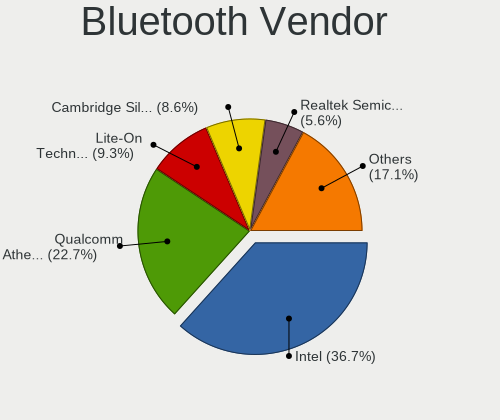

Linux in Brazil - Tested Hardware & Statistics
----------------------------------------------

A project to collect tested hardware configurations for Linux in Brazil.

Anyone can contribute to this report by the [hw-probe](https://github.com/linuxhw/hw-probe) tool:

    sudo -E hw-probe -all -upload

Please contribute! Especially if your hardware is rare.

This is a report for all computer types. See also reports for [desktops](/Location/Brazil/Desktop/README.md) and [notebooks](/Location/Brazil/Notebook/README.md).

Contents
--------

* [ Test Cases ](#test-cases)

* [ System ](#system)
  - [ OS                       ](#os)
  - [ OS Family                ](#os-family)
  - [ Kernel                   ](#kernel)
  - [ Kernel Family            ](#kernel-family)
  - [ Kernel Major Ver.        ](#kernel-major-ver)
  - [ Arch                     ](#arch)
  - [ DE                       ](#de)
  - [ Display Server           ](#display-server)
  - [ Display Manager          ](#display-manager)
  - [ OS Lang                  ](#os-lang)
  - [ Boot Mode                ](#boot-mode)
  - [ Filesystem               ](#filesystem)
  - [ Part. scheme             ](#part-scheme)
  - [ Dual Boot with Linux/BSD ](#dual-boot-with-linuxbsd)
  - [ Dual Boot (Win)          ](#dual-boot-win)

* [ Board ](#board)
  - [ Vendor                   ](#vendor)
  - [ Model                    ](#model)
  - [ Model Family             ](#model-family)
  - [ MFG Year                 ](#mfg-year)
  - [ Form Factor              ](#form-factor)
  - [ Secure Boot              ](#secure-boot)
  - [ Coreboot                 ](#coreboot)
  - [ RAM Size                 ](#ram-size)
  - [ RAM Used                 ](#ram-used)
  - [ Total Drives             ](#total-drives)
  - [ Has CD-ROM               ](#has-cd-rom)
  - [ Has Ethernet             ](#has-ethernet)
  - [ Has WiFi                 ](#has-wifi)
  - [ Has Bluetooth            ](#has-bluetooth)

* [ Location ](#location)
  - [ Country                  ](#country)
  - [ City                     ](#city)

* [ Drives ](#drives)
  - [ Drive Vendor             ](#drive-vendor)
  - [ Drive Model              ](#drive-model)
  - [ HDD Vendor               ](#hdd-vendor)
  - [ SSD Vendor               ](#ssd-vendor)
  - [ Drive Kind               ](#drive-kind)
  - [ Drive Connector          ](#drive-connector)
  - [ Drive Size               ](#drive-size)
  - [ Space Total              ](#space-total)
  - [ Space Used               ](#space-used)
  - [ Malfunc. Drives          ](#malfunc-drives)
  - [ Malfunc. Drive Vendor    ](#malfunc-drive-vendor)
  - [ Malfunc. HDD Vendor      ](#malfunc-hdd-vendor)
  - [ Malfunc. Drive Kind      ](#malfunc-drive-kind)
  - [ Failed Drives            ](#failed-drives)
  - [ Failed Drive Vendor      ](#failed-drive-vendor)
  - [ Drive Status             ](#drive-status)

* [ Storage controller ](#storage-controller)
  - [ Storage Vendor           ](#storage-vendor)
  - [ Storage Model            ](#storage-model)
  - [ Storage Kind             ](#storage-kind)

* [ Processor ](#processor)
  - [ CPU Vendor               ](#cpu-vendor)
  - [ CPU Model                ](#cpu-model)
  - [ CPU Model Family         ](#cpu-model-family)
  - [ CPU Cores                ](#cpu-cores)
  - [ CPU Sockets              ](#cpu-sockets)
  - [ CPU Threads              ](#cpu-threads)
  - [ CPU Op-Modes             ](#cpu-op-modes)
  - [ CPU Microcode            ](#cpu-microcode)
  - [ CPU Microarch            ](#cpu-microarch)

* [ Graphics ](#graphics)
  - [ GPU Vendor               ](#gpu-vendor)
  - [ GPU Model                ](#gpu-model)
  - [ GPU Combo                ](#gpu-combo)
  - [ GPU Driver               ](#gpu-driver)
  - [ GPU Memory               ](#gpu-memory)

* [ Monitor ](#monitor)
  - [ Monitor Vendor           ](#monitor-vendor)
  - [ Monitor Model            ](#monitor-model)
  - [ Monitor Resolution       ](#monitor-resolution)
  - [ Monitor Diagonal         ](#monitor-diagonal)
  - [ Monitor Width            ](#monitor-width)
  - [ Aspect Ratio             ](#aspect-ratio)
  - [ Monitor Area             ](#monitor-area)
  - [ Pixel Density            ](#pixel-density)
  - [ Multiple Monitors        ](#multiple-monitors)

* [ Network ](#network)
  - [ Net Controller Vendor    ](#net-controller-vendor)
  - [ Net Controller Model     ](#net-controller-model)
  - [ Wireless Vendor          ](#wireless-vendor)
  - [ Wireless Model           ](#wireless-model)
  - [ Ethernet Vendor          ](#ethernet-vendor)
  - [ Ethernet Model           ](#ethernet-model)
  - [ Net Controller Kind      ](#net-controller-kind)
  - [ Used Controller          ](#used-controller)
  - [ NICs                     ](#nics)
  - [ IPv6                     ](#ipv6)

* [ Bluetooth ](#bluetooth)
  - [ Bluetooth Vendor         ](#bluetooth-vendor)
  - [ Bluetooth Model          ](#bluetooth-model)

* [ Sound ](#sound)
  - [ Sound Vendor             ](#sound-vendor)
  - [ Sound Model              ](#sound-model)

* [ Memory ](#memory)
  - [ Memory Vendor            ](#memory-vendor)
  - [ Memory Model             ](#memory-model)
  - [ Memory Kind              ](#memory-kind)
  - [ Memory Form Factor       ](#memory-form-factor)
  - [ Memory Size              ](#memory-size)
  - [ Memory Speed             ](#memory-speed)

* [ Printers & scanners ](#printers--scanners)
  - [ Printer Vendor           ](#printer-vendor)
  - [ Printer Model            ](#printer-model)
  - [ Scanner Vendor           ](#scanner-vendor)
  - [ Scanner Model            ](#scanner-model)

* [ Camera ](#camera)
  - [ Camera Vendor            ](#camera-vendor)
  - [ Camera Model             ](#camera-model)

* [ Security ](#security)
  - [ Fingerprint Vendor       ](#fingerprint-vendor)
  - [ Fingerprint Model        ](#fingerprint-model)
  - [ Chipcard Vendor          ](#chipcard-vendor)
  - [ Chipcard Model           ](#chipcard-model)

* [ Unsupported ](#unsupported)
  - [ Unsupported Devices      ](#unsupported-devices)
  - [ Unsupported Device Types ](#unsupported-device-types)

Test Cases
----------

Total: 21273

| Vendor        | Model                       | Form-Factor | Probe                                                      | Date         |
|---------------|-----------------------------|-------------|------------------------------------------------------------|--------------|
| Intel         | H61                         | Desktop     | [a10f481c10](https://linux-hardware.org/?probe=a10f481c10) | Dec 24, 2023 |
| Valve         | Jupiter                     | Notebook    | [19f8d4f0b4](https://linux-hardware.org/?probe=19f8d4f0b4) | Dec 24, 2023 |
| Dell          | 0PV3YR A05                  | Server      | [43718a5746](https://linux-hardware.org/?probe=43718a5746) | Dec 24, 2023 |
| Samsung       | RV415/RV515                 | Notebook    | [da980644b4](https://linux-hardware.org/?probe=da980644b4) | Dec 24, 2023 |
| Intel         | B85                         | Desktop     | [5b462c9ed1](https://linux-hardware.org/?probe=5b462c9ed1) | Dec 24, 2023 |
| Notebook      | NJx0MU                      | Notebook    | [b57fdd9854](https://linux-hardware.org/?probe=b57fdd9854) | Dec 24, 2023 |
| Acer          | Nitro AN515-44              | Notebook    | [cc87c11e7b](https://linux-hardware.org/?probe=cc87c11e7b) | Dec 24, 2023 |
| Gigabyte      | GA-78LMT-USB3               | Desktop     | [dd658b1151](https://linux-hardware.org/?probe=dd658b1151) | Dec 23, 2023 |
| ASUSTek       | TUF B360-PLUS GAMING        | Desktop     | [b1c3408d24](https://linux-hardware.org/?probe=b1c3408d24) | Dec 23, 2023 |
| Acer          | Nitro AN515-51              | Notebook    | [52a7a4d6d8](https://linux-hardware.org/?probe=52a7a4d6d8) | Dec 23, 2023 |
| Lenovo        | IdeaPad S145-15IGM 81WT     | Notebook    | [d409d2fe79](https://linux-hardware.org/?probe=d409d2fe79) | Dec 23, 2023 |
| Lenovo        | IdeaPad S145-15IGM 81WT     | Notebook    | [eae7bab112](https://linux-hardware.org/?probe=eae7bab112) | Dec 23, 2023 |
| ASUSTek       | PRIME A320M-K               | Desktop     | [aaf6ab3d26](https://linux-hardware.org/?probe=aaf6ab3d26) | Dec 23, 2023 |
| Dell          | 0NW73C A00                  | Desktop     | [5ac83b9740](https://linux-hardware.org/?probe=5ac83b9740) | Dec 23, 2023 |
| Lenovo        | ThinkPad E14 20RB000UBR     | Notebook    | [d65cca0578](https://linux-hardware.org/?probe=d65cca0578) | Dec 22, 2023 |
| Intel         | H61                         | Desktop     | [72c7724ef0](https://linux-hardware.org/?probe=72c7724ef0) | Dec 22, 2023 |
| Colorful T... | A320M-M.2 PRO V15           | Desktop     | [821494cfbf](https://linux-hardware.org/?probe=821494cfbf) | Dec 22, 2023 |
| Positivo      | W940TU                      | Notebook    | [40dff18a74](https://linux-hardware.org/?probe=40dff18a74) | Dec 22, 2023 |
| ASUSTek       | PRIME A320M-K               | Desktop     | [c83a6a5f5d](https://linux-hardware.org/?probe=c83a6a5f5d) | Dec 22, 2023 |
| PCWare        | IPMH61R3                    | Desktop     | [891c2058a8](https://linux-hardware.org/?probe=891c2058a8) | Dec 22, 2023 |
| Acer          | Nitro AN515-44              | Notebook    | [5f1c04a086](https://linux-hardware.org/?probe=5f1c04a086) | Dec 22, 2023 |
| Dell          | Inspiron 7572               | Notebook    | [b6a03a82a6](https://linux-hardware.org/?probe=b6a03a82a6) | Dec 22, 2023 |
| MACHINIST     | X99-RS9 V2.0                | Desktop     | [e0cd6655cb](https://linux-hardware.org/?probe=e0cd6655cb) | Dec 22, 2023 |
| Gigabyte      | B450M GAMING                | Desktop     | [1767c5b291](https://linux-hardware.org/?probe=1767c5b291) | Dec 21, 2023 |
| Dell          | 0HD5W2 A00                  | Desktop     | [2bd748691b](https://linux-hardware.org/?probe=2bd748691b) | Dec 21, 2023 |
| Gigabyte      | B560M AORUS ELITE           | Desktop     | [82304c2a5f](https://linux-hardware.org/?probe=82304c2a5f) | Dec 21, 2023 |
| Lenovo        | IdeaPad 3 15ALC6 82MF       | Notebook    | [808fe0568d](https://linux-hardware.org/?probe=808fe0568d) | Dec 21, 2023 |
| Dell          | Inspiron 5448               | Notebook    | [edf818740d](https://linux-hardware.org/?probe=edf818740d) | Dec 21, 2023 |
| Lenovo        | SHARKBAY 0B98401 PRO        | Desktop     | [2675cca8c2](https://linux-hardware.org/?probe=2675cca8c2) | Dec 21, 2023 |
| Dell          | Vostro 3550                 | Notebook    | [2c9d7daa8b](https://linux-hardware.org/?probe=2c9d7daa8b) | Dec 21, 2023 |
| Dell          | Inspiron 7572               | Notebook    | [cd9385a64b](https://linux-hardware.org/?probe=cd9385a64b) | Dec 21, 2023 |
| Alienware     | m16 R1 AMD                  | Notebook    | [8fc737975c](https://linux-hardware.org/?probe=8fc737975c) | Dec 21, 2023 |
| MSI           | B150M MORTAR                | Desktop     | [d0276bd5b7](https://linux-hardware.org/?probe=d0276bd5b7) | Dec 20, 2023 |
| Valve         | Jupiter                     | Notebook    | [aecbb83cd6](https://linux-hardware.org/?probe=aecbb83cd6) | Dec 20, 2023 |
| Unknown       | Orange Pi 5B                | Soc         | [f809840436](https://linux-hardware.org/?probe=f809840436) | Dec 20, 2023 |
| Unknown       | Generic RK322x TV Box       | Mini pc     | [6b0274e802](https://linux-hardware.org/?probe=6b0274e802) | Dec 20, 2023 |
| ASUSTek       | X556URK                     | Notebook    | [b4f01c5bd5](https://linux-hardware.org/?probe=b4f01c5bd5) | Dec 19, 2023 |
| Daten Tecn... | DT02-M4                     | Notebook    | [8f754589f6](https://linux-hardware.org/?probe=8f754589f6) | Dec 19, 2023 |
| ANGXUN        | X79-VG2 V1.3                | Desktop     | [532c5b5ddc](https://linux-hardware.org/?probe=532c5b5ddc) | Dec 19, 2023 |
| Gigabyte      | 970-GAMING                  | Desktop     | [403d617fdd](https://linux-hardware.org/?probe=403d617fdd) | Dec 19, 2023 |
| ASUSTek       | TUF Gaming Z690-PLUS D4     | Desktop     | [ec86cf0c12](https://linux-hardware.org/?probe=ec86cf0c12) | Dec 19, 2023 |
| ASUSTek       | P8H61-M LX3 PLUS R2.0       | Desktop     | [bd012749e2](https://linux-hardware.org/?probe=bd012749e2) | Dec 19, 2023 |
| Gigabyte      | B450M DS3H-CF               | Desktop     | [cc583aec32](https://linux-hardware.org/?probe=cc583aec32) | Dec 19, 2023 |
| Biostar       | A320MH                      | Desktop     | [9ec714a02b](https://linux-hardware.org/?probe=9ec714a02b) | Dec 19, 2023 |
| Acer          | Nitro AN515-43              | Notebook    | [963de967ae](https://linux-hardware.org/?probe=963de967ae) | Dec 19, 2023 |
| ECS           | H61H2-M2                    | Desktop     | [d38a6ca473](https://linux-hardware.org/?probe=d38a6ca473) | Dec 19, 2023 |
| Intel         | DH61WW AAG23116-206         | Desktop     | [c387c14ff7](https://linux-hardware.org/?probe=c387c14ff7) | Dec 18, 2023 |
| Intel         | DH61WW AAG23116-206         | Desktop     | [a1760c437e](https://linux-hardware.org/?probe=a1760c437e) | Dec 18, 2023 |
| Acer          | Aspire E5-571               | Notebook    | [55a802f43c](https://linux-hardware.org/?probe=55a802f43c) | Dec 18, 2023 |
| Dell          | Latitude 3420               | Notebook    | [5fdda723cd](https://linux-hardware.org/?probe=5fdda723cd) | Dec 18, 2023 |
| MSI           | B560M PRO-E                 | Desktop     | [f8bcb73f0b](https://linux-hardware.org/?probe=f8bcb73f0b) | Dec 18, 2023 |
| GPD           | G1619-04                    | Notebook    | [63b517665b](https://linux-hardware.org/?probe=63b517665b) | Dec 18, 2023 |
| Gigabyte      | B550M AORUS ELITE           | Desktop     | [e4935d995b](https://linux-hardware.org/?probe=e4935d995b) | Dec 18, 2023 |
| Gigabyte      | B550M AORUS ELITE           | Desktop     | [6d6246b5bf](https://linux-hardware.org/?probe=6d6246b5bf) | Dec 18, 2023 |
| Toshiba       | IS 1413G                    | Notebook    | [458a8fb3f1](https://linux-hardware.org/?probe=458a8fb3f1) | Dec 18, 2023 |
| Dell          | G3 3590                     | Notebook    | [15decf2dfc](https://linux-hardware.org/?probe=15decf2dfc) | Dec 18, 2023 |
| Dell          | 0PV3YR A05                  | Server      | [ec4da8d1a3](https://linux-hardware.org/?probe=ec4da8d1a3) | Dec 18, 2023 |
| Samsung       | 550P5C/550P7C               | Notebook    | [b06e8fbef4](https://linux-hardware.org/?probe=b06e8fbef4) | Dec 18, 2023 |
| Acer          | Nitro AN515-57              | Notebook    | [1bd5e5e36f](https://linux-hardware.org/?probe=1bd5e5e36f) | Dec 18, 2023 |
| Compal        | PBL1011                     | Notebook    | [8983f2e331](https://linux-hardware.org/?probe=8983f2e331) | Dec 18, 2023 |
| Acer          | Nitro AN517-54              | Notebook    | [c18f5d3a21](https://linux-hardware.org/?probe=c18f5d3a21) | Dec 18, 2023 |
| Acer          | Nitro AN517-54              | Notebook    | [982ae3655c](https://linux-hardware.org/?probe=982ae3655c) | Dec 18, 2023 |
| ASRock        | H61M-HP4                    | Desktop     | [05fe81411e](https://linux-hardware.org/?probe=05fe81411e) | Dec 18, 2023 |
| Biostar       | B550MH                      | Desktop     | [32131b6631](https://linux-hardware.org/?probe=32131b6631) | Dec 17, 2023 |
| Biostar       | B550MH                      | Desktop     | [97d9affd9d](https://linux-hardware.org/?probe=97d9affd9d) | Dec 17, 2023 |
| ASUSTek       | T102HA                      | Tablet      | [ddf72aef4e](https://linux-hardware.org/?probe=ddf72aef4e) | Dec 17, 2023 |
| Dell          | 07N90W A02                  | Desktop     | [0c471e8b44](https://linux-hardware.org/?probe=0c471e8b44) | Dec 17, 2023 |
| ASUSTek       | TUF H310M-PLUS GAMING/BR    | Desktop     | [b6b44f1b80](https://linux-hardware.org/?probe=b6b44f1b80) | Dec 17, 2023 |
| Notebook      | NJx0MU                      | Notebook    | [1446130ae9](https://linux-hardware.org/?probe=1446130ae9) | Dec 17, 2023 |
| Toshiba       | IS 1413G                    | Notebook    | [dde306e444](https://linux-hardware.org/?probe=dde306e444) | Dec 17, 2023 |
| ASRock        | H310CM-HG4                  | Desktop     | [4e47d91bc7](https://linux-hardware.org/?probe=4e47d91bc7) | Dec 17, 2023 |
| Dell          | 053CWD A00                  | Desktop     | [6cee8cbfd7](https://linux-hardware.org/?probe=6cee8cbfd7) | Dec 17, 2023 |
| Dell          | 0PV3YR A05                  | Server      | [720421dab6](https://linux-hardware.org/?probe=720421dab6) | Dec 17, 2023 |
| Notebook      | NJx0MU                      | Notebook    | [80281cb193](https://linux-hardware.org/?probe=80281cb193) | Dec 17, 2023 |
| Dell          | Inspiron N4030              | Notebook    | [a77869199a](https://linux-hardware.org/?probe=a77869199a) | Dec 17, 2023 |
| Samsung       | 550XDA                      | Notebook    | [10ec283ed4](https://linux-hardware.org/?probe=10ec283ed4) | Dec 17, 2023 |
| Samsung       | RV410/RV510/S3510/E3510     | Notebook    | [be717cf064](https://linux-hardware.org/?probe=be717cf064) | Dec 16, 2023 |
| Dell          | Inspiron 15-3567            | Notebook    | [570a822273](https://linux-hardware.org/?probe=570a822273) | Dec 16, 2023 |
| Intel         | SHARKBAY                    | Desktop     | [efe58ba5df](https://linux-hardware.org/?probe=efe58ba5df) | Dec 16, 2023 |
| OEM           | B75 Ver:1.41                | Desktop     | [4117a986c8](https://linux-hardware.org/?probe=4117a986c8) | Dec 16, 2023 |
| Dell          | Inspiron 3583               | Notebook    | [890cf9cc41](https://linux-hardware.org/?probe=890cf9cc41) | Dec 16, 2023 |
| Gigabyte      | H410M H V3                  | Desktop     | [7da400b028](https://linux-hardware.org/?probe=7da400b028) | Dec 16, 2023 |
| Dell          | Vostro 5490                 | Notebook    | [ca117be9d4](https://linux-hardware.org/?probe=ca117be9d4) | Dec 16, 2023 |
| Acer          | Nitro AN515-51              | Notebook    | [de83793263](https://linux-hardware.org/?probe=de83793263) | Dec 16, 2023 |
| PCWare        | IPMH61R3                    | Desktop     | [ecac398c88](https://linux-hardware.org/?probe=ecac398c88) | Dec 15, 2023 |
| Toshiba       | IS 1413G                    | Notebook    | [09d89c7989](https://linux-hardware.org/?probe=09d89c7989) | Dec 15, 2023 |
| MSI           | PRO B650-P WIFI             | Desktop     | [06ed7608bf](https://linux-hardware.org/?probe=06ed7608bf) | Dec 15, 2023 |
| Dell          | Inspiron 1525               | Notebook    | [b9daaa5978](https://linux-hardware.org/?probe=b9daaa5978) | Dec 15, 2023 |
| ASUSTek       | H81M-CS/BR                  | Desktop     | [39094226f9](https://linux-hardware.org/?probe=39094226f9) | Dec 15, 2023 |
| Supermicro    | X10SAE                      | Server      | [a3dda288d1](https://linux-hardware.org/?probe=a3dda288d1) | Dec 15, 2023 |
| Acer          | Nitro AN515-57              | Notebook    | [7e43febcae](https://linux-hardware.org/?probe=7e43febcae) | Dec 15, 2023 |
| HP            | OMEN by Laptop 16-c0xxx     | Notebook    | [a043c13550](https://linux-hardware.org/?probe=a043c13550) | Dec 14, 2023 |
| ASUSTek       | TUF Gaming B650M-PLUS       | Desktop     | [a142ccc9e7](https://linux-hardware.org/?probe=a142ccc9e7) | Dec 14, 2023 |
| Dell          | 0NW6H5 A00                  | Desktop     | [eb487bbab2](https://linux-hardware.org/?probe=eb487bbab2) | Dec 14, 2023 |
| Intel         | DH61BF AAG81311-101         | Desktop     | [9d6455339e](https://linux-hardware.org/?probe=9d6455339e) | Dec 14, 2023 |
| MSI           | MEG Z390 GODLIKE            | Desktop     | [e384ee26a6](https://linux-hardware.org/?probe=e384ee26a6) | Dec 14, 2023 |
| Acer          | Nitro AN517-54              | Notebook    | [c16cb0947e](https://linux-hardware.org/?probe=c16cb0947e) | Dec 14, 2023 |
| Dell          | G15 5520                    | Notebook    | [12b6fa0914](https://linux-hardware.org/?probe=12b6fa0914) | Dec 14, 2023 |
| Biostar       | X370GT3                     | Desktop     | [b910738e8f](https://linux-hardware.org/?probe=b910738e8f) | Dec 14, 2023 |
| Dell          | Inspiron 7560               | Notebook    | [83034fb404](https://linux-hardware.org/?probe=83034fb404) | Dec 14, 2023 |
| Lenovo        | IdeaPad Gaming 3 15IHU6 ... | Notebook    | [d2b1e67451](https://linux-hardware.org/?probe=d2b1e67451) | Dec 14, 2023 |
| Dell          | G15 5520                    | Notebook    | [d212fe82aa](https://linux-hardware.org/?probe=d212fe82aa) | Dec 14, 2023 |
| Acer          | Nitro AN515-45              | Notebook    | [1ff0d683f4](https://linux-hardware.org/?probe=1ff0d683f4) | Dec 13, 2023 |
| Acer          | Nitro AN515-51              | Notebook    | [1522c84fb7](https://linux-hardware.org/?probe=1522c84fb7) | Dec 13, 2023 |
| Positivo      | POS-PIQ57BQ POSITIVO        | Desktop     | [1a2fe7c9ef](https://linux-hardware.org/?probe=1a2fe7c9ef) | Dec 13, 2023 |
| Lenovo        | IdeaPad Gaming 3 15IHU6 ... | Notebook    | [bd8707be32](https://linux-hardware.org/?probe=bd8707be32) | Dec 13, 2023 |
| Dell          | Latitude E5470              | Notebook    | [cc7982deb0](https://linux-hardware.org/?probe=cc7982deb0) | Dec 13, 2023 |
| Dell          | Inspiron 15 5510            | Notebook    | [41dbdcf594](https://linux-hardware.org/?probe=41dbdcf594) | Dec 13, 2023 |
| Dell          | Latitude 3420               | Notebook    | [b344d71410](https://linux-hardware.org/?probe=b344d71410) | Dec 13, 2023 |
| Positivo      | POS-PIH81DL                 | Desktop     | [55cf834e17](https://linux-hardware.org/?probe=55cf834e17) | Dec 13, 2023 |
| Dell          | System XPS L502X            | Notebook    | [75c612f90d](https://linux-hardware.org/?probe=75c612f90d) | Dec 13, 2023 |
| Dell          | G3 3590                     | Notebook    | [e764bfc760](https://linux-hardware.org/?probe=e764bfc760) | Dec 13, 2023 |
| Acer          | Aspire A515-51G             | Notebook    | [295f9127b0](https://linux-hardware.org/?probe=295f9127b0) | Dec 12, 2023 |
| Acer          | Aspire A515-45              | Notebook    | [74dc572dd7](https://linux-hardware.org/?probe=74dc572dd7) | Dec 12, 2023 |
| MACHINIST     | X79 Z9-D7 PRO V1.0          | Desktop     | [aaeef17ed2](https://linux-hardware.org/?probe=aaeef17ed2) | Dec 12, 2023 |
| Lenovo        | IdeaPad S145-15IWL 81S9     | Notebook    | [74c0490d28](https://linux-hardware.org/?probe=74c0490d28) | Dec 12, 2023 |
| Lenovo        | Unknown                     | Desktop     | [d49ddc416f](https://linux-hardware.org/?probe=d49ddc416f) | Dec 12, 2023 |
| Intel         | JSL MRD                     | Desktop     | [c811c8be03](https://linux-hardware.org/?probe=c811c8be03) | Dec 12, 2023 |
| Positivo      | H14BT58                     | Notebook    | [74530bb40a](https://linux-hardware.org/?probe=74530bb40a) | Dec 12, 2023 |
| Positivo      | CHT12CP                     | Notebook    | [d9d4327551](https://linux-hardware.org/?probe=d9d4327551) | Dec 12, 2023 |
| Acer          | Predator G3-572             | Notebook    | [7de00d4eab](https://linux-hardware.org/?probe=7de00d4eab) | Dec 12, 2023 |
| Acer          | Aspire A315-510P            | Notebook    | [e2bdedca29](https://linux-hardware.org/?probe=e2bdedca29) | Dec 12, 2023 |
| Gigabyte      | A520M H                     | Desktop     | [e72a787933](https://linux-hardware.org/?probe=e72a787933) | Dec 12, 2023 |
| ASUSTek       | VivoBook_ASUSLaptop M150... | Notebook    | [843d02bea4](https://linux-hardware.org/?probe=843d02bea4) | Dec 11, 2023 |
| Positivo      | Q464C                       | Notebook    | [47071c986c](https://linux-hardware.org/?probe=47071c986c) | Dec 11, 2023 |
| Samsung       | Q470C/500P4C                | Notebook    | [f904c4ea67](https://linux-hardware.org/?probe=f904c4ea67) | Dec 11, 2023 |
| Dell          | 07VWPG A01                  | Desktop     | [a9ad39cd38](https://linux-hardware.org/?probe=a9ad39cd38) | Dec 11, 2023 |
| Gigabyte      | GA-78LMT-S2P                | Desktop     | [132b7b57ba](https://linux-hardware.org/?probe=132b7b57ba) | Dec 11, 2023 |
| Unknown       | X99H                        | Desktop     | [799324c839](https://linux-hardware.org/?probe=799324c839) | Dec 11, 2023 |
| Dell          | Inspiron 3442               | Notebook    | [deced1a058](https://linux-hardware.org/?probe=deced1a058) | Dec 11, 2023 |
| Gigabyte      | GA-78LMT-S2P                | Desktop     | [3818e85705](https://linux-hardware.org/?probe=3818e85705) | Dec 11, 2023 |
| Intel         | H61                         | Desktop     | [611b51b6c1](https://linux-hardware.org/?probe=611b51b6c1) | Dec 11, 2023 |
| ASUSTek       | TUF Gaming Z590-PLUS        | Desktop     | [4b2be67e0f](https://linux-hardware.org/?probe=4b2be67e0f) | Dec 11, 2023 |
| Dell          | System XPS L502X            | Notebook    | [a612ae1881](https://linux-hardware.org/?probe=a612ae1881) | Dec 11, 2023 |
| Intel         | HM570                       | Desktop     | [a0f2eecda0](https://linux-hardware.org/?probe=a0f2eecda0) | Dec 11, 2023 |
| PCWare        | IPMH61R1                    | Desktop     | [0d3a1ef029](https://linux-hardware.org/?probe=0d3a1ef029) | Dec 11, 2023 |
| Gigabyte      | AB350M-DS3H V2-CF           | Desktop     | [66edf53f93](https://linux-hardware.org/?probe=66edf53f93) | Dec 10, 2023 |
| Gigabyte      | B550M AORUS ELITE           | Desktop     | [60ea2483e2](https://linux-hardware.org/?probe=60ea2483e2) | Dec 10, 2023 |
| Lenovo        | IdeaPad Gaming 3 15IHU6 ... | Notebook    | [4af70588d9](https://linux-hardware.org/?probe=4af70588d9) | Dec 10, 2023 |
| Acer          | Aspire 5750                 | Notebook    | [bedb502b74](https://linux-hardware.org/?probe=bedb502b74) | Dec 10, 2023 |
| Pegatron      | IPMH61P1                    | Desktop     | [0d0474a798](https://linux-hardware.org/?probe=0d0474a798) | Dec 10, 2023 |
| Acer          | Aspire A515-57              | Notebook    | [1adc377142](https://linux-hardware.org/?probe=1adc377142) | Dec 10, 2023 |
| Daten Tecn... | DA75PRO                     | Desktop     | [a4e18252cc](https://linux-hardware.org/?probe=a4e18252cc) | Dec 10, 2023 |
| MSI           | Modern 15 B7M               | Notebook    | [cc6c41e7fd](https://linux-hardware.org/?probe=cc6c41e7fd) | Dec 10, 2023 |
| MSI           | B550M PRO-VDH WIFI          | Desktop     | [e7872542e1](https://linux-hardware.org/?probe=e7872542e1) | Dec 10, 2023 |
| Gigabyte      | B650 GAMING X AX            | Desktop     | [e04ad23cd3](https://linux-hardware.org/?probe=e04ad23cd3) | Dec 10, 2023 |
| ASRock        | H310CM-HG4                  | Desktop     | [425eac625e](https://linux-hardware.org/?probe=425eac625e) | Dec 10, 2023 |
| PCWare        | IPMH310G PRO                | Desktop     | [2abdb88ca3](https://linux-hardware.org/?probe=2abdb88ca3) | Dec 09, 2023 |
| ASUSTek       | A88XM-A                     | Desktop     | [2b60976ef6](https://linux-hardware.org/?probe=2b60976ef6) | Dec 09, 2023 |
| Toshiba       | IS 1412                     | Notebook    | [b5f0453a4b](https://linux-hardware.org/?probe=b5f0453a4b) | Dec 09, 2023 |
| Gigabyte      | B650 GAMING X AX            | Desktop     | [b5f3fbe4c5](https://linux-hardware.org/?probe=b5f3fbe4c5) | Dec 09, 2023 |
| Dell          | Vostro 3550                 | Notebook    | [f1a1a0841c](https://linux-hardware.org/?probe=f1a1a0841c) | Dec 08, 2023 |
| Dell          | Inspiron 15 3520            | Notebook    | [6452783d8a](https://linux-hardware.org/?probe=6452783d8a) | Dec 08, 2023 |
| ASUSTek       | VivoBook_ASUSLaptop X513... | Notebook    | [9f878d8d30](https://linux-hardware.org/?probe=9f878d8d30) | Dec 08, 2023 |
| Acer          | Aspire A315-41              | Notebook    | [778176acbe](https://linux-hardware.org/?probe=778176acbe) | Dec 08, 2023 |
| ANGXUN        | X99 V1.0                    | Desktop     | [88919a1403](https://linux-hardware.org/?probe=88919a1403) | Dec 08, 2023 |
| ASUSTek       | TUF Gaming Z690-PLUS D4     | Desktop     | [2b349d78ce](https://linux-hardware.org/?probe=2b349d78ce) | Dec 07, 2023 |
| Biostar       | A520MH                      | Desktop     | [de9fc0f8f2](https://linux-hardware.org/?probe=de9fc0f8f2) | Dec 07, 2023 |
| Dell          | 0NK5PH A00                  | Desktop     | [d96cb11edc](https://linux-hardware.org/?probe=d96cb11edc) | Dec 07, 2023 |
| Pegatron      | IPMH61P1                    | Desktop     | [264229998e](https://linux-hardware.org/?probe=264229998e) | Dec 07, 2023 |
| Dell          | 0NW73C A00                  | Desktop     | [4c87b0a972](https://linux-hardware.org/?probe=4c87b0a972) | Dec 07, 2023 |
| Intel         | JSL MRD                     | Desktop     | [fb3b75c8cc](https://linux-hardware.org/?probe=fb3b75c8cc) | Dec 07, 2023 |
| ASUSTek       | VivoBook_ASUSLaptop X513... | Notebook    | [88ed0c98a0](https://linux-hardware.org/?probe=88ed0c98a0) | Dec 07, 2023 |
| Samsung       | 550XDA                      | Notebook    | [6501dce45c](https://linux-hardware.org/?probe=6501dce45c) | Dec 07, 2023 |
| Positivo      | Q4128C-S                    | Notebook    | [018aab637c](https://linux-hardware.org/?probe=018aab637c) | Dec 07, 2023 |
| Positivo B... | VJFE59F11X-B1011H           | Notebook    | [2f497e2103](https://linux-hardware.org/?probe=2f497e2103) | Dec 06, 2023 |
| Intel         | Unknown                     | Desktop     | [1e70326ef4](https://linux-hardware.org/?probe=1e70326ef4) | Dec 06, 2023 |
| Gigabyte      | AB350M-DS3H V2-CF           | Desktop     | [1f2c85d176](https://linux-hardware.org/?probe=1f2c85d176) | Dec 06, 2023 |
| Intel         | H61                         | Desktop     | [fbc4dc7436](https://linux-hardware.org/?probe=fbc4dc7436) | Dec 06, 2023 |
| ALDO          | C2016-BSWI-D2               | Desktop     | [4dec414c2e](https://linux-hardware.org/?probe=4dec414c2e) | Dec 06, 2023 |
| Dell          | 0P42M6 A01                  | Desktop     | [2deb37f773](https://linux-hardware.org/?probe=2deb37f773) | Dec 06, 2023 |
| ASUSTek       | K45A                        | Notebook    | [a5e618b2f9](https://linux-hardware.org/?probe=a5e618b2f9) | Dec 06, 2023 |
| ASUSTek       | K45A                        | Notebook    | [96d1051ede](https://linux-hardware.org/?probe=96d1051ede) | Dec 06, 2023 |
| YiFang        | NXM1106CWP                  | Tablet      | [2a43b298f8](https://linux-hardware.org/?probe=2a43b298f8) | Dec 06, 2023 |
| Acer          | Nitro AN515-57              | Notebook    | [5b38f6200a](https://linux-hardware.org/?probe=5b38f6200a) | Dec 06, 2023 |
| Dell          | Inspiron 7472               | Notebook    | [ef77efb220](https://linux-hardware.org/?probe=ef77efb220) | Dec 06, 2023 |
| ASUSTek       | M4A79XTD EVO                | Desktop     | [e52613f035](https://linux-hardware.org/?probe=e52613f035) | Dec 06, 2023 |
| Dell          | Precision 7720              | Notebook    | [da0616987d](https://linux-hardware.org/?probe=da0616987d) | Dec 05, 2023 |
| Dell          | 00V62H A01                  | Desktop     | [3a19753377](https://linux-hardware.org/?probe=3a19753377) | Dec 05, 2023 |
| Samsung       | RV419/RV420                 | Notebook    | [5f29bdfad1](https://linux-hardware.org/?probe=5f29bdfad1) | Dec 05, 2023 |
| ASRock        | B550M-HDV                   | Desktop     | [4ae43e0af1](https://linux-hardware.org/?probe=4ae43e0af1) | Dec 05, 2023 |
| Acer          | Aspire AV15-51              | Notebook    | [2691ac3f7d](https://linux-hardware.org/?probe=2691ac3f7d) | Dec 05, 2023 |
| Dell          | G7 7588                     | Notebook    | [8564f8e395](https://linux-hardware.org/?probe=8564f8e395) | Dec 05, 2023 |
| Valve         | Jupiter                     | Notebook    | [4ffa224365](https://linux-hardware.org/?probe=4ffa224365) | Dec 05, 2023 |
| Acer          | Aspire AV15-51              | Notebook    | [758a277d68](https://linux-hardware.org/?probe=758a277d68) | Dec 04, 2023 |
| Samsung       | 730QED                      | Convertible | [e7b8057036](https://linux-hardware.org/?probe=e7b8057036) | Dec 04, 2023 |
| Dell          | Inspiron 5567               | Notebook    | [03fe12170c](https://linux-hardware.org/?probe=03fe12170c) | Dec 04, 2023 |
| Lenovo        | SHARKBAY NOK                | Desktop     | [549c56d2f8](https://linux-hardware.org/?probe=549c56d2f8) | Dec 04, 2023 |
| Lenovo        | SHARKBAY NOK                | Desktop     | [9714fadd61](https://linux-hardware.org/?probe=9714fadd61) | Dec 04, 2023 |
| MSI           | B450 TOMAHAWK               | Desktop     | [56afeffd34](https://linux-hardware.org/?probe=56afeffd34) | Dec 04, 2023 |
| Samsung       | 550XDA                      | Notebook    | [b5bfe47576](https://linux-hardware.org/?probe=b5bfe47576) | Dec 04, 2023 |
| Intel         | B75                         | Desktop     | [4290424c1d](https://linux-hardware.org/?probe=4290424c1d) | Dec 04, 2023 |
| MSI           | Modern 15 B7M               | Notebook    | [f1757e8248](https://linux-hardware.org/?probe=f1757e8248) | Dec 04, 2023 |
| Gigabyte      | 970A-DS3P FX                | Desktop     | [675f997c0b](https://linux-hardware.org/?probe=675f997c0b) | Dec 03, 2023 |
| Gigabyte      | H81M-S2PH                   | Desktop     | [2cd108c526](https://linux-hardware.org/?probe=2cd108c526) | Dec 03, 2023 |
| Gigabyte      | 970A-DS3P                   | Desktop     | [6fce5f3dec](https://linux-hardware.org/?probe=6fce5f3dec) | Dec 03, 2023 |
| Gigabyte      | 970A-DS3P FX                | Desktop     | [358a92be0d](https://linux-hardware.org/?probe=358a92be0d) | Dec 03, 2023 |
| ASUSTek       | TUF Gaming B550M-PLUS       | Desktop     | [6c21c9ac7d](https://linux-hardware.org/?probe=6c21c9ac7d) | Dec 03, 2023 |
| Intel         | H61                         | Desktop     | [71c32c973c](https://linux-hardware.org/?probe=71c32c973c) | Dec 03, 2023 |
| Lenovo        | ThinkPad T14 Gen 2i 20W1... | Notebook    | [3222457362](https://linux-hardware.org/?probe=3222457362) | Dec 03, 2023 |
| Lenovo        | ThinkPad T480 20L6S9UY00    | Notebook    | [318a41e343](https://linux-hardware.org/?probe=318a41e343) | Dec 03, 2023 |
| Gigabyte      | B450M AORUS ELITE           | Desktop     | [369e921b6f](https://linux-hardware.org/?probe=369e921b6f) | Dec 03, 2023 |
| ASUSTek       | VivoBook_ASUSLaptop X515... | Notebook    | [a7c5eb788c](https://linux-hardware.org/?probe=a7c5eb788c) | Dec 03, 2023 |
| ASUSTek       | TUF Gaming X570-PLUS_BR     | Desktop     | [5aeec2e399](https://linux-hardware.org/?probe=5aeec2e399) | Dec 03, 2023 |
| Positivo      | POS-SIGL40BX POSITIVO       | Desktop     | [d6bdfaf7b5](https://linux-hardware.org/?probe=d6bdfaf7b5) | Dec 03, 2023 |
| ASUSTek       | VivoBook_ASUSLaptop X571... | Notebook    | [da6b435afa](https://linux-hardware.org/?probe=da6b435afa) | Dec 02, 2023 |
| Gigabyte      | Z490M GAMING X              | Desktop     | [39640ce07b](https://linux-hardware.org/?probe=39640ce07b) | Dec 02, 2023 |
| Apple         | Mac-35C5E08120C7EEAF Mac... | Mini pc     | [2492e6ae2e](https://linux-hardware.org/?probe=2492e6ae2e) | Dec 02, 2023 |
| Acer          | Aspire V5-472               | Notebook    | [c4839c409c](https://linux-hardware.org/?probe=c4839c409c) | Dec 02, 2023 |
| Acer          | Aspire V5-472               | Notebook    | [0dc4701502](https://linux-hardware.org/?probe=0dc4701502) | Dec 02, 2023 |
| Dell          | 02YRK5 A03                  | Desktop     | [ae544eff63](https://linux-hardware.org/?probe=ae544eff63) | Dec 02, 2023 |
| Gigabyte      | B450M DS3H-CF               | Desktop     | [ae8ecce4bd](https://linux-hardware.org/?probe=ae8ecce4bd) | Dec 02, 2023 |
| Gigabyte      | B450M DS3H-CF               | Desktop     | [0b017377f1](https://linux-hardware.org/?probe=0b017377f1) | Dec 02, 2023 |
| Dell          | Latitude 3540               | Notebook    | [64067574ad](https://linux-hardware.org/?probe=64067574ad) | Dec 02, 2023 |
| ASUSTek       | TUF B450M-PRO GAMING        | Desktop     | [6d97271c61](https://linux-hardware.org/?probe=6d97271c61) | Dec 02, 2023 |
| LG Electro... | 24V360 FAB2                 | All in one  | [d364581a07](https://linux-hardware.org/?probe=d364581a07) | Dec 02, 2023 |
| ASUSTek       | TUF B450M-PRO GAMING        | Desktop     | [0cff3cecd5](https://linux-hardware.org/?probe=0cff3cecd5) | Dec 02, 2023 |
| Dell          | G15 5510                    | Notebook    | [bdfca2648a](https://linux-hardware.org/?probe=bdfca2648a) | Dec 02, 2023 |
| ASUSTek       | M4A88TD-M EVO               | Desktop     | [2fcc002511](https://linux-hardware.org/?probe=2fcc002511) | Dec 02, 2023 |
| Dell          | Vostro 3525                 | Notebook    | [6d84ce1284](https://linux-hardware.org/?probe=6d84ce1284) | Dec 01, 2023 |
| ASUSTek       | M4A88TD-M EVO               | Desktop     | [7f6b5fd810](https://linux-hardware.org/?probe=7f6b5fd810) | Dec 01, 2023 |
| Dell          | Inspiron 15-3567            | Notebook    | [520e1bdfa8](https://linux-hardware.org/?probe=520e1bdfa8) | Dec 01, 2023 |
| Acer          | Aspire A515-45              | Notebook    | [9875097d6a](https://linux-hardware.org/?probe=9875097d6a) | Dec 01, 2023 |
| Lenovo        | IdeaPad 3 15IML05 82BS      | Notebook    | [32a0e568cc](https://linux-hardware.org/?probe=32a0e568cc) | Dec 01, 2023 |
| Intel         | B75                         | Desktop     | [488e28204b](https://linux-hardware.org/?probe=488e28204b) | Dec 01, 2023 |
| Lenovo        | ThinkPad E14 Gen 3 20YD0... | Notebook    | [dcbc9946d8](https://linux-hardware.org/?probe=dcbc9946d8) | Dec 01, 2023 |
| Lenovo        | ThinkPad E14 Gen 3 20YD0... | Notebook    | [95221dfaaf](https://linux-hardware.org/?probe=95221dfaaf) | Dec 01, 2023 |
| Dell          | Vostro 1510                 | Notebook    | [65480134bd](https://linux-hardware.org/?probe=65480134bd) | Dec 01, 2023 |
| HP            | Presario CQ43               | Notebook    | [5edf6adf85](https://linux-hardware.org/?probe=5edf6adf85) | Dec 01, 2023 |
| Dell          | Latitude E5410              | Notebook    | [074e7de8d8](https://linux-hardware.org/?probe=074e7de8d8) | Dec 01, 2023 |
| Multilaser    | PC31X                       | Notebook    | [1f63edb2f9](https://linux-hardware.org/?probe=1f63edb2f9) | Dec 01, 2023 |
| Intel         | X99H                        | Desktop     | [147f088343](https://linux-hardware.org/?probe=147f088343) | Dec 01, 2023 |
| ASUSTek       | PRIME B450M-GAMING/BR       | Desktop     | [14b776bc4a](https://linux-hardware.org/?probe=14b776bc4a) | Dec 01, 2023 |
| ASUSTek       | M5A78L-M/USB3               | Desktop     | [aa1896b627](https://linux-hardware.org/?probe=aa1896b627) | Nov 30, 2023 |
| Dell          | Inspiron 15 3515            | Notebook    | [162854d649](https://linux-hardware.org/?probe=162854d649) | Nov 30, 2023 |
| Gigabyte      | H110M-H-CF                  | Desktop     | [a17de72370](https://linux-hardware.org/?probe=a17de72370) | Nov 30, 2023 |
| ASUSTek       | P8H61-M LX3 R2.0            | Desktop     | [ad8164f124](https://linux-hardware.org/?probe=ad8164f124) | Nov 30, 2023 |
| Pegatron      | IPMIP-GS                    | Desktop     | [ebe5fd5255](https://linux-hardware.org/?probe=ebe5fd5255) | Nov 30, 2023 |
| Pegatron      | IPMIP-GS                    | Desktop     | [7b6f94666e](https://linux-hardware.org/?probe=7b6f94666e) | Nov 30, 2023 |
| Acer          | Predator PH315-52           | Notebook    | [bb1fc18586](https://linux-hardware.org/?probe=bb1fc18586) | Nov 30, 2023 |
| ASUSTek       | TUF H310M-PLUS GAMING/BR    | Desktop     | [cf7d8fdbf1](https://linux-hardware.org/?probe=cf7d8fdbf1) | Nov 30, 2023 |
| Gigabyte      | B450 AORUS M                | Desktop     | [4bac6b7cd5](https://linux-hardware.org/?probe=4bac6b7cd5) | Nov 30, 2023 |
| Samsung       | 550XDA                      | Notebook    | [5778304f73](https://linux-hardware.org/?probe=5778304f73) | Nov 30, 2023 |
| Gigabyte      | B450 AORUS M                | Desktop     | [ede8970ea9](https://linux-hardware.org/?probe=ede8970ea9) | Nov 30, 2023 |
| Dell          | G15 5511                    | Notebook    | [f77d3ad016](https://linux-hardware.org/?probe=f77d3ad016) | Nov 30, 2023 |
| ASUSTek       | ROG STRIX X470-F GAMING     | Desktop     | [a803eec9f3](https://linux-hardware.org/?probe=a803eec9f3) | Nov 30, 2023 |
| Dell          | Vostro 3500                 | Notebook    | [bd6506d274](https://linux-hardware.org/?probe=bd6506d274) | Nov 30, 2023 |
| MSI           | A320M-A PRO                 | Desktop     | [43e0c71549](https://linux-hardware.org/?probe=43e0c71549) | Nov 30, 2023 |
| ASUSTek       | C8HM70-I/HDMI               | Desktop     | [3284d74583](https://linux-hardware.org/?probe=3284d74583) | Nov 30, 2023 |
| AMI           | AMD                         | Notebook    | [9f3f9ba617](https://linux-hardware.org/?probe=9f3f9ba617) | Nov 29, 2023 |
| Avell High... | B.ON                        | Notebook    | [22a1430347](https://linux-hardware.org/?probe=22a1430347) | Nov 29, 2023 |
| Lenovo        | IdeaPad S145-15API 81V7     | Notebook    | [d9b203868f](https://linux-hardware.org/?probe=d9b203868f) | Nov 29, 2023 |
| Gigabyte      | A320M-S2H-CF                | Desktop     | [a05b28f5b1](https://linux-hardware.org/?probe=a05b28f5b1) | Nov 29, 2023 |
| Lenovo        | IdeaPad S145-15API 81V7     | Notebook    | [7db0c2781b](https://linux-hardware.org/?probe=7db0c2781b) | Nov 29, 2023 |
| HP            | Pavilion dv6                | Notebook    | [ddce26dd72](https://linux-hardware.org/?probe=ddce26dd72) | Nov 29, 2023 |
| HP            | Pavilion 11 x360 PC         | Notebook    | [c6f9c552b6](https://linux-hardware.org/?probe=c6f9c552b6) | Nov 29, 2023 |
| ASUSTek       | B85M-G R2.0                 | Desktop     | [11d3e45e2d](https://linux-hardware.org/?probe=11d3e45e2d) | Nov 29, 2023 |
| ASUSTek       | ROG STRIX Z390-I GAMING     | Desktop     | [bd474c263c](https://linux-hardware.org/?probe=bd474c263c) | Nov 29, 2023 |
| ASUSTek       | B85M-G R2.0                 | Desktop     | [d2dcb1f2da](https://linux-hardware.org/?probe=d2dcb1f2da) | Nov 29, 2023 |
| Acer          | Aspire 4732Z                | Notebook    | [6a849535fb](https://linux-hardware.org/?probe=6a849535fb) | Nov 29, 2023 |
| Dell          | Inspiron 15 3515            | Notebook    | [20007eacdb](https://linux-hardware.org/?probe=20007eacdb) | Nov 28, 2023 |
| Dell          | Inspiron 15 3515            | Notebook    | [e41d34ea1c](https://linux-hardware.org/?probe=e41d34ea1c) | Nov 28, 2023 |
| HP            | Presario CQ43               | Notebook    | [eaab50d59c](https://linux-hardware.org/?probe=eaab50d59c) | Nov 28, 2023 |
| Gigabyte      | G31-S3G                     | Desktop     | [895a8554b4](https://linux-hardware.org/?probe=895a8554b4) | Nov 28, 2023 |
| Dell          | Vostro 3583                 | Notebook    | [68c6f002f5](https://linux-hardware.org/?probe=68c6f002f5) | Nov 28, 2023 |
| Gigabyte      | A320M-S2H-CF                | Desktop     | [c4949cf710](https://linux-hardware.org/?probe=c4949cf710) | Nov 28, 2023 |
| Gigabyte      | X570S GAMING X              | Desktop     | [cc96f8e9bb](https://linux-hardware.org/?probe=cc96f8e9bb) | Nov 28, 2023 |
| ASUSTek       | TUF Gaming B550M-PLUS       | Desktop     | [33388f794b](https://linux-hardware.org/?probe=33388f794b) | Nov 28, 2023 |
| Lenovo        | IdeaPad S145-15IIL 82DJ     | Notebook    | [1eda316922](https://linux-hardware.org/?probe=1eda316922) | Nov 28, 2023 |
| Dell          | 03NVJ6 A03                  | Desktop     | [2eae8e704b](https://linux-hardware.org/?probe=2eae8e704b) | Nov 28, 2023 |
| Unknown       | Unknown                     | Desktop     | [34cbcf6478](https://linux-hardware.org/?probe=34cbcf6478) | Nov 28, 2023 |
| ASRock        | H310CM-HG4                  | Desktop     | [bd3a1b9c9a](https://linux-hardware.org/?probe=bd3a1b9c9a) | Nov 28, 2023 |
| ASUSTek       | PRIME X670-P                | Desktop     | [1ace58fcdf](https://linux-hardware.org/?probe=1ace58fcdf) | Nov 28, 2023 |
| ASUSTek       | TUF Gaming B550M-PLUS       | Desktop     | [330921f980](https://linux-hardware.org/?probe=330921f980) | Nov 27, 2023 |
| Google        | Eve                         | Convertible | [d6e1955713](https://linux-hardware.org/?probe=d6e1955713) | Nov 27, 2023 |
| MSI           | Z97-GD65 GAMING             | Desktop     | [86230be0a7](https://linux-hardware.org/?probe=86230be0a7) | Nov 27, 2023 |
| Lenovo        | ThinkPad E480 20KQ000EBR    | Notebook    | [3531e02313](https://linux-hardware.org/?probe=3531e02313) | Nov 27, 2023 |
| Daten Tecn... | DCM3A-4                     | Notebook    | [66b8d06d48](https://linux-hardware.org/?probe=66b8d06d48) | Nov 27, 2023 |
| Apple         | Mac-031AEE4D24BFF0B1 Mac... | Mini pc     | [8a9e7f2ec1](https://linux-hardware.org/?probe=8a9e7f2ec1) | Nov 27, 2023 |
| Pegatron      | IPM41-D3                    | Desktop     | [0ce4abd06b](https://linux-hardware.org/?probe=0ce4abd06b) | Nov 27, 2023 |
| Positivo      | POS-EIH61CE SIM             | Desktop     | [85a576e6fc](https://linux-hardware.org/?probe=85a576e6fc) | Nov 27, 2023 |
| ASRock        | A320M-HD                    | Desktop     | [1138c4c71b](https://linux-hardware.org/?probe=1138c4c71b) | Nov 27, 2023 |
| Dell          | 02YRK5 A03                  | Desktop     | [3b55d8f733](https://linux-hardware.org/?probe=3b55d8f733) | Nov 27, 2023 |
| Dell          | Inspiron 5566               | Notebook    | [df3eed7cc0](https://linux-hardware.org/?probe=df3eed7cc0) | Nov 27, 2023 |
| Dell          | Vostro 1510                 | Notebook    | [8cb1e628c2](https://linux-hardware.org/?probe=8cb1e628c2) | Nov 27, 2023 |
| Lenovo        | ThinkPad T410 2522F25       | Notebook    | [d6988c10b5](https://linux-hardware.org/?probe=d6988c10b5) | Nov 27, 2023 |
| Lenovo        | ThinkPad T410 2522F25       | Notebook    | [aadbbad61f](https://linux-hardware.org/?probe=aadbbad61f) | Nov 27, 2023 |
| Intel         | H61                         | Desktop     | [5146767aa6](https://linux-hardware.org/?probe=5146767aa6) | Nov 26, 2023 |
| Positivo      | POS-EIH61CQ POSITIVO        | Desktop     | [bed32da0ed](https://linux-hardware.org/?probe=bed32da0ed) | Nov 26, 2023 |
| Intel         | B75                         | Desktop     | [fab278b6c3](https://linux-hardware.org/?probe=fab278b6c3) | Nov 26, 2023 |
| Valve         | Jupiter                     | Notebook    | [a208b7bd3a](https://linux-hardware.org/?probe=a208b7bd3a) | Nov 26, 2023 |
| Philco        | 14H                         | Notebook    | [f4256fe390](https://linux-hardware.org/?probe=f4256fe390) | Nov 26, 2023 |
| Acer          | Swift SF514-56T             | Notebook    | [687fc34fd5](https://linux-hardware.org/?probe=687fc34fd5) | Nov 26, 2023 |
| Lenovo        | Unknown                     | Notebook    | [504a4bd033](https://linux-hardware.org/?probe=504a4bd033) | Nov 26, 2023 |
| ASUSTek       | PRIME X470-PRO              | Desktop     | [47ec694370](https://linux-hardware.org/?probe=47ec694370) | Nov 26, 2023 |
| Dell          | 0NK5PH A00                  | Desktop     | [ed6b4827c0](https://linux-hardware.org/?probe=ed6b4827c0) | Nov 26, 2023 |
| HP            | Pavilion 14                 | Notebook    | [af5d0c670a](https://linux-hardware.org/?probe=af5d0c670a) | Nov 26, 2023 |
| Dell          | 0GYT9V A00                  | Desktop     | [a0fe7b3987](https://linux-hardware.org/?probe=a0fe7b3987) | Nov 26, 2023 |
| Dell          | 0NW73C A00                  | Desktop     | [eef7971d44](https://linux-hardware.org/?probe=eef7971d44) | Nov 26, 2023 |
| Dell          | 0NW73C A00                  | Desktop     | [9fd25914ff](https://linux-hardware.org/?probe=9fd25914ff) | Nov 26, 2023 |
| Intel         | H61 V124A                   | Desktop     | [eaa125b476](https://linux-hardware.org/?probe=eaa125b476) | Nov 26, 2023 |
| AMI           | Aptio CRB                   | Mini pc     | [8ce722dacd](https://linux-hardware.org/?probe=8ce722dacd) | Nov 26, 2023 |
| ASUSTek       | PRIME A520M-E               | Desktop     | [b8c7347da7](https://linux-hardware.org/?probe=b8c7347da7) | Nov 26, 2023 |
| Gigabyte      | B560M DS3H                  | Desktop     | [7130842b5a](https://linux-hardware.org/?probe=7130842b5a) | Nov 26, 2023 |
| AMI           | Aptio CRB                   | Mini pc     | [568b4fa435](https://linux-hardware.org/?probe=568b4fa435) | Nov 26, 2023 |
| Lenovo        | IdeaPad Gaming 3 15IMH05... | Notebook    | [0f05f2568e](https://linux-hardware.org/?probe=0f05f2568e) | Nov 25, 2023 |
| ASRock        | H470M-ITX/ac                | Desktop     | [5b558c30c8](https://linux-hardware.org/?probe=5b558c30c8) | Nov 25, 2023 |
| Foxconn       | H61MXT1/F2/-S/-V            | Desktop     | [0529750c82](https://linux-hardware.org/?probe=0529750c82) | Nov 25, 2023 |
| ASUSTek       | PRIME B550M-K               | Desktop     | [186ea5595b](https://linux-hardware.org/?probe=186ea5595b) | Nov 25, 2023 |
| Positivo      | C41TF                       | Notebook    | [09be1cbd3a](https://linux-hardware.org/?probe=09be1cbd3a) | Nov 25, 2023 |
| Gigabyte      | GA-78LMT-USB3 x.x           | Desktop     | [b9b8e57c7c](https://linux-hardware.org/?probe=b9b8e57c7c) | Nov 25, 2023 |
| Dell          | Latitude 7430               | Notebook    | [1074b5c005](https://linux-hardware.org/?probe=1074b5c005) | Nov 25, 2023 |
| ASRock        | G31M-S                      | Desktop     | [01866950a6](https://linux-hardware.org/?probe=01866950a6) | Nov 25, 2023 |
| Positivo      | POS-PIH55BX POSITIVO        | Desktop     | [5dd3b907da](https://linux-hardware.org/?probe=5dd3b907da) | Nov 25, 2023 |
| Lenovo        | IdeaPad 3 15ALC6 82MF       | Notebook    | [0c42791b33](https://linux-hardware.org/?probe=0c42791b33) | Nov 25, 2023 |
| Dell          | Inspiron 5468               | Notebook    | [3422c91458](https://linux-hardware.org/?probe=3422c91458) | Nov 24, 2023 |
| Positivo      | S14CT01                     | Notebook    | [c1b3f4bc65](https://linux-hardware.org/?probe=c1b3f4bc65) | Nov 24, 2023 |
| ASUSTek       | PRIME B450M-GAMING/BR       | Desktop     | [0f9d912f7f](https://linux-hardware.org/?probe=0f9d912f7f) | Nov 24, 2023 |
| Lenovo        | IdeaPad 320-15IKB 80YH      | Notebook    | [d69be34130](https://linux-hardware.org/?probe=d69be34130) | Nov 24, 2023 |
| A14CR         | Unknown                     | Notebook    | [c0924a368e](https://linux-hardware.org/?probe=c0924a368e) | Nov 24, 2023 |
| ASUSTek       | TUF Gaming B450M-PRO S      | Desktop     | [606a157eb4](https://linux-hardware.org/?probe=606a157eb4) | Nov 24, 2023 |
| HP            | G62                         | Notebook    | [9d6424c4cc](https://linux-hardware.org/?probe=9d6424c4cc) | Nov 24, 2023 |
| Gigabyte      | G41MT-S2P                   | Desktop     | [00ef59a95d](https://linux-hardware.org/?probe=00ef59a95d) | Nov 24, 2023 |
| ASUSTek       | VivoBook_ASUSLaptop X515... | Notebook    | [199f9814a0](https://linux-hardware.org/?probe=199f9814a0) | Nov 24, 2023 |
| Samsung       | 960XFH                      | Notebook    | [2ad3d93589](https://linux-hardware.org/?probe=2ad3d93589) | Nov 24, 2023 |
| Compaq        | 420                         | Notebook    | [651aec3a5c](https://linux-hardware.org/?probe=651aec3a5c) | Nov 24, 2023 |
| Compaq        | 420                         | Notebook    | [df09fad001](https://linux-hardware.org/?probe=df09fad001) | Nov 23, 2023 |
| ASUSTek       | PRIME B350-PLUS             | Desktop     | [ecad990a24](https://linux-hardware.org/?probe=ecad990a24) | Nov 23, 2023 |
| Samsung       | 270E5J/2570EJ               | Notebook    | [d6ab9c6df5](https://linux-hardware.org/?probe=d6ab9c6df5) | Nov 23, 2023 |
| Avell High... | A70 MOB                     | Notebook    | [d936aa95ef](https://linux-hardware.org/?probe=d936aa95ef) | Nov 23, 2023 |
| MSI           | A68HM-E33 V2                | Desktop     | [e257380edc](https://linux-hardware.org/?probe=e257380edc) | Nov 23, 2023 |
| Itautec       | SM 3322 SM-3322 Padrao 0... | Desktop     | [2cf2808a7f](https://linux-hardware.org/?probe=2cf2808a7f) | Nov 23, 2023 |
| HP            | ProBook 4430s               | Notebook    | [847fb6fb22](https://linux-hardware.org/?probe=847fb6fb22) | Nov 23, 2023 |
| Gigabyte      | B550I AORUS PRO AX          | Desktop     | [07e6828b2e](https://linux-hardware.org/?probe=07e6828b2e) | Nov 23, 2023 |
| Acer          | Aspire A515-57              | Notebook    | [676da26c54](https://linux-hardware.org/?probe=676da26c54) | Nov 23, 2023 |
| Colorful T... | iGame Z270 Ymir             | Desktop     | [62929668f5](https://linux-hardware.org/?probe=62929668f5) | Nov 23, 2023 |
| Gigabyte      | GA-78LMT-USB3 SEx           | Desktop     | [8414b3b3f1](https://linux-hardware.org/?probe=8414b3b3f1) | Nov 23, 2023 |
| HOUTER        | IPMIP-GS                    | Desktop     | [1daae127f8](https://linux-hardware.org/?probe=1daae127f8) | Nov 23, 2023 |
| HP            | ProBook 4430s               | Notebook    | [1b34dd379f](https://linux-hardware.org/?probe=1b34dd379f) | Nov 23, 2023 |
| HP            | 430                         | Notebook    | [a5ad87647a](https://linux-hardware.org/?probe=a5ad87647a) | Nov 23, 2023 |
| Acer          | Aspire ES1-531              | Notebook    | [01d429e284](https://linux-hardware.org/?probe=01d429e284) | Nov 22, 2023 |
| Lenovo        | IdeaPad 1 15AMN7 82X5       | Notebook    | [8d944b2cf7](https://linux-hardware.org/?probe=8d944b2cf7) | Nov 22, 2023 |
| Lenovo        | IdeaPad S145-15API 81V7     | Notebook    | [93a21a43d5](https://linux-hardware.org/?probe=93a21a43d5) | Nov 22, 2023 |
| Acer          | Aspire A515-51              | Notebook    | [b8a36c00e8](https://linux-hardware.org/?probe=b8a36c00e8) | Nov 22, 2023 |
| Lenovo        | IdeaPad S145-15API 81V7     | Notebook    | [e95ef90dec](https://linux-hardware.org/?probe=e95ef90dec) | Nov 22, 2023 |
| Dell          | Inspiron 5502               | Notebook    | [eb86dc0b36](https://linux-hardware.org/?probe=eb86dc0b36) | Nov 22, 2023 |
| Dell          | Latitude 7430               | Notebook    | [44557e3a83](https://linux-hardware.org/?probe=44557e3a83) | Nov 22, 2023 |
| ASUSTek       | VivoBook_ASUSLaptop X515... | Notebook    | [0a82a8edc6](https://linux-hardware.org/?probe=0a82a8edc6) | Nov 22, 2023 |
| ASUSTek       | VivoBook_ASUSLaptop X515... | Notebook    | [f30de31399](https://linux-hardware.org/?probe=f30de31399) | Nov 22, 2023 |
| Samsung       | 300E5EV/300E4EV/270E5EV/... | Notebook    | [2d0d992e3e](https://linux-hardware.org/?probe=2d0d992e3e) | Nov 22, 2023 |
| Positivo      | S14CT01                     | Notebook    | [dab6f65392](https://linux-hardware.org/?probe=dab6f65392) | Nov 22, 2023 |
| Positivo      | S14CT01                     | Notebook    | [b92cdc7457](https://linux-hardware.org/?probe=b92cdc7457) | Nov 22, 2023 |
| Samsung       | 530XBB                      | Notebook    | [c31efedbdf](https://linux-hardware.org/?probe=c31efedbdf) | Nov 22, 2023 |
| Dell          | Inspiron N5010              | Notebook    | [688d81c63c](https://linux-hardware.org/?probe=688d81c63c) | Nov 22, 2023 |
| Toshiba       | IS 1413G                    | Notebook    | [2f025c011d](https://linux-hardware.org/?probe=2f025c011d) | Nov 22, 2023 |
| Samsung       | 960XFH                      | Notebook    | [c8ff018414](https://linux-hardware.org/?probe=c8ff018414) | Nov 22, 2023 |
| Samsung       | 960XFH                      | Notebook    | [a379f59fb3](https://linux-hardware.org/?probe=a379f59fb3) | Nov 22, 2023 |
| Gigabyte      | A520M DS3H                  | Desktop     | [713583bc52](https://linux-hardware.org/?probe=713583bc52) | Nov 22, 2023 |
| Dell          | Inspiron 5547               | Notebook    | [d679a12a36](https://linux-hardware.org/?probe=d679a12a36) | Nov 21, 2023 |
| Intel         | DH55TC AAG26116-302         | Desktop     | [0edf2befff](https://linux-hardware.org/?probe=0edf2befff) | Nov 21, 2023 |
| Gigabyte      | Z390 M GAMING-CF            | Desktop     | [cc2aa981d3](https://linux-hardware.org/?probe=cc2aa981d3) | Nov 21, 2023 |
| Acer          | Aspire A515-54G             | Notebook    | [8e8de2388b](https://linux-hardware.org/?probe=8e8de2388b) | Nov 21, 2023 |
| Toshiba       | IS 1412                     | Notebook    | [0ed3e8195d](https://linux-hardware.org/?probe=0ed3e8195d) | Nov 21, 2023 |
| Dell          | 0PV3YR A05                  | Server      | [618916ad03](https://linux-hardware.org/?probe=618916ad03) | Nov 21, 2023 |
| HP            | 430                         | Notebook    | [65a26f2a32](https://linux-hardware.org/?probe=65a26f2a32) | Nov 21, 2023 |
| Samsung       | 550XDA                      | Notebook    | [4c1328b562](https://linux-hardware.org/?probe=4c1328b562) | Nov 21, 2023 |
| Gigabyte      | H510M H                     | Desktop     | [078c28606a](https://linux-hardware.org/?probe=078c28606a) | Nov 21, 2023 |
| Intel         | B75                         | Desktop     | [0620da2ddb](https://linux-hardware.org/?probe=0620da2ddb) | Nov 21, 2023 |
| ASUSTek       | PRIME B450M-GAMING/BR       | Desktop     | [a166dbb3cf](https://linux-hardware.org/?probe=a166dbb3cf) | Nov 20, 2023 |
| MACHINIST     | X99-RS9 V2.0                | Desktop     | [6e05364421](https://linux-hardware.org/?probe=6e05364421) | Nov 20, 2023 |
| ASUSTek       | VivoBook_ASUSLaptop X515... | Notebook    | [d6c8994c15](https://linux-hardware.org/?probe=d6c8994c15) | Nov 20, 2023 |
| Pegatron      | SM 3322                     | Desktop     | [aed1cc686d](https://linux-hardware.org/?probe=aed1cc686d) | Nov 20, 2023 |
| Pegatron      | SM 3322                     | Desktop     | [4f37480be5](https://linux-hardware.org/?probe=4f37480be5) | Nov 20, 2023 |
| Notebook      | NJx0MU                      | Notebook    | [96d6ec7f1f](https://linux-hardware.org/?probe=96d6ec7f1f) | Nov 20, 2023 |
| ECS           | H61H2-M2                    | Desktop     | [29293282c2](https://linux-hardware.org/?probe=29293282c2) | Nov 20, 2023 |
| Dell          | 0PV3YR A05                  | Server      | [66b4ff8f76](https://linux-hardware.org/?probe=66b4ff8f76) | Nov 20, 2023 |
| Notebook      | NJx0MU                      | Notebook    | [c0a0353d6f](https://linux-hardware.org/?probe=c0a0353d6f) | Nov 20, 2023 |
| Dell          | G15 5530                    | Notebook    | [0d608c0d48](https://linux-hardware.org/?probe=0d608c0d48) | Nov 20, 2023 |
| Acer          | Nitro AN517-54              | Notebook    | [b93c6fb412](https://linux-hardware.org/?probe=b93c6fb412) | Nov 20, 2023 |
| Digibras      | NH4CU53                     | Notebook    | [25fff3f773](https://linux-hardware.org/?probe=25fff3f773) | Nov 20, 2023 |
| Lenovo        | IdeaPad 320-15IKB 80YH      | Notebook    | [a8e951e3b6](https://linux-hardware.org/?probe=a8e951e3b6) | Nov 20, 2023 |
| HP            | Presario C700               | Notebook    | [c8a9963f71](https://linux-hardware.org/?probe=c8a9963f71) | Nov 19, 2023 |
| Intel         | B75                         | Desktop     | [f184a18fb9](https://linux-hardware.org/?probe=f184a18fb9) | Nov 19, 2023 |
| Intel         | H61                         | Desktop     | [bdab1dc80a](https://linux-hardware.org/?probe=bdab1dc80a) | Nov 19, 2023 |
| Gigabyte      | H61M-S1                     | Desktop     | [4106ef0cba](https://linux-hardware.org/?probe=4106ef0cba) | Nov 19, 2023 |
| Intel         | H61                         | Desktop     | [4b5806ba4c](https://linux-hardware.org/?probe=4b5806ba4c) | Nov 19, 2023 |
| Gigabyte      | B450M DS3H V2               | Desktop     | [ac68da4f7c](https://linux-hardware.org/?probe=ac68da4f7c) | Nov 19, 2023 |
| Lenovo        | IdeaPad S145-15API 81V7     | Notebook    | [5edc51a963](https://linux-hardware.org/?probe=5edc51a963) | Nov 19, 2023 |
| Acer          | Predator PH315-52           | Notebook    | [b53d35a567](https://linux-hardware.org/?probe=b53d35a567) | Nov 19, 2023 |
| Gigabyte      | A520M H                     | Desktop     | [abba035964](https://linux-hardware.org/?probe=abba035964) | Nov 19, 2023 |
| Dell          | Inspiron 5548               | Notebook    | [63fec114db](https://linux-hardware.org/?probe=63fec114db) | Nov 19, 2023 |
| ASUSTek       | VivoBook_ASUSLaptop X515... | Notebook    | [e26c4bc5ff](https://linux-hardware.org/?probe=e26c4bc5ff) | Nov 19, 2023 |
| Lenovo        | IdeaPad Gaming 3 15IHU6 ... | Notebook    | [97ebdb3c3a](https://linux-hardware.org/?probe=97ebdb3c3a) | Nov 19, 2023 |
| Dell          | Inspiron 15-5568            | Notebook    | [18712e5bfd](https://linux-hardware.org/?probe=18712e5bfd) | Nov 19, 2023 |
| Acer          | Aspire 5920                 | Notebook    | [ceafa361bc](https://linux-hardware.org/?probe=ceafa361bc) | Nov 19, 2023 |
| ASUSTek       | ASUS TUF Gaming F15 FX50... | Notebook    | [07aecd2eb5](https://linux-hardware.org/?probe=07aecd2eb5) | Nov 19, 2023 |
| Lenovo        | ThinkPad T480 20L6S9UY00    | Notebook    | [21433a0601](https://linux-hardware.org/?probe=21433a0601) | Nov 19, 2023 |
| Acer          | Nitro AN515-52              | Notebook    | [a9b37fa8a9](https://linux-hardware.org/?probe=a9b37fa8a9) | Nov 19, 2023 |
| Acer          | Nitro AN515-52              | Notebook    | [0e1fa61401](https://linux-hardware.org/?probe=0e1fa61401) | Nov 19, 2023 |
| ASUSTek       | VivoBook_ASUSLaptop X515... | Notebook    | [9073144bc1](https://linux-hardware.org/?probe=9073144bc1) | Nov 19, 2023 |
| Multilaser    | MLSH1H LINUX                | Notebook    | [5f9c8945b0](https://linux-hardware.org/?probe=5f9c8945b0) | Nov 18, 2023 |
| Intel         | H81                         | Desktop     | [1d1b5d11ec](https://linux-hardware.org/?probe=1d1b5d11ec) | Nov 18, 2023 |
| Dell          | Inspiron 5558               | Notebook    | [29cde3b62e](https://linux-hardware.org/?probe=29cde3b62e) | Nov 18, 2023 |
| MSI           | MAG B550 TOMAHAWK           | Desktop     | [37139a6fd4](https://linux-hardware.org/?probe=37139a6fd4) | Nov 18, 2023 |
| Acer          | Aspire E1-532               | Notebook    | [8ec5ebb443](https://linux-hardware.org/?probe=8ec5ebb443) | Nov 18, 2023 |
| Daten Tecn... | DCM4D-4 v4                  | Notebook    | [669208a0f6](https://linux-hardware.org/?probe=669208a0f6) | Nov 18, 2023 |
| Apple         | MacBookPro14,3              | Notebook    | [c8b5a88695](https://linux-hardware.org/?probe=c8b5a88695) | Nov 18, 2023 |
| Daten Tecn... | DCM4D-4 v4                  | Notebook    | [a8095f2a1a](https://linux-hardware.org/?probe=a8095f2a1a) | Nov 18, 2023 |
| Multilaser    | MLSH1H LINUX                | Notebook    | [01d7e1aa14](https://linux-hardware.org/?probe=01d7e1aa14) | Nov 18, 2023 |
| HP            | Compaq Presario CQ50        | Notebook    | [a61196eaad](https://linux-hardware.org/?probe=a61196eaad) | Nov 18, 2023 |
| HP            | Compaq Presario CQ50        | Notebook    | [b8b635e62f](https://linux-hardware.org/?probe=b8b635e62f) | Nov 18, 2023 |
| MACHINIST     | X99-RS9 V2.0                | Desktop     | [eeef8f244c](https://linux-hardware.org/?probe=eeef8f244c) | Nov 18, 2023 |
| Apple         | Mac-942B59F58194171B iMa... | All in one  | [a6f504cf47](https://linux-hardware.org/?probe=a6f504cf47) | Nov 17, 2023 |
| Compaq        | Presario CQ-17              | Notebook    | [7b53a480e4](https://linux-hardware.org/?probe=7b53a480e4) | Nov 17, 2023 |
| Compal        | PBL1011                     | Notebook    | [d015fafb32](https://linux-hardware.org/?probe=d015fafb32) | Nov 17, 2023 |
| Dell          | Vostro 15 5510              | Notebook    | [21505599dd](https://linux-hardware.org/?probe=21505599dd) | Nov 17, 2023 |
| Dell          | Latitude 5420               | Notebook    | [cc85910964](https://linux-hardware.org/?probe=cc85910964) | Nov 17, 2023 |
| Acer          | Aspire A515-51G             | Notebook    | [44d575bc98](https://linux-hardware.org/?probe=44d575bc98) | Nov 17, 2023 |
| MSI           | MAG B550 TOMAHAWK           | Desktop     | [57d850fe75](https://linux-hardware.org/?probe=57d850fe75) | Nov 17, 2023 |
| Toshiba       | IS 1413G                    | Notebook    | [97bc4b516e](https://linux-hardware.org/?probe=97bc4b516e) | Nov 17, 2023 |
| Dell          | Latitude 3540               | Notebook    | [85737e7d24](https://linux-hardware.org/?probe=85737e7d24) | Nov 17, 2023 |
| Huanan        | X99-8M-F V1.3               | Desktop     | [58b38ab609](https://linux-hardware.org/?probe=58b38ab609) | Nov 17, 2023 |
| Huanan        | X99-8M-F V1.3               | Desktop     | [db7291c1da](https://linux-hardware.org/?probe=db7291c1da) | Nov 17, 2023 |
| Acer          | Aspire A515-51G             | Notebook    | [18a6603dd9](https://linux-hardware.org/?probe=18a6603dd9) | Nov 17, 2023 |
| Intel         | DH55TC AAG26116-302         | Desktop     | [8a23e4f586](https://linux-hardware.org/?probe=8a23e4f586) | Nov 16, 2023 |
| MACHINIST     | E5 MR9A PRO MAX V1.1        | Desktop     | [199a544882](https://linux-hardware.org/?probe=199a544882) | Nov 16, 2023 |
| Dell          | Vostro 3300                 | Notebook    | [90986d4cf6](https://linux-hardware.org/?probe=90986d4cf6) | Nov 16, 2023 |
| ASUSTek       | P8H61-M LX3 R2.0            | Desktop     | [a32c2cc638](https://linux-hardware.org/?probe=a32c2cc638) | Nov 16, 2023 |
| LG Electro... | 22V30R FAB1                 | All in one  | [868b385080](https://linux-hardware.org/?probe=868b385080) | Nov 16, 2023 |
| Intel         | DH55TC AAG26116-302         | Desktop     | [7fabbf9cb1](https://linux-hardware.org/?probe=7fabbf9cb1) | Nov 16, 2023 |
| Samsung       | 550XDA                      | Notebook    | [a823e2b0a5](https://linux-hardware.org/?probe=a823e2b0a5) | Nov 16, 2023 |
| Dell          | Inspiron 5567               | Notebook    | [ae0f1ed771](https://linux-hardware.org/?probe=ae0f1ed771) | Nov 16, 2023 |
| Lenovo        | Legion S7 15ACH6 82K8       | Notebook    | [4c58693314](https://linux-hardware.org/?probe=4c58693314) | Nov 16, 2023 |
| HP            | Pavilion g4                 | Notebook    | [37d7289eb6](https://linux-hardware.org/?probe=37d7289eb6) | Nov 16, 2023 |
| Intel         | X99-P4 V1.0                 | Desktop     | [b4caa65027](https://linux-hardware.org/?probe=b4caa65027) | Nov 16, 2023 |
| Samsung       | 300E5M/300E5L               | Notebook    | [0f53418be5](https://linux-hardware.org/?probe=0f53418be5) | Nov 16, 2023 |
| Lenovo        | IdeaPad 3 15ALC6 82MF       | Notebook    | [f1ba9de4ad](https://linux-hardware.org/?probe=f1ba9de4ad) | Nov 16, 2023 |
| MSI           | Z97-G43 GAMING              | Desktop     | [86f598c692](https://linux-hardware.org/?probe=86f598c692) | Nov 16, 2023 |
| Acer          | Nitro AN515-54              | Notebook    | [0ab66fd189](https://linux-hardware.org/?probe=0ab66fd189) | Nov 16, 2023 |
| Dell          | 0478VN A00                  | Desktop     | [d2b8c293ea](https://linux-hardware.org/?probe=d2b8c293ea) | Nov 16, 2023 |
| Alienware     | m15 R6                      | Notebook    | [c341b25df2](https://linux-hardware.org/?probe=c341b25df2) | Nov 16, 2023 |
| ASUSTek       | VivoBook_ASUSLaptop X515... | Notebook    | [1fa32b3cb7](https://linux-hardware.org/?probe=1fa32b3cb7) | Nov 15, 2023 |
| Apple         | MacBookPro8,1               | Notebook    | [68dbf5814b](https://linux-hardware.org/?probe=68dbf5814b) | Nov 15, 2023 |
| Huanan        | X99-F8 GAMING V2.0          | Desktop     | [160e8325ba](https://linux-hardware.org/?probe=160e8325ba) | Nov 15, 2023 |
| Positivo      | POS-EIH61CE POSITIVO        | Desktop     | [fd1391a823](https://linux-hardware.org/?probe=fd1391a823) | Nov 15, 2023 |
| Lenovo        | IdeaPad 3 15ALC6 82MF       | Notebook    | [d4c7bc8dc8](https://linux-hardware.org/?probe=d4c7bc8dc8) | Nov 15, 2023 |
| Dell          | Vostro 3583                 | Notebook    | [4ddc04a5ba](https://linux-hardware.org/?probe=4ddc04a5ba) | Nov 15, 2023 |
| MSI           | B150M MORTAR                | Desktop     | [fb6bd38558](https://linux-hardware.org/?probe=fb6bd38558) | Nov 15, 2023 |
| MSI           | B150M MORTAR                | Desktop     | [78bfcd18a8](https://linux-hardware.org/?probe=78bfcd18a8) | Nov 15, 2023 |
| MACHINIST     | E5-RS9 V1.11                | Desktop     | [13df1b5b7e](https://linux-hardware.org/?probe=13df1b5b7e) | Nov 15, 2023 |
| ASUSTek       | PRIME B450M-GAMING/BR       | Desktop     | [adaa2215c6](https://linux-hardware.org/?probe=adaa2215c6) | Nov 15, 2023 |
| ECS           | H61H2-M2                    | Desktop     | [df572cd989](https://linux-hardware.org/?probe=df572cd989) | Nov 15, 2023 |
| Acer          | Aspire E1-572               | Notebook    | [c7c8df77be](https://linux-hardware.org/?probe=c7c8df77be) | Nov 15, 2023 |
| Intel         | B75                         | Desktop     | [b05bcd24eb](https://linux-hardware.org/?probe=b05bcd24eb) | Nov 15, 2023 |
| ASUSTek       | P5GC-MX/CKD/SI              | Desktop     | [08053c4143](https://linux-hardware.org/?probe=08053c4143) | Nov 15, 2023 |
| Sony          | VGN-NS130AE                 | Notebook    | [7a70acb426](https://linux-hardware.org/?probe=7a70acb426) | Nov 15, 2023 |
| Lenovo        | IdeaPad 3 15ALC6 82MF       | Notebook    | [0fe7515de5](https://linux-hardware.org/?probe=0fe7515de5) | Nov 15, 2023 |
| Dell          | Vostro 3583                 | Notebook    | [6bf67ac977](https://linux-hardware.org/?probe=6bf67ac977) | Nov 15, 2023 |
| Dell          | Vostro 15 3510              | Notebook    | [9c0b7c2706](https://linux-hardware.org/?probe=9c0b7c2706) | Nov 15, 2023 |
| Dell          | Inspiron 1545               | Notebook    | [fd459af24b](https://linux-hardware.org/?probe=fd459af24b) | Nov 15, 2023 |
| Toshiba       | STI 010433                  | Desktop     | [c172f735d2](https://linux-hardware.org/?probe=c172f735d2) | Nov 15, 2023 |
| Lenovo        | ThinkPad E14 20RBS25S00     | Notebook    | [3be8e07c6c](https://linux-hardware.org/?probe=3be8e07c6c) | Nov 14, 2023 |
| Dell          | Inspiron 3583               | Notebook    | [d014ceb833](https://linux-hardware.org/?probe=d014ceb833) | Nov 14, 2023 |
| MSI           | PRO H610M-G DDR4            | Desktop     | [1d0338a823](https://linux-hardware.org/?probe=1d0338a823) | Nov 14, 2023 |
| Gigabyte      | B550M AORUS ELITE           | Desktop     | [09ef1df759](https://linux-hardware.org/?probe=09ef1df759) | Nov 14, 2023 |
| Acer          | Predator PH315-53           | Notebook    | [f2a6eea13e](https://linux-hardware.org/?probe=f2a6eea13e) | Nov 14, 2023 |
| ASUSTek       | VivoBook_ASUSLaptop X515... | Notebook    | [4e7f0bb4bc](https://linux-hardware.org/?probe=4e7f0bb4bc) | Nov 14, 2023 |
| Phoenix/Si... | M730SR                      | Notebook    | [59e9d07293](https://linux-hardware.org/?probe=59e9d07293) | Nov 14, 2023 |
| Acer          | Aspire A515-51G             | Notebook    | [50a49f6aa3](https://linux-hardware.org/?probe=50a49f6aa3) | Nov 14, 2023 |
| JHZD          | BQM5                        | Desktop     | [cab813ae6e](https://linux-hardware.org/?probe=cab813ae6e) | Nov 14, 2023 |
| Gigabyte      | B450M GAMING                | Desktop     | [33064ccfdf](https://linux-hardware.org/?probe=33064ccfdf) | Nov 14, 2023 |
| Lenovo        | IdeaPad S145-15IKB 81XM     | Notebook    | [65712a4bc0](https://linux-hardware.org/?probe=65712a4bc0) | Nov 14, 2023 |
| HP            | Pavilion dv5                | Notebook    | [f08fc1d52e](https://linux-hardware.org/?probe=f08fc1d52e) | Nov 13, 2023 |
| HP            | 2215                        | Desktop     | [452b632947](https://linux-hardware.org/?probe=452b632947) | Nov 13, 2023 |
| Intel         | H61                         | Desktop     | [cbefae3544](https://linux-hardware.org/?probe=cbefae3544) | Nov 13, 2023 |
| Acer          | Nitro AN517-54              | Notebook    | [37423cedf9](https://linux-hardware.org/?probe=37423cedf9) | Nov 13, 2023 |
| Sony          | VPCYB35AB                   | Notebook    | [2bc35e6541](https://linux-hardware.org/?probe=2bc35e6541) | Nov 13, 2023 |
| Gigabyte      | H410M H V3                  | Desktop     | [6a15b4fb46](https://linux-hardware.org/?probe=6a15b4fb46) | Nov 13, 2023 |
| Intel         | B75                         | Desktop     | [5ecbc90751](https://linux-hardware.org/?probe=5ecbc90751) | Nov 13, 2023 |
| MSI           | 880GMA-E35                  | Desktop     | [a03280c10b](https://linux-hardware.org/?probe=a03280c10b) | Nov 12, 2023 |
| Acer          | Nitro AN515-54              | Notebook    | [656ba48c77](https://linux-hardware.org/?probe=656ba48c77) | Nov 12, 2023 |
| Acer          | Nitro AN515-54              | Notebook    | [6fb9ac1dd2](https://linux-hardware.org/?probe=6fb9ac1dd2) | Nov 12, 2023 |
| Gigabyte      | H81M-S1                     | Desktop     | [cd607f9e87](https://linux-hardware.org/?probe=cd607f9e87) | Nov 12, 2023 |
| Gigabyte      | AB350M-DS3H V2-CF           | Desktop     | [f1f44353e2](https://linux-hardware.org/?probe=f1f44353e2) | Nov 12, 2023 |
| Dell          | Latitude 3420               | Notebook    | [5e829237c5](https://linux-hardware.org/?probe=5e829237c5) | Nov 12, 2023 |
| Apple         | MacBookPro8,1               | Notebook    | [cbde46d416](https://linux-hardware.org/?probe=cbde46d416) | Nov 12, 2023 |
| Toshiba       | IS 1413G                    | Notebook    | [9a070023f0](https://linux-hardware.org/?probe=9a070023f0) | Nov 12, 2023 |
| Dell          | 08YDFF A00                  | Desktop     | [4eee0e211a](https://linux-hardware.org/?probe=4eee0e211a) | Nov 12, 2023 |
| ASUSTek       | P5KPL-AM-CKD-VISUM-SI       | Desktop     | [fd1be084ac](https://linux-hardware.org/?probe=fd1be084ac) | Nov 12, 2023 |
| raspberryp... | Raspberry Pi 4 Model B R... | Soc         | [9511365ff2](https://linux-hardware.org/?probe=9511365ff2) | Nov 12, 2023 |
| Gigabyte      | AB350M-DS3H V2-CF           | Desktop     | [64b6fe3b3a](https://linux-hardware.org/?probe=64b6fe3b3a) | Nov 11, 2023 |
| Samsung       | 730QFG                      | Convertible | [85cddf4fa5](https://linux-hardware.org/?probe=85cddf4fa5) | Nov 11, 2023 |
| HP            | G42                         | Notebook    | [8a331f427d](https://linux-hardware.org/?probe=8a331f427d) | Nov 11, 2023 |
| HP            | Pavilion Sleekbook 14 PC    | Notebook    | [5168262bbe](https://linux-hardware.org/?probe=5168262bbe) | Nov 11, 2023 |
| Intel         | H61                         | Desktop     | [c65f2e03f6](https://linux-hardware.org/?probe=c65f2e03f6) | Nov 11, 2023 |
| Philco        | 14H                         | Notebook    | [01ddcfeb9e](https://linux-hardware.org/?probe=01ddcfeb9e) | Nov 11, 2023 |
| Acer          | Nitro AN515-51              | Notebook    | [bcbad28ab7](https://linux-hardware.org/?probe=bcbad28ab7) | Nov 11, 2023 |
| Toshiba       | STI 010433                  | Desktop     | [03007d4f6a](https://linux-hardware.org/?probe=03007d4f6a) | Nov 11, 2023 |
| Samsung       | 550XDA                      | Notebook    | [036d014b91](https://linux-hardware.org/?probe=036d014b91) | Nov 10, 2023 |
| Acer          | Aspire A315-54              | Notebook    | [a83ac39876](https://linux-hardware.org/?probe=a83ac39876) | Nov 10, 2023 |
| HP            | 339A                        | Desktop     | [a89c7d0d5f](https://linux-hardware.org/?probe=a89c7d0d5f) | Nov 10, 2023 |
| Samsung       | RF511/RF411/RF711           | Notebook    | [04eea37363](https://linux-hardware.org/?probe=04eea37363) | Nov 10, 2023 |
| HP            | ProBook 4430s               | Notebook    | [47b4ab5ae1](https://linux-hardware.org/?probe=47b4ab5ae1) | Nov 10, 2023 |
| HP            | ProBook 4430s               | Notebook    | [69a5aa0675](https://linux-hardware.org/?probe=69a5aa0675) | Nov 10, 2023 |
| Acer          | Aspire A315-23              | Notebook    | [95ea718240](https://linux-hardware.org/?probe=95ea718240) | Nov 10, 2023 |
| ASUSTek       | G60JX                       | Notebook    | [0ac4f1dfc0](https://linux-hardware.org/?probe=0ac4f1dfc0) | Nov 10, 2023 |
| Lenovo        | ThinkPad E14 20RB001YBR     | Notebook    | [5c84f04d34](https://linux-hardware.org/?probe=5c84f04d34) | Nov 10, 2023 |
| Lenovo        | IdeaPad 300-15ISK 80RS      | Notebook    | [0cacf99f8a](https://linux-hardware.org/?probe=0cacf99f8a) | Nov 09, 2023 |
| Samsung       | 730QFG                      | Convertible | [f46cab3d9c](https://linux-hardware.org/?probe=f46cab3d9c) | Nov 09, 2023 |
| ASUSTek       | TUF B450M-PRO GAMING        | Desktop     | [1f65a38863](https://linux-hardware.org/?probe=1f65a38863) | Nov 09, 2023 |
| Gigabyte      | A520M DS3H                  | Desktop     | [431101ce2f](https://linux-hardware.org/?probe=431101ce2f) | Nov 09, 2023 |
| ASUSTek       | S400CA                      | Notebook    | [0e5628865a](https://linux-hardware.org/?probe=0e5628865a) | Nov 09, 2023 |
| Dell          | 0N820C                      | Desktop     | [fe88368da2](https://linux-hardware.org/?probe=fe88368da2) | Nov 09, 2023 |
| Dell          | 0C27VV A01                  | Desktop     | [cc977cc459](https://linux-hardware.org/?probe=cc977cc459) | Nov 09, 2023 |
| HP            | 250 G8 Notebook PC          | Notebook    | [54073a3305](https://linux-hardware.org/?probe=54073a3305) | Nov 09, 2023 |
| Intel         | H61                         | Desktop     | [138c553c5a](https://linux-hardware.org/?probe=138c553c5a) | Nov 09, 2023 |
| Dell          | Vostro 5470                 | Notebook    | [f1ba64ccfc](https://linux-hardware.org/?probe=f1ba64ccfc) | Nov 09, 2023 |
| HP            | G42                         | Notebook    | [f440217af5](https://linux-hardware.org/?probe=f440217af5) | Nov 09, 2023 |
| Samsung       | 730QFG                      | Convertible | [c53539f90d](https://linux-hardware.org/?probe=c53539f90d) | Nov 09, 2023 |
| Dell          | Vostro 5402                 | Notebook    | [67a604ba54](https://linux-hardware.org/?probe=67a604ba54) | Nov 08, 2023 |
| Gigabyte      | B450M GAMING                | Desktop     | [d788a3221f](https://linux-hardware.org/?probe=d788a3221f) | Nov 08, 2023 |
| Acer          | Nitro AN515-54              | Notebook    | [fbdaa89128](https://linux-hardware.org/?probe=fbdaa89128) | Nov 08, 2023 |
| ASUSTek       | TUF Gaming X570-PLUS_BR     | Desktop     | [17d6ddf22a](https://linux-hardware.org/?probe=17d6ddf22a) | Nov 08, 2023 |
| Acer          | Nitro AN515-47              | Notebook    | [b5982ee614](https://linux-hardware.org/?probe=b5982ee614) | Nov 08, 2023 |
| ASUSTek       | TUF B450M-PRO GAMING        | Desktop     | [6970492955](https://linux-hardware.org/?probe=6970492955) | Nov 08, 2023 |
| ASRock        | X570 Phantom Gaming 4       | Desktop     | [741dbb7024](https://linux-hardware.org/?probe=741dbb7024) | Nov 08, 2023 |
| Acer          | Aspire E5-553G              | Notebook    | [f77e4d524d](https://linux-hardware.org/?probe=f77e4d524d) | Nov 08, 2023 |
| Acer          | Aspire F5-573G              | Notebook    | [00b9675b99](https://linux-hardware.org/?probe=00b9675b99) | Nov 08, 2023 |
| Dell          | Latitude 3480               | Notebook    | [993ca1c423](https://linux-hardware.org/?probe=993ca1c423) | Nov 08, 2023 |
| Acer          | Nitro AN515-47              | Notebook    | [3cf76cfbda](https://linux-hardware.org/?probe=3cf76cfbda) | Nov 08, 2023 |
| Acer          | Nitro AN515-46              | Notebook    | [69541ca76a](https://linux-hardware.org/?probe=69541ca76a) | Nov 07, 2023 |
| ASUSTek       | G60JX                       | Notebook    | [af79a74a4e](https://linux-hardware.org/?probe=af79a74a4e) | Nov 07, 2023 |
| Valve         | Jupiter                     | Notebook    | [b662e225f4](https://linux-hardware.org/?probe=b662e225f4) | Nov 07, 2023 |
| MACHINIST     | X99-RS9 V2.0                | Desktop     | [84527b43d1](https://linux-hardware.org/?probe=84527b43d1) | Nov 07, 2023 |
| Samsung       | 550XCJ/550XCR               | Notebook    | [c88fd34c8f](https://linux-hardware.org/?probe=c88fd34c8f) | Nov 07, 2023 |
| Dell          | Latitude 3480               | Notebook    | [58e8983502](https://linux-hardware.org/?probe=58e8983502) | Nov 07, 2023 |
| Dell          | 0PV3YR A05                  | Server      | [eda7dcde73](https://linux-hardware.org/?probe=eda7dcde73) | Nov 07, 2023 |
| Lenovo        | IdeaPad Gaming 3 15IMH05... | Notebook    | [0cc84d3b82](https://linux-hardware.org/?probe=0cc84d3b82) | Nov 07, 2023 |
| Samsung       | 550P5C/550P7C               | Notebook    | [c7d84926af](https://linux-hardware.org/?probe=c7d84926af) | Nov 07, 2023 |
| Notebook      | NJx0MU                      | Notebook    | [70cdbefd00](https://linux-hardware.org/?probe=70cdbefd00) | Nov 07, 2023 |
| Samsung       | 550XCJ/550XCR               | Notebook    | [8ee0ec30d3](https://linux-hardware.org/?probe=8ee0ec30d3) | Nov 06, 2023 |
| HP            | EliteBook 850 G6            | Notebook    | [0d00c42688](https://linux-hardware.org/?probe=0d00c42688) | Nov 06, 2023 |
| HP            | ENVY 15                     | Notebook    | [5f301610ee](https://linux-hardware.org/?probe=5f301610ee) | Nov 06, 2023 |
| Acer          | Aspire A515-51              | Notebook    | [5fafb134cf](https://linux-hardware.org/?probe=5fafb134cf) | Nov 06, 2023 |
| HP            | ENVY 15                     | Notebook    | [150ca6a1a0](https://linux-hardware.org/?probe=150ca6a1a0) | Nov 06, 2023 |
| Samsung       | 550P5C/550P7C               | Notebook    | [f87e3a97c4](https://linux-hardware.org/?probe=f87e3a97c4) | Nov 06, 2023 |
| Gigabyte      | B450M GAMING                | Desktop     | [7974075b64](https://linux-hardware.org/?probe=7974075b64) | Nov 06, 2023 |
| Dell          | 0PV3YR A05                  | Server      | [bb021ca517](https://linux-hardware.org/?probe=bb021ca517) | Nov 06, 2023 |
| Acer          | Aspire A315-53              | Notebook    | [3daa9909b3](https://linux-hardware.org/?probe=3daa9909b3) | Nov 06, 2023 |
| Positivo      | C41TF                       | Notebook    | [4bb5f6150c](https://linux-hardware.org/?probe=4bb5f6150c) | Nov 06, 2023 |
| Notebook      | NJx0MU                      | Notebook    | [24a052bf0c](https://linux-hardware.org/?probe=24a052bf0c) | Nov 06, 2023 |
| ASRock        | Z97 Killer                  | Desktop     | [f575f3121e](https://linux-hardware.org/?probe=f575f3121e) | Nov 06, 2023 |
| Gigabyte      | AB350M-DS3H V2-CF           | Desktop     | [99a6c38b5d](https://linux-hardware.org/?probe=99a6c38b5d) | Nov 05, 2023 |
| Lenovo        | IdeaPad S145-15IWL 81S9     | Notebook    | [f0b35f0acb](https://linux-hardware.org/?probe=f0b35f0acb) | Nov 05, 2023 |
| Lenovo        | IdeaPad S145-15IWL 81S9     | Notebook    | [7060a82ed0](https://linux-hardware.org/?probe=7060a82ed0) | Nov 05, 2023 |
| Gigabyte      | AB350M-DS3H V2-CF           | Desktop     | [c520e5a3b2](https://linux-hardware.org/?probe=c520e5a3b2) | Nov 05, 2023 |
| Dell          | 01XK1W A00                  | Desktop     | [d6cd277a79](https://linux-hardware.org/?probe=d6cd277a79) | Nov 05, 2023 |
| Toshiba       | IS 1412                     | Notebook    | [486d28dfeb](https://linux-hardware.org/?probe=486d28dfeb) | Nov 05, 2023 |
| ASUSTek       | PRIME B450M-GAMING/BR       | Desktop     | [f45893cbf7](https://linux-hardware.org/?probe=f45893cbf7) | Nov 05, 2023 |
| Digibras      | NH4CU53                     | Notebook    | [2c274cbad8](https://linux-hardware.org/?probe=2c274cbad8) | Nov 05, 2023 |
| Toshiba       | IS 1412                     | Notebook    | [d423a5c34a](https://linux-hardware.org/?probe=d423a5c34a) | Nov 04, 2023 |
| ASUSTek       | M5A78L-M LX/BR              | Desktop     | [459eb3cd2a](https://linux-hardware.org/?probe=459eb3cd2a) | Nov 04, 2023 |
| Toshiba       | STI 001359                  | Desktop     | [ebf464dbb3](https://linux-hardware.org/?probe=ebf464dbb3) | Nov 04, 2023 |
| Dell          | Latitude E6430              | Notebook    | [6a724d5aa8](https://linux-hardware.org/?probe=6a724d5aa8) | Nov 04, 2023 |
| ASUSTek       | UX31A                       | Notebook    | [013a7815c3](https://linux-hardware.org/?probe=013a7815c3) | Nov 04, 2023 |
| ASUSTek       | PRIME X470-PRO              | Desktop     | [c1523fb6a1](https://linux-hardware.org/?probe=c1523fb6a1) | Nov 04, 2023 |
| ASUSTek       | VivoBook_ASUSLaptop X515... | Notebook    | [80d949b057](https://linux-hardware.org/?probe=80d949b057) | Nov 04, 2023 |
| Google        | Bluebird                    | Notebook    | [55dbc11653](https://linux-hardware.org/?probe=55dbc11653) | Nov 04, 2023 |
| MSI           | MS-1759                     | Notebook    | [2dd46c2a71](https://linux-hardware.org/?probe=2dd46c2a71) | Nov 04, 2023 |
| Google        | Bluebird                    | Notebook    | [9e12130a28](https://linux-hardware.org/?probe=9e12130a28) | Nov 04, 2023 |
| HP            | 246 G6 Notebook PC          | Notebook    | [cd997e5a97](https://linux-hardware.org/?probe=cd997e5a97) | Nov 03, 2023 |
| Dell          | Inspiron N4010              | Notebook    | [f8aed4abab](https://linux-hardware.org/?probe=f8aed4abab) | Nov 03, 2023 |
| Dell          | Latitude 3420               | Notebook    | [9211e0f588](https://linux-hardware.org/?probe=9211e0f588) | Nov 03, 2023 |
| Multilaser    | PC13X                       | Notebook    | [1c6a314055](https://linux-hardware.org/?probe=1c6a314055) | Nov 03, 2023 |
| MSI           | B550M PRO-VDH WIFI          | Desktop     | [baf30122ca](https://linux-hardware.org/?probe=baf30122ca) | Nov 03, 2023 |
| ASUSTek       | TUF Gaming X570-PLUS_BR     | Desktop     | [2aa4f1a7f7](https://linux-hardware.org/?probe=2aa4f1a7f7) | Nov 03, 2023 |
| Acer          | Aspire 5750                 | Notebook    | [429b14ee32](https://linux-hardware.org/?probe=429b14ee32) | Nov 03, 2023 |
| MSI           | MAG B550 TOMAHAWK           | Desktop     | [a08b1cfa29](https://linux-hardware.org/?probe=a08b1cfa29) | Nov 03, 2023 |
| Lenovo        | ThinkPad E14 Gen 2 20TB0... | Notebook    | [6987861086](https://linux-hardware.org/?probe=6987861086) | Nov 03, 2023 |
| Lenovo        | IdeaPad 330-15IGM 81FN      | Notebook    | [5d06dbbe5f](https://linux-hardware.org/?probe=5d06dbbe5f) | Nov 03, 2023 |
| Dell          | Inspiron 5547               | Notebook    | [e14eb66450](https://linux-hardware.org/?probe=e14eb66450) | Nov 03, 2023 |
| Lenovo        | IdeaPad 330-15IGM 81FN      | Notebook    | [9552d5f729](https://linux-hardware.org/?probe=9552d5f729) | Nov 02, 2023 |
| Acer          | AO722                       | Notebook    | [3464dc7b3c](https://linux-hardware.org/?probe=3464dc7b3c) | Nov 02, 2023 |
| HP            | 0B54h D                     | Desktop     | [4ec7776a76](https://linux-hardware.org/?probe=4ec7776a76) | Nov 02, 2023 |
| Dell          | Latitude 3440               | Notebook    | [b50ed47992](https://linux-hardware.org/?probe=b50ed47992) | Nov 02, 2023 |
| ASRock        | H81M-HG4 R4.0               | Desktop     | [0f5f162498](https://linux-hardware.org/?probe=0f5f162498) | Nov 02, 2023 |
| Dell          | Latitude 3440               | Notebook    | [9426910684](https://linux-hardware.org/?probe=9426910684) | Nov 02, 2023 |
| HP            | ZBook 17 G5                 | Notebook    | [4377844e75](https://linux-hardware.org/?probe=4377844e75) | Nov 02, 2023 |
| Samsung       | 960XFH                      | Notebook    | [6076e144ac](https://linux-hardware.org/?probe=6076e144ac) | Nov 01, 2023 |
| Apple         | MacBookPro8,1               | Notebook    | [b03928bc33](https://linux-hardware.org/?probe=b03928bc33) | Nov 01, 2023 |
| Dell          | Inspiron 5502               | Notebook    | [a1d2f7988e](https://linux-hardware.org/?probe=a1d2f7988e) | Nov 01, 2023 |
| ASUSTek       | PRIME H510M-D               | Desktop     | [d6749e3f8b](https://linux-hardware.org/?probe=d6749e3f8b) | Nov 01, 2023 |
| Lenovo        | IdeaPad 320-14IKB 80YF      | Notebook    | [643c7ccd9b](https://linux-hardware.org/?probe=643c7ccd9b) | Nov 01, 2023 |
| Gigabyte      | B75M-HD3                    | Desktop     | [e27c813285](https://linux-hardware.org/?probe=e27c813285) | Oct 31, 2023 |
| Lenovo        | IdeaPad S145-15IWL 81S9     | Notebook    | [446efaf1bb](https://linux-hardware.org/?probe=446efaf1bb) | Oct 31, 2023 |
| MACHINIST     | X99-RS9 V2.0                | Desktop     | [d735ec288c](https://linux-hardware.org/?probe=d735ec288c) | Oct 31, 2023 |
| AMD           | A88K                        | Desktop     | [963e38ef9a](https://linux-hardware.org/?probe=963e38ef9a) | Oct 31, 2023 |
| Apple         | MacBookPro8,1               | Notebook    | [27c6a9540f](https://linux-hardware.org/?probe=27c6a9540f) | Oct 31, 2023 |
| Lenovo        | ThinkPad E14 Gen 3 20YD0... | Notebook    | [5b8af0fd77](https://linux-hardware.org/?probe=5b8af0fd77) | Oct 31, 2023 |
| Dell          | G15 5515                    | Notebook    | [c59e97ba9e](https://linux-hardware.org/?probe=c59e97ba9e) | Oct 31, 2023 |
| Gigabyte      | B450M GAMING                | Desktop     | [ac709dc975](https://linux-hardware.org/?probe=ac709dc975) | Oct 31, 2023 |
| ASUSTek       | H81M-C/BR                   | Desktop     | [b92870ed6a](https://linux-hardware.org/?probe=b92870ed6a) | Oct 31, 2023 |
| ASUSTek       | VivoBook_ASUSLaptop K350... | Notebook    | [40ae523147](https://linux-hardware.org/?probe=40ae523147) | Oct 31, 2023 |
| HP            | ProBook 645 G1              | Notebook    | [b637cedab4](https://linux-hardware.org/?probe=b637cedab4) | Oct 31, 2023 |
| Dell          | Latitude 5400               | Notebook    | [e7f91d1c69](https://linux-hardware.org/?probe=e7f91d1c69) | Oct 30, 2023 |
| LG Electro... | 14Z980-G.BH51P1             | Notebook    | [879ba00b91](https://linux-hardware.org/?probe=879ba00b91) | Oct 30, 2023 |
| Intel         | H61                         | Desktop     | [0f282da58e](https://linux-hardware.org/?probe=0f282da58e) | Oct 30, 2023 |
| Acer          | Aspire 5733                 | Notebook    | [8a925b3630](https://linux-hardware.org/?probe=8a925b3630) | Oct 30, 2023 |
| ASUSTek       | VivoBook_ASUSLaptop X515... | Notebook    | [931f0ed896](https://linux-hardware.org/?probe=931f0ed896) | Oct 30, 2023 |
| Dell          | Inspiron N4050              | Notebook    | [7d5dc09b04](https://linux-hardware.org/?probe=7d5dc09b04) | Oct 30, 2023 |
| Samsung       | 730QED                      | Convertible | [c62a2f62e4](https://linux-hardware.org/?probe=c62a2f62e4) | Oct 30, 2023 |
| Intel         | B75                         | Desktop     | [a46db29108](https://linux-hardware.org/?probe=a46db29108) | Oct 29, 2023 |
| Lenovo        | ThinkPad T480 20L6S0CE13    | Notebook    | [28a8f59777](https://linux-hardware.org/?probe=28a8f59777) | Oct 29, 2023 |
| Sony          | VPCCW13FB                   | Notebook    | [96516448b2](https://linux-hardware.org/?probe=96516448b2) | Oct 29, 2023 |
| Sony          | VPCCW13FB                   | Notebook    | [7092dfafd9](https://linux-hardware.org/?probe=7092dfafd9) | Oct 29, 2023 |
| Gigabyte      | B550M AORUS ELITE           | Desktop     | [3ea0191175](https://linux-hardware.org/?probe=3ea0191175) | Oct 29, 2023 |
| Intel         | B75                         | Desktop     | [7b6b287377](https://linux-hardware.org/?probe=7b6b287377) | Oct 28, 2023 |
| Intel         | JSL MRD                     | Desktop     | [689d88c57b](https://linux-hardware.org/?probe=689d88c57b) | Oct 28, 2023 |
| Samsung       | 370E4K                      | Notebook    | [78ec3e796a](https://linux-hardware.org/?probe=78ec3e796a) | Oct 28, 2023 |
| Dell          | 076VHM A02                  | Desktop     | [456e31167b](https://linux-hardware.org/?probe=456e31167b) | Oct 28, 2023 |
| Acer          | Aspire V3-571               | Notebook    | [6aa696ac55](https://linux-hardware.org/?probe=6aa696ac55) | Oct 28, 2023 |
| Unknown       | Phitronics G31VS-M          | Desktop     | [10bcfab3cb](https://linux-hardware.org/?probe=10bcfab3cb) | Oct 28, 2023 |
| Intel         | H61                         | Desktop     | [1496665abb](https://linux-hardware.org/?probe=1496665abb) | Oct 27, 2023 |
| Gigabyte      | B550M AORUS ELITE           | Desktop     | [5dac9d85f1](https://linux-hardware.org/?probe=5dac9d85f1) | Oct 27, 2023 |
| ASUSTek       | TUF Gaming B550M-PLUS       | Desktop     | [1cb73bada5](https://linux-hardware.org/?probe=1cb73bada5) | Oct 27, 2023 |
| Intel         | H61                         | Desktop     | [fccff5fcb2](https://linux-hardware.org/?probe=fccff5fcb2) | Oct 27, 2023 |
| Samsung       | 550XCJ/550XCR               | Notebook    | [9d34ff8710](https://linux-hardware.org/?probe=9d34ff8710) | Oct 27, 2023 |
| Acer          | Aspire A315-42G             | Notebook    | [114e1e6d66](https://linux-hardware.org/?probe=114e1e6d66) | Oct 27, 2023 |
| Sony          | SVS13A25PBS                 | Notebook    | [7cb087bd2d](https://linux-hardware.org/?probe=7cb087bd2d) | Oct 27, 2023 |
| Avell High... | 1513 Mxti                   | Notebook    | [9f5d60c02b](https://linux-hardware.org/?probe=9f5d60c02b) | Oct 27, 2023 |
| Gigabyte      | H110M-H-CF                  | Desktop     | [b64c6bb72a](https://linux-hardware.org/?probe=b64c6bb72a) | Oct 26, 2023 |
| Acer          | Nitro AN515-47              | Notebook    | [8516768801](https://linux-hardware.org/?probe=8516768801) | Oct 26, 2023 |
| Acer          | Aspire 5050                 | Notebook    | [2129ab3e24](https://linux-hardware.org/?probe=2129ab3e24) | Oct 26, 2023 |
| Lenovo        | IdeaPad Gaming 3 15ACH6 ... | Notebook    | [2bee900f03](https://linux-hardware.org/?probe=2bee900f03) | Oct 26, 2023 |
| Dell          | 0K240Y A04                  | Desktop     | [5bf155abe0](https://linux-hardware.org/?probe=5bf155abe0) | Oct 26, 2023 |
| Dell          | Inspiron 3437               | Notebook    | [a57068abbc](https://linux-hardware.org/?probe=a57068abbc) | Oct 26, 2023 |
| ASUSTek       | VivoBook_ASUSLaptop X515... | Notebook    | [c9e8482167](https://linux-hardware.org/?probe=c9e8482167) | Oct 26, 2023 |
| Lenovo        | Y720-15IKB 81CQ             | Notebook    | [7aec151a1c](https://linux-hardware.org/?probe=7aec151a1c) | Oct 25, 2023 |
| Dell          | Inspiron 3442               | Notebook    | [7fc2a154e5](https://linux-hardware.org/?probe=7fc2a154e5) | Oct 25, 2023 |
| Gigabyte      | B550M AORUS ELITE           | Desktop     | [138843c6dc](https://linux-hardware.org/?probe=138843c6dc) | Oct 25, 2023 |
| ASRock        | X570 Phantom Gaming 4       | Desktop     | [25c0172035](https://linux-hardware.org/?probe=25c0172035) | Oct 25, 2023 |
| Lenovo        | IdeaPad 3 15ALC6 82MF       | Notebook    | [9a4561dabf](https://linux-hardware.org/?probe=9a4561dabf) | Oct 25, 2023 |
| ASUSTek       | VivoBook_ASUSLaptop X515... | Notebook    | [76d22d10e6](https://linux-hardware.org/?probe=76d22d10e6) | Oct 25, 2023 |
| Samsung       | 270E5J/2570EJ               | Notebook    | [94f358053d](https://linux-hardware.org/?probe=94f358053d) | Oct 24, 2023 |
| Dell          | Vostro 3550                 | Notebook    | [2fb1e4bb71](https://linux-hardware.org/?probe=2fb1e4bb71) | Oct 24, 2023 |
| Lenovo        | SHARKBAY 0B98401 PRO        | Desktop     | [54a6d9d5d0](https://linux-hardware.org/?probe=54a6d9d5d0) | Oct 24, 2023 |
| Samsung       | 670Z5E                      | Notebook    | [101b5bda5b](https://linux-hardware.org/?probe=101b5bda5b) | Oct 24, 2023 |
| Dell          | Inspiron 15-3567            | Notebook    | [879198d56a](https://linux-hardware.org/?probe=879198d56a) | Oct 24, 2023 |
| Gigabyte      | B450M DS3H V2               | Desktop     | [f99b06d89a](https://linux-hardware.org/?probe=f99b06d89a) | Oct 24, 2023 |
| Dell          | Inspiron 15-3567            | Notebook    | [0e451d6616](https://linux-hardware.org/?probe=0e451d6616) | Oct 24, 2023 |
| Lenovo        | Y720-15IKB 81CQ             | Notebook    | [c0601dc338](https://linux-hardware.org/?probe=c0601dc338) | Oct 24, 2023 |
| Gigabyte      | B560M AORUS ELITE           | Desktop     | [61d3768e3f](https://linux-hardware.org/?probe=61d3768e3f) | Oct 24, 2023 |
| Danuri        | B550M-PX                    | Desktop     | [e24df1ad61](https://linux-hardware.org/?probe=e24df1ad61) | Oct 24, 2023 |
| Intel         | H61 V124                    | Desktop     | [034689793f](https://linux-hardware.org/?probe=034689793f) | Oct 24, 2023 |
| Lenovo        | IdeaPad S145-15IWL 81S9     | Notebook    | [744dddac21](https://linux-hardware.org/?probe=744dddac21) | Oct 24, 2023 |
| Alienware     | m15 R6                      | Notebook    | [c6711f7b02](https://linux-hardware.org/?probe=c6711f7b02) | Oct 24, 2023 |
| Valve         | Jupiter                     | Notebook    | [83d3faf177](https://linux-hardware.org/?probe=83d3faf177) | Oct 23, 2023 |
| Dell          | Inspiron 7559               | Notebook    | [24a664955f](https://linux-hardware.org/?probe=24a664955f) | Oct 23, 2023 |
| Acer          | Aspire A315-42G             | Notebook    | [65494c95ec](https://linux-hardware.org/?probe=65494c95ec) | Oct 23, 2023 |
| Dell          | Inspiron 7559               | Notebook    | [c931b1ef73](https://linux-hardware.org/?probe=c931b1ef73) | Oct 23, 2023 |
| Intel         | H61 V124                    | Desktop     | [2405df9db3](https://linux-hardware.org/?probe=2405df9db3) | Oct 23, 2023 |
| Lenovo        | IdeaPad Gaming 3 15IHU6 ... | Notebook    | [da2cda923f](https://linux-hardware.org/?probe=da2cda923f) | Oct 23, 2023 |
| Dell          | Vostro 3400                 | Notebook    | [9c24bc3329](https://linux-hardware.org/?probe=9c24bc3329) | Oct 23, 2023 |
| AZW           | Gemini M                    | Desktop     | [31ec911dd7](https://linux-hardware.org/?probe=31ec911dd7) | Oct 23, 2023 |
| Samsung       | RF511/RF411/RF711           | Notebook    | [6a62fa5cb6](https://linux-hardware.org/?probe=6a62fa5cb6) | Oct 23, 2023 |
| HP            | Pavilion dv7                | Notebook    | [c3e7ebfd20](https://linux-hardware.org/?probe=c3e7ebfd20) | Oct 23, 2023 |
| Acer          | Aspire E5-573               | Notebook    | [d83f4bf9ad](https://linux-hardware.org/?probe=d83f4bf9ad) | Oct 23, 2023 |
| Dell          | G15 5515                    | Notebook    | [758d007f45](https://linux-hardware.org/?probe=758d007f45) | Oct 23, 2023 |
| Dell          | G15 5515                    | Notebook    | [5853f5312f](https://linux-hardware.org/?probe=5853f5312f) | Oct 23, 2023 |
| Positivo      | C4128G-15                   | Notebook    | [8d9aa2f206](https://linux-hardware.org/?probe=8d9aa2f206) | Oct 23, 2023 |
| Gigabyte      | B450 AORUS M                | Desktop     | [e756845de4](https://linux-hardware.org/?probe=e756845de4) | Oct 23, 2023 |
| Acer          | Aspire A315-58              | Notebook    | [60402f4ad8](https://linux-hardware.org/?probe=60402f4ad8) | Oct 23, 2023 |
| AZW           | BT3 X                       | Desktop     | [c1e3c10fc4](https://linux-hardware.org/?probe=c1e3c10fc4) | Oct 23, 2023 |
| AZW           | BT3 X                       | Desktop     | [78328e112b](https://linux-hardware.org/?probe=78328e112b) | Oct 23, 2023 |
| Biostar       | B450MH                      | Desktop     | [d082b0cf9d](https://linux-hardware.org/?probe=d082b0cf9d) | Oct 23, 2023 |
| Samsung       | 340XAA/350XAA/550XAA        | Notebook    | [48d2114a2e](https://linux-hardware.org/?probe=48d2114a2e) | Oct 22, 2023 |
| HP            | Folio 13                    | Notebook    | [b7ed500d93](https://linux-hardware.org/?probe=b7ed500d93) | Oct 22, 2023 |
| Intel         | B75                         | Desktop     | [96f9a95f89](https://linux-hardware.org/?probe=96f9a95f89) | Oct 22, 2023 |
| Clevo         | M660SR                      | Notebook    | [56f8ab01f9](https://linux-hardware.org/?probe=56f8ab01f9) | Oct 22, 2023 |
| Dell          | 0PV3YR A05                  | Server      | [2de56b09e8](https://linux-hardware.org/?probe=2de56b09e8) | Oct 22, 2023 |
| Gigabyte      | GA-78LMT-USB3 R2 sex        | Desktop     | [588ad7e7ef](https://linux-hardware.org/?probe=588ad7e7ef) | Oct 22, 2023 |
| Intel         | H81                         | Desktop     | [f9351663fb](https://linux-hardware.org/?probe=f9351663fb) | Oct 21, 2023 |
| Dell          | Inspiron 3437               | Notebook    | [331cbd427d](https://linux-hardware.org/?probe=331cbd427d) | Oct 21, 2023 |
| Gigabyte      | AB350M-DS3H V2-CF           | Desktop     | [4f2229b9fa](https://linux-hardware.org/?probe=4f2229b9fa) | Oct 21, 2023 |
| HP            | Pavilion dv7                | Notebook    | [3379c8b4e7](https://linux-hardware.org/?probe=3379c8b4e7) | Oct 21, 2023 |
| Notebook      | NJx0MU                      | Notebook    | [961c369ea4](https://linux-hardware.org/?probe=961c369ea4) | Oct 21, 2023 |
| Lenovo        | IdeaPad S145-15IGM 81WT     | Notebook    | [ad7ca8e192](https://linux-hardware.org/?probe=ad7ca8e192) | Oct 21, 2023 |
| Notebook      | NJx0MU                      | Notebook    | [f19c18154b](https://linux-hardware.org/?probe=f19c18154b) | Oct 21, 2023 |
| Gateway       | NV55C                       | Notebook    | [bb0eb9e5dd](https://linux-hardware.org/?probe=bb0eb9e5dd) | Oct 21, 2023 |
| Acer          | Aspire A315-23              | Notebook    | [d3b1d639f5](https://linux-hardware.org/?probe=d3b1d639f5) | Oct 21, 2023 |
| Compaq        | 434                         | Notebook    | [094bba21f8](https://linux-hardware.org/?probe=094bba21f8) | Oct 21, 2023 |
| Dell          | 0PV3YR A05                  | Server      | [deaf93db4b](https://linux-hardware.org/?probe=deaf93db4b) | Oct 21, 2023 |
| ASUSTek       | SABERTOOTH 990FX R2.0       | Desktop     | [436e243db6](https://linux-hardware.org/?probe=436e243db6) | Oct 21, 2023 |
| Gigabyte      | H410M H V3                  | Desktop     | [0b9affbbb3](https://linux-hardware.org/?probe=0b9affbbb3) | Oct 21, 2023 |
| Acer          | Spin SP314-51               | Convertible | [b8e1c5b1dd](https://linux-hardware.org/?probe=b8e1c5b1dd) | Oct 21, 2023 |
| Gigabyte      | Z77-DS3H                    | Desktop     | [ca61a8649a](https://linux-hardware.org/?probe=ca61a8649a) | Oct 21, 2023 |
| Gigabyte      | Z77-DS3H                    | Desktop     | [6108985945](https://linux-hardware.org/?probe=6108985945) | Oct 21, 2023 |
| LG Electro... | R410-G.BP21P1               | Notebook    | [36849f1a4c](https://linux-hardware.org/?probe=36849f1a4c) | Oct 21, 2023 |
| MACHINIST     | X99-MR9D PLUS V1.0          | Desktop     | [aaeff9a386](https://linux-hardware.org/?probe=aaeff9a386) | Oct 20, 2023 |
| HP            | Folio 13                    | Notebook    | [99ff48ac3f](https://linux-hardware.org/?probe=99ff48ac3f) | Oct 20, 2023 |
| Avell High... | B.ON                        | Notebook    | [7f8ce9da76](https://linux-hardware.org/?probe=7f8ce9da76) | Oct 20, 2023 |
| Samsung       | 670Z5E                      | Notebook    | [ddc0c78bff](https://linux-hardware.org/?probe=ddc0c78bff) | Oct 20, 2023 |
| Dell          | Latitude 3490               | Notebook    | [174ee1b12e](https://linux-hardware.org/?probe=174ee1b12e) | Oct 20, 2023 |
| Dell          | Vostro 3300                 | Notebook    | [827b95e65c](https://linux-hardware.org/?probe=827b95e65c) | Oct 20, 2023 |
| Gigabyte      | 990XA-UD3 R5                | Desktop     | [c7d22a23d2](https://linux-hardware.org/?probe=c7d22a23d2) | Oct 20, 2023 |
| Acer          | Nitro AN515-51              | Notebook    | [be03ed57d8](https://linux-hardware.org/?probe=be03ed57d8) | Oct 20, 2023 |
| Lenovo        | 30D0 NOK                    | Desktop     | [e67eff74dc](https://linux-hardware.org/?probe=e67eff74dc) | Oct 20, 2023 |
| Acer          | Nitro AN515-51              | Notebook    | [e648a8c32a](https://linux-hardware.org/?probe=e648a8c32a) | Oct 20, 2023 |
| Acer          | Aspire A315-42G             | Notebook    | [46d5d338b3](https://linux-hardware.org/?probe=46d5d338b3) | Oct 20, 2023 |
| MSI           | B550M PRO-VDH WIFI          | Desktop     | [6bb9b08c6e](https://linux-hardware.org/?probe=6bb9b08c6e) | Oct 20, 2023 |
| Dell          | Vostro 3550                 | Notebook    | [db4e9dfc27](https://linux-hardware.org/?probe=db4e9dfc27) | Oct 20, 2023 |
| ASUSTek       | M5A78L-M/USB3               | Desktop     | [3fd9b0b53f](https://linux-hardware.org/?probe=3fd9b0b53f) | Oct 20, 2023 |
| MSI           | B550M PRO-VDH WIFI          | Desktop     | [3b1da376dc](https://linux-hardware.org/?probe=3b1da376dc) | Oct 19, 2023 |
| Lenovo        | IdeaPad S145-15API 81V7     | Notebook    | [0506dfa238](https://linux-hardware.org/?probe=0506dfa238) | Oct 19, 2023 |
| Dell          | Vostro 3560                 | Notebook    | [aa95d1c178](https://linux-hardware.org/?probe=aa95d1c178) | Oct 19, 2023 |
| Dell          | Inspiron 5547               | Notebook    | [3dc947b334](https://linux-hardware.org/?probe=3dc947b334) | Oct 19, 2023 |
| Samsung       | 670Z5E                      | Notebook    | [aeec82cef9](https://linux-hardware.org/?probe=aeec82cef9) | Oct 19, 2023 |
| Lenovo        | IdeaPad 320-15IKB 80YH      | Notebook    | [e94e48868c](https://linux-hardware.org/?probe=e94e48868c) | Oct 19, 2023 |
| Lenovo        | G450 2949                   | Notebook    | [abafeadb35](https://linux-hardware.org/?probe=abafeadb35) | Oct 19, 2023 |
| Compaq        | Presario CQ-23              | Notebook    | [15c10707d0](https://linux-hardware.org/?probe=15c10707d0) | Oct 19, 2023 |
| Lenovo        | G450 2949                   | Notebook    | [ab3c18427d](https://linux-hardware.org/?probe=ab3c18427d) | Oct 19, 2023 |
| ASUSTek       | ASUS TUF Gaming F15 FX50... | Notebook    | [a8e2b482f4](https://linux-hardware.org/?probe=a8e2b482f4) | Oct 19, 2023 |
| Lenovo        | IdeaPad Gaming 3 15ACH6 ... | Notebook    | [ab21923ddd](https://linux-hardware.org/?probe=ab21923ddd) | Oct 19, 2023 |
| Gigabyte      | H87-D3H-CF                  | Desktop     | [b1f1e05664](https://linux-hardware.org/?probe=b1f1e05664) | Oct 19, 2023 |
| Dell          | Inspiron 15-3567            | Notebook    | [486e66cdee](https://linux-hardware.org/?probe=486e66cdee) | Oct 18, 2023 |
| Lenovo        | IdeaPad Gaming 3 15IMH05... | Notebook    | [495a705c9e](https://linux-hardware.org/?probe=495a705c9e) | Oct 18, 2023 |
| Dell          | 0DT021 A00                  | Server      | [f8f771286c](https://linux-hardware.org/?probe=f8f771286c) | Oct 18, 2023 |
| Lenovo        | IdeaPad S145-15API 81V7     | Notebook    | [315376a82a](https://linux-hardware.org/?probe=315376a82a) | Oct 18, 2023 |
| Lenovo        | IdeaPad Gaming 3 15IMH05... | Notebook    | [cf6314850a](https://linux-hardware.org/?probe=cf6314850a) | Oct 18, 2023 |
| Positivo      | Mobile                      | Notebook    | [5dedeac18e](https://linux-hardware.org/?probe=5dedeac18e) | Oct 18, 2023 |
| ASUSTek       | PRIME B350-PLUS             | Desktop     | [d7ddb794ec](https://linux-hardware.org/?probe=d7ddb794ec) | Oct 18, 2023 |
| Sony          | VPCEA23FB                   | Notebook    | [dbfa513b31](https://linux-hardware.org/?probe=dbfa513b31) | Oct 18, 2023 |
| Acer          | Nitro AN515-54              | Notebook    | [877ec2dd85](https://linux-hardware.org/?probe=877ec2dd85) | Oct 18, 2023 |
| Dell          | Inspiron 15-3567            | Notebook    | [d77237b330](https://linux-hardware.org/?probe=d77237b330) | Oct 18, 2023 |
| Samsung       | 670Z5E                      | Notebook    | [65ee0747bc](https://linux-hardware.org/?probe=65ee0747bc) | Oct 18, 2023 |
| Gigabyte      | G41MT-S2                    | Desktop     | [50aa4fc1e1](https://linux-hardware.org/?probe=50aa4fc1e1) | Oct 18, 2023 |
| Lenovo        | B330S-15IKBR 81JV           | Notebook    | [5df1834272](https://linux-hardware.org/?probe=5df1834272) | Oct 18, 2023 |
| HP            | Pavilion Sleekbook 14 PC    | Notebook    | [041aba02ce](https://linux-hardware.org/?probe=041aba02ce) | Oct 17, 2023 |
| Dell          | Inspiron 7559               | Notebook    | [6280e4287a](https://linux-hardware.org/?probe=6280e4287a) | Oct 17, 2023 |
| ASRock        | A320M-HD                    | Desktop     | [27d26a4a15](https://linux-hardware.org/?probe=27d26a4a15) | Oct 17, 2023 |
| Pegatron      | IPM41-D3                    | Desktop     | [54150823a1](https://linux-hardware.org/?probe=54150823a1) | Oct 17, 2023 |
| Pegatron      | IPM41-D3                    | Desktop     | [e567a72b4c](https://linux-hardware.org/?probe=e567a72b4c) | Oct 17, 2023 |
| Lenovo        | B330S-15IKBR 81JV           | Notebook    | [9e1356181f](https://linux-hardware.org/?probe=9e1356181f) | Oct 17, 2023 |
| Dell          | Inspiron 5448               | Notebook    | [5901b49079](https://linux-hardware.org/?probe=5901b49079) | Oct 17, 2023 |
| ASUSTek       | PRIME H310M-E/BR            | Desktop     | [da5796de02](https://linux-hardware.org/?probe=da5796de02) | Oct 17, 2023 |
| Apple         | MacBookPro11,1              | Notebook    | [33cba76fe6](https://linux-hardware.org/?probe=33cba76fe6) | Oct 17, 2023 |
| HP            | Folio 13 - 2000             | Notebook    | [c541a1603c](https://linux-hardware.org/?probe=c541a1603c) | Oct 17, 2023 |
| ASUSTek       | H61M-A/BR                   | Desktop     | [c615f7ee38](https://linux-hardware.org/?probe=c615f7ee38) | Oct 17, 2023 |
| Positivo      | POS-PIG43BC SIM             | Desktop     | [ded7e15a49](https://linux-hardware.org/?probe=ded7e15a49) | Oct 17, 2023 |
| Gigabyte      | B450 AORUS PRO WIFI-CF      | Desktop     | [ac47775d14](https://linux-hardware.org/?probe=ac47775d14) | Oct 17, 2023 |
| Dell          | Vostro 3550                 | Notebook    | [25ba718720](https://linux-hardware.org/?probe=25ba718720) | Oct 16, 2023 |
| Positivo B... | VJFE42F11X-XXXXXX           | Notebook    | [d271c61b92](https://linux-hardware.org/?probe=d271c61b92) | Oct 16, 2023 |
| Intel         | H61                         | Desktop     | [2bd77947d1](https://linux-hardware.org/?probe=2bd77947d1) | Oct 16, 2023 |
| Multilaser    | MLSH1H LINUX                | Notebook    | [e87c9aab74](https://linux-hardware.org/?probe=e87c9aab74) | Oct 16, 2023 |
| Dell          | XPS 13 9300                 | Notebook    | [e66f442843](https://linux-hardware.org/?probe=e66f442843) | Oct 16, 2023 |
| Dell          | XPS 13 9300                 | Notebook    | [eab86d1cc0](https://linux-hardware.org/?probe=eab86d1cc0) | Oct 16, 2023 |
| Positivo      | Q4128C-S                    | Notebook    | [ea1c91d413](https://linux-hardware.org/?probe=ea1c91d413) | Oct 16, 2023 |
| Acer          | Aspire E5-571               | Notebook    | [fcc76a61ae](https://linux-hardware.org/?probe=fcc76a61ae) | Oct 16, 2023 |
| ASUSTek       | PRIME B450M-GAMING/BR       | Desktop     | [fb2bf1baa8](https://linux-hardware.org/?probe=fb2bf1baa8) | Oct 16, 2023 |
| Multilaser    | MLSH1H LINUX                | Notebook    | [0ca88d127f](https://linux-hardware.org/?probe=0ca88d127f) | Oct 16, 2023 |
| Acer          | Nitro AN515-52              | Notebook    | [7f9e09a9e1](https://linux-hardware.org/?probe=7f9e09a9e1) | Oct 16, 2023 |
| Acer          | Nitro AN515-52              | Notebook    | [2571e4fd1b](https://linux-hardware.org/?probe=2571e4fd1b) | Oct 16, 2023 |
| ASRock        | N68-S3 FX                   | Desktop     | [b1a36d42aa](https://linux-hardware.org/?probe=b1a36d42aa) | Oct 16, 2023 |
| Avell High... | C62 MOB                     | Notebook    | [116667b041](https://linux-hardware.org/?probe=116667b041) | Oct 16, 2023 |
| HP            | Pavilion dv6                | Notebook    | [4faf7bb285](https://linux-hardware.org/?probe=4faf7bb285) | Oct 15, 2023 |
| Biostar       | A320MH                      | Desktop     | [d797fd8fa3](https://linux-hardware.org/?probe=d797fd8fa3) | Oct 15, 2023 |
| Lenovo        | ThinkPad T470 W10DG 20JN... | Notebook    | [90b07f2a8b](https://linux-hardware.org/?probe=90b07f2a8b) | Oct 15, 2023 |
| Huanan        | X99-QD4 V1.0                | Desktop     | [47788537bf](https://linux-hardware.org/?probe=47788537bf) | Oct 15, 2023 |
| Huanan        | X99-QD4 V1.0                | Desktop     | [30723700f1](https://linux-hardware.org/?probe=30723700f1) | Oct 15, 2023 |
| HP            | Pavilion dv6                | Notebook    | [52e554d0dc](https://linux-hardware.org/?probe=52e554d0dc) | Oct 15, 2023 |
| Huanan        | X99-QD4 V1.0                | Desktop     | [e4dc0eeb72](https://linux-hardware.org/?probe=e4dc0eeb72) | Oct 15, 2023 |
| Lenovo        | IdeaPad S145-15API 81V7     | Notebook    | [c12987d53a](https://linux-hardware.org/?probe=c12987d53a) | Oct 15, 2023 |
| ASRock        | A320M-DGS                   | Desktop     | [a9599537b8](https://linux-hardware.org/?probe=a9599537b8) | Oct 15, 2023 |
| Samsung       | 340XAA/350XAA/550XAA        | Notebook    | [079342de2b](https://linux-hardware.org/?probe=079342de2b) | Oct 15, 2023 |
| Gigabyte      | B450 AORUS M                | Desktop     | [68075a7e8f](https://linux-hardware.org/?probe=68075a7e8f) | Oct 15, 2023 |
| Dell          | Inspiron N5010              | Notebook    | [9dae04bd63](https://linux-hardware.org/?probe=9dae04bd63) | Oct 15, 2023 |
| Acer          | Nitro AN517-54              | Notebook    | [2f6c2f44d3](https://linux-hardware.org/?probe=2f6c2f44d3) | Oct 15, 2023 |
| Samsung       | 550XCJ/550XCR               | Notebook    | [579dc4dabc](https://linux-hardware.org/?probe=579dc4dabc) | Oct 15, 2023 |
| ASUSTek       | VivoBook_ASUSLaptop X515... | Notebook    | [33a143a23d](https://linux-hardware.org/?probe=33a143a23d) | Oct 15, 2023 |
| PCWare        | IPMH61R1                    | Desktop     | [145dc39d14](https://linux-hardware.org/?probe=145dc39d14) | Oct 14, 2023 |
| Lenovo        | IdeaPad 3 15ALC6 82MF       | Notebook    | [3c91ad6491](https://linux-hardware.org/?probe=3c91ad6491) | Oct 14, 2023 |
| Lenovo        | IdeaPad 3 15ALC6 82MF       | Notebook    | [160af8609e](https://linux-hardware.org/?probe=160af8609e) | Oct 14, 2023 |
| MACHINIST     | X99-RS9 V2.0                | Desktop     | [42e5a09fe2](https://linux-hardware.org/?probe=42e5a09fe2) | Oct 14, 2023 |
| Dell          | Inspiron 3501               | Notebook    | [a1ada382fa](https://linux-hardware.org/?probe=a1ada382fa) | Oct 14, 2023 |
| Gigabyte      | B450M GAMING                | Desktop     | [4280b509c6](https://linux-hardware.org/?probe=4280b509c6) | Oct 14, 2023 |
| ASUSTek       | TUF H310M-PLUS GAMING/BR    | Desktop     | [0a86fd4e1d](https://linux-hardware.org/?probe=0a86fd4e1d) | Oct 14, 2023 |
| Gigabyte      | G41MT-S2                    | Desktop     | [d45a6f5bf2](https://linux-hardware.org/?probe=d45a6f5bf2) | Oct 14, 2023 |
| Gigabyte      | B450M GAMING                | Desktop     | [06aa8e692c](https://linux-hardware.org/?probe=06aa8e692c) | Oct 14, 2023 |
| HP            | ProBook 640 G1              | Notebook    | [b00d98a451](https://linux-hardware.org/?probe=b00d98a451) | Oct 14, 2023 |
| HP            | ProBook 640 G1              | Notebook    | [15168951ed](https://linux-hardware.org/?probe=15168951ed) | Oct 13, 2023 |
| Samsung       | 550XBE/350XBE               | Notebook    | [27ea9922a6](https://linux-hardware.org/?probe=27ea9922a6) | Oct 13, 2023 |
| Unknown       | MZ-B75-S                    | Desktop     | [6d58c79c33](https://linux-hardware.org/?probe=6d58c79c33) | Oct 13, 2023 |
| MSI           | H110M PRO-VH PLUS           | Desktop     | [7d186ff304](https://linux-hardware.org/?probe=7d186ff304) | Oct 13, 2023 |
| ASRock        | A320M-HD                    | Desktop     | [2b45321310](https://linux-hardware.org/?probe=2b45321310) | Oct 13, 2023 |
| Dell          | Inspiron 5548               | Notebook    | [edb6e06451](https://linux-hardware.org/?probe=edb6e06451) | Oct 13, 2023 |
| Digibras      | NH4CU53                     | Notebook    | [40f4cfc21c](https://linux-hardware.org/?probe=40f4cfc21c) | Oct 13, 2023 |
| Acer          | Aspire A515-45              | Notebook    | [f5e57e4558](https://linux-hardware.org/?probe=f5e57e4558) | Oct 13, 2023 |
| Acer          | Nitro AN515-44              | Notebook    | [1f1524c080](https://linux-hardware.org/?probe=1f1524c080) | Oct 13, 2023 |
| Acer          | Nitro AN515-47              | Notebook    | [0592faaf34](https://linux-hardware.org/?probe=0592faaf34) | Oct 12, 2023 |
| Acer          | Nitro AN515-44              | Notebook    | [65b1e10033](https://linux-hardware.org/?probe=65b1e10033) | Oct 12, 2023 |
| Acer          | Nitro AN515-44              | Notebook    | [6d2fdd060b](https://linux-hardware.org/?probe=6d2fdd060b) | Oct 12, 2023 |
| ASRock        | A320M-HD R4.0               | Desktop     | [1b1dd0c7fd](https://linux-hardware.org/?probe=1b1dd0c7fd) | Oct 12, 2023 |
| Acer          | Aspire E1-571               | Notebook    | [94754c98ce](https://linux-hardware.org/?probe=94754c98ce) | Oct 12, 2023 |
| Gigabyte      | B550M AORUS PRO             | Desktop     | [d7d6c5206f](https://linux-hardware.org/?probe=d7d6c5206f) | Oct 12, 2023 |
| Gigabyte      | 970A-UD3P                   | Desktop     | [34792695eb](https://linux-hardware.org/?probe=34792695eb) | Oct 12, 2023 |
| Dell          | Latitude 3490               | Notebook    | [1c5aa8fca4](https://linux-hardware.org/?probe=1c5aa8fca4) | Oct 12, 2023 |
| Apple         | MacBookPro5,4               | Notebook    | [f68b19bbe5](https://linux-hardware.org/?probe=f68b19bbe5) | Oct 12, 2023 |
| Gigabyte      | B550M AORUS PRO             | Desktop     | [5e2f8bdc4d](https://linux-hardware.org/?probe=5e2f8bdc4d) | Oct 12, 2023 |
| Acer          | Aspire VX5-591G             | Notebook    | [586d280ca5](https://linux-hardware.org/?probe=586d280ca5) | Oct 12, 2023 |
| ASUSTek       | TUF Gaming B660M-PLUS D4    | Desktop     | [b71efdb817](https://linux-hardware.org/?probe=b71efdb817) | Oct 11, 2023 |
| Dell          | Vostro 5490                 | Notebook    | [616aecbfbd](https://linux-hardware.org/?probe=616aecbfbd) | Oct 11, 2023 |
| Gigabyte      | B550M AORUS ELITE           | Desktop     | [a6e6952b42](https://linux-hardware.org/?probe=a6e6952b42) | Oct 11, 2023 |
| Gateway       | NE570                       | Notebook    | [533fec5226](https://linux-hardware.org/?probe=533fec5226) | Oct 11, 2023 |
| Gigabyte      | AB350M-DS3H V2-CF           | Desktop     | [89ae9695ef](https://linux-hardware.org/?probe=89ae9695ef) | Oct 11, 2023 |
| ASUSTek       | TUF Gaming X570-PLUS_BR     | Desktop     | [5566e985cf](https://linux-hardware.org/?probe=5566e985cf) | Oct 11, 2023 |
| ASUSTek       | ROG Maximus X HERO          | Desktop     | [835f369588](https://linux-hardware.org/?probe=835f369588) | Oct 11, 2023 |
| Avell High... | B.ON                        | Notebook    | [3a419fbd20](https://linux-hardware.org/?probe=3a419fbd20) | Oct 11, 2023 |
| ASUSTek       | ROG Maximus X HERO          | Desktop     | [9acd34e892](https://linux-hardware.org/?probe=9acd34e892) | Oct 11, 2023 |
| Lenovo        | IdeaPad Gaming 3 15ACH6 ... | Notebook    | [19f231af9a](https://linux-hardware.org/?probe=19f231af9a) | Oct 11, 2023 |
| Dell          | Vostro 1510                 | Notebook    | [6324053514](https://linux-hardware.org/?probe=6324053514) | Oct 10, 2023 |
| Positivo      | POS-PIH110DV                | Desktop     | [f45f2f425b](https://linux-hardware.org/?probe=f45f2f425b) | Oct 10, 2023 |
| Avell High... | C62 MOB                     | Notebook    | [0e1ec62b3b](https://linux-hardware.org/?probe=0e1ec62b3b) | Oct 10, 2023 |
| ASUSTek       | VivoBook_ASUSLaptop X509... | Notebook    | [c0882707d4](https://linux-hardware.org/?probe=c0882707d4) | Oct 10, 2023 |
| Gigabyte      | B550M AORUS PRO             | Desktop     | [c39ce018d6](https://linux-hardware.org/?probe=c39ce018d6) | Oct 10, 2023 |
| Lenovo        | Yoga 520-14IKB 80YM         | Convertible | [a794ef5a77](https://linux-hardware.org/?probe=a794ef5a77) | Oct 10, 2023 |
| Lenovo        | IdeaPad S145-15IWL 81S9     | Notebook    | [c397035651](https://linux-hardware.org/?probe=c397035651) | Oct 10, 2023 |
| Dell          | Latitude E6420              | Notebook    | [7508b7cf4f](https://linux-hardware.org/?probe=7508b7cf4f) | Oct 10, 2023 |
| Apple         | MacBookPro11,1              | Notebook    | [8a64a738ca](https://linux-hardware.org/?probe=8a64a738ca) | Oct 10, 2023 |
| Apple         | MacBookPro8,1               | Notebook    | [2192f74b2d](https://linux-hardware.org/?probe=2192f74b2d) | Oct 09, 2023 |
| MSI           | A320M-A PRO                 | Desktop     | [4a1888b421](https://linux-hardware.org/?probe=4a1888b421) | Oct 09, 2023 |
| Dell          | Inspiron 3421               | Notebook    | [1da5f9aefa](https://linux-hardware.org/?probe=1da5f9aefa) | Oct 09, 2023 |
| Dell          | 0478VN A00                  | Desktop     | [8881cc216c](https://linux-hardware.org/?probe=8881cc216c) | Oct 09, 2023 |
| Apple         | MacBookPro4,1               | Notebook    | [407c6f0e29](https://linux-hardware.org/?probe=407c6f0e29) | Oct 09, 2023 |
| Gigabyte      | 945GZM-S2                   | Desktop     | [f9bafdf396](https://linux-hardware.org/?probe=f9bafdf396) | Oct 09, 2023 |
| Lenovo        | ThinkPad T490 20N3S8HL00    | Notebook    | [e75ca9bf06](https://linux-hardware.org/?probe=e75ca9bf06) | Oct 09, 2023 |
| Lenovo        | G480 20149                  | Notebook    | [ff58b011f2](https://linux-hardware.org/?probe=ff58b011f2) | Oct 09, 2023 |
| Dell          | Inspiron 3583               | Notebook    | [f2fe39dcc0](https://linux-hardware.org/?probe=f2fe39dcc0) | Oct 09, 2023 |
| Dell          | Inspiron 3583               | Notebook    | [f78bda610e](https://linux-hardware.org/?probe=f78bda610e) | Oct 09, 2023 |
| ASUSTek       | VivoBook_ASUSLaptop X515... | Notebook    | [508c438c6a](https://linux-hardware.org/?probe=508c438c6a) | Oct 09, 2023 |
| MACHINIST     | E5-MR9A V1.0                | Desktop     | [4be00bee3e](https://linux-hardware.org/?probe=4be00bee3e) | Oct 09, 2023 |
| Dell          | Vostro 7590                 | Notebook    | [d7188e68cb](https://linux-hardware.org/?probe=d7188e68cb) | Oct 08, 2023 |
| ASRock        | A320M-HD R4.0               | Desktop     | [84fc58ce28](https://linux-hardware.org/?probe=84fc58ce28) | Oct 08, 2023 |
| Itautec       | SM 3321 SM-3321 Padrao 0... | Desktop     | [923cec3568](https://linux-hardware.org/?probe=923cec3568) | Oct 08, 2023 |
| Intel         | DG41WV AAE90316-102         | Desktop     | [c666aa6077](https://linux-hardware.org/?probe=c666aa6077) | Oct 08, 2023 |
| Unknown       | Unknown                     | Desktop     | [1eeecb8823](https://linux-hardware.org/?probe=1eeecb8823) | Oct 08, 2023 |
| ASUSTek       | H81M-A/BR                   | Desktop     | [b580accff5](https://linux-hardware.org/?probe=b580accff5) | Oct 08, 2023 |
| Lenovo        | ThinkPad E14 20RB0028BR     | Notebook    | [bb9133e0b8](https://linux-hardware.org/?probe=bb9133e0b8) | Oct 08, 2023 |
| Dell          | Inspiron 3421               | Notebook    | [b8557f2880](https://linux-hardware.org/?probe=b8557f2880) | Oct 08, 2023 |
| MACHINIST     | E5-MR9A V1.0                | Desktop     | [68e7f53229](https://linux-hardware.org/?probe=68e7f53229) | Oct 08, 2023 |
| AZW           | GTR V01                     | Mini pc     | [c2718a5c04](https://linux-hardware.org/?probe=c2718a5c04) | Oct 08, 2023 |
| Dell          | Inspiron 3576               | Notebook    | [7e5e46c41a](https://linux-hardware.org/?probe=7e5e46c41a) | Oct 08, 2023 |
| Acer          | Swift SF514-56T             | Notebook    | [0d2d2cf2ae](https://linux-hardware.org/?probe=0d2d2cf2ae) | Oct 08, 2023 |
| HP            | ENVY dv7                    | Notebook    | [05ca6a125d](https://linux-hardware.org/?probe=05ca6a125d) | Oct 08, 2023 |
| HP            | Folio 13                    | Notebook    | [f4ed29d660](https://linux-hardware.org/?probe=f4ed29d660) | Oct 08, 2023 |
| HP            | Pavilion g4                 | Notebook    | [3e5383da88](https://linux-hardware.org/?probe=3e5383da88) | Oct 08, 2023 |
| MSI           | B550M PRO-VDH WIFI          | Desktop     | [687287904f](https://linux-hardware.org/?probe=687287904f) | Oct 08, 2023 |
| HP            | Pavilion g4                 | Notebook    | [cab160aff3](https://linux-hardware.org/?probe=cab160aff3) | Oct 08, 2023 |
| Acer          | Nitro AN515-58              | Notebook    | [907f3a4cf1](https://linux-hardware.org/?probe=907f3a4cf1) | Oct 08, 2023 |
| Acer          | Nitro AN515-58              | Notebook    | [d003fa7343](https://linux-hardware.org/?probe=d003fa7343) | Oct 08, 2023 |
| ASUSTek       | G60JX                       | Notebook    | [e455f7fb08](https://linux-hardware.org/?probe=e455f7fb08) | Oct 08, 2023 |
| ASUSTek       | G60JX                       | Notebook    | [335e991de2](https://linux-hardware.org/?probe=335e991de2) | Oct 08, 2023 |
| Huanan        | X99-F8 GAMING V2.0          | Desktop     | [1756f5ba93](https://linux-hardware.org/?probe=1756f5ba93) | Oct 08, 2023 |
| Acer          | Aspire ES1-572              | Notebook    | [ac5943ef0c](https://linux-hardware.org/?probe=ac5943ef0c) | Oct 08, 2023 |
| ASRock        | Z77 Extreme4                | Desktop     | [e1cfe6d474](https://linux-hardware.org/?probe=e1cfe6d474) | Oct 08, 2023 |
| ASRock        | A320M-HD                    | Desktop     | [c59dc86e48](https://linux-hardware.org/?probe=c59dc86e48) | Oct 08, 2023 |
| Unknown       | Phitronics G31VS-M          | Desktop     | [7b7ac9e326](https://linux-hardware.org/?probe=7b7ac9e326) | Oct 07, 2023 |
| Acer          | Swift SF514-56T             | Notebook    | [9f94f8934f](https://linux-hardware.org/?probe=9f94f8934f) | Oct 07, 2023 |
| HP            | OMEN by Laptop 17-an0xx     | Notebook    | [d375cfe649](https://linux-hardware.org/?probe=d375cfe649) | Oct 07, 2023 |
| Samsung       | 960XFH                      | Notebook    | [0d8aca1f6e](https://linux-hardware.org/?probe=0d8aca1f6e) | Oct 07, 2023 |
| Samsung       | 960XFH                      | Notebook    | [a2138fa3f8](https://linux-hardware.org/?probe=a2138fa3f8) | Oct 07, 2023 |
| Alienware     | m15 R7                      | Notebook    | [7bd2b6300f](https://linux-hardware.org/?probe=7bd2b6300f) | Oct 07, 2023 |
| ASUSTek       | BM1AF_BP1AF_BM6AF           | Desktop     | [bad5263013](https://linux-hardware.org/?probe=bad5263013) | Oct 07, 2023 |
| ASUSTek       | TUF Gaming X570-PLUS        | Desktop     | [40c01d2bf5](https://linux-hardware.org/?probe=40c01d2bf5) | Oct 07, 2023 |
| Gigabyte      | A520M K V2                  | Desktop     | [839ad0c4b6](https://linux-hardware.org/?probe=839ad0c4b6) | Oct 07, 2023 |
| Gigabyte      | A520M K V2                  | Desktop     | [f3e7c14b62](https://linux-hardware.org/?probe=f3e7c14b62) | Oct 07, 2023 |
| Dell          | Latitude 3490               | Notebook    | [723d6797ae](https://linux-hardware.org/?probe=723d6797ae) | Oct 07, 2023 |
| Dell          | Inspiron 5421               | Notebook    | [90c1f511a6](https://linux-hardware.org/?probe=90c1f511a6) | Oct 06, 2023 |
| Dell          | Vostro 1510                 | Notebook    | [39ee83fbf5](https://linux-hardware.org/?probe=39ee83fbf5) | Oct 06, 2023 |
| Lenovo        | IdeaPad 330-15IKB 81FE      | Notebook    | [62c8d86cfa](https://linux-hardware.org/?probe=62c8d86cfa) | Oct 06, 2023 |
| Intel         | H61                         | Desktop     | [1abb1c8f57](https://linux-hardware.org/?probe=1abb1c8f57) | Oct 06, 2023 |
| Acer          | Aspire ES1-572              | Notebook    | [2e48163fbd](https://linux-hardware.org/?probe=2e48163fbd) | Oct 06, 2023 |
| Sony          | VGN-SR150A                  | Notebook    | [f8fcbe4227](https://linux-hardware.org/?probe=f8fcbe4227) | Oct 06, 2023 |
| Gigabyte      | GA-880GMA-UD2H              | Desktop     | [45a4c0fbe0](https://linux-hardware.org/?probe=45a4c0fbe0) | Oct 06, 2023 |
| Positivo B... | VJFE55F11X-B0211H           | Notebook    | [8d54d8438d](https://linux-hardware.org/?probe=8d54d8438d) | Oct 05, 2023 |
| Dell          | 0478VN A00                  | Desktop     | [511df57852](https://linux-hardware.org/?probe=511df57852) | Oct 05, 2023 |
| Biostar       | B450MH                      | Desktop     | [b47659f758](https://linux-hardware.org/?probe=b47659f758) | Oct 05, 2023 |
| Acer          | Aspire ES1-572              | Notebook    | [651a8f8f97](https://linux-hardware.org/?probe=651a8f8f97) | Oct 05, 2023 |
| Apple         | MacBookPro11,1              | Notebook    | [e346a58990](https://linux-hardware.org/?probe=e346a58990) | Oct 05, 2023 |
| Positivo      | POS-EINM70CS POSITIVO       | Desktop     | [fc6322811e](https://linux-hardware.org/?probe=fc6322811e) | Oct 04, 2023 |
| Philco Inf... | EC10IS2                     | Notebook    | [f85315b46a](https://linux-hardware.org/?probe=f85315b46a) | Oct 04, 2023 |
| Gigabyte      | B560M AORUS ELITE           | Desktop     | [80010c71e1](https://linux-hardware.org/?probe=80010c71e1) | Oct 04, 2023 |
| Dell          | Inspiron 5490               | Notebook    | [5ab40107ce](https://linux-hardware.org/?probe=5ab40107ce) | Oct 04, 2023 |
| HUAWEI        | NBLK-WAX9X                  | Notebook    | [a49cef1179](https://linux-hardware.org/?probe=a49cef1179) | Oct 04, 2023 |
| ASUSTek       | TUF Gaming B550M-PLUS       | Desktop     | [a72a2ee89e](https://linux-hardware.org/?probe=a72a2ee89e) | Oct 04, 2023 |
| Positivo      | S14BW01                     | Notebook    | [3027fc7d9b](https://linux-hardware.org/?probe=3027fc7d9b) | Oct 04, 2023 |
| Dell          | Inspiron 5575               | Notebook    | [48afb4262c](https://linux-hardware.org/?probe=48afb4262c) | Oct 04, 2023 |
| Gigabyte      | F2A88X-D3H                  | Desktop     | [6ea97d511f](https://linux-hardware.org/?probe=6ea97d511f) | Oct 04, 2023 |
| Lenovo        | NOK                         | Desktop     | [dd6bffed79](https://linux-hardware.org/?probe=dd6bffed79) | Oct 04, 2023 |
| HP            | 886C                        | Desktop     | [8356867b4d](https://linux-hardware.org/?probe=8356867b4d) | Oct 04, 2023 |
| Lenovo        | IdeaPad S145-15API 81V7     | Notebook    | [7bb81b99a0](https://linux-hardware.org/?probe=7bb81b99a0) | Oct 04, 2023 |
| Dell          | Inspiron 5547               | Notebook    | [06d30a9c8d](https://linux-hardware.org/?probe=06d30a9c8d) | Oct 03, 2023 |
| Apple         | MacBookPro8,1               | Notebook    | [cf2552023d](https://linux-hardware.org/?probe=cf2552023d) | Oct 03, 2023 |
| Lenovo        | IdeaPad 330-15IKB 81FD      | Notebook    | [5813f8d107](https://linux-hardware.org/?probe=5813f8d107) | Oct 03, 2023 |
| MSI           | CR620                       | Notebook    | [be490381a9](https://linux-hardware.org/?probe=be490381a9) | Oct 03, 2023 |
| Dell          | 0P0MXR A00                  | Desktop     | [06af26dae3](https://linux-hardware.org/?probe=06af26dae3) | Oct 03, 2023 |
| Dell          | Inspiron 5558               | Notebook    | [81c44f8b56](https://linux-hardware.org/?probe=81c44f8b56) | Oct 03, 2023 |
| Dell          | 0P0MXR A00                  | Desktop     | [9b4bfad0cc](https://linux-hardware.org/?probe=9b4bfad0cc) | Oct 03, 2023 |
| Dell          | Inspiron 5480               | Notebook    | [666fbb9e46](https://linux-hardware.org/?probe=666fbb9e46) | Oct 03, 2023 |
| Unknown       | Phitronics G31VS-M          | Desktop     | [a30a4e0d2e](https://linux-hardware.org/?probe=a30a4e0d2e) | Oct 03, 2023 |
| Intel         | H61                         | Desktop     | [977f3d58ab](https://linux-hardware.org/?probe=977f3d58ab) | Oct 03, 2023 |
| ASUSTek       | K45VM                       | Notebook    | [b4f51ced7a](https://linux-hardware.org/?probe=b4f51ced7a) | Oct 02, 2023 |
| Dell          | Latitude E6420              | Notebook    | [90883fd019](https://linux-hardware.org/?probe=90883fd019) | Oct 02, 2023 |
| Lenovo        | ThinkPad Edge E431 62779... | Notebook    | [9574c05fb2](https://linux-hardware.org/?probe=9574c05fb2) | Oct 02, 2023 |
| Compaq        | 420                         | Notebook    | [b327579e60](https://linux-hardware.org/?probe=b327579e60) | Oct 02, 2023 |
| Dell          | 07PR60 A01                  | Desktop     | [020c2fbbf8](https://linux-hardware.org/?probe=020c2fbbf8) | Oct 02, 2023 |
| ASUSTek       | B150M-C/BR                  | Desktop     | [2435f20a18](https://linux-hardware.org/?probe=2435f20a18) | Oct 02, 2023 |
| ASRock        | H370M-ITX/ac                | Desktop     | [cf9e8e26c2](https://linux-hardware.org/?probe=cf9e8e26c2) | Oct 02, 2023 |
| HP            | Victus by Gaming Laptop ... | Notebook    | [60a8a7d13f](https://linux-hardware.org/?probe=60a8a7d13f) | Oct 02, 2023 |
| Dell          | 0PV3YR A05                  | Server      | [7ff4fd8349](https://linux-hardware.org/?probe=7ff4fd8349) | Oct 02, 2023 |
| HP            | Victus by Gaming Laptop ... | Notebook    | [28a54d8189](https://linux-hardware.org/?probe=28a54d8189) | Oct 02, 2023 |
| Dell          | Inspiron 5437               | Notebook    | [a348906862](https://linux-hardware.org/?probe=a348906862) | Oct 02, 2023 |
| Pegatron      | SM3330 0112                 | Desktop     | [290983ac13](https://linux-hardware.org/?probe=290983ac13) | Oct 01, 2023 |
| Notebook      | NJx0MU                      | Notebook    | [f510af1acf](https://linux-hardware.org/?probe=f510af1acf) | Oct 01, 2023 |
| Dell          | Inspiron 15 3515            | Notebook    | [44bfa52d57](https://linux-hardware.org/?probe=44bfa52d57) | Oct 01, 2023 |
| MACHINIST     | X99-RS9 V2.0                | Desktop     | [27e61d282f](https://linux-hardware.org/?probe=27e61d282f) | Oct 01, 2023 |
| Dell          | Inspiron 7580               | Notebook    | [8fa784881e](https://linux-hardware.org/?probe=8fa784881e) | Oct 01, 2023 |
| Dell          | 0PV3YR A05                  | Server      | [aae60ff071](https://linux-hardware.org/?probe=aae60ff071) | Oct 01, 2023 |
| Notebook      | NJx0MU                      | Notebook    | [7b44ef8cd1](https://linux-hardware.org/?probe=7b44ef8cd1) | Oct 01, 2023 |
| Lenovo        | ThinkPad L14 Gen 1 20U6S... | Notebook    | [b79529501a](https://linux-hardware.org/?probe=b79529501a) | Oct 01, 2023 |
| Notebook      | NJx0MU                      | Notebook    | [a1f20bb140](https://linux-hardware.org/?probe=a1f20bb140) | Sep 30, 2023 |
| Notebook      | NJx0MU                      | Notebook    | [1449844643](https://linux-hardware.org/?probe=1449844643) | Sep 30, 2023 |
| Toshiba       | STI 009169                  | Desktop     | [0b76bae8f3](https://linux-hardware.org/?probe=0b76bae8f3) | Sep 30, 2023 |
| ASUSTek       | TUF Gaming B660M-PLUS D4    | Desktop     | [f3d279f91b](https://linux-hardware.org/?probe=f3d279f91b) | Sep 30, 2023 |
| ASRock        | A320M-DGS                   | Desktop     | [63aafe31f1](https://linux-hardware.org/?probe=63aafe31f1) | Sep 30, 2023 |
| ASUSTek       | TUF Gaming B660M-PLUS D4    | Desktop     | [02af70281a](https://linux-hardware.org/?probe=02af70281a) | Sep 30, 2023 |
| MSI           | B550M PRO-VDH WIFI          | Desktop     | [770e7037d3](https://linux-hardware.org/?probe=770e7037d3) | Sep 30, 2023 |
| Dell          | 0PV3YR A05                  | Server      | [ba4aa68077](https://linux-hardware.org/?probe=ba4aa68077) | Sep 30, 2023 |
| Unknown       | Phitronics N68C-M           | Desktop     | [72b5c903d3](https://linux-hardware.org/?probe=72b5c903d3) | Sep 30, 2023 |
| Gigabyte      | B550M AORUS ELITE           | Desktop     | [74bed86ee5](https://linux-hardware.org/?probe=74bed86ee5) | Sep 30, 2023 |
| Intel         | H61                         | Desktop     | [f6a417439c](https://linux-hardware.org/?probe=f6a417439c) | Sep 29, 2023 |
| Intel         | H61                         | Desktop     | [e7dac2f9ed](https://linux-hardware.org/?probe=e7dac2f9ed) | Sep 29, 2023 |
| Tectoy        | Pense Bem Notebook          | Notebook    | [6a6e6af34c](https://linux-hardware.org/?probe=6a6e6af34c) | Sep 29, 2023 |
| ASUSTek       | ROG STRIX B550-F GAMING ... | Desktop     | [6177caee37](https://linux-hardware.org/?probe=6177caee37) | Sep 29, 2023 |
| Positivo      | C14CR01                     | Notebook    | [11b171838d](https://linux-hardware.org/?probe=11b171838d) | Sep 29, 2023 |
| ASUSTek       | VivoBook_ASUSLaptop X515... | Notebook    | [772e866a05](https://linux-hardware.org/?probe=772e866a05) | Sep 29, 2023 |
| Dell          | Inspiron 5437               | Notebook    | [c0301c2fbb](https://linux-hardware.org/?probe=c0301c2fbb) | Sep 29, 2023 |
| Positivo      | POS-PIH81DI                 | Desktop     | [0e67f3a0f3](https://linux-hardware.org/?probe=0e67f3a0f3) | Sep 29, 2023 |
| Acer          | Nitro AN515-43              | Notebook    | [e55a394d41](https://linux-hardware.org/?probe=e55a394d41) | Sep 29, 2023 |
| Samsung       | 340XAA/350XAA/550XAA        | Notebook    | [ccc715eeb6](https://linux-hardware.org/?probe=ccc715eeb6) | Sep 29, 2023 |
| MACHINIST     | X99-RS9 V2.0                | Desktop     | [51272b2713](https://linux-hardware.org/?probe=51272b2713) | Sep 28, 2023 |
| Lenovo        | IdeaPad 330S-15IKB 81JN     | Notebook    | [747f0d45fe](https://linux-hardware.org/?probe=747f0d45fe) | Sep 28, 2023 |
| ASUSTek       | TUF Gaming X570-PLUS_BR     | Desktop     | [ce3a9f8960](https://linux-hardware.org/?probe=ce3a9f8960) | Sep 28, 2023 |
| Huanan        | X99-F8 GAMING V5.0          | Desktop     | [62ba806672](https://linux-hardware.org/?probe=62ba806672) | Sep 28, 2023 |
| MACHINIST     | X99-RS9 V2.0                | Desktop     | [1509f60079](https://linux-hardware.org/?probe=1509f60079) | Sep 28, 2023 |
| Dell          | Vostro 5470                 | Notebook    | [b6f9976e23](https://linux-hardware.org/?probe=b6f9976e23) | Sep 28, 2023 |
| ASUSTek       | K45VM                       | Notebook    | [6c167e69a4](https://linux-hardware.org/?probe=6c167e69a4) | Sep 28, 2023 |
| Acer          | Acadia V1.35                | Notebook    | [c2074b2535](https://linux-hardware.org/?probe=c2074b2535) | Sep 28, 2023 |
| Acer          | Aspire E5-571               | Notebook    | [acd3733ebf](https://linux-hardware.org/?probe=acd3733ebf) | Sep 27, 2023 |
| EUROCOM       | RACER 2.0                   | Notebook    | [4351733d37](https://linux-hardware.org/?probe=4351733d37) | Sep 27, 2023 |
| Positivo      | POS-RIH470EM 11179450       | Desktop     | [cf8e3e73bb](https://linux-hardware.org/?probe=cf8e3e73bb) | Sep 27, 2023 |
| Samsung       | 550XDA                      | Notebook    | [ab1fabfe9b](https://linux-hardware.org/?probe=ab1fabfe9b) | Sep 27, 2023 |
| ASUSTek       | PRIME B350-PLUS             | Desktop     | [546df5b57f](https://linux-hardware.org/?probe=546df5b57f) | Sep 27, 2023 |
| ASUSTek       | PRIME B350-PLUS             | Desktop     | [503570ad7a](https://linux-hardware.org/?probe=503570ad7a) | Sep 27, 2023 |
| Unknown       | Unknown                     | Desktop     | [cb12d6c853](https://linux-hardware.org/?probe=cb12d6c853) | Sep 27, 2023 |
| ASUSTek       | M5A78L-M PLUS/USB3          | Desktop     | [f47347fb9b](https://linux-hardware.org/?probe=f47347fb9b) | Sep 27, 2023 |
| Dell          | System XPS L502X            | Notebook    | [06d6fd95d1](https://linux-hardware.org/?probe=06d6fd95d1) | Sep 27, 2023 |
| Acer          | Aspire A315-53              | Notebook    | [c20a9f8f96](https://linux-hardware.org/?probe=c20a9f8f96) | Sep 27, 2023 |
| Dell          | G15 5520                    | Notebook    | [64cfeba3ee](https://linux-hardware.org/?probe=64cfeba3ee) | Sep 26, 2023 |
| Dell          | Inspiron 5423               | Notebook    | [a6a3b2697f](https://linux-hardware.org/?probe=a6a3b2697f) | Sep 26, 2023 |
| Dell          | Inspiron 5567               | Notebook    | [6ebf39a37a](https://linux-hardware.org/?probe=6ebf39a37a) | Sep 26, 2023 |
| Dell          | Inspiron 5567               | Notebook    | [644a616222](https://linux-hardware.org/?probe=644a616222) | Sep 26, 2023 |
| ASUSTek       | TUF B450M-PRO GAMING        | Desktop     | [811818acb8](https://linux-hardware.org/?probe=811818acb8) | Sep 26, 2023 |
| Huanan        | X99-8M-F V1.2               | Desktop     | [4ddba514a1](https://linux-hardware.org/?probe=4ddba514a1) | Sep 26, 2023 |
| Dell          | 0PV3YR A05                  | Server      | [acde6e2ba0](https://linux-hardware.org/?probe=acde6e2ba0) | Sep 26, 2023 |
| Samsung       | 340XAA/350XAA/550XAA        | Notebook    | [3d8dfdbf80](https://linux-hardware.org/?probe=3d8dfdbf80) | Sep 26, 2023 |
| HP            | Folio 13                    | Notebook    | [a5a1ae29a7](https://linux-hardware.org/?probe=a5a1ae29a7) | Sep 26, 2023 |
| Notebook      | NJx0MU                      | Notebook    | [89d81885ff](https://linux-hardware.org/?probe=89d81885ff) | Sep 26, 2023 |
| Intel         | H61                         | Desktop     | [ee0266b53c](https://linux-hardware.org/?probe=ee0266b53c) | Sep 25, 2023 |
| Intel         | W7645                       | Notebook    | [8a83c23785](https://linux-hardware.org/?probe=8a83c23785) | Sep 25, 2023 |
| ASUSTek       | M5A78L-M/USB3               | Desktop     | [0b586071f1](https://linux-hardware.org/?probe=0b586071f1) | Sep 25, 2023 |
| HP            | Presario CQ43               | Notebook    | [c206dc84ad](https://linux-hardware.org/?probe=c206dc84ad) | Sep 25, 2023 |
| Acer          | Aspire F5-573G              | Notebook    | [a2f6814940](https://linux-hardware.org/?probe=a2f6814940) | Sep 25, 2023 |
| Dell          | 0PV3YR A05                  | Server      | [8a7db88ae5](https://linux-hardware.org/?probe=8a7db88ae5) | Sep 25, 2023 |
| Dell          | Latitude E5440              | Notebook    | [f4accb1cb0](https://linux-hardware.org/?probe=f4accb1cb0) | Sep 25, 2023 |
| ASUSTek       | PRIME A320M-K/BR            | Desktop     | [fee2fdb49a](https://linux-hardware.org/?probe=fee2fdb49a) | Sep 25, 2023 |
| Dell          | XPS 13 9380                 | Notebook    | [705c3fdeff](https://linux-hardware.org/?probe=705c3fdeff) | Sep 25, 2023 |
| Acer          | Aspire E5-571               | Notebook    | [e74a87d3f4](https://linux-hardware.org/?probe=e74a87d3f4) | Sep 25, 2023 |
| HP            | Presario CQ43               | Notebook    | [b2663eb2fa](https://linux-hardware.org/?probe=b2663eb2fa) | Sep 25, 2023 |
| Acer          | Nitro AN515-51              | Notebook    | [6d6d719f30](https://linux-hardware.org/?probe=6d6d719f30) | Sep 25, 2023 |
| Gigabyte      | H310M M.2 x.x               | Desktop     | [69cccf347a](https://linux-hardware.org/?probe=69cccf347a) | Sep 25, 2023 |
| Acer          | Aspire R3-131T              | Notebook    | [c643f10970](https://linux-hardware.org/?probe=c643f10970) | Sep 24, 2023 |
| Samsung       | 550XBE/350XBE               | Notebook    | [cdbacef976](https://linux-hardware.org/?probe=cdbacef976) | Sep 24, 2023 |
| Lenovo        | IdeaPad S145-15API 81V7     | Notebook    | [eb82ffb863](https://linux-hardware.org/?probe=eb82ffb863) | Sep 24, 2023 |
| OEM           | B75 Ver:1.41                | Desktop     | [01109ec772](https://linux-hardware.org/?probe=01109ec772) | Sep 24, 2023 |
| Lenovo        | ThinkCentre A70z 0401B7P    | Desktop     | [21a635940f](https://linux-hardware.org/?probe=21a635940f) | Sep 24, 2023 |
| ASUSTek       | VivoBook_ASUSLaptop X515... | Notebook    | [d71e760b5c](https://linux-hardware.org/?probe=d71e760b5c) | Sep 24, 2023 |
| PCWare        | APM-A320G                   | Desktop     | [64080404a6](https://linux-hardware.org/?probe=64080404a6) | Sep 24, 2023 |
| Gigabyte      | 945GCM-S2C                  | Desktop     | [9f17460970](https://linux-hardware.org/?probe=9f17460970) | Sep 24, 2023 |
| HOUTER        | OROPC                       | Desktop     | [96625070be](https://linux-hardware.org/?probe=96625070be) | Sep 24, 2023 |
| Notebook      | NJx0MU                      | Notebook    | [84bba5e5a7](https://linux-hardware.org/?probe=84bba5e5a7) | Sep 24, 2023 |
| Positivo      | POS-EIBTPDC                 | Desktop     | [3c2427ba03](https://linux-hardware.org/?probe=3c2427ba03) | Sep 23, 2023 |

...

See full list of test cases in the file [Test_Cases.md](</Location/Brazil/All/Test_Cases.md>).

System
------

OS
--

Installed operating systems

| Name               | Computers | Percent |
|--------------------|-----------|---------|
| Ubuntu 20.04       | 1550      | 10.26%  |
| Ubuntu 18.04       | 1042      | 6.9%    |
| Ubuntu 22.04       | 695       | 4.6%    |
| OpenMandriva 4.2   | 344       | 2.28%   |
| Pop!_OS 20.04      | 319       | 2.11%   |
| Linux Mint 20      | 315       | 2.09%   |
| OpenMandriva 4.3   | 303       | 2.01%   |
| Linux Mint 19.3    | 289       | 1.91%   |
| Pop!_OS 22.04      | 288       | 1.91%   |
| Zorin 16           | 241       | 1.6%    |
| Manjaro            | 238       | 1.58%   |
| Linux Mint 20.3    | 237       | 1.57%   |
| Linux Mint 19.1    | 235       | 1.56%   |
| Ubuntu 19.04       | 218       | 1.44%   |
| KDE neon 20.04     | 215       | 1.42%   |
| Arch Rolling       | 215       | 1.42%   |
| Linux Mint 20.1    | 213       | 1.41%   |
| Debian 11          | 206       | 1.36%   |
| Fedora 38          | 203       | 1.34%   |
| Arch               | 189       | 1.25%   |
| Linux Mint 20.2    | 186       | 1.23%   |
| Linux Mint 21.1    | 181       | 1.2%    |
| Ubuntu 19.10       | 173       | 1.15%   |
| Debian 10          | 155       | 1.03%   |
| Zorin 15           | 152       | 1.01%   |
| OpenMandriva 23.01 | 133       | 0.88%   |
| OpenMandriva 23.03 | 128       | 0.85%   |
| Pop!_OS 21.04      | 127       | 0.84%   |
| Pop!_OS 20.10      | 127       | 0.84%   |
| OpenMandriva 23.08 | 125       | 0.83%   |
| Fedora 37          | 124       | 0.82%   |
| Xubuntu 20.04      | 120       | 0.79%   |
| Fedora 34          | 120       | 0.79%   |
| Fedora 36          | 119       | 0.79%   |
| Linux Mint 21      | 111       | 0.74%   |
| Fedora 32          | 111       | 0.74%   |
| Pop!_OS 21.10      | 110       | 0.73%   |
| Linux Mint 21.2    | 110       | 0.73%   |
| Fedora 35          | 110       | 0.73%   |
| Fedora 33          | 105       | 0.7%    |

OS Family
---------

OS without a version

| Name          | Computers | Percent |
|---------------|-----------|---------|
| Ubuntu        | 4082      | 28.46%  |
| Linux Mint    | 1933      | 13.48%  |
| OpenMandriva  | 1087      | 7.58%   |
| Endless       | 1080      | 7.53%   |
| Fedora        | 948       | 6.61%   |
| Pop!_OS       | 936       | 6.53%   |
| Debian        | 552       | 3.85%   |
| Manjaro       | 428       | 2.98%   |
| Zorin         | 402       | 2.8%    |
| Arch          | 391       | 2.73%   |
| KDE neon      | 288       | 2.01%   |
| Xubuntu       | 250       | 1.74%   |
| Kubuntu       | 231       | 1.61%   |
| openSUSE      | 159       | 1.11%   |
| Ubuntu MATE   | 143       | 1%      |
| ROSA          | 136       | 0.95%   |
| Lubuntu       | 116       | 0.81%   |
| Elementary    | 106       | 0.74%   |
| Ubuntu Unity  | 90        | 0.63%   |
| ArcoLinux     | 90        | 0.63%   |
| LMDE          | 81        | 0.56%   |
| Kali          | 74        | 0.52%   |
| BigLinux      | 64        | 0.45%   |
| Ubuntu Budgie | 48        | 0.33%   |
| Deepin        | 47        | 0.33%   |
| LinuxFX       | 40        | 0.28%   |
| Clear Linux   | 38        | 0.26%   |
| CentOS        | 34        | 0.24%   |
| BlackPanther  | 30        | 0.21%   |
| EndeavourOS   | 29        | 0.2%    |
| SteamOS       | 26        | 0.18%   |
| Gentoo        | 22        | 0.15%   |
| Nobara        | 21        | 0.15%   |
| Garuda Linux  | 20        | 0.14%   |
| Parrot        | 18        | 0.13%   |
| Peppermint    | 16        | 0.11%   |
| MX            | 16        | 0.11%   |
| Linux Lite    | 14        | 0.1%    |
| Xero          | 13        | 0.09%   |
| Solus         | 13        | 0.09%   |

Kernel
------

Version of the Linux kernel

| Version                  | Computers | Percent |
|--------------------------|-----------|---------|
| 5.4.0-42-generic         | 710       | 4.35%   |
| 5.10.14-desktop-1omv4002 | 333       | 2.04%   |
| 5.8.0-14-generic         | 318       | 1.95%   |
| 5.16.7-desktop-1omv4003  | 282       | 1.73%   |
| 4.15.0-46-generic        | 156       | 0.96%   |
| 5.3.0-28-generic         | 146       | 0.89%   |
| 5.4.0-48-generic         | 138       | 0.85%   |
| 5.4.0-19-generic         | 138       | 0.85%   |
| 6.2.6-desktop-1omv2390   | 126       | 0.77%   |
| 6.1.1-desktop-1omv2290   | 123       | 0.75%   |
| 5.4.0-7634-generic       | 123       | 0.75%   |
| 5.15.0-56-generic        | 121       | 0.74%   |
| 5.11.0-35-generic        | 113       | 0.69%   |
| 5.4.0-58-generic         | 111       | 0.68%   |
| 5.4.0-40-generic         | 111       | 0.68%   |
| 5.4.0-26-generic         | 106       | 0.65%   |
| 5.4.0-52-generic         | 101       | 0.62%   |
| 6.4.11-desktop-1omv2390  | 98        | 0.6%    |
| 4.18.0-15-generic        | 97        | 0.59%   |
| 5.4.0-47-generic         | 96        | 0.59%   |
| 5.3.0-40-generic         | 89        | 0.55%   |
| 5.11.0-7620-generic      | 78        | 0.48%   |
| 5.0.0-32-generic         | 78        | 0.48%   |
| 5.3.0-46-generic         | 77        | 0.47%   |
| 5.15.0-47-generic        | 73        | 0.45%   |
| 5.0.0-37-generic         | 72        | 0.44%   |
| 4.15.0-20-generic        | 72        | 0.44%   |
| 6.2.6-76060206-generic   | 71        | 0.44%   |
| 5.4.0-70-generic         | 71        | 0.44%   |
| 5.15.0-46-generic        | 70        | 0.43%   |
| 5.15.0-52-generic        | 69        | 0.42%   |
| 5.4.0-91-generic         | 68        | 0.42%   |
| 5.4.0-72-generic         | 68        | 0.42%   |
| 5.4.0-80-generic         | 63        | 0.39%   |
| 5.3.0-23-generic         | 63        | 0.39%   |
| 5.4.0-29-generic         | 62        | 0.38%   |
| 5.15.0-43-generic        | 62        | 0.38%   |
| 4.18.0-16-generic        | 62        | 0.38%   |
| 5.4.0-65-generic         | 61        | 0.37%   |
| 5.4.0-37-generic         | 61        | 0.37%   |

Kernel Family
-------------

Linux kernel without a distro release

| Version | Computers | Percent |
|---------|-----------|---------|
| 5.4.0   | 3070      | 19.84%  |
| 5.15.0  | 1134      | 7.33%   |
| 4.15.0  | 954       | 6.16%   |
| 5.8.0   | 903       | 5.83%   |
| 5.3.0   | 799       | 5.16%   |
| 5.11.0  | 723       | 4.67%   |
| 5.0.0   | 566       | 3.66%   |
| 5.13.0  | 473       | 3.06%   |
| 4.18.0  | 417       | 2.69%   |
| 5.19.0  | 373       | 2.41%   |
| 5.10.14 | 335       | 2.16%   |
| 5.16.7  | 282       | 1.82%   |
| 6.2.0   | 276       | 1.78%   |
| 5.10.0  | 270       | 1.74%   |
| 6.2.6   | 203       | 1.31%   |
| 4.19.0  | 184       | 1.19%   |
| 6.1.1   | 133       | 0.86%   |
| 6.1.0   | 131       | 0.85%   |
| 6.4.11  | 115       | 0.74%   |
| 5.17.5  | 59        | 0.38%   |
| 4.4.0   | 49        | 0.32%   |
| 6.0.12  | 48        | 0.31%   |
| 5.7.9   | 47        | 0.3%    |
| 6.5.0   | 45        | 0.29%   |
| 5.14.0  | 44        | 0.28%   |
| 4.9.0   | 42        | 0.27%   |
| 6.6.2   | 41        | 0.26%   |
| 5.16.11 | 41        | 0.26%   |
| 6.4.8   | 39        | 0.25%   |
| 6.5.6   | 36        | 0.23%   |
| 6.5.5   | 36        | 0.23%   |
| 6.4.6   | 36        | 0.23%   |
| 6.2.9   | 32        | 0.21%   |
| 5.15.5  | 31        | 0.2%    |
| 5.7.0   | 30        | 0.19%   |
| 5.15.15 | 30        | 0.19%   |
| 5.16.13 | 29        | 0.19%   |
| 5.14.21 | 29        | 0.19%   |
| 5.9.16  | 28        | 0.18%   |
| 5.6.19  | 27        | 0.17%   |

Kernel Major Ver.
-----------------

Linux kernel major version

| Version | Computers | Percent |
|---------|-----------|---------|
| 5.4     | 3196      | 20.93%  |
| 5.15    | 1419      | 9.29%   |
| 5.8     | 1016      | 6.65%   |
| 4.15    | 954       | 6.25%   |
| 5.3     | 870       | 5.7%    |
| 5.11    | 821       | 5.38%   |
| 5.10    | 802       | 5.25%   |
| 6.2     | 646       | 4.23%   |
| 5.0     | 608       | 3.98%   |
| 5.13    | 566       | 3.71%   |
| 5.19    | 475       | 3.11%   |
| 5.16    | 474       | 3.1%    |
| 6.1     | 472       | 3.09%   |
| 4.18    | 450       | 2.95%   |
| 6.4     | 304       | 1.99%   |
| 4.19    | 220       | 1.44%   |
| 6.5     | 217       | 1.42%   |
| 6.0     | 200       | 1.31%   |
| 5.7     | 172       | 1.13%   |
| 5.17    | 156       | 1.02%   |
| 5.14    | 150       | 0.98%   |
| 5.18    | 139       | 0.91%   |
| 5.6     | 128       | 0.84%   |
| 6.3     | 123       | 0.81%   |
| 5.12    | 113       | 0.74%   |
| 5.9     | 111       | 0.73%   |
| 4.9     | 110       | 0.72%   |
| 6.6     | 97        | 0.64%   |
| 4.4     | 56        | 0.37%   |
| 5.5     | 50        | 0.33%   |
| 5.1     | 39        | 0.26%   |
| 5.2     | 29        | 0.19%   |
| 3.10    | 20        | 0.13%   |
| 4.13    | 13        | 0.09%   |
| 4.1     | 12        | 0.08%   |
| 4.20    | 10        | 0.07%   |
| 4.10    | 9         | 0.06%   |
| 4.12    | 6         | 0.04%   |
| 4.14    | 5         | 0.03%   |
| 4.8     | 3         | 0.02%   |

Arch
----

OS architecture (x86_64, i586, etc.)

| Name    | Computers | Percent |
|---------|-----------|---------|
| x86_64  | 13339     | 97.48%  |
| i686    | 306       | 2.24%   |
| aarch64 | 25        | 0.18%   |
| armv7l  | 14        | 0.1%    |

DE
--

Desktop Environment

| Name            | Computers | Percent |
|-----------------|-----------|---------|
| GNOME           | 6578      | 45.92%  |
| KDE5            | 2030      | 14.17%  |
| Unknown         | 1854      | 12.94%  |
| X-Cinnamon      | 1205      | 8.41%   |
| XFCE            | 982       | 6.86%   |
| MATE            | 397       | 2.77%   |
| KDE             | 313       | 2.18%   |
| Cinnamon        | 239       | 1.67%   |
| LXQt            | 136       | 0.95%   |
| Pantheon        | 95        | 0.66%   |
| Unity           | 92        | 0.64%   |
| Budgie          | 69        | 0.48%   |
| KDE4            | 66        | 0.46%   |
| Deepin          | 64        | 0.45%   |
| LXDE            | 57        | 0.4%    |
| i3              | 39        | 0.27%   |
| GNOME Flashback | 17        | 0.12%   |
| GNOME Classic   | 16        | 0.11%   |
| awesome         | 11        | 0.08%   |
| sway            | 10        | 0.07%   |
| Endless:GNOME   | 10        | 0.07%   |
| Hyprland        | 8         | 0.06%   |
| Enlightenment   | 7         | 0.05%   |
| openbox         | 6         | 0.04%   |
| bspwm           | 4         | 0.03%   |
| icewm           | 3         | 0.02%   |
| qtile           | 2         | 0.01%   |
| xmonad          | 1         | 0.01%   |
| Trinity         | 1         | 0.01%   |
| Phosh:GNOME     | 1         | 0.01%   |
| Lubuntu         | 1         | 0.01%   |
| jwm             | 1         | 0.01%   |
| i3-with-shmlog  | 1         | 0.01%   |
| Hypr            | 1         | 0.01%   |
| GNUstep         | 1         | 0.01%   |
| GNOME:Phosh     | 1         | 0.01%   |
| GNOME-Classic   | 1         | 0.01%   |
| fluxbox         | 1         | 0.01%   |
| DDE             | 1         | 0.01%   |
| chadwm          | 1         | 0.01%   |

Display Server
--------------

X11 or Wayland

| Name    | Computers | Percent |
|---------|-----------|---------|
| X11     | 11019     | 78.17%  |
| Wayland | 2057      | 14.59%  |
| Unknown | 918       | 6.51%   |
| Tty     | 100       | 0.71%   |
| Web     | 2         | 0.01%   |

Display Manager
---------------

SDDM, LightDM, etc.

| Name    | Computers | Percent |
|---------|-----------|---------|
| Unknown | 8483      | 59.72%  |
| SDDM    | 1754      | 12.35%  |
| GDM     | 1340      | 9.43%   |
| GDM3    | 1167      | 8.22%   |
| LightDM | 827       | 5.82%   |
| TDM     | 538       | 3.79%   |
| KDM     | 66        | 0.46%   |
| XDM     | 12        | 0.08%   |
| SLiM    | 8         | 0.06%   |
| LXDM    | 4         | 0.03%   |
| SLIMSKI | 2         | 0.01%   |
| MDM     | 2         | 0.01%   |
| Ly      | 2         | 0.01%   |

OS Lang
-------

Language

| Lang        | Computers | Percent |
|-------------|-----------|---------|
| pt_BR       | 9279      | 66.25%  |
| en_US       | 2599      | 18.56%  |
| Unknown     | 1708      | 12.19%  |
| C           | 216       | 1.54%   |
| en_GB       | 64        | 0.46%   |
| pt_PT       | 57        | 0.41%   |
| es_ES       | 20        | 0.14%   |
| en_CA       | 12        | 0.09%   |
| de_DE       | 7         | 0.05%   |
| fr_FR       | 6         | 0.04%   |
| POSIX       | 3         | 0.02%   |
| en_DK       | 3         | 0.02%   |
| C.UTF8      | 3         | 0.02%   |
| pt_BRutf8   | 2         | 0.01%   |
| ja_JP       | 2         | 0.01%   |
| it_IT       | 2         | 0.01%   |
| es_CL       | 2         | 0.01%   |
| en_AG       | 2         | 0.01%   |
| UTF-8       | 1         | 0.01%   |
| ru_RU       | 1         | 0.01%   |
| pt_BR~      | 1         | 0.01%   |
| pt_BR.UTF8  | 1         | 0.01%   |
| es_VE       | 1         | 0.01%   |
| es_PY       | 1         | 0.01%   |
| es_MX       | 1         | 0.01%   |
| es_AR       | 1         | 0.01%   |
| eo          | 1         | 0.01%   |
| en_ZA       | 1         | 0.01%   |
| en_US.UTF8  | 1         | 0.01%   |
| en_US.utf-8 | 1         | 0.01%   |
| en_US.UFT-8 | 1         | 0.01%   |
| en_IN       | 1         | 0.01%   |
| en_IE.UTF8  | 1         | 0.01%   |
| en-US       | 1         | 0.01%   |
| em_US       | 1         | 0.01%   |
| de_CH       | 1         | 0.01%   |
| ar_EG       | 1         | 0.01%   |

Boot Mode
---------

EFI or BIOS

| Mode | Computers | Percent |
|------|-----------|---------|
| BIOS | 7846      | 55.93%  |
| EFI  | 6181      | 44.07%  |

Filesystem
----------

Type of filesystem

| Type    | Computers | Percent |
|---------|-----------|---------|
| Ext4    | 10444     | 74.1%   |
| Btrfs   | 1259      | 8.93%   |
| Overlay | 1141      | 8.1%    |
| Unknown | 707       | 5.02%   |
| Tmpfs   | 306       | 2.17%   |
| Xfs     | 118       | 0.84%   |
| Zfs     | 51        | 0.36%   |
| Ext3    | 23        | 0.16%   |
| Ext2    | 21        | 0.15%   |
| F2fs    | 19        | 0.13%   |
| Aufs    | 4         | 0.03%   |
| XXXXXXX | 1         | 0.01%   |
| Jfs     | 1         | 0.01%   |

Part. scheme
------------

Scheme of partitioning

| Type    | Computers | Percent |
|---------|-----------|---------|
| Unknown | 8804      | 62.53%  |
| GPT     | 3695      | 26.24%  |
| MBR     | 1580      | 11.22%  |

Dual Boot with Linux/BSD
------------------------

Hosting more than one Linux/BSD

| Dual boot | Computers | Percent |
|-----------|-----------|---------|
| No        | 12252     | 88.02%  |
| Yes       | 1668      | 11.98%  |

Dual Boot (Win)
---------------

Hosting Linux and Windows

| Dual boot | Computers | Percent |
|-----------|-----------|---------|
| No        | 10310     | 74.01%  |
| Yes       | 3620      | 25.99%  |

Board
-----

Vendor
------

Motherboard manufacturer

| Name                   | Computers | Percent |
|------------------------|-----------|---------|
| Dell                   | 2221      | 16.24%  |
| ASUSTek Computer       | 1795      | 13.12%  |
| Acer                   | 1554      | 11.36%  |
| Lenovo                 | 1182      | 8.64%   |
| Gigabyte Technology    | 893       | 6.53%   |
| Positivo               | 762       | 5.57%   |
| Hewlett-Packard        | 725       | 5.3%    |
| Samsung Electronics    | 701       | 5.13%   |
| Intel                  | 535       | 3.91%   |
| ASRock                 | 446       | 3.26%   |
| MSI                    | 252       | 1.84%   |
| Unknown                | 252       | 1.84%   |
| Sony                   | 168       | 1.23%   |
| Apple                  | 154       | 1.13%   |
| LG Electronics         | 139       | 1.02%   |
| PCWare                 | 124       | 0.91%   |
| Itautec                | 124       | 0.91%   |
| Semp Toshiba           | 119       | 0.87%   |
| Biostar                | 110       | 0.8%    |
| Avell High Performance | 92        | 0.67%   |
| Pegatron               | 80        | 0.58%   |
| Digibras               | 77        | 0.56%   |
| ECS                    | 70        | 0.51%   |
| Multilaser             | 60        | 0.44%   |
| OEM                    | 57        | 0.42%   |
| Philco                 | 52        | 0.38%   |
| Compaq                 | 52        | 0.38%   |
| Huanan                 | 45        | 0.33%   |
| Positivo Bahia - VAIO  | 44        | 0.32%   |
| Toshiba                | 36        | 0.26%   |
| Megaware               | 35        | 0.26%   |
| Foxconn                | 33        | 0.24%   |
| Daten Tecnologia       | 29        | 0.21%   |
| Notebook               | 28        | 0.2%    |
| Clevo                  | 26        | 0.19%   |
| MACHINIST              | 23        | 0.17%   |
| Gateway                | 23        | 0.17%   |
| Login Informatica      | 22        | 0.16%   |
| Google                 | 22        | 0.16%   |
| Compal                 | 21        | 0.15%   |

Model
-----

Motherboard model

| Name                           | Computers | Percent |
|--------------------------------|-----------|---------|
| Unknown                        | 318       | 2.33%   |
| ASUS All Series                | 154       | 1.13%   |
| Acer Nitro AN515-54            | 139       | 1.02%   |
| Positivo Mobile                | 129       | 0.94%   |
| Intel H61                      | 108       | 0.79%   |
| Acer Nitro AN515-44            | 89        | 0.65%   |
| Samsung 340XAA/350XAA/550XAA   | 73        | 0.53%   |
| Dell Inspiron 5566             | 70        | 0.51%   |
| Acer Aspire A315-53            | 70        | 0.51%   |
| Lenovo IdeaPad S145-15API 81V7 | 69        | 0.5%    |
| ASUS PRIME B450M-GAMING/BR     | 69        | 0.5%    |
| Dell Inspiron 15-3567          | 63        | 0.46%   |
| Dell Inspiron 3583             | 61        | 0.45%   |
| Lenovo IdeaPad 330-15IKB 81FE  | 60        | 0.44%   |
| ASRock A320M-HD                | 60        | 0.44%   |
| Lenovo IdeaPad S145-15IWL 81S9 | 58        | 0.42%   |
| Intel H55                      | 55        | 0.4%    |
| ASUS PRIME A320M-K/BR          | 54        | 0.39%   |
| Acer Aspire A515-51            | 54        | 0.39%   |
| Acer Aspire A315-34            | 54        | 0.39%   |
| ASUS M5A78L-M LX/BR            | 53        | 0.39%   |
| Acer Nitro AN517-51            | 53        | 0.39%   |
| Lenovo IdeaPad 320-15IKB 80YH  | 52        | 0.38%   |
| Semp Toshiba STI               | 51        | 0.37%   |
| Samsung 300E5M/300E5L          | 50        | 0.37%   |
| Samsung 550XDA                 | 49        | 0.36%   |
| Acer Nitro AN515-43            | 46        | 0.34%   |
| Positivo S14CT01               | 45        | 0.33%   |
| Lenovo IdeaPad 3 15ALC6 82MF   | 45        | 0.33%   |
| Dell Inspiron 3442             | 45        | 0.33%   |
| HP G42                         | 43        | 0.31%   |
| Itautec Infoway                | 42        | 0.31%   |
| Gigabyte A320M-S2H             | 42        | 0.31%   |
| Gigabyte H61M-S1               | 41        | 0.3%    |
| Dell Inspiron N4050            | 41        | 0.3%    |
| Intel B75                      | 40        | 0.29%   |
| Dell Inspiron 3421             | 40        | 0.29%   |
| Acer Nitro AN515-52            | 39        | 0.29%   |
| ASUS P8H61-M LX3 R2.0          | 38        | 0.28%   |
| ASRock B450M Steel Legend      | 37        | 0.27%   |

Model Family
------------

Motherboard model prefix

| Name               | Computers | Percent |
|--------------------|-----------|---------|
| Dell Inspiron      | 1231      | 9%      |
| Acer Aspire        | 1000      | 7.31%   |
| Lenovo IdeaPad     | 591       | 4.32%   |
| Acer Nitro         | 434       | 3.17%   |
| Unknown            | 318       | 2.33%   |
| Dell Vostro        | 281       | 2.05%   |
| ASUS PRIME         | 262       | 1.92%   |
| Lenovo ThinkPad    | 234       | 1.71%   |
| Dell Latitude      | 220       | 1.61%   |
| HP Pavilion        | 215       | 1.57%   |
| Dell OptiPlex      | 183       | 1.34%   |
| ASUS VivoBook      | 164       | 1.2%    |
| ASUS All           | 154       | 1.13%   |
| ASUS TUF           | 144       | 1.05%   |
| ASUS M5A78L-M      | 133       | 0.97%   |
| Positivo Mobile    | 129       | 0.94%   |
| Itautec Infoway    | 117       | 0.86%   |
| HP Compaq          | 115       | 0.84%   |
| Intel H61          | 114       | 0.83%   |
| ASUS P8H61-M       | 94        | 0.69%   |
| Lenovo ThinkCentre | 75        | 0.55%   |
| Samsung 340XAA     | 73        | 0.53%   |
| Dell XPS           | 65        | 0.48%   |
| ASUS ROG           | 64        | 0.47%   |
| Dell G3            | 63        | 0.46%   |
| ASRock A320M-HD    | 63        | 0.46%   |
| Semp Toshiba STI   | 59        | 0.43%   |
| Intel H55          | 55        | 0.4%    |
| HP ProBook         | 52        | 0.38%   |
| Samsung 300E5M     | 50        | 0.37%   |
| Samsung 550XDA     | 49        | 0.36%   |
| Samsung RV411      | 48        | 0.35%   |
| Positivo S14CT01   | 45        | 0.33%   |
| Intel B75          | 43        | 0.31%   |
| HP G42             | 43        | 0.31%   |
| Gigabyte B450M     | 43        | 0.31%   |
| Gigabyte A320M-S2H | 42        | 0.31%   |
| Acer Predator      | 42        | 0.31%   |
| Gigabyte H61M-S1   | 41        | 0.3%    |
| Dell System        | 41        | 0.3%    |

MFG Year
--------

Motherboard manufacture year

| Year    | Computers | Percent |
|---------|-----------|---------|
| 2019    | 1401      | 10.24%  |
| 2012    | 1335      | 9.76%   |
| 2018    | 1264      | 9.24%   |
| 2011    | 1247      | 9.12%   |
| 2017    | 1095      | 8.01%   |
| 2013    | 1009      | 7.38%   |
| 2010    | 845       | 6.18%   |
| 2016    | 829       | 6.06%   |
| 2014    | 811       | 5.93%   |
| 2020    | 797       | 5.83%   |
| 2021    | 656       | 4.8%    |
| 2009    | 566       | 4.14%   |
| 2008    | 541       | 3.96%   |
| 2015    | 496       | 3.63%   |
| 2007    | 310       | 2.27%   |
| 2022    | 215       | 1.57%   |
| 2006    | 102       | 0.75%   |
| Unknown | 62        | 0.45%   |
| 2023    | 60        | 0.44%   |
| 2005    | 26        | 0.19%   |
| 2004    | 9         | 0.07%   |
| 2003    | 1         | 0.01%   |

Form Factor
-----------

Physical design of the computer

| Name           | Computers | Percent |
|----------------|-----------|---------|
| Notebook       | 8074      | 59.03%  |
| Desktop        | 5212      | 38.11%  |
| All in one     | 114       | 0.83%   |
| Convertible    | 103       | 0.75%   |
| Mini pc        | 60        | 0.44%   |
| Server         | 49        | 0.36%   |
| System on chip | 34        | 0.25%   |
| Tablet         | 27        | 0.2%    |
| Phone          | 2         | 0.01%   |
| Other          | 1         | 0.01%   |
| Firewall       | 1         | 0.01%   |

Secure Boot
-----------

Enabled or disabled

| State    | Computers | Percent |
|----------|-----------|---------|
| Disabled | 12420     | 90.13%  |
| Enabled  | 1360      | 9.87%   |

Coreboot
--------

Have coreboot on board

| Used | Computers | Percent |
|------|-----------|---------|
| No   | 13651     | 99.81%  |
| Yes  | 26        | 0.19%   |

RAM Size
--------

Total RAM memory

| Size in GB      | Computers | Percent |
|-----------------|-----------|---------|
| 4.01-8.0        | 3754      | 26.87%  |
| 3.01-4.0        | 3509      | 25.12%  |
| 8.01-16.0       | 2419      | 17.31%  |
| 16.01-24.0      | 2280      | 16.32%  |
| 1.01-2.0        | 863       | 6.18%   |
| 32.01-64.0      | 512       | 3.66%   |
| 2.01-3.0        | 291       | 2.08%   |
| 24.01-32.0      | 151       | 1.08%   |
| 64.01-256.0     | 117       | 0.84%   |
| 0.51-1.0        | 64        | 0.46%   |
| More than 256.0 | 7         | 0.05%   |
| 0.01-0.5        | 2         | 0.01%   |
| Unknown         | 2         | 0.01%   |

RAM Used
--------

Used RAM memory

| Used GB     | Computers | Percent |
|-------------|-----------|---------|
| 1.01-2.0    | 5457      | 35.96%  |
| 2.01-3.0    | 4120      | 27.15%  |
| 3.01-4.0    | 1973      | 13%     |
| 4.01-8.0    | 1968      | 12.97%  |
| 0.51-1.0    | 1061      | 6.99%   |
| 8.01-16.0   | 395       | 2.6%    |
| 0.01-0.5    | 133       | 0.88%   |
| 16.01-24.0  | 46        | 0.3%    |
| 24.01-32.0  | 9         | 0.06%   |
| 32.01-64.0  | 5         | 0.03%   |
| Unknown     | 5         | 0.03%   |
| 64.01-256.0 | 2         | 0.01%   |

Total Drives
------------

Number of drives on board

| Drives  | Computers | Percent |
|---------|-----------|---------|
| 1       | 8647      | 61.44%  |
| 2       | 3876      | 27.54%  |
| 3       | 876       | 6.22%   |
| 4       | 339       | 2.41%   |
| 0       | 133       | 0.95%   |
| 5       | 106       | 0.75%   |
| 6       | 65        | 0.46%   |
| 7       | 12        | 0.09%   |
| 8       | 8         | 0.06%   |
| 9       | 6         | 0.04%   |
| 18      | 1         | 0.01%   |
| 15      | 1         | 0.01%   |
| 14      | 1         | 0.01%   |
| 10      | 1         | 0.01%   |
| Unknown | 1         | 0.01%   |

Has CD-ROM
----------

Has CD-ROM on board

| Presented | Computers | Percent |
|-----------|-----------|---------|
| No        | 8755      | 63.44%  |
| Yes       | 5046      | 36.56%  |

Has Ethernet
------------

Has Ethernet on board

| Presented | Computers | Percent |
|-----------|-----------|---------|
| Yes       | 12452     | 90.9%   |
| No        | 1247      | 9.1%    |

Has WiFi
--------

Has WiFi module

| Presented | Computers | Percent |
|-----------|-----------|---------|
| Yes       | 10017     | 72.63%  |
| No        | 3775      | 27.37%  |

Has Bluetooth
-------------

Has Bluetooth module

| Presented | Computers | Percent |
|-----------|-----------|---------|
| Yes       | 7071      | 51.11%  |
| No        | 6765      | 48.89%  |

Location
--------

Country
-------

Geographic location (country)

| Country | Computers | Percent |
|---------|-----------|---------|
| Brazil  | 13677     | 100%    |

City
----

Geographic location (city)

| City                  | Computers | Percent |
|-----------------------|-----------|---------|
| Sao Paulo             | 1743      | 12.15%  |
| Rio de Janeiro        | 848       | 5.91%   |
| Braslia             | 453       | 3.16%   |
| Curitiba              | 399       | 2.78%   |
| Belo Horizonte        | 389       | 2.71%   |
| Porto Alegre          | 317       | 2.21%   |
| Fortaleza             | 304       | 2.12%   |
| Campinas              | 217       | 1.51%   |
| Salvador              | 208       | 1.45%   |
| Recife                | 183       | 1.28%   |
| Goinia              | 162       | 1.13%   |
| Florianpolis        | 158       | 1.1%    |
| Santo Andr          | 157       | 1.09%   |
| Natal                 | 125       | 0.87%   |
| Osasco                | 120       | 0.84%   |
| Manaus                | 120       | 0.84%   |
| Sao Jos dos Campos  | 114       | 0.79%   |
| Niteri              | 107       | 0.75%   |
| Guarulhos             | 104       | 0.72%   |
| Campo Grande          | 103       | 0.72%   |
| Maring              | 94        | 0.66%   |
| Belm                | 93        | 0.65%   |
| Sao Lus             | 92        | 0.64%   |
| Sorocaba              | 90        | 0.63%   |
| Joao Pessoa           | 90        | 0.63%   |
| Joinville             | 88        | 0.61%   |
| Londrina              | 84        | 0.59%   |
| Teresina              | 81        | 0.56%   |
| Aracaju               | 78        | 0.54%   |
| Uberlndia           | 77        | 0.54%   |
| Ribeirao Preto        | 75        | 0.52%   |
| Juiz de Fora          | 73        | 0.51%   |
| Macei               | 67        | 0.47%   |
| Serra                 | 64        | 0.45%   |
| Duque de Caxias       | 63        | 0.44%   |
| Sao Bernardo do Campo | 61        | 0.43%   |
| Sao Jose              | 60        | 0.42%   |
| Sao Carlos            | 60        | 0.42%   |
| Cuiab               | 60        | 0.42%   |
| Vitria              | 57        | 0.4%    |

Drives
------

Drive Vendor
------------

Hard drive vendors

| Vendor                         | Computers | Drives | Percent |
|--------------------------------|-----------|--------|---------|
| WDC                            | 3760      | 4880   | 19.57%  |
| Seagate                        | 3554      | 5074   | 18.5%   |
| Kingston                       | 1992      | 2605   | 10.37%  |
| Samsung Electronics            | 1854      | 2587   | 9.65%   |
| Toshiba                        | 1060      | 1255   | 5.52%   |
| SanDisk                        | 974       | 1320   | 5.07%   |
| Unknown                        | 583       | 797    | 3.03%   |
| A-DATA Technology              | 554       | 707    | 2.88%   |
| China                          | 510       | 616    | 2.65%   |
| Hitachi                        | 412       | 506    | 2.14%   |
| Crucial                        | 376       | 490    | 1.96%   |
| Intel                          | 326       | 407    | 1.7%    |
| ADATA Technology               | 245       | 288    | 1.28%   |
| Silicon Motion                 | 228       | 289    | 1.19%   |
| SK hynix                       | 174       | 241    | 0.91%   |
| HGST                           | 151       | 180    | 0.79%   |
| KingSpec                       | 150       | 169    | 0.78%   |
| LITEON                         | 139       | 165    | 0.72%   |
| Maxtor                         | 129       | 151    | 0.67%   |
| Lexar                          | 104       | 122    | 0.54%   |
| Realtek Semiconductor          | 98        | 126    | 0.51%   |
| JMicron Technology             | 84        | 94     | 0.44%   |
| Netac                          | 83        | 107    | 0.43%   |
| Phison                         | 71        | 93     | 0.37%   |
| Corsair                        | 67        | 79     | 0.35%   |
| SSSTC                          | 63        | 67     | 0.33%   |
| Kingston Technology Company    | 63        | 78     | 0.33%   |
| XPG                            | 62        | 77     | 0.32%   |
| Fujitsu                        | 61        | 74     | 0.32%   |
| Patriot                        | 60        | 81     | 0.31%   |
| Unknown                        | 58        | 67     | 0.3%    |
| XrayDisk                       | 56        | 76     | 0.29%   |
| PNY                            | 56        | 72     | 0.29%   |
| Apple                          | 54        | 74     | 0.28%   |
| Hewlett-Packard                | 51        | 62     | 0.27%   |
| Solid State Storage            | 50        | 62     | 0.26%   |
| MAXIO Technology (Hangzhou)    | 49        | 61     | 0.26%   |
| Solid State Storage Technology | 44        | 59     | 0.23%   |
| Micron Technology              | 42        | 45     | 0.22%   |
| KIOXIA                         | 42        | 51     | 0.22%   |

Drive Model
-----------

Hard drive models

| Model                               | Computers | Percent |
|-------------------------------------|-----------|---------|
| Kingston SA400S37240G 240GB SSD     | 673       | 3.28%   |
| WDC WD10SPZX-21Z10T0 1TB            | 502       | 2.45%   |
| Kingston SA400S37480G 480GB SSD     | 360       | 1.75%   |
| Kingston SA400S37120G 120GB SSD     | 336       | 1.64%   |
| Seagate ST1000LM024 HN-M101MBB 1TB  | 331       | 1.61%   |
| Seagate ST500LM012 HN-M500MBB 500GB | 319       | 1.55%   |
| Seagate ST500DM002-1BD142 500GB     | 274       | 1.34%   |
| Seagate ST1000DM010-2EP102 1TB      | 248       | 1.21%   |
| Toshiba MQ01ABD100 1TB              | 165       | 0.8%    |
| Kingston SV300S37A120G 120GB SSD    | 161       | 0.78%   |
| Unknown MMC Card  32GB              | 159       | 0.77%   |
| SanDisk SSD PLUS 240GB              | 156       | 0.76%   |
| WDC WD10SPZX-24Z10 1TB              | 155       | 0.76%   |
| Seagate Expansion 1TB               | 138       | 0.67%   |
| Samsung HD322HJ 320GB               | 135       | 0.66%   |
| Seagate ST1000LM035-1RK172 1TB      | 134       | 0.65%   |
| Crucial CT240BX500SSD1 240GB        | 127       | 0.62%   |
| WDC WD10JPVX-22JC3T0 1TB            | 122       | 0.59%   |
| WDC WDS240G2G0A-00JH30 240GB SSD    | 114       | 0.56%   |
| Samsung HD502HJ 500GB               | 114       | 0.56%   |
| Samsung HD161HJ 160GB               | 112       | 0.55%   |
| Samsung HM321HI 320GB               | 111       | 0.54%   |
| SanDisk SSD PLUS 120GB              | 107       | 0.52%   |
| Samsung HD502HI 500GB               | 105       | 0.51%   |
| Seagate ST1000DM003-1ER162 1TB      | 104       | 0.51%   |
| Seagate ST1000DM003-1CH162 1TB      | 103       | 0.5%    |
| Intel NVMe SSD Drive 512GB          | 103       | 0.5%    |
| Toshiba MQ04ABF100 1TB              | 98        | 0.48%   |
| Seagate ST9500325AS 500GB           | 98        | 0.48%   |
| A-DATA IM2S3338-128GD2 128GB SSD    | 95        | 0.46%   |
| WDC WD10SPZX-75Z10T2 1TB            | 90        | 0.44%   |
| Toshiba MQ01ABF050 500GB            | 89        | 0.43%   |
| WDC WD5000AAKX-003CA0 500GB         | 83        | 0.4%    |
| SanDisk SDSSDA240G 240GB            | 83        | 0.4%    |
| Seagate ST3500418AS 500GB           | 81        | 0.39%   |
| WDC WD10JPVX-75JC3T0 1TB            | 78        | 0.38%   |
| SanDisk SSD PLUS 480GB              | 77        | 0.38%   |
| Seagate ST320LM001 HN-M320MBB 320GB | 75        | 0.37%   |
| WDC WD10EARS-00Y5B1 1TB             | 74        | 0.36%   |
| SanDisk NVMe SSD Drive 512GB        | 74        | 0.36%   |

HDD Vendor
----------

Hard disk drive vendors

| Vendor              | Computers | Drives | Percent |
|---------------------|-----------|--------|---------|
| Seagate             | 3537      | 5038   | 35.44%  |
| WDC                 | 3329      | 4196   | 33.36%  |
| Samsung Electronics | 1228      | 1622   | 12.31%  |
| Toshiba             | 1002      | 1183   | 10.04%  |
| Hitachi             | 412       | 506    | 4.13%   |
| HGST                | 151       | 180    | 1.51%   |
| Maxtor              | 119       | 139    | 1.19%   |
| Fujitsu             | 59        | 71     | 0.59%   |
| Unknown             | 38        | 44     | 0.38%   |
| Apple               | 22        | 34     | 0.22%   |
| Hewlett-Packard     | 18        | 23     | 0.18%   |
| ExcelStor           | 12        | 13     | 0.12%   |
| SAGE                | 8         | 13     | 0.08%   |
| XrayDisk            | 6         | 7      | 0.06%   |
| USB3.0              | 5         | 5      | 0.05%   |
| JMicron Technology  | 5         | 6      | 0.05%   |
| HPE                 | 5         | 5      | 0.05%   |
| TO Exter            | 4         | 5      | 0.04%   |
| External            | 4         | 4      | 0.04%   |
| Initio              | 2         | 2      | 0.02%   |
| WALRAM              | 1         | 1      | 0.01%   |
| Phison              | 1         | 1      | 0.01%   |
| MDT                 | 1         | 1      | 0.01%   |
| Maxtor 6            | 1         | 1      | 0.01%   |
| Lenovo              | 1         | 1      | 0.01%   |
| Intenso             | 1         | 1      | 0.01%   |
| IBM/Hitachi         | 1         | 2      | 0.01%   |
| IBM                 | 1         | 3      | 0.01%   |
| HGST HTS            | 1         | 1      | 0.01%   |
| FEASSO              | 1         | 2      | 0.01%   |
| CLOVER              | 1         | 1      | 0.01%   |
| China               | 1         | 2      | 0.01%   |
| Unknown             | 1         | 1      | 0.01%   |

SSD Vendor
----------

Solid state drive vendors

| Vendor              | Computers | Drives | Percent |
|---------------------|-----------|--------|---------|
| Kingston            | 1884      | 2439   | 31.82%  |
| SanDisk             | 698       | 967    | 11.79%  |
| China               | 508       | 613    | 8.58%   |
| WDC                 | 434       | 556    | 7.33%   |
| Samsung Electronics | 375       | 582    | 6.33%   |
| Crucial             | 357       | 465    | 6.03%   |
| A-DATA Technology   | 308       | 375    | 5.2%    |
| KingSpec            | 144       | 163    | 2.43%   |
| LITEON              | 125       | 150    | 2.11%   |
| Lexar               | 98        | 116    | 1.66%   |
| JMicron Technology  | 66        | 75     | 1.11%   |
| Netac               | 59        | 76     | 1%      |
| Patriot             | 57        | 77     | 0.96%   |
| Intel               | 55        | 69     | 0.93%   |
| PNY                 | 54        | 70     | 0.91%   |
| Corsair             | 52        | 61     | 0.88%   |
| Gigabyte Technology | 32        | 45     | 0.54%   |
| XrayDisk            | 31        | 37     | 0.52%   |
| Unknown             | 31        | 33     | 0.52%   |
| KingDian            | 30        | 39     | 0.51%   |
| Apple               | 29        | 35     | 0.49%   |
| Smart               | 27        | 31     | 0.46%   |
| Hewlett-Packard     | 25        | 29     | 0.42%   |
| SK hynix            | 24        | 28     | 0.41%   |
| Unknown             | 22        | 24     | 0.37%   |
| Toshiba             | 22        | 29     | 0.37%   |
| Seagate             | 18        | 22     | 0.3%    |
| OCZ                 | 16        | 17     | 0.27%   |
| WALRAM              | 14        | 14     | 0.24%   |
| BHT                 | 14        | 19     | 0.24%   |
| LITEONIT            | 13        | 20     | 0.22%   |
| Team                | 12        | 32     | 0.2%    |
| Micron Technology   | 12        | 15     | 0.2%    |
| HUSKY               | 12        | 17     | 0.2%    |
| Win Memory          | 11        | 12     | 0.19%   |
| Maxtor              | 10        | 12     | 0.17%   |
| HS-SSD-C100         | 10        | 10     | 0.17%   |
| S3+                 | 7         | 7      | 0.12%   |
| RZX                 | 7         | 14     | 0.12%   |
| Plextor             | 7         | 8      | 0.12%   |

Drive Kind
----------

HDD or SSD

| Kind    | Computers | Drives | Percent |
|---------|-----------|--------|---------|
| HDD     | 8821      | 13114  | 50.8%   |
| SSD     | 5301      | 7656   | 30.53%  |
| NVMe    | 2587      | 3587   | 14.9%   |
| MMC     | 455       | 646    | 2.62%   |
| Unknown | 201       | 264    | 1.16%   |

Drive Connector
---------------

SATA, SAS, NVMe, etc.

| Type | Computers | Drives | Percent |
|------|-----------|--------|---------|
| SATA | 11792     | 20406  | 77.08%  |
| NVMe | 2585      | 3583   | 16.9%   |
| SAS  | 467       | 632    | 3.05%   |
| MMC  | 455       | 646    | 2.97%   |

Drive Size
----------

Size of hard drive

| Size in TB      | Computers | Drives | Percent |
|-----------------|-----------|--------|---------|
| 0.01-0.5        | 8978      | 13628  | 63.62%  |
| 0.51-1.0        | 4340      | 5923   | 30.76%  |
| 1.01-2.0        | 555       | 780    | 3.93%   |
| 3.01-4.0        | 95        | 230    | 0.67%   |
| 2.01-3.0        | 78        | 115    | 0.55%   |
| 4.01-10.0       | 57        | 84     | 0.4%    |
| 10.01-20.0      | 6         | 8      | 0.04%   |
| More than 100.0 | 1         | 1      | 0.01%   |
| 0               | 1         | 1      | 0.01%   |

Space Total
-----------

Amount of disk space available on the file system

| Size in GB     | Computers | Percent |
|----------------|-----------|---------|
| 101-250        | 4031      | 27.71%  |
| 251-500        | 3483      | 23.94%  |
| 501-1000       | 2352      | 16.17%  |
| 1-20           | 1149      | 7.9%    |
| 1001-2000      | 1103      | 7.58%   |
| 51-100         | 919       | 6.32%   |
| 21-50          | 641       | 4.41%   |
| 2001-3000      | 315       | 2.17%   |
| More than 3000 | 289       | 1.99%   |
| Unknown        | 265       | 1.82%   |

Space Used
----------

Amount of used disk space

| Used GB        | Computers | Percent |
|----------------|-----------|---------|
| 1-20           | 5690      | 37.85%  |
| 21-50          | 3163      | 21.04%  |
| 101-250        | 1886      | 12.55%  |
| 51-100         | 1841      | 12.25%  |
| 251-500        | 1016      | 6.76%   |
| 501-1000       | 703       | 4.68%   |
| 1001-2000      | 313       | 2.08%   |
| Unknown        | 265       | 1.76%   |
| 2001-3000      | 81        | 0.54%   |
| More than 3000 | 74        | 0.49%   |
| 0              | 1         | 0.01%   |

Malfunc. Drives
---------------

Drive models with a malfunction

| Model                               | Computers | Drives | Percent |
|-------------------------------------|-----------|--------|---------|
| Seagate ST500DM002-1BD142 500GB     | 51        | 55     | 3.35%   |
| Seagate ST1000LM024 HN-M101MBB 1TB  | 47        | 54     | 3.08%   |
| Seagate ST500LM012 HN-M500MBB 500GB | 34        | 36     | 2.23%   |
| Samsung Electronics HD322HJ 320GB   | 29        | 41     | 1.9%    |
| WDC WD5000AAKX-003CA0 500GB         | 27        | 28     | 1.77%   |
| Seagate ST9500325AS 500GB           | 25        | 27     | 1.64%   |
| Samsung Electronics HD161HJ 160GB   | 24        | 25     | 1.57%   |
| Samsung Electronics HD502HI 500GB   | 21        | 26     | 1.38%   |
| Seagate ST1000LM035-1RK172 1TB      | 17        | 18     | 1.12%   |
| Samsung Electronics HD502HJ 500GB   | 16        | 17     | 1.05%   |
| Seagate ST500LT012-9WS142 500GB     | 15        | 17     | 0.98%   |
| Seagate ST1000DM010-2EP102 1TB      | 15        | 19     | 0.98%   |
| Toshiba MQ01ABD100 1TB              | 14        | 14     | 0.92%   |
| Kingston SV300S37A120G 120GB SSD    | 14        | 15     | 0.92%   |
| WDC WD10EARS-00Y5B1 1TB             | 13        | 15     | 0.85%   |
| Toshiba MQ01ABD050 500GB            | 13        | 13     | 0.85%   |
| Seagate ST9320325AS 320GB           | 12        | 12     | 0.79%   |
| Samsung Electronics HM321HI 320GB   | 12        | 12     | 0.79%   |
| Seagate ST3500418AS 500GB           | 11        | 16     | 0.72%   |
| Maxtor STM3160215AS 160GB           | 11        | 13     | 0.72%   |
| WDC WD3200AAJS-00L7A0 320GB         | 10        | 10     | 0.66%   |
| Seagate ST3320418AS 320GB           | 10        | 14     | 0.66%   |
| Samsung Electronics HM160HI 160GB   | 10        | 10     | 0.66%   |
| Samsung Electronics HD250HJ 250GB   | 10        | 11     | 0.66%   |
| Samsung Electronics HD103SI 1TB     | 10        | 13     | 0.66%   |
| Samsung Electronics HD080HJ 80GB    | 10        | 12     | 0.66%   |
| WDC WDS240G2G0A-00JH30 240GB SSD    | 9         | 10     | 0.59%   |
| Seagate ST31000524AS 1TB            | 9         | 9      | 0.59%   |
| Samsung Electronics HD103SJ 1TB     | 9         | 11     | 0.59%   |
| Kingston SA400S37480G 480GB SSD     | 9         | 10     | 0.59%   |
| Kingston SA400S37240G 240GB SSD     | 9         | 9      | 0.59%   |
| China SSD 120GB                     | 9         | 9      | 0.59%   |
| Seagate ST3500413AS 500GB           | 8         | 9      | 0.52%   |
| Seagate ST2000DM001-1CH164 2TB      | 8         | 11     | 0.52%   |
| Seagate ST1000DM003-1ER162 1TB      | 8         | 10     | 0.52%   |
| Seagate ST1000DM003-1CH162 1TB      | 8         | 11     | 0.52%   |
| Kingston SA400S37120G 120GB SSD     | 8         | 15     | 0.52%   |
| WDC WD5000AAKX-083CA1 500GB         | 7         | 7      | 0.46%   |
| WDC WD10EZEX-08WN4A0 1TB            | 7         | 7      | 0.46%   |
| Toshiba MQ02ABD100H 1TB             | 7         | 10     | 0.46%   |

Malfunc. Drive Vendor
---------------------

Vendors of faulty drives

| Vendor                | Computers | Drives | Percent |
|-----------------------|-----------|--------|---------|
| Seagate               | 467       | 559    | 31.96%  |
| WDC                   | 326       | 374    | 22.31%  |
| Samsung Electronics   | 222       | 281    | 15.2%   |
| Toshiba               | 116       | 127    | 7.94%   |
| Hitachi               | 71        | 76     | 4.86%   |
| Kingston              | 52        | 63     | 3.56%   |
| China                 | 37        | 40     | 2.53%   |
| Maxtor                | 25        | 28     | 1.71%   |
| SanDisk               | 23        | 25     | 1.57%   |
| A-DATA Technology     | 15        | 17     | 1.03%   |
| HGST                  | 13        | 14     | 0.89%   |
| XPG                   | 7         | 7      | 0.48%   |
| Intel                 | 7         | 7      | 0.48%   |
| Netac                 | 6         | 8      | 0.41%   |
| Crucial               | 6         | 6      | 0.41%   |
| LITEON                | 5         | 6      | 0.34%   |
| Fujitsu               | 5         | 6      | 0.34%   |
| PNY                   | 4         | 6      | 0.27%   |
| KingSpec              | 4         | 4      | 0.27%   |
| Unknown               | 4         | 4      | 0.27%   |
| OCZ                   | 3         | 3      | 0.21%   |
| JMicron Technology    | 3         | 3      | 0.21%   |
| Hewlett-Packard       | 3         | 4      | 0.21%   |
| Apple                 | 3         | 3      | 0.21%   |
| XrayDisk              | 2         | 4      | 0.14%   |
| WALRAM                | 2         | 2      | 0.14%   |
| Realtek Semiconductor | 2         | 3      | 0.14%   |
| Micron Technology     | 2         | 2      | 0.14%   |
| ExcelStor             | 2         | 3      | 0.14%   |
| Corsair               | 2         | 2      | 0.14%   |
| ADATA Technology      | 2         | 2      | 0.14%   |
| Team                  | 1         | 1      | 0.07%   |
| SSSTC                 | 1         | 1      | 0.07%   |
| SK hynix              | 1         | 1      | 0.07%   |
| Silicon Motion        | 1         | 1      | 0.07%   |
| ShiJi                 | 1         | 4      | 0.07%   |
| SAGE                  | 1         | 1      | 0.07%   |
| Reeinno               | 1         | 1      | 0.07%   |
| QIANGHE               | 1         | 1      | 0.07%   |
| Plextor               | 1         | 1      | 0.07%   |

Malfunc. HDD Vendor
-------------------

Vendors of faulty HDD drives

| Vendor              | Computers | Drives | Percent |
|---------------------|-----------|--------|---------|
| Seagate             | 467       | 559    | 38.12%  |
| WDC                 | 303       | 348    | 24.73%  |
| Samsung Electronics | 216       | 274    | 17.63%  |
| Toshiba             | 115       | 126    | 9.39%   |
| Hitachi             | 71        | 76     | 5.8%    |
| Maxtor              | 25        | 28     | 2.04%   |
| HGST                | 13        | 14     | 1.06%   |
| Fujitsu             | 5         | 6      | 0.41%   |
| Hewlett-Packard     | 3         | 4      | 0.24%   |
| ExcelStor           | 2         | 3      | 0.16%   |
| Apple               | 2         | 2      | 0.16%   |
| SAGE                | 1         | 1      | 0.08%   |
| Initio              | 1         | 1      | 0.08%   |
| FEASSO              | 1         | 2      | 0.08%   |

Malfunc. Drive Kind
-------------------

Kinds of faulty drives

| Kind | Computers | Drives | Percent |
|------|-----------|--------|---------|
| HDD  | 1122      | 1444   | 82.62%  |
| SSD  | 203       | 230    | 14.95%  |
| NVMe | 33        | 40     | 2.43%   |

Failed Drives
-------------

Failed drive models

| Model                                            | Computers | Drives | Percent |
|--------------------------------------------------|-----------|--------|---------|
| Seagate ST500DM002-1BD142 500GB                  | 4         | 4      | 10.81%  |
| Samsung Electronics HD502HJ 500GB                | 3         | 7      | 8.11%   |
| Samsung Electronics HM321HI 320GB                | 2         | 2      | 5.41%   |
| Samsung Electronics HM250HI 250GB                | 2         | 2      | 5.41%   |
| Samsung Electronics HD103SJ 1TB                  | 2         | 2      | 5.41%   |
| WDC WD5000AAKS-00C8A0 500GB                      | 1         | 1      | 2.7%    |
| WDC WD3200BPVT-22JJ5T0 320GB                     | 1         | 1      | 2.7%    |
| WDC WD3200BPVT-00JJ5T0 320GB                     | 1         | 1      | 2.7%    |
| WDC WD1600BEVT-22ZCT0 160GB                      | 1         | 1      | 2.7%    |
| WDC WD10SPZX-75Z10T1 1TB                         | 1         | 1      | 2.7%    |
| WDC WD10SPZX-22Z10T0 1TB                         | 1         | 1      | 2.7%    |
| Toshiba MQ01ABD100 1TB                           | 1         | 1      | 2.7%    |
| Toshiba MK5065GSXN 500GB                         | 1         | 1      | 2.7%    |
| Toshiba DT01ACA100 1TB                           | 1         | 1      | 2.7%    |
| Seagate ST500LM012 HN-M500MBB 500GB              | 1         | 1      | 2.7%    |
| Seagate ST3320613AS 320GB                        | 1         | 1      | 2.7%    |
| Seagate ST3250318AS 250GB                        | 1         | 1      | 2.7%    |
| Seagate ST31000528AS 1TB                         | 1         | 1      | 2.7%    |
| Seagate ST31000340NS 1TB                         | 1         | 1      | 2.7%    |
| Seagate ST1000LM024 HN-M101MBB 1TB               | 1         | 1      | 2.7%    |
| Samsung Electronics MZNTY128HDHP-000H1 128GB SSD | 1         | 1      | 2.7%    |
| Samsung Electronics MZMPC032HBCD-000H1 32GB SSD  | 1         | 1      | 2.7%    |
| Samsung Electronics HM641JI 640GB                | 1         | 1      | 2.7%    |
| Samsung Electronics HM320JI 320GB                | 1         | 1      | 2.7%    |
| Samsung Electronics HD322GJ 320GB                | 1         | 1      | 2.7%    |
| Samsung Electronics HD080HJ 80GB                 | 1         | 1      | 2.7%    |
| Maxtor STM380215AS 80GB                          | 1         | 1      | 2.7%    |
| Hitachi HTS545032B9A300 320GB                    | 1         | 1      | 2.7%    |
| Hitachi HDS721050DLE630 500GB                    | 1         | 1      | 2.7%    |

Failed Drive Vendor
-------------------

Failed drive vendors

| Vendor              | Computers | Drives | Percent |
|---------------------|-----------|--------|---------|
| Samsung Electronics | 15        | 19     | 40.54%  |
| Seagate             | 10        | 10     | 27.03%  |
| WDC                 | 6         | 6      | 16.22%  |
| Toshiba             | 3         | 3      | 8.11%   |
| Hitachi             | 2         | 2      | 5.41%   |
| Maxtor              | 1         | 1      | 2.7%    |

Drive Status
------------

Number of failed and malfunc. drives

| Status   | Computers | Drives | Percent |
|----------|-----------|--------|---------|
| Detected | 9558      | 17277  | 65.17%  |
| Works    | 3763      | 6234   | 25.66%  |
| Malfunc  | 1307      | 1714   | 8.91%   |
| Failed   | 37        | 41     | 0.25%   |
| Limited  | 1         | 1      | 0.01%   |

Storage controller
------------------

Storage Vendor
--------------

Storage controller vendors

| Vendor                           | Computers | Percent |
|----------------------------------|-----------|---------|
| Intel                            | 10303     | 64.91%  |
| AMD                              | 2282      | 14.38%  |
| ADATA Technology                 | 520       | 3.28%   |
| SanDisk                          | 351       | 2.21%   |
| Samsung Electronics              | 307       | 1.93%   |
| Nvidia                           | 271       | 1.71%   |
| Silicon Motion                   | 257       | 1.62%   |
| Kingston Technology Company      | 185       | 1.17%   |
| Solid State Storage Technology   | 164       | 1.03%   |
| SK hynix                         | 143       | 0.9%    |
| Realtek Semiconductor            | 134       | 0.84%   |
| Phison Electronics               | 134       | 0.84%   |
| Silicon Integrated Systems [SiS] | 108       | 0.68%   |
| Marvell Technology Group         | 96        | 0.6%    |
| JMicron Technology               | 88        | 0.55%   |
| ASMedia Technology               | 86        | 0.54%   |
| VIA Technologies                 | 76        | 0.48%   |
| MAXIO Technology (Hangzhou)      | 60        | 0.38%   |
| Micron/Crucial Technology        | 52        | 0.33%   |
| KIOXIA                           | 40        | 0.25%   |
| Toshiba America Info Systems     | 31        | 0.2%    |
| Micron Technology                | 30        | 0.19%   |
| Lite-On Technology               | 27        | 0.17%   |
| LSI Logic / Symbios Logic        | 26        | 0.16%   |
| Netac Technology                 | 16        | 0.1%    |
| Broadcom / LSI                   | 15        | 0.09%   |
| Union Memory (Shenzhen)          | 9         | 0.06%   |
| Shenzhen Longsys Electronics     | 8         | 0.05%   |
| Beijing Starblaze Technology     | 7         | 0.04%   |
| Silicon Image                    | 6         | 0.04%   |
| Seagate Technology               | 5         | 0.03%   |
| OCZ Technology Group             | 4         | 0.03%   |
| INNOGRIT                         | 4         | 0.03%   |
| Dell                             | 4         | 0.03%   |
| Apple                            | 4         | 0.03%   |
| Adaptec                          | 4         | 0.03%   |
| Hewlett-Packard                  | 3         | 0.02%   |
| TenaFe                           | 2         | 0.01%   |
| O2 Micro                         | 2         | 0.01%   |
| Lenovo                           | 2         | 0.01%   |

Storage Model
-------------

Storage controller models

| Model                                                                                   | Computers | Percent |
|-----------------------------------------------------------------------------------------|-----------|---------|
| AMD FCH SATA Controller [AHCI mode]                                                     | 1372      | 7.13%   |
| Intel Sunrise Point-LP SATA Controller [AHCI mode]                                      | 1131      | 5.88%   |
| Intel 7 Series Chipset Family 6-port SATA Controller [AHCI mode]                        | 927       | 4.82%   |
| Intel 82801 Mobile SATA Controller [RAID mode]                                          | 689       | 3.58%   |
| Intel NM10/ICH7 Family SATA Controller [IDE mode]                                       | 639       | 3.32%   |
| Intel 6 Series/C200 Series Chipset Family 6 port Mobile SATA AHCI Controller            | 537       | 2.79%   |
| Intel 82801G (ICH7 Family) IDE Controller                                               | 495       | 2.57%   |
| Intel 6 Series/C200 Series Chipset Family 6 port Desktop SATA AHCI Controller           | 483       | 2.51%   |
| Intel 8 Series/C220 Series Chipset Family 6-port SATA Controller 1 [AHCI mode]          | 451       | 2.34%   |
| Intel 8 Series SATA Controller 1 [AHCI mode]                                            | 428       | 2.22%   |
| AMD SB7x0/SB8x0/SB9x0 IDE Controller                                                    | 366       | 1.9%    |
| Intel Wildcat Point-LP SATA Controller [AHCI Mode]                                      | 348       | 1.81%   |
| Intel 5 Series/3400 Series Chipset 4 port SATA AHCI Controller                          | 339       | 1.76%   |
| AMD SB7x0/SB8x0/SB9x0 SATA Controller [AHCI mode]                                       | 334       | 1.73%   |
| AMD SB7x0/SB8x0/SB9x0 SATA Controller [IDE mode]                                        | 282       | 1.46%   |
| AMD FCH SATA Controller D                                                               | 272       | 1.41%   |
| Intel 6 Series/C200 Series Chipset Family Desktop SATA Controller (IDE mode, ports 4-5) | 267       | 1.39%   |
| Intel 6 Series/C200 Series Chipset Family Desktop SATA Controller (IDE mode, ports 0-3) | 267       | 1.39%   |
| AMD 400 Series Chipset SATA Controller                                                  | 267       | 1.39%   |
| Intel 82801IBM/IEM (ICH9M/ICH9M-E) 4 port SATA Controller [AHCI mode]                   | 266       | 1.38%   |
| Silicon Motion SM2263EN/SM2263XT (DRAM-less) NVMe SSD Controllers                       | 233       | 1.21%   |
| Intel Cannon Point-LP SATA Controller [AHCI Mode]                                       | 233       | 1.21%   |
| Intel 7 Series/C210 Series Chipset Family 6-port SATA Controller [AHCI mode]            | 209       | 1.09%   |
| Intel PROSet/Wireless WiFi Software extension                                           | 208       | 1.08%   |
| Intel Tiger Lake-LP SATA Controller                                                     | 204       | 1.06%   |
| Intel Q170/Q150/B150/H170/H110/Z170/CM236 Chipset SATA Controller [AHCI Mode]           | 195       | 1.01%   |
| Nvidia MCP61 SATA Controller                                                            | 186       | 0.97%   |
| Intel Volume Management Device NVMe RAID Controller                                     | 185       | 0.96%   |
| Intel Celeron/Pentium Silver Processor SATA Controller                                  | 182       | 0.95%   |
| Intel Atom Processor E3800 Series SATA AHCI Controller                                  | 175       | 0.91%   |
| Intel Comet Lake SATA AHCI Controller                                                   | 170       | 0.88%   |
| ADATA IM2P33F3 NVMe SSD (DRAM-less)                                                     | 167       | 0.87%   |
| Intel 5 Series/3400 Series Chipset 6 port SATA AHCI Controller                          | 166       | 0.86%   |
| Intel Cannon Lake Mobile PCH SATA AHCI Controller                                       | 165       | 0.86%   |
| Intel 82801HM/HEM (ICH8M/ICH8M-E) IDE Controller                                        | 165       | 0.86%   |
| ADATA IM2P33F8 series NVMe SSD (DRAM-less)                                              | 164       | 0.85%   |
| Intel 5 Series/3400 Series Chipset 4 port SATA IDE Controller                           | 160       | 0.83%   |
| Nvidia MCP61 IDE                                                                        | 152       | 0.79%   |
| Intel 5 Series/3400 Series Chipset 2 port SATA IDE Controller                           | 148       | 0.77%   |
| Samsung NVMe SSD Controller SM981/PM981/PM983                                           | 147       | 0.76%   |

Storage Kind
------------

Kind of storage controller (IDE, SATA, NVMe, SAS, ...)

| Kind | Computers | Percent |
|------|-----------|---------|
| SATA | 10381     | 62.43%  |
| NVMe | 2598      | 15.62%  |
| IDE  | 2594      | 15.6%   |
| RAID | 1029      | 6.19%   |
| SCSI | 17        | 0.1%    |
| SAS  | 10        | 0.06%   |

Processor
---------

CPU Vendor
----------

Processor vendors

| Vendor       | Computers | Percent |
|--------------|-----------|---------|
| Intel        | 11037     | 80.7%   |
| AMD          | 2596      | 18.98%  |
| ARM          | 36        | 0.26%   |
| CentaurHauls | 5         | 0.04%   |
| Qualcomm     | 2         | 0.01%   |
| Unknown      | 1         | 0.01%   |

CPU Model
---------

Processor models

| Model                                         | Computers | Percent |
|-----------------------------------------------|-----------|---------|
| Intel Core i5-7200U CPU @ 2.50GHz             | 292       | 2.13%   |
| Intel Core i5-9300H CPU @ 2.40GHz             | 169       | 1.23%   |
| Intel Core i3-6006U CPU @ 2.00GHz             | 161       | 1.17%   |
| Intel Core i7-7500U CPU @ 2.70GHz             | 157       | 1.14%   |
| Intel Core i7-8565U CPU @ 1.80GHz             | 154       | 1.12%   |
| Intel Core i5-8250U CPU @ 1.60GHz             | 144       | 1.05%   |
| Intel Core i5-5200U CPU @ 2.20GHz             | 142       | 1.03%   |
| Intel Core i5-8265U CPU @ 1.60GHz             | 141       | 1.03%   |
| Intel Atom x5-Z8350 CPU @ 1.44GHz             | 138       | 1.01%   |
| Intel Core i7-9750H CPU @ 2.60GHz             | 127       | 0.93%   |
| Intel Core i7-8550U CPU @ 1.80GHz             | 121       | 0.88%   |
| Intel 11th Gen Core i7-1165G7 @ 2.80GHz       | 118       | 0.86%   |
| AMD Ryzen 5 3500U with Radeon Vega Mobile Gfx | 116       | 0.85%   |
| AMD FX-6300 Six-Core Processor                | 104       | 0.76%   |
| Intel Core i7-5500U CPU @ 2.40GHz             | 102       | 0.74%   |
| Intel 11th Gen Core i5-1135G7 @ 2.40GHz       | 102       | 0.74%   |
| Intel Core i3-7020U CPU @ 2.30GHz             | 101       | 0.74%   |
| Intel Core i7-10510U CPU @ 1.80GHz            | 100       | 0.73%   |
| Intel Core i5-4210U CPU @ 1.70GHz             | 100       | 0.73%   |
| Intel Core i5-3470 CPU @ 3.20GHz              | 98        | 0.71%   |
| Intel Core i5-2450M CPU @ 2.50GHz             | 97        | 0.71%   |
| Intel Core i5-3230M CPU @ 2.60GHz             | 95        | 0.69%   |
| Intel Core i3-3110M CPU @ 2.40GHz             | 92        | 0.67%   |
| Intel Core i5-3210M CPU @ 2.50GHz             | 91        | 0.66%   |
| Intel Core 2 Duo CPU E7500 @ 2.93GHz          | 91        | 0.66%   |
| Intel Core i7-7700HQ CPU @ 2.80GHz            | 90        | 0.66%   |
| Intel Core i5-4200U CPU @ 1.60GHz             | 88        | 0.64%   |
| Intel Core i3-3217U CPU @ 1.80GHz             | 88        | 0.64%   |
| Intel Core i3-2100 CPU @ 3.10GHz              | 88        | 0.64%   |
| Intel Core i5-2410M CPU @ 2.30GHz             | 87        | 0.63%   |
| Intel Core i5-10210U CPU @ 1.60GHz            | 84        | 0.61%   |
| Intel Core i3-2310M CPU @ 2.10GHz             | 76        | 0.55%   |
| Intel Core i3-4005U CPU @ 1.70GHz             | 75        | 0.55%   |
| Intel Core i5-3330 CPU @ 3.00GHz              | 74        | 0.54%   |
| Intel Core i5 CPU 650 @ 3.20GHz               | 73        | 0.53%   |
| Intel Core i5-1035G1 CPU @ 1.00GHz            | 72        | 0.52%   |
| Intel Core i3-5005U CPU @ 2.00GHz             | 72        | 0.52%   |
| Intel Core i5-3337U CPU @ 1.80GHz             | 71        | 0.52%   |
| Intel Core i3 CPU M 370 @ 2.40GHz             | 71        | 0.52%   |
| Intel Celeron CPU 847 @ 1.10GHz               | 71        | 0.52%   |

CPU Model Family
----------------

Processor model prefix

| Model                   | Computers | Percent |
|-------------------------|-----------|---------|
| Intel Core i5           | 3293      | 24.02%  |
| Intel Core i7           | 2115      | 15.42%  |
| Intel Core i3           | 1847      | 13.47%  |
| Intel Celeron           | 928       | 6.77%   |
| AMD Ryzen 5             | 687       | 5.01%   |
| Intel Core 2 Duo        | 579       | 4.22%   |
| Other                   | 543       | 3.96%   |
| AMD Ryzen 7             | 398       | 2.9%    |
| Intel Pentium Dual-Core | 344       | 2.51%   |
| Intel Atom              | 341       | 2.49%   |
| Intel Pentium           | 317       | 2.31%   |
| Intel Xeon              | 301       | 2.2%    |
| AMD FX                  | 290       | 2.11%   |
| Intel Pentium Dual      | 155       | 1.13%   |
| AMD Ryzen 3             | 129       | 0.94%   |
| Intel Core 2 Quad       | 108       | 0.79%   |
| AMD Phenom II X4        | 89        | 0.65%   |
| AMD Athlon II X2        | 78        | 0.57%   |
| AMD A4                  | 71        | 0.52%   |
| AMD E                   | 66        | 0.48%   |
| AMD A10                 | 65        | 0.47%   |
| Intel Core 2            | 59        | 0.43%   |
| AMD Ryzen 9             | 58        | 0.42%   |
| AMD A6                  | 57        | 0.42%   |
| AMD Athlon              | 56        | 0.41%   |
| AMD A8                  | 53        | 0.39%   |
| AMD Athlon 64 X2        | 51        | 0.37%   |
| AMD C-60                | 46        | 0.34%   |
| Intel Genuine           | 43        | 0.31%   |
| AMD E1                  | 37        | 0.27%   |
| AMD Phenom II X6        | 33        | 0.24%   |
| AMD Sempron             | 32        | 0.23%   |
| Intel Pentium 4         | 29        | 0.21%   |
| AMD C-70                | 27        | 0.2%    |
| Intel Pentium Gold      | 26        | 0.19%   |
| Intel Core i9           | 25        | 0.18%   |
| AMD Phenom II X2        | 22        | 0.16%   |
| AMD C-50                | 20        | 0.15%   |
| Intel Celeron Dual-Core | 18        | 0.13%   |
| AMD Athlon II X4        | 18        | 0.13%   |

CPU Cores
---------

Number of processor cores

| Number  | Computers | Percent |
|---------|-----------|---------|
| 2       | 7060      | 51.51%  |
| 4       | 4381      | 31.96%  |
| 6       | 994       | 7.25%   |
| 8       | 502       | 3.66%   |
| 1       | 364       | 2.66%   |
| 3       | 154       | 1.12%   |
| 12      | 90        | 0.66%   |
| 10      | 60        | 0.44%   |
| 14      | 37        | 0.27%   |
| 16      | 25        | 0.18%   |
| Unknown | 19        | 0.14%   |
| 20      | 7         | 0.05%   |
| 24      | 6         | 0.04%   |
| 28      | 2         | 0.01%   |
| 18      | 2         | 0.01%   |
| 5       | 2         | 0.01%   |
| 32      | 1         | 0.01%   |
| 22      | 1         | 0.01%   |

CPU Sockets
-----------

Number of sockets

| Number  | Computers | Percent |
|---------|-----------|---------|
| 1       | 13620     | 99.58%  |
| 2       | 50        | 0.37%   |
| Unknown | 6         | 0.04%   |
| 16      | 1         | 0.01%   |
| 4       | 1         | 0.01%   |

CPU Threads
-----------

Threads per core (Hyper-Threading)

| Number  | Computers | Percent |
|---------|-----------|---------|
| 2       | 8959      | 65.4%   |
| 1       | 4718      | 34.44%  |
| Unknown | 19        | 0.14%   |
| 4       | 2         | 0.01%   |
| 8       | 1         | 0.01%   |

CPU Op-Modes
------------

CPU Operation Modes (32-bit, 64-bit)

| Op mode        | Computers | Percent |
|----------------|-----------|---------|
| 32-bit, 64-bit | 13087     | 95.21%  |
| Unknown        | 546       | 3.97%   |
| 32-bit         | 62        | 0.45%   |
| 64-bit         | 51        | 0.37%   |

CPU Microcode
-------------

Microcode number

| Number     | Computers | Percent |
|------------|-----------|---------|
| Unknown    | 3571      | 25.06%  |
| 0x306a9    | 1058      | 7.43%   |
| 0x206a7    | 1034      | 7.26%   |
| 0x1067a    | 680       | 4.77%   |
| 0x806e9    | 433       | 3.04%   |
| 0x906ea    | 426       | 2.99%   |
| 0x20655    | 392       | 2.75%   |
| 0x306c3    | 391       | 2.74%   |
| 0x40651    | 363       | 2.55%   |
| 0x806ec    | 340       | 2.39%   |
| 0x306d4    | 296       | 2.08%   |
| 0x406e3    | 286       | 2.01%   |
| 0x806ea    | 262       | 1.84%   |
| 0x6fd      | 258       | 1.81%   |
| 0x906e9    | 222       | 1.56%   |
| 0x806c1    | 219       | 1.54%   |
| 0x08108109 | 201       | 1.41%   |
| 0x406c4    | 193       | 1.35%   |
| 0x06000852 | 162       | 1.14%   |
| 0x010000c8 | 141       | 0.99%   |
| 0x30678    | 135       | 0.95%   |
| 0x05000119 | 102       | 0.72%   |
| 0x20652    | 100       | 0.7%    |
| 0x08600103 | 91        | 0.64%   |
| 0x0800820d | 91        | 0.64%   |
| 0x706e5    | 89        | 0.62%   |
| 0x906ed    | 88        | 0.62%   |
| 0x08108102 | 88        | 0.62%   |
| 0x10676    | 85        | 0.6%    |
| 0x706a1    | 81        | 0.57%   |
| 0x506e3    | 80        | 0.56%   |
| 0x08701021 | 80        | 0.56%   |
| 0x6fb      | 67        | 0.47%   |
| 0x406c3    | 67        | 0.47%   |
| 0x306f2    | 65        | 0.46%   |
| 0x106ca    | 64        | 0.45%   |
| 0x706a8    | 63        | 0.44%   |
| 0x806eb    | 58        | 0.41%   |
| 0x0600611a | 57        | 0.4%    |
| 0xa0652    | 55        | 0.39%   |

CPU Microarch
-------------

Microarchitecture

| Name             | Computers | Percent |
|------------------|-----------|---------|
| KabyLake         | 2438      | 17.8%   |
| IvyBridge        | 1396      | 10.19%  |
| SandyBridge      | 1318      | 9.62%   |
| Haswell          | 1046      | 7.64%   |
| Penryn           | 921       | 6.72%   |
| Westmere         | 625       | 4.56%   |
| Silvermont       | 521       | 3.8%    |
| Core             | 515       | 3.76%   |
| Skylake          | 493       | 3.6%    |
| Zen+             | 484       | 3.53%   |
| Broadwell        | 384       | 2.8%    |
| K10              | 329       | 2.4%    |
| TigerLake        | 325       | 2.37%   |
| Piledriver       | 312       | 2.28%   |
| Zen 2            | 311       | 2.27%   |
| Zen              | 254       | 1.85%   |
| Unknown          | 238       | 1.74%   |
| CometLake        | 205       | 1.5%    |
| Zen 3            | 191       | 1.39%   |
| Bobcat           | 186       | 1.36%   |
| Goldmont plus    | 185       | 1.35%   |
| IceLake          | 169       | 1.23%   |
| Bonnell          | 137       | 1%      |
| K8 Hammer        | 113       | 0.83%   |
| Excavator        | 95        | 0.69%   |
| Nehalem          | 84        | 0.61%   |
| Alderlake Hybrid | 74        | 0.54%   |
| Goldmont         | 54        | 0.39%   |
| NetBurst         | 52        | 0.38%   |
| K10 Llano        | 50        | 0.37%   |
| Steamroller      | 49        | 0.36%   |
| Bulldozer        | 47        | 0.34%   |
| Jaguar           | 41        | 0.3%    |
| P6               | 26        | 0.19%   |
| K8 & K10 hybrid  | 11        | 0.08%   |
| Tremont          | 8         | 0.06%   |
| Puma             | 7         | 0.05%   |
| K6               | 1         | 0.01%   |
| Gracemont        | 1         | 0.01%   |

Graphics
--------

GPU Vendor
----------

Vendors of graphics cards

| Vendor                           | Computers | Percent |
|----------------------------------|-----------|---------|
| Intel                            | 9166      | 56.11%  |
| Nvidia                           | 3984      | 24.39%  |
| AMD                              | 2978      | 18.23%  |
| Silicon Integrated Systems [SiS] | 105       | 0.64%   |
| VIA Technologies                 | 57        | 0.35%   |
| Matrox Electronics Systems       | 28        | 0.17%   |
| ASPEED Technology                | 9         | 0.06%   |
| Silicon Motion                   | 4         | 0.02%   |
| ATI Technologies                 | 4         | 0.02%   |
| S3 Graphics                      | 1         | 0.01%   |
| Red Hat                          | 1         | 0.01%   |

GPU Model
---------

Graphics card models

| Model                                                                                    | Computers | Percent |
|------------------------------------------------------------------------------------------|-----------|---------|
| Intel 2nd Generation Core Processor Family Integrated Graphics Controller                | 1092      | 6.53%   |
| Intel 3rd Gen Core processor Graphics Controller                                         | 806       | 4.82%   |
| Intel HD Graphics 620                                                                    | 585       | 3.5%    |
| Intel Core Processor Integrated Graphics Controller                                      | 535       | 3.2%    |
| Intel Haswell-ULT Integrated Graphics Controller                                         | 449       | 2.68%   |
| Nvidia TU117M [GeForce GTX 1650 Mobile / Max-Q]                                          | 417       | 2.49%   |
| Intel CoffeeLake-H GT2 [UHD Graphics 630]                                                | 398       | 2.38%   |
| Intel HD Graphics 5500                                                                   | 338       | 2.02%   |
| AMD Picasso/Raven 2 [Radeon Vega Series / Radeon Vega Mobile Series]                     | 332       | 1.99%   |
| Intel UHD Graphics 620                                                                   | 330       | 1.97%   |
| Intel Atom/Celeron/Pentium Processor x5-E8000/J3xxx/N3xxx Integrated Graphics Controller | 327       | 1.96%   |
| Intel Skylake GT2 [HD Graphics 520]                                                      | 322       | 1.93%   |
| Intel WhiskeyLake-U GT2 [UHD Graphics 620]                                               | 313       | 1.87%   |
| Intel Xeon E3-1200 v2/3rd Gen Core processor Graphics Controller                         | 283       | 1.69%   |
| Intel Mobile 4 Series Chipset Integrated Graphics Controller                             | 282       | 1.69%   |
| Intel TigerLake-LP GT2 [Iris Xe Graphics]                                                | 272       | 1.63%   |
| AMD Ellesmere [Radeon RX 470/480/570/570X/580/580X/590]                                  | 216       | 1.29%   |
| Intel Xeon E3-1200 v3/4th Gen Core Processor Integrated Graphics Controller              | 201       | 1.2%    |
| Intel HD Graphics 630                                                                    | 199       | 1.19%   |
| Intel Atom Processor Z36xxx/Z37xxx Series Graphics & Display                             | 194       | 1.16%   |
| Intel CometLake-U GT2 [UHD Graphics]                                                     | 189       | 1.13%   |
| Intel GeminiLake [UHD Graphics 600]                                                      | 185       | 1.11%   |
| Intel 4 Series Chipset Integrated Graphics Controller                                    | 184       | 1.1%    |
| Intel 82G33/G31 Express Integrated Graphics Controller                                   | 177       | 1.06%   |
| AMD Topaz XT [Radeon R7 M260/M265 / M340/M360 / M440/M445 / 530/535 / 620/625 Mobile]    | 160       | 0.96%   |
| Nvidia GT218 [GeForce 210]                                                               | 155       | 0.93%   |
| Intel Mobile GM965/GL960 Integrated Graphics Controller (secondary)                      | 149       | 0.89%   |
| Intel Mobile GM965/GL960 Integrated Graphics Controller (primary)                        | 149       | 0.89%   |
| AMD Renoir [Radeon RX Vega 6 (Ryzen 4000/5000 Mobile Series)]                            | 123       | 0.74%   |
| Nvidia GP107 [GeForce GTX 1050 Ti]                                                       | 118       | 0.71%   |
| AMD Raven Ridge [Radeon Vega Series / Radeon Vega Mobile Series]                         | 111       | 0.66%   |
| Nvidia GP108M [GeForce MX150]                                                            | 109       | 0.65%   |
| Nvidia GM108M [GeForce 940MX]                                                            | 106       | 0.63%   |
| Intel CoffeeLake-S GT2 [UHD Graphics 630]                                                | 104       | 0.62%   |
| Nvidia GM108M [GeForce MX110]                                                            | 101       | 0.6%    |
| Intel Iris Plus Graphics G1 (Ice Lake)                                                   | 101       | 0.6%    |
| Intel 82945G/GZ Integrated Graphics Controller                                           | 100       | 0.6%    |
| AMD Cedar [Radeon HD 5000/6000/7350/8350 Series]                                         | 100       | 0.6%    |
| Silicon Integrated Systems [SiS] 771/671 PCIE VGA Display Adapter                        | 99        | 0.59%   |
| Nvidia GP107M [GeForce GTX 1050 Mobile]                                                  | 96        | 0.57%   |

GPU Combo
---------

Combinations of graphics cards

| Name                    | Computers | Percent |
|-------------------------|-----------|---------|
| 1 x Intel               | 6747      | 48.99%  |
| 1 x AMD                 | 2204      | 16%     |
| 1 x Nvidia              | 1892      | 13.74%  |
| Intel + Nvidia          | 1856      | 13.48%  |
| Intel + AMD             | 453       | 3.29%   |
| AMD + Nvidia            | 202       | 1.47%   |
| 2 x AMD                 | 126       | 0.91%   |
| 1 x SiS                 | 105       | 0.76%   |
| 1 x VIA                 | 56        | 0.41%   |
| Other                   | 41        | 0.3%    |
| 1 x Matrox              | 27        | 0.2%    |
| 2 x Intel               | 26        | 0.19%   |
| 2 x Nvidia              | 18        | 0.13%   |
| 1 x ASPEED              | 8         | 0.06%   |
| Intel + Silicon Motion  | 2         | 0.01%   |
| 1 x Silicon Motion      | 1         | 0.01%   |
| 1 x S3 Graphics         | 1         | 0.01%   |
| 1 x Red Hat             | 1         | 0.01%   |
| Nvidia + Silicon Motion | 1         | 0.01%   |
| Nvidia + ASPEED         | 1         | 0.01%   |
| Intel + 2 x AMD         | 1         | 0.01%   |
| AMD + 2 x Nvidia        | 1         | 0.01%   |
| AMD + Matrox            | 1         | 0.01%   |

GPU Driver
----------

Free vs proprietary

| Driver      | Computers | Percent |
|-------------|-----------|---------|
| Free        | 11024     | 79.59%  |
| Proprietary | 2294      | 16.56%  |
| Unknown     | 533       | 3.85%   |

GPU Memory
----------

Total video memory

| Size in GB | Computers | Percent |
|------------|-----------|---------|
| Unknown    | 8652      | 61.62%  |
| 1.01-2.0   | 1917      | 13.65%  |
| 0.01-0.5   | 1167      | 8.31%   |
| 0.51-1.0   | 886       | 6.31%   |
| 3.01-4.0   | 857       | 6.1%    |
| 7.01-8.0   | 253       | 1.8%    |
| 5.01-6.0   | 204       | 1.45%   |
| 2.01-3.0   | 68        | 0.48%   |
| 8.01-16.0  | 31        | 0.22%   |
| 16.01-24.0 | 3         | 0.02%   |
| 4.01-5.0   | 2         | 0.01%   |

Monitor
-------

Monitor Vendor
--------------

Monitor vendors

| Vendor                  | Computers | Percent |
|-------------------------|-----------|---------|
| Samsung Electronics     | 2129      | 14.37%  |
| Goldstar                | 1952      | 13.17%  |
| BOE                     | 1774      | 11.97%  |
| AU Optronics            | 1723      | 11.63%  |
| Chimei Innolux          | 1398      | 9.44%   |
| LG Display              | 1251      | 8.44%   |
| AOC                     | 993       | 6.7%    |
| Dell                    | 612       | 4.13%   |
| Philips                 | 397       | 2.68%   |
| Acer                    | 231       | 1.56%   |
| Chi Mei Optoelectronics | 169       | 1.14%   |
| LG Electronics          | 165       | 1.11%   |
| Hewlett-Packard         | 151       | 1.02%   |
| InfoVision              | 138       | 0.93%   |
| PANDA                   | 134       | 0.9%    |
| Apple                   | 132       | 0.89%   |
| Lenovo                  | 127       | 0.86%   |
| Sony                    | 103       | 0.7%    |
| BenQ                    | 72        | 0.49%   |
| Unknown                 | 71        | 0.48%   |
| RTK                     | 55        | 0.37%   |
| Positivo                | 50        | 0.34%   |
| HannStar                | 50        | 0.34%   |
| CPT                     | 50        | 0.34%   |
| LG Philips              | 44        | 0.3%    |
| ASUSTek Computer        | 42        | 0.28%   |
| Panasonic               | 41        | 0.28%   |
| SLD                     | 35        | 0.24%   |
| GDH                     | 33        | 0.22%   |
| InnoLux Display         | 32        | 0.22%   |
| Unknown (XXX)           | 30        | 0.2%    |
| Sharp                   | 30        | 0.2%    |
| Ancor Communications    | 27        | 0.18%   |
| VIE                     | 24        | 0.16%   |
| NCS                     | 24        | 0.16%   |
| Toshiba                 | 20        | 0.13%   |
| STA                     | 20        | 0.13%   |
| MTD                     | 20        | 0.13%   |
| HB@                     | 17        | 0.11%   |
| AGO                     | 17        | 0.11%   |

Monitor Model
-------------

Monitor models

| Model                                                                | Computers | Percent |
|----------------------------------------------------------------------|-----------|---------|
| Goldstar ULTRAWIDE GSM59F1 2560x1080 798x334mm 34.1-inch             | 193       | 1.27%   |
| Chimei Innolux LCD Monitor CMN15DC 1366x768 344x193mm 15.5-inch      | 129       | 0.85%   |
| AU Optronics LCD Monitor AUO183C 1366x768 309x173mm 13.9-inch        | 129       | 0.85%   |
| Chimei Innolux LCD Monitor CMN15E6 1366x768 344x193mm 15.5-inch      | 126       | 0.83%   |
| AU Optronics LCD Monitor AUO71EC 1366x768 344x193mm 15.5-inch        | 126       | 0.83%   |
| Chimei Innolux LCD Monitor CMN15DB 1366x768 344x193mm 15.5-inch      | 115       | 0.76%   |
| Samsung Electronics LCD Monitor SEC5441 1366x768 309x174mm 14.0-inch | 110       | 0.72%   |
| Goldstar FULL HD GSM5B55 1920x1080 480x270mm 21.7-inch               | 110       | 0.72%   |
| Chimei Innolux LCD Monitor CMN15F5 1920x1080 344x193mm 15.5-inch     | 107       | 0.7%    |
| LG Display LCD Monitor LGD02E9 1366x768 309x174mm 14.0-inch          | 106       | 0.7%    |
| AU Optronics LCD Monitor AUO21ED 1920x1080 344x194mm 15.5-inch       | 103       | 0.68%   |
| Goldstar HDR WFHD GSM7714 2560x1080 798x334mm 34.1-inch              | 88        | 0.58%   |
| BOE LCD Monitor BOE0812 1920x1080 344x194mm 15.5-inch                | 86        | 0.56%   |
| BOE LCD Monitor BOE0672 1366x768 344x194mm 15.5-inch                 | 82        | 0.54%   |
| AOC 1970W AOC1970 1366x768 410x230mm 18.5-inch                       | 81        | 0.53%   |
| BOE LCD Monitor BOE0757 1366x768 344x194mm 15.5-inch                 | 80        | 0.53%   |
| AU Optronics LCD Monitor AUO38ED 1920x1080 344x193mm 15.5-inch       | 80        | 0.53%   |
| AU Optronics LCD Monitor AUO81EC 1366x768 344x193mm 15.5-inch        | 79        | 0.52%   |
| Goldstar HD GSM5ACB 1366x768 410x230mm 18.5-inch                     | 70        | 0.46%   |
| Chimei Innolux LCD Monitor CMN14D4 1920x1080 309x173mm 13.9-inch     | 69        | 0.45%   |
| LG Display LCD Monitor LGD0385 1366x768 309x174mm 14.0-inch          | 68        | 0.45%   |
| BOE LCD Monitor BOE0818 1920x1080 344x194mm 15.5-inch                | 66        | 0.43%   |
| AU Optronics LCD Monitor AUO303C 1366x768 309x173mm 13.9-inch        | 62        | 0.41%   |
| InfoVision M140NWR2 R1 IVO057A 1366x768 309x174mm 14.0-inch          | 61        | 0.4%    |
| LG Display LCD Monitor LGD02DC 1366x768 344x194mm 15.5-inch          | 60        | 0.39%   |
| Goldstar ULTRAWIDE GSM76F9 2560x1080 531x298mm 24.0-inch             | 60        | 0.39%   |
| PANDA LCD Monitor NCP004D 1920x1080 344x194mm 15.5-inch              | 59        | 0.39%   |
| Goldstar 23MP55 GSM5A23 1920x1080 510x290mm 23.1-inch                | 58        | 0.38%   |
| Chimei Innolux LCD Monitor CMN15CA 1366x768 344x193mm 15.5-inch      | 57        | 0.37%   |
| BOE LCD Monitor BOE07CE 1366x768 344x193mm 15.5-inch                 | 57        | 0.37%   |
| Samsung Electronics LCD Monitor SEC4542 1366x768 309x174mm 14.0-inch | 56        | 0.37%   |
| AOC F19 AOC1900 1366x768 410x230mm 18.5-inch                         | 52        | 0.34%   |
| Goldstar 2D HD TV GSM59CA 1366x768 509x286mm 23.0-inch               | 51        | 0.33%   |
| Chimei Innolux LCD Monitor CMN1470 1366x768 309x174mm 14.0-inch      | 51        | 0.33%   |
| BOE LCD Monitor BOE0671 1366x768 344x194mm 15.5-inch                 | 51        | 0.33%   |
| AU Optronics LCD Monitor AUO40EC 1366x768 344x193mm 15.5-inch        | 49        | 0.32%   |
| BOE LCD Monitor BOE0696 1366x768 309x173mm 13.9-inch                 | 48        | 0.32%   |
| LG Display LCD Monitor LGD065A 1920x1080 344x194mm 15.5-inch         | 47        | 0.31%   |
| BOE LCD Monitor BOE05B1 1366x768 309x173mm 13.9-inch                 | 46        | 0.3%    |
| LG Display LCD Monitor LGD033C 1366x768 309x174mm 14.0-inch          | 45        | 0.3%    |

Monitor Resolution
------------------

Monitor screen resolution

| Resolution         | Computers | Percent |
|--------------------|-----------|---------|
| 1366x768 (WXGA)    | 5608      | 38.92%  |
| 1920x1080 (FHD)    | 4641      | 32.21%  |
| 1600x900 (HD+)     | 603       | 4.19%   |
| 2560x1080          | 470       | 3.26%   |
| 1440x900 (WXGA+)   | 469       | 3.26%   |
| 1360x768           | 386       | 2.68%   |
| 3840x2160 (4K)     | 385       | 2.67%   |
| 1280x1024 (SXGA)   | 375       | 2.6%    |
| 1280x800 (WXGA)    | 343       | 2.38%   |
| 1680x1050 (WSXGA+) | 215       | 1.49%   |
| 2560x1440 (QHD)    | 167       | 1.16%   |
| 1024x768 (XGA)     | 131       | 0.91%   |
| Unknown            | 112       | 0.78%   |
| 1920x1200 (WUXGA)  | 79        | 0.55%   |
| 1280x720 (HD)      | 57        | 0.4%    |
| 1920x540           | 48        | 0.33%   |
| 1024x600           | 43        | 0.3%    |
| 3840x1080          | 31        | 0.22%   |
| 2288x1287          | 28        | 0.19%   |
| 2560x1600          | 26        | 0.18%   |
| 3440x1440          | 24        | 0.17%   |
| 800x1280           | 13        | 0.09%   |
| 2880x1800          | 11        | 0.08%   |
| 1152x864           | 9         | 0.06%   |
| 1600x1200          | 8         | 0.06%   |
| 3840x2400          | 7         | 0.05%   |
| 1280x960           | 7         | 0.05%   |
| 5760x1080          | 6         | 0.04%   |
| 4480x1080          | 6         | 0.04%   |
| 2736x1824          | 6         | 0.04%   |
| 3360x1080          | 5         | 0.03%   |
| 3286x1080          | 5         | 0.03%   |
| 3200x1080          | 5         | 0.03%   |
| 3200x1800 (QHD+)   | 4         | 0.03%   |
| 3600x1080          | 3         | 0.02%   |
| 3520x1080          | 3         | 0.02%   |
| 2732x768           | 3         | 0.02%   |
| 2160x1440          | 3         | 0.02%   |
| 6400x1080          | 2         | 0.01%   |
| 5760x2160          | 2         | 0.01%   |

Monitor Diagonal
----------------

Diagonal size in inches

| Inches  | Computers | Percent |
|---------|-----------|---------|
| 15      | 4313      | 28.99%  |
| 14      | 1741      | 11.7%   |
| 13      | 1536      | 10.32%  |
| 18      | 976       | 6.56%   |
| 21      | 960       | 6.45%   |
| 23      | 894       | 6.01%   |
| 17      | 593       | 3.99%   |
| Unknown | 554       | 3.72%   |
| 24      | 469       | 3.15%   |
| 34      | 407       | 2.74%   |
| 27      | 376       | 2.53%   |
| 20      | 374       | 2.51%   |
| 19      | 352       | 2.37%   |
| 31      | 168       | 1.13%   |
| 11      | 135       | 0.91%   |
| 22      | 131       | 0.88%   |
| 12      | 93        | 0.63%   |
| 54      | 81        | 0.54%   |
| 40      | 76        | 0.51%   |
| 72      | 75        | 0.5%    |
| 28      | 73        | 0.49%   |
| 32      | 69        | 0.46%   |
| 84      | 62        | 0.42%   |
| 16      | 57        | 0.38%   |
| 10      | 49        | 0.33%   |
| 52      | 46        | 0.31%   |
| 26      | 43        | 0.29%   |
| 46      | 36        | 0.24%   |
| 37      | 17        | 0.11%   |
| 142     | 16        | 0.11%   |
| 25      | 13        | 0.09%   |
| 7       | 13        | 0.09%   |
| 48      | 11        | 0.07%   |
| 49      | 8         | 0.05%   |
| 65      | 7         | 0.05%   |
| 58      | 7         | 0.05%   |
| 43      | 6         | 0.04%   |
| 47      | 5         | 0.03%   |
| 41      | 5         | 0.03%   |
| 39      | 5         | 0.03%   |

Monitor Width
-------------

Physical width

| Width in mm    | Computers | Percent |
|----------------|-----------|---------|
| 301-350        | 7464      | 50.88%  |
| 401-500        | 2655      | 18.1%   |
| 501-600        | 1665      | 11.35%  |
| Unknown        | 554       | 3.78%   |
| 201-300        | 551       | 3.76%   |
| 351-400        | 517       | 3.52%   |
| 701-800        | 478       | 3.26%   |
| 601-700        | 291       | 1.98%   |
| 1001-1500      | 213       | 1.45%   |
| 1501-2000      | 139       | 0.95%   |
| 801-900        | 101       | 0.69%   |
| More than 2000 | 16        | 0.11%   |
| 901-1000       | 13        | 0.09%   |
| 1-100          | 13        | 0.09%   |

Aspect Ratio
------------

Proportional relationship between the width and the height

| Ratio   | Computers | Percent |
|---------|-----------|---------|
| 16/9    | 10677     | 79.85%  |
| 16/10   | 1086      | 8.12%   |
| Unknown | 463       | 3.46%   |
| 21/9    | 459       | 3.43%   |
| 5/4     | 375       | 2.8%    |
| 4/3     | 197       | 1.47%   |
| 3/2     | 65        | 0.49%   |
| 1.00    | 18        | 0.13%   |
| 0.67    | 13        | 0.1%    |
| 32/9    | 10        | 0.07%   |
| 0.56    | 3         | 0.02%   |
| 6/5     | 2         | 0.01%   |
| 2.00    | 2         | 0.01%   |
| 0.31    | 1         | 0.01%   |

Monitor Area
------------

Area in inch

| Area in inch | Computers | Percent |
|----------------|-----------|---------|
| 101-110        | 4273      | 28.88%  |
| 81-90          | 3061      | 20.69%  |
| 201-250        | 2081      | 14.06%  |
| 141-150        | 1172      | 7.92%   |
| 151-200        | 1042      | 7.04%   |
| 351-500        | 665       | 4.49%   |
| Unknown        | 554       | 3.74%   |
| 301-350        | 388       | 2.62%   |
| More than 1000 | 318       | 2.15%   |
| 71-80          | 221       | 1.49%   |
| 251-300        | 187       | 1.26%   |
| 121-130        | 169       | 1.14%   |
| 501-1000       | 166       | 1.12%   |
| 131-140        | 143       | 0.97%   |
| 51-60          | 135       | 0.91%   |
| 91-100         | 56        | 0.38%   |
| 61-70          | 52        | 0.35%   |
| 111-120        | 52        | 0.35%   |
| 41-50          | 49        | 0.33%   |
| 1-40           | 13        | 0.09%   |

Pixel Density
-------------

Pixels per inch

| Density       | Computers | Percent |
|---------------|-----------|---------|
| 101-120       | 5892      | 41.05%  |
| 51-100        | 4781      | 33.31%  |
| 121-160       | 2439      | 16.99%  |
| Unknown       | 555       | 3.87%   |
| 1-50          | 414       | 2.88%   |
| 161-240       | 239       | 1.67%   |
| More than 240 | 33        | 0.23%   |

Multiple Monitors
-----------------

Total monitors connected

| Total | Computers | Percent |
|-------|-----------|---------|
| 1     | 11050     | 78.95%  |
| 2     | 2267      | 16.2%   |
| 0     | 553       | 3.95%   |
| 3     | 120       | 0.86%   |
| 4     | 7         | 0.05%   |

Network
-------

Net Controller Vendor
---------------------

Controller vendors

| Vendor                            | Computers | Percent |
|-----------------------------------|-----------|---------|
| Realtek Semiconductor             | 9789      | 45.29%  |
| Qualcomm Atheros                  | 4072      | 18.84%  |
| Intel                             | 3786      | 17.51%  |
| Broadcom                          | 991       | 4.58%   |
| Ralink Technology                 | 457       | 2.11%   |
| Marvell Technology Group          | 253       | 1.17%   |
| Ralink                            | 247       | 1.14%   |
| JMicron Technology                | 238       | 1.1%    |
| Nvidia                            | 223       | 1.03%   |
| TP-Link                           | 219       | 1.01%   |
| Broadcom Limited                  | 209       | 0.97%   |
| Qualcomm Atheros Communications   | 144       | 0.67%   |
| Samsung Electronics               | 132       | 0.61%   |
| Silicon Integrated Systems [SiS]  | 106       | 0.49%   |
| D-Link                            | 86        | 0.4%    |
| MediaTek                          | 84        | 0.39%   |
| VIA Technologies                  | 73        | 0.34%   |
| Xiaomi                            | 62        | 0.29%   |
| Microsoft                         | 54        | 0.25%   |
| ASIX Electronics                  | 54        | 0.25%   |
| Motorola PCS                      | 52        | 0.24%   |
| D-Link System                     | 46        | 0.21%   |
| ICS Advent                        | 20        | 0.09%   |
| DisplayLink                       | 15        | 0.07%   |
| Motorola                          | 14        | 0.06%   |
| Huawei Technologies               | 13        | 0.06%   |
| Dell                              | 10        | 0.05%   |
| Edimax Technology                 | 9         | 0.04%   |
| LG Electronics                    | 8         | 0.04%   |
| Qualcomm                          | 7         | 0.03%   |
| Microchip Technology              | 7         | 0.03%   |
| Mercucys                          | 7         | 0.03%   |
| ASUSTek Computer                  | 7         | 0.03%   |
| QinHeng Electronics               | 5         | 0.02%   |
| Lenovo                            | 5         | 0.02%   |
| Arduino SA                        | 5         | 0.02%   |
| Accton Technology                 | 5         | 0.02%   |
| 3Com                              | 5         | 0.02%   |
| Sundance Technology Inc / IC Plus | 4         | 0.02%   |
| STMicroelectronics                | 4         | 0.02%   |

Net Controller Model
--------------------

Controller models

| Model                                                             | Computers | Percent |
|-------------------------------------------------------------------|-----------|---------|
| Realtek RTL8111/8168/8411 PCI Express Gigabit Ethernet Controller | 6410      | 27.06%  |
| Realtek RTL810xE PCI Express Fast Ethernet controller             | 2058      | 8.69%   |
| Qualcomm Atheros QCA9377 802.11ac Wireless Network Adapter        | 949       | 4.01%   |
| Qualcomm Atheros QCA9565 / AR9565 Wireless Network Adapter        | 845       | 3.57%   |
| Qualcomm Atheros AR9485 Wireless Network Adapter                  | 710       | 3%      |
| Intel Wi-Fi 6 AX200                                               | 404       | 1.71%   |
| Qualcomm Atheros AR9285 Wireless Network Adapter (PCI-Express)    | 354       | 1.49%   |
| Realtek RTL8188CE 802.11b/g/n WiFi Adapter                        | 348       | 1.47%   |
| Qualcomm Atheros QCA6174 802.11ac Wireless Network Adapter        | 344       | 1.45%   |
| Intel Wi-Fi 6 AX201                                               | 299       | 1.26%   |
| Ralink MT7601U Wireless Adapter                                   | 260       | 1.1%    |
| Broadcom BCM4313 802.11bgn Wireless Network Adapter               | 235       | 0.99%   |
| Intel Wireless 7265                                               | 203       | 0.86%   |
| Intel 82579LM Gigabit Network Connection (Lewisville)             | 200       | 0.84%   |
| Intel Dual Band Wireless-AC 3165 Plus Bluetooth                   | 191       | 0.81%   |
| JMicron JMC250 PCI Express Gigabit Ethernet Controller            | 168       | 0.71%   |
| Qualcomm Atheros AR8151 v2.0 Gigabit Ethernet                     | 167       | 0.7%    |
| Nvidia MCP61 Ethernet                                             | 164       | 0.69%   |
| Intel Cannon Point-LP CNVi [Wireless-AC]                          | 151       | 0.64%   |
| Intel Comet Lake PCH-LP CNVi WiFi                                 | 143       | 0.6%    |
| Realtek Killer E2600 Gigabit Ethernet Controller                  | 140       | 0.59%   |
| Realtek RTL8125 2.5GbE Controller                                 | 136       | 0.57%   |
| Realtek RTL8188EE Wireless Network Adapter                        | 135       | 0.57%   |
| Intel Wireless 7260                                               | 130       | 0.55%   |
| Qualcomm Atheros AR9271 802.11n                                   | 129       | 0.54%   |
| Realtek RTL8188FTV 802.11b/g/n 1T1R 2.4G WLAN Adapter             | 123       | 0.52%   |
| Realtek RTL8188EUS 802.11n Wireless Network Adapter               | 121       | 0.51%   |
| Realtek RTL8187B Wireless 802.11g 54Mbps Network Adapter          | 121       | 0.51%   |
| Realtek RTL-8100/8101L/8139 PCI Fast Ethernet Adapter             | 121       | 0.51%   |
| Qualcomm Atheros AR8152 v2.0 Fast Ethernet                        | 115       | 0.49%   |
| Intel Cannon Lake PCH CNVi WiFi                                   | 114       | 0.48%   |
| Realtek RTL8821CE 802.11ac PCIe Wireless Network Adapter          | 112       | 0.47%   |
| Broadcom NetLink BCM57785 Gigabit Ethernet PCIe                   | 108       | 0.46%   |
| Intel Wireless 3165                                               | 107       | 0.45%   |
| Realtek RTL8153 Gigabit Ethernet Adapter                          | 102       | 0.43%   |
| Realtek 802.11ac NIC                                              | 101       | 0.43%   |
| Silicon Integrated Systems [SiS] 191 Gigabit Ethernet Adapter     | 99        | 0.42%   |
| Intel Ethernet Connection (2) I219-V                              | 99        | 0.42%   |
| Samsung Galaxy series, misc. (tethering mode)                     | 97        | 0.41%   |
| Intel Dual Band Wireless-AC 3168NGW [Stone Peak]                  | 96        | 0.41%   |

Wireless Vendor
---------------

Wireless vendors

| Vendor                                | Computers | Percent |
|---------------------------------------|-----------|---------|
| Qualcomm Atheros                      | 3553      | 34.05%  |
| Intel                                 | 2950      | 28.27%  |
| Realtek Semiconductor                 | 1848      | 17.71%  |
| Broadcom                              | 609       | 5.84%   |
| Ralink Technology                     | 457       | 4.38%   |
| Ralink                                | 247       | 2.37%   |
| TP-Link                               | 199       | 1.91%   |
| Qualcomm Atheros Communications       | 144       | 1.38%   |
| Broadcom Limited                      | 118       | 1.13%   |
| D-Link                                | 86        | 0.82%   |
| MediaTek                              | 71        | 0.68%   |
| Microsoft                             | 54        | 0.52%   |
| D-Link System                         | 32        | 0.31%   |
| Marvell Technology Group              | 9         | 0.09%   |
| Edimax Technology                     | 9         | 0.09%   |
| Mercucys                              | 7         | 0.07%   |
| Dell                                  | 6         | 0.06%   |
| Micro Star International              | 4         | 0.04%   |
| Linksys                               | 4         | 0.04%   |
| Encore Electronics                    | 4         | 0.04%   |
| NetGear                               | 3         | 0.03%   |
| 802.11g Adapter [Linksys WUSB54GC v3] | 3         | 0.03%   |
| Xiaomi                                | 2         | 0.02%   |
| Sierra Wireless                       | 2         | 0.02%   |
| Philips (or NXP)                      | 2         | 0.02%   |
| IMC Networks                          | 2         | 0.02%   |
| ASUSTek Computer                      | 2         | 0.02%   |
| Accton Technology                     | 2         | 0.02%   |
| Texas Instruments                     | 1         | 0.01%   |
| Samsung Electronics                   | 1         | 0.01%   |
| Qualcomm Technologies                 | 1         | 0.01%   |
| Pegatron                              | 1         | 0.01%   |
| Guillemot                             | 1         | 0.01%   |
| Ericsson Business Mobile Networks     | 1         | 0.01%   |

Wireless Model
--------------

Wireless models

| Model                                                          | Computers | Percent |
|----------------------------------------------------------------|-----------|---------|
| Qualcomm Atheros QCA9377 802.11ac Wireless Network Adapter     | 949       | 9.04%   |
| Qualcomm Atheros QCA9565 / AR9565 Wireless Network Adapter     | 845       | 8.05%   |
| Qualcomm Atheros AR9485 Wireless Network Adapter               | 710       | 6.76%   |
| Intel Wi-Fi 6 AX200                                            | 404       | 3.85%   |
| Qualcomm Atheros AR9285 Wireless Network Adapter (PCI-Express) | 354       | 3.37%   |
| Realtek RTL8188CE 802.11b/g/n WiFi Adapter                     | 348       | 3.31%   |
| Qualcomm Atheros QCA6174 802.11ac Wireless Network Adapter     | 344       | 3.28%   |
| Intel Wi-Fi 6 AX201                                            | 299       | 2.85%   |
| Ralink MT7601U Wireless Adapter                                | 260       | 2.48%   |
| Broadcom BCM4313 802.11bgn Wireless Network Adapter            | 235       | 2.24%   |
| Intel Wireless 7265                                            | 203       | 1.93%   |
| Intel Dual Band Wireless-AC 3165 Plus Bluetooth                | 191       | 1.82%   |
| Intel Cannon Point-LP CNVi [Wireless-AC]                       | 151       | 1.44%   |
| Intel Comet Lake PCH-LP CNVi WiFi                              | 143       | 1.36%   |
| Realtek RTL8188EE Wireless Network Adapter                     | 135       | 1.29%   |
| Intel Wireless 7260                                            | 130       | 1.24%   |
| Qualcomm Atheros AR9271 802.11n                                | 129       | 1.23%   |
| Realtek RTL8188FTV 802.11b/g/n 1T1R 2.4G WLAN Adapter          | 123       | 1.17%   |
| Realtek RTL8188EUS 802.11n Wireless Network Adapter            | 121       | 1.15%   |
| Realtek RTL8187B Wireless 802.11g 54Mbps Network Adapter       | 121       | 1.15%   |
| Intel Cannon Lake PCH CNVi WiFi                                | 114       | 1.09%   |
| Realtek RTL8821CE 802.11ac PCIe Wireless Network Adapter       | 112       | 1.07%   |
| Intel Wireless 3165                                            | 107       | 1.02%   |
| Realtek 802.11ac NIC                                           | 101       | 0.96%   |
| Intel Dual Band Wireless-AC 3168NGW [Stone Peak]               | 96        | 0.91%   |
| Broadcom BCM4312 802.11b/g LP-PHY                              | 95        | 0.9%    |
| Ralink RT5370 Wireless Adapter                                 | 94        | 0.9%    |
| Realtek RTL8723BE PCIe Wireless Network Adapter                | 92        | 0.88%   |
| Intel Wireless 3160                                            | 90        | 0.86%   |
| Intel Comet Lake PCH CNVi WiFi                                 | 89        | 0.85%   |
| Qualcomm Atheros AR9287 Wireless Network Adapter (PCI-Express) | 88        | 0.84%   |
| Realtek RTL8723BU 802.11b/g/n WLAN Adapter                     | 84        | 0.8%    |
| Intel Wireless 8265 / 8275                                     | 82        | 0.78%   |
| Intel Centrino Advanced-N 6235                                 | 75        | 0.71%   |
| Intel Centrino Advanced-N 6205 [Taylor Peak]                   | 75        | 0.71%   |
| Realtek RTL8822CE 802.11ac PCIe Wireless Network Adapter       | 73        | 0.7%    |
| Ralink RT3090 Wireless 802.11n 1T/1R PCIe                      | 71        | 0.68%   |
| Realtek RTL8191SEvB Wireless LAN Controller                    | 67        | 0.64%   |
| Realtek RTL8191SEvA Wireless LAN Controller                    | 63        | 0.6%    |
| Intel Ice Lake-LP PCH CNVi WiFi                                | 62        | 0.59%   |

Ethernet Vendor
---------------

Ethernet vendors

| Vendor                            | Computers | Percent |
|-----------------------------------|-----------|---------|
| Realtek Semiconductor             | 8958      | 69.53%  |
| Intel                             | 1265      | 9.82%   |
| Qualcomm Atheros                  | 789       | 6.12%   |
| Broadcom                          | 477       | 3.7%    |
| Marvell Technology Group          | 244       | 1.89%   |
| JMicron Technology                | 238       | 1.85%   |
| Nvidia                            | 222       | 1.72%   |
| Silicon Integrated Systems [SiS]  | 106       | 0.82%   |
| Broadcom Limited                  | 98        | 0.76%   |
| Samsung Electronics               | 97        | 0.75%   |
| VIA Technologies                  | 72        | 0.56%   |
| Xiaomi                            | 60        | 0.47%   |
| ASIX Electronics                  | 54        | 0.42%   |
| Motorola PCS                      | 40        | 0.31%   |
| TP-Link                           | 20        | 0.16%   |
| ICS Advent                        | 20        | 0.16%   |
| DisplayLink                       | 15        | 0.12%   |
| D-Link System                     | 14        | 0.11%   |
| MediaTek                          | 12        | 0.09%   |
| Huawei Technologies               | 8         | 0.06%   |
| Qualcomm                          | 6         | 0.05%   |
| LG Electronics                    | 6         | 0.05%   |
| Microchip Technology              | 5         | 0.04%   |
| Lenovo                            | 5         | 0.04%   |
| ASUSTek Computer                  | 5         | 0.04%   |
| 3Com                              | 5         | 0.04%   |
| Sundance Technology Inc / IC Plus | 4         | 0.03%   |
| OPPO Electronics                  | 4         | 0.03%   |
| Attansic Technology               | 4         | 0.03%   |
| Hangzhou Silan Microelectronics   | 3         | 0.02%   |
| Dell                              | 3         | 0.02%   |
| Aquantia                          | 3         | 0.02%   |
| Apple                             | 3         | 0.02%   |
| Accton Technology                 | 3         | 0.02%   |
| ZTE WCDMA Technologies MSM        | 2         | 0.02%   |
| T & A Mobile Phones               | 2         | 0.02%   |
| Spreadtrum Communications         | 2         | 0.02%   |
| IBM                               | 2         | 0.02%   |
| Standard Microsystems             | 1         | 0.01%   |
| SK hynix                          | 1         | 0.01%   |

Ethernet Model
--------------

Ethernet models

| Model                                                             | Computers | Percent |
|-------------------------------------------------------------------|-----------|---------|
| Realtek RTL8111/8168/8411 PCI Express Gigabit Ethernet Controller | 6410      | 49.08%  |
| Realtek RTL810xE PCI Express Fast Ethernet controller             | 2058      | 15.76%  |
| Intel 82579LM Gigabit Network Connection (Lewisville)             | 200       | 1.53%   |
| JMicron JMC250 PCI Express Gigabit Ethernet Controller            | 168       | 1.29%   |
| Qualcomm Atheros AR8151 v2.0 Gigabit Ethernet                     | 167       | 1.28%   |
| Nvidia MCP61 Ethernet                                             | 164       | 1.26%   |
| Realtek Killer E2600 Gigabit Ethernet Controller                  | 140       | 1.07%   |
| Realtek RTL8125 2.5GbE Controller                                 | 136       | 1.04%   |
| Realtek RTL-8100/8101L/8139 PCI Fast Ethernet Adapter             | 121       | 0.93%   |
| Qualcomm Atheros AR8152 v2.0 Fast Ethernet                        | 115       | 0.88%   |
| Broadcom NetLink BCM57785 Gigabit Ethernet PCIe                   | 108       | 0.83%   |
| Realtek RTL8153 Gigabit Ethernet Adapter                          | 102       | 0.78%   |
| Silicon Integrated Systems [SiS] 191 Gigabit Ethernet Adapter     | 99        | 0.76%   |
| Intel Ethernet Connection (2) I219-V                              | 99        | 0.76%   |
| Samsung Galaxy series, misc. (tethering mode)                     | 97        | 0.74%   |
| Intel Ethernet Connection (7) I219-V                              | 91        | 0.7%    |
| Intel I211 Gigabit Network Connection                             | 89        | 0.68%   |
| Marvell Group 88E8040 PCI-E Fast Ethernet Controller              | 84        | 0.64%   |
| Qualcomm Atheros AR8131 Gigabit Ethernet                          | 82        | 0.63%   |
| Qualcomm Atheros AR8161 Gigabit Ethernet                          | 76        | 0.58%   |
| Qualcomm Atheros AR8162 Fast Ethernet                             | 74        | 0.57%   |
| Intel 82579V Gigabit Network Connection                           | 71        | 0.54%   |
| JMicron JMC260 PCI Express Fast Ethernet Controller               | 70        | 0.54%   |
| Intel Ethernet Connection I217-LM                                 | 69        | 0.53%   |
| Broadcom NetXtreme BCM57765 Gigabit Ethernet PCIe                 | 57        | 0.44%   |
| VIA VT6102/VT6103 [Rhine-II]                                      | 54        | 0.41%   |
| Qualcomm Atheros Attansic L2 Fast Ethernet                        | 53        | 0.41%   |
| Broadcom NetLink BCM57780 Gigabit Ethernet PCIe                   | 53        | 0.41%   |
| Xiaomi Mi/Redmi series (RNDIS)                                    | 46        | 0.35%   |
| ASIX AX88179 Gigabit Ethernet                                     | 46        | 0.35%   |
| Broadcom NetXtreme BCM5761 Gigabit Ethernet PCIe                  | 45        | 0.34%   |
| Intel 82578DC Gigabit Network Connection                          | 43        | 0.33%   |
| Qualcomm Atheros AR8132 Fast Ethernet                             | 42        | 0.32%   |
| Intel 82567LM-3 Gigabit Network Connection                        | 42        | 0.32%   |
| Motorola PCS moto g62 5G                                          | 40        | 0.31%   |
| Broadcom NetXtreme BCM57786 Gigabit Ethernet PCIe                 | 40        | 0.31%   |
| Intel Ethernet Connection (4) I219-LM                             | 38        | 0.29%   |
| Realtek RTL8169 PCI Gigabit Ethernet Controller                   | 37        | 0.28%   |
| Qualcomm Atheros Killer E220x Gigabit Ethernet Controller         | 33        | 0.25%   |
| Intel Ethernet Controller I225-V                                  | 33        | 0.25%   |

Net Controller Kind
-------------------

Ethernet, WiFi or modem

| Kind     | Computers | Percent |
|----------|-----------|---------|
| Ethernet | 12439     | 55.1%   |
| WiFi     | 10009     | 44.34%  |
| Modem    | 101       | 0.45%   |
| Unknown  | 26        | 0.12%   |

Used Controller
---------------

Currently used network controller

| Kind     | Computers | Percent |
|----------|-----------|---------|
| WiFi     | 8186      | 57.72%  |
| Ethernet | 5992      | 42.25%  |
| Modem    | 3         | 0.02%   |
| Unknown  | 2         | 0.01%   |

NICs
----

Total network controllers on board

| Total | Computers | Percent |
|-------|-----------|---------|
| 2     | 7824      | 56.92%  |
| 1     | 5375      | 39.1%   |
| 0     | 424       | 3.08%   |
| 3     | 94        | 0.68%   |
| 4     | 21        | 0.15%   |
| 10    | 3         | 0.02%   |
| 5     | 3         | 0.02%   |
| 8     | 1         | 0.01%   |
| 6     | 1         | 0.01%   |

IPv6
----

IPv6 vs IPv4

| Used | Computers | Percent |
|------|-----------|---------|
| No   | 10353     | 73.59%  |
| Yes  | 3716      | 26.41%  |

Bluetooth
---------

Bluetooth Vendor
----------------

Controller vendors

| Vendor                          | Computers | Percent |
|---------------------------------|-----------|---------|
| Intel                           | 2554      | 35.86%  |
| Qualcomm Atheros Communications | 1745      | 24.5%   |
| Lite-On Technology              | 720       | 10.11%  |
| Cambridge Silicon Radio         | 604       | 8.48%   |
| Realtek Semiconductor           | 329       | 4.62%   |
| Broadcom                        | 244       | 3.43%   |
| IMC Networks                    | 176       | 2.47%   |
| Apple                           | 158       | 2.22%   |
| Foxconn / Hon Hai               | 141       | 1.98%   |
| Dell                            | 87        | 1.22%   |
| Hewlett-Packard                 | 64        | 0.9%    |
| Ralink                          | 58        | 0.81%   |
| Smart Modular Technologies      | 49        | 0.69%   |
| Qcom                            | 29        | 0.41%   |
| ASUSTek Computer                | 24        | 0.34%   |
| MediaTek                        | 23        | 0.32%   |
| Ralink Technology               | 18        | 0.25%   |
| Foxconn International           | 15        | 0.21%   |
| Alps Electric                   | 15        | 0.21%   |
| Askey Computer                  | 10        | 0.14%   |
| Actions                         | 9         | 0.13%   |
| Integrated System Solution      | 8         | 0.11%   |
| Toshiba                         | 6         | 0.08%   |
| Micro Star International        | 6         | 0.08%   |
| Opticis                         | 5         | 0.07%   |
| TP-Link                         | 3         | 0.04%   |
| Realtek                         | 3         | 0.04%   |
| Marvell Semiconductor           | 3         | 0.04%   |
| Conwise Technology              | 3         | 0.04%   |
| Unknown                         | 3         | 0.04%   |
| Syntek                          | 2         | 0.03%   |
| SINO WEALTH                     | 2         | 0.03%   |
| USI                             | 1         | 0.01%   |
| Motorola PCS                    | 1         | 0.01%   |
| Fujitsu                         | 1         | 0.01%   |
| Dynex                           | 1         | 0.01%   |
| D-Link                          | 1         | 0.01%   |
| AboCom Systems                  | 1         | 0.01%   |

Bluetooth Model
---------------

Controller models

| Model                                                                               | Computers | Percent |
|-------------------------------------------------------------------------------------|-----------|---------|
| Qualcomm Atheros  Bluetooth Device                                                  | 1014      | 14.23%  |
| Intel Bluetooth wireless interface                                                  | 809       | 11.36%  |
| Intel Bluetooth 9460/9560 Jefferson Peak (JfP)                                      | 651       | 9.14%   |
| Cambridge Silicon Radio Bluetooth Dongle (HCI mode)                                 | 604       | 8.48%   |
| Lite-On Qualcomm Atheros QCA9377 Bluetooth                                          | 399       | 5.6%    |
| Intel AX200 Bluetooth                                                               | 393       | 5.52%   |
| Intel AX201 Bluetooth                                                               | 308       | 4.32%   |
| Qualcomm Atheros AR3012 Bluetooth 4.0                                               | 263       | 3.69%   |
| Realtek Bluetooth Radio                                                             | 252       | 3.54%   |
| Qualcomm Atheros Bluetooth USB Host Controller                                      | 160       | 2.25%   |
| Qualcomm Atheros AR9462 Bluetooth                                                   | 154       | 2.16%   |
| Qualcomm Atheros AR3011 Bluetooth                                                   | 134       | 1.88%   |
| Intel Centrino Bluetooth Wireless Transceiver                                       | 106       | 1.49%   |
| Lite-On Atheros AR3012 Bluetooth                                                    | 104       | 1.46%   |
| IMC Networks Bluetooth Radio                                                        | 98        | 1.38%   |
| Lite-On Bluetooth Device                                                            | 97        | 1.36%   |
| Intel Wireless-AC 3168 Bluetooth                                                    | 95        | 1.33%   |
| Apple Bluetooth Host Controller                                                     | 74        | 1.04%   |
| Lite-On Qualcomm Atheros Bluetooth                                                  | 69        | 0.97%   |
| Intel Centrino Advanced-N 6230 Bluetooth adapter                                    | 63        | 0.88%   |
| Broadcom BCM2070 Bluetooth 2.1 + EDR                                                | 63        | 0.88%   |
| Broadcom BCM2070 Bluetooth Device                                                   | 61        | 0.86%   |
| Ralink RT3290 Bluetooth                                                             | 58        | 0.81%   |
| Smart Modular Bluetooth Device                                                      | 49        | 0.69%   |
| Intel Wireless-AC 9260 Bluetooth Adapter                                            | 48        | 0.67%   |
| Intel AX210 Bluetooth                                                               | 44        | 0.62%   |
| Intel Bluetooth Device                                                              | 39        | 0.55%   |
| Apple Bluetooth USB Host Controller                                                 | 38        | 0.53%   |
| Dell Wireless 365 Bluetooth                                                         | 37        | 0.52%   |
| Foxconn / Hon Hai Foxconn T77H114 BCM2070 [Single-Chip Bluetooth 2.1 + EDR Adapter] | 35        | 0.49%   |
| IMC Networks Bluetooth Device                                                       | 34        | 0.48%   |
| HP Broadcom 2070 Bluetooth Combo                                                    | 34        | 0.48%   |
| Foxconn / Hon Hai Bluetooth Device                                                  | 33        | 0.46%   |
| Apple Built-in Bluetooth 2.0+EDR HCI                                                | 26        | 0.36%   |
| Lite-On Wireless_Device                                                             | 25        | 0.35%   |
| Foxconn / Hon Hai Bluetooth USB Host Controller                                     | 25        | 0.35%   |
| Realtek RTL8822BE Bluetooth 4.2 Adapter                                             | 24        | 0.34%   |
| Lite-On Atheros Bluetooth                                                           | 24        | 0.34%   |
| MediaTek Wireless_Device                                                            | 23        | 0.32%   |
| HP Bluetooth 2.0 Interface [Broadcom BCM2045]                                       | 23        | 0.32%   |

Sound
-----

Sound Vendor
------------

Sound card vendors

| Vendor                                          | Computers | Percent |
|-------------------------------------------------|-----------|---------|
| Intel                                           | 10532     | 59.58%  |
| AMD                                             | 2952      | 16.7%   |
| Nvidia                                          | 2710      | 15.33%  |
| C-Media Electronics                             | 305       | 1.73%   |
| Generalplus Technology                          | 147       | 0.83%   |
| Logitech                                        | 113       | 0.64%   |
| Silicon Integrated Systems [SiS]                | 107       | 0.61%   |
| VIA Technologies                                | 80        | 0.45%   |
| JMTek                                           | 75        | 0.42%   |
| Kingston Technology                             | 70        | 0.4%    |
| Texas Instruments                               | 53        | 0.3%    |
| Creative Labs                                   | 42        | 0.24%   |
| Corsair                                         | 33        | 0.19%   |
| Microsoft                                       | 28        | 0.16%   |
| Plantronics                                     | 23        | 0.13%   |
| Razer USA                                       | 19        | 0.11%   |
| Realtek Semiconductor                           | 18        | 0.1%    |
| GN Netcom                                       | 17        | 0.1%    |
| BEHRINGER International                         | 17        | 0.1%    |
| Tenx Technology                                 | 16        | 0.09%   |
| Sony                                            | 16        | 0.09%   |
| Licensed by Sony Computer Entertainment America | 16        | 0.09%   |
| Dell                                            | 14        | 0.08%   |
| Goldvish                                        | 12        | 0.07%   |
| JBL                                             | 11        | 0.06%   |
| Focusrite-Novation                              | 11        | 0.06%   |
| Samson Technologies                             | 10        | 0.06%   |
| BR25                                            | 9         | 0.05%   |
| ASUSTek Computer                                | 9         | 0.05%   |
| SteelSeries ApS                                 | 8         | 0.05%   |
| M-Audio                                         | 8         | 0.05%   |
| FIFINE Microphones                              | 8         | 0.05%   |
| Samsung Electronics                             | 7         | 0.04%   |
| Fry's Electronics                               | 7         | 0.04%   |
| Creative Technology                             | 7         | 0.04%   |
| Philips (or NXP)                                | 6         | 0.03%   |
| Tdlasunnic                                      | 5         | 0.03%   |
| KTMicro                                         | 5         | 0.03%   |
| Hewlett-Packard                                 | 5         | 0.03%   |
| Elite Silicon                                   | 5         | 0.03%   |

Sound Model
-----------

Sound card models

| Model                                                                                             | Computers | Percent |
|---------------------------------------------------------------------------------------------------|-----------|---------|
| Intel 7 Series/C216 Chipset Family High Definition Audio Controller                               | 1343      | 6.53%   |
| Intel 6 Series/C200 Series Chipset Family High Definition Audio Controller                        | 1310      | 6.37%   |
| Intel Sunrise Point-LP HD Audio                                                                   | 1300      | 6.32%   |
| AMD Family 17h/19h HD Audio Controller                                                            | 837       | 4.07%   |
| Intel NM10/ICH7 Family High Definition Audio Controller                                           | 757       | 3.68%   |
| Intel 5 Series/3400 Series Chipset High Definition Audio                                          | 661       | 3.21%   |
| AMD SBx00 Azalia (Intel HDA)                                                                      | 620       | 3.01%   |
| Intel Cannon Lake PCH cAVS                                                                        | 573       | 2.78%   |
| Intel 8 Series/C220 Series Chipset High Definition Audio Controller                               | 489       | 2.38%   |
| Intel 8 Series HD Audio Controller                                                                | 451       | 2.19%   |
| Intel Haswell-ULT HD Audio Controller                                                             | 446       | 2.17%   |
| AMD Raven/Raven2/Fenghuang HDMI/DP Audio Controller                                               | 440       | 2.14%   |
| Nvidia TU107 GeForce GTX 1650 High Definition Audio Controller                                    | 412       | 2%      |
| Intel Broadwell-U Audio Controller                                                                | 361       | 1.75%   |
| Intel Wildcat Point-LP High Definition Audio Controller                                           | 358       | 1.74%   |
| Intel 82801I (ICH9 Family) HD Audio Controller                                                    | 352       | 1.71%   |
| Intel Cannon Point-LP High Definition Audio Controller                                            | 338       | 1.64%   |
| Nvidia GP107GL High Definition Audio Controller                                                   | 328       | 1.59%   |
| Intel Tiger Lake-LP Smart Sound Technology Audio Controller                                       | 324       | 1.57%   |
| Intel Xeon E3-1200 v3/4th Gen Core Processor HD Audio Controller                                  | 298       | 1.45%   |
| AMD FCH Azalia Controller                                                                         | 282       | 1.37%   |
| Nvidia High Definition Audio Controller                                                           | 264       | 1.28%   |
| AMD Starship/Matisse HD Audio Controller                                                          | 257       | 1.25%   |
| AMD Ellesmere HDMI Audio [Radeon RX 470/480 / 570/580/590]                                        | 248       | 1.21%   |
| AMD Family 17h (Models 00h-0fh) HD Audio Controller                                               | 239       | 1.16%   |
| Intel 100 Series/C230 Series Chipset Family HD Audio Controller                                   | 231       | 1.12%   |
| Intel Comet Lake PCH-LP cAVS                                                                      | 212       | 1.03%   |
| AMD Renoir Radeon High Definition Audio Controller                                                | 212       | 1.03%   |
| Nvidia GF108 High Definition Audio Controller                                                     | 206       | 1%      |
| Intel 82801H (ICH8 Family) HD Audio Controller                                                    | 191       | 0.93%   |
| Intel Celeron/Pentium Silver Processor High Definition Audio                                      | 185       | 0.9%    |
| Intel Atom Processor Z36xxx/Z37xxx Series High Definition Audio Controller                        | 182       | 0.88%   |
| Nvidia MCP61 High Definition Audio                                                                | 180       | 0.87%   |
| Intel 200 Series PCH HD Audio                                                                     | 167       | 0.81%   |
| AMD Baffin HDMI/DP Audio [Radeon RX 550 640SP / RX 560/560X]                                      | 167       | 0.81%   |
| Nvidia GK208 HDMI/DP Audio Controller                                                             | 163       | 0.79%   |
| AMD Wrestler HDMI Audio                                                                           | 163       | 0.79%   |
| Generalplus Technology USB Audio Device                                                           | 147       | 0.71%   |
| Intel Atom/Celeron/Pentium Processor x5-E8000/J3xxx/N3xxx Series High Definition Audio Controller | 136       | 0.66%   |
| AMD Oland/Hainan/Cape Verde/Pitcairn HDMI Audio [Radeon HD 7000 Series]                           | 133       | 0.65%   |

Memory
------

Memory Vendor
-------------

Memory module vendors

| Vendor              | Computers | Percent |
|---------------------|-----------|---------|
| Unknown             | 1019      | 16.7%   |
| Kingston            | 970       | 15.9%   |
| Smart               | 813       | 13.32%  |
| Samsung Electronics | 579       | 9.49%   |
| SK hynix            | 403       | 6.6%    |
| A-DATA Technology   | 383       | 6.28%   |
| Corsair             | 271       | 4.44%   |
| Teikon              | 211       | 3.46%   |
| Micron Technology   | 207       | 3.39%   |
| Crucial             | 207       | 3.39%   |
| Smart Brazil        | 126       | 2.06%   |
| Unknown             | 86        | 1.41%   |
| High Bridge         | 71        | 1.16%   |
| Team                | 64        | 1.05%   |
| Multilaser          | 54        | 0.88%   |
| Elpida              | 54        | 0.88%   |
| Unknown (ABCD)      | 49        | 0.8%    |
| G.Skill             | 45        | 0.74%   |
| Apacer              | 36        | 0.59%   |
| Patriot             | 33        | 0.54%   |
| Nanya Technology    | 27        | 0.44%   |
| Kllisre             | 27        | 0.44%   |
| Atermiter           | 25        | 0.41%   |
| Avant               | 18        | 0.29%   |
| Ramaxel Technology  | 15        | 0.25%   |
| PUSKILL             | 15        | 0.25%   |
| Kreton              | 13        | 0.21%   |
| HT Micron           | 13        | 0.21%   |
| Smart Modular       | 12        | 0.2%    |
| HBS                 | 12        | 0.2%    |
| RZX                 | 10        | 0.16%   |
| GeIL                | 10        | 0.16%   |
| CSX                 | 10        | 0.16%   |
| Unknown (0x0B5E)    | 8         | 0.13%   |
| Kingmax             | 8         | 0.13%   |
| Juhor               | 8         | 0.13%   |
| Asgard              | 8         | 0.13%   |
| Walton Chaintech    | 7         | 0.11%   |
| Transcend           | 7         | 0.11%   |
| Unknown (82B5)      | 6         | 0.1%    |

Memory Model
------------

Memory module models

| Model                                                            | Computers | Percent |
|------------------------------------------------------------------|-----------|---------|
| Unknown                                                          | 86        | 1.29%   |
| Smart Brazil RAM SMS4TDC3C0K0446SCG 4GB SODIMM DDR4 2667MT/s     | 85        | 1.27%   |
| Smart RAM SH564128FJ8NWRNSQG 4GB SODIMM DDR3 1600MT/s            | 59        | 0.88%   |
| Smart RAM SH564568FH8NZPHSCR 2GB SODIMM DDR3 1333MT/s            | 57        | 0.85%   |
| Kingston RAM KHX2400C15/8G 8GB DIMM DDR4 3400MT/s                | 52        | 0.78%   |
| Smart RAM SH564128FH8NZPHSCG 4GB SODIMM DDR3 1334MT/s            | 50        | 0.75%   |
| Samsung RAM M471A5244CB0-CRC 4096MB SODIMM DDR4 2667MT/s         | 50        | 0.75%   |
| Smart RAM SH564128FH8NZQNSCG 4GB SODIMM DDR3 1600MT/s            | 47        | 0.7%    |
| Smart RAM SH564128FJ8NWRNSQR 4GB SODIMM DDR3 1600MT/s            | 45        | 0.67%   |
| Smart RAM SF4641G8CK8IEHLSBG 8GB SODIMM DDR4 2667MT/s            | 45        | 0.67%   |
| Unknown (ABCD) RAM 123456789012345678 2GB SODIMM LPDDR4 2400MT/s | 43        | 0.64%   |
| Unknown RAM Module 2GB DIMM SDRAM                                | 41        | 0.61%   |
| Smart RAM SH564128FH8NZPHSCR 4GB SODIMM DDR3 1333MT/s            | 38        | 0.57%   |
| Unknown RAM Module 4GB DIMM DDR3 1333MT/s                        | 36        | 0.54%   |
| Smart RAM SMS4TDC3C0K0446SCG 4096MB SODIMM DDR4 2667MT/s         | 34        | 0.51%   |
| Kingston RAM KHX2666C16/8G 8GB DIMM DDR4 3466MT/s                | 34        | 0.51%   |
| Samsung RAM M471B5773CHS-CH9 2GB SODIMM DDR3 4199MT/s            | 33        | 0.49%   |
| Kingston RAM KHX1600C10D3/8G 4GB DIMM DDR3 1648MT/s              | 33        | 0.49%   |
| Unknown RAM Module 4096MB DIMM DDR3 1333MT/s                     | 31        | 0.46%   |
| Unknown RAM Module 2048MB DIMM SDRAM                             | 29        | 0.43%   |
| Smart RAM SH564128FJ8NZRNSDG 4GB SODIMM DDR3 1600MT/s            | 29        | 0.43%   |
| Smart RAM SH564128FJ8NZRNSDR 4GB SODIMM DDR3 1600MT/s            | 27        | 0.4%    |
| A-DATA RAM AM1P26KC8T1-BAAS 8GB SODIMM DDR4 2667MT/s             | 27        | 0.4%    |
| Unknown RAM Module 4096MB DIMM 1333MT/s                          | 26        | 0.39%   |
| Smart RAM SH5641G8FJ8NWRNSQG 8GB SODIMM DDR3 1600MT/s            | 26        | 0.39%   |
| Smart RAM SH564568FH8NZPHSCG 2GB SODIMM DDR3 1333MT/s            | 25        | 0.37%   |
| Unknown RAM Module 4096MB SODIMM DDR3                            | 24        | 0.36%   |
| Teikon RAM TMA81GS6AFR8N-UHSC 8GB SODIMM DDR4 2400MT/s           | 24        | 0.36%   |
| Smart RAM SH564568FH8NWPHSFG 2GB SODIMM DDR3 1333MT/s            | 24        | 0.36%   |
| Micron RAM 4ATF51264HZ-2G3B1 4096MB SODIMM DDR4 3200MT/s         | 24        | 0.36%   |
| Smart RAM SMS4WEC8C1K0446FCG 8GB SODIMM DDR4 3200MT/s            | 23        | 0.34%   |
| A-DATA RAM AM1P24HC4U1-BBGS 4GB SODIMM DDR4 2400MT/s             | 23        | 0.34%   |
| A-DATA RAM AE4S240038G17-BHYA 8GB SODIMM DDR4 2400MT/s           | 23        | 0.34%   |
| Unknown RAM Module 2GB DIMM DDR2 800MT/s                         | 22        | 0.33%   |
| Samsung RAM M471B5273CH0-CH9 4GB SODIMM DDR3 1334MT/s            | 22        | 0.33%   |
| Unknown RAM Module 2GB DIMM DDR2                                 | 21        | 0.31%   |
| Unknown RAM Module 4GB SODIMM DDR3 1333MT/s                      | 20        | 0.3%    |
| Unknown RAM Module 4GB DIMM SDRAM                                | 20        | 0.3%    |
| Teikon RAM TMT451S6BFR8A-PBHJ 4GB SODIMM DDR3 1600MT/s           | 20        | 0.3%    |
| Smart RAM SH564128FH8N6TNSQG 4GB DIMM DDR3 1600MT/s              | 20        | 0.3%    |

Memory Kind
-----------

Memory module kinds

| Kind         | Computers | Percent |
|--------------|-----------|---------|
| DDR3         | 2151      | 41.73%  |
| DDR4         | 1954      | 37.9%   |
| DDR2         | 331       | 6.42%   |
| Unknown      | 230       | 4.46%   |
| SDRAM        | 213       | 4.13%   |
| LPDDR4       | 110       | 2.13%   |
| DDR          | 48        | 0.93%   |
| DDR5         | 40        | 0.78%   |
| LPDDR3       | 37        | 0.72%   |
| DRAM         | 24        | 0.47%   |
| LPDDR5       | 14        | 0.27%   |
| RAM          | 2         | 0.04%   |
| DDR2 FB-DIMM | 1         | 0.02%   |

Memory Form Factor
------------------

Physical design of the memory module

| Name         | Computers | Percent |
|--------------|-----------|---------|
| SODIMM       | 2791      | 54.45%  |
| DIMM         | 2162      | 42.18%  |
| Row Of Chips | 144       | 2.81%   |
| Unknown      | 19        | 0.37%   |
| RIMM         | 4         | 0.08%   |
| FB-DIMM      | 4         | 0.08%   |
| Chip         | 2         | 0.04%   |

Memory Size
-----------

Memory module size

| Size  | Computers | Percent |
|-------|-----------|---------|
| 4096  | 2054      | 35.18%  |
| 8192  | 1740      | 29.8%   |
| 2048  | 1117      | 19.13%  |
| 16384 | 569       | 9.74%   |
| 1024  | 177       | 3.03%   |
| 32768 | 158       | 2.71%   |
| 512   | 18        | 0.31%   |
| 256   | 3         | 0.05%   |
| 15616 | 1         | 0.02%   |
| 1536  | 1         | 0.02%   |
| 16    | 1         | 0.02%   |

Memory Speed
------------

Memory module speed

| Speed   | Computers | Percent |
|---------|-----------|---------|
| 1600    | 1246      | 21.57%  |
| 2667    | 726       | 12.57%  |
| 1333    | 715       | 12.38%  |
| 2400    | 512       | 8.86%   |
| 3200    | 416       | 7.2%    |
| Unknown | 292       | 5.06%   |
| 1334    | 270       | 4.67%   |
| 800     | 184       | 3.19%   |
| 2133    | 182       | 3.15%   |
| 667     | 172       | 2.98%   |
| 3600    | 91        | 1.58%   |
| 1066    | 84        | 1.45%   |
| 3400    | 69        | 1.19%   |
| 3000    | 67        | 1.16%   |
| 1067    | 64        | 1.11%   |
| 1867    | 55        | 0.95%   |
| 4267    | 43        | 0.74%   |
| 4199    | 43        | 0.74%   |
| 3466    | 39        | 0.68%   |
| 533     | 39        | 0.68%   |
| 1866    | 37        | 0.64%   |
| 2933    | 34        | 0.59%   |
| 2666    | 34        | 0.59%   |
| 4800    | 31        | 0.54%   |
| 3733    | 27        | 0.47%   |
| 2800    | 26        | 0.45%   |
| 975     | 25        | 0.43%   |
| 2048    | 23        | 0.4%    |
| 400     | 23        | 0.4%    |
| 3800    | 22        | 0.38%   |
| 3151    | 17        | 0.29%   |
| 333     | 17        | 0.29%   |
| 3266    | 14        | 0.24%   |
| 6400    | 12        | 0.21%   |
| 3334    | 9         | 0.16%   |
| 1800    | 8         | 0.14%   |
| 8400    | 7         | 0.12%   |
| 3333    | 6         | 0.1%    |
| 3933    | 5         | 0.09%   |
| 1200    | 5         | 0.09%   |

Printers & scanners
-------------------

Printer Vendor
--------------

Printer device vendors

| Vendor                | Computers | Percent |
|-----------------------|-----------|---------|
| Hewlett-Packard       | 126       | 42.14%  |
| Seiko Epson           | 83        | 27.76%  |
| Samsung Electronics   | 29        | 9.7%    |
| Canon                 | 25        | 8.36%   |
| Brother Industries    | 22        | 7.36%   |
| Lexmark International | 3         | 1%      |
| QinHeng Electronics   | 2         | 0.67%   |
| Apple                 | 2         | 0.67%   |
| Xerox                 | 1         | 0.33%   |
| Ricoh                 | 1         | 0.33%   |
| Prolific Technology   | 1         | 0.33%   |
| Pantum                | 1         | 0.33%   |
| Oki Data              | 1         | 0.33%   |
| MIIIW                 | 1         | 0.33%   |
| ARGOX                 | 1         | 0.33%   |

Printer Model
-------------

Printer device models

| Model                                        | Computers | Percent |
|----------------------------------------------|-----------|---------|
| Seiko Epson L3150 Series                     | 15        | 4.95%   |
| Seiko Epson ET-2600 Series                   | 11        | 3.63%   |
| Seiko Epson L355 Series                      | 9         | 2.97%   |
| HP Ink Tank Wireless 410 series              | 9         | 2.97%   |
| HP DeskJet 2700 series                       | 9         | 2.97%   |
| HP DeskJet 2130 series                       | 9         | 2.97%   |
| Seiko Epson L365 Series                      | 8         | 2.64%   |
| Canon G3010 series                           | 8         | 2.64%   |
| HP Deskjet 3050 J610 series                  | 7         | 2.31%   |
| HP Deskjet 2540 series                       | 7         | 2.31%   |
| Samsung M2070 Series                         | 6         | 1.98%   |
| HP LaserJet 1020                             | 6         | 1.98%   |
| HP DeskJet F4100 Printer series              | 6         | 1.98%   |
| Samsung SCX-4200 series                      | 5         | 1.65%   |
| Samsung M2020 Series                         | 5         | 1.65%   |
| HP LaserJet Professional P1102w              | 5         | 1.65%   |
| HP LaserJet P1005                            | 5         | 1.65%   |
| HP DeskJet 3630 series                       | 5         | 1.65%   |
| HP DeskJet 2620 All-in-One Printer           | 5         | 1.65%   |
| HP Deskjet 2050 J510                         | 5         | 1.65%   |
| Seiko Epson L360 Series                      | 4         | 1.32%   |
| HP Deskjet F4400 series                      | 4         | 1.32%   |
| HP DeskJet F4200 series                      | 4         | 1.32%   |
| Seiko Epson XP-240 Series                    | 3         | 0.99%   |
| Seiko Epson ME 320/330 Series [Stylus SX125] | 3         | 0.99%   |
| Seiko Epson L375 Series                      | 3         | 0.99%   |
| Seiko Epson L3110 Series                     | 3         | 0.99%   |
| Seiko Epson L210 Series                      | 3         | 0.99%   |
| Samsung SCX-3200 Series                      | 3         | 0.99%   |
| HP LaserJet 1018                             | 3         | 0.99%   |
| Canon PIXMA MG3600 Series                    | 3         | 0.99%   |
| Brother HL-1200 series                       | 3         | 0.99%   |
| Seiko Epson USB2.0 Printer                   | 2         | 0.66%   |
| Seiko Epson L6160 Series                     | 2         | 0.66%   |
| Seiko Epson L382 Series                      | 2         | 0.66%   |
| Seiko Epson L120 Series                      | 2         | 0.66%   |
| Seiko Epson ET-2810 Series                   | 2         | 0.66%   |
| Seiko Epson ET-2700 Series                   | 2         | 0.66%   |
| Samsung SCX-3400 Series                      | 2         | 0.66%   |
| Samsung ML-216x Series Laser Printer         | 2         | 0.66%   |

Scanner Vendor
--------------

Scanner device vendors

| Vendor          | Computers | Percent |
|-----------------|-----------|---------|
| Canon           | 9         | 42.86%  |
| Hewlett-Packard | 8         | 38.1%   |
| Seiko Epson     | 2         | 9.52%   |
| Plustek         | 1         | 4.76%   |
| Mustek Systems  | 1         | 4.76%   |

Scanner Model
-------------

Scanner device models

| Model                                                   | Computers | Percent |
|---------------------------------------------------------|-----------|---------|
| HP ScanJet 2400c                                        | 5         | 23.81%  |
| Canon CanoScan LIDE 25                                  | 4         | 19.05%  |
| Canon CanoScan LiDE 110                                 | 2         | 9.52%   |
| Seiko Epson GT-F730 [GT-S630/Perfection V33/V330 Photo] | 1         | 4.76%   |
| Seiko Epson GT-F720 [GT-S620/Perfection V30/V300 Photo] | 1         | 4.76%   |
| Plustek 1200dpi USB Scanner                             | 1         | 4.76%   |
| Mustek Systems ScanExpress 1200 UB                      | 1         | 4.76%   |
| HP ScanJet G4050                                        | 1         | 4.76%   |
| HP ScanJet 3800c                                        | 1         | 4.76%   |
| HP Scanjet 200                                          | 1         | 4.76%   |
| Canon CanoScan N670U/N676U/LiDE 20                      | 1         | 4.76%   |
| Canon CanoScan N1240U/LiDE 30                           | 1         | 4.76%   |
| Canon CanoScan LiDE 210                                 | 1         | 4.76%   |

Camera
------

Camera Vendor
-------------

Camera device vendors

| Vendor                                 | Computers | Percent |
|----------------------------------------|-----------|---------|
| Chicony Electronics                    | 1606      | 18.99%  |
| Microdia                               | 979       | 11.58%  |
| Realtek Semiconductor                  | 779       | 9.21%   |
| Quanta                                 | 668       | 7.9%    |
| Silicon Motion                         | 609       | 7.2%    |
| Sunplus Innovation Technology          | 573       | 6.78%   |
| Bison Electronics                      | 415       | 4.91%   |
| IMC Networks                           | 361       | 4.27%   |
| Logitech                               | 317       | 3.75%   |
| Suyin                                  | 305       | 3.61%   |
| Syntek                                 | 257       | 3.04%   |
| Alcor Micro                            | 164       | 1.94%   |
| Apple                                  | 142       | 1.68%   |
| Acer                                   | 117       | 1.38%   |
| Samsung Electronics                    | 106       | 1.25%   |
| Cheng Uei Precision Industry (Foxlink) | 100       | 1.18%   |
| Generalplus Technology                 | 81        | 0.96%   |
| Z-Star Microelectronics                | 69        | 0.82%   |
| Microsoft                              | 64        | 0.76%   |
| Sonix Technology                       | 57        | 0.67%   |
| Ricoh                                  | 54        | 0.64%   |
| ALi                                    | 50        | 0.59%   |
| SunplusIT                              | 40        | 0.47%   |
| GEMBIRD                                | 29        | 0.34%   |
| Aveo Technology                        | 28        | 0.33%   |
| Lite-On Technology                     | 26        | 0.31%   |
| OmniVision Technologies                | 25        | 0.3%    |
| Importek                               | 25        | 0.3%    |
| Unknown                                | 24        | 0.28%   |
| Jieli Technology                       | 24        | 0.28%   |
| icSpring                               | 23        | 0.27%   |
| Pixart Imaging                         | 22        | 0.26%   |
| LG Electronics                         | 20        | 0.24%   |
| Y Media                                | 19        | 0.22%   |
| Cubeternet                             | 19        | 0.22%   |
| Lenovo                                 | 17        | 0.2%    |
| Luxvisions Innotech Limited            | 14        | 0.17%   |
| Genesys Logic                          | 14        | 0.17%   |
| Sunplus Technology                     | 12        | 0.14%   |
| Shenzhen Kingcome Optoelectronic       | 11        | 0.13%   |

Camera Model
------------

Camera device models

| Model                                     | Computers | Percent |
|-------------------------------------------|-----------|---------|
| Microdia Integrated_Webcam_HD             | 366       | 4.32%   |
| Realtek Integrated_Webcam_HD              | 338       | 3.99%   |
| Quanta HD User Facing                     | 290       | 3.42%   |
| Chicony HD User Facing                    | 236       | 2.79%   |
| Silicon Motion Web Camera                 | 227       | 2.68%   |
| Sunplus Integrated_Webcam_HD              | 225       | 2.66%   |
| Chicony HD WebCam                         | 215       | 2.54%   |
| Quanta VGA WebCam                         | 187       | 2.21%   |
| Chicony Integrated Camera                 | 174       | 2.05%   |
| Syntek Integrated Camera                  | 152       | 1.79%   |
| Chicony USB 2.0 Camera                    | 151       | 1.78%   |
| Chicony VGA WebCam                        | 149       | 1.76%   |
| Realtek Integrated Webcam                 | 124       | 1.46%   |
| Sunplus HD WebCam                         | 110       | 1.3%    |
| Logitech Webcam C270                      | 109       | 1.29%   |
| Quanta HD Webcam                          | 107       | 1.26%   |
| Samsung Galaxy series, misc. (MTP mode)   | 105       | 1.24%   |
| Alcor Micro USB 2.0 Camera                | 98        | 1.16%   |
| Microdia Laptop_Integrated_Webcam_HD      | 86        | 1.02%   |
| Realtek USB Camera                        | 83        | 0.98%   |
| Bison EasyCamera                          | 75        | 0.89%   |
| IMC Networks Integrated Camera            | 72        | 0.85%   |
| Logitech HD Pro Webcam C920               | 67        | 0.79%   |
| Microdia Dell Laptop Integrated Webcam HD | 64        | 0.76%   |
| Bison Integrated Camera                   | 62        | 0.73%   |
| Bison Lenovo EasyCamera                   | 60        | 0.71%   |
| IMC Networks USB2.0 VGA UVC WebCam        | 57        | 0.67%   |
| Silicon Motion WebCam SC-10HDD12636N      | 55        | 0.65%   |
| Microdia Integrated Webcam HD             | 54        | 0.64%   |
| Sonix USB2.0 HD UVC WebCam                | 53        | 0.63%   |
| Generalplus GENERAL WEBCAM                | 53        | 0.63%   |
| Acer BisonCam, NB Pro                     | 52        | 0.61%   |
| IMC Networks USB2.0 HD UVC WebCam         | 51        | 0.6%    |
| Bison VGA WebCam                          | 50        | 0.59%   |
| Chicony EasyCamera                        | 48        | 0.57%   |
| Silicon Motion WebCam SCB-1100N           | 47        | 0.55%   |
| Silicon Motion WebCam SC-13HDL11939N      | 45        | 0.53%   |
| Bison HD Webcam                           | 45        | 0.53%   |
| Syntek EasyCamera                         | 44        | 0.52%   |
| Silicon Motion WebCam SC-0311139N         | 44        | 0.52%   |

Security
--------

Fingerprint Vendor
------------------

Fingerprint sensor vendors

| Vendor                     | Computers | Percent |
|----------------------------|-----------|---------|
| Validity Sensors           | 315       | 45.92%  |
| Synaptics                  | 88        | 12.83%  |
| Shenzhen Goodix Technology | 78        | 11.37%  |
| Upek                       | 64        | 9.33%   |
| AuthenTec                  | 63        | 9.18%   |
| LighTuning Technology      | 34        | 4.96%   |
| Samsung Electronics        | 20        | 2.92%   |
| Elan Microelectronics      | 12        | 1.75%   |
| STMicroelectronics         | 4         | 0.58%   |
| Futronic Technology        | 2         | 0.29%   |
| Focal-systems.Corp         | 2         | 0.29%   |
| Dell                       | 2         | 0.29%   |
| Next Biometrics            | 1         | 0.15%   |
| DigitalPersona             | 1         | 0.15%   |

Fingerprint Model
-----------------

Fingerprint sensor models

| Model                                                  | Computers | Percent |
|--------------------------------------------------------|-----------|---------|
| Validity Sensors VFS5011 Fingerprint Reader            | 120       | 17.49%  |
| Upek Biometric Touchchip/Touchstrip Fingerprint Sensor | 54        | 7.87%   |
| Shenzhen Goodix Fingerprint Reader                     | 46        | 6.71%   |
| Validity Sensors VFS495 Fingerprint Reader             | 30        | 4.37%   |
| Synaptics Metallica MOH Touch Fingerprint Reader       | 29        | 4.23%   |
| Validity Sensors VFS 5011 fingerprint sensor           | 26        | 3.79%   |
| LighTuning ES603 Swipe Fingerprint Sensor              | 26        | 3.79%   |
| Validity Sensors VFS471 Fingerprint Reader             | 25        | 3.64%   |
| Validity Sensors Fingerprint scanner                   | 24        | 3.5%    |
| Shenzhen Goodix  FingerPrint Device                    | 23        | 3.35%   |
| Validity Sensors VFS301 Fingerprint Reader             | 20        | 2.92%   |
| Synaptics  WBDI                                        | 20        | 2.92%   |
| Samsung Fingerprint Device                             | 20        | 2.92%   |
| AuthenTec AES1660 Fingerprint Sensor                   | 20        | 2.92%   |
| Synaptics Prometheus MIS Touch Fingerprint Reader      | 17        | 2.48%   |
| Validity Sensors VFS101 Fingerprint Reader             | 14        | 2.04%   |
| AuthenTec AES2810                                      | 14        | 2.04%   |
| AuthenTec AES2501 Fingerprint Sensor                   | 14        | 2.04%   |
| Validity Sensors VFS491                                | 12        | 1.75%   |
| Validity Sensors VFS451 Fingerprint Reader             | 12        | 1.75%   |
| Elan ELAN:Fingerprint                                  | 12        | 1.75%   |
| AuthenTec Fingerprint Sensor                           | 11        | 1.6%    |
| Validity Sensors VFS300 Fingerprint Reader             | 10        | 1.46%   |
| Validity Sensors Swipe Fingerprint Sensor              | 9         | 1.31%   |
| Upek TCS5B Fingerprint sensor                          | 9         | 1.31%   |
| Synaptics Metallica MIS Touch Fingerprint Reader       | 9         | 1.31%   |
| Shenzhen Goodix FingerPrint                            | 9         | 1.31%   |
| Validity Sensors Synaptics WBDI                        | 6         | 0.87%   |
| Synaptics WBDI                                         | 6         | 0.87%   |
| LighTuning EgisTec Touch Fingerprint Sensor            | 6         | 0.87%   |
| STMicroelectronics Fingerprint Reader                  | 4         | 0.58%   |
| AuthenTec AES1600                                      | 4         | 0.58%   |
| Validity Sensors VFS7552 Touch Fingerprint Sensor      | 3         | 0.44%   |
| Synaptics Fingerprint reader [HP G6]                   | 3         | 0.44%   |
| LighTuning Fingerprint Sensor                          | 2         | 0.29%   |
| Futronic FS81 Fingerprint Scanner Module               | 2         | 0.29%   |
| Focal-systems.Corp FT9201Fingerprint.                  | 2         | 0.29%   |
| Dell MS819 Wired Mouse With Fingerprint Reader         | 2         | 0.29%   |
| Validity Sensors VFS7500 Touch Fingerprint Sensor      | 1         | 0.15%   |
| Validity Sensors VFS Fingerprint sensor                | 1         | 0.15%   |

Chipcard Vendor
---------------

Chipcard module vendors

| Vendor                            | Computers | Percent |
|-----------------------------------|-----------|---------|
| Broadcom                          | 99        | 45.41%  |
| Alcor Micro                       | 29        | 13.3%   |
| Gemalto (was Gemplus)             | 18        | 8.26%   |
| Giesecke & Devrient               | 15        | 6.88%   |
| Lenovo                            | 14        | 6.42%   |
| Upek                              | 10        | 4.59%   |
| Aladdin Knowledge Systems         | 8         | 3.67%   |
| Watchdata                         | 7         | 3.21%   |
| SCM Microsystems                  | 4         | 1.83%   |
| OmniKey                           | 3         | 1.38%   |
| O2 Micro                          | 3         | 1.38%   |
| Chicony Electronics               | 3         | 1.38%   |
| Castles Technology                | 2         | 0.92%   |
| VASCO Data Security International | 1         | 0.46%   |
| Realtek Semiconductor             | 1         | 0.46%   |
| Advanced Card Systems             | 1         | 0.46%   |

Chipcard Model
--------------

Chipcard module models

| Model                                                                        | Computers | Percent |
|------------------------------------------------------------------------------|-----------|---------|
| Alcor Micro AU9540 Smartcard Reader                                          | 29        | 13.3%   |
| Broadcom 58200                                                               | 28        | 12.84%  |
| Broadcom 5880                                                                | 26        | 11.93%  |
| Broadcom BCM5880 Secure Applications Processor                               | 25        | 11.47%  |
| Broadcom BCM5880 Secure Applications Processor with fingerprint swipe sensor | 20        | 9.17%   |
| Gemalto (was Gemplus) GemPC Twin SmartCard Reader                            | 17        | 7.8%    |
| Lenovo Integrated Smart Card Reader                                          | 14        | 6.42%   |
| Upek TouchChip Fingerprint Coprocessor (WBF advanced mode)                   | 10        | 4.59%   |
| Giesecke & Devrient StarSign CUT                                             | 8         | 3.67%   |
| Aladdin Knowledge Systems Token JC                                           | 8         | 3.67%   |
| Watchdata USB Key                                                            | 7         | 3.21%   |
| Giesecke & Devrient StarSign CUT S                                           | 7         | 3.21%   |
| Chicony Electronics HP Skylab USB Smartcard Keyboard                         | 3         | 1.38%   |
| SCM Microsystems SCR35xx Smart Card Reader                                   | 2         | 0.92%   |
| SCM Microsystems SCR331-LC1 / SCR3310 SmartCard Reader                       | 2         | 0.92%   |
| OmniKey CardMan 3021 / 3121                                                  | 2         | 0.92%   |
| O2 Micro OZ776 CCID Smartcard Reader                                         | 2         | 0.92%   |
| Castles Technology EZCCID Smart Card Reader                                  | 2         | 0.92%   |
| VASCO Data Security International Digipass 905 SmartCard Reader              | 1         | 0.46%   |
| Realtek Semiconductor Smart Card Reader Interface                            | 1         | 0.46%   |
| OmniKey CardMan Smart@Link                                                   | 1         | 0.46%   |
| O2 Micro Oz776 SmartCard Reader                                              | 1         | 0.46%   |
| Gemalto (was Gemplus) GemPC Key SmartCard Reader                             | 1         | 0.46%   |
| Advanced Card Systems ACR38 SmartCard Reader                                 | 1         | 0.46%   |

Unsupported
-----------

Unsupported Devices
-------------------

Total unsupported devices on board

| Total | Computers | Percent |
|-------|-----------|---------|
| 0     | 10969     | 78.74%  |
| 1     | 2554      | 18.33%  |
| 2     | 323       | 2.32%   |
| 3     | 53        | 0.38%   |
| 4     | 20        | 0.14%   |
| 7     | 4         | 0.03%   |
| 5     | 3         | 0.02%   |
| 8     | 2         | 0.01%   |
| 6     | 2         | 0.01%   |

Unsupported Device Types
------------------------

Types of unsupported devices

| Type                     | Computers | Percent |
|--------------------------|-----------|---------|
| Graphics card            | 1084      | 32.42%  |
| Fingerprint reader       | 681       | 20.36%  |
| Net/wireless             | 425       | 12.71%  |
| Multimedia controller    | 299       | 8.94%   |
| Chipcard                 | 184       | 5.5%    |
| Communication controller | 134       | 4.01%   |
| Bluetooth                | 107       | 3.2%    |
| Camera                   | 95        | 2.84%   |
| Unassigned class         | 72        | 2.15%   |
| Sound                    | 71        | 2.12%   |
| Storage                  | 49        | 1.47%   |
| Net/ethernet             | 41        | 1.23%   |
| Modem                    | 24        | 0.72%   |
| Flash memory             | 23        | 0.69%   |
| Card reader              | 14        | 0.42%   |
| Network                  | 11        | 0.33%   |
| Storage/raid             | 8         | 0.24%   |
| Storage/ide              | 8         | 0.24%   |
| Firewire controller      | 6         | 0.18%   |
| Storage/nvme             | 3         | 0.09%   |
| Wireless                 | 1         | 0.03%   |
| Video                    | 1         | 0.03%   |
| Unclassified device      | 1         | 0.03%   |
| Storage/ata              | 1         | 0.03%   |
| Dvb card                 | 1         | 0.03%   |

