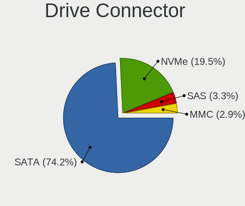
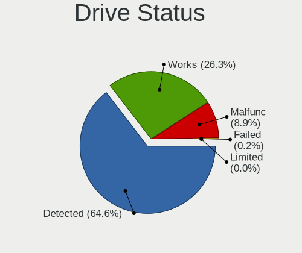
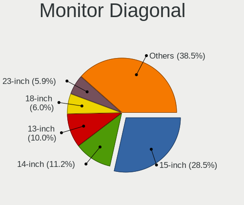
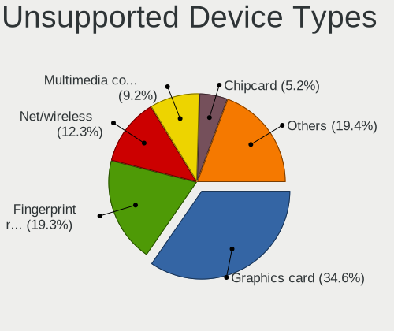

Linux in Brazil - Tested Hardware & Statistics
----------------------------------------------

A project to collect tested hardware configurations for Linux in Brazil.

Anyone can contribute to this report by the [hw-probe](https://github.com/linuxhw/hw-probe) tool:

    sudo -E hw-probe -all -upload

Please contribute! Especially if your hardware is rare.

This is a report for all computer types. See also reports for [desktops](/Location/Brazil/Desktop/README.md) and [notebooks](/Location/Brazil/Notebook/README.md).

Contents
--------

* [ Test Cases ](#test-cases)

* [ System ](#system)
  - [ OS                       ](#os)
  - [ OS Family                ](#os-family)
  - [ Kernel                   ](#kernel)
  - [ Kernel Family            ](#kernel-family)
  - [ Kernel Major Ver.        ](#kernel-major-ver)
  - [ Arch                     ](#arch)
  - [ DE                       ](#de)
  - [ Display Server           ](#display-server)
  - [ Display Manager          ](#display-manager)
  - [ OS Lang                  ](#os-lang)
  - [ Boot Mode                ](#boot-mode)
  - [ Filesystem               ](#filesystem)
  - [ Part. scheme             ](#part-scheme)
  - [ Dual Boot with Linux/BSD ](#dual-boot-with-linuxbsd)
  - [ Dual Boot (Win)          ](#dual-boot-win)

* [ Board ](#board)
  - [ Vendor                   ](#vendor)
  - [ Model                    ](#model)
  - [ Model Family             ](#model-family)
  - [ MFG Year                 ](#mfg-year)
  - [ Form Factor              ](#form-factor)
  - [ Secure Boot              ](#secure-boot)
  - [ Coreboot                 ](#coreboot)
  - [ RAM Size                 ](#ram-size)
  - [ RAM Used                 ](#ram-used)
  - [ Total Drives             ](#total-drives)
  - [ Has CD-ROM               ](#has-cd-rom)
  - [ Has Ethernet             ](#has-ethernet)
  - [ Has WiFi                 ](#has-wifi)
  - [ Has Bluetooth            ](#has-bluetooth)

* [ Location ](#location)
  - [ Country                  ](#country)
  - [ City                     ](#city)

* [ Drives ](#drives)
  - [ Drive Vendor             ](#drive-vendor)
  - [ Drive Model              ](#drive-model)
  - [ HDD Vendor               ](#hdd-vendor)
  - [ SSD Vendor               ](#ssd-vendor)
  - [ Drive Kind               ](#drive-kind)
  - [ Drive Connector          ](#drive-connector)
  - [ Drive Size               ](#drive-size)
  - [ Space Total              ](#space-total)
  - [ Space Used               ](#space-used)
  - [ Malfunc. Drives          ](#malfunc-drives)
  - [ Malfunc. Drive Vendor    ](#malfunc-drive-vendor)
  - [ Malfunc. HDD Vendor      ](#malfunc-hdd-vendor)
  - [ Malfunc. Drive Kind      ](#malfunc-drive-kind)
  - [ Failed Drives            ](#failed-drives)
  - [ Failed Drive Vendor      ](#failed-drive-vendor)
  - [ Drive Status             ](#drive-status)

* [ Storage controller ](#storage-controller)
  - [ Storage Vendor           ](#storage-vendor)
  - [ Storage Model            ](#storage-model)
  - [ Storage Kind             ](#storage-kind)

* [ Processor ](#processor)
  - [ CPU Vendor               ](#cpu-vendor)
  - [ CPU Model                ](#cpu-model)
  - [ CPU Model Family         ](#cpu-model-family)
  - [ CPU Cores                ](#cpu-cores)
  - [ CPU Sockets              ](#cpu-sockets)
  - [ CPU Threads              ](#cpu-threads)
  - [ CPU Op-Modes             ](#cpu-op-modes)
  - [ CPU Microcode            ](#cpu-microcode)
  - [ CPU Microarch            ](#cpu-microarch)

* [ Graphics ](#graphics)
  - [ GPU Vendor               ](#gpu-vendor)
  - [ GPU Model                ](#gpu-model)
  - [ GPU Combo                ](#gpu-combo)
  - [ GPU Driver               ](#gpu-driver)
  - [ GPU Memory               ](#gpu-memory)

* [ Monitor ](#monitor)
  - [ Monitor Vendor           ](#monitor-vendor)
  - [ Monitor Model            ](#monitor-model)
  - [ Monitor Resolution       ](#monitor-resolution)
  - [ Monitor Diagonal         ](#monitor-diagonal)
  - [ Monitor Width            ](#monitor-width)
  - [ Aspect Ratio             ](#aspect-ratio)
  - [ Monitor Area             ](#monitor-area)
  - [ Pixel Density            ](#pixel-density)
  - [ Multiple Monitors        ](#multiple-monitors)

* [ Network ](#network)
  - [ Net Controller Vendor    ](#net-controller-vendor)
  - [ Net Controller Model     ](#net-controller-model)
  - [ Wireless Vendor          ](#wireless-vendor)
  - [ Wireless Model           ](#wireless-model)
  - [ Ethernet Vendor          ](#ethernet-vendor)
  - [ Ethernet Model           ](#ethernet-model)
  - [ Net Controller Kind      ](#net-controller-kind)
  - [ Used Controller          ](#used-controller)
  - [ NICs                     ](#nics)
  - [ IPv6                     ](#ipv6)

* [ Bluetooth ](#bluetooth)
  - [ Bluetooth Vendor         ](#bluetooth-vendor)
  - [ Bluetooth Model          ](#bluetooth-model)

* [ Sound ](#sound)
  - [ Sound Vendor             ](#sound-vendor)
  - [ Sound Model              ](#sound-model)

* [ Memory ](#memory)
  - [ Memory Vendor            ](#memory-vendor)
  - [ Memory Model             ](#memory-model)
  - [ Memory Kind              ](#memory-kind)
  - [ Memory Form Factor       ](#memory-form-factor)
  - [ Memory Size              ](#memory-size)
  - [ Memory Speed             ](#memory-speed)

* [ Printers & scanners ](#printers--scanners)
  - [ Printer Vendor           ](#printer-vendor)
  - [ Printer Model            ](#printer-model)
  - [ Scanner Vendor           ](#scanner-vendor)
  - [ Scanner Model            ](#scanner-model)

* [ Camera ](#camera)
  - [ Camera Vendor            ](#camera-vendor)
  - [ Camera Model             ](#camera-model)

* [ Security ](#security)
  - [ Fingerprint Vendor       ](#fingerprint-vendor)
  - [ Fingerprint Model        ](#fingerprint-model)
  - [ Chipcard Vendor          ](#chipcard-vendor)
  - [ Chipcard Model           ](#chipcard-model)

* [ Unsupported ](#unsupported)
  - [ Unsupported Devices      ](#unsupported-devices)
  - [ Unsupported Device Types ](#unsupported-device-types)

Test Cases
----------

Total: 19710

| Vendor        | Model                       | Form-Factor | Probe                                                      | Date         |
|---------------|-----------------------------|-------------|------------------------------------------------------------|--------------|
| Samsung       | 300E5M/300E5L               | Notebook    | [9aa2cd7b81](https://linux-hardware.org/?probe=9aa2cd7b81) | Aug 12, 2023 |
| Notebook      | NJx0MU                      | Notebook    | [6f230d02c1](https://linux-hardware.org/?probe=6f230d02c1) | Aug 12, 2023 |
| HP            | Compaq nx9420 (RH457EA#A... | Notebook    | [1b7c441369](https://linux-hardware.org/?probe=1b7c441369) | Aug 12, 2023 |
| Dell          | 0PV3YR A05                  | Server      | [ed029dd5e3](https://linux-hardware.org/?probe=ed029dd5e3) | Aug 12, 2023 |
| Multilaser    | PC024                       | Notebook    | [3311e26ac5](https://linux-hardware.org/?probe=3311e26ac5) | Aug 12, 2023 |
| Lenovo        | ThinkPad T14 Gen 1 20S00... | Notebook    | [53196a01fa](https://linux-hardware.org/?probe=53196a01fa) | Aug 12, 2023 |
| Dell          | Inspiron 5558               | Notebook    | [5bb31ccda3](https://linux-hardware.org/?probe=5bb31ccda3) | Aug 12, 2023 |
| Dell          | G3 3579                     | Notebook    | [09ba53e3c1](https://linux-hardware.org/?probe=09ba53e3c1) | Aug 12, 2023 |
| Intel         | DG31PR AAE58249-301         | Desktop     | [28bc891b6d](https://linux-hardware.org/?probe=28bc891b6d) | Aug 12, 2023 |
| ASUSTek       | J1800I-C/BR                 | Desktop     | [5226916c20](https://linux-hardware.org/?probe=5226916c20) | Aug 12, 2023 |
| ASUSTek       | J1800I-C/BR                 | Desktop     | [f59a93f116](https://linux-hardware.org/?probe=f59a93f116) | Aug 12, 2023 |
| Intel         | DG31PR AAE58249-301         | Desktop     | [3050db3fbf](https://linux-hardware.org/?probe=3050db3fbf) | Aug 12, 2023 |
| ASUSTek       | P5G41T-M LX2/BR             | Desktop     | [f8fa12cc07](https://linux-hardware.org/?probe=f8fa12cc07) | Aug 11, 2023 |
| Acer          | Aspire F5-573G              | Notebook    | [019f3a6d1f](https://linux-hardware.org/?probe=019f3a6d1f) | Aug 11, 2023 |
| Acer          | Nitro AN517-54              | Notebook    | [4daff2c43f](https://linux-hardware.org/?probe=4daff2c43f) | Aug 11, 2023 |
| Unknown       | SEI Robotics SEI510         | Soc         | [3ab135e657](https://linux-hardware.org/?probe=3ab135e657) | Aug 11, 2023 |
| Unknown       | Unknown                     | Notebook    | [8d7674c3b3](https://linux-hardware.org/?probe=8d7674c3b3) | Aug 11, 2023 |
| Positivo      | C4128B-1                    | Convertible | [ef67e885dc](https://linux-hardware.org/?probe=ef67e885dc) | Aug 11, 2023 |
| Dell          | G15 5520                    | Notebook    | [3bec284af8](https://linux-hardware.org/?probe=3bec284af8) | Aug 11, 2023 |
| Lenovo        | IdeaPad 320-15IKB 81G3      | Notebook    | [83879b8247](https://linux-hardware.org/?probe=83879b8247) | Aug 11, 2023 |
| Gigabyte      | A520M DS3H AC               | Desktop     | [c53eeb4caf](https://linux-hardware.org/?probe=c53eeb4caf) | Aug 11, 2023 |
| Notebook      | NJx0MU                      | Notebook    | [ea4ae0e0f3](https://linux-hardware.org/?probe=ea4ae0e0f3) | Aug 11, 2023 |
| Dell          | 0PV3YR A05                  | Server      | [053608e18a](https://linux-hardware.org/?probe=053608e18a) | Aug 11, 2023 |
| Acer          | Aspire A515-51              | Notebook    | [4856b9b32f](https://linux-hardware.org/?probe=4856b9b32f) | Aug 11, 2023 |
| Lenovo        | ThinkPad X1 Carbon 2nd 2... | Notebook    | [97e0c46487](https://linux-hardware.org/?probe=97e0c46487) | Aug 11, 2023 |
| Avell High... | A40 LIV                     | Notebook    | [9bc62c7eec](https://linux-hardware.org/?probe=9bc62c7eec) | Aug 11, 2023 |
| Notebook      | NJx0MU                      | Notebook    | [2db90ee24e](https://linux-hardware.org/?probe=2db90ee24e) | Aug 11, 2023 |
| Acer          | Nitro AN515-52              | Notebook    | [30748e95eb](https://linux-hardware.org/?probe=30748e95eb) | Aug 11, 2023 |
| Lenovo        | IdeaPad S145-15IWL 81S9     | Notebook    | [7fe6adce5e](https://linux-hardware.org/?probe=7fe6adce5e) | Aug 10, 2023 |
| Acer          | Aspire E5-571G              | Notebook    | [6c55de5ac8](https://linux-hardware.org/?probe=6c55de5ac8) | Aug 10, 2023 |
| Unknown       | SEI Robotics SEI510         | Soc         | [09000d6461](https://linux-hardware.org/?probe=09000d6461) | Aug 10, 2023 |
| Unknown       | SEI Robotics SEI510         | Soc         | [c05973af65](https://linux-hardware.org/?probe=c05973af65) | Aug 10, 2023 |
| ASRock        | H310CM-HG4                  | Desktop     | [773b111412](https://linux-hardware.org/?probe=773b111412) | Aug 10, 2023 |
| ASRock        | H310CM-HG4                  | Desktop     | [70c4f2863b](https://linux-hardware.org/?probe=70c4f2863b) | Aug 10, 2023 |
| ASUSTek       | P8Z68-V                     | Desktop     | [cff11cda6f](https://linux-hardware.org/?probe=cff11cda6f) | Aug 10, 2023 |
| Avell High... | A70 HYB                     | Notebook    | [9b03ae1cd3](https://linux-hardware.org/?probe=9b03ae1cd3) | Aug 10, 2023 |
| HP            | Folio 13                    | Notebook    | [67121fc711](https://linux-hardware.org/?probe=67121fc711) | Aug 10, 2023 |
| Avell         | A70 ION                     | Notebook    | [6ab02a34e4](https://linux-hardware.org/?probe=6ab02a34e4) | Aug 10, 2023 |
| Dell          | 03KWTV A02                  | Desktop     | [d4a16b0b3e](https://linux-hardware.org/?probe=d4a16b0b3e) | Aug 10, 2023 |
| HP            | 2AF9                        | Desktop     | [b31b796804](https://linux-hardware.org/?probe=b31b796804) | Aug 10, 2023 |
| Avell         | A70 ION                     | Notebook    | [b71c176ce3](https://linux-hardware.org/?probe=b71c176ce3) | Aug 10, 2023 |
| Acer          | Nitro AN517-51              | Notebook    | [bd3b7989f0](https://linux-hardware.org/?probe=bd3b7989f0) | Aug 10, 2023 |
| Dell          | Vostro 3501                 | Notebook    | [d606f83745](https://linux-hardware.org/?probe=d606f83745) | Aug 10, 2023 |
| Lenovo        | IdeaPad U430 Touch 20270    | Notebook    | [4446f503d5](https://linux-hardware.org/?probe=4446f503d5) | Aug 10, 2023 |
| Dell          | OptiPlex 755                | Desktop     | [279ed1e2d5](https://linux-hardware.org/?probe=279ed1e2d5) | Aug 10, 2023 |
| ASUSTek       | P5KPL-AM-CKD-VISUM-SI       | Desktop     | [7acbd56a40](https://linux-hardware.org/?probe=7acbd56a40) | Aug 10, 2023 |
| MSI           | A68HM-E33                   | Desktop     | [be692e44b5](https://linux-hardware.org/?probe=be692e44b5) | Aug 10, 2023 |
| Dell          | 0VXN67 A01                  | Desktop     | [4fbd39d860](https://linux-hardware.org/?probe=4fbd39d860) | Aug 10, 2023 |
| Positivo      | Presley 3                   | Notebook    | [16ddbd1a75](https://linux-hardware.org/?probe=16ddbd1a75) | Aug 10, 2023 |
| MACHINIST     | E5 MR9A PRO MAX V1.1        | Desktop     | [0c4903c4d2](https://linux-hardware.org/?probe=0c4903c4d2) | Aug 10, 2023 |
| HP            | Folio 13                    | Notebook    | [889aae1772](https://linux-hardware.org/?probe=889aae1772) | Aug 10, 2023 |
| Gigabyte      | G31M-ES2L                   | Desktop     | [1e856f651d](https://linux-hardware.org/?probe=1e856f651d) | Aug 09, 2023 |
| Gigabyte      | B450 AORUS M                | Desktop     | [739bc450b8](https://linux-hardware.org/?probe=739bc450b8) | Aug 09, 2023 |
| Gigabyte      | B560M AORUS ELITE           | Desktop     | [e315608a65](https://linux-hardware.org/?probe=e315608a65) | Aug 09, 2023 |
| Huanan        | X99-TF-Q GAMING V1.2        | Desktop     | [da612198cc](https://linux-hardware.org/?probe=da612198cc) | Aug 09, 2023 |
| Positivo      | Presley 3                   | Notebook    | [9edde2ea30](https://linux-hardware.org/?probe=9edde2ea30) | Aug 09, 2023 |
| SZMZ          | X99M-G2                     | Desktop     | [e22cd6fdac](https://linux-hardware.org/?probe=e22cd6fdac) | Aug 09, 2023 |
| SZMZ          | X99M-G2                     | Desktop     | [2242417727](https://linux-hardware.org/?probe=2242417727) | Aug 09, 2023 |
| ASUSTek       | TUF Gaming X570-PLUS_BR     | Desktop     | [0b1144add1](https://linux-hardware.org/?probe=0b1144add1) | Aug 09, 2023 |
| Gigabyte      | H410M H V3                  | Desktop     | [c4ac4952a4](https://linux-hardware.org/?probe=c4ac4952a4) | Aug 09, 2023 |
| ASRock        | H81M-HG4 R4.0               | Notebook    | [26c322239f](https://linux-hardware.org/?probe=26c322239f) | Aug 09, 2023 |
| Biostar       | X370GT3                     | Desktop     | [6c4e484a34](https://linux-hardware.org/?probe=6c4e484a34) | Aug 09, 2023 |
| Gigabyte      | H410M H V3                  | Desktop     | [62a5817462](https://linux-hardware.org/?probe=62a5817462) | Aug 09, 2023 |
| ASRock        | Z77 Extreme4                | Desktop     | [dace48c9ec](https://linux-hardware.org/?probe=dace48c9ec) | Aug 09, 2023 |
| ASRock        | Z77 Extreme4                | Desktop     | [e4c0e430b2](https://linux-hardware.org/?probe=e4c0e430b2) | Aug 09, 2023 |
| Lenovo        | ThinkPad T460 20FMA00F00    | Notebook    | [4bd13ae71d](https://linux-hardware.org/?probe=4bd13ae71d) | Aug 09, 2023 |
| Itautec       | ST 4273 ST-4273 Custom 0... | Desktop     | [2e2f861c7c](https://linux-hardware.org/?probe=2e2f861c7c) | Aug 09, 2023 |
| ASRock        | A320M-HDV R4.0              | Desktop     | [eb99d95702](https://linux-hardware.org/?probe=eb99d95702) | Aug 08, 2023 |
| Dell          | 0DT021 A00                  | Server      | [f472313f3a](https://linux-hardware.org/?probe=f472313f3a) | Aug 08, 2023 |
| Acer          | Aspire A515-54G             | Notebook    | [cc5ec06f60](https://linux-hardware.org/?probe=cc5ec06f60) | Aug 08, 2023 |
| Dell          | Inspiron 15 3515            | Notebook    | [7ce5fc846b](https://linux-hardware.org/?probe=7ce5fc846b) | Aug 08, 2023 |
| Acer          | Aspire A515-54G             | Notebook    | [14e4cbffd4](https://linux-hardware.org/?probe=14e4cbffd4) | Aug 08, 2023 |
| Dell          | Inspiron 15 3511            | Notebook    | [13cec81a99](https://linux-hardware.org/?probe=13cec81a99) | Aug 08, 2023 |
| Samsung       | 340XAA/350XAA/550XAA        | Notebook    | [d6b7da58e7](https://linux-hardware.org/?probe=d6b7da58e7) | Aug 08, 2023 |
| ASUSTek       | M5A78L-M/USB3               | Desktop     | [88c76f027a](https://linux-hardware.org/?probe=88c76f027a) | Aug 08, 2023 |
| Acer          | Aspire A515-51G             | Notebook    | [1105c8c2ea](https://linux-hardware.org/?probe=1105c8c2ea) | Aug 08, 2023 |
| ASUSTek       | VivoBook_ASUSLaptop X515... | Notebook    | [dd127ca2df](https://linux-hardware.org/?probe=dd127ca2df) | Aug 08, 2023 |
| ASRock        | H81M-HG4 R4.0               | Notebook    | [788c24d04a](https://linux-hardware.org/?probe=788c24d04a) | Aug 08, 2023 |
| Lenovo        | IdeaPad 330-15IKB 81FE      | Notebook    | [965f96493c](https://linux-hardware.org/?probe=965f96493c) | Aug 08, 2023 |
| Lenovo        | IdeaPad Gaming 3 15IMH05... | Notebook    | [ec7a911951](https://linux-hardware.org/?probe=ec7a911951) | Aug 08, 2023 |
| Avell High... | A40 LIV                     | Notebook    | [4022d66d9a](https://linux-hardware.org/?probe=4022d66d9a) | Aug 08, 2023 |
| ASUSTek       | PRIME B760M-A D4            | Desktop     | [b477184f03](https://linux-hardware.org/?probe=b477184f03) | Aug 08, 2023 |
| Acer          | Aspire E5-553G              | Notebook    | [f7845429c8](https://linux-hardware.org/?probe=f7845429c8) | Aug 07, 2023 |
| Acer          | Nitro AN517-52              | Notebook    | [d24385ceb8](https://linux-hardware.org/?probe=d24385ceb8) | Aug 07, 2023 |
| Digiboard     | NM70-I                      | Desktop     | [280ee6d8fe](https://linux-hardware.org/?probe=280ee6d8fe) | Aug 07, 2023 |
| Unknown       | Unknown                     | Desktop     | [e2427beca2](https://linux-hardware.org/?probe=e2427beca2) | Aug 07, 2023 |
| Lenovo        | IdeaPad 330-15IKB 81FE      | Notebook    | [7e185ae211](https://linux-hardware.org/?probe=7e185ae211) | Aug 07, 2023 |
| HP            | 250 G6 Notebook PC          | Notebook    | [c130dece41](https://linux-hardware.org/?probe=c130dece41) | Aug 06, 2023 |
| Dell          | Inspiron 5547               | Notebook    | [8f33c0cf28](https://linux-hardware.org/?probe=8f33c0cf28) | Aug 06, 2023 |
| ASUSTek       | P8H61-M LX3                 | Desktop     | [6875c17337](https://linux-hardware.org/?probe=6875c17337) | Aug 06, 2023 |
| Gigabyte      | B450M GAMING                | Desktop     | [570d622bb5](https://linux-hardware.org/?probe=570d622bb5) | Aug 06, 2023 |
| Notebook      | 1745                        | Notebook    | [3561a5dbbe](https://linux-hardware.org/?probe=3561a5dbbe) | Aug 06, 2023 |
| Dell          | Inspiron 15-3567            | Notebook    | [2e8d48f9bc](https://linux-hardware.org/?probe=2e8d48f9bc) | Aug 06, 2023 |
| HP            | Pavilion dm4                | Notebook    | [521b8518ed](https://linux-hardware.org/?probe=521b8518ed) | Aug 06, 2023 |
| Lenovo        | IdeaPad 3 15IGL05 82BU      | Notebook    | [52b9918d42](https://linux-hardware.org/?probe=52b9918d42) | Aug 06, 2023 |
| Intel         | X79 (INTEL Xeon E5/Corei... | Desktop     | [27792f16e2](https://linux-hardware.org/?probe=27792f16e2) | Aug 06, 2023 |
| Dell          | Inspiron N4050              | Notebook    | [af35c9ce49](https://linux-hardware.org/?probe=af35c9ce49) | Aug 05, 2023 |
| Microsoft     | Surface Pro 4               | Tablet      | [9a45c9f834](https://linux-hardware.org/?probe=9a45c9f834) | Aug 05, 2023 |
| Acer          | Aspire E5-553G              | Notebook    | [39140ff7de](https://linux-hardware.org/?probe=39140ff7de) | Aug 05, 2023 |
| Lenovo        | IdeaPad S145-15IWL 81S9     | Notebook    | [6de5534e97](https://linux-hardware.org/?probe=6de5534e97) | Aug 05, 2023 |
| Dell          | Latitude 5410               | Notebook    | [2838e5d74c](https://linux-hardware.org/?probe=2838e5d74c) | Aug 05, 2023 |
| Dell          | Latitude E5440              | Notebook    | [f6981c56b7](https://linux-hardware.org/?probe=f6981c56b7) | Aug 05, 2023 |
| Multilaser    | PC024                       | Notebook    | [85a4bdd497](https://linux-hardware.org/?probe=85a4bdd497) | Aug 05, 2023 |
| Lenovo        | B330-15IKBR 81M1            | Notebook    | [f03fa524d7](https://linux-hardware.org/?probe=f03fa524d7) | Aug 05, 2023 |
| Multilaser    | PC13X                       | Notebook    | [2f79cffddd](https://linux-hardware.org/?probe=2f79cffddd) | Aug 05, 2023 |
| HP            | Pavilion g4                 | Notebook    | [2094186715](https://linux-hardware.org/?probe=2094186715) | Aug 05, 2023 |
| Dell          | 0PV3YR A05                  | Server      | [da2ada0c83](https://linux-hardware.org/?probe=da2ada0c83) | Aug 05, 2023 |
| Lenovo        | IdeaPadFlex 5 14IIL05 81... | Convertible | [7ffb6822e6](https://linux-hardware.org/?probe=7ffb6822e6) | Aug 05, 2023 |
| Samsung       | 300E4C/300E5C/300E7C        | Notebook    | [24a5183e69](https://linux-hardware.org/?probe=24a5183e69) | Aug 05, 2023 |
| Dell          | G15 5520                    | Notebook    | [baca0d14f5](https://linux-hardware.org/?probe=baca0d14f5) | Aug 05, 2023 |
| MACHINIST     | X99-MR9D PLUS V1.0          | Desktop     | [29f8d73c0e](https://linux-hardware.org/?probe=29f8d73c0e) | Aug 05, 2023 |
| Intel         | B75                         | Desktop     | [9411dd987c](https://linux-hardware.org/?probe=9411dd987c) | Aug 05, 2023 |
| Gigabyte      | H110M-H-CF                  | Desktop     | [17ea53b0c6](https://linux-hardware.org/?probe=17ea53b0c6) | Aug 05, 2023 |
| Intel         | H81                         | Desktop     | [4441a1a1ca](https://linux-hardware.org/?probe=4441a1a1ca) | Aug 05, 2023 |
| ASUSTek       | VivoBook_ASUSLaptop X512... | Notebook    | [8292d9f518](https://linux-hardware.org/?probe=8292d9f518) | Aug 04, 2023 |
| Itautec       | Infoway                     | Notebook    | [1708f5baae](https://linux-hardware.org/?probe=1708f5baae) | Aug 04, 2023 |
| Notebook      | NJx0MU                      | Notebook    | [8b6b5ff142](https://linux-hardware.org/?probe=8b6b5ff142) | Aug 04, 2023 |
| Dell          | 0DT021 A00                  | Server      | [354c40df4e](https://linux-hardware.org/?probe=354c40df4e) | Aug 04, 2023 |
| ASUSTek       | P8Z77-V LX                  | Desktop     | [92ef92268a](https://linux-hardware.org/?probe=92ef92268a) | Aug 04, 2023 |
| ASUSTek       | P8Z77-V LX                  | Desktop     | [ca1a97268c](https://linux-hardware.org/?probe=ca1a97268c) | Aug 04, 2023 |
| ASRock        | A320M-HDV R4.0              | Desktop     | [de07e937bb](https://linux-hardware.org/?probe=de07e937bb) | Aug 04, 2023 |
| Dell          | 0PV3YR A05                  | Server      | [df3495c01c](https://linux-hardware.org/?probe=df3495c01c) | Aug 04, 2023 |
| MANCER        | A320M-DA 1006               | Desktop     | [573affec7b](https://linux-hardware.org/?probe=573affec7b) | Aug 04, 2023 |
| Apple         | MacBookPro8,1               | Notebook    | [61cb65a2e9](https://linux-hardware.org/?probe=61cb65a2e9) | Aug 04, 2023 |
| Acer          | Nitro AN517-54              | Notebook    | [aee5a21c76](https://linux-hardware.org/?probe=aee5a21c76) | Aug 04, 2023 |
| ASUSTek       | TUF Gaming B450M-PRO S      | Desktop     | [a260479012](https://linux-hardware.org/?probe=a260479012) | Aug 04, 2023 |
| Notebook      | NJx0MU                      | Notebook    | [bd88b4e8fa](https://linux-hardware.org/?probe=bd88b4e8fa) | Aug 04, 2023 |
| ASUSTek       | M5A78L-M LX3                | Desktop     | [0ffd23b534](https://linux-hardware.org/?probe=0ffd23b534) | Aug 04, 2023 |
| ASUSTek       | UX490UAR                    | Notebook    | [6a305978e3](https://linux-hardware.org/?probe=6a305978e3) | Aug 03, 2023 |
| Dell          | Inspiron 5566               | Notebook    | [21d7f13381](https://linux-hardware.org/?probe=21d7f13381) | Aug 03, 2023 |
| OEM           | B75 Ver:1.44                | Desktop     | [6dcf79b752](https://linux-hardware.org/?probe=6dcf79b752) | Aug 03, 2023 |
| Lenovo        | ThinkPad Edge E431 6277C... | Notebook    | [6c542a6490](https://linux-hardware.org/?probe=6c542a6490) | Aug 03, 2023 |
| Intel         | H61                         | Desktop     | [7b2774c1a1](https://linux-hardware.org/?probe=7b2774c1a1) | Aug 03, 2023 |
| Acer          | Nitro AN515-44              | Notebook    | [25dcc9a7c5](https://linux-hardware.org/?probe=25dcc9a7c5) | Aug 03, 2023 |
| Intel         | H61                         | Desktop     | [8d450f7e6e](https://linux-hardware.org/?probe=8d450f7e6e) | Aug 03, 2023 |
| ASUSTek       | TUF Gaming FX505DD_FX505... | Notebook    | [67d851300e](https://linux-hardware.org/?probe=67d851300e) | Aug 03, 2023 |
| Win elemen... | M600                        | Desktop     | [b9537c621c](https://linux-hardware.org/?probe=b9537c621c) | Aug 02, 2023 |
| Unknown       | Unknown                     | Desktop     | [3bb1942723](https://linux-hardware.org/?probe=3bb1942723) | Aug 02, 2023 |
| ASUSTek       | TUF H310M-PLUS GAMING/BR    | Desktop     | [11d27dea01](https://linux-hardware.org/?probe=11d27dea01) | Aug 02, 2023 |
| Gigabyte      | B450 AORUS M                | Desktop     | [518512fe78](https://linux-hardware.org/?probe=518512fe78) | Aug 02, 2023 |
| Positivo      | Q232B                       | Notebook    | [006d77a18c](https://linux-hardware.org/?probe=006d77a18c) | Aug 02, 2023 |
| Dell          | 0GY6Y8 A02                  | Desktop     | [e1d2deb748](https://linux-hardware.org/?probe=e1d2deb748) | Aug 02, 2023 |
| Dell          | 0FR6WH A01                  | Desktop     | [38feb4d1f7](https://linux-hardware.org/?probe=38feb4d1f7) | Aug 02, 2023 |
| Acer          | Aspire E1-572               | Notebook    | [af04d8d764](https://linux-hardware.org/?probe=af04d8d764) | Aug 02, 2023 |
| ASRock        | A320M-HDV R4.0              | Desktop     | [2ff30156cf](https://linux-hardware.org/?probe=2ff30156cf) | Aug 02, 2023 |
| Samsung       | 300E5M/300E5L               | Notebook    | [d4c5149060](https://linux-hardware.org/?probe=d4c5149060) | Aug 02, 2023 |
| Gigabyte      | B450 AORUS M                | Desktop     | [0ced83ffed](https://linux-hardware.org/?probe=0ced83ffed) | Aug 02, 2023 |
| ASRock        | H410M-HDV/M.2               | Desktop     | [71a11bdffd](https://linux-hardware.org/?probe=71a11bdffd) | Aug 02, 2023 |
| ASRock        | B650M PG Riptide            | Desktop     | [bdccf9a3db](https://linux-hardware.org/?probe=bdccf9a3db) | Aug 01, 2023 |
| Dell          | Inspiron 5566               | Notebook    | [c4e404738e](https://linux-hardware.org/?probe=c4e404738e) | Aug 01, 2023 |
| Lenovo        | 3188 SDK0J40709 WIN 3259... | Desktop     | [59e7f97f2d](https://linux-hardware.org/?probe=59e7f97f2d) | Aug 01, 2023 |
| Apple         | MacBookPro8,1               | Notebook    | [56e2fa207e](https://linux-hardware.org/?probe=56e2fa207e) | Aug 01, 2023 |
| ASUSTek       | M5A78L-M PLUS/USB3          | Desktop     | [668eb36a4a](https://linux-hardware.org/?probe=668eb36a4a) | Aug 01, 2023 |
| Itautec       | Infoway a7420               | Notebook    | [da7459a0ea](https://linux-hardware.org/?probe=da7459a0ea) | Aug 01, 2023 |
| ASUSTek       | P8H61-M LX                  | Desktop     | [287740b630](https://linux-hardware.org/?probe=287740b630) | Aug 01, 2023 |
| Lenovo        | B330-15IKBR 81M1            | Notebook    | [1f69ed5c1e](https://linux-hardware.org/?probe=1f69ed5c1e) | Aug 01, 2023 |
| Itautec       | ST 4271 ST-4271 Padrao 0... | Desktop     | [2e4793aa6c](https://linux-hardware.org/?probe=2e4793aa6c) | Aug 01, 2023 |
| Gigabyte      | F2A68HM-H                   | Desktop     | [08e1a2a1e1](https://linux-hardware.org/?probe=08e1a2a1e1) | Aug 01, 2023 |
| ASRock        | H110M-HG4                   | Desktop     | [7584e2db20](https://linux-hardware.org/?probe=7584e2db20) | Jul 31, 2023 |
| Intel         | DH55HC AAE70933-502         | Desktop     | [e849da706a](https://linux-hardware.org/?probe=e849da706a) | Jul 31, 2023 |
| HP            | Pavilion 14                 | Notebook    | [313aedd888](https://linux-hardware.org/?probe=313aedd888) | Jul 31, 2023 |
| Acer          | Aspire V3-571               | Notebook    | [9b9830aedf](https://linux-hardware.org/?probe=9b9830aedf) | Jul 31, 2023 |
| Positivo      | POS-PIH110DV                | Desktop     | [faa5c5cda0](https://linux-hardware.org/?probe=faa5c5cda0) | Jul 31, 2023 |
| Dell          | Inspiron 7520               | Notebook    | [b87690f890](https://linux-hardware.org/?probe=b87690f890) | Jul 31, 2023 |
| Unknown       | Phitronics N68C-M           | Desktop     | [0c596c95da](https://linux-hardware.org/?probe=0c596c95da) | Jul 31, 2023 |
| Dell          | Latitude E5510              | Notebook    | [b9208e8c08](https://linux-hardware.org/?probe=b9208e8c08) | Jul 31, 2023 |
| Samsung       | 305E4A/305E5A/305E7A        | Notebook    | [67fbb84480](https://linux-hardware.org/?probe=67fbb84480) | Jul 31, 2023 |
| ASUSTek       | TUF Gaming Z590-PLUS        | Desktop     | [7890c76098](https://linux-hardware.org/?probe=7890c76098) | Jul 31, 2023 |
| Dell          | Vostro 1510                 | Notebook    | [8e49dde20d](https://linux-hardware.org/?probe=8e49dde20d) | Jul 31, 2023 |
| Dell          | Vostro 1510                 | Notebook    | [8d6d8b9243](https://linux-hardware.org/?probe=8d6d8b9243) | Jul 31, 2023 |
| Dell          | Vostro 1510                 | Notebook    | [13e9f3fa3c](https://linux-hardware.org/?probe=13e9f3fa3c) | Jul 31, 2023 |
| Lenovo        | ThinkPad T460 20FMA00F00    | Notebook    | [9268d1c4f9](https://linux-hardware.org/?probe=9268d1c4f9) | Jul 30, 2023 |
| Lenovo        | IdeaPad S145-15API 81V7     | Notebook    | [9371aa866b](https://linux-hardware.org/?probe=9371aa866b) | Jul 30, 2023 |
| Apple         | MacBookPro4,1               | Notebook    | [eedbe7eb59](https://linux-hardware.org/?probe=eedbe7eb59) | Jul 30, 2023 |
| MACHINIST     | E5 MR9A PRO MAX V1.1        | Desktop     | [42a2df4c91](https://linux-hardware.org/?probe=42a2df4c91) | Jul 30, 2023 |
| Intel         | DG41WV AAE90316-102         | Desktop     | [fa7d425224](https://linux-hardware.org/?probe=fa7d425224) | Jul 30, 2023 |
| Acer          | Aspire A315-53              | Notebook    | [28ff56233b](https://linux-hardware.org/?probe=28ff56233b) | Jul 30, 2023 |
| Dell          | Inspiron 5547               | Notebook    | [f3de23350d](https://linux-hardware.org/?probe=f3de23350d) | Jul 30, 2023 |
| Dell          | Inspiron 5547               | Notebook    | [3be466c09c](https://linux-hardware.org/?probe=3be466c09c) | Jul 30, 2023 |
| Lenovo        | ThinkPad E14 20RBS25S00     | Notebook    | [ae14da63f3](https://linux-hardware.org/?probe=ae14da63f3) | Jul 30, 2023 |
| Lenovo        | B330-15IKBR 81M1            | Notebook    | [2a0777f1fd](https://linux-hardware.org/?probe=2a0777f1fd) | Jul 30, 2023 |
| ASUSTek       | M5A78L-M PLUS/USB3          | Desktop     | [fe48f2b4d4](https://linux-hardware.org/?probe=fe48f2b4d4) | Jul 30, 2023 |
| Positivo B... | VJFE59F11X-B0411H           | Notebook    | [24c271e6fd](https://linux-hardware.org/?probe=24c271e6fd) | Jul 30, 2023 |
| Positivo B... | VJFE59F11X-B0411H           | Notebook    | [bb2245d195](https://linux-hardware.org/?probe=bb2245d195) | Jul 30, 2023 |
| MSI           | B85M-E45                    | Desktop     | [dfef6fcff5](https://linux-hardware.org/?probe=dfef6fcff5) | Jul 30, 2023 |
| ASUSTek       | TUF Gaming B460M-PLUS       | Desktop     | [0ce1be51b9](https://linux-hardware.org/?probe=0ce1be51b9) | Jul 30, 2023 |
| Gigabyte      | AB350M-DS3H V2-CF           | Desktop     | [1bcc28bd33](https://linux-hardware.org/?probe=1bcc28bd33) | Jul 29, 2023 |
| Unknown       | GSUO H61V10C                | Desktop     | [9fd25cd0ba](https://linux-hardware.org/?probe=9fd25cd0ba) | Jul 29, 2023 |
| Dell          | Inspiron 5577               | Notebook    | [10b634ac99](https://linux-hardware.org/?probe=10b634ac99) | Jul 29, 2023 |
| Acer          | Nitro AN515-52              | Notebook    | [393c4b7fd3](https://linux-hardware.org/?probe=393c4b7fd3) | Jul 29, 2023 |
| ASUSTek       | TUF Gaming B550M-PLUS WI... | Desktop     | [96b197dffc](https://linux-hardware.org/?probe=96b197dffc) | Jul 29, 2023 |
| ASUSTek       | M5A78L-M LX/BR              | Desktop     | [90c03881ae](https://linux-hardware.org/?probe=90c03881ae) | Jul 29, 2023 |
| HP            | Pavilion 11 x360 PC         | Notebook    | [d693783e7a](https://linux-hardware.org/?probe=d693783e7a) | Jul 29, 2023 |
| HP            | Folio 13                    | Notebook    | [baaa648a4b](https://linux-hardware.org/?probe=baaa648a4b) | Jul 29, 2023 |
| Lenovo        | Unknown                     | Notebook    | [a1dac68b95](https://linux-hardware.org/?probe=a1dac68b95) | Jul 29, 2023 |
| Positivo      | POS-EINM70CS POSITIVO       | Desktop     | [bee5e6175b](https://linux-hardware.org/?probe=bee5e6175b) | Jul 29, 2023 |
| MSI           | A520M-A PRO                 | Desktop     | [733695ae93](https://linux-hardware.org/?probe=733695ae93) | Jul 29, 2023 |
| Samsung       | 550XDA                      | Notebook    | [c140c9176e](https://linux-hardware.org/?probe=c140c9176e) | Jul 29, 2023 |
| Dell          | Inspiron N4050              | Notebook    | [701402e2a7](https://linux-hardware.org/?probe=701402e2a7) | Jul 29, 2023 |
| HP            | 250 G8 Notebook PC          | Notebook    | [502747dd18](https://linux-hardware.org/?probe=502747dd18) | Jul 29, 2023 |
| Dell          | Latitude 5400               | Notebook    | [9416ce803c](https://linux-hardware.org/?probe=9416ce803c) | Jul 28, 2023 |
| Dell          | Inspiron 7520               | Notebook    | [7509644961](https://linux-hardware.org/?probe=7509644961) | Jul 28, 2023 |
| ASUSTek       | TUF Gaming X570-PLUS_BR     | Desktop     | [bc88e3dbae](https://linux-hardware.org/?probe=bc88e3dbae) | Jul 28, 2023 |
| ASRock        | H110M-HG4                   | Desktop     | [205f3a047f](https://linux-hardware.org/?probe=205f3a047f) | Jul 28, 2023 |
| Digitron      | G31T-M7                     | Desktop     | [7b926165d9](https://linux-hardware.org/?probe=7b926165d9) | Jul 28, 2023 |
| Dell          | 0FR6WH A01                  | Desktop     | [d20434fd50](https://linux-hardware.org/?probe=d20434fd50) | Jul 28, 2023 |
| Acer          | Aspire 5350                 | Notebook    | [698672b19c](https://linux-hardware.org/?probe=698672b19c) | Jul 28, 2023 |
| Acer          | Aspire A315-42G             | Notebook    | [0e3aa83494](https://linux-hardware.org/?probe=0e3aa83494) | Jul 28, 2023 |
| Samsung       | 340XAA/350XAA/550XAA        | Notebook    | [8ca0357bf1](https://linux-hardware.org/?probe=8ca0357bf1) | Jul 28, 2023 |
| ASUSTek       | TUF Gaming FX504GD_FX80G... | Notebook    | [bca814cbb5](https://linux-hardware.org/?probe=bca814cbb5) | Jul 28, 2023 |
| MSI           | Z270 GAMING PLUS            | Desktop     | [cc489fad92](https://linux-hardware.org/?probe=cc489fad92) | Jul 28, 2023 |
| PCWare        | IPX1800E2                   | Desktop     | [ee17cd82e7](https://linux-hardware.org/?probe=ee17cd82e7) | Jul 27, 2023 |
| Acer          | Aspire A515-45              | Notebook    | [6287e66ff2](https://linux-hardware.org/?probe=6287e66ff2) | Jul 27, 2023 |
| HP            | EliteBook 8540w             | Notebook    | [d91f2ff8ba](https://linux-hardware.org/?probe=d91f2ff8ba) | Jul 27, 2023 |
| A14CR         | Unknown                     | Notebook    | [4ceb4f6761](https://linux-hardware.org/?probe=4ceb4f6761) | Jul 27, 2023 |
| Compaq        | PRESARIOCQ18                | Notebook    | [c528c90b50](https://linux-hardware.org/?probe=c528c90b50) | Jul 27, 2023 |
| Biostar       | B450MHP                     | Notebook    | [bb12598429](https://linux-hardware.org/?probe=bb12598429) | Jul 27, 2023 |
| Gigabyte      | A320M-S2H-CF SE1            | Desktop     | [b9bba11373](https://linux-hardware.org/?probe=b9bba11373) | Jul 27, 2023 |
| Samsung       | 300E5M/300E5L               | Notebook    | [23b23d59aa](https://linux-hardware.org/?probe=23b23d59aa) | Jul 27, 2023 |
| ASRock        | A320M-HD                    | Desktop     | [26e141980a](https://linux-hardware.org/?probe=26e141980a) | Jul 27, 2023 |
| Intel         | H55                         | Desktop     | [83f249e836](https://linux-hardware.org/?probe=83f249e836) | Jul 27, 2023 |
| Multilaser    | PC024                       | Notebook    | [fa5b5a3146](https://linux-hardware.org/?probe=fa5b5a3146) | Jul 27, 2023 |
| Toshiba       | STI 005492G                 | Desktop     | [6e73cad7e4](https://linux-hardware.org/?probe=6e73cad7e4) | Jul 27, 2023 |
| Acer          | Aspire A315-23G             | Notebook    | [4d7b874be2](https://linux-hardware.org/?probe=4d7b874be2) | Jul 27, 2023 |
| ASRock        | H61M-HVS                    | Desktop     | [ac730fa4ed](https://linux-hardware.org/?probe=ac730fa4ed) | Jul 26, 2023 |
| ASRock        | H61M-HVS                    | Desktop     | [57d93857f1](https://linux-hardware.org/?probe=57d93857f1) | Jul 26, 2023 |
| ECS           | G41T-M7                     | Desktop     | [eb7ea6e3f6](https://linux-hardware.org/?probe=eb7ea6e3f6) | Jul 26, 2023 |
| Intel         | B75                         | Desktop     | [492fa4fc25](https://linux-hardware.org/?probe=492fa4fc25) | Jul 26, 2023 |
| HP            | Folio 13                    | Notebook    | [a3269c0930](https://linux-hardware.org/?probe=a3269c0930) | Jul 26, 2023 |
| HP            | Pavilion 11 x360 PC         | Notebook    | [8daa291377](https://linux-hardware.org/?probe=8daa291377) | Jul 26, 2023 |
| Dell          | G3 3579                     | Notebook    | [b6b50ffa46](https://linux-hardware.org/?probe=b6b50ffa46) | Jul 26, 2023 |
| ASUSTek       | M5A78L-M PLUS/USB3          | Desktop     | [55102fad5b](https://linux-hardware.org/?probe=55102fad5b) | Jul 26, 2023 |
| AZW           | SEi                         | Desktop     | [115142c288](https://linux-hardware.org/?probe=115142c288) | Jul 26, 2023 |
| Gigabyte      | B550I AORUS PRO AX          | Desktop     | [959f3b36df](https://linux-hardware.org/?probe=959f3b36df) | Jul 26, 2023 |
| Dell          | Vostro 15 5510              | Notebook    | [2e810b1c93](https://linux-hardware.org/?probe=2e810b1c93) | Jul 26, 2023 |
| Dell          | Vostro 15 5510              | Notebook    | [4171fc8925](https://linux-hardware.org/?probe=4171fc8925) | Jul 26, 2023 |
| Gigabyte      | G31M-S2L                    | Desktop     | [5af2ea35ee](https://linux-hardware.org/?probe=5af2ea35ee) | Jul 26, 2023 |
| Apple         | MacBookPro12,1              | Notebook    | [45bc8cd978](https://linux-hardware.org/?probe=45bc8cd978) | Jul 26, 2023 |
| Gigabyte      | X570 GAMING X               | Desktop     | [f67be57cba](https://linux-hardware.org/?probe=f67be57cba) | Jul 26, 2023 |
| Dell          | 01XK1W A00                  | Desktop     | [9793da4c20](https://linux-hardware.org/?probe=9793da4c20) | Jul 26, 2023 |
| Dell          | 0PV3YR A05                  | Server      | [2fa28e6952](https://linux-hardware.org/?probe=2fa28e6952) | Jul 26, 2023 |
| HP            | ProBook 640 G2              | Notebook    | [f6400e37f6](https://linux-hardware.org/?probe=f6400e37f6) | Jul 26, 2023 |
| Dell          | Inspiron 5548               | Notebook    | [22b2519a90](https://linux-hardware.org/?probe=22b2519a90) | Jul 26, 2023 |
| HP            | ProBook 640 G2              | Notebook    | [7814bf14ac](https://linux-hardware.org/?probe=7814bf14ac) | Jul 26, 2023 |
| Valve         | Jupiter                     | Notebook    | [8ba9103155](https://linux-hardware.org/?probe=8ba9103155) | Jul 26, 2023 |
| Dell          | Inspiron 5548               | Notebook    | [b583a1fbee](https://linux-hardware.org/?probe=b583a1fbee) | Jul 26, 2023 |
| ASUSTek       | Zenbook UX3402ZA_UX3402Z... | Notebook    | [9878121979](https://linux-hardware.org/?probe=9878121979) | Jul 26, 2023 |
| ASUSTek       | P5G41T-M LX2/BR             | Desktop     | [5ca26c7da9](https://linux-hardware.org/?probe=5ca26c7da9) | Jul 26, 2023 |
| Notebook      | NJx0MU                      | Notebook    | [f720b1a032](https://linux-hardware.org/?probe=f720b1a032) | Jul 26, 2023 |
| Lenovo        | IdeaPad S145-15IWL 81S9     | Notebook    | [6c978ec74d](https://linux-hardware.org/?probe=6c978ec74d) | Jul 26, 2023 |
| Gigabyte      | B550M DS3H                  | Desktop     | [94a5fdec96](https://linux-hardware.org/?probe=94a5fdec96) | Jul 26, 2023 |
| Dell          | Inspiron 3501               | Notebook    | [62bcc903fd](https://linux-hardware.org/?probe=62bcc903fd) | Jul 25, 2023 |
| MSI           | 2A9C                        | Desktop     | [83e6501c96](https://linux-hardware.org/?probe=83e6501c96) | Jul 25, 2023 |
| Acer          | Aspire A514-54              | Notebook    | [787270abee](https://linux-hardware.org/?probe=787270abee) | Jul 25, 2023 |
| Acer          | Aspire E5-571G              | Notebook    | [3f39162908](https://linux-hardware.org/?probe=3f39162908) | Jul 25, 2023 |
| Dell          | Inspiron 5548               | Notebook    | [3d3696e8fa](https://linux-hardware.org/?probe=3d3696e8fa) | Jul 25, 2023 |
| Positivo      | S14SL01                     | Notebook    | [7ee0f7e8d1](https://linux-hardware.org/?probe=7ee0f7e8d1) | Jul 25, 2023 |
| Compaq        | Presario CQ-23              | Notebook    | [b78363eeaf](https://linux-hardware.org/?probe=b78363eeaf) | Jul 25, 2023 |
| Toshiba       | IS 1442                     | Notebook    | [3a66df4c2d](https://linux-hardware.org/?probe=3a66df4c2d) | Jul 25, 2023 |
| Dell          | 0PV3YR A05                  | Server      | [787c6a9252](https://linux-hardware.org/?probe=787c6a9252) | Jul 25, 2023 |
| MAXSUN        | MS-Terminator B660M VER:... | Desktop     | [5cf65783b2](https://linux-hardware.org/?probe=5cf65783b2) | Jul 25, 2023 |
| Notebook      | NJx0MU                      | Notebook    | [c675a3feab](https://linux-hardware.org/?probe=c675a3feab) | Jul 25, 2023 |
| ASUSTek       | M5A97 LE R2.0               | Desktop     | [cfdb26e14f](https://linux-hardware.org/?probe=cfdb26e14f) | Jul 25, 2023 |
| Dell          | Latitude 3420               | Notebook    | [18d920dab2](https://linux-hardware.org/?probe=18d920dab2) | Jul 24, 2023 |
| Dell          | Inspiron 5490               | Notebook    | [25f155c61a](https://linux-hardware.org/?probe=25f155c61a) | Jul 24, 2023 |
| Dell          | Inspiron 5490               | Notebook    | [6b80b41fee](https://linux-hardware.org/?probe=6b80b41fee) | Jul 24, 2023 |
| PCWare        | IPMH61R3 8MB                | Desktop     | [dcbde0a01d](https://linux-hardware.org/?probe=dcbde0a01d) | Jul 24, 2023 |
| Huanan        | X99-F8 GAMING V2.0          | Desktop     | [2c4dce1245](https://linux-hardware.org/?probe=2c4dce1245) | Jul 24, 2023 |
| Lenovo        | IdeaPad 3 15ALC6 82MF       | Notebook    | [f1844a5f28](https://linux-hardware.org/?probe=f1844a5f28) | Jul 24, 2023 |
| Gigabyte      | B450 AORUS M                | Desktop     | [858d935d25](https://linux-hardware.org/?probe=858d935d25) | Jul 24, 2023 |
| Acer          | Nitro AN515-57              | Notebook    | [ae6caf81d7](https://linux-hardware.org/?probe=ae6caf81d7) | Jul 24, 2023 |
| OEM           | Unknown                     | Notebook    | [d0d59fb363](https://linux-hardware.org/?probe=d0d59fb363) | Jul 24, 2023 |
| Acer          | Aspire A515-45              | Notebook    | [e1de4fabc7](https://linux-hardware.org/?probe=e1de4fabc7) | Jul 24, 2023 |
| Dell          | G15 5510                    | Notebook    | [18ceaecd85](https://linux-hardware.org/?probe=18ceaecd85) | Jul 24, 2023 |
| LG Electro... | R490-G.BR51P1               | Notebook    | [eecedbc045](https://linux-hardware.org/?probe=eecedbc045) | Jul 24, 2023 |
| MACHINIST     | X99-MR9D PLUS V1.0          | Desktop     | [d1ef825b01](https://linux-hardware.org/?probe=d1ef825b01) | Jul 24, 2023 |
| Dell          | Inspiron 13-5378            | Notebook    | [7f6b8fc2db](https://linux-hardware.org/?probe=7f6b8fc2db) | Jul 23, 2023 |
| OEM           | Unknown                     | Notebook    | [a45e07b803](https://linux-hardware.org/?probe=a45e07b803) | Jul 23, 2023 |
| Intel         | B75                         | Desktop     | [f6b0d91a50](https://linux-hardware.org/?probe=f6b0d91a50) | Jul 23, 2023 |
| Gigabyte      | H81M-H                      | Desktop     | [50cf88ae28](https://linux-hardware.org/?probe=50cf88ae28) | Jul 23, 2023 |
| ASUSTek       | M5A78L-M LX3                | Desktop     | [8982fa467c](https://linux-hardware.org/?probe=8982fa467c) | Jul 23, 2023 |
| Gigabyte      | B550M AORUS ELITE           | Desktop     | [42d8ff9a34](https://linux-hardware.org/?probe=42d8ff9a34) | Jul 23, 2023 |
| Microsoft     | Surface Laptop Go 2         | Tablet      | [e9d3b3fe8e](https://linux-hardware.org/?probe=e9d3b3fe8e) | Jul 23, 2023 |
| HP            | EliteBook 2530p             | Notebook    | [3733be1f95](https://linux-hardware.org/?probe=3733be1f95) | Jul 23, 2023 |
| Itautec       | ST 4271 ST-4271 Padrao 0... | Desktop     | [5e02d0f4e4](https://linux-hardware.org/?probe=5e02d0f4e4) | Jul 22, 2023 |
| Lenovo        | ThinkPad X1 Carbon 2nd 2... | Notebook    | [808ae8a334](https://linux-hardware.org/?probe=808ae8a334) | Jul 22, 2023 |
| Sony          | SVF15213CBB                 | Notebook    | [569ed328f7](https://linux-hardware.org/?probe=569ed328f7) | Jul 22, 2023 |
| ECS           | A780LM-M2                   | Desktop     | [b8b1304632](https://linux-hardware.org/?probe=b8b1304632) | Jul 22, 2023 |
| Samsung       | 340XAA/350XAA/550XAA        | Notebook    | [c361b3b1ac](https://linux-hardware.org/?probe=c361b3b1ac) | Jul 22, 2023 |
| Itautec       | ST 4271 ST-4271 Padrao 0... | Desktop     | [a12700ebb8](https://linux-hardware.org/?probe=a12700ebb8) | Jul 22, 2023 |
| Biostar       | B350GT3                     | Desktop     | [41d95e4e81](https://linux-hardware.org/?probe=41d95e4e81) | Jul 22, 2023 |
| Lenovo        | ThinkCentre M58e 7303AZ2    | Desktop     | [6285ba6300](https://linux-hardware.org/?probe=6285ba6300) | Jul 22, 2023 |
| Samsung       | 550XDA                      | Notebook    | [c298263c6c](https://linux-hardware.org/?probe=c298263c6c) | Jul 22, 2023 |
| Samsung       | 300E5EV/300E4EV/270E5EV/... | Notebook    | [a9af1efc27](https://linux-hardware.org/?probe=a9af1efc27) | Jul 22, 2023 |
| Intel         | H61                         | Desktop     | [5a977f0aa9](https://linux-hardware.org/?probe=5a977f0aa9) | Jul 21, 2023 |
| Gigabyte      | B450 AORUS M                | Desktop     | [574d6f4393](https://linux-hardware.org/?probe=574d6f4393) | Jul 21, 2023 |
| Acer          | Nitro AN515-44              | Notebook    | [306d51185f](https://linux-hardware.org/?probe=306d51185f) | Jul 21, 2023 |
| Kllisre       | X99-B5 V1.1                 | Desktop     | [b132b3f39c](https://linux-hardware.org/?probe=b132b3f39c) | Jul 21, 2023 |
| Gigabyte      | AB350M-DS3H V2-CF           | Desktop     | [55f5c5bd48](https://linux-hardware.org/?probe=55f5c5bd48) | Jul 21, 2023 |
| Lenovo        | V14 G2 ITL 82NM             | Notebook    | [031d46c9d0](https://linux-hardware.org/?probe=031d46c9d0) | Jul 21, 2023 |
| Intel         | X99H                        | Desktop     | [474e78b162](https://linux-hardware.org/?probe=474e78b162) | Jul 21, 2023 |
| Lenovo        | ThinkPad T450s 20BWS05G0... | Notebook    | [fc45e9b064](https://linux-hardware.org/?probe=fc45e9b064) | Jul 21, 2023 |
| Avell High... | B.ON                        | Notebook    | [8269a683ef](https://linux-hardware.org/?probe=8269a683ef) | Jul 21, 2023 |
| LG Electro... | S425-G.BC31P1               | Notebook    | [2f54821f3f](https://linux-hardware.org/?probe=2f54821f3f) | Jul 21, 2023 |
| Positivo B... | VJFE42F11X-XXXXXX           | Notebook    | [2269e1f3d7](https://linux-hardware.org/?probe=2269e1f3d7) | Jul 21, 2023 |
| Dell          | Latitude 5290               | Notebook    | [66860827b9](https://linux-hardware.org/?probe=66860827b9) | Jul 21, 2023 |
| Itautec       | Infoway w7535               | Notebook    | [bde95c0c99](https://linux-hardware.org/?probe=bde95c0c99) | Jul 21, 2023 |
| Biostar       | A320MH                      | Desktop     | [5fd84925fd](https://linux-hardware.org/?probe=5fd84925fd) | Jul 20, 2023 |
| Dell          | Inspiron 15 5510            | Notebook    | [df2bfbf3e1](https://linux-hardware.org/?probe=df2bfbf3e1) | Jul 20, 2023 |
| ASUSTek       | TUF Gaming B650M-PLUS WI... | Desktop     | [e4cc108748](https://linux-hardware.org/?probe=e4cc108748) | Jul 20, 2023 |
| Acer          | Nitro AN515-55              | Notebook    | [4f438fcc8b](https://linux-hardware.org/?probe=4f438fcc8b) | Jul 20, 2023 |
| ASRock        | X99M Extreme4               | Desktop     | [caf88d9f9d](https://linux-hardware.org/?probe=caf88d9f9d) | Jul 20, 2023 |
| Lenovo        | Legion 5 15ACH6 82QJ        | Notebook    | [c7e1f17f9e](https://linux-hardware.org/?probe=c7e1f17f9e) | Jul 20, 2023 |
| ASUSTek       | ROG CROSSHAIR X670E HERO    | Desktop     | [413194ce8c](https://linux-hardware.org/?probe=413194ce8c) | Jul 20, 2023 |
| Gigabyte      | AB350M-DS3H V2-CF           | Desktop     | [08fccc55c8](https://linux-hardware.org/?probe=08fccc55c8) | Jul 20, 2023 |
| Alienware     | m15 R6                      | Notebook    | [93d5e98358](https://linux-hardware.org/?probe=93d5e98358) | Jul 20, 2023 |
| Lenovo        | IdeaPad S145-15IWL 81S9     | Notebook    | [9b44d7bd03](https://linux-hardware.org/?probe=9b44d7bd03) | Jul 19, 2023 |
| Lenovo        | IdeaPad 330-15IKB 81FD      | Notebook    | [da1ea699ed](https://linux-hardware.org/?probe=da1ea699ed) | Jul 19, 2023 |
| Gateway       | NV55C                       | Notebook    | [a87e93c2a7](https://linux-hardware.org/?probe=a87e93c2a7) | Jul 19, 2023 |
| Unknown       | Unknown                     | Notebook    | [7ff33d80d7](https://linux-hardware.org/?probe=7ff33d80d7) | Jul 19, 2023 |
| Dell          | 02YRK5 A03                  | Desktop     | [a1f7c7f053](https://linux-hardware.org/?probe=a1f7c7f053) | Jul 19, 2023 |
| Acer          | Nitro AN515-57              | Notebook    | [cdad3aa931](https://linux-hardware.org/?probe=cdad3aa931) | Jul 19, 2023 |
| Intel         | H61                         | Desktop     | [10428f5c68](https://linux-hardware.org/?probe=10428f5c68) | Jul 19, 2023 |
| Lenovo        | IdeaPad 3 15ALC6 82MF       | Notebook    | [bddb3e26c1](https://linux-hardware.org/?probe=bddb3e26c1) | Jul 19, 2023 |
| Avell High... | B.ON                        | Notebook    | [bf1f683383](https://linux-hardware.org/?probe=bf1f683383) | Jul 18, 2023 |
| LG Electro... | P420-G.BE42P1               | Notebook    | [9dea573574](https://linux-hardware.org/?probe=9dea573574) | Jul 18, 2023 |
| Positivo      | N4340                       | Notebook    | [fdcc9c264b](https://linux-hardware.org/?probe=fdcc9c264b) | Jul 18, 2023 |
| Positivo      | N4340                       | Notebook    | [1a7db9f33d](https://linux-hardware.org/?probe=1a7db9f33d) | Jul 18, 2023 |
| Positivo      | W942SW_SW1                  | Notebook    | [f8f65185cd](https://linux-hardware.org/?probe=f8f65185cd) | Jul 18, 2023 |
| Acer          | One S1003                   | Tablet      | [380ae70fb2](https://linux-hardware.org/?probe=380ae70fb2) | Jul 18, 2023 |
| Positivo      | Mobile                      | Notebook    | [1a6243fc5d](https://linux-hardware.org/?probe=1a6243fc5d) | Jul 18, 2023 |
| Positivo      | Mobile                      | Notebook    | [0c194a9d1d](https://linux-hardware.org/?probe=0c194a9d1d) | Jul 18, 2023 |
| ASUSTek       | B85M-E/BR                   | Desktop     | [c2ac257f6e](https://linux-hardware.org/?probe=c2ac257f6e) | Jul 18, 2023 |
| Gigabyte      | B450M GAMING                | Desktop     | [d0fff20fb0](https://linux-hardware.org/?probe=d0fff20fb0) | Jul 18, 2023 |
| Lenovo        | IdeaPad S145-15IWL 81S9     | Notebook    | [4cdb03ec24](https://linux-hardware.org/?probe=4cdb03ec24) | Jul 18, 2023 |
| Multilaser    | PC024                       | Notebook    | [b1220586b0](https://linux-hardware.org/?probe=b1220586b0) | Jul 18, 2023 |
| Gigabyte      | A320M-S2H-CF SE1            | Desktop     | [69f0859638](https://linux-hardware.org/?probe=69f0859638) | Jul 18, 2023 |
| ASUSTek       | P8H61-M LE/BR               | Desktop     | [0d9c612141](https://linux-hardware.org/?probe=0d9c612141) | Jul 17, 2023 |
| Acer          | Aspire A515-51G             | Notebook    | [0236d26da7](https://linux-hardware.org/?probe=0236d26da7) | Jul 17, 2023 |
| Dell          | 0WKGTH A02                  | Server      | [00c711574a](https://linux-hardware.org/?probe=00c711574a) | Jul 17, 2023 |
| Multilaser    | PC024                       | Notebook    | [04c0168bce](https://linux-hardware.org/?probe=04c0168bce) | Jul 17, 2023 |
| Lenovo        | IdeaPad Gaming 3 15IMH05... | Notebook    | [86f515ebce](https://linux-hardware.org/?probe=86f515ebce) | Jul 17, 2023 |
| Multilaser    | PC204                       | Notebook    | [35e4b7c5c9](https://linux-hardware.org/?probe=35e4b7c5c9) | Jul 17, 2023 |
| Unknown       | TU-142                      | Notebook    | [d62ade82c2](https://linux-hardware.org/?probe=d62ade82c2) | Jul 17, 2023 |
| Lenovo        | IdeaPad Gaming 3 15IMH05... | Notebook    | [4abe81669a](https://linux-hardware.org/?probe=4abe81669a) | Jul 17, 2023 |
| ASUSTek       | ROG STRIX X470-F GAMING     | Desktop     | [25737bce66](https://linux-hardware.org/?probe=25737bce66) | Jul 17, 2023 |
| PCWare        | APM-A520G                   | Desktop     | [aefd780df7](https://linux-hardware.org/?probe=aefd780df7) | Jul 17, 2023 |
| LG Electro... | A410-G.BC48P1               | Notebook    | [947acba673](https://linux-hardware.org/?probe=947acba673) | Jul 17, 2023 |
| Digibras      | NH4CU53                     | Notebook    | [14efcb6869](https://linux-hardware.org/?probe=14efcb6869) | Jul 17, 2023 |
| Acer          | Aspire A315-23G             | Notebook    | [df26ae3dab](https://linux-hardware.org/?probe=df26ae3dab) | Jul 17, 2023 |
| Biostar       | B450MH                      | Desktop     | [22909715b3](https://linux-hardware.org/?probe=22909715b3) | Jul 16, 2023 |
| MSI           | A68HM-E33 V2                | Desktop     | [2d896167d8](https://linux-hardware.org/?probe=2d896167d8) | Jul 16, 2023 |
| Acer          | Aspire 5920                 | Notebook    | [f574cf0363](https://linux-hardware.org/?probe=f574cf0363) | Jul 16, 2023 |
| Intel         | powered classmate PC        | Notebook    | [fc6b28eb14](https://linux-hardware.org/?probe=fc6b28eb14) | Jul 16, 2023 |
| Dell          | G15 5520                    | Notebook    | [ed22e67151](https://linux-hardware.org/?probe=ed22e67151) | Jul 16, 2023 |
| Compaq        | 420                         | Notebook    | [e5b8695df7](https://linux-hardware.org/?probe=e5b8695df7) | Jul 16, 2023 |
| Dell          | Vostro 5470                 | Notebook    | [0e3bc07183](https://linux-hardware.org/?probe=0e3bc07183) | Jul 16, 2023 |
| Dell          | Inspiron 5537               | Notebook    | [428df654fb](https://linux-hardware.org/?probe=428df654fb) | Jul 16, 2023 |
| Samsung       | 300E4C/300E5C/300E7C        | Notebook    | [7278a4ed50](https://linux-hardware.org/?probe=7278a4ed50) | Jul 16, 2023 |
| Lenovo        | IdeaPad S145-15API 81V7     | Notebook    | [46cfd28279](https://linux-hardware.org/?probe=46cfd28279) | Jul 16, 2023 |
| Acer          | Aspire 5750                 | Notebook    | [e46208d592](https://linux-hardware.org/?probe=e46208d592) | Jul 16, 2023 |
| Gigabyte      | G41MT-S2P                   | Desktop     | [fd05b31515](https://linux-hardware.org/?probe=fd05b31515) | Jul 16, 2023 |
| Lenovo        | ThinkPad X1 Carbon 2nd 2... | Notebook    | [45c881b739](https://linux-hardware.org/?probe=45c881b739) | Jul 16, 2023 |
| Huanan        | X99-F8 GAMING V2.0          | Desktop     | [f81eae6d45](https://linux-hardware.org/?probe=f81eae6d45) | Jul 16, 2023 |
| ASRock        | B450M Steel Legend          | Desktop     | [19b39ef686](https://linux-hardware.org/?probe=19b39ef686) | Jul 16, 2023 |
| Samsung       | 300E4C/300E5C/300E7C        | Notebook    | [9b0f9e2480](https://linux-hardware.org/?probe=9b0f9e2480) | Jul 16, 2023 |
| ASUSTek       | ROG STRIX B350-F GAMING     | Desktop     | [b7992c5de7](https://linux-hardware.org/?probe=b7992c5de7) | Jul 16, 2023 |
| Dell          | Inspiron 3442               | Notebook    | [4767e5dc31](https://linux-hardware.org/?probe=4767e5dc31) | Jul 15, 2023 |
| Acer          | Aspire A515-41G             | Notebook    | [a9cb1108f6](https://linux-hardware.org/?probe=a9cb1108f6) | Jul 15, 2023 |
| Acer          | One S1003                   | Tablet      | [0e200bc1a5](https://linux-hardware.org/?probe=0e200bc1a5) | Jul 15, 2023 |
| Gigabyte      | B450 AORUS PRO WIFI-CF      | Desktop     | [f747d5537e](https://linux-hardware.org/?probe=f747d5537e) | Jul 15, 2023 |
| HP            | ProBook 640 G1              | Notebook    | [d7512ceea8](https://linux-hardware.org/?probe=d7512ceea8) | Jul 15, 2023 |
| Positivo      | Mobile                      | Notebook    | [fdc2d91a25](https://linux-hardware.org/?probe=fdc2d91a25) | Jul 15, 2023 |
| Gigabyte      | Z370M AORUS Gaming-CF       | Desktop     | [64a0d52846](https://linux-hardware.org/?probe=64a0d52846) | Jul 15, 2023 |
| Lenovo        | Legion 5 15IMH05H 82CF      | Notebook    | [804b227bff](https://linux-hardware.org/?probe=804b227bff) | Jul 15, 2023 |
| Gigabyte      | Z490M GAMING X              | Desktop     | [fc51c8fd14](https://linux-hardware.org/?probe=fc51c8fd14) | Jul 15, 2023 |
| Gigabyte      | Z490M GAMING X              | Desktop     | [1222689443](https://linux-hardware.org/?probe=1222689443) | Jul 15, 2023 |
| Lenovo        | IdeaPad 3 15ALC6 82MF       | Notebook    | [c9cc25539e](https://linux-hardware.org/?probe=c9cc25539e) | Jul 15, 2023 |
| MSI           | A320M-A PRO MAX             | Desktop     | [34871aac58](https://linux-hardware.org/?probe=34871aac58) | Jul 15, 2023 |
| Lenovo        | IdeaPad 3 15ALC6 82MF       | Notebook    | [5fe3ea6d25](https://linux-hardware.org/?probe=5fe3ea6d25) | Jul 15, 2023 |
| Samsung       | 300E5K/300E5Q               | Notebook    | [92bd2944cb](https://linux-hardware.org/?probe=92bd2944cb) | Jul 15, 2023 |
| ASRock        | G41M-VS3                    | Desktop     | [f472934f38](https://linux-hardware.org/?probe=f472934f38) | Jul 15, 2023 |
| Lenovo        | ThinkPad X250 20CL00DHBR    | Notebook    | [dd92f9ce05](https://linux-hardware.org/?probe=dd92f9ce05) | Jul 14, 2023 |
| Alienware     | m15 R7                      | Notebook    | [99e796a389](https://linux-hardware.org/?probe=99e796a389) | Jul 14, 2023 |
| ASUSTek       | A88XM-A                     | Desktop     | [c58d69659f](https://linux-hardware.org/?probe=c58d69659f) | Jul 14, 2023 |
| ASUSTek       | H81M-A/BR                   | Desktop     | [40a2bef1f0](https://linux-hardware.org/?probe=40a2bef1f0) | Jul 14, 2023 |
| ASUSTek       | A88XM-A                     | Desktop     | [e34b3f4c71](https://linux-hardware.org/?probe=e34b3f4c71) | Jul 14, 2023 |
| Dell          | 0T656F A02                  | Desktop     | [9455dc5a07](https://linux-hardware.org/?probe=9455dc5a07) | Jul 14, 2023 |
| Lenovo        | IdeaPadFlex 5 14ITL05 82... | Convertible | [c8179fd349](https://linux-hardware.org/?probe=c8179fd349) | Jul 14, 2023 |
| Alienware     | m15 R7                      | Notebook    | [e80cfeb390](https://linux-hardware.org/?probe=e80cfeb390) | Jul 14, 2023 |
| MSI           | B450M PRO-M2 MAX            | Desktop     | [dc3059f5b9](https://linux-hardware.org/?probe=dc3059f5b9) | Jul 14, 2023 |
| MSI           | H510M-A PRO                 | Desktop     | [718dc0f09e](https://linux-hardware.org/?probe=718dc0f09e) | Jul 14, 2023 |
| GALAX         | A320M G10g                  | Desktop     | [730e46d4f0](https://linux-hardware.org/?probe=730e46d4f0) | Jul 14, 2023 |
| Lenovo        | ThinkPad X260 20F5S4NR00    | Notebook    | [281c5a429c](https://linux-hardware.org/?probe=281c5a429c) | Jul 13, 2023 |
| Positivo      | W2150G-V2 11171347          | All in one  | [7aef4523aa](https://linux-hardware.org/?probe=7aef4523aa) | Jul 13, 2023 |
| ASUSTek       | STRIX Z270G GAMING          | Desktop     | [1857fae531](https://linux-hardware.org/?probe=1857fae531) | Jul 13, 2023 |
| Dell          | 0WKGTH A02                  | Server      | [13f3a107dc](https://linux-hardware.org/?probe=13f3a107dc) | Jul 13, 2023 |
| Apple         | MacBookPro8,1               | Notebook    | [29a9ad60a6](https://linux-hardware.org/?probe=29a9ad60a6) | Jul 13, 2023 |
| Dell          | Inspiron 1525               | Notebook    | [d63b2efc8b](https://linux-hardware.org/?probe=d63b2efc8b) | Jul 13, 2023 |
| Acer          | Nitro AN515-45              | Notebook    | [c347746634](https://linux-hardware.org/?probe=c347746634) | Jul 13, 2023 |
| Apple         | MacBookPro10,1              | Notebook    | [adad96c487](https://linux-hardware.org/?probe=adad96c487) | Jul 13, 2023 |
| Positivo      | POS-EAA75DE                 | Desktop     | [3307527ada](https://linux-hardware.org/?probe=3307527ada) | Jul 13, 2023 |
| HP            | EliteBook 8440p             | Notebook    | [f7a66609af](https://linux-hardware.org/?probe=f7a66609af) | Jul 13, 2023 |
| Acer          | Aspire A515-52              | Notebook    | [56b110f152](https://linux-hardware.org/?probe=56b110f152) | Jul 13, 2023 |
| Dell          | Inspiron 5458               | Notebook    | [4760e0c113](https://linux-hardware.org/?probe=4760e0c113) | Jul 13, 2023 |
| Dell          | 04YP6J A03                  | Desktop     | [55d6cad717](https://linux-hardware.org/?probe=55d6cad717) | Jul 13, 2023 |
| Acer          | Aspire A515-52              | Notebook    | [ad9fd505fa](https://linux-hardware.org/?probe=ad9fd505fa) | Jul 13, 2023 |
| Positivo      | A14CR6A                     | Notebook    | [7ad49c61bd](https://linux-hardware.org/?probe=7ad49c61bd) | Jul 13, 2023 |
| ASUSTek       | VivoBook_ASUSLaptop X515... | Notebook    | [392b02a797](https://linux-hardware.org/?probe=392b02a797) | Jul 13, 2023 |
| Apple         | MacBookPro9,2               | Notebook    | [9cab0f6446](https://linux-hardware.org/?probe=9cab0f6446) | Jul 13, 2023 |
| Apple         | MacBookPro9,2               | Notebook    | [c1a6aea2fc](https://linux-hardware.org/?probe=c1a6aea2fc) | Jul 13, 2023 |
| HP            | Compaq Presario CQ40        | Notebook    | [fbc602a7b6](https://linux-hardware.org/?probe=fbc602a7b6) | Jul 12, 2023 |
| Positivo      | Mobile                      | Notebook    | [463636c0a2](https://linux-hardware.org/?probe=463636c0a2) | Jul 12, 2023 |
| Unknown       | EA A520M-E                  | Desktop     | [184201d556](https://linux-hardware.org/?probe=184201d556) | Jul 12, 2023 |
| Lenovo        | IdeaPad S145-15IKB 81XM     | Notebook    | [480fe73577](https://linux-hardware.org/?probe=480fe73577) | Jul 12, 2023 |
| ASUSTek       | P8H61-M LX2 R2.0            | Desktop     | [38facb34d4](https://linux-hardware.org/?probe=38facb34d4) | Jul 12, 2023 |
| Positivo      | Donatello                   | Notebook    | [c9740822e6](https://linux-hardware.org/?probe=c9740822e6) | Jul 12, 2023 |
| Acer          | Aspire A515-54              | Notebook    | [64e1f03cea](https://linux-hardware.org/?probe=64e1f03cea) | Jul 12, 2023 |
| ASUSTek       | VivoBook_ASUSLaptop X515... | Notebook    | [8980149c48](https://linux-hardware.org/?probe=8980149c48) | Jul 11, 2023 |
| Lenovo        | IdeaPad 310-15ISK 80UH      | Notebook    | [e688a998bc](https://linux-hardware.org/?probe=e688a998bc) | Jul 11, 2023 |
| ASUSTek       | M4A78                       | Desktop     | [d9adfecb80](https://linux-hardware.org/?probe=d9adfecb80) | Jul 11, 2023 |
| Positivo      | POS-PIQ77CL POSITIVO        | Desktop     | [bad8c925e6](https://linux-hardware.org/?probe=bad8c925e6) | Jul 11, 2023 |
| Positivo      | POS-PIQ77CL POSITIVO        | Desktop     | [f754f1e59b](https://linux-hardware.org/?probe=f754f1e59b) | Jul 11, 2023 |
| HP            | Folio 13                    | Notebook    | [864b74d611](https://linux-hardware.org/?probe=864b74d611) | Jul 11, 2023 |
| Dell          | Inspiron 7520               | Notebook    | [154a4104b1](https://linux-hardware.org/?probe=154a4104b1) | Jul 11, 2023 |
| OEM           | B75 Ver:1.41                | Desktop     | [68c3f1b61c](https://linux-hardware.org/?probe=68c3f1b61c) | Jul 11, 2023 |
| Pegatron      | IPMH61P1                    | Desktop     | [9aa934f232](https://linux-hardware.org/?probe=9aa934f232) | Jul 11, 2023 |
| Dell          | Inspiron 7560               | Notebook    | [a761bfffd2](https://linux-hardware.org/?probe=a761bfffd2) | Jul 11, 2023 |
| HP            | Folio 13                    | Notebook    | [35d5a3c2a3](https://linux-hardware.org/?probe=35d5a3c2a3) | Jul 11, 2023 |
| HP            | 3047h                       | Desktop     | [1a4c2d4702](https://linux-hardware.org/?probe=1a4c2d4702) | Jul 11, 2023 |
| Dell          | Latitude E5410              | Notebook    | [8d980136c2](https://linux-hardware.org/?probe=8d980136c2) | Jul 10, 2023 |
| Gigabyte      | F2A68HM-H                   | Desktop     | [e22f8030d3](https://linux-hardware.org/?probe=e22f8030d3) | Jul 10, 2023 |
| ASUSTek       | TUF Gaming X570-PLUS_BR     | Desktop     | [0e411803b2](https://linux-hardware.org/?probe=0e411803b2) | Jul 10, 2023 |
| ASUSTek       | PRIME A320M-K/BR            | Desktop     | [8c2add9768](https://linux-hardware.org/?probe=8c2add9768) | Jul 10, 2023 |
| Acer          | Aspire A315-23              | Notebook    | [b5a021ae8a](https://linux-hardware.org/?probe=b5a021ae8a) | Jul 10, 2023 |
| Positivo      | POS-MIH61CF POSITIVO        | Desktop     | [02113d0b75](https://linux-hardware.org/?probe=02113d0b75) | Jul 10, 2023 |
| ASUSTek       | PRIME A320M-K/BR            | Desktop     | [2cc9f44232](https://linux-hardware.org/?probe=2cc9f44232) | Jul 10, 2023 |
| Avell High... | A52 LIV                     | Notebook    | [eeee2d0bf9](https://linux-hardware.org/?probe=eeee2d0bf9) | Jul 10, 2023 |
| MSI           | MEG Z390 GODLIKE            | Desktop     | [b904121800](https://linux-hardware.org/?probe=b904121800) | Jul 10, 2023 |
| Dell          | 01XK1W A00                  | Desktop     | [16aac702d5](https://linux-hardware.org/?probe=16aac702d5) | Jul 10, 2023 |
| ASRock        | A320M-HD                    | Desktop     | [5477254db4](https://linux-hardware.org/?probe=5477254db4) | Jul 10, 2023 |
| Dell          | Latitude 3490               | Notebook    | [6fcb4ace67](https://linux-hardware.org/?probe=6fcb4ace67) | Jul 10, 2023 |
| Compaq        | 420                         | Notebook    | [6f4350d53e](https://linux-hardware.org/?probe=6f4350d53e) | Jul 10, 2023 |
| Acer          | Nitro AN515-43              | Notebook    | [b463aaca78](https://linux-hardware.org/?probe=b463aaca78) | Jul 10, 2023 |
| GALAX         | A320M G10g                  | Desktop     | [8ab8387585](https://linux-hardware.org/?probe=8ab8387585) | Jul 10, 2023 |
| ASUSTek       | M5A78L-M/USB3               | Desktop     | [7c3e56e08a](https://linux-hardware.org/?probe=7c3e56e08a) | Jul 10, 2023 |
| MSI           | MEG Z390 GODLIKE            | Desktop     | [9a2170442d](https://linux-hardware.org/?probe=9a2170442d) | Jul 09, 2023 |
| Dell          | Inspiron 3521               | Notebook    | [49c5ec535d](https://linux-hardware.org/?probe=49c5ec535d) | Jul 09, 2023 |
| Samsung       | 340XAA/350XAA/550XAA        | Notebook    | [ccc541ee78](https://linux-hardware.org/?probe=ccc541ee78) | Jul 09, 2023 |
| Samsung       | 950XDB/951XDB/950XDY        | Notebook    | [5e41313f45](https://linux-hardware.org/?probe=5e41313f45) | Jul 09, 2023 |
| ASRock        | B460M-HDV                   | Desktop     | [7790bc9f7b](https://linux-hardware.org/?probe=7790bc9f7b) | Jul 09, 2023 |
| Dell          | Inspiron 5566               | Notebook    | [afc295d4b4](https://linux-hardware.org/?probe=afc295d4b4) | Jul 09, 2023 |
| Lenovo        | IdeaPad 330-15IKB 81FD      | Notebook    | [065b0237d3](https://linux-hardware.org/?probe=065b0237d3) | Jul 09, 2023 |
| Notebook      | NJx0MU                      | Notebook    | [cc7487e50f](https://linux-hardware.org/?probe=cc7487e50f) | Jul 09, 2023 |
| Dell          | Latitude 5400               | Notebook    | [e8b701bf4e](https://linux-hardware.org/?probe=e8b701bf4e) | Jul 09, 2023 |
| Dell          | 0PV3YR A05                  | Server      | [798f921e70](https://linux-hardware.org/?probe=798f921e70) | Jul 09, 2023 |
| Acer          | Predator G3-572             | Notebook    | [fe7753845c](https://linux-hardware.org/?probe=fe7753845c) | Jul 09, 2023 |
| HP            | G42                         | Notebook    | [e215b464bf](https://linux-hardware.org/?probe=e215b464bf) | Jul 09, 2023 |
| HP            | ProBook 6460b               | Notebook    | [af3006237f](https://linux-hardware.org/?probe=af3006237f) | Jul 09, 2023 |
| HP            | Pavilion dm3                | Notebook    | [a1bc8d5217](https://linux-hardware.org/?probe=a1bc8d5217) | Jul 09, 2023 |
| ASUSTek       | M5A78L-M LX                 | Desktop     | [b4b1f263a8](https://linux-hardware.org/?probe=b4b1f263a8) | Jul 08, 2023 |
| Notebook      | NJx0MU                      | Notebook    | [502c216e98](https://linux-hardware.org/?probe=502c216e98) | Jul 08, 2023 |
| Multilaser    | MLSH1H LINUX                | Notebook    | [e699ffe719](https://linux-hardware.org/?probe=e699ffe719) | Jul 08, 2023 |
| Unknown       | X99-GT                      | Desktop     | [34c4fadab5](https://linux-hardware.org/?probe=34c4fadab5) | Jul 08, 2023 |
| Daten Tecn... | DH110MXV                    | Desktop     | [a2487119a6](https://linux-hardware.org/?probe=a2487119a6) | Jul 08, 2023 |
| GALAX         | A320M G10g                  | Desktop     | [21dab37c75](https://linux-hardware.org/?probe=21dab37c75) | Jul 08, 2023 |
| Unknown       | X99-GT                      | Desktop     | [de745928b7](https://linux-hardware.org/?probe=de745928b7) | Jul 08, 2023 |
| Toshiba       | IS 1413G                    | Notebook    | [cf96aafbc0](https://linux-hardware.org/?probe=cf96aafbc0) | Jul 08, 2023 |
| Dell          | 0CU409                      | Desktop     | [196ea8332b](https://linux-hardware.org/?probe=196ea8332b) | Jul 08, 2023 |
| Positivo      | POS-PIG43BC SIM             | Desktop     | [42727a7888](https://linux-hardware.org/?probe=42727a7888) | Jul 08, 2023 |
| Dell          | Inspiron 13-5378            | Notebook    | [8337bfbb61](https://linux-hardware.org/?probe=8337bfbb61) | Jul 08, 2023 |
| ASUSTek       | TUF B360-PLUS GAMING        | Desktop     | [e07a2eb978](https://linux-hardware.org/?probe=e07a2eb978) | Jul 08, 2023 |
| HP            | 14                          | Notebook    | [71d49b008d](https://linux-hardware.org/?probe=71d49b008d) | Jul 08, 2023 |
| HP            | 14                          | Notebook    | [ba511c29ac](https://linux-hardware.org/?probe=ba511c29ac) | Jul 08, 2023 |
| Dell          | 0PV3YR A05                  | Server      | [0a2ad7c1a6](https://linux-hardware.org/?probe=0a2ad7c1a6) | Jul 08, 2023 |
| ASUSTek       | ROG CROSSHAIR X670E HERO    | Desktop     | [4bcab5adb1](https://linux-hardware.org/?probe=4bcab5adb1) | Jul 08, 2023 |
| Lenovo        | ThinkPad X1 Carbon 2nd 2... | Notebook    | [28b061f34f](https://linux-hardware.org/?probe=28b061f34f) | Jul 08, 2023 |
| Huanan        | X99-F8 GAMING V5.0          | Desktop     | [2f16685519](https://linux-hardware.org/?probe=2f16685519) | Jul 08, 2023 |
| Lenovo        | IdeaPad 330-15IKB 81FE      | Notebook    | [dd8bd37036](https://linux-hardware.org/?probe=dd8bd37036) | Jul 08, 2023 |
| Acer          | Aspire A315-53              | Notebook    | [488366cee5](https://linux-hardware.org/?probe=488366cee5) | Jul 08, 2023 |
| Lenovo        | ThinkPad X1 Carbon 2nd 2... | Notebook    | [63669f1312](https://linux-hardware.org/?probe=63669f1312) | Jul 08, 2023 |
| Compaq        | Presario CQ-14              | Desktop     | [9ce9813d5a](https://linux-hardware.org/?probe=9ce9813d5a) | Jul 08, 2023 |
| Daten Tecn... | DH110MXV                    | Desktop     | [f9a1d993b2](https://linux-hardware.org/?probe=f9a1d993b2) | Jul 07, 2023 |
| Acer          | Nitro AN515-44              | Notebook    | [d695952680](https://linux-hardware.org/?probe=d695952680) | Jul 07, 2023 |
| HP            | Folio 13                    | Notebook    | [dd1a09fa9d](https://linux-hardware.org/?probe=dd1a09fa9d) | Jul 07, 2023 |
| Positivo      | POS-PIQ77CL POSITIVO        | Desktop     | [c9ccceb765](https://linux-hardware.org/?probe=c9ccceb765) | Jul 07, 2023 |
| Samsung       | 300E5M/300E5L               | Notebook    | [f60025eb2c](https://linux-hardware.org/?probe=f60025eb2c) | Jul 07, 2023 |
| ASUSTek       | PRIME B450M-GAMING/BR       | Desktop     | [901c7b45c2](https://linux-hardware.org/?probe=901c7b45c2) | Jul 07, 2023 |
| Timi          | RedmiBook Pro 14S           | Notebook    | [54262c3aeb](https://linux-hardware.org/?probe=54262c3aeb) | Jul 07, 2023 |
| MSI           | MEG Z390 GODLIKE            | Desktop     | [5ee0aa7d94](https://linux-hardware.org/?probe=5ee0aa7d94) | Jul 07, 2023 |
| Acer          | Mammoth                     | Notebook    | [2cac6d75d0](https://linux-hardware.org/?probe=2cac6d75d0) | Jul 07, 2023 |
| Sony          | VPCSB25FB                   | Notebook    | [fda12b9c70](https://linux-hardware.org/?probe=fda12b9c70) | Jul 07, 2023 |
| Dell          | Inspiron N4030              | Notebook    | [7fca58229c](https://linux-hardware.org/?probe=7fca58229c) | Jul 07, 2023 |
| HP            | Pavilion Sleekbook 14 PC    | Notebook    | [fdb4fd8cb4](https://linux-hardware.org/?probe=fdb4fd8cb4) | Jul 07, 2023 |
| Dell          | Inspiron 5447               | Notebook    | [284afde913](https://linux-hardware.org/?probe=284afde913) | Jul 07, 2023 |
| Dell          | Inspiron 5447               | Notebook    | [22e09bd073](https://linux-hardware.org/?probe=22e09bd073) | Jul 07, 2023 |
| HP            | 871A                        | Mini pc     | [f894712890](https://linux-hardware.org/?probe=f894712890) | Jul 06, 2023 |
| Dell          | Inspiron 3501               | Notebook    | [e657049abf](https://linux-hardware.org/?probe=e657049abf) | Jul 06, 2023 |
| HP            | 871A                        | Mini pc     | [b00edd34fb](https://linux-hardware.org/?probe=b00edd34fb) | Jul 06, 2023 |
| Dell          | 0GFYJR A00                  | Server      | [573c8bd5bd](https://linux-hardware.org/?probe=573c8bd5bd) | Jul 06, 2023 |
| Gigabyte      | A520M K V2                  | Desktop     | [7d81f81cce](https://linux-hardware.org/?probe=7d81f81cce) | Jul 06, 2023 |
| MACHINIST     | E5 MR9A PRO MAX V1.1        | Desktop     | [88649252eb](https://linux-hardware.org/?probe=88649252eb) | Jul 06, 2023 |
| ASUSTek       | VivoBook_ASUSLaptop X515... | Notebook    | [f7991ee84b](https://linux-hardware.org/?probe=f7991ee84b) | Jul 06, 2023 |
| ASRock        | A320M-HD                    | Desktop     | [7eb9d089cf](https://linux-hardware.org/?probe=7eb9d089cf) | Jul 06, 2023 |
| ASRock        | A320M-HD                    | Desktop     | [2d20ffc659](https://linux-hardware.org/?probe=2d20ffc659) | Jul 06, 2023 |
| Lenovo        | IdeaPad 520-15IKB 81BF      | Notebook    | [681a43f02f](https://linux-hardware.org/?probe=681a43f02f) | Jul 06, 2023 |
| Lenovo        | IdeaPad 520-15IKB 81BF      | Notebook    | [6539d1f91c](https://linux-hardware.org/?probe=6539d1f91c) | Jul 06, 2023 |
| Dell          | Latitude E6420              | Notebook    | [620b3c9397](https://linux-hardware.org/?probe=620b3c9397) | Jul 06, 2023 |
| Dell          | G3 3590                     | Notebook    | [e3cfb2968a](https://linux-hardware.org/?probe=e3cfb2968a) | Jul 06, 2023 |
| Toshiba       | IS 1413G                    | Notebook    | [f2a99b72dc](https://linux-hardware.org/?probe=f2a99b72dc) | Jul 06, 2023 |
| ASUSTek       | PRIME H310M-E R2.0/BR       | Desktop     | [25ea01643a](https://linux-hardware.org/?probe=25ea01643a) | Jul 06, 2023 |
| Apple         | MacBookPro7,1               | Notebook    | [c85ac748f8](https://linux-hardware.org/?probe=c85ac748f8) | Jul 06, 2023 |
| HP            | Pavilion dv4 2055br         | Notebook    | [d06fc3c63a](https://linux-hardware.org/?probe=d06fc3c63a) | Jul 06, 2023 |
| Acer          | Nitro AN517-54              | Notebook    | [2943ff2787](https://linux-hardware.org/?probe=2943ff2787) | Jul 06, 2023 |
| Dell          | Latitude 3420               | Notebook    | [346bb9a98d](https://linux-hardware.org/?probe=346bb9a98d) | Jul 06, 2023 |
| ASUSTek       | PRIME B450M-GAMING/BR       | Desktop     | [f156a2bbfa](https://linux-hardware.org/?probe=f156a2bbfa) | Jul 06, 2023 |
| Lenovo        | ThinkPad P15 Gen 1 20SUS... | Notebook    | [9b01a450b1](https://linux-hardware.org/?probe=9b01a450b1) | Jul 05, 2023 |
| Lenovo        | G405                        | Notebook    | [2246272bf6](https://linux-hardware.org/?probe=2246272bf6) | Jul 05, 2023 |
| Dell          | 0WKGTH A02                  | Server      | [4bbbfd7eb9](https://linux-hardware.org/?probe=4bbbfd7eb9) | Jul 05, 2023 |
| Dell          | Latitude 3490               | Notebook    | [a730cef547](https://linux-hardware.org/?probe=a730cef547) | Jul 05, 2023 |
| Gigabyte      | G1.Sniper H6                | Desktop     | [7592c0cc37](https://linux-hardware.org/?probe=7592c0cc37) | Jul 05, 2023 |
| Gigabyte      | G1.Sniper H6                | Desktop     | [71505f347f](https://linux-hardware.org/?probe=71505f347f) | Jul 05, 2023 |
| Dell          | G3 3590                     | Notebook    | [35906fded9](https://linux-hardware.org/?probe=35906fded9) | Jul 05, 2023 |
| Gigabyte      | B450M DS3H V2               | Desktop     | [919f65a256](https://linux-hardware.org/?probe=919f65a256) | Jul 05, 2023 |
| ASUSTek       | VX7SX                       | Notebook    | [2ef4295d22](https://linux-hardware.org/?probe=2ef4295d22) | Jul 05, 2023 |
| ASUSTek       | PRIME B450M-GAMING/BR       | Desktop     | [3ec7b573fc](https://linux-hardware.org/?probe=3ec7b573fc) | Jul 05, 2023 |
| Gigabyte      | X570 GAMING X               | Desktop     | [56609b5da2](https://linux-hardware.org/?probe=56609b5da2) | Jul 05, 2023 |
| Lenovo        | Yoga 510-14ISK 80UK         | Notebook    | [7a1c9a74b9](https://linux-hardware.org/?probe=7a1c9a74b9) | Jul 05, 2023 |
| ASUSTek       | TUF Gaming Z590-PLUS        | Desktop     | [eef5ee5c9a](https://linux-hardware.org/?probe=eef5ee5c9a) | Jul 05, 2023 |
| ASUSTek       | P8H61-M LX3 R2.0            | Desktop     | [951a1de3df](https://linux-hardware.org/?probe=951a1de3df) | Jul 05, 2023 |
| ASUSTek       | VivoBook_ASUSLaptop X515... | Notebook    | [708fb65c2c](https://linux-hardware.org/?probe=708fb65c2c) | Jul 05, 2023 |
| ASUSTek       | PRIME B450M-GAMING/BR       | Desktop     | [6b1beb7eeb](https://linux-hardware.org/?probe=6b1beb7eeb) | Jul 05, 2023 |
| Aierben       | NA17                        | Desktop     | [462b502bab](https://linux-hardware.org/?probe=462b502bab) | Jul 05, 2023 |
| Gigabyte      | A320M-H-CF                  | Desktop     | [e2706e4472](https://linux-hardware.org/?probe=e2706e4472) | Jul 05, 2023 |
| Megaware      | MW-H61H2-M2                 | Desktop     | [b86248bd97](https://linux-hardware.org/?probe=b86248bd97) | Jul 05, 2023 |
| Positivo      | POS-EIH61CE SIM             | Desktop     | [48b35c757d](https://linux-hardware.org/?probe=48b35c757d) | Jul 05, 2023 |
| Lenovo        | ThinkPad X250 20CL00DHBR    | Notebook    | [e8f0daea94](https://linux-hardware.org/?probe=e8f0daea94) | Jul 04, 2023 |
| ASUSTek       | PRIME H310M-E/BR            | Desktop     | [941c70d512](https://linux-hardware.org/?probe=941c70d512) | Jul 04, 2023 |
| Intel         | H55                         | Desktop     | [8f8ff68380](https://linux-hardware.org/?probe=8f8ff68380) | Jul 04, 2023 |
| Standard      | ECT                         | Notebook    | [42f38309b9](https://linux-hardware.org/?probe=42f38309b9) | Jul 04, 2023 |
| Dell          | Vostro 1000                 | Notebook    | [b83feae6f5](https://linux-hardware.org/?probe=b83feae6f5) | Jul 04, 2023 |
| Unknown       | Unknown                     | Other       | [f49e789b52](https://linux-hardware.org/?probe=f49e789b52) | Jul 04, 2023 |
| Acer          | Aspire ES1-411              | Notebook    | [898ea84872](https://linux-hardware.org/?probe=898ea84872) | Jul 04, 2023 |
| Dell          | 0KWVT8 A02                  | Desktop     | [234e7f985d](https://linux-hardware.org/?probe=234e7f985d) | Jul 04, 2023 |
| Notebook      | NJx0MU                      | Notebook    | [700348835b](https://linux-hardware.org/?probe=700348835b) | Jul 04, 2023 |
| Acer          | Nitro AN515-44              | Notebook    | [d3aeb3e580](https://linux-hardware.org/?probe=d3aeb3e580) | Jul 03, 2023 |
| Lenovo        | IdeaPad S145-15IWL 81S9     | Notebook    | [7ee43d9cad](https://linux-hardware.org/?probe=7ee43d9cad) | Jul 03, 2023 |
| Intel         | H61                         | Desktop     | [e841a13522](https://linux-hardware.org/?probe=e841a13522) | Jul 03, 2023 |
| ECS           | H55H-M2                     | Desktop     | [344ce5bb17](https://linux-hardware.org/?probe=344ce5bb17) | Jul 03, 2023 |
| Multilaser    | M8WPlus                     | Tablet      | [d2ebf8fad9](https://linux-hardware.org/?probe=d2ebf8fad9) | Jul 03, 2023 |
| Dell          | 0X904N A05                  | Server      | [b7335a46c8](https://linux-hardware.org/?probe=b7335a46c8) | Jul 03, 2023 |
| Positivo      | C14CU51                     | Notebook    | [8b8d839dc0](https://linux-hardware.org/?probe=8b8d839dc0) | Jul 03, 2023 |
| Digibras      | NH4CU03                     | Notebook    | [c073941827](https://linux-hardware.org/?probe=c073941827) | Jul 03, 2023 |
| GPD           | MicroPC                     | Notebook    | [f666f4c574](https://linux-hardware.org/?probe=f666f4c574) | Jul 03, 2023 |
| HP            | Folio 13                    | Notebook    | [faf3cb7d1f](https://linux-hardware.org/?probe=faf3cb7d1f) | Jul 03, 2023 |
| Intel         | H55                         | Desktop     | [1ed1ee7e20](https://linux-hardware.org/?probe=1ed1ee7e20) | Jul 03, 2023 |
| Dell          | 0PV3YR A05                  | Server      | [7cd68e8f8b](https://linux-hardware.org/?probe=7cd68e8f8b) | Jul 03, 2023 |
| HP            | Pavilion Sleekbook 14 PC    | Notebook    | [f78f6977d9](https://linux-hardware.org/?probe=f78f6977d9) | Jul 03, 2023 |
| ASUSTek       | A88XM-A                     | Desktop     | [cfaaea2608](https://linux-hardware.org/?probe=cfaaea2608) | Jul 03, 2023 |
| Intel         | H61                         | Desktop     | [f18dd431c3](https://linux-hardware.org/?probe=f18dd431c3) | Jul 03, 2023 |
| Lenovo        | ThinkPad T420 4180AG3       | Notebook    | [21fe808c05](https://linux-hardware.org/?probe=21fe808c05) | Jul 02, 2023 |
| Notebook      | NJx0MU                      | Notebook    | [63a0b07325](https://linux-hardware.org/?probe=63a0b07325) | Jul 02, 2023 |
| HP            | Pavilion Sleekbook 14 PC    | Notebook    | [8120591fdf](https://linux-hardware.org/?probe=8120591fdf) | Jul 02, 2023 |
| HP            | Stream Laptop 14-cb0XX      | Notebook    | [4a3acc3b0d](https://linux-hardware.org/?probe=4a3acc3b0d) | Jul 02, 2023 |
| Intel         | H55                         | Desktop     | [446ffab057](https://linux-hardware.org/?probe=446ffab057) | Jul 02, 2023 |
| Dell          | 0PV3YR A05                  | Server      | [a66c76ab6c](https://linux-hardware.org/?probe=a66c76ab6c) | Jul 02, 2023 |
| Positivo      | Q464B                       | Notebook    | [9dad5f0aa1](https://linux-hardware.org/?probe=9dad5f0aa1) | Jul 02, 2023 |
| Dell          | 05XGC8 A00                  | Desktop     | [83da477284](https://linux-hardware.org/?probe=83da477284) | Jul 02, 2023 |
| Gigabyte      | A320M-S2H-CF                | Desktop     | [d0ab54293f](https://linux-hardware.org/?probe=d0ab54293f) | Jul 02, 2023 |
| Dell          | Inspiron 5566               | Notebook    | [c0fa0d6c73](https://linux-hardware.org/?probe=c0fa0d6c73) | Jul 02, 2023 |
| Samsung       | 300E5K/300E5Q               | Notebook    | [5248df0795](https://linux-hardware.org/?probe=5248df0795) | Jul 01, 2023 |
| Intel         | H61                         | Desktop     | [5b18122404](https://linux-hardware.org/?probe=5b18122404) | Jul 01, 2023 |
| Dell          | Inspiron 7460               | Notebook    | [07f04b7377](https://linux-hardware.org/?probe=07f04b7377) | Jul 01, 2023 |
| Intel         | H61                         | Desktop     | [4664a58c9b](https://linux-hardware.org/?probe=4664a58c9b) | Jul 01, 2023 |
| Dell          | Inspiron 7460               | Notebook    | [65c2a81637](https://linux-hardware.org/?probe=65c2a81637) | Jul 01, 2023 |
| Unknown       | Unknown                     | Notebook    | [8b4c8e0e14](https://linux-hardware.org/?probe=8b4c8e0e14) | Jul 01, 2023 |
| Dell          | 05XGC8 A00                  | Desktop     | [7797ece08f](https://linux-hardware.org/?probe=7797ece08f) | Jul 01, 2023 |
| Daten Tecn... | DH110MXV                    | Desktop     | [83dd07d2a7](https://linux-hardware.org/?probe=83dd07d2a7) | Jul 01, 2023 |
| Acer          | JM11-MS                     | Notebook    | [ad02c854e0](https://linux-hardware.org/?probe=ad02c854e0) | Jul 01, 2023 |
| Dell          | 0PV3YR A05                  | Server      | [bd84f79486](https://linux-hardware.org/?probe=bd84f79486) | Jul 01, 2023 |
| Dell          | Inspiron 5457               | Notebook    | [af20c68e45](https://linux-hardware.org/?probe=af20c68e45) | Jul 01, 2023 |
| Notebook      | NJx0MU                      | Notebook    | [6896f4aafb](https://linux-hardware.org/?probe=6896f4aafb) | Jul 01, 2023 |
| ASRock        | A320M-HD                    | Desktop     | [1df7c65f40](https://linux-hardware.org/?probe=1df7c65f40) | Jul 01, 2023 |
| ZR            | A320M-F 1005                | Desktop     | [c32d8de777](https://linux-hardware.org/?probe=c32d8de777) | Jun 30, 2023 |
| ASUSTek       | TUF Gaming Z690-PLUS D4     | Desktop     | [292b7f6f0f](https://linux-hardware.org/?probe=292b7f6f0f) | Jun 30, 2023 |
| Intel         | X99 V1.x                    | Desktop     | [8e4ce021b1](https://linux-hardware.org/?probe=8e4ce021b1) | Jun 30, 2023 |
| Gigabyte      | H81M-S2PH                   | Desktop     | [69b69e2a09](https://linux-hardware.org/?probe=69b69e2a09) | Jun 30, 2023 |
| MSI           | Z390-A PRO                  | Desktop     | [7c3ce62039](https://linux-hardware.org/?probe=7c3ce62039) | Jun 30, 2023 |
| Apple         | MacBookPro8,2               | Notebook    | [8386acaa29](https://linux-hardware.org/?probe=8386acaa29) | Jun 30, 2023 |
| AZW           | SEi                         | Desktop     | [37527da518](https://linux-hardware.org/?probe=37527da518) | Jun 30, 2023 |
| Lenovo        | ThinkPad T495 20NK000XBR    | Notebook    | [2b5e40efaa](https://linux-hardware.org/?probe=2b5e40efaa) | Jun 30, 2023 |
| Gigabyte      | Z77X-D3H                    | Desktop     | [3e1517b7a7](https://linux-hardware.org/?probe=3e1517b7a7) | Jun 30, 2023 |
| Toshiba       | IS 1413G                    | Notebook    | [b95a7c049a](https://linux-hardware.org/?probe=b95a7c049a) | Jun 30, 2023 |
| eMachines     | eME443                      | Notebook    | [0d6808da66](https://linux-hardware.org/?probe=0d6808da66) | Jun 30, 2023 |
| Intel         | B75                         | Desktop     | [73d881c953](https://linux-hardware.org/?probe=73d881c953) | Jun 30, 2023 |
| Dell          | 0PV3YR A05                  | Server      | [7cb124d729](https://linux-hardware.org/?probe=7cb124d729) | Jun 30, 2023 |
| Notebook      | NJx0MU                      | Notebook    | [136060092c](https://linux-hardware.org/?probe=136060092c) | Jun 30, 2023 |
| Positivo      | Mobile                      | Notebook    | [fdaaf6915b](https://linux-hardware.org/?probe=fdaaf6915b) | Jun 30, 2023 |
| Gigabyte      | Z590 AORUS ULTRA            | Desktop     | [45d5903c62](https://linux-hardware.org/?probe=45d5903c62) | Jun 30, 2023 |
| Multilaser    | MLSH1H LINUX                | Notebook    | [3aa4a11068](https://linux-hardware.org/?probe=3aa4a11068) | Jun 30, 2023 |
| Multilaser    | MLSH1H LINUX                | Notebook    | [3a8a822af9](https://linux-hardware.org/?probe=3a8a822af9) | Jun 30, 2023 |
| Positivo      | S14CT01                     | Notebook    | [b70845bd08](https://linux-hardware.org/?probe=b70845bd08) | Jun 29, 2023 |
| Intel         | X99 V1.x                    | Desktop     | [1c7ef9ef35](https://linux-hardware.org/?probe=1c7ef9ef35) | Jun 29, 2023 |
| PCWare        | IPMH61R3                    | Desktop     | [e190259144](https://linux-hardware.org/?probe=e190259144) | Jun 29, 2023 |
| Gigabyte      | H81M-S2PH                   | Desktop     | [d0ec676a22](https://linux-hardware.org/?probe=d0ec676a22) | Jun 29, 2023 |
| HP            | Pavilion 11 x360 PC         | Notebook    | [cfbc8c8a97](https://linux-hardware.org/?probe=cfbc8c8a97) | Jun 29, 2023 |
| Acer          | TravelMate P449-G2-M        | Notebook    | [b9291d6951](https://linux-hardware.org/?probe=b9291d6951) | Jun 29, 2023 |
| Dell          | 0GDG8Y A00                  | Desktop     | [f0fdd509f7](https://linux-hardware.org/?probe=f0fdd509f7) | Jun 29, 2023 |
| Positivo      | H14CU02                     | Notebook    | [d50e6fbbdc](https://linux-hardware.org/?probe=d50e6fbbdc) | Jun 29, 2023 |
| Gigabyte      | A320M-S2H-CF                | Desktop     | [bb1cb1ef13](https://linux-hardware.org/?probe=bb1cb1ef13) | Jun 29, 2023 |
| Dell          | Inspiron 1440               | Notebook    | [ed9bcaecd2](https://linux-hardware.org/?probe=ed9bcaecd2) | Jun 29, 2023 |
| Lenovo        | V14 G2 ITL 82NM             | Notebook    | [25a1aaf938](https://linux-hardware.org/?probe=25a1aaf938) | Jun 29, 2023 |
| HP            | 0B54h D                     | Desktop     | [c13f21ea22](https://linux-hardware.org/?probe=c13f21ea22) | Jun 29, 2023 |
| Dell          | 0T656F A02                  | Desktop     | [bf4264c797](https://linux-hardware.org/?probe=bf4264c797) | Jun 29, 2023 |
| Sony          | SVE17137CXB                 | Notebook    | [ed6f82dc16](https://linux-hardware.org/?probe=ed6f82dc16) | Jun 29, 2023 |
| MSI           | MS-7438 100                 | Desktop     | [4d0d23065e](https://linux-hardware.org/?probe=4d0d23065e) | Jun 29, 2023 |
| Intel         | DG41RQ AAE54511-205         | Desktop     | [0e896bc137](https://linux-hardware.org/?probe=0e896bc137) | Jun 29, 2023 |
| Acer          | Nitro AN515-55              | Notebook    | [a41ff8c573](https://linux-hardware.org/?probe=a41ff8c573) | Jun 29, 2023 |
| Dell          | Inspiron N5010              | Notebook    | [5683980090](https://linux-hardware.org/?probe=5683980090) | Jun 28, 2023 |
| Dell          | 00X7CK A04                  | Server      | [c59e7b7f26](https://linux-hardware.org/?probe=c59e7b7f26) | Jun 28, 2023 |
| ZR            | A320M-F 1005                | Desktop     | [f70bb41b80](https://linux-hardware.org/?probe=f70bb41b80) | Jun 28, 2023 |
| Huanan        | Unknown                     | Desktop     | [397d33202e](https://linux-hardware.org/?probe=397d33202e) | Jun 28, 2023 |
| Lenovo        | NO DPK                      | Desktop     | [2f12ef933e](https://linux-hardware.org/?probe=2f12ef933e) | Jun 28, 2023 |
| ASRock        | B460M-HDV                   | Desktop     | [966b21f9af](https://linux-hardware.org/?probe=966b21f9af) | Jun 28, 2023 |
| ASRock        | H310CM-HG4                  | Desktop     | [8147961b6c](https://linux-hardware.org/?probe=8147961b6c) | Jun 28, 2023 |
| Lenovo        | IdeaPad Gaming 3 15IMH05... | Notebook    | [f64ccf77fb](https://linux-hardware.org/?probe=f64ccf77fb) | Jun 28, 2023 |
| Fill By OE... | Q7700                       | Desktop     | [93c7c01ecb](https://linux-hardware.org/?probe=93c7c01ecb) | Jun 28, 2023 |
| Toshiba       | PORTEGE R500                | Notebook    | [2c6448083e](https://linux-hardware.org/?probe=2c6448083e) | Jun 28, 2023 |
| Acer          | Aspire A315-23G             | Notebook    | [1c07c9f0b8](https://linux-hardware.org/?probe=1c07c9f0b8) | Jun 28, 2023 |
| Notebook      | NJx0MU                      | Notebook    | [235e541e2d](https://linux-hardware.org/?probe=235e541e2d) | Jun 28, 2023 |
| Acer          | Aspire 4349                 | Notebook    | [9064db77e4](https://linux-hardware.org/?probe=9064db77e4) | Jun 28, 2023 |
| Samsung       | 550XCJ/550XCR               | Notebook    | [bca3e799e0](https://linux-hardware.org/?probe=bca3e799e0) | Jun 27, 2023 |
| HP            | 871A                        | Mini pc     | [79b5fd11c3](https://linux-hardware.org/?probe=79b5fd11c3) | Jun 27, 2023 |
| ASUSTek       | M5A97 PLUS                  | Desktop     | [2faeb24e37](https://linux-hardware.org/?probe=2faeb24e37) | Jun 27, 2023 |
| Kennex        | POS-PIG41BA                 | Desktop     | [90addad9e1](https://linux-hardware.org/?probe=90addad9e1) | Jun 27, 2023 |
| Acer          | Aspire E1-571               | Notebook    | [894f8583ea](https://linux-hardware.org/?probe=894f8583ea) | Jun 27, 2023 |
| ASRock        | H310CM-HG4                  | Desktop     | [16c2222f50](https://linux-hardware.org/?probe=16c2222f50) | Jun 27, 2023 |
| Dell          | Vostro 15 3510              | Notebook    | [adb3a3de68](https://linux-hardware.org/?probe=adb3a3de68) | Jun 27, 2023 |
| Clevo         | M540SS Bottom               | Notebook    | [4b613733a0](https://linux-hardware.org/?probe=4b613733a0) | Jun 27, 2023 |
| Gigabyte      | H310M M.2 x.x               | Desktop     | [6f9c836bb4](https://linux-hardware.org/?probe=6f9c836bb4) | Jun 27, 2023 |
| Samsung       | 305U1A                      | Notebook    | [cd7de3aecf](https://linux-hardware.org/?probe=cd7de3aecf) | Jun 27, 2023 |
| Lenovo        | IdeaPad S145-15API 81V7     | Notebook    | [ec69000909](https://linux-hardware.org/?probe=ec69000909) | Jun 27, 2023 |
| Fill By OE... | Q7700                       | Desktop     | [32ac9cb839](https://linux-hardware.org/?probe=32ac9cb839) | Jun 27, 2023 |
| Acer          | Nitro AN515-45              | Notebook    | [0bfb7dc30a](https://linux-hardware.org/?probe=0bfb7dc30a) | Jun 27, 2023 |
| ASUSTek       | VivoBook_ASUSLaptop X570... | Notebook    | [fce3ec0379](https://linux-hardware.org/?probe=fce3ec0379) | Jun 27, 2023 |
| Lenovo        | IdeaPad Gaming 3 15IMH05... | Notebook    | [5eac5b8b6d](https://linux-hardware.org/?probe=5eac5b8b6d) | Jun 27, 2023 |
| Toshiba       | IS 1413G                    | Notebook    | [882bd512a2](https://linux-hardware.org/?probe=882bd512a2) | Jun 27, 2023 |
| Supermicro    | C7Z370-CG-L                 | Server      | [5731d8f8dc](https://linux-hardware.org/?probe=5731d8f8dc) | Jun 27, 2023 |
| Acer          | Aspire VX5-591G             | Notebook    | [b4bd8360ea](https://linux-hardware.org/?probe=b4bd8360ea) | Jun 27, 2023 |
| Acer          | Aspire VX5-591G             | Notebook    | [1ffeb058e9](https://linux-hardware.org/?probe=1ffeb058e9) | Jun 27, 2023 |
| Daten Tecn... | ESTELAR                     | Notebook    | [0052df6a90](https://linux-hardware.org/?probe=0052df6a90) | Jun 27, 2023 |
| Dell          | Inspiron 3583               | Notebook    | [e1e76b3d77](https://linux-hardware.org/?probe=e1e76b3d77) | Jun 27, 2023 |
| Samsung       | 305U1A                      | Notebook    | [ab46376842](https://linux-hardware.org/?probe=ab46376842) | Jun 27, 2023 |
| Supermicro    | C7Z370-CG-L                 | Server      | [c373b5b24d](https://linux-hardware.org/?probe=c373b5b24d) | Jun 26, 2023 |
| Samsung       | 305U1A                      | Notebook    | [b2f2c2b000](https://linux-hardware.org/?probe=b2f2c2b000) | Jun 26, 2023 |
| Intel         | DH55TC AAE70932-206         | Desktop     | [9ff872e2a3](https://linux-hardware.org/?probe=9ff872e2a3) | Jun 26, 2023 |
| Dell          | Inspiron 3442               | Notebook    | [6e179dbfb0](https://linux-hardware.org/?probe=6e179dbfb0) | Jun 26, 2023 |
| Positivo      | POS-PIH81DI                 | Desktop     | [42e304c777](https://linux-hardware.org/?probe=42e304c777) | Jun 26, 2023 |
| Daten Tecn... | ESTELAR                     | Notebook    | [d5f99bced6](https://linux-hardware.org/?probe=d5f99bced6) | Jun 26, 2023 |
| Lenovo        | IdeaPad S145-15IWL 81S9     | Notebook    | [e89c1b2b89](https://linux-hardware.org/?probe=e89c1b2b89) | Jun 26, 2023 |
| eMachines     | E525                        | Notebook    | [9e477a5fad](https://linux-hardware.org/?probe=9e477a5fad) | Jun 26, 2023 |
| Positivo      | POS-PIH81DI                 | Desktop     | [77d2d3d01b](https://linux-hardware.org/?probe=77d2d3d01b) | Jun 26, 2023 |
| Dell          | 0PV3YR A05                  | Server      | [29cc577c0c](https://linux-hardware.org/?probe=29cc577c0c) | Jun 26, 2023 |
| Lenovo        | 3102 NOK                    | Desktop     | [6277771b08](https://linux-hardware.org/?probe=6277771b08) | Jun 26, 2023 |
| Acer          | Nitro AN517-54              | Notebook    | [9af91d0ced](https://linux-hardware.org/?probe=9af91d0ced) | Jun 26, 2023 |
| ASRock        | H110M-HG4                   | Desktop     | [6aba51f328](https://linux-hardware.org/?probe=6aba51f328) | Jun 26, 2023 |
| Acer          | Aspire A515-51              | Notebook    | [ee5172b420](https://linux-hardware.org/?probe=ee5172b420) | Jun 26, 2023 |
| Avell High... | A70 HYB                     | Notebook    | [3ccdaf3c82](https://linux-hardware.org/?probe=3ccdaf3c82) | Jun 26, 2023 |
| Intel         | H61                         | Desktop     | [8013deae02](https://linux-hardware.org/?probe=8013deae02) | Jun 25, 2023 |
| Intel         | H61                         | Desktop     | [8af1bf1ada](https://linux-hardware.org/?probe=8af1bf1ada) | Jun 25, 2023 |
| Acer          | Nitro AN517-54              | Notebook    | [9a87719748](https://linux-hardware.org/?probe=9a87719748) | Jun 25, 2023 |
| Intel         | B75                         | Desktop     | [2456289bbd](https://linux-hardware.org/?probe=2456289bbd) | Jun 25, 2023 |
| Biostar       | G31M+                       | Desktop     | [d8347c5f07](https://linux-hardware.org/?probe=d8347c5f07) | Jun 25, 2023 |
| Acer          | Aspire A515-56              | Notebook    | [710bc10bf8](https://linux-hardware.org/?probe=710bc10bf8) | Jun 25, 2023 |
| Acer          | Aspire A515-56              | Notebook    | [a9b805ab66](https://linux-hardware.org/?probe=a9b805ab66) | Jun 25, 2023 |
| Notebook      | NJx0MU                      | Notebook    | [47a0ae93f4](https://linux-hardware.org/?probe=47a0ae93f4) | Jun 25, 2023 |
| Intel         | X99H                        | Desktop     | [60f1f4a8ba](https://linux-hardware.org/?probe=60f1f4a8ba) | Jun 25, 2023 |
| HP            | 3397                        | Desktop     | [8d9ed6d13e](https://linux-hardware.org/?probe=8d9ed6d13e) | Jun 25, 2023 |
| Dell          | 0PV3YR A05                  | Server      | [9dce40179d](https://linux-hardware.org/?probe=9dce40179d) | Jun 25, 2023 |
| Toshiba       | IS 1413G                    | Notebook    | [bce89b670d](https://linux-hardware.org/?probe=bce89b670d) | Jun 25, 2023 |
| Sony          | VPCEA23FB                   | Notebook    | [b9a835920f](https://linux-hardware.org/?probe=b9a835920f) | Jun 25, 2023 |
| Sony          | VPCEA23FB                   | Notebook    | [c462c4c75e](https://linux-hardware.org/?probe=c462c4c75e) | Jun 25, 2023 |
| Intel         | H55                         | Desktop     | [993c041483](https://linux-hardware.org/?probe=993c041483) | Jun 25, 2023 |
| Dell          | Latitude E6430              | Notebook    | [be9b6c75da](https://linux-hardware.org/?probe=be9b6c75da) | Jun 25, 2023 |
| Toshiba       | PORTEGE R500                | Notebook    | [e327093da9](https://linux-hardware.org/?probe=e327093da9) | Jun 25, 2023 |
| Intel         | H61                         | Desktop     | [df8b50eae5](https://linux-hardware.org/?probe=df8b50eae5) | Jun 25, 2023 |
| Lenovo        | V15 G2 ITL 82ME             | Notebook    | [3fde30195c](https://linux-hardware.org/?probe=3fde30195c) | Jun 25, 2023 |
| Toshiba       | IS 1413G                    | Notebook    | [a87db20468](https://linux-hardware.org/?probe=a87db20468) | Jun 25, 2023 |
| Biostar       | TH55B HD                    | Desktop     | [5fbef8b11a](https://linux-hardware.org/?probe=5fbef8b11a) | Jun 25, 2023 |
| Gigabyte      | G31M-ES2L                   | Desktop     | [be14b80f2c](https://linux-hardware.org/?probe=be14b80f2c) | Jun 24, 2023 |
| Lenovo        | ThinkPad T440p 20AWS2820... | Notebook    | [0ea92a193f](https://linux-hardware.org/?probe=0ea92a193f) | Jun 24, 2023 |
| Intel         | H61                         | Desktop     | [0f1d3e1299](https://linux-hardware.org/?probe=0f1d3e1299) | Jun 24, 2023 |
| Techvision    | TVI7309X B0                 | Desktop     | [c8fc13e942](https://linux-hardware.org/?probe=c8fc13e942) | Jun 24, 2023 |
| ASUSTek       | TUF Gaming B650M-PLUS WI... | Desktop     | [74b9f1b367](https://linux-hardware.org/?probe=74b9f1b367) | Jun 24, 2023 |
| Positivo      | POS-AG31AP                  | Desktop     | [bd3b3228c6](https://linux-hardware.org/?probe=bd3b3228c6) | Jun 24, 2023 |
| Gigabyte      | A520M S2H                   | Desktop     | [cc2b3ff1ad](https://linux-hardware.org/?probe=cc2b3ff1ad) | Jun 24, 2023 |
| Intel         | D946GZIS AAD66165-301       | Desktop     | [dac65b1c2c](https://linux-hardware.org/?probe=dac65b1c2c) | Jun 24, 2023 |
| MSI           | A320M-A PRO                 | Desktop     | [09b5be9c77](https://linux-hardware.org/?probe=09b5be9c77) | Jun 24, 2023 |
| Dell          | G5 5590                     | Notebook    | [6d6974b0eb](https://linux-hardware.org/?probe=6d6974b0eb) | Jun 24, 2023 |
| PERTOSA       | GA-H110TN-M                 | Desktop     | [43b4160c55](https://linux-hardware.org/?probe=43b4160c55) | Jun 24, 2023 |
| ASUSTek       | TUF H310M-PLUS GAMING/BR    | Desktop     | [e3d196b0b5](https://linux-hardware.org/?probe=e3d196b0b5) | Jun 24, 2023 |
| Dell          | 01XK1W A00                  | Desktop     | [53dbc2e799](https://linux-hardware.org/?probe=53dbc2e799) | Jun 24, 2023 |
| ASUSTek       | TUF H310M-PLUS GAMING/BR    | Desktop     | [e5b4e8d2d4](https://linux-hardware.org/?probe=e5b4e8d2d4) | Jun 24, 2023 |
| Dell          | Inspiron 7460               | Notebook    | [dcfef21d2b](https://linux-hardware.org/?probe=dcfef21d2b) | Jun 24, 2023 |
| Dell          | Inspiron 7460               | Notebook    | [62d08bd4ca](https://linux-hardware.org/?probe=62d08bd4ca) | Jun 24, 2023 |
| Dell          | Inspiron 3583               | Notebook    | [e0f5116d38](https://linux-hardware.org/?probe=e0f5116d38) | Jun 23, 2023 |
| Dell          | Inspiron 3501               | Notebook    | [60034feb35](https://linux-hardware.org/?probe=60034feb35) | Jun 23, 2023 |
| Dell          | Latitude 3420               | Notebook    | [730bdb05fe](https://linux-hardware.org/?probe=730bdb05fe) | Jun 23, 2023 |
| Lenovo        | IdeaPad Gaming 3 15IHU6 ... | Notebook    | [007cf1edce](https://linux-hardware.org/?probe=007cf1edce) | Jun 23, 2023 |
| HP            | 871A                        | Mini pc     | [d0f18a42a4](https://linux-hardware.org/?probe=d0f18a42a4) | Jun 23, 2023 |
| Acer          | Predator PH315-54           | Notebook    | [46d748a0a1](https://linux-hardware.org/?probe=46d748a0a1) | Jun 23, 2023 |
| HP            | 1495                        | Desktop     | [eab7d15f02](https://linux-hardware.org/?probe=eab7d15f02) | Jun 23, 2023 |
| Huanan        | X79 V6.11                   | Desktop     | [e94687bb6b](https://linux-hardware.org/?probe=e94687bb6b) | Jun 23, 2023 |
| Dell          | Inspiron 5406 2n1           | Convertible | [4430ccf679](https://linux-hardware.org/?probe=4430ccf679) | Jun 23, 2023 |
| ASUSTek       | PRIME B350M-A               | Desktop     | [efb0264470](https://linux-hardware.org/?probe=efb0264470) | Jun 23, 2023 |
| Dell          | Inspiron 3501               | Notebook    | [e8db86e014](https://linux-hardware.org/?probe=e8db86e014) | Jun 22, 2023 |
| Positivo B... | VJFE43F11X-XXXXXX           | Notebook    | [e03310c8e8](https://linux-hardware.org/?probe=e03310c8e8) | Jun 22, 2023 |
| Positivo      | POS-AG31AP                  | Desktop     | [1dd704fab9](https://linux-hardware.org/?probe=1dd704fab9) | Jun 22, 2023 |
| Samsung       | 750QFG                      | Convertible | [6e0e03a83e](https://linux-hardware.org/?probe=6e0e03a83e) | Jun 22, 2023 |
| ASUSTek       | X45U                        | Notebook    | [63a491a160](https://linux-hardware.org/?probe=63a491a160) | Jun 22, 2023 |
| Dell          | Inspiron 3583               | Notebook    | [170d1f4f0b](https://linux-hardware.org/?probe=170d1f4f0b) | Jun 22, 2023 |
| ASRock        | A320M-HD                    | Desktop     | [761a478742](https://linux-hardware.org/?probe=761a478742) | Jun 22, 2023 |
| Gigabyte      | M68MT-S2P                   | Desktop     | [dda587b759](https://linux-hardware.org/?probe=dda587b759) | Jun 22, 2023 |
| Dell          | Inspiron 11-3168            | Notebook    | [8407c1d3cb](https://linux-hardware.org/?probe=8407c1d3cb) | Jun 22, 2023 |
| Samsung       | 550XDA                      | Notebook    | [f20386ccdd](https://linux-hardware.org/?probe=f20386ccdd) | Jun 22, 2023 |
| Lenovo        | IdeaPad Gaming 3 15ACH6 ... | Notebook    | [42cb7025f1](https://linux-hardware.org/?probe=42cb7025f1) | Jun 22, 2023 |
| Dell          | Inspiron 15 3511            | Notebook    | [0ef8557b4d](https://linux-hardware.org/?probe=0ef8557b4d) | Jun 22, 2023 |
| Acer          | Nitro AN515-44              | Notebook    | [d43ff293c1](https://linux-hardware.org/?probe=d43ff293c1) | Jun 22, 2023 |
| Positivo      | Mobile                      | Notebook    | [f9a55866f0](https://linux-hardware.org/?probe=f9a55866f0) | Jun 22, 2023 |
| Positivo      | Mobile                      | Notebook    | [25df2e5abc](https://linux-hardware.org/?probe=25df2e5abc) | Jun 22, 2023 |
| Gigabyte      | B450 AORUS M                | Desktop     | [7d52f04870](https://linux-hardware.org/?probe=7d52f04870) | Jun 22, 2023 |
| ASRock        | B365 Pro4                   | Desktop     | [46dc8e10a8](https://linux-hardware.org/?probe=46dc8e10a8) | Jun 21, 2023 |
| Dell          | Inspiron 1525               | Notebook    | [1cdf3502e8](https://linux-hardware.org/?probe=1cdf3502e8) | Jun 21, 2023 |
| Dell          | Inspiron 1525               | Notebook    | [7bbc89ec0f](https://linux-hardware.org/?probe=7bbc89ec0f) | Jun 21, 2023 |
| Dell          | Inspiron 5557               | Notebook    | [cc0794fa6e](https://linux-hardware.org/?probe=cc0794fa6e) | Jun 21, 2023 |
| Lenovo        | 32E1 SDK0J40697 WIN 3305... | Desktop     | [446992e1b5](https://linux-hardware.org/?probe=446992e1b5) | Jun 21, 2023 |
| ASUSTek       | VivoBook_ASUSLaptop X515... | Notebook    | [817361caf5](https://linux-hardware.org/?probe=817361caf5) | Jun 21, 2023 |
| Foxconn       | 45CMX/45GMX/45CMX-K         | Desktop     | [68ec70d3f8](https://linux-hardware.org/?probe=68ec70d3f8) | Jun 21, 2023 |
| Intel         | H55                         | Desktop     | [545c7e42b3](https://linux-hardware.org/?probe=545c7e42b3) | Jun 21, 2023 |
| Dell          | System Inspiron N4110       | Notebook    | [ebaceedccf](https://linux-hardware.org/?probe=ebaceedccf) | Jun 21, 2023 |
| Dell          | System Inspiron N4110       | Notebook    | [a168f45822](https://linux-hardware.org/?probe=a168f45822) | Jun 21, 2023 |
| Toshiba       | IS 1413G                    | Notebook    | [14296e98e7](https://linux-hardware.org/?probe=14296e98e7) | Jun 21, 2023 |
| Dell          | Vostro 5490                 | Notebook    | [10d1aeda8b](https://linux-hardware.org/?probe=10d1aeda8b) | Jun 21, 2023 |
| HP            | 339A                        | Desktop     | [60b0bff872](https://linux-hardware.org/?probe=60b0bff872) | Jun 21, 2023 |
| Lenovo        | IdeaPad S145-15IWL 81S9     | Notebook    | [e67932c5a0](https://linux-hardware.org/?probe=e67932c5a0) | Jun 21, 2023 |
| Gigabyte      | GA-78LMT-USB3               | Desktop     | [6f0b6969bf](https://linux-hardware.org/?probe=6f0b6969bf) | Jun 20, 2023 |
| ASUSTek       | M5A78L-M LX/BR              | Desktop     | [ae2beb307a](https://linux-hardware.org/?probe=ae2beb307a) | Jun 20, 2023 |
| ASUSTek       | M5A78L-M LX/BR              | Desktop     | [c2c2365360](https://linux-hardware.org/?probe=c2c2365360) | Jun 20, 2023 |
| Positivo      | POS-ECIG41BSA               | Desktop     | [abaf6ee67e](https://linux-hardware.org/?probe=abaf6ee67e) | Jun 20, 2023 |
| Daten Tecn... | DCM4D-4 v4                  | Notebook    | [8a05558ee0](https://linux-hardware.org/?probe=8a05558ee0) | Jun 20, 2023 |
| Acer          | Nitro AN517-51              | Notebook    | [b4423e6ac2](https://linux-hardware.org/?probe=b4423e6ac2) | Jun 20, 2023 |
| Lenovo        | IdeaPad 3 15ITL6 82MD       | Notebook    | [c40e92156c](https://linux-hardware.org/?probe=c40e92156c) | Jun 20, 2023 |
| Acer          | TravelMate P449-G2-M        | Notebook    | [98626bde6c](https://linux-hardware.org/?probe=98626bde6c) | Jun 20, 2023 |
| Dell          | Latitude 3410               | Notebook    | [1e0348842a](https://linux-hardware.org/?probe=1e0348842a) | Jun 19, 2023 |
| Itautec       | ST 4265 ST-4265 Padrao 0... | Desktop     | [689b10e4be](https://linux-hardware.org/?probe=689b10e4be) | Jun 19, 2023 |
| Lenovo        | NO DPK                      | Desktop     | [fedcf5f651](https://linux-hardware.org/?probe=fedcf5f651) | Jun 19, 2023 |
| Sony          | VPCCA15FX                   | Notebook    | [ed7dba1a4c](https://linux-hardware.org/?probe=ed7dba1a4c) | Jun 19, 2023 |
| Sony          | VPCCA15FX                   | Notebook    | [c5660d0020](https://linux-hardware.org/?probe=c5660d0020) | Jun 19, 2023 |
| ASUSTek       | VivoBook_ASUSLaptop X515... | Notebook    | [c0dc86bdc1](https://linux-hardware.org/?probe=c0dc86bdc1) | Jun 19, 2023 |
| HP            | EliteBook 8460p             | Notebook    | [2192185525](https://linux-hardware.org/?probe=2192185525) | Jun 18, 2023 |
| Lenovo        | IdeaPad Flex14 SharkBay     | Notebook    | [e904a7b3ce](https://linux-hardware.org/?probe=e904a7b3ce) | Jun 18, 2023 |
| Lenovo        | IdeaPad Flex14 SharkBay     | Notebook    | [cb84a2778b](https://linux-hardware.org/?probe=cb84a2778b) | Jun 18, 2023 |
| PCWare        | IPMH61R3                    | Desktop     | [256988a55a](https://linux-hardware.org/?probe=256988a55a) | Jun 18, 2023 |
| Standard      | Unknown                     | Desktop     | [4956d7fc21](https://linux-hardware.org/?probe=4956d7fc21) | Jun 18, 2023 |
| Lenovo        | ThinkPad X1 Carbon 2nd 2... | Notebook    | [d237a2bfe6](https://linux-hardware.org/?probe=d237a2bfe6) | Jun 18, 2023 |
| Biostar       | A320MH                      | Desktop     | [0c38427f58](https://linux-hardware.org/?probe=0c38427f58) | Jun 18, 2023 |
| ZR            | A320M-F 1005                | Desktop     | [e3c749da2a](https://linux-hardware.org/?probe=e3c749da2a) | Jun 18, 2023 |
| HP            | Pavilion x360 Convertibl... | Convertible | [cf19f7a582](https://linux-hardware.org/?probe=cf19f7a582) | Jun 18, 2023 |
| Gigabyte      | GA-78LMT-USB3               | Desktop     | [4bafdb9349](https://linux-hardware.org/?probe=4bafdb9349) | Jun 18, 2023 |
| Dell          | Inspiron 5566               | Notebook    | [be5a148c53](https://linux-hardware.org/?probe=be5a148c53) | Jun 18, 2023 |
| HP            | EliteBook 8460p             | Notebook    | [c0de332a8b](https://linux-hardware.org/?probe=c0de332a8b) | Jun 18, 2023 |
| Dell          | 01XK1W A00                  | Desktop     | [f431c0b66f](https://linux-hardware.org/?probe=f431c0b66f) | Jun 18, 2023 |
| Acer          | Aspire E5-574               | Notebook    | [ca656065e5](https://linux-hardware.org/?probe=ca656065e5) | Jun 17, 2023 |
| PCWare        | IPX1800E1                   | Desktop     | [59b9fa6ff9](https://linux-hardware.org/?probe=59b9fa6ff9) | Jun 17, 2023 |
| Samsung       | 300E5K/300E5Q               | Notebook    | [a281272278](https://linux-hardware.org/?probe=a281272278) | Jun 17, 2023 |
| Avell High... | A70 HYB                     | Notebook    | [10eb079da8](https://linux-hardware.org/?probe=10eb079da8) | Jun 17, 2023 |
| Intel         | NUC13SBBi9 M58736-302       | Mini pc     | [66ef514141](https://linux-hardware.org/?probe=66ef514141) | Jun 17, 2023 |
| Sony          | SVF15213CBW                 | Notebook    | [4fcc62d3ac](https://linux-hardware.org/?probe=4fcc62d3ac) | Jun 17, 2023 |
| ZR            | A320M-F 1005                | Desktop     | [c190f4fcff](https://linux-hardware.org/?probe=c190f4fcff) | Jun 17, 2023 |
| Intel         | H55                         | Desktop     | [d47f462b1a](https://linux-hardware.org/?probe=d47f462b1a) | Jun 17, 2023 |
| Positivo      | POS-EIQ87CY POSITIVO        | Desktop     | [b4cd8c843f](https://linux-hardware.org/?probe=b4cd8c843f) | Jun 17, 2023 |
| HP            | Pavilion dv7                | Notebook    | [f010c487a1](https://linux-hardware.org/?probe=f010c487a1) | Jun 17, 2023 |
| Lenovo        | 32E1 SDK0J40697 WIN 3305... | Desktop     | [c99587d0e0](https://linux-hardware.org/?probe=c99587d0e0) | Jun 16, 2023 |
| ASUSTek       | H61M-A/BR                   | Desktop     | [a587493314](https://linux-hardware.org/?probe=a587493314) | Jun 16, 2023 |
| Acer          | Nitro AN517-51              | Notebook    | [d2f2f70083](https://linux-hardware.org/?probe=d2f2f70083) | Jun 16, 2023 |
| IBM           | 69Y4438                     | Server      | [665f34b5bc](https://linux-hardware.org/?probe=665f34b5bc) | Jun 16, 2023 |
| Dell          | 09HY2Y A00                  | Server      | [812a113fa7](https://linux-hardware.org/?probe=812a113fa7) | Jun 16, 2023 |
| ASUSTek       | TUF Gaming B650M-PLUS WI... | Desktop     | [8124f64b22](https://linux-hardware.org/?probe=8124f64b22) | Jun 16, 2023 |
| Dell          | 0XM089 A00                  | Server      | [c52b7c8444](https://linux-hardware.org/?probe=c52b7c8444) | Jun 16, 2023 |
| Intel         | H61                         | Desktop     | [ac7abe7025](https://linux-hardware.org/?probe=ac7abe7025) | Jun 16, 2023 |
| Intel         | H55                         | Desktop     | [76c89618f1](https://linux-hardware.org/?probe=76c89618f1) | Jun 16, 2023 |
| ASUSTek       | ROG STRIX B650E-I GAMING... | Desktop     | [2a3068b835](https://linux-hardware.org/?probe=2a3068b835) | Jun 16, 2023 |
| HP            | 871A                        | Mini pc     | [2935dfbe9b](https://linux-hardware.org/?probe=2935dfbe9b) | Jun 16, 2023 |
| Intel         | B85                         | Desktop     | [1e688ea5e1](https://linux-hardware.org/?probe=1e688ea5e1) | Jun 16, 2023 |
| Positivo      | POS-EINM70CS POS            | Desktop     | [a2d50f27d7](https://linux-hardware.org/?probe=a2d50f27d7) | Jun 16, 2023 |
| Unknown       | Unknown                     | Notebook    | [f1294224ee](https://linux-hardware.org/?probe=f1294224ee) | Jun 15, 2023 |
| eMachines     | eMD728                      | Notebook    | [85dd880b0d](https://linux-hardware.org/?probe=85dd880b0d) | Jun 15, 2023 |
| Pegatron      | IPMIP-GS                    | Desktop     | [fb51893272](https://linux-hardware.org/?probe=fb51893272) | Jun 15, 2023 |
| Unknown       | Unknown                     | Notebook    | [9b8a05d0f9](https://linux-hardware.org/?probe=9b8a05d0f9) | Jun 15, 2023 |
| ASUSTek       | PRIME H310M-E/BR            | Desktop     | [9c446242a8](https://linux-hardware.org/?probe=9c446242a8) | Jun 15, 2023 |
| Itautec       | ST 4265 ST-4265 Padrao 0... | Desktop     | [ecc8c7d2d0](https://linux-hardware.org/?probe=ecc8c7d2d0) | Jun 15, 2023 |
| Itautec       | ST 4265 ST-4265 Padrao 0... | Desktop     | [4cad282848](https://linux-hardware.org/?probe=4cad282848) | Jun 15, 2023 |
| Positivo      | POS-PIB150DT                | Desktop     | [cddf7d4ac9](https://linux-hardware.org/?probe=cddf7d4ac9) | Jun 15, 2023 |
| Lenovo        | IdeaPad S145-15IWL 81S9     | Notebook    | [a6f63a08e2](https://linux-hardware.org/?probe=a6f63a08e2) | Jun 15, 2023 |
| Apple         | MacBookAir4,1               | Notebook    | [e8575f0a34](https://linux-hardware.org/?probe=e8575f0a34) | Jun 15, 2023 |
| System76      | Gazelle                     | Notebook    | [79c4236cdd](https://linux-hardware.org/?probe=79c4236cdd) | Jun 15, 2023 |
| Positivo      | Q4128C-S                    | Notebook    | [1fab0b0752](https://linux-hardware.org/?probe=1fab0b0752) | Jun 15, 2023 |
| Dell          | Latitude 5480               | Notebook    | [677cb87f98](https://linux-hardware.org/?probe=677cb87f98) | Jun 14, 2023 |
| Unknown       | G41T-M7                     | Desktop     | [18a63d3a27](https://linux-hardware.org/?probe=18a63d3a27) | Jun 14, 2023 |
| Gigabyte      | AB350M-DS3H V2-CF           | Desktop     | [64da6bc381](https://linux-hardware.org/?probe=64da6bc381) | Jun 14, 2023 |
| Acer          | Aspire A315-54K             | Notebook    | [472d8bc7df](https://linux-hardware.org/?probe=472d8bc7df) | Jun 14, 2023 |
| Kllisre       | X99-B5 V1.1                 | Desktop     | [5e22a31b3e](https://linux-hardware.org/?probe=5e22a31b3e) | Jun 14, 2023 |
| Intel         | H61                         | Desktop     | [5d4fb99018](https://linux-hardware.org/?probe=5d4fb99018) | Jun 14, 2023 |
| ASUSTek       | VivoBook 15_ASUS Laptop ... | Notebook    | [49e4d6ccb3](https://linux-hardware.org/?probe=49e4d6ccb3) | Jun 14, 2023 |
| ASUSTek       | VivoBook 15_ASUS Laptop ... | Notebook    | [0c3df957ce](https://linux-hardware.org/?probe=0c3df957ce) | Jun 14, 2023 |
| Samsung       | 670Z5E                      | Notebook    | [20f84530c7](https://linux-hardware.org/?probe=20f84530c7) | Jun 14, 2023 |
| Acer          | Aspire A315-23G             | Notebook    | [18a5adccb6](https://linux-hardware.org/?probe=18a5adccb6) | Jun 14, 2023 |
| Biostar       | B350GT3                     | Desktop     | [13b1026096](https://linux-hardware.org/?probe=13b1026096) | Jun 13, 2023 |
| Acer          | Nitro AN517-54              | Notebook    | [d0187875be](https://linux-hardware.org/?probe=d0187875be) | Jun 13, 2023 |
| Samsung       | 340XAA/350XAA/550XAA        | Notebook    | [d7c90a9c25](https://linux-hardware.org/?probe=d7c90a9c25) | Jun 13, 2023 |
| Apple         | MacBookPro9,2               | Notebook    | [5223ed2efd](https://linux-hardware.org/?probe=5223ed2efd) | Jun 13, 2023 |
| Apple         | MacBookPro9,2               | Notebook    | [e25224b362](https://linux-hardware.org/?probe=e25224b362) | Jun 13, 2023 |
| Lenovo        | IdeaPad S145-15IIL 82DJ     | Notebook    | [9fe9d9f03f](https://linux-hardware.org/?probe=9fe9d9f03f) | Jun 13, 2023 |
| HP            | 2AED                        | Desktop     | [2550c16272](https://linux-hardware.org/?probe=2550c16272) | Jun 13, 2023 |
| Samsung       | RV411/RV511/E3511/S3511/... | Notebook    | [1439681971](https://linux-hardware.org/?probe=1439681971) | Jun 13, 2023 |
| Samsung       | RV411/RV511/E3511/S3511/... | Notebook    | [3a8d104147](https://linux-hardware.org/?probe=3a8d104147) | Jun 13, 2023 |
| Lenovo        | ThinkPad E14 Gen 2 20TB0... | Notebook    | [d2e4302f28](https://linux-hardware.org/?probe=d2e4302f28) | Jun 13, 2023 |
| Lenovo        | ThinkPad E14 Gen 2 20TB0... | Notebook    | [e858489484](https://linux-hardware.org/?probe=e858489484) | Jun 13, 2023 |
| Samsung       | 270E5K/270E5Q/271E5K/257... | Notebook    | [c765305160](https://linux-hardware.org/?probe=c765305160) | Jun 13, 2023 |
| ASUSTek       | TUF Gaming X670E-PLUS WI... | Desktop     | [74b5d0e60a](https://linux-hardware.org/?probe=74b5d0e60a) | Jun 13, 2023 |
| Acer          | TravelMate P449-G2-M        | Notebook    | [97b6ba8bd6](https://linux-hardware.org/?probe=97b6ba8bd6) | Jun 13, 2023 |
| Dell          | Vostro 5470                 | Notebook    | [b5294ee338](https://linux-hardware.org/?probe=b5294ee338) | Jun 13, 2023 |
| ASUSTek       | X451MA                      | Notebook    | [bfa5493aa2](https://linux-hardware.org/?probe=bfa5493aa2) | Jun 12, 2023 |
| Positivo      | C14CR01                     | Notebook    | [11d46971fa](https://linux-hardware.org/?probe=11d46971fa) | Jun 12, 2023 |
| ASUSTek       | M5A78L-M LX3 PLUS           | Desktop     | [2b0095133a](https://linux-hardware.org/?probe=2b0095133a) | Jun 12, 2023 |
| ASUSTek       | VivoBook_ASUSLaptop X515... | Notebook    | [a1cbc5571a](https://linux-hardware.org/?probe=a1cbc5571a) | Jun 12, 2023 |
| Lenovo        | IdeaPad 320-15IKB 81G3      | Notebook    | [c09c4a0f69](https://linux-hardware.org/?probe=c09c4a0f69) | Jun 12, 2023 |
| Samsung       | 550XCJ/550XCR               | Notebook    | [679fb4f6ab](https://linux-hardware.org/?probe=679fb4f6ab) | Jun 11, 2023 |
| Dell          | G3 3579                     | Notebook    | [c04bf46d3e](https://linux-hardware.org/?probe=c04bf46d3e) | Jun 11, 2023 |
| Lenovo        | IdeaPad S145-15API 81V7     | Notebook    | [9747487f82](https://linux-hardware.org/?probe=9747487f82) | Jun 11, 2023 |
| Dell          | 0PV3YR A05                  | Server      | [5e3b6bfb4c](https://linux-hardware.org/?probe=5e3b6bfb4c) | Jun 11, 2023 |
| Intel         | X79 (INTEL Xeon E5/Corei... | Desktop     | [613d703a17](https://linux-hardware.org/?probe=613d703a17) | Jun 10, 2023 |
| Dell          | Latitude 3420               | Notebook    | [07061e9d7d](https://linux-hardware.org/?probe=07061e9d7d) | Jun 10, 2023 |
| Notebook      | NJx0MU                      | Notebook    | [c610b3b9fe](https://linux-hardware.org/?probe=c610b3b9fe) | Jun 10, 2023 |
| Notebook      | NJx0MU                      | Notebook    | [88d3849db5](https://linux-hardware.org/?probe=88d3849db5) | Jun 10, 2023 |
| Acer          | Aspire E5-574G              | Notebook    | [8ca78da386](https://linux-hardware.org/?probe=8ca78da386) | Jun 10, 2023 |
| Acer          | Aspire E1-572               | Notebook    | [532d86f9e6](https://linux-hardware.org/?probe=532d86f9e6) | Jun 10, 2023 |
| Dell          | 0PV3YR A05                  | Server      | [ba4527394e](https://linux-hardware.org/?probe=ba4527394e) | Jun 10, 2023 |
| Samsung       | 550XCJ/550XCR               | Notebook    | [d8dac01c79](https://linux-hardware.org/?probe=d8dac01c79) | Jun 10, 2023 |
| Valve         | Jupiter                     | Notebook    | [c1e32f24ee](https://linux-hardware.org/?probe=c1e32f24ee) | Jun 10, 2023 |
| Acer          | Nitro AN515-44              | Notebook    | [b3531502a8](https://linux-hardware.org/?probe=b3531502a8) | Jun 10, 2023 |
| Intel         | H81                         | Desktop     | [6a51c76e81](https://linux-hardware.org/?probe=6a51c76e81) | Jun 09, 2023 |
| Lenovo        | IdeaPad S145-15IWL 81S9     | Notebook    | [0b0c11a052](https://linux-hardware.org/?probe=0b0c11a052) | Jun 09, 2023 |
| Dell          | Vostro 3460                 | Notebook    | [e8ed8e8b1e](https://linux-hardware.org/?probe=e8ed8e8b1e) | Jun 09, 2023 |
| Dell          | Vostro 1310                 | Notebook    | [05fc6f167c](https://linux-hardware.org/?probe=05fc6f167c) | Jun 09, 2023 |
| Digibras      | NH4CU03                     | Notebook    | [c66d30943e](https://linux-hardware.org/?probe=c66d30943e) | Jun 09, 2023 |
| Gigabyte      | 970A-DS3P                   | Desktop     | [1bae25f67b](https://linux-hardware.org/?probe=1bae25f67b) | Jun 09, 2023 |
| Gigabyte      | GA-78LMT-USB3 R2 sex        | Desktop     | [bcad738da6](https://linux-hardware.org/?probe=bcad738da6) | Jun 09, 2023 |
| ASUSTek       | P8H61-M LX                  | Desktop     | [28d0a897d3](https://linux-hardware.org/?probe=28d0a897d3) | Jun 09, 2023 |
| ASUSTek       | STRIX B250F GAMING          | Desktop     | [c0fd33b9cc](https://linux-hardware.org/?probe=c0fd33b9cc) | Jun 09, 2023 |
| Dell          | Latitude E7240              | Notebook    | [1d8eb4fce4](https://linux-hardware.org/?probe=1d8eb4fce4) | Jun 09, 2023 |
| Dell          | Latitude E7240              | Notebook    | [da22551dca](https://linux-hardware.org/?probe=da22551dca) | Jun 09, 2023 |
| ASUSTek       | STRIX B250F GAMING          | Desktop     | [76c3e6625b](https://linux-hardware.org/?probe=76c3e6625b) | Jun 09, 2023 |
| Unknown       | GSUO H61V10C                | Desktop     | [0daf816953](https://linux-hardware.org/?probe=0daf816953) | Jun 09, 2023 |
| ASRock        | A320M-HD                    | Desktop     | [9e88454384](https://linux-hardware.org/?probe=9e88454384) | Jun 09, 2023 |
| Acer          | TravelMate P449-G2-M        | Notebook    | [6b42200bee](https://linux-hardware.org/?probe=6b42200bee) | Jun 09, 2023 |
| Acer          | TravelMate P449-G2-M        | Notebook    | [0fa009ad04](https://linux-hardware.org/?probe=0fa009ad04) | Jun 08, 2023 |
| MSI           | X470 GAMING PLUS MAX        | Desktop     | [a8724dfd68](https://linux-hardware.org/?probe=a8724dfd68) | Jun 08, 2023 |
| Dell          | G15 5520                    | Notebook    | [2410d016d6](https://linux-hardware.org/?probe=2410d016d6) | Jun 08, 2023 |
| Multilaser    | UB820                       | All in one  | [7a1e5beb6e](https://linux-hardware.org/?probe=7a1e5beb6e) | Jun 08, 2023 |
| Dell          | G15 5520                    | Notebook    | [8d48df5869](https://linux-hardware.org/?probe=8d48df5869) | Jun 07, 2023 |
| Gigabyte      | H610M H DDR4                | Desktop     | [e7cdd7e89b](https://linux-hardware.org/?probe=e7cdd7e89b) | Jun 07, 2023 |
| Dell          | Inspiron 15 5510            | Notebook    | [98d7cb7ea7](https://linux-hardware.org/?probe=98d7cb7ea7) | Jun 07, 2023 |
| Toshiba       | Satellite C855-233          | Notebook    | [fb90f9aa02](https://linux-hardware.org/?probe=fb90f9aa02) | Jun 07, 2023 |
| TYAN Compu... | S7020                       | Server      | [6b39aa397f](https://linux-hardware.org/?probe=6b39aa397f) | Jun 07, 2023 |
| Dell          | Inspiron 5548               | Notebook    | [e67581e121](https://linux-hardware.org/?probe=e67581e121) | Jun 07, 2023 |
| Dell          | Vostro 15 3510              | Notebook    | [b661a14644](https://linux-hardware.org/?probe=b661a14644) | Jun 07, 2023 |
| Google        | Chell                       | Notebook    | [cace26f9f9](https://linux-hardware.org/?probe=cace26f9f9) | Jun 07, 2023 |
| Toshiba       | IS 1413G                    | Notebook    | [cc023db7a9](https://linux-hardware.org/?probe=cc023db7a9) | Jun 07, 2023 |
| Acer          | Aspire A315-23              | Notebook    | [cbb39d8d29](https://linux-hardware.org/?probe=cbb39d8d29) | Jun 07, 2023 |
| Acer          | Aspire A315-23              | Notebook    | [47fd407976](https://linux-hardware.org/?probe=47fd407976) | Jun 07, 2023 |
| Acer          | Predator PH315-52           | Notebook    | [f7178495c7](https://linux-hardware.org/?probe=f7178495c7) | Jun 07, 2023 |
| DIEBOLD       | B85H3-M5                    | Desktop     | [7e56b1fd68](https://linux-hardware.org/?probe=7e56b1fd68) | Jun 07, 2023 |
| Positivo      | Mobile                      | Notebook    | [12d5c3248c](https://linux-hardware.org/?probe=12d5c3248c) | Jun 06, 2023 |
| ASRock        | B450M Steel Legend          | Desktop     | [5d75bba35e](https://linux-hardware.org/?probe=5d75bba35e) | Jun 06, 2023 |
| ASRock        | H310M-HG4                   | Desktop     | [47b2817d31](https://linux-hardware.org/?probe=47b2817d31) | Jun 06, 2023 |
| Samsung       | 300E5M/300E5L               | Notebook    | [e066300eac](https://linux-hardware.org/?probe=e066300eac) | Jun 06, 2023 |
| Dell          | 0NW6H5 A00                  | Desktop     | [631e6bba84](https://linux-hardware.org/?probe=631e6bba84) | Jun 06, 2023 |
| Dell          | 0PV3YR A05                  | Server      | [c685007aa8](https://linux-hardware.org/?probe=c685007aa8) | Jun 06, 2023 |
| Lenovo        | IdeaPad Z500 20202          | Notebook    | [2f138401f6](https://linux-hardware.org/?probe=2f138401f6) | Jun 06, 2023 |
| HP            | Laptop 14s-dq1xxx           | Notebook    | [8f99826bf1](https://linux-hardware.org/?probe=8f99826bf1) | Jun 06, 2023 |
| Intel         | DP55WB AAE64798-204         | Desktop     | [fe09edbecc](https://linux-hardware.org/?probe=fe09edbecc) | Jun 06, 2023 |
| Unknown       | Unknown                     | Desktop     | [e8df83921f](https://linux-hardware.org/?probe=e8df83921f) | Jun 06, 2023 |
| Notebook      | NJx0MU                      | Notebook    | [0f91c977f0](https://linux-hardware.org/?probe=0f91c977f0) | Jun 06, 2023 |
| Apple         | MacBookAir7,2               | Notebook    | [44cf28ec0e](https://linux-hardware.org/?probe=44cf28ec0e) | Jun 05, 2023 |
| ASUSTek       | M5A88-M                     | Desktop     | [bb29b433c0](https://linux-hardware.org/?probe=bb29b433c0) | Jun 05, 2023 |
| Compaq        | CQ-27                       | Notebook    | [ae3d9bce8c](https://linux-hardware.org/?probe=ae3d9bce8c) | Jun 05, 2023 |
| Acer          | Nitro AN515-52              | Notebook    | [e9d79e576b](https://linux-hardware.org/?probe=e9d79e576b) | Jun 05, 2023 |
| ASUSTek       | VX7SX                       | Notebook    | [ddf3010e73](https://linux-hardware.org/?probe=ddf3010e73) | Jun 05, 2023 |
| Intel         | DP965LT AAD41694-301        | Desktop     | [f72bcbf0a2](https://linux-hardware.org/?probe=f72bcbf0a2) | Jun 05, 2023 |
| Dell          | 0PV3YR A05                  | Server      | [da03bf4e08](https://linux-hardware.org/?probe=da03bf4e08) | Jun 05, 2023 |
| Biostar       | B350GT3                     | Desktop     | [b425f8d45a](https://linux-hardware.org/?probe=b425f8d45a) | Jun 05, 2023 |
| Samsung       | 950XEE                      | Notebook    | [cc47fd0df0](https://linux-hardware.org/?probe=cc47fd0df0) | Jun 05, 2023 |
| Notebook      | NJx0MU                      | Notebook    | [ce1569ee48](https://linux-hardware.org/?probe=ce1569ee48) | Jun 05, 2023 |
| Acer          | Aspire A315-42G             | Notebook    | [eb67866c74](https://linux-hardware.org/?probe=eb67866c74) | Jun 05, 2023 |
| Huanan        | X99-F8 GAMING V5.0          | Desktop     | [8cbfe4cdf0](https://linux-hardware.org/?probe=8cbfe4cdf0) | Jun 05, 2023 |
| ASUSTek       | PRIME B350M-A               | Desktop     | [3a0576b177](https://linux-hardware.org/?probe=3a0576b177) | Jun 05, 2023 |
| ASUSTek       | M5A88-M                     | Desktop     | [e750392f99](https://linux-hardware.org/?probe=e750392f99) | Jun 04, 2023 |
| Dell          | Latitude 3410               | Notebook    | [820e62c9d3](https://linux-hardware.org/?probe=820e62c9d3) | Jun 04, 2023 |
| Dell          | Latitude 3410               | Notebook    | [12515d41c8](https://linux-hardware.org/?probe=12515d41c8) | Jun 04, 2023 |
| Dell          | Inspiron N4030              | Notebook    | [4d82d8bf8b](https://linux-hardware.org/?probe=4d82d8bf8b) | Jun 04, 2023 |
| Toshiba       | IS 1412                     | Notebook    | [b1b0369688](https://linux-hardware.org/?probe=b1b0369688) | Jun 04, 2023 |
| Dell          | 09D7F7 A00                  | Desktop     | [9b80703b01](https://linux-hardware.org/?probe=9b80703b01) | Jun 04, 2023 |
| Gigabyte      | X570 AORUS PRO WIFI         | Desktop     | [f71eae78c5](https://linux-hardware.org/?probe=f71eae78c5) | Jun 04, 2023 |
| MSI           | MAG B550M MORTAR WIFI       | Desktop     | [aafda7cf63](https://linux-hardware.org/?probe=aafda7cf63) | Jun 04, 2023 |
| Dell          | 01XK1W A00                  | Desktop     | [8690705151](https://linux-hardware.org/?probe=8690705151) | Jun 04, 2023 |
| Huanan        | X99-F8 GAMING V2.0          | Desktop     | [8b790b76a6](https://linux-hardware.org/?probe=8b790b76a6) | Jun 03, 2023 |
| Dell          | Inspiron 5437               | Notebook    | [d805b4ec1f](https://linux-hardware.org/?probe=d805b4ec1f) | Jun 03, 2023 |
| Biostar       | B450MX-S                    | Desktop     | [ccc6b5c4b5](https://linux-hardware.org/?probe=ccc6b5c4b5) | Jun 03, 2023 |
| Biostar       | B450MX-S                    | Desktop     | [6a01df1d69](https://linux-hardware.org/?probe=6a01df1d69) | Jun 03, 2023 |
| Compaq        | 420                         | Notebook    | [cf7a8f5641](https://linux-hardware.org/?probe=cf7a8f5641) | Jun 03, 2023 |
| Toshiba       | IS 1412                     | Notebook    | [6ea1bc7e6a](https://linux-hardware.org/?probe=6ea1bc7e6a) | Jun 03, 2023 |
| Positivo      | POS-EINM70CS POS            | Desktop     | [80260b495c](https://linux-hardware.org/?probe=80260b495c) | Jun 03, 2023 |
| Positivo      | POS-PIG41BA                 | Desktop     | [f630c0b9cd](https://linux-hardware.org/?probe=f630c0b9cd) | Jun 03, 2023 |
| Intel         | B75                         | Desktop     | [2387f30645](https://linux-hardware.org/?probe=2387f30645) | Jun 03, 2023 |
| Positivo      | POS-RIB360EE 11144907       | Desktop     | [7837922f5b](https://linux-hardware.org/?probe=7837922f5b) | Jun 02, 2023 |
| Dell          | 0GX832 A01                  | Desktop     | [19b718a96c](https://linux-hardware.org/?probe=19b718a96c) | Jun 02, 2023 |
| Samsung       | 670Z5E                      | Notebook    | [647589cbbd](https://linux-hardware.org/?probe=647589cbbd) | Jun 02, 2023 |
| Dell          | Inspiron N4030              | Notebook    | [3c92b81349](https://linux-hardware.org/?probe=3c92b81349) | Jun 02, 2023 |
| Dell          | Inspiron N4030              | Notebook    | [1aca93ba38](https://linux-hardware.org/?probe=1aca93ba38) | Jun 02, 2023 |
| Unknown       | X99                         | Desktop     | [0ffca5934a](https://linux-hardware.org/?probe=0ffca5934a) | Jun 02, 2023 |
| Samsung       | 730QED                      | Convertible | [f447d7526c](https://linux-hardware.org/?probe=f447d7526c) | Jun 02, 2023 |
| Gigabyte      | Z590 UD AC                  | Desktop     | [da5b2056e4](https://linux-hardware.org/?probe=da5b2056e4) | Jun 02, 2023 |
| Positivo      | POS-RIB360EE 11144907       | Desktop     | [b4ba7702cb](https://linux-hardware.org/?probe=b4ba7702cb) | Jun 02, 2023 |
| Dell          | Inspiron 15 7000 Gaming     | Notebook    | [664282cc84](https://linux-hardware.org/?probe=664282cc84) | Jun 02, 2023 |
| Samsung       | 730QED                      | Convertible | [ca8f4d1ff7](https://linux-hardware.org/?probe=ca8f4d1ff7) | Jun 02, 2023 |
| Dell          | G15 5520                    | Notebook    | [5880c98c54](https://linux-hardware.org/?probe=5880c98c54) | Jun 02, 2023 |
| Acer          | Nitro AN515-51              | Notebook    | [2dc3c08466](https://linux-hardware.org/?probe=2dc3c08466) | Jun 02, 2023 |
| Lenovo        | IdeaPad 320-15IKB 80YH      | Notebook    | [55c7d4b615](https://linux-hardware.org/?probe=55c7d4b615) | Jun 02, 2023 |
| HP            | 420                         | Notebook    | [0e369b273b](https://linux-hardware.org/?probe=0e369b273b) | Jun 02, 2023 |
| Positivo B... | VJFE43F11X-XXXXXX           | Notebook    | [ea337d3d2a](https://linux-hardware.org/?probe=ea337d3d2a) | Jun 02, 2023 |
| Dell          | 01XK1W A00                  | Desktop     | [5846820609](https://linux-hardware.org/?probe=5846820609) | Jun 02, 2023 |
| ASUSTek       | PRIME X570-P                | Desktop     | [cde4aaef3e](https://linux-hardware.org/?probe=cde4aaef3e) | Jun 01, 2023 |
| Portwell      | RuggedBookJ10               | Tablet      | [828336f149](https://linux-hardware.org/?probe=828336f149) | Jun 01, 2023 |
| Itautec       | ST 4265 ST-4265 Padrao 0... | Desktop     | [7ac5ec7c05](https://linux-hardware.org/?probe=7ac5ec7c05) | Jun 01, 2023 |
| Lenovo        | G400s VILG1                 | Notebook    | [fee541ee18](https://linux-hardware.org/?probe=fee541ee18) | Jun 01, 2023 |
| Lenovo        | IdeaPad 330-15IKB 81FD      | Notebook    | [33e440f44f](https://linux-hardware.org/?probe=33e440f44f) | Jun 01, 2023 |
| HP            | Pavilion dv6600             | Notebook    | [5e2867ee61](https://linux-hardware.org/?probe=5e2867ee61) | Jun 01, 2023 |
| Acer          | Aspire A515-45              | Notebook    | [17621fb846](https://linux-hardware.org/?probe=17621fb846) | Jun 01, 2023 |
| Dell          | 0PV3YR A05                  | Server      | [a4363d8242](https://linux-hardware.org/?probe=a4363d8242) | Jun 01, 2023 |
| Apple         | MacBookPro11,1              | Notebook    | [fd232702db](https://linux-hardware.org/?probe=fd232702db) | Jun 01, 2023 |
| Notebook      | NJx0MU                      | Notebook    | [46f5148174](https://linux-hardware.org/?probe=46f5148174) | Jun 01, 2023 |
| Samsung       | 300E5K/300E5Q               | Notebook    | [00d2d07850](https://linux-hardware.org/?probe=00d2d07850) | May 31, 2023 |
| Unknown       | Unknown                     | Notebook    | [412c6d4af8](https://linux-hardware.org/?probe=412c6d4af8) | May 31, 2023 |
| HP            | Pavilion dv4                | Notebook    | [75797b5ec9](https://linux-hardware.org/?probe=75797b5ec9) | May 31, 2023 |
| Dell          | 0PV3YR A05                  | Server      | [aad1baf686](https://linux-hardware.org/?probe=aad1baf686) | May 31, 2023 |
| Apple         | MacBookPro7,1               | Notebook    | [4fc174a983](https://linux-hardware.org/?probe=4fc174a983) | May 31, 2023 |
| Toshiba       | IS 1413G                    | Notebook    | [d950f8b732](https://linux-hardware.org/?probe=d950f8b732) | May 31, 2023 |
| Acer          | TravelMate P449-G2-M        | Notebook    | [41177ef027](https://linux-hardware.org/?probe=41177ef027) | May 31, 2023 |
| Notebook      | NJx0MU                      | Notebook    | [dab4e98680](https://linux-hardware.org/?probe=dab4e98680) | May 31, 2023 |
| Lenovo        | IdeaPad 320-15IKB 80YH      | Notebook    | [1b457302ec](https://linux-hardware.org/?probe=1b457302ec) | May 31, 2023 |
| AZW           | GTR V02                     | Desktop     | [bd1740c7b2](https://linux-hardware.org/?probe=bd1740c7b2) | May 31, 2023 |
| AZW           | GTR V02                     | Desktop     | [cab90f1838](https://linux-hardware.org/?probe=cab90f1838) | May 31, 2023 |
| Dell          | 01XK1W A00                  | Desktop     | [8a18b7bada](https://linux-hardware.org/?probe=8a18b7bada) | May 31, 2023 |
| Dell          | 01XK1W A00                  | Desktop     | [611cf59f44](https://linux-hardware.org/?probe=611cf59f44) | May 31, 2023 |
| MSI           | B450M MORTAR MAX            | Desktop     | [1d0c56937c](https://linux-hardware.org/?probe=1d0c56937c) | May 31, 2023 |
| Acer          | Nitro AN515-51              | Notebook    | [d3ee3757e0](https://linux-hardware.org/?probe=d3ee3757e0) | May 30, 2023 |
| Notebook      | P15SM-A/SM1-A               | Notebook    | [e71d8e3bc0](https://linux-hardware.org/?probe=e71d8e3bc0) | May 30, 2023 |
| Dell          | Inspiron 15-3567            | Notebook    | [e51e0ef0da](https://linux-hardware.org/?probe=e51e0ef0da) | May 30, 2023 |
| Apple         | MacBookPro11,1              | Notebook    | [ac2f40b972](https://linux-hardware.org/?probe=ac2f40b972) | May 30, 2023 |
| ASRock        | H310CM-HG4                  | Desktop     | [9fa8d9d320](https://linux-hardware.org/?probe=9fa8d9d320) | May 30, 2023 |
| Unknown       | Unknown                     | Notebook    | [9390923473](https://linux-hardware.org/?probe=9390923473) | May 30, 2023 |
| Apple         | MacBookPro11,1              | Notebook    | [f45bc9a282](https://linux-hardware.org/?probe=f45bc9a282) | May 30, 2023 |
| Lenovo        | 3098 SDK0E50510 WIN         | Desktop     | [2334995ee9](https://linux-hardware.org/?probe=2334995ee9) | May 30, 2023 |
| Samsung       | RV419/RV420                 | Notebook    | [ddab046bd5](https://linux-hardware.org/?probe=ddab046bd5) | May 30, 2023 |
| Dell          | 0GXM1W A02                  | Desktop     | [9c252c8688](https://linux-hardware.org/?probe=9c252c8688) | May 30, 2023 |
| Dell          | 0PV3YR A05                  | Server      | [dd6ecadb7e](https://linux-hardware.org/?probe=dd6ecadb7e) | May 30, 2023 |
| Notebook      | NJx0MU                      | Notebook    | [c0ec67e3b1](https://linux-hardware.org/?probe=c0ec67e3b1) | May 30, 2023 |
| Dell          | Inspiron 1525               | Notebook    | [29d2e377ad](https://linux-hardware.org/?probe=29d2e377ad) | May 29, 2023 |
| Acer          | Aspire A515-57              | Notebook    | [e9f91331b2](https://linux-hardware.org/?probe=e9f91331b2) | May 29, 2023 |
| Itautec       | ST 4265                     | Desktop     | [8814373cb4](https://linux-hardware.org/?probe=8814373cb4) | May 29, 2023 |
| ASUSTek       | TUF Gaming B650M-PLUS WI... | Desktop     | [e29eb3dfcc](https://linux-hardware.org/?probe=e29eb3dfcc) | May 29, 2023 |
| Avell High... | A70 MOB                     | Notebook    | [70e4c12911](https://linux-hardware.org/?probe=70e4c12911) | May 29, 2023 |
| Dell          | Inspiron 1525               | Notebook    | [7adfc9796d](https://linux-hardware.org/?probe=7adfc9796d) | May 29, 2023 |
| Sony          | VPCSA25GB                   | Notebook    | [981a09e39a](https://linux-hardware.org/?probe=981a09e39a) | May 29, 2023 |
| Sony          | VPCSA25GB                   | Notebook    | [e36e944a92](https://linux-hardware.org/?probe=e36e944a92) | May 29, 2023 |
| Itautec       | ST 4265                     | Desktop     | [b89c45a31d](https://linux-hardware.org/?probe=b89c45a31d) | May 29, 2023 |
| Dell          | 0NM64V A01                  | Desktop     | [a109a924f0](https://linux-hardware.org/?probe=a109a924f0) | May 29, 2023 |
| Dell          | Inspiron 5447               | Notebook    | [270e3cd993](https://linux-hardware.org/?probe=270e3cd993) | May 29, 2023 |
| Dell          | 0PV3YR A05                  | Server      | [54afc82ebc](https://linux-hardware.org/?probe=54afc82ebc) | May 29, 2023 |
| HP            | Pavilion g4                 | Notebook    | [12bef484db](https://linux-hardware.org/?probe=12bef484db) | May 29, 2023 |
| Notebook      | NJx0MU                      | Notebook    | [f46b9b1b6a](https://linux-hardware.org/?probe=f46b9b1b6a) | May 29, 2023 |
| Lenovo        | IdeaPad 320-15IKB 80YH      | Notebook    | [14e5763b6f](https://linux-hardware.org/?probe=14e5763b6f) | May 29, 2023 |
| Apple         | MacBookAir5,1               | Notebook    | [4fc496bcc4](https://linux-hardware.org/?probe=4fc496bcc4) | May 29, 2023 |
| Acer          | Aspire VX5-591G             | Notebook    | [1db96272fe](https://linux-hardware.org/?probe=1db96272fe) | May 29, 2023 |
| Dell          | Inspiron 1525               | Notebook    | [99540846c4](https://linux-hardware.org/?probe=99540846c4) | May 28, 2023 |
| Dell          | Inspiron 1525               | Notebook    | [99c9a792f5](https://linux-hardware.org/?probe=99c9a792f5) | May 28, 2023 |
| ASRock        | B450M Steel Legend          | Desktop     | [b8436530b0](https://linux-hardware.org/?probe=b8436530b0) | May 28, 2023 |
| Lenovo        | IdeaPad Gaming 3 15IMH05... | Notebook    | [95793a85de](https://linux-hardware.org/?probe=95793a85de) | May 28, 2023 |
| Lenovo        | IdeaPad Gaming 3 15IMH05... | Notebook    | [7c9addaf1c](https://linux-hardware.org/?probe=7c9addaf1c) | May 28, 2023 |
| Lenovo        | IdeaPad 320-15IKB 80YH      | Notebook    | [1b4eb11af8](https://linux-hardware.org/?probe=1b4eb11af8) | May 28, 2023 |

...

See full list of test cases in the file [Test_Cases.md](</Location/Brazil/All/Test_Cases.md>).

System
------

OS
--

Installed operating systems

| Name               | Computers | Percent |
|--------------------|-----------|---------|
| Ubuntu 20.04       | 1532      | 10.96%  |
| Ubuntu 18.04       | 1035      | 7.41%   |
| Ubuntu 22.04       | 555       | 3.97%   |
| OpenMandriva 4.2   | 340       | 2.43%   |
| Pop!_OS 20.04      | 319       | 2.28%   |
| Linux Mint 20      | 314       | 2.25%   |
| OpenMandriva 4.3   | 294       | 2.1%    |
| Linux Mint 19.3    | 287       | 2.05%   |
| Pop!_OS 22.04      | 238       | 1.7%    |
| Linux Mint 19.1    | 235       | 1.68%   |
| Manjaro            | 221       | 1.58%   |
| Linux Mint 20.3    | 221       | 1.58%   |
| Ubuntu 19.04       | 218       | 1.56%   |
| Zorin 16           | 215       | 1.54%   |
| KDE neon 20.04     | 215       | 1.54%   |
| Linux Mint 20.1    | 210       | 1.5%    |
| Debian 11          | 197       | 1.41%   |
| Arch               | 189       | 1.35%   |
| Linux Mint 20.2    | 184       | 1.32%   |
| Arch Rolling       | 177       | 1.27%   |
| Ubuntu 19.10       | 173       | 1.24%   |
| Linux Mint 21.1    | 161       | 1.15%   |
| Debian 10          | 155       | 1.11%   |
| Zorin 15           | 152       | 1.09%   |
| Fedora 38          | 129       | 0.92%   |
| Pop!_OS 21.04      | 127       | 0.91%   |
| Pop!_OS 20.10      | 127       | 0.91%   |
| OpenMandriva 23.01 | 126       | 0.9%    |
| Fedora 37          | 124       | 0.89%   |
| Fedora 34          | 120       | 0.86%   |
| Fedora 36          | 119       | 0.85%   |
| Xubuntu 20.04      | 118       | 0.84%   |
| OpenMandriva 23.03 | 117       | 0.84%   |
| Fedora 32          | 111       | 0.79%   |
| Pop!_OS 21.10      | 110       | 0.79%   |
| Fedora 35          | 110       | 0.79%   |
| Linux Mint 21      | 106       | 0.76%   |
| Fedora 33          | 105       | 0.75%   |
| Linux Mint 19.2    | 103       | 0.74%   |
| Ubuntu MATE 20.04  | 101       | 0.72%   |

OS Family
---------

OS without a version

| Name          | Computers | Percent |
|---------------|-----------|---------|
| Ubuntu        | 3882      | 29.19%  |
| Linux Mint    | 1803      | 13.56%  |
| Endless       | 1055      | 7.93%   |
| OpenMandriva  | 915       | 6.88%   |
| Pop!_OS       | 886       | 6.66%   |
| Fedora        | 832       | 6.26%   |
| Debian        | 488       | 3.67%   |
| Manjaro       | 408       | 3.07%   |
| Zorin         | 376       | 2.83%   |
| Arch          | 353       | 2.65%   |
| KDE neon      | 281       | 2.11%   |
| Xubuntu       | 238       | 1.79%   |
| Kubuntu       | 221       | 1.66%   |
| Ubuntu MATE   | 140       | 1.05%   |
| openSUSE      | 138       | 1.04%   |
| ROSA          | 135       | 1.01%   |
| Lubuntu       | 113       | 0.85%   |
| Elementary    | 100       | 0.75%   |
| Ubuntu Unity  | 89        | 0.67%   |
| LMDE          | 72        | 0.54%   |
| Kali          | 70        | 0.53%   |
| ArcoLinux     | 66        | 0.5%    |
| Deepin        | 47        | 0.35%   |
| Ubuntu Budgie | 44        | 0.33%   |
| LinuxFX       | 40        | 0.3%    |
| BigLinux      | 40        | 0.3%    |
| Clear Linux   | 36        | 0.27%   |
| CentOS        | 32        | 0.24%   |
| BlackPanther  | 30        | 0.23%   |
| EndeavourOS   | 26        | 0.2%    |
| Gentoo        | 20        | 0.15%   |
| Parrot        | 17        | 0.13%   |
| Nobara        | 17        | 0.13%   |
| Garuda Linux  | 17        | 0.13%   |
| SteamOS       | 15        | 0.11%   |
| Peppermint    | 14        | 0.11%   |
| MX            | 14        | 0.11%   |
| UbuntuDDE     | 12        | 0.09%   |
| Solus         | 12        | 0.09%   |
| Linux Lite    | 12        | 0.09%   |

Kernel
------

Version of the Linux kernel

| Version                  | Computers | Percent |
|--------------------------|-----------|---------|
| 5.4.0-42-generic         | 710       | 4.71%   |
| 5.10.14-desktop-1omv4002 | 329       | 2.18%   |
| 5.8.0-14-generic         | 318       | 2.11%   |
| 5.16.7-desktop-1omv4003  | 276       | 1.83%   |
| 4.15.0-46-generic        | 156       | 1.03%   |
| 5.3.0-28-generic         | 146       | 0.97%   |
| 5.4.0-48-generic         | 138       | 0.92%   |
| 5.4.0-19-generic         | 138       | 0.92%   |
| 5.4.0-7634-generic       | 123       | 0.82%   |
| 5.15.0-56-generic        | 118       | 0.78%   |
| 6.1.1-desktop-1omv2290   | 116       | 0.77%   |
| 6.2.6-desktop-1omv2390   | 115       | 0.76%   |
| 5.11.0-35-generic        | 113       | 0.75%   |
| 5.4.0-40-generic         | 111       | 0.74%   |
| 5.4.0-58-generic         | 110       | 0.73%   |
| 5.4.0-26-generic         | 106       | 0.7%    |
| 5.4.0-52-generic         | 101       | 0.67%   |
| 4.18.0-15-generic        | 97        | 0.64%   |
| 5.4.0-47-generic         | 96        | 0.64%   |
| 5.3.0-40-generic         | 89        | 0.59%   |
| 5.11.0-7620-generic      | 78        | 0.52%   |
| 5.0.0-32-generic         | 78        | 0.52%   |
| 5.3.0-46-generic         | 77        | 0.51%   |
| 5.0.0-37-generic         | 72        | 0.48%   |
| 4.15.0-20-generic        | 72        | 0.48%   |
| 5.4.0-70-generic         | 71        | 0.47%   |
| 5.4.0-72-generic         | 68        | 0.45%   |
| 5.15.0-46-generic        | 67        | 0.44%   |
| 6.2.6-76060206-generic   | 66        | 0.44%   |
| 5.4.0-91-generic         | 66        | 0.44%   |
| 5.15.0-52-generic        | 66        | 0.44%   |
| 5.15.0-47-generic        | 64        | 0.42%   |
| 5.4.0-80-generic         | 63        | 0.42%   |
| 5.3.0-23-generic         | 63        | 0.42%   |
| 5.4.0-29-generic         | 62        | 0.41%   |
| 4.18.0-16-generic        | 62        | 0.41%   |
| 5.4.0-65-generic         | 61        | 0.4%    |
| 5.4.0-37-generic         | 61        | 0.4%    |
| 5.15.0-58-generic        | 61        | 0.4%    |
| 5.4.0-39-generic         | 60        | 0.4%    |

Kernel Family
-------------

Linux kernel without a distro release

| Version | Computers | Percent |
|---------|-----------|---------|
| 5.4.0   | 3046      | 21.32%  |
| 5.15.0  | 963       | 6.74%   |
| 4.15.0  | 948       | 6.64%   |
| 5.8.0   | 902       | 6.31%   |
| 5.3.0   | 799       | 5.59%   |
| 5.11.0  | 711       | 4.98%   |
| 5.0.0   | 564       | 3.95%   |
| 5.13.0  | 469       | 3.28%   |
| 4.18.0  | 417       | 2.92%   |
| 5.19.0  | 364       | 2.55%   |
| 5.10.14 | 331       | 2.32%   |
| 5.16.7  | 276       | 1.93%   |
| 5.10.0  | 254       | 1.78%   |
| 6.2.6   | 187       | 1.31%   |
| 4.19.0  | 184       | 1.29%   |
| 6.1.1   | 126       | 0.88%   |
| 6.2.0   | 83        | 0.58%   |
| 6.1.0   | 65        | 0.45%   |
| 5.17.5  | 59        | 0.41%   |
| 6.0.12  | 48        | 0.34%   |
| 4.4.0   | 48        | 0.34%   |
| 5.7.9   | 47        | 0.33%   |
| 4.9.0   | 42        | 0.29%   |
| 5.16.11 | 41        | 0.29%   |
| 5.14.0  | 41        | 0.29%   |
| 5.15.5  | 31        | 0.22%   |
| 5.7.0   | 30        | 0.21%   |
| 5.15.15 | 30        | 0.21%   |
| 5.9.16  | 28        | 0.2%    |
| 5.6.19  | 27        | 0.19%   |
| 4.9.60  | 27        | 0.19%   |
| 5.16.13 | 26        | 0.18%   |
| 6.0.0   | 25        | 0.17%   |
| 5.3.18  | 25        | 0.17%   |
| 5.11.12 | 25        | 0.17%   |
| 4.18.16 | 25        | 0.17%   |
| 5.18.12 | 24        | 0.17%   |
| 5.13.19 | 24        | 0.17%   |
| 6.2.15  | 22        | 0.15%   |
| 5.7.10  | 22        | 0.15%   |

Kernel Major Ver.
-----------------

Linux kernel major version

| Version | Computers | Percent |
|---------|-----------|---------|
| 5.4     | 3172      | 22.5%   |
| 5.15    | 1246      | 8.84%   |
| 5.8     | 1015      | 7.2%    |
| 4.15    | 948       | 6.72%   |
| 5.3     | 870       | 6.17%   |
| 5.11    | 809       | 5.74%   |
| 5.10    | 780       | 5.53%   |
| 5.0     | 606       | 4.3%    |
| 5.13    | 562       | 3.99%   |
| 5.16    | 465       | 3.3%    |
| 5.19    | 463       | 3.28%   |
| 4.18    | 450       | 3.19%   |
| 6.2     | 421       | 2.99%   |
| 6.1     | 365       | 2.59%   |
| 4.19    | 220       | 1.56%   |
| 6.0     | 198       | 1.4%    |
| 5.7     | 172       | 1.22%   |
| 5.17    | 156       | 1.11%   |
| 5.18    | 139       | 0.99%   |
| 5.14    | 138       | 0.98%   |
| 5.6     | 126       | 0.89%   |
| 6.3     | 113       | 0.8%    |
| 5.12    | 113       | 0.8%    |
| 5.9     | 111       | 0.79%   |
| 4.9     | 108       | 0.77%   |
| 6.4     | 78        | 0.55%   |
| 4.4     | 54        | 0.38%   |
| 5.5     | 50        | 0.35%   |
| 5.1     | 39        | 0.28%   |
| 5.2     | 29        | 0.21%   |
| 3.10    | 18        | 0.13%   |
| 4.13    | 13        | 0.09%   |
| 4.1     | 12        | 0.09%   |
| 4.20    | 10        | 0.07%   |
| 4.10    | 9         | 0.06%   |
| 4.12    | 6         | 0.04%   |
| 4.14    | 5         | 0.04%   |
| 4.8     | 3         | 0.02%   |
| 4.17    | 2         | 0.01%   |
| 6       | 1         | 0.01%   |

Arch
----

OS architecture (x86_64, i586, etc.)

| Name    | Computers | Percent |
|---------|-----------|---------|
| x86_64  | 12361     | 97.34%  |
| i686    | 305       | 2.4%    |
| aarch64 | 20        | 0.16%   |
| armv7l  | 13        | 0.1%    |

DE
--

Desktop Environment

| Name                     | Computers | Percent |
|--------------------------|-----------|---------|
| GNOME                    | 6105      | 45.96%  |
| Unknown                  | 1836      | 13.82%  |
| KDE5                     | 1764      | 13.28%  |
| X-Cinnamon               | 1103      | 8.3%    |
| XFCE                     | 894       | 6.73%   |
| MATE                     | 373       | 2.81%   |
| KDE                      | 312       | 2.35%   |
| Cinnamon                 | 233       | 1.75%   |
| LXQt                     | 116       | 0.87%   |
| Unity                    | 91        | 0.69%   |
| Pantheon                 | 88        | 0.66%   |
| KDE4                     | 66        | 0.5%    |
| Budgie                   | 64        | 0.48%   |
| Deepin                   | 62        | 0.47%   |
| LXDE                     | 54        | 0.41%   |
| i3                       | 36        | 0.27%   |
| GNOME Flashback          | 16        | 0.12%   |
| GNOME Classic            | 15        | 0.11%   |
| awesome                  | 10        | 0.08%   |
| sway                     | 9         | 0.07%   |
| Openbox                  | 6         | 0.05%   |
| Enlightenment            | 6         | 0.05%   |
| Hyprland                 | 5         | 0.04%   |
| bspwm                    | 4         | 0.03%   |
| icewm                    | 3         | 0.02%   |
| qtile                    | 2         | 0.02%   |
| xmonad                   | 1         | 0.01%   |
| Trinity                  | 1         | 0.01%   |
| jwm                      | 1         | 0.01%   |
| GNUstep                  | 1         | 0.01%   |
| GNOME:Phosh              | 1         | 0.01%   |
| GNOME-Classic            | 1         | 0.01%   |
| fluxbox                  | 1         | 0.01%   |
| DDE                      | 1         | 0.01%   |
| 03WindowMaker            | 1         | 0.01%   |
| /usr/bin/openbox-session | 1         | 0.01%   |

Display Server
--------------

X11 or Wayland

| Name    | Computers | Percent |
|---------|-----------|---------|
| X11     | 10456     | 80.18%  |
| Wayland | 1586      | 12.16%  |
| Unknown | 905       | 6.94%   |
| Tty     | 92        | 0.71%   |
| Web     | 2         | 0.02%   |

Display Manager
---------------

SDDM, LightDM, etc.

| Name    | Computers | Percent |
|---------|-----------|---------|
| Unknown | 8058      | 61.17%  |
| SDDM    | 1521      | 11.55%  |
| GDM     | 1281      | 9.72%   |
| GDM3    | 961       | 7.3%    |
| LightDM | 722       | 5.48%   |
| TDM     | 538       | 4.08%   |
| KDM     | 66        | 0.5%    |
| XDM     | 11        | 0.08%   |
| SLiM    | 7         | 0.05%   |
| LXDM    | 3         | 0.02%   |
| SLIMSKI | 2         | 0.02%   |
| MDM     | 2         | 0.02%   |
| Ly      | 1         | 0.01%   |

OS Lang
-------

Language

| Lang        | Computers | Percent |
|-------------|-----------|---------|
| pt_BR       | 8577      | 66%     |
| en_US       | 2341      | 18.01%  |
| Unknown     | 1702      | 13.1%   |
| C           | 191       | 1.47%   |
| en_GB       | 59        | 0.45%   |
| pt_PT       | 53        | 0.41%   |
| es_ES       | 19        | 0.15%   |
| en_CA       | 11        | 0.08%   |
| fr_FR       | 6         | 0.05%   |
| de_DE       | 5         | 0.04%   |
| POSIX       | 3         | 0.02%   |
| C.UTF8      | 3         | 0.02%   |
| pt_BRutf8   | 2         | 0.02%   |
| ja_JP       | 2         | 0.02%   |
| it_IT       | 2         | 0.02%   |
| en_AG       | 2         | 0.02%   |
| ru_RU       | 1         | 0.01%   |
| pt_BR~      | 1         | 0.01%   |
| pt_BR.UTF8  | 1         | 0.01%   |
| es_PY       | 1         | 0.01%   |
| es_MX       | 1         | 0.01%   |
| es_CL       | 1         | 0.01%   |
| es_AR       | 1         | 0.01%   |
| eo          | 1         | 0.01%   |
| en_US.utf-8 | 1         | 0.01%   |
| en_US.UFT-8 | 1         | 0.01%   |
| en_IN       | 1         | 0.01%   |
| en_IE.UTF8  | 1         | 0.01%   |
| en_DK       | 1         | 0.01%   |
| en-US       | 1         | 0.01%   |
| em_US       | 1         | 0.01%   |
| de_CH       | 1         | 0.01%   |
| ar_EG       | 1         | 0.01%   |

Boot Mode
---------

EFI or BIOS

| Mode | Computers | Percent |
|------|-----------|---------|
| BIOS | 7326      | 56.31%  |
| EFI  | 5685      | 43.69%  |

Filesystem
----------

Type of filesystem

| Type    | Computers | Percent |
|---------|-----------|---------|
| Ext4    | 9875      | 75.69%  |
| Btrfs   | 1045      | 8.01%   |
| Overlay | 1042      | 7.99%   |
| Unknown | 707       | 5.42%   |
| Tmpfs   | 160       | 1.23%   |
| Xfs     | 106       | 0.81%   |
| Zfs     | 48        | 0.37%   |
| Ext3    | 21        | 0.16%   |
| Ext2    | 19        | 0.15%   |
| F2fs    | 18        | 0.14%   |
| Aufs    | 4         | 0.03%   |
| XXXXXXX | 1         | 0.01%   |
| Jfs     | 1         | 0.01%   |

Part. scheme
------------

Scheme of partitioning

| Type    | Computers | Percent |
|---------|-----------|---------|
| Unknown | 8393      | 64.3%   |
| GPT     | 3199      | 24.51%  |
| MBR     | 1461      | 11.19%  |

Dual Boot with Linux/BSD
------------------------

Hosting more than one Linux/BSD

| Dual boot | Computers | Percent |
|-----------|-----------|---------|
| No        | 11377     | 88.17%  |
| Yes       | 1527      | 11.83%  |

Dual Boot (Win)
---------------

Hosting Linux and Windows

| Dual boot | Computers | Percent |
|-----------|-----------|---------|
| No        | 9582      | 74.17%  |
| Yes       | 3337      | 25.83%  |

Board
-----

Vendor
------

Motherboard manufacturer

| Name                   | Computers | Percent |
|------------------------|-----------|---------|
| Dell                   | 2052      | 16.17%  |
| ASUSTek Computer       | 1680      | 13.24%  |
| Acer                   | 1469      | 11.57%  |
| Lenovo                 | 1088      | 8.57%   |
| Gigabyte Technology    | 824       | 6.49%   |
| Positivo               | 721       | 5.68%   |
| Hewlett-Packard        | 681       | 5.37%   |
| Samsung Electronics    | 642       | 5.06%   |
| Intel                  | 482       | 3.8%    |
| ASRock                 | 423       | 3.33%   |
| Unknown                | 241       | 1.9%    |
| MSI                    | 224       | 1.76%   |
| Sony                   | 159       | 1.25%   |
| Apple                  | 139       | 1.1%    |
| LG Electronics         | 131       | 1.03%   |
| Itautec                | 121       | 0.95%   |
| PCWare                 | 117       | 0.92%   |
| Semp Toshiba           | 112       | 0.88%   |
| Biostar                | 102       | 0.8%    |
| Avell High Performance | 89        | 0.7%    |
| Pegatron               | 74        | 0.58%   |
| Digibras               | 72        | 0.57%   |
| ECS                    | 65        | 0.51%   |
| OEM                    | 55        | 0.43%   |
| Multilaser             | 55        | 0.43%   |
| Philco                 | 50        | 0.39%   |
| Compaq                 | 45        | 0.35%   |
| Positivo Bahia - VAIO  | 38        | 0.3%    |
| Huanan                 | 37        | 0.29%   |
| Toshiba                | 36        | 0.28%   |
| Megaware               | 31        | 0.24%   |
| Notebook               | 28        | 0.22%   |
| Foxconn                | 28        | 0.22%   |
| Clevo                  | 25        | 0.2%    |
| Login Informatica      | 22        | 0.17%   |
| Gateway                | 21        | 0.17%   |
| Daten Tecnologia       | 21        | 0.17%   |
| Compal                 | 19        | 0.15%   |
| Google                 | 18        | 0.14%   |
| Supermicro             | 17        | 0.13%   |

Model
-----

Motherboard model

| Name                                        | Computers | Percent |
|---------------------------------------------|-----------|---------|
| Unknown                                     | 306       | 2.41%   |
| ASUS All Series                             | 151       | 1.19%   |
| Acer Nitro AN515-54                         | 138       | 1.09%   |
| Positivo Mobile                             | 125       | 0.98%   |
| Intel H61                                   | 92        | 0.72%   |
| Acer Nitro AN515-44                         | 87        | 0.69%   |
| Acer Aspire A315-53                         | 69        | 0.54%   |
| Samsung 340XAA/350XAA/550XAA                | 68        | 0.54%   |
| Dell Inspiron 5566                          | 68        | 0.54%   |
| Lenovo IdeaPad S145-15API 81V7              | 64        | 0.5%    |
| ASUS PRIME B450M-GAMING/BR                  | 64        | 0.5%    |
| Dell Inspiron 3583                          | 59        | 0.46%   |
| Lenovo IdeaPad 330-15IKB 81FE               | 58        | 0.46%   |
| Dell Inspiron 15-3567                       | 58        | 0.46%   |
| Lenovo IdeaPad S145-15IWL 81S9              | 56        | 0.44%   |
| ASRock A320M-HD                             | 55        | 0.43%   |
| Acer Aspire A315-34                         | 54        | 0.43%   |
| Acer Nitro AN517-51                         | 53        | 0.42%   |
| ASUS PRIME A320M-K/BR                       | 52        | 0.41%   |
| ASUS M5A78L-M LX/BR                         | 52        | 0.41%   |
| Intel H55                                   | 51        | 0.4%    |
| Acer Aspire A515-51                         | 51        | 0.4%    |
| Lenovo IdeaPad 320-15IKB 80YH               | 49        | 0.39%   |
| Samsung 300E5M/300E5L                       | 47        | 0.37%   |
| Semp Toshiba STI                            | 46        | 0.36%   |
| Acer Nitro AN515-43                         | 46        | 0.36%   |
| Dell Inspiron 3442                          | 43        | 0.34%   |
| Samsung 550XDA                              | 42        | 0.33%   |
| HP G42                                      | 42        | 0.33%   |
| Positivo S14CT01                            | 41        | 0.32%   |
| Gigabyte A320M-S2H                          | 40        | 0.32%   |
| Itautec Infoway                             | 39        | 0.31%   |
| Gigabyte H61M-S1                            | 39        | 0.31%   |
| Dell Inspiron N4050                         | 39        | 0.31%   |
| Acer Nitro AN515-52                         | 39        | 0.31%   |
| Dell Inspiron 3421                          | 38        | 0.3%    |
| Lenovo IdeaPad 3 15ALC6 82MF                | 37        | 0.29%   |
| ASRock B450M Steel Legend                   | 37        | 0.29%   |
| ASUS P8H61-M LX3 R2.0                       | 36        | 0.28%   |
| Samsung RV411/RV511/E3511/S3511/RV711/E3411 | 34        | 0.27%   |

Model Family
------------

Motherboard model prefix

| Name               | Computers | Percent |
|--------------------|-----------|---------|
| Dell Inspiron      | 1155      | 9.1%    |
| Acer Aspire        | 943       | 7.43%   |
| Lenovo IdeaPad     | 537       | 4.23%   |
| Acer Nitro         | 414       | 3.26%   |
| Unknown            | 306       | 2.41%   |
| Dell Vostro        | 259       | 2.04%   |
| ASUS PRIME         | 245       | 1.93%   |
| Lenovo ThinkPad    | 215       | 1.69%   |
| HP Pavilion        | 205       | 1.62%   |
| Dell Latitude      | 193       | 1.52%   |
| Dell OptiPlex      | 168       | 1.32%   |
| ASUS All           | 151       | 1.19%   |
| ASUS VivoBook      | 135       | 1.06%   |
| ASUS M5A78L-M      | 129       | 1.02%   |
| Positivo Mobile    | 125       | 0.98%   |
| ASUS TUF           | 122       | 0.96%   |
| Itautec Infoway    | 114       | 0.9%    |
| HP Compaq          | 107       | 0.84%   |
| Intel H61          | 96        | 0.76%   |
| ASUS P8H61-M       | 91        | 0.72%   |
| Samsung 340XAA     | 68        | 0.54%   |
| Lenovo ThinkCentre | 68        | 0.54%   |
| Dell G3            | 60        | 0.47%   |
| ASUS ROG           | 57        | 0.45%   |
| Dell XPS           | 56        | 0.44%   |
| ASRock A320M-HD    | 56        | 0.44%   |
| Semp Toshiba STI   | 54        | 0.43%   |
| Intel H55          | 51        | 0.4%    |
| HP ProBook         | 51        | 0.4%    |
| Samsung RV411      | 47        | 0.37%   |
| Samsung 300E5M     | 47        | 0.37%   |
| Samsung 550XDA     | 42        | 0.33%   |
| HP G42             | 42        | 0.33%   |
| Positivo S14CT01   | 41        | 0.32%   |
| Gigabyte A320M-S2H | 40        | 0.32%   |
| Gigabyte H61M-S1   | 39        | 0.31%   |
| Dell System        | 39        | 0.31%   |
| ASRock B450M       | 39        | 0.31%   |
| Acer Predator      | 38        | 0.3%    |
| HP EliteBook       | 37        | 0.29%   |

MFG Year
--------

Motherboard manufacture year

| Year    | Computers | Percent |
|---------|-----------|---------|
| 2019    | 1322      | 10.42%  |
| 2012    | 1266      | 9.97%   |
| 2018    | 1185      | 9.34%   |
| 2011    | 1181      | 9.31%   |
| 2017    | 1019      | 8.03%   |
| 2013    | 962       | 7.58%   |
| 2010    | 801       | 6.31%   |
| 2016    | 777       | 6.12%   |
| 2014    | 758       | 5.97%   |
| 2020    | 711       | 5.6%    |
| 2009    | 540       | 4.25%   |
| 2021    | 538       | 4.24%   |
| 2008    | 512       | 4.03%   |
| 2015    | 466       | 3.67%   |
| 2007    | 297       | 2.34%   |
| 2022    | 149       | 1.17%   |
| 2006    | 102       | 0.8%    |
| Unknown | 56        | 0.44%   |
| 2005    | 26        | 0.2%    |
| 2023    | 14        | 0.11%   |
| 2004    | 9         | 0.07%   |
| 2003    | 1         | 0.01%   |

Form Factor
-----------

Physical design of the computer

| Name           | Computers | Percent |
|----------------|-----------|---------|
| Notebook       | 7510      | 59.17%  |
| Desktop        | 4829      | 38.05%  |
| All in one     | 106       | 0.84%   |
| Convertible    | 95        | 0.75%   |
| Mini pc        | 48        | 0.38%   |
| Server         | 46        | 0.36%   |
| System on chip | 29        | 0.23%   |
| Tablet         | 25        | 0.2%    |
| Phone          | 2         | 0.02%   |
| Other          | 1         | 0.01%   |
| Firewall       | 1         | 0.01%   |

Secure Boot
-----------

Enabled or disabled

| State    | Computers | Percent |
|----------|-----------|---------|
| Disabled | 11494     | 89.9%   |
| Enabled  | 1291      | 10.1%   |

Coreboot
--------

Have coreboot on board

| Used | Computers | Percent |
|------|-----------|---------|
| No   | 12670     | 99.83%  |
| Yes  | 22        | 0.17%   |

RAM Size
--------

Total RAM memory

| Size in GB      | Computers | Percent |
|-----------------|-----------|---------|
| 4.01-8.0        | 3495      | 27%     |
| 3.01-4.0        | 3328      | 25.71%  |
| 8.01-16.0       | 2257      | 17.43%  |
| 16.01-24.0      | 2023      | 15.63%  |
| 1.01-2.0        | 830       | 6.41%   |
| 32.01-64.0      | 438       | 3.38%   |
| 2.01-3.0        | 276       | 2.13%   |
| 24.01-32.0      | 131       | 1.01%   |
| 64.01-256.0     | 95        | 0.73%   |
| 0.51-1.0        | 63        | 0.49%   |
| More than 256.0 | 6         | 0.05%   |
| 0.01-0.5        | 2         | 0.02%   |
| Unknown         | 2         | 0.02%   |

RAM Used
--------

Used RAM memory

| Used GB     | Computers | Percent |
|-------------|-----------|---------|
| 1.01-2.0    | 5154      | 36.7%   |
| 2.01-3.0    | 3803      | 27.08%  |
| 3.01-4.0    | 1803      | 12.84%  |
| 4.01-8.0    | 1746      | 12.43%  |
| 0.51-1.0    | 1014      | 7.22%   |
| 8.01-16.0   | 342       | 2.44%   |
| 0.01-0.5    | 127       | 0.9%    |
| 16.01-24.0  | 35        | 0.25%   |
| 24.01-32.0  | 7         | 0.05%   |
| 32.01-64.0  | 5         | 0.04%   |
| Unknown     | 5         | 0.04%   |
| 64.01-256.0 | 2         | 0.01%   |

Total Drives
------------

Number of drives on board

| Drives  | Computers | Percent |
|---------|-----------|---------|
| 1       | 8073      | 61.88%  |
| 2       | 3574      | 27.39%  |
| 3       | 790       | 6.06%   |
| 4       | 302       | 2.31%   |
| 0       | 124       | 0.95%   |
| 5       | 98        | 0.75%   |
| 6       | 57        | 0.44%   |
| 7       | 11        | 0.08%   |
| 8       | 7         | 0.05%   |
| 9       | 6         | 0.05%   |
| 18      | 1         | 0.01%   |
| 15      | 1         | 0.01%   |
| 14      | 1         | 0.01%   |
| 10      | 1         | 0.01%   |
| Unknown | 1         | 0.01%   |

Has CD-ROM
----------

Has CD-ROM on board

| Presented | Computers | Percent |
|-----------|-----------|---------|
| No        | 8033      | 62.79%  |
| Yes       | 4761      | 37.21%  |

Has Ethernet
------------

Has Ethernet on board

| Presented | Computers | Percent |
|-----------|-----------|---------|
| Yes       | 11615     | 91.36%  |
| No        | 1099      | 8.64%   |

Has WiFi
--------

Has WiFi module

| Presented | Computers | Percent |
|-----------|-----------|---------|
| Yes       | 9278      | 72.52%  |
| No        | 3515      | 27.48%  |

Has Bluetooth
-------------

Has Bluetooth module

| Presented | Computers | Percent |
|-----------|-----------|---------|
| Yes       | 6475      | 50.47%  |
| No        | 6355      | 49.53%  |

Location
--------

Country
-------

Geographic location (country)

| Country | Computers | Percent |
|---------|-----------|---------|
| Brazil  | 12692     | 100%    |

City
----

Geographic location (city)

| City                  | Computers | Percent |
|-----------------------|-----------|---------|
| Sao Paulo             | 1626      | 12.22%  |
| Rio de Janeiro        | 785       | 5.9%    |
| Braslia             | 411       | 3.09%   |
| Belo Horizonte        | 368       | 2.77%   |
| Curitiba              | 363       | 2.73%   |
| Porto Alegre          | 297       | 2.23%   |
| Fortaleza             | 281       | 2.11%   |
| Campinas              | 202       | 1.52%   |
| Salvador              | 190       | 1.43%   |
| Recife                | 169       | 1.27%   |
| Goinia              | 151       | 1.13%   |
| Santo Andr          | 144       | 1.08%   |
| Florianpolis        | 144       | 1.08%   |
| Natal                 | 118       | 0.89%   |
| Osasco                | 110       | 0.83%   |
| Manaus                | 108       | 0.81%   |
| Sao Jos dos Campos  | 101       | 0.76%   |
| Niteri              | 98        | 0.74%   |
| Campo Grande          | 98        | 0.74%   |
| Guarulhos             | 97        | 0.73%   |
| Sao Lus             | 86        | 0.65%   |
| Joao Pessoa           | 84        | 0.63%   |
| Belm                | 84        | 0.63%   |
| Sorocaba              | 83        | 0.62%   |
| Maring              | 83        | 0.62%   |
| Joinville             | 81        | 0.61%   |
| Londrina              | 79        | 0.59%   |
| Teresina              | 75        | 0.56%   |
| Uberlndia           | 73        | 0.55%   |
| Aracaju               | 71        | 0.53%   |
| Ribeirao Preto        | 70        | 0.53%   |
| Juiz de Fora          | 67        | 0.5%    |
| Macei               | 66        | 0.5%    |
| Serra                 | 58        | 0.44%   |
| Sao Jose              | 58        | 0.44%   |
| Duque de Caxias       | 58        | 0.44%   |
| Cuiab               | 58        | 0.44%   |
| Sao Bernardo do Campo | 56        | 0.42%   |
| Sao Carlos            | 55        | 0.41%   |
| Vitria              | 54        | 0.41%   |

Drives
------

Drive Vendor
------------

Hard drive vendors

| Vendor                         | Computers | Drives | Percent |
|--------------------------------|-----------|--------|---------|
| WDC                            | 3547      | 4577   | 20.05%  |
| Seagate                        | 3367      | 4768   | 19.03%  |
| Kingston                       | 1823      | 2348   | 10.3%   |
| Samsung Electronics            | 1717      | 2398   | 9.7%    |
| Toshiba                        | 997       | 1176   | 5.63%   |
| SanDisk                        | 903       | 1223   | 5.1%    |
| Unknown                        | 534       | 732    | 3.02%   |
| A-DATA Technology              | 501       | 637    | 2.83%   |
| China                          | 436       | 526    | 2.46%   |
| Hitachi                        | 393       | 482    | 2.22%   |
| Crucial                        | 330       | 430    | 1.87%   |
| Intel                          | 315       | 390    | 1.78%   |
| ADATA Technology               | 202       | 236    | 1.14%   |
| Silicon Motion                 | 194       | 247    | 1.1%    |
| SK hynix                       | 155       | 210    | 0.88%   |
| HGST                           | 144       | 170    | 0.81%   |
| LITEON                         | 130       | 152    | 0.73%   |
| KingSpec                       | 127       | 145    | 0.72%   |
| Maxtor                         | 123       | 144    | 0.7%    |
| Lexar                          | 98        | 114    | 0.55%   |
| Realtek Semiconductor          | 89        | 111    | 0.5%    |
| JMicron Technology             | 76        | 85     | 0.43%   |
| Netac                          | 71        | 91     | 0.4%    |
| Phison                         | 70        | 92     | 0.4%    |
| Corsair                        | 64        | 76     | 0.36%   |
| XPG                            | 61        | 76     | 0.34%   |
| Fujitsu                        | 57        | 65     | 0.32%   |
| SSSTC                          | 55        | 56     | 0.31%   |
| PNY                            | 51        | 63     | 0.29%   |
| Hewlett-Packard                | 50        | 60     | 0.28%   |
| Patriot                        | 49        | 67     | 0.28%   |
| XrayDisk                       | 48        | 65     | 0.27%   |
| Unknown                        | 48        | 53     | 0.27%   |
| Apple                          | 46        | 66     | 0.26%   |
| Solid State Storage            | 42        | 49     | 0.24%   |
| Gigabyte Technology            | 37        | 51     | 0.21%   |
| Solid State Storage Technology | 36        | 49     | 0.2%    |
| KIOXIA                         | 36        | 43     | 0.2%    |
| Kingston Technology Company    | 35        | 39     | 0.2%    |
| KingDian                       | 31        | 38     | 0.18%   |

Drive Model
-----------

Hard drive models

| Model                               | Computers | Percent |
|-------------------------------------|-----------|---------|
| Kingston SA400S37240G 240GB SSD     | 620       | 3.28%   |
| WDC WD10SPZX-21Z10T0 1TB            | 490       | 2.59%   |
| Kingston SA400S37480G 480GB SSD     | 319       | 1.69%   |
| Kingston SA400S37120G 120GB SSD     | 318       | 1.68%   |
| Seagate ST1000LM024 HN-M101MBB 1TB  | 317       | 1.68%   |
| Seagate ST500LM012 HN-M500MBB 500GB | 303       | 1.6%    |
| Seagate ST500DM002-1BD142 500GB     | 265       | 1.4%    |
| Seagate ST1000DM010-2EP102 1TB      | 230       | 1.22%   |
| Toshiba MQ01ABD100 1TB              | 157       | 0.83%   |
| Kingston SV300S37A120G 120GB SSD    | 152       | 0.8%    |
| Unknown MMC Card  32GB              | 149       | 0.79%   |
| WDC WD10SPZX-24Z10 1TB              | 143       | 0.76%   |
| SanDisk SSD PLUS 240GB              | 143       | 0.76%   |
| Seagate Expansion 1TB               | 131       | 0.69%   |
| Seagate ST1000LM035-1RK172 1TB      | 126       | 0.67%   |
| Samsung HD322HJ 320GB               | 125       | 0.66%   |
| WDC WD10JPVX-22JC3T0 1TB            | 116       | 0.61%   |
| Crucial CT240BX500SSD1 240GB        | 113       | 0.6%    |
| Samsung HD502HJ 500GB               | 111       | 0.59%   |
| WDC WDS240G2G0A-00JH30 240GB SSD    | 109       | 0.58%   |
| Samsung HM321HI 320GB               | 107       | 0.57%   |
| Samsung HD161HJ 160GB               | 107       | 0.57%   |
| SanDisk SSD PLUS 120GB              | 104       | 0.55%   |
| Intel NVMe SSD Drive 512GB          | 103       | 0.55%   |
| Samsung HD502HI 500GB               | 102       | 0.54%   |
| Seagate ST1000DM003-1ER162 1TB      | 100       | 0.53%   |
| Seagate ST1000DM003-1CH162 1TB      | 97        | 0.51%   |
| Seagate ST9500325AS 500GB           | 94        | 0.5%    |
| A-DATA IM2S3338-128GD2 128GB SSD    | 93        | 0.49%   |
| WDC WD10SPZX-75Z10T2 1TB            | 85        | 0.45%   |
| Toshiba MQ04ABF100 1TB              | 84        | 0.44%   |
| Toshiba MQ01ABF050 500GB            | 81        | 0.43%   |
| SanDisk SDSSDA240G 240GB            | 81        | 0.43%   |
| WDC WD5000AAKX-003CA0 500GB         | 79        | 0.42%   |
| Seagate ST3500418AS 500GB           | 74        | 0.39%   |
| Seagate ST320LM001 HN-M320MBB 320GB | 74        | 0.39%   |
| WDC WD10JPVX-75JC3T0 1TB            | 73        | 0.39%   |
| SanDisk NVMe SSD Drive 512GB        | 73        | 0.39%   |
| WDC WD10EARS-00Y5B1 1TB             | 71        | 0.38%   |
| Intel SSDPEKKW256G7 256GB           | 71        | 0.38%   |

HDD Vendor
----------

Hard disk drive vendors

| Vendor              | Computers | Drives | Percent |
|---------------------|-----------|--------|---------|
| Seagate             | 3351      | 4733   | 35.25%  |
| WDC                 | 3154      | 3960   | 33.18%  |
| Samsung Electronics | 1171      | 1538   | 12.32%  |
| Toshiba             | 944       | 1109   | 9.93%   |
| Hitachi             | 393       | 482    | 4.13%   |
| HGST                | 144       | 170    | 1.51%   |
| Maxtor              | 114       | 133    | 1.2%    |
| JMicron Technology  | 68        | 77     | 0.72%   |
| Fujitsu             | 56        | 63     | 0.59%   |
| Unknown             | 34        | 39     | 0.36%   |
| Hewlett-Packard     | 18        | 22     | 0.19%   |
| Apple               | 18        | 30     | 0.19%   |
| ExcelStor           | 11        | 12     | 0.12%   |
| HPE                 | 5         | 5      | 0.05%   |
| ASMT                | 5         | 5      | 0.05%   |
| USB3.0              | 3         | 3      | 0.03%   |
| External            | 3         | 3      | 0.03%   |
| Initio              | 2         | 2      | 0.02%   |
| WALRAM              | 1         | 1      | 0.01%   |
| Phison              | 1         | 1      | 0.01%   |
| MDT                 | 1         | 1      | 0.01%   |
| Maxtor 6            | 1         | 1      | 0.01%   |
| Lenovo              | 1         | 1      | 0.01%   |
| Intenso             | 1         | 1      | 0.01%   |
| IBM/Hitachi         | 1         | 2      | 0.01%   |
| IBM                 | 1         | 3      | 0.01%   |
| HGST HTS            | 1         | 1      | 0.01%   |
| FEASSO              | 1         | 2      | 0.01%   |
| CLOVER              | 1         | 1      | 0.01%   |
| China               | 1         | 2      | 0.01%   |
| Unknown             | 1         | 1      | 0.01%   |

SSD Vendor
----------

Solid state drive vendors

| Vendor              | Computers | Drives | Percent |
|---------------------|-----------|--------|---------|
| Kingston            | 1735      | 2220   | 32.53%  |
| SanDisk             | 659       | 913    | 12.35%  |
| China               | 434       | 523    | 8.14%   |
| WDC                 | 394       | 499    | 7.39%   |
| Samsung Electronics | 345       | 544    | 6.47%   |
| Crucial             | 315       | 410    | 5.91%   |
| A-DATA Technology   | 282       | 343    | 5.29%   |
| KingSpec            | 121       | 139    | 2.27%   |
| LITEON              | 116       | 137    | 2.17%   |
| Lexar               | 95        | 111    | 1.78%   |
| Netac               | 53        | 68     | 0.99%   |
| Intel               | 53        | 66     | 0.99%   |
| Corsair             | 51        | 60     | 0.96%   |
| PNY                 | 49        | 61     | 0.92%   |
| Patriot             | 46        | 63     | 0.86%   |
| KingDian            | 30        | 37     | 0.56%   |
| Gigabyte Technology | 30        | 43     | 0.56%   |
| Unknown             | 29        | 30     | 0.54%   |
| Smart               | 27        | 31     | 0.51%   |
| Apple               | 26        | 32     | 0.49%   |
| XrayDisk            | 25        | 29     | 0.47%   |
| Hewlett-Packard     | 24        | 28     | 0.45%   |
| Unknown             | 22        | 24     | 0.41%   |
| SK hynix            | 22        | 26     | 0.41%   |
| Toshiba             | 21        | 28     | 0.39%   |
| Seagate             | 18        | 22     | 0.34%   |
| OCZ                 | 15        | 16     | 0.28%   |
| BHT                 | 14        | 19     | 0.26%   |
| LITEONIT            | 13        | 20     | 0.24%   |
| Team                | 11        | 27     | 0.21%   |
| Micron Technology   | 11        | 14     | 0.21%   |
| walram              | 10        | 10     | 0.19%   |
| HUSKY               | 10        | 12     | 0.19%   |
| Win Memory          | 9         | 10     | 0.17%   |
| Maxtor              | 9         | 11     | 0.17%   |
| SAGE                | 7         | 12     | 0.13%   |
| RZX                 | 7         | 14     | 0.13%   |
| Plextor             | 7         | 8      | 0.13%   |
| Pichau              | 7         | 7      | 0.13%   |
| HS-SSD-C100         | 7         | 7      | 0.13%   |

Drive Kind
----------

HDD or SSD

| Kind    | Computers | Drives | Percent |
|---------|-----------|--------|---------|
| HDD     | 8409      | 12404  | 52.45%  |
| SSD     | 4816      | 6886   | 30.04%  |
| NVMe    | 2219      | 3035   | 13.84%  |
| MMC     | 415       | 593    | 2.59%   |
| Unknown | 174       | 233    | 1.09%   |

Drive Connector
---------------

SATA, SAS, NVMe, etc.

| Type | Computers | Drives | Percent |
|------|-----------|--------|---------|
| SATA | 11055     | 18955  | 78.35%  |
| NVMe | 2217      | 3032   | 15.71%  |
| SAS  | 422       | 571    | 2.99%   |
| MMC  | 415       | 593    | 2.94%   |

Drive Size
----------

Size of hard drive

| Size in TB      | Computers | Drives | Percent |
|-----------------|-----------|--------|---------|
| 0.01-0.5        | 8391      | 12605  | 63.44%  |
| 0.51-1.0        | 4102      | 5573   | 31.01%  |
| 1.01-2.0        | 510       | 709    | 3.86%   |
| 3.01-4.0        | 90        | 209    | 0.68%   |
| 2.01-3.0        | 71        | 104    | 0.54%   |
| 4.01-10.0       | 55        | 81     | 0.42%   |
| 10.01-20.0      | 5         | 7      | 0.04%   |
| More than 100.0 | 1         | 1      | 0.01%   |
| 0               | 1         | 1      | 0.01%   |

Space Total
-----------

Amount of disk space available on the file system

| Size in GB     | Computers | Percent |
|----------------|-----------|---------|
| 101-250        | 3761      | 27.93%  |
| 251-500        | 3236      | 24.03%  |
| 501-1000       | 2190      | 16.27%  |
| 1-20           | 1045      | 7.76%   |
| 1001-2000      | 993       | 7.38%   |
| 51-100         | 856       | 6.36%   |
| 21-50          | 612       | 4.55%   |
| 2001-3000      | 279       | 2.07%   |
| More than 3000 | 247       | 1.83%   |
| Unknown        | 245       | 1.82%   |

Space Used
----------

Amount of used disk space

| Used GB        | Computers | Percent |
|----------------|-----------|---------|
| 1-20           | 5283      | 37.97%  |
| 21-50          | 2959      | 21.26%  |
| 101-250        | 1752      | 12.59%  |
| 51-100         | 1684      | 12.1%   |
| 251-500        | 931       | 6.69%   |
| 501-1000       | 644       | 4.63%   |
| 1001-2000      | 280       | 2.01%   |
| Unknown        | 245       | 1.76%   |
| 2001-3000      | 70        | 0.5%    |
| More than 3000 | 66        | 0.47%   |
| 0              | 1         | 0.01%   |

Malfunc. Drives
---------------

Drive models with a malfunction

| Model                               | Computers | Drives | Percent |
|-------------------------------------|-----------|--------|---------|
| Seagate ST500DM002-1BD142 500GB     | 47        | 51     | 3.37%   |
| Seagate ST1000LM024 HN-M101MBB 1TB  | 44        | 50     | 3.16%   |
| Seagate ST500LM012 HN-M500MBB 500GB | 31        | 33     | 2.23%   |
| WDC WD5000AAKX-003CA0 500GB         | 25        | 26     | 1.79%   |
| Seagate ST9500325AS 500GB           | 25        | 27     | 1.79%   |
| Samsung Electronics HD322HJ 320GB   | 25        | 35     | 1.79%   |
| Samsung Electronics HD161HJ 160GB   | 23        | 24     | 1.65%   |
| Samsung Electronics HD502HI 500GB   | 20        | 24     | 1.44%   |
| Samsung Electronics HD502HJ 500GB   | 16        | 16     | 1.15%   |
| Seagate ST1000LM035-1RK172 1TB      | 15        | 16     | 1.08%   |
| Toshiba MQ01ABD100 1TB              | 13        | 13     | 0.93%   |
| Toshiba MQ01ABD050 500GB            | 13        | 13     | 0.93%   |
| Kingston SV300S37A120G 120GB SSD    | 13        | 14     | 0.93%   |
| WDC WD10EARS-00Y5B1 1TB             | 12        | 14     | 0.86%   |
| Seagate ST9320325AS 320GB           | 12        | 12     | 0.86%   |
| Seagate ST500LT012-9WS142 500GB     | 12        | 14     | 0.86%   |
| Seagate ST1000DM010-2EP102 1TB      | 12        | 15     | 0.86%   |
| Seagate ST3500418AS 500GB           | 11        | 16     | 0.79%   |
| Samsung Electronics HM321HI 320GB   | 11        | 11     | 0.79%   |
| WDC WD3200AAJS-00L7A0 320GB         | 10        | 10     | 0.72%   |
| Maxtor STM3160215AS 160GB           | 10        | 11     | 0.72%   |
| Seagate ST3320418AS 320GB           | 9         | 13     | 0.65%   |
| Seagate ST31000524AS 1TB            | 9         | 9      | 0.65%   |
| Samsung Electronics HD250HJ 250GB   | 9         | 10     | 0.65%   |
| Samsung Electronics HD103SI 1TB     | 9         | 11     | 0.65%   |
| Samsung Electronics HD080HJ/ 80GB   | 9         | 11     | 0.65%   |
| Kingston SA400S37480G 480GB SSD     | 9         | 10     | 0.65%   |
| Kingston SA400S37240G 240GB SSD     | 9         | 9      | 0.65%   |
| China SSD 120GB                     | 9         | 9      | 0.65%   |
| Seagate ST1000DM003-1CH162 1TB      | 8         | 11     | 0.57%   |
| Samsung Electronics HM160HI 160GB   | 8         | 8      | 0.57%   |
| Samsung Electronics HD103SJ 1TB     | 8         | 10     | 0.57%   |
| Kingston SA400S37120G 120GB SSD     | 8         | 12     | 0.57%   |
| WDC WDS240G2G0A-00JH30 240GB SSD    | 7         | 8      | 0.5%    |
| Toshiba MQ02ABD100H 1TB             | 7         | 10     | 0.5%    |
| Toshiba MQ01ABF050 500GB            | 7         | 7      | 0.5%    |
| Toshiba MQ01ABD032 320GB            | 7         | 8      | 0.5%    |
| Seagate ST500LT012-1DG142 500GB     | 7         | 8      | 0.5%    |
| Seagate ST3500413AS 500GB           | 7         | 8      | 0.5%    |
| Seagate ST3500312CS 500GB           | 7         | 7      | 0.5%    |

Malfunc. Drive Vendor
---------------------

Vendors of faulty drives

| Vendor                | Computers | Drives | Percent |
|-----------------------|-----------|--------|---------|
| Seagate               | 428       | 513    | 32.13%  |
| WDC                   | 295       | 339    | 22.15%  |
| Samsung Electronics   | 203       | 254    | 15.24%  |
| Toshiba               | 110       | 120    | 8.26%   |
| Hitachi               | 68        | 72     | 5.11%   |
| Kingston              | 50        | 58     | 3.75%   |
| China                 | 30        | 32     | 2.25%   |
| SanDisk               | 21        | 22     | 1.58%   |
| Maxtor                | 21        | 23     | 1.58%   |
| HGST                  | 12        | 12     | 0.9%    |
| A-DATA Technology     | 12        | 13     | 0.9%    |
| XPG                   | 7         | 7      | 0.53%   |
| Intel                 | 6         | 6      | 0.45%   |
| LITEON                | 5         | 5      | 0.38%   |
| Fujitsu               | 5         | 6      | 0.38%   |
| Crucial               | 5         | 5      | 0.38%   |
| PNY                   | 4         | 6      | 0.3%    |
| Netac                 | 4         | 4      | 0.3%    |
| KingSpec              | 4         | 4      | 0.3%    |
| Unknown               | 4         | 4      | 0.3%    |
| OCZ                   | 3         | 3      | 0.23%   |
| Hewlett-Packard       | 3         | 4      | 0.23%   |
| Apple                 | 3         | 3      | 0.23%   |
| XrayDisk              | 2         | 3      | 0.15%   |
| walram                | 2         | 2      | 0.15%   |
| JMicron Technology    | 2         | 2      | 0.15%   |
| ExcelStor             | 2         | 3      | 0.15%   |
| Corsair               | 2         | 2      | 0.15%   |
| Team                  | 1         | 1      | 0.08%   |
| SSSTC                 | 1         | 1      | 0.08%   |
| SK hynix              | 1         | 1      | 0.08%   |
| Silicon Motion        | 1         | 1      | 0.08%   |
| ShiJi                 | 1         | 4      | 0.08%   |
| Realtek Semiconductor | 1         | 2      | 0.08%   |
| QIANGHE               | 1         | 1      | 0.08%   |
| Plextor               | 1         | 1      | 0.08%   |
| OCZ-VERTEX3           | 1         | 1      | 0.08%   |
| Mushkin               | 1         | 1      | 0.08%   |
| Micron Technology     | 1         | 1      | 0.08%   |
| LITEONIT              | 1         | 2      | 0.08%   |

Malfunc. HDD Vendor
-------------------

Vendors of faulty HDD drives

| Vendor              | Computers | Drives | Percent |
|---------------------|-----------|--------|---------|
| Seagate             | 428       | 513    | 37.88%  |
| WDC                 | 279       | 321    | 24.69%  |
| Samsung Electronics | 197       | 248    | 17.43%  |
| Toshiba             | 109       | 119    | 9.65%   |
| Hitachi             | 68        | 72     | 6.02%   |
| Maxtor              | 21        | 23     | 1.86%   |
| HGST                | 12        | 12     | 1.06%   |
| Fujitsu             | 5         | 6      | 0.44%   |
| Hewlett-Packard     | 3         | 4      | 0.27%   |
| JMicron Technology  | 2         | 2      | 0.18%   |
| ExcelStor           | 2         | 3      | 0.18%   |
| Apple               | 2         | 2      | 0.18%   |
| Initio              | 1         | 1      | 0.09%   |
| FEASSO              | 1         | 2      | 0.09%   |

Malfunc. Drive Kind
-------------------

Kinds of faulty drives

| Kind | Computers | Drives | Percent |
|------|-----------|--------|---------|
| HDD  | 1037      | 1328   | 83.76%  |
| SSD  | 173       | 191    | 13.97%  |
| NVMe | 28        | 33     | 2.26%   |

Failed Drives
-------------

Failed drive models

| Model                                            | Computers | Drives | Percent |
|--------------------------------------------------|-----------|--------|---------|
| Seagate ST500DM002-1BD142 500GB                  | 4         | 4      | 12.5%   |
| Samsung Electronics HD502HJ 500GB                | 3         | 5      | 9.38%   |
| Samsung Electronics HM321HI 320GB                | 2         | 2      | 6.25%   |
| Samsung Electronics HM250HI 250GB                | 2         | 2      | 6.25%   |
| WDC WD5000AAKS-00C8A0 500GB                      | 1         | 1      | 3.13%   |
| WDC WD3200BPVT-00JJ5T0 320GB                     | 1         | 1      | 3.13%   |
| WDC WD1600BEVT-22ZCT0 160GB                      | 1         | 1      | 3.13%   |
| WDC WD10SPZX-75Z10T1 1TB                         | 1         | 1      | 3.13%   |
| WDC WD10SPZX-22Z10T0 1TB                         | 1         | 1      | 3.13%   |
| Toshiba MQ01ABD100 1TB                           | 1         | 1      | 3.13%   |
| Toshiba MK5065GSXN 500GB                         | 1         | 1      | 3.13%   |
| Toshiba DT01ACA100 1TB                           | 1         | 1      | 3.13%   |
| Seagate ST500LM012 HN-M500MBB 500GB              | 1         | 1      | 3.13%   |
| Seagate ST3320613AS 320GB                        | 1         | 1      | 3.13%   |
| Seagate ST31000528AS 1TB                         | 1         | 1      | 3.13%   |
| Seagate ST31000340NS 1TB                         | 1         | 1      | 3.13%   |
| Seagate ST1000LM024 HN-M101MBB 1TB               | 1         | 1      | 3.13%   |
| Samsung Electronics MZNTY128HDHP-000H1 128GB SSD | 1         | 1      | 3.13%   |
| Samsung Electronics HM641JI 640GB                | 1         | 1      | 3.13%   |
| Samsung Electronics HM320JI 320GB                | 1         | 1      | 3.13%   |
| Samsung Electronics HD322GJ 320GB                | 1         | 1      | 3.13%   |
| Samsung Electronics HD103SJ 1TB                  | 1         | 1      | 3.13%   |
| Samsung Electronics HD080HJ/ 80GB                | 1         | 1      | 3.13%   |
| Maxtor STM380215AS 80GB                          | 1         | 1      | 3.13%   |
| Hitachi HDS721050DLE630 500GB                    | 1         | 1      | 3.13%   |

Failed Drive Vendor
-------------------

Failed drive vendors

| Vendor              | Computers | Drives | Percent |
|---------------------|-----------|--------|---------|
| Samsung Electronics | 13        | 15     | 40.63%  |
| Seagate             | 9         | 9      | 28.13%  |
| WDC                 | 5         | 5      | 15.63%  |
| Toshiba             | 3         | 3      | 9.38%   |
| Maxtor              | 1         | 1      | 3.13%   |
| Hitachi             | 1         | 1      | 3.13%   |

Drive Status
------------

Number of failed and malfunc. drives

| Status   | Computers | Drives | Percent |
|----------|-----------|--------|---------|
| Detected | 8962      | 16031  | 66.02%  |
| Works    | 3386      | 5533   | 24.94%  |
| Malfunc  | 1194      | 1552   | 8.8%    |
| Failed   | 32        | 34     | 0.24%   |
| Limited  | 1         | 1      | 0.01%   |

Storage controller
------------------

Storage Vendor
--------------

Storage controller vendors

| Vendor                           | Computers | Percent |
|----------------------------------|-----------|---------|
| Intel                            | 9617      | 66%     |
| AMD                              | 2096      | 14.38%  |
| ADATA Technology                 | 448       | 3.07%   |
| SanDisk                          | 311       | 2.13%   |
| Nvidia                           | 266       | 1.83%   |
| Samsung Electronics              | 253       | 1.74%   |
| Silicon Motion                   | 217       | 1.49%   |
| Solid State Storage Technology   | 142       | 0.97%   |
| Kingston Technology Company      | 134       | 0.92%   |
| SK hynix                         | 126       | 0.86%   |
| Realtek Semiconductor            | 124       | 0.85%   |
| Phison Electronics               | 113       | 0.78%   |
| Silicon Integrated Systems [SiS] | 106       | 0.73%   |
| Marvell Technology Group         | 92        | 0.63%   |
| JMicron Technology               | 85        | 0.58%   |
| ASMedia Technology               | 79        | 0.54%   |
| VIA Technologies                 | 74        | 0.51%   |
| Micron/Crucial Technology        | 41        | 0.28%   |
| KIOXIA                           | 35        | 0.24%   |
| MAXIO Technology (Hangzhou)      | 28        | 0.19%   |
| Toshiba America Info Systems     | 26        | 0.18%   |
| LSI Logic / Symbios Logic        | 26        | 0.18%   |
| Lite-On Technology               | 26        | 0.18%   |
| Micron Technology                | 19        | 0.13%   |
| Broadcom / LSI                   | 14        | 0.1%    |
| Netac Technology                 | 11        | 0.08%   |
| Union Memory (Shenzhen)          | 9         | 0.06%   |
| Silicon Image                    | 6         | 0.04%   |
| Shenzhen Longsys Electronics     | 6         | 0.04%   |
| Beijing Starblaze Technology     | 6         | 0.04%   |
| Seagate Technology               | 5         | 0.03%   |
| OCZ Technology Group             | 4         | 0.03%   |
| Adaptec                          | 4         | 0.03%   |
| INNOGRIT                         | 3         | 0.02%   |
| Hewlett-Packard                  | 3         | 0.02%   |
| Dell                             | 3         | 0.02%   |
| Apple                            | 3         | 0.02%   |
| TenaFe                           | 2         | 0.01%   |
| Lenovo                           | 2         | 0.01%   |
| ULi Electronics                  | 1         | 0.01%   |

Storage Model
-------------

Storage controller models

| Model                                                                                   | Computers | Percent |
|-----------------------------------------------------------------------------------------|-----------|---------|
| AMD FCH SATA Controller [AHCI mode]                                                     | 1280      | 7.21%   |
| Intel Sunrise Point-LP SATA Controller [AHCI mode]                                      | 1057      | 5.95%   |
| Intel 7 Series Chipset Family 6-port SATA Controller [AHCI mode]                        | 885       | 4.98%   |
| Intel 82801 Mobile SATA Controller [RAID mode]                                          | 661       | 3.72%   |
| Intel NM10/ICH7 Family SATA Controller [IDE mode]                                       | 611       | 3.44%   |
| Intel 6 Series/C200 Series Chipset Family 6 port Mobile SATA AHCI Controller            | 504       | 2.84%   |
| Intel 82801G (ICH7 Family) IDE Controller                                               | 474       | 2.67%   |
| Intel 6 Series/C200 Series Chipset Family 6 port Desktop SATA AHCI Controller           | 441       | 2.48%   |
| Intel 8 Series/C220 Series Chipset Family 6-port SATA Controller 1 [AHCI mode]          | 422       | 2.38%   |
| Intel 8 Series SATA Controller 1 [AHCI mode]                                            | 403       | 2.27%   |
| AMD SB7x0/SB8x0/SB9x0 IDE Controller                                                    | 346       | 1.95%   |
| Intel Wildcat Point-LP SATA Controller [AHCI Mode]                                      | 332       | 1.87%   |
| Intel 5 Series/3400 Series Chipset 4 port SATA AHCI Controller                          | 323       | 1.82%   |
| AMD SB7x0/SB8x0/SB9x0 SATA Controller [AHCI mode]                                       | 315       | 1.77%   |
| AMD SB7x0/SB8x0/SB9x0 SATA Controller [IDE mode]                                        | 267       | 1.5%    |
| Intel 6 Series/C200 Series Chipset Family Desktop SATA Controller (IDE mode, ports 4-5) | 255       | 1.44%   |
| Intel 6 Series/C200 Series Chipset Family Desktop SATA Controller (IDE mode, ports 0-3) | 255       | 1.44%   |
| Intel 82801IBM/IEM (ICH9M/ICH9M-E) 4 port SATA Controller [AHCI mode]                   | 252       | 1.42%   |
| AMD FCH SATA Controller D                                                               | 249       | 1.4%    |
| AMD 400 Series Chipset SATA Controller                                                  | 242       | 1.36%   |
| Intel Cannon Point-LP SATA Controller [AHCI Mode]                                       | 222       | 1.25%   |
| Intel PROSet/Wireless WiFi Software extension                                           | 207       | 1.17%   |
| Silicon Motion SM2263EN/SM2263XT (DRAM-less) NVMe SSD Controllers                       | 194       | 1.09%   |
| Intel 7 Series/C210 Series Chipset Family 6-port SATA Controller [AHCI mode]            | 190       | 1.07%   |
| Intel Q170/Q150/B150/H170/H110/Z170/CM236 Chipset SATA Controller [AHCI Mode]           | 186       | 1.05%   |
| Nvidia MCP61 SATA Controller                                                            | 184       | 1.04%   |
| Intel Atom Processor E3800 Series SATA AHCI Controller                                  | 167       | 0.94%   |
| Intel Celeron/Pentium Silver Processor SATA Controller                                  | 163       | 0.92%   |
| Intel Tiger Lake-LP SATA Controller                                                     | 159       | 0.9%    |
| Intel Cannon Lake Mobile PCH SATA AHCI Controller                                       | 159       | 0.9%    |
| Intel 82801HM/HEM (ICH8M/ICH8M-E) IDE Controller                                        | 158       | 0.89%   |
| Intel 5 Series/3400 Series Chipset 6 port SATA AHCI Controller                          | 156       | 0.88%   |
| ADATA IM2P33F3 NVMe SSD (DRAM-less)                                                     | 152       | 0.86%   |
| Nvidia MCP61 IDE                                                                        | 151       | 0.85%   |
| Intel Comet Lake SATA AHCI Controller                                                   | 151       | 0.85%   |
| Intel 5 Series/3400 Series Chipset 4 port SATA IDE Controller                           | 148       | 0.83%   |
| ADATA IM2P33F8ABR1 NVMe SSD                                                             | 148       | 0.83%   |
| Intel Volume Management Device NVMe RAID Controller                                     | 142       | 0.8%    |
| Intel 82801HM/HEM (ICH8M/ICH8M-E) SATA Controller [AHCI mode]                           | 139       | 0.78%   |
| Intel 5 Series/3400 Series Chipset 2 port SATA IDE Controller                           | 137       | 0.77%   |

Storage Kind
------------

Kind of storage controller (IDE, SATA, NVMe, SAS, ...)

| Kind | Computers | Percent |
|------|-----------|---------|
| SATA | 9647      | 63.11%  |
| IDE  | 2480      | 16.23%  |
| NVMe | 2230      | 14.59%  |
| RAID | 902       | 5.9%    |
| SCSI | 17        | 0.11%   |
| SAS  | 9         | 0.06%   |

Processor
---------

CPU Vendor
----------

Processor vendors

| Vendor       | Computers | Percent |
|--------------|-----------|---------|
| Intel        | 10280     | 81%     |
| AMD          | 2374      | 18.7%   |
| ARM          | 31        | 0.24%   |
| CentaurHauls | 5         | 0.04%   |
| Qualcomm     | 1         | 0.01%   |
| Unknown      | 1         | 0.01%   |

CPU Model
---------

Processor models

| Model                                         | Computers | Percent |
|-----------------------------------------------|-----------|---------|
| Intel Core i5-7200U CPU @ 2.50GHz             | 274       | 2.15%   |
| Intel Core i5-9300H CPU @ 2.40GHz             | 166       | 1.3%    |
| Intel Core i3-6006U CPU @ 2.00GHz             | 152       | 1.19%   |
| Intel Core i7-8565U CPU @ 1.80GHz             | 148       | 1.16%   |
| Intel Core i7-7500U CPU @ 2.70GHz             | 146       | 1.15%   |
| Intel Core i5-5200U CPU @ 2.20GHz             | 135       | 1.06%   |
| Intel Core i5-8265U CPU @ 1.60GHz             | 134       | 1.05%   |
| Intel Atom x5-Z8350 CPU @ 1.44GHz             | 131       | 1.03%   |
| Intel Core i5-8250U CPU @ 1.60GHz             | 130       | 1.02%   |
| Intel Core i7-9750H CPU @ 2.60GHz             | 123       | 0.97%   |
| Intel Core i7-8550U CPU @ 1.80GHz             | 113       | 0.89%   |
| Intel 11th Gen Core i7-1165G7 @ 2.80GHz       | 102       | 0.8%    |
| AMD Ryzen 5 3500U with Radeon Vega Mobile Gfx | 102       | 0.8%    |
| AMD FX-6300 Six-Core Processor                | 101       | 0.79%   |
| Intel Core i7-5500U CPU @ 2.40GHz             | 97        | 0.76%   |
| Intel Core i7-10510U CPU @ 1.80GHz            | 97        | 0.76%   |
| Intel Core i3-7020U CPU @ 2.30GHz             | 96        | 0.75%   |
| Intel Core i5-4210U CPU @ 1.70GHz             | 93        | 0.73%   |
| Intel Core i5-2450M CPU @ 2.50GHz             | 93        | 0.73%   |
| Intel Core i5-3230M CPU @ 2.60GHz             | 91        | 0.71%   |
| Intel Core i3-3110M CPU @ 2.40GHz             | 90        | 0.71%   |
| Intel Core i5-3470 CPU @ 3.20GHz              | 88        | 0.69%   |
| Intel Core i5-3210M CPU @ 2.50GHz             | 87        | 0.68%   |
| Intel Core i3-3217U CPU @ 1.80GHz             | 86        | 0.68%   |
| Intel Core 2 Duo CPU E7500 @ 2.93GHz          | 86        | 0.68%   |
| Intel Core i7-7700HQ CPU @ 2.80GHz            | 81        | 0.64%   |
| Intel Core i5-2410M CPU @ 2.30GHz             | 81        | 0.64%   |
| Intel Core i3-2100 CPU @ 3.10GHz              | 81        | 0.64%   |
| Intel 11th Gen Core i5-1135G7 @ 2.40GHz       | 81        | 0.64%   |
| Intel Core i5-4200U CPU @ 1.60GHz             | 79        | 0.62%   |
| Intel Core i5-10210U CPU @ 1.60GHz            | 75        | 0.59%   |
| Intel Core i3-4005U CPU @ 1.70GHz             | 73        | 0.57%   |
| Intel Core i5-3330 CPU @ 3.00GHz              | 71        | 0.56%   |
| Intel Core i3-2310M CPU @ 2.10GHz             | 71        | 0.56%   |
| Intel Core i3-5005U CPU @ 2.00GHz             | 70        | 0.55%   |
| Intel Core i3 CPU M 370 @ 2.40GHz             | 69        | 0.54%   |
| Intel Core i5-3337U CPU @ 1.80GHz             | 67        | 0.53%   |
| Intel Core i5-6200U CPU @ 2.30GHz             | 66        | 0.52%   |
| Intel Core i5 CPU 650 @ 3.20GHz               | 66        | 0.52%   |
| Intel Celeron CPU 847 @ 1.10GHz               | 66        | 0.52%   |

CPU Model Family
----------------

Processor model prefix

| Model                   | Computers | Percent |
|-------------------------|-----------|---------|
| Intel Core i5           | 3062      | 24.07%  |
| Intel Core i7           | 1993      | 15.67%  |
| Intel Core i3           | 1757      | 13.81%  |
| Intel Celeron           | 863       | 6.78%   |
| AMD Ryzen 5             | 602       | 4.73%   |
| Intel Core 2 Duo        | 542       | 4.26%   |
| Other                   | 414       | 3.25%   |
| AMD Ryzen 7             | 352       | 2.77%   |
| Intel Pentium Dual-Core | 333       | 2.62%   |
| Intel Atom              | 322       | 2.53%   |
| Intel Pentium           | 295       | 2.32%   |
| AMD FX                  | 279       | 2.19%   |
| Intel Xeon              | 266       | 2.09%   |
| Intel Pentium Dual      | 151       | 1.19%   |
| AMD Ryzen 3             | 117       | 0.92%   |
| Intel Core 2 Quad       | 105       | 0.83%   |
| AMD Phenom II X4        | 82        | 0.64%   |
| AMD Athlon II X2        | 76        | 0.6%    |
| AMD A4                  | 67        | 0.53%   |
| AMD E                   | 60        | 0.47%   |
| AMD A10                 | 60        | 0.47%   |
| Intel Core 2            | 58        | 0.46%   |
| AMD A6                  | 54        | 0.42%   |
| AMD Athlon              | 52        | 0.41%   |
| AMD Ryzen 9             | 50        | 0.39%   |
| AMD Athlon 64 X2        | 50        | 0.39%   |
| AMD A8                  | 49        | 0.39%   |
| AMD C-60                | 43        | 0.34%   |
| Intel Genuine           | 42        | 0.33%   |
| AMD E1                  | 36        | 0.28%   |
| AMD Sempron             | 32        | 0.25%   |
| AMD Phenom II X6        | 31        | 0.24%   |
| Intel Pentium 4         | 29        | 0.23%   |
| AMD C-70                | 27        | 0.21%   |
| Intel Pentium Gold      | 24        | 0.19%   |
| Intel Core i9           | 23        | 0.18%   |
| AMD Phenom II X2        | 20        | 0.16%   |
| AMD C-50                | 20        | 0.16%   |
| AMD Athlon II X4        | 18        | 0.14%   |
| Intel Celeron Dual-Core | 17        | 0.13%   |

CPU Cores
---------

Number of processor cores

| Number  | Computers | Percent |
|---------|-----------|---------|
| 2       | 6674      | 52.47%  |
| 4       | 4029      | 31.67%  |
| 6       | 892       | 7.01%   |
| 8       | 428       | 3.36%   |
| 1       | 353       | 2.78%   |
| 3       | 149       | 1.17%   |
| 12      | 76        | 0.6%    |
| 10      | 38        | 0.3%    |
| 14      | 25        | 0.2%    |
| 16      | 21        | 0.17%   |
| Unknown | 17        | 0.13%   |
| 24      | 6         | 0.05%   |
| 20      | 6         | 0.05%   |
| 5       | 2         | 0.02%   |
| 32      | 1         | 0.01%   |
| 28      | 1         | 0.01%   |
| 22      | 1         | 0.01%   |
| 18      | 1         | 0.01%   |

CPU Sockets
-----------

Number of sockets

| Number  | Computers | Percent |
|---------|-----------|---------|
| 1       | 12643     | 99.61%  |
| 2       | 45        | 0.35%   |
| Unknown | 4         | 0.03%   |
| 4       | 1         | 0.01%   |

CPU Threads
-----------

Threads per core (Hyper-Threading)

| Number  | Computers | Percent |
|---------|-----------|---------|
| 2       | 8256      | 64.95%  |
| 1       | 4435      | 34.89%  |
| Unknown | 17        | 0.13%   |
| 4       | 2         | 0.02%   |
| 8       | 1         | 0.01%   |

CPU Op-Modes
------------

CPU Operation Modes (32-bit, 64-bit)

| Op mode        | Computers | Percent |
|----------------|-----------|---------|
| 32-bit, 64-bit | 12105     | 94.86%  |
| Unknown        | 545       | 4.27%   |
| 32-bit         | 62        | 0.49%   |
| 64-bit         | 49        | 0.38%   |

CPU Microcode
-------------

Microcode number

| Number     | Computers | Percent |
|------------|-----------|---------|
| Unknown    | 2926      | 22.18%  |
| 0x306a9    | 1030      | 7.81%   |
| 0x206a7    | 1008      | 7.64%   |
| 0x1067a    | 660       | 5%      |
| 0x806e9    | 421       | 3.19%   |
| 0x906ea    | 419       | 3.18%   |
| 0x306c3    | 382       | 2.9%    |
| 0x20655    | 378       | 2.87%   |
| 0x40651    | 349       | 2.65%   |
| 0x806ec    | 334       | 2.53%   |
| 0x306d4    | 291       | 2.21%   |
| 0x406e3    | 281       | 2.13%   |
| 0x806ea    | 257       | 1.95%   |
| 0x6fd      | 255       | 1.93%   |
| 0x906e9    | 220       | 1.67%   |
| 0x806c1    | 197       | 1.49%   |
| 0x406c4    | 190       | 1.44%   |
| 0x08108109 | 180       | 1.36%   |
| 0x06000852 | 157       | 1.19%   |
| 0x010000c8 | 135       | 1.02%   |
| 0x30678    | 131       | 0.99%   |
| 0x20652    | 99        | 0.75%   |
| 0x05000119 | 98        | 0.74%   |
| 0x08600103 | 89        | 0.67%   |
| 0x906ed    | 87        | 0.66%   |
| 0x706e5    | 85        | 0.64%   |
| 0x08108102 | 85        | 0.64%   |
| 0x0800820d | 85        | 0.64%   |
| 0x10676    | 83        | 0.63%   |
| 0x706a1    | 77        | 0.58%   |
| 0x506e3    | 77        | 0.58%   |
| 0x08701021 | 76        | 0.58%   |
| 0x6fb      | 66        | 0.5%    |
| 0x106ca    | 63        | 0.48%   |
| 0x406c3    | 61        | 0.46%   |
| 0x706a8    | 60        | 0.45%   |
| 0x306f2    | 59        | 0.45%   |
| 0x806eb    | 58        | 0.44%   |
| 0x08701013 | 55        | 0.42%   |
| 0x0600611a | 55        | 0.42%   |

CPU Microarch
-------------

Microarchitecture

| Name             | Computers | Percent |
|------------------|-----------|---------|
| KabyLake         | 2292      | 18.04%  |
| IvyBridge        | 1311      | 10.32%  |
| SandyBridge      | 1239      | 9.75%   |
| Haswell          | 973       | 7.66%   |
| Penryn           | 876       | 6.89%   |
| Westmere         | 588       | 4.63%   |
| Core             | 496       | 3.9%    |
| Silvermont       | 488       | 3.84%   |
| Skylake          | 466       | 3.67%   |
| Zen+             | 445       | 3.5%    |
| Broadwell        | 362       | 2.85%   |
| K10              | 312       | 2.46%   |
| Piledriver       | 299       | 2.35%   |
| Zen 2            | 290       | 2.28%   |
| TigerLake        | 267       | 2.1%    |
| Zen              | 241       | 1.9%    |
| CometLake        | 181       | 1.42%   |
| Bobcat           | 176       | 1.39%   |
| Unknown          | 175       | 1.38%   |
| Goldmont plus    | 165       | 1.3%    |
| IceLake          | 142       | 1.12%   |
| Zen 3            | 132       | 1.04%   |
| Bonnell          | 131       | 1.03%   |
| K8 Hammer        | 112       | 0.88%   |
| Excavator        | 87        | 0.68%   |
| Nehalem          | 82        | 0.65%   |
| NetBurst         | 51        | 0.4%    |
| Goldmont         | 50        | 0.39%   |
| K10 Llano        | 47        | 0.37%   |
| Bulldozer        | 47        | 0.37%   |
| Alderlake Hybrid | 46        | 0.36%   |
| Steamroller      | 45        | 0.35%   |
| Jaguar           | 41        | 0.32%   |
| P6               | 26        | 0.2%    |
| K8 & K10 hybrid  | 11        | 0.09%   |
| Puma             | 7         | 0.06%   |
| Tremont          | 6         | 0.05%   |
| K6               | 1         | 0.01%   |

Graphics
--------

GPU Vendor
----------

Vendors of graphics cards

| Vendor                           | Computers | Percent |
|----------------------------------|-----------|---------|
| Intel                            | 8528      | 56.26%  |
| Nvidia                           | 3721      | 24.55%  |
| AMD                              | 2704      | 17.84%  |
| Silicon Integrated Systems [SiS] | 103       | 0.68%   |
| VIA Technologies                 | 56        | 0.37%   |
| Matrox Electronics Systems       | 28        | 0.18%   |
| ASPEED Technology                | 8         | 0.05%   |
| Silicon Motion                   | 4         | 0.03%   |
| ATI Technologies                 | 4         | 0.03%   |
| S3 Graphics                      | 1         | 0.01%   |

GPU Model
---------

Graphics card models

| Model                                                                                    | Computers | Percent |
|------------------------------------------------------------------------------------------|-----------|---------|
| Intel 2nd Generation Core Processor Family Integrated Graphics Controller                | 1025      | 6.6%    |
| Intel 3rd Gen Core processor Graphics Controller                                         | 766       | 4.94%   |
| Intel HD Graphics 620                                                                    | 549       | 3.54%   |
| Intel Core Processor Integrated Graphics Controller                                      | 505       | 3.25%   |
| Intel Haswell-ULT Integrated Graphics Controller                                         | 420       | 2.71%   |
| Intel CoffeeLake-H GT2 [UHD Graphics 630]                                                | 390       | 2.51%   |
| Intel HD Graphics 5500                                                                   | 324       | 2.09%   |
| Intel Skylake GT2 [HD Graphics 520]                                                      | 308       | 1.98%   |
| Intel UHD Graphics 620                                                                   | 303       | 1.95%   |
| Intel Atom/Celeron/Pentium Processor x5-E8000/J3xxx/N3xxx Integrated Graphics Controller | 303       | 1.95%   |
| AMD Picasso/Raven 2 [Radeon Vega Series / Radeon Vega Mobile Series]                     | 301       | 1.94%   |
| Intel WhiskeyLake-U GT2 [UHD Graphics 620]                                               | 296       | 1.91%   |
| Nvidia TU117M [GeForce GTX 1650 Mobile / Max-Q]                                          | 293       | 1.89%   |
| Intel Mobile 4 Series Chipset Integrated Graphics Controller                             | 267       | 1.72%   |
| Intel Xeon E3-1200 v2/3rd Gen Core processor Graphics Controller                         | 263       | 1.69%   |
| Intel TigerLake-LP GT2 [Iris Xe Graphics]                                                | 225       | 1.45%   |
| AMD Ellesmere [Radeon RX 470/480/570/570X/580/580X/590]                                  | 203       | 1.31%   |
| Intel HD Graphics 630                                                                    | 186       | 1.2%    |
| Intel Xeon E3-1200 v3/4th Gen Core Processor Integrated Graphics Controller              | 185       | 1.19%   |
| Intel Atom Processor Z36xxx/Z37xxx Series Graphics & Display                             | 185       | 1.19%   |
| Intel CometLake-U GT2 [UHD Graphics]                                                     | 177       | 1.14%   |
| Intel 4 Series Chipset Integrated Graphics Controller                                    | 173       | 1.11%   |
| Intel 82G33/G31 Express Integrated Graphics Controller                                   | 167       | 1.08%   |
| Intel GeminiLake [UHD Graphics 600]                                                      | 165       | 1.06%   |
| Nvidia GT218 [GeForce 210]                                                               | 152       | 0.98%   |
| AMD Topaz XT [Radeon R7 M260/M265 / M340/M360 / M440/M445 / 530/535 / 620/625 Mobile]    | 147       | 0.95%   |
| Intel Mobile GM965/GL960 Integrated Graphics Controller (secondary)                      | 142       | 0.91%   |
| Intel Mobile GM965/GL960 Integrated Graphics Controller (primary)                        | 142       | 0.91%   |
| AMD Renoir                                                                               | 115       | 0.74%   |
| Nvidia GP107 [GeForce GTX 1050 Ti]                                                       | 112       | 0.72%   |
| Nvidia TU117M                                                                            | 106       | 0.68%   |
| AMD Raven Ridge [Radeon Vega Series / Radeon Vega Mobile Series]                         | 104       | 0.67%   |
| Nvidia GP108M [GeForce MX150]                                                            | 100       | 0.64%   |
| Intel 82945G/GZ Integrated Graphics Controller                                           | 98        | 0.63%   |
| Silicon Integrated Systems [SiS] 771/671 PCIE VGA Display Adapter                        | 97        | 0.63%   |
| Nvidia GM108M [GeForce 940MX]                                                            | 97        | 0.63%   |
| Nvidia GM108M [GeForce MX110]                                                            | 94        | 0.61%   |
| Nvidia GP107M [GeForce GTX 1050 Mobile]                                                  | 92        | 0.59%   |
| AMD Cedar [Radeon HD 5000/6000/7350/8350 Series]                                         | 92        | 0.59%   |
| Intel Iris Plus Graphics G1 (Ice Lake)                                                   | 91        | 0.59%   |

GPU Combo
---------

Combinations of graphics cards

| Name                    | Computers | Percent |
|-------------------------|-----------|---------|
| 1 x Intel               | 6285      | 49.2%   |
| 1 x AMD                 | 1986      | 15.55%  |
| 1 x Nvidia              | 1785      | 13.97%  |
| Intel + Nvidia          | 1720      | 13.46%  |
| Intel + AMD             | 426       | 3.33%   |
| AMD + Nvidia            | 182       | 1.42%   |
| 2 x AMD                 | 116       | 0.91%   |
| 1 x SiS                 | 103       | 0.81%   |
| 1 x VIA                 | 55        | 0.43%   |
| Other                   | 35        | 0.27%   |
| 1 x Matrox              | 27        | 0.21%   |
| 2 x Intel               | 20        | 0.16%   |
| 2 x Nvidia              | 18        | 0.14%   |
| 1 x ASPEED              | 7         | 0.05%   |
| Intel + Silicon Motion  | 2         | 0.02%   |
| 1 x Silicon Motion      | 1         | 0.01%   |
| 1 x S3 Graphics         | 1         | 0.01%   |
| Nvidia + Silicon Motion | 1         | 0.01%   |
| Nvidia + ASPEED         | 1         | 0.01%   |
| Intel + 2 x AMD         | 1         | 0.01%   |
| AMD + 2 x Nvidia        | 1         | 0.01%   |
| AMD + Matrox            | 1         | 0.01%   |

GPU Driver
----------

Free vs proprietary

| Driver      | Computers | Percent |
|-------------|-----------|---------|
| Free        | 10208     | 79.41%  |
| Proprietary | 2155      | 16.77%  |
| Unknown     | 491       | 3.82%   |

GPU Memory
----------

Total video memory

| Size in GB | Computers | Percent |
|------------|-----------|---------|
| Unknown    | 7950      | 61.06%  |
| 1.01-2.0   | 1816      | 13.95%  |
| 0.01-0.5   | 1101      | 8.46%   |
| 0.51-1.0   | 841       | 6.46%   |
| 3.01-4.0   | 811       | 6.23%   |
| 7.01-8.0   | 215       | 1.65%   |
| 5.01-6.0   | 195       | 1.5%    |
| 2.01-3.0   | 63        | 0.48%   |
| 8.01-16.0  | 25        | 0.19%   |
| 4.01-5.0   | 2         | 0.02%   |
| 16.01-24.0 | 2         | 0.02%   |

Monitor
-------

Monitor Vendor
--------------

Monitor vendors

| Vendor                  | Computers | Percent |
|-------------------------|-----------|---------|
| Samsung Electronics     | 1981      | 14.49%  |
| Goldstar                | 1791      | 13.1%   |
| BOE                     | 1643      | 12.02%  |
| AU Optronics            | 1589      | 11.63%  |
| Chimei Innolux          | 1283      | 9.39%   |
| LG Display              | 1180      | 8.63%   |
| AOC                     | 906       | 6.63%   |
| Dell                    | 563       | 4.12%   |
| Philips                 | 368       | 2.69%   |
| Acer                    | 217       | 1.59%   |
| Chi Mei Optoelectronics | 162       | 1.19%   |
| LG Electronics          | 159       | 1.16%   |
| Hewlett-Packard         | 143       | 1.05%   |
| InfoVision              | 129       | 0.94%   |
| Apple                   | 122       | 0.89%   |
| PANDA                   | 121       | 0.89%   |
| Lenovo                  | 111       | 0.81%   |
| Sony                    | 92        | 0.67%   |
| BenQ                    | 70        | 0.51%   |
| Unknown                 | 64        | 0.47%   |
| HannStar                | 49        | 0.36%   |
| CPT                     | 49        | 0.36%   |
| RTK                     | 48        | 0.35%   |
| Positivo                | 46        | 0.34%   |
| LG Philips              | 41        | 0.3%    |
| Panasonic               | 36        | 0.26%   |
| SLD                     | 33        | 0.24%   |
| InnoLux Display         | 32        | 0.23%   |
| ASUSTek Computer        | 32        | 0.23%   |
| GDH                     | 28        | 0.2%    |
| Ancor Communications    | 27        | 0.2%    |
| Sharp                   | 26        | 0.19%   |
| Unknown (XXX)           | 23        | 0.17%   |
| NCS                     | 21        | 0.15%   |
| MTD                     | 20        | 0.15%   |
| VIE                     | 19        | 0.14%   |
| Toshiba                 | 19        | 0.14%   |
| STA                     | 18        | 0.13%   |
| HB@                     | 17        | 0.12%   |
| SKY                     | 16        | 0.12%   |

Monitor Model
-------------

Monitor models

| Model                                                                | Computers | Percent |
|----------------------------------------------------------------------|-----------|---------|
| Goldstar ULTRAWIDE GSM59F1 2560x1080 673x284mm 28.8-inch             | 181       | 1.29%   |
| AU Optronics LCD Monitor AUO183C 1366x768 309x173mm 13.9-inch        | 123       | 0.88%   |
| Chimei Innolux LCD Monitor CMN15DC 1366x768 344x193mm 15.5-inch      | 121       | 0.86%   |
| AU Optronics LCD Monitor AUO71EC 1366x768 344x193mm 15.5-inch        | 117       | 0.83%   |
| Chimei Innolux LCD Monitor CMN15E6 1366x768 344x193mm 15.5-inch      | 115       | 0.82%   |
| Chimei Innolux LCD Monitor CMN15DB 1366x768 344x193mm 15.5-inch      | 108       | 0.77%   |
| Samsung Electronics LCD Monitor SEC5441 1366x768 344x194mm 15.5-inch | 107       | 0.76%   |
| LG Display LCD Monitor LGD02E9 1366x768 309x174mm 14.0-inch          | 102       | 0.73%   |
| AU Optronics LCD Monitor AUO21ED 1920x1080 344x194mm 15.5-inch       | 101       | 0.72%   |
| Goldstar FULL HD GSM5B55 1920x1080 480x270mm 21.7-inch               | 98        | 0.7%    |
| Chimei Innolux LCD Monitor CMN15F5 1920x1080 344x193mm 15.5-inch     | 84        | 0.6%    |
| BOE LCD Monitor BOE0812 1920x1080 344x194mm 15.5-inch                | 77        | 0.55%   |
| BOE LCD Monitor BOE0672 1366x768 344x194mm 15.5-inch                 | 77        | 0.55%   |
| AOC 1970W AOC1970 1366x768 410x230mm 18.5-inch                       | 76        | 0.54%   |
| Goldstar LG HDR WFHD GSM7714 2560x1080 800x340mm 34.2-inch           | 75        | 0.53%   |
| AU Optronics LCD Monitor AUO38ED 1920x1080 344x193mm 15.5-inch       | 75        | 0.53%   |
| AU Optronics LCD Monitor AUO81EC 1366x768 344x193mm 15.5-inch        | 73        | 0.52%   |
| BOE LCD Monitor BOE0757 1366x768 344x194mm 15.5-inch                 | 70        | 0.5%    |
| Chimei Innolux LCD Monitor CMN14D4 1920x1080 309x173mm 13.9-inch     | 67        | 0.48%   |
| Goldstar HD GSM5ACB 1366x768 410x230mm 18.5-inch                     | 66        | 0.47%   |
| LG Display LCD Monitor LGD0385 1366x768 309x174mm 14.0-inch          | 64        | 0.46%   |
| BOE LCD Monitor BOE0818 1920x1080 344x194mm 15.5-inch                | 64        | 0.46%   |
| LG Display LCD Monitor LGD02DC 1366x768 344x194mm 15.5-inch          | 59        | 0.42%   |
| AU Optronics LCD Monitor AUO303C 1366x768 309x173mm 13.9-inch        | 59        | 0.42%   |
| Goldstar ULTRAWIDE GSM76F9 2560x1080 531x298mm 24.0-inch             | 57        | 0.41%   |
| BOE LCD Monitor BOE07CE 1366x768 344x193mm 15.5-inch                 | 57        | 0.41%   |
| PANDA LCD Monitor NCP004D 1920x1080 344x194mm 15.5-inch              | 56        | 0.4%    |
| InfoVision M140NWR2 R1 IVO057A 1366x768 309x174mm 14.0-inch          | 56        | 0.4%    |
| Goldstar 23MP55 GSM5A23 1920x1080 510x290mm 23.1-inch                | 56        | 0.4%    |
| Samsung Electronics LCD Monitor SEC4542 1366x768 309x174mm 14.0-inch | 54        | 0.38%   |
| Chimei Innolux LCD Monitor CMN15CA 1366x768 344x193mm 15.5-inch      | 54        | 0.38%   |
| Chimei Innolux LCD Monitor CMN1470 1366x768 309x174mm 14.0-inch      | 50        | 0.36%   |
| BOE LCD Monitor BOE0671 1366x768 344x194mm 15.5-inch                 | 50        | 0.36%   |
| AOC F19 AOC1900 1366x768 410x230mm 18.5-inch                         | 48        | 0.34%   |
| LG Display LCD Monitor LGD065A 1920x1080 344x194mm 15.5-inch         | 47        | 0.33%   |
| BOE LCD Monitor BOE0696 1366x768 309x173mm 13.9-inch                 | 47        | 0.33%   |
| BOE LCD Monitor BOE05B1 1366x768 309x173mm 13.9-inch                 | 46        | 0.33%   |
| AU Optronics LCD Monitor AUO40EC 1366x768 344x193mm 15.5-inch        | 46        | 0.33%   |
| LG Display LCD Monitor LGD033C 1366x768 309x174mm 14.0-inch          | 44        | 0.31%   |
| Goldstar 2D HD TV GSM59CA 1366x768 509x286mm 23.0-inch               | 43        | 0.31%   |

Monitor Resolution
------------------

Monitor screen resolution

| Resolution         | Computers | Percent |
|--------------------|-----------|---------|
| 1366x768 (WXGA)    | 5283      | 39.69%  |
| 1920x1080 (FHD)    | 4213      | 31.66%  |
| 1600x900 (HD+)     | 556       | 4.18%   |
| 1440x900 (WXGA+)   | 434       | 3.26%   |
| 2560x1080          | 429       | 3.22%   |
| 1360x768           | 365       | 2.74%   |
| 1280x1024 (SXGA)   | 359       | 2.7%    |
| 3840x2160 (4K)     | 332       | 2.49%   |
| 1280x800 (WXGA)    | 326       | 2.45%   |
| 1680x1050 (WSXGA+) | 202       | 1.52%   |
| 2560x1440 (QHD)    | 137       | 1.03%   |
| 1024x768 (XGA)     | 123       | 0.92%   |
| Unknown            | 109       | 0.82%   |
| 1920x1200 (WUXGA)  | 71        | 0.53%   |
| 1280x720 (HD)      | 51        | 0.38%   |
| 1024x600           | 43        | 0.32%   |
| 1920x540           | 40        | 0.3%    |
| 3840x1080          | 30        | 0.23%   |
| 2288x1287          | 23        | 0.17%   |
| 3440x1440          | 21        | 0.16%   |
| 2560x1600          | 19        | 0.14%   |
| 1152x864           | 9         | 0.07%   |
| 800x1280           | 7         | 0.05%   |
| 1600x1200          | 7         | 0.05%   |
| 5760x1080          | 6         | 0.05%   |
| 4480x1080          | 6         | 0.05%   |
| 3840x2400          | 6         | 0.05%   |
| 2880x1800          | 6         | 0.05%   |
| 2736x1824          | 6         | 0.05%   |
| 3360x1080          | 5         | 0.04%   |
| 3286x1080          | 5         | 0.04%   |
| 3200x1080          | 5         | 0.04%   |
| 1280x960           | 5         | 0.04%   |
| 3600x1080          | 3         | 0.02%   |
| 3520x1080          | 3         | 0.02%   |
| 3200x1800 (QHD+)   | 3         | 0.02%   |
| 2732x768           | 3         | 0.02%   |
| 6400x1080          | 2         | 0.02%   |
| 3360x1050          | 2         | 0.02%   |
| 2800x900           | 2         | 0.02%   |

Monitor Diagonal
----------------

Diagonal size in inches

| Inches  | Computers | Percent |
|---------|-----------|---------|
| 15      | 3977      | 28.98%  |
| 14      | 1652      | 12.04%  |
| 13      | 1430      | 10.42%  |
| 18      | 913       | 6.65%   |
| 21      | 876       | 6.38%   |
| 23      | 818       | 5.96%   |
| 17      | 556       | 4.05%   |
| Unknown | 531       | 3.87%   |
| 24      | 418       | 3.05%   |
| 34      | 372       | 2.71%   |
| 20      | 343       | 2.5%    |
| 19      | 327       | 2.38%   |
| 27      | 320       | 2.33%   |
| 31      | 150       | 1.09%   |
| 11      | 127       | 0.93%   |
| 22      | 122       | 0.89%   |
| 12      | 84        | 0.61%   |
| 40      | 71        | 0.52%   |
| 72      | 68        | 0.5%    |
| 28      | 64        | 0.47%   |
| 32      | 60        | 0.44%   |
| 54      | 57        | 0.42%   |
| 84      | 53        | 0.39%   |
| 10      | 48        | 0.35%   |
| 16      | 44        | 0.32%   |
| 52      | 40        | 0.29%   |
| 26      | 40        | 0.29%   |
| 46      | 35        | 0.26%   |
| 47      | 16        | 0.12%   |
| 37      | 15        | 0.11%   |
| 142     | 12        | 0.09%   |
| 48      | 11        | 0.08%   |
| 25      | 10        | 0.07%   |
| 7       | 7         | 0.05%   |
| 65      | 6         | 0.04%   |
| 58      | 6         | 0.04%   |
| 43      | 5         | 0.04%   |
| 39      | 5         | 0.04%   |
| 55      | 4         | 0.03%   |
| 41      | 4         | 0.03%   |

Monitor Width
-------------

Physical width

| Width in mm    | Computers | Percent |
|----------------|-----------|---------|
| 301-350        | 6945      | 51.38%  |
| 401-500        | 2446      | 18.09%  |
| 501-600        | 1488      | 11.01%  |
| Unknown        | 531       | 3.93%   |
| 201-300        | 505       | 3.74%   |
| 351-400        | 483       | 3.57%   |
| 701-800        | 433       | 3.2%    |
| 601-700        | 254       | 1.88%   |
| 1001-1500      | 183       | 1.35%   |
| 1501-2000      | 122       | 0.9%    |
| 801-900        | 98        | 0.72%   |
| More than 2000 | 12        | 0.09%   |
| 901-1000       | 11        | 0.08%   |
| 1-100          | 7         | 0.05%   |

Aspect Ratio
------------

Proportional relationship between the width and the height

| Ratio   | Computers | Percent |
|---------|-----------|---------|
| 16/9    | 9867      | 79.81%  |
| 16/10   | 998       | 8.07%   |
| Unknown | 449       | 3.63%   |
| 21/9    | 420       | 3.4%    |
| 5/4     | 353       | 2.86%   |
| 4/3     | 184       | 1.49%   |
| 3/2     | 63        | 0.51%   |
| 1.00    | 14        | 0.11%   |
| 0.67    | 7         | 0.06%   |
| 32/9    | 4         | 0.03%   |
| 6/5     | 1         | 0.01%   |
| 2.00    | 1         | 0.01%   |
| 0.56    | 1         | 0.01%   |
| 0.31    | 1         | 0.01%   |

Monitor Area
------------

Area in inch

| Area in inch | Computers | Percent |
|----------------|-----------|---------|
| 101-110        | 3938      | 28.86%  |
| 81-90          | 2891      | 21.19%  |
| 201-250        | 1893      | 13.87%  |
| 141-150        | 1106      | 8.11%   |
| 151-200        | 957       | 7.01%   |
| 351-500        | 606       | 4.44%   |
| Unknown        | 531       | 3.89%   |
| 301-350        | 333       | 2.44%   |
| More than 1000 | 264       | 1.93%   |
| 71-80          | 192       | 1.41%   |
| 251-300        | 161       | 1.18%   |
| 501-1000       | 160       | 1.17%   |
| 121-130        | 154       | 1.13%   |
| 131-140        | 131       | 0.96%   |
| 51-60          | 127       | 0.93%   |
| 91-100         | 53        | 0.39%   |
| 61-70          | 48        | 0.35%   |
| 41-50          | 48        | 0.35%   |
| 111-120        | 45        | 0.33%   |
| 1-40           | 7         | 0.05%   |

Pixel Density
-------------

Pixels per inch

| Density       | Computers | Percent |
|---------------|-----------|---------|
| 101-120       | 5531      | 41.73%  |
| 51-100        | 4383      | 33.07%  |
| 121-160       | 2207      | 16.65%  |
| Unknown       | 532       | 4.01%   |
| 1-50          | 374       | 2.82%   |
| 161-240       | 197       | 1.49%   |
| More than 240 | 29        | 0.22%   |

Multiple Monitors
-----------------

Total monitors connected

| Total | Computers | Percent |
|-------|-----------|---------|
| 1     | 10304     | 79.4%   |
| 2     | 2051      | 15.8%   |
| 0     | 510       | 3.93%   |
| 3     | 106       | 0.82%   |
| 4     | 6         | 0.05%   |

Network
-------

Net Controller Vendor
---------------------

Controller vendors

| Vendor                            | Computers | Percent |
|-----------------------------------|-----------|---------|
| Realtek Semiconductor             | 9068      | 45.07%  |
| Qualcomm Atheros                  | 3854      | 19.16%  |
| Intel                             | 3464      | 17.22%  |
| Broadcom                          | 927       | 4.61%   |
| Ralink Technology                 | 435       | 2.16%   |
| Marvell Technology Group          | 244       | 1.21%   |
| JMicron Technology                | 234       | 1.16%   |
| Ralink                            | 233       | 1.16%   |
| Nvidia                            | 221       | 1.1%    |
| Broadcom Limited                  | 200       | 0.99%   |
| TP-Link                           | 198       | 0.98%   |
| Qualcomm Atheros Communications   | 138       | 0.69%   |
| Samsung Electronics               | 121       | 0.6%    |
| Silicon Integrated Systems [SiS]  | 104       | 0.52%   |
| D-Link                            | 76        | 0.38%   |
| VIA Technologies                  | 71        | 0.35%   |
| MediaTek                          | 60        | 0.3%    |
| Xiaomi                            | 57        | 0.28%   |
| Microsoft                         | 51        | 0.25%   |
| Motorola PCS                      | 49        | 0.24%   |
| ASIX Electronics                  | 43        | 0.21%   |
| D-Link System                     | 42        | 0.21%   |
| ICS Advent                        | 19        | 0.09%   |
| Motorola                          | 14        | 0.07%   |
| DisplayLink                       | 14        | 0.07%   |
| Huawei Technologies               | 12        | 0.06%   |
| Edimax Technology                 | 9         | 0.04%   |
| Dell                              | 9         | 0.04%   |
| LG Electronics                    | 8         | 0.04%   |
| Qualcomm                          | 7         | 0.03%   |
| Microchip Technology              | 7         | 0.03%   |
| ASUSTek Computer                  | 7         | 0.03%   |
| Mercucys                          | 6         | 0.03%   |
| Lenovo                            | 5         | 0.02%   |
| Arduino SA                        | 5         | 0.02%   |
| Accton Technology                 | 5         | 0.02%   |
| 3Com                              | 5         | 0.02%   |
| Sundance Technology Inc / IC Plus | 4         | 0.02%   |
| STMicroelectronics                | 4         | 0.02%   |
| OPPO Electronics                  | 4         | 0.02%   |

Net Controller Model
--------------------

Controller models

| Model                                                             | Computers | Percent |
|-------------------------------------------------------------------|-----------|---------|
| Realtek RTL8111/8168/8411 PCI Express Gigabit Ethernet Controller | 5948      | 27.02%  |
| Realtek RTL810xE PCI Express Fast Ethernet controller             | 1923      | 8.73%   |
| Qualcomm Atheros QCA9377 802.11ac Wireless Network Adapter        | 900       | 4.09%   |
| Qualcomm Atheros QCA9565 / AR9565 Wireless Network Adapter        | 792       | 3.6%    |
| Qualcomm Atheros AR9485 Wireless Network Adapter                  | 682       | 3.1%    |
| Intel Wi-Fi 6 AX200                                               | 389       | 1.77%   |
| Qualcomm Atheros AR9285 Wireless Network Adapter (PCI-Express)    | 337       | 1.53%   |
| Realtek RTL8188CE 802.11b/g/n WiFi Adapter                        | 332       | 1.51%   |
| Qualcomm Atheros QCA6174 802.11ac Wireless Network Adapter        | 324       | 1.47%   |
| Ralink MT7601U Wireless Adapter                                   | 246       | 1.12%   |
| Intel Wi-Fi 6 AX201                                               | 246       | 1.12%   |
| Broadcom BCM4313 802.11bgn Wireless Network Adapter               | 224       | 1.02%   |
| Intel Wireless 7265                                               | 190       | 0.86%   |
| Intel 82579LM Gigabit Network Connection (Lewisville)             | 190       | 0.86%   |
| Intel Dual Band Wireless-AC 3165 Plus Bluetooth                   | 178       | 0.81%   |
| JMicron JMC250 PCI Express Gigabit Ethernet Controller            | 167       | 0.76%   |
| Nvidia MCP61 Ethernet                                             | 163       | 0.74%   |
| Qualcomm Atheros AR8151 v2.0 Gigabit Ethernet                     | 159       | 0.72%   |
| Intel Cannon Point-LP CNVi [Wireless-AC]                          | 143       | 0.65%   |
| Realtek RTL8188EE Wireless Network Adapter                        | 129       | 0.59%   |
| Intel Comet Lake PCH-LP CNVi WiFi                                 | 129       | 0.59%   |
| Qualcomm Atheros AR9271 802.11n                                   | 123       | 0.56%   |
| Realtek Killer E2600 Gigabit Ethernet Controller                  | 121       | 0.55%   |
| Realtek RTL8187B Wireless 802.11g 54Mbps Network Adapter          | 119       | 0.54%   |
| Intel Wireless 7260                                               | 118       | 0.54%   |
| Realtek RTL8188EUS 802.11n Wireless Network Adapter               | 116       | 0.53%   |
| Realtek RTL-8100/8101L/8139 PCI Fast Ethernet Adapter             | 113       | 0.51%   |
| Realtek RTL8125 2.5GbE Controller                                 | 111       | 0.5%    |
| Realtek RTL8188FTV 802.11b/g/n 1T1R 2.4G WLAN Adapter             | 109       | 0.5%    |
| Intel Cannon Lake PCH CNVi WiFi                                   | 109       | 0.5%    |
| Qualcomm Atheros AR8152 v2.0 Fast Ethernet                        | 105       | 0.48%   |
| Intel Wireless 3165                                               | 102       | 0.46%   |
| Broadcom NetLink BCM57785 Gigabit Ethernet PCIe                   | 101       | 0.46%   |
| Intel Ethernet Connection (2) I219-V                              | 98        | 0.45%   |
| Silicon Integrated Systems [SiS] 191 Gigabit Ethernet Adapter     | 97        | 0.44%   |
| Realtek RTL8821CE 802.11ac PCIe Wireless Network Adapter          | 95        | 0.43%   |
| Samsung Galaxy series, misc. (tethering mode)                     | 90        | 0.41%   |
| Broadcom BCM4312 802.11b/g LP-PHY                                 | 90        | 0.41%   |
| Ralink RT5370 Wireless Adapter                                    | 89        | 0.4%    |
| Realtek RTL8723BE PCIe Wireless Network Adapter                   | 87        | 0.4%    |

Wireless Vendor
---------------

Wireless vendors

| Vendor                                | Computers | Percent |
|---------------------------------------|-----------|---------|
| Qualcomm Atheros                      | 3369      | 34.85%  |
| Intel                                 | 2675      | 27.67%  |
| Realtek Semiconductor                 | 1689      | 17.47%  |
| Broadcom                              | 571       | 5.91%   |
| Ralink Technology                     | 435       | 4.5%    |
| Ralink                                | 233       | 2.41%   |
| TP-Link                               | 178       | 1.84%   |
| Qualcomm Atheros Communications       | 138       | 1.43%   |
| Broadcom Limited                      | 112       | 1.16%   |
| D-Link                                | 76        | 0.79%   |
| Microsoft                             | 51        | 0.53%   |
| MediaTek                              | 50        | 0.52%   |
| D-Link System                         | 29        | 0.3%    |
| Marvell Technology Group              | 9         | 0.09%   |
| Edimax Technology                     | 9         | 0.09%   |
| Mercucys                              | 6         | 0.06%   |
| Dell                                  | 5         | 0.05%   |
| Micro Star International              | 4         | 0.04%   |
| Encore Electronics                    | 4         | 0.04%   |
| NetGear                               | 3         | 0.03%   |
| Linksys                               | 3         | 0.03%   |
| 802.11g Adapter [Linksys WUSB54GC v3] | 3         | 0.03%   |
| Sierra Wireless                       | 2         | 0.02%   |
| Philips (or NXP)                      | 2         | 0.02%   |
| IMC Networks                          | 2         | 0.02%   |
| ASUSTek Computer                      | 2         | 0.02%   |
| Accton Technology                     | 2         | 0.02%   |
| Xiaomi                                | 1         | 0.01%   |
| Texas Instruments                     | 1         | 0.01%   |
| Samsung Electronics                   | 1         | 0.01%   |
| Pegatron                              | 1         | 0.01%   |
| Guillemot                             | 1         | 0.01%   |
| Ericsson Business Mobile Networks     | 1         | 0.01%   |

Wireless Model
--------------

Wireless models

| Model                                                                   | Computers | Percent |
|-------------------------------------------------------------------------|-----------|---------|
| Qualcomm Atheros QCA9377 802.11ac Wireless Network Adapter              | 900       | 9.25%   |
| Qualcomm Atheros QCA9565 / AR9565 Wireless Network Adapter              | 792       | 8.14%   |
| Qualcomm Atheros AR9485 Wireless Network Adapter                        | 682       | 7.01%   |
| Intel Wi-Fi 6 AX200                                                     | 389       | 4%      |
| Qualcomm Atheros AR9285 Wireless Network Adapter (PCI-Express)          | 337       | 3.46%   |
| Realtek RTL8188CE 802.11b/g/n WiFi Adapter                              | 332       | 3.41%   |
| Qualcomm Atheros QCA6174 802.11ac Wireless Network Adapter              | 324       | 3.33%   |
| Ralink MT7601U Wireless Adapter                                         | 246       | 2.53%   |
| Intel Wi-Fi 6 AX201                                                     | 246       | 2.53%   |
| Broadcom BCM4313 802.11bgn Wireless Network Adapter                     | 224       | 2.3%    |
| Intel Wireless 7265                                                     | 190       | 1.95%   |
| Intel Dual Band Wireless-AC 3165 Plus Bluetooth                         | 178       | 1.83%   |
| Intel Cannon Point-LP CNVi [Wireless-AC]                                | 143       | 1.47%   |
| Realtek RTL8188EE Wireless Network Adapter                              | 129       | 1.33%   |
| Intel Comet Lake PCH-LP CNVi WiFi                                       | 129       | 1.33%   |
| Qualcomm Atheros AR9271 802.11n                                         | 123       | 1.26%   |
| Realtek RTL8187B Wireless 802.11g 54Mbps Network Adapter                | 119       | 1.22%   |
| Intel Wireless 7260                                                     | 118       | 1.21%   |
| Realtek RTL8188EUS 802.11n Wireless Network Adapter                     | 116       | 1.19%   |
| Realtek RTL8188FTV 802.11b/g/n 1T1R 2.4G WLAN Adapter                   | 109       | 1.12%   |
| Intel Cannon Lake PCH CNVi WiFi                                         | 109       | 1.12%   |
| Intel Wireless 3165                                                     | 102       | 1.05%   |
| Realtek RTL8821CE 802.11ac PCIe Wireless Network Adapter                | 95        | 0.98%   |
| Broadcom BCM4312 802.11b/g LP-PHY                                       | 90        | 0.92%   |
| Ralink RT5370 Wireless Adapter                                          | 89        | 0.91%   |
| Realtek RTL8723BE PCIe Wireless Network Adapter                         | 87        | 0.89%   |
| Intel Dual Band Wireless-AC 3168NGW [Stone Peak]                        | 87        | 0.89%   |
| Intel Wireless 3160                                                     | 84        | 0.86%   |
| Realtek 802.11ac NIC                                                    | 83        | 0.85%   |
| Qualcomm Atheros AR9287 Wireless Network Adapter (PCI-Express)          | 81        | 0.83%   |
| Intel Comet Lake PCH CNVi WiFi                                          | 80        | 0.82%   |
| Realtek RTL8723BU 802.11b/g/n WLAN Adapter                              | 75        | 0.77%   |
| Intel Centrino Advanced-N 6205 [Taylor Peak]                            | 71        | 0.73%   |
| Ralink RT3090 Wireless 802.11n 1T/1R PCIe                               | 70        | 0.72%   |
| Intel Wireless 8265 / 8275                                              | 69        | 0.71%   |
| Intel Centrino Advanced-N 6235                                          | 69        | 0.71%   |
| Realtek RTL8191SEvB Wireless LAN Controller                             | 67        | 0.69%   |
| Realtek RTL8191SEvA Wireless LAN Controller                             | 60        | 0.62%   |
| Qualcomm Atheros AR242x / AR542x Wireless Network Adapter (PCI-Express) | 58        | 0.6%    |
| Intel Ice Lake-LP PCH CNVi WiFi                                         | 57        | 0.59%   |

Ethernet Vendor
---------------

Ethernet vendors

| Vendor                            | Computers | Percent |
|-----------------------------------|-----------|---------|
| Realtek Semiconductor             | 8305      | 69.12%  |
| Intel                             | 1184      | 9.85%   |
| Qualcomm Atheros                  | 741       | 6.17%   |
| Broadcom                          | 444       | 3.7%    |
| Marvell Technology Group          | 235       | 1.96%   |
| JMicron Technology                | 234       | 1.95%   |
| Nvidia                            | 220       | 1.83%   |
| Silicon Integrated Systems [SiS]  | 104       | 0.87%   |
| Broadcom Limited                  | 95        | 0.79%   |
| Samsung Electronics               | 90        | 0.75%   |
| VIA Technologies                  | 70        | 0.58%   |
| Xiaomi                            | 56        | 0.47%   |
| ASIX Electronics                  | 43        | 0.36%   |
| Motorola PCS                      | 37        | 0.31%   |
| TP-Link                           | 20        | 0.17%   |
| ICS Advent                        | 19        | 0.16%   |
| DisplayLink                       | 14        | 0.12%   |
| D-Link System                     | 13        | 0.11%   |
| MediaTek                          | 9         | 0.07%   |
| Huawei Technologies               | 7         | 0.06%   |
| Qualcomm                          | 6         | 0.05%   |
| LG Electronics                    | 6         | 0.05%   |
| Microchip Technology              | 5         | 0.04%   |
| Lenovo                            | 5         | 0.04%   |
| ASUSTek Computer                  | 5         | 0.04%   |
| 3Com                              | 5         | 0.04%   |
| Sundance Technology Inc / IC Plus | 4         | 0.03%   |
| OPPO Electronics                  | 4         | 0.03%   |
| Attansic Technology               | 4         | 0.03%   |
| Hangzhou Silan Microelectronics   | 3         | 0.02%   |
| Dell                              | 3         | 0.02%   |
| Aquantia                          | 3         | 0.02%   |
| Apple                             | 3         | 0.02%   |
| Accton Technology                 | 3         | 0.02%   |
| ZTE WCDMA Technologies MSM        | 2         | 0.02%   |
| T & A Mobile Phones               | 2         | 0.02%   |
| Spreadtrum Communications         | 2         | 0.02%   |
| IBM                               | 2         | 0.02%   |
| Standard Microsystems             | 1         | 0.01%   |
| SK hynix                          | 1         | 0.01%   |

Ethernet Model
--------------

Ethernet models

| Model                                                             | Computers | Percent |
|-------------------------------------------------------------------|-----------|---------|
| Realtek RTL8111/8168/8411 PCI Express Gigabit Ethernet Controller | 5948      | 48.9%   |
| Realtek RTL810xE PCI Express Fast Ethernet controller             | 1923      | 15.81%  |
| Intel 82579LM Gigabit Network Connection (Lewisville)             | 190       | 1.56%   |
| JMicron JMC250 PCI Express Gigabit Ethernet Controller            | 167       | 1.37%   |
| Nvidia MCP61 Ethernet                                             | 163       | 1.34%   |
| Qualcomm Atheros AR8151 v2.0 Gigabit Ethernet                     | 159       | 1.31%   |
| Realtek Killer E2600 Gigabit Ethernet Controller                  | 121       | 0.99%   |
| Realtek RTL-8100/8101L/8139 PCI Fast Ethernet Adapter             | 113       | 0.93%   |
| Realtek RTL8125 2.5GbE Controller                                 | 111       | 0.91%   |
| Qualcomm Atheros AR8152 v2.0 Fast Ethernet                        | 105       | 0.86%   |
| Broadcom NetLink BCM57785 Gigabit Ethernet PCIe                   | 101       | 0.83%   |
| Intel Ethernet Connection (2) I219-V                              | 98        | 0.81%   |
| Silicon Integrated Systems [SiS] 191 Gigabit Ethernet Adapter     | 97        | 0.8%    |
| Samsung Galaxy series, misc. (tethering mode)                     | 90        | 0.74%   |
| Realtek RTL8153 Gigabit Ethernet Adapter                          | 84        | 0.69%   |
| Intel I211 Gigabit Network Connection                             | 84        | 0.69%   |
| Intel Ethernet Connection (7) I219-V                              | 83        | 0.68%   |
| Marvell Group 88E8040 PCI-E Fast Ethernet Controller              | 81        | 0.67%   |
| Qualcomm Atheros AR8131 Gigabit Ethernet                          | 79        | 0.65%   |
| Qualcomm Atheros AR8162 Fast Ethernet                             | 73        | 0.6%    |
| Qualcomm Atheros AR8161 Gigabit Ethernet                          | 72        | 0.59%   |
| Intel 82579V Gigabit Network Connection                           | 70        | 0.58%   |
| JMicron JMC260 PCI Express Fast Ethernet Controller               | 67        | 0.55%   |
| Intel Ethernet Connection I217-LM                                 | 62        | 0.51%   |
| VIA VT6102/VT6103 [Rhine-II]                                      | 53        | 0.44%   |
| Broadcom NetXtreme BCM57765 Gigabit Ethernet PCIe                 | 52        | 0.43%   |
| Qualcomm Atheros Attansic L2 Fast Ethernet                        | 50        | 0.41%   |
| Broadcom NetLink BCM57780 Gigabit Ethernet PCIe                   | 49        | 0.4%    |
| Xiaomi Mi/Redmi series (RNDIS)                                    | 44        | 0.36%   |
| Qualcomm Atheros AR8132 Fast Ethernet                             | 42        | 0.35%   |
| Broadcom NetXtreme BCM5761 Gigabit Ethernet PCIe                  | 42        | 0.35%   |
| Intel 82578DC Gigabit Network Connection                          | 40        | 0.33%   |
| Broadcom NetXtreme BCM57786 Gigabit Ethernet PCIe                 | 38        | 0.31%   |
| Motorola PCS XT1032                                               | 37        | 0.3%    |
| Intel 82567LM-3 Gigabit Network Connection                        | 37        | 0.3%    |
| Realtek RTL8169 PCI Gigabit Ethernet Controller                   | 36        | 0.3%    |
| ASIX AX88179 Gigabit Ethernet                                     | 36        | 0.3%    |
| Intel Ethernet Connection (4) I219-LM                             | 35        | 0.29%   |
| Intel Ethernet Connection (2) I218-V                              | 33        | 0.27%   |
| Marvell Group 88E8055 PCI-E Gigabit Ethernet Controller           | 31        | 0.25%   |

Net Controller Kind
-------------------

Ethernet, WiFi or modem

| Kind     | Computers | Percent |
|----------|-----------|---------|
| Ethernet | 11604     | 55.27%  |
| WiFi     | 9275      | 44.17%  |
| Modem    | 93        | 0.44%   |
| Unknown  | 25        | 0.12%   |

Used Controller
---------------

Currently used network controller

| Kind     | Computers | Percent |
|----------|-----------|---------|
| WiFi     | 7611      | 57.82%  |
| Ethernet | 5548      | 42.15%  |
| Modem    | 3         | 0.02%   |
| Unknown  | 2         | 0.02%   |

NICs
----

Total network controllers on board

| Total | Computers | Percent |
|-------|-----------|---------|
| 2     | 7313      | 57.36%  |
| 1     | 4936      | 38.71%  |
| 0     | 388       | 3.04%   |
| 3     | 86        | 0.67%   |
| 4     | 20        | 0.16%   |
| 10    | 3         | 0.02%   |
| 5     | 2         | 0.02%   |
| 8     | 1         | 0.01%   |
| 6     | 1         | 0.01%   |

IPv6
----

IPv6 vs IPv4

| Used | Computers | Percent |
|------|-----------|---------|
| No   | 9859      | 75.61%  |
| Yes  | 3180      | 24.39%  |

Bluetooth
---------

Bluetooth Vendor
----------------

Controller vendors

| Vendor                          | Computers | Percent |
|---------------------------------|-----------|---------|
| Intel                           | 2298      | 35.23%  |
| Qualcomm Atheros Communications | 1641      | 25.16%  |
| Lite-On Technology              | 686       | 10.52%  |
| Cambridge Silicon Radio         | 545       | 8.36%   |
| Realtek Semiconductor           | 279       | 4.28%   |
| Broadcom                        | 230       | 3.53%   |
| IMC Networks                    | 158       | 2.42%   |
| Apple                           | 145       | 2.22%   |
| Foxconn / Hon Hai               | 128       | 1.96%   |
| Dell                            | 80        | 1.23%   |
| Hewlett-Packard                 | 62        | 0.95%   |
| Ralink                          | 54        | 0.83%   |
| Smart Modular Technologies      | 47        | 0.72%   |
| Qcom                            | 28        | 0.43%   |
| ASUSTek Computer                | 23        | 0.35%   |
| Ralink Technology               | 17        | 0.26%   |
| MediaTek                        | 16        | 0.25%   |
| Foxconn International           | 13        | 0.2%    |
| Alps Electric                   | 13        | 0.2%    |
| Askey Computer                  | 10        | 0.15%   |
| Integrated System Solution      | 8         | 0.12%   |
| Toshiba                         | 6         | 0.09%   |
| Micro Star International        | 6         | 0.09%   |
| Opticis                         | 5         | 0.08%   |
| ISSC                            | 4         | 0.06%   |
| Actions                         | 4         | 0.06%   |
| Marvell Semiconductor           | 3         | 0.05%   |
| Conwise Technology              | 3         | 0.05%   |
| Unknown                         | 3         | 0.05%   |
| SINO WEALTH                     | 2         | 0.03%   |
| Syntek                          | 1         | 0.02%   |
| Realtek                         | 1         | 0.02%   |
| Motorola PCS                    | 1         | 0.02%   |
| Fujitsu                         | 1         | 0.02%   |
| D-Link                          | 1         | 0.02%   |

Bluetooth Model
---------------

Controller models

| Model                                                                               | Computers | Percent |
|-------------------------------------------------------------------------------------|-----------|---------|
| Qualcomm Atheros  Bluetooth Device                                                  | 944       | 14.47%  |
| Intel Bluetooth wireless interface                                                  | 744       | 11.4%   |
| Intel Bluetooth 9460/9560 Jefferson Peak (JfP)                                      | 578       | 8.86%   |
| Cambridge Silicon Radio Bluetooth Dongle (HCI mode)                                 | 545       | 8.35%   |
| Lite-On Qualcomm Atheros QCA9377 Bluetooth                                          | 385       | 5.9%    |
| Intel AX200 Bluetooth                                                               | 378       | 5.79%   |
| Intel AX201 Bluetooth                                                               | 257       | 3.94%   |
| Qualcomm Atheros AR3012 Bluetooth 4.0                                               | 252       | 3.86%   |
| Realtek Bluetooth Radio                                                             | 206       | 3.16%   |
| Qualcomm Atheros Bluetooth USB Host Controller                                      | 153       | 2.35%   |
| Qualcomm Atheros AR9462 Bluetooth                                                   | 145       | 2.22%   |
| Qualcomm Atheros AR3011 Bluetooth                                                   | 128       | 1.96%   |
| Intel Centrino Bluetooth Wireless Transceiver                                       | 99        | 1.52%   |
| Lite-On Atheros AR3012 Bluetooth                                                    | 97        | 1.49%   |
| Lite-On Bluetooth Device                                                            | 92        | 1.41%   |
| Intel Wireless-AC 3168 Bluetooth                                                    | 86        | 1.32%   |
| IMC Networks Bluetooth Radio                                                        | 84        | 1.29%   |
| Lite-On Qualcomm Atheros Bluetooth                                                  | 65        | 1%      |
| Intel Centrino Advanced-N 6230 Bluetooth adapter                                    | 60        | 0.92%   |
| Broadcom BCM2070 Bluetooth 2.1 + EDR                                                | 60        | 0.92%   |
| Broadcom BCM2070 Bluetooth Device                                                   | 59        | 0.9%    |
| Apple Bluetooth Host Controller                                                     | 55        | 0.84%   |
| Ralink RT3290 Bluetooth                                                             | 54        | 0.83%   |
| Smart Modular Bluetooth Device                                                      | 47        | 0.72%   |
| Apple Bluetooth USB Host Controller                                                 | 45        | 0.69%   |
| Intel Wireless-AC 9260 Bluetooth Adapter                                            | 44        | 0.67%   |
| Dell Wireless 365 Bluetooth                                                         | 35        | 0.54%   |
| IMC Networks Bluetooth Device                                                       | 33        | 0.51%   |
| Foxconn / Hon Hai Foxconn T77H114 BCM2070 [Single-Chip Bluetooth 2.1 + EDR Adapter] | 33        | 0.51%   |
| HP Broadcom 2070 Bluetooth Combo                                                    | 32        | 0.49%   |
| Intel AX210 Bluetooth                                                               | 31        | 0.48%   |
| Foxconn / Hon Hai Bluetooth Device                                                  | 30        | 0.46%   |
| Apple Built-in Bluetooth 2.0+EDR HCI                                                | 25        | 0.38%   |
| Lite-On Atheros Bluetooth                                                           | 24        | 0.37%   |
| Foxconn / Hon Hai Bluetooth USB Host Controller                                     | 24        | 0.37%   |
| Intel Bluetooth Device                                                              | 23        | 0.35%   |
| HP Bluetooth 2.0 Interface [Broadcom BCM2045]                                       | 23        | 0.35%   |
| Realtek RTL8822BE Bluetooth 4.2 Adapter                                             | 21        | 0.32%   |
| Lite-On Wireless_Device                                                             | 21        | 0.32%   |
| Apple Bluetooth HCI                                                                 | 19        | 0.29%   |

Sound
-----

Sound Vendor
------------

Sound card vendors

| Vendor                                          | Computers | Percent |
|-------------------------------------------------|-----------|---------|
| Intel                                           | 9801      | 59.96%  |
| AMD                                             | 2670      | 16.33%  |
| Nvidia                                          | 2527      | 15.46%  |
| C-Media Electronics                             | 271       | 1.66%   |
| Generalplus Technology                          | 134       | 0.82%   |
| Silicon Integrated Systems [SiS]                | 105       | 0.64%   |
| Logitech                                        | 101       | 0.62%   |
| VIA Technologies                                | 77        | 0.47%   |
| JMTek                                           | 71        | 0.43%   |
| Kingston Technology                             | 60        | 0.37%   |
| Texas Instruments                               | 47        | 0.29%   |
| Creative Labs                                   | 41        | 0.25%   |
| Corsair                                         | 31        | 0.19%   |
| Microsoft                                       | 28        | 0.17%   |
| Plantronics                                     | 20        | 0.12%   |
| Razer USA                                       | 18        | 0.11%   |
| GN Netcom                                       | 17        | 0.1%    |
| Licensed by Sony Computer Entertainment America | 16        | 0.1%    |
| BEHRINGER International                         | 16        | 0.1%    |
| Tenx Technology                                 | 15        | 0.09%   |
| Sony                                            | 15        | 0.09%   |
| Realtek Semiconductor                           | 15        | 0.09%   |
| Goldvish                                        | 12        | 0.07%   |
| Dell                                            | 12        | 0.07%   |
| JBL                                             | 9         | 0.06%   |
| Samson Technologies                             | 8         | 0.05%   |
| M-Audio                                         | 8         | 0.05%   |
| Jieli Technology                                | 8         | 0.05%   |
| Focusrite-Novation                              | 8         | 0.05%   |
| BY EDIFIER                                      | 8         | 0.05%   |
| SteelSeries ApS                                 | 7         | 0.04%   |
| Fry's Electronics                               | 7         | 0.04%   |
| Creative Technology                             | 7         | 0.04%   |
| Samsung Electronics                             | 6         | 0.04%   |
| Philips (or NXP)                                | 6         | 0.04%   |
| FIFINE Microphones                              | 6         | 0.04%   |
| ASUSTek Computer                                | 6         | 0.04%   |
| Tdlasunnic                                      | 5         | 0.03%   |
| KTMicro                                         | 5         | 0.03%   |
| Elite Silicon                                   | 5         | 0.03%   |

Sound Model
-----------

Sound card models

| Model                                                                                             | Computers | Percent |
|---------------------------------------------------------------------------------------------------|-----------|---------|
| Intel 7 Series/C216 Chipset Family High Definition Audio Controller                               | 1269      | 6.67%   |
| Intel 6 Series/C200 Series Chipset Family High Definition Audio Controller                        | 1224      | 6.44%   |
| Intel Sunrise Point-LP HD Audio                                                                   | 1215      | 6.39%   |
| Intel NM10/ICH7 Family High Definition Audio Controller                                           | 723       | 3.8%    |
| AMD Family 17h/19h HD Audio Controller                                                            | 723       | 3.8%    |
| Intel 5 Series/3400 Series Chipset High Definition Audio                                          | 623       | 3.28%   |
| AMD SBx00 Azalia (Intel HDA)                                                                      | 584       | 3.07%   |
| Intel Cannon Lake PCH cAVS                                                                        | 549       | 2.89%   |
| Intel 8 Series/C220 Series Chipset High Definition Audio Controller                               | 454       | 2.39%   |
| Intel 8 Series HD Audio Controller                                                                | 422       | 2.22%   |
| Intel Haswell-ULT HD Audio Controller                                                             | 418       | 2.2%    |
| AMD Raven/Raven2/Fenghuang HDMI/DP Audio Controller                                               | 402       | 2.11%   |
| Nvidia TU107 GeForce GTX 1650 High Definition Audio Controller                                    | 393       | 2.07%   |
| Intel Broadwell-U Audio Controller                                                                | 345       | 1.81%   |
| Intel Wildcat Point-LP High Definition Audio Controller                                           | 342       | 1.8%    |
| Intel 82801I (ICH9 Family) HD Audio Controller                                                    | 336       | 1.77%   |
| Intel Cannon Point-LP High Definition Audio Controller                                            | 320       | 1.68%   |
| Nvidia GP107GL High Definition Audio Controller                                                   | 311       | 1.64%   |
| Intel Xeon E3-1200 v3/4th Gen Core Processor HD Audio Controller                                  | 279       | 1.47%   |
| AMD FCH Azalia Controller                                                                         | 271       | 1.43%   |
| Intel Tiger Lake-LP Smart Sound Technology Audio Controller                                       | 266       | 1.4%    |
| Nvidia High Definition Audio Controller                                                           | 250       | 1.31%   |
| AMD Family 17h (Models 00h-0fh) HD Audio Controller                                               | 230       | 1.21%   |
| AMD Starship/Matisse HD Audio Controller                                                          | 222       | 1.17%   |
| Intel 100 Series/C230 Series Chipset Family HD Audio Controller                                   | 219       | 1.15%   |
| AMD Ellesmere HDMI Audio [Radeon RX 470/480 / 570/580/590]                                        | 218       | 1.15%   |
| Intel Comet Lake PCH-LP cAVS                                                                      | 197       | 1.04%   |
| Nvidia GF108 High Definition Audio Controller                                                     | 187       | 0.98%   |
| Intel 82801H (ICH8 Family) HD Audio Controller                                                    | 184       | 0.97%   |
| Nvidia MCP61 High Definition Audio                                                                | 178       | 0.94%   |
| Intel Atom Processor Z36xxx/Z37xxx Series High Definition Audio Controller                        | 174       | 0.92%   |
| Intel Celeron/Pentium Silver Processor High Definition Audio                                      | 165       | 0.87%   |
| Nvidia GK208 HDMI/DP Audio Controller                                                             | 158       | 0.83%   |
| Intel 200 Series PCH HD Audio                                                                     | 158       | 0.83%   |
| AMD Renoir Radeon High Definition Audio Controller                                                | 158       | 0.83%   |
| AMD Wrestler HDMI Audio                                                                           | 156       | 0.82%   |
| AMD Baffin HDMI/DP Audio [Radeon RX 550 640SP / RX 560/560X]                                      | 153       | 0.8%    |
| Generalplus Technology USB Audio Device                                                           | 134       | 0.7%    |
| AMD Oland/Hainan/Cape Verde/Pitcairn HDMI Audio [Radeon HD 7000 Series]                           | 126       | 0.66%   |
| Intel Atom/Celeron/Pentium Processor x5-E8000/J3xxx/N3xxx Series High Definition Audio Controller | 124       | 0.65%   |

Memory
------

Memory Vendor
-------------

Memory module vendors

| Vendor              | Computers | Percent |
|---------------------|-----------|---------|
| Unknown             | 958       | 17.29%  |
| Kingston            | 885       | 15.97%  |
| Smart               | 744       | 13.43%  |
| Samsung Electronics | 519       | 9.37%   |
| SK hynix            | 371       | 6.7%    |
| A-DATA Technology   | 338       | 6.1%    |
| Corsair             | 245       | 4.42%   |
| Teikon              | 190       | 3.43%   |
| Crucial             | 188       | 3.39%   |
| Micron Technology   | 187       | 3.38%   |
| Smart Brazil        | 117       | 2.11%   |
| Unknown             | 67        | 1.21%   |
| High Bridge         | 66        | 1.19%   |
| Team                | 59        | 1.06%   |
| Elpida              | 52        | 0.94%   |
| Multilaser          | 49        | 0.88%   |
| G.Skill             | 42        | 0.76%   |
| Unknown (ABCD)      | 40        | 0.72%   |
| Apacer              | 31        | 0.56%   |
| Patriot             | 29        | 0.52%   |
| Nanya Technology    | 23        | 0.42%   |
| Kllisre             | 22        | 0.4%    |
| Atermiter           | 21        | 0.38%   |
| Avant               | 17        | 0.31%   |
| PUSKILL             | 15        | 0.27%   |
| Ramaxel Technology  | 14        | 0.25%   |
| Kreton              | 12        | 0.22%   |
| HT Micron           | 12        | 0.22%   |
| Smart Modular       | 11        | 0.2%    |
| RZX                 | 10        | 0.18%   |
| HBS                 | 10        | 0.18%   |
| CSX                 | 10        | 0.18%   |
| GeIL                | 9         | 0.16%   |
| Kingmax             | 7         | 0.13%   |
| Asgard              | 7         | 0.13%   |
| Unknown (82B5)      | 6         | 0.11%   |
| Unknown (0x0B5E)    | 6         | 0.11%   |
| Positivo            | 6         | 0.11%   |
| Hewlett-Packard     | 6         | 0.11%   |
| Carry               | 6         | 0.11%   |

Memory Model
------------

Memory module models

| Model                                                            | Computers | Percent |
|------------------------------------------------------------------|-----------|---------|
| Smart Brazil RAM SMS4TDC3C0K0446SCG 4096MB SODIMM DDR4 2667MT/s  | 82        | 1.35%   |
| Unknown                                                          | 67        | 1.1%    |
| Smart RAM SH564128FJ8NWRNSQG 4GB SODIMM DDR3 1600MT/s            | 56        | 0.92%   |
| Smart RAM SH564568FH8NZPHSCR 2GB SODIMM DDR3 1333MT/s            | 55        | 0.9%    |
| Kingston RAM KHX2400C15/8G 8GB DIMM DDR4 3400MT/s                | 50        | 0.82%   |
| Samsung RAM M471A5244CB0-CRC 4GB SODIMM DDR4 2667MT/s            | 49        | 0.81%   |
| Smart RAM SH564128FH8NZPHSCG 4GB SODIMM DDR3 1334MT/s            | 47        | 0.77%   |
| Smart RAM SH564128FH8NZQNSCG 4GB SODIMM DDR3 1600MT/s            | 46        | 0.76%   |
| Smart RAM SH564128FJ8NWRNSQR 4GB SODIMM DDR3 1600MT/s            | 42        | 0.69%   |
| Smart RAM SF4641G8CK8IEHLSBG 8GB SODIMM DDR4 2667MT/s            | 40        | 0.66%   |
| Unknown RAM Module 2GB DIMM SDRAM                                | 38        | 0.63%   |
| Unknown RAM Module 4GB DIMM DDR3 1333MT/s                        | 36        | 0.59%   |
| Unknown (ABCD) RAM 123456789012345678 2GB SODIMM LPDDR4 2400MT/s | 36        | 0.59%   |
| Smart RAM SH564128FH8NZPHSCR 4GB SODIMM DDR3 1333MT/s            | 35        | 0.58%   |
| Samsung RAM M471B5773CHS-CH9 2048MB SODIMM DDR3 4199MT/s         | 33        | 0.54%   |
| Kingston RAM KHX2666C16/8G 8GB DIMM DDR4 3466MT/s                | 33        | 0.54%   |
| Kingston RAM KHX1600C10D3/8G 8GB DIMM DDR3 1600MT/s              | 33        | 0.54%   |
| Smart RAM SMS4TDC3C0K0446SCG 4GB SODIMM DDR4 2667MT/s            | 32        | 0.53%   |
| Unknown RAM Module 4096MB DIMM DDR3 1333MT/s                     | 30        | 0.49%   |
| Unknown RAM Module 2048MB DIMM SDRAM                             | 29        | 0.48%   |
| Smart RAM SH564128FJ8NZRNSDG 4GB SODIMM DDR3 1600MT/s            | 27        | 0.44%   |
| Unknown RAM Module 4096MB DIMM 1333MT/s                          | 26        | 0.43%   |
| Smart RAM SH564128FJ8NZRNSDR 4GB SODIMM DDR3 1600MT/s            | 26        | 0.43%   |
| A-DATA RAM AM1P26KC8T1-BAAS 8GB SODIMM DDR4 2667MT/s             | 26        | 0.43%   |
| Unknown RAM Module 4096MB SODIMM DDR3                            | 24        | 0.39%   |
| Teikon RAM TMA81GS6AFR8N-UHSC 8GB SODIMM DDR4 2400MT/s           | 24        | 0.39%   |
| Smart RAM SH564568FH8NZPHSCG 2GB SODIMM DDR3 1333MT/s            | 24        | 0.39%   |
| Smart RAM SH5641G8FJ8NWRNSQG 8GB SODIMM DDR3 1600MT/s            | 23        | 0.38%   |
| Micron RAM 4ATF51264HZ-2G3B1 4GB SODIMM DDR4 2400MT/s            | 23        | 0.38%   |
| Smart RAM SH564568FH8NWPHSFG 2GB SODIMM DDR3 1333MT/s            | 22        | 0.36%   |
| A-DATA RAM AE4S240038G17-BHYA 8GB SODIMM DDR4 2400MT/s           | 22        | 0.36%   |
| Unknown RAM Module 2GB DIMM DDR2 800MT/s                         | 20        | 0.33%   |
| Samsung RAM M471B5273CH0-CH9 4GB SODIMM DDR3 1334MT/s            | 20        | 0.33%   |
| Unknown RAM Module 4GB SODIMM DDR3 1333MT/s                      | 19        | 0.31%   |
| Unknown RAM Module 4GB DIMM SDRAM                                | 19        | 0.31%   |
| Unknown RAM Module 2GB DIMM DDR2                                 | 19        | 0.31%   |
| Smart RAM SMS4WEC8C1K0446FCG 8GB SODIMM DDR4 3200MT/s            | 19        | 0.31%   |
| Smart RAM SH564128FH8N6TNSQG 4GB DIMM DDR3 1600MT/s              | 19        | 0.31%   |
| Smart RAM SG564568FG8NWKF-Z1 2GB SODIMM DDR2 800MT/s             | 19        | 0.31%   |
| Smart RAM SH564568FJ8NZRNSDR 2GB SODIMM DDR3 1600MT/s            | 18        | 0.3%    |

Memory Kind
-----------

Memory module kinds

| Kind         | Computers | Percent |
|--------------|-----------|---------|
| DDR3         | 1988      | 42.35%  |
| DDR4         | 1744      | 37.15%  |
| DDR2         | 314       | 6.69%   |
| Unknown      | 213       | 4.54%   |
| SDRAM        | 203       | 4.32%   |
| LPDDR4       | 92        | 1.96%   |
| DDR          | 46        | 0.98%   |
| LPDDR3       | 34        | 0.72%   |
| DDR5         | 31        | 0.66%   |
| DRAM         | 21        | 0.45%   |
| LPDDR5       | 6         | 0.13%   |
| RAM          | 1         | 0.02%   |
| DDR2 FB-DIMM | 1         | 0.02%   |

Memory Form Factor
------------------

Physical design of the memory module

| Name         | Computers | Percent |
|--------------|-----------|---------|
| SODIMM       | 2549      | 54.66%  |
| DIMM         | 1967      | 42.18%  |
| Row Of Chips | 121       | 2.59%   |
| Unknown      | 16        | 0.34%   |
| RIMM         | 4         | 0.09%   |
| FB-DIMM      | 4         | 0.09%   |
| Chip         | 2         | 0.04%   |

Memory Size
-----------

Memory module size

| Size  | Computers | Percent |
|-------|-----------|---------|
| 4096  | 1924      | 36.26%  |
| 8192  | 1558      | 29.36%  |
| 2048  | 1047      | 19.73%  |
| 16384 | 477       | 8.99%   |
| 1024  | 168       | 3.17%   |
| 32768 | 109       | 2.05%   |
| 512   | 18        | 0.34%   |
| 256   | 3         | 0.06%   |
| 1536  | 1         | 0.02%   |
| 16    | 1         | 0.02%   |

Memory Speed
------------

Memory module speed

| Speed   | Computers | Percent |
|---------|-----------|---------|
| 1600    | 1140      | 21.7%   |
| 1333    | 658       | 12.52%  |
| 2667    | 655       | 12.47%  |
| 2400    | 492       | 9.36%   |
| 3200    | 316       | 6.01%   |
| Unknown | 272       | 5.18%   |
| 1334    | 251       | 4.78%   |
| 800     | 174       | 3.31%   |
| 2133    | 164       | 3.12%   |
| 667     | 164       | 3.12%   |
| 1066    | 81        | 1.54%   |
| 3600    | 73        | 1.39%   |
| 3000    | 71        | 1.35%   |
| 3400    | 64        | 1.22%   |
| 1067    | 62        | 1.18%   |
| 1867    | 54        | 1.03%   |
| 4199    | 42        | 0.8%    |
| 3466    | 37        | 0.7%    |
| 533     | 37        | 0.7%    |
| 4267    | 36        | 0.69%   |
| 1866    | 36        | 0.69%   |
| 2800    | 31        | 0.59%   |
| 2933    | 27        | 0.51%   |
| 2666    | 26        | 0.49%   |
| 4800    | 24        | 0.46%   |
| 3733    | 24        | 0.46%   |
| 2048    | 23        | 0.44%   |
| 975     | 22        | 0.42%   |
| 400     | 22        | 0.42%   |
| 3151    | 17        | 0.32%   |
| 3800    | 16        | 0.3%    |
| 333     | 16        | 0.3%    |
| 3266    | 12        | 0.23%   |
| 3334    | 9         | 0.17%   |
| 6400    | 7         | 0.13%   |
| 1800    | 7         | 0.13%   |
| 8400    | 6         | 0.11%   |
| 3333    | 6         | 0.11%   |
| 1200    | 5         | 0.1%    |
| 41632   | 4         | 0.08%   |

Printers & scanners
-------------------

Printer Vendor
--------------

Printer device vendors

| Vendor                | Computers | Percent |
|-----------------------|-----------|---------|
| Hewlett-Packard       | 119       | 42.96%  |
| Seiko Epson           | 80        | 28.88%  |
| Samsung Electronics   | 25        | 9.03%   |
| Canon                 | 22        | 7.94%   |
| Brother Industries    | 18        | 6.5%    |
| Lexmark International | 3         | 1.08%   |
| QinHeng Electronics   | 2         | 0.72%   |
| Apple                 | 2         | 0.72%   |
| Xerox                 | 1         | 0.36%   |
| Ricoh                 | 1         | 0.36%   |
| Prolific Technology   | 1         | 0.36%   |
| Oki Data              | 1         | 0.36%   |
| MIIIW                 | 1         | 0.36%   |
| ARGOX                 | 1         | 0.36%   |

Printer Model
-------------

Printer device models

| Model                                        | Computers | Percent |
|----------------------------------------------|-----------|---------|
| Seiko Epson ET-2710 Series                   | 14        | 5%      |
| Seiko Epson L396 Series                      | 11        | 3.93%   |
| Seiko Epson L355 Series                      | 9         | 3.21%   |
| HP Ink Tank Wireless 410 series              | 9         | 3.21%   |
| HP DeskJet 2130 series                       | 9         | 3.21%   |
| Seiko Epson L365 Series                      | 8         | 2.86%   |
| HP DeskJet 2700 series                       | 8         | 2.86%   |
| HP Deskjet 3050 J610 series                  | 7         | 2.5%    |
| HP Deskjet 2540 series                       | 7         | 2.5%    |
| Canon G3010 series                           | 7         | 2.5%    |
| HP LaserJet 1020                             | 6         | 2.14%   |
| HP DeskJet F4100 Printer series              | 6         | 2.14%   |
| Samsung SCX-4200 series                      | 5         | 1.79%   |
| Samsung M2070 Series                         | 5         | 1.79%   |
| HP LaserJet Professional P1102w              | 5         | 1.79%   |
| HP Deskjet 2050 J510                         | 5         | 1.79%   |
| Seiko Epson L360 Series                      | 4         | 1.43%   |
| Samsung M2020 Series                         | 4         | 1.43%   |
| HP LaserJet P1005                            | 4         | 1.43%   |
| HP DeskJet F4200 series                      | 4         | 1.43%   |
| HP DeskJet 3630 series                       | 4         | 1.43%   |
| HP DeskJet 2620 All-in-One Printer           | 4         | 1.43%   |
| Seiko Epson XP-240 Series                    | 3         | 1.07%   |
| Seiko Epson ME 320/330 Series [Stylus SX125] | 3         | 1.07%   |
| Seiko Epson L375 Series                      | 3         | 1.07%   |
| Seiko Epson L3110 Series                     | 3         | 1.07%   |
| Seiko Epson L210 Series                      | 3         | 1.07%   |
| Samsung SCX-3200 Series                      | 3         | 1.07%   |
| HP LaserJet 1018                             | 3         | 1.07%   |
| HP Deskjet F4400 series                      | 3         | 1.07%   |
| Canon PIXMA MG3600 Series                    | 3         | 1.07%   |
| Brother HL-1200 series                       | 3         | 1.07%   |
| Seiko Epson L6160 Series                     | 2         | 0.71%   |
| Seiko Epson L3250 Series                     | 2         | 0.71%   |
| Seiko Epson L120 Series                      | 2         | 0.71%   |
| Seiko Epson ET-2700 Series                   | 2         | 0.71%   |
| Samsung SCX-3400 Series                      | 2         | 0.71%   |
| Samsung ML-216x Series Laser Printer         | 2         | 0.71%   |
| QinHeng CH340S                               | 2         | 0.71%   |
| HP PSC-1315/PSC-1317                         | 2         | 0.71%   |

Scanner Vendor
--------------

Scanner device vendors

| Vendor          | Computers | Percent |
|-----------------|-----------|---------|
| Canon           | 9         | 45%     |
| Hewlett-Packard | 8         | 40%     |
| Seiko Epson     | 2         | 10%     |
| Mustek Systems  | 1         | 5%      |

Scanner Model
-------------

Scanner device models

| Model                                                   | Computers | Percent |
|---------------------------------------------------------|-----------|---------|
| HP ScanJet 2400c                                        | 5         | 25%     |
| Canon CanoScan LIDE 25                                  | 4         | 20%     |
| Canon CanoScan LiDE 110                                 | 2         | 10%     |
| Seiko Epson GT-F730 [GT-S630/Perfection V33/V330 Photo] | 1         | 5%      |
| Seiko Epson GT-F720 [GT-S620/Perfection V30/V300 Photo] | 1         | 5%      |
| Mustek Systems ScanExpress 1200 UB                      | 1         | 5%      |
| HP ScanJet G4050                                        | 1         | 5%      |
| HP ScanJet 3800c                                        | 1         | 5%      |
| HP Scanjet 200                                          | 1         | 5%      |
| Canon CanoScan N670U/N676U/LiDE 20                      | 1         | 5%      |
| Canon CanoScan N1240U/LiDE 30                           | 1         | 5%      |
| Canon CanoScan LiDE 210                                 | 1         | 5%      |

Camera
------

Camera Vendor
-------------

Camera device vendors

| Vendor                                 | Computers | Percent |
|----------------------------------------|-----------|---------|
| Chicony Electronics                    | 1514      | 19.32%  |
| Microdia                               | 894       | 11.41%  |
| Realtek Semiconductor                  | 717       | 9.15%   |
| Quanta                                 | 634       | 8.09%   |
| Silicon Motion                         | 571       | 7.29%   |
| Sunplus Innovation Technology          | 538       | 6.87%   |
| Bison Electronics                      | 386       | 4.93%   |
| IMC Networks                           | 326       | 4.16%   |
| Logitech                               | 295       | 3.76%   |
| Suyin                                  | 289       | 3.69%   |
| Syntek                                 | 232       | 2.96%   |
| Alcor Micro                            | 153       | 1.95%   |
| Apple                                  | 132       | 1.68%   |
| Acer                                   | 111       | 1.42%   |
| Samsung Electronics                    | 98        | 1.25%   |
| Cheng Uei Precision Industry (Foxlink) | 92        | 1.17%   |
| Generalplus Technology                 | 72        | 0.92%   |
| Z-Star Microelectronics                | 64        | 0.82%   |
| Microsoft                              | 61        | 0.78%   |
| Ricoh                                  | 50        | 0.64%   |
| ALi                                    | 46        | 0.59%   |
| Sonix Technology                       | 44        | 0.56%   |
| GEMBIRD                                | 28        | 0.36%   |
| Aveo Technology                        | 28        | 0.36%   |
| SunplusIT                              | 27        | 0.34%   |
| Lite-On Technology                     | 26        | 0.33%   |
| OmniVision Technologies                | 25        | 0.32%   |
| Importek                               | 25        | 0.32%   |
| Jieli Technology                       | 23        | 0.29%   |
| Unknown                                | 21        | 0.27%   |
| icSpring                               | 21        | 0.27%   |
| Pixart Imaging                         | 20        | 0.26%   |
| LG Electronics                         | 19        | 0.24%   |
| Cubeternet                             | 17        | 0.22%   |
| Lenovo                                 | 16        | 0.2%    |
| Y Media                                | 14        | 0.18%   |
| Shenzhen Kingcome Optoelectronic       | 11        | 0.14%   |
| Genesys Logic                          | 11        | 0.14%   |
| Intel                                  | 10        | 0.13%   |
| Camera                                 | 10        | 0.13%   |

Camera Model
------------

Camera device models

| Model                                     | Computers | Percent |
|-------------------------------------------|-----------|---------|
| Microdia Integrated_Webcam_HD             | 331       | 4.22%   |
| Realtek Integrated_Webcam_HD              | 314       | 4%      |
| Quanta HD User Facing                     | 278       | 3.54%   |
| Chicony HD WebCam                         | 274       | 3.49%   |
| Chicony HD User Facing                    | 227       | 2.89%   |
| Sunplus Integrated_Webcam_HD              | 210       | 2.68%   |
| Silicon Motion Web Camera                 | 208       | 2.65%   |
| Quanta VGA WebCam                         | 181       | 2.31%   |
| Chicony Integrated Camera                 | 162       | 2.06%   |
| Chicony VGA WebCam                        | 143       | 1.82%   |
| Syntek Integrated Camera                  | 132       | 1.68%   |
| Sunplus HD WebCam                         | 113       | 1.44%   |
| Realtek Integrated Webcam                 | 113       | 1.44%   |
| Logitech Webcam C270                      | 105       | 1.34%   |
| Quanta HD Webcam                          | 104       | 1.33%   |
| Chicony USB 2.0 Camera                    | 98        | 1.25%   |
| Samsung Galaxy series, misc. (MTP mode)   | 97        | 1.24%   |
| Alcor Micro USB 2.0 Camera                | 95        | 1.21%   |
| Bison BisonCam, NB Pro                    | 86        | 1.1%    |
| Microdia Laptop_Integrated_Webcam_HD      | 79        | 1.01%   |
| Bison EasyCamera                          | 64        | 0.82%   |
| Logitech HD Pro Webcam C920               | 61        | 0.78%   |
| Realtek USB Camera                        | 59        | 0.75%   |
| IMC Networks Integrated Camera            | 59        | 0.75%   |
| Microdia Dell Laptop Integrated Webcam HD | 57        | 0.73%   |
| Silicon Motion WebCam SC-10HDD12636N      | 54        | 0.69%   |
| Microdia Integrated Webcam HD             | 52        | 0.66%   |
| IMC Networks USB2.0 VGA UVC WebCam        | 51        | 0.65%   |
| Generalplus GENERAL WEBCAM                | 49        | 0.62%   |
| Bison VGA WebCam                          | 46        | 0.59%   |
| Suyin Integrated_Webcam_HD                | 45        | 0.57%   |
| Chicony EasyCamera                        | 45        | 0.57%   |
| Silicon Motion WebCam SCB-1100N           | 43        | 0.55%   |
| Silicon Motion WebCam SC-13HDL11939N      | 43        | 0.55%   |
| IMC Networks USB2.0 HD UVC WebCam         | 43        | 0.55%   |
| Realtek HD WebCam                         | 42        | 0.54%   |
| Syntek EasyCamera                         | 41        | 0.52%   |
| Sonix USB2.0 HD UVC WebCam                | 40        | 0.51%   |
| Silicon Motion WebCam SC-0311139N         | 40        | 0.51%   |
| Bison Lenovo EasyCamera                   | 40        | 0.51%   |

Security
--------

Fingerprint Vendor
------------------

Fingerprint sensor vendors

| Vendor                     | Computers | Percent |
|----------------------------|-----------|---------|
| Validity Sensors           | 299       | 46.79%  |
| Synaptics                  | 78        | 12.21%  |
| Shenzhen Goodix Technology | 69        | 10.8%   |
| AuthenTec                  | 63        | 9.86%   |
| Upek                       | 58        | 9.08%   |
| LighTuning Technology      | 33        | 5.16%   |
| Samsung Electronics        | 17        | 2.66%   |
| Elan Microelectronics      | 10        | 1.56%   |
| STMicroelectronics         | 4         | 0.63%   |
| Futronic Technology        | 2         | 0.31%   |
| Focal-systems.Corp         | 2         | 0.31%   |
| Dell                       | 2         | 0.31%   |
| Next Biometrics            | 1         | 0.16%   |
| DigitalPersona             | 1         | 0.16%   |

Fingerprint Model
-----------------

Fingerprint sensor models

| Model                                                                      | Computers | Percent |
|----------------------------------------------------------------------------|-----------|---------|
| Validity Sensors VFS5011 Fingerprint Reader                                | 113       | 17.68%  |
| Upek Biometric Touchchip/Touchstrip Fingerprint Sensor                     | 49        | 7.67%   |
| Shenzhen Goodix Fingerprint Reader                                         | 44        | 6.89%   |
| Validity Sensors VFS495 Fingerprint Reader                                 | 30        | 4.69%   |
| Synaptics Metallica MOH Touch Fingerprint Reader                           | 27        | 4.23%   |
| Validity Sensors VFS 5011 fingerprint sensor                               | 26        | 4.07%   |
| LighTuning ES603 Swipe Fingerprint Sensor                                  | 26        | 4.07%   |
| Validity Sensors VFS471 Fingerprint Reader                                 | 24        | 3.76%   |
| Validity Sensors Fingerprint scanner                                       | 22        | 3.44%   |
| AuthenTec AES1660 Fingerprint Sensor                                       | 20        | 3.13%   |
| Validity Sensors VFS301 Fingerprint Reader                                 | 19        | 2.97%   |
| Shenzhen Goodix  FingerPrint Device                                        | 18        | 2.82%   |
| Synaptics  WBDI                                                            | 17        | 2.66%   |
| Samsung Fingerprint Device                                                 | 17        | 2.66%   |
| Synaptics Prometheus MIS Touch Fingerprint Reader                          | 15        | 2.35%   |
| AuthenTec AES2810                                                          | 14        | 2.19%   |
| AuthenTec AES2501 Fingerprint Sensor                                       | 14        | 2.19%   |
| Validity Sensors VFS101 Fingerprint Reader                                 | 13        | 2.03%   |
| Validity Sensors VFS451 Fingerprint Reader                                 | 12        | 1.88%   |
| Validity Sensors VFS491                                                    | 11        | 1.72%   |
| AuthenTec Fingerprint Sensor                                               | 11        | 1.72%   |
| Elan ELAN:Fingerprint                                                      | 10        | 1.56%   |
| Validity Sensors VFS300 Fingerprint Reader                                 | 8         | 1.25%   |
| Validity Sensors Swipe Fingerprint Sensor                                  | 8         | 1.25%   |
| Upek TCS5B Fingerprint sensor                                              | 8         | 1.25%   |
| Synaptics Metallica MIS Touch Fingerprint Reader                           | 7         | 1.1%    |
| Shenzhen Goodix FingerPrint                                                | 7         | 1.1%    |
| Validity Sensors Synaptics WBDI                                            | 6         | 0.94%   |
| Synaptics WBDI                                                             | 6         | 0.94%   |
| LighTuning EgisTec Touch Fingerprint Sensor                                | 6         | 0.94%   |
| STMicroelectronics Fingerprint Reader                                      | 4         | 0.63%   |
| AuthenTec AES1600                                                          | 4         | 0.63%   |
| Validity Sensors VFS7552 Touch Fingerprint Sensor                          | 3         | 0.47%   |
| Synaptics Fingerprint reader [HP G6]                                       | 2         | 0.31%   |
| Futronic FS81 Fingerprint Scanner Module                                   | 2         | 0.31%   |
| Focal-systems.Corp FT9201Fingerprint.                                      | 2         | 0.31%   |
| Dell MS819 Wired Mouse With Fingerprint Reader                             | 2         | 0.31%   |
| Validity Sensors VFS7500 Touch Fingerprint Sensor                          | 1         | 0.16%   |
| Validity Sensors VFS Fingerprint sensor                                    | 1         | 0.16%   |
| Validity Sensors Synaptics VFS7552 Touch Fingerprint Sensor with PurePrint | 1         | 0.16%   |

Chipcard Vendor
---------------

Chipcard module vendors

| Vendor                            | Computers | Percent |
|-----------------------------------|-----------|---------|
| Broadcom                          | 88        | 43.78%  |
| Alcor Micro                       | 29        | 14.43%  |
| Gemalto (was Gemplus)             | 16        | 7.96%   |
| Lenovo                            | 14        | 6.97%   |
| Giesecke & Devrient               | 13        | 6.47%   |
| Upek                              | 10        | 4.98%   |
| Watchdata                         | 7         | 3.48%   |
| Aladdin Knowledge Systems         | 6         | 2.99%   |
| SCM Microsystems                  | 4         | 1.99%   |
| OmniKey                           | 3         | 1.49%   |
| O2 Micro                          | 3         | 1.49%   |
| Chicony Electronics               | 3         | 1.49%   |
| Castles Technology                | 2         | 1%      |
| VASCO Data Security International | 1         | 0.5%    |
| Realtek Semiconductor             | 1         | 0.5%    |
| Advanced Card Systems             | 1         | 0.5%    |

Chipcard Model
--------------

Chipcard module models

| Model                                                                        | Computers | Percent |
|------------------------------------------------------------------------------|-----------|---------|
| Alcor Micro AU9540 Smartcard Reader                                          | 29        | 14.43%  |
| Broadcom 58200                                                               | 25        | 12.44%  |
| Broadcom 5880                                                                | 23        | 11.44%  |
| Broadcom BCM5880 Secure Applications Processor                               | 22        | 10.95%  |
| Broadcom BCM5880 Secure Applications Processor with fingerprint swipe sensor | 18        | 8.96%   |
| Gemalto (was Gemplus) GemPC Twin SmartCard Reader                            | 15        | 7.46%   |
| Lenovo Integrated Smart Card Reader                                          | 14        | 6.97%   |
| Upek TouchChip Fingerprint Coprocessor (WBF advanced mode)                   | 10        | 4.98%   |
| Watchdata USB Key                                                            | 7         | 3.48%   |
| Giesecke & Devrient StarSign CUT                                             | 7         | 3.48%   |
| Giesecke & Devrient StarSign CUT S                                           | 6         | 2.99%   |
| Aladdin Knowledge Systems Token JC                                           | 6         | 2.99%   |
| Chicony Electronics HP Skylab USB Smartcard Keyboard                         | 3         | 1.49%   |
| SCM Microsystems SCR35xx Smart Card Reader                                   | 2         | 1%      |
| SCM Microsystems SCR331-LC1 / SCR3310 SmartCard Reader                       | 2         | 1%      |
| OmniKey CardMan 3021 / 3121                                                  | 2         | 1%      |
| O2 Micro OZ776 CCID Smartcard Reader                                         | 2         | 1%      |
| Castles Technology EZCCID Smart Card Reader                                  | 2         | 1%      |
| VASCO Data Security International Digipass 905 SmartCard Reader              | 1         | 0.5%    |
| Realtek Semiconductor Smart Card Reader Interface                            | 1         | 0.5%    |
| OmniKey CardMan Smart@Link                                                   | 1         | 0.5%    |
| O2 Micro Oz776 SmartCard Reader                                              | 1         | 0.5%    |
| Gemalto (was Gemplus) GemPC Key SmartCard Reader                             | 1         | 0.5%    |
| Advanced Card Systems ACR38 SmartCard Reader                                 | 1         | 0.5%    |

Unsupported
-----------

Unsupported Devices
-------------------

Total unsupported devices on board

| Total | Computers | Percent |
|-------|-----------|---------|
| 0     | 10241     | 79.28%  |
| 1     | 2323      | 17.98%  |
| 2     | 280       | 2.17%   |
| 3     | 44        | 0.34%   |
| 4     | 20        | 0.15%   |
| 7     | 4         | 0.03%   |
| 5     | 3         | 0.02%   |
| 8     | 2         | 0.02%   |
| 6     | 1         | 0.01%   |

Unsupported Device Types
------------------------

Types of unsupported devices

| Type                     | Computers | Percent |
|--------------------------|-----------|---------|
| Graphics card            | 935       | 31.03%  |
| Fingerprint reader       | 635       | 21.08%  |
| Net/wireless             | 393       | 13.04%  |
| Multimedia controller    | 272       | 9.03%   |
| Chipcard                 | 169       | 5.61%   |
| Communication controller | 119       | 3.95%   |
| Bluetooth                | 98        | 3.25%   |
| Camera                   | 85        | 2.82%   |
| Sound                    | 65        | 2.16%   |
| Unassigned class         | 63        | 2.09%   |
| Storage                  | 45        | 1.49%   |
| Net/ethernet             | 39        | 1.29%   |
| Modem                    | 24        | 0.8%    |
| Flash memory             | 21        | 0.7%    |
| Card reader              | 14        | 0.46%   |
| Network                  | 10        | 0.33%   |
| Storage/ide              | 8         | 0.27%   |
| Firewire controller      | 6         | 0.2%    |
| Storage/raid             | 5         | 0.17%   |
| Storage/nvme             | 3         | 0.1%    |
| Wireless                 | 1         | 0.03%   |
| Video                    | 1         | 0.03%   |
| Storage/ata              | 1         | 0.03%   |
| Dvb card                 | 1         | 0.03%   |

