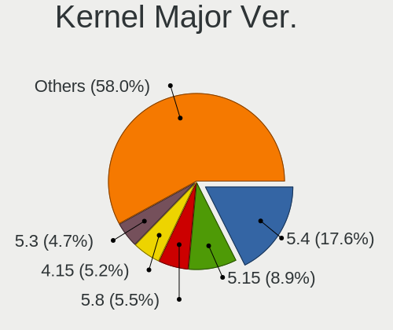
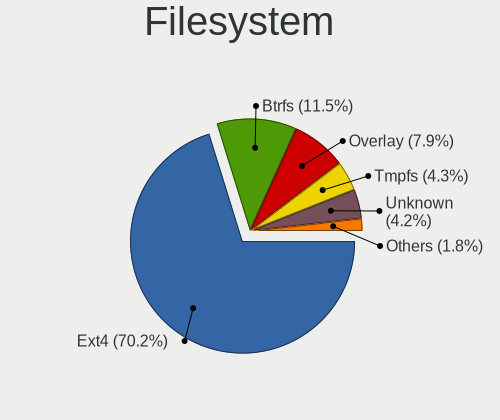
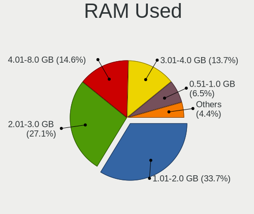
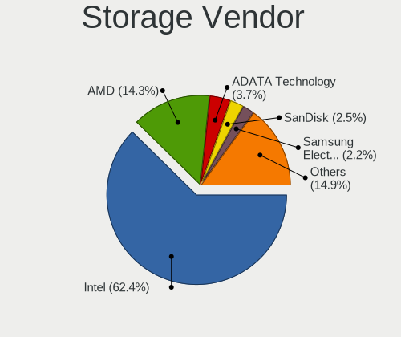
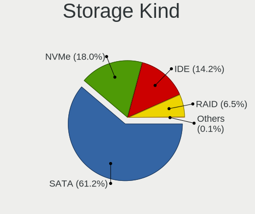
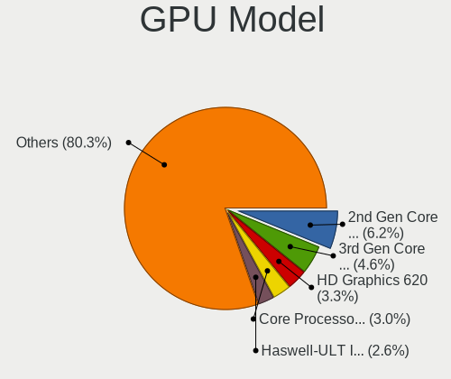
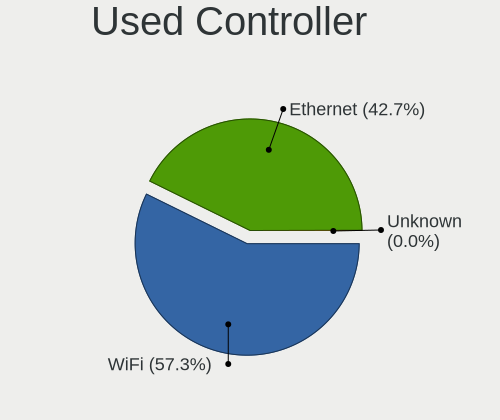

Linux in Brazil - Tested Hardware & Statistics
----------------------------------------------

A project to collect tested hardware configurations for Linux in Brazil.

Anyone can contribute to this report by the [hw-probe](https://github.com/linuxhw/hw-probe) tool:

    sudo -E hw-probe -all -upload

Please contribute! Especially if your hardware is rare.

This is a report for all computer types. See also reports for [desktops](/Location/Brazil/Desktop/README.md) and [notebooks](/Location/Brazil/Notebook/README.md).

Contents
--------

* [ Test Cases ](#test-cases)

* [ System ](#system)
  - [ OS                       ](#os)
  - [ OS Family                ](#os-family)
  - [ Kernel                   ](#kernel)
  - [ Kernel Family            ](#kernel-family)
  - [ Kernel Major Ver.        ](#kernel-major-ver)
  - [ Arch                     ](#arch)
  - [ DE                       ](#de)
  - [ Display Server           ](#display-server)
  - [ Display Manager          ](#display-manager)
  - [ OS Lang                  ](#os-lang)
  - [ Boot Mode                ](#boot-mode)
  - [ Filesystem               ](#filesystem)
  - [ Part. scheme             ](#part-scheme)
  - [ Dual Boot with Linux/BSD ](#dual-boot-with-linuxbsd)
  - [ Dual Boot (Win)          ](#dual-boot-win)

* [ Board ](#board)
  - [ Vendor                   ](#vendor)
  - [ Model                    ](#model)
  - [ Model Family             ](#model-family)
  - [ MFG Year                 ](#mfg-year)
  - [ Form Factor              ](#form-factor)
  - [ Secure Boot              ](#secure-boot)
  - [ Coreboot                 ](#coreboot)
  - [ RAM Size                 ](#ram-size)
  - [ RAM Used                 ](#ram-used)
  - [ Total Drives             ](#total-drives)
  - [ Has CD-ROM               ](#has-cd-rom)
  - [ Has Ethernet             ](#has-ethernet)
  - [ Has WiFi                 ](#has-wifi)
  - [ Has Bluetooth            ](#has-bluetooth)

* [ Location ](#location)
  - [ Country                  ](#country)
  - [ City                     ](#city)

* [ Drives ](#drives)
  - [ Drive Vendor             ](#drive-vendor)
  - [ Drive Model              ](#drive-model)
  - [ HDD Vendor               ](#hdd-vendor)
  - [ SSD Vendor               ](#ssd-vendor)
  - [ Drive Kind               ](#drive-kind)
  - [ Drive Connector          ](#drive-connector)
  - [ Drive Size               ](#drive-size)
  - [ Space Total              ](#space-total)
  - [ Space Used               ](#space-used)
  - [ Malfunc. Drives          ](#malfunc-drives)
  - [ Malfunc. Drive Vendor    ](#malfunc-drive-vendor)
  - [ Malfunc. HDD Vendor      ](#malfunc-hdd-vendor)
  - [ Malfunc. Drive Kind      ](#malfunc-drive-kind)
  - [ Failed Drives            ](#failed-drives)
  - [ Failed Drive Vendor      ](#failed-drive-vendor)
  - [ Drive Status             ](#drive-status)

* [ Storage controller ](#storage-controller)
  - [ Storage Vendor           ](#storage-vendor)
  - [ Storage Model            ](#storage-model)
  - [ Storage Kind             ](#storage-kind)

* [ Processor ](#processor)
  - [ CPU Vendor               ](#cpu-vendor)
  - [ CPU Model                ](#cpu-model)
  - [ CPU Model Family         ](#cpu-model-family)
  - [ CPU Cores                ](#cpu-cores)
  - [ CPU Sockets              ](#cpu-sockets)
  - [ CPU Threads              ](#cpu-threads)
  - [ CPU Op-Modes             ](#cpu-op-modes)
  - [ CPU Microcode            ](#cpu-microcode)
  - [ CPU Microarch            ](#cpu-microarch)

* [ Graphics ](#graphics)
  - [ GPU Vendor               ](#gpu-vendor)
  - [ GPU Model                ](#gpu-model)
  - [ GPU Combo                ](#gpu-combo)
  - [ GPU Driver               ](#gpu-driver)
  - [ GPU Memory               ](#gpu-memory)

* [ Monitor ](#monitor)
  - [ Monitor Vendor           ](#monitor-vendor)
  - [ Monitor Model            ](#monitor-model)
  - [ Monitor Resolution       ](#monitor-resolution)
  - [ Monitor Diagonal         ](#monitor-diagonal)
  - [ Monitor Width            ](#monitor-width)
  - [ Aspect Ratio             ](#aspect-ratio)
  - [ Monitor Area             ](#monitor-area)
  - [ Pixel Density            ](#pixel-density)
  - [ Multiple Monitors        ](#multiple-monitors)

* [ Network ](#network)
  - [ Net Controller Vendor    ](#net-controller-vendor)
  - [ Net Controller Model     ](#net-controller-model)
  - [ Wireless Vendor          ](#wireless-vendor)
  - [ Wireless Model           ](#wireless-model)
  - [ Ethernet Vendor          ](#ethernet-vendor)
  - [ Ethernet Model           ](#ethernet-model)
  - [ Net Controller Kind      ](#net-controller-kind)
  - [ Used Controller          ](#used-controller)
  - [ NICs                     ](#nics)
  - [ IPv6                     ](#ipv6)

* [ Bluetooth ](#bluetooth)
  - [ Bluetooth Vendor         ](#bluetooth-vendor)
  - [ Bluetooth Model          ](#bluetooth-model)

* [ Sound ](#sound)
  - [ Sound Vendor             ](#sound-vendor)
  - [ Sound Model              ](#sound-model)

* [ Memory ](#memory)
  - [ Memory Vendor            ](#memory-vendor)
  - [ Memory Model             ](#memory-model)
  - [ Memory Kind              ](#memory-kind)
  - [ Memory Form Factor       ](#memory-form-factor)
  - [ Memory Size              ](#memory-size)
  - [ Memory Speed             ](#memory-speed)

* [ Printers & scanners ](#printers--scanners)
  - [ Printer Vendor           ](#printer-vendor)
  - [ Printer Model            ](#printer-model)
  - [ Scanner Vendor           ](#scanner-vendor)
  - [ Scanner Model            ](#scanner-model)

* [ Camera ](#camera)
  - [ Camera Vendor            ](#camera-vendor)
  - [ Camera Model             ](#camera-model)

* [ Security ](#security)
  - [ Fingerprint Vendor       ](#fingerprint-vendor)
  - [ Fingerprint Model        ](#fingerprint-model)
  - [ Chipcard Vendor          ](#chipcard-vendor)
  - [ Chipcard Model           ](#chipcard-model)

* [ Unsupported ](#unsupported)
  - [ Unsupported Devices      ](#unsupported-devices)
  - [ Unsupported Device Types ](#unsupported-device-types)

Test Cases
----------

Total: 22767

| Vendor        | Model                       | Form-Factor | Probe                                                      | Date         |
|---------------|-----------------------------|-------------|------------------------------------------------------------|--------------|
| HP            | Pavilion dv6500             | Notebook    | [a9906a0a37](https://linux-hardware.org/?probe=a9906a0a37) | May 09, 2024 |
| LG Electro... | A410-G.BC44P1               | Notebook    | [e687d57757](https://linux-hardware.org/?probe=e687d57757) | May 09, 2024 |
| ASUSTek       | VivoBook_ASUSLaptop M150... | Notebook    | [b81a572516](https://linux-hardware.org/?probe=b81a572516) | May 09, 2024 |
| Dell          | 0PV3YR A05                  | Server      | [0a6d9b6f29](https://linux-hardware.org/?probe=0a6d9b6f29) | May 09, 2024 |
| Lenovo        | IdeaPad 3 15ALC6 82MF       | Notebook    | [413b207df0](https://linux-hardware.org/?probe=413b207df0) | May 09, 2024 |
| ASUSTek       | H110M-CS/BR                 | Desktop     | [5c516f0aa0](https://linux-hardware.org/?probe=5c516f0aa0) | May 09, 2024 |
| ASUSTek       | H81M-A/BR                   | Desktop     | [919fba348e](https://linux-hardware.org/?probe=919fba348e) | May 09, 2024 |
| Notebook      | NJx0MU                      | Notebook    | [ee086eec1f](https://linux-hardware.org/?probe=ee086eec1f) | May 09, 2024 |
| PCWare        | IPMH61R3                    | Desktop     | [1f3c6428d2](https://linux-hardware.org/?probe=1f3c6428d2) | May 09, 2024 |
| Sony          | VPCYB45JB                   | Notebook    | [6f70d22391](https://linux-hardware.org/?probe=6f70d22391) | May 09, 2024 |
| Dell          | Inspiron 13-7359            | Notebook    | [ed773eb204](https://linux-hardware.org/?probe=ed773eb204) | May 09, 2024 |
| Gigabyte      | Z87X-UD4H-CF                | Desktop     | [f26982efc3](https://linux-hardware.org/?probe=f26982efc3) | May 09, 2024 |
| Dell          | Inspiron 15-3567            | Notebook    | [4f2761bde5](https://linux-hardware.org/?probe=4f2761bde5) | May 09, 2024 |
| Ultra         | UB42X                       | Notebook    | [b7f2dbd777](https://linux-hardware.org/?probe=b7f2dbd777) | May 09, 2024 |
| Ultra         | UB42X                       | Notebook    | [4597d0586d](https://linux-hardware.org/?probe=4597d0586d) | May 08, 2024 |
| Intel         | X99                         | Desktop     | [a02c0050f2](https://linux-hardware.org/?probe=a02c0050f2) | May 08, 2024 |
| Avell High... | A70 MOB                     | Notebook    | [2be654083e](https://linux-hardware.org/?probe=2be654083e) | May 08, 2024 |
| MSI           | H310M PRO-M2 PLUS           | Desktop     | [969ea9ed0c](https://linux-hardware.org/?probe=969ea9ed0c) | May 08, 2024 |
| Huanan        | X99-QD4 V1.0                | Desktop     | [f6e1a31fef](https://linux-hardware.org/?probe=f6e1a31fef) | May 08, 2024 |
| Biostar       | A320MH                      | Desktop     | [404917c360](https://linux-hardware.org/?probe=404917c360) | May 08, 2024 |
| ASUSTek       | ASUS TUF Gaming F15 FX50... | Notebook    | [7c01de63e1](https://linux-hardware.org/?probe=7c01de63e1) | May 08, 2024 |
| Gigabyte      | B760M DS3H AX DDR4          | Desktop     | [8556d97dea](https://linux-hardware.org/?probe=8556d97dea) | May 08, 2024 |
| Samsung       | 270E5G/270E5U               | Notebook    | [11c56432a4](https://linux-hardware.org/?probe=11c56432a4) | May 08, 2024 |
| ASUSTek       | B150 PRO GAMING             | Desktop     | [d559ef5203](https://linux-hardware.org/?probe=d559ef5203) | May 08, 2024 |
| ASUSTek       | Q550LF                      | Notebook    | [15c9500499](https://linux-hardware.org/?probe=15c9500499) | May 07, 2024 |
| ASUSTek       | Q550LF                      | Notebook    | [98ddf90ae6](https://linux-hardware.org/?probe=98ddf90ae6) | May 07, 2024 |
| Samsung       | 530XBB                      | Notebook    | [5c0772cde4](https://linux-hardware.org/?probe=5c0772cde4) | May 07, 2024 |
| Intel         | H55                         | Desktop     | [83c1ac4239](https://linux-hardware.org/?probe=83c1ac4239) | May 07, 2024 |
| Daten Tecn... | DT02-M4                     | Notebook    | [88093023ed](https://linux-hardware.org/?probe=88093023ed) | May 07, 2024 |
| Apple         | MacBookPro8,1               | Notebook    | [abbe6a092c](https://linux-hardware.org/?probe=abbe6a092c) | May 07, 2024 |
| Apple         | MacBookPro8,1               | Notebook    | [dcd5e1e281](https://linux-hardware.org/?probe=dcd5e1e281) | May 07, 2024 |
| ASUSTek       | H81M-A/BR                   | Desktop     | [8f7abd7f23](https://linux-hardware.org/?probe=8f7abd7f23) | May 07, 2024 |
| Unknown       | Unknown                     | Notebook    | [09d2748c7a](https://linux-hardware.org/?probe=09d2748c7a) | May 07, 2024 |
| ASUSTek       | S451LA                      | Notebook    | [f3720aa6f9](https://linux-hardware.org/?probe=f3720aa6f9) | May 07, 2024 |
| ASUSTek       | PRIME H510M-E               | Desktop     | [bf4a7b097c](https://linux-hardware.org/?probe=bf4a7b097c) | May 06, 2024 |
| Alienware     | m15 R7                      | Notebook    | [445b29da20](https://linux-hardware.org/?probe=445b29da20) | May 06, 2024 |
| ASUSTek       | PRIME H510M-E               | Desktop     | [e76f332009](https://linux-hardware.org/?probe=e76f332009) | May 06, 2024 |
| Acer          | Aspire E1-572               | Notebook    | [3df494e445](https://linux-hardware.org/?probe=3df494e445) | May 06, 2024 |
| Dell          | Latitude 5440               | Notebook    | [f6c9287953](https://linux-hardware.org/?probe=f6c9287953) | May 06, 2024 |
| Intel         | B75                         | Desktop     | [18e086bc3d](https://linux-hardware.org/?probe=18e086bc3d) | May 06, 2024 |
| Acer          | Nitro AN515-43              | Notebook    | [c65a5efcdb](https://linux-hardware.org/?probe=c65a5efcdb) | May 06, 2024 |
| Samsung       | 550XDA                      | Notebook    | [1ea7dfb8ae](https://linux-hardware.org/?probe=1ea7dfb8ae) | May 06, 2024 |
| Itautec       | Itautec                     | Notebook    | [cb012e89fc](https://linux-hardware.org/?probe=cb012e89fc) | May 06, 2024 |
| Itautec       | Itautec                     | Notebook    | [e1d6b279b9](https://linux-hardware.org/?probe=e1d6b279b9) | May 06, 2024 |
| ASUSTek       | PRIME B550M-K               | Desktop     | [4ffd873f67](https://linux-hardware.org/?probe=4ffd873f67) | May 06, 2024 |
| Dell          | Inspiron N4050              | Notebook    | [0b1ac68bc9](https://linux-hardware.org/?probe=0b1ac68bc9) | May 06, 2024 |
| Lenovo        | 32E1 SDK0T76463 WIN 3422... | Desktop     | [981ac7ef2b](https://linux-hardware.org/?probe=981ac7ef2b) | May 06, 2024 |
| Dell          | Vostro 5471                 | Notebook    | [dae50714b1](https://linux-hardware.org/?probe=dae50714b1) | May 06, 2024 |
| Dell          | Vostro 5471                 | Notebook    | [92897b02b9](https://linux-hardware.org/?probe=92897b02b9) | May 06, 2024 |
| ASUSTek       | TUF Gaming Z690-PLUS D4     | Desktop     | [add0ddcfc0](https://linux-hardware.org/?probe=add0ddcfc0) | May 06, 2024 |
| Samsung       | 370E4K                      | Notebook    | [f0c626e7ca](https://linux-hardware.org/?probe=f0c626e7ca) | May 05, 2024 |
| Positivo      | J14GL11                     | Notebook    | [71f761fa87](https://linux-hardware.org/?probe=71f761fa87) | May 05, 2024 |
| ASUSTek       | VivoBook_ASUSLaptop X515... | Notebook    | [278add8d07](https://linux-hardware.org/?probe=278add8d07) | May 05, 2024 |
| Unknown       | Unknown                     | Desktop     | [708780fb6c](https://linux-hardware.org/?probe=708780fb6c) | May 05, 2024 |
| Acer          | Aspire A315-510P            | Notebook    | [802925480b](https://linux-hardware.org/?probe=802925480b) | May 05, 2024 |
| MACHINIST     | X99 PR9                     | Desktop     | [0503106449](https://linux-hardware.org/?probe=0503106449) | May 05, 2024 |
| Samsung       | 730QED                      | Convertible | [392bee96b2](https://linux-hardware.org/?probe=392bee96b2) | May 05, 2024 |
| Dell          | Inspiron 7520               | Notebook    | [87c4f1733b](https://linux-hardware.org/?probe=87c4f1733b) | May 05, 2024 |
| Positivo      | S14CT01                     | Notebook    | [45c8a9d70b](https://linux-hardware.org/?probe=45c8a9d70b) | May 04, 2024 |
| Positivo      | S14CT01                     | Notebook    | [f2994ff445](https://linux-hardware.org/?probe=f2994ff445) | May 04, 2024 |
| Samsung       | 270E5J/2570EJ               | Notebook    | [1349bac413](https://linux-hardware.org/?probe=1349bac413) | May 04, 2024 |
| Dell          | Vostro 15 5510              | Notebook    | [a3b2e8da38](https://linux-hardware.org/?probe=a3b2e8da38) | May 04, 2024 |
| MACHINIST     | X99 G7 V1.0                 | Desktop     | [47f648047f](https://linux-hardware.org/?probe=47f648047f) | May 04, 2024 |
| MACHINIST     | X99 G7 V1.0                 | Desktop     | [017f1471b0](https://linux-hardware.org/?probe=017f1471b0) | May 04, 2024 |
| Intel         | X99H                        | Desktop     | [a2a38cc926](https://linux-hardware.org/?probe=a2a38cc926) | May 04, 2024 |
| Digiboard     | G41M-S                      | Desktop     | [7b5f122417](https://linux-hardware.org/?probe=7b5f122417) | May 04, 2024 |
| Positivo      | 115T0810HN1C                | Notebook    | [1f932ed3b4](https://linux-hardware.org/?probe=1f932ed3b4) | May 03, 2024 |
| Positivo      | POS-EIH610EX 11189814       | Desktop     | [0657842cc3](https://linux-hardware.org/?probe=0657842cc3) | May 03, 2024 |
| ECS           | A780LM-M2                   | Desktop     | [081a49bf0c](https://linux-hardware.org/?probe=081a49bf0c) | May 03, 2024 |
| Gigabyte      | H510M H                     | Desktop     | [8bbb10ebf0](https://linux-hardware.org/?probe=8bbb10ebf0) | May 03, 2024 |
| Itautec       | Infoway w7730               | Notebook    | [65fba1a766](https://linux-hardware.org/?probe=65fba1a766) | May 03, 2024 |
| ASUSTek       | TUF B360-PLUS GAMING        | Desktop     | [2fa2359d84](https://linux-hardware.org/?probe=2fa2359d84) | May 03, 2024 |
| ASUSTek       | TUF B360-PLUS GAMING        | Desktop     | [9b2885b554](https://linux-hardware.org/?probe=9b2885b554) | May 03, 2024 |
| Apple         | Mac-27ADBB7B4CEE8E61 iMa... | All in one  | [84de6c0ea1](https://linux-hardware.org/?probe=84de6c0ea1) | May 03, 2024 |
| ASUSTek       | PRIME H510M-E               | Desktop     | [f32c122b72](https://linux-hardware.org/?probe=f32c122b72) | May 03, 2024 |
| Lenovo        | IdeaPad S145-15IWL 81S9     | Notebook    | [eb0a05de27](https://linux-hardware.org/?probe=eb0a05de27) | May 03, 2024 |
| ASUSTek       | B150 PRO GAMING             | Desktop     | [94e57165f0](https://linux-hardware.org/?probe=94e57165f0) | May 03, 2024 |
| ASRock        | A520M-HDV                   | Desktop     | [6bf979fc7a](https://linux-hardware.org/?probe=6bf979fc7a) | May 03, 2024 |
| ASUSTek       | TUF Gaming B550M-PLUS       | Desktop     | [ab935bd409](https://linux-hardware.org/?probe=ab935bd409) | May 02, 2024 |
| Intel         | B75                         | Desktop     | [4c39b0616d](https://linux-hardware.org/?probe=4c39b0616d) | May 02, 2024 |
| Dell          | 0YGYJY A01                  | Desktop     | [eb2aba50a5](https://linux-hardware.org/?probe=eb2aba50a5) | May 02, 2024 |
| Biostar       | B450MHP                     | Desktop     | [5d30a1821f](https://linux-hardware.org/?probe=5d30a1821f) | May 02, 2024 |
| Sony          | SVS13A25PBS                 | Notebook    | [32dc3304ac](https://linux-hardware.org/?probe=32dc3304ac) | May 02, 2024 |
| Intel         | H81                         | Desktop     | [8250f2ced3](https://linux-hardware.org/?probe=8250f2ced3) | May 02, 2024 |
| HP            | Pavilion g4                 | Notebook    | [d8f20744c2](https://linux-hardware.org/?probe=d8f20744c2) | May 02, 2024 |
| Dell          | Inspiron 3501               | Notebook    | [a2ef1e08ed](https://linux-hardware.org/?probe=a2ef1e08ed) | May 02, 2024 |
| Lenovo        | G400s VILG1                 | Notebook    | [f604dc3e58](https://linux-hardware.org/?probe=f604dc3e58) | May 02, 2024 |
| Alienware     | x17 R2                      | Notebook    | [4a80e449db](https://linux-hardware.org/?probe=4a80e449db) | May 02, 2024 |
| ASUSTek       | B150 PRO GAMING             | Desktop     | [4d38c7926c](https://linux-hardware.org/?probe=4d38c7926c) | May 02, 2024 |
| Gigabyte      | X570S AORUS ELITE           | Desktop     | [a76ca4fae1](https://linux-hardware.org/?probe=a76ca4fae1) | May 02, 2024 |
| Lenovo        | IdeaPad S145-15IIL 82DJ     | Notebook    | [0656624c78](https://linux-hardware.org/?probe=0656624c78) | May 02, 2024 |
| HP            | Pavilion dv6500             | Notebook    | [ad0b9eaa92](https://linux-hardware.org/?probe=ad0b9eaa92) | May 02, 2024 |
| MSI           | MEG Z490 UNIFY              | Desktop     | [73e7f9d576](https://linux-hardware.org/?probe=73e7f9d576) | May 02, 2024 |
| Intel         | B75                         | Desktop     | [4925a7fcb7](https://linux-hardware.org/?probe=4925a7fcb7) | May 02, 2024 |
| HP            | 3646h                       | Desktop     | [3c2faf0d32](https://linux-hardware.org/?probe=3c2faf0d32) | May 02, 2024 |
| Intel         | H55                         | Desktop     | [b7cf243933](https://linux-hardware.org/?probe=b7cf243933) | May 02, 2024 |
| Intel         | HURONRIVER                  | Desktop     | [da8de15263](https://linux-hardware.org/?probe=da8de15263) | May 02, 2024 |
| Biostar       | H61MLC                      | Desktop     | [d26510e4fb](https://linux-hardware.org/?probe=d26510e4fb) | May 01, 2024 |
| LG Electro... | 22V280 FAB1                 | All in one  | [9e2123a8a2](https://linux-hardware.org/?probe=9e2123a8a2) | May 01, 2024 |
| ASUSTek       | B150 PRO GAMING             | Desktop     | [fd39a02925](https://linux-hardware.org/?probe=fd39a02925) | May 01, 2024 |
| ASUSTek       | B150 PRO GAMING             | Desktop     | [61160f0f14](https://linux-hardware.org/?probe=61160f0f14) | May 01, 2024 |
| ASUSTek       | PRIME A520M-E               | Desktop     | [ee738361ee](https://linux-hardware.org/?probe=ee738361ee) | May 01, 2024 |
| Dell          | Vostro 5402                 | Notebook    | [34a28e5fd3](https://linux-hardware.org/?probe=34a28e5fd3) | May 01, 2024 |
| Biostar       | H61MLC                      | Desktop     | [502f0f308f](https://linux-hardware.org/?probe=502f0f308f) | May 01, 2024 |
| ASUSTek       | PRIME H510M-E               | Desktop     | [c3b30e066b](https://linux-hardware.org/?probe=c3b30e066b) | May 01, 2024 |
| Alienware     | x17 R2                      | Notebook    | [a98affb69b](https://linux-hardware.org/?probe=a98affb69b) | May 01, 2024 |
| Lenovo        | IdeaPad S145-15IWL 81S9     | Notebook    | [890bf7c3a6](https://linux-hardware.org/?probe=890bf7c3a6) | May 01, 2024 |
| Acer          | Swift SF514-56T             | Notebook    | [0d461b4a29](https://linux-hardware.org/?probe=0d461b4a29) | May 01, 2024 |
| ASUSTek       | VivoBook_ASUSLaptop X512... | Notebook    | [ad08810e0e](https://linux-hardware.org/?probe=ad08810e0e) | May 01, 2024 |
| Lenovo        | IdeaPad P400 Touch 20211    | Notebook    | [cacd80cba3](https://linux-hardware.org/?probe=cacd80cba3) | May 01, 2024 |
| MSI           | MAG B760M MORTAR WIFI       | Desktop     | [9e1fd1c22b](https://linux-hardware.org/?probe=9e1fd1c22b) | May 01, 2024 |
| Lenovo        | IdeaPad S145-15IWL 81S9     | Notebook    | [6c6c6b3f93](https://linux-hardware.org/?probe=6c6c6b3f93) | May 01, 2024 |
| MACHINIST     | X99 PR9                     | Desktop     | [88cb6d6044](https://linux-hardware.org/?probe=88cb6d6044) | May 01, 2024 |
| ASUSTek       | VivoBook_ASUSLaptop X515... | Notebook    | [badf656eaf](https://linux-hardware.org/?probe=badf656eaf) | May 01, 2024 |
| HP            | G42                         | Notebook    | [6c3591bf85](https://linux-hardware.org/?probe=6c3591bf85) | Apr 30, 2024 |
| HP            | G42                         | Notebook    | [577968802f](https://linux-hardware.org/?probe=577968802f) | Apr 30, 2024 |
| Lenovo        | IdeaPad S145-15IWL 81S9     | Notebook    | [e7b0c31433](https://linux-hardware.org/?probe=e7b0c31433) | Apr 30, 2024 |
| Dell          | 0YGYJY A01                  | Desktop     | [3d88956cd5](https://linux-hardware.org/?probe=3d88956cd5) | Apr 30, 2024 |
| Lenovo        | IdeaPad S145-15IWL 81S9     | Notebook    | [83497aeda8](https://linux-hardware.org/?probe=83497aeda8) | Apr 30, 2024 |
| Lenovo        | IdeaPad 320-15IKB 80YH      | Notebook    | [d8017ef206](https://linux-hardware.org/?probe=d8017ef206) | Apr 30, 2024 |
| Lenovo        | IdeaPad 320-15IKB 80YH      | Notebook    | [7cc4d5fb6b](https://linux-hardware.org/?probe=7cc4d5fb6b) | Apr 30, 2024 |
| PCWare        | IPMH310G PRO                | Desktop     | [f38e07cde2](https://linux-hardware.org/?probe=f38e07cde2) | Apr 30, 2024 |
| ASUSTek       | M5A97 LE R2.0               | Desktop     | [1d6a7ccba0](https://linux-hardware.org/?probe=1d6a7ccba0) | Apr 30, 2024 |
| Samsung       | 550XDA                      | Notebook    | [6cf8613d4e](https://linux-hardware.org/?probe=6cf8613d4e) | Apr 30, 2024 |
| Gigabyte      | H61M-S1                     | Desktop     | [4067e2b325](https://linux-hardware.org/?probe=4067e2b325) | Apr 30, 2024 |
| Gigabyte      | H61M-S1                     | Desktop     | [ea6fdbe20e](https://linux-hardware.org/?probe=ea6fdbe20e) | Apr 30, 2024 |
| HP            | Mini 210-1000               | Notebook    | [f44ded04c1](https://linux-hardware.org/?probe=f44ded04c1) | Apr 29, 2024 |
| Positivo      | POS-AG31AP                  | Desktop     | [998129cad7](https://linux-hardware.org/?probe=998129cad7) | Apr 29, 2024 |
| Dell          | Vostro 14-3468              | Notebook    | [4d24830aa0](https://linux-hardware.org/?probe=4d24830aa0) | Apr 29, 2024 |
| MSI           | MEG Z490 UNIFY              | Desktop     | [616294b6b2](https://linux-hardware.org/?probe=616294b6b2) | Apr 29, 2024 |
| ASUSTek       | PRIME A520M-A II            | Desktop     | [3066905907](https://linux-hardware.org/?probe=3066905907) | Apr 29, 2024 |
| Acer          | Aspire A315-32              | Notebook    | [452883ee31](https://linux-hardware.org/?probe=452883ee31) | Apr 29, 2024 |
| Dell          | Inspiron 3442               | Notebook    | [05db1722f8](https://linux-hardware.org/?probe=05db1722f8) | Apr 29, 2024 |
| HP            | 8526 MVB, A                 | Desktop     | [880c56ee27](https://linux-hardware.org/?probe=880c56ee27) | Apr 29, 2024 |
| Samsung       | 550XDA                      | Notebook    | [24b83d160f](https://linux-hardware.org/?probe=24b83d160f) | Apr 29, 2024 |
| Alienware     | m15 R7                      | Notebook    | [ab03c1cde2](https://linux-hardware.org/?probe=ab03c1cde2) | Apr 29, 2024 |
| MSI           | B560M PRO-E                 | Desktop     | [b2adb051ee](https://linux-hardware.org/?probe=b2adb051ee) | Apr 29, 2024 |
| ASUSTek       | PRIME A520M-E               | Desktop     | [e0dc85f1a0](https://linux-hardware.org/?probe=e0dc85f1a0) | Apr 28, 2024 |
| HP            | 18E7                        | Desktop     | [e91218e74f](https://linux-hardware.org/?probe=e91218e74f) | Apr 28, 2024 |
| ASUSTek       | X451CA                      | Notebook    | [30d9b5f4ee](https://linux-hardware.org/?probe=30d9b5f4ee) | Apr 28, 2024 |
| Avell High... | Avell G1513 MUV / A52 MU... | Notebook    | [2abfc3ebc0](https://linux-hardware.org/?probe=2abfc3ebc0) | Apr 28, 2024 |
| Dell          | Latitude E6410              | Notebook    | [14cad1b34b](https://linux-hardware.org/?probe=14cad1b34b) | Apr 28, 2024 |
| AMD           | A88K                        | Desktop     | [5a4ca72c81](https://linux-hardware.org/?probe=5a4ca72c81) | Apr 28, 2024 |
| Intel         | AB2L .A001                  | Mini pc     | [c83deebaf0](https://linux-hardware.org/?probe=c83deebaf0) | Apr 28, 2024 |
| Lenovo        | IdeaPad Gaming 3 15IMH05... | Notebook    | [bb0733cb2a](https://linux-hardware.org/?probe=bb0733cb2a) | Apr 28, 2024 |
| HP            | 18E7                        | Desktop     | [4442e8fc4a](https://linux-hardware.org/?probe=4442e8fc4a) | Apr 27, 2024 |
| Intel         | AB2L .A001                  | Mini pc     | [b9bb546172](https://linux-hardware.org/?probe=b9bb546172) | Apr 27, 2024 |
| Acer          | Aspire 5733                 | Notebook    | [f7af5c9308](https://linux-hardware.org/?probe=f7af5c9308) | Apr 27, 2024 |
| MSI           | G31M3-L V2                  | Desktop     | [0a033139d1](https://linux-hardware.org/?probe=0a033139d1) | Apr 27, 2024 |
| Lenovo        | IdeaPad G485 QAWGE          | Notebook    | [364be8242a](https://linux-hardware.org/?probe=364be8242a) | Apr 27, 2024 |
| Lenovo        | ThinkPad X61 76754KU        | Notebook    | [1a083b94dc](https://linux-hardware.org/?probe=1a083b94dc) | Apr 27, 2024 |
| Lenovo        | Legion 5 15IMH05H 82CF      | Notebook    | [46b36289be](https://linux-hardware.org/?probe=46b36289be) | Apr 27, 2024 |
| Samsung       | 550XDA                      | Notebook    | [de2396f0a2](https://linux-hardware.org/?probe=de2396f0a2) | Apr 27, 2024 |
| Lenovo        | ThinkPad E14 Gen 3 20YD0... | Notebook    | [b52a110875](https://linux-hardware.org/?probe=b52a110875) | Apr 27, 2024 |
| Lenovo        | ThinkPad P52 20MAS04M23     | Notebook    | [3cc3f4dcc1](https://linux-hardware.org/?probe=3cc3f4dcc1) | Apr 27, 2024 |
| ASUSTek       | K45A                        | Notebook    | [7bed7e12ab](https://linux-hardware.org/?probe=7bed7e12ab) | Apr 27, 2024 |
| Lenovo        | IdeaPad S145-15API 81V7     | Notebook    | [d815a3ca77](https://linux-hardware.org/?probe=d815a3ca77) | Apr 26, 2024 |
| Lenovo        | IdeaPad S145-15API 81V7     | Notebook    | [079540b490](https://linux-hardware.org/?probe=079540b490) | Apr 26, 2024 |
| Dell          | Inspiron 1525               | Notebook    | [c609a3560c](https://linux-hardware.org/?probe=c609a3560c) | Apr 26, 2024 |
| Positivo      | S15SL                       | Notebook    | [7eeb7b8841](https://linux-hardware.org/?probe=7eeb7b8841) | Apr 26, 2024 |
| Positivo      | S15SL                       | Notebook    | [94429966a7](https://linux-hardware.org/?probe=94429966a7) | Apr 26, 2024 |
| Positivo      | POS-RAX300ES 11191478       | Desktop     | [3e201c7230](https://linux-hardware.org/?probe=3e201c7230) | Apr 26, 2024 |
| Valve         | Jupiter                     | Notebook    | [5430bf31d1](https://linux-hardware.org/?probe=5430bf31d1) | Apr 26, 2024 |
| Dell          | 01XK1W A00                  | Desktop     | [a5fcd90239](https://linux-hardware.org/?probe=a5fcd90239) | Apr 26, 2024 |
| Valve         | Jupiter                     | Notebook    | [81ec451d66](https://linux-hardware.org/?probe=81ec451d66) | Apr 26, 2024 |
| Apple         | MacBookPro9,2               | Notebook    | [583ea6bc03](https://linux-hardware.org/?probe=583ea6bc03) | Apr 25, 2024 |
| Gigabyte      | B75M-D2V                    | Desktop     | [21c055a907](https://linux-hardware.org/?probe=21c055a907) | Apr 25, 2024 |
| Acer          | Aspire A315-510P            | Notebook    | [d30b9a7a06](https://linux-hardware.org/?probe=d30b9a7a06) | Apr 25, 2024 |
| Positivo      | POS-PIQ77CL                 | Desktop     | [ca5ecf0b4c](https://linux-hardware.org/?probe=ca5ecf0b4c) | Apr 25, 2024 |
| Dell          | 0Y2MRG A01                  | Desktop     | [f1ed6a2c54](https://linux-hardware.org/?probe=f1ed6a2c54) | Apr 25, 2024 |
| MACHINIST     | X79 V2.82A                  | Desktop     | [41c6b865b1](https://linux-hardware.org/?probe=41c6b865b1) | Apr 25, 2024 |
| ASUSTek       | VivoBook_ASUSLaptop M150... | Notebook    | [6230432bc4](https://linux-hardware.org/?probe=6230432bc4) | Apr 25, 2024 |
| Acer          | Aspire A315-33              | Notebook    | [5f7edad747](https://linux-hardware.org/?probe=5f7edad747) | Apr 25, 2024 |
| Acer          | Aspire A315-33              | Notebook    | [8f762b36cd](https://linux-hardware.org/?probe=8f762b36cd) | Apr 25, 2024 |
| Dell          | Inspiron 15 3515            | Notebook    | [cd29a525ed](https://linux-hardware.org/?probe=cd29a525ed) | Apr 24, 2024 |
| ASUSTek       | TUF Gaming Z490-PLUS        | Desktop     | [c44f97261d](https://linux-hardware.org/?probe=c44f97261d) | Apr 24, 2024 |
| AZW           | T4 PRO                      | Desktop     | [8549531554](https://linux-hardware.org/?probe=8549531554) | Apr 24, 2024 |
| ONDA          | A520SD4 Ver:1.00            | Desktop     | [d1a735de54](https://linux-hardware.org/?probe=d1a735de54) | Apr 24, 2024 |
| Dell          | 0FKD45 A03                  | Server      | [8f0e89bd99](https://linux-hardware.org/?probe=8f0e89bd99) | Apr 24, 2024 |
| ASUSTek       | P5K Premium                 | Desktop     | [9b09b4d8bd](https://linux-hardware.org/?probe=9b09b4d8bd) | Apr 24, 2024 |
| ASUSTek       | Maximus IX CODE             | Desktop     | [db21083720](https://linux-hardware.org/?probe=db21083720) | Apr 24, 2024 |
| Dell          | Inspiron N4050              | Notebook    | [cbcc357ce6](https://linux-hardware.org/?probe=cbcc357ce6) | Apr 24, 2024 |
| Samsung       | 550XDA                      | Notebook    | [7d2c852ee6](https://linux-hardware.org/?probe=7d2c852ee6) | Apr 24, 2024 |
| Gigabyte      | H110M-S2PH-CF               | Desktop     | [f35a83875e](https://linux-hardware.org/?probe=f35a83875e) | Apr 24, 2024 |
| Toshiba       | STI NI 1401                 | Notebook    | [caed126d9e](https://linux-hardware.org/?probe=caed126d9e) | Apr 24, 2024 |
| Digiboard     | MPxx                        | Desktop     | [e277b1a1d5](https://linux-hardware.org/?probe=e277b1a1d5) | Apr 24, 2024 |
| Lenovo        | ThinkPad P16s Gen 2 21K9... | Notebook    | [ac5431b1ee](https://linux-hardware.org/?probe=ac5431b1ee) | Apr 24, 2024 |
| Unknown       | F42                         | Notebook    | [947c137825](https://linux-hardware.org/?probe=947c137825) | Apr 23, 2024 |
| Gigabyte      | B75M-D3H                    | Desktop     | [1617699830](https://linux-hardware.org/?probe=1617699830) | Apr 23, 2024 |
| Gigabyte      | H110M-H DDR3-CF             | Desktop     | [455f999e6d](https://linux-hardware.org/?probe=455f999e6d) | Apr 23, 2024 |
| Lenovo        | IdeaPad Gaming 3 15IMH05... | Notebook    | [6f01a069fa](https://linux-hardware.org/?probe=6f01a069fa) | Apr 23, 2024 |
| Dell          | 0YGYJY A01                  | Desktop     | [c922a511fd](https://linux-hardware.org/?probe=c922a511fd) | Apr 23, 2024 |
| Dell          | Vostro 15 5510              | Notebook    | [aedc6ae848](https://linux-hardware.org/?probe=aedc6ae848) | Apr 23, 2024 |
| Biostar       | A320MH                      | Desktop     | [5506fc2ad4](https://linux-hardware.org/?probe=5506fc2ad4) | Apr 23, 2024 |
| Apple         | Mac-F226BEC8 PVT            | All in one  | [06c04ebd74](https://linux-hardware.org/?probe=06c04ebd74) | Apr 23, 2024 |
| Lenovo        | SHARKBAY 0B98401 WIN        | Desktop     | [fa0b7c7632](https://linux-hardware.org/?probe=fa0b7c7632) | Apr 23, 2024 |
| Gigabyte      | B760M AORUS ELITE           | Desktop     | [3d15cef077](https://linux-hardware.org/?probe=3d15cef077) | Apr 23, 2024 |
| ASRock        | FM2A68M-DG3+                | Desktop     | [8049fc6b37](https://linux-hardware.org/?probe=8049fc6b37) | Apr 23, 2024 |
| ADLINK Tec... | LEC-EL A1                   | Desktop     | [72b115951b](https://linux-hardware.org/?probe=72b115951b) | Apr 22, 2024 |
| ASUSTek       | PRIME A320M-K/BR            | Desktop     | [fe05e4fbfc](https://linux-hardware.org/?probe=fe05e4fbfc) | Apr 22, 2024 |
| ASUSTek       | P5G41T-M LX2/BR             | Desktop     | [7e16d97409](https://linux-hardware.org/?probe=7e16d97409) | Apr 22, 2024 |
| Intel         | X99H                        | Desktop     | [cca155cf13](https://linux-hardware.org/?probe=cca155cf13) | Apr 22, 2024 |
| Positivo      | POS-AG31AP                  | Desktop     | [63fb44d22f](https://linux-hardware.org/?probe=63fb44d22f) | Apr 22, 2024 |
| Gigabyte      | Z790 AORUS ELITE AX         | Desktop     | [4485a9e6db](https://linux-hardware.org/?probe=4485a9e6db) | Apr 22, 2024 |
| ASRock        | B450M Steel Legend          | Desktop     | [7fb64c7bef](https://linux-hardware.org/?probe=7fb64c7bef) | Apr 22, 2024 |
| Acer          | Aspire A315-24P             | Notebook    | [9145d16c0f](https://linux-hardware.org/?probe=9145d16c0f) | Apr 22, 2024 |
| Apple         | MacBookPro14,1              | Notebook    | [743a3ab71e](https://linux-hardware.org/?probe=743a3ab71e) | Apr 22, 2024 |
| Samsung       | 300E5EV/300E4EV/270E5EV/... | Notebook    | [e499f5d301](https://linux-hardware.org/?probe=e499f5d301) | Apr 22, 2024 |
| Itautec       | Infoway w7730               | Notebook    | [904234ad57](https://linux-hardware.org/?probe=904234ad57) | Apr 22, 2024 |
| Positivo      | S14SL01                     | Notebook    | [4840897917](https://linux-hardware.org/?probe=4840897917) | Apr 21, 2024 |
| Toshiba       | STI 012943                  | Desktop     | [678536872d](https://linux-hardware.org/?probe=678536872d) | Apr 21, 2024 |
| Dell          | 04HGFY A00                  | All in one  | [666912f9fa](https://linux-hardware.org/?probe=666912f9fa) | Apr 21, 2024 |
| HP            | Pavilion dm4                | Notebook    | [a22add80ac](https://linux-hardware.org/?probe=a22add80ac) | Apr 21, 2024 |
| HP            | Pavilion dm4                | Notebook    | [5f731468da](https://linux-hardware.org/?probe=5f731468da) | Apr 21, 2024 |
| ASUSTek       | PRIME A520M-E               | Desktop     | [fa784dad84](https://linux-hardware.org/?probe=fa784dad84) | Apr 21, 2024 |
| Lenovo        | G470 20078                  | Notebook    | [63d40af7a3](https://linux-hardware.org/?probe=63d40af7a3) | Apr 21, 2024 |
| Positivo      | POS-PIG41BA POSITIVO        | Desktop     | [d5e1581050](https://linux-hardware.org/?probe=d5e1581050) | Apr 21, 2024 |
| Gigabyte      | A520M S2H                   | Desktop     | [52de796ce6](https://linux-hardware.org/?probe=52de796ce6) | Apr 21, 2024 |
| ASUSTek       | PRIME H410M-A               | Desktop     | [41da917e67](https://linux-hardware.org/?probe=41da917e67) | Apr 21, 2024 |
| Intel         | X99-P4 V5.1                 | Desktop     | [15e8dd212b](https://linux-hardware.org/?probe=15e8dd212b) | Apr 21, 2024 |
| Apple         | Mac-031AEE4D24BFF0B1 Mac... | Mini pc     | [fdae0762c0](https://linux-hardware.org/?probe=fdae0762c0) | Apr 20, 2024 |
| Intel         | B75                         | Desktop     | [27d3a826f4](https://linux-hardware.org/?probe=27d3a826f4) | Apr 20, 2024 |
| Toshiba       | STI 001387                  | Desktop     | [240e193806](https://linux-hardware.org/?probe=240e193806) | Apr 20, 2024 |
| Gigabyte      | B660M DS3H DDR4             | Desktop     | [ea7d988606](https://linux-hardware.org/?probe=ea7d988606) | Apr 20, 2024 |
| ASRock        | B450M Steel Legend          | Desktop     | [0df86cd712](https://linux-hardware.org/?probe=0df86cd712) | Apr 20, 2024 |
| Positivo      | Mobile                      | Notebook    | [c74545679c](https://linux-hardware.org/?probe=c74545679c) | Apr 20, 2024 |
| Intel         | AB2L .A001                  | Mini pc     | [9cadaddb30](https://linux-hardware.org/?probe=9cadaddb30) | Apr 20, 2024 |
| ASUSTek       | VivoBook_ASUSLaptop K360... | Notebook    | [9e43e9df38](https://linux-hardware.org/?probe=9e43e9df38) | Apr 19, 2024 |
| ASUSTek       | H81M-C/BR                   | Desktop     | [4e53f25e9b](https://linux-hardware.org/?probe=4e53f25e9b) | Apr 19, 2024 |
| Dell          | 08NPPY A00                  | Desktop     | [dad92afe76](https://linux-hardware.org/?probe=dad92afe76) | Apr 19, 2024 |
| Lenovo        | G480 20149                  | Notebook    | [ad23e3678b](https://linux-hardware.org/?probe=ad23e3678b) | Apr 19, 2024 |
| Dell          | G15 5530                    | Notebook    | [c1f49dc2d9](https://linux-hardware.org/?probe=c1f49dc2d9) | Apr 19, 2024 |
| ASUSTek       | ROG STRIX Z490-F GAMING     | Desktop     | [aea22c24a7](https://linux-hardware.org/?probe=aea22c24a7) | Apr 19, 2024 |
| Gigabyte      | B760M AORUS ELITE           | Desktop     | [d2b9b5429d](https://linux-hardware.org/?probe=d2b9b5429d) | Apr 19, 2024 |
| Dell          | Inspiron N4050              | Notebook    | [c35c8bb833](https://linux-hardware.org/?probe=c35c8bb833) | Apr 19, 2024 |
| Dell          | Inspiron N4050              | Notebook    | [0e75a1591d](https://linux-hardware.org/?probe=0e75a1591d) | Apr 19, 2024 |
| Acer          | Predator PH315-52           | Notebook    | [62dede0f49](https://linux-hardware.org/?probe=62dede0f49) | Apr 19, 2024 |
| HP            | 339A                        | Desktop     | [fb23f5210f](https://linux-hardware.org/?probe=fb23f5210f) | Apr 18, 2024 |
| HP            | 829A                        | Mini pc     | [20a6bfef96](https://linux-hardware.org/?probe=20a6bfef96) | Apr 18, 2024 |
| Gigabyte      | AB350M-DS3H V2-CF           | Desktop     | [7cfe6d651b](https://linux-hardware.org/?probe=7cfe6d651b) | Apr 18, 2024 |
| Lenovo        | 30D9 SDK0J40697 WIN 3305... | Desktop     | [8a42c0cd30](https://linux-hardware.org/?probe=8a42c0cd30) | Apr 18, 2024 |
| Acer          | V5-171                      | Notebook    | [1c5fdb6bae](https://linux-hardware.org/?probe=1c5fdb6bae) | Apr 18, 2024 |
| Lenovo        | Slim Pro 9 14IRP8 83BV      | Notebook    | [7b5eee5473](https://linux-hardware.org/?probe=7b5eee5473) | Apr 18, 2024 |
| Gigabyte      | H170M-D3H DDR3-CF           | Desktop     | [f7a78f85d8](https://linux-hardware.org/?probe=f7a78f85d8) | Apr 18, 2024 |
| Gigabyte      | B450 AORUS M                | Desktop     | [b16af25313](https://linux-hardware.org/?probe=b16af25313) | Apr 18, 2024 |
| PCWare        | IPMH61R3                    | Desktop     | [9f8562ac62](https://linux-hardware.org/?probe=9f8562ac62) | Apr 18, 2024 |
| ASUSTek       | TUF Gaming B550M-PLUS       | Desktop     | [5e4c324298](https://linux-hardware.org/?probe=5e4c324298) | Apr 18, 2024 |
| Samsung       | 960XFH                      | Notebook    | [ebd54da0c3](https://linux-hardware.org/?probe=ebd54da0c3) | Apr 17, 2024 |
| AZW           | T4 PRO                      | Desktop     | [90791fdf61](https://linux-hardware.org/?probe=90791fdf61) | Apr 17, 2024 |
| Dell          | Latitude 5310               | Notebook    | [e46914e458](https://linux-hardware.org/?probe=e46914e458) | Apr 17, 2024 |
| Intel         | H55                         | Desktop     | [28e666728f](https://linux-hardware.org/?probe=28e666728f) | Apr 17, 2024 |
| MSI           | Z87-G45 GAMING              | Desktop     | [f646b54913](https://linux-hardware.org/?probe=f646b54913) | Apr 17, 2024 |
| PCWare        | IPMH110G                    | Desktop     | [0646f27757](https://linux-hardware.org/?probe=0646f27757) | Apr 17, 2024 |
| Unknown       | Unknown                     | Desktop     | [bae188579b](https://linux-hardware.org/?probe=bae188579b) | Apr 17, 2024 |
| Acer          | Nitro AN515-45              | Notebook    | [224785342d](https://linux-hardware.org/?probe=224785342d) | Apr 17, 2024 |
| Intel         | H55                         | Desktop     | [27ee1cd49f](https://linux-hardware.org/?probe=27ee1cd49f) | Apr 17, 2024 |
| Lenovo        | 100-14IBY 80R7              | Notebook    | [c186027176](https://linux-hardware.org/?probe=c186027176) | Apr 17, 2024 |
| Gigabyte      | A320M-S2H-CF                | Desktop     | [d4479ea9be](https://linux-hardware.org/?probe=d4479ea9be) | Apr 17, 2024 |
| Unknown       | Unknown                     | Desktop     | [9c69980686](https://linux-hardware.org/?probe=9c69980686) | Apr 17, 2024 |
| Lenovo        | NOK                         | Desktop     | [3190c97560](https://linux-hardware.org/?probe=3190c97560) | Apr 17, 2024 |
| Gigabyte      | GA-78LMT-S2P                | Desktop     | [45b35e097e](https://linux-hardware.org/?probe=45b35e097e) | Apr 17, 2024 |
| Dell          | Inspiron 5547               | Notebook    | [695c284c67](https://linux-hardware.org/?probe=695c284c67) | Apr 17, 2024 |
| DUEX          | H510 Ver:1.00               | Desktop     | [47f0cd0837](https://linux-hardware.org/?probe=47f0cd0837) | Apr 17, 2024 |
| Unknown       | DH61BR G32662-203           | Desktop     | [d27fa5367c](https://linux-hardware.org/?probe=d27fa5367c) | Apr 16, 2024 |
| Dell          | 0P99M4 A01                  | Desktop     | [77e4450298](https://linux-hardware.org/?probe=77e4450298) | Apr 16, 2024 |
| Valve         | Jupiter                     | Notebook    | [d5c75e66f1](https://linux-hardware.org/?probe=d5c75e66f1) | Apr 16, 2024 |
| Lenovo        | G480 20149                  | Notebook    | [4acc655121](https://linux-hardware.org/?probe=4acc655121) | Apr 16, 2024 |
| Dell          | Inspiron 7520               | Notebook    | [9f294b2198](https://linux-hardware.org/?probe=9f294b2198) | Apr 16, 2024 |
| ASUSTek       | VivoBook_ASUSLaptop X515... | Notebook    | [d4e5c0b729](https://linux-hardware.org/?probe=d4e5c0b729) | Apr 16, 2024 |
| Dell          | Inspiron 5547               | Notebook    | [088cb90432](https://linux-hardware.org/?probe=088cb90432) | Apr 16, 2024 |
| Intel         | H81                         | Desktop     | [e182aced52](https://linux-hardware.org/?probe=e182aced52) | Apr 16, 2024 |
| Sony          | SVE14A16FBW                 | Notebook    | [7f4b9fd407](https://linux-hardware.org/?probe=7f4b9fd407) | Apr 16, 2024 |
| ASUSTek       | VivoBook_ASUSLaptop X515... | Notebook    | [9f9dc48ef8](https://linux-hardware.org/?probe=9f9dc48ef8) | Apr 15, 2024 |
| Intel         | H81                         | Desktop     | [5029d0bb32](https://linux-hardware.org/?probe=5029d0bb32) | Apr 15, 2024 |
| Acer          | Aspire A515-51              | Notebook    | [7ff3e868b5](https://linux-hardware.org/?probe=7ff3e868b5) | Apr 15, 2024 |
| ASRock        | A520M-HDV                   | Desktop     | [56905e2bc8](https://linux-hardware.org/?probe=56905e2bc8) | Apr 15, 2024 |
| NCR           | IPMQ57.0.0                  | Desktop     | [71888644f5](https://linux-hardware.org/?probe=71888644f5) | Apr 15, 2024 |
| ASRock        | A520M-HDV                   | Desktop     | [47e7cdb053](https://linux-hardware.org/?probe=47e7cdb053) | Apr 15, 2024 |
| Dell          | G15 5525                    | Notebook    | [74c6d6a8f8](https://linux-hardware.org/?probe=74c6d6a8f8) | Apr 15, 2024 |
| Dell          | Inspiron 5566               | Notebook    | [b766f56874](https://linux-hardware.org/?probe=b766f56874) | Apr 15, 2024 |
| Gigabyte      | A520M H                     | Desktop     | [8c9dec81e3](https://linux-hardware.org/?probe=8c9dec81e3) | Apr 15, 2024 |
| Gigabyte      | A520M H                     | Desktop     | [ac53e58a8c](https://linux-hardware.org/?probe=ac53e58a8c) | Apr 15, 2024 |
| ASRock        | B650E PG Riptide WiFi       | Desktop     | [edae497a7d](https://linux-hardware.org/?probe=edae497a7d) | Apr 14, 2024 |
| ASUSTek       | TUF H310M-PLUS GAMING/BR    | Desktop     | [5de5178742](https://linux-hardware.org/?probe=5de5178742) | Apr 14, 2024 |
| ASUSTek       | TUF H310M-PLUS GAMING/BR    | Desktop     | [e96012759d](https://linux-hardware.org/?probe=e96012759d) | Apr 14, 2024 |
| Acer          | Nitro AN515-51              | Notebook    | [46d9c6bc98](https://linux-hardware.org/?probe=46d9c6bc98) | Apr 14, 2024 |
| Dell          | Latitude 3440               | Notebook    | [e334ba82e5](https://linux-hardware.org/?probe=e334ba82e5) | Apr 14, 2024 |
| Dell          | Latitude 3440               | Notebook    | [77e2af784e](https://linux-hardware.org/?probe=77e2af784e) | Apr 14, 2024 |
| Sony          | SVF14A15CLB                 | Notebook    | [473cac0cd4](https://linux-hardware.org/?probe=473cac0cd4) | Apr 14, 2024 |
| ASUSTek       | ROG STRIX X570-E GAMING     | Desktop     | [5bb8884eee](https://linux-hardware.org/?probe=5bb8884eee) | Apr 14, 2024 |
| ASUSTek       | TUF Gaming H670-PRO WIFI... | Desktop     | [5308fb42b9](https://linux-hardware.org/?probe=5308fb42b9) | Apr 14, 2024 |
| Dell          | G15 5530                    | Notebook    | [b44b0fd700](https://linux-hardware.org/?probe=b44b0fd700) | Apr 14, 2024 |
| ASUSTek       | ROG STRIX X570-E GAMING     | Desktop     | [841b3d5f2e](https://linux-hardware.org/?probe=841b3d5f2e) | Apr 14, 2024 |
| Intel         | B250                        | Desktop     | [197e339bcf](https://linux-hardware.org/?probe=197e339bcf) | Apr 14, 2024 |
| ASRock        | B650E Taichi Lite           | Desktop     | [b69958b86b](https://linux-hardware.org/?probe=b69958b86b) | Apr 14, 2024 |
| Dell          | Inspiron 3721               | Notebook    | [49aec34132](https://linux-hardware.org/?probe=49aec34132) | Apr 13, 2024 |
| Acer          | Aspire 5733                 | Notebook    | [3451c7aac4](https://linux-hardware.org/?probe=3451c7aac4) | Apr 13, 2024 |
| ASUSTek       | X451MA                      | Notebook    | [8e0f92ef8c](https://linux-hardware.org/?probe=8e0f92ef8c) | Apr 13, 2024 |
| HP            | Folio 13                    | Notebook    | [2112e4d193](https://linux-hardware.org/?probe=2112e4d193) | Apr 13, 2024 |
| Dell          | G15 5530                    | Notebook    | [cbc77bc17c](https://linux-hardware.org/?probe=cbc77bc17c) | Apr 13, 2024 |
| Acer          | Aspire A315-41              | Notebook    | [df30810cbe](https://linux-hardware.org/?probe=df30810cbe) | Apr 13, 2024 |
| Sony          | VPCEH30EB                   | Notebook    | [a3ce44d34f](https://linux-hardware.org/?probe=a3ce44d34f) | Apr 12, 2024 |
| Samsung       | 550XDA                      | Notebook    | [2679015030](https://linux-hardware.org/?probe=2679015030) | Apr 12, 2024 |
| Dell          | G15 5525                    | Notebook    | [7842ec2d68](https://linux-hardware.org/?probe=7842ec2d68) | Apr 12, 2024 |
| Samsung       | 370E4K                      | Notebook    | [362fb05bf2](https://linux-hardware.org/?probe=362fb05bf2) | Apr 12, 2024 |
| Samsung       | 550XDA                      | Notebook    | [ac02b37e1d](https://linux-hardware.org/?probe=ac02b37e1d) | Apr 12, 2024 |
| Dell          | G15 5510                    | Notebook    | [9820798256](https://linux-hardware.org/?probe=9820798256) | Apr 12, 2024 |
| HP            | 240 G2                      | Notebook    | [330b73b67e](https://linux-hardware.org/?probe=330b73b67e) | Apr 12, 2024 |
| Lenovo        | IdeaPad 110-14IBR 80UJ      | Notebook    | [ed5c941b3f](https://linux-hardware.org/?probe=ed5c941b3f) | Apr 12, 2024 |
| Intel         | X99 V1.0                    | Desktop     | [57c2d76c65](https://linux-hardware.org/?probe=57c2d76c65) | Apr 12, 2024 |
| MACHINIST     | E5-MR9A PRO V1.0            | Desktop     | [cb0f8fe9bc](https://linux-hardware.org/?probe=cb0f8fe9bc) | Apr 12, 2024 |
| Acer          | Nitro AN515-43              | Notebook    | [36bf325205](https://linux-hardware.org/?probe=36bf325205) | Apr 12, 2024 |
| AZW           | SER V1.0                    | Mini pc     | [3173fd0ebe](https://linux-hardware.org/?probe=3173fd0ebe) | Apr 12, 2024 |
| HP            | 15 Notebook PC              | Notebook    | [875d44f61b](https://linux-hardware.org/?probe=875d44f61b) | Apr 12, 2024 |
| ANGXUN        | X99 V1.0                    | Desktop     | [2aceaa68c2](https://linux-hardware.org/?probe=2aceaa68c2) | Apr 12, 2024 |
| Dell          | Inspiron 15-3567            | Notebook    | [ce468a8cb4](https://linux-hardware.org/?probe=ce468a8cb4) | Apr 12, 2024 |
| Dell          | 0FR6WH A01                  | Desktop     | [b089f2a8ec](https://linux-hardware.org/?probe=b089f2a8ec) | Apr 11, 2024 |
| HP            | ProBook 6360b               | Notebook    | [81b9d0706b](https://linux-hardware.org/?probe=81b9d0706b) | Apr 11, 2024 |
| Dell          | Inspiron 3576               | Notebook    | [bfe2a1295a](https://linux-hardware.org/?probe=bfe2a1295a) | Apr 11, 2024 |
| Positivo      | J14KR11                     | Notebook    | [f6a61def89](https://linux-hardware.org/?probe=f6a61def89) | Apr 11, 2024 |
| ASUSTek       | ROG STRIX B550-A GAMING     | Desktop     | [33e3402952](https://linux-hardware.org/?probe=33e3402952) | Apr 11, 2024 |
| ASUSTek       | TUF Gaming X570-PLUS_BR     | Desktop     | [c19812eddd](https://linux-hardware.org/?probe=c19812eddd) | Apr 11, 2024 |
| ASRock        | B650E Taichi Lite           | Desktop     | [3fef4977e0](https://linux-hardware.org/?probe=3fef4977e0) | Apr 11, 2024 |
| Intel         | H81                         | Desktop     | [8b51b58c02](https://linux-hardware.org/?probe=8b51b58c02) | Apr 11, 2024 |
| ASUSTek       | X550LA                      | Notebook    | [fdc043786b](https://linux-hardware.org/?probe=fdc043786b) | Apr 11, 2024 |
| Intel         | B365                        | Desktop     | [7abeea79f6](https://linux-hardware.org/?probe=7abeea79f6) | Apr 11, 2024 |
| Lenovo        | ThinkCentre M58p 3063A58    | Desktop     | [b49c1636fe](https://linux-hardware.org/?probe=b49c1636fe) | Apr 11, 2024 |
| Avell High... | Avell G1513 MUV / A52 MU... | Notebook    | [839c6f47f8](https://linux-hardware.org/?probe=839c6f47f8) | Apr 11, 2024 |
| Intel         | X99                         | Desktop     | [45b537d1cf](https://linux-hardware.org/?probe=45b537d1cf) | Apr 10, 2024 |
| Itautec       | ST 4265                     | Desktop     | [dc37dd8381](https://linux-hardware.org/?probe=dc37dd8381) | Apr 10, 2024 |
| ASUSTek       | PRIME A520M-A II            | Desktop     | [f962e3977e](https://linux-hardware.org/?probe=f962e3977e) | Apr 10, 2024 |
| Dell          | Vostro 2421                 | Notebook    | [0ba1cc79bc](https://linux-hardware.org/?probe=0ba1cc79bc) | Apr 10, 2024 |
| Gigabyte      | B550M GAMING                | Desktop     | [d85fa6cbe3](https://linux-hardware.org/?probe=d85fa6cbe3) | Apr 10, 2024 |
| Dell          | Vostro 2421                 | Notebook    | [905003a077](https://linux-hardware.org/?probe=905003a077) | Apr 10, 2024 |
| Biostar       | B450MX-S                    | Desktop     | [3c49449091](https://linux-hardware.org/?probe=3c49449091) | Apr 10, 2024 |
| Lenovo        | IdeaPad S145-15IIL 82DJ     | Notebook    | [9b695f494c](https://linux-hardware.org/?probe=9b695f494c) | Apr 10, 2024 |
| ASUSTek       | SABERTOOTH Z77              | Desktop     | [22347f051d](https://linux-hardware.org/?probe=22347f051d) | Apr 10, 2024 |
| Dell          | Inspiron 15-3567            | Notebook    | [0b670a40da](https://linux-hardware.org/?probe=0b670a40da) | Apr 10, 2024 |
| ASUSTek       | SABERTOOTH Z77              | Desktop     | [911941137b](https://linux-hardware.org/?probe=911941137b) | Apr 10, 2024 |
| Dell          | Inspiron 15-3567            | Notebook    | [657780c9cf](https://linux-hardware.org/?probe=657780c9cf) | Apr 09, 2024 |
| Itautec       | ST 4265                     | Desktop     | [c54a887467](https://linux-hardware.org/?probe=c54a887467) | Apr 09, 2024 |
| Itautec       | ST 4271                     | Desktop     | [8fc18963b3](https://linux-hardware.org/?probe=8fc18963b3) | Apr 09, 2024 |
| Digiboard     | MPxx                        | Desktop     | [fe1ed8d822](https://linux-hardware.org/?probe=fe1ed8d822) | Apr 09, 2024 |
| Gigabyte      | B450M GAMING                | Desktop     | [e033d32271](https://linux-hardware.org/?probe=e033d32271) | Apr 09, 2024 |
| HP            | 2ADE                        | Desktop     | [3de5b32cc5](https://linux-hardware.org/?probe=3de5b32cc5) | Apr 09, 2024 |
| Intel         | H61                         | Desktop     | [02ce84869d](https://linux-hardware.org/?probe=02ce84869d) | Apr 09, 2024 |
| Dell          | 0VTJVC A00                  | Desktop     | [edb54fbe32](https://linux-hardware.org/?probe=edb54fbe32) | Apr 09, 2024 |
| Unknown       | Unknown                     | Notebook    | [5f24c3f8d5](https://linux-hardware.org/?probe=5f24c3f8d5) | Apr 09, 2024 |
| ASUSTek       | VivoBook_ASUSLaptop X512... | Notebook    | [24377a30f1](https://linux-hardware.org/?probe=24377a30f1) | Apr 09, 2024 |
| ASUSTek       | VivoBook_ASUSLaptop X512... | Notebook    | [fbf6dbe5f2](https://linux-hardware.org/?probe=fbf6dbe5f2) | Apr 09, 2024 |
| HP            | Mini 210-1000               | Notebook    | [0afce35d6b](https://linux-hardware.org/?probe=0afce35d6b) | Apr 09, 2024 |
| Quanta        | QL3 TBD                     | Notebook    | [0f0abe3406](https://linux-hardware.org/?probe=0f0abe3406) | Apr 09, 2024 |
| Huanan        | X99-QD4 V1.0                | Desktop     | [732523a553](https://linux-hardware.org/?probe=732523a553) | Apr 09, 2024 |
| Philco        | 14I                         | Notebook    | [c7ac543990](https://linux-hardware.org/?probe=c7ac543990) | Apr 09, 2024 |
| Huanan        | X99-QD4 V1.0                | Desktop     | [d53567aeb3](https://linux-hardware.org/?probe=d53567aeb3) | Apr 09, 2024 |
| Itautec       | ST 4265                     | Desktop     | [256c04b1e3](https://linux-hardware.org/?probe=256c04b1e3) | Apr 09, 2024 |
| Itautec       | ST 4265                     | Desktop     | [052c74a17d](https://linux-hardware.org/?probe=052c74a17d) | Apr 08, 2024 |
| ASUSTek       | X550LA                      | Notebook    | [eb0300d0da](https://linux-hardware.org/?probe=eb0300d0da) | Apr 08, 2024 |
| Dell          | Latitude E5440              | Notebook    | [0a699f11f9](https://linux-hardware.org/?probe=0a699f11f9) | Apr 08, 2024 |
| MSI           | PR600                       | Notebook    | [ae78fa3936](https://linux-hardware.org/?probe=ae78fa3936) | Apr 08, 2024 |
| Lenovo        | IdeaPad 3 15ALC6 82MF       | Notebook    | [38e6d94c4b](https://linux-hardware.org/?probe=38e6d94c4b) | Apr 08, 2024 |
| Lenovo        | IdeaPad 3 15ALC6 82MF       | Notebook    | [3430881bac](https://linux-hardware.org/?probe=3430881bac) | Apr 08, 2024 |
| ASUSTek       | P5Q                         | Desktop     | [05d54173b4](https://linux-hardware.org/?probe=05d54173b4) | Apr 08, 2024 |
| Dell          | Latitude E5440              | Notebook    | [babec5f894](https://linux-hardware.org/?probe=babec5f894) | Apr 08, 2024 |
| HP            | ProBook 4440s               | Notebook    | [f0a2427210](https://linux-hardware.org/?probe=f0a2427210) | Apr 08, 2024 |
| ASRock        | FM2A68M-HD+ R2.0            | Desktop     | [7e29667b78](https://linux-hardware.org/?probe=7e29667b78) | Apr 08, 2024 |
| Gigabyte      | B450M GAMING                | Desktop     | [d0241d517a](https://linux-hardware.org/?probe=d0241d517a) | Apr 08, 2024 |
| Unknown       | DH61BR G32662-203           | Desktop     | [4d4eb71983](https://linux-hardware.org/?probe=4d4eb71983) | Apr 07, 2024 |
| Dell          | 01XK1W A00                  | Desktop     | [708da72614](https://linux-hardware.org/?probe=708da72614) | Apr 07, 2024 |
| Lenovo        | IdeaPad 110-15IBR 80W2      | Notebook    | [ad8752e70f](https://linux-hardware.org/?probe=ad8752e70f) | Apr 07, 2024 |
| Notebook      | NJx0MU                      | Notebook    | [e8546100eb](https://linux-hardware.org/?probe=e8546100eb) | Apr 07, 2024 |
| Gigabyte      | H77-D3H                     | Desktop     | [647ad74796](https://linux-hardware.org/?probe=647ad74796) | Apr 07, 2024 |
| Dell          | Inspiron 3443               | Notebook    | [0794f7cac6](https://linux-hardware.org/?probe=0794f7cac6) | Apr 07, 2024 |
| Valve         | Jupiter                     | Notebook    | [36089b579d](https://linux-hardware.org/?probe=36089b579d) | Apr 07, 2024 |
| Unknown       | Unknown                     | Notebook    | [ab6d1d60f8](https://linux-hardware.org/?probe=ab6d1d60f8) | Apr 07, 2024 |
| Dell          | 0FR6WH A01                  | Desktop     | [e449df61a9](https://linux-hardware.org/?probe=e449df61a9) | Apr 07, 2024 |
| Dell          | 0PV3YR A05                  | Server      | [6c3aca8be2](https://linux-hardware.org/?probe=6c3aca8be2) | Apr 07, 2024 |
| Sony          | VPCEA3UFX                   | Notebook    | [78c3a51c50](https://linux-hardware.org/?probe=78c3a51c50) | Apr 07, 2024 |
| Daten Tecn... | DA75PRO                     | Desktop     | [aaf78d3f34](https://linux-hardware.org/?probe=aaf78d3f34) | Apr 07, 2024 |
| Sony          | VPCEA3UFX                   | Notebook    | [e3907afc62](https://linux-hardware.org/?probe=e3907afc62) | Apr 07, 2024 |
| Unknown       | DH61BR G32662-203           | Desktop     | [f6c6e8b0c1](https://linux-hardware.org/?probe=f6c6e8b0c1) | Apr 07, 2024 |
| Intel         | B75                         | Desktop     | [7ac22ca55d](https://linux-hardware.org/?probe=7ac22ca55d) | Apr 07, 2024 |
| ASUSTek       | A68HM-K                     | Desktop     | [8a74010840](https://linux-hardware.org/?probe=8a74010840) | Apr 07, 2024 |
| Unknown       | DH61BR G32662-203           | Desktop     | [bcde5793c0](https://linux-hardware.org/?probe=bcde5793c0) | Apr 07, 2024 |
| Positivo      | S14BW01                     | Notebook    | [c47eb17b8e](https://linux-hardware.org/?probe=c47eb17b8e) | Apr 07, 2024 |
| ASUSTek       | TUF B350M-PLUS GAMING       | Desktop     | [91ae8a8c4b](https://linux-hardware.org/?probe=91ae8a8c4b) | Apr 07, 2024 |
| Gigabyte      | A520M K V2                  | Desktop     | [d0dc207772](https://linux-hardware.org/?probe=d0dc207772) | Apr 07, 2024 |
| Alienware     | M11x                        | Notebook    | [46d76b27a2](https://linux-hardware.org/?probe=46d76b27a2) | Apr 06, 2024 |
| Timi          | RedmiBook Pro 14S           | Notebook    | [31ba113e59](https://linux-hardware.org/?probe=31ba113e59) | Apr 06, 2024 |
| Login Info... | LOG-M301H                   | Notebook    | [85373f9f2b](https://linux-hardware.org/?probe=85373f9f2b) | Apr 06, 2024 |
| Intel         | HuronRiver Platform         | Notebook    | [aa62416169](https://linux-hardware.org/?probe=aa62416169) | Apr 06, 2024 |
| Samsung       | RV411/RV511/E3511/S3511/... | Notebook    | [872085ccb5](https://linux-hardware.org/?probe=872085ccb5) | Apr 06, 2024 |
| Unknown       | Unknown                     | Notebook    | [f99dfc4c8c](https://linux-hardware.org/?probe=f99dfc4c8c) | Apr 06, 2024 |
| ASUSTek       | H61M-A/BR                   | Desktop     | [4c0e6e4b31](https://linux-hardware.org/?probe=4c0e6e4b31) | Apr 06, 2024 |
| Dell          | 0PV3YR A05                  | Server      | [cd19230af5](https://linux-hardware.org/?probe=cd19230af5) | Apr 06, 2024 |
| Acer          | Aspire E5-571G              | Notebook    | [c43dd19a4d](https://linux-hardware.org/?probe=c43dd19a4d) | Apr 06, 2024 |
| ASUSTek       | TUF Gaming Z790-PLUS WIF... | Desktop     | [5bc8966967](https://linux-hardware.org/?probe=5bc8966967) | Apr 06, 2024 |
| Acer          | Aspire 3690                 | Notebook    | [a3091a1ceb](https://linux-hardware.org/?probe=a3091a1ceb) | Apr 06, 2024 |
| Avell High... | B.ON                        | Notebook    | [9070104d8b](https://linux-hardware.org/?probe=9070104d8b) | Apr 05, 2024 |
| ASUSTek       | J1800I-C/BR                 | Desktop     | [bdde2d1fe9](https://linux-hardware.org/?probe=bdde2d1fe9) | Apr 05, 2024 |
| ASUSTek       | VivoBook_ASUSLaptop X515... | Notebook    | [8cc539a26d](https://linux-hardware.org/?probe=8cc539a26d) | Apr 05, 2024 |
| Dell          | Latitude 7490               | Notebook    | [4f520772ca](https://linux-hardware.org/?probe=4f520772ca) | Apr 05, 2024 |
| Lenovo        | ThinkPad L14 Gen 3 21C60... | Notebook    | [81925bcc23](https://linux-hardware.org/?probe=81925bcc23) | Apr 05, 2024 |
| Dell          | Inspiron 5448               | Notebook    | [61862de5ae](https://linux-hardware.org/?probe=61862de5ae) | Apr 05, 2024 |
| Positivo      | C4128B-1                    | Convertible | [53d0a1757c](https://linux-hardware.org/?probe=53d0a1757c) | Apr 05, 2024 |
| Positivo      | S14CT01                     | Notebook    | [bccc1bda0b](https://linux-hardware.org/?probe=bccc1bda0b) | Apr 05, 2024 |
| Lenovo        | ThinkCentre M90p 5536P79    | Desktop     | [1750bd22db](https://linux-hardware.org/?probe=1750bd22db) | Apr 05, 2024 |
| ASUSTek       | P5GC-MX/CKD/SI              | Desktop     | [bcdaf014cf](https://linux-hardware.org/?probe=bcdaf014cf) | Apr 05, 2024 |
| Samsung       | 530U3C/530U4C/532U3C        | Notebook    | [134adc8004](https://linux-hardware.org/?probe=134adc8004) | Apr 05, 2024 |
| MSI           | B450M PRO-VDH               | Desktop     | [967dca41d6](https://linux-hardware.org/?probe=967dca41d6) | Apr 05, 2024 |
| Unknown       | DH61BR G32662-203           | Desktop     | [6b7f7fcc14](https://linux-hardware.org/?probe=6b7f7fcc14) | Apr 04, 2024 |
| Digibras      | CL341                       | Notebook    | [7cc99d85ef](https://linux-hardware.org/?probe=7cc99d85ef) | Apr 04, 2024 |
| Lenovo        | IdeaPad 330-17IKB 81DM      | Notebook    | [3662d6cc3b](https://linux-hardware.org/?probe=3662d6cc3b) | Apr 04, 2024 |
| Lenovo        | IdeaPad 330-17IKB 81DM      | Notebook    | [1d78723489](https://linux-hardware.org/?probe=1d78723489) | Apr 04, 2024 |
| Dell          | Inspiron 3721               | Notebook    | [bea7567e40](https://linux-hardware.org/?probe=bea7567e40) | Apr 04, 2024 |
| MSI           | H310M PRO-VDH               | Desktop     | [98d131eacb](https://linux-hardware.org/?probe=98d131eacb) | Apr 04, 2024 |
| Intel         | H55                         | Desktop     | [27ff13d7fe](https://linux-hardware.org/?probe=27ff13d7fe) | Apr 04, 2024 |
| Dell          | Inspiron 5566               | Notebook    | [a22633719c](https://linux-hardware.org/?probe=a22633719c) | Apr 04, 2024 |
| Digibras      | CL341                       | Notebook    | [da58ad0afb](https://linux-hardware.org/?probe=da58ad0afb) | Apr 04, 2024 |
| Dell          | Latitude E5440              | Notebook    | [98d9e8d96d](https://linux-hardware.org/?probe=98d9e8d96d) | Apr 04, 2024 |
| Dell          | 0P99M4 A01                  | Desktop     | [7a869aaf6e](https://linux-hardware.org/?probe=7a869aaf6e) | Apr 04, 2024 |
| ASRock        | B360M Performance           | Desktop     | [bcaed0bbb8](https://linux-hardware.org/?probe=bcaed0bbb8) | Apr 04, 2024 |
| ASUSTek       | K42F                        | Notebook    | [73ef819d0c](https://linux-hardware.org/?probe=73ef819d0c) | Apr 04, 2024 |
| Sony          | VPCS131FM                   | Notebook    | [6065941e59](https://linux-hardware.org/?probe=6065941e59) | Apr 04, 2024 |
| Notebook      | NJx0MU                      | Notebook    | [4f2bc03aca](https://linux-hardware.org/?probe=4f2bc03aca) | Apr 04, 2024 |
| Intel         | H61                         | Desktop     | [aeaab1ea22](https://linux-hardware.org/?probe=aeaab1ea22) | Apr 04, 2024 |
| Lenovo        | IdeaPad 3 15ALC6 82MF       | Notebook    | [9ae8603096](https://linux-hardware.org/?probe=9ae8603096) | Apr 03, 2024 |
| Positivo      | C14CR01                     | Notebook    | [a707fed87d](https://linux-hardware.org/?probe=a707fed87d) | Apr 03, 2024 |
| Gigabyte      | B450M DS3H-CF               | Desktop     | [97239eebc7](https://linux-hardware.org/?probe=97239eebc7) | Apr 03, 2024 |
| Gigabyte      | B760M AORUS ELITE           | Desktop     | [abd7f2bfbc](https://linux-hardware.org/?probe=abd7f2bfbc) | Apr 03, 2024 |
| ASUSTek       | TUF Gaming X570-PLUS_BR     | Desktop     | [0fe9387508](https://linux-hardware.org/?probe=0fe9387508) | Apr 03, 2024 |
| Dell          | Vostro 3520                 | Notebook    | [2dbcd4c125](https://linux-hardware.org/?probe=2dbcd4c125) | Apr 03, 2024 |
| Unknown       | Unknown                     | Desktop     | [3747d31633](https://linux-hardware.org/?probe=3747d31633) | Apr 03, 2024 |
| Positivo      | Master N8340                | Notebook    | [03fe191f29](https://linux-hardware.org/?probe=03fe191f29) | Apr 03, 2024 |
| ANGXUN        | X99 V1.0                    | Desktop     | [e99eee7fa6](https://linux-hardware.org/?probe=e99eee7fa6) | Apr 03, 2024 |
| Dell          | G3 3579                     | Notebook    | [a59eaf07a6](https://linux-hardware.org/?probe=a59eaf07a6) | Apr 03, 2024 |
| ASRock        | B450M Steel Legend          | Desktop     | [10cdfb9bf3](https://linux-hardware.org/?probe=10cdfb9bf3) | Apr 03, 2024 |
| Dell          | Latitude E6220              | Notebook    | [a795975b1e](https://linux-hardware.org/?probe=a795975b1e) | Apr 02, 2024 |
| Dell          | Latitude 3540               | Notebook    | [452a3babe4](https://linux-hardware.org/?probe=452a3babe4) | Apr 02, 2024 |
| Avell High... | B.ON                        | Notebook    | [27a4a2ab6d](https://linux-hardware.org/?probe=27a4a2ab6d) | Apr 02, 2024 |
| Apple         | MacBookPro12,1              | Notebook    | [25dad77212](https://linux-hardware.org/?probe=25dad77212) | Apr 02, 2024 |
| Toshiba       | IS 1414                     | Notebook    | [ed4c6a96f7](https://linux-hardware.org/?probe=ed4c6a96f7) | Apr 02, 2024 |
| Intel         | H81                         | Desktop     | [c62889d4a5](https://linux-hardware.org/?probe=c62889d4a5) | Apr 02, 2024 |
| Philco        | 14H                         | Notebook    | [93e4cd1668](https://linux-hardware.org/?probe=93e4cd1668) | Apr 02, 2024 |
| Dell          | G15 5525                    | Notebook    | [761f9399bc](https://linux-hardware.org/?probe=761f9399bc) | Apr 02, 2024 |
| Avell High... | A62 LIV                     | Notebook    | [a7d1ceac6e](https://linux-hardware.org/?probe=a7d1ceac6e) | Apr 02, 2024 |
| MANCER        | A320M-DA 1006               | Desktop     | [7d1b08ec69](https://linux-hardware.org/?probe=7d1b08ec69) | Apr 02, 2024 |
| ASUSTek       | TUF B360-PLUS GAMING        | Desktop     | [23741a7a80](https://linux-hardware.org/?probe=23741a7a80) | Apr 02, 2024 |
| Intel         | B75                         | Desktop     | [b090c94f7f](https://linux-hardware.org/?probe=b090c94f7f) | Apr 02, 2024 |
| Dell          | Latitude 3540               | Notebook    | [11fa6df76e](https://linux-hardware.org/?probe=11fa6df76e) | Apr 01, 2024 |
| ANGXUN        | X99 V1.0                    | Desktop     | [4c7df42efb](https://linux-hardware.org/?probe=4c7df42efb) | Apr 01, 2024 |
| Lenovo        | G470 20078                  | Notebook    | [191de11ee9](https://linux-hardware.org/?probe=191de11ee9) | Apr 01, 2024 |
| Gigabyte      | M68MT-S2P                   | Desktop     | [0d3044d0e3](https://linux-hardware.org/?probe=0d3044d0e3) | Apr 01, 2024 |
| Huanan        | X99-8M-F V1.2               | Desktop     | [3005ead43c](https://linux-hardware.org/?probe=3005ead43c) | Apr 01, 2024 |
| Dell          | Inspiron 5448               | Notebook    | [34d0f4de88](https://linux-hardware.org/?probe=34d0f4de88) | Apr 01, 2024 |
| Intel         | H81                         | Desktop     | [b7c3224542](https://linux-hardware.org/?probe=b7c3224542) | Apr 01, 2024 |
| Samsung       | RV411/RV511/E3511/S3511/... | Notebook    | [647f73c4ba](https://linux-hardware.org/?probe=647f73c4ba) | Apr 01, 2024 |
| Dell          | Inspiron 5458               | Notebook    | [ca0954019d](https://linux-hardware.org/?probe=ca0954019d) | Mar 31, 2024 |
| HP            | Presario CQ43               | Notebook    | [194f843d4b](https://linux-hardware.org/?probe=194f843d4b) | Mar 31, 2024 |
| BANGHO        | BES G0304                   | Notebook    | [0076ea4f99](https://linux-hardware.org/?probe=0076ea4f99) | Mar 31, 2024 |
| Samsung       | 270E5G/270E5U               | Notebook    | [f29778819d](https://linux-hardware.org/?probe=f29778819d) | Mar 31, 2024 |
| ASUSTek       | TUF Gaming Z590-PLUS        | Desktop     | [b08b665320](https://linux-hardware.org/?probe=b08b665320) | Mar 31, 2024 |
| Lenovo        | IdeaPad 3 15ALC6 82MF       | Notebook    | [a0a6ed01a8](https://linux-hardware.org/?probe=a0a6ed01a8) | Mar 31, 2024 |
| ASUSTek       | B85M-E/BR                   | Desktop     | [cfa7260344](https://linux-hardware.org/?probe=cfa7260344) | Mar 31, 2024 |
| ASUSTek       | H81M-K                      | Desktop     | [483eaeb53c](https://linux-hardware.org/?probe=483eaeb53c) | Mar 30, 2024 |
| ASUSTek       | STRIX Z270E GAMING          | Desktop     | [19503f4799](https://linux-hardware.org/?probe=19503f4799) | Mar 30, 2024 |
| Samsung       | RV415                       | Notebook    | [24a62a71a5](https://linux-hardware.org/?probe=24a62a71a5) | Mar 30, 2024 |
| Unknown       | DH61BR G32662-203           | Desktop     | [0664808c7f](https://linux-hardware.org/?probe=0664808c7f) | Mar 30, 2024 |
| Positivo      | POS-AG31AP                  | Desktop     | [606557f097](https://linux-hardware.org/?probe=606557f097) | Mar 30, 2024 |
| Unknown       | MZ-B75-S                    | Desktop     | [2db5e87f4d](https://linux-hardware.org/?probe=2db5e87f4d) | Mar 30, 2024 |
| ASRock        | B365M IB-R                  | Desktop     | [870917e4e8](https://linux-hardware.org/?probe=870917e4e8) | Mar 30, 2024 |
| ASUSTek       | PRIME B460M-A               | Desktop     | [dbc70004b3](https://linux-hardware.org/?probe=dbc70004b3) | Mar 30, 2024 |
| Rockchip      | RK3288 Asus Tinker Board... | Soc         | [41cca4f9c2](https://linux-hardware.org/?probe=41cca4f9c2) | Mar 30, 2024 |
| Avell High... | B.ON                        | Notebook    | [577f3c12bf](https://linux-hardware.org/?probe=577f3c12bf) | Mar 30, 2024 |
| Lenovo        | Legion Y540-15IRH 81RJ      | Notebook    | [1daccd6fd0](https://linux-hardware.org/?probe=1daccd6fd0) | Mar 30, 2024 |
| Acer          | Aspire E5-573               | Notebook    | [e8626b5548](https://linux-hardware.org/?probe=e8626b5548) | Mar 30, 2024 |
| Lenovo        | IdeaPad Gaming 3 15IHU6 ... | Notebook    | [7749361e37](https://linux-hardware.org/?probe=7749361e37) | Mar 30, 2024 |
| Lenovo        | IdeaPad 3 15ITL6 82MD       | Notebook    | [b56fd43be2](https://linux-hardware.org/?probe=b56fd43be2) | Mar 30, 2024 |
| ASUSTek       | P5G41T-M LX2/BR             | Desktop     | [6edb48c733](https://linux-hardware.org/?probe=6edb48c733) | Mar 29, 2024 |
| Alienware     | 15 R2                       | Notebook    | [2b6cb8a942](https://linux-hardware.org/?probe=2b6cb8a942) | Mar 29, 2024 |
| ASUSTek       | S451LA                      | Notebook    | [bc6298d214](https://linux-hardware.org/?probe=bc6298d214) | Mar 29, 2024 |
| Alienware     | 15 R2                       | Notebook    | [de21034f41](https://linux-hardware.org/?probe=de21034f41) | Mar 29, 2024 |
| Lenovo        | IdeaPad Gaming 3 15IMH05... | Notebook    | [9d668bab07](https://linux-hardware.org/?probe=9d668bab07) | Mar 29, 2024 |
| Gigabyte      | H61M-S1                     | Desktop     | [bd73da1ce5](https://linux-hardware.org/?probe=bd73da1ce5) | Mar 29, 2024 |
| Dell          | Inspiron 5423               | Notebook    | [0c6c4c6a58](https://linux-hardware.org/?probe=0c6c4c6a58) | Mar 29, 2024 |
| Gigabyte      | AB350M-DS3H V2-CF           | Desktop     | [fd22085109](https://linux-hardware.org/?probe=fd22085109) | Mar 29, 2024 |
| Toshiba       | STI 012943                  | Desktop     | [f3aba41c5d](https://linux-hardware.org/?probe=f3aba41c5d) | Mar 29, 2024 |
| Lenovo        | IdeaPad S145-15API 81V7     | Notebook    | [7e9163e0f0](https://linux-hardware.org/?probe=7e9163e0f0) | Mar 29, 2024 |
| ASUSTek       | ROG STRIX Z490-F GAMING     | Desktop     | [d636ab5717](https://linux-hardware.org/?probe=d636ab5717) | Mar 28, 2024 |
| Gigabyte      | Z790 UD AX                  | Desktop     | [d0b7751780](https://linux-hardware.org/?probe=d0b7751780) | Mar 28, 2024 |
| Win elemen... | M600                        | Desktop     | [309ce952ca](https://linux-hardware.org/?probe=309ce952ca) | Mar 28, 2024 |
| Itautec       | NT 2030                     | Desktop     | [540ca1e0d9](https://linux-hardware.org/?probe=540ca1e0d9) | Mar 28, 2024 |
| Positivo      | S15SL                       | Notebook    | [4a479bd2b9](https://linux-hardware.org/?probe=4a479bd2b9) | Mar 28, 2024 |
| LG Electro... | S460-G.BG41P1               | Notebook    | [a2a99943f1](https://linux-hardware.org/?probe=a2a99943f1) | Mar 28, 2024 |
| ASUSTek       | Z450UA                      | Notebook    | [13ee658c0e](https://linux-hardware.org/?probe=13ee658c0e) | Mar 28, 2024 |
| Acer          | Aspire 4349                 | Notebook    | [8bf51e5557](https://linux-hardware.org/?probe=8bf51e5557) | Mar 28, 2024 |
| ASUSTek       | VivoBook_ASUSLaptop M150... | Notebook    | [951f003b12](https://linux-hardware.org/?probe=951f003b12) | Mar 28, 2024 |
| Samsung       | RV411/RV511/E3511/S3511/... | Notebook    | [08bb97803b](https://linux-hardware.org/?probe=08bb97803b) | Mar 27, 2024 |
| ASUSTek       | TUF Gaming B550M-PLUS       | Desktop     | [1248f2ac01](https://linux-hardware.org/?probe=1248f2ac01) | Mar 27, 2024 |
| Dell          | Latitude 3410               | Notebook    | [3aee33bb58](https://linux-hardware.org/?probe=3aee33bb58) | Mar 27, 2024 |
| Dell          | G15 5530                    | Notebook    | [e2421ca4e6](https://linux-hardware.org/?probe=e2421ca4e6) | Mar 27, 2024 |
| Samsung       | RV411/RV511/E3511/S3511/... | Notebook    | [432c806a52](https://linux-hardware.org/?probe=432c806a52) | Mar 27, 2024 |
| Gigabyte      | B550I AORUS PRO AX          | Desktop     | [75613012d4](https://linux-hardware.org/?probe=75613012d4) | Mar 27, 2024 |
| Gigabyte      | H61M-S1                     | Desktop     | [30c27ef1ec](https://linux-hardware.org/?probe=30c27ef1ec) | Mar 27, 2024 |
| ASUSTek       | P8H61-M LX2 R2.0            | Desktop     | [a7b3ddbaee](https://linux-hardware.org/?probe=a7b3ddbaee) | Mar 27, 2024 |
| HP            | 2AA6 PVT                    | Desktop     | [899a3e57bb](https://linux-hardware.org/?probe=899a3e57bb) | Mar 27, 2024 |
| HP            | G42                         | Notebook    | [cecc4382e7](https://linux-hardware.org/?probe=cecc4382e7) | Mar 27, 2024 |
| ASUSTek       | PRIME A320M-K/BR            | Desktop     | [62ff739b8b](https://linux-hardware.org/?probe=62ff739b8b) | Mar 27, 2024 |
| ASUSTek       | PRIME A320M-K/BR            | Desktop     | [15137ac3a5](https://linux-hardware.org/?probe=15137ac3a5) | Mar 27, 2024 |
| Sony          | SVS13A25PBS                 | Notebook    | [6ee5930fa8](https://linux-hardware.org/?probe=6ee5930fa8) | Mar 27, 2024 |
| Lenovo        | IdeaPad S145-15IIL 82DJ     | Notebook    | [a089051410](https://linux-hardware.org/?probe=a089051410) | Mar 26, 2024 |
| Samsung       | 550XED                      | Notebook    | [ab624683ca](https://linux-hardware.org/?probe=ab624683ca) | Mar 26, 2024 |
| Dell          | Inspiron 5520               | Notebook    | [27255ef603](https://linux-hardware.org/?probe=27255ef603) | Mar 26, 2024 |
| Notebook      | N85_N87,HJ,HJ1,HK1          | Notebook    | [0c82d13ac8](https://linux-hardware.org/?probe=0c82d13ac8) | Mar 26, 2024 |
| Apple         | MacBookPro8,1               | Notebook    | [343977b6e1](https://linux-hardware.org/?probe=343977b6e1) | Mar 26, 2024 |
| Biostar       | B450MX-S                    | Desktop     | [dd90661bff](https://linux-hardware.org/?probe=dd90661bff) | Mar 26, 2024 |
| ASUSTek       | VivoBook_ASUSLaptop M150... | Notebook    | [2f1729ec9e](https://linux-hardware.org/?probe=2f1729ec9e) | Mar 26, 2024 |
| SZMZ          | X99-S3                      | Desktop     | [915afc0f14](https://linux-hardware.org/?probe=915afc0f14) | Mar 26, 2024 |
| Apple         | MacBookPro8,1               | Notebook    | [3bb66ab23c](https://linux-hardware.org/?probe=3bb66ab23c) | Mar 26, 2024 |
| Dell          | Inspiron N5110              | Notebook    | [797b6572e3](https://linux-hardware.org/?probe=797b6572e3) | Mar 26, 2024 |
| ASRock        | H110M-HG4                   | Desktop     | [0ef9ca77ad](https://linux-hardware.org/?probe=0ef9ca77ad) | Mar 26, 2024 |
| Gigabyte      | 970A-DS3P                   | Desktop     | [23122d3ad4](https://linux-hardware.org/?probe=23122d3ad4) | Mar 26, 2024 |
| Dell          | Inspiron 5557               | Notebook    | [34a0a8f527](https://linux-hardware.org/?probe=34a0a8f527) | Mar 26, 2024 |
| Lenovo        | ThinkCentre M58p 3063A58    | Desktop     | [12d5c4170b](https://linux-hardware.org/?probe=12d5c4170b) | Mar 26, 2024 |
| ASUSTek       | PRIME X570-P                | Desktop     | [e347c5c90a](https://linux-hardware.org/?probe=e347c5c90a) | Mar 26, 2024 |
| ASUSTek       | P6X58D-E                    | Desktop     | [079fb4b5bc](https://linux-hardware.org/?probe=079fb4b5bc) | Mar 25, 2024 |
| Gigabyte      | B450M GAMING                | Desktop     | [dc1ea81941](https://linux-hardware.org/?probe=dc1ea81941) | Mar 25, 2024 |
| MSI           | H61M-P20/W8                 | Desktop     | [24a58b5cc3](https://linux-hardware.org/?probe=24a58b5cc3) | Mar 25, 2024 |
| Intel         | H61                         | Desktop     | [23dc8b1d8f](https://linux-hardware.org/?probe=23dc8b1d8f) | Mar 25, 2024 |
| ASRock        | B460M-HDV                   | Desktop     | [221cd35077](https://linux-hardware.org/?probe=221cd35077) | Mar 25, 2024 |
| Gigabyte      | A320M-S2H-CF                | Desktop     | [30717fbd15](https://linux-hardware.org/?probe=30717fbd15) | Mar 25, 2024 |
| Unknown       | Unknown                     | Notebook    | [f39e53816d](https://linux-hardware.org/?probe=f39e53816d) | Mar 25, 2024 |
| HP            | Folio 13                    | Notebook    | [982ad443c6](https://linux-hardware.org/?probe=982ad443c6) | Mar 25, 2024 |
| Dell          | G15 5525                    | Notebook    | [504ff7b25b](https://linux-hardware.org/?probe=504ff7b25b) | Mar 25, 2024 |
| MSI           | H61M-P20/W8                 | Desktop     | [733e7093b1](https://linux-hardware.org/?probe=733e7093b1) | Mar 25, 2024 |
| ASUSTek       | STRIX Z270E GAMING          | Desktop     | [9d2c719407](https://linux-hardware.org/?probe=9d2c719407) | Mar 25, 2024 |
| Toshiba       | IS 1413G                    | Notebook    | [782f26bdde](https://linux-hardware.org/?probe=782f26bdde) | Mar 25, 2024 |
| Gigabyte      | B75M-D3H                    | Desktop     | [5ffaeefafa](https://linux-hardware.org/?probe=5ffaeefafa) | Mar 25, 2024 |
| Gateway       | NE56R                       | Notebook    | [b2b46439db](https://linux-hardware.org/?probe=b2b46439db) | Mar 25, 2024 |
| Gigabyte      | H81M-S1                     | Desktop     | [c84c871820](https://linux-hardware.org/?probe=c84c871820) | Mar 24, 2024 |
| Intel         | DX58SO AAE29331-503         | Desktop     | [7e3d9e89de](https://linux-hardware.org/?probe=7e3d9e89de) | Mar 24, 2024 |
| HP            | ProBook 645 G1              | Notebook    | [62db4c657a](https://linux-hardware.org/?probe=62db4c657a) | Mar 24, 2024 |
| AFOX          | IH61-MA5                    | Desktop     | [a5418cfc92](https://linux-hardware.org/?probe=a5418cfc92) | Mar 24, 2024 |
| Positivo      | C4128B-1                    | Convertible | [78e1fa79f3](https://linux-hardware.org/?probe=78e1fa79f3) | Mar 24, 2024 |
| Lenovo        | IdeaPad 1 15AMN7 82X5       | Notebook    | [f047c09f26](https://linux-hardware.org/?probe=f047c09f26) | Mar 24, 2024 |
| ASUSTek       | TUF Gaming B550M-PLUS WI... | Desktop     | [ef64fb9837](https://linux-hardware.org/?probe=ef64fb9837) | Mar 24, 2024 |
| Huanan        | X99-F8 GAMING V5.0          | Desktop     | [e6a2094088](https://linux-hardware.org/?probe=e6a2094088) | Mar 24, 2024 |
| MACHINIST     | E5-MR9A V1.0                | Desktop     | [24cd2954c5](https://linux-hardware.org/?probe=24cd2954c5) | Mar 24, 2024 |
| Dell          | 01XK1W A00                  | Desktop     | [6940ab6143](https://linux-hardware.org/?probe=6940ab6143) | Mar 24, 2024 |
| ASUSTek       | PRIME A520M-A II            | Desktop     | [85db87031e](https://linux-hardware.org/?probe=85db87031e) | Mar 23, 2024 |
| ASUSTek       | VivoBook_ASUSLaptop X515... | Notebook    | [4f333791ed](https://linux-hardware.org/?probe=4f333791ed) | Mar 23, 2024 |
| Samsung       | 300E5EV/300E4EV/270E5EV/... | Notebook    | [42a2c2872a](https://linux-hardware.org/?probe=42a2c2872a) | Mar 23, 2024 |
| Positivo      | Q232A                       | Notebook    | [46c3ff72eb](https://linux-hardware.org/?probe=46c3ff72eb) | Mar 23, 2024 |
| Positivo      | Q232A                       | Notebook    | [924bb4b4ee](https://linux-hardware.org/?probe=924bb4b4ee) | Mar 23, 2024 |
| Samsung       | 340XAA/350XAA/550XAA        | Notebook    | [ffe8ceea5a](https://linux-hardware.org/?probe=ffe8ceea5a) | Mar 23, 2024 |
| ASUSTek       | TUF Gaming A520M-PLUS II    | Desktop     | [ae73fe90d9](https://linux-hardware.org/?probe=ae73fe90d9) | Mar 23, 2024 |
| Biostar       | B450MX-S                    | Desktop     | [6afcf0e275](https://linux-hardware.org/?probe=6afcf0e275) | Mar 23, 2024 |
| Acer          | Aspire 4739                 | Notebook    | [cdcf8bfc41](https://linux-hardware.org/?probe=cdcf8bfc41) | Mar 23, 2024 |
| HP            | 0B54h D                     | Desktop     | [7b38927e17](https://linux-hardware.org/?probe=7b38927e17) | Mar 23, 2024 |
| Lenovo        | ThinkPad L450 20DS0006BR    | Notebook    | [b6daa171f8](https://linux-hardware.org/?probe=b6daa171f8) | Mar 23, 2024 |
| Lenovo        | IdeaPad S145-15API 81V7     | Notebook    | [815151eddd](https://linux-hardware.org/?probe=815151eddd) | Mar 23, 2024 |
| ASUSTek       | TUF Gaming B550M-PLUS WI... | Desktop     | [e71e7c70d9](https://linux-hardware.org/?probe=e71e7c70d9) | Mar 23, 2024 |
| ECS           | A780LM-M2                   | Desktop     | [008c69e1f0](https://linux-hardware.org/?probe=008c69e1f0) | Mar 22, 2024 |
| Samsung       | 270E5G/270E5U               | Notebook    | [a6ca61fb86](https://linux-hardware.org/?probe=a6ca61fb86) | Mar 22, 2024 |
| HP            | 0B54h D                     | Desktop     | [0af537dbcd](https://linux-hardware.org/?probe=0af537dbcd) | Mar 22, 2024 |
| Digiboard     | NM70-TI                     | Desktop     | [1bd7ba8e34](https://linux-hardware.org/?probe=1bd7ba8e34) | Mar 22, 2024 |
| Acer          | Aspire E5-571               | Notebook    | [f3e2cf7bad](https://linux-hardware.org/?probe=f3e2cf7bad) | Mar 22, 2024 |
| Gigabyte      | B450M GAMING                | Desktop     | [2d459d109f](https://linux-hardware.org/?probe=2d459d109f) | Mar 22, 2024 |
| Samsung       | RV415                       | Notebook    | [d49edbbf72](https://linux-hardware.org/?probe=d49edbbf72) | Mar 22, 2024 |
| Positivo      | POS-MIH61CF                 | Desktop     | [05e160dda6](https://linux-hardware.org/?probe=05e160dda6) | Mar 22, 2024 |
| Lenovo        | IdeaPad 3 15ALC6 82MF       | Notebook    | [2c74228344](https://linux-hardware.org/?probe=2c74228344) | Mar 22, 2024 |
| Avell High... | STORM TWO                   | Notebook    | [59a88fad54](https://linux-hardware.org/?probe=59a88fad54) | Mar 22, 2024 |
| Samsung       | 730QED                      | Convertible | [babaecdcc6](https://linux-hardware.org/?probe=babaecdcc6) | Mar 21, 2024 |
| Dell          | 0PVKY8 A00                  | Desktop     | [90bd970eb0](https://linux-hardware.org/?probe=90bd970eb0) | Mar 21, 2024 |
| ASUSTek       | ROG Ally RC71L_RC71L        | Tablet      | [47b8c30a82](https://linux-hardware.org/?probe=47b8c30a82) | Mar 21, 2024 |
| ECS           | A785GM-AD3                  | Desktop     | [452fc5ac26](https://linux-hardware.org/?probe=452fc5ac26) | Mar 21, 2024 |
| HP            | 1000                        | Notebook    | [47443e706a](https://linux-hardware.org/?probe=47443e706a) | Mar 21, 2024 |
| Dell          | Inspiron 5557               | Notebook    | [3ebf8986f4](https://linux-hardware.org/?probe=3ebf8986f4) | Mar 21, 2024 |
| ASRock        | E35LM1                      | Desktop     | [d67fe2fd09](https://linux-hardware.org/?probe=d67fe2fd09) | Mar 21, 2024 |
| ASUSTek       | PRIME X570-PRO              | Desktop     | [3fa45d5930](https://linux-hardware.org/?probe=3fa45d5930) | Mar 21, 2024 |
| ASRock        | A320M-HDV R4.0              | Desktop     | [cd5d6341fb](https://linux-hardware.org/?probe=cd5d6341fb) | Mar 21, 2024 |
| Lenovo        | IdeaPad 1 15AMN7 82X5       | Notebook    | [db9abbb031](https://linux-hardware.org/?probe=db9abbb031) | Mar 20, 2024 |
| HP            | 3047h                       | Desktop     | [d9e1d41076](https://linux-hardware.org/?probe=d9e1d41076) | Mar 20, 2024 |
| Lenovo        | IdeaPad 1 15AMN7 82X5       | Notebook    | [e789f94ec2](https://linux-hardware.org/?probe=e789f94ec2) | Mar 20, 2024 |
| Samsung       | RV415                       | Notebook    | [890eb5d5d0](https://linux-hardware.org/?probe=890eb5d5d0) | Mar 20, 2024 |
| Lenovo        | IdeaPad L340-15IRH Gamin... | Notebook    | [34d75fb399](https://linux-hardware.org/?probe=34d75fb399) | Mar 20, 2024 |
| ASUSTek       | VivoBook 15_ASUS Laptop ... | Notebook    | [e778bbfc4b](https://linux-hardware.org/?probe=e778bbfc4b) | Mar 20, 2024 |
| HP            | Laptop 15-dw3xxx            | Notebook    | [a3fbb21c48](https://linux-hardware.org/?probe=a3fbb21c48) | Mar 20, 2024 |
| HP            | Laptop 15-dw3xxx            | Notebook    | [f49c4a1d34](https://linux-hardware.org/?probe=f49c4a1d34) | Mar 20, 2024 |
| MSI           | A520M-A PRO                 | Desktop     | [e091d584ce](https://linux-hardware.org/?probe=e091d584ce) | Mar 20, 2024 |
| ASUSTek       | TUF Gaming X670E-PLUS WI... | Desktop     | [c08fc09293](https://linux-hardware.org/?probe=c08fc09293) | Mar 20, 2024 |
| raspberryp... | Raspberry Pi 4 Model B R... | Soc         | [c2e0be62a6](https://linux-hardware.org/?probe=c2e0be62a6) | Mar 20, 2024 |
| ASUSTek       | VivoBook_ASUSLaptop X515... | Notebook    | [90adc9f40e](https://linux-hardware.org/?probe=90adc9f40e) | Mar 20, 2024 |
| Dell          | 0PVKY8 A00                  | Desktop     | [224dca19bd](https://linux-hardware.org/?probe=224dca19bd) | Mar 20, 2024 |
| Samsung       | 530U3C/530U4C/532U3C        | Notebook    | [a06517f205](https://linux-hardware.org/?probe=a06517f205) | Mar 20, 2024 |
| Dell          | System XPS L321X            | Notebook    | [8160aed0c7](https://linux-hardware.org/?probe=8160aed0c7) | Mar 20, 2024 |
| Multilaser    | UB32X                       | Notebook    | [ef0be1fa36](https://linux-hardware.org/?probe=ef0be1fa36) | Mar 20, 2024 |
| Gigabyte      | B450 AORUS PRO-CF           | Desktop     | [abd26f8a7f](https://linux-hardware.org/?probe=abd26f8a7f) | Mar 20, 2024 |
| Acer          | Aspire A514-54              | Notebook    | [fbe957e40f](https://linux-hardware.org/?probe=fbe957e40f) | Mar 20, 2024 |
| Lenovo        | IdeaPad Gaming 3 15ACH6 ... | Notebook    | [276662c281](https://linux-hardware.org/?probe=276662c281) | Mar 20, 2024 |
| Dell          | G3 3590                     | Notebook    | [9b4bd4862a](https://linux-hardware.org/?probe=9b4bd4862a) | Mar 20, 2024 |
| Huanan        | X99-F8                      | Desktop     | [bc96a65f95](https://linux-hardware.org/?probe=bc96a65f95) | Mar 20, 2024 |
| Lenovo        | IdeaPad 3 15IGL05 82BU      | Notebook    | [e660816556](https://linux-hardware.org/?probe=e660816556) | Mar 20, 2024 |
| HP            | EliteBook 2560p             | Notebook    | [a67fc46555](https://linux-hardware.org/?probe=a67fc46555) | Mar 19, 2024 |
| HP            | EliteBook 2560p             | Notebook    | [93c91024ea](https://linux-hardware.org/?probe=93c91024ea) | Mar 19, 2024 |
| ASUSTek       | PRIME B350-PLUS             | Desktop     | [59f4fda949](https://linux-hardware.org/?probe=59f4fda949) | Mar 19, 2024 |
| Dell          | Inspiron 7560               | Notebook    | [15ed0f4211](https://linux-hardware.org/?probe=15ed0f4211) | Mar 19, 2024 |
| Dell          | Inspiron 7560               | Notebook    | [5c08b9fd43](https://linux-hardware.org/?probe=5c08b9fd43) | Mar 19, 2024 |
| Avell High... | B.ON                        | Notebook    | [24fc9741c2](https://linux-hardware.org/?probe=24fc9741c2) | Mar 19, 2024 |
| Positivo      | S14CT01                     | Notebook    | [8272c84692](https://linux-hardware.org/?probe=8272c84692) | Mar 19, 2024 |
| Itautec       | NT 2030                     | Desktop     | [9a2e39e058](https://linux-hardware.org/?probe=9a2e39e058) | Mar 19, 2024 |
| Gateway       | NE56R                       | Notebook    | [4e5c0a6186](https://linux-hardware.org/?probe=4e5c0a6186) | Mar 18, 2024 |
| Lenovo        | IdeaPad Gaming 3 15IHU6 ... | Notebook    | [0622336d7e](https://linux-hardware.org/?probe=0622336d7e) | Mar 18, 2024 |
| Intel         | H81                         | Desktop     | [36c10e3626](https://linux-hardware.org/?probe=36c10e3626) | Mar 18, 2024 |
| Intel         | H81                         | Desktop     | [1bdef11f1d](https://linux-hardware.org/?probe=1bdef11f1d) | Mar 18, 2024 |
| Lenovo        | IdeaPad 3 15ALC6 82MF       | Notebook    | [2d61b43821](https://linux-hardware.org/?probe=2d61b43821) | Mar 18, 2024 |
| ASUSTek       | ROG STRIX B650-A GAMING ... | Desktop     | [4811d76465](https://linux-hardware.org/?probe=4811d76465) | Mar 18, 2024 |
| Pegatron      | IPMH61P1                    | Desktop     | [6221b2b986](https://linux-hardware.org/?probe=6221b2b986) | Mar 17, 2024 |
| Lenovo        | ThinkPad E14 Gen 3 20YD0... | Notebook    | [642984d668](https://linux-hardware.org/?probe=642984d668) | Mar 17, 2024 |
| ASUSTek       | B150M-C/BR                  | Desktop     | [238d756cd5](https://linux-hardware.org/?probe=238d756cd5) | Mar 17, 2024 |
| Dell          | Inspiron 3443               | Notebook    | [6f40825570](https://linux-hardware.org/?probe=6f40825570) | Mar 17, 2024 |
| ASUSTek       | PRIME Z790-P                | Desktop     | [82c42946af](https://linux-hardware.org/?probe=82c42946af) | Mar 17, 2024 |
| Toshiba       | IS 1414                     | Notebook    | [2a7e7dd16f](https://linux-hardware.org/?probe=2a7e7dd16f) | Mar 17, 2024 |
| ODM           | Unknown                     | Notebook    | [5a87f7eaeb](https://linux-hardware.org/?probe=5a87f7eaeb) | Mar 17, 2024 |
| Dell          | Vostro 3458                 | Notebook    | [7c022b5ffa](https://linux-hardware.org/?probe=7c022b5ffa) | Mar 16, 2024 |
| Positivo      | DA18HV1 POSITIVO            | Desktop     | [22d2bed1a2](https://linux-hardware.org/?probe=22d2bed1a2) | Mar 16, 2024 |
| AZW           | GK mini                     | Desktop     | [afe9ed8283](https://linux-hardware.org/?probe=afe9ed8283) | Mar 16, 2024 |
| ASUSTek       | VivoBook_ASUSLaptop X515... | Notebook    | [e0ee84189e](https://linux-hardware.org/?probe=e0ee84189e) | Mar 16, 2024 |
| MSI           | MEG Z390 GODLIKE            | Desktop     | [86b5c5939b](https://linux-hardware.org/?probe=86b5c5939b) | Mar 16, 2024 |
| MSI           | B560M PRO-E                 | Desktop     | [2e1e84fe15](https://linux-hardware.org/?probe=2e1e84fe15) | Mar 16, 2024 |
| Sony          | VPCEH30EB                   | Notebook    | [5fcc8ea369](https://linux-hardware.org/?probe=5fcc8ea369) | Mar 16, 2024 |
| ASUSTek       | P5KPL-AM-CKD-VISUM-SI       | Desktop     | [910347d978](https://linux-hardware.org/?probe=910347d978) | Mar 16, 2024 |
| Lenovo        | IdeaPad 330-15IKB 81FE      | Notebook    | [abac559576](https://linux-hardware.org/?probe=abac559576) | Mar 16, 2024 |
| MACHINIST     | E5 MR9A PRO MAX V1.1        | Desktop     | [853a2babec](https://linux-hardware.org/?probe=853a2babec) | Mar 16, 2024 |
| Dell          | 0C2KJT A00                  | Desktop     | [b049e2f049](https://linux-hardware.org/?probe=b049e2f049) | Mar 15, 2024 |
| Dell          | Inspiron 3583               | Notebook    | [0bd478d9d8](https://linux-hardware.org/?probe=0bd478d9d8) | Mar 15, 2024 |
| Gigabyte      | H310M M.2                   | Desktop     | [f03656785a](https://linux-hardware.org/?probe=f03656785a) | Mar 15, 2024 |
| Samsung       | 340XAA/350XAA/550XAA        | Notebook    | [637324dc21](https://linux-hardware.org/?probe=637324dc21) | Mar 15, 2024 |
| PCWare        | IPX1800E2                   | Desktop     | [ee70917de1](https://linux-hardware.org/?probe=ee70917de1) | Mar 15, 2024 |
| Compaq        | 420                         | Notebook    | [af5f1900e1](https://linux-hardware.org/?probe=af5f1900e1) | Mar 15, 2024 |
| Acer          | Aspire A315-58              | Notebook    | [95365aa6fa](https://linux-hardware.org/?probe=95365aa6fa) | Mar 14, 2024 |
| Samsung       | Q210                        | Notebook    | [6ed3932ecd](https://linux-hardware.org/?probe=6ed3932ecd) | Mar 14, 2024 |
| ASUSTek       | PRIME H310M-E/BR            | Desktop     | [c53d3a6b0f](https://linux-hardware.org/?probe=c53d3a6b0f) | Mar 14, 2024 |
| Intel         | H81                         | Desktop     | [e7d551c959](https://linux-hardware.org/?probe=e7d551c959) | Mar 14, 2024 |
| Gigabyte      | B550M DS3H                  | Desktop     | [3842a72ce8](https://linux-hardware.org/?probe=3842a72ce8) | Mar 14, 2024 |
| Dell          | Inspiron N4030              | Notebook    | [294acdea48](https://linux-hardware.org/?probe=294acdea48) | Mar 14, 2024 |
| Dell          | Inspiron N4030              | Notebook    | [d5de19c3e5](https://linux-hardware.org/?probe=d5de19c3e5) | Mar 14, 2024 |
| Toshiba       | TECRA R940                  | Notebook    | [196adc3bd7](https://linux-hardware.org/?probe=196adc3bd7) | Mar 13, 2024 |
| Gigabyte      | 945GCMX-S2                  | Desktop     | [fa1bce30a0](https://linux-hardware.org/?probe=fa1bce30a0) | Mar 13, 2024 |
| Apple         | MacBook5,2                  | Notebook    | [e482eea403](https://linux-hardware.org/?probe=e482eea403) | Mar 13, 2024 |
| Apple         | MacBook5,2                  | Notebook    | [7e0aa86d1c](https://linux-hardware.org/?probe=7e0aa86d1c) | Mar 13, 2024 |
| Toshiba       | Satellite Pro A50-C         | Notebook    | [165e0df252](https://linux-hardware.org/?probe=165e0df252) | Mar 13, 2024 |
| Pegatron      | IPMH61P1                    | Desktop     | [90f907e911](https://linux-hardware.org/?probe=90f907e911) | Mar 13, 2024 |
| Gigabyte      | H310M S2P                   | Desktop     | [3d5cf9dd65](https://linux-hardware.org/?probe=3d5cf9dd65) | Mar 13, 2024 |
| Gigabyte      | B85M-D3PH                   | Desktop     | [297e0ad092](https://linux-hardware.org/?probe=297e0ad092) | Mar 13, 2024 |
| Gigabyte      | B550M DS3H                  | Desktop     | [26e6e1854e](https://linux-hardware.org/?probe=26e6e1854e) | Mar 13, 2024 |
| Samsung       | 300E5EV/300E4EV/270E5EV/... | Notebook    | [4c2166e670](https://linux-hardware.org/?probe=4c2166e670) | Mar 13, 2024 |
| ASUSTek       | TUF Gaming A620M-PLUS WI... | Desktop     | [0772d17a95](https://linux-hardware.org/?probe=0772d17a95) | Mar 13, 2024 |
| ASUSTek       | TUF Gaming A620M-PLUS WI... | Desktop     | [644c52ac31](https://linux-hardware.org/?probe=644c52ac31) | Mar 13, 2024 |
| Gigabyte      | GA-880GM-USB3               | Desktop     | [253f367111](https://linux-hardware.org/?probe=253f367111) | Mar 12, 2024 |
| Apple         | MacBookPro9,2               | Notebook    | [add6eef34a](https://linux-hardware.org/?probe=add6eef34a) | Mar 12, 2024 |
| ASUSTek       | TUF Gaming Z590-PLUS        | Desktop     | [bca0fc9c15](https://linux-hardware.org/?probe=bca0fc9c15) | Mar 12, 2024 |
| MSI           | MAG B650M MORTAR WIFI       | Desktop     | [37790d3110](https://linux-hardware.org/?probe=37790d3110) | Mar 12, 2024 |
| Samsung       | Q210                        | Notebook    | [8ba6bac7d7](https://linux-hardware.org/?probe=8ba6bac7d7) | Mar 12, 2024 |
| Intel         | IC4I                        | Notebook    | [a0eb949231](https://linux-hardware.org/?probe=a0eb949231) | Mar 12, 2024 |
| Gigabyte      | B450M GAMING                | Desktop     | [77e9ae35fd](https://linux-hardware.org/?probe=77e9ae35fd) | Mar 12, 2024 |
| Lenovo        | G485 20136                  | Notebook    | [930fda78a0](https://linux-hardware.org/?probe=930fda78a0) | Mar 12, 2024 |
| Apple         | MacBookAir7,2               | Notebook    | [38c3b6472b](https://linux-hardware.org/?probe=38c3b6472b) | Mar 12, 2024 |
| Acer          | Nitro AN515-45              | Notebook    | [d5d941f35c](https://linux-hardware.org/?probe=d5d941f35c) | Mar 12, 2024 |
| Intel         | X99-P4 V5.0                 | Desktop     | [d15a83afa0](https://linux-hardware.org/?probe=d15a83afa0) | Mar 12, 2024 |
| SiS           | B550S Ver:1.16              | Desktop     | [97c4226745](https://linux-hardware.org/?probe=97c4226745) | Mar 12, 2024 |
| GALAX         | B365M G10b                  | Desktop     | [728ae3d168](https://linux-hardware.org/?probe=728ae3d168) | Mar 12, 2024 |
| MSI           | 970A SLI Krait Edition      | Desktop     | [0199fc6eb3](https://linux-hardware.org/?probe=0199fc6eb3) | Mar 12, 2024 |
| Acer          | Aspire 5750                 | Notebook    | [57cb2f13a9](https://linux-hardware.org/?probe=57cb2f13a9) | Mar 11, 2024 |
| Dell          | G7 7588                     | Notebook    | [201e08795e](https://linux-hardware.org/?probe=201e08795e) | Mar 11, 2024 |
| Intel         | B75                         | Desktop     | [f78757e7b2](https://linux-hardware.org/?probe=f78757e7b2) | Mar 11, 2024 |
| MSI           | H310M PRO-VH                | Desktop     | [47509ee75f](https://linux-hardware.org/?probe=47509ee75f) | Mar 11, 2024 |
| Lenovo        | Yoga 7 14ITL5 82LW          | Convertible | [aad6ca4713](https://linux-hardware.org/?probe=aad6ca4713) | Mar 11, 2024 |
| Philco        | 14I                         | Notebook    | [67e82d4b02](https://linux-hardware.org/?probe=67e82d4b02) | Mar 11, 2024 |
| Acer          | Aspire A315-42G             | Notebook    | [c80d192c1d](https://linux-hardware.org/?probe=c80d192c1d) | Mar 11, 2024 |
| ASUSTek       | P8Z77-M PRO                 | Desktop     | [3aaabd554f](https://linux-hardware.org/?probe=3aaabd554f) | Mar 10, 2024 |
| Acer          | Spin SP513-52N              | Convertible | [f487446c39](https://linux-hardware.org/?probe=f487446c39) | Mar 10, 2024 |
| Avell High... | Avell G1513 MUV / A52 MU... | Notebook    | [e41f767d2a](https://linux-hardware.org/?probe=e41f767d2a) | Mar 10, 2024 |
| Sony          | VPCS131FM                   | Notebook    | [51b54e4b81](https://linux-hardware.org/?probe=51b54e4b81) | Mar 10, 2024 |
| Goldentec     | H61                         | Desktop     | [ffbe8f1ba9](https://linux-hardware.org/?probe=ffbe8f1ba9) | Mar 10, 2024 |
| Goldentec     | H61                         | Desktop     | [ef19e6d940](https://linux-hardware.org/?probe=ef19e6d940) | Mar 10, 2024 |
| Dell          | G15 5530                    | Notebook    | [98d7cf49d0](https://linux-hardware.org/?probe=98d7cf49d0) | Mar 10, 2024 |
| ASRock        | A320M-HD                    | Desktop     | [341acd5af4](https://linux-hardware.org/?probe=341acd5af4) | Mar 10, 2024 |
| Dell          | Inspiron N4050              | Notebook    | [aebd0ccbc7](https://linux-hardware.org/?probe=aebd0ccbc7) | Mar 10, 2024 |
| Intel         | B75                         | Desktop     | [d0ba74ec7d](https://linux-hardware.org/?probe=d0ba74ec7d) | Mar 10, 2024 |
| Dell          | 0VHXCD A03                  | Desktop     | [4ea894ca73](https://linux-hardware.org/?probe=4ea894ca73) | Mar 10, 2024 |
| Apple         | MacBook5,1                  | Notebook    | [ec5813091b](https://linux-hardware.org/?probe=ec5813091b) | Mar 10, 2024 |
| QIYIDA        | ED4 V1.1                    | Desktop     | [0fcfff37bf](https://linux-hardware.org/?probe=0fcfff37bf) | Mar 10, 2024 |
| Unknown       | Unknown                     | Notebook    | [ad4e2e26c8](https://linux-hardware.org/?probe=ad4e2e26c8) | Mar 10, 2024 |
| Avell High... | Avell G1513 MUV / A52 MU... | Notebook    | [c82748fe8b](https://linux-hardware.org/?probe=c82748fe8b) | Mar 10, 2024 |
| Apple         | MacBook5,1                  | Notebook    | [25f0708b52](https://linux-hardware.org/?probe=25f0708b52) | Mar 10, 2024 |
| Dell          | Inspiron 3583               | Notebook    | [bd115bc176](https://linux-hardware.org/?probe=bd115bc176) | Mar 10, 2024 |
| Dell          | Inspiron 5452               | Notebook    | [d81294ea2d](https://linux-hardware.org/?probe=d81294ea2d) | Mar 10, 2024 |
| Dell          | Inspiron 5452               | Notebook    | [5facfe9737](https://linux-hardware.org/?probe=5facfe9737) | Mar 10, 2024 |
| ASRock        | X670E Taichi Carrara        | Desktop     | [2db4f35401](https://linux-hardware.org/?probe=2db4f35401) | Mar 09, 2024 |
| ASRock        | X670E Taichi Carrara        | Desktop     | [744bbe1ba9](https://linux-hardware.org/?probe=744bbe1ba9) | Mar 09, 2024 |
| Acer          | Nitro AN517-54              | Notebook    | [ad3f4806d3](https://linux-hardware.org/?probe=ad3f4806d3) | Mar 09, 2024 |
| ASUSTek       | TUF Gaming FX504GD_FX80G... | Notebook    | [76844655f2](https://linux-hardware.org/?probe=76844655f2) | Mar 09, 2024 |
| Gigabyte      | AB350M-DS3H V2-CF           | Desktop     | [45c9891fb0](https://linux-hardware.org/?probe=45c9891fb0) | Mar 09, 2024 |
| Unknown       | G31T-M7                     | Desktop     | [1bf4ded8e3](https://linux-hardware.org/?probe=1bf4ded8e3) | Mar 09, 2024 |
| Lenovo        | IdeaPad 3 15ALC6 82MF       | Notebook    | [be36822e7b](https://linux-hardware.org/?probe=be36822e7b) | Mar 09, 2024 |
| ASUSTek       | BM1AF_BP1AF_BM6AF           | Desktop     | [624c743c2d](https://linux-hardware.org/?probe=624c743c2d) | Mar 09, 2024 |
| HP            | 1000                        | Notebook    | [12df954c4d](https://linux-hardware.org/?probe=12df954c4d) | Mar 09, 2024 |
| Login Info... | LOG-S14BW01-CD              | Notebook    | [7f65234175](https://linux-hardware.org/?probe=7f65234175) | Mar 08, 2024 |
| Acer          | Aspire E5-574G              | Notebook    | [e2b9eeaf50](https://linux-hardware.org/?probe=e2b9eeaf50) | Mar 08, 2024 |
| Acer          | Aspire A515-57              | Notebook    | [4767e446b4](https://linux-hardware.org/?probe=4767e446b4) | Mar 08, 2024 |
| Dell          | Inspiron 7520               | Notebook    | [7179076e03](https://linux-hardware.org/?probe=7179076e03) | Mar 08, 2024 |
| Dell          | Inspiron 7520               | Notebook    | [af48789c93](https://linux-hardware.org/?probe=af48789c93) | Mar 08, 2024 |
| ASUSTek       | TUF Gaming B460M-PLUS       | Desktop     | [6e9090d743](https://linux-hardware.org/?probe=6e9090d743) | Mar 08, 2024 |
| ASRock        | B560M Steel Legend          | Desktop     | [a620bc0241](https://linux-hardware.org/?probe=a620bc0241) | Mar 08, 2024 |
| Dell          | Inspiron 5520               | Notebook    | [ded3e0cf33](https://linux-hardware.org/?probe=ded3e0cf33) | Mar 08, 2024 |
| Biostar       | B350GT5                     | Desktop     | [61f8cce525](https://linux-hardware.org/?probe=61f8cce525) | Mar 08, 2024 |
| ASUSTek       | PRIME A520M-A II            | Desktop     | [4eb6c4ccd6](https://linux-hardware.org/?probe=4eb6c4ccd6) | Mar 08, 2024 |
| Positivo B... | VJFE42F11X-B1151H           | Notebook    | [dc3d9edffb](https://linux-hardware.org/?probe=dc3d9edffb) | Mar 07, 2024 |
| Gigabyte      | B550M AORUS ELITE           | Desktop     | [feef7bd145](https://linux-hardware.org/?probe=feef7bd145) | Mar 07, 2024 |
| Gigabyte      | B550M AORUS ELITE           | Desktop     | [94d1326ba2](https://linux-hardware.org/?probe=94d1326ba2) | Mar 07, 2024 |
| Lenovo        | ThinkPad T450 20BU006VBR    | Notebook    | [6364b3a16a](https://linux-hardware.org/?probe=6364b3a16a) | Mar 07, 2024 |
| ASUSTek       | TUF Gaming B460M-PLUS       | Desktop     | [103c096047](https://linux-hardware.org/?probe=103c096047) | Mar 07, 2024 |
| ASUSTek       | PRIME H510M-E               | Desktop     | [2171fc67cb](https://linux-hardware.org/?probe=2171fc67cb) | Mar 07, 2024 |
| Apple         | MacBookPro8,1               | Notebook    | [f1f560a5d9](https://linux-hardware.org/?probe=f1f560a5d9) | Mar 07, 2024 |
| Dell          | Latitude 3410               | Notebook    | [5ea9fa7a7c](https://linux-hardware.org/?probe=5ea9fa7a7c) | Mar 07, 2024 |
| ASUSTek       | K46CM                       | Notebook    | [cea6814d2b](https://linux-hardware.org/?probe=cea6814d2b) | Mar 07, 2024 |
| ASUSTek       | K46CM                       | Notebook    | [6ebd0b1dfc](https://linux-hardware.org/?probe=6ebd0b1dfc) | Mar 07, 2024 |
| Raspberry ... | Raspberry Pi 3 Model B R... | Soc         | [ee3a7cfcf1](https://linux-hardware.org/?probe=ee3a7cfcf1) | Mar 07, 2024 |
| ASUSTek       | STRIX H270F GAMING          | Desktop     | [6e35097ed2](https://linux-hardware.org/?probe=6e35097ed2) | Mar 07, 2024 |
| HP            | 1998                        | Desktop     | [bd3e35eb3f](https://linux-hardware.org/?probe=bd3e35eb3f) | Mar 06, 2024 |
| Positivo      | C4500D                      | Notebook    | [48ef880987](https://linux-hardware.org/?probe=48ef880987) | Mar 06, 2024 |
| QIYIDA        | ED4 V1.1                    | Desktop     | [cbfcb37d83](https://linux-hardware.org/?probe=cbfcb37d83) | Mar 06, 2024 |
| AMD           | A520                        | Desktop     | [bf763dfa9d](https://linux-hardware.org/?probe=bf763dfa9d) | Mar 05, 2024 |
| Digiboard     | MPxx                        | Desktop     | [9551902d2d](https://linux-hardware.org/?probe=9551902d2d) | Mar 05, 2024 |
| Positivo      | Q4128C                      | Notebook    | [0e62c41fff](https://linux-hardware.org/?probe=0e62c41fff) | Mar 05, 2024 |
| ASUSTek       | TUF Gaming X570-PLUS_BR     | Desktop     | [eb80b5ba45](https://linux-hardware.org/?probe=eb80b5ba45) | Mar 05, 2024 |
| HP            | 81C5 MVB                    | Desktop     | [957fd824c5](https://linux-hardware.org/?probe=957fd824c5) | Mar 05, 2024 |
| ASUSTek       | Z97M-PLUS/BR                | Desktop     | [3772b43c62](https://linux-hardware.org/?probe=3772b43c62) | Mar 05, 2024 |
| ASUSTek       | Z97M-PLUS/BR                | Desktop     | [1914f7d53a](https://linux-hardware.org/?probe=1914f7d53a) | Mar 05, 2024 |
| Gigabyte      | B550M AORUS ELITE           | Desktop     | [38bb99bd17](https://linux-hardware.org/?probe=38bb99bd17) | Mar 04, 2024 |
| Dell          | 0VTJVC A00                  | Desktop     | [b4cd6d805c](https://linux-hardware.org/?probe=b4cd6d805c) | Mar 04, 2024 |
| Compaq        | PRESARIOCQ18                | Notebook    | [8077da8d33](https://linux-hardware.org/?probe=8077da8d33) | Mar 04, 2024 |
| Apple         | MacBookPro8,1               | Notebook    | [b5d292fc18](https://linux-hardware.org/?probe=b5d292fc18) | Mar 04, 2024 |
| Dell          | Vostro 3550                 | Notebook    | [15e459747d](https://linux-hardware.org/?probe=15e459747d) | Mar 04, 2024 |
| ASUSTek       | PRIME H310M-E R2.0          | Desktop     | [5bded3777d](https://linux-hardware.org/?probe=5bded3777d) | Mar 04, 2024 |
| Dell          | Inspiron 5537               | Notebook    | [721b7dd97e](https://linux-hardware.org/?probe=721b7dd97e) | Mar 04, 2024 |
| Intel         | B75                         | Desktop     | [2b0d558a5e](https://linux-hardware.org/?probe=2b0d558a5e) | Mar 04, 2024 |
| Dell          | Inspiron 5537               | Notebook    | [4fe6a94fb2](https://linux-hardware.org/?probe=4fe6a94fb2) | Mar 04, 2024 |
| Dell          | XPS 9320                    | Notebook    | [cb10809a8f](https://linux-hardware.org/?probe=cb10809a8f) | Mar 04, 2024 |
| ASUSTek       | PRIME H310M-E R2.0/BR       | Desktop     | [f28831cbd7](https://linux-hardware.org/?probe=f28831cbd7) | Mar 04, 2024 |
| ASUSTek       | PRIME B550M-A               | Desktop     | [406bdeb1e8](https://linux-hardware.org/?probe=406bdeb1e8) | Mar 04, 2024 |
| Acer          | Nitro AN515-57              | Notebook    | [d65faae98f](https://linux-hardware.org/?probe=d65faae98f) | Mar 03, 2024 |
| ASUSTek       | TUF B350M-PLUS GAMING       | Desktop     | [abbcee09db](https://linux-hardware.org/?probe=abbcee09db) | Mar 03, 2024 |
| ASUSTek       | TUF B350M-PLUS GAMING       | Desktop     | [040699f391](https://linux-hardware.org/?probe=040699f391) | Mar 03, 2024 |
| ASUSTek       | TUF Gaming FX504GD_FX80G... | Notebook    | [bafdcef8e7](https://linux-hardware.org/?probe=bafdcef8e7) | Mar 03, 2024 |
| ASUSTek       | PRIME A520M-E               | Desktop     | [42a2042f1d](https://linux-hardware.org/?probe=42a2042f1d) | Mar 03, 2024 |
| Acer          | Aspire A315-53              | Notebook    | [8f6f1b8a89](https://linux-hardware.org/?probe=8f6f1b8a89) | Mar 03, 2024 |
| Lenovo        | IdeaPad S145-15API 81V7     | Notebook    | [f9efc24735](https://linux-hardware.org/?probe=f9efc24735) | Mar 03, 2024 |
| ASUSTek       | X555LF                      | Notebook    | [82af3e46f1](https://linux-hardware.org/?probe=82af3e46f1) | Mar 02, 2024 |
| Valve         | Jupiter                     | Notebook    | [8a19c9b077](https://linux-hardware.org/?probe=8a19c9b077) | Mar 02, 2024 |
| HP            | ProLiant ML110 Gen9         | Desktop     | [c2f9d107ed](https://linux-hardware.org/?probe=c2f9d107ed) | Mar 02, 2024 |
| HP            | ProLiant ML310e Gen8 v2     | Desktop     | [1b3629654d](https://linux-hardware.org/?probe=1b3629654d) | Mar 02, 2024 |
| Positivo B... | VJFE52F11X-B0611H           | Notebook    | [e0d963006b](https://linux-hardware.org/?probe=e0d963006b) | Mar 02, 2024 |
| Lenovo        | ThinkCentre M58p 3063A58    | Desktop     | [787e9efb28](https://linux-hardware.org/?probe=787e9efb28) | Mar 02, 2024 |
| ECS           | H61H2-M2                    | Desktop     | [bec82f9c2a](https://linux-hardware.org/?probe=bec82f9c2a) | Mar 02, 2024 |
| Gigabyte      | G31M-S2C                    | Desktop     | [b9ddd2512e](https://linux-hardware.org/?probe=b9ddd2512e) | Mar 02, 2024 |
| Gigabyte      | G31M-S2C                    | Desktop     | [c9ab34da1a](https://linux-hardware.org/?probe=c9ab34da1a) | Mar 02, 2024 |
| Positivo      | C8240AI-14                  | Notebook    | [5471a28a50](https://linux-hardware.org/?probe=5471a28a50) | Mar 02, 2024 |
| MSI           | A320M PRO-M2 V2             | Desktop     | [fb33ea93ae](https://linux-hardware.org/?probe=fb33ea93ae) | Mar 02, 2024 |
| ASUSTek       | VivoBook_ASUSLaptop X515... | Notebook    | [5af612903d](https://linux-hardware.org/?probe=5af612903d) | Mar 01, 2024 |
| ASUSTek       | VivoBook_ASUSLaptop X515... | Notebook    | [bebd4ae82b](https://linux-hardware.org/?probe=bebd4ae82b) | Mar 01, 2024 |
| Intel         | B75                         | Desktop     | [ae4604346d](https://linux-hardware.org/?probe=ae4604346d) | Mar 01, 2024 |
| HP            | Folio 13                    | Notebook    | [4d66cbd88e](https://linux-hardware.org/?probe=4d66cbd88e) | Mar 01, 2024 |
| MSI           | MAG B550 TOMAHAWK           | Desktop     | [0f85623ca5](https://linux-hardware.org/?probe=0f85623ca5) | Mar 01, 2024 |
| Lenovo        | IdeaPad 3 15ALC6 82MF       | Notebook    | [edcd356d73](https://linux-hardware.org/?probe=edcd356d73) | Mar 01, 2024 |
| ASRock        | B450M Steel Legend          | Desktop     | [aad04111a4](https://linux-hardware.org/?probe=aad04111a4) | Mar 01, 2024 |
| ASUSTek       | B150M-C/BR                  | Notebook    | [09ca7c7aaf](https://linux-hardware.org/?probe=09ca7c7aaf) | Mar 01, 2024 |
| MACHINIST     | E5-RS9 V1.11                | Desktop     | [112fd31a28](https://linux-hardware.org/?probe=112fd31a28) | Mar 01, 2024 |
| ASUSTek       | H87M-PLUS                   | Desktop     | [74ad3d8a4a](https://linux-hardware.org/?probe=74ad3d8a4a) | Mar 01, 2024 |
| ASUSTek       | H87M-PLUS                   | Desktop     | [0bc729aa53](https://linux-hardware.org/?probe=0bc729aa53) | Mar 01, 2024 |
| Lenovo        | IdeaPad 3 15ALC6 82MF       | Notebook    | [fe3f707bbb](https://linux-hardware.org/?probe=fe3f707bbb) | Mar 01, 2024 |
| Dell          | Latitude 3420               | Notebook    | [14abe3f1a9](https://linux-hardware.org/?probe=14abe3f1a9) | Mar 01, 2024 |
| Dell          | Latitude 3420               | Notebook    | [3d73b774d3](https://linux-hardware.org/?probe=3d73b774d3) | Feb 29, 2024 |
| Gigabyte      | G31M-S2C                    | Desktop     | [47d6164c5a](https://linux-hardware.org/?probe=47d6164c5a) | Feb 29, 2024 |
| Samsung       | 550XDA                      | Notebook    | [8d3ae1c4e8](https://linux-hardware.org/?probe=8d3ae1c4e8) | Feb 29, 2024 |
| HP            | Pavilion dv6                | Notebook    | [2f58ea89cb](https://linux-hardware.org/?probe=2f58ea89cb) | Feb 29, 2024 |
| ECS           | H61H2-M2                    | Desktop     | [d8ff6883f1](https://linux-hardware.org/?probe=d8ff6883f1) | Feb 29, 2024 |
| HP            | Pavilion dv6                | Notebook    | [2e9dd88746](https://linux-hardware.org/?probe=2e9dd88746) | Feb 29, 2024 |
| HP            | Pavilion dv6                | Notebook    | [cf2278e66a](https://linux-hardware.org/?probe=cf2278e66a) | Feb 29, 2024 |
| ASRock        | G41M-VS3                    | Desktop     | [6d13fd04ec](https://linux-hardware.org/?probe=6d13fd04ec) | Feb 29, 2024 |
| Acer          | Aspire A515-51G             | Notebook    | [629ba79344](https://linux-hardware.org/?probe=629ba79344) | Feb 29, 2024 |
| Positivo      | C4240AI-15                  | Notebook    | [9c0dc5edf3](https://linux-hardware.org/?probe=9c0dc5edf3) | Feb 29, 2024 |
| Acer          | Spin SP513-52N              | Convertible | [35ef37d630](https://linux-hardware.org/?probe=35ef37d630) | Feb 29, 2024 |
| PCWare        | APM-A320G                   | Desktop     | [15ddb5b3fd](https://linux-hardware.org/?probe=15ddb5b3fd) | Feb 29, 2024 |
| ASUSTek       | VivoBook_ASUSLaptop X513... | Notebook    | [3135fc9346](https://linux-hardware.org/?probe=3135fc9346) | Feb 29, 2024 |
| Samsung       | 300E5M/300E5L               | Notebook    | [2ba6cdb37b](https://linux-hardware.org/?probe=2ba6cdb37b) | Feb 28, 2024 |
| Gigabyte      | B550M AORUS ELITE           | Desktop     | [1511ecd54c](https://linux-hardware.org/?probe=1511ecd54c) | Feb 28, 2024 |
| Dell          | Inspiron 20-3052            | All in one  | [b62e73bab2](https://linux-hardware.org/?probe=b62e73bab2) | Feb 28, 2024 |
| Positivo      | POS-EINM70CS POSITIVO       | Desktop     | [a3818d69c3](https://linux-hardware.org/?probe=a3818d69c3) | Feb 28, 2024 |
| ASRock        | H81M-VG4 R3.0               | Desktop     | [362deb876f](https://linux-hardware.org/?probe=362deb876f) | Feb 28, 2024 |
| Dell          | 0478VN A00                  | Desktop     | [0d8d3d83f4](https://linux-hardware.org/?probe=0d8d3d83f4) | Feb 28, 2024 |
| ASUSTek       | PRIME H310M-E R2.0          | Desktop     | [dfe5615ba7](https://linux-hardware.org/?probe=dfe5615ba7) | Feb 28, 2024 |
| Apple         | MacBookPro11,3              | Notebook    | [a77f2601a1](https://linux-hardware.org/?probe=a77f2601a1) | Feb 28, 2024 |
| Dell          | Inspiron 3583               | Notebook    | [abc636bde8](https://linux-hardware.org/?probe=abc636bde8) | Feb 28, 2024 |
| MANCER        | A320M-DA 1006               | Desktop     | [78d252ec10](https://linux-hardware.org/?probe=78d252ec10) | Feb 28, 2024 |
| Biostar       | G41D3C                      | Desktop     | [9717a25aa6](https://linux-hardware.org/?probe=9717a25aa6) | Feb 27, 2024 |
| HP            | 14                          | Notebook    | [abadaf3341](https://linux-hardware.org/?probe=abadaf3341) | Feb 27, 2024 |
| Lenovo        | Legion Slim 5 16IRH8 83D... | Notebook    | [25eb202dbc](https://linux-hardware.org/?probe=25eb202dbc) | Feb 27, 2024 |
| Lenovo        | Legion Slim 5 16IRH8 83D... | Notebook    | [146b1f6c7e](https://linux-hardware.org/?probe=146b1f6c7e) | Feb 27, 2024 |
| Lenovo        | IdeaPad Gaming 3 15ACH6 ... | Notebook    | [bccc7e9b25](https://linux-hardware.org/?probe=bccc7e9b25) | Feb 27, 2024 |
| Lenovo        | ThinkPad X1 Carbon 2nd 2... | Notebook    | [49ac7f8a77](https://linux-hardware.org/?probe=49ac7f8a77) | Feb 27, 2024 |
| Lenovo        | IdeaPad 330S-15IKB 81JN     | Notebook    | [396597726a](https://linux-hardware.org/?probe=396597726a) | Feb 27, 2024 |
| HP            | 304Ah                       | Desktop     | [f01c7352de](https://linux-hardware.org/?probe=f01c7352de) | Feb 27, 2024 |
| Toshiba       | IS 1413G                    | Notebook    | [0f39b4b446](https://linux-hardware.org/?probe=0f39b4b446) | Feb 27, 2024 |
| AMD           | A520                        | Desktop     | [606f339d84](https://linux-hardware.org/?probe=606f339d84) | Feb 27, 2024 |
| Dell          | Inspiron 5547               | Notebook    | [a7e7b853e8](https://linux-hardware.org/?probe=a7e7b853e8) | Feb 27, 2024 |
| HP            | Unknown                     | Notebook    | [0bd77335e5](https://linux-hardware.org/?probe=0bd77335e5) | Feb 27, 2024 |
| Lenovo        | IdeaPad 3 15ALC6 82MF       | Notebook    | [ad9632b089](https://linux-hardware.org/?probe=ad9632b089) | Feb 27, 2024 |
| ASUSTek       | VivoBook_ASUSLaptop X509... | Notebook    | [0ef3ee0033](https://linux-hardware.org/?probe=0ef3ee0033) | Feb 27, 2024 |
| Lenovo        | IdeaPad S400 Touch VIUS3    | Notebook    | [61e571e08f](https://linux-hardware.org/?probe=61e571e08f) | Feb 26, 2024 |
| Toshiba       | IS 1413G                    | Notebook    | [3ac5348400](https://linux-hardware.org/?probe=3ac5348400) | Feb 26, 2024 |
| Digibras      | NH4CU03                     | Notebook    | [956488a68b](https://linux-hardware.org/?probe=956488a68b) | Feb 26, 2024 |
| ASUSTek       | X202EP                      | Notebook    | [0500d514e8](https://linux-hardware.org/?probe=0500d514e8) | Feb 26, 2024 |
| Dell          | Inspiron 5584               | Notebook    | [bd12d2d290](https://linux-hardware.org/?probe=bd12d2d290) | Feb 25, 2024 |
| Dell          | Latitude 3470               | Notebook    | [3206463509](https://linux-hardware.org/?probe=3206463509) | Feb 25, 2024 |
| MSI           | MEG Z390 GODLIKE            | Desktop     | [d306226803](https://linux-hardware.org/?probe=d306226803) | Feb 25, 2024 |
| Samsung       | RV411/RV511/E3511/S3511     | Notebook    | [5af12a1d29](https://linux-hardware.org/?probe=5af12a1d29) | Feb 25, 2024 |
| Apple         | MacBookAir3,2               | Notebook    | [82df38cf02](https://linux-hardware.org/?probe=82df38cf02) | Feb 24, 2024 |
| Lenovo        | IdeaPad 320-15IKB 80YH      | Notebook    | [eaca048668](https://linux-hardware.org/?probe=eaca048668) | Feb 24, 2024 |
| Dell          | Vostro 3550                 | Notebook    | [d68cf6ae93](https://linux-hardware.org/?probe=d68cf6ae93) | Feb 24, 2024 |
| Positivo      | Mobile                      | Notebook    | [2fb0a42611](https://linux-hardware.org/?probe=2fb0a42611) | Feb 24, 2024 |
| Biostar       | A320MH                      | Desktop     | [4480fb658b](https://linux-hardware.org/?probe=4480fb658b) | Feb 24, 2024 |
| Notebook      | P65_67HSHP                  | Notebook    | [034a2fa28a](https://linux-hardware.org/?probe=034a2fa28a) | Feb 24, 2024 |
| Lenovo        | IdeaPad S145-15IWL 81S9     | Notebook    | [665ff24829](https://linux-hardware.org/?probe=665ff24829) | Feb 24, 2024 |
| AMD           | A88                         | Desktop     | [ab8c1ef202](https://linux-hardware.org/?probe=ab8c1ef202) | Feb 23, 2024 |
| Acer          | Aspire A515-55G             | Notebook    | [46ccc39ce8](https://linux-hardware.org/?probe=46ccc39ce8) | Feb 23, 2024 |
| Positivo B... | VJFE59F11X-B0411H           | Notebook    | [f193f8bd36](https://linux-hardware.org/?probe=f193f8bd36) | Feb 23, 2024 |
| Positivo      | C4128E-S                    | Notebook    | [ef50210dea](https://linux-hardware.org/?probe=ef50210dea) | Feb 23, 2024 |
| Acer          | Nitro AN515-44              | Notebook    | [f0b2b76ba7](https://linux-hardware.org/?probe=f0b2b76ba7) | Feb 23, 2024 |
| Dell          | G15 5510                    | Notebook    | [fb27e848b8](https://linux-hardware.org/?probe=fb27e848b8) | Feb 23, 2024 |
| Gigabyte      | H410M H V3                  | Desktop     | [d5aad61582](https://linux-hardware.org/?probe=d5aad61582) | Feb 23, 2024 |
| Valve         | Jupiter                     | Notebook    | [17b0edd6f8](https://linux-hardware.org/?probe=17b0edd6f8) | Feb 23, 2024 |
| ASUSTek       | PRIME H310M-E R2.0/BR       | Desktop     | [51148df849](https://linux-hardware.org/?probe=51148df849) | Feb 23, 2024 |
| Biostar       | A320MH                      | Desktop     | [cbd7260993](https://linux-hardware.org/?probe=cbd7260993) | Feb 23, 2024 |
| Unknown       | Unknown                     | Notebook    | [e8e63a7a1a](https://linux-hardware.org/?probe=e8e63a7a1a) | Feb 23, 2024 |
| MSI           | MAG B550M MORTAR            | Desktop     | [143d44040c](https://linux-hardware.org/?probe=143d44040c) | Feb 23, 2024 |
| Acer          | Aspire A315-53              | Notebook    | [df2380ffc9](https://linux-hardware.org/?probe=df2380ffc9) | Feb 22, 2024 |
| Acer          | Aspire A315-53              | Notebook    | [a55ad08e6f](https://linux-hardware.org/?probe=a55ad08e6f) | Feb 22, 2024 |
| Apple         | MacBookAir6,2               | Notebook    | [54592d709b](https://linux-hardware.org/?probe=54592d709b) | Feb 22, 2024 |
| Toshiba       | IS 1413G                    | Notebook    | [c88a0acd8e](https://linux-hardware.org/?probe=c88a0acd8e) | Feb 22, 2024 |
| Apple         | MacBookAir6,2               | Notebook    | [2aa7ffe7c0](https://linux-hardware.org/?probe=2aa7ffe7c0) | Feb 22, 2024 |
| Samsung       | 340XAA/350XAA/550XAA        | Notebook    | [8003385539](https://linux-hardware.org/?probe=8003385539) | Feb 22, 2024 |
| HPE           | ProLiant DL360 Gen10        | Server      | [cd4212e565](https://linux-hardware.org/?probe=cd4212e565) | Feb 22, 2024 |
| Dell          | Inspiron 5423               | Notebook    | [0296c8b2a1](https://linux-hardware.org/?probe=0296c8b2a1) | Feb 22, 2024 |
| Acer          | Nitro AN515-43              | Notebook    | [033fe9a8a6](https://linux-hardware.org/?probe=033fe9a8a6) | Feb 22, 2024 |
| Lenovo        | Legion Slim 5 16IRH8 83D... | Notebook    | [ccdf64923c](https://linux-hardware.org/?probe=ccdf64923c) | Feb 22, 2024 |
| ASUSTek       | PRIME H310M-E/BR            | Desktop     | [f3d1efb331](https://linux-hardware.org/?probe=f3d1efb331) | Feb 22, 2024 |
| Positivo      | S14BW01                     | Notebook    | [1cf9ea5bae](https://linux-hardware.org/?probe=1cf9ea5bae) | Feb 22, 2024 |
| Positivo      | POS-PIQ77CL POSITIVO        | Desktop     | [4ceccc4f21](https://linux-hardware.org/?probe=4ceccc4f21) | Feb 22, 2024 |
| Samsung       | 300E4A/300E5A/300E7A/343... | Notebook    | [c097d5d800](https://linux-hardware.org/?probe=c097d5d800) | Feb 22, 2024 |
| Gigabyte      | B450M DS3H-CF               | Desktop     | [a7511eee63](https://linux-hardware.org/?probe=a7511eee63) | Feb 21, 2024 |
| HP            | 14                          | Notebook    | [3ad74f832e](https://linux-hardware.org/?probe=3ad74f832e) | Feb 21, 2024 |
| Gigabyte      | B450M GAMING                | Desktop     | [b38becd16b](https://linux-hardware.org/?probe=b38becd16b) | Feb 21, 2024 |
| Samsung       | 960XFH                      | Notebook    | [8e5835109d](https://linux-hardware.org/?probe=8e5835109d) | Feb 21, 2024 |
| Samsung       | 960XFH                      | Notebook    | [a2402bb44c](https://linux-hardware.org/?probe=a2402bb44c) | Feb 21, 2024 |
| Valve         | Jupiter                     | Notebook    | [fa56f61268](https://linux-hardware.org/?probe=fa56f61268) | Feb 21, 2024 |
| Valve         | Jupiter                     | Notebook    | [e0565441ff](https://linux-hardware.org/?probe=e0565441ff) | Feb 21, 2024 |
| Positivo B... | VJFE59F11X-B1011H           | Notebook    | [24245b6f59](https://linux-hardware.org/?probe=24245b6f59) | Feb 21, 2024 |
| Positivo      | C4128B-3                    | Convertible | [3b60d88c2b](https://linux-hardware.org/?probe=3b60d88c2b) | Feb 21, 2024 |
| OEM           | I42IL1                      | Notebook    | [611c2ea482](https://linux-hardware.org/?probe=611c2ea482) | Feb 21, 2024 |
| Dell          | Inspiron 3442               | Notebook    | [cd19fdf665](https://linux-hardware.org/?probe=cd19fdf665) | Feb 21, 2024 |
| Dell          | Inspiron N5010              | Notebook    | [87b9bc457e](https://linux-hardware.org/?probe=87b9bc457e) | Feb 21, 2024 |
| ASUSTek       | M4N68T-M-LE-V2              | Desktop     | [177b3e8210](https://linux-hardware.org/?probe=177b3e8210) | Feb 21, 2024 |
| Acer          | Nitro AN515-44              | Notebook    | [f0d7ba3ff2](https://linux-hardware.org/?probe=f0d7ba3ff2) | Feb 21, 2024 |
| Dell          | Inspiron N5010              | Notebook    | [4f5b1f05ed](https://linux-hardware.org/?probe=4f5b1f05ed) | Feb 21, 2024 |
| Samsung       | 300E5M/300E5L               | Notebook    | [93d1eb95a8](https://linux-hardware.org/?probe=93d1eb95a8) | Feb 21, 2024 |
| Lenovo        | IdeaPad 1 15AMN7 82X5       | Notebook    | [96fb9606bf](https://linux-hardware.org/?probe=96fb9606bf) | Feb 20, 2024 |
| Dell          | 0HN7XN A00                  | Desktop     | [49c1c6a80a](https://linux-hardware.org/?probe=49c1c6a80a) | Feb 20, 2024 |
| Lenovo        | IdeaPad 1 15AMN7 82X5       | Notebook    | [520188b3c6](https://linux-hardware.org/?probe=520188b3c6) | Feb 20, 2024 |
| Itautec       | ST 4265 ST-4265 Padrao 0... | Desktop     | [622054b594](https://linux-hardware.org/?probe=622054b594) | Feb 20, 2024 |
| Lenovo        | IdeaPad 3 15ALC6 82MF       | Notebook    | [6505abea2b](https://linux-hardware.org/?probe=6505abea2b) | Feb 20, 2024 |
| ASUSTek       | M4N68T-M-LE-V2              | Desktop     | [5ff0972f57](https://linux-hardware.org/?probe=5ff0972f57) | Feb 20, 2024 |
| HP            | 3047h                       | Desktop     | [ef81554639](https://linux-hardware.org/?probe=ef81554639) | Feb 20, 2024 |
| Acer          | Aspire A315-24P             | Notebook    | [a5ad93fa0a](https://linux-hardware.org/?probe=a5ad93fa0a) | Feb 20, 2024 |
| Acer          | Aspire A315-24P             | Notebook    | [08191524c7](https://linux-hardware.org/?probe=08191524c7) | Feb 20, 2024 |
| Acer          | Aspire A315-56              | Notebook    | [a7f440e11c](https://linux-hardware.org/?probe=a7f440e11c) | Feb 20, 2024 |
| Acer          | Aspire A315-56              | Notebook    | [57497aae34](https://linux-hardware.org/?probe=57497aae34) | Feb 20, 2024 |
| Pegatron      | IPMH61P1                    | Desktop     | [438f1fc09d](https://linux-hardware.org/?probe=438f1fc09d) | Feb 20, 2024 |
| Multilaser    | PC310                       | Notebook    | [b385930be9](https://linux-hardware.org/?probe=b385930be9) | Feb 20, 2024 |
| Acer          | Nitro AN517-52              | Notebook    | [a5af54a5aa](https://linux-hardware.org/?probe=a5af54a5aa) | Feb 20, 2024 |
| Intel         | H55                         | Desktop     | [77825586e5](https://linux-hardware.org/?probe=77825586e5) | Feb 20, 2024 |
| Notebook      | NJx0MU                      | Notebook    | [645bf6be84](https://linux-hardware.org/?probe=645bf6be84) | Feb 20, 2024 |
| ASUSTek       | X200MA                      | Notebook    | [a782c6aee2](https://linux-hardware.org/?probe=a782c6aee2) | Feb 20, 2024 |
| Lenovo        | Y720-15IKB 81CQ             | Notebook    | [c62e8797a8](https://linux-hardware.org/?probe=c62e8797a8) | Feb 19, 2024 |
| Gigabyte      | AB350M-DS3H V2-CF           | Desktop     | [29958a239f](https://linux-hardware.org/?probe=29958a239f) | Feb 19, 2024 |
| Gigabyte      | A320M-S2H-CF SE1            | Desktop     | [51d0c3c66c](https://linux-hardware.org/?probe=51d0c3c66c) | Feb 19, 2024 |
| Raspberry ... | Raspberry Pi Zero 2 W Re... | Soc         | [8e4ca97217](https://linux-hardware.org/?probe=8e4ca97217) | Feb 19, 2024 |
| ASUSTek       | VivoBook_ASUSLaptop K360... | Notebook    | [1c13d8e845](https://linux-hardware.org/?probe=1c13d8e845) | Feb 19, 2024 |
| Dell          | Inspiron 3583               | Notebook    | [ff9b94f97c](https://linux-hardware.org/?probe=ff9b94f97c) | Feb 19, 2024 |
| Dell          | 0PV3YR A05                  | Server      | [ded5c3d145](https://linux-hardware.org/?probe=ded5c3d145) | Feb 19, 2024 |
| Acer          | Swift SF514-56T             | Notebook    | [b0d174ec2e](https://linux-hardware.org/?probe=b0d174ec2e) | Feb 19, 2024 |
| Notebook      | NJx0MU                      | Notebook    | [3c40fa1a9f](https://linux-hardware.org/?probe=3c40fa1a9f) | Feb 19, 2024 |
| Positivo      | POS-PIG41BA POSITIVO        | Desktop     | [11567b42c0](https://linux-hardware.org/?probe=11567b42c0) | Feb 19, 2024 |
| ASUSTek       | PRIME B450M-GAMING/BR       | Desktop     | [93992c9687](https://linux-hardware.org/?probe=93992c9687) | Feb 18, 2024 |
| Apple         | MacBookAir7,2               | Notebook    | [75fdc8cc2a](https://linux-hardware.org/?probe=75fdc8cc2a) | Feb 18, 2024 |
| MSI           | A520M-A PRO                 | Desktop     | [dd37fb4492](https://linux-hardware.org/?probe=dd37fb4492) | Feb 18, 2024 |
| ASUSTek       | TUF Gaming B760M-PLUS D4    | Desktop     | [f9c4c79116](https://linux-hardware.org/?probe=f9c4c79116) | Feb 18, 2024 |
| Huanan        | X99-F8 GAMING V5.0          | Desktop     | [061476515d](https://linux-hardware.org/?probe=061476515d) | Feb 18, 2024 |
| Intel         | H61 V1.1                    | Desktop     | [b737c0174f](https://linux-hardware.org/?probe=b737c0174f) | Feb 18, 2024 |
| Huanan        | X99-F8 GAMING V5.0          | Desktop     | [e7b2834297](https://linux-hardware.org/?probe=e7b2834297) | Feb 18, 2024 |
| ASUSTek       | PRIME H310M-E/BR            | Desktop     | [233bfc2f43](https://linux-hardware.org/?probe=233bfc2f43) | Feb 18, 2024 |
| OEM           | B75 Ver:1.41                | Desktop     | [bdc300e725](https://linux-hardware.org/?probe=bdc300e725) | Feb 18, 2024 |
| Pegatron      | B34C                        | Notebook    | [a062b68bf6](https://linux-hardware.org/?probe=a062b68bf6) | Feb 18, 2024 |
| Toshiba       | Satellite C855-1W0          | Notebook    | [ea0ae771ec](https://linux-hardware.org/?probe=ea0ae771ec) | Feb 18, 2024 |
| Lenovo        | IdeaPad S145-15IKB 81XM     | Notebook    | [f99270aed9](https://linux-hardware.org/?probe=f99270aed9) | Feb 18, 2024 |
| Dell          | 0PV3YR A05                  | Server      | [3f8cb497e1](https://linux-hardware.org/?probe=3f8cb497e1) | Feb 18, 2024 |
| Acer          | Aspire ES1-572              | Notebook    | [7c61f04e95](https://linux-hardware.org/?probe=7c61f04e95) | Feb 18, 2024 |
| ASUSTek       | P7H55-M BR                  | Desktop     | [3b30479368](https://linux-hardware.org/?probe=3b30479368) | Feb 18, 2024 |
| Valve         | Jupiter                     | Notebook    | [1fea584115](https://linux-hardware.org/?probe=1fea584115) | Feb 17, 2024 |
| Positivo      | S14CT01                     | Notebook    | [58466f1a8a](https://linux-hardware.org/?probe=58466f1a8a) | Feb 17, 2024 |
| Samsung       | RV415/RV515                 | Notebook    | [81e334c78b](https://linux-hardware.org/?probe=81e334c78b) | Feb 17, 2024 |
| HP            | Pavilion dm1                | Notebook    | [37c3b86254](https://linux-hardware.org/?probe=37c3b86254) | Feb 17, 2024 |
| ASRock        | B550M Pro4                  | Desktop     | [b9a40bade4](https://linux-hardware.org/?probe=b9a40bade4) | Feb 17, 2024 |
| Acer          | Aspire A515-51G             | Notebook    | [95a4fc5f97](https://linux-hardware.org/?probe=95a4fc5f97) | Feb 17, 2024 |
| Lenovo        | IdeaPad 330-15IKB 81FE      | Notebook    | [4417761682](https://linux-hardware.org/?probe=4417761682) | Feb 17, 2024 |
| OEM           | B75 Ver:1.41                | Desktop     | [f685a6eccc](https://linux-hardware.org/?probe=f685a6eccc) | Feb 17, 2024 |
| Lenovo        | 316E SDK0J40697 WIN 3305... | Mini pc     | [d044401621](https://linux-hardware.org/?probe=d044401621) | Feb 17, 2024 |
| ASUSTek       | VivoBook 15_ASUS Laptop ... | Notebook    | [f2d1a190af](https://linux-hardware.org/?probe=f2d1a190af) | Feb 17, 2024 |
| Acer          | Aspire A515-54G             | Notebook    | [4a2773a633](https://linux-hardware.org/?probe=4a2773a633) | Feb 17, 2024 |
| Gigabyte      | H110M-H DDR3-CF             | Desktop     | [03bf287af9](https://linux-hardware.org/?probe=03bf287af9) | Feb 17, 2024 |
| MSI           | B550M PRO-VDH WIFI          | Desktop     | [195ccec5ac](https://linux-hardware.org/?probe=195ccec5ac) | Feb 16, 2024 |
| Acer          | Nitro AN515-52              | Notebook    | [ecfbf20c60](https://linux-hardware.org/?probe=ecfbf20c60) | Feb 16, 2024 |
| ASUSTek       | PRIME B350-PLUS             | Desktop     | [5e676dc488](https://linux-hardware.org/?probe=5e676dc488) | Feb 16, 2024 |
| Acer          | Nitro AN515-44              | Notebook    | [f5476226be](https://linux-hardware.org/?probe=f5476226be) | Feb 15, 2024 |
| Apple         | MacBookPro8,2               | Notebook    | [c0874b3628](https://linux-hardware.org/?probe=c0874b3628) | Feb 15, 2024 |
| Biostar       | B450MHP                     | Desktop     | [5b032af834](https://linux-hardware.org/?probe=5b032af834) | Feb 15, 2024 |
| Samsung       | 270E5J/2570EJ               | Notebook    | [f737fa55d3](https://linux-hardware.org/?probe=f737fa55d3) | Feb 15, 2024 |
| Dell          | 0XCR8D A02                  | Desktop     | [e1cf68116c](https://linux-hardware.org/?probe=e1cf68116c) | Feb 15, 2024 |
| Positivo      | POS-MIG31AG                 | Desktop     | [73530ca4c9](https://linux-hardware.org/?probe=73530ca4c9) | Feb 15, 2024 |
| Avell         | A65 ION                     | Notebook    | [5bab87fb41](https://linux-hardware.org/?probe=5bab87fb41) | Feb 15, 2024 |
| Dell          | Vostro 5490                 | Notebook    | [00960760d5](https://linux-hardware.org/?probe=00960760d5) | Feb 15, 2024 |
| Samsung       | 530XBB                      | Notebook    | [f98c88531f](https://linux-hardware.org/?probe=f98c88531f) | Feb 15, 2024 |
| Lenovo        | IdeaPad Gaming 3 15IHU6 ... | Notebook    | [2774d3fb8e](https://linux-hardware.org/?probe=2774d3fb8e) | Feb 15, 2024 |
| Intel         | H61                         | Desktop     | [776bb818a2](https://linux-hardware.org/?probe=776bb818a2) | Feb 14, 2024 |
| Dell          | G15 5511                    | Notebook    | [fd765dee62](https://linux-hardware.org/?probe=fd765dee62) | Feb 14, 2024 |
| Acer          | Nitro AN515-47              | Notebook    | [eb8d1814b3](https://linux-hardware.org/?probe=eb8d1814b3) | Feb 14, 2024 |
| Acer          | Nitro AN515-44              | Notebook    | [1edc94c98a](https://linux-hardware.org/?probe=1edc94c98a) | Feb 14, 2024 |
| Sony          | SVF14215CBB                 | Notebook    | [0bf2ba1658](https://linux-hardware.org/?probe=0bf2ba1658) | Feb 14, 2024 |
| ECS           | G31T-M7                     | Desktop     | [7a7105d6d8](https://linux-hardware.org/?probe=7a7105d6d8) | Feb 14, 2024 |
| Dell          | Vostro 5471                 | Notebook    | [2385def746](https://linux-hardware.org/?probe=2385def746) | Feb 14, 2024 |
| Multilaser    | UB820                       | All in one  | [61d0d3731f](https://linux-hardware.org/?probe=61d0d3731f) | Feb 14, 2024 |
| Intel         | B75                         | Desktop     | [cbd278dc3e](https://linux-hardware.org/?probe=cbd278dc3e) | Feb 13, 2024 |
| Samsung       | 300E5M/300E5L               | Notebook    | [c3f528e22b](https://linux-hardware.org/?probe=c3f528e22b) | Feb 13, 2024 |
| Acer          | Aspire A515-54              | Notebook    | [1727f6552e](https://linux-hardware.org/?probe=1727f6552e) | Feb 13, 2024 |
| Acer          | Acadia V1.34                | Desktop     | [6807342689](https://linux-hardware.org/?probe=6807342689) | Feb 13, 2024 |
| ASUSTek       | P5LD2-TVM-SE-SI             | Desktop     | [d0a9f3664e](https://linux-hardware.org/?probe=d0a9f3664e) | Feb 13, 2024 |
| Dell          | Vostro 5470                 | Notebook    | [205cc0dc82](https://linux-hardware.org/?probe=205cc0dc82) | Feb 13, 2024 |
| ASRock        | B450M-HDV R4.0              | Desktop     | [ecbc0bfb33](https://linux-hardware.org/?probe=ecbc0bfb33) | Feb 13, 2024 |
| HP            | 14                          | Notebook    | [136a016b8a](https://linux-hardware.org/?probe=136a016b8a) | Feb 13, 2024 |
| Dell          | Inspiron 15 3515            | Notebook    | [d390525317](https://linux-hardware.org/?probe=d390525317) | Feb 13, 2024 |
| ASUSTek       | H61M-A/BR                   | Desktop     | [6a09917f6f](https://linux-hardware.org/?probe=6a09917f6f) | Feb 13, 2024 |
| Apple         | MacBook8,1                  | Notebook    | [0aedf0f85e](https://linux-hardware.org/?probe=0aedf0f85e) | Feb 13, 2024 |
| ASRock        | B550M Pro4                  | Desktop     | [d7e5f8450c](https://linux-hardware.org/?probe=d7e5f8450c) | Feb 13, 2024 |
| Dell          | Inspiron 5566               | Notebook    | [455b01be5b](https://linux-hardware.org/?probe=455b01be5b) | Feb 13, 2024 |
| Gigabyte      | A520M K V2                  | Desktop     | [dca7100475](https://linux-hardware.org/?probe=dca7100475) | Feb 13, 2024 |
| Positivo      | S14BW01                     | Notebook    | [b3a37f08ad](https://linux-hardware.org/?probe=b3a37f08ad) | Feb 13, 2024 |
| Intel         | B75                         | Desktop     | [82ca8f10ac](https://linux-hardware.org/?probe=82ca8f10ac) | Feb 13, 2024 |
| ASUSTek       | PRIME A320M-K/BR            | Desktop     | [d8b81d94dd](https://linux-hardware.org/?probe=d8b81d94dd) | Feb 13, 2024 |
| Acer          | Predator G3-572             | Notebook    | [edd8c0ee59](https://linux-hardware.org/?probe=edd8c0ee59) | Feb 13, 2024 |
| Intel         | X99                         | Desktop     | [e547e4303e](https://linux-hardware.org/?probe=e547e4303e) | Feb 12, 2024 |
| Gigabyte      | H67MA-USB3-B3               | Desktop     | [ba63560d2d](https://linux-hardware.org/?probe=ba63560d2d) | Feb 12, 2024 |
| Gigabyte      | H67MA-USB3-B3               | Desktop     | [eb1b2f64e3](https://linux-hardware.org/?probe=eb1b2f64e3) | Feb 12, 2024 |
| Apple         | MacBook8,1                  | Notebook    | [c78d6fe3b8](https://linux-hardware.org/?probe=c78d6fe3b8) | Feb 12, 2024 |
| Lenovo        | IdeaPad S145-15IWL 81S9     | Notebook    | [f42e552ded](https://linux-hardware.org/?probe=f42e552ded) | Feb 12, 2024 |
| Unknown       | Unknown                     | Desktop     | [695a73fb3a](https://linux-hardware.org/?probe=695a73fb3a) | Feb 12, 2024 |
| Unknown       | Unknown                     | Desktop     | [579119e546](https://linux-hardware.org/?probe=579119e546) | Feb 12, 2024 |
| Unknown       | Unknown                     | Desktop     | [62b30c24b6](https://linux-hardware.org/?probe=62b30c24b6) | Feb 12, 2024 |
| ASUSTek       | G74Sx                       | Notebook    | [51e3e0a738](https://linux-hardware.org/?probe=51e3e0a738) | Feb 12, 2024 |
| Apple         | MacBookAir2,1               | Notebook    | [81d42f4115](https://linux-hardware.org/?probe=81d42f4115) | Feb 12, 2024 |
| LG Electro... | A520-U.BE44P1               | Notebook    | [c2eb023bef](https://linux-hardware.org/?probe=c2eb023bef) | Feb 11, 2024 |
| Lenovo        | Yoga Book 9 13IRU8 82YQ     | Convertible | [d765abe84c](https://linux-hardware.org/?probe=d765abe84c) | Feb 11, 2024 |
| Positivo      | N4350                       | Notebook    | [295e7d702b](https://linux-hardware.org/?probe=295e7d702b) | Feb 11, 2024 |
| Dell          | 004FN1 A01                  | Desktop     | [832b78549b](https://linux-hardware.org/?probe=832b78549b) | Feb 11, 2024 |
| Digibras      | NH4CU53                     | Notebook    | [1e3d9f1795](https://linux-hardware.org/?probe=1e3d9f1795) | Feb 10, 2024 |
| LG Electro... | 17Z90N-V.BJ51P1             | Notebook    | [df1bbe4be6](https://linux-hardware.org/?probe=df1bbe4be6) | Feb 10, 2024 |
| MSI           | H81M-E33                    | Desktop     | [df8bed98ed](https://linux-hardware.org/?probe=df8bed98ed) | Feb 10, 2024 |
| Positivo B... | VJFE59F11X-B0821H           | Notebook    | [749f5aacff](https://linux-hardware.org/?probe=749f5aacff) | Feb 10, 2024 |
| Lenovo        | ThinkPad T470 20HES58A1M    | Notebook    | [797512c167](https://linux-hardware.org/?probe=797512c167) | Feb 10, 2024 |
| Positivo      | POS-PIG41BAG                | Desktop     | [ad94b1b798](https://linux-hardware.org/?probe=ad94b1b798) | Feb 10, 2024 |
| Sony          | VPCEH3P1E                   | Notebook    | [63d0520d0e](https://linux-hardware.org/?probe=63d0520d0e) | Feb 10, 2024 |
| Dell          | Inspiron 5566               | Notebook    | [5a5a1c2f79](https://linux-hardware.org/?probe=5a5a1c2f79) | Feb 09, 2024 |
| Positivo      | Mobile                      | Notebook    | [56d0964730](https://linux-hardware.org/?probe=56d0964730) | Feb 09, 2024 |
| Intel         | X99 V1.0                    | Desktop     | [225644e904](https://linux-hardware.org/?probe=225644e904) | Feb 09, 2024 |
| Digibras      | NH4CU03                     | Notebook    | [7f77d98ba4](https://linux-hardware.org/?probe=7f77d98ba4) | Feb 09, 2024 |
| Dell          | Latitude E6540              | Notebook    | [caed0dbe5a](https://linux-hardware.org/?probe=caed0dbe5a) | Feb 09, 2024 |
| Lenovo        | ThinkPad P15 Gen 1 20SUS... | Notebook    | [de7016928c](https://linux-hardware.org/?probe=de7016928c) | Feb 09, 2024 |
| Apple         | MacBookAir7,1               | Notebook    | [7a4fac13ba](https://linux-hardware.org/?probe=7a4fac13ba) | Feb 09, 2024 |
| Apple         | MacBookAir7,1               | Notebook    | [5441e78866](https://linux-hardware.org/?probe=5441e78866) | Feb 09, 2024 |
| Dell          | Inspiron 3501               | Notebook    | [b2094bf82c](https://linux-hardware.org/?probe=b2094bf82c) | Feb 08, 2024 |
| Positivo      | C14CR21                     | Notebook    | [90c3040e85](https://linux-hardware.org/?probe=90c3040e85) | Feb 08, 2024 |

...

See full list of test cases in the file [Test_Cases.md](</Location/Brazil/All/Test_Cases.md>).

System
------

OS
--

Installed operating systems

| Name                         | Computers | Percent |
|------------------------------|-----------|---------|
| Ubuntu 20.04                 | 1559      | 9.64%   |
| Ubuntu 18.04                 | 1044      | 6.46%   |
| Ubuntu 22.04                 | 816       | 5.05%   |
| OpenMandriva 4.2             | 345       | 2.13%   |
| Pop!_OS 22.04                | 332       | 2.05%   |
| Pop!_OS 20.04                | 319       | 1.97%   |
| Linux Mint 20                | 316       | 1.95%   |
| OpenMandriva 4.3             | 306       | 1.89%   |
| Linux Mint 19.3              | 289       | 1.79%   |
| Arch Rolling                 | 259       | 1.6%    |
| Manjaro                      | 255       | 1.58%   |
| Zorin 16                     | 249       | 1.54%   |
| Linux Mint 20.3              | 241       | 1.49%   |
| Linux Mint 19.1              | 235       | 1.45%   |
| Ubuntu 19.04                 | 218       | 1.35%   |
| KDE neon 20.04               | 216       | 1.34%   |
| Linux Mint 20.1              | 215       | 1.33%   |
| Debian 11                    | 215       | 1.33%   |
| Fedora 38                    | 209       | 1.29%   |
| Fedora 39                    | 192       | 1.19%   |
| Arch                         | 189       | 1.17%   |
| Linux Mint 21.1              | 187       | 1.16%   |
| Linux Mint 20.2              | 186       | 1.15%   |
| OpenMandriva 23.08           | 180       | 1.11%   |
| Ubuntu 19.10                 | 173       | 1.07%   |
| Debian 10                    | 155       | 0.96%   |
| Zorin 15                     | 152       | 0.94%   |
| OpenMandriva 23.01           | 135       | 0.83%   |
| Debian 12                    | 134       | 0.83%   |
| Linux Mint 21.2              | 131       | 0.81%   |
| OpenMandriva 23.03           | 129       | 0.8%    |
| Pop!_OS 21.04                | 127       | 0.79%   |
| Pop!_OS 20.10                | 127       | 0.79%   |
| Fedora 37                    | 124       | 0.77%   |
| Xubuntu 20.04                | 121       | 0.75%   |
| Fedora 34                    | 120       | 0.74%   |
| Fedora 36                    | 119       | 0.74%   |
| openSUSE Tumbleweed-XXXXXXXX | 116       | 0.72%   |
| Linux Mint 21                | 112       | 0.69%   |
| Fedora 32                    | 111       | 0.69%   |

OS Family
---------

OS without a version

| Name          | Computers | Percent |
|---------------|-----------|---------|
| Ubuntu        | 4264      | 27.8%   |
| Linux Mint    | 2012      | 13.12%  |
| OpenMandriva  | 1159      | 7.56%   |
| Fedora        | 1100      | 7.17%   |
| Endless       | 1096      | 7.15%   |
| Pop!_OS       | 980       | 6.39%   |
| Debian        | 607       | 3.96%   |
| Zorin         | 494       | 3.22%   |
| Manjaro       | 455       | 2.97%   |
| Arch          | 435       | 2.84%   |
| KDE neon      | 308       | 2.01%   |
| Xubuntu       | 262       | 1.71%   |
| Kubuntu       | 253       | 1.65%   |
| openSUSE      | 179       | 1.17%   |
| Ubuntu MATE   | 147       | 0.96%   |
| ROSA          | 138       | 0.9%    |
| Lubuntu       | 125       | 0.81%   |
| Elementary    | 116       | 0.76%   |
| ArcoLinux     | 102       | 0.67%   |
| Ubuntu Unity  | 91        | 0.59%   |
| LMDE          | 85        | 0.55%   |
| BigLinux      | 80        | 0.52%   |
| Kali          | 79        | 0.52%   |
| Ubuntu Budgie | 50        | 0.33%   |
| Deepin        | 47        | 0.31%   |
| SteamOS       | 40        | 0.26%   |
| LinuxFX       | 40        | 0.26%   |
| Clear Linux   | 40        | 0.26%   |
| Nobara        | 37        | 0.24%   |
| CentOS        | 35        | 0.23%   |
| EndeavourOS   | 34        | 0.22%   |
| BlackPanther  | 30        | 0.2%    |
| Gentoo        | 27        | 0.18%   |
| MX            | 23        | 0.15%   |
| Garuda Linux  | 21        | 0.14%   |
| Parrot        | 19        | 0.12%   |
| Peppermint    | 16        | 0.1%    |
| Linux Lite    | 16        | 0.1%    |
| Xero          | 15        | 0.1%    |
| Solus         | 14        | 0.09%   |

Kernel
------

Version of the Linux kernel

| Version                  | Computers | Percent |
|--------------------------|-----------|---------|
| 5.4.0-42-generic         | 710       | 4.06%   |
| 5.10.14-desktop-1omv4002 | 334       | 1.91%   |
| 5.8.0-14-generic         | 318       | 1.82%   |
| 5.16.7-desktop-1omv4003  | 285       | 1.63%   |
| 4.15.0-46-generic        | 156       | 0.89%   |
| 6.4.11-desktop-1omv2390  | 146       | 0.83%   |
| 5.3.0-28-generic         | 146       | 0.83%   |
| 5.4.0-48-generic         | 138       | 0.79%   |
| 5.4.0-19-generic         | 138       | 0.79%   |
| 6.2.6-desktop-1omv2390   | 127       | 0.73%   |
| 6.1.1-desktop-1omv2290   | 125       | 0.71%   |
| 5.4.0-7634-generic       | 123       | 0.7%    |
| 5.15.0-56-generic        | 122       | 0.7%    |
| 5.11.0-35-generic        | 116       | 0.66%   |
| 5.4.0-40-generic         | 111       | 0.63%   |
| 5.4.0-58-generic         | 110       | 0.63%   |
| 5.4.0-26-generic         | 105       | 0.6%    |
| 5.4.0-52-generic         | 101       | 0.58%   |
| 4.18.0-15-generic        | 97        | 0.55%   |
| 5.4.0-47-generic         | 96        | 0.55%   |
| 5.3.0-40-generic         | 89        | 0.51%   |
| 5.11.0-7620-generic      | 78        | 0.45%   |
| 5.0.0-32-generic         | 78        | 0.45%   |
| 5.3.0-46-generic         | 77        | 0.44%   |
| 5.15.0-47-generic        | 73        | 0.42%   |
| 4.15.0-20-generic        | 73        | 0.42%   |
| 5.0.0-37-generic         | 72        | 0.41%   |
| 6.2.6-76060206-generic   | 71        | 0.41%   |
| 5.4.0-70-generic         | 71        | 0.41%   |
| 5.15.0-46-generic        | 70        | 0.4%    |
| 5.4.0-91-generic         | 69        | 0.39%   |
| 5.4.0-72-generic         | 69        | 0.39%   |
| 5.15.0-52-generic        | 69        | 0.39%   |
| 5.3.0-23-generic         | 63        | 0.36%   |
| 5.4.0-80-generic         | 62        | 0.35%   |
| 5.4.0-29-generic         | 62        | 0.35%   |
| 5.15.0-43-generic        | 62        | 0.35%   |
| 4.18.0-16-generic        | 62        | 0.35%   |
| 5.4.0-74-generic         | 61        | 0.35%   |
| 5.4.0-65-generic         | 61        | 0.35%   |

Kernel Family
-------------

Linux kernel without a distro release

| Version | Computers | Percent |
|---------|-----------|---------|
| 5.4.0   | 3078      | 18.52%  |
| 5.15.0  | 1244      | 7.48%   |
| 4.15.0  | 958       | 5.76%   |
| 5.8.0   | 904       | 5.44%   |
| 5.3.0   | 799       | 4.81%   |
| 5.11.0  | 730       | 4.39%   |
| 5.0.0   | 568       | 3.42%   |
| 5.13.0  | 474       | 2.85%   |
| 4.18.0  | 419       | 2.52%   |
| 5.19.0  | 376       | 2.26%   |
| 6.5.0   | 336       | 2.02%   |
| 5.10.14 | 336       | 2.02%   |
| 6.2.0   | 317       | 1.91%   |
| 5.16.7  | 285       | 1.71%   |
| 5.10.0  | 278       | 1.67%   |
| 6.2.6   | 204       | 1.23%   |
| 4.19.0  | 184       | 1.11%   |
| 6.1.0   | 180       | 1.08%   |
| 6.4.11  | 164       | 0.99%   |
| 6.1.1   | 135       | 0.81%   |
| 6.6.2   | 68        | 0.41%   |
| 5.17.5  | 59        | 0.35%   |
| 6.5.6   | 57        | 0.34%   |
| 6.0.12  | 49        | 0.29%   |
| 4.4.0   | 49        | 0.29%   |
| 6.4.8   | 47        | 0.28%   |
| 5.7.9   | 47        | 0.28%   |
| 5.14.0  | 45        | 0.27%   |
| 6.6.10  | 42        | 0.25%   |
| 4.9.0   | 42        | 0.25%   |
| 5.16.11 | 41        | 0.25%   |
| 6.5.5   | 40        | 0.24%   |
| 6.4.6   | 36        | 0.22%   |
| 6.2.9   | 34        | 0.2%    |
| 5.14.21 | 32        | 0.19%   |
| 6.8.0   | 31        | 0.19%   |
| 5.15.5  | 31        | 0.19%   |
| 6.8.7   | 30        | 0.18%   |
| 5.7.0   | 30        | 0.18%   |
| 5.15.15 | 30        | 0.18%   |

Kernel Major Ver.
-----------------

Linux kernel major version

| Version | Computers | Percent |
|---------|-----------|---------|
| 5.4     | 3204      | 19.54%  |
| 5.15    | 1535      | 9.36%   |
| 5.8     | 1017      | 6.2%    |
| 4.15    | 958       | 5.84%   |
| 5.3     | 870       | 5.31%   |
| 5.11    | 828       | 5.05%   |
| 5.10    | 814       | 4.97%   |
| 6.2     | 692       | 4.22%   |
| 5.0     | 610       | 3.72%   |
| 5.13    | 567       | 3.46%   |
| 6.1     | 549       | 3.35%   |
| 6.5     | 539       | 3.29%   |
| 5.19    | 480       | 2.93%   |
| 5.16    | 477       | 2.91%   |
| 4.18    | 452       | 2.76%   |
| 6.4     | 364       | 2.22%   |
| 6.6     | 280       | 1.71%   |
| 4.19    | 220       | 1.34%   |
| 6.0     | 202       | 1.23%   |
| 5.7     | 172       | 1.05%   |
| 5.17    | 155       | 0.95%   |
| 5.14    | 154       | 0.94%   |
| 6.7     | 140       | 0.85%   |
| 5.18    | 140       | 0.85%   |
| 6.8     | 129       | 0.79%   |
| 5.6     | 128       | 0.78%   |
| 6.3     | 124       | 0.76%   |
| 5.12    | 113       | 0.69%   |
| 5.9     | 111       | 0.68%   |
| 4.9     | 110       | 0.67%   |
| 4.4     | 56        | 0.34%   |
| 5.5     | 50        | 0.31%   |
| 5.1     | 39        | 0.24%   |
| 5.2     | 29        | 0.18%   |
| 3.10    | 21        | 0.13%   |
| 4.13    | 13        | 0.08%   |
| 4.1     | 12        | 0.07%   |
| 4.20    | 10        | 0.06%   |
| 4.10    | 9         | 0.05%   |
| 4.12    | 6         | 0.04%   |

Arch
----

OS architecture (x86_64, i586, etc.)

| Name    | Computers | Percent |
|---------|-----------|---------|
| x86_64  | 14272     | 97.57%  |
| i686    | 311       | 2.13%   |
| aarch64 | 27        | 0.18%   |
| armv7l  | 18        | 0.12%   |

DE
--

Desktop Environment

| Name            | Computers | Percent |
|-----------------|-----------|---------|
| GNOME           | 7085      | 46.23%  |
| KDE5            | 2231      | 14.56%  |
| Unknown         | 1875      | 12.24%  |
| X-Cinnamon      | 1274      | 8.31%   |
| XFCE            | 1050      | 6.85%   |
| MATE            | 415       | 2.71%   |
| KDE             | 313       | 2.04%   |
| Cinnamon        | 248       | 1.62%   |
| LXQt            | 155       | 1.01%   |
| Pantheon        | 105       | 0.69%   |
| Unity           | 93        | 0.61%   |
| Budgie          | 75        | 0.49%   |
| KDE4            | 69        | 0.45%   |
| Deepin          | 67        | 0.44%   |
| LXDE            | 58        | 0.38%   |
| i3              | 42        | 0.27%   |
| KDE6            | 32        | 0.21%   |
| GNOME Flashback | 20        | 0.13%   |
| Endless:GNOME   | 19        | 0.12%   |
| GNOME Classic   | 18        | 0.12%   |
| Hyprland        | 14        | 0.09%   |
| sway            | 13        | 0.08%   |
| awesome         | 11        | 0.07%   |
| Openbox         | 8         | 0.05%   |
| Enlightenment   | 7         | 0.05%   |
| bspwm           | 4         | 0.03%   |
| icewm           | 3         | 0.02%   |
| qtile           | 2         | 0.01%   |
| DDE             | 2         | 0.01%   |
| xmonad          | 1         | 0.01%   |
| WindowMaker     | 1         | 0.01%   |
| Trinity         | 1         | 0.01%   |
| Phosh:GNOME     | 1         | 0.01%   |
| Lubuntu         | 1         | 0.01%   |
| jwm             | 1         | 0.01%   |
| i3-with-shmlog  | 1         | 0.01%   |
| Hypr            | 1         | 0.01%   |
| GNUstep         | 1         | 0.01%   |
| GNOME:Phosh     | 1         | 0.01%   |
| GNOME-Classic   | 1         | 0.01%   |

Display Server
--------------

X11 or Wayland

| Name    | Computers | Percent |
|---------|-----------|---------|
| X11     | 11496     | 76.19%  |
| Wayland | 2552      | 16.91%  |
| Unknown | 931       | 6.17%   |
| Tty     | 108       | 0.72%   |
| Web     | 2         | 0.01%   |

Display Manager
---------------

SDDM, LightDM, etc.

| Name    | Computers | Percent |
|---------|-----------|---------|
| Unknown | 8980      | 59.09%  |
| SDDM    | 1904      | 12.53%  |
| GDM     | 1387      | 9.13%   |
| GDM3    | 1354      | 8.91%   |
| LightDM | 936       | 6.16%   |
| TDM     | 539       | 3.55%   |
| KDM     | 66        | 0.43%   |
| XDM     | 13        | 0.09%   |
| SLiM    | 8         | 0.05%   |
| LXDM    | 4         | 0.03%   |
| SLIMSKI | 2         | 0.01%   |
| MDM     | 2         | 0.01%   |
| Ly      | 2         | 0.01%   |

OS Lang
-------

Language

| Lang        | Computers | Percent |
|-------------|-----------|---------|
| pt_BR       | 9958      | 66.5%   |
| en_US       | 2847      | 19.01%  |
| Unknown     | 1717      | 11.47%  |
| C           | 237       | 1.58%   |
| en_GB       | 68        | 0.45%   |
| pt_PT       | 58        | 0.39%   |
| es_ES       | 21        | 0.14%   |
| en_CA       | 12        | 0.08%   |
| de_DE       | 7         | 0.05%   |
| fr_FR       | 6         | 0.04%   |
| en_DK       | 5         | 0.03%   |
| POSIX       | 3         | 0.02%   |
| it_IT       | 3         | 0.02%   |
| C.UTF8      | 3         | 0.02%   |
| pt_BRutf8   | 2         | 0.01%   |
| ja_JP       | 2         | 0.01%   |
| es_VE       | 2         | 0.01%   |
| es_CL       | 2         | 0.01%   |
| en_ZA       | 2         | 0.01%   |
| en_AG       | 2         | 0.01%   |
| UTF-8       | 1         | 0.01%   |
| ru_RU       | 1         | 0.01%   |
| pt_BR~      | 1         | 0.01%   |
| pt_BR.UTF8  | 1         | 0.01%   |
| es_US       | 1         | 0.01%   |
| es_PY       | 1         | 0.01%   |
| es_MX       | 1         | 0.01%   |
| es_AR       | 1         | 0.01%   |
| eo          | 1         | 0.01%   |
| en_US.UTF8  | 1         | 0.01%   |
| en_US.utf-8 | 1         | 0.01%   |
| en_US.UFT-8 | 1         | 0.01%   |
| en_IN       | 1         | 0.01%   |
| en_IE.UTF8  | 1         | 0.01%   |
| en-US       | 1         | 0.01%   |
| em_US       | 1         | 0.01%   |
| de_CH       | 1         | 0.01%   |
| ar_EG       | 1         | 0.01%   |

Boot Mode
---------

EFI or BIOS

| Mode | Computers | Percent |
|------|-----------|---------|
| BIOS | 8454      | 56.31%  |
| EFI  | 6558      | 43.69%  |

Filesystem
----------

Type of filesystem

| Type     | Computers | Percent |
|----------|-----------|---------|
| Ext4     | 10987     | 72.83%  |
| Btrfs    | 1499      | 9.94%   |
| Overlay  | 1193      | 7.91%   |
| Unknown  | 707       | 4.69%   |
| Tmpfs    | 442       | 2.93%   |
| Xfs      | 124       | 0.82%   |
| Zfs      | 57        | 0.38%   |
| Ext3     | 24        | 0.16%   |
| F2fs     | 22        | 0.15%   |
| Ext2     | 22        | 0.15%   |
| Aufs     | 4         | 0.03%   |
| XXXXXXX  | 1         | 0.01%   |
| XXXXX    | 1         | 0.01%   |
| Reiserfs | 1         | 0.01%   |
| Jfs      | 1         | 0.01%   |

Part. scheme
------------

Scheme of partitioning

| Type    | Computers | Percent |
|---------|-----------|---------|
| Unknown | 9282      | 61.64%  |
| GPT     | 4119      | 27.35%  |
| MBR     | 1657      | 11%     |

Dual Boot with Linux/BSD
------------------------

Hosting more than one Linux/BSD

| Dual boot | Computers | Percent |
|-----------|-----------|---------|
| No        | 13098     | 87.94%  |
| Yes       | 1796      | 12.06%  |

Dual Boot (Win)
---------------

Hosting Linux and Windows

| Dual boot | Computers | Percent |
|-----------|-----------|---------|
| No        | 11079     | 74.37%  |
| Yes       | 3818      | 25.63%  |

Board
-----

Vendor
------

Motherboard manufacturer

| Name                   | Computers | Percent |
|------------------------|-----------|---------|
| Dell                   | 2345      | 16.04%  |
| ASUSTek Computer       | 1924      | 13.16%  |
| Acer                   | 1619      | 11.07%  |
| Lenovo                 | 1283      | 8.78%   |
| Gigabyte Technology    | 967       | 6.61%   |
| Positivo               | 810       | 5.54%   |
| Hewlett-Packard        | 773       | 5.29%   |
| Samsung Electronics    | 745       | 5.1%    |
| Intel                  | 582       | 3.98%   |
| ASRock                 | 471       | 3.22%   |
| MSI                    | 281       | 1.92%   |
| Unknown                | 266       | 1.82%   |
| Sony                   | 178       | 1.22%   |
| Apple                  | 176       | 1.2%    |
| LG Electronics         | 147       | 1.01%   |
| Itautec                | 132       | 0.9%    |
| PCWare                 | 131       | 0.9%    |
| Semp Toshiba           | 127       | 0.87%   |
| Biostar                | 122       | 0.83%   |
| Avell High Performance | 97        | 0.66%   |
| Pegatron               | 85        | 0.58%   |
| Digibras               | 82        | 0.56%   |
| ECS                    | 73        | 0.5%    |
| Multilaser             | 64        | 0.44%   |
| OEM                    | 59        | 0.4%    |
| Compaq                 | 56        | 0.38%   |
| Philco                 | 55        | 0.38%   |
| Positivo Bahia - VAIO  | 50        | 0.34%   |
| Huanan                 | 49        | 0.34%   |
| Toshiba                | 40        | 0.27%   |
| Megaware               | 36        | 0.25%   |
| MACHINIST              | 33        | 0.23%   |
| Foxconn                | 33        | 0.23%   |
| Daten Tecnologia       | 31        | 0.21%   |
| Notebook               | 30        | 0.21%   |
| Clevo                  | 26        | 0.18%   |
| Valve                  | 25        | 0.17%   |
| Alienware              | 25        | 0.17%   |
| Login Informatica      | 24        | 0.16%   |
| Gateway                | 24        | 0.16%   |

Model
-----

Motherboard model

| Name                           | Computers | Percent |
|--------------------------------|-----------|---------|
| Unknown                        | 336       | 2.3%    |
| ASUS All Series                | 161       | 1.1%    |
| Acer Nitro AN515-54            | 139       | 0.95%   |
| Positivo Mobile                | 134       | 0.92%   |
| Intel H61                      | 115       | 0.79%   |
| Acer Nitro AN515-44            | 94        | 0.64%   |
| Samsung 340XAA/350XAA/550XAA   | 76        | 0.52%   |
| Lenovo IdeaPad S145-15API 81V7 | 73        | 0.5%    |
| Dell Inspiron 5566             | 73        | 0.5%    |
| ASUS PRIME B450M-GAMING/BR     | 72        | 0.49%   |
| Acer Aspire A315-53            | 72        | 0.49%   |
| Dell Inspiron 15-3567          | 68        | 0.47%   |
| Dell Inspiron 3583             | 66        | 0.45%   |
| Lenovo IdeaPad 330-15IKB 81FE  | 64        | 0.44%   |
| Lenovo IdeaPad S145-15IWL 81S9 | 63        | 0.43%   |
| ASRock A320M-HD                | 62        | 0.42%   |
| ASUS PRIME A320M-K/BR          | 58        | 0.4%    |
| Lenovo IdeaPad 3 15ALC6 82MF   | 57        | 0.39%   |
| Intel H55                      | 57        | 0.39%   |
| Lenovo IdeaPad 320-15IKB 80YH  | 56        | 0.38%   |
| Semp Toshiba STI               | 55        | 0.38%   |
| Acer Aspire A515-51            | 55        | 0.38%   |
| Samsung 550XDA                 | 54        | 0.37%   |
| Acer Aspire A315-34            | 54        | 0.37%   |
| ASUS M5A78L-M LX/BR            | 53        | 0.36%   |
| Acer Nitro AN517-51            | 53        | 0.36%   |
| Samsung 300E5M/300E5L          | 52        | 0.36%   |
| Positivo S14CT01               | 48        | 0.33%   |
| Intel B75                      | 48        | 0.33%   |
| Dell Inspiron 3442             | 48        | 0.33%   |
| Acer Nitro AN515-43            | 48        | 0.33%   |
| HP G42                         | 45        | 0.31%   |
| Gigabyte A320M-S2H             | 45        | 0.31%   |
| Dell Inspiron N4050            | 45        | 0.31%   |
| Gigabyte H61M-S1               | 44        | 0.3%    |
| Itautec Infoway                | 43        | 0.29%   |
| Dell Inspiron 3421             | 41        | 0.28%   |
| Acer Nitro AN515-52            | 41        | 0.28%   |
| ASRock B450M Steel Legend      | 40        | 0.27%   |
| HP Pavilion g4                 | 38        | 0.26%   |

Model Family
------------

Motherboard model prefix

| Name               | Computers | Percent |
|--------------------|-----------|---------|
| Dell Inspiron      | 1295      | 8.86%   |
| Acer Aspire        | 1045      | 7.15%   |
| Lenovo IdeaPad     | 653       | 4.47%   |
| Acer Nitro         | 451       | 3.08%   |
| Unknown            | 336       | 2.3%    |
| Dell Vostro        | 295       | 2.02%   |
| ASUS PRIME         | 290       | 1.98%   |
| Lenovo ThinkPad    | 246       | 1.68%   |
| Dell Latitude      | 236       | 1.61%   |
| HP Pavilion        | 226       | 1.55%   |
| Dell OptiPlex      | 191       | 1.31%   |
| ASUS VivoBook      | 187       | 1.28%   |
| ASUS TUF           | 161       | 1.1%    |
| ASUS All           | 161       | 1.1%    |
| Positivo Mobile    | 134       | 0.92%   |
| ASUS M5A78L-M      | 134       | 0.92%   |
| HP Compaq          | 123       | 0.84%   |
| Itautec Infoway    | 121       | 0.83%   |
| Intel H61          | 121       | 0.83%   |
| ASUS P8H61-M       | 95        | 0.65%   |
| Lenovo ThinkCentre | 81        | 0.55%   |
| Samsung 340XAA     | 76        | 0.52%   |
| ASUS ROG           | 72        | 0.49%   |
| Dell XPS           | 70        | 0.48%   |
| Dell G3            | 66        | 0.45%   |
| ASRock A320M-HD    | 66        | 0.45%   |
| Semp Toshiba STI   | 65        | 0.44%   |
| Intel H55          | 57        | 0.39%   |
| Samsung 550XDA     | 54        | 0.37%   |
| HP ProBook         | 54        | 0.37%   |
| Samsung 300E5M     | 52        | 0.36%   |
| Samsung RV411      | 51        | 0.35%   |
| Intel B75          | 51        | 0.35%   |
| Gigabyte B450M     | 50        | 0.34%   |
| Positivo S14CT01   | 48        | 0.33%   |
| Dell G15           | 47        | 0.32%   |
| HP G42             | 45        | 0.31%   |
| Gigabyte A320M-S2H | 45        | 0.31%   |
| HP EliteBook       | 44        | 0.3%    |
| Gigabyte H61M-S1   | 44        | 0.3%    |

MFG Year
--------

Motherboard manufacture year

| Year    | Computers | Percent |
|---------|-----------|---------|
| 2012    | 1481      | 10.13%  |
| 2019    | 1400      | 9.58%   |
| 2011    | 1299      | 8.88%   |
| 2018    | 1296      | 8.86%   |
| 2017    | 1197      | 8.19%   |
| 2013    | 1104      | 7.55%   |
| 2010    | 887       | 6.07%   |
| 2016    | 877       | 6%      |
| 2020    | 862       | 5.9%    |
| 2014    | 826       | 5.65%   |
| 2021    | 759       | 5.19%   |
| 2009    | 594       | 4.06%   |
| 2008    | 563       | 3.85%   |
| 2015    | 518       | 3.54%   |
| 2007    | 326       | 2.23%   |
| 2022    | 295       | 2.02%   |
| 2023    | 127       | 0.87%   |
| 2006    | 104       | 0.71%   |
| Unknown | 67        | 0.46%   |
| 2005    | 26        | 0.18%   |
| 2004    | 9         | 0.06%   |
| 2024    | 3         | 0.02%   |
| 2003    | 1         | 0.01%   |

Form Factor
-----------

Physical design of the computer

| Name           | Computers | Percent |
|----------------|-----------|---------|
| Notebook       | 8585      | 58.72%  |
| Desktop        | 5611      | 38.38%  |
| All in one     | 121       | 0.83%   |
| Convertible    | 112       | 0.77%   |
| Mini pc        | 67        | 0.46%   |
| Server         | 51        | 0.35%   |
| System on chip | 40        | 0.27%   |
| Tablet         | 30        | 0.21%   |
| Phone          | 2         | 0.01%   |
| Other          | 1         | 0.01%   |
| Firewall       | 1         | 0.01%   |

Secure Boot
-----------

Enabled or disabled

| State    | Computers | Percent |
|----------|-----------|---------|
| Disabled | 13332     | 90.5%   |
| Enabled  | 1399      | 9.5%    |

Coreboot
--------

Have coreboot on board

| Used | Computers | Percent |
|------|-----------|---------|
| No   | 14594     | 99.82%  |
| Yes  | 27        | 0.18%   |

RAM Size
--------

Total RAM memory

| Size in GB      | Computers | Percent |
|-----------------|-----------|---------|
| 4.01-8.0        | 3999      | 26.76%  |
| 3.01-4.0        | 3689      | 24.69%  |
| 8.01-16.0       | 2574      | 17.23%  |
| 16.01-24.0      | 2496      | 16.7%   |
| 1.01-2.0        | 895       | 5.99%   |
| 32.01-64.0      | 601       | 4.02%   |
| 2.01-3.0        | 307       | 2.05%   |
| 24.01-32.0      | 165       | 1.1%    |
| 64.01-256.0     | 137       | 0.92%   |
| 0.51-1.0        | 67        | 0.45%   |
| More than 256.0 | 7         | 0.05%   |
| 0.01-0.5        | 3         | 0.02%   |
| Unknown         | 2         | 0.01%   |

RAM Used
--------

Used RAM memory

| Used GB     | Computers | Percent |
|-------------|-----------|---------|
| 1.01-2.0    | 5709      | 35.1%   |
| 2.01-3.0    | 4427      | 27.22%  |
| 4.01-8.0    | 2190      | 13.47%  |
| 3.01-4.0    | 2157      | 13.26%  |
| 0.51-1.0    | 1120      | 6.89%   |
| 8.01-16.0   | 442       | 2.72%   |
| 0.01-0.5    | 141       | 0.87%   |
| 16.01-24.0  | 51        | 0.31%   |
| 24.01-32.0  | 13        | 0.08%   |
| Unknown     | 6         | 0.04%   |
| 32.01-64.0  | 5         | 0.03%   |
| 64.01-256.0 | 2         | 0.01%   |

Total Drives
------------

Number of drives on board

| Drives  | Computers | Percent |
|---------|-----------|---------|
| 1       | 9213      | 61.22%  |
| 2       | 4128      | 27.43%  |
| 3       | 981       | 6.52%   |
| 4       | 376       | 2.5%    |
| 0       | 137       | 0.91%   |
| 5       | 114       | 0.76%   |
| 6       | 66        | 0.44%   |
| 7       | 15        | 0.1%    |
| 8       | 9         | 0.06%   |
| 9       | 6         | 0.04%   |
| 18      | 1         | 0.01%   |
| 15      | 1         | 0.01%   |
| 14      | 1         | 0.01%   |
| 10      | 1         | 0.01%   |
| Unknown | 1         | 0.01%   |

Has CD-ROM
----------

Has CD-ROM on board

| Presented | Computers | Percent |
|-----------|-----------|---------|
| No        | 9497      | 64.41%  |
| Yes       | 5247      | 35.59%  |

Has Ethernet
------------

Has Ethernet on board

| Presented | Computers | Percent |
|-----------|-----------|---------|
| Yes       | 13286     | 90.71%  |
| No        | 1361      | 9.29%   |

Has WiFi
--------

Has WiFi module

| Presented | Computers | Percent |
|-----------|-----------|---------|
| Yes       | 10705     | 72.59%  |
| No        | 4042      | 27.41%  |

Has Bluetooth
-------------

Has Bluetooth module

| Presented | Computers | Percent |
|-----------|-----------|---------|
| Yes       | 7618      | 51.49%  |
| No        | 7177      | 48.51%  |

Location
--------

Country
-------

Geographic location (country)

| Country | Computers | Percent |
|---------|-----------|---------|
| Brazil  | 14621     | 100%    |

City
----

Geographic location (city)

| City                  | Computers | Percent |
|-----------------------|-----------|---------|
| Sao Paulo             | 1841      | 12%     |
| Rio de Janeiro        | 907       | 5.91%   |
| Braslia             | 475       | 3.1%    |
| Curitiba              | 418       | 2.73%   |
| Belo Horizonte        | 407       | 2.65%   |
| Porto Alegre          | 346       | 2.26%   |
| Fortaleza             | 331       | 2.16%   |
| Campinas              | 235       | 1.53%   |
| Salvador              | 224       | 1.46%   |
| Recife                | 196       | 1.28%   |
| Goinia              | 171       | 1.11%   |
| Florianpolis        | 170       | 1.11%   |
| Santo Andr          | 163       | 1.06%   |
| Manaus                | 132       | 0.86%   |
| Natal                 | 128       | 0.83%   |
| Osasco                | 126       | 0.82%   |
| Sao Jos dos Campos  | 117       | 0.76%   |
| Niteri              | 114       | 0.74%   |
| Guarulhos             | 114       | 0.74%   |
| Campo Grande          | 110       | 0.72%   |
| Belm                | 108       | 0.7%    |
| Maring              | 100       | 0.65%   |
| Sao Lus             | 98        | 0.64%   |
| Joao Pessoa           | 97        | 0.63%   |
| Sorocaba              | 96        | 0.63%   |
| Joinville             | 95        | 0.62%   |
| Londrina              | 92        | 0.6%    |
| Teresina              | 83        | 0.54%   |
| Ribeirao Preto        | 83        | 0.54%   |
| Uberlndia           | 82        | 0.53%   |
| Aracaju               | 80        | 0.52%   |
| Juiz de Fora          | 76        | 0.5%    |
| Macei               | 70        | 0.46%   |
| Serra                 | 66        | 0.43%   |
| Sao Carlos            | 65        | 0.42%   |
| Sao Bernardo do Campo | 65        | 0.42%   |
| Duque de Caxias       | 65        | 0.42%   |
| Cuiab               | 61        | 0.4%    |
| Vitria              | 60        | 0.39%   |
| Sao Jose              | 60        | 0.39%   |

Drives
------

Drive Vendor
------------

Hard drive vendors

| Vendor                         | Computers | Drives | Percent |
|--------------------------------|-----------|--------|---------|
| WDC                            | 3962      | 5151   | 19.14%  |
| Seagate                        | 3741      | 5369   | 18.08%  |
| Kingston                       | 2171      | 2846   | 10.49%  |
| Samsung Electronics            | 1955      | 2750   | 9.45%   |
| Toshiba                        | 1118      | 1326   | 5.4%    |
| SanDisk                        | 1055      | 1438   | 5.1%    |
| Unknown                        | 621       | 857    | 3%      |
| A-DATA Technology              | 596       | 766    | 2.88%   |
| China                          | 577       | 704    | 2.79%   |
| Hitachi                        | 437       | 536    | 2.11%   |
| Crucial                        | 410       | 533    | 1.98%   |
| Intel                          | 336       | 421    | 1.62%   |
| ADATA Technology               | 283       | 332    | 1.37%   |
| Silicon Motion                 | 252       | 331    | 1.22%   |
| SK hynix                       | 197       | 277    | 0.95%   |
| KingSpec                       | 172       | 194    | 0.83%   |
| HGST                           | 160       | 192    | 0.77%   |
| LITEON                         | 145       | 175    | 0.7%    |
| Maxtor                         | 134       | 158    | 0.65%   |
| Realtek Semiconductor          | 120       | 159    | 0.58%   |
| Lexar                          | 118       | 142    | 0.57%   |
| JMicron Technology             | 99        | 110    | 0.48%   |
| Netac                          | 93        | 123    | 0.45%   |
| Kingston Technology Company    | 93        | 115    | 0.45%   |
| Unknown                        | 79        | 93     | 0.38%   |
| SSSTC                          | 73        | 78     | 0.35%   |
| Phison                         | 71        | 93     | 0.34%   |
| XrayDisk                       | 70        | 94     | 0.34%   |
| Corsair                        | 69        | 81     | 0.33%   |
| Patriot                        | 68        | 92     | 0.33%   |
| MAXIO Technology (Hangzhou)    | 66        | 85     | 0.32%   |
| Apple                          | 66        | 89     | 0.32%   |
| XPG                            | 62        | 77     | 0.3%    |
| Fujitsu                        | 62        | 75     | 0.3%    |
| PNY                            | 61        | 81     | 0.29%   |
| Hewlett-Packard                | 61        | 72     | 0.29%   |
| Solid State Storage            | 58        | 74     | 0.28%   |
| Solid State Storage Technology | 56        | 72     | 0.27%   |
| Phison Electronics             | 51        | 74     | 0.25%   |
| KIOXIA                         | 49        | 60     | 0.24%   |

Drive Model
-----------

Hard drive models

| Model                                                 | Computers | Percent |
|-------------------------------------------------------|-----------|---------|
| Kingston SA400S37240G 240GB SSD                       | 721       | 3.26%   |
| WDC WD10SPZX-21Z10T0 1TB                              | 514       | 2.33%   |
| Kingston SA400S37480G 480GB SSD                       | 406       | 1.84%   |
| Kingston SA400S37120G 120GB SSD                       | 358       | 1.62%   |
| Seagate ST1000LM024 HN-M101MBB 1TB                    | 342       | 1.55%   |
| Seagate ST500LM012 HN-M500MBB 500GB                   | 339       | 1.53%   |
| Seagate ST500DM002-1BD142 500GB                       | 284       | 1.28%   |
| Seagate ST1000DM010-2EP102 1TB                        | 270       | 1.22%   |
| Kingston SV300S37A120G 120GB SSD                      | 172       | 0.78%   |
| Toshiba MQ01ABD100 1TB                                | 169       | 0.76%   |
| WDC WD10SPZX-24Z10 1TB                                | 166       | 0.75%   |
| Unknown MMC Card  32GB                                | 166       | 0.75%   |
| SanDisk SSD PLUS 240GB                                | 161       | 0.73%   |
| Seagate Expansion 2TB                                 | 148       | 0.67%   |
| Samsung HD322HJ 320GB                                 | 143       | 0.65%   |
| Seagate ST1000LM035-1RK172 1TB                        | 138       | 0.62%   |
| Crucial CT240BX500SSD1 240GB                          | 132       | 0.6%    |
| WDC WD10JPVX-22JC3T0 1TB                              | 128       | 0.58%   |
| WDC WDS240G2G0A-00JH30 240GB SSD                      | 124       | 0.56%   |
| Samsung HD502HJ 500GB                                 | 118       | 0.53%   |
| Samsung HD161HJ 160GB                                 | 117       | 0.53%   |
| Samsung HM321HI 320GB                                 | 116       | 0.52%   |
| SanDisk SSD PLUS 120GB                                | 113       | 0.51%   |
| Seagate ST1000DM003-1ER162 1TB                        | 110       | 0.5%    |
| Samsung HD502HI 500GB                                 | 107       | 0.48%   |
| Seagate ST1000DM003-1CH162 1TB                        | 105       | 0.48%   |
| Intel NVMe SSD Drive 512GB                            | 103       | 0.47%   |
| Seagate ST9500325AS 500GB                             | 101       | 0.46%   |
| Toshiba MQ04ABF100 1TB                                | 100       | 0.45%   |
| Toshiba MQ01ABF050 500GB                              | 97        | 0.44%   |
| A-DATA IM2S3338-128GD2 128GB SSD                      | 96        | 0.43%   |
| WDC WD10SPZX-75Z10T2 1TB                              | 93        | 0.42%   |
| SanDisk SSD PLUS 480GB                                | 87        | 0.39%   |
| WDC WD5000AAKX-003CA0 500GB                           | 86        | 0.39%   |
| Silicon Motion SM2263EN/SM2263XT SSD Controller 256GB | 86        | 0.39%   |
| SanDisk SDSSDA240G 240GB                              | 85        | 0.38%   |
| Seagate ST3500418AS 500GB                             | 83        | 0.38%   |
| WDC WD10JPVX-75JC3T0 1TB                              | 82        | 0.37%   |
| Seagate ST3500312CS 500GB                             | 80        | 0.36%   |
| Unknown                                               | 79        | 0.36%   |

HDD Vendor
----------

Hard disk drive vendors

| Vendor              | Computers | Drives | Percent |
|---------------------|-----------|--------|---------|
| Seagate             | 3720      | 5329   | 35.25%  |
| WDC                 | 3495      | 4421   | 33.12%  |
| Samsung Electronics | 1273      | 1686   | 12.06%  |
| Toshiba             | 1060      | 1254   | 10.04%  |
| Hitachi             | 437       | 536    | 4.14%   |
| HGST                | 160       | 192    | 1.52%   |
| Maxtor              | 124       | 146    | 1.18%   |
| JMicron Technology  | 82        | 93     | 0.78%   |
| Fujitsu             | 60        | 72     | 0.57%   |
| Unknown             | 39        | 46     | 0.37%   |
| Hewlett-Packard     | 25        | 31     | 0.24%   |
| Apple               | 23        | 35     | 0.22%   |
| ExcelStor           | 12        | 13     | 0.11%   |
| SAGE                | 9         | 14     | 0.09%   |
| XrayDisk            | 6         | 7      | 0.06%   |
| HPE                 | 6         | 6      | 0.06%   |
| TO Exter            | 4         | 5      | 0.04%   |
| Initio              | 2         | 2      | 0.02%   |
| WALRAM              | 1         | 1      | 0.01%   |
| USB3.0              | 1         | 1      | 0.01%   |
| SABRENT             | 1         | 1      | 0.01%   |
| Phison              | 1         | 1      | 0.01%   |
| NETAPP              | 1         | 3      | 0.01%   |
| MDT                 | 1         | 1      | 0.01%   |
| Maxtor 6            | 1         | 1      | 0.01%   |
| Lenovo              | 1         | 1      | 0.01%   |
| Intenso             | 1         | 1      | 0.01%   |
| IBM/Hitachi         | 1         | 2      | 0.01%   |
| IBM                 | 1         | 3      | 0.01%   |
| HGST HTS            | 1         | 1      | 0.01%   |
| FEASSO              | 1         | 2      | 0.01%   |
| CLOVER              | 1         | 1      | 0.01%   |
| China               | 1         | 2      | 0.01%   |
| Unknown             | 1         | 1      | 0.01%   |

SSD Vendor
----------

Solid state drive vendors

| Vendor              | Computers | Drives | Percent |
|---------------------|-----------|--------|---------|
| Kingston            | 2040      | 2646   | 32.01%  |
| SanDisk             | 739       | 1022   | 11.59%  |
| China               | 575       | 701    | 9.02%   |
| WDC                 | 466       | 595    | 7.31%   |
| Samsung Electronics | 397       | 624    | 6.23%   |
| Crucial             | 391       | 506    | 6.13%   |
| A-DATA Technology   | 326       | 397    | 5.11%   |
| KingSpec            | 166       | 188    | 2.6%    |
| LITEON              | 131       | 160    | 2.06%   |
| Lexar               | 110       | 134    | 1.73%   |
| Netac               | 63        | 82     | 0.99%   |
| Patriot             | 61        | 84     | 0.96%   |
| PNY                 | 59        | 79     | 0.93%   |
| Intel               | 57        | 72     | 0.89%   |
| Corsair             | 53        | 62     | 0.83%   |
| Unknown             | 44        | 51     | 0.69%   |
| XrayDisk            | 41        | 48     | 0.64%   |
| Apple               | 37        | 45     | 0.58%   |
| Gigabyte Technology | 36        | 50     | 0.56%   |
| KingDian            | 31        | 42     | 0.49%   |
| Smart               | 28        | 32     | 0.44%   |
| Hewlett-Packard     | 27        | 31     | 0.42%   |
| SK hynix            | 24        | 28     | 0.38%   |
| Toshiba             | 22        | 29     | 0.35%   |
| Unknown             | 21        | 23     | 0.33%   |
| Seagate             | 18        | 22     | 0.28%   |
| OCZ                 | 17        | 18     | 0.27%   |
| HUSKY               | 17        | 26     | 0.27%   |
| WALRAM              | 15        | 16     | 0.24%   |
| Team                | 15        | 39     | 0.24%   |
| BHT                 | 15        | 20     | 0.24%   |
| LITEONIT            | 14        | 21     | 0.22%   |
| Win Memory          | 13        | 16     | 0.2%    |
| Micron Technology   | 13        | 17     | 0.2%    |
| Maxtor              | 10        | 12     | 0.16%   |
| HS-SSD-C100         | 10        | 10     | 0.16%   |
| BIWIN               | 10        | 11     | 0.16%   |
| RZX                 | 9         | 16     | 0.14%   |
| Pichau              | 9         | 9      | 0.14%   |
| S3+                 | 8         | 8      | 0.13%   |

Drive Kind
----------

HDD or SSD

| Kind    | Computers | Drives | Percent |
|---------|-----------|--------|---------|
| HDD     | 9281      | 13911  | 49.76%  |
| SSD     | 5712      | 8276   | 30.63%  |
| NVMe    | 2931      | 4138   | 15.71%  |
| MMC     | 490       | 694    | 2.63%   |
| Unknown | 237       | 316    | 1.27%   |

Drive Connector
---------------

SATA, SAS, NVMe, etc.

| Type | Computers | Drives | Percent |
|------|-----------|--------|---------|
| SATA | 12505     | 21794  | 76.01%  |
| NVMe | 2930      | 4133   | 17.81%  |
| SAS  | 526       | 714    | 3.2%    |
| MMC  | 490       | 694    | 2.98%   |

Drive Size
----------

Size of hard drive

| Size in TB      | Computers | Drives | Percent |
|-----------------|-----------|--------|---------|
| 0.01-0.5        | 9528      | 14542  | 63.41%  |
| 0.51-1.0        | 4491      | 6089   | 29.89%  |
| 1.01-2.0        | 727       | 1040   | 4.84%   |
| 3.01-4.0        | 133       | 296    | 0.89%   |
| 2.01-3.0        | 87        | 128    | 0.58%   |
| 4.01-10.0       | 41        | 70     | 0.27%   |
| 10.01-20.0      | 16        | 20     | 0.11%   |
| More than 100.0 | 1         | 1      | 0.01%   |
| 0               | 1         | 1      | 0.01%   |

Space Total
-----------

Amount of disk space available on the file system

| Size in GB     | Computers | Percent |
|----------------|-----------|---------|
| 101-250        | 4318      | 27.73%  |
| 251-500        | 3727      | 23.94%  |
| 501-1000       | 2506      | 16.1%   |
| 1-20           | 1221      | 7.84%   |
| 1001-2000      | 1205      | 7.74%   |
| 51-100         | 959       | 6.16%   |
| 21-50          | 675       | 4.34%   |
| 2001-3000      | 343       | 2.2%    |
| More than 3000 | 327       | 2.1%    |
| Unknown        | 288       | 1.85%   |

Space Used
----------

Amount of used disk space

| Used GB        | Computers | Percent |
|----------------|-----------|---------|
| 1-20           | 6015      | 37.37%  |
| 21-50          | 3404      | 21.15%  |
| 101-250        | 2035      | 12.64%  |
| 51-100         | 1977      | 12.28%  |
| 251-500        | 1092      | 6.79%   |
| 501-1000       | 763       | 4.74%   |
| 1001-2000      | 344       | 2.14%   |
| Unknown        | 288       | 1.79%   |
| 2001-3000      | 94        | 0.58%   |
| More than 3000 | 80        | 0.5%    |
| 0              | 2         | 0.01%   |

Malfunc. Drives
---------------

Drive models with a malfunction

| Model                               | Computers | Drives | Percent |
|-------------------------------------|-----------|--------|---------|
| Seagate ST500DM002-1BD142 500GB     | 51        | 55     | 3.09%   |
| Seagate ST1000LM024 HN-M101MBB 1TB  | 49        | 56     | 2.97%   |
| Seagate ST500LM012 HN-M500MBB 500GB | 38        | 41     | 2.3%    |
| Samsung Electronics HD322HJ 320GB   | 31        | 44     | 1.88%   |
| WDC WD5000AAKX-003CA0 500GB         | 27        | 28     | 1.63%   |
| Seagate ST9500325AS 500GB           | 25        | 27     | 1.51%   |
| Samsung Electronics HD161HJ 160GB   | 25        | 26     | 1.51%   |
| Samsung Electronics HD502HI 500GB   | 21        | 27     | 1.27%   |
| Samsung Electronics HD502HJ 500GB   | 18        | 19     | 1.09%   |
| Seagate ST1000LM035-1RK172 1TB      | 17        | 18     | 1.03%   |
| Toshiba MQ01ABD050 500GB            | 16        | 16     | 0.97%   |
| Seagate ST1000DM010-2EP102 1TB      | 16        | 20     | 0.97%   |
| WDC WD10EARS-00Y5B1 1TB             | 15        | 17     | 0.91%   |
| Toshiba MQ01ABD100 1TB              | 15        | 15     | 0.91%   |
| Seagate ST500LT012-9WS142 500GB     | 15        | 18     | 0.91%   |
| Kingston SV300S37A120G 120GB SSD    | 14        | 15     | 0.85%   |
| Seagate ST9320325AS 320GB           | 13        | 13     | 0.79%   |
| Seagate ST3500418AS 500GB           | 12        | 17     | 0.73%   |
| Seagate ST3500312CS 500GB           | 12        | 12     | 0.73%   |
| Samsung Electronics HM321HI 320GB   | 12        | 12     | 0.73%   |
| Maxtor STM3160215AS 160GB           | 12        | 14     | 0.73%   |
| Samsung Electronics HM160HI 160GB   | 11        | 11     | 0.67%   |
| WDC WDS240G2G0A-00JH30 240GB SSD    | 10        | 11     | 0.61%   |
| WDC WD3200AAJS-00L7A0 320GB         | 10        | 10     | 0.61%   |
| Seagate ST3320418AS 320GB           | 10        | 14     | 0.61%   |
| Samsung Electronics HD250HJ 250GB   | 10        | 11     | 0.61%   |
| Samsung Electronics HD103SI 1TB     | 10        | 14     | 0.61%   |
| Samsung Electronics HD080HJ 80GB    | 10        | 12     | 0.61%   |
| Kingston SA400S37240G 240GB SSD     | 10        | 10     | 0.61%   |
| Kingston SA400S37120G 120GB SSD     | 10        | 17     | 0.61%   |
| Seagate ST500LT012-1DG142 500GB     | 9         | 10     | 0.54%   |
| Seagate ST31000524AS 1TB            | 9         | 9      | 0.54%   |
| Samsung Electronics HD103SJ 1TB     | 9         | 11     | 0.54%   |
| Kingston SA400S37480G 480GB SSD     | 9         | 10     | 0.54%   |
| China SSD 120GB                     | 9         | 10     | 0.54%   |
| Toshiba MQ01ABF050 500GB            | 8         | 8      | 0.48%   |
| Seagate ST3500413AS 500GB           | 8         | 9      | 0.48%   |
| Seagate ST2000DM001-1CH164 2TB      | 8         | 15     | 0.48%   |
| Seagate ST1000DM003-9YN162 1TB      | 8         | 8      | 0.48%   |
| Seagate ST1000DM003-1ER162 1TB      | 8         | 10     | 0.48%   |

Malfunc. Drive Vendor
---------------------

Vendors of faulty drives

| Vendor                | Computers | Drives | Percent |
|-----------------------|-----------|--------|---------|
| Seagate               | 495       | 597    | 31.25%  |
| WDC                   | 358       | 409    | 22.6%   |
| Samsung Electronics   | 229       | 294    | 14.46%  |
| Toshiba               | 133       | 145    | 8.4%    |
| Hitachi               | 80        | 87     | 5.05%   |
| Kingston              | 61        | 72     | 3.85%   |
| China                 | 42        | 46     | 2.65%   |
| SanDisk               | 27        | 29     | 1.7%    |
| Maxtor                | 26        | 30     | 1.64%   |
| A-DATA Technology     | 17        | 21     | 1.07%   |
| HGST                  | 14        | 15     | 0.88%   |
| XPG                   | 7         | 7      | 0.44%   |
| Intel                 | 7         | 7      | 0.44%   |
| Crucial               | 7         | 7      | 0.44%   |
| Netac                 | 6         | 8      | 0.38%   |
| LITEON                | 6         | 7      | 0.38%   |
| Fujitsu               | 5         | 6      | 0.32%   |
| PNY                   | 4         | 6      | 0.25%   |
| KingSpec              | 4         | 4      | 0.25%   |
| Unknown               | 4         | 4      | 0.25%   |
| Realtek Semiconductor | 3         | 4      | 0.19%   |
| OCZ                   | 3         | 3      | 0.19%   |
| JMicron Technology    | 3         | 3      | 0.19%   |
| Hewlett-Packard       | 3         | 4      | 0.19%   |
| Apple                 | 3         | 3      | 0.19%   |
| XrayDisk              | 2         | 4      | 0.13%   |
| walram                | 2         | 2      | 0.13%   |
| Silicon Motion        | 2         | 3      | 0.13%   |
| SAGE                  | 2         | 2      | 0.13%   |
| Mushkin               | 2         | 2      | 0.13%   |
| Micron Technology     | 2         | 2      | 0.13%   |
| ExcelStor             | 2         | 3      | 0.13%   |
| Corsair               | 2         | 2      | 0.13%   |
| ADATA Technology      | 2         | 2      | 0.13%   |
| Team                  | 1         | 1      | 0.06%   |
| SSSTC                 | 1         | 1      | 0.06%   |
| SK hynix              | 1         | 1      | 0.06%   |
| ShiJi                 | 1         | 4      | 0.06%   |
| Reeinno               | 1         | 2      | 0.06%   |
| QIANGHE               | 1         | 1      | 0.06%   |

Malfunc. HDD Vendor
-------------------

Vendors of faulty HDD drives

| Vendor              | Computers | Drives | Percent |
|---------------------|-----------|--------|---------|
| Seagate             | 495       | 597    | 37.47%  |
| WDC                 | 332       | 380    | 25.13%  |
| Samsung Electronics | 223       | 286    | 16.88%  |
| Toshiba             | 132       | 144    | 9.99%   |
| Hitachi             | 80        | 87     | 6.06%   |
| Maxtor              | 26        | 30     | 1.97%   |
| HGST                | 14        | 15     | 1.06%   |
| Fujitsu             | 5         | 6      | 0.38%   |
| JMicron Technology  | 3         | 3      | 0.23%   |
| Hewlett-Packard     | 3         | 4      | 0.23%   |
| SAGE                | 2         | 2      | 0.15%   |
| ExcelStor           | 2         | 3      | 0.15%   |
| Apple               | 2         | 2      | 0.15%   |
| Initio              | 1         | 1      | 0.08%   |
| FEASSO              | 1         | 2      | 0.08%   |

Malfunc. Drive Kind
-------------------

Kinds of faulty drives

| Kind | Computers | Drives | Percent |
|------|-----------|--------|---------|
| HDD  | 1209      | 1562   | 82.08%  |
| SSD  | 226       | 255    | 15.34%  |
| NVMe | 38        | 48     | 2.58%   |

Failed Drives
-------------

Failed drive models

| Model                                            | Computers | Drives | Percent |
|--------------------------------------------------|-----------|--------|---------|
| Seagate ST500DM002-1BD142 500GB                  | 4         | 4      | 10.26%  |
| Samsung Electronics HD502HJ 500GB                | 3         | 7      | 7.69%   |
| Samsung Electronics HM321HI 320GB                | 2         | 2      | 5.13%   |
| Samsung Electronics HM250HI 250GB                | 2         | 2      | 5.13%   |
| Samsung Electronics HD103SJ 1TB                  | 2         | 2      | 5.13%   |
| WDC WD5000AAKS-00C8A0 500GB                      | 1         | 1      | 2.56%   |
| WDC WD3200BPVT-22JJ5T0 320GB                     | 1         | 1      | 2.56%   |
| WDC WD3200BPVT-00JJ5T0 320GB                     | 1         | 1      | 2.56%   |
| WDC WD1600BEVT-22ZCT0 160GB                      | 1         | 1      | 2.56%   |
| WDC WD10SPZX-75Z10T1 1TB                         | 1         | 1      | 2.56%   |
| WDC WD10SPZX-22Z10T0 1TB                         | 1         | 1      | 2.56%   |
| Toshiba MQ01ABD100 1TB                           | 1         | 1      | 2.56%   |
| Toshiba MQ01ABD050 500GB                         | 1         | 1      | 2.56%   |
| Toshiba MK5065GSXN 500GB                         | 1         | 1      | 2.56%   |
| Toshiba DT01ACA100 1TB                           | 1         | 1      | 2.56%   |
| SK hynix BC501 NVMe Solid State Drive 512GB      | 1         | 1      | 2.56%   |
| Seagate ST500LM012 HN-M500MBB 500GB              | 1         | 1      | 2.56%   |
| Seagate ST3320613AS 320GB                        | 1         | 1      | 2.56%   |
| Seagate ST3250318AS 250GB                        | 1         | 1      | 2.56%   |
| Seagate ST31000528AS 1TB                         | 1         | 1      | 2.56%   |
| Seagate ST31000340NS 1TB                         | 1         | 1      | 2.56%   |
| Seagate ST1000LM024 HN-M101MBB 1TB               | 1         | 1      | 2.56%   |
| Samsung Electronics MZNTY128HDHP-000H1 128GB SSD | 1         | 1      | 2.56%   |
| Samsung Electronics MZMPC032HBCD-000H1 32GB SSD  | 1         | 1      | 2.56%   |
| Samsung Electronics HM641JI 640GB                | 1         | 1      | 2.56%   |
| Samsung Electronics HM320JI 320GB                | 1         | 1      | 2.56%   |
| Samsung Electronics HD322GJ 320GB                | 1         | 1      | 2.56%   |
| Samsung Electronics HD080HJ 80GB                 | 1         | 1      | 2.56%   |
| Maxtor STM380215AS 80GB                          | 1         | 1      | 2.56%   |
| Hitachi HTS545032B9A300 320GB                    | 1         | 1      | 2.56%   |
| Hitachi HDS721050DLE630 500GB                    | 1         | 1      | 2.56%   |

Failed Drive Vendor
-------------------

Failed drive vendors

| Vendor              | Computers | Drives | Percent |
|---------------------|-----------|--------|---------|
| Samsung Electronics | 15        | 19     | 38.46%  |
| Seagate             | 10        | 10     | 25.64%  |
| WDC                 | 6         | 6      | 15.38%  |
| Toshiba             | 4         | 4      | 10.26%  |
| Hitachi             | 2         | 2      | 5.13%   |
| SK hynix            | 1         | 1      | 2.56%   |
| Maxtor              | 1         | 1      | 2.56%   |

Drive Status
------------

Number of failed and malfunc. drives

| Status   | Computers | Drives | Percent |
|----------|-----------|--------|---------|
| Detected | 10227     | 18624  | 65.03%  |
| Works    | 4044      | 6802   | 25.71%  |
| Malfunc  | 1416      | 1865   | 9%      |
| Failed   | 39        | 43     | 0.25%   |
| Limited  | 1         | 1      | 0.01%   |

Storage controller
------------------

Storage Vendor
--------------

Storage controller vendors

| Vendor                           | Computers | Percent |
|----------------------------------|-----------|---------|
| Intel                            | 10966     | 64.04%  |
| AMD                              | 2455      | 14.34%  |
| ADATA Technology                 | 581       | 3.39%   |
| SanDisk                          | 397       | 2.32%   |
| Samsung Electronics              | 346       | 2.02%   |
| Silicon Motion                   | 283       | 1.65%   |
| Nvidia                           | 279       | 1.63%   |
| Kingston Technology Company      | 239       | 1.4%    |
| Solid State Storage Technology   | 194       | 1.13%   |
| SK hynix                         | 166       | 0.97%   |
| Realtek Semiconductor            | 157       | 0.92%   |
| Phison Electronics               | 146       | 0.85%   |
| Silicon Integrated Systems [SiS] | 110       | 0.64%   |
| Marvell Technology Group         | 105       | 0.61%   |
| JMicron Technology               | 95        | 0.55%   |
| ASMedia Technology               | 95        | 0.55%   |
| MAXIO Technology (Hangzhou)      | 82        | 0.48%   |
| VIA Technologies                 | 76        | 0.44%   |
| Micron/Crucial Technology        | 55        | 0.32%   |
| KIOXIA                           | 47        | 0.27%   |
| Micron Technology                | 35        | 0.2%    |
| Lite-On Technology               | 33        | 0.19%   |
| Toshiba America Info Systems     | 31        | 0.18%   |
| LSI Logic / Symbios Logic        | 27        | 0.16%   |
| Netac Technology                 | 24        | 0.14%   |
| Broadcom / LSI                   | 16        | 0.09%   |
| Union Memory (Shenzhen)          | 10        | 0.06%   |
| Shenzhen Longsys Electronics     | 8         | 0.05%   |
| Beijing Starblaze Technology     | 7         | 0.04%   |
| Apple                            | 7         | 0.04%   |
| Silicon Image                    | 6         | 0.04%   |
| Seagate Technology               | 6         | 0.04%   |
| INNOGRIT                         | 6         | 0.04%   |
| Adaptec                          | 5         | 0.03%   |
| OCZ Technology Group             | 4         | 0.02%   |
| O2 Micro                         | 4         | 0.02%   |
| Hewlett-Packard                  | 4         | 0.02%   |
| Dell                             | 4         | 0.02%   |
| TenaFe                           | 2         | 0.01%   |
| Solidigm                         | 2         | 0.01%   |

Storage Model
-------------

Storage controller models

| Model                                                                                   | Computers | Percent |
|-----------------------------------------------------------------------------------------|-----------|---------|
| AMD FCH SATA Controller [AHCI mode]                                                     | 1448      | 7%      |
| Intel Sunrise Point-LP SATA Controller [AHCI mode]                                      | 1179      | 5.7%    |
| Intel 7 Series Chipset Family 6-port SATA Controller [AHCI mode]                        | 984       | 4.76%   |
| Intel 82801 Mobile SATA Controller [RAID mode]                                          | 720       | 3.48%   |
| Intel NM10/ICH7 Family SATA Controller [IDE mode]                                       | 670       | 3.24%   |
| Intel 6 Series/C200 Series Chipset Family 6 port Mobile SATA AHCI Controller            | 564       | 2.73%   |
| Intel 82801G (ICH7 Family) IDE Controller                                               | 519       | 2.51%   |
| Intel 6 Series/C200 Series Chipset Family 6 port Desktop SATA AHCI Controller           | 504       | 2.44%   |
| Intel 8 Series/C220 Series Chipset Family 6-port SATA Controller 1 [AHCI mode]          | 499       | 2.41%   |
| Intel 8 Series SATA Controller 1 [AHCI mode]                                            | 451       | 2.18%   |
| AMD SB7x0/SB8x0/SB9x0 IDE Controller                                                    | 374       | 1.81%   |
| Intel Wildcat Point-LP SATA Controller [AHCI Mode]                                      | 366       | 1.77%   |
| Intel 5 Series/3400 Series Chipset 4 port SATA AHCI Controller                          | 357       | 1.73%   |
| AMD SB7x0/SB8x0/SB9x0 SATA Controller [AHCI mode]                                       | 352       | 1.7%    |
| AMD 400 Series Chipset SATA Controller                                                  | 291       | 1.41%   |
| AMD FCH SATA Controller D                                                               | 290       | 1.4%    |
| AMD SB7x0/SB8x0/SB9x0 SATA Controller [IDE mode]                                        | 288       | 1.39%   |
| Intel 82801IBM/IEM (ICH9M/ICH9M-E) 4 port SATA Controller [AHCI mode]                   | 275       | 1.33%   |
| Intel 6 Series/C200 Series Chipset Family Desktop SATA Controller (IDE mode, ports 4-5) | 274       | 1.33%   |
| Intel 6 Series/C200 Series Chipset Family Desktop SATA Controller (IDE mode, ports 0-3) | 274       | 1.33%   |
| Silicon Motion SM2263EN/SM2263XT (DRAM-less) NVMe SSD Controllers                       | 256       | 1.24%   |
| Intel Cannon Point-LP SATA Controller [AHCI Mode]                                       | 245       | 1.19%   |
| Intel Tiger Lake-LP SATA Controller                                                     | 238       | 1.15%   |
| Intel 7 Series/C210 Series Chipset Family 6-port SATA Controller [AHCI mode]            | 234       | 1.13%   |
| Intel Volume Management Device NVMe RAID Controller                                     | 221       | 1.07%   |
| Intel Q170/Q150/B150/H170/H110/Z170/CM236 Chipset SATA Controller [AHCI Mode]           | 213       | 1.03%   |
| Intel PROSet/Wireless WiFi Software extension                                           | 210       | 1.02%   |
| Intel Celeron/Pentium Silver Processor SATA Controller                                  | 197       | 0.95%   |
| Nvidia MCP61 SATA Controller                                                            | 191       | 0.92%   |
| Intel Comet Lake SATA AHCI Controller                                                   | 186       | 0.9%    |
| Intel Atom Processor E3800 Series SATA AHCI Controller                                  | 183       | 0.89%   |
| Intel 5 Series/3400 Series Chipset 6 port SATA AHCI Controller                          | 181       | 0.88%   |
| ADATA IM2P33F8 series NVMe SSD (DRAM-less)                                              | 177       | 0.86%   |
| ADATA IM2P33F3 NVMe SSD (DRAM-less)                                                     | 176       | 0.85%   |
| Intel 82801HM/HEM (ICH8M/ICH8M-E) IDE Controller                                        | 174       | 0.84%   |
| Intel Cannon Lake Mobile PCH SATA AHCI Controller                                       | 172       | 0.83%   |
| Intel 5 Series/3400 Series Chipset 4 port SATA IDE Controller                           | 165       | 0.8%    |
| AMD 500 Series Chipset SATA Controller                                                  | 165       | 0.8%    |
| Solid State Storage CL1-3D256-Q11 NVMe SSD M.2                                          | 162       | 0.78%   |
| Samsung NVMe SSD Controller SM981/PM981/PM983                                           | 157       | 0.76%   |

Storage Kind
------------

Kind of storage controller (IDE, SATA, NVMe, SAS, ...)

| Kind | Computers | Percent |
|------|-----------|---------|
| SATA | 11148     | 62.34%  |
| NVMe | 2943      | 16.46%  |
| IDE  | 2688      | 15.03%  |
| RAID | 1075      | 6.01%   |
| SCSI | 17        | 0.1%    |
| SAS  | 12        | 0.07%   |

Processor
---------

CPU Vendor
----------

Processor vendors

| Vendor       | Computers | Percent |
|--------------|-----------|---------|
| Intel        | 11759     | 80.43%  |
| AMD          | 2812      | 19.23%  |
| ARM          | 42        | 0.29%   |
| CentaurHauls | 5         | 0.03%   |
| Qualcomm     | 2         | 0.01%   |
| Unknown      | 1         | 0.01%   |

CPU Model
---------

Processor models

| Model                                         | Computers | Percent |
|-----------------------------------------------|-----------|---------|
| Intel Core i5-7200U CPU @ 2.50GHz             | 299       | 2.04%   |
| Intel Core i3-6006U CPU @ 2.00GHz             | 173       | 1.18%   |
| Intel Core i5-9300H CPU @ 2.40GHz             | 171       | 1.17%   |
| Intel Core i7-8565U CPU @ 1.80GHz             | 160       | 1.09%   |
| Intel Core i7-7500U CPU @ 2.70GHz             | 160       | 1.09%   |
| Intel Core i5-8250U CPU @ 1.60GHz             | 153       | 1.04%   |
| Intel Core i5-5200U CPU @ 2.20GHz             | 151       | 1.03%   |
| Intel Core i5-8265U CPU @ 1.60GHz             | 149       | 1.02%   |
| Intel Atom x5-Z8350 CPU @ 1.44GHz             | 142       | 0.97%   |
| Intel Core i7-8550U CPU @ 1.80GHz             | 130       | 0.89%   |
| Intel Core i7-9750H CPU @ 2.60GHz             | 129       | 0.88%   |
| Intel 11th Gen Core i7-1165G7 @ 2.80GHz       | 123       | 0.84%   |
| AMD Ryzen 5 3500U with Radeon Vega Mobile Gfx | 121       | 0.82%   |
| Intel 11th Gen Core i5-1135G7 @ 2.40GHz       | 120       | 0.82%   |
| Intel Core i7-5500U CPU @ 2.40GHz             | 105       | 0.72%   |
| Intel Core i3-7020U CPU @ 2.30GHz             | 105       | 0.72%   |
| AMD FX-6300 Six-Core Processor                | 105       | 0.72%   |
| Intel Core i7-10510U CPU @ 1.80GHz            | 104       | 0.71%   |
| Intel Core i5-4210U CPU @ 1.70GHz             | 104       | 0.71%   |
| Intel Core i5-3470 CPU @ 3.20GHz              | 104       | 0.71%   |
| Intel Core i5-2450M CPU @ 2.50GHz             | 101       | 0.69%   |
| Intel Core i5-3230M CPU @ 2.60GHz             | 99        | 0.67%   |
| Intel Core 2 Duo CPU E7500 @ 2.93GHz          | 99        | 0.67%   |
| Intel Core i5-3210M CPU @ 2.50GHz             | 98        | 0.67%   |
| Intel Core i3-3110M CPU @ 2.40GHz             | 98        | 0.67%   |
| Intel Core i3-3217U CPU @ 1.80GHz             | 94        | 0.64%   |
| Intel Core i7-7700HQ CPU @ 2.80GHz            | 93        | 0.63%   |
| Intel Core i5-4200U CPU @ 1.60GHz             | 92        | 0.63%   |
| Intel Core i5-2410M CPU @ 2.30GHz             | 91        | 0.62%   |
| Intel Core i5-10210U CPU @ 1.60GHz            | 90        | 0.61%   |
| Intel Core i3-2100 CPU @ 3.10GHz              | 90        | 0.61%   |
| Intel Core i5-3330 CPU @ 3.00GHz              | 80        | 0.55%   |
| Intel Core i5-1035G1 CPU @ 1.00GHz            | 79        | 0.54%   |
| Intel Core i3-2310M CPU @ 2.10GHz             | 79        | 0.54%   |
| Intel Core i5 CPU 650 @ 3.20GHz               | 78        | 0.53%   |
| Intel Core i3-4005U CPU @ 1.70GHz             | 78        | 0.53%   |
| AMD Ryzen 5 3600 6-Core Processor             | 77        | 0.52%   |
| Intel Core i5-3337U CPU @ 1.80GHz             | 76        | 0.52%   |
| Intel Celeron CPU 847 @ 1.10GHz               | 76        | 0.52%   |
| Intel Celeron N4020 CPU @ 1.10GHz             | 75        | 0.51%   |

CPU Model Family
----------------

Processor model prefix

| Model                   | Computers | Percent |
|-------------------------|-----------|---------|
| Intel Core i5           | 3503      | 23.89%  |
| Intel Core i7           | 2223      | 15.16%  |
| Intel Core i3           | 1958      | 13.36%  |
| Intel Celeron           | 988       | 6.74%   |
| AMD Ryzen 5             | 782       | 5.33%   |
| Other                   | 657       | 4.48%   |
| Intel Core 2 Duo        | 610       | 4.16%   |
| AMD Ryzen 7             | 440       | 3%      |
| Intel Atom              | 357       | 2.44%   |
| Intel Pentium Dual-Core | 355       | 2.42%   |
| Intel Xeon              | 338       | 2.31%   |
| Intel Pentium           | 336       | 2.29%   |
| AMD FX                  | 297       | 2.03%   |
| Intel Pentium Dual      | 158       | 1.08%   |
| AMD Ryzen 3             | 141       | 0.96%   |
| Intel Core 2 Quad       | 114       | 0.78%   |
| AMD Phenom II X4        | 93        | 0.63%   |
| AMD Athlon II X2        | 79        | 0.54%   |
| AMD E                   | 73        | 0.5%    |
| AMD A4                  | 73        | 0.5%    |
| AMD Ryzen 9             | 67        | 0.46%   |
| AMD A10                 | 67        | 0.46%   |
| AMD A6                  | 61        | 0.42%   |
| Intel Core 2            | 60        | 0.41%   |
| AMD Athlon              | 57        | 0.39%   |
| AMD A8                  | 56        | 0.38%   |
| AMD Athlon 64 X2        | 52        | 0.35%   |
| AMD C-60                | 48        | 0.33%   |
| Intel Genuine           | 46        | 0.31%   |
| AMD E1                  | 38        | 0.26%   |
| AMD Sempron             | 33        | 0.23%   |
| AMD Phenom II X6        | 33        | 0.23%   |
| Intel Pentium 4         | 29        | 0.2%    |
| AMD C-70                | 29        | 0.2%    |
| Intel Pentium Gold      | 28        | 0.19%   |
| Intel Core i9           | 25        | 0.17%   |
| AMD Phenom II X2        | 25        | 0.17%   |
| AMD C-50                | 20        | 0.14%   |
| Intel Celeron Dual-Core | 19        | 0.13%   |
| AMD Athlon II X4        | 19        | 0.13%   |

CPU Cores
---------

Number of processor cores

| Number  | Computers | Percent |
|---------|-----------|---------|
| 2       | 7429      | 50.69%  |
| 4       | 4695      | 32.04%  |
| 6       | 1109      | 7.57%   |
| 8       | 566       | 3.86%   |
| 1       | 376       | 2.57%   |
| 3       | 157       | 1.07%   |
| 12      | 109       | 0.74%   |
| 10      | 82        | 0.56%   |
| 14      | 49        | 0.33%   |
| 16      | 32        | 0.22%   |
| Unknown | 20        | 0.14%   |
| 20      | 10        | 0.07%   |
| 24      | 9         | 0.06%   |
| 18      | 4         | 0.03%   |
| 28      | 3         | 0.02%   |
| 5       | 2         | 0.01%   |
| 40      | 1         | 0.01%   |
| 32      | 1         | 0.01%   |
| 22      | 1         | 0.01%   |

CPU Sockets
-----------

Number of sockets

| Number  | Computers | Percent |
|---------|-----------|---------|
| 1       | 14559     | 99.57%  |
| 2       | 54        | 0.37%   |
| Unknown | 7         | 0.05%   |
| 16      | 1         | 0.01%   |
| 4       | 1         | 0.01%   |

CPU Threads
-----------

Threads per core (Hyper-Threading)

| Number  | Computers | Percent |
|---------|-----------|---------|
| 2       | 9619      | 65.69%  |
| 1       | 5002      | 34.16%  |
| Unknown | 20        | 0.14%   |
| 4       | 2         | 0.01%   |
| 8       | 1         | 0.01%   |

CPU Op-Modes
------------

CPU Operation Modes (32-bit, 64-bit)

| Op mode        | Computers | Percent |
|----------------|-----------|---------|
| 32-bit, 64-bit | 14020     | 95.44%  |
| Unknown        | 552       | 3.76%   |
| 32-bit         | 65        | 0.44%   |
| 64-bit         | 53        | 0.36%   |

CPU Microcode
-------------

Microcode number

| Number     | Computers | Percent |
|------------|-----------|---------|
| Unknown    | 4351      | 28.52%  |
| 0x306a9    | 1072      | 7.03%   |
| 0x206a7    | 1044      | 6.84%   |
| 0x1067a    | 689       | 4.52%   |
| 0x806e9    | 435       | 2.85%   |
| 0x906ea    | 428       | 2.81%   |
| 0x306c3    | 399       | 2.62%   |
| 0x20655    | 398       | 2.61%   |
| 0x40651    | 365       | 2.39%   |
| 0x806ec    | 345       | 2.26%   |
| 0x306d4    | 299       | 1.96%   |
| 0x406e3    | 290       | 1.9%    |
| 0x806ea    | 265       | 1.74%   |
| 0x6fd      | 259       | 1.7%    |
| 0x806c1    | 231       | 1.51%   |
| 0x906e9    | 227       | 1.49%   |
| 0x08108109 | 209       | 1.37%   |
| 0x406c4    | 194       | 1.27%   |
| 0x06000852 | 164       | 1.08%   |
| 0x010000c8 | 143       | 0.94%   |
| 0x30678    | 136       | 0.89%   |
| 0x05000119 | 105       | 0.69%   |
| 0x20652    | 102       | 0.67%   |
| 0x08600103 | 94        | 0.62%   |
| 0x706e5    | 92        | 0.6%    |
| 0x0800820d | 92        | 0.6%    |
| 0x906ed    | 90        | 0.59%   |
| 0x08108102 | 89        | 0.58%   |
| 0x10676    | 85        | 0.56%   |
| 0x08701021 | 84        | 0.55%   |
| 0x706a1    | 81        | 0.53%   |
| 0x506e3    | 80        | 0.52%   |
| 0x406c3    | 70        | 0.46%   |
| 0x6fb      | 69        | 0.45%   |
| 0x306f2    | 68        | 0.45%   |
| 0x706a8    | 65        | 0.43%   |
| 0x106ca    | 65        | 0.43%   |
| 0x0600611a | 59        | 0.39%   |
| 0x806eb    | 58        | 0.38%   |
| 0xa0652    | 57        | 0.37%   |

CPU Microarch
-------------

Microarchitecture

| Name             | Computers | Percent |
|------------------|-----------|---------|
| KabyLake         | 2556      | 17.45%  |
| IvyBridge        | 1479      | 10.1%   |
| SandyBridge      | 1386      | 9.46%   |
| Haswell          | 1130      | 7.72%   |
| Penryn           | 965       | 6.59%   |
| Westmere         | 662       | 4.52%   |
| Silvermont       | 548       | 3.74%   |
| Core             | 531       | 3.63%   |
| Skylake          | 527       | 3.6%    |
| Zen+             | 515       | 3.52%   |
| Broadwell        | 416       | 2.84%   |
| TigerLake        | 366       | 2.5%    |
| Zen 2            | 349       | 2.38%   |
| K10              | 339       | 2.31%   |
| Unknown          | 321       | 2.19%   |
| Piledriver       | 320       | 2.19%   |
| Zen              | 264       | 1.8%    |
| Zen 3            | 242       | 1.65%   |
| CometLake        | 230       | 1.57%   |
| Goldmont plus    | 200       | 1.37%   |
| Bobcat           | 197       | 1.35%   |
| IceLake          | 188       | 1.28%   |
| Bonnell          | 144       | 0.98%   |
| K8 Hammer        | 114       | 0.78%   |
| Excavator        | 101       | 0.69%   |
| Alderlake Hybrid | 100       | 0.68%   |
| Nehalem          | 87        | 0.59%   |
| Goldmont         | 60        | 0.41%   |
| NetBurst         | 53        | 0.36%   |
| Steamroller      | 52        | 0.36%   |
| K10 Llano        | 50        | 0.34%   |
| Bulldozer        | 48        | 0.33%   |
| Jaguar           | 43        | 0.29%   |
| P6               | 27        | 0.18%   |
| K8 & K10 hybrid  | 11        | 0.08%   |
| Tremont          | 10        | 0.07%   |
| Puma             | 8         | 0.05%   |
| Gracemont        | 4         | 0.03%   |
| K6               | 1         | 0.01%   |

Graphics
--------

GPU Vendor
----------

Vendors of graphics cards

| Vendor                           | Computers | Percent |
|----------------------------------|-----------|---------|
| Intel                            | 9735      | 55.83%  |
| Nvidia                           | 4261      | 24.44%  |
| AMD                              | 3225      | 18.5%   |
| Silicon Integrated Systems [SiS] | 107       | 0.61%   |
| VIA Technologies                 | 57        | 0.33%   |
| Matrox Electronics Systems       | 33        | 0.19%   |
| ASPEED Technology                | 9         | 0.05%   |
| Silicon Motion                   | 4         | 0.02%   |
| ATI Technologies                 | 4         | 0.02%   |
| S3 Graphics                      | 1         | 0.01%   |
| Red Hat                          | 1         | 0.01%   |

GPU Model
---------

Graphics card models

| Model                                                                                    | Computers | Percent |
|------------------------------------------------------------------------------------------|-----------|---------|
| Intel 2nd Generation Core Processor Family Integrated Graphics Controller                | 1146      | 6.42%   |
| Intel 3rd Gen Core processor Graphics Controller                                         | 852       | 4.77%   |
| Intel HD Graphics 620                                                                    | 600       | 3.36%   |
| Intel Core Processor Integrated Graphics Controller                                      | 565       | 3.16%   |
| Intel Haswell-ULT Integrated Graphics Controller                                         | 475       | 2.66%   |
| Nvidia TU117M [GeForce GTX 1650 Mobile / Max-Q]                                          | 439       | 2.46%   |
| Intel CoffeeLake-H GT2 [UHD Graphics 630]                                                | 406       | 2.27%   |
| Intel HD Graphics 5500                                                                   | 355       | 1.99%   |
| AMD Picasso/Raven 2 [Radeon Vega Series / Radeon Vega Mobile Series]                     | 353       | 1.98%   |
| Intel UHD Graphics 620                                                                   | 351       | 1.97%   |
| Intel Atom/Celeron/Pentium Processor x5-E8000/J3xxx/N3xxx Integrated Graphics Controller | 346       | 1.94%   |
| Intel Skylake GT2 [HD Graphics 520]                                                      | 338       | 1.89%   |
| Intel WhiskeyLake-U GT2 [UHD Graphics 620]                                               | 326       | 1.83%   |
| Intel TigerLake-LP GT2 [Iris Xe Graphics]                                                | 302       | 1.69%   |
| Intel Xeon E3-1200 v2/3rd Gen Core processor Graphics Controller                         | 299       | 1.67%   |
| Intel Mobile 4 Series Chipset Integrated Graphics Controller                             | 292       | 1.64%   |
| AMD Ellesmere [Radeon RX 470/480/570/570X/580/580X/590]                                  | 230       | 1.29%   |
| Intel Xeon E3-1200 v3/4th Gen Core Processor Integrated Graphics Controller              | 224       | 1.25%   |
| Intel HD Graphics 630                                                                    | 212       | 1.19%   |
| Intel CometLake-U GT2 [UHD Graphics]                                                     | 202       | 1.13%   |
| Intel Atom Processor Z36xxx/Z37xxx Series Graphics & Display                             | 202       | 1.13%   |
| Intel GeminiLake [UHD Graphics 600]                                                      | 200       | 1.12%   |
| Intel 4 Series Chipset Integrated Graphics Controller                                    | 196       | 1.1%    |
| Intel 82G33/G31 Express Integrated Graphics Controller                                   | 183       | 1.03%   |
| AMD Topaz XT [Radeon R7 M260/M265 / M340/M360 / M440/M445 / 530/535 / 620/625 Mobile]    | 166       | 0.93%   |
| Nvidia GT218 [GeForce 210]                                                               | 164       | 0.92%   |
| Intel Mobile GM965/GL960 Integrated Graphics Controller (secondary)                      | 155       | 0.87%   |
| Intel Mobile GM965/GL960 Integrated Graphics Controller (primary)                        | 155       | 0.87%   |
| AMD Renoir [Radeon RX Vega 6 (Ryzen 4000/5000 Mobile Series)]                            | 142       | 0.8%    |
| Nvidia GP107 [GeForce GTX 1050 Ti]                                                       | 123       | 0.69%   |
| AMD Raven Ridge [Radeon Vega Series / Radeon Vega Mobile Series]                         | 117       | 0.66%   |
| Intel CoffeeLake-S GT2 [UHD Graphics 630]                                                | 115       | 0.64%   |
| AMD Cezanne [Radeon Vega Series / Radeon Vega Mobile Series]                             | 115       | 0.64%   |
| Nvidia GP108M [GeForce MX150]                                                            | 112       | 0.63%   |
| Intel Iris Plus Graphics G1 (Ice Lake)                                                   | 111       | 0.62%   |
| Nvidia GM108M [GeForce 940MX]                                                            | 108       | 0.6%    |
| AMD Cedar [Radeon HD 5000/6000/7350/8350 Series]                                         | 107       | 0.6%    |
| Nvidia GM108M [GeForce MX110]                                                            | 106       | 0.59%   |
| Intel 82945G/GZ Integrated Graphics Controller                                           | 104       | 0.58%   |
| Silicon Integrated Systems [SiS] 771/671 PCIE VGA Display Adapter                        | 101       | 0.57%   |

GPU Combo
---------

Combinations of graphics cards

| Name                    | Computers | Percent |
|-------------------------|-----------|---------|
| 1 x Intel               | 7173      | 48.71%  |
| 1 x AMD                 | 2401      | 16.3%   |
| 1 x Nvidia              | 2053      | 13.94%  |
| Intel + Nvidia          | 1954      | 13.27%  |
| Intel + AMD             | 479       | 3.25%   |
| AMD + Nvidia            | 218       | 1.48%   |
| 2 x AMD                 | 133       | 0.9%    |
| 1 x SiS                 | 107       | 0.73%   |
| 1 x VIA                 | 56        | 0.38%   |
| Other                   | 48        | 0.33%   |
| 2 x Intel               | 36        | 0.24%   |
| 1 x Matrox              | 32        | 0.22%   |
| 2 x Nvidia              | 19        | 0.13%   |
| 1 x ASPEED              | 8         | 0.05%   |
| Intel + Silicon Motion  | 2         | 0.01%   |
| 1 x Silicon Motion      | 1         | 0.01%   |
| 1 x S3 Graphics         | 1         | 0.01%   |
| 1 x Red Hat             | 1         | 0.01%   |
| Nvidia + Silicon Motion | 1         | 0.01%   |
| Nvidia + ASPEED         | 1         | 0.01%   |
| Intel + 2 x AMD         | 1         | 0.01%   |
| AMD + 2 x Nvidia        | 1         | 0.01%   |
| AMD + Matrox            | 1         | 0.01%   |

GPU Driver
----------

Free vs proprietary

| Driver      | Computers | Percent |
|-------------|-----------|---------|
| Free        | 11805     | 79.72%  |
| Proprietary | 2429      | 16.4%   |
| Unknown     | 574       | 3.88%   |

GPU Memory
----------

Total video memory

| Size in GB | Computers | Percent |
|------------|-----------|---------|
| Unknown    | 9389      | 62.51%  |
| 1.01-2.0   | 1983      | 13.2%   |
| 0.01-0.5   | 1209      | 8.05%   |
| 0.51-1.0   | 923       | 6.15%   |
| 3.01-4.0   | 894       | 5.95%   |
| 7.01-8.0   | 283       | 1.88%   |
| 5.01-6.0   | 216       | 1.44%   |
| 2.01-3.0   | 70        | 0.47%   |
| 8.01-16.0  | 45        | 0.3%    |
| 16.01-24.0 | 5         | 0.03%   |
| 4.01-5.0   | 3         | 0.02%   |

Monitor
-------

Monitor Vendor
--------------

Monitor vendors

| Vendor                  | Computers | Percent |
|-------------------------|-----------|---------|
| Samsung Electronics     | 2297      | 14.44%  |
| Goldstar                | 2094      | 13.16%  |
| BOE                     | 1906      | 11.98%  |
| AU Optronics            | 1819      | 11.44%  |
| Chimei Innolux          | 1498      | 9.42%   |
| LG Display              | 1312      | 8.25%   |
| AOC                     | 1064      | 6.69%   |
| Dell                    | 651       | 4.09%   |
| Philips                 | 433       | 2.72%   |
| Acer                    | 250       | 1.57%   |
| Chi Mei Optoelectronics | 178       | 1.12%   |
| LG Electronics          | 170       | 1.07%   |
| Hewlett-Packard         | 167       | 1.05%   |
| Apple                   | 151       | 0.95%   |
| PANDA                   | 146       | 0.92%   |
| InfoVision              | 146       | 0.92%   |
| Lenovo                  | 137       | 0.86%   |
| Sony                    | 108       | 0.68%   |
| Unknown                 | 80        | 0.5%    |
| BenQ                    | 78        | 0.49%   |
| RTK                     | 57        | 0.36%   |
| HannStar                | 54        | 0.34%   |
| Positivo                | 51        | 0.32%   |
| CPT                     | 51        | 0.32%   |
| ASUSTek Computer        | 48        | 0.3%    |
| LG Philips              | 44        | 0.28%   |
| Panasonic               | 43        | 0.27%   |
| SLD                     | 38        | 0.24%   |
| VIE                     | 36        | 0.23%   |
| InnoLux Display         | 36        | 0.23%   |
| Unknown (XXX)           | 35        | 0.22%   |
| GDH                     | 34        | 0.21%   |
| Sharp                   | 30        | 0.19%   |
| Ancor Communications    | 30        | 0.19%   |
| NCS                     | 27        | 0.17%   |
| Valve                   | 24        | 0.15%   |
| STA                     | 22        | 0.14%   |
| Toshiba                 | 21        | 0.13%   |
| MTD                     | 21        | 0.13%   |
| AGO                     | 18        | 0.11%   |

Monitor Model
-------------

Monitor models

| Model                                                                | Computers | Percent |
|----------------------------------------------------------------------|-----------|---------|
| Goldstar ULTRAWIDE GSM59F1 2560x1080 673x284mm 28.8-inch             | 202       | 1.24%   |
| Chimei Innolux LCD Monitor CMN15E6 1366x768 344x193mm 15.5-inch      | 136       | 0.83%   |
| AU Optronics LCD Monitor AUO183C 1366x768 309x173mm 13.9-inch        | 136       | 0.83%   |
| Chimei Innolux LCD Monitor CMN15DC 1366x768 344x193mm 15.5-inch      | 133       | 0.81%   |
| AU Optronics LCD Monitor AUO71EC 1366x768 344x193mm 15.5-inch        | 129       | 0.79%   |
| Chimei Innolux LCD Monitor CMN15F5 1920x1080 344x193mm 15.5-inch     | 127       | 0.78%   |
| Chimei Innolux LCD Monitor CMN15DB 1366x768 344x193mm 15.5-inch      | 122       | 0.75%   |
| Goldstar FULL HD GSM5B55 1920x1080 480x270mm 21.7-inch               | 120       | 0.73%   |
| Samsung Electronics LCD Monitor SEC5441 1366x768 344x194mm 15.5-inch | 114       | 0.7%    |
| LG Display LCD Monitor LGD02E9 1366x768 309x174mm 14.0-inch          | 111       | 0.68%   |
| AU Optronics LCD Monitor AUO21ED 1920x1080 344x193mm 15.5-inch       | 106       | 0.65%   |
| Goldstar HDR WFHD GSM7714 2560x1080 798x334mm 34.1-inch              | 99        | 0.61%   |
| BOE LCD Monitor BOE0812 1920x1080 344x194mm 15.5-inch                | 98        | 0.6%    |
| BOE LCD Monitor BOE0757 1366x768 344x194mm 15.5-inch                 | 91        | 0.56%   |
| AU Optronics LCD Monitor AUO81EC 1366x768 344x193mm 15.5-inch        | 87        | 0.53%   |
| BOE LCD Monitor BOE0672 1366x768 344x194mm 15.5-inch                 | 85        | 0.52%   |
| AOC 1970W AOC1970 1366x768 410x230mm 18.5-inch                       | 85        | 0.52%   |
| AU Optronics LCD Monitor AUO38ED 1920x1080 344x193mm 15.5-inch       | 83        | 0.51%   |
| Chimei Innolux LCD Monitor CMN14D4 1920x1080 309x173mm 13.9-inch     | 77        | 0.47%   |
| LG Display LCD Monitor LGD0385 1366x768 309x174mm 14.0-inch          | 72        | 0.44%   |
| Goldstar HD GSM5ACB 1366x768 410x230mm 18.5-inch                     | 72        | 0.44%   |
| BOE LCD Monitor BOE0818 1920x1080 344x194mm 15.5-inch                | 69        | 0.42%   |
| InfoVision M140NWR2 R1 IVO057A 1366x768 309x174mm 14.0-inch          | 67        | 0.41%   |
| LG Display LCD Monitor LGD02DC 1366x768 344x194mm 15.5-inch          | 66        | 0.4%    |
| AU Optronics LCD Monitor AUO303C 1366x768 309x173mm 13.9-inch        | 66        | 0.4%    |
| Goldstar ULTRAWIDE GSM76F9 2560x1080 531x298mm 24.0-inch             | 65        | 0.4%    |
| PANDA LCD Monitor NCP004D 1920x1080 344x194mm 15.5-inch              | 62        | 0.38%   |
| Chimei Innolux LCD Monitor CMN15CA 1366x768 344x193mm 15.5-inch      | 59        | 0.36%   |
| BOE LCD Monitor BOE07CE 1366x768 344x193mm 15.5-inch                 | 59        | 0.36%   |
| Samsung Electronics LCD Monitor SEC4542 1366x768 309x174mm 14.0-inch | 58        | 0.35%   |
| Goldstar 23MP55 GSM5A23 1920x1080 510x290mm 23.1-inch                | 58        | 0.35%   |
| AOC F19 AOC1900 1366x768 410x230mm 18.5-inch                         | 55        | 0.34%   |
| Chimei Innolux LCD Monitor CMN1470 1366x768 309x174mm 14.0-inch      | 54        | 0.33%   |
| Goldstar 2D HD TV GSM59CA 1366x768 509x286mm 23.0-inch               | 52        | 0.32%   |
| BOE LCD Monitor BOE0671 1366x768 344x194mm 15.5-inch                 | 52        | 0.32%   |
| Goldstar 25UM58G GSM5B98 2560x1080 673x284mm 28.8-inch               | 51        | 0.31%   |
| BOE LCD Monitor BOE0696 1366x768 309x173mm 13.9-inch                 | 51        | 0.31%   |
| AU Optronics LCD Monitor AUO40EC 1366x768 344x193mm 15.5-inch        | 51        | 0.31%   |
| BOE LCD Monitor BOE0808 1366x768 344x194mm 15.5-inch                 | 50        | 0.31%   |
| BOE LCD Monitor BOE05B1 1366x768 309x173mm 13.9-inch                 | 49        | 0.3%    |

Monitor Resolution
------------------

Monitor screen resolution

| Resolution         | Computers | Percent |
|--------------------|-----------|---------|
| 1366x768 (WXGA)    | 5923      | 38.36%  |
| 1920x1080 (FHD)    | 5031      | 32.58%  |
| 1600x900 (HD+)     | 642       | 4.16%   |
| 2560x1080          | 513       | 3.32%   |
| 1440x900 (WXGA+)   | 499       | 3.23%   |
| 3840x2160 (4K)     | 434       | 2.81%   |
| 1360x768           | 405       | 2.62%   |
| 1280x1024 (SXGA)   | 390       | 2.53%   |
| 1280x800 (WXGA)    | 358       | 2.32%   |
| 1680x1050 (WSXGA+) | 222       | 1.44%   |
| 2560x1440 (QHD)    | 202       | 1.31%   |
| 1024x768 (XGA)     | 140       | 0.91%   |
| Unknown            | 116       | 0.75%   |
| 1920x1200 (WUXGA)  | 84        | 0.54%   |
| 1280x720 (HD)      | 57        | 0.37%   |
| 1920x540           | 50        | 0.32%   |
| 1024x600           | 46        | 0.3%    |
| 2288x1287          | 35        | 0.23%   |
| 3840x1080          | 33        | 0.21%   |
| 3440x1440          | 30        | 0.19%   |
| 2560x1600          | 28        | 0.18%   |
| 800x1280           | 23        | 0.15%   |
| 2880x1800          | 16        | 0.1%    |
| 1152x864           | 9         | 0.06%   |
| 3840x2400          | 8         | 0.05%   |
| 1600x2560          | 8         | 0.05%   |
| 1600x1200          | 8         | 0.05%   |
| 1280x960           | 8         | 0.05%   |
| 5760x1080          | 6         | 0.04%   |
| 4480x1080          | 6         | 0.04%   |
| 3286x1080          | 6         | 0.04%   |
| 2736x1824          | 6         | 0.04%   |
| 3360x1080          | 5         | 0.03%   |
| 3200x1080          | 5         | 0.03%   |
| 3200x1800 (QHD+)   | 4         | 0.03%   |
| 1360x765           | 4         | 0.03%   |
| 3600x1080          | 3         | 0.02%   |
| 3520x1080          | 3         | 0.02%   |
| 2732x768           | 3         | 0.02%   |
| 2160x1440          | 3         | 0.02%   |

Monitor Diagonal
----------------

Diagonal size in inches

| Inches  | Computers | Percent |
|---------|-----------|---------|
| 15      | 4586      | 28.71%  |
| 14      | 1832      | 11.47%  |
| 13      | 1643      | 10.29%  |
| 18      | 1048      | 6.56%   |
| 21      | 1032      | 6.46%   |
| 23      | 932       | 5.84%   |
| 17      | 615       | 3.85%   |
| Unknown | 571       | 3.58%   |
| 24      | 555       | 3.47%   |
| 34      | 445       | 2.79%   |
| 27      | 430       | 2.69%   |
| 20      | 396       | 2.48%   |
| 19      | 377       | 2.36%   |
| 31      | 206       | 1.29%   |
| 11      | 147       | 0.92%   |
| 22      | 139       | 0.87%   |
| 12      | 99        | 0.62%   |
| 54      | 91        | 0.57%   |
| 28      | 86        | 0.54%   |
| 40      | 82        | 0.51%   |
| 72      | 80        | 0.5%    |
| 32      | 73        | 0.46%   |
| 84      | 70        | 0.44%   |
| 16      | 67        | 0.42%   |
| 10      | 52        | 0.33%   |
| 26      | 50        | 0.31%   |
| 52      | 48        | 0.3%    |
| 46      | 37        | 0.23%   |
| 7       | 25        | 0.16%   |
| 142     | 23        | 0.14%   |
| 37      | 19        | 0.12%   |
| 25      | 18        | 0.11%   |
| 48      | 16        | 0.1%    |
| 49      | 10        | 0.06%   |
| 65      | 9         | 0.06%   |
| 43      | 9         | 0.06%   |
| 47      | 8         | 0.05%   |
| 58      | 7         | 0.04%   |
| 60      | 5         | 0.03%   |
| 41      | 5         | 0.03%   |

Monitor Width
-------------

Physical width

| Width in mm    | Computers | Percent |
|----------------|-----------|---------|
| 301-350        | 7916      | 50.29%  |
| 401-500        | 2846      | 18.08%  |
| 501-600        | 1848      | 11.74%  |
| 201-300        | 601       | 3.82%   |
| Unknown        | 571       | 3.63%   |
| 351-400        | 534       | 3.39%   |
| 701-800        | 519       | 3.3%    |
| 601-700        | 342       | 2.17%   |
| 1001-1500      | 240       | 1.52%   |
| 1501-2000      | 152       | 0.97%   |
| 801-900        | 109       | 0.69%   |
| More than 2000 | 23        | 0.15%   |
| 1-100          | 23        | 0.15%   |
| 901-1000       | 16        | 0.1%    |
| 101-200        | 2         | 0.01%   |

Aspect Ratio
------------

Proportional relationship between the width and the height

| Ratio   | Computers | Percent |
|---------|-----------|---------|
| 16/9    | 11426     | 79.78%  |
| 16/10   | 1169      | 8.16%   |
| 21/9    | 508       | 3.55%   |
| Unknown | 478       | 3.34%   |
| 5/4     | 386       | 2.7%    |
| 4/3     | 214       | 1.49%   |
| 3/2     | 69        | 0.48%   |
| 1.00    | 25        | 0.17%   |
| 0.67    | 23        | 0.16%   |
| 32/9    | 13        | 0.09%   |
| 2.00    | 3         | 0.02%   |
| 0.56    | 3         | 0.02%   |
| 6/5     | 2         | 0.01%   |
| 0.31    | 1         | 0.01%   |
| 0.25    | 1         | 0.01%   |

Monitor Area
------------

Area in inch

| Area in inch | Computers | Percent |
|----------------|-----------|---------|
| 101-110        | 4549      | 28.63%  |
| 81-90          | 3237      | 20.38%  |
| 201-250        | 2220      | 13.97%  |
| 141-150        | 1245      | 7.84%   |
| 151-200        | 1121      | 7.06%   |
| 351-500        | 750       | 4.72%   |
| Unknown        | 571       | 3.59%   |
| 301-350        | 442       | 2.78%   |
| More than 1000 | 358       | 2.25%   |
| 251-300        | 247       | 1.55%   |
| 71-80          | 240       | 1.51%   |
| 501-1000       | 185       | 1.16%   |
| 121-130        | 177       | 1.11%   |
| 51-60          | 147       | 0.93%   |
| 131-140        | 147       | 0.93%   |
| 91-100         | 61        | 0.38%   |
| 111-120        | 58        | 0.37%   |
| 61-70          | 55        | 0.35%   |
| 41-50          | 52        | 0.33%   |
| 1-40           | 25        | 0.16%   |

Pixel Density
-------------

Pixels per inch

| Density       | Computers | Percent |
|---------------|-----------|---------|
| 101-120       | 6236      | 40.52%  |
| 51-100        | 5165      | 33.56%  |
| 121-160       | 2639      | 17.15%  |
| Unknown       | 572       | 3.72%   |
| 1-50          | 468       | 3.04%   |
| 161-240       | 271       | 1.76%   |
| More than 240 | 38        | 0.25%   |

Multiple Monitors
-----------------

Total monitors connected

| Total | Computers | Percent |
|-------|-----------|---------|
| 1     | 11792     | 78.76%  |
| 2     | 2453      | 16.38%  |
| 0     | 584       | 3.9%    |
| 3     | 134       | 0.89%   |
| 4     | 10        | 0.07%   |

Network
-------

Net Controller Vendor
---------------------

Controller vendors

| Vendor                            | Computers | Percent |
|-----------------------------------|-----------|---------|
| Realtek Semiconductor             | 10487     | 45.47%  |
| Qualcomm Atheros                  | 4272      | 18.52%  |
| Intel                             | 4094      | 17.75%  |
| Broadcom                          | 1046      | 4.54%   |
| Ralink Technology                 | 476       | 2.06%   |
| Marvell Technology Group          | 261       | 1.13%   |
| Ralink                            | 259       | 1.12%   |
| JMicron Technology                | 250       | 1.08%   |
| TP-Link                           | 236       | 1.02%   |
| Nvidia                            | 230       | 1%      |
| Broadcom Limited                  | 219       | 0.95%   |
| Samsung Electronics               | 149       | 0.65%   |
| Qualcomm Atheros Communications   | 148       | 0.64%   |
| Silicon Integrated Systems [SiS]  | 108       | 0.47%   |
| MediaTek                          | 107       | 0.46%   |
| D-Link                            | 89        | 0.39%   |
| VIA Technologies                  | 73        | 0.32%   |
| ASIX Electronics                  | 70        | 0.3%    |
| Xiaomi                            | 67        | 0.29%   |
| Motorola PCS                      | 58        | 0.25%   |
| Microsoft                         | 56        | 0.24%   |
| D-Link System                     | 47        | 0.2%    |
| ICS Advent                        | 20        | 0.09%   |
| DisplayLink                       | 16        | 0.07%   |
| Motorola                          | 14        | 0.06%   |
| Huawei Technologies               | 14        | 0.06%   |
| Dell                              | 11        | 0.05%   |
| Qualcomm                          | 10        | 0.04%   |
| Microchip Technology              | 10        | 0.04%   |
| Edimax Technology                 | 9         | 0.04%   |
| LG Electronics                    | 8         | 0.03%   |
| ASUSTek Computer                  | 8         | 0.03%   |
| Mercucys                          | 7         | 0.03%   |
| QinHeng Electronics               | 6         | 0.03%   |
| OPPO Electronics                  | 6         | 0.03%   |
| Lenovo                            | 6         | 0.03%   |
| Ericsson Business Mobile Networks | 5         | 0.02%   |
| Encore Electronics                | 5         | 0.02%   |
| Arduino SA                        | 5         | 0.02%   |
| Accton Technology                 | 5         | 0.02%   |

Net Controller Model
--------------------

Controller models

| Model                                                                  | Computers | Percent |
|------------------------------------------------------------------------|-----------|---------|
| Realtek RTL8111/8168/8211/8411 PCI Express Gigabit Ethernet Controller | 6830      | 26.98%  |
| Realtek RTL810xE PCI Express Fast Ethernet controller                  | 2180      | 8.61%   |
| Qualcomm Atheros QCA9377 802.11ac Wireless Network Adapter             | 991       | 3.91%   |
| Qualcomm Atheros QCA9565 / AR9565 Wireless Network Adapter             | 887       | 3.5%    |
| Qualcomm Atheros AR9485 Wireless Network Adapter                       | 743       | 2.93%   |
| Intel Wi-Fi 6 AX200                                                    | 419       | 1.66%   |
| Qualcomm Atheros AR9285 Wireless Network Adapter (PCI-Express)         | 376       | 1.49%   |
| Realtek RTL8188CE 802.11b/g/n WiFi Adapter                             | 368       | 1.45%   |
| Qualcomm Atheros QCA6174 802.11ac Wireless Network Adapter             | 367       | 1.45%   |
| Intel Wi-Fi 6 AX201                                                    | 335       | 1.32%   |
| Ralink MT7601U Wireless Adapter                                        | 267       | 1.05%   |
| Broadcom BCM4313 802.11bgn Wireless Network Adapter                    | 244       | 0.96%   |
| Intel Wireless 7265                                                    | 213       | 0.84%   |
| Intel 82579LM Gigabit Network Connection (Lewisville)                  | 209       | 0.83%   |
| Intel Dual Band Wireless-AC 3165 Plus Bluetooth                        | 201       | 0.79%   |
| JMicron JMC250 PCI Express Gigabit Ethernet Controller                 | 178       | 0.7%    |
| Qualcomm Atheros AR8151 v2.0 Gigabit Ethernet                          | 173       | 0.68%   |
| Nvidia MCP61 Ethernet                                                  | 169       | 0.67%   |
| Realtek RTL8125 2.5GbE Controller                                      | 167       | 0.66%   |
| Intel Cannon Point-LP CNVi [Wireless-AC]                               | 159       | 0.63%   |
| Intel Comet Lake PCH-LP CNVi WiFi                                      | 155       | 0.61%   |
| Realtek Killer E2600 GbE Controller                                    | 152       | 0.6%    |
| Realtek RTL8188EE Wireless Network Adapter                             | 144       | 0.57%   |
| Intel Wireless 7260                                                    | 139       | 0.55%   |
| Realtek RTL8188FTV 802.11b/g/n 1T1R 2.4G WLAN Adapter                  | 135       | 0.53%   |
| Realtek RTL8821CE 802.11ac PCIe Wireless Network Adapter               | 133       | 0.53%   |
| Qualcomm Atheros AR9271 802.11n                                        | 133       | 0.53%   |
| Realtek RTL-8100/8101L/8139 PCI Fast Ethernet Adapter                  | 128       | 0.51%   |
| Realtek RTL8188EUS 802.11n Wireless Network Adapter                    | 127       | 0.5%    |
| Realtek RTL8187B Wireless 802.11g 54Mbps Network Adapter               | 122       | 0.48%   |
| Qualcomm Atheros AR8152 v2.0 Fast Ethernet                             | 121       | 0.48%   |
| Intel Cannon Lake PCH CNVi WiFi                                        | 121       | 0.48%   |
| Intel Wireless 3165                                                    | 117       | 0.46%   |
| Realtek 802.11ac NIC                                                   | 115       | 0.45%   |
| Realtek RTL8153 Gigabit Ethernet Adapter                               | 114       | 0.45%   |
| Intel Ethernet Connection (2) I219-V                                   | 110       | 0.43%   |
| Broadcom NetLink BCM57785 Gigabit Ethernet PCIe                        | 110       | 0.43%   |
| Samsung Galaxy series, misc. (tethering mode)                          | 109       | 0.43%   |
| Intel Dual Band Wireless-AC 3168NGW [Stone Peak]                       | 104       | 0.41%   |
| Silicon Integrated Systems [SiS] 191 Gigabit Ethernet Adapter          | 101       | 0.4%    |

Wireless Vendor
---------------

Wireless vendors

| Vendor                                | Computers | Percent |
|---------------------------------------|-----------|---------|
| Qualcomm Atheros                      | 3724      | 33.41%  |
| Intel                                 | 3191      | 28.62%  |
| Realtek Semiconductor                 | 2022      | 18.14%  |
| Broadcom                              | 646       | 5.79%   |
| Ralink Technology                     | 476       | 4.27%   |
| Ralink                                | 259       | 2.32%   |
| TP-Link                               | 212       | 1.9%    |
| Qualcomm Atheros Communications       | 148       | 1.33%   |
| Broadcom Limited                      | 127       | 1.14%   |
| MediaTek                              | 93        | 0.83%   |
| D-Link                                | 89        | 0.8%    |
| Microsoft                             | 56        | 0.5%    |
| D-Link System                         | 33        | 0.3%    |
| Marvell Technology Group              | 11        | 0.1%    |
| Edimax Technology                     | 9         | 0.08%   |
| Mercucys                              | 7         | 0.06%   |
| Dell                                  | 7         | 0.06%   |
| Encore Electronics                    | 5         | 0.04%   |
| NetGear                               | 4         | 0.04%   |
| Micro Star International              | 4         | 0.04%   |
| Linksys                               | 4         | 0.04%   |
| 802.11g Adapter [Linksys WUSB54GC v3] | 3         | 0.03%   |
| Xiaomi                                | 2         | 0.02%   |
| Sierra Wireless                       | 2         | 0.02%   |
| Philips (or NXP)                      | 2         | 0.02%   |
| IMC Networks                          | 2         | 0.02%   |
| ASUSTek Computer                      | 2         | 0.02%   |
| Accton Technology                     | 2         | 0.02%   |
| Texas Instruments                     | 1         | 0.01%   |
| Samsung Electronics                   | 1         | 0.01%   |
| Qualcomm Technologies                 | 1         | 0.01%   |
| Qualcomm                              | 1         | 0.01%   |
| Pegatron                              | 1         | 0.01%   |
| Guillemot                             | 1         | 0.01%   |

Wireless Model
--------------

Wireless models

| Model                                                          | Computers | Percent |
|----------------------------------------------------------------|-----------|---------|
| Qualcomm Atheros QCA9377 802.11ac Wireless Network Adapter     | 991       | 8.83%   |
| Qualcomm Atheros QCA9565 / AR9565 Wireless Network Adapter     | 887       | 7.9%    |
| Qualcomm Atheros AR9485 Wireless Network Adapter               | 743       | 6.62%   |
| Intel Wi-Fi 6 AX200                                            | 419       | 3.73%   |
| Qualcomm Atheros AR9285 Wireless Network Adapter (PCI-Express) | 376       | 3.35%   |
| Realtek RTL8188CE 802.11b/g/n WiFi Adapter                     | 368       | 3.28%   |
| Qualcomm Atheros QCA6174 802.11ac Wireless Network Adapter     | 367       | 3.27%   |
| Intel Wi-Fi 6 AX201                                            | 335       | 2.98%   |
| Ralink MT7601U Wireless Adapter                                | 267       | 2.38%   |
| Broadcom BCM4313 802.11bgn Wireless Network Adapter            | 244       | 2.17%   |
| Intel Wireless 7265                                            | 213       | 1.9%    |
| Intel Dual Band Wireless-AC 3165 Plus Bluetooth                | 201       | 1.79%   |
| Intel Cannon Point-LP CNVi [Wireless-AC]                       | 159       | 1.42%   |
| Intel Comet Lake PCH-LP CNVi WiFi                              | 155       | 1.38%   |
| Realtek RTL8188EE Wireless Network Adapter                     | 144       | 1.28%   |
| Intel Wireless 7260                                            | 139       | 1.24%   |
| Realtek RTL8188FTV 802.11b/g/n 1T1R 2.4G WLAN Adapter          | 135       | 1.2%    |
| Realtek RTL8821CE 802.11ac PCIe Wireless Network Adapter       | 133       | 1.18%   |
| Qualcomm Atheros AR9271 802.11n                                | 133       | 1.18%   |
| Realtek RTL8188EUS 802.11n Wireless Network Adapter            | 127       | 1.13%   |
| Realtek RTL8187B Wireless 802.11g 54Mbps Network Adapter       | 122       | 1.09%   |
| Intel Cannon Lake PCH CNVi WiFi                                | 121       | 1.08%   |
| Intel Wireless 3165                                            | 117       | 1.04%   |
| Realtek 802.11ac NIC                                           | 115       | 1.02%   |
| Intel Dual Band Wireless-AC 3168NGW [Stone Peak]               | 104       | 0.93%   |
| Ralink RT5370 Wireless Adapter                                 | 99        | 0.88%   |
| Intel Comet Lake PCH CNVi WiFi                                 | 99        | 0.88%   |
| Broadcom BCM4312 802.11b/g LP-PHY                              | 98        | 0.87%   |
| Realtek RTL8822CE 802.11ac PCIe Wireless Network Adapter       | 97        | 0.86%   |
| Realtek RTL8723BE PCIe Wireless Network Adapter                | 95        | 0.85%   |
| Intel Wireless 3160                                            | 94        | 0.84%   |
| Realtek RTL8723BU 802.11b/g/n WLAN Adapter                     | 93        | 0.83%   |
| Qualcomm Atheros AR9287 Wireless Network Adapter (PCI-Express) | 90        | 0.8%    |
| Intel Wireless 8265 / 8275                                     | 84        | 0.75%   |
| Intel Centrino Advanced-N 6235                                 | 78        | 0.69%   |
| Intel Centrino Advanced-N 6205 [Taylor Peak]                   | 78        | 0.69%   |
| Intel Alder Lake-P PCH CNVi WiFi                               | 74        | 0.66%   |
| Ralink RT3090 Wireless 802.11n 1T/1R PCIe                      | 73        | 0.65%   |
| Realtek RTL8191SEvB Wireless LAN Controller                    | 70        | 0.62%   |
| Intel Ice Lake-LP PCH CNVi WiFi                                | 70        | 0.62%   |

Ethernet Vendor
---------------

Ethernet vendors

| Vendor                            | Computers | Percent |
|-----------------------------------|-----------|---------|
| Realtek Semiconductor             | 9569      | 69.4%   |
| Intel                             | 1367      | 9.91%   |
| Qualcomm Atheros                  | 832       | 6.03%   |
| Broadcom                          | 504       | 3.66%   |
| Marvell Technology Group          | 250       | 1.81%   |
| JMicron Technology                | 250       | 1.81%   |
| Nvidia                            | 229       | 1.66%   |
| Samsung Electronics               | 148       | 1.07%   |
| Silicon Integrated Systems [SiS]  | 108       | 0.78%   |
| Broadcom Limited                  | 99        | 0.72%   |
| VIA Technologies                  | 72        | 0.52%   |
| ASIX Electronics                  | 70        | 0.51%   |
| Xiaomi                            | 65        | 0.47%   |
| Motorola PCS                      | 46        | 0.33%   |
| TP-Link                           | 24        | 0.17%   |
| ICS Advent                        | 20        | 0.15%   |
| DisplayLink                       | 16        | 0.12%   |
| D-Link System                     | 14        | 0.1%    |
| MediaTek                          | 13        | 0.09%   |
| Huawei Technologies               | 9         | 0.07%   |
| Qualcomm                          | 8         | 0.06%   |
| OPPO Electronics                  | 6         | 0.04%   |
| Microchip Technology              | 6         | 0.04%   |
| LG Electronics                    | 6         | 0.04%   |
| ASUSTek Computer                  | 6         | 0.04%   |
| Lenovo                            | 5         | 0.04%   |
| 3Com                              | 5         | 0.04%   |
| Sundance Technology Inc / IC Plus | 4         | 0.03%   |
| Hangzhou Silan Microelectronics   | 4         | 0.03%   |
| Attansic Technology               | 4         | 0.03%   |
| Dell                              | 3         | 0.02%   |
| Aquantia                          | 3         | 0.02%   |
| Apple                             | 3         | 0.02%   |
| Accton Technology                 | 3         | 0.02%   |
| ZTE WCDMA Technologies MSM        | 2         | 0.01%   |
| T & A Mobile Phones               | 2         | 0.01%   |
| Standard Microsystems             | 2         | 0.01%   |
| Spreadtrum Communications         | 2         | 0.01%   |
| IBM                               | 2         | 0.01%   |
| SK hynix                          | 1         | 0.01%   |

Ethernet Model
--------------

Ethernet models

| Model                                                                  | Computers | Percent |
|------------------------------------------------------------------------|-----------|---------|
| Realtek RTL8111/8168/8211/8411 PCI Express Gigabit Ethernet Controller | 6830      | 48.82%  |
| Realtek RTL810xE PCI Express Fast Ethernet controller                  | 2180      | 15.58%  |
| Intel 82579LM Gigabit Network Connection (Lewisville)                  | 209       | 1.49%   |
| JMicron JMC250 PCI Express Gigabit Ethernet Controller                 | 178       | 1.27%   |
| Qualcomm Atheros AR8151 v2.0 Gigabit Ethernet                          | 173       | 1.24%   |
| Nvidia MCP61 Ethernet                                                  | 169       | 1.21%   |
| Realtek RTL8125 2.5GbE Controller                                      | 167       | 1.19%   |
| Realtek Killer E2600 GbE Controller                                    | 152       | 1.09%   |
| Realtek RTL-8100/8101L/8139 PCI Fast Ethernet Adapter                  | 128       | 0.92%   |
| Qualcomm Atheros AR8152 v2.0 Fast Ethernet                             | 121       | 0.86%   |
| Realtek RTL8153 Gigabit Ethernet Adapter                               | 114       | 0.81%   |
| Intel Ethernet Connection (2) I219-V                                   | 110       | 0.79%   |
| Broadcom NetLink BCM57785 Gigabit Ethernet PCIe                        | 110       | 0.79%   |
| Samsung Galaxy series, misc. (tethering mode)                          | 109       | 0.78%   |
| Silicon Integrated Systems [SiS] 191 Gigabit Ethernet Adapter          | 101       | 0.72%   |
| Intel Ethernet Connection (7) I219-V                                   | 95        | 0.68%   |
| Intel I211 Gigabit Network Connection                                  | 91        | 0.65%   |
| Qualcomm Atheros AR8131 Gigabit Ethernet                               | 87        | 0.62%   |
| Marvell Group 88E8040 PCI-E Fast Ethernet Controller                   | 85        | 0.61%   |
| Qualcomm Atheros AR8161 Gigabit Ethernet                               | 82        | 0.59%   |
| Qualcomm Atheros AR8162 Fast Ethernet                                  | 79        | 0.56%   |
| Intel Ethernet Connection I217-LM                                      | 77        | 0.55%   |
| Intel 82579V Gigabit Network Connection                                | 75        | 0.54%   |
| JMicron JMC260 PCI Express Fast Ethernet Controller                    | 72        | 0.51%   |
| Broadcom NetXtreme BCM57765 Gigabit Ethernet PCIe                      | 62        | 0.44%   |
| ASIX AX88179 Gigabit Ethernet                                          | 62        | 0.44%   |
| Qualcomm Atheros Attansic L2 Fast Ethernet                             | 56        | 0.4%    |
| Broadcom NetLink BCM57780 Gigabit Ethernet PCIe                        | 55        | 0.39%   |
| VIA VT6102/VT6103 [Rhine-II]                                           | 54        | 0.39%   |
| Xiaomi Mi/Redmi series (RNDIS)                                         | 50        | 0.36%   |
| Broadcom NetXtreme BCM5761 Gigabit Ethernet PCIe                       | 47        | 0.34%   |
| Motorola PCS moto g(7) power                                           | 46        | 0.33%   |
| Intel 82578DC Gigabit Network Connection                               | 46        | 0.33%   |
| Qualcomm Atheros AR8132 Fast Ethernet                                  | 45        | 0.32%   |
| Intel 82567LM-3 Gigabit Network Connection                             | 45        | 0.32%   |
| Broadcom NetXtreme BCM57786 Gigabit Ethernet PCIe                      | 43        | 0.31%   |
| Samsung GT-I9070 (network tethering, USB debugging enabled)            | 41        | 0.29%   |
| Intel Ethernet Connection (4) I219-LM                                  | 40        | 0.29%   |
| Intel Ethernet Controller I225-V                                       | 39        | 0.28%   |
| Realtek RTL8169 PCI Gigabit Ethernet Controller                        | 37        | 0.26%   |

Net Controller Kind
-------------------

Ethernet, WiFi or modem

| Kind     | Computers | Percent |
|----------|-----------|---------|
| Ethernet | 13270     | 55.14%  |
| WiFi     | 10695     | 44.44%  |
| Modem    | 76        | 0.32%   |
| Unknown  | 26        | 0.11%   |

Used Controller
---------------

Currently used network controller

| Kind     | Computers | Percent |
|----------|-----------|---------|
| WiFi     | 8721      | 57.54%  |
| Ethernet | 6434      | 42.45%  |
| Unknown  | 2         | 0.01%   |

NICs
----

Total network controllers on board

| Total | Computers | Percent |
|-------|-----------|---------|
| 2     | 8320      | 56.6%   |
| 1     | 5792      | 39.4%   |
| 0     | 453       | 3.08%   |
| 3     | 104       | 0.71%   |
| 4     | 23        | 0.16%   |
| 10    | 3         | 0.02%   |
| 5     | 3         | 0.02%   |
| 8     | 1         | 0.01%   |
| 6     | 1         | 0.01%   |

IPv6
----

IPv6 vs IPv4

| Used | Computers | Percent |
|------|-----------|---------|
| No   | 10851     | 72.06%  |
| Yes  | 4207      | 27.94%  |

Bluetooth
---------

Bluetooth Vendor
----------------

Controller vendors

| Vendor                          | Computers | Percent |
|---------------------------------|-----------|---------|
| Intel                           | 2770      | 36.07%  |
| Qualcomm Atheros Communications | 1836      | 23.91%  |
| Lite-On Technology              | 749       | 9.75%   |
| Cambridge Silicon Radio         | 654       | 8.52%   |
| Realtek Semiconductor           | 381       | 4.96%   |
| Broadcom                        | 248       | 3.23%   |
| IMC Networks                    | 207       | 2.7%    |
| Apple                           | 181       | 2.36%   |
| Foxconn / Hon Hai               | 153       | 1.99%   |
| Dell                            | 89        | 1.16%   |
| Hewlett-Packard                 | 69        | 0.9%    |
| Ralink                          | 60        | 0.78%   |
| Smart Modular Technologies      | 53        | 0.69%   |
| Qcom                            | 31        | 0.4%    |
| MediaTek                        | 29        | 0.38%   |
| ASUSTek Computer                | 27        | 0.35%   |
| Ralink Technology               | 18        | 0.23%   |
| Foxconn International           | 16        | 0.21%   |
| Alps Electric                   | 15        | 0.2%    |
| Askey Computer                  | 11        | 0.14%   |
| Actions                         | 11        | 0.14%   |
| TP-Link                         | 8         | 0.1%    |
| Integrated System Solution      | 8         | 0.1%    |
| Toshiba                         | 7         | 0.09%   |
| SiW                             | 7         | 0.09%   |
| Micro Star International        | 7         | 0.09%   |
| Unknown                         | 7         | 0.09%   |
| Realtek                         | 5         | 0.07%   |
| Opticis                         | 5         | 0.07%   |
| Marvell Semiconductor           | 4         | 0.05%   |
| Conwise Technology              | 3         | 0.04%   |
| USI                             | 2         | 0.03%   |
| Syntek                          | 2         | 0.03%   |
| SINO WEALTH                     | 2         | 0.03%   |
| Motorola PCS                    | 1         | 0.01%   |
| Fujitsu                         | 1         | 0.01%   |
| Dynex                           | 1         | 0.01%   |
| D-Link                          | 1         | 0.01%   |
| AboCom Systems                  | 1         | 0.01%   |

Bluetooth Model
---------------

Controller models

| Model                                                                               | Computers | Percent |
|-------------------------------------------------------------------------------------|-----------|---------|
| Qualcomm Atheros  Bluetooth Device                                                  | 1065      | 13.86%  |
| Intel Bluetooth wireless interface                                                  | 732       | 9.53%   |
| Intel Bluetooth 9460/9560 Jefferson Peak (JfP)                                      | 711       | 9.25%   |
| Cambridge Silicon Radio Bluetooth Dongle (HCI mode)                                 | 654       | 8.51%   |
| Lite-On Qualcomm Atheros QCA9377 Bluetooth                                          | 410       | 5.34%   |
| Intel AX200 Bluetooth                                                               | 408       | 5.31%   |
| Intel AX201 Bluetooth                                                               | 354       | 4.61%   |
| Realtek Bluetooth Radio                                                             | 303       | 3.94%   |
| Qualcomm Atheros AR3012 Bluetooth 4.0                                               | 275       | 3.58%   |
| Qualcomm Atheros Bluetooth USB Host Controller                                      | 166       | 2.16%   |
| Qualcomm Atheros AR9462 Bluetooth                                                   | 162       | 2.11%   |
| Qualcomm Atheros AR3011 Bluetooth                                                   | 144       | 1.87%   |
| Intel Bluetooth Device                                                              | 121       | 1.57%   |
| IMC Networks Bluetooth Radio                                                        | 114       | 1.48%   |
| Intel Centrino Bluetooth Wireless Transceiver                                       | 110       | 1.43%   |
| Lite-On Bluetooth Device                                                            | 107       | 1.39%   |
| Lite-On Atheros AR3012 Bluetooth                                                    | 107       | 1.39%   |
| Intel Wireless-AC 3168 Bluetooth                                                    | 102       | 1.33%   |
| Apple Bluetooth Host Controller                                                     | 87        | 1.13%   |
| Lite-On Qualcomm Atheros Bluetooth                                                  | 72        | 0.94%   |
| Broadcom BCM2070 Bluetooth 2.1 + EDR                                                | 66        | 0.86%   |
| Intel Centrino Advanced-N 6230 Bluetooth adapter                                    | 64        | 0.83%   |
| Intel AX210 Bluetooth                                                               | 63        | 0.82%   |
| Broadcom BCM2070 Bluetooth Device                                                   | 62        | 0.81%   |
| Ralink RT3290 Bluetooth                                                             | 60        | 0.78%   |
| Intel AX211 Bluetooth                                                               | 59        | 0.77%   |
| Smart Modular Bluetooth Device                                                      | 53        | 0.69%   |
| Intel Wireless-AC 9260 Bluetooth Adapter                                            | 49        | 0.64%   |
| Apple Bluetooth USB Host Controller                                                 | 45        | 0.59%   |
| HP Broadcom 2070 Bluetooth Combo                                                    | 39        | 0.51%   |
| Foxconn / Hon Hai Foxconn T77H114 BCM2070 [Single-Chip Bluetooth 2.1 + EDR Adapter] | 38        | 0.49%   |
| Dell Wireless 365 Bluetooth                                                         | 38        | 0.49%   |
| IMC Networks Bluetooth Device                                                       | 34        | 0.44%   |
| Foxconn / Hon Hai Bluetooth Device                                                  | 34        | 0.44%   |
| MediaTek Wireless_Device                                                            | 29        | 0.38%   |
| Lite-On Wireless_Device                                                             | 27        | 0.35%   |
| Apple Built-in Bluetooth 2.0+EDR HCI                                                | 27        | 0.35%   |
| Foxconn / Hon Hai Bluetooth USB Host Controller                                     | 26        | 0.34%   |
| Realtek RTL8822BE Bluetooth 4.2 Adapter                                             | 25        | 0.33%   |
| Lite-On Atheros Bluetooth                                                           | 24        | 0.31%   |

Sound
-----

Sound Vendor
------------

Sound card vendors

| Vendor                                          | Computers | Percent |
|-------------------------------------------------|-----------|---------|
| Intel                                           | 11235     | 59.07%  |
| AMD                                             | 3215      | 16.9%   |
| Nvidia                                          | 2935      | 15.43%  |
| C-Media Electronics                             | 324       | 1.7%    |
| Generalplus Technology                          | 162       | 0.85%   |
| Logitech                                        | 127       | 0.67%   |
| Silicon Integrated Systems [SiS]                | 109       | 0.57%   |
| VIA Technologies                                | 81        | 0.43%   |
| Kingston Technology                             | 80        | 0.42%   |
| JMTek                                           | 80        | 0.42%   |
| Texas Instruments                               | 62        | 0.33%   |
| Creative Labs                                   | 43        | 0.23%   |
| Corsair                                         | 33        | 0.17%   |
| Microsoft                                       | 31        | 0.16%   |
| Plantronics                                     | 26        | 0.14%   |
| Razer USA                                       | 21        | 0.11%   |
| Sony                                            | 20        | 0.11%   |
| Realtek Semiconductor                           | 20        | 0.11%   |
| GN Netcom                                       | 18        | 0.09%   |
| Tenx Technology                                 | 17        | 0.09%   |
| Licensed by Sony Computer Entertainment America | 17        | 0.09%   |
| BEHRINGER International                         | 17        | 0.09%   |
| Dell                                            | 15        | 0.08%   |
| Goldvish                                        | 12        | 0.06%   |
| Focusrite-Novation                              | 12        | 0.06%   |
| fifine Microphones                              | 12        | 0.06%   |
| ASUSTek Computer                                | 12        | 0.06%   |
| JBL                                             | 11        | 0.06%   |
| Samson Technologies                             | 10        | 0.05%   |
| BR25                                            | 10        | 0.05%   |
| Unknown                                         | 10        | 0.05%   |
| SteelSeries ApS                                 | 9         | 0.05%   |
| M-Audio                                         | 9         | 0.05%   |
| BY EDIFIER                                      | 9         | 0.05%   |
| Samsung Electronics                             | 8         | 0.04%   |
| KTMicro                                         | 8         | 0.04%   |
| Creative Technology                             | 8         | 0.04%   |
| Fry's Electronics                               | 7         | 0.04%   |
| Philips (or NXP)                                | 6         | 0.03%   |
| Hewlett-Packard                                 | 6         | 0.03%   |

Sound Model
-----------

Sound card models

| Model                                                                                             | Computers | Percent |
|---------------------------------------------------------------------------------------------------|-----------|---------|
| Intel 7 Series/C216 Chipset Family High Definition Audio Controller                               | 1431      | 6.45%   |
| Intel 6 Series/C200 Series Chipset Family High Definition Audio Controller                        | 1368      | 6.17%   |
| Intel Sunrise Point-LP HD Audio                                                                   | 1359      | 6.13%   |
| AMD Family 17h/19h HD Audio Controller                                                            | 956       | 4.31%   |
| Intel NM10/ICH7 Family High Definition Audio Controller                                           | 794       | 3.58%   |
| Intel 5 Series/3400 Series Chipset High Definition Audio                                          | 699       | 3.15%   |
| AMD SBx00 Azalia (Intel HDA)                                                                      | 643       | 2.9%    |
| Intel Cannon Lake PCH cAVS                                                                        | 595       | 2.68%   |
| Intel 8 Series/C220 Series Chipset High Definition Audio Controller                               | 541       | 2.44%   |
| Intel 8 Series HD Audio Controller                                                                | 477       | 2.15%   |
| Intel Haswell-ULT HD Audio Controller                                                             | 472       | 2.13%   |
| AMD Raven/Raven2/Fenghuang HDMI/DP Audio Controller                                               | 467       | 2.11%   |
| Nvidia TU107 GeForce GTX 1650 High Definition Audio Controller                                    | 429       | 1.93%   |
| Intel Broadwell-U Audio Controller                                                                | 384       | 1.73%   |
| Intel Wildcat Point-LP High Definition Audio Controller                                           | 381       | 1.72%   |
| Intel 82801I (ICH9 Family) HD Audio Controller                                                    | 366       | 1.65%   |
| Intel Tiger Lake-LP Smart Sound Technology Audio Controller                                       | 365       | 1.65%   |
| Intel Cannon Point-LP High Definition Audio Controller                                            | 354       | 1.6%    |
| Nvidia GP107GL High Definition Audio Controller                                                   | 347       | 1.56%   |
| Intel Xeon E3-1200 v3/4th Gen Core Processor HD Audio Controller                                  | 324       | 1.46%   |
| AMD FCH Azalia Controller                                                                         | 294       | 1.33%   |
| AMD Starship/Matisse HD Audio Controller                                                          | 290       | 1.31%   |
| Nvidia High Definition Audio Controller                                                           | 278       | 1.25%   |
| AMD Ellesmere HDMI Audio [Radeon RX 470/480 / 570/580/590]                                        | 277       | 1.25%   |
| AMD Renoir Radeon High Definition Audio Controller                                                | 273       | 1.23%   |
| Intel 100 Series/C230 Series Chipset Family HD Audio Controller                                   | 250       | 1.13%   |
| AMD Family 17h (Models 00h-0fh) HD Audio Controller                                               | 248       | 1.12%   |
| Intel Comet Lake PCH-LP cAVS                                                                      | 227       | 1.02%   |
| Nvidia GF108 High Definition Audio Controller                                                     | 214       | 0.96%   |
| Intel Celeron/Pentium Silver Processor High Definition Audio                                      | 200       | 0.9%    |
| Intel 82801H (ICH8 Family) HD Audio Controller                                                    | 200       | 0.9%    |
| Intel Atom Processor Z36xxx/Z37xxx Series High Definition Audio Controller                        | 190       | 0.86%   |
| Nvidia MCP61 High Definition Audio                                                                | 185       | 0.83%   |
| Intel 200 Series PCH HD Audio                                                                     | 184       | 0.83%   |
| AMD Baffin HDMI/DP Audio [Radeon RX 550 640SP / RX 560/560X]                                      | 179       | 0.81%   |
| Nvidia GK208 HDMI/DP Audio Controller                                                             | 174       | 0.78%   |
| AMD Wrestler HDMI Audio                                                                           | 174       | 0.78%   |
| Generalplus Technology USB Audio Device                                                           | 162       | 0.73%   |
| Intel Atom/Celeron/Pentium Processor x5-E8000/J3xxx/N3xxx Series High Definition Audio Controller | 147       | 0.66%   |
| AMD Oland/Hainan/Cape Verde/Pitcairn HDMI Audio [Radeon HD 7000 Series]                           | 141       | 0.64%   |

Memory
------

Memory Vendor
-------------

Memory module vendors

| Vendor              | Computers | Percent |
|---------------------|-----------|---------|
| Unknown             | 1080      | 16.47%  |
| Kingston            | 1053      | 16.06%  |
| Smart               | 857       | 13.07%  |
| Samsung Electronics | 625       | 9.53%   |
| SK hynix            | 424       | 6.47%   |
| A-DATA Technology   | 414       | 6.31%   |
| Corsair             | 289       | 4.41%   |
| Micron Technology   | 225       | 3.43%   |
| Teikon              | 224       | 3.42%   |
| Crucial             | 224       | 3.42%   |
| Smart Brazil        | 136       | 2.07%   |
| Unknown             | 106       | 1.62%   |
| High Bridge         | 73        | 1.11%   |
| Team                | 71        | 1.08%   |
| Multilaser          | 58        | 0.88%   |
| Elpida              | 58        | 0.88%   |
| Unknown (ABCD)      | 54        | 0.82%   |
| G.Skill             | 49        | 0.75%   |
| Apacer              | 38        | 0.58%   |
| Patriot             | 34        | 0.52%   |
| Kllisre             | 32        | 0.49%   |
| Nanya Technology    | 29        | 0.44%   |
| Atermiter           | 26        | 0.4%    |
| Avant               | 19        | 0.29%   |
| HT Micron           | 18        | 0.27%   |
| PUSKILL             | 16        | 0.24%   |
| Ramaxel Technology  | 15        | 0.23%   |
| Kreton              | 14        | 0.21%   |
| Smart Modular       | 13        | 0.2%    |
| Unknown (0x0B5E)    | 12        | 0.18%   |
| HBS                 | 12        | 0.18%   |
| Asgard              | 11        | 0.17%   |
| RZX                 | 10        | 0.15%   |
| Juhor               | 10        | 0.15%   |
| GeIL                | 10        | 0.15%   |
| CSX                 | 10        | 0.15%   |
| Transcend           | 9         | 0.14%   |
| Kingmax             | 9         | 0.14%   |
| Hewlett-Packard     | 8         | 0.12%   |
| Walton Chaintech    | 7         | 0.11%   |

Memory Model
------------

Memory module models

| Model                                                            | Computers | Percent |
|------------------------------------------------------------------|-----------|---------|
| Unknown                                                          | 106       | 1.48%   |
| Smart Brazil RAM SMS4TDC3C0K0446SCG 4GB SODIMM DDR4 2667MT/s     | 89        | 1.24%   |
| Smart RAM SH564128FJ8NWRNSQG 4GB SODIMM DDR3 1600MT/s            | 61        | 0.85%   |
| Smart RAM SH564568FH8NZPHSCR 2GB SODIMM DDR3 1334MT/s            | 60        | 0.84%   |
| Kingston RAM KHX2400C15/8G 8GB DIMM DDR4 3400MT/s                | 58        | 0.81%   |
| Smart RAM SH564128FH8NZPHSCG 4GB SODIMM DDR3 1334MT/s            | 55        | 0.77%   |
| Samsung RAM M471A5244CB0-CRC 4GB SODIMM DDR4 2667MT/s            | 53        | 0.74%   |
| Unknown RAM Module 2GB DIMM SDRAM                                | 51        | 0.71%   |
| Smart RAM SH564128FJ8NWRNSQR 4GB SODIMM DDR3 1600MT/s            | 48        | 0.67%   |
| Smart RAM SH564128FH8NZQNSCG 4GB SODIMM DDR3 1600MT/s            | 47        | 0.66%   |
| Smart RAM SF4641G8CK8IEHLSBG 8GB SODIMM DDR4 2667MT/s            | 46        | 0.64%   |
| Unknown (ABCD) RAM 123456789012345678 2GB SODIMM LPDDR4 2400MT/s | 45        | 0.63%   |
| Smart RAM SH564128FH8NZPHSCR 4GB SODIMM DDR3 1333MT/s            | 40        | 0.56%   |
| Unknown RAM Module 4GB DIMM DDR3 1333MT/s                        | 38        | 0.53%   |
| Smart RAM SMS4TDC3C0K0446SCG 4GB SODIMM DDR4 2667MT/s            | 36        | 0.5%    |
| Kingston RAM KHX2666C16/8G 8GB DIMM DDR4 3466MT/s                | 35        | 0.49%   |
| Samsung RAM M471B5773CHS-CH9 2048MB SODIMM DDR3 4199MT/s         | 34        | 0.47%   |
| Kingston RAM KHX1600C10D3/8G 8GB DIMM DDR3 1648MT/s              | 34        | 0.47%   |
| Unknown RAM Module 4096MB DIMM DDR3 1333MT/s                     | 31        | 0.43%   |
| Unknown RAM Module 2048MB DIMM SDRAM                             | 29        | 0.4%    |
| Smart RAM SH564128FJ8NZRNSDG 4GB SODIMM DDR3 1600MT/s            | 29        | 0.4%    |
| A-DATA RAM AM1P26KC8T1-BAAS 8GB SODIMM DDR4 2667MT/s             | 29        | 0.4%    |
| Smart RAM SH5641G8FJ8NWRNSQG 8GB SODIMM DDR3 1600MT/s            | 28        | 0.39%   |
| Smart RAM SH564128FJ8NZRNSDR 4GB SODIMM DDR3 1600MT/s            | 28        | 0.39%   |
| Smart RAM SH564568FH8NZPHSCG 2GB SODIMM DDR3 1333MT/s            | 27        | 0.38%   |
| Unknown RAM Module 4096MB DIMM 1333MT/s                          | 26        | 0.36%   |
| Teikon RAM TMA81GS6AFR8N-UHSC 8GB SODIMM DDR4 2400MT/s           | 25        | 0.35%   |
| Smart RAM SMS4WEC8C1K0446FCG 8GB SODIMM DDR4 3200MT/s            | 25        | 0.35%   |
| Smart RAM SH564568FH8NWPHSFG 2GB SODIMM DDR3 1333MT/s            | 25        | 0.35%   |
| Unknown RAM Module 4096MB SODIMM DDR3                            | 24        | 0.33%   |
| Unknown RAM Module 2GB DIMM DDR2                                 | 24        | 0.33%   |
| Micron RAM 4ATF51264HZ-2G3B1 4GB SODIMM DDR4 3200MT/s            | 24        | 0.33%   |
| A-DATA RAM DDR4 3000 8GB DIMM DDR4 3600MT/s                      | 24        | 0.33%   |
| A-DATA RAM AM1P24HC4U1-BBGS 4GB SODIMM DDR4 2400MT/s             | 24        | 0.33%   |
| A-DATA RAM AE4S240038G17-BHYA 8GB SODIMM DDR4 2400MT/s           | 24        | 0.33%   |
| Unknown RAM Module 4GB DIMM SDRAM                                | 23        | 0.32%   |
| Samsung RAM M471B5273CH0-CH9 4GB SODIMM DDR3 1334MT/s            | 23        | 0.32%   |
| Unknown RAM Module 4GB DIMM 1333MT/s                             | 22        | 0.31%   |
| Unknown RAM Module 2GB DIMM DDR2 800MT/s                         | 22        | 0.31%   |
| Smart RAM SH564128FH8N6TNSQG 4GB DIMM DDR3 1600MT/s              | 22        | 0.31%   |

Memory Kind
-----------

Memory module kinds

| Kind         | Computers | Percent |
|--------------|-----------|---------|
| DDR3         | 2281      | 41.23%  |
| DDR4         | 2118      | 38.28%  |
| DDR2         | 347       | 6.27%   |
| Unknown      | 238       | 4.3%    |
| SDRAM        | 234       | 4.23%   |
| LPDDR4       | 122       | 2.2%    |
| DDR5         | 57        | 1.03%   |
| DDR          | 48        | 0.87%   |
| LPDDR3       | 38        | 0.69%   |
| DRAM         | 25        | 0.45%   |
| LPDDR5       | 22        | 0.4%    |
| RAM          | 2         | 0.04%   |
| DDR2 FB-DIMM | 1         | 0.02%   |

Memory Form Factor
------------------

Physical design of the memory module

| Name         | Computers | Percent |
|--------------|-----------|---------|
| SODIMM       | 2989      | 54.19%  |
| DIMM         | 2328      | 42.2%   |
| Row Of Chips | 170       | 3.08%   |
| Unknown      | 19        | 0.34%   |
| RIMM         | 4         | 0.07%   |
| FB-DIMM      | 4         | 0.07%   |
| Chip         | 2         | 0.04%   |

Memory Size
-----------

Memory module size

| Size    | Computers | Percent |
|---------|-----------|---------|
| 4096    | 2173      | 34.64%  |
| 8192    | 1886      | 30.06%  |
| 2048    | 1182      | 18.84%  |
| 16384   | 638       | 10.17%  |
| 1024    | 190       | 3.03%   |
| 32768   | 180       | 2.87%   |
| 512     | 18        | 0.29%   |
| 256     | 3         | 0.05%   |
| 15616   | 1         | 0.02%   |
| 1536    | 1         | 0.02%   |
| 16      | 1         | 0.02%   |
| Unknown | 1         | 0.02%   |

Memory Speed
------------

Memory module speed

| Speed   | Computers | Percent |
|---------|-----------|---------|
| 1600    | 1328      | 21.42%  |
| 2667    | 780       | 12.58%  |
| 1333    | 742       | 11.97%  |
| 2400    | 544       | 8.77%   |
| 3200    | 477       | 7.69%   |
| Unknown | 318       | 5.13%   |
| 1334    | 290       | 4.68%   |
| 800     | 192       | 3.1%    |
| 2133    | 191       | 3.08%   |
| 667     | 180       | 2.9%    |
| 3600    | 103       | 1.66%   |
| 1066    | 90        | 1.45%   |
| 3400    | 82        | 1.32%   |
| 1067    | 66        | 1.06%   |
| 3000    | 64        | 1.03%   |
| 1867    | 57        | 0.92%   |
| 4267    | 48        | 0.77%   |
| 4199    | 45        | 0.73%   |
| 3466    | 40        | 0.65%   |
| 1866    | 40        | 0.65%   |
| 533     | 40        | 0.65%   |
| 2666    | 38        | 0.61%   |
| 4800    | 37        | 0.6%    |
| 3733    | 30        | 0.48%   |
| 3800    | 27        | 0.44%   |
| 2933    | 26        | 0.42%   |
| 975     | 25        | 0.4%    |
| 400     | 24        | 0.39%   |
| 3066    | 23        | 0.37%   |
| 2048    | 23        | 0.37%   |
| 6400    | 19        | 0.31%   |
| 333     | 18        | 0.29%   |
| 3151    | 17        | 0.27%   |
| 2800    | 16        | 0.26%   |
| 3266    | 14        | 0.23%   |
| 1800    | 11        | 0.18%   |
| 3334    | 10        | 0.16%   |
| 3333    | 8         | 0.13%   |
| 8400    | 7         | 0.11%   |
| 5600    | 7         | 0.11%   |

Printers & scanners
-------------------

Printer Vendor
--------------

Printer device vendors

| Vendor                | Computers | Percent |
|-----------------------|-----------|---------|
| Hewlett-Packard       | 131       | 41.59%  |
| Seiko Epson           | 89        | 28.25%  |
| Samsung Electronics   | 31        | 9.84%   |
| Canon                 | 26        | 8.25%   |
| Brother Industries    | 24        | 7.62%   |
| Lexmark International | 3         | 0.95%   |
| QinHeng Electronics   | 2         | 0.63%   |
| Apple                 | 2         | 0.63%   |
| Xerox                 | 1         | 0.32%   |
| Ricoh                 | 1         | 0.32%   |
| Prolific Technology   | 1         | 0.32%   |
| Pantum                | 1         | 0.32%   |
| Oki Data              | 1         | 0.32%   |
| MIIIW                 | 1         | 0.32%   |
| ARGOX                 | 1         | 0.32%   |

Printer Model
-------------

Printer device models

| Model                                        | Computers | Percent |
|----------------------------------------------|-----------|---------|
| Seiko Epson ET-2710 Series                   | 18        | 5.64%   |
| Seiko Epson L395 Series                      | 11        | 3.45%   |
| Seiko Epson L355 Series                      | 9         | 2.82%   |
| HP Ink Tank Wireless 410 series              | 9         | 2.82%   |
| HP DeskJet 2700 series                       | 9         | 2.82%   |
| HP DeskJet 2130 series                       | 9         | 2.82%   |
| Seiko Epson L365 Series                      | 8         | 2.51%   |
| Canon G3010 series                           | 8         | 2.51%   |
| HP Deskjet 3050 J610 series                  | 7         | 2.19%   |
| HP Deskjet 2540 series                       | 7         | 2.19%   |
| Samsung M2070 Series                         | 6         | 1.88%   |
| HP LaserJet P1005                            | 6         | 1.88%   |
| HP LaserJet 1020                             | 6         | 1.88%   |
| HP DeskJet F4100 Printer series              | 6         | 1.88%   |
| Samsung SCX-4200 series                      | 5         | 1.57%   |
| Samsung M2020 Series                         | 5         | 1.57%   |
| HP LaserJet Professional P1102w              | 5         | 1.57%   |
| HP DeskJet 3630 series                       | 5         | 1.57%   |
| HP DeskJet 2600 series                       | 5         | 1.57%   |
| HP Deskjet 2050 J510                         | 5         | 1.57%   |
| Seiko Epson L360 Series                      | 4         | 1.25%   |
| HP Deskjet F4400 series                      | 4         | 1.25%   |
| HP DeskJet F4200 series                      | 4         | 1.25%   |
| Seiko Epson XP-240 Series                    | 3         | 0.94%   |
| Seiko Epson ME 320/330 Series [Stylus SX125] | 3         | 0.94%   |
| Seiko Epson L375 Series                      | 3         | 0.94%   |
| Seiko Epson L3250 Series                     | 3         | 0.94%   |
| Seiko Epson L3110 Series                     | 3         | 0.94%   |
| Seiko Epson L210 Series                      | 3         | 0.94%   |
| Samsung SCX-3200 Series                      | 3         | 0.94%   |
| Samsung ML-216x Series Laser Printer         | 3         | 0.94%   |
| HP LaserJet 1018                             | 3         | 0.94%   |
| HP DeskJet 2300 series                       | 3         | 0.94%   |
| Canon PIXMA MG3600 Series                    | 3         | 0.94%   |
| Canon G4010 series                           | 3         | 0.94%   |
| Brother HL-1200 series                       | 3         | 0.94%   |
| Brother DCP-1600                             | 3         | 0.94%   |
| Seiko Epson USB2.0 Printer                   | 2         | 0.63%   |
| Seiko Epson L6160 Series                     | 2         | 0.63%   |
| Seiko Epson L382 Series                      | 2         | 0.63%   |

Scanner Vendor
--------------

Scanner device vendors

| Vendor          | Computers | Percent |
|-----------------|-----------|---------|
| Hewlett-Packard | 9         | 40.91%  |
| Canon           | 9         | 40.91%  |
| Seiko Epson     | 2         | 9.09%   |
| Plustek         | 1         | 4.55%   |
| Mustek Systems  | 1         | 4.55%   |

Scanner Model
-------------

Scanner device models

| Model                                                   | Computers | Percent |
|---------------------------------------------------------|-----------|---------|
| HP ScanJet 2400c                                        | 5         | 22.73%  |
| Canon CanoScan LIDE 25                                  | 4         | 18.18%  |
| Canon CanoScan LiDE 110                                 | 2         | 9.09%   |
| Seiko Epson GT-F730 [GT-S630/Perfection V33/V330 Photo] | 1         | 4.55%   |
| Seiko Epson GT-F720 [GT-S620/Perfection V30/V300 Photo] | 1         | 4.55%   |
| Plustek 1200dpi USB Scanner                             | 1         | 4.55%   |
| Mustek Systems ScanExpress 1200 UB                      | 1         | 4.55%   |
| HP Scanjet Professional 1000 Mobile Scanner             | 1         | 4.55%   |
| HP ScanJet G4050                                        | 1         | 4.55%   |
| HP ScanJet 3800c                                        | 1         | 4.55%   |
| HP Scanjet 200                                          | 1         | 4.55%   |
| Canon CanoScan N670U/N676U/LiDE 20                      | 1         | 4.55%   |
| Canon CanoScan N1240U/LiDE 30                           | 1         | 4.55%   |
| Canon CanoScan LiDE 210                                 | 1         | 4.55%   |

Camera
------

Camera Vendor
-------------

Camera device vendors

| Vendor                                 | Computers | Percent |
|----------------------------------------|-----------|---------|
| Chicony Electronics                    | 1700      | 18.84%  |
| Microdia                               | 1054      | 11.68%  |
| Realtek Semiconductor                  | 812       | 9%      |
| Quanta                                 | 701       | 7.77%   |
| Silicon Motion                         | 641       | 7.1%    |
| Sunplus Innovation Technology          | 603       | 6.68%   |
| IMC Networks                           | 392       | 4.34%   |
| Bison Electronics                      | 360       | 3.99%   |
| Logitech                               | 350       | 3.88%   |
| Suyin                                  | 321       | 3.56%   |
| Syntek                                 | 283       | 3.14%   |
| Acer                                   | 207       | 2.29%   |
| Alcor Micro                            | 172       | 1.91%   |
| Apple                                  | 156       | 1.73%   |
| Samsung Electronics                    | 115       | 1.27%   |
| Cheng Uei Precision Industry (Foxlink) | 104       | 1.15%   |
| Generalplus Technology                 | 91        | 1.01%   |
| Z-Star Microelectronics                | 72        | 0.8%    |
| Sonix Technology                       | 67        | 0.74%   |
| Microsoft                              | 66        | 0.73%   |
| Ricoh                                  | 55        | 0.61%   |
| ALi                                    | 52        | 0.58%   |
| SunplusIT                              | 46        | 0.51%   |
| GEMBIRD                                | 31        | 0.34%   |
| Lite-On Technology                     | 28        | 0.31%   |
| icSpring                               | 28        | 0.31%   |
| Aveo Technology                        | 28        | 0.31%   |
| Unknown                                | 27        | 0.3%    |
| Jieli Technology                       | 27        | 0.3%    |
| OmniVision Technologies                | 26        | 0.29%   |
| Importek                               | 26        | 0.29%   |
| Pixart Imaging                         | 22        | 0.24%   |
| LG Electronics                         | 21        | 0.23%   |
| Y Media                                | 20        | 0.22%   |
| Lenovo                                 | 19        | 0.21%   |
| Cubeternet                             | 19        | 0.21%   |
| Luxvisions Innotech Limited            | 18        | 0.2%    |
| Unknown                                | 15        | 0.17%   |
| Genesys Logic                          | 14        | 0.16%   |
| Sunplus Technology                     | 12        | 0.13%   |

Camera Model
------------

Camera device models

| Model                                     | Computers | Percent |
|-------------------------------------------|-----------|---------|
| Microdia Integrated_Webcam_HD             | 402       | 4.45%   |
| Realtek Integrated_Webcam_HD              | 350       | 3.87%   |
| Quanta HD User Facing                     | 305       | 3.37%   |
| Chicony HD User Facing                    | 245       | 2.71%   |
| Chicony HD WebCam                         | 241       | 2.67%   |
| Silicon Motion Web Camera                 | 235       | 2.6%    |
| Sunplus Integrated_Webcam_HD              | 233       | 2.58%   |
| Quanta VGA WebCam                         | 209       | 2.31%   |
| Chicony Integrated Camera                 | 189       | 2.09%   |
| Syntek Integrated Camera                  | 173       | 1.91%   |
| Chicony VGA WebCam                        | 155       | 1.71%   |
| Chicony USB 2.0 Camera                    | 153       | 1.69%   |
| Realtek Integrated Webcam                 | 129       | 1.43%   |
| Logitech Webcam C270                      | 122       | 1.35%   |
| Samsung Galaxy series, misc. (MTP mode)   | 114       | 1.26%   |
| Sunplus HD WebCam                         | 112       | 1.24%   |
| Microdia Laptop_Integrated_Webcam_HD      | 110       | 1.22%   |
| Alcor Micro USB 2.0 PC cam                | 101       | 1.12%   |
| Quanta HD Webcam                          | 97        | 1.07%   |
| Realtek USB Camera                        | 89        | 0.98%   |
| IMC Networks Integrated Camera            | 83        | 0.92%   |
| Logitech HD Pro Webcam C920               | 71        | 0.79%   |
| Microdia Dell Laptop Integrated Webcam HD | 69        | 0.76%   |
| Bison EasyCamera                          | 69        | 0.76%   |
| Bison Integrated Camera                   | 62        | 0.69%   |
| Sonix USB2.0 HD UVC WebCam                | 61        | 0.67%   |
| Silicon Motion WebCam SC-10HDD12636N      | 61        | 0.67%   |
| IMC Networks USB2.0 HD UVC WebCam         | 60        | 0.66%   |
| IMC Networks USB2.0 VGA UVC WebCam        | 59        | 0.65%   |
| Microdia Integrated Webcam HD             | 57        | 0.63%   |
| Generalplus CAMERA - UVC                  | 56        | 0.62%   |
| Chicony EasyCamera                        | 53        | 0.59%   |
| Bison VGA WebCam                          | 53        | 0.59%   |
| Acer Lenovo EasyCamera                    | 53        | 0.59%   |
| Silicon Motion WebCam SCB-1100N           | 49        | 0.54%   |
| Silicon Motion WebCam SC-0311139N         | 49        | 0.54%   |
| Microdia USB 2.0 Camera                   | 49        | 0.54%   |
| Acer BisonCam, NB Pro                     | 49        | 0.54%   |
| Bison HD Webcam                           | 48        | 0.53%   |
| Suyin Integrated_Webcam_HD                | 47        | 0.52%   |

Security
--------

Fingerprint Vendor
------------------

Fingerprint sensor vendors

| Vendor                     | Computers | Percent |
|----------------------------|-----------|---------|
| Validity Sensors           | 330       | 45.64%  |
| Synaptics                  | 92        | 12.72%  |
| Shenzhen Goodix Technology | 80        | 11.07%  |
| AuthenTec                  | 66        | 9.13%   |
| Upek                       | 65        | 8.99%   |
| LighTuning Technology      | 38        | 5.26%   |
| Samsung Electronics        | 22        | 3.04%   |
| Elan Microelectronics      | 14        | 1.94%   |
| STMicroelectronics         | 5         | 0.69%   |
| Focal-systems.Corp         | 3         | 0.41%   |
| Next Biometrics            | 2         | 0.28%   |
| Futronic Technology        | 2         | 0.28%   |
| Dell                       | 2         | 0.28%   |
| HOLTEK                     | 1         | 0.14%   |
| DigitalPersona             | 1         | 0.14%   |

Fingerprint Model
-----------------

Fingerprint sensor models

| Model                                                  | Computers | Percent |
|--------------------------------------------------------|-----------|---------|
| Validity Sensors VFS5011 Fingerprint Reader            | 124       | 17.15%  |
| Upek Biometric Touchchip/Touchstrip Fingerprint Sensor | 55        | 7.61%   |
| Shenzhen Goodix Fingerprint Reader                     | 48        | 6.64%   |
| Validity Sensors VFS495 Fingerprint Reader             | 31        | 4.29%   |
| Synaptics Metallica MOH Touch Fingerprint Reader       | 30        | 4.15%   |
| LighTuning ES603 Swipe Fingerprint Sensor              | 29        | 4.01%   |
| Validity Sensors VFS471 Fingerprint Reader             | 28        | 3.87%   |
| Validity Sensors VFS 5011 fingerprint sensor           | 28        | 3.87%   |
| Validity Sensors Fingerprint scanner                   | 24        | 3.32%   |
| Shenzhen Goodix  FingerPrint Device                    | 23        | 3.18%   |
| Samsung Fingerprint Device                             | 22        | 3.04%   |
| Validity Sensors VFS301 Fingerprint Reader             | 21        | 2.9%    |
| Synaptics  WBDI                                        | 20        | 2.77%   |
| AuthenTec AES1660 Fingerprint Sensor                   | 20        | 2.77%   |
| Synaptics Prometheus MIS Touch Fingerprint Reader      | 18        | 2.49%   |
| AuthenTec AES2501 Fingerprint Sensor                   | 15        | 2.07%   |
| Validity Sensors VFS451 Fingerprint Reader             | 14        | 1.94%   |
| Validity Sensors VFS101 Fingerprint Reader             | 14        | 1.94%   |
| AuthenTec AES2810                                      | 14        | 1.94%   |
| Validity Sensors VFS491                                | 13        | 1.8%    |
| Elan ELAN:Fingerprint                                  | 13        | 1.8%    |
| AuthenTec Fingerprint Sensor                           | 13        | 1.8%    |
| Validity Sensors VFS300 Fingerprint Reader             | 10        | 1.38%   |
| Synaptics Metallica MIS Touch Fingerprint Reader       | 10        | 1.38%   |
| Validity Sensors Swipe Fingerprint Sensor              | 9         | 1.24%   |
| Upek TCS5B Fingerprint sensor                          | 9         | 1.24%   |
| Shenzhen Goodix FingerPrint                            | 9         | 1.24%   |
| Validity Sensors Synaptics WBDI                        | 7         | 0.97%   |
| Synaptics WBDI                                         | 6         | 0.83%   |
| LighTuning EgisTec Touch Fingerprint Sensor            | 6         | 0.83%   |
| STMicroelectronics Fingerprint Reader                  | 5         | 0.69%   |
| AuthenTec AES1600                                      | 4         | 0.55%   |
| Validity Sensors VFS7552 Touch Fingerprint Sensor      | 3         | 0.41%   |
| Synaptics Fingerprint reader [HP G6]                   | 3         | 0.41%   |
| LighTuning Fingerprint Sensor                          | 3         | 0.41%   |
| Focal-systems.Corp FT9201Fingerprint.                  | 3         | 0.41%   |
| Next Biometrics NB-2020-U Fingerprint Reader           | 2         | 0.28%   |
| Futronic FS81 Fingerprint Scanner Module               | 2         | 0.28%   |
| Dell MS819 Wired Mouse With Fingerprint Reader         | 2         | 0.28%   |
| Validity Sensors VFS7500 Touch Fingerprint Sensor      | 1         | 0.14%   |

Chipcard Vendor
---------------

Chipcard module vendors

| Vendor                            | Computers | Percent |
|-----------------------------------|-----------|---------|
| Broadcom                          | 105       | 45.06%  |
| Alcor Micro                       | 32        | 13.73%  |
| Gemalto (was Gemplus)             | 19        | 8.15%   |
| Giesecke & Devrient               | 16        | 6.87%   |
| Lenovo                            | 15        | 6.44%   |
| Upek                              | 10        | 4.29%   |
| Aladdin Knowledge Systems         | 10        | 4.29%   |
| Watchdata                         | 7         | 3%      |
| SCM Microsystems                  | 4         | 1.72%   |
| Chicony Electronics               | 4         | 1.72%   |
| OmniKey                           | 3         | 1.29%   |
| O2 Micro                          | 3         | 1.29%   |
| Castles Technology                | 2         | 0.86%   |
| VASCO Data Security International | 1         | 0.43%   |
| Realtek Semiconductor             | 1         | 0.43%   |
| Advanced Card Systems             | 1         | 0.43%   |

Chipcard Model
--------------

Chipcard module models

| Model                                                                        | Computers | Percent |
|------------------------------------------------------------------------------|-----------|---------|
| Alcor Micro AU9540 Smartcard Reader                                          | 32        | 13.73%  |
| Broadcom 58200                                                               | 31        | 13.3%   |
| Broadcom 5880                                                                | 27        | 11.59%  |
| Broadcom BCM5880 Secure Applications Processor                               | 26        | 11.16%  |
| Broadcom BCM5880 Secure Applications Processor with fingerprint swipe sensor | 21        | 9.01%   |
| Gemalto (was Gemplus) GemPC Twin SmartCard Reader                            | 18        | 7.73%   |
| Lenovo Integrated Smart Card Reader                                          | 15        | 6.44%   |
| Upek TouchChip Fingerprint Coprocessor (WBF advanced mode)                   | 10        | 4.29%   |
| Aladdin Knowledge Systems Token JC                                           | 10        | 4.29%   |
| Giesecke & Devrient StarSign CUT                                             | 9         | 3.86%   |
| Watchdata USB Key                                                            | 7         | 3%      |
| Giesecke & Devrient StarSign CUT S                                           | 7         | 3%      |
| Chicony Electronics HP Skylab USB Smartcard Keyboard                         | 4         | 1.72%   |
| SCM Microsystems SCR35xx Smart Card Reader                                   | 2         | 0.86%   |
| SCM Microsystems SCR331-LC1 / SCR3310 SmartCard Reader                       | 2         | 0.86%   |
| OmniKey CardMan 3021 / 3121                                                  | 2         | 0.86%   |
| O2 Micro OZ776 CCID Smartcard Reader                                         | 2         | 0.86%   |
| Castles Technology EZCCID Smart Card Reader                                  | 2         | 0.86%   |
| VASCO Data Security International Digipass 905 SmartCard Reader              | 1         | 0.43%   |
| Realtek Semiconductor Smart Card Reader Interface                            | 1         | 0.43%   |
| OmniKey CardMan Smart@Link                                                   | 1         | 0.43%   |
| O2 Micro Oz776 SmartCard Reader                                              | 1         | 0.43%   |
| Gemalto (was Gemplus) GemPC Key SmartCard Reader                             | 1         | 0.43%   |
| Advanced Card Systems ACR38 SmartCard Reader                                 | 1         | 0.43%   |

Unsupported
-----------

Unsupported Devices
-------------------

Total unsupported devices on board

| Total | Computers | Percent |
|-------|-----------|---------|
| 0     | 11780     | 79.02%  |
| 1     | 2697      | 18.09%  |
| 2     | 335       | 2.25%   |
| 3     | 64        | 0.43%   |
| 4     | 21        | 0.14%   |
| 7     | 4         | 0.03%   |
| 5     | 3         | 0.02%   |
| 8     | 2         | 0.01%   |
| 6     | 2         | 0.01%   |

Unsupported Device Types
------------------------

Types of unsupported devices

| Type                     | Computers | Percent |
|--------------------------|-----------|---------|
| Graphics card            | 1128      | 31.94%  |
| Fingerprint reader       | 718       | 20.33%  |
| Net/wireless             | 456       | 12.91%  |
| Multimedia controller    | 327       | 9.26%   |
| Chipcard                 | 192       | 5.44%   |
| Communication controller | 139       | 3.94%   |
| Bluetooth                | 111       | 3.14%   |
| Camera                   | 100       | 2.83%   |
| Unassigned class         | 83        | 2.35%   |
| Sound                    | 75        | 2.12%   |
| Storage                  | 52        | 1.47%   |
| Net/ethernet             | 45        | 1.27%   |
| Modem                    | 24        | 0.68%   |
| Flash memory             | 24        | 0.68%   |
| Card reader              | 14        | 0.4%    |
| Network                  | 12        | 0.34%   |
| Storage/raid             | 8         | 0.23%   |
| Storage/ide              | 8         | 0.23%   |
| Firewire controller      | 6         | 0.17%   |
| Storage/nvme             | 3         | 0.08%   |
| Wireless                 | 2         | 0.06%   |
| Video                    | 1         | 0.03%   |
| Unclassified device      | 1         | 0.03%   |
| Tv card                  | 1         | 0.03%   |
| Storage/ata              | 1         | 0.03%   |
| Dvb card                 | 1         | 0.03%   |

