Linux in Bulgaria - Tested Hardware & Statistics
------------------------------------------------

A project to collect tested hardware configurations for Linux in Bulgaria.

Anyone can contribute to this report by the [hw-probe](https://github.com/linuxhw/hw-probe) tool:

    sudo -E hw-probe -all -upload

Please contribute! Especially if your hardware is rare.

This is a report for all computer types. See also reports for [desktops](/Location/Bulgaria/Desktop/README.md) and [notebooks](/Location/Bulgaria/Notebook/README.md).

Contents
--------

* [ Test Cases ](#test-cases)

* [ System ](#system)
  - [ OS                       ](#os)
  - [ OS Family                ](#os-family)
  - [ Kernel                   ](#kernel)
  - [ Kernel Family            ](#kernel-family)
  - [ Kernel Major Ver.        ](#kernel-major-ver)
  - [ Arch                     ](#arch)
  - [ DE                       ](#de)
  - [ Display Server           ](#display-server)
  - [ Display Manager          ](#display-manager)
  - [ OS Lang                  ](#os-lang)
  - [ Boot Mode                ](#boot-mode)
  - [ Filesystem               ](#filesystem)
  - [ Part. scheme             ](#part-scheme)
  - [ Dual Boot with Linux/BSD ](#dual-boot-with-linuxbsd)
  - [ Dual Boot (Win)          ](#dual-boot-win)

* [ Board ](#board)
  - [ Vendor                   ](#vendor)
  - [ Model                    ](#model)
  - [ Model Family             ](#model-family)
  - [ MFG Year                 ](#mfg-year)
  - [ Form Factor              ](#form-factor)
  - [ Secure Boot              ](#secure-boot)
  - [ Coreboot                 ](#coreboot)
  - [ RAM Size                 ](#ram-size)
  - [ RAM Used                 ](#ram-used)
  - [ Total Drives             ](#total-drives)
  - [ Has CD-ROM               ](#has-cd-rom)
  - [ Has Ethernet             ](#has-ethernet)
  - [ Has WiFi                 ](#has-wifi)
  - [ Has Bluetooth            ](#has-bluetooth)

* [ Location ](#location)
  - [ Country                  ](#country)
  - [ City                     ](#city)

* [ Drives ](#drives)
  - [ Drive Vendor             ](#drive-vendor)
  - [ Drive Model              ](#drive-model)
  - [ HDD Vendor               ](#hdd-vendor)
  - [ SSD Vendor               ](#ssd-vendor)
  - [ Drive Kind               ](#drive-kind)
  - [ Drive Connector          ](#drive-connector)
  - [ Drive Size               ](#drive-size)
  - [ Space Total              ](#space-total)
  - [ Space Used               ](#space-used)
  - [ Malfunc. Drives          ](#malfunc-drives)
  - [ Malfunc. Drive Vendor    ](#malfunc-drive-vendor)
  - [ Malfunc. HDD Vendor      ](#malfunc-hdd-vendor)
  - [ Malfunc. Drive Kind      ](#malfunc-drive-kind)
  - [ Failed Drives            ](#failed-drives)
  - [ Failed Drive Vendor      ](#failed-drive-vendor)
  - [ Drive Status             ](#drive-status)

* [ Storage controller ](#storage-controller)
  - [ Storage Vendor           ](#storage-vendor)
  - [ Storage Model            ](#storage-model)
  - [ Storage Kind             ](#storage-kind)

* [ Processor ](#processor)
  - [ CPU Vendor               ](#cpu-vendor)
  - [ CPU Model                ](#cpu-model)
  - [ CPU Model Family         ](#cpu-model-family)
  - [ CPU Cores                ](#cpu-cores)
  - [ CPU Sockets              ](#cpu-sockets)
  - [ CPU Threads              ](#cpu-threads)
  - [ CPU Op-Modes             ](#cpu-op-modes)
  - [ CPU Microcode            ](#cpu-microcode)
  - [ CPU Microarch            ](#cpu-microarch)

* [ Graphics ](#graphics)
  - [ GPU Vendor               ](#gpu-vendor)
  - [ GPU Model                ](#gpu-model)
  - [ GPU Combo                ](#gpu-combo)
  - [ GPU Driver               ](#gpu-driver)
  - [ GPU Memory               ](#gpu-memory)

* [ Monitor ](#monitor)
  - [ Monitor Vendor           ](#monitor-vendor)
  - [ Monitor Model            ](#monitor-model)
  - [ Monitor Resolution       ](#monitor-resolution)
  - [ Monitor Diagonal         ](#monitor-diagonal)
  - [ Monitor Width            ](#monitor-width)
  - [ Aspect Ratio             ](#aspect-ratio)
  - [ Monitor Area             ](#monitor-area)
  - [ Pixel Density            ](#pixel-density)
  - [ Multiple Monitors        ](#multiple-monitors)

* [ Network ](#network)
  - [ Net Controller Vendor    ](#net-controller-vendor)
  - [ Net Controller Model     ](#net-controller-model)
  - [ Wireless Vendor          ](#wireless-vendor)
  - [ Wireless Model           ](#wireless-model)
  - [ Ethernet Vendor          ](#ethernet-vendor)
  - [ Ethernet Model           ](#ethernet-model)
  - [ Net Controller Kind      ](#net-controller-kind)
  - [ Used Controller          ](#used-controller)
  - [ NICs                     ](#nics)
  - [ IPv6                     ](#ipv6)

* [ Bluetooth ](#bluetooth)
  - [ Bluetooth Vendor         ](#bluetooth-vendor)
  - [ Bluetooth Model          ](#bluetooth-model)

* [ Sound ](#sound)
  - [ Sound Vendor             ](#sound-vendor)
  - [ Sound Model              ](#sound-model)

* [ Memory ](#memory)
  - [ Memory Vendor            ](#memory-vendor)
  - [ Memory Model             ](#memory-model)
  - [ Memory Kind              ](#memory-kind)
  - [ Memory Form Factor       ](#memory-form-factor)
  - [ Memory Size              ](#memory-size)
  - [ Memory Speed             ](#memory-speed)

* [ Printers & scanners ](#printers--scanners)
  - [ Printer Vendor           ](#printer-vendor)
  - [ Printer Model            ](#printer-model)
  - [ Scanner Vendor           ](#scanner-vendor)
  - [ Scanner Model            ](#scanner-model)

* [ Camera ](#camera)
  - [ Camera Vendor            ](#camera-vendor)
  - [ Camera Model             ](#camera-model)

* [ Security ](#security)
  - [ Fingerprint Vendor       ](#fingerprint-vendor)
  - [ Fingerprint Model        ](#fingerprint-model)
  - [ Chipcard Vendor          ](#chipcard-vendor)
  - [ Chipcard Model           ](#chipcard-model)

* [ Unsupported ](#unsupported)
  - [ Unsupported Devices      ](#unsupported-devices)
  - [ Unsupported Device Types ](#unsupported-device-types)

Test Cases
----------

Total: 2513

| Vendor        | Model                       | Form-Factor | Probe                                                      | Date         |
|---------------|-----------------------------|-------------|------------------------------------------------------------|--------------|
| Lenovo        | ThinkPad P14s Gen 6 AMD ... | Notebook    | [32577dda5b](https://linux-hardware.org/?probe=32577dda5b) | Jan 03, 2026 |
| Lenovo        | ThinkPad P14s Gen 6 AMD ... | Notebook    | [bfaf8c651b](https://linux-hardware.org/?probe=bfaf8c651b) | Dec 31, 2025 |
| Lenovo        | ThinkPad P14s Gen 6 AMD ... | Notebook    | [8ddf61d455](https://linux-hardware.org/?probe=8ddf61d455) | Dec 31, 2025 |
| ASRock        | B550M Pro4                  | Desktop     | [122f1a6b6f](https://linux-hardware.org/?probe=122f1a6b6f) | Dec 31, 2025 |
| Dell          | Latitude D620               | Notebook    | [4e471fb978](https://linux-hardware.org/?probe=4e471fb978) | Dec 29, 2025 |
| Dell          | Latitude D620               | Notebook    | [c0ee547b3d](https://linux-hardware.org/?probe=c0ee547b3d) | Dec 29, 2025 |
| Lenovo        | ThinkPad T14s Gen 2i 20W... | Notebook    | [82c62b7628](https://linux-hardware.org/?probe=82c62b7628) | Dec 27, 2025 |
| Toshiba       | Satellite C855-1VV          | Notebook    | [711ef08915](https://linux-hardware.org/?probe=711ef08915) | Dec 27, 2025 |
| Lenovo        | ThinkPad E16 Gen 3 21STS... | Notebook    | [54137893f9](https://linux-hardware.org/?probe=54137893f9) | Dec 27, 2025 |
| HP            | Pavilion Laptop 15-eg0xx... | Notebook    | [f99c8bb8b1](https://linux-hardware.org/?probe=f99c8bb8b1) | Dec 26, 2025 |
| ASUSTek       | TUF Gaming B550-PLUS        | Desktop     | [ae0a9f20cd](https://linux-hardware.org/?probe=ae0a9f20cd) | Dec 24, 2025 |
| ASRock        | B150M Pro4                  | Desktop     | [5379543544](https://linux-hardware.org/?probe=5379543544) | Dec 23, 2025 |
| Apple         | MacBookPro12,1              | Notebook    | [237acf53b0](https://linux-hardware.org/?probe=237acf53b0) | Dec 21, 2025 |
| ASRock        | B450 Steel Legend           | Desktop     | [47a99842f6](https://linux-hardware.org/?probe=47a99842f6) | Dec 20, 2025 |
| ASUSTek       | VivoBook_ASUSLaptop M150... | Notebook    | [6b4e968f12](https://linux-hardware.org/?probe=6b4e968f12) | Dec 18, 2025 |
| Lenovo        | IdeaPad Y500 20193          | Notebook    | [4e62e767d0](https://linux-hardware.org/?probe=4e62e767d0) | Dec 18, 2025 |
| Acer          | Nitro AN17-51               | Notebook    | [8149fbc8cc](https://linux-hardware.org/?probe=8149fbc8cc) | Dec 16, 2025 |
| Lenovo        | 20WE                        | Convertible | [961201c121](https://linux-hardware.org/?probe=961201c121) | Dec 14, 2025 |
| MSI           | B450M PRO-VDH MAX           | Desktop     | [636639526a](https://linux-hardware.org/?probe=636639526a) | Dec 14, 2025 |
| Lenovo        | ThinkPad X1 Carbon Gen 1... | Notebook    | [d70f72c5e9](https://linux-hardware.org/?probe=d70f72c5e9) | Dec 14, 2025 |
| HONOR         | FMI-XX                      | Notebook    | [03db472275](https://linux-hardware.org/?probe=03db472275) | Dec 13, 2025 |
| ASUSTek       | ProArt X670E-CREATOR WIF... | Desktop     | [c14c21a368](https://linux-hardware.org/?probe=c14c21a368) | Dec 13, 2025 |
| ASUSTek       | TUF Gaming X670E-PLUS WI... | Desktop     | [b2c5085ae6](https://linux-hardware.org/?probe=b2c5085ae6) | Dec 13, 2025 |
| HP            | EliteBook 840 G4            | Notebook    | [3a34088921](https://linux-hardware.org/?probe=3a34088921) | Dec 12, 2025 |
| MSI           | B450M-A PRO MAX             | Desktop     | [6e84178a8b](https://linux-hardware.org/?probe=6e84178a8b) | Dec 11, 2025 |
| HP            | Laptop 15s-eq1xxx           | Notebook    | [0b13b563bb](https://linux-hardware.org/?probe=0b13b563bb) | Dec 11, 2025 |
| HP            | Pavilion Laptop 15-eg0xx... | Notebook    | [9d85596544](https://linux-hardware.org/?probe=9d85596544) | Dec 11, 2025 |
| ASUSTek       | VivoBook_ASUSLaptop M150... | Notebook    | [3dc4be168d](https://linux-hardware.org/?probe=3dc4be168d) | Dec 11, 2025 |
| Lenovo        | ThinkPad X270 W10DG 20K5... | Notebook    | [c67413a07e](https://linux-hardware.org/?probe=c67413a07e) | Dec 10, 2025 |
| Lenovo        | Legion Pro 7 16AFR10H 83... | Notebook    | [45842ea664](https://linux-hardware.org/?probe=45842ea664) | Dec 09, 2025 |
| ASUSTek       | ROG STRIX B350-F GAMING     | Desktop     | [e03c35b689](https://linux-hardware.org/?probe=e03c35b689) | Dec 09, 2025 |
| ASRock        | B550M Pro4                  | Desktop     | [81551c54bd](https://linux-hardware.org/?probe=81551c54bd) | Dec 08, 2025 |
| Gigabyte      | B550M AORUS ELITE           | Desktop     | [7a5f779434](https://linux-hardware.org/?probe=7a5f779434) | Dec 08, 2025 |
| Lenovo        | 20WE                        | Convertible | [5338836de7](https://linux-hardware.org/?probe=5338836de7) | Dec 07, 2025 |
| ASUSTek       | GL553VE                     | Notebook    | [792423abe6](https://linux-hardware.org/?probe=792423abe6) | Dec 07, 2025 |
| MSI           | MPG X670E CARBON WIFI       | Desktop     | [b149ca5726](https://linux-hardware.org/?probe=b149ca5726) | Dec 07, 2025 |
| ASUSTek       | VivoBook_ASUSLaptop M150... | Notebook    | [b67298501f](https://linux-hardware.org/?probe=b67298501f) | Dec 05, 2025 |
| HP            | ProBook x360 11 G5 EE       | Convertible | [bd13c40786](https://linux-hardware.org/?probe=bd13c40786) | Dec 04, 2025 |
| Gigabyte      | B650M AORUS ELITE AX ICE    | Desktop     | [0a589627c9](https://linux-hardware.org/?probe=0a589627c9) | Dec 04, 2025 |
| ASRock        | H77 Pro4/MVP                | Desktop     | [e8b717a2e4](https://linux-hardware.org/?probe=e8b717a2e4) | Dec 04, 2025 |
| ASUSTek       | P5G41T-M LX2/GB             | Desktop     | [2352f69ef7](https://linux-hardware.org/?probe=2352f69ef7) | Dec 03, 2025 |
| ASRock        | H61M/U3S3                   | Desktop     | [cdfa4436fa](https://linux-hardware.org/?probe=cdfa4436fa) | Dec 02, 2025 |
| ASUSTek       | ASUS TUF Gaming A14 FA40... | Notebook    | [cc9b5e77fa](https://linux-hardware.org/?probe=cc9b5e77fa) | Nov 30, 2025 |
| Lenovo        | IdeaPad Z510 20287          | Notebook    | [b4eb4b4092](https://linux-hardware.org/?probe=b4eb4b4092) | Nov 29, 2025 |
| Apple         | MacBookPro7,1               | Notebook    | [75bc711146](https://linux-hardware.org/?probe=75bc711146) | Nov 29, 2025 |
| Apple         | MacBookPro12,1              | Notebook    | [f4b9d7e0a8](https://linux-hardware.org/?probe=f4b9d7e0a8) | Nov 29, 2025 |
| Apple         | MacBookPro7,1               | Notebook    | [23eafdcc92](https://linux-hardware.org/?probe=23eafdcc92) | Nov 29, 2025 |
| ASUSTek       | Z97-A                       | Desktop     | [fa18321411](https://linux-hardware.org/?probe=fa18321411) | Nov 28, 2025 |
| Dell          | 03NVJ6 A02                  | Desktop     | [d5f89a42e7](https://linux-hardware.org/?probe=d5f89a42e7) | Nov 27, 2025 |
| ASUSTek       | ROG STRIX B550-I GAMING     | Desktop     | [be024394cc](https://linux-hardware.org/?probe=be024394cc) | Nov 27, 2025 |
| Gigabyte      | B75M-HD3                    | Desktop     | [85a8b064ae](https://linux-hardware.org/?probe=85a8b064ae) | Nov 27, 2025 |
| ASUSTek       | N53SN                       | Notebook    | [c41c68f9ea](https://linux-hardware.org/?probe=c41c68f9ea) | Nov 26, 2025 |
| Apple         | MacBookPro12,1              | Notebook    | [cd57c26a5b](https://linux-hardware.org/?probe=cd57c26a5b) | Nov 25, 2025 |
| Lenovo        | IdeaPad Gaming 3 15IHU6 ... | Notebook    | [16d88cd4b7](https://linux-hardware.org/?probe=16d88cd4b7) | Nov 21, 2025 |
| ASUSTek       | PRIME B850M-A WIFI          | Desktop     | [341618b5d5](https://linux-hardware.org/?probe=341618b5d5) | Nov 19, 2025 |
| ASUSTek       | PRIME B450-PLUS             | Desktop     | [ae9383417f](https://linux-hardware.org/?probe=ae9383417f) | Nov 19, 2025 |
| Fujitsu       | D3064-A1 S26361-D3064-A1    | Desktop     | [d902448551](https://linux-hardware.org/?probe=d902448551) | Nov 15, 2025 |
| Dell          | Latitude E5410              | Notebook    | [a5f4bbe12b](https://linux-hardware.org/?probe=a5f4bbe12b) | Nov 15, 2025 |
| Framework     | Laptop 16 (AMD Ryzen 704... | Notebook    | [c4f23839a1](https://linux-hardware.org/?probe=c4f23839a1) | Nov 13, 2025 |
| HP            | Pavilion x360 Convertibl... | Convertible | [4bc5d0875a](https://linux-hardware.org/?probe=4bc5d0875a) | Nov 12, 2025 |
| ASUSTek       | ROG Strix G834JZ_G834JZ     | Notebook    | [74bc2decb5](https://linux-hardware.org/?probe=74bc2decb5) | Nov 09, 2025 |
| Medion        | P7624                       | Notebook    | [c182d7fd3b](https://linux-hardware.org/?probe=c182d7fd3b) | Nov 09, 2025 |
| ASUSTek       | ROG Zephyrus G14 GA401QM... | Notebook    | [5c3a4a6731](https://linux-hardware.org/?probe=5c3a4a6731) | Nov 07, 2025 |
| Acer          | Aspire A315-32              | Notebook    | [07af8ed058](https://linux-hardware.org/?probe=07af8ed058) | Nov 03, 2025 |
| Lenovo        | LOQ 15IAX9 83GS             | Notebook    | [a60d91d2f1](https://linux-hardware.org/?probe=a60d91d2f1) | Nov 03, 2025 |
| Acer          | Aspire A315-32              | Notebook    | [b08569c194](https://linux-hardware.org/?probe=b08569c194) | Nov 03, 2025 |
| Lenovo        | ThinkPad T530 2434A43       | Notebook    | [dfe88f5eaa](https://linux-hardware.org/?probe=dfe88f5eaa) | Nov 01, 2025 |
| Lenovo        | ThinkPad T530 2434A43       | Notebook    | [86afc5f334](https://linux-hardware.org/?probe=86afc5f334) | Nov 01, 2025 |
| Dell          | 0GM819                      | Desktop     | [68627be32e](https://linux-hardware.org/?probe=68627be32e) | Nov 01, 2025 |
| Dell          | 0DR845                      | Desktop     | [df973674b3](https://linux-hardware.org/?probe=df973674b3) | Nov 01, 2025 |
| Acer          | Aspire XC101 V1.2           | Desktop     | [28b960bc10](https://linux-hardware.org/?probe=28b960bc10) | Nov 01, 2025 |
| ASRock        | B150M Pro4                  | Desktop     | [47f9a45f65](https://linux-hardware.org/?probe=47f9a45f65) | Oct 31, 2025 |
| Unknown       | Unknown                     | Notebook    | [ccc4185511](https://linux-hardware.org/?probe=ccc4185511) | Oct 30, 2025 |
| Apple         | MacBookPro12,1              | Notebook    | [399ac07264](https://linux-hardware.org/?probe=399ac07264) | Oct 29, 2025 |
| ASUSTek       | ROG STRIX B550-F GAMING     | Desktop     | [867cdcdaac](https://linux-hardware.org/?probe=867cdcdaac) | Oct 27, 2025 |
| Acer          | Nitro AN515-57              | Notebook    | [37f7cb6da3](https://linux-hardware.org/?probe=37f7cb6da3) | Oct 27, 2025 |
| ASUSTek       | ROG STRIX B550-F GAMING     | Desktop     | [e83838cf29](https://linux-hardware.org/?probe=e83838cf29) | Oct 27, 2025 |
| Acer          | Nitro AN515-57              | Notebook    | [ad40595c14](https://linux-hardware.org/?probe=ad40595c14) | Oct 27, 2025 |
| Shenzhen M... | F7BSI                       | Mini pc     | [a43281cb01](https://linux-hardware.org/?probe=a43281cb01) | Oct 26, 2025 |
| Lenovo        | ThinkPad T480s 20L8S3YD0... | Notebook    | [13cd541a20](https://linux-hardware.org/?probe=13cd541a20) | Oct 26, 2025 |
| Toshiba       | Satellite C660D             | Notebook    | [2f602cb5c6](https://linux-hardware.org/?probe=2f602cb5c6) | Oct 25, 2025 |
| Lenovo        | Legion Y530-15ICH 81FV      | Notebook    | [f3babc4a8e](https://linux-hardware.org/?probe=f3babc4a8e) | Oct 25, 2025 |
| Lenovo        | ThinkPad X260 20F5S14P00    | Notebook    | [617f37b4fc](https://linux-hardware.org/?probe=617f37b4fc) | Oct 21, 2025 |
| Lenovo        | ThinkPad X270 W10DG 20K5... | Notebook    | [4e9d9b74ee](https://linux-hardware.org/?probe=4e9d9b74ee) | Oct 21, 2025 |
| ASRock        | H81M-VG4 R2.0               | Desktop     | [83a2a6a504](https://linux-hardware.org/?probe=83a2a6a504) | Oct 16, 2025 |
| HP            | 8055                        | Desktop     | [f2bf1bff57](https://linux-hardware.org/?probe=f2bf1bff57) | Oct 16, 2025 |
| ASUSTek       | VivoBook_ASUSLaptop X509... | Notebook    | [58f6897d56](https://linux-hardware.org/?probe=58f6897d56) | Oct 15, 2025 |
| Dell          | 0WR7PY A00                  | Desktop     | [e97f2b872c](https://linux-hardware.org/?probe=e97f2b872c) | Oct 15, 2025 |
| Notebook      | NS5x_NS7xAU                 | Notebook    | [e015f63274](https://linux-hardware.org/?probe=e015f63274) | Oct 14, 2025 |
| Notebook      | NS5x_NS7xAU                 | Notebook    | [ad68efc7d9](https://linux-hardware.org/?probe=ad68efc7d9) | Oct 14, 2025 |
| Lenovo        | IdeaPad Gaming 3 15IHU6 ... | Notebook    | [d3a6ed3b6e](https://linux-hardware.org/?probe=d3a6ed3b6e) | Oct 12, 2025 |
| Lenovo        | ThinkPad L512 2550AU7       | Notebook    | [0ae970eb4f](https://linux-hardware.org/?probe=0ae970eb4f) | Oct 12, 2025 |
| Lenovo        | IdeaPad Gaming 3 15IHU6 ... | Notebook    | [c6d67c9586](https://linux-hardware.org/?probe=c6d67c9586) | Oct 12, 2025 |
| Lenovo        | 3173 SDK0J40697 WIN 3305... | All in one  | [f93f2a1f1a](https://linux-hardware.org/?probe=f93f2a1f1a) | Oct 11, 2025 |
| ASUSTek       | Z87-PRO                     | Desktop     | [d5e9d0b50b](https://linux-hardware.org/?probe=d5e9d0b50b) | Oct 09, 2025 |
| Lenovo        | ThinkCentre M90 5485R49     | Desktop     | [0bd5b103dd](https://linux-hardware.org/?probe=0bd5b103dd) | Oct 09, 2025 |
| HP            | Pavilion Plus Laptop 16-... | Notebook    | [eda5b71685](https://linux-hardware.org/?probe=eda5b71685) | Oct 08, 2025 |
| HP            | 1587h                       | Desktop     | [d7614e4788](https://linux-hardware.org/?probe=d7614e4788) | Oct 05, 2025 |
| Acer          | Aspire XC101 V1.2           | Desktop     | [6cef7a96c8](https://linux-hardware.org/?probe=6cef7a96c8) | Oct 05, 2025 |
| Samsung       | RF510/RF410/RF710           | Notebook    | [4890859362](https://linux-hardware.org/?probe=4890859362) | Oct 04, 2025 |
| Apple         | MacBookPro12,1              | Notebook    | [29585688bc](https://linux-hardware.org/?probe=29585688bc) | Oct 04, 2025 |
| ASUSTek       | VivoBook_ASUSLaptop X150... | Notebook    | [17de62122b](https://linux-hardware.org/?probe=17de62122b) | Oct 03, 2025 |
| ASUSTek       | ASUS Vivobook Go 15 E150... | Notebook    | [547e271a4f](https://linux-hardware.org/?probe=547e271a4f) | Oct 02, 2025 |
| MSI           | X670E GAMING PLUS WIFI      | Desktop     | [a989eea063](https://linux-hardware.org/?probe=a989eea063) | Oct 02, 2025 |
| HP            | Notebook                    | Notebook    | [e4e5125028](https://linux-hardware.org/?probe=e4e5125028) | Sep 29, 2025 |
| Apple         | MacBookPro11,3              | Notebook    | [c19738c512](https://linux-hardware.org/?probe=c19738c512) | Sep 28, 2025 |
| HP            | Notebook                    | Notebook    | [192b066822](https://linux-hardware.org/?probe=192b066822) | Sep 28, 2025 |
| Lenovo        | Legion 5 Pro 16ITH6H 82J... | Notebook    | [6c56078d61](https://linux-hardware.org/?probe=6c56078d61) | Sep 28, 2025 |
| Gigabyte      | GA-990FXA-D3                | Desktop     | [2d6d747af3](https://linux-hardware.org/?probe=2d6d747af3) | Sep 27, 2025 |
| ASUSTek       | X555LJ                      | Notebook    | [e9ed7e1c82](https://linux-hardware.org/?probe=e9ed7e1c82) | Sep 26, 2025 |
| Lenovo        | Aptio CRB SDK0F82993 WIN    | Mini pc     | [d6b56c69b3](https://linux-hardware.org/?probe=d6b56c69b3) | Sep 25, 2025 |
| Lenovo        | IdeaPad Gaming 3 15IHU6 ... | Notebook    | [3c6e1b5723](https://linux-hardware.org/?probe=3c6e1b5723) | Sep 23, 2025 |
| HP            | Notebook                    | Notebook    | [afe551e3eb](https://linux-hardware.org/?probe=afe551e3eb) | Sep 22, 2025 |
| Lenovo        | ThinkPad X260 20F5S14P00    | Notebook    | [8b94fc4b9c](https://linux-hardware.org/?probe=8b94fc4b9c) | Sep 21, 2025 |
| Acer          | Aspire E5-571               | Notebook    | [7f68f4b1c2](https://linux-hardware.org/?probe=7f68f4b1c2) | Sep 21, 2025 |
| ASUSTek       | P8Z68-V LX                  | Desktop     | [ae46bde10c](https://linux-hardware.org/?probe=ae46bde10c) | Sep 18, 2025 |
| Dell          | 0M858N A01                  | Desktop     | [ec82637bff](https://linux-hardware.org/?probe=ec82637bff) | Sep 18, 2025 |
| ASUSTek       | VivoBook_ASUSLaptop M350... | Notebook    | [2e780138d7](https://linux-hardware.org/?probe=2e780138d7) | Sep 16, 2025 |
| Apple         | MacBookPro12,1              | Notebook    | [c850cd0fe1](https://linux-hardware.org/?probe=c850cd0fe1) | Sep 15, 2025 |
| Dell          | Latitude E6420              | Notebook    | [03dbcd0e9c](https://linux-hardware.org/?probe=03dbcd0e9c) | Sep 15, 2025 |
| ASRock        | H61M-GS                     | Desktop     | [ee3ed1b4a1](https://linux-hardware.org/?probe=ee3ed1b4a1) | Sep 13, 2025 |
| Gigabyte      | B450 AORUS ELITE            | Desktop     | [e8af032f4b](https://linux-hardware.org/?probe=e8af032f4b) | Sep 13, 2025 |
| Gigabyte      | B450 AORUS ELITE            | Desktop     | [0344547055](https://linux-hardware.org/?probe=0344547055) | Sep 13, 2025 |
| ASUSTek       | ROG Maximus Z790 DARK HE... | Desktop     | [8cde289b81](https://linux-hardware.org/?probe=8cde289b81) | Sep 12, 2025 |
| Lenovo        | ThinkPad P15 Gen 1 20SUS... | Notebook    | [ab4e0661e7](https://linux-hardware.org/?probe=ab4e0661e7) | Sep 12, 2025 |
| Gigabyte      | X870 AORUS ELITE WIFI7      | Desktop     | [a4e73e3e13](https://linux-hardware.org/?probe=a4e73e3e13) | Sep 12, 2025 |
| Google        | Taniks                      | Notebook    | [893ab05c32](https://linux-hardware.org/?probe=893ab05c32) | Sep 11, 2025 |
| ASRock        | B450 Gaming K4              | Desktop     | [9c356872d2](https://linux-hardware.org/?probe=9c356872d2) | Sep 11, 2025 |
| Lenovo        | ThinkPad T530 2434A43       | Notebook    | [42f911057a](https://linux-hardware.org/?probe=42f911057a) | Sep 11, 2025 |
| Lenovo        | ThinkPad X260 20F5S14P00    | Notebook    | [be73b86b2f](https://linux-hardware.org/?probe=be73b86b2f) | Sep 11, 2025 |
| HP            | 8055                        | Desktop     | [8e19972bbd](https://linux-hardware.org/?probe=8e19972bbd) | Sep 10, 2025 |
| HP            | 8055                        | Desktop     | [0bfacbd1d2](https://linux-hardware.org/?probe=0bfacbd1d2) | Sep 10, 2025 |
| HP            | Presario CQ62               | Notebook    | [eb75b54284](https://linux-hardware.org/?probe=eb75b54284) | Sep 10, 2025 |
| Dell          | Latitude 5490               | Notebook    | [28b81084a7](https://linux-hardware.org/?probe=28b81084a7) | Sep 10, 2025 |
| MSI           | MPG B550 GAMING PLUS        | Desktop     | [6dd1cedc5f](https://linux-hardware.org/?probe=6dd1cedc5f) | Sep 08, 2025 |
| ASUSTek       | PRIME B360-PLUS             | Desktop     | [538aefbab1](https://linux-hardware.org/?probe=538aefbab1) | Sep 07, 2025 |
| TongFang      | GX4HRXL                     | Notebook    | [0808af2ca2](https://linux-hardware.org/?probe=0808af2ca2) | Sep 07, 2025 |
| Onda TLC      | Oliver Book A1              | Tablet      | [ca60012576](https://linux-hardware.org/?probe=ca60012576) | Sep 07, 2025 |
| Dell          | 03NVJ6 A02                  | Desktop     | [0ffdf7f965](https://linux-hardware.org/?probe=0ffdf7f965) | Sep 06, 2025 |
| Fujitsu       | D3501-A1 S26361-D3501-A1    | Desktop     | [9daccdf099](https://linux-hardware.org/?probe=9daccdf099) | Sep 04, 2025 |
| Lenovo        | ThinkPad T530 2434A43       | Notebook    | [285784d7ab](https://linux-hardware.org/?probe=285784d7ab) | Sep 04, 2025 |
| ASUSTek       | ROG STRIX X870E-E GAMING... | Desktop     | [b63925ccb8](https://linux-hardware.org/?probe=b63925ccb8) | Sep 02, 2025 |
| Gigabyte      | B75M-D3H                    | Desktop     | [5ee0d2d2d0](https://linux-hardware.org/?probe=5ee0d2d2d0) | Sep 01, 2025 |
| HP            | EliteBook 840 G1            | Notebook    | [fd4d855bdf](https://linux-hardware.org/?probe=fd4d855bdf) | Sep 01, 2025 |
| Gigabyte      | A520M DS3H V2               | Desktop     | [efa112d17e](https://linux-hardware.org/?probe=efa112d17e) | Aug 31, 2025 |
| MSI           | B350 GAMING PRO CARBON      | Desktop     | [d4ee0dacd0](https://linux-hardware.org/?probe=d4ee0dacd0) | Aug 28, 2025 |
| Gigabyte      | H97-HD3                     | Desktop     | [c60566134d](https://linux-hardware.org/?probe=c60566134d) | Aug 26, 2025 |
| HP            | Pavilion Laptop 15-eg0xx... | Notebook    | [9c3f274017](https://linux-hardware.org/?probe=9c3f274017) | Aug 23, 2025 |
| Lenovo        | IdeaPad Y500 20193          | Notebook    | [04517efa7e](https://linux-hardware.org/?probe=04517efa7e) | Aug 22, 2025 |
| Lenovo        | LOQ 15IAX9 83GS             | Notebook    | [c682527008](https://linux-hardware.org/?probe=c682527008) | Aug 21, 2025 |
| Lenovo        | ThinkPad Yoga 11e 4th Ge... | Convertible | [07e9ab0bd2](https://linux-hardware.org/?probe=07e9ab0bd2) | Aug 20, 2025 |
| Dell          | 01D4TT A00                  | Desktop     | [77412bf4f0](https://linux-hardware.org/?probe=77412bf4f0) | Aug 19, 2025 |
| Acer          | Nitro AN515-58              | Notebook    | [2b78e0bc1b](https://linux-hardware.org/?probe=2b78e0bc1b) | Aug 19, 2025 |
| HP            | Pavilion Laptop 15-eg0xx... | Notebook    | [8fc56082b5](https://linux-hardware.org/?probe=8fc56082b5) | Aug 17, 2025 |
| Gigabyte      | A520M DS3H V2               | Desktop     | [4a27ed3ade](https://linux-hardware.org/?probe=4a27ed3ade) | Aug 17, 2025 |
| ASRock        | B150M Pro4                  | Desktop     | [88233855cf](https://linux-hardware.org/?probe=88233855cf) | Aug 13, 2025 |
| HP            | 8055                        | Desktop     | [6cbca3885b](https://linux-hardware.org/?probe=6cbca3885b) | Aug 13, 2025 |
| HP            | Notebook                    | Notebook    | [460ec14f69](https://linux-hardware.org/?probe=460ec14f69) | Aug 12, 2025 |
| Gigabyte      | B450 AORUS M                | Desktop     | [085d353084](https://linux-hardware.org/?probe=085d353084) | Aug 12, 2025 |
| Dell          | XPS 17 9720                 | Notebook    | [a690681552](https://linux-hardware.org/?probe=a690681552) | Aug 09, 2025 |
| ASRock        | A620M-HDV/M.2+              | Desktop     | [a5b827305c](https://linux-hardware.org/?probe=a5b827305c) | Aug 06, 2025 |
| Lenovo        | IdeaPad Y500 20193          | Notebook    | [f6284365ed](https://linux-hardware.org/?probe=f6284365ed) | Aug 05, 2025 |
| ASRock        | N68-VS3 UCC                 | Desktop     | [0458227409](https://linux-hardware.org/?probe=0458227409) | Aug 05, 2025 |
| Apple         | MacBookPro12,1              | Notebook    | [feb387e64d](https://linux-hardware.org/?probe=feb387e64d) | Aug 03, 2025 |
| Lenovo        | IdeaPad 3 15ARE05 81W4      | Notebook    | [87d2be3cec](https://linux-hardware.org/?probe=87d2be3cec) | Aug 02, 2025 |
| Acer          | Aspire AG15-51P             | Notebook    | [d14750fb65](https://linux-hardware.org/?probe=d14750fb65) | Jul 31, 2025 |
| Apple         | MacBookPro11,1              | Notebook    | [98666eea58](https://linux-hardware.org/?probe=98666eea58) | Jul 31, 2025 |
| Apple         | MacBookPro11,1              | Notebook    | [1d6c6d4940](https://linux-hardware.org/?probe=1d6c6d4940) | Jul 31, 2025 |
| Gigabyte      | X570 UD                     | Desktop     | [e28a3de72a](https://linux-hardware.org/?probe=e28a3de72a) | Jul 30, 2025 |
| Apple         | MacBookPro12,1              | Notebook    | [9d72af18ed](https://linux-hardware.org/?probe=9d72af18ed) | Jul 29, 2025 |
| Apple         | Mac-F42C88C8 Proto1         | Desktop     | [9ae45aff72](https://linux-hardware.org/?probe=9ae45aff72) | Jul 29, 2025 |
| Unknown       | Unknown                     | Mini pc     | [88be46d961](https://linux-hardware.org/?probe=88be46d961) | Jul 29, 2025 |
| ASRock        | B760 Pro RS                 | Desktop     | [1f7df558bb](https://linux-hardware.org/?probe=1f7df558bb) | Jul 27, 2025 |
| MSI           | GE66 Raider 10SFS           | Notebook    | [c008f3bab6](https://linux-hardware.org/?probe=c008f3bab6) | Jul 26, 2025 |
| AMI           | Aptio CRB                   | Mini pc     | [ee13fbdda8](https://linux-hardware.org/?probe=ee13fbdda8) | Jul 21, 2025 |
| Lenovo        | ThinkPad T530 2434A43       | Notebook    | [f0c4daaf6d](https://linux-hardware.org/?probe=f0c4daaf6d) | Jul 20, 2025 |
| ASUSTek       | Maximus VIII HERO           | Desktop     | [a828e817f0](https://linux-hardware.org/?probe=a828e817f0) | Jul 18, 2025 |
| ASUSTek       | VivoBook_ASUSLaptop X170... | Notebook    | [7879460329](https://linux-hardware.org/?probe=7879460329) | Jul 17, 2025 |
| Google        | Sentry                      | Notebook    | [d192cfbd13](https://linux-hardware.org/?probe=d192cfbd13) | Jul 14, 2025 |
| Unknown       | Unknown                     | Notebook    | [7565fa8cc9](https://linux-hardware.org/?probe=7565fa8cc9) | Jul 12, 2025 |
| Apple         | MacBookPro12,1              | Notebook    | [847cedb1cb](https://linux-hardware.org/?probe=847cedb1cb) | Jul 12, 2025 |
| Gigabyte      | A520M DS3H V2               | Desktop     | [917c6f6873](https://linux-hardware.org/?probe=917c6f6873) | Jul 11, 2025 |
| Lenovo        | ThinkPad X230 2325YL4       | Notebook    | [6492f2bc44](https://linux-hardware.org/?probe=6492f2bc44) | Jul 11, 2025 |
| ASUSTek       | TUF Gaming B850-PLUS WIF... | Desktop     | [14dc45d4a6](https://linux-hardware.org/?probe=14dc45d4a6) | Jul 11, 2025 |
| Kruger&Mat... | KM1089                      | Tablet      | [50d9fd1557](https://linux-hardware.org/?probe=50d9fd1557) | Jul 11, 2025 |
| Lenovo        | ThinkPad P51 20HJS5WH02     | Notebook    | [616de19dc2](https://linux-hardware.org/?probe=616de19dc2) | Jul 11, 2025 |
| Lenovo        | ThinkPad P51 20HJS5WH02     | Notebook    | [cc79487677](https://linux-hardware.org/?probe=cc79487677) | Jul 11, 2025 |
| Lenovo        | IdeaPad Y500 20193          | Notebook    | [6a77e1b33f](https://linux-hardware.org/?probe=6a77e1b33f) | Jul 11, 2025 |
| AZW           | SER8 V10                    | Mini pc     | [b197fe05e5](https://linux-hardware.org/?probe=b197fe05e5) | Jul 10, 2025 |
| ASRock        | B760 Pro RS                 | Desktop     | [5498bda091](https://linux-hardware.org/?probe=5498bda091) | Jul 10, 2025 |
| ASUSTek       | Vivobook Go E1504FA_E150... | Notebook    | [f1a6ccecba](https://linux-hardware.org/?probe=f1a6ccecba) | Jul 06, 2025 |
| TECNO Mobi... | MEGABOOK T15AA              | Notebook    | [d6ff252d1b](https://linux-hardware.org/?probe=d6ff252d1b) | Jul 04, 2025 |
| Lenovo        | Legion Slim 5 16AHP9 83D... | Notebook    | [6cd5ca2f86](https://linux-hardware.org/?probe=6cd5ca2f86) | Jul 04, 2025 |
| HP            | EliteBook 745 G2            | Notebook    | [40e2db33fd](https://linux-hardware.org/?probe=40e2db33fd) | Jul 01, 2025 |
| ASUSTek       | VivoBook_ASUSLaptop X170... | Notebook    | [c1ac3fa0a2](https://linux-hardware.org/?probe=c1ac3fa0a2) | Jul 01, 2025 |
| ASUSTek       | VivoBook_ASUSLaptop X170... | Notebook    | [38a76ac6bd](https://linux-hardware.org/?probe=38a76ac6bd) | Jul 01, 2025 |
| Dell          | Latitude 5420               | Notebook    | [8046a674a2](https://linux-hardware.org/?probe=8046a674a2) | Jun 26, 2025 |
| Gigabyte      | Z390 GAMING X-CF            | Desktop     | [b86228325e](https://linux-hardware.org/?probe=b86228325e) | Jun 26, 2025 |
| Lenovo        | ThinkPad X1 Carbon Gen 9... | Notebook    | [eba18d97b6](https://linux-hardware.org/?probe=eba18d97b6) | Jun 25, 2025 |
| ASUSTek       | X580VD                      | Notebook    | [1bc62eebde](https://linux-hardware.org/?probe=1bc62eebde) | Jun 25, 2025 |
| Gigabyte      | Z690 UD DDR4                | Desktop     | [abce73b2f7](https://linux-hardware.org/?probe=abce73b2f7) | Jun 25, 2025 |
| ASUSTek       | PRIME H310M-K R2.0          | Desktop     | [6dbfc87953](https://linux-hardware.org/?probe=6dbfc87953) | Jun 25, 2025 |
| ASUSTek       | PRIME H310M-K R2.0          | Desktop     | [c9d4eec018](https://linux-hardware.org/?probe=c9d4eec018) | Jun 25, 2025 |
| ASUSTek       | ASUS TUF Gaming F17 FX70... | Notebook    | [34f81bd82c](https://linux-hardware.org/?probe=34f81bd82c) | Jun 25, 2025 |
| MSI           | MAG X870 TOMAHAWK WIFI      | Desktop     | [884a6af57a](https://linux-hardware.org/?probe=884a6af57a) | Jun 22, 2025 |
| MSI           | GE66 Raider 10SFS           | Notebook    | [d7f4e54129](https://linux-hardware.org/?probe=d7f4e54129) | Jun 22, 2025 |
| HP            | 83E9                        | Desktop     | [793b59657f](https://linux-hardware.org/?probe=793b59657f) | Jun 22, 2025 |
| Lenovo        | IdeaPad Slim 3 15IAN8 82... | Notebook    | [5fbafaff04](https://linux-hardware.org/?probe=5fbafaff04) | Jun 21, 2025 |
| ASUSTek       | TUF B450-PLUS GAMING        | Desktop     | [2fcec4946c](https://linux-hardware.org/?probe=2fcec4946c) | Jun 20, 2025 |
| Lenovo        | IdeaPad Slim 3 15IAN8 82... | Notebook    | [92a84553d3](https://linux-hardware.org/?probe=92a84553d3) | Jun 20, 2025 |
| HP            | EliteBook 845 14 inch G9... | Notebook    | [5510e40c9b](https://linux-hardware.org/?probe=5510e40c9b) | Jun 16, 2025 |
| Lenovo        | ThinkCentre M81 5048W6B     | Desktop     | [2bff2f2062](https://linux-hardware.org/?probe=2bff2f2062) | Jun 16, 2025 |
| Dell          | Precision 5690              | Notebook    | [9e4bc4e5df](https://linux-hardware.org/?probe=9e4bc4e5df) | Jun 12, 2025 |
| Dell          | Precision 5690              | Notebook    | [5a9f0243fe](https://linux-hardware.org/?probe=5a9f0243fe) | Jun 12, 2025 |
| ASUSTek       | ASUS Zenbook S 16 UM5606... | Notebook    | [0e4600f200](https://linux-hardware.org/?probe=0e4600f200) | Jun 11, 2025 |
| ASUSTek       | ASUS Vivobook S 16 S3607... | Notebook    | [24fa51dde3](https://linux-hardware.org/?probe=24fa51dde3) | Jun 11, 2025 |
| HP            | 8062                        | Desktop     | [5d2a22ba94](https://linux-hardware.org/?probe=5d2a22ba94) | Jun 10, 2025 |
| Dell          | Latitude E7240              | Notebook    | [233d8baedc](https://linux-hardware.org/?probe=233d8baedc) | Jun 07, 2025 |
| Dell          | Latitude E7240              | Notebook    | [5c218afef8](https://linux-hardware.org/?probe=5c218afef8) | Jun 07, 2025 |
| Dell          | Latitude E7250              | Notebook    | [26967220d4](https://linux-hardware.org/?probe=26967220d4) | Jun 05, 2025 |
| ASRock        | H310CM-HDV                  | Desktop     | [9f3ed46d0f](https://linux-hardware.org/?probe=9f3ed46d0f) | Jun 03, 2025 |
| ASUSTek       | ASUS Zenbook S 16 UM5606... | Notebook    | [83b449fa73](https://linux-hardware.org/?probe=83b449fa73) | Jun 03, 2025 |
| HP            | Laptop 15s-eq3xxx           | Notebook    | [2a4f14a7a1](https://linux-hardware.org/?probe=2a4f14a7a1) | Jun 02, 2025 |
| Lenovo        | Yoga Pro 7 14APH8 82Y8      | Notebook    | [7025ba83a0](https://linux-hardware.org/?probe=7025ba83a0) | Jun 01, 2025 |
| Samsung       | R519/R719                   | Notebook    | [829a8bddce](https://linux-hardware.org/?probe=829a8bddce) | Jun 01, 2025 |
| ASUSTek       | P8H67-M LE                  | Desktop     | [6f429651d0](https://linux-hardware.org/?probe=6f429651d0) | Jun 01, 2025 |
| HP            | OMEN Laptop 15-en1xxx       | Notebook    | [5f01273757](https://linux-hardware.org/?probe=5f01273757) | May 31, 2025 |
| ASUSTek       | P8P67 EVO                   | Desktop     | [2f13745968](https://linux-hardware.org/?probe=2f13745968) | May 28, 2025 |
| Fujitsu       | LIFEBOOK E546               | Notebook    | [a454cd7b05](https://linux-hardware.org/?probe=a454cd7b05) | May 28, 2025 |
| Gigabyte      | B550 AORUS PRO AC           | Desktop     | [15c848beac](https://linux-hardware.org/?probe=15c848beac) | May 28, 2025 |
| Unknown       | Unknown                     | Tablet      | [99cd835bb3](https://linux-hardware.org/?probe=99cd835bb3) | May 28, 2025 |
| ASUSTek       | GL553VD                     | Notebook    | [4a044c2e72](https://linux-hardware.org/?probe=4a044c2e72) | May 25, 2025 |
| System76      | Darter Pro                  | Notebook    | [b7d0fa823d](https://linux-hardware.org/?probe=b7d0fa823d) | May 20, 2025 |
| Lenovo        | ThinkBook 16 G6 IRL 21KH    | Notebook    | [25321f2f0f](https://linux-hardware.org/?probe=25321f2f0f) | May 17, 2025 |
| Lenovo        | ThinkBook 16 G6 IRL 21KH    | Notebook    | [efe0d92e76](https://linux-hardware.org/?probe=efe0d92e76) | May 17, 2025 |
| ASUSTek       | PRIME H310M-K R2.0          | Desktop     | [0a389ab710](https://linux-hardware.org/?probe=0a389ab710) | May 16, 2025 |
| ASRock        | B450 Steel Legend           | Desktop     | [c8b24469aa](https://linux-hardware.org/?probe=c8b24469aa) | May 13, 2025 |
| MSI           | B450M PRO-M2 MAX            | Desktop     | [11f5182e29](https://linux-hardware.org/?probe=11f5182e29) | May 13, 2025 |
| MSI           | MAG X870 TOMAHAWK WIFI      | Desktop     | [ea8383b7c9](https://linux-hardware.org/?probe=ea8383b7c9) | May 12, 2025 |
| Dell          | Latitude 9430               | Convertible | [a5ca9287ac](https://linux-hardware.org/?probe=a5ca9287ac) | May 11, 2025 |
| Dell          | Latitude 9430               | Convertible | [97074c8f93](https://linux-hardware.org/?probe=97074c8f93) | May 11, 2025 |
| Dell          | Inspiron 5749               | Notebook    | [25a1ab5d72](https://linux-hardware.org/?probe=25a1ab5d72) | May 11, 2025 |
| Lenovo        | 36C8 SDK0J40700 WIN 3258... | Desktop     | [54c0399d22](https://linux-hardware.org/?probe=54c0399d22) | May 10, 2025 |
| Dell          | Latitude E6540              | Notebook    | [b2be4b340e](https://linux-hardware.org/?probe=b2be4b340e) | May 09, 2025 |
| Lenovo        | IdeaPad 1 15ADA7 82R1       | Notebook    | [2dc136f9fe](https://linux-hardware.org/?probe=2dc136f9fe) | May 08, 2025 |
| ASUSTek       | PRIME X570-PRO              | Desktop     | [3283d1ca3c](https://linux-hardware.org/?probe=3283d1ca3c) | May 08, 2025 |
| Lenovo        | SHARKBAY 0B98401 PRO        | Desktop     | [f511ce8245](https://linux-hardware.org/?probe=f511ce8245) | May 07, 2025 |
| Gigabyte      | Z390 UD                     | Desktop     | [395775a679](https://linux-hardware.org/?probe=395775a679) | May 06, 2025 |
| Dell          | G3 3579                     | Notebook    | [3efa90c8ff](https://linux-hardware.org/?probe=3efa90c8ff) | May 06, 2025 |
| Apple         | MacBookPro12,1              | Notebook    | [7b23275c41](https://linux-hardware.org/?probe=7b23275c41) | May 04, 2025 |
| MSI           | MAG X870 TOMAHAWK WIFI      | Desktop     | [63e741119f](https://linux-hardware.org/?probe=63e741119f) | May 02, 2025 |
| Dell          | Latitude 3300               | Notebook    | [17816bad40](https://linux-hardware.org/?probe=17816bad40) | May 01, 2025 |
| Lenovo        | G500 20236                  | Notebook    | [6cf8499e3a](https://linux-hardware.org/?probe=6cf8499e3a) | Apr 29, 2025 |
| MSI           | MPG B550 GAMING PLUS        | Desktop     | [ae39c02c83](https://linux-hardware.org/?probe=ae39c02c83) | Apr 29, 2025 |
| MSI           | MPG B550 GAMING PLUS        | Desktop     | [ac13e344f9](https://linux-hardware.org/?probe=ac13e344f9) | Apr 29, 2025 |
| Raspberry ... | Raspberry Pi 5 Model B R... | Soc         | [a4fa628bdd](https://linux-hardware.org/?probe=a4fa628bdd) | Apr 26, 2025 |
| ASRock        | B650 Pro RS                 | Desktop     | [e5275a5733](https://linux-hardware.org/?probe=e5275a5733) | Apr 25, 2025 |
| Lenovo        | IdeaPad Gaming 3 15IHU6 ... | Notebook    | [1f2f0fea8e](https://linux-hardware.org/?probe=1f2f0fea8e) | Apr 23, 2025 |
| ASUSTek       | ROG STRIX X870E-E GAMING... | Desktop     | [1a67e70d9f](https://linux-hardware.org/?probe=1a67e70d9f) | Apr 19, 2025 |
| Lenovo        | G50-30 80G0                 | Notebook    | [30adaae7a3](https://linux-hardware.org/?probe=30adaae7a3) | Apr 19, 2025 |
| MSI           | MAG X570S TORPEDO MAX       | Desktop     | [49e6292815](https://linux-hardware.org/?probe=49e6292815) | Apr 18, 2025 |
| MSI           | MAG X570S TORPEDO MAX       | Desktop     | [54463f335b](https://linux-hardware.org/?probe=54463f335b) | Apr 18, 2025 |
| ASUSTek       | PRIME Z690-A                | Desktop     | [ee6f410195](https://linux-hardware.org/?probe=ee6f410195) | Apr 18, 2025 |
| Panasonic     | CF-52WEBBYDE                | Notebook    | [52bcb3696b](https://linux-hardware.org/?probe=52bcb3696b) | Apr 18, 2025 |
| ShenZhen Z... | NA08H                       | Notebook    | [ca18fc4100](https://linux-hardware.org/?probe=ca18fc4100) | Apr 15, 2025 |
| Lenovo        | ThinkPad X1 Yoga 3rd 20L... | Convertible | [73b4f5b9e1](https://linux-hardware.org/?probe=73b4f5b9e1) | Apr 13, 2025 |
| Acer          | Aspire A517-58M             | Notebook    | [d3cc7fb42f](https://linux-hardware.org/?probe=d3cc7fb42f) | Apr 12, 2025 |
| HP            | ProBook 450 15.6 inch G1... | Notebook    | [bc4052a9f0](https://linux-hardware.org/?probe=bc4052a9f0) | Apr 11, 2025 |
| Acer          | Aspire A515-58M             | Notebook    | [d35566ee6e](https://linux-hardware.org/?probe=d35566ee6e) | Apr 08, 2025 |
| Dell          | Precision M4800             | Notebook    | [9d20938f24](https://linux-hardware.org/?probe=9d20938f24) | Apr 05, 2025 |
| Apple         | MacBookPro12,1              | Notebook    | [fc15fa0c88](https://linux-hardware.org/?probe=fc15fa0c88) | Apr 05, 2025 |
| Lenovo        | ThinkPad T480s 20L8SAGW0... | Notebook    | [9347bce88b](https://linux-hardware.org/?probe=9347bce88b) | Apr 04, 2025 |
| Lenovo        | ThinkPad T480s 20L8SAGW0... | Notebook    | [8631c05338](https://linux-hardware.org/?probe=8631c05338) | Apr 04, 2025 |
| Gigabyte      | Z590 VISION D               | Desktop     | [e520ff4dc4](https://linux-hardware.org/?probe=e520ff4dc4) | Apr 03, 2025 |
| ASRock        | B650M-HDV/M.2               | Desktop     | [366de5b848](https://linux-hardware.org/?probe=366de5b848) | Apr 03, 2025 |
| Supermicro    | X10SDV-7TP4F                | Server      | [70efb1f825](https://linux-hardware.org/?probe=70efb1f825) | Apr 03, 2025 |
| HP            | 83E9                        | Desktop     | [12d170fa78](https://linux-hardware.org/?probe=12d170fa78) | Apr 02, 2025 |
| HP            | EliteBook x360 1040 G5      | Convertible | [9566d2c503](https://linux-hardware.org/?probe=9566d2c503) | Apr 02, 2025 |
| ASRock        | Z97 Pro3                    | Desktop     | [678723c7db](https://linux-hardware.org/?probe=678723c7db) | Apr 02, 2025 |
| ASUSTek       | P5G41T-M LX                 | Desktop     | [e4b22d21f7](https://linux-hardware.org/?probe=e4b22d21f7) | Apr 02, 2025 |
| ASUSTek       | ROG Zephyrus G16 GA605WI... | Notebook    | [7b342e9bf1](https://linux-hardware.org/?probe=7b342e9bf1) | Apr 02, 2025 |
| Acer          | Aspire A515-45              | Notebook    | [212fb92ddf](https://linux-hardware.org/?probe=212fb92ddf) | Apr 02, 2025 |
| Dell          | Latitude E6220              | Notebook    | [1c3ec272a9](https://linux-hardware.org/?probe=1c3ec272a9) | Apr 01, 2025 |
| Dell          | Vostro 5481                 | Notebook    | [1967be1565](https://linux-hardware.org/?probe=1967be1565) | Apr 01, 2025 |
| Acer          | Swift SF314-43              | Notebook    | [bf0d2fc131](https://linux-hardware.org/?probe=bf0d2fc131) | Mar 29, 2025 |
| Lenovo        | ThinkPad T480s 20L8S3YD0... | Notebook    | [7ad2dbac43](https://linux-hardware.org/?probe=7ad2dbac43) | Mar 29, 2025 |
| HP            | EliteBook 8530w             | Notebook    | [5573be9be2](https://linux-hardware.org/?probe=5573be9be2) | Mar 28, 2025 |
| ASUSTek       | VivoBook_ASUSLaptop X350... | Notebook    | [c414faae8e](https://linux-hardware.org/?probe=c414faae8e) | Mar 27, 2025 |
| HP            | Pavilion Laptop 14-ce2xx... | Notebook    | [1dd50f842b](https://linux-hardware.org/?probe=1dd50f842b) | Mar 26, 2025 |
| Lenovo        | ThinkPad T470p 20J7S0CF0... | Notebook    | [303674470a](https://linux-hardware.org/?probe=303674470a) | Mar 25, 2025 |
| Lenovo        | ThinkPad E15 Gen 4 21E62... | Notebook    | [9e83301ef4](https://linux-hardware.org/?probe=9e83301ef4) | Mar 25, 2025 |
| Toshiba       | Satellite L500              | Notebook    | [1992314e32](https://linux-hardware.org/?probe=1992314e32) | Mar 24, 2025 |
| System76      | Darter Pro                  | Notebook    | [8aaab92207](https://linux-hardware.org/?probe=8aaab92207) | Mar 24, 2025 |
| Acer          | Aspire V5-573G              | Notebook    | [0ef4075d83](https://linux-hardware.org/?probe=0ef4075d83) | Mar 23, 2025 |
| Apple         | MacBookPro12,1              | Notebook    | [d419783414](https://linux-hardware.org/?probe=d419783414) | Mar 22, 2025 |
| Apple         | MacBookPro12,1              | Notebook    | [3926ae3500](https://linux-hardware.org/?probe=3926ae3500) | Mar 22, 2025 |
| ASRock        | B650M-HDV/M.2               | Desktop     | [8249a09ab7](https://linux-hardware.org/?probe=8249a09ab7) | Mar 22, 2025 |
| MSI           | Modern 15 A5M               | Notebook    | [8e70dd34ba](https://linux-hardware.org/?probe=8e70dd34ba) | Mar 21, 2025 |
| Acer          | Nitro ANV15-51              | Notebook    | [adbc38cd32](https://linux-hardware.org/?probe=adbc38cd32) | Mar 21, 2025 |
| HP            | 8594                        | Desktop     | [eaa393bd5d](https://linux-hardware.org/?probe=eaa393bd5d) | Mar 20, 2025 |
| Gigabyte      | 970A-UD3P                   | Desktop     | [e4f94adca3](https://linux-hardware.org/?probe=e4f94adca3) | Mar 18, 2025 |
| System76      | Darter Pro                  | Notebook    | [bfab998c81](https://linux-hardware.org/?probe=bfab998c81) | Mar 17, 2025 |
| Shenzhen M... | DNBOE                       | Mini pc     | [e7a47bd9de](https://linux-hardware.org/?probe=e7a47bd9de) | Mar 16, 2025 |
| Medion        | P7624                       | Notebook    | [5d440c84fc](https://linux-hardware.org/?probe=5d440c84fc) | Mar 16, 2025 |
| Lenovo        | ThinkPad E15 Gen 4 21E62... | Notebook    | [0a6db0398f](https://linux-hardware.org/?probe=0a6db0398f) | Mar 15, 2025 |
| ASRock        | H61M-GS                     | Desktop     | [db90492ea1](https://linux-hardware.org/?probe=db90492ea1) | Mar 14, 2025 |
| Lenovo        | ThinkPad T530 2434A43       | Notebook    | [c7e4fa670c](https://linux-hardware.org/?probe=c7e4fa670c) | Mar 13, 2025 |
| Lenovo        | ThinkPad P14s Gen 4 21HG... | Notebook    | [6684b9ee3c](https://linux-hardware.org/?probe=6684b9ee3c) | Mar 12, 2025 |
| ELSKY         | M219FN-6C                   | Desktop     | [0819c68770](https://linux-hardware.org/?probe=0819c68770) | Mar 12, 2025 |
| Apple         | MacBookPro12,1              | Notebook    | [5c5868adf4](https://linux-hardware.org/?probe=5c5868adf4) | Mar 12, 2025 |
| ASUSTek       | PRIME H310M-K R2.0          | Desktop     | [c28ecde69b](https://linux-hardware.org/?probe=c28ecde69b) | Mar 11, 2025 |
| Gigabyte      | Z170X-Gaming 5              | Desktop     | [57cddc4afa](https://linux-hardware.org/?probe=57cddc4afa) | Mar 06, 2025 |
| ASUSTek       | VivoBook_ASUSLaptop X150... | Notebook    | [bbbe2c0d57](https://linux-hardware.org/?probe=bbbe2c0d57) | Mar 06, 2025 |
| Dell          | Latitude 7480               | Notebook    | [10b3bb56ac](https://linux-hardware.org/?probe=10b3bb56ac) | Mar 05, 2025 |
| Lenovo        | IdeaPad Slim 3 15IRH8 83... | Notebook    | [3be96ab4bf](https://linux-hardware.org/?probe=3be96ab4bf) | Mar 05, 2025 |
| Lenovo        | IdeaPad Slim 3 15IRH8 83... | Notebook    | [196c6ec3c9](https://linux-hardware.org/?probe=196c6ec3c9) | Mar 05, 2025 |
| Lenovo        | ThinkPad T490 20N3S6UE00    | Notebook    | [e5a9992bc7](https://linux-hardware.org/?probe=e5a9992bc7) | Mar 04, 2025 |
| Lenovo        | ThinkPad E14 Gen 5 21JR0... | Notebook    | [48ce43db56](https://linux-hardware.org/?probe=48ce43db56) | Mar 03, 2025 |
| Acer          | AO756                       | Notebook    | [20a56d7025](https://linux-hardware.org/?probe=20a56d7025) | Mar 02, 2025 |
| Acer          | Swift SF114-34              | Notebook    | [9b9e7402d6](https://linux-hardware.org/?probe=9b9e7402d6) | Mar 01, 2025 |
| Lenovo        | 316E NOK                    | Mini pc     | [3e5e6a088d](https://linux-hardware.org/?probe=3e5e6a088d) | Feb 28, 2025 |
| Unknown       | Unknown                     | Soc         | [9bc4b4d690](https://linux-hardware.org/?probe=9bc4b4d690) | Feb 28, 2025 |
| HP            | Pavilion Laptop 15-eg0xx... | Notebook    | [7f2a3271d0](https://linux-hardware.org/?probe=7f2a3271d0) | Feb 26, 2025 |
| MSI           | Katana GF76 12UE            | Notebook    | [b2c2b0b45b](https://linux-hardware.org/?probe=b2c2b0b45b) | Feb 26, 2025 |
| HP            | EliteBook 850 G8 Noteboo... | Notebook    | [373b1c30e9](https://linux-hardware.org/?probe=373b1c30e9) | Feb 26, 2025 |
| HP            | 1496                        | Desktop     | [c5910a7b2a](https://linux-hardware.org/?probe=c5910a7b2a) | Feb 25, 2025 |
| HP            | 1496                        | Desktop     | [1ddf359cf1](https://linux-hardware.org/?probe=1ddf359cf1) | Feb 25, 2025 |
| MSI           | Katana GF66 11UC            | Notebook    | [816da42bdf](https://linux-hardware.org/?probe=816da42bdf) | Feb 24, 2025 |
| Acer          | Swift SF114-34              | Notebook    | [98727617f9](https://linux-hardware.org/?probe=98727617f9) | Feb 23, 2025 |
| Gigabyte      | X870E AORUS PRO ICE         | Desktop     | [ab9eac63b4](https://linux-hardware.org/?probe=ab9eac63b4) | Feb 22, 2025 |
| Gigabyte      | X870E AORUS PRO ICE         | Desktop     | [8a0c284f58](https://linux-hardware.org/?probe=8a0c284f58) | Feb 22, 2025 |
| Acer          | AO756                       | Notebook    | [7aed989fed](https://linux-hardware.org/?probe=7aed989fed) | Feb 22, 2025 |
| AZW           | SER8 V10                    | Mini pc     | [9051f9612f](https://linux-hardware.org/?probe=9051f9612f) | Feb 21, 2025 |
| ASRock        | X370 Gaming K4              | Desktop     | [b843db386a](https://linux-hardware.org/?probe=b843db386a) | Feb 19, 2025 |
| ASUSTek       | ASUS TUF Gaming A15 FA50... | Notebook    | [b9e33b5090](https://linux-hardware.org/?probe=b9e33b5090) | Feb 16, 2025 |
| Dell          | Precision M6500             | Notebook    | [eddbfb217a](https://linux-hardware.org/?probe=eddbfb217a) | Feb 16, 2025 |
| ASUSTek       | ASUS TUF Gaming A15 FA50... | Notebook    | [1da84e3158](https://linux-hardware.org/?probe=1da84e3158) | Feb 15, 2025 |
| Apple         | MacBookPro12,1              | Notebook    | [db3ec13b15](https://linux-hardware.org/?probe=db3ec13b15) | Feb 15, 2025 |
| Lenovo        | ThinkPad T530 2434A43       | Notebook    | [7156425924](https://linux-hardware.org/?probe=7156425924) | Feb 15, 2025 |
| Lenovo        | ThinkPad T530 2434A43       | Notebook    | [248fc06cc0](https://linux-hardware.org/?probe=248fc06cc0) | Feb 14, 2025 |
| Apple         | MacBookPro12,1              | Notebook    | [cb55977124](https://linux-hardware.org/?probe=cb55977124) | Feb 14, 2025 |
| ASRock        | B850 Pro-A WiFi             | Desktop     | [d807f6bc4a](https://linux-hardware.org/?probe=d807f6bc4a) | Feb 14, 2025 |
| Lenovo        | G770 20089                  | Notebook    | [deba23359c](https://linux-hardware.org/?probe=deba23359c) | Feb 13, 2025 |
| Acer          | Nitro AN515-57              | Notebook    | [aa8d4f46af](https://linux-hardware.org/?probe=aa8d4f46af) | Feb 12, 2025 |
| HP            | EliteBook x360 1040 G5      | Convertible | [973d00391d](https://linux-hardware.org/?probe=973d00391d) | Feb 12, 2025 |
| Gigabyte      | Z390 UD                     | Desktop     | [d4fcbdfe97](https://linux-hardware.org/?probe=d4fcbdfe97) | Feb 11, 2025 |
| ASUSTek       | X510UQ                      | Notebook    | [24fa48a28b](https://linux-hardware.org/?probe=24fa48a28b) | Feb 11, 2025 |
| HP            | 1497                        | Desktop     | [351f4c5db0](https://linux-hardware.org/?probe=351f4c5db0) | Feb 10, 2025 |
| HP            | EliteBook 850 G3            | Notebook    | [894fcad7d2](https://linux-hardware.org/?probe=894fcad7d2) | Feb 10, 2025 |
| Lenovo        | ThinkPad T470s W10DG 20J... | Notebook    | [72848dd0e2](https://linux-hardware.org/?probe=72848dd0e2) | Feb 09, 2025 |
| Gigabyte      | Z690 GAMING X DDR4          | Desktop     | [806b6a5472](https://linux-hardware.org/?probe=806b6a5472) | Feb 09, 2025 |
| Fujitsu       | D3531-A1 S26361-D3531-A1    | Desktop     | [b36c638122](https://linux-hardware.org/?probe=b36c638122) | Feb 09, 2025 |
| Apple         | MacBookPro9,2               | Notebook    | [a3053dffe3](https://linux-hardware.org/?probe=a3053dffe3) | Feb 08, 2025 |
| Medion        | P7624                       | Notebook    | [7e01c0e9c5](https://linux-hardware.org/?probe=7e01c0e9c5) | Feb 08, 2025 |
| Acer          | Monserrat                   | Notebook    | [bca375063a](https://linux-hardware.org/?probe=bca375063a) | Feb 08, 2025 |
| ASRock        | H81M-DGS R2.0               | Desktop     | [703d029cee](https://linux-hardware.org/?probe=703d029cee) | Feb 07, 2025 |
| Lenovo        | ThinkPad T495 20NKS0Y700    | Notebook    | [1d3eccfe09](https://linux-hardware.org/?probe=1d3eccfe09) | Feb 07, 2025 |
| Lenovo        | Legion Y540-15IRH 81SX      | Notebook    | [00430194d6](https://linux-hardware.org/?probe=00430194d6) | Feb 07, 2025 |
| ASRock        | B450M Pro4 R2.0             | Desktop     | [54550132e8](https://linux-hardware.org/?probe=54550132e8) | Feb 06, 2025 |
| FUSION5       | T60 WS_reserve              | Notebook    | [ed55e28e6a](https://linux-hardware.org/?probe=ed55e28e6a) | Feb 05, 2025 |
| Acer          | Aspire A515-57              | Notebook    | [d0de8864f5](https://linux-hardware.org/?probe=d0de8864f5) | Feb 04, 2025 |
| Acer          | Aspire A515-57              | Notebook    | [7d93f49b02](https://linux-hardware.org/?probe=7d93f49b02) | Feb 04, 2025 |
| ASRock        | B650M-HDV/M.2               | Desktop     | [06272755ab](https://linux-hardware.org/?probe=06272755ab) | Feb 02, 2025 |
| HP            | EliteBook 845 14 inch G1... | Notebook    | [16e6e92c01](https://linux-hardware.org/?probe=16e6e92c01) | Feb 02, 2025 |
| HP            | ProBook 4530s               | Notebook    | [bd87bb9838](https://linux-hardware.org/?probe=bd87bb9838) | Jan 31, 2025 |
| ASRock        | B450 Gaming K4              | Desktop     | [af31440052](https://linux-hardware.org/?probe=af31440052) | Jan 31, 2025 |
| Fujitsu       | D3064-A1 S26361-D3064-A1    | Desktop     | [c16cfbe28a](https://linux-hardware.org/?probe=c16cfbe28a) | Jan 31, 2025 |
| Unknown       | Unknown                     | Desktop     | [6be27beec4](https://linux-hardware.org/?probe=6be27beec4) | Jan 30, 2025 |
| MSI           | MPG X570 GAMING PLUS        | Desktop     | [e9ea62e8a9](https://linux-hardware.org/?probe=e9ea62e8a9) | Jan 28, 2025 |
| Lenovo        | ThinkPad T14 Gen 1 20S1S... | Notebook    | [be1883cf3b](https://linux-hardware.org/?probe=be1883cf3b) | Jan 27, 2025 |
| Dell          | Vostro 5481                 | Notebook    | [5233b68bad](https://linux-hardware.org/?probe=5233b68bad) | Jan 25, 2025 |
| HP            | EliteBook 840 G1            | Notebook    | [5b090df065](https://linux-hardware.org/?probe=5b090df065) | Jan 25, 2025 |
| Gigabyte      | Z390 UD                     | Desktop     | [97cda6b88d](https://linux-hardware.org/?probe=97cda6b88d) | Jan 24, 2025 |
| ASRock        | B650M-HDV/M.2               | Desktop     | [0d183a09a9](https://linux-hardware.org/?probe=0d183a09a9) | Jan 23, 2025 |
| ASRock        | Z77 Extreme4                | Desktop     | [797fa65c73](https://linux-hardware.org/?probe=797fa65c73) | Jan 23, 2025 |
| ASRock        | B650M-HDV/M.2               | Desktop     | [578694d506](https://linux-hardware.org/?probe=578694d506) | Jan 22, 2025 |
| Fujitsu       | D3064-A1 S26361-D3064-A1    | Desktop     | [8bf2225129](https://linux-hardware.org/?probe=8bf2225129) | Jan 22, 2025 |
| Apple         | Mac-F65AE981FFA204ED Mac... | Mini pc     | [7b2aead1d5](https://linux-hardware.org/?probe=7b2aead1d5) | Jan 22, 2025 |
| Dell          | G15 Special Edition 5521    | Notebook    | [dcf24f6721](https://linux-hardware.org/?probe=dcf24f6721) | Jan 21, 2025 |
| HP            | Pavilion x360 Convertibl... | Convertible | [bae2827062](https://linux-hardware.org/?probe=bae2827062) | Jan 21, 2025 |
| ASUSTek       | ZenBook UX482EA_UX482EA     | Notebook    | [e41f2212fe](https://linux-hardware.org/?probe=e41f2212fe) | Jan 21, 2025 |
| HP            | 1587h                       | Desktop     | [74cc78a058](https://linux-hardware.org/?probe=74cc78a058) | Jan 18, 2025 |
| Gigabyte      | EG45M-DS2H                  | Desktop     | [d6e00d590c](https://linux-hardware.org/?probe=d6e00d590c) | Jan 18, 2025 |
| Lenovo        | ThinkPad T480 20L6S14Y01    | Notebook    | [afcd493408](https://linux-hardware.org/?probe=afcd493408) | Jan 17, 2025 |
| ASUSTek       | P5G41T-M LX2/GB             | Desktop     | [07a353a2ab](https://linux-hardware.org/?probe=07a353a2ab) | Jan 16, 2025 |
| Toshiba       | Satellite L300              | Notebook    | [a96d95d553](https://linux-hardware.org/?probe=a96d95d553) | Jan 14, 2025 |
| Supermicro    | X9DR3-F                     | Desktop     | [5f32ca3bdd](https://linux-hardware.org/?probe=5f32ca3bdd) | Jan 13, 2025 |
| HP            | 1587h                       | Desktop     | [512209ee9a](https://linux-hardware.org/?probe=512209ee9a) | Jan 12, 2025 |
| Medion        | P7624                       | Notebook    | [7d6a93410c](https://linux-hardware.org/?probe=7d6a93410c) | Jan 12, 2025 |
| MSI           | Modern 15 A11M              | Notebook    | [cc141d8e43](https://linux-hardware.org/?probe=cc141d8e43) | Jan 12, 2025 |
| Lenovo        | IdeaPad 330-15IGM 81D1      | Notebook    | [f323a9c075](https://linux-hardware.org/?probe=f323a9c075) | Jan 12, 2025 |
| Acer          | Nitro ANV15-51              | Notebook    | [1b41723c39](https://linux-hardware.org/?probe=1b41723c39) | Jan 11, 2025 |
| Dell          | Vostro 5481                 | Notebook    | [554365269b](https://linux-hardware.org/?probe=554365269b) | Jan 11, 2025 |
| Fujitsu       | CELSIUS H770                | Notebook    | [8b945c5f71](https://linux-hardware.org/?probe=8b945c5f71) | Jan 10, 2025 |
| Lenovo        | ThinkPad T540p 20BF005RB... | Notebook    | [b77e1c0a8b](https://linux-hardware.org/?probe=b77e1c0a8b) | Jan 10, 2025 |
| Intel         | DH61WW AAG23116-303         | Desktop     | [cd6627fd04](https://linux-hardware.org/?probe=cd6627fd04) | Jan 09, 2025 |
| MSI           | MAG B650 TOMAHAWK WIFI      | Desktop     | [92742fe15f](https://linux-hardware.org/?probe=92742fe15f) | Jan 09, 2025 |
| ASRock        | B760 Pro RS                 | Desktop     | [4abf63807c](https://linux-hardware.org/?probe=4abf63807c) | Jan 08, 2025 |
| MSI           | MAG B650 TOMAHAWK WIFI      | Desktop     | [1131544e4c](https://linux-hardware.org/?probe=1131544e4c) | Jan 08, 2025 |
| ASRock        | B550 PG Riptide             | Desktop     | [77a7a3341e](https://linux-hardware.org/?probe=77a7a3341e) | Jan 08, 2025 |
| HP            | EliteBook 850 G3            | Notebook    | [9e313a8cbd](https://linux-hardware.org/?probe=9e313a8cbd) | Jan 07, 2025 |
| ASUSTek       | ZenBook UX325UA_UM325UA     | Notebook    | [eca3fb242c](https://linux-hardware.org/?probe=eca3fb242c) | Jan 06, 2025 |
| Lenovo        | IdeaPad 1 15ALC7 82R4       | Notebook    | [0baddf7cbe](https://linux-hardware.org/?probe=0baddf7cbe) | Jan 06, 2025 |
| ASUSTek       | VivoBook_ASUSLaptop X150... | Notebook    | [5e3d055319](https://linux-hardware.org/?probe=5e3d055319) | Jan 05, 2025 |
| Lenovo        | ThinkPad T490 20N3S82N1P    | Notebook    | [b9e31a2832](https://linux-hardware.org/?probe=b9e31a2832) | Jan 05, 2025 |
| Lenovo        | 1030                        | Desktop     | [aab2f96127](https://linux-hardware.org/?probe=aab2f96127) | Jan 03, 2025 |
| ASUSTek       | PTGD2-VX                    | Desktop     | [0f9603dd40](https://linux-hardware.org/?probe=0f9603dd40) | Jan 03, 2025 |
| ASUSTek       | PTGD2-VX                    | Desktop     | [c0ced145df](https://linux-hardware.org/?probe=c0ced145df) | Jan 03, 2025 |
| Lenovo        | IdeaPad L340-15IRH Gamin... | Notebook    | [8a0d66e0ae](https://linux-hardware.org/?probe=8a0d66e0ae) | Jan 02, 2025 |
| Gigabyte      | GA-MA785GT-UD3H             | Desktop     | [bf30d86827](https://linux-hardware.org/?probe=bf30d86827) | Jan 01, 2025 |
| Acer          | Aspire A315-44P             | Notebook    | [52b26cac3f](https://linux-hardware.org/?probe=52b26cac3f) | Dec 31, 2024 |
| Fujitsu       | D3064-A1 S26361-D3064-A1    | Desktop     | [fe49d94f48](https://linux-hardware.org/?probe=fe49d94f48) | Dec 30, 2024 |
| Fujitsu       | D3064-A1 S26361-D3064-A1    | Desktop     | [0f84cbbee8](https://linux-hardware.org/?probe=0f84cbbee8) | Dec 30, 2024 |
| Lenovo        | Unknown                     | Notebook    | [89b1437fa2](https://linux-hardware.org/?probe=89b1437fa2) | Dec 29, 2024 |
| ASUSTek       | ASUS TUF Gaming A14 FA40... | Notebook    | [a135b01a74](https://linux-hardware.org/?probe=a135b01a74) | Dec 29, 2024 |
| Lenovo        | IdeaPad Y560                | Notebook    | [e36139662d](https://linux-hardware.org/?probe=e36139662d) | Dec 28, 2024 |
| HP            | Pavilion Gaming Notebook    | Notebook    | [0afcb0e788](https://linux-hardware.org/?probe=0afcb0e788) | Dec 28, 2024 |
| HP            | 805D                        | Desktop     | [e9bc2a5d7f](https://linux-hardware.org/?probe=e9bc2a5d7f) | Dec 28, 2024 |
| HP            | 805D                        | Desktop     | [a29891007f](https://linux-hardware.org/?probe=a29891007f) | Dec 28, 2024 |
| HP            | 250 G8 Notebook PC          | Notebook    | [2163561381](https://linux-hardware.org/?probe=2163561381) | Dec 27, 2024 |
| HP            | Pavilion dv6700             | Notebook    | [d9ccd55fd5](https://linux-hardware.org/?probe=d9ccd55fd5) | Dec 26, 2024 |
| Lenovo        | YB1-X91F                    | Convertible | [4e217ea914](https://linux-hardware.org/?probe=4e217ea914) | Dec 26, 2024 |
| ASUSTek       | ROG Zephyrus G14 GA402RK... | Notebook    | [d48fae0d86](https://linux-hardware.org/?probe=d48fae0d86) | Dec 26, 2024 |
| HP            | Pavilion dv6700             | Notebook    | [06e2ee69ef](https://linux-hardware.org/?probe=06e2ee69ef) | Dec 26, 2024 |
| HP            | 1998                        | Desktop     | [cdf0f59ddb](https://linux-hardware.org/?probe=cdf0f59ddb) | Dec 24, 2024 |
| Toshiba       | NB100                       | Notebook    | [1041e6c170](https://linux-hardware.org/?probe=1041e6c170) | Dec 24, 2024 |
| TongFang      | GX5HRXL                     | Notebook    | [c16d33a7aa](https://linux-hardware.org/?probe=c16d33a7aa) | Dec 23, 2024 |
| MSI           | GF63 Thin 10SCSR            | Notebook    | [c0a219ed53](https://linux-hardware.org/?probe=c0a219ed53) | Dec 22, 2024 |
| TongFang      | GX5HRXL                     | Notebook    | [27406f56fd](https://linux-hardware.org/?probe=27406f56fd) | Dec 18, 2024 |
| ASUSTek       | X555LF                      | Notebook    | [7c3dbd59b5](https://linux-hardware.org/?probe=7c3dbd59b5) | Dec 17, 2024 |
| Acer          | Aspire A315-23              | Notebook    | [e51fcf8215](https://linux-hardware.org/?probe=e51fcf8215) | Dec 16, 2024 |
| Dell          | Latitude 7340               | Notebook    | [01bf0e0d2c](https://linux-hardware.org/?probe=01bf0e0d2c) | Dec 16, 2024 |
| Fujitsu       | LIFEBOOK N532               | Notebook    | [6cb47f13c6](https://linux-hardware.org/?probe=6cb47f13c6) | Dec 15, 2024 |
| Dell          | XPS 15 9510                 | Notebook    | [f66ce0b3ee](https://linux-hardware.org/?probe=f66ce0b3ee) | Dec 14, 2024 |
| Toshiba       | NB100                       | Notebook    | [976e6530d5](https://linux-hardware.org/?probe=976e6530d5) | Dec 14, 2024 |
| Dell          | Inspiron 5570               | Notebook    | [2219eae21d](https://linux-hardware.org/?probe=2219eae21d) | Dec 14, 2024 |
| Gigabyte      | Z590 VISION D               | Desktop     | [e51c407f40](https://linux-hardware.org/?probe=e51c407f40) | Dec 14, 2024 |
| Unknown       | Alviso                      | Desktop     | [b5254b9523](https://linux-hardware.org/?probe=b5254b9523) | Dec 13, 2024 |
| MSI           | B560-A PRO                  | Desktop     | [521113e45e](https://linux-hardware.org/?probe=521113e45e) | Dec 12, 2024 |
| Gigabyte      | B550 AORUS ELITE AX V2      | Desktop     | [b819493263](https://linux-hardware.org/?probe=b819493263) | Dec 12, 2024 |
| HP            | 3032h                       | Desktop     | [ca96a21d5f](https://linux-hardware.org/?probe=ca96a21d5f) | Dec 12, 2024 |
| ASUSTek       | ASUS TUF Gaming A14 FA40... | Notebook    | [5d948ce651](https://linux-hardware.org/?probe=5d948ce651) | Dec 08, 2024 |
| Panasonic     | CF-52PFP54QL                | Notebook    | [bcafd21454](https://linux-hardware.org/?probe=bcafd21454) | Dec 06, 2024 |
| Dell          | Inspiron 3537               | Notebook    | [2d71a66a13](https://linux-hardware.org/?probe=2d71a66a13) | Dec 05, 2024 |
| Acer          | Swift SF314-43              | Notebook    | [133b87bc4b](https://linux-hardware.org/?probe=133b87bc4b) | Dec 03, 2024 |
| Sony          | VPCEH25FD                   | Notebook    | [a5e2ac76fc](https://linux-hardware.org/?probe=a5e2ac76fc) | Dec 03, 2024 |
| Unknown       | Unknown                     | Notebook    | [5b5b439904](https://linux-hardware.org/?probe=5b5b439904) | Nov 29, 2024 |
| Acer          | Aspire A315-34              | Notebook    | [16257c3b4b](https://linux-hardware.org/?probe=16257c3b4b) | Nov 27, 2024 |
| MSI           | MPG B550 GAMING PLUS        | Desktop     | [7abfcb89dd](https://linux-hardware.org/?probe=7abfcb89dd) | Nov 27, 2024 |
| ASUSTek       | M5A97 PLUS                  | Desktop     | [e735cedc40](https://linux-hardware.org/?probe=e735cedc40) | Nov 27, 2024 |
| ASUSTek       | M5A97 PLUS                  | Desktop     | [9c96eb4177](https://linux-hardware.org/?probe=9c96eb4177) | Nov 27, 2024 |
| Gigabyte      | H610M S2H                   | Desktop     | [dfa73747fa](https://linux-hardware.org/?probe=dfa73747fa) | Nov 22, 2024 |
| ASUSTek       | PRIME A320M-K               | Desktop     | [bdad4ccabe](https://linux-hardware.org/?probe=bdad4ccabe) | Nov 22, 2024 |
| ASRock        | A520M-HVS                   | Desktop     | [573bea0296](https://linux-hardware.org/?probe=573bea0296) | Nov 21, 2024 |
| ASUSTek       | ROG Strix G733ZM_G733ZM     | Notebook    | [2711562e60](https://linux-hardware.org/?probe=2711562e60) | Nov 19, 2024 |
| Dell          | Precision 7710              | Notebook    | [f328fe1be2](https://linux-hardware.org/?probe=f328fe1be2) | Nov 18, 2024 |
| Dell          | Precision 7710              | Notebook    | [658f311eb3](https://linux-hardware.org/?probe=658f311eb3) | Nov 18, 2024 |
| Lenovo        | ThinkPad T530 2429AE1       | Notebook    | [3effeec5aa](https://linux-hardware.org/?probe=3effeec5aa) | Nov 17, 2024 |
| SLIMBOOK      | PROX-AMD5                   | Notebook    | [25010cdc93](https://linux-hardware.org/?probe=25010cdc93) | Nov 16, 2024 |
| Gigabyte      | H61M-S1                     | Desktop     | [afe93e20da](https://linux-hardware.org/?probe=afe93e20da) | Nov 16, 2024 |
| HP            | 15                          | Notebook    | [79f04083ac](https://linux-hardware.org/?probe=79f04083ac) | Nov 16, 2024 |
| Lenovo        | IdeaPad Gaming 3 15IHU6 ... | Notebook    | [c71e9a6fb2](https://linux-hardware.org/?probe=c71e9a6fb2) | Nov 12, 2024 |
| Lenovo        | ThinkPad T470p 20J7S0CF0... | Notebook    | [5ddb463c28](https://linux-hardware.org/?probe=5ddb463c28) | Nov 12, 2024 |
| Lenovo        | ThinkPad T470p 20J7S0CF0... | Notebook    | [b50cd6c13b](https://linux-hardware.org/?probe=b50cd6c13b) | Nov 12, 2024 |
| HP            | 1497                        | Desktop     | [b4fe73ae99](https://linux-hardware.org/?probe=b4fe73ae99) | Nov 09, 2024 |
| Lenovo        | ThinkPad T550 20CK0004GE    | Notebook    | [e7943e539d](https://linux-hardware.org/?probe=e7943e539d) | Nov 05, 2024 |
| Lenovo        | ThinkPad X390 Yoga 20NQS... | Convertible | [3a27360883](https://linux-hardware.org/?probe=3a27360883) | Nov 04, 2024 |
| Lenovo        | ThinkPad X390 Yoga 20NQS... | Convertible | [ff66755d2c](https://linux-hardware.org/?probe=ff66755d2c) | Nov 04, 2024 |
| HP            | 3031h                       | Desktop     | [0a5295eeab](https://linux-hardware.org/?probe=0a5295eeab) | Nov 02, 2024 |
| Packard Be... | ONETWO M3700                | All in one  | [cf417581c6](https://linux-hardware.org/?probe=cf417581c6) | Oct 29, 2024 |
| Lenovo        | ThinkPad X13 Gen 4 21J3C... | Notebook    | [3d56cceb9e](https://linux-hardware.org/?probe=3d56cceb9e) | Oct 28, 2024 |
| ASRock        | X370 Gaming K4              | Desktop     | [82b1f66adf](https://linux-hardware.org/?probe=82b1f66adf) | Oct 27, 2024 |
| Lenovo        | G50-30 80G0                 | Notebook    | [d0905f7bb9](https://linux-hardware.org/?probe=d0905f7bb9) | Oct 26, 2024 |
| ASUSTek       | G551JM                      | Notebook    | [d6d0bfa34e](https://linux-hardware.org/?probe=d6d0bfa34e) | Oct 26, 2024 |
| ASUSTek       | G551JM                      | Notebook    | [c411632c1c](https://linux-hardware.org/?probe=c411632c1c) | Oct 26, 2024 |
| Apple         | MacBookPro16,1              | Notebook    | [fc397bc6c0](https://linux-hardware.org/?probe=fc397bc6c0) | Oct 26, 2024 |
| Acer          | Aspire A515-57              | Notebook    | [1eb6d26665](https://linux-hardware.org/?probe=1eb6d26665) | Oct 25, 2024 |
| Acer          | Aspire A515-57              | Notebook    | [fcfd360705](https://linux-hardware.org/?probe=fcfd360705) | Oct 24, 2024 |
| Acer          | Aspire A15-41M              | Notebook    | [b5a44016cd](https://linux-hardware.org/?probe=b5a44016cd) | Oct 23, 2024 |
| Lenovo        | ThinkPad X380 Yoga 20LJS... | Convertible | [f6d5295c3b](https://linux-hardware.org/?probe=f6d5295c3b) | Oct 21, 2024 |
| Acer          | Nitro AN515-45              | Notebook    | [38add3c407](https://linux-hardware.org/?probe=38add3c407) | Oct 17, 2024 |
| Gigabyte      | B550 AORUS ELITE AX V2      | Desktop     | [1d18778ca6](https://linux-hardware.org/?probe=1d18778ca6) | Oct 15, 2024 |
| Lenovo        | IdeaPad 3 14IML05 81WA      | Notebook    | [c2aa718daa](https://linux-hardware.org/?probe=c2aa718daa) | Oct 15, 2024 |
| HP            | Pavilion dv8                | Notebook    | [21df937346](https://linux-hardware.org/?probe=21df937346) | Oct 14, 2024 |
| Dell          | Precision 5510              | Notebook    | [8b7f1841e7](https://linux-hardware.org/?probe=8b7f1841e7) | Oct 14, 2024 |
| Dell          | Precision 5510              | Notebook    | [0182ff27ab](https://linux-hardware.org/?probe=0182ff27ab) | Oct 14, 2024 |
| ASUSTek       | VivoBook_ASUSLaptop K370... | Notebook    | [fe8096e733](https://linux-hardware.org/?probe=fe8096e733) | Oct 11, 2024 |
| Lenovo        | IdeaPad Gaming 3 15IHU6 ... | Notebook    | [e9c7cab546](https://linux-hardware.org/?probe=e9c7cab546) | Oct 10, 2024 |
| ASRock        | Z68 Pro3                    | Desktop     | [1c593e0248](https://linux-hardware.org/?probe=1c593e0248) | Oct 09, 2024 |
| Dell          | Latitude E6540              | Notebook    | [c6635fa1dd](https://linux-hardware.org/?probe=c6635fa1dd) | Oct 08, 2024 |
| MSI           | B450 GAMING PLUS MAX        | Desktop     | [17a82a3c73](https://linux-hardware.org/?probe=17a82a3c73) | Oct 08, 2024 |
| Dell          | G15 5511                    | Notebook    | [ed9b86e723](https://linux-hardware.org/?probe=ed9b86e723) | Oct 08, 2024 |
| Gigabyte      | B650M AORUS ELITE AX ICE    | Desktop     | [be22a62090](https://linux-hardware.org/?probe=be22a62090) | Oct 08, 2024 |
| Lenovo        | Legion Y740-17IRHg 81UJ     | Notebook    | [eb6a4540f2](https://linux-hardware.org/?probe=eb6a4540f2) | Oct 08, 2024 |
| ASRock        | H410M-HDV                   | Desktop     | [01a1e8594c](https://linux-hardware.org/?probe=01a1e8594c) | Oct 04, 2024 |
| Gigabyte      | Z590 VISION D               | Desktop     | [992bb7d24d](https://linux-hardware.org/?probe=992bb7d24d) | Oct 02, 2024 |
| ASRock        | H410M-HDV                   | Desktop     | [e8a196d76d](https://linux-hardware.org/?probe=e8a196d76d) | Oct 01, 2024 |
| Lenovo        | SHARKBAY NOK                | Desktop     | [fc1ea5dd8c](https://linux-hardware.org/?probe=fc1ea5dd8c) | Sep 28, 2024 |
| HP            | Pavilion dv6700             | Notebook    | [707360a70f](https://linux-hardware.org/?probe=707360a70f) | Sep 28, 2024 |
| AZW           | EQ                          | Desktop     | [26551abec1](https://linux-hardware.org/?probe=26551abec1) | Sep 25, 2024 |
| ASUSTek       | ASUS TUF Gaming A14 FA40... | Notebook    | [a312838803](https://linux-hardware.org/?probe=a312838803) | Sep 24, 2024 |
| Lenovo        | IdeaPad 320-15IKB 81BG      | Notebook    | [db77b134d1](https://linux-hardware.org/?probe=db77b134d1) | Sep 24, 2024 |
| ASUSTek       | PRIME H310M-K R2.0          | Desktop     | [8d42414125](https://linux-hardware.org/?probe=8d42414125) | Sep 22, 2024 |
| ASUSTek       | X555LJ                      | Notebook    | [9dc481d73a](https://linux-hardware.org/?probe=9dc481d73a) | Sep 22, 2024 |
| HP            | Victus by Gaming Laptop ... | Notebook    | [e647d35e74](https://linux-hardware.org/?probe=e647d35e74) | Sep 20, 2024 |
| ASUSTek       | PRIME X370-PRO              | Desktop     | [f7e510c730](https://linux-hardware.org/?probe=f7e510c730) | Sep 19, 2024 |
| Lenovo        | ThinkPad W530 2463A52       | Notebook    | [68f2429248](https://linux-hardware.org/?probe=68f2429248) | Sep 19, 2024 |
| Acer          | Nitro AN515-52              | Notebook    | [0bc35e551d](https://linux-hardware.org/?probe=0bc35e551d) | Sep 18, 2024 |
| MSI           | PRO Z790-A MAX WIFI         | Desktop     | [d24251c7a0](https://linux-hardware.org/?probe=d24251c7a0) | Sep 18, 2024 |
| Lenovo        | ThinkPad W530 2463A52       | Notebook    | [c0860a78cd](https://linux-hardware.org/?probe=c0860a78cd) | Sep 18, 2024 |
| HP            | ProLiant DL360p Gen8        | Server      | [6fef77f9b0](https://linux-hardware.org/?probe=6fef77f9b0) | Sep 18, 2024 |
| ASRock        | A520M-HVS                   | Desktop     | [dd1f6c0337](https://linux-hardware.org/?probe=dd1f6c0337) | Sep 17, 2024 |
| HP            | Pavilion 17                 | Notebook    | [fb7884d776](https://linux-hardware.org/?probe=fb7884d776) | Sep 16, 2024 |
| Sony          | VPCEH2E0E                   | Notebook    | [0db705664d](https://linux-hardware.org/?probe=0db705664d) | Sep 14, 2024 |
| HP            | Pavilion Laptop 15-eg0xx... | Notebook    | [bea14db033](https://linux-hardware.org/?probe=bea14db033) | Sep 11, 2024 |
| Lenovo        | 30D0 SDK0J40697 WIN 3305... | Desktop     | [7f98effccd](https://linux-hardware.org/?probe=7f98effccd) | Sep 06, 2024 |
| Lenovo        | IdeaPad Slim 5 14AHP9 83... | Notebook    | [121ee8244a](https://linux-hardware.org/?probe=121ee8244a) | Sep 05, 2024 |
| HP            | EliteBook 840 G1            | Notebook    | [453cbe339f](https://linux-hardware.org/?probe=453cbe339f) | Sep 05, 2024 |
| HP            | ZBook Power 15.6 inch G8... | Notebook    | [d8b60dcb98](https://linux-hardware.org/?probe=d8b60dcb98) | Sep 02, 2024 |
| Dell          | Latitude 5510               | Notebook    | [634228ff35](https://linux-hardware.org/?probe=634228ff35) | Sep 02, 2024 |
| Lenovo        | 3111 SDK0J40697 WIN 3305... | Desktop     | [c74b9009e8](https://linux-hardware.org/?probe=c74b9009e8) | Aug 31, 2024 |
| Notebook      | W54_55SU1,SUW               | Notebook    | [151da93887](https://linux-hardware.org/?probe=151da93887) | Aug 31, 2024 |
| Dell          | Vostro 5481                 | Notebook    | [04820e5465](https://linux-hardware.org/?probe=04820e5465) | Aug 30, 2024 |
| Dell          | Latitude E7270              | Notebook    | [7b008f6780](https://linux-hardware.org/?probe=7b008f6780) | Aug 30, 2024 |
| HP            | Pavilion dv8                | Notebook    | [33c6d5838c](https://linux-hardware.org/?probe=33c6d5838c) | Aug 30, 2024 |
| Lenovo        | IdeaPad 1 15IJL7 82LX       | Notebook    | [e9c6b514ef](https://linux-hardware.org/?probe=e9c6b514ef) | Aug 30, 2024 |
| Lenovo        | SHARKBAY NOK                | Desktop     | [2510b833ba](https://linux-hardware.org/?probe=2510b833ba) | Aug 27, 2024 |
| ASUSTek       | TUF Gaming X670E-PLUS WI... | Desktop     | [fcb0a29b79](https://linux-hardware.org/?probe=fcb0a29b79) | Aug 27, 2024 |
| Dell          | G15 5530                    | Notebook    | [601308044e](https://linux-hardware.org/?probe=601308044e) | Aug 26, 2024 |
| HP            | Pavilion dv6700             | Notebook    | [8a6c458a6b](https://linux-hardware.org/?probe=8a6c458a6b) | Aug 25, 2024 |
| HP            | Pavilion dv6700             | Notebook    | [f3eedcecc1](https://linux-hardware.org/?probe=f3eedcecc1) | Aug 25, 2024 |
| ASUSTek       | VivoBook_ASUSLaptop X150... | Notebook    | [75931341d7](https://linux-hardware.org/?probe=75931341d7) | Aug 25, 2024 |
| Gigabyte      | G5 KF                       | Notebook    | [0e5c227ff1](https://linux-hardware.org/?probe=0e5c227ff1) | Aug 23, 2024 |
| Lenovo        | IdeaPad 3 15ITL6 82H8       | Notebook    | [a223c3c2be](https://linux-hardware.org/?probe=a223c3c2be) | Aug 23, 2024 |
| HP            | 158A                        | Desktop     | [ef7238898f](https://linux-hardware.org/?probe=ef7238898f) | Aug 20, 2024 |
| Dell          | Vostro 5481                 | Notebook    | [c76a7034cd](https://linux-hardware.org/?probe=c76a7034cd) | Aug 16, 2024 |
| Toshiba       | Satellite L50-B             | Notebook    | [e259b80ab9](https://linux-hardware.org/?probe=e259b80ab9) | Aug 14, 2024 |
| MSI           | A320M GRENADE               | Desktop     | [7f2dfe2cff](https://linux-hardware.org/?probe=7f2dfe2cff) | Aug 12, 2024 |
| Lenovo        | ThinkPad T560 20FJS3X800    | Notebook    | [6a14a30f0c](https://linux-hardware.org/?probe=6a14a30f0c) | Aug 11, 2024 |
| Raspberry ... | Raspberry Pi 3 Model B P... | Soc         | [2ed3a493b2](https://linux-hardware.org/?probe=2ed3a493b2) | Aug 08, 2024 |
| Lenovo        | ThinkPad X1 Carbon Gen 9... | Notebook    | [458556ade2](https://linux-hardware.org/?probe=458556ade2) | Aug 08, 2024 |
| HP            | Pavilion Laptop 15-eh2xx... | Notebook    | [d415774845](https://linux-hardware.org/?probe=d415774845) | Aug 07, 2024 |
| Lenovo        | Legion Slim 5 16IRH8 82Y... | Notebook    | [f21bd1a58e](https://linux-hardware.org/?probe=f21bd1a58e) | Aug 05, 2024 |
| Lenovo        | IdeaPad Gaming 3 15IHU6 ... | Notebook    | [feaff16732](https://linux-hardware.org/?probe=feaff16732) | Aug 05, 2024 |
| Lenovo        | Unknown                     | Notebook    | [60da7baec5](https://linux-hardware.org/?probe=60da7baec5) | Aug 05, 2024 |
| Fujitsu       | FARQ04001                   | Notebook    | [6196b6b339](https://linux-hardware.org/?probe=6196b6b339) | Aug 04, 2024 |
| Valve         | Jupiter                     | Notebook    | [185cee5333](https://linux-hardware.org/?probe=185cee5333) | Aug 04, 2024 |
| MSI           | B560-A PRO                  | Desktop     | [f8bcd51ea3](https://linux-hardware.org/?probe=f8bcd51ea3) | Aug 03, 2024 |
| TUXEDO        | Pulse 14 Gen1               | Notebook    | [0a09eb534e](https://linux-hardware.org/?probe=0a09eb534e) | Aug 02, 2024 |
| ASUSTek       | ROG STRIX B760-I GAMING ... | Desktop     | [11bb0131b5](https://linux-hardware.org/?probe=11bb0131b5) | Aug 02, 2024 |
| Dell          | Vostro 1700                 | Notebook    | [c3520cb3d6](https://linux-hardware.org/?probe=c3520cb3d6) | Aug 01, 2024 |
| HP            | Pavilion Gaming Laptop 1... | Notebook    | [846f130e8f](https://linux-hardware.org/?probe=846f130e8f) | Jul 30, 2024 |
| HP            | Pavilion Gaming Laptop 1... | Notebook    | [99bd685bab](https://linux-hardware.org/?probe=99bd685bab) | Jul 30, 2024 |
| Unknown       | Unknown                     | Notebook    | [e667d93a6d](https://linux-hardware.org/?probe=e667d93a6d) | Jul 30, 2024 |
| Lenovo        | ThinkPad T480s 20L8002XM... | Notebook    | [5a1984e44d](https://linux-hardware.org/?probe=5a1984e44d) | Jul 30, 2024 |
| ASUSTek       | PRIME H310M-K R2.0          | Desktop     | [ab8522ee8f](https://linux-hardware.org/?probe=ab8522ee8f) | Jul 29, 2024 |
| Lenovo        | NO DPK                      | Desktop     | [b2bc501e8d](https://linux-hardware.org/?probe=b2bc501e8d) | Jul 29, 2024 |
| Dell          | 06D7TR A00                  | Desktop     | [0120c5ec0f](https://linux-hardware.org/?probe=0120c5ec0f) | Jul 29, 2024 |
| HP            | EliteBook 745 G6            | Notebook    | [d4583a12a6](https://linux-hardware.org/?probe=d4583a12a6) | Jul 27, 2024 |
| Gigabyte      | MJ11-EC1-OT 01000100        | Server      | [182255b026](https://linux-hardware.org/?probe=182255b026) | Jul 27, 2024 |
| Lenovo        | 32E4 SDK0T76530 WIN 3556... | Mini pc     | [043508351f](https://linux-hardware.org/?probe=043508351f) | Jul 27, 2024 |
| Lenovo        | 312D NOK                    | Mini pc     | [9747aea3fa](https://linux-hardware.org/?probe=9747aea3fa) | Jul 27, 2024 |
| Lenovo        | 312D NOK                    | Mini pc     | [c704de3038](https://linux-hardware.org/?probe=c704de3038) | Jul 27, 2024 |
| Lenovo        | 312D NOK                    | Mini pc     | [3e02272166](https://linux-hardware.org/?probe=3e02272166) | Jul 27, 2024 |
| HP            | Pavilion Laptop 15-eh2xx... | Notebook    | [a818073a3d](https://linux-hardware.org/?probe=a818073a3d) | Jul 27, 2024 |
| MSI           | Katana 15 B13VEK            | Notebook    | [c8c421d5c3](https://linux-hardware.org/?probe=c8c421d5c3) | Jul 26, 2024 |
| Dell          | Vostro 15 3510              | Notebook    | [9e97e029b6](https://linux-hardware.org/?probe=9e97e029b6) | Jul 26, 2024 |
| ASUSTek       | PRIME H310M-K R2.0          | Desktop     | [48d8629eb0](https://linux-hardware.org/?probe=48d8629eb0) | Jul 22, 2024 |
| Alienware     | Area-51m R2 A00             | Notebook    | [b81380e2f7](https://linux-hardware.org/?probe=b81380e2f7) | Jul 17, 2024 |
| ASUSTek       | VivoBook_ASUSLaptop TP34... | Convertible | [e963e945a3](https://linux-hardware.org/?probe=e963e945a3) | Jul 17, 2024 |
| Acer          | Aspire A315-24P             | Notebook    | [60b1f0475f](https://linux-hardware.org/?probe=60b1f0475f) | Jul 17, 2024 |
| ASRock        | B660M Pro RS                | Desktop     | [04faa5c724](https://linux-hardware.org/?probe=04faa5c724) | Jul 16, 2024 |
| Gigabyte      | X58A-UD7                    | Desktop     | [6ba0085048](https://linux-hardware.org/?probe=6ba0085048) | Jul 15, 2024 |
| HP            | 15                          | Notebook    | [382f3aa7d4](https://linux-hardware.org/?probe=382f3aa7d4) | Jul 15, 2024 |
| HP            | 815A                        | Mini pc     | [98c09abe53](https://linux-hardware.org/?probe=98c09abe53) | Jul 13, 2024 |
| HP            | 815A                        | Mini pc     | [0957a011e8](https://linux-hardware.org/?probe=0957a011e8) | Jul 12, 2024 |
| HP            | 815A                        | Mini pc     | [20bf216b88](https://linux-hardware.org/?probe=20bf216b88) | Jul 11, 2024 |
| HP            | Compaq 6720s                | Notebook    | [7eeec5b052](https://linux-hardware.org/?probe=7eeec5b052) | Jul 09, 2024 |
| HP            | Compaq 6720s                | Notebook    | [df5b153030](https://linux-hardware.org/?probe=df5b153030) | Jul 09, 2024 |
| Gigabyte      | X58A-UD7                    | Desktop     | [c5471b61ce](https://linux-hardware.org/?probe=c5471b61ce) | Jul 08, 2024 |
| Dell          | Inspiron 1564               | Notebook    | [3c5c95d839](https://linux-hardware.org/?probe=3c5c95d839) | Jul 07, 2024 |
| Acer          | Aspire 5251                 | Notebook    | [ee4236aa4b](https://linux-hardware.org/?probe=ee4236aa4b) | Jul 05, 2024 |
| Acer          | Aspire 5251                 | Notebook    | [738fcb5042](https://linux-hardware.org/?probe=738fcb5042) | Jul 04, 2024 |
| Foxconn       | 2ABF                        | Desktop     | [455d216193](https://linux-hardware.org/?probe=455d216193) | Jul 02, 2024 |
| Lenovo        | Legion 7 16IAX7 82TD        | Notebook    | [d3426ed926](https://linux-hardware.org/?probe=d3426ed926) | Jul 02, 2024 |
| Foxconn       | 2ABF                        | Desktop     | [62c4cfff56](https://linux-hardware.org/?probe=62c4cfff56) | Jul 01, 2024 |
| ASUSTek       | T100TAF                     | Notebook    | [05c827f54c](https://linux-hardware.org/?probe=05c827f54c) | Jun 29, 2024 |
| Lenovo        | ThinkPad P53 20QN000DGE     | Notebook    | [7f25d623fe](https://linux-hardware.org/?probe=7f25d623fe) | Jun 28, 2024 |
| ASUSTek       | X510UQR                     | Notebook    | [c4b1e2a969](https://linux-hardware.org/?probe=c4b1e2a969) | Jun 27, 2024 |
| Apple         | MacBookPro11,1              | Notebook    | [0d84f70d08](https://linux-hardware.org/?probe=0d84f70d08) | Jun 25, 2024 |
| Acer          | Predator PH317-53           | Notebook    | [d93de492ee](https://linux-hardware.org/?probe=d93de492ee) | Jun 25, 2024 |
| Acer          | Predator PH317-53           | Notebook    | [d2b4fa437b](https://linux-hardware.org/?probe=d2b4fa437b) | Jun 25, 2024 |
| Dell          | Inspiron 7415 2-in-1        | Convertible | [c31756829b](https://linux-hardware.org/?probe=c31756829b) | Jun 25, 2024 |
| Apple         | MacBookPro11,1              | Notebook    | [7945e52c36](https://linux-hardware.org/?probe=7945e52c36) | Jun 22, 2024 |
| Lenovo        | ThinkPad X390 20Q00055MX    | Notebook    | [edfa886a82](https://linux-hardware.org/?probe=edfa886a82) | Jun 20, 2024 |
| HP            | 18E4                        | Desktop     | [aa89247575](https://linux-hardware.org/?probe=aa89247575) | Jun 16, 2024 |
| HP            | ProBook 450 15.6 inch G9... | Notebook    | [54e7691c73](https://linux-hardware.org/?probe=54e7691c73) | Jun 15, 2024 |
| Lenovo        | ThinkPad X230 23257G6       | Notebook    | [faeb824333](https://linux-hardware.org/?probe=faeb824333) | Jun 13, 2024 |
| ECS           | A780GM-A                    | Desktop     | [577391284a](https://linux-hardware.org/?probe=577391284a) | Jun 12, 2024 |
| ASUSTek       | ZenBook UX325UA_UM325UA     | Notebook    | [8462e256b8](https://linux-hardware.org/?probe=8462e256b8) | Jun 08, 2024 |
| Lenovo        | ThinkPad E14 Gen 2 20T6S... | Notebook    | [a8b17e7809](https://linux-hardware.org/?probe=a8b17e7809) | Jun 07, 2024 |
| Lenovo        | ThinkPad L540 20AUS0YU00    | Notebook    | [144cbd14af](https://linux-hardware.org/?probe=144cbd14af) | Jun 07, 2024 |
| Gigabyte      | H310M H x.x                 | Desktop     | [dd9e579cf3](https://linux-hardware.org/?probe=dd9e579cf3) | Jun 06, 2024 |
| Supermicro    | C7Z170-M                    | Server      | [3af6d15be8](https://linux-hardware.org/?probe=3af6d15be8) | Jun 06, 2024 |
| Supermicro    | C7Z170-M                    | Server      | [987e2fb8ba](https://linux-hardware.org/?probe=987e2fb8ba) | Jun 06, 2024 |
| MSI           | PRO Z690-A WIFI DDR4        | Desktop     | [2be17ac82e](https://linux-hardware.org/?probe=2be17ac82e) | Jun 04, 2024 |
| Lenovo        | Yoga Pro 9 16IMH9 83DN      | Notebook    | [6ccb04db71](https://linux-hardware.org/?probe=6ccb04db71) | Jun 03, 2024 |
| ASUSTek       | GL553VD                     | Notebook    | [0019cc311b](https://linux-hardware.org/?probe=0019cc311b) | Jun 02, 2024 |
| ASUSTek       | PRIME X670-P WIFI           | Desktop     | [d7532d3f5c](https://linux-hardware.org/?probe=d7532d3f5c) | Jun 02, 2024 |
| HP            | EliteBook 1050 G1           | Notebook    | [25ad5b6cb8](https://linux-hardware.org/?probe=25ad5b6cb8) | May 30, 2024 |
| HP            | G62                         | Notebook    | [122c14c90c](https://linux-hardware.org/?probe=122c14c90c) | May 28, 2024 |
| Gigabyte      | X58A-UD7                    | Desktop     | [574d338fe6](https://linux-hardware.org/?probe=574d338fe6) | May 28, 2024 |
| Gigabyte      | X58A-UD7                    | Desktop     | [beb2ab8657](https://linux-hardware.org/?probe=beb2ab8657) | May 28, 2024 |
| Lenovo        | ThinkPad X270 20HMS7LM00    | Notebook    | [2d489a62b7](https://linux-hardware.org/?probe=2d489a62b7) | May 26, 2024 |
| Acer          | Aspire A515-57              | Notebook    | [c4026575a0](https://linux-hardware.org/?probe=c4026575a0) | May 25, 2024 |
| Lenovo        | IdeaPad 1 15AMN7 82VG       | Notebook    | [d945b21cae](https://linux-hardware.org/?probe=d945b21cae) | May 25, 2024 |
| Gigabyte      | B450 AORUS M                | Desktop     | [4c11d783c7](https://linux-hardware.org/?probe=4c11d783c7) | May 23, 2024 |
| ASUSTek       | VivoBook_ASUSLaptop M160... | Notebook    | [db5d8ff53d](https://linux-hardware.org/?probe=db5d8ff53d) | May 22, 2024 |
| HP            | Pavilion 15                 | Notebook    | [d266ada5a0](https://linux-hardware.org/?probe=d266ada5a0) | May 21, 2024 |
| MSI           | MS-B0A81                    | Desktop     | [3b16ea46f0](https://linux-hardware.org/?probe=3b16ea46f0) | May 20, 2024 |
| Lenovo        | IdeaPad 1 15AMN7 82VG       | Notebook    | [9002cd7940](https://linux-hardware.org/?probe=9002cd7940) | May 19, 2024 |
| HP            | 650                         | Notebook    | [4e91cb9494](https://linux-hardware.org/?probe=4e91cb9494) | May 19, 2024 |
| HP            | Pavilion dv8                | Notebook    | [e9722285d5](https://linux-hardware.org/?probe=e9722285d5) | May 16, 2024 |
| Lenovo        | ThinkPad X390 20Q00055MX    | Notebook    | [4501efe852](https://linux-hardware.org/?probe=4501efe852) | May 15, 2024 |
| ASUSTek       | TUF Gaming B760M-PLUS WI... | Desktop     | [7da82d13a9](https://linux-hardware.org/?probe=7da82d13a9) | May 14, 2024 |
| ASUSTek       | TUF Gaming B760M-PLUS WI... | Desktop     | [346e57e708](https://linux-hardware.org/?probe=346e57e708) | May 14, 2024 |
| Dell          | 06D7TR A00                  | Desktop     | [92c8cc8db0](https://linux-hardware.org/?probe=92c8cc8db0) | May 13, 2024 |
| HP            | Pavilion dv8                | Notebook    | [a44fe4349b](https://linux-hardware.org/?probe=a44fe4349b) | May 13, 2024 |
| Fujitsu       | D3221-A1 S26361-D3221-A1    | Desktop     | [2a7caccf14](https://linux-hardware.org/?probe=2a7caccf14) | May 09, 2024 |
| HP            | EliteBook 840 G6            | Notebook    | [1baa287464](https://linux-hardware.org/?probe=1baa287464) | May 08, 2024 |
| Lenovo        | IdeaPad S12 20021,2959      | Notebook    | [34cb8ea20b](https://linux-hardware.org/?probe=34cb8ea20b) | May 08, 2024 |
| Gigabyte      | B450 AORUS ELITE            | Desktop     | [0cd34decca](https://linux-hardware.org/?probe=0cd34decca) | May 08, 2024 |
| Lenovo        | ThinkPad X230 2325BK0       | Notebook    | [0c39b2e745](https://linux-hardware.org/?probe=0c39b2e745) | May 05, 2024 |
| Dell          | Inspiron 11-3162            | Notebook    | [ccf99ca586](https://linux-hardware.org/?probe=ccf99ca586) | May 05, 2024 |
| Lenovo        | ThinkPad X270 20HMS34L00    | Notebook    | [dcc424b27d](https://linux-hardware.org/?probe=dcc424b27d) | May 04, 2024 |
| ASRock        | B450 Gaming-ITX/ac          | Desktop     | [a698a1991c](https://linux-hardware.org/?probe=a698a1991c) | May 03, 2024 |
| Lenovo        | IdeaPad 3 15IML05 81WB      | Notebook    | [c03d3e0508](https://linux-hardware.org/?probe=c03d3e0508) | May 03, 2024 |
| ASRock        | B450 Gaming-ITX/ac          | Desktop     | [e52fd6543b](https://linux-hardware.org/?probe=e52fd6543b) | May 03, 2024 |
| Gigabyte      | X570S AORUS ELITE AX        | Desktop     | [58453faaf6](https://linux-hardware.org/?probe=58453faaf6) | May 03, 2024 |
| Toshiba       | Satellite P200              | Notebook    | [f9f88ee996](https://linux-hardware.org/?probe=f9f88ee996) | May 03, 2024 |
| Foxconn       | 2ABF                        | Desktop     | [3b1c4174da](https://linux-hardware.org/?probe=3b1c4174da) | May 02, 2024 |
| HP            | Pavilion x360 Convertibl... | Convertible | [f3681e3ab6](https://linux-hardware.org/?probe=f3681e3ab6) | May 02, 2024 |
| ASUSTek       | TUF Gaming B760M-PLUS WI... | Desktop     | [135b6c8c4e](https://linux-hardware.org/?probe=135b6c8c4e) | Apr 30, 2024 |
| Raspberry ... | Raspberry Pi 5 Model B R... | Soc         | [e9acc27fce](https://linux-hardware.org/?probe=e9acc27fce) | Apr 25, 2024 |
| Lenovo        | Legion Y530-15ICH 81FV      | Notebook    | [01432a3384](https://linux-hardware.org/?probe=01432a3384) | Apr 23, 2024 |
| Allview       | Allbook J                   | Notebook    | [77d90c2a69](https://linux-hardware.org/?probe=77d90c2a69) | Apr 23, 2024 |
| ASUSTek       | M4A78LT-M                   | Desktop     | [b0d7f30c2c](https://linux-hardware.org/?probe=b0d7f30c2c) | Apr 23, 2024 |
| ASUSTek       | M4A78LT-M                   | Desktop     | [a04aab72d2](https://linux-hardware.org/?probe=a04aab72d2) | Apr 23, 2024 |
| Dell          | 0K240Y A03                  | Desktop     | [aa9d8113e9](https://linux-hardware.org/?probe=aa9d8113e9) | Apr 23, 2024 |
| Lenovo        | 30D0 SDK0J40697 WIN 3305... | Desktop     | [aa0595d186](https://linux-hardware.org/?probe=aa0595d186) | Apr 22, 2024 |
| Lenovo        | 30D0 SDK0J40697 WIN 3305... | Desktop     | [34d0d4f469](https://linux-hardware.org/?probe=34d0d4f469) | Apr 22, 2024 |
| Lenovo        | IdeaPad 5 14ITL05 82FE      | Notebook    | [e0c405894c](https://linux-hardware.org/?probe=e0c405894c) | Apr 21, 2024 |
| ASUSTek       | P5K Premium                 | Desktop     | [5ff3e52237](https://linux-hardware.org/?probe=5ff3e52237) | Apr 21, 2024 |
| Toshiba       | Satellite C850-124          | Notebook    | [b580358635](https://linux-hardware.org/?probe=b580358635) | Apr 20, 2024 |
| Unknown       | Unknown                     | Notebook    | [7ee99946ca](https://linux-hardware.org/?probe=7ee99946ca) | Apr 19, 2024 |
| Acer          | Aspire 7738                 | Notebook    | [dc56784ca7](https://linux-hardware.org/?probe=dc56784ca7) | Apr 19, 2024 |
| HP            | ProBook 640 G1              | Notebook    | [a5d4162d2f](https://linux-hardware.org/?probe=a5d4162d2f) | Apr 19, 2024 |
| Allview       | Allbook J                   | Notebook    | [a106195c34](https://linux-hardware.org/?probe=a106195c34) | Apr 18, 2024 |
| HP            | 1998                        | Desktop     | [d16f45d089](https://linux-hardware.org/?probe=d16f45d089) | Apr 18, 2024 |
| Pegatron      | 2AC3                        | Desktop     | [db5312ea90](https://linux-hardware.org/?probe=db5312ea90) | Apr 18, 2024 |
| Dell          | 0K240Y A03                  | Desktop     | [1642fe3a09](https://linux-hardware.org/?probe=1642fe3a09) | Apr 14, 2024 |
| Lenovo        | IdeaPad 3 15ABA7 82RN       | Notebook    | [2d02eae5ec](https://linux-hardware.org/?probe=2d02eae5ec) | Apr 13, 2024 |
| Lenovo        | ThinkPad T440 20B7A0MN04    | Notebook    | [2244374672](https://linux-hardware.org/?probe=2244374672) | Apr 13, 2024 |
| Unknown       | Unknown                     | Desktop     | [2304feb790](https://linux-hardware.org/?probe=2304feb790) | Apr 13, 2024 |
| ASRock        | G31M-S                      | Desktop     | [d9694d3f33](https://linux-hardware.org/?probe=d9694d3f33) | Apr 12, 2024 |
| HP            | Pavilion dv8                | Notebook    | [24eb3d99a9](https://linux-hardware.org/?probe=24eb3d99a9) | Apr 11, 2024 |
| HP            | 1998                        | Desktop     | [4e592f29d7](https://linux-hardware.org/?probe=4e592f29d7) | Apr 11, 2024 |
| Lenovo        | IdeaPad 320-15IAP 80XR      | Notebook    | [e5830d8754](https://linux-hardware.org/?probe=e5830d8754) | Apr 07, 2024 |
| Acer          | Predator PH315-53           | Notebook    | [4c8bbd0426](https://linux-hardware.org/?probe=4c8bbd0426) | Apr 07, 2024 |
| Lenovo        | Unknown                     | Notebook    | [18961ee7a8](https://linux-hardware.org/?probe=18961ee7a8) | Apr 07, 2024 |
| Lenovo        | Unknown                     | Notebook    | [d74a81067e](https://linux-hardware.org/?probe=d74a81067e) | Apr 07, 2024 |
| HP            | 1905                        | Desktop     | [d55405d144](https://linux-hardware.org/?probe=d55405d144) | Apr 06, 2024 |
| ASUSTek       | TUF Gaming B550-PLUS        | Desktop     | [e121ce9511](https://linux-hardware.org/?probe=e121ce9511) | Apr 06, 2024 |
| ASUSTek       | ROG STRIX X570-E GAMING     | Desktop     | [6496d4176b](https://linux-hardware.org/?probe=6496d4176b) | Apr 05, 2024 |
| Acer          | Aspire V5-572G              | Notebook    | [ca5e1f767e](https://linux-hardware.org/?probe=ca5e1f767e) | Apr 04, 2024 |
| ASUSTek       | X55VD                       | Notebook    | [bc22ba01de](https://linux-hardware.org/?probe=bc22ba01de) | Apr 03, 2024 |
| Lenovo        | ThinkPad T14 Gen 3 21AJS... | Notebook    | [708291ee28](https://linux-hardware.org/?probe=708291ee28) | Apr 02, 2024 |
| ASUSTek       | ZenBook UX325UA_UM325UA     | Notebook    | [449d0ad45b](https://linux-hardware.org/?probe=449d0ad45b) | Mar 31, 2024 |
| Lenovo        | ThinkPad E14 Gen 2 20T6S... | Notebook    | [431002bc2d](https://linux-hardware.org/?probe=431002bc2d) | Mar 30, 2024 |
| Lenovo        | ThinkBook 16 G6 IRL 21KH    | Notebook    | [3d2abf7e0d](https://linux-hardware.org/?probe=3d2abf7e0d) | Mar 30, 2024 |
| Dell          | Latitude 5580               | Notebook    | [db427c180d](https://linux-hardware.org/?probe=db427c180d) | Mar 28, 2024 |
| HP            | EliteBook 855 G8 Noteboo... | Notebook    | [deae5b6cdf](https://linux-hardware.org/?probe=deae5b6cdf) | Mar 27, 2024 |
| HP            | EliteBook 855 G8 Noteboo... | Notebook    | [602d79d663](https://linux-hardware.org/?probe=602d79d663) | Mar 27, 2024 |
| HP            | Compaq CQ58                 | Notebook    | [bfe7fd8a2e](https://linux-hardware.org/?probe=bfe7fd8a2e) | Mar 26, 2024 |
| HP            | Compaq CQ58                 | Notebook    | [806d659258](https://linux-hardware.org/?probe=806d659258) | Mar 26, 2024 |
| HP            | EliteBook 2540p             | Notebook    | [99983f8fbf](https://linux-hardware.org/?probe=99983f8fbf) | Mar 25, 2024 |
| ASUSTek       | ROG STRIX X570-E GAMING     | Desktop     | [d402ccab08](https://linux-hardware.org/?probe=d402ccab08) | Mar 23, 2024 |
| Dell          | 06D7TR A00                  | Desktop     | [3c6718eb19](https://linux-hardware.org/?probe=3c6718eb19) | Mar 23, 2024 |
| Dell          | Precision M4700             | Notebook    | [212d29f26d](https://linux-hardware.org/?probe=212d29f26d) | Mar 21, 2024 |
| Lenovo        | IdeaPad S145-15IWL 81MV     | Notebook    | [f8fa83eaf5](https://linux-hardware.org/?probe=f8fa83eaf5) | Mar 20, 2024 |
| Fujitsu       | D3531-A1 S26361-D3531-A1    | Desktop     | [80d82ca19d](https://linux-hardware.org/?probe=80d82ca19d) | Mar 19, 2024 |
| HP            | 0B4Ch D                     | Desktop     | [e85fec8591](https://linux-hardware.org/?probe=e85fec8591) | Mar 18, 2024 |
| Acer          | Predator PT516-52s          | Notebook    | [86614957f2](https://linux-hardware.org/?probe=86614957f2) | Mar 17, 2024 |
| Lenovo        | ThinkPad X230 2325CL7       | Notebook    | [9bde6bc531](https://linux-hardware.org/?probe=9bde6bc531) | Mar 17, 2024 |
| ASUSTek       | X55VD                       | Notebook    | [a959f1dfec](https://linux-hardware.org/?probe=a959f1dfec) | Mar 17, 2024 |
| Lenovo        | G50-30 80G0                 | Notebook    | [3ec06d0273](https://linux-hardware.org/?probe=3ec06d0273) | Mar 16, 2024 |
| ASRock        | H110M-DVS R3.0              | Desktop     | [311809b062](https://linux-hardware.org/?probe=311809b062) | Mar 16, 2024 |
| ASUSTek       | X541NA                      | Notebook    | [75bc4f3af5](https://linux-hardware.org/?probe=75bc4f3af5) | Mar 13, 2024 |
| Lenovo        | ThinkPad P16s Gen 2 21K9... | Notebook    | [fbc1335ccc](https://linux-hardware.org/?probe=fbc1335ccc) | Mar 12, 2024 |
| Acer          | Aspire A315-59              | Notebook    | [edf84e43ee](https://linux-hardware.org/?probe=edf84e43ee) | Mar 11, 2024 |
| HP            | 255 G8 Notebook PC          | Notebook    | [ca3f8b06ab](https://linux-hardware.org/?probe=ca3f8b06ab) | Mar 10, 2024 |
| Allview       | Allbook J                   | Notebook    | [58b6452c8f](https://linux-hardware.org/?probe=58b6452c8f) | Mar 08, 2024 |
| ASUSTek       | ROG STRIX B760-I GAMING ... | Desktop     | [f7f7bcc5ec](https://linux-hardware.org/?probe=f7f7bcc5ec) | Mar 07, 2024 |
| ASUSTek       | ROG STRIX B760-I GAMING ... | Desktop     | [1719342e74](https://linux-hardware.org/?probe=1719342e74) | Mar 07, 2024 |
| ASUSTek       | ROG STRIX X299-E GAMING ... | Desktop     | [d261ab3479](https://linux-hardware.org/?probe=d261ab3479) | Mar 06, 2024 |
| Dell          | XPS 15 9560                 | Notebook    | [898154cbf9](https://linux-hardware.org/?probe=898154cbf9) | Mar 05, 2024 |
| HP            | ZBook Studio G5             | Notebook    | [208ce1e5fd](https://linux-hardware.org/?probe=208ce1e5fd) | Mar 04, 2024 |
| Lenovo        | ThinkPad T470p 20J7S0CF0... | Notebook    | [b957a4b5d8](https://linux-hardware.org/?probe=b957a4b5d8) | Mar 03, 2024 |
| Allview       | Allbook J                   | Notebook    | [dd1b4469c1](https://linux-hardware.org/?probe=dd1b4469c1) | Mar 01, 2024 |
| Lenovo        | Yoga Pro 7 14IMH9 83E2      | Notebook    | [935b64ed30](https://linux-hardware.org/?probe=935b64ed30) | Feb 29, 2024 |
| MSI           | Thin GF63 12UDX             | Notebook    | [648c7d0aa4](https://linux-hardware.org/?probe=648c7d0aa4) | Feb 28, 2024 |
| Lenovo        | YB1-X91F                    | Convertible | [dcb774f0e8](https://linux-hardware.org/?probe=dcb774f0e8) | Feb 27, 2024 |
| HP            | 1497                        | Desktop     | [58e91b7bbc](https://linux-hardware.org/?probe=58e91b7bbc) | Feb 26, 2024 |
| Foxconn       | 2ABF                        | Desktop     | [47c8a22aea](https://linux-hardware.org/?probe=47c8a22aea) | Feb 26, 2024 |
| Foxconn       | 2ABF                        | Desktop     | [5edfd90f55](https://linux-hardware.org/?probe=5edfd90f55) | Feb 26, 2024 |
| ASRock        | N68C-S UCC                  | Desktop     | [4aff653920](https://linux-hardware.org/?probe=4aff653920) | Feb 25, 2024 |
| Lenovo        | ThinkPad E14 Gen 2 20T6S... | Notebook    | [27c2f0156e](https://linux-hardware.org/?probe=27c2f0156e) | Feb 25, 2024 |
| MSI           | Modern 14 B11MO             | Notebook    | [6f5a4e6e1e](https://linux-hardware.org/?probe=6f5a4e6e1e) | Feb 23, 2024 |
| Gigabyte      | A320M-S2H-CF                | Desktop     | [4e50b74dd4](https://linux-hardware.org/?probe=4e50b74dd4) | Feb 22, 2024 |
| Gigabyte      | Z590 VISION D               | Desktop     | [8070df1f8e](https://linux-hardware.org/?probe=8070df1f8e) | Feb 21, 2024 |
| Lenovo        | IdeaPad 5 Pro 16ACH6 82L... | Notebook    | [e2780e976f](https://linux-hardware.org/?probe=e2780e976f) | Feb 18, 2024 |
| Lenovo        | IdeaPad 5 Pro 16ACH6 82L... | Notebook    | [95978292b2](https://linux-hardware.org/?probe=95978292b2) | Feb 18, 2024 |
| Foxconn       | G31MV/G31MV-K FAB           | Desktop     | [fe0255bc9f](https://linux-hardware.org/?probe=fe0255bc9f) | Feb 15, 2024 |
| Dell          | Latitude E5470              | Notebook    | [4f6f03415f](https://linux-hardware.org/?probe=4f6f03415f) | Feb 12, 2024 |
| Acer          | Predator PT516-52s          | Notebook    | [d271f4b0ca](https://linux-hardware.org/?probe=d271f4b0ca) | Feb 12, 2024 |
| MSI           | Modern 15 A11M              | Notebook    | [a3255728e7](https://linux-hardware.org/?probe=a3255728e7) | Feb 12, 2024 |
| MSI           | Modern 15 A11M              | Notebook    | [aa78cf8909](https://linux-hardware.org/?probe=aa78cf8909) | Feb 12, 2024 |
| Foxconn       | A76GMV                      | Desktop     | [b15858bfd0](https://linux-hardware.org/?probe=b15858bfd0) | Feb 10, 2024 |
| Dell          | Vostro 3580                 | Notebook    | [1d2758029b](https://linux-hardware.org/?probe=1d2758029b) | Feb 08, 2024 |
| Dell          | Vostro 3580                 | Notebook    | [0b028612c5](https://linux-hardware.org/?probe=0b028612c5) | Feb 08, 2024 |
| Lenovo        | ThinkPad W500 4063JR4       | Notebook    | [d01b52dd20](https://linux-hardware.org/?probe=d01b52dd20) | Feb 05, 2024 |
| Lenovo        | ThinkPad W500 4063JR4       | Notebook    | [1e6645fdc9](https://linux-hardware.org/?probe=1e6645fdc9) | Feb 05, 2024 |
| HP            | 18E7                        | Desktop     | [84caef4dde](https://linux-hardware.org/?probe=84caef4dde) | Feb 02, 2024 |
| Acer          | Swift SF314-43              | Notebook    | [e87efb031b](https://linux-hardware.org/?probe=e87efb031b) | Feb 02, 2024 |
| HP            | Pavilion Notebook           | Notebook    | [bb16eb2e4a](https://linux-hardware.org/?probe=bb16eb2e4a) | Feb 01, 2024 |
| HP            | Pavilion Notebook           | Notebook    | [bc55b0bd50](https://linux-hardware.org/?probe=bc55b0bd50) | Feb 01, 2024 |
| HP            | 255 G8 Notebook PC          | Notebook    | [62254b1636](https://linux-hardware.org/?probe=62254b1636) | Jan 31, 2024 |
| Acer          | Aspire A315-41              | Notebook    | [a78d79030e](https://linux-hardware.org/?probe=a78d79030e) | Jan 30, 2024 |
| Dell          | Studio 1747                 | Notebook    | [b43d9b4a13](https://linux-hardware.org/?probe=b43d9b4a13) | Jan 29, 2024 |
| Dell          | Studio 1747                 | Notebook    | [9fe0b059bc](https://linux-hardware.org/?probe=9fe0b059bc) | Jan 29, 2024 |
| HP            | Victus by Gaming Laptop ... | Notebook    | [49e891b67d](https://linux-hardware.org/?probe=49e891b67d) | Jan 28, 2024 |
| Dell          | 01W23F A05                  | Server      | [93f017d8b0](https://linux-hardware.org/?probe=93f017d8b0) | Jan 27, 2024 |
| MSI           | MPG X570 GAMING PLUS        | Desktop     | [9b55015259](https://linux-hardware.org/?probe=9b55015259) | Jan 26, 2024 |
| MSI           | MPG X570 GAMING PLUS        | Desktop     | [3cecdef02f](https://linux-hardware.org/?probe=3cecdef02f) | Jan 26, 2024 |
| ASUSTek       | M2N-E SLI                   | Desktop     | [32d1dff107](https://linux-hardware.org/?probe=32d1dff107) | Jan 26, 2024 |
| ASUSTek       | M4A78LT-M                   | Desktop     | [44539fb8b1](https://linux-hardware.org/?probe=44539fb8b1) | Jan 25, 2024 |
| ASUSTek       | M4A78LT-M                   | Desktop     | [dc93e0097a](https://linux-hardware.org/?probe=dc93e0097a) | Jan 25, 2024 |
| HP            | 3648h                       | Desktop     | [3905de5f4f](https://linux-hardware.org/?probe=3905de5f4f) | Jan 24, 2024 |
| Lenovo        | IdeaPad Pro 5 16ARP8 83A... | Notebook    | [be74f076bd](https://linux-hardware.org/?probe=be74f076bd) | Jan 23, 2024 |
| Dell          | Latitude 7280               | Notebook    | [21e6e4a581](https://linux-hardware.org/?probe=21e6e4a581) | Jan 22, 2024 |
| Gigabyte      | B550 GAMING X V2            | Desktop     | [0b0db0e2ef](https://linux-hardware.org/?probe=0b0db0e2ef) | Jan 22, 2024 |
| Lenovo        | IdeaPad Slim 3 15ABR8 82... | Notebook    | [36cb9057d7](https://linux-hardware.org/?probe=36cb9057d7) | Jan 19, 2024 |
| Lenovo        | IdeaPad Slim 3 15ABR8 82... | Notebook    | [f6204361d0](https://linux-hardware.org/?probe=f6204361d0) | Jan 19, 2024 |
| Apple         | MacBookAir6,2               | Notebook    | [12539bda5e](https://linux-hardware.org/?probe=12539bda5e) | Jan 19, 2024 |
| HP            | 255 G8 Notebook PC          | Notebook    | [667df4a998](https://linux-hardware.org/?probe=667df4a998) | Jan 17, 2024 |
| HP            | 255 G3                      | Notebook    | [7f8af802a0](https://linux-hardware.org/?probe=7f8af802a0) | Jan 15, 2024 |
| ASUSTek       | VivoBook_ASUSLaptop X150... | Notebook    | [82f1c7e4f3](https://linux-hardware.org/?probe=82f1c7e4f3) | Jan 14, 2024 |
| HP            | EliteBook 745 G5            | Notebook    | [64314a5149](https://linux-hardware.org/?probe=64314a5149) | Jan 13, 2024 |
| ASUSTek       | PRIME Z690-P                | Desktop     | [b37b59525e](https://linux-hardware.org/?probe=b37b59525e) | Jan 12, 2024 |
| Dell          | Latitude 5431               | Notebook    | [45d7b96fb3](https://linux-hardware.org/?probe=45d7b96fb3) | Jan 12, 2024 |
| ASUSTek       | VivoBook_ASUSLaptop X509... | Notebook    | [a249210b7f](https://linux-hardware.org/?probe=a249210b7f) | Jan 11, 2024 |
| Dell          | Latitude E7470              | Notebook    | [2d36d1a363](https://linux-hardware.org/?probe=2d36d1a363) | Jan 11, 2024 |
| ASRock        | N68-VS3 UCC                 | Desktop     | [f46fcb5ee9](https://linux-hardware.org/?probe=f46fcb5ee9) | Jan 10, 2024 |
| MSI           | Katana GF66 12UG            | Notebook    | [d4affacb08](https://linux-hardware.org/?probe=d4affacb08) | Jan 08, 2024 |
| Dell          | Latitude 7280               | Notebook    | [9557a37753](https://linux-hardware.org/?probe=9557a37753) | Jan 05, 2024 |
| Lenovo        | Legion Slim 5 16IRH8 82Y... | Notebook    | [41a278e922](https://linux-hardware.org/?probe=41a278e922) | Jan 04, 2024 |
| ASUSTek       | VivoBook_ASUSLaptop M160... | Notebook    | [26ec173956](https://linux-hardware.org/?probe=26ec173956) | Jan 04, 2024 |
| Lenovo        | IdeaPad 1 15ALC7 82R4       | Notebook    | [514f7e46c3](https://linux-hardware.org/?probe=514f7e46c3) | Jan 04, 2024 |
| Dell          | Latitude D630               | Notebook    | [e48315d3aa](https://linux-hardware.org/?probe=e48315d3aa) | Jan 04, 2024 |
| Lenovo        | IdeaPad 1 15ALC7 82R4       | Notebook    | [88f364d196](https://linux-hardware.org/?probe=88f364d196) | Jan 03, 2024 |
| ASRock        | Z87 Extreme4                | Desktop     | [eb75366525](https://linux-hardware.org/?probe=eb75366525) | Jan 03, 2024 |
| ASRock        | Z87 Extreme4                | Desktop     | [2b8d61b50d](https://linux-hardware.org/?probe=2b8d61b50d) | Jan 03, 2024 |
| Lenovo        | G500 20236                  | Notebook    | [15ae58d88c](https://linux-hardware.org/?probe=15ae58d88c) | Jan 03, 2024 |
| Lenovo        | G500 20236                  | Notebook    | [c9312cc676](https://linux-hardware.org/?probe=c9312cc676) | Jan 03, 2024 |
| Lenovo        | Legion Y740-17IRHg 81UJ     | Notebook    | [c106ff91a5](https://linux-hardware.org/?probe=c106ff91a5) | Jan 02, 2024 |
| Sony          | VGN-CS21Z_Q                 | Notebook    | [6c9140100e](https://linux-hardware.org/?probe=6c9140100e) | Dec 30, 2023 |
| ASRock        | B450 Gaming K4              | Desktop     | [8651fcb2dc](https://linux-hardware.org/?probe=8651fcb2dc) | Dec 30, 2023 |
| Lenovo        | ThinkBook 15 G2 ITL 20VE    | Notebook    | [63af20b791](https://linux-hardware.org/?probe=63af20b791) | Dec 29, 2023 |
| Dell          | Precision 5560              | Notebook    | [3555a4c2fa](https://linux-hardware.org/?probe=3555a4c2fa) | Dec 29, 2023 |
| Gigabyte      | B450M DS3H V2               | Desktop     | [c8430d442b](https://linux-hardware.org/?probe=c8430d442b) | Dec 29, 2023 |
| Lenovo        | IdeaPad 3 15ITL6 82H8       | Notebook    | [87e63ff33e](https://linux-hardware.org/?probe=87e63ff33e) | Dec 27, 2023 |
| ASUSTek       | ROG Strix G513RC_G513RC     | Notebook    | [2eb4d57b39](https://linux-hardware.org/?probe=2eb4d57b39) | Dec 27, 2023 |
| Lenovo        | SHARKBAY NOK                | Desktop     | [d412fe88ac](https://linux-hardware.org/?probe=d412fe88ac) | Dec 27, 2023 |
| Lenovo        | SHARKBAY NOK                | Desktop     | [5aae59ec96](https://linux-hardware.org/?probe=5aae59ec96) | Dec 27, 2023 |
| Lenovo        | SHARKBAY NOK                | Desktop     | [217704dcb3](https://linux-hardware.org/?probe=217704dcb3) | Dec 27, 2023 |
| Biostar       | H61MHV3                     | Desktop     | [f03f05706c](https://linux-hardware.org/?probe=f03f05706c) | Dec 26, 2023 |
| HP            | ZBook Firefly 14 inch G1... | Notebook    | [97e425d424](https://linux-hardware.org/?probe=97e425d424) | Dec 26, 2023 |
| Lenovo        | Legion Y740-17IRHg 81UJ     | Notebook    | [ec9fe6e527](https://linux-hardware.org/?probe=ec9fe6e527) | Dec 26, 2023 |
| Lenovo        | G570 20079                  | Notebook    | [148b2b7232](https://linux-hardware.org/?probe=148b2b7232) | Dec 25, 2023 |
| ASRock        | H61M-VG3                    | Desktop     | [1ef527f93a](https://linux-hardware.org/?probe=1ef527f93a) | Dec 24, 2023 |
| ASRock        | FM2A58M-HD+                 | Desktop     | [09ab03cdcd](https://linux-hardware.org/?probe=09ab03cdcd) | Dec 19, 2023 |
| Lenovo        | Legion 7 16ARHA7 82UH       | Notebook    | [845e586dba](https://linux-hardware.org/?probe=845e586dba) | Dec 17, 2023 |
| Lenovo        | G50-30 80G0                 | Notebook    | [f210e0dd64](https://linux-hardware.org/?probe=f210e0dd64) | Dec 16, 2023 |
| Lenovo        | IdeaPad Gaming 3 15IHU6 ... | Notebook    | [7b209666a3](https://linux-hardware.org/?probe=7b209666a3) | Dec 16, 2023 |
| MSI           | PRO B650M-P                 | Desktop     | [acee62fb75](https://linux-hardware.org/?probe=acee62fb75) | Dec 13, 2023 |
| Lenovo        | G580 20150                  | Notebook    | [c6c8d22a8e](https://linux-hardware.org/?probe=c6c8d22a8e) | Dec 13, 2023 |
| ASUSTek       | VivoBook_ASUSLaptop M160... | Notebook    | [f18bd26311](https://linux-hardware.org/?probe=f18bd26311) | Dec 13, 2023 |
| ASRock        | 970 Extreme4                | Desktop     | [ce858f7f7c](https://linux-hardware.org/?probe=ce858f7f7c) | Dec 13, 2023 |
| Lenovo        | ThinkPad X13 Gen 2a 20XH... | Notebook    | [c71041fa59](https://linux-hardware.org/?probe=c71041fa59) | Dec 12, 2023 |
| HP            | EliteBook 830 G5            | Notebook    | [a4bdf16134](https://linux-hardware.org/?probe=a4bdf16134) | Dec 12, 2023 |
| HP            | ProBook 455 G7              | Notebook    | [1bec383138](https://linux-hardware.org/?probe=1bec383138) | Dec 11, 2023 |
| Lenovo        | IdeaPad 5 Pro 14ACN6 82L... | Notebook    | [11ae906f6f](https://linux-hardware.org/?probe=11ae906f6f) | Dec 11, 2023 |
| ASUSTek       | PRIME H310M-R R2.0          | Desktop     | [fc475e4cd3](https://linux-hardware.org/?probe=fc475e4cd3) | Dec 11, 2023 |
| Dell          | Vostro 3400                 | Notebook    | [0841e29863](https://linux-hardware.org/?probe=0841e29863) | Dec 10, 2023 |
| HP            | EliteBook 830 G5            | Notebook    | [b2743fd826](https://linux-hardware.org/?probe=b2743fd826) | Dec 09, 2023 |
| Lenovo        | G500 20236                  | Notebook    | [3c17f8cde4](https://linux-hardware.org/?probe=3c17f8cde4) | Dec 08, 2023 |
| ASUSTek       | ROG Strix G513RC_G513RC     | Notebook    | [7fdc3ff8fd](https://linux-hardware.org/?probe=7fdc3ff8fd) | Dec 08, 2023 |
| Dell          | 0GM819                      | Desktop     | [8ff7ec90b2](https://linux-hardware.org/?probe=8ff7ec90b2) | Dec 05, 2023 |
| Lenovo        | 3000 G410                   | Notebook    | [439199aff4](https://linux-hardware.org/?probe=439199aff4) | Dec 04, 2023 |
| HP            | 255 G6 Notebook PC          | Notebook    | [ee58e73f03](https://linux-hardware.org/?probe=ee58e73f03) | Dec 04, 2023 |
| ASRock        | 970 Extreme4                | Desktop     | [4cbc340e7c](https://linux-hardware.org/?probe=4cbc340e7c) | Dec 01, 2023 |
| MSI           | Modern 14 B4MW              | Notebook    | [487fe9610f](https://linux-hardware.org/?probe=487fe9610f) | Nov 30, 2023 |
| Lenovo        | Legion Y740-17IRHg 81UJ     | Notebook    | [80e09b727b](https://linux-hardware.org/?probe=80e09b727b) | Nov 30, 2023 |
| HP            | EliteBook 8530p             | Notebook    | [d4dbee494a](https://linux-hardware.org/?probe=d4dbee494a) | Nov 29, 2023 |
| Gigabyte      | X58A-UD3R                   | Desktop     | [99719fb0f6](https://linux-hardware.org/?probe=99719fb0f6) | Nov 27, 2023 |
| Gigabyte      | X58A-UD3R                   | Desktop     | [eec1358334](https://linux-hardware.org/?probe=eec1358334) | Nov 27, 2023 |
| ECS           | H81H3-M3                    | Desktop     | [e3473e64c5](https://linux-hardware.org/?probe=e3473e64c5) | Nov 27, 2023 |
| ECS           | H81H3-M3                    | Desktop     | [c9b79740d2](https://linux-hardware.org/?probe=c9b79740d2) | Nov 27, 2023 |
| Lenovo        | ThinkPad T490 20N3S5DV0Y    | Notebook    | [c68289cf4c](https://linux-hardware.org/?probe=c68289cf4c) | Nov 26, 2023 |
| HP            | Pavilion dv5                | Notebook    | [de192ce8b7](https://linux-hardware.org/?probe=de192ce8b7) | Nov 26, 2023 |
| HP            | Pavilion dv5                | Notebook    | [51fc2d77fc](https://linux-hardware.org/?probe=51fc2d77fc) | Nov 26, 2023 |
| Lenovo        | G50-30 80G0                 | Notebook    | [e604b5ce78](https://linux-hardware.org/?probe=e604b5ce78) | Nov 25, 2023 |
| Dell          | 06D7TR A00                  | Desktop     | [d979c6298f](https://linux-hardware.org/?probe=d979c6298f) | Nov 24, 2023 |
| Lenovo        | IdeaPad Y500 20193          | Notebook    | [9a8395f2ac](https://linux-hardware.org/?probe=9a8395f2ac) | Nov 24, 2023 |
| Lenovo        | Unknown                     | Notebook    | [2ab4754aa8](https://linux-hardware.org/?probe=2ab4754aa8) | Nov 23, 2023 |
| Lenovo        | Legion Slim 5 16APH8 82Y... | Notebook    | [6f740bc140](https://linux-hardware.org/?probe=6f740bc140) | Nov 22, 2023 |
| ASUSTek       | VivoBook_ASUSLaptop K660... | Notebook    | [9315424410](https://linux-hardware.org/?probe=9315424410) | Nov 21, 2023 |
| ASUSTek       | VivoBook_ASUSLaptop K660... | Notebook    | [5e92402cde](https://linux-hardware.org/?probe=5e92402cde) | Nov 21, 2023 |
| Acer          | Aspire 5750G                | Notebook    | [eb5f5d4b24](https://linux-hardware.org/?probe=eb5f5d4b24) | Nov 19, 2023 |
| ASUSTek       | ROG Flow X13 GV301RE_GV3... | Convertible | [576d311bde](https://linux-hardware.org/?probe=576d311bde) | Nov 18, 2023 |
| Gigabyte      | B550 GAMING X V2            | Desktop     | [a8cc099fb1](https://linux-hardware.org/?probe=a8cc099fb1) | Nov 18, 2023 |
| Lenovo        | Y520-15IKBN 80WK            | Notebook    | [60a416739f](https://linux-hardware.org/?probe=60a416739f) | Nov 17, 2023 |
| Lenovo        | ThinkPad X270 20HMS76D02    | Notebook    | [7da50d5ad3](https://linux-hardware.org/?probe=7da50d5ad3) | Nov 17, 2023 |
| HP            | ProBook 450 15.6 inch G9... | Notebook    | [c7b3d39644](https://linux-hardware.org/?probe=c7b3d39644) | Nov 17, 2023 |
| ASRock        | J3455M                      | Desktop     | [6a3463b7e9](https://linux-hardware.org/?probe=6a3463b7e9) | Nov 15, 2023 |
| ASUSTek       | TUF Gaming FA506II_FA506... | Notebook    | [2e60a77926](https://linux-hardware.org/?probe=2e60a77926) | Nov 14, 2023 |
| Lenovo        | IdeaPad Y500 20193          | Notebook    | [de5f1aa77e](https://linux-hardware.org/?probe=de5f1aa77e) | Nov 11, 2023 |
| Apple         | MacBookPro6,2               | Notebook    | [c59084f5fe](https://linux-hardware.org/?probe=c59084f5fe) | Nov 09, 2023 |
| Apple         | MacBookPro6,2               | Notebook    | [0cdc1967cc](https://linux-hardware.org/?probe=0cdc1967cc) | Nov 09, 2023 |
| HP            | ProBook 455 G8 Notebook ... | Notebook    | [4a2561319d](https://linux-hardware.org/?probe=4a2561319d) | Nov 08, 2023 |
| Lenovo        | ThinkPad X230 23252EG       | Notebook    | [143a351fe0](https://linux-hardware.org/?probe=143a351fe0) | Nov 08, 2023 |
| Gigabyte      | B365M DS3H                  | Desktop     | [25ab11fca1](https://linux-hardware.org/?probe=25ab11fca1) | Nov 08, 2023 |
| Valve         | Jupiter                     | Notebook    | [03f6022593](https://linux-hardware.org/?probe=03f6022593) | Nov 07, 2023 |
| HP            | Spectre Pro x360 G2         | Convertible | [de099b29d0](https://linux-hardware.org/?probe=de099b29d0) | Nov 06, 2023 |
| Lenovo        | ThinkPad T470 20HD0000BM    | Notebook    | [3e379ff6e8](https://linux-hardware.org/?probe=3e379ff6e8) | Nov 04, 2023 |
| Lenovo        | IdeaPad 1 15AMN7 82VG       | Notebook    | [d2a9171090](https://linux-hardware.org/?probe=d2a9171090) | Nov 04, 2023 |
| Lenovo        | IdeaPad Y500 20193          | Notebook    | [f96f6e6127](https://linux-hardware.org/?probe=f96f6e6127) | Nov 03, 2023 |
| Lenovo        | ThinkPad L540 20AUS0YU00    | Notebook    | [16b302d74a](https://linux-hardware.org/?probe=16b302d74a) | Nov 02, 2023 |
| ASRock        | B450M Steel Legend          | Desktop     | [ebfb135726](https://linux-hardware.org/?probe=ebfb135726) | Nov 01, 2023 |
| Lenovo        | Legion Y740-17IRHg 81UJ     | Notebook    | [c06d2e60fc](https://linux-hardware.org/?probe=c06d2e60fc) | Nov 01, 2023 |
| HP            | ProBook 450 G8 Notebook ... | Notebook    | [09b312b58c](https://linux-hardware.org/?probe=09b312b58c) | Oct 30, 2023 |
| ASUSTek       | ROG STRIX Z690-I GAMING ... | Desktop     | [c447277c0b](https://linux-hardware.org/?probe=c447277c0b) | Oct 30, 2023 |
| Acer          | Aspire 5810T                | Notebook    | [9b65c56faa](https://linux-hardware.org/?probe=9b65c56faa) | Oct 29, 2023 |
| MSI           | PRO B650M-P                 | Desktop     | [521367f574](https://linux-hardware.org/?probe=521367f574) | Oct 29, 2023 |
| ASUSTek       | ROG STRIX B760-I GAMING ... | Desktop     | [d5afb1c9da](https://linux-hardware.org/?probe=d5afb1c9da) | Oct 25, 2023 |
| Sony          | SVE1712V1EB                 | Notebook    | [3b8803286b](https://linux-hardware.org/?probe=3b8803286b) | Oct 25, 2023 |
| Sony          | SVE1712V1EB                 | Notebook    | [63963cbe04](https://linux-hardware.org/?probe=63963cbe04) | Oct 25, 2023 |
| Gigabyte      | F2A88X-D3H                  | Desktop     | [e0591a946d](https://linux-hardware.org/?probe=e0591a946d) | Oct 25, 2023 |
| Lenovo        | Legion Y740-17IRHg 81UJ     | Notebook    | [9c136d661d](https://linux-hardware.org/?probe=9c136d661d) | Oct 24, 2023 |
| Lenovo        | ThinkPad T430 2349B74       | Notebook    | [7f7998c326](https://linux-hardware.org/?probe=7f7998c326) | Oct 22, 2023 |
| ASRock        | H77 Pro4/MVP                | Desktop     | [102735d7e5](https://linux-hardware.org/?probe=102735d7e5) | Oct 21, 2023 |
| Gigabyte      | M52L-S3P                    | Desktop     | [6c4a10bf6e](https://linux-hardware.org/?probe=6c4a10bf6e) | Oct 18, 2023 |
| Gigabyte      | Z590 VISION D               | Desktop     | [f9d3acd4e2](https://linux-hardware.org/?probe=f9d3acd4e2) | Oct 16, 2023 |
| Dell          | Latitude E5410              | Notebook    | [b1559718de](https://linux-hardware.org/?probe=b1559718de) | Oct 14, 2023 |
| Lenovo        | ThinkPad W500 4063JR4       | Notebook    | [5b0b094b32](https://linux-hardware.org/?probe=5b0b094b32) | Oct 14, 2023 |
| ASUSTek       | X542UQ                      | Notebook    | [ca22dfa5cd](https://linux-hardware.org/?probe=ca22dfa5cd) | Oct 14, 2023 |
| ASUSTek       | X542UQ                      | Notebook    | [b795b184d0](https://linux-hardware.org/?probe=b795b184d0) | Oct 14, 2023 |
| ASUSTek       | K73SV                       | Notebook    | [63341aa786](https://linux-hardware.org/?probe=63341aa786) | Oct 13, 2023 |
| ASRock        | B550 Steel Legend           | Desktop     | [c699787ab8](https://linux-hardware.org/?probe=c699787ab8) | Oct 11, 2023 |
| Gigabyte      | M52L-S3P                    | Desktop     | [a3b9e5b40c](https://linux-hardware.org/?probe=a3b9e5b40c) | Oct 11, 2023 |
| Lenovo        | ThinkPad X270 W10DG 20K5... | Notebook    | [ec7aee0455](https://linux-hardware.org/?probe=ec7aee0455) | Oct 10, 2023 |
| Lenovo        | Legion Y740-17IRHg 81UJ     | Notebook    | [e06a9dcd7d](https://linux-hardware.org/?probe=e06a9dcd7d) | Oct 09, 2023 |
| Lenovo        | ThinkPad X200 7458Y28       | Notebook    | [ad9893f44c](https://linux-hardware.org/?probe=ad9893f44c) | Oct 09, 2023 |
| HP            | 635                         | Notebook    | [ef474a26d0](https://linux-hardware.org/?probe=ef474a26d0) | Oct 07, 2023 |
| Gigabyte      | H81M-DS2                    | Desktop     | [93e298660d](https://linux-hardware.org/?probe=93e298660d) | Oct 07, 2023 |
| Dell          | Vostro 15 3510              | Notebook    | [233fe08ffd](https://linux-hardware.org/?probe=233fe08ffd) | Oct 07, 2023 |
| AWOW          | AL34                        | Desktop     | [8933a81f53](https://linux-hardware.org/?probe=8933a81f53) | Oct 07, 2023 |
| ONDA          | V80 PLUS                    | Notebook    | [8651e33f83](https://linux-hardware.org/?probe=8651e33f83) | Oct 05, 2023 |
| ASUSTek       | VivoBook_ASUSLaptop M160... | Notebook    | [5584c834bc](https://linux-hardware.org/?probe=5584c834bc) | Oct 04, 2023 |
| Lenovo        | Yoga 720-15IKB 80X7         | Convertible | [56a4c9aa55](https://linux-hardware.org/?probe=56a4c9aa55) | Oct 03, 2023 |
| MSI           | MPG X570 GAMING PLUS        | Desktop     | [e705d58ab0](https://linux-hardware.org/?probe=e705d58ab0) | Oct 03, 2023 |
| MSI           | MPG X570 GAMING PLUS        | Desktop     | [d5de51003e](https://linux-hardware.org/?probe=d5de51003e) | Oct 03, 2023 |
| MSI           | A320M GRENADE               | Desktop     | [efd92c3198](https://linux-hardware.org/?probe=efd92c3198) | Oct 02, 2023 |
| HP            | 15                          | Notebook    | [254f7000e9](https://linux-hardware.org/?probe=254f7000e9) | Oct 02, 2023 |
| Lenovo        | ThinkPad W540 20BG001EUK    | Notebook    | [6d78bda800](https://linux-hardware.org/?probe=6d78bda800) | Oct 02, 2023 |
| HP            | 15                          | Notebook    | [a5814d048c](https://linux-hardware.org/?probe=a5814d048c) | Oct 02, 2023 |
| Acer          | Aspire A515-45              | Notebook    | [9e09848439](https://linux-hardware.org/?probe=9e09848439) | Oct 02, 2023 |
| Lenovo        | ThinkPad W540 20BG001EUK    | Notebook    | [55f747d352](https://linux-hardware.org/?probe=55f747d352) | Oct 01, 2023 |
| ASUSTek       | P8Z77-V LX                  | Desktop     | [186991da49](https://linux-hardware.org/?probe=186991da49) | Sep 29, 2023 |
| ASUSTek       | P8Z77-V LX                  | Desktop     | [a318f83948](https://linux-hardware.org/?probe=a318f83948) | Sep 29, 2023 |
| Lenovo        | V15 G2 IJL 82QY             | Notebook    | [3b76e2cd65](https://linux-hardware.org/?probe=3b76e2cd65) | Sep 26, 2023 |
| Dell          | Precision 5510              | Notebook    | [34ddd03339](https://linux-hardware.org/?probe=34ddd03339) | Sep 25, 2023 |
| Toshiba       | Satellite A300              | Notebook    | [03aa0d1366](https://linux-hardware.org/?probe=03aa0d1366) | Sep 25, 2023 |
| HP            | 3047h                       | Desktop     | [03fd91188a](https://linux-hardware.org/?probe=03fd91188a) | Sep 24, 2023 |
| ASRock        | N68C-S UCC                  | Desktop     | [844c35381f](https://linux-hardware.org/?probe=844c35381f) | Sep 23, 2023 |
| ASRock        | ALiveXFire-eSATA2           | Desktop     | [7e69c8e2e1](https://linux-hardware.org/?probe=7e69c8e2e1) | Sep 23, 2023 |
| Acer          | Nitro AN515-58              | Notebook    | [589716b973](https://linux-hardware.org/?probe=589716b973) | Sep 23, 2023 |
| Acer          | Extensa 5635ZG              | Notebook    | [925fed495b](https://linux-hardware.org/?probe=925fed495b) | Sep 21, 2023 |
| MSI           | MPG B550 GAMING PLUS        | Desktop     | [6c75af44c4](https://linux-hardware.org/?probe=6c75af44c4) | Sep 21, 2023 |
| HP            | 3047h                       | Desktop     | [a955e9b6c6](https://linux-hardware.org/?probe=a955e9b6c6) | Sep 17, 2023 |
| Shenzhen M... | F7BSC                       | Desktop     | [a6d51b9c90](https://linux-hardware.org/?probe=a6d51b9c90) | Sep 16, 2023 |
| Lenovo        | Legion 5 Pro 16ACH6H 82J... | Notebook    | [08e8a9a1a7](https://linux-hardware.org/?probe=08e8a9a1a7) | Sep 14, 2023 |
| ASUSTek       | ROG STRIX X470-I GAMING     | Desktop     | [966d90cbc8](https://linux-hardware.org/?probe=966d90cbc8) | Sep 14, 2023 |
| Acer          | Aspire 5735                 | Notebook    | [9d3ceb6624](https://linux-hardware.org/?probe=9d3ceb6624) | Sep 14, 2023 |
| Dell          | Venue 11 Pro 7130 vPro      | Notebook    | [4ec1be4c03](https://linux-hardware.org/?probe=4ec1be4c03) | Sep 13, 2023 |
| Timi          | A30                         | Notebook    | [7e932a59a6](https://linux-hardware.org/?probe=7e932a59a6) | Sep 13, 2023 |
| ASUSTek       | VivoBook_ASUSLaptop M160... | Notebook    | [744362d446](https://linux-hardware.org/?probe=744362d446) | Sep 12, 2023 |
| ASUSTek       | VivoBook_ASUSLaptop M160... | Notebook    | [82d4f51421](https://linux-hardware.org/?probe=82d4f51421) | Sep 12, 2023 |
| Lenovo        | Legion Y740-17IRHg 81UJ     | Notebook    | [ae29792d70](https://linux-hardware.org/?probe=ae29792d70) | Sep 11, 2023 |
| ASRock        | H81 Pro BTC                 | Desktop     | [33891eebf8](https://linux-hardware.org/?probe=33891eebf8) | Sep 10, 2023 |
| Dell          | Latitude 5431               | Notebook    | [41e4734fc7](https://linux-hardware.org/?probe=41e4734fc7) | Sep 09, 2023 |
| Lenovo        | ThinkPad X380 Yoga 20LJS... | Convertible | [0405093009](https://linux-hardware.org/?probe=0405093009) | Sep 09, 2023 |
| MSI           | MPG B550 GAMING PLUS        | Desktop     | [2e5644f065](https://linux-hardware.org/?probe=2e5644f065) | Sep 08, 2023 |
| Dell          | Latitude 5431               | Notebook    | [b2d976a088](https://linux-hardware.org/?probe=b2d976a088) | Sep 08, 2023 |
| MSI           | Bravo 15 C7VF               | Notebook    | [72b288770a](https://linux-hardware.org/?probe=72b288770a) | Sep 06, 2023 |
| ASUSTek       | ASUS TUF Gaming F17 FX70... | Notebook    | [34fb398b78](https://linux-hardware.org/?probe=34fb398b78) | Sep 06, 2023 |
| Lenovo        | ThinkPad X380 Yoga 20LJS... | Convertible | [19d11f7098](https://linux-hardware.org/?probe=19d11f7098) | Sep 06, 2023 |
| ASUSTek       | G551JM                      | Notebook    | [784e1f216e](https://linux-hardware.org/?probe=784e1f216e) | Sep 06, 2023 |
| Lenovo        | IdeaPad 310-15ISK 80SM      | Notebook    | [a17f1582d4](https://linux-hardware.org/?probe=a17f1582d4) | Sep 05, 2023 |
| Lenovo        | V15 G2 IJL 82QY             | Notebook    | [ca342c2a7e](https://linux-hardware.org/?probe=ca342c2a7e) | Sep 05, 2023 |
| Lenovo        | ThinkPad T430 2349KQ3       | Notebook    | [287ea35176](https://linux-hardware.org/?probe=287ea35176) | Sep 05, 2023 |
| Lenovo        | Legion Y740-17IRHg 81UJ     | Notebook    | [245964564e](https://linux-hardware.org/?probe=245964564e) | Sep 04, 2023 |
| ASRock        | H510M-HDV R2.0              | Desktop     | [27684bd06d](https://linux-hardware.org/?probe=27684bd06d) | Sep 04, 2023 |
| ASUSTek       | TUF Gaming FA706IU_FA706... | Notebook    | [479e3b96b2](https://linux-hardware.org/?probe=479e3b96b2) | Sep 04, 2023 |
| Gigabyte      | B460M AORUS PRO             | Desktop     | [49101faf53](https://linux-hardware.org/?probe=49101faf53) | Sep 02, 2023 |
| HP            | 1497                        | Desktop     | [43c8de838b](https://linux-hardware.org/?probe=43c8de838b) | Sep 02, 2023 |
| ASUSTek       | P5P43TD                     | Desktop     | [f21550a5b3](https://linux-hardware.org/?probe=f21550a5b3) | Sep 02, 2023 |
| ASUSTek       | K55VD                       | Notebook    | [3db7c113f4](https://linux-hardware.org/?probe=3db7c113f4) | Sep 01, 2023 |
| HP            | ProBook 455 15.6 inch G9... | Notebook    | [ae4d140b96](https://linux-hardware.org/?probe=ae4d140b96) | Aug 31, 2023 |
| ASUSTek       | A8N-E                       | Desktop     | [84578c86e7](https://linux-hardware.org/?probe=84578c86e7) | Aug 30, 2023 |
| Lenovo        | Legion Y740-17IRHg 81UJ     | Notebook    | [6dc701c67d](https://linux-hardware.org/?probe=6dc701c67d) | Aug 29, 2023 |
| Lenovo        | ThinkPad T470p 20J7S0CF0... | Notebook    | [f1b8efb723](https://linux-hardware.org/?probe=f1b8efb723) | Aug 29, 2023 |
| Gigabyte      | B450 AORUS ELITE            | Desktop     | [85640356ad](https://linux-hardware.org/?probe=85640356ad) | Aug 28, 2023 |
| Gigabyte      | B450 AORUS ELITE            | Desktop     | [6b6ec006aa](https://linux-hardware.org/?probe=6b6ec006aa) | Aug 28, 2023 |
| Dell          | Precision M4600             | Notebook    | [b7fca4d2f9](https://linux-hardware.org/?probe=b7fca4d2f9) | Aug 27, 2023 |
| Lenovo        | ThinkPad T530 2394D27       | Notebook    | [3dac98b5a5](https://linux-hardware.org/?probe=3dac98b5a5) | Aug 26, 2023 |
| ASUSTek       | ROG STRIX X470-I GAMING     | Desktop     | [d4cf1916d2](https://linux-hardware.org/?probe=d4cf1916d2) | Aug 26, 2023 |
| Dell          | Studio 1747                 | Notebook    | [e1fe0ee217](https://linux-hardware.org/?probe=e1fe0ee217) | Aug 25, 2023 |
| Dell          | 03NVJ6 A01                  | Desktop     | [71102ac92b](https://linux-hardware.org/?probe=71102ac92b) | Aug 24, 2023 |
| Gigabyte      | B365M DS3H                  | Desktop     | [74ff13d301](https://linux-hardware.org/?probe=74ff13d301) | Aug 23, 2023 |
| MSI           | GL65 9SE                    | Notebook    | [aa162e5634](https://linux-hardware.org/?probe=aa162e5634) | Aug 22, 2023 |
| Acer          | Aspire 5755G                | Notebook    | [e1a9713e26](https://linux-hardware.org/?probe=e1a9713e26) | Aug 21, 2023 |
| Apple         | MacBookPro9,2               | Notebook    | [551dc38c00](https://linux-hardware.org/?probe=551dc38c00) | Aug 19, 2023 |
| Apple         | MacBookPro9,2               | Notebook    | [0bbf9ab6c2](https://linux-hardware.org/?probe=0bbf9ab6c2) | Aug 19, 2023 |
| ASUSTek       | H97-PRO GAMER               | Desktop     | [f97c8a25c5](https://linux-hardware.org/?probe=f97c8a25c5) | Aug 19, 2023 |
| Dell          | 06D7TR A00                  | Desktop     | [f719885fe3](https://linux-hardware.org/?probe=f719885fe3) | Aug 18, 2023 |
| Microsoft     | Surface Laptop 3            | Tablet      | [66691707c9](https://linux-hardware.org/?probe=66691707c9) | Aug 16, 2023 |
| Lenovo        | ThinkPad X395 20NL000HGE    | Notebook    | [3dacfd8a02](https://linux-hardware.org/?probe=3dacfd8a02) | Aug 16, 2023 |
| Dell          | Latitude E4300              | Notebook    | [7c153c96f5](https://linux-hardware.org/?probe=7c153c96f5) | Aug 15, 2023 |
| Lenovo        | ThinkPad E15 Gen 4 21E60... | Notebook    | [30e2a20d37](https://linux-hardware.org/?probe=30e2a20d37) | Aug 15, 2023 |
| Dell          | Latitude E4300              | Notebook    | [ec4bac7b02](https://linux-hardware.org/?probe=ec4bac7b02) | Aug 14, 2023 |
| Lenovo        | ThinkPad W500 4063JR4       | Notebook    | [f8c24a1b02](https://linux-hardware.org/?probe=f8c24a1b02) | Aug 11, 2023 |
| Dell          | Precision M4600             | Notebook    | [f97367efac](https://linux-hardware.org/?probe=f97367efac) | Aug 11, 2023 |
| Lenovo        | ThinkPad E15 Gen 4 21ED0... | Notebook    | [89e3ef8e6c](https://linux-hardware.org/?probe=89e3ef8e6c) | Aug 10, 2023 |
| Dell          | Inspiron 15 3520            | Notebook    | [7723e84488](https://linux-hardware.org/?probe=7723e84488) | Aug 09, 2023 |
| Dell          | Latitude E4300              | Notebook    | [9ae3d19a62](https://linux-hardware.org/?probe=9ae3d19a62) | Aug 09, 2023 |
| Lenovo        | ThinkPad X220 4290W35       | Notebook    | [64db00247d](https://linux-hardware.org/?probe=64db00247d) | Aug 09, 2023 |
| Dell          | Vostro 1700                 | Notebook    | [009c767dae](https://linux-hardware.org/?probe=009c767dae) | Aug 07, 2023 |
| Dell          | Precision 7750              | Notebook    | [cebb7f5165](https://linux-hardware.org/?probe=cebb7f5165) | Aug 06, 2023 |
| HP            | 198E                        | Desktop     | [34023c0d62](https://linux-hardware.org/?probe=34023c0d62) | Aug 05, 2023 |
| Lenovo        | IdeaPad 5 Pro 14ACN6 82L... | Notebook    | [75c36d43c3](https://linux-hardware.org/?probe=75c36d43c3) | Aug 02, 2023 |
| Lenovo        | Yoga Slim 7 Pro 14IHU5 O... | Notebook    | [491aec1ea1](https://linux-hardware.org/?probe=491aec1ea1) | Aug 02, 2023 |
| ASUSTek       | H97-PRO GAMER               | Desktop     | [1771e4ca4b](https://linux-hardware.org/?probe=1771e4ca4b) | Jul 29, 2023 |
| ASUSTek       | H97-PRO GAMER               | Desktop     | [e668b29cf4](https://linux-hardware.org/?probe=e668b29cf4) | Jul 29, 2023 |
| HP            | ProBook 4530s               | Notebook    | [884d64edd7](https://linux-hardware.org/?probe=884d64edd7) | Jul 29, 2023 |
| HP            | ProLiant DL580 G7           | Server      | [5a9a1e320d](https://linux-hardware.org/?probe=5a9a1e320d) | Jul 24, 2023 |
| HP            | EliteBook 845 14 inch G9... | Notebook    | [82a4cfcd9f](https://linux-hardware.org/?probe=82a4cfcd9f) | Jul 23, 2023 |
| Dell          | 06D7TR A00                  | Desktop     | [b957598d8e](https://linux-hardware.org/?probe=b957598d8e) | Jul 22, 2023 |
| TUXEDO        | Gemini Gen2                 | Notebook    | [94fe3784a3](https://linux-hardware.org/?probe=94fe3784a3) | Jul 22, 2023 |
| Acer          | Predator PT516-52s          | Notebook    | [957a1037ee](https://linux-hardware.org/?probe=957a1037ee) | Jul 22, 2023 |
| Lenovo        | ThinkPad W500 4063JR4       | Notebook    | [ca2f317f1a](https://linux-hardware.org/?probe=ca2f317f1a) | Jul 22, 2023 |
| Lenovo        | ThinkPad W500 4063JR4       | Notebook    | [9f14acd318](https://linux-hardware.org/?probe=9f14acd318) | Jul 22, 2023 |
| Acer          | Extensa 215-31              | Notebook    | [968f0d7741](https://linux-hardware.org/?probe=968f0d7741) | Jul 22, 2023 |
| Acer          | Extensa 215-31              | Notebook    | [e937f82e9d](https://linux-hardware.org/?probe=e937f82e9d) | Jul 22, 2023 |
| HP            | 635                         | Notebook    | [bb148a8b2b](https://linux-hardware.org/?probe=bb148a8b2b) | Jul 21, 2023 |
| Lenovo        | Legion 5 15ACH6H 82JU       | Notebook    | [5224cc55eb](https://linux-hardware.org/?probe=5224cc55eb) | Jul 20, 2023 |
| Dell          | Latitude 7275               | Tablet      | [fdeba04a06](https://linux-hardware.org/?probe=fdeba04a06) | Jul 19, 2023 |
| HP            | ProBook 6570b               | Notebook    | [0a74371e23](https://linux-hardware.org/?probe=0a74371e23) | Jul 18, 2023 |
| Dell          | Inspiron 3551               | Notebook    | [543382ea16](https://linux-hardware.org/?probe=543382ea16) | Jul 16, 2023 |
| Pine Micro... | Pine64 PinePhonePro         | Phone       | [cd17b6716c](https://linux-hardware.org/?probe=cd17b6716c) | Jul 16, 2023 |
| Dell          | Inspiron 3551               | Notebook    | [74050e892f](https://linux-hardware.org/?probe=74050e892f) | Jul 15, 2023 |
| Lenovo        | ThinkPad T470p 20J7S0CF0... | Notebook    | [7ef2028b06](https://linux-hardware.org/?probe=7ef2028b06) | Jul 13, 2023 |
| Acer          | Aspire A515-52G             | Notebook    | [639eb4733c](https://linux-hardware.org/?probe=639eb4733c) | Jul 12, 2023 |
| Lenovo        | ThinkPad W500 4063JR4       | Notebook    | [e40458ffe3](https://linux-hardware.org/?probe=e40458ffe3) | Jul 12, 2023 |
| Lenovo        | V15 G4 AMN 82YU             | Notebook    | [8267a42a4f](https://linux-hardware.org/?probe=8267a42a4f) | Jul 11, 2023 |
| Dell          | G15 5511                    | Notebook    | [eebe5b09c0](https://linux-hardware.org/?probe=eebe5b09c0) | Jul 08, 2023 |
| Dell          | 06D7TR A00                  | Desktop     | [27f1fe9389](https://linux-hardware.org/?probe=27f1fe9389) | Jul 06, 2023 |
| HP            | Notebook                    | Notebook    | [19d38aa402](https://linux-hardware.org/?probe=19d38aa402) | Jul 05, 2023 |
| HP            | Notebook                    | Notebook    | [ac7ccc907b](https://linux-hardware.org/?probe=ac7ccc907b) | Jul 05, 2023 |
| ASRock        | Z370M Pro4                  | Desktop     | [5b561a0e00](https://linux-hardware.org/?probe=5b561a0e00) | Jul 05, 2023 |
| Lenovo        | IdeaPad 5 Pro 14ACN6 82L... | Notebook    | [e6d6494e7a](https://linux-hardware.org/?probe=e6d6494e7a) | Jul 05, 2023 |
| Apple         | Mac-F2238AC8                | All in one  | [b2b20dd3f1](https://linux-hardware.org/?probe=b2b20dd3f1) | Jun 26, 2023 |
| Acer          | Aspire VN7-591G             | Notebook    | [356b066ca9](https://linux-hardware.org/?probe=356b066ca9) | Jun 24, 2023 |
| ASUSTek       | G551JM                      | Notebook    | [04f17cc1d0](https://linux-hardware.org/?probe=04f17cc1d0) | Jun 24, 2023 |
| Dell          | Latitude 3180               | Notebook    | [a9a4a63807](https://linux-hardware.org/?probe=a9a4a63807) | Jun 24, 2023 |
| ASUSTek       | Maximus VIII RANGER Modi... | Desktop     | [d24120bc4e](https://linux-hardware.org/?probe=d24120bc4e) | Jun 22, 2023 |
| Lenovo        | ThinkPad E15 Gen 4 21E60... | Notebook    | [7de42486fb](https://linux-hardware.org/?probe=7de42486fb) | Jun 21, 2023 |
| Lenovo        | ThinkPad E15 Gen 4 21E60... | Notebook    | [b61cc560f8](https://linux-hardware.org/?probe=b61cc560f8) | Jun 21, 2023 |
| Lenovo        | ThinkPad X230 2325CL7       | Notebook    | [7423b661e5](https://linux-hardware.org/?probe=7423b661e5) | Jun 20, 2023 |
| Lenovo        | IdeaPad 700-15ISK 80RU      | Notebook    | [d8d9101ef6](https://linux-hardware.org/?probe=d8d9101ef6) | Jun 19, 2023 |
| Lenovo        | Legion Y740-17IRHg 81UJ     | Notebook    | [3c0316ef92](https://linux-hardware.org/?probe=3c0316ef92) | Jun 18, 2023 |

...

See full list of test cases in the file [Test_Cases.md](</Location/Bulgaria/All/Test_Cases.md>).

System
------

OS
--

Installed operating systems

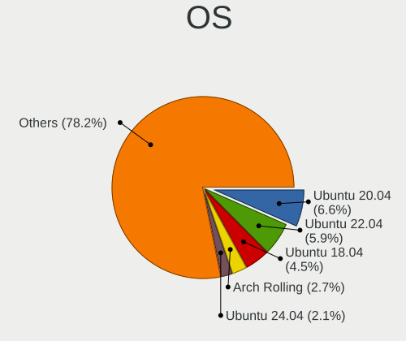

| Name                         | Computers | Percent |
|------------------------------|-----------|---------|
| Ubuntu 20.04                 | 119       | 6.6%    |
| Ubuntu 22.04                 | 107       | 5.94%   |
| Ubuntu 18.04                 | 81        | 4.5%    |
| Arch Rolling                 | 49        | 2.72%   |
| Ubuntu 24.04                 | 37        | 2.05%   |
| Debian 11                    | 37        | 2.05%   |
| Debian 12                    | 36        | 2%      |
| Pop!_OS 22.04                | 32        | 1.78%   |
| OpenMandriva 4.2             | 31        | 1.72%   |
| Manjaro                      | 25        | 1.39%   |
| ArcoLinux Rolling            | 24        | 1.33%   |
| OpenMandriva 4.3             | 22        | 1.22%   |
| Fedora 39                    | 22        | 1.22%   |
| Fedora 38                    | 22        | 1.22%   |
| Zorin 17                     | 21        | 1.17%   |
| openSUSE Tumbleweed-XXXXXXXX | 20        | 1.11%   |
| OpenMandriva 23.08           | 20        | 1.11%   |
| Fedora 40                    | 20        | 1.11%   |
| ROSA R11                     | 18        | 1%      |
| Linux Mint 22                | 18        | 1%      |
| Fedora 42                    | 18        | 1%      |
| OpenMandriva 25.90           | 17        | 0.94%   |
| Linux Mint 22.1              | 17        | 0.94%   |
| Linux Mint 20.1              | 17        | 0.94%   |
| KDE neon 20.04               | 17        | 0.94%   |
| Zorin 16                     | 16        | 0.89%   |
| Ubuntu 22.10                 | 16        | 0.89%   |
| ROSA R10                     | 16        | 0.89%   |
| Arch                         | 16        | 0.89%   |
| Linux Mint 21.1              | 15        | 0.83%   |
| Linux Mint 20.3              | 15        | 0.83%   |
| Linux Mint 19.3              | 14        | 0.78%   |
| Fedora 41                    | 14        | 0.78%   |
| Ubuntu 19.04                 | 13        | 0.72%   |
| Linux Mint 20.2              | 13        | 0.72%   |
| Linux Mint 20                | 13        | 0.72%   |
| Kubuntu 20.04                | 13        | 0.72%   |
| Zorin 15                     | 12        | 0.67%   |
| Xubuntu 18.04                | 12        | 0.67%   |
| Ubuntu 23.10                 | 12        | 0.67%   |

OS Family
---------

OS without a version

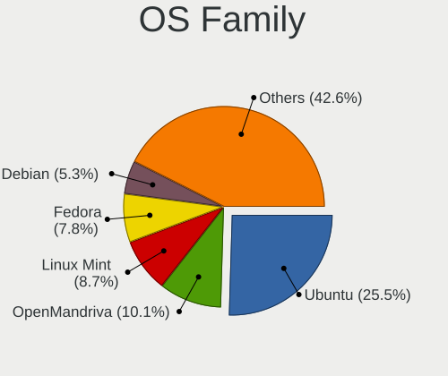

| Name          | Computers | Percent |
|---------------|-----------|---------|
| Ubuntu        | 420       | 25.47%  |
| OpenMandriva  | 167       | 10.13%  |
| Linux Mint    | 143       | 8.67%   |
| Fedora        | 129       | 7.82%   |
| Debian        | 88        | 5.34%   |
| Manjaro       | 63        | 3.82%   |
| Arch          | 63        | 3.82%   |
| Pop!_OS       | 62        | 3.76%   |
| ROSA          | 58        | 3.52%   |
| Zorin         | 50        | 3.03%   |
| Kubuntu       | 46        | 2.79%   |
| Xubuntu       | 34        | 2.06%   |
| KDE neon      | 30        | 1.82%   |
| openSUSE      | 29        | 1.76%   |
| Endless       | 29        | 1.76%   |
| Kali          | 27        | 1.64%   |
| ArcoLinux     | 26        | 1.58%   |
| Ubuntu Unity  | 14        | 0.85%   |
| Elementary    | 13        | 0.79%   |
| Clear Linux   | 13        | 0.79%   |
| LMDE          | 12        | 0.73%   |
| Lubuntu       | 9         | 0.55%   |
| EndeavourOS   | 9         | 0.55%   |
| Gentoo        | 8         | 0.49%   |
| CentOS        | 8         | 0.49%   |
| Ubuntu MATE   | 7         | 0.42%   |
| SteamOS       | 6         | 0.36%   |
| Nobara        | 5         | 0.3%    |
| Artix         | 5         | 0.3%    |
| TUXEDO OS     | 4         | 0.24%   |
| Parrot        | 4         | 0.24%   |
| MX            | 4         | 0.24%   |
| Garuda Linux  | 4         | 0.24%   |
| CachyOS       | 4         | 0.24%   |
| Void Linux    | 3         | 0.18%   |
| Ubuntu Budgie | 3         | 0.18%   |
| NixOS         | 3         | 0.18%   |
| BunsenLabs    | 3         | 0.18%   |
| Bazzite       | 3         | 0.18%   |
| Xero          | 2         | 0.12%   |

Kernel
------

Version of the Linux kernel

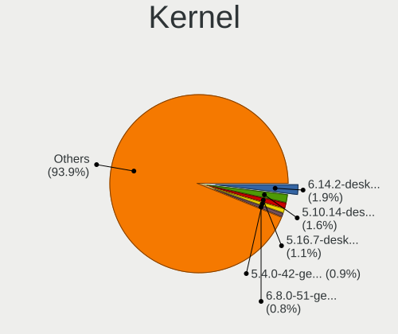

| Version                        | Computers | Percent |
|--------------------------------|-----------|---------|
| 6.14.2-desktop-3omv2590        | 38        | 1.9%    |
| 5.10.14-desktop-1omv4002       | 31        | 1.55%   |
| 5.16.7-desktop-1omv4003        | 21        | 1.05%   |
| 5.4.0-42-generic               | 17        | 0.85%   |
| 6.8.0-51-generic               | 15        | 0.75%   |
| 6.4.11-desktop-1omv2390        | 15        | 0.75%   |
| 5.15.0-56-generic              | 14        | 0.7%    |
| 5.4.0-58-generic               | 13        | 0.65%   |
| 4.15.0-desktop-45.1rosa-x86_64 | 13        | 0.65%   |
| 6.8.0-52-generic               | 11        | 0.55%   |
| 6.2.6-desktop-1omv2390         | 11        | 0.55%   |
| 6.12.1-desktop-1omv2490        | 11        | 0.55%   |
| 5.3.0-40-generic               | 10        | 0.5%    |
| 6.9.3-76060903-generic         | 9         | 0.45%   |
| 6.2.0-39-generic               | 9         | 0.45%   |
| 6.10.0-desktop-1omv2490        | 8         | 0.4%    |
| 5.9.16-1-MANJARO               | 8         | 0.4%    |
| 5.4.0-26-generic               | 8         | 0.4%    |
| 6.8.0-40-generic               | 7         | 0.35%   |
| 6.2.0-26-generic               | 7         | 0.35%   |
| 5.4.0-48-generic               | 7         | 0.35%   |
| 5.4.0-29-generic               | 7         | 0.35%   |
| 5.3.0-46-generic               | 7         | 0.35%   |
| 5.3.0-28-generic               | 7         | 0.35%   |
| 5.10.0-8-amd64                 | 7         | 0.35%   |
| 5.0.0-37-generic               | 7         | 0.35%   |
| 6.8.0-60-generic               | 6         | 0.3%    |
| 6.8.0-45-generic               | 6         | 0.3%    |
| 6.8.0-38-generic               | 6         | 0.3%    |
| 6.5.0-27-generic               | 6         | 0.3%    |
| 6.5.0-14-generic               | 6         | 0.3%    |
| 6.4.8-desktop-2omv2390         | 6         | 0.3%    |
| 6.2.6-76060206-generic         | 6         | 0.3%    |
| 6.1.1-desktop-1omv2290         | 6         | 0.3%    |
| 5.8.0-14-generic               | 6         | 0.3%    |
| 5.4.0-65-generic               | 6         | 0.3%    |
| 5.4.0-56-generic               | 6         | 0.3%    |
| 5.4.0-40-generic               | 6         | 0.3%    |
| 5.3.0-42-generic               | 6         | 0.3%    |
| 5.19.0-35-generic              | 6         | 0.3%    |

Kernel Family
-------------

Linux kernel without a distro release

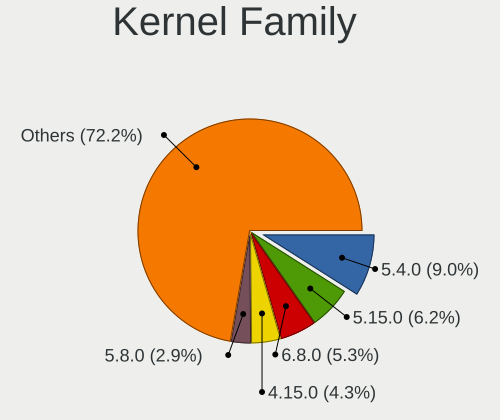

| Version | Computers | Percent |
|---------|-----------|---------|
| 5.4.0   | 170       | 9%      |
| 5.15.0  | 118       | 6.25%   |
| 6.8.0   | 100       | 5.3%    |
| 4.15.0  | 81        | 4.29%   |
| 5.8.0   | 55        | 2.91%   |
| 6.5.0   | 53        | 2.81%   |
| 5.3.0   | 50        | 2.65%   |
| 6.2.0   | 44        | 2.33%   |
| 6.1.0   | 43        | 2.28%   |
| 6.14.2  | 41        | 2.17%   |
| 5.19.0  | 40        | 2.12%   |
| 5.11.0  | 39        | 2.07%   |
| 5.10.0  | 39        | 2.07%   |
| 5.13.0  | 37        | 1.96%   |
| 5.0.0   | 37        | 1.96%   |
| 5.10.14 | 32        | 1.69%   |
| 6.14.0  | 30        | 1.59%   |
| 6.11.0  | 23        | 1.22%   |
| 4.18.0  | 23        | 1.22%   |
| 5.16.7  | 21        | 1.11%   |
| 6.2.6   | 18        | 0.95%   |
| 6.4.11  | 16        | 0.85%   |
| 4.19.0  | 13        | 0.69%   |
| 6.12.1  | 11        | 0.58%   |
| 5.9.16  | 11        | 0.58%   |
| 6.9.3   | 10        | 0.53%   |
| 6.1.1   | 9         | 0.48%   |
| 5.14.0  | 9         | 0.48%   |
| 4.9.20  | 9         | 0.48%   |
| 6.12.10 | 8         | 0.42%   |
| 6.10.0  | 8         | 0.42%   |
| 5.17.5  | 8         | 0.42%   |
| 6.6.10  | 7         | 0.37%   |
| 6.6.8   | 6         | 0.32%   |
| 6.6.2   | 6         | 0.32%   |
| 6.4.8   | 6         | 0.32%   |
| 6.17.9  | 6         | 0.32%   |
| 6.12.9  | 6         | 0.32%   |
| 6.0.0   | 6         | 0.32%   |
| 5.18.0  | 6         | 0.32%   |

Kernel Major Ver.
-----------------

Linux kernel major version

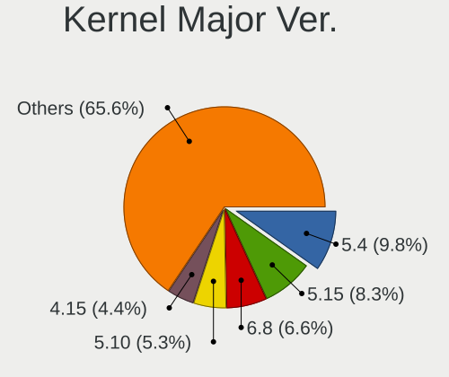

| Version | Computers | Percent |
|---------|-----------|---------|
| 5.4     | 181       | 9.8%    |
| 5.15    | 154       | 8.34%   |
| 6.8     | 121       | 6.55%   |
| 5.10    | 98        | 5.31%   |
| 4.15    | 81        | 4.39%   |
| 6.2     | 80        | 4.33%   |
| 6.5     | 76        | 4.12%   |
| 6.14    | 76        | 4.12%   |
| 6.1     | 74        | 4.01%   |
| 5.8     | 68        | 3.68%   |
| 6.12    | 59        | 3.2%    |
| 5.3     | 59        | 3.2%    |
| 5.11    | 51        | 2.76%   |
| 5.19    | 49        | 2.65%   |
| 6.6     | 46        | 2.49%   |
| 5.13    | 43        | 2.33%   |
| 6.4     | 40        | 2.17%   |
| 5.16    | 40        | 2.17%   |
| 5.0     | 40        | 2.17%   |
| 6.11    | 38        | 2.06%   |
| 6.10    | 28        | 1.52%   |
| 4.9     | 26        | 1.41%   |
| 6.17    | 24        | 1.3%    |
| 4.18    | 24        | 1.3%    |
| 5.17    | 20        | 1.08%   |
| 6.9     | 19        | 1.03%   |
| 5.14    | 19        | 1.03%   |
| 6.0     | 18        | 0.98%   |
| 4.19    | 18        | 0.98%   |
| 5.9     | 17        | 0.92%   |
| 5.6     | 16        | 0.87%   |
| 6.7     | 15        | 0.81%   |
| 6.13    | 15        | 0.81%   |
| 6.3     | 14        | 0.76%   |
| 6.16    | 14        | 0.76%   |
| 5.18    | 13        | 0.7%    |
| 6.15    | 12        | 0.65%   |
| 5.7     | 12        | 0.65%   |
| 5.12    | 12        | 0.65%   |
| 5.5     | 7         | 0.38%   |

Arch
----

OS architecture (x86_64, i586, etc.)

| Name    | Computers | Percent |
|---------|-----------|---------|
| x86_64  | 1528      | 97.39%  |
| i686    | 35        | 2.23%   |
| aarch64 | 6         | 0.38%   |

DE
--

Desktop Environment

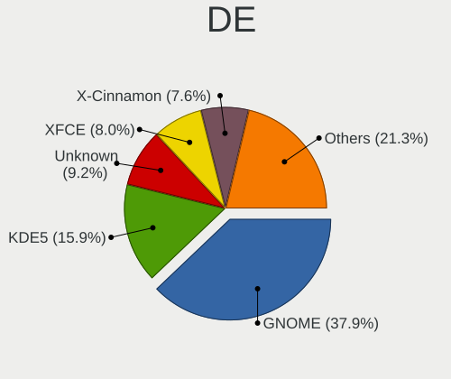

| Name             | Computers | Percent |
|------------------|-----------|---------|
| GNOME            | 637       | 37.89%  |
| KDE5             | 268       | 15.94%  |
| Unknown          | 155       | 9.22%   |
| XFCE             | 135       | 8.03%   |
| X-Cinnamon       | 128       | 7.61%   |
| KDE6             | 124       | 7.38%   |
| KDE              | 38        | 2.26%   |
| MATE             | 34        | 2.02%   |
| KDE4             | 34        | 2.02%   |
| Cinnamon         | 21        | 1.25%   |
| LXQt             | 20        | 1.19%   |
| Unity            | 14        | 0.83%   |
| Pantheon         | 12        | 0.71%   |
| i3               | 9         | 0.54%   |
| Budgie           | 7         | 0.42%   |
| Hyprland         | 6         | 0.36%   |
| GNOME Flashback  | 6         | 0.36%   |
| GNOME Classic    | 4         | 0.24%   |
| Deepin           | 4         | 0.24%   |
| sway             | 3         | 0.18%   |
| LXDE             | 3         | 0.18%   |
| COSMIC           | 3         | 0.18%   |
| bspwm            | 3         | 0.18%   |
| xmonad           | 2         | 0.12%   |
| qtile            | 2         | 0.12%   |
| lightdm-xsession | 2         | 0.12%   |
| trinity          | 1         | 0.06%   |
| openbox          | 1         | 0.06%   |
| icewm            | 1         | 0.06%   |
| Endless:GNOME    | 1         | 0.06%   |
| DWM              | 1         | 0.06%   |
| BunsenLabs       | 1         | 0.06%   |
| awesome          | 1         | 0.06%   |

Display Server
--------------

X11 or Wayland

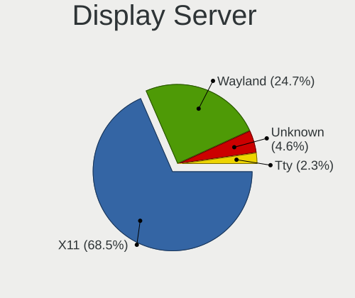

| Name    | Computers | Percent |
|---------|-----------|---------|
| X11     | 1121      | 68.48%  |
| Wayland | 404       | 24.68%  |
| Unknown | 75        | 4.58%   |
| Tty     | 37        | 2.26%   |

Display Manager
---------------

SDDM, LightDM, etc.

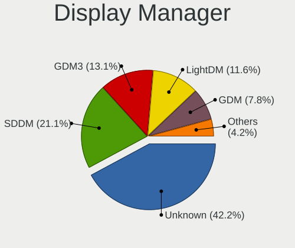

| Name    | Computers | Percent |
|---------|-----------|---------|
| Unknown | 696       | 42.16%  |
| SDDM    | 348       | 21.08%  |
| GDM3    | 217       | 13.14%  |
| LightDM | 191       | 11.57%  |
| GDM     | 129       | 7.81%   |
| TDM     | 33        | 2%      |
| KDM     | 32        | 1.94%   |
| XDM     | 3         | 0.18%   |
| SLiM    | 1         | 0.06%   |
| MDM     | 1         | 0.06%   |

OS Lang
-------

Language

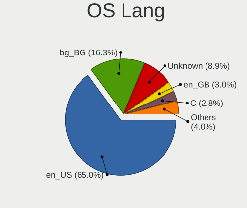

| Lang    | Computers | Percent |
|---------|-----------|---------|
| en_US   | 1054      | 64.98%  |
| bg_BG   | 264       | 16.28%  |
| Unknown | 144       | 8.88%   |
| en_GB   | 49        | 3.02%   |
| C       | 46        | 2.84%   |
| ru_RU   | 22        | 1.36%   |
| de_DE   | 12        | 0.74%   |
| ru_UA   | 3         | 0.18%   |
| POSIX   | 3         | 0.18%   |
| it_IT   | 3         | 0.18%   |
| es_ES   | 3         | 0.18%   |
| C.UTF8  | 3         | 0.18%   |
| en_DK   | 2         | 0.12%   |
| en_AU   | 2         | 0.12%   |
| uk_UA   | 1         | 0.06%   |
| tr_TR   | 1         | 0.06%   |
| sv_SE   | 1         | 0.06%   |
| ia_FR   | 1         | 0.06%   |
| hu_HU   | 1         | 0.06%   |
| fr_FR   | 1         | 0.06%   |
| en_NZ   | 1         | 0.06%   |
| en_CA   | 1         | 0.06%   |
| en_AG   | 1         | 0.06%   |
| de_IT   | 1         | 0.06%   |
| Default | 1         | 0.06%   |
| da_DK   | 1         | 0.06%   |

Boot Mode
---------

EFI or BIOS

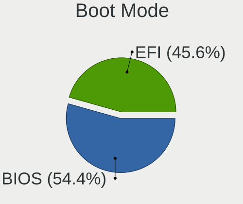

| Mode | Computers | Percent |
|------|-----------|---------|
| BIOS | 878       | 54.37%  |
| EFI  | 737       | 45.63%  |

Filesystem
----------

Type of filesystem

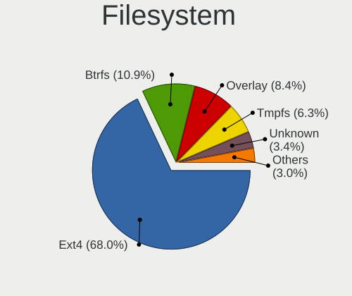

| Type    | Computers | Percent |
|---------|-----------|---------|
| Ext4    | 1109      | 68%     |
| Btrfs   | 178       | 10.91%  |
| Overlay | 137       | 8.4%    |
| Tmpfs   | 102       | 6.25%   |
| Unknown | 56        | 3.43%   |
| Xfs     | 26        | 1.59%   |
| Zfs     | 12        | 0.74%   |
| Ext3    | 4         | 0.25%   |
| Ext2    | 3         | 0.18%   |
| F2fs    | 2         | 0.12%   |
| Nfs     | 1         | 0.06%   |
| Jfs     | 1         | 0.06%   |

Part. scheme
------------

Scheme of partitioning

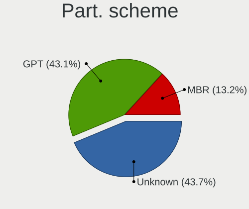

| Type    | Computers | Percent |
|---------|-----------|---------|
| Unknown | 706       | 43.74%  |
| GPT     | 695       | 43.06%  |
| MBR     | 213       | 13.2%   |

Dual Boot with Linux/BSD
------------------------

Hosting more than one Linux/BSD

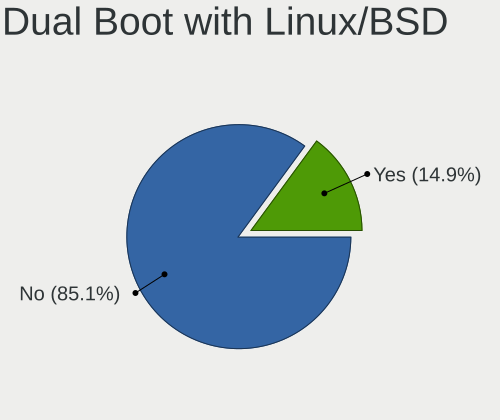

| Dual boot | Computers | Percent |
|-----------|-----------|---------|
| No        | 1368      | 85.07%  |
| Yes       | 240       | 14.93%  |

Dual Boot (Win)
---------------

Hosting Linux and Windows

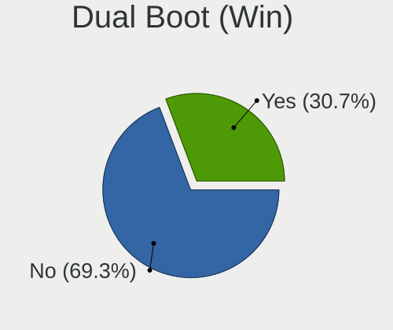

| Dual boot | Computers | Percent |
|-----------|-----------|---------|
| No        | 1106      | 69.25%  |
| Yes       | 491       | 30.75%  |

Board
-----

Vendor
------

Motherboard manufacturer

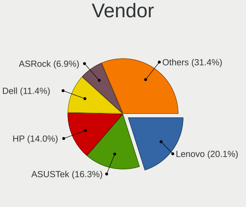

| Name                                 | Computers | Percent |
|--------------------------------------|-----------|---------|
| Lenovo                               | 315       | 20.1%   |
| ASUSTek Computer                     | 255       | 16.27%  |
| Hewlett-Packard                      | 219       | 13.98%  |
| Dell                                 | 178       | 11.36%  |
| ASRock                               | 108       | 6.89%   |
| Acer                                 | 104       | 6.64%   |
| Gigabyte Technology                  | 98        | 6.25%   |
| MSI                                  | 63        | 4.02%   |
| Toshiba                              | 40        | 2.55%   |
| Fujitsu                              | 24        | 1.53%   |
| Apple                                | 22        | 1.4%    |
| Unknown                              | 14        | 0.89%   |
| Intel                                | 11        | 0.7%    |
| Foxconn                              | 9         | 0.57%   |
| Sony                                 | 6         | 0.38%   |
| Samsung Electronics                  | 6         | 0.38%   |
| Fujitsu Siemens                      | 6         | 0.38%   |
| AMI                                  | 6         | 0.38%   |
| Valve                                | 5         | 0.32%   |
| Supermicro                           | 4         | 0.26%   |
| Pegatron                             | 4         | 0.26%   |
| Packard Bell                         | 4         | 0.26%   |
| Google                               | 4         | 0.26%   |
| TUXEDO                               | 3         | 0.19%   |
| TongFang                             | 3         | 0.19%   |
| Raspberry Pi Foundation              | 3         | 0.19%   |
| Notebook                             | 3         | 0.19%   |
| Medion                               | 3         | 0.19%   |
| HUAWEI                               | 3         | 0.19%   |
| ECS                                  | 3         | 0.19%   |
| Wibtek                               | 2         | 0.13%   |
| System76                             | 2         | 0.13%   |
| Shenzhen Meigao Electronic Equipment | 2         | 0.13%   |
| Panasonic                            | 2         | 0.13%   |
| AZW                                  | 2         | 0.13%   |
| Timi                                 | 1         | 0.06%   |
| Thecus                               | 1         | 0.06%   |
| TECNO Mobile Limited                 | 1         | 0.06%   |
| SLIMBOOK                             | 1         | 0.06%   |
| Shuttle                              | 1         | 0.06%   |

Model
-----

Motherboard model

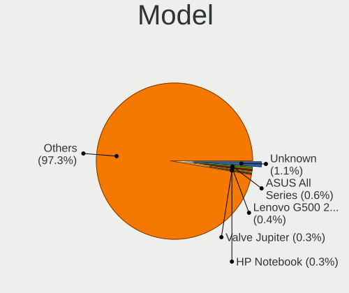

| Name                                       | Computers | Percent |
|--------------------------------------------|-----------|---------|
| Unknown                                    | 18        | 1.15%   |
| ASUS All Series                            | 9         | 0.57%   |
| Lenovo G500 20236                          | 6         | 0.38%   |
| Valve Jupiter                              | 5         | 0.32%   |
| HP Notebook                                | 5         | 0.32%   |
| Dell OptiPlex 780                          | 5         | 0.32%   |
| Dell Inspiron N5110                        | 5         | 0.32%   |
| ASUS X541NA                                | 5         | 0.32%   |
| MSI MS-7C56                                | 4         | 0.26%   |
| Lenovo H520S 2561                          | 4         | 0.26%   |
| HP ProBook 4540s                           | 4         | 0.26%   |
| HP ProBook 450 G8 Notebook PC              | 4         | 0.26%   |
| HP Pavilion 15                             | 4         | 0.26%   |
| HP EliteBook 840 G1                        | 4         | 0.26%   |
| ASUS VivoBook_ASUSLaptop M1605YA_M1605YA   | 4         | 0.26%   |
| Apple MacBookPro11,1                       | 4         | 0.26%   |
| Toshiba Satellite L300                     | 3         | 0.19%   |
| MSI MS-7C37                                | 3         | 0.19%   |
| MSI Modern 15 A5M                          | 3         | 0.19%   |
| Lenovo Y520-15IKBN 80WK                    | 3         | 0.19%   |
| Lenovo Legion Y530-15ICH 81FV              | 3         | 0.19%   |
| Lenovo IdeaPad Gaming 3 15IHU6 82K1        | 3         | 0.19%   |
| HP ProBook 450 G0                          | 3         | 0.19%   |
| HP 255 G8 Notebook PC                      | 3         | 0.19%   |
| Gigabyte B550 GAMING X V2                  | 3         | 0.19%   |
| Gigabyte B450 AORUS ELITE                  | 3         | 0.19%   |
| Dell Precision Tower 5810                  | 3         | 0.19%   |
| Dell Precision M4600                       | 3         | 0.19%   |
| Dell OptiPlex 755                          | 3         | 0.19%   |
| Dell Latitude E6540                        | 3         | 0.19%   |
| Dell Latitude E6410                        | 3         | 0.19%   |
| Dell Latitude E4300                        | 3         | 0.19%   |
| Dell G3 3579                               | 3         | 0.19%   |
| ASUS VivoBook 15_ASUS Laptop X540MA_X540MA | 3         | 0.19%   |
| ASUS P5G41T-M LX                           | 3         | 0.19%   |
| ASUS N551VW                                | 3         | 0.19%   |
| ASRock Z97 Anniversary                     | 3         | 0.19%   |
| ASRock B760 Pro RS                         | 3         | 0.19%   |
| ASRock B550M Pro4                          | 3         | 0.19%   |
| ASRock B450M Steel Legend                  | 3         | 0.19%   |

Model Family
------------

Motherboard model prefix

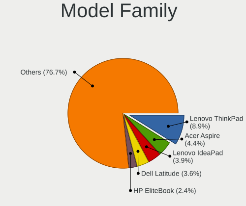

| Name               | Computers | Percent |
|--------------------|-----------|---------|
| Lenovo ThinkPad    | 140       | 8.93%   |
| Acer Aspire        | 69        | 4.4%    |
| Lenovo IdeaPad     | 61        | 3.89%   |
| Dell Latitude      | 57        | 3.64%   |
| HP EliteBook       | 38        | 2.43%   |
| HP ProBook         | 37        | 2.36%   |
| HP Pavilion        | 37        | 2.36%   |
| Dell Inspiron      | 37        | 2.36%   |
| ASUS VivoBook      | 37        | 2.36%   |
| Toshiba Satellite  | 33        | 2.11%   |
| HP Compaq          | 31        | 1.98%   |
| ASUS ROG           | 30        | 1.91%   |
| Dell OptiPlex      | 23        | 1.47%   |
| Lenovo ThinkCentre | 22        | 1.4%    |
| Dell Precision     | 22        | 1.4%    |
| ASUS PRIME         | 22        | 1.4%    |
| Lenovo Legion      | 21        | 1.34%   |
| Unknown            | 18        | 1.15%   |
| Dell Vostro        | 16        | 1.02%   |
| Fujitsu ESPRIMO    | 13        | 0.83%   |
| Acer Nitro         | 13        | 0.83%   |
| ASUS TUF           | 12        | 0.77%   |
| Lenovo Yoga        | 11        | 0.7%    |
| ASUS ASUS          | 11        | 0.7%    |
| Dell XPS           | 9         | 0.57%   |
| ASUS All           | 9         | 0.57%   |
| HP EliteDesk       | 8         | 0.51%   |
| MSI Modern         | 7         | 0.45%   |
| Lenovo ThinkBook   | 7         | 0.45%   |
| HP Laptop          | 7         | 0.45%   |
| HP 255             | 7         | 0.45%   |
| Gigabyte B550      | 7         | 0.45%   |
| ASRock B450        | 7         | 0.45%   |
| Lenovo G500        | 6         | 0.38%   |
| HP ProDesk         | 6         | 0.38%   |
| ASUS P5K           | 6         | 0.38%   |
| Acer Predator      | 6         | 0.38%   |
| Valve Jupiter      | 5         | 0.32%   |
| HP ZBook           | 5         | 0.32%   |
| HP Notebook        | 5         | 0.32%   |

MFG Year
--------

Motherboard manufacture year

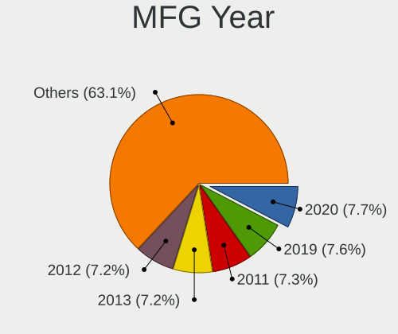

| Year    | Computers | Percent |
|---------|-----------|---------|
| 2020    | 120       | 7.66%   |
| 2019    | 119       | 7.59%   |
| 2011    | 114       | 7.28%   |
| 2013    | 113       | 7.21%   |
| 2012    | 113       | 7.21%   |
| 2018    | 109       | 6.96%   |
| 2021    | 107       | 6.83%   |
| 2017    | 105       | 6.7%    |
| 2022    | 87        | 5.55%   |
| 2014    | 84        | 5.36%   |
| 2015    | 78        | 4.98%   |
| 2010    | 71        | 4.53%   |
| 2008    | 68        | 4.34%   |
| 2023    | 60        | 3.83%   |
| 2009    | 59        | 3.77%   |
| 2016    | 45        | 2.87%   |
| 2007    | 41        | 2.62%   |
| 2024    | 32        | 2.04%   |
| 2006    | 18        | 1.15%   |
| 2025    | 12        | 0.77%   |
| Unknown | 5         | 0.32%   |
| 2004    | 4         | 0.26%   |
| 2005    | 3         | 0.19%   |

Form Factor
-----------

Physical design of the computer

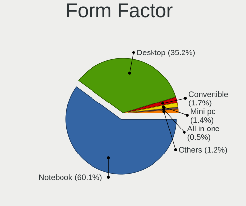

| Name           | Computers | Percent |
|----------------|-----------|---------|
| Notebook       | 941       | 60.05%  |
| Desktop        | 551       | 35.16%  |
| Convertible    | 26        | 1.66%   |
| Mini pc        | 22        | 1.4%    |
| All in one     | 8         | 0.51%   |
| Tablet         | 7         | 0.45%   |
| Server         | 6         | 0.38%   |
| System on chip | 5         | 0.32%   |
| Phone          | 1         | 0.06%   |

Secure Boot
-----------

Enabled or disabled

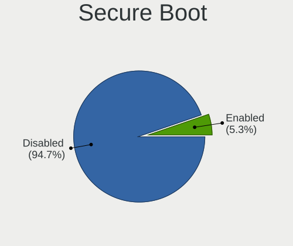

| State    | Computers | Percent |
|----------|-----------|---------|
| Disabled | 1492      | 94.73%  |
| Enabled  | 83        | 5.27%   |

Coreboot
--------

Have coreboot on board

| Used | Computers | Percent |
|------|-----------|---------|
| No   | 1560      | 99.55%  |
| Yes  | 7         | 0.45%   |

RAM Size
--------

Total RAM memory

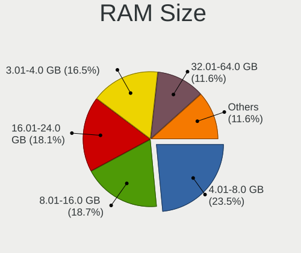

| Size in GB      | Computers | Percent |
|-----------------|-----------|---------|
| 4.01-8.0        | 378       | 23.51%  |
| 8.01-16.0       | 300       | 18.66%  |
| 16.01-24.0      | 291       | 18.1%   |
| 3.01-4.0        | 265       | 16.48%  |
| 32.01-64.0      | 187       | 11.63%  |
| 24.01-32.0      | 58        | 3.61%   |
| 64.01-256.0     | 51        | 3.17%   |
| 1.01-2.0        | 39        | 2.43%   |
| 2.01-3.0        | 31        | 1.93%   |
| 0.51-1.0        | 6         | 0.37%   |
| More than 256.0 | 2         | 0.12%   |

RAM Used
--------

Used RAM memory

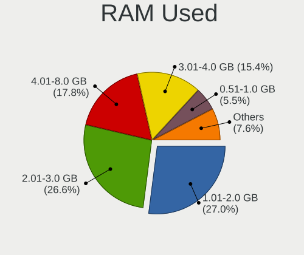

| Used GB     | Computers | Percent |
|-------------|-----------|---------|
| 1.01-2.0    | 489       | 27.03%  |
| 2.01-3.0    | 482       | 26.64%  |
| 4.01-8.0    | 322       | 17.8%   |
| 3.01-4.0    | 278       | 15.37%  |
| 0.51-1.0    | 100       | 5.53%   |
| 8.01-16.0   | 97        | 5.36%   |
| 16.01-24.0  | 20        | 1.11%   |
| 0.01-0.5    | 15        | 0.83%   |
| 24.01-32.0  | 3         | 0.17%   |
| 32.01-64.0  | 1         | 0.06%   |
| 64.01-256.0 | 1         | 0.06%   |
| Unknown     | 1         | 0.06%   |

Total Drives
------------

Number of drives on board

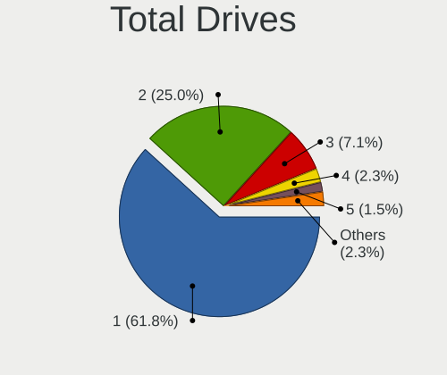

| Drives | Computers | Percent |
|--------|-----------|---------|
| 1      | 1004      | 61.78%  |
| 2      | 406       | 24.98%  |
| 3      | 115       | 7.08%   |
| 4      | 37        | 2.28%   |
| 5      | 25        | 1.54%   |
| 6      | 13        | 0.8%    |
| 0      | 13        | 0.8%    |
| 7      | 5         | 0.31%   |
| 8      | 4         | 0.25%   |
| 9      | 2         | 0.12%   |
| 11     | 1         | 0.06%   |

Has CD-ROM
----------

Has CD-ROM on board

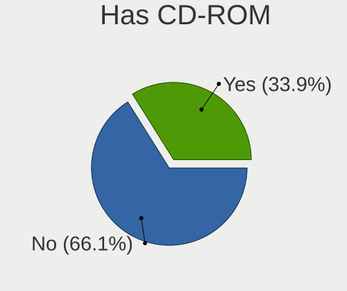

| Presented | Computers | Percent |
|-----------|-----------|---------|
| No        | 1049      | 66.1%   |
| Yes       | 538       | 33.9%   |

Has Ethernet
------------

Has Ethernet on board

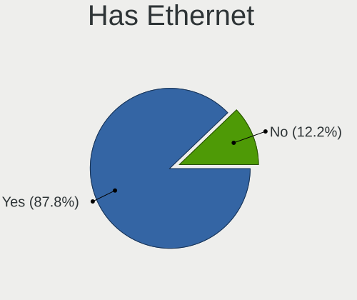

| Presented | Computers | Percent |
|-----------|-----------|---------|
| Yes       | 1380      | 87.84%  |
| No        | 191       | 12.16%  |

Has WiFi
--------

Has WiFi module

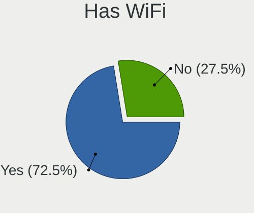

| Presented | Computers | Percent |
|-----------|-----------|---------|
| Yes       | 1144      | 72.45%  |
| No        | 435       | 27.55%  |

Has Bluetooth
-------------

Has Bluetooth module

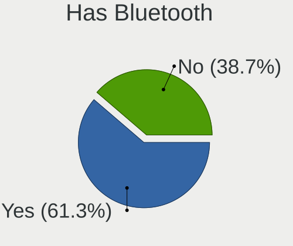

| Presented | Computers | Percent |
|-----------|-----------|---------|
| Yes       | 977       | 61.29%  |
| No        | 617       | 38.71%  |

Location
--------

Country
-------

Geographic location (country)

| Country  | Computers | Percent |
|----------|-----------|---------|
| Bulgaria | 1567      | 100%    |

City
----

Geographic location (city)

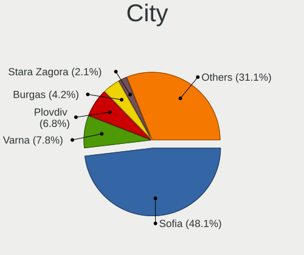

| City                | Computers | Percent |
|---------------------|-----------|---------|
| Sofia               | 796       | 48.13%  |
| Varna               | 129       | 7.8%    |
| Plovdiv             | 112       | 6.77%   |
| Burgas              | 69        | 4.17%   |
| Stara Zagora        | 34        | 2.06%   |
| Pernik              | 26        | 1.57%   |
| Pleven              | 25        | 1.51%   |
| Rousse              | 24        | 1.45%   |
| Yambol              | 17        | 1.03%   |
| Veliko Tarnovo      | 16        | 0.97%   |
| Pazardzhik          | 16        | 0.97%   |
| Haskovo             | 16        | 0.97%   |
| Montana             | 14        | 0.85%   |
| Shumen              | 13        | 0.79%   |
| Dobrich             | 13        | 0.79%   |
| Razgrad             | 11        | 0.67%   |
| Gabrovo             | 10        | 0.6%    |
| Blagoevgrad         | 9         | 0.54%   |
| Asenovgrad          | 9         | 0.54%   |
| Sliven              | 8         | 0.48%   |
| Sistov              | 8         | 0.48%   |
| Petrich             | 8         | 0.48%   |
| Kazanlak            | 8         | 0.48%   |
| Vratsa              | 7         | 0.42%   |
| Gorna Oryahovitsa   | 7         | 0.42%   |
| Vidin               | 6         | 0.36%   |
| Svilengrad          | 6         | 0.36%   |
| Teteven             | 5         | 0.3%    |
| Silistra            | 5         | 0.3%    |
| Nesebar             | 5         | 0.3%    |
| Kyustendil          | 5         | 0.3%    |
| Botevgrad           | 5         | 0.3%    |
| Smolyan             | 4         | 0.24%   |
| Kozloduy            | 4         | 0.24%   |
| Karlovo             | 4         | 0.24%   |
| Dimitrovgrad        | 4         | 0.24%   |
| Troyan Municipality | 3         | 0.18%   |
| Targovishte         | 3         | 0.18%   |
| Svoge               | 3         | 0.18%   |
| Samokov             | 3         | 0.18%   |

Drives
------

Drive Vendor
------------

Hard drive vendors

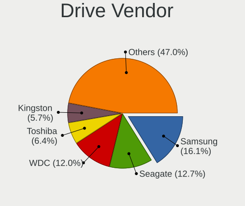

| Vendor                       | Computers | Drives | Percent |
|------------------------------|-----------|--------|---------|
| Samsung Electronics          | 368       | 566    | 16.12%  |
| Seagate                      | 291       | 444    | 12.75%  |
| WDC                          | 273       | 421    | 11.96%  |
| Toshiba                      | 147       | 202    | 6.44%   |
| Kingston                     | 131       | 191    | 5.74%   |
| SanDisk                      | 102       | 124    | 4.47%   |
| Hitachi                      | 97        | 127    | 4.25%   |
| A-DATA Technology            | 74        | 101    | 3.24%   |
| Unknown                      | 69        | 88     | 3.02%   |
| Intel                        | 63        | 92     | 2.76%   |
| SK hynix                     | 61        | 83     | 2.67%   |
| Micron Technology            | 56        | 67     | 2.45%   |
| HGST                         | 46        | 70     | 2.01%   |
| Crucial                      | 43        | 65     | 1.88%   |
| SPCC                         | 39        | 55     | 1.71%   |
| Team                         | 33        | 37     | 1.45%   |
| Kingston Technology Company  | 29        | 32     | 1.27%   |
| KIOXIA                       | 26        | 28     | 1.14%   |
| Phison Electronics           | 22        | 32     | 0.96%   |
| China                        | 22        | 27     | 0.96%   |
| Transcend                    | 18        | 22     | 0.79%   |
| Silicon Motion               | 13        | 17     | 0.57%   |
| KingSpec                     | 13        | 16     | 0.57%   |
| ADATA Technology             | 13        | 16     | 0.57%   |
| Apple                        | 11        | 22     | 0.48%   |
| Phison                       | 10        | 12     | 0.44%   |
| Patriot                      | 10        | 12     | 0.44%   |
| Fujitsu                      | 10        | 13     | 0.44%   |
| Realtek Semiconductor        | 9         | 13     | 0.39%   |
| Maxtor                       | 8         | 14     | 0.35%   |
| Unknown                      | 8         | 8      | 0.35%   |
| LITEONIT                     | 7         | 7      | 0.31%   |
| LITEON                       | 7         | 10     | 0.31%   |
| Shenzhen Longsys Electronics | 6         | 9      | 0.26%   |
| PNY                          | 6         | 7      | 0.26%   |
| JMicron Technology           | 6         | 9      | 0.26%   |
| Intenso                      | 6         | 8      | 0.26%   |
| XPG                          | 5         | 7      | 0.22%   |
| Verbatim                     | 5         | 5      | 0.22%   |
| Hewlett-Packard              | 5         | 14     | 0.22%   |

Drive Model
-----------

Hard drive models

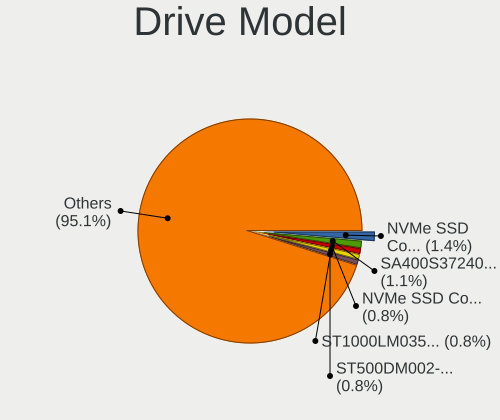

| Model                                                              | Computers | Percent |
|--------------------------------------------------------------------|-----------|---------|
| Samsung NVMe SSD Controller SM981/PM981/PM983 1TB                  | 34        | 1.37%   |
| Kingston SA400S37240G 240GB SSD                                    | 27        | 1.09%   |
| Samsung NVMe SSD Controller PM9A1/PM9A3/980PRO 1TB                 | 21        | 0.85%   |
| Seagate ST1000LM035-1RK172 1TB                                     | 20        | 0.81%   |
| Seagate ST500DM002-1BD142 500GB                                    | 19        | 0.77%   |
| Seagate ST1000DM010-2EP102 1TB                                     | 19        | 0.77%   |
| Seagate ST1000LM024 HN-M101MBB 1TB                                 | 18        | 0.73%   |
| Kingston SA400S37120G 120GB SSD                                    | 18        | 0.73%   |
| Samsung SSD 850 EVO 250GB                                          | 17        | 0.69%   |
| HGST HTS721010A9E630 1TB                                           | 17        | 0.69%   |
| Toshiba MQ01ABD100 1TB                                             | 16        | 0.65%   |
| Samsung SSD 860 EVO 250GB                                          | 16        | 0.65%   |
| Toshiba MQ01ABF050 500GB                                           | 15        | 0.61%   |
| Samsung SSD 860 EVO 500GB                                          | 15        | 0.61%   |
| SPCC Solid State Disk 512GB                                        | 14        | 0.57%   |
| Kingston SA400S37480G 480GB SSD                                    | 14        | 0.57%   |
| WDC WDS240G2G0A-00JH30 240GB SSD                                   | 12        | 0.48%   |
| Unknown MMC Card  32GB                                             | 12        | 0.48%   |
| Samsung NVMe SSD Drive 512GB                                       | 12        | 0.48%   |
| Toshiba DT01ACA100 1TB                                             | 11        | 0.44%   |
| Seagate ST500LT012-1DG142 500GB                                    | 11        | 0.44%   |
| Samsung SSD 870 EVO 1TB                                            | 11        | 0.44%   |
| Kingston SV300S37A120G 120GB SSD                                   | 11        | 0.44%   |
| Toshiba MQ04ABF100 1TB                                             | 10        | 0.4%    |
| Seagate ST1000DM003-1ER162 1TB                                     | 10        | 0.4%    |
| Crucial CT500MX500SSD1 500GB                                       | 10        | 0.4%    |
| Unknown MMC Card  64GB                                             | 9         | 0.36%   |
| Toshiba DT01ACA050 500GB                                           | 9         | 0.36%   |
| SanDisk NVMe SSD Drive 512GB                                       | 9         | 0.36%   |
| Samsung SSD 990 PRO 2TB                                            | 9         | 0.36%   |
| Samsung SSD 980 1TB                                                | 9         | 0.36%   |
| Samsung SSD 870 EVO 500GB                                          | 9         | 0.36%   |
| Samsung SSD 850 PRO 256GB                                          | 9         | 0.36%   |
| HGST HTS541010A9E680 1TB                                           | 9         | 0.36%   |
| ADATA XPG SX8200 Pro PCIe Gen3x4 M.2 2280 Solid State Drive 1024GB | 9         | 0.36%   |
| WDC WD10SPZX-21Z10T0 1TB                                           | 8         | 0.32%   |
| Toshiba DT01ACA200 2TB                                             | 8         | 0.32%   |
| Samsung SSD 850 EVO 500GB                                          | 8         | 0.32%   |
| Kingston Company SNV2S2000G 2TB                                    | 8         | 0.32%   |
| Intel SSDSC2CW120A3 120GB                                          | 8         | 0.32%   |

HDD Vendor
----------

Hard disk drive vendors

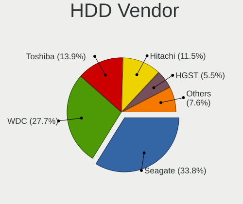

| Vendor              | Computers | Drives | Percent |
|---------------------|-----------|--------|---------|
| Seagate             | 285       | 435    | 33.85%  |
| WDC                 | 233       | 353    | 27.67%  |
| Toshiba             | 117       | 159    | 13.9%   |
| Hitachi             | 97        | 127    | 11.52%  |
| HGST                | 46        | 70     | 5.46%   |
| Samsung Electronics | 17        | 23     | 2.02%   |
| Fujitsu             | 10        | 13     | 1.19%   |
| Maxtor              | 8         | 14     | 0.95%   |
| Unknown             | 5         | 7      | 0.59%   |
| ExcelStor           | 5         | 9      | 0.59%   |
| TO Exter            | 4         | 4      | 0.48%   |
| JMicron Technology  | 4         | 4      | 0.48%   |
| Hewlett-Packard     | 4         | 14     | 0.48%   |
| IBM/Hitachi         | 2         | 3      | 0.24%   |
| SSK                 | 1         | 1      | 0.12%   |
| Min Yi U            | 1         | 1      | 0.12%   |
| HGST HTS            | 1         | 1      | 0.12%   |
| ASMedia             | 1         | 1      | 0.12%   |
| Apple               | 1         | 1      | 0.12%   |

SSD Vendor
----------

Solid state drive vendors

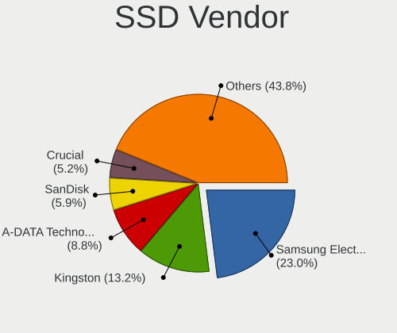

| Vendor              | Computers | Drives | Percent |
|---------------------|-----------|--------|---------|
| Samsung Electronics | 164       | 223    | 23.03%  |
| Kingston            | 94        | 123    | 13.2%   |
| A-DATA Technology   | 63        | 88     | 8.85%   |
| SanDisk             | 42        | 49     | 5.9%    |
| Crucial             | 37        | 57     | 5.2%    |
| SPCC                | 34        | 50     | 4.78%   |
| WDC                 | 31        | 44     | 4.35%   |
| Team                | 28        | 32     | 3.93%   |
| Intel               | 23        | 34     | 3.23%   |
| China               | 22        | 27     | 3.09%   |
| Transcend           | 16        | 20     | 2.25%   |
| Micron Technology   | 13        | 16     | 1.83%   |
| KingSpec            | 13        | 16     | 1.83%   |
| Toshiba             | 11        | 14     | 1.54%   |
| Patriot             | 9         | 11     | 1.26%   |
| Apple               | 8         | 19     | 1.12%   |
| LITEONIT            | 7         | 7      | 0.98%   |
| LITEON              | 7         | 10     | 0.98%   |
| PNY                 | 6         | 7      | 0.84%   |
| Intenso             | 6         | 8      | 0.84%   |
| Verbatim            | 5         | 5      | 0.7%    |
| Teclast             | 4         | 4      | 0.56%   |
| SK hynix            | 4         | 4      | 0.56%   |
| Seagate             | 4         | 5      | 0.56%   |
| GOODRAM             | 4         | 4      | 0.56%   |
| Corsair             | 4         | 4      | 0.56%   |
| Apacer              | 4         | 4      | 0.56%   |
| AMD                 | 4         | 6      | 0.56%   |
| Unknown             | 4         | 4      | 0.56%   |
| OCZ                 | 3         | 4      | 0.42%   |
| Lexar               | 3         | 3      | 0.42%   |
| StoreJet            | 2         | 2      | 0.28%   |
| Innodisk            | 2         | 2      | 0.28%   |
| Gigabyte Technology | 2         | 11     | 0.28%   |
| XrayDisk            | 1         | 1      | 0.14%   |
| XPG                 | 1         | 1      | 0.14%   |
| X12                 | 1         | 1      | 0.14%   |
| Wibtek              | 1         | 2      | 0.14%   |
| VT                  | 1         | 1      | 0.14%   |
| Vi550               | 1         | 1      | 0.14%   |

Drive Kind
----------

HDD or SSD

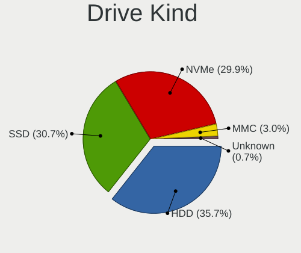

| Kind    | Computers | Drives | Percent |
|---------|-----------|--------|---------|
| HDD     | 730       | 1240   | 35.66%  |
| SSD     | 629       | 956    | 30.73%  |
| NVMe    | 613       | 951    | 29.95%  |
| MMC     | 61        | 74     | 2.98%   |
| Unknown | 14        | 21     | 0.68%   |

Drive Connector
---------------

SATA, SAS, NVMe, etc.

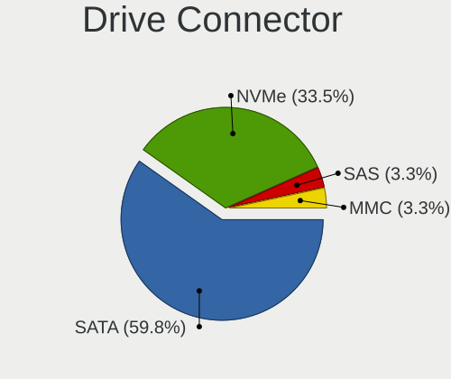

| Type | Computers | Drives | Percent |
|------|-----------|--------|---------|
| SATA | 1092      | 2135   | 59.8%   |
| NVMe | 612       | 949    | 33.52%  |
| SAS  | 61        | 84     | 3.34%   |
| MMC  | 61        | 74     | 3.34%   |

Drive Size
----------

Size of hard drive

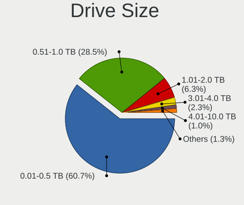

| Size in TB | Computers | Drives | Percent |
|------------|-----------|--------|---------|
| 0.01-0.5   | 834       | 1328   | 60.65%  |
| 0.51-1.0   | 392       | 623    | 28.51%  |
| 1.01-2.0   | 86        | 121    | 6.25%   |
| 3.01-4.0   | 31        | 56     | 2.25%   |
| 4.01-10.0  | 14        | 25     | 1.02%   |
| 2.01-3.0   | 13        | 21     | 0.95%   |
| 10.01-20.0 | 5         | 22     | 0.36%   |

Space Total
-----------

Amount of disk space available on the file system

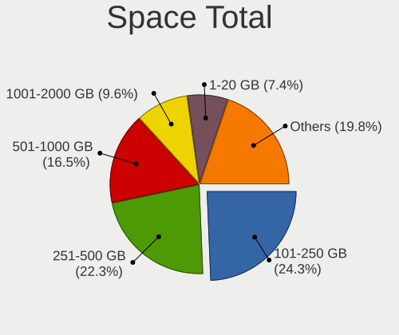

| Size in GB     | Computers | Percent |
|----------------|-----------|---------|
| 101-250        | 409       | 24.35%  |
| 251-500        | 375       | 22.32%  |
| 501-1000       | 278       | 16.55%  |
| 1001-2000      | 161       | 9.58%   |
| 1-20           | 124       | 7.38%   |
| 51-100         | 114       | 6.79%   |
| More than 3000 | 65        | 3.87%   |
| Unknown        | 62        | 3.69%   |
| 21-50          | 60        | 3.57%   |
| 2001-3000      | 32        | 1.9%    |

Space Used
----------

Amount of used disk space

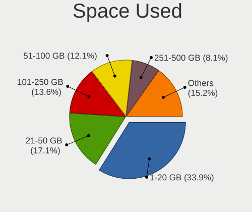

| Used GB        | Computers | Percent |
|----------------|-----------|---------|
| 1-20           | 609       | 33.93%  |
| 21-50          | 307       | 17.1%   |
| 101-250        | 245       | 13.65%  |
| 51-100         | 217       | 12.09%  |
| 251-500        | 145       | 8.08%   |
| 501-1000       | 116       | 6.46%   |
| Unknown        | 62        | 3.45%   |
| 1001-2000      | 52        | 2.9%    |
| More than 3000 | 21        | 1.17%   |
| 2001-3000      | 19        | 1.06%   |
| 0              | 2         | 0.11%   |

Malfunc. Drives
---------------

Drive models with a malfunction

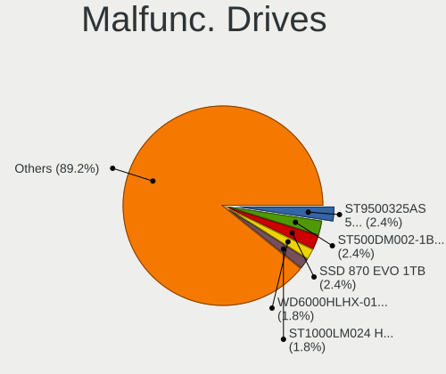

| Model                                                            | Computers | Drives | Percent |
|------------------------------------------------------------------|-----------|--------|---------|
| Seagate ST9500325AS 500GB                                        | 4         | 4      | 2.4%    |
| Seagate ST500DM002-1BD142 500GB                                  | 4         | 5      | 2.4%    |
| Samsung Electronics SSD 870 EVO 1TB                              | 4         | 4      | 2.4%    |
| WDC WD6000HLHX-01JJPV0 600GB                                     | 3         | 5      | 1.8%    |
| Seagate ST1000LM024 HN-M101MBB 1TB                               | 3         | 3      | 1.8%    |
| Samsung Electronics NVMe SSD Controller SM961/PM961/SM963 1024GB | 3         | 7      | 1.8%    |
| Hitachi HTS543232A7A384 320GB                                    | 3         | 3      | 1.8%    |
| WDC WD5000LPVX-60V0TT0 500GB                                     | 2         | 2      | 1.2%    |
| WDC WD5000LPVX-55V0TT0 500GB                                     | 2         | 2      | 1.2%    |
| WDC WD5000AAKX-603CA0 500GB                                      | 2         | 6      | 1.2%    |
| WDC WD5000AADS-00S9B0 500GB                                      | 2         | 3      | 1.2%    |
| WDC WD40PURX-64GVNY0 4TB                                         | 2         | 4      | 1.2%    |
| Toshiba MQ01ABF050 500GB                                         | 2         | 2      | 1.2%    |
| Toshiba MQ01ABD100 1TB                                           | 2         | 2      | 1.2%    |
| Toshiba DT01ACA050 500GB                                         | 2         | 3      | 1.2%    |
| Seagate ST500LT012-1DG142 500GB                                  | 2         | 2      | 1.2%    |
| Seagate ST2000DM001-1CH164 2TB                                   | 2         | 2      | 1.2%    |
| Kingston SA400S37480G 480GB SSD                                  | 2         | 2      | 1.2%    |
| KingSpec P3-128 128GB SSD                                        | 2         | 3      | 1.2%    |
| Intel SSDSC2CW120A3 120GB                                        | 2         | 2      | 1.2%    |
| Hitachi HDP725050GLA360 500GB                                    | 2         | 3      | 1.2%    |
| HGST HTS721010A9E630 1TB                                         | 2         | 2      | 1.2%    |
| China SSD 120GB                                                  | 2         | 2      | 1.2%    |
| A-DATA Technology SX900 128GB SSD                                | 2         | 2      | 1.2%    |
| A-DATA Technology SU900 256GB SSD                                | 2         | 2      | 1.2%    |
| A-DATA Technology SU650 120GB SSD                                | 2         | 2      | 1.2%    |
| WDC WDS100T2B0B-00YS70 1TB SSD                                   | 1         | 1      | 0.6%    |
| WDC WD6400AAKS-00A7B2 640GB                                      | 1         | 2      | 0.6%    |
| WDC WD5000BEVT-75A0RT0 500GB                                     | 1         | 1      | 0.6%    |
| WDC WD5000AZLX-60K2TA0 500GB                                     | 1         | 1      | 0.6%    |
| WDC WD5000AACS-00G8B1 500GB                                      | 1         | 1      | 0.6%    |
| WDC WD3200BEVT-80A0RT0 320GB                                     | 1         | 1      | 0.6%    |
| WDC WD3200AAJS-60Z0A0 320GB                                      | 1         | 1      | 0.6%    |
| WDC WD3200AAJS-07M0A0 320GB                                      | 1         | 2      | 0.6%    |
| WDC WD2500JS-00MHB0 250GB                                        | 1         | 1      | 0.6%    |
| WDC WD2500AAKX-753CA1 250GB                                      | 1         | 1      | 0.6%    |
| WDC WD1600BEVT-80A23T0 160GB                                     | 1         | 1      | 0.6%    |
| WDC WD15EARS-00S8B1 1TB                                          | 1         | 1      | 0.6%    |
| WDC WD10EZEX-00UD2A0 1TB                                         | 1         | 1      | 0.6%    |
| WDC WD10EFRX-68PJCN0 1TB                                         | 1         | 3      | 0.6%    |

Malfunc. Drive Vendor
---------------------

Vendors of faulty drives

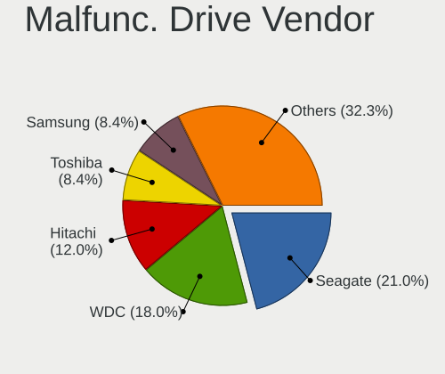

| Vendor              | Computers | Drives | Percent |
|---------------------|-----------|--------|---------|
| Seagate             | 35        | 38     | 20.96%  |
| WDC                 | 30        | 43     | 17.96%  |
| Hitachi             | 20        | 22     | 11.98%  |
| Toshiba             | 14        | 17     | 8.38%   |
| Samsung Electronics | 14        | 20     | 8.38%   |
| A-DATA Technology   | 11        | 11     | 6.59%   |
| Intel               | 7         | 9      | 4.19%   |
| Kingston            | 6         | 6      | 3.59%   |
| Maxtor              | 4         | 5      | 2.4%    |
| SPCC                | 3         | 3      | 1.8%    |
| KingSpec            | 3         | 4      | 1.8%    |
| HGST                | 3         | 4      | 1.8%    |
| ExcelStor           | 3         | 4      | 1.8%    |
| China               | 3         | 3      | 1.8%    |
| SK hynix            | 2         | 2      | 1.2%    |
| SanDisk             | 2         | 2      | 1.2%    |
| T-FORCE             | 1         | 1      | 0.6%    |
| Phison              | 1         | 1      | 0.6%    |
| Patriot             | 1         | 1      | 0.6%    |
| OCZ                 | 1         | 2      | 0.6%    |
| Lenovo              | 1         | 1      | 0.6%    |
| Fujitsu             | 1         | 2      | 0.6%    |
| Apacer              | 1         | 1      | 0.6%    |

Malfunc. HDD Vendor
-------------------

Vendors of faulty HDD drives

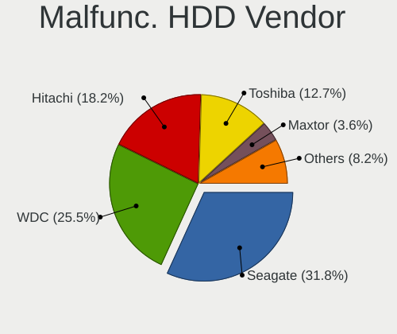

| Vendor              | Computers | Drives | Percent |
|---------------------|-----------|--------|---------|
| Seagate             | 35        | 38     | 31.82%  |
| WDC                 | 28        | 41     | 25.45%  |
| Hitachi             | 20        | 22     | 18.18%  |
| Toshiba             | 14        | 17     | 12.73%  |
| Maxtor              | 4         | 5      | 3.64%   |
| HGST                | 3         | 4      | 2.73%   |
| ExcelStor           | 3         | 4      | 2.73%   |
| Samsung Electronics | 2         | 2      | 1.82%   |
| Fujitsu             | 1         | 2      | 0.91%   |

Malfunc. Drive Kind
-------------------

Kinds of faulty drives

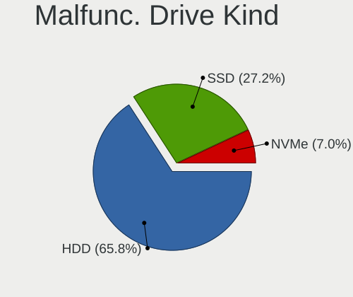

| Kind | Computers | Drives | Percent |
|------|-----------|--------|---------|
| HDD  | 104       | 135    | 65.82%  |
| SSD  | 43        | 51     | 27.22%  |
| NVMe | 11        | 16     | 6.96%   |

Failed Drives
-------------

Failed drive models

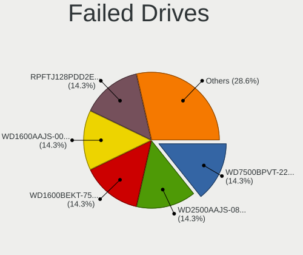

| Model                                         | Computers | Drives | Percent |
|-----------------------------------------------|-----------|--------|---------|
| WDC WD7500BPVT-22HXZT3 752GB                  | 1         | 1      | 14.29%  |
| WDC WD2500AAJS-08L7A0 250GB                   | 1         | 1      | 14.29%  |
| WDC WD1600BEKT-75PVMT0 160GB                  | 1         | 1      | 14.29%  |
| WDC WD1600AAJS-00L7A0 160GB                   | 1         | 1      | 14.29%  |
| Union Memory (Shenzhen) RPFTJ128PDD2EWX 128GB | 1         | 1      | 14.29%  |
| Seagate ST9320325AS 320GB                     | 1         | 1      | 14.29%  |
| HGST HTS545050A7E680 500GB                    | 1         | 1      | 14.29%  |

Failed Drive Vendor
-------------------

Failed drive vendors

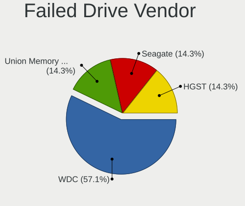

| Vendor                  | Computers | Drives | Percent |
|-------------------------|-----------|--------|---------|
| WDC                     | 4         | 4      | 57.14%  |
| Union Memory (Shenzhen) | 1         | 1      | 14.29%  |
| Seagate                 | 1         | 1      | 14.29%  |
| HGST                    | 1         | 1      | 14.29%  |

Drive Status
------------

Number of failed and malfunc. drives

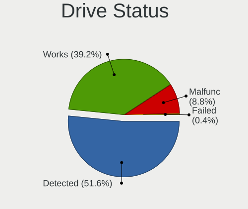

| Status   | Computers | Drives | Percent |
|----------|-----------|--------|---------|
| Detected | 886       | 1816   | 51.57%  |
| Works    | 674       | 1217   | 39.23%  |
| Malfunc  | 151       | 202    | 8.79%   |
| Failed   | 7         | 7      | 0.41%   |

Storage controller
------------------

Storage Vendor
--------------

Storage controller vendors

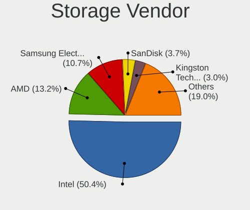

| Vendor                                  | Computers | Percent |
|-----------------------------------------|-----------|---------|
| Intel                                   | 1036      | 50.39%  |
| AMD                                     | 271       | 13.18%  |
| Samsung Electronics                     | 220       | 10.7%   |
| SanDisk                                 | 76        | 3.7%    |
| Kingston Technology Company             | 62        | 3.02%   |
| SK hynix                                | 57        | 2.77%   |
| Micron Technology                       | 43        | 2.09%   |
| Phison Electronics                      | 37        | 1.8%    |
| ASMedia Technology                      | 31        | 1.51%   |
| KIOXIA                                  | 27        | 1.31%   |
| ADATA Technology                        | 24        | 1.17%   |
| Nvidia                                  | 22        | 1.07%   |
| JMicron Technology                      | 22        | 1.07%   |
| Realtek Semiconductor                   | 19        | 0.92%   |
| Toshiba America Info Systems            | 18        | 0.88%   |
| Silicon Motion                          | 18        | 0.88%   |
| Marvell Technology Group                | 14        | 0.68%   |
| Micron/Crucial Technology               | 9         | 0.44%   |
| Union Memory (Shenzhen)                 | 7         | 0.34%   |
| Shenzhen Longsys Electronics            | 7         | 0.34%   |
| Lenovo                                  | 4         | 0.19%   |
| Solidigm                                | 3         | 0.15%   |
| Solid State Storage Technology          | 3         | 0.15%   |
| Seagate Technology                      | 3         | 0.15%   |
| MAXIO Technology (Hangzhou)             | 3         | 0.15%   |
| Hewlett-Packard                         | 3         | 0.15%   |
| VIA Technologies                        | 2         | 0.1%    |
| Transcend                               | 2         | 0.1%    |
| Shenzhen Techwinsemi Technology         | 2         | 0.1%    |
| LSI Logic / Symbios Logic               | 2         | 0.1%    |
| Integrated Technology Express           | 2         | 0.1%    |
| Apple                                   | 2         | 0.1%    |
| Silicon Integrated Systems [SiS]        | 1         | 0.05%   |
| Shenzhen Unionmemory Information System | 1         | 0.05%   |
| O2 Micro                                | 1         | 0.05%   |
| INNOGRIT                                | 1         | 0.05%   |
| Chelsio Communications                  | 1         | 0.05%   |

Storage Model
-------------

Storage controller models

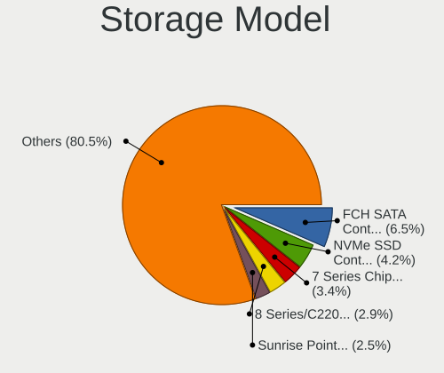

| Model                                                                          | Computers | Percent |
|--------------------------------------------------------------------------------|-----------|---------|
| AMD FCH SATA Controller [AHCI mode]                                            | 154       | 6.51%   |
| Samsung NVMe SSD Controller SM981/PM981/PM983                                  | 99        | 4.18%   |
| Intel 7 Series Chipset Family 6-port SATA Controller [AHCI mode]               | 80        | 3.38%   |
| Intel 8 Series/C220 Series Chipset Family 6-port SATA Controller 1 [AHCI mode] | 69        | 2.92%   |
| Intel Sunrise Point-LP SATA Controller [AHCI mode]                             | 59        | 2.49%   |
| Intel 6 Series/C200 Series Chipset Family 6 port Mobile SATA AHCI Controller   | 50        | 2.11%   |
| Intel Volume Management Device NVMe RAID Controller                            | 48        | 2.03%   |
| Intel 82801 Mobile SATA Controller [RAID mode]                                 | 46        | 1.94%   |
| Intel 82801IBM/IEM (ICH9M/ICH9M-E) 4 port SATA Controller [AHCI mode]          | 41        | 1.73%   |
| Intel 6 Series/C200 Series Chipset Family 6 port Desktop SATA AHCI Controller  | 40        | 1.69%   |
| Samsung NVMe SSD Controller 980 (DRAM-less)                                    | 36        | 1.52%   |
| Samsung NVMe SSD Controller PM9A1/PM9A3/980PRO                                 | 35        | 1.48%   |
| AMD 400 Series Chipset SATA Controller                                         | 32        | 1.35%   |
| Intel Q170/Q150/B150/H170/H110/Z170/CM236 Chipset SATA Controller [AHCI Mode]  | 31        | 1.31%   |
| Intel Wildcat Point-LP SATA Controller [AHCI Mode]                             | 29        | 1.23%   |
| ASMedia ASM1061/ASM1062 Serial ATA Controller                                  | 29        | 1.23%   |
| AMD SB7x0/SB8x0/SB9x0 SATA Controller [AHCI mode]                              | 29        | 1.23%   |
| Intel 8 Series SATA Controller 1 [AHCI mode]                                   | 28        | 1.18%   |
| Intel 200 Series PCH SATA controller [AHCI mode]                               | 27        | 1.14%   |
| AMD 500 Series Chipset SATA Controller                                         | 27        | 1.14%   |
| Intel Cannon Lake Mobile PCH SATA AHCI Controller                              | 26        | 1.1%    |
| Intel Celeron/Pentium Silver Processor SATA Controller                         | 25        | 1.06%   |
| Intel SATA Controller [RAID mode]                                              | 23        | 0.97%   |
| Intel HM170/QM170 Chipset SATA Controller [AHCI Mode]                          | 23        | 0.97%   |
| AMD SB7x0/SB8x0/SB9x0 IDE Controller                                           | 22        | 0.93%   |
| KIOXIA NVMe SSD Controller BG4 (DRAM-less)                                     | 21        | 0.89%   |
| AMD 600 Series Chipset SATA Controller                                         | 21        | 0.89%   |
| Intel NM10/ICH7 Family SATA Controller [IDE mode]                              | 20        | 0.85%   |
| SK hynix Gold P31/BC711/PC711 NVMe Solid State Drive                           | 19        | 0.8%    |
| Intel Cannon Lake PCH SATA AHCI Controller                                     | 19        | 0.8%    |
| Intel 82801G (ICH7 Family) IDE Controller                                      | 19        | 0.8%    |
| ADATA XPG SX8200 Pro PCIe Gen3x4 M.2 2280 Solid State Drive                    | 19        | 0.8%    |
| Intel Celeron N3350/Pentium N4200/Atom E3900 Series SATA AHCI Controller       | 17        | 0.72%   |
| Intel 5 Series/3400 Series Chipset 6 port SATA AHCI Controller                 | 17        | 0.72%   |
| Intel 5 Series/3400 Series Chipset 4 port SATA AHCI Controller                 | 17        | 0.72%   |
| Samsung NVMe SSD Controller S4LV008[Pascal]                                    | 16        | 0.68%   |
| Intel 7 Series/C210 Series Chipset Family 6-port SATA Controller [AHCI mode]   | 16        | 0.68%   |
| Samsung NVMe SSD Controller PM9B1 (DRAM-less)                                  | 15        | 0.63%   |
| Kingston Company KC3000/FURY Renegade NVMe SSD [E18]                           | 15        | 0.63%   |
| Intel Tiger Lake-LP SATA Controller                                            | 15        | 0.63%   |

Storage Kind
------------

Kind of storage controller (IDE, SATA, NVMe, SAS, ...)

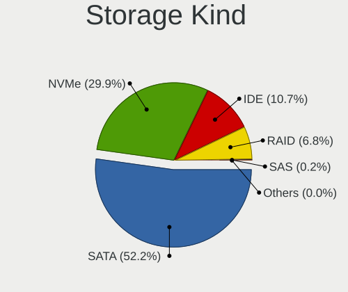

| Kind | Computers | Percent |
|------|-----------|---------|
| SATA | 1076      | 52.21%  |
| NVMe | 617       | 29.94%  |
| IDE  | 221       | 10.72%  |
| RAID | 141       | 6.84%   |
| SAS  | 5         | 0.24%   |
| SCSI | 1         | 0.05%   |

Processor
---------

CPU Vendor
----------

Processor vendors

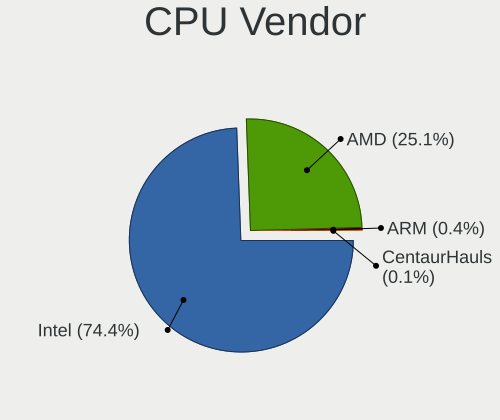

| Vendor       | Computers | Percent |
|--------------|-----------|---------|
| Intel        | 1166      | 74.41%  |
| AMD          | 394       | 25.14%  |
| ARM          | 6         | 0.38%   |
| CentaurHauls | 1         | 0.06%   |

CPU Model
---------

Processor models

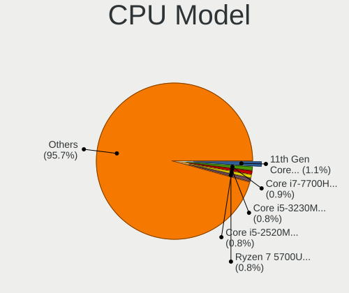

| Model                                    | Computers | Percent |
|------------------------------------------|-----------|---------|
| Intel 11th Gen Core i5-1135G7 @ 2.40GHz  | 17        | 1.08%   |
| Intel Core i7-7700HQ CPU @ 2.80GHz       | 14        | 0.89%   |
| Intel Core i5-3230M CPU @ 2.60GHz        | 12        | 0.76%   |
| Intel Core i5-2520M CPU @ 2.50GHz        | 12        | 0.76%   |
| AMD Ryzen 7 5700U with Radeon Graphics   | 12        | 0.76%   |
| AMD Ryzen 5 5600X 6-Core Processor       | 12        | 0.76%   |
| Intel Core i7-9750H CPU @ 2.60GHz        | 11        | 0.7%    |
| Intel Core i7-10510U CPU @ 1.80GHz       | 11        | 0.7%    |
| Intel Core i5-8265U CPU @ 1.60GHz        | 11        | 0.7%    |
| Intel Core i7-8750H CPU @ 2.20GHz        | 10        | 0.64%   |
| Intel Core i7-6700HQ CPU @ 2.60GHz       | 10        | 0.64%   |
| Intel Core i5-6300U CPU @ 2.40GHz        | 10        | 0.64%   |
| Intel 11th Gen Core i7-1165G7 @ 2.80GHz  | 10        | 0.64%   |
| Intel Core i7-8550U CPU @ 1.80GHz        | 9         | 0.57%   |
| Intel Core i5-8250U CPU @ 1.60GHz        | 9         | 0.57%   |
| Intel Core i5-5200U CPU @ 2.20GHz        | 9         | 0.57%   |
| Intel Core 2 Duo CPU E8400 @ 3.00GHz     | 9         | 0.57%   |
| AMD Ryzen 5 1600 Six-Core Processor      | 9         | 0.57%   |
| Intel Pentium CPU N4200 @ 1.10GHz        | 8         | 0.51%   |
| Intel Core i7-8565U CPU @ 1.80GHz        | 8         | 0.51%   |
| Intel Core i7-2670QM CPU @ 2.20GHz       | 8         | 0.51%   |
| Intel Core i5-6200U CPU @ 2.30GHz        | 8         | 0.51%   |
| Intel Core i5-4590 CPU @ 3.30GHz         | 8         | 0.51%   |
| Intel Core i5-3210M CPU @ 2.50GHz        | 8         | 0.51%   |
| Intel 12th Gen Core i7-12700H            | 8         | 0.51%   |
| AMD Ryzen 7 4800H with Radeon Graphics   | 8         | 0.51%   |
| AMD Ryzen 5 3600 6-Core Processor        | 8         | 0.51%   |
| Intel Core i7-10750H CPU @ 2.60GHz       | 7         | 0.45%   |
| Intel Core i5-8350U CPU @ 1.70GHz        | 7         | 0.45%   |
| Intel Core i5-4300U CPU @ 1.90GHz        | 7         | 0.45%   |
| Intel Core i5-3470 CPU @ 3.20GHz         | 7         | 0.45%   |
| Intel Core i5-2410M CPU @ 2.30GHz        | 7         | 0.45%   |
| Intel Core i5 CPU M 520 @ 2.40GHz        | 7         | 0.45%   |
| Intel Celeron N4000 CPU @ 1.10GHz        | 7         | 0.45%   |
| Intel Celeron CPU N3050 @ 1.60GHz        | 7         | 0.45%   |
| AMD Ryzen 5 5500U with Radeon Graphics   | 7         | 0.45%   |
| AMD Ryzen 3 3250U with Radeon Graphics   | 7         | 0.45%   |
| Intel Pentium Silver N5000 CPU @ 1.10GHz | 6         | 0.38%   |
| Intel Core i7-3630QM CPU @ 2.40GHz       | 6         | 0.38%   |
| Intel Core i5-4690 CPU @ 3.50GHz         | 6         | 0.38%   |

CPU Model Family
----------------

Processor model prefix

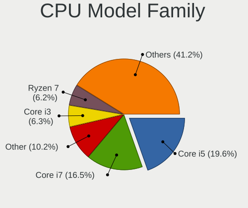

| Model                   | Computers | Percent |
|-------------------------|-----------|---------|
| Intel Core i5           | 308       | 19.59%  |
| Intel Core i7           | 260       | 16.54%  |
| Other                   | 161       | 10.24%  |
| Intel Core i3           | 99        | 6.3%    |
| AMD Ryzen 7             | 97        | 6.17%   |
| AMD Ryzen 5             | 96        | 6.11%   |
| Intel Core 2 Duo        | 71        | 4.52%   |
| Intel Celeron           | 71        | 4.52%   |
| Intel Pentium           | 56        | 3.56%   |
| Intel Xeon              | 36        | 2.29%   |
| AMD Ryzen 9             | 31        | 1.97%   |
| AMD Ryzen 3             | 22        | 1.4%    |
| Intel Pentium Dual-Core | 19        | 1.21%   |
| Intel Core 2 Quad       | 18        | 1.15%   |
| Intel Atom              | 18        | 1.15%   |
| AMD Ryzen 7 PRO         | 15        | 0.95%   |
| AMD FX                  | 14        | 0.89%   |
| Intel Pentium Silver    | 12        | 0.76%   |
| Intel Pentium Dual      | 12        | 0.76%   |
| AMD Athlon 64 X2        | 12        | 0.76%   |
| Intel Core i9           | 11        | 0.7%    |
| AMD Ryzen 5 PRO         | 11        | 0.7%    |
| Intel Core 2            | 8         | 0.51%   |
| AMD Phenom II X4        | 8         | 0.51%   |
| AMD A8                  | 8         | 0.51%   |
| AMD Athlon II X2        | 7         | 0.45%   |
| AMD E1                  | 6         | 0.38%   |
| AMD A6                  | 6         | 0.38%   |
| AMD Athlon 64           | 5         | 0.32%   |
| AMD A10                 | 5         | 0.32%   |
| AMD E                   | 4         | 0.25%   |
| AMD Athlon II X4        | 4         | 0.25%   |
| Intel Pentium M         | 3         | 0.19%   |
| Intel Pentium Gold      | 3         | 0.19%   |
| Intel Genuine           | 3         | 0.19%   |
| Intel Core              | 3         | 0.19%   |
| AMD Sempron             | 3         | 0.19%   |
| AMD Athlon              | 3         | 0.19%   |
| Intel Core m3           | 2         | 0.13%   |
| Intel Celeron Dual-Core | 2         | 0.13%   |

CPU Cores
---------

Number of processor cores

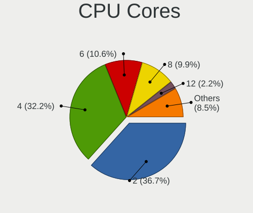

| Number  | Computers | Percent |
|---------|-----------|---------|
| 2       | 577       | 36.68%  |
| 4       | 506       | 32.17%  |
| 6       | 167       | 10.62%  |
| 8       | 155       | 9.85%   |
| 12      | 35        | 2.23%   |
| 10      | 34        | 2.16%   |
| 1       | 33        | 2.1%    |
| 16      | 21        | 1.34%   |
| 14      | 20        | 1.27%   |
| 3       | 12        | 0.76%   |
| Unknown | 5         | 0.32%   |
| 24      | 4         | 0.25%   |
| 18      | 2         | 0.13%   |
| 40      | 1         | 0.06%   |
| 20      | 1         | 0.06%   |

CPU Sockets
-----------

Number of sockets

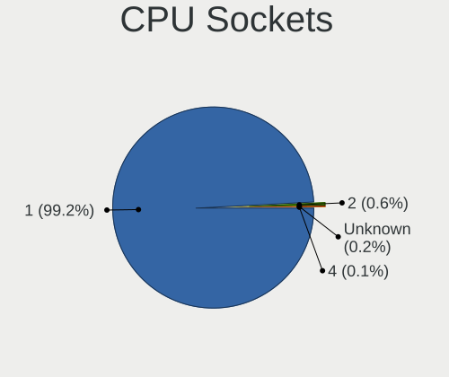

| Number  | Computers | Percent |
|---------|-----------|---------|
| 1       | 1554      | 99.17%  |
| 2       | 9         | 0.57%   |
| Unknown | 3         | 0.19%   |
| 4       | 1         | 0.06%   |

CPU Threads
-----------

Threads per core (Hyper-Threading)

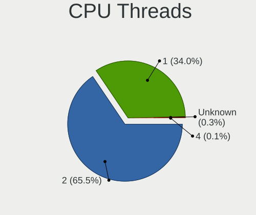

| Number  | Computers | Percent |
|---------|-----------|---------|
| 2       | 1031      | 65.54%  |
| 1       | 535       | 34.01%  |
| Unknown | 5         | 0.32%   |
| 8       | 1         | 0.06%   |
| 4       | 1         | 0.06%   |

CPU Op-Modes
------------

CPU Operation Modes (32-bit, 64-bit)

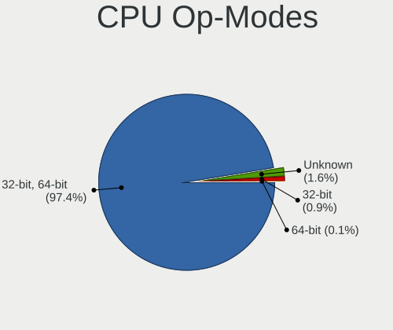

| Op mode        | Computers | Percent |
|----------------|-----------|---------|
| 32-bit, 64-bit | 1535      | 97.4%   |
| Unknown        | 26        | 1.65%   |
| 32-bit         | 14        | 0.89%   |
| 64-bit         | 1         | 0.06%   |

CPU Microcode
-------------

Microcode number

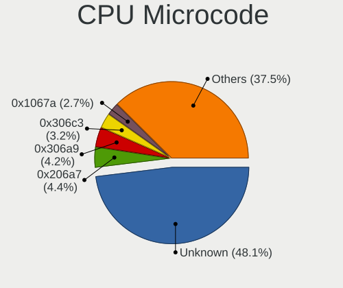

| Number     | Computers | Percent |
|------------|-----------|---------|
| Unknown    | 795       | 48.07%  |
| 0x206a7    | 72        | 4.35%   |
| 0x306a9    | 69        | 4.17%   |
| 0x306c3    | 53        | 3.2%    |
| 0x1067a    | 44        | 2.66%   |
| 0x906ea    | 28        | 1.69%   |
| 0x806ec    | 27        | 1.63%   |
| 0x506e3    | 25        | 1.51%   |
| 0x306d4    | 23        | 1.39%   |
| 0x40651    | 21        | 1.27%   |
| 0x906e9    | 20        | 1.21%   |
| 0x6fd      | 20        | 1.21%   |
| 0x20655    | 20        | 1.21%   |
| 0x406e3    | 19        | 1.15%   |
| 0x806ea    | 17        | 1.03%   |
| 0x806c1    | 17        | 1.03%   |
| 0x10676    | 15        | 0.91%   |
| 0x0a50000c | 13        | 0.79%   |
| 0x010000c8 | 13        | 0.79%   |
| 0x706a1    | 12        | 0.73%   |
| 0x506c9    | 12        | 0.73%   |
| 0x08608103 | 12        | 0.73%   |
| 0x08108109 | 12        | 0.73%   |
| 0x806e9    | 10        | 0.6%    |
| 0x6fb      | 10        | 0.6%    |
| 0x0a50000d | 10        | 0.6%    |
| 0xa0652    | 7         | 0.42%   |
| 0x406c3    | 7         | 0.42%   |
| 0x08600106 | 7         | 0.42%   |
| 0x08108102 | 7         | 0.42%   |
| 0x806eb    | 6         | 0.36%   |
| 0x6f6      | 6         | 0.36%   |
| 0x306f2    | 6         | 0.36%   |
| 0x0a404102 | 6         | 0.36%   |
| 0x08701021 | 6         | 0.36%   |
| 0x08600104 | 6         | 0.36%   |
| 0x0800820d | 6         | 0.36%   |
| 0xa0671    | 5         | 0.3%    |
| 0x906a4    | 5         | 0.3%    |
| 0x906a3    | 5         | 0.3%    |

CPU Microarch
-------------

Microarchitecture

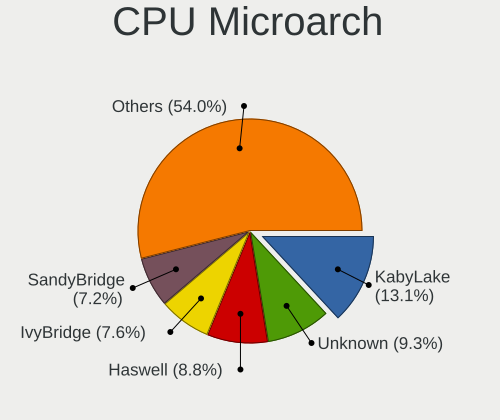

| Name              | Computers | Percent |
|-------------------|-----------|---------|
| KabyLake          | 206       | 13.1%   |
| Unknown           | 147       | 9.35%   |
| Haswell           | 138       | 8.77%   |
| IvyBridge         | 119       | 7.57%   |
| SandyBridge       | 114       | 7.25%   |
| Penryn            | 94        | 5.98%   |
| Zen 3             | 85        | 5.4%    |
| Skylake           | 75        | 4.77%   |
| Alderlake Hybrid  | 53        | 3.37%   |
| Zen 2             | 47        | 2.99%   |
| Core              | 47        | 2.99%   |
| TigerLake         | 42        | 2.67%   |
| Westmere          | 41        | 2.61%   |
| Zen+              | 40        | 2.54%   |
| Broadwell         | 34        | 2.16%   |
| Silvermont        | 33        | 2.1%    |
| K10               | 33        | 2.1%    |
| CometLake         | 28        | 1.78%   |
| Goldmont plus     | 25        | 1.59%   |
| Zen               | 22        | 1.4%    |
| K8 Hammer         | 22        | 1.4%    |
| IceLake           | 19        | 1.21%   |
| Goldmont          | 18        | 1.14%   |
| Piledriver        | 17        | 1.08%   |
| Nehalem           | 11        | 0.7%    |
| Excavator         | 8         | 0.51%   |
| Bonnell           | 8         | 0.51%   |
| Steamroller       | 6         | 0.38%   |
| P6                | 6         | 0.38%   |
| Jaguar            | 6         | 0.38%   |
| Bobcat            | 6         | 0.38%   |
| Puma              | 4         | 0.25%   |
| Gracemont         | 4         | 0.25%   |
| Bulldozer         | 4         | 0.25%   |
| Tremont           | 3         | 0.19%   |
| NetBurst          | 3         | 0.19%   |
| K10 Llano         | 3         | 0.19%   |
| Meteorlake Hybrid | 1         | 0.06%   |
| K8 & K10 hybrid   | 1         | 0.06%   |

Graphics
--------

GPU Vendor
----------

Vendors of graphics cards

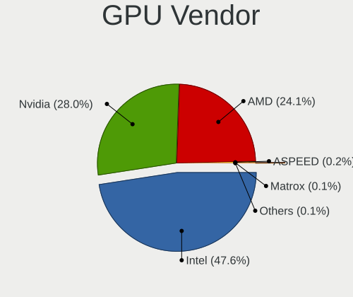

| Vendor                           | Computers | Percent |
|----------------------------------|-----------|---------|
| Intel                            | 919       | 47.57%  |
| Nvidia                           | 541       | 28%     |
| AMD                              | 465       | 24.07%  |
| ASPEED Technology                | 3         | 0.16%   |
| Matrox Electronics Systems       | 2         | 0.1%    |
| VIA Technologies                 | 1         | 0.05%   |
| Silicon Integrated Systems [SiS] | 1         | 0.05%   |

GPU Model
---------

Graphics card models

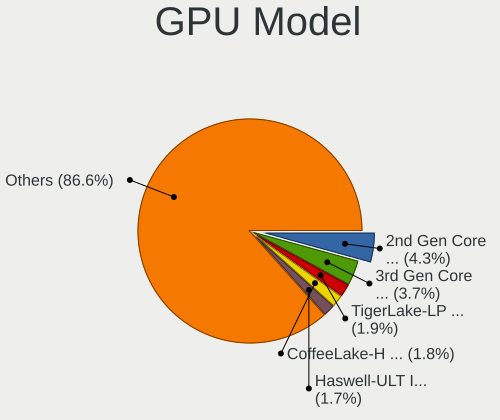

| Model                                                                                    | Computers | Percent |
|------------------------------------------------------------------------------------------|-----------|---------|
| Intel 2nd Generation Core Processor Family Integrated Graphics Controller                | 85        | 4.27%   |
| Intel 3rd Gen Core processor Graphics Controller                                         | 73        | 3.67%   |
| Intel TigerLake-LP GT2 [Iris Xe Graphics]                                                | 38        | 1.91%   |
| Intel CoffeeLake-H GT2 [UHD Graphics 630]                                                | 36        | 1.81%   |
| Intel Haswell-ULT Integrated Graphics Controller                                         | 34        | 1.71%   |
| Intel 4th Gen Core Processor Integrated Graphics Controller                              | 32        | 1.61%   |
| Intel Xeon E3-1200 v3/4th Gen Core Processor Integrated Graphics Controller              | 31        | 1.56%   |
| Intel Mobile 4 Series Chipset Integrated Graphics Controller                             | 31        | 1.56%   |
| Intel Skylake-U GT2 [HD Graphics 520]                                                    | 30        | 1.51%   |
| AMD Ellesmere [Radeon RX 470/480/570/570X/580/580X/590]                                  | 30        | 1.51%   |
| Intel Kaby Lake-R GT2 [UHD Graphics 620]                                                 | 29        | 1.46%   |
| Intel Broadwell-U GT2 [HD Graphics 5500]                                                 | 29        | 1.46%   |
| AMD Renoir [Radeon Vega Series / Radeon Vega Mobile Series]                              | 28        | 1.41%   |
| Intel WhiskeyLake-U GT2 [UHD Graphics 620]                                               | 27        | 1.36%   |
| AMD Picasso/Raven 2 [Radeon Vega Series / Radeon Vega Mobile Series]                     | 27        | 1.36%   |
| Intel Core Processor Integrated Graphics Controller                                      | 23        | 1.16%   |
| AMD Cezanne [Radeon Vega Series / Radeon Vega Mobile Series]                             | 23        | 1.16%   |
| Intel Kaby Lake-H GT2 [HD Graphics 630]                                                  | 21        | 1.06%   |
| AMD Lucienne                                                                             | 21        | 1.06%   |
| Intel CometLake-U GT2 [UHD Graphics]                                                     | 18        | 0.9%    |
| Intel Atom/Celeron/Pentium Processor x5-E8000/J3xxx/N3xxx Integrated Graphics Controller | 18        | 0.9%    |
| Intel 4 Series Chipset Integrated Graphics Controller                                    | 17        | 0.85%   |
| AMD Barcelo                                                                              | 17        | 0.85%   |
| Nvidia GA106M [GeForce RTX 3060 Mobile / Max-Q]                                          | 16        | 0.8%    |
| Intel GeminiLake [UHD Graphics 600]                                                      | 16        | 0.8%    |
| Nvidia TU117M [GeForce GTX 1650 Mobile / Max-Q]                                          | 15        | 0.75%   |
| Intel Raptor Lake-P [Iris Xe Graphics]                                                   | 15        | 0.75%   |
| Intel Kaby Lake-U GT2 [HD Graphics 620]                                                  | 15        | 0.75%   |
| Intel Alder Lake-P GT2 [Iris Xe Graphics]                                                | 15        | 0.75%   |
| Intel Xeon E3-1200 v2/3rd Gen Core processor Graphics Controller                         | 14        | 0.7%    |
| Intel Atom Processor Z36xxx/Z37xxx Series Graphics & Display                             | 14        | 0.7%    |
| AMD Rembrandt [Radeon 680M]                                                              | 14        | 0.7%    |
| Nvidia GP107M [GeForce GTX 1050 Mobile]                                                  | 13        | 0.65%   |
| Nvidia GP107 [GeForce GTX 1050 Ti]                                                       | 13        | 0.65%   |
| Intel TigerLake-H GT1 [UHD Graphics]                                                     | 13        | 0.65%   |
| Intel Skylake-S GT2 [HD Graphics 530]                                                    | 13        | 0.65%   |
| Intel CometLake-H GT2 [UHD Graphics]                                                     | 13        | 0.65%   |
| Intel CoffeeLake-S GT2 [UHD Graphics 630]                                                | 13        | 0.65%   |
| Intel Skylake-H GT2 [HD Graphics 530]                                                    | 12        | 0.6%    |
| Intel Mobile GM965/GL960 Integrated Graphics Controller (secondary)                      | 12        | 0.6%    |

GPU Combo
---------

Combinations of graphics cards

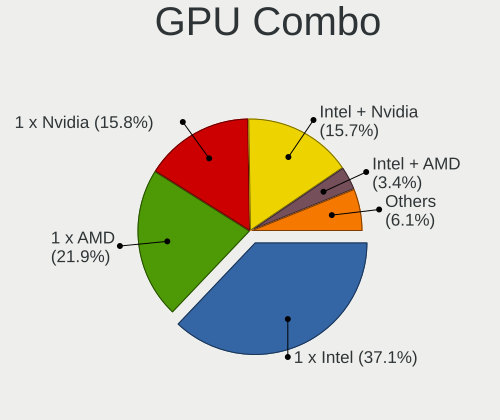

| Name           | Computers | Percent |
|----------------|-----------|---------|
| 1 x Intel      | 589       | 37.09%  |
| 1 x AMD        | 347       | 21.85%  |
| 1 x Nvidia     | 251       | 15.81%  |
| Intel + Nvidia | 250       | 15.74%  |
| Intel + AMD    | 54        | 3.4%    |
| AMD + Nvidia   | 40        | 2.52%   |
| 2 x AMD        | 27        | 1.7%    |
| 2 x Intel      | 13        | 0.82%   |
| Other          | 7         | 0.44%   |
| 2 x Nvidia     | 3         | 0.19%   |
| 1 x ASPEED     | 3         | 0.19%   |
| 1 x Matrox     | 2         | 0.13%   |
| 1 x VIA        | 1         | 0.06%   |
| 1 x SiS        | 1         | 0.06%   |

GPU Driver
----------

Free vs proprietary

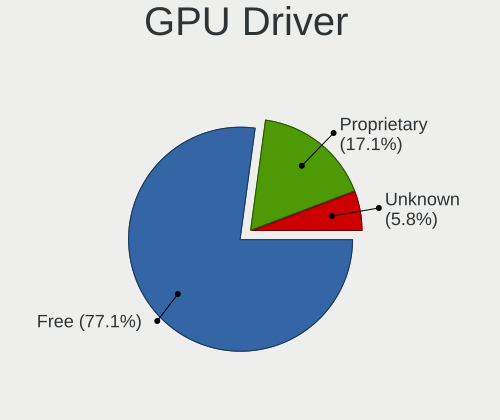

| Driver      | Computers | Percent |
|-------------|-----------|---------|
| Free        | 1242      | 77.14%  |
| Proprietary | 275       | 17.08%  |
| Unknown     | 93        | 5.78%   |

GPU Memory
----------

Total video memory

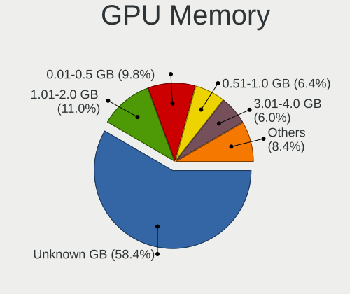

| Size in GB | Computers | Percent |
|------------|-----------|---------|
| Unknown    | 956       | 58.4%   |
| 1.01-2.0   | 180       | 11%     |
| 0.01-0.5   | 161       | 9.84%   |
| 0.51-1.0   | 104       | 6.35%   |
| 3.01-4.0   | 99        | 6.05%   |
| 7.01-8.0   | 68        | 4.15%   |
| 5.01-6.0   | 33        | 2.02%   |
| 8.01-16.0  | 22        | 1.34%   |
| 2.01-3.0   | 7         | 0.43%   |
| 16.01-24.0 | 7         | 0.43%   |

Monitor
-------

Monitor Vendor
--------------

Monitor vendors

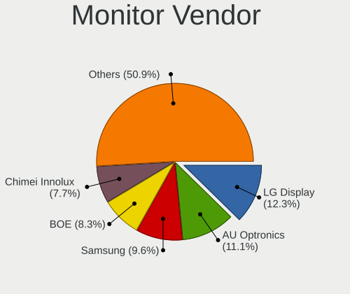

| Vendor                  | Computers | Percent |
|-------------------------|-----------|---------|
| LG Display              | 211       | 12.34%  |
| AU Optronics            | 190       | 11.11%  |
| Samsung Electronics     | 165       | 9.65%   |
| BOE                     | 142       | 8.3%    |
| Chimei Innolux          | 131       | 7.66%   |
| Dell                    | 129       | 7.54%   |
| Goldstar                | 82        | 4.8%    |
| Philips                 | 65        | 3.8%    |
| Acer                    | 59        | 3.45%   |
| Lenovo                  | 52        | 3.04%   |
| AOC                     | 45        | 2.63%   |
| Hewlett-Packard         | 43        | 2.51%   |
| Ancor Communications    | 32        | 1.87%   |
| Chi Mei Optoelectronics | 27        | 1.58%   |
| BenQ                    | 27        | 1.58%   |
| Sharp                   | 18        | 1.05%   |
| PANDA                   | 17        | 0.99%   |
| ASUSTek Computer        | 16        | 0.94%   |
| Apple                   | 16        | 0.94%   |
| LG Philips              | 14        | 0.82%   |
| Sony                    | 13        | 0.76%   |
| Vestel Elektronik       | 12        | 0.7%    |
| Fujitsu Siemens         | 12        | 0.7%    |
| Panasonic               | 10        | 0.58%   |
| MSI                     | 10        | 0.58%   |
| NEC Computers           | 9         | 0.53%   |
| LG Electronics          | 9         | 0.53%   |
| Eizo                    | 9         | 0.53%   |
| Unknown                 | 8         | 0.47%   |
| CSO                     | 8         | 0.47%   |
| InfoVision              | 7         | 0.41%   |
| Gigabyte Technology     | 7         | 0.41%   |
| Iiyama                  | 6         | 0.35%   |
| HannStar                | 6         | 0.35%   |
| Unknown                 | 6         | 0.35%   |
| ViewSonic               | 5         | 0.29%   |
| Toshiba                 | 5         | 0.29%   |
| CSW                     | 5         | 0.29%   |
| CPT                     | 5         | 0.29%   |
| Valve                   | 4         | 0.23%   |

Monitor Model
-------------

Monitor models

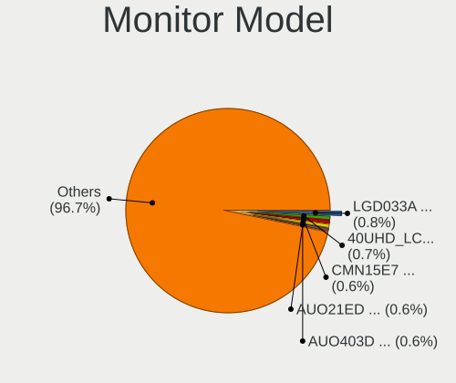

| Model                                                                    | Computers | Percent |
|--------------------------------------------------------------------------|-----------|---------|
| LG Display LCD Monitor LGD033A 1366x768 344x194mm 15.5-inch              | 14        | 0.79%   |
| Vestel Elektronik 40UHD_LCD_TV VES3700 3840x2160 880x500mm 39.8-inch     | 12        | 0.68%   |
| Chimei Innolux LCD Monitor CMN15E7 1920x1080 344x193mm 15.5-inch         | 11        | 0.62%   |
| AU Optronics LCD Monitor AUO21ED 1920x1080 344x193mm 15.5-inch           | 11        | 0.62%   |
| AU Optronics LCD Monitor AUO403D 1920x1080 309x174mm 14.0-inch           | 10        | 0.56%   |
| AU Optronics LCD Monitor AUO38ED 1920x1080 344x193mm 15.5-inch           | 10        | 0.56%   |
| Chimei Innolux LCD Monitor CMN15F5 1920x1080 344x193mm 15.5-inch         | 8         | 0.45%   |
| Chi Mei Optoelectronics LCD Monitor CMO15A7 1366x768 344x193mm 15.5-inch | 8         | 0.45%   |
| PANDA LCD Monitor NCP004D 1920x1080 344x194mm 15.5-inch                  | 7         | 0.4%    |
| Goldstar LG IPS FULLHD GSM5AB8 1920x1080 480x270mm 21.7-inch             | 7         | 0.4%    |
| AU Optronics LCD Monitor AUO106C 1366x768 276x155mm 12.5-inch            | 7         | 0.4%    |
| Dell P2419H DELD0DA 1920x1080 527x296mm 23.8-inch                        | 6         | 0.34%   |
| Chimei Innolux LCD Monitor CMN1521 1920x1080 344x193mm 15.5-inch         | 6         | 0.34%   |
| Chimei Innolux LCD Monitor CMN14D4 1920x1080 309x173mm 13.9-inch         | 6         | 0.34%   |
| AU Optronics LCD Monitor AUO22EC 1366x768 344x193mm 15.5-inch            | 6         | 0.34%   |
| AOC 24G2W1G3 AOC2402 1920x1080 527x296mm 23.8-inch                       | 6         | 0.34%   |
| Unknown                                                                  | 6         | 0.34%   |
| Samsung Electronics LCD Monitor SAM0B30 1920x1080 885x498mm 40.0-inch    | 5         | 0.28%   |
| LG Display LCD Monitor LGD053F 1920x1080 344x194mm 15.5-inch             | 5         | 0.28%   |
| LG Display LCD Monitor LGD046F 1920x1080 344x194mm 15.5-inch             | 5         | 0.28%   |
| LG Display LCD Monitor LGD02DC 1366x768 344x194mm 15.5-inch              | 5         | 0.28%   |
| LG Display LCD Monitor LGD02D8 1366x768 277x156mm 12.5-inch              | 5         | 0.28%   |
| Chimei Innolux LCD Monitor CMN15E8 1920x1080 344x193mm 15.5-inch         | 5         | 0.28%   |
| AU Optronics LCD Monitor AUO70EC 1366x768 344x193mm 15.5-inch            | 5         | 0.28%   |
| AOC G2460 AOC2460 1920x1080 531x299mm 24.0-inch                          | 5         | 0.28%   |
| Valve ANX7530 U VLV3001 800x1280 100x150mm 7.1-inch                      | 4         | 0.23%   |
| Unknown LCD Monitor FFFF 2288x1287 2550x2550mm 142.0-inch                | 4         | 0.23%   |
| Samsung Electronics LCD Monitor SEC5441 1280x800 331x207mm 15.4-inch     | 4         | 0.23%   |
| Samsung Electronics LCD Monitor SDC4161 1920x1080 344x194mm 15.5-inch    | 4         | 0.23%   |
| LG Display LP156WH2-TLE1 LGDCF01 1366x768 344x194mm 15.5-inch            | 4         | 0.23%   |
| LG Display LCD Monitor LGD0608 1920x1080 309x174mm 14.0-inch             | 4         | 0.23%   |
| Lenovo LCD Monitor LEN40B2 1920x1080 344x193mm 15.5-inch                 | 4         | 0.23%   |
| Goldstar LG ULTRAWIDE GSM59F1 2560x1080 670x280mm 28.6-inch              | 4         | 0.23%   |
| Dell U2412M DELA07A 1920x1200 518x324mm 24.1-inch                        | 4         | 0.23%   |
| Chimei Innolux LCD Monitor CMN1618 1920x1200 344x215mm 16.0-inch         | 4         | 0.23%   |
| Chimei Innolux LCD Monitor CMN14B1 1920x1080 308x173mm 13.9-inch         | 4         | 0.23%   |
| Chimei Innolux LCD Monitor CMN14A3 1600x900 309x174mm 14.0-inch          | 4         | 0.23%   |
| BOE LCD Monitor BOE0B38 2560x1600 344x215mm 16.0-inch                    | 4         | 0.23%   |
| BOE LCD Monitor BOE08E2 1920x1080 344x194mm 15.5-inch                    | 4         | 0.23%   |
| BOE LCD Monitor BOE084E 1920x1080 382x215mm 17.3-inch                    | 4         | 0.23%   |

Monitor Resolution
------------------

Monitor screen resolution

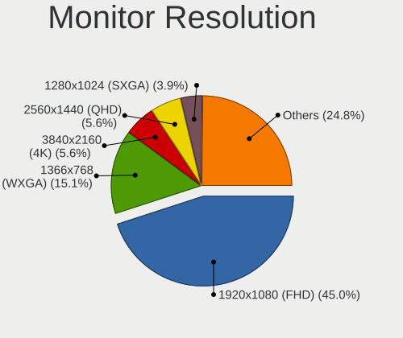

| Resolution         | Computers | Percent |
|--------------------|-----------|---------|
| 1920x1080 (FHD)    | 741       | 44.99%  |
| 1366x768 (WXGA)    | 249       | 15.12%  |
| 3840x2160 (4K)     | 92        | 5.59%   |
| 2560x1440 (QHD)    | 92        | 5.59%   |
| 1280x1024 (SXGA)   | 64        | 3.89%   |
| 1920x1200 (WUXGA)  | 62        | 3.76%   |
| 1600x900 (HD+)     | 53        | 3.22%   |
| 1680x1050 (WSXGA+) | 50        | 3.04%   |
| 1280x800 (WXGA)    | 41        | 2.49%   |
| 1440x900 (WXGA+)   | 33        | 2%      |
| 2560x1600          | 29        | 1.76%   |
| Unknown            | 20        | 1.21%   |
| 2560x1080          | 15        | 0.91%   |
| 3440x1440          | 14        | 0.85%   |
| 2880x1800          | 8         | 0.49%   |
| 3840x1080          | 7         | 0.43%   |
| 1024x600           | 6         | 0.36%   |
| 800x1280           | 5         | 0.3%    |
| 2288x1287          | 5         | 0.3%    |
| 1600x1200          | 5         | 0.3%    |
| 3840x2400          | 4         | 0.24%   |
| 1360x768           | 4         | 0.24%   |
| 1024x768 (XGA)     | 4         | 0.24%   |
| 3840x1200          | 3         | 0.18%   |
| 2880x1920          | 3         | 0.18%   |
| 2256x1504          | 3         | 0.18%   |
| 1400x1050          | 3         | 0.18%   |
| 1280x720 (HD)      | 3         | 0.18%   |
| 3200x1080          | 2         | 0.12%   |
| 3072x1920          | 2         | 0.12%   |
| 2880x1620          | 2         | 0.12%   |
| 2160x1440          | 2         | 0.12%   |
| 1280x960           | 2         | 0.12%   |
| 800x480            | 1         | 0.06%   |
| 7680x1440          | 1         | 0.06%   |
| 6784x2160          | 1         | 0.06%   |
| 6400x1080          | 1         | 0.06%   |
| 5760x2160          | 1         | 0.06%   |
| 5120x1080          | 1         | 0.06%   |
| 4240x1440          | 1         | 0.06%   |

Monitor Diagonal
----------------

Diagonal size in inches

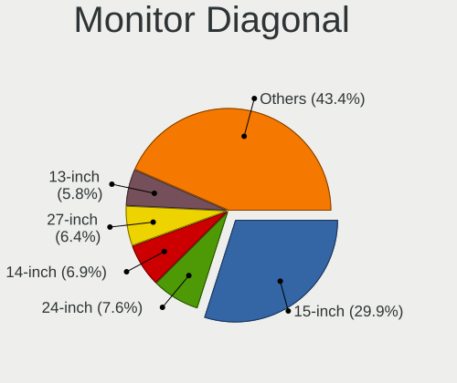

| Inches  | Computers | Percent |
|---------|-----------|---------|
| 15      | 513       | 29.9%   |
| 24      | 131       | 7.63%   |
| 14      | 118       | 6.88%   |
| 27      | 109       | 6.35%   |
| 13      | 100       | 5.83%   |
| 17      | 99        | 5.77%   |
| 21      | 94        | 5.48%   |
| 23      | 93        | 5.42%   |
| Unknown | 66        | 3.85%   |
| 19      | 53        | 3.09%   |
| 12      | 44        | 2.56%   |
| 16      | 38        | 2.21%   |
| 31      | 32        | 1.86%   |
| 22      | 32        | 1.86%   |
| 84      | 29        | 1.69%   |
| 20      | 23        | 1.34%   |
| 18      | 21        | 1.22%   |
| 34      | 20        | 1.17%   |
| 11      | 11        | 0.64%   |
| 54      | 8         | 0.47%   |
| 72      | 7         | 0.41%   |
| 32      | 7         | 0.41%   |
| 25      | 7         | 0.41%   |
| 65      | 6         | 0.35%   |
| 40      | 6         | 0.35%   |
| 10      | 6         | 0.35%   |
| 26      | 5         | 0.29%   |
| 142     | 4         | 0.23%   |
| 29      | 4         | 0.23%   |
| 28      | 4         | 0.23%   |
| 7       | 4         | 0.23%   |
| 63      | 3         | 0.17%   |
| 33      | 3         | 0.17%   |
| 75      | 2         | 0.12%   |
| 46      | 2         | 0.12%   |
| 35      | 2         | 0.12%   |
| 82      | 1         | 0.06%   |
| 59      | 1         | 0.06%   |
| 52      | 1         | 0.06%   |
| 49      | 1         | 0.06%   |

Monitor Width
-------------

Physical width

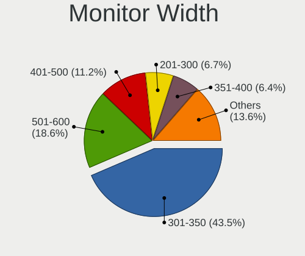

| Width in mm    | Computers | Percent |
|----------------|-----------|---------|
| 301-350        | 739       | 43.55%  |
| 501-600        | 315       | 18.56%  |
| 401-500        | 190       | 11.2%   |
| 201-300        | 113       | 6.66%   |
| 351-400        | 109       | 6.42%   |
| Unknown        | 66        | 3.89%   |
| 601-700        | 53        | 3.12%   |
| 1501-2000      | 39        | 2.3%    |
| 701-800        | 30        | 1.77%   |
| 1001-1500      | 22        | 1.3%    |
| 801-900        | 9         | 0.53%   |
| 1-100          | 5         | 0.29%   |
| More than 2000 | 4         | 0.24%   |
| 101-200        | 2         | 0.12%   |
| 901-1000       | 1         | 0.06%   |

Aspect Ratio
------------

Proportional relationship between the width and the height

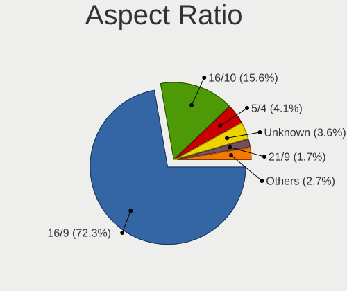

| Ratio   | Computers | Percent |
|---------|-----------|---------|
| 16/9    | 1118      | 72.27%  |
| 16/10   | 241       | 15.58%  |
| 5/4     | 64        | 4.14%   |
| Unknown | 56        | 3.62%   |
| 21/9    | 27        | 1.75%   |
| 4/3     | 17        | 1.1%    |
| 3/2     | 9         | 0.58%   |
| 1.00    | 5         | 0.32%   |
| 0.67    | 4         | 0.26%   |
| 32/9    | 3         | 0.19%   |
| 6/5     | 2         | 0.13%   |
| 3.73    | 1         | 0.06%   |

Monitor Area
------------

Area in inch²

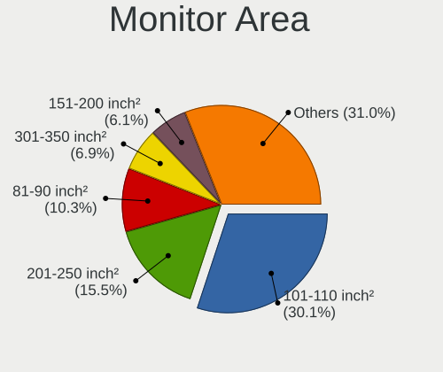

| Area in inch² | Computers | Percent |
|----------------|-----------|---------|
| 101-110        | 509       | 30.06%  |
| 201-250        | 263       | 15.53%  |
| 81-90          | 175       | 10.34%  |
| 301-350        | 117       | 6.91%   |
| 151-200        | 104       | 6.14%   |
| 351-500        | 66        | 3.9%    |
| Unknown        | 66        | 3.9%    |
| More than 1000 | 59        | 3.48%   |
| 251-300        | 58        | 3.43%   |
| 121-130        | 58        | 3.43%   |
| 141-150        | 48        | 2.84%   |
| 71-80          | 44        | 2.6%    |
| 61-70          | 40        | 2.36%   |
| 111-120        | 38        | 2.24%   |
| 51-60          | 11        | 0.65%   |
| 501-1000       | 11        | 0.65%   |
| 131-140        | 10        | 0.59%   |
| 1-40           | 7         | 0.41%   |
| 41-50          | 6         | 0.35%   |
| 91-100         | 3         | 0.18%   |

Pixel Density
-------------

Pixels per inch

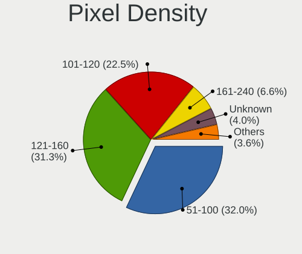

| Density       | Computers | Percent |
|---------------|-----------|---------|
| 51-100        | 529       | 32.02%  |
| 121-160       | 517       | 31.3%   |
| 101-120       | 371       | 22.46%  |
| 161-240       | 109       | 6.6%    |
| Unknown       | 66        | 4%      |
| 1-50          | 33        | 2%      |
| More than 240 | 27        | 1.63%   |

Multiple Monitors
-----------------

Total monitors connected

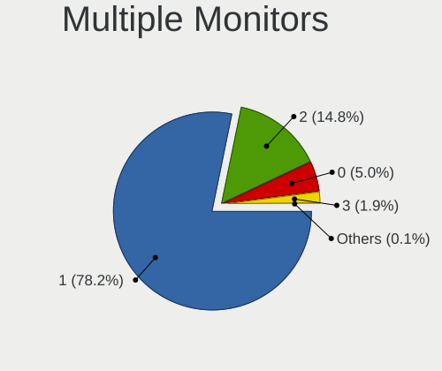

| Total | Computers | Percent |
|-------|-----------|---------|
| 1     | 1260      | 78.21%  |
| 2     | 238       | 14.77%  |
| 0     | 80        | 4.97%   |
| 3     | 31        | 1.92%   |
| 5     | 1         | 0.06%   |
| 4     | 1         | 0.06%   |

Network
-------

Net Controller Vendor
---------------------

Controller vendors

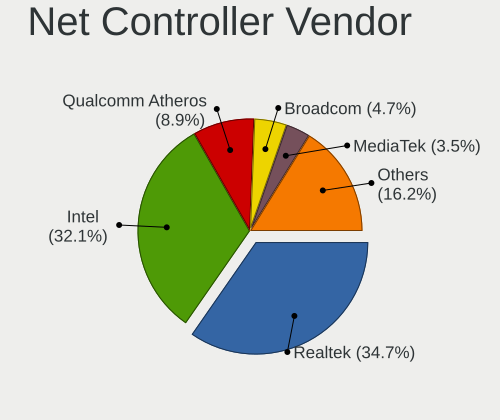

| Vendor                                 | Computers | Percent |
|----------------------------------------|-----------|---------|
| Realtek Semiconductor                  | 840       | 34.67%  |
| Intel                                  | 777       | 32.07%  |
| Qualcomm Atheros                       | 215       | 8.87%   |
| Broadcom                               | 114       | 4.7%    |
| MediaTek                               | 85        | 3.51%   |
| TP-Link                                | 54        | 2.23%   |
| Broadcom Limited                       | 42        | 1.73%   |
| Ralink                                 | 28        | 1.16%   |
| Ralink Technology                      | 27        | 1.11%   |
| Nvidia                                 | 21        | 0.87%   |
| Marvell Technology Group               | 20        | 0.83%   |
| Qualcomm Atheros Communications        | 18        | 0.74%   |
| Ericsson Business Mobile Networks      | 16        | 0.66%   |
| Sierra Wireless                        | 14        | 0.58%   |
| Dell                                   | 11        | 0.45%   |
| Shenzhen Goodix Technology             | 9         | 0.37%   |
| D-Link                                 | 9         | 0.37%   |
| ASIX Electronics                       | 9         | 0.37%   |
| Samsung Electronics                    | 7         | 0.29%   |
| Xiaomi                                 | 6         | 0.25%   |
| Lenovo                                 | 6         | 0.25%   |
| Huawei Technologies                    | 6         | 0.25%   |
| DisplayLink                            | 6         | 0.25%   |
| Qualcomm                               | 5         | 0.21%   |
| Microsoft                              | 5         | 0.21%   |
| Hewlett-Packard                        | 5         | 0.21%   |
| ASUSTek Computer                       | 5         | 0.21%   |
| Aquantia                               | 5         | 0.21%   |
| Sundance Technology Inc / IC Plus      | 4         | 0.17%   |
| Qualcomm Technologies                  | 4         | 0.17%   |
| Motorola PCS                           | 4         | 0.17%   |
| Google                                 | 4         | 0.17%   |
| Suzhou Motorcomm Electronic Technology | 3         | 0.12%   |
| Fibocom                                | 3         | 0.12%   |
| AMD                                    | 3         | 0.12%   |
| Toshiba                                | 2         | 0.08%   |
| Raspberry Pi                           | 2         | 0.08%   |
| OPPO Electronics                       | 2         | 0.08%   |
| NetGear                                | 2         | 0.08%   |
| Microchip Technology                   | 2         | 0.08%   |

Net Controller Model
--------------------

Controller models

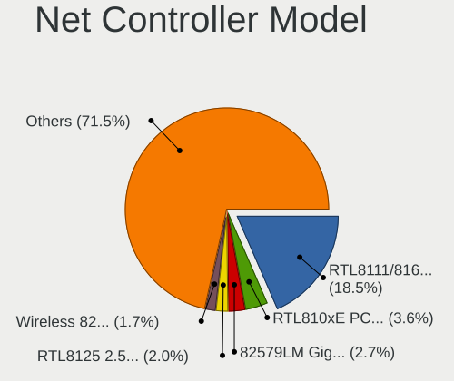

| Model                                                                  | Computers | Percent |
|------------------------------------------------------------------------|-----------|---------|
| Realtek RTL8111/8168/8211/8411 PCI Express Gigabit Ethernet Controller | 523       | 18.48%  |
| Realtek RTL810xE PCI Express Fast Ethernet controller                  | 103       | 3.64%   |
| Intel 82579LM Gigabit Network Connection (Lewisville)                  | 76        | 2.69%   |
| Realtek RTL8125 2.5GbE Controller                                      | 56        | 1.98%   |
| Intel Wireless 8265 / 8275                                             | 48        | 1.7%    |
| Intel Wi-Fi 6 AX200                                                    | 46        | 1.63%   |
| Realtek RTL8153 Gigabit Ethernet Adapter                               | 43        | 1.52%   |
| Intel Centrino Advanced-N 6205 [Taylor Peak]                           | 38        | 1.34%   |
| Realtek RTL8822CE 802.11ac PCIe Wireless Network Adapter               | 37        | 1.31%   |
| Qualcomm Atheros QCA9377 802.11ac Wireless Network Adapter             | 36        | 1.27%   |
| Intel Alder Lake-P PCH CNVi WiFi                                       | 34        | 1.2%    |
| Intel Wi-Fi 6 AX201                                                    | 31        | 1.1%    |
| Qualcomm Atheros QCA9565 / AR9565 Wireless Network Adapter             | 29        | 1.02%   |
| Intel Wireless 7265                                                    | 29        | 1.02%   |
| Intel Wireless 7260                                                    | 29        | 1.02%   |
| MediaTek MT7921 802.11ax PCIe Wireless Network Adapter [Filogic 330]   | 27        | 0.95%   |
| Realtek RTL-8100/8101L/8139 PCI Fast Ethernet Adapter                  | 26        | 0.92%   |
| Intel Ethernet Connection (2) I219-V                                   | 26        | 0.92%   |
| MediaTek MT7922 802.11ax PCI Express Wireless Network Adapter          | 25        | 0.88%   |
| Qualcomm Atheros AR9285 Wireless Network Adapter (PCI-Express)         | 24        | 0.85%   |
| Intel Wireless 8260                                                    | 24        | 0.85%   |
| Intel Ethernet Connection I217-LM                                      | 24        | 0.85%   |
| Intel Cannon Lake PCH CNVi WiFi                                        | 24        | 0.85%   |
| TP-Link TL-WN722N v2/v3 [Realtek RTL8188EUS]                           | 23        | 0.81%   |
| Intel Wi-Fi 6E(802.11ax) AX210/AX1675* 2x2 [Typhoon Peak]              | 23        | 0.81%   |
| Intel Comet Lake PCH CNVi WiFi                                         | 22        | 0.78%   |
| Realtek RTL8821CE 802.11ac PCIe Wireless Network Adapter               | 21        | 0.74%   |
| Intel I211 Gigabit Network Connection                                  | 20        | 0.71%   |
| Intel Ethernet Controller I225-V                                       | 20        | 0.71%   |
| Qualcomm Atheros QCA6174 802.11ac Wireless Network Adapter             | 18        | 0.64%   |
| Intel Ethernet Connection (4) I219-LM                                  | 18        | 0.64%   |
| Intel Comet Lake PCH-LP CNVi WiFi                                      | 18        | 0.64%   |
| Intel Cannon Point-LP CNVi [Wireless-AC]                               | 18        | 0.64%   |
| Realtek RTL8723BE PCIe Wireless Network Adapter                        | 17        | 0.6%    |
| MediaTek MT7902 802.11ax PCIe Wireless Network Adapter [Filogic 310]   | 17        | 0.6%    |
| Intel Wireless 3160                                                    | 16        | 0.57%   |
| Broadcom BCM43142 802.11b/g/n                                          | 16        | 0.57%   |
| Qualcomm Atheros AR9271 802.11n                                        | 15        | 0.53%   |
| Qualcomm Atheros AR9485 Wireless Network Adapter                       | 15        | 0.53%   |
| Intel Ethernet Connection (7) I219-V                                   | 15        | 0.53%   |

Wireless Vendor
---------------

Wireless vendors

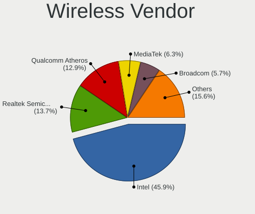

| Vendor                                | Computers | Percent |
|---------------------------------------|-----------|---------|
| Intel                                 | 564       | 45.85%  |
| Realtek Semiconductor                 | 168       | 13.66%  |
| Qualcomm Atheros                      | 159       | 12.93%  |
| MediaTek                              | 77        | 6.26%   |
| Broadcom                              | 70        | 5.69%   |
| TP-Link                               | 48        | 3.9%    |
| Ralink                                | 28        | 2.28%   |
| Ralink Technology                     | 27        | 2.2%    |
| Qualcomm Atheros Communications       | 18        | 1.46%   |
| Broadcom Limited                      | 18        | 1.46%   |
| Sierra Wireless                       | 14        | 1.14%   |
| Dell                                  | 7         | 0.57%   |
| D-Link                                | 6         | 0.49%   |
| Microsoft                             | 5         | 0.41%   |
| Qualcomm                              | 4         | 0.33%   |
| Fibocom                               | 3         | 0.24%   |
| ASUSTek Computer                      | 3         | 0.24%   |
| Qualcomm Technologies                 | 2         | 0.16%   |
| NetGear                               | 2         | 0.16%   |
| VIA Technologies                      | 1         | 0.08%   |
| Quectel Wireless Solutions            | 1         | 0.08%   |
| Micro Star International              | 1         | 0.08%   |
| Hewlett-Packard                       | 1         | 0.08%   |
| Gemtek                                | 1         | 0.08%   |
| Edimax Technology                     | 1         | 0.08%   |
| 802.11g Adapter [Linksys WUSB54GC v3] | 1         | 0.08%   |

Wireless Model
--------------

Wireless models

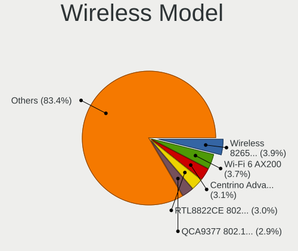

| Model                                                                | Computers | Percent |
|----------------------------------------------------------------------|-----------|---------|
| Intel Wireless 8265 / 8275                                           | 48        | 3.88%   |
| Intel Wi-Fi 6 AX200                                                  | 46        | 3.72%   |
| Intel Centrino Advanced-N 6205 [Taylor Peak]                         | 38        | 3.07%   |
| Realtek RTL8822CE 802.11ac PCIe Wireless Network Adapter             | 37        | 2.99%   |
| Qualcomm Atheros QCA9377 802.11ac Wireless Network Adapter           | 36        | 2.91%   |
| Intel Wi-Fi 6 AX201                                                  | 31        | 2.5%    |
| Qualcomm Atheros QCA9565 / AR9565 Wireless Network Adapter           | 29        | 2.34%   |
| Intel Wireless 7265                                                  | 29        | 2.34%   |
| Intel Wireless 7260                                                  | 29        | 2.34%   |
| MediaTek MT7921 802.11ax PCIe Wireless Network Adapter [Filogic 330] | 27        | 2.18%   |
| Qualcomm Atheros AR9285 Wireless Network Adapter (PCI-Express)       | 24        | 1.94%   |
| Intel Wireless 8260                                                  | 24        | 1.94%   |
| Intel Cannon Lake PCH CNVi WiFi                                      | 24        | 1.94%   |
| TP-Link TL-WN722N v2/v3 [Realtek RTL8188EUS]                         | 23        | 1.86%   |
| Intel Wi-Fi 6E(802.11ax) AX210/AX1675* 2x2 [Typhoon Peak]            | 23        | 1.86%   |
| Intel Comet Lake PCH CNVi WiFi                                       | 22        | 1.78%   |
| Realtek RTL8821CE 802.11ac PCIe Wireless Network Adapter             | 21        | 1.7%    |
| MediaTek MT7922 802.11ax PCI Express Wireless Network Adapter        | 20        | 1.62%   |
| Qualcomm Atheros QCA6174 802.11ac Wireless Network Adapter           | 18        | 1.45%   |
| Intel Comet Lake PCH-LP CNVi WiFi                                    | 18        | 1.45%   |
| Intel Cannon Point-LP CNVi [Wireless-AC]                             | 18        | 1.45%   |
| Realtek RTL8723BE PCIe Wireless Network Adapter                      | 17        | 1.37%   |
| MediaTek MT7902 802.11ax PCIe Wireless Network Adapter [Filogic 310] | 17        | 1.37%   |
| Intel Wireless 3160                                                  | 16        | 1.29%   |
| Intel Alder Lake-P PCH CNVi WiFi                                     | 16        | 1.29%   |
| Broadcom BCM43142 802.11b/g/n                                        | 16        | 1.29%   |
| Qualcomm Atheros AR9271 802.11n                                      | 15        | 1.21%   |
| Qualcomm Atheros AR9485 Wireless Network Adapter                     | 15        | 1.21%   |
| Realtek RTL8822BE 802.11a/b/g/n/ac WiFi adapter                      | 14        | 1.13%   |
| Intel WiFi Link 5100                                                 | 13        | 1.05%   |
| Intel Wi-Fi 5(802.11ac) Wireless-AC 9x6x [Thunder Peak]              | 13        | 1.05%   |
| Intel Tiger Lake PCH CNVi WiFi                                       | 13        | 1.05%   |
| Intel Raptor Lake PCH CNVi WiFi                                      | 13        | 1.05%   |
| Intel Centrino Ultimate-N 6300                                       | 13        | 1.05%   |
| Broadcom BCM4313 802.11bgn Wireless Network Adapter                  | 13        | 1.05%   |
| Ralink RT3290 Wireless 802.11n 1T/1R PCIe                            | 12        | 0.97%   |
| Ralink RT2870/RT3070 Wireless Adapter                                | 11        | 0.89%   |
| Intel PRO/Wireless 5100 AGN [Shiloh] Network Connection              | 11        | 0.89%   |
| Intel PRO/Wireless 3945ABG [Golan] Network Connection                | 11        | 0.89%   |
| Realtek RTL8852BE PCIe 802.11ax Wireless Network Controller          | 10        | 0.81%   |

Ethernet Vendor
---------------

Ethernet vendors

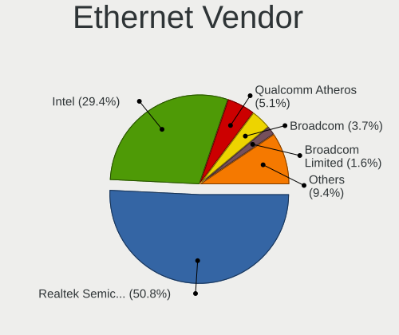

| Vendor                                 | Computers | Percent |
|----------------------------------------|-----------|---------|
| Realtek Semiconductor                  | 758       | 50.77%  |
| Intel                                  | 439       | 29.4%   |
| Qualcomm Atheros                       | 76        | 5.09%   |
| Broadcom                               | 55        | 3.68%   |
| Broadcom Limited                       | 24        | 1.61%   |
| Nvidia                                 | 21        | 1.41%   |
| Marvell Technology Group               | 20        | 1.34%   |
| ASIX Electronics                       | 9         | 0.6%    |
| MediaTek                               | 8         | 0.54%   |
| Samsung Electronics                    | 7         | 0.47%   |
| Xiaomi                                 | 6         | 0.4%    |
| TP-Link                                | 6         | 0.4%    |
| DisplayLink                            | 6         | 0.4%    |
| Lenovo                                 | 5         | 0.33%   |
| Huawei Technologies                    | 5         | 0.33%   |
| Aquantia                               | 5         | 0.33%   |
| Sundance Technology Inc / IC Plus      | 4         | 0.27%   |
| Motorola PCS                           | 4         | 0.27%   |
| Google                                 | 4         | 0.27%   |
| Suzhou Motorcomm Electronic Technology | 3         | 0.2%    |
| D-Link                                 | 3         | 0.2%    |
| Raspberry Pi                           | 2         | 0.13%   |
| Qualcomm Technologies                  | 2         | 0.13%   |
| OPPO Electronics                       | 2         | 0.13%   |
| ICS Advent                             | 2         | 0.13%   |
| Davicom Semiconductor                  | 2         | 0.13%   |
| D-Link System                          | 2         | 0.13%   |
| Chelsio Communications                 | 2         | 0.13%   |
| ASUSTek Computer                       | 2         | 0.13%   |
| Apple                                  | 2         | 0.13%   |
| Qualcomm                               | 1         | 0.07%   |
| NetXen Incorporated                    | 1         | 0.07%   |
| Microchip Technology                   | 1         | 0.07%   |
| JMicron Technology                     | 1         | 0.07%   |
| Cypress Semiconductor                  | 1         | 0.07%   |
| Attansic Technology                    | 1         | 0.07%   |
| 3Com                                   | 1         | 0.07%   |

Ethernet Model
--------------

Ethernet models

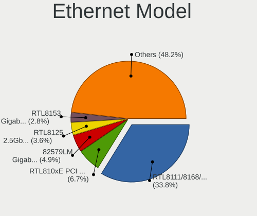

| Model                                                                  | Computers | Percent |
|------------------------------------------------------------------------|-----------|---------|
| Realtek RTL8111/8168/8211/8411 PCI Express Gigabit Ethernet Controller | 523       | 33.83%  |
| Realtek RTL810xE PCI Express Fast Ethernet controller                  | 103       | 6.66%   |
| Intel 82579LM Gigabit Network Connection (Lewisville)                  | 76        | 4.92%   |
| Realtek RTL8125 2.5GbE Controller                                      | 56        | 3.62%   |
| Realtek RTL8153 Gigabit Ethernet Adapter                               | 43        | 2.78%   |
| Realtek RTL-8100/8101L/8139 PCI Fast Ethernet Adapter                  | 26        | 1.68%   |
| Intel Ethernet Connection (2) I219-V                                   | 26        | 1.68%   |
| Intel Ethernet Connection I217-LM                                      | 24        | 1.55%   |
| Intel I211 Gigabit Network Connection                                  | 20        | 1.29%   |
| Intel Ethernet Controller I225-V                                       | 20        | 1.29%   |
| Intel Ethernet Connection (4) I219-LM                                  | 18        | 1.16%   |
| Intel Alder Lake-P PCH CNVi WiFi                                       | 18        | 1.16%   |
| Intel Ethernet Connection (7) I219-V                                   | 15        | 0.97%   |
| Intel 82579V Gigabit Network Connection                                | 15        | 0.97%   |
| Intel 82567LM Gigabit Network Connection                               | 13        | 0.84%   |
| Realtek Killer E2600 GbE Controller                                    | 12        | 0.78%   |
| Qualcomm Atheros QCA8172 Fast Ethernet                                 | 12        | 0.78%   |
| Nvidia MCP61 Ethernet                                                  | 12        | 0.78%   |
| Intel Ethernet Connection I218-LM                                      | 12        | 0.78%   |
| Intel Ethernet Connection I217-V                                       | 12        | 0.78%   |
| Intel Ethernet Connection (3) I218-LM                                  | 12        | 0.78%   |
| Intel 82567LM-3 Gigabit Network Connection                             | 12        | 0.78%   |
| Intel Ethernet Connection I219-LM                                      | 11        | 0.71%   |
| Intel 82577LM Gigabit Network Connection                               | 11        | 0.71%   |
| Qualcomm Atheros AR8151 v2.0 Gigabit Ethernet                          | 10        | 0.65%   |
| Intel Ethernet Connection (6) I219-V                                   | 10        | 0.65%   |
| Broadcom NetXtreme BCM5761 Gigabit Ethernet PCIe                       | 10        | 0.65%   |
| Intel Ethernet Connection (2) I218-V                                   | 9         | 0.58%   |
| Qualcomm Atheros AR8121/AR8113/AR8114 Gigabit or Fast Ethernet         | 8         | 0.52%   |
| Broadcom Limited NetLink BCM57780 Gigabit Ethernet PCIe                | 8         | 0.52%   |
| ASIX AX88179 Gigabit Ethernet                                          | 8         | 0.52%   |
| Qualcomm Atheros AR8161 Gigabit Ethernet                               | 7         | 0.45%   |
| Intel Ethernet Connection I219-V                                       | 7         | 0.45%   |
| Intel Ethernet Connection (7) I219-LM                                  | 7         | 0.45%   |
| Broadcom NetXtreme BCM5764M Gigabit Ethernet PCIe                      | 7         | 0.45%   |
| Xiaomi Mi/Redmi series (RNDIS)                                         | 6         | 0.39%   |
| TP-Link UE300 10/100/1000 LAN (ethernet mode) [Realtek RTL8153]        | 6         | 0.39%   |
| Intel I210 Gigabit Network Connection                                  | 6         | 0.39%   |
| Intel Ethernet Connection (4) I219-V                                   | 6         | 0.39%   |
| Intel Ethernet Connection (2) I219-LM                                  | 6         | 0.39%   |

Net Controller Kind
-------------------

Ethernet, WiFi or modem

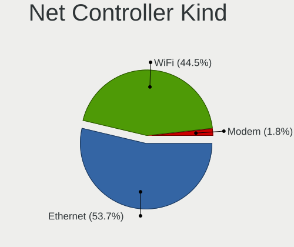

| Kind     | Computers | Percent |
|----------|-----------|---------|
| Ethernet | 1379      | 53.7%   |
| WiFi     | 1143      | 44.51%  |
| Modem    | 46        | 1.79%   |

Used Controller
---------------

Currently used network controller

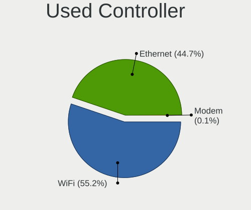

| Kind     | Computers | Percent |
|----------|-----------|---------|
| WiFi     | 901       | 55.21%  |
| Ethernet | 730       | 44.73%  |
| Modem    | 1         | 0.06%   |

NICs
----

Total network controllers on board

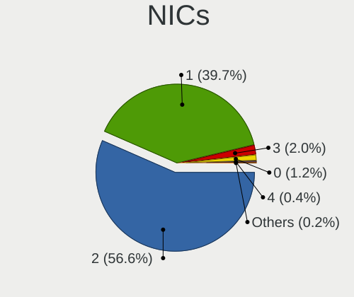

| Total | Computers | Percent |
|-------|-----------|---------|
| 2     | 892       | 56.56%  |
| 1     | 626       | 39.7%   |
| 3     | 31        | 1.97%   |
| 0     | 19        | 1.2%    |
| 4     | 6         | 0.38%   |
| 7     | 2         | 0.13%   |
| 5     | 1         | 0.06%   |

IPv6
----

IPv6 vs IPv4

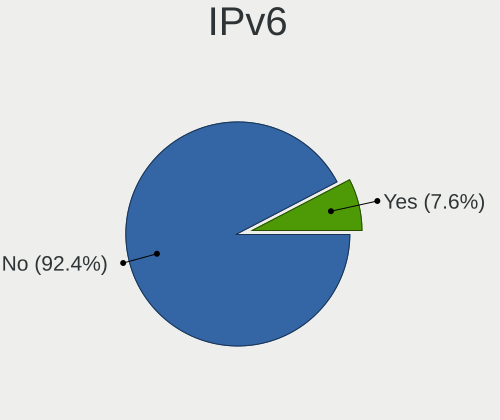

| Used | Computers | Percent |
|------|-----------|---------|
| No   | 1476      | 92.37%  |
| Yes  | 122       | 7.63%   |

Bluetooth
---------

Bluetooth Vendor
----------------

Controller vendors

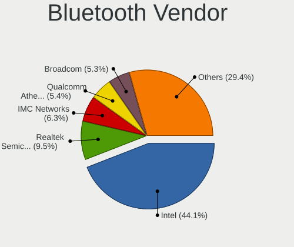

| Vendor                          | Computers | Percent |
|---------------------------------|-----------|---------|
| Intel                           | 440       | 44.09%  |
| Realtek Semiconductor           | 95        | 9.52%   |
| IMC Networks                    | 63        | 6.31%   |
| Qualcomm Atheros Communications | 54        | 5.41%   |
| Broadcom                        | 53        | 5.31%   |
| Foxconn / Hon Hai               | 50        | 5.01%   |
| Cambridge Silicon Radio         | 49        | 4.91%   |
| Lite-On Technology              | 35        | 3.51%   |
| Apple                           | 22        | 2.2%    |
| MediaTek                        | 20        | 2%      |
| Hewlett-Packard                 | 19        | 1.9%    |
| Toshiba                         | 18        | 1.8%    |
| Dell                            | 18        | 1.8%    |
| ASUSTek Computer                | 16        | 1.6%    |
| Ralink                          | 12        | 1.2%    |
| Integrated System Solution      | 9         | 0.9%    |
| Foxconn International           | 6         | 0.6%    |
| TP-Link                         | 5         | 0.5%    |
| USI                             | 2         | 0.2%    |
| Realtek                         | 2         | 0.2%    |
| Ralink Technology               | 2         | 0.2%    |
| Unknown                         | 2         | 0.2%    |
| Quectel Wireless Solutions      | 1         | 0.1%    |
| Logitech                        | 1         | 0.1%    |
| HTC (High Tech Computer)        | 1         | 0.1%    |
| Belkin Components               | 1         | 0.1%    |
| Alps Electric                   | 1         | 0.1%    |
| Actions                         | 1         | 0.1%    |

Bluetooth Model
---------------

Controller models

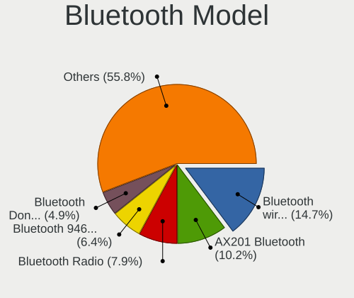

| Model                                                 | Computers | Percent |
|-------------------------------------------------------|-----------|---------|
| Intel Bluetooth wireless interface                    | 147       | 14.73%  |
| Intel AX201 Bluetooth                                 | 102       | 10.22%  |
| Realtek Bluetooth Radio                               | 79        | 7.92%   |
| Intel Bluetooth 9460/9560 Jefferson Peak (JfP)        | 64        | 6.41%   |
| Cambridge Silicon Radio Bluetooth Dongle (HCI mode)   | 49        | 4.91%   |
| Intel AX200 Bluetooth                                 | 43        | 4.31%   |
| Qualcomm Atheros  Bluetooth Device                    | 30        | 3.01%   |
| IMC Networks Wireless_Device                          | 30        | 3.01%   |
| Intel Bluetooth Device                                | 27        | 2.71%   |
| Intel AX210 Bluetooth                                 | 22        | 2.2%    |
| IMC Networks Bluetooth Radio                          | 22        | 2.2%    |
| MediaTek Wireless_Device                              | 19        | 1.9%    |
| Foxconn / Hon Hai Wireless_Device                     | 16        | 1.6%    |
| Foxconn / Hon Hai Bluetooth Device                    | 14        | 1.4%    |
| Ralink RT3290 Bluetooth                               | 12        | 1.2%    |
| Intel Wireless-AC 9260 Bluetooth Adapter              | 11        | 1.1%    |
| HP Bluetooth 2.0 Interface [Broadcom BCM2045]         | 11        | 1.1%    |
| Broadcom BCM20702 Bluetooth 4.0 [ThinkPad]            | 11        | 1.1%    |
| Apple Bluetooth Host Controller                       | 11        | 1.1%    |
| Qualcomm Atheros AR3011 Bluetooth                     | 10        | 1%      |
| Lite-On Qualcomm Atheros QCA9377 Bluetooth            | 10        | 1%      |
| Lite-On Bluetooth Device                              | 10        | 1%      |
| Intel Centrino Bluetooth Wireless Transceiver         | 10        | 1%      |
| IMC Networks Bluetooth Device                         | 10        | 1%      |
| Foxconn / Hon Hai MediaTek Bluetooth Adapter          | 10        | 1%      |
| HP Broadcom 2070 Bluetooth Combo                      | 8         | 0.8%    |
| Toshiba Integrated Bluetooth HCI                      | 7         | 0.7%    |
| Lite-On Wireless_Device                               | 7         | 0.7%    |
| Intel Wireless-AC 3168 Bluetooth                      | 7         | 0.7%    |
| Intel Centrino Advanced-N 6230 Bluetooth adapter      | 7         | 0.7%    |
| Dell DW375 Bluetooth Module                           | 7         | 0.7%    |
| Broadcom BCM2045B (BDC-2.1)                           | 7         | 0.7%    |
| Integrated System Solution KY-BT100 Bluetooth Adapter | 6         | 0.6%    |
| Foxconn International BCM43142A0 Bluetooth module     | 6         | 0.6%    |
| ASUS ASUS USB-BT500                                   | 6         | 0.6%    |
| Apple Bluetooth USB Host Controller                   | 6         | 0.6%    |
| TP-Link TP-T@- UB500 Adapter                          | 5         | 0.5%    |
| Realtek  Bluetooth 4.2 Adapter                        | 5         | 0.5%    |
| Lite-On Atheros AR3012 Bluetooth                      | 5         | 0.5%    |
| Toshiba RT Bluetooth Radio                            | 4         | 0.4%    |

Sound
-----

Sound Vendor
------------

Sound card vendors

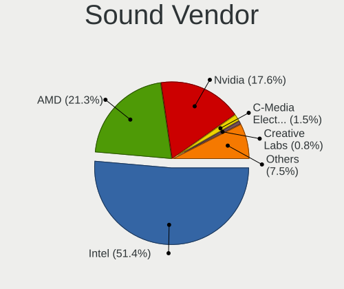

| Vendor                                       | Computers | Percent |
|----------------------------------------------|-----------|---------|
| Intel                                        | 1129      | 51.39%  |
| AMD                                          | 468       | 21.3%   |
| Nvidia                                       | 386       | 17.57%  |
| C-Media Electronics                          | 33        | 1.5%    |
| Creative Labs                                | 17        | 0.77%   |
| Logitech                                     | 13        | 0.59%   |
| Razer USA                                    | 10        | 0.46%   |
| Trust                                        | 8         | 0.36%   |
| Texas Instruments                            | 8         | 0.36%   |
| Lenovo                                       | 8         | 0.36%   |
| GN Netcom                                    | 8         | 0.36%   |
| Plantronics                                  | 7         | 0.32%   |
| Micro Star International                     | 7         | 0.32%   |
| ASUSTek Computer                             | 7         | 0.32%   |
| JMTek                                        | 6         | 0.27%   |
| Generalplus Technology                       | 6         | 0.27%   |
| Creative Technology                          | 6         | 0.27%   |
| BEHRINGER International                      | 4         | 0.18%   |
| VIA Technologies                             | 3         | 0.14%   |
| Tenx Technology                              | 3         | 0.14%   |
| SteelSeries ApS                              | 3         | 0.14%   |
| Sony                                         | 3         | 0.14%   |
| Realtek Semiconductor                        | 3         | 0.14%   |
| Hewlett-Packard                              | 3         | 0.14%   |
| Apple                                        | 3         | 0.14%   |
| Zoran Co. Personal Media Division (Nogatech) | 2         | 0.09%   |
| Thesycon Systemsoftware & Consulting         | 2         | 0.09%   |
| Samson Technologies                          | 2         | 0.09%   |
| Roland                                       | 2         | 0.09%   |
| GYROCOM C&C                                  | 2         | 0.09%   |
| Giga-Byte Technology                         | 2         | 0.09%   |
| Dell                                         | 2         | 0.09%   |
| Corsair                                      | 2         | 0.09%   |
| ZOOM                                         | 1         | 0.05%   |
| Universal Audio                              | 1         | 0.05%   |
| TTGK Technology                              | 1         | 0.05%   |
| Silicon Integrated Systems [SiS]             | 1         | 0.05%   |
| RODE Microphones                             | 1         | 0.05%   |
| Ploytec                                      | 1         | 0.05%   |
| OPPO Electronics                             | 1         | 0.05%   |

Sound Model
-----------

Sound card models

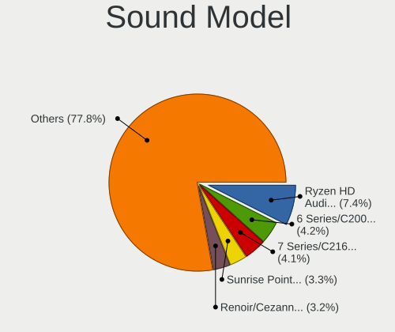

| Model                                                                      | Computers | Percent |
|----------------------------------------------------------------------------|-----------|---------|
| AMD Ryzen HD Audio Controller                                              | 197       | 7.45%   |
| Intel 6 Series/C200 Series Chipset Family High Definition Audio Controller | 111       | 4.2%    |
| Intel 7 Series/C216 Chipset Family High Definition Audio Controller        | 108       | 4.08%   |
| Intel Sunrise Point-LP HD Audio                                            | 86        | 3.25%   |
| AMD Renoir/Cezanne HDMI/DP Audio Controller                                | 85        | 3.21%   |
| Intel 8 Series/C220 Series Chipset High Definition Audio Controller        | 78        | 2.95%   |
| Intel Xeon E3-1200 v3/4th Gen Core Processor HD Audio Controller           | 67        | 2.53%   |
| Intel 82801I (ICH9 Family) HD Audio Controller                             | 67        | 2.53%   |
| AMD Radeon High Definition Audio Controller                                | 61        | 2.31%   |
| AMD Starship/Matisse HD Audio Controller                                   | 54        | 2.04%   |
| Intel Cannon Lake PCH cAVS                                                 | 53        | 2%      |
| AMD SBx00 Azalia (Intel HDA)                                               | 48        | 1.81%   |
| Intel 5 Series/3400 Series Chipset High Definition Audio                   | 43        | 1.63%   |
| Intel Tiger Lake-LP Smart Sound Technology Audio Controller                | 42        | 1.59%   |
| Intel Alder Lake PCH-P High Definition Audio Controller                    | 39        | 1.47%   |
| Intel Haswell-ULT HD Audio Controller                                      | 36        | 1.36%   |
| Intel 8 Series HD Audio Controller                                         | 36        | 1.36%   |
| Intel 100 Series/C230 Series Chipset Family HD Audio Controller            | 36        | 1.36%   |
| AMD Raven/Raven2/Fenghuang HDMI/DP Audio Controller                        | 36        | 1.36%   |
| Intel Wildcat Point-LP High Definition Audio Controller                    | 33        | 1.25%   |
| Intel NM10/ICH7 Family High Definition Audio Controller                    | 33        | 1.25%   |
| Intel Broadwell-U Audio Controller                                         | 33        | 1.25%   |
| AMD Ellesmere HDMI Audio [Radeon RX 470/480 / 570/580/590]                 | 31        | 1.17%   |
| Nvidia GP107GL High Definition Audio Controller                            | 30        | 1.13%   |
| Nvidia GF108 High Definition Audio Controller                              | 29        | 1.1%    |
| Intel Cannon Point-LP High Definition Audio Controller                     | 29        | 1.1%    |
| Intel 200 Series PCH HD Audio                                              | 29        | 1.1%    |
| AMD FCH Azalia Controller                                                  | 29        | 1.1%    |
| Intel Celeron/Pentium Silver Processor High Definition Audio               | 25        | 0.95%   |
| Intel Raptor Lake-P/U/H cAVS                                               | 24        | 0.91%   |
| Nvidia GA106 High Definition Audio Controller                              | 23        | 0.87%   |
| Nvidia GP106 High Definition Audio Controller                              | 22        | 0.83%   |
| Intel CM238 HD Audio Controller                                            | 22        | 0.83%   |
| Intel 82801H (ICH8 Family) HD Audio Controller                             | 21        | 0.79%   |
| AMD Family 17h (Models 00h-0fh) HD Audio Controller                        | 21        | 0.79%   |
| Nvidia TU107 GeForce GTX 1650 High Definition Audio Controller             | 20        | 0.76%   |
| Nvidia GP104 High Definition Audio Controller                              | 20        | 0.76%   |
| Intel Comet Lake PCH cAVS                                                  | 20        | 0.76%   |
| Intel Comet Lake PCH-LP cAVS                                               | 19        | 0.72%   |
| Nvidia GK208 HDMI/DP Audio Controller                                      | 18        | 0.68%   |

Memory
------

Memory Vendor
-------------

Memory module vendors

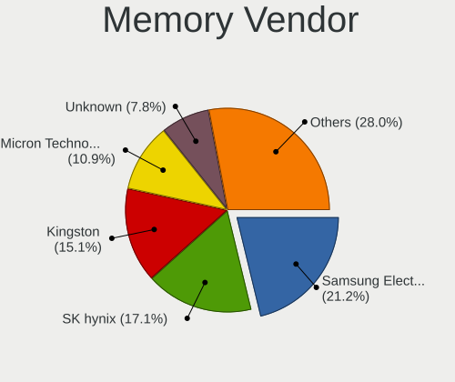

| Vendor                                  | Computers | Percent |
|-----------------------------------------|-----------|---------|
| Samsung Electronics                     | 227       | 21.23%  |
| SK hynix                                | 183       | 17.12%  |
| Kingston                                | 161       | 15.06%  |
| Micron Technology                       | 116       | 10.85%  |
| Unknown                                 | 83        | 7.76%   |
| Corsair                                 | 52        | 4.86%   |
| A-DATA Technology                       | 49        | 4.58%   |
| Ramaxel Technology                      | 30        | 2.81%   |
| Crucial                                 | 29        | 2.71%   |
| Team                                    | 22        | 2.06%   |
| G.Skill                                 | 18        | 1.68%   |
| Nanya Technology                        | 17        | 1.59%   |
| Transcend                               | 14        | 1.31%   |
| Elpida                                  | 13        | 1.22%   |
| Unknown                                 | 13        | 1.22%   |
| Apacer                                  | 8         | 0.75%   |
| Silicon Power                           | 6         | 0.56%   |
| Unknown (ABCD)                          | 5         | 0.47%   |
| GOODRAM                                 | 4         | 0.37%   |
| Silicon Power Computer & Communications | 3         | 0.28%   |
| pqi                                     | 2         | 0.19%   |
| Atermiter                               | 2         | 0.19%   |
| ASint Technology                        | 2         | 0.19%   |
| Unifosa                                 | 1         | 0.09%   |
| Toshiba                                 | 1         | 0.09%   |
| Thermaltake                             | 1         | 0.09%   |
| Qimonda                                 | 1         | 0.09%   |
| Patriot                                 | 1         | 0.09%   |
| Neo Forza                               | 1         | 0.09%   |
| HBS                                     | 1         | 0.09%   |
| fef5                                    | 1         | 0.09%   |
| CSX                                     | 1         | 0.09%   |
| A Force                                 | 1         | 0.09%   |

Memory Model
------------

Memory module models

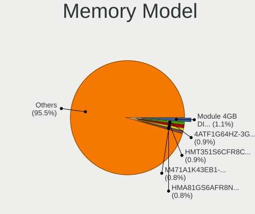

| Model                                                     | Computers | Percent |
|-----------------------------------------------------------|-----------|---------|
| Unknown                                                   | 13        | 1.12%   |
| Micron RAM 4ATF1G64HZ-3G2F1 8GB SODIMM DDR4 3200MT/s      | 11        | 0.95%   |
| SK hynix RAM HMT351S6CFR8C-PB 4GB SODIMM DDR3 1600MT/s    | 10        | 0.86%   |
| SK hynix RAM HMA81GS6AFR8N-UH 8GB SODIMM DDR4 2667MT/s    | 9         | 0.77%   |
| Samsung RAM M471A1K43EB1-CWE 8GB SODIMM DDR4 3200MT/s     | 9         | 0.77%   |
| Samsung RAM M471B5273DH0-CH9 4GB SODIMM DDR3 1600MT/s     | 8         | 0.69%   |
| Samsung RAM M471B1G73QH0-YK0 8GB SODIMM DDR3 1600MT/s     | 8         | 0.69%   |
| Samsung RAM M471A1G44AB0-CWE 8GiB SODIMM DDR4 3200MT/s    | 8         | 0.69%   |
| Micron RAM 8ATF1G64HZ-2G6E1 8GB SODIMM DDR4 2667MT/s      | 8         | 0.69%   |
| SK hynix RAM HMAA1GS6CJR6N-XN 8GB SODIMM DDR4 3200MT/s    | 7         | 0.6%    |
| Samsung RAM M471B1G73DB0-YK0 8GB SODIMM DDR3 1600MT/s     | 7         | 0.6%    |
| Corsair RAM CMK16GX4M2B3200C16 8GB DIMM DDR4 3600MT/s     | 7         | 0.6%    |
| A-DATA RAM Module 8GB SODIMM DDR4 3200MT/s                | 7         | 0.6%    |
| SK hynix RAM HMT41GS6BFR8A-PB 8GB SODIMM DDR3 2667MT/s    | 6         | 0.52%   |
| SK hynix RAM HMAA2GS6CJR8N-XN 16GB SODIMM DDR4 3200MT/s   | 6         | 0.52%   |
| Samsung RAM M471B5173EB0-YK0 4GB SODIMM DDR3 1600MT/s     | 6         | 0.52%   |
| Samsung RAM M471B5173DB0-YK0 4GB SODIMM DDR3 1600MT/s     | 6         | 0.52%   |
| Samsung RAM M471A5244CB0-CTD 4GB SODIMM DDR4 3266MT/s     | 6         | 0.52%   |
| Samsung RAM M471A1K43DB1-CWE 8GB SODIMM DDR4 3200MT/s     | 6         | 0.52%   |
| Samsung RAM M471A1K43CB1-CTD 8GB SODIMM DDR4 3200MT/s     | 6         | 0.52%   |
| Micron RAM 4ATF1G64HZ-3G2E1 8GB SODIMM DDR4 3200MT/s      | 6         | 0.52%   |
| SK hynix RAM HMT451S6BFR8A-PB 4GB SODIMM DDR3 1600MT/s    | 5         | 0.43%   |
| SK hynix RAM HMA81GS6DJR8N-XN 8GB SODIMM DDR4 3200MT/s    | 5         | 0.43%   |
| SK hynix RAM HMA81GS6CJR8N-VK 8GB SODIMM DDR4 2667MT/s    | 5         | 0.43%   |
| Samsung RAM M471B5273CH0-CH9 4GB SODIMM DDR3 1334MT/s     | 5         | 0.43%   |
| Samsung RAM M471A1K43DB1-CTD 8GB SODIMM DDR4 2667MT/s     | 5         | 0.43%   |
| Samsung RAM M471A1K43BB1-CRC 8GB SODIMM DDR4 2667MT/s     | 5         | 0.43%   |
| Samsung RAM M471A1G44BB0-CWE 8GB SODIMM DDR4 3200MT/s     | 5         | 0.43%   |
| Kingston RAM KHX2666C16/8G 8GiB DIMM DDR4 3466MT/s        | 5         | 0.43%   |
| Unknown RAM Module 4GB DIMM 1333MT/s                      | 4         | 0.34%   |
| Unknown RAM Module 2GB SODIMM DDR2 667MT/s                | 4         | 0.34%   |
| Unknown RAM Module 2GB DIMM 800MT/s                       | 4         | 0.34%   |
| Team RAM TEAMGROUP-SD4-2666 8GB SODIMM DDR4 2667MT/s      | 4         | 0.34%   |
| Samsung RAM M471B5273DH0-CK0 4GB SODIMM DDR3 2400MT/s     | 4         | 0.34%   |
| Samsung RAM M471B5173QH0-YK0 4GB SODIMM DDR3 1600MT/s     | 4         | 0.34%   |
| Samsung RAM M471B1G73EB0-YK0 8192MB SODIMM DDR3 1600MT/s  | 4         | 0.34%   |
| Samsung RAM M471A2K43DB1-CTD 16GB SODIMM DDR4 2667MT/s    | 4         | 0.34%   |
| Ramaxel RAM RMT3160ED58E9W1600 4GB SODIMM DDR3 1600MT/s   | 4         | 0.34%   |
| Ramaxel RAM RMSA3260ME78HAF-2666 8GB SODIMM DDR4 2667MT/s | 4         | 0.34%   |
| Micron RAM 8ATF1G64HZ-3G2J1 8GB SODIMM DDR4 3200MT/s      | 4         | 0.34%   |

Memory Kind
-----------

Memory module kinds

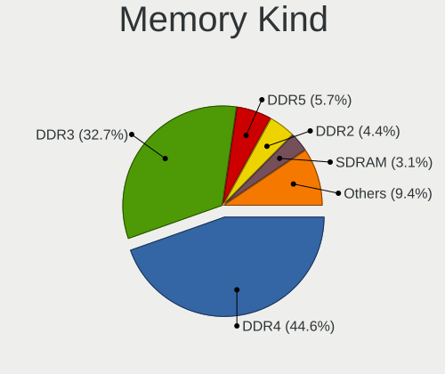

| Kind    | Computers | Percent |
|---------|-----------|---------|
| DDR4    | 397       | 44.61%  |
| DDR3    | 291       | 32.7%   |
| DDR5    | 51        | 5.73%   |
| DDR2    | 39        | 4.38%   |
| SDRAM   | 28        | 3.15%   |
| Unknown | 25        | 2.81%   |
| LPDDR5  | 22        | 2.47%   |
| LPDDR4  | 17        | 1.91%   |
| LPDDR3  | 8         | 0.9%    |
| DDR     | 7         | 0.79%   |
| DRAM    | 5         | 0.56%   |

Memory Form Factor
------------------

Physical design of the memory module

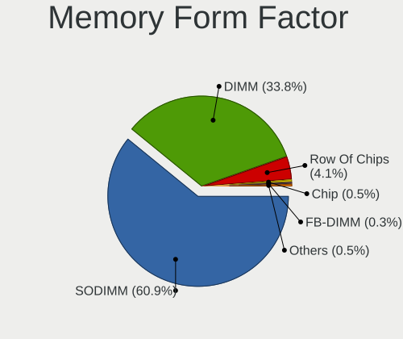

| Name         | Computers | Percent |
|--------------|-----------|---------|
| SODIMM       | 534       | 60.89%  |
| DIMM         | 296       | 33.75%  |
| Row Of Chips | 36        | 4.1%    |
| Chip         | 4         | 0.46%   |
| FB-DIMM      | 3         | 0.34%   |
| RIMM         | 2         | 0.23%   |
| Unknown      | 2         | 0.23%   |

Memory Size
-----------

Memory module size

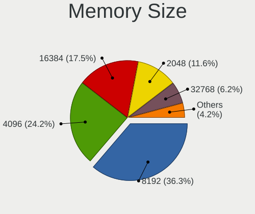

| Size    | Computers | Percent |
|---------|-----------|---------|
| 8192    | 356       | 36.25%  |
| 4096    | 238       | 24.24%  |
| 16384   | 172       | 17.52%  |
| 2048    | 114       | 11.61%  |
| 32768   | 61        | 6.21%   |
| 1024    | 31        | 3.16%   |
| 512     | 4         | 0.41%   |
| 49152   | 3         | 0.31%   |
| 3072    | 1         | 0.1%    |
| 256     | 1         | 0.1%    |
| Unknown | 1         | 0.1%    |

Memory Speed
------------

Memory module speed

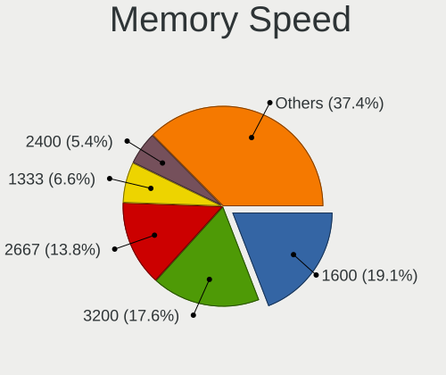

| Speed   | Computers | Percent |
|---------|-----------|---------|
| 1600    | 188       | 19.13%  |
| 3200    | 173       | 17.6%   |
| 2667    | 136       | 13.84%  |
| 1333    | 65        | 6.61%   |
| 2400    | 53        | 5.39%   |
| 2133    | 33        | 3.36%   |
| 1334    | 27        | 2.75%   |
| 5600    | 24        | 2.44%   |
| 800     | 24        | 2.44%   |
| 3600    | 23        | 2.34%   |
| 667     | 21        | 2.14%   |
| Unknown | 18        | 1.83%   |
| 6400    | 15        | 1.53%   |
| 4800    | 15        | 1.53%   |
| 1067    | 10        | 1.02%   |
| 1066    | 10        | 1.02%   |
| 3733    | 9         | 0.92%   |
| 1867    | 9         | 0.92%   |
| 3466    | 8         | 0.81%   |
| 3266    | 8         | 0.81%   |
| 6000    | 7         | 0.71%   |
| 3800    | 7         | 0.71%   |
| 2048    | 7         | 0.71%   |
| 1866    | 6         | 0.61%   |
| 7500    | 5         | 0.51%   |
| 4267    | 5         | 0.51%   |
| 4199    | 5         | 0.51%   |
| 3000    | 5         | 0.51%   |
| 2666    | 5         | 0.51%   |
| 8400    | 4         | 0.41%   |
| 533     | 4         | 0.41%   |
| 400     | 4         | 0.41%   |
| 333     | 4         | 0.41%   |
| 4266    | 3         | 0.31%   |
| 4000    | 3         | 0.31%   |
| 1800    | 3         | 0.31%   |
| 6200    | 2         | 0.2%    |
| 5200    | 2         | 0.2%    |
| 3400    | 2         | 0.2%    |
| 3333    | 2         | 0.2%    |

Printers & scanners
-------------------

Printer Vendor
--------------

Printer device vendors

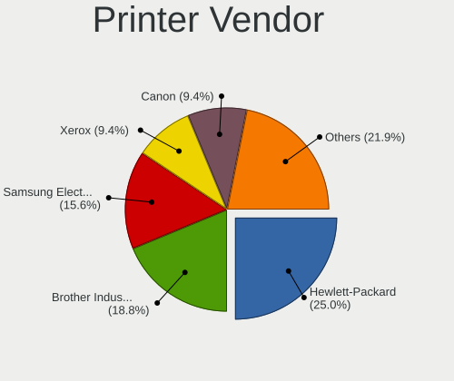

| Vendor              | Computers | Percent |
|---------------------|-----------|---------|
| Hewlett-Packard     | 8         | 25%     |
| Brother Industries  | 6         | 18.75%  |
| Samsung Electronics | 5         | 15.63%  |
| Xerox               | 3         | 9.38%   |
| Canon               | 3         | 9.38%   |
| Seiko Epson         | 2         | 6.25%   |
| STMicroelectronics  | 1         | 3.13%   |
| Prolific Technology | 1         | 3.13%   |
| Kyocera             | 1         | 3.13%   |
| Citizen             | 1         | 3.13%   |
| ATEN International  | 1         | 3.13%   |

Printer Model
-------------

Printer device models

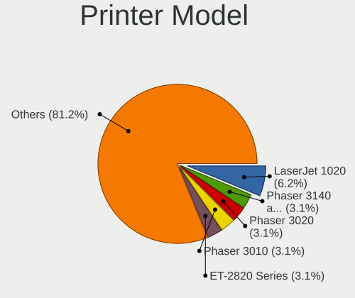

| Model                                                     | Computers | Percent |
|-----------------------------------------------------------|-----------|---------|
| HP LaserJet 1020                                          | 2         | 6.25%   |
| Xerox Phaser 3140 and 3155                                | 1         | 3.13%   |
| Xerox Phaser 3020                                         | 1         | 3.13%   |
| Xerox Phaser 3010                                         | 1         | 3.13%   |
| STMicroelectronics LED badge -- mini LED display -- 11x44 | 1         | 3.13%   |
| Seiko Epson ET-2820 Series                                | 1         | 3.13%   |
| Seiko Epson ET-2710 Series                                | 1         | 3.13%   |
| Samsung Xerox Phaser 3117 Laser Printer                   | 1         | 3.13%   |
| Samsung ML-2010P Mono Laser Printer                       | 1         | 3.13%   |
| Samsung M332x 382x 402x Series                            | 1         | 3.13%   |
| Samsung M267x 287x Series                                 | 1         | 3.13%   |
| Samsung CLX-6260 Series                                   | 1         | 3.13%   |
| Prolific PL2305 Parallel Port                             | 1         | 3.13%   |
| Kyocera ECOSYS P2040dn                                    | 1         | 3.13%   |
| HP LaserJet Professional P1566                            | 1         | 3.13%   |
| HP LaserJet P1102                                         | 1         | 3.13%   |
| HP LaserJet 4350                                          | 1         | 3.13%   |
| HP LaserJet 1018                                          | 1         | 3.13%   |
| HP LaserJet 1005                                          | 1         | 3.13%   |
| HP DeskJet 4530 series                                    | 1         | 3.13%   |
| Citizen Barcode Printer                                   | 1         | 3.13%   |
| Canon PIXMA MX370 Series                                  | 1         | 3.13%   |
| Canon PIXMA MP240                                         | 1         | 3.13%   |
| Canon MF3200 series                                       | 1         | 3.13%   |
| Brother Printer                                           | 1         | 3.13%   |
| Brother MFC-B7715DW series                                | 1         | 3.13%   |
| Brother MFC-B7710DN                                       | 1         | 3.13%   |
| Brother HL-1210W series                                   | 1         | 3.13%   |
| Brother DCP-T300                                          | 1         | 3.13%   |
| Brother DCP-7055 scanner/printer                          | 1         | 3.13%   |
| ATEN International UC-1284B Printer Port                  | 1         | 3.13%   |

Scanner Vendor
--------------

Scanner device vendors

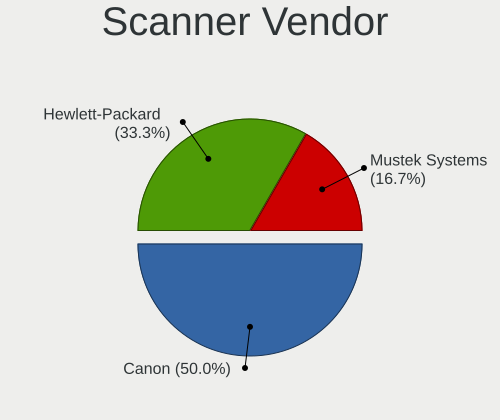

| Vendor          | Computers | Percent |
|-----------------|-----------|---------|
| Canon           | 3         | 50%     |
| Hewlett-Packard | 2         | 33.33%  |
| Mustek Systems  | 1         | 16.67%  |

Scanner Model
-------------

Scanner device models

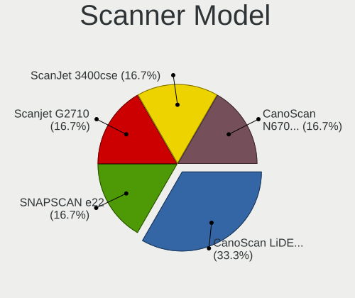

| Model                              | Computers | Percent |
|------------------------------------|-----------|---------|
| Canon CanoScan LiDE 110            | 2         | 33.33%  |
| Mustek Systems SNAPSCAN e22        | 1         | 16.67%  |
| HP Scanjet G2710                   | 1         | 16.67%  |
| HP ScanJet 3400cse                 | 1         | 16.67%  |
| Canon CanoScan N670U/N676U/LiDE 20 | 1         | 16.67%  |

Camera
------

Camera Vendor
-------------

Camera device vendors

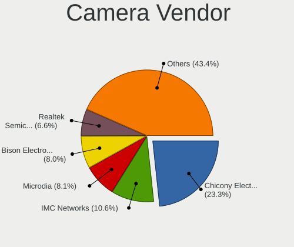

| Vendor                                 | Computers | Percent |
|----------------------------------------|-----------|---------|
| Chicony Electronics                    | 225       | 23.32%  |
| IMC Networks                           | 102       | 10.57%  |
| Microdia                               | 78        | 8.08%   |
| Bison Electronics                      | 77        | 7.98%   |
| Realtek Semiconductor                  | 64        | 6.63%   |
| Quanta                                 | 57        | 5.91%   |
| Sunplus Innovation Technology          | 54        | 5.6%    |
| Luxvisions Innotech Limited            | 33        | 3.42%   |
| Syntek                                 | 29        | 3.01%   |
| Logitech                               | 26        | 2.69%   |
| Suyin                                  | 25        | 2.59%   |
| Lite-On Technology                     | 23        | 2.38%   |
| Cheng Uei Precision Industry (Foxlink) | 23        | 2.38%   |
| Apple                                  | 16        | 1.66%   |
| Z-Star Microelectronics                | 12        | 1.24%   |
| Sonix Technology                       | 12        | 1.24%   |
| Alcor Micro                            | 9         | 0.93%   |
| Shinetech                              | 8         | 0.83%   |
| Microsoft                              | 8         | 0.83%   |
| Silicon Motion                         | 7         | 0.73%   |
| Samsung Electronics                    | 7         | 0.73%   |
| Lenovo                                 | 6         | 0.62%   |
| Acer                                   | 6         | 0.62%   |
| Generalplus Technology                 | 5         | 0.52%   |
| Ricoh                                  | 4         | 0.41%   |
| Creative Technology                    | 4         | 0.41%   |
| Primax Electronics                     | 3         | 0.31%   |
| kingcome                               | 3         | 0.31%   |
| Hewlett-Packard                        | 3         | 0.31%   |
| Cubeternet                             | 3         | 0.31%   |
| Unknown                                | 2         | 0.21%   |
| Pixart Imaging                         | 2         | 0.21%   |
| Importek                               | 2         | 0.21%   |
| Aveo Technology                        | 2         | 0.21%   |
| Arkmicro Technologies                  | 2         | 0.21%   |
| Alpha Imaging Technology               | 2         | 0.21%   |
| ALi                                    | 2         | 0.21%   |
| Xiongmai                               | 1         | 0.1%    |
| Trust                                  | 1         | 0.1%    |
| Tobii Technology AB                    | 1         | 0.1%    |

Camera Model
------------

Camera device models

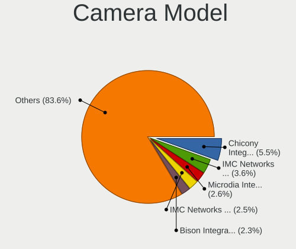

| Model                                                | Computers | Percent |
|------------------------------------------------------|-----------|---------|
| Chicony Integrated Camera                            | 53        | 5.48%   |
| IMC Networks Integrated Camera                       | 35        | 3.62%   |
| Microdia Integrated_Webcam_HD                        | 25        | 2.59%   |
| IMC Networks USB2.0 VGA UVC WebCam                   | 24        | 2.48%   |
| Bison Integrated Camera                              | 22        | 2.28%   |
| IMC Networks USB2.0 HD UVC WebCam                    | 21        | 2.17%   |
| Syntek Integrated Camera                             | 20        | 2.07%   |
| Realtek Integrated_Webcam_HD                         | 18        | 1.86%   |
| Sunplus Integrated_Webcam_HD                         | 17        | 1.76%   |
| Chicony HD WebCam                                    | 17        | 1.76%   |
| Quanta HP HD Camera                                  | 13        | 1.34%   |
| Quanta HD Webcam                                     | 11        | 1.14%   |
| Chicony TOSHIBA Web Camera - HD                      | 11        | 1.14%   |
| Bison Lenovo EasyCamera                              | 11        | 1.14%   |
| Bison HD Webcam                                      | 11        | 1.14%   |
| Quanta HD User Facing                                | 10        | 1.03%   |
| Lite-On Integrated Camera                            | 10        | 1.03%   |
| Bison SunplusIT Integrated Camera                    | 10        | 1.03%   |
| Realtek Lenovo EasyCamera                            | 9         | 0.93%   |
| Microdia Integrated Webcam                           | 8         | 0.83%   |
| Apple iPhone 5/5C/5S/6/SE/7/8/X                      | 8         | 0.83%   |
| Samsung Galaxy series, misc. (MTP mode)              | 7         | 0.72%   |
| Luxvisions Innotech Limited Integrated Camera        | 7         | 0.72%   |
| Luxvisions Innotech Limited HP Wide Vision HD Camera | 7         | 0.72%   |
| Luxvisions Innotech Limited HP TrueVision HD Camera  | 7         | 0.72%   |
| Logitech Webcam C270                                 | 7         | 0.72%   |
| Chicony USB 2.0 Camera                               | 7         | 0.72%   |
| Chicony HP HD Camera                                 | 7         | 0.72%   |
| Suyin Acer/HP Integrated Webcam [CN0314]             | 6         | 0.62%   |
| Sunplus Laptop Integrated WebCam HD                  | 6         | 0.62%   |
| Sonix USB2.0 HD UVC WebCam                           | 6         | 0.62%   |
| ShineTech USB2.0 HD UVC WebCam                       | 6         | 0.62%   |
| Microdia Camera                                      | 6         | 0.62%   |
| Luxvisions Innotech Limited Integrated RGB Camera    | 6         | 0.62%   |
| Chicony Integrated Camera [ThinkPad]                 | 6         | 0.62%   |
| Chicony Integrated Camera (1280x720@30)              | 6         | 0.62%   |
| Chicony HP TrueVision HD                             | 6         | 0.62%   |
| Chicony HP HD Webcam                                 | 6         | 0.62%   |
| Z-Star Full HD 1080P PC Camera                       | 5         | 0.52%   |
| Quanta VGA WebCam                                    | 5         | 0.52%   |

Security
--------

Fingerprint Vendor
------------------

Fingerprint sensor vendors

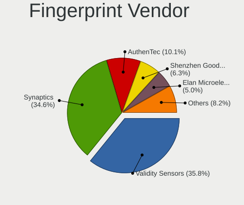

| Vendor                             | Computers | Percent |
|------------------------------------|-----------|---------|
| Validity Sensors                   | 57        | 35.85%  |
| Synaptics                          | 55        | 34.59%  |
| AuthenTec                          | 16        | 10.06%  |
| Shenzhen Goodix Technology         | 10        | 6.29%   |
| Elan Microelectronics              | 8         | 5.03%   |
| Upek                               | 6         | 3.77%   |
| LighTuning Technology              | 4         | 2.52%   |
| Realtek USB2.0 Finger Print Bridge | 2         | 1.26%   |
| STMicroelectronics                 | 1         | 0.63%   |

Fingerprint Model
-----------------

Fingerprint sensor models

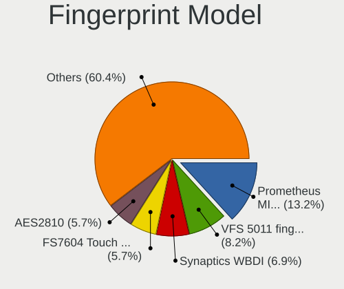

| Model                                                                      | Computers | Percent |
|----------------------------------------------------------------------------|-----------|---------|
| Synaptics Prometheus MIS Touch Fingerprint Reader                          | 21        | 13.21%  |
| Validity Sensors VFS 5011 fingerprint sensor                               | 13        | 8.18%   |
| Validity Sensors Synaptics WBDI                                            | 11        | 6.92%   |
| Synaptics FS7604 Touch Fingerprint Sensor with PurePrint                   | 9         | 5.66%   |
| AuthenTec AES2810                                                          | 9         | 5.66%   |
| Validity Sensors VFS495 Fingerprint Reader                                 | 8         | 5.03%   |
| Synaptics Metallica MIS Touch Fingerprint Reader                           | 7         | 4.4%    |
| Upek Biometric Touchchip/Touchstrip Fingerprint Sensor                     | 6         | 3.77%   |
| Shenzhen Goodix Fingerprint Reader                                         | 6         | 3.77%   |
| Elan ELAN:ARM-M4                                                           | 6         | 3.77%   |
| Validity Sensors VFS471 Fingerprint Reader                                 | 5         | 3.14%   |
| Validity Sensors Synaptics VFS7552 Touch Fingerprint Sensor with PurePrint | 4         | 2.52%   |
| Synaptics Metallica MOH Touch Fingerprint Reader                           | 4         | 2.52%   |
| AuthenTec Fingerprint Sensor                                               | 4         | 2.52%   |
| Validity Sensors VFS5011 Fingerprint Reader                                | 3         | 1.89%   |
| Synaptics Prometheus Fingerprint Reader                                    | 3         | 1.89%   |
| Shenzhen Goodix  FingerPrint Device                                        | 3         | 1.89%   |
| Validity Sensors VFS7552 Touch Fingerprint Sensor                          | 2         | 1.26%   |
| Validity Sensors VFS7500 Touch Fingerprint Sensor                          | 2         | 1.26%   |
| Validity Sensors VFS491                                                    | 2         | 1.26%   |
| Validity Sensors VFS451 Fingerprint Reader                                 | 2         | 1.26%   |
| Validity Sensors Fingerprint scanner                                       | 2         | 1.26%   |
| Synaptics WBDI                                                             | 2         | 1.26%   |
| Synaptics UWP WBDI Device                                                  | 2         | 1.26%   |
| Synaptics  WBDI                                                            | 2         | 1.26%   |
| Synaptics  FS7604 Touch Fingerprint Sensor with PurePrint                  | 2         | 1.26%   |
| Synaptics Fingerprint reader [HP G6]                                       | 2         | 1.26%   |
| Realtek USB2.0 Finger Print Bridge FocalTech Fingerprint Device            | 2         | 1.26%   |
| LighTuning Fingerprint Reader                                              | 2         | 1.26%   |
| Elan ELAN:Fingerprint                                                      | 2         | 1.26%   |
| AuthenTec AES2501 Fingerprint Sensor                                       | 2         | 1.26%   |
| Validity Sensors VFS301 Fingerprint Reader                                 | 1         | 0.63%   |
| Validity Sensors VFS101 Fingerprint Reader                                 | 1         | 0.63%   |
| Validity Sensors Swipe Fingerprint Sensor                                  | 1         | 0.63%   |
| Synaptics TouchPad                                                         | 1         | 0.63%   |
| STMicroelectronics Fingerprint Reader                                      | 1         | 0.63%   |
| Shenzhen Goodix FingerPrint                                                | 1         | 0.63%   |
| LighTuning ES603 Swipe Fingerprint Sensor                                  | 1         | 0.63%   |
| LighTuning EgisTec Touch Fingerprint Sensor                                | 1         | 0.63%   |
| AuthenTec AES1600                                                          | 1         | 0.63%   |

Chipcard Vendor
---------------

Chipcard module vendors

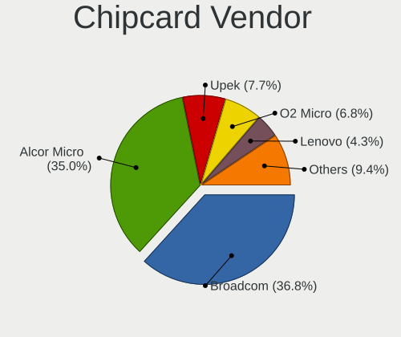

| Vendor                | Computers | Percent |
|-----------------------|-----------|---------|
| Broadcom              | 43        | 36.75%  |
| Alcor Micro           | 41        | 35.04%  |
| Upek                  | 9         | 7.69%   |
| O2 Micro              | 8         | 6.84%   |
| Lenovo                | 5         | 4.27%   |
| Advanced Card Systems | 5         | 4.27%   |
| SCM Microsystems      | 2         | 1.71%   |
| OmniKey               | 2         | 1.71%   |
| CREATOR               | 1         | 0.85%   |
| Clay Logic            | 1         | 0.85%   |

Chipcard Model
--------------

Chipcard module models

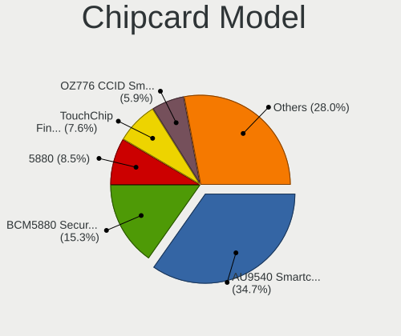

| Model                                                                        | Computers | Percent |
|------------------------------------------------------------------------------|-----------|---------|
| Alcor Micro AU9540 Smartcard Reader                                          | 41        | 34.75%  |
| Broadcom BCM5880 Secure Applications Processor                               | 18        | 15.25%  |
| Broadcom 5880                                                                | 10        | 8.47%   |
| Upek TouchChip Fingerprint Coprocessor (WBF advanced mode)                   | 9         | 7.63%   |
| O2 Micro OZ776 CCID Smartcard Reader                                         | 7         | 5.93%   |
| Broadcom BCM58200 ControlVault 3 (FingerPrint sensor + Contacted SmartCard)  | 6         | 5.08%   |
| Lenovo Integrated Smart Card Reader                                          | 5         | 4.24%   |
| Broadcom BCM5880 Secure Applications Processor with fingerprint swipe sensor | 5         | 4.24%   |
| Broadcom 58200                                                               | 4         | 3.39%   |
| SCM Microsystems SCR3340 - ExpressCard54 Smart Card Reader                   | 2         | 1.69%   |
| OmniKey CardMan 3021 / 3121                                                  | 2         | 1.69%   |
| Advanced Card Systems ACR39U                                                 | 2         | 1.69%   |
| Advanced Card Systems ACR122U                                                | 2         | 1.69%   |
| O2 Micro Oz776 SmartCard Reader                                              | 1         | 0.85%   |
| CREATOR CRT-603(CZ1) CCR                                                     | 1         | 0.85%   |
| Clay Logic Nitrokey Pro                                                      | 1         | 0.85%   |
| Broadcom BCM5880 Secure Applications Processor with fingerprint touch sensor | 1         | 0.85%   |
| Advanced Card Systems ACR38 SmartCard Reader                                 | 1         | 0.85%   |

Unsupported
-----------

Unsupported Devices
-------------------

Total unsupported devices on board

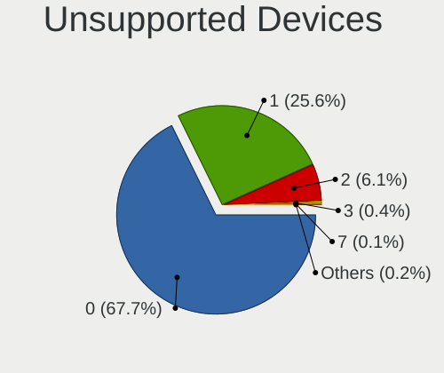

| Total | Computers | Percent |
|-------|-----------|---------|
| 0     | 1096      | 67.7%   |
| 1     | 414       | 25.57%  |
| 2     | 98        | 6.05%   |
| 3     | 7         | 0.43%   |
| 7     | 1         | 0.06%   |
| 6     | 1         | 0.06%   |
| 5     | 1         | 0.06%   |
| 4     | 1         | 0.06%   |

Unsupported Device Types
------------------------

Types of unsupported devices

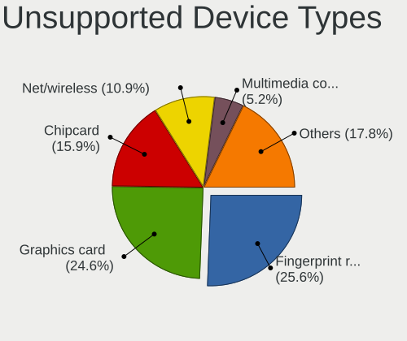

| Type                     | Computers | Percent |
|--------------------------|-----------|---------|
| Fingerprint reader       | 158       | 25.61%  |
| Graphics card            | 152       | 24.64%  |
| Chipcard                 | 98        | 15.88%  |
| Net/wireless             | 67        | 10.86%  |
| Multimedia controller    | 32        | 5.19%   |
| Bluetooth                | 23        | 3.73%   |
| Camera                   | 17        | 2.76%   |
| Communication controller | 15        | 2.43%   |
| Unassigned class         | 12        | 1.94%   |
| Storage                  | 12        | 1.94%   |
| Net/ethernet             | 8         | 1.3%    |
| Sound                    | 7         | 1.13%   |
| Card reader              | 6         | 0.97%   |
| Network                  | 3         | 0.49%   |
| Firewire controller      | 3         | 0.49%   |
| Modem                    | 2         | 0.32%   |
| Storage/ata              | 1         | 0.16%   |
| Flash memory             | 1         | 0.16%   |

