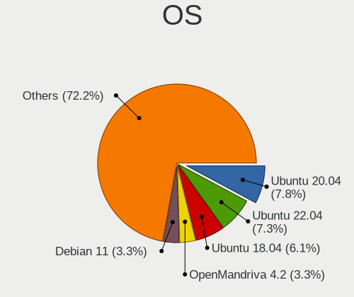
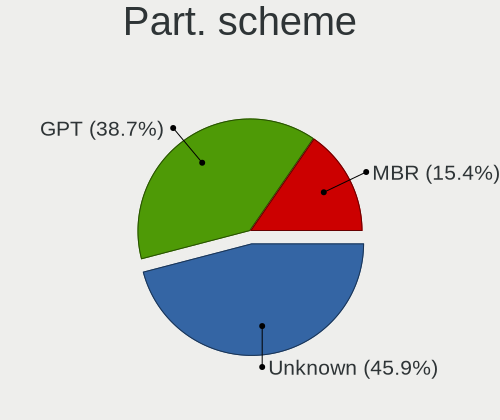
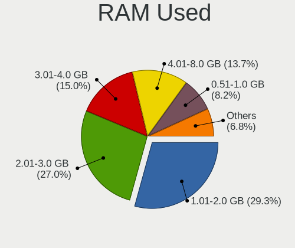
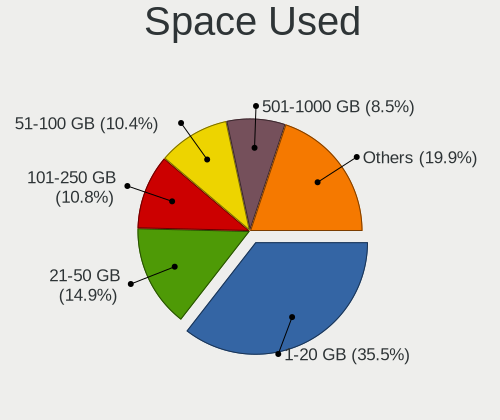
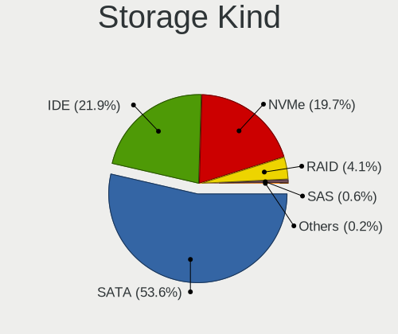
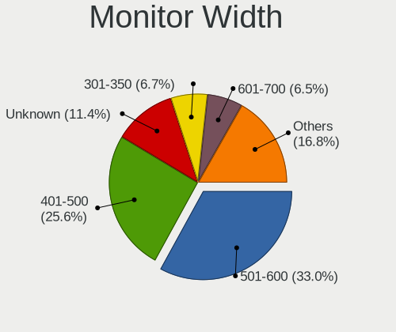
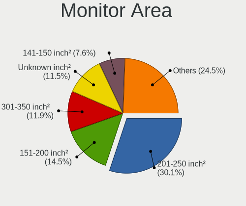
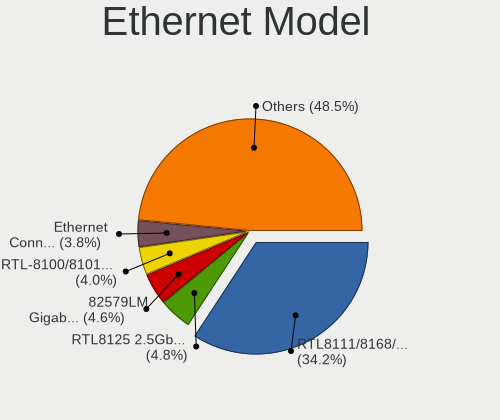
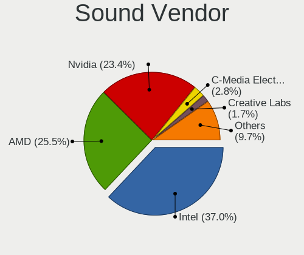
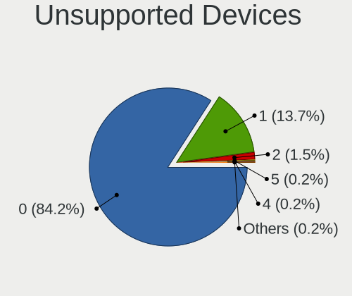

Linux in Bulgaria - Tested Hardware & Statistics (Desktops)
-----------------------------------------------------------

A project to collect tested hardware configurations for Linux in Bulgaria.

Anyone can contribute to this report by the [hw-probe](https://github.com/linuxhw/hw-probe) tool:

    sudo -E hw-probe -all -upload

Please contribute! Especially if your hardware is rare.

Contents
--------

* [ Test Cases ](#test-cases)

* [ System ](#system)
  - [ OS                       ](#os)
  - [ OS Family                ](#os-family)
  - [ Kernel                   ](#kernel)
  - [ Kernel Family            ](#kernel-family)
  - [ Kernel Major Ver.        ](#kernel-major-ver)
  - [ Arch                     ](#arch)
  - [ DE                       ](#de)
  - [ Display Server           ](#display-server)
  - [ Display Manager          ](#display-manager)
  - [ OS Lang                  ](#os-lang)
  - [ Boot Mode                ](#boot-mode)
  - [ Filesystem               ](#filesystem)
  - [ Part. scheme             ](#part-scheme)
  - [ Dual Boot with Linux/BSD ](#dual-boot-with-linuxbsd)
  - [ Dual Boot (Win)          ](#dual-boot-win)

* [ Board ](#board)
  - [ Vendor                   ](#vendor)
  - [ Model                    ](#model)
  - [ Model Family             ](#model-family)
  - [ MFG Year                 ](#mfg-year)
  - [ Form Factor              ](#form-factor)
  - [ Secure Boot              ](#secure-boot)
  - [ Coreboot                 ](#coreboot)
  - [ RAM Size                 ](#ram-size)
  - [ RAM Used                 ](#ram-used)
  - [ Total Drives             ](#total-drives)
  - [ Has CD-ROM               ](#has-cd-rom)
  - [ Has Ethernet             ](#has-ethernet)
  - [ Has WiFi                 ](#has-wifi)
  - [ Has Bluetooth            ](#has-bluetooth)

* [ Location ](#location)
  - [ Country                  ](#country)
  - [ City                     ](#city)

* [ Drives ](#drives)
  - [ Drive Vendor             ](#drive-vendor)
  - [ Drive Model              ](#drive-model)
  - [ HDD Vendor               ](#hdd-vendor)
  - [ SSD Vendor               ](#ssd-vendor)
  - [ Drive Kind               ](#drive-kind)
  - [ Drive Connector          ](#drive-connector)
  - [ Drive Size               ](#drive-size)
  - [ Space Total              ](#space-total)
  - [ Space Used               ](#space-used)
  - [ Malfunc. Drives          ](#malfunc-drives)
  - [ Malfunc. Drive Vendor    ](#malfunc-drive-vendor)
  - [ Malfunc. HDD Vendor      ](#malfunc-hdd-vendor)
  - [ Malfunc. Drive Kind      ](#malfunc-drive-kind)
  - [ Failed Drives            ](#failed-drives)
  - [ Failed Drive Vendor      ](#failed-drive-vendor)
  - [ Drive Status             ](#drive-status)

* [ Storage controller ](#storage-controller)
  - [ Storage Vendor           ](#storage-vendor)
  - [ Storage Model            ](#storage-model)
  - [ Storage Kind             ](#storage-kind)

* [ Processor ](#processor)
  - [ CPU Vendor               ](#cpu-vendor)
  - [ CPU Model                ](#cpu-model)
  - [ CPU Model Family         ](#cpu-model-family)
  - [ CPU Cores                ](#cpu-cores)
  - [ CPU Sockets              ](#cpu-sockets)
  - [ CPU Threads              ](#cpu-threads)
  - [ CPU Op-Modes             ](#cpu-op-modes)
  - [ CPU Microcode            ](#cpu-microcode)
  - [ CPU Microarch            ](#cpu-microarch)

* [ Graphics ](#graphics)
  - [ GPU Vendor               ](#gpu-vendor)
  - [ GPU Model                ](#gpu-model)
  - [ GPU Combo                ](#gpu-combo)
  - [ GPU Driver               ](#gpu-driver)
  - [ GPU Memory               ](#gpu-memory)

* [ Monitor ](#monitor)
  - [ Monitor Vendor           ](#monitor-vendor)
  - [ Monitor Model            ](#monitor-model)
  - [ Monitor Resolution       ](#monitor-resolution)
  - [ Monitor Diagonal         ](#monitor-diagonal)
  - [ Monitor Width            ](#monitor-width)
  - [ Aspect Ratio             ](#aspect-ratio)
  - [ Monitor Area             ](#monitor-area)
  - [ Pixel Density            ](#pixel-density)
  - [ Multiple Monitors        ](#multiple-monitors)

* [ Network ](#network)
  - [ Net Controller Vendor    ](#net-controller-vendor)
  - [ Net Controller Model     ](#net-controller-model)
  - [ Wireless Vendor          ](#wireless-vendor)
  - [ Wireless Model           ](#wireless-model)
  - [ Ethernet Vendor          ](#ethernet-vendor)
  - [ Ethernet Model           ](#ethernet-model)
  - [ Net Controller Kind      ](#net-controller-kind)
  - [ Used Controller          ](#used-controller)
  - [ NICs                     ](#nics)
  - [ IPv6                     ](#ipv6)

* [ Bluetooth ](#bluetooth)
  - [ Bluetooth Vendor         ](#bluetooth-vendor)
  - [ Bluetooth Model          ](#bluetooth-model)

* [ Sound ](#sound)
  - [ Sound Vendor             ](#sound-vendor)
  - [ Sound Model              ](#sound-model)

* [ Memory ](#memory)
  - [ Memory Vendor            ](#memory-vendor)
  - [ Memory Model             ](#memory-model)
  - [ Memory Kind              ](#memory-kind)
  - [ Memory Form Factor       ](#memory-form-factor)
  - [ Memory Size              ](#memory-size)
  - [ Memory Speed             ](#memory-speed)

* [ Printers & scanners ](#printers--scanners)
  - [ Printer Vendor           ](#printer-vendor)
  - [ Printer Model            ](#printer-model)
  - [ Scanner Vendor           ](#scanner-vendor)
  - [ Scanner Model            ](#scanner-model)

* [ Camera ](#camera)
  - [ Camera Vendor            ](#camera-vendor)
  - [ Camera Model             ](#camera-model)

* [ Security ](#security)
  - [ Fingerprint Vendor       ](#fingerprint-vendor)
  - [ Fingerprint Model        ](#fingerprint-model)
  - [ Chipcard Vendor          ](#chipcard-vendor)
  - [ Chipcard Model           ](#chipcard-model)

* [ Unsupported ](#unsupported)
  - [ Unsupported Devices      ](#unsupported-devices)
  - [ Unsupported Device Types ](#unsupported-device-types)

Test Cases
----------

Total: 540

| Vendor        | Model                       | Probe                                                      | Date         |
|---------------|-----------------------------|------------------------------------------------------------|--------------|
| HP            | 198E                        | [34023c0d62](https://linux-hardware.org/?probe=34023c0d62) | Aug 05, 2023 |
| ASUSTek       | H97-PRO GAMER               | [1771e4ca4b](https://linux-hardware.org/?probe=1771e4ca4b) | Jul 29, 2023 |
| ASUSTek       | H97-PRO GAMER               | [e668b29cf4](https://linux-hardware.org/?probe=e668b29cf4) | Jul 29, 2023 |
| Dell          | 06D7TR A00                  | [b957598d8e](https://linux-hardware.org/?probe=b957598d8e) | Jul 22, 2023 |
| Dell          | 06D7TR A00                  | [27f1fe9389](https://linux-hardware.org/?probe=27f1fe9389) | Jul 06, 2023 |
| ASRock        | Z370M Pro4                  | [5b561a0e00](https://linux-hardware.org/?probe=5b561a0e00) | Jul 05, 2023 |
| ASUSTek       | Maximus VIII RANGER Modi... | [d24120bc4e](https://linux-hardware.org/?probe=d24120bc4e) | Jun 22, 2023 |
| Dell          | 0WMJ54 A01                  | [a6fb35a2d8](https://linux-hardware.org/?probe=a6fb35a2d8) | Jun 11, 2023 |
| Dell          | 0WMJ54 A01                  | [a4d08407bb](https://linux-hardware.org/?probe=a4d08407bb) | Jun 09, 2023 |
| ASUSTek       | ROG STRIX Z690-I GAMING ... | [413aba0d3f](https://linux-hardware.org/?probe=413aba0d3f) | Jun 04, 2023 |
| HP            | 3047h                       | [1825675e99](https://linux-hardware.org/?probe=1825675e99) | Jun 03, 2023 |
| Dell          | 08NPPY A00                  | [de331bfb5c](https://linux-hardware.org/?probe=de331bfb5c) | Jun 02, 2023 |
| ASUSTek       | P5QD TURBO                  | [aeb6fa2258](https://linux-hardware.org/?probe=aeb6fa2258) | May 26, 2023 |
| Gigabyte      | H81M-S2V                    | [f0e96b17d7](https://linux-hardware.org/?probe=f0e96b17d7) | May 24, 2023 |
| Gigabyte      | H81M-S2V                    | [02d5fa9cc3](https://linux-hardware.org/?probe=02d5fa9cc3) | May 24, 2023 |
| Gigabyte      | X99-UD4-CF                  | [0eec4b5bbe](https://linux-hardware.org/?probe=0eec4b5bbe) | May 18, 2023 |
| ASRock        | B450M Steel Legend          | [dc317ab270](https://linux-hardware.org/?probe=dc317ab270) | May 06, 2023 |
| ASRock        | H370 Pro4                   | [afffccef92](https://linux-hardware.org/?probe=afffccef92) | May 05, 2023 |
| ASUSTek       | PRIME Z590-P WIFI           | [8b4f50125b](https://linux-hardware.org/?probe=8b4f50125b) | May 02, 2023 |
| Dell          | 0WMJ54 A01                  | [01c8d89ab9](https://linux-hardware.org/?probe=01c8d89ab9) | Apr 28, 2023 |
| ASRock        | B550 Pro4                   | [5d0819f25c](https://linux-hardware.org/?probe=5d0819f25c) | Apr 28, 2023 |
| Dell          | 0WMJ54 A01                  | [3d73e4cd7e](https://linux-hardware.org/?probe=3d73e4cd7e) | Apr 27, 2023 |
| HP            | 8056                        | [a7686ee1af](https://linux-hardware.org/?probe=a7686ee1af) | Apr 24, 2023 |
| Fujitsu       | D3313-G1 S26361-D3313-G1    | [78c1951456](https://linux-hardware.org/?probe=78c1951456) | Apr 23, 2023 |
| Gigabyte      | B550 GAMING X V2            | [22594512d1](https://linux-hardware.org/?probe=22594512d1) | Apr 23, 2023 |
| ASRock        | Z97X Killer                 | [d258d06b23](https://linux-hardware.org/?probe=d258d06b23) | Apr 19, 2023 |
| ASUSTek       | PRIME H310M-R R2.0          | [ca9fe9c7f1](https://linux-hardware.org/?probe=ca9fe9c7f1) | Apr 09, 2023 |
| Dell          | 0F373D A00                  | [e42bdc9769](https://linux-hardware.org/?probe=e42bdc9769) | Apr 09, 2023 |
| ASUSTek       | P5K                         | [ea3489709c](https://linux-hardware.org/?probe=ea3489709c) | Apr 08, 2023 |
| ASUSTek       | PRIME H310M-R R2.0          | [2acb260eb1](https://linux-hardware.org/?probe=2acb260eb1) | Apr 07, 2023 |
| Dell          | 09KPNV A01                  | [06d1f0e63f](https://linux-hardware.org/?probe=06d1f0e63f) | Apr 06, 2023 |
| Gigabyte      | Z390 M GAMING-CF            | [cf9da855fc](https://linux-hardware.org/?probe=cf9da855fc) | Apr 02, 2023 |
| MSI           | MEG X670E ACE               | [2b9356529f](https://linux-hardware.org/?probe=2b9356529f) | Apr 01, 2023 |
| Gigabyte      | B550 AORUS ELITE V2         | [33608bbcda](https://linux-hardware.org/?probe=33608bbcda) | Mar 27, 2023 |
| HP            | 8954                        | [e7a2f29df5](https://linux-hardware.org/?probe=e7a2f29df5) | Mar 27, 2023 |
| ASRock        | B365 Pro4                   | [ec1dd7f3ab](https://linux-hardware.org/?probe=ec1dd7f3ab) | Mar 26, 2023 |
| ASUSTek       | P5B-Deluxe                  | [f5a9d12043](https://linux-hardware.org/?probe=f5a9d12043) | Mar 26, 2023 |
| ASUSTek       | ROG CROSSHAIR X670E HERO    | [f78ca791e0](https://linux-hardware.org/?probe=f78ca791e0) | Mar 25, 2023 |
| Foxconn       | 2ABF                        | [41289d94bf](https://linux-hardware.org/?probe=41289d94bf) | Mar 25, 2023 |
| Foxconn       | 2ABF                        | [1ccaab03c4](https://linux-hardware.org/?probe=1ccaab03c4) | Mar 25, 2023 |
| Gigabyte      | M52S-S3P                    | [c9ac6eb940](https://linux-hardware.org/?probe=c9ac6eb940) | Mar 24, 2023 |
| ASUSTek       | P5KC                        | [3c4c536325](https://linux-hardware.org/?probe=3c4c536325) | Mar 23, 2023 |
| ASRock        | B450M Steel Legend          | [9795961bca](https://linux-hardware.org/?probe=9795961bca) | Mar 22, 2023 |
| Lenovo        | Dory CRB                    | [821914dc88](https://linux-hardware.org/?probe=821914dc88) | Mar 22, 2023 |
| ASRock        | Z370 Pro4                   | [95da35c192](https://linux-hardware.org/?probe=95da35c192) | Mar 11, 2023 |
| Gigabyte      | X299 AORUS Gaming 3-CF      | [0d5c00b6fa](https://linux-hardware.org/?probe=0d5c00b6fa) | Mar 11, 2023 |
| Fujitsu       | D3223-A1 S26361-D3223-A1    | [c803be2765](https://linux-hardware.org/?probe=c803be2765) | Mar 02, 2023 |
| ASUSTek       | ROG STRIX X570-F GAMING     | [c3d0c5da79](https://linux-hardware.org/?probe=c3d0c5da79) | Mar 01, 2023 |
| Gigabyte      | Z490 VISION D               | [cbea73a793](https://linux-hardware.org/?probe=cbea73a793) | Feb 27, 2023 |
| Gigabyte      | Z490 VISION D               | [3e9f2feeaa](https://linux-hardware.org/?probe=3e9f2feeaa) | Feb 27, 2023 |
| Dell          | 0WMJ54 A01                  | [f9cae700c7](https://linux-hardware.org/?probe=f9cae700c7) | Feb 26, 2023 |
| ASRock        | B450M Steel Legend          | [69475d0fa7](https://linux-hardware.org/?probe=69475d0fa7) | Feb 23, 2023 |
| Dell          | 0NNNCT A01                  | [a301dac224](https://linux-hardware.org/?probe=a301dac224) | Feb 18, 2023 |
| Dell          | 0WMJ54 A01                  | [5ebabab1c5](https://linux-hardware.org/?probe=5ebabab1c5) | Feb 14, 2023 |
| ASUSTek       | P5QL PRO                    | [65ebc31f26](https://linux-hardware.org/?probe=65ebc31f26) | Feb 08, 2023 |
| ASUSTek       | P5QL PRO                    | [9f2664ae2a](https://linux-hardware.org/?probe=9f2664ae2a) | Feb 08, 2023 |
| MSI           | MAG B650 TOMAHAWK WIFI      | [ee5a11ee81](https://linux-hardware.org/?probe=ee5a11ee81) | Feb 08, 2023 |
| MSI           | MAG B650 TOMAHAWK WIFI      | [5df3b5ad7e](https://linux-hardware.org/?probe=5df3b5ad7e) | Feb 08, 2023 |
| Intel         | DH77EB AAG39073-304         | [b3169f788f](https://linux-hardware.org/?probe=b3169f788f) | Feb 06, 2023 |
| Dell          | 0T10XW A02                  | [10e5f7904a](https://linux-hardware.org/?probe=10e5f7904a) | Feb 02, 2023 |
| Dell          | 0J3C2F A02                  | [e4b2eae84b](https://linux-hardware.org/?probe=e4b2eae84b) | Jan 23, 2023 |
| Dell          | 09M8Y8 A01                  | [3f3b6c888d](https://linux-hardware.org/?probe=3f3b6c888d) | Jan 23, 2023 |
| ASRock        | H81M-ITX                    | [036832c7d1](https://linux-hardware.org/?probe=036832c7d1) | Jan 17, 2023 |
| ASUSTek       | B85M-E                      | [5ee23ee475](https://linux-hardware.org/?probe=5ee23ee475) | Jan 12, 2023 |
| ASUSTek       | B150-PLUS                   | [30b776e4e8](https://linux-hardware.org/?probe=30b776e4e8) | Jan 11, 2023 |
| ASUSTek       | B150-PLUS                   | [7cd86f1bf1](https://linux-hardware.org/?probe=7cd86f1bf1) | Jan 10, 2023 |
| MSI           | B550-A PRO                  | [183b311eb2](https://linux-hardware.org/?probe=183b311eb2) | Jan 09, 2023 |
| Fujitsu       | D3076-S1 S26361-D3076-S1    | [10b0d01482](https://linux-hardware.org/?probe=10b0d01482) | Jan 04, 2023 |
| Lenovo        | Dory CRB                    | [c87645ef7b](https://linux-hardware.org/?probe=c87645ef7b) | Jan 02, 2023 |
| Gigabyte      | B85M-D3H                    | [a4aed5865b](https://linux-hardware.org/?probe=a4aed5865b) | Dec 18, 2022 |
| Gigabyte      | B85M-D3H                    | [532dc55c4b](https://linux-hardware.org/?probe=532dc55c4b) | Dec 18, 2022 |
| ASUSTek       | ROG STRIX Z690-I GAMING ... | [18d7dcfb19](https://linux-hardware.org/?probe=18d7dcfb19) | Dec 17, 2022 |
| Gigabyte      | B460M AORUS PRO             | [6deb38fb48](https://linux-hardware.org/?probe=6deb38fb48) | Dec 17, 2022 |
| Dell          | 0VD92X A00                  | [9feb549665](https://linux-hardware.org/?probe=9feb549665) | Dec 15, 2022 |
| ASUSTek       | P8B75-M                     | [936608196d](https://linux-hardware.org/?probe=936608196d) | Dec 14, 2022 |
| ASRock        | X570 Phantom Gaming 4       | [aae285b0ea](https://linux-hardware.org/?probe=aae285b0ea) | Dec 09, 2022 |
| HP            | 3047h                       | [223495dbab](https://linux-hardware.org/?probe=223495dbab) | Dec 08, 2022 |
| Gigabyte      | 970A-UD3P                   | [5ff0fd5395](https://linux-hardware.org/?probe=5ff0fd5395) | Dec 06, 2022 |
| Gigabyte      | 970A-UD3P                   | [e2ffdfc5a8](https://linux-hardware.org/?probe=e2ffdfc5a8) | Dec 06, 2022 |
| MSI           | MPG X570 GAMING PLUS        | [ccf3e1f074](https://linux-hardware.org/?probe=ccf3e1f074) | Dec 05, 2022 |
| MSI           | MPG X570 GAMING PLUS        | [60b1be0a32](https://linux-hardware.org/?probe=60b1be0a32) | Dec 05, 2022 |
| MSI           | X470 GAMING PRO             | [6ca3196f35](https://linux-hardware.org/?probe=6ca3196f35) | Dec 05, 2022 |
| ASUSTek       | H97-PLUS                    | [c79b15a3cf](https://linux-hardware.org/?probe=c79b15a3cf) | Dec 03, 2022 |
| BESSTAR Te... | UM700                       | [a97334be81](https://linux-hardware.org/?probe=a97334be81) | Nov 29, 2022 |
| Dell          | 0J8G6F A03                  | [1424a94eb0](https://linux-hardware.org/?probe=1424a94eb0) | Nov 29, 2022 |
| HP            | 1589                        | [4e67735055](https://linux-hardware.org/?probe=4e67735055) | Nov 27, 2022 |
| Intel         | D525MW AAE93082-401         | [d480b7ef56](https://linux-hardware.org/?probe=d480b7ef56) | Nov 25, 2022 |
| Intel         | D525MW AAE93082-401         | [d3b2f8aaf7](https://linux-hardware.org/?probe=d3b2f8aaf7) | Nov 25, 2022 |
| ASUSTek       | PRIME B360-PLUS             | [faa15c49ae](https://linux-hardware.org/?probe=faa15c49ae) | Nov 20, 2022 |
| ASUSTek       | ROG STRIX Z690-I GAMING ... | [b40e651ff2](https://linux-hardware.org/?probe=b40e651ff2) | Nov 18, 2022 |
| Gigabyte      | GA-MA74GM-S2H               | [5468f11c01](https://linux-hardware.org/?probe=5468f11c01) | Nov 15, 2022 |
| ASRock        | B450 Steel Legend           | [8a5e954190](https://linux-hardware.org/?probe=8a5e954190) | Nov 10, 2022 |
| MSI           | Z97 GAMING 5                | [519c833f31](https://linux-hardware.org/?probe=519c833f31) | Nov 06, 2022 |
| Dell          | 07N90W A00                  | [e941d01470](https://linux-hardware.org/?probe=e941d01470) | Nov 02, 2022 |
| Dell          | 07N90W A00                  | [60ca16eaff](https://linux-hardware.org/?probe=60ca16eaff) | Oct 30, 2022 |
| Dell          | 07N90W A00                  | [ded0ce1d3e](https://linux-hardware.org/?probe=ded0ce1d3e) | Oct 29, 2022 |
| Dell          | 07N90W A00                  | [73f4952d74](https://linux-hardware.org/?probe=73f4952d74) | Oct 29, 2022 |
| ASUSTek       | P5G41T-M LX                 | [7c046d1ba8](https://linux-hardware.org/?probe=7c046d1ba8) | Oct 23, 2022 |
| HP            | 8061                        | [8692ad745b](https://linux-hardware.org/?probe=8692ad745b) | Oct 19, 2022 |
| Gigabyte      | AB350-Gaming-CF             | [54d2ded2b2](https://linux-hardware.org/?probe=54d2ded2b2) | Oct 17, 2022 |
| ASRock        | Z87 Pro3                    | [364a0afaff](https://linux-hardware.org/?probe=364a0afaff) | Oct 16, 2022 |
| Dell          | 07N90W A00                  | [17c133e933](https://linux-hardware.org/?probe=17c133e933) | Oct 15, 2022 |
| Gigabyte      | GA-MA74GM-S2H               | [b50165d9c9](https://linux-hardware.org/?probe=b50165d9c9) | Oct 11, 2022 |
| Dell          | 07N90W A00                  | [1f2485fab4](https://linux-hardware.org/?probe=1f2485fab4) | Oct 08, 2022 |
| ASUSTek       | PRIME X399-A                | [304c12788b](https://linux-hardware.org/?probe=304c12788b) | Oct 06, 2022 |
| Intel         | D34010WYK H14771-303        | [e58d9849a5](https://linux-hardware.org/?probe=e58d9849a5) | Oct 06, 2022 |
| ASUSTek       | SABERTOOTH Z77              | [8f41682975](https://linux-hardware.org/?probe=8f41682975) | Oct 03, 2022 |
| ASRock        | B450 Steel Legend           | [889c55b24d](https://linux-hardware.org/?probe=889c55b24d) | Sep 15, 2022 |
| ASRock        | B450 Steel Legend           | [f9c010c1a9](https://linux-hardware.org/?probe=f9c010c1a9) | Sep 14, 2022 |
| HP            | 3047h                       | [097b5b2f29](https://linux-hardware.org/?probe=097b5b2f29) | Sep 12, 2022 |
| ASUSTek       | ROG STRIX Z690-I GAMING ... | [d13cf99728](https://linux-hardware.org/?probe=d13cf99728) | Sep 10, 2022 |
| MSI           | MPG X570 GAMING PLUS        | [611d7b9001](https://linux-hardware.org/?probe=611d7b9001) | Sep 07, 2022 |
| ASUSTek       | ROG STRIX Z690-I GAMING ... | [92ff48d462](https://linux-hardware.org/?probe=92ff48d462) | Sep 06, 2022 |
| ASRock        | B450M Steel Legend          | [5c8244526c](https://linux-hardware.org/?probe=5c8244526c) | Aug 25, 2022 |
| Gigabyte      | Z370 AORUS Gaming K3-CF     | [8047eeecb4](https://linux-hardware.org/?probe=8047eeecb4) | Aug 20, 2022 |
| ASUSTek       | ProArt X570-CREATOR WIFI    | [45ddbf814d](https://linux-hardware.org/?probe=45ddbf814d) | Aug 14, 2022 |
| ASUSTek       | B85M-G                      | [c92d457cd6](https://linux-hardware.org/?probe=c92d457cd6) | Aug 13, 2022 |
| ASUSTek       | M2VTVM-VM890                | [8a822a57e8](https://linux-hardware.org/?probe=8a822a57e8) | Aug 13, 2022 |
| Foxconn       | 2A8C                        | [747ba68b28](https://linux-hardware.org/?probe=747ba68b28) | Aug 10, 2022 |
| ASRock        | B450M Steel Legend          | [1b55fc7b56](https://linux-hardware.org/?probe=1b55fc7b56) | Aug 09, 2022 |
| ASUSTek       | B85M-G                      | [616c57c367](https://linux-hardware.org/?probe=616c57c367) | Aug 06, 2022 |
| ASUSTek       | PRIME B360-PLUS             | [e0129903ae](https://linux-hardware.org/?probe=e0129903ae) | Aug 04, 2022 |
| ASUSTek       | P5KC                        | [7e9c9d2fc4](https://linux-hardware.org/?probe=7e9c9d2fc4) | Jul 26, 2022 |
| Gigabyte      | X99-UD4-CF                  | [f00c831f5b](https://linux-hardware.org/?probe=f00c831f5b) | Jul 25, 2022 |
| Gigabyte      | X99-UD4-CF                  | [58f727d948](https://linux-hardware.org/?probe=58f727d948) | Jul 25, 2022 |
| ASUSTek       | P7H55-M LX                  | [3e14a0baf3](https://linux-hardware.org/?probe=3e14a0baf3) | Jul 22, 2022 |
| HP            | 1495                        | [1706c61a6c](https://linux-hardware.org/?probe=1706c61a6c) | Jul 22, 2022 |
| Gigabyte      | X99-UD4-CF                  | [9c98b2fcd6](https://linux-hardware.org/?probe=9c98b2fcd6) | Jul 21, 2022 |
| Gigabyte      | X99-UD4-CF                  | [f42ed5053a](https://linux-hardware.org/?probe=f42ed5053a) | Jul 20, 2022 |
| Thecus        | N2810 0001                  | [dd4d9fb1d5](https://linux-hardware.org/?probe=dd4d9fb1d5) | Jul 20, 2022 |
| ASRock        | A75M-HVS                    | [c88ac89032](https://linux-hardware.org/?probe=c88ac89032) | Jul 20, 2022 |
| ASUSTek       | P8H61-M LX2                 | [4b2f1f5d39](https://linux-hardware.org/?probe=4b2f1f5d39) | Jul 16, 2022 |
| ASRock        | B550 Taichi                 | [61fe809791](https://linux-hardware.org/?probe=61fe809791) | Jul 10, 2022 |
| Gigabyte      | X99-UD4-CF                  | [4245ef07db](https://linux-hardware.org/?probe=4245ef07db) | Jul 10, 2022 |
| Gigabyte      | X99-UD4-CF                  | [1dafd7beed](https://linux-hardware.org/?probe=1dafd7beed) | Jul 09, 2022 |
| Gigabyte      | X99-UD4-CF                  | [5ac5b5f182](https://linux-hardware.org/?probe=5ac5b5f182) | Jul 06, 2022 |
| ASUSTek       | M3A78-EM                    | [426bb60e88](https://linux-hardware.org/?probe=426bb60e88) | Jul 04, 2022 |
| ASRock        | N68-S                       | [cf9108c19a](https://linux-hardware.org/?probe=cf9108c19a) | Jun 28, 2022 |
| ASRock        | 890GM Pro3 R2.0             | [4b7b86cf21](https://linux-hardware.org/?probe=4b7b86cf21) | Jun 27, 2022 |
| HP            | ProLiant ML350 G5           | [57a6a7a493](https://linux-hardware.org/?probe=57a6a7a493) | Jun 20, 2022 |
| ASUSTek       | P5KC                        | [489dd3049e](https://linux-hardware.org/?probe=489dd3049e) | Jun 13, 2022 |
| ASUSTek       | P5K Premium                 | [c7243df0c6](https://linux-hardware.org/?probe=c7243df0c6) | Jun 12, 2022 |
| Pegatron      | 2AC3                        | [a93743e1a0](https://linux-hardware.org/?probe=a93743e1a0) | Jun 11, 2022 |
| HP            | 872D                        | [c27f333c46](https://linux-hardware.org/?probe=c27f333c46) | Jun 08, 2022 |
| ASUSTek       | PRIME H310M-R R2.0          | [a434348da9](https://linux-hardware.org/?probe=a434348da9) | May 26, 2022 |
| Gigabyte      | X99-UD4-CF                  | [21b3b45491](https://linux-hardware.org/?probe=21b3b45491) | May 16, 2022 |
| Gigabyte      | X99-UD4-CF                  | [81e0a19eaa](https://linux-hardware.org/?probe=81e0a19eaa) | May 16, 2022 |
| Gigabyte      | X570 AORUS ULTRA            | [ea492e2997](https://linux-hardware.org/?probe=ea492e2997) | May 13, 2022 |
| MSI           | MPG Z390 GAMING EDGE AC     | [25654025a8](https://linux-hardware.org/?probe=25654025a8) | May 13, 2022 |
| Pegatron      | 2A99h                       | [6a47713af6](https://linux-hardware.org/?probe=6a47713af6) | May 12, 2022 |
| Acer          | Predator G3-605             | [fb7a7e74d1](https://linux-hardware.org/?probe=fb7a7e74d1) | May 11, 2022 |
| Gigabyte      | H97N                        | [21f1bf0f0c](https://linux-hardware.org/?probe=21f1bf0f0c) | May 10, 2022 |
| Pegatron      | 2AC3                        | [d2932b8b78](https://linux-hardware.org/?probe=d2932b8b78) | May 07, 2022 |
| Intel         | DG35EC AAE29266-205         | [ff7adfb82a](https://linux-hardware.org/?probe=ff7adfb82a) | May 05, 2022 |
| MSI           | MPG B550 GAMING PLUS        | [62f9f79f7c](https://linux-hardware.org/?probe=62f9f79f7c) | May 03, 2022 |
| MSI           | MPG B550 GAMING PLUS        | [afce1937fe](https://linux-hardware.org/?probe=afce1937fe) | May 03, 2022 |
| ASRock        | B450M Steel Legend          | [c40273d0bc](https://linux-hardware.org/?probe=c40273d0bc) | Apr 29, 2022 |
| Lenovo        | MAHOBAY NOK                 | [ab21675303](https://linux-hardware.org/?probe=ab21675303) | Apr 29, 2022 |
| MSI           | PRO B660-A DDR4             | [ec79dfd8b1](https://linux-hardware.org/?probe=ec79dfd8b1) | Apr 23, 2022 |
| Gigabyte      | X99-UD4-CF                  | [db53151112](https://linux-hardware.org/?probe=db53151112) | Apr 19, 2022 |
| Gigabyte      | X99-UD4-CF                  | [86aeb14193](https://linux-hardware.org/?probe=86aeb14193) | Apr 18, 2022 |
| Gigabyte      | X570 AORUS ELITE            | [59bc74a946](https://linux-hardware.org/?probe=59bc74a946) | Apr 18, 2022 |
| Gigabyte      | X99-UD4-CF                  | [0ce9091731](https://linux-hardware.org/?probe=0ce9091731) | Apr 16, 2022 |
| ASRock        | H110M-DGS                   | [33d09ef3fd](https://linux-hardware.org/?probe=33d09ef3fd) | Apr 15, 2022 |
| Gigabyte      | X570S AORUS PRO AX          | [157197f213](https://linux-hardware.org/?probe=157197f213) | Apr 13, 2022 |
| Gigabyte      | X99-UD4-CF                  | [70644a292c](https://linux-hardware.org/?probe=70644a292c) | Apr 12, 2022 |
| Gigabyte      | X99-UD4-CF                  | [d08d83ac3a](https://linux-hardware.org/?probe=d08d83ac3a) | Apr 12, 2022 |
| ASRock        | B450M Steel Legend          | [097d78d0b6](https://linux-hardware.org/?probe=097d78d0b6) | Mar 31, 2022 |
| Lenovo        | SHARKBAY 0B98401 WIN        | [5215972642](https://linux-hardware.org/?probe=5215972642) | Mar 31, 2022 |
| Fujitsu       | D3061-A1 S26361-D3061-A1    | [4153c10d0b](https://linux-hardware.org/?probe=4153c10d0b) | Mar 31, 2022 |
| Gigabyte      | X99-UD4-CF                  | [e6075f51f5](https://linux-hardware.org/?probe=e6075f51f5) | Mar 30, 2022 |
| Gigabyte      | X99-UD4-CF                  | [cdbd9842e1](https://linux-hardware.org/?probe=cdbd9842e1) | Mar 20, 2022 |
| Gigabyte      | B550 GAMING X V2            | [9bd0fc9e48](https://linux-hardware.org/?probe=9bd0fc9e48) | Mar 14, 2022 |
| ASRock        | X570 Phantom Gaming 4       | [38c8508bc0](https://linux-hardware.org/?probe=38c8508bc0) | Mar 10, 2022 |
| ASRock        | B450M Steel Legend          | [d772cac60d](https://linux-hardware.org/?probe=d772cac60d) | Mar 07, 2022 |
| ASRock        | B450M-HDV R4.0              | [5914978461](https://linux-hardware.org/?probe=5914978461) | Mar 04, 2022 |
| ASRock        | A320M Pro4                  | [43f47c3d8e](https://linux-hardware.org/?probe=43f47c3d8e) | Feb 28, 2022 |
| Fujitsu       | D3062-A1 S26361-D3062-A1    | [fe75c17f25](https://linux-hardware.org/?probe=fe75c17f25) | Feb 27, 2022 |
| ASRock        | X570 Phantom Gaming 4       | [fb6d74d159](https://linux-hardware.org/?probe=fb6d74d159) | Feb 21, 2022 |
| ASUSTek       | TUF Gaming B560-PLUS WIF... | [dc3262a408](https://linux-hardware.org/?probe=dc3262a408) | Feb 20, 2022 |
| ASUSTek       | P5KC                        | [d12f767e54](https://linux-hardware.org/?probe=d12f767e54) | Feb 19, 2022 |
| Lenovo        | ThinkCentre M58p 6234A1G    | [1cbf260df6](https://linux-hardware.org/?probe=1cbf260df6) | Feb 18, 2022 |
| ASUSTek       | P5KC                        | [61c7fe5dfd](https://linux-hardware.org/?probe=61c7fe5dfd) | Feb 18, 2022 |
| ASUSTek       | A68HM-K                     | [2024310fec](https://linux-hardware.org/?probe=2024310fec) | Feb 17, 2022 |
| ASRock        | X570 Phantom Gaming 4       | [afe18260fc](https://linux-hardware.org/?probe=afe18260fc) | Feb 17, 2022 |
| ASRock        | 960GM-GS3 FX                | [005f4b4afc](https://linux-hardware.org/?probe=005f4b4afc) | Feb 08, 2022 |
| Gigabyte      | B85M-D3V                    | [d00c78fd08](https://linux-hardware.org/?probe=d00c78fd08) | Feb 08, 2022 |
| ASUSTek       | P8H77-V                     | [467ff5e38f](https://linux-hardware.org/?probe=467ff5e38f) | Jan 31, 2022 |
| ASRock        | FM2A58M-DG3+                | [a6f8ac859d](https://linux-hardware.org/?probe=a6f8ac859d) | Jan 20, 2022 |
| Intel         | X99                         | [f4a0c1aaaa](https://linux-hardware.org/?probe=f4a0c1aaaa) | Jan 20, 2022 |
| ASUSTek       | PRIME Z270-P                | [821f3261c2](https://linux-hardware.org/?probe=821f3261c2) | Jan 18, 2022 |
| ASRock        | H110M-DGS                   | [d027268e2b](https://linux-hardware.org/?probe=d027268e2b) | Jan 14, 2022 |
| ASUSTek       | PRIME Z270-P                | [a9ed1157c0](https://linux-hardware.org/?probe=a9ed1157c0) | Jan 13, 2022 |
| ASUSTek       | PRIME Z270-P                | [f23503b603](https://linux-hardware.org/?probe=f23503b603) | Jan 10, 2022 |
| Gigabyte      | G41M-ES2L                   | [a993fafbf7](https://linux-hardware.org/?probe=a993fafbf7) | Jan 08, 2022 |
| Gigabyte      | X570 GAMING X               | [7add8fadfa](https://linux-hardware.org/?probe=7add8fadfa) | Jan 04, 2022 |
| Gigabyte      | X570 GAMING X               | [e8cfb51ca5](https://linux-hardware.org/?probe=e8cfb51ca5) | Jan 04, 2022 |
| HP            | 3397                        | [3bd3d85718](https://linux-hardware.org/?probe=3bd3d85718) | Jan 03, 2022 |
| Gigabyte      | X570 GAMING X               | [50045a522a](https://linux-hardware.org/?probe=50045a522a) | Dec 30, 2021 |
| ASUSTek       | P5E                         | [1d3ece3005](https://linux-hardware.org/?probe=1d3ece3005) | Dec 29, 2021 |
| Gigabyte      | X570 GAMING X               | [19959c7845](https://linux-hardware.org/?probe=19959c7845) | Dec 26, 2021 |
| ASRock        | B450M Steel Legend          | [b8ff289917](https://linux-hardware.org/?probe=b8ff289917) | Dec 22, 2021 |
| Dell          | 0427JK A00                  | [5633e414a2](https://linux-hardware.org/?probe=5633e414a2) | Dec 16, 2021 |
| Lenovo        | SHARKBAY NOK                | [65ec484cf7](https://linux-hardware.org/?probe=65ec484cf7) | Dec 16, 2021 |
| Lenovo        | SHARKBAY NOK                | [ab70f6516f](https://linux-hardware.org/?probe=ab70f6516f) | Dec 16, 2021 |
| ASRock        | B450M Steel Legend          | [9f5ee59afb](https://linux-hardware.org/?probe=9f5ee59afb) | Dec 14, 2021 |
| Dell          | 0427JK A00                  | [785650303f](https://linux-hardware.org/?probe=785650303f) | Dec 13, 2021 |
| Gigabyte      | Z490 AORUS PRO AX           | [03ba9fdf17](https://linux-hardware.org/?probe=03ba9fdf17) | Dec 11, 2021 |
| ASRock        | B450M Steel Legend          | [a5c3366e73](https://linux-hardware.org/?probe=a5c3366e73) | Dec 10, 2021 |
| ASRock        | B450M Steel Legend          | [b9ebbe30d3](https://linux-hardware.org/?probe=b9ebbe30d3) | Dec 05, 2021 |
| ASUSTek       | P5KPL-AM SE                 | [7530a42730](https://linux-hardware.org/?probe=7530a42730) | Dec 03, 2021 |
| ASUSTek       | PRIME Z590-P                | [f0c1e81fb5](https://linux-hardware.org/?probe=f0c1e81fb5) | Nov 25, 2021 |
| Gigabyte      | Z270X-Ultra Gaming-CF       | [bd12b5a969](https://linux-hardware.org/?probe=bd12b5a969) | Nov 21, 2021 |
| ASUSTek       | M51BC                       | [dfc2c68c8d](https://linux-hardware.org/?probe=dfc2c68c8d) | Nov 19, 2021 |
| Acer          | Predator G3-605             | [5cb8f7dfa7](https://linux-hardware.org/?probe=5cb8f7dfa7) | Nov 15, 2021 |
| ASRock        | B450M Steel Legend          | [42e799bba3](https://linux-hardware.org/?probe=42e799bba3) | Nov 06, 2021 |
| ASUSTek       | PRIME X570-P                | [3691e08d6d](https://linux-hardware.org/?probe=3691e08d6d) | Nov 03, 2021 |
| ASRock        | B450M Steel Legend          | [bd63d5e0cb](https://linux-hardware.org/?probe=bd63d5e0cb) | Oct 28, 2021 |
| MSI           | MAG X570 TOMAHAWK WIFI      | [8cae94b7f8](https://linux-hardware.org/?probe=8cae94b7f8) | Oct 20, 2021 |
| ASUSTek       | PRIME X570-P                | [b37e349828](https://linux-hardware.org/?probe=b37e349828) | Oct 19, 2021 |
| ASUSTek       | PRIME B350M-A               | [3ab004eed4](https://linux-hardware.org/?probe=3ab004eed4) | Oct 17, 2021 |
| ASUSTek       | ROG Maximus XIII HERO       | [4505c960f2](https://linux-hardware.org/?probe=4505c960f2) | Oct 13, 2021 |
| ASRock        | H81M-HDS                    | [300c7e725d](https://linux-hardware.org/?probe=300c7e725d) | Oct 10, 2021 |
| Gigabyte      | H310M S2P                   | [637dbbacba](https://linux-hardware.org/?probe=637dbbacba) | Oct 08, 2021 |
| ASUSTek       | PRIME X370-PRO              | [1121eb673b](https://linux-hardware.org/?probe=1121eb673b) | Sep 27, 2021 |
| ASRock        | FM2A58M-HD+                 | [3be61fa185](https://linux-hardware.org/?probe=3be61fa185) | Sep 11, 2021 |
| Lenovo        | ThinkStation D20 4158E93    | [fde770f309](https://linux-hardware.org/?probe=fde770f309) | Sep 11, 2021 |
| ASUSTek       | P8Z77-M PRO                 | [a95e304baf](https://linux-hardware.org/?probe=a95e304baf) | Sep 07, 2021 |
| Unknown       | Unknown                     | [a37b749b27](https://linux-hardware.org/?probe=a37b749b27) | Sep 06, 2021 |
| Unknown       | Unknown                     | [92e21fb915](https://linux-hardware.org/?probe=92e21fb915) | Sep 06, 2021 |
| ASRock        | X570 Pro4                   | [7c76ac10d8](https://linux-hardware.org/?probe=7c76ac10d8) | Sep 04, 2021 |
| Gigabyte      | H370 AORUS GAMING 3 WIFI... | [7d634f76ad](https://linux-hardware.org/?probe=7d634f76ad) | Aug 31, 2021 |
| ASRock        | FM2A58M-HD+                 | [9eb666fd13](https://linux-hardware.org/?probe=9eb666fd13) | Aug 30, 2021 |
| ASRock        | FM2A58M-HD+                 | [8a976ca31c](https://linux-hardware.org/?probe=8a976ca31c) | Aug 29, 2021 |
| HP            | 18E4                        | [81c51891c9](https://linux-hardware.org/?probe=81c51891c9) | Aug 27, 2021 |
| MSI           | H310M PRO-VDH PLUS          | [257e2c9dd4](https://linux-hardware.org/?probe=257e2c9dd4) | Aug 18, 2021 |
| MSI           | H310M PRO-VDH PLUS          | [59f5bb4379](https://linux-hardware.org/?probe=59f5bb4379) | Aug 18, 2021 |
| ASRock        | FM2A68M-DG3+                | [3bfb2e6910](https://linux-hardware.org/?probe=3bfb2e6910) | Aug 17, 2021 |
| ASUSTek       | P5KC                        | [5e2f61d652](https://linux-hardware.org/?probe=5e2f61d652) | Aug 16, 2021 |
| Gigabyte      | GA-870A-USB3                | [f7de5020c6](https://linux-hardware.org/?probe=f7de5020c6) | Aug 16, 2021 |
| MSI           | A68HM-P33 V2                | [4c3bedddac](https://linux-hardware.org/?probe=4c3bedddac) | Aug 14, 2021 |
| Gigabyte      | GA-870A-USB3                | [bb46750dfa](https://linux-hardware.org/?probe=bb46750dfa) | Aug 12, 2021 |
| ASUSTek       | P5KC                        | [4fce5e2d88](https://linux-hardware.org/?probe=4fce5e2d88) | Aug 09, 2021 |
| ASUSTek       | M4A78 PRO                   | [ef7f570d01](https://linux-hardware.org/?probe=ef7f570d01) | Aug 04, 2021 |
| ASRock        | H110 Pro BTC+               | [0c191944fc](https://linux-hardware.org/?probe=0c191944fc) | Aug 02, 2021 |
| ASRock        | H110 Pro BTC+               | [a08f9bd38d](https://linux-hardware.org/?probe=a08f9bd38d) | Aug 02, 2021 |
| MSI           | MEG X570 UNIFY              | [9d0528280a](https://linux-hardware.org/?probe=9d0528280a) | Jul 26, 2021 |
| ASUSTek       | PRIME Z370-A                | [c7cf1f5978](https://linux-hardware.org/?probe=c7cf1f5978) | Jul 25, 2021 |
| ASUSTek       | H87-PRO                     | [293b556234](https://linux-hardware.org/?probe=293b556234) | Jul 25, 2021 |
| Gigabyte      | GA-870A-USB3                | [b39264f1fa](https://linux-hardware.org/?probe=b39264f1fa) | Jul 22, 2021 |
| ASRock        | AB350 Pro4                  | [5d62f330ba](https://linux-hardware.org/?probe=5d62f330ba) | Jul 18, 2021 |
| ASUSTek       | TUF X299 MARK 2             | [d3f2c6d8d8](https://linux-hardware.org/?probe=d3f2c6d8d8) | Jul 13, 2021 |
| ASUSTek       | P5QD TURBO                  | [5ce964530d](https://linux-hardware.org/?probe=5ce964530d) | Jul 13, 2021 |
| Gigabyte      | GA-MA74GM-S2H               | [13af782a58](https://linux-hardware.org/?probe=13af782a58) | Jun 29, 2021 |
| Gigabyte      | GA-870A-USB3                | [d791d77acc](https://linux-hardware.org/?probe=d791d77acc) | Jun 28, 2021 |
| Gigabyte      | A320MA-M.2-CF               | [e56a7ee3c9](https://linux-hardware.org/?probe=e56a7ee3c9) | Jun 27, 2021 |
| HP            | 1493                        | [cd54c7db25](https://linux-hardware.org/?probe=cd54c7db25) | Jun 26, 2021 |
| HP            | 1493                        | [5b7dd91534](https://linux-hardware.org/?probe=5b7dd91534) | Jun 26, 2021 |
| Gigabyte      | GA-M56S-S3                  | [e7e3e4138d](https://linux-hardware.org/?probe=e7e3e4138d) | Jun 20, 2021 |
| Gigabyte      | GA-M56S-S3                  | [c4f55611e4](https://linux-hardware.org/?probe=c4f55611e4) | Jun 20, 2021 |
| Gigabyte      | GA-MA74GM-S2H               | [f200ec0bda](https://linux-hardware.org/?probe=f200ec0bda) | Jun 08, 2021 |
| Fujitsu       | D3162-A1 S26361-D3162-A1    | [9a2b696908](https://linux-hardware.org/?probe=9a2b696908) | Jun 05, 2021 |
| Gigabyte      | Z490 AORUS ELITE AC         | [6bc1b9dcc9](https://linux-hardware.org/?probe=6bc1b9dcc9) | May 31, 2021 |
| Dell          | 0K240Y A02                  | [c050f79e2b](https://linux-hardware.org/?probe=c050f79e2b) | May 29, 2021 |
| Dell          | 0K240Y A02                  | [7f510d13fb](https://linux-hardware.org/?probe=7f510d13fb) | May 28, 2021 |
| Gigabyte      | A320MA-M.2-CF               | [60450a65b2](https://linux-hardware.org/?probe=60450a65b2) | May 20, 2021 |
| ASRock        | Z97 Anniversary             | [493f6f8057](https://linux-hardware.org/?probe=493f6f8057) | May 18, 2021 |
| ASUSTek       | P5P43TD PRO                 | [4d5f23e6ba](https://linux-hardware.org/?probe=4d5f23e6ba) | May 17, 2021 |
| ASRock        | Z97 Anniversary             | [14ea7483bc](https://linux-hardware.org/?probe=14ea7483bc) | May 16, 2021 |
| Lenovo        | SHARKBAY NOK                | [22657f3929](https://linux-hardware.org/?probe=22657f3929) | May 15, 2021 |
| HP            | 3396                        | [ed3fa57f54](https://linux-hardware.org/?probe=ed3fa57f54) | May 15, 2021 |
| ASUSTek       | B150M-A                     | [ecc85d30a9](https://linux-hardware.org/?probe=ecc85d30a9) | May 13, 2021 |
| Gigabyte      | A320MA-M.2-CF               | [cf41b106cb](https://linux-hardware.org/?probe=cf41b106cb) | May 11, 2021 |
| Gigabyte      | A320MA-M.2-CF               | [511e08ef09](https://linux-hardware.org/?probe=511e08ef09) | May 09, 2021 |
| Unknown       | Unknown                     | [c42f475a67](https://linux-hardware.org/?probe=c42f475a67) | May 08, 2021 |
| ASUSTek       | P5KC                        | [80549acbba](https://linux-hardware.org/?probe=80549acbba) | May 03, 2021 |
| ASRock        | X570 Pro4                   | [3ad2c89a0a](https://linux-hardware.org/?probe=3ad2c89a0a) | May 03, 2021 |
| ASUSTek       | P5KC                        | [f2313ee72b](https://linux-hardware.org/?probe=f2313ee72b) | May 03, 2021 |
| ASRock        | X79 Extreme4                | [d3383d57ef](https://linux-hardware.org/?probe=d3383d57ef) | May 01, 2021 |
| ASUSTek       | Amberine M                  | [9eeaeb53fc](https://linux-hardware.org/?probe=9eeaeb53fc) | Apr 26, 2021 |
| ASRock        | B360M Pro4                  | [b1f9a4880e](https://linux-hardware.org/?probe=b1f9a4880e) | Apr 22, 2021 |
| ASUSTek       | P8P67 DELUXE                | [8c83051b44](https://linux-hardware.org/?probe=8c83051b44) | Apr 12, 2021 |
| ASRock        | Z68 Extreme7 Gen3           | [d8e2ac9e9b](https://linux-hardware.org/?probe=d8e2ac9e9b) | Apr 11, 2021 |
| ASUSTek       | PRIME X370-PRO              | [891b52b28e](https://linux-hardware.org/?probe=891b52b28e) | Apr 08, 2021 |
| ASUSTek       | P5KC                        | [b687d3a64f](https://linux-hardware.org/?probe=b687d3a64f) | Apr 06, 2021 |
| ASRock        | A320M-HDV R4.0              | [658ec2843e](https://linux-hardware.org/?probe=658ec2843e) | Apr 03, 2021 |
| HP            | 1850                        | [517c6137a3](https://linux-hardware.org/?probe=517c6137a3) | Apr 01, 2021 |
| ASRock        | B550M Pro4                  | [333c645cc4](https://linux-hardware.org/?probe=333c645cc4) | Apr 01, 2021 |
| ASRock        | AB350M Pro4                 | [bd779f8e4e](https://linux-hardware.org/?probe=bd779f8e4e) | Mar 26, 2021 |
| ASUSTek       | P5Q-PRO                     | [072483c895](https://linux-hardware.org/?probe=072483c895) | Mar 26, 2021 |
| ASUSTek       | P5Q-PRO                     | [11e59c84c6](https://linux-hardware.org/?probe=11e59c84c6) | Mar 26, 2021 |
| Seco          | C40 C                       | [70a92f2d8a](https://linux-hardware.org/?probe=70a92f2d8a) | Mar 19, 2021 |
| ASUSTek       | ROG STRIX B550-A GAMING     | [e5f799a9f1](https://linux-hardware.org/?probe=e5f799a9f1) | Mar 19, 2021 |
| ASRock        | B450M-HDV R4.0              | [d2d43a5a92](https://linux-hardware.org/?probe=d2d43a5a92) | Mar 17, 2021 |
| Lenovo        | MAHOBAY Win8 STD MM DPK ... | [ef2bfba994](https://linux-hardware.org/?probe=ef2bfba994) | Mar 17, 2021 |
| ECS           | MCP61M-M3                   | [39fb7fbfdd](https://linux-hardware.org/?probe=39fb7fbfdd) | Mar 17, 2021 |
| ASRock        | B450M-HDV R4.0              | [30047ff89f](https://linux-hardware.org/?probe=30047ff89f) | Mar 17, 2021 |
| ASUSTek       | B85M-G                      | [a100c1ee1d](https://linux-hardware.org/?probe=a100c1ee1d) | Mar 15, 2021 |
| ASUSTek       | PRIME X570-P                | [01681dba78](https://linux-hardware.org/?probe=01681dba78) | Mar 14, 2021 |
| Dell          | 0T10XW A02                  | [3fc42af6ee](https://linux-hardware.org/?probe=3fc42af6ee) | Mar 13, 2021 |
| Dell          | 0T10XW A02                  | [3403829400](https://linux-hardware.org/?probe=3403829400) | Mar 13, 2021 |
| Fujitsu       | D3161-A1 S26361-D3161-A1    | [e2bd9d6df8](https://linux-hardware.org/?probe=e2bd9d6df8) | Mar 11, 2021 |
| Lenovo        | MAHOBAY NOK                 | [5ff3194762](https://linux-hardware.org/?probe=5ff3194762) | Mar 10, 2021 |
| ASRock        | AB350 Pro4                  | [a76ade188b](https://linux-hardware.org/?probe=a76ade188b) | Mar 07, 2021 |
| MSI           | Z270 GAMING PRO CARBON      | [b3a1ae5051](https://linux-hardware.org/?probe=b3a1ae5051) | Mar 06, 2021 |
| Gigabyte      | Z97X-Gaming 3               | [f14a8d2de0](https://linux-hardware.org/?probe=f14a8d2de0) | Mar 05, 2021 |
| ASUSTek       | M2N68-AM Plus               | [18268633d9](https://linux-hardware.org/?probe=18268633d9) | Mar 03, 2021 |
| ASUSTek       | M2N68-AM Plus               | [c4e5bc819d](https://linux-hardware.org/?probe=c4e5bc819d) | Mar 02, 2021 |
| Intel         | X99 V102                    | [e4884fdd22](https://linux-hardware.org/?probe=e4884fdd22) | Feb 25, 2021 |
| HP            | 3396                        | [dd8601c672](https://linux-hardware.org/?probe=dd8601c672) | Feb 24, 2021 |
| HP            | 3396                        | [5c5fde40cd](https://linux-hardware.org/?probe=5c5fde40cd) | Feb 24, 2021 |
| ASUSTek       | PRIME X570-P                | [53d26490a1](https://linux-hardware.org/?probe=53d26490a1) | Feb 23, 2021 |
| HP            | 1494                        | [c369d28059](https://linux-hardware.org/?probe=c369d28059) | Feb 23, 2021 |
| Fujitsu       | D3161-A1 S26361-D3161-A1    | [5ad971da58](https://linux-hardware.org/?probe=5ad971da58) | Feb 23, 2021 |
| Gigabyte      | Z490I AORUS ULTRA           | [698bd7ab9c](https://linux-hardware.org/?probe=698bd7ab9c) | Feb 22, 2021 |
| Gigabyte      | Z490I AORUS ULTRA           | [e5ae830bbf](https://linux-hardware.org/?probe=e5ae830bbf) | Feb 21, 2021 |
| MSI           | B450 GAMING PLUS MAX        | [b9b1df7b2d](https://linux-hardware.org/?probe=b9b1df7b2d) | Feb 21, 2021 |
| Dell          | 0DFRFW A01                  | [71a10bba93](https://linux-hardware.org/?probe=71a10bba93) | Feb 16, 2021 |
| MSI           | MS-7250                     | [e1f266f412](https://linux-hardware.org/?probe=e1f266f412) | Feb 15, 2021 |
| MSI           | H61M-P31                    | [256f5dc934](https://linux-hardware.org/?probe=256f5dc934) | Feb 14, 2021 |
| ASUSTek       | A8N-E                       | [a35eff4bb9](https://linux-hardware.org/?probe=a35eff4bb9) | Feb 14, 2021 |
| iEi           | B202 V1.0                   | [3dce687709](https://linux-hardware.org/?probe=3dce687709) | Feb 14, 2021 |
| Gigabyte      | H81M-HD3                    | [b6b357f26c](https://linux-hardware.org/?probe=b6b357f26c) | Feb 14, 2021 |
| ASRock        | 890GX Extreme3              | [1168daa7de](https://linux-hardware.org/?probe=1168daa7de) | Feb 13, 2021 |
| ASUSTek       | P5K PRO                     | [dc1822ee72](https://linux-hardware.org/?probe=dc1822ee72) | Feb 13, 2021 |
| ASUSTek       | P5K PRO                     | [8fedc4a9c1](https://linux-hardware.org/?probe=8fedc4a9c1) | Feb 12, 2021 |
| Lenovo        | MAHOBAY NOK                 | [2d6363ed19](https://linux-hardware.org/?probe=2d6363ed19) | Feb 10, 2021 |
| ASRock        | X570 Taichi                 | [9f77a9eea6](https://linux-hardware.org/?probe=9f77a9eea6) | Feb 04, 2021 |
| ASRock        | X570 Taichi                 | [9b6ea4cda5](https://linux-hardware.org/?probe=9b6ea4cda5) | Feb 04, 2021 |
| ASRock        | FM2A85X Extreme4            | [2f1725cb23](https://linux-hardware.org/?probe=2f1725cb23) | Jan 30, 2021 |
| ASUSTek       | PRIME X570-P                | [d566b4292e](https://linux-hardware.org/?probe=d566b4292e) | Jan 30, 2021 |
| Fujitsu       | D3161-A1 S26361-D3161-A1    | [5e824ae0f4](https://linux-hardware.org/?probe=5e824ae0f4) | Jan 29, 2021 |
| ASRock        | H87M Pro4                   | [88e1834599](https://linux-hardware.org/?probe=88e1834599) | Jan 24, 2021 |
| ASUSTek       | M5A78L-M LX                 | [194dbb8e46](https://linux-hardware.org/?probe=194dbb8e46) | Jan 24, 2021 |
| Gigabyte      | M68M-S2P                    | [bdee5c1907](https://linux-hardware.org/?probe=bdee5c1907) | Jan 23, 2021 |
| ASRock        | H110M-HDV                   | [6eecfdfd4b](https://linux-hardware.org/?probe=6eecfdfd4b) | Jan 21, 2021 |
| Lenovo        | MAHOBAY Win8 STD MM DPK ... | [e10b7bc8cf](https://linux-hardware.org/?probe=e10b7bc8cf) | Jan 21, 2021 |
| MiTAC         | E220 6A7                    | [0d75e5ba34](https://linux-hardware.org/?probe=0d75e5ba34) | Jan 14, 2021 |
| Gigabyte      | GA-MA78LMT-US2H             | [20416ee115](https://linux-hardware.org/?probe=20416ee115) | Jan 10, 2021 |
| Dell          | 0K240Y A02                  | [1c948eea28](https://linux-hardware.org/?probe=1c948eea28) | Jan 05, 2021 |
| ASRock        | 960GM-GS3 FX                | [13e7f80b8f](https://linux-hardware.org/?probe=13e7f80b8f) | Jan 03, 2021 |
| Gigabyte      | GA-MA78LMT-US2H             | [5232dd577c](https://linux-hardware.org/?probe=5232dd577c) | Jan 03, 2021 |
| ASUSTek       | P8H77-V                     | [50edfe4e5e](https://linux-hardware.org/?probe=50edfe4e5e) | Jan 01, 2021 |
| Lenovo        | MAHOBAY Win8 STD MM DPK ... | [05fcb61de6](https://linux-hardware.org/?probe=05fcb61de6) | Dec 29, 2020 |
| ASUSTek       | P5G41T-M LX                 | [06f63c2119](https://linux-hardware.org/?probe=06f63c2119) | Dec 24, 2020 |
| Lenovo        | MAHOBAY Win8 STD MM DPK ... | [fed52f343a](https://linux-hardware.org/?probe=fed52f343a) | Dec 24, 2020 |
| MiTAC         | E220 6A7                    | [e051bc126d](https://linux-hardware.org/?probe=e051bc126d) | Dec 23, 2020 |
| Dell          | 0K240Y A02                  | [d522c503da](https://linux-hardware.org/?probe=d522c503da) | Dec 21, 2020 |
| ASUSTek       | ROG STRIX X299-E GAMING ... | [ad3ac7bcee](https://linux-hardware.org/?probe=ad3ac7bcee) | Dec 19, 2020 |
| Unknown       | GSUO H61                    | [3c4c6c8bd0](https://linux-hardware.org/?probe=3c4c6c8bd0) | Dec 14, 2020 |
| Gigabyte      | EP45-DS3L                   | [d0388f0066](https://linux-hardware.org/?probe=d0388f0066) | Dec 12, 2020 |
| Gigabyte      | EQ45M-S2                    | [2c39a254ee](https://linux-hardware.org/?probe=2c39a254ee) | Dec 11, 2020 |
| ASUSTek       | PRIME X570-PRO              | [6502e1050d](https://linux-hardware.org/?probe=6502e1050d) | Dec 05, 2020 |
| ASRock        | 960GM-GS3 FX                | [b7e98a5926](https://linux-hardware.org/?probe=b7e98a5926) | Dec 04, 2020 |
| ASRock        | FM2A75 Pro4+                | [d12dc95e76](https://linux-hardware.org/?probe=d12dc95e76) | Dec 03, 2020 |
| ASRock        | FM2A75 Pro4+                | [02c7320eaf](https://linux-hardware.org/?probe=02c7320eaf) | Dec 03, 2020 |
| ASRock        | G41M-S3                     | [1f91a14ff2](https://linux-hardware.org/?probe=1f91a14ff2) | Dec 03, 2020 |
| ASRock        | X370 Gaming K4              | [7b8b964ce4](https://linux-hardware.org/?probe=7b8b964ce4) | Nov 29, 2020 |
| Dell          | 0K240Y A02                  | [6f8d2322b6](https://linux-hardware.org/?probe=6f8d2322b6) | Nov 25, 2020 |
| ASUSTek       | H110M-PLUS                  | [09df23b136](https://linux-hardware.org/?probe=09df23b136) | Nov 20, 2020 |
| Lenovo        | MAHOBAY                     | [7698cbedd0](https://linux-hardware.org/?probe=7698cbedd0) | Nov 12, 2020 |
| Gigabyte      | B450 AORUS M                | [c1df930d7e](https://linux-hardware.org/?probe=c1df930d7e) | Nov 10, 2020 |
| iEi           | B202 V1.0                   | [ad705b0098](https://linux-hardware.org/?probe=ad705b0098) | Oct 29, 2020 |
| Packard Be... | IMEDIA S2185                | [5fd02031d2](https://linux-hardware.org/?probe=5fd02031d2) | Oct 21, 2020 |
| Dell          | 0XHGV1 A00                  | [d1f3fe93be](https://linux-hardware.org/?probe=d1f3fe93be) | Oct 16, 2020 |
| ASUSTek       | P5GC-MX/1333                | [bfe71baced](https://linux-hardware.org/?probe=bfe71baced) | Oct 14, 2020 |
| Gigabyte      | PH67A-D3-B3                 | [61b3d8f426](https://linux-hardware.org/?probe=61b3d8f426) | Oct 09, 2020 |
| ASRock        | AB350M Pro4                 | [b178beac46](https://linux-hardware.org/?probe=b178beac46) | Oct 07, 2020 |
| ASUSTek       | P10S-V Series               | [ab381f976a](https://linux-hardware.org/?probe=ab381f976a) | Oct 04, 2020 |
| Gigabyte      | P35-S3G                     | [c55cb88668](https://linux-hardware.org/?probe=c55cb88668) | Sep 30, 2020 |
| Acer          | EG43M                       | [f70bf9f37f](https://linux-hardware.org/?probe=f70bf9f37f) | Sep 26, 2020 |
| Acer          | EG43M                       | [93fe9368c0](https://linux-hardware.org/?probe=93fe9368c0) | Sep 26, 2020 |
| ASUSTek       | Berkeley                    | [db3c1d0348](https://linux-hardware.org/?probe=db3c1d0348) | Sep 13, 2020 |
| ASUSTek       | TUF Z370-PRO GAMING         | [fd2b790572](https://linux-hardware.org/?probe=fd2b790572) | Sep 09, 2020 |
| Shuttle       | FH81                        | [f7d3c868f1](https://linux-hardware.org/?probe=f7d3c868f1) | Sep 07, 2020 |
| Gigabyte      | H97-Gaming 3                | [bc5ee009b9](https://linux-hardware.org/?probe=bc5ee009b9) | Aug 29, 2020 |
| HP            | 0AA4h                       | [e1d187b146](https://linux-hardware.org/?probe=e1d187b146) | Aug 24, 2020 |
| Gigabyte      | H97-Gaming 3                | [b636cd4fc2](https://linux-hardware.org/?probe=b636cd4fc2) | Aug 10, 2020 |
| Lenovo        | ThinkCentre M90p 5864BQ9    | [2f13897020](https://linux-hardware.org/?probe=2f13897020) | Aug 06, 2020 |
| HP            | 1632                        | [051549bbcd](https://linux-hardware.org/?probe=051549bbcd) | Aug 03, 2020 |
| HP            | 1496                        | [814a9396ee](https://linux-hardware.org/?probe=814a9396ee) | Aug 01, 2020 |
| ASUSTek       | A8N-VM CSM                  | [d6af935ba5](https://linux-hardware.org/?probe=d6af935ba5) | Jul 30, 2020 |
| ASUSTek       | X99-PRO                     | [ec4e8d2f6b](https://linux-hardware.org/?probe=ec4e8d2f6b) | Jul 30, 2020 |
| ASRock        | ConRoe945PL-GLAN            | [006d3a68b4](https://linux-hardware.org/?probe=006d3a68b4) | Jul 30, 2020 |
| Gigabyte      | Z170-HD3 DDR3-CF            | [f8c44dc8be](https://linux-hardware.org/?probe=f8c44dc8be) | Jul 29, 2020 |
| Gigabyte      | 990XA-UD3                   | [974c9ebd9c](https://linux-hardware.org/?probe=974c9ebd9c) | Jul 26, 2020 |
| Foxconn       | 2A8C                        | [511636781f](https://linux-hardware.org/?probe=511636781f) | Jul 25, 2020 |
| ASUSTek       | M2N-SLI DELUXE              | [2afa9387d5](https://linux-hardware.org/?probe=2afa9387d5) | Jul 25, 2020 |
| ASUSTek       | M2N-SLI DELUXE              | [8ced06cd1f](https://linux-hardware.org/?probe=8ced06cd1f) | Jul 25, 2020 |
| ASUSTek       | P5B-Deluxe                  | [7b8022aa05](https://linux-hardware.org/?probe=7b8022aa05) | Jul 23, 2020 |
| Lenovo        | ThinkStation S30 0606CW2    | [f25b0e7108](https://linux-hardware.org/?probe=f25b0e7108) | Jul 19, 2020 |
| Foxconn       | 2A8C                        | [1de3848a94](https://linux-hardware.org/?probe=1de3848a94) | Jul 19, 2020 |
| Gigabyte      | H97-Gaming 3                | [2298274454](https://linux-hardware.org/?probe=2298274454) | Jul 17, 2020 |
| Gigabyte      | H97-Gaming 3                | [2f5df8729a](https://linux-hardware.org/?probe=2f5df8729a) | Jul 17, 2020 |
| MSI           | B350 TOMAHAWK               | [7387ae682a](https://linux-hardware.org/?probe=7387ae682a) | Jul 10, 2020 |
| Lenovo        | MAHOBAY NOK                 | [46702d58d5](https://linux-hardware.org/?probe=46702d58d5) | Jul 04, 2020 |
| MSI           | B150 GAMING M3              | [4e837b8686](https://linux-hardware.org/?probe=4e837b8686) | Jul 01, 2020 |
| Intel         | DX58SO2 AAG10925-205        | [2e4066d769](https://linux-hardware.org/?probe=2e4066d769) | Jun 30, 2020 |
| ASUSTek       | P8H61-I LX R2.0/RM/SI       | [a5f5e5572b](https://linux-hardware.org/?probe=a5f5e5572b) | Jun 30, 2020 |
| ASUSTek       | ROG STRIX Z390-E GAMING     | [078efbe676](https://linux-hardware.org/?probe=078efbe676) | Jun 29, 2020 |
| ASRock        | 960GM-GS3 FX                | [a79843ff43](https://linux-hardware.org/?probe=a79843ff43) | Jun 27, 2020 |
| Gigabyte      | B450 AORUS M                | [5d93931a70](https://linux-hardware.org/?probe=5d93931a70) | Jun 21, 2020 |
| Gigabyte      | B450 AORUS M                | [6d318a0db0](https://linux-hardware.org/?probe=6d318a0db0) | Jun 21, 2020 |
| Gigabyte      | X99-UD4-CF                  | [f2f35bedba](https://linux-hardware.org/?probe=f2f35bedba) | Jun 20, 2020 |
| Gigabyte      | X99-UD4-CF                  | [22ca9e31e5](https://linux-hardware.org/?probe=22ca9e31e5) | Jun 15, 2020 |
| ASRock        | H110M-HDV                   | [9a04c60269](https://linux-hardware.org/?probe=9a04c60269) | Jun 15, 2020 |
| ASUSTek       | X99-PRO                     | [1b58de62cc](https://linux-hardware.org/?probe=1b58de62cc) | Jun 14, 2020 |
| ASUSTek       | X99-PRO                     | [5a279c96a5](https://linux-hardware.org/?probe=5a279c96a5) | Jun 13, 2020 |
| Gigabyte      | X470 AORUS ULTRA GAMING-... | [1e9b7bd7d0](https://linux-hardware.org/?probe=1e9b7bd7d0) | Jun 09, 2020 |
| ASRock        | 970M Pro3                   | [f40c51e426](https://linux-hardware.org/?probe=f40c51e426) | Jun 03, 2020 |
| Gigabyte      | Z170X-Gaming 7              | [efa59eef1c](https://linux-hardware.org/?probe=efa59eef1c) | Jun 01, 2020 |
| Lenovo        | ThinkStation S30 0606CW2    | [9c341d7259](https://linux-hardware.org/?probe=9c341d7259) | May 25, 2020 |
| Intel         | DG35EC AAE29266-205         | [5bd26cbc33](https://linux-hardware.org/?probe=5bd26cbc33) | May 24, 2020 |
| ASUSTek       | M2N-MX SE Plus              | [34d65fc5b5](https://linux-hardware.org/?probe=34d65fc5b5) | May 22, 2020 |
| HP            | 1496                        | [64b345823f](https://linux-hardware.org/?probe=64b345823f) | May 18, 2020 |
| Lenovo        | ThinkStation S30 0606CW2    | [5d67f4aace](https://linux-hardware.org/?probe=5d67f4aace) | May 16, 2020 |
| Gigabyte      | H97-Gaming 3                | [d4a5246eaa](https://linux-hardware.org/?probe=d4a5246eaa) | May 12, 2020 |
| MSI           | MS-7368                     | [090e6cd15c](https://linux-hardware.org/?probe=090e6cd15c) | May 01, 2020 |
| MSI           | MS-7368                     | [308c2e01f6](https://linux-hardware.org/?probe=308c2e01f6) | Apr 30, 2020 |
| ASUSTek       | M2N68-CM                    | [6f787e35a1](https://linux-hardware.org/?probe=6f787e35a1) | Apr 27, 2020 |
| ASUSTek       | P5KPL-AM                    | [7dceeca2dd](https://linux-hardware.org/?probe=7dceeca2dd) | Apr 24, 2020 |
| Gigabyte      | P85-D3                      | [5972095107](https://linux-hardware.org/?probe=5972095107) | Apr 21, 2020 |
| ASUSTek       | SABERTOOTH 990FX            | [00cedd86e4](https://linux-hardware.org/?probe=00cedd86e4) | Apr 19, 2020 |
| Dell          | 08NPPY A00                  | [895a4ce7cb](https://linux-hardware.org/?probe=895a4ce7cb) | Apr 15, 2020 |
| Shuttle       | FH81                        | [61209bcee3](https://linux-hardware.org/?probe=61209bcee3) | Apr 11, 2020 |
| ASRock        | 890GX Extreme3              | [2f70e1ae2c](https://linux-hardware.org/?probe=2f70e1ae2c) | Apr 10, 2020 |
| ASRock        | 970 Extreme3                | [679cdbade2](https://linux-hardware.org/?probe=679cdbade2) | Apr 05, 2020 |
| HP            | 0A64h                       | [79aa6d6301](https://linux-hardware.org/?probe=79aa6d6301) | Apr 05, 2020 |
| ASUSTek       | P5K                         | [60860911b6](https://linux-hardware.org/?probe=60860911b6) | Apr 03, 2020 |
| ASRock        | X470 Taichi Ultimate        | [a7f7938a12](https://linux-hardware.org/?probe=a7f7938a12) | Apr 02, 2020 |
| ASUSTek       | P5KPL-AM                    | [4db785101b](https://linux-hardware.org/?probe=4db785101b) | Apr 01, 2020 |
| Dell          | 0DR845                      | [c1582b3202](https://linux-hardware.org/?probe=c1582b3202) | Apr 01, 2020 |
| ASUSTek       | P5K SE                      | [8492263fc0](https://linux-hardware.org/?probe=8492263fc0) | Mar 29, 2020 |
| ASUSTek       | P5K SE                      | [fd766dda01](https://linux-hardware.org/?probe=fd766dda01) | Mar 26, 2020 |
| ASRock        | G41M-S3                     | [19c0625a28](https://linux-hardware.org/?probe=19c0625a28) | Mar 24, 2020 |
| ASUSTek       | M4A3000E                    | [76ec7cf71b](https://linux-hardware.org/?probe=76ec7cf71b) | Mar 23, 2020 |
| Gigabyte      | Z270X-Ultra Gaming-CF       | [0d2e81fb9b](https://linux-hardware.org/?probe=0d2e81fb9b) | Mar 20, 2020 |
| ASUSTek       | P5K                         | [64c435a307](https://linux-hardware.org/?probe=64c435a307) | Mar 17, 2020 |
| ASUSTek       | P5K                         | [d532983f25](https://linux-hardware.org/?probe=d532983f25) | Mar 17, 2020 |
| ASRock        | X470 Taichi Ultimate        | [53d0f3f5fc](https://linux-hardware.org/?probe=53d0f3f5fc) | Mar 13, 2020 |
| Unknown       | K8NF6G-VSTA                 | [b4f0d62c45](https://linux-hardware.org/?probe=b4f0d62c45) | Mar 08, 2020 |
| Unknown       | K8NF6G-VSTA                 | [08691dfde3](https://linux-hardware.org/?probe=08691dfde3) | Mar 08, 2020 |
| ASRock        | 890FX Deluxe4               | [391c431de9](https://linux-hardware.org/?probe=391c431de9) | Mar 05, 2020 |
| ASUSTek       | SABERTOOTH 990FX            | [5b7e72604e](https://linux-hardware.org/?probe=5b7e72604e) | Mar 04, 2020 |
| ASUSTek       | SABERTOOTH 990FX            | [4c1a03683b](https://linux-hardware.org/?probe=4c1a03683b) | Mar 01, 2020 |
| Intel         | DQ57TM AAE92694-402         | [e82b578dad](https://linux-hardware.org/?probe=e82b578dad) | Feb 28, 2020 |
| ASRock        | H81M-ITX/WiFi               | [a513552c14](https://linux-hardware.org/?probe=a513552c14) | Feb 27, 2020 |
| Fujitsu       | D3313-F1 S26361-D3313-F1    | [455dbd81e1](https://linux-hardware.org/?probe=455dbd81e1) | Feb 22, 2020 |
| ASUSTek       | P8H61-M LX                  | [b09f7bb137](https://linux-hardware.org/?probe=b09f7bb137) | Feb 22, 2020 |
| ASUSTek       | H81M-PLUS                   | [8231b2fe22](https://linux-hardware.org/?probe=8231b2fe22) | Feb 18, 2020 |
| ASUSTek       | A88XM-E                     | [ea21444fa7](https://linux-hardware.org/?probe=ea21444fa7) | Feb 11, 2020 |
| ASUSTek       | A88XM-E                     | [984a9c83fd](https://linux-hardware.org/?probe=984a9c83fd) | Feb 10, 2020 |
| HP            | 0A64h                       | [23d32db8b9](https://linux-hardware.org/?probe=23d32db8b9) | Feb 10, 2020 |
| HP            | 0A64h                       | [eed7c64698](https://linux-hardware.org/?probe=eed7c64698) | Feb 06, 2020 |
| ASUSTek       | M2N68-CM                    | [201ca7dd72](https://linux-hardware.org/?probe=201ca7dd72) | Jan 28, 2020 |
| ASRock        | AB350M Pro4 R2.0            | [11e945005f](https://linux-hardware.org/?probe=11e945005f) | Jan 08, 2020 |
| ASUSTek       | H81M-PLUS                   | [6056ef2c40](https://linux-hardware.org/?probe=6056ef2c40) | Jan 07, 2020 |
| ASUSTek       | H110M-PLUS                  | [b8c562a7e5](https://linux-hardware.org/?probe=b8c562a7e5) | Dec 23, 2019 |
| ASUSTek       | V-P8H67E                    | [274eea3275](https://linux-hardware.org/?probe=274eea3275) | Dec 20, 2019 |
| Foxconn       | A55MX                       | [05c6b7995d](https://linux-hardware.org/?probe=05c6b7995d) | Dec 19, 2019 |
| Lenovo        | ThinkCentre M91p 7033W9N    | [3eb7eb388c](https://linux-hardware.org/?probe=3eb7eb388c) | Dec 17, 2019 |
| Lenovo        | ThinkCentre M91p 7033W9N    | [aaa8d34fff](https://linux-hardware.org/?probe=aaa8d34fff) | Dec 17, 2019 |
| ASUSTek       | H81M-PLUS                   | [6e09a0e0aa](https://linux-hardware.org/?probe=6e09a0e0aa) | Dec 16, 2019 |
| ASUSTek       | V-P8H67E                    | [030c06dbf0](https://linux-hardware.org/?probe=030c06dbf0) | Dec 15, 2019 |
| ASUSTek       | V-P8H67E                    | [893a9b3000](https://linux-hardware.org/?probe=893a9b3000) | Dec 14, 2019 |
| Intel         | DG35EC AAE29266-205         | [0a74735da6](https://linux-hardware.org/?probe=0a74735da6) | Dec 12, 2019 |
| HP            | 1850                        | [898f2b7197](https://linux-hardware.org/?probe=898f2b7197) | Dec 01, 2019 |
| ASRock        | B85M Pro4                   | [c6b09d560f](https://linux-hardware.org/?probe=c6b09d560f) | Nov 30, 2019 |
| Fujitsu       | D2990-A2 S26361-D2990-A2    | [ade7b4eb87](https://linux-hardware.org/?probe=ade7b4eb87) | Nov 29, 2019 |
| ASUSTek       | H97-PLUS                    | [5b9bb1aedb](https://linux-hardware.org/?probe=5b9bb1aedb) | Nov 28, 2019 |
| ASUSTek       | H97-PLUS                    | [115ab4a8a7](https://linux-hardware.org/?probe=115ab4a8a7) | Nov 28, 2019 |
| ASRock        | H61M-GS                     | [b0cff72d0c](https://linux-hardware.org/?probe=b0cff72d0c) | Nov 24, 2019 |
| iEi           | B202 V1.0                   | [16699afe19](https://linux-hardware.org/?probe=16699afe19) | Nov 13, 2019 |
| ASRock        | H61M-VG3                    | [6bc9ab22bf](https://linux-hardware.org/?probe=6bc9ab22bf) | Nov 11, 2019 |
| Fujitsu       | D2990-A2 S26361-D2990-A2    | [a2fe589062](https://linux-hardware.org/?probe=a2fe589062) | Oct 29, 2019 |
| Fujitsu       | D2990-A2 S26361-D2990-A2    | [2e5a5d8827](https://linux-hardware.org/?probe=2e5a5d8827) | Oct 29, 2019 |
| Fujitsu       | D2990-A2 S26361-D2990-A2    | [616c5e7edb](https://linux-hardware.org/?probe=616c5e7edb) | Oct 29, 2019 |
| Fujitsu       | D2990-A2 S26361-D2990-A2    | [a5359e7def](https://linux-hardware.org/?probe=a5359e7def) | Oct 29, 2019 |
| Foxconn       | A6VMX 0A                    | [74249dc009](https://linux-hardware.org/?probe=74249dc009) | Oct 29, 2019 |
| iEi           | B202 V1.0                   | [bffdad4a05](https://linux-hardware.org/?probe=bffdad4a05) | Oct 26, 2019 |
| ASUSTek       | ROG STRIX X470-F GAMING     | [21d76cde28](https://linux-hardware.org/?probe=21d76cde28) | Oct 22, 2019 |
| ASRock        | H61M-VG3                    | [260918f990](https://linux-hardware.org/?probe=260918f990) | Oct 22, 2019 |
| Foxconn       | A6VMX 0A                    | [7991685c3a](https://linux-hardware.org/?probe=7991685c3a) | Oct 14, 2019 |
| Gigabyte      | X99-UD4-CF                  | [54db2b52da](https://linux-hardware.org/?probe=54db2b52da) | Oct 02, 2019 |
| Gigabyte      | H61M-DS2                    | [28b8e9271b](https://linux-hardware.org/?probe=28b8e9271b) | Sep 27, 2019 |
| Gigabyte      | H61M-DS2                    | [3cf419c507](https://linux-hardware.org/?probe=3cf419c507) | Sep 27, 2019 |
| Fujitsu Si... | D2587-A1 S26361-D2587-A1    | [fbd6f89151](https://linux-hardware.org/?probe=fbd6f89151) | Sep 19, 2019 |
| Gigabyte      | H370 AORUS GAMING 3 WIFI... | [ff27a61c6c](https://linux-hardware.org/?probe=ff27a61c6c) | Sep 16, 2019 |
| ASUSTek       | V-P8H67E                    | [612c5f53a4](https://linux-hardware.org/?probe=612c5f53a4) | Sep 07, 2019 |
| ASUSTek       | V-P8H67E                    | [9f517e5081](https://linux-hardware.org/?probe=9f517e5081) | Aug 31, 2019 |
| ASRock        | A75M-HVS                    | [c5d625831f](https://linux-hardware.org/?probe=c5d625831f) | Aug 23, 2019 |
| Dell          | 0XCR8D A02                  | [ed9cabe6d7](https://linux-hardware.org/?probe=ed9cabe6d7) | Aug 16, 2019 |
| ASUSTek       | M2N-MX                      | [97e0e3e7ce](https://linux-hardware.org/?probe=97e0e3e7ce) | Aug 04, 2019 |
| ASUSTek       | M2N-MX                      | [662d4876ce](https://linux-hardware.org/?probe=662d4876ce) | Aug 04, 2019 |
| Dell          | 0CRH6C A01                  | [1e288a14af](https://linux-hardware.org/?probe=1e288a14af) | Aug 03, 2019 |
| Fujitsu Si... | D2344-A3 S26361-D2344-A3    | [82e5d349d1](https://linux-hardware.org/?probe=82e5d349d1) | Jul 28, 2019 |
| HP            | 09F8h                       | [c52ee1274d](https://linux-hardware.org/?probe=c52ee1274d) | Jul 27, 2019 |
| Gigabyte      | C1037UN-EU                  | [6790768959](https://linux-hardware.org/?probe=6790768959) | Jul 20, 2019 |
| ASUSTek       | M4A78T-E                    | [607db49638](https://linux-hardware.org/?probe=607db49638) | Jun 22, 2019 |
| Gigabyte      | Z170-HD3 DDR3-CF            | [d8c3110cba](https://linux-hardware.org/?probe=d8c3110cba) | Jun 22, 2019 |
| Gigabyte      | X99-UD4-CF                  | [dfc4a93cdf](https://linux-hardware.org/?probe=dfc4a93cdf) | Jun 21, 2019 |
| Foxconn       | 945 7MD Series              | [1acc3bbabb](https://linux-hardware.org/?probe=1acc3bbabb) | Jun 04, 2019 |
| Dell          | 0C27VV A03                  | [d78c1d6096](https://linux-hardware.org/?probe=d78c1d6096) | May 27, 2019 |
| Dell          | 0C27VV A03                  | [c8bb3e23f9](https://linux-hardware.org/?probe=c8bb3e23f9) | May 27, 2019 |
| Fujitsu       | D2912-A1 S26361-D2912-A1    | [9ed71fdbcf](https://linux-hardware.org/?probe=9ed71fdbcf) | May 20, 2019 |
| Fujitsu       | D2912-A1 S26361-D2912-A1    | [b18be16b85](https://linux-hardware.org/?probe=b18be16b85) | May 17, 2019 |
| Fujitsu       | D3061-A1 S26361-D3061-A1    | [673c1426f0](https://linux-hardware.org/?probe=673c1426f0) | May 12, 2019 |
| ASUSTek       | M2N-X                       | [aa1ba4b47d](https://linux-hardware.org/?probe=aa1ba4b47d) | May 07, 2019 |
| HP            | 1906                        | [7ea8acd893](https://linux-hardware.org/?probe=7ea8acd893) | May 01, 2019 |
| Fujitsu       | D3004-A1 S26361-D3004-A1    | [17448d5b73](https://linux-hardware.org/?probe=17448d5b73) | Apr 29, 2019 |
| ASRock        | B150M Pro4                  | [8227df5ae7](https://linux-hardware.org/?probe=8227df5ae7) | Apr 13, 2019 |
| Dell          | 0K240Y A02                  | [e206f8f36e](https://linux-hardware.org/?probe=e206f8f36e) | Mar 25, 2019 |
| Wibtek        | H61-M HDMI2                 | [6f082a4f2d](https://linux-hardware.org/?probe=6f082a4f2d) | Feb 12, 2019 |
| Wibtek        | H61-M HDMI2                 | [3a44341e10](https://linux-hardware.org/?probe=3a44341e10) | Feb 12, 2019 |
| ASUSTek       | P5P43TD                     | [8d55cb4dca](https://linux-hardware.org/?probe=8d55cb4dca) | Feb 10, 2019 |
| ASRock        | Z97 Anniversary             | [672985bb0e](https://linux-hardware.org/?probe=672985bb0e) | Jan 26, 2019 |
| ASUSTek       | P5Q-PRO                     | [e74d60bf4b](https://linux-hardware.org/?probe=e74d60bf4b) | Jan 08, 2019 |
| ASUSTek       | P5Q-PRO                     | [f5081cb119](https://linux-hardware.org/?probe=f5081cb119) | Jan 08, 2019 |
| Acer          | Extensa X2610G              | [92c3e82d58](https://linux-hardware.org/?probe=92c3e82d58) | Jan 02, 2019 |
| ASRock        | B85M Pro3                   | [70f28e74b9](https://linux-hardware.org/?probe=70f28e74b9) | Dec 10, 2018 |
| ASRock        | Z370 Pro4                   | [7594332b68](https://linux-hardware.org/?probe=7594332b68) | Dec 02, 2018 |
| ASRock        | Z370 Pro4                   | [900f783b11](https://linux-hardware.org/?probe=900f783b11) | Dec 02, 2018 |
| ASRock        | B360M-HDV                   | [fb017cece0](https://linux-hardware.org/?probe=fb017cece0) | Nov 16, 2018 |
| ASRock        | Z77 Extreme3                | [a85b28c3f9](https://linux-hardware.org/?probe=a85b28c3f9) | Nov 15, 2018 |
| Gigabyte      | H81M-S2V                    | [801b3fb729](https://linux-hardware.org/?probe=801b3fb729) | Jun 27, 2018 |
| Gigabyte      | 970A-DS3P                   | [ee5ac544fa](https://linux-hardware.org/?probe=ee5ac544fa) | Feb 24, 2018 |
| Intel         | DH67GD AAG10206-208         | [fbd1d0b016](https://linux-hardware.org/?probe=fbd1d0b016) | Feb 23, 2018 |
| Acer          | Aspire XC-605               | [cbd8d79578](https://linux-hardware.org/?probe=cbd8d79578) | Jan 19, 2018 |
| Foxconn       | A6VMX 0A                    | [8ba0c7f4c3](https://linux-hardware.org/?probe=8ba0c7f4c3) | Dec 21, 2017 |
| Intel         | DH67GD AAG10206-208         | [9722b2d773](https://linux-hardware.org/?probe=9722b2d773) | Oct 31, 2017 |
| Intel         | DH67GD AAG10206-208         | [728c8e49b2](https://linux-hardware.org/?probe=728c8e49b2) | Oct 27, 2017 |
| ASUSTek       | Maximus IX HERO             | [8db3dd798e](https://linux-hardware.org/?probe=8db3dd798e) | Sep 05, 2017 |
| ASUSTek       | Maximus IX HERO             | [9f96da724a](https://linux-hardware.org/?probe=9f96da724a) | Sep 05, 2017 |
| Dell          | 0NKW6Y A00                  | [212f6d0514](https://linux-hardware.org/?probe=212f6d0514) | Sep 03, 2017 |
| Intel         | DH67GD AAG10206-208         | [0c3b83b208](https://linux-hardware.org/?probe=0c3b83b208) | Jun 06, 2017 |
| ASUSTek       | M4A78LT-M                   | [0a1b2311b5](https://linux-hardware.org/?probe=0a1b2311b5) | May 28, 2017 |
| Supermicro    | C2SBC-Q                     | [671517f196](https://linux-hardware.org/?probe=671517f196) | Apr 15, 2017 |
| ASRock        | H61M-GS                     | [5625f5be6e](https://linux-hardware.org/?probe=5625f5be6e) | Jan 30, 2017 |
| ASRock        | H61M-GS                     | [f309dd0e46](https://linux-hardware.org/?probe=f309dd0e46) | Jan 24, 2017 |
| ASRock        | H61M-GS                     | [eb755563bf](https://linux-hardware.org/?probe=eb755563bf) | Nov 24, 2016 |

...

See full list of test cases in the file [Test_Cases.md](</Location/Bulgaria/Desktop/Test_Cases.md>).

System
------

OS
--

Installed operating systems

| Name                         | Desktops | Percent |
|------------------------------|----------|---------|
| Ubuntu 20.04                 | 39       | 10.21%  |
| Ubuntu 18.04                 | 31       | 8.12%   |
| Ubuntu 22.04                 | 20       | 5.24%   |
| OpenMandriva 4.2             | 16       | 4.19%   |
| Debian 11                    | 16       | 4.19%   |
| ArcoLinux Rolling            | 9        | 2.36%   |
| ROSA R11                     | 8        | 2.09%   |
| ROSA R10                     | 8        | 2.09%   |
| Manjaro                      | 8        | 2.09%   |
| Ubuntu 20.10                 | 7        | 1.83%   |
| Arch                         | 7        | 1.83%   |
| Zorin 15                     | 6        | 1.57%   |
| Xubuntu 18.04                | 6        | 1.57%   |
| Ubuntu 22.10                 | 6        | 1.57%   |
| OpenMandriva 4.3             | 6        | 1.57%   |
| Linux Mint 20.1              | 6        | 1.57%   |
| Pop!_OS 20.04                | 5        | 1.31%   |
| openSUSE Tumbleweed-XXXXXXXX | 5        | 1.31%   |
| OpenMandriva 23.03           | 5        | 1.31%   |
| KDE neon 20.04               | 5        | 1.31%   |
| Arch Rolling                 | 5        | 1.31%   |
| Ubuntu 19.10                 | 4        | 1.05%   |
| Ubuntu 19.04                 | 4        | 1.05%   |
| Pop!_OS 21.10                | 4        | 1.05%   |
| Pop!_OS 20.10                | 4        | 1.05%   |
| Linux Mint 20                | 4        | 1.05%   |
| Linux Mint 19.3              | 4        | 1.05%   |
| Kubuntu 22.04                | 4        | 1.05%   |
| Zorin 16                     | 3        | 0.79%   |
| Ubuntu 21.04                 | 3        | 0.79%   |
| Ubuntu 16.04                 | 3        | 0.79%   |
| ROSA R8.1                    | 3        | 0.79%   |
| OpenMandriva 4.50            | 3        | 0.79%   |
| LMDE 4                       | 3        | 0.79%   |
| Kubuntu 20.04                | 3        | 0.79%   |
| Fedora 38                    | 3        | 0.79%   |
| CentOS 9                     | 3        | 0.79%   |
| Xubuntu 20.04                | 2        | 0.52%   |
| Ubuntu Unity 16.04           | 2        | 0.52%   |
| Ubuntu MATE 20.04            | 2        | 0.52%   |

OS Family
---------

OS without a version

| Name          | Desktops | Percent |
|---------------|----------|---------|
| Ubuntu        | 115      | 31.94%  |
| OpenMandriva  | 32       | 8.89%   |
| Linux Mint    | 22       | 6.11%   |
| Debian        | 21       | 5.83%   |
| ROSA          | 20       | 5.56%   |
| Manjaro       | 19       | 5.28%   |
| Pop!_OS       | 17       | 4.72%   |
| Xubuntu       | 11       | 3.06%   |
| Arch          | 11       | 3.06%   |
| Fedora        | 10       | 2.78%   |
| Zorin         | 9        | 2.5%    |
| ArcoLinux     | 9        | 2.5%    |
| Kubuntu       | 8        | 2.22%   |
| KDE neon      | 8        | 2.22%   |
| Ubuntu Unity  | 6        | 1.67%   |
| openSUSE      | 6        | 1.67%   |
| CentOS        | 5        | 1.39%   |
| Lubuntu       | 4        | 1.11%   |
| LMDE          | 3        | 0.83%   |
| Gentoo        | 3        | 0.83%   |
| Elementary    | 3        | 0.83%   |
| Ubuntu MATE   | 2        | 0.56%   |
| Endless       | 2        | 0.56%   |
| Clear Linux   | 2        | 0.56%   |
| Artix         | 2        | 0.56%   |
| Void Linux    | 1        | 0.28%   |
| Ubuntu Budgie | 1        | 0.28%   |
| Slackware     | 1        | 0.28%   |
| Q4OS          | 1        | 0.28%   |
| Parrot        | 1        | 0.28%   |
| Novos         | 1        | 0.28%   |
| Kali          | 1        | 0.28%   |
| EndeavourOS   | 1        | 0.28%   |
| Devuan        | 1        | 0.28%   |
| BlackPanther  | 1        | 0.28%   |

Kernel
------

Version of the Linux kernel

| Version                         | Desktops | Percent |
|---------------------------------|----------|---------|
| 5.10.14-desktop-1omv4002        | 16       | 3.76%   |
| 5.4.0-42-generic                | 7        | 1.65%   |
| 5.3.0-40-generic                | 7        | 1.65%   |
| 5.16.7-desktop-1omv4003         | 6        | 1.41%   |
| 4.15.0-desktop-45.1rosa-x86_64  | 6        | 1.41%   |
| 6.2.6-desktop-1omv2390          | 5        | 1.18%   |
| 5.4.0-58-generic                | 5        | 1.18%   |
| 5.9.16-1-MANJARO                | 4        | 0.94%   |
| 5.8.0-43-generic                | 4        | 0.94%   |
| 5.11.0-27-generic               | 4        | 0.94%   |
| 5.10.0-8-amd64                  | 4        | 0.94%   |
| 5.8.0-7642-generic              | 3        | 0.71%   |
| 5.8.0-40-generic                | 3        | 0.71%   |
| 5.4.0-56-generic                | 3        | 0.71%   |
| 5.4.0-37-generic                | 3        | 0.71%   |
| 5.4.0-26-generic                | 3        | 0.71%   |
| 5.3.0-46-generic                | 3        | 0.71%   |
| 5.3.0-45-generic                | 3        | 0.71%   |
| 5.3.0-42-generic                | 3        | 0.71%   |
| 5.15.0-67-generic               | 3        | 0.71%   |
| 5.15.0-27-generic               | 3        | 0.71%   |
| 5.0.0-37-generic                | 3        | 0.71%   |
| 5.0.0-23-generic                | 3        | 0.71%   |
| 4.9.60-nrj-desktop-1rosa-x86_64 | 3        | 0.71%   |
| 4.15.0-29-generic               | 3        | 0.71%   |
| 6.2.6-76060206-generic          | 2        | 0.47%   |
| 6.1.1-desktop-1omv2290          | 2        | 0.47%   |
| 5.8.11-1-MANJARO                | 2        | 0.47%   |
| 5.8.0-44-generic                | 2        | 0.47%   |
| 5.8.0-25-generic                | 2        | 0.47%   |
| 5.4.0-7634-generic              | 2        | 0.47%   |
| 5.4.0-67-generic                | 2        | 0.47%   |
| 5.4.0-66-generic                | 2        | 0.47%   |
| 5.4.0-65-generic                | 2        | 0.47%   |
| 5.4.0-59-generic                | 2        | 0.47%   |
| 5.4.0-49-generic                | 2        | 0.47%   |
| 5.4.0-48-generic                | 2        | 0.47%   |
| 5.4.0-40-generic                | 2        | 0.47%   |
| 5.4.0-29-generic                | 2        | 0.47%   |
| 5.4.0-144-generic               | 2        | 0.47%   |

Kernel Family
-------------

Linux kernel without a distro release

| Version | Desktops | Percent |
|---------|----------|---------|
| 5.4.0   | 52       | 12.9%   |
| 4.15.0  | 32       | 7.94%   |
| 5.15.0  | 25       | 6.2%    |
| 5.8.0   | 22       | 5.46%   |
| 5.3.0   | 18       | 4.47%   |
| 5.10.14 | 16       | 3.97%   |
| 5.11.0  | 14       | 3.47%   |
| 5.10.0  | 14       | 3.47%   |
| 5.0.0   | 14       | 3.47%   |
| 5.19.0  | 12       | 2.98%   |
| 6.2.6   | 7        | 1.74%   |
| 5.13.0  | 7        | 1.74%   |
| 4.18.0  | 7        | 1.74%   |
| 5.16.7  | 6        | 1.49%   |
| 5.9.16  | 4        | 0.99%   |
| 4.19.0  | 4        | 0.99%   |
| 6.2.9   | 3        | 0.74%   |
| 6.1.1   | 3        | 0.74%   |
| 5.17.5  | 3        | 0.74%   |
| 5.14.0  | 3        | 0.74%   |
| 4.9.60  | 3        | 0.74%   |
| 4.9.20  | 3        | 0.74%   |
| 6.2.0   | 2        | 0.5%    |
| 6.0.0   | 2        | 0.5%    |
| 5.8.18  | 2        | 0.5%    |
| 5.8.11  | 2        | 0.5%    |
| 5.7.7   | 2        | 0.5%    |
| 5.7.6   | 2        | 0.5%    |
| 5.6.0   | 2        | 0.5%    |
| 5.3.16  | 2        | 0.5%    |
| 5.3.14  | 2        | 0.5%    |
| 5.17.6  | 2        | 0.5%    |
| 5.17.11 | 2        | 0.5%    |
| 5.16.15 | 2        | 0.5%    |
| 5.16.11 | 2        | 0.5%    |
| 5.15.6  | 2        | 0.5%    |
| 5.12.4  | 2        | 0.5%    |
| 5.11.11 | 2        | 0.5%    |
| 5.10.79 | 2        | 0.5%    |
| 5.10.16 | 2        | 0.5%    |

Kernel Major Ver.
-----------------

Linux kernel major version

| Version | Desktops | Percent |
|---------|----------|---------|
| 5.4     | 55       | 13.96%  |
| 5.10    | 42       | 10.66%  |
| 5.15    | 35       | 8.88%   |
| 4.15    | 32       | 8.12%   |
| 5.8     | 28       | 7.11%   |
| 5.3     | 22       | 5.58%   |
| 5.11    | 20       | 5.08%   |
| 5.19    | 17       | 4.31%   |
| 6.2     | 15       | 3.81%   |
| 5.16    | 14       | 3.55%   |
| 5.0     | 14       | 3.55%   |
| 4.9     | 10       | 2.54%   |
| 5.17    | 9        | 2.28%   |
| 6.1     | 8        | 2.03%   |
| 5.13    | 8        | 2.03%   |
| 5.14    | 7        | 1.78%   |
| 4.18    | 7        | 1.78%   |
| 5.7     | 6        | 1.52%   |
| 5.9     | 5        | 1.27%   |
| 5.6     | 5        | 1.27%   |
| 6.0     | 4        | 1.02%   |
| 5.2     | 4        | 1.02%   |
| 5.18    | 4        | 1.02%   |
| 5.12    | 4        | 1.02%   |
| 4.19    | 4        | 1.02%   |
| 6.3     | 3        | 0.76%   |
| 4.1     | 3        | 0.76%   |
| 4.4     | 2        | 0.51%   |
| 3.10    | 2        | 0.51%   |
| 5.5     | 1        | 0.25%   |
| 4.7     | 1        | 0.25%   |
| 4.20    | 1        | 0.25%   |
| 4.10    | 1        | 0.25%   |
| Unknown | 1        | 0.25%   |

Arch
----

OS architecture (x86_64, i586, etc.)

| Name   | Desktops | Percent |
|--------|----------|---------|
| x86_64 | 338      | 98.54%  |
| i686   | 5        | 1.46%   |

DE
--

Desktop Environment

| Name            | Desktops | Percent |
|-----------------|----------|---------|
| GNOME           | 131      | 35.5%   |
| KDE5            | 72       | 19.51%  |
| Unknown         | 54       | 14.63%  |
| XFCE            | 25       | 6.78%   |
| X-Cinnamon      | 19       | 5.15%   |
| KDE4            | 15       | 4.07%   |
| MATE            | 12       | 3.25%   |
| KDE             | 11       | 2.98%   |
| Unity           | 6        | 1.63%   |
| LXQt            | 4        | 1.08%   |
| Pantheon        | 3        | 0.81%   |
| Cinnamon        | 3        | 0.81%   |
| Budgie          | 3        | 0.81%   |
| qtile           | 2        | 0.54%   |
| GNOME Flashback | 2        | 0.54%   |
| bspwm           | 2        | 0.54%   |
| xmonad          | 1        | 0.27%   |
| trinity         | 1        | 0.27%   |
| i3              | 1        | 0.27%   |
| DWM             | 1        | 0.27%   |
| awesome         | 1        | 0.27%   |

Display Server
--------------

X11 or Wayland

| Name    | Desktops | Percent |
|---------|----------|---------|
| X11     | 290      | 81.92%  |
| Wayland | 32       | 9.04%   |
| Unknown | 19       | 5.37%   |
| Tty     | 13       | 3.67%   |

Display Manager
---------------

SDDM, LightDM, etc.

| Name    | Desktops | Percent |
|---------|----------|---------|
| Unknown | 179      | 50.14%  |
| SDDM    | 72       | 20.17%  |
| GDM3    | 33       | 9.24%   |
| LightDM | 25       | 7%      |
| GDM     | 19       | 5.32%   |
| KDM     | 15       | 4.2%    |
| TDM     | 14       | 3.92%   |

OS Lang
-------

Language

| Lang    | Desktops | Percent |
|---------|----------|---------|
| en_US   | 202      | 56.9%   |
| bg_BG   | 68       | 19.15%  |
| Unknown | 56       | 15.77%  |
| C       | 9        | 2.54%   |
| en_GB   | 6        | 1.69%   |
| de_DE   | 6        | 1.69%   |
| ru_RU   | 2        | 0.56%   |
| ru_UA   | 1        | 0.28%   |
| POSIX   | 1        | 0.28%   |
| it_IT   | 1        | 0.28%   |
| ia_FR   | 1        | 0.28%   |
| Default | 1        | 0.28%   |
| C.UTF8  | 1        | 0.28%   |

Boot Mode
---------

EFI or BIOS

| Mode | Desktops | Percent |
|------|----------|---------|
| BIOS | 229      | 65.06%  |
| EFI  | 123      | 34.94%  |

Filesystem
----------

Type of filesystem

| Type    | Desktops | Percent |
|---------|----------|---------|
| Ext4    | 263      | 72.85%  |
| Overlay | 33       | 9.14%   |
| Btrfs   | 24       | 6.65%   |
| Unknown | 22       | 6.09%   |
| Xfs     | 6        | 1.66%   |
| Zfs     | 5        | 1.39%   |
| Tmpfs   | 5        | 1.39%   |
| Ext3    | 2        | 0.55%   |
| Jfs     | 1        | 0.28%   |

Part. scheme
------------

Scheme of partitioning

| Type    | Desktops | Percent |
|---------|----------|---------|
| Unknown | 181      | 51.42%  |
| GPT     | 116      | 32.95%  |
| MBR     | 55       | 15.63%  |

Dual Boot with Linux/BSD
------------------------

Hosting more than one Linux/BSD

| Dual boot | Desktops | Percent |
|-----------|----------|---------|
| No        | 281      | 78.49%  |
| Yes       | 77       | 21.51%  |

Dual Boot (Win)
---------------

Hosting Linux and Windows

| Dual boot | Desktops | Percent |
|-----------|----------|---------|
| No        | 224      | 64%     |
| Yes       | 126      | 36%     |

Board
-----

Vendor
------

Motherboard manufacturer

| Name                | Desktops | Percent |
|---------------------|----------|---------|
| ASUSTek Computer    | 92       | 26.82%  |
| ASRock              | 65       | 18.95%  |
| Gigabyte Technology | 53       | 15.45%  |
| Hewlett-Packard     | 23       | 6.71%   |
| Dell                | 23       | 6.71%   |
| MSI                 | 21       | 6.12%   |
| Lenovo              | 16       | 4.66%   |
| Fujitsu             | 12       | 3.5%    |
| Intel               | 9        | 2.62%   |
| Foxconn             | 6        | 1.75%   |
| Acer                | 4        | 1.17%   |
| Unknown             | 4        | 1.17%   |
| Wibtek              | 2        | 0.58%   |
| Pegatron            | 2        | 0.58%   |
| Fujitsu Siemens     | 2        | 0.58%   |
| Thecus              | 1        | 0.29%   |
| Supermicro          | 1        | 0.29%   |
| Shuttle             | 1        | 0.29%   |
| Seco                | 1        | 0.29%   |
| Packard Bell        | 1        | 0.29%   |
| MiTAC               | 1        | 0.29%   |
| iEi                 | 1        | 0.29%   |
| ECS                 | 1        | 0.29%   |
| BESSTAR Tech        | 1        | 0.29%   |

Model
-----

Motherboard model

| Name                               | Desktops | Percent |
|------------------------------------|----------|---------|
| ASUS All Series                    | 7        | 2.04%   |
| Lenovo H520S 2561                  | 4        | 1.17%   |
| Unknown                            | 4        | 1.17%   |
| ASRock Z97 Anniversary             | 3        | 0.87%   |
| Wibtek H61-M HDMI2                 | 2        | 0.58%   |
| MSI MS-7C56                        | 2        | 0.58%   |
| MSI MS-7C37                        | 2        | 0.58%   |
| Lenovo H520e 10159                 | 2        | 0.58%   |
| HP Compaq 6005 Pro SFF PC          | 2        | 0.58%   |
| Gigabyte X99-UD4-CF                | 2        | 0.58%   |
| Gigabyte H81M-S2V                  | 2        | 0.58%   |
| Gigabyte H370AORUSGAMING3WIFI      | 2        | 0.58%   |
| Gigabyte B550 GAMING X V2          | 2        | 0.58%   |
| Gigabyte B450 AORUS M              | 2        | 0.58%   |
| Fujitsu ESPRIMO P710               | 2        | 0.58%   |
| Foxconn 500B Microtower            | 2        | 0.58%   |
| Dell Precision Tower 5810          | 2        | 0.58%   |
| Dell OptiPlex 790                  | 2        | 0.58%   |
| Dell OptiPlex 780                  | 2        | 0.58%   |
| Dell OptiPlex 3050                 | 2        | 0.58%   |
| ASUS PRIME X570-P                  | 2        | 0.58%   |
| ASUS P5QD TURBO                    | 2        | 0.58%   |
| ASUS P5Q-PRO                       | 2        | 0.58%   |
| ASUS P5KC                          | 2        | 0.58%   |
| ASUS P5K                           | 2        | 0.58%   |
| ASUS P5G41T-M LX                   | 2        | 0.58%   |
| ASUS P5B-Deluxe                    | 2        | 0.58%   |
| ASRock Z370 Pro4                   | 2        | 0.58%   |
| ASRock X570 Phantom Gaming 4       | 2        | 0.58%   |
| ASRock H110M-HDV                   | 2        | 0.58%   |
| ASRock H110M-DGS                   | 2        | 0.58%   |
| ASRock G41M-S3                     | 2        | 0.58%   |
| ASRock B450M-HDV R4.0              | 2        | 0.58%   |
| ASRock B450M Steel Legend          | 2        | 0.58%   |
| ASRock 890GX Extreme3              | 2        | 0.58%   |
| Thecus N2810                       | 1        | 0.29%   |
| Supermicro C2SBC-Q                 | 1        | 0.29%   |
| Shuttle XH81V                      | 1        | 0.29%   |
| Seco C40                           | 1        | 0.29%   |
| Pegatron Compaq 505B Microtower PC | 1        | 0.29%   |

Model Family
------------

Motherboard model prefix

| Name                          | Desktops | Percent |
|-------------------------------|----------|---------|
| Dell OptiPlex                 | 14       | 4.08%   |
| HP Compaq                     | 13       | 3.79%   |
| ASUS PRIME                    | 12       | 3.5%    |
| Fujitsu ESPRIMO               | 9        | 2.62%   |
| ASUS ROG                      | 8        | 2.33%   |
| Lenovo ThinkCentre            | 7        | 2.04%   |
| ASUS All                      | 7        | 2.04%   |
| Dell Precision                | 6        | 1.75%   |
| ASUS P5K                      | 5        | 1.46%   |
| Lenovo H520S                  | 4        | 1.17%   |
| ASRock X570                   | 4        | 1.17%   |
| Unknown                       | 4        | 1.17%   |
| HP ProDesk                    | 3        | 0.87%   |
| Gigabyte Z490                 | 3        | 0.87%   |
| Gigabyte X570                 | 3        | 0.87%   |
| Gigabyte B550                 | 3        | 0.87%   |
| ASUS TUF                      | 3        | 0.87%   |
| ASRock Z97                    | 3        | 0.87%   |
| Wibtek H61-M                  | 2        | 0.58%   |
| MSI MS-7C56                   | 2        | 0.58%   |
| MSI MS-7C37                   | 2        | 0.58%   |
| Lenovo ThinkStation           | 2        | 0.58%   |
| Lenovo H520e                  | 2        | 0.58%   |
| Intel X99                     | 2        | 0.58%   |
| HP EliteDesk                  | 2        | 0.58%   |
| Gigabyte X99-UD4-CF           | 2        | 0.58%   |
| Gigabyte H81M-S2V             | 2        | 0.58%   |
| Gigabyte H370AORUSGAMING3WIFI | 2        | 0.58%   |
| Gigabyte B450                 | 2        | 0.58%   |
| Fujitsu FUTRO                 | 2        | 0.58%   |
| Foxconn 500B                  | 2        | 0.58%   |
| Dell Vostro                   | 2        | 0.58%   |
| ASUS SABERTOOTH               | 2        | 0.58%   |
| ASUS P8H61-M                  | 2        | 0.58%   |
| ASUS P5QD                     | 2        | 0.58%   |
| ASUS P5Q-PRO                  | 2        | 0.58%   |
| ASUS P5P43TD                  | 2        | 0.58%   |
| ASUS P5KPL-AM                 | 2        | 0.58%   |
| ASUS P5KC                     | 2        | 0.58%   |
| ASUS P5G41T-M                 | 2        | 0.58%   |

MFG Year
--------

Motherboard manufacture year

| Year | Desktops | Percent |
|------|----------|---------|
| 2011 | 33       | 9.62%   |
| 2013 | 32       | 9.33%   |
| 2012 | 29       | 8.45%   |
| 2014 | 28       | 8.16%   |
| 2018 | 27       | 7.87%   |
| 2017 | 25       | 7.29%   |
| 2019 | 24       | 7%      |
| 2007 | 21       | 6.12%   |
| 2009 | 19       | 5.54%   |
| 2020 | 17       | 4.96%   |
| 2010 | 17       | 4.96%   |
| 2008 | 17       | 4.96%   |
| 2015 | 15       | 4.37%   |
| 2021 | 13       | 3.79%   |
| 2016 | 9        | 2.62%   |
| 2006 | 9        | 2.62%   |
| 2022 | 5        | 1.46%   |
| 2005 | 3        | 0.87%   |

Form Factor
-----------

Physical design of the computer

| Name    | Desktops | Percent |
|---------|----------|---------|
| Desktop | 343      | 100%    |

Secure Boot
-----------

Enabled or disabled

| State    | Desktops | Percent |
|----------|----------|---------|
| Disabled | 337      | 97.97%  |
| Enabled  | 7        | 2.03%   |

Coreboot
--------

Have coreboot on board

| Used | Desktops | Percent |
|------|----------|---------|
| No   | 343      | 100%    |

RAM Size
--------

Total RAM memory

| Size in GB  | Desktops | Percent |
|-------------|----------|---------|
| 16.01-24.0  | 72       | 20.22%  |
| 4.01-8.0    | 66       | 18.54%  |
| 3.01-4.0    | 64       | 17.98%  |
| 8.01-16.0   | 64       | 17.98%  |
| 32.01-64.0  | 41       | 11.52%  |
| 24.01-32.0  | 15       | 4.21%   |
| 64.01-256.0 | 12       | 3.37%   |
| 1.01-2.0    | 12       | 3.37%   |
| 2.01-3.0    | 9        | 2.53%   |
| 0.51-1.0    | 1        | 0.28%   |

RAM Used
--------

Used RAM memory

| Used GB    | Desktops | Percent |
|------------|----------|---------|
| 1.01-2.0   | 124      | 31.79%  |
| 2.01-3.0   | 99       | 25.38%  |
| 4.01-8.0   | 55       | 14.1%   |
| 3.01-4.0   | 55       | 14.1%   |
| 0.51-1.0   | 36       | 9.23%   |
| 8.01-16.0  | 15       | 3.85%   |
| 0.01-0.5   | 4        | 1.03%   |
| 24.01-32.0 | 1        | 0.26%   |
| 16.01-24.0 | 1        | 0.26%   |

Total Drives
------------

Number of drives on board

| Drives | Desktops | Percent |
|--------|----------|---------|
| 1      | 139      | 38.61%  |
| 2      | 111      | 30.83%  |
| 3      | 52       | 14.44%  |
| 4      | 21       | 5.83%   |
| 5      | 19       | 5.28%   |
| 6      | 10       | 2.78%   |
| 8      | 2        | 0.56%   |
| 7      | 2        | 0.56%   |
| 0      | 2        | 0.56%   |
| 11     | 1        | 0.28%   |
| 9      | 1        | 0.28%   |

Has CD-ROM
----------

Has CD-ROM on board

| Presented | Desktops | Percent |
|-----------|----------|---------|
| No        | 180      | 51.14%  |
| Yes       | 172      | 48.86%  |

Has Ethernet
------------

Has Ethernet on board

| Presented | Desktops | Percent |
|-----------|----------|---------|
| Yes       | 341      | 99.42%  |
| No        | 2        | 0.58%   |

Has WiFi
--------

Has WiFi module

| Presented | Desktops | Percent |
|-----------|----------|---------|
| No        | 247      | 70.98%  |
| Yes       | 101      | 29.02%  |

Has Bluetooth
-------------

Has Bluetooth module

| Presented | Desktops | Percent |
|-----------|----------|---------|
| No        | 268      | 76.79%  |
| Yes       | 81       | 23.21%  |

Location
--------

Country
-------

Geographic location (country)

| Country  | Desktops | Percent |
|----------|----------|---------|
| Bulgaria | 343      | 100%    |

City
----

Geographic location (city)

| City           | Desktops | Percent |
|----------------|----------|---------|
| Sofia          | 157      | 43.61%  |
| Varna          | 28       | 7.78%   |
| Plovdiv        | 23       | 6.39%   |
| Burgas         | 14       | 3.89%   |
| Stara Zagora   | 10       | 2.78%   |
| Rousse         | 10       | 2.78%   |
| Pernik         | 7        | 1.94%   |
| Sliven         | 6        | 1.67%   |
| Veliko Tarnovo | 5        | 1.39%   |
| Shumen         | 5        | 1.39%   |
| Pleven         | 4        | 1.11%   |
| Montana        | 4        | 1.11%   |
| Haskovo        | 4        | 1.11%   |
| Dobrich        | 4        | 1.11%   |
| Asenovgrad     | 4        | 1.11%   |
| Yambol         | 3        | 0.83%   |
| Razgrad        | 3        | 0.83%   |
| Pazardzhik     | 3        | 0.83%   |
| Kazanlak       | 3        | 0.83%   |
| Gabrovo        | 3        | 0.83%   |
| Vratsa         | 2        | 0.56%   |
| Vidin          | 2        | 0.56%   |
| Targovishte    | 2        | 0.56%   |
| Sistov         | 2        | 0.56%   |
| Petrich        | 2        | 0.56%   |
| Novi Pazar     | 2        | 0.56%   |
| Novi Iskar     | 2        | 0.56%   |
| Kyustendil     | 2        | 0.56%   |
| Krumovgrad     | 2        | 0.56%   |
| Cherven        | 2        | 0.56%   |
| Blagoevgrad    | 2        | 0.56%   |
| Zlatitsa       | 1        | 0.28%   |
| Voysil         | 1        | 0.28%   |
| Velingrad      | 1        | 0.28%   |
| Tvarditsa      | 1        | 0.28%   |
| Toros          | 1        | 0.28%   |
| Teteven        | 1        | 0.28%   |
| Svoge          | 1        | 0.28%   |
| Smolyan        | 1        | 0.28%   |
| Slatina        | 1        | 0.28%   |

Drives
------

Drive Vendor
------------

Hard drive vendors

| Vendor                    | Desktops | Drives | Percent |
|---------------------------|----------|--------|---------|
| Seagate                   | 120      | 203    | 18.93%  |
| WDC                       | 113      | 181    | 17.82%  |
| Samsung Electronics       | 87       | 128    | 13.72%  |
| Hitachi                   | 48       | 71     | 7.57%   |
| Toshiba                   | 40       | 55     | 6.31%   |
| Kingston                  | 40       | 63     | 6.31%   |
| A-DATA Technology         | 26       | 34     | 4.1%    |
| Intel                     | 15       | 19     | 2.37%   |
| Crucial                   | 14       | 26     | 2.21%   |
| Team                      | 13       | 14     | 2.05%   |
| SanDisk                   | 12       | 13     | 1.89%   |
| SPCC                      | 9        | 10     | 1.42%   |
| Phison                    | 7        | 7      | 1.1%    |
| HGST                      | 7        | 13     | 1.1%    |
| China                     | 7        | 9      | 1.1%    |
| Maxtor                    | 6        | 11     | 0.95%   |
| XPG                       | 5        | 7      | 0.79%   |
| Realtek Semiconductor     | 5        | 8      | 0.79%   |
| Patriot                   | 5        | 6      | 0.79%   |
| Phison Electronics        | 4        | 6      | 0.63%   |
| Unknown                   | 3        | 6      | 0.47%   |
| Silicon Motion            | 3        | 6      | 0.47%   |
| KIOXIA                    | 3        | 3      | 0.47%   |
| KingSpec                  | 3        | 4      | 0.47%   |
| JMicron Technology        | 3        | 4      | 0.47%   |
| Intenso                   | 3        | 3      | 0.47%   |
| ExcelStor                 | 3        | 7      | 0.47%   |
| OCZ                       | 2        | 2      | 0.32%   |
| Innodisk                  | 2        | 2      | 0.32%   |
| AMD                       | 2        | 3      | 0.32%   |
| Verbatim                  | 1        | 1      | 0.16%   |
| Union Memory (Shenzhen)   | 1        | 4      | 0.16%   |
| UMIS                      | 1        | 1      | 0.16%   |
| Transcend                 | 1        | 2      | 0.16%   |
| TO Exter                  | 1        | 1      | 0.16%   |
| StoreJet                  | 1        | 1      | 0.16%   |
| SSK                       | 1        | 1      | 0.16%   |
| Origin                    | 1        | 3      | 0.16%   |
| OCZ-VERTEX3               | 1        | 1      | 0.16%   |
| Micron/Crucial Technology | 1        | 1      | 0.16%   |

Drive Model
-----------

Hard drive models

| Model                                               | Desktops | Percent |
|-----------------------------------------------------|----------|---------|
| Seagate ST500DM002-1BD142 500GB                     | 16       | 2.19%   |
| Seagate ST1000DM010-2EP102 1TB                      | 11       | 1.5%    |
| Kingston SA400S37120G 120GB SSD                     | 10       | 1.37%   |
| Toshiba DT01ACA100 1TB                              | 8        | 1.09%   |
| Samsung SSD 850 EVO 250GB                           | 8        | 1.09%   |
| Seagate ST1000DM003-1ER162 1TB                      | 7        | 0.96%   |
| Samsung NVMe SSD Drive 500GB                        | 7        | 0.96%   |
| Kingston SA400S37480G 480GB SSD                     | 7        | 0.96%   |
| WDC WDS240G2G0A-00JH30 240GB SSD                    | 6        | 0.82%   |
| Toshiba DT01ACA050 500GB                            | 6        | 0.82%   |
| Samsung SSD 860 EVO 250GB                           | 6        | 0.82%   |
| Kingston SV300S37A120G 120GB SSD                    | 6        | 0.82%   |
| Hitachi HDP725050GLA360 500GB                       | 6        | 0.82%   |
| Toshiba HDWD110 1TB                                 | 5        | 0.68%   |
| Toshiba DT01ACA200 2TB                              | 5        | 0.68%   |
| Seagate ST2000DM008-2FR102 2TB                      | 5        | 0.68%   |
| Samsung SSD 970 EVO Plus 500GB                      | 5        | 0.68%   |
| Samsung SSD 860 EVO 1TB                             | 5        | 0.68%   |
| Samsung SSD 850 PRO 256GB                           | 5        | 0.68%   |
| Samsung NVMe SSD Controller SM981/PM981/PM983 500GB | 5        | 0.68%   |
| Kingston SA400S37240G 240GB SSD                     | 5        | 0.68%   |
| Hitachi HDS721050CLA362 500GB                       | 5        | 0.68%   |
| WDC WD2003FZEX-00SRLA0 2TB                          | 4        | 0.55%   |
| WDC WD10EZEX-00WN4A0 1TB                            | 4        | 0.55%   |
| WDC WD1002FAEX-00Z3A0 1TB                           | 4        | 0.55%   |
| Seagate ST3500413AS 500GB                           | 4        | 0.55%   |
| Seagate ST3250312AS 250GB                           | 4        | 0.55%   |
| Seagate ST3160815AS 160GB                           | 4        | 0.55%   |
| Seagate ST250DM000-1BD141 250GB                     | 4        | 0.55%   |
| Samsung SSD 970 EVO 250GB                           | 4        | 0.55%   |
| Samsung SSD 860 EVO 500GB                           | 4        | 0.55%   |
| Samsung SM963 2.5" NVMe PCIe SSD 250GB              | 4        | 0.55%   |
| Hitachi HDS721616PLA380 160GB                       | 4        | 0.55%   |
| A-DATA SU650 240GB SSD                              | 4        | 0.55%   |
| A-DATA SU650 120GB SSD                              | 4        | 0.55%   |
| XPG NVMe SSD Drive 512GB                            | 3        | 0.41%   |
| WDC WD5000AAKX-08U6AA0 500GB                        | 3        | 0.41%   |
| WDC WD2002FAEX-007BA0 2TB                           | 3        | 0.41%   |
| WDC WD10EZEX-22BN5A0 1TB                            | 3        | 0.41%   |
| WDC WD1003FZEX-00MK2A0 1TB                          | 3        | 0.41%   |

HDD Vendor
----------

Hard disk drive vendors

| Vendor              | Desktops | Drives | Percent |
|---------------------|----------|--------|---------|
| Seagate             | 119      | 200    | 35.1%   |
| WDC                 | 107      | 168    | 31.56%  |
| Hitachi             | 48       | 71     | 14.16%  |
| Toshiba             | 35       | 50     | 10.32%  |
| Samsung Electronics | 7        | 9      | 2.06%   |
| HGST                | 7        | 13     | 2.06%   |
| Maxtor              | 6        | 11     | 1.77%   |
| JMicron Technology  | 3        | 4      | 0.88%   |
| ExcelStor           | 3        | 7      | 0.88%   |
| SSK                 | 1        | 1      | 0.29%   |
| HGST HTS            | 1        | 1      | 0.29%   |
| Hewlett-Packard     | 1        | 1      | 0.29%   |
| ASMedia             | 1        | 1      | 0.29%   |

SSD Vendor
----------

Solid state drive vendors

| Vendor              | Desktops | Drives | Percent |
|---------------------|----------|--------|---------|
| Samsung Electronics | 51       | 65     | 23.83%  |
| Kingston            | 34       | 48     | 15.89%  |
| A-DATA Technology   | 24       | 30     | 11.21%  |
| Team                | 13       | 14     | 6.07%   |
| Crucial             | 13       | 24     | 6.07%   |
| Intel               | 11       | 15     | 5.14%   |
| SPCC                | 9        | 10     | 4.21%   |
| SanDisk             | 9        | 10     | 4.21%   |
| WDC                 | 7        | 10     | 3.27%   |
| China               | 7        | 9      | 3.27%   |
| Patriot             | 5        | 6      | 2.34%   |
| Toshiba             | 3        | 3      | 1.4%    |
| KingSpec            | 3        | 4      | 1.4%    |
| Intenso             | 3        | 3      | 1.4%    |
| OCZ                 | 2        | 2      | 0.93%   |
| Innodisk            | 2        | 2      | 0.93%   |
| AMD                 | 2        | 3      | 0.93%   |
| XPG                 | 1        | 1      | 0.47%   |
| Verbatim            | 1        | 1      | 0.47%   |
| Transcend           | 1        | 2      | 0.47%   |
| TO Exter            | 1        | 1      | 0.47%   |
| StoreJet            | 1        | 1      | 0.47%   |
| Seagate             | 1        | 2      | 0.47%   |
| Origin              | 1        | 3      | 0.47%   |
| OCZ-VERTEX3         | 1        | 1      | 0.47%   |
| LITEON              | 1        | 1      | 0.47%   |
| HS-SSD-C100         | 1        | 1      | 0.47%   |
| HPE                 | 1        | 1      | 0.47%   |
| GOODRAM             | 1        | 1      | 0.47%   |
| Gigabyte Technology | 1        | 10     | 0.47%   |
| Emtec               | 1        | 1      | 0.47%   |
| Corsair             | 1        | 1      | 0.47%   |
| ATP                 | 1        | 2      | 0.47%   |

Drive Kind
----------

HDD or SSD

| Kind    | Desktops | Drives | Percent |
|---------|----------|--------|---------|
| HDD     | 266      | 537    | 50%     |
| SSD     | 179      | 288    | 33.65%  |
| NVMe    | 83       | 135    | 15.6%   |
| MMC     | 2        | 2      | 0.38%   |
| Unknown | 2        | 4      | 0.38%   |

Drive Connector
---------------

SATA, SAS, NVMe, etc.

| Type | Desktops | Drives | Percent |
|------|----------|--------|---------|
| SATA | 325      | 813    | 77.01%  |
| NVMe | 83       | 135    | 19.67%  |
| SAS  | 12       | 16     | 2.84%   |
| MMC  | 2        | 2      | 0.47%   |

Drive Size
----------

Size of hard drive

| Size in TB | Desktops | Drives | Percent |
|------------|----------|--------|---------|
| 0.01-0.5   | 266      | 484    | 57.33%  |
| 0.51-1.0   | 122      | 207    | 26.29%  |
| 1.01-2.0   | 37       | 55     | 7.97%   |
| 3.01-4.0   | 17       | 34     | 3.66%   |
| 2.01-3.0   | 11       | 18     | 2.37%   |
| 4.01-10.0  | 7        | 12     | 1.51%   |
| 10.01-20.0 | 4        | 15     | 0.86%   |

Space Total
-----------

Amount of disk space available on the file system

| Size in GB     | Desktops | Percent |
|----------------|----------|---------|
| 101-250        | 90       | 24.19%  |
| 251-500        | 65       | 17.47%  |
| 501-1000       | 50       | 13.44%  |
| 1001-2000      | 41       | 11.02%  |
| 1-20           | 35       | 9.41%   |
| 51-100         | 29       | 7.8%    |
| More than 3000 | 25       | 6.72%   |
| 2001-3000      | 14       | 3.76%   |
| Unknown        | 14       | 3.76%   |
| 21-50          | 9        | 2.42%   |

Space Used
----------

Amount of used disk space

| Used GB        | Desktops | Percent |
|----------------|----------|---------|
| 1-20           | 152      | 39.18%  |
| 21-50          | 50       | 12.89%  |
| 51-100         | 42       | 10.82%  |
| 101-250        | 41       | 10.57%  |
| 501-1000       | 30       | 7.73%   |
| 251-500        | 21       | 5.41%   |
| 1001-2000      | 21       | 5.41%   |
| Unknown        | 14       | 3.61%   |
| More than 3000 | 11       | 2.84%   |
| 2001-3000      | 6        | 1.55%   |

Malfunc. Drives
---------------

Drive models with a malfunction

| Model                                                           | Desktops | Drives | Percent |
|-----------------------------------------------------------------|----------|--------|---------|
| WDC WD6000HLHX-01JJPV0 600GB                                    | 2        | 3      | 3.17%   |
| WDC WD5000AAKX-603CA0 500GB                                     | 2        | 6      | 3.17%   |
| Seagate ST500DM002-1BD142 500GB                                 | 2        | 2      | 3.17%   |
| Seagate ST2000DM001-1CH164 2TB                                  | 2        | 2      | 3.17%   |
| WDC WD5000AADS-00S9B0 500GB                                     | 1        | 2      | 1.59%   |
| WDC WD5000AACS-00G8B1 500GB                                     | 1        | 1      | 1.59%   |
| WDC WD40PURX-64GVNY0 4TB                                        | 1        | 1      | 1.59%   |
| WDC WD3200AAJS-07M0A0 320GB                                     | 1        | 2      | 1.59%   |
| WDC WD2500JS-00MHB0 250GB                                       | 1        | 1      | 1.59%   |
| WDC WD2500AAKX-753CA1 250GB                                     | 1        | 1      | 1.59%   |
| WDC WD15EARS-00S8B1 1TB                                         | 1        | 1      | 1.59%   |
| WDC WD10EFRX-68PJCN0 1TB                                        | 1        | 1      | 1.59%   |
| WDC WD10EARS-00MVWB0 1TB                                        | 1        | 1      | 1.59%   |
| WDC WD1003FZEX-00K3CA0 1TB                                      | 1        | 1      | 1.59%   |
| Toshiba MQ01ABD100 1TB                                          | 1        | 1      | 1.59%   |
| Toshiba MK3252GSX 320GB                                         | 1        | 1      | 1.59%   |
| Toshiba HDWD120 2TB                                             | 1        | 1      | 1.59%   |
| Toshiba DT01ACA300 3TB                                          | 1        | 1      | 1.59%   |
| Toshiba DT01ACA050 500GB                                        | 1        | 1      | 1.59%   |
| SPCC Solid State Disk 128GB                                     | 1        | 1      | 1.59%   |
| Seagate ST380215A 80GB                                          | 1        | 1      | 1.59%   |
| Seagate ST3500830AS 500GB                                       | 1        | 1      | 1.59%   |
| Seagate ST3320311CS 320GB                                       | 1        | 1      | 1.59%   |
| Seagate ST3300631AS 304GB                                       | 1        | 1      | 1.59%   |
| Seagate ST31000333AS 1TB                                        | 1        | 1      | 1.59%   |
| Seagate ST250DM000-1BD141 250GB                                 | 1        | 2      | 1.59%   |
| Seagate ST2000DM001-9YN164 2TB                                  | 1        | 1      | 1.59%   |
| SanDisk SDSSDX480GG25 480GB                                     | 1        | 1      | 1.59%   |
| SanDisk SDSSDH3250G 250GB                                       | 1        | 1      | 1.59%   |
| Samsung Electronics SSD 970 EVO 250GB                           | 1        | 1      | 1.59%   |
| Samsung Electronics SSD 960 EVO 250GB                           | 1        | 2      | 1.59%   |
| Samsung Electronics SSD 870 EVO 1TB                             | 1        | 1      | 1.59%   |
| Samsung Electronics NVMe SSD Controller SM961/PM961/SM963 256GB | 1        | 1      | 1.59%   |
| Patriot P200 512GB SSD                                          | 1        | 1      | 1.59%   |
| Maxtor 6Y160M0 160GB                                            | 1        | 1      | 1.59%   |
| Maxtor 6L080P0 81GB                                             | 1        | 1      | 1.59%   |
| Maxtor 2F040L0 41GB                                             | 1        | 1      | 1.59%   |
| Kingston SV300S37A60G 64GB SSD                                  | 1        | 1      | 1.59%   |
| Kingston SV300S37A120G 120GB SSD                                | 1        | 1      | 1.59%   |
| Kingston SUV500240G 240GB SSD                                   | 1        | 1      | 1.59%   |

Malfunc. Drive Vendor
---------------------

Vendors of faulty drives

| Vendor              | Desktops | Drives | Percent |
|---------------------|----------|--------|---------|
| WDC                 | 14       | 21     | 22.22%  |
| Seagate             | 11       | 12     | 17.46%  |
| Toshiba             | 5        | 5      | 7.94%   |
| Hitachi             | 5        | 5      | 7.94%   |
| A-DATA Technology   | 5        | 5      | 7.94%   |
| Samsung Electronics | 4        | 5      | 6.35%   |
| Kingston            | 4        | 4      | 6.35%   |
| Intel               | 4        | 5      | 6.35%   |
| Maxtor              | 3        | 3      | 4.76%   |
| SanDisk             | 2        | 2      | 3.17%   |
| ExcelStor           | 2        | 3      | 3.17%   |
| SPCC                | 1        | 1      | 1.59%   |
| Patriot             | 1        | 1      | 1.59%   |
| KingSpec            | 1        | 2      | 1.59%   |
| China               | 1        | 1      | 1.59%   |

Malfunc. HDD Vendor
-------------------

Vendors of faulty HDD drives

| Vendor    | Desktops | Drives | Percent |
|-----------|----------|--------|---------|
| WDC       | 14       | 21     | 35%     |
| Seagate   | 11       | 12     | 27.5%   |
| Toshiba   | 5        | 5      | 12.5%   |
| Hitachi   | 5        | 5      | 12.5%   |
| Maxtor    | 3        | 3      | 7.5%    |
| ExcelStor | 2        | 3      | 5%      |

Malfunc. Drive Kind
-------------------

Kinds of faulty drives

| Kind | Desktops | Drives | Percent |
|------|----------|--------|---------|
| HDD  | 38       | 49     | 64.41%  |
| SSD  | 18       | 22     | 30.51%  |
| NVMe | 3        | 4      | 5.08%   |

Failed Drives
-------------

Failed drive models

| Model                        | Desktops | Drives | Percent |
|------------------------------|----------|--------|---------|
| WDC WD7500BPVT-22HXZT3 752GB | 1        | 1      | 100%    |

Failed Drive Vendor
-------------------

Failed drive vendors

| Vendor | Desktops | Drives | Percent |
|--------|----------|--------|---------|
| WDC    | 1        | 1      | 100%    |

Drive Status
------------

Number of failed and malfunc. drives

| Status   | Desktops | Drives | Percent |
|----------|----------|--------|---------|
| Detected | 207      | 566    | 51.62%  |
| Works    | 139      | 324    | 34.66%  |
| Malfunc  | 54       | 75     | 13.47%  |
| Failed   | 1        | 1      | 0.25%   |

Storage controller
------------------

Storage Vendor
--------------

Storage controller vendors

| Vendor                        | Desktops | Percent |
|-------------------------------|----------|---------|
| Intel                         | 228      | 47.6%   |
| AMD                           | 99       | 20.67%  |
| Samsung Electronics           | 43       | 8.98%   |
| JMicron Technology            | 18       | 3.76%   |
| Nvidia                        | 16       | 3.34%   |
| ASMedia Technology            | 14       | 2.92%   |
| Phison Electronics            | 11       | 2.3%    |
| Marvell Technology Group      | 8        | 1.67%   |
| ADATA Technology              | 8        | 1.67%   |
| Realtek Semiconductor         | 6        | 1.25%   |
| Kingston Technology Company   | 6        | 1.25%   |
| SanDisk                       | 5        | 1.04%   |
| Silicon Motion                | 3        | 0.63%   |
| KIOXIA                        | 3        | 0.63%   |
| Union Memory (Shenzhen)       | 2        | 0.42%   |
| Toshiba America Info Systems  | 2        | 0.42%   |
| Micron/Crucial Technology     | 2        | 0.42%   |
| VIA Technologies              | 1        | 0.21%   |
| Micron Technology             | 1        | 0.21%   |
| Integrated Technology Express | 1        | 0.21%   |
| Hewlett-Packard               | 1        | 0.21%   |
| Chelsio Communications        | 1        | 0.21%   |

Storage Model
-------------

Storage controller models

| Model                                                                                   | Desktops | Percent |
|-----------------------------------------------------------------------------------------|----------|---------|
| AMD FCH SATA Controller [AHCI mode]                                                     | 56       | 9%      |
| Samsung NVMe SSD Controller SM981/PM981/PM983                                           | 28       | 4.5%    |
| Intel 6 Series/C200 Series Chipset Family 6 port Desktop SATA AHCI Controller           | 26       | 4.18%   |
| Intel 8 Series/C220 Series Chipset Family 6-port SATA Controller 1 [AHCI mode]          | 23       | 3.7%    |
| Intel Q170/Q150/B150/H170/H110/Z170/CM236 Chipset SATA Controller [AHCI Mode]           | 16       | 2.57%   |
| Intel 200 Series PCH SATA controller [AHCI mode]                                        | 16       | 2.57%   |
| Intel NM10/ICH7 Family SATA Controller [IDE mode]                                       | 15       | 2.41%   |
| AMD SB7x0/SB8x0/SB9x0 SATA Controller [AHCI mode]                                       | 15       | 2.41%   |
| AMD SB7x0/SB8x0/SB9x0 IDE Controller                                                    | 15       | 2.41%   |
| Intel SATA Controller [RAID mode]                                                       | 14       | 2.25%   |
| ASMedia ASM1062 Serial ATA Controller                                                   | 14       | 2.25%   |
| Intel 82801I (ICH9 Family) 2 port SATA Controller [IDE mode]                            | 12       | 1.93%   |
| AMD 400 Series Chipset SATA Controller                                                  | 12       | 1.93%   |
| Intel Cannon Lake PCH SATA AHCI Controller                                              | 11       | 1.77%   |
| Intel 82801G (ICH7 Family) IDE Controller                                               | 11       | 1.77%   |
| Intel 7 Series/C210 Series Chipset Family 6-port SATA Controller [AHCI mode]            | 11       | 1.77%   |
| Intel 9 Series Chipset Family SATA Controller [AHCI Mode]                               | 10       | 1.61%   |
| Intel 6 Series/C200 Series Chipset Family Desktop SATA Controller (IDE mode, ports 4-5) | 10       | 1.61%   |
| Intel 6 Series/C200 Series Chipset Family Desktop SATA Controller (IDE mode, ports 0-3) | 10       | 1.61%   |
| AMD SB7x0/SB8x0/SB9x0 SATA Controller [IDE mode]                                        | 10       | 1.61%   |
| AMD 500 Series Chipset SATA Controller                                                  | 10       | 1.61%   |
| Nvidia MCP61 SATA Controller                                                            | 9        | 1.45%   |
| Nvidia MCP61 IDE                                                                        | 8        | 1.29%   |
| ADATA XPG SX8200 Pro PCIe Gen3x4 M.2 2280 Solid State Drive                             | 8        | 1.29%   |
| Samsung NVMe SSD Controller PM9A1/PM9A3/980PRO                                          | 7        | 1.13%   |
| JMicron JMB368 IDE controller                                                           | 7        | 1.13%   |
| Intel C610/X99 series chipset 6-Port SATA Controller [AHCI mode]                        | 7        | 1.13%   |
| Intel 82801IR/IO/IH (ICH9R/DO/DH) 4 port SATA Controller [IDE mode]                     | 7        | 1.13%   |
| Phison E12 NVMe Controller                                                              | 6        | 0.96%   |
| JMicron JMB363 SATA/IDE Controller                                                      | 6        | 0.96%   |
| Intel 4 Series Chipset PT IDER Controller                                               | 6        | 0.96%   |
| AMD FCH IDE Controller                                                                  | 6        | 0.96%   |
| AMD 300 Series Chipset SATA Controller                                                  | 6        | 0.96%   |
| Samsung NVMe SSD Controller SM961/PM961/SM963                                           | 5        | 0.8%    |
| Intel 82801JI (ICH10 Family) SATA AHCI Controller                                       | 5        | 0.8%    |
| Intel 82801JI (ICH10 Family) 4 port SATA IDE Controller #1                              | 5        | 0.8%    |
| Intel 82801JI (ICH10 Family) 2 port SATA IDE Controller #2                              | 5        | 0.8%    |
| Intel 82801IB (ICH9) 2 port SATA Controller [IDE mode]                                  | 5        | 0.8%    |
| Intel 8 Series/C220 Series Chipset Family 4-port SATA Controller 1 [IDE mode]           | 5        | 0.8%    |
| Intel C610/X99 series chipset sSATA Controller [AHCI mode]                              | 4        | 0.64%   |

Storage Kind
------------

Kind of storage controller (IDE, SATA, NVMe, SAS, ...)

| Kind | Desktops | Percent |
|------|----------|---------|
| SATA | 253      | 53.72%  |
| IDE  | 113      | 23.99%  |
| NVMe | 84       | 17.83%  |
| RAID | 18       | 3.82%   |
| SAS  | 2        | 0.42%   |
| SCSI | 1        | 0.21%   |

Processor
---------

CPU Vendor
----------

Processor vendors

| Vendor | Desktops | Percent |
|--------|----------|---------|
| Intel  | 226      | 65.89%  |
| AMD    | 117      | 34.11%  |

CPU Model
---------

Processor models

| Model                                       | Desktops | Percent |
|---------------------------------------------|----------|---------|
| Intel Core i7-8700 CPU @ 3.20GHz            | 5        | 1.45%   |
| Intel Core i5-4590 CPU @ 3.30GHz            | 5        | 1.45%   |
| Intel Core i5-3470 CPU @ 3.20GHz            | 5        | 1.45%   |
| AMD Ryzen 5 3600 6-Core Processor           | 5        | 1.45%   |
| AMD Ryzen 5 1600 Six-Core Processor         | 5        | 1.45%   |
| Intel Pentium CPU G645 @ 2.90GHz            | 4        | 1.16%   |
| Intel Core i5-4690 CPU @ 3.50GHz            | 4        | 1.16%   |
| Intel Core i5-2400 CPU @ 3.10GHz            | 4        | 1.16%   |
| Intel Core 2 Quad CPU Q6600 @ 2.40GHz       | 4        | 1.16%   |
| Intel Core 2 Duo CPU E8400 @ 3.00GHz        | 4        | 1.16%   |
| AMD Ryzen 9 5900X 12-Core Processor         | 4        | 1.16%   |
| AMD Ryzen 5 5600X 6-Core Processor          | 4        | 1.16%   |
| AMD FX-6300 Six-Core Processor              | 4        | 1.16%   |
| Intel Pentium CPU G3220 @ 3.00GHz           | 3        | 0.87%   |
| Intel Core i7-3770 CPU @ 3.40GHz            | 3        | 0.87%   |
| Intel Core i5-8400 CPU @ 2.80GHz            | 3        | 0.87%   |
| Intel Core i5-7500 CPU @ 3.40GHz            | 3        | 0.87%   |
| Intel Core i5-6500 CPU @ 3.20GHz            | 3        | 0.87%   |
| Intel Core i5-4570 CPU @ 3.20GHz            | 3        | 0.87%   |
| Intel Core i5-4460 CPU @ 3.20GHz            | 3        | 0.87%   |
| Intel Core i5-3570K CPU @ 3.40GHz           | 3        | 0.87%   |
| Intel Core i3-3220 CPU @ 3.30GHz            | 3        | 0.87%   |
| Intel Core 2 Quad CPU Q9550 @ 2.83GHz       | 3        | 0.87%   |
| Intel Core 2 Duo CPU E4500 @ 2.20GHz        | 3        | 0.87%   |
| AMD Ryzen 9 5950X 16-Core Processor         | 3        | 0.87%   |
| AMD Ryzen 5 2600 Six-Core Processor         | 3        | 0.87%   |
| AMD Athlon II X2 250 Processor              | 3        | 0.87%   |
| AMD Athlon 64 X2 Dual Core Processor 5000+  | 3        | 0.87%   |
| Intel Xeon CPU E5-1620 v3 @ 3.50GHz         | 2        | 0.58%   |
| Intel Pentium Gold G5400 CPU @ 3.70GHz      | 2        | 0.58%   |
| Intel Pentium Dual-Core CPU E5400 @ 2.70GHz | 2        | 0.58%   |
| Intel Core i9-9900K CPU @ 3.60GHz           | 2        | 0.58%   |
| Intel Core i7-6700K CPU @ 4.00GHz           | 2        | 0.58%   |
| Intel Core i7-6700 CPU @ 3.40GHz            | 2        | 0.58%   |
| Intel Core i7-5820K CPU @ 3.30GHz           | 2        | 0.58%   |
| Intel Core i7-4790K CPU @ 4.00GHz           | 2        | 0.58%   |
| Intel Core i7-4790 CPU @ 3.60GHz            | 2        | 0.58%   |
| Intel Core i7-3770K CPU @ 3.50GHz           | 2        | 0.58%   |
| Intel Core i7-2600 CPU @ 3.40GHz            | 2        | 0.58%   |
| Intel Core i5-6400 CPU @ 2.70GHz            | 2        | 0.58%   |

CPU Model Family
----------------

Processor model prefix

| Model                   | Desktops | Percent |
|-------------------------|----------|---------|
| Intel Core i5           | 63       | 18.21%  |
| Intel Core i7           | 34       | 9.83%   |
| Intel Core i3           | 25       | 7.23%   |
| AMD Ryzen 5             | 23       | 6.65%   |
| Intel Xeon              | 20       | 5.78%   |
| Intel Core 2 Duo        | 17       | 4.91%   |
| Intel Core 2 Quad       | 14       | 4.05%   |
| Intel Celeron           | 14       | 4.05%   |
| Intel Pentium           | 13       | 3.76%   |
| AMD Ryzen 9             | 12       | 3.47%   |
| AMD Ryzen 7             | 12       | 3.47%   |
| AMD Athlon 64 X2        | 11       | 3.18%   |
| AMD FX                  | 9        | 2.6%    |
| Other                   | 7        | 2.02%   |
| Intel Pentium Dual-Core | 6        | 1.73%   |
| Intel Core i9           | 5        | 1.45%   |
| AMD Phenom II X4        | 5        | 1.45%   |
| AMD Athlon II X2        | 5        | 1.45%   |
| AMD Athlon 64           | 5        | 1.45%   |
| AMD A8                  | 5        | 1.45%   |
| Intel Pentium Dual      | 4        | 1.16%   |
| AMD Ryzen 3             | 3        | 0.87%   |
| AMD Athlon II X4        | 3        | 0.87%   |
| Intel Pentium Gold      | 2        | 0.58%   |
| Intel Core 2            | 2        | 0.58%   |
| AMD Sempron             | 2        | 0.58%   |
| AMD Ryzen 7 PRO         | 2        | 0.58%   |
| AMD Ryzen 5 PRO         | 2        | 0.58%   |
| AMD Phenom II X6        | 2        | 0.58%   |
| AMD Phenom II X2        | 2        | 0.58%   |
| AMD Phenom              | 2        | 0.58%   |
| AMD GX                  | 2        | 0.58%   |
| AMD Athlon X4           | 2        | 0.58%   |
| Intel Pentium D         | 1        | 0.29%   |
| Intel Atom              | 1        | 0.29%   |
| AMD Ryzen Threadripper  | 1        | 0.29%   |
| AMD Ryzen Embedded      | 1        | 0.29%   |
| AMD Phenom II X3        | 1        | 0.29%   |
| AMD E1                  | 1        | 0.29%   |
| AMD Athlon II X3        | 1        | 0.29%   |

CPU Cores
---------

Number of processor cores

| Number  | Desktops | Percent |
|---------|----------|---------|
| 4       | 120      | 34.68%  |
| 2       | 112      | 32.37%  |
| 6       | 47       | 13.58%  |
| 8       | 26       | 7.51%   |
| 12      | 12       | 3.47%   |
| 1       | 10       | 2.89%   |
| 3       | 8        | 2.31%   |
| 16      | 6        | 1.73%   |
| 10      | 2        | 0.58%   |
| 18      | 1        | 0.29%   |
| 14      | 1        | 0.29%   |
| Unknown | 1        | 0.29%   |

CPU Sockets
-----------

Number of sockets

| Number | Desktops | Percent |
|--------|----------|---------|
| 1      | 341      | 99.42%  |
| 2      | 2        | 0.58%   |

CPU Threads
-----------

Threads per core (Hyper-Threading)

| Number  | Desktops | Percent |
|---------|----------|---------|
| 1       | 190      | 54.91%  |
| 2       | 155      | 44.8%   |
| Unknown | 1        | 0.29%   |

CPU Op-Modes
------------

CPU Operation Modes (32-bit, 64-bit)

| Op mode        | Desktops | Percent |
|----------------|----------|---------|
| 32-bit, 64-bit | 339      | 97.98%  |
| Unknown        | 7        | 2.02%   |

CPU Microcode
-------------

Microcode number

| Number     | Desktops | Percent |
|------------|----------|---------|
| Unknown    | 110      | 30.39%  |
| 0x306c3    | 30       | 8.29%   |
| 0x206a7    | 22       | 6.08%   |
| 0x306a9    | 18       | 4.97%   |
| 0x1067a    | 15       | 4.14%   |
| 0x506e3    | 14       | 3.87%   |
| 0x010000c8 | 10       | 2.76%   |
| 0x906ea    | 9        | 2.49%   |
| 0x906e9    | 7        | 1.93%   |
| 0x6fb      | 7        | 1.93%   |
| 0x6fd      | 6        | 1.66%   |
| 0x306f2    | 6        | 1.66%   |
| 0x0a201009 | 5        | 1.38%   |
| 0x0800820d | 5        | 1.38%   |
| 0xa0671    | 4        | 1.1%    |
| 0xa0655    | 4        | 1.1%    |
| 0x10676    | 4        | 1.1%    |
| 0x08701013 | 4        | 1.1%    |
| 0x06000852 | 4        | 1.1%    |
| 0x20655    | 3        | 0.83%   |
| 0x0a20120a | 3        | 0.83%   |
| 0x0a201204 | 3        | 0.83%   |
| 0x08701021 | 3        | 0.83%   |
| 0x08108109 | 3        | 0.83%   |
| 0x06003106 | 3        | 0.83%   |
| 0x06001119 | 3        | 0.83%   |
| 0x0600063e | 3        | 0.83%   |
| 0xa0653    | 2        | 0.55%   |
| 0x90672    | 2        | 0.55%   |
| 0x6f6      | 2        | 0.55%   |
| 0x306e4    | 2        | 0.55%   |
| 0x206d7    | 2        | 0.55%   |
| 0x206c2    | 2        | 0.55%   |
| 0x0a601203 | 2        | 0.55%   |
| 0x0a201016 | 2        | 0.55%   |
| 0x08600103 | 2        | 0.55%   |
| 0x0810100b | 2        | 0.55%   |
| 0x08001138 | 2        | 0.55%   |
| 0x03000027 | 2        | 0.55%   |
| 0x010000db | 2        | 0.55%   |

CPU Microarch
-------------

Microarchitecture

| Name             | Desktops | Percent |
|------------------|----------|---------|
| Haswell          | 48       | 13.95%  |
| Penryn           | 32       | 9.3%    |
| SandyBridge      | 31       | 9.01%   |
| KabyLake         | 30       | 8.72%   |
| IvyBridge        | 25       | 7.27%   |
| K10              | 21       | 6.1%    |
| Zen 3            | 19       | 5.52%   |
| Skylake          | 17       | 4.94%   |
| K8 Hammer        | 17       | 4.94%   |
| Core             | 16       | 4.65%   |
| Zen 2            | 14       | 4.07%   |
| Zen+             | 11       | 3.2%    |
| Piledriver       | 11       | 3.2%    |
| Zen              | 10       | 2.91%   |
| CometLake        | 7        | 2.03%   |
| Unknown          | 7        | 2.03%   |
| Westmere         | 6        | 1.74%   |
| Steamroller      | 3        | 0.87%   |
| Silvermont       | 3        | 0.87%   |
| Bulldozer        | 3        | 0.87%   |
| Puma             | 2        | 0.58%   |
| Nehalem          | 2        | 0.58%   |
| K10 Llano        | 2        | 0.58%   |
| Icelake          | 2        | 0.58%   |
| NetBurst         | 1        | 0.29%   |
| Jaguar           | 1        | 0.29%   |
| Excavator        | 1        | 0.29%   |
| Bonnell          | 1        | 0.29%   |
| Alderlake Hybrid | 1        | 0.29%   |

Graphics
--------

GPU Vendor
----------

Vendors of graphics cards

| Vendor | Desktops | Percent |
|--------|----------|---------|
| Nvidia | 144      | 38.4%   |
| AMD    | 119      | 31.73%  |
| Intel  | 112      | 29.87%  |

GPU Model
---------

Graphics card models

| Model                                                                       | Desktops | Percent |
|-----------------------------------------------------------------------------|----------|---------|
| Intel Xeon E3-1200 v3/4th Gen Core Processor Integrated Graphics Controller | 21       | 5.45%   |
| AMD Ellesmere [Radeon RX 470/480/570/570X/580/580X/590]                     | 19       | 4.94%   |
| Intel 2nd Generation Core Processor Family Integrated Graphics Controller   | 17       | 4.42%   |
| Intel Xeon E3-1200 v2/3rd Gen Core processor Graphics Controller            | 9        | 2.34%   |
| Nvidia GP107 [GeForce GTX 1050 Ti]                                          | 8        | 2.08%   |
| Intel CoffeeLake-S GT2 [UHD Graphics 630]                                   | 8        | 2.08%   |
| Intel 4 Series Chipset Integrated Graphics Controller                       | 8        | 2.08%   |
| Nvidia GT218 [GeForce 210]                                                  | 7        | 1.82%   |
| Nvidia GP106 [GeForce GTX 1060 3GB]                                         | 6        | 1.56%   |
| Intel IvyBridge GT2 [HD Graphics 4000]                                      | 6        | 1.56%   |
| Intel HD Graphics 530                                                       | 6        | 1.56%   |
| Intel 4th Generation Core Processor Family Integrated Graphics Controller   | 6        | 1.56%   |
| Nvidia GP104 [GeForce GTX 1070]                                             | 5        | 1.3%    |
| Nvidia GM204 [GeForce GTX 970]                                              | 5        | 1.3%    |
| Nvidia GF119 [GeForce GT 610]                                               | 5        | 1.3%    |
| Nvidia GF119 [GeForce GT 520]                                               | 5        | 1.3%    |
| Nvidia G96C [GeForce 9500 GT]                                               | 5        | 1.3%    |
| AMD Navi 10 [Radeon RX 5600 OEM/5600 XT / 5700/5700 XT]                     | 5        | 1.3%    |
| AMD Lexa PRO [Radeon 540/540X/550/550X / RX 540X/550/550X]                  | 5        | 1.3%    |
| Nvidia GP104 [GeForce GTX 1070 Ti]                                          | 4        | 1.04%   |
| Nvidia GM107 [GeForce GTX 750 Ti]                                           | 4        | 1.04%   |
| Nvidia GK208B [GeForce GT 710]                                              | 4        | 1.04%   |
| Nvidia GF119 [GeForce GT 620 OEM]                                           | 4        | 1.04%   |
| Nvidia GF108 [GeForce GT 730]                                               | 4        | 1.04%   |
| Intel CometLake-S GT2 [UHD Graphics 630]                                    | 4        | 1.04%   |
| Intel 82Q35 Express Integrated Graphics Controller                          | 4        | 1.04%   |
| AMD Renoir                                                                  | 4        | 1.04%   |
| Nvidia TU117 [GeForce GTX 1650]                                             | 3        | 0.78%   |
| Nvidia TU116 [GeForce GTX 1660]                                             | 3        | 0.78%   |
| Nvidia TU116 [GeForce GTX 1660 SUPER]                                       | 3        | 0.78%   |
| Nvidia GP108 [GeForce GT 1030]                                              | 3        | 0.78%   |
| Nvidia GP106 [GeForce GTX 1060 6GB]                                         | 3        | 0.78%   |
| Nvidia GM206 [GeForce GTX 960]                                              | 3        | 0.78%   |
| Nvidia GK208B [GeForce GT 730]                                              | 3        | 0.78%   |
| Nvidia GA104 [GeForce RTX 3070]                                             | 3        | 0.78%   |
| Nvidia G94 [GeForce 9600 GT]                                                | 3        | 0.78%   |
| Intel HD Graphics 630                                                       | 3        | 0.78%   |
| Intel CoffeeLake-S GT1 [UHD Graphics 610]                                   | 3        | 0.78%   |
| Intel 82945G/GZ Integrated Graphics Controller                              | 3        | 0.78%   |
| AMD Turks XT [Radeon HD 6670/7670]                                          | 3        | 0.78%   |

GPU Combo
---------

Combinations of graphics cards

| Name           | Desktops | Percent |
|----------------|----------|---------|
| 1 x Nvidia     | 132      | 37.5%   |
| 1 x AMD        | 107      | 30.4%   |
| 1 x Intel      | 90       | 25.57%  |
| 2 x AMD        | 6        | 1.7%    |
| Intel + Nvidia | 6        | 1.7%    |
| Intel + AMD    | 5        | 1.42%   |
| AMD + Nvidia   | 5        | 1.42%   |
| 2 x Nvidia     | 1        | 0.28%   |

GPU Driver
----------

Free vs proprietary

| Driver      | Desktops | Percent |
|-------------|----------|---------|
| Free        | 248      | 70.66%  |
| Proprietary | 89       | 25.36%  |
| Unknown     | 14       | 3.99%   |

GPU Memory
----------

Total video memory

| Size in GB | Desktops | Percent |
|------------|----------|---------|
| Unknown    | 137      | 37.85%  |
| 1.01-2.0   | 53       | 14.64%  |
| 0.01-0.5   | 41       | 11.33%  |
| 3.01-4.0   | 40       | 11.05%  |
| 0.51-1.0   | 37       | 10.22%  |
| 7.01-8.0   | 32       | 8.84%   |
| 5.01-6.0   | 9        | 2.49%   |
| 8.01-16.0  | 7        | 1.93%   |
| 2.01-3.0   | 4        | 1.1%    |
| 16.01-24.0 | 2        | 0.55%   |

Monitor
-------

Monitor Vendor
--------------

Monitor vendors

| Vendor               | Desktops | Percent |
|----------------------|----------|---------|
| Samsung Electronics  | 47       | 13.51%  |
| Dell                 | 43       | 12.36%  |
| Goldstar             | 34       | 9.77%   |
| Philips              | 27       | 7.76%   |
| Acer                 | 25       | 7.18%   |
| Ancor Communications | 21       | 6.03%   |
| AOC                  | 20       | 5.75%   |
| Hewlett-Packard      | 18       | 5.17%   |
| BenQ                 | 12       | 3.45%   |
| LG Electronics       | 9        | 2.59%   |
| Fujitsu Siemens      | 9        | 2.59%   |
| Panasonic            | 7        | 2.01%   |
| Lenovo               | 7        | 2.01%   |
| Vestel Elektronik    | 4        | 1.15%   |
| NEC Computers        | 4        | 1.15%   |
| MSI                  | 4        | 1.15%   |
| HannStar             | 4        | 1.15%   |
| Eizo                 | 4        | 1.15%   |
| ASUSTek Computer     | 4        | 1.15%   |
| Unknown              | 3        | 0.86%   |
| Sony                 | 3        | 0.86%   |
| Gigabyte Technology  | 3        | 0.86%   |
| ViewSonic            | 2        | 0.57%   |
| Vestel               | 2        | 0.57%   |
| RTK                  | 2        | 0.57%   |
| Lenovo Group Limited | 2        | 0.57%   |
| Iiyama               | 2        | 0.57%   |
| ___                  | 1        | 0.29%   |
| WST                  | 1        | 0.29%   |
| WIN                  | 1        | 0.29%   |
| TAR                  | 1        | 0.29%   |
| SUNNY                | 1        | 0.29%   |
| Sharp                | 1        | 0.29%   |
| PRISM+               | 1        | 0.29%   |
| PEGA                 | 1        | 0.29%   |
| Packard Bell         | 1        | 0.29%   |
| OVS                  | 1        | 0.29%   |
| Optoma               | 1        | 0.29%   |
| NUG                  | 1        | 0.29%   |
| NCS                  | 1        | 0.29%   |

Monitor Model
-------------

Monitor models

| Model                                                                   | Desktops | Percent |
|-------------------------------------------------------------------------|----------|---------|
| Vestel Elektronik 42 FHD_LCD-TV VES3700 1920x540                        | 4        | 1.05%   |
| Panasonic TV MEIA296 3840x2160 698x392mm 31.5-inch                      | 3        | 0.79%   |
| Hewlett-Packard w1907 HWP26A2 1440x900 408x255mm 18.9-inch              | 3        | 0.79%   |
| AOC 2460 AOC2460 1920x1080 531x299mm 24.0-inch                          | 3        | 0.79%   |
| Ancor Communications VW202 ACI20A2 1680x1050 433x271mm 20.1-inch        | 3        | 0.79%   |
| Samsung Electronics T24D391 SAM0B73 1920x1080 521x293mm 23.5-inch       | 2        | 0.53%   |
| Samsung Electronics SyncMaster SAM0216 1280x1024 338x270mm 17.0-inch    | 2        | 0.53%   |
| Samsung Electronics SyncMaster SAM01F9 1280x1024 376x301mm 19.0-inch    | 2        | 0.53%   |
| Samsung Electronics SMXL2370HD SAM072B 1920x1080 510x287mm 23.0-inch    | 2        | 0.53%   |
| Samsung Electronics LCD Monitor SAM7017 3840x2160 1872x1053mm 84.6-inch | 2        | 0.53%   |
| Samsung Electronics LCD Monitor SAM0F13 3840x2160 950x540mm 43.0-inch   | 2        | 0.53%   |
| Samsung Electronics LCD Monitor SAM0B30 1920x1080 885x498mm 40.0-inch   | 2        | 0.53%   |
| Samsung Electronics C24F390 SAM0D2C 1920x1080 521x293mm 23.5-inch       | 2        | 0.53%   |
| NEC Computers EA221WM NEC673D 1680x1050 474x296mm 22.0-inch             | 2        | 0.53%   |
| MSI MAG241C MSI3EA2 1920x1080 521x293mm 23.5-inch                       | 2        | 0.53%   |
| Goldstar MP59G GSM5B35 1920x1080 480x270mm 21.7-inch                    | 2        | 0.53%   |
| Goldstar LG IPS FULLHD GSM5AB8 1920x1080 480x270mm 21.7-inch            | 2        | 0.53%   |
| Goldstar E2211 GSM5838 1920x1080 477x268mm 21.5-inch                    | 2        | 0.53%   |
| Goldstar 24EN43 GSM59DF 1920x1080 510x290mm 23.1-inch                   | 2        | 0.53%   |
| Dell U2412M DELA07A 1920x1200 518x324mm 24.1-inch                       | 2        | 0.53%   |
| BenQ FP202W BNQ76C2 1680x1050 376x301mm 19.0-inch                       | 2        | 0.53%   |
| ASUSTek Computer VG34V AUS3435 3440x1440 797x334mm 34.0-inch            | 2        | 0.53%   |
| AOC 24G2W1G4 AOC2402 1920x1080 530x300mm 24.0-inch                      | 2        | 0.53%   |
| AOC 24B2W1 AOC2402 1920x1080 527x296mm 23.8-inch                        | 2        | 0.53%   |
| AOC 2269W AOC2269 1920x1080 477x268mm 21.5-inch                         | 2        | 0.53%   |
| Ancor Communications ASUS VB171 ACI17B6 1280x720 340x270mm 17.1-inch    | 2        | 0.53%   |
| Acer SA220Q ACR057D 1920x1080 476x268mm 21.5-inch                       | 2        | 0.53%   |
| Acer R231 ACR0504 1920x1080 509x286mm 23.0-inch                         | 2        | 0.53%   |
| Acer G257HL ACR0415 1920x1080 553x309mm 24.9-inch                       | 2        | 0.53%   |
| Acer AL1707 A ACRAD46 1280x1024 338x270mm 17.0-inch                     | 2        | 0.53%   |
| ___ LCDTV16 ___0101 1920x1080                                           | 1        | 0.26%   |
| WST L9VB4 WST0388 1440x900 410x256mm 19.0-inch                          | 1        | 0.26%   |
| WIN 19W MONITOR WIN0010 1440x900 420x320mm 20.8-inch                    | 1        | 0.26%   |
| ViewSonic VG2021m VSCE11D 1400x1050 410x310mm 20.2-inch                 | 1        | 0.26%   |
| ViewSonic LCD Monitor VG2236 SERIES 1920x1080                           | 1        | 0.26%   |
| Vestel LCD Monitor 48UHD_LCD_TV                                         | 1        | 0.26%   |
| Vestel LCD Monitor 22W_LCD_TV 1920x1080                                 | 1        | 0.26%   |
| Unknown LCD TV 0101 1920x1080 1600x900mm 72.3-inch                      | 1        | 0.26%   |
| Unknown LCD Monitor SAMSUNG 1920x1080                                   | 1        | 0.26%   |
| Unknown LCD Monitor SAMSUNG                                             | 1        | 0.26%   |

Monitor Resolution
------------------

Monitor screen resolution

| Resolution         | Desktops | Percent |
|--------------------|----------|---------|
| 1920x1080 (FHD)    | 146      | 40.9%   |
| 1280x1024 (SXGA)   | 36       | 10.08%  |
| 2560x1440 (QHD)    | 32       | 8.96%   |
| 3840x2160 (4K)     | 26       | 7.28%   |
| 1680x1050 (WSXGA+) | 25       | 7%      |
| 1440x900 (WXGA+)   | 13       | 3.64%   |
| Unknown            | 13       | 3.64%   |
| 1920x1200 (WUXGA)  | 11       | 3.08%   |
| 1600x900 (HD+)     | 7        | 1.96%   |
| 1366x768 (WXGA)    | 7        | 1.96%   |
| 3440x1440          | 6        | 1.68%   |
| 2560x1080          | 5        | 1.4%    |
| 3840x1080          | 4        | 1.12%   |
| 3840x1200          | 3        | 0.84%   |
| 1400x1050          | 3        | 0.84%   |
| 1360x768           | 3        | 0.84%   |
| 1024x768 (XGA)     | 3        | 0.84%   |
| 3200x1080          | 2        | 0.56%   |
| 1600x1200          | 2        | 0.56%   |
| 1280x720 (HD)      | 2        | 0.56%   |
| 6784x2160          | 1        | 0.28%   |
| 6400x1080          | 1        | 0.28%   |
| 5120x1080          | 1        | 0.28%   |
| 4240x1440          | 1        | 0.28%   |
| 3600x1200          | 1        | 0.28%   |
| 1921x1080          | 1        | 0.28%   |
| 1920x540           | 1        | 0.28%   |
| 1820x1023          | 1        | 0.28%   |

Monitor Diagonal
----------------

Diagonal size in inches

| Inches  | Desktops | Percent |
|---------|----------|---------|
| Unknown | 46       | 13.11%  |
| 21      | 45       | 12.82%  |
| 24      | 41       | 11.68%  |
| 23      | 40       | 11.4%   |
| 27      | 35       | 9.97%   |
| 19      | 26       | 7.41%   |
| 17      | 19       | 5.41%   |
| 22      | 17       | 4.84%   |
| 20      | 15       | 4.27%   |
| 84      | 13       | 3.7%    |
| 31      | 10       | 2.85%   |
| 34      | 8        | 2.28%   |
| 18      | 7        | 1.99%   |
| 25      | 5        | 1.42%   |
| 40      | 3        | 0.85%   |
| 15      | 3        | 0.85%   |
| 72      | 2        | 0.57%   |
| 54      | 2        | 0.57%   |
| 29      | 2        | 0.57%   |
| 12      | 2        | 0.57%   |
| 75      | 1        | 0.28%   |
| 65      | 1        | 0.28%   |
| 52      | 1        | 0.28%   |
| 46      | 1        | 0.28%   |
| 37      | 1        | 0.28%   |
| 33      | 1        | 0.28%   |
| 32      | 1        | 0.28%   |
| 30      | 1        | 0.28%   |
| 28      | 1        | 0.28%   |
| 26      | 1        | 0.28%   |

Monitor Width
-------------

Physical width

| Width in mm | Desktops | Percent |
|-------------|----------|---------|
| 501-600     | 111      | 31.99%  |
| 401-500     | 95       | 27.38%  |
| Unknown     | 46       | 13.26%  |
| 601-700     | 21       | 6.05%   |
| 301-350     | 21       | 6.05%   |
| 351-400     | 16       | 4.61%   |
| 1501-2000   | 16       | 4.61%   |
| 701-800     | 10       | 2.88%   |
| 1001-1500   | 5        | 1.44%   |
| 801-900     | 4        | 1.15%   |
| 201-300     | 2        | 0.58%   |

Aspect Ratio
------------

Proportional relationship between the width and the height

| Ratio   | Desktops | Percent |
|---------|----------|---------|
| 16/9    | 183      | 55.12%  |
| 16/10   | 50       | 15.06%  |
| Unknown | 42       | 12.65%  |
| 5/4     | 33       | 9.94%   |
| 21/9    | 11       | 3.31%   |
| 4/3     | 10       | 3.01%   |
| 6/5     | 1        | 0.3%    |
| 32/9    | 1        | 0.3%    |
| 3/2     | 1        | 0.3%    |

Monitor Area
------------

Area in inch

| Area in inch | Desktops | Percent |
|----------------|----------|---------|
| 201-250        | 109      | 31.78%  |
| 151-200        | 53       | 15.45%  |
| Unknown        | 46       | 13.41%  |
| 301-350        | 38       | 11.08%  |
| 251-300        | 23       | 6.71%   |
| 141-150        | 23       | 6.71%   |
| 351-500        | 21       | 6.12%   |
| More than 1000 | 20       | 5.83%   |
| 501-1000       | 5        | 1.46%   |
| 101-110        | 3        | 0.87%   |
| 71-80          | 2        | 0.58%   |

Pixel Density
-------------

Pixels per inch

| Density | Desktops | Percent |
|---------|----------|---------|
| 51-100  | 194      | 58.79%  |
| 101-120 | 66       | 20%     |
| Unknown | 46       | 13.94%  |
| 1-50    | 11       | 3.33%   |
| 121-160 | 10       | 3.03%   |
| 161-240 | 3        | 0.91%   |

Multiple Monitors
-----------------

Total monitors connected

| Total | Desktops | Percent |
|-------|----------|---------|
| 1     | 280      | 79.32%  |
| 2     | 46       | 13.03%  |
| 0     | 23       | 6.52%   |
| 3     | 3        | 0.85%   |
| 4     | 1        | 0.28%   |

Network
-------

Net Controller Vendor
---------------------

Controller vendors

| Vendor                                | Desktops | Percent |
|---------------------------------------|----------|---------|
| Realtek Semiconductor                 | 187      | 40.13%  |
| Intel                                 | 132      | 28.33%  |
| Qualcomm Atheros                      | 30       | 6.44%   |
| Nvidia                                | 16       | 3.43%   |
| TP-Link                               | 14       | 3%      |
| Broadcom                              | 14       | 3%      |
| Ralink Technology                     | 13       | 2.79%   |
| Qualcomm Atheros Communications       | 11       | 2.36%   |
| Broadcom Limited                      | 7        | 1.5%    |
| Marvell Technology Group              | 5        | 1.07%   |
| Sundance Technology Inc / IC Plus     | 4        | 0.86%   |
| Microsoft                             | 4        | 0.86%   |
| D-Link                                | 4        | 0.86%   |
| Xiaomi                                | 3        | 0.64%   |
| MediaTek                              | 3        | 0.64%   |
| Aquantia                              | 3        | 0.64%   |
| Samsung Electronics                   | 2        | 0.43%   |
| Ralink                                | 2        | 0.43%   |
| D-Link System                         | 2        | 0.43%   |
| Chelsio Communications                | 2        | 0.43%   |
| Razer USA                             | 1        | 0.21%   |
| Huawei Technologies                   | 1        | 0.21%   |
| Gemtek                                | 1        | 0.21%   |
| DisplayLink                           | 1        | 0.21%   |
| ASUSTek Computer                      | 1        | 0.21%   |
| ASIX Electronics                      | 1        | 0.21%   |
| 802.11g Adapter [Linksys WUSB54GC v3] | 1        | 0.21%   |
| 3Com                                  | 1        | 0.21%   |

Net Controller Model
--------------------

Controller models

| Model                                                                      | Desktops | Percent |
|----------------------------------------------------------------------------|----------|---------|
| Realtek RTL8111/8168/8411 PCI Express Gigabit Ethernet Controller          | 135      | 26.52%  |
| Intel 82579LM Gigabit Network Connection (Lewisville)                      | 19       | 3.73%   |
| Realtek RTL-8100/8101L/8139 PCI Fast Ethernet Adapter                      | 18       | 3.54%   |
| Intel Ethernet Connection (2) I219-V                                       | 17       | 3.34%   |
| Intel I211 Gigabit Network Connection                                      | 13       | 2.55%   |
| Realtek RTL810xE PCI Express Fast Ethernet controller                      | 11       | 2.16%   |
| Realtek RTL8125 2.5GbE Controller                                          | 10       | 1.96%   |
| Qualcomm Atheros AR9271 802.11n                                            | 10       | 1.96%   |
| Intel Wi-Fi 6 AX200                                                        | 10       | 1.96%   |
| Intel Ethernet Controller I225-V                                           | 10       | 1.96%   |
| Nvidia MCP61 Ethernet                                                      | 9        | 1.77%   |
| Intel Ethernet Connection (7) I219-V                                       | 9        | 1.77%   |
| TP-Link TL-WN722N v2/v3 [Realtek RTL8188EUS]                               | 7        | 1.38%   |
| Intel Ethernet Connection (2) I218-V                                       | 7        | 1.38%   |
| Intel 82579V Gigabit Network Connection                                    | 7        | 1.38%   |
| Ralink MT7601U Wireless Adapter                                            | 6        | 1.18%   |
| Qualcomm Atheros AR8121/AR8113/AR8114 Gigabit or Fast Ethernet             | 6        | 1.18%   |
| Intel Ethernet Connection I217-V                                           | 6        | 1.18%   |
| Intel Ethernet Connection I217-LM                                          | 6        | 1.18%   |
| Intel Wi-Fi 6 AX210/AX211/AX411 160MHz                                     | 5        | 0.98%   |
| Intel Comet Lake PCH CNVi WiFi                                             | 5        | 0.98%   |
| Intel 82567LM-3 Gigabit Network Connection                                 | 5        | 0.98%   |
| Broadcom NetXtreme BCM5761 Gigabit Ethernet PCIe                           | 5        | 0.98%   |
| Sundance Inc / IC Plus IC Plus IP100A Integrated 10/100 Ethernet MAC + PHY | 4        | 0.79%   |
| Realtek RTL8187 Wireless Adapter                                           | 4        | 0.79%   |
| Qualcomm Atheros Attansic L1 Gigabit Ethernet                              | 4        | 0.79%   |
| Intel 82566DM-2 Gigabit Network Connection                                 | 4        | 0.79%   |
| Xiaomi Mi/Redmi series (RNDIS)                                             | 3        | 0.59%   |
| Realtek RTL8169 PCI Gigabit Ethernet Controller                            | 3        | 0.59%   |
| Realtek RTL8153 Gigabit Ethernet Adapter                                   | 3        | 0.59%   |
| Realtek RTL-8110SC/8169SC Gigabit Ethernet                                 | 3        | 0.59%   |
| Ralink RT2870/RT3070 Wireless Adapter                                      | 3        | 0.59%   |
| Qualcomm Atheros Killer E220x Gigabit Ethernet Controller                  | 3        | 0.59%   |
| Qualcomm Atheros AR8151 v2.0 Gigabit Ethernet                              | 3        | 0.59%   |
| Microsoft Xbox Wireless Adapter for Windows                                | 3        | 0.59%   |
| Marvell Group 88E8056 PCI-E Gigabit Ethernet Controller                    | 3        | 0.59%   |
| Intel 82578DM Gigabit Network Connection                                   | 3        | 0.59%   |
| Intel 82574L Gigabit Network Connection                                    | 3        | 0.59%   |
| Broadcom Limited NetXtreme BCM5755 Gigabit Ethernet PCI Express            | 3        | 0.59%   |
| TP-Link TL-WN822N Version 4 RTL8192EU                                      | 2        | 0.39%   |

Wireless Vendor
---------------

Wireless vendors

| Vendor                                | Desktops | Percent |
|---------------------------------------|----------|---------|
| Intel                                 | 29       | 26.85%  |
| Realtek Semiconductor                 | 17       | 15.74%  |
| TP-Link                               | 13       | 12.04%  |
| Ralink Technology                     | 13       | 12.04%  |
| Qualcomm Atheros Communications       | 11       | 10.19%  |
| Qualcomm Atheros                      | 6        | 5.56%   |
| Microsoft                             | 4        | 3.7%    |
| Broadcom                              | 4        | 3.7%    |
| D-Link                                | 3        | 2.78%   |
| Ralink                                | 2        | 1.85%   |
| MediaTek                              | 2        | 1.85%   |
| Gemtek                                | 1        | 0.93%   |
| Broadcom Limited                      | 1        | 0.93%   |
| ASUSTek Computer                      | 1        | 0.93%   |
| 802.11g Adapter [Linksys WUSB54GC v3] | 1        | 0.93%   |

Wireless Model
--------------

Wireless models

| Model                                                                                | Desktops | Percent |
|--------------------------------------------------------------------------------------|----------|---------|
| Qualcomm Atheros AR9271 802.11n                                                      | 10       | 9.26%   |
| Intel Wi-Fi 6 AX200                                                                  | 10       | 9.26%   |
| TP-Link TL-WN722N v2/v3 [Realtek RTL8188EUS]                                         | 7        | 6.48%   |
| Ralink MT7601U Wireless Adapter                                                      | 6        | 5.56%   |
| Intel Wi-Fi 6 AX210/AX211/AX411 160MHz                                               | 5        | 4.63%   |
| Intel Comet Lake PCH CNVi WiFi                                                       | 5        | 4.63%   |
| Realtek RTL8187 Wireless Adapter                                                     | 4        | 3.7%    |
| Ralink RT2870/RT3070 Wireless Adapter                                                | 3        | 2.78%   |
| Microsoft Xbox Wireless Adapter for Windows                                          | 3        | 2.78%   |
| TP-Link TL-WN822N Version 4 RTL8192EU                                                | 2        | 1.85%   |
| TP-Link Archer T4U ver.3                                                             | 2        | 1.85%   |
| Realtek RTL8811AU 802.11a/b/g/n/ac WLAN Adapter                                      | 2        | 1.85%   |
| Realtek RTL8192EU 802.11b/g/n WLAN Adapter                                           | 2        | 1.85%   |
| Realtek 802.11ac NIC                                                                 | 2        | 1.85%   |
| Qualcomm Atheros AR9227 Wireless Network Adapter                                     | 2        | 1.85%   |
| Intel Tiger Lake PCH CNVi WiFi                                                       | 2        | 1.85%   |
| Intel Cannon Lake PCH CNVi WiFi                                                      | 2        | 1.85%   |
| TP-Link Archer T2U PLUS [RTL8821AU]                                                  | 1        | 0.93%   |
| TP-Link 802.11ac WLAN Adapter                                                        | 1        | 0.93%   |
| Realtek RTL8852BE PCIe 802.11ax Wireless Network Controller                          | 1        | 0.93%   |
| Realtek RTL8821AE 802.11ac PCIe Wireless Network Adapter                             | 1        | 0.93%   |
| Realtek RTL8723BE PCIe Wireless Network Adapter                                      | 1        | 0.93%   |
| Realtek RTL8192CE PCIe Wireless Network Adapter                                      | 1        | 0.93%   |
| Realtek RTL8188EUS 802.11n Wireless Network Adapter                                  | 1        | 0.93%   |
| Realtek RTL8188ETV Wireless LAN 802.11n Network Adapter                              | 1        | 0.93%   |
| Realtek RTL8188EE Wireless Network Adapter                                           | 1        | 0.93%   |
| Ralink RT5370 Wireless Adapter                                                       | 1        | 0.93%   |
| Ralink RT2870 Wireless Adapter                                                       | 1        | 0.93%   |
| Ralink RT2501/RT2573 Wireless Adapter                                                | 1        | 0.93%   |
| Ralink RT2070 Wireless Adapter                                                       | 1        | 0.93%   |
| Ralink RT5390 Wireless 802.11n 1T/1R PCIe                                            | 1        | 0.93%   |
| Ralink RT2800 802.11n PCI                                                            | 1        | 0.93%   |
| Qualcomm Atheros TP-Link TL-WN821N v3 / TL-WN822N v2 802.11n [Atheros AR7010+AR9287] | 1        | 0.93%   |
| Qualcomm Atheros AR9485 Wireless Network Adapter                                     | 1        | 0.93%   |
| Qualcomm Atheros AR9462 Wireless Network Adapter                                     | 1        | 0.93%   |
| Qualcomm Atheros AR9287 Wireless Network Adapter (PCI-Express)                       | 1        | 0.93%   |
| Qualcomm Atheros AR242x / AR542x Wireless Network Adapter (PCI-Express)              | 1        | 0.93%   |
| Microsoft Xbox 360 Wireless Adapter                                                  | 1        | 0.93%   |
| MediaTek MT7922 802.11ax PCI Express Wireless Network Adapter                        | 1        | 0.93%   |
| MediaTek MT7921K (RZ608) Wi-Fi 6E 80MHz                                              | 1        | 0.93%   |

Ethernet Vendor
---------------

Ethernet vendors

| Vendor                            | Desktops | Percent |
|-----------------------------------|----------|---------|
| Realtek Semiconductor             | 177      | 46.58%  |
| Intel                             | 121      | 31.84%  |
| Qualcomm Atheros                  | 24       | 6.32%   |
| Nvidia                            | 16       | 4.21%   |
| Broadcom                          | 10       | 2.63%   |
| Broadcom Limited                  | 6        | 1.58%   |
| Marvell Technology Group          | 5        | 1.32%   |
| Sundance Technology Inc / IC Plus | 4        | 1.05%   |
| Xiaomi                            | 3        | 0.79%   |
| Aquantia                          | 3        | 0.79%   |
| D-Link System                     | 2        | 0.53%   |
| Chelsio Communications            | 2        | 0.53%   |
| TP-Link                           | 1        | 0.26%   |
| Samsung Electronics               | 1        | 0.26%   |
| Huawei Technologies               | 1        | 0.26%   |
| DisplayLink                       | 1        | 0.26%   |
| D-Link                            | 1        | 0.26%   |
| ASIX Electronics                  | 1        | 0.26%   |
| 3Com                              | 1        | 0.26%   |

Ethernet Model
--------------

Ethernet models

| Model                                                                      | Desktops | Percent |
|----------------------------------------------------------------------------|----------|---------|
| Realtek RTL8111/8168/8411 PCI Express Gigabit Ethernet Controller          | 135      | 33.92%  |
| Intel 82579LM Gigabit Network Connection (Lewisville)                      | 19       | 4.77%   |
| Realtek RTL-8100/8101L/8139 PCI Fast Ethernet Adapter                      | 18       | 4.52%   |
| Intel Ethernet Connection (2) I219-V                                       | 17       | 4.27%   |
| Intel I211 Gigabit Network Connection                                      | 13       | 3.27%   |
| Realtek RTL810xE PCI Express Fast Ethernet controller                      | 11       | 2.76%   |
| Realtek RTL8125 2.5GbE Controller                                          | 10       | 2.51%   |
| Intel Ethernet Controller I225-V                                           | 10       | 2.51%   |
| Nvidia MCP61 Ethernet                                                      | 9        | 2.26%   |
| Intel Ethernet Connection (7) I219-V                                       | 9        | 2.26%   |
| Intel Ethernet Connection (2) I218-V                                       | 7        | 1.76%   |
| Intel 82579V Gigabit Network Connection                                    | 7        | 1.76%   |
| Qualcomm Atheros AR8121/AR8113/AR8114 Gigabit or Fast Ethernet             | 6        | 1.51%   |
| Intel Ethernet Connection I217-V                                           | 6        | 1.51%   |
| Intel Ethernet Connection I217-LM                                          | 6        | 1.51%   |
| Intel 82567LM-3 Gigabit Network Connection                                 | 5        | 1.26%   |
| Broadcom NetXtreme BCM5761 Gigabit Ethernet PCIe                           | 5        | 1.26%   |
| Sundance Inc / IC Plus IC Plus IP100A Integrated 10/100 Ethernet MAC + PHY | 4        | 1.01%   |
| Qualcomm Atheros Attansic L1 Gigabit Ethernet                              | 4        | 1.01%   |
| Intel 82566DM-2 Gigabit Network Connection                                 | 4        | 1.01%   |
| Xiaomi Mi/Redmi series (RNDIS)                                             | 3        | 0.75%   |
| Realtek RTL8169 PCI Gigabit Ethernet Controller                            | 3        | 0.75%   |
| Realtek RTL8153 Gigabit Ethernet Adapter                                   | 3        | 0.75%   |
| Realtek RTL-8110SC/8169SC Gigabit Ethernet                                 | 3        | 0.75%   |
| Qualcomm Atheros Killer E220x Gigabit Ethernet Controller                  | 3        | 0.75%   |
| Qualcomm Atheros AR8151 v2.0 Gigabit Ethernet                              | 3        | 0.75%   |
| Marvell Group 88E8056 PCI-E Gigabit Ethernet Controller                    | 3        | 0.75%   |
| Intel 82578DM Gigabit Network Connection                                   | 3        | 0.75%   |
| Intel 82574L Gigabit Network Connection                                    | 3        | 0.75%   |
| Broadcom Limited NetXtreme BCM5755 Gigabit Ethernet PCI Express            | 3        | 0.75%   |
| Qualcomm Atheros QCA8171 Gigabit Ethernet                                  | 2        | 0.5%    |
| Qualcomm Atheros Killer E2400 Gigabit Ethernet Controller                  | 2        | 0.5%    |
| Qualcomm Atheros AR8161 Gigabit Ethernet                                   | 2        | 0.5%    |
| Nvidia MCP65 Ethernet                                                      | 2        | 0.5%    |
| Nvidia MCP55 Ethernet                                                      | 2        | 0.5%    |
| Marvell Group 88E8055 PCI-E Gigabit Ethernet Controller                    | 2        | 0.5%    |
| Marvell Group 88E8001 Gigabit Ethernet Controller                          | 2        | 0.5%    |
| Intel I210 Gigabit Network Connection                                      | 2        | 0.5%    |
| Intel 82572EI Gigabit Ethernet Controller (Copper)                         | 2        | 0.5%    |
| Broadcom NetLink BCM57781 Gigabit Ethernet PCIe                            | 2        | 0.5%    |

Net Controller Kind
-------------------

Ethernet, WiFi or modem

| Kind     | Desktops | Percent |
|----------|----------|---------|
| Ethernet | 341      | 76.63%  |
| WiFi     | 101      | 22.7%   |
| Modem    | 3        | 0.67%   |

Used Controller
---------------

Currently used network controller

| Kind     | Desktops | Percent |
|----------|----------|---------|
| Ethernet | 299      | 86.17%  |
| WiFi     | 48       | 13.83%  |

NICs
----

Total network controllers on board

| Total | Desktops | Percent |
|-------|----------|---------|
| 1     | 249      | 71.55%  |
| 2     | 82       | 23.56%  |
| 3     | 10       | 2.87%   |
| 0     | 3        | 0.86%   |
| 4     | 2        | 0.57%   |
| 7     | 1        | 0.29%   |
| 5     | 1        | 0.29%   |

IPv6
----

IPv6 vs IPv4

| Used | Desktops | Percent |
|------|----------|---------|
| No   | 338      | 97.69%  |
| Yes  | 8        | 2.31%   |

Bluetooth
---------

Bluetooth Vendor
----------------

Controller vendors

| Vendor                     | Desktops | Percent |
|----------------------------|----------|---------|
| Intel                      | 29       | 34.52%  |
| Cambridge Silicon Radio    | 23       | 27.38%  |
| Realtek Semiconductor      | 7        | 8.33%   |
| Integrated System Solution | 7        | 8.33%   |
| ASUSTek Computer           | 6        | 7.14%   |
| Broadcom                   | 4        | 4.76%   |
| MediaTek                   | 3        | 3.57%   |
| Apple                      | 2        | 2.38%   |
| Lite-On Technology         | 1        | 1.19%   |
| IMC Networks               | 1        | 1.19%   |
| Unknown                    | 1        | 1.19%   |

Bluetooth Model
---------------

Controller models

| Model                                                 | Desktops | Percent |
|-------------------------------------------------------|----------|---------|
| Cambridge Silicon Radio Bluetooth Dongle (HCI mode)   | 23       | 27.38%  |
| Intel AX200 Bluetooth                                 | 10       | 11.9%   |
| Realtek Bluetooth Radio                               | 6        | 7.14%   |
| Intel AX201 Bluetooth                                 | 6        | 7.14%   |
| Intel AX210 Bluetooth                                 | 5        | 5.95%   |
| Integrated System Solution KY-BT100 Bluetooth Adapter | 4        | 4.76%   |
| MediaTek Wireless_Device                              | 3        | 3.57%   |
| Intel Bluetooth wireless interface                    | 3        | 3.57%   |
| Intel Bluetooth 9460/9560 Jefferson Peak (JfP)        | 3        | 3.57%   |
| Integrated System Solution Bluetooth Device           | 3        | 3.57%   |
| ASUS Broadcom BCM20702A0 Bluetooth                    | 3        | 3.57%   |
| Broadcom BCM2045 Bluetooth                            | 2        | 2.38%   |
| Apple Bluetooth USB Host Controller                   | 2        | 2.38%   |
| Realtek RTL8723B Bluetooth                            | 1        | 1.19%   |
| Lite-On Bluetooth Device                              | 1        | 1.19%   |
| Intel Wireless-AC 9260 Bluetooth Adapter              | 1        | 1.19%   |
| Intel Wireless-AC 3168 Bluetooth                      | 1        | 1.19%   |
| IMC Networks Bluetooth Radio                          | 1        | 1.19%   |
| Broadcom BCM2035B3 Bluetooth Adapter                  | 1        | 1.19%   |
| Broadcom BCM2035 Bluetooth dongle                     | 1        | 1.19%   |
| ASUS Bluetooth Adapter                                | 1        | 1.19%   |
| ASUS BCM20702A0                                       | 1        | 1.19%   |
| ASUS ASUS USB-BT500                                   | 1        | 1.19%   |
| Unknown                                               | 1        | 1.19%   |

Sound
-----

Sound Vendor
------------

Sound card vendors

| Vendor                               | Desktops | Percent |
|--------------------------------------|----------|---------|
| Intel                                | 214      | 36.64%  |
| AMD                                  | 148      | 25.34%  |
| Nvidia                               | 136      | 23.29%  |
| C-Media Electronics                  | 18       | 3.08%   |
| Creative Labs                        | 13       | 2.23%   |
| Texas Instruments                    | 5        | 0.86%   |
| GN Netcom                            | 4        | 0.68%   |
| ASUSTek Computer                     | 4        | 0.68%   |
| Trust                                | 3        | 0.51%   |
| Plantronics                          | 3        | 0.51%   |
| Creative Technology                  | 3        | 0.51%   |
| VIA Technologies                     | 2        | 0.34%   |
| Thesycon Systemsoftware & Consulting | 2        | 0.34%   |
| Tenx Technology                      | 2        | 0.34%   |
| Razer USA                            | 2        | 0.34%   |
| Micro Star International             | 2        | 0.34%   |
| Logitech                             | 2        | 0.34%   |
| Generalplus Technology               | 2        | 0.34%   |
| Dell                                 | 2        | 0.34%   |
| BEHRINGER International              | 2        | 0.34%   |
| SteelSeries ApS                      | 1        | 0.17%   |
| Samson Technologies                  | 1        | 0.17%   |
| Roland                               | 1        | 0.17%   |
| Ploytec                              | 1        | 0.17%   |
| NAD Electronics                      | 1        | 0.17%   |
| M-Audio                              | 1        | 0.17%   |
| Kingston Technology                  | 1        | 0.17%   |
| JMTek                                | 1        | 0.17%   |
| Hewlett-Packard                      | 1        | 0.17%   |
| FiiO Electronics Technology          | 1        | 0.17%   |
| Evolution Electronics                | 1        | 0.17%   |
| ESS Technology                       | 1        | 0.17%   |
| DSEA A/S                             | 1        | 0.17%   |
| Corsair                              | 1        | 0.17%   |
| CEntrance                            | 1        | 0.17%   |

Sound Model
-----------

Sound card models

| Model                                                                      | Desktops | Percent |
|----------------------------------------------------------------------------|----------|---------|
| Intel 6 Series/C200 Series Chipset Family High Definition Audio Controller | 35       | 5.15%   |
| Intel 8 Series/C220 Series Chipset High Definition Audio Controller        | 29       | 4.27%   |
| AMD Starship/Matisse HD Audio Controller                                   | 26       | 3.83%   |
| AMD SBx00 Azalia (Intel HDA)                                               | 26       | 3.83%   |
| Intel Xeon E3-1200 v3/4th Gen Core Processor HD Audio Controller           | 24       | 3.53%   |
| AMD Ellesmere HDMI Audio [Radeon RX 470/480 / 570/580/590]                 | 19       | 2.8%    |
| Intel 200 Series PCH HD Audio                                              | 18       | 2.65%   |
| Intel NM10/ICH7 Family High Definition Audio Controller                    | 15       | 2.21%   |
| AMD Family 17h/19h HD Audio Controller                                     | 15       | 2.21%   |
| Nvidia GF119 HDMI Audio Controller                                         | 14       | 2.06%   |
| Intel 82801I (ICH9 Family) HD Audio Controller                             | 14       | 2.06%   |
| AMD FCH Azalia Controller                                                  | 14       | 2.06%   |
| Intel 7 Series/C216 Chipset Family High Definition Audio Controller        | 13       | 1.91%   |
| Intel 100 Series/C230 Series Chipset Family HD Audio Controller            | 13       | 1.91%   |
| AMD Family 17h (Models 00h-0fh) HD Audio Controller                        | 13       | 1.91%   |
| Intel 82801JI (ICH10 Family) HD Audio Controller                           | 12       | 1.77%   |
| Nvidia GP107GL High Definition Audio Controller                            | 11       | 1.62%   |
| Nvidia GP104 High Definition Audio Controller                              | 11       | 1.62%   |
| Intel Cannon Lake PCH cAVS                                                 | 11       | 1.62%   |
| Intel 9 Series Chipset Family HD Audio Controller                          | 10       | 1.47%   |
| AMD Oland/Hainan/Cape Verde/Pitcairn HDMI Audio [Radeon HD 7000 Series]    | 10       | 1.47%   |
| Nvidia MCP61 High Definition Audio                                         | 9        | 1.33%   |
| Nvidia GP106 High Definition Audio Controller                              | 9        | 1.33%   |
| Nvidia GK208 HDMI/DP Audio Controller                                      | 9        | 1.33%   |
| Nvidia TU116 High Definition Audio Controller                              | 8        | 1.18%   |
| Nvidia High Definition Audio Controller                                    | 8        | 1.18%   |
| AMD Baffin HDMI/DP Audio [Radeon RX 550 640SP / RX 560/560X]               | 8        | 1.18%   |
| Intel C610/X99 series chipset HD Audio Controller                          | 7        | 1.03%   |
| Intel 82801JD/DO (ICH10 Family) HD Audio Controller                        | 7        | 1.03%   |
| Nvidia GM204 High Definition Audio Controller                              | 6        | 0.88%   |
| Nvidia GM107 High Definition Audio Controller [GeForce 940MX]              | 6        | 0.88%   |
| Nvidia GF108 High Definition Audio Controller                              | 6        | 0.88%   |
| AMD RV710/730 HDMI Audio [Radeon HD 4000 series]                           | 6        | 0.88%   |
| AMD Renoir Radeon High Definition Audio Controller                         | 6        | 0.88%   |
| AMD Raven/Raven2/Fenghuang HDMI/DP Audio Controller                        | 6        | 0.88%   |
| AMD Navi 10 HDMI Audio                                                     | 6        | 0.88%   |
| Nvidia TU106 High Definition Audio Controller                              | 5        | 0.74%   |
| AMD Turks HDMI Audio [Radeon HD 6500/6600 / 6700M Series]                  | 5        | 0.74%   |
| AMD Navi 21/23 HDMI/DP Audio Controller                                    | 5        | 0.74%   |
| Nvidia TU104 HD Audio Controller                                           | 4        | 0.59%   |

Memory
------

Memory Vendor
-------------

Memory module vendors

| Vendor              | Desktops | Percent |
|---------------------|----------|---------|
| Kingston            | 48       | 22.97%  |
| Unknown             | 33       | 15.79%  |
| Corsair             | 24       | 11.48%  |
| Samsung Electronics | 17       | 8.13%   |
| SK hynix            | 16       | 7.66%   |
| A-DATA Technology   | 16       | 7.66%   |
| Micron Technology   | 10       | 4.78%   |
| G.Skill             | 7        | 3.35%   |
| Crucial             | 7        | 3.35%   |
| Team                | 6        | 2.87%   |
| Nanya Technology    | 4        | 1.91%   |
| Unknown             | 4        | 1.91%   |
| Ramaxel Technology  | 3        | 1.44%   |
| pqi                 | 2        | 0.96%   |
| GOODRAM             | 2        | 0.96%   |
| Elpida              | 2        | 0.96%   |
| Atermiter           | 2        | 0.96%   |
| Transcend           | 1        | 0.48%   |
| Thermaltake         | 1        | 0.48%   |
| Silicon Power       | 1        | 0.48%   |
| Patriot             | 1        | 0.48%   |
| HBS                 | 1        | 0.48%   |
| CSX                 | 1        | 0.48%   |

Memory Model
------------

Memory module models

| Model                                                 | Desktops | Percent |
|-------------------------------------------------------|----------|---------|
| Kingston RAM KHX2666C16/8G 8GB DIMM DDR4 3466MT/s     | 4        | 1.73%   |
| Unknown                                               | 4        | 1.73%   |
| Unknown RAM Module 2048MB DIMM DDR2 800MT/s           | 3        | 1.3%    |
| Micron RAM 8JTF51264AZ-1G6E1 4GB DIMM DDR3 1600MT/s   | 3        | 1.3%    |
| G.Skill RAM F4-3000C16-8GISB 8GB DIMM DDR4 3200MT/s   | 3        | 1.3%    |
| Corsair RAM CMK16GX4M2B3200C16 8GB DIMM DDR4 3600MT/s | 3        | 1.3%    |
| Unknown RAM Module 4GB DIMM 1333MT/s                  | 2        | 0.87%   |
| Unknown RAM Module 4096MB DIMM SDRAM                  | 2        | 0.87%   |
| Unknown RAM Module 2GB DIMM 800MT/s                   | 2        | 0.87%   |
| Unknown RAM Module 2048MB DIMM SDRAM                  | 2        | 0.87%   |
| SK hynix RAM Module 4GB DIMM DDR3 1333MT/s            | 2        | 0.87%   |
| SK hynix RAM HMA851U6AFR6N-UH 4GB DIMM DDR4 2400MT/s  | 2        | 0.87%   |
| Samsung RAM M378B5773DH0-CH9 2GB DIMM DDR3 1333MT/s   | 2        | 0.87%   |
| Ramaxel RAM RMR5030ME68F9F1600 4GB DIMM DDR3 1600MT/s | 2        | 0.87%   |
| Kingston RAM KHX3200C16D4/8GX 8GB DIMM DDR4 3600MT/s  | 2        | 0.87%   |
| Kingston RAM KHX3000C15/16GX 16GB DIMM DDR4 3333MT/s  | 2        | 0.87%   |
| Kingston RAM KHX2400C15/8G 8GB DIMM DDR4 3400MT/s     | 2        | 0.87%   |
| Kingston RAM KHX2133C14D4/4G 4GB DIMM DDR4 2933MT/s   | 2        | 0.87%   |
| Kingston RAM KHX1600C10D3/8G 8GB DIMM DDR3 1600MT/s   | 2        | 0.87%   |
| Corsair RAM CMV8GX3M1A1600C11 8GB DIMM DDR3 1600MT/s  | 2        | 0.87%   |
| A-DATA RAM Module 4GB DIMM DDR3 1333MT/s              | 2        | 0.87%   |
| Unknown RAM Module 8GB DIMM DDR4 3200MT/s             | 1        | 0.43%   |
| Unknown RAM Module 8GB DIMM DDR3 1600MT/s             | 1        | 0.43%   |
| Unknown RAM Module 512MB DIMM DDR 333MT/s             | 1        | 0.43%   |
| Unknown RAM Module 4GB DIMM DDR3 1333MT/s             | 1        | 0.43%   |
| Unknown RAM Module 4GB DIMM 400MT/s                   | 1        | 0.43%   |
| Unknown RAM Module 4GB DIMM 1600MT/s                  | 1        | 0.43%   |
| Unknown RAM Module 4096MB DIMM DDR3 1333MT/s          | 1        | 0.43%   |
| Unknown RAM Module 4096MB DIMM DDR2 800MT/s           | 1        | 0.43%   |
| Unknown RAM Module 4096MB DIMM DDR2                   | 1        | 0.43%   |
| Unknown RAM Module 4096MB DIMM 1600MT/s               | 1        | 0.43%   |
| Unknown RAM Module 2GB DIMM DDR2 800MT/s              | 1        | 0.43%   |
| Unknown RAM Module 2GB DIMM DDR 667MT/s               | 1        | 0.43%   |
| Unknown RAM Module 2GB DIMM DDR 1333MT/s              | 1        | 0.43%   |
| Unknown RAM Module 2GB DIMM 667MT/s                   | 1        | 0.43%   |
| Unknown RAM Module 2GB DIMM 1333MT/s                  | 1        | 0.43%   |
| Unknown RAM Module 256MB DIMM DDR 333MT/s             | 1        | 0.43%   |
| Unknown RAM Module 2048MB DIMM DDR2 667MT/s           | 1        | 0.43%   |
| Unknown RAM Module 2048MB DIMM DDR2 333MT/s           | 1        | 0.43%   |
| Unknown RAM Module 2048MB DIMM 800MT/s                | 1        | 0.43%   |

Memory Kind
-----------

Memory module kinds

| Kind    | Desktops | Percent |
|---------|----------|---------|
| DDR4    | 75       | 41.21%  |
| DDR3    | 64       | 35.16%  |
| DDR2    | 17       | 9.34%   |
| Unknown | 11       | 6.04%   |
| SDRAM   | 10       | 5.49%   |
| DDR     | 3        | 1.65%   |
| DDR5    | 2        | 1.1%    |

Memory Form Factor
------------------

Physical design of the memory module

| Name    | Desktops | Percent |
|---------|----------|---------|
| DIMM    | 169      | 94.94%  |
| SODIMM  | 7        | 3.93%   |
| RIMM    | 1        | 0.56%   |
| FB-DIMM | 1        | 0.56%   |

Memory Size
-----------

Memory module size

| Size  | Desktops | Percent |
|-------|----------|---------|
| 4096  | 59       | 29.8%   |
| 8192  | 58       | 29.29%  |
| 2048  | 35       | 17.68%  |
| 16384 | 25       | 12.63%  |
| 1024  | 11       | 5.56%   |
| 32768 | 7        | 3.54%   |
| 512   | 2        | 1.01%   |
| 256   | 1        | 0.51%   |

Memory Speed
------------

Memory module speed

| Speed   | Desktops | Percent |
|---------|----------|---------|
| 1600    | 36       | 17.91%  |
| 1333    | 25       | 12.44%  |
| 3200    | 17       | 8.46%   |
| 800     | 14       | 6.97%   |
| 3600    | 13       | 6.47%   |
| 2133    | 10       | 4.98%   |
| 2667    | 8        | 3.98%   |
| 2400    | 8        | 3.98%   |
| 667     | 6        | 2.99%   |
| 1867    | 5        | 2.49%   |
| 3466    | 4        | 1.99%   |
| 3000    | 4        | 1.99%   |
| 333     | 4        | 1.99%   |
| Unknown | 4        | 1.99%   |
| 3800    | 3        | 1.49%   |
| 2933    | 3        | 1.49%   |
| 2666    | 3        | 1.49%   |
| 1800    | 3        | 1.49%   |
| 3733    | 2        | 1%      |
| 3400    | 2        | 1%      |
| 3333    | 2        | 1%      |
| 2800    | 2        | 1%      |
| 1866    | 2        | 1%      |
| 1066    | 2        | 1%      |
| 400     | 2        | 1%      |
| 57535   | 1        | 0.5%    |
| 6000    | 1        | 0.5%    |
| 4800    | 1        | 0.5%    |
| 4133    | 1        | 0.5%    |
| 3666    | 1        | 0.5%    |
| 3533    | 1        | 0.5%    |
| 3467    | 1        | 0.5%    |
| 3266    | 1        | 0.5%    |
| 3151    | 1        | 0.5%    |
| 3066    | 1        | 0.5%    |
| 2481    | 1        | 0.5%    |
| 2200    | 1        | 0.5%    |
| 2000    | 1        | 0.5%    |
| 1639    | 1        | 0.5%    |
| 1400    | 1        | 0.5%    |

Printers & scanners
-------------------

Printer Vendor
--------------

Printer device vendors

| Vendor              | Desktops | Percent |
|---------------------|----------|---------|
| Hewlett-Packard     | 6        | 35.29%  |
| Brother Industries  | 3        | 17.65%  |
| Xerox               | 2        | 11.76%  |
| Samsung Electronics | 2        | 11.76%  |
| Prolific Technology | 1        | 5.88%   |
| Kyocera             | 1        | 5.88%   |
| Citizen             | 1        | 5.88%   |
| ATEN International  | 1        | 5.88%   |

Printer Model
-------------

Printer device models

| Model                                    | Desktops | Percent |
|------------------------------------------|----------|---------|
| HP LaserJet 1020                         | 2        | 11.76%  |
| Xerox Phaser 3140 and 3155               | 1        | 5.88%   |
| Xerox Phaser 3020                        | 1        | 5.88%   |
| Samsung Xerox Phaser 3117 Laser Printer  | 1        | 5.88%   |
| Samsung ML-2010P Mono Laser Printer      | 1        | 5.88%   |
| Prolific PL2305 Parallel Port            | 1        | 5.88%   |
| Kyocera ECOSYS P2040dn                   | 1        | 5.88%   |
| HP LaserJet Professional P1566           | 1        | 5.88%   |
| HP LaserJet P1102                        | 1        | 5.88%   |
| HP LaserJet 4350                         | 1        | 5.88%   |
| HP DeskJet 4530 series                   | 1        | 5.88%   |
| Citizen Barcode Printer                  | 1        | 5.88%   |
| Brother Printer                          | 1        | 5.88%   |
| Brother MFC-B7715DW series               | 1        | 5.88%   |
| Brother DCP-T300                         | 1        | 5.88%   |
| ATEN International UC-1284B Printer Port | 1        | 5.88%   |

Scanner Vendor
--------------

Scanner device vendors

| Vendor | Desktops | Percent |
|--------|----------|---------|
| Canon  | 2        | 100%    |

Scanner Model
-------------

Scanner device models

| Model                              | Desktops | Percent |
|------------------------------------|----------|---------|
| Canon CanoScan N670U/N676U/LiDE 20 | 1        | 50%     |
| Canon CanoScan LiDE 110            | 1        | 50%     |

Camera
------

Camera Vendor
-------------

Camera device vendors

| Vendor                        | Desktops | Percent |
|-------------------------------|----------|---------|
| Microdia                      | 8        | 16.33%  |
| Z-Star Microelectronics       | 7        | 14.29%  |
| Logitech                      | 7        | 14.29%  |
| Microsoft                     | 5        | 10.2%   |
| Sunplus Innovation Technology | 3        | 6.12%   |
| Silicon Motion                | 2        | 4.08%   |
| Creative Technology           | 2        | 4.08%   |
| Unknown                       | 1        | 2.04%   |
| Suyin                         | 1        | 2.04%   |
| Samsung Electronics           | 1        | 2.04%   |
| Razer USA                     | 1        | 2.04%   |
| Pixart Imaging                | 1        | 2.04%   |
| Hewlett-Packard               | 1        | 2.04%   |
| Google                        | 1        | 2.04%   |
| Genesys Logic                 | 1        | 2.04%   |
| Generalplus Technology        | 1        | 2.04%   |
| GEMBIRD                       | 1        | 2.04%   |
| Divio                         | 1        | 2.04%   |
| Chicony Electronics           | 1        | 2.04%   |
| Aveo Technology               | 1        | 2.04%   |
| Apple                         | 1        | 2.04%   |
| Alcor Micro                   | 1        | 2.04%   |

Camera Model
------------

Camera device models

| Model                                       | Desktops | Percent |
|---------------------------------------------|----------|---------|
| Z-Star A4 TECH HD PC Camera                 | 4        | 8.16%   |
| Microdia Camera                             | 4        | 8.16%   |
| Z-Star Venus USB2.0 Camera                  | 2        | 4.08%   |
| Microsoft LifeCam HD-3000                   | 2        | 4.08%   |
| Microdia USB 2.0 Camera                     | 2        | 4.08%   |
| Logitech Webcam C270                        | 2        | 4.08%   |
| Logitech Webcam C170                        | 2        | 4.08%   |
| Z-Star Vega USB 2.0 Camera                  | 1        | 2.04%   |
| Unknown HD camera                           | 1        | 2.04%   |
| Suyin Acer/HP Integrated Webcam [CN0314]    | 1        | 2.04%   |
| Sunplus papalook AF 925                     | 1        | 2.04%   |
| Sunplus FULL HD webcam                      | 1        | 2.04%   |
| Sunplus 2K FHD camera                       | 1        | 2.04%   |
| Silicon Motion WebCam SCB-0385N             | 1        | 2.04%   |
| Silicon Motion Silicon Motion Camera        | 1        | 2.04%   |
| Samsung Galaxy series, misc. (MTP mode)     | 1        | 2.04%   |
| Razer USA Gaming Webcam [Kiyo]              | 1        | 2.04%   |
| Pixart Imaging GE 1.3 MP MiniCam Pro        | 1        | 2.04%   |
| Microsoft Microsoft LifeCam HD-5001       | 1        | 2.04%   |
| Microsoft LifeCam VX-500 [1357]             | 1        | 2.04%   |
| Microsoft LifeCam Studio                    | 1        | 2.04%   |
| Microdia Sonix USB 2.0 Camera               | 1        | 2.04%   |
| Microdia Defender G-Lens 2577 HD720p Camera | 1        | 2.04%   |
| Logitech Webcam Pro 9000                    | 1        | 2.04%   |
| Logitech Webcam C300                        | 1        | 2.04%   |
| Logitech HD Webcam C615                     | 1        | 2.04%   |
| HP Webcam 1300                              | 1        | 2.04%   |
| Google Nexus/Pixel Device (MTP + debug)     | 1        | 2.04%   |
| Genesys Logic Camera                        | 1        | 2.04%   |
| Generalplus 808 Camera #9 (web-cam mode)    | 1        | 2.04%   |
| GEMBIRD USB2.0 PC CAMERA                    | 1        | 2.04%   |
| Divio ProLink DS3303u Webcam                | 1        | 2.04%   |
| Creative Live! Cam Sync HD [VF0770]         | 1        | 2.04%   |
| Creative Live! Cam Chat HD [VF0700/VF0790]  | 1        | 2.04%   |
| Chicony HP 720p HD Monitor Webcam           | 1        | 2.04%   |
| Aveo UVC camera (Bresser microscope)        | 1        | 2.04%   |
| Apple iPhone 5/5C/5S/6/SE/7/8/X             | 1        | 2.04%   |
| Alcor Micro USB 2.0 PC Camera               | 1        | 2.04%   |

Security
--------

Fingerprint Vendor
------------------

Fingerprint sensor vendors

Zero info for selected period =(

Fingerprint Model
-----------------

Fingerprint sensor models

Zero info for selected period =(

Chipcard Vendor
---------------

Chipcard module vendors

| Vendor                | Desktops | Percent |
|-----------------------|----------|---------|
| OmniKey               | 2        | 66.67%  |
| Advanced Card Systems | 1        | 33.33%  |

Chipcard Model
--------------

Chipcard module models

| Model                                        | Desktops | Percent |
|----------------------------------------------|----------|---------|
| OmniKey CardMan 3021 / 3121                  | 2        | 66.67%  |
| Advanced Card Systems ACR38 SmartCard Reader | 1        | 33.33%  |

Unsupported
-----------

Unsupported Devices
-------------------

Total unsupported devices on board

| Total | Desktops | Percent |
|-------|----------|---------|
| 0     | 297      | 85.34%  |
| 1     | 45       | 12.93%  |
| 2     | 4        | 1.15%   |
| 5     | 1        | 0.29%   |
| 4     | 1        | 0.29%   |

Unsupported Device Types
------------------------

Types of unsupported devices

| Type                     | Desktops | Percent |
|--------------------------|----------|---------|
| Graphics card            | 18       | 32.14%  |
| Net/wireless             | 11       | 19.64%  |
| Unassigned class         | 8        | 14.29%  |
| Net/ethernet             | 4        | 7.14%   |
| Communication controller | 4        | 7.14%   |
| Camera                   | 3        | 5.36%   |
| Multimedia controller    | 2        | 3.57%   |
| Card reader              | 2        | 3.57%   |
| Storage/ata              | 1        | 1.79%   |
| Storage                  | 1        | 1.79%   |
| Sound                    | 1        | 1.79%   |
| Chipcard                 | 1        | 1.79%   |

