Linux in Bulgaria - Tested Hardware & Statistics (Notebooks)
------------------------------------------------------------

A project to collect tested hardware configurations for Linux in Bulgaria.

Anyone can contribute to this report by the [hw-probe](https://github.com/linuxhw/hw-probe) tool:

    sudo -E hw-probe -all -upload

Please contribute! Especially if your hardware is rare.

Contents
--------

* [ Test Cases ](#test-cases)

* [ System ](#system)
  - [ OS                       ](#os)
  - [ OS Family                ](#os-family)
  - [ Kernel                   ](#kernel)
  - [ Kernel Family            ](#kernel-family)
  - [ Kernel Major Ver.        ](#kernel-major-ver)
  - [ Arch                     ](#arch)
  - [ DE                       ](#de)
  - [ Display Server           ](#display-server)
  - [ Display Manager          ](#display-manager)
  - [ OS Lang                  ](#os-lang)
  - [ Boot Mode                ](#boot-mode)
  - [ Filesystem               ](#filesystem)
  - [ Part. scheme             ](#part-scheme)
  - [ Dual Boot with Linux/BSD ](#dual-boot-with-linuxbsd)
  - [ Dual Boot (Win)          ](#dual-boot-win)

* [ Board ](#board)
  - [ Vendor                   ](#vendor)
  - [ Model                    ](#model)
  - [ Model Family             ](#model-family)
  - [ MFG Year                 ](#mfg-year)
  - [ Form Factor              ](#form-factor)
  - [ Secure Boot              ](#secure-boot)
  - [ Coreboot                 ](#coreboot)
  - [ RAM Size                 ](#ram-size)
  - [ RAM Used                 ](#ram-used)
  - [ Total Drives             ](#total-drives)
  - [ Has CD-ROM               ](#has-cd-rom)
  - [ Has Ethernet             ](#has-ethernet)
  - [ Has WiFi                 ](#has-wifi)
  - [ Has Bluetooth            ](#has-bluetooth)

* [ Location ](#location)
  - [ Country                  ](#country)
  - [ City                     ](#city)

* [ Drives ](#drives)
  - [ Drive Vendor             ](#drive-vendor)
  - [ Drive Model              ](#drive-model)
  - [ HDD Vendor               ](#hdd-vendor)
  - [ SSD Vendor               ](#ssd-vendor)
  - [ Drive Kind               ](#drive-kind)
  - [ Drive Connector          ](#drive-connector)
  - [ Drive Size               ](#drive-size)
  - [ Space Total              ](#space-total)
  - [ Space Used               ](#space-used)
  - [ Malfunc. Drives          ](#malfunc-drives)
  - [ Malfunc. Drive Vendor    ](#malfunc-drive-vendor)
  - [ Malfunc. HDD Vendor      ](#malfunc-hdd-vendor)
  - [ Malfunc. Drive Kind      ](#malfunc-drive-kind)
  - [ Failed Drives            ](#failed-drives)
  - [ Failed Drive Vendor      ](#failed-drive-vendor)
  - [ Drive Status             ](#drive-status)

* [ Storage controller ](#storage-controller)
  - [ Storage Vendor           ](#storage-vendor)
  - [ Storage Model            ](#storage-model)
  - [ Storage Kind             ](#storage-kind)

* [ Processor ](#processor)
  - [ CPU Vendor               ](#cpu-vendor)
  - [ CPU Model                ](#cpu-model)
  - [ CPU Model Family         ](#cpu-model-family)
  - [ CPU Cores                ](#cpu-cores)
  - [ CPU Sockets              ](#cpu-sockets)
  - [ CPU Threads              ](#cpu-threads)
  - [ CPU Op-Modes             ](#cpu-op-modes)
  - [ CPU Microcode            ](#cpu-microcode)
  - [ CPU Microarch            ](#cpu-microarch)

* [ Graphics ](#graphics)
  - [ GPU Vendor               ](#gpu-vendor)
  - [ GPU Model                ](#gpu-model)
  - [ GPU Combo                ](#gpu-combo)
  - [ GPU Driver               ](#gpu-driver)
  - [ GPU Memory               ](#gpu-memory)

* [ Monitor ](#monitor)
  - [ Monitor Vendor           ](#monitor-vendor)
  - [ Monitor Model            ](#monitor-model)
  - [ Monitor Resolution       ](#monitor-resolution)
  - [ Monitor Diagonal         ](#monitor-diagonal)
  - [ Monitor Width            ](#monitor-width)
  - [ Aspect Ratio             ](#aspect-ratio)
  - [ Monitor Area             ](#monitor-area)
  - [ Pixel Density            ](#pixel-density)
  - [ Multiple Monitors        ](#multiple-monitors)

* [ Network ](#network)
  - [ Net Controller Vendor    ](#net-controller-vendor)
  - [ Net Controller Model     ](#net-controller-model)
  - [ Wireless Vendor          ](#wireless-vendor)
  - [ Wireless Model           ](#wireless-model)
  - [ Ethernet Vendor          ](#ethernet-vendor)
  - [ Ethernet Model           ](#ethernet-model)
  - [ Net Controller Kind      ](#net-controller-kind)
  - [ Used Controller          ](#used-controller)
  - [ NICs                     ](#nics)
  - [ IPv6                     ](#ipv6)

* [ Bluetooth ](#bluetooth)
  - [ Bluetooth Vendor         ](#bluetooth-vendor)
  - [ Bluetooth Model          ](#bluetooth-model)

* [ Sound ](#sound)
  - [ Sound Vendor             ](#sound-vendor)
  - [ Sound Model              ](#sound-model)

* [ Memory ](#memory)
  - [ Memory Vendor            ](#memory-vendor)
  - [ Memory Model             ](#memory-model)
  - [ Memory Kind              ](#memory-kind)
  - [ Memory Form Factor       ](#memory-form-factor)
  - [ Memory Size              ](#memory-size)
  - [ Memory Speed             ](#memory-speed)

* [ Printers & scanners ](#printers--scanners)
  - [ Printer Vendor           ](#printer-vendor)
  - [ Printer Model            ](#printer-model)
  - [ Scanner Vendor           ](#scanner-vendor)
  - [ Scanner Model            ](#scanner-model)

* [ Camera ](#camera)
  - [ Camera Vendor            ](#camera-vendor)
  - [ Camera Model             ](#camera-model)

* [ Security ](#security)
  - [ Fingerprint Vendor       ](#fingerprint-vendor)
  - [ Fingerprint Model        ](#fingerprint-model)
  - [ Chipcard Vendor          ](#chipcard-vendor)
  - [ Chipcard Model           ](#chipcard-model)

* [ Unsupported ](#unsupported)
  - [ Unsupported Devices      ](#unsupported-devices)
  - [ Unsupported Device Types ](#unsupported-device-types)

Test Cases
----------

Total: 1556

| Vendor        | Model                       | Probe                                                      | Date         |
|---------------|-----------------------------|------------------------------------------------------------|--------------|
| Lenovo        | ThinkPad P14s Gen 6 AMD ... | [32577dda5b](https://linux-hardware.org/?probe=32577dda5b) | Jan 03, 2026 |
| Lenovo        | ThinkPad P14s Gen 6 AMD ... | [bfaf8c651b](https://linux-hardware.org/?probe=bfaf8c651b) | Dec 31, 2025 |
| Lenovo        | ThinkPad P14s Gen 6 AMD ... | [8ddf61d455](https://linux-hardware.org/?probe=8ddf61d455) | Dec 31, 2025 |
| Dell          | Latitude D620               | [4e471fb978](https://linux-hardware.org/?probe=4e471fb978) | Dec 29, 2025 |
| Dell          | Latitude D620               | [c0ee547b3d](https://linux-hardware.org/?probe=c0ee547b3d) | Dec 29, 2025 |
| Lenovo        | ThinkPad T14s Gen 2i 20W... | [82c62b7628](https://linux-hardware.org/?probe=82c62b7628) | Dec 27, 2025 |
| Toshiba       | Satellite C855-1VV          | [711ef08915](https://linux-hardware.org/?probe=711ef08915) | Dec 27, 2025 |
| Lenovo        | ThinkPad E16 Gen 3 21STS... | [54137893f9](https://linux-hardware.org/?probe=54137893f9) | Dec 27, 2025 |
| HP            | Pavilion Laptop 15-eg0xx... | [f99c8bb8b1](https://linux-hardware.org/?probe=f99c8bb8b1) | Dec 26, 2025 |
| Apple         | MacBookPro12,1              | [237acf53b0](https://linux-hardware.org/?probe=237acf53b0) | Dec 21, 2025 |
| ASUSTek       | VivoBook_ASUSLaptop M150... | [6b4e968f12](https://linux-hardware.org/?probe=6b4e968f12) | Dec 18, 2025 |
| Lenovo        | IdeaPad Y500 20193          | [4e62e767d0](https://linux-hardware.org/?probe=4e62e767d0) | Dec 18, 2025 |
| Acer          | Nitro AN17-51               | [8149fbc8cc](https://linux-hardware.org/?probe=8149fbc8cc) | Dec 16, 2025 |
| Lenovo        | ThinkPad X1 Carbon Gen 1... | [d70f72c5e9](https://linux-hardware.org/?probe=d70f72c5e9) | Dec 14, 2025 |
| HONOR         | FMI-XX                      | [03db472275](https://linux-hardware.org/?probe=03db472275) | Dec 13, 2025 |
| HP            | EliteBook 840 G4            | [3a34088921](https://linux-hardware.org/?probe=3a34088921) | Dec 12, 2025 |
| HP            | Laptop 15s-eq1xxx           | [0b13b563bb](https://linux-hardware.org/?probe=0b13b563bb) | Dec 11, 2025 |
| HP            | Pavilion Laptop 15-eg0xx... | [9d85596544](https://linux-hardware.org/?probe=9d85596544) | Dec 11, 2025 |
| ASUSTek       | VivoBook_ASUSLaptop M150... | [3dc4be168d](https://linux-hardware.org/?probe=3dc4be168d) | Dec 11, 2025 |
| Lenovo        | ThinkPad X270 W10DG 20K5... | [c67413a07e](https://linux-hardware.org/?probe=c67413a07e) | Dec 10, 2025 |
| Lenovo        | Legion Pro 7 16AFR10H 83... | [45842ea664](https://linux-hardware.org/?probe=45842ea664) | Dec 09, 2025 |
| ASUSTek       | GL553VE                     | [792423abe6](https://linux-hardware.org/?probe=792423abe6) | Dec 07, 2025 |
| ASUSTek       | VivoBook_ASUSLaptop M150... | [b67298501f](https://linux-hardware.org/?probe=b67298501f) | Dec 05, 2025 |
| ASUSTek       | ASUS TUF Gaming A14 FA40... | [cc9b5e77fa](https://linux-hardware.org/?probe=cc9b5e77fa) | Nov 30, 2025 |
| Lenovo        | IdeaPad Z510 20287          | [b4eb4b4092](https://linux-hardware.org/?probe=b4eb4b4092) | Nov 29, 2025 |
| Apple         | MacBookPro7,1               | [75bc711146](https://linux-hardware.org/?probe=75bc711146) | Nov 29, 2025 |
| Apple         | MacBookPro12,1              | [f4b9d7e0a8](https://linux-hardware.org/?probe=f4b9d7e0a8) | Nov 29, 2025 |
| Apple         | MacBookPro7,1               | [23eafdcc92](https://linux-hardware.org/?probe=23eafdcc92) | Nov 29, 2025 |
| ASUSTek       | N53SN                       | [c41c68f9ea](https://linux-hardware.org/?probe=c41c68f9ea) | Nov 26, 2025 |
| Apple         | MacBookPro12,1              | [cd57c26a5b](https://linux-hardware.org/?probe=cd57c26a5b) | Nov 25, 2025 |
| Lenovo        | IdeaPad Gaming 3 15IHU6 ... | [16d88cd4b7](https://linux-hardware.org/?probe=16d88cd4b7) | Nov 21, 2025 |
| Dell          | Latitude E5410              | [a5f4bbe12b](https://linux-hardware.org/?probe=a5f4bbe12b) | Nov 15, 2025 |
| Framework     | Laptop 16 (AMD Ryzen 704... | [c4f23839a1](https://linux-hardware.org/?probe=c4f23839a1) | Nov 13, 2025 |
| ASUSTek       | ROG Strix G834JZ_G834JZ     | [74bc2decb5](https://linux-hardware.org/?probe=74bc2decb5) | Nov 09, 2025 |
| Medion        | P7624                       | [c182d7fd3b](https://linux-hardware.org/?probe=c182d7fd3b) | Nov 09, 2025 |
| ASUSTek       | ROG Zephyrus G14 GA401QM... | [5c3a4a6731](https://linux-hardware.org/?probe=5c3a4a6731) | Nov 07, 2025 |
| Acer          | Aspire A315-32              | [07af8ed058](https://linux-hardware.org/?probe=07af8ed058) | Nov 03, 2025 |
| Lenovo        | LOQ 15IAX9 83GS             | [a60d91d2f1](https://linux-hardware.org/?probe=a60d91d2f1) | Nov 03, 2025 |
| Acer          | Aspire A315-32              | [b08569c194](https://linux-hardware.org/?probe=b08569c194) | Nov 03, 2025 |
| Lenovo        | ThinkPad T530 2434A43       | [dfe88f5eaa](https://linux-hardware.org/?probe=dfe88f5eaa) | Nov 01, 2025 |
| Lenovo        | ThinkPad T530 2434A43       | [86afc5f334](https://linux-hardware.org/?probe=86afc5f334) | Nov 01, 2025 |
| Unknown       | Unknown                     | [ccc4185511](https://linux-hardware.org/?probe=ccc4185511) | Oct 30, 2025 |
| Apple         | MacBookPro12,1              | [399ac07264](https://linux-hardware.org/?probe=399ac07264) | Oct 29, 2025 |
| Acer          | Nitro AN515-57              | [37f7cb6da3](https://linux-hardware.org/?probe=37f7cb6da3) | Oct 27, 2025 |
| Acer          | Nitro AN515-57              | [ad40595c14](https://linux-hardware.org/?probe=ad40595c14) | Oct 27, 2025 |
| Lenovo        | ThinkPad T480s 20L8S3YD0... | [13cd541a20](https://linux-hardware.org/?probe=13cd541a20) | Oct 26, 2025 |
| Toshiba       | Satellite C660D             | [2f602cb5c6](https://linux-hardware.org/?probe=2f602cb5c6) | Oct 25, 2025 |
| Lenovo        | Legion Y530-15ICH 81FV      | [f3babc4a8e](https://linux-hardware.org/?probe=f3babc4a8e) | Oct 25, 2025 |
| Lenovo        | ThinkPad X260 20F5S14P00    | [617f37b4fc](https://linux-hardware.org/?probe=617f37b4fc) | Oct 21, 2025 |
| Lenovo        | ThinkPad X270 W10DG 20K5... | [4e9d9b74ee](https://linux-hardware.org/?probe=4e9d9b74ee) | Oct 21, 2025 |
| ASUSTek       | VivoBook_ASUSLaptop X509... | [58f6897d56](https://linux-hardware.org/?probe=58f6897d56) | Oct 15, 2025 |
| Notebook      | NS5x_NS7xAU                 | [e015f63274](https://linux-hardware.org/?probe=e015f63274) | Oct 14, 2025 |
| Notebook      | NS5x_NS7xAU                 | [ad68efc7d9](https://linux-hardware.org/?probe=ad68efc7d9) | Oct 14, 2025 |
| Lenovo        | IdeaPad Gaming 3 15IHU6 ... | [d3a6ed3b6e](https://linux-hardware.org/?probe=d3a6ed3b6e) | Oct 12, 2025 |
| Lenovo        | ThinkPad L512 2550AU7       | [0ae970eb4f](https://linux-hardware.org/?probe=0ae970eb4f) | Oct 12, 2025 |
| Lenovo        | IdeaPad Gaming 3 15IHU6 ... | [c6d67c9586](https://linux-hardware.org/?probe=c6d67c9586) | Oct 12, 2025 |
| HP            | Pavilion Plus Laptop 16-... | [eda5b71685](https://linux-hardware.org/?probe=eda5b71685) | Oct 08, 2025 |
| Samsung       | RF510/RF410/RF710           | [4890859362](https://linux-hardware.org/?probe=4890859362) | Oct 04, 2025 |
| Apple         | MacBookPro12,1              | [29585688bc](https://linux-hardware.org/?probe=29585688bc) | Oct 04, 2025 |
| ASUSTek       | VivoBook_ASUSLaptop X150... | [17de62122b](https://linux-hardware.org/?probe=17de62122b) | Oct 03, 2025 |
| ASUSTek       | ASUS Vivobook Go 15 E150... | [547e271a4f](https://linux-hardware.org/?probe=547e271a4f) | Oct 02, 2025 |
| HP            | Notebook                    | [e4e5125028](https://linux-hardware.org/?probe=e4e5125028) | Sep 29, 2025 |
| Apple         | MacBookPro11,3              | [c19738c512](https://linux-hardware.org/?probe=c19738c512) | Sep 28, 2025 |
| HP            | Notebook                    | [192b066822](https://linux-hardware.org/?probe=192b066822) | Sep 28, 2025 |
| Lenovo        | Legion 5 Pro 16ITH6H 82J... | [6c56078d61](https://linux-hardware.org/?probe=6c56078d61) | Sep 28, 2025 |
| ASUSTek       | X555LJ                      | [e9ed7e1c82](https://linux-hardware.org/?probe=e9ed7e1c82) | Sep 26, 2025 |
| Lenovo        | IdeaPad Gaming 3 15IHU6 ... | [3c6e1b5723](https://linux-hardware.org/?probe=3c6e1b5723) | Sep 23, 2025 |
| HP            | Notebook                    | [afe551e3eb](https://linux-hardware.org/?probe=afe551e3eb) | Sep 22, 2025 |
| Lenovo        | ThinkPad X260 20F5S14P00    | [8b94fc4b9c](https://linux-hardware.org/?probe=8b94fc4b9c) | Sep 21, 2025 |
| Acer          | Aspire E5-571               | [7f68f4b1c2](https://linux-hardware.org/?probe=7f68f4b1c2) | Sep 21, 2025 |
| ASUSTek       | VivoBook_ASUSLaptop M350... | [2e780138d7](https://linux-hardware.org/?probe=2e780138d7) | Sep 16, 2025 |
| Apple         | MacBookPro12,1              | [c850cd0fe1](https://linux-hardware.org/?probe=c850cd0fe1) | Sep 15, 2025 |
| Dell          | Latitude E6420              | [03dbcd0e9c](https://linux-hardware.org/?probe=03dbcd0e9c) | Sep 15, 2025 |
| Lenovo        | ThinkPad P15 Gen 1 20SUS... | [ab4e0661e7](https://linux-hardware.org/?probe=ab4e0661e7) | Sep 12, 2025 |
| Google        | Taniks                      | [893ab05c32](https://linux-hardware.org/?probe=893ab05c32) | Sep 11, 2025 |
| Lenovo        | ThinkPad T530 2434A43       | [42f911057a](https://linux-hardware.org/?probe=42f911057a) | Sep 11, 2025 |
| Lenovo        | ThinkPad X260 20F5S14P00    | [be73b86b2f](https://linux-hardware.org/?probe=be73b86b2f) | Sep 11, 2025 |
| HP            | Presario CQ62               | [eb75b54284](https://linux-hardware.org/?probe=eb75b54284) | Sep 10, 2025 |
| Dell          | Latitude 5490               | [28b81084a7](https://linux-hardware.org/?probe=28b81084a7) | Sep 10, 2025 |
| TongFang      | GX4HRXL                     | [0808af2ca2](https://linux-hardware.org/?probe=0808af2ca2) | Sep 07, 2025 |
| Lenovo        | ThinkPad T530 2434A43       | [285784d7ab](https://linux-hardware.org/?probe=285784d7ab) | Sep 04, 2025 |
| HP            | EliteBook 840 G1            | [fd4d855bdf](https://linux-hardware.org/?probe=fd4d855bdf) | Sep 01, 2025 |
| HP            | Pavilion Laptop 15-eg0xx... | [9c3f274017](https://linux-hardware.org/?probe=9c3f274017) | Aug 23, 2025 |
| Lenovo        | IdeaPad Y500 20193          | [04517efa7e](https://linux-hardware.org/?probe=04517efa7e) | Aug 22, 2025 |
| Lenovo        | LOQ 15IAX9 83GS             | [c682527008](https://linux-hardware.org/?probe=c682527008) | Aug 21, 2025 |
| Acer          | Nitro AN515-58              | [2b78e0bc1b](https://linux-hardware.org/?probe=2b78e0bc1b) | Aug 19, 2025 |
| HP            | Pavilion Laptop 15-eg0xx... | [8fc56082b5](https://linux-hardware.org/?probe=8fc56082b5) | Aug 17, 2025 |
| HP            | Notebook                    | [460ec14f69](https://linux-hardware.org/?probe=460ec14f69) | Aug 12, 2025 |
| Dell          | XPS 17 9720                 | [a690681552](https://linux-hardware.org/?probe=a690681552) | Aug 09, 2025 |
| Lenovo        | IdeaPad Y500 20193          | [f6284365ed](https://linux-hardware.org/?probe=f6284365ed) | Aug 05, 2025 |
| Apple         | MacBookPro12,1              | [feb387e64d](https://linux-hardware.org/?probe=feb387e64d) | Aug 03, 2025 |
| Lenovo        | IdeaPad 3 15ARE05 81W4      | [87d2be3cec](https://linux-hardware.org/?probe=87d2be3cec) | Aug 02, 2025 |
| Acer          | Aspire AG15-51P             | [d14750fb65](https://linux-hardware.org/?probe=d14750fb65) | Jul 31, 2025 |
| Apple         | MacBookPro11,1              | [98666eea58](https://linux-hardware.org/?probe=98666eea58) | Jul 31, 2025 |
| Apple         | MacBookPro11,1              | [1d6c6d4940](https://linux-hardware.org/?probe=1d6c6d4940) | Jul 31, 2025 |
| Apple         | MacBookPro12,1              | [9d72af18ed](https://linux-hardware.org/?probe=9d72af18ed) | Jul 29, 2025 |
| MSI           | GE66 Raider 10SFS           | [c008f3bab6](https://linux-hardware.org/?probe=c008f3bab6) | Jul 26, 2025 |
| Lenovo        | ThinkPad T530 2434A43       | [f0c4daaf6d](https://linux-hardware.org/?probe=f0c4daaf6d) | Jul 20, 2025 |
| ASUSTek       | VivoBook_ASUSLaptop X170... | [7879460329](https://linux-hardware.org/?probe=7879460329) | Jul 17, 2025 |
| Google        | Sentry                      | [d192cfbd13](https://linux-hardware.org/?probe=d192cfbd13) | Jul 14, 2025 |
| Unknown       | Unknown                     | [7565fa8cc9](https://linux-hardware.org/?probe=7565fa8cc9) | Jul 12, 2025 |
| Apple         | MacBookPro12,1              | [847cedb1cb](https://linux-hardware.org/?probe=847cedb1cb) | Jul 12, 2025 |
| Lenovo        | ThinkPad X230 2325YL4       | [6492f2bc44](https://linux-hardware.org/?probe=6492f2bc44) | Jul 11, 2025 |
| Lenovo        | ThinkPad P51 20HJS5WH02     | [616de19dc2](https://linux-hardware.org/?probe=616de19dc2) | Jul 11, 2025 |
| Lenovo        | ThinkPad P51 20HJS5WH02     | [cc79487677](https://linux-hardware.org/?probe=cc79487677) | Jul 11, 2025 |
| Lenovo        | IdeaPad Y500 20193          | [6a77e1b33f](https://linux-hardware.org/?probe=6a77e1b33f) | Jul 11, 2025 |
| ASUSTek       | Vivobook Go E1504FA_E150... | [f1a6ccecba](https://linux-hardware.org/?probe=f1a6ccecba) | Jul 06, 2025 |
| TECNO Mobi... | MEGABOOK T15AA              | [d6ff252d1b](https://linux-hardware.org/?probe=d6ff252d1b) | Jul 04, 2025 |
| Lenovo        | Legion Slim 5 16AHP9 83D... | [6cd5ca2f86](https://linux-hardware.org/?probe=6cd5ca2f86) | Jul 04, 2025 |
| HP            | EliteBook 745 G2            | [40e2db33fd](https://linux-hardware.org/?probe=40e2db33fd) | Jul 01, 2025 |
| ASUSTek       | VivoBook_ASUSLaptop X170... | [c1ac3fa0a2](https://linux-hardware.org/?probe=c1ac3fa0a2) | Jul 01, 2025 |
| ASUSTek       | VivoBook_ASUSLaptop X170... | [38a76ac6bd](https://linux-hardware.org/?probe=38a76ac6bd) | Jul 01, 2025 |
| Dell          | Latitude 5420               | [8046a674a2](https://linux-hardware.org/?probe=8046a674a2) | Jun 26, 2025 |
| Lenovo        | ThinkPad X1 Carbon Gen 9... | [eba18d97b6](https://linux-hardware.org/?probe=eba18d97b6) | Jun 25, 2025 |
| ASUSTek       | X580VD                      | [1bc62eebde](https://linux-hardware.org/?probe=1bc62eebde) | Jun 25, 2025 |
| ASUSTek       | ASUS TUF Gaming F17 FX70... | [34f81bd82c](https://linux-hardware.org/?probe=34f81bd82c) | Jun 25, 2025 |
| MSI           | GE66 Raider 10SFS           | [d7f4e54129](https://linux-hardware.org/?probe=d7f4e54129) | Jun 22, 2025 |
| Lenovo        | IdeaPad Slim 3 15IAN8 82... | [5fbafaff04](https://linux-hardware.org/?probe=5fbafaff04) | Jun 21, 2025 |
| Lenovo        | IdeaPad Slim 3 15IAN8 82... | [92a84553d3](https://linux-hardware.org/?probe=92a84553d3) | Jun 20, 2025 |
| HP            | EliteBook 845 14 inch G9... | [5510e40c9b](https://linux-hardware.org/?probe=5510e40c9b) | Jun 16, 2025 |
| Dell          | Precision 5690              | [9e4bc4e5df](https://linux-hardware.org/?probe=9e4bc4e5df) | Jun 12, 2025 |
| Dell          | Precision 5690              | [5a9f0243fe](https://linux-hardware.org/?probe=5a9f0243fe) | Jun 12, 2025 |
| ASUSTek       | ASUS Zenbook S 16 UM5606... | [0e4600f200](https://linux-hardware.org/?probe=0e4600f200) | Jun 11, 2025 |
| ASUSTek       | ASUS Vivobook S 16 S3607... | [24fa51dde3](https://linux-hardware.org/?probe=24fa51dde3) | Jun 11, 2025 |
| Dell          | Latitude E7240              | [233d8baedc](https://linux-hardware.org/?probe=233d8baedc) | Jun 07, 2025 |
| Dell          | Latitude E7240              | [5c218afef8](https://linux-hardware.org/?probe=5c218afef8) | Jun 07, 2025 |
| Dell          | Latitude E7250              | [26967220d4](https://linux-hardware.org/?probe=26967220d4) | Jun 05, 2025 |
| ASUSTek       | ASUS Zenbook S 16 UM5606... | [83b449fa73](https://linux-hardware.org/?probe=83b449fa73) | Jun 03, 2025 |
| HP            | Laptop 15s-eq3xxx           | [2a4f14a7a1](https://linux-hardware.org/?probe=2a4f14a7a1) | Jun 02, 2025 |
| Lenovo        | Yoga Pro 7 14APH8 82Y8      | [7025ba83a0](https://linux-hardware.org/?probe=7025ba83a0) | Jun 01, 2025 |
| Samsung       | R519/R719                   | [829a8bddce](https://linux-hardware.org/?probe=829a8bddce) | Jun 01, 2025 |
| HP            | OMEN Laptop 15-en1xxx       | [5f01273757](https://linux-hardware.org/?probe=5f01273757) | May 31, 2025 |
| Fujitsu       | LIFEBOOK E546               | [a454cd7b05](https://linux-hardware.org/?probe=a454cd7b05) | May 28, 2025 |
| ASUSTek       | GL553VD                     | [4a044c2e72](https://linux-hardware.org/?probe=4a044c2e72) | May 25, 2025 |
| System76      | Darter Pro                  | [b7d0fa823d](https://linux-hardware.org/?probe=b7d0fa823d) | May 20, 2025 |
| Lenovo        | ThinkBook 16 G6 IRL 21KH    | [25321f2f0f](https://linux-hardware.org/?probe=25321f2f0f) | May 17, 2025 |
| Lenovo        | ThinkBook 16 G6 IRL 21KH    | [efe0d92e76](https://linux-hardware.org/?probe=efe0d92e76) | May 17, 2025 |
| Dell          | Inspiron 5749               | [25a1ab5d72](https://linux-hardware.org/?probe=25a1ab5d72) | May 11, 2025 |
| Dell          | Latitude E6540              | [b2be4b340e](https://linux-hardware.org/?probe=b2be4b340e) | May 09, 2025 |
| Lenovo        | IdeaPad 1 15ADA7 82R1       | [2dc136f9fe](https://linux-hardware.org/?probe=2dc136f9fe) | May 08, 2025 |
| Dell          | G3 3579                     | [3efa90c8ff](https://linux-hardware.org/?probe=3efa90c8ff) | May 06, 2025 |
| Apple         | MacBookPro12,1              | [7b23275c41](https://linux-hardware.org/?probe=7b23275c41) | May 04, 2025 |
| Dell          | Latitude 3300               | [17816bad40](https://linux-hardware.org/?probe=17816bad40) | May 01, 2025 |
| Lenovo        | G500 20236                  | [6cf8499e3a](https://linux-hardware.org/?probe=6cf8499e3a) | Apr 29, 2025 |
| Lenovo        | IdeaPad Gaming 3 15IHU6 ... | [1f2f0fea8e](https://linux-hardware.org/?probe=1f2f0fea8e) | Apr 23, 2025 |
| Lenovo        | G50-30 80G0                 | [30adaae7a3](https://linux-hardware.org/?probe=30adaae7a3) | Apr 19, 2025 |
| Panasonic     | CF-52WEBBYDE                | [52bcb3696b](https://linux-hardware.org/?probe=52bcb3696b) | Apr 18, 2025 |
| ShenZhen Z... | NA08H                       | [ca18fc4100](https://linux-hardware.org/?probe=ca18fc4100) | Apr 15, 2025 |
| Acer          | Aspire A517-58M             | [d3cc7fb42f](https://linux-hardware.org/?probe=d3cc7fb42f) | Apr 12, 2025 |
| HP            | ProBook 450 15.6 inch G1... | [bc4052a9f0](https://linux-hardware.org/?probe=bc4052a9f0) | Apr 11, 2025 |
| Acer          | Aspire A515-58M             | [d35566ee6e](https://linux-hardware.org/?probe=d35566ee6e) | Apr 08, 2025 |
| Dell          | Precision M4800             | [9d20938f24](https://linux-hardware.org/?probe=9d20938f24) | Apr 05, 2025 |
| Apple         | MacBookPro12,1              | [fc15fa0c88](https://linux-hardware.org/?probe=fc15fa0c88) | Apr 05, 2025 |
| Lenovo        | ThinkPad T480s 20L8SAGW0... | [9347bce88b](https://linux-hardware.org/?probe=9347bce88b) | Apr 04, 2025 |
| Lenovo        | ThinkPad T480s 20L8SAGW0... | [8631c05338](https://linux-hardware.org/?probe=8631c05338) | Apr 04, 2025 |
| ASUSTek       | ROG Zephyrus G16 GA605WI... | [7b342e9bf1](https://linux-hardware.org/?probe=7b342e9bf1) | Apr 02, 2025 |
| Acer          | Aspire A515-45              | [212fb92ddf](https://linux-hardware.org/?probe=212fb92ddf) | Apr 02, 2025 |
| Dell          | Latitude E6220              | [1c3ec272a9](https://linux-hardware.org/?probe=1c3ec272a9) | Apr 01, 2025 |
| Dell          | Vostro 5481                 | [1967be1565](https://linux-hardware.org/?probe=1967be1565) | Apr 01, 2025 |
| Acer          | Swift SF314-43              | [bf0d2fc131](https://linux-hardware.org/?probe=bf0d2fc131) | Mar 29, 2025 |
| Lenovo        | ThinkPad T480s 20L8S3YD0... | [7ad2dbac43](https://linux-hardware.org/?probe=7ad2dbac43) | Mar 29, 2025 |
| HP            | EliteBook 8530w             | [5573be9be2](https://linux-hardware.org/?probe=5573be9be2) | Mar 28, 2025 |
| ASUSTek       | VivoBook_ASUSLaptop X350... | [c414faae8e](https://linux-hardware.org/?probe=c414faae8e) | Mar 27, 2025 |
| HP            | Pavilion Laptop 14-ce2xx... | [1dd50f842b](https://linux-hardware.org/?probe=1dd50f842b) | Mar 26, 2025 |
| Lenovo        | ThinkPad T470p 20J7S0CF0... | [303674470a](https://linux-hardware.org/?probe=303674470a) | Mar 25, 2025 |
| Lenovo        | ThinkPad E15 Gen 4 21E62... | [9e83301ef4](https://linux-hardware.org/?probe=9e83301ef4) | Mar 25, 2025 |
| Toshiba       | Satellite L500              | [1992314e32](https://linux-hardware.org/?probe=1992314e32) | Mar 24, 2025 |
| System76      | Darter Pro                  | [8aaab92207](https://linux-hardware.org/?probe=8aaab92207) | Mar 24, 2025 |
| Acer          | Aspire V5-573G              | [0ef4075d83](https://linux-hardware.org/?probe=0ef4075d83) | Mar 23, 2025 |
| Apple         | MacBookPro12,1              | [d419783414](https://linux-hardware.org/?probe=d419783414) | Mar 22, 2025 |
| Apple         | MacBookPro12,1              | [3926ae3500](https://linux-hardware.org/?probe=3926ae3500) | Mar 22, 2025 |
| MSI           | Modern 15 A5M               | [8e70dd34ba](https://linux-hardware.org/?probe=8e70dd34ba) | Mar 21, 2025 |
| Acer          | Nitro ANV15-51              | [adbc38cd32](https://linux-hardware.org/?probe=adbc38cd32) | Mar 21, 2025 |
| System76      | Darter Pro                  | [bfab998c81](https://linux-hardware.org/?probe=bfab998c81) | Mar 17, 2025 |
| Medion        | P7624                       | [5d440c84fc](https://linux-hardware.org/?probe=5d440c84fc) | Mar 16, 2025 |
| Lenovo        | ThinkPad E15 Gen 4 21E62... | [0a6db0398f](https://linux-hardware.org/?probe=0a6db0398f) | Mar 15, 2025 |
| Lenovo        | ThinkPad T530 2434A43       | [c7e4fa670c](https://linux-hardware.org/?probe=c7e4fa670c) | Mar 13, 2025 |
| Lenovo        | ThinkPad P14s Gen 4 21HG... | [6684b9ee3c](https://linux-hardware.org/?probe=6684b9ee3c) | Mar 12, 2025 |
| Apple         | MacBookPro12,1              | [5c5868adf4](https://linux-hardware.org/?probe=5c5868adf4) | Mar 12, 2025 |
| ASUSTek       | VivoBook_ASUSLaptop X150... | [bbbe2c0d57](https://linux-hardware.org/?probe=bbbe2c0d57) | Mar 06, 2025 |
| Dell          | Latitude 7480               | [10b3bb56ac](https://linux-hardware.org/?probe=10b3bb56ac) | Mar 05, 2025 |
| Lenovo        | IdeaPad Slim 3 15IRH8 83... | [3be96ab4bf](https://linux-hardware.org/?probe=3be96ab4bf) | Mar 05, 2025 |
| Lenovo        | IdeaPad Slim 3 15IRH8 83... | [196c6ec3c9](https://linux-hardware.org/?probe=196c6ec3c9) | Mar 05, 2025 |
| Lenovo        | ThinkPad T490 20N3S6UE00    | [e5a9992bc7](https://linux-hardware.org/?probe=e5a9992bc7) | Mar 04, 2025 |
| Lenovo        | ThinkPad E14 Gen 5 21JR0... | [48ce43db56](https://linux-hardware.org/?probe=48ce43db56) | Mar 03, 2025 |
| Acer          | AO756                       | [20a56d7025](https://linux-hardware.org/?probe=20a56d7025) | Mar 02, 2025 |
| Acer          | Swift SF114-34              | [9b9e7402d6](https://linux-hardware.org/?probe=9b9e7402d6) | Mar 01, 2025 |
| HP            | Pavilion Laptop 15-eg0xx... | [7f2a3271d0](https://linux-hardware.org/?probe=7f2a3271d0) | Feb 26, 2025 |
| MSI           | Katana GF76 12UE            | [b2c2b0b45b](https://linux-hardware.org/?probe=b2c2b0b45b) | Feb 26, 2025 |
| HP            | EliteBook 850 G8 Noteboo... | [373b1c30e9](https://linux-hardware.org/?probe=373b1c30e9) | Feb 26, 2025 |
| MSI           | Katana GF66 11UC            | [816da42bdf](https://linux-hardware.org/?probe=816da42bdf) | Feb 24, 2025 |
| Acer          | Swift SF114-34              | [98727617f9](https://linux-hardware.org/?probe=98727617f9) | Feb 23, 2025 |
| Acer          | AO756                       | [7aed989fed](https://linux-hardware.org/?probe=7aed989fed) | Feb 22, 2025 |
| ASUSTek       | ASUS TUF Gaming A15 FA50... | [b9e33b5090](https://linux-hardware.org/?probe=b9e33b5090) | Feb 16, 2025 |
| Dell          | Precision M6500             | [eddbfb217a](https://linux-hardware.org/?probe=eddbfb217a) | Feb 16, 2025 |
| ASUSTek       | ASUS TUF Gaming A15 FA50... | [1da84e3158](https://linux-hardware.org/?probe=1da84e3158) | Feb 15, 2025 |
| Apple         | MacBookPro12,1              | [db3ec13b15](https://linux-hardware.org/?probe=db3ec13b15) | Feb 15, 2025 |
| Lenovo        | ThinkPad T530 2434A43       | [7156425924](https://linux-hardware.org/?probe=7156425924) | Feb 15, 2025 |
| Lenovo        | ThinkPad T530 2434A43       | [248fc06cc0](https://linux-hardware.org/?probe=248fc06cc0) | Feb 14, 2025 |
| Apple         | MacBookPro12,1              | [cb55977124](https://linux-hardware.org/?probe=cb55977124) | Feb 14, 2025 |
| Lenovo        | G770 20089                  | [deba23359c](https://linux-hardware.org/?probe=deba23359c) | Feb 13, 2025 |
| Acer          | Nitro AN515-57              | [aa8d4f46af](https://linux-hardware.org/?probe=aa8d4f46af) | Feb 12, 2025 |
| ASUSTek       | X510UQ                      | [24fa48a28b](https://linux-hardware.org/?probe=24fa48a28b) | Feb 11, 2025 |
| HP            | EliteBook 850 G3            | [894fcad7d2](https://linux-hardware.org/?probe=894fcad7d2) | Feb 10, 2025 |
| Lenovo        | ThinkPad T470s W10DG 20J... | [72848dd0e2](https://linux-hardware.org/?probe=72848dd0e2) | Feb 09, 2025 |
| Apple         | MacBookPro9,2               | [a3053dffe3](https://linux-hardware.org/?probe=a3053dffe3) | Feb 08, 2025 |
| Medion        | P7624                       | [7e01c0e9c5](https://linux-hardware.org/?probe=7e01c0e9c5) | Feb 08, 2025 |
| Acer          | Monserrat                   | [bca375063a](https://linux-hardware.org/?probe=bca375063a) | Feb 08, 2025 |
| Lenovo        | ThinkPad T495 20NKS0Y700    | [1d3eccfe09](https://linux-hardware.org/?probe=1d3eccfe09) | Feb 07, 2025 |
| Lenovo        | Legion Y540-15IRH 81SX      | [00430194d6](https://linux-hardware.org/?probe=00430194d6) | Feb 07, 2025 |
| FUSION5       | T60 WS_reserve              | [ed55e28e6a](https://linux-hardware.org/?probe=ed55e28e6a) | Feb 05, 2025 |
| Acer          | Aspire A515-57              | [d0de8864f5](https://linux-hardware.org/?probe=d0de8864f5) | Feb 04, 2025 |
| Acer          | Aspire A515-57              | [7d93f49b02](https://linux-hardware.org/?probe=7d93f49b02) | Feb 04, 2025 |
| HP            | EliteBook 845 14 inch G1... | [16e6e92c01](https://linux-hardware.org/?probe=16e6e92c01) | Feb 02, 2025 |
| HP            | ProBook 4530s               | [bd87bb9838](https://linux-hardware.org/?probe=bd87bb9838) | Jan 31, 2025 |
| Lenovo        | ThinkPad T14 Gen 1 20S1S... | [be1883cf3b](https://linux-hardware.org/?probe=be1883cf3b) | Jan 27, 2025 |
| Dell          | Vostro 5481                 | [5233b68bad](https://linux-hardware.org/?probe=5233b68bad) | Jan 25, 2025 |
| HP            | EliteBook 840 G1            | [5b090df065](https://linux-hardware.org/?probe=5b090df065) | Jan 25, 2025 |
| Dell          | G15 Special Edition 5521    | [dcf24f6721](https://linux-hardware.org/?probe=dcf24f6721) | Jan 21, 2025 |
| ASUSTek       | ZenBook UX482EA_UX482EA     | [e41f2212fe](https://linux-hardware.org/?probe=e41f2212fe) | Jan 21, 2025 |
| Lenovo        | ThinkPad T480 20L6S14Y01    | [afcd493408](https://linux-hardware.org/?probe=afcd493408) | Jan 17, 2025 |
| Toshiba       | Satellite L300              | [a96d95d553](https://linux-hardware.org/?probe=a96d95d553) | Jan 14, 2025 |
| Medion        | P7624                       | [7d6a93410c](https://linux-hardware.org/?probe=7d6a93410c) | Jan 12, 2025 |
| MSI           | Modern 15 A11M              | [cc141d8e43](https://linux-hardware.org/?probe=cc141d8e43) | Jan 12, 2025 |
| Lenovo        | IdeaPad 330-15IGM 81D1      | [f323a9c075](https://linux-hardware.org/?probe=f323a9c075) | Jan 12, 2025 |
| Acer          | Nitro ANV15-51              | [1b41723c39](https://linux-hardware.org/?probe=1b41723c39) | Jan 11, 2025 |
| Dell          | Vostro 5481                 | [554365269b](https://linux-hardware.org/?probe=554365269b) | Jan 11, 2025 |
| Fujitsu       | CELSIUS H770                | [8b945c5f71](https://linux-hardware.org/?probe=8b945c5f71) | Jan 10, 2025 |
| Lenovo        | ThinkPad T540p 20BF005RB... | [b77e1c0a8b](https://linux-hardware.org/?probe=b77e1c0a8b) | Jan 10, 2025 |
| HP            | EliteBook 850 G3            | [9e313a8cbd](https://linux-hardware.org/?probe=9e313a8cbd) | Jan 07, 2025 |
| ASUSTek       | ZenBook UX325UA_UM325UA     | [eca3fb242c](https://linux-hardware.org/?probe=eca3fb242c) | Jan 06, 2025 |
| Lenovo        | IdeaPad 1 15ALC7 82R4       | [0baddf7cbe](https://linux-hardware.org/?probe=0baddf7cbe) | Jan 06, 2025 |
| ASUSTek       | VivoBook_ASUSLaptop X150... | [5e3d055319](https://linux-hardware.org/?probe=5e3d055319) | Jan 05, 2025 |
| Lenovo        | ThinkPad T490 20N3S82N1P    | [b9e31a2832](https://linux-hardware.org/?probe=b9e31a2832) | Jan 05, 2025 |
| Lenovo        | IdeaPad L340-15IRH Gamin... | [8a0d66e0ae](https://linux-hardware.org/?probe=8a0d66e0ae) | Jan 02, 2025 |
| Acer          | Aspire A315-44P             | [52b26cac3f](https://linux-hardware.org/?probe=52b26cac3f) | Dec 31, 2024 |
| Lenovo        | Unknown                     | [89b1437fa2](https://linux-hardware.org/?probe=89b1437fa2) | Dec 29, 2024 |
| ASUSTek       | ASUS TUF Gaming A14 FA40... | [a135b01a74](https://linux-hardware.org/?probe=a135b01a74) | Dec 29, 2024 |
| Lenovo        | IdeaPad Y560                | [e36139662d](https://linux-hardware.org/?probe=e36139662d) | Dec 28, 2024 |
| HP            | Pavilion Gaming Notebook    | [0afcb0e788](https://linux-hardware.org/?probe=0afcb0e788) | Dec 28, 2024 |
| HP            | 250 G8 Notebook PC          | [2163561381](https://linux-hardware.org/?probe=2163561381) | Dec 27, 2024 |
| HP            | Pavilion dv6700             | [d9ccd55fd5](https://linux-hardware.org/?probe=d9ccd55fd5) | Dec 26, 2024 |
| ASUSTek       | ROG Zephyrus G14 GA402RK... | [d48fae0d86](https://linux-hardware.org/?probe=d48fae0d86) | Dec 26, 2024 |
| HP            | Pavilion dv6700             | [06e2ee69ef](https://linux-hardware.org/?probe=06e2ee69ef) | Dec 26, 2024 |
| Toshiba       | NB100                       | [1041e6c170](https://linux-hardware.org/?probe=1041e6c170) | Dec 24, 2024 |
| TongFang      | GX5HRXL                     | [c16d33a7aa](https://linux-hardware.org/?probe=c16d33a7aa) | Dec 23, 2024 |
| MSI           | GF63 Thin 10SCSR            | [c0a219ed53](https://linux-hardware.org/?probe=c0a219ed53) | Dec 22, 2024 |
| TongFang      | GX5HRXL                     | [27406f56fd](https://linux-hardware.org/?probe=27406f56fd) | Dec 18, 2024 |
| ASUSTek       | X555LF                      | [7c3dbd59b5](https://linux-hardware.org/?probe=7c3dbd59b5) | Dec 17, 2024 |
| Acer          | Aspire A315-23              | [e51fcf8215](https://linux-hardware.org/?probe=e51fcf8215) | Dec 16, 2024 |
| Dell          | Latitude 7340               | [01bf0e0d2c](https://linux-hardware.org/?probe=01bf0e0d2c) | Dec 16, 2024 |
| Fujitsu       | LIFEBOOK N532               | [6cb47f13c6](https://linux-hardware.org/?probe=6cb47f13c6) | Dec 15, 2024 |
| Dell          | XPS 15 9510                 | [f66ce0b3ee](https://linux-hardware.org/?probe=f66ce0b3ee) | Dec 14, 2024 |
| Toshiba       | NB100                       | [976e6530d5](https://linux-hardware.org/?probe=976e6530d5) | Dec 14, 2024 |
| Dell          | Inspiron 5570               | [2219eae21d](https://linux-hardware.org/?probe=2219eae21d) | Dec 14, 2024 |
| ASUSTek       | ASUS TUF Gaming A14 FA40... | [5d948ce651](https://linux-hardware.org/?probe=5d948ce651) | Dec 08, 2024 |
| Panasonic     | CF-52PFP54QL                | [bcafd21454](https://linux-hardware.org/?probe=bcafd21454) | Dec 06, 2024 |
| Dell          | Inspiron 3537               | [2d71a66a13](https://linux-hardware.org/?probe=2d71a66a13) | Dec 05, 2024 |
| Acer          | Swift SF314-43              | [133b87bc4b](https://linux-hardware.org/?probe=133b87bc4b) | Dec 03, 2024 |
| Sony          | VPCEH25FD                   | [a5e2ac76fc](https://linux-hardware.org/?probe=a5e2ac76fc) | Dec 03, 2024 |
| Unknown       | Unknown                     | [5b5b439904](https://linux-hardware.org/?probe=5b5b439904) | Nov 29, 2024 |
| Acer          | Aspire A315-34              | [16257c3b4b](https://linux-hardware.org/?probe=16257c3b4b) | Nov 27, 2024 |
| ASUSTek       | ROG Strix G733ZM_G733ZM     | [2711562e60](https://linux-hardware.org/?probe=2711562e60) | Nov 19, 2024 |
| Dell          | Precision 7710              | [f328fe1be2](https://linux-hardware.org/?probe=f328fe1be2) | Nov 18, 2024 |
| Dell          | Precision 7710              | [658f311eb3](https://linux-hardware.org/?probe=658f311eb3) | Nov 18, 2024 |
| Lenovo        | ThinkPad T530 2429AE1       | [3effeec5aa](https://linux-hardware.org/?probe=3effeec5aa) | Nov 17, 2024 |
| SLIMBOOK      | PROX-AMD5                   | [25010cdc93](https://linux-hardware.org/?probe=25010cdc93) | Nov 16, 2024 |
| HP            | 15                          | [79f04083ac](https://linux-hardware.org/?probe=79f04083ac) | Nov 16, 2024 |
| Lenovo        | IdeaPad Gaming 3 15IHU6 ... | [c71e9a6fb2](https://linux-hardware.org/?probe=c71e9a6fb2) | Nov 12, 2024 |
| Lenovo        | ThinkPad T470p 20J7S0CF0... | [5ddb463c28](https://linux-hardware.org/?probe=5ddb463c28) | Nov 12, 2024 |
| Lenovo        | ThinkPad T470p 20J7S0CF0... | [b50cd6c13b](https://linux-hardware.org/?probe=b50cd6c13b) | Nov 12, 2024 |
| Lenovo        | ThinkPad T550 20CK0004GE    | [e7943e539d](https://linux-hardware.org/?probe=e7943e539d) | Nov 05, 2024 |
| Lenovo        | ThinkPad X13 Gen 4 21J3C... | [3d56cceb9e](https://linux-hardware.org/?probe=3d56cceb9e) | Oct 28, 2024 |
| Lenovo        | G50-30 80G0                 | [d0905f7bb9](https://linux-hardware.org/?probe=d0905f7bb9) | Oct 26, 2024 |
| ASUSTek       | G551JM                      | [d6d0bfa34e](https://linux-hardware.org/?probe=d6d0bfa34e) | Oct 26, 2024 |
| ASUSTek       | G551JM                      | [c411632c1c](https://linux-hardware.org/?probe=c411632c1c) | Oct 26, 2024 |
| Apple         | MacBookPro16,1              | [fc397bc6c0](https://linux-hardware.org/?probe=fc397bc6c0) | Oct 26, 2024 |
| Acer          | Aspire A515-57              | [1eb6d26665](https://linux-hardware.org/?probe=1eb6d26665) | Oct 25, 2024 |
| Acer          | Aspire A515-57              | [fcfd360705](https://linux-hardware.org/?probe=fcfd360705) | Oct 24, 2024 |
| Acer          | Aspire A15-41M              | [b5a44016cd](https://linux-hardware.org/?probe=b5a44016cd) | Oct 23, 2024 |
| Acer          | Nitro AN515-45              | [38add3c407](https://linux-hardware.org/?probe=38add3c407) | Oct 17, 2024 |
| Lenovo        | IdeaPad 3 14IML05 81WA      | [c2aa718daa](https://linux-hardware.org/?probe=c2aa718daa) | Oct 15, 2024 |
| HP            | Pavilion dv8                | [21df937346](https://linux-hardware.org/?probe=21df937346) | Oct 14, 2024 |
| Dell          | Precision 5510              | [8b7f1841e7](https://linux-hardware.org/?probe=8b7f1841e7) | Oct 14, 2024 |
| Dell          | Precision 5510              | [0182ff27ab](https://linux-hardware.org/?probe=0182ff27ab) | Oct 14, 2024 |
| ASUSTek       | VivoBook_ASUSLaptop K370... | [fe8096e733](https://linux-hardware.org/?probe=fe8096e733) | Oct 11, 2024 |
| Lenovo        | IdeaPad Gaming 3 15IHU6 ... | [e9c7cab546](https://linux-hardware.org/?probe=e9c7cab546) | Oct 10, 2024 |
| Dell          | Latitude E6540              | [c6635fa1dd](https://linux-hardware.org/?probe=c6635fa1dd) | Oct 08, 2024 |
| Dell          | G15 5511                    | [ed9b86e723](https://linux-hardware.org/?probe=ed9b86e723) | Oct 08, 2024 |
| Lenovo        | Legion Y740-17IRHg 81UJ     | [eb6a4540f2](https://linux-hardware.org/?probe=eb6a4540f2) | Oct 08, 2024 |
| HP            | Pavilion dv6700             | [707360a70f](https://linux-hardware.org/?probe=707360a70f) | Sep 28, 2024 |
| ASUSTek       | ASUS TUF Gaming A14 FA40... | [a312838803](https://linux-hardware.org/?probe=a312838803) | Sep 24, 2024 |
| Lenovo        | IdeaPad 320-15IKB 81BG      | [db77b134d1](https://linux-hardware.org/?probe=db77b134d1) | Sep 24, 2024 |
| ASUSTek       | X555LJ                      | [9dc481d73a](https://linux-hardware.org/?probe=9dc481d73a) | Sep 22, 2024 |
| HP            | Victus by Gaming Laptop ... | [e647d35e74](https://linux-hardware.org/?probe=e647d35e74) | Sep 20, 2024 |
| Lenovo        | ThinkPad W530 2463A52       | [68f2429248](https://linux-hardware.org/?probe=68f2429248) | Sep 19, 2024 |
| Acer          | Nitro AN515-52              | [0bc35e551d](https://linux-hardware.org/?probe=0bc35e551d) | Sep 18, 2024 |
| Lenovo        | ThinkPad W530 2463A52       | [c0860a78cd](https://linux-hardware.org/?probe=c0860a78cd) | Sep 18, 2024 |
| HP            | Pavilion 17                 | [fb7884d776](https://linux-hardware.org/?probe=fb7884d776) | Sep 16, 2024 |
| Sony          | VPCEH2E0E                   | [0db705664d](https://linux-hardware.org/?probe=0db705664d) | Sep 14, 2024 |
| HP            | Pavilion Laptop 15-eg0xx... | [bea14db033](https://linux-hardware.org/?probe=bea14db033) | Sep 11, 2024 |
| Lenovo        | IdeaPad Slim 5 14AHP9 83... | [121ee8244a](https://linux-hardware.org/?probe=121ee8244a) | Sep 05, 2024 |
| HP            | EliteBook 840 G1            | [453cbe339f](https://linux-hardware.org/?probe=453cbe339f) | Sep 05, 2024 |
| HP            | ZBook Power 15.6 inch G8... | [d8b60dcb98](https://linux-hardware.org/?probe=d8b60dcb98) | Sep 02, 2024 |
| Dell          | Latitude 5510               | [634228ff35](https://linux-hardware.org/?probe=634228ff35) | Sep 02, 2024 |
| Notebook      | W54_55SU1,SUW               | [151da93887](https://linux-hardware.org/?probe=151da93887) | Aug 31, 2024 |
| Dell          | Vostro 5481                 | [04820e5465](https://linux-hardware.org/?probe=04820e5465) | Aug 30, 2024 |
| Dell          | Latitude E7270              | [7b008f6780](https://linux-hardware.org/?probe=7b008f6780) | Aug 30, 2024 |
| HP            | Pavilion dv8                | [33c6d5838c](https://linux-hardware.org/?probe=33c6d5838c) | Aug 30, 2024 |
| Lenovo        | IdeaPad 1 15IJL7 82LX       | [e9c6b514ef](https://linux-hardware.org/?probe=e9c6b514ef) | Aug 30, 2024 |
| Dell          | G15 5530                    | [601308044e](https://linux-hardware.org/?probe=601308044e) | Aug 26, 2024 |
| HP            | Pavilion dv6700             | [8a6c458a6b](https://linux-hardware.org/?probe=8a6c458a6b) | Aug 25, 2024 |
| HP            | Pavilion dv6700             | [f3eedcecc1](https://linux-hardware.org/?probe=f3eedcecc1) | Aug 25, 2024 |
| ASUSTek       | VivoBook_ASUSLaptop X150... | [75931341d7](https://linux-hardware.org/?probe=75931341d7) | Aug 25, 2024 |
| Gigabyte      | G5 KF                       | [0e5c227ff1](https://linux-hardware.org/?probe=0e5c227ff1) | Aug 23, 2024 |
| Lenovo        | IdeaPad 3 15ITL6 82H8       | [a223c3c2be](https://linux-hardware.org/?probe=a223c3c2be) | Aug 23, 2024 |
| Dell          | Vostro 5481                 | [c76a7034cd](https://linux-hardware.org/?probe=c76a7034cd) | Aug 16, 2024 |
| Toshiba       | Satellite L50-B             | [e259b80ab9](https://linux-hardware.org/?probe=e259b80ab9) | Aug 14, 2024 |
| Lenovo        | ThinkPad T560 20FJS3X800    | [6a14a30f0c](https://linux-hardware.org/?probe=6a14a30f0c) | Aug 11, 2024 |
| Lenovo        | ThinkPad X1 Carbon Gen 9... | [458556ade2](https://linux-hardware.org/?probe=458556ade2) | Aug 08, 2024 |
| HP            | Pavilion Laptop 15-eh2xx... | [d415774845](https://linux-hardware.org/?probe=d415774845) | Aug 07, 2024 |
| Lenovo        | Legion Slim 5 16IRH8 82Y... | [f21bd1a58e](https://linux-hardware.org/?probe=f21bd1a58e) | Aug 05, 2024 |
| Lenovo        | IdeaPad Gaming 3 15IHU6 ... | [feaff16732](https://linux-hardware.org/?probe=feaff16732) | Aug 05, 2024 |
| Lenovo        | Unknown                     | [60da7baec5](https://linux-hardware.org/?probe=60da7baec5) | Aug 05, 2024 |
| Fujitsu       | FARQ04001                   | [6196b6b339](https://linux-hardware.org/?probe=6196b6b339) | Aug 04, 2024 |
| Valve         | Jupiter                     | [185cee5333](https://linux-hardware.org/?probe=185cee5333) | Aug 04, 2024 |
| TUXEDO        | Pulse 14 Gen1               | [0a09eb534e](https://linux-hardware.org/?probe=0a09eb534e) | Aug 02, 2024 |
| Dell          | Vostro 1700                 | [c3520cb3d6](https://linux-hardware.org/?probe=c3520cb3d6) | Aug 01, 2024 |
| HP            | Pavilion Gaming Laptop 1... | [846f130e8f](https://linux-hardware.org/?probe=846f130e8f) | Jul 30, 2024 |
| HP            | Pavilion Gaming Laptop 1... | [99bd685bab](https://linux-hardware.org/?probe=99bd685bab) | Jul 30, 2024 |
| Unknown       | Unknown                     | [e667d93a6d](https://linux-hardware.org/?probe=e667d93a6d) | Jul 30, 2024 |
| Lenovo        | ThinkPad T480s 20L8002XM... | [5a1984e44d](https://linux-hardware.org/?probe=5a1984e44d) | Jul 30, 2024 |
| HP            | EliteBook 745 G6            | [d4583a12a6](https://linux-hardware.org/?probe=d4583a12a6) | Jul 27, 2024 |
| HP            | Pavilion Laptop 15-eh2xx... | [a818073a3d](https://linux-hardware.org/?probe=a818073a3d) | Jul 27, 2024 |
| MSI           | Katana 15 B13VEK            | [c8c421d5c3](https://linux-hardware.org/?probe=c8c421d5c3) | Jul 26, 2024 |
| Dell          | Vostro 15 3510              | [9e97e029b6](https://linux-hardware.org/?probe=9e97e029b6) | Jul 26, 2024 |
| Alienware     | Area-51m R2 A00             | [b81380e2f7](https://linux-hardware.org/?probe=b81380e2f7) | Jul 17, 2024 |
| Acer          | Aspire A315-24P             | [60b1f0475f](https://linux-hardware.org/?probe=60b1f0475f) | Jul 17, 2024 |
| HP            | 15                          | [382f3aa7d4](https://linux-hardware.org/?probe=382f3aa7d4) | Jul 15, 2024 |
| HP            | Compaq 6720s                | [7eeec5b052](https://linux-hardware.org/?probe=7eeec5b052) | Jul 09, 2024 |
| HP            | Compaq 6720s                | [df5b153030](https://linux-hardware.org/?probe=df5b153030) | Jul 09, 2024 |
| Dell          | Inspiron 1564               | [3c5c95d839](https://linux-hardware.org/?probe=3c5c95d839) | Jul 07, 2024 |
| Acer          | Aspire 5251                 | [ee4236aa4b](https://linux-hardware.org/?probe=ee4236aa4b) | Jul 05, 2024 |
| Acer          | Aspire 5251                 | [738fcb5042](https://linux-hardware.org/?probe=738fcb5042) | Jul 04, 2024 |
| Lenovo        | Legion 7 16IAX7 82TD        | [d3426ed926](https://linux-hardware.org/?probe=d3426ed926) | Jul 02, 2024 |
| ASUSTek       | T100TAF                     | [05c827f54c](https://linux-hardware.org/?probe=05c827f54c) | Jun 29, 2024 |
| Lenovo        | ThinkPad P53 20QN000DGE     | [7f25d623fe](https://linux-hardware.org/?probe=7f25d623fe) | Jun 28, 2024 |
| ASUSTek       | X510UQR                     | [c4b1e2a969](https://linux-hardware.org/?probe=c4b1e2a969) | Jun 27, 2024 |
| Apple         | MacBookPro11,1              | [0d84f70d08](https://linux-hardware.org/?probe=0d84f70d08) | Jun 25, 2024 |
| Acer          | Predator PH317-53           | [d93de492ee](https://linux-hardware.org/?probe=d93de492ee) | Jun 25, 2024 |
| Acer          | Predator PH317-53           | [d2b4fa437b](https://linux-hardware.org/?probe=d2b4fa437b) | Jun 25, 2024 |
| Apple         | MacBookPro11,1              | [7945e52c36](https://linux-hardware.org/?probe=7945e52c36) | Jun 22, 2024 |
| Lenovo        | ThinkPad X390 20Q00055MX    | [edfa886a82](https://linux-hardware.org/?probe=edfa886a82) | Jun 20, 2024 |
| HP            | ProBook 450 15.6 inch G9... | [54e7691c73](https://linux-hardware.org/?probe=54e7691c73) | Jun 15, 2024 |
| Lenovo        | ThinkPad X230 23257G6       | [faeb824333](https://linux-hardware.org/?probe=faeb824333) | Jun 13, 2024 |
| ASUSTek       | ZenBook UX325UA_UM325UA     | [8462e256b8](https://linux-hardware.org/?probe=8462e256b8) | Jun 08, 2024 |
| Lenovo        | ThinkPad E14 Gen 2 20T6S... | [a8b17e7809](https://linux-hardware.org/?probe=a8b17e7809) | Jun 07, 2024 |
| Lenovo        | ThinkPad L540 20AUS0YU00    | [144cbd14af](https://linux-hardware.org/?probe=144cbd14af) | Jun 07, 2024 |
| Lenovo        | Yoga Pro 9 16IMH9 83DN      | [6ccb04db71](https://linux-hardware.org/?probe=6ccb04db71) | Jun 03, 2024 |
| ASUSTek       | GL553VD                     | [0019cc311b](https://linux-hardware.org/?probe=0019cc311b) | Jun 02, 2024 |
| HP            | EliteBook 1050 G1           | [25ad5b6cb8](https://linux-hardware.org/?probe=25ad5b6cb8) | May 30, 2024 |
| HP            | G62                         | [122c14c90c](https://linux-hardware.org/?probe=122c14c90c) | May 28, 2024 |
| Lenovo        | ThinkPad X270 20HMS7LM00    | [2d489a62b7](https://linux-hardware.org/?probe=2d489a62b7) | May 26, 2024 |
| Acer          | Aspire A515-57              | [c4026575a0](https://linux-hardware.org/?probe=c4026575a0) | May 25, 2024 |
| Lenovo        | IdeaPad 1 15AMN7 82VG       | [d945b21cae](https://linux-hardware.org/?probe=d945b21cae) | May 25, 2024 |
| ASUSTek       | VivoBook_ASUSLaptop M160... | [db5d8ff53d](https://linux-hardware.org/?probe=db5d8ff53d) | May 22, 2024 |
| HP            | Pavilion 15                 | [d266ada5a0](https://linux-hardware.org/?probe=d266ada5a0) | May 21, 2024 |
| Lenovo        | IdeaPad 1 15AMN7 82VG       | [9002cd7940](https://linux-hardware.org/?probe=9002cd7940) | May 19, 2024 |
| HP            | 650                         | [4e91cb9494](https://linux-hardware.org/?probe=4e91cb9494) | May 19, 2024 |
| HP            | Pavilion dv8                | [e9722285d5](https://linux-hardware.org/?probe=e9722285d5) | May 16, 2024 |
| Lenovo        | ThinkPad X390 20Q00055MX    | [4501efe852](https://linux-hardware.org/?probe=4501efe852) | May 15, 2024 |
| HP            | Pavilion dv8                | [a44fe4349b](https://linux-hardware.org/?probe=a44fe4349b) | May 13, 2024 |
| HP            | EliteBook 840 G6            | [1baa287464](https://linux-hardware.org/?probe=1baa287464) | May 08, 2024 |
| Lenovo        | IdeaPad S12 20021,2959      | [34cb8ea20b](https://linux-hardware.org/?probe=34cb8ea20b) | May 08, 2024 |
| Lenovo        | ThinkPad X230 2325BK0       | [0c39b2e745](https://linux-hardware.org/?probe=0c39b2e745) | May 05, 2024 |
| Dell          | Inspiron 11-3162            | [ccf99ca586](https://linux-hardware.org/?probe=ccf99ca586) | May 05, 2024 |
| Lenovo        | ThinkPad X270 20HMS34L00    | [dcc424b27d](https://linux-hardware.org/?probe=dcc424b27d) | May 04, 2024 |
| Lenovo        | IdeaPad 3 15IML05 81WB      | [c03d3e0508](https://linux-hardware.org/?probe=c03d3e0508) | May 03, 2024 |
| Toshiba       | Satellite P200              | [f9f88ee996](https://linux-hardware.org/?probe=f9f88ee996) | May 03, 2024 |
| Lenovo        | Legion Y530-15ICH 81FV      | [01432a3384](https://linux-hardware.org/?probe=01432a3384) | Apr 23, 2024 |
| Allview       | Allbook J                   | [77d90c2a69](https://linux-hardware.org/?probe=77d90c2a69) | Apr 23, 2024 |
| Lenovo        | IdeaPad 5 14ITL05 82FE      | [e0c405894c](https://linux-hardware.org/?probe=e0c405894c) | Apr 21, 2024 |
| Toshiba       | Satellite C850-124          | [b580358635](https://linux-hardware.org/?probe=b580358635) | Apr 20, 2024 |
| Unknown       | Unknown                     | [7ee99946ca](https://linux-hardware.org/?probe=7ee99946ca) | Apr 19, 2024 |
| Acer          | Aspire 7738                 | [dc56784ca7](https://linux-hardware.org/?probe=dc56784ca7) | Apr 19, 2024 |
| HP            | ProBook 640 G1              | [a5d4162d2f](https://linux-hardware.org/?probe=a5d4162d2f) | Apr 19, 2024 |
| Allview       | Allbook J                   | [a106195c34](https://linux-hardware.org/?probe=a106195c34) | Apr 18, 2024 |
| Lenovo        | IdeaPad 3 15ABA7 82RN       | [2d02eae5ec](https://linux-hardware.org/?probe=2d02eae5ec) | Apr 13, 2024 |
| Lenovo        | ThinkPad T440 20B7A0MN04    | [2244374672](https://linux-hardware.org/?probe=2244374672) | Apr 13, 2024 |
| HP            | Pavilion dv8                | [24eb3d99a9](https://linux-hardware.org/?probe=24eb3d99a9) | Apr 11, 2024 |
| Lenovo        | IdeaPad 320-15IAP 80XR      | [e5830d8754](https://linux-hardware.org/?probe=e5830d8754) | Apr 07, 2024 |
| Acer          | Predator PH315-53           | [4c8bbd0426](https://linux-hardware.org/?probe=4c8bbd0426) | Apr 07, 2024 |
| Lenovo        | Unknown                     | [18961ee7a8](https://linux-hardware.org/?probe=18961ee7a8) | Apr 07, 2024 |
| Lenovo        | Unknown                     | [d74a81067e](https://linux-hardware.org/?probe=d74a81067e) | Apr 07, 2024 |
| Acer          | Aspire V5-572G              | [ca5e1f767e](https://linux-hardware.org/?probe=ca5e1f767e) | Apr 04, 2024 |
| ASUSTek       | X55VD                       | [bc22ba01de](https://linux-hardware.org/?probe=bc22ba01de) | Apr 03, 2024 |
| Lenovo        | ThinkPad T14 Gen 3 21AJS... | [708291ee28](https://linux-hardware.org/?probe=708291ee28) | Apr 02, 2024 |
| ASUSTek       | ZenBook UX325UA_UM325UA     | [449d0ad45b](https://linux-hardware.org/?probe=449d0ad45b) | Mar 31, 2024 |
| Lenovo        | ThinkPad E14 Gen 2 20T6S... | [431002bc2d](https://linux-hardware.org/?probe=431002bc2d) | Mar 30, 2024 |
| Lenovo        | ThinkBook 16 G6 IRL 21KH    | [3d2abf7e0d](https://linux-hardware.org/?probe=3d2abf7e0d) | Mar 30, 2024 |
| Dell          | Latitude 5580               | [db427c180d](https://linux-hardware.org/?probe=db427c180d) | Mar 28, 2024 |
| HP            | EliteBook 855 G8 Noteboo... | [deae5b6cdf](https://linux-hardware.org/?probe=deae5b6cdf) | Mar 27, 2024 |
| HP            | EliteBook 855 G8 Noteboo... | [602d79d663](https://linux-hardware.org/?probe=602d79d663) | Mar 27, 2024 |
| HP            | Compaq CQ58                 | [bfe7fd8a2e](https://linux-hardware.org/?probe=bfe7fd8a2e) | Mar 26, 2024 |
| HP            | Compaq CQ58                 | [806d659258](https://linux-hardware.org/?probe=806d659258) | Mar 26, 2024 |
| HP            | EliteBook 2540p             | [99983f8fbf](https://linux-hardware.org/?probe=99983f8fbf) | Mar 25, 2024 |
| Dell          | Precision M4700             | [212d29f26d](https://linux-hardware.org/?probe=212d29f26d) | Mar 21, 2024 |
| Lenovo        | IdeaPad S145-15IWL 81MV     | [f8fa83eaf5](https://linux-hardware.org/?probe=f8fa83eaf5) | Mar 20, 2024 |
| Acer          | Predator PT516-52s          | [86614957f2](https://linux-hardware.org/?probe=86614957f2) | Mar 17, 2024 |
| Lenovo        | ThinkPad X230 2325CL7       | [9bde6bc531](https://linux-hardware.org/?probe=9bde6bc531) | Mar 17, 2024 |
| ASUSTek       | X55VD                       | [a959f1dfec](https://linux-hardware.org/?probe=a959f1dfec) | Mar 17, 2024 |
| Lenovo        | G50-30 80G0                 | [3ec06d0273](https://linux-hardware.org/?probe=3ec06d0273) | Mar 16, 2024 |
| ASUSTek       | X541NA                      | [75bc4f3af5](https://linux-hardware.org/?probe=75bc4f3af5) | Mar 13, 2024 |
| Lenovo        | ThinkPad P16s Gen 2 21K9... | [fbc1335ccc](https://linux-hardware.org/?probe=fbc1335ccc) | Mar 12, 2024 |
| Acer          | Aspire A315-59              | [edf84e43ee](https://linux-hardware.org/?probe=edf84e43ee) | Mar 11, 2024 |
| HP            | 255 G8 Notebook PC          | [ca3f8b06ab](https://linux-hardware.org/?probe=ca3f8b06ab) | Mar 10, 2024 |
| Allview       | Allbook J                   | [58b6452c8f](https://linux-hardware.org/?probe=58b6452c8f) | Mar 08, 2024 |
| Dell          | XPS 15 9560                 | [898154cbf9](https://linux-hardware.org/?probe=898154cbf9) | Mar 05, 2024 |
| HP            | ZBook Studio G5             | [208ce1e5fd](https://linux-hardware.org/?probe=208ce1e5fd) | Mar 04, 2024 |
| Lenovo        | ThinkPad T470p 20J7S0CF0... | [b957a4b5d8](https://linux-hardware.org/?probe=b957a4b5d8) | Mar 03, 2024 |
| Allview       | Allbook J                   | [dd1b4469c1](https://linux-hardware.org/?probe=dd1b4469c1) | Mar 01, 2024 |
| Lenovo        | Yoga Pro 7 14IMH9 83E2      | [935b64ed30](https://linux-hardware.org/?probe=935b64ed30) | Feb 29, 2024 |
| MSI           | Thin GF63 12UDX             | [648c7d0aa4](https://linux-hardware.org/?probe=648c7d0aa4) | Feb 28, 2024 |
| Lenovo        | ThinkPad E14 Gen 2 20T6S... | [27c2f0156e](https://linux-hardware.org/?probe=27c2f0156e) | Feb 25, 2024 |
| MSI           | Modern 14 B11MO             | [6f5a4e6e1e](https://linux-hardware.org/?probe=6f5a4e6e1e) | Feb 23, 2024 |
| Lenovo        | IdeaPad 5 Pro 16ACH6 82L... | [e2780e976f](https://linux-hardware.org/?probe=e2780e976f) | Feb 18, 2024 |
| Lenovo        | IdeaPad 5 Pro 16ACH6 82L... | [95978292b2](https://linux-hardware.org/?probe=95978292b2) | Feb 18, 2024 |
| Dell          | Latitude E5470              | [4f6f03415f](https://linux-hardware.org/?probe=4f6f03415f) | Feb 12, 2024 |
| Acer          | Predator PT516-52s          | [d271f4b0ca](https://linux-hardware.org/?probe=d271f4b0ca) | Feb 12, 2024 |
| MSI           | Modern 15 A11M              | [a3255728e7](https://linux-hardware.org/?probe=a3255728e7) | Feb 12, 2024 |
| MSI           | Modern 15 A11M              | [aa78cf8909](https://linux-hardware.org/?probe=aa78cf8909) | Feb 12, 2024 |
| Dell          | Vostro 3580                 | [1d2758029b](https://linux-hardware.org/?probe=1d2758029b) | Feb 08, 2024 |
| Dell          | Vostro 3580                 | [0b028612c5](https://linux-hardware.org/?probe=0b028612c5) | Feb 08, 2024 |
| Lenovo        | ThinkPad W500 4063JR4       | [d01b52dd20](https://linux-hardware.org/?probe=d01b52dd20) | Feb 05, 2024 |
| Lenovo        | ThinkPad W500 4063JR4       | [1e6645fdc9](https://linux-hardware.org/?probe=1e6645fdc9) | Feb 05, 2024 |
| Acer          | Swift SF314-43              | [e87efb031b](https://linux-hardware.org/?probe=e87efb031b) | Feb 02, 2024 |
| HP            | Pavilion Notebook           | [bb16eb2e4a](https://linux-hardware.org/?probe=bb16eb2e4a) | Feb 01, 2024 |
| HP            | Pavilion Notebook           | [bc55b0bd50](https://linux-hardware.org/?probe=bc55b0bd50) | Feb 01, 2024 |
| HP            | 255 G8 Notebook PC          | [62254b1636](https://linux-hardware.org/?probe=62254b1636) | Jan 31, 2024 |
| Acer          | Aspire A315-41              | [a78d79030e](https://linux-hardware.org/?probe=a78d79030e) | Jan 30, 2024 |
| Dell          | Studio 1747                 | [b43d9b4a13](https://linux-hardware.org/?probe=b43d9b4a13) | Jan 29, 2024 |
| Dell          | Studio 1747                 | [9fe0b059bc](https://linux-hardware.org/?probe=9fe0b059bc) | Jan 29, 2024 |
| HP            | Victus by Gaming Laptop ... | [49e891b67d](https://linux-hardware.org/?probe=49e891b67d) | Jan 28, 2024 |
| Lenovo        | IdeaPad Pro 5 16ARP8 83A... | [be74f076bd](https://linux-hardware.org/?probe=be74f076bd) | Jan 23, 2024 |
| Dell          | Latitude 7280               | [21e6e4a581](https://linux-hardware.org/?probe=21e6e4a581) | Jan 22, 2024 |
| Lenovo        | IdeaPad Slim 3 15ABR8 82... | [36cb9057d7](https://linux-hardware.org/?probe=36cb9057d7) | Jan 19, 2024 |
| Lenovo        | IdeaPad Slim 3 15ABR8 82... | [f6204361d0](https://linux-hardware.org/?probe=f6204361d0) | Jan 19, 2024 |
| Apple         | MacBookAir6,2               | [12539bda5e](https://linux-hardware.org/?probe=12539bda5e) | Jan 19, 2024 |
| HP            | 255 G8 Notebook PC          | [667df4a998](https://linux-hardware.org/?probe=667df4a998) | Jan 17, 2024 |
| HP            | 255 G3                      | [7f8af802a0](https://linux-hardware.org/?probe=7f8af802a0) | Jan 15, 2024 |
| ASUSTek       | VivoBook_ASUSLaptop X150... | [82f1c7e4f3](https://linux-hardware.org/?probe=82f1c7e4f3) | Jan 14, 2024 |
| HP            | EliteBook 745 G5            | [64314a5149](https://linux-hardware.org/?probe=64314a5149) | Jan 13, 2024 |
| Dell          | Latitude 5431               | [45d7b96fb3](https://linux-hardware.org/?probe=45d7b96fb3) | Jan 12, 2024 |
| ASUSTek       | VivoBook_ASUSLaptop X509... | [a249210b7f](https://linux-hardware.org/?probe=a249210b7f) | Jan 11, 2024 |
| Dell          | Latitude E7470              | [2d36d1a363](https://linux-hardware.org/?probe=2d36d1a363) | Jan 11, 2024 |
| MSI           | Katana GF66 12UG            | [d4affacb08](https://linux-hardware.org/?probe=d4affacb08) | Jan 08, 2024 |
| Dell          | Latitude 7280               | [9557a37753](https://linux-hardware.org/?probe=9557a37753) | Jan 05, 2024 |
| Lenovo        | Legion Slim 5 16IRH8 82Y... | [41a278e922](https://linux-hardware.org/?probe=41a278e922) | Jan 04, 2024 |
| ASUSTek       | VivoBook_ASUSLaptop M160... | [26ec173956](https://linux-hardware.org/?probe=26ec173956) | Jan 04, 2024 |
| Lenovo        | IdeaPad 1 15ALC7 82R4       | [514f7e46c3](https://linux-hardware.org/?probe=514f7e46c3) | Jan 04, 2024 |
| Dell          | Latitude D630               | [e48315d3aa](https://linux-hardware.org/?probe=e48315d3aa) | Jan 04, 2024 |
| Lenovo        | IdeaPad 1 15ALC7 82R4       | [88f364d196](https://linux-hardware.org/?probe=88f364d196) | Jan 03, 2024 |
| Lenovo        | G500 20236                  | [15ae58d88c](https://linux-hardware.org/?probe=15ae58d88c) | Jan 03, 2024 |
| Lenovo        | G500 20236                  | [c9312cc676](https://linux-hardware.org/?probe=c9312cc676) | Jan 03, 2024 |
| Lenovo        | Legion Y740-17IRHg 81UJ     | [c106ff91a5](https://linux-hardware.org/?probe=c106ff91a5) | Jan 02, 2024 |
| Sony          | VGN-CS21Z_Q                 | [6c9140100e](https://linux-hardware.org/?probe=6c9140100e) | Dec 30, 2023 |
| Lenovo        | ThinkBook 15 G2 ITL 20VE    | [63af20b791](https://linux-hardware.org/?probe=63af20b791) | Dec 29, 2023 |
| Dell          | Precision 5560              | [3555a4c2fa](https://linux-hardware.org/?probe=3555a4c2fa) | Dec 29, 2023 |
| Lenovo        | IdeaPad 3 15ITL6 82H8       | [87e63ff33e](https://linux-hardware.org/?probe=87e63ff33e) | Dec 27, 2023 |
| ASUSTek       | ROG Strix G513RC_G513RC     | [2eb4d57b39](https://linux-hardware.org/?probe=2eb4d57b39) | Dec 27, 2023 |
| HP            | ZBook Firefly 14 inch G1... | [97e425d424](https://linux-hardware.org/?probe=97e425d424) | Dec 26, 2023 |
| Lenovo        | Legion Y740-17IRHg 81UJ     | [ec9fe6e527](https://linux-hardware.org/?probe=ec9fe6e527) | Dec 26, 2023 |
| Lenovo        | G570 20079                  | [148b2b7232](https://linux-hardware.org/?probe=148b2b7232) | Dec 25, 2023 |
| Lenovo        | Legion 7 16ARHA7 82UH       | [845e586dba](https://linux-hardware.org/?probe=845e586dba) | Dec 17, 2023 |
| Lenovo        | G50-30 80G0                 | [f210e0dd64](https://linux-hardware.org/?probe=f210e0dd64) | Dec 16, 2023 |
| Lenovo        | IdeaPad Gaming 3 15IHU6 ... | [7b209666a3](https://linux-hardware.org/?probe=7b209666a3) | Dec 16, 2023 |
| Lenovo        | G580 20150                  | [c6c8d22a8e](https://linux-hardware.org/?probe=c6c8d22a8e) | Dec 13, 2023 |
| ASUSTek       | VivoBook_ASUSLaptop M160... | [f18bd26311](https://linux-hardware.org/?probe=f18bd26311) | Dec 13, 2023 |
| Lenovo        | ThinkPad X13 Gen 2a 20XH... | [c71041fa59](https://linux-hardware.org/?probe=c71041fa59) | Dec 12, 2023 |
| HP            | EliteBook 830 G5            | [a4bdf16134](https://linux-hardware.org/?probe=a4bdf16134) | Dec 12, 2023 |
| HP            | ProBook 455 G7              | [1bec383138](https://linux-hardware.org/?probe=1bec383138) | Dec 11, 2023 |
| Lenovo        | IdeaPad 5 Pro 14ACN6 82L... | [11ae906f6f](https://linux-hardware.org/?probe=11ae906f6f) | Dec 11, 2023 |
| Dell          | Vostro 3400                 | [0841e29863](https://linux-hardware.org/?probe=0841e29863) | Dec 10, 2023 |
| HP            | EliteBook 830 G5            | [b2743fd826](https://linux-hardware.org/?probe=b2743fd826) | Dec 09, 2023 |
| Lenovo        | G500 20236                  | [3c17f8cde4](https://linux-hardware.org/?probe=3c17f8cde4) | Dec 08, 2023 |
| ASUSTek       | ROG Strix G513RC_G513RC     | [7fdc3ff8fd](https://linux-hardware.org/?probe=7fdc3ff8fd) | Dec 08, 2023 |
| Lenovo        | 3000 G410                   | [439199aff4](https://linux-hardware.org/?probe=439199aff4) | Dec 04, 2023 |
| HP            | 255 G6 Notebook PC          | [ee58e73f03](https://linux-hardware.org/?probe=ee58e73f03) | Dec 04, 2023 |
| MSI           | Modern 14 B4MW              | [487fe9610f](https://linux-hardware.org/?probe=487fe9610f) | Nov 30, 2023 |
| Lenovo        | Legion Y740-17IRHg 81UJ     | [80e09b727b](https://linux-hardware.org/?probe=80e09b727b) | Nov 30, 2023 |
| HP            | EliteBook 8530p             | [d4dbee494a](https://linux-hardware.org/?probe=d4dbee494a) | Nov 29, 2023 |
| Lenovo        | ThinkPad T490 20N3S5DV0Y    | [c68289cf4c](https://linux-hardware.org/?probe=c68289cf4c) | Nov 26, 2023 |
| HP            | Pavilion dv5                | [de192ce8b7](https://linux-hardware.org/?probe=de192ce8b7) | Nov 26, 2023 |
| HP            | Pavilion dv5                | [51fc2d77fc](https://linux-hardware.org/?probe=51fc2d77fc) | Nov 26, 2023 |
| Lenovo        | G50-30 80G0                 | [e604b5ce78](https://linux-hardware.org/?probe=e604b5ce78) | Nov 25, 2023 |
| Lenovo        | IdeaPad Y500 20193          | [9a8395f2ac](https://linux-hardware.org/?probe=9a8395f2ac) | Nov 24, 2023 |
| Lenovo        | Unknown                     | [2ab4754aa8](https://linux-hardware.org/?probe=2ab4754aa8) | Nov 23, 2023 |
| Lenovo        | Legion Slim 5 16APH8 82Y... | [6f740bc140](https://linux-hardware.org/?probe=6f740bc140) | Nov 22, 2023 |
| ASUSTek       | VivoBook_ASUSLaptop K660... | [9315424410](https://linux-hardware.org/?probe=9315424410) | Nov 21, 2023 |
| ASUSTek       | VivoBook_ASUSLaptop K660... | [5e92402cde](https://linux-hardware.org/?probe=5e92402cde) | Nov 21, 2023 |
| Acer          | Aspire 5750G                | [eb5f5d4b24](https://linux-hardware.org/?probe=eb5f5d4b24) | Nov 19, 2023 |
| Lenovo        | Y520-15IKBN 80WK            | [60a416739f](https://linux-hardware.org/?probe=60a416739f) | Nov 17, 2023 |
| Lenovo        | ThinkPad X270 20HMS76D02    | [7da50d5ad3](https://linux-hardware.org/?probe=7da50d5ad3) | Nov 17, 2023 |
| HP            | ProBook 450 15.6 inch G9... | [c7b3d39644](https://linux-hardware.org/?probe=c7b3d39644) | Nov 17, 2023 |
| ASUSTek       | TUF Gaming FA506II_FA506... | [2e60a77926](https://linux-hardware.org/?probe=2e60a77926) | Nov 14, 2023 |
| Lenovo        | IdeaPad Y500 20193          | [de5f1aa77e](https://linux-hardware.org/?probe=de5f1aa77e) | Nov 11, 2023 |
| Apple         | MacBookPro6,2               | [c59084f5fe](https://linux-hardware.org/?probe=c59084f5fe) | Nov 09, 2023 |
| Apple         | MacBookPro6,2               | [0cdc1967cc](https://linux-hardware.org/?probe=0cdc1967cc) | Nov 09, 2023 |
| HP            | ProBook 455 G8 Notebook ... | [4a2561319d](https://linux-hardware.org/?probe=4a2561319d) | Nov 08, 2023 |
| Lenovo        | ThinkPad X230 23252EG       | [143a351fe0](https://linux-hardware.org/?probe=143a351fe0) | Nov 08, 2023 |
| Valve         | Jupiter                     | [03f6022593](https://linux-hardware.org/?probe=03f6022593) | Nov 07, 2023 |
| Lenovo        | ThinkPad T470 20HD0000BM    | [3e379ff6e8](https://linux-hardware.org/?probe=3e379ff6e8) | Nov 04, 2023 |
| Lenovo        | IdeaPad 1 15AMN7 82VG       | [d2a9171090](https://linux-hardware.org/?probe=d2a9171090) | Nov 04, 2023 |
| Lenovo        | IdeaPad Y500 20193          | [f96f6e6127](https://linux-hardware.org/?probe=f96f6e6127) | Nov 03, 2023 |
| Lenovo        | ThinkPad L540 20AUS0YU00    | [16b302d74a](https://linux-hardware.org/?probe=16b302d74a) | Nov 02, 2023 |
| Lenovo        | Legion Y740-17IRHg 81UJ     | [c06d2e60fc](https://linux-hardware.org/?probe=c06d2e60fc) | Nov 01, 2023 |
| HP            | ProBook 450 G8 Notebook ... | [09b312b58c](https://linux-hardware.org/?probe=09b312b58c) | Oct 30, 2023 |
| Acer          | Aspire 5810T                | [9b65c56faa](https://linux-hardware.org/?probe=9b65c56faa) | Oct 29, 2023 |
| Sony          | SVE1712V1EB                 | [3b8803286b](https://linux-hardware.org/?probe=3b8803286b) | Oct 25, 2023 |
| Sony          | SVE1712V1EB                 | [63963cbe04](https://linux-hardware.org/?probe=63963cbe04) | Oct 25, 2023 |
| Lenovo        | Legion Y740-17IRHg 81UJ     | [9c136d661d](https://linux-hardware.org/?probe=9c136d661d) | Oct 24, 2023 |
| Lenovo        | ThinkPad T430 2349B74       | [7f7998c326](https://linux-hardware.org/?probe=7f7998c326) | Oct 22, 2023 |
| Dell          | Latitude E5410              | [b1559718de](https://linux-hardware.org/?probe=b1559718de) | Oct 14, 2023 |
| Lenovo        | ThinkPad W500 4063JR4       | [5b0b094b32](https://linux-hardware.org/?probe=5b0b094b32) | Oct 14, 2023 |
| ASUSTek       | X542UQ                      | [ca22dfa5cd](https://linux-hardware.org/?probe=ca22dfa5cd) | Oct 14, 2023 |
| ASUSTek       | X542UQ                      | [b795b184d0](https://linux-hardware.org/?probe=b795b184d0) | Oct 14, 2023 |
| ASUSTek       | K73SV                       | [63341aa786](https://linux-hardware.org/?probe=63341aa786) | Oct 13, 2023 |
| Lenovo        | ThinkPad X270 W10DG 20K5... | [ec7aee0455](https://linux-hardware.org/?probe=ec7aee0455) | Oct 10, 2023 |
| Lenovo        | Legion Y740-17IRHg 81UJ     | [e06a9dcd7d](https://linux-hardware.org/?probe=e06a9dcd7d) | Oct 09, 2023 |
| Lenovo        | ThinkPad X200 7458Y28       | [ad9893f44c](https://linux-hardware.org/?probe=ad9893f44c) | Oct 09, 2023 |
| HP            | 635                         | [ef474a26d0](https://linux-hardware.org/?probe=ef474a26d0) | Oct 07, 2023 |
| Dell          | Vostro 15 3510              | [233fe08ffd](https://linux-hardware.org/?probe=233fe08ffd) | Oct 07, 2023 |
| ONDA          | V80 PLUS                    | [8651e33f83](https://linux-hardware.org/?probe=8651e33f83) | Oct 05, 2023 |
| ASUSTek       | VivoBook_ASUSLaptop M160... | [5584c834bc](https://linux-hardware.org/?probe=5584c834bc) | Oct 04, 2023 |
| HP            | 15                          | [254f7000e9](https://linux-hardware.org/?probe=254f7000e9) | Oct 02, 2023 |
| Lenovo        | ThinkPad W540 20BG001EUK    | [6d78bda800](https://linux-hardware.org/?probe=6d78bda800) | Oct 02, 2023 |
| HP            | 15                          | [a5814d048c](https://linux-hardware.org/?probe=a5814d048c) | Oct 02, 2023 |
| Acer          | Aspire A515-45              | [9e09848439](https://linux-hardware.org/?probe=9e09848439) | Oct 02, 2023 |
| Lenovo        | ThinkPad W540 20BG001EUK    | [55f747d352](https://linux-hardware.org/?probe=55f747d352) | Oct 01, 2023 |
| Lenovo        | V15 G2 IJL 82QY             | [3b76e2cd65](https://linux-hardware.org/?probe=3b76e2cd65) | Sep 26, 2023 |
| Dell          | Precision 5510              | [34ddd03339](https://linux-hardware.org/?probe=34ddd03339) | Sep 25, 2023 |
| Toshiba       | Satellite A300              | [03aa0d1366](https://linux-hardware.org/?probe=03aa0d1366) | Sep 25, 2023 |
| Acer          | Nitro AN515-58              | [589716b973](https://linux-hardware.org/?probe=589716b973) | Sep 23, 2023 |
| Acer          | Extensa 5635ZG              | [925fed495b](https://linux-hardware.org/?probe=925fed495b) | Sep 21, 2023 |
| Lenovo        | Legion 5 Pro 16ACH6H 82J... | [08e8a9a1a7](https://linux-hardware.org/?probe=08e8a9a1a7) | Sep 14, 2023 |
| Acer          | Aspire 5735                 | [9d3ceb6624](https://linux-hardware.org/?probe=9d3ceb6624) | Sep 14, 2023 |
| Dell          | Venue 11 Pro 7130 vPro      | [4ec1be4c03](https://linux-hardware.org/?probe=4ec1be4c03) | Sep 13, 2023 |
| Timi          | A30                         | [7e932a59a6](https://linux-hardware.org/?probe=7e932a59a6) | Sep 13, 2023 |
| ASUSTek       | VivoBook_ASUSLaptop M160... | [744362d446](https://linux-hardware.org/?probe=744362d446) | Sep 12, 2023 |
| ASUSTek       | VivoBook_ASUSLaptop M160... | [82d4f51421](https://linux-hardware.org/?probe=82d4f51421) | Sep 12, 2023 |
| Lenovo        | Legion Y740-17IRHg 81UJ     | [ae29792d70](https://linux-hardware.org/?probe=ae29792d70) | Sep 11, 2023 |
| Dell          | Latitude 5431               | [41e4734fc7](https://linux-hardware.org/?probe=41e4734fc7) | Sep 09, 2023 |
| Dell          | Latitude 5431               | [b2d976a088](https://linux-hardware.org/?probe=b2d976a088) | Sep 08, 2023 |
| MSI           | Bravo 15 C7VF               | [72b288770a](https://linux-hardware.org/?probe=72b288770a) | Sep 06, 2023 |
| ASUSTek       | ASUS TUF Gaming F17 FX70... | [34fb398b78](https://linux-hardware.org/?probe=34fb398b78) | Sep 06, 2023 |
| ASUSTek       | G551JM                      | [784e1f216e](https://linux-hardware.org/?probe=784e1f216e) | Sep 06, 2023 |
| Lenovo        | IdeaPad 310-15ISK 80SM      | [a17f1582d4](https://linux-hardware.org/?probe=a17f1582d4) | Sep 05, 2023 |
| Lenovo        | V15 G2 IJL 82QY             | [ca342c2a7e](https://linux-hardware.org/?probe=ca342c2a7e) | Sep 05, 2023 |
| Lenovo        | ThinkPad T430 2349KQ3       | [287ea35176](https://linux-hardware.org/?probe=287ea35176) | Sep 05, 2023 |
| Lenovo        | Legion Y740-17IRHg 81UJ     | [245964564e](https://linux-hardware.org/?probe=245964564e) | Sep 04, 2023 |
| ASUSTek       | TUF Gaming FA706IU_FA706... | [479e3b96b2](https://linux-hardware.org/?probe=479e3b96b2) | Sep 04, 2023 |
| ASUSTek       | K55VD                       | [3db7c113f4](https://linux-hardware.org/?probe=3db7c113f4) | Sep 01, 2023 |
| HP            | ProBook 455 15.6 inch G9... | [ae4d140b96](https://linux-hardware.org/?probe=ae4d140b96) | Aug 31, 2023 |
| Lenovo        | Legion Y740-17IRHg 81UJ     | [6dc701c67d](https://linux-hardware.org/?probe=6dc701c67d) | Aug 29, 2023 |
| Lenovo        | ThinkPad T470p 20J7S0CF0... | [f1b8efb723](https://linux-hardware.org/?probe=f1b8efb723) | Aug 29, 2023 |
| Dell          | Precision M4600             | [b7fca4d2f9](https://linux-hardware.org/?probe=b7fca4d2f9) | Aug 27, 2023 |
| Lenovo        | ThinkPad T530 2394D27       | [3dac98b5a5](https://linux-hardware.org/?probe=3dac98b5a5) | Aug 26, 2023 |
| Dell          | Studio 1747                 | [e1fe0ee217](https://linux-hardware.org/?probe=e1fe0ee217) | Aug 25, 2023 |
| MSI           | GL65 9SE                    | [aa162e5634](https://linux-hardware.org/?probe=aa162e5634) | Aug 22, 2023 |
| Acer          | Aspire 5755G                | [e1a9713e26](https://linux-hardware.org/?probe=e1a9713e26) | Aug 21, 2023 |
| Apple         | MacBookPro9,2               | [551dc38c00](https://linux-hardware.org/?probe=551dc38c00) | Aug 19, 2023 |
| Apple         | MacBookPro9,2               | [0bbf9ab6c2](https://linux-hardware.org/?probe=0bbf9ab6c2) | Aug 19, 2023 |
| Lenovo        | ThinkPad X395 20NL000HGE    | [3dacfd8a02](https://linux-hardware.org/?probe=3dacfd8a02) | Aug 16, 2023 |
| Dell          | Latitude E4300              | [7c153c96f5](https://linux-hardware.org/?probe=7c153c96f5) | Aug 15, 2023 |
| Lenovo        | ThinkPad E15 Gen 4 21E60... | [30e2a20d37](https://linux-hardware.org/?probe=30e2a20d37) | Aug 15, 2023 |
| Dell          | Latitude E4300              | [ec4bac7b02](https://linux-hardware.org/?probe=ec4bac7b02) | Aug 14, 2023 |
| Lenovo        | ThinkPad W500 4063JR4       | [f8c24a1b02](https://linux-hardware.org/?probe=f8c24a1b02) | Aug 11, 2023 |
| Dell          | Precision M4600             | [f97367efac](https://linux-hardware.org/?probe=f97367efac) | Aug 11, 2023 |
| Lenovo        | ThinkPad E15 Gen 4 21ED0... | [89e3ef8e6c](https://linux-hardware.org/?probe=89e3ef8e6c) | Aug 10, 2023 |
| Dell          | Inspiron 15 3520            | [7723e84488](https://linux-hardware.org/?probe=7723e84488) | Aug 09, 2023 |
| Dell          | Latitude E4300              | [9ae3d19a62](https://linux-hardware.org/?probe=9ae3d19a62) | Aug 09, 2023 |
| Lenovo        | ThinkPad X220 4290W35       | [64db00247d](https://linux-hardware.org/?probe=64db00247d) | Aug 09, 2023 |
| Dell          | Vostro 1700                 | [009c767dae](https://linux-hardware.org/?probe=009c767dae) | Aug 07, 2023 |
| Dell          | Precision 7750              | [cebb7f5165](https://linux-hardware.org/?probe=cebb7f5165) | Aug 06, 2023 |
| Lenovo        | IdeaPad 5 Pro 14ACN6 82L... | [75c36d43c3](https://linux-hardware.org/?probe=75c36d43c3) | Aug 02, 2023 |
| Lenovo        | Yoga Slim 7 Pro 14IHU5 O... | [491aec1ea1](https://linux-hardware.org/?probe=491aec1ea1) | Aug 02, 2023 |
| HP            | ProBook 4530s               | [884d64edd7](https://linux-hardware.org/?probe=884d64edd7) | Jul 29, 2023 |
| HP            | EliteBook 845 14 inch G9... | [82a4cfcd9f](https://linux-hardware.org/?probe=82a4cfcd9f) | Jul 23, 2023 |
| TUXEDO        | Gemini Gen2                 | [94fe3784a3](https://linux-hardware.org/?probe=94fe3784a3) | Jul 22, 2023 |
| Acer          | Predator PT516-52s          | [957a1037ee](https://linux-hardware.org/?probe=957a1037ee) | Jul 22, 2023 |
| Lenovo        | ThinkPad W500 4063JR4       | [ca2f317f1a](https://linux-hardware.org/?probe=ca2f317f1a) | Jul 22, 2023 |
| Lenovo        | ThinkPad W500 4063JR4       | [9f14acd318](https://linux-hardware.org/?probe=9f14acd318) | Jul 22, 2023 |
| Acer          | Extensa 215-31              | [968f0d7741](https://linux-hardware.org/?probe=968f0d7741) | Jul 22, 2023 |
| Acer          | Extensa 215-31              | [e937f82e9d](https://linux-hardware.org/?probe=e937f82e9d) | Jul 22, 2023 |
| HP            | 635                         | [bb148a8b2b](https://linux-hardware.org/?probe=bb148a8b2b) | Jul 21, 2023 |
| Lenovo        | Legion 5 15ACH6H 82JU       | [5224cc55eb](https://linux-hardware.org/?probe=5224cc55eb) | Jul 20, 2023 |
| HP            | ProBook 6570b               | [0a74371e23](https://linux-hardware.org/?probe=0a74371e23) | Jul 18, 2023 |
| Dell          | Inspiron 3551               | [543382ea16](https://linux-hardware.org/?probe=543382ea16) | Jul 16, 2023 |
| Dell          | Inspiron 3551               | [74050e892f](https://linux-hardware.org/?probe=74050e892f) | Jul 15, 2023 |
| Lenovo        | ThinkPad T470p 20J7S0CF0... | [7ef2028b06](https://linux-hardware.org/?probe=7ef2028b06) | Jul 13, 2023 |
| Acer          | Aspire A515-52G             | [639eb4733c](https://linux-hardware.org/?probe=639eb4733c) | Jul 12, 2023 |
| Lenovo        | ThinkPad W500 4063JR4       | [e40458ffe3](https://linux-hardware.org/?probe=e40458ffe3) | Jul 12, 2023 |
| Lenovo        | V15 G4 AMN 82YU             | [8267a42a4f](https://linux-hardware.org/?probe=8267a42a4f) | Jul 11, 2023 |
| Dell          | G15 5511                    | [eebe5b09c0](https://linux-hardware.org/?probe=eebe5b09c0) | Jul 08, 2023 |
| HP            | Notebook                    | [19d38aa402](https://linux-hardware.org/?probe=19d38aa402) | Jul 05, 2023 |
| HP            | Notebook                    | [ac7ccc907b](https://linux-hardware.org/?probe=ac7ccc907b) | Jul 05, 2023 |
| Lenovo        | IdeaPad 5 Pro 14ACN6 82L... | [e6d6494e7a](https://linux-hardware.org/?probe=e6d6494e7a) | Jul 05, 2023 |
| Acer          | Aspire VN7-591G             | [356b066ca9](https://linux-hardware.org/?probe=356b066ca9) | Jun 24, 2023 |
| ASUSTek       | G551JM                      | [04f17cc1d0](https://linux-hardware.org/?probe=04f17cc1d0) | Jun 24, 2023 |
| Dell          | Latitude 3180               | [a9a4a63807](https://linux-hardware.org/?probe=a9a4a63807) | Jun 24, 2023 |
| Lenovo        | ThinkPad E15 Gen 4 21E60... | [7de42486fb](https://linux-hardware.org/?probe=7de42486fb) | Jun 21, 2023 |
| Lenovo        | ThinkPad E15 Gen 4 21E60... | [b61cc560f8](https://linux-hardware.org/?probe=b61cc560f8) | Jun 21, 2023 |
| Lenovo        | ThinkPad X230 2325CL7       | [7423b661e5](https://linux-hardware.org/?probe=7423b661e5) | Jun 20, 2023 |
| Lenovo        | IdeaPad 700-15ISK 80RU      | [d8d9101ef6](https://linux-hardware.org/?probe=d8d9101ef6) | Jun 19, 2023 |
| Lenovo        | Legion Y740-17IRHg 81UJ     | [3c0316ef92](https://linux-hardware.org/?probe=3c0316ef92) | Jun 18, 2023 |
| Lenovo        | ThinkPad X230 2325CL7       | [baadfc7e98](https://linux-hardware.org/?probe=baadfc7e98) | Jun 18, 2023 |
| Lenovo        | IdeaPad 5 Pro 14ACN6 82L... | [5c365e154b](https://linux-hardware.org/?probe=5c365e154b) | Jun 17, 2023 |
| Lenovo        | Unknown                     | [cd3733c1d5](https://linux-hardware.org/?probe=cd3733c1d5) | Jun 16, 2023 |
| Lenovo        | Unknown                     | [e80d3a47d8](https://linux-hardware.org/?probe=e80d3a47d8) | Jun 16, 2023 |
| Packard Be... | EasyNote TK87               | [eeb1bdc4d1](https://linux-hardware.org/?probe=eeb1bdc4d1) | Jun 15, 2023 |
| Packard Be... | EasyNote TK87               | [3ba89fb405](https://linux-hardware.org/?probe=3ba89fb405) | Jun 15, 2023 |
| ASUSTek       | VivoBook_ASUSLaptop X515... | [29085f8fb4](https://linux-hardware.org/?probe=29085f8fb4) | Jun 10, 2023 |
| Dell          | Vostro 3500                 | [3d694e1b9a](https://linux-hardware.org/?probe=3d694e1b9a) | Jun 09, 2023 |
| HP            | OMEN by Laptop 16-c0xxx     | [6de4ea13fe](https://linux-hardware.org/?probe=6de4ea13fe) | Jun 08, 2023 |
| Dell          | Precision 7710              | [f1b57ded18](https://linux-hardware.org/?probe=f1b57ded18) | Jun 08, 2023 |
| Dell          | Latitude 3350               | [ef85473c50](https://linux-hardware.org/?probe=ef85473c50) | Jun 07, 2023 |
| Cube          | i16-L                       | [5e0bd26a26](https://linux-hardware.org/?probe=5e0bd26a26) | Jun 04, 2023 |
| HP            | Laptop 15-dw3xxx            | [a4854b177f](https://linux-hardware.org/?probe=a4854b177f) | Jun 01, 2023 |
| Lenovo        | ThinkPad T460 20FMS4LL00    | [7519448ca8](https://linux-hardware.org/?probe=7519448ca8) | May 30, 2023 |
| Dell          | Inspiron 7577               | [94e5a63c07](https://linux-hardware.org/?probe=94e5a63c07) | May 29, 2023 |
| Lenovo        | ThinkPad T15 Gen 2i 20W4... | [5dd56ed986](https://linux-hardware.org/?probe=5dd56ed986) | May 25, 2023 |
| Lenovo        | Unknown                     | [563922ce1c](https://linux-hardware.org/?probe=563922ce1c) | May 22, 2023 |
| Lenovo        | IdeaPad Gaming 3 15ARH05... | [87bf7a95c8](https://linux-hardware.org/?probe=87bf7a95c8) | May 21, 2023 |
| Dell          | Inspiron 1501               | [d2fb2ddcce](https://linux-hardware.org/?probe=d2fb2ddcce) | May 20, 2023 |
| Dell          | Inspiron N5110              | [4280ce2bd4](https://linux-hardware.org/?probe=4280ce2bd4) | May 15, 2023 |
| HP            | ProBook 450 G8 Notebook ... | [32fba9e487](https://linux-hardware.org/?probe=32fba9e487) | May 09, 2023 |
| Beelink       | BT3 PRO                     | [fb99607da3](https://linux-hardware.org/?probe=fb99607da3) | May 08, 2023 |
| Lenovo        | ThinkPad Edge E530 62723... | [61e998f782](https://linux-hardware.org/?probe=61e998f782) | May 05, 2023 |
| MSI           | Modern 15 A5M               | [d8b2bfb82c](https://linux-hardware.org/?probe=d8b2bfb82c) | May 03, 2023 |
| HP            | ZBook Firefly 15 inch G8... | [ea5b56dbca](https://linux-hardware.org/?probe=ea5b56dbca) | May 01, 2023 |
| HP            | ZBook Firefly 15 inch G8... | [e67706f385](https://linux-hardware.org/?probe=e67706f385) | May 01, 2023 |
| Acer          | Aspire A515-51G             | [388b693b6d](https://linux-hardware.org/?probe=388b693b6d) | May 01, 2023 |
| Dell          | Vostro 3500                 | [450682b3fc](https://linux-hardware.org/?probe=450682b3fc) | Apr 28, 2023 |
| Dell          | Latitude E4300              | [c61dbb5c53](https://linux-hardware.org/?probe=c61dbb5c53) | Apr 27, 2023 |
| Acer          | Aspire 5742G                | [a1391b4372](https://linux-hardware.org/?probe=a1391b4372) | Apr 27, 2023 |
| Lenovo        | ThinkPad L15 Gen 3 21C8S... | [765b52074c](https://linux-hardware.org/?probe=765b52074c) | Apr 25, 2023 |
| Lenovo        | ThinkPad L15 Gen 3 21C8S... | [9cd6c064cc](https://linux-hardware.org/?probe=9cd6c064cc) | Apr 25, 2023 |
| Acer          | Aspire 5742G                | [84679bc442](https://linux-hardware.org/?probe=84679bc442) | Apr 24, 2023 |
| Dell          | Latitude E4300              | [94773cc3da](https://linux-hardware.org/?probe=94773cc3da) | Apr 24, 2023 |
| Dell          | Latitude E4300              | [8bdf03bc75](https://linux-hardware.org/?probe=8bdf03bc75) | Apr 24, 2023 |
| HUAWEI        | KLVL-WXXW                   | [13b6b127e6](https://linux-hardware.org/?probe=13b6b127e6) | Apr 22, 2023 |
| HP            | ProBook 4540s               | [12ee30d786](https://linux-hardware.org/?probe=12ee30d786) | Apr 22, 2023 |
| ASUSTek       | VivoBook_ASUSLaptop X513... | [7afa5cded3](https://linux-hardware.org/?probe=7afa5cded3) | Apr 18, 2023 |
| HP            | Pavilion g6                 | [3b0ab63643](https://linux-hardware.org/?probe=3b0ab63643) | Apr 17, 2023 |
| Valve         | Jupiter                     | [f05e3341d3](https://linux-hardware.org/?probe=f05e3341d3) | Apr 17, 2023 |
| HP            | EliteBook 845 14 inch G9... | [fd256ca124](https://linux-hardware.org/?probe=fd256ca124) | Apr 16, 2023 |
| Acer          | Aspire A515-57              | [16ce6e54e0](https://linux-hardware.org/?probe=16ce6e54e0) | Apr 12, 2023 |
| ASUSTek       | ZenBook UX325UA_UM325UA     | [87059322b0](https://linux-hardware.org/?probe=87059322b0) | Apr 11, 2023 |
| Gigabyte      | G5 KF                       | [5bd37d599e](https://linux-hardware.org/?probe=5bd37d599e) | Apr 09, 2023 |
| ASUSTek       | ROG Zephyrus M15 GU502LV... | [fc68164465](https://linux-hardware.org/?probe=fc68164465) | Apr 08, 2023 |
| Acer          | Aspire E5-575G              | [37194169cd](https://linux-hardware.org/?probe=37194169cd) | Apr 08, 2023 |
| ASUSTek       | ROG Zephyrus M15 GU502LV... | [1dcab8aee7](https://linux-hardware.org/?probe=1dcab8aee7) | Apr 08, 2023 |
| Dell          | Vostro 5620                 | [afdf8d46a2](https://linux-hardware.org/?probe=afdf8d46a2) | Apr 05, 2023 |
| HP            | Notebook                    | [935131a649](https://linux-hardware.org/?probe=935131a649) | Apr 04, 2023 |
| HP            | Notebook                    | [f35bee3b90](https://linux-hardware.org/?probe=f35bee3b90) | Apr 04, 2023 |
| Lenovo        | ThinkPad E15 Gen 4 21ED0... | [90b9eaf3fe](https://linux-hardware.org/?probe=90b9eaf3fe) | Apr 02, 2023 |
| Lenovo        | ThinkPad T410 2518P9G       | [4f74fa6cd2](https://linux-hardware.org/?probe=4f74fa6cd2) | Apr 01, 2023 |
| Acer          | Aspire A515-51G             | [efc8399ce9](https://linux-hardware.org/?probe=efc8399ce9) | Apr 01, 2023 |
| Lenovo        | ThinkPad qqqqS2E            | [88caf7c0d1](https://linux-hardware.org/?probe=88caf7c0d1) | Mar 28, 2023 |
| Lenovo        | ThinkPad T580 20LAS1KA0R    | [db00c2ed37](https://linux-hardware.org/?probe=db00c2ed37) | Mar 26, 2023 |
| Toshiba       | Satellite C850-140          | [6682022c49](https://linux-hardware.org/?probe=6682022c49) | Mar 24, 2023 |
| HP            | Pavilion g6                 | [abd4bb0963](https://linux-hardware.org/?probe=abd4bb0963) | Mar 21, 2023 |
| HP            | Pavilion g6                 | [4dcebf6a41](https://linux-hardware.org/?probe=4dcebf6a41) | Mar 21, 2023 |
| HP            | ProBook 6475b               | [1b7a5f385c](https://linux-hardware.org/?probe=1b7a5f385c) | Mar 18, 2023 |
| HP            | ProBook 6475b               | [0fd12da29b](https://linux-hardware.org/?probe=0fd12da29b) | Mar 18, 2023 |
| HP            | ProBook 6475b               | [701aca7f61](https://linux-hardware.org/?probe=701aca7f61) | Mar 18, 2023 |
| ASUSTek       | ZenBook UX325UA_UM325UA     | [91ae5652cc](https://linux-hardware.org/?probe=91ae5652cc) | Mar 18, 2023 |
| Toshiba       | Satellite C55-C             | [9d2c56bf69](https://linux-hardware.org/?probe=9d2c56bf69) | Mar 17, 2023 |
| Lenovo        | IdeaPad 5 14ITL05 82FE      | [03123126d0](https://linux-hardware.org/?probe=03123126d0) | Mar 16, 2023 |
| HP            | 255 G6 Notebook PC          | [47df31e0fb](https://linux-hardware.org/?probe=47df31e0fb) | Mar 13, 2023 |
| Lenovo        | IdeaPad 5 Pro 14ACN6 82L... | [c14956dd2d](https://linux-hardware.org/?probe=c14956dd2d) | Mar 12, 2023 |
| Acer          | Aspire 5333                 | [214db069e4](https://linux-hardware.org/?probe=214db069e4) | Mar 11, 2023 |
| Lenovo        | ThinkPad qqqqS2E            | [65c2aab8aa](https://linux-hardware.org/?probe=65c2aab8aa) | Mar 11, 2023 |
| Lenovo        | ThinkPad qqqqS2E            | [e03e243c84](https://linux-hardware.org/?probe=e03e243c84) | Mar 11, 2023 |
| Lenovo        | Legion 5 15ARH7 82RE        | [99e2790846](https://linux-hardware.org/?probe=99e2790846) | Mar 10, 2023 |
| HP            | ProBook 6460b               | [4374107e07](https://linux-hardware.org/?probe=4374107e07) | Mar 10, 2023 |
| HP            | ProBook 6460b               | [7a01d6124d](https://linux-hardware.org/?probe=7a01d6124d) | Mar 10, 2023 |
| Dell          | Latitude E4300              | [3c777f1c07](https://linux-hardware.org/?probe=3c777f1c07) | Mar 10, 2023 |
| HP            | ProBook 6475b               | [be06cdc105](https://linux-hardware.org/?probe=be06cdc105) | Mar 09, 2023 |
| Lenovo        | ThinkPad T14 Gen 1 20UD0... | [42a0b7428f](https://linux-hardware.org/?probe=42a0b7428f) | Mar 05, 2023 |
| Lenovo        | ThinkPad T14 Gen 3 21AJS... | [daefae334b](https://linux-hardware.org/?probe=daefae334b) | Mar 04, 2023 |
| ASUSTek       | X580VD                      | [f4b107fbf3](https://linux-hardware.org/?probe=f4b107fbf3) | Mar 02, 2023 |
| Lenovo        | ThinkPad T440s 20ARS2T40... | [c068117b39](https://linux-hardware.org/?probe=c068117b39) | Mar 01, 2023 |
| Valve         | Jupiter                     | [df09052bac](https://linux-hardware.org/?probe=df09052bac) | Mar 01, 2023 |
| Lenovo        | ThinkPad T16 Gen 1 21BWS... | [e56350a1c1](https://linux-hardware.org/?probe=e56350a1c1) | Feb 28, 2023 |
| ASUSTek       | VivoBook_ASUSLaptop X509... | [54e5bda708](https://linux-hardware.org/?probe=54e5bda708) | Feb 26, 2023 |
| HP            | Notebook                    | [ab0dddc914](https://linux-hardware.org/?probe=ab0dddc914) | Feb 26, 2023 |
| ASUSTek       | VivoBook_ASUSLaptop X509... | [83af08dd1d](https://linux-hardware.org/?probe=83af08dd1d) | Feb 26, 2023 |
| ASUSTek       | VivoBook_ASUSLaptop X509... | [c5a45c78fc](https://linux-hardware.org/?probe=c5a45c78fc) | Feb 26, 2023 |
| Acer          | Nitro AN517-55              | [76e7c1c236](https://linux-hardware.org/?probe=76e7c1c236) | Feb 25, 2023 |
| ASUSTek       | ROG Strix G713RM_G713RM     | [4f7bbbdd28](https://linux-hardware.org/?probe=4f7bbbdd28) | Feb 24, 2023 |
| Google        | Astronaut                   | [71e8582f54](https://linux-hardware.org/?probe=71e8582f54) | Feb 22, 2023 |
| Google        | Astronaut                   | [4949e50dad](https://linux-hardware.org/?probe=4949e50dad) | Feb 22, 2023 |
| HP            | Notebook                    | [f6d3ba25ba](https://linux-hardware.org/?probe=f6d3ba25ba) | Feb 22, 2023 |
| Valve         | Jupiter                     | [74b6676de3](https://linux-hardware.org/?probe=74b6676de3) | Feb 19, 2023 |
| HP            | Notebook                    | [9fe647f9a1](https://linux-hardware.org/?probe=9fe647f9a1) | Feb 15, 2023 |
| HP            | Notebook                    | [c4516fb37a](https://linux-hardware.org/?probe=c4516fb37a) | Feb 15, 2023 |
| HP            | ProBook 6460b               | [5436445da0](https://linux-hardware.org/?probe=5436445da0) | Feb 13, 2023 |
| HP            | ProBook 6460b               | [ba14b45543](https://linux-hardware.org/?probe=ba14b45543) | Feb 13, 2023 |
| Valve         | Jupiter                     | [1df562d2d8](https://linux-hardware.org/?probe=1df562d2d8) | Feb 13, 2023 |
| Dell          | Precision M4700             | [6c3746d120](https://linux-hardware.org/?probe=6c3746d120) | Feb 12, 2023 |
| Dell          | Latitude E7470              | [9b58106fd6](https://linux-hardware.org/?probe=9b58106fd6) | Feb 12, 2023 |
| HP            | ProBook 450 G1              | [5afe7ebf87](https://linux-hardware.org/?probe=5afe7ebf87) | Feb 11, 2023 |
| Lenovo        | IdeaPad S12 20021,2959      | [7e8f09a90e](https://linux-hardware.org/?probe=7e8f09a90e) | Feb 07, 2023 |
| ASUSTek       | TUF Gaming FA706IU_FA706... | [e55411b47c](https://linux-hardware.org/?probe=e55411b47c) | Feb 06, 2023 |
| Dell          | Precision M4700             | [c2075893d4](https://linux-hardware.org/?probe=c2075893d4) | Feb 05, 2023 |
| Dell          | Precision 5540              | [de6a1c523e](https://linux-hardware.org/?probe=de6a1c523e) | Jan 28, 2023 |
| HP            | ProBook 455 G1              | [eabdd1585c](https://linux-hardware.org/?probe=eabdd1585c) | Jan 26, 2023 |
| ASUSTek       | VivoBook_ASUSLaptop X515... | [303593899d](https://linux-hardware.org/?probe=303593899d) | Jan 26, 2023 |
| HP            | Pavilion g6                 | [c34bc63cb0](https://linux-hardware.org/?probe=c34bc63cb0) | Jan 24, 2023 |
| HP            | Pavilion g6                 | [a9a199e6f7](https://linux-hardware.org/?probe=a9a199e6f7) | Jan 24, 2023 |
| Dell          | Vostro 5620                 | [e70af512c8](https://linux-hardware.org/?probe=e70af512c8) | Jan 20, 2023 |
| ASUSTek       | Zenbook UX3402ZA_UX3402Z... | [e7548596d1](https://linux-hardware.org/?probe=e7548596d1) | Jan 19, 2023 |
| ASUSTek       | ROG Zephyrus G14 GA402RK... | [3967a4560b](https://linux-hardware.org/?probe=3967a4560b) | Jan 15, 2023 |
| Acer          | Aspire A315-59              | [ca332b4905](https://linux-hardware.org/?probe=ca332b4905) | Jan 13, 2023 |
| Lenovo        | Z50-75 80EC                 | [ac83d70d3f](https://linux-hardware.org/?probe=ac83d70d3f) | Jan 11, 2023 |
| HP            | Pavilion 15                 | [e60b327d4c](https://linux-hardware.org/?probe=e60b327d4c) | Jan 10, 2023 |
| ASUSTek       | ROG Strix G513RM_G513RM     | [6aa615094c](https://linux-hardware.org/?probe=6aa615094c) | Jan 10, 2023 |
| Google        | Kled                        | [6380ae012e](https://linux-hardware.org/?probe=6380ae012e) | Jan 07, 2023 |
| Lenovo        | B50-30 20382                | [a03991ee08](https://linux-hardware.org/?probe=a03991ee08) | Jan 07, 2023 |
| Lenovo        | V15 G2 ITL 82KB             | [c19db82125](https://linux-hardware.org/?probe=c19db82125) | Jan 05, 2023 |
| Lenovo        | V15 G2 ITL 82KB             | [697abed1c0](https://linux-hardware.org/?probe=697abed1c0) | Jan 05, 2023 |
| System76      | Gazelle                     | [b603d1ecc7](https://linux-hardware.org/?probe=b603d1ecc7) | Jan 04, 2023 |
| Lenovo        | ThinkPad X1 Carbon 3460A... | [1872e26e1c](https://linux-hardware.org/?probe=1872e26e1c) | Jan 04, 2023 |
| Dell          | Precision M6400             | [8f1b979d06](https://linux-hardware.org/?probe=8f1b979d06) | Jan 03, 2023 |
| Lenovo        | IdeaPad 5 Pro 16ARH7 82S... | [be5212ebcc](https://linux-hardware.org/?probe=be5212ebcc) | Jan 03, 2023 |
| ASUSTek       | ASUS TUF Gaming A15 FA50... | [3f1ca6740d](https://linux-hardware.org/?probe=3f1ca6740d) | Dec 30, 2022 |
| Lenovo        | IdeaPad Gaming 3 15ARH05... | [c51bc128e2](https://linux-hardware.org/?probe=c51bc128e2) | Dec 30, 2022 |
| Lenovo        | ThinkPad P14s Gen 2a 21A... | [c844147ffd](https://linux-hardware.org/?probe=c844147ffd) | Dec 28, 2022 |
| Valve         | Jupiter                     | [32b2d1e76f](https://linux-hardware.org/?probe=32b2d1e76f) | Dec 26, 2022 |
| Acer          | Aspire A515-47              | [0ec462e927](https://linux-hardware.org/?probe=0ec462e927) | Dec 21, 2022 |
| Dell          | Latitude E5410              | [969f85bfc3](https://linux-hardware.org/?probe=969f85bfc3) | Dec 21, 2022 |
| Dell          | Inspiron N5110              | [9e4f7a69c9](https://linux-hardware.org/?probe=9e4f7a69c9) | Dec 18, 2022 |
| Valve         | Jupiter                     | [a560caaec5](https://linux-hardware.org/?probe=a560caaec5) | Dec 17, 2022 |
| Acer          | AO756                       | [ebc4d7cfcb](https://linux-hardware.org/?probe=ebc4d7cfcb) | Dec 16, 2022 |
| Lenovo        | ThinkPad X200s 74695XG      | [9bc0315222](https://linux-hardware.org/?probe=9bc0315222) | Dec 14, 2022 |
| Dell          | Vostro 5620                 | [6987aeacd5](https://linux-hardware.org/?probe=6987aeacd5) | Dec 13, 2022 |
| Dell          | XPS 17 9700                 | [46c656a547](https://linux-hardware.org/?probe=46c656a547) | Dec 13, 2022 |
| Dell          | Precision 5510              | [f464385b16](https://linux-hardware.org/?probe=f464385b16) | Dec 13, 2022 |
| Dell          | Precision 5510              | [f4188b30c9](https://linux-hardware.org/?probe=f4188b30c9) | Dec 13, 2022 |
| Toshiba       | Satellite C55-C             | [777b365c04](https://linux-hardware.org/?probe=777b365c04) | Dec 12, 2022 |
| HP            | Compaq Presario CQ71        | [57ab22c9c2](https://linux-hardware.org/?probe=57ab22c9c2) | Dec 11, 2022 |
| HP            | Compaq Presario CQ71        | [b3f0bf2008](https://linux-hardware.org/?probe=b3f0bf2008) | Dec 11, 2022 |
| Lenovo        | ThinkPad T15 Gen 2i 20W4... | [ad09795330](https://linux-hardware.org/?probe=ad09795330) | Dec 09, 2022 |
| Acer          | Aspire ES1-731G             | [589cce31c8](https://linux-hardware.org/?probe=589cce31c8) | Dec 09, 2022 |
| Lenovo        | ThinkPad L590 20Q700AWBM    | [ff0997b72a](https://linux-hardware.org/?probe=ff0997b72a) | Dec 09, 2022 |
| HP            | ProBook 450 G0              | [01e7f95a23](https://linux-hardware.org/?probe=01e7f95a23) | Dec 07, 2022 |
| HP            | ProBook 450 G0              | [c3b6c86431](https://linux-hardware.org/?probe=c3b6c86431) | Dec 07, 2022 |
| Dell          | Vostro 5620                 | [50acc3b3b8](https://linux-hardware.org/?probe=50acc3b3b8) | Dec 04, 2022 |
| ASUSTek       | X541NA                      | [9da9a87b5b](https://linux-hardware.org/?probe=9da9a87b5b) | Dec 03, 2022 |
| Acer          | Aspire ES1-731G             | [06918f4cc5](https://linux-hardware.org/?probe=06918f4cc5) | Dec 03, 2022 |
| Dell          | Inspiron N7010              | [3e9458fd24](https://linux-hardware.org/?probe=3e9458fd24) | Dec 02, 2022 |
| Lenovo        | ThinkPad T480S 20L8SBTD0... | [2d4a014ef1](https://linux-hardware.org/?probe=2d4a014ef1) | Dec 01, 2022 |
| Lenovo        | ThinkPad T480S 20L8SBTD0... | [e1cec664eb](https://linux-hardware.org/?probe=e1cec664eb) | Dec 01, 2022 |
| Acer          | AO756                       | [c1ff6fe10c](https://linux-hardware.org/?probe=c1ff6fe10c) | Nov 29, 2022 |
| Acer          | AO756                       | [fa5c9df13a](https://linux-hardware.org/?probe=fa5c9df13a) | Nov 27, 2022 |
| Acer          | AO756                       | [d390d588fe](https://linux-hardware.org/?probe=d390d588fe) | Nov 27, 2022 |
| Acer          | Aspire 5349                 | [82be349d91](https://linux-hardware.org/?probe=82be349d91) | Nov 25, 2022 |
| Dell          | Latitude 5420               | [797ac58b69](https://linux-hardware.org/?probe=797ac58b69) | Nov 23, 2022 |
| HP            | ZBook Studio 15.6 inch G... | [07210e29c5](https://linux-hardware.org/?probe=07210e29c5) | Nov 21, 2022 |
| Dell          | Inspiron N7010              | [210dd0f9f5](https://linux-hardware.org/?probe=210dd0f9f5) | Nov 20, 2022 |
| Lenovo        | IdeaPad 5 Pro 16ARH7 82S... | [6c5f37f683](https://linux-hardware.org/?probe=6c5f37f683) | Nov 19, 2022 |
| Dell          | Vostro 15 5501              | [ea1dbc4f7c](https://linux-hardware.org/?probe=ea1dbc4f7c) | Nov 18, 2022 |
| Lenovo        | Legion Y740-17IRHg 81UJ     | [d053fe8efe](https://linux-hardware.org/?probe=d053fe8efe) | Nov 16, 2022 |
| Lenovo        | ThinkPad T440s 20ARS2T40... | [f77af97294](https://linux-hardware.org/?probe=f77af97294) | Nov 13, 2022 |
| Lenovo        | ThinkPad T15 Gen 2i 20W4... | [b995c794aa](https://linux-hardware.org/?probe=b995c794aa) | Nov 10, 2022 |
| Acer          | Predator PT516-52s          | [b8ebbe76e8](https://linux-hardware.org/?probe=b8ebbe76e8) | Nov 10, 2022 |
| Dell          | Vostro 5402                 | [cca85a282e](https://linux-hardware.org/?probe=cca85a282e) | Nov 09, 2022 |
| Dell          | Latitude E5420              | [c6264f1223](https://linux-hardware.org/?probe=c6264f1223) | Nov 08, 2022 |
| Lenovo        | Legion Y740-17IRHg 81UJ     | [b1a9ec43d4](https://linux-hardware.org/?probe=b1a9ec43d4) | Nov 07, 2022 |
| Lenovo        | Legion Y740-17IRHg 81UJ     | [f57f494508](https://linux-hardware.org/?probe=f57f494508) | Nov 06, 2022 |
| HP            | Laptop 15s-eq1xxx           | [b59f9dcf48](https://linux-hardware.org/?probe=b59f9dcf48) | Nov 05, 2022 |
| Lenovo        | Legion Y530-15ICH 81FV      | [832ebcb956](https://linux-hardware.org/?probe=832ebcb956) | Nov 03, 2022 |
| HP            | Laptop 15s-eq1xxx           | [4f5b04e8d9](https://linux-hardware.org/?probe=4f5b04e8d9) | Nov 03, 2022 |
| Dell          | Vostro 1310                 | [0ae18c6c3b](https://linux-hardware.org/?probe=0ae18c6c3b) | Nov 03, 2022 |
| HP            | EliteBook 2730p             | [79830976d8](https://linux-hardware.org/?probe=79830976d8) | Nov 02, 2022 |
| ASUSTek       | G74Sx                       | [4e69212184](https://linux-hardware.org/?probe=4e69212184) | Nov 01, 2022 |
| ASUSTek       | ProArt StudioBook W700GV... | [bf22c22bb4](https://linux-hardware.org/?probe=bf22c22bb4) | Oct 31, 2022 |
| HP            | ProBook 450 G6              | [1b3bb91776](https://linux-hardware.org/?probe=1b3bb91776) | Oct 29, 2022 |
| Acer          | Predator PT516-52s          | [c0cebe4cfe](https://linux-hardware.org/?probe=c0cebe4cfe) | Oct 27, 2022 |
| HP            | ProBook 450 G6              | [ced3daa1b6](https://linux-hardware.org/?probe=ced3daa1b6) | Oct 27, 2022 |
| Lenovo        | ThinkBook 15 G2 ITL 20VE    | [a09e3f3669](https://linux-hardware.org/?probe=a09e3f3669) | Oct 26, 2022 |
| Lenovo        | ThinkPad E15 Gen 4 21E60... | [81231e9517](https://linux-hardware.org/?probe=81231e9517) | Oct 26, 2022 |
| HP            | Pavilion Laptop 14-bf0xx    | [79144ee806](https://linux-hardware.org/?probe=79144ee806) | Oct 25, 2022 |
| Acer          | Predator PT516-52s          | [ec8dac6fd3](https://linux-hardware.org/?probe=ec8dac6fd3) | Oct 22, 2022 |
| Acer          | Aspire 5830T                | [2423f8bf08](https://linux-hardware.org/?probe=2423f8bf08) | Oct 18, 2022 |
| Toshiba       | Satellite L775-125          | [fbe4f1922c](https://linux-hardware.org/?probe=fbe4f1922c) | Oct 18, 2022 |
| Lenovo        | Y50-70 20378                | [fa5c67a5b1](https://linux-hardware.org/?probe=fa5c67a5b1) | Oct 16, 2022 |
| Lenovo        | Y50-70 20378                | [a17c987ea8](https://linux-hardware.org/?probe=a17c987ea8) | Oct 16, 2022 |
| HP            | Laptop 15-da0xxx            | [d172225c0b](https://linux-hardware.org/?probe=d172225c0b) | Oct 08, 2022 |
| HP            | Pavilion Laptop 14-bf0xx    | [866d1ad750](https://linux-hardware.org/?probe=866d1ad750) | Oct 07, 2022 |
| ASUSTek       | R11CX                       | [fb6e1d3652](https://linux-hardware.org/?probe=fb6e1d3652) | Oct 03, 2022 |
| ASUSTek       | R11CX                       | [f0bc5f49a4](https://linux-hardware.org/?probe=f0bc5f49a4) | Oct 03, 2022 |
| HP            | ProBook 455 G8 Notebook ... | [b1df3aa03f](https://linux-hardware.org/?probe=b1df3aa03f) | Sep 20, 2022 |
| HP            | ProBook 450 G1              | [b4b9ca9ae4](https://linux-hardware.org/?probe=b4b9ca9ae4) | Sep 17, 2022 |
| HP            | ProBook 450 G1              | [bb2c7c1b05](https://linux-hardware.org/?probe=bb2c7c1b05) | Sep 17, 2022 |
| HP            | ProBook 450 G1              | [a6082da5f7](https://linux-hardware.org/?probe=a6082da5f7) | Sep 17, 2022 |
| ASUSTek       | ASUS TUF Gaming A17 FA70... | [7099830d0a](https://linux-hardware.org/?probe=7099830d0a) | Sep 16, 2022 |
| Lenovo        | ThinkPad T470p 20J7S0CF0... | [1e9f44a3da](https://linux-hardware.org/?probe=1e9f44a3da) | Sep 14, 2022 |
| Dell          | Latitude 5521               | [cb134441f2](https://linux-hardware.org/?probe=cb134441f2) | Sep 13, 2022 |
| MSI           | Modern 15 A11M              | [bfc50a32ba](https://linux-hardware.org/?probe=bfc50a32ba) | Sep 12, 2022 |
| Lenovo        | ThinkPad T470p 20J7S0CF0... | [e916989486](https://linux-hardware.org/?probe=e916989486) | Sep 11, 2022 |
| MSI           | Modern 15 A11M              | [931f4d2ca7](https://linux-hardware.org/?probe=931f4d2ca7) | Sep 11, 2022 |
| MSI           | Modern 15 A11M              | [4f1849370d](https://linux-hardware.org/?probe=4f1849370d) | Sep 10, 2022 |
| Lenovo        | G710 20252                  | [8afd29a71f](https://linux-hardware.org/?probe=8afd29a71f) | Sep 09, 2022 |
| Lenovo        | V15 G2 ALC 82KD             | [7479eb6186](https://linux-hardware.org/?probe=7479eb6186) | Sep 06, 2022 |
| Toshiba       | Satellite C50-B             | [00e103f0a0](https://linux-hardware.org/?probe=00e103f0a0) | Sep 05, 2022 |
| Toshiba       | Satellite C50-B             | [a7708366c2](https://linux-hardware.org/?probe=a7708366c2) | Sep 05, 2022 |
| Lenovo        | ThinkPad P52 20MAS07F04     | [fe662b0bd6](https://linux-hardware.org/?probe=fe662b0bd6) | Sep 03, 2022 |
| ASUSTek       | Zenbook UX3402ZA_UX3402Z... | [68170e253f](https://linux-hardware.org/?probe=68170e253f) | Sep 01, 2022 |
| HP            | Pavilion Gaming Laptop      | [8382b4123e](https://linux-hardware.org/?probe=8382b4123e) | Aug 31, 2022 |
| Dell          | Latitude E5270              | [d61a2cd74a](https://linux-hardware.org/?probe=d61a2cd74a) | Aug 30, 2022 |
| Dell          | Inspiron N5010              | [3239a22fc0](https://linux-hardware.org/?probe=3239a22fc0) | Aug 28, 2022 |
| Dell          | Inspiron N5010              | [e4cdaf6b35](https://linux-hardware.org/?probe=e4cdaf6b35) | Aug 28, 2022 |
| HP            | Pavilion Laptop 15-eg0xx... | [d056fbc982](https://linux-hardware.org/?probe=d056fbc982) | Aug 28, 2022 |
| HP            | Pavilion Laptop 15-eg0xx... | [aa84c700c6](https://linux-hardware.org/?probe=aa84c700c6) | Aug 28, 2022 |
| Lenovo        | ThinkPad T470p 20J7S0CF0... | [7f2e793766](https://linux-hardware.org/?probe=7f2e793766) | Aug 27, 2022 |
| Lenovo        | ThinkPad T470p 20J7S0CF0... | [8aeb1b057b](https://linux-hardware.org/?probe=8aeb1b057b) | Aug 27, 2022 |
| HP            | Pavilion Gaming Laptop 1... | [f4d9682f50](https://linux-hardware.org/?probe=f4d9682f50) | Aug 27, 2022 |
| Acer          | Nitro AN515-45              | [98c26372c2](https://linux-hardware.org/?probe=98c26372c2) | Aug 23, 2022 |
| HP            | ProBook 640 G1              | [a69a02f102](https://linux-hardware.org/?probe=a69a02f102) | Aug 20, 2022 |
| Lenovo        | Legion 5 15IMH05 82AU       | [bd4737dfcf](https://linux-hardware.org/?probe=bd4737dfcf) | Aug 18, 2022 |
| Lenovo        | Unknown                     | [d6a318092b](https://linux-hardware.org/?probe=d6a318092b) | Aug 16, 2022 |
| Lenovo        | Unknown                     | [a8af2e8de4](https://linux-hardware.org/?probe=a8af2e8de4) | Aug 16, 2022 |
| Toshiba       | PT10F                       | [08b7dc52a2](https://linux-hardware.org/?probe=08b7dc52a2) | Aug 12, 2022 |
| Lenovo        | ThinkPad T14 Gen 1 20S00... | [a7cdb45aa6](https://linux-hardware.org/?probe=a7cdb45aa6) | Aug 12, 2022 |
| Apple         | MacBookPro16,4              | [7571d6d783](https://linux-hardware.org/?probe=7571d6d783) | Aug 09, 2022 |
| Lenovo        | Unknown                     | [4fe504845e](https://linux-hardware.org/?probe=4fe504845e) | Aug 07, 2022 |
| HP            | Pavilion Laptop 14-bf0xx    | [1449b21f55](https://linux-hardware.org/?probe=1449b21f55) | Jul 24, 2022 |
| ASUSTek       | K50IJ                       | [60af40882b](https://linux-hardware.org/?probe=60af40882b) | Jul 24, 2022 |
| HP            | EliteBook 850 G5            | [0ffa75c50b](https://linux-hardware.org/?probe=0ffa75c50b) | Jul 20, 2022 |
| Lenovo        | Legion 5 15IMH05 82AU       | [3dddb3aac3](https://linux-hardware.org/?probe=3dddb3aac3) | Jul 20, 2022 |
| Lenovo        | ThinkPad T430 2349CV8       | [fac90d81d0](https://linux-hardware.org/?probe=fac90d81d0) | Jul 13, 2022 |
| Lenovo        | ThinkPad E15 Gen 3 20YG0... | [eb883a57f4](https://linux-hardware.org/?probe=eb883a57f4) | Jul 12, 2022 |
| Lenovo        | Legion Y740-17IRHg 81UJ     | [25c94a11f7](https://linux-hardware.org/?probe=25c94a11f7) | Jul 08, 2022 |
| Toshiba       | PORTEGE Z930                | [292aa38957](https://linux-hardware.org/?probe=292aa38957) | Jul 05, 2022 |
| Toshiba       | PORTEGE Z930                | [4df74c5b84](https://linux-hardware.org/?probe=4df74c5b84) | Jul 05, 2022 |
| ASUSTek       | ZenBook UX425UAZ_UM425UA... | [5de569a33e](https://linux-hardware.org/?probe=5de569a33e) | Jun 29, 2022 |
| ASUSTek       | ZenBook UX425UAZ_UM425UA... | [6542ea7dff](https://linux-hardware.org/?probe=6542ea7dff) | Jun 27, 2022 |
| Dell          | Inspiron 3580               | [dfab1b501e](https://linux-hardware.org/?probe=dfab1b501e) | Jun 26, 2022 |
| Dell          | Latitude E6520              | [3cbcb5e5d5](https://linux-hardware.org/?probe=3cbcb5e5d5) | Jun 26, 2022 |
| Acer          | TravelMate P214-53          | [d93da606dc](https://linux-hardware.org/?probe=d93da606dc) | Jun 26, 2022 |
| Dell          | Latitude E6520              | [e4aeec08da](https://linux-hardware.org/?probe=e4aeec08da) | Jun 25, 2022 |
| HUAWEI        | MACHC-WAX9                  | [00089c4dbe](https://linux-hardware.org/?probe=00089c4dbe) | Jun 25, 2022 |
| Acer          | Aspire 5736Z                | [868525a45e](https://linux-hardware.org/?probe=868525a45e) | Jun 25, 2022 |
| Acer          | Aspire 5736Z                | [ba78e0dde2](https://linux-hardware.org/?probe=ba78e0dde2) | Jun 24, 2022 |
| Dell          | Inspiron 3580               | [22c8672cea](https://linux-hardware.org/?probe=22c8672cea) | Jun 23, 2022 |
| Dell          | Inspiron 7577               | [673bd13d0a](https://linux-hardware.org/?probe=673bd13d0a) | Jun 23, 2022 |
| MSI           | Modern 15 A5M               | [b648b81eca](https://linux-hardware.org/?probe=b648b81eca) | Jun 23, 2022 |
| HP            | ProBook 450 G3              | [fd83a38364](https://linux-hardware.org/?probe=fd83a38364) | Jun 15, 2022 |
| HP            | ProBook 450 G0              | [34d266accd](https://linux-hardware.org/?probe=34d266accd) | Jun 12, 2022 |
| Lenovo        | ThinkPad T470p 20J7S0CF0... | [e2efffbd81](https://linux-hardware.org/?probe=e2efffbd81) | Jun 07, 2022 |
| Lenovo        | ThinkPad T470p 20J7S0CF0... | [c509b12c63](https://linux-hardware.org/?probe=c509b12c63) | Jun 07, 2022 |
| Acer          | Aspire A315-32              | [124288f4e9](https://linux-hardware.org/?probe=124288f4e9) | Jun 05, 2022 |
| HP            | ProBook 450 G0              | [b3399223ef](https://linux-hardware.org/?probe=b3399223ef) | Jun 03, 2022 |
| Dell          | Latitude 5490               | [630b63edff](https://linux-hardware.org/?probe=630b63edff) | Jun 02, 2022 |
| HP            | ProBook 450 G0              | [ac99467383](https://linux-hardware.org/?probe=ac99467383) | Jun 02, 2022 |
| ASUSTek       | VivoBook_ASUSLaptop X509... | [164d02e437](https://linux-hardware.org/?probe=164d02e437) | Jun 01, 2022 |
| HP            | ProBook 455 G8 Notebook ... | [e0d6b45da8](https://linux-hardware.org/?probe=e0d6b45da8) | May 31, 2022 |
| HP            | ProBook 455 G8 Notebook ... | [ce6b717155](https://linux-hardware.org/?probe=ce6b717155) | May 30, 2022 |
| HP            | ProBook 450 G0              | [0086280448](https://linux-hardware.org/?probe=0086280448) | May 28, 2022 |
| HP            | Compaq 6730s                | [4dabec8399](https://linux-hardware.org/?probe=4dabec8399) | May 26, 2022 |
| ASUSTek       | ROG Strix G512LU_G512LU     | [24b9b9fc85](https://linux-hardware.org/?probe=24b9b9fc85) | May 25, 2022 |
| ASUSTek       | ROG Strix G512LU_G512LU     | [7d581f520f](https://linux-hardware.org/?probe=7d581f520f) | May 25, 2022 |
| Lenovo        | Legion Y740-17IRHg 81UJ     | [6be38c26b4](https://linux-hardware.org/?probe=6be38c26b4) | May 25, 2022 |
| HP            | EliteBook 855 G8 Noteboo... | [86242183ee](https://linux-hardware.org/?probe=86242183ee) | May 24, 2022 |
| Lenovo        | ThinkPad X1 Extreme 2nd ... | [c941dc302f](https://linux-hardware.org/?probe=c941dc302f) | May 23, 2022 |
| Lenovo        | Legion Y740-17IRHg 81UJ     | [596b029521](https://linux-hardware.org/?probe=596b029521) | May 21, 2022 |
| HP            | Compaq 6735s                | [bcd9db6031](https://linux-hardware.org/?probe=bcd9db6031) | May 20, 2022 |
| Lenovo        | ThinkPad qqqqS2E            | [7c8ef0ae32](https://linux-hardware.org/?probe=7c8ef0ae32) | May 18, 2022 |
| Dell          | XPS 15 9570                 | [7de7df5240](https://linux-hardware.org/?probe=7de7df5240) | May 15, 2022 |
| Acer          | Aspire E5-571               | [99976087b6](https://linux-hardware.org/?probe=99976087b6) | May 15, 2022 |
| Acer          | Aspire E5-571               | [8eff9fb0c8](https://linux-hardware.org/?probe=8eff9fb0c8) | May 15, 2022 |
| Toshiba       | Satellite L50-A-115         | [186b630cd2](https://linux-hardware.org/?probe=186b630cd2) | May 15, 2022 |
| Lenovo        | ThinkPad qqqqS2E            | [09912cea2f](https://linux-hardware.org/?probe=09912cea2f) | May 14, 2022 |
| ASUSTek       | VivoBook 15_ASUS Laptop ... | [e7fcde8001](https://linux-hardware.org/?probe=e7fcde8001) | May 14, 2022 |
| TUXEDO        | Pulse 14 Gen1               | [31d9027f23](https://linux-hardware.org/?probe=31d9027f23) | May 13, 2022 |
| Acer          | Aspire E5-571               | [1dcd852fff](https://linux-hardware.org/?probe=1dcd852fff) | May 12, 2022 |
| ASUSTek       | X540LJ                      | [74341c3077](https://linux-hardware.org/?probe=74341c3077) | May 05, 2022 |
| Lenovo        | ThinkPad T490 20N20009RI    | [5cdef8caad](https://linux-hardware.org/?probe=5cdef8caad) | May 04, 2022 |
| Lenovo        | G500 20236                  | [244ed30771](https://linux-hardware.org/?probe=244ed30771) | May 04, 2022 |
| Toshiba       | Satellite C650              | [58539bbf0a](https://linux-hardware.org/?probe=58539bbf0a) | Apr 29, 2022 |
| Razer         | Blade 15 Studio Edition ... | [563510a4b7](https://linux-hardware.org/?probe=563510a4b7) | Apr 28, 2022 |
| Lenovo        | B590 20206                  | [80befa3088](https://linux-hardware.org/?probe=80befa3088) | Apr 23, 2022 |
| ASUSTek       | K55VD                       | [8c2253380a](https://linux-hardware.org/?probe=8c2253380a) | Apr 23, 2022 |
| Lenovo        | ThinkPad T490 20N20009RI    | [3f5a56d826](https://linux-hardware.org/?probe=3f5a56d826) | Apr 22, 2022 |
| Lenovo        | ThinkPad E14 20RA002UBM     | [a888d6756a](https://linux-hardware.org/?probe=a888d6756a) | Apr 19, 2022 |
| Dell          | Precision M6800             | [46a37b9e8e](https://linux-hardware.org/?probe=46a37b9e8e) | Apr 16, 2022 |
| MSI           | Modern 15 A4M               | [a5837a7f35](https://linux-hardware.org/?probe=a5837a7f35) | Apr 11, 2022 |
| MSI           | Modern 15 A4M               | [085aa2eabf](https://linux-hardware.org/?probe=085aa2eabf) | Apr 10, 2022 |
| Lenovo        | ThinkPad T470p 20J7S0CF0... | [a28b76d4ba](https://linux-hardware.org/?probe=a28b76d4ba) | Apr 04, 2022 |
| Acer          | Aspire A315-35              | [fc67b2d51e](https://linux-hardware.org/?probe=fc67b2d51e) | Apr 03, 2022 |
| Lenovo        | IdeaPad Y500 20193          | [8506a077af](https://linux-hardware.org/?probe=8506a077af) | Apr 02, 2022 |
| Samsung       | 300E4Z/300E5Z/300E7Z        | [071753c493](https://linux-hardware.org/?probe=071753c493) | Mar 31, 2022 |
| HP            | ProBook 455 G7              | [60fa1992d1](https://linux-hardware.org/?probe=60fa1992d1) | Mar 30, 2022 |
| Lenovo        | ThinkPad T61 7661WE7        | [30fce12920](https://linux-hardware.org/?probe=30fce12920) | Mar 27, 2022 |
| Toshiba       | Satellite C855-2G8          | [37b97513a6](https://linux-hardware.org/?probe=37b97513a6) | Mar 26, 2022 |
| Lenovo        | IdeaPad 320S-14IKB 81BN     | [19fbf78cc0](https://linux-hardware.org/?probe=19fbf78cc0) | Mar 23, 2022 |
| HP            | Pavilion g6                 | [141b22c372](https://linux-hardware.org/?probe=141b22c372) | Mar 20, 2022 |
| Dell          | Precision M4600             | [deec5e6e2b](https://linux-hardware.org/?probe=deec5e6e2b) | Mar 16, 2022 |
| Dell          | Inspiron 7559               | [82005c3638](https://linux-hardware.org/?probe=82005c3638) | Mar 08, 2022 |
| Lenovo        | IdeaPad Y580                | [26ea7d1cff](https://linux-hardware.org/?probe=26ea7d1cff) | Mar 06, 2022 |
| HP            | Pavilion Laptop 15-eh0xx... | [441febf3e4](https://linux-hardware.org/?probe=441febf3e4) | Mar 05, 2022 |
| HP            | Pavilion dv5000 (EZ535UA... | [1ce1458a5f](https://linux-hardware.org/?probe=1ce1458a5f) | Mar 05, 2022 |
| HP            | EliteBook 850 G5            | [bf630f003c](https://linux-hardware.org/?probe=bf630f003c) | Mar 04, 2022 |
| Lenovo        | ThinkPad T460 20FN003LUK    | [e604cd4180](https://linux-hardware.org/?probe=e604cd4180) | Mar 03, 2022 |
| HP            | ProBook 450 G2              | [50e3ff9809](https://linux-hardware.org/?probe=50e3ff9809) | Mar 03, 2022 |
| ASUSTek       | N551VW                      | [b7250e82a1](https://linux-hardware.org/?probe=b7250e82a1) | Feb 27, 2022 |
| Dell          | Inspiron 7577               | [660240eb93](https://linux-hardware.org/?probe=660240eb93) | Feb 22, 2022 |
| HP            | OMEN by Laptop 15-dh1xxx    | [fde67099dc](https://linux-hardware.org/?probe=fde67099dc) | Feb 20, 2022 |
| Dell          | Inspiron 1011               | [092837b70d](https://linux-hardware.org/?probe=092837b70d) | Feb 19, 2022 |
| HP            | 255 G2                      | [f4f4bcc310](https://linux-hardware.org/?probe=f4f4bcc310) | Feb 17, 2022 |
| HP            | 255 G2                      | [2eee7b6928](https://linux-hardware.org/?probe=2eee7b6928) | Feb 17, 2022 |
| HP            | Pavilion Laptop 15-eh0xx... | [c38638517e](https://linux-hardware.org/?probe=c38638517e) | Feb 17, 2022 |
| HP            | Pavilion Laptop 15-eh0xx... | [64b2c75dae](https://linux-hardware.org/?probe=64b2c75dae) | Feb 16, 2022 |
| HP            | Pavilion 15                 | [191168c7ae](https://linux-hardware.org/?probe=191168c7ae) | Feb 16, 2022 |
| Dell          | Latitude E6330              | [7346afde52](https://linux-hardware.org/?probe=7346afde52) | Feb 14, 2022 |
| ASUSTek       | VivoBook_ASUSLaptop X515... | [b12c01311a](https://linux-hardware.org/?probe=b12c01311a) | Feb 13, 2022 |
| ASUSTek       | VivoBook_ASUSLaptop X515... | [1df0e30fbc](https://linux-hardware.org/?probe=1df0e30fbc) | Feb 13, 2022 |
| HP            | Pavilion dm1                | [577f05089d](https://linux-hardware.org/?probe=577f05089d) | Feb 13, 2022 |
| HP            | 250 G6 Notebook PC          | [a032ab36a8](https://linux-hardware.org/?probe=a032ab36a8) | Feb 12, 2022 |
| Lenovo        | ThinkPad X230 2325AJG       | [eccfa3a972](https://linux-hardware.org/?probe=eccfa3a972) | Feb 12, 2022 |
| Lenovo        | Legion Y740-17IRHg 81UJ     | [0ec31586a1](https://linux-hardware.org/?probe=0ec31586a1) | Feb 11, 2022 |
| HP            | Pavilion 15                 | [72991a7822](https://linux-hardware.org/?probe=72991a7822) | Feb 10, 2022 |
| ASUSTek       | VivoBook_ASUSLaptop X415... | [565e324069](https://linux-hardware.org/?probe=565e324069) | Feb 09, 2022 |
| HP            | EliteBook 8560p             | [f8a96f73d1](https://linux-hardware.org/?probe=f8a96f73d1) | Feb 09, 2022 |
| Toshiba       | Satellite A200              | [e4acc07d44](https://linux-hardware.org/?probe=e4acc07d44) | Feb 06, 2022 |
| Apple         | MacBookPro11,1              | [788939c01d](https://linux-hardware.org/?probe=788939c01d) | Feb 02, 2022 |
| Lenovo        | ThinkPad T470p 20J7S0CF0... | [5d451a6858](https://linux-hardware.org/?probe=5d451a6858) | Jan 31, 2022 |
| Acer          | Aspire E1-531               | [4f7256df40](https://linux-hardware.org/?probe=4f7256df40) | Jan 30, 2022 |
| Lenovo        | ThinkPad T470p 20J7S0CF0... | [ba372feee9](https://linux-hardware.org/?probe=ba372feee9) | Jan 30, 2022 |
| MSI           | GF63 Thin 10SCXR            | [c4a65986af](https://linux-hardware.org/?probe=c4a65986af) | Jan 29, 2022 |
| Dell          | Inspiron N5010              | [2d5857b9ff](https://linux-hardware.org/?probe=2d5857b9ff) | Jan 27, 2022 |
| Acer          | Aspire E5-575G              | [2c42aa1caf](https://linux-hardware.org/?probe=2c42aa1caf) | Jan 24, 2022 |
| Fujitsu       | LIFEBOOK S760               | [f2de9fb609](https://linux-hardware.org/?probe=f2de9fb609) | Jan 20, 2022 |
| Fujitsu       | LIFEBOOK S760               | [0fdf944115](https://linux-hardware.org/?probe=0fdf944115) | Jan 20, 2022 |
| Lenovo        | ThinkPad T460 20FN003LUK    | [71cab3efa8](https://linux-hardware.org/?probe=71cab3efa8) | Jan 18, 2022 |
| Dell          | Vostro 15 3510              | [83ddee52ce](https://linux-hardware.org/?probe=83ddee52ce) | Jan 14, 2022 |
| Lenovo        | Z50-70 20354                | [5cff653045](https://linux-hardware.org/?probe=5cff653045) | Jan 13, 2022 |
| HP            | Notebook                    | [3467478289](https://linux-hardware.org/?probe=3467478289) | Jan 13, 2022 |
| Dell          | Latitude E4300              | [0d0020f062](https://linux-hardware.org/?probe=0d0020f062) | Jan 12, 2022 |
| Lenovo        | G500 20236                  | [2e7bd2b772](https://linux-hardware.org/?probe=2e7bd2b772) | Jan 12, 2022 |
| Lenovo        | Yoga 3 Pro-1370 80HE        | [f891c69576](https://linux-hardware.org/?probe=f891c69576) | Jan 08, 2022 |
| MSI           | Modern 14 B4MW              | [881a1adf4c](https://linux-hardware.org/?probe=881a1adf4c) | Jan 07, 2022 |
| Dell          | Vostro 15 3510              | [8520c449b6](https://linux-hardware.org/?probe=8520c449b6) | Jan 06, 2022 |
| Lenovo        | Legion 5 15ARH05 82B5       | [ca928a7784](https://linux-hardware.org/?probe=ca928a7784) | Jan 06, 2022 |
| Lenovo        | ThinkPad X250 20CLS03Y00    | [64d6a48fd3](https://linux-hardware.org/?probe=64d6a48fd3) | Jan 06, 2022 |
| Lenovo        | IdeaPad S540-14API 81NH     | [6ae5ab676d](https://linux-hardware.org/?probe=6ae5ab676d) | Jan 03, 2022 |
| Packard Be... | EasyNote TK87               | [a551958cb8](https://linux-hardware.org/?probe=a551958cb8) | Jan 01, 2022 |
| Dell          | Inspiron 7520               | [28e0273758](https://linux-hardware.org/?probe=28e0273758) | Dec 31, 2021 |
| Lenovo        | ThinkPad T470p 20J7S0CF0... | [7c11e2a10b](https://linux-hardware.org/?probe=7c11e2a10b) | Dec 30, 2021 |
| Acer          | Aspire 3820                 | [195bb81f89](https://linux-hardware.org/?probe=195bb81f89) | Dec 28, 2021 |
| Acer          | Aspire 3820                 | [149083ba5f](https://linux-hardware.org/?probe=149083ba5f) | Dec 28, 2021 |
| Dell          | Inspiron 5458               | [58bbd792ef](https://linux-hardware.org/?probe=58bbd792ef) | Dec 27, 2021 |
| Dell          | Venue 11 Pro 7130 vPro      | [c3cbdf9c8e](https://linux-hardware.org/?probe=c3cbdf9c8e) | Dec 26, 2021 |
| Dell          | Venue 11 Pro 7130 vPro      | [788a656eea](https://linux-hardware.org/?probe=788a656eea) | Dec 26, 2021 |
| Toshiba       | Satellite L50-B             | [7ee7295f4e](https://linux-hardware.org/?probe=7ee7295f4e) | Dec 26, 2021 |
| HP            | Compaq 6730b (NB021EA#AB... | [25fb717971](https://linux-hardware.org/?probe=25fb717971) | Dec 25, 2021 |
| Lenovo        | ThinkPad X270 W10DG 20K5... | [df0d434539](https://linux-hardware.org/?probe=df0d434539) | Dec 22, 2021 |
| Lenovo        | ThinkPad X270 W10DG 20K5... | [9724b1359d](https://linux-hardware.org/?probe=9724b1359d) | Dec 21, 2021 |
| Apple         | MacBookPro11,1              | [ae120235f1](https://linux-hardware.org/?probe=ae120235f1) | Dec 21, 2021 |
| Toshiba       | Equium A60                  | [206f662171](https://linux-hardware.org/?probe=206f662171) | Dec 20, 2021 |
| Lenovo        | ThinkPad T470p 20J7S0CF0... | [183c18d8a8](https://linux-hardware.org/?probe=183c18d8a8) | Dec 19, 2021 |
| Dell          | Inspiron N5010              | [f67c56ba50](https://linux-hardware.org/?probe=f67c56ba50) | Dec 18, 2021 |
| Lenovo        | ThinkPad T420 4236A87       | [74cb9f00a2](https://linux-hardware.org/?probe=74cb9f00a2) | Dec 15, 2021 |
| HP            | ProBook 4540s               | [da7b06db3f](https://linux-hardware.org/?probe=da7b06db3f) | Dec 12, 2021 |
| HP            | 255 G8 Notebook PC          | [2f607ba3fb](https://linux-hardware.org/?probe=2f607ba3fb) | Dec 12, 2021 |
| HP            | 255 G8 Notebook PC          | [5ef3ccbbd8](https://linux-hardware.org/?probe=5ef3ccbbd8) | Dec 12, 2021 |
| Lenovo        | ThinkPad T14s Gen 1 20UJ... | [9e861e7f7d](https://linux-hardware.org/?probe=9e861e7f7d) | Dec 11, 2021 |
| Lenovo        | ThinkPad T495s 20QKS0SD0... | [615e44dbe8](https://linux-hardware.org/?probe=615e44dbe8) | Dec 11, 2021 |
| ASUSTek       | VivoBook 15_ASUS Laptop ... | [6424339164](https://linux-hardware.org/?probe=6424339164) | Dec 10, 2021 |
| ASUSTek       | VivoBook_ASUSLaptop X509... | [c62460798a](https://linux-hardware.org/?probe=c62460798a) | Dec 09, 2021 |
| Dell          | Vostro 1014                 | [d1be779708](https://linux-hardware.org/?probe=d1be779708) | Dec 08, 2021 |
| Dell          | Latitude 5520               | [4609e387e3](https://linux-hardware.org/?probe=4609e387e3) | Dec 07, 2021 |
| Lenovo        | Legion Y740-17IRHg 81UJ     | [5dde6ac6a6](https://linux-hardware.org/?probe=5dde6ac6a6) | Dec 05, 2021 |
| Lenovo        | ThinkPad T470p 20J7S0CF0... | [b38dd7fc41](https://linux-hardware.org/?probe=b38dd7fc41) | Dec 04, 2021 |
| Lenovo        | ThinkPad T470p 20J7S0CF0... | [efc98eab3c](https://linux-hardware.org/?probe=efc98eab3c) | Dec 04, 2021 |
| Samsung       | 300E4Z/300E5Z/300E7Z        | [8c0fabf18d](https://linux-hardware.org/?probe=8c0fabf18d) | Nov 30, 2021 |
| Samsung       | 300E4Z/300E5Z/300E7Z        | [693e2b3171](https://linux-hardware.org/?probe=693e2b3171) | Nov 30, 2021 |
| MSI           | Modern 14 B4MW              | [c5c0c4aca3](https://linux-hardware.org/?probe=c5c0c4aca3) | Nov 29, 2021 |
| HP            | EliteBook 820 G2            | [5774bcc229](https://linux-hardware.org/?probe=5774bcc229) | Nov 28, 2021 |
| Lenovo        | ThinkPad T470p 20J7S0CF0... | [ee56bc0d39](https://linux-hardware.org/?probe=ee56bc0d39) | Nov 28, 2021 |
| Lenovo        | ThinkPad T470p 20J7S0CF0... | [d140375a6d](https://linux-hardware.org/?probe=d140375a6d) | Nov 27, 2021 |
| Lenovo        | ThinkPad T450s 20BWS3MG0... | [06841abc04](https://linux-hardware.org/?probe=06841abc04) | Nov 27, 2021 |
| Lenovo        | Legion Y740-17IRHg 81UJ     | [f0dbaf192c](https://linux-hardware.org/?probe=f0dbaf192c) | Nov 25, 2021 |
| Lenovo        | Legion Y740-17IRHg 81UJ     | [0e34595bcc](https://linux-hardware.org/?probe=0e34595bcc) | Nov 24, 2021 |
| HP            | ProBook 450 G8 Notebook ... | [e2de67ba78](https://linux-hardware.org/?probe=e2de67ba78) | Nov 23, 2021 |
| Lenovo        | ThinkPad L590 20Q700AWBM    | [de3fb571bb](https://linux-hardware.org/?probe=de3fb571bb) | Nov 20, 2021 |
| Dell          | Latitude E6430              | [16f005fd2b](https://linux-hardware.org/?probe=16f005fd2b) | Nov 13, 2021 |
| HP            | ProBook 450 G0              | [ad46c0b68f](https://linux-hardware.org/?probe=ad46c0b68f) | Nov 11, 2021 |
| Lenovo        | ThinkPad T14 Gen 1 20S00... | [2aa779c174](https://linux-hardware.org/?probe=2aa779c174) | Nov 10, 2021 |

...

See full list of test cases in the file [Test_Cases.md](</Location/Bulgaria/Notebook/Test_Cases.md>).

System
------

OS
--

Installed operating systems

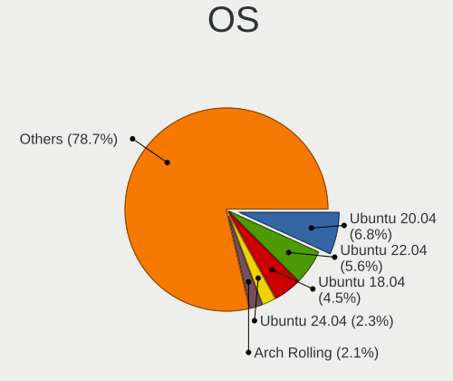

| Name                         | Notebooks | Percent |
|------------------------------|-----------|---------|
| Ubuntu 20.04                 | 75        | 6.81%   |
| Ubuntu 22.04                 | 62        | 5.63%   |
| Ubuntu 18.04                 | 50        | 4.54%   |
| Ubuntu 24.04                 | 25        | 2.27%   |
| Arch Rolling                 | 23        | 2.09%   |
| Pop!_OS 22.04                | 22        | 2%      |
| Manjaro                      | 17        | 1.54%   |
| Debian 12                    | 17        | 1.54%   |
| OpenMandriva 4.3             | 15        | 1.36%   |
| Fedora 39                    | 15        | 1.36%   |
| Fedora 38                    | 15        | 1.36%   |
| Debian 11                    | 14        | 1.27%   |
| Zorin 17                     | 13        | 1.18%   |
| openSUSE Tumbleweed-XXXXXXXX | 13        | 1.18%   |
| OpenMandriva 4.2             | 13        | 1.18%   |
| Linux Mint 21.1              | 13        | 1.18%   |
| Linux Mint 20.3              | 13        | 1.18%   |
| KDE neon 20.04               | 12        | 1.09%   |
| ArcoLinux Rolling            | 12        | 1.09%   |
| Linux Mint 20.1              | 11        | 1%      |
| Fedora 40                    | 11        | 1%      |
| Zorin 16                     | 10        | 0.91%   |
| ROSA R11                     | 10        | 0.91%   |
| OpenMandriva 23.08           | 10        | 0.91%   |
| Linux Mint 22.1              | 10        | 0.91%   |
| Linux Mint 20.2              | 10        | 0.91%   |
| Linux Mint 19.3              | 10        | 0.91%   |
| Kubuntu 20.04                | 10        | 0.91%   |
| Fedora 42                    | 10        | 0.91%   |
| Ubuntu 22.10                 | 9         | 0.82%   |
| Ubuntu 19.04                 | 9         | 0.82%   |
| Linux Mint 22                | 9         | 0.82%   |
| Fedora 41                    | 9         | 0.82%   |
| Arch                         | 9         | 0.82%   |
| Xubuntu 20.04                | 8         | 0.73%   |
| Ubuntu 23.10                 | 8         | 0.73%   |
| ROSA R10                     | 8         | 0.73%   |
| Linux Mint 21.3              | 8         | 0.73%   |
| Linux Mint 21.2              | 8         | 0.73%   |
| Linux Mint 20                | 8         | 0.73%   |

OS Family
---------

OS without a version

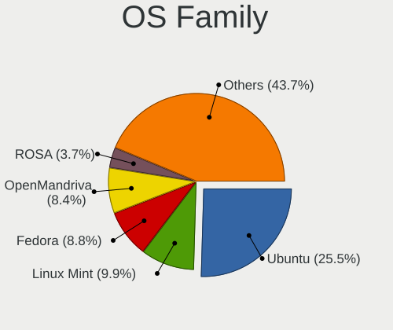

| Name          | Notebooks | Percent |
|---------------|-----------|---------|
| Ubuntu        | 252       | 25.45%  |
| Linux Mint    | 98        | 9.9%    |
| Fedora        | 87        | 8.79%   |
| OpenMandriva  | 83        | 8.38%   |
| ROSA          | 37        | 3.74%   |
| Manjaro       | 37        | 3.74%   |
| Debian        | 37        | 3.74%   |
| Pop!_OS       | 35        | 3.54%   |
| Arch          | 31        | 3.13%   |
| Zorin         | 30        | 3.03%   |
| Kubuntu       | 30        | 3.03%   |
| Endless       | 25        | 2.53%   |
| Xubuntu       | 22        | 2.22%   |
| Kali          | 22        | 2.22%   |
| KDE neon      | 20        | 2.02%   |
| openSUSE      | 18        | 1.82%   |
| ArcoLinux     | 14        | 1.41%   |
| Clear Linux   | 10        | 1.01%   |
| Elementary    | 9         | 0.91%   |
| LMDE          | 8         | 0.81%   |
| Ubuntu Unity  | 7         | 0.71%   |
| EndeavourOS   | 7         | 0.71%   |
| SteamOS       | 6         | 0.61%   |
| TUXEDO OS     | 4         | 0.4%    |
| Nobara        | 4         | 0.4%    |
| Gentoo        | 4         | 0.4%    |
| Parrot        | 3         | 0.3%    |
| MX            | 3         | 0.3%    |
| Lubuntu       | 3         | 0.3%    |
| Garuda Linux  | 3         | 0.3%    |
| CentOS        | 3         | 0.3%    |
| BunsenLabs    | 3         | 0.3%    |
| Artix         | 3         | 0.3%    |
| Void Linux    | 2         | 0.2%    |
| Ubuntu MATE   | 2         | 0.2%    |
| Ubuntu Budgie | 2         | 0.2%    |
| NixOS         | 2         | 0.2%    |
| Mageia        | 2         | 0.2%    |
| Deepin        | 2         | 0.2%    |
| CachyOS       | 2         | 0.2%    |

Kernel
------

Version of the Linux kernel

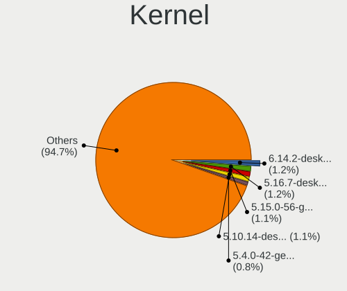

| Version                        | Notebooks | Percent |
|--------------------------------|-----------|---------|
| 6.14.2-desktop-3omv2590        | 15        | 1.23%   |
| 5.16.7-desktop-1omv4003        | 14        | 1.15%   |
| 5.15.0-56-generic              | 13        | 1.07%   |
| 5.10.14-desktop-1omv4002       | 13        | 1.07%   |
| 5.4.0-42-generic               | 10        | 0.82%   |
| 6.8.0-52-generic               | 8         | 0.66%   |
| 5.4.0-58-generic               | 8         | 0.66%   |
| 6.8.0-51-generic               | 7         | 0.58%   |
| 6.8.0-40-generic               | 7         | 0.58%   |
| 5.3.0-28-generic               | 7         | 0.58%   |
| 4.15.0-desktop-45.1rosa-x86_64 | 7         | 0.58%   |
| 6.4.11-desktop-1omv2390        | 6         | 0.49%   |
| 6.2.0-39-generic               | 6         | 0.49%   |
| 6.2.0-26-generic               | 6         | 0.49%   |
| 6.12.1-desktop-1omv2490        | 6         | 0.49%   |
| 5.8.0-14-generic               | 6         | 0.49%   |
| 6.9.3-76060903-generic         | 5         | 0.41%   |
| 6.4.8-desktop-2omv2390         | 5         | 0.41%   |
| 6.10.0-desktop-1omv2490        | 5         | 0.41%   |
| 5.4.0-91-generic               | 5         | 0.41%   |
| 5.4.0-48-generic               | 5         | 0.41%   |
| 5.4.0-29-generic               | 5         | 0.41%   |
| 5.4.0-26-generic               | 5         | 0.41%   |
| 4.15.0-20-generic              | 5         | 0.41%   |
| 6.8.0-60-generic               | 4         | 0.33%   |
| 6.8.0-41-generic               | 4         | 0.33%   |
| 6.8.0-38-generic               | 4         | 0.33%   |
| 6.8.0-31-generic               | 4         | 0.33%   |
| 6.5.0-14-generic               | 4         | 0.33%   |
| 6.2.6-desktop-1omv2390         | 4         | 0.33%   |
| 6.11.0-26-generic              | 4         | 0.33%   |
| 5.9.16-1-MANJARO               | 4         | 0.33%   |
| 5.4.0-90-generic               | 4         | 0.33%   |
| 5.4.0-77-generic               | 4         | 0.33%   |
| 5.4.0-73-generic               | 4         | 0.33%   |
| 5.4.0-65-generic               | 4         | 0.33%   |
| 5.4.0-47-generic               | 4         | 0.33%   |
| 5.4.0-40-generic               | 4         | 0.33%   |
| 5.4.0-19-generic               | 4         | 0.33%   |
| 5.3.0-53-generic               | 4         | 0.33%   |

Kernel Family
-------------

Linux kernel without a distro release

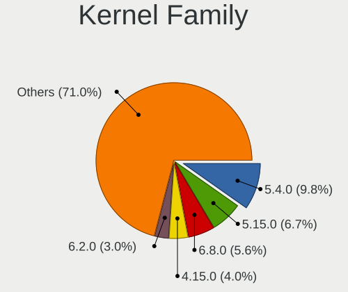

| Version | Notebooks | Percent |
|---------|-----------|---------|
| 5.4.0   | 112       | 9.76%   |
| 5.15.0  | 77        | 6.71%   |
| 6.8.0   | 64        | 5.58%   |
| 4.15.0  | 46        | 4.01%   |
| 6.2.0   | 34        | 2.96%   |
| 5.3.0   | 32        | 2.79%   |
| 6.5.0   | 31        | 2.7%    |
| 5.8.0   | 31        | 2.7%    |
| 5.13.0  | 29        | 2.53%   |
| 5.19.0  | 25        | 2.18%   |
| 5.11.0  | 25        | 2.18%   |
| 6.1.0   | 24        | 2.09%   |
| 5.0.0   | 23        | 2.01%   |
| 5.10.0  | 19        | 1.66%   |
| 6.11.0  | 18        | 1.57%   |
| 6.14.2  | 17        | 1.48%   |
| 4.18.0  | 16        | 1.39%   |
| 5.16.7  | 14        | 1.22%   |
| 5.10.14 | 14        | 1.22%   |
| 6.14.0  | 13        | 1.13%   |
| 4.19.0  | 9         | 0.78%   |
| 6.2.6   | 7         | 0.61%   |
| 5.9.16  | 7         | 0.61%   |
| 6.4.11  | 6         | 0.52%   |
| 6.12.1  | 6         | 0.52%   |
| 4.9.20  | 6         | 0.52%   |
| 6.9.3   | 5         | 0.44%   |
| 6.6.10  | 5         | 0.44%   |
| 6.4.8   | 5         | 0.44%   |
| 6.10.0  | 5         | 0.44%   |
| 6.1.1   | 5         | 0.44%   |
| 5.17.5  | 5         | 0.44%   |
| 6.6.9   | 4         | 0.35%   |
| 6.6.2   | 4         | 0.35%   |
| 6.12.10 | 4         | 0.35%   |
| 6.0.12  | 4         | 0.35%   |
| 6.0.0   | 4         | 0.35%   |
| 5.6.8   | 4         | 0.35%   |
| 5.18.0  | 4         | 0.35%   |
| 5.14.0  | 4         | 0.35%   |

Kernel Major Ver.
-----------------

Linux kernel major version

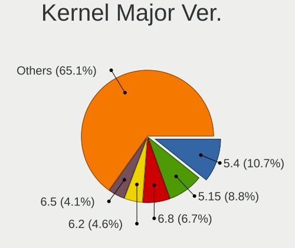

| Version | Notebooks | Percent |
|---------|-----------|---------|
| 5.4     | 120       | 10.72%  |
| 5.15    | 98        | 8.76%   |
| 6.8     | 75        | 6.7%    |
| 6.2     | 51        | 4.56%   |
| 6.5     | 46        | 4.11%   |
| 5.10    | 46        | 4.11%   |
| 4.15    | 46        | 4.11%   |
| 6.1     | 43        | 3.84%   |
| 6.12    | 39        | 3.49%   |
| 5.8     | 36        | 3.22%   |
| 5.3     | 36        | 3.22%   |
| 5.13    | 33        | 2.95%   |
| 6.14    | 32        | 2.86%   |
| 6.6     | 31        | 2.77%   |
| 5.11    | 31        | 2.77%   |
| 5.19    | 29        | 2.59%   |
| 6.11    | 28        | 2.5%    |
| 5.0     | 26        | 2.32%   |
| 5.16    | 25        | 2.23%   |
| 6.4     | 23        | 2.06%   |
| 4.18    | 17        | 1.52%   |
| 6.10    | 15        | 1.34%   |
| 4.9     | 15        | 1.34%   |
| 6.0     | 14        | 1.25%   |
| 4.19    | 14        | 1.25%   |
| 6.7     | 13        | 1.16%   |
| 6.17    | 12        | 1.07%   |
| 5.9     | 12        | 1.07%   |
| 6.9     | 11        | 0.98%   |
| 5.6     | 11        | 0.98%   |
| 5.17    | 11        | 0.98%   |
| 6.3     | 9         | 0.8%    |
| 6.13    | 9         | 0.8%    |
| 5.14    | 9         | 0.8%    |
| 5.18    | 8         | 0.71%   |
| 5.12    | 8         | 0.71%   |
| 6.16    | 7         | 0.63%   |
| 6.15    | 7         | 0.63%   |
| 5.7     | 6         | 0.54%   |
| 5.5     | 6         | 0.54%   |

Arch
----

OS architecture (x86_64, i586, etc.)

| Name   | Notebooks | Percent |
|--------|-----------|---------|
| x86_64 | 915       | 97.03%  |
| i686   | 28        | 2.97%   |

DE
--

Desktop Environment

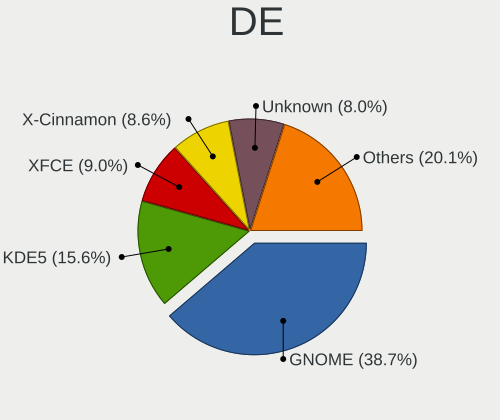

| Name             | Notebooks | Percent |
|------------------|-----------|---------|
| GNOME            | 392       | 38.74%  |
| KDE5             | 158       | 15.61%  |
| XFCE             | 91        | 8.99%   |
| X-Cinnamon       | 87        | 8.6%    |
| Unknown          | 81        | 8%      |
| KDE6             | 64        | 6.32%   |
| KDE              | 23        | 2.27%   |
| MATE             | 18        | 1.78%   |
| KDE4             | 18        | 1.78%   |
| Cinnamon         | 16        | 1.58%   |
| LXQt             | 11        | 1.09%   |
| Pantheon         | 9         | 0.89%   |
| Unity            | 7         | 0.69%   |
| i3               | 6         | 0.59%   |
| Hyprland         | 4         | 0.4%    |
| Deepin           | 4         | 0.4%    |
| GNOME Flashback  | 3         | 0.3%    |
| GNOME Classic    | 3         | 0.3%    |
| Budgie           | 3         | 0.3%    |
| sway             | 2         | 0.2%    |
| LXDE             | 2         | 0.2%    |
| lightdm-xsession | 2         | 0.2%    |
| COSMIC           | 2         | 0.2%    |
| xmonad           | 1         | 0.1%    |
| openbox          | 1         | 0.1%    |
| icewm            | 1         | 0.1%    |
| Endless:GNOME    | 1         | 0.1%    |
| BunsenLabs       | 1         | 0.1%    |
| bspwm            | 1         | 0.1%    |

Display Server
--------------

X11 or Wayland

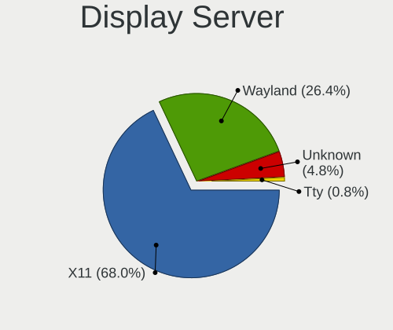

| Name    | Notebooks | Percent |
|---------|-----------|---------|
| X11     | 671       | 67.98%  |
| Wayland | 261       | 26.44%  |
| Unknown | 47        | 4.76%   |
| Tty     | 8         | 0.81%   |

Display Manager
---------------

SDDM, LightDM, etc.

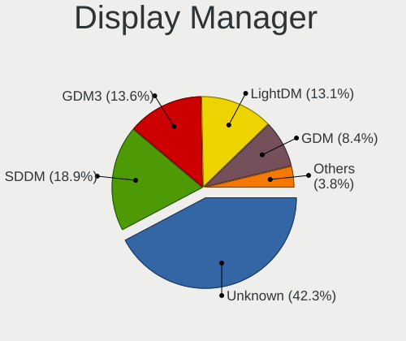

| Name    | Notebooks | Percent |
|---------|-----------|---------|
| Unknown | 421       | 42.27%  |
| SDDM    | 188       | 18.88%  |
| GDM3    | 135       | 13.55%  |
| LightDM | 130       | 13.05%  |
| GDM     | 84        | 8.43%   |
| TDM     | 18        | 1.81%   |
| KDM     | 17        | 1.71%   |
| XDM     | 2         | 0.2%    |
| MDM     | 1         | 0.1%    |

OS Lang
-------

Language

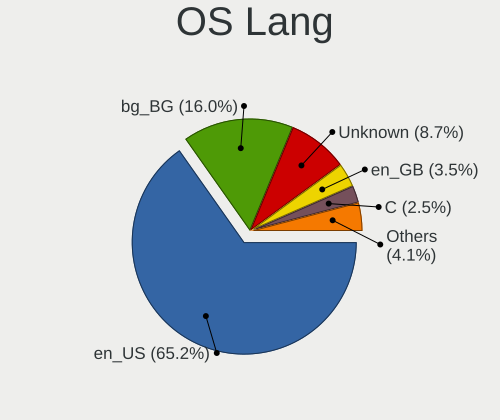

| Lang    | Notebooks | Percent |
|---------|-----------|---------|
| en_US   | 636       | 65.23%  |
| bg_BG   | 156       | 16%     |
| Unknown | 85        | 8.72%   |
| en_GB   | 34        | 3.49%   |
| C       | 24        | 2.46%   |
| ru_RU   | 17        | 1.74%   |
| de_DE   | 4         | 0.41%   |
| ru_UA   | 2         | 0.21%   |
| POSIX   | 2         | 0.21%   |
| it_IT   | 2         | 0.21%   |
| es_ES   | 2         | 0.21%   |
| en_DK   | 2         | 0.21%   |
| C.UTF8  | 2         | 0.21%   |
| uk_UA   | 1         | 0.1%    |
| tr_TR   | 1         | 0.1%    |
| sv_SE   | 1         | 0.1%    |
| fr_FR   | 1         | 0.1%    |
| en_NZ   | 1         | 0.1%    |
| en_AG   | 1         | 0.1%    |
| da_DK   | 1         | 0.1%    |

Boot Mode
---------

EFI or BIOS

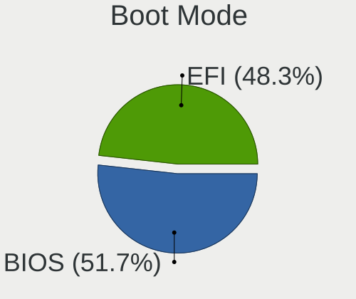

| Mode | Notebooks | Percent |
|------|-----------|---------|
| BIOS | 504       | 51.75%  |
| EFI  | 470       | 48.25%  |

Filesystem
----------

Type of filesystem

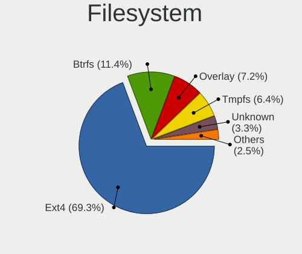

| Type    | Notebooks | Percent |
|---------|-----------|---------|
| Ext4    | 675       | 69.3%   |
| Btrfs   | 111       | 11.4%   |
| Overlay | 70        | 7.19%   |
| Tmpfs   | 62        | 6.37%   |
| Unknown | 32        | 3.29%   |
| Xfs     | 14        | 1.44%   |
| Zfs     | 5         | 0.51%   |
| Ext2    | 3         | 0.31%   |
| Ext3    | 2         | 0.21%   |

Part. scheme
------------

Scheme of partitioning

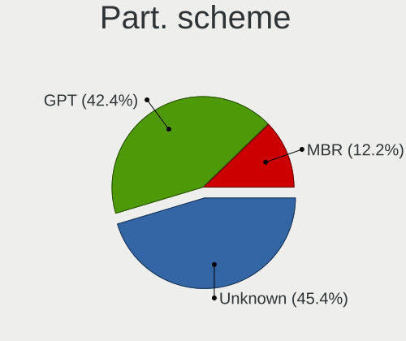

| Type    | Notebooks | Percent |
|---------|-----------|---------|
| Unknown | 441       | 45.37%  |
| GPT     | 412       | 42.39%  |
| MBR     | 119       | 12.24%  |

Dual Boot with Linux/BSD
------------------------

Hosting more than one Linux/BSD

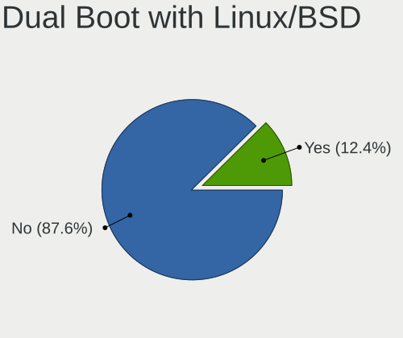

| Dual boot | Notebooks | Percent |
|-----------|-----------|---------|
| No        | 839       | 87.58%  |
| Yes       | 119       | 12.42%  |

Dual Boot (Win)
---------------

Hosting Linux and Windows

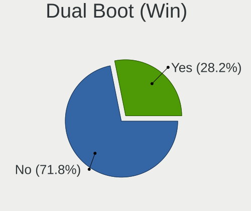

| Dual boot | Notebooks | Percent |
|-----------|-----------|---------|
| No        | 689       | 71.85%  |
| Yes       | 270       | 28.15%  |

Board
-----

Vendor
------

Motherboard manufacturer

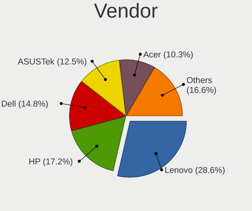

| Name                       | Notebooks | Percent |
|----------------------------|-----------|---------|
| Lenovo                     | 269       | 28.59%  |
| Hewlett-Packard            | 162       | 17.22%  |
| Dell                       | 139       | 14.77%  |
| ASUSTek Computer           | 118       | 12.54%  |
| Acer                       | 97        | 10.31%  |
| Toshiba                    | 40        | 4.25%   |
| MSI                        | 22        | 2.34%   |
| Apple                      | 15        | 1.59%   |
| Fujitsu                    | 8         | 0.85%   |
| Sony                       | 6         | 0.64%   |
| Valve                      | 5         | 0.53%   |
| Samsung Electronics        | 5         | 0.53%   |
| Google                     | 4         | 0.43%   |
| Fujitsu Siemens            | 4         | 0.43%   |
| Unknown                    | 4         | 0.43%   |
| TUXEDO                     | 3         | 0.32%   |
| TongFang                   | 3         | 0.32%   |
| Notebook                   | 3         | 0.32%   |
| Medion                     | 3         | 0.32%   |
| HUAWEI                     | 3         | 0.32%   |
| Gigabyte Technology        | 3         | 0.32%   |
| System76                   | 2         | 0.21%   |
| Panasonic                  | 2         | 0.21%   |
| Packard Bell               | 2         | 0.21%   |
| AMI                        | 2         | 0.21%   |
| Timi                       | 1         | 0.11%   |
| TECNO Mobile Limited       | 1         | 0.11%   |
| SLIMBOOK                   | 1         | 0.11%   |
| ShenZhen ZhiWei Technology | 1         | 0.11%   |
| Razer                      | 1         | 0.11%   |
| Pegatron                   | 1         | 0.11%   |
| ONDA                       | 1         | 0.11%   |
| LG Electronics             | 1         | 0.11%   |
| IBM                        | 1         | 0.11%   |
| HONOR                      | 1         | 0.11%   |
| FUSION5                    | 1         | 0.11%   |
| Framework                  | 1         | 0.11%   |
| Cube                       | 1         | 0.11%   |
| Compal                     | 1         | 0.11%   |
| Beelink                    | 1         | 0.11%   |

Model
-----

Motherboard model

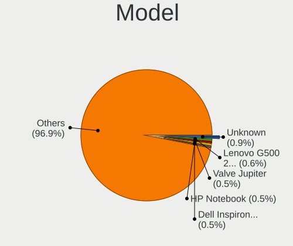

| Name                                       | Notebooks | Percent |
|--------------------------------------------|-----------|---------|
| Unknown                                    | 8         | 0.85%   |
| Lenovo G500 20236                          | 6         | 0.64%   |
| Valve Jupiter                              | 5         | 0.53%   |
| HP Notebook                                | 5         | 0.53%   |
| Dell Inspiron N5110                        | 5         | 0.53%   |
| ASUS X541NA                                | 5         | 0.53%   |
| HP ProBook 4540s                           | 4         | 0.43%   |
| HP ProBook 450 G8 Notebook PC              | 4         | 0.43%   |
| HP Pavilion 15                             | 4         | 0.43%   |
| HP EliteBook 840 G1                        | 4         | 0.43%   |
| ASUS VivoBook_ASUSLaptop M1605YA_M1605YA   | 4         | 0.43%   |
| Apple MacBookPro11,1                       | 4         | 0.43%   |
| Toshiba Satellite L300                     | 3         | 0.32%   |
| MSI Modern 15 A5M                          | 3         | 0.32%   |
| Lenovo Y520-15IKBN 80WK                    | 3         | 0.32%   |
| Lenovo Legion Y530-15ICH 81FV              | 3         | 0.32%   |
| Lenovo IdeaPad Gaming 3 15IHU6 82K1        | 3         | 0.32%   |
| HP ProBook 450 G0                          | 3         | 0.32%   |
| HP 255 G8 Notebook PC                      | 3         | 0.32%   |
| Dell Precision M4600                       | 3         | 0.32%   |
| Dell Latitude E6540                        | 3         | 0.32%   |
| Dell Latitude E6410                        | 3         | 0.32%   |
| Dell Latitude E4300                        | 3         | 0.32%   |
| Dell G3 3579                               | 3         | 0.32%   |
| ASUS VivoBook 15_ASUS Laptop X540MA_X540MA | 3         | 0.32%   |
| ASUS N551VW                                | 3         | 0.32%   |
| Acer Aspire A515-57                        | 3         | 0.32%   |
| Acer Aspire 5738                           | 3         | 0.32%   |
| Toshiba Satellite L50-B                    | 2         | 0.21%   |
| Toshiba Satellite C50-A-19T                | 2         | 0.21%   |
| Toshiba Satellite A300                     | 2         | 0.21%   |
| Toshiba Satellite A200                     | 2         | 0.21%   |
| TongFang GX5HRXL                           | 2         | 0.21%   |
| Samsung 300E4Z/300E5Z/300E7Z               | 2         | 0.21%   |
| MSI GF63 Thin 10SCSR                       | 2         | 0.21%   |
| Lenovo Yoga S740-14IIL 81RS                | 2         | 0.21%   |
| Lenovo ThinkPad X220 4291IR6               | 2         | 0.21%   |
| Lenovo ThinkPad X1 Carbon 3rd 20BTS1D900   | 2         | 0.21%   |
| Lenovo ThinkPad T460 20FN003LUK            | 2         | 0.21%   |
| Lenovo ThinkPad T420 4236A87               | 2         | 0.21%   |

Model Family
------------

Motherboard model prefix

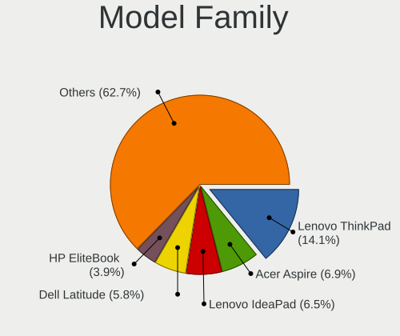

| Name               | Notebooks | Percent |
|--------------------|-----------|---------|
| Lenovo ThinkPad    | 133       | 14.13%  |
| Acer Aspire        | 65        | 6.91%   |
| Lenovo IdeaPad     | 61        | 6.48%   |
| Dell Latitude      | 55        | 5.84%   |
| HP EliteBook       | 37        | 3.93%   |
| HP ProBook         | 36        | 3.83%   |
| ASUS VivoBook      | 36        | 3.83%   |
| Dell Inspiron      | 35        | 3.72%   |
| Toshiba Satellite  | 33        | 3.51%   |
| HP Pavilion        | 32        | 3.4%    |
| Lenovo Legion      | 21        | 2.23%   |
| Dell Precision     | 15        | 1.59%   |
| Dell Vostro        | 14        | 1.49%   |
| Acer Nitro         | 13        | 1.38%   |
| ASUS ROG           | 12        | 1.28%   |
| HP Compaq          | 11        | 1.17%   |
| ASUS ASUS          | 11        | 1.17%   |
| Lenovo Yoga        | 9         | 0.96%   |
| Unknown            | 8         | 0.85%   |
| MSI Modern         | 7         | 0.74%   |
| Lenovo ThinkBook   | 7         | 0.74%   |
| HP Laptop          | 7         | 0.74%   |
| HP 255             | 7         | 0.74%   |
| Dell XPS           | 7         | 0.74%   |
| Lenovo G500        | 6         | 0.64%   |
| Valve Jupiter      | 5         | 0.53%   |
| HP ZBook           | 5         | 0.53%   |
| HP Notebook        | 5         | 0.53%   |
| HP 250             | 5         | 0.53%   |
| ASUS ZenBook       | 5         | 0.53%   |
| ASUS X541NA        | 5         | 0.53%   |
| Apple MacBookPro11 | 5         | 0.53%   |
| Acer Swift         | 5         | 0.53%   |
| Acer Predator      | 5         | 0.53%   |
| MSI Katana         | 4         | 0.43%   |
| MSI GF63           | 4         | 0.43%   |
| Lenovo V15         | 4         | 0.43%   |
| Fujitsu LIFEBOOK   | 4         | 0.43%   |
| Dell G15           | 4         | 0.43%   |
| Acer TravelMate    | 4         | 0.43%   |

MFG Year
--------

Motherboard manufacture year

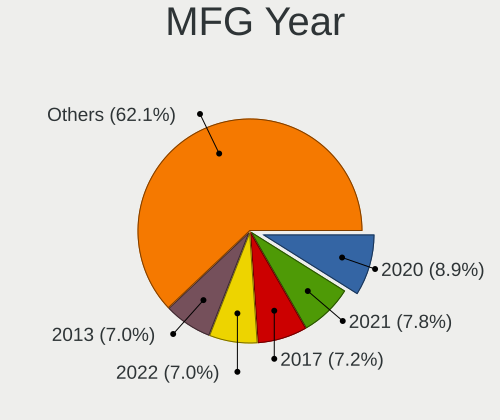

| Year | Notebooks | Percent |
|------|-----------|---------|
| 2020 | 84        | 8.93%   |
| 2021 | 73        | 7.76%   |
| 2017 | 68        | 7.23%   |
| 2022 | 66        | 7.01%   |
| 2013 | 66        | 7.01%   |
| 2019 | 65        | 6.91%   |
| 2011 | 63        | 6.7%    |
| 2012 | 62        | 6.59%   |
| 2018 | 59        | 6.27%   |
| 2014 | 49        | 5.21%   |
| 2015 | 44        | 4.68%   |
| 2010 | 44        | 4.68%   |
| 2008 | 44        | 4.68%   |
| 2023 | 43        | 4.57%   |
| 2016 | 30        | 3.19%   |
| 2009 | 29        | 3.08%   |
| 2024 | 18        | 1.91%   |
| 2007 | 15        | 1.59%   |
| 2025 | 9         | 0.96%   |
| 2006 | 8         | 0.85%   |
| 2004 | 2         | 0.21%   |

Form Factor
-----------

Physical design of the computer

| Name     | Notebooks | Percent |
|----------|-----------|---------|
| Notebook | 941       | 100%    |

Secure Boot
-----------

Enabled or disabled

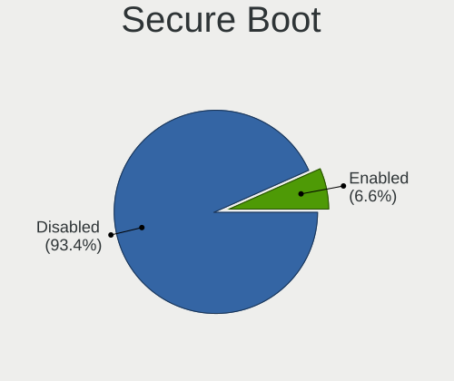

| State    | Notebooks | Percent |
|----------|-----------|---------|
| Disabled | 885       | 93.35%  |
| Enabled  | 63        | 6.65%   |

Coreboot
--------

Have coreboot on board

| Used | Notebooks | Percent |
|------|-----------|---------|
| No   | 934       | 99.26%  |
| Yes  | 7         | 0.74%   |

RAM Size
--------

Total RAM memory

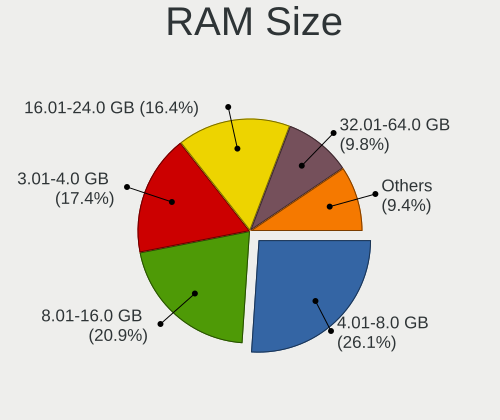

| Size in GB  | Notebooks | Percent |
|-------------|-----------|---------|
| 4.01-8.0    | 251       | 26.06%  |
| 8.01-16.0   | 201       | 20.87%  |
| 3.01-4.0    | 168       | 17.45%  |
| 16.01-24.0  | 158       | 16.41%  |
| 32.01-64.0  | 94        | 9.76%   |
| 24.01-32.0  | 27        | 2.8%    |
| 1.01-2.0    | 24        | 2.49%   |
| 2.01-3.0    | 18        | 1.87%   |
| 64.01-256.0 | 18        | 1.87%   |
| 0.51-1.0    | 4         | 0.42%   |

RAM Used
--------

Used RAM memory

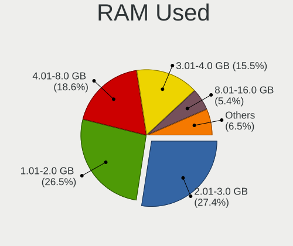

| Used GB    | Notebooks | Percent |
|------------|-----------|---------|
| 2.01-3.0   | 299       | 27.43%  |
| 1.01-2.0   | 289       | 26.51%  |
| 4.01-8.0   | 203       | 18.62%  |
| 3.01-4.0   | 169       | 15.5%   |
| 8.01-16.0  | 59        | 5.41%   |
| 0.51-1.0   | 55        | 5.05%   |
| 16.01-24.0 | 10        | 0.92%   |
| 0.01-0.5   | 4         | 0.37%   |
| 32.01-64.0 | 1         | 0.09%   |
| Unknown    | 1         | 0.09%   |

Total Drives
------------

Number of drives on board

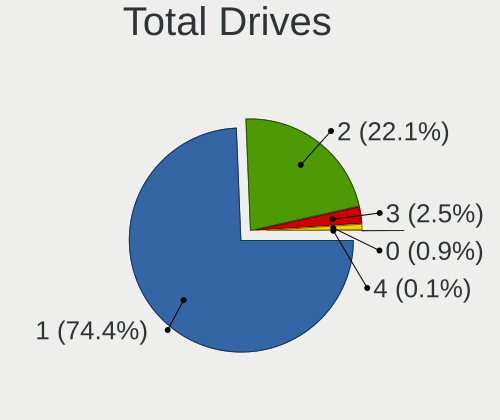

| Drives | Notebooks | Percent |
|--------|-----------|---------|
| 1      | 719       | 74.35%  |
| 2      | 214       | 22.13%  |
| 3      | 24        | 2.48%   |
| 0      | 9         | 0.93%   |
| 4      | 1         | 0.1%    |

Has CD-ROM
----------

Has CD-ROM on board

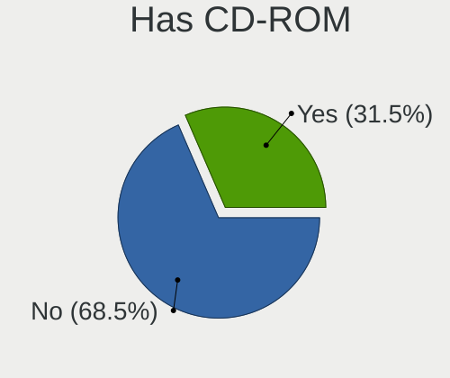

| Presented | Notebooks | Percent |
|-----------|-----------|---------|
| No        | 650       | 68.49%  |
| Yes       | 299       | 31.51%  |

Has Ethernet
------------

Has Ethernet on board

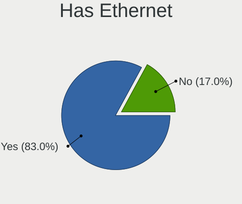

| Presented | Notebooks | Percent |
|-----------|-----------|---------|
| Yes       | 784       | 82.96%  |
| No        | 161       | 17.04%  |

Has WiFi
--------

Has WiFi module

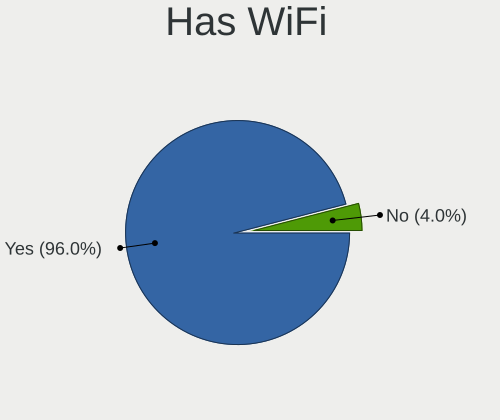

| Presented | Notebooks | Percent |
|-----------|-----------|---------|
| Yes       | 904       | 95.97%  |
| No        | 38        | 4.03%   |

Has Bluetooth
-------------

Has Bluetooth module

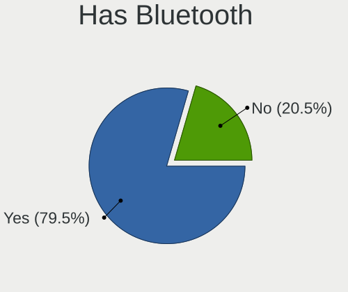

| Presented | Notebooks | Percent |
|-----------|-----------|---------|
| Yes       | 763       | 79.48%  |
| No        | 197       | 20.52%  |

Location
--------

Country
-------

Geographic location (country)

| Country  | Notebooks | Percent |
|----------|-----------|---------|
| Bulgaria | 941       | 100%    |

City
----

Geographic location (city)

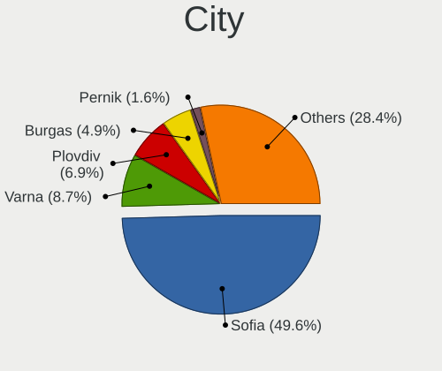

| City                | Notebooks | Percent |
|---------------------|-----------|---------|
| Sofia               | 496       | 49.55%  |
| Varna               | 87        | 8.69%   |
| Plovdiv             | 69        | 6.89%   |
| Burgas              | 49        | 4.9%    |
| Pernik              | 16        | 1.6%    |
| Stara Zagora        | 14        | 1.4%    |
| Pleven              | 13        | 1.3%    |
| Rousse              | 12        | 1.2%    |
| Yambol              | 10        | 1%      |
| Pazardzhik          | 10        | 1%      |
| Montana             | 9         | 0.9%    |
| Veliko Tarnovo      | 8         | 0.8%    |
| Haskovo             | 8         | 0.8%    |
| Dobrich             | 7         | 0.7%    |
| Blagoevgrad         | 7         | 0.7%    |
| Svilengrad          | 6         | 0.6%    |
| Shumen              | 6         | 0.6%    |
| Razgrad             | 6         | 0.6%    |
| Gabrovo             | 6         | 0.6%    |
| Kazanlak            | 5         | 0.5%    |
| Asenovgrad          | 5         | 0.5%    |
| Vidin               | 4         | 0.4%    |
| Sistov              | 4         | 0.4%    |
| Nesebar             | 4         | 0.4%    |
| Gorna Oryahovitsa   | 4         | 0.4%    |
| Botevgrad           | 4         | 0.4%    |
| Vratsa              | 3         | 0.3%    |
| Troyan Municipality | 3         | 0.3%    |
| Smolyan             | 3         | 0.3%    |
| Silistra            | 3         | 0.3%    |
| Lom                 | 3         | 0.3%    |
| Kyustendil          | 3         | 0.3%    |
| Kozloduy            | 3         | 0.3%    |
| Gotse Delchev       | 3         | 0.3%    |
| Teteven             | 2         | 0.2%    |
| Svoge               | 2         | 0.2%    |
| Sliven              | 2         | 0.2%    |
| Sevlievo            | 2         | 0.2%    |
| Samokov             | 2         | 0.2%    |
| Popovo              | 2         | 0.2%    |

Drives
------

Drive Vendor
------------

Hard drive vendors

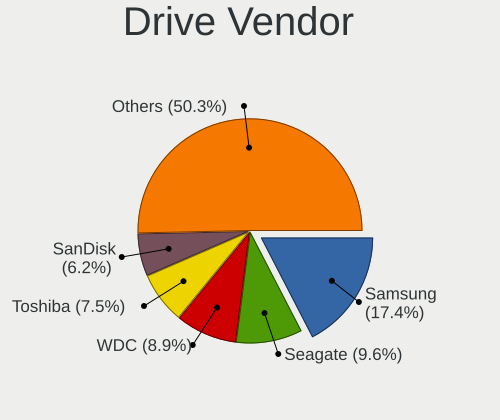

| Vendor                       | Notebooks | Drives | Percent |
|------------------------------|-----------|--------|---------|
| Samsung Electronics          | 203       | 293    | 17.41%  |
| Seagate                      | 112       | 150    | 9.61%   |
| WDC                          | 104       | 143    | 8.92%   |
| Toshiba                      | 88        | 119    | 7.55%   |
| SanDisk                      | 72        | 87     | 6.17%   |
| SK hynix                     | 60        | 82     | 5.15%   |
| Kingston                     | 56        | 78     | 4.8%    |
| Unknown                      | 53        | 65     | 4.55%   |
| Micron Technology            | 46        | 55     | 3.95%   |
| Intel                        | 40        | 59     | 3.43%   |
| HGST                         | 37        | 55     | 3.17%   |
| Hitachi                      | 35        | 37     | 3%      |
| A-DATA Technology            | 30        | 42     | 2.57%   |
| Crucial                      | 19        | 28     | 1.63%   |
| KIOXIA                       | 18        | 20     | 1.54%   |
| Kingston Technology Company  | 18        | 18     | 1.54%   |
| SPCC                         | 14        | 22     | 1.2%    |
| Transcend                    | 13        | 13     | 1.11%   |
| China                        | 11        | 13     | 0.94%   |
| Phison Electronics           | 10        | 13     | 0.86%   |
| KingSpec                     | 10        | 12     | 0.86%   |
| Fujitsu                      | 10        | 13     | 0.86%   |
| Apple                        | 10        | 21     | 0.86%   |
| LITEONIT                     | 7         | 7      | 0.6%    |
| Team                         | 6         | 6      | 0.51%   |
| PNY                          | 6         | 7      | 0.51%   |
| LITEON                       | 5         | 8      | 0.43%   |
| Unknown                      | 5         | 5      | 0.43%   |
| Silicon Motion               | 4         | 4      | 0.34%   |
| Verbatim                     | 3         | 3      | 0.26%   |
| Union Memory (Shenzhen)      | 3         | 3      | 0.26%   |
| Patriot                      | 3         | 3      | 0.26%   |
| Lexar                        | 3         | 3      | 0.26%   |
| Lenovo                       | 3         | 3      | 0.26%   |
| TO Exter                     | 2         | 2      | 0.17%   |
| Teclast                      | 2         | 2      | 0.17%   |
| SOLIDIGM                     | 2         | 2      | 0.17%   |
| Shenzhen Longsys Electronics | 2         | 2      | 0.17%   |
| Realtek Semiconductor        | 2         | 3      | 0.17%   |
| Realtek                      | 2         | 2      | 0.17%   |

Drive Model
-----------

Hard drive models

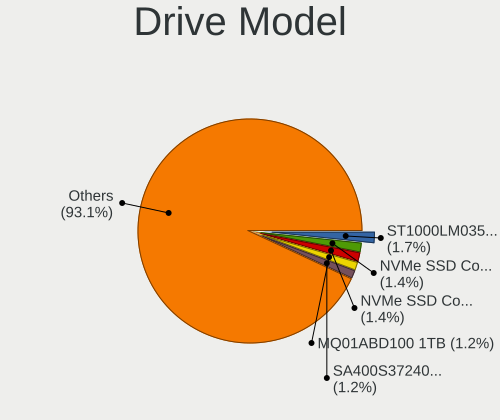

| Model                                              | Notebooks | Percent |
|----------------------------------------------------|-----------|---------|
| Seagate ST1000LM035-1RK172 1TB                     | 20        | 1.65%   |
| Samsung NVMe SSD Controller SM981/PM981/PM983 1TB  | 17        | 1.41%   |
| Samsung NVMe SSD Controller PM9A1/PM9A3/980PRO 1TB | 17        | 1.41%   |
| Toshiba MQ01ABD100 1TB                             | 15        | 1.24%   |
| Kingston SA400S37240G 240GB SSD                    | 15        | 1.24%   |
| HGST HTS721010A9E630 1TB                           | 15        | 1.24%   |
| Toshiba MQ01ABF050 500GB                           | 14        | 1.16%   |
| Seagate ST1000LM024 HN-M101MBB 1TB                 | 14        | 1.16%   |
| Unknown MMC Card  32GB                             | 12        | 0.99%   |
| Samsung NVMe SSD Drive 512GB                       | 11        | 0.91%   |
| Samsung SSD 860 EVO 500GB                          | 9         | 0.74%   |
| Samsung SSD 860 EVO 250GB                          | 9         | 0.74%   |
| WDC WD10SPZX-21Z10T0 1TB                           | 8         | 0.66%   |
| Unknown MMC Card  64GB                             | 8         | 0.66%   |
| SanDisk NVMe SSD Drive 512GB                       | 8         | 0.66%   |
| HGST HTS541010A9E680 1TB                           | 8         | 0.66%   |
| Toshiba MQ04ABF100 1TB                             | 7         | 0.58%   |
| Seagate ST9500325AS 500GB                          | 7         | 0.58%   |
| Seagate ST500LT012-1DG142 500GB                    | 7         | 0.58%   |
| Kingston SA400S37120G 120GB SSD                    | 7         | 0.58%   |
| SPCC Solid State Disk 512GB                        | 6         | 0.5%    |
| Seagate ST1000LM048-2E7172 1TB                     | 6         | 0.5%    |
| SanDisk NVMe SSD Drive 256GB                       | 6         | 0.5%    |
| Samsung SSD 850 EVO 250GB                          | 6         | 0.5%    |
| Unknown SD/MMC/MS PRO 2GB                          | 5         | 0.41%   |
| Toshiba NVMe SSD Drive 256GB                       | 5         | 0.41%   |
| Seagate ST9750420AS 752GB                          | 5         | 0.41%   |
| Samsung SSD 870 EVO 500GB                          | 5         | 0.41%   |
| Samsung NVMe SSD Drive 1024GB                      | 5         | 0.41%   |
| Samsung MZVL4512HBLU-00BTW 512GB                   | 5         | 0.41%   |
| Phison PS5013 E13 NVMe Controller 500GB            | 5         | 0.41%   |
| Kingston Company SNV2S2000G 2TB                    | 5         | 0.41%   |
| Unknown                                            | 5         | 0.41%   |
| WDC WDS240G2G0A-00JH30 240GB SSD                   | 4         | 0.33%   |
| WDC WD10JPVX-22JC3T0 1TB                           | 4         | 0.33%   |
| Toshiba MQ01ABD075 752GB                           | 4         | 0.33%   |
| SK hynix NVMe SSD Drive 256GB                      | 4         | 0.33%   |
| Seagate Expansion 2TB                              | 4         | 0.33%   |
| Sandisk WD Blue SN550 NVMe SSD 1024GB              | 4         | 0.33%   |
| Sandisk WD Black SN750 / PC SN730 NVMe SSD 500GB   | 4         | 0.33%   |

HDD Vendor
----------

Hard disk drive vendors

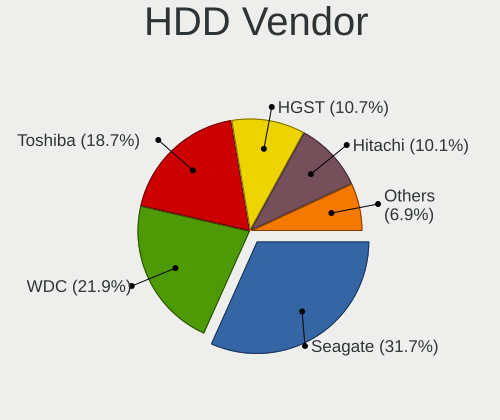

| Vendor              | Notebooks | Drives | Percent |
|---------------------|-----------|--------|---------|
| Seagate             | 110       | 148    | 31.7%   |
| WDC                 | 76        | 99     | 21.9%   |
| Toshiba             | 65        | 84     | 18.73%  |
| HGST                | 37        | 55     | 10.66%  |
| Hitachi             | 35        | 37     | 10.09%  |
| Fujitsu             | 10        | 13     | 2.88%   |
| Unknown             | 5         | 7      | 1.44%   |
| Samsung Electronics | 4         | 6      | 1.15%   |
| TO Exter            | 2         | 2      | 0.58%   |
| Min Yi U            | 1         | 1      | 0.29%   |
| JMicron Technology  | 1         | 1      | 0.29%   |
| IBM/Hitachi         | 1         | 2      | 0.29%   |

SSD Vendor
----------

Solid state drive vendors

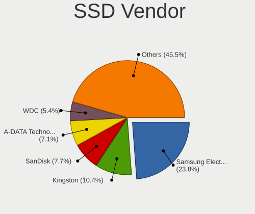

| Vendor              | Notebooks | Drives | Percent |
|---------------------|-----------|--------|---------|
| Samsung Electronics | 80        | 100    | 23.81%  |
| Kingston            | 35        | 40     | 10.42%  |
| SanDisk             | 26        | 31     | 7.74%   |
| A-DATA Technology   | 24        | 36     | 7.14%   |
| WDC                 | 18        | 26     | 5.36%   |
| Crucial             | 15        | 23     | 4.46%   |
| SPCC                | 12        | 20     | 3.57%   |
| Transcend           | 11        | 11     | 3.27%   |
| China               | 11        | 13     | 3.27%   |
| KingSpec            | 10        | 12     | 2.98%   |
| Intel               | 9         | 12     | 2.68%   |
| Micron Technology   | 8         | 10     | 2.38%   |
| Apple               | 8         | 19     | 2.38%   |
| Toshiba             | 7         | 9      | 2.08%   |
| LITEONIT            | 7         | 7      | 2.08%   |
| Team                | 6         | 6      | 1.79%   |
| PNY                 | 6         | 7      | 1.79%   |
| LITEON              | 5         | 8      | 1.49%   |
| SK hynix            | 4         | 4      | 1.19%   |
| Verbatim            | 3         | 3      | 0.89%   |
| Patriot             | 3         | 3      | 0.89%   |
| Lexar               | 3         | 3      | 0.89%   |
| Teclast             | 2         | 2      | 0.6%    |
| Intenso             | 2         | 4      | 0.6%    |
| GOODRAM             | 2         | 2      | 0.6%    |
| AMD                 | 2         | 3      | 0.6%    |
| Unknown             | 2         | 2      | 0.6%    |
| Wibtek              | 1         | 2      | 0.3%    |
| VT                  | 1         | 1      | 0.3%    |
| Unknown             | 1         | 1      | 0.3%    |
| StoreJet            | 1         | 1      | 0.3%    |
| Seagate             | 1         | 1      | 0.3%    |
| NT-256              | 1         | 1      | 0.3%    |
| Netac               | 1         | 4      | 0.3%    |
| KingDian            | 1         | 1      | 0.3%    |
| Indilinx            | 1         | 2      | 0.3%    |
| FORESEE             | 1         | 2      | 0.3%    |
| EDGE                | 1         | 1      | 0.3%    |
| ASMT                | 1         | 1      | 0.3%    |
| Apacer              | 1         | 1      | 0.3%    |

Drive Kind
----------

HDD or SSD

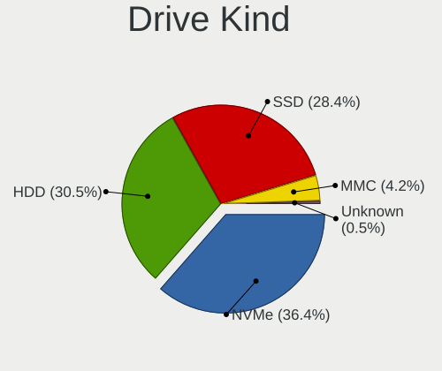

| Kind    | Notebooks | Drives | Percent |
|---------|-----------|--------|---------|
| NVMe    | 402       | 597    | 36.45%  |
| HDD     | 336       | 455    | 30.46%  |
| SSD     | 313       | 437    | 28.38%  |
| MMC     | 46        | 56     | 4.17%   |
| Unknown | 6         | 5      | 0.54%   |

Drive Connector
---------------

SATA, SAS, NVMe, etc.

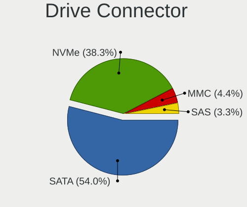

| Type | Notebooks | Drives | Percent |
|------|-----------|--------|---------|
| SATA | 565       | 861    | 54.02%  |
| NVMe | 401       | 595    | 38.34%  |
| MMC  | 46        | 56     | 4.4%    |
| SAS  | 34        | 38     | 3.25%   |

Drive Size
----------

Size of hard drive

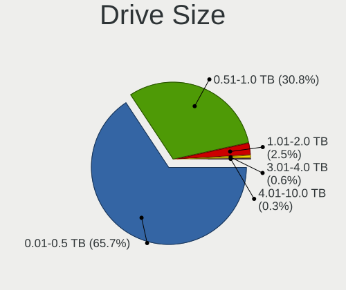

| Size in TB | Notebooks | Drives | Percent |
|------------|-----------|--------|---------|
| 0.01-0.5   | 418       | 587    | 65.72%  |
| 0.51-1.0   | 196       | 279    | 30.82%  |
| 1.01-2.0   | 16        | 19     | 2.52%   |
| 3.01-4.0   | 4         | 4      | 0.63%   |
| 4.01-10.0  | 2         | 3      | 0.31%   |

Space Total
-----------

Amount of disk space available on the file system

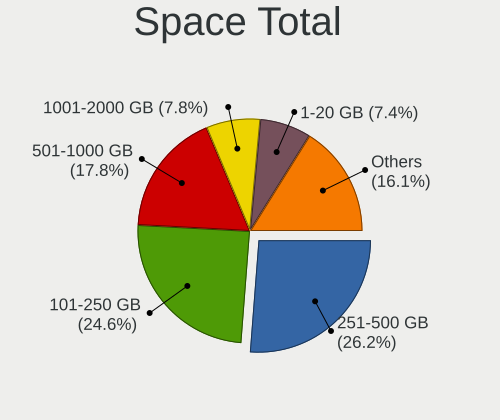

| Size in GB     | Notebooks | Percent |
|----------------|-----------|---------|
| 251-500        | 262       | 26.23%  |
| 101-250        | 246       | 24.62%  |
| 501-1000       | 178       | 17.82%  |
| 1001-2000      | 78        | 7.81%   |
| 1-20           | 74        | 7.41%   |
| 51-100         | 61        | 6.11%   |
| 21-50          | 43        | 4.3%    |
| Unknown        | 31        | 3.1%    |
| More than 3000 | 17        | 1.7%    |
| 2001-3000      | 9         | 0.9%    |

Space Used
----------

Amount of used disk space

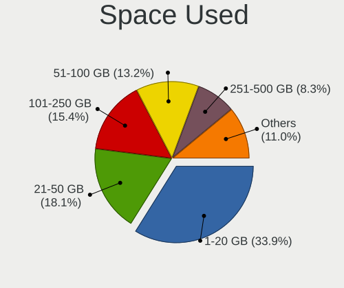

| Used GB        | Notebooks | Percent |
|----------------|-----------|---------|
| 1-20           | 366       | 33.89%  |
| 21-50          | 196       | 18.15%  |
| 101-250        | 166       | 15.37%  |
| 51-100         | 143       | 13.24%  |
| 251-500        | 90        | 8.33%   |
| 501-1000       | 60        | 5.56%   |
| Unknown        | 31        | 2.87%   |
| 1001-2000      | 17        | 1.57%   |
| More than 3000 | 5         | 0.46%   |
| 2001-3000      | 4         | 0.37%   |
| 0              | 2         | 0.19%   |

Malfunc. Drives
---------------

Drive models with a malfunction

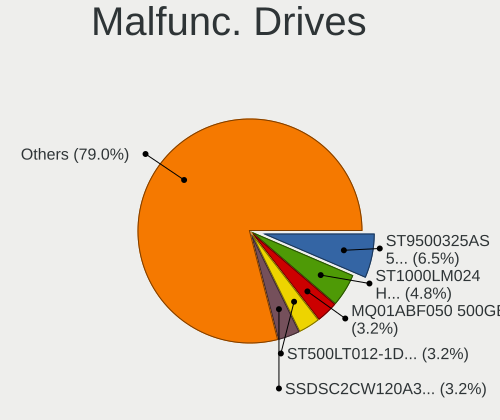

| Model                                                          | Notebooks | Drives | Percent |
|----------------------------------------------------------------|-----------|--------|---------|
| Seagate ST9500325AS 500GB                                      | 4         | 4      | 6.45%   |
| Seagate ST1000LM024 HN-M101MBB 1TB                             | 3         | 3      | 4.84%   |
| Toshiba MQ01ABF050 500GB                                       | 2         | 2      | 3.23%   |
| Seagate ST500LT012-1DG142 500GB                                | 2         | 2      | 3.23%   |
| Intel SSDSC2CW120A3 120GB                                      | 2         | 2      | 3.23%   |
| Hitachi HTS543232A7A384 320GB                                  | 2         | 2      | 3.23%   |
| WDC WDS100T2B0B-00YS70 1TB SSD                                 | 1         | 1      | 1.61%   |
| WDC WD5000LPVX-55V0TT0 500GB                                   | 1         | 1      | 1.61%   |
| WDC WD5000BEVT-75A0RT0 500GB                                   | 1         | 1      | 1.61%   |
| WDC WD3200BEVT-80A0RT0 320GB                                   | 1         | 1      | 1.61%   |
| WDC WD1600BEVT-80A23T0 160GB                                   | 1         | 1      | 1.61%   |
| WDC WD Blue SA510 2.5 500GB                                    | 1         | 1      | 1.61%   |
| Toshiba MQ01ABD100 1TB                                         | 1         | 1      | 1.61%   |
| Toshiba MQ01ABD050 500GB                                       | 1         | 1      | 1.61%   |
| Toshiba MK8052GSX 80GB                                         | 1         | 1      | 1.61%   |
| Toshiba MK2552GSX 250GB                                        | 1         | 3      | 1.61%   |
| Toshiba MK2035GSS 200GB                                        | 1         | 1      | 1.61%   |
| Toshiba MK1637GSX 160GB                                        | 1         | 1      | 1.61%   |
| T-FORCE TM8FPL1000G 1TB                                        | 1         | 1      | 1.61%   |
| SPCC M.2 PCIe SSD 256GB                                        | 1         | 1      | 1.61%   |
| SK hynix HFS256G32TNH-73A0A 256GB SSD                          | 1         | 1      | 1.61%   |
| SK hynix BC711 HFM512GD3JX013N 512GB                           | 1         | 1      | 1.61%   |
| Seagate ST9750423AS 752GB                                      | 1         | 1      | 1.61%   |
| Seagate ST9500420AS 500GB                                      | 1         | 2      | 1.61%   |
| Seagate ST94019A 40GB                                          | 1         | 1      | 1.61%   |
| Seagate ST500LT012-9WS142 500GB                                | 1         | 1      | 1.61%   |
| Seagate ST500LM021-1KJ152 500GB                                | 1         | 1      | 1.61%   |
| Seagate ST500LM000-1EJ162 500GB                                | 1         | 1      | 1.61%   |
| Seagate ST2000LX001-1RG174 2TB                                 | 1         | 1      | 1.61%   |
| Seagate ST1000LM035-1RK172 1TB                                 | 1         | 1      | 1.61%   |
| Seagate ST1000LM014-1EJ164 1TB                                 | 1         | 1      | 1.61%   |
| Samsung Electronics NVMe SSD Controller PM9A1/PM9A3/980PRO 1TB | 1         | 1      | 1.61%   |
| Samsung Electronics HM641JI 640GB                              | 1         | 1      | 1.61%   |
| Phison PSEJN512GA87EC0 512GB                                   | 1         | 1      | 1.61%   |
| KingSpec P3-256 256GB SSD                                      | 1         | 1      | 1.61%   |
| KingSpec P3-128 128GB SSD                                      | 1         | 1      | 1.61%   |
| Hitachi HTS723216L9A360 160GB                                  | 1         | 1      | 1.61%   |
| Hitachi HTS547550A9E384 500GB                                  | 1         | 1      | 1.61%   |
| Hitachi HTS545050A7E380 500GB                                  | 1         | 1      | 1.61%   |
| Hitachi HTS545032B9A300 320GB                                  | 1         | 1      | 1.61%   |

Malfunc. Drive Vendor
---------------------

Vendors of faulty drives

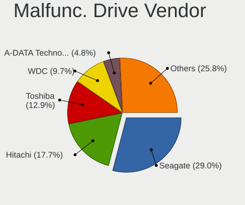

| Vendor              | Notebooks | Drives | Percent |
|---------------------|-----------|--------|---------|
| Seagate             | 18        | 19     | 29.03%  |
| Hitachi             | 11        | 12     | 17.74%  |
| Toshiba             | 8         | 10     | 12.9%   |
| WDC                 | 6         | 6      | 9.68%   |
| A-DATA Technology   | 3         | 3      | 4.84%   |
| SK hynix            | 2         | 2      | 3.23%   |
| Samsung Electronics | 2         | 2      | 3.23%   |
| KingSpec            | 2         | 2      | 3.23%   |
| Intel               | 2         | 2      | 3.23%   |
| HGST                | 2         | 3      | 3.23%   |
| China               | 2         | 2      | 3.23%   |
| T-FORCE             | 1         | 1      | 1.61%   |
| SPCC                | 1         | 1      | 1.61%   |
| Phison              | 1         | 1      | 1.61%   |
| Fujitsu             | 1         | 2      | 1.61%   |

Malfunc. HDD Vendor
-------------------

Vendors of faulty HDD drives

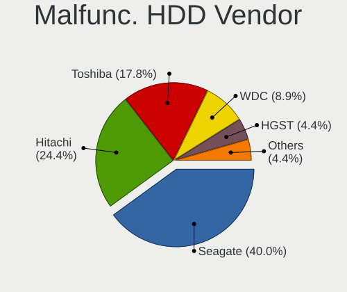

| Vendor              | Notebooks | Drives | Percent |
|---------------------|-----------|--------|---------|
| Seagate             | 18        | 19     | 40%     |
| Hitachi             | 11        | 12     | 24.44%  |
| Toshiba             | 8         | 10     | 17.78%  |
| WDC                 | 4         | 4      | 8.89%   |
| HGST                | 2         | 3      | 4.44%   |
| Samsung Electronics | 1         | 1      | 2.22%   |
| Fujitsu             | 1         | 2      | 2.22%   |

Malfunc. Drive Kind
-------------------

Kinds of faulty drives

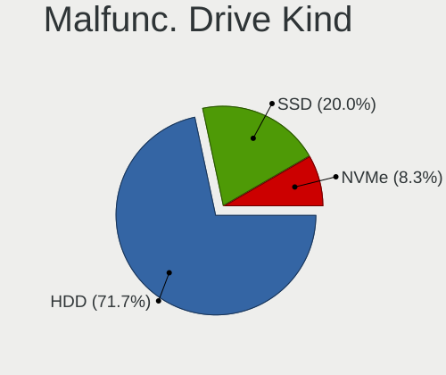

| Kind | Notebooks | Drives | Percent |
|------|-----------|--------|---------|
| HDD  | 43        | 51     | 71.67%  |
| SSD  | 12        | 12     | 20%     |
| NVMe | 5         | 5      | 8.33%   |

Failed Drives
-------------

Failed drive models

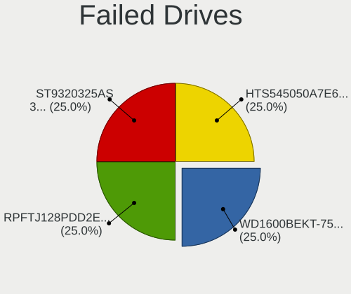

| Model                                         | Notebooks | Drives | Percent |
|-----------------------------------------------|-----------|--------|---------|
| WDC WD1600BEKT-75PVMT0 160GB                  | 1         | 1      | 25%     |
| Union Memory (Shenzhen) RPFTJ128PDD2EWX 128GB | 1         | 1      | 25%     |
| Seagate ST9320325AS 320GB                     | 1         | 1      | 25%     |
| HGST HTS545050A7E680 500GB                    | 1         | 1      | 25%     |

Failed Drive Vendor
-------------------

Failed drive vendors

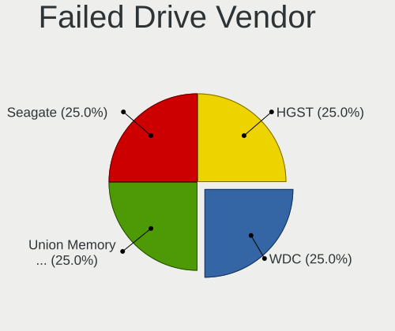

| Vendor                  | Notebooks | Drives | Percent |
|-------------------------|-----------|--------|---------|
| WDC                     | 1         | 1      | 25%     |
| Union Memory (Shenzhen) | 1         | 1      | 25%     |
| Seagate                 | 1         | 1      | 25%     |
| HGST                    | 1         | 1      | 25%     |

Drive Status
------------

Number of failed and malfunc. drives

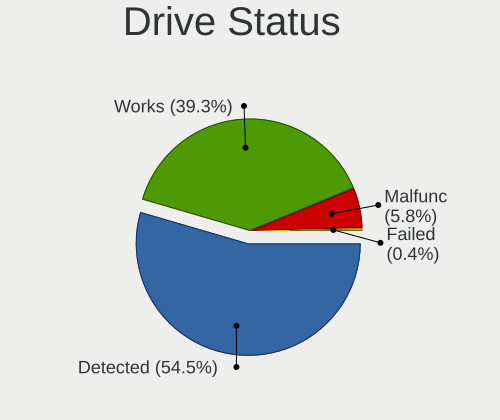

| Status   | Notebooks | Drives | Percent |
|----------|-----------|--------|---------|
| Detected | 543       | 915    | 54.52%  |
| Works    | 391       | 563    | 39.26%  |
| Malfunc  | 58        | 68     | 5.82%   |
| Failed   | 4         | 4      | 0.4%    |

Storage controller
------------------

Storage Vendor
--------------

Storage controller vendors

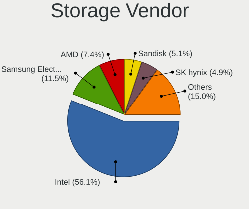

| Vendor                           | Notebooks | Percent |
|----------------------------------|-----------|---------|
| Intel                            | 641       | 56.08%  |
| Samsung Electronics              | 131       | 11.46%  |
| AMD                              | 85        | 7.44%   |
| Sandisk                          | 58        | 5.07%   |
| SK hynix                         | 56        | 4.9%    |
| Micron Technology                | 38        | 3.32%   |
| Kingston Technology Company      | 38        | 3.32%   |
| KIOXIA                           | 20        | 1.75%   |
| Toshiba America Info Systems     | 14        | 1.22%   |
| Phison Electronics               | 14        | 1.22%   |
| Realtek Semiconductor            | 8         | 0.7%    |
| Micron/Crucial Technology        | 6         | 0.52%   |
| Silicon Motion                   | 5         | 0.44%   |
| Union Memory (Shenzhen)          | 4         | 0.35%   |
| Solidigm                         | 3         | 0.26%   |
| Marvell Technology Group         | 3         | 0.26%   |
| Lenovo                           | 3         | 0.26%   |
| ADATA Technology                 | 3         | 0.26%   |
| Transcend                        | 2         | 0.17%   |
| Solid State Storage Technology   | 2         | 0.17%   |
| Shenzhen Longsys Electronics     | 2         | 0.17%   |
| Nvidia                           | 2         | 0.17%   |
| Apple                            | 2         | 0.17%   |
| VIA Technologies                 | 1         | 0.09%   |
| Silicon Integrated Systems [SiS] | 1         | 0.09%   |
| O2 Micro                         | 1         | 0.09%   |

Storage Model
-------------

Storage controller models

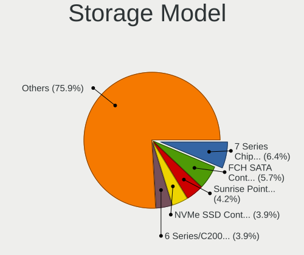

| Model                                                                            | Notebooks | Percent |
|----------------------------------------------------------------------------------|-----------|---------|
| Intel 7 Series Chipset Family 6-port SATA Controller [AHCI mode]                 | 78        | 6.35%   |
| AMD FCH SATA Controller [AHCI mode]                                              | 70        | 5.7%    |
| Intel Sunrise Point-LP SATA Controller [AHCI mode]                               | 52        | 4.23%   |
| Samsung NVMe SSD Controller SM981/PM981/PM983                                    | 48        | 3.91%   |
| Intel 6 Series/C200 Series Chipset Family 6 port Mobile SATA AHCI Controller     | 48        | 3.91%   |
| Intel 82801 Mobile SATA Controller [RAID mode]                                   | 44        | 3.58%   |
| Intel Volume Management Device NVMe RAID Controller                              | 42        | 3.42%   |
| Intel 82801IBM/IEM (ICH9M/ICH9M-E) 4 port SATA Controller [AHCI mode]            | 40        | 3.26%   |
| Intel 8 Series/C220 Series Chipset Family 6-port SATA Controller 1 [AHCI mode]   | 30        | 2.44%   |
| Intel Wildcat Point-LP SATA Controller [AHCI Mode]                               | 29        | 2.36%   |
| Samsung NVMe SSD Controller 980 (DRAM-less)                                      | 27        | 2.2%    |
| Intel Cannon Lake Mobile PCH SATA AHCI Controller                                | 26        | 2.12%   |
| Intel 8 Series SATA Controller 1 [AHCI mode]                                     | 26        | 2.12%   |
| Intel HM170/QM170 Chipset SATA Controller [AHCI Mode]                            | 23        | 1.87%   |
| Samsung NVMe SSD Controller PM9A1/PM9A3/980PRO                                   | 22        | 1.79%   |
| SK hynix Gold P31/BC711/PC711 NVMe Solid State Drive                             | 19        | 1.55%   |
| Intel Celeron/Pentium Silver Processor SATA Controller                           | 18        | 1.47%   |
| Intel 5 Series/3400 Series Chipset 4 port SATA AHCI Controller                   | 17        | 1.38%   |
| KIOXIA NVMe SSD Controller BG4 (DRAM-less)                                       | 16        | 1.3%    |
| Intel Tiger Lake-LP SATA Controller                                              | 15        | 1.22%   |
| Samsung NVMe SSD Controller PM9B1 (DRAM-less)                                    | 14        | 1.14%   |
| SanDisk Ultra 3D / WD PC SN530, IX SN530, Blue SN550 NVMe SSD (DRAM-less)        | 13        | 1.06%   |
| Intel Celeron N3350/Pentium N4200/Atom E3900 Series SATA AHCI Controller         | 13        | 1.06%   |
| Intel Alder Lake-P SATA AHCI Controller                                          | 13        | 1.06%   |
| Intel RST Volume Management Device Controller                                    | 12        | 0.98%   |
| Intel 82801HM/HEM (ICH8M/ICH8M-E) IDE Controller                                 | 12        | 0.98%   |
| Intel 5 Series/3400 Series Chipset 6 port SATA AHCI Controller                   | 12        | 0.98%   |
| Micron 2450 NVMe SSD [HendrixV] (DRAM-less)                                      | 11        | 0.9%    |
| Intel SSD 660P Series                                                            | 11        | 0.9%    |
| Intel 82801HM/HEM (ICH8M/ICH8M-E) SATA Controller [AHCI mode]                    | 11        | 0.9%    |
| SanDisk Extreme Pro / WD Black SN750 / PC SN730 / Red SN700 NVMe SSD             | 10        | 0.81%   |
| Intel SSD DC P4101/Pro 7600p/760p/E 6100p Series                                 | 10        | 0.81%   |
| SanDisk WD SN560/SN740/SN770/SN5000 NVMe SSD                                     | 9         | 0.73%   |
| Intel Atom/Celeron/Pentium Processor x5-E8000/J3xxx/N3xxx Series SATA Controller | 9         | 0.73%   |
| AMD SB7x0/SB8x0/SB9x0 SATA Controller [AHCI mode]                                | 9         | 0.73%   |
| SK hynix BC901 NVMe Solid State Drive (DRAM-less)                                | 8         | 0.65%   |
| Micron 2400 NVMe SSD (DRAM-less)                                                 | 8         | 0.65%   |
| SK hynix Platinum P41/PC801 NVMe Solid State Drive                               | 7         | 0.57%   |
| Phison PS5013-E13 PCIe3 NVMe Controller (DRAM-less)                              | 7         | 0.57%   |
| Kingston Company NV2 NVMe SSD [SM2267XT] (DRAM-less)                             | 7         | 0.57%   |

Storage Kind
------------

Kind of storage controller (IDE, SATA, NVMe, SAS, ...)

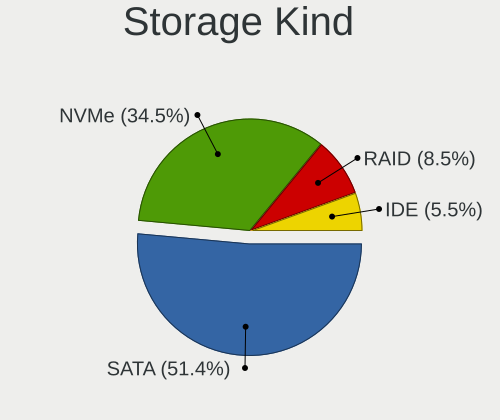

| Kind | Notebooks | Percent |
|------|-----------|---------|
| SATA | 604       | 51.45%  |
| NVMe | 405       | 34.5%   |
| RAID | 100       | 8.52%   |
| IDE  | 65        | 5.54%   |

Processor
---------

CPU Vendor
----------

Processor vendors

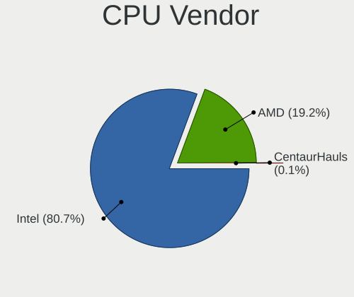

| Vendor       | Notebooks | Percent |
|--------------|-----------|---------|
| Intel        | 759       | 80.66%  |
| AMD          | 181       | 19.23%  |
| CentaurHauls | 1         | 0.11%   |

CPU Model
---------

Processor models

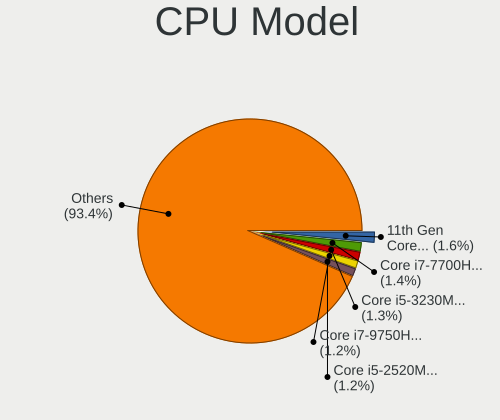

| Model                                    | Notebooks | Percent |
|------------------------------------------|-----------|---------|
| Intel 11th Gen Core i5-1135G7 @ 2.40GHz  | 15        | 1.59%   |
| Intel Core i7-7700HQ CPU @ 2.80GHz       | 13        | 1.38%   |
| Intel Core i5-3230M CPU @ 2.60GHz        | 12        | 1.28%   |
| Intel Core i7-9750H CPU @ 2.60GHz        | 11        | 1.17%   |
| Intel Core i5-2520M CPU @ 2.50GHz        | 11        | 1.17%   |
| AMD Ryzen 7 5700U with Radeon Graphics   | 11        | 1.17%   |
| Intel Core i7-8750H CPU @ 2.20GHz        | 10        | 1.06%   |
| Intel Core i7-6700HQ CPU @ 2.60GHz       | 10        | 1.06%   |
| Intel Core i7-10510U CPU @ 1.80GHz       | 10        | 1.06%   |
| Intel Core i5-8265U CPU @ 1.60GHz        | 10        | 1.06%   |
| Intel Core i5-6300U CPU @ 2.40GHz        | 10        | 1.06%   |
| Intel Core i5-5200U CPU @ 2.20GHz        | 9         | 0.96%   |
| Intel 11th Gen Core i7-1165G7 @ 2.80GHz  | 9         | 0.96%   |
| Intel Pentium CPU N4200 @ 1.10GHz        | 8         | 0.85%   |
| Intel Core i7-8550U CPU @ 1.80GHz        | 8         | 0.85%   |
| Intel Core i7-2670QM CPU @ 2.20GHz       | 8         | 0.85%   |
| Intel Core i5-8250U CPU @ 1.60GHz        | 8         | 0.85%   |
| Intel Core i5-3210M CPU @ 2.50GHz        | 8         | 0.85%   |
| Intel Core i7-8565U CPU @ 1.80GHz        | 7         | 0.74%   |
| Intel Core i7-10750H CPU @ 2.60GHz       | 7         | 0.74%   |
| Intel Core i5-6200U CPU @ 2.30GHz        | 7         | 0.74%   |
| Intel Core i5-4300U CPU @ 1.90GHz        | 7         | 0.74%   |
| Intel Core i5-2410M CPU @ 2.30GHz        | 7         | 0.74%   |
| Intel Core i5 CPU M 520 @ 2.40GHz        | 7         | 0.74%   |
| Intel 12th Gen Core i7-12700H            | 7         | 0.74%   |
| AMD Ryzen 7 4800H with Radeon Graphics   | 7         | 0.74%   |
| AMD Ryzen 5 5500U with Radeon Graphics   | 7         | 0.74%   |
| AMD Ryzen 3 3250U with Radeon Graphics   | 7         | 0.74%   |
| Intel Pentium Silver N5000 CPU @ 1.10GHz | 6         | 0.64%   |
| Intel Core i7-3630QM CPU @ 2.40GHz       | 6         | 0.64%   |
| Intel Core i5-2450M CPU @ 2.50GHz        | 6         | 0.64%   |
| Intel Core i3-5005U CPU @ 2.00GHz        | 6         | 0.64%   |
| Intel Core i3 CPU M 370 @ 2.40GHz        | 6         | 0.64%   |
| Intel Core 2 Duo CPU P8600 @ 2.40GHz     | 6         | 0.64%   |
| Intel Celeron N4000 CPU @ 1.10GHz        | 6         | 0.64%   |
| Intel 13th Gen Core i7-13620H            | 6         | 0.64%   |
| Intel 12th Gen Core i5-1235U             | 6         | 0.64%   |
| Intel 11th Gen Core i7-11800H @ 2.30GHz  | 6         | 0.64%   |
| AMD Ryzen 7 5800H with Radeon Graphics   | 6         | 0.64%   |
| AMD Ryzen 5 7530U with Radeon Graphics   | 6         | 0.64%   |

CPU Model Family
----------------

Processor model prefix

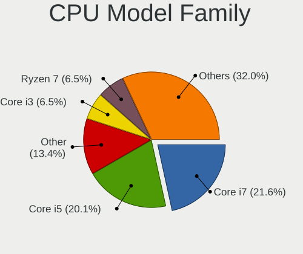

| Model                   | Notebooks | Percent |
|-------------------------|-----------|---------|
| Intel Core i7           | 203       | 21.57%  |
| Intel Core i5           | 189       | 20.09%  |
| Other                   | 126       | 13.39%  |
| Intel Core i3           | 61        | 6.48%   |
| AMD Ryzen 7             | 61        | 6.48%   |
| Intel Core 2 Duo        | 46        | 4.89%   |
| Intel Celeron           | 41        | 4.36%   |
| AMD Ryzen 5             | 41        | 4.36%   |
| Intel Pentium           | 35        | 3.72%   |
| Intel Atom              | 15        | 1.59%   |
| AMD Ryzen 3             | 15        | 1.59%   |
| AMD Ryzen 7 PRO         | 13        | 1.38%   |
| Intel Pentium Silver    | 10        | 1.06%   |
| Intel Pentium Dual-Core | 8         | 0.85%   |
| Intel Pentium Dual      | 8         | 0.85%   |
| Intel Core 2            | 6         | 0.64%   |
| AMD Ryzen 5 PRO         | 6         | 0.64%   |
| AMD A6                  | 5         | 0.53%   |
| AMD Ryzen 9             | 4         | 0.43%   |
| AMD E1                  | 4         | 0.43%   |
| AMD E                   | 4         | 0.43%   |
| Intel Genuine           | 3         | 0.32%   |
| Intel Core i9           | 3         | 0.32%   |
| Intel Core              | 3         | 0.32%   |
| AMD A10                 | 3         | 0.32%   |
| Intel Xeon              | 2         | 0.21%   |
| Intel Pentium M         | 2         | 0.21%   |
| Intel Celeron Dual-Core | 2         | 0.21%   |
| AMD Turion 64 X2 Mobile | 2         | 0.21%   |
| AMD A8                  | 2         | 0.21%   |
| Intel Mobile Pentium 4  | 1         | 0.11%   |
| Intel Core m3           | 1         | 0.11%   |
| Intel Core M            | 1         | 0.11%   |
| Intel Core Duo          | 1         | 0.11%   |
| Intel Core 2 Solo       | 1         | 0.11%   |
| Intel Celeron M         | 1         | 0.11%   |
| CentaurHauls VIA Nano   | 1         | 0.11%   |
| AMD V120                | 1         | 0.11%   |
| AMD Turion II           | 1         | 0.11%   |
| AMD Turion 64 Mobile    | 1         | 0.11%   |

CPU Cores
---------

Number of processor cores

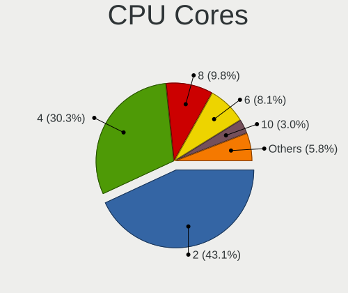

| Number  | Notebooks | Percent |
|---------|-----------|---------|
| 2       | 406       | 43.1%   |
| 4       | 285       | 30.25%  |
| 8       | 92        | 9.77%   |
| 6       | 76        | 8.07%   |
| 10      | 28        | 2.97%   |
| 1       | 19        | 2.02%   |
| 14      | 16        | 1.7%    |
| 12      | 12        | 1.27%   |
| 16      | 4         | 0.42%   |
| 24      | 2         | 0.21%   |
| 3       | 1         | 0.11%   |
| Unknown | 1         | 0.11%   |

CPU Sockets
-----------

Number of sockets

| Number | Notebooks | Percent |
|--------|-----------|---------|
| 1      | 941       | 100%    |

CPU Threads
-----------

Threads per core (Hyper-Threading)

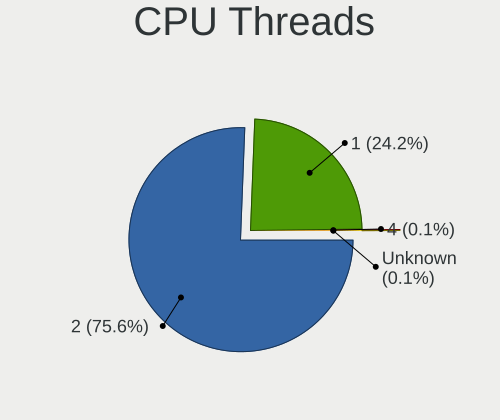

| Number  | Notebooks | Percent |
|---------|-----------|---------|
| 2       | 713       | 75.61%  |
| 1       | 228       | 24.18%  |
| 4       | 1         | 0.11%   |
| Unknown | 1         | 0.11%   |

CPU Op-Modes
------------

CPU Operation Modes (32-bit, 64-bit)

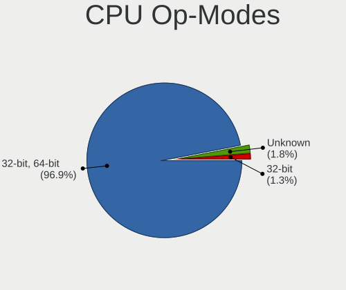

| Op mode        | Notebooks | Percent |
|----------------|-----------|---------|
| 32-bit, 64-bit | 917       | 96.93%  |
| Unknown        | 17        | 1.8%    |
| 32-bit         | 12        | 1.27%   |

CPU Microcode
-------------

Microcode number

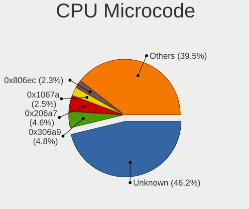

| Number     | Notebooks | Percent |
|------------|-----------|---------|
| Unknown    | 459       | 46.22%  |
| 0x306a9    | 48        | 4.83%   |
| 0x206a7    | 46        | 4.63%   |
| 0x1067a    | 25        | 2.52%   |
| 0x806ec    | 23        | 2.32%   |
| 0x306d4    | 23        | 2.32%   |
| 0x306c3    | 21        | 2.11%   |
| 0x40651    | 19        | 1.91%   |
| 0x906ea    | 17        | 1.71%   |
| 0x806c1    | 17        | 1.71%   |
| 0x406e3    | 17        | 1.71%   |
| 0x20655    | 17        | 1.71%   |
| 0x806ea    | 15        | 1.51%   |
| 0x6fd      | 14        | 1.41%   |
| 0x906e9    | 12        | 1.21%   |
| 0x0a50000c | 11        | 1.11%   |
| 0x08608103 | 11        | 1.11%   |
| 0x806e9    | 10        | 1.01%   |
| 0x706a1    | 10        | 1.01%   |
| 0x506e3    | 10        | 1.01%   |
| 0x506c9    | 10        | 1.01%   |
| 0x10676    | 10        | 1.01%   |
| 0x0a50000d | 9         | 0.91%   |
| 0x08108109 | 9         | 0.91%   |
| 0xa0652    | 7         | 0.7%    |
| 0x08108102 | 7         | 0.7%    |
| 0x806eb    | 6         | 0.6%    |
| 0x406c3    | 6         | 0.6%    |
| 0x08600106 | 6         | 0.6%    |
| 0x906a4    | 5         | 0.5%    |
| 0x906a3    | 5         | 0.5%    |
| 0x706e5    | 5         | 0.5%    |
| 0x106c2    | 5         | 0.5%    |
| 0x0a404102 | 5         | 0.5%    |
| 0x08600104 | 5         | 0.5%    |
| 0x6f6      | 4         | 0.4%    |
| 0x106e5    | 4         | 0.4%    |
| 0x906ed    | 3         | 0.3%    |
| 0x806d1    | 3         | 0.3%    |
| 0x0a704103 | 3         | 0.3%    |

CPU Microarch
-------------

Microarchitecture

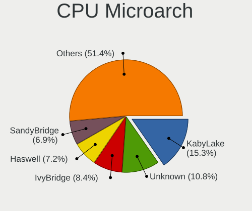

| Name              | Notebooks | Percent |
|-------------------|-----------|---------|
| KabyLake          | 145       | 15.34%  |
| Unknown           | 102       | 10.79%  |
| IvyBridge         | 79        | 8.36%   |
| Haswell           | 68        | 7.2%    |
| SandyBridge       | 65        | 6.88%   |
| Penryn            | 45        | 4.76%   |
| Skylake           | 44        | 4.66%   |
| Alderlake Hybrid  | 42        | 4.44%   |
| TigerLake         | 39        | 4.13%   |
| Zen 3             | 36        | 3.81%   |
| Broadwell         | 33        | 3.49%   |
| Westmere          | 31        | 3.28%   |
| Core              | 29        | 3.07%   |
| Zen+              | 23        | 2.43%   |
| Zen 2             | 23        | 2.43%   |
| Silvermont        | 23        | 2.43%   |
| Goldmont plus     | 18        | 1.9%    |
| CometLake         | 15        | 1.59%   |
| Goldmont          | 14        | 1.48%   |
| Icelake           | 13        | 1.38%   |
| Bonnell           | 7         | 0.74%   |
| Excavator         | 6         | 0.63%   |
| Bobcat            | 6         | 0.63%   |
| P6                | 5         | 0.53%   |
| Nehalem           | 5         | 0.53%   |
| K10               | 4         | 0.42%   |
| Jaguar            | 4         | 0.42%   |
| Zen               | 3         | 0.32%   |
| Tremont           | 3         | 0.32%   |
| K8 Hammer         | 3         | 0.32%   |
| Steamroller       | 2         | 0.21%   |
| Puma              | 2         | 0.21%   |
| Piledriver        | 2         | 0.21%   |
| Gracemont         | 2         | 0.21%   |
| NetBurst          | 1         | 0.11%   |
| Meteorlake Hybrid | 1         | 0.11%   |
| K8 & K10 hybrid   | 1         | 0.11%   |
| K10 Llano         | 1         | 0.11%   |

Graphics
--------

GPU Vendor
----------

Vendors of graphics cards

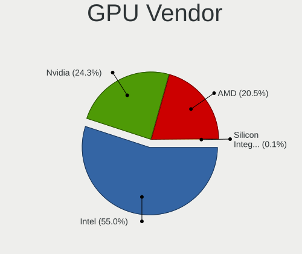

| Vendor                           | Notebooks | Percent |
|----------------------------------|-----------|---------|
| Intel                            | 690       | 55.02%  |
| Nvidia                           | 305       | 24.32%  |
| AMD                              | 257       | 20.49%  |
| VIA Technologies                 | 1         | 0.08%   |
| Silicon Integrated Systems [SiS] | 1         | 0.08%   |

GPU Model
---------

Graphics card models

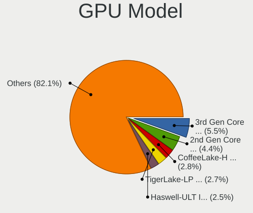

| Model                                                                                    | Notebooks | Percent |
|------------------------------------------------------------------------------------------|-----------|---------|
| Intel 3rd Gen Core processor Graphics Controller                                         | 71        | 5.52%   |
| Intel 2nd Generation Core Processor Family Integrated Graphics Controller                | 56        | 4.35%   |
| Intel CoffeeLake-H GT2 [UHD Graphics 630]                                                | 36        | 2.8%    |
| Intel TigerLake-LP GT2 [Iris Xe Graphics]                                                | 35        | 2.72%   |
| Intel Haswell-ULT Integrated Graphics Controller                                         | 32        | 2.49%   |
| Intel 4th Gen Core Processor Integrated Graphics Controller                              | 32        | 2.49%   |
| Intel Mobile 4 Series Chipset Integrated Graphics Controller                             | 30        | 2.33%   |
| Intel Broadwell-U GT2 [HD Graphics 5500]                                                 | 29        | 2.26%   |
| Intel Skylake-U GT2 [HD Graphics 520]                                                    | 28        | 2.18%   |
| Intel WhiskeyLake-U GT2 [UHD Graphics 620]                                               | 24        | 1.87%   |
| Intel Kaby Lake-R GT2 [UHD Graphics 620]                                                 | 24        | 1.87%   |
| AMD Renoir [Radeon Vega Series / Radeon Vega Mobile Series]                              | 23        | 1.79%   |
| AMD Picasso/Raven 2 [Radeon Vega Series / Radeon Vega Mobile Series]                     | 23        | 1.79%   |
| Intel Core Processor Integrated Graphics Controller                                      | 22        | 1.71%   |
| Intel Kaby Lake-H GT2 [HD Graphics 630]                                                  | 20        | 1.56%   |
| AMD Lucienne                                                                             | 20        | 1.56%   |
| AMD Cezanne [Radeon Vega Series / Radeon Vega Mobile Series]                             | 18        | 1.4%    |
| Nvidia GA106M [GeForce RTX 3060 Mobile / Max-Q]                                          | 16        | 1.24%   |
| Intel CometLake-U GT2 [UHD Graphics]                                                     | 16        | 1.24%   |
| AMD Barcelo                                                                              | 16        | 1.24%   |
| Nvidia TU117M [GeForce GTX 1650 Mobile / Max-Q]                                          | 15        | 1.17%   |
| Intel Raptor Lake-P [Iris Xe Graphics]                                                   | 15        | 1.17%   |
| Intel Kaby Lake-U GT2 [HD Graphics 620]                                                  | 15        | 1.17%   |
| Intel Atom/Celeron/Pentium Processor x5-E8000/J3xxx/N3xxx Integrated Graphics Controller | 14        | 1.09%   |
| Intel TigerLake-H GT1 [UHD Graphics]                                                     | 13        | 1.01%   |
| Intel CometLake-H GT2 [UHD Graphics]                                                     | 13        | 1.01%   |
| Intel Alder Lake-P GT2 [Iris Xe Graphics]                                                | 13        | 1.01%   |
| AMD Rembrandt [Radeon 680M]                                                              | 13        | 1.01%   |
| Nvidia GP107M [GeForce GTX 1050 Mobile]                                                  | 12        | 0.93%   |
| Intel Skylake-H GT2 [HD Graphics 530]                                                    | 12        | 0.93%   |
| Intel Mobile GM965/GL960 Integrated Graphics Controller (secondary)                      | 12        | 0.93%   |
| Intel Mobile GM965/GL960 Integrated Graphics Controller (primary)                        | 12        | 0.93%   |
| Nvidia GP106M [GeForce GTX 1060 Mobile]                                                  | 11        | 0.86%   |
| Intel GeminiLake [UHD Graphics 600]                                                      | 11        | 0.86%   |
| Intel Alder Lake-UP3 GT2 [Iris Xe Graphics]                                              | 10        | 0.78%   |
| Intel Mobile 945GM/GMS/GME, 943/940GML Express Integrated Graphics Controller            | 9         | 0.7%    |
| Intel Atom Processor Z36xxx/Z37xxx Series Graphics & Display                             | 9         | 0.7%    |
| Nvidia TU117M [GeForce GTX 1650 Ti Mobile]                                               | 8         | 0.62%   |
| Nvidia GP107M [GeForce GTX 1050 Ti Mobile]                                               | 8         | 0.62%   |
| Nvidia GM108M [GeForce 840M]                                                             | 8         | 0.62%   |

GPU Combo
---------

Combinations of graphics cards

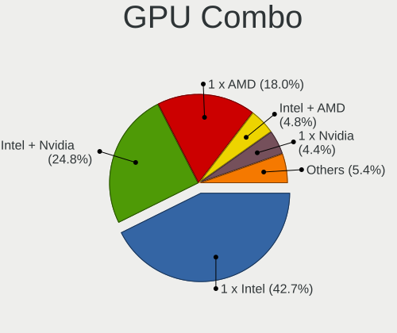

| Name           | Notebooks | Percent |
|----------------|-----------|---------|
| 1 x Intel      | 404       | 42.66%  |
| Intel + Nvidia | 235       | 24.82%  |
| 1 x AMD        | 170       | 17.95%  |
| Intel + AMD    | 45        | 4.75%   |
| 1 x Nvidia     | 42        | 4.44%   |
| AMD + Nvidia   | 31        | 3.27%   |
| 2 x AMD        | 11        | 1.16%   |
| 2 x Intel      | 6         | 0.63%   |
| Other          | 1         | 0.11%   |
| 1 x VIA        | 1         | 0.11%   |
| 1 x SiS        | 1         | 0.11%   |

GPU Driver
----------

Free vs proprietary

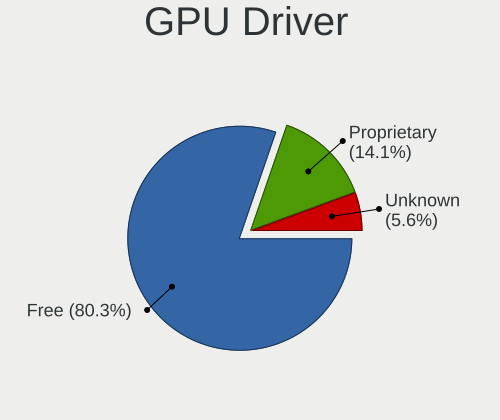

| Driver      | Notebooks | Percent |
|-------------|-----------|---------|
| Free        | 773       | 80.27%  |
| Proprietary | 136       | 14.12%  |
| Unknown     | 54        | 5.61%   |

GPU Memory
----------

Total video memory

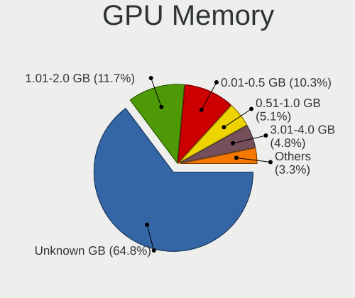

| Size in GB | Notebooks | Percent |
|------------|-----------|---------|
| Unknown    | 633       | 64.79%  |
| 1.01-2.0   | 114       | 11.67%  |
| 0.01-0.5   | 101       | 10.34%  |
| 0.51-1.0   | 50        | 5.12%   |
| 3.01-4.0   | 47        | 4.81%   |
| 5.01-6.0   | 17        | 1.74%   |
| 7.01-8.0   | 10        | 1.02%   |
| 8.01-16.0  | 3         | 0.31%   |
| 2.01-3.0   | 2         | 0.2%    |

Monitor
-------

Monitor Vendor
--------------

Monitor vendors

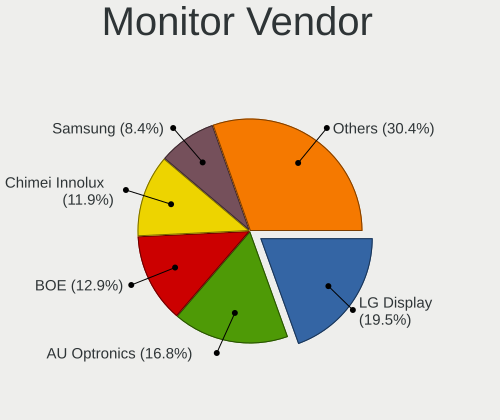

| Vendor                  | Notebooks | Percent |
|-------------------------|-----------|---------|
| LG Display              | 208       | 19.51%  |
| AU Optronics            | 179       | 16.79%  |
| BOE                     | 138       | 12.95%  |
| Chimei Innolux          | 127       | 11.91%  |
| Samsung Electronics     | 90        | 8.44%   |
| Dell                    | 46        | 4.32%   |
| Lenovo                  | 35        | 3.28%   |
| Chi Mei Optoelectronics | 27        | 2.53%   |
| Philips                 | 21        | 1.97%   |
| PANDA                   | 17        | 1.59%   |
| Goldstar                | 17        | 1.59%   |
| LG Philips              | 14        | 1.31%   |
| Hewlett-Packard         | 14        | 1.31%   |
| Apple                   | 14        | 1.31%   |
| Sharp                   | 13        | 1.22%   |
| BenQ                    | 9         | 0.84%   |
| Acer                    | 9         | 0.84%   |
| CSO                     | 8         | 0.75%   |
| AOC                     | 7         | 0.66%   |
| Sony                    | 6         | 0.56%   |
| Vestel Elektronik       | 5         | 0.47%   |
| CSW                     | 5         | 0.47%   |
| CPT                     | 5         | 0.47%   |
| Valve                   | 4         | 0.38%   |
| InfoVision              | 4         | 0.38%   |
| Ancor Communications    | 4         | 0.38%   |
| Toshiba                 | 3         | 0.28%   |
| TMX                     | 3         | 0.28%   |
| MSI                     | 3         | 0.28%   |
| Panasonic               | 2         | 0.19%   |
| InnoLux Display         | 2         | 0.19%   |
| Iiyama                  | 2         | 0.19%   |
| HannStar                | 2         | 0.19%   |
| CSOT                    | 2         | 0.19%   |
| BOE Technology Group    | 2         | 0.19%   |
| ASUSTek Computer        | 2         | 0.19%   |
| ASRock                  | 2         | 0.19%   |
| ViewSonic               | 1         | 0.09%   |
| Seiko/Epson             | 1         | 0.09%   |
| NEC Computers           | 1         | 0.09%   |

Monitor Model
-------------

Monitor models

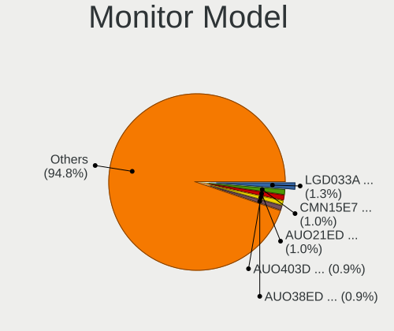

| Model                                                                    | Notebooks | Percent |
|--------------------------------------------------------------------------|-----------|---------|
| LG Display LCD Monitor LGD033A 1366x768 344x194mm 15.5-inch              | 14        | 1.3%    |
| Chimei Innolux LCD Monitor CMN15E7 1920x1080 344x193mm 15.5-inch         | 11        | 1.02%   |
| AU Optronics LCD Monitor AUO21ED 1920x1080 344x193mm 15.5-inch           | 11        | 1.02%   |
| AU Optronics LCD Monitor AUO403D 1920x1080 309x174mm 14.0-inch           | 10        | 0.93%   |
| AU Optronics LCD Monitor AUO38ED 1920x1080 344x193mm 15.5-inch           | 10        | 0.93%   |
| Chimei Innolux LCD Monitor CMN15F5 1920x1080 344x193mm 15.5-inch         | 8         | 0.74%   |
| Chi Mei Optoelectronics LCD Monitor CMO15A7 1366x768 344x193mm 15.5-inch | 8         | 0.74%   |
| PANDA LCD Monitor NCP004D 1920x1080 344x194mm 15.5-inch                  | 7         | 0.65%   |
| AU Optronics LCD Monitor AUO106C 1366x768 276x155mm 12.5-inch            | 7         | 0.65%   |
| Chimei Innolux LCD Monitor CMN1521 1920x1080 344x193mm 15.5-inch         | 6         | 0.56%   |
| Chimei Innolux LCD Monitor CMN14D4 1920x1080 309x173mm 13.9-inch         | 6         | 0.56%   |
| AU Optronics LCD Monitor AUO22EC 1366x768 344x193mm 15.5-inch            | 6         | 0.56%   |
| Vestel Elektronik 40UHD_LCD_TV VES3700 3840x2160 880x500mm 39.8-inch     | 5         | 0.47%   |
| LG Display LCD Monitor LGD053F 1920x1080 344x194mm 15.5-inch             | 5         | 0.47%   |
| LG Display LCD Monitor LGD046F 1920x1080 344x194mm 15.5-inch             | 5         | 0.47%   |
| LG Display LCD Monitor LGD02DC 1366x768 344x194mm 15.5-inch              | 5         | 0.47%   |
| LG Display LCD Monitor LGD02D8 1366x768 277x156mm 12.5-inch              | 5         | 0.47%   |
| AU Optronics LCD Monitor AUO70EC 1366x768 344x193mm 15.5-inch            | 5         | 0.47%   |
| Valve ANX7530 U VLV3001 800x1280 100x150mm 7.1-inch                      | 4         | 0.37%   |
| Samsung Electronics LCD Monitor SEC5441 1280x800 331x207mm 15.4-inch     | 4         | 0.37%   |
| Samsung Electronics LCD Monitor SDC4161 1920x1080 344x194mm 15.5-inch    | 4         | 0.37%   |
| LG Display LP156WH2-TLE1 LGDCF01 1366x768 344x194mm 15.5-inch            | 4         | 0.37%   |
| LG Display LCD Monitor LGD0608 1920x1080 309x174mm 14.0-inch             | 4         | 0.37%   |
| Lenovo LCD Monitor LEN40B2 1920x1080 344x193mm 15.5-inch                 | 4         | 0.37%   |
| Chimei Innolux LCD Monitor CMN1618 1920x1200 344x215mm 16.0-inch         | 4         | 0.37%   |
| Chimei Innolux LCD Monitor CMN15E8 1920x1080 344x193mm 15.5-inch         | 4         | 0.37%   |
| Chimei Innolux LCD Monitor CMN14B1 1920x1080 308x173mm 13.9-inch         | 4         | 0.37%   |
| Chimei Innolux LCD Monitor CMN14A3 1600x900 309x174mm 14.0-inch          | 4         | 0.37%   |
| BOE LCD Monitor BOE0B38 2560x1600 344x215mm 16.0-inch                    | 4         | 0.37%   |
| BOE LCD Monitor BOE08E2 1920x1080 344x194mm 15.5-inch                    | 4         | 0.37%   |
| BOE LCD Monitor BOE084E 1920x1080 382x215mm 17.3-inch                    | 4         | 0.37%   |
| BOE LCD Monitor BOE0802 1920x1080 344x193mm 15.5-inch                    | 4         | 0.37%   |
| BOE LCD Monitor BOE06A4 1366x768 344x194mm 15.5-inch                     | 4         | 0.37%   |
| AU Optronics LCD Monitor AUOAF90 1920x1080 344x193mm 15.5-inch           | 4         | 0.37%   |
| AU Optronics LCD Monitor AUO35ED 1920x1080 344x193mm 15.5-inch           | 4         | 0.37%   |
| AU Optronics LCD Monitor AUO243D 1920x1080 309x173mm 13.9-inch           | 4         | 0.37%   |
| AU Optronics LCD Monitor AUO21EC 1366x768 344x193mm 15.5-inch            | 4         | 0.37%   |
| Samsung Electronics LCD Monitor SEC3741 1280x800 331x207mm 15.4-inch     | 3         | 0.28%   |
| Samsung Electronics LCD Monitor SEC325A 1366x768 344x194mm 15.5-inch     | 3         | 0.28%   |
| Samsung Electronics LCD Monitor SEC3047 1366x768 277x156mm 12.5-inch     | 3         | 0.28%   |

Monitor Resolution
------------------

Monitor screen resolution

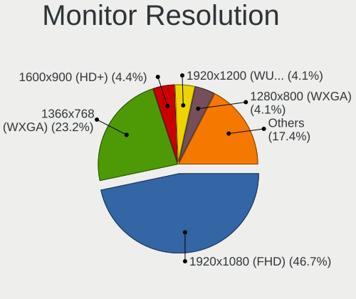

| Resolution         | Notebooks | Percent |
|--------------------|-----------|---------|
| 1920x1080 (FHD)    | 466       | 46.69%  |
| 1366x768 (WXGA)    | 232       | 23.25%  |
| 1600x900 (HD+)     | 44        | 4.41%   |
| 1920x1200 (WUXGA)  | 41        | 4.11%   |
| 1280x800 (WXGA)    | 41        | 4.11%   |
| 3840x2160 (4K)     | 31        | 3.11%   |
| 2560x1600          | 28        | 2.81%   |
| 2560x1440 (QHD)    | 26        | 2.61%   |
| 1680x1050 (WSXGA+) | 15        | 1.5%    |
| 1440x900 (WXGA+)   | 10        | 1%      |
| 1280x1024 (SXGA)   | 9         | 0.9%    |
| 2880x1800          | 7         | 0.7%    |
| 1024x600           | 6         | 0.6%    |
| 800x1280           | 5         | 0.5%    |
| 3840x2400          | 4         | 0.4%    |
| 3440x1440          | 4         | 0.4%    |
| 2560x1080          | 4         | 0.4%    |
| 2880x1920          | 3         | 0.3%    |
| Unknown            | 3         | 0.3%    |
| 3840x1080          | 2         | 0.2%    |
| 3072x1920          | 2         | 0.2%    |
| 2880x1620          | 2         | 0.2%    |
| 800x480            | 1         | 0.1%    |
| 3456x2160          | 1         | 0.1%    |
| 3200x2000          | 1         | 0.1%    |
| 3200x1800 (QHD+)   | 1         | 0.1%    |
| 3000x2000          | 1         | 0.1%    |
| 2256x1504          | 1         | 0.1%    |
| 2160x1440          | 1         | 0.1%    |
| 2048x1152          | 1         | 0.1%    |
| 1920x515           | 1         | 0.1%    |
| 1600x1200          | 1         | 0.1%    |
| 1280x960           | 1         | 0.1%    |
| 1280x720 (HD)      | 1         | 0.1%    |
| 1024x768 (XGA)     | 1         | 0.1%    |

Monitor Diagonal
----------------

Diagonal size in inches

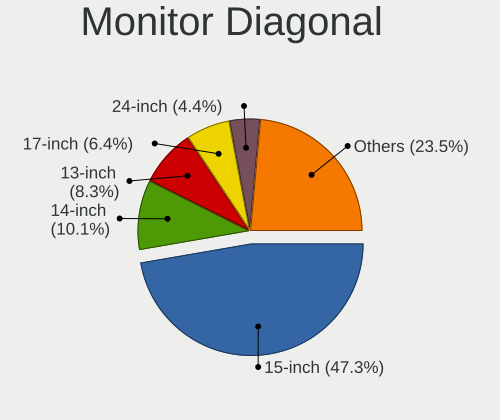

| Inches  | Notebooks | Percent |
|---------|-----------|---------|
| 15      | 504       | 47.28%  |
| 14      | 108       | 10.13%  |
| 13      | 88        | 8.26%   |
| 17      | 68        | 6.38%   |
| 24      | 47        | 4.41%   |
| 16      | 38        | 3.56%   |
| 12      | 38        | 3.56%   |
| 27      | 28        | 2.63%   |
| 23      | 25        | 2.35%   |
| 21      | 24        | 2.25%   |
| 31      | 8         | 0.75%   |
| 18      | 8         | 0.75%   |
| 11      | 8         | 0.75%   |
| Unknown | 8         | 0.75%   |
| 84      | 7         | 0.66%   |
| 19      | 7         | 0.66%   |
| 34      | 6         | 0.56%   |
| 22      | 6         | 0.56%   |
| 10      | 6         | 0.56%   |
| 54      | 5         | 0.47%   |
| 72      | 4         | 0.38%   |
| 20      | 4         | 0.38%   |
| 7       | 4         | 0.38%   |
| 65      | 3         | 0.28%   |
| 32      | 3         | 0.28%   |
| 40      | 2         | 0.19%   |
| 33      | 2         | 0.19%   |
| 28      | 2         | 0.19%   |
| 63      | 1         | 0.09%   |
| 35      | 1         | 0.09%   |
| 25      | 1         | 0.09%   |
| 8       | 1         | 0.09%   |
| 3       | 1         | 0.09%   |

Monitor Width
-------------

Physical width

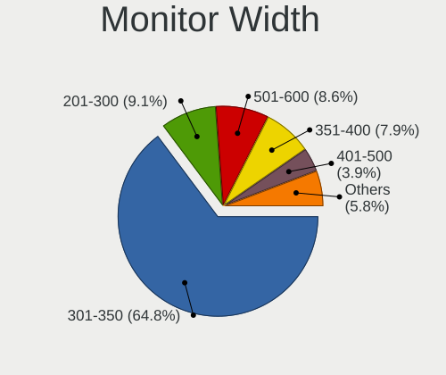

| Width in mm | Notebooks | Percent |
|-------------|-----------|---------|
| 301-350     | 686       | 64.78%  |
| 201-300     | 96        | 9.07%   |
| 501-600     | 91        | 8.59%   |
| 351-400     | 84        | 7.93%   |
| 401-500     | 41        | 3.87%   |
| 601-700     | 13        | 1.23%   |
| 701-800     | 11        | 1.04%   |
| 1501-2000   | 11        | 1.04%   |
| 1001-1500   | 9         | 0.85%   |
| Unknown     | 8         | 0.76%   |
| 1-100       | 5         | 0.47%   |
| 801-900     | 3         | 0.28%   |
| 101-200     | 1         | 0.09%   |

Aspect Ratio
------------

Proportional relationship between the width and the height

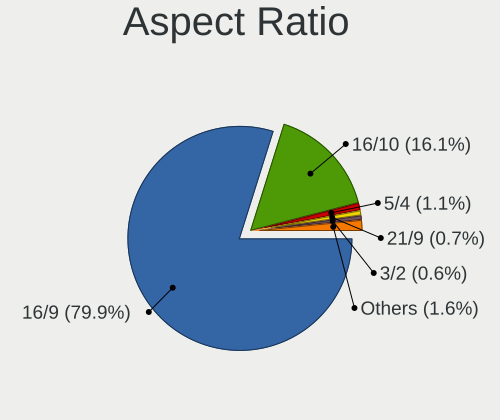

| Ratio   | Notebooks | Percent |
|---------|-----------|---------|
| 16/9    | 753       | 79.85%  |
| 16/10   | 152       | 16.12%  |
| 5/4     | 10        | 1.06%   |
| 21/9    | 7         | 0.74%   |
| 3/2     | 6         | 0.64%   |
| Unknown | 5         | 0.53%   |
| 0.67    | 4         | 0.42%   |
| 4/3     | 2         | 0.21%   |
| 6/5     | 1         | 0.11%   |
| 32/9    | 1         | 0.11%   |
| 3.73    | 1         | 0.11%   |
| 1.00    | 1         | 0.11%   |

Monitor Area
------------

Area in inch²

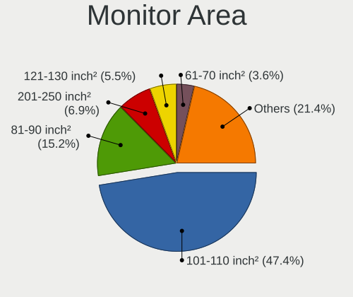

| Area in inch² | Notebooks | Percent |
|----------------|-----------|---------|
| 101-110        | 501       | 47.44%  |
| 81-90          | 160       | 15.15%  |
| 201-250        | 73        | 6.91%   |
| 121-130        | 58        | 5.49%   |
| 61-70          | 38        | 3.6%    |
| 111-120        | 37        | 3.5%    |
| 71-80          | 33        | 3.13%   |
| 301-350        | 28        | 2.65%   |
| 351-500        | 21        | 1.99%   |
| 151-200        | 21        | 1.99%   |
| More than 1000 | 18        | 1.7%    |
| 251-300        | 16        | 1.52%   |
| 131-140        | 10        | 0.95%   |
| 141-150        | 9         | 0.85%   |
| 51-60          | 8         | 0.76%   |
| Unknown        | 8         | 0.76%   |
| 41-50          | 6         | 0.57%   |
| 1-40           | 6         | 0.57%   |
| 91-100         | 3         | 0.28%   |
| 501-1000       | 2         | 0.19%   |

Pixel Density
-------------

Pixels per inch

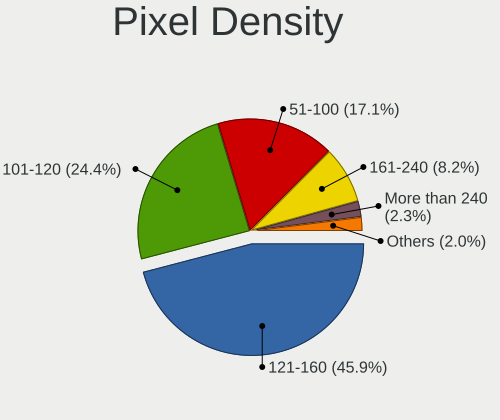

| Density       | Notebooks | Percent |
|---------------|-----------|---------|
| 121-160       | 479       | 45.93%  |
| 101-120       | 255       | 24.45%  |
| 51-100        | 178       | 17.07%  |
| 161-240       | 86        | 8.25%   |
| More than 240 | 24        | 2.3%    |
| 1-50          | 13        | 1.25%   |
| Unknown       | 8         | 0.77%   |

Multiple Monitors
-----------------

Total monitors connected

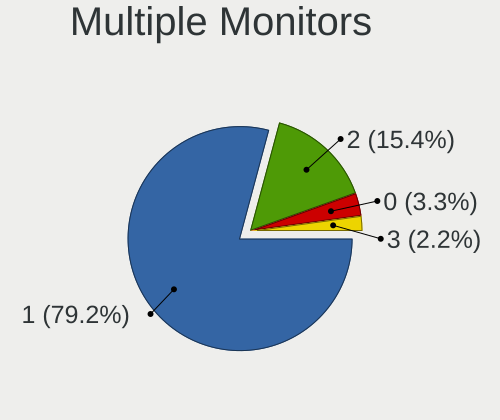

| Total | Notebooks | Percent |
|-------|-----------|---------|
| 1     | 768       | 79.18%  |
| 2     | 149       | 15.36%  |
| 0     | 32        | 3.3%    |
| 3     | 21        | 2.16%   |

Network
-------

Net Controller Vendor
---------------------

Controller vendors

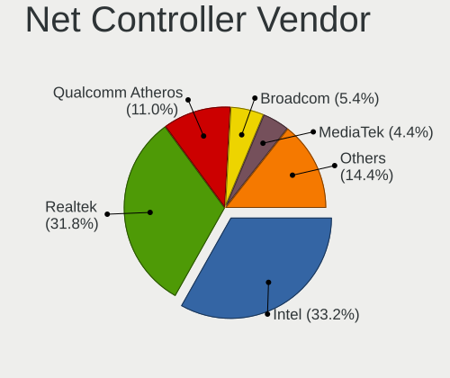

| Vendor                                 | Notebooks | Percent |
|----------------------------------------|-----------|---------|
| Intel                                  | 517       | 33.16%  |
| Realtek Semiconductor                  | 495       | 31.75%  |
| Qualcomm Atheros                       | 171       | 10.97%  |
| Broadcom                               | 84        | 5.39%   |
| MediaTek                               | 68        | 4.36%   |
| Broadcom Limited                       | 31        | 1.99%   |
| TP-Link                                | 24        | 1.54%   |
| Ralink                                 | 24        | 1.54%   |
| Ericsson Business Mobile Networks      | 16        | 1.03%   |
| Sierra Wireless                        | 14        | 0.9%    |
| Marvell Technology Group               | 13        | 0.83%   |
| Dell                                   | 11        | 0.71%   |
| Shenzhen Goodix Technology             | 9         | 0.58%   |
| Ralink Technology                      | 7         | 0.45%   |
| ASIX Electronics                       | 7         | 0.45%   |
| Lenovo                                 | 6         | 0.38%   |
| Qualcomm Atheros Communications        | 5         | 0.32%   |
| Hewlett-Packard                        | 5         | 0.32%   |
| DisplayLink                            | 5         | 0.32%   |
| Qualcomm                               | 4         | 0.26%   |
| Motorola PCS                           | 4         | 0.26%   |
| Huawei Technologies                    | 4         | 0.26%   |
| Xiaomi                                 | 3         | 0.19%   |
| Suzhou Motorcomm Electronic Technology | 3         | 0.19%   |
| D-Link                                 | 3         | 0.19%   |
| AMD                                    | 3         | 0.19%   |
| Toshiba                                | 2         | 0.13%   |
| Samsung Electronics                    | 2         | 0.13%   |
| OPPO Electronics                       | 2         | 0.13%   |
| Google                                 | 2         | 0.13%   |
| Davicom Semiconductor                  | 2         | 0.13%   |
| ASUSTek Computer                       | 2         | 0.13%   |
| Quectel Wireless Solutions             | 1         | 0.06%   |
| Qualcomm Technologies                  | 1         | 0.06%   |
| Nvidia                                 | 1         | 0.06%   |
| NetGear                                | 1         | 0.06%   |
| Microsoft                              | 1         | 0.06%   |
| Micro Star International               | 1         | 0.06%   |
| JMicron Technology                     | 1         | 0.06%   |
| ICS Advent                             | 1         | 0.06%   |

Net Controller Model
--------------------

Controller models

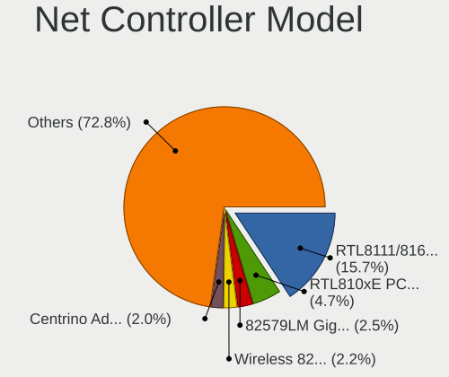

| Model                                                                  | Notebooks | Percent |
|------------------------------------------------------------------------|-----------|---------|
| Realtek RTL8111/8168/8211/8411 PCI Express Gigabit Ethernet Controller | 294       | 15.72%  |
| Realtek RTL810xE PCI Express Fast Ethernet controller                  | 88        | 4.71%   |
| Intel 82579LM Gigabit Network Connection (Lewisville)                  | 47        | 2.51%   |
| Intel Wireless 8265 / 8275                                             | 42        | 2.25%   |
| Intel Centrino Advanced-N 6205 [Taylor Peak]                           | 38        | 2.03%   |
| Realtek RTL8822CE 802.11ac PCIe Wireless Network Adapter               | 36        | 1.93%   |
| Qualcomm Atheros QCA9377 802.11ac Wireless Network Adapter             | 35        | 1.87%   |
| Realtek RTL8153 Gigabit Ethernet Adapter                               | 34        | 1.82%   |
| Intel Alder Lake-P PCH CNVi WiFi                                       | 31        | 1.66%   |
| Qualcomm Atheros QCA9565 / AR9565 Wireless Network Adapter             | 29        | 1.55%   |
| Intel Wi-Fi 6 AX201                                                    | 29        | 1.55%   |
| Intel Wireless 7260                                                    | 27        | 1.44%   |
| MediaTek MT7921 802.11ax PCIe Wireless Network Adapter [Filogic 330]   | 26        | 1.39%   |
| Intel Wireless 7265                                                    | 26        | 1.39%   |
| Qualcomm Atheros AR9285 Wireless Network Adapter (PCI-Express)         | 24        | 1.28%   |
| Intel Wi-Fi 6 AX200                                                    | 24        | 1.28%   |
| Intel Wireless 8260                                                    | 22        | 1.18%   |
| Intel Cannon Lake PCH CNVi WiFi                                        | 22        | 1.18%   |
| Realtek RTL8821CE 802.11ac PCIe Wireless Network Adapter               | 19        | 1.02%   |
| MediaTek MT7922 802.11ax PCI Express Wireless Network Adapter          | 19        | 1.02%   |
| Qualcomm Atheros QCA6174 802.11ac Wireless Network Adapter             | 16        | 0.86%   |
| Intel Wireless 3160                                                    | 16        | 0.86%   |
| Intel Comet Lake PCH-LP CNVi WiFi                                      | 16        | 0.86%   |
| Broadcom BCM43142 802.11b/g/n                                          | 16        | 0.86%   |
| Realtek RTL8723BE PCIe Wireless Network Adapter                        | 15        | 0.8%    |
| MediaTek MT7902 802.11ax PCIe Wireless Network Adapter [Filogic 310]   | 15        | 0.8%    |
| Intel Ethernet Connection (4) I219-LM                                  | 15        | 0.8%    |
| Intel Comet Lake PCH CNVi WiFi                                         | 15        | 0.8%    |
| Qualcomm Atheros AR9485 Wireless Network Adapter                       | 14        | 0.75%   |
| Intel Cannon Point-LP CNVi [Wireless-AC]                               | 14        | 0.75%   |
| Intel WiFi Link 5100                                                   | 13        | 0.7%    |
| Intel Centrino Ultimate-N 6300                                         | 13        | 0.7%    |
| Intel 82567LM Gigabit Network Connection                               | 13        | 0.7%    |
| Broadcom BCM4313 802.11bgn Wireless Network Adapter                    | 13        | 0.7%    |
| Realtek RTL8822BE 802.11a/b/g/n/ac WiFi adapter                        | 12        | 0.64%   |
| Ralink RT3290 Wireless 802.11n 1T/1R PCIe                              | 12        | 0.64%   |
| Qualcomm Atheros QCA8172 Fast Ethernet                                 | 12        | 0.64%   |
| Intel Raptor Lake PCH CNVi WiFi                                        | 12        | 0.64%   |
| Intel Ethernet Connection I218-LM                                      | 12        | 0.64%   |
| Intel Ethernet Connection (3) I218-LM                                  | 12        | 0.64%   |

Wireless Vendor
---------------

Wireless vendors

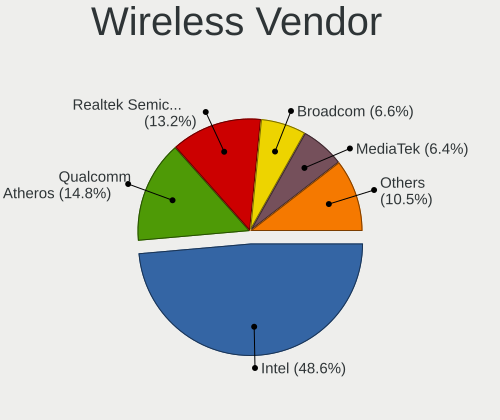

| Vendor                          | Notebooks | Percent |
|---------------------------------|-----------|---------|
| Intel                           | 473       | 48.61%  |
| Qualcomm Atheros                | 144       | 14.8%   |
| Realtek Semiconductor           | 128       | 13.16%  |
| Broadcom                        | 64        | 6.58%   |
| MediaTek                        | 62        | 6.37%   |
| Ralink                          | 24        | 2.47%   |
| TP-Link                         | 19        | 1.95%   |
| Sierra Wireless                 | 14        | 1.44%   |
| Broadcom Limited                | 13        | 1.34%   |
| Ralink Technology               | 7         | 0.72%   |
| Dell                            | 7         | 0.72%   |
| Qualcomm Atheros Communications | 5         | 0.51%   |
| Qualcomm                        | 4         | 0.41%   |
| Quectel Wireless Solutions      | 1         | 0.1%    |
| Qualcomm Technologies           | 1         | 0.1%    |
| NetGear                         | 1         | 0.1%    |
| Microsoft                       | 1         | 0.1%    |
| Micro Star International        | 1         | 0.1%    |
| Hewlett-Packard                 | 1         | 0.1%    |
| Fibocom                         | 1         | 0.1%    |
| D-Link                          | 1         | 0.1%    |
| ASUSTek Computer                | 1         | 0.1%    |

Wireless Model
--------------

Wireless models

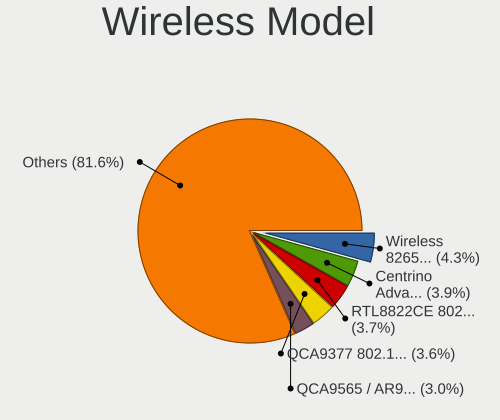

| Model                                                                | Notebooks | Percent |
|----------------------------------------------------------------------|-----------|---------|
| Intel Wireless 8265 / 8275                                           | 42        | 4.29%   |
| Intel Centrino Advanced-N 6205 [Taylor Peak]                         | 38        | 3.88%   |
| Realtek RTL8822CE 802.11ac PCIe Wireless Network Adapter             | 36        | 3.68%   |
| Qualcomm Atheros QCA9377 802.11ac Wireless Network Adapter           | 35        | 3.58%   |
| Qualcomm Atheros QCA9565 / AR9565 Wireless Network Adapter           | 29        | 2.96%   |
| Intel Wi-Fi 6 AX201                                                  | 29        | 2.96%   |
| Intel Wireless 7260                                                  | 27        | 2.76%   |
| MediaTek MT7921 802.11ax PCIe Wireless Network Adapter [Filogic 330] | 26        | 2.66%   |
| Intel Wireless 7265                                                  | 26        | 2.66%   |
| Qualcomm Atheros AR9285 Wireless Network Adapter (PCI-Express)       | 24        | 2.45%   |
| Intel Wi-Fi 6 AX200                                                  | 24        | 2.45%   |
| Intel Wireless 8260                                                  | 22        | 2.25%   |
| Intel Cannon Lake PCH CNVi WiFi                                      | 22        | 2.25%   |
| Realtek RTL8821CE 802.11ac PCIe Wireless Network Adapter             | 19        | 1.94%   |
| Qualcomm Atheros QCA6174 802.11ac Wireless Network Adapter           | 16        | 1.63%   |
| Intel Wireless 3160                                                  | 16        | 1.63%   |
| Intel Comet Lake PCH-LP CNVi WiFi                                    | 16        | 1.63%   |
| Broadcom BCM43142 802.11b/g/n                                        | 16        | 1.63%   |
| Realtek RTL8723BE PCIe Wireless Network Adapter                      | 15        | 1.53%   |
| MediaTek MT7902 802.11ax PCIe Wireless Network Adapter [Filogic 310] | 15        | 1.53%   |
| Intel Comet Lake PCH CNVi WiFi                                       | 15        | 1.53%   |
| Qualcomm Atheros AR9485 Wireless Network Adapter                     | 14        | 1.43%   |
| MediaTek MT7922 802.11ax PCI Express Wireless Network Adapter        | 14        | 1.43%   |
| Intel Cannon Point-LP CNVi [Wireless-AC]                             | 14        | 1.43%   |
| Intel Alder Lake-P PCH CNVi WiFi                                     | 14        | 1.43%   |
| Intel WiFi Link 5100                                                 | 13        | 1.33%   |
| Intel Centrino Ultimate-N 6300                                       | 13        | 1.33%   |
| Broadcom BCM4313 802.11bgn Wireless Network Adapter                  | 13        | 1.33%   |
| Realtek RTL8822BE 802.11a/b/g/n/ac WiFi adapter                      | 12        | 1.23%   |
| Ralink RT3290 Wireless 802.11n 1T/1R PCIe                            | 12        | 1.23%   |
| Intel Raptor Lake PCH CNVi WiFi                                      | 12        | 1.23%   |
| Intel Tiger Lake PCH CNVi WiFi                                       | 11        | 1.12%   |
| Intel PRO/Wireless 5100 AGN [Shiloh] Network Connection              | 11        | 1.12%   |
| Intel PRO/Wireless 3945ABG [Golan] Network Connection                | 11        | 1.12%   |
| Intel Wi-Fi 6E(802.11ax) AX210/AX1675* 2x2 [Typhoon Peak]            | 10        | 1.02%   |
| Intel Wi-Fi 5(802.11ac) Wireless-AC 9x6x [Thunder Peak]              | 10        | 1.02%   |
| TP-Link TL-WN722N v2/v3 [Realtek RTL8188EUS]                         | 9         | 0.92%   |
| Realtek RTL8852BE PCIe 802.11ax Wireless Network Controller          | 9         | 0.92%   |
| Intel Dual Band Wireless-AC 3165 Plus Bluetooth                      | 9         | 0.92%   |
| Broadcom BCM4312 802.11b/g LP-PHY                                    | 9         | 0.92%   |

Ethernet Vendor
---------------

Ethernet vendors

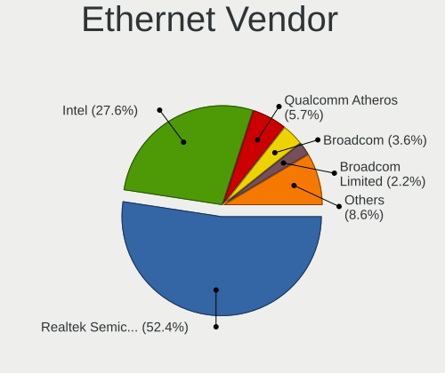

| Vendor                                 | Notebooks | Percent |
|----------------------------------------|-----------|---------|
| Realtek Semiconductor                  | 435       | 52.41%  |
| Intel                                  | 229       | 27.59%  |
| Qualcomm Atheros                       | 47        | 5.66%   |
| Broadcom                               | 30        | 3.61%   |
| Broadcom Limited                       | 18        | 2.17%   |
| Marvell Technology Group               | 13        | 1.57%   |
| MediaTek                               | 7         | 0.84%   |
| ASIX Electronics                       | 7         | 0.84%   |
| TP-Link                                | 5         | 0.6%    |
| Lenovo                                 | 5         | 0.6%    |
| DisplayLink                            | 5         | 0.6%    |
| Motorola PCS                           | 4         | 0.48%   |
| Xiaomi                                 | 3         | 0.36%   |
| Suzhou Motorcomm Electronic Technology | 3         | 0.36%   |
| Huawei Technologies                    | 3         | 0.36%   |
| Samsung Electronics                    | 2         | 0.24%   |
| OPPO Electronics                       | 2         | 0.24%   |
| Google                                 | 2         | 0.24%   |
| Davicom Semiconductor                  | 2         | 0.24%   |
| D-Link                                 | 2         | 0.24%   |
| Nvidia                                 | 1         | 0.12%   |
| JMicron Technology                     | 1         | 0.12%   |
| ICS Advent                             | 1         | 0.12%   |
| Attansic Technology                    | 1         | 0.12%   |
| ASUSTek Computer                       | 1         | 0.12%   |
| Apple                                  | 1         | 0.12%   |

Ethernet Model
--------------

Ethernet models

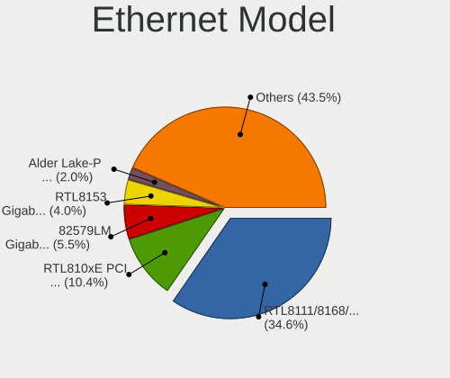

| Model                                                                  | Notebooks | Percent |
|------------------------------------------------------------------------|-----------|---------|
| Realtek RTL8111/8168/8211/8411 PCI Express Gigabit Ethernet Controller | 294       | 34.63%  |
| Realtek RTL810xE PCI Express Fast Ethernet controller                  | 88        | 10.37%  |
| Intel 82579LM Gigabit Network Connection (Lewisville)                  | 47        | 5.54%   |
| Realtek RTL8153 Gigabit Ethernet Adapter                               | 34        | 4%      |
| Intel Alder Lake-P PCH CNVi WiFi                                       | 17        | 2%      |
| Intel Ethernet Connection (4) I219-LM                                  | 15        | 1.77%   |
| Intel 82567LM Gigabit Network Connection                               | 13        | 1.53%   |
| Qualcomm Atheros QCA8172 Fast Ethernet                                 | 12        | 1.41%   |
| Intel Ethernet Connection I218-LM                                      | 12        | 1.41%   |
| Intel Ethernet Connection (3) I218-LM                                  | 12        | 1.41%   |
| Realtek Killer E2600 GbE Controller                                    | 11        | 1.3%    |
| Intel Ethernet Connection I219-LM                                      | 11        | 1.3%    |
| Intel Ethernet Connection I217-LM                                      | 11        | 1.3%    |
| Intel 82577LM Gigabit Network Connection                               | 11        | 1.3%    |
| Realtek RTL8125 2.5GbE Controller                                      | 8         | 0.94%   |
| Intel Ethernet Connection (6) I219-V                                   | 8         | 0.94%   |
| Broadcom Limited NetLink BCM57780 Gigabit Ethernet PCIe                | 8         | 0.94%   |
| Intel Ethernet Connection I219-V                                       | 7         | 0.82%   |
| ASIX AX88179 Gigabit Ethernet                                          | 7         | 0.82%   |
| Qualcomm Atheros AR8151 v2.0 Gigabit Ethernet                          | 6         | 0.71%   |
| Intel Ethernet Connection (4) I219-V                                   | 6         | 0.71%   |
| Intel Ethernet Connection (16) I219-V                                  | 6         | 0.71%   |
| Intel 82579V Gigabit Network Connection                                | 6         | 0.71%   |
| TP-Link UE300 10/100/1000 LAN (ethernet mode) [Realtek RTL8153]        | 5         | 0.59%   |
| Qualcomm Atheros AR8161 Gigabit Ethernet                               | 5         | 0.59%   |
| MediaTek MT7922 802.11ax PCI Express Wireless Network Adapter          | 5         | 0.59%   |
| Broadcom NetLink BCM5784M Gigabit Ethernet PCIe                        | 5         | 0.59%   |
| Broadcom NetLink BCM57785 Gigabit Ethernet PCIe                        | 5         | 0.59%   |
| Qualcomm Atheros AR8152 v2.0 Fast Ethernet                             | 4         | 0.47%   |
| Qualcomm Atheros AR8152 v1.1 Fast Ethernet                             | 4         | 0.47%   |
| Intel Ethernet Connection (7) I219-LM                                  | 4         | 0.47%   |
| Intel Ethernet Connection (6) I219-LM                                  | 4         | 0.47%   |
| Intel Ethernet Connection (5) I219-LM                                  | 4         | 0.47%   |
| Intel Ethernet Connection (10) I219-V                                  | 4         | 0.47%   |
| Broadcom NetXtreme BCM5764M Gigabit Ethernet PCIe                      | 4         | 0.47%   |
| Xiaomi Mi/Redmi series (RNDIS)                                         | 3         | 0.35%   |
| Suzhou Motorcomm Electronic YT6801 Gigabit Ethernet Controller         | 3         | 0.35%   |
| Realtek RTL8152 Fast Ethernet Adapter                                  | 3         | 0.35%   |
| Realtek RTL-8100/8101L/8139 PCI Fast Ethernet Adapter                  | 3         | 0.35%   |
| Realtek Killer E3000 2.5GbE Controller                                 | 3         | 0.35%   |

Net Controller Kind
-------------------

Ethernet, WiFi or modem

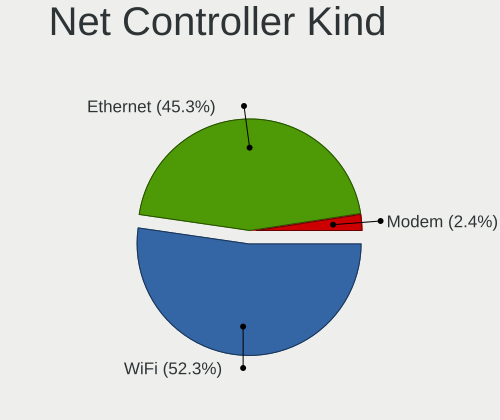

| Kind     | Notebooks | Percent |
|----------|-----------|---------|
| WiFi     | 904       | 52.28%  |
| Ethernet | 783       | 45.29%  |
| Modem    | 42        | 2.43%   |

Used Controller
---------------

Currently used network controller

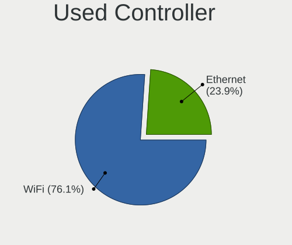

| Kind     | Notebooks | Percent |
|----------|-----------|---------|
| WiFi     | 766       | 76.07%  |
| Ethernet | 241       | 23.93%  |

NICs
----

Total network controllers on board

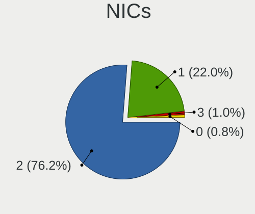

| Total | Notebooks | Percent |
|-------|-----------|---------|
| 2     | 718       | 76.22%  |
| 1     | 207       | 21.97%  |
| 3     | 9         | 0.96%   |
| 0     | 8         | 0.85%   |

IPv6
----

IPv6 vs IPv4

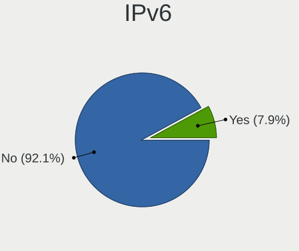

| Used | Notebooks | Percent |
|------|-----------|---------|
| No   | 883       | 92.08%  |
| Yes  | 76        | 7.92%   |

Bluetooth
---------

Bluetooth Vendor
----------------

Controller vendors

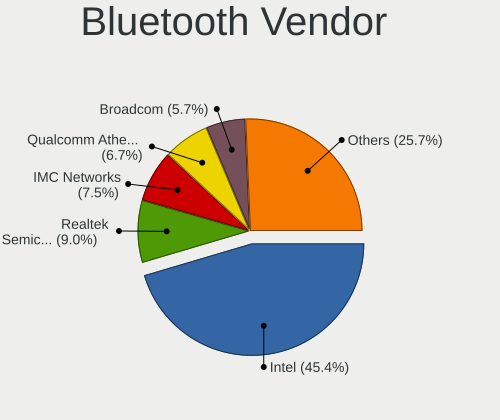

| Vendor                          | Notebooks | Percent |
|---------------------------------|-----------|---------|
| Intel                           | 352       | 45.42%  |
| Realtek Semiconductor           | 70        | 9.03%   |
| IMC Networks                    | 58        | 7.48%   |
| Qualcomm Atheros Communications | 52        | 6.71%   |
| Broadcom                        | 44        | 5.68%   |
| Foxconn / Hon Hai               | 42        | 5.42%   |
| Lite-On Technology              | 34        | 4.39%   |
| Hewlett-Packard                 | 19        | 2.45%   |
| Toshiba                         | 18        | 2.32%   |
| Dell                            | 18        | 2.32%   |
| Apple                           | 13        | 1.68%   |
| Ralink                          | 12        | 1.55%   |
| Cambridge Silicon Radio         | 12        | 1.55%   |
| MediaTek                        | 8         | 1.03%   |
| Foxconn International           | 6         | 0.77%   |
| ASUSTek Computer                | 4         | 0.52%   |
| USI                             | 2         | 0.26%   |
| TP-Link                         | 2         | 0.26%   |
| Realtek                         | 2         | 0.26%   |
| Ralink Technology               | 2         | 0.26%   |
| Quectel Wireless Solutions      | 1         | 0.13%   |
| Integrated System Solution      | 1         | 0.13%   |
| Belkin Components               | 1         | 0.13%   |
| Alps Electric                   | 1         | 0.13%   |
| Actions                         | 1         | 0.13%   |

Bluetooth Model
---------------

Controller models

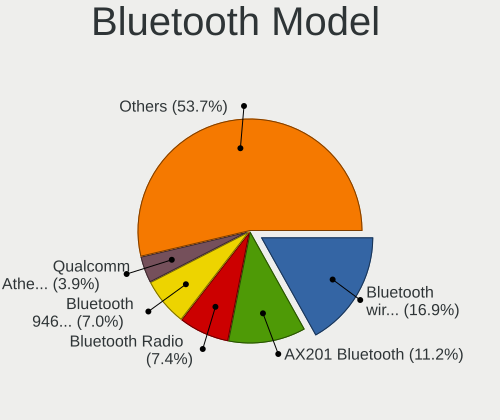

| Model                                               | Notebooks | Percent |
|-----------------------------------------------------|-----------|---------|
| Intel Bluetooth wireless interface                  | 131       | 16.9%   |
| Intel AX201 Bluetooth                               | 87        | 11.23%  |
| Realtek Bluetooth Radio                             | 57        | 7.35%   |
| Intel Bluetooth 9460/9560 Jefferson Peak (JfP)      | 54        | 6.97%   |
| Qualcomm Atheros  Bluetooth Device                  | 30        | 3.87%   |
| IMC Networks Wireless_Device                        | 29        | 3.74%   |
| Intel Bluetooth Device                              | 21        | 2.71%   |
| Intel AX200 Bluetooth                               | 21        | 2.71%   |
| IMC Networks Bluetooth Radio                        | 19        | 2.45%   |
| Foxconn / Hon Hai Wireless_Device                   | 13        | 1.68%   |
| Ralink RT3290 Bluetooth                             | 12        | 1.55%   |
| Cambridge Silicon Radio Bluetooth Dongle (HCI mode) | 12        | 1.55%   |
| HP Bluetooth 2.0 Interface [Broadcom BCM2045]       | 11        | 1.42%   |
| Broadcom BCM20702 Bluetooth 4.0 [ThinkPad]          | 11        | 1.42%   |
| Lite-On Qualcomm Atheros QCA9377 Bluetooth          | 10        | 1.29%   |
| Intel AX210 Bluetooth                               | 10        | 1.29%   |
| Foxconn / Hon Hai MediaTek Bluetooth Adapter        | 10        | 1.29%   |
| Qualcomm Atheros AR3011 Bluetooth                   | 9         | 1.16%   |
| Lite-On Bluetooth Device                            | 9         | 1.16%   |
| Intel Centrino Bluetooth Wireless Transceiver       | 9         | 1.16%   |
| IMC Networks Bluetooth Device                       | 9         | 1.16%   |
| Foxconn / Hon Hai Bluetooth Device                  | 9         | 1.16%   |
| Intel Wireless-AC 9260 Bluetooth Adapter            | 8         | 1.03%   |
| HP Broadcom 2070 Bluetooth Combo                    | 8         | 1.03%   |
| Apple Bluetooth Host Controller                     | 8         | 1.03%   |
| Toshiba Integrated Bluetooth HCI                    | 7         | 0.9%    |
| MediaTek Wireless_Device                            | 7         | 0.9%    |
| Lite-On Wireless_Device                             | 7         | 0.9%    |
| Intel Centrino Advanced-N 6230 Bluetooth adapter    | 7         | 0.9%    |
| Dell DW375 Bluetooth Module                         | 7         | 0.9%    |
| Broadcom BCM2045B (BDC-2.1)                         | 7         | 0.9%    |
| Foxconn International BCM43142A0 Bluetooth module   | 6         | 0.77%   |
| Lite-On Atheros AR3012 Bluetooth                    | 5         | 0.65%   |
| Toshiba RT Bluetooth Radio                          | 4         | 0.52%   |
| Realtek  Bluetooth 4.2 Adapter                      | 4         | 0.52%   |
| Qualcomm Atheros AR3012 Bluetooth 4.0               | 4         | 0.52%   |
| Intel Wireless-AC 3168 Bluetooth                    | 4         | 0.52%   |
| Dell BCM20702A0 Bluetooth Module                    | 4         | 0.52%   |
| Broadcom BCM43142A0 Bluetooth Device                | 4         | 0.52%   |
| Apple Bluetooth USB Host Controller                 | 4         | 0.52%   |

Sound
-----

Sound Vendor
------------

Sound card vendors

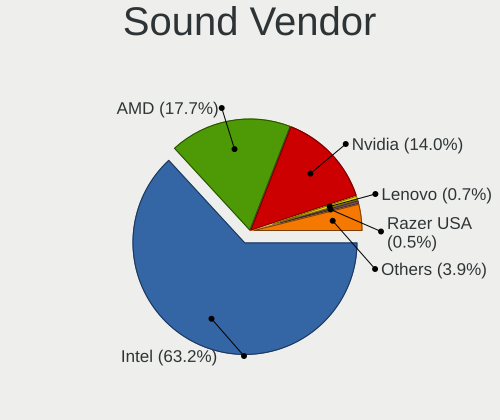

| Vendor                           | Notebooks | Percent |
|----------------------------------|-----------|---------|
| Intel                            | 744       | 63.16%  |
| AMD                              | 209       | 17.74%  |
| Nvidia                           | 165       | 14.01%  |
| Lenovo                           | 8         | 0.68%   |
| Razer USA                        | 6         | 0.51%   |
| C-Media Electronics              | 6         | 0.51%   |
| Logitech                         | 5         | 0.42%   |
| JMTek                            | 4         | 0.34%   |
| GN Netcom                        | 4         | 0.34%   |
| Realtek Semiconductor            | 3         | 0.25%   |
| Plantronics                      | 3         | 0.25%   |
| Creative Technology              | 3         | 0.25%   |
| Hewlett-Packard                  | 2         | 0.17%   |
| GYROCOM C&C                      | 2         | 0.17%   |
| Apple                            | 2         | 0.17%   |
| ZOOM                             | 1         | 0.08%   |
| VIA Technologies                 | 1         | 0.08%   |
| Trust                            | 1         | 0.08%   |
| Sony                             | 1         | 0.08%   |
| Silicon Integrated Systems [SiS] | 1         | 0.08%   |
| Roland                           | 1         | 0.08%   |
| No brand                         | 1         | 0.08%   |
| Native Instruments               | 1         | 0.08%   |
| Generalplus Technology           | 1         | 0.08%   |
| EGO SYStems                      | 1         | 0.08%   |
| ASUSTek Computer                 | 1         | 0.08%   |
| A4Tech                           | 1         | 0.08%   |

Sound Model
-----------

Sound card models

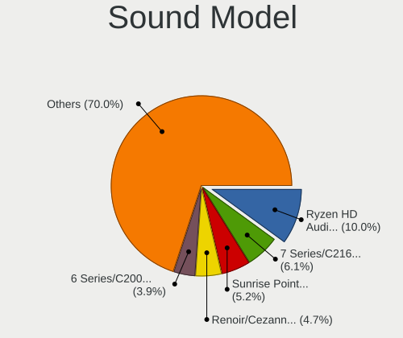

| Model                                                                      | Notebooks | Percent |
|----------------------------------------------------------------------------|-----------|---------|
| AMD Ryzen HD Audio Controller                                              | 144       | 10.03%  |
| Intel 7 Series/C216 Chipset Family High Definition Audio Controller        | 88        | 6.13%   |
| Intel Sunrise Point-LP HD Audio                                            | 75        | 5.22%   |
| AMD Renoir/Cezanne HDMI/DP Audio Controller                                | 68        | 4.74%   |
| Intel 6 Series/C200 Series Chipset Family High Definition Audio Controller | 56        | 3.9%    |
| Intel 82801I (ICH9 Family) HD Audio Controller                             | 49        | 3.41%   |
| AMD Radeon High Definition Audio Controller                                | 41        | 2.86%   |
| Intel Tiger Lake-LP Smart Sound Technology Audio Controller                | 39        | 2.72%   |
| Intel 5 Series/3400 Series Chipset High Definition Audio                   | 36        | 2.51%   |
| Intel Cannon Lake PCH cAVS                                                 | 35        | 2.44%   |
| Intel Alder Lake PCH-P High Definition Audio Controller                    | 35        | 2.44%   |
| Intel Haswell-ULT HD Audio Controller                                      | 34        | 2.37%   |
| Intel 8 Series/C220 Series Chipset High Definition Audio Controller        | 34        | 2.37%   |
| Intel 8 Series HD Audio Controller                                         | 34        | 2.37%   |
| Intel Xeon E3-1200 v3/4th Gen Core Processor HD Audio Controller           | 33        | 2.3%    |
| Intel Wildcat Point-LP High Definition Audio Controller                    | 33        | 2.3%    |
| Intel Broadwell-U Audio Controller                                         | 33        | 2.3%    |
| Intel Cannon Point-LP High Definition Audio Controller                     | 25        | 1.74%   |
| AMD Raven/Raven2/Fenghuang HDMI/DP Audio Controller                        | 25        | 1.74%   |
| Intel Raptor Lake-P/U/H cAVS                                               | 23        | 1.6%    |
| Intel CM238 HD Audio Controller                                            | 21        | 1.46%   |
| Nvidia GF108 High Definition Audio Controller                              | 19        | 1.32%   |
| Intel Celeron/Pentium Silver Processor High Definition Audio               | 18        | 1.25%   |
| Intel Comet Lake PCH-LP cAVS                                               | 17        | 1.18%   |
| Intel 82801H (ICH8 Family) HD Audio Controller                             | 17        | 1.18%   |
| Nvidia TU107 GeForce GTX 1650 High Definition Audio Controller             | 16        | 1.11%   |
| Nvidia GA106 High Definition Audio Controller                              | 16        | 1.11%   |
| Intel Comet Lake PCH cAVS                                                  | 15        | 1.04%   |
| Nvidia GA107 High Definition Audio Controller                              | 14        | 0.97%   |
| Intel NM10/ICH7 Family High Definition Audio Controller                    | 14        | 0.97%   |
| Intel Celeron N3350/Pentium N4200/Atom E3900 Series Audio Cluster          | 14        | 0.97%   |
| Intel 100 Series/C230 Series Chipset Family HD Audio Controller            | 14        | 0.97%   |
| Intel Tiger Lake-H HD Audio Controller                                     | 13        | 0.91%   |
| AMD SBx00 Azalia (Intel HDA)                                               | 12        | 0.84%   |
| AMD FCH Azalia Controller                                                  | 12        | 0.84%   |
| Nvidia GP107GL High Definition Audio Controller                            | 11        | 0.77%   |
| Nvidia TU106 High Definition Audio Controller                              | 10        | 0.7%    |
| Nvidia AD107 High Definition Audio Controller                              | 10        | 0.7%    |
| Nvidia GP106 High Definition Audio Controller                              | 9         | 0.63%   |
| Nvidia GK107 HDMI Audio Controller                                         | 9         | 0.63%   |

Memory
------

Memory Vendor
-------------

Memory module vendors

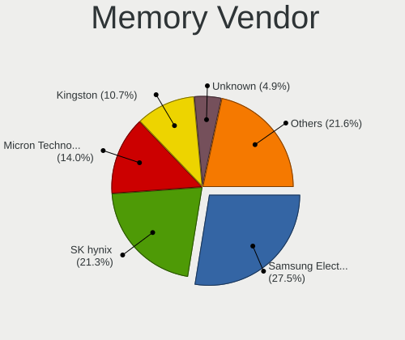

| Vendor                                  | Notebooks | Percent |
|-----------------------------------------|-----------|---------|
| Samsung Electronics                     | 181       | 27.55%  |
| SK hynix                                | 140       | 21.31%  |
| Micron Technology                       | 92        | 14%     |
| Kingston                                | 70        | 10.65%  |
| Unknown                                 | 32        | 4.87%   |
| Ramaxel Technology                      | 25        | 3.81%   |
| A-DATA Technology                       | 24        | 3.65%   |
| Crucial                                 | 16        | 2.44%   |
| Transcend                               | 13        | 1.98%   |
| Nanya Technology                        | 11        | 1.67%   |
| Elpida                                  | 10        | 1.52%   |
| Team                                    | 9         | 1.37%   |
| Corsair                                 | 9         | 1.37%   |
| Apacer                                  | 8         | 1.22%   |
| Silicon Power Computer & Communications | 3         | 0.46%   |
| Silicon Power                           | 2         | 0.3%    |
| ASint Technology                        | 2         | 0.3%    |
| Unknown                                 | 2         | 0.3%    |
| Unknown (ABCD)                          | 1         | 0.15%   |
| Unifosa                                 | 1         | 0.15%   |
| Toshiba                                 | 1         | 0.15%   |
| Qimonda                                 | 1         | 0.15%   |
| Neo Forza                               | 1         | 0.15%   |
| GOODRAM                                 | 1         | 0.15%   |
| fef5                                    | 1         | 0.15%   |
| A Force                                 | 1         | 0.15%   |

Memory Model
------------

Memory module models

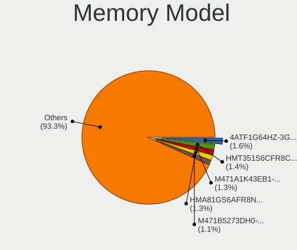

| Model                                                       | Notebooks | Percent |
|-------------------------------------------------------------|-----------|---------|
| Micron RAM 4ATF1G64HZ-3G2F1 8GB SODIMM DDR4 3200MT/s        | 11        | 1.57%   |
| SK hynix RAM HMT351S6CFR8C-PB 4GB SODIMM DDR3 1600MT/s      | 10        | 1.43%   |
| SK hynix RAM HMA81GS6AFR8N-UH 8GB SODIMM DDR4 2667MT/s      | 9         | 1.28%   |
| Samsung RAM M471A1K43EB1-CWE 8GB SODIMM DDR4 3200MT/s       | 9         | 1.28%   |
| Samsung RAM M471B5273DH0-CH9 4GB SODIMM DDR3 1600MT/s       | 8         | 1.14%   |
| Samsung RAM M471B1G73QH0-YK0 8GB SODIMM DDR3 1600MT/s       | 8         | 1.14%   |
| Samsung RAM M471A1G44AB0-CWE 8GiB SODIMM DDR4 3200MT/s      | 8         | 1.14%   |
| A-DATA RAM Module 8GB SODIMM DDR4 3200MT/s                  | 7         | 1%      |
| SK hynix RAM HMT41GS6BFR8A-PB 8GB SODIMM DDR3 2667MT/s      | 6         | 0.86%   |
| SK hynix RAM HMAA2GS6CJR8N-XN 16GB SODIMM DDR4 3200MT/s     | 6         | 0.86%   |
| SK hynix RAM HMAA1GS6CJR6N-XN 8GB SODIMM DDR4 3200MT/s      | 6         | 0.86%   |
| Samsung RAM M471B5173EB0-YK0 4GB SODIMM DDR3 1600MT/s       | 6         | 0.86%   |
| Samsung RAM M471B5173DB0-YK0 4GB SODIMM DDR3 1600MT/s       | 6         | 0.86%   |
| Samsung RAM M471B1G73DB0-YK0 8GB SODIMM DDR3 1600MT/s       | 6         | 0.86%   |
| Samsung RAM M471A5244CB0-CTD 4GB SODIMM DDR4 3266MT/s       | 6         | 0.86%   |
| Samsung RAM M471A1K43CB1-CTD 8GB SODIMM DDR4 3200MT/s       | 6         | 0.86%   |
| Micron RAM 4ATF1G64HZ-3G2E1 8GB SODIMM DDR4 3200MT/s        | 6         | 0.86%   |
| Samsung RAM M471B5273CH0-CH9 4GB SODIMM DDR3 1334MT/s       | 5         | 0.71%   |
| Samsung RAM M471A1K43DB1-CWE 8GB SODIMM DDR4 3200MT/s       | 5         | 0.71%   |
| Samsung RAM M471A1K43DB1-CTD 8GB SODIMM DDR4 2667MT/s       | 5         | 0.71%   |
| Samsung RAM M471A1G44BB0-CWE 8GB SODIMM DDR4 3200MT/s       | 5         | 0.71%   |
| Micron RAM 8ATF1G64HZ-2G6E1 8GB SODIMM DDR4 2667MT/s        | 5         | 0.71%   |
| Unknown RAM Module 2GB SODIMM DDR2 667MT/s                  | 4         | 0.57%   |
| SK hynix RAM HMT451S6BFR8A-PB 4GB SODIMM DDR3 1600MT/s      | 4         | 0.57%   |
| SK hynix RAM HMA81GS6DJR8N-XN 8GB SODIMM DDR4 3200MT/s      | 4         | 0.57%   |
| Samsung RAM M471B5273DH0-CK0 4GB SODIMM DDR3 2400MT/s       | 4         | 0.57%   |
| Samsung RAM M471B1G73EB0-YK0 8192MB SODIMM DDR3 1600MT/s    | 4         | 0.57%   |
| Samsung RAM M471A2K43DB1-CTD 16GB SODIMM DDR4 2667MT/s      | 4         | 0.57%   |
| Samsung RAM M471A1K43BB1-CRC 8GB SODIMM DDR4 2667MT/s       | 4         | 0.57%   |
| Ramaxel RAM RMT3160ED58E9W1600 4GB SODIMM DDR3 1600MT/s     | 4         | 0.57%   |
| Ramaxel RAM RMSA3260ME78HAF-2666 8GB SODIMM DDR4 2667MT/s   | 4         | 0.57%   |
| Kingston RAM 9905744-066.A00G 32GB SODIMM DDR4 3200MT/s     | 4         | 0.57%   |
| Team RAM TEAMGROUP-SD4-2666 8GB SODIMM DDR4 2667MT/s        | 3         | 0.43%   |
| SK hynix RAM HMT351S6CFR8C-H9 4GB SODIMM DDR3 1333MT/s      | 3         | 0.43%   |
| SK hynix RAM HMA851S6JJR6N-VK 4GB SODIMM DDR4 2667MT/s      | 3         | 0.43%   |
| SK hynix RAM HMA851S6CJR6N-VK 4GB SODIMM DDR4 2667MT/s      | 3         | 0.43%   |
| Silicon Power & RAM Module 16GB SODIMM DDR4 3200MT/s        | 3         | 0.43%   |
| Samsung RAM M471B5773DH0-CH9 2GB SODIMM DDR3 1600MT/s       | 3         | 0.43%   |
| Samsung RAM M471B5173QH0-YK0 4GB SODIMM DDR3 1600MT/s       | 3         | 0.43%   |
| Samsung RAM M471A1G44AB0-CWE 8GB Row Of Chips DDR4 3200MT/s | 3         | 0.43%   |

Memory Kind
-----------

Memory module kinds

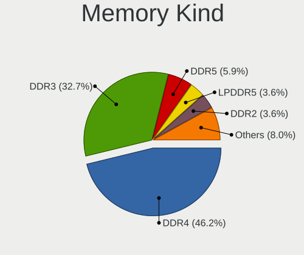

| Kind    | Notebooks | Percent |
|---------|-----------|---------|
| DDR4    | 243       | 46.2%   |
| DDR3    | 172       | 32.7%   |
| DDR5    | 31        | 5.89%   |
| LPDDR5  | 19        | 3.61%   |
| DDR2    | 19        | 3.61%   |
| LPDDR4  | 13        | 2.47%   |
| SDRAM   | 11        | 2.09%   |
| LPDDR3  | 5         | 0.95%   |
| Unknown | 5         | 0.95%   |
| DRAM    | 4         | 0.76%   |
| DDR     | 4         | 0.76%   |

Memory Form Factor
------------------

Physical design of the memory module

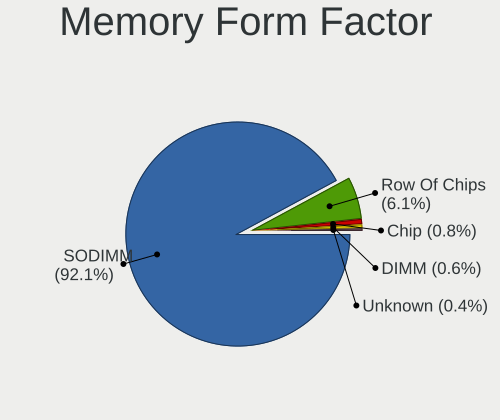

| Name         | Notebooks | Percent |
|--------------|-----------|---------|
| SODIMM       | 480       | 92.13%  |
| Row Of Chips | 32        | 6.14%   |
| Chip         | 4         | 0.77%   |
| DIMM         | 3         | 0.58%   |
| Unknown      | 2         | 0.38%   |

Memory Size
-----------

Memory module size

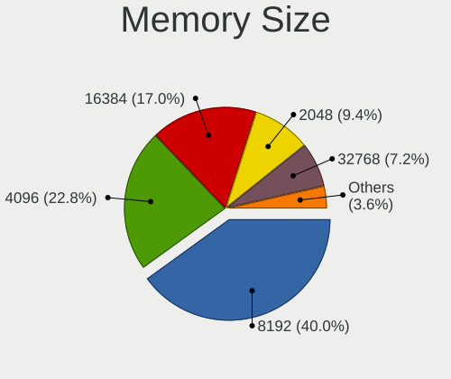

| Size    | Notebooks | Percent |
|---------|-----------|---------|
| 8192    | 235       | 40.03%  |
| 4096    | 134       | 22.83%  |
| 16384   | 100       | 17.04%  |
| 2048    | 55        | 9.37%   |
| 32768   | 42        | 7.16%   |
| 1024    | 17        | 2.9%    |
| 49152   | 1         | 0.17%   |
| 3072    | 1         | 0.17%   |
| 512     | 1         | 0.17%   |
| Unknown | 1         | 0.17%   |

Memory Speed
------------

Memory module speed

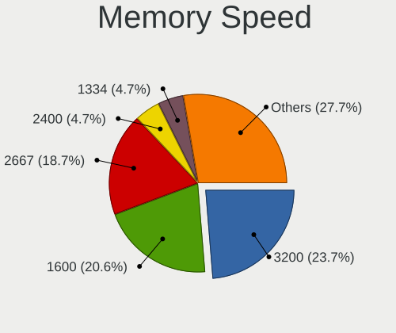

| Speed   | Notebooks | Percent |
|---------|-----------|---------|
| 3200    | 137       | 23.7%   |
| 1600    | 119       | 20.59%  |
| 2667    | 108       | 18.69%  |
| 2400    | 27        | 4.67%   |
| 1334    | 27        | 4.67%   |
| 5600    | 18        | 3.11%   |
| 1333    | 17        | 2.94%   |
| 4800    | 13        | 2.25%   |
| 667     | 13        | 2.25%   |
| 6400    | 12        | 2.08%   |
| Unknown | 12        | 2.08%   |
| 2133    | 11        | 1.9%    |
| 1067    | 8         | 1.38%   |
| 1066    | 7         | 1.21%   |
| 3266    | 6         | 1.04%   |
| 7500    | 5         | 0.87%   |
| 4267    | 5         | 0.87%   |
| 4199    | 5         | 0.87%   |
| 2048    | 5         | 0.87%   |
| 800     | 5         | 0.87%   |
| 1867    | 4         | 0.69%   |
| 8400    | 3         | 0.52%   |
| 4266    | 3         | 0.52%   |
| 975     | 2         | 0.35%   |
| 533     | 2         | 0.35%   |
| 8600    | 1         | 0.17%   |
| 7467    | 1         | 0.17%   |
| 2933    | 1         | 0.17%   |
| 1866    | 1         | 0.17%   |

Printers & scanners
-------------------

Printer Vendor
--------------

Printer device vendors

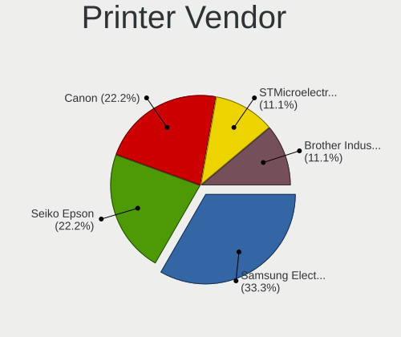

| Vendor              | Notebooks | Percent |
|---------------------|-----------|---------|
| Samsung Electronics | 3         | 33.33%  |
| Seiko Epson         | 2         | 22.22%  |
| Canon               | 2         | 22.22%  |
| STMicroelectronics  | 1         | 11.11%  |
| Brother Industries  | 1         | 11.11%  |

Printer Model
-------------

Printer device models

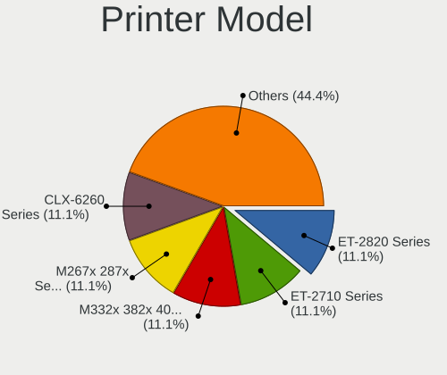

| Model                                                     | Notebooks | Percent |
|-----------------------------------------------------------|-----------|---------|
| STMicroelectronics LED badge -- mini LED display -- 11x44 | 1         | 11.11%  |
| Seiko Epson ET-2820 Series                                | 1         | 11.11%  |
| Seiko Epson ET-2710 Series                                | 1         | 11.11%  |
| Samsung M332x 382x 402x Series                            | 1         | 11.11%  |
| Samsung M267x 287x Series                                 | 1         | 11.11%  |
| Samsung CLX-6260 Series                                   | 1         | 11.11%  |
| Canon PIXMA MP240                                         | 1         | 11.11%  |
| Canon MF3200 series                                       | 1         | 11.11%  |
| Brother DCP-7055 scanner/printer                          | 1         | 11.11%  |

Scanner Vendor
--------------

Scanner device vendors

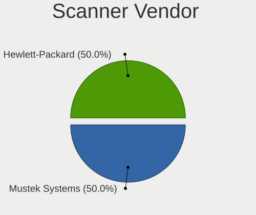

| Vendor          | Notebooks | Percent |
|-----------------|-----------|---------|
| Mustek Systems  | 1         | 50%     |
| Hewlett-Packard | 1         | 50%     |

Scanner Model
-------------

Scanner device models

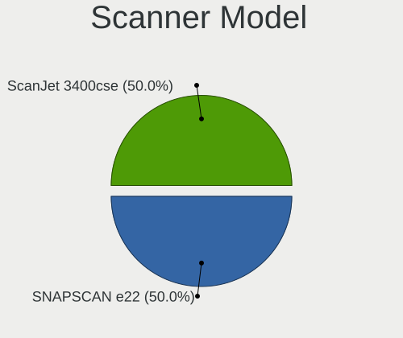

| Model                       | Notebooks | Percent |
|-----------------------------|-----------|---------|
| Mustek Systems SNAPSCAN e22 | 1         | 50%     |
| HP ScanJet 3400cse          | 1         | 50%     |

Camera
------

Camera Vendor
-------------

Camera device vendors

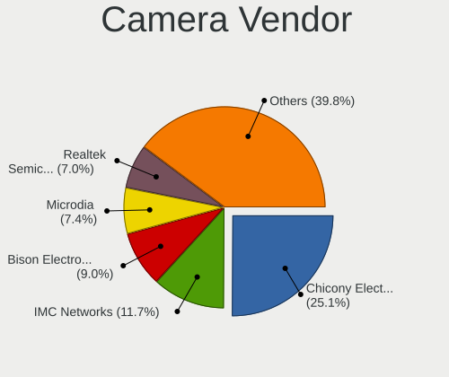

| Vendor                                 | Notebooks | Percent |
|----------------------------------------|-----------|---------|
| Chicony Electronics                    | 210       | 25.09%  |
| IMC Networks                           | 98        | 11.71%  |
| Bison Electronics                      | 75        | 8.96%   |
| Microdia                               | 62        | 7.41%   |
| Realtek Semiconductor                  | 59        | 7.05%   |
| Quanta                                 | 57        | 6.81%   |
| Sunplus Innovation Technology          | 49        | 5.85%   |
| Luxvisions Innotech Limited            | 31        | 3.7%    |
| Syntek                                 | 27        | 3.23%   |
| Suyin                                  | 23        | 2.75%   |
| Lite-On Technology                     | 22        | 2.63%   |
| Cheng Uei Precision Industry (Foxlink) | 22        | 2.63%   |
| Logitech                               | 12        | 1.43%   |
| Sonix Technology                       | 11        | 1.31%   |
| Apple                                  | 9         | 1.08%   |
| Shinetech                              | 8         | 0.96%   |
| Alcor Micro                            | 8         | 0.96%   |
| Lenovo                                 | 6         | 0.72%   |
| Acer                                   | 6         | 0.72%   |
| Silicon Motion                         | 5         | 0.6%    |
| Samsung Electronics                    | 4         | 0.48%   |
| Ricoh                                  | 4         | 0.48%   |
| Z-Star Microelectronics                | 3         | 0.36%   |
| Primax Electronics                     | 3         | 0.36%   |
| kingcome                               | 3         | 0.36%   |
| Importek                               | 2         | 0.24%   |
| Alpha Imaging Technology               | 2         | 0.24%   |
| ALi                                    | 2         | 0.24%   |
| Xiongmai                               | 1         | 0.12%   |
| Tobii Technology AB                    | 1         | 0.12%   |
| Sunplus Technology                     | 1         | 0.12%   |
| ShineOptics                            | 1         | 0.12%   |
| OmniVision Technologies                | 1         | 0.12%   |
| Microsoft                              | 1         | 0.12%   |
| Hewlett-Packard                        | 1         | 0.12%   |
| Cubeternet                             | 1         | 0.12%   |
| Creative Technology                    | 1         | 0.12%   |
| BRS 2Mp Camera                         | 1         | 0.12%   |
| BillionPixels                          | 1         | 0.12%   |
| Aveo Technology                        | 1         | 0.12%   |

Camera Model
------------

Camera device models

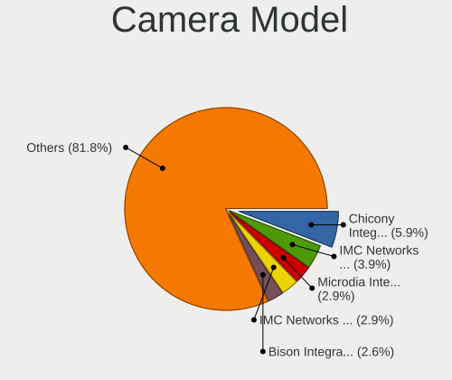

| Model                                                | Notebooks | Percent |
|------------------------------------------------------|-----------|---------|
| Chicony Integrated Camera                            | 49        | 5.85%   |
| IMC Networks Integrated Camera                       | 33        | 3.94%   |
| Microdia Integrated_Webcam_HD                        | 24        | 2.87%   |
| IMC Networks USB2.0 VGA UVC WebCam                   | 24        | 2.87%   |
| Bison Integrated Camera                              | 22        | 2.63%   |
| Syntek Integrated Camera                             | 19        | 2.27%   |
| IMC Networks USB2.0 HD UVC WebCam                    | 19        | 2.27%   |
| Sunplus Integrated_Webcam_HD                         | 17        | 2.03%   |
| Realtek Integrated_Webcam_HD                         | 17        | 2.03%   |
| Chicony HD WebCam                                    | 17        | 2.03%   |
| Quanta HP HD Camera                                  | 13        | 1.55%   |
| Quanta HD Webcam                                     | 11        | 1.31%   |
| Chicony TOSHIBA Web Camera - HD                      | 11        | 1.31%   |
| Bison Lenovo EasyCamera                              | 11        | 1.31%   |
| Bison HD Webcam                                      | 11        | 1.31%   |
| Quanta HD User Facing                                | 10        | 1.19%   |
| Lite-On Integrated Camera                            | 10        | 1.19%   |
| Bison SunplusIT Integrated Camera                    | 10        | 1.19%   |
| Realtek Lenovo EasyCamera                            | 9         | 1.08%   |
| Microdia Integrated Webcam                           | 8         | 0.96%   |
| Luxvisions Innotech Limited Integrated Camera        | 7         | 0.84%   |
| Luxvisions Innotech Limited HP TrueVision HD Camera  | 7         | 0.84%   |
| Chicony USB 2.0 Camera                               | 7         | 0.84%   |
| Sunplus Laptop Integrated WebCam HD                  | 6         | 0.72%   |
| Sonix USB2.0 HD UVC WebCam                           | 6         | 0.72%   |
| ShineTech USB2.0 HD UVC WebCam                       | 6         | 0.72%   |
| Luxvisions Innotech Limited Integrated RGB Camera    | 6         | 0.72%   |
| Luxvisions Innotech Limited HP Wide Vision HD Camera | 6         | 0.72%   |
| Chicony Integrated Camera [ThinkPad]                 | 6         | 0.72%   |
| Chicony HP HD Webcam                                 | 6         | 0.72%   |
| Chicony HP HD Camera                                 | 6         | 0.72%   |
| Suyin Acer/HP Integrated Webcam [CN0314]             | 5         | 0.6%    |
| Quanta VGA WebCam                                    | 5         | 0.6%    |
| Microdia Laptop_Integrated_Webcam_HD                 | 5         | 0.6%    |
| Lite-On HP HD Webcam                                 | 5         | 0.6%    |
| Chicony Lenovo Integrated Camera (0.3MP)             | 5         | 0.6%    |
| Chicony Lenovo EasyCamera                            | 5         | 0.6%    |
| Chicony HP TrueVision HD                             | 5         | 0.6%    |
| Chicony HD WebCam (Asus N-series)                    | 5         | 0.6%    |
| Chicony HD User Facing                               | 5         | 0.6%    |

Security
--------

Fingerprint Vendor
------------------

Fingerprint sensor vendors

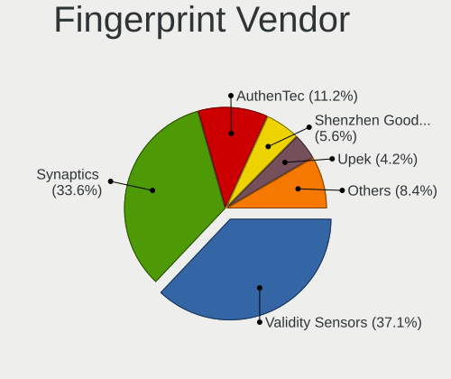

| Vendor                             | Notebooks | Percent |
|------------------------------------|-----------|---------|
| Validity Sensors                   | 53        | 37.06%  |
| Synaptics                          | 48        | 33.57%  |
| AuthenTec                          | 16        | 11.19%  |
| Shenzhen Goodix Technology         | 8         | 5.59%   |
| Upek                               | 6         | 4.2%    |
| Elan Microelectronics              | 6         | 4.2%    |
| LighTuning Technology              | 4         | 2.8%    |
| STMicroelectronics                 | 1         | 0.7%    |
| Realtek USB2.0 Finger Print Bridge | 1         | 0.7%    |

Fingerprint Model
-----------------

Fingerprint sensor models

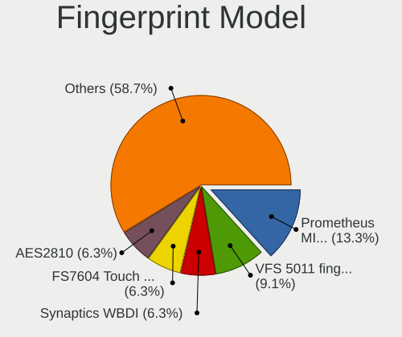

| Model                                                                      | Notebooks | Percent |
|----------------------------------------------------------------------------|-----------|---------|
| Synaptics Prometheus MIS Touch Fingerprint Reader                          | 19        | 13.29%  |
| Validity Sensors VFS 5011 fingerprint sensor                               | 13        | 9.09%   |
| Validity Sensors Synaptics WBDI                                            | 9         | 6.29%   |
| Synaptics FS7604 Touch Fingerprint Sensor with PurePrint                   | 9         | 6.29%   |
| AuthenTec AES2810                                                          | 9         | 6.29%   |
| Validity Sensors VFS495 Fingerprint Reader                                 | 8         | 5.59%   |
| Upek Biometric Touchchip/Touchstrip Fingerprint Sensor                     | 6         | 4.2%    |
| Synaptics Metallica MIS Touch Fingerprint Reader                           | 6         | 4.2%    |
| Validity Sensors VFS471 Fingerprint Reader                                 | 5         | 3.5%    |
| Shenzhen Goodix Fingerprint Reader                                         | 5         | 3.5%    |
| Elan ELAN:ARM-M4                                                           | 4         | 2.8%    |
| AuthenTec Fingerprint Sensor                                               | 4         | 2.8%    |
| Validity Sensors VFS5011 Fingerprint Reader                                | 3         | 2.1%    |
| Validity Sensors Synaptics VFS7552 Touch Fingerprint Sensor with PurePrint | 3         | 2.1%    |
| Synaptics Metallica MOH Touch Fingerprint Reader                           | 3         | 2.1%    |
| Validity Sensors VFS7500 Touch Fingerprint Sensor                          | 2         | 1.4%    |
| Validity Sensors VFS491                                                    | 2         | 1.4%    |
| Validity Sensors VFS451 Fingerprint Reader                                 | 2         | 1.4%    |
| Validity Sensors Fingerprint scanner                                       | 2         | 1.4%    |
| Synaptics WBDI                                                             | 2         | 1.4%    |
| Synaptics UWP WBDI Device                                                  | 2         | 1.4%    |
| Synaptics  FS7604 Touch Fingerprint Sensor with PurePrint                  | 2         | 1.4%    |
| Synaptics Prometheus Fingerprint Reader                                    | 2         | 1.4%    |
| Synaptics Fingerprint reader [HP G6]                                       | 2         | 1.4%    |
| Shenzhen Goodix  Fingerprint Device                                        | 2         | 1.4%    |
| LighTuning Fingerprint Reader                                              | 2         | 1.4%    |
| Elan ELAN:Fingerprint                                                      | 2         | 1.4%    |
| AuthenTec AES2501 Fingerprint Sensor                                       | 2         | 1.4%    |
| Validity Sensors VFS7552 Touch Fingerprint Sensor                          | 1         | 0.7%    |
| Validity Sensors VFS301 Fingerprint Reader                                 | 1         | 0.7%    |
| Validity Sensors VFS101 Fingerprint Reader                                 | 1         | 0.7%    |
| Validity Sensors Swipe Fingerprint Sensor                                  | 1         | 0.7%    |
| Synaptics TouchPad                                                         | 1         | 0.7%    |
| STMicroelectronics Fingerprint Reader                                      | 1         | 0.7%    |
| Shenzhen Goodix FingerPrint                                                | 1         | 0.7%    |
| Realtek USB2.0 Finger Print Bridge FocalTech Fingerprint Device            | 1         | 0.7%    |
| LighTuning ES603 Swipe Fingerprint Sensor                                  | 1         | 0.7%    |
| LighTuning EgisTec Touch Fingerprint Sensor                                | 1         | 0.7%    |
| AuthenTec AES1600                                                          | 1         | 0.7%    |

Chipcard Vendor
---------------

Chipcard module vendors

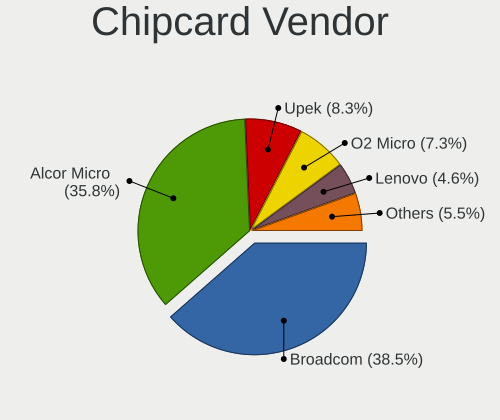

| Vendor                | Notebooks | Percent |
|-----------------------|-----------|---------|
| Broadcom              | 42        | 38.53%  |
| Alcor Micro           | 39        | 35.78%  |
| Upek                  | 9         | 8.26%   |
| O2 Micro              | 8         | 7.34%   |
| Lenovo                | 5         | 4.59%   |
| Advanced Card Systems | 3         | 2.75%   |
| SCM Microsystems      | 2         | 1.83%   |
| Clay Logic            | 1         | 0.92%   |

Chipcard Model
--------------

Chipcard module models

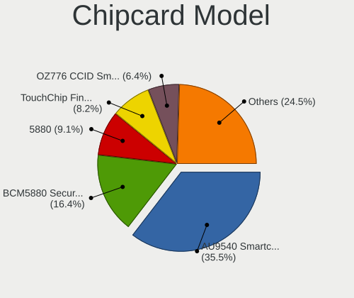

| Model                                                                        | Notebooks | Percent |
|------------------------------------------------------------------------------|-----------|---------|
| Alcor Micro AU9540 Smartcard Reader                                          | 39        | 35.45%  |
| Broadcom BCM5880 Secure Applications Processor                               | 18        | 16.36%  |
| Broadcom 5880                                                                | 10        | 9.09%   |
| Upek TouchChip Fingerprint Coprocessor (WBF advanced mode)                   | 9         | 8.18%   |
| O2 Micro OZ776 CCID Smartcard Reader                                         | 7         | 6.36%   |
| Lenovo Integrated Smart Card Reader                                          | 5         | 4.55%   |
| Broadcom BCM5880 Secure Applications Processor with fingerprint swipe sensor | 5         | 4.55%   |
| Broadcom BCM58200 ControlVault 3 (FingerPrint sensor + Contacted SmartCard)  | 5         | 4.55%   |
| Broadcom 58200                                                               | 4         | 3.64%   |
| SCM Microsystems SCR3340 - ExpressCard54 Smart Card Reader                   | 2         | 1.82%   |
| Advanced Card Systems ACR39U                                                 | 2         | 1.82%   |
| O2 Micro Oz776 SmartCard Reader                                              | 1         | 0.91%   |
| Clay Logic Nitrokey Pro                                                      | 1         | 0.91%   |
| Broadcom BCM5880 Secure Applications Processor with fingerprint touch sensor | 1         | 0.91%   |
| Advanced Card Systems ACR122U                                                | 1         | 0.91%   |

Unsupported
-----------

Unsupported Devices
-------------------

Total unsupported devices on board

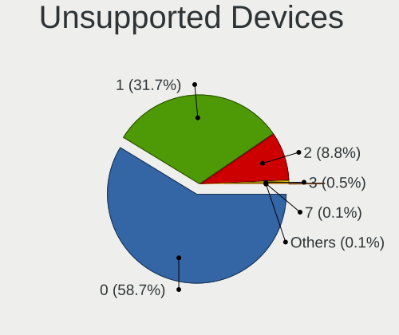

| Total | Notebooks | Percent |
|-------|-----------|---------|
| 0     | 579       | 58.72%  |
| 1     | 313       | 31.74%  |
| 2     | 87        | 8.82%   |
| 3     | 5         | 0.51%   |
| 7     | 1         | 0.1%    |
| 6     | 1         | 0.1%    |

Unsupported Device Types
------------------------

Types of unsupported devices

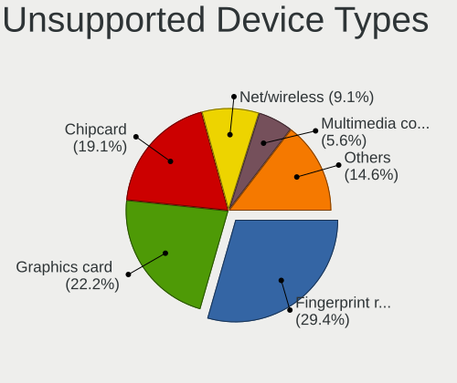

| Type                     | Notebooks | Percent |
|--------------------------|-----------|---------|
| Fingerprint reader       | 143       | 29.42%  |
| Graphics card            | 108       | 22.22%  |
| Chipcard                 | 93        | 19.14%  |
| Net/wireless             | 44        | 9.05%   |
| Multimedia controller    | 27        | 5.56%   |
| Bluetooth                | 21        | 4.32%   |
| Camera                   | 13        | 2.67%   |
| Storage                  | 11        | 2.26%   |
| Communication controller | 7         | 1.44%   |
| Sound                    | 4         | 0.82%   |
| Net/ethernet             | 4         | 0.82%   |
| Card reader              | 4         | 0.82%   |
| Network                  | 2         | 0.41%   |
| Modem                    | 2         | 0.41%   |
| Firewire controller      | 2         | 0.41%   |
| Flash memory             | 1         | 0.21%   |

