Linux in Bulgaria - Tested Hardware & Statistics (Notebooks)
------------------------------------------------------------

A project to collect tested hardware configurations for Linux in Bulgaria.

Anyone can contribute to this report by the [hw-probe](https://github.com/linuxhw/hw-probe) tool:

    sudo -E hw-probe -all -upload

Please contribute! Especially if your hardware is rare.

Contents
--------

* [ Test Cases ](#test-cases)

* [ System ](#system)
  - [ OS                       ](#os)
  - [ OS Family                ](#os-family)
  - [ Kernel                   ](#kernel)
  - [ Kernel Family            ](#kernel-family)
  - [ Kernel Major Ver.        ](#kernel-major-ver)
  - [ Arch                     ](#arch)
  - [ DE                       ](#de)
  - [ Display Server           ](#display-server)
  - [ Display Manager          ](#display-manager)
  - [ OS Lang                  ](#os-lang)
  - [ Boot Mode                ](#boot-mode)
  - [ Filesystem               ](#filesystem)
  - [ Part. scheme             ](#part-scheme)
  - [ Dual Boot with Linux/BSD ](#dual-boot-with-linuxbsd)
  - [ Dual Boot (Win)          ](#dual-boot-win)

* [ Board ](#board)
  - [ Vendor                   ](#vendor)
  - [ Model                    ](#model)
  - [ Model Family             ](#model-family)
  - [ MFG Year                 ](#mfg-year)
  - [ Form Factor              ](#form-factor)
  - [ Secure Boot              ](#secure-boot)
  - [ Coreboot                 ](#coreboot)
  - [ RAM Size                 ](#ram-size)
  - [ RAM Used                 ](#ram-used)
  - [ Total Drives             ](#total-drives)
  - [ Has CD-ROM               ](#has-cd-rom)
  - [ Has Ethernet             ](#has-ethernet)
  - [ Has WiFi                 ](#has-wifi)
  - [ Has Bluetooth            ](#has-bluetooth)

* [ Location ](#location)
  - [ Country                  ](#country)
  - [ City                     ](#city)

* [ Drives ](#drives)
  - [ Drive Vendor             ](#drive-vendor)
  - [ Drive Model              ](#drive-model)
  - [ HDD Vendor               ](#hdd-vendor)
  - [ SSD Vendor               ](#ssd-vendor)
  - [ Drive Kind               ](#drive-kind)
  - [ Drive Connector          ](#drive-connector)
  - [ Drive Size               ](#drive-size)
  - [ Space Total              ](#space-total)
  - [ Space Used               ](#space-used)
  - [ Malfunc. Drives          ](#malfunc-drives)
  - [ Malfunc. Drive Vendor    ](#malfunc-drive-vendor)
  - [ Malfunc. HDD Vendor      ](#malfunc-hdd-vendor)
  - [ Malfunc. Drive Kind      ](#malfunc-drive-kind)
  - [ Failed Drives            ](#failed-drives)
  - [ Failed Drive Vendor      ](#failed-drive-vendor)
  - [ Drive Status             ](#drive-status)

* [ Storage controller ](#storage-controller)
  - [ Storage Vendor           ](#storage-vendor)
  - [ Storage Model            ](#storage-model)
  - [ Storage Kind             ](#storage-kind)

* [ Processor ](#processor)
  - [ CPU Vendor               ](#cpu-vendor)
  - [ CPU Model                ](#cpu-model)
  - [ CPU Model Family         ](#cpu-model-family)
  - [ CPU Cores                ](#cpu-cores)
  - [ CPU Sockets              ](#cpu-sockets)
  - [ CPU Threads              ](#cpu-threads)
  - [ CPU Op-Modes             ](#cpu-op-modes)
  - [ CPU Microcode            ](#cpu-microcode)
  - [ CPU Microarch            ](#cpu-microarch)

* [ Graphics ](#graphics)
  - [ GPU Vendor               ](#gpu-vendor)
  - [ GPU Model                ](#gpu-model)
  - [ GPU Combo                ](#gpu-combo)
  - [ GPU Driver               ](#gpu-driver)
  - [ GPU Memory               ](#gpu-memory)

* [ Monitor ](#monitor)
  - [ Monitor Vendor           ](#monitor-vendor)
  - [ Monitor Model            ](#monitor-model)
  - [ Monitor Resolution       ](#monitor-resolution)
  - [ Monitor Diagonal         ](#monitor-diagonal)
  - [ Monitor Width            ](#monitor-width)
  - [ Aspect Ratio             ](#aspect-ratio)
  - [ Monitor Area             ](#monitor-area)
  - [ Pixel Density            ](#pixel-density)
  - [ Multiple Monitors        ](#multiple-monitors)

* [ Network ](#network)
  - [ Net Controller Vendor    ](#net-controller-vendor)
  - [ Net Controller Model     ](#net-controller-model)
  - [ Wireless Vendor          ](#wireless-vendor)
  - [ Wireless Model           ](#wireless-model)
  - [ Ethernet Vendor          ](#ethernet-vendor)
  - [ Ethernet Model           ](#ethernet-model)
  - [ Net Controller Kind      ](#net-controller-kind)
  - [ Used Controller          ](#used-controller)
  - [ NICs                     ](#nics)
  - [ IPv6                     ](#ipv6)

* [ Bluetooth ](#bluetooth)
  - [ Bluetooth Vendor         ](#bluetooth-vendor)
  - [ Bluetooth Model          ](#bluetooth-model)

* [ Sound ](#sound)
  - [ Sound Vendor             ](#sound-vendor)
  - [ Sound Model              ](#sound-model)

* [ Memory ](#memory)
  - [ Memory Vendor            ](#memory-vendor)
  - [ Memory Model             ](#memory-model)
  - [ Memory Kind              ](#memory-kind)
  - [ Memory Form Factor       ](#memory-form-factor)
  - [ Memory Size              ](#memory-size)
  - [ Memory Speed             ](#memory-speed)

* [ Printers & scanners ](#printers--scanners)
  - [ Printer Vendor           ](#printer-vendor)
  - [ Printer Model            ](#printer-model)
  - [ Scanner Vendor           ](#scanner-vendor)
  - [ Scanner Model            ](#scanner-model)

* [ Camera ](#camera)
  - [ Camera Vendor            ](#camera-vendor)
  - [ Camera Model             ](#camera-model)

* [ Security ](#security)
  - [ Fingerprint Vendor       ](#fingerprint-vendor)
  - [ Fingerprint Model        ](#fingerprint-model)
  - [ Chipcard Vendor          ](#chipcard-vendor)
  - [ Chipcard Model           ](#chipcard-model)

* [ Unsupported ](#unsupported)
  - [ Unsupported Devices      ](#unsupported-devices)
  - [ Unsupported Device Types ](#unsupported-device-types)

Test Cases
----------

Total: 820

| Vendor        | Model                       | Probe                                                      | Date         |
|---------------|-----------------------------|------------------------------------------------------------|--------------|
| ASUSTek       | ASUS TUF Gaming A15 FA50... | [3f1ca6740d](https://linux-hardware.org/?probe=3f1ca6740d) | Dec 30, 2022 |
| Lenovo        | IdeaPad Gaming 3 15ARH05... | [c51bc128e2](https://linux-hardware.org/?probe=c51bc128e2) | Dec 30, 2022 |
| Lenovo        | ThinkPad P14s Gen 2a 21A... | [c844147ffd](https://linux-hardware.org/?probe=c844147ffd) | Dec 28, 2022 |
| Valve         | Jupiter                     | [32b2d1e76f](https://linux-hardware.org/?probe=32b2d1e76f) | Dec 26, 2022 |
| Acer          | Aspire A515-47              | [0ec462e927](https://linux-hardware.org/?probe=0ec462e927) | Dec 21, 2022 |
| Dell          | Latitude E5410              | [969f85bfc3](https://linux-hardware.org/?probe=969f85bfc3) | Dec 21, 2022 |
| Dell          | Inspiron N5110              | [9e4f7a69c9](https://linux-hardware.org/?probe=9e4f7a69c9) | Dec 18, 2022 |
| Valve         | Jupiter                     | [a560caaec5](https://linux-hardware.org/?probe=a560caaec5) | Dec 17, 2022 |
| Acer          | AO756                       | [ebc4d7cfcb](https://linux-hardware.org/?probe=ebc4d7cfcb) | Dec 16, 2022 |
| Lenovo        | ThinkPad X200s 74695XG      | [9bc0315222](https://linux-hardware.org/?probe=9bc0315222) | Dec 14, 2022 |
| Dell          | Vostro 5620                 | [6987aeacd5](https://linux-hardware.org/?probe=6987aeacd5) | Dec 13, 2022 |
| Dell          | XPS 17 9700                 | [46c656a547](https://linux-hardware.org/?probe=46c656a547) | Dec 13, 2022 |
| Dell          | Precision 5510              | [f464385b16](https://linux-hardware.org/?probe=f464385b16) | Dec 13, 2022 |
| Dell          | Precision 5510              | [f4188b30c9](https://linux-hardware.org/?probe=f4188b30c9) | Dec 13, 2022 |
| Toshiba       | Satellite C55-C             | [777b365c04](https://linux-hardware.org/?probe=777b365c04) | Dec 12, 2022 |
| HP            | Compaq Presario CQ71        | [57ab22c9c2](https://linux-hardware.org/?probe=57ab22c9c2) | Dec 11, 2022 |
| HP            | Compaq Presario CQ71        | [b3f0bf2008](https://linux-hardware.org/?probe=b3f0bf2008) | Dec 11, 2022 |
| Lenovo        | ThinkPad T15 Gen 2i 20W4... | [ad09795330](https://linux-hardware.org/?probe=ad09795330) | Dec 09, 2022 |
| Acer          | Aspire ES1-731G             | [589cce31c8](https://linux-hardware.org/?probe=589cce31c8) | Dec 09, 2022 |
| Lenovo        | ThinkPad L590 20Q700AWBM    | [ff0997b72a](https://linux-hardware.org/?probe=ff0997b72a) | Dec 09, 2022 |
| HP            | ProBook 450 G0              | [01e7f95a23](https://linux-hardware.org/?probe=01e7f95a23) | Dec 07, 2022 |
| HP            | ProBook 450 G0              | [c3b6c86431](https://linux-hardware.org/?probe=c3b6c86431) | Dec 07, 2022 |
| Dell          | Vostro 5620                 | [50acc3b3b8](https://linux-hardware.org/?probe=50acc3b3b8) | Dec 04, 2022 |
| ASUSTek       | X541NA                      | [9da9a87b5b](https://linux-hardware.org/?probe=9da9a87b5b) | Dec 03, 2022 |
| Acer          | Aspire ES1-731G             | [06918f4cc5](https://linux-hardware.org/?probe=06918f4cc5) | Dec 03, 2022 |
| Dell          | Inspiron N7010              | [3e9458fd24](https://linux-hardware.org/?probe=3e9458fd24) | Dec 02, 2022 |
| Lenovo        | ThinkPad T480S 20L8SBTD0... | [2d4a014ef1](https://linux-hardware.org/?probe=2d4a014ef1) | Dec 01, 2022 |
| Lenovo        | ThinkPad T480S 20L8SBTD0... | [e1cec664eb](https://linux-hardware.org/?probe=e1cec664eb) | Dec 01, 2022 |
| Acer          | AO756                       | [c1ff6fe10c](https://linux-hardware.org/?probe=c1ff6fe10c) | Nov 29, 2022 |
| Acer          | AO756                       | [fa5c9df13a](https://linux-hardware.org/?probe=fa5c9df13a) | Nov 27, 2022 |
| Acer          | AO756                       | [d390d588fe](https://linux-hardware.org/?probe=d390d588fe) | Nov 27, 2022 |
| Acer          | Aspire 5349                 | [82be349d91](https://linux-hardware.org/?probe=82be349d91) | Nov 25, 2022 |
| Dell          | Latitude 5420               | [797ac58b69](https://linux-hardware.org/?probe=797ac58b69) | Nov 23, 2022 |
| HP            | ZBook Studio 15.6 inch G... | [07210e29c5](https://linux-hardware.org/?probe=07210e29c5) | Nov 21, 2022 |
| Dell          | Inspiron N7010              | [210dd0f9f5](https://linux-hardware.org/?probe=210dd0f9f5) | Nov 20, 2022 |
| Lenovo        | IdeaPad 5 Pro 16ARH7 82S... | [6c5f37f683](https://linux-hardware.org/?probe=6c5f37f683) | Nov 19, 2022 |
| Dell          | Vostro 15 5501              | [ea1dbc4f7c](https://linux-hardware.org/?probe=ea1dbc4f7c) | Nov 18, 2022 |
| Lenovo        | Legion Y740-17IRHg 81UJ     | [d053fe8efe](https://linux-hardware.org/?probe=d053fe8efe) | Nov 16, 2022 |
| Lenovo        | ThinkPad T440s 20ARS2T40... | [f77af97294](https://linux-hardware.org/?probe=f77af97294) | Nov 13, 2022 |
| Lenovo        | ThinkPad T15 Gen 2i 20W4... | [b995c794aa](https://linux-hardware.org/?probe=b995c794aa) | Nov 10, 2022 |
| Acer          | Predator PT516-52s          | [b8ebbe76e8](https://linux-hardware.org/?probe=b8ebbe76e8) | Nov 10, 2022 |
| Dell          | Vostro 5402                 | [cca85a282e](https://linux-hardware.org/?probe=cca85a282e) | Nov 09, 2022 |
| Dell          | Latitude E5420              | [c6264f1223](https://linux-hardware.org/?probe=c6264f1223) | Nov 08, 2022 |
| Lenovo        | Legion Y740-17IRHg 81UJ     | [b1a9ec43d4](https://linux-hardware.org/?probe=b1a9ec43d4) | Nov 07, 2022 |
| Lenovo        | Legion Y740-17IRHg 81UJ     | [f57f494508](https://linux-hardware.org/?probe=f57f494508) | Nov 06, 2022 |
| HP            | Laptop 15s-eq1xxx           | [b59f9dcf48](https://linux-hardware.org/?probe=b59f9dcf48) | Nov 05, 2022 |
| Lenovo        | Legion Y530-15ICH 81FV      | [832ebcb956](https://linux-hardware.org/?probe=832ebcb956) | Nov 03, 2022 |
| HP            | Laptop 15s-eq1xxx           | [4f5b04e8d9](https://linux-hardware.org/?probe=4f5b04e8d9) | Nov 03, 2022 |
| Dell          | Vostro 1310                 | [0ae18c6c3b](https://linux-hardware.org/?probe=0ae18c6c3b) | Nov 03, 2022 |
| HP            | EliteBook 2730p             | [79830976d8](https://linux-hardware.org/?probe=79830976d8) | Nov 02, 2022 |
| ASUSTek       | G74Sx                       | [4e69212184](https://linux-hardware.org/?probe=4e69212184) | Nov 01, 2022 |
| ASUSTek       | ProArt StudioBook W700GV... | [bf22c22bb4](https://linux-hardware.org/?probe=bf22c22bb4) | Oct 31, 2022 |
| HP            | ProBook 450 G6              | [1b3bb91776](https://linux-hardware.org/?probe=1b3bb91776) | Oct 29, 2022 |
| Acer          | Predator PT516-52s          | [c0cebe4cfe](https://linux-hardware.org/?probe=c0cebe4cfe) | Oct 27, 2022 |
| HP            | ProBook 450 G6              | [ced3daa1b6](https://linux-hardware.org/?probe=ced3daa1b6) | Oct 27, 2022 |
| Lenovo        | ThinkBook 15 G2 ITL 20VE    | [a09e3f3669](https://linux-hardware.org/?probe=a09e3f3669) | Oct 26, 2022 |
| Lenovo        | ThinkPad E15 Gen 4 21E60... | [81231e9517](https://linux-hardware.org/?probe=81231e9517) | Oct 26, 2022 |
| HP            | Pavilion Laptop 14-bf0xx    | [79144ee806](https://linux-hardware.org/?probe=79144ee806) | Oct 25, 2022 |
| Acer          | Predator PT516-52s          | [ec8dac6fd3](https://linux-hardware.org/?probe=ec8dac6fd3) | Oct 22, 2022 |
| Acer          | Aspire 5830T                | [2423f8bf08](https://linux-hardware.org/?probe=2423f8bf08) | Oct 18, 2022 |
| Toshiba       | Satellite L775-125          | [fbe4f1922c](https://linux-hardware.org/?probe=fbe4f1922c) | Oct 18, 2022 |
| Lenovo        | Y50-70 20378                | [fa5c67a5b1](https://linux-hardware.org/?probe=fa5c67a5b1) | Oct 16, 2022 |
| Lenovo        | Y50-70 20378                | [a17c987ea8](https://linux-hardware.org/?probe=a17c987ea8) | Oct 16, 2022 |
| HP            | Laptop 15-da0xxx            | [d172225c0b](https://linux-hardware.org/?probe=d172225c0b) | Oct 08, 2022 |
| HP            | Pavilion Laptop 14-bf0xx    | [866d1ad750](https://linux-hardware.org/?probe=866d1ad750) | Oct 07, 2022 |
| ASUSTek       | R11CX                       | [fb6e1d3652](https://linux-hardware.org/?probe=fb6e1d3652) | Oct 03, 2022 |
| ASUSTek       | R11CX                       | [f0bc5f49a4](https://linux-hardware.org/?probe=f0bc5f49a4) | Oct 03, 2022 |
| HP            | ProBook 455 G8 Notebook ... | [b1df3aa03f](https://linux-hardware.org/?probe=b1df3aa03f) | Sep 20, 2022 |
| HP            | ProBook 450 G1              | [b4b9ca9ae4](https://linux-hardware.org/?probe=b4b9ca9ae4) | Sep 17, 2022 |
| HP            | ProBook 450 G1              | [bb2c7c1b05](https://linux-hardware.org/?probe=bb2c7c1b05) | Sep 17, 2022 |
| HP            | ProBook 450 G1              | [a6082da5f7](https://linux-hardware.org/?probe=a6082da5f7) | Sep 17, 2022 |
| ASUSTek       | ASUS TUF Gaming A17 FA70... | [7099830d0a](https://linux-hardware.org/?probe=7099830d0a) | Sep 16, 2022 |
| Lenovo        | ThinkPad T470p 20J7S0CF0... | [1e9f44a3da](https://linux-hardware.org/?probe=1e9f44a3da) | Sep 14, 2022 |
| Dell          | Latitude 5521               | [cb134441f2](https://linux-hardware.org/?probe=cb134441f2) | Sep 13, 2022 |
| MSI           | Modern 15 A11M              | [bfc50a32ba](https://linux-hardware.org/?probe=bfc50a32ba) | Sep 12, 2022 |
| Lenovo        | ThinkPad T470p 20J7S0CF0... | [e916989486](https://linux-hardware.org/?probe=e916989486) | Sep 11, 2022 |
| MSI           | Modern 15 A11M              | [931f4d2ca7](https://linux-hardware.org/?probe=931f4d2ca7) | Sep 11, 2022 |
| MSI           | Modern 15 A11M              | [4f1849370d](https://linux-hardware.org/?probe=4f1849370d) | Sep 10, 2022 |
| Lenovo        | G710 20252                  | [8afd29a71f](https://linux-hardware.org/?probe=8afd29a71f) | Sep 09, 2022 |
| Lenovo        | V15 G2 ALC 82KD             | [7479eb6186](https://linux-hardware.org/?probe=7479eb6186) | Sep 06, 2022 |
| Toshiba       | Satellite C50-B             | [00e103f0a0](https://linux-hardware.org/?probe=00e103f0a0) | Sep 05, 2022 |
| Toshiba       | Satellite C50-B             | [a7708366c2](https://linux-hardware.org/?probe=a7708366c2) | Sep 05, 2022 |
| Lenovo        | ThinkPad P52 20MAS07F04     | [fe662b0bd6](https://linux-hardware.org/?probe=fe662b0bd6) | Sep 03, 2022 |
| ASUSTek       | Zenbook UX3402ZA_UX3402Z... | [68170e253f](https://linux-hardware.org/?probe=68170e253f) | Sep 01, 2022 |
| HP            | Pavilion Gaming Laptop      | [8382b4123e](https://linux-hardware.org/?probe=8382b4123e) | Aug 31, 2022 |
| Dell          | Latitude E5270              | [d61a2cd74a](https://linux-hardware.org/?probe=d61a2cd74a) | Aug 30, 2022 |
| Dell          | Inspiron N5010              | [3239a22fc0](https://linux-hardware.org/?probe=3239a22fc0) | Aug 28, 2022 |
| Dell          | Inspiron N5010              | [e4cdaf6b35](https://linux-hardware.org/?probe=e4cdaf6b35) | Aug 28, 2022 |
| HP            | Pavilion Laptop 15-eg0xx... | [d056fbc982](https://linux-hardware.org/?probe=d056fbc982) | Aug 28, 2022 |
| HP            | Pavilion Laptop 15-eg0xx... | [aa84c700c6](https://linux-hardware.org/?probe=aa84c700c6) | Aug 28, 2022 |
| Lenovo        | ThinkPad T470p 20J7S0CF0... | [7f2e793766](https://linux-hardware.org/?probe=7f2e793766) | Aug 27, 2022 |
| Lenovo        | ThinkPad T470p 20J7S0CF0... | [8aeb1b057b](https://linux-hardware.org/?probe=8aeb1b057b) | Aug 27, 2022 |
| HP            | Pavilion Gaming Laptop 1... | [f4d9682f50](https://linux-hardware.org/?probe=f4d9682f50) | Aug 27, 2022 |
| Acer          | Nitro AN515-45              | [98c26372c2](https://linux-hardware.org/?probe=98c26372c2) | Aug 23, 2022 |
| HP            | ProBook 640 G1              | [a69a02f102](https://linux-hardware.org/?probe=a69a02f102) | Aug 20, 2022 |
| Lenovo        | Legion 5 15IMH05 82AU       | [bd4737dfcf](https://linux-hardware.org/?probe=bd4737dfcf) | Aug 18, 2022 |
| Lenovo        | Unknown                     | [d6a318092b](https://linux-hardware.org/?probe=d6a318092b) | Aug 16, 2022 |
| Lenovo        | Unknown                     | [a8af2e8de4](https://linux-hardware.org/?probe=a8af2e8de4) | Aug 16, 2022 |
| Toshiba       | PT10F                       | [08b7dc52a2](https://linux-hardware.org/?probe=08b7dc52a2) | Aug 12, 2022 |
| Lenovo        | ThinkPad T14 Gen 1 20S00... | [a7cdb45aa6](https://linux-hardware.org/?probe=a7cdb45aa6) | Aug 12, 2022 |
| Apple         | MacBookPro16,4              | [7571d6d783](https://linux-hardware.org/?probe=7571d6d783) | Aug 09, 2022 |
| Lenovo        | Unknown                     | [4fe504845e](https://linux-hardware.org/?probe=4fe504845e) | Aug 07, 2022 |
| HP            | Pavilion Laptop 14-bf0xx    | [1449b21f55](https://linux-hardware.org/?probe=1449b21f55) | Jul 24, 2022 |
| ASUSTek       | K50IJ                       | [60af40882b](https://linux-hardware.org/?probe=60af40882b) | Jul 24, 2022 |
| HP            | EliteBook 850 G5            | [0ffa75c50b](https://linux-hardware.org/?probe=0ffa75c50b) | Jul 20, 2022 |
| Lenovo        | Legion 5 15IMH05 82AU       | [3dddb3aac3](https://linux-hardware.org/?probe=3dddb3aac3) | Jul 20, 2022 |
| Lenovo        | ThinkPad T430 2349CV8       | [fac90d81d0](https://linux-hardware.org/?probe=fac90d81d0) | Jul 13, 2022 |
| Lenovo        | ThinkPad E15 Gen 3 20YG0... | [eb883a57f4](https://linux-hardware.org/?probe=eb883a57f4) | Jul 12, 2022 |
| Lenovo        | Legion Y740-17IRHg 81UJ     | [25c94a11f7](https://linux-hardware.org/?probe=25c94a11f7) | Jul 08, 2022 |
| Toshiba       | PORTEGE Z930                | [292aa38957](https://linux-hardware.org/?probe=292aa38957) | Jul 05, 2022 |
| Toshiba       | PORTEGE Z930                | [4df74c5b84](https://linux-hardware.org/?probe=4df74c5b84) | Jul 05, 2022 |
| ASUSTek       | ZenBook UX425UAZ_UM425UA... | [5de569a33e](https://linux-hardware.org/?probe=5de569a33e) | Jun 29, 2022 |
| ASUSTek       | ZenBook UX425UAZ_UM425UA... | [6542ea7dff](https://linux-hardware.org/?probe=6542ea7dff) | Jun 27, 2022 |
| Dell          | Inspiron 3580               | [dfab1b501e](https://linux-hardware.org/?probe=dfab1b501e) | Jun 26, 2022 |
| Dell          | Latitude E6520              | [3cbcb5e5d5](https://linux-hardware.org/?probe=3cbcb5e5d5) | Jun 26, 2022 |
| Acer          | TravelMate P214-53          | [d93da606dc](https://linux-hardware.org/?probe=d93da606dc) | Jun 26, 2022 |
| Dell          | Latitude E6520              | [e4aeec08da](https://linux-hardware.org/?probe=e4aeec08da) | Jun 25, 2022 |
| HUAWEI        | MACHC-WAX9                  | [00089c4dbe](https://linux-hardware.org/?probe=00089c4dbe) | Jun 25, 2022 |
| Acer          | Aspire 5736Z                | [868525a45e](https://linux-hardware.org/?probe=868525a45e) | Jun 25, 2022 |
| Acer          | Aspire 5736Z                | [ba78e0dde2](https://linux-hardware.org/?probe=ba78e0dde2) | Jun 24, 2022 |
| Dell          | Inspiron 3580               | [22c8672cea](https://linux-hardware.org/?probe=22c8672cea) | Jun 23, 2022 |
| Dell          | Inspiron 7577               | [673bd13d0a](https://linux-hardware.org/?probe=673bd13d0a) | Jun 23, 2022 |
| MSI           | Modern 15 A5M               | [b648b81eca](https://linux-hardware.org/?probe=b648b81eca) | Jun 23, 2022 |
| HP            | ProBook 450 G3              | [fd83a38364](https://linux-hardware.org/?probe=fd83a38364) | Jun 15, 2022 |
| HP            | ProBook 450 G0              | [34d266accd](https://linux-hardware.org/?probe=34d266accd) | Jun 12, 2022 |
| Lenovo        | ThinkPad T470p 20J7S0CF0... | [e2efffbd81](https://linux-hardware.org/?probe=e2efffbd81) | Jun 07, 2022 |
| Lenovo        | ThinkPad T470p 20J7S0CF0... | [c509b12c63](https://linux-hardware.org/?probe=c509b12c63) | Jun 07, 2022 |
| Acer          | Aspire A315-32              | [124288f4e9](https://linux-hardware.org/?probe=124288f4e9) | Jun 05, 2022 |
| HP            | ProBook 450 G0              | [b3399223ef](https://linux-hardware.org/?probe=b3399223ef) | Jun 03, 2022 |
| Dell          | Latitude 5490               | [630b63edff](https://linux-hardware.org/?probe=630b63edff) | Jun 02, 2022 |
| HP            | ProBook 450 G0              | [ac99467383](https://linux-hardware.org/?probe=ac99467383) | Jun 02, 2022 |
| ASUSTek       | VivoBook_ASUSLaptop X509... | [164d02e437](https://linux-hardware.org/?probe=164d02e437) | Jun 01, 2022 |
| HP            | ProBook 455 G8 Notebook ... | [e0d6b45da8](https://linux-hardware.org/?probe=e0d6b45da8) | May 31, 2022 |
| HP            | ProBook 455 G8 Notebook ... | [ce6b717155](https://linux-hardware.org/?probe=ce6b717155) | May 30, 2022 |
| HP            | ProBook 450 G0              | [0086280448](https://linux-hardware.org/?probe=0086280448) | May 28, 2022 |
| HP            | Compaq 6730s                | [4dabec8399](https://linux-hardware.org/?probe=4dabec8399) | May 26, 2022 |
| ASUSTek       | ROG Strix G512LU_G512LU     | [24b9b9fc85](https://linux-hardware.org/?probe=24b9b9fc85) | May 25, 2022 |
| ASUSTek       | ROG Strix G512LU_G512LU     | [7d581f520f](https://linux-hardware.org/?probe=7d581f520f) | May 25, 2022 |
| Lenovo        | Legion Y740-17IRHg 81UJ     | [6be38c26b4](https://linux-hardware.org/?probe=6be38c26b4) | May 25, 2022 |
| HP            | EliteBook 855 G8 Noteboo... | [86242183ee](https://linux-hardware.org/?probe=86242183ee) | May 24, 2022 |
| Lenovo        | ThinkPad X1 Extreme 2nd ... | [c941dc302f](https://linux-hardware.org/?probe=c941dc302f) | May 23, 2022 |
| Lenovo        | Legion Y740-17IRHg 81UJ     | [596b029521](https://linux-hardware.org/?probe=596b029521) | May 21, 2022 |
| HP            | Compaq 6735s                | [bcd9db6031](https://linux-hardware.org/?probe=bcd9db6031) | May 20, 2022 |
| Lenovo        | ThinkPad qqqqS2E            | [7c8ef0ae32](https://linux-hardware.org/?probe=7c8ef0ae32) | May 18, 2022 |
| Dell          | XPS 15 9570                 | [7de7df5240](https://linux-hardware.org/?probe=7de7df5240) | May 15, 2022 |
| Acer          | Aspire E5-571               | [99976087b6](https://linux-hardware.org/?probe=99976087b6) | May 15, 2022 |
| Acer          | Aspire E5-571               | [8eff9fb0c8](https://linux-hardware.org/?probe=8eff9fb0c8) | May 15, 2022 |
| Toshiba       | Satellite L50-A-115         | [186b630cd2](https://linux-hardware.org/?probe=186b630cd2) | May 15, 2022 |
| Lenovo        | ThinkPad qqqqS2E            | [09912cea2f](https://linux-hardware.org/?probe=09912cea2f) | May 14, 2022 |
| ASUSTek       | VivoBook 15_ASUS Laptop ... | [e7fcde8001](https://linux-hardware.org/?probe=e7fcde8001) | May 14, 2022 |
| TUXEDO        | Pulse 14 Gen1               | [31d9027f23](https://linux-hardware.org/?probe=31d9027f23) | May 13, 2022 |
| Acer          | Aspire E5-571               | [1dcd852fff](https://linux-hardware.org/?probe=1dcd852fff) | May 12, 2022 |
| ASUSTek       | X540LJ                      | [74341c3077](https://linux-hardware.org/?probe=74341c3077) | May 05, 2022 |
| Lenovo        | ThinkPad T490 20N20009RI    | [5cdef8caad](https://linux-hardware.org/?probe=5cdef8caad) | May 04, 2022 |
| Lenovo        | G500 20236                  | [244ed30771](https://linux-hardware.org/?probe=244ed30771) | May 04, 2022 |
| Toshiba       | Satellite C650              | [58539bbf0a](https://linux-hardware.org/?probe=58539bbf0a) | Apr 29, 2022 |
| Razer         | Blade 15 Studio Edition ... | [563510a4b7](https://linux-hardware.org/?probe=563510a4b7) | Apr 28, 2022 |
| Lenovo        | B590 20206                  | [80befa3088](https://linux-hardware.org/?probe=80befa3088) | Apr 23, 2022 |
| ASUSTek       | K55VD                       | [8c2253380a](https://linux-hardware.org/?probe=8c2253380a) | Apr 23, 2022 |
| Lenovo        | ThinkPad T490 20N20009RI    | [3f5a56d826](https://linux-hardware.org/?probe=3f5a56d826) | Apr 22, 2022 |
| Lenovo        | ThinkPad E14 20RA002UBM     | [a888d6756a](https://linux-hardware.org/?probe=a888d6756a) | Apr 19, 2022 |
| Dell          | Precision M6800             | [46a37b9e8e](https://linux-hardware.org/?probe=46a37b9e8e) | Apr 16, 2022 |
| MSI           | Modern 15 A4M               | [a5837a7f35](https://linux-hardware.org/?probe=a5837a7f35) | Apr 11, 2022 |
| MSI           | Modern 15 A4M               | [085aa2eabf](https://linux-hardware.org/?probe=085aa2eabf) | Apr 10, 2022 |
| Lenovo        | ThinkPad T470p 20J7S0CF0... | [a28b76d4ba](https://linux-hardware.org/?probe=a28b76d4ba) | Apr 04, 2022 |
| Acer          | Aspire A315-35              | [fc67b2d51e](https://linux-hardware.org/?probe=fc67b2d51e) | Apr 03, 2022 |
| Lenovo        | IdeaPad Y500 20193          | [8506a077af](https://linux-hardware.org/?probe=8506a077af) | Apr 02, 2022 |
| Samsung       | 300E4Z/300E5Z/300E7Z        | [071753c493](https://linux-hardware.org/?probe=071753c493) | Mar 31, 2022 |
| HP            | ProBook 455 G7              | [60fa1992d1](https://linux-hardware.org/?probe=60fa1992d1) | Mar 30, 2022 |
| Lenovo        | ThinkPad T61 7661WE7        | [30fce12920](https://linux-hardware.org/?probe=30fce12920) | Mar 27, 2022 |
| Toshiba       | Satellite C855-2G8          | [37b97513a6](https://linux-hardware.org/?probe=37b97513a6) | Mar 26, 2022 |
| Lenovo        | IdeaPad 320S-14IKB 81BN     | [19fbf78cc0](https://linux-hardware.org/?probe=19fbf78cc0) | Mar 23, 2022 |
| HP            | Pavilion g6                 | [141b22c372](https://linux-hardware.org/?probe=141b22c372) | Mar 20, 2022 |
| Dell          | Precision M4600             | [deec5e6e2b](https://linux-hardware.org/?probe=deec5e6e2b) | Mar 16, 2022 |
| Dell          | Inspiron 7559               | [82005c3638](https://linux-hardware.org/?probe=82005c3638) | Mar 08, 2022 |
| Lenovo        | IdeaPad Y580                | [26ea7d1cff](https://linux-hardware.org/?probe=26ea7d1cff) | Mar 06, 2022 |
| HP            | Pavilion Laptop 15-eh0xx... | [441febf3e4](https://linux-hardware.org/?probe=441febf3e4) | Mar 05, 2022 |
| HP            | Pavilion dv5000 (EZ535UA... | [1ce1458a5f](https://linux-hardware.org/?probe=1ce1458a5f) | Mar 05, 2022 |
| HP            | EliteBook 850 G5            | [bf630f003c](https://linux-hardware.org/?probe=bf630f003c) | Mar 04, 2022 |
| Lenovo        | ThinkPad T460 20FN003LUK    | [e604cd4180](https://linux-hardware.org/?probe=e604cd4180) | Mar 03, 2022 |
| HP            | ProBook 450 G2              | [50e3ff9809](https://linux-hardware.org/?probe=50e3ff9809) | Mar 03, 2022 |
| ASUSTek       | N551VW                      | [b7250e82a1](https://linux-hardware.org/?probe=b7250e82a1) | Feb 27, 2022 |
| Dell          | Inspiron 7577               | [660240eb93](https://linux-hardware.org/?probe=660240eb93) | Feb 22, 2022 |
| HP            | OMEN by Laptop 15-dh1xxx    | [fde67099dc](https://linux-hardware.org/?probe=fde67099dc) | Feb 20, 2022 |
| Dell          | Inspiron 1011               | [092837b70d](https://linux-hardware.org/?probe=092837b70d) | Feb 19, 2022 |
| HP            | 255 G2                      | [f4f4bcc310](https://linux-hardware.org/?probe=f4f4bcc310) | Feb 17, 2022 |
| HP            | 255 G2                      | [2eee7b6928](https://linux-hardware.org/?probe=2eee7b6928) | Feb 17, 2022 |
| HP            | Pavilion Laptop 15-eh0xx... | [c38638517e](https://linux-hardware.org/?probe=c38638517e) | Feb 17, 2022 |
| HP            | Pavilion Laptop 15-eh0xx... | [64b2c75dae](https://linux-hardware.org/?probe=64b2c75dae) | Feb 16, 2022 |
| HP            | Pavilion 15                 | [191168c7ae](https://linux-hardware.org/?probe=191168c7ae) | Feb 16, 2022 |
| Dell          | Latitude E6330              | [7346afde52](https://linux-hardware.org/?probe=7346afde52) | Feb 14, 2022 |
| ASUSTek       | VivoBook_ASUSLaptop X515... | [b12c01311a](https://linux-hardware.org/?probe=b12c01311a) | Feb 13, 2022 |
| ASUSTek       | VivoBook_ASUSLaptop X515... | [1df0e30fbc](https://linux-hardware.org/?probe=1df0e30fbc) | Feb 13, 2022 |
| HP            | Pavilion dm1                | [577f05089d](https://linux-hardware.org/?probe=577f05089d) | Feb 13, 2022 |
| HP            | 250 G6 Notebook PC          | [a032ab36a8](https://linux-hardware.org/?probe=a032ab36a8) | Feb 12, 2022 |
| Lenovo        | ThinkPad X230 2325AJG       | [eccfa3a972](https://linux-hardware.org/?probe=eccfa3a972) | Feb 12, 2022 |
| Lenovo        | Legion Y740-17IRHg 81UJ     | [0ec31586a1](https://linux-hardware.org/?probe=0ec31586a1) | Feb 11, 2022 |
| HP            | Pavilion 15                 | [72991a7822](https://linux-hardware.org/?probe=72991a7822) | Feb 10, 2022 |
| ASUSTek       | VivoBook_ASUSLaptop X415... | [565e324069](https://linux-hardware.org/?probe=565e324069) | Feb 09, 2022 |
| HP            | EliteBook 8560p             | [f8a96f73d1](https://linux-hardware.org/?probe=f8a96f73d1) | Feb 09, 2022 |
| Toshiba       | Satellite A200              | [e4acc07d44](https://linux-hardware.org/?probe=e4acc07d44) | Feb 06, 2022 |
| Apple         | MacBookPro11,1              | [788939c01d](https://linux-hardware.org/?probe=788939c01d) | Feb 02, 2022 |
| Lenovo        | ThinkPad T470p 20J7S0CF0... | [5d451a6858](https://linux-hardware.org/?probe=5d451a6858) | Jan 31, 2022 |
| Acer          | Aspire E1-531               | [4f7256df40](https://linux-hardware.org/?probe=4f7256df40) | Jan 30, 2022 |
| Lenovo        | ThinkPad T470p 20J7S0CF0... | [ba372feee9](https://linux-hardware.org/?probe=ba372feee9) | Jan 30, 2022 |
| MSI           | GF63 Thin 10SCXR            | [c4a65986af](https://linux-hardware.org/?probe=c4a65986af) | Jan 29, 2022 |
| Dell          | Inspiron N5010              | [2d5857b9ff](https://linux-hardware.org/?probe=2d5857b9ff) | Jan 27, 2022 |
| Acer          | Aspire E5-575G              | [2c42aa1caf](https://linux-hardware.org/?probe=2c42aa1caf) | Jan 24, 2022 |
| Fujitsu       | LIFEBOOK S760               | [f2de9fb609](https://linux-hardware.org/?probe=f2de9fb609) | Jan 20, 2022 |
| Fujitsu       | LIFEBOOK S760               | [0fdf944115](https://linux-hardware.org/?probe=0fdf944115) | Jan 20, 2022 |
| Lenovo        | ThinkPad T460 20FN003LUK    | [71cab3efa8](https://linux-hardware.org/?probe=71cab3efa8) | Jan 18, 2022 |
| Dell          | Vostro 15 3510              | [83ddee52ce](https://linux-hardware.org/?probe=83ddee52ce) | Jan 14, 2022 |
| Lenovo        | Z50-70 20354                | [5cff653045](https://linux-hardware.org/?probe=5cff653045) | Jan 13, 2022 |
| HP            | Notebook                    | [3467478289](https://linux-hardware.org/?probe=3467478289) | Jan 13, 2022 |
| Dell          | Latitude E4300              | [0d0020f062](https://linux-hardware.org/?probe=0d0020f062) | Jan 12, 2022 |
| Lenovo        | G500 20236                  | [2e7bd2b772](https://linux-hardware.org/?probe=2e7bd2b772) | Jan 12, 2022 |
| Lenovo        | Yoga 3 Pro-1370 80HE        | [f891c69576](https://linux-hardware.org/?probe=f891c69576) | Jan 08, 2022 |
| MSI           | Modern 14 B4MW              | [881a1adf4c](https://linux-hardware.org/?probe=881a1adf4c) | Jan 07, 2022 |
| Dell          | Vostro 15 3510              | [8520c449b6](https://linux-hardware.org/?probe=8520c449b6) | Jan 06, 2022 |
| Lenovo        | Legion 5 15ARH05 82B5       | [ca928a7784](https://linux-hardware.org/?probe=ca928a7784) | Jan 06, 2022 |
| Lenovo        | ThinkPad X250 20CLS03Y00    | [64d6a48fd3](https://linux-hardware.org/?probe=64d6a48fd3) | Jan 06, 2022 |
| Lenovo        | IdeaPad S540-14API 81NH     | [6ae5ab676d](https://linux-hardware.org/?probe=6ae5ab676d) | Jan 03, 2022 |
| Packard Be... | EasyNote TK87               | [a551958cb8](https://linux-hardware.org/?probe=a551958cb8) | Jan 01, 2022 |
| Dell          | Inspiron 7520               | [28e0273758](https://linux-hardware.org/?probe=28e0273758) | Dec 31, 2021 |
| Lenovo        | ThinkPad T470p 20J7S0CF0... | [7c11e2a10b](https://linux-hardware.org/?probe=7c11e2a10b) | Dec 30, 2021 |
| Acer          | Aspire 3820                 | [195bb81f89](https://linux-hardware.org/?probe=195bb81f89) | Dec 28, 2021 |
| Acer          | Aspire 3820                 | [149083ba5f](https://linux-hardware.org/?probe=149083ba5f) | Dec 28, 2021 |
| Dell          | Inspiron 5458               | [58bbd792ef](https://linux-hardware.org/?probe=58bbd792ef) | Dec 27, 2021 |
| Dell          | Venue 11 Pro 7130 vPro      | [c3cbdf9c8e](https://linux-hardware.org/?probe=c3cbdf9c8e) | Dec 26, 2021 |
| Dell          | Venue 11 Pro 7130 vPro      | [788a656eea](https://linux-hardware.org/?probe=788a656eea) | Dec 26, 2021 |
| Toshiba       | Satellite L50-B             | [7ee7295f4e](https://linux-hardware.org/?probe=7ee7295f4e) | Dec 26, 2021 |
| HP            | Compaq 6730b (NB021EA#AB... | [25fb717971](https://linux-hardware.org/?probe=25fb717971) | Dec 25, 2021 |
| Lenovo        | ThinkPad X270 W10DG 20K5... | [df0d434539](https://linux-hardware.org/?probe=df0d434539) | Dec 22, 2021 |
| Lenovo        | ThinkPad X270 W10DG 20K5... | [9724b1359d](https://linux-hardware.org/?probe=9724b1359d) | Dec 21, 2021 |
| Apple         | MacBookPro11,1              | [ae120235f1](https://linux-hardware.org/?probe=ae120235f1) | Dec 21, 2021 |
| Toshiba       | Equium A60                  | [206f662171](https://linux-hardware.org/?probe=206f662171) | Dec 20, 2021 |
| Lenovo        | ThinkPad T470p 20J7S0CF0... | [183c18d8a8](https://linux-hardware.org/?probe=183c18d8a8) | Dec 19, 2021 |
| Dell          | Inspiron N5010              | [f67c56ba50](https://linux-hardware.org/?probe=f67c56ba50) | Dec 18, 2021 |
| Lenovo        | ThinkPad T420 4236A87       | [74cb9f00a2](https://linux-hardware.org/?probe=74cb9f00a2) | Dec 15, 2021 |
| HP            | ProBook 4540s               | [da7b06db3f](https://linux-hardware.org/?probe=da7b06db3f) | Dec 12, 2021 |
| HP            | 255 G8 Notebook PC          | [2f607ba3fb](https://linux-hardware.org/?probe=2f607ba3fb) | Dec 12, 2021 |
| HP            | 255 G8 Notebook PC          | [5ef3ccbbd8](https://linux-hardware.org/?probe=5ef3ccbbd8) | Dec 12, 2021 |
| Lenovo        | ThinkPad T14s Gen 1 20UJ... | [9e861e7f7d](https://linux-hardware.org/?probe=9e861e7f7d) | Dec 11, 2021 |
| Lenovo        | ThinkPad T495s 20QKS0SD0... | [615e44dbe8](https://linux-hardware.org/?probe=615e44dbe8) | Dec 11, 2021 |
| ASUSTek       | VivoBook 15_ASUS Laptop ... | [6424339164](https://linux-hardware.org/?probe=6424339164) | Dec 10, 2021 |
| ASUSTek       | VivoBook_ASUSLaptop X509... | [c62460798a](https://linux-hardware.org/?probe=c62460798a) | Dec 09, 2021 |
| Dell          | Vostro 1014                 | [d1be779708](https://linux-hardware.org/?probe=d1be779708) | Dec 08, 2021 |
| Dell          | Latitude 5520               | [4609e387e3](https://linux-hardware.org/?probe=4609e387e3) | Dec 07, 2021 |
| Lenovo        | Legion Y740-17IRHg 81UJ     | [5dde6ac6a6](https://linux-hardware.org/?probe=5dde6ac6a6) | Dec 05, 2021 |
| Lenovo        | ThinkPad T470p 20J7S0CF0... | [b38dd7fc41](https://linux-hardware.org/?probe=b38dd7fc41) | Dec 04, 2021 |
| Lenovo        | ThinkPad T470p 20J7S0CF0... | [efc98eab3c](https://linux-hardware.org/?probe=efc98eab3c) | Dec 04, 2021 |
| Samsung       | 300E4Z/300E5Z/300E7Z        | [8c0fabf18d](https://linux-hardware.org/?probe=8c0fabf18d) | Nov 30, 2021 |
| Samsung       | 300E4Z/300E5Z/300E7Z        | [693e2b3171](https://linux-hardware.org/?probe=693e2b3171) | Nov 30, 2021 |
| MSI           | Modern 14 B4MW              | [c5c0c4aca3](https://linux-hardware.org/?probe=c5c0c4aca3) | Nov 29, 2021 |
| HP            | EliteBook 820 G2            | [5774bcc229](https://linux-hardware.org/?probe=5774bcc229) | Nov 28, 2021 |
| Lenovo        | ThinkPad T470p 20J7S0CF0... | [ee56bc0d39](https://linux-hardware.org/?probe=ee56bc0d39) | Nov 28, 2021 |
| Lenovo        | ThinkPad T470p 20J7S0CF0... | [d140375a6d](https://linux-hardware.org/?probe=d140375a6d) | Nov 27, 2021 |
| Lenovo        | ThinkPad T450s 20BWS3MG0... | [06841abc04](https://linux-hardware.org/?probe=06841abc04) | Nov 27, 2021 |
| Lenovo        | Legion Y740-17IRHg 81UJ     | [f0dbaf192c](https://linux-hardware.org/?probe=f0dbaf192c) | Nov 25, 2021 |
| Lenovo        | Legion Y740-17IRHg 81UJ     | [0e34595bcc](https://linux-hardware.org/?probe=0e34595bcc) | Nov 24, 2021 |
| HP            | ProBook 450 G8 Notebook ... | [e2de67ba78](https://linux-hardware.org/?probe=e2de67ba78) | Nov 23, 2021 |
| Lenovo        | ThinkPad L590 20Q700AWBM    | [de3fb571bb](https://linux-hardware.org/?probe=de3fb571bb) | Nov 20, 2021 |
| Dell          | Latitude E6430              | [16f005fd2b](https://linux-hardware.org/?probe=16f005fd2b) | Nov 13, 2021 |
| HP            | ProBook 450 G0              | [ad46c0b68f](https://linux-hardware.org/?probe=ad46c0b68f) | Nov 11, 2021 |
| Lenovo        | ThinkPad T14 Gen 1 20S00... | [2aa779c174](https://linux-hardware.org/?probe=2aa779c174) | Nov 10, 2021 |
| ASUSTek       | VivoBook_ASUSLaptop X509... | [28df5fd3c6](https://linux-hardware.org/?probe=28df5fd3c6) | Nov 06, 2021 |
| Acer          | Aspire E5-571G              | [a6509cbba9](https://linux-hardware.org/?probe=a6509cbba9) | Nov 03, 2021 |
| Acer          | Aspire A315-35              | [4ac11dfcbe](https://linux-hardware.org/?probe=4ac11dfcbe) | Nov 03, 2021 |
| Acer          | Aspire E5-571G              | [1c57a8d14c](https://linux-hardware.org/?probe=1c57a8d14c) | Nov 02, 2021 |
| Acer          | Aspire VX5-591G             | [66255ca7b5](https://linux-hardware.org/?probe=66255ca7b5) | Oct 30, 2021 |
| ASUSTek       | N551VW                      | [5d4bce82bd](https://linux-hardware.org/?probe=5d4bce82bd) | Oct 30, 2021 |
| Fujitsu Si... | ESPRIMO Mobile M9410        | [2cec9ef3cc](https://linux-hardware.org/?probe=2cec9ef3cc) | Oct 27, 2021 |
| HP            | ProBook 450 G8 Notebook ... | [a92566ee89](https://linux-hardware.org/?probe=a92566ee89) | Oct 18, 2021 |
| Dell          | Latitude E5430 non-vPro     | [6d4dad5754](https://linux-hardware.org/?probe=6d4dad5754) | Oct 18, 2021 |
| Dell          | Latitude E5430 non-vPro     | [82c79fb7be](https://linux-hardware.org/?probe=82c79fb7be) | Oct 18, 2021 |
| ASUSTek       | ASUS TUF Dash F15 FX516P... | [696a85e281](https://linux-hardware.org/?probe=696a85e281) | Oct 18, 2021 |
| HP            | EliteBook 8460p             | [8430d409b5](https://linux-hardware.org/?probe=8430d409b5) | Oct 11, 2021 |
| HP            | Pavilion dv7                | [dfccb89900](https://linux-hardware.org/?probe=dfccb89900) | Oct 09, 2021 |
| Acer          | Aspire A515-52G             | [bb5c8d6628](https://linux-hardware.org/?probe=bb5c8d6628) | Oct 01, 2021 |
| HP            | Laptop 15-bw0xx             | [642e96374e](https://linux-hardware.org/?probe=642e96374e) | Oct 01, 2021 |
| HP            | EliteBook 8440p             | [6b1e235a76](https://linux-hardware.org/?probe=6b1e235a76) | Sep 28, 2021 |
| Acer          | Extensa 5630                | [3bb0bc9c4d](https://linux-hardware.org/?probe=3bb0bc9c4d) | Sep 25, 2021 |
| HP            | EliteBook 850 G5            | [b6a9870be5](https://linux-hardware.org/?probe=b6a9870be5) | Sep 22, 2021 |
| Lenovo        | IdeaPad Creator 5 16ACH6... | [7251798837](https://linux-hardware.org/?probe=7251798837) | Sep 20, 2021 |
| MSI           | GF63 Thin 10SCSR            | [b4b1c2d06c](https://linux-hardware.org/?probe=b4b1c2d06c) | Sep 19, 2021 |
| HP            | Pavilion 17                 | [e6cd50fc3c](https://linux-hardware.org/?probe=e6cd50fc3c) | Sep 19, 2021 |
| HP            | Pavilion 17                 | [7854f1ed77](https://linux-hardware.org/?probe=7854f1ed77) | Sep 18, 2021 |
| MSI           | Modern 15 A4M               | [1b2e6b06a0](https://linux-hardware.org/?probe=1b2e6b06a0) | Sep 14, 2021 |
| MSI           | Modern 15 A4M               | [dabdf47bdf](https://linux-hardware.org/?probe=dabdf47bdf) | Sep 13, 2021 |
| Lenovo        | IdeaPad S540-13IML 81XA     | [59ce224e2b](https://linux-hardware.org/?probe=59ce224e2b) | Sep 10, 2021 |
| Lenovo        | ThinkBook 15 G2 ARE 20VG    | [dce0b57cdc](https://linux-hardware.org/?probe=dce0b57cdc) | Sep 09, 2021 |
| HP            | EliteBook 850 G2            | [8a29546070](https://linux-hardware.org/?probe=8a29546070) | Sep 09, 2021 |
| HP            | 250 G2                      | [64f9cfdbab](https://linux-hardware.org/?probe=64f9cfdbab) | Sep 09, 2021 |
| HP            | 250 G2                      | [4fb0a2eab3](https://linux-hardware.org/?probe=4fb0a2eab3) | Sep 09, 2021 |
| MSI           | Modern 14 B4MW              | [d54f16f7e3](https://linux-hardware.org/?probe=d54f16f7e3) | Sep 07, 2021 |
| Lenovo        | ThinkPad T540p 20BE0084B... | [45914d6e06](https://linux-hardware.org/?probe=45914d6e06) | Sep 04, 2021 |
| Lenovo        | Yoga 2 11 20428             | [52474e968d](https://linux-hardware.org/?probe=52474e968d) | Sep 01, 2021 |
| Lenovo        | Yoga 2 11 20428             | [c4e6145a5f](https://linux-hardware.org/?probe=c4e6145a5f) | Sep 01, 2021 |
| Toshiba       | Satellite A200              | [9300181bad](https://linux-hardware.org/?probe=9300181bad) | Aug 31, 2021 |
| Toshiba       | Satellite A200              | [ce4010bf4f](https://linux-hardware.org/?probe=ce4010bf4f) | Aug 31, 2021 |
| Toshiba       | Satellite A200              | [afa0ef75a7](https://linux-hardware.org/?probe=afa0ef75a7) | Aug 31, 2021 |
| Toshiba       | Satellite A200              | [2f2e0ec5bf](https://linux-hardware.org/?probe=2f2e0ec5bf) | Aug 31, 2021 |
| Lenovo        | IdeaPad Z510 20287          | [2199b6e642](https://linux-hardware.org/?probe=2199b6e642) | Aug 25, 2021 |
| Lenovo        | IdeaPad Y500 20193          | [5b2d90a434](https://linux-hardware.org/?probe=5b2d90a434) | Aug 21, 2021 |
| HUAWEI        | NBLK-WAX9X                  | [1df5582ca4](https://linux-hardware.org/?probe=1df5582ca4) | Aug 21, 2021 |
| Lenovo        | Legion 5 15IMH05 82AU       | [7b393c5790](https://linux-hardware.org/?probe=7b393c5790) | Aug 21, 2021 |
| Lenovo        | Legion 5 15IMH05 82AU       | [394c99adc8](https://linux-hardware.org/?probe=394c99adc8) | Aug 19, 2021 |
| HP            | Pavilion Gaming Laptop 1... | [8461b48819](https://linux-hardware.org/?probe=8461b48819) | Aug 19, 2021 |
| HP            | EliteBook 850 G5            | [b106b91bcb](https://linux-hardware.org/?probe=b106b91bcb) | Aug 10, 2021 |
| Lenovo        | ThinkPad T420 4236A87       | [2553632d5d](https://linux-hardware.org/?probe=2553632d5d) | Aug 09, 2021 |
| Lenovo        | ThinkPad T420 4236A87       | [c77c7b6360](https://linux-hardware.org/?probe=c77c7b6360) | Aug 09, 2021 |
| MSI           | Modern 14 B4MW              | [76a1354974](https://linux-hardware.org/?probe=76a1354974) | Aug 06, 2021 |
| MSI           | Modern 14 B4MW              | [a06e67aa18](https://linux-hardware.org/?probe=a06e67aa18) | Aug 04, 2021 |
| MSI           | Modern 14 B4MW              | [42266d54c2](https://linux-hardware.org/?probe=42266d54c2) | Aug 02, 2021 |
| Dell          | Inspiron 3521               | [d4bc0c2e33](https://linux-hardware.org/?probe=d4bc0c2e33) | Jul 30, 2021 |
| AMI           | Cherry Trail CR             | [f015614a5c](https://linux-hardware.org/?probe=f015614a5c) | Jul 27, 2021 |
| AMI           | Cherry Trail CR             | [93b4e5b92a](https://linux-hardware.org/?probe=93b4e5b92a) | Jul 26, 2021 |
| HP            | ProBook 6450b               | [95ce6f4407](https://linux-hardware.org/?probe=95ce6f4407) | Jul 26, 2021 |
| HP            | ProBook 6450b               | [79d6b91845](https://linux-hardware.org/?probe=79d6b91845) | Jul 26, 2021 |
| ASUSTek       | VivoBook 15_ASUS Laptop ... | [e30dac258e](https://linux-hardware.org/?probe=e30dac258e) | Jul 26, 2021 |
| Acer          | Aspire A717-72G             | [1d1f8cb836](https://linux-hardware.org/?probe=1d1f8cb836) | Jul 25, 2021 |
| Lenovo        | G50-80 80E5                 | [4c5e0baffe](https://linux-hardware.org/?probe=4c5e0baffe) | Jul 25, 2021 |
| HP            | ProBook 6450b               | [557056dd22](https://linux-hardware.org/?probe=557056dd22) | Jul 24, 2021 |
| AMI           | Cherry Trail CR             | [6c5a4659b1](https://linux-hardware.org/?probe=6c5a4659b1) | Jul 23, 2021 |
| HP            | ProBook 650 G1              | [67512f199f](https://linux-hardware.org/?probe=67512f199f) | Jul 23, 2021 |
| AMI           | Cherry Trail CR             | [712382158a](https://linux-hardware.org/?probe=712382158a) | Jul 23, 2021 |
| Lenovo        | V15-ADA 82C7                | [6e77984276](https://linux-hardware.org/?probe=6e77984276) | Jul 20, 2021 |
| Acer          | Aspire V3-571G              | [a26a16fb20](https://linux-hardware.org/?probe=a26a16fb20) | Jul 16, 2021 |
| Dell          | Latitude 12 Rugged Extre... | [c18e377104](https://linux-hardware.org/?probe=c18e377104) | Jul 16, 2021 |
| Dell          | Latitude 12 Rugged Extre... | [baf3a7a407](https://linux-hardware.org/?probe=baf3a7a407) | Jul 16, 2021 |
| HP            | ProBook 6450b               | [f596a27975](https://linux-hardware.org/?probe=f596a27975) | Jul 16, 2021 |
| Acer          | Predator G9-792             | [e0f2c7b0c5](https://linux-hardware.org/?probe=e0f2c7b0c5) | Jul 12, 2021 |
| HP            | ProBook 6450b               | [d9d8115d98](https://linux-hardware.org/?probe=d9d8115d98) | Jul 11, 2021 |
| HP            | ProBook 6450b               | [c3bdfd8206](https://linux-hardware.org/?probe=c3bdfd8206) | Jul 11, 2021 |
| HP            | EliteBook 8540p             | [720242bd55](https://linux-hardware.org/?probe=720242bd55) | Jul 11, 2021 |
| HP            | EliteBook 8540p             | [0005eb3569](https://linux-hardware.org/?probe=0005eb3569) | Jul 11, 2021 |
| Lenovo        | Legion 5 15IMH05 82AU       | [ba7afba1a6](https://linux-hardware.org/?probe=ba7afba1a6) | Jul 08, 2021 |
| Lenovo        | IdeaPad S145-15IGM 81MX     | [47bac68af2](https://linux-hardware.org/?probe=47bac68af2) | Jul 06, 2021 |
| Lenovo        | ThinkPad P52 20MAS07F04     | [4d35b037dd](https://linux-hardware.org/?probe=4d35b037dd) | Jul 04, 2021 |
| Lenovo        | ThinkPad X240 20AMS3460B    | [d3b33778bb](https://linux-hardware.org/?probe=d3b33778bb) | Jul 01, 2021 |
| Lenovo        | ThinkPad X240 20AMS3460B    | [3c45c3cf29](https://linux-hardware.org/?probe=3c45c3cf29) | Jul 01, 2021 |
| Dell          | Latitude 5410               | [9b8e7a4fc4](https://linux-hardware.org/?probe=9b8e7a4fc4) | Jun 25, 2021 |
| Samsung       | 300E4Z/300E5Z/300E7Z        | [614eb34061](https://linux-hardware.org/?probe=614eb34061) | Jun 24, 2021 |
| ASUSTek       | ASUS TUF Gaming A15 FA50... | [9b92db3a47](https://linux-hardware.org/?probe=9b92db3a47) | Jun 24, 2021 |
| Acer          | Aspire VN7-592G             | [2b00566646](https://linux-hardware.org/?probe=2b00566646) | Jun 23, 2021 |
| MSI           | MS-N033                     | [3ba725911d](https://linux-hardware.org/?probe=3ba725911d) | Jun 22, 2021 |
| MSI           | MS-N033                     | [db865cd4b0](https://linux-hardware.org/?probe=db865cd4b0) | Jun 22, 2021 |
| Acer          | Extensa 5630                | [a56495c8ee](https://linux-hardware.org/?probe=a56495c8ee) | Jun 19, 2021 |
| HP            | ProBook 450 G8 Notebook ... | [ddbd903ae7](https://linux-hardware.org/?probe=ddbd903ae7) | Jun 11, 2021 |
| Dell          | Studio 1747                 | [b612af8225](https://linux-hardware.org/?probe=b612af8225) | Jun 06, 2021 |
| Lenovo        | Legion 5 15IMH05 82AU       | [505b82b2de](https://linux-hardware.org/?probe=505b82b2de) | Jun 06, 2021 |
| HP            | Pavilion dv5                | [94cfdbc88f](https://linux-hardware.org/?probe=94cfdbc88f) | Jun 03, 2021 |
| Dell          | Latitude 5500               | [4eb777675a](https://linux-hardware.org/?probe=4eb777675a) | Jun 03, 2021 |
| ASUSTek       | TP300LA                     | [1c4ff3ec3c](https://linux-hardware.org/?probe=1c4ff3ec3c) | Jun 02, 2021 |
| ASUSTek       | TP300LA                     | [aa03d405bc](https://linux-hardware.org/?probe=aa03d405bc) | May 31, 2021 |
| Lenovo        | ThinkPad X220 4291IR6       | [660a6b9e20](https://linux-hardware.org/?probe=660a6b9e20) | May 26, 2021 |
| HP            | ProBook 4540s               | [d0705ef193](https://linux-hardware.org/?probe=d0705ef193) | May 23, 2021 |
| HP            | ProBook 4540s               | [08209a81e4](https://linux-hardware.org/?probe=08209a81e4) | May 23, 2021 |
| Lenovo        | IdeaPad Y510P 20217         | [eccabc11a1](https://linux-hardware.org/?probe=eccabc11a1) | May 21, 2021 |
| Apple         | MacBookAir7,2               | [2fd0c6a88a](https://linux-hardware.org/?probe=2fd0c6a88a) | May 21, 2021 |
| ASUSTek       | GL553VE                     | [c6ddc776ea](https://linux-hardware.org/?probe=c6ddc776ea) | May 18, 2021 |
| Dell          | Studio 1535                 | [90762831e7](https://linux-hardware.org/?probe=90762831e7) | May 17, 2021 |
| Dell          | Studio 1535                 | [9d034e29dc](https://linux-hardware.org/?probe=9d034e29dc) | May 16, 2021 |
| Lenovo        | ThinkPad X220 4291IR6       | [8dac91acc9](https://linux-hardware.org/?probe=8dac91acc9) | May 16, 2021 |
| HP            | EliteBook 8460p             | [133c3509a5](https://linux-hardware.org/?probe=133c3509a5) | May 13, 2021 |
| Lenovo        | Legion 5 15IMH05 82AU       | [75b2ef5126](https://linux-hardware.org/?probe=75b2ef5126) | May 13, 2021 |
| Lenovo        | ThinkPad L450 20DSS00N18    | [85f3722d36](https://linux-hardware.org/?probe=85f3722d36) | May 12, 2021 |
| Lenovo        | Legion 5 15IMH05 82AU       | [734a4fbc56](https://linux-hardware.org/?probe=734a4fbc56) | May 09, 2021 |
| Lenovo        | ThinkPad T61 765912G        | [998d8e53db](https://linux-hardware.org/?probe=998d8e53db) | May 07, 2021 |
| HP            | EliteBook 8460p             | [67bde80034](https://linux-hardware.org/?probe=67bde80034) | May 04, 2021 |
| Lenovo        | ThinkPad T495s 20QKS0SD0... | [7065f7bb74](https://linux-hardware.org/?probe=7065f7bb74) | May 02, 2021 |
| Acer          | Swift SF114-33              | [59d8b5d3fe](https://linux-hardware.org/?probe=59d8b5d3fe) | May 02, 2021 |
| HP            | Pavilion dv5                | [f75415bbd7](https://linux-hardware.org/?probe=f75415bbd7) | May 01, 2021 |
| HP            | EliteBook 850 G5            | [3b2545921f](https://linux-hardware.org/?probe=3b2545921f) | Apr 29, 2021 |
| Samsung       | RV411/RV511/E3511/S3511/... | [37b746015a](https://linux-hardware.org/?probe=37b746015a) | Apr 28, 2021 |
| Samsung       | RV411/RV511/E3511/S3511/... | [03b6a0117c](https://linux-hardware.org/?probe=03b6a0117c) | Apr 26, 2021 |
| HP            | Notebook                    | [3cc10cc5f1](https://linux-hardware.org/?probe=3cc10cc5f1) | Apr 24, 2021 |
| Lenovo        | ThinkPad X230 232425U       | [69e5ab7b60](https://linux-hardware.org/?probe=69e5ab7b60) | Apr 24, 2021 |
| Dell          | Vostro 3580                 | [8123f6484e](https://linux-hardware.org/?probe=8123f6484e) | Apr 18, 2021 |
| ASUSTek       | K52Je                       | [fb1ce94b02](https://linux-hardware.org/?probe=fb1ce94b02) | Apr 16, 2021 |
| Toshiba       | Satellite U400              | [159d86eda9](https://linux-hardware.org/?probe=159d86eda9) | Apr 16, 2021 |
| HP            | Pavilion dv5                | [901dd6f4bc](https://linux-hardware.org/?probe=901dd6f4bc) | Apr 14, 2021 |
| Dell          | Vostro 3558                 | [025fc515fe](https://linux-hardware.org/?probe=025fc515fe) | Apr 10, 2021 |
| Lenovo        | ThinkPad X250 20CLS1LC13    | [dc8d311227](https://linux-hardware.org/?probe=dc8d311227) | Apr 09, 2021 |
| Dell          | XPS 15 9500                 | [81aeaba043](https://linux-hardware.org/?probe=81aeaba043) | Apr 09, 2021 |
| Acer          | Nitro AN515-43              | [8a34a292e5](https://linux-hardware.org/?probe=8a34a292e5) | Apr 07, 2021 |
| Lenovo        | IdeaPad Y510P 20217         | [bce1022d19](https://linux-hardware.org/?probe=bce1022d19) | Apr 07, 2021 |
| Acer          | Aspire A315-21              | [996a7d6ddd](https://linux-hardware.org/?probe=996a7d6ddd) | Apr 06, 2021 |
| Dell          | Latitude E6330              | [929d29d6a1](https://linux-hardware.org/?probe=929d29d6a1) | Apr 04, 2021 |
| Acer          | Aspire A315-21              | [ba65bedf97](https://linux-hardware.org/?probe=ba65bedf97) | Apr 04, 2021 |
| Dell          | Inspiron MM061              | [b5fd8765a4](https://linux-hardware.org/?probe=b5fd8765a4) | Mar 31, 2021 |
| Lenovo        | Legion 5 15ARH05 82B5       | [0d90d26719](https://linux-hardware.org/?probe=0d90d26719) | Mar 31, 2021 |
| Packard Be... | EasyNote TK87               | [f7a63e6a25](https://linux-hardware.org/?probe=f7a63e6a25) | Mar 30, 2021 |
| Toshiba       | QOSMIO F50                  | [d9d565847f](https://linux-hardware.org/?probe=d9d565847f) | Mar 29, 2021 |
| HP            | Compaq 6530b (GW688AV#AK... | [4644bc75a5](https://linux-hardware.org/?probe=4644bc75a5) | Mar 29, 2021 |
| Apple         | MacBookPro11,1              | [666815417c](https://linux-hardware.org/?probe=666815417c) | Mar 28, 2021 |
| Lenovo        | IdeaPad Y510P 20217         | [129caa2510](https://linux-hardware.org/?probe=129caa2510) | Mar 27, 2021 |
| Lenovo        | ThinkPad E15 Gen 2 20TD0... | [151e709efd](https://linux-hardware.org/?probe=151e709efd) | Mar 25, 2021 |
| ASUSTek       | E502SA                      | [11a2b81dd1](https://linux-hardware.org/?probe=11a2b81dd1) | Mar 24, 2021 |
| Apple         | MacBookPro11,1              | [d2027dc1c2](https://linux-hardware.org/?probe=d2027dc1c2) | Mar 24, 2021 |
| Acer          | Nitro AN515-43              | [f6eae97e20](https://linux-hardware.org/?probe=f6eae97e20) | Mar 24, 2021 |
| Acer          | TravelMate 8571             | [a4f34315e7](https://linux-hardware.org/?probe=a4f34315e7) | Mar 23, 2021 |
| Toshiba       | PORTEGE R830                | [f7c456b329](https://linux-hardware.org/?probe=f7c456b329) | Mar 22, 2021 |
| Toshiba       | PORTEGE R830                | [f4b00c40b9](https://linux-hardware.org/?probe=f4b00c40b9) | Mar 22, 2021 |
| Dell          | Inspiron 15 7000 Gaming     | [9e4bff4b7d](https://linux-hardware.org/?probe=9e4bff4b7d) | Mar 21, 2021 |
| Lenovo        | IdeaPad S340-15IIL 81WL     | [2cad1297af](https://linux-hardware.org/?probe=2cad1297af) | Mar 19, 2021 |
| Dell          | Inspiron 7577               | [5318792cf8](https://linux-hardware.org/?probe=5318792cf8) | Mar 19, 2021 |
| Lenovo        | Y520-15IKBN 80WK            | [1b40fb1844](https://linux-hardware.org/?probe=1b40fb1844) | Mar 17, 2021 |
| Lenovo        | Y520-15IKBN 80WK            | [c685612dc3](https://linux-hardware.org/?probe=c685612dc3) | Mar 09, 2021 |
| ASUSTek       | VivoBook_ASUSLaptop X509... | [b7a83e1d4a](https://linux-hardware.org/?probe=b7a83e1d4a) | Mar 05, 2021 |
| Lenovo        | Yoga 500-14ISK 80R5         | [871b9656f1](https://linux-hardware.org/?probe=871b9656f1) | Mar 04, 2021 |
| Acer          | Nitro AN515-43              | [67054a2b55](https://linux-hardware.org/?probe=67054a2b55) | Mar 04, 2021 |
| Lenovo        | Legion 5 15IMH05 82AU       | [835e8cad03](https://linux-hardware.org/?probe=835e8cad03) | Feb 25, 2021 |
| Fujitsu       | CELSIUS H720                | [ebed3a7dfe](https://linux-hardware.org/?probe=ebed3a7dfe) | Feb 25, 2021 |
| Lenovo        | IdeaPad Z510 20287          | [a95dd47eb7](https://linux-hardware.org/?probe=a95dd47eb7) | Feb 25, 2021 |
| ASUSTek       | ROG Strix G531GT_G531GT     | [afb4a1cd76](https://linux-hardware.org/?probe=afb4a1cd76) | Feb 24, 2021 |
| Dell          | Inspiron 3584               | [5db4b64bf0](https://linux-hardware.org/?probe=5db4b64bf0) | Feb 23, 2021 |
| Lenovo        | ThinkPad E15 Gen 2 20TD0... | [544bcae58c](https://linux-hardware.org/?probe=544bcae58c) | Feb 22, 2021 |
| ASUSTek       | G752VL                      | [3c853cb10a](https://linux-hardware.org/?probe=3c853cb10a) | Feb 21, 2021 |
| Acer          | Nitro AN515-43              | [31612033c1](https://linux-hardware.org/?probe=31612033c1) | Feb 18, 2021 |
| Acer          | Aspire E5-771G              | [6606087332](https://linux-hardware.org/?probe=6606087332) | Feb 17, 2021 |
| Toshiba       | TECRA A11                   | [96fc158d33](https://linux-hardware.org/?probe=96fc158d33) | Feb 16, 2021 |
| Dell          | Latitude E6430              | [f858e68811](https://linux-hardware.org/?probe=f858e68811) | Feb 15, 2021 |
| Lenovo        | ThinkPad E15 Gen 2 20TD0... | [0954aa8af0](https://linux-hardware.org/?probe=0954aa8af0) | Feb 15, 2021 |
| ASUSTek       | VivoBook_ASUSLaptop X509... | [4dd2d0ba4d](https://linux-hardware.org/?probe=4dd2d0ba4d) | Feb 15, 2021 |
| ASUSTek       | VivoBook_ASUSLaptop X509... | [9d43f3047b](https://linux-hardware.org/?probe=9d43f3047b) | Feb 15, 2021 |
| Dell          | Vostro 3580                 | [476cc70c3f](https://linux-hardware.org/?probe=476cc70c3f) | Feb 13, 2021 |
| HP            | EliteBook 850 G5            | [aa7fb32dfe](https://linux-hardware.org/?probe=aa7fb32dfe) | Feb 13, 2021 |
| Dell          | Vostro 3580                 | [b3a0df6f88](https://linux-hardware.org/?probe=b3a0df6f88) | Feb 10, 2021 |
| Lenovo        | IdeaPad S540-14IML 81NF     | [12349b18fb](https://linux-hardware.org/?probe=12349b18fb) | Feb 10, 2021 |
| ASUSTek       | GL553VE                     | [32fe0edcd8](https://linux-hardware.org/?probe=32fe0edcd8) | Feb 07, 2021 |
| MSI           | GF63 Thin 9RCX              | [e196e2ba5d](https://linux-hardware.org/?probe=e196e2ba5d) | Feb 07, 2021 |
| HP            | ProBook 450 G0              | [ea03b28712](https://linux-hardware.org/?probe=ea03b28712) | Feb 06, 2021 |
| HP            | ProBook 450 G0              | [a327d5e0ca](https://linux-hardware.org/?probe=a327d5e0ca) | Feb 06, 2021 |
| Lenovo        | ThinkPad T460s 20FAS0SY0... | [26dbb68145](https://linux-hardware.org/?probe=26dbb68145) | Feb 05, 2021 |
| ASUSTek       | VivoBook_ASUSLaptop X509... | [43384d51bb](https://linux-hardware.org/?probe=43384d51bb) | Feb 04, 2021 |
| HP            | ProBook 6460b               | [e531fae869](https://linux-hardware.org/?probe=e531fae869) | Feb 02, 2021 |
| Apple         | MacBook4,1                  | [154f183a32](https://linux-hardware.org/?probe=154f183a32) | Feb 01, 2021 |
| Apple         | MacBook4,1                  | [0d28bdf0d4](https://linux-hardware.org/?probe=0d28bdf0d4) | Jan 30, 2021 |
| Apple         | MacBook4,1                  | [566ca9b700](https://linux-hardware.org/?probe=566ca9b700) | Jan 30, 2021 |
| Toshiba       | Satellite L655              | [c0670e9519](https://linux-hardware.org/?probe=c0670e9519) | Jan 29, 2021 |
| Lenovo        | ThinkPad T430 2349PS3       | [b7eecfebd0](https://linux-hardware.org/?probe=b7eecfebd0) | Jan 29, 2021 |
| Lenovo        | ThinkPad T450s 20BWS3MG0... | [c8df50c9cc](https://linux-hardware.org/?probe=c8df50c9cc) | Jan 28, 2021 |
| Dell          | XPS 13 9360                 | [752f448ced](https://linux-hardware.org/?probe=752f448ced) | Jan 25, 2021 |
| HP            | Laptop 15-da0xxx            | [2fef9954bb](https://linux-hardware.org/?probe=2fef9954bb) | Jan 24, 2021 |
| MSI           | GP60 2PE                    | [2f0ad65f95](https://linux-hardware.org/?probe=2f0ad65f95) | Jan 16, 2021 |
| MSI           | GP60 2PE                    | [676959ecd5](https://linux-hardware.org/?probe=676959ecd5) | Jan 16, 2021 |
| Lenovo        | IdeaPad 320-15IAP 80XR      | [782581f6ad](https://linux-hardware.org/?probe=782581f6ad) | Jan 15, 2021 |
| HP            | EliteBook 850 G5            | [839dd41ca6](https://linux-hardware.org/?probe=839dd41ca6) | Jan 13, 2021 |
| Lenovo        | IdeaPad 320-15IAP 80XR      | [1c8eedbc0f](https://linux-hardware.org/?probe=1c8eedbc0f) | Jan 11, 2021 |
| Lenovo        | IdeaPad 320-15IAP 80XR      | [947ae48eec](https://linux-hardware.org/?probe=947ae48eec) | Jan 10, 2021 |
| HP            | EliteBook 1050 G1           | [34b72d5988](https://linux-hardware.org/?probe=34b72d5988) | Jan 10, 2021 |
| Apple         | MacBookPro11,1              | [e8ac486033](https://linux-hardware.org/?probe=e8ac486033) | Jan 09, 2021 |
| Lenovo        | V130-15IGM 81HL             | [9cd4e14d95](https://linux-hardware.org/?probe=9cd4e14d95) | Jan 09, 2021 |
| Lenovo        | V130-15IGM 81HL             | [d0a18fe6bf](https://linux-hardware.org/?probe=d0a18fe6bf) | Jan 09, 2021 |
| Sony          | VPCEA3L1E                   | [5d9e8a1b24](https://linux-hardware.org/?probe=5d9e8a1b24) | Jan 08, 2021 |
| Sony          | VPCEA3L1E                   | [251d4f6677](https://linux-hardware.org/?probe=251d4f6677) | Jan 07, 2021 |
| Dell          | Latitude E5440              | [b207a3f9fc](https://linux-hardware.org/?probe=b207a3f9fc) | Jan 07, 2021 |
| Lenovo        | ThinkPad T495s 20QKS0SD0... | [67484b4909](https://linux-hardware.org/?probe=67484b4909) | Jan 06, 2021 |
| Packard Be... | EasyNote TK87               | [c56d5ed89f](https://linux-hardware.org/?probe=c56d5ed89f) | Jan 03, 2021 |
| Dell          | Latitude E6410              | [0a272a215c](https://linux-hardware.org/?probe=0a272a215c) | Jan 02, 2021 |
| Dell          | Latitude E6410              | [38d452be3e](https://linux-hardware.org/?probe=38d452be3e) | Jan 02, 2021 |
| Toshiba       | Satellite C50-A-19T         | [b1855e2094](https://linux-hardware.org/?probe=b1855e2094) | Dec 29, 2020 |
| Toshiba       | Satellite C50-A-19T         | [5d028d0524](https://linux-hardware.org/?probe=5d028d0524) | Dec 29, 2020 |
| Toshiba       | Satellite A300              | [83cb7ff036](https://linux-hardware.org/?probe=83cb7ff036) | Dec 28, 2020 |
| HP            | Laptop 15-da0xxx            | [55bd66c418](https://linux-hardware.org/?probe=55bd66c418) | Dec 27, 2020 |
| Acer          | Aspire 5738                 | [27df1aad94](https://linux-hardware.org/?probe=27df1aad94) | Dec 22, 2020 |
| Acer          | Aspire A315-31              | [d04453166b](https://linux-hardware.org/?probe=d04453166b) | Dec 21, 2020 |
| Lenovo        | ThinkPad T500 20567LG       | [9435132c9f](https://linux-hardware.org/?probe=9435132c9f) | Dec 21, 2020 |
| Apple         | MacBook4,1                  | [17dc1d498a](https://linux-hardware.org/?probe=17dc1d498a) | Dec 18, 2020 |
| ASUSTek       | VivoBook 15_ASUS Laptop ... | [e665e888af](https://linux-hardware.org/?probe=e665e888af) | Dec 16, 2020 |
| Dell          | Latitude E5430 non-vPro     | [eb181ebb12](https://linux-hardware.org/?probe=eb181ebb12) | Dec 14, 2020 |
| Apple         | MacBook4,1                  | [8e26299b90](https://linux-hardware.org/?probe=8e26299b90) | Dec 13, 2020 |
| Apple         | MacBook4,1                  | [2f0d63f9a3](https://linux-hardware.org/?probe=2f0d63f9a3) | Dec 12, 2020 |
| Toshiba       | Satellite C50-A-19T         | [0236c0854e](https://linux-hardware.org/?probe=0236c0854e) | Dec 12, 2020 |
| Lenovo        | IdeaPad S340-15IIL 81WL     | [d4d7a977db](https://linux-hardware.org/?probe=d4d7a977db) | Dec 07, 2020 |
| Lenovo        | ThinkPad X1 Carbon 5th 2... | [a388c1bf1e](https://linux-hardware.org/?probe=a388c1bf1e) | Dec 05, 2020 |
| HP            | EliteBook 8560p             | [ef428fdd17](https://linux-hardware.org/?probe=ef428fdd17) | Dec 03, 2020 |
| Dell          | Latitude 5591               | [43f7f0c137](https://linux-hardware.org/?probe=43f7f0c137) | Dec 02, 2020 |
| Dell          | Vostro 3580                 | [a3342731b8](https://linux-hardware.org/?probe=a3342731b8) | Dec 01, 2020 |
| Cube          | i16-L                       | [80ab92ec4d](https://linux-hardware.org/?probe=80ab92ec4d) | Dec 01, 2020 |
| Lenovo        | ThinkPad T495 20NKS01W0H    | [f5481042a6](https://linux-hardware.org/?probe=f5481042a6) | Nov 30, 2020 |
| Lenovo        | ThinkPad T495 20NKS01W0H    | [911676a550](https://linux-hardware.org/?probe=911676a550) | Nov 30, 2020 |
| Lenovo        | ThinkPad X220 4291QT1       | [0b050dca43](https://linux-hardware.org/?probe=0b050dca43) | Nov 29, 2020 |
| Lenovo        | IdeaPad Y510P 20217         | [a5669b915e](https://linux-hardware.org/?probe=a5669b915e) | Nov 25, 2020 |
| Lenovo        | IdeaPad Y510P 20217         | [f0cf2d64a6](https://linux-hardware.org/?probe=f0cf2d64a6) | Nov 23, 2020 |
| Lenovo        | ThinkPad T460s 20FAS2BV0... | [c58bafb526](https://linux-hardware.org/?probe=c58bafb526) | Nov 23, 2020 |
| HP            | EliteBook 850 G7 Noteboo... | [ed63cb31af](https://linux-hardware.org/?probe=ed63cb31af) | Nov 18, 2020 |
| Dell          | Inspiron N5110              | [ca8ffcb464](https://linux-hardware.org/?probe=ca8ffcb464) | Nov 15, 2020 |
| HP            | EliteBook 8560p             | [f934cc994f](https://linux-hardware.org/?probe=f934cc994f) | Nov 14, 2020 |
| Acer          | Aspire E5-572G              | [aa4817a78d](https://linux-hardware.org/?probe=aa4817a78d) | Nov 12, 2020 |
| ASUSTek       | G551JM                      | [5bf5531f2d](https://linux-hardware.org/?probe=5bf5531f2d) | Nov 08, 2020 |
| Lenovo        | IdeaPad 3 15ADA05 81W1      | [1b21b64248](https://linux-hardware.org/?probe=1b21b64248) | Nov 08, 2020 |
| Dell          | Inspiron 5370               | [a7ffc4fdf0](https://linux-hardware.org/?probe=a7ffc4fdf0) | Nov 07, 2020 |
| Dell          | Latitude E5430 non-vPro     | [9f2d169081](https://linux-hardware.org/?probe=9f2d169081) | Nov 06, 2020 |
| Acer          | Aspire V3-772               | [413786151e](https://linux-hardware.org/?probe=413786151e) | Oct 31, 2020 |
| HP            | ProBook 6470b               | [18f5fab938](https://linux-hardware.org/?probe=18f5fab938) | Oct 31, 2020 |
| Dell          | Vostro 3580                 | [a0e40c6f16](https://linux-hardware.org/?probe=a0e40c6f16) | Oct 29, 2020 |
| ASUSTek       | X541NA                      | [a4497b52bb](https://linux-hardware.org/?probe=a4497b52bb) | Oct 28, 2020 |
| Lenovo        | ThinkPad qqqqS2E            | [4643cfe86d](https://linux-hardware.org/?probe=4643cfe86d) | Oct 27, 2020 |
| Lenovo        | ThinkPad qqqqS2E            | [da5ad20c60](https://linux-hardware.org/?probe=da5ad20c60) | Oct 27, 2020 |
| Dell          | Latitude 5480               | [4191db79b7](https://linux-hardware.org/?probe=4191db79b7) | Oct 25, 2020 |
| Toshiba       | Satellite S70-B             | [a6521e505a](https://linux-hardware.org/?probe=a6521e505a) | Oct 25, 2020 |
| Lenovo        | G50-80 80E5                 | [89f32e3856](https://linux-hardware.org/?probe=89f32e3856) | Oct 23, 2020 |
| ASUSTek       | N551VW                      | [76852e9990](https://linux-hardware.org/?probe=76852e9990) | Oct 22, 2020 |
| Lenovo        | G570 20079                  | [74b57e7887](https://linux-hardware.org/?probe=74b57e7887) | Oct 21, 2020 |
| ASUSTek       | VivoBook 15_ASUS Laptop ... | [a1a02fe851](https://linux-hardware.org/?probe=a1a02fe851) | Oct 18, 2020 |
| Dell          | Latitude E5430 non-vPro     | [dd68c7b3f6](https://linux-hardware.org/?probe=dd68c7b3f6) | Oct 18, 2020 |
| Toshiba       | Satellite P300              | [fdc8cb1b11](https://linux-hardware.org/?probe=fdc8cb1b11) | Oct 16, 2020 |
| Lenovo        | Yoga 2 11 20428             | [f5c8360ae3](https://linux-hardware.org/?probe=f5c8360ae3) | Oct 15, 2020 |
| Lenovo        | G50-80 80E5                 | [3f72e0309a](https://linux-hardware.org/?probe=3f72e0309a) | Oct 15, 2020 |
| Lenovo        | G570 20079                  | [ba66ad5205](https://linux-hardware.org/?probe=ba66ad5205) | Oct 12, 2020 |
| Lenovo        | G570 20079                  | [5e14548b50](https://linux-hardware.org/?probe=5e14548b50) | Oct 12, 2020 |
| HP            | EliteBook 8560p             | [bbae413f9c](https://linux-hardware.org/?probe=bbae413f9c) | Oct 10, 2020 |
| ASUSTek       | K53U                        | [59444922e7](https://linux-hardware.org/?probe=59444922e7) | Oct 10, 2020 |
| ASUSTek       | K53U                        | [5c5b3815f7](https://linux-hardware.org/?probe=5c5b3815f7) | Oct 10, 2020 |
| Lenovo        | IdeaPad Y510P 20217         | [25fb29514f](https://linux-hardware.org/?probe=25fb29514f) | Oct 10, 2020 |
| Lenovo        | ThinkPad W520 4284GN2       | [8677a1b95c](https://linux-hardware.org/?probe=8677a1b95c) | Oct 07, 2020 |
| Lenovo        | ThinkPad W520 4284GN2       | [352bbb87fe](https://linux-hardware.org/?probe=352bbb87fe) | Oct 07, 2020 |
| Acer          | Aspire V3-571G              | [86c3c25832](https://linux-hardware.org/?probe=86c3c25832) | Oct 05, 2020 |
| HP            | 250 G3                      | [ab75ccc4f8](https://linux-hardware.org/?probe=ab75ccc4f8) | Oct 02, 2020 |
| Dell          | Inspiron 3583               | [419cd76be1](https://linux-hardware.org/?probe=419cd76be1) | Oct 01, 2020 |
| Acer          | Aspire 5738                 | [18199ffdaf](https://linux-hardware.org/?probe=18199ffdaf) | Sep 30, 2020 |
| Dell          | G7 7588                     | [0d38edaf0c](https://linux-hardware.org/?probe=0d38edaf0c) | Sep 28, 2020 |
| Toshiba       | Satellite P300              | [33020554c0](https://linux-hardware.org/?probe=33020554c0) | Sep 27, 2020 |
| HP            | EliteBook 8470p             | [e330dd752b](https://linux-hardware.org/?probe=e330dd752b) | Sep 23, 2020 |
| ASUSTek       | VivoBook_ASUSLaptop X509... | [96d1d6229b](https://linux-hardware.org/?probe=96d1d6229b) | Sep 23, 2020 |
| Acer          | Nitro AN515-44              | [18afb6b15d](https://linux-hardware.org/?probe=18afb6b15d) | Sep 22, 2020 |
| Acer          | Nitro AN515-44              | [c078093e0f](https://linux-hardware.org/?probe=c078093e0f) | Sep 22, 2020 |
| HP            | Compaq tc4400 (RH489ES#A... | [c0305edfae](https://linux-hardware.org/?probe=c0305edfae) | Sep 20, 2020 |
| ASUSTek       | K50C                        | [d4e11f2289](https://linux-hardware.org/?probe=d4e11f2289) | Sep 18, 2020 |
| Acer          | Extensa 5630                | [9040e8e334](https://linux-hardware.org/?probe=9040e8e334) | Sep 12, 2020 |
| Lenovo        | IdeaPad S340-15IIL 81WL     | [a66f1b519a](https://linux-hardware.org/?probe=a66f1b519a) | Sep 10, 2020 |
| Lenovo        | IdeaPad 100-15IBD 80QQ      | [c2a66820da](https://linux-hardware.org/?probe=c2a66820da) | Sep 06, 2020 |
| Lenovo        | ThinkPad X250 20CLS2YH00    | [cee4231640](https://linux-hardware.org/?probe=cee4231640) | Aug 29, 2020 |
| Fujitsu       | LIFEBOOK E752               | [9820c3c8bd](https://linux-hardware.org/?probe=9820c3c8bd) | Aug 28, 2020 |
| Dell          | Precision M4800             | [4765bc9ec2](https://linux-hardware.org/?probe=4765bc9ec2) | Aug 19, 2020 |
| Dell          | Precision M4800             | [eee5b97967](https://linux-hardware.org/?probe=eee5b97967) | Aug 19, 2020 |
| HP            | 250 G3                      | [ff5c3ce273](https://linux-hardware.org/?probe=ff5c3ce273) | Aug 19, 2020 |
| HP            | EliteBook 8560w             | [bf7ae9d5bf](https://linux-hardware.org/?probe=bf7ae9d5bf) | Aug 19, 2020 |
| HP            | 250 G3                      | [01f2866b5c](https://linux-hardware.org/?probe=01f2866b5c) | Aug 18, 2020 |
| Lenovo        | IdeaPad S540-14IML 81NF     | [1619b6bb6c](https://linux-hardware.org/?probe=1619b6bb6c) | Aug 18, 2020 |
| Acer          | Nitro AN515-43              | [65cf550e5a](https://linux-hardware.org/?probe=65cf550e5a) | Aug 16, 2020 |
| Lenovo        | ThinkPad T495s 20QKS0SD0... | [18c07b157f](https://linux-hardware.org/?probe=18c07b157f) | Jul 29, 2020 |
| Lenovo        | ThinkPad T495s 20QKS0SD0... | [8051286600](https://linux-hardware.org/?probe=8051286600) | Jul 29, 2020 |
| ASUSTek       | VivoBook 15_ASUS Laptop ... | [06120056c3](https://linux-hardware.org/?probe=06120056c3) | Jul 25, 2020 |
| Lenovo        | IdeaPad S340-15API 81NC     | [e8d593715c](https://linux-hardware.org/?probe=e8d593715c) | Jul 25, 2020 |
| Lenovo        | IdeaPad S540-14IML 81NF     | [42fc06b0e4](https://linux-hardware.org/?probe=42fc06b0e4) | Jul 23, 2020 |
| Packard Be... | DOTS E2                     | [223cceb869](https://linux-hardware.org/?probe=223cceb869) | Jul 19, 2020 |
| Packard Be... | DOTS E2                     | [699033745c](https://linux-hardware.org/?probe=699033745c) | Jul 19, 2020 |
| Acer          | E5-575G                     | [9fb1e1bee4](https://linux-hardware.org/?probe=9fb1e1bee4) | Jul 18, 2020 |
| Lenovo        | ThinkPad X1 Carbon 3rd 2... | [ee5e7f9151](https://linux-hardware.org/?probe=ee5e7f9151) | Jul 18, 2020 |
| ASUSTek       | VivoBook 15_ASUS Laptop ... | [968247c419](https://linux-hardware.org/?probe=968247c419) | Jul 17, 2020 |
| ASUSTek       | VivoBook 15_ASUS Laptop ... | [c1fb882fc5](https://linux-hardware.org/?probe=c1fb882fc5) | Jul 17, 2020 |
| Lenovo        | ThinkPad T15 Gen 1 20S7S... | [498a1fee5c](https://linux-hardware.org/?probe=498a1fee5c) | Jul 14, 2020 |
| ASUSTek       | VivoBook 15_ASUS Laptop ... | [ac0d845ddb](https://linux-hardware.org/?probe=ac0d845ddb) | Jul 13, 2020 |
| ASUSTek       | X510UQR                     | [54f20878cf](https://linux-hardware.org/?probe=54f20878cf) | Jul 12, 2020 |
| Lenovo        | ThinkPad T590 20N5S2BP00    | [16f6fb2756](https://linux-hardware.org/?probe=16f6fb2756) | Jul 02, 2020 |
| Fujitsu Si... | AMILO L Series              | [33762202ef](https://linux-hardware.org/?probe=33762202ef) | Jul 01, 2020 |
| Lenovo        | Legion Y530-15ICH-1060 8... | [5aef8629ba](https://linux-hardware.org/?probe=5aef8629ba) | Jun 30, 2020 |
| Lenovo        | IdeaPad S340-15IIL 81WL     | [9b54e3f16c](https://linux-hardware.org/?probe=9b54e3f16c) | Jun 30, 2020 |
| Dell          | Latitude E6410              | [79c1af2581](https://linux-hardware.org/?probe=79c1af2581) | Jun 29, 2020 |
| Acer          | Swift SF314-57G             | [9bd6123d76](https://linux-hardware.org/?probe=9bd6123d76) | Jun 25, 2020 |
| Toshiba       | Satellite C55-A-1HL         | [c6d6bb3ba1](https://linux-hardware.org/?probe=c6d6bb3ba1) | Jun 18, 2020 |
| Toshiba       | Satellite C55-A-1HL         | [d16857f500](https://linux-hardware.org/?probe=d16857f500) | Jun 17, 2020 |
| Lenovo        | ThinkPad T470s 20HF004UM... | [7a3bd1d810](https://linux-hardware.org/?probe=7a3bd1d810) | Jun 10, 2020 |
| Acer          | Nitro AN515-43              | [65f523b6f2](https://linux-hardware.org/?probe=65f523b6f2) | Jun 06, 2020 |
| Acer          | Nitro AN515-43              | [c8ddcb0ec8](https://linux-hardware.org/?probe=c8ddcb0ec8) | Jun 06, 2020 |
| HP            | Pavilion Gaming Laptop 1... | [d23bc12452](https://linux-hardware.org/?probe=d23bc12452) | Jun 04, 2020 |
| HP            | 250 G3                      | [99be1919b2](https://linux-hardware.org/?probe=99be1919b2) | Jun 01, 2020 |
| Toshiba       | Satellite P300              | [8eb9fa72de](https://linux-hardware.org/?probe=8eb9fa72de) | May 31, 2020 |
| Lenovo        | G505 20240                  | [6860a03dd0](https://linux-hardware.org/?probe=6860a03dd0) | May 31, 2020 |
| HP            | 250 G3                      | [a4e1d1f904](https://linux-hardware.org/?probe=a4e1d1f904) | May 29, 2020 |
| Lenovo        | ThinkPad T495 20NJ0010BM    | [6974ca5761](https://linux-hardware.org/?probe=6974ca5761) | May 29, 2020 |
| Lenovo        | ThinkBook 13s-IML 20RR      | [edcc0b8c05](https://linux-hardware.org/?probe=edcc0b8c05) | May 29, 2020 |
| ASUSTek       | X540LJ                      | [67a3981fe5](https://linux-hardware.org/?probe=67a3981fe5) | May 27, 2020 |
| Dell          | Inspiron N5110              | [e2ba0ca3f4](https://linux-hardware.org/?probe=e2ba0ca3f4) | May 22, 2020 |
| ASUSTek       | X705UNR                     | [015957a390](https://linux-hardware.org/?probe=015957a390) | May 22, 2020 |
| HP            | ProBook 6460b               | [babf988605](https://linux-hardware.org/?probe=babf988605) | May 22, 2020 |
| Lenovo        | IdeaPad 120S-14IAP 81A5     | [29131d3d86](https://linux-hardware.org/?probe=29131d3d86) | May 21, 2020 |
| HP            | EliteBook 840 G1            | [a39e33b1f4](https://linux-hardware.org/?probe=a39e33b1f4) | May 20, 2020 |
| HP            | EliteBook 840 G1            | [4f773edbaa](https://linux-hardware.org/?probe=4f773edbaa) | May 20, 2020 |
| ASUSTek       | VivoBook_ASUSLaptop X509... | [33722345b4](https://linux-hardware.org/?probe=33722345b4) | May 13, 2020 |
| HP            | 255 G2                      | [ad9ef87735](https://linux-hardware.org/?probe=ad9ef87735) | May 13, 2020 |
| Acer          | Aspire 5742G                | [f27a7b8301](https://linux-hardware.org/?probe=f27a7b8301) | May 13, 2020 |
| HP            | ProBook 450 G0              | [88fc8f3bc8](https://linux-hardware.org/?probe=88fc8f3bc8) | May 13, 2020 |
| Acer          | Aspire 5742G                | [2dec87937c](https://linux-hardware.org/?probe=2dec87937c) | May 12, 2020 |
| Lenovo        | Y520-15IKBN 80WK            | [715f4fa65b](https://linux-hardware.org/?probe=715f4fa65b) | May 12, 2020 |
| Lenovo        | Y520-15IKBN 80WK            | [96cd96c818](https://linux-hardware.org/?probe=96cd96c818) | May 12, 2020 |
| HP            | ProBook 4710s               | [b2680d0881](https://linux-hardware.org/?probe=b2680d0881) | May 11, 2020 |
| HP            | EliteBook 840 G1            | [f6bc1aa4bf](https://linux-hardware.org/?probe=f6bc1aa4bf) | May 11, 2020 |
| Acer          | Nitro AN515-43              | [6da190e95d](https://linux-hardware.org/?probe=6da190e95d) | May 10, 2020 |
| HP            | 255 G2                      | [ee5dcad518](https://linux-hardware.org/?probe=ee5dcad518) | May 10, 2020 |
| Lenovo        | ThinkPad X1 Carbon 7th 2... | [050c997025](https://linux-hardware.org/?probe=050c997025) | May 08, 2020 |
| Dell          | Latitude 7490               | [94b949eb90](https://linux-hardware.org/?probe=94b949eb90) | May 08, 2020 |
| Acer          | E5-575G                     | [4de3c815fd](https://linux-hardware.org/?probe=4de3c815fd) | May 08, 2020 |
| HP            | EliteBook 820 G2            | [3b379abf6a](https://linux-hardware.org/?probe=3b379abf6a) | May 07, 2020 |
| HP            | EliteBook 840 G1            | [10d3d30341](https://linux-hardware.org/?probe=10d3d30341) | May 07, 2020 |
| HP            | 255 G2                      | [162f37494e](https://linux-hardware.org/?probe=162f37494e) | May 06, 2020 |
| ASUSTek       | VivoBook_ASUSLaptop X509... | [ea793cbae5](https://linux-hardware.org/?probe=ea793cbae5) | May 06, 2020 |
| Dell          | Latitude E4300              | [8b26d2727c](https://linux-hardware.org/?probe=8b26d2727c) | May 06, 2020 |
| Lenovo        | ThinkBook 13s-IML 20RR      | [cbcdbbc816](https://linux-hardware.org/?probe=cbcdbbc816) | May 04, 2020 |
| Lenovo        | ThinkBook 13s-IML 20RR      | [72e18e38ce](https://linux-hardware.org/?probe=72e18e38ce) | May 04, 2020 |
| HP            | Pavilion Notebook           | [35d925dbae](https://linux-hardware.org/?probe=35d925dbae) | May 04, 2020 |
| Dell          | Inspiron 7577               | [02c7c61130](https://linux-hardware.org/?probe=02c7c61130) | May 03, 2020 |
| Dell          | Inspiron 7577               | [d987f6c242](https://linux-hardware.org/?probe=d987f6c242) | May 03, 2020 |
| Toshiba       | Satellite Radius 12 P20W... | [4f272f1c99](https://linux-hardware.org/?probe=4f272f1c99) | May 03, 2020 |
| MSI           | GS65 Stealth Thin 8RE       | [c3b3575e58](https://linux-hardware.org/?probe=c3b3575e58) | May 02, 2020 |
| ASUSTek       | G771JW                      | [77202c9853](https://linux-hardware.org/?probe=77202c9853) | May 02, 2020 |
| HP            | ProBook 450 G0              | [f74dab71c3](https://linux-hardware.org/?probe=f74dab71c3) | May 01, 2020 |
| HP            | ProBook 450 G0              | [7ac5247653](https://linux-hardware.org/?probe=7ac5247653) | May 01, 2020 |
| Acer          | Aspire 3830G                | [1af95987d0](https://linux-hardware.org/?probe=1af95987d0) | Apr 26, 2020 |
| Lenovo        | ThinkPad L590 20Q700AWBM    | [2dde18f51f](https://linux-hardware.org/?probe=2dde18f51f) | Apr 24, 2020 |
| ASUSTek       | N551VW                      | [2d93805421](https://linux-hardware.org/?probe=2d93805421) | Apr 23, 2020 |
| ASUSTek       | N551VW                      | [155a39180a](https://linux-hardware.org/?probe=155a39180a) | Apr 23, 2020 |
| HP            | 250 G7 Notebook PC          | [28fa6e8b6e](https://linux-hardware.org/?probe=28fa6e8b6e) | Apr 22, 2020 |
| Lenovo        | IdeaPad Z570 HuronRiver ... | [73f401be06](https://linux-hardware.org/?probe=73f401be06) | Apr 22, 2020 |
| Lenovo        | IdeaPad Z570 HuronRiver ... | [562403e85f](https://linux-hardware.org/?probe=562403e85f) | Apr 21, 2020 |
| Lenovo        | ThinkPad X1 Carbon 3rd 2... | [ee479d0e5d](https://linux-hardware.org/?probe=ee479d0e5d) | Apr 20, 2020 |
| Lenovo        | ThinkPad X1 Carbon 3rd 2... | [a78b041d0c](https://linux-hardware.org/?probe=a78b041d0c) | Apr 20, 2020 |
| Lenovo        | ThinkPad X1 Carbon 3rd 2... | [fbfdc3b5e3](https://linux-hardware.org/?probe=fbfdc3b5e3) | Apr 20, 2020 |
| Sony          | VPCEB4L1E                   | [f1a3807b60](https://linux-hardware.org/?probe=f1a3807b60) | Apr 20, 2020 |
| Compal        | HEL80I                      | [41fd098e10](https://linux-hardware.org/?probe=41fd098e10) | Apr 20, 2020 |
| HP            | 250 G7 Notebook PC          | [6b8e555d43](https://linux-hardware.org/?probe=6b8e555d43) | Apr 18, 2020 |
| Lenovo        | IdeaPad 700-15ISK 80RU      | [f3b92c302c](https://linux-hardware.org/?probe=f3b92c302c) | Apr 16, 2020 |
| Dell          | Inspiron 3580               | [d1e3e7d629](https://linux-hardware.org/?probe=d1e3e7d629) | Apr 16, 2020 |
| Dell          | Inspiron 3580               | [a9b4abdd56](https://linux-hardware.org/?probe=a9b4abdd56) | Apr 16, 2020 |
| Dell          | Inspiron N5110              | [43f93a43d6](https://linux-hardware.org/?probe=43f93a43d6) | Apr 16, 2020 |
| Dell          | Inspiron N5110              | [20b4b0a6ad](https://linux-hardware.org/?probe=20b4b0a6ad) | Apr 16, 2020 |
| Lenovo        | ThinkPad X1 Carbon 3rd 2... | [02d576419f](https://linux-hardware.org/?probe=02d576419f) | Apr 14, 2020 |
| Lenovo        | ThinkPad X1 Carbon 3rd 2... | [5fc32fd27b](https://linux-hardware.org/?probe=5fc32fd27b) | Apr 12, 2020 |
| Acer          | Aspire E1-570G              | [e727c9003c](https://linux-hardware.org/?probe=e727c9003c) | Apr 10, 2020 |
| Acer          | Aspire E1-570G              | [fe1196d306](https://linux-hardware.org/?probe=fe1196d306) | Apr 09, 2020 |
| Dell          | Inspiron 3521               | [53b2f1863a](https://linux-hardware.org/?probe=53b2f1863a) | Apr 07, 2020 |
| Acer          | Nitro AN515-43              | [6b0efa548b](https://linux-hardware.org/?probe=6b0efa548b) | Apr 04, 2020 |
| HP            | ProBook 4540s               | [e3c52f3d96](https://linux-hardware.org/?probe=e3c52f3d96) | Apr 01, 2020 |
| Lenovo        | ThinkPad E480 20KN005CBM    | [cbc70bfce5](https://linux-hardware.org/?probe=cbc70bfce5) | Apr 01, 2020 |
| Lenovo        | ThinkPad E480 20KN005CBM    | [d018206f33](https://linux-hardware.org/?probe=d018206f33) | Mar 31, 2020 |
| HP            | EliteBook 8560w             | [5038965b3b](https://linux-hardware.org/?probe=5038965b3b) | Mar 30, 2020 |
| HP            | ProBook 4540s               | [6b9b373a1f](https://linux-hardware.org/?probe=6b9b373a1f) | Mar 30, 2020 |
| Lenovo        | ThinkPad E480 20KN005CBM    | [99865fe49f](https://linux-hardware.org/?probe=99865fe49f) | Mar 29, 2020 |
| Lenovo        | IdeaPad 100-15IBD 80QQ      | [c7eda36111](https://linux-hardware.org/?probe=c7eda36111) | Mar 28, 2020 |
| Acer          | Predator G3-572             | [9434c59ae1](https://linux-hardware.org/?probe=9434c59ae1) | Mar 28, 2020 |
| Acer          | Predator G3-572             | [11828122f2](https://linux-hardware.org/?probe=11828122f2) | Mar 28, 2020 |
| ASUSTek       | TUF Gaming FX505GM_FX505... | [edf4388f6a](https://linux-hardware.org/?probe=edf4388f6a) | Mar 26, 2020 |
| HP            | 620                         | [633afcbbef](https://linux-hardware.org/?probe=633afcbbef) | Mar 25, 2020 |
| HP            | 620                         | [8487590fa2](https://linux-hardware.org/?probe=8487590fa2) | Mar 25, 2020 |
| HP            | 250 G7 Notebook PC          | [c63e1ec4fd](https://linux-hardware.org/?probe=c63e1ec4fd) | Mar 23, 2020 |
| Toshiba       | Satellite L50-C             | [b343a21e42](https://linux-hardware.org/?probe=b343a21e42) | Mar 17, 2020 |
| Lenovo        | ThinkPad T470p 20J6S0A30... | [b02f5ffeeb](https://linux-hardware.org/?probe=b02f5ffeeb) | Mar 17, 2020 |
| Lenovo        | ThinkPad X1 Carbon 7th 2... | [14544480a5](https://linux-hardware.org/?probe=14544480a5) | Mar 16, 2020 |
| Lenovo        | ThinkBook 13s-IML 20RR      | [ccc20cb679](https://linux-hardware.org/?probe=ccc20cb679) | Mar 16, 2020 |
| Lenovo        | ThinkBook 13s-IML 20RR      | [7b2e2dc41d](https://linux-hardware.org/?probe=7b2e2dc41d) | Mar 15, 2020 |
| Lenovo        | ThinkBook 13s-IML 20RR      | [252c5a9ab3](https://linux-hardware.org/?probe=252c5a9ab3) | Mar 15, 2020 |
| ASUSTek       | GL553VE                     | [810b827dfe](https://linux-hardware.org/?probe=810b827dfe) | Mar 15, 2020 |
| Lenovo        | ThinkPad E480 20KN004TBM    | [13768f8615](https://linux-hardware.org/?probe=13768f8615) | Mar 14, 2020 |
| ASUSTek       | VivoBook 15_ASUS Laptop ... | [4c0f104328](https://linux-hardware.org/?probe=4c0f104328) | Mar 11, 2020 |
| Lenovo        | ThinkPad X1 Carbon 3rd 2... | [4587e48bf4](https://linux-hardware.org/?probe=4587e48bf4) | Mar 11, 2020 |
| HP            | Unknown                     | [453696ff5e](https://linux-hardware.org/?probe=453696ff5e) | Mar 04, 2020 |
| Dell          | G3 3579                     | [12a87598d6](https://linux-hardware.org/?probe=12a87598d6) | Mar 02, 2020 |
| HP            | Unknown                     | [f8a7212a74](https://linux-hardware.org/?probe=f8a7212a74) | Feb 26, 2020 |
| Acer          | Aspire 5738                 | [d008370d87](https://linux-hardware.org/?probe=d008370d87) | Feb 24, 2020 |
| HP            | Laptop 15-dw0xxx            | [9c5def065e](https://linux-hardware.org/?probe=9c5def065e) | Feb 22, 2020 |
| Dell          | Latitude 5401               | [76f6ff2608](https://linux-hardware.org/?probe=76f6ff2608) | Feb 16, 2020 |
| HP            | Pro Tablet 610 G1           | [4df7386234](https://linux-hardware.org/?probe=4df7386234) | Feb 16, 2020 |
| HP            | Pro Tablet 610 G1           | [d8f25b08f2](https://linux-hardware.org/?probe=d8f25b08f2) | Feb 16, 2020 |
| Lenovo        | ThinkPad T560 20FJS1YD00    | [b379bf7743](https://linux-hardware.org/?probe=b379bf7743) | Feb 15, 2020 |
| Acer          | Aspire 5541                 | [6bf6d1c16b](https://linux-hardware.org/?probe=6bf6d1c16b) | Feb 15, 2020 |
| ASUSTek       | VivoBook 15_ASUS Laptop ... | [60281c26f1](https://linux-hardware.org/?probe=60281c26f1) | Feb 14, 2020 |
| Lenovo        | ThinkBook 13s-IML 20RR      | [3977fb1ddb](https://linux-hardware.org/?probe=3977fb1ddb) | Feb 12, 2020 |
| ASUSTek       | X501A                       | [9e5a342bac](https://linux-hardware.org/?probe=9e5a342bac) | Feb 10, 2020 |
| Dell          | Inspiron 3584               | [c080de1bad](https://linux-hardware.org/?probe=c080de1bad) | Feb 03, 2020 |
| Toshiba       | Satellite L40               | [75079b3cba](https://linux-hardware.org/?probe=75079b3cba) | Jan 29, 2020 |
| Dell          | Inspiron 3580               | [b3e528be2c](https://linux-hardware.org/?probe=b3e528be2c) | Jan 29, 2020 |
| Dell          | Inspiron 3580               | [8db2dfbc60](https://linux-hardware.org/?probe=8db2dfbc60) | Jan 29, 2020 |
| Lenovo        | ThinkPad X220 4291B24       | [ce7dd499a5](https://linux-hardware.org/?probe=ce7dd499a5) | Jan 24, 2020 |
| Toshiba       | Satellite L300              | [f5faa63427](https://linux-hardware.org/?probe=f5faa63427) | Jan 12, 2020 |
| ASUSTek       | K55VM                       | [c1595f145d](https://linux-hardware.org/?probe=c1595f145d) | Jan 11, 2020 |
| Dell          | Inspiron 5520               | [601d03392f](https://linux-hardware.org/?probe=601d03392f) | Jan 05, 2020 |
| Lenovo        | Yoga S740-14IIL 81RS        | [3f4d79ea3b](https://linux-hardware.org/?probe=3f4d79ea3b) | Jan 03, 2020 |
| Lenovo        | Yoga S740-14IIL 81RS        | [aa34232c5a](https://linux-hardware.org/?probe=aa34232c5a) | Jan 01, 2020 |
| ASUSTek       | X540NV                      | [6bca5f0ae4](https://linux-hardware.org/?probe=6bca5f0ae4) | Jan 01, 2020 |
| Lenovo        | ThinkPad T420 4236A87       | [353a1db8ac](https://linux-hardware.org/?probe=353a1db8ac) | Dec 31, 2019 |
| TUXEDO        | Unknown                     | [8393427822](https://linux-hardware.org/?probe=8393427822) | Dec 27, 2019 |
| HP            | 530 Notebook PC(KP479AA#... | [3e6684e155](https://linux-hardware.org/?probe=3e6684e155) | Dec 27, 2019 |
| ASUSTek       | X541NA                      | [f885d0ee5f](https://linux-hardware.org/?probe=f885d0ee5f) | Dec 23, 2019 |
| Dell          | Inspiron 5482               | [85bb9ecf3b](https://linux-hardware.org/?probe=85bb9ecf3b) | Dec 20, 2019 |
| Lenovo        | B51-30 80LK                 | [32d296fee0](https://linux-hardware.org/?probe=32d296fee0) | Dec 19, 2019 |
| Dell          | Inspiron N5010              | [d5fec65df9](https://linux-hardware.org/?probe=d5fec65df9) | Dec 13, 2019 |
| MSI           | GS65 Stealth Thin 8RE       | [a9a218f5dd](https://linux-hardware.org/?probe=a9a218f5dd) | Dec 06, 2019 |
| Dell          | Studio 1747                 | [e572489472](https://linux-hardware.org/?probe=e572489472) | Dec 05, 2019 |
| Acer          | Aspire E5-572G              | [0c710c33f6](https://linux-hardware.org/?probe=0c710c33f6) | Dec 04, 2019 |
| Fujitsu Si... | AMILO Xi 3650               | [87afd7dd02](https://linux-hardware.org/?probe=87afd7dd02) | Dec 04, 2019 |
| Dell          | Studio 1747                 | [2daf1225e6](https://linux-hardware.org/?probe=2daf1225e6) | Dec 04, 2019 |
| Dell          | Studio 1747                 | [dfba5a95c8](https://linux-hardware.org/?probe=dfba5a95c8) | Dec 04, 2019 |
| Dell          | Studio 1747                 | [24d64d118b](https://linux-hardware.org/?probe=24d64d118b) | Dec 02, 2019 |
| Lenovo        | IdeaPad S540-14API 81NH     | [781e93ad34](https://linux-hardware.org/?probe=781e93ad34) | Nov 26, 2019 |
| Dell          | Latitude E5530 non-vPro     | [9081234810](https://linux-hardware.org/?probe=9081234810) | Nov 22, 2019 |
| Dell          | Latitude E5530 non-vPro     | [f61b57f6fc](https://linux-hardware.org/?probe=f61b57f6fc) | Nov 22, 2019 |
| ASUSTek       | X505BP                      | [a881fdcf1b](https://linux-hardware.org/?probe=a881fdcf1b) | Nov 21, 2019 |
| Gigabyte      | W348M                       | [0db51928b9](https://linux-hardware.org/?probe=0db51928b9) | Oct 29, 2019 |
| Dell          | Latitude E6410              | [2888ece276](https://linux-hardware.org/?probe=2888ece276) | Oct 27, 2019 |
| Dell          | G7 7588                     | [2479b39b58](https://linux-hardware.org/?probe=2479b39b58) | Oct 27, 2019 |
| Dell          | Inspiron 3580               | [29ff86014c](https://linux-hardware.org/?probe=29ff86014c) | Oct 22, 2019 |
| Dell          | Inspiron 3580               | [8e4e877bc9](https://linux-hardware.org/?probe=8e4e877bc9) | Oct 22, 2019 |
| ASUSTek       | N53SN                       | [b41d353d8b](https://linux-hardware.org/?probe=b41d353d8b) | Oct 18, 2019 |
| Lenovo        | G500 20236                  | [cc14742c63](https://linux-hardware.org/?probe=cc14742c63) | Oct 16, 2019 |
| Lenovo        | G500 20236                  | [592a40c6d4](https://linux-hardware.org/?probe=592a40c6d4) | Oct 13, 2019 |
| Dell          | G3 3579                     | [d04a01d41c](https://linux-hardware.org/?probe=d04a01d41c) | Oct 10, 2019 |
| Dell          | Latitude E6320              | [0c6c848244](https://linux-hardware.org/?probe=0c6c848244) | Oct 09, 2019 |
| HP            | ProBook 470 G0              | [d04f4a23f0](https://linux-hardware.org/?probe=d04f4a23f0) | Oct 07, 2019 |
| Dell          | Latitude E6320              | [0bc384b06e](https://linux-hardware.org/?probe=0bc384b06e) | Oct 06, 2019 |
| Dell          | Latitude E6320              | [59d8f18e3d](https://linux-hardware.org/?probe=59d8f18e3d) | Oct 06, 2019 |
| Dell          | Latitude E6320              | [79c9edf47a](https://linux-hardware.org/?probe=79c9edf47a) | Oct 06, 2019 |
| Dell          | G3 3579                     | [349416fbb3](https://linux-hardware.org/?probe=349416fbb3) | Oct 05, 2019 |
| ASUSTek       | X542UQ                      | [0c0cfccb6f](https://linux-hardware.org/?probe=0c0cfccb6f) | Oct 02, 2019 |
| ASUSTek       | X542UQ                      | [bb0a5f1b8e](https://linux-hardware.org/?probe=bb0a5f1b8e) | Sep 28, 2019 |
| Lenovo        | ThinkPad T530 2429AR7       | [e1a5ba64a3](https://linux-hardware.org/?probe=e1a5ba64a3) | Sep 23, 2019 |
| ASUSTek       | N550JK                      | [3a2e4ab12c](https://linux-hardware.org/?probe=3a2e4ab12c) | Sep 18, 2019 |
| Lenovo        | ThinkPad L590 20Q700AWBM    | [5c664d23d8](https://linux-hardware.org/?probe=5c664d23d8) | Sep 17, 2019 |
| HP            | Compaq 6715s (GR762ES#AB... | [320661ca9f](https://linux-hardware.org/?probe=320661ca9f) | Sep 16, 2019 |
| Toshiba       | Satellite L855              | [f5d2dffc84](https://linux-hardware.org/?probe=f5d2dffc84) | Sep 13, 2019 |
| ASUSTek       | X542UQ                      | [fca2fc959c](https://linux-hardware.org/?probe=fca2fc959c) | Sep 13, 2019 |
| Notebook      | P17SM-A                     | [6ccaea7ee4](https://linux-hardware.org/?probe=6ccaea7ee4) | Sep 11, 2019 |
| HP            | Pavilion dv6                | [4ddfed675e](https://linux-hardware.org/?probe=4ddfed675e) | Sep 07, 2019 |
| ASUSTek       | K55VD                       | [072fcfd6de](https://linux-hardware.org/?probe=072fcfd6de) | Aug 29, 2019 |
| Dell          | Precision M4600             | [9a70878de0](https://linux-hardware.org/?probe=9a70878de0) | Aug 26, 2019 |
| Dell          | Vostro 3559                 | [0ec7ad0379](https://linux-hardware.org/?probe=0ec7ad0379) | Aug 22, 2019 |
| Fujitsu       | CELSIUS H730                | [69d7eea0f3](https://linux-hardware.org/?probe=69d7eea0f3) | Aug 21, 2019 |
| Fujitsu       | CELSIUS H730                | [896ecfb0f1](https://linux-hardware.org/?probe=896ecfb0f1) | Aug 21, 2019 |
| Fujitsu       | CELSIUS H730                | [f94cbdeb8e](https://linux-hardware.org/?probe=f94cbdeb8e) | Aug 21, 2019 |
| Dell          | Inspiron 5482               | [637995a063](https://linux-hardware.org/?probe=637995a063) | Aug 15, 2019 |
| HP            | Compaq 6830s                | [525e681524](https://linux-hardware.org/?probe=525e681524) | Aug 07, 2019 |
| ASUSTek       | N550JK                      | [8cfc8e44ca](https://linux-hardware.org/?probe=8cfc8e44ca) | Aug 04, 2019 |
| Fujitsu       | LIFEBOOK N532               | [b9a4817612](https://linux-hardware.org/?probe=b9a4817612) | Jul 28, 2019 |
| Medion        | P7648 MD99980               | [ac77e66d3f](https://linux-hardware.org/?probe=ac77e66d3f) | Jul 24, 2019 |
| ASUSTek       | X542UQ                      | [b531eab1de](https://linux-hardware.org/?probe=b531eab1de) | Jul 16, 2019 |
| Lenovo        | G500 20236                  | [06603d3dce](https://linux-hardware.org/?probe=06603d3dce) | Jul 14, 2019 |
| Dell          | Latitude E4300              | [59050a5736](https://linux-hardware.org/?probe=59050a5736) | Jul 10, 2019 |
| Dell          | Inspiron 3551               | [ff1bf9089c](https://linux-hardware.org/?probe=ff1bf9089c) | Jul 08, 2019 |
| Dell          | Inspiron 3551               | [8add5e4718](https://linux-hardware.org/?probe=8add5e4718) | Jul 08, 2019 |
| Acer          | Aspire 5552G                | [e5d4cddd0b](https://linux-hardware.org/?probe=e5d4cddd0b) | Jul 07, 2019 |
| IBM           | ThinkPad T42 2373ZXW        | [1811b66e00](https://linux-hardware.org/?probe=1811b66e00) | Jul 05, 2019 |
| HP            | Pavilion 15                 | [bc7f328871](https://linux-hardware.org/?probe=bc7f328871) | Jul 02, 2019 |
| Pegatron      | A15                         | [754abad872](https://linux-hardware.org/?probe=754abad872) | Jul 01, 2019 |
| Acer          | Aspire A315-31              | [475d99370e](https://linux-hardware.org/?probe=475d99370e) | Jul 01, 2019 |
| ASUSTek       | VivoBook S15 X510UF         | [b95d164f8c](https://linux-hardware.org/?probe=b95d164f8c) | Jun 19, 2019 |
| IBM           | ThinkPad T42 2373ZXW        | [ae491db991](https://linux-hardware.org/?probe=ae491db991) | Jun 15, 2019 |
| ASUSTek       | VivoBook 15_ASUS Laptop ... | [7a53859124](https://linux-hardware.org/?probe=7a53859124) | Jun 15, 2019 |
| IBM           | ThinkPad T42 2373ZXW        | [30068f1670](https://linux-hardware.org/?probe=30068f1670) | Jun 09, 2019 |
| ASUSTek       | VivoBook 15_ASUS Laptop ... | [c6ced8e5a5](https://linux-hardware.org/?probe=c6ced8e5a5) | Jun 02, 2019 |
| Lenovo        | Unknown                     | [157cdcf284](https://linux-hardware.org/?probe=157cdcf284) | May 26, 2019 |
| ASUSTek       | K73SD                       | [d00a49591e](https://linux-hardware.org/?probe=d00a49591e) | May 22, 2019 |
| Lenovo        | Y520-15IKBM 80YY            | [d814f4eab3](https://linux-hardware.org/?probe=d814f4eab3) | May 21, 2019 |
| Acer          | Aspire VN7-592G             | [5423f5da6b](https://linux-hardware.org/?probe=5423f5da6b) | May 19, 2019 |
| Acer          | Aspire A315-31              | [e19546ffd9](https://linux-hardware.org/?probe=e19546ffd9) | May 12, 2019 |
| Lenovo        | IdeaPad 330-15ARR 81D2      | [5fa03a3e8f](https://linux-hardware.org/?probe=5fa03a3e8f) | May 07, 2019 |
| Dell          | Latitude E6540              | [a12e80fc14](https://linux-hardware.org/?probe=a12e80fc14) | May 04, 2019 |
| LG Electro... | FS-2A46HS                   | [c71f72f074](https://linux-hardware.org/?probe=c71f72f074) | Apr 27, 2019 |
| LG Electro... | FS-2A46HS                   | [aafcf2ac24](https://linux-hardware.org/?probe=aafcf2ac24) | Apr 27, 2019 |
| ASUSTek       | N551VW                      | [8bdeeb7120](https://linux-hardware.org/?probe=8bdeeb7120) | Apr 22, 2019 |
| ASUSTek       | N551VW                      | [803ca8464c](https://linux-hardware.org/?probe=803ca8464c) | Apr 22, 2019 |
| ASUSTek       | N551VW                      | [01575f8e47](https://linux-hardware.org/?probe=01575f8e47) | Apr 22, 2019 |
| Lenovo        | IdeaPad Z580                | [88ec17f6dc](https://linux-hardware.org/?probe=88ec17f6dc) | Apr 18, 2019 |
| HP            | ProBook 6470b               | [6008fdba9d](https://linux-hardware.org/?probe=6008fdba9d) | Apr 17, 2019 |
| HP            | EliteBook 8740w             | [adfd8e7463](https://linux-hardware.org/?probe=adfd8e7463) | Apr 12, 2019 |
| Lenovo        | G500 20236                  | [f0021f0fdc](https://linux-hardware.org/?probe=f0021f0fdc) | Apr 12, 2019 |
| Dell          | Inspiron 3737               | [86eb821fa9](https://linux-hardware.org/?probe=86eb821fa9) | Apr 11, 2019 |
| Lenovo        | ThinkPad T400 2768BN3       | [de1581a896](https://linux-hardware.org/?probe=de1581a896) | Apr 11, 2019 |
| Lenovo        | ThinkPad T400 2768BN3       | [092bae147c](https://linux-hardware.org/?probe=092bae147c) | Apr 09, 2019 |
| Lenovo        | ThinkPad T400 2768BN3       | [51988ce7c2](https://linux-hardware.org/?probe=51988ce7c2) | Apr 09, 2019 |
| Lenovo        | G500 20236                  | [5be2bd43e2](https://linux-hardware.org/?probe=5be2bd43e2) | Apr 07, 2019 |
| Lenovo        | G580                        | [1b00fafcef](https://linux-hardware.org/?probe=1b00fafcef) | Apr 07, 2019 |
| Acer          | TravelMate P645-SG          | [e6ed7a4f8d](https://linux-hardware.org/?probe=e6ed7a4f8d) | Mar 24, 2019 |
| Lenovo        | ThinkPad X220 42903WG       | [edaa665dea](https://linux-hardware.org/?probe=edaa665dea) | Mar 19, 2019 |
| Lenovo        | ThinkPad T530 2429AR7       | [a74f00993b](https://linux-hardware.org/?probe=a74f00993b) | Mar 12, 2019 |
| Lenovo        | ThinkPad T530 2429AR7       | [b484a879d4](https://linux-hardware.org/?probe=b484a879d4) | Mar 08, 2019 |
| Lenovo        | G580                        | [2f4b4e326a](https://linux-hardware.org/?probe=2f4b4e326a) | Mar 01, 2019 |
| ASUSTek       | K55A                        | [cbd602db5a](https://linux-hardware.org/?probe=cbd602db5a) | Mar 01, 2019 |
| ASUSTek       | K55A                        | [48f636d07e](https://linux-hardware.org/?probe=48f636d07e) | Mar 01, 2019 |
| ASUSTek       | X541UJ                      | [98740161c5](https://linux-hardware.org/?probe=98740161c5) | Feb 26, 2019 |
| ASUSTek       | X541UJ                      | [0dc58e8846](https://linux-hardware.org/?probe=0dc58e8846) | Feb 26, 2019 |
| Dell          | Latitude E7440              | [c0f66137fc](https://linux-hardware.org/?probe=c0f66137fc) | Feb 21, 2019 |
| ASUSTek       | VivoBook 15_ASUS Laptop ... | [713a79e7e2](https://linux-hardware.org/?probe=713a79e7e2) | Feb 15, 2019 |
| Lenovo        | ThinkPad E480 20KN004TBM    | [651cb8fea0](https://linux-hardware.org/?probe=651cb8fea0) | Feb 12, 2019 |
| Medion        | E1210                       | [5dfe8d16da](https://linux-hardware.org/?probe=5dfe8d16da) | Jan 26, 2019 |
| ASUSTek       | X705UNR                     | [b9e37eb37f](https://linux-hardware.org/?probe=b9e37eb37f) | Jan 20, 2019 |
| ASUSTek       | X705UNR                     | [45fa0ef0e3](https://linux-hardware.org/?probe=45fa0ef0e3) | Jan 20, 2019 |
| Fujitsu Si... | AMILO Pi 3540               | [7d38422be6](https://linux-hardware.org/?probe=7d38422be6) | Jan 19, 2019 |
| Fujitsu Si... | AMILO Pi 3540               | [9c98fa7c5a](https://linux-hardware.org/?probe=9c98fa7c5a) | Jan 19, 2019 |
| ASUSTek       | GL553VE                     | [1ccc6b1335](https://linux-hardware.org/?probe=1ccc6b1335) | Jan 12, 2019 |
| ASUSTek       | GL553VE                     | [468cd6a626](https://linux-hardware.org/?probe=468cd6a626) | Dec 25, 2018 |
| Lenovo        | ThinkPad E480 20KN004TBM    | [38757f20cd](https://linux-hardware.org/?probe=38757f20cd) | Dec 16, 2018 |
| Lenovo        | ThinkPad L530 24781Z6       | [e54f5af29a](https://linux-hardware.org/?probe=e54f5af29a) | Dec 08, 2018 |
| Dell          | Precision M4600             | [812a28db21](https://linux-hardware.org/?probe=812a28db21) | Dec 05, 2018 |
| Dell          | Precision M4600             | [8057a5e7af](https://linux-hardware.org/?probe=8057a5e7af) | Dec 05, 2018 |
| Lenovo        | ThinkPad T530 2429AR7       | [2821650e1b](https://linux-hardware.org/?probe=2821650e1b) | Dec 03, 2018 |
| ASUSTek       | X541NA                      | [bdaeaf5ca2](https://linux-hardware.org/?probe=bdaeaf5ca2) | Nov 30, 2018 |
| Acer          | TravelMate P645-SG          | [b4dc1aeb7a](https://linux-hardware.org/?probe=b4dc1aeb7a) | Nov 25, 2018 |
| ASUSTek       | X541NA                      | [aee08bb40e](https://linux-hardware.org/?probe=aee08bb40e) | Nov 18, 2018 |
| HP            | ProBook 4540s               | [06de7c3363](https://linux-hardware.org/?probe=06de7c3363) | Oct 14, 2018 |
| Lenovo        | ThinkPad W500 4063E94       | [1501370ab2](https://linux-hardware.org/?probe=1501370ab2) | Jun 23, 2018 |
| Lenovo        | ThinkPad L530 24781Z6       | [c3e231dcc8](https://linux-hardware.org/?probe=c3e231dcc8) | Jun 16, 2018 |
| Lenovo        | ThinkPad L530 24781Z6       | [2f69425a7c](https://linux-hardware.org/?probe=2f69425a7c) | Apr 30, 2018 |
| Lenovo        | G50-45 80E3                 | [cbd88fab14](https://linux-hardware.org/?probe=cbd88fab14) | Feb 18, 2018 |
| HP            | Mini 311-1000               | [82a73faa41](https://linux-hardware.org/?probe=82a73faa41) | Feb 06, 2018 |
| Notebook      | P17SM-A                     | [5231746786](https://linux-hardware.org/?probe=5231746786) | Jan 25, 2018 |
| Lenovo        | ThinkPad X200 2024A11       | [cebad9ea77](https://linux-hardware.org/?probe=cebad9ea77) | Jan 08, 2018 |
| HP            | Mini 311-1000               | [f0cf0539e0](https://linux-hardware.org/?probe=f0cf0539e0) | Jan 04, 2018 |
| Lenovo        | ThinkPad X200 2024A11       | [751eb89800](https://linux-hardware.org/?probe=751eb89800) | Dec 27, 2017 |
| Toshiba       | Satellite L300              | [62a451c290](https://linux-hardware.org/?probe=62a451c290) | Dec 21, 2017 |
| Toshiba       | Satellite Pro R850          | [8f76c37692](https://linux-hardware.org/?probe=8f76c37692) | Dec 11, 2017 |
| HP            | Mini 311-1000               | [53f93e34f5](https://linux-hardware.org/?probe=53f93e34f5) | Nov 30, 2017 |
| ASUSTek       | K53SV                       | [ddd21d12ef](https://linux-hardware.org/?probe=ddd21d12ef) | Nov 28, 2017 |
| Toshiba       | Satellite L300              | [5ff5de6e1c](https://linux-hardware.org/?probe=5ff5de6e1c) | Nov 14, 2017 |
| Lenovo        | G50-45 80E3                 | [150bc63715](https://linux-hardware.org/?probe=150bc63715) | Nov 06, 2017 |
| HP            | Compaq nx7400 (RU430ET#A... | [6d9cfb4cb9](https://linux-hardware.org/?probe=6d9cfb4cb9) | Jul 30, 2017 |
| ASUSTek       | X540LJ                      | [7cd67a8489](https://linux-hardware.org/?probe=7cd67a8489) | Apr 26, 2017 |
| ASUSTek       | X540LJ                      | [f79d8f68ca](https://linux-hardware.org/?probe=f79d8f68ca) | Apr 26, 2017 |
| Acer          | Aspire V5-573G              | [fb0bbb47d3](https://linux-hardware.org/?probe=fb0bbb47d3) | Feb 23, 2017 |

...

See full list of test cases in the file [Test_Cases.md](</Location/Bulgaria/Notebook/Test_Cases.md>).

System
------

OS
--

Installed operating systems

| Name                         | Notebooks | Percent |
|------------------------------|-----------|---------|
| Ubuntu 20.04                 | 68        | 11.81%  |
| Ubuntu 18.04                 | 49        | 8.51%   |
| Ubuntu 22.04                 | 19        | 3.3%    |
| OpenMandriva 4.3             | 14        | 2.43%   |
| OpenMandriva 4.2             | 13        | 2.26%   |
| Linux Mint 20.3              | 12        | 2.08%   |
| KDE neon 20.04               | 12        | 2.08%   |
| Linux Mint 20.1              | 11        | 1.91%   |
| ROSA R11                     | 10        | 1.74%   |
| Linux Mint 19.3              | 10        | 1.74%   |
| Debian 11                    | 10        | 1.74%   |
| Ubuntu 19.04                 | 9         | 1.56%   |
| Manjaro                      | 9         | 1.56%   |
| Linux Mint 20.2              | 9         | 1.56%   |
| Kubuntu 20.04                | 9         | 1.56%   |
| Arch                         | 9         | 1.56%   |
| Xubuntu 20.04                | 8         | 1.39%   |
| ROSA R10                     | 8         | 1.39%   |
| Linux Mint 20                | 8         | 1.39%   |
| Fedora 33                    | 8         | 1.39%   |
| Zorin 16                     | 7         | 1.22%   |
| Ubuntu 19.10                 | 7         | 1.22%   |
| Pop!_OS 22.04                | 7         | 1.22%   |
| Zorin 15                     | 6         | 1.04%   |
| Xubuntu 18.04                | 6         | 1.04%   |
| ROSA R9                      | 6         | 1.04%   |
| openSUSE Tumbleweed-XXXXXXXX | 6         | 1.04%   |
| LMDE 4                       | 6         | 1.04%   |
| Ubuntu 22.10                 | 5         | 0.87%   |
| Pop!_OS 20.10                | 5         | 0.87%   |
| Kali 2022.3                  | 5         | 0.87%   |
| Fedora 36                    | 5         | 0.87%   |
| Fedora 35                    | 5         | 0.87%   |
| Fedora 34                    | 5         | 0.87%   |
| Fedora 31                    | 5         | 0.87%   |
| Ubuntu 21.10                 | 4         | 0.69%   |
| Ubuntu 16.04                 | 4         | 0.69%   |
| ROSA R11.1                   | 4         | 0.69%   |
| Pop!_OS 21.04                | 4         | 0.69%   |
| KDE neon 22.04               | 4         | 0.69%   |

OS Family
---------

OS without a version

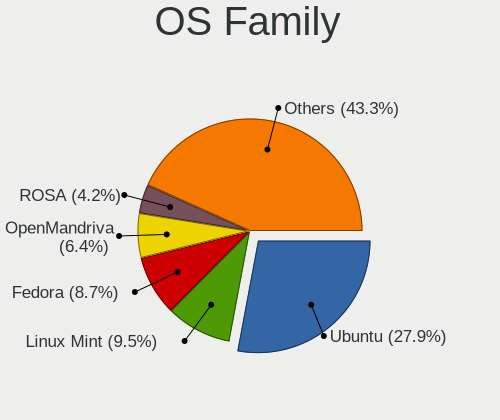

| Name          | Notebooks | Percent |
|---------------|-----------|---------|
| Ubuntu        | 159       | 30.75%  |
| Linux Mint    | 51        | 9.86%   |
| OpenMandriva  | 30        | 5.8%    |
| Fedora        | 28        | 5.42%   |
| ROSA          | 27        | 5.22%   |
| Endless       | 23        | 4.45%   |
| Manjaro       | 20        | 3.87%   |
| Pop!_OS       | 19        | 3.68%   |
| KDE neon      | 18        | 3.48%   |
| Xubuntu       | 15        | 2.9%    |
| Kubuntu       | 14        | 2.71%   |
| Debian        | 14        | 2.71%   |
| Zorin         | 13        | 2.51%   |
| Arch          | 13        | 2.51%   |
| Kali          | 12        | 2.32%   |
| Clear Linux   | 9         | 1.74%   |
| openSUSE      | 7         | 1.35%   |
| LMDE          | 6         | 1.16%   |
| ArcoLinux     | 6         | 1.16%   |
| Ubuntu Unity  | 5         | 0.97%   |
| Lubuntu       | 3         | 0.58%   |
| CentOS        | 3         | 0.58%   |
| Void Linux    | 2         | 0.39%   |
| SteamOS       | 2         | 0.39%   |
| MX            | 2         | 0.39%   |
| Elementary    | 2         | 0.39%   |
| Artix         | 2         | 0.39%   |
| Ubuntu Studio | 1         | 0.19%   |
| Ubuntu MATE   | 1         | 0.19%   |
| RHEL          | 1         | 0.19%   |
| Peppermint    | 1         | 0.19%   |
| Parrot        | 1         | 0.19%   |
| Oracle Linux  | 1         | 0.19%   |
| Mageia        | 1         | 0.19%   |
| Gentoo        | 1         | 0.19%   |
| Feren OS      | 1         | 0.19%   |
| EndeavourOS   | 1         | 0.19%   |
| Deepin        | 1         | 0.19%   |
| AlmaLinux     | 1         | 0.19%   |

Kernel
------

Version of the Linux kernel

| Version                         | Notebooks | Percent |
|---------------------------------|-----------|---------|
| 5.16.7-desktop-1omv4003         | 14        | 2.23%   |
| 5.10.14-desktop-1omv4002        | 13        | 2.07%   |
| 5.4.0-42-generic                | 10        | 1.59%   |
| 5.4.0-58-generic                | 8         | 1.27%   |
| 5.3.0-28-generic                | 7         | 1.11%   |
| 5.15.0-56-generic               | 7         | 1.11%   |
| 4.15.0-desktop-45.1rosa-x86_64  | 7         | 1.11%   |
| 5.8.0-14-generic                | 6         | 0.95%   |
| 5.4.0-91-generic                | 5         | 0.79%   |
| 5.4.0-48-generic                | 5         | 0.79%   |
| 5.4.0-29-generic                | 5         | 0.79%   |
| 5.4.0-26-generic                | 5         | 0.79%   |
| 4.15.0-20-generic               | 5         | 0.79%   |
| 5.9.16-1-MANJARO                | 4         | 0.64%   |
| 5.4.0-77-generic                | 4         | 0.64%   |
| 5.4.0-73-generic                | 4         | 0.64%   |
| 5.4.0-65-generic                | 4         | 0.64%   |
| 5.4.0-47-generic                | 4         | 0.64%   |
| 5.4.0-40-generic                | 4         | 0.64%   |
| 5.4.0-19-generic                | 4         | 0.64%   |
| 5.3.0-53-generic                | 4         | 0.64%   |
| 5.15.0-52-generic               | 4         | 0.64%   |
| 5.13.0-28-generic               | 4         | 0.64%   |
| 5.13.0-27-generic               | 4         | 0.64%   |
| 5.11.0-41-generic               | 4         | 0.64%   |
| 5.11.0-37-generic               | 4         | 0.64%   |
| 5.0.0-37-generic                | 4         | 0.64%   |
| 4.9.20-nrj-desktop-1rosa-x86_64 | 4         | 0.64%   |
| 4.19.0-8-amd64                  | 4         | 0.64%   |
| 5.8.0-63-generic                | 3         | 0.48%   |
| 5.4.0-90-generic                | 3         | 0.48%   |
| 5.4.0-81-generic                | 3         | 0.48%   |
| 5.4.0-74-generic                | 3         | 0.48%   |
| 5.4.0-72-generic                | 3         | 0.48%   |
| 5.4.0-67-generic                | 3         | 0.48%   |
| 5.4.0-56-generic                | 3         | 0.48%   |
| 5.3.0-51-generic                | 3         | 0.48%   |
| 5.3.0-46-generic                | 3         | 0.48%   |
| 5.3.0-42-generic                | 3         | 0.48%   |
| 5.3.0-40-generic                | 3         | 0.48%   |

Kernel Family
-------------

Linux kernel without a distro release

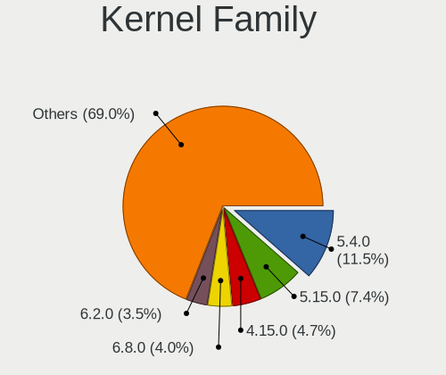

| Version | Notebooks | Percent |
|---------|-----------|---------|
| 5.4.0   | 110       | 18.58%  |
| 4.15.0  | 45        | 7.6%    |
| 5.15.0  | 36        | 6.08%   |
| 5.3.0   | 31        | 5.24%   |
| 5.8.0   | 30        | 5.07%   |
| 5.13.0  | 27        | 4.56%   |
| 5.11.0  | 25        | 4.22%   |
| 5.0.0   | 23        | 3.89%   |
| 4.18.0  | 16        | 2.7%    |
| 5.16.7  | 14        | 2.36%   |
| 5.10.14 | 14        | 2.36%   |
| 5.10.0  | 14        | 2.36%   |
| 5.19.0  | 9         | 1.52%   |
| 4.19.0  | 9         | 1.52%   |
| 5.9.16  | 7         | 1.18%   |
| 4.9.20  | 6         | 1.01%   |
| 5.17.5  | 5         | 0.84%   |
| 5.6.8   | 4         | 0.68%   |
| 4.4.0   | 4         | 0.68%   |
| 6.0.12  | 3         | 0.51%   |
| 5.7.19  | 3         | 0.51%   |
| 5.18.0  | 3         | 0.51%   |
| 5.16.0  | 3         | 0.51%   |
| 5.12.14 | 3         | 0.51%   |
| 5.11.12 | 3         | 0.51%   |
| 4.9.60  | 3         | 0.51%   |
| 4.9.155 | 3         | 0.51%   |
| 4.9.124 | 3         | 0.51%   |
| 6.0.11  | 2         | 0.34%   |
| 5.9.10  | 2         | 0.34%   |
| 5.8.18  | 2         | 0.34%   |
| 5.8.11  | 2         | 0.34%   |
| 5.6.0   | 2         | 0.34%   |
| 5.5.13  | 2         | 0.34%   |
| 5.4.32  | 2         | 0.34%   |
| 5.3.12  | 2         | 0.34%   |
| 5.17.9  | 2         | 0.34%   |
| 5.15.8  | 2         | 0.34%   |
| 5.15.7  | 2         | 0.34%   |
| 5.15.5  | 2         | 0.34%   |

Kernel Major Ver.
-----------------

Linux kernel major version

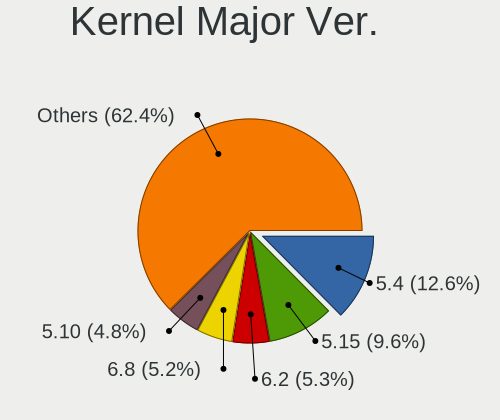

| Version | Notebooks | Percent |
|---------|-----------|---------|
| 5.4     | 117       | 20.35%  |
| 5.15    | 50        | 8.7%    |
| 4.15    | 45        | 7.83%   |
| 5.10    | 39        | 6.78%   |
| 5.8     | 35        | 6.09%   |
| 5.3     | 35        | 6.09%   |
| 5.13    | 31        | 5.39%   |
| 5.11    | 31        | 5.39%   |
| 5.0     | 26        | 4.52%   |
| 5.16    | 24        | 4.17%   |
| 4.18    | 17        | 2.96%   |
| 4.9     | 15        | 2.61%   |
| 4.19    | 14        | 2.43%   |
| 5.19    | 13        | 2.26%   |
| 5.9     | 12        | 2.09%   |
| 5.6     | 11        | 1.91%   |
| 5.17    | 11        | 1.91%   |
| 6.0     | 8         | 1.39%   |
| 5.12    | 7         | 1.22%   |
| 5.7     | 6         | 1.04%   |
| 5.5     | 6         | 1.04%   |
| 5.18    | 6         | 1.04%   |
| 5.14    | 5         | 0.87%   |
| 4.4     | 4         | 0.7%    |
| 5.1     | 2         | 0.35%   |
| 5.2     | 1         | 0.17%   |
| 4.13    | 1         | 0.17%   |
| 4.1     | 1         | 0.17%   |
| 3.13    | 1         | 0.17%   |
| 3.10    | 1         | 0.17%   |

Arch
----

OS architecture (x86_64, i586, etc.)

| Name   | Notebooks | Percent |
|--------|-----------|---------|
| x86_64 | 475       | 95.38%  |
| i686   | 23        | 4.62%   |

DE
--

Desktop Environment

| Name             | Notebooks | Percent |
|------------------|-----------|---------|
| GNOME            | 197       | 37.45%  |
| KDE5             | 84        | 15.97%  |
| Unknown          | 70        | 13.31%  |
| XFCE             | 55        | 10.46%  |
| X-Cinnamon       | 38        | 7.22%   |
| KDE4             | 18        | 3.42%   |
| KDE              | 17        | 3.23%   |
| Cinnamon         | 12        | 2.28%   |
| MATE             | 11        | 2.09%   |
| Unity            | 5         | 0.95%   |
| LXQt             | 4         | 0.76%   |
| GNOME Flashback  | 3         | 0.57%   |
| Pantheon         | 2         | 0.38%   |
| lightdm-xsession | 2         | 0.38%   |
| i3               | 2         | 0.38%   |
| Deepin           | 2         | 0.38%   |
| xmonad           | 1         | 0.19%   |
| LXDE             | 1         | 0.19%   |
| GNOME Classic    | 1         | 0.19%   |
| bspwm            | 1         | 0.19%   |

Display Server
--------------

X11 or Wayland

| Name    | Notebooks | Percent |
|---------|-----------|---------|
| X11     | 418       | 81.01%  |
| Wayland | 52        | 10.08%  |
| Unknown | 43        | 8.33%   |
| Tty     | 3         | 0.58%   |

Display Manager
---------------

SDDM, LightDM, etc.

| Name    | Notebooks | Percent |
|---------|-----------|---------|
| Unknown | 275       | 52.78%  |
| SDDM    | 77        | 14.78%  |
| LightDM | 49        | 9.4%    |
| GDM     | 45        | 8.64%   |
| GDM3    | 37        | 7.1%    |
| TDM     | 18        | 3.45%   |
| KDM     | 17        | 3.26%   |
| XDM     | 2         | 0.38%   |
| MDM     | 1         | 0.19%   |

OS Lang
-------

Language

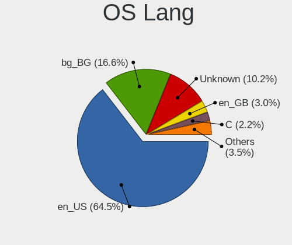

| Lang    | Notebooks | Percent |
|---------|-----------|---------|
| en_US   | 310       | 59.96%  |
| bg_BG   | 93        | 17.99%  |
| Unknown | 85        | 16.44%  |
| en_GB   | 15        | 2.9%    |
| C       | 7         | 1.35%   |
| ru_RU   | 4         | 0.77%   |
| fr_FR   | 1         | 0.19%   |
| en_DK   | 1         | 0.19%   |
| de_DE   | 1         | 0.19%   |

Boot Mode
---------

EFI or BIOS

| Mode | Notebooks | Percent |
|------|-----------|---------|
| BIOS | 284       | 55.8%   |
| EFI  | 225       | 44.2%   |

Filesystem
----------

Type of filesystem

| Type    | Notebooks | Percent |
|---------|-----------|---------|
| Ext4    | 398       | 78.5%   |
| Overlay | 33        | 6.51%   |
| Unknown | 32        | 6.31%   |
| Btrfs   | 26        | 5.13%   |
| Xfs     | 9         | 1.78%   |
| Ext2    | 3         | 0.59%   |
| Zfs     | 2         | 0.39%   |
| Tmpfs   | 2         | 0.39%   |
| Ext3    | 2         | 0.39%   |

Part. scheme
------------

Scheme of partitioning

| Type    | Notebooks | Percent |
|---------|-----------|---------|
| Unknown | 301       | 58.79%  |
| GPT     | 142       | 27.73%  |
| MBR     | 69        | 13.48%  |

Dual Boot with Linux/BSD
------------------------

Hosting more than one Linux/BSD

| Dual boot | Notebooks | Percent |
|-----------|-----------|---------|
| No        | 444       | 88.27%  |
| Yes       | 59        | 11.73%  |

Dual Boot (Win)
---------------

Hosting Linux and Windows

| Dual boot | Notebooks | Percent |
|-----------|-----------|---------|
| No        | 358       | 70.89%  |
| Yes       | 147       | 29.11%  |

Board
-----

Vendor
------

Motherboard manufacturer

| Name                | Notebooks | Percent |
|---------------------|-----------|---------|
| Lenovo              | 131       | 26.41%  |
| Hewlett-Packard     | 91        | 18.35%  |
| Dell                | 84        | 16.94%  |
| ASUSTek Computer    | 62        | 12.5%   |
| Acer                | 49        | 9.88%   |
| Toshiba             | 30        | 6.05%   |
| MSI                 | 10        | 2.02%   |
| Fujitsu             | 5         | 1.01%   |
| Apple               | 5         | 1.01%   |
| Fujitsu Siemens     | 4         | 0.81%   |
| Samsung Electronics | 3         | 0.6%    |
| Valve               | 2         | 0.4%    |
| TUXEDO              | 2         | 0.4%    |
| Sony                | 2         | 0.4%    |
| Packard Bell        | 2         | 0.4%    |
| Medion              | 2         | 0.4%    |
| HUAWEI              | 2         | 0.4%    |
| AMI                 | 2         | 0.4%    |
| Razer               | 1         | 0.2%    |
| Pegatron            | 1         | 0.2%    |
| Notebook            | 1         | 0.2%    |
| LG Electronics      | 1         | 0.2%    |
| IBM                 | 1         | 0.2%    |
| Gigabyte Technology | 1         | 0.2%    |
| Cube                | 1         | 0.2%    |
| Compal              | 1         | 0.2%    |

Model
-----

Motherboard model

| Name                                       | Notebooks | Percent |
|--------------------------------------------|-----------|---------|
| Lenovo G500 20236                          | 4         | 0.81%   |
| HP ProBook 4540s                           | 4         | 0.81%   |
| Dell Inspiron N5110                        | 4         | 0.81%   |
| ASUS X541NA                                | 4         | 0.81%   |
| Unknown                                    | 4         | 0.81%   |
| HP ProBook 450 G0                          | 3         | 0.6%    |
| Dell Latitude E6410                        | 3         | 0.6%    |
| ASUS VivoBook 15_ASUS Laptop X540MA_X540MA | 3         | 0.6%    |
| ASUS N551VW                                | 3         | 0.6%    |
| Acer Aspire 5738                           | 3         | 0.6%    |
| Valve Jupiter                              | 2         | 0.4%    |
| Toshiba Satellite L300                     | 2         | 0.4%    |
| Toshiba Satellite C50-A-19T                | 2         | 0.4%    |
| Toshiba Satellite A200                     | 2         | 0.4%    |
| Samsung 300E4Z/300E5Z/300E7Z               | 2         | 0.4%    |
| Lenovo Yoga S740-14IIL 81RS                | 2         | 0.4%    |
| Lenovo Y520-15IKBN 80WK                    | 2         | 0.4%    |
| Lenovo ThinkPad X220 4291IR6               | 2         | 0.4%    |
| Lenovo ThinkPad X1 Carbon 3rd 20BTS1D900   | 2         | 0.4%    |
| Lenovo ThinkPad T460 20FN003LUK            | 2         | 0.4%    |
| Lenovo ThinkPad T420 4236A87               | 2         | 0.4%    |
| Lenovo ThinkPad T14 Gen 1 20S0000NBM       | 2         | 0.4%    |
| Lenovo ThinkPad L590 20Q700AWBM            | 2         | 0.4%    |
| Lenovo ThinkPad E480 20KN005CBM            | 2         | 0.4%    |
| Lenovo ThinkBook 13s-IML 20RR              | 2         | 0.4%    |
| Lenovo Legion Y740-17IRHg 81UJ             | 2         | 0.4%    |
| Lenovo Legion 5 15ARH05 82B5               | 2         | 0.4%    |
| Lenovo IdeaPad Y510P 20217                 | 2         | 0.4%    |
| Lenovo IdeaPad Y500 20193                  | 2         | 0.4%    |
| Lenovo IdeaPad S540-14API 81NH             | 2         | 0.4%    |
| Lenovo G50-80 80E5                         | 2         | 0.4%    |
| HP ProBook 6470b                           | 2         | 0.4%    |
| HP ProBook 455 G8 Notebook PC              | 2         | 0.4%    |
| HP ProBook 450 G8 Notebook PC              | 2         | 0.4%    |
| HP Pavilion Laptop 15-eh0xxx               | 2         | 0.4%    |
| HP Pavilion Gaming Laptop 17-cd0xxx        | 2         | 0.4%    |
| HP Pavilion dv5                            | 2         | 0.4%    |
| HP Pavilion 15                             | 2         | 0.4%    |
| HP Notebook                                | 2         | 0.4%    |
| HP Laptop 15-da0xxx                        | 2         | 0.4%    |

Model Family
------------

Motherboard model prefix

| Name                  | Notebooks | Percent |
|-----------------------|-----------|---------|
| Lenovo ThinkPad       | 67        | 13.51%  |
| Acer Aspire           | 34        | 6.85%   |
| Dell Latitude         | 31        | 6.25%   |
| Dell Inspiron         | 26        | 5.24%   |
| Lenovo IdeaPad        | 25        | 5.04%   |
| Toshiba Satellite     | 24        | 4.84%   |
| HP ProBook            | 24        | 4.84%   |
| HP Pavilion           | 19        | 3.83%   |
| HP EliteBook          | 19        | 3.83%   |
| ASUS VivoBook         | 15        | 3.02%   |
| Dell Vostro           | 10        | 2.02%   |
| HP Compaq             | 9         | 1.81%   |
| Lenovo Legion         | 7         | 1.41%   |
| Lenovo Yoga           | 5         | 1.01%   |
| HP Laptop             | 5         | 1.01%   |
| Dell Precision        | 5         | 1.01%   |
| MSI Modern            | 4         | 0.81%   |
| Lenovo ThinkBook      | 4         | 0.81%   |
| Lenovo G500           | 4         | 0.81%   |
| HP 250                | 4         | 0.81%   |
| Dell XPS              | 4         | 0.81%   |
| ASUS X541NA           | 4         | 0.81%   |
| ASUS ASUS             | 4         | 0.81%   |
| Acer Nitro            | 4         | 0.81%   |
| Unknown               | 4         | 0.81%   |
| MSI GF63              | 3         | 0.6%    |
| Fujitsu Siemens AMILO | 3         | 0.6%    |
| Fujitsu LIFEBOOK      | 3         | 0.6%    |
| Dell Studio           | 3         | 0.6%    |
| ASUS Zenbook          | 3         | 0.6%    |
| ASUS N551VW           | 3         | 0.6%    |
| Acer TravelMate       | 3         | 0.6%    |
| Acer Predator         | 3         | 0.6%    |
| Valve Jupiter         | 2         | 0.4%    |
| Toshiba PORTEGE       | 2         | 0.4%    |
| Samsung 300E4Z        | 2         | 0.4%    |
| Lenovo Y520-15IKBN    | 2         | 0.4%    |
| Lenovo G50-80         | 2         | 0.4%    |
| HP Notebook           | 2         | 0.4%    |
| HP 255                | 2         | 0.4%    |

MFG Year
--------

Motherboard manufacture year

| Year | Notebooks | Percent |
|------|-----------|---------|
| 2020 | 46        | 9.27%   |
| 2019 | 44        | 8.87%   |
| 2012 | 44        | 8.87%   |
| 2011 | 44        | 8.87%   |
| 2017 | 41        | 8.27%   |
| 2013 | 38        | 7.66%   |
| 2018 | 37        | 7.46%   |
| 2015 | 35        | 7.06%   |
| 2014 | 30        | 6.05%   |
| 2010 | 29        | 5.85%   |
| 2008 | 27        | 5.44%   |
| 2021 | 23        | 4.64%   |
| 2009 | 17        | 3.43%   |
| 2016 | 15        | 3.02%   |
| 2022 | 10        | 2.02%   |
| 2007 | 9         | 1.81%   |
| 2006 | 5         | 1.01%   |
| 2004 | 2         | 0.4%    |

Form Factor
-----------

Physical design of the computer

| Name     | Notebooks | Percent |
|----------|-----------|---------|
| Notebook | 496       | 100%    |

Secure Boot
-----------

Enabled or disabled

| State    | Notebooks | Percent |
|----------|-----------|---------|
| Disabled | 467       | 93.78%  |
| Enabled  | 31        | 6.22%   |

Coreboot
--------

Have coreboot on board

| Used | Notebooks | Percent |
|------|-----------|---------|
| No   | 495       | 99.8%   |
| Yes  | 1         | 0.2%    |

RAM Size
--------

Total RAM memory

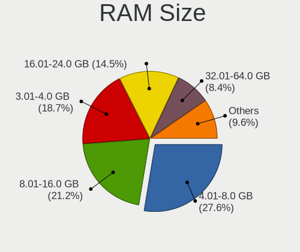

| Size in GB  | Notebooks | Percent |
|-------------|-----------|---------|
| 4.01-8.0    | 149       | 29.27%  |
| 3.01-4.0    | 114       | 22.4%   |
| 8.01-16.0   | 104       | 20.43%  |
| 16.01-24.0  | 66        | 12.97%  |
| 32.01-64.0  | 31        | 6.09%   |
| 1.01-2.0    | 19        | 3.73%   |
| 2.01-3.0    | 12        | 2.36%   |
| 24.01-32.0  | 6         | 1.18%   |
| 64.01-256.0 | 5         | 0.98%   |
| 0.51-1.0    | 3         | 0.59%   |

RAM Used
--------

Used RAM memory

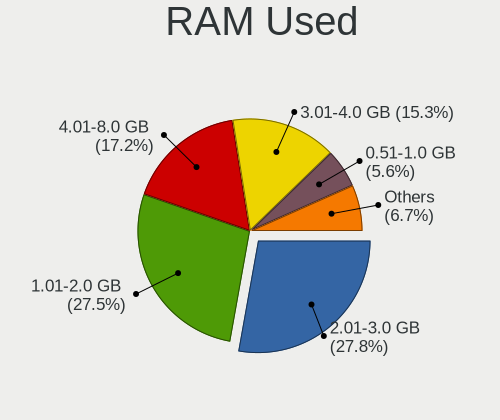

| Used GB    | Notebooks | Percent |
|------------|-----------|---------|
| 1.01-2.0   | 197       | 34.56%  |
| 2.01-3.0   | 160       | 28.07%  |
| 4.01-8.0   | 81        | 14.21%  |
| 3.01-4.0   | 67        | 11.75%  |
| 0.51-1.0   | 38        | 6.67%   |
| 8.01-16.0  | 22        | 3.86%   |
| 0.01-0.5   | 3         | 0.53%   |
| 16.01-24.0 | 1         | 0.18%   |
| Unknown    | 1         | 0.18%   |

Total Drives
------------

Number of drives on board

| Drives | Notebooks | Percent |
|--------|-----------|---------|
| 1      | 372       | 73.66%  |
| 2      | 120       | 23.76%  |
| 3      | 8         | 1.58%   |
| 0      | 5         | 0.99%   |

Has CD-ROM
----------

Has CD-ROM on board

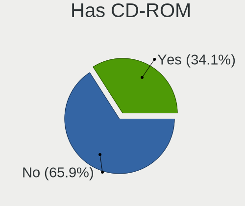

| Presented | Notebooks | Percent |
|-----------|-----------|---------|
| No        | 296       | 59.2%   |
| Yes       | 204       | 40.8%   |

Has Ethernet
------------

Has Ethernet on board

| Presented | Notebooks | Percent |
|-----------|-----------|---------|
| Yes       | 432       | 86.75%  |
| No        | 66        | 13.25%  |

Has WiFi
--------

Has WiFi module

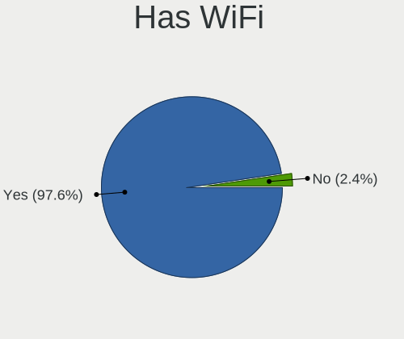

| Presented | Notebooks | Percent |
|-----------|-----------|---------|
| Yes       | 493       | 99.4%   |
| No        | 3         | 0.6%    |

Has Bluetooth
-------------

Has Bluetooth module

| Presented | Notebooks | Percent |
|-----------|-----------|---------|
| Yes       | 381       | 75.6%   |
| No        | 123       | 24.4%   |

Location
--------

Country
-------

Geographic location (country)

| Country  | Notebooks | Percent |
|----------|-----------|---------|
| Bulgaria | 496       | 100%    |

City
----

Geographic location (city)

| City                | Notebooks | Percent |
|---------------------|-----------|---------|
| Sofia               | 279       | 53.76%  |
| Varna               | 45        | 8.67%   |
| Plovdiv             | 31        | 5.97%   |
| Burgas              | 23        | 4.43%   |
| Stara Zagora        | 12        | 2.31%   |
| Yambol              | 8         | 1.54%   |
| Pernik              | 8         | 1.54%   |
| Pleven              | 7         | 1.35%   |
| Veliko Tarnovo      | 6         | 1.16%   |
| Kazanlak            | 5         | 0.96%   |
| Haskovo             | 5         | 0.96%   |
| Rousse              | 4         | 0.77%   |
| Dobrich             | 4         | 0.77%   |
| Vidin               | 3         | 0.58%   |
| Svilengrad          | 3         | 0.58%   |
| Shumen              | 3         | 0.58%   |
| Pazardzhik          | 3         | 0.58%   |
| Montana             | 3         | 0.58%   |
| Gabrovo             | 3         | 0.58%   |
| Asenovgrad          | 3         | 0.58%   |
| Svoge               | 2         | 0.39%   |
| Sliven              | 2         | 0.39%   |
| Silistra            | 2         | 0.39%   |
| Sevlievo            | 2         | 0.39%   |
| Kardzhali           | 2         | 0.39%   |
| Blagoevgrad         | 2         | 0.39%   |
| Vratsa              | 1         | 0.19%   |
| Voluyak             | 1         | 0.19%   |
| Troyan Municipality | 1         | 0.19%   |
| Sunny Beach         | 1         | 0.19%   |
| Smolyan             | 1         | 0.19%   |
| Slashten            | 1         | 0.19%   |
| Skutare             | 1         | 0.19%   |
| Sistov              | 1         | 0.19%   |
| Sarafovo            | 1         | 0.19%   |
| Sandanski           | 1         | 0.19%   |
| Samokov             | 1         | 0.19%   |
| Ruen                | 1         | 0.19%   |
| Rogozen             | 1         | 0.19%   |
| Razgrad             | 1         | 0.19%   |

Drives
------

Drive Vendor
------------

Hard drive vendors

| Vendor                      | Notebooks | Drives | Percent |
|-----------------------------|-----------|--------|---------|
| Samsung Electronics         | 86        | 128    | 14.14%  |
| WDC                         | 74        | 97     | 12.17%  |
| Seagate                     | 73        | 91     | 12.01%  |
| Toshiba                     | 70        | 92     | 11.51%  |
| SanDisk                     | 32        | 44     | 5.26%   |
| Kingston                    | 31        | 45     | 5.1%    |
| HGST                        | 28        | 41     | 4.61%   |
| Unknown                     | 27        | 33     | 4.44%   |
| Hitachi                     | 27        | 28     | 4.44%   |
| Intel                       | 25        | 38     | 4.11%   |
| SK hynix                    | 23        | 27     | 3.78%   |
| A-DATA Technology           | 18        | 26     | 2.96%   |
| Crucial                     | 9         | 12     | 1.48%   |
| Micron Technology           | 8         | 9      | 1.32%   |
| KIOXIA                      | 8         | 9      | 1.32%   |
| Transcend                   | 7         | 7      | 1.15%   |
| Fujitsu                     | 6         | 9      | 0.99%   |
| KingSpec                    | 5         | 6      | 0.82%   |
| Team                        | 4         | 4      | 0.66%   |
| SPCC                        | 4         | 5      | 0.66%   |
| China                       | 4         | 5      | 0.66%   |
| Apple                       | 4         | 6      | 0.66%   |
| PNY                         | 3         | 3      | 0.49%   |
| LITEONIT                    | 3         | 3      | 0.49%   |
| LITEON                      | 3         | 4      | 0.49%   |
| Union Memory (Shenzhen)     | 2         | 2      | 0.33%   |
| Teclast                     | 2         | 2      | 0.33%   |
| Realtek                     | 2         | 2      | 0.33%   |
| Patriot                     | 2         | 2      | 0.33%   |
| TO Exter                    | 1         | 1      | 0.16%   |
| Silicon Motion              | 1         | 1      | 0.16%   |
| Realtek Semiconductor       | 1         | 2      | 0.16%   |
| Phison Electronics          | 1         | 1      | 0.16%   |
| O2 Micro                    | 1         | 1      | 0.16%   |
| Netac                       | 1         | 3      | 0.16%   |
| Micron/Crucial Technology   | 1         | 1      | 0.16%   |
| Lexar                       | 1         | 1      | 0.16%   |
| Lenovo                      | 1         | 1      | 0.16%   |
| Kingston Technology Company | 1         | 1      | 0.16%   |
| KingFast                    | 1         | 1      | 0.16%   |

Drive Model
-----------

Hard drive models

| Model                                  | Notebooks | Percent |
|----------------------------------------|-----------|---------|
| Seagate ST1000LM035-1RK172 1TB         | 17        | 2.69%   |
| Toshiba MQ01ABD100 1TB                 | 14        | 2.22%   |
| Toshiba MQ01ABF050 500GB               | 13        | 2.06%   |
| Seagate ST1000LM024 HN-M101MBB 1TB     | 11        | 1.74%   |
| Samsung NVMe SSD Drive 512GB           | 11        | 1.74%   |
| HGST HTS721010A9E630 1TB               | 11        | 1.74%   |
| Samsung SSD 860 EVO 250GB              | 9         | 1.42%   |
| Unknown MMC Card  32GB                 | 7         | 1.11%   |
| SanDisk NVMe SSD Drive 512GB           | 7         | 1.11%   |
| WDC WD10SPZX-21Z10T0 1TB               | 6         | 0.95%   |
| Samsung SSD 860 EVO 500GB              | 6         | 0.95%   |
| Samsung SSD 850 EVO 250GB              | 6         | 0.95%   |
| Kingston SA400S37120G 120GB SSD        | 6         | 0.95%   |
| HGST HTS541010A9E680 1TB               | 6         | 0.95%   |
| Unknown MMC Card  64GB                 | 5         | 0.79%   |
| Toshiba NVMe SSD Drive 256GB           | 5         | 0.79%   |
| Samsung NVMe SSD Drive 1024GB          | 5         | 0.79%   |
| Toshiba MQ04ABF100 1TB                 | 4         | 0.63%   |
| Toshiba MQ01ABD075 752GB               | 4         | 0.63%   |
| SK hynix NVMe SSD Drive 256GB          | 4         | 0.63%   |
| Seagate ST9750420AS 752GB              | 4         | 0.63%   |
| Seagate ST9500325AS 500GB              | 4         | 0.63%   |
| SanDisk NVMe SSD Drive 256GB           | 4         | 0.63%   |
| Kingston SA400S37240G 240GB SSD        | 4         | 0.63%   |
| Kingston NVMe SSD Drive 512GB          | 4         | 0.63%   |
| Intel NVMe SSD Drive 512GB             | 4         | 0.63%   |
| Hitachi HTS547575A9E384 752GB          | 4         | 0.63%   |
| HGST HTS545050A7E680 500GB             | 4         | 0.63%   |
| WDC WD5000LPVX-75V0TT0 500GB           | 3         | 0.47%   |
| WDC WD5000LPVX-22V0TT0 500GB           | 3         | 0.47%   |
| WDC WD10JPVX-22JC3T0 1TB               | 3         | 0.47%   |
| SPCC Solid State Disk 512GB            | 3         | 0.47%   |
| Seagate ST750LM022 HN-M750MBB 752GB    | 3         | 0.47%   |
| Seagate ST1000LM048-2E7172 1TB         | 3         | 0.47%   |
| Samsung SM963 2.5" NVMe PCIe SSD 256GB | 3         | 0.47%   |
| Kingston NVMe SSD Drive 1TB            | 3         | 0.47%   |
| Intel SSDSC2CW120A3 120GB              | 3         | 0.47%   |
| Hitachi HTS723232A7A364 320GB          | 3         | 0.47%   |
| Hitachi HTS541616J9SA00 160GB          | 3         | 0.47%   |
| WDC WDS500G2B0B-00YS70 500GB SSD       | 2         | 0.32%   |

HDD Vendor
----------

Hard disk drive vendors

| Vendor              | Notebooks | Drives | Percent |
|---------------------|-----------|--------|---------|
| Seagate             | 72        | 90     | 28.92%  |
| WDC                 | 59        | 74     | 23.69%  |
| Toshiba             | 53        | 67     | 21.29%  |
| HGST                | 28        | 41     | 11.24%  |
| Hitachi             | 27        | 28     | 10.84%  |
| Fujitsu             | 6         | 9      | 2.41%   |
| Unknown             | 2         | 3      | 0.8%    |
| Samsung Electronics | 1         | 2      | 0.4%    |
| IBM/Hitachi         | 1         | 2      | 0.4%    |

SSD Vendor
----------

Solid state drive vendors

| Vendor              | Notebooks | Drives | Percent |
|---------------------|-----------|--------|---------|
| Samsung Electronics | 47        | 57     | 25.68%  |
| SanDisk             | 19        | 24     | 10.38%  |
| Kingston            | 19        | 23     | 10.38%  |
| A-DATA Technology   | 14        | 22     | 7.65%   |
| WDC                 | 11        | 16     | 6.01%   |
| Intel               | 8         | 11     | 4.37%   |
| Crucial             | 8         | 10     | 4.37%   |
| Transcend           | 6         | 6      | 3.28%   |
| Toshiba             | 5         | 5      | 2.73%   |
| Team                | 4         | 4      | 2.19%   |
| SPCC                | 4         | 5      | 2.19%   |
| Micron Technology   | 4         | 4      | 2.19%   |
| KingSpec            | 4         | 5      | 2.19%   |
| China               | 4         | 5      | 2.19%   |
| PNY                 | 3         | 3      | 1.64%   |
| LITEONIT            | 3         | 3      | 1.64%   |
| LITEON              | 3         | 4      | 1.64%   |
| Apple               | 3         | 5      | 1.64%   |
| Teclast             | 2         | 2      | 1.09%   |
| Patriot             | 2         | 2      | 1.09%   |
| Unknown             | 1         | 1      | 0.55%   |
| TO Exter            | 1         | 1      | 0.55%   |
| SK hynix            | 1         | 1      | 0.55%   |
| Netac               | 1         | 3      | 0.55%   |
| Lexar               | 1         | 1      | 0.55%   |
| Intenso             | 1         | 1      | 0.55%   |
| GOODRAM             | 1         | 1      | 0.55%   |
| FORESEE             | 1         | 1      | 0.55%   |
| EDGE                | 1         | 1      | 0.55%   |
| AMD                 | 1         | 2      | 0.55%   |

Drive Kind
----------

HDD or SSD

| Kind    | Notebooks | Drives | Percent |
|---------|-----------|--------|---------|
| HDD     | 241       | 316    | 40.78%  |
| SSD     | 175       | 229    | 29.61%  |
| NVMe    | 147       | 225    | 24.87%  |
| MMC     | 23        | 28     | 3.89%   |
| Unknown | 5         | 4      | 0.85%   |

Drive Connector
---------------

SATA, SAS, NVMe, etc.

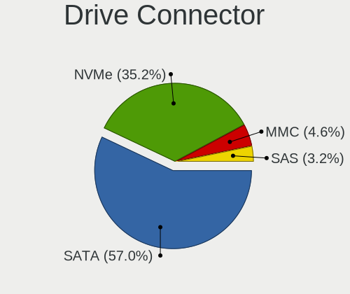

| Type | Notebooks | Drives | Percent |
|------|-----------|--------|---------|
| SATA | 367       | 534    | 66.37%  |
| NVMe | 146       | 223    | 26.4%   |
| MMC  | 23        | 28     | 4.16%   |
| SAS  | 17        | 17     | 3.07%   |

Drive Size
----------

Size of hard drive

| Size in TB | Notebooks | Drives | Percent |
|------------|-----------|--------|---------|
| 0.01-0.5   | 266       | 353    | 64.72%  |
| 0.51-1.0   | 139       | 185    | 33.82%  |
| 1.01-2.0   | 3         | 4      | 0.73%   |
| 3.01-4.0   | 2         | 2      | 0.49%   |
| 4.01-10.0  | 1         | 1      | 0.24%   |

Space Total
-----------

Amount of disk space available on the file system

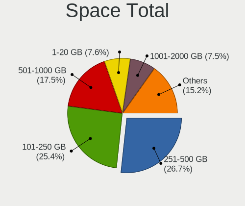

| Size in GB     | Notebooks | Percent |
|----------------|-----------|---------|
| 101-250        | 147       | 28%     |
| 251-500        | 131       | 24.95%  |
| 501-1000       | 89        | 16.95%  |
| 1001-2000      | 39        | 7.43%   |
| 1-20           | 38        | 7.24%   |
| 51-100         | 36        | 6.86%   |
| 21-50          | 28        | 5.33%   |
| Unknown        | 8         | 1.52%   |
| More than 3000 | 6         | 1.14%   |
| 2001-3000      | 3         | 0.57%   |

Space Used
----------

Amount of used disk space

| Used GB        | Notebooks | Percent |
|----------------|-----------|---------|
| 1-20           | 221       | 38.84%  |
| 21-50          | 100       | 17.57%  |
| 101-250        | 85        | 14.94%  |
| 51-100         | 74        | 13.01%  |
| 251-500        | 41        | 7.21%   |
| 501-1000       | 27        | 4.75%   |
| 1001-2000      | 9         | 1.58%   |
| Unknown        | 8         | 1.41%   |
| 2001-3000      | 3         | 0.53%   |
| More than 3000 | 1         | 0.18%   |

Malfunc. Drives
---------------

Drive models with a malfunction

| Model                              | Notebooks | Drives | Percent |
|------------------------------------|-----------|--------|---------|
| Seagate ST9500325AS 500GB          | 3         | 3      | 8.11%   |
| Toshiba MQ01ABF050 500GB           | 2         | 2      | 5.41%   |
| Seagate ST1000LM024 HN-M101MBB 1TB | 2         | 2      | 5.41%   |
| Intel SSDSC2CW120A3 120GB          | 2         | 2      | 5.41%   |
| WDC WDS100T2B0B-00YS70 1TB SSD     | 1         | 1      | 2.7%    |
| WDC WD5000BEVT-75A0RT0 500GB       | 1         | 1      | 2.7%    |
| WDC WD3200BEVT-80A0RT0 320GB       | 1         | 1      | 2.7%    |
| WDC WD1600BEVT-80A23T0 160GB       | 1         | 1      | 2.7%    |
| Toshiba MQ01ABD100 1TB             | 1         | 1      | 2.7%    |
| Toshiba MK2552GSX 250GB            | 1         | 3      | 2.7%    |
| Toshiba MK2035GSS 200GB            | 1         | 1      | 2.7%    |
| Toshiba MK1637GSX 160GB            | 1         | 1      | 2.7%    |
| Seagate ST9500420AS 500GB          | 1         | 2      | 2.7%    |
| Seagate ST94019A 40GB              | 1         | 1      | 2.7%    |
| Seagate ST500LT012-9WS142 500GB    | 1         | 1      | 2.7%    |
| Seagate ST500LM021-1KJ152 500GB    | 1         | 1      | 2.7%    |
| Seagate ST500LM000-1EJ162 500GB    | 1         | 1      | 2.7%    |
| Seagate ST1000LM035-1RK172 1TB     | 1         | 1      | 2.7%    |
| Seagate ST1000LM014-1EJ164 1TB     | 1         | 1      | 2.7%    |
| KingSpec P3-256 256GB              | 1         | 1      | 2.7%    |
| KingSpec P3-128 128GB SSD          | 1         | 1      | 2.7%    |
| Hitachi HTS547550A9E384 500GB      | 1         | 1      | 2.7%    |
| Hitachi HTS545050A7E380 500GB      | 1         | 1      | 2.7%    |
| Hitachi HTS543225L9SA00 250GB      | 1         | 2      | 2.7%    |
| Hitachi HTS543225L9A300 250GB      | 1         | 1      | 2.7%    |
| Hitachi HTS543216L9SA00 160GB      | 1         | 1      | 2.7%    |
| Hitachi HTS542525K9SA00 250GB      | 1         | 1      | 2.7%    |
| Hitachi HTS541616J9SA00 160GB      | 1         | 1      | 2.7%    |
| Fujitsu MJA2160BH G2 160GB         | 1         | 2      | 2.7%    |
| A-DATA Technology SX300 64GB SSD   | 1         | 1      | 2.7%    |
| A-DATA Technology SU650 480GB SSD  | 1         | 1      | 2.7%    |
| A-DATA Technology SU650 120GB SSD  | 1         | 1      | 2.7%    |

Malfunc. Drive Vendor
---------------------

Vendors of faulty drives

| Vendor            | Notebooks | Drives | Percent |
|-------------------|-----------|--------|---------|
| Seagate           | 12        | 13     | 32.43%  |
| Hitachi           | 7         | 8      | 18.92%  |
| Toshiba           | 6         | 8      | 16.22%  |
| WDC               | 4         | 4      | 10.81%  |
| A-DATA Technology | 3         | 3      | 8.11%   |
| KingSpec          | 2         | 2      | 5.41%   |
| Intel             | 2         | 2      | 5.41%   |
| Fujitsu           | 1         | 2      | 2.7%    |

Malfunc. HDD Vendor
-------------------

Vendors of faulty HDD drives

| Vendor  | Notebooks | Drives | Percent |
|---------|-----------|--------|---------|
| Seagate | 12        | 13     | 41.38%  |
| Hitachi | 7         | 8      | 24.14%  |
| Toshiba | 6         | 8      | 20.69%  |
| WDC     | 3         | 3      | 10.34%  |
| Fujitsu | 1         | 2      | 3.45%   |

Malfunc. Drive Kind
-------------------

Kinds of faulty drives

| Kind | Notebooks | Drives | Percent |
|------|-----------|--------|---------|
| HDD  | 28        | 34     | 77.78%  |
| SSD  | 8         | 8      | 22.22%  |

Failed Drives
-------------

Failed drive models

| Model                        | Notebooks | Drives | Percent |
|------------------------------|-----------|--------|---------|
| WDC WD1600BEKT-75PVMT0 160GB | 1         | 1      | 50%     |
| HGST HTS545050A7E680 500GB   | 1         | 1      | 50%     |

Failed Drive Vendor
-------------------

Failed drive vendors

| Vendor | Notebooks | Drives | Percent |
|--------|-----------|--------|---------|
| WDC    | 1         | 1      | 50%     |
| HGST   | 1         | 1      | 50%     |

Drive Status
------------

Number of failed and malfunc. drives

| Status   | Notebooks | Drives | Percent |
|----------|-----------|--------|---------|
| Detected | 315       | 500    | 60.11%  |
| Works    | 172       | 258    | 32.82%  |
| Malfunc  | 35        | 42     | 6.68%   |
| Failed   | 2         | 2      | 0.38%   |

Storage controller
------------------

Storage Vendor
--------------

Storage controller vendors

| Vendor                           | Notebooks | Percent |
|----------------------------------|-----------|---------|
| Intel                            | 389       | 67.89%  |
| Samsung Electronics              | 46        | 8.03%   |
| AMD                              | 41        | 7.16%   |
| SK hynix                         | 22        | 3.84%   |
| SanDisk                          | 19        | 3.32%   |
| Kingston Technology Company      | 13        | 2.27%   |
| KIOXIA                           | 11        | 1.92%   |
| Toshiba America Info Systems     | 10        | 1.75%   |
| Realtek Semiconductor            | 4         | 0.7%    |
| Micron Technology                | 4         | 0.7%    |
| Union Memory (Shenzhen)          | 2         | 0.35%   |
| Silicon Motion                   | 2         | 0.35%   |
| Micron/Crucial Technology        | 2         | 0.35%   |
| Silicon Integrated Systems [SiS] | 1         | 0.17%   |
| Phison Electronics               | 1         | 0.17%   |
| O2 Micro                         | 1         | 0.17%   |
| Nvidia                           | 1         | 0.17%   |
| Marvell Technology Group         | 1         | 0.17%   |
| Lenovo                           | 1         | 0.17%   |
| Apple                            | 1         | 0.17%   |
| ADATA Technology                 | 1         | 0.17%   |

Storage Model
-------------

Storage controller models

| Model                                                                                  | Notebooks | Percent |
|----------------------------------------------------------------------------------------|-----------|---------|
| Intel 7 Series Chipset Family 6-port SATA Controller [AHCI mode]                       | 51        | 8.37%   |
| Intel 6 Series/C200 Series Chipset Family 6 port Mobile SATA AHCI Controller           | 32        | 5.25%   |
| AMD FCH SATA Controller [AHCI mode]                                                    | 32        | 5.25%   |
| Intel Sunrise Point-LP SATA Controller [AHCI mode]                                     | 31        | 5.09%   |
| Intel 82801 Mobile SATA Controller [RAID mode]                                         | 31        | 5.09%   |
| Samsung NVMe SSD Controller SM981/PM981/PM983                                          | 27        | 4.43%   |
| Intel 82801IBM/IEM (ICH9M/ICH9M-E) 4 port SATA Controller [AHCI mode]                  | 26        | 4.27%   |
| Intel Wildcat Point-LP SATA Controller [AHCI Mode]                                     | 25        | 4.11%   |
| Intel 8 Series/C220 Series Chipset Family 6-port SATA Controller 1 [AHCI mode]         | 20        | 3.28%   |
| Intel HM170/QM170 Chipset SATA Controller [AHCI Mode]                                  | 18        | 2.96%   |
| Intel 8 Series SATA Controller 1 [AHCI mode]                                           | 16        | 2.63%   |
| Intel Cannon Lake Mobile PCH SATA AHCI Controller                                      | 15        | 2.46%   |
| Intel Celeron/Pentium Silver Processor SATA Controller                                 | 12        | 1.97%   |
| SK hynix Gold P31/PC711 NVMe Solid State Drive                                         | 10        | 1.64%   |
| KIOXIA NVMe SSD Controller BG4                                                         | 10        | 1.64%   |
| Intel Celeron N3350/Pentium N4200/Atom E3900 Series SATA AHCI Controller               | 10        | 1.64%   |
| Samsung NVMe SSD Controller 980                                                        | 9         | 1.48%   |
| Intel 5 Series/3400 Series Chipset 4 port SATA AHCI Controller                         | 9         | 1.48%   |
| Intel Volume Management Device NVMe RAID Controller                                    | 8         | 1.31%   |
| Intel 5 Series/3400 Series Chipset 6 port SATA AHCI Controller                         | 8         | 1.31%   |
| Intel SSD Pro 7600p/760p/E 6100p Series                                                | 7         | 1.15%   |
| Intel SSD 660P Series                                                                  | 7         | 1.15%   |
| SanDisk WD Blue SN550 NVMe SSD                                                         | 6         | 0.99%   |
| Intel 82801IBM/IEM (ICH9M/ICH9M-E) 2 port SATA Controller [IDE mode]                   | 6         | 0.99%   |
| Intel 82801GBM/GHM (ICH7-M Family) SATA Controller [IDE mode]                          | 6         | 0.99%   |
| SanDisk WD Black SN750 / PC SN730 NVMe SSD                                             | 5         | 0.82%   |
| Kingston Company Company Non-Volatile memory controller                                | 5         | 0.82%   |
| Intel Cannon Point-LP SATA Controller [AHCI Mode]                                      | 5         | 0.82%   |
| Intel Atom/Celeron/Pentium Processor x5-E8000/J3xxx/N3xxx Series SATA Controller       | 5         | 0.82%   |
| Intel 82801HM/HEM (ICH8M/ICH8M-E) SATA Controller [AHCI mode]                          | 5         | 0.82%   |
| Intel 82801HM/HEM (ICH8M/ICH8M-E) IDE Controller                                       | 5         | 0.82%   |
| Intel 5 Series/3400 Series Chipset 4 port SATA IDE Controller                          | 5         | 0.82%   |
| Intel 5 Series/3400 Series Chipset 2 port SATA IDE Controller                          | 5         | 0.82%   |
| AMD SB7x0/SB8x0/SB9x0 SATA Controller [AHCI mode]                                      | 5         | 0.82%   |
| SK hynix BC511                                                                         | 4         | 0.66%   |
| Samsung NVMe SSD Controller SM961/PM961/SM963                                          | 4         | 0.66%   |
| Micron Non-Volatile memory controller                                                  | 4         | 0.66%   |
| Intel 82801HM/HEM (ICH8M/ICH8M-E) SATA Controller [IDE mode]                           | 4         | 0.66%   |
| Intel 82801GBM/GHM (ICH7-M Family) SATA Controller [AHCI mode]                         | 4         | 0.66%   |
| Intel 6 Series/C200 Series Chipset Family Mobile SATA Controller (IDE mode, ports 4-5) | 4         | 0.66%   |

Storage Kind
------------

Kind of storage controller (IDE, SATA, NVMe, SAS, ...)

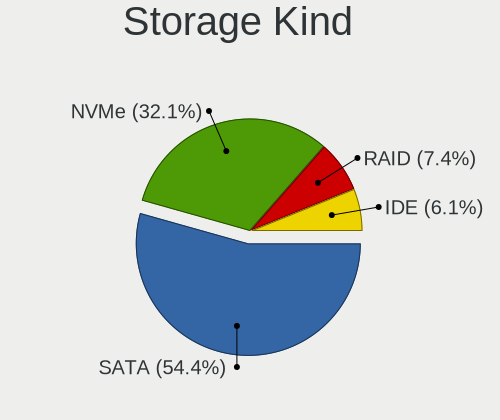

| Kind | Notebooks | Percent |
|------|-----------|---------|
| SATA | 351       | 59.59%  |
| NVMe | 150       | 25.47%  |
| IDE  | 48        | 8.15%   |
| RAID | 40        | 6.79%   |

Processor
---------

CPU Vendor
----------

Processor vendors

| Vendor | Notebooks | Percent |
|--------|-----------|---------|
| Intel  | 432       | 87.1%   |
| AMD    | 64        | 12.9%   |

CPU Model
---------

Processor models

| Model                                       | Notebooks | Percent |
|---------------------------------------------|-----------|---------|
| Intel Core i5-2520M CPU @ 2.50GHz           | 10        | 2.02%   |
| Intel Core i7-8750H CPU @ 2.20GHz           | 9         | 1.81%   |
| Intel Core i7-7700HQ CPU @ 2.80GHz          | 9         | 1.81%   |
| Intel Core i7-10510U CPU @ 1.80GHz          | 9         | 1.81%   |
| Intel Core i5-3230M CPU @ 2.60GHz           | 9         | 1.81%   |
| Intel Core i7-6700HQ CPU @ 2.60GHz          | 8         | 1.61%   |
| Intel Core i7-9750H CPU @ 2.60GHz           | 7         | 1.41%   |
| Intel Core i5-5200U CPU @ 2.20GHz           | 7         | 1.41%   |
| Intel Pentium CPU N4200 @ 1.10GHz           | 6         | 1.21%   |
| Intel Core i5-8265U CPU @ 1.60GHz           | 6         | 1.21%   |
| Intel Core i5-2410M CPU @ 2.30GHz           | 6         | 1.21%   |
| Intel Celeron N4000 CPU @ 1.10GHz           | 6         | 1.21%   |
| Intel 11th Gen Core i5-1135G7 @ 2.40GHz     | 6         | 1.21%   |
| Intel Pentium Silver N5000 CPU @ 1.10GHz    | 5         | 1.01%   |
| Intel Pentium CPU 2020M @ 2.40GHz           | 5         | 1.01%   |
| Intel Core i7-8565U CPU @ 1.80GHz           | 5         | 1.01%   |
| Intel Core i7-8550U CPU @ 1.80GHz           | 5         | 1.01%   |
| Intel Core i7-3630QM CPU @ 2.40GHz          | 5         | 1.01%   |
| Intel Core i7-2670QM CPU @ 2.20GHz          | 5         | 1.01%   |
| Intel Core i7-10750H CPU @ 2.60GHz          | 5         | 1.01%   |
| Intel Core i5-8250U CPU @ 1.60GHz           | 5         | 1.01%   |
| Intel Core i5-3210M CPU @ 2.50GHz           | 5         | 1.01%   |
| Intel Core i3-5005U CPU @ 2.00GHz           | 5         | 1.01%   |
| Intel Core i3 CPU M 370 @ 2.40GHz           | 5         | 1.01%   |
| AMD Ryzen 3 3250U with Radeon Graphics      | 5         | 1.01%   |
| Intel Core i7-7500U CPU @ 2.70GHz           | 4         | 0.81%   |
| Intel Core i7-5600U CPU @ 2.60GHz           | 4         | 0.81%   |
| Intel Core i7-5500U CPU @ 2.40GHz           | 4         | 0.81%   |
| Intel Core i5-5300U CPU @ 2.30GHz           | 4         | 0.81%   |
| Intel Core i5-4300U CPU @ 1.90GHz           | 4         | 0.81%   |
| Intel Core i5-3340M CPU @ 2.70GHz           | 4         | 0.81%   |
| Intel Core i5 CPU M 520 @ 2.40GHz           | 4         | 0.81%   |
| Intel Core i3-3110M CPU @ 2.40GHz           | 4         | 0.81%   |
| Intel Core 2 Duo CPU P8700 @ 2.53GHz        | 4         | 0.81%   |
| Intel Core 2 Duo CPU P8600 @ 2.40GHz        | 4         | 0.81%   |
| Intel Celeron CPU 1005M @ 1.90GHz           | 4         | 0.81%   |
| Intel 11th Gen Core i7-1165G7 @ 2.80GHz     | 4         | 0.81%   |
| AMD Ryzen 5 5500U with Radeon Graphics      | 4         | 0.81%   |
| AMD Ryzen 5 4600H with Radeon Graphics      | 4         | 0.81%   |
| Intel Pentium Dual-Core CPU T4500 @ 2.30GHz | 3         | 0.6%    |

CPU Model Family
----------------

Processor model prefix

| Model                   | Notebooks | Percent |
|-------------------------|-----------|---------|
| Intel Core i7           | 137       | 27.62%  |
| Intel Core i5           | 114       | 22.98%  |
| Intel Core i3           | 39        | 7.86%   |
| Intel Core 2 Duo        | 30        | 6.05%   |
| Intel Pentium           | 26        | 5.24%   |
| Intel Celeron           | 23        | 4.64%   |
| Other                   | 22        | 4.44%   |
| AMD Ryzen 5             | 18        | 3.63%   |
| AMD Ryzen 7             | 17        | 3.43%   |
| Intel Atom              | 9         | 1.81%   |
| Intel Pentium Dual-Core | 6         | 1.21%   |
| AMD Ryzen 3             | 6         | 1.21%   |
| Intel Pentium Silver    | 5         | 1.01%   |
| Intel Core 2            | 5         | 1.01%   |
| Intel Pentium Dual      | 4         | 0.81%   |
| AMD Ryzen 7 PRO         | 4         | 0.81%   |
| Intel Pentium M         | 2         | 0.4%    |
| Intel Genuine           | 2         | 0.4%    |
| Intel Core i9           | 2         | 0.4%    |
| Intel Celeron Dual-Core | 2         | 0.4%    |
| AMD Ryzen 5 PRO         | 2         | 0.4%    |
| AMD E1                  | 2         | 0.4%    |
| AMD A6                  | 2         | 0.4%    |
| Intel Xeon              | 1         | 0.2%    |
| Intel Mobile Pentium 4  | 1         | 0.2%    |
| Intel Core m3           | 1         | 0.2%    |
| Intel Core M            | 1         | 0.2%    |
| Intel Core Duo          | 1         | 0.2%    |
| Intel Core 2 Solo       | 1         | 0.2%    |
| Intel Celeron M         | 1         | 0.2%    |
| AMD Turion 64 X2 Mobile | 1         | 0.2%    |
| AMD Turion 64 Mobile    | 1         | 0.2%    |
| AMD Sempron             | 1         | 0.2%    |
| AMD Ryzen 9             | 1         | 0.2%    |
| AMD Phenom II           | 1         | 0.2%    |
| AMD E2                  | 1         | 0.2%    |
| AMD E                   | 1         | 0.2%    |
| AMD C-50                | 1         | 0.2%    |
| AMD Athlon II Dual-Core | 1         | 0.2%    |
| AMD A10                 | 1         | 0.2%    |

CPU Cores
---------

Number of processor cores

| Number  | Notebooks | Percent |
|---------|-----------|---------|
| 2       | 255       | 51.31%  |
| 4       | 162       | 32.6%   |
| 6       | 39        | 7.85%   |
| 8       | 21        | 4.23%   |
| 1       | 14        | 2.82%   |
| 12      | 2         | 0.4%    |
| 14      | 1         | 0.2%    |
| 10      | 1         | 0.2%    |
| 3       | 1         | 0.2%    |
| Unknown | 1         | 0.2%    |

CPU Sockets
-----------

Number of sockets

| Number | Notebooks | Percent |
|--------|-----------|---------|
| 1      | 496       | 100%    |

CPU Threads
-----------

Threads per core (Hyper-Threading)

| Number  | Notebooks | Percent |
|---------|-----------|---------|
| 2       | 363       | 73.04%  |
| 1       | 133       | 26.76%  |
| Unknown | 1         | 0.2%    |

CPU Op-Modes
------------

CPU Operation Modes (32-bit, 64-bit)

| Op mode        | Notebooks | Percent |
|----------------|-----------|---------|
| 32-bit, 64-bit | 472       | 94.4%   |
| Unknown        | 17        | 3.4%    |
| 32-bit         | 11        | 2.2%    |

CPU Microcode
-------------

Microcode number

| Number     | Notebooks | Percent |
|------------|-----------|---------|
| Unknown    | 102       | 19.77%  |
| 0x306a9    | 44        | 8.53%   |
| 0x206a7    | 39        | 7.56%   |
| 0x306d4    | 22        | 4.26%   |
| 0x1067a    | 22        | 4.26%   |
| 0x806ec    | 21        | 4.07%   |
| 0x306c3    | 19        | 3.68%   |
| 0x906ea    | 16        | 3.1%    |
| 0x406e3    | 15        | 2.91%   |
| 0x40651    | 15        | 2.91%   |
| 0x20655    | 15        | 2.91%   |
| 0x806ea    | 12        | 2.33%   |
| 0x906e9    | 11        | 2.13%   |
| 0x806c1    | 10        | 1.94%   |
| 0x706a1    | 10        | 1.94%   |
| 0x6fd      | 10        | 1.94%   |
| 0x506c9    | 9         | 1.74%   |
| 0x506e3    | 8         | 1.55%   |
| 0x10676    | 8         | 1.55%   |
| 0x806e9    | 7         | 1.36%   |
| 0x08108102 | 7         | 1.36%   |
| 0x08608103 | 6         | 1.16%   |
| 0x08108109 | 6         | 1.16%   |
| 0xa0652    | 5         | 0.97%   |
| 0x806eb    | 5         | 0.97%   |
| 0x706e5    | 5         | 0.97%   |
| 0x406c3    | 5         | 0.97%   |
| 0x0a50000c | 5         | 0.97%   |
| 0x6f6      | 4         | 0.78%   |
| 0x106c2    | 4         | 0.78%   |
| 0x08600106 | 4         | 0.78%   |
| 0x906ed    | 3         | 0.58%   |
| 0x906a3    | 3         | 0.58%   |
| 0x106e5    | 3         | 0.58%   |
| 0x08600103 | 3         | 0.58%   |
| 0x806d1    | 2         | 0.39%   |
| 0x6d8      | 2         | 0.39%   |
| 0x08600104 | 2         | 0.39%   |
| 0x0700010f | 2         | 0.39%   |
| 0x06006704 | 2         | 0.39%   |

CPU Microarch
-------------

Microarchitecture

| Name             | Notebooks | Percent |
|------------------|-----------|---------|
| KabyLake         | 89        | 17.91%  |
| IvyBridge        | 55        | 11.07%  |
| SandyBridge      | 43        | 8.65%   |
| Haswell          | 42        | 8.45%   |
| Penryn           | 31        | 6.24%   |
| Broadwell        | 27        | 5.43%   |
| Skylake          | 25        | 5.03%   |
| Westmere         | 20        | 4.02%   |
| Core             | 19        | 3.82%   |
| Zen+             | 15        | 3.02%   |
| Zen 2            | 15        | 3.02%   |
| TigerLake        | 13        | 2.62%   |
| Goldmont plus    | 12        | 2.41%   |
| Unknown          | 12        | 2.41%   |
| Silvermont       | 10        | 2.01%   |
| Goldmont         | 10        | 2.01%   |
| Zen 3            | 9         | 1.81%   |
| IceLake          | 8         | 1.61%   |
| CometLake        | 8         | 1.61%   |
| Bonnell          | 6         | 1.21%   |
| P6               | 5         | 1.01%   |
| Alderlake Hybrid | 4         | 0.8%    |
| Nehalem          | 3         | 0.6%    |
| Excavator        | 3         | 0.6%    |
| K8 Hammer        | 2         | 0.4%    |
| K10              | 2         | 0.4%    |
| Jaguar           | 2         | 0.4%    |
| Bobcat           | 2         | 0.4%    |
| Zen              | 1         | 0.2%    |
| Puma             | 1         | 0.2%    |
| NetBurst         | 1         | 0.2%    |
| K8 & K10 hybrid  | 1         | 0.2%    |
| K10 Llano        | 1         | 0.2%    |

Graphics
--------

GPU Vendor
----------

Vendors of graphics cards

| Vendor                           | Notebooks | Percent |
|----------------------------------|-----------|---------|
| Intel                            | 385       | 57.55%  |
| Nvidia                           | 165       | 24.66%  |
| AMD                              | 118       | 17.64%  |
| Silicon Integrated Systems [SiS] | 1         | 0.15%   |

GPU Model
---------

Graphics card models

| Model                                                                                    | Notebooks | Percent |
|------------------------------------------------------------------------------------------|-----------|---------|
| Intel 3rd Gen Core processor Graphics Controller                                         | 50        | 7.26%   |
| Intel 2nd Generation Core Processor Family Integrated Graphics Controller                | 37        | 5.37%   |
| Intel HD Graphics 5500                                                                   | 24        | 3.48%   |
| Intel CoffeeLake-H GT2 [UHD Graphics 630]                                                | 24        | 3.48%   |
| Intel Mobile 4 Series Chipset Integrated Graphics Controller                             | 23        | 3.34%   |
| Intel 4th Gen Core Processor Integrated Graphics Controller                              | 21        | 3.05%   |
| Intel Haswell-ULT Integrated Graphics Controller                                         | 18        | 2.61%   |
| Intel WhiskeyLake-U GT2 [UHD Graphics 620]                                               | 16        | 2.32%   |
| AMD Renoir                                                                               | 15        | 2.18%   |
| AMD Picasso/Raven 2 [Radeon Vega Series / Radeon Vega Mobile Series]                     | 15        | 2.18%   |
| Intel Skylake GT2 [HD Graphics 520]                                                      | 14        | 2.03%   |
| Intel UHD Graphics 620                                                                   | 13        | 1.89%   |
| Intel TigerLake-LP GT2 [Iris Xe Graphics]                                                | 13        | 1.89%   |
| Intel HD Graphics 630                                                                    | 13        | 1.89%   |
| Intel Core Processor Integrated Graphics Controller                                      | 12        | 1.74%   |
| Intel CometLake-U GT2 [UHD Graphics]                                                     | 11        | 1.6%    |
| Nvidia GP106M [GeForce GTX 1060 Mobile]                                                  | 10        | 1.45%   |
| Nvidia GM108M [GeForce 840M]                                                             | 8         | 1.16%   |
| Intel Mobile GM965/GL960 Integrated Graphics Controller (secondary)                      | 8         | 1.16%   |
| Intel Mobile GM965/GL960 Integrated Graphics Controller (primary)                        | 8         | 1.16%   |
| Intel HD Graphics 620                                                                    | 8         | 1.16%   |
| Intel HD Graphics 530                                                                    | 8         | 1.16%   |
| AMD Cezanne [Radeon Vega Series / Radeon Vega Mobile Series]                             | 8         | 1.16%   |
| Nvidia GM107M [GeForce GTX 960M]                                                         | 7         | 1.02%   |
| Intel Mobile 945GM/GMS/GME, 943/940GML Express Integrated Graphics Controller            | 7         | 1.02%   |
| Intel GeminiLake [UHD Graphics 600]                                                      | 7         | 1.02%   |
| Intel CometLake-H GT2 [UHD Graphics]                                                     | 7         | 1.02%   |
| Intel Atom/Celeron/Pentium Processor x5-E8000/J3xxx/N3xxx Integrated Graphics Controller | 7         | 1.02%   |
| AMD Lucienne                                                                             | 7         | 1.02%   |
| Nvidia TU117M [GeForce GTX 1650 Ti Mobile]                                               | 6         | 0.87%   |
| Nvidia GP107M [GeForce GTX 1050 Ti Mobile]                                               | 6         | 0.87%   |
| Nvidia GP107M [GeForce GTX 1050 Mobile]                                                  | 6         | 0.87%   |
| Intel Apollo Lake [HD Graphics 505]                                                      | 6         | 0.87%   |
| Nvidia TU117M                                                                            | 5         | 0.73%   |
| Nvidia GK208BM [GeForce 920M]                                                            | 5         | 0.73%   |
| Nvidia GF108M [GeForce GT 525M]                                                          | 5         | 0.73%   |
| Intel GeminiLake [UHD Graphics 605]                                                      | 5         | 0.73%   |
| AMD Mars [Radeon HD 8670A/8670M/8750M / R7 M370]                                         | 5         | 0.73%   |
| Nvidia GM108M [GeForce MX130]                                                            | 4         | 0.58%   |
| Nvidia GM108M [GeForce 940MX]                                                            | 4         | 0.58%   |

GPU Combo
---------

Combinations of graphics cards

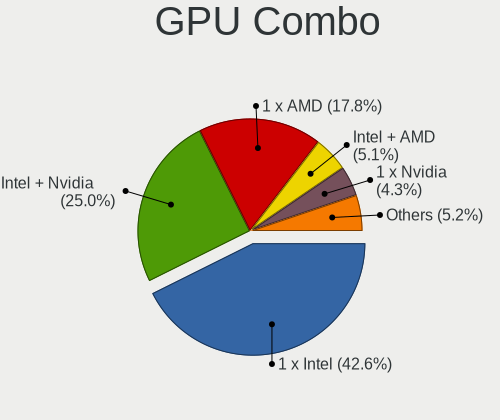

| Name           | Notebooks | Percent |
|----------------|-----------|---------|
| 1 x Intel      | 223       | 44.6%   |
| Intel + Nvidia | 134       | 26.8%   |
| 1 x AMD        | 74        | 14.8%   |
| Intel + AMD    | 29        | 5.8%    |
| 1 x Nvidia     | 23        | 4.6%    |
| AMD + Nvidia   | 10        | 2%      |
| 2 x AMD        | 5         | 1%      |
| 2 x Intel      | 1         | 0.2%    |
| 1 x SiS        | 1         | 0.2%    |

GPU Driver
----------

Free vs proprietary

| Driver      | Notebooks | Percent |
|-------------|-----------|---------|
| Free        | 411       | 81.23%  |
| Proprietary | 75        | 14.82%  |
| Unknown     | 20        | 3.95%   |

GPU Memory
----------

Total video memory

| Size in GB | Notebooks | Percent |
|------------|-----------|---------|
| Unknown    | 305       | 59.11%  |
| 1.01-2.0   | 88        | 17.05%  |
| 0.01-0.5   | 49        | 9.5%    |
| 3.01-4.0   | 36        | 6.98%   |
| 0.51-1.0   | 27        | 5.23%   |
| 5.01-6.0   | 7         | 1.36%   |
| 2.01-3.0   | 2         | 0.39%   |
| 7.01-8.0   | 1         | 0.19%   |
| 8.01-16.0  | 1         | 0.19%   |

Monitor
-------

Monitor Vendor
--------------

Monitor vendors

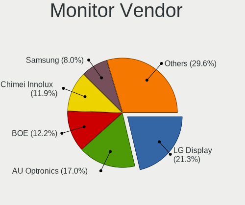

| Vendor                  | Notebooks | Percent |
|-------------------------|-----------|---------|
| LG Display              | 145       | 26.08%  |
| AU Optronics            | 87        | 15.65%  |
| Chimei Innolux          | 62        | 11.15%  |
| BOE                     | 55        | 9.89%   |
| Samsung Electronics     | 46        | 8.27%   |
| Dell                    | 22        | 3.96%   |
| Lenovo                  | 19        | 3.42%   |
| Chi Mei Optoelectronics | 17        | 3.06%   |
| Philips                 | 10        | 1.8%    |
| PANDA                   | 10        | 1.8%    |
| LG Philips              | 9         | 1.62%   |
| Hewlett-Packard         | 9         | 1.62%   |
| Goldstar                | 9         | 1.62%   |
| Sharp                   | 7         | 1.26%   |
| BenQ                    | 5         | 0.9%    |
| Apple                   | 5         | 0.9%    |
| CPT                     | 4         | 0.72%   |
| Ancor Communications    | 4         | 0.72%   |
| Acer                    | 4         | 0.72%   |
| Sony                    | 3         | 0.54%   |
| Toshiba                 | 2         | 0.36%   |
| InnoLux Display         | 2         | 0.36%   |
| HannStar                | 2         | 0.36%   |
| ViewSonic               | 1         | 0.18%   |
| Vestel Elektronik       | 1         | 0.18%   |
| Valve                   | 1         | 0.18%   |
| Seiko/Epson             | 1         | 0.18%   |
| Panasonic               | 1         | 0.18%   |
| NEC Computers           | 1         | 0.18%   |
| MSI                     | 1         | 0.18%   |
| JDI                     | 1         | 0.18%   |
| Iiyama                  | 1         | 0.18%   |
| IBM                     | 1         | 0.18%   |
| Eizo                    | 1         | 0.18%   |
| CSO                     | 1         | 0.18%   |
| BOE Technology Group    | 1         | 0.18%   |
| Belinea                 | 1         | 0.18%   |
| ASUSTek Computer        | 1         | 0.18%   |
| APD                     | 1         | 0.18%   |
| AOC                     | 1         | 0.18%   |

Monitor Model
-------------

Monitor models

| Model                                                                    | Notebooks | Percent |
|--------------------------------------------------------------------------|-----------|---------|
| LG Display LCD Monitor LGD033A 1366x768 344x194mm 15.5-inch              | 12        | 2.14%   |
| Chi Mei Optoelectronics LCD Monitor CMO15A7 1366x768 344x193mm 15.5-inch | 7         | 1.25%   |
| AU Optronics LCD Monitor AUO38ED 1920x1080 344x193mm 15.5-inch           | 7         | 1.25%   |
| AU Optronics LCD Monitor AUO21ED 1920x1080 344x193mm 15.5-inch           | 7         | 1.25%   |
| Chimei Innolux LCD Monitor CMN15F5 1920x1080 344x193mm 15.5-inch         | 6         | 1.07%   |
| PANDA LCD Monitor NCP004D 1920x1080 344x194mm 15.5-inch                  | 5         | 0.89%   |
| Chimei Innolux LCD Monitor CMN14D4 1920x1080 309x173mm 13.9-inch         | 5         | 0.89%   |
| Samsung Electronics LCD Monitor SEC5441 1366x768 344x194mm 15.5-inch     | 4         | 0.71%   |
| LG Display LCD Monitor LGD053F 1920x1080 344x194mm 15.5-inch             | 4         | 0.71%   |
| LG Display LCD Monitor LGD046F 1920x1080 344x194mm 15.5-inch             | 4         | 0.71%   |
| LG Display LCD Monitor LGD02DC 1366x768 344x194mm 15.5-inch              | 4         | 0.71%   |
| BOE LCD Monitor BOE0802 1920x1080 344x193mm 15.5-inch                    | 4         | 0.71%   |
| AU Optronics LCD Monitor AUO70EC 1366x768 344x193mm 15.5-inch            | 4         | 0.71%   |
| AU Optronics LCD Monitor AUO61ED 1920x1080 344x194mm 15.5-inch           | 4         | 0.71%   |
| AU Optronics LCD Monitor AUO403D 1920x1080 309x173mm 13.9-inch           | 4         | 0.71%   |
| AU Optronics LCD Monitor AUO21EC 1366x768 344x193mm 15.5-inch            | 4         | 0.71%   |
| Samsung Electronics LCD Monitor SEC3741 1280x800 331x207mm 15.4-inch     | 3         | 0.54%   |
| Samsung Electronics LCD Monitor SDC4141 3840x2160 344x194mm 15.5-inch    | 3         | 0.54%   |
| LG Display LCD Monitor LGD0608 1920x1080 309x174mm 14.0-inch             | 3         | 0.54%   |
| LG Display LCD Monitor LGD0590 1920x1080 344x194mm 15.5-inch             | 3         | 0.54%   |
| LG Display LCD Monitor LGD0395 1366x768 344x194mm 15.5-inch              | 3         | 0.54%   |
| LG Display LCD Monitor LGD038E 1366x768 344x194mm 15.5-inch              | 3         | 0.54%   |
| LG Display LCD Monitor LGD02D8 1366x768 277x156mm 12.5-inch              | 3         | 0.54%   |
| LG Display LCD Monitor LGD02D3 1366x768 277x156mm 12.5-inch              | 3         | 0.54%   |
| LG Display LCD Monitor LGD021D 1600x900 382x215mm 17.3-inch              | 3         | 0.54%   |
| Chimei Innolux LCD Monitor CMN15DB 1366x768 344x193mm 15.5-inch          | 3         | 0.54%   |
| Chimei Innolux LCD Monitor CMN14B1 1920x1080 308x173mm 13.9-inch         | 3         | 0.54%   |
| BOE LCD Monitor BOE06A4 1366x768 344x194mm 15.5-inch                     | 3         | 0.54%   |
| AU Optronics LCD Monitor AUO243D 1920x1080 309x173mm 13.9-inch           | 3         | 0.54%   |
| AU Optronics LCD Monitor AUO106C 1366x768 276x155mm 12.5-inch            | 3         | 0.54%   |
| Samsung Electronics LCD Monitor SEC5244 1600x900 360x210mm 16.4-inch     | 2         | 0.36%   |
| Samsung Electronics LCD Monitor SEC3645 1280x800 331x207mm 15.4-inch     | 2         | 0.36%   |
| Samsung Electronics LCD Monitor SEC324A 1366x768 344x194mm 15.5-inch     | 2         | 0.36%   |
| Samsung Electronics LCD Monitor SAM0B30 1920x1080 885x498mm 40.0-inch    | 2         | 0.36%   |
| Samsung Electronics LCD Monitor SAM07C5 1920x1080 890x500mm 40.2-inch    | 2         | 0.36%   |
| PANDA LCD Monitor NCP0040 1920x1080 344x194mm 15.5-inch                  | 2         | 0.36%   |
| PANDA LCD Monitor NCP0035 1920x1080 309x174mm 14.0-inch                  | 2         | 0.36%   |
| LG Philips LP154WX4-TLC8 LPL0120 1280x800 331x207mm 15.4-inch            | 2         | 0.36%   |
| LG Display LP156WH2-TLAA LGD0230 1366x768 344x194mm 15.5-inch            | 2         | 0.36%   |
| LG Display LCD Monitor LGD06B8 1920x1080 344x194mm 15.5-inch             | 2         | 0.36%   |

Monitor Resolution
------------------

Monitor screen resolution

| Resolution         | Notebooks | Percent |
|--------------------|-----------|---------|
| 1920x1080 (FHD)    | 235       | 45.99%  |
| 1366x768 (WXGA)    | 147       | 28.77%  |
| 1600x900 (HD+)     | 29        | 5.68%   |
| 1280x800 (WXGA)    | 27        | 5.28%   |
| 1680x1050 (WSXGA+) | 13        | 2.54%   |
| 3840x2160 (4K)     | 11        | 2.15%   |
| 2560x1440 (QHD)    | 7         | 1.37%   |
| 1920x1200 (WUXGA)  | 7         | 1.37%   |
| 2560x1600          | 5         | 0.98%   |
| 1280x1024 (SXGA)   | 5         | 0.98%   |
| 1024x600           | 5         | 0.98%   |
| 1440x900 (WXGA+)   | 4         | 0.78%   |
| 2560x1080          | 3         | 0.59%   |
| 800x1280           | 2         | 0.39%   |
| 3840x2400          | 1         | 0.2%    |
| 3840x1080          | 1         | 0.2%    |
| 3440x1440          | 1         | 0.2%    |
| 3200x1800 (QHD+)   | 1         | 0.2%    |
| 3000x2000          | 1         | 0.2%    |
| 2880x1800          | 1         | 0.2%    |
| 2048x1152          | 1         | 0.2%    |
| 1600x1200          | 1         | 0.2%    |
| 1280x720 (HD)      | 1         | 0.2%    |
| 1024x768 (XGA)     | 1         | 0.2%    |
| Unknown            | 1         | 0.2%    |

Monitor Diagonal
----------------

Diagonal size in inches

| Inches  | Notebooks | Percent |
|---------|-----------|---------|
| 15      | 275       | 49.64%  |
| 13      | 56        | 10.11%  |
| 14      | 52        | 9.39%   |
| 17      | 40        | 7.22%   |
| 24      | 23        | 4.15%   |
| 12      | 20        | 3.61%   |
| 23      | 19        | 3.43%   |
| 27      | 10        | 1.81%   |
| 21      | 9         | 1.62%   |
| 22      | 6         | 1.08%   |
| 16      | 6         | 1.08%   |
| 10      | 6         | 1.08%   |
| 11      | 5         | 0.9%    |
| 54      | 4         | 0.72%   |
| 34      | 4         | 0.72%   |
| 18      | 4         | 0.72%   |
| 19      | 3         | 0.54%   |
| Unknown | 3         | 0.54%   |
| 40      | 2         | 0.36%   |
| 20      | 2         | 0.36%   |
| 84      | 1         | 0.18%   |
| 72      | 1         | 0.18%   |
| 26      | 1         | 0.18%   |
| 25      | 1         | 0.18%   |
| 7       | 1         | 0.18%   |

Monitor Width
-------------

Physical width

| Width in mm | Notebooks | Percent |
|-------------|-----------|---------|
| 301-350     | 360       | 65.22%  |
| 201-300     | 54        | 9.78%   |
| 501-600     | 51        | 9.24%   |
| 351-400     | 50        | 9.06%   |
| 401-500     | 20        | 3.62%   |
| 701-800     | 4         | 0.72%   |
| 1001-1500   | 4         | 0.72%   |
| Unknown     | 3         | 0.54%   |
| 801-900     | 2         | 0.36%   |
| 1501-2000   | 2         | 0.36%   |
| 601-700     | 1         | 0.18%   |
| 1-100       | 1         | 0.18%   |

Aspect Ratio
------------

Proportional relationship between the width and the height

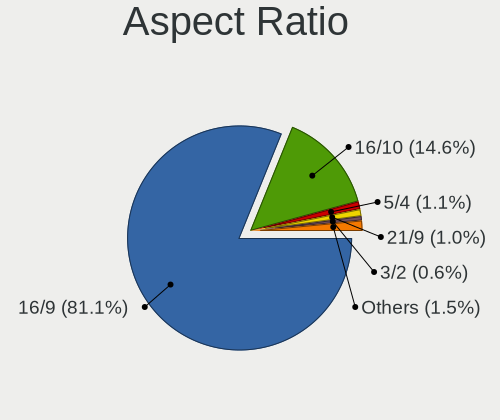

| Ratio   | Notebooks | Percent |
|---------|-----------|---------|
| 16/9    | 411       | 83.88%  |
| 16/10   | 61        | 12.45%  |
| 5/4     | 6         | 1.22%   |
| 21/9    | 4         | 0.82%   |
| 4/3     | 2         | 0.41%   |
| 3/2     | 2         | 0.41%   |
| Unknown | 2         | 0.41%   |
| 0.67    | 1         | 0.2%    |
| 0.62    | 1         | 0.2%    |

Monitor Area
------------

Area in inch

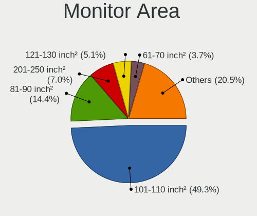

| Area in inch | Notebooks | Percent |
|----------------|-----------|---------|
| 101-110        | 274       | 49.73%  |
| 81-90          | 89        | 16.15%  |
| 201-250        | 47        | 8.53%   |
| 121-130        | 35        | 6.35%   |
| 61-70          | 20        | 3.63%   |
| 71-80          | 19        | 3.45%   |
| 301-350        | 10        | 1.81%   |
| 251-300        | 8         | 1.45%   |
| More than 1000 | 6         | 1.09%   |
| 41-50          | 6         | 1.09%   |
| 151-200        | 6         | 1.09%   |
| 141-150        | 6         | 1.09%   |
| 51-60          | 5         | 0.91%   |
| 111-120        | 5         | 0.91%   |
| 351-500        | 4         | 0.73%   |
| 131-140        | 4         | 0.73%   |
| Unknown        | 3         | 0.54%   |
| 501-1000       | 2         | 0.36%   |
| 1-40           | 1         | 0.18%   |
| 91-100         | 1         | 0.18%   |

Pixel Density
-------------

Pixels per inch

| Density       | Notebooks | Percent |
|---------------|-----------|---------|
| 121-160       | 237       | 43.49%  |
| 101-120       | 158       | 28.99%  |
| 51-100        | 105       | 19.27%  |
| 161-240       | 25        | 4.59%   |
| More than 240 | 12        | 2.2%    |
| 1-50          | 5         | 0.92%   |
| Unknown       | 3         | 0.55%   |

Multiple Monitors
-----------------

Total monitors connected

| Total | Notebooks | Percent |
|-------|-----------|---------|
| 1     | 405       | 78.79%  |
| 2     | 77        | 14.98%  |
| 0     | 21        | 4.09%   |
| 3     | 11        | 2.14%   |

Network
-------

Net Controller Vendor
---------------------

Controller vendors

| Vendor                            | Notebooks | Percent |
|-----------------------------------|-----------|---------|
| Intel                             | 279       | 33.45%  |
| Realtek Semiconductor             | 260       | 31.18%  |
| Qualcomm Atheros                  | 118       | 14.15%  |
| Broadcom                          | 50        | 6%      |
| Ralink                            | 18        | 2.16%   |
| Broadcom Limited                  | 17        | 2.04%   |
| Ericsson Business Mobile Networks | 11        | 1.32%   |
| TP-Link                           | 10        | 1.2%    |
| Sierra Wireless                   | 10        | 1.2%    |
| MediaTek                          | 10        | 1.2%    |
| Marvell Technology Group          | 10        | 1.2%    |
| Ralink Technology                 | 4         | 0.48%   |
| Hewlett-Packard                   | 4         | 0.48%   |
| Dell                              | 4         | 0.48%   |
| Huawei Technologies               | 3         | 0.36%   |
| AMD                               | 3         | 0.36%   |
| Toshiba                           | 2         | 0.24%   |
| Qualcomm Atheros Communications   | 2         | 0.24%   |
| Motorola PCS                      | 2         | 0.24%   |
| Davicom Semiconductor             | 2         | 0.24%   |
| D-Link                            | 2         | 0.24%   |
| Xiaomi                            | 1         | 0.12%   |
| Quectel Wireless Solutions        | 1         | 0.12%   |
| Nvidia                            | 1         | 0.12%   |
| NetGear                           | 1         | 0.12%   |
| Micro Star International          | 1         | 0.12%   |
| Lenovo                            | 1         | 0.12%   |
| JMicron Technology                | 1         | 0.12%   |
| ICS Advent                        | 1         | 0.12%   |
| Google                            | 1         | 0.12%   |
| DisplayLink                       | 1         | 0.12%   |
| Attansic Technology               | 1         | 0.12%   |
| ASIX Electronics                  | 1         | 0.12%   |
| Apple                             | 1         | 0.12%   |

Net Controller Model
--------------------

Controller models

| Model                                                             | Notebooks | Percent |
|-------------------------------------------------------------------|-----------|---------|
| Realtek RTL8111/8168/8411 PCI Express Gigabit Ethernet Controller | 162       | 16.12%  |
| Realtek RTL810xE PCI Express Fast Ethernet controller             | 50        | 4.98%   |
| Intel 82579LM Gigabit Network Connection (Lewisville)             | 30        | 2.99%   |
| Intel Centrino Advanced-N 6205 [Taylor Peak]                      | 25        | 2.49%   |
| Qualcomm Atheros QCA9377 802.11ac Wireless Network Adapter        | 24        | 2.39%   |
| Qualcomm Atheros QCA9565 / AR9565 Wireless Network Adapter        | 22        | 2.19%   |
| Intel Wireless 8265 / 8275                                        | 20        | 1.99%   |
| Intel Wireless 7260                                               | 20        | 1.99%   |
| Intel Wireless 7265                                               | 19        | 1.89%   |
| Intel Cannon Lake PCH CNVi WiFi                                   | 17        | 1.69%   |
| Realtek RTL8822CE 802.11ac PCIe Wireless Network Adapter          | 16        | 1.59%   |
| Qualcomm Atheros AR9285 Wireless Network Adapter (PCI-Express)    | 14        | 1.39%   |
| Intel Wi-Fi 6 AX200                                               | 14        | 1.39%   |
| Realtek RTL8153 Gigabit Ethernet Adapter                          | 13        | 1.29%   |
| Qualcomm Atheros QCA6174 802.11ac Wireless Network Adapter        | 12        | 1.19%   |
| Intel Wireless 3160                                               | 12        | 1.19%   |
| Broadcom BCM43142 802.11b/g/n                                     | 12        | 1.19%   |
| Intel Ethernet Connection (3) I218-LM                             | 11        | 1.09%   |
| Realtek RTL8822BE 802.11a/b/g/n/ac WiFi adapter                   | 10        | 1%      |
| Realtek RTL8821CE 802.11ac PCIe Wireless Network Adapter          | 10        | 1%      |
| Qualcomm Atheros QCA8172 Fast Ethernet                            | 10        | 1%      |
| Intel Wi-Fi 6 AX201                                               | 10        | 1%      |
| Intel Comet Lake PCH-LP CNVi WiFi                                 | 10        | 1%      |
| Ralink RT3290 Wireless 802.11n 1T/1R PCIe                         | 9         | 0.9%    |
| Qualcomm Atheros AR9485 Wireless Network Adapter                  | 9         | 0.9%    |
| Intel WiFi Link 5100                                              | 9         | 0.9%    |
| Intel Centrino Ultimate-N 6300                                    | 9         | 0.9%    |
| Intel Wireless 8260                                               | 8         | 0.8%    |
| Intel PRO/Wireless 5100 AGN [Shiloh] Network Connection           | 8         | 0.8%    |
| Intel Ethernet Connection I218-LM                                 | 8         | 0.8%    |
| Intel Comet Lake PCH CNVi WiFi                                    | 8         | 0.8%    |
| Intel 82577LM Gigabit Network Connection                          | 8         | 0.8%    |
| Intel 82567LM Gigabit Network Connection                          | 8         | 0.8%    |
| Realtek RTL8723BE PCIe Wireless Network Adapter                   | 7         | 0.7%    |
| MediaTek MT7921 802.11ax PCI Express Wireless Network Adapter     | 7         | 0.7%    |
| Intel PRO/Wireless 3945ABG [Golan] Network Connection             | 7         | 0.7%    |
| Intel Dual Band Wireless-AC 3165 Plus Bluetooth                   | 7         | 0.7%    |
| Intel Cannon Point-LP CNVi [Wireless-AC]                          | 7         | 0.7%    |
| Broadcom BCM4313 802.11bgn Wireless Network Adapter               | 7         | 0.7%    |
| Sierra Wireless EM7345 4G LTE                                     | 6         | 0.6%    |

Wireless Vendor
---------------

Wireless vendors

| Vendor                          | Notebooks | Percent |
|---------------------------------|-----------|---------|
| Intel                           | 265       | 50.09%  |
| Qualcomm Atheros                | 98        | 18.53%  |
| Realtek Semiconductor           | 68        | 12.85%  |
| Broadcom                        | 36        | 6.81%   |
| Ralink                          | 18        | 3.4%    |
| Sierra Wireless                 | 10        | 1.89%   |
| MediaTek                        | 10        | 1.89%   |
| TP-Link                         | 7         | 1.32%   |
| Broadcom Limited                | 6         | 1.13%   |
| Ralink Technology               | 4         | 0.76%   |
| Qualcomm Atheros Communications | 2         | 0.38%   |
| Quectel Wireless Solutions      | 1         | 0.19%   |
| NetGear                         | 1         | 0.19%   |
| Micro Star International        | 1         | 0.19%   |
| Hewlett-Packard                 | 1         | 0.19%   |
| Dell                            | 1         | 0.19%   |

Wireless Model
--------------

Wireless models

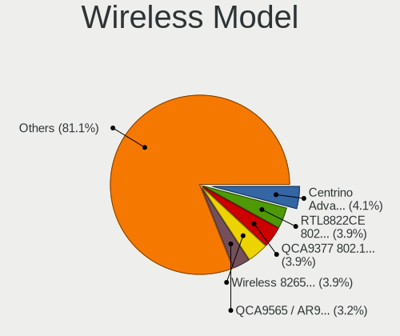

| Model                                                          | Notebooks | Percent |
|----------------------------------------------------------------|-----------|---------|
| Intel Centrino Advanced-N 6205 [Taylor Peak]                   | 25        | 4.71%   |
| Qualcomm Atheros QCA9377 802.11ac Wireless Network Adapter     | 24        | 4.52%   |
| Qualcomm Atheros QCA9565 / AR9565 Wireless Network Adapter     | 22        | 4.14%   |
| Intel Wireless 8265 / 8275                                     | 20        | 3.77%   |
| Intel Wireless 7260                                            | 20        | 3.77%   |
| Intel Wireless 7265                                            | 19        | 3.58%   |
| Intel Cannon Lake PCH CNVi WiFi                                | 17        | 3.2%    |
| Realtek RTL8822CE 802.11ac PCIe Wireless Network Adapter       | 16        | 3.01%   |
| Qualcomm Atheros AR9285 Wireless Network Adapter (PCI-Express) | 14        | 2.64%   |
| Intel Wi-Fi 6 AX200                                            | 14        | 2.64%   |
| Qualcomm Atheros QCA6174 802.11ac Wireless Network Adapter     | 12        | 2.26%   |
| Intel Wireless 3160                                            | 12        | 2.26%   |
| Broadcom BCM43142 802.11b/g/n                                  | 12        | 2.26%   |
| Realtek RTL8822BE 802.11a/b/g/n/ac WiFi adapter                | 10        | 1.88%   |
| Realtek RTL8821CE 802.11ac PCIe Wireless Network Adapter       | 10        | 1.88%   |
| Intel Wi-Fi 6 AX201                                            | 10        | 1.88%   |
| Intel Comet Lake PCH-LP CNVi WiFi                              | 10        | 1.88%   |
| Ralink RT3290 Wireless 802.11n 1T/1R PCIe                      | 9         | 1.69%   |
| Qualcomm Atheros AR9485 Wireless Network Adapter               | 9         | 1.69%   |
| Intel WiFi Link 5100                                           | 9         | 1.69%   |
| Intel Centrino Ultimate-N 6300                                 | 9         | 1.69%   |
| Intel Wireless 8260                                            | 8         | 1.51%   |
| Intel PRO/Wireless 5100 AGN [Shiloh] Network Connection        | 8         | 1.51%   |
| Intel Comet Lake PCH CNVi WiFi                                 | 8         | 1.51%   |
| Realtek RTL8723BE PCIe Wireless Network Adapter                | 7         | 1.32%   |
| MediaTek MT7921 802.11ax PCI Express Wireless Network Adapter  | 7         | 1.32%   |
| Intel PRO/Wireless 3945ABG [Golan] Network Connection          | 7         | 1.32%   |
| Intel Dual Band Wireless-AC 3165 Plus Bluetooth                | 7         | 1.32%   |
| Intel Cannon Point-LP CNVi [Wireless-AC]                       | 7         | 1.32%   |
| Broadcom BCM4313 802.11bgn Wireless Network Adapter            | 7         | 1.32%   |
| Sierra Wireless EM7345 4G LTE                                  | 6         | 1.13%   |
| Qualcomm Atheros AR9287 Wireless Network Adapter (PCI-Express) | 6         | 1.13%   |
| Intel Wireless-AC 9260                                         | 6         | 1.13%   |
| Intel Centrino Wireless-N 2230                                 | 6         | 1.13%   |
| Realtek RTL8188CE 802.11b/g/n WiFi Adapter                     | 5         | 0.94%   |
| Qualcomm Atheros AR928X Wireless Network Adapter (PCI-Express) | 5         | 0.94%   |
| Intel Centrino Advanced-N 6200                                 | 5         | 0.94%   |
| Broadcom BCM4312 802.11b/g LP-PHY                              | 5         | 0.94%   |
| Realtek RTL8187B Wireless Adapter                              | 4         | 0.75%   |
| Qualcomm Atheros AR9462 Wireless Network Adapter               | 4         | 0.75%   |

Ethernet Vendor
---------------

Ethernet vendors

| Vendor                   | Notebooks | Percent |
|--------------------------|-----------|---------|
| Realtek Semiconductor    | 228       | 51.24%  |
| Intel                    | 121       | 27.19%  |
| Qualcomm Atheros         | 36        | 8.09%   |
| Broadcom                 | 17        | 3.82%   |
| Broadcom Limited         | 11        | 2.47%   |
| Marvell Technology Group | 10        | 2.25%   |
| TP-Link                  | 3         | 0.67%   |
| Motorola PCS             | 2         | 0.45%   |
| Huawei Technologies      | 2         | 0.45%   |
| Davicom Semiconductor    | 2         | 0.45%   |
| D-Link                   | 2         | 0.45%   |
| Xiaomi                   | 1         | 0.22%   |
| Nvidia                   | 1         | 0.22%   |
| MediaTek                 | 1         | 0.22%   |
| Lenovo                   | 1         | 0.22%   |
| JMicron Technology       | 1         | 0.22%   |
| ICS Advent               | 1         | 0.22%   |
| Google                   | 1         | 0.22%   |
| DisplayLink              | 1         | 0.22%   |
| Attansic Technology      | 1         | 0.22%   |
| ASIX Electronics         | 1         | 0.22%   |
| Apple                    | 1         | 0.22%   |

Ethernet Model
--------------

Ethernet models

| Model                                                                          | Notebooks | Percent |
|--------------------------------------------------------------------------------|-----------|---------|
| Realtek RTL8111/8168/8411 PCI Express Gigabit Ethernet Controller              | 162       | 36.08%  |
| Realtek RTL810xE PCI Express Fast Ethernet controller                          | 50        | 11.14%  |
| Intel 82579LM Gigabit Network Connection (Lewisville)                          | 30        | 6.68%   |
| Realtek RTL8153 Gigabit Ethernet Adapter                                       | 13        | 2.9%    |
| Intel Ethernet Connection (3) I218-LM                                          | 11        | 2.45%   |
| Qualcomm Atheros QCA8172 Fast Ethernet                                         | 10        | 2.23%   |
| Intel Ethernet Connection I218-LM                                              | 8         | 1.78%   |
| Intel 82577LM Gigabit Network Connection                                       | 8         | 1.78%   |
| Intel 82567LM Gigabit Network Connection                                       | 8         | 1.78%   |
| Intel Ethernet Connection I217-LM                                              | 6         | 1.34%   |
| Intel Ethernet Connection I219-LM                                              | 5         | 1.11%   |
| Intel Ethernet Connection (6) I219-V                                           | 5         | 1.11%   |
| Intel 82579V Gigabit Network Connection                                        | 5         | 1.11%   |
| Broadcom Limited NetLink BCM57780 Gigabit Ethernet PCIe                        | 5         | 1.11%   |
| Qualcomm Atheros AR8161 Gigabit Ethernet                                       | 4         | 0.89%   |
| Qualcomm Atheros AR8152 v1.1 Fast Ethernet                                     | 4         | 0.89%   |
| Qualcomm Atheros AR8151 v2.0 Gigabit Ethernet                                  | 4         | 0.89%   |
| Intel Ethernet Connection (7) I219-LM                                          | 4         | 0.89%   |
| Intel Ethernet Connection (4) I219-LM                                          | 4         | 0.89%   |
| Broadcom NetLink BCM5784M Gigabit Ethernet PCIe                                | 4         | 0.89%   |
| TP-Link UE300 10/100/1000 LAN (ethernet mode) [Realtek RTL8153]                | 3         | 0.67%   |
| Realtek RTL-8100/8101L/8139 PCI Fast Ethernet Adapter                          | 3         | 0.67%   |
| Qualcomm Atheros QCA8171 Gigabit Ethernet                                      | 3         | 0.67%   |
| Qualcomm Atheros Killer E2400 Gigabit Ethernet Controller                      | 3         | 0.67%   |
| Marvell Group 88E8072 PCI-E Gigabit Ethernet Controller                        | 3         | 0.67%   |
| Marvell Group 88E8040T PCI-E Fast Ethernet Controller                          | 3         | 0.67%   |
| Intel Ethernet Connection (4) I219-V                                           | 3         | 0.67%   |
| Intel Ethernet Connection (10) I219-V                                          | 3         | 0.67%   |
| Broadcom NetXtreme BCM5761 Gigabit Ethernet PCIe                               | 3         | 0.67%   |
| Broadcom NetLink BCM57785 Gigabit Ethernet PCIe                                | 3         | 0.67%   |
| Realtek Killer E2600 Gigabit Ethernet Controller                               | 2         | 0.45%   |
| Qualcomm Atheros AR8152 v2.0 Fast Ethernet                                     | 2         | 0.45%   |
| Motorola PCS moto g(9) play                                                    | 2         | 0.45%   |
| Marvell Group Yukon Optima 88E8059 [PCIe Gigabit Ethernet Controller with AVB] | 2         | 0.45%   |
| Intel Ethernet Connection I219-V                                               | 2         | 0.45%   |
| Intel Ethernet Connection (6) I219-LM                                          | 2         | 0.45%   |
| Intel Ethernet Connection (13) I219-LM                                         | 2         | 0.45%   |
| Intel 82567LF Gigabit Network Connection                                       | 2         | 0.45%   |
| Intel 82566MM Gigabit Network Connection                                       | 2         | 0.45%   |
| Davicom DM9621A USB To FastEther                                               | 2         | 0.45%   |

Net Controller Kind
-------------------

Ethernet, WiFi or modem

| Kind     | Notebooks | Percent |
|----------|-----------|---------|
| WiFi     | 493       | 51.89%  |
| Ethernet | 432       | 45.47%  |
| Modem    | 25        | 2.63%   |

Used Controller
---------------

Currently used network controller

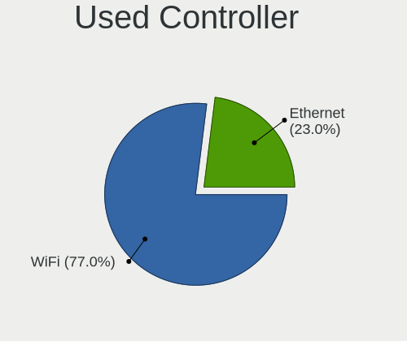

| Kind     | Notebooks | Percent |
|----------|-----------|---------|
| WiFi     | 418       | 78.28%  |
| Ethernet | 116       | 21.72%  |

NICs
----

Total network controllers on board

| Total | Notebooks | Percent |
|-------|-----------|---------|
| 2     | 404       | 81.45%  |
| 1     | 84        | 16.94%  |
| 3     | 5         | 1.01%   |
| 0     | 3         | 0.6%    |

IPv6
----

IPv6 vs IPv4

| Used | Notebooks | Percent |
|------|-----------|---------|
| No   | 489       | 97.8%   |
| Yes  | 11        | 2.2%    |

Bluetooth
---------

Bluetooth Vendor
----------------

Controller vendors

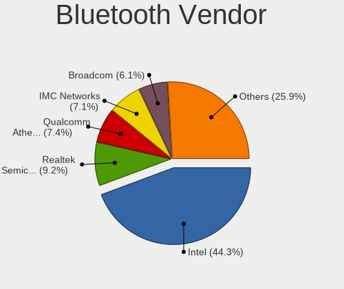

| Vendor                          | Notebooks | Percent |
|---------------------------------|-----------|---------|
| Intel                           | 174       | 44.96%  |
| Qualcomm Atheros Communications | 34        | 8.79%   |
| Realtek Semiconductor           | 29        | 7.49%   |
| Broadcom                        | 24        | 6.2%    |
| IMC Networks                    | 23        | 5.94%   |
| Lite-On Technology              | 19        | 4.91%   |
| Foxconn / Hon Hai               | 15        | 3.88%   |
| Toshiba                         | 13        | 3.36%   |
| Dell                            | 13        | 3.36%   |
| Hewlett-Packard                 | 12        | 3.1%    |
| Ralink                          | 9         | 2.33%   |
| Cambridge Silicon Radio         | 7         | 1.81%   |
| Foxconn International           | 5         | 1.29%   |
| Apple                           | 4         | 1.03%   |
| Ralink Technology               | 2         | 0.52%   |
| MediaTek                        | 2         | 0.52%   |
| Realtek                         | 1         | 0.26%   |
| ASUSTek Computer                | 1         | 0.26%   |

Bluetooth Model
---------------

Controller models

| Model                                               | Notebooks | Percent |
|-----------------------------------------------------|-----------|---------|
| Intel Bluetooth wireless interface                  | 77        | 19.9%   |
| Intel Bluetooth 9460/9560 Jefferson Peak (JfP)      | 30        | 7.75%   |
| Intel AX201 Bluetooth                               | 29        | 7.49%   |
| Realtek Bluetooth Radio                             | 24        | 6.2%    |
| Qualcomm Atheros  Bluetooth Device                  | 22        | 5.68%   |
| Intel AX200 Bluetooth                               | 14        | 3.62%   |
| IMC Networks Bluetooth Radio                        | 13        | 3.36%   |
| Ralink RT3290 Bluetooth                             | 9         | 2.33%   |
| Lite-On Bluetooth Device                            | 8         | 2.07%   |
| Intel Centrino Bluetooth Wireless Transceiver       | 8         | 2.07%   |
| Intel Centrino Advanced-N 6230 Bluetooth adapter    | 7         | 1.81%   |
| HP Bluetooth 2.0 Interface [Broadcom BCM2045]       | 7         | 1.81%   |
| Cambridge Silicon Radio Bluetooth Dongle (HCI mode) | 7         | 1.81%   |
| Foxconn / Hon Hai Bluetooth Device                  | 6         | 1.55%   |
| Toshiba Integrated Bluetooth HCI                    | 5         | 1.29%   |
| Lite-On Qualcomm Atheros QCA9377 Bluetooth          | 5         | 1.29%   |
| Intel Wireless-AC 9260 Bluetooth Adapter            | 5         | 1.29%   |
| IMC Networks Bluetooth Device                       | 5         | 1.29%   |
| HP Broadcom 2070 Bluetooth Combo                    | 5         | 1.29%   |
| Foxconn International BCM43142A0 Bluetooth module   | 5         | 1.29%   |
| Broadcom BCM2045B (BDC-2.1)                         | 5         | 1.29%   |
| Qualcomm Atheros AR3011 Bluetooth                   | 4         | 1.03%   |
| IMC Networks Wireless_Device                        | 4         | 1.03%   |
| Foxconn / Hon Hai BCM20702A0                        | 4         | 1.03%   |
| Dell DW375 Bluetooth Module                         | 4         | 1.03%   |
| Toshiba Bluetooth Device                            | 3         | 0.78%   |
| Realtek  Bluetooth 4.2 Adapter                      | 3         | 0.78%   |
| Qualcomm Atheros AR3012 Bluetooth 4.0               | 3         | 0.78%   |
| Lite-On Atheros AR3012 Bluetooth                    | 3         | 0.78%   |
| Foxconn / Hon Hai Wireless_Device                   | 3         | 0.78%   |
| Dell BCM20702A0 Bluetooth Module                    | 3         | 0.78%   |
| Broadcom BCM20702 Bluetooth 4.0 [ThinkPad]          | 3         | 0.78%   |
| Broadcom BCM2045B (BDC-2.1) [Bluetooth Controller]  | 3         | 0.78%   |
| Toshiba Integrated Bluetooth (Taiyo Yuden)          | 2         | 0.52%   |
| Qualcomm Atheros Bluetooth USB Host Controller      | 2         | 0.52%   |
| Intel Bluetooth Device                              | 2         | 0.52%   |
| Dell Wireless 365 Bluetooth                         | 2         | 0.52%   |
| Broadcom HP Portable SoftSailing                    | 2         | 0.52%   |
| Broadcom HP Portable Bumble Bee                     | 2         | 0.52%   |
| Broadcom BCM43142A0 Bluetooth Device                | 2         | 0.52%   |

Sound
-----

Sound Vendor
------------

Sound card vendors

| Vendor                           | Notebooks | Percent |
|----------------------------------|-----------|---------|
| Intel                            | 424       | 69.39%  |
| AMD                              | 83        | 13.58%  |
| Nvidia                           | 74        | 12.11%  |
| Razer USA                        | 5         | 0.82%   |
| Lenovo                           | 4         | 0.65%   |
| GN Netcom                        | 4         | 0.65%   |
| Realtek Semiconductor            | 3         | 0.49%   |
| Logitech                         | 3         | 0.49%   |
| JMTek                            | 2         | 0.33%   |
| C-Media Electronics              | 2         | 0.33%   |
| ZOOM                             | 1         | 0.16%   |
| Silicon Integrated Systems [SiS] | 1         | 0.16%   |
| Plantronics                      | 1         | 0.16%   |
| Generalplus Technology           | 1         | 0.16%   |
| Creative Technology              | 1         | 0.16%   |
| ASUSTek Computer                 | 1         | 0.16%   |
| Apple                            | 1         | 0.16%   |

Sound Model
-----------

Sound card models

| Model                                                                                             | Notebooks | Percent |
|---------------------------------------------------------------------------------------------------|-----------|---------|
| Intel 7 Series/C216 Chipset Family High Definition Audio Controller                               | 59        | 8.05%   |
| AMD Family 17h/19h HD Audio Controller                                                            | 48        | 6.55%   |
| Intel Sunrise Point-LP HD Audio                                                                   | 39        | 5.32%   |
| Intel 6 Series/C200 Series Chipset Family High Definition Audio Controller                        | 39        | 5.32%   |
| Intel 82801I (ICH9 Family) HD Audio Controller                                                    | 35        | 4.77%   |
| Intel Wildcat Point-LP High Definition Audio Controller                                           | 27        | 3.68%   |
| Intel Broadwell-U Audio Controller                                                                | 27        | 3.68%   |
| AMD Renoir Radeon High Definition Audio Controller                                                | 25        | 3.41%   |
| Intel Cannon Lake PCH cAVS                                                                        | 24        | 3.27%   |
| Intel 5 Series/3400 Series Chipset High Definition Audio                                          | 23        | 3.14%   |
| Intel Xeon E3-1200 v3/4th Gen Core Processor HD Audio Controller                                  | 22        | 3%      |
| Intel 8 Series/C220 Series Chipset High Definition Audio Controller                               | 22        | 3%      |
| Intel Haswell-ULT HD Audio Controller                                                             | 20        | 2.73%   |
| Intel 8 Series HD Audio Controller                                                                | 20        | 2.73%   |
| Intel Cannon Point-LP High Definition Audio Controller                                            | 16        | 2.18%   |
| AMD Raven/Raven2/Fenghuang HDMI/DP Audio Controller                                               | 16        | 2.18%   |
| Intel Tiger Lake-LP Smart Sound Technology Audio Controller                                       | 13        | 1.77%   |
| Intel CM238 HD Audio Controller                                                                   | 13        | 1.77%   |
| Intel NM10/ICH7 Family High Definition Audio Controller                                           | 12        | 1.64%   |
| Intel Celeron/Pentium Silver Processor High Definition Audio                                      | 12        | 1.64%   |
| Nvidia GF108 High Definition Audio Controller                                                     | 11        | 1.5%    |
| Intel Comet Lake PCH-LP cAVS                                                                      | 11        | 1.5%    |
| Nvidia TU107 GeForce GTX 1650 High Definition Audio Controller                                    | 10        | 1.36%   |
| Intel Celeron N3350/Pentium N4200/Atom E3900 Series Audio Cluster                                 | 10        | 1.36%   |
| Intel 100 Series/C230 Series Chipset Family HD Audio Controller                                   | 10        | 1.36%   |
| Intel 82801H (ICH8 Family) HD Audio Controller                                                    | 9         | 1.23%   |
| Nvidia GP107GL High Definition Audio Controller                                                   | 8         | 1.09%   |
| Nvidia GP106 High Definition Audio Controller                                                     | 8         | 1.09%   |
| Intel Comet Lake PCH cAVS                                                                         | 8         | 1.09%   |
| Nvidia GK107 HDMI Audio Controller                                                                | 6         | 0.82%   |
| Intel Ice Lake-LP Smart Sound Technology Audio Controller                                         | 6         | 0.82%   |
| AMD SBx00 Azalia (Intel HDA)                                                                      | 6         | 0.82%   |
| Nvidia TU106 High Definition Audio Controller                                                     | 5         | 0.68%   |
| Intel Atom/Celeron/Pentium Processor x5-E8000/J3xxx/N3xxx Series High Definition Audio Controller | 5         | 0.68%   |
| Nvidia GK208 HDMI/DP Audio Controller                                                             | 4         | 0.55%   |
| Intel Alder Lake PCH-P High Definition Audio Controller                                           | 4         | 0.55%   |
| AMD Kabini HDMI/DP Audio                                                                          | 4         | 0.55%   |
| AMD FCH Azalia Controller                                                                         | 4         | 0.55%   |
| AMD Cedar HDMI Audio [Radeon HD 5400/6300/7300 Series]                                            | 4         | 0.55%   |
| Realtek Semiconductor USB Audio                                                                   | 3         | 0.41%   |

Memory
------

Memory Vendor
-------------

Memory module vendors

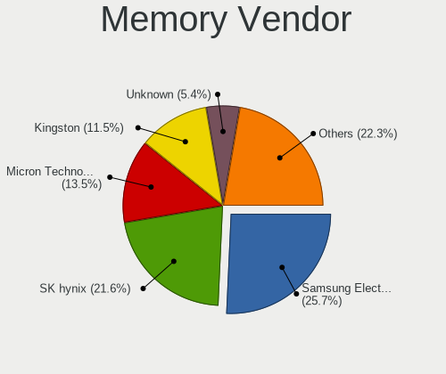

| Vendor                                  | Notebooks | Percent |
|-----------------------------------------|-----------|---------|
| Samsung Electronics                     | 83        | 26.95%  |
| SK hynix                                | 74        | 24.03%  |
| Micron Technology                       | 31        | 10.06%  |
| Kingston                                | 30        | 9.74%   |
| Unknown                                 | 17        | 5.52%   |
| Ramaxel Technology                      | 16        | 5.19%   |
| A-DATA Technology                       | 12        | 3.9%    |
| Transcend                               | 8         | 2.6%    |
| Nanya Technology                        | 8         | 2.6%    |
| Elpida                                  | 6         | 1.95%   |
| Corsair                                 | 6         | 1.95%   |
| Crucial                                 | 3         | 0.97%   |
| Apacer                                  | 3         | 0.97%   |
| Team                                    | 2         | 0.65%   |
| ASint Technology                        | 2         | 0.65%   |
| Unknown (ABCD)                          | 1         | 0.32%   |
| Unifosa                                 | 1         | 0.32%   |
| Silicon Power Computer & Communications | 1         | 0.32%   |
| Silicon Power                           | 1         | 0.32%   |
| Qimonda                                 | 1         | 0.32%   |
| GOODRAM                                 | 1         | 0.32%   |
| A Force                                 | 1         | 0.32%   |

Memory Model
------------

Memory module models

| Model                                                     | Notebooks | Percent |
|-----------------------------------------------------------|-----------|---------|
| SK hynix RAM HMT351S6CFR8C-PB 4GB SODIMM DDR3 1600MT/s    | 8         | 2.44%   |
| SK hynix RAM HMA81GS6AFR8N-UH 8GB SODIMM DDR4 2667MT/s    | 7         | 2.13%   |
| Samsung RAM M471B5273DH0-CH9 4096MB SODIMM DDR3 1334MT/s  | 6         | 1.83%   |
| Samsung RAM M471B5173DB0-YK0 4GB SODIMM DDR3 1600MT/s     | 5         | 1.52%   |
| Samsung RAM M471B5273CH0-CH9 4GB SODIMM DDR3 1334MT/s     | 4         | 1.22%   |
| Samsung RAM M471B5173EB0-YK0 4GB SODIMM DDR3 1600MT/s     | 4         | 1.22%   |
| Samsung RAM M471B1G73QH0-YK0 8192MB SODIMM DDR3 1600MT/s  | 4         | 1.22%   |
| Samsung RAM M471B1G73DB0-YK0 8GB SODIMM DDR3 1600MT/s     | 4         | 1.22%   |
| Samsung RAM M471A5244CB0-CTD 4GB SODIMM DDR4 3266MT/s     | 4         | 1.22%   |
| Ramaxel RAM RMT3160ED58E9W1600 4GB SODIMM DDR3 1600MT/s   | 4         | 1.22%   |
| SK hynix RAM HMT451S6BFR8A-PB 4GB SODIMM DDR3 1600MT/s    | 3         | 0.91%   |
| SK hynix RAM HMT41GS6BFR8A-PB 8GB SODIMM DDR3 1600MT/s    | 3         | 0.91%   |
| SK hynix RAM HMT351S6CFR8C-H9 4GB SODIMM DDR3 1333MT/s    | 3         | 0.91%   |
| SK hynix RAM HMA851S6JJR6N-VK 4GB SODIMM DDR4 2667MT/s    | 3         | 0.91%   |
| Samsung RAM M471B5773DH0-CH9 2GB SODIMM DDR3 1600MT/s     | 3         | 0.91%   |
| Samsung RAM M471B5273DH0-CK0 4GB SODIMM DDR3 1600MT/s     | 3         | 0.91%   |
| Samsung RAM M471A2K43DB1-CTD 16GB SODIMM DDR4 2667MT/s    | 3         | 0.91%   |
| Samsung RAM M471A1K43DB1-CTD 8GB SODIMM DDR4 2667MT/s     | 3         | 0.91%   |
| Samsung RAM M471A1K43CB1-CTD 8GB SODIMM DDR4 2667MT/s     | 3         | 0.91%   |
| Samsung RAM M471A1G44AB0-CWE 8GB SODIMM DDR4 3200MT/s     | 3         | 0.91%   |
| Ramaxel RAM RMSA3260ME78HAF-2666 8GB SODIMM DDR4 2667MT/s | 3         | 0.91%   |
| Micron RAM 8ATF1G64HZ-2G6E1 8GB SODIMM DDR4 2667MT/s      | 3         | 0.91%   |
| Elpida RAM EBJ41UF8BCS0-DJ-F 4GB SODIMM DDR3 1334MT/s     | 3         | 0.91%   |
| Unknown RAM Module 2GB SODIMM DDR2 667MT/s                | 2         | 0.61%   |
| Unknown RAM Module 1024MB SODIMM DDR                      | 2         | 0.61%   |
| Transcend RAM JM2666HSG-8G 8GB SODIMM DDR4 2667MT/s       | 2         | 0.61%   |
| SK hynix RAM Module 4GB SODIMM DDR3 1600MT/s              | 2         | 0.61%   |
| SK hynix RAM Module 4096MB DIMM DDR3 1066MT/s             | 2         | 0.61%   |
| SK hynix RAM HMT451S6AFR8A-PB 4GB SODIMM DDR3 1600MT/s    | 2         | 0.61%   |
| SK hynix RAM HMT41GS6AFR8A-PB 8GB SODIMM DDR3 1600MT/s    | 2         | 0.61%   |
| SK hynix RAM HMT351S6CFR8A-PB 4096MB SODIMM DDR3 1600MT/s | 2         | 0.61%   |
| SK hynix RAM HMT351S6BFR8C-H9 4GB SODIMM DDR3 1333MT/s    | 2         | 0.61%   |
| SK hynix RAM HMT125S6BFR8C-H9 2048MB SODIMM DDR3 1333MT/s | 2         | 0.61%   |
| SK hynix RAM HMAA2GS6AJR8N-XN 16GB SODIMM DDR4 3200MT/s   | 2         | 0.61%   |
| SK hynix RAM HMA82GS6DJR8N-XN 16GB SODIMM DDR4 3200MT/s   | 2         | 0.61%   |
| SK hynix RAM HMA81GS6JJR8N-VK 8GB SODIMM DDR4 2667MT/s    | 2         | 0.61%   |
| SK hynix RAM HMA81GS6DJR8N-VK 8GB SODIMM DDR4 2667MT/s    | 2         | 0.61%   |
| SK hynix RAM HMA81GS6CJR8N-VK 8GB SODIMM DDR4 2667MT/s    | 2         | 0.61%   |
| SK hynix RAM HMA41GS6AFR8N-TF 8GB SODIMM DDR4 2667MT/s    | 2         | 0.61%   |
| Samsung RAM Module 16384MB SODIMM DDR4 2667MT/s           | 2         | 0.61%   |

Memory Kind
-----------

Memory module kinds

| Kind    | Notebooks | Percent |
|---------|-----------|---------|
| DDR3    | 110       | 44.9%   |
| DDR4    | 103       | 42.04%  |
| DDR2    | 11        | 4.49%   |
| SDRAM   | 5         | 2.04%   |
| LPDDR3  | 4         | 1.63%   |
| LPDDR4  | 3         | 1.22%   |
| DDR     | 3         | 1.22%   |
| Unknown | 3         | 1.22%   |
| DRAM    | 2         | 0.82%   |
| LPDDR5  | 1         | 0.41%   |

Memory Form Factor
------------------

Physical design of the memory module

| Name         | Notebooks | Percent |
|--------------|-----------|---------|
| SODIMM       | 229       | 94.24%  |
| Row Of Chips | 7         | 2.88%   |
| Chip         | 4         | 1.65%   |
| DIMM         | 3         | 1.23%   |

Memory Size
-----------

Memory module size

| Size    | Notebooks | Percent |
|---------|-----------|---------|
| 4096    | 93        | 35.36%  |
| 8192    | 87        | 33.08%  |
| 16384   | 36        | 13.69%  |
| 2048    | 25        | 9.51%   |
| 1024    | 11        | 4.18%   |
| 32768   | 9         | 3.42%   |
| 512     | 1         | 0.38%   |
| Unknown | 1         | 0.38%   |

Memory Speed
------------

Memory module speed

| Speed   | Notebooks | Percent |
|---------|-----------|---------|
| 1600    | 75        | 27.37%  |
| 2667    | 56        | 20.44%  |
| 3200    | 37        | 13.5%   |
| 1334    | 26        | 9.49%   |
| 2400    | 18        | 6.57%   |
| 1333    | 15        | 5.47%   |
| Unknown | 10        | 3.65%   |
| 667     | 9         | 3.28%   |
| 2133    | 7         | 2.55%   |
| 3266    | 4         | 1.46%   |
| 1066    | 3         | 1.09%   |
| 4199    | 2         | 0.73%   |
| 2048    | 2         | 0.73%   |
| 1067    | 2         | 0.73%   |
| 975     | 2         | 0.73%   |
| 800     | 2         | 0.73%   |
| 6400    | 1         | 0.36%   |
| 4267    | 1         | 0.36%   |
| 2933    | 1         | 0.36%   |
| 1867    | 1         | 0.36%   |

Printers & scanners
-------------------

Printer Vendor
--------------

Printer device vendors

| Vendor              | Notebooks | Percent |
|---------------------|-----------|---------|
| Samsung Electronics | 2         | 50%     |
| Canon               | 1         | 25%     |
| Brother Industries  | 1         | 25%     |

Printer Model
-------------

Printer device models

| Model                            | Notebooks | Percent |
|----------------------------------|-----------|---------|
| Samsung M332x 382x 402x Series   | 1         | 25%     |
| Samsung M267x 287x Series        | 1         | 25%     |
| Canon PIXMA MP240                | 1         | 25%     |
| Brother DCP-7055 scanner/printer | 1         | 25%     |

Scanner Vendor
--------------

Scanner device vendors

| Vendor         | Notebooks | Percent |
|----------------|-----------|---------|
| Mustek Systems | 1         | 100%    |

Scanner Model
-------------

Scanner device models

| Model                       | Notebooks | Percent |
|-----------------------------|-----------|---------|
| Mustek Systems SNAPSCAN e22 | 1         | 100%    |

Camera
------

Camera Vendor
-------------

Camera device vendors

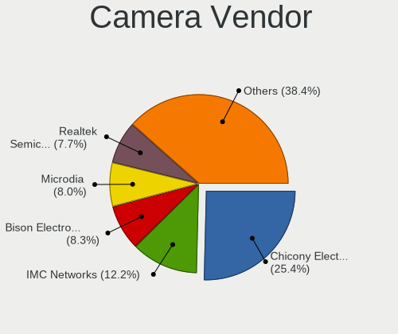

| Vendor                                 | Notebooks | Percent |
|----------------------------------------|-----------|---------|
| Chicony Electronics                    | 118       | 26.94%  |
| IMC Networks                           | 53        | 12.1%   |
| Microdia                               | 40        | 9.13%   |
| Acer                                   | 39        | 8.9%    |
| Realtek Semiconductor                  | 38        | 8.68%   |
| Sunplus Innovation Technology          | 28        | 6.39%   |
| Quanta                                 | 24        | 5.48%   |
| Lite-On Technology                     | 15        | 3.42%   |
| Cheng Uei Precision Industry (Foxlink) | 13        | 2.97%   |
| Suyin                                  | 12        | 2.74%   |
| Syntek                                 | 11        | 2.51%   |
| Logitech                               | 7         | 1.6%    |
| Alcor Micro                            | 6         | 1.37%   |
| Luxvisions Innotech Limited            | 5         | 1.14%   |
| Silicon Motion                         | 4         | 0.91%   |
| Lenovo                                 | 3         | 0.68%   |
| Z-Star Microelectronics                | 2         | 0.46%   |
| Sonix Technology                       | 2         | 0.46%   |
| Samsung Electronics                    | 2         | 0.46%   |
| Ricoh                                  | 2         | 0.46%   |
| Importek                               | 2         | 0.46%   |
| Apple                                  | 2         | 0.46%   |
| Alpha Imaging Technology               | 2         | 0.46%   |
| Sunplus Technology                     | 1         | 0.23%   |
| Primax Electronics                     | 1         | 0.23%   |
| Microsoft                              | 1         | 0.23%   |
| Hewlett-Packard                        | 1         | 0.23%   |
| DJJHFA1BIF5595                         | 1         | 0.23%   |
| Aveo Technology                        | 1         | 0.23%   |
| Arkmicro Technologies                  | 1         | 0.23%   |
| ALi                                    | 1         | 0.23%   |

Camera Model
------------

Camera device models

| Model                                                | Notebooks | Percent |
|------------------------------------------------------|-----------|---------|
| Chicony Integrated Camera                            | 23        | 5.25%   |
| IMC Networks USB2.0 VGA UVC WebCam                   | 20        | 4.57%   |
| IMC Networks Integrated Camera                       | 16        | 3.65%   |
| Chicony HD Webcam                                    | 14        | 3.2%    |
| Realtek Integrated_Webcam_HD                         | 12        | 2.74%   |
| Microdia Integrated_Webcam_HD                        | 11        | 2.51%   |
| Acer Integrated Camera                               | 10        | 2.28%   |
| Sunplus Integrated_Webcam_HD                         | 8         | 1.83%   |
| Chicony TOSHIBA Web Camera - HD                      | 8         | 1.83%   |
| Acer SunplusIT Integrated Camera                     | 8         | 1.83%   |
| Realtek Lenovo EasyCamera                            | 7         | 1.6%    |
| Chicony USB 2.0 Camera                               | 6         | 1.37%   |
| Acer Lenovo EasyCamera                               | 6         | 1.37%   |
| Quanta HP HD Camera                                  | 5         | 1.14%   |
| Microdia Integrated Webcam                           | 5         | 1.14%   |
| Chicony Lenovo Integrated Camera (0.3MP)             | 5         | 1.14%   |
| Chicony HD WebCam (Asus N-series)                    | 5         | 1.14%   |
| Syntek Integrated Camera                             | 4         | 0.91%   |
| Quanta HP TrueVision HD Camera                       | 4         | 0.91%   |
| Quanta HD Webcam                                     | 4         | 0.91%   |
| Microdia Laptop_Integrated_Webcam_HD                 | 4         | 0.91%   |
| Lite-On Integrated Camera                            | 4         | 0.91%   |
| Lite-On HP HD Webcam                                 | 4         | 0.91%   |
| Chicony USB2.0 VGA UVC WebCam                        | 4         | 0.91%   |
| Chicony Lenovo EasyCamera                            | 4         | 0.91%   |
| Chicony HP HD Webcam                                 | 4         | 0.91%   |
| Alcor Micro Acer Integrated Webcam                   | 4         | 0.91%   |
| Syntek Lenovo EasyCamera                             | 3         | 0.68%   |
| Sunplus Laptop Integrated Webcam HD                  | 3         | 0.68%   |
| Sunplus HP HD Webcam [Fixed]                         | 3         | 0.68%   |
| Sunplus HD WebCam                                    | 3         | 0.68%   |
| Realtek EasyCamera                                   | 3         | 0.68%   |
| Quanta HD User Facing                                | 3         | 0.68%   |
| Microdia Dell Integrated HD Webcam                   | 3         | 0.68%   |
| Luxvisions Innotech Limited HP Wide Vision HD Camera | 3         | 0.68%   |
| Logitech Webcam C270                                 | 3         | 0.68%   |
| Lite-On TOSHIBA Web Camera - HD                      | 3         | 0.68%   |
| IMC Networks UVC VGA Webcam                          | 3         | 0.68%   |
| IMC Networks USB2.0 HD UVC WebCam                    | 3         | 0.68%   |
| Chicony Integrated HP HD Webcam                      | 3         | 0.68%   |

Security
--------

Fingerprint Vendor
------------------

Fingerprint sensor vendors

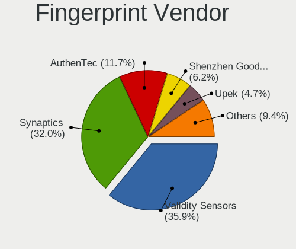

| Vendor                     | Notebooks | Percent |
|----------------------------|-----------|---------|
| Validity Sensors           | 36        | 39.56%  |
| Synaptics                  | 24        | 26.37%  |
| AuthenTec                  | 13        | 14.29%  |
| Shenzhen Goodix Technology | 6         | 6.59%   |
| Upek                       | 4         | 4.4%    |
| Elan Microelectronics      | 4         | 4.4%    |
| LighTuning Technology      | 3         | 3.3%    |
| STMicroelectronics         | 1         | 1.1%    |

Fingerprint Model
-----------------

Fingerprint sensor models

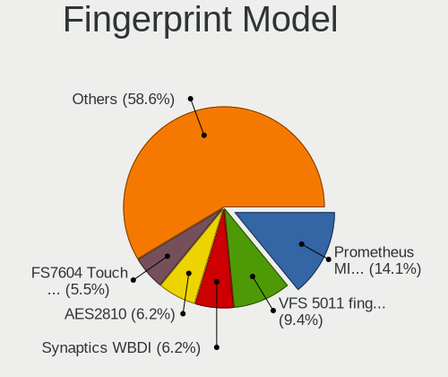

| Model                                                                      | Notebooks | Percent |
|----------------------------------------------------------------------------|-----------|---------|
| Synaptics Prometheus MIS Touch Fingerprint Reader                          | 12        | 13.19%  |
| Validity Sensors VFS 5011 fingerprint sensor                               | 10        | 10.99%  |
| AuthenTec AES2810                                                          | 6         | 6.59%   |
| Validity Sensors VFS495 Fingerprint Reader                                 | 5         | 5.49%   |
| Unknown                                                                    | 5         | 5.49%   |
| Validity Sensors Synaptics WBDI                                            | 4         | 4.4%    |
| Upek Biometric Touchchip/Touchstrip Fingerprint Sensor                     | 4         | 4.4%    |
| Shenzhen Goodix Fingerprint Reader                                         | 4         | 4.4%    |
| AuthenTec Fingerprint Sensor                                               | 4         | 4.4%    |
| Validity Sensors VFS471 Fingerprint Reader                                 | 3         | 3.3%    |
| Synaptics Metallica MOH Touch Fingerprint Reader                           | 3         | 3.3%    |
| Validity Sensors VFS7500 Touch Fingerprint Sensor                          | 2         | 2.2%    |
| Validity Sensors VFS5011 Fingerprint Reader                                | 2         | 2.2%    |
| Validity Sensors VFS491                                                    | 2         | 2.2%    |
| Validity Sensors VFS451 Fingerprint Reader                                 | 2         | 2.2%    |
| Validity Sensors Synaptics VFS7552 Touch Fingerprint Sensor with PurePrint | 2         | 2.2%    |
| Validity Sensors Fingerprint scanner                                       | 2         | 2.2%    |
| Synaptics  FS7604 Touch Fingerprint Sensor with PurePrint                  | 2         | 2.2%    |
| Synaptics Metallica MIS Touch Fingerprint Reader                           | 2         | 2.2%    |
| Elan ELAN:Fingerprint                                                      | 2         | 2.2%    |
| Elan ELAN:ARM-M4                                                           | 2         | 2.2%    |
| AuthenTec AES2501 Fingerprint Sensor                                       | 2         | 2.2%    |
| Validity Sensors VFS7552 Touch Fingerprint Sensor                          | 1         | 1.1%    |
| Validity Sensors VFS101 Fingerprint Reader                                 | 1         | 1.1%    |
| STMicroelectronics Fingerprint Reader                                      | 1         | 1.1%    |
| Shenzhen Goodix  Fingerprint Device                                        | 1         | 1.1%    |
| Shenzhen Goodix FingerPrint                                                | 1         | 1.1%    |
| LighTuning Fingerprint Reader                                              | 1         | 1.1%    |
| LighTuning ES603 Swipe Fingerprint Sensor                                  | 1         | 1.1%    |
| LighTuning EgisTec Touch Fingerprint Sensor                                | 1         | 1.1%    |
| AuthenTec AES1600                                                          | 1         | 1.1%    |

Chipcard Vendor
---------------

Chipcard module vendors

| Vendor                | Notebooks | Percent |
|-----------------------|-----------|---------|
| Broadcom              | 21        | 37.5%   |
| Alcor Micro           | 20        | 35.71%  |
| O2 Micro              | 5         | 8.93%   |
| Lenovo                | 4         | 7.14%   |
| Upek                  | 3         | 5.36%   |
| SCM Microsystems      | 2         | 3.57%   |
| Advanced Card Systems | 1         | 1.79%   |

Chipcard Model
--------------

Chipcard module models

| Model                                                                        | Notebooks | Percent |
|------------------------------------------------------------------------------|-----------|---------|
| Alcor Micro AU9540 Smartcard Reader                                          | 20        | 35.71%  |
| Broadcom BCM5880 Secure Applications Processor                               | 9         | 16.07%  |
| O2 Micro OZ776 CCID Smartcard Reader                                         | 5         | 8.93%   |
| Lenovo Integrated Smart Card Reader                                          | 4         | 7.14%   |
| Broadcom 5880                                                                | 4         | 7.14%   |
| Broadcom 58200                                                               | 4         | 7.14%   |
| Upek TouchChip Fingerprint Coprocessor (WBF advanced mode)                   | 3         | 5.36%   |
| Broadcom BCM5880 Secure Applications Processor with fingerprint swipe sensor | 3         | 5.36%   |
| SCM Microsystems SCR3340 - ExpressCard54 Smart Card Reader                   | 2         | 3.57%   |
| Broadcom BCM5880 Secure Applications Processor with fingerprint touch sensor | 1         | 1.79%   |
| Advanced Card Systems ACR39U                                                 | 1         | 1.79%   |

Unsupported
-----------

Unsupported Devices
-------------------

Total unsupported devices on board

| Total | Notebooks | Percent |
|-------|-----------|---------|
| 0     | 300       | 58.25%  |
| 1     | 160       | 31.07%  |
| 2     | 52        | 10.1%   |
| 3     | 2         | 0.39%   |
| 7     | 1         | 0.19%   |

Unsupported Device Types
------------------------

Types of unsupported devices

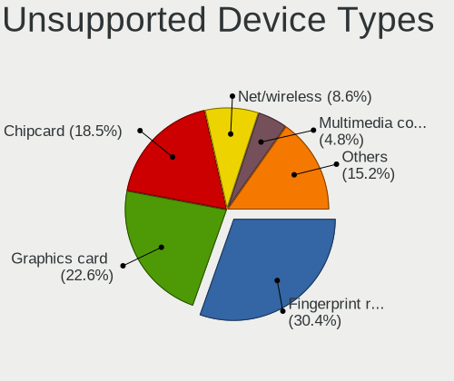

| Type                     | Notebooks | Percent |
|--------------------------|-----------|---------|
| Fingerprint reader       | 91        | 35.27%  |
| Graphics card            | 48        | 18.6%   |
| Chipcard                 | 46        | 17.83%  |
| Net/wireless             | 19        | 7.36%   |
| Multimedia controller    | 14        | 5.43%   |
| Bluetooth                | 13        | 5.04%   |
| Storage                  | 8         | 3.1%    |
| Camera                   | 5         | 1.94%   |
| Communication controller | 4         | 1.55%   |
| Card reader              | 3         | 1.16%   |
| Modem                    | 2         | 0.78%   |
| Firewire controller      | 2         | 0.78%   |
| Sound                    | 1         | 0.39%   |
| Net/ethernet             | 1         | 0.39%   |
| Flash memory             | 1         | 0.39%   |

