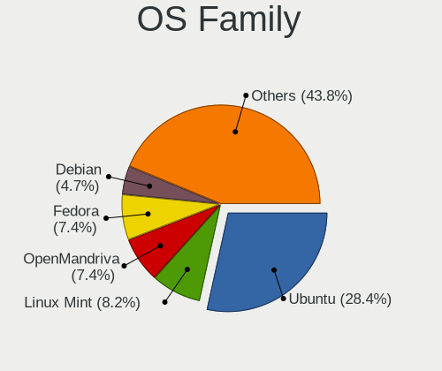
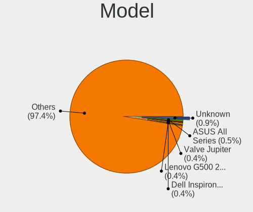
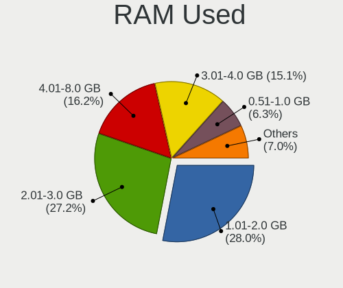
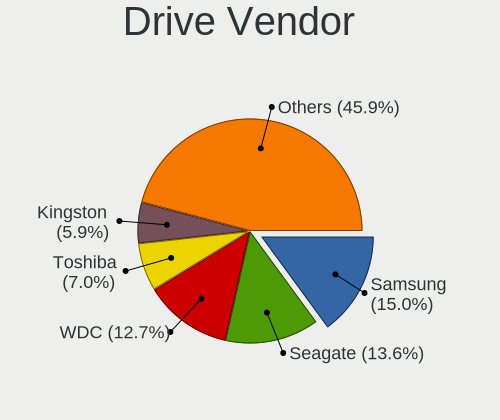
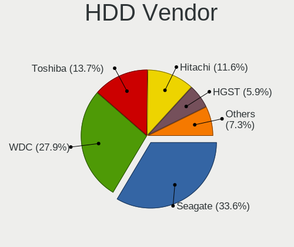
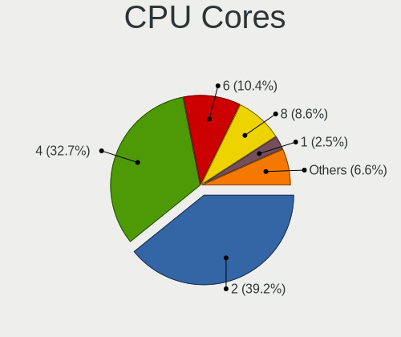
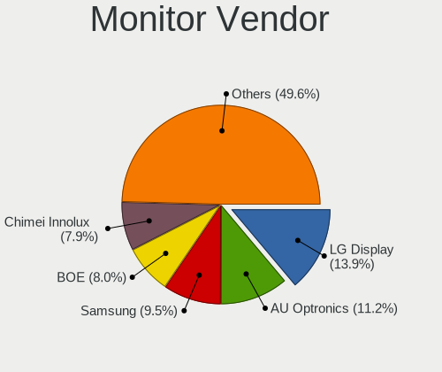
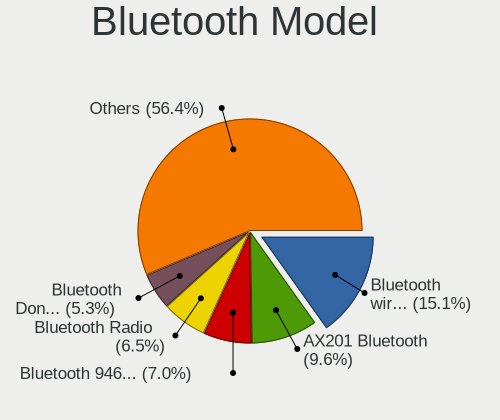
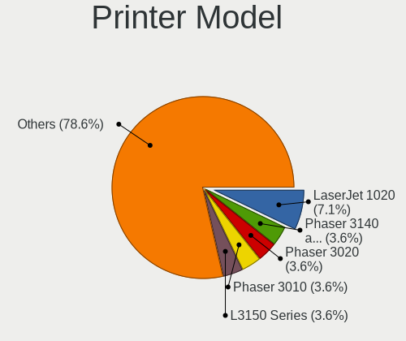
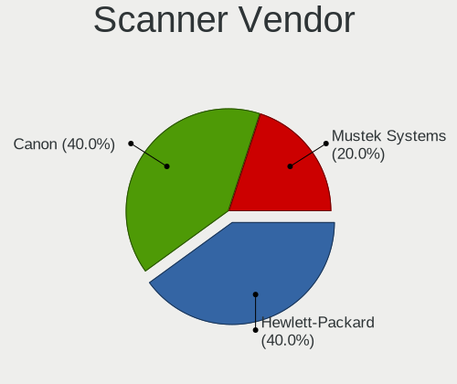

Linux in Bulgaria - Tested Hardware & Statistics
------------------------------------------------

A project to collect tested hardware configurations for Linux in Bulgaria.

Anyone can contribute to this report by the [hw-probe](https://github.com/linuxhw/hw-probe) tool:

    sudo -E hw-probe -all -upload

Please contribute! Especially if your hardware is rare.

This is a report for all computer types. See also reports for [desktops](/Location/Bulgaria/Desktop/README.md) and [notebooks](/Location/Bulgaria/Notebook/README.md).

Contents
--------

* [ Test Cases ](#test-cases)

* [ System ](#system)
  - [ OS                       ](#os)
  - [ OS Family                ](#os-family)
  - [ Kernel                   ](#kernel)
  - [ Kernel Family            ](#kernel-family)
  - [ Kernel Major Ver.        ](#kernel-major-ver)
  - [ Arch                     ](#arch)
  - [ DE                       ](#de)
  - [ Display Server           ](#display-server)
  - [ Display Manager          ](#display-manager)
  - [ OS Lang                  ](#os-lang)
  - [ Boot Mode                ](#boot-mode)
  - [ Filesystem               ](#filesystem)
  - [ Part. scheme             ](#part-scheme)
  - [ Dual Boot with Linux/BSD ](#dual-boot-with-linuxbsd)
  - [ Dual Boot (Win)          ](#dual-boot-win)

* [ Board ](#board)
  - [ Vendor                   ](#vendor)
  - [ Model                    ](#model)
  - [ Model Family             ](#model-family)
  - [ MFG Year                 ](#mfg-year)
  - [ Form Factor              ](#form-factor)
  - [ Secure Boot              ](#secure-boot)
  - [ Coreboot                 ](#coreboot)
  - [ RAM Size                 ](#ram-size)
  - [ RAM Used                 ](#ram-used)
  - [ Total Drives             ](#total-drives)
  - [ Has CD-ROM               ](#has-cd-rom)
  - [ Has Ethernet             ](#has-ethernet)
  - [ Has WiFi                 ](#has-wifi)
  - [ Has Bluetooth            ](#has-bluetooth)

* [ Location ](#location)
  - [ Country                  ](#country)
  - [ City                     ](#city)

* [ Drives ](#drives)
  - [ Drive Vendor             ](#drive-vendor)
  - [ Drive Model              ](#drive-model)
  - [ HDD Vendor               ](#hdd-vendor)
  - [ SSD Vendor               ](#ssd-vendor)
  - [ Drive Kind               ](#drive-kind)
  - [ Drive Connector          ](#drive-connector)
  - [ Drive Size               ](#drive-size)
  - [ Space Total              ](#space-total)
  - [ Space Used               ](#space-used)
  - [ Malfunc. Drives          ](#malfunc-drives)
  - [ Malfunc. Drive Vendor    ](#malfunc-drive-vendor)
  - [ Malfunc. HDD Vendor      ](#malfunc-hdd-vendor)
  - [ Malfunc. Drive Kind      ](#malfunc-drive-kind)
  - [ Failed Drives            ](#failed-drives)
  - [ Failed Drive Vendor      ](#failed-drive-vendor)
  - [ Drive Status             ](#drive-status)

* [ Storage controller ](#storage-controller)
  - [ Storage Vendor           ](#storage-vendor)
  - [ Storage Model            ](#storage-model)
  - [ Storage Kind             ](#storage-kind)

* [ Processor ](#processor)
  - [ CPU Vendor               ](#cpu-vendor)
  - [ CPU Model                ](#cpu-model)
  - [ CPU Model Family         ](#cpu-model-family)
  - [ CPU Cores                ](#cpu-cores)
  - [ CPU Sockets              ](#cpu-sockets)
  - [ CPU Threads              ](#cpu-threads)
  - [ CPU Op-Modes             ](#cpu-op-modes)
  - [ CPU Microcode            ](#cpu-microcode)
  - [ CPU Microarch            ](#cpu-microarch)

* [ Graphics ](#graphics)
  - [ GPU Vendor               ](#gpu-vendor)
  - [ GPU Model                ](#gpu-model)
  - [ GPU Combo                ](#gpu-combo)
  - [ GPU Driver               ](#gpu-driver)
  - [ GPU Memory               ](#gpu-memory)

* [ Monitor ](#monitor)
  - [ Monitor Vendor           ](#monitor-vendor)
  - [ Monitor Model            ](#monitor-model)
  - [ Monitor Resolution       ](#monitor-resolution)
  - [ Monitor Diagonal         ](#monitor-diagonal)
  - [ Monitor Width            ](#monitor-width)
  - [ Aspect Ratio             ](#aspect-ratio)
  - [ Monitor Area             ](#monitor-area)
  - [ Pixel Density            ](#pixel-density)
  - [ Multiple Monitors        ](#multiple-monitors)

* [ Network ](#network)
  - [ Net Controller Vendor    ](#net-controller-vendor)
  - [ Net Controller Model     ](#net-controller-model)
  - [ Wireless Vendor          ](#wireless-vendor)
  - [ Wireless Model           ](#wireless-model)
  - [ Ethernet Vendor          ](#ethernet-vendor)
  - [ Ethernet Model           ](#ethernet-model)
  - [ Net Controller Kind      ](#net-controller-kind)
  - [ Used Controller          ](#used-controller)
  - [ NICs                     ](#nics)
  - [ IPv6                     ](#ipv6)

* [ Bluetooth ](#bluetooth)
  - [ Bluetooth Vendor         ](#bluetooth-vendor)
  - [ Bluetooth Model          ](#bluetooth-model)

* [ Sound ](#sound)
  - [ Sound Vendor             ](#sound-vendor)
  - [ Sound Model              ](#sound-model)

* [ Memory ](#memory)
  - [ Memory Vendor            ](#memory-vendor)
  - [ Memory Model             ](#memory-model)
  - [ Memory Kind              ](#memory-kind)
  - [ Memory Form Factor       ](#memory-form-factor)
  - [ Memory Size              ](#memory-size)
  - [ Memory Speed             ](#memory-speed)

* [ Printers & scanners ](#printers--scanners)
  - [ Printer Vendor           ](#printer-vendor)
  - [ Printer Model            ](#printer-model)
  - [ Scanner Vendor           ](#scanner-vendor)
  - [ Scanner Model            ](#scanner-model)

* [ Camera ](#camera)
  - [ Camera Vendor            ](#camera-vendor)
  - [ Camera Model             ](#camera-model)

* [ Security ](#security)
  - [ Fingerprint Vendor       ](#fingerprint-vendor)
  - [ Fingerprint Model        ](#fingerprint-model)
  - [ Chipcard Vendor          ](#chipcard-vendor)
  - [ Chipcard Model           ](#chipcard-model)

* [ Unsupported ](#unsupported)
  - [ Unsupported Devices      ](#unsupported-devices)
  - [ Unsupported Device Types ](#unsupported-device-types)

Test Cases
----------

Total: 1317

| Vendor        | Model                       | Form-Factor | Probe                                                      | Date         |
|---------------|-----------------------------|-------------|------------------------------------------------------------|--------------|
| ASUSTek       | ASUS TUF Gaming A15 FA50... | Notebook    | [3f1ca6740d](https://linux-hardware.org/?probe=3f1ca6740d) | Dec 30, 2022 |
| Lenovo        | IdeaPad Gaming 3 15ARH05... | Notebook    | [c51bc128e2](https://linux-hardware.org/?probe=c51bc128e2) | Dec 30, 2022 |
| Lenovo        | ThinkPad P14s Gen 2a 21A... | Notebook    | [c844147ffd](https://linux-hardware.org/?probe=c844147ffd) | Dec 28, 2022 |
| Valve         | Jupiter                     | Notebook    | [32b2d1e76f](https://linux-hardware.org/?probe=32b2d1e76f) | Dec 26, 2022 |
| Acer          | Aspire A515-47              | Notebook    | [0ec462e927](https://linux-hardware.org/?probe=0ec462e927) | Dec 21, 2022 |
| Dell          | Latitude E5410              | Notebook    | [969f85bfc3](https://linux-hardware.org/?probe=969f85bfc3) | Dec 21, 2022 |
| Gigabyte      | B85M-D3H                    | Desktop     | [a4aed5865b](https://linux-hardware.org/?probe=a4aed5865b) | Dec 18, 2022 |
| Gigabyte      | B85M-D3H                    | Desktop     | [532dc55c4b](https://linux-hardware.org/?probe=532dc55c4b) | Dec 18, 2022 |
| Dell          | Inspiron N5110              | Notebook    | [9e4f7a69c9](https://linux-hardware.org/?probe=9e4f7a69c9) | Dec 18, 2022 |
| ASUSTek       | ROG STRIX Z690-I GAMING ... | Desktop     | [18d7dcfb19](https://linux-hardware.org/?probe=18d7dcfb19) | Dec 17, 2022 |
| Valve         | Jupiter                     | Notebook    | [a560caaec5](https://linux-hardware.org/?probe=a560caaec5) | Dec 17, 2022 |
| Gigabyte      | B460M AORUS PRO             | Desktop     | [6deb38fb48](https://linux-hardware.org/?probe=6deb38fb48) | Dec 17, 2022 |
| Acer          | AO756                       | Notebook    | [ebc4d7cfcb](https://linux-hardware.org/?probe=ebc4d7cfcb) | Dec 16, 2022 |
| Dell          | 0VD92X A00                  | Desktop     | [9feb549665](https://linux-hardware.org/?probe=9feb549665) | Dec 15, 2022 |
| Lenovo        | ThinkPad X200s 74695XG      | Notebook    | [9bc0315222](https://linux-hardware.org/?probe=9bc0315222) | Dec 14, 2022 |
| ASUSTek       | P8B75-M                     | Desktop     | [936608196d](https://linux-hardware.org/?probe=936608196d) | Dec 14, 2022 |
| Dell          | Vostro 5620                 | Notebook    | [6987aeacd5](https://linux-hardware.org/?probe=6987aeacd5) | Dec 13, 2022 |
| Dell          | XPS 17 9700                 | Notebook    | [46c656a547](https://linux-hardware.org/?probe=46c656a547) | Dec 13, 2022 |
| Dell          | Precision 5510              | Notebook    | [f464385b16](https://linux-hardware.org/?probe=f464385b16) | Dec 13, 2022 |
| Dell          | Precision 5510              | Notebook    | [f4188b30c9](https://linux-hardware.org/?probe=f4188b30c9) | Dec 13, 2022 |
| Toshiba       | Satellite C55-C             | Notebook    | [777b365c04](https://linux-hardware.org/?probe=777b365c04) | Dec 12, 2022 |
| HP            | Compaq Presario CQ71        | Notebook    | [57ab22c9c2](https://linux-hardware.org/?probe=57ab22c9c2) | Dec 11, 2022 |
| HP            | Compaq Presario CQ71        | Notebook    | [b3f0bf2008](https://linux-hardware.org/?probe=b3f0bf2008) | Dec 11, 2022 |
| Dell          | XPS 13 9365                 | Convertible | [7ea67f4c69](https://linux-hardware.org/?probe=7ea67f4c69) | Dec 11, 2022 |
| Dell          | XPS 13 9365                 | Convertible | [9158c39614](https://linux-hardware.org/?probe=9158c39614) | Dec 11, 2022 |
| Lenovo        | ThinkPad T15 Gen 2i 20W4... | Notebook    | [ad09795330](https://linux-hardware.org/?probe=ad09795330) | Dec 09, 2022 |
| Acer          | Aspire ES1-731G             | Notebook    | [589cce31c8](https://linux-hardware.org/?probe=589cce31c8) | Dec 09, 2022 |
| Lenovo        | ThinkPad L590 20Q700AWBM    | Notebook    | [ff0997b72a](https://linux-hardware.org/?probe=ff0997b72a) | Dec 09, 2022 |
| ASRock        | X570 Phantom Gaming 4       | Desktop     | [aae285b0ea](https://linux-hardware.org/?probe=aae285b0ea) | Dec 09, 2022 |
| HP            | 3047h                       | Desktop     | [223495dbab](https://linux-hardware.org/?probe=223495dbab) | Dec 08, 2022 |
| HP            | ProBook 450 G0              | Notebook    | [01e7f95a23](https://linux-hardware.org/?probe=01e7f95a23) | Dec 07, 2022 |
| HP            | ProBook 450 G0              | Notebook    | [c3b6c86431](https://linux-hardware.org/?probe=c3b6c86431) | Dec 07, 2022 |
| Gigabyte      | 970A-UD3P                   | Desktop     | [5ff0fd5395](https://linux-hardware.org/?probe=5ff0fd5395) | Dec 06, 2022 |
| Gigabyte      | 970A-UD3P                   | Desktop     | [e2ffdfc5a8](https://linux-hardware.org/?probe=e2ffdfc5a8) | Dec 06, 2022 |
| MSI           | MPG X570 GAMING PLUS        | Desktop     | [ccf3e1f074](https://linux-hardware.org/?probe=ccf3e1f074) | Dec 05, 2022 |
| MSI           | MPG X570 GAMING PLUS        | Desktop     | [60b1be0a32](https://linux-hardware.org/?probe=60b1be0a32) | Dec 05, 2022 |
| MSI           | X470 GAMING PRO             | Desktop     | [6ca3196f35](https://linux-hardware.org/?probe=6ca3196f35) | Dec 05, 2022 |
| Dell          | Vostro 5620                 | Notebook    | [50acc3b3b8](https://linux-hardware.org/?probe=50acc3b3b8) | Dec 04, 2022 |
| ASUSTek       | H97-PLUS                    | Desktop     | [c79b15a3cf](https://linux-hardware.org/?probe=c79b15a3cf) | Dec 03, 2022 |
| ASUSTek       | X541NA                      | Notebook    | [9da9a87b5b](https://linux-hardware.org/?probe=9da9a87b5b) | Dec 03, 2022 |
| Acer          | Aspire ES1-731G             | Notebook    | [06918f4cc5](https://linux-hardware.org/?probe=06918f4cc5) | Dec 03, 2022 |
| Dell          | Inspiron N7010              | Notebook    | [3e9458fd24](https://linux-hardware.org/?probe=3e9458fd24) | Dec 02, 2022 |
| Lenovo        | ThinkPad T480S 20L8SBTD0... | Notebook    | [2d4a014ef1](https://linux-hardware.org/?probe=2d4a014ef1) | Dec 01, 2022 |
| Lenovo        | ThinkPad T480S 20L8SBTD0... | Notebook    | [e1cec664eb](https://linux-hardware.org/?probe=e1cec664eb) | Dec 01, 2022 |
| Acer          | AO756                       | Notebook    | [c1ff6fe10c](https://linux-hardware.org/?probe=c1ff6fe10c) | Nov 29, 2022 |
| BESSTAR Te... | UM700                       | Desktop     | [a97334be81](https://linux-hardware.org/?probe=a97334be81) | Nov 29, 2022 |
| Dell          | 0J8G6F A03                  | Desktop     | [1424a94eb0](https://linux-hardware.org/?probe=1424a94eb0) | Nov 29, 2022 |
| Acer          | AO756                       | Notebook    | [fa5c9df13a](https://linux-hardware.org/?probe=fa5c9df13a) | Nov 27, 2022 |
| Acer          | AO756                       | Notebook    | [d390d588fe](https://linux-hardware.org/?probe=d390d588fe) | Nov 27, 2022 |
| HP            | 1589                        | Desktop     | [4e67735055](https://linux-hardware.org/?probe=4e67735055) | Nov 27, 2022 |
| Acer          | Aspire 5349                 | Notebook    | [82be349d91](https://linux-hardware.org/?probe=82be349d91) | Nov 25, 2022 |
| Intel         | D525MW AAE93082-401         | Desktop     | [d480b7ef56](https://linux-hardware.org/?probe=d480b7ef56) | Nov 25, 2022 |
| Intel         | D525MW AAE93082-401         | Desktop     | [d3b2f8aaf7](https://linux-hardware.org/?probe=d3b2f8aaf7) | Nov 25, 2022 |
| Dell          | Latitude 5420               | Notebook    | [797ac58b69](https://linux-hardware.org/?probe=797ac58b69) | Nov 23, 2022 |
| HP            | ZBook Studio 15.6 inch G... | Notebook    | [07210e29c5](https://linux-hardware.org/?probe=07210e29c5) | Nov 21, 2022 |
| Dell          | Inspiron N7010              | Notebook    | [210dd0f9f5](https://linux-hardware.org/?probe=210dd0f9f5) | Nov 20, 2022 |
| ASUSTek       | PRIME B360-PLUS             | Desktop     | [faa15c49ae](https://linux-hardware.org/?probe=faa15c49ae) | Nov 20, 2022 |
| Lenovo        | IdeaPad 5 Pro 16ARH7 82S... | Notebook    | [6c5f37f683](https://linux-hardware.org/?probe=6c5f37f683) | Nov 19, 2022 |
| Dell          | Vostro 15 5501              | Notebook    | [ea1dbc4f7c](https://linux-hardware.org/?probe=ea1dbc4f7c) | Nov 18, 2022 |
| ASUSTek       | ROG STRIX Z690-I GAMING ... | Desktop     | [b40e651ff2](https://linux-hardware.org/?probe=b40e651ff2) | Nov 18, 2022 |
| Lenovo        | Legion Y740-17IRHg 81UJ     | Notebook    | [d053fe8efe](https://linux-hardware.org/?probe=d053fe8efe) | Nov 16, 2022 |
| Gigabyte      | GA-MA74GM-S2H               | Desktop     | [5468f11c01](https://linux-hardware.org/?probe=5468f11c01) | Nov 15, 2022 |
| Lenovo        | ThinkPad T440s 20ARS2T40... | Notebook    | [f77af97294](https://linux-hardware.org/?probe=f77af97294) | Nov 13, 2022 |
| Lenovo        | ThinkPad T15 Gen 2i 20W4... | Notebook    | [b995c794aa](https://linux-hardware.org/?probe=b995c794aa) | Nov 10, 2022 |
| Acer          | Predator PT516-52s          | Notebook    | [b8ebbe76e8](https://linux-hardware.org/?probe=b8ebbe76e8) | Nov 10, 2022 |
| ASRock        | B450 Steel Legend           | Desktop     | [8a5e954190](https://linux-hardware.org/?probe=8a5e954190) | Nov 10, 2022 |
| Dell          | Vostro 5402                 | Notebook    | [cca85a282e](https://linux-hardware.org/?probe=cca85a282e) | Nov 09, 2022 |
| Dell          | Latitude E5420              | Notebook    | [c6264f1223](https://linux-hardware.org/?probe=c6264f1223) | Nov 08, 2022 |
| Lenovo        | Legion Y740-17IRHg 81UJ     | Notebook    | [b1a9ec43d4](https://linux-hardware.org/?probe=b1a9ec43d4) | Nov 07, 2022 |
| MSI           | Z97 GAMING 5                | Desktop     | [519c833f31](https://linux-hardware.org/?probe=519c833f31) | Nov 06, 2022 |
| Lenovo        | Legion Y740-17IRHg 81UJ     | Notebook    | [f57f494508](https://linux-hardware.org/?probe=f57f494508) | Nov 06, 2022 |
| HP            | Laptop 15s-eq1xxx           | Notebook    | [b59f9dcf48](https://linux-hardware.org/?probe=b59f9dcf48) | Nov 05, 2022 |
| Lenovo        | Legion Y530-15ICH 81FV      | Notebook    | [832ebcb956](https://linux-hardware.org/?probe=832ebcb956) | Nov 03, 2022 |
| HP            | Laptop 15s-eq1xxx           | Notebook    | [4f5b04e8d9](https://linux-hardware.org/?probe=4f5b04e8d9) | Nov 03, 2022 |
| Dell          | Vostro 1310                 | Notebook    | [0ae18c6c3b](https://linux-hardware.org/?probe=0ae18c6c3b) | Nov 03, 2022 |
| Dell          | 07N90W A00                  | Desktop     | [e941d01470](https://linux-hardware.org/?probe=e941d01470) | Nov 02, 2022 |
| HP            | EliteBook 2730p             | Notebook    | [79830976d8](https://linux-hardware.org/?probe=79830976d8) | Nov 02, 2022 |
| ASUSTek       | G74Sx                       | Notebook    | [4e69212184](https://linux-hardware.org/?probe=4e69212184) | Nov 01, 2022 |
| ASUSTek       | ProArt StudioBook W700GV... | Notebook    | [bf22c22bb4](https://linux-hardware.org/?probe=bf22c22bb4) | Oct 31, 2022 |
| Dell          | 07N90W A00                  | Desktop     | [60ca16eaff](https://linux-hardware.org/?probe=60ca16eaff) | Oct 30, 2022 |
| Dell          | 07N90W A00                  | Desktop     | [ded0ce1d3e](https://linux-hardware.org/?probe=ded0ce1d3e) | Oct 29, 2022 |
| Dell          | 07N90W A00                  | Desktop     | [73f4952d74](https://linux-hardware.org/?probe=73f4952d74) | Oct 29, 2022 |
| HP            | ProBook 450 G6              | Notebook    | [1b3bb91776](https://linux-hardware.org/?probe=1b3bb91776) | Oct 29, 2022 |
| Acer          | Predator PT516-52s          | Notebook    | [c0cebe4cfe](https://linux-hardware.org/?probe=c0cebe4cfe) | Oct 27, 2022 |
| HP            | ProBook 450 G6              | Notebook    | [ced3daa1b6](https://linux-hardware.org/?probe=ced3daa1b6) | Oct 27, 2022 |
| Lenovo        | ThinkBook 15 G2 ITL 20VE    | Notebook    | [a09e3f3669](https://linux-hardware.org/?probe=a09e3f3669) | Oct 26, 2022 |
| Lenovo        | ThinkPad E15 Gen 4 21E60... | Notebook    | [81231e9517](https://linux-hardware.org/?probe=81231e9517) | Oct 26, 2022 |
| HP            | Pavilion Laptop 14-bf0xx    | Notebook    | [79144ee806](https://linux-hardware.org/?probe=79144ee806) | Oct 25, 2022 |
| ASUSTek       | P5G41T-M LX                 | Desktop     | [7c046d1ba8](https://linux-hardware.org/?probe=7c046d1ba8) | Oct 23, 2022 |
| Acer          | Predator PT516-52s          | Notebook    | [ec8dac6fd3](https://linux-hardware.org/?probe=ec8dac6fd3) | Oct 22, 2022 |
| HP            | 8061                        | Desktop     | [8692ad745b](https://linux-hardware.org/?probe=8692ad745b) | Oct 19, 2022 |
| Acer          | Aspire 5830T                | Notebook    | [2423f8bf08](https://linux-hardware.org/?probe=2423f8bf08) | Oct 18, 2022 |
| Toshiba       | Satellite L775-125          | Notebook    | [fbe4f1922c](https://linux-hardware.org/?probe=fbe4f1922c) | Oct 18, 2022 |
| Gigabyte      | AB350-Gaming-CF             | Desktop     | [54d2ded2b2](https://linux-hardware.org/?probe=54d2ded2b2) | Oct 17, 2022 |
| Lenovo        | Y50-70 20378                | Notebook    | [fa5c67a5b1](https://linux-hardware.org/?probe=fa5c67a5b1) | Oct 16, 2022 |
| ASRock        | Z87 Pro3                    | Desktop     | [364a0afaff](https://linux-hardware.org/?probe=364a0afaff) | Oct 16, 2022 |
| Lenovo        | Y50-70 20378                | Notebook    | [a17c987ea8](https://linux-hardware.org/?probe=a17c987ea8) | Oct 16, 2022 |
| Dell          | 07N90W A00                  | Desktop     | [17c133e933](https://linux-hardware.org/?probe=17c133e933) | Oct 15, 2022 |
| Gigabyte      | GA-MA74GM-S2H               | Desktop     | [b50165d9c9](https://linux-hardware.org/?probe=b50165d9c9) | Oct 11, 2022 |
| HP            | Laptop 15-da0xxx            | Notebook    | [d172225c0b](https://linux-hardware.org/?probe=d172225c0b) | Oct 08, 2022 |
| Dell          | 07N90W A00                  | Desktop     | [1f2485fab4](https://linux-hardware.org/?probe=1f2485fab4) | Oct 08, 2022 |
| HP            | Pavilion Laptop 14-bf0xx    | Notebook    | [866d1ad750](https://linux-hardware.org/?probe=866d1ad750) | Oct 07, 2022 |
| ASUSTek       | PRIME X399-A                | Desktop     | [304c12788b](https://linux-hardware.org/?probe=304c12788b) | Oct 06, 2022 |
| Intel         | D34010WYK H14771-303        | Desktop     | [e58d9849a5](https://linux-hardware.org/?probe=e58d9849a5) | Oct 06, 2022 |
| ASUSTek       | SABERTOOTH Z77              | Desktop     | [8f41682975](https://linux-hardware.org/?probe=8f41682975) | Oct 03, 2022 |
| ASUSTek       | R11CX                       | Notebook    | [fb6e1d3652](https://linux-hardware.org/?probe=fb6e1d3652) | Oct 03, 2022 |
| ASUSTek       | R11CX                       | Notebook    | [f0bc5f49a4](https://linux-hardware.org/?probe=f0bc5f49a4) | Oct 03, 2022 |
| Samsung       | Galaxy TabPro S             | Tablet      | [25deda3e27](https://linux-hardware.org/?probe=25deda3e27) | Oct 02, 2022 |
| HP            | ProBook 455 G8 Notebook ... | Notebook    | [b1df3aa03f](https://linux-hardware.org/?probe=b1df3aa03f) | Sep 20, 2022 |
| HP            | ProBook 450 G1              | Notebook    | [b4b9ca9ae4](https://linux-hardware.org/?probe=b4b9ca9ae4) | Sep 17, 2022 |
| HP            | ProBook 450 G1              | Notebook    | [bb2c7c1b05](https://linux-hardware.org/?probe=bb2c7c1b05) | Sep 17, 2022 |
| HP            | ProBook 450 G1              | Notebook    | [a6082da5f7](https://linux-hardware.org/?probe=a6082da5f7) | Sep 17, 2022 |
| ASUSTek       | ASUS TUF Gaming A17 FA70... | Notebook    | [7099830d0a](https://linux-hardware.org/?probe=7099830d0a) | Sep 16, 2022 |
| ASRock        | B450 Steel Legend           | Desktop     | [889c55b24d](https://linux-hardware.org/?probe=889c55b24d) | Sep 15, 2022 |
| Lenovo        | ThinkPad T470p 20J7S0CF0... | Notebook    | [1e9f44a3da](https://linux-hardware.org/?probe=1e9f44a3da) | Sep 14, 2022 |
| ASRock        | B450 Steel Legend           | Desktop     | [f9c010c1a9](https://linux-hardware.org/?probe=f9c010c1a9) | Sep 14, 2022 |
| Dell          | Latitude 5521               | Notebook    | [cb134441f2](https://linux-hardware.org/?probe=cb134441f2) | Sep 13, 2022 |
| HP            | 3047h                       | Desktop     | [097b5b2f29](https://linux-hardware.org/?probe=097b5b2f29) | Sep 12, 2022 |
| MSI           | Modern 15 A11M              | Notebook    | [bfc50a32ba](https://linux-hardware.org/?probe=bfc50a32ba) | Sep 12, 2022 |
| Lenovo        | ThinkPad T470p 20J7S0CF0... | Notebook    | [e916989486](https://linux-hardware.org/?probe=e916989486) | Sep 11, 2022 |
| MSI           | Modern 15 A11M              | Notebook    | [931f4d2ca7](https://linux-hardware.org/?probe=931f4d2ca7) | Sep 11, 2022 |
| MSI           | Modern 15 A11M              | Notebook    | [4f1849370d](https://linux-hardware.org/?probe=4f1849370d) | Sep 10, 2022 |
| ASUSTek       | ROG STRIX Z690-I GAMING ... | Desktop     | [d13cf99728](https://linux-hardware.org/?probe=d13cf99728) | Sep 10, 2022 |
| Lenovo        | G710 20252                  | Notebook    | [8afd29a71f](https://linux-hardware.org/?probe=8afd29a71f) | Sep 09, 2022 |
| MSI           | MPG X570 GAMING PLUS        | Desktop     | [611d7b9001](https://linux-hardware.org/?probe=611d7b9001) | Sep 07, 2022 |
| Lenovo        | V15 G2 ALC 82KD             | Notebook    | [7479eb6186](https://linux-hardware.org/?probe=7479eb6186) | Sep 06, 2022 |
| ASUSTek       | ROG STRIX Z690-I GAMING ... | Desktop     | [92ff48d462](https://linux-hardware.org/?probe=92ff48d462) | Sep 06, 2022 |
| Toshiba       | Satellite C50-B             | Notebook    | [00e103f0a0](https://linux-hardware.org/?probe=00e103f0a0) | Sep 05, 2022 |
| HP            | Pavilion x360 Convertibl... | Convertible | [3438959476](https://linux-hardware.org/?probe=3438959476) | Sep 05, 2022 |
| Toshiba       | Satellite C50-B             | Notebook    | [a7708366c2](https://linux-hardware.org/?probe=a7708366c2) | Sep 05, 2022 |
| Lenovo        | ThinkPad P52 20MAS07F04     | Notebook    | [fe662b0bd6](https://linux-hardware.org/?probe=fe662b0bd6) | Sep 03, 2022 |
| ASUSTek       | Zenbook UX3402ZA_UX3402Z... | Notebook    | [68170e253f](https://linux-hardware.org/?probe=68170e253f) | Sep 01, 2022 |
| HP            | Pavilion Gaming Laptop      | Notebook    | [8382b4123e](https://linux-hardware.org/?probe=8382b4123e) | Aug 31, 2022 |
| Dell          | Latitude E5270              | Notebook    | [d61a2cd74a](https://linux-hardware.org/?probe=d61a2cd74a) | Aug 30, 2022 |
| Dell          | Inspiron N5010              | Notebook    | [3239a22fc0](https://linux-hardware.org/?probe=3239a22fc0) | Aug 28, 2022 |
| Dell          | Inspiron N5010              | Notebook    | [e4cdaf6b35](https://linux-hardware.org/?probe=e4cdaf6b35) | Aug 28, 2022 |
| HP            | Pavilion Laptop 15-eg0xx... | Notebook    | [d056fbc982](https://linux-hardware.org/?probe=d056fbc982) | Aug 28, 2022 |
| HP            | Pavilion Laptop 15-eg0xx... | Notebook    | [aa84c700c6](https://linux-hardware.org/?probe=aa84c700c6) | Aug 28, 2022 |
| Lenovo        | ThinkPad T470p 20J7S0CF0... | Notebook    | [7f2e793766](https://linux-hardware.org/?probe=7f2e793766) | Aug 27, 2022 |
| Lenovo        | ThinkPad T470p 20J7S0CF0... | Notebook    | [8aeb1b057b](https://linux-hardware.org/?probe=8aeb1b057b) | Aug 27, 2022 |
| HP            | Pavilion Gaming Laptop 1... | Notebook    | [f4d9682f50](https://linux-hardware.org/?probe=f4d9682f50) | Aug 27, 2022 |
| ASRock        | B450M Steel Legend          | Desktop     | [5c8244526c](https://linux-hardware.org/?probe=5c8244526c) | Aug 25, 2022 |
| Acer          | Nitro AN515-45              | Notebook    | [98c26372c2](https://linux-hardware.org/?probe=98c26372c2) | Aug 23, 2022 |
| Gigabyte      | Z370 AORUS Gaming K3-CF     | Desktop     | [8047eeecb4](https://linux-hardware.org/?probe=8047eeecb4) | Aug 20, 2022 |
| HP            | ProBook 640 G1              | Notebook    | [a69a02f102](https://linux-hardware.org/?probe=a69a02f102) | Aug 20, 2022 |
| Lenovo        | Legion 5 15IMH05 82AU       | Notebook    | [bd4737dfcf](https://linux-hardware.org/?probe=bd4737dfcf) | Aug 18, 2022 |
| Lenovo        | Unknown                     | Notebook    | [d6a318092b](https://linux-hardware.org/?probe=d6a318092b) | Aug 16, 2022 |
| Lenovo        | Unknown                     | Notebook    | [a8af2e8de4](https://linux-hardware.org/?probe=a8af2e8de4) | Aug 16, 2022 |
| ASUSTek       | ProArt X570-CREATOR WIFI    | Desktop     | [45ddbf814d](https://linux-hardware.org/?probe=45ddbf814d) | Aug 14, 2022 |
| ASUSTek       | B85M-G                      | Desktop     | [c92d457cd6](https://linux-hardware.org/?probe=c92d457cd6) | Aug 13, 2022 |
| ASUSTek       | M2VTVM-VM890                | Desktop     | [8a822a57e8](https://linux-hardware.org/?probe=8a822a57e8) | Aug 13, 2022 |
| Toshiba       | PT10F                       | Notebook    | [08b7dc52a2](https://linux-hardware.org/?probe=08b7dc52a2) | Aug 12, 2022 |
| Lenovo        | ThinkPad T14 Gen 1 20S00... | Notebook    | [a7cdb45aa6](https://linux-hardware.org/?probe=a7cdb45aa6) | Aug 12, 2022 |
| Foxconn       | 2A8C                        | Desktop     | [747ba68b28](https://linux-hardware.org/?probe=747ba68b28) | Aug 10, 2022 |
| Apple         | MacBookPro16,4              | Notebook    | [7571d6d783](https://linux-hardware.org/?probe=7571d6d783) | Aug 09, 2022 |
| ASRock        | B450M Steel Legend          | Desktop     | [1b55fc7b56](https://linux-hardware.org/?probe=1b55fc7b56) | Aug 09, 2022 |
| Lenovo        | Unknown                     | Notebook    | [4fe504845e](https://linux-hardware.org/?probe=4fe504845e) | Aug 07, 2022 |
| ASUSTek       | B85M-G                      | Desktop     | [616c57c367](https://linux-hardware.org/?probe=616c57c367) | Aug 06, 2022 |
| ASUSTek       | PRIME B360-PLUS             | Desktop     | [e0129903ae](https://linux-hardware.org/?probe=e0129903ae) | Aug 04, 2022 |
| ASUSTek       | P5KC                        | Desktop     | [7e9c9d2fc4](https://linux-hardware.org/?probe=7e9c9d2fc4) | Jul 26, 2022 |
| ASUSTek       | PN50                        | Mini pc     | [faf9360275](https://linux-hardware.org/?probe=faf9360275) | Jul 26, 2022 |
| Gigabyte      | X99-UD4-CF                  | Desktop     | [f00c831f5b](https://linux-hardware.org/?probe=f00c831f5b) | Jul 25, 2022 |
| Gigabyte      | X99-UD4-CF                  | Desktop     | [58f727d948](https://linux-hardware.org/?probe=58f727d948) | Jul 25, 2022 |
| HP            | Pavilion Laptop 14-bf0xx    | Notebook    | [1449b21f55](https://linux-hardware.org/?probe=1449b21f55) | Jul 24, 2022 |
| ASUSTek       | K50IJ                       | Notebook    | [60af40882b](https://linux-hardware.org/?probe=60af40882b) | Jul 24, 2022 |
| ASUSTek       | P7H55-M LX                  | Desktop     | [3e14a0baf3](https://linux-hardware.org/?probe=3e14a0baf3) | Jul 22, 2022 |
| HP            | 1495                        | Desktop     | [1706c61a6c](https://linux-hardware.org/?probe=1706c61a6c) | Jul 22, 2022 |
| Gigabyte      | X99-UD4-CF                  | Desktop     | [9c98b2fcd6](https://linux-hardware.org/?probe=9c98b2fcd6) | Jul 21, 2022 |
| Gigabyte      | X99-UD4-CF                  | Desktop     | [f42ed5053a](https://linux-hardware.org/?probe=f42ed5053a) | Jul 20, 2022 |
| HP            | EliteBook 850 G5            | Notebook    | [0ffa75c50b](https://linux-hardware.org/?probe=0ffa75c50b) | Jul 20, 2022 |
| Thecus        | N2810 0001                  | Desktop     | [dd4d9fb1d5](https://linux-hardware.org/?probe=dd4d9fb1d5) | Jul 20, 2022 |
| Lenovo        | Legion 5 15IMH05 82AU       | Notebook    | [3dddb3aac3](https://linux-hardware.org/?probe=3dddb3aac3) | Jul 20, 2022 |
| ASRock        | A75M-HVS                    | Desktop     | [c88ac89032](https://linux-hardware.org/?probe=c88ac89032) | Jul 20, 2022 |
| Apple         | Mac-F2268DAE                | All in one  | [69bd504820](https://linux-hardware.org/?probe=69bd504820) | Jul 17, 2022 |
| ASUSTek       | P8H61-M LX2                 | Desktop     | [4b2f1f5d39](https://linux-hardware.org/?probe=4b2f1f5d39) | Jul 16, 2022 |
| Lenovo        | ThinkPad T430 2349CV8       | Notebook    | [fac90d81d0](https://linux-hardware.org/?probe=fac90d81d0) | Jul 13, 2022 |
| Lenovo        | ThinkPad E15 Gen 3 20YG0... | Notebook    | [eb883a57f4](https://linux-hardware.org/?probe=eb883a57f4) | Jul 12, 2022 |
| ASRock        | B550 Taichi                 | Desktop     | [61fe809791](https://linux-hardware.org/?probe=61fe809791) | Jul 10, 2022 |
| Gigabyte      | X99-UD4-CF                  | Desktop     | [4245ef07db](https://linux-hardware.org/?probe=4245ef07db) | Jul 10, 2022 |
| Gigabyte      | X99-UD4-CF                  | Desktop     | [1dafd7beed](https://linux-hardware.org/?probe=1dafd7beed) | Jul 09, 2022 |
| Lenovo        | Legion Y740-17IRHg 81UJ     | Notebook    | [25c94a11f7](https://linux-hardware.org/?probe=25c94a11f7) | Jul 08, 2022 |
| Gigabyte      | X99-UD4-CF                  | Desktop     | [5ac5b5f182](https://linux-hardware.org/?probe=5ac5b5f182) | Jul 06, 2022 |
| Toshiba       | PORTEGE Z930                | Notebook    | [292aa38957](https://linux-hardware.org/?probe=292aa38957) | Jul 05, 2022 |
| Toshiba       | PORTEGE Z930                | Notebook    | [4df74c5b84](https://linux-hardware.org/?probe=4df74c5b84) | Jul 05, 2022 |
| ASUSTek       | M3A78-EM                    | Desktop     | [426bb60e88](https://linux-hardware.org/?probe=426bb60e88) | Jul 04, 2022 |
| ASUSTek       | ZenBook UX425UAZ_UM425UA... | Notebook    | [5de569a33e](https://linux-hardware.org/?probe=5de569a33e) | Jun 29, 2022 |
| ASRock        | N68-S                       | Desktop     | [cf9108c19a](https://linux-hardware.org/?probe=cf9108c19a) | Jun 28, 2022 |
| ASUSTek       | ZenBook UX425UAZ_UM425UA... | Notebook    | [6542ea7dff](https://linux-hardware.org/?probe=6542ea7dff) | Jun 27, 2022 |
| ASRock        | 890GM Pro3 R2.0             | Desktop     | [4b7b86cf21](https://linux-hardware.org/?probe=4b7b86cf21) | Jun 27, 2022 |
| Dell          | Inspiron 3580               | Notebook    | [dfab1b501e](https://linux-hardware.org/?probe=dfab1b501e) | Jun 26, 2022 |
| Dell          | Latitude E6520              | Notebook    | [3cbcb5e5d5](https://linux-hardware.org/?probe=3cbcb5e5d5) | Jun 26, 2022 |
| Acer          | TravelMate P214-53          | Notebook    | [d93da606dc](https://linux-hardware.org/?probe=d93da606dc) | Jun 26, 2022 |
| Dell          | Latitude E6520              | Notebook    | [e4aeec08da](https://linux-hardware.org/?probe=e4aeec08da) | Jun 25, 2022 |
| HUAWEI        | MACHC-WAX9                  | Notebook    | [00089c4dbe](https://linux-hardware.org/?probe=00089c4dbe) | Jun 25, 2022 |
| Acer          | Aspire 5736Z                | Notebook    | [868525a45e](https://linux-hardware.org/?probe=868525a45e) | Jun 25, 2022 |
| Acer          | Aspire 5736Z                | Notebook    | [ba78e0dde2](https://linux-hardware.org/?probe=ba78e0dde2) | Jun 24, 2022 |
| Dell          | Inspiron 3580               | Notebook    | [22c8672cea](https://linux-hardware.org/?probe=22c8672cea) | Jun 23, 2022 |
| Dell          | Inspiron 7577               | Notebook    | [673bd13d0a](https://linux-hardware.org/?probe=673bd13d0a) | Jun 23, 2022 |
| MSI           | Modern 15 A5M               | Notebook    | [b648b81eca](https://linux-hardware.org/?probe=b648b81eca) | Jun 23, 2022 |
| Lenovo        | ThinkPad L390 Yoga 20NT0... | Convertible | [2c0dd875b3](https://linux-hardware.org/?probe=2c0dd875b3) | Jun 21, 2022 |
| HP            | ProLiant ML350 G5           | Desktop     | [57a6a7a493](https://linux-hardware.org/?probe=57a6a7a493) | Jun 20, 2022 |
| HP            | ProBook 450 G3              | Notebook    | [fd83a38364](https://linux-hardware.org/?probe=fd83a38364) | Jun 15, 2022 |
| ASUSTek       | P5KC                        | Desktop     | [489dd3049e](https://linux-hardware.org/?probe=489dd3049e) | Jun 13, 2022 |
| HP            | ProBook 450 G0              | Notebook    | [34d266accd](https://linux-hardware.org/?probe=34d266accd) | Jun 12, 2022 |
| ASUSTek       | P5K Premium                 | Desktop     | [c7243df0c6](https://linux-hardware.org/?probe=c7243df0c6) | Jun 12, 2022 |
| Pegatron      | 2AC3                        | Desktop     | [a93743e1a0](https://linux-hardware.org/?probe=a93743e1a0) | Jun 11, 2022 |
| HP            | 872D                        | Desktop     | [c27f333c46](https://linux-hardware.org/?probe=c27f333c46) | Jun 08, 2022 |
| Lenovo        | ThinkPad T470p 20J7S0CF0... | Notebook    | [e2efffbd81](https://linux-hardware.org/?probe=e2efffbd81) | Jun 07, 2022 |
| Lenovo        | ThinkPad T470p 20J7S0CF0... | Notebook    | [c509b12c63](https://linux-hardware.org/?probe=c509b12c63) | Jun 07, 2022 |
| Acer          | Aspire A315-32              | Notebook    | [124288f4e9](https://linux-hardware.org/?probe=124288f4e9) | Jun 05, 2022 |
| HP            | ProBook 450 G0              | Notebook    | [b3399223ef](https://linux-hardware.org/?probe=b3399223ef) | Jun 03, 2022 |
| Dell          | Latitude 5490               | Notebook    | [630b63edff](https://linux-hardware.org/?probe=630b63edff) | Jun 02, 2022 |
| HP            | ProBook 450 G0              | Notebook    | [ac99467383](https://linux-hardware.org/?probe=ac99467383) | Jun 02, 2022 |
| ASUSTek       | VivoBook_ASUSLaptop X509... | Notebook    | [164d02e437](https://linux-hardware.org/?probe=164d02e437) | Jun 01, 2022 |
| HP            | ProBook 455 G8 Notebook ... | Notebook    | [e0d6b45da8](https://linux-hardware.org/?probe=e0d6b45da8) | May 31, 2022 |
| HP            | ProBook 455 G8 Notebook ... | Notebook    | [ce6b717155](https://linux-hardware.org/?probe=ce6b717155) | May 30, 2022 |
| HP            | ProBook 450 G0              | Notebook    | [0086280448](https://linux-hardware.org/?probe=0086280448) | May 28, 2022 |
| ASUSTek       | PRIME H310M-R R2.0          | Desktop     | [a434348da9](https://linux-hardware.org/?probe=a434348da9) | May 26, 2022 |
| HP            | Compaq 6730s                | Notebook    | [4dabec8399](https://linux-hardware.org/?probe=4dabec8399) | May 26, 2022 |
| ASUSTek       | ROG Strix G512LU_G512LU     | Notebook    | [24b9b9fc85](https://linux-hardware.org/?probe=24b9b9fc85) | May 25, 2022 |
| ASUSTek       | ROG Strix G512LU_G512LU     | Notebook    | [7d581f520f](https://linux-hardware.org/?probe=7d581f520f) | May 25, 2022 |
| Lenovo        | Legion Y740-17IRHg 81UJ     | Notebook    | [6be38c26b4](https://linux-hardware.org/?probe=6be38c26b4) | May 25, 2022 |
| HP            | EliteBook 855 G8 Noteboo... | Notebook    | [86242183ee](https://linux-hardware.org/?probe=86242183ee) | May 24, 2022 |
| Lenovo        | ThinkPad X1 Extreme 2nd ... | Notebook    | [c941dc302f](https://linux-hardware.org/?probe=c941dc302f) | May 23, 2022 |
| Lenovo        | Legion Y740-17IRHg 81UJ     | Notebook    | [596b029521](https://linux-hardware.org/?probe=596b029521) | May 21, 2022 |
| HP            | Compaq 6735s                | Notebook    | [bcd9db6031](https://linux-hardware.org/?probe=bcd9db6031) | May 20, 2022 |
| Lenovo        | ThinkPad qqqqS2E            | Notebook    | [7c8ef0ae32](https://linux-hardware.org/?probe=7c8ef0ae32) | May 18, 2022 |
| Gigabyte      | X99-UD4-CF                  | Desktop     | [21b3b45491](https://linux-hardware.org/?probe=21b3b45491) | May 16, 2022 |
| Gigabyte      | X99-UD4-CF                  | Desktop     | [81e0a19eaa](https://linux-hardware.org/?probe=81e0a19eaa) | May 16, 2022 |
| Dell          | XPS 15 9570                 | Notebook    | [7de7df5240](https://linux-hardware.org/?probe=7de7df5240) | May 15, 2022 |
| Acer          | Aspire E5-571               | Notebook    | [99976087b6](https://linux-hardware.org/?probe=99976087b6) | May 15, 2022 |
| Acer          | Aspire E5-571               | Notebook    | [8eff9fb0c8](https://linux-hardware.org/?probe=8eff9fb0c8) | May 15, 2022 |
| Toshiba       | Satellite L50-A-115         | Notebook    | [186b630cd2](https://linux-hardware.org/?probe=186b630cd2) | May 15, 2022 |
| Lenovo        | ThinkPad qqqqS2E            | Notebook    | [09912cea2f](https://linux-hardware.org/?probe=09912cea2f) | May 14, 2022 |
| ASUSTek       | VivoBook 15_ASUS Laptop ... | Notebook    | [e7fcde8001](https://linux-hardware.org/?probe=e7fcde8001) | May 14, 2022 |
| TUXEDO        | Pulse 14 Gen1               | Notebook    | [31d9027f23](https://linux-hardware.org/?probe=31d9027f23) | May 13, 2022 |
| Gigabyte      | X570 AORUS ULTRA            | Desktop     | [ea492e2997](https://linux-hardware.org/?probe=ea492e2997) | May 13, 2022 |
| MSI           | MPG Z390 GAMING EDGE AC     | Desktop     | [25654025a8](https://linux-hardware.org/?probe=25654025a8) | May 13, 2022 |
| Acer          | Aspire E5-571               | Notebook    | [1dcd852fff](https://linux-hardware.org/?probe=1dcd852fff) | May 12, 2022 |
| Pegatron      | 2A99h                       | Desktop     | [6a47713af6](https://linux-hardware.org/?probe=6a47713af6) | May 12, 2022 |
| Acer          | Predator G3-605             | Desktop     | [fb7a7e74d1](https://linux-hardware.org/?probe=fb7a7e74d1) | May 11, 2022 |
| Gigabyte      | H97N                        | Desktop     | [21f1bf0f0c](https://linux-hardware.org/?probe=21f1bf0f0c) | May 10, 2022 |
| Pegatron      | 2AC3                        | Desktop     | [d2932b8b78](https://linux-hardware.org/?probe=d2932b8b78) | May 07, 2022 |
| ASUSTek       | X540LJ                      | Notebook    | [74341c3077](https://linux-hardware.org/?probe=74341c3077) | May 05, 2022 |
| Intel         | DG35EC AAE29266-205         | Desktop     | [ff7adfb82a](https://linux-hardware.org/?probe=ff7adfb82a) | May 05, 2022 |
| Lenovo        | ThinkPad T490 20N20009RI    | Notebook    | [5cdef8caad](https://linux-hardware.org/?probe=5cdef8caad) | May 04, 2022 |
| Lenovo        | G500 20236                  | Notebook    | [244ed30771](https://linux-hardware.org/?probe=244ed30771) | May 04, 2022 |
| MSI           | MPG B550 GAMING PLUS        | Desktop     | [62f9f79f7c](https://linux-hardware.org/?probe=62f9f79f7c) | May 03, 2022 |
| MSI           | MPG B550 GAMING PLUS        | Desktop     | [afce1937fe](https://linux-hardware.org/?probe=afce1937fe) | May 03, 2022 |
| ASRock        | B450M Steel Legend          | Desktop     | [c40273d0bc](https://linux-hardware.org/?probe=c40273d0bc) | Apr 29, 2022 |
| Toshiba       | Satellite C650              | Notebook    | [58539bbf0a](https://linux-hardware.org/?probe=58539bbf0a) | Apr 29, 2022 |
| Lenovo        | MAHOBAY NOK                 | Desktop     | [ab21675303](https://linux-hardware.org/?probe=ab21675303) | Apr 29, 2022 |
| Razer         | Blade 15 Studio Edition ... | Notebook    | [563510a4b7](https://linux-hardware.org/?probe=563510a4b7) | Apr 28, 2022 |
| Lenovo        | B590 20206                  | Notebook    | [80befa3088](https://linux-hardware.org/?probe=80befa3088) | Apr 23, 2022 |
| MSI           | PRO B660-A DDR4             | Desktop     | [ec79dfd8b1](https://linux-hardware.org/?probe=ec79dfd8b1) | Apr 23, 2022 |
| ASUSTek       | K55VD                       | Notebook    | [8c2253380a](https://linux-hardware.org/?probe=8c2253380a) | Apr 23, 2022 |
| Lenovo        | ThinkPad T490 20N20009RI    | Notebook    | [3f5a56d826](https://linux-hardware.org/?probe=3f5a56d826) | Apr 22, 2022 |
| Gigabyte      | X99-UD4-CF                  | Desktop     | [db53151112](https://linux-hardware.org/?probe=db53151112) | Apr 19, 2022 |
| Lenovo        | ThinkPad E14 20RA002UBM     | Notebook    | [a888d6756a](https://linux-hardware.org/?probe=a888d6756a) | Apr 19, 2022 |
| Gigabyte      | X99-UD4-CF                  | Desktop     | [86aeb14193](https://linux-hardware.org/?probe=86aeb14193) | Apr 18, 2022 |
| Gigabyte      | X570 AORUS ELITE            | Desktop     | [59bc74a946](https://linux-hardware.org/?probe=59bc74a946) | Apr 18, 2022 |
| Dell          | Precision M6800             | Notebook    | [46a37b9e8e](https://linux-hardware.org/?probe=46a37b9e8e) | Apr 16, 2022 |
| Gigabyte      | X99-UD4-CF                  | Desktop     | [0ce9091731](https://linux-hardware.org/?probe=0ce9091731) | Apr 16, 2022 |
| ASRock        | H110M-DGS                   | Desktop     | [33d09ef3fd](https://linux-hardware.org/?probe=33d09ef3fd) | Apr 15, 2022 |
| Gigabyte      | X570S AORUS PRO AX          | Desktop     | [157197f213](https://linux-hardware.org/?probe=157197f213) | Apr 13, 2022 |
| Gigabyte      | X99-UD4-CF                  | Desktop     | [70644a292c](https://linux-hardware.org/?probe=70644a292c) | Apr 12, 2022 |
| Gigabyte      | X99-UD4-CF                  | Desktop     | [d08d83ac3a](https://linux-hardware.org/?probe=d08d83ac3a) | Apr 12, 2022 |
| MSI           | Modern 15 A4M               | Notebook    | [a5837a7f35](https://linux-hardware.org/?probe=a5837a7f35) | Apr 11, 2022 |
| MSI           | Modern 15 A4M               | Notebook    | [085aa2eabf](https://linux-hardware.org/?probe=085aa2eabf) | Apr 10, 2022 |
| Lenovo        | ThinkPad T470p 20J7S0CF0... | Notebook    | [a28b76d4ba](https://linux-hardware.org/?probe=a28b76d4ba) | Apr 04, 2022 |
| Acer          | Aspire A315-35              | Notebook    | [fc67b2d51e](https://linux-hardware.org/?probe=fc67b2d51e) | Apr 03, 2022 |
| Lenovo        | IdeaPad Y500 20193          | Notebook    | [8506a077af](https://linux-hardware.org/?probe=8506a077af) | Apr 02, 2022 |
| Samsung       | 300E4Z/300E5Z/300E7Z        | Notebook    | [071753c493](https://linux-hardware.org/?probe=071753c493) | Mar 31, 2022 |
| ASRock        | B450M Steel Legend          | Desktop     | [097d78d0b6](https://linux-hardware.org/?probe=097d78d0b6) | Mar 31, 2022 |
| Lenovo        | SHARKBAY 0B98401 WIN        | Desktop     | [5215972642](https://linux-hardware.org/?probe=5215972642) | Mar 31, 2022 |
| Fujitsu       | D3061-A1 S26361-D3061-A1    | Desktop     | [4153c10d0b](https://linux-hardware.org/?probe=4153c10d0b) | Mar 31, 2022 |
| Gigabyte      | X99-UD4-CF                  | Desktop     | [e6075f51f5](https://linux-hardware.org/?probe=e6075f51f5) | Mar 30, 2022 |
| HP            | ProBook 455 G7              | Notebook    | [60fa1992d1](https://linux-hardware.org/?probe=60fa1992d1) | Mar 30, 2022 |
| Lenovo        | ThinkPad T61 7661WE7        | Notebook    | [30fce12920](https://linux-hardware.org/?probe=30fce12920) | Mar 27, 2022 |
| Toshiba       | Satellite C855-2G8          | Notebook    | [37b97513a6](https://linux-hardware.org/?probe=37b97513a6) | Mar 26, 2022 |
| Lenovo        | IdeaPad 320S-14IKB 81BN     | Notebook    | [19fbf78cc0](https://linux-hardware.org/?probe=19fbf78cc0) | Mar 23, 2022 |
| HP            | Pavilion g6                 | Notebook    | [141b22c372](https://linux-hardware.org/?probe=141b22c372) | Mar 20, 2022 |
| Gigabyte      | X99-UD4-CF                  | Desktop     | [cdbd9842e1](https://linux-hardware.org/?probe=cdbd9842e1) | Mar 20, 2022 |
| Dell          | Precision M4600             | Notebook    | [deec5e6e2b](https://linux-hardware.org/?probe=deec5e6e2b) | Mar 16, 2022 |
| Gigabyte      | B550 GAMING X V2            | Desktop     | [9bd0fc9e48](https://linux-hardware.org/?probe=9bd0fc9e48) | Mar 14, 2022 |
| ASRock        | X570 Phantom Gaming 4       | Desktop     | [38c8508bc0](https://linux-hardware.org/?probe=38c8508bc0) | Mar 10, 2022 |
| Dell          | Inspiron 7559               | Notebook    | [82005c3638](https://linux-hardware.org/?probe=82005c3638) | Mar 08, 2022 |
| ASRock        | B450M Steel Legend          | Desktop     | [d772cac60d](https://linux-hardware.org/?probe=d772cac60d) | Mar 07, 2022 |
| Lenovo        | IdeaPad Y580                | Notebook    | [26ea7d1cff](https://linux-hardware.org/?probe=26ea7d1cff) | Mar 06, 2022 |
| HP            | Pavilion Laptop 15-eh0xx... | Notebook    | [441febf3e4](https://linux-hardware.org/?probe=441febf3e4) | Mar 05, 2022 |
| HP            | Pavilion dv5000 (EZ535UA... | Notebook    | [1ce1458a5f](https://linux-hardware.org/?probe=1ce1458a5f) | Mar 05, 2022 |
| ASRock        | B450M-HDV R4.0              | Desktop     | [5914978461](https://linux-hardware.org/?probe=5914978461) | Mar 04, 2022 |
| HP            | EliteBook 850 G5            | Notebook    | [bf630f003c](https://linux-hardware.org/?probe=bf630f003c) | Mar 04, 2022 |
| Lenovo        | ThinkPad T460 20FN003LUK    | Notebook    | [e604cd4180](https://linux-hardware.org/?probe=e604cd4180) | Mar 03, 2022 |
| HP            | ProBook 450 G2              | Notebook    | [50e3ff9809](https://linux-hardware.org/?probe=50e3ff9809) | Mar 03, 2022 |
| ASRock        | A320M Pro4                  | Desktop     | [43f47c3d8e](https://linux-hardware.org/?probe=43f47c3d8e) | Feb 28, 2022 |
| ASUSTek       | N551VW                      | Notebook    | [b7250e82a1](https://linux-hardware.org/?probe=b7250e82a1) | Feb 27, 2022 |
| Fujitsu       | D3062-A1 S26361-D3062-A1    | Desktop     | [fe75c17f25](https://linux-hardware.org/?probe=fe75c17f25) | Feb 27, 2022 |
| Dell          | Inspiron 7577               | Notebook    | [660240eb93](https://linux-hardware.org/?probe=660240eb93) | Feb 22, 2022 |
| ASRock        | X570 Phantom Gaming 4       | Desktop     | [fb6d74d159](https://linux-hardware.org/?probe=fb6d74d159) | Feb 21, 2022 |
| HP            | OMEN by Laptop 15-dh1xxx    | Notebook    | [fde67099dc](https://linux-hardware.org/?probe=fde67099dc) | Feb 20, 2022 |
| ASUSTek       | TUF Gaming B560-PLUS WIF... | Desktop     | [dc3262a408](https://linux-hardware.org/?probe=dc3262a408) | Feb 20, 2022 |
| Dell          | Inspiron 1011               | Notebook    | [092837b70d](https://linux-hardware.org/?probe=092837b70d) | Feb 19, 2022 |
| ASUSTek       | P5KC                        | Desktop     | [d12f767e54](https://linux-hardware.org/?probe=d12f767e54) | Feb 19, 2022 |
| Lenovo        | ThinkCentre M58p 6234A1G    | Desktop     | [1cbf260df6](https://linux-hardware.org/?probe=1cbf260df6) | Feb 18, 2022 |
| ASUSTek       | P5KC                        | Desktop     | [61c7fe5dfd](https://linux-hardware.org/?probe=61c7fe5dfd) | Feb 18, 2022 |
| ASUSTek       | A68HM-K                     | Desktop     | [2024310fec](https://linux-hardware.org/?probe=2024310fec) | Feb 17, 2022 |
| HP            | 255 G2                      | Notebook    | [f4f4bcc310](https://linux-hardware.org/?probe=f4f4bcc310) | Feb 17, 2022 |
| HP            | 255 G2                      | Notebook    | [2eee7b6928](https://linux-hardware.org/?probe=2eee7b6928) | Feb 17, 2022 |
| ASRock        | X570 Phantom Gaming 4       | Desktop     | [afe18260fc](https://linux-hardware.org/?probe=afe18260fc) | Feb 17, 2022 |
| HP            | Pavilion Laptop 15-eh0xx... | Notebook    | [c38638517e](https://linux-hardware.org/?probe=c38638517e) | Feb 17, 2022 |
| HP            | Pavilion Laptop 15-eh0xx... | Notebook    | [64b2c75dae](https://linux-hardware.org/?probe=64b2c75dae) | Feb 16, 2022 |
| HP            | Pavilion 15                 | Notebook    | [191168c7ae](https://linux-hardware.org/?probe=191168c7ae) | Feb 16, 2022 |
| Lenovo        | 312D SDK0J40697 WIN 3305... | Mini pc     | [88a943ec80](https://linux-hardware.org/?probe=88a943ec80) | Feb 16, 2022 |
| Dell          | Latitude E6330              | Notebook    | [7346afde52](https://linux-hardware.org/?probe=7346afde52) | Feb 14, 2022 |
| ASUSTek       | VivoBook_ASUSLaptop X515... | Notebook    | [b12c01311a](https://linux-hardware.org/?probe=b12c01311a) | Feb 13, 2022 |
| ASUSTek       | VivoBook_ASUSLaptop X515... | Notebook    | [1df0e30fbc](https://linux-hardware.org/?probe=1df0e30fbc) | Feb 13, 2022 |
| HP            | Pavilion dm1                | Notebook    | [577f05089d](https://linux-hardware.org/?probe=577f05089d) | Feb 13, 2022 |
| Dell          | Inspiron 5482               | Convertible | [17584ae0e4](https://linux-hardware.org/?probe=17584ae0e4) | Feb 12, 2022 |
| HP            | 250 G6 Notebook PC          | Notebook    | [a032ab36a8](https://linux-hardware.org/?probe=a032ab36a8) | Feb 12, 2022 |
| Lenovo        | ThinkPad X230 2325AJG       | Notebook    | [eccfa3a972](https://linux-hardware.org/?probe=eccfa3a972) | Feb 12, 2022 |
| Lenovo        | Legion Y740-17IRHg 81UJ     | Notebook    | [0ec31586a1](https://linux-hardware.org/?probe=0ec31586a1) | Feb 11, 2022 |
| HP            | Pavilion 15                 | Notebook    | [72991a7822](https://linux-hardware.org/?probe=72991a7822) | Feb 10, 2022 |
| ASUSTek       | VivoBook_ASUSLaptop X415... | Notebook    | [565e324069](https://linux-hardware.org/?probe=565e324069) | Feb 09, 2022 |
| HP            | EliteBook 8560p             | Notebook    | [f8a96f73d1](https://linux-hardware.org/?probe=f8a96f73d1) | Feb 09, 2022 |
| ASRock        | 960GM-GS3 FX                | Desktop     | [005f4b4afc](https://linux-hardware.org/?probe=005f4b4afc) | Feb 08, 2022 |
| Gigabyte      | B85M-D3V                    | Desktop     | [d00c78fd08](https://linux-hardware.org/?probe=d00c78fd08) | Feb 08, 2022 |
| Toshiba       | Satellite A200              | Notebook    | [e4acc07d44](https://linux-hardware.org/?probe=e4acc07d44) | Feb 06, 2022 |
| Apple         | MacBookPro11,1              | Notebook    | [788939c01d](https://linux-hardware.org/?probe=788939c01d) | Feb 02, 2022 |
| Lenovo        | ThinkPad T470p 20J7S0CF0... | Notebook    | [5d451a6858](https://linux-hardware.org/?probe=5d451a6858) | Jan 31, 2022 |
| ASUSTek       | P8H77-V                     | Desktop     | [467ff5e38f](https://linux-hardware.org/?probe=467ff5e38f) | Jan 31, 2022 |
| Acer          | Aspire E1-531               | Notebook    | [4f7256df40](https://linux-hardware.org/?probe=4f7256df40) | Jan 30, 2022 |
| Lenovo        | ThinkPad T470p 20J7S0CF0... | Notebook    | [ba372feee9](https://linux-hardware.org/?probe=ba372feee9) | Jan 30, 2022 |
| MSI           | GF63 Thin 10SCXR            | Notebook    | [c4a65986af](https://linux-hardware.org/?probe=c4a65986af) | Jan 29, 2022 |
| Dell          | Inspiron N5010              | Notebook    | [2d5857b9ff](https://linux-hardware.org/?probe=2d5857b9ff) | Jan 27, 2022 |
| Acer          | Aspire E5-575G              | Notebook    | [2c42aa1caf](https://linux-hardware.org/?probe=2c42aa1caf) | Jan 24, 2022 |
| Fujitsu       | LIFEBOOK S760               | Notebook    | [f2de9fb609](https://linux-hardware.org/?probe=f2de9fb609) | Jan 20, 2022 |
| Fujitsu       | LIFEBOOK S760               | Notebook    | [0fdf944115](https://linux-hardware.org/?probe=0fdf944115) | Jan 20, 2022 |
| ASRock        | FM2A58M-DG3+                | Desktop     | [a6f8ac859d](https://linux-hardware.org/?probe=a6f8ac859d) | Jan 20, 2022 |
| Intel         | X99                         | Desktop     | [f4a0c1aaaa](https://linux-hardware.org/?probe=f4a0c1aaaa) | Jan 20, 2022 |
| ASUSTek       | PRIME Z270-P                | Desktop     | [821f3261c2](https://linux-hardware.org/?probe=821f3261c2) | Jan 18, 2022 |
| Lenovo        | ThinkPad T460 20FN003LUK    | Notebook    | [71cab3efa8](https://linux-hardware.org/?probe=71cab3efa8) | Jan 18, 2022 |
| Dell          | Vostro 15 3510              | Notebook    | [83ddee52ce](https://linux-hardware.org/?probe=83ddee52ce) | Jan 14, 2022 |
| ASRock        | H110M-DGS                   | Desktop     | [d027268e2b](https://linux-hardware.org/?probe=d027268e2b) | Jan 14, 2022 |
| Lenovo        | Z50-70 20354                | Notebook    | [5cff653045](https://linux-hardware.org/?probe=5cff653045) | Jan 13, 2022 |
| ASUSTek       | PRIME Z270-P                | Desktop     | [a9ed1157c0](https://linux-hardware.org/?probe=a9ed1157c0) | Jan 13, 2022 |
| HP            | Notebook                    | Notebook    | [3467478289](https://linux-hardware.org/?probe=3467478289) | Jan 13, 2022 |
| Dell          | Latitude E4300              | Notebook    | [0d0020f062](https://linux-hardware.org/?probe=0d0020f062) | Jan 12, 2022 |
| Lenovo        | G500 20236                  | Notebook    | [2e7bd2b772](https://linux-hardware.org/?probe=2e7bd2b772) | Jan 12, 2022 |
| ASUSTek       | PRIME Z270-P                | Desktop     | [f23503b603](https://linux-hardware.org/?probe=f23503b603) | Jan 10, 2022 |
| Gigabyte      | G41M-ES2L                   | Desktop     | [a993fafbf7](https://linux-hardware.org/?probe=a993fafbf7) | Jan 08, 2022 |
| Lenovo        | Yoga 3 Pro-1370 80HE        | Notebook    | [f891c69576](https://linux-hardware.org/?probe=f891c69576) | Jan 08, 2022 |
| MSI           | Modern 14 B4MW              | Notebook    | [881a1adf4c](https://linux-hardware.org/?probe=881a1adf4c) | Jan 07, 2022 |
| Dell          | Vostro 15 3510              | Notebook    | [8520c449b6](https://linux-hardware.org/?probe=8520c449b6) | Jan 06, 2022 |
| Lenovo        | Legion 5 15ARH05 82B5       | Notebook    | [ca928a7784](https://linux-hardware.org/?probe=ca928a7784) | Jan 06, 2022 |
| Lenovo        | ThinkPad X250 20CLS03Y00    | Notebook    | [64d6a48fd3](https://linux-hardware.org/?probe=64d6a48fd3) | Jan 06, 2022 |
| Gigabyte      | X570 GAMING X               | Desktop     | [7add8fadfa](https://linux-hardware.org/?probe=7add8fadfa) | Jan 04, 2022 |
| Gigabyte      | X570 GAMING X               | Desktop     | [e8cfb51ca5](https://linux-hardware.org/?probe=e8cfb51ca5) | Jan 04, 2022 |
| Lenovo        | IdeaPad S540-14API 81NH     | Notebook    | [6ae5ab676d](https://linux-hardware.org/?probe=6ae5ab676d) | Jan 03, 2022 |
| HP            | 3397                        | Desktop     | [3bd3d85718](https://linux-hardware.org/?probe=3bd3d85718) | Jan 03, 2022 |
| Packard Be... | EasyNote TK87               | Notebook    | [a551958cb8](https://linux-hardware.org/?probe=a551958cb8) | Jan 01, 2022 |
| Dell          | Inspiron 7520               | Notebook    | [28e0273758](https://linux-hardware.org/?probe=28e0273758) | Dec 31, 2021 |
| Gigabyte      | X570 GAMING X               | Desktop     | [50045a522a](https://linux-hardware.org/?probe=50045a522a) | Dec 30, 2021 |
| Lenovo        | ThinkPad T470p 20J7S0CF0... | Notebook    | [7c11e2a10b](https://linux-hardware.org/?probe=7c11e2a10b) | Dec 30, 2021 |
| ASUSTek       | P5E                         | Desktop     | [1d3ece3005](https://linux-hardware.org/?probe=1d3ece3005) | Dec 29, 2021 |
| Acer          | Aspire 3820                 | Notebook    | [195bb81f89](https://linux-hardware.org/?probe=195bb81f89) | Dec 28, 2021 |
| Acer          | Aspire 3820                 | Notebook    | [149083ba5f](https://linux-hardware.org/?probe=149083ba5f) | Dec 28, 2021 |
| Dell          | Inspiron 5458               | Notebook    | [58bbd792ef](https://linux-hardware.org/?probe=58bbd792ef) | Dec 27, 2021 |
| Dell          | Venue 11 Pro 7130 vPro      | Notebook    | [c3cbdf9c8e](https://linux-hardware.org/?probe=c3cbdf9c8e) | Dec 26, 2021 |
| Dell          | Venue 11 Pro 7130 vPro      | Notebook    | [788a656eea](https://linux-hardware.org/?probe=788a656eea) | Dec 26, 2021 |
| Toshiba       | Satellite L50-B             | Notebook    | [7ee7295f4e](https://linux-hardware.org/?probe=7ee7295f4e) | Dec 26, 2021 |
| Gigabyte      | X570 GAMING X               | Desktop     | [19959c7845](https://linux-hardware.org/?probe=19959c7845) | Dec 26, 2021 |
| HP            | Compaq 6730b (NB021EA#AB... | Notebook    | [25fb717971](https://linux-hardware.org/?probe=25fb717971) | Dec 25, 2021 |
| ASRock        | B450M Steel Legend          | Desktop     | [b8ff289917](https://linux-hardware.org/?probe=b8ff289917) | Dec 22, 2021 |
| Lenovo        | ThinkPad X270 W10DG 20K5... | Notebook    | [df0d434539](https://linux-hardware.org/?probe=df0d434539) | Dec 22, 2021 |
| Lenovo        | ThinkPad X270 W10DG 20K5... | Notebook    | [9724b1359d](https://linux-hardware.org/?probe=9724b1359d) | Dec 21, 2021 |
| Apple         | MacBookPro11,1              | Notebook    | [ae120235f1](https://linux-hardware.org/?probe=ae120235f1) | Dec 21, 2021 |
| Toshiba       | Equium A60                  | Notebook    | [206f662171](https://linux-hardware.org/?probe=206f662171) | Dec 20, 2021 |
| Lenovo        | ThinkPad T470p 20J7S0CF0... | Notebook    | [183c18d8a8](https://linux-hardware.org/?probe=183c18d8a8) | Dec 19, 2021 |
| Dell          | Inspiron N5010              | Notebook    | [f67c56ba50](https://linux-hardware.org/?probe=f67c56ba50) | Dec 18, 2021 |
| Dell          | 0427JK A00                  | Desktop     | [5633e414a2](https://linux-hardware.org/?probe=5633e414a2) | Dec 16, 2021 |
| Lenovo        | SHARKBAY NOK                | Desktop     | [65ec484cf7](https://linux-hardware.org/?probe=65ec484cf7) | Dec 16, 2021 |
| Lenovo        | SHARKBAY NOK                | Desktop     | [ab70f6516f](https://linux-hardware.org/?probe=ab70f6516f) | Dec 16, 2021 |
| Lenovo        | ThinkPad T420 4236A87       | Notebook    | [74cb9f00a2](https://linux-hardware.org/?probe=74cb9f00a2) | Dec 15, 2021 |
| ASRock        | B450M Steel Legend          | Desktop     | [9f5ee59afb](https://linux-hardware.org/?probe=9f5ee59afb) | Dec 14, 2021 |
| Dell          | 0427JK A00                  | Desktop     | [785650303f](https://linux-hardware.org/?probe=785650303f) | Dec 13, 2021 |
| HP            | ProBook 4540s               | Notebook    | [da7b06db3f](https://linux-hardware.org/?probe=da7b06db3f) | Dec 12, 2021 |
| HP            | 255 G8 Notebook PC          | Notebook    | [2f607ba3fb](https://linux-hardware.org/?probe=2f607ba3fb) | Dec 12, 2021 |
| HP            | 255 G8 Notebook PC          | Notebook    | [5ef3ccbbd8](https://linux-hardware.org/?probe=5ef3ccbbd8) | Dec 12, 2021 |
| Lenovo        | ThinkPad T14s Gen 1 20UJ... | Notebook    | [9e861e7f7d](https://linux-hardware.org/?probe=9e861e7f7d) | Dec 11, 2021 |
| Lenovo        | ThinkPad T495s 20QKS0SD0... | Notebook    | [615e44dbe8](https://linux-hardware.org/?probe=615e44dbe8) | Dec 11, 2021 |
| Gigabyte      | Z490 AORUS PRO AX           | Desktop     | [03ba9fdf17](https://linux-hardware.org/?probe=03ba9fdf17) | Dec 11, 2021 |
| ASUSTek       | VivoBook 15_ASUS Laptop ... | Notebook    | [6424339164](https://linux-hardware.org/?probe=6424339164) | Dec 10, 2021 |
| ASRock        | B450M Steel Legend          | Desktop     | [a5c3366e73](https://linux-hardware.org/?probe=a5c3366e73) | Dec 10, 2021 |
| ASUSTek       | VivoBook_ASUSLaptop X509... | Notebook    | [c62460798a](https://linux-hardware.org/?probe=c62460798a) | Dec 09, 2021 |
| Dell          | Vostro 1014                 | Notebook    | [d1be779708](https://linux-hardware.org/?probe=d1be779708) | Dec 08, 2021 |
| Dell          | Latitude 5520               | Notebook    | [4609e387e3](https://linux-hardware.org/?probe=4609e387e3) | Dec 07, 2021 |
| ASRock        | B450M Steel Legend          | Desktop     | [b9ebbe30d3](https://linux-hardware.org/?probe=b9ebbe30d3) | Dec 05, 2021 |
| Lenovo        | Legion Y740-17IRHg 81UJ     | Notebook    | [5dde6ac6a6](https://linux-hardware.org/?probe=5dde6ac6a6) | Dec 05, 2021 |
| Lenovo        | ThinkPad T470p 20J7S0CF0... | Notebook    | [b38dd7fc41](https://linux-hardware.org/?probe=b38dd7fc41) | Dec 04, 2021 |
| Lenovo        | ThinkPad T470p 20J7S0CF0... | Notebook    | [efc98eab3c](https://linux-hardware.org/?probe=efc98eab3c) | Dec 04, 2021 |
| ASUSTek       | P5KPL-AM SE                 | Desktop     | [7530a42730](https://linux-hardware.org/?probe=7530a42730) | Dec 03, 2021 |
| Samsung       | 300E4Z/300E5Z/300E7Z        | Notebook    | [8c0fabf18d](https://linux-hardware.org/?probe=8c0fabf18d) | Nov 30, 2021 |
| Samsung       | 300E4Z/300E5Z/300E7Z        | Notebook    | [693e2b3171](https://linux-hardware.org/?probe=693e2b3171) | Nov 30, 2021 |
| MSI           | Modern 14 B4MW              | Notebook    | [c5c0c4aca3](https://linux-hardware.org/?probe=c5c0c4aca3) | Nov 29, 2021 |
| HP            | EliteBook 820 G2            | Notebook    | [5774bcc229](https://linux-hardware.org/?probe=5774bcc229) | Nov 28, 2021 |
| Lenovo        | ThinkPad T470p 20J7S0CF0... | Notebook    | [ee56bc0d39](https://linux-hardware.org/?probe=ee56bc0d39) | Nov 28, 2021 |
| Lenovo        | ThinkPad T470p 20J7S0CF0... | Notebook    | [d140375a6d](https://linux-hardware.org/?probe=d140375a6d) | Nov 27, 2021 |
| Lenovo        | ThinkPad T450s 20BWS3MG0... | Notebook    | [06841abc04](https://linux-hardware.org/?probe=06841abc04) | Nov 27, 2021 |
| Lenovo        | Legion Y740-17IRHg 81UJ     | Notebook    | [f0dbaf192c](https://linux-hardware.org/?probe=f0dbaf192c) | Nov 25, 2021 |
| ASUSTek       | PRIME Z590-P                | Desktop     | [f0c1e81fb5](https://linux-hardware.org/?probe=f0c1e81fb5) | Nov 25, 2021 |
| Lenovo        | Legion Y740-17IRHg 81UJ     | Notebook    | [0e34595bcc](https://linux-hardware.org/?probe=0e34595bcc) | Nov 24, 2021 |
| HP            | ProBook 450 G8 Notebook ... | Notebook    | [e2de67ba78](https://linux-hardware.org/?probe=e2de67ba78) | Nov 23, 2021 |
| Gigabyte      | Z270X-Ultra Gaming-CF       | Desktop     | [bd12b5a969](https://linux-hardware.org/?probe=bd12b5a969) | Nov 21, 2021 |
| Lenovo        | ThinkPad L590 20Q700AWBM    | Notebook    | [de3fb571bb](https://linux-hardware.org/?probe=de3fb571bb) | Nov 20, 2021 |
| ASUSTek       | M51BC                       | Desktop     | [dfc2c68c8d](https://linux-hardware.org/?probe=dfc2c68c8d) | Nov 19, 2021 |
| Acer          | Predator G3-605             | Desktop     | [5cb8f7dfa7](https://linux-hardware.org/?probe=5cb8f7dfa7) | Nov 15, 2021 |
| Dell          | Latitude E6430              | Notebook    | [16f005fd2b](https://linux-hardware.org/?probe=16f005fd2b) | Nov 13, 2021 |
| HP            | ProBook 450 G0              | Notebook    | [ad46c0b68f](https://linux-hardware.org/?probe=ad46c0b68f) | Nov 11, 2021 |
| Lenovo        | ThinkPad T14 Gen 1 20S00... | Notebook    | [2aa779c174](https://linux-hardware.org/?probe=2aa779c174) | Nov 10, 2021 |
| ASUSTek       | VivoBook_ASUSLaptop X509... | Notebook    | [28df5fd3c6](https://linux-hardware.org/?probe=28df5fd3c6) | Nov 06, 2021 |
| ASRock        | B450M Steel Legend          | Desktop     | [42e799bba3](https://linux-hardware.org/?probe=42e799bba3) | Nov 06, 2021 |
| Acer          | Aspire E5-571G              | Notebook    | [a6509cbba9](https://linux-hardware.org/?probe=a6509cbba9) | Nov 03, 2021 |
| ASUSTek       | PRIME X570-P                | Desktop     | [3691e08d6d](https://linux-hardware.org/?probe=3691e08d6d) | Nov 03, 2021 |
| Acer          | Aspire A315-35              | Notebook    | [4ac11dfcbe](https://linux-hardware.org/?probe=4ac11dfcbe) | Nov 03, 2021 |
| Acer          | Aspire E5-571G              | Notebook    | [1c57a8d14c](https://linux-hardware.org/?probe=1c57a8d14c) | Nov 02, 2021 |
| Acer          | Aspire VX5-591G             | Notebook    | [66255ca7b5](https://linux-hardware.org/?probe=66255ca7b5) | Oct 30, 2021 |
| ASUSTek       | N551VW                      | Notebook    | [5d4bce82bd](https://linux-hardware.org/?probe=5d4bce82bd) | Oct 30, 2021 |
| ASRock        | B450M Steel Legend          | Desktop     | [bd63d5e0cb](https://linux-hardware.org/?probe=bd63d5e0cb) | Oct 28, 2021 |
| Fujitsu Si... | ESPRIMO Mobile M9410        | Notebook    | [2cec9ef3cc](https://linux-hardware.org/?probe=2cec9ef3cc) | Oct 27, 2021 |
| MSI           | MAG X570 TOMAHAWK WIFI      | Desktop     | [8cae94b7f8](https://linux-hardware.org/?probe=8cae94b7f8) | Oct 20, 2021 |
| ASUSTek       | PRIME X570-P                | Desktop     | [b37e349828](https://linux-hardware.org/?probe=b37e349828) | Oct 19, 2021 |
| HP            | ProBook 450 G8 Notebook ... | Notebook    | [a92566ee89](https://linux-hardware.org/?probe=a92566ee89) | Oct 18, 2021 |
| Dell          | Latitude E5430 non-vPro     | Notebook    | [6d4dad5754](https://linux-hardware.org/?probe=6d4dad5754) | Oct 18, 2021 |
| Dell          | Latitude E5430 non-vPro     | Notebook    | [82c79fb7be](https://linux-hardware.org/?probe=82c79fb7be) | Oct 18, 2021 |
| ASUSTek       | ASUS TUF Dash F15 FX516P... | Notebook    | [696a85e281](https://linux-hardware.org/?probe=696a85e281) | Oct 18, 2021 |
| ASUSTek       | PRIME B350M-A               | Desktop     | [3ab004eed4](https://linux-hardware.org/?probe=3ab004eed4) | Oct 17, 2021 |
| ASUSTek       | ROG Maximus XIII HERO       | Desktop     | [4505c960f2](https://linux-hardware.org/?probe=4505c960f2) | Oct 13, 2021 |
| HP            | EliteBook 8460p             | Notebook    | [8430d409b5](https://linux-hardware.org/?probe=8430d409b5) | Oct 11, 2021 |
| ASRock        | H81M-HDS                    | Desktop     | [300c7e725d](https://linux-hardware.org/?probe=300c7e725d) | Oct 10, 2021 |
| HP            | Pavilion dv7                | Notebook    | [dfccb89900](https://linux-hardware.org/?probe=dfccb89900) | Oct 09, 2021 |
| Gigabyte      | H310M S2P                   | Desktop     | [637dbbacba](https://linux-hardware.org/?probe=637dbbacba) | Oct 08, 2021 |
| Acer          | Aspire A515-52G             | Notebook    | [bb5c8d6628](https://linux-hardware.org/?probe=bb5c8d6628) | Oct 01, 2021 |
| HP            | Laptop 15-bw0xx             | Notebook    | [642e96374e](https://linux-hardware.org/?probe=642e96374e) | Oct 01, 2021 |
| HP            | EliteBook 8440p             | Notebook    | [6b1e235a76](https://linux-hardware.org/?probe=6b1e235a76) | Sep 28, 2021 |
| ASUSTek       | PRIME X370-PRO              | Desktop     | [1121eb673b](https://linux-hardware.org/?probe=1121eb673b) | Sep 27, 2021 |
| Acer          | Extensa 5630                | Notebook    | [3bb0bc9c4d](https://linux-hardware.org/?probe=3bb0bc9c4d) | Sep 25, 2021 |
| HP            | EliteBook 850 G5            | Notebook    | [b6a9870be5](https://linux-hardware.org/?probe=b6a9870be5) | Sep 22, 2021 |
| Lenovo        | IdeaPad Creator 5 16ACH6... | Notebook    | [7251798837](https://linux-hardware.org/?probe=7251798837) | Sep 20, 2021 |
| MSI           | GF63 Thin 10SCSR            | Notebook    | [b4b1c2d06c](https://linux-hardware.org/?probe=b4b1c2d06c) | Sep 19, 2021 |
| HP            | Pavilion 17                 | Notebook    | [e6cd50fc3c](https://linux-hardware.org/?probe=e6cd50fc3c) | Sep 19, 2021 |
| HP            | Pavilion 17                 | Notebook    | [7854f1ed77](https://linux-hardware.org/?probe=7854f1ed77) | Sep 18, 2021 |
| MSI           | Modern 15 A4M               | Notebook    | [1b2e6b06a0](https://linux-hardware.org/?probe=1b2e6b06a0) | Sep 14, 2021 |
| MSI           | Modern 15 A4M               | Notebook    | [dabdf47bdf](https://linux-hardware.org/?probe=dabdf47bdf) | Sep 13, 2021 |
| ASRock        | FM2A58M-HD+                 | Desktop     | [3be61fa185](https://linux-hardware.org/?probe=3be61fa185) | Sep 11, 2021 |
| Lenovo        | ThinkStation D20 4158E93    | Desktop     | [fde770f309](https://linux-hardware.org/?probe=fde770f309) | Sep 11, 2021 |
| Lenovo        | IdeaPad S540-13IML 81XA     | Notebook    | [59ce224e2b](https://linux-hardware.org/?probe=59ce224e2b) | Sep 10, 2021 |
| Lenovo        | ThinkBook 15 G2 ARE 20VG    | Notebook    | [dce0b57cdc](https://linux-hardware.org/?probe=dce0b57cdc) | Sep 09, 2021 |
| HP            | EliteBook 850 G2            | Notebook    | [8a29546070](https://linux-hardware.org/?probe=8a29546070) | Sep 09, 2021 |
| HP            | 250 G2                      | Notebook    | [64f9cfdbab](https://linux-hardware.org/?probe=64f9cfdbab) | Sep 09, 2021 |
| HP            | 250 G2                      | Notebook    | [4fb0a2eab3](https://linux-hardware.org/?probe=4fb0a2eab3) | Sep 09, 2021 |
| MSI           | Modern 14 B4MW              | Notebook    | [d54f16f7e3](https://linux-hardware.org/?probe=d54f16f7e3) | Sep 07, 2021 |
| ASUSTek       | P8Z77-M PRO                 | Desktop     | [a95e304baf](https://linux-hardware.org/?probe=a95e304baf) | Sep 07, 2021 |
| Unknown       | Unknown                     | Desktop     | [a37b749b27](https://linux-hardware.org/?probe=a37b749b27) | Sep 06, 2021 |
| Unknown       | Unknown                     | Desktop     | [92e21fb915](https://linux-hardware.org/?probe=92e21fb915) | Sep 06, 2021 |
| Lenovo        | ThinkPad T540p 20BE0084B... | Notebook    | [45914d6e06](https://linux-hardware.org/?probe=45914d6e06) | Sep 04, 2021 |
| ASRock        | X570 Pro4                   | Desktop     | [7c76ac10d8](https://linux-hardware.org/?probe=7c76ac10d8) | Sep 04, 2021 |
| AMI           | Aptio CRB                   | Mini pc     | [d831e8693d](https://linux-hardware.org/?probe=d831e8693d) | Sep 04, 2021 |
| Lenovo        | Yoga 2 11 20428             | Notebook    | [52474e968d](https://linux-hardware.org/?probe=52474e968d) | Sep 01, 2021 |
| Lenovo        | Yoga 2 11 20428             | Notebook    | [c4e6145a5f](https://linux-hardware.org/?probe=c4e6145a5f) | Sep 01, 2021 |
| Toshiba       | Satellite A200              | Notebook    | [9300181bad](https://linux-hardware.org/?probe=9300181bad) | Aug 31, 2021 |
| Toshiba       | Satellite A200              | Notebook    | [ce4010bf4f](https://linux-hardware.org/?probe=ce4010bf4f) | Aug 31, 2021 |
| Toshiba       | Satellite A200              | Notebook    | [afa0ef75a7](https://linux-hardware.org/?probe=afa0ef75a7) | Aug 31, 2021 |
| Toshiba       | Satellite A200              | Notebook    | [2f2e0ec5bf](https://linux-hardware.org/?probe=2f2e0ec5bf) | Aug 31, 2021 |
| Gigabyte      | H370 AORUS GAMING 3 WIFI... | Desktop     | [7d634f76ad](https://linux-hardware.org/?probe=7d634f76ad) | Aug 31, 2021 |
| ASRock        | FM2A58M-HD+                 | Desktop     | [9eb666fd13](https://linux-hardware.org/?probe=9eb666fd13) | Aug 30, 2021 |
| ASRock        | FM2A58M-HD+                 | Desktop     | [8a976ca31c](https://linux-hardware.org/?probe=8a976ca31c) | Aug 29, 2021 |
| Lenovo        | ThinkPad X1 Yoga 4th 20S... | Convertible | [8f10e30326](https://linux-hardware.org/?probe=8f10e30326) | Aug 28, 2021 |
| HP            | 18E4                        | Desktop     | [81c51891c9](https://linux-hardware.org/?probe=81c51891c9) | Aug 27, 2021 |
| Lenovo        | IdeaPad Z510 20287          | Notebook    | [2199b6e642](https://linux-hardware.org/?probe=2199b6e642) | Aug 25, 2021 |
| Lenovo        | IdeaPad Y500 20193          | Notebook    | [5b2d90a434](https://linux-hardware.org/?probe=5b2d90a434) | Aug 21, 2021 |
| HUAWEI        | NBLK-WAX9X                  | Notebook    | [1df5582ca4](https://linux-hardware.org/?probe=1df5582ca4) | Aug 21, 2021 |
| Lenovo        | Legion 5 15IMH05 82AU       | Notebook    | [7b393c5790](https://linux-hardware.org/?probe=7b393c5790) | Aug 21, 2021 |
| Lenovo        | Legion 5 15IMH05 82AU       | Notebook    | [394c99adc8](https://linux-hardware.org/?probe=394c99adc8) | Aug 19, 2021 |
| HP            | Pavilion Gaming Laptop 1... | Notebook    | [8461b48819](https://linux-hardware.org/?probe=8461b48819) | Aug 19, 2021 |
| MSI           | H310M PRO-VDH PLUS          | Desktop     | [257e2c9dd4](https://linux-hardware.org/?probe=257e2c9dd4) | Aug 18, 2021 |
| MSI           | H310M PRO-VDH PLUS          | Desktop     | [59f5bb4379](https://linux-hardware.org/?probe=59f5bb4379) | Aug 18, 2021 |
| ASRock        | FM2A68M-DG3+                | Desktop     | [3bfb2e6910](https://linux-hardware.org/?probe=3bfb2e6910) | Aug 17, 2021 |
| ASUSTek       | P5KC                        | Desktop     | [5e2f61d652](https://linux-hardware.org/?probe=5e2f61d652) | Aug 16, 2021 |
| Gigabyte      | GA-870A-USB3                | Desktop     | [f7de5020c6](https://linux-hardware.org/?probe=f7de5020c6) | Aug 16, 2021 |
| MSI           | A68HM-P33 V2                | Desktop     | [4c3bedddac](https://linux-hardware.org/?probe=4c3bedddac) | Aug 14, 2021 |
| Gigabyte      | GA-870A-USB3                | Desktop     | [bb46750dfa](https://linux-hardware.org/?probe=bb46750dfa) | Aug 12, 2021 |
| HP            | EliteBook 850 G5            | Notebook    | [b106b91bcb](https://linux-hardware.org/?probe=b106b91bcb) | Aug 10, 2021 |
| ASUSTek       | P5KC                        | Desktop     | [4fce5e2d88](https://linux-hardware.org/?probe=4fce5e2d88) | Aug 09, 2021 |
| Lenovo        | ThinkPad T420 4236A87       | Notebook    | [2553632d5d](https://linux-hardware.org/?probe=2553632d5d) | Aug 09, 2021 |
| Lenovo        | ThinkPad T420 4236A87       | Notebook    | [c77c7b6360](https://linux-hardware.org/?probe=c77c7b6360) | Aug 09, 2021 |
| MSI           | Modern 14 B4MW              | Notebook    | [76a1354974](https://linux-hardware.org/?probe=76a1354974) | Aug 06, 2021 |
| ASUSTek       | M4A78 PRO                   | Desktop     | [ef7f570d01](https://linux-hardware.org/?probe=ef7f570d01) | Aug 04, 2021 |
| MSI           | Modern 14 B4MW              | Notebook    | [a06e67aa18](https://linux-hardware.org/?probe=a06e67aa18) | Aug 04, 2021 |
| MSI           | Modern 14 B4MW              | Notebook    | [42266d54c2](https://linux-hardware.org/?probe=42266d54c2) | Aug 02, 2021 |
| ASRock        | H110 Pro BTC+               | Desktop     | [0c191944fc](https://linux-hardware.org/?probe=0c191944fc) | Aug 02, 2021 |
| ASRock        | H110 Pro BTC+               | Desktop     | [a08f9bd38d](https://linux-hardware.org/?probe=a08f9bd38d) | Aug 02, 2021 |
| Dell          | Inspiron 3521               | Notebook    | [d4bc0c2e33](https://linux-hardware.org/?probe=d4bc0c2e33) | Jul 30, 2021 |
| AMI           | Cherry Trail CR             | Notebook    | [f015614a5c](https://linux-hardware.org/?probe=f015614a5c) | Jul 27, 2021 |
| MSI           | MEG X570 UNIFY              | Desktop     | [9d0528280a](https://linux-hardware.org/?probe=9d0528280a) | Jul 26, 2021 |
| AMI           | Cherry Trail CR             | Notebook    | [93b4e5b92a](https://linux-hardware.org/?probe=93b4e5b92a) | Jul 26, 2021 |
| HP            | ProBook 6450b               | Notebook    | [95ce6f4407](https://linux-hardware.org/?probe=95ce6f4407) | Jul 26, 2021 |
| HP            | ProBook 6450b               | Notebook    | [79d6b91845](https://linux-hardware.org/?probe=79d6b91845) | Jul 26, 2021 |
| ASUSTek       | VivoBook 15_ASUS Laptop ... | Notebook    | [e30dac258e](https://linux-hardware.org/?probe=e30dac258e) | Jul 26, 2021 |
| Acer          | Aspire A717-72G             | Notebook    | [1d1f8cb836](https://linux-hardware.org/?probe=1d1f8cb836) | Jul 25, 2021 |
| Lenovo        | G50-80 80E5                 | Notebook    | [4c5e0baffe](https://linux-hardware.org/?probe=4c5e0baffe) | Jul 25, 2021 |
| ASUSTek       | PRIME Z370-A                | Desktop     | [c7cf1f5978](https://linux-hardware.org/?probe=c7cf1f5978) | Jul 25, 2021 |
| ASUSTek       | H87-PRO                     | Desktop     | [293b556234](https://linux-hardware.org/?probe=293b556234) | Jul 25, 2021 |
| HP            | ProBook 6450b               | Notebook    | [557056dd22](https://linux-hardware.org/?probe=557056dd22) | Jul 24, 2021 |
| AMI           | Cherry Trail CR             | Notebook    | [6c5a4659b1](https://linux-hardware.org/?probe=6c5a4659b1) | Jul 23, 2021 |
| HP            | ProBook 650 G1              | Notebook    | [67512f199f](https://linux-hardware.org/?probe=67512f199f) | Jul 23, 2021 |
| AMI           | Cherry Trail CR             | Notebook    | [712382158a](https://linux-hardware.org/?probe=712382158a) | Jul 23, 2021 |
| Gigabyte      | GA-870A-USB3                | Desktop     | [b39264f1fa](https://linux-hardware.org/?probe=b39264f1fa) | Jul 22, 2021 |
| Lenovo        | V15-ADA 82C7                | Notebook    | [6e77984276](https://linux-hardware.org/?probe=6e77984276) | Jul 20, 2021 |
| ASRock        | AB350 Pro4                  | Desktop     | [5d62f330ba](https://linux-hardware.org/?probe=5d62f330ba) | Jul 18, 2021 |
| Acer          | Aspire V3-571G              | Notebook    | [a26a16fb20](https://linux-hardware.org/?probe=a26a16fb20) | Jul 16, 2021 |
| Dell          | Latitude 12 Rugged Extre... | Notebook    | [c18e377104](https://linux-hardware.org/?probe=c18e377104) | Jul 16, 2021 |
| Dell          | Latitude 12 Rugged Extre... | Notebook    | [baf3a7a407](https://linux-hardware.org/?probe=baf3a7a407) | Jul 16, 2021 |
| HP            | ProBook 6450b               | Notebook    | [f596a27975](https://linux-hardware.org/?probe=f596a27975) | Jul 16, 2021 |
| ASUSTek       | TUF X299 MARK 2             | Desktop     | [d3f2c6d8d8](https://linux-hardware.org/?probe=d3f2c6d8d8) | Jul 13, 2021 |
| ASUSTek       | P5QD TURBO                  | Desktop     | [5ce964530d](https://linux-hardware.org/?probe=5ce964530d) | Jul 13, 2021 |
| Acer          | Predator G9-792             | Notebook    | [e0f2c7b0c5](https://linux-hardware.org/?probe=e0f2c7b0c5) | Jul 12, 2021 |
| HP            | ProBook 6450b               | Notebook    | [d9d8115d98](https://linux-hardware.org/?probe=d9d8115d98) | Jul 11, 2021 |
| HP            | ProBook 6450b               | Notebook    | [c3bdfd8206](https://linux-hardware.org/?probe=c3bdfd8206) | Jul 11, 2021 |
| HP            | EliteBook 8540p             | Notebook    | [720242bd55](https://linux-hardware.org/?probe=720242bd55) | Jul 11, 2021 |
| HP            | EliteBook 8540p             | Notebook    | [0005eb3569](https://linux-hardware.org/?probe=0005eb3569) | Jul 11, 2021 |
| Lenovo        | Legion 5 15IMH05 82AU       | Notebook    | [ba7afba1a6](https://linux-hardware.org/?probe=ba7afba1a6) | Jul 08, 2021 |
| Lenovo        | IdeaPad S145-15IGM 81MX     | Notebook    | [47bac68af2](https://linux-hardware.org/?probe=47bac68af2) | Jul 06, 2021 |
| Lenovo        | ThinkPad P52 20MAS07F04     | Notebook    | [4d35b037dd](https://linux-hardware.org/?probe=4d35b037dd) | Jul 04, 2021 |
| Lenovo        | ThinkPad X240 20AMS3460B    | Notebook    | [d3b33778bb](https://linux-hardware.org/?probe=d3b33778bb) | Jul 01, 2021 |
| Lenovo        | ThinkPad X240 20AMS3460B    | Notebook    | [3c45c3cf29](https://linux-hardware.org/?probe=3c45c3cf29) | Jul 01, 2021 |
| Gigabyte      | GA-MA74GM-S2H               | Desktop     | [13af782a58](https://linux-hardware.org/?probe=13af782a58) | Jun 29, 2021 |
| Gigabyte      | GA-870A-USB3                | Desktop     | [d791d77acc](https://linux-hardware.org/?probe=d791d77acc) | Jun 28, 2021 |
| Gigabyte      | A320MA-M.2-CF               | Desktop     | [e56a7ee3c9](https://linux-hardware.org/?probe=e56a7ee3c9) | Jun 27, 2021 |
| HP            | 1493                        | Desktop     | [cd54c7db25](https://linux-hardware.org/?probe=cd54c7db25) | Jun 26, 2021 |
| HP            | 1493                        | Desktop     | [5b7dd91534](https://linux-hardware.org/?probe=5b7dd91534) | Jun 26, 2021 |
| Dell          | Latitude 5410               | Notebook    | [9b8e7a4fc4](https://linux-hardware.org/?probe=9b8e7a4fc4) | Jun 25, 2021 |
| Samsung       | 300E4Z/300E5Z/300E7Z        | Notebook    | [614eb34061](https://linux-hardware.org/?probe=614eb34061) | Jun 24, 2021 |
| ASUSTek       | ASUS TUF Gaming A15 FA50... | Notebook    | [9b92db3a47](https://linux-hardware.org/?probe=9b92db3a47) | Jun 24, 2021 |
| Acer          | Aspire VN7-592G             | Notebook    | [2b00566646](https://linux-hardware.org/?probe=2b00566646) | Jun 23, 2021 |
| MSI           | MS-N033                     | Notebook    | [3ba725911d](https://linux-hardware.org/?probe=3ba725911d) | Jun 22, 2021 |
| MSI           | MS-N033                     | Notebook    | [db865cd4b0](https://linux-hardware.org/?probe=db865cd4b0) | Jun 22, 2021 |
| Gigabyte      | GA-M56S-S3                  | Desktop     | [e7e3e4138d](https://linux-hardware.org/?probe=e7e3e4138d) | Jun 20, 2021 |
| Gigabyte      | GA-M56S-S3                  | Desktop     | [c4f55611e4](https://linux-hardware.org/?probe=c4f55611e4) | Jun 20, 2021 |
| Acer          | Extensa 5630                | Notebook    | [a56495c8ee](https://linux-hardware.org/?probe=a56495c8ee) | Jun 19, 2021 |
| HP            | ProBook 450 G8 Notebook ... | Notebook    | [ddbd903ae7](https://linux-hardware.org/?probe=ddbd903ae7) | Jun 11, 2021 |
| Gigabyte      | GA-MA74GM-S2H               | Desktop     | [f200ec0bda](https://linux-hardware.org/?probe=f200ec0bda) | Jun 08, 2021 |
| Dell          | Studio 1747                 | Notebook    | [b612af8225](https://linux-hardware.org/?probe=b612af8225) | Jun 06, 2021 |
| Lenovo        | Legion 5 15IMH05 82AU       | Notebook    | [505b82b2de](https://linux-hardware.org/?probe=505b82b2de) | Jun 06, 2021 |
| Fujitsu       | D3162-A1 S26361-D3162-A1    | Desktop     | [9a2b696908](https://linux-hardware.org/?probe=9a2b696908) | Jun 05, 2021 |
| HP            | Pavilion dv5                | Notebook    | [94cfdbc88f](https://linux-hardware.org/?probe=94cfdbc88f) | Jun 03, 2021 |
| Dell          | Latitude 5500               | Notebook    | [4eb777675a](https://linux-hardware.org/?probe=4eb777675a) | Jun 03, 2021 |
| ASUSTek       | TP300LA                     | Notebook    | [1c4ff3ec3c](https://linux-hardware.org/?probe=1c4ff3ec3c) | Jun 02, 2021 |
| ASUSTek       | TP300LA                     | Notebook    | [aa03d405bc](https://linux-hardware.org/?probe=aa03d405bc) | May 31, 2021 |
| Gigabyte      | Z490 AORUS ELITE AC         | Desktop     | [6bc1b9dcc9](https://linux-hardware.org/?probe=6bc1b9dcc9) | May 31, 2021 |
| Dell          | 0K240Y A02                  | Desktop     | [c050f79e2b](https://linux-hardware.org/?probe=c050f79e2b) | May 29, 2021 |
| Dell          | 0K240Y A02                  | Desktop     | [7f510d13fb](https://linux-hardware.org/?probe=7f510d13fb) | May 28, 2021 |
| Lenovo        | ThinkPad X220 4291IR6       | Notebook    | [660a6b9e20](https://linux-hardware.org/?probe=660a6b9e20) | May 26, 2021 |
| HP            | ProBook 4540s               | Notebook    | [d0705ef193](https://linux-hardware.org/?probe=d0705ef193) | May 23, 2021 |
| HP            | ProBook 4540s               | Notebook    | [08209a81e4](https://linux-hardware.org/?probe=08209a81e4) | May 23, 2021 |
| Lenovo        | IdeaPad Y510P 20217         | Notebook    | [eccabc11a1](https://linux-hardware.org/?probe=eccabc11a1) | May 21, 2021 |
| Apple         | MacBookAir7,2               | Notebook    | [2fd0c6a88a](https://linux-hardware.org/?probe=2fd0c6a88a) | May 21, 2021 |
| Gigabyte      | A320MA-M.2-CF               | Desktop     | [60450a65b2](https://linux-hardware.org/?probe=60450a65b2) | May 20, 2021 |
| ASRock        | Z97 Anniversary             | Desktop     | [493f6f8057](https://linux-hardware.org/?probe=493f6f8057) | May 18, 2021 |
| ASUSTek       | GL553VE                     | Notebook    | [c6ddc776ea](https://linux-hardware.org/?probe=c6ddc776ea) | May 18, 2021 |
| Dell          | Studio 1535                 | Notebook    | [90762831e7](https://linux-hardware.org/?probe=90762831e7) | May 17, 2021 |
| ASUSTek       | P5P43TD PRO                 | Desktop     | [4d5f23e6ba](https://linux-hardware.org/?probe=4d5f23e6ba) | May 17, 2021 |
| Dell          | Studio 1535                 | Notebook    | [9d034e29dc](https://linux-hardware.org/?probe=9d034e29dc) | May 16, 2021 |
| ASRock        | Z97 Anniversary             | Desktop     | [14ea7483bc](https://linux-hardware.org/?probe=14ea7483bc) | May 16, 2021 |
| Lenovo        | ThinkPad X220 4291IR6       | Notebook    | [8dac91acc9](https://linux-hardware.org/?probe=8dac91acc9) | May 16, 2021 |
| Lenovo        | SHARKBAY NOK                | Desktop     | [22657f3929](https://linux-hardware.org/?probe=22657f3929) | May 15, 2021 |
| HP            | 3396                        | Desktop     | [ed3fa57f54](https://linux-hardware.org/?probe=ed3fa57f54) | May 15, 2021 |
| ASUSTek       | B150M-A                     | Desktop     | [ecc85d30a9](https://linux-hardware.org/?probe=ecc85d30a9) | May 13, 2021 |
| HP            | EliteBook 8460p             | Notebook    | [133c3509a5](https://linux-hardware.org/?probe=133c3509a5) | May 13, 2021 |
| Lenovo        | Legion 5 15IMH05 82AU       | Notebook    | [75b2ef5126](https://linux-hardware.org/?probe=75b2ef5126) | May 13, 2021 |
| Lenovo        | ThinkPad L450 20DSS00N18    | Notebook    | [85f3722d36](https://linux-hardware.org/?probe=85f3722d36) | May 12, 2021 |
| Gigabyte      | A320MA-M.2-CF               | Desktop     | [cf41b106cb](https://linux-hardware.org/?probe=cf41b106cb) | May 11, 2021 |
| Lenovo        | Legion 5 15IMH05 82AU       | Notebook    | [734a4fbc56](https://linux-hardware.org/?probe=734a4fbc56) | May 09, 2021 |
| Gigabyte      | A320MA-M.2-CF               | Desktop     | [511e08ef09](https://linux-hardware.org/?probe=511e08ef09) | May 09, 2021 |
| Unknown       | Unknown                     | Desktop     | [c42f475a67](https://linux-hardware.org/?probe=c42f475a67) | May 08, 2021 |
| Lenovo        | ThinkPad T61 765912G        | Notebook    | [998d8e53db](https://linux-hardware.org/?probe=998d8e53db) | May 07, 2021 |
| HP            | EliteBook 8460p             | Notebook    | [67bde80034](https://linux-hardware.org/?probe=67bde80034) | May 04, 2021 |
| ASUSTek       | P5KC                        | Desktop     | [80549acbba](https://linux-hardware.org/?probe=80549acbba) | May 03, 2021 |
| ASRock        | X570 Pro4                   | Desktop     | [3ad2c89a0a](https://linux-hardware.org/?probe=3ad2c89a0a) | May 03, 2021 |
| ASUSTek       | P5KC                        | Desktop     | [f2313ee72b](https://linux-hardware.org/?probe=f2313ee72b) | May 03, 2021 |
| Lenovo        | ThinkPad T495s 20QKS0SD0... | Notebook    | [7065f7bb74](https://linux-hardware.org/?probe=7065f7bb74) | May 02, 2021 |
| Acer          | Swift SF114-33              | Notebook    | [59d8b5d3fe](https://linux-hardware.org/?probe=59d8b5d3fe) | May 02, 2021 |
| HP            | Pavilion dv5                | Notebook    | [f75415bbd7](https://linux-hardware.org/?probe=f75415bbd7) | May 01, 2021 |
| ASRock        | X79 Extreme4                | Desktop     | [d3383d57ef](https://linux-hardware.org/?probe=d3383d57ef) | May 01, 2021 |
| HP            | EliteBook 850 G5            | Notebook    | [3b2545921f](https://linux-hardware.org/?probe=3b2545921f) | Apr 29, 2021 |
| Samsung       | RV411/RV511/E3511/S3511/... | Notebook    | [37b746015a](https://linux-hardware.org/?probe=37b746015a) | Apr 28, 2021 |
| Samsung       | RV411/RV511/E3511/S3511/... | Notebook    | [03b6a0117c](https://linux-hardware.org/?probe=03b6a0117c) | Apr 26, 2021 |
| ASUSTek       | Amberine M                  | Desktop     | [9eeaeb53fc](https://linux-hardware.org/?probe=9eeaeb53fc) | Apr 26, 2021 |
| HP            | Notebook                    | Notebook    | [3cc10cc5f1](https://linux-hardware.org/?probe=3cc10cc5f1) | Apr 24, 2021 |
| Lenovo        | ThinkPad X230 232425U       | Notebook    | [69e5ab7b60](https://linux-hardware.org/?probe=69e5ab7b60) | Apr 24, 2021 |
| ASRock        | B360M Pro4                  | Desktop     | [b1f9a4880e](https://linux-hardware.org/?probe=b1f9a4880e) | Apr 22, 2021 |
| Dell          | Vostro 3580                 | Notebook    | [8123f6484e](https://linux-hardware.org/?probe=8123f6484e) | Apr 18, 2021 |
| ASUSTek       | K52Je                       | Notebook    | [fb1ce94b02](https://linux-hardware.org/?probe=fb1ce94b02) | Apr 16, 2021 |
| Toshiba       | Satellite U400              | Notebook    | [159d86eda9](https://linux-hardware.org/?probe=159d86eda9) | Apr 16, 2021 |
| Apple         | Mac-4BC72D62AD45599E Mac... | Mini pc     | [e6cc5fbf7f](https://linux-hardware.org/?probe=e6cc5fbf7f) | Apr 15, 2021 |
| Apple         | Mac-4BC72D62AD45599E Mac... | Mini pc     | [a7b1f80885](https://linux-hardware.org/?probe=a7b1f80885) | Apr 15, 2021 |
| HP            | Pavilion dv5                | Notebook    | [901dd6f4bc](https://linux-hardware.org/?probe=901dd6f4bc) | Apr 14, 2021 |
| ASUSTek       | P8P67 DELUXE                | Desktop     | [8c83051b44](https://linux-hardware.org/?probe=8c83051b44) | Apr 12, 2021 |
| ASRock        | Z68 Extreme7 Gen3           | Desktop     | [d8e2ac9e9b](https://linux-hardware.org/?probe=d8e2ac9e9b) | Apr 11, 2021 |
| Dell          | Vostro 3558                 | Notebook    | [025fc515fe](https://linux-hardware.org/?probe=025fc515fe) | Apr 10, 2021 |
| Lenovo        | ThinkPad X250 20CLS1LC13    | Notebook    | [dc8d311227](https://linux-hardware.org/?probe=dc8d311227) | Apr 09, 2021 |
| Dell          | XPS 15 9500                 | Notebook    | [81aeaba043](https://linux-hardware.org/?probe=81aeaba043) | Apr 09, 2021 |
| ASUSTek       | PRIME X370-PRO              | Desktop     | [891b52b28e](https://linux-hardware.org/?probe=891b52b28e) | Apr 08, 2021 |
| Acer          | Nitro AN515-43              | Notebook    | [8a34a292e5](https://linux-hardware.org/?probe=8a34a292e5) | Apr 07, 2021 |
| Lenovo        | IdeaPad Y510P 20217         | Notebook    | [bce1022d19](https://linux-hardware.org/?probe=bce1022d19) | Apr 07, 2021 |
| Acer          | Aspire A315-21              | Notebook    | [996a7d6ddd](https://linux-hardware.org/?probe=996a7d6ddd) | Apr 06, 2021 |
| ASUSTek       | P5KC                        | Desktop     | [b687d3a64f](https://linux-hardware.org/?probe=b687d3a64f) | Apr 06, 2021 |
| Dell          | Latitude E6330              | Notebook    | [929d29d6a1](https://linux-hardware.org/?probe=929d29d6a1) | Apr 04, 2021 |
| Acer          | Aspire A315-21              | Notebook    | [ba65bedf97](https://linux-hardware.org/?probe=ba65bedf97) | Apr 04, 2021 |
| ASRock        | A320M-HDV R4.0              | Desktop     | [658ec2843e](https://linux-hardware.org/?probe=658ec2843e) | Apr 03, 2021 |
| HP            | 1850                        | Desktop     | [517c6137a3](https://linux-hardware.org/?probe=517c6137a3) | Apr 01, 2021 |
| ASRock        | B550M Pro4                  | Desktop     | [333c645cc4](https://linux-hardware.org/?probe=333c645cc4) | Apr 01, 2021 |
| Dell          | Inspiron MM061              | Notebook    | [b5fd8765a4](https://linux-hardware.org/?probe=b5fd8765a4) | Mar 31, 2021 |
| Lenovo        | Legion 5 15ARH05 82B5       | Notebook    | [0d90d26719](https://linux-hardware.org/?probe=0d90d26719) | Mar 31, 2021 |
| Packard Be... | EasyNote TK87               | Notebook    | [f7a63e6a25](https://linux-hardware.org/?probe=f7a63e6a25) | Mar 30, 2021 |
| Toshiba       | QOSMIO F50                  | Notebook    | [d9d565847f](https://linux-hardware.org/?probe=d9d565847f) | Mar 29, 2021 |
| HP            | Compaq 6530b (GW688AV#AK... | Notebook    | [4644bc75a5](https://linux-hardware.org/?probe=4644bc75a5) | Mar 29, 2021 |
| Apple         | MacBookPro11,1              | Notebook    | [666815417c](https://linux-hardware.org/?probe=666815417c) | Mar 28, 2021 |
| Lenovo        | IdeaPad Y510P 20217         | Notebook    | [129caa2510](https://linux-hardware.org/?probe=129caa2510) | Mar 27, 2021 |
| ASRock        | AB350M Pro4                 | Desktop     | [bd779f8e4e](https://linux-hardware.org/?probe=bd779f8e4e) | Mar 26, 2021 |
| ASUSTek       | P5Q-PRO                     | Desktop     | [072483c895](https://linux-hardware.org/?probe=072483c895) | Mar 26, 2021 |
| ASUSTek       | P5Q-PRO                     | Desktop     | [11e59c84c6](https://linux-hardware.org/?probe=11e59c84c6) | Mar 26, 2021 |
| Lenovo        | ThinkPad E15 Gen 2 20TD0... | Notebook    | [151e709efd](https://linux-hardware.org/?probe=151e709efd) | Mar 25, 2021 |
| ASUSTek       | E502SA                      | Notebook    | [11a2b81dd1](https://linux-hardware.org/?probe=11a2b81dd1) | Mar 24, 2021 |
| Apple         | MacBookPro11,1              | Notebook    | [d2027dc1c2](https://linux-hardware.org/?probe=d2027dc1c2) | Mar 24, 2021 |
| Acer          | Nitro AN515-43              | Notebook    | [f6eae97e20](https://linux-hardware.org/?probe=f6eae97e20) | Mar 24, 2021 |
| Acer          | TravelMate 8571             | Notebook    | [a4f34315e7](https://linux-hardware.org/?probe=a4f34315e7) | Mar 23, 2021 |
| Toshiba       | PORTEGE R830                | Notebook    | [f7c456b329](https://linux-hardware.org/?probe=f7c456b329) | Mar 22, 2021 |
| Toshiba       | PORTEGE R830                | Notebook    | [f4b00c40b9](https://linux-hardware.org/?probe=f4b00c40b9) | Mar 22, 2021 |
| Dell          | Inspiron 15 7000 Gaming     | Notebook    | [9e4bff4b7d](https://linux-hardware.org/?probe=9e4bff4b7d) | Mar 21, 2021 |
| Seco          | C40 C                       | Desktop     | [70a92f2d8a](https://linux-hardware.org/?probe=70a92f2d8a) | Mar 19, 2021 |
| Lenovo        | IdeaPad S340-15IIL 81WL     | Notebook    | [2cad1297af](https://linux-hardware.org/?probe=2cad1297af) | Mar 19, 2021 |
| Dell          | Inspiron 7577               | Notebook    | [5318792cf8](https://linux-hardware.org/?probe=5318792cf8) | Mar 19, 2021 |
| ASUSTek       | ROG STRIX B550-A GAMING     | Desktop     | [e5f799a9f1](https://linux-hardware.org/?probe=e5f799a9f1) | Mar 19, 2021 |
| Lenovo        | Y520-15IKBN 80WK            | Notebook    | [1b40fb1844](https://linux-hardware.org/?probe=1b40fb1844) | Mar 17, 2021 |
| ASRock        | B450M-HDV R4.0              | Desktop     | [d2d43a5a92](https://linux-hardware.org/?probe=d2d43a5a92) | Mar 17, 2021 |
| Lenovo        | MAHOBAY Win8 STD MM DPK ... | Desktop     | [ef2bfba994](https://linux-hardware.org/?probe=ef2bfba994) | Mar 17, 2021 |
| ECS           | MCP61M-M3                   | Desktop     | [39fb7fbfdd](https://linux-hardware.org/?probe=39fb7fbfdd) | Mar 17, 2021 |
| ASRock        | B450M-HDV R4.0              | Desktop     | [30047ff89f](https://linux-hardware.org/?probe=30047ff89f) | Mar 17, 2021 |
| ASUSTek       | B85M-G                      | Desktop     | [a100c1ee1d](https://linux-hardware.org/?probe=a100c1ee1d) | Mar 15, 2021 |
| ASUSTek       | PRIME X570-P                | Desktop     | [01681dba78](https://linux-hardware.org/?probe=01681dba78) | Mar 14, 2021 |
| Dell          | 0T10XW A02                  | Desktop     | [3fc42af6ee](https://linux-hardware.org/?probe=3fc42af6ee) | Mar 13, 2021 |
| Dell          | 0T10XW A02                  | Desktop     | [3403829400](https://linux-hardware.org/?probe=3403829400) | Mar 13, 2021 |
| Fujitsu       | D3161-A1 S26361-D3161-A1    | Desktop     | [e2bd9d6df8](https://linux-hardware.org/?probe=e2bd9d6df8) | Mar 11, 2021 |
| Lenovo        | MAHOBAY NOK                 | Desktop     | [5ff3194762](https://linux-hardware.org/?probe=5ff3194762) | Mar 10, 2021 |
| Lenovo        | Y520-15IKBN 80WK            | Notebook    | [c685612dc3](https://linux-hardware.org/?probe=c685612dc3) | Mar 09, 2021 |
| ASRock        | AB350 Pro4                  | Desktop     | [a76ade188b](https://linux-hardware.org/?probe=a76ade188b) | Mar 07, 2021 |
| MSI           | Z270 GAMING PRO CARBON      | Desktop     | [b3a1ae5051](https://linux-hardware.org/?probe=b3a1ae5051) | Mar 06, 2021 |
| Gigabyte      | Z97X-Gaming 3               | Desktop     | [f14a8d2de0](https://linux-hardware.org/?probe=f14a8d2de0) | Mar 05, 2021 |
| ASUSTek       | VivoBook_ASUSLaptop X509... | Notebook    | [b7a83e1d4a](https://linux-hardware.org/?probe=b7a83e1d4a) | Mar 05, 2021 |
| Lenovo        | Yoga 500-14ISK 80R5         | Notebook    | [871b9656f1](https://linux-hardware.org/?probe=871b9656f1) | Mar 04, 2021 |
| Acer          | Nitro AN515-43              | Notebook    | [67054a2b55](https://linux-hardware.org/?probe=67054a2b55) | Mar 04, 2021 |
| ASUSTek       | M2N68-AM Plus               | Desktop     | [18268633d9](https://linux-hardware.org/?probe=18268633d9) | Mar 03, 2021 |
| ASUSTek       | M2N68-AM Plus               | Desktop     | [c4e5bc819d](https://linux-hardware.org/?probe=c4e5bc819d) | Mar 02, 2021 |
| Dell          | XPS 13 9365                 | Convertible | [ee7f196bf2](https://linux-hardware.org/?probe=ee7f196bf2) | Feb 28, 2021 |
| Lenovo        | Legion 5 15IMH05 82AU       | Notebook    | [835e8cad03](https://linux-hardware.org/?probe=835e8cad03) | Feb 25, 2021 |
| Fujitsu       | CELSIUS H720                | Notebook    | [ebed3a7dfe](https://linux-hardware.org/?probe=ebed3a7dfe) | Feb 25, 2021 |
| Lenovo        | IdeaPad Z510 20287          | Notebook    | [a95dd47eb7](https://linux-hardware.org/?probe=a95dd47eb7) | Feb 25, 2021 |
| Intel         | X99 V102                    | Desktop     | [e4884fdd22](https://linux-hardware.org/?probe=e4884fdd22) | Feb 25, 2021 |
| ASUSTek       | ROG Strix G531GT_G531GT     | Notebook    | [afb4a1cd76](https://linux-hardware.org/?probe=afb4a1cd76) | Feb 24, 2021 |
| HP            | 3396                        | Desktop     | [dd8601c672](https://linux-hardware.org/?probe=dd8601c672) | Feb 24, 2021 |
| HP            | 3396                        | Desktop     | [5c5fde40cd](https://linux-hardware.org/?probe=5c5fde40cd) | Feb 24, 2021 |
| ASUSTek       | PRIME X570-P                | Desktop     | [53d26490a1](https://linux-hardware.org/?probe=53d26490a1) | Feb 23, 2021 |
| Dell          | Inspiron 3584               | Notebook    | [5db4b64bf0](https://linux-hardware.org/?probe=5db4b64bf0) | Feb 23, 2021 |
| HP            | 1494                        | Desktop     | [c369d28059](https://linux-hardware.org/?probe=c369d28059) | Feb 23, 2021 |
| Fujitsu       | D3161-A1 S26361-D3161-A1    | Desktop     | [5ad971da58](https://linux-hardware.org/?probe=5ad971da58) | Feb 23, 2021 |
| Lenovo        | ThinkPad E15 Gen 2 20TD0... | Notebook    | [544bcae58c](https://linux-hardware.org/?probe=544bcae58c) | Feb 22, 2021 |
| Gigabyte      | Z490I AORUS ULTRA           | Desktop     | [698bd7ab9c](https://linux-hardware.org/?probe=698bd7ab9c) | Feb 22, 2021 |
| Gigabyte      | Z490I AORUS ULTRA           | Desktop     | [e5ae830bbf](https://linux-hardware.org/?probe=e5ae830bbf) | Feb 21, 2021 |
| MSI           | B450 GAMING PLUS MAX        | Desktop     | [b9b1df7b2d](https://linux-hardware.org/?probe=b9b1df7b2d) | Feb 21, 2021 |
| ASUSTek       | G752VL                      | Notebook    | [3c853cb10a](https://linux-hardware.org/?probe=3c853cb10a) | Feb 21, 2021 |
| Acer          | Nitro AN515-43              | Notebook    | [31612033c1](https://linux-hardware.org/?probe=31612033c1) | Feb 18, 2021 |
| Acer          | Aspire E5-771G              | Notebook    | [6606087332](https://linux-hardware.org/?probe=6606087332) | Feb 17, 2021 |
| Dell          | 0DFRFW A01                  | Desktop     | [71a10bba93](https://linux-hardware.org/?probe=71a10bba93) | Feb 16, 2021 |
| Toshiba       | TECRA A11                   | Notebook    | [96fc158d33](https://linux-hardware.org/?probe=96fc158d33) | Feb 16, 2021 |
| Dell          | Latitude E6430              | Notebook    | [f858e68811](https://linux-hardware.org/?probe=f858e68811) | Feb 15, 2021 |
| MSI           | MS-7250                     | Desktop     | [e1f266f412](https://linux-hardware.org/?probe=e1f266f412) | Feb 15, 2021 |
| Lenovo        | ThinkPad E15 Gen 2 20TD0... | Notebook    | [0954aa8af0](https://linux-hardware.org/?probe=0954aa8af0) | Feb 15, 2021 |
| ASUSTek       | VivoBook_ASUSLaptop X509... | Notebook    | [4dd2d0ba4d](https://linux-hardware.org/?probe=4dd2d0ba4d) | Feb 15, 2021 |
| ASUSTek       | VivoBook_ASUSLaptop X509... | Notebook    | [9d43f3047b](https://linux-hardware.org/?probe=9d43f3047b) | Feb 15, 2021 |
| MSI           | H61M-P31                    | Desktop     | [256f5dc934](https://linux-hardware.org/?probe=256f5dc934) | Feb 14, 2021 |
| ASUSTek       | A8N-E                       | Desktop     | [a35eff4bb9](https://linux-hardware.org/?probe=a35eff4bb9) | Feb 14, 2021 |
| iEi           | B202 V1.0                   | Desktop     | [3dce687709](https://linux-hardware.org/?probe=3dce687709) | Feb 14, 2021 |
| Gigabyte      | H81M-HD3                    | Desktop     | [b6b357f26c](https://linux-hardware.org/?probe=b6b357f26c) | Feb 14, 2021 |
| Dell          | Vostro 3580                 | Notebook    | [476cc70c3f](https://linux-hardware.org/?probe=476cc70c3f) | Feb 13, 2021 |
| ASRock        | 890GX Extreme3              | Desktop     | [1168daa7de](https://linux-hardware.org/?probe=1168daa7de) | Feb 13, 2021 |
| HP            | EliteBook 850 G5            | Notebook    | [aa7fb32dfe](https://linux-hardware.org/?probe=aa7fb32dfe) | Feb 13, 2021 |
| ASUSTek       | P5K PRO                     | Desktop     | [dc1822ee72](https://linux-hardware.org/?probe=dc1822ee72) | Feb 13, 2021 |
| ASUSTek       | P5K PRO                     | Desktop     | [8fedc4a9c1](https://linux-hardware.org/?probe=8fedc4a9c1) | Feb 12, 2021 |
| Lenovo        | MAHOBAY NOK                 | Desktop     | [2d6363ed19](https://linux-hardware.org/?probe=2d6363ed19) | Feb 10, 2021 |
| Dell          | Vostro 3580                 | Notebook    | [b3a0df6f88](https://linux-hardware.org/?probe=b3a0df6f88) | Feb 10, 2021 |
| Lenovo        | IdeaPad S540-14IML 81NF     | Notebook    | [12349b18fb](https://linux-hardware.org/?probe=12349b18fb) | Feb 10, 2021 |
| ASUSTek       | GL553VE                     | Notebook    | [32fe0edcd8](https://linux-hardware.org/?probe=32fe0edcd8) | Feb 07, 2021 |
| MSI           | GF63 Thin 9RCX              | Notebook    | [e196e2ba5d](https://linux-hardware.org/?probe=e196e2ba5d) | Feb 07, 2021 |
| HP            | ProBook 450 G0              | Notebook    | [ea03b28712](https://linux-hardware.org/?probe=ea03b28712) | Feb 06, 2021 |
| HP            | ProBook 450 G0              | Notebook    | [a327d5e0ca](https://linux-hardware.org/?probe=a327d5e0ca) | Feb 06, 2021 |
| Lenovo        | ThinkPad T460s 20FAS0SY0... | Notebook    | [26dbb68145](https://linux-hardware.org/?probe=26dbb68145) | Feb 05, 2021 |
| ASRock        | X570 Taichi                 | Desktop     | [9f77a9eea6](https://linux-hardware.org/?probe=9f77a9eea6) | Feb 04, 2021 |
| ASRock        | X570 Taichi                 | Desktop     | [9b6ea4cda5](https://linux-hardware.org/?probe=9b6ea4cda5) | Feb 04, 2021 |
| ASUSTek       | VivoBook_ASUSLaptop X509... | Notebook    | [43384d51bb](https://linux-hardware.org/?probe=43384d51bb) | Feb 04, 2021 |
| HP            | ProBook 6460b               | Notebook    | [e531fae869](https://linux-hardware.org/?probe=e531fae869) | Feb 02, 2021 |
| Apple         | MacBook4,1                  | Notebook    | [154f183a32](https://linux-hardware.org/?probe=154f183a32) | Feb 01, 2021 |
| ASRock        | FM2A85X Extreme4            | Desktop     | [2f1725cb23](https://linux-hardware.org/?probe=2f1725cb23) | Jan 30, 2021 |
| Apple         | MacBook4,1                  | Notebook    | [0d28bdf0d4](https://linux-hardware.org/?probe=0d28bdf0d4) | Jan 30, 2021 |
| Apple         | MacBook4,1                  | Notebook    | [566ca9b700](https://linux-hardware.org/?probe=566ca9b700) | Jan 30, 2021 |
| ASUSTek       | PRIME X570-P                | Desktop     | [d566b4292e](https://linux-hardware.org/?probe=d566b4292e) | Jan 30, 2021 |
| Toshiba       | Satellite L655              | Notebook    | [c0670e9519](https://linux-hardware.org/?probe=c0670e9519) | Jan 29, 2021 |
| Lenovo        | ThinkPad T430 2349PS3       | Notebook    | [b7eecfebd0](https://linux-hardware.org/?probe=b7eecfebd0) | Jan 29, 2021 |
| Fujitsu       | D3161-A1 S26361-D3161-A1    | Desktop     | [5e824ae0f4](https://linux-hardware.org/?probe=5e824ae0f4) | Jan 29, 2021 |
| Lenovo        | ThinkPad T450s 20BWS3MG0... | Notebook    | [c8df50c9cc](https://linux-hardware.org/?probe=c8df50c9cc) | Jan 28, 2021 |
| Dell          | XPS 13 9360                 | Notebook    | [752f448ced](https://linux-hardware.org/?probe=752f448ced) | Jan 25, 2021 |
| ASRock        | H87M Pro4                   | Desktop     | [88e1834599](https://linux-hardware.org/?probe=88e1834599) | Jan 24, 2021 |
| HP            | Laptop 15-da0xxx            | Notebook    | [2fef9954bb](https://linux-hardware.org/?probe=2fef9954bb) | Jan 24, 2021 |
| ASUSTek       | M5A78L-M LX                 | Desktop     | [194dbb8e46](https://linux-hardware.org/?probe=194dbb8e46) | Jan 24, 2021 |
| Gigabyte      | M68M-S2P                    | Desktop     | [bdee5c1907](https://linux-hardware.org/?probe=bdee5c1907) | Jan 23, 2021 |
| ASRock        | H110M-HDV                   | Desktop     | [6eecfdfd4b](https://linux-hardware.org/?probe=6eecfdfd4b) | Jan 21, 2021 |
| Lenovo        | MAHOBAY Win8 STD MM DPK ... | Desktop     | [e10b7bc8cf](https://linux-hardware.org/?probe=e10b7bc8cf) | Jan 21, 2021 |
| MSI           | GP60 2PE                    | Notebook    | [2f0ad65f95](https://linux-hardware.org/?probe=2f0ad65f95) | Jan 16, 2021 |
| MSI           | GP60 2PE                    | Notebook    | [676959ecd5](https://linux-hardware.org/?probe=676959ecd5) | Jan 16, 2021 |
| Lenovo        | IdeaPad 320-15IAP 80XR      | Notebook    | [782581f6ad](https://linux-hardware.org/?probe=782581f6ad) | Jan 15, 2021 |
| MiTAC         | E220 6A7                    | Desktop     | [0d75e5ba34](https://linux-hardware.org/?probe=0d75e5ba34) | Jan 14, 2021 |
| HP            | EliteBook 850 G5            | Notebook    | [839dd41ca6](https://linux-hardware.org/?probe=839dd41ca6) | Jan 13, 2021 |
| Lenovo        | IdeaPad 320-15IAP 80XR      | Notebook    | [1c8eedbc0f](https://linux-hardware.org/?probe=1c8eedbc0f) | Jan 11, 2021 |
| Lenovo        | IdeaPad 320-15IAP 80XR      | Notebook    | [947ae48eec](https://linux-hardware.org/?probe=947ae48eec) | Jan 10, 2021 |
| Gigabyte      | GA-MA78LMT-US2H             | Desktop     | [20416ee115](https://linux-hardware.org/?probe=20416ee115) | Jan 10, 2021 |
| HP            | EliteBook 1050 G1           | Notebook    | [34b72d5988](https://linux-hardware.org/?probe=34b72d5988) | Jan 10, 2021 |
| Apple         | MacBookPro11,1              | Notebook    | [e8ac486033](https://linux-hardware.org/?probe=e8ac486033) | Jan 09, 2021 |
| Lenovo        | V130-15IGM 81HL             | Notebook    | [9cd4e14d95](https://linux-hardware.org/?probe=9cd4e14d95) | Jan 09, 2021 |
| Lenovo        | V130-15IGM 81HL             | Notebook    | [d0a18fe6bf](https://linux-hardware.org/?probe=d0a18fe6bf) | Jan 09, 2021 |
| Sony          | VPCEA3L1E                   | Notebook    | [5d9e8a1b24](https://linux-hardware.org/?probe=5d9e8a1b24) | Jan 08, 2021 |
| Sony          | VPCEA3L1E                   | Notebook    | [251d4f6677](https://linux-hardware.org/?probe=251d4f6677) | Jan 07, 2021 |
| Dell          | Latitude E5440              | Notebook    | [b207a3f9fc](https://linux-hardware.org/?probe=b207a3f9fc) | Jan 07, 2021 |
| Lenovo        | ThinkPad T495s 20QKS0SD0... | Notebook    | [67484b4909](https://linux-hardware.org/?probe=67484b4909) | Jan 06, 2021 |
| Dell          | 0K240Y A02                  | Desktop     | [1c948eea28](https://linux-hardware.org/?probe=1c948eea28) | Jan 05, 2021 |
| ASRock        | 960GM-GS3 FX                | Desktop     | [13e7f80b8f](https://linux-hardware.org/?probe=13e7f80b8f) | Jan 03, 2021 |
| Packard Be... | EasyNote TK87               | Notebook    | [c56d5ed89f](https://linux-hardware.org/?probe=c56d5ed89f) | Jan 03, 2021 |
| Gigabyte      | GA-MA78LMT-US2H             | Desktop     | [5232dd577c](https://linux-hardware.org/?probe=5232dd577c) | Jan 03, 2021 |
| Dell          | Latitude E6410              | Notebook    | [0a272a215c](https://linux-hardware.org/?probe=0a272a215c) | Jan 02, 2021 |
| Dell          | Latitude E6410              | Notebook    | [38d452be3e](https://linux-hardware.org/?probe=38d452be3e) | Jan 02, 2021 |
| ASUSTek       | P8H77-V                     | Desktop     | [50edfe4e5e](https://linux-hardware.org/?probe=50edfe4e5e) | Jan 01, 2021 |
| Lenovo        | MAHOBAY Win8 STD MM DPK ... | Desktop     | [05fcb61de6](https://linux-hardware.org/?probe=05fcb61de6) | Dec 29, 2020 |
| Toshiba       | Satellite C50-A-19T         | Notebook    | [b1855e2094](https://linux-hardware.org/?probe=b1855e2094) | Dec 29, 2020 |
| Toshiba       | Satellite C50-A-19T         | Notebook    | [5d028d0524](https://linux-hardware.org/?probe=5d028d0524) | Dec 29, 2020 |
| Toshiba       | Satellite A300              | Notebook    | [83cb7ff036](https://linux-hardware.org/?probe=83cb7ff036) | Dec 28, 2020 |
| HP            | Laptop 15-da0xxx            | Notebook    | [55bd66c418](https://linux-hardware.org/?probe=55bd66c418) | Dec 27, 2020 |
| HP            | Pavilion x360 Convertibl... | Convertible | [b2e6caf193](https://linux-hardware.org/?probe=b2e6caf193) | Dec 25, 2020 |
| ASUSTek       | P5G41T-M LX                 | Desktop     | [06f63c2119](https://linux-hardware.org/?probe=06f63c2119) | Dec 24, 2020 |
| Lenovo        | MAHOBAY Win8 STD MM DPK ... | Desktop     | [fed52f343a](https://linux-hardware.org/?probe=fed52f343a) | Dec 24, 2020 |
| MiTAC         | E220 6A7                    | Desktop     | [e051bc126d](https://linux-hardware.org/?probe=e051bc126d) | Dec 23, 2020 |
| Acer          | Aspire 5738                 | Notebook    | [27df1aad94](https://linux-hardware.org/?probe=27df1aad94) | Dec 22, 2020 |
| Acer          | Aspire A315-31              | Notebook    | [d04453166b](https://linux-hardware.org/?probe=d04453166b) | Dec 21, 2020 |
| Lenovo        | ThinkPad T500 20567LG       | Notebook    | [9435132c9f](https://linux-hardware.org/?probe=9435132c9f) | Dec 21, 2020 |
| Dell          | 0K240Y A02                  | Desktop     | [d522c503da](https://linux-hardware.org/?probe=d522c503da) | Dec 21, 2020 |
| ASUSTek       | ROG STRIX X299-E GAMING ... | Desktop     | [ad3ac7bcee](https://linux-hardware.org/?probe=ad3ac7bcee) | Dec 19, 2020 |
| Apple         | MacBook4,1                  | Notebook    | [17dc1d498a](https://linux-hardware.org/?probe=17dc1d498a) | Dec 18, 2020 |
| ASUSTek       | VivoBook 15_ASUS Laptop ... | Notebook    | [e665e888af](https://linux-hardware.org/?probe=e665e888af) | Dec 16, 2020 |
| Unknown       | GSUO H61                    | Desktop     | [3c4c6c8bd0](https://linux-hardware.org/?probe=3c4c6c8bd0) | Dec 14, 2020 |
| Dell          | Latitude E5430 non-vPro     | Notebook    | [eb181ebb12](https://linux-hardware.org/?probe=eb181ebb12) | Dec 14, 2020 |
| Apple         | MacBook4,1                  | Notebook    | [8e26299b90](https://linux-hardware.org/?probe=8e26299b90) | Dec 13, 2020 |
| Gigabyte      | EP45-DS3L                   | Desktop     | [d0388f0066](https://linux-hardware.org/?probe=d0388f0066) | Dec 12, 2020 |
| Apple         | MacBook4,1                  | Notebook    | [2f0d63f9a3](https://linux-hardware.org/?probe=2f0d63f9a3) | Dec 12, 2020 |
| Toshiba       | Satellite C50-A-19T         | Notebook    | [0236c0854e](https://linux-hardware.org/?probe=0236c0854e) | Dec 12, 2020 |
| Gigabyte      | EQ45M-S2                    | Desktop     | [2c39a254ee](https://linux-hardware.org/?probe=2c39a254ee) | Dec 11, 2020 |
| Lenovo        | IdeaPad S340-15IIL 81WL     | Notebook    | [d4d7a977db](https://linux-hardware.org/?probe=d4d7a977db) | Dec 07, 2020 |
| ASUSTek       | PRIME X570-PRO              | Desktop     | [6502e1050d](https://linux-hardware.org/?probe=6502e1050d) | Dec 05, 2020 |
| Lenovo        | ThinkPad X1 Carbon 5th 2... | Notebook    | [a388c1bf1e](https://linux-hardware.org/?probe=a388c1bf1e) | Dec 05, 2020 |
| ASRock        | 960GM-GS3 FX                | Desktop     | [b7e98a5926](https://linux-hardware.org/?probe=b7e98a5926) | Dec 04, 2020 |
| HP            | EliteBook 8560p             | Notebook    | [ef428fdd17](https://linux-hardware.org/?probe=ef428fdd17) | Dec 03, 2020 |
| ASRock        | FM2A75 Pro4+                | Desktop     | [d12dc95e76](https://linux-hardware.org/?probe=d12dc95e76) | Dec 03, 2020 |
| ASRock        | FM2A75 Pro4+                | Desktop     | [02c7320eaf](https://linux-hardware.org/?probe=02c7320eaf) | Dec 03, 2020 |
| ASRock        | G41M-S3                     | Desktop     | [1f91a14ff2](https://linux-hardware.org/?probe=1f91a14ff2) | Dec 03, 2020 |
| Dell          | Latitude 5591               | Notebook    | [43f7f0c137](https://linux-hardware.org/?probe=43f7f0c137) | Dec 02, 2020 |
| Dell          | Vostro 3580                 | Notebook    | [a3342731b8](https://linux-hardware.org/?probe=a3342731b8) | Dec 01, 2020 |
| Cube          | i16-L                       | Notebook    | [80ab92ec4d](https://linux-hardware.org/?probe=80ab92ec4d) | Dec 01, 2020 |
| Lenovo        | ThinkPad T495 20NKS01W0H    | Notebook    | [f5481042a6](https://linux-hardware.org/?probe=f5481042a6) | Nov 30, 2020 |
| Lenovo        | ThinkPad T495 20NKS01W0H    | Notebook    | [911676a550](https://linux-hardware.org/?probe=911676a550) | Nov 30, 2020 |
| ASRock        | X370 Gaming K4              | Desktop     | [7b8b964ce4](https://linux-hardware.org/?probe=7b8b964ce4) | Nov 29, 2020 |
| Lenovo        | ThinkPad X220 4291QT1       | Notebook    | [0b050dca43](https://linux-hardware.org/?probe=0b050dca43) | Nov 29, 2020 |
| Lenovo        | IdeaPad Y510P 20217         | Notebook    | [a5669b915e](https://linux-hardware.org/?probe=a5669b915e) | Nov 25, 2020 |
| Dell          | 0K240Y A02                  | Desktop     | [6f8d2322b6](https://linux-hardware.org/?probe=6f8d2322b6) | Nov 25, 2020 |
| Lenovo        | IdeaPad Y510P 20217         | Notebook    | [f0cf2d64a6](https://linux-hardware.org/?probe=f0cf2d64a6) | Nov 23, 2020 |
| Lenovo        | ThinkPad T460s 20FAS2BV0... | Notebook    | [c58bafb526](https://linux-hardware.org/?probe=c58bafb526) | Nov 23, 2020 |
| ASUSTek       | H110M-PLUS                  | Desktop     | [09df23b136](https://linux-hardware.org/?probe=09df23b136) | Nov 20, 2020 |
| HP            | EliteBook 850 G7 Noteboo... | Notebook    | [ed63cb31af](https://linux-hardware.org/?probe=ed63cb31af) | Nov 18, 2020 |
| HP            | 2B56                        | All in one  | [3db64c4252](https://linux-hardware.org/?probe=3db64c4252) | Nov 17, 2020 |
| HP            | 2B56                        | All in one  | [1eb0afe0ed](https://linux-hardware.org/?probe=1eb0afe0ed) | Nov 17, 2020 |
| Apple         | Mac-35C5E08120C7EEAF Mac... | Mini pc     | [a2ac4f643a](https://linux-hardware.org/?probe=a2ac4f643a) | Nov 17, 2020 |
| Dell          | Inspiron N5110              | Notebook    | [ca8ffcb464](https://linux-hardware.org/?probe=ca8ffcb464) | Nov 15, 2020 |
| HP            | EliteBook 8560p             | Notebook    | [f934cc994f](https://linux-hardware.org/?probe=f934cc994f) | Nov 14, 2020 |
| Acer          | Aspire E5-572G              | Notebook    | [aa4817a78d](https://linux-hardware.org/?probe=aa4817a78d) | Nov 12, 2020 |
| Lenovo        | MAHOBAY                     | Desktop     | [7698cbedd0](https://linux-hardware.org/?probe=7698cbedd0) | Nov 12, 2020 |
| Gigabyte      | B450 AORUS M                | Desktop     | [c1df930d7e](https://linux-hardware.org/?probe=c1df930d7e) | Nov 10, 2020 |
| ASUSTek       | G551JM                      | Notebook    | [5bf5531f2d](https://linux-hardware.org/?probe=5bf5531f2d) | Nov 08, 2020 |
| Lenovo        | IdeaPad 3 15ADA05 81W1      | Notebook    | [1b21b64248](https://linux-hardware.org/?probe=1b21b64248) | Nov 08, 2020 |
| Dell          | Inspiron 5370               | Notebook    | [a7ffc4fdf0](https://linux-hardware.org/?probe=a7ffc4fdf0) | Nov 07, 2020 |
| Dell          | Latitude E5430 non-vPro     | Notebook    | [9f2d169081](https://linux-hardware.org/?probe=9f2d169081) | Nov 06, 2020 |
| Acer          | Aspire V3-772               | Notebook    | [413786151e](https://linux-hardware.org/?probe=413786151e) | Oct 31, 2020 |
| HP            | ProBook 6470b               | Notebook    | [18f5fab938](https://linux-hardware.org/?probe=18f5fab938) | Oct 31, 2020 |
| ASUSTek       | V222GA                      | All in one  | [6792dcd0de](https://linux-hardware.org/?probe=6792dcd0de) | Oct 30, 2020 |
| iEi           | B202 V1.0                   | Desktop     | [ad705b0098](https://linux-hardware.org/?probe=ad705b0098) | Oct 29, 2020 |
| Dell          | Vostro 3580                 | Notebook    | [a0e40c6f16](https://linux-hardware.org/?probe=a0e40c6f16) | Oct 29, 2020 |
| ASUSTek       | X541NA                      | Notebook    | [a4497b52bb](https://linux-hardware.org/?probe=a4497b52bb) | Oct 28, 2020 |
| Lenovo        | ThinkPad qqqqS2E            | Notebook    | [4643cfe86d](https://linux-hardware.org/?probe=4643cfe86d) | Oct 27, 2020 |
| Lenovo        | ThinkPad qqqqS2E            | Notebook    | [da5ad20c60](https://linux-hardware.org/?probe=da5ad20c60) | Oct 27, 2020 |
| Dell          | Latitude 5480               | Notebook    | [4191db79b7](https://linux-hardware.org/?probe=4191db79b7) | Oct 25, 2020 |
| Toshiba       | Satellite S70-B             | Notebook    | [a6521e505a](https://linux-hardware.org/?probe=a6521e505a) | Oct 25, 2020 |
| Lenovo        | G50-80 80E5                 | Notebook    | [89f32e3856](https://linux-hardware.org/?probe=89f32e3856) | Oct 23, 2020 |
| ASUSTek       | N551VW                      | Notebook    | [76852e9990](https://linux-hardware.org/?probe=76852e9990) | Oct 22, 2020 |
| Lenovo        | G570 20079                  | Notebook    | [74b57e7887](https://linux-hardware.org/?probe=74b57e7887) | Oct 21, 2020 |
| Packard Be... | IMEDIA S2185                | Desktop     | [5fd02031d2](https://linux-hardware.org/?probe=5fd02031d2) | Oct 21, 2020 |
| ASUSTek       | VivoBook 15_ASUS Laptop ... | Notebook    | [a1a02fe851](https://linux-hardware.org/?probe=a1a02fe851) | Oct 18, 2020 |
| Dell          | Latitude E5430 non-vPro     | Notebook    | [dd68c7b3f6](https://linux-hardware.org/?probe=dd68c7b3f6) | Oct 18, 2020 |
| Dell          | 0XHGV1 A00                  | Desktop     | [d1f3fe93be](https://linux-hardware.org/?probe=d1f3fe93be) | Oct 16, 2020 |
| Toshiba       | Satellite P300              | Notebook    | [fdc8cb1b11](https://linux-hardware.org/?probe=fdc8cb1b11) | Oct 16, 2020 |
| Lenovo        | Yoga 2 11 20428             | Notebook    | [f5c8360ae3](https://linux-hardware.org/?probe=f5c8360ae3) | Oct 15, 2020 |
| Lenovo        | G50-80 80E5                 | Notebook    | [3f72e0309a](https://linux-hardware.org/?probe=3f72e0309a) | Oct 15, 2020 |
| ASUSTek       | P5GC-MX/1333                | Desktop     | [bfe71baced](https://linux-hardware.org/?probe=bfe71baced) | Oct 14, 2020 |
| Lenovo        | G570 20079                  | Notebook    | [ba66ad5205](https://linux-hardware.org/?probe=ba66ad5205) | Oct 12, 2020 |
| Lenovo        | G570 20079                  | Notebook    | [5e14548b50](https://linux-hardware.org/?probe=5e14548b50) | Oct 12, 2020 |
| HP            | EliteBook 8560p             | Notebook    | [bbae413f9c](https://linux-hardware.org/?probe=bbae413f9c) | Oct 10, 2020 |
| ASUSTek       | K53U                        | Notebook    | [59444922e7](https://linux-hardware.org/?probe=59444922e7) | Oct 10, 2020 |
| ASUSTek       | K53U                        | Notebook    | [5c5b3815f7](https://linux-hardware.org/?probe=5c5b3815f7) | Oct 10, 2020 |
| Lenovo        | IdeaPad Y510P 20217         | Notebook    | [25fb29514f](https://linux-hardware.org/?probe=25fb29514f) | Oct 10, 2020 |
| Gigabyte      | PH67A-D3-B3                 | Desktop     | [61b3d8f426](https://linux-hardware.org/?probe=61b3d8f426) | Oct 09, 2020 |
| ASRock        | AB350M Pro4                 | Desktop     | [b178beac46](https://linux-hardware.org/?probe=b178beac46) | Oct 07, 2020 |
| Lenovo        | ThinkPad W520 4284GN2       | Notebook    | [8677a1b95c](https://linux-hardware.org/?probe=8677a1b95c) | Oct 07, 2020 |
| Lenovo        | ThinkPad W520 4284GN2       | Notebook    | [352bbb87fe](https://linux-hardware.org/?probe=352bbb87fe) | Oct 07, 2020 |
| Acer          | Aspire V3-571G              | Notebook    | [86c3c25832](https://linux-hardware.org/?probe=86c3c25832) | Oct 05, 2020 |
| ASUSTek       | P10S-V Series               | Desktop     | [ab381f976a](https://linux-hardware.org/?probe=ab381f976a) | Oct 04, 2020 |
| HP            | 250 G3                      | Notebook    | [ab75ccc4f8](https://linux-hardware.org/?probe=ab75ccc4f8) | Oct 02, 2020 |
| Dell          | Inspiron 3583               | Notebook    | [419cd76be1](https://linux-hardware.org/?probe=419cd76be1) | Oct 01, 2020 |
| Acer          | Aspire 5738                 | Notebook    | [18199ffdaf](https://linux-hardware.org/?probe=18199ffdaf) | Sep 30, 2020 |
| Gigabyte      | P35-S3G                     | Desktop     | [c55cb88668](https://linux-hardware.org/?probe=c55cb88668) | Sep 30, 2020 |
| Dell          | G7 7588                     | Notebook    | [0d38edaf0c](https://linux-hardware.org/?probe=0d38edaf0c) | Sep 28, 2020 |
| Toshiba       | Satellite P300              | Notebook    | [33020554c0](https://linux-hardware.org/?probe=33020554c0) | Sep 27, 2020 |
| Acer          | EG43M                       | Desktop     | [f70bf9f37f](https://linux-hardware.org/?probe=f70bf9f37f) | Sep 26, 2020 |
| Acer          | EG43M                       | Desktop     | [93fe9368c0](https://linux-hardware.org/?probe=93fe9368c0) | Sep 26, 2020 |
| HP            | EliteBook 8470p             | Notebook    | [e330dd752b](https://linux-hardware.org/?probe=e330dd752b) | Sep 23, 2020 |
| ASUSTek       | VivoBook_ASUSLaptop X509... | Notebook    | [96d1d6229b](https://linux-hardware.org/?probe=96d1d6229b) | Sep 23, 2020 |
| Acer          | Nitro AN515-44              | Notebook    | [18afb6b15d](https://linux-hardware.org/?probe=18afb6b15d) | Sep 22, 2020 |
| Acer          | Nitro AN515-44              | Notebook    | [c078093e0f](https://linux-hardware.org/?probe=c078093e0f) | Sep 22, 2020 |
| HP            | Compaq tc4400 (RH489ES#A... | Notebook    | [c0305edfae](https://linux-hardware.org/?probe=c0305edfae) | Sep 20, 2020 |
| ASUSTek       | K50C                        | Notebook    | [d4e11f2289](https://linux-hardware.org/?probe=d4e11f2289) | Sep 18, 2020 |
| ASUSTek       | Berkeley                    | Desktop     | [db3c1d0348](https://linux-hardware.org/?probe=db3c1d0348) | Sep 13, 2020 |
| Intel         | NUC8BEB J72692-309          | Mini pc     | [7ab72b120c](https://linux-hardware.org/?probe=7ab72b120c) | Sep 12, 2020 |
| Acer          | Extensa 5630                | Notebook    | [9040e8e334](https://linux-hardware.org/?probe=9040e8e334) | Sep 12, 2020 |
| Lenovo        | IdeaPad S340-15IIL 81WL     | Notebook    | [a66f1b519a](https://linux-hardware.org/?probe=a66f1b519a) | Sep 10, 2020 |
| ASUSTek       | TUF Z370-PRO GAMING         | Desktop     | [fd2b790572](https://linux-hardware.org/?probe=fd2b790572) | Sep 09, 2020 |
| Shuttle       | FH81                        | Desktop     | [f7d3c868f1](https://linux-hardware.org/?probe=f7d3c868f1) | Sep 07, 2020 |
| Lenovo        | IdeaPad 100-15IBD 80QQ      | Notebook    | [c2a66820da](https://linux-hardware.org/?probe=c2a66820da) | Sep 06, 2020 |
| HP            | ENVY x360 m Convertible     | Convertible | [03ff5b116c](https://linux-hardware.org/?probe=03ff5b116c) | Sep 03, 2020 |
| Gigabyte      | H97-Gaming 3                | Desktop     | [bc5ee009b9](https://linux-hardware.org/?probe=bc5ee009b9) | Aug 29, 2020 |
| Lenovo        | ThinkPad X250 20CLS2YH00    | Notebook    | [cee4231640](https://linux-hardware.org/?probe=cee4231640) | Aug 29, 2020 |
| Fujitsu       | LIFEBOOK E752               | Notebook    | [9820c3c8bd](https://linux-hardware.org/?probe=9820c3c8bd) | Aug 28, 2020 |
| HP            | 0AA4h                       | Desktop     | [e1d187b146](https://linux-hardware.org/?probe=e1d187b146) | Aug 24, 2020 |
| Dell          | Precision M4800             | Notebook    | [4765bc9ec2](https://linux-hardware.org/?probe=4765bc9ec2) | Aug 19, 2020 |
| Dell          | Precision M4800             | Notebook    | [eee5b97967](https://linux-hardware.org/?probe=eee5b97967) | Aug 19, 2020 |
| HP            | 250 G3                      | Notebook    | [ff5c3ce273](https://linux-hardware.org/?probe=ff5c3ce273) | Aug 19, 2020 |
| HP            | EliteBook 8560w             | Notebook    | [bf7ae9d5bf](https://linux-hardware.org/?probe=bf7ae9d5bf) | Aug 19, 2020 |
| HP            | 250 G3                      | Notebook    | [01f2866b5c](https://linux-hardware.org/?probe=01f2866b5c) | Aug 18, 2020 |
| Lenovo        | IdeaPad S540-14IML 81NF     | Notebook    | [1619b6bb6c](https://linux-hardware.org/?probe=1619b6bb6c) | Aug 18, 2020 |
| Acer          | Nitro AN515-43              | Notebook    | [65cf550e5a](https://linux-hardware.org/?probe=65cf550e5a) | Aug 16, 2020 |
| Gigabyte      | H97-Gaming 3                | Desktop     | [b636cd4fc2](https://linux-hardware.org/?probe=b636cd4fc2) | Aug 10, 2020 |
| Lenovo        | ThinkCentre M90p 5864BQ9    | Desktop     | [2f13897020](https://linux-hardware.org/?probe=2f13897020) | Aug 06, 2020 |
| HP            | 1632                        | Desktop     | [051549bbcd](https://linux-hardware.org/?probe=051549bbcd) | Aug 03, 2020 |
| HP            | 1496                        | Desktop     | [814a9396ee](https://linux-hardware.org/?probe=814a9396ee) | Aug 01, 2020 |
| ASUSTek       | A8N-VM CSM                  | Desktop     | [d6af935ba5](https://linux-hardware.org/?probe=d6af935ba5) | Jul 30, 2020 |
| ASUSTek       | X99-PRO                     | Desktop     | [ec4e8d2f6b](https://linux-hardware.org/?probe=ec4e8d2f6b) | Jul 30, 2020 |
| ASRock        | ConRoe945PL-GLAN            | Desktop     | [006d3a68b4](https://linux-hardware.org/?probe=006d3a68b4) | Jul 30, 2020 |
| Lenovo        | ThinkPad T495s 20QKS0SD0... | Notebook    | [18c07b157f](https://linux-hardware.org/?probe=18c07b157f) | Jul 29, 2020 |
| Lenovo        | ThinkPad T495s 20QKS0SD0... | Notebook    | [8051286600](https://linux-hardware.org/?probe=8051286600) | Jul 29, 2020 |
| Gigabyte      | Z170-HD3 DDR3-CF            | Desktop     | [f8c44dc8be](https://linux-hardware.org/?probe=f8c44dc8be) | Jul 29, 2020 |
| Gigabyte      | 990XA-UD3                   | Desktop     | [974c9ebd9c](https://linux-hardware.org/?probe=974c9ebd9c) | Jul 26, 2020 |
| Foxconn       | 2A8C                        | Desktop     | [511636781f](https://linux-hardware.org/?probe=511636781f) | Jul 25, 2020 |
| ASUSTek       | VivoBook 15_ASUS Laptop ... | Notebook    | [06120056c3](https://linux-hardware.org/?probe=06120056c3) | Jul 25, 2020 |
| ASUSTek       | M2N-SLI DELUXE              | Desktop     | [2afa9387d5](https://linux-hardware.org/?probe=2afa9387d5) | Jul 25, 2020 |
| ASUSTek       | M2N-SLI DELUXE              | Desktop     | [8ced06cd1f](https://linux-hardware.org/?probe=8ced06cd1f) | Jul 25, 2020 |
| Lenovo        | IdeaPad S340-15API 81NC     | Notebook    | [e8d593715c](https://linux-hardware.org/?probe=e8d593715c) | Jul 25, 2020 |
| ASUSTek       | P5B-Deluxe                  | Desktop     | [7b8022aa05](https://linux-hardware.org/?probe=7b8022aa05) | Jul 23, 2020 |
| Lenovo        | IdeaPad S540-14IML 81NF     | Notebook    | [42fc06b0e4](https://linux-hardware.org/?probe=42fc06b0e4) | Jul 23, 2020 |
| Lenovo        | ThinkStation S30 0606CW2    | Desktop     | [f25b0e7108](https://linux-hardware.org/?probe=f25b0e7108) | Jul 19, 2020 |
| Foxconn       | 2A8C                        | Desktop     | [1de3848a94](https://linux-hardware.org/?probe=1de3848a94) | Jul 19, 2020 |
| Packard Be... | DOTS E2                     | Notebook    | [223cceb869](https://linux-hardware.org/?probe=223cceb869) | Jul 19, 2020 |
| Packard Be... | DOTS E2                     | Notebook    | [699033745c](https://linux-hardware.org/?probe=699033745c) | Jul 19, 2020 |
| Acer          | E5-575G                     | Notebook    | [9fb1e1bee4](https://linux-hardware.org/?probe=9fb1e1bee4) | Jul 18, 2020 |
| Lenovo        | ThinkPad X1 Carbon 3rd 2... | Notebook    | [ee5e7f9151](https://linux-hardware.org/?probe=ee5e7f9151) | Jul 18, 2020 |
| ASUSTek       | VivoBook 15_ASUS Laptop ... | Notebook    | [968247c419](https://linux-hardware.org/?probe=968247c419) | Jul 17, 2020 |
| Gigabyte      | H97-Gaming 3                | Desktop     | [2298274454](https://linux-hardware.org/?probe=2298274454) | Jul 17, 2020 |
| ASUSTek       | VivoBook 15_ASUS Laptop ... | Notebook    | [c1fb882fc5](https://linux-hardware.org/?probe=c1fb882fc5) | Jul 17, 2020 |
| Gigabyte      | H97-Gaming 3                | Desktop     | [2f5df8729a](https://linux-hardware.org/?probe=2f5df8729a) | Jul 17, 2020 |
| Lenovo        | ThinkPad T15 Gen 1 20S7S... | Notebook    | [498a1fee5c](https://linux-hardware.org/?probe=498a1fee5c) | Jul 14, 2020 |
| ASUSTek       | VivoBook 15_ASUS Laptop ... | Notebook    | [ac0d845ddb](https://linux-hardware.org/?probe=ac0d845ddb) | Jul 13, 2020 |
| ASUSTek       | X510UQR                     | Notebook    | [54f20878cf](https://linux-hardware.org/?probe=54f20878cf) | Jul 12, 2020 |
| MSI           | B350 TOMAHAWK               | Desktop     | [7387ae682a](https://linux-hardware.org/?probe=7387ae682a) | Jul 10, 2020 |
| Lenovo        | MAHOBAY NOK                 | Desktop     | [46702d58d5](https://linux-hardware.org/?probe=46702d58d5) | Jul 04, 2020 |
| Lenovo        | ThinkPad T590 20N5S2BP00    | Notebook    | [16f6fb2756](https://linux-hardware.org/?probe=16f6fb2756) | Jul 02, 2020 |
| Fujitsu Si... | AMILO L Series              | Notebook    | [33762202ef](https://linux-hardware.org/?probe=33762202ef) | Jul 01, 2020 |
| MSI           | B150 GAMING M3              | Desktop     | [4e837b8686](https://linux-hardware.org/?probe=4e837b8686) | Jul 01, 2020 |
| Lenovo        | Legion Y530-15ICH-1060 8... | Notebook    | [5aef8629ba](https://linux-hardware.org/?probe=5aef8629ba) | Jun 30, 2020 |
| Intel         | DX58SO2 AAG10925-205        | Desktop     | [2e4066d769](https://linux-hardware.org/?probe=2e4066d769) | Jun 30, 2020 |
| Lenovo        | IdeaPad S340-15IIL 81WL     | Notebook    | [9b54e3f16c](https://linux-hardware.org/?probe=9b54e3f16c) | Jun 30, 2020 |
| ASUSTek       | P8H61-I LX R2.0/RM/SI       | Desktop     | [a5f5e5572b](https://linux-hardware.org/?probe=a5f5e5572b) | Jun 30, 2020 |
| Dell          | Latitude E6410              | Notebook    | [79c1af2581](https://linux-hardware.org/?probe=79c1af2581) | Jun 29, 2020 |
| ASUSTek       | ROG STRIX Z390-E GAMING     | Desktop     | [078efbe676](https://linux-hardware.org/?probe=078efbe676) | Jun 29, 2020 |
| ASRock        | 960GM-GS3 FX                | Desktop     | [a79843ff43](https://linux-hardware.org/?probe=a79843ff43) | Jun 27, 2020 |
| Acer          | Swift SF314-57G             | Notebook    | [9bd6123d76](https://linux-hardware.org/?probe=9bd6123d76) | Jun 25, 2020 |
| Gigabyte      | B450 AORUS M                | Desktop     | [5d93931a70](https://linux-hardware.org/?probe=5d93931a70) | Jun 21, 2020 |
| Gigabyte      | B450 AORUS M                | Desktop     | [6d318a0db0](https://linux-hardware.org/?probe=6d318a0db0) | Jun 21, 2020 |
| Gigabyte      | X99-UD4-CF                  | Desktop     | [f2f35bedba](https://linux-hardware.org/?probe=f2f35bedba) | Jun 20, 2020 |
| Toshiba       | Satellite C55-A-1HL         | Notebook    | [c6d6bb3ba1](https://linux-hardware.org/?probe=c6d6bb3ba1) | Jun 18, 2020 |
| Toshiba       | Satellite C55-A-1HL         | Notebook    | [d16857f500](https://linux-hardware.org/?probe=d16857f500) | Jun 17, 2020 |
| Gigabyte      | X99-UD4-CF                  | Desktop     | [22ca9e31e5](https://linux-hardware.org/?probe=22ca9e31e5) | Jun 15, 2020 |
| ASRock        | H110M-HDV                   | Desktop     | [9a04c60269](https://linux-hardware.org/?probe=9a04c60269) | Jun 15, 2020 |
| ASUSTek       | X99-PRO                     | Desktop     | [1b58de62cc](https://linux-hardware.org/?probe=1b58de62cc) | Jun 14, 2020 |
| ASUSTek       | X99-PRO                     | Desktop     | [5a279c96a5](https://linux-hardware.org/?probe=5a279c96a5) | Jun 13, 2020 |
| Lenovo        | ThinkPad T470s 20HF004UM... | Notebook    | [7a3bd1d810](https://linux-hardware.org/?probe=7a3bd1d810) | Jun 10, 2020 |
| Gigabyte      | X470 AORUS ULTRA GAMING-... | Desktop     | [1e9b7bd7d0](https://linux-hardware.org/?probe=1e9b7bd7d0) | Jun 09, 2020 |
| Acer          | Nitro AN515-43              | Notebook    | [65f523b6f2](https://linux-hardware.org/?probe=65f523b6f2) | Jun 06, 2020 |
| Acer          | Nitro AN515-43              | Notebook    | [c8ddcb0ec8](https://linux-hardware.org/?probe=c8ddcb0ec8) | Jun 06, 2020 |
| HP            | Pavilion Gaming Laptop 1... | Notebook    | [d23bc12452](https://linux-hardware.org/?probe=d23bc12452) | Jun 04, 2020 |
| ASRock        | 970M Pro3                   | Desktop     | [f40c51e426](https://linux-hardware.org/?probe=f40c51e426) | Jun 03, 2020 |
| Gigabyte      | Z170X-Gaming 7              | Desktop     | [efa59eef1c](https://linux-hardware.org/?probe=efa59eef1c) | Jun 01, 2020 |
| HP            | 250 G3                      | Notebook    | [99be1919b2](https://linux-hardware.org/?probe=99be1919b2) | Jun 01, 2020 |
| Toshiba       | Satellite P300              | Notebook    | [8eb9fa72de](https://linux-hardware.org/?probe=8eb9fa72de) | May 31, 2020 |
| Lenovo        | G505 20240                  | Notebook    | [6860a03dd0](https://linux-hardware.org/?probe=6860a03dd0) | May 31, 2020 |
| HP            | 250 G3                      | Notebook    | [a4e1d1f904](https://linux-hardware.org/?probe=a4e1d1f904) | May 29, 2020 |
| Lenovo        | ThinkPad T495 20NJ0010BM    | Notebook    | [6974ca5761](https://linux-hardware.org/?probe=6974ca5761) | May 29, 2020 |
| Lenovo        | ThinkBook 13s-IML 20RR      | Notebook    | [edcc0b8c05](https://linux-hardware.org/?probe=edcc0b8c05) | May 29, 2020 |
| ASUSTek       | X540LJ                      | Notebook    | [67a3981fe5](https://linux-hardware.org/?probe=67a3981fe5) | May 27, 2020 |
| Lenovo        | ThinkStation S30 0606CW2    | Desktop     | [9c341d7259](https://linux-hardware.org/?probe=9c341d7259) | May 25, 2020 |
| Intel         | DG35EC AAE29266-205         | Desktop     | [5bd26cbc33](https://linux-hardware.org/?probe=5bd26cbc33) | May 24, 2020 |
| Dell          | Inspiron N5110              | Notebook    | [e2ba0ca3f4](https://linux-hardware.org/?probe=e2ba0ca3f4) | May 22, 2020 |
| ASUSTek       | X705UNR                     | Notebook    | [015957a390](https://linux-hardware.org/?probe=015957a390) | May 22, 2020 |
| ASUSTek       | M2N-MX SE Plus              | Desktop     | [34d65fc5b5](https://linux-hardware.org/?probe=34d65fc5b5) | May 22, 2020 |
| HP            | ProBook 6460b               | Notebook    | [babf988605](https://linux-hardware.org/?probe=babf988605) | May 22, 2020 |
| Lenovo        | IdeaPad 120S-14IAP 81A5     | Notebook    | [29131d3d86](https://linux-hardware.org/?probe=29131d3d86) | May 21, 2020 |
| HP            | EliteBook 840 G1            | Notebook    | [a39e33b1f4](https://linux-hardware.org/?probe=a39e33b1f4) | May 20, 2020 |
| HP            | EliteBook 840 G1            | Notebook    | [4f773edbaa](https://linux-hardware.org/?probe=4f773edbaa) | May 20, 2020 |
| HP            | 1496                        | Desktop     | [64b345823f](https://linux-hardware.org/?probe=64b345823f) | May 18, 2020 |
| Lenovo        | ThinkStation S30 0606CW2    | Desktop     | [5d67f4aace](https://linux-hardware.org/?probe=5d67f4aace) | May 16, 2020 |
| ASUSTek       | VivoBook_ASUSLaptop X509... | Notebook    | [33722345b4](https://linux-hardware.org/?probe=33722345b4) | May 13, 2020 |
| HP            | 255 G2                      | Notebook    | [ad9ef87735](https://linux-hardware.org/?probe=ad9ef87735) | May 13, 2020 |
| Acer          | Aspire 5742G                | Notebook    | [f27a7b8301](https://linux-hardware.org/?probe=f27a7b8301) | May 13, 2020 |
| HP            | ProBook 450 G0              | Notebook    | [88fc8f3bc8](https://linux-hardware.org/?probe=88fc8f3bc8) | May 13, 2020 |
| Gigabyte      | H97-Gaming 3                | Desktop     | [d4a5246eaa](https://linux-hardware.org/?probe=d4a5246eaa) | May 12, 2020 |
| Acer          | Aspire 5742G                | Notebook    | [2dec87937c](https://linux-hardware.org/?probe=2dec87937c) | May 12, 2020 |
| Lenovo        | Y520-15IKBN 80WK            | Notebook    | [715f4fa65b](https://linux-hardware.org/?probe=715f4fa65b) | May 12, 2020 |
| Lenovo        | Y520-15IKBN 80WK            | Notebook    | [96cd96c818](https://linux-hardware.org/?probe=96cd96c818) | May 12, 2020 |
| HP            | ProBook 4710s               | Notebook    | [b2680d0881](https://linux-hardware.org/?probe=b2680d0881) | May 11, 2020 |
| HP            | EliteBook 840 G1            | Notebook    | [f6bc1aa4bf](https://linux-hardware.org/?probe=f6bc1aa4bf) | May 11, 2020 |
| Acer          | Nitro AN515-43              | Notebook    | [6da190e95d](https://linux-hardware.org/?probe=6da190e95d) | May 10, 2020 |
| HP            | 255 G2                      | Notebook    | [ee5dcad518](https://linux-hardware.org/?probe=ee5dcad518) | May 10, 2020 |
| Lenovo        | ThinkPad X1 Carbon 7th 2... | Notebook    | [050c997025](https://linux-hardware.org/?probe=050c997025) | May 08, 2020 |
| Dell          | Latitude 7490               | Notebook    | [94b949eb90](https://linux-hardware.org/?probe=94b949eb90) | May 08, 2020 |
| Acer          | E5-575G                     | Notebook    | [4de3c815fd](https://linux-hardware.org/?probe=4de3c815fd) | May 08, 2020 |
| HP            | EliteBook 820 G2            | Notebook    | [3b379abf6a](https://linux-hardware.org/?probe=3b379abf6a) | May 07, 2020 |
| HP            | EliteBook 840 G1            | Notebook    | [10d3d30341](https://linux-hardware.org/?probe=10d3d30341) | May 07, 2020 |
| HP            | 255 G2                      | Notebook    | [162f37494e](https://linux-hardware.org/?probe=162f37494e) | May 06, 2020 |
| ASUSTek       | VivoBook_ASUSLaptop X509... | Notebook    | [ea793cbae5](https://linux-hardware.org/?probe=ea793cbae5) | May 06, 2020 |
| Dell          | Latitude E4300              | Notebook    | [8b26d2727c](https://linux-hardware.org/?probe=8b26d2727c) | May 06, 2020 |
| Lenovo        | ThinkBook 13s-IML 20RR      | Notebook    | [cbcdbbc816](https://linux-hardware.org/?probe=cbcdbbc816) | May 04, 2020 |
| Lenovo        | ThinkBook 13s-IML 20RR      | Notebook    | [72e18e38ce](https://linux-hardware.org/?probe=72e18e38ce) | May 04, 2020 |
| HP            | Pavilion Notebook           | Notebook    | [35d925dbae](https://linux-hardware.org/?probe=35d925dbae) | May 04, 2020 |
| Dell          | Inspiron 7577               | Notebook    | [02c7c61130](https://linux-hardware.org/?probe=02c7c61130) | May 03, 2020 |
| Dell          | Inspiron 7577               | Notebook    | [d987f6c242](https://linux-hardware.org/?probe=d987f6c242) | May 03, 2020 |
| AMI           | Aptio CRB                   | Mini pc     | [029da6ffcc](https://linux-hardware.org/?probe=029da6ffcc) | May 03, 2020 |
| Toshiba       | Satellite Radius 12 P20W... | Notebook    | [4f272f1c99](https://linux-hardware.org/?probe=4f272f1c99) | May 03, 2020 |
| MSI           | GS65 Stealth Thin 8RE       | Notebook    | [c3b3575e58](https://linux-hardware.org/?probe=c3b3575e58) | May 02, 2020 |
| ASUSTek       | G771JW                      | Notebook    | [77202c9853](https://linux-hardware.org/?probe=77202c9853) | May 02, 2020 |
| HP            | ProBook 450 G0              | Notebook    | [f74dab71c3](https://linux-hardware.org/?probe=f74dab71c3) | May 01, 2020 |
| HP            | ProBook 450 G0              | Notebook    | [7ac5247653](https://linux-hardware.org/?probe=7ac5247653) | May 01, 2020 |
| MSI           | MS-7368                     | Desktop     | [090e6cd15c](https://linux-hardware.org/?probe=090e6cd15c) | May 01, 2020 |
| MSI           | MS-7368                     | Desktop     | [308c2e01f6](https://linux-hardware.org/?probe=308c2e01f6) | Apr 30, 2020 |
| ASUSTek       | M2N68-CM                    | Desktop     | [6f787e35a1](https://linux-hardware.org/?probe=6f787e35a1) | Apr 27, 2020 |
| Acer          | Aspire 3830G                | Notebook    | [1af95987d0](https://linux-hardware.org/?probe=1af95987d0) | Apr 26, 2020 |
| ASUSTek       | P5KPL-AM                    | Desktop     | [7dceeca2dd](https://linux-hardware.org/?probe=7dceeca2dd) | Apr 24, 2020 |
| Lenovo        | ThinkPad L590 20Q700AWBM    | Notebook    | [2dde18f51f](https://linux-hardware.org/?probe=2dde18f51f) | Apr 24, 2020 |
| ASUSTek       | N551VW                      | Notebook    | [2d93805421](https://linux-hardware.org/?probe=2d93805421) | Apr 23, 2020 |
| ASUSTek       | N551VW                      | Notebook    | [155a39180a](https://linux-hardware.org/?probe=155a39180a) | Apr 23, 2020 |
| HP            | 250 G7 Notebook PC          | Notebook    | [28fa6e8b6e](https://linux-hardware.org/?probe=28fa6e8b6e) | Apr 22, 2020 |
| Lenovo        | IdeaPad Z570 HuronRiver ... | Notebook    | [73f401be06](https://linux-hardware.org/?probe=73f401be06) | Apr 22, 2020 |
| Lenovo        | IdeaPad Z570 HuronRiver ... | Notebook    | [562403e85f](https://linux-hardware.org/?probe=562403e85f) | Apr 21, 2020 |
| Gigabyte      | P85-D3                      | Desktop     | [5972095107](https://linux-hardware.org/?probe=5972095107) | Apr 21, 2020 |
| Lenovo        | ThinkPad X1 Carbon 3rd 2... | Notebook    | [ee479d0e5d](https://linux-hardware.org/?probe=ee479d0e5d) | Apr 20, 2020 |
| Lenovo        | ThinkPad X1 Carbon 3rd 2... | Notebook    | [a78b041d0c](https://linux-hardware.org/?probe=a78b041d0c) | Apr 20, 2020 |
| Lenovo        | ThinkPad X1 Carbon 3rd 2... | Notebook    | [fbfdc3b5e3](https://linux-hardware.org/?probe=fbfdc3b5e3) | Apr 20, 2020 |
| Sony          | VPCEB4L1E                   | Notebook    | [f1a3807b60](https://linux-hardware.org/?probe=f1a3807b60) | Apr 20, 2020 |
| Compal        | HEL80I                      | Notebook    | [41fd098e10](https://linux-hardware.org/?probe=41fd098e10) | Apr 20, 2020 |
| ASUSTek       | SABERTOOTH 990FX            | Desktop     | [00cedd86e4](https://linux-hardware.org/?probe=00cedd86e4) | Apr 19, 2020 |
| HP            | 250 G7 Notebook PC          | Notebook    | [6b8e555d43](https://linux-hardware.org/?probe=6b8e555d43) | Apr 18, 2020 |
| Lenovo        | IdeaPad 700-15ISK 80RU      | Notebook    | [f3b92c302c](https://linux-hardware.org/?probe=f3b92c302c) | Apr 16, 2020 |

...

See full list of test cases in the file [Test_Cases.md](</Location/Bulgaria/All/Test_Cases.md>).

System
------

OS
--

Installed operating systems

| Name                         | Computers | Percent |
|------------------------------|-----------|---------|
| Ubuntu 20.04                 | 111       | 11.92%  |
| Ubuntu 18.04                 | 78        | 8.38%   |
| Ubuntu 22.04                 | 30        | 3.22%   |
| OpenMandriva 4.2             | 29        | 3.11%   |
| Debian 11                    | 23        | 2.47%   |
| OpenMandriva 4.3             | 21        | 2.26%   |
| ROSA R11                     | 18        | 1.93%   |
| Manjaro                      | 17        | 1.83%   |
| Linux Mint 20.1              | 17        | 1.83%   |
| KDE neon 20.04               | 17        | 1.83%   |
| ROSA R10                     | 16        | 1.72%   |
| Arch                         | 16        | 1.72%   |
| Linux Mint 20.3              | 14        | 1.5%    |
| Linux Mint 19.3              | 14        | 1.5%    |
| Ubuntu 19.04                 | 13        | 1.4%    |
| Zorin 15                     | 12        | 1.29%   |
| Xubuntu 18.04                | 12        | 1.29%   |
| Linux Mint 20.2              | 12        | 1.29%   |
| Linux Mint 20                | 12        | 1.29%   |
| Kubuntu 20.04                | 12        | 1.29%   |
| Ubuntu 19.10                 | 11        | 1.18%   |
| ArcoLinux Rolling            | 11        | 1.18%   |
| Xubuntu 20.04                | 10        | 1.07%   |
| Ubuntu 22.10                 | 10        | 1.07%   |
| Ubuntu 20.10                 | 10        | 1.07%   |
| Pop!_OS 20.10                | 10        | 1.07%   |
| openSUSE Tumbleweed-XXXXXXXX | 10        | 1.07%   |
| Fedora 33                    | 10        | 1.07%   |
| Zorin 16                     | 9         | 0.97%   |
| LMDE 4                       | 9         | 0.97%   |
| Ubuntu 16.04                 | 7         | 0.75%   |
| ROSA R9                      | 7         | 0.75%   |
| Pop!_OS 22.04                | 7         | 0.75%   |
| Pop!_OS 20.04                | 7         | 0.75%   |
| Fedora 36                    | 7         | 0.75%   |
| Fedora 35                    | 7         | 0.75%   |
| Fedora 34                    | 7         | 0.75%   |
| Fedora 31                    | 7         | 0.75%   |
| Ubuntu 21.10                 | 6         | 0.64%   |
| ROSA R11.1                   | 6         | 0.64%   |

OS Family
---------

OS without a version

| Name          | Computers | Percent |
|---------------|-----------|---------|
| Ubuntu        | 267       | 31.26%  |
| Linux Mint    | 72        | 8.43%   |
| OpenMandriva  | 56        | 6.56%   |
| ROSA          | 47        | 5.5%    |
| Manjaro       | 40        | 4.68%   |
| Fedora        | 37        | 4.33%   |
| Pop!_OS       | 34        | 3.98%   |
| Debian        | 34        | 3.98%   |
| Endless       | 27        | 3.16%   |
| Xubuntu       | 25        | 2.93%   |
| KDE neon      | 25        | 2.93%   |
| Arch          | 22        | 2.58%   |
| Zorin         | 21        | 2.46%   |
| Kubuntu       | 20        | 2.34%   |
| Kali          | 13        | 1.52%   |
| ArcoLinux     | 13        | 1.52%   |
| Clear Linux   | 12        | 1.41%   |
| Ubuntu Unity  | 11        | 1.29%   |
| openSUSE      | 11        | 1.29%   |
| LMDE          | 9         | 1.05%   |
| CentOS        | 8         | 0.94%   |
| Lubuntu       | 7         | 0.82%   |
| Elementary    | 5         | 0.59%   |
| Gentoo        | 4         | 0.47%   |
| Artix         | 4         | 0.47%   |
| Void Linux    | 3         | 0.35%   |
| Ubuntu MATE   | 3         | 0.35%   |
| SteamOS       | 2         | 0.23%   |
| Parrot        | 2         | 0.23%   |
| Novos         | 2         | 0.23%   |
| MX            | 2         | 0.23%   |
| EndeavourOS   | 2         | 0.23%   |
| Ubuntu Studio | 1         | 0.12%   |
| Ubuntu Budgie | 1         | 0.12%   |
| Slackware     | 1         | 0.12%   |
| RHEL          | 1         | 0.12%   |
| Q4OS          | 1         | 0.12%   |
| PureOS        | 1         | 0.12%   |
| Peppermint    | 1         | 0.12%   |
| Oracle Linux  | 1         | 0.12%   |

Kernel
------

Version of the Linux kernel

| Version                         | Computers | Percent |
|---------------------------------|-----------|---------|
| 5.10.14-desktop-1omv4002        | 29        | 2.84%   |
| 5.16.7-desktop-1omv4003         | 21        | 2.06%   |
| 5.4.0-42-generic                | 17        | 1.67%   |
| 5.4.0-58-generic                | 13        | 1.27%   |
| 4.15.0-desktop-45.1rosa-x86_64  | 13        | 1.27%   |
| 5.3.0-40-generic                | 10        | 0.98%   |
| 5.9.16-1-MANJARO                | 8         | 0.78%   |
| 5.4.0-26-generic                | 8         | 0.78%   |
| 5.15.0-56-generic               | 8         | 0.78%   |
| 5.4.0-48-generic                | 7         | 0.69%   |
| 5.4.0-29-generic                | 7         | 0.69%   |
| 5.3.0-28-generic                | 7         | 0.69%   |
| 5.10.0-8-amd64                  | 7         | 0.69%   |
| 5.0.0-37-generic                | 7         | 0.69%   |
| 5.8.0-14-generic                | 6         | 0.59%   |
| 5.4.0-65-generic                | 6         | 0.59%   |
| 5.4.0-56-generic                | 6         | 0.59%   |
| 5.4.0-40-generic                | 6         | 0.59%   |
| 5.3.0-46-generic                | 6         | 0.59%   |
| 5.3.0-42-generic                | 6         | 0.59%   |
| 5.11.0-37-generic               | 6         | 0.59%   |
| 5.11.0-27-generic               | 6         | 0.59%   |
| 5.0.0-23-generic                | 6         | 0.59%   |
| 4.9.20-nrj-desktop-1rosa-x86_64 | 6         | 0.59%   |
| 4.15.0-20-generic               | 6         | 0.59%   |
| 5.8.0-7642-generic              | 5         | 0.49%   |
| 5.8.0-43-generic                | 5         | 0.49%   |
| 5.4.0-91-generic                | 5         | 0.49%   |
| 5.4.0-77-generic                | 5         | 0.49%   |
| 5.4.0-67-generic                | 5         | 0.49%   |
| 5.4.0-19-generic                | 5         | 0.49%   |
| 5.19.0-23-generic               | 5         | 0.49%   |
| 5.15.0-46-generic               | 5         | 0.49%   |
| 5.13.0-28-generic               | 5         | 0.49%   |
| 5.0.0-32-generic                | 5         | 0.49%   |
| 4.9.60-nrj-desktop-1rosa-x86_64 | 5         | 0.49%   |
| 4.18.0-25-generic               | 5         | 0.49%   |
| 5.8.0-40-generic                | 4         | 0.39%   |
| 5.4.0-90-generic                | 4         | 0.39%   |
| 5.4.0-81-generic                | 4         | 0.39%   |

Kernel Family
-------------

Linux kernel without a distro release

| Version | Computers | Percent |
|---------|-----------|---------|
| 5.4.0   | 164       | 17.03%  |
| 4.15.0  | 79        | 8.2%    |
| 5.8.0   | 54        | 5.61%   |
| 5.15.0  | 51        | 5.3%    |
| 5.3.0   | 49        | 5.09%   |
| 5.11.0  | 39        | 4.05%   |
| 5.0.0   | 37        | 3.84%   |
| 5.13.0  | 35        | 3.63%   |
| 5.10.14 | 30        | 3.12%   |
| 5.10.0  | 28        | 2.91%   |
| 4.18.0  | 23        | 2.39%   |
| 5.16.7  | 21        | 2.18%   |
| 5.19.0  | 15        | 1.56%   |
| 4.19.0  | 13        | 1.35%   |
| 5.9.16  | 11        | 1.14%   |
| 4.9.20  | 9         | 0.93%   |
| 5.17.5  | 7         | 0.73%   |
| 4.9.60  | 6         | 0.62%   |
| 4.4.0   | 6         | 0.62%   |
| 5.8.18  | 5         | 0.52%   |
| 5.18.0  | 5         | 0.52%   |
| 5.14.0  | 5         | 0.52%   |
| 4.9.124 | 5         | 0.52%   |
| 5.8.11  | 4         | 0.42%   |
| 5.6.8   | 4         | 0.42%   |
| 5.6.0   | 4         | 0.42%   |
| 5.16.0  | 4         | 0.42%   |
| 5.12.4  | 4         | 0.42%   |
| 5.11.12 | 4         | 0.42%   |
| 6.0.12  | 3         | 0.31%   |
| 6.0.0   | 3         | 0.31%   |
| 5.7.6   | 3         | 0.31%   |
| 5.7.19  | 3         | 0.31%   |
| 5.3.16  | 3         | 0.31%   |
| 5.17.9  | 3         | 0.31%   |
| 5.17.6  | 3         | 0.31%   |
| 5.17.11 | 3         | 0.31%   |
| 5.16.15 | 3         | 0.31%   |
| 5.16.11 | 3         | 0.31%   |
| 5.15.8  | 3         | 0.31%   |

Kernel Major Ver.
-----------------

Linux kernel major version

| Version | Computers | Percent |
|---------|-----------|---------|
| 5.4     | 174       | 18.53%  |
| 5.10    | 82        | 8.73%   |
| 4.15    | 79        | 8.41%   |
| 5.15    | 73        | 7.77%   |
| 5.8     | 67        | 7.14%   |
| 5.3     | 58        | 6.18%   |
| 5.11    | 51        | 5.43%   |
| 5.13    | 41        | 4.37%   |
| 5.0     | 40        | 4.26%   |
| 5.16    | 39        | 4.15%   |
| 4.9     | 26        | 2.77%   |
| 5.19    | 24        | 2.56%   |
| 4.18    | 24        | 2.56%   |
| 5.17    | 19        | 2.02%   |
| 4.19    | 18        | 1.92%   |
| 5.9     | 17        | 1.81%   |
| 5.6     | 16        | 1.7%    |
| 6.0     | 12        | 1.28%   |
| 5.7     | 12        | 1.28%   |
| 5.14    | 11        | 1.17%   |
| 5.12    | 11        | 1.17%   |
| 5.18    | 10        | 1.06%   |
| 5.5     | 7         | 0.75%   |
| 4.4     | 6         | 0.64%   |
| 5.2     | 5         | 0.53%   |
| 4.1     | 4         | 0.43%   |
| 5.1     | 3         | 0.32%   |
| 3.10    | 3         | 0.32%   |
| 6.1     | 1         | 0.11%   |
| 4.7     | 1         | 0.11%   |
| 4.20    | 1         | 0.11%   |
| 4.13    | 1         | 0.11%   |
| 4.10    | 1         | 0.11%   |
| 3.13    | 1         | 0.11%   |
| Unknown | 1         | 0.11%   |

Arch
----

OS architecture (x86_64, i586, etc.)

| Name   | Computers | Percent |
|--------|-----------|---------|
| x86_64 | 788       | 96.57%  |
| i686   | 28        | 3.43%   |

DE
--

Desktop Environment

| Name             | Computers | Percent |
|------------------|-----------|---------|
| GNOME            | 319       | 36.62%  |
| KDE5             | 145       | 16.65%  |
| Unknown          | 122       | 14.01%  |
| XFCE             | 81        | 9.3%    |
| X-Cinnamon       | 55        | 6.31%   |
| KDE4             | 33        | 3.79%   |
| KDE              | 28        | 3.21%   |
| MATE             | 23        | 2.64%   |
| Cinnamon         | 15        | 1.72%   |
| Unity            | 11        | 1.26%   |
| LXQt             | 8         | 0.92%   |
| Pantheon         | 5         | 0.57%   |
| GNOME Flashback  | 5         | 0.57%   |
| i3               | 3         | 0.34%   |
| Budgie           | 3         | 0.34%   |
| bspwm            | 3         | 0.34%   |
| xmonad           | 2         | 0.23%   |
| lightdm-xsession | 2         | 0.23%   |
| Deepin           | 2         | 0.23%   |
| trinity          | 1         | 0.11%   |
| qtile            | 1         | 0.11%   |
| LXDE             | 1         | 0.11%   |
| GNOME Classic    | 1         | 0.11%   |
| DWM              | 1         | 0.11%   |
| awesome          | 1         | 0.11%   |

Display Server
--------------

X11 or Wayland

| Name    | Computers | Percent |
|---------|-----------|---------|
| X11     | 694       | 82.13%  |
| Wayland | 77        | 9.11%   |
| Unknown | 64        | 7.57%   |
| Tty     | 10        | 1.18%   |

Display Manager
---------------

SDDM, LightDM, etc.

| Name    | Computers | Percent |
|---------|-----------|---------|
| Unknown | 447       | 52.34%  |
| SDDM    | 140       | 16.39%  |
| LightDM | 71        | 8.31%   |
| GDM     | 67        | 7.85%   |
| GDM3    | 61        | 7.14%   |
| TDM     | 33        | 3.86%   |
| KDM     | 32        | 3.75%   |
| XDM     | 2         | 0.23%   |
| MDM     | 1         | 0.12%   |

OS Lang
-------

Language

| Lang    | Computers | Percent |
|---------|-----------|---------|
| en_US   | 491       | 57.9%   |
| bg_BG   | 158       | 18.63%  |
| Unknown | 143       | 16.86%  |
| en_GB   | 22        | 2.59%   |
| C       | 15        | 1.77%   |
| de_DE   | 6         | 0.71%   |
| ru_RU   | 5         | 0.59%   |
| ru_UA   | 1         | 0.12%   |
| POSIX   | 1         | 0.12%   |
| it_IT   | 1         | 0.12%   |
| fr_FR   | 1         | 0.12%   |
| en_DK   | 1         | 0.12%   |
| en_CA   | 1         | 0.12%   |
| Default | 1         | 0.12%   |
| C.UTF8  | 1         | 0.12%   |

Boot Mode
---------

EFI or BIOS

| Mode | Computers | Percent |
|------|-----------|---------|
| BIOS | 495       | 59.21%  |
| EFI  | 341       | 40.79%  |

Filesystem
----------

Type of filesystem

| Type    | Computers | Percent |
|---------|-----------|---------|
| Ext4    | 643       | 76.46%  |
| Overlay | 63        | 7.49%   |
| Unknown | 56        | 6.66%   |
| Btrfs   | 45        | 5.35%   |
| Xfs     | 16        | 1.9%    |
| Zfs     | 6         | 0.71%   |
| Ext3    | 4         | 0.48%   |
| Tmpfs   | 3         | 0.36%   |
| Ext2    | 3         | 0.36%   |
| Jfs     | 1         | 0.12%   |
| F2fs    | 1         | 0.12%   |

Part. scheme
------------

Scheme of partitioning

| Type    | Computers | Percent |
|---------|-----------|---------|
| Unknown | 479       | 57.02%  |
| GPT     | 243       | 28.93%  |
| MBR     | 118       | 14.05%  |

Dual Boot with Linux/BSD
------------------------

Hosting more than one Linux/BSD

| Dual boot | Computers | Percent |
|-----------|-----------|---------|
| No        | 710       | 85.13%  |
| Yes       | 124       | 14.87%  |

Dual Boot (Win)
---------------

Hosting Linux and Windows

| Dual boot | Computers | Percent |
|-----------|-----------|---------|
| No        | 571       | 68.88%  |
| Yes       | 258       | 31.12%  |

Board
-----

Vendor
------

Motherboard manufacturer

| Name                | Computers | Percent |
|---------------------|-----------|---------|
| Lenovo              | 149       | 18.3%   |
| ASUSTek Computer    | 145       | 17.81%  |
| Hewlett-Packard     | 115       | 14.13%  |
| Dell                | 101       | 12.41%  |
| ASRock              | 58        | 7.13%   |
| Acer                | 55        | 6.76%   |
| Gigabyte Technology | 47        | 5.77%   |
| Toshiba             | 30        | 3.69%   |
| MSI                 | 28        | 3.44%   |
| Fujitsu             | 14        | 1.72%   |
| Intel               | 9         | 1.11%   |
| Apple               | 8         | 0.98%   |
| Fujitsu Siemens     | 6         | 0.74%   |
| Foxconn             | 5         | 0.61%   |
| Samsung Electronics | 4         | 0.49%   |
| AMI                 | 4         | 0.49%   |
| Unknown             | 4         | 0.49%   |
| Pegatron            | 3         | 0.37%   |
| Packard Bell        | 3         | 0.37%   |
| Wibtek              | 2         | 0.25%   |
| Valve               | 2         | 0.25%   |
| TUXEDO              | 2         | 0.25%   |
| Sony                | 2         | 0.25%   |
| Medion              | 2         | 0.25%   |
| HUAWEI              | 2         | 0.25%   |
| Thecus              | 1         | 0.12%   |
| Supermicro          | 1         | 0.12%   |
| Shuttle             | 1         | 0.12%   |
| Seco                | 1         | 0.12%   |
| Razer               | 1         | 0.12%   |
| Notebook            | 1         | 0.12%   |
| MiTAC               | 1         | 0.12%   |
| LG Electronics      | 1         | 0.12%   |
| iEi                 | 1         | 0.12%   |
| IBM                 | 1         | 0.12%   |
| ECS                 | 1         | 0.12%   |
| Cube                | 1         | 0.12%   |
| Compal              | 1         | 0.12%   |
| BESSTAR Tech        | 1         | 0.12%   |

Model
-----

Motherboard model

| Name                                       | Computers | Percent |
|--------------------------------------------|-----------|---------|
| Unknown                                    | 8         | 0.98%   |
| ASUS All Series                            | 6         | 0.74%   |
| Lenovo H520S 2561                          | 4         | 0.49%   |
| Lenovo G500 20236                          | 4         | 0.49%   |
| HP ProBook 4540s                           | 4         | 0.49%   |
| Dell Inspiron N5110                        | 4         | 0.49%   |
| ASUS X541NA                                | 4         | 0.49%   |
| HP ProBook 450 G0                          | 3         | 0.37%   |
| Dell Latitude E6410                        | 3         | 0.37%   |
| ASUS VivoBook 15_ASUS Laptop X540MA_X540MA | 3         | 0.37%   |
| ASUS N551VW                                | 3         | 0.37%   |
| ASRock Z97 Anniversary                     | 3         | 0.37%   |
| Acer Aspire 5738                           | 3         | 0.37%   |
| Wibtek H61-M HDMI2                         | 2         | 0.25%   |
| Valve Jupiter                              | 2         | 0.25%   |
| Toshiba Satellite L300                     | 2         | 0.25%   |
| Toshiba Satellite C50-A-19T                | 2         | 0.25%   |
| Toshiba Satellite A200                     | 2         | 0.25%   |
| Samsung 300E4Z/300E5Z/300E7Z               | 2         | 0.25%   |
| MSI MS-7C37                                | 2         | 0.25%   |
| Lenovo Yoga S740-14IIL 81RS                | 2         | 0.25%   |
| Lenovo Y520-15IKBN 80WK                    | 2         | 0.25%   |
| Lenovo ThinkPad X220 4291IR6               | 2         | 0.25%   |
| Lenovo ThinkPad X1 Carbon 3rd 20BTS1D900   | 2         | 0.25%   |
| Lenovo ThinkPad T460 20FN003LUK            | 2         | 0.25%   |
| Lenovo ThinkPad T420 4236A87               | 2         | 0.25%   |
| Lenovo ThinkPad T14 Gen 1 20S0000NBM       | 2         | 0.25%   |
| Lenovo ThinkPad L590 20Q700AWBM            | 2         | 0.25%   |
| Lenovo ThinkPad E480 20KN005CBM            | 2         | 0.25%   |
| Lenovo ThinkBook 13s-IML 20RR              | 2         | 0.25%   |
| Lenovo Legion Y740-17IRHg 81UJ             | 2         | 0.25%   |
| Lenovo Legion 5 15ARH05 82B5               | 2         | 0.25%   |
| Lenovo IdeaPad Y510P 20217                 | 2         | 0.25%   |
| Lenovo IdeaPad Y500 20193                  | 2         | 0.25%   |
| Lenovo IdeaPad S540-14API 81NH             | 2         | 0.25%   |
| Lenovo H520e 10159                         | 2         | 0.25%   |
| Lenovo G50-80 80E5                         | 2         | 0.25%   |
| HP ProBook 6470b                           | 2         | 0.25%   |
| HP ProBook 455 G8 Notebook PC              | 2         | 0.25%   |
| HP ProBook 450 G8 Notebook PC              | 2         | 0.25%   |

Model Family
------------

Motherboard model prefix

| Name                  | Computers | Percent |
|-----------------------|-----------|---------|
| Lenovo ThinkPad       | 69        | 8.48%   |
| Acer Aspire           | 37        | 4.55%   |
| Dell Latitude         | 31        | 3.81%   |
| Dell Inspiron         | 27        | 3.32%   |
| Lenovo IdeaPad        | 25        | 3.07%   |
| Toshiba Satellite     | 24        | 2.95%   |
| HP ProBook            | 24        | 2.95%   |
| HP Compaq             | 22        | 2.7%    |
| HP Pavilion           | 21        | 2.58%   |
| HP EliteBook          | 19        | 2.33%   |
| ASUS VivoBook         | 15        | 1.84%   |
| Dell Vostro           | 12        | 1.47%   |
| ASUS PRIME            | 11        | 1.35%   |
| Dell OptiPlex         | 9         | 1.11%   |
| Fujitsu ESPRIMO       | 8         | 0.98%   |
| Dell Precision        | 8         | 0.98%   |
| ASUS ROG              | 8         | 0.98%   |
| Unknown               | 8         | 0.98%   |
| Lenovo ThinkCentre    | 7         | 0.86%   |
| Lenovo Legion         | 7         | 0.86%   |
| Dell XPS              | 6         | 0.74%   |
| ASUS All              | 6         | 0.74%   |
| Lenovo Yoga           | 5         | 0.61%   |
| HP Laptop             | 5         | 0.61%   |
| MSI Modern            | 4         | 0.49%   |
| Lenovo ThinkBook      | 4         | 0.49%   |
| Lenovo H520S          | 4         | 0.49%   |
| Lenovo G500           | 4         | 0.49%   |
| HP 250                | 4         | 0.49%   |
| ASUS X541NA           | 4         | 0.49%   |
| ASUS TUF              | 4         | 0.49%   |
| ASUS P5K              | 4         | 0.49%   |
| ASUS ASUS             | 4         | 0.49%   |
| ASRock X570           | 4         | 0.49%   |
| Acer Predator         | 4         | 0.49%   |
| Acer Nitro            | 4         | 0.49%   |
| MSI GF63              | 3         | 0.37%   |
| Gigabyte X570         | 3         | 0.37%   |
| Fujitsu Siemens AMILO | 3         | 0.37%   |
| Fujitsu LIFEBOOK      | 3         | 0.37%   |

MFG Year
--------

Motherboard manufacture year

| Year | Computers | Percent |
|------|-----------|---------|
| 2011 | 73        | 8.97%   |
| 2012 | 72        | 8.85%   |
| 2019 | 71        | 8.72%   |
| 2013 | 66        | 8.11%   |
| 2017 | 63        | 7.74%   |
| 2018 | 62        | 7.62%   |
| 2020 | 60        | 7.37%   |
| 2014 | 53        | 6.51%   |
| 2015 | 51        | 6.27%   |
| 2010 | 47        | 5.77%   |
| 2008 | 42        | 5.16%   |
| 2021 | 35        | 4.3%    |
| 2009 | 35        | 4.3%    |
| 2007 | 28        | 3.44%   |
| 2016 | 27        | 3.32%   |
| 2006 | 13        | 1.6%    |
| 2022 | 11        | 1.35%   |
| 2005 | 3         | 0.37%   |
| 2004 | 2         | 0.25%   |

Form Factor
-----------

Physical design of the computer

| Name        | Computers | Percent |
|-------------|-----------|---------|
| Notebook    | 496       | 60.93%  |
| Desktop     | 298       | 36.61%  |
| Convertible | 7         | 0.86%   |
| Mini pc     | 7         | 0.86%   |
| All in one  | 4         | 0.49%   |
| Tablet      | 2         | 0.25%   |

Secure Boot
-----------

Enabled or disabled

| State    | Computers | Percent |
|----------|-----------|---------|
| Disabled | 777       | 95.1%   |
| Enabled  | 40        | 4.9%    |

Coreboot
--------

Have coreboot on board

| Used | Computers | Percent |
|------|-----------|---------|
| No   | 813       | 99.88%  |
| Yes  | 1         | 0.12%   |

RAM Size
--------

Total RAM memory

| Size in GB  | Computers | Percent |
|-------------|-----------|---------|
| 4.01-8.0    | 210       | 25.03%  |
| 3.01-4.0    | 181       | 21.57%  |
| 8.01-16.0   | 164       | 19.55%  |
| 16.01-24.0  | 130       | 15.49%  |
| 32.01-64.0  | 65        | 7.75%   |
| 1.01-2.0    | 32        | 3.81%   |
| 2.01-3.0    | 21        | 2.5%    |
| 24.01-32.0  | 17        | 2.03%   |
| 64.01-256.0 | 15        | 1.79%   |
| 0.51-1.0    | 4         | 0.48%   |

RAM Used
--------

Used RAM memory

| Used GB    | Computers | Percent |
|------------|-----------|---------|
| 1.01-2.0   | 317       | 34.01%  |
| 2.01-3.0   | 250       | 26.82%  |
| 4.01-8.0   | 130       | 13.95%  |
| 3.01-4.0   | 118       | 12.66%  |
| 0.51-1.0   | 73        | 7.83%   |
| 8.01-16.0  | 34        | 3.65%   |
| 0.01-0.5   | 6         | 0.64%   |
| 16.01-24.0 | 2         | 0.21%   |
| 24.01-32.0 | 1         | 0.11%   |
| Unknown    | 1         | 0.11%   |

Total Drives
------------

Number of drives on board

| Drives | Computers | Percent |
|--------|-----------|---------|
| 1      | 513       | 61.14%  |
| 2      | 223       | 26.58%  |
| 3      | 50        | 5.96%   |
| 4      | 18        | 2.15%   |
| 5      | 14        | 1.67%   |
| 6      | 8         | 0.95%   |
| 0      | 7         | 0.83%   |
| 8      | 2         | 0.24%   |
| 7      | 2         | 0.24%   |
| 11     | 1         | 0.12%   |
| 9      | 1         | 0.12%   |

Has CD-ROM
----------

Has CD-ROM on board

| Presented | Computers | Percent |
|-----------|-----------|---------|
| No        | 466       | 56.35%  |
| Yes       | 361       | 43.65%  |

Has Ethernet
------------

Has Ethernet on board

| Presented | Computers | Percent |
|-----------|-----------|---------|
| Yes       | 743       | 91.05%  |
| No        | 73        | 8.95%   |

Has WiFi
--------

Has WiFi module

| Presented | Computers | Percent |
|-----------|-----------|---------|
| Yes       | 589       | 71.92%  |
| No        | 230       | 28.08%  |

Has Bluetooth
-------------

Has Bluetooth module

| Presented | Computers | Percent |
|-----------|-----------|---------|
| Yes       | 464       | 56.04%  |
| No        | 364       | 43.96%  |

Location
--------

Country
-------

Geographic location (country)

| Country  | Computers | Percent |
|----------|-----------|---------|
| Bulgaria | 814       | 100%    |

City
----

Geographic location (city)

| City           | Computers | Percent |
|----------------|-----------|---------|
| Sofia          | 430       | 50.59%  |
| Varna          | 70        | 8.24%   |
| Plovdiv        | 53        | 6.24%   |
| Burgas         | 32        | 3.76%   |
| Stara Zagora   | 23        | 2.71%   |
| Pernik         | 15        | 1.76%   |
| Rousse         | 14        | 1.65%   |
| Pleven         | 11        | 1.29%   |
| Yambol         | 10        | 1.18%   |
| Veliko Tarnovo | 10        | 1.18%   |
| Haskovo        | 9         | 1.06%   |
| Sliven         | 8         | 0.94%   |
| Kazanlak       | 8         | 0.94%   |
| Shumen         | 7         | 0.82%   |
| Dobrich        | 7         | 0.82%   |
| Asenovgrad     | 7         | 0.82%   |
| Gabrovo        | 6         | 0.71%   |
| Vidin          | 5         | 0.59%   |
| Razgrad        | 4         | 0.47%   |
| Pazardzhik     | 4         | 0.47%   |
| Montana        | 4         | 0.47%   |
| Blagoevgrad    | 4         | 0.47%   |
| Svoge          | 3         | 0.35%   |
| Svilengrad     | 3         | 0.35%   |
| Sistov         | 3         | 0.35%   |
| Silistra       | 3         | 0.35%   |
| Kyustendil     | 3         | 0.35%   |
| Kardzhali      | 3         | 0.35%   |
| Vratsa         | 2         | 0.24%   |
| Targovishte    | 2         | 0.24%   |
| Smolyan        | 2         | 0.24%   |
| Slashten       | 2         | 0.24%   |
| Sevlievo       | 2         | 0.24%   |
| Popovo         | 2         | 0.24%   |
| Omurtag        | 2         | 0.24%   |
| Novi Pazar     | 2         | 0.24%   |
| Novi Iskar     | 2         | 0.24%   |
| Nane           | 2         | 0.24%   |
| Mezdra         | 2         | 0.24%   |
| Krumovgrad     | 2         | 0.24%   |

Drives
------

Drive Vendor
------------

Hard drive vendors

| Vendor                  | Computers | Drives | Percent |
|-------------------------|-----------|--------|---------|
| Seagate                 | 180       | 270    | 15.36%  |
| WDC                     | 174       | 259    | 14.85%  |
| Samsung Electronics     | 163       | 240    | 13.91%  |
| Toshiba                 | 106       | 142    | 9.04%   |
| Hitachi                 | 71        | 94     | 6.06%   |
| Kingston                | 68        | 102    | 5.8%    |
| A-DATA Technology       | 44        | 59     | 3.75%   |
| SanDisk                 | 42        | 55     | 3.58%   |
| Intel                   | 37        | 54     | 3.16%   |
| HGST                    | 35        | 53     | 2.99%   |
| Unknown                 | 32        | 41     | 2.73%   |
| SK hynix                | 23        | 27     | 1.96%   |
| Team                    | 17        | 18     | 1.45%   |
| Crucial                 | 17        | 28     | 1.45%   |
| SPCC                    | 12        | 15     | 1.02%   |
| China                   | 11        | 14     | 0.94%   |
| Micron Technology       | 10        | 11     | 0.85%   |
| KIOXIA                  | 10        | 11     | 0.85%   |
| Transcend               | 8         | 9      | 0.68%   |
| Phison                  | 7         | 7      | 0.6%    |
| Patriot                 | 7         | 8      | 0.6%    |
| KingSpec                | 7         | 8      | 0.6%    |
| Fujitsu                 | 6         | 9      | 0.51%   |
| Realtek Semiconductor   | 5         | 7      | 0.43%   |
| Maxtor                  | 5         | 9      | 0.43%   |
| LITEON                  | 5         | 6      | 0.43%   |
| Apple                   | 5         | 7      | 0.43%   |
| Silicon Motion          | 4         | 7      | 0.34%   |
| Intenso                 | 4         | 4      | 0.34%   |
| XPG                     | 3         | 5      | 0.26%   |
| Union Memory (Shenzhen) | 3         | 6      | 0.26%   |
| TO Exter                | 3         | 3      | 0.26%   |
| PNY                     | 3         | 3      | 0.26%   |
| LITEONIT                | 3         | 3      | 0.26%   |
| JMicron Technology      | 3         | 4      | 0.26%   |
| ExcelStor               | 3         | 7      | 0.26%   |
| AMD                     | 3         | 5      | 0.26%   |
| Teclast                 | 2         | 2      | 0.17%   |
| Realtek                 | 2         | 2      | 0.17%   |
| OCZ                     | 2         | 2      | 0.17%   |

Drive Model
-----------

Hard drive models

| Model                              | Computers | Percent |
|------------------------------------|-----------|---------|
| Seagate ST1000LM035-1RK172 1TB     | 17        | 1.33%   |
| Seagate ST500DM002-1BD142 500GB    | 16        | 1.25%   |
| Kingston SA400S37120G 120GB SSD    | 16        | 1.25%   |
| Toshiba MQ01ABF050 500GB           | 14        | 1.09%   |
| Toshiba MQ01ABD100 1TB             | 14        | 1.09%   |
| Samsung SSD 860 EVO 250GB          | 14        | 1.09%   |
| HGST HTS721010A9E630 1TB           | 13        | 1.01%   |
| Seagate ST1000LM024 HN-M101MBB 1TB | 12        | 0.94%   |
| Samsung SSD 850 EVO 250GB          | 12        | 0.94%   |
| Samsung NVMe SSD Drive 512GB       | 12        | 0.94%   |
| Samsung SSD 860 EVO 500GB          | 11        | 0.86%   |
| Seagate ST1000DM010-2EP102 1TB     | 9         | 0.7%    |
| Kingston SA400S37480G 480GB SSD    | 9         | 0.7%    |
| WDC WDS240G2G0A-00JH30 240GB SSD   | 8         | 0.62%   |
| Toshiba DT01ACA100 1TB             | 8         | 0.62%   |
| SanDisk NVMe SSD Drive 512GB       | 8         | 0.62%   |
| Kingston SA400S37240G 240GB SSD    | 8         | 0.62%   |
| Unknown MMC Card  32GB             | 7         | 0.55%   |
| Seagate ST1000DM003-1ER162 1TB     | 7         | 0.55%   |
| Samsung NVMe SSD Drive 500GB       | 7         | 0.55%   |
| HGST HTS541010A9E680 1TB           | 7         | 0.55%   |
| WDC WD10SPZX-21Z10T0 1TB           | 6         | 0.47%   |
| Toshiba DT01ACA050 500GB           | 6         | 0.47%   |
| Samsung SSD 970 EVO Plus 500GB     | 6         | 0.47%   |
| Samsung SSD 970 EVO 250GB          | 6         | 0.47%   |
| Samsung SSD 850 PRO 256GB          | 6         | 0.47%   |
| Kingston SV300S37A120G 120GB SSD   | 6         | 0.47%   |
| A-DATA SU650 240GB SSD             | 6         | 0.47%   |
| A-DATA SU650 120GB SSD             | 6         | 0.47%   |
| Unknown MMC Card  64GB             | 5         | 0.39%   |
| Toshiba NVMe SSD Drive 256GB       | 5         | 0.39%   |
| Toshiba MQ04ABF100 1TB             | 5         | 0.39%   |
| Seagate ST2000DM008-2FR102 2TB     | 5         | 0.39%   |
| Samsung SSD 860 EVO 1TB            | 5         | 0.39%   |
| Samsung SSD 850 EVO 500GB          | 5         | 0.39%   |
| Samsung NVMe SSD Drive 1024GB      | 5         | 0.39%   |
| Intel SSDSC2CW120A3 120GB          | 5         | 0.39%   |
| Intel NVMe SSD Drive 512GB         | 5         | 0.39%   |
| Hitachi HTS547575A9E384 752GB      | 5         | 0.39%   |
| Hitachi HDS721050CLA362 500GB      | 5         | 0.39%   |

HDD Vendor
----------

Hard disk drive vendors

| Vendor              | Computers | Drives | Percent |
|---------------------|-----------|--------|---------|
| Seagate             | 178       | 266    | 32.42%  |
| WDC                 | 151       | 221    | 27.5%   |
| Toshiba             | 85        | 113    | 15.48%  |
| Hitachi             | 71        | 94     | 12.93%  |
| HGST                | 35        | 53     | 6.38%   |
| Samsung Electronics | 7         | 10     | 1.28%   |
| Fujitsu             | 6         | 9      | 1.09%   |
| Maxtor              | 5         | 9      | 0.91%   |
| ExcelStor           | 3         | 7      | 0.55%   |
| Unknown             | 2         | 3      | 0.36%   |
| JMicron Technology  | 1         | 2      | 0.18%   |
| IBM/Hitachi         | 1         | 2      | 0.18%   |
| HGST HTS            | 1         | 1      | 0.18%   |
| Hewlett-Packard     | 1         | 1      | 0.18%   |
| ASMedia             | 1         | 1      | 0.18%   |
| Apple               | 1         | 1      | 0.18%   |

SSD Vendor
----------

Solid state drive vendors

| Vendor              | Computers | Drives | Percent |
|---------------------|-----------|--------|---------|
| Samsung Electronics | 91        | 113    | 24.27%  |
| Kingston            | 53        | 72     | 14.13%  |
| A-DATA Technology   | 37        | 50     | 9.87%   |
| SanDisk             | 26        | 32     | 6.93%   |
| WDC                 | 18        | 26     | 4.8%    |
| Team                | 17        | 18     | 4.53%   |
| Intel               | 17        | 24     | 4.53%   |
| Crucial             | 16        | 26     | 4.27%   |
| SPCC                | 11        | 14     | 2.93%   |
| China               | 11        | 14     | 2.93%   |
| Transcend           | 7         | 8      | 1.87%   |
| Toshiba             | 7         | 7      | 1.87%   |
| Patriot             | 7         | 8      | 1.87%   |
| KingSpec            | 6         | 7      | 1.6%    |
| Micron Technology   | 5         | 5      | 1.33%   |
| LITEON              | 5         | 6      | 1.33%   |
| Intenso             | 4         | 4      | 1.07%   |
| TO Exter            | 3         | 3      | 0.8%    |
| PNY                 | 3         | 3      | 0.8%    |
| LITEONIT            | 3         | 3      | 0.8%    |
| Apple               | 3         | 5      | 0.8%    |
| AMD                 | 3         | 5      | 0.8%    |
| Teclast             | 2         | 2      | 0.53%   |
| OCZ                 | 2         | 2      | 0.53%   |
| JMicron Technology  | 2         | 2      | 0.53%   |
| Verbatim            | 1         | 1      | 0.27%   |
| Unknown             | 1         | 1      | 0.27%   |
| SK hynix            | 1         | 1      | 0.27%   |
| Seagate             | 1         | 2      | 0.27%   |
| OCZ-VERTEX3         | 1         | 1      | 0.27%   |
| Netac               | 1         | 3      | 0.27%   |
| Lexar               | 1         | 1      | 0.27%   |
| HS-SSD-C100         | 1         | 1      | 0.27%   |
| HPE                 | 1         | 1      | 0.27%   |
| GOODRAM             | 1         | 1      | 0.27%   |
| Gigabyte Technology | 1         | 8      | 0.27%   |
| FORESEE             | 1         | 1      | 0.27%   |
| Emtec               | 1         | 1      | 0.27%   |
| EDGE                | 1         | 1      | 0.27%   |
| Corsair             | 1         | 1      | 0.27%   |

Drive Kind
----------

HDD or SSD

| Kind    | Computers | Drives | Percent |
|---------|-----------|--------|---------|
| HDD     | 477       | 793    | 44.79%  |
| SSD     | 335       | 486    | 31.46%  |
| NVMe    | 217       | 332    | 20.38%  |
| MMC     | 27        | 32     | 2.54%   |
| Unknown | 9         | 10     | 0.85%   |

Drive Connector
---------------

SATA, SAS, NVMe, etc.

| Type | Computers | Drives | Percent |
|------|-----------|--------|---------|
| SATA | 661       | 1258   | 70.85%  |
| NVMe | 216       | 330    | 23.15%  |
| SAS  | 29        | 33     | 3.11%   |
| MMC  | 27        | 32     | 2.89%   |

Drive Size
----------

Size of hard drive

| Size in TB | Computers | Drives | Percent |
|------------|-----------|--------|---------|
| 0.01-0.5   | 506       | 785    | 61.41%  |
| 0.51-1.0   | 247       | 373    | 29.98%  |
| 1.01-2.0   | 34        | 51     | 4.13%   |
| 3.01-4.0   | 16        | 32     | 1.94%   |
| 2.01-3.0   | 10        | 17     | 1.21%   |
| 4.01-10.0  | 7         | 9      | 0.85%   |
| 10.01-20.0 | 4         | 12     | 0.49%   |

Space Total
-----------

Amount of disk space available on the file system

| Size in GB     | Computers | Percent |
|----------------|-----------|---------|
| 101-250        | 236       | 27.19%  |
| 251-500        | 191       | 22%     |
| 501-1000       | 131       | 15.09%  |
| 1001-2000      | 78        | 8.99%   |
| 1-20           | 69        | 7.95%   |
| 51-100         | 61        | 7.03%   |
| 21-50          | 38        | 4.38%   |
| More than 3000 | 28        | 3.23%   |
| Unknown        | 21        | 2.42%   |
| 2001-3000      | 15        | 1.73%   |

Space Used
----------

Amount of used disk space

| Used GB        | Computers | Percent |
|----------------|-----------|---------|
| 1-20           | 366       | 39.35%  |
| 21-50          | 150       | 16.13%  |
| 101-250        | 123       | 13.23%  |
| 51-100         | 112       | 12.04%  |
| 251-500        | 58        | 6.24%   |
| 501-1000       | 54        | 5.81%   |
| 1001-2000      | 28        | 3.01%   |
| Unknown        | 21        | 2.26%   |
| More than 3000 | 10        | 1.08%   |
| 2001-3000      | 8         | 0.86%   |

Malfunc. Drives
---------------

Drive models with a malfunction

| Model                              | Computers | Drives | Percent |
|------------------------------------|-----------|--------|---------|
| Seagate ST9500325AS 500GB          | 3         | 3      | 3.3%    |
| WDC WD6000HLHX-01JJPV0 600GB       | 2         | 3      | 2.2%    |
| WDC WD5000AAKX-603CA0 500GB        | 2         | 6      | 2.2%    |
| Toshiba MQ01ABF050 500GB           | 2         | 2      | 2.2%    |
| Seagate ST500DM002-1BD142 500GB    | 2         | 2      | 2.2%    |
| Seagate ST2000DM001-1CH164 2TB     | 2         | 2      | 2.2%    |
| Seagate ST1000LM024 HN-M101MBB 1TB | 2         | 2      | 2.2%    |
| Intel SSDSC2CW120A3 120GB          | 2         | 2      | 2.2%    |
| A-DATA Technology SU650 120GB SSD  | 2         | 2      | 2.2%    |
| WDC WDS100T2B0B-00YS70 1TB SSD     | 1         | 1      | 1.1%    |
| WDC WD5000BEVT-75A0RT0 500GB       | 1         | 1      | 1.1%    |
| WDC WD5000AADS-00S9B0 500GB        | 1         | 2      | 1.1%    |
| WDC WD5000AACS-00G8B1 500GB        | 1         | 1      | 1.1%    |
| WDC WD40PURX-64GVNY0 4TB           | 1         | 1      | 1.1%    |
| WDC WD3200BEVT-80A0RT0 320GB       | 1         | 1      | 1.1%    |
| WDC WD3200AAJS-07M0A0 320GB        | 1         | 2      | 1.1%    |
| WDC WD2500JS-00MHB0 250GB          | 1         | 1      | 1.1%    |
| WDC WD1600BEVT-80A23T0 160GB       | 1         | 1      | 1.1%    |
| WDC WD15EARS-00S8B1 1TB            | 1         | 1      | 1.1%    |
| WDC WD10EFRX-68PJCN0 1TB           | 1         | 1      | 1.1%    |
| WDC WD10EARS-00MVWB0 1TB           | 1         | 1      | 1.1%    |
| Toshiba MQ01ABD100 1TB             | 1         | 1      | 1.1%    |
| Toshiba MK3252GSX 320GB            | 1         | 1      | 1.1%    |
| Toshiba MK2552GSX 250GB            | 1         | 3      | 1.1%    |
| Toshiba MK2035GSS 200GB            | 1         | 1      | 1.1%    |
| Toshiba MK1637GSX 160GB            | 1         | 1      | 1.1%    |
| Toshiba DT01ACA300 3TB             | 1         | 1      | 1.1%    |
| Toshiba DT01ACA050 500GB           | 1         | 1      | 1.1%    |
| Seagate ST9500420AS 500GB          | 1         | 2      | 1.1%    |
| Seagate ST94019A 40GB              | 1         | 1      | 1.1%    |
| Seagate ST500LT012-9WS142 500GB    | 1         | 1      | 1.1%    |
| Seagate ST500LM021-1KJ152 500GB    | 1         | 1      | 1.1%    |
| Seagate ST500LM000-1EJ162 500GB    | 1         | 1      | 1.1%    |
| Seagate ST380215A 80GB             | 1         | 1      | 1.1%    |
| Seagate ST3500830AS 500GB          | 1         | 1      | 1.1%    |
| Seagate ST3320311CS 320GB          | 1         | 1      | 1.1%    |
| Seagate ST31000333AS 1TB           | 1         | 1      | 1.1%    |
| Seagate ST2000DM001-9YN164 2TB     | 1         | 1      | 1.1%    |
| Seagate ST1000LM035-1RK172 1TB     | 1         | 1      | 1.1%    |
| Seagate ST1000LM014-1EJ164 1TB     | 1         | 1      | 1.1%    |

Malfunc. Drive Vendor
---------------------

Vendors of faulty drives

| Vendor              | Computers | Drives | Percent |
|---------------------|-----------|--------|---------|
| Seagate             | 21        | 22     | 23.08%  |
| WDC                 | 16        | 23     | 17.58%  |
| Hitachi             | 12        | 13     | 13.19%  |
| Toshiba             | 9         | 11     | 9.89%   |
| A-DATA Technology   | 8         | 8      | 8.79%   |
| Intel               | 5         | 6      | 5.49%   |
| Kingston            | 4         | 4      | 4.4%    |
| Samsung Electronics | 3         | 4      | 3.3%    |
| Maxtor              | 3         | 3      | 3.3%    |
| SanDisk             | 2         | 2      | 2.2%    |
| KingSpec            | 2         | 2      | 2.2%    |
| ExcelStor           | 2         | 3      | 2.2%    |
| Patriot             | 1         | 1      | 1.1%    |
| HGST                | 1         | 1      | 1.1%    |
| Fujitsu             | 1         | 2      | 1.1%    |
| China               | 1         | 1      | 1.1%    |

Malfunc. HDD Vendor
-------------------

Vendors of faulty HDD drives

| Vendor    | Computers | Drives | Percent |
|-----------|-----------|--------|---------|
| Seagate   | 21        | 22     | 32.81%  |
| WDC       | 15        | 22     | 23.44%  |
| Hitachi   | 12        | 13     | 18.75%  |
| Toshiba   | 9         | 11     | 14.06%  |
| Maxtor    | 3         | 3      | 4.69%   |
| ExcelStor | 2         | 3      | 3.13%   |
| HGST      | 1         | 1      | 1.56%   |
| Fujitsu   | 1         | 2      | 1.56%   |

Malfunc. Drive Kind
-------------------

Kinds of faulty drives

| Kind | Computers | Drives | Percent |
|------|-----------|--------|---------|
| HDD  | 61        | 77     | 70.11%  |
| SSD  | 24        | 26     | 27.59%  |
| NVMe | 2         | 3      | 2.3%    |

Failed Drives
-------------

Failed drive models

| Model                        | Computers | Drives | Percent |
|------------------------------|-----------|--------|---------|
| WDC WD1600BEKT-75PVMT0 160GB | 1         | 1      | 50%     |
| HGST HTS545050A7E680 500GB   | 1         | 1      | 50%     |

Failed Drive Vendor
-------------------

Failed drive vendors

| Vendor | Computers | Drives | Percent |
|--------|-----------|--------|---------|
| WDC    | 1         | 1      | 50%     |
| HGST   | 1         | 1      | 50%     |

Drive Status
------------

Number of failed and malfunc. drives

| Status   | Computers | Drives | Percent |
|----------|-----------|--------|---------|
| Detected | 513       | 1020   | 57.38%  |
| Works    | 297       | 525    | 33.22%  |
| Malfunc  | 82        | 106    | 9.17%   |
| Failed   | 2         | 2      | 0.22%   |

Storage controller
------------------

Storage Vendor
--------------

Storage controller vendors

| Vendor                           | Computers | Percent |
|----------------------------------|-----------|---------|
| Intel                            | 597       | 59.4%   |
| AMD                              | 133       | 13.23%  |
| Samsung Electronics              | 85        | 8.46%   |
| SanDisk                          | 26        | 2.59%   |
| SK hynix                         | 22        | 2.19%   |
| JMicron Technology               | 17        | 1.69%   |
| Nvidia                           | 16        | 1.59%   |
| Kingston Technology Company      | 16        | 1.59%   |
| KIOXIA                           | 13        | 1.29%   |
| Toshiba America Info Systems     | 12        | 1.19%   |
| ASMedia Technology               | 11        | 1.09%   |
| Realtek Semiconductor            | 9         | 0.9%    |
| Phison Electronics               | 9         | 0.9%    |
| Marvell Technology Group         | 8         | 0.8%    |
| ADATA Technology                 | 8         | 0.8%    |
| Silicon Motion                   | 5         | 0.5%    |
| Micron Technology                | 5         | 0.5%    |
| Union Memory (Shenzhen)          | 3         | 0.3%    |
| Micron/Crucial Technology        | 2         | 0.2%    |
| VIA Technologies                 | 1         | 0.1%    |
| Silicon Integrated Systems [SiS] | 1         | 0.1%    |
| O2 Micro                         | 1         | 0.1%    |
| Lenovo                           | 1         | 0.1%    |
| Integrated Technology Express    | 1         | 0.1%    |
| Hewlett-Packard                  | 1         | 0.1%    |
| Chelsio Communications           | 1         | 0.1%    |
| Apple                            | 1         | 0.1%    |

Storage Model
-------------

Storage controller models

| Model                                                                                   | Computers | Percent |
|-----------------------------------------------------------------------------------------|-----------|---------|
| AMD FCH SATA Controller [AHCI mode]                                                     | 86        | 7.32%   |
| Samsung NVMe SSD Controller SM981/PM981/PM983                                           | 54        | 4.6%    |
| Intel 7 Series Chipset Family 6-port SATA Controller [AHCI mode]                        | 52        | 4.43%   |
| Intel 8 Series/C220 Series Chipset Family 6-port SATA Controller 1 [AHCI mode]          | 38        | 3.23%   |
| Intel Sunrise Point-LP SATA Controller [AHCI mode]                                      | 35        | 2.98%   |
| Intel 6 Series/C200 Series Chipset Family 6 port Mobile SATA AHCI Controller            | 34        | 2.89%   |
| Intel 82801 Mobile SATA Controller [RAID mode]                                          | 33        | 2.81%   |
| Intel 82801IBM/IEM (ICH9M/ICH9M-E) 4 port SATA Controller [AHCI mode]                   | 26        | 2.21%   |
| Intel Wildcat Point-LP SATA Controller [AHCI Mode]                                      | 25        | 2.13%   |
| Intel 6 Series/C200 Series Chipset Family 6 port Desktop SATA AHCI Controller           | 23        | 1.96%   |
| AMD SB7x0/SB8x0/SB9x0 SATA Controller [AHCI mode]                                       | 19        | 1.62%   |
| Intel HM170/QM170 Chipset SATA Controller [AHCI Mode]                                   | 18        | 1.53%   |
| Intel 8 Series SATA Controller 1 [AHCI mode]                                            | 18        | 1.53%   |
| Intel NM10/ICH7 Family SATA Controller [IDE mode]                                       | 16        | 1.36%   |
| AMD SB7x0/SB8x0/SB9x0 IDE Controller                                                    | 16        | 1.36%   |
| Intel Q170/Q150/B150/H170/H110/Z170/CM236 Chipset SATA Controller [AHCI Mode]           | 15        | 1.28%   |
| Intel Cannon Lake Mobile PCH SATA AHCI Controller                                       | 15        | 1.28%   |
| Intel 82801G (ICH7 Family) IDE Controller                                               | 14        | 1.19%   |
| Intel Celeron/Pentium Silver Processor SATA Controller                                  | 13        | 1.11%   |
| Intel SATA Controller [RAID mode]                                                       | 12        | 1.02%   |
| AMD 400 Series Chipset SATA Controller                                                  | 12        | 1.02%   |
| Samsung NVMe SSD Controller 980                                                         | 11        | 0.94%   |
| KIOXIA NVMe SSD Controller BG4                                                          | 11        | 0.94%   |
| Intel Celeron N3350/Pentium N4200/Atom E3900 Series SATA AHCI Controller                | 11        | 0.94%   |
| Intel 82801I (ICH9 Family) 2 port SATA Controller [IDE mode]                            | 11        | 0.94%   |
| Intel 5 Series/3400 Series Chipset 6 port SATA AHCI Controller                          | 11        | 0.94%   |
| Intel 200 Series PCH SATA controller [AHCI mode]                                        | 11        | 0.94%   |
| ASMedia ASM1062 Serial ATA Controller                                                   | 11        | 0.94%   |
| SK hynix Gold P31/PC711 NVMe Solid State Drive                                          | 10        | 0.85%   |
| Intel SSD 660P Series                                                                   | 10        | 0.85%   |
| Intel Cannon Lake PCH SATA AHCI Controller                                              | 10        | 0.85%   |
| Intel 7 Series/C210 Series Chipset Family 6-port SATA Controller [AHCI mode]            | 10        | 0.85%   |
| Intel 6 Series/C200 Series Chipset Family Desktop SATA Controller (IDE mode, ports 4-5) | 10        | 0.85%   |
| Intel 6 Series/C200 Series Chipset Family Desktop SATA Controller (IDE mode, ports 0-3) | 10        | 0.85%   |
| AMD SB7x0/SB8x0/SB9x0 SATA Controller [IDE mode]                                        | 10        | 0.85%   |
| Intel Volume Management Device NVMe RAID Controller                                     | 9         | 0.77%   |
| Intel 5 Series/3400 Series Chipset 4 port SATA AHCI Controller                          | 9         | 0.77%   |
| Samsung NVMe SSD Controller SM961/PM961/SM963                                           | 8         | 0.68%   |
| Samsung NVMe SSD Controller PM9A1/PM9A3/980PRO                                          | 8         | 0.68%   |
| Nvidia MCP61 SATA Controller                                                            | 8         | 0.68%   |

Storage Kind
------------

Kind of storage controller (IDE, SATA, NVMe, SAS, ...)

| Kind | Computers | Percent |
|------|-----------|---------|
| SATA | 583       | 57.21%  |
| NVMe | 221       | 21.69%  |
| IDE  | 155       | 15.21%  |
| RAID | 57        | 5.59%   |
| SAS  | 2         | 0.2%    |
| SCSI | 1         | 0.1%    |

Processor
---------

CPU Vendor
----------

Processor vendors

| Vendor | Computers | Percent |
|--------|-----------|---------|
| Intel  | 641       | 78.75%  |
| AMD    | 173       | 21.25%  |

CPU Model
---------

Processor models

| Model                                    | Computers | Percent |
|------------------------------------------|-----------|---------|
| Intel Core i5-2520M CPU @ 2.50GHz        | 11        | 1.35%   |
| Intel Core i7-10510U CPU @ 1.80GHz       | 10        | 1.22%   |
| Intel Core i7-8750H CPU @ 2.20GHz        | 9         | 1.1%    |
| Intel Core i7-7700HQ CPU @ 2.80GHz       | 9         | 1.1%    |
| Intel Core i5-3230M CPU @ 2.60GHz        | 9         | 1.1%    |
| Intel Core i7-6700HQ CPU @ 2.60GHz       | 8         | 0.98%   |
| Intel Core i7-9750H CPU @ 2.60GHz        | 7         | 0.86%   |
| Intel Core i5-8265U CPU @ 1.60GHz        | 7         | 0.86%   |
| Intel Core i5-5200U CPU @ 2.20GHz        | 7         | 0.86%   |
| Intel Pentium CPU N4200 @ 1.10GHz        | 6         | 0.73%   |
| Intel Core i7-8565U CPU @ 1.80GHz        | 6         | 0.73%   |
| Intel Core i5-8250U CPU @ 1.60GHz        | 6         | 0.73%   |
| Intel Core i5-2410M CPU @ 2.30GHz        | 6         | 0.73%   |
| Intel Celeron N4000 CPU @ 1.10GHz        | 6         | 0.73%   |
| Intel 11th Gen Core i5-1135G7 @ 2.40GHz  | 6         | 0.73%   |
| Intel Pentium Silver N5000 CPU @ 1.10GHz | 5         | 0.61%   |
| Intel Pentium CPU 2020M @ 2.40GHz        | 5         | 0.61%   |
| Intel Core i7-8550U CPU @ 1.80GHz        | 5         | 0.61%   |
| Intel Core i7-3630QM CPU @ 2.40GHz       | 5         | 0.61%   |
| Intel Core i7-2670QM CPU @ 2.20GHz       | 5         | 0.61%   |
| Intel Core i7-10750H CPU @ 2.60GHz       | 5         | 0.61%   |
| Intel Core i5-3470 CPU @ 3.20GHz         | 5         | 0.61%   |
| Intel Core i5-3210M CPU @ 2.50GHz        | 5         | 0.61%   |
| Intel Core i3-5005U CPU @ 2.00GHz        | 5         | 0.61%   |
| Intel Core i3 CPU M 370 @ 2.40GHz        | 5         | 0.61%   |
| AMD Ryzen 5 1600 Six-Core Processor      | 5         | 0.61%   |
| AMD Ryzen 3 3250U with Radeon Graphics   | 5         | 0.61%   |
| Intel Pentium CPU G645 @ 2.90GHz         | 4         | 0.49%   |
| Intel Core i7-7500U CPU @ 2.70GHz        | 4         | 0.49%   |
| Intel Core i7-6500U CPU @ 2.50GHz        | 4         | 0.49%   |
| Intel Core i7-5600U CPU @ 2.60GHz        | 4         | 0.49%   |
| Intel Core i7-5500U CPU @ 2.40GHz        | 4         | 0.49%   |
| Intel Core i5-5300U CPU @ 2.30GHz        | 4         | 0.49%   |
| Intel Core i5-4690 CPU @ 3.50GHz         | 4         | 0.49%   |
| Intel Core i5-4300U CPU @ 1.90GHz        | 4         | 0.49%   |
| Intel Core i5-3340M CPU @ 2.70GHz        | 4         | 0.49%   |
| Intel Core i5 CPU M 520 @ 2.40GHz        | 4         | 0.49%   |
| Intel Core i3-3110M CPU @ 2.40GHz        | 4         | 0.49%   |
| Intel Core 2 Quad CPU Q6600 @ 2.40GHz    | 4         | 0.49%   |
| Intel Core 2 Duo CPU P8700 @ 2.53GHz     | 4         | 0.49%   |

CPU Model Family
----------------

Processor model prefix

| Model                   | Computers | Percent |
|-------------------------|-----------|---------|
| Intel Core i5           | 173       | 21.18%  |
| Intel Core i7           | 167       | 20.44%  |
| Intel Core i3           | 63        | 7.71%   |
| Intel Core 2 Duo        | 45        | 5.51%   |
| Intel Celeron           | 39        | 4.77%   |
| AMD Ryzen 5             | 39        | 4.77%   |
| Intel Pentium           | 38        | 4.65%   |
| AMD Ryzen 7             | 29        | 3.55%   |
| Other                   | 27        | 3.3%    |
| Intel Xeon              | 18        | 2.2%    |
| Intel Pentium Dual-Core | 12        | 1.47%   |
| Intel Core 2 Quad       | 12        | 1.47%   |
| Intel Atom              | 11        | 1.35%   |
| AMD Ryzen 3             | 10        | 1.22%   |
| AMD Athlon 64 X2        | 10        | 1.22%   |
| Intel Pentium Dual      | 8         | 0.98%   |
| AMD Ryzen 9             | 8         | 0.98%   |
| AMD FX                  | 8         | 0.98%   |
| Intel Core 2            | 7         | 0.86%   |
| AMD Ryzen 7 PRO         | 6         | 0.73%   |
| Intel Pentium Silver    | 5         | 0.61%   |
| Intel Core i9           | 5         | 0.61%   |
| AMD Phenom II X4        | 5         | 0.61%   |
| AMD Athlon II X2        | 5         | 0.61%   |
| AMD Athlon 64           | 5         | 0.61%   |
| AMD A8                  | 5         | 0.61%   |
| AMD Ryzen 5 PRO         | 4         | 0.49%   |
| AMD E1                  | 4         | 0.49%   |
| AMD Sempron             | 3         | 0.37%   |
| AMD Athlon II X4        | 3         | 0.37%   |
| AMD A6                  | 3         | 0.37%   |
| Intel Pentium M         | 2         | 0.24%   |
| Intel Pentium Gold      | 2         | 0.24%   |
| Intel Genuine           | 2         | 0.24%   |
| Intel Core m3           | 2         | 0.24%   |
| Intel Celeron Dual-Core | 2         | 0.24%   |
| AMD Phenom II X6        | 2         | 0.24%   |
| AMD Phenom II X2        | 2         | 0.24%   |
| AMD Phenom              | 2         | 0.24%   |
| AMD Athlon X4           | 2         | 0.24%   |

CPU Cores
---------

Number of processor cores

| Number  | Computers | Percent |
|---------|-----------|---------|
| 2       | 368       | 44.99%  |
| 4       | 276       | 33.74%  |
| 6       | 79        | 9.66%   |
| 8       | 43        | 5.26%   |
| 1       | 23        | 2.81%   |
| 12      | 11        | 1.34%   |
| 3       | 9         | 1.1%    |
| 16      | 3         | 0.37%   |
| 14      | 2         | 0.24%   |
| Unknown | 2         | 0.24%   |
| 18      | 1         | 0.12%   |
| 10      | 1         | 0.12%   |

CPU Sockets
-----------

Number of sockets

| Number | Computers | Percent |
|--------|-----------|---------|
| 1      | 812       | 99.75%  |
| 2      | 2         | 0.25%   |

CPU Threads
-----------

Threads per core (Hyper-Threading)

| Number  | Computers | Percent |
|---------|-----------|---------|
| 2       | 509       | 62.22%  |
| 1       | 307       | 37.53%  |
| Unknown | 2         | 0.24%   |

CPU Op-Modes
------------

CPU Operation Modes (32-bit, 64-bit)

| Op mode        | Computers | Percent |
|----------------|-----------|---------|
| 32-bit, 64-bit | 785       | 95.5%   |
| Unknown        | 26        | 3.16%   |
| 32-bit         | 11        | 1.34%   |

CPU Microcode
-------------

Microcode number

| Number     | Computers | Percent |
|------------|-----------|---------|
| Unknown    | 192       | 22.59%  |
| 0x306a9    | 60        | 7.06%   |
| 0x206a7    | 60        | 7.06%   |
| 0x306c3    | 46        | 5.41%   |
| 0x1067a    | 36        | 4.24%   |
| 0x906ea    | 25        | 2.94%   |
| 0x806ec    | 25        | 2.94%   |
| 0x306d4    | 22        | 2.59%   |
| 0x506e3    | 20        | 2.35%   |
| 0x906e9    | 18        | 2.12%   |
| 0x20655    | 18        | 2.12%   |
| 0x406e3    | 17        | 2%      |
| 0x40651    | 17        | 2%      |
| 0x6fd      | 16        | 1.88%   |
| 0x806ea    | 14        | 1.65%   |
| 0x10676    | 12        | 1.41%   |
| 0x706a1    | 11        | 1.29%   |
| 0x806c1    | 10        | 1.18%   |
| 0x506c9    | 10        | 1.18%   |
| 0x010000c8 | 10        | 1.18%   |
| 0x08108109 | 9         | 1.06%   |
| 0x6fb      | 8         | 0.94%   |
| 0x806e9    | 7         | 0.82%   |
| 0x08108102 | 7         | 0.82%   |
| 0x6f6      | 6         | 0.71%   |
| 0x406c3    | 6         | 0.71%   |
| 0x306f2    | 6         | 0.71%   |
| 0x0a50000c | 6         | 0.71%   |
| 0x08608103 | 6         | 0.71%   |
| 0xa0652    | 5         | 0.59%   |
| 0x806eb    | 5         | 0.59%   |
| 0x706e5    | 5         | 0.59%   |
| 0x0a201009 | 5         | 0.59%   |
| 0x08600106 | 5         | 0.59%   |
| 0x08600103 | 5         | 0.59%   |
| 0x0800820d | 5         | 0.59%   |
| 0x106e5    | 4         | 0.47%   |
| 0x106c2    | 4         | 0.47%   |
| 0x08701013 | 4         | 0.47%   |
| 0x0700010f | 4         | 0.47%   |

CPU Microarch
-------------

Microarchitecture

| Name             | Computers | Percent |
|------------------|-----------|---------|
| KabyLake         | 119       | 14.58%  |
| Haswell          | 83        | 10.17%  |
| IvyBridge        | 77        | 9.44%   |
| SandyBridge      | 72        | 8.82%   |
| Penryn           | 58        | 7.11%   |
| Skylake          | 41        | 5.02%   |
| Core             | 35        | 4.29%   |
| Zen 2            | 28        | 3.43%   |
| Broadwell        | 27        | 3.31%   |
| Zen+             | 26        | 3.19%   |
| Westmere         | 26        | 3.19%   |
| Zen 3            | 25        | 3.06%   |
| K10              | 23        | 2.82%   |
| K8 Hammer        | 18        | 2.21%   |
| Unknown          | 15        | 1.84%   |
| Silvermont       | 14        | 1.72%   |
| CometLake        | 14        | 1.72%   |
| TigerLake        | 13        | 1.59%   |
| Goldmont plus    | 13        | 1.59%   |
| Zen              | 12        | 1.47%   |
| Piledriver       | 11        | 1.35%   |
| Goldmont         | 11        | 1.35%   |
| IceLake          | 10        | 1.23%   |
| Bonnell          | 7         | 0.86%   |
| P6               | 5         | 0.61%   |
| Nehalem          | 5         | 0.61%   |
| Alderlake Hybrid | 5         | 0.61%   |
| Jaguar           | 4         | 0.49%   |
| Excavator        | 4         | 0.49%   |
| Steamroller      | 3         | 0.37%   |
| K10 Llano        | 3         | 0.37%   |
| Puma             | 2         | 0.25%   |
| NetBurst         | 2         | 0.25%   |
| Bulldozer        | 2         | 0.25%   |
| Bobcat           | 2         | 0.25%   |
| K8 & K10 hybrid  | 1         | 0.12%   |

Graphics
--------

GPU Vendor
----------

Vendors of graphics cards

| Vendor                           | Computers | Percent |
|----------------------------------|-----------|---------|
| Intel                            | 494       | 48.72%  |
| Nvidia                           | 289       | 28.5%   |
| AMD                              | 230       | 22.68%  |
| Silicon Integrated Systems [SiS] | 1         | 0.1%    |

GPU Model
---------

Graphics card models

| Model                                                                                    | Computers | Percent |
|------------------------------------------------------------------------------------------|-----------|---------|
| Intel 2nd Generation Core Processor Family Integrated Graphics Controller                | 52        | 5%      |
| Intel 3rd Gen Core processor Graphics Controller                                         | 51        | 4.9%    |
| Intel HD Graphics 5500                                                                   | 24        | 2.31%   |
| Intel CoffeeLake-H GT2 [UHD Graphics 630]                                                | 24        | 2.31%   |
| Intel Mobile 4 Series Chipset Integrated Graphics Controller                             | 23        | 2.21%   |
| Intel 4th Gen Core Processor Integrated Graphics Controller                              | 21        | 2.02%   |
| Intel Haswell-ULT Integrated Graphics Controller                                         | 20        | 1.92%   |
| AMD Renoir                                                                               | 20        | 1.92%   |
| Intel WhiskeyLake-U GT2 [UHD Graphics 620]                                               | 18        | 1.73%   |
| AMD Picasso/Raven 2 [Radeon Vega Series / Radeon Vega Mobile Series]                     | 18        | 1.73%   |
| AMD Ellesmere [Radeon RX 470/480/570/570X/580/580X/590]                                  | 18        | 1.73%   |
| Intel Xeon E3-1200 v3/4th Gen Core Processor Integrated Graphics Controller              | 15        | 1.44%   |
| Intel Skylake GT2 [HD Graphics 520]                                                      | 15        | 1.44%   |
| Intel HD Graphics 630                                                                    | 15        | 1.44%   |
| Intel UHD Graphics 620                                                                   | 14        | 1.34%   |
| Intel TigerLake-LP GT2 [Iris Xe Graphics]                                                | 13        | 1.25%   |
| Intel Core Processor Integrated Graphics Controller                                      | 13        | 1.25%   |
| Intel CometLake-U GT2 [UHD Graphics]                                                     | 13        | 1.25%   |
| Intel HD Graphics 530                                                                    | 12        | 1.15%   |
| Nvidia GP106M [GeForce GTX 1060 Mobile]                                                  | 10        | 0.96%   |
| AMD Cezanne [Radeon Vega Series / Radeon Vega Mobile Series]                             | 10        | 0.96%   |
| Intel Xeon E3-1200 v2/3rd Gen Core processor Graphics Controller                         | 9         | 0.86%   |
| Intel Atom/Celeron/Pentium Processor x5-E8000/J3xxx/N3xxx Integrated Graphics Controller | 9         | 0.86%   |
| Nvidia GP107 [GeForce GTX 1050 Ti]                                                       | 8         | 0.77%   |
| Nvidia GM108M [GeForce 840M]                                                             | 8         | 0.77%   |
| Intel Mobile GM965/GL960 Integrated Graphics Controller (secondary)                      | 8         | 0.77%   |
| Intel Mobile GM965/GL960 Integrated Graphics Controller (primary)                        | 8         | 0.77%   |
| Intel HD Graphics 620                                                                    | 8         | 0.77%   |
| Intel GeminiLake [UHD Graphics 600]                                                      | 8         | 0.77%   |
| Nvidia GM107M [GeForce GTX 960M]                                                         | 7         | 0.67%   |
| Intel Mobile 945GM/GMS/GME, 943/940GML Express Integrated Graphics Controller            | 7         | 0.67%   |
| Intel CometLake-H GT2 [UHD Graphics]                                                     | 7         | 0.67%   |
| Intel 4 Series Chipset Integrated Graphics Controller                                    | 7         | 0.67%   |
| AMD Lucienne                                                                             | 7         | 0.67%   |
| Nvidia TU117M [GeForce GTX 1650 Ti Mobile]                                               | 6         | 0.58%   |
| Nvidia GT218 [GeForce 210]                                                               | 6         | 0.58%   |
| Nvidia GP107M [GeForce GTX 1050 Ti Mobile]                                               | 6         | 0.58%   |
| Nvidia GP107M [GeForce GTX 1050 Mobile]                                                  | 6         | 0.58%   |
| Intel CoffeeLake-S GT2 [UHD Graphics 630]                                                | 6         | 0.58%   |
| Intel Apollo Lake [HD Graphics 505]                                                      | 6         | 0.58%   |

GPU Combo
---------

Combinations of graphics cards

| Name           | Computers | Percent |
|----------------|-----------|---------|
| 1 x Intel      | 312       | 37.77%  |
| 1 x AMD        | 179       | 21.67%  |
| Intel + Nvidia | 140       | 16.95%  |
| 1 x Nvidia     | 138       | 16.71%  |
| Intel + AMD    | 32        | 3.87%   |
| AMD + Nvidia   | 13        | 1.57%   |
| 2 x AMD        | 10        | 1.21%   |
| 2 x Intel      | 1         | 0.12%   |
| 1 x SiS        | 1         | 0.12%   |

GPU Driver
----------

Free vs proprietary

| Driver      | Computers | Percent |
|-------------|-----------|---------|
| Free        | 641       | 77.14%  |
| Proprietary | 155       | 18.65%  |
| Unknown     | 35        | 4.21%   |

GPU Memory
----------

Total video memory

| Size in GB | Computers | Percent |
|------------|-----------|---------|
| Unknown    | 432       | 50.76%  |
| 1.01-2.0   | 138       | 16.22%  |
| 0.01-0.5   | 90        | 10.58%  |
| 3.01-4.0   | 73        | 8.58%   |
| 0.51-1.0   | 63        | 7.4%    |
| 7.01-8.0   | 28        | 3.29%   |
| 5.01-6.0   | 15        | 1.76%   |
| 8.01-16.0  | 6         | 0.71%   |
| 2.01-3.0   | 5         | 0.59%   |
| 16.01-24.0 | 1         | 0.12%   |

Monitor
-------

Monitor Vendor
--------------

Monitor vendors

| Vendor                  | Computers | Percent |
|-------------------------|-----------|---------|
| LG Display              | 145       | 16.38%  |
| Samsung Electronics     | 88        | 9.94%   |
| AU Optronics            | 88        | 9.94%   |
| Chimei Innolux          | 64        | 7.23%   |
| Dell                    | 61        | 6.89%   |
| BOE                     | 58        | 6.55%   |
| Goldstar                | 42        | 4.75%   |
| Philips                 | 37        | 4.18%   |
| Acer                    | 31        | 3.5%    |
| Lenovo                  | 25        | 2.82%   |
| Hewlett-Packard         | 25        | 2.82%   |
| Ancor Communications    | 24        | 2.71%   |
| AOC                     | 20        | 2.26%   |
| Chi Mei Optoelectronics | 17        | 1.92%   |
| BenQ                    | 15        | 1.69%   |
| PANDA                   | 10        | 1.13%   |
| Sharp                   | 9         | 1.02%   |
| LG Philips              | 9         | 1.02%   |
| LG Electronics          | 8         | 0.9%    |
| Fujitsu Siemens         | 7         | 0.79%   |
| Sony                    | 6         | 0.68%   |
| Panasonic               | 6         | 0.68%   |
| HannStar                | 6         | 0.68%   |
| NEC Computers           | 5         | 0.56%   |
| Apple                   | 5         | 0.56%   |
| Vestel Elektronik       | 4         | 0.45%   |
| MSI                     | 4         | 0.45%   |
| Eizo                    | 4         | 0.45%   |
| CPT                     | 4         | 0.45%   |
| ViewSonic               | 3         | 0.34%   |
| Unknown                 | 3         | 0.34%   |
| Iiyama                  | 3         | 0.34%   |
| Belinea                 | 3         | 0.34%   |
| ASUSTek Computer        | 3         | 0.34%   |
| WST                     | 2         | 0.23%   |
| Vestel                  | 2         | 0.23%   |
| Toshiba                 | 2         | 0.23%   |
| Lenovo Group Limited    | 2         | 0.23%   |
| InnoLux Display         | 2         | 0.23%   |
| Gigabyte Technology     | 2         | 0.23%   |

Monitor Model
-------------

Monitor models

| Model                                                                    | Computers | Percent |
|--------------------------------------------------------------------------|-----------|---------|
| LG Display LCD Monitor LGD033A 1366x768 344x194mm 15.5-inch              | 12        | 1.31%   |
| Chi Mei Optoelectronics LCD Monitor CMO15A7 1366x768 344x193mm 15.5-inch | 7         | 0.77%   |
| AU Optronics LCD Monitor AUO38ED 1920x1080 344x193mm 15.5-inch           | 7         | 0.77%   |
| AU Optronics LCD Monitor AUO21ED 1920x1080 344x193mm 15.5-inch           | 7         | 0.77%   |
| Chimei Innolux LCD Monitor CMN15F5 1920x1080 344x193mm 15.5-inch         | 6         | 0.66%   |
| PANDA LCD Monitor NCP004D 1920x1080 344x194mm 15.5-inch                  | 5         | 0.55%   |
| Chimei Innolux LCD Monitor CMN14D4 1920x1080 309x173mm 13.9-inch         | 5         | 0.55%   |
| Vestel Elektronik 40UHD_LCD_TV VES3700 3840x2160 890x500mm 40.2-inch     | 4         | 0.44%   |
| Samsung Electronics LCD Monitor SEC5441 1366x768 344x194mm 15.5-inch     | 4         | 0.44%   |
| Samsung Electronics LCD Monitor SAM0B30 1920x1080 885x498mm 40.0-inch    | 4         | 0.44%   |
| LG Display LCD Monitor LGD053F 1920x1080 344x194mm 15.5-inch             | 4         | 0.44%   |
| LG Display LCD Monitor LGD046F 1920x1080 344x194mm 15.5-inch             | 4         | 0.44%   |
| LG Display LCD Monitor LGD02DC 1366x768 344x194mm 15.5-inch              | 4         | 0.44%   |
| Goldstar ULTRAWIDE GSM59F1 2560x1080 798x334mm 34.1-inch                 | 4         | 0.44%   |
| Goldstar IPS FULLHD GSM5AB8 1920x1080 480x270mm 21.7-inch                | 4         | 0.44%   |
| BOE LCD Monitor BOE0802 1920x1080 344x193mm 15.5-inch                    | 4         | 0.44%   |
| AU Optronics LCD Monitor AUO70EC 1366x768 344x193mm 15.5-inch            | 4         | 0.44%   |
| AU Optronics LCD Monitor AUO61ED 1920x1080 344x194mm 15.5-inch           | 4         | 0.44%   |
| AU Optronics LCD Monitor AUO403D 1920x1080 309x173mm 13.9-inch           | 4         | 0.44%   |
| AU Optronics LCD Monitor AUO21EC 1366x768 344x193mm 15.5-inch            | 4         | 0.44%   |
| Samsung Electronics SMXL2370HD SAM072B 1920x1080 510x287mm 23.0-inch     | 3         | 0.33%   |
| Samsung Electronics LCD Monitor SEC3741 1280x800 331x207mm 15.4-inch     | 3         | 0.33%   |
| Samsung Electronics LCD Monitor SDC4141 3840x2160 344x194mm 15.5-inch    | 3         | 0.33%   |
| LG Display LCD Monitor LGD0608 1920x1080 309x174mm 14.0-inch             | 3         | 0.33%   |
| LG Display LCD Monitor LGD0590 1920x1080 344x194mm 15.5-inch             | 3         | 0.33%   |
| LG Display LCD Monitor LGD0395 1366x768 344x194mm 15.5-inch              | 3         | 0.33%   |
| LG Display LCD Monitor LGD038E 1366x768 344x194mm 15.5-inch              | 3         | 0.33%   |
| LG Display LCD Monitor LGD02D8 1366x768 277x156mm 12.5-inch              | 3         | 0.33%   |
| LG Display LCD Monitor LGD02D3 1366x768 277x156mm 12.5-inch              | 3         | 0.33%   |
| LG Display LCD Monitor LGD021D 1600x900 382x215mm 17.3-inch              | 3         | 0.33%   |
| Hewlett-Packard w1907 HWP26A2 1440x900 410x260mm 19.1-inch               | 3         | 0.33%   |
| Goldstar HDR 4K GSM7707 3840x2160 600x340mm 27.2-inch                    | 3         | 0.33%   |
| Dell P2419H DELD0DA 1920x1080 527x296mm 23.8-inch                        | 3         | 0.33%   |
| Dell P2314H DEL4099 1920x1080 509x286mm 23.0-inch                        | 3         | 0.33%   |
| Chimei Innolux LCD Monitor CMN15DB 1366x768 344x193mm 15.5-inch          | 3         | 0.33%   |
| Chimei Innolux LCD Monitor CMN14B1 1920x1080 308x173mm 13.9-inch         | 3         | 0.33%   |
| BOE LCD Monitor BOE06A4 1366x768 344x194mm 15.5-inch                     | 3         | 0.33%   |
| AU Optronics LCD Monitor AUO243D 1920x1080 309x173mm 13.9-inch           | 3         | 0.33%   |
| AU Optronics LCD Monitor AUO106C 1366x768 276x155mm 12.5-inch            | 3         | 0.33%   |
| AOC 24G2W1G5 AOC2402 1920x1080 527x296mm 23.8-inch                       | 3         | 0.33%   |

Monitor Resolution
------------------

Monitor screen resolution

| Resolution         | Computers | Percent |
|--------------------|-----------|---------|
| 1920x1080 (FHD)    | 373       | 44.14%  |
| 1366x768 (WXGA)    | 153       | 18.11%  |
| 1680x1050 (WSXGA+) | 38        | 4.5%    |
| 3840x2160 (4K)     | 36        | 4.26%   |
| 1600x900 (HD+)     | 36        | 4.26%   |
| 1280x1024 (SXGA)   | 36        | 4.26%   |
| 2560x1440 (QHD)    | 34        | 4.02%   |
| 1280x800 (WXGA)    | 27        | 3.2%    |
| 1920x1200 (WUXGA)  | 17        | 2.01%   |
| 1440x900 (WXGA+)   | 17        | 2.01%   |
| Unknown            | 14        | 1.66%   |
| 2560x1080          | 7         | 0.83%   |
| 3440x1440          | 6         | 0.71%   |
| 3840x1080          | 5         | 0.59%   |
| 2560x1600          | 5         | 0.59%   |
| 1024x600           | 5         | 0.59%   |
| 1024x768 (XGA)     | 4         | 0.47%   |
| 3840x1200          | 3         | 0.36%   |
| 1600x1200          | 3         | 0.36%   |
| 1360x768           | 3         | 0.36%   |
| 1280x720 (HD)      | 3         | 0.36%   |
| 800x1280           | 2         | 0.24%   |
| 3200x1080          | 2         | 0.24%   |
| 1400x1050          | 2         | 0.24%   |
| 6784x2160          | 1         | 0.12%   |
| 6400x1080          | 1         | 0.12%   |
| 5120x1080          | 1         | 0.12%   |
| 4240x1440          | 1         | 0.12%   |
| 3840x2400          | 1         | 0.12%   |
| 3600x1200          | 1         | 0.12%   |
| 3200x1800 (QHD+)   | 1         | 0.12%   |
| 3000x2000          | 1         | 0.12%   |
| 2880x1800          | 1         | 0.12%   |
| 2160x1440          | 1         | 0.12%   |
| 2048x1152          | 1         | 0.12%   |
| 1921x1080          | 1         | 0.12%   |
| 1920x540           | 1         | 0.12%   |
| 1820x1023          | 1         | 0.12%   |

Monitor Diagonal
----------------

Diagonal size in inches

| Inches  | Computers | Percent |
|---------|-----------|---------|
| 15      | 279       | 31.56%  |
| 24      | 63        | 7.13%   |
| 13      | 60        | 6.79%   |
| 17      | 57        | 6.45%   |
| 23      | 54        | 6.11%   |
| 14      | 54        | 6.11%   |
| 21      | 51        | 5.77%   |
| Unknown | 44        | 4.98%   |
| 27      | 43        | 4.86%   |
| 19      | 26        | 2.94%   |
| 22      | 23        | 2.6%    |
| 12      | 23        | 2.6%    |
| 20      | 16        | 1.81%   |
| 84      | 11        | 1.24%   |
| 34      | 11        | 1.24%   |
| 18      | 10        | 1.13%   |
| 31      | 9         | 1.02%   |
| 54      | 6         | 0.68%   |
| 25      | 6         | 0.68%   |
| 16      | 6         | 0.68%   |
| 10      | 6         | 0.68%   |
| 11      | 5         | 0.57%   |
| 40      | 4         | 0.45%   |
| 72      | 3         | 0.34%   |
| 26      | 3         | 0.34%   |
| 75      | 1         | 0.11%   |
| 65      | 1         | 0.11%   |
| 52      | 1         | 0.11%   |
| 46      | 1         | 0.11%   |
| 37      | 1         | 0.11%   |
| 33      | 1         | 0.11%   |
| 32      | 1         | 0.11%   |
| 30      | 1         | 0.11%   |
| 29      | 1         | 0.11%   |
| 28      | 1         | 0.11%   |
| 7       | 1         | 0.11%   |

Monitor Width
-------------

Physical width

| Width in mm | Computers | Percent |
|-------------|-----------|---------|
| 301-350     | 384       | 43.74%  |
| 501-600     | 156       | 17.77%  |
| 401-500     | 110       | 12.53%  |
| 351-400     | 63        | 7.18%   |
| 201-300     | 59        | 6.72%   |
| Unknown     | 44        | 5.01%   |
| 601-700     | 19        | 2.16%   |
| 1501-2000   | 15        | 1.71%   |
| 701-800     | 13        | 1.48%   |
| 1001-1500   | 9         | 1.03%   |
| 801-900     | 5         | 0.57%   |
| 1-100       | 1         | 0.11%   |

Aspect Ratio
------------

Proportional relationship between the width and the height

| Ratio   | Computers | Percent |
|---------|-----------|---------|
| 16/9    | 585       | 73.22%  |
| 16/10   | 109       | 13.64%  |
| Unknown | 39        | 4.88%   |
| 5/4     | 34        | 4.26%   |
| 21/9    | 13        | 1.63%   |
| 4/3     | 11        | 1.38%   |
| 3/2     | 4         | 0.5%    |
| 6/5     | 1         | 0.13%   |
| 32/9    | 1         | 0.13%   |
| 0.67    | 1         | 0.13%   |
| 0.62    | 1         | 0.13%   |

Monitor Area
------------

Area in inch

| Area in inch | Computers | Percent |
|----------------|-----------|---------|
| 101-110        | 278       | 31.88%  |
| 201-250        | 148       | 16.97%  |
| 81-90          | 93        | 10.67%  |
| 151-200        | 56        | 6.42%   |
| 301-350        | 46        | 5.28%   |
| Unknown        | 44        | 5.05%   |
| 121-130        | 35        | 4.01%   |
| 251-300        | 28        | 3.21%   |
| 141-150        | 26        | 2.98%   |
| More than 1000 | 23        | 2.64%   |
| 71-80          | 23        | 2.64%   |
| 351-500        | 23        | 2.64%   |
| 61-70          | 21        | 2.41%   |
| 41-50          | 6         | 0.69%   |
| 501-1000       | 6         | 0.69%   |
| 51-60          | 5         | 0.57%   |
| 111-120        | 5         | 0.57%   |
| 131-140        | 4         | 0.46%   |
| 1-40           | 1         | 0.11%   |
| 91-100         | 1         | 0.11%   |

Pixel Density
-------------

Pixels per inch

| Density       | Computers | Percent |
|---------------|-----------|---------|
| 51-100        | 280       | 32.79%  |
| 121-160       | 250       | 29.27%  |
| 101-120       | 217       | 25.41%  |
| Unknown       | 44        | 5.15%   |
| 161-240       | 34        | 3.98%   |
| 1-50          | 16        | 1.87%   |
| More than 240 | 13        | 1.52%   |

Multiple Monitors
-----------------

Total monitors connected

| Total | Computers | Percent |
|-------|-----------|---------|
| 1     | 663       | 78.74%  |
| 2     | 120       | 14.25%  |
| 0     | 44        | 5.23%   |
| 3     | 14        | 1.66%   |
| 4     | 1         | 0.12%   |

Network
-------

Net Controller Vendor
---------------------

Controller vendors

| Vendor                            | Computers | Percent |
|-----------------------------------|-----------|---------|
| Realtek Semiconductor             | 433       | 34.5%   |
| Intel                             | 399       | 31.79%  |
| Qualcomm Atheros                  | 148       | 11.79%  |
| Broadcom                          | 63        | 5.02%   |
| Broadcom Limited                  | 26        | 2.07%   |
| Ralink                            | 19        | 1.51%   |
| TP-Link                           | 18        | 1.43%   |
| Nvidia                            | 16        | 1.27%   |
| Ralink Technology                 | 15        | 1.2%    |
| Marvell Technology Group          | 14        | 1.12%   |
| Qualcomm Atheros Communications   | 12        | 0.96%   |
| MediaTek                          | 12        | 0.96%   |
| Ericsson Business Mobile Networks | 11        | 0.88%   |
| Sierra Wireless                   | 10        | 0.8%    |
| Sundance Technology Inc / IC Plus | 4         | 0.32%   |
| Huawei Technologies               | 4         | 0.32%   |
| Hewlett-Packard                   | 4         | 0.32%   |
| Dell                              | 4         | 0.32%   |
| D-Link                            | 4         | 0.32%   |
| Xiaomi                            | 3         | 0.24%   |
| Microsoft                         | 3         | 0.24%   |
| AMD                               | 3         | 0.24%   |
| Toshiba                           | 2         | 0.16%   |
| Motorola PCS                      | 2         | 0.16%   |
| DisplayLink                       | 2         | 0.16%   |
| Davicom Semiconductor             | 2         | 0.16%   |
| D-Link System                     | 2         | 0.16%   |
| Chelsio Communications            | 2         | 0.16%   |
| Aquantia                          | 2         | 0.16%   |
| Samsung Electronics               | 1         | 0.08%   |
| Razer USA                         | 1         | 0.08%   |
| Quectel Wireless Solutions        | 1         | 0.08%   |
| NetGear                           | 1         | 0.08%   |
| Micro Star International          | 1         | 0.08%   |
| Linksys                           | 1         | 0.08%   |
| Lenovo                            | 1         | 0.08%   |
| JMicron Technology                | 1         | 0.08%   |
| ICS Advent                        | 1         | 0.08%   |
| Google                            | 1         | 0.08%   |
| Gemtek                            | 1         | 0.08%   |

Net Controller Model
--------------------

Controller models

| Model                                                             | Computers | Percent |
|-------------------------------------------------------------------|-----------|---------|
| Realtek RTL8111/8168/8411 PCI Express Gigabit Ethernet Controller | 290       | 19.8%   |
| Realtek RTL810xE PCI Express Fast Ethernet controller             | 61        | 4.16%   |
| Intel 82579LM Gigabit Network Connection (Lewisville)             | 45        | 3.07%   |
| Qualcomm Atheros QCA9377 802.11ac Wireless Network Adapter        | 25        | 1.71%   |
| Intel Centrino Advanced-N 6205 [Taylor Peak]                      | 25        | 1.71%   |
| Intel Wi-Fi 6 AX200                                               | 24        | 1.64%   |
| Qualcomm Atheros QCA9565 / AR9565 Wireless Network Adapter        | 22        | 1.5%    |
| Intel Wireless 8265 / 8275                                        | 21        | 1.43%   |
| Intel Wireless 7260                                               | 21        | 1.43%   |
| Realtek RTL-8100/8101L/8139 PCI Fast Ethernet Adapter             | 19        | 1.3%    |
| Intel Wireless 7265                                               | 19        | 1.3%    |
| Intel Cannon Lake PCH CNVi WiFi                                   | 19        | 1.3%    |
| Realtek RTL8153 Gigabit Ethernet Adapter                          | 18        | 1.23%   |
| Realtek RTL8822CE 802.11ac PCIe Wireless Network Adapter          | 16        | 1.09%   |
| Qualcomm Atheros QCA6174 802.11ac Wireless Network Adapter        | 14        | 0.96%   |
| Qualcomm Atheros AR9285 Wireless Network Adapter (PCI-Express)    | 14        | 0.96%   |
| Intel Wireless 3160                                               | 12        | 0.82%   |
| Intel I211 Gigabit Network Connection                             | 12        | 0.82%   |
| Intel Ethernet Connection I217-LM                                 | 12        | 0.82%   |
| Intel Ethernet Connection (2) I219-V                              | 12        | 0.82%   |
| Intel Comet Lake PCH-LP CNVi WiFi                                 | 12        | 0.82%   |
| Intel Comet Lake PCH CNVi WiFi                                    | 12        | 0.82%   |
| Broadcom BCM43142 802.11b/g/n                                     | 12        | 0.82%   |
| Realtek RTL8822BE 802.11a/b/g/n/ac WiFi adapter                   | 11        | 0.75%   |
| Qualcomm Atheros AR9271 802.11n                                   | 11        | 0.75%   |
| Intel Ethernet Connection (3) I218-LM                             | 11        | 0.75%   |
| Intel 82579V Gigabit Network Connection                           | 11        | 0.75%   |
| Realtek RTL8821CE 802.11ac PCIe Wireless Network Adapter          | 10        | 0.68%   |
| Qualcomm Atheros QCA8172 Fast Ethernet                            | 10        | 0.68%   |
| Qualcomm Atheros AR9485 Wireless Network Adapter                  | 10        | 0.68%   |
| Intel Wi-Fi 6 AX201                                               | 10        | 0.68%   |
| Intel Cannon Point-LP CNVi [Wireless-AC]                          | 10        | 0.68%   |
| Ralink RT3290 Wireless 802.11n 1T/1R PCIe                         | 9         | 0.61%   |
| Intel WiFi Link 5100                                              | 9         | 0.61%   |
| Intel Centrino Ultimate-N 6300                                    | 9         | 0.61%   |
| Realtek RTL8723BE PCIe Wireless Network Adapter                   | 8         | 0.55%   |
| Nvidia MCP61 Ethernet                                             | 8         | 0.55%   |
| Intel Wireless 8260                                               | 8         | 0.55%   |
| Intel PRO/Wireless 5100 AGN [Shiloh] Network Connection           | 8         | 0.55%   |
| Intel Ethernet Controller I225-V                                  | 8         | 0.55%   |

Wireless Vendor
---------------

Wireless vendors

| Vendor                          | Computers | Percent |
|---------------------------------|-----------|---------|
| Intel                           | 299       | 47.54%  |
| Qualcomm Atheros                | 107       | 17.01%  |
| Realtek Semiconductor           | 82        | 13.04%  |
| Broadcom                        | 39        | 6.2%    |
| Ralink                          | 19        | 3.02%   |
| Ralink Technology               | 15        | 2.38%   |
| TP-Link                         | 14        | 2.23%   |
| Qualcomm Atheros Communications | 12        | 1.91%   |
| MediaTek                        | 11        | 1.75%   |
| Sierra Wireless                 | 10        | 1.59%   |
| Broadcom Limited                | 9         | 1.43%   |
| Microsoft                       | 3         | 0.48%   |
| Quectel Wireless Solutions      | 1         | 0.16%   |
| NetGear                         | 1         | 0.16%   |
| Micro Star International        | 1         | 0.16%   |
| Linksys                         | 1         | 0.16%   |
| Hewlett-Packard                 | 1         | 0.16%   |
| Gemtek                          | 1         | 0.16%   |
| Dell                            | 1         | 0.16%   |
| D-Link                          | 1         | 0.16%   |
| ASUSTek Computer                | 1         | 0.16%   |

Wireless Model
--------------

Wireless models

| Model                                                          | Computers | Percent |
|----------------------------------------------------------------|-----------|---------|
| Qualcomm Atheros QCA9377 802.11ac Wireless Network Adapter     | 25        | 3.96%   |
| Intel Centrino Advanced-N 6205 [Taylor Peak]                   | 25        | 3.96%   |
| Intel Wi-Fi 6 AX200                                            | 24        | 3.8%    |
| Qualcomm Atheros QCA9565 / AR9565 Wireless Network Adapter     | 22        | 3.49%   |
| Intel Wireless 8265 / 8275                                     | 21        | 3.33%   |
| Intel Wireless 7260                                            | 21        | 3.33%   |
| Intel Wireless 7265                                            | 19        | 3.01%   |
| Intel Cannon Lake PCH CNVi WiFi                                | 19        | 3.01%   |
| Realtek RTL8822CE 802.11ac PCIe Wireless Network Adapter       | 16        | 2.54%   |
| Qualcomm Atheros QCA6174 802.11ac Wireless Network Adapter     | 14        | 2.22%   |
| Qualcomm Atheros AR9285 Wireless Network Adapter (PCI-Express) | 14        | 2.22%   |
| Intel Wireless 3160                                            | 12        | 1.9%    |
| Intel Comet Lake PCH-LP CNVi WiFi                              | 12        | 1.9%    |
| Intel Comet Lake PCH CNVi WiFi                                 | 12        | 1.9%    |
| Broadcom BCM43142 802.11b/g/n                                  | 12        | 1.9%    |
| Realtek RTL8822BE 802.11a/b/g/n/ac WiFi adapter                | 11        | 1.74%   |
| Qualcomm Atheros AR9271 802.11n                                | 11        | 1.74%   |
| Realtek RTL8821CE 802.11ac PCIe Wireless Network Adapter       | 10        | 1.58%   |
| Qualcomm Atheros AR9485 Wireless Network Adapter               | 10        | 1.58%   |
| Intel Wi-Fi 6 AX201                                            | 10        | 1.58%   |
| Intel Cannon Point-LP CNVi [Wireless-AC]                       | 10        | 1.58%   |
| Ralink RT3290 Wireless 802.11n 1T/1R PCIe                      | 9         | 1.43%   |
| Intel WiFi Link 5100                                           | 9         | 1.43%   |
| Intel Centrino Ultimate-N 6300                                 | 9         | 1.43%   |
| Realtek RTL8723BE PCIe Wireless Network Adapter                | 8         | 1.27%   |
| Intel Wireless 8260                                            | 8         | 1.27%   |
| Intel PRO/Wireless 5100 AGN [Shiloh] Network Connection        | 8         | 1.27%   |
| TP-Link TL-WN722N v2/v3 [Realtek RTL8188EUS]                   | 7         | 1.11%   |
| Qualcomm Atheros AR9287 Wireless Network Adapter (PCI-Express) | 7         | 1.11%   |
| MediaTek MT7921 802.11ax PCI Express Wireless Network Adapter  | 7         | 1.11%   |
| Intel Wireless-AC 9260                                         | 7         | 1.11%   |
| Intel PRO/Wireless 3945ABG [Golan] Network Connection          | 7         | 1.11%   |
| Intel Dual Band Wireless-AC 3165 Plus Bluetooth                | 7         | 1.11%   |
| Broadcom BCM4313 802.11bgn Wireless Network Adapter            | 7         | 1.11%   |
| Sierra Wireless EM7345 4G LTE                                  | 6         | 0.95%   |
| Qualcomm Atheros AR928X Wireless Network Adapter (PCI-Express) | 6         | 0.95%   |
| Intel Centrino Wireless-N 2230                                 | 6         | 0.95%   |
| Realtek RTL8188CE 802.11b/g/n WiFi Adapter                     | 5         | 0.79%   |
| Ralink RT2870/RT3070 Wireless Adapter                          | 5         | 0.79%   |
| Ralink MT7601U Wireless Adapter                                | 5         | 0.79%   |

Ethernet Vendor
---------------

Ethernet vendors

| Vendor                            | Computers | Percent |
|-----------------------------------|-----------|---------|
| Realtek Semiconductor             | 394       | 49.94%  |
| Intel                             | 225       | 28.52%  |
| Qualcomm Atheros                  | 57        | 7.22%   |
| Broadcom                          | 27        | 3.42%   |
| Broadcom Limited                  | 17        | 2.15%   |
| Nvidia                            | 16        | 2.03%   |
| Marvell Technology Group          | 14        | 1.77%   |
| TP-Link                           | 4         | 0.51%   |
| Sundance Technology Inc / IC Plus | 4         | 0.51%   |
| Xiaomi                            | 3         | 0.38%   |
| Huawei Technologies               | 3         | 0.38%   |
| D-Link                            | 3         | 0.38%   |
| Motorola PCS                      | 2         | 0.25%   |
| DisplayLink                       | 2         | 0.25%   |
| Davicom Semiconductor             | 2         | 0.25%   |
| D-Link System                     | 2         | 0.25%   |
| Chelsio Communications            | 2         | 0.25%   |
| Aquantia                          | 2         | 0.25%   |
| Samsung Electronics               | 1         | 0.13%   |
| MediaTek                          | 1         | 0.13%   |
| Lenovo                            | 1         | 0.13%   |
| JMicron Technology                | 1         | 0.13%   |
| ICS Advent                        | 1         | 0.13%   |
| Google                            | 1         | 0.13%   |
| Cypress Semiconductor             | 1         | 0.13%   |
| Attansic Technology               | 1         | 0.13%   |
| ASIX Electronics                  | 1         | 0.13%   |
| Apple                             | 1         | 0.13%   |

Ethernet Model
--------------

Ethernet models

| Model                                                                      | Computers | Percent |
|----------------------------------------------------------------------------|-----------|---------|
| Realtek RTL8111/8168/8411 PCI Express Gigabit Ethernet Controller          | 290       | 35.94%  |
| Realtek RTL810xE PCI Express Fast Ethernet controller                      | 61        | 7.56%   |
| Intel 82579LM Gigabit Network Connection (Lewisville)                      | 45        | 5.58%   |
| Realtek RTL-8100/8101L/8139 PCI Fast Ethernet Adapter                      | 19        | 2.35%   |
| Realtek RTL8153 Gigabit Ethernet Adapter                                   | 18        | 2.23%   |
| Intel I211 Gigabit Network Connection                                      | 12        | 1.49%   |
| Intel Ethernet Connection I217-LM                                          | 12        | 1.49%   |
| Intel Ethernet Connection (2) I219-V                                       | 12        | 1.49%   |
| Intel Ethernet Connection (3) I218-LM                                      | 11        | 1.36%   |
| Intel 82579V Gigabit Network Connection                                    | 11        | 1.36%   |
| Qualcomm Atheros QCA8172 Fast Ethernet                                     | 10        | 1.24%   |
| Nvidia MCP61 Ethernet                                                      | 8         | 0.99%   |
| Intel Ethernet Controller I225-V                                           | 8         | 0.99%   |
| Intel Ethernet Connection I218-LM                                          | 8         | 0.99%   |
| Intel Ethernet Connection (7) I219-V                                       | 8         | 0.99%   |
| Intel 82577LM Gigabit Network Connection                                   | 8         | 0.99%   |
| Intel 82567LM Gigabit Network Connection                                   | 8         | 0.99%   |
| Realtek RTL8125 2.5GbE Controller                                          | 7         | 0.87%   |
| Qualcomm Atheros AR8151 v2.0 Gigabit Ethernet                              | 7         | 0.87%   |
| Qualcomm Atheros AR8121/AR8113/AR8114 Gigabit or Fast Ethernet             | 7         | 0.87%   |
| Intel Ethernet Connection (6) I219-V                                       | 7         | 0.87%   |
| Qualcomm Atheros AR8161 Gigabit Ethernet                                   | 6         | 0.74%   |
| Intel Ethernet Connection I217-V                                           | 6         | 0.74%   |
| Intel Ethernet Connection (2) I218-V                                       | 6         | 0.74%   |
| Broadcom NetXtreme BCM5761 Gigabit Ethernet PCIe                           | 6         | 0.74%   |
| Qualcomm Atheros Killer E2400 Gigabit Ethernet Controller                  | 5         | 0.62%   |
| Intel Ethernet Connection I219-LM                                          | 5         | 0.62%   |
| Broadcom Limited NetLink BCM57780 Gigabit Ethernet PCIe                    | 5         | 0.62%   |
| TP-Link UE300 10/100/1000 LAN (ethernet mode) [Realtek RTL8153]            | 4         | 0.5%    |
| Sundance Inc / IC Plus IC Plus IP100A Integrated 10/100 Ethernet MAC + PHY | 4         | 0.5%    |
| Qualcomm Atheros QCA8171 Gigabit Ethernet                                  | 4         | 0.5%    |
| Qualcomm Atheros AR8152 v1.1 Fast Ethernet                                 | 4         | 0.5%    |
| Intel Ethernet Connection (7) I219-LM                                      | 4         | 0.5%    |
| Intel Ethernet Connection (4) I219-LM                                      | 4         | 0.5%    |
| Intel Ethernet Connection (10) I219-V                                      | 4         | 0.5%    |
| Intel 82567LM-3 Gigabit Network Connection                                 | 4         | 0.5%    |
| Intel 82566DM-2 Gigabit Network Connection                                 | 4         | 0.5%    |
| Broadcom NetLink BCM5784M Gigabit Ethernet PCIe                            | 4         | 0.5%    |
| Xiaomi Mi/Redmi series (RNDIS)                                             | 3         | 0.37%   |
| Realtek RTL-8110SC/8169SC Gigabit Ethernet                                 | 3         | 0.37%   |

Net Controller Kind
-------------------

Ethernet, WiFi or modem

| Kind     | Computers | Percent |
|----------|-----------|---------|
| Ethernet | 743       | 54.67%  |
| WiFi     | 589       | 43.34%  |
| Modem    | 27        | 1.99%   |

Used Controller
---------------

Currently used network controller

| Kind     | Computers | Percent |
|----------|-----------|---------|
| WiFi     | 469       | 54.98%  |
| Ethernet | 384       | 45.02%  |

NICs
----

Total network controllers on board

| Total | Computers | Percent |
|-------|-----------|---------|
| 2     | 483       | 58.97%  |
| 1     | 312       | 38.1%   |
| 3     | 14        | 1.71%   |
| 0     | 7         | 0.85%   |
| 7     | 1         | 0.12%   |
| 5     | 1         | 0.12%   |
| 4     | 1         | 0.12%   |

IPv6
----

IPv6 vs IPv4

| Used | Computers | Percent |
|------|-----------|---------|
| No   | 803       | 98.17%  |
| Yes  | 15        | 1.83%   |

Bluetooth
---------

Bluetooth Vendor
----------------

Controller vendors

| Vendor                          | Computers | Percent |
|---------------------------------|-----------|---------|
| Intel                           | 207       | 43.76%  |
| Qualcomm Atheros Communications | 35        | 7.4%    |
| Realtek Semiconductor           | 34        | 7.19%   |
| Cambridge Silicon Radio         | 30        | 6.34%   |
| Broadcom                        | 27        | 5.71%   |
| IMC Networks                    | 25        | 5.29%   |
| Lite-On Technology              | 20        | 4.23%   |
| Foxconn / Hon Hai               | 16        | 3.38%   |
| Toshiba                         | 13        | 2.75%   |
| Dell                            | 13        | 2.75%   |
| Hewlett-Packard                 | 12        | 2.54%   |
| Ralink                          | 9         | 1.9%    |
| Apple                           | 8         | 1.69%   |
| Integrated System Solution      | 7         | 1.48%   |
| ASUSTek Computer                | 6         | 1.27%   |
| Foxconn International           | 5         | 1.06%   |
| MediaTek                        | 3         | 0.63%   |
| Ralink Technology               | 2         | 0.42%   |
| Realtek                         | 1         | 0.21%   |

Bluetooth Model
---------------

Controller models

| Model                                                 | Computers | Percent |
|-------------------------------------------------------|-----------|---------|
| Intel Bluetooth wireless interface                    | 81        | 17.12%  |
| Intel Bluetooth 9460/9560 Jefferson Peak (JfP)        | 37        | 7.82%   |
| Intel AX201 Bluetooth                                 | 34        | 7.19%   |
| Cambridge Silicon Radio Bluetooth Dongle (HCI mode)   | 30        | 6.34%   |
| Realtek Bluetooth Radio                               | 27        | 5.71%   |
| Intel AX200 Bluetooth                                 | 24        | 5.07%   |
| Qualcomm Atheros  Bluetooth Device                    | 22        | 4.65%   |
| IMC Networks Bluetooth Radio                          | 14        | 2.96%   |
| Ralink RT3290 Bluetooth                               | 9         | 1.9%    |
| Lite-On Bluetooth Device                              | 9         | 1.9%    |
| Intel Centrino Bluetooth Wireless Transceiver         | 8         | 1.69%   |
| Intel Centrino Advanced-N 6230 Bluetooth adapter      | 7         | 1.48%   |
| HP Bluetooth 2.0 Interface [Broadcom BCM2045]         | 7         | 1.48%   |
| Foxconn / Hon Hai Bluetooth Device                    | 7         | 1.48%   |
| Intel Wireless-AC 9260 Bluetooth Adapter              | 6         | 1.27%   |
| IMC Networks Bluetooth Device                         | 6         | 1.27%   |
| Toshiba Integrated Bluetooth HCI                      | 5         | 1.06%   |
| Lite-On Qualcomm Atheros QCA9377 Bluetooth            | 5         | 1.06%   |
| Intel AX210 Bluetooth                                 | 5         | 1.06%   |
| HP Broadcom 2070 Bluetooth Combo                      | 5         | 1.06%   |
| Foxconn International BCM43142A0 Bluetooth module     | 5         | 1.06%   |
| Broadcom BCM2045B (BDC-2.1)                           | 5         | 1.06%   |
| Realtek  Bluetooth 4.2 Adapter                        | 4         | 0.85%   |
| Qualcomm Atheros AR3011 Bluetooth                     | 4         | 0.85%   |
| Integrated System Solution KY-BT100 Bluetooth Adapter | 4         | 0.85%   |
| IMC Networks Wireless_Device                          | 4         | 0.85%   |
| Foxconn / Hon Hai BCM20702A0                          | 4         | 0.85%   |
| Dell DW375 Bluetooth Module                           | 4         | 0.85%   |
| Apple Bluetooth Host Controller                       | 4         | 0.85%   |
| Toshiba Bluetooth Device                              | 3         | 0.63%   |
| Qualcomm Atheros AR3012 Bluetooth 4.0                 | 3         | 0.63%   |
| Lite-On Atheros AR3012 Bluetooth                      | 3         | 0.63%   |
| Intel Wireless-AC 3168 Bluetooth                      | 3         | 0.63%   |
| Integrated System Solution Bluetooth Device           | 3         | 0.63%   |
| Foxconn / Hon Hai Wireless_Device                     | 3         | 0.63%   |
| Dell BCM20702A0 Bluetooth Module                      | 3         | 0.63%   |
| Broadcom BCM20702 Bluetooth 4.0 [ThinkPad]            | 3         | 0.63%   |
| Broadcom BCM2045B (BDC-2.1) [Bluetooth Controller]    | 3         | 0.63%   |
| Broadcom BCM2045 Bluetooth                            | 3         | 0.63%   |
| ASUS Broadcom BCM20702A0 Bluetooth                    | 3         | 0.63%   |

Sound
-----

Sound Vendor
------------

Sound card vendors

| Vendor                               | Computers | Percent |
|--------------------------------------|-----------|---------|
| Intel                                | 621       | 54.71%  |
| AMD                                  | 220       | 19.38%  |
| Nvidia                               | 189       | 16.65%  |
| C-Media Electronics                  | 19        | 1.67%   |
| Creative Labs                        | 13        | 1.15%   |
| GN Netcom                            | 8         | 0.7%    |
| Razer USA                            | 7         | 0.62%   |
| Logitech                             | 5         | 0.44%   |
| Texas Instruments                    | 4         | 0.35%   |
| Plantronics                          | 4         | 0.35%   |
| Lenovo                               | 4         | 0.35%   |
| Creative Technology                  | 4         | 0.35%   |
| ASUSTek Computer                     | 4         | 0.35%   |
| Realtek Semiconductor                | 3         | 0.26%   |
| JMTek                                | 3         | 0.26%   |
| Generalplus Technology               | 3         | 0.26%   |
| VIA Technologies                     | 2         | 0.18%   |
| Thesycon Systemsoftware & Consulting | 2         | 0.18%   |
| Tenx Technology                      | 2         | 0.18%   |
| BEHRINGER International              | 2         | 0.18%   |
| ZOOM                                 | 1         | 0.09%   |
| Trust                                | 1         | 0.09%   |
| SteelSeries ApS                      | 1         | 0.09%   |
| Silicon Integrated Systems [SiS]     | 1         | 0.09%   |
| Sennheiser Communications            | 1         | 0.09%   |
| Samson Technologies                  | 1         | 0.09%   |
| Roland                               | 1         | 0.09%   |
| Ploytec                              | 1         | 0.09%   |
| NAD Electronics                      | 1         | 0.09%   |
| M-Audio                              | 1         | 0.09%   |
| FiiO Electronics Technology          | 1         | 0.09%   |
| Evolution Electronics                | 1         | 0.09%   |
| ESS Technology                       | 1         | 0.09%   |
| Dell                                 | 1         | 0.09%   |
| Corsair                              | 1         | 0.09%   |
| Apple                                | 1         | 0.09%   |

Sound Model
-----------

Sound card models

| Model                                                                      | Computers | Percent |
|----------------------------------------------------------------------------|-----------|---------|
| Intel 7 Series/C216 Chipset Family High Definition Audio Controller        | 71        | 5.28%   |
| Intel 6 Series/C200 Series Chipset Family High Definition Audio Controller | 71        | 5.28%   |
| AMD Family 17h/19h HD Audio Controller                                     | 63        | 4.69%   |
| Intel 82801I (ICH9 Family) HD Audio Controller                             | 48        | 3.57%   |
| Intel 8 Series/C220 Series Chipset High Definition Audio Controller        | 45        | 3.35%   |
| Intel Sunrise Point-LP HD Audio                                            | 43        | 3.2%    |
| Intel Xeon E3-1200 v3/4th Gen Core Processor HD Audio Controller           | 41        | 3.05%   |
| Intel Cannon Lake PCH cAVS                                                 | 33        | 2.46%   |
| AMD Renoir Radeon High Definition Audio Controller                         | 32        | 2.38%   |
| AMD SBx00 Azalia (Intel HDA)                                               | 31        | 2.31%   |
| Intel 5 Series/3400 Series Chipset High Definition Audio                   | 28        | 2.08%   |
| Intel Wildcat Point-LP High Definition Audio Controller                    | 27        | 2.01%   |
| Intel NM10/ICH7 Family High Definition Audio Controller                    | 27        | 2.01%   |
| Intel Broadwell-U Audio Controller                                         | 27        | 2.01%   |
| AMD Raven/Raven2/Fenghuang HDMI/DP Audio Controller                        | 23        | 1.71%   |
| Intel Haswell-ULT HD Audio Controller                                      | 22        | 1.64%   |
| Intel 8 Series HD Audio Controller                                         | 22        | 1.64%   |
| AMD Starship/Matisse HD Audio Controller                                   | 21        | 1.56%   |
| Intel 100 Series/C230 Series Chipset Family HD Audio Controller            | 20        | 1.49%   |
| Intel Cannon Point-LP High Definition Audio Controller                     | 19        | 1.41%   |
| Nvidia GP107GL High Definition Audio Controller                            | 18        | 1.34%   |
| AMD FCH Azalia Controller                                                  | 18        | 1.34%   |
| AMD Ellesmere HDMI Audio [Radeon RX 470/480 / 570/580/590]                 | 18        | 1.34%   |
| Nvidia GF108 High Definition Audio Controller                              | 16        | 1.19%   |
| Nvidia GP106 High Definition Audio Controller                              | 15        | 1.12%   |
| Nvidia GF119 HDMI Audio Controller                                         | 14        | 1.04%   |
| Intel 200 Series PCH HD Audio                                              | 14        | 1.04%   |
| Intel Tiger Lake-LP Smart Sound Technology Audio Controller                | 13        | 0.97%   |
| Intel Comet Lake PCH-LP cAVS                                               | 13        | 0.97%   |
| Intel CM238 HD Audio Controller                                            | 13        | 0.97%   |
| Intel Celeron/Pentium Silver Processor High Definition Audio               | 13        | 0.97%   |
| AMD Family 17h (Models 00h-0fh) HD Audio Controller                        | 13        | 0.97%   |
| Nvidia TU107 GeForce GTX 1650 High Definition Audio Controller             | 12        | 0.89%   |
| Intel 82801H (ICH8 Family) HD Audio Controller                             | 12        | 0.89%   |
| Nvidia GK208 HDMI/DP Audio Controller                                      | 11        | 0.82%   |
| Intel Celeron N3350/Pentium N4200/Atom E3900 Series Audio Cluster          | 11        | 0.82%   |
| Nvidia TU116 High Definition Audio Controller                              | 10        | 0.74%   |
| Nvidia GP104 High Definition Audio Controller                              | 10        | 0.74%   |
| Intel Comet Lake PCH cAVS                                                  | 10        | 0.74%   |
| Nvidia TU106 High Definition Audio Controller                              | 9         | 0.67%   |

Memory
------

Memory Vendor
-------------

Memory module vendors

| Vendor                                  | Computers | Percent |
|-----------------------------------------|-----------|---------|
| Samsung Electronics                     | 101       | 20.08%  |
| SK hynix                                | 93        | 18.49%  |
| Kingston                                | 72        | 14.31%  |
| Unknown                                 | 49        | 9.74%   |
| Micron Technology                       | 41        | 8.15%   |
| Corsair                                 | 27        | 5.37%   |
| A-DATA Technology                       | 26        | 5.17%   |
| Ramaxel Technology                      | 19        | 3.78%   |
| Nanya Technology                        | 12        | 2.39%   |
| Transcend                               | 9         | 1.79%   |
| Team                                    | 9         | 1.79%   |
| Crucial                                 | 9         | 1.79%   |
| Elpida                                  | 7         | 1.39%   |
| G.Skill                                 | 6         | 1.19%   |
| Goodram                                 | 3         | 0.6%    |
| Apacer                                  | 3         | 0.6%    |
| Silicon Power                           | 2         | 0.4%    |
| pqi                                     | 2         | 0.4%    |
| Atermiter                               | 2         | 0.4%    |
| ASint Technology                        | 2         | 0.4%    |
| Unknown (ABCD)                          | 1         | 0.2%    |
| Unifosa                                 | 1         | 0.2%    |
| Thermaltake                             | 1         | 0.2%    |
| Silicon Power Computer & Communications | 1         | 0.2%    |
| Qimonda                                 | 1         | 0.2%    |
| HBS                                     | 1         | 0.2%    |
| CSX                                     | 1         | 0.2%    |
| A Force                                 | 1         | 0.2%    |
| Unknown                                 | 1         | 0.2%    |

Memory Model
------------

Memory module models

| Model                                                     | Computers | Percent |
|-----------------------------------------------------------|-----------|---------|
| SK hynix RAM HMT351S6CFR8C-PB 4GB SODIMM DDR3 1600MT/s    | 8         | 1.47%   |
| SK hynix RAM HMA81GS6AFR8N-UH 8GB SODIMM DDR4 2667MT/s    | 7         | 1.29%   |
| Samsung RAM M471B5273DH0-CH9 4096MB SODIMM DDR3 1334MT/s  | 6         | 1.1%    |
| Samsung RAM M471B5173DB0-YK0 4GB SODIMM DDR3 1600MT/s     | 5         | 0.92%   |
| SK hynix RAM HMT451S6BFR8A-PB 4GB SODIMM DDR3 1600MT/s    | 4         | 0.74%   |
| SK hynix RAM HMA81GS6CJR8N-VK 8GB SODIMM DDR4 2667MT/s    | 4         | 0.74%   |
| Samsung RAM M471B5273CH0-CH9 4GB SODIMM DDR3 1334MT/s     | 4         | 0.74%   |
| Samsung RAM M471B5173EB0-YK0 4GB SODIMM DDR3 1600MT/s     | 4         | 0.74%   |
| Samsung RAM M471B1G73QH0-YK0 8192MB SODIMM DDR3 1600MT/s  | 4         | 0.74%   |
| Samsung RAM M471B1G73DB0-YK0 8GB SODIMM DDR3 1600MT/s     | 4         | 0.74%   |
| Samsung RAM M471A5244CB0-CTD 4GB SODIMM DDR4 3266MT/s     | 4         | 0.74%   |
| Ramaxel RAM RMT3160ED58E9W1600 4GB SODIMM DDR3 1600MT/s   | 4         | 0.74%   |
| Unknown RAM Module 2048MB DIMM DDR2 800MT/s               | 3         | 0.55%   |
| SK hynix RAM HMT41GS6BFR8A-PB 8GB SODIMM DDR3 1600MT/s    | 3         | 0.55%   |
| SK hynix RAM HMT351S6CFR8C-H9 4GB SODIMM DDR3 1333MT/s    | 3         | 0.55%   |
| SK hynix RAM HMA851S6JJR6N-VK 4GB SODIMM DDR4 2667MT/s    | 3         | 0.55%   |
| Samsung RAM M471B5773DH0-CH9 2GB SODIMM DDR3 1600MT/s     | 3         | 0.55%   |
| Samsung RAM M471B5273DH0-CK0 4GB SODIMM DDR3 1600MT/s     | 3         | 0.55%   |
| Samsung RAM M471A2K43DB1-CTD 16GB SODIMM DDR4 2667MT/s    | 3         | 0.55%   |
| Samsung RAM M471A1K43DB1-CTD 8GB SODIMM DDR4 2667MT/s     | 3         | 0.55%   |
| Samsung RAM M471A1K43CB1-CTD 8GB SODIMM DDR4 2667MT/s     | 3         | 0.55%   |
| Samsung RAM M471A1G44AB0-CWE 8GB SODIMM DDR4 3200MT/s     | 3         | 0.55%   |
| Ramaxel RAM RMSA3260ME78HAF-2666 8GB SODIMM DDR4 2667MT/s | 3         | 0.55%   |
| Micron RAM 8JTF51264AZ-1G6E1 4GB DIMM DDR3 1600MT/s       | 3         | 0.55%   |
| Micron RAM 8ATF1G64HZ-2G6E1 8GB SODIMM DDR4 2667MT/s      | 3         | 0.55%   |
| Kingston RAM KHX2666C16/8G 8GB DIMM DDR4 3466MT/s         | 3         | 0.55%   |
| Elpida RAM EBJ41UF8BCS0-DJ-F 4GB SODIMM DDR3 1334MT/s     | 3         | 0.55%   |
| Unknown RAM Module 4GB DIMM 1333MT/s                      | 2         | 0.37%   |
| Unknown RAM Module 4096MB DIMM SDRAM                      | 2         | 0.37%   |
| Unknown RAM Module 2GB SODIMM DDR2 667MT/s                | 2         | 0.37%   |
| Unknown RAM Module 2GB DIMM 800MT/s                       | 2         | 0.37%   |
| Unknown RAM Module 2048MB DIMM SDRAM                      | 2         | 0.37%   |
| Unknown RAM Module 1024MB SODIMM DDR                      | 2         | 0.37%   |
| Transcend RAM JM2666HSG-8G 8GB SODIMM DDR4 2667MT/s       | 2         | 0.37%   |
| Team RAM TEAMGROUP-SD4-2666 8GB SODIMM DDR4 2667MT/s      | 2         | 0.37%   |
| SK hynix RAM Module 4GB SODIMM DDR3 1600MT/s              | 2         | 0.37%   |
| SK hynix RAM Module 4GB DIMM DDR3 1333MT/s                | 2         | 0.37%   |
| SK hynix RAM Module 4096MB DIMM DDR3 1066MT/s             | 2         | 0.37%   |
| SK hynix RAM HMT451S6AFR8A-PB 4GB SODIMM DDR3 1600MT/s    | 2         | 0.37%   |
| SK hynix RAM HMT41GS6AFR8A-PB 8GB SODIMM DDR3 1600MT/s    | 2         | 0.37%   |

Memory Kind
-----------

Memory module kinds

| Kind    | Computers | Percent |
|---------|-----------|---------|
| DDR4    | 172       | 41.45%  |
| DDR3    | 172       | 41.45%  |
| DDR2    | 26        | 6.27%   |
| SDRAM   | 15        | 3.61%   |
| Unknown | 13        | 3.13%   |
| LPDDR3  | 6         | 1.45%   |
| DDR     | 5         | 1.2%    |
| LPDDR4  | 3         | 0.72%   |
| DRAM    | 2         | 0.48%   |
| LPDDR5  | 1         | 0.24%   |

Memory Form Factor
------------------

Physical design of the memory module

| Name         | Computers | Percent |
|--------------|-----------|---------|
| SODIMM       | 244       | 59.66%  |
| DIMM         | 151       | 36.92%  |
| Row Of Chips | 8         | 1.96%   |
| Chip         | 4         | 0.98%   |
| RIMM         | 1         | 0.24%   |
| FB-DIMM      | 1         | 0.24%   |

Memory Size
-----------

Memory module size

| Size    | Computers | Percent |
|---------|-----------|---------|
| 4096    | 151       | 33.86%  |
| 8192    | 135       | 30.27%  |
| 2048    | 60        | 13.45%  |
| 16384   | 57        | 12.78%  |
| 1024    | 21        | 4.71%   |
| 32768   | 17        | 3.81%   |
| 512     | 3         | 0.67%   |
| 256     | 1         | 0.22%   |
| Unknown | 1         | 0.22%   |

Memory Speed
------------

Memory module speed

| Speed   | Computers | Percent |
|---------|-----------|---------|
| 1600    | 112       | 24.4%   |
| 2667    | 67        | 14.6%   |
| 3200    | 49        | 10.68%  |
| 1333    | 39        | 8.5%    |
| 2400    | 28        | 6.1%    |
| 1334    | 26        | 5.66%   |
| 2133    | 17        | 3.7%    |
| 800     | 15        | 3.27%   |
| 667     | 14        | 3.05%   |
| Unknown | 14        | 3.05%   |
| 3600    | 11        | 2.4%    |
| 1867    | 6         | 1.31%   |
| 3266    | 5         | 1.09%   |
| 3466    | 4         | 0.87%   |
| 3000    | 4         | 0.87%   |
| 333     | 4         | 0.87%   |
| 3800    | 3         | 0.65%   |
| 2933    | 3         | 0.65%   |
| 2666    | 3         | 0.65%   |
| 1067    | 3         | 0.65%   |
| 1066    | 3         | 0.65%   |
| 4199    | 2         | 0.44%   |
| 3400    | 2         | 0.44%   |
| 3333    | 2         | 0.44%   |
| 2800    | 2         | 0.44%   |
| 2048    | 2         | 0.44%   |
| 1866    | 2         | 0.44%   |
| 1800    | 2         | 0.44%   |
| 975     | 2         | 0.44%   |
| 57535   | 1         | 0.22%   |
| 6400    | 1         | 0.22%   |
| 4267    | 1         | 0.22%   |
| 3733    | 1         | 0.22%   |
| 3467    | 1         | 0.22%   |
| 3151    | 1         | 0.22%   |
| 3066    | 1         | 0.22%   |
| 2481    | 1         | 0.22%   |
| 2200    | 1         | 0.22%   |
| 2000    | 1         | 0.22%   |
| 1639    | 1         | 0.22%   |

Printers & scanners
-------------------

Printer Vendor
--------------

Printer device vendors

| Vendor              | Computers | Percent |
|---------------------|-----------|---------|
| Hewlett-Packard     | 6         | 30%     |
| Samsung Electronics | 4         | 20%     |
| Brother Industries  | 4         | 20%     |
| Xerox               | 2         | 10%     |
| Kyocera             | 1         | 5%      |
| Citizen             | 1         | 5%      |
| Canon               | 1         | 5%      |
| ATEN International  | 1         | 5%      |

Printer Model
-------------

Printer device models

| Model                                    | Computers | Percent |
|------------------------------------------|-----------|---------|
| HP LaserJet 1020                         | 2         | 10%     |
| Xerox Phaser 3140 and 3155               | 1         | 5%      |
| Xerox Phaser 3020                        | 1         | 5%      |
| Samsung Xerox Phaser 3117 Laser Printer  | 1         | 5%      |
| Samsung ML-2010P Mono Laser Printer      | 1         | 5%      |
| Samsung M332x 382x 402x Series           | 1         | 5%      |
| Samsung M267x 287x Series                | 1         | 5%      |
| Kyocera ECOSYS P2040dn                   | 1         | 5%      |
| HP LaserJet Professional P1566           | 1         | 5%      |
| HP LaserJet P1102                        | 1         | 5%      |
| HP LaserJet 4350                         | 1         | 5%      |
| HP DeskJet 4530 series                   | 1         | 5%      |
| Citizen Barcode Printer                  | 1         | 5%      |
| Canon PIXMA MP240                        | 1         | 5%      |
| Brother Printer                          | 1         | 5%      |
| Brother MFC-B7715DW series               | 1         | 5%      |
| Brother DCP-T300                         | 1         | 5%      |
| Brother DCP-7055 scanner/printer         | 1         | 5%      |
| ATEN International UC-1284B Printer Port | 1         | 5%      |

Scanner Vendor
--------------

Scanner device vendors

| Vendor         | Computers | Percent |
|----------------|-----------|---------|
| Canon          | 2         | 66.67%  |
| Mustek Systems | 1         | 33.33%  |

Scanner Model
-------------

Scanner device models

| Model                              | Computers | Percent |
|------------------------------------|-----------|---------|
| Mustek Systems SNAPSCAN e22        | 1         | 33.33%  |
| Canon CanoScan N670U/N676U/LiDE 20 | 1         | 33.33%  |
| Canon CanoScan LiDE 110            | 1         | 33.33%  |

Camera
------

Camera Vendor
-------------

Camera device vendors

| Vendor                                 | Computers | Percent |
|----------------------------------------|-----------|---------|
| Chicony Electronics                    | 124       | 25%     |
| IMC Networks                           | 54        | 10.89%  |
| Microdia                               | 48        | 9.68%   |
| Realtek Semiconductor                  | 42        | 8.47%   |
| Acer                                   | 39        | 7.86%   |
| Sunplus Innovation Technology          | 30        | 6.05%   |
| Quanta                                 | 24        | 4.84%   |
| Lite-On Technology                     | 15        | 3.02%   |
| Suyin                                  | 13        | 2.62%   |
| Logitech                               | 13        | 2.62%   |
| Cheng Uei Precision Industry (Foxlink) | 13        | 2.62%   |
| Syntek                                 | 11        | 2.22%   |
| Z-Star Microelectronics                | 9         | 1.81%   |
| Alcor Micro                            | 7         | 1.41%   |
| Microsoft                              | 6         | 1.21%   |
| Silicon Motion                         | 5         | 1.01%   |
| Luxvisions Innotech Limited            | 5         | 1.01%   |
| Apple                                  | 5         | 1.01%   |
| Samsung Electronics                    | 3         | 0.6%    |
| Lenovo                                 | 3         | 0.6%    |
| Sonix Technology                       | 2         | 0.4%    |
| Ricoh                                  | 2         | 0.4%    |
| Importek                               | 2         | 0.4%    |
| Hewlett-Packard                        | 2         | 0.4%    |
| Creative Technology                    | 2         | 0.4%    |
| Aveo Technology                        | 2         | 0.4%    |
| Alpha Imaging Technology               | 2         | 0.4%    |
| Unknown                                | 1         | 0.2%    |
| Sunplus Technology                     | 1         | 0.2%    |
| Razer USA                              | 1         | 0.2%    |
| Primax Electronics                     | 1         | 0.2%    |
| Pixart Imaging                         | 1         | 0.2%    |
| Google                                 | 1         | 0.2%    |
| Genesys Logic                          | 1         | 0.2%    |
| Generalplus Technology                 | 1         | 0.2%    |
| GEMBIRD                                | 1         | 0.2%    |
| DJJHFA1BIF5595                         | 1         | 0.2%    |
| Divio                                  | 1         | 0.2%    |
| Arkmicro Technologies                  | 1         | 0.2%    |
| ALi                                    | 1         | 0.2%    |

Camera Model
------------

Camera device models

| Model                                    | Computers | Percent |
|------------------------------------------|-----------|---------|
| Chicony Integrated Camera                | 24        | 4.84%   |
| IMC Networks USB2.0 VGA UVC WebCam       | 20        | 4.03%   |
| IMC Networks Integrated Camera           | 16        | 3.23%   |
| Chicony HD Webcam                        | 14        | 2.82%   |
| Realtek Integrated_Webcam_HD             | 13        | 2.62%   |
| Microdia Integrated_Webcam_HD            | 11        | 2.22%   |
| Acer Integrated Camera                   | 10        | 2.02%   |
| Sunplus Integrated_Webcam_HD             | 8         | 1.61%   |
| Chicony TOSHIBA Web Camera - HD          | 8         | 1.61%   |
| Acer SunplusIT Integrated Camera         | 8         | 1.61%   |
| Realtek Lenovo EasyCamera                | 7         | 1.41%   |
| Chicony USB 2.0 Camera                   | 6         | 1.21%   |
| Acer Lenovo EasyCamera                   | 6         | 1.21%   |
| Quanta HP HD Camera                      | 5         | 1.01%   |
| Microdia Integrated Webcam               | 5         | 1.01%   |
| Chicony Lenovo Integrated Camera (0.3MP) | 5         | 1.01%   |
| Chicony HD WebCam (Asus N-series)        | 5         | 1.01%   |
| Z-Star A4 TECH HD PC Camera              | 4         | 0.81%   |
| Syntek Integrated Camera                 | 4         | 0.81%   |
| Quanta HP TrueVision HD Camera           | 4         | 0.81%   |
| Quanta HD Webcam                         | 4         | 0.81%   |
| Microdia Laptop_Integrated_Webcam_HD     | 4         | 0.81%   |
| Microdia Camera                          | 4         | 0.81%   |
| Logitech Webcam C270                     | 4         | 0.81%   |
| Lite-On Integrated Camera                | 4         | 0.81%   |
| Lite-On HP HD Webcam                     | 4         | 0.81%   |
| IMC Networks USB2.0 HD UVC WebCam        | 4         | 0.81%   |
| Chicony USB2.0 VGA UVC WebCam            | 4         | 0.81%   |
| Chicony Lenovo EasyCamera                | 4         | 0.81%   |
| Chicony HP HD Webcam                     | 4         | 0.81%   |
| Alcor Micro Acer Integrated Webcam       | 4         | 0.81%   |
| Z-Star Venus USB2.0 Camera               | 3         | 0.6%    |
| Syntek Lenovo EasyCamera                 | 3         | 0.6%    |
| Suyin Acer/HP Integrated Webcam [CN0314] | 3         | 0.6%    |
| Sunplus Laptop Integrated Webcam HD      | 3         | 0.6%    |
| Sunplus HP HD Webcam [Fixed]             | 3         | 0.6%    |
| Sunplus HD WebCam                        | 3         | 0.6%    |
| Samsung Galaxy A5 (MTP)                  | 3         | 0.6%    |
| Realtek EasyCamera                       | 3         | 0.6%    |
| Quanta HD User Facing                    | 3         | 0.6%    |

Security
--------

Fingerprint Vendor
------------------

Fingerprint sensor vendors

| Vendor                     | Computers | Percent |
|----------------------------|-----------|---------|
| Validity Sensors           | 37        | 38.54%  |
| Synaptics                  | 26        | 27.08%  |
| AuthenTec                  | 13        | 13.54%  |
| Shenzhen Goodix Technology | 7         | 7.29%   |
| Elan Microelectronics      | 5         | 5.21%   |
| Upek                       | 4         | 4.17%   |
| LighTuning Technology      | 3         | 3.13%   |
| STMicroelectronics         | 1         | 1.04%   |

Fingerprint Model
-----------------

Fingerprint sensor models

| Model                                                                      | Computers | Percent |
|----------------------------------------------------------------------------|-----------|---------|
| Synaptics Prometheus MIS Touch Fingerprint Reader                          | 13        | 13.54%  |
| Validity Sensors VFS 5011 fingerprint sensor                               | 10        | 10.42%  |
| AuthenTec AES2810                                                          | 6         | 6.25%   |
| Validity Sensors VFS495 Fingerprint Reader                                 | 5         | 5.21%   |
| Shenzhen Goodix Fingerprint Reader                                         | 5         | 5.21%   |
| Unknown                                                                    | 5         | 5.21%   |
| Validity Sensors Synaptics WBDI                                            | 4         | 4.17%   |
| Upek Biometric Touchchip/Touchstrip Fingerprint Sensor                     | 4         | 4.17%   |
| Synaptics Metallica MOH Touch Fingerprint Reader                           | 4         | 4.17%   |
| AuthenTec Fingerprint Sensor                                               | 4         | 4.17%   |
| Validity Sensors VFS471 Fingerprint Reader                                 | 3         | 3.13%   |
| Elan ELAN:ARM-M4                                                           | 3         | 3.13%   |
| Validity Sensors VFS7552 Touch Fingerprint Sensor                          | 2         | 2.08%   |
| Validity Sensors VFS7500 Touch Fingerprint Sensor                          | 2         | 2.08%   |
| Validity Sensors VFS5011 Fingerprint Reader                                | 2         | 2.08%   |
| Validity Sensors VFS491                                                    | 2         | 2.08%   |
| Validity Sensors VFS451 Fingerprint Reader                                 | 2         | 2.08%   |
| Validity Sensors Synaptics VFS7552 Touch Fingerprint Sensor with PurePrint | 2         | 2.08%   |
| Validity Sensors Fingerprint scanner                                       | 2         | 2.08%   |
| Synaptics  FS7604 Touch Fingerprint Sensor with PurePrint                  | 2         | 2.08%   |
| Synaptics Metallica MIS Touch Fingerprint Reader                           | 2         | 2.08%   |
| Elan ELAN:Fingerprint                                                      | 2         | 2.08%   |
| AuthenTec AES2501 Fingerprint Sensor                                       | 2         | 2.08%   |
| Validity Sensors VFS101 Fingerprint Reader                                 | 1         | 1.04%   |
| STMicroelectronics Fingerprint Reader                                      | 1         | 1.04%   |
| Shenzhen Goodix  Fingerprint Device                                        | 1         | 1.04%   |
| Shenzhen Goodix FingerPrint                                                | 1         | 1.04%   |
| LighTuning Fingerprint Reader                                              | 1         | 1.04%   |
| LighTuning ES603 Swipe Fingerprint Sensor                                  | 1         | 1.04%   |
| LighTuning EgisTec Touch Fingerprint Sensor                                | 1         | 1.04%   |
| AuthenTec AES1600                                                          | 1         | 1.04%   |

Chipcard Vendor
---------------

Chipcard module vendors

| Vendor                | Computers | Percent |
|-----------------------|-----------|---------|
| Broadcom              | 21        | 35.59%  |
| Alcor Micro           | 20        | 33.9%   |
| O2 Micro              | 5         | 8.47%   |
| Lenovo                | 4         | 6.78%   |
| Upek                  | 3         | 5.08%   |
| SCM Microsystems      | 2         | 3.39%   |
| OmniKey               | 2         | 3.39%   |
| Advanced Card Systems | 2         | 3.39%   |

Chipcard Model
--------------

Chipcard module models

| Model                                                                        | Computers | Percent |
|------------------------------------------------------------------------------|-----------|---------|
| Alcor Micro AU9540 Smartcard Reader                                          | 20        | 33.9%   |
| Broadcom BCM5880 Secure Applications Processor                               | 9         | 15.25%  |
| O2 Micro OZ776 CCID Smartcard Reader                                         | 5         | 8.47%   |
| Lenovo Integrated Smart Card Reader                                          | 4         | 6.78%   |
| Broadcom 5880                                                                | 4         | 6.78%   |
| Broadcom 58200                                                               | 4         | 6.78%   |
| Upek TouchChip Fingerprint Coprocessor (WBF advanced mode)                   | 3         | 5.08%   |
| Broadcom BCM5880 Secure Applications Processor with fingerprint swipe sensor | 3         | 5.08%   |
| SCM Microsystems SCR3340 - ExpressCard54 Smart Card Reader                   | 2         | 3.39%   |
| OmniKey CardMan 3021 / 3121                                                  | 2         | 3.39%   |
| Broadcom BCM5880 Secure Applications Processor with fingerprint touch sensor | 1         | 1.69%   |
| Advanced Card Systems ACR39U                                                 | 1         | 1.69%   |
| Advanced Card Systems ACR38 SmartCard Reader                                 | 1         | 1.69%   |

Unsupported
-----------

Unsupported Devices
-------------------

Total unsupported devices on board

| Total | Computers | Percent |
|-------|-----------|---------|
| 0     | 569       | 67.9%   |
| 1     | 210       | 25.06%  |
| 2     | 54        | 6.44%   |
| 3     | 3         | 0.36%   |
| 7     | 1         | 0.12%   |
| 4     | 1         | 0.12%   |

Unsupported Device Types
------------------------

Types of unsupported devices

| Type                     | Computers | Percent |
|--------------------------|-----------|---------|
| Fingerprint reader       | 96        | 30.28%  |
| Graphics card            | 67        | 21.14%  |
| Chipcard                 | 47        | 14.83%  |
| Net/wireless             | 26        | 8.2%    |
| Multimedia controller    | 17        | 5.36%   |
| Bluetooth                | 13        | 4.1%    |
| Unassigned class         | 8         | 2.52%   |
| Storage                  | 8         | 2.52%   |
| Communication controller | 8         | 2.52%   |
| Camera                   | 8         | 2.52%   |
| Card reader              | 5         | 1.58%   |
| Net/ethernet             | 4         | 1.26%   |
| Sound                    | 3         | 0.95%   |
| Firewire controller      | 3         | 0.95%   |
| Modem                    | 2         | 0.63%   |
| Storage/ata              | 1         | 0.32%   |
| Flash memory             | 1         | 0.32%   |

