Linux in Bulgaria - Tested Hardware & Statistics
------------------------------------------------

A project to collect tested hardware configurations for Linux in Bulgaria.

Anyone can contribute to this report by the [hw-probe](https://github.com/linuxhw/hw-probe) tool:

    sudo -E hw-probe -all -upload

Please contribute! Especially if your hardware is rare.

This is a report for all computer types. See also reports for [desktops](/Location/Bulgaria/Desktop/README.md) and [notebooks](/Location/Bulgaria/Notebook/README.md).

Contents
--------

* [ Test Cases ](#test-cases)

* [ System ](#system)
  - [ OS                       ](#os)
  - [ OS Family                ](#os-family)
  - [ Kernel                   ](#kernel)
  - [ Kernel Family            ](#kernel-family)
  - [ Kernel Major Ver.        ](#kernel-major-ver)
  - [ Arch                     ](#arch)
  - [ DE                       ](#de)
  - [ Display Server           ](#display-server)
  - [ Display Manager          ](#display-manager)
  - [ OS Lang                  ](#os-lang)
  - [ Boot Mode                ](#boot-mode)
  - [ Filesystem               ](#filesystem)
  - [ Part. scheme             ](#part-scheme)
  - [ Dual Boot with Linux/BSD ](#dual-boot-with-linuxbsd)
  - [ Dual Boot (Win)          ](#dual-boot-win)

* [ Board ](#board)
  - [ Vendor                   ](#vendor)
  - [ Model                    ](#model)
  - [ Model Family             ](#model-family)
  - [ MFG Year                 ](#mfg-year)
  - [ Form Factor              ](#form-factor)
  - [ Secure Boot              ](#secure-boot)
  - [ Coreboot                 ](#coreboot)
  - [ RAM Size                 ](#ram-size)
  - [ RAM Used                 ](#ram-used)
  - [ Total Drives             ](#total-drives)
  - [ Has CD-ROM               ](#has-cd-rom)
  - [ Has Ethernet             ](#has-ethernet)
  - [ Has WiFi                 ](#has-wifi)
  - [ Has Bluetooth            ](#has-bluetooth)

* [ Location ](#location)
  - [ Country                  ](#country)
  - [ City                     ](#city)

* [ Drives ](#drives)
  - [ Drive Vendor             ](#drive-vendor)
  - [ Drive Model              ](#drive-model)
  - [ HDD Vendor               ](#hdd-vendor)
  - [ SSD Vendor               ](#ssd-vendor)
  - [ Drive Kind               ](#drive-kind)
  - [ Drive Connector          ](#drive-connector)
  - [ Drive Size               ](#drive-size)
  - [ Space Total              ](#space-total)
  - [ Space Used               ](#space-used)
  - [ Malfunc. Drives          ](#malfunc-drives)
  - [ Malfunc. Drive Vendor    ](#malfunc-drive-vendor)
  - [ Malfunc. HDD Vendor      ](#malfunc-hdd-vendor)
  - [ Malfunc. Drive Kind      ](#malfunc-drive-kind)
  - [ Failed Drives            ](#failed-drives)
  - [ Failed Drive Vendor      ](#failed-drive-vendor)
  - [ Drive Status             ](#drive-status)

* [ Storage controller ](#storage-controller)
  - [ Storage Vendor           ](#storage-vendor)
  - [ Storage Model            ](#storage-model)
  - [ Storage Kind             ](#storage-kind)

* [ Processor ](#processor)
  - [ CPU Vendor               ](#cpu-vendor)
  - [ CPU Model                ](#cpu-model)
  - [ CPU Model Family         ](#cpu-model-family)
  - [ CPU Cores                ](#cpu-cores)
  - [ CPU Sockets              ](#cpu-sockets)
  - [ CPU Threads              ](#cpu-threads)
  - [ CPU Op-Modes             ](#cpu-op-modes)
  - [ CPU Microcode            ](#cpu-microcode)
  - [ CPU Microarch            ](#cpu-microarch)

* [ Graphics ](#graphics)
  - [ GPU Vendor               ](#gpu-vendor)
  - [ GPU Model                ](#gpu-model)
  - [ GPU Combo                ](#gpu-combo)
  - [ GPU Driver               ](#gpu-driver)
  - [ GPU Memory               ](#gpu-memory)

* [ Monitor ](#monitor)
  - [ Monitor Vendor           ](#monitor-vendor)
  - [ Monitor Model            ](#monitor-model)
  - [ Monitor Resolution       ](#monitor-resolution)
  - [ Monitor Diagonal         ](#monitor-diagonal)
  - [ Monitor Width            ](#monitor-width)
  - [ Aspect Ratio             ](#aspect-ratio)
  - [ Monitor Area             ](#monitor-area)
  - [ Pixel Density            ](#pixel-density)
  - [ Multiple Monitors        ](#multiple-monitors)

* [ Network ](#network)
  - [ Net Controller Vendor    ](#net-controller-vendor)
  - [ Net Controller Model     ](#net-controller-model)
  - [ Wireless Vendor          ](#wireless-vendor)
  - [ Wireless Model           ](#wireless-model)
  - [ Ethernet Vendor          ](#ethernet-vendor)
  - [ Ethernet Model           ](#ethernet-model)
  - [ Net Controller Kind      ](#net-controller-kind)
  - [ Used Controller          ](#used-controller)
  - [ NICs                     ](#nics)
  - [ IPv6                     ](#ipv6)

* [ Bluetooth ](#bluetooth)
  - [ Bluetooth Vendor         ](#bluetooth-vendor)
  - [ Bluetooth Model          ](#bluetooth-model)

* [ Sound ](#sound)
  - [ Sound Vendor             ](#sound-vendor)
  - [ Sound Model              ](#sound-model)

* [ Memory ](#memory)
  - [ Memory Vendor            ](#memory-vendor)
  - [ Memory Model             ](#memory-model)
  - [ Memory Kind              ](#memory-kind)
  - [ Memory Form Factor       ](#memory-form-factor)
  - [ Memory Size              ](#memory-size)
  - [ Memory Speed             ](#memory-speed)

* [ Printers & scanners ](#printers--scanners)
  - [ Printer Vendor           ](#printer-vendor)
  - [ Printer Model            ](#printer-model)
  - [ Scanner Vendor           ](#scanner-vendor)
  - [ Scanner Model            ](#scanner-model)

* [ Camera ](#camera)
  - [ Camera Vendor            ](#camera-vendor)
  - [ Camera Model             ](#camera-model)

* [ Security ](#security)
  - [ Fingerprint Vendor       ](#fingerprint-vendor)
  - [ Fingerprint Model        ](#fingerprint-model)
  - [ Chipcard Vendor          ](#chipcard-vendor)
  - [ Chipcard Model           ](#chipcard-model)

* [ Unsupported ](#unsupported)
  - [ Unsupported Devices      ](#unsupported-devices)
  - [ Unsupported Device Types ](#unsupported-device-types)

Test Cases
----------

Total: 1562

| Vendor        | Model                       | Form-Factor | Probe                                                      | Date         |
|---------------|-----------------------------|-------------|------------------------------------------------------------|--------------|
| Lenovo        | ThinkPad W500 4063JR4       | Notebook    | [f8c24a1b02](https://linux-hardware.org/?probe=f8c24a1b02) | Aug 11, 2023 |
| Dell          | Precision M4600             | Notebook    | [f97367efac](https://linux-hardware.org/?probe=f97367efac) | Aug 11, 2023 |
| Lenovo        | ThinkPad E15 Gen 4 21ED0... | Notebook    | [89e3ef8e6c](https://linux-hardware.org/?probe=89e3ef8e6c) | Aug 10, 2023 |
| Dell          | Inspiron 15 3520            | Notebook    | [7723e84488](https://linux-hardware.org/?probe=7723e84488) | Aug 09, 2023 |
| Dell          | Latitude E4300              | Notebook    | [9ae3d19a62](https://linux-hardware.org/?probe=9ae3d19a62) | Aug 09, 2023 |
| Lenovo        | ThinkPad X220 4290W35       | Notebook    | [64db00247d](https://linux-hardware.org/?probe=64db00247d) | Aug 09, 2023 |
| Dell          | Vostro 1700                 | Notebook    | [009c767dae](https://linux-hardware.org/?probe=009c767dae) | Aug 07, 2023 |
| Dell          | Precision 7750              | Notebook    | [cebb7f5165](https://linux-hardware.org/?probe=cebb7f5165) | Aug 06, 2023 |
| HP            | 198E                        | Desktop     | [34023c0d62](https://linux-hardware.org/?probe=34023c0d62) | Aug 05, 2023 |
| Lenovo        | IdeaPad 5 Pro 14ACN6 82L... | Notebook    | [75c36d43c3](https://linux-hardware.org/?probe=75c36d43c3) | Aug 02, 2023 |
| Lenovo        | Yoga Slim 7 Pro 14IHU5 O... | Notebook    | [491aec1ea1](https://linux-hardware.org/?probe=491aec1ea1) | Aug 02, 2023 |
| ASUSTek       | H97-PRO GAMER               | Desktop     | [1771e4ca4b](https://linux-hardware.org/?probe=1771e4ca4b) | Jul 29, 2023 |
| ASUSTek       | H97-PRO GAMER               | Desktop     | [e668b29cf4](https://linux-hardware.org/?probe=e668b29cf4) | Jul 29, 2023 |
| HP            | ProBook 4530s               | Notebook    | [884d64edd7](https://linux-hardware.org/?probe=884d64edd7) | Jul 29, 2023 |
| HP            | ProLiant DL580 G7           | Server      | [5a9a1e320d](https://linux-hardware.org/?probe=5a9a1e320d) | Jul 24, 2023 |
| HP            | EliteBook 845 14 inch G9... | Notebook    | [82a4cfcd9f](https://linux-hardware.org/?probe=82a4cfcd9f) | Jul 23, 2023 |
| Dell          | 06D7TR A00                  | Desktop     | [b957598d8e](https://linux-hardware.org/?probe=b957598d8e) | Jul 22, 2023 |
| TUXEDO        | Gemini Gen2                 | Notebook    | [94fe3784a3](https://linux-hardware.org/?probe=94fe3784a3) | Jul 22, 2023 |
| Acer          | Predator PT516-52s          | Notebook    | [957a1037ee](https://linux-hardware.org/?probe=957a1037ee) | Jul 22, 2023 |
| Lenovo        | ThinkPad W500 4063JR4       | Notebook    | [ca2f317f1a](https://linux-hardware.org/?probe=ca2f317f1a) | Jul 22, 2023 |
| Lenovo        | ThinkPad W500 4063JR4       | Notebook    | [9f14acd318](https://linux-hardware.org/?probe=9f14acd318) | Jul 22, 2023 |
| Acer          | Extensa 215-31              | Notebook    | [968f0d7741](https://linux-hardware.org/?probe=968f0d7741) | Jul 22, 2023 |
| Acer          | Extensa 215-31              | Notebook    | [e937f82e9d](https://linux-hardware.org/?probe=e937f82e9d) | Jul 22, 2023 |
| HP            | 635                         | Notebook    | [bb148a8b2b](https://linux-hardware.org/?probe=bb148a8b2b) | Jul 21, 2023 |
| Lenovo        | Legion 5 15ACH6H 82JU       | Notebook    | [5224cc55eb](https://linux-hardware.org/?probe=5224cc55eb) | Jul 20, 2023 |
| Dell          | Latitude 7275               | Tablet      | [fdeba04a06](https://linux-hardware.org/?probe=fdeba04a06) | Jul 19, 2023 |
| HP            | ProBook 6570b               | Notebook    | [0a74371e23](https://linux-hardware.org/?probe=0a74371e23) | Jul 18, 2023 |
| Dell          | Inspiron 3551               | Notebook    | [543382ea16](https://linux-hardware.org/?probe=543382ea16) | Jul 16, 2023 |
| Pine Micro... | Pine64 PinePhonePro         | Phone       | [cd17b6716c](https://linux-hardware.org/?probe=cd17b6716c) | Jul 16, 2023 |
| Dell          | Inspiron 3551               | Notebook    | [74050e892f](https://linux-hardware.org/?probe=74050e892f) | Jul 15, 2023 |
| Lenovo        | ThinkPad T470p 20J7S0CF0... | Notebook    | [7ef2028b06](https://linux-hardware.org/?probe=7ef2028b06) | Jul 13, 2023 |
| Acer          | Aspire A515-52G             | Notebook    | [639eb4733c](https://linux-hardware.org/?probe=639eb4733c) | Jul 12, 2023 |
| Lenovo        | ThinkPad W500 4063JR4       | Notebook    | [e40458ffe3](https://linux-hardware.org/?probe=e40458ffe3) | Jul 12, 2023 |
| Lenovo        | V15 G4 AMN 82YU             | Notebook    | [8267a42a4f](https://linux-hardware.org/?probe=8267a42a4f) | Jul 11, 2023 |
| Dell          | G15 5511                    | Notebook    | [eebe5b09c0](https://linux-hardware.org/?probe=eebe5b09c0) | Jul 08, 2023 |
| Dell          | 06D7TR A00                  | Desktop     | [27f1fe9389](https://linux-hardware.org/?probe=27f1fe9389) | Jul 06, 2023 |
| HP            | Notebook                    | Notebook    | [19d38aa402](https://linux-hardware.org/?probe=19d38aa402) | Jul 05, 2023 |
| HP            | Notebook                    | Notebook    | [ac7ccc907b](https://linux-hardware.org/?probe=ac7ccc907b) | Jul 05, 2023 |
| ASRock        | Z370M Pro4                  | Desktop     | [5b561a0e00](https://linux-hardware.org/?probe=5b561a0e00) | Jul 05, 2023 |
| Lenovo        | IdeaPad 5 Pro 14ACN6 82L... | Notebook    | [e6d6494e7a](https://linux-hardware.org/?probe=e6d6494e7a) | Jul 05, 2023 |
| Apple         | Mac-F2238AC8                | All in one  | [b2b20dd3f1](https://linux-hardware.org/?probe=b2b20dd3f1) | Jun 26, 2023 |
| Acer          | Aspire VN7-591G             | Notebook    | [356b066ca9](https://linux-hardware.org/?probe=356b066ca9) | Jun 24, 2023 |
| ASUSTek       | G551JM                      | Notebook    | [04f17cc1d0](https://linux-hardware.org/?probe=04f17cc1d0) | Jun 24, 2023 |
| Dell          | Latitude 3180               | Notebook    | [a9a4a63807](https://linux-hardware.org/?probe=a9a4a63807) | Jun 24, 2023 |
| ASUSTek       | Maximus VIII RANGER Modi... | Desktop     | [d24120bc4e](https://linux-hardware.org/?probe=d24120bc4e) | Jun 22, 2023 |
| Lenovo        | ThinkPad E15 Gen 4 21E60... | Notebook    | [7de42486fb](https://linux-hardware.org/?probe=7de42486fb) | Jun 21, 2023 |
| Lenovo        | ThinkPad E15 Gen 4 21E60... | Notebook    | [b61cc560f8](https://linux-hardware.org/?probe=b61cc560f8) | Jun 21, 2023 |
| Lenovo        | ThinkPad X230 2325CL7       | Notebook    | [7423b661e5](https://linux-hardware.org/?probe=7423b661e5) | Jun 20, 2023 |
| Lenovo        | IdeaPad 700-15ISK 80RU      | Notebook    | [d8d9101ef6](https://linux-hardware.org/?probe=d8d9101ef6) | Jun 19, 2023 |
| Lenovo        | Legion Y740-17IRHg 81UJ     | Notebook    | [3c0316ef92](https://linux-hardware.org/?probe=3c0316ef92) | Jun 18, 2023 |
| Lenovo        | ThinkPad X230 2325CL7       | Notebook    | [baadfc7e98](https://linux-hardware.org/?probe=baadfc7e98) | Jun 18, 2023 |
| Lenovo        | IdeaPad 5 Pro 14ACN6 82L... | Notebook    | [5c365e154b](https://linux-hardware.org/?probe=5c365e154b) | Jun 17, 2023 |
| Lenovo        | Unknown                     | Notebook    | [cd3733c1d5](https://linux-hardware.org/?probe=cd3733c1d5) | Jun 16, 2023 |
| Lenovo        | Unknown                     | Notebook    | [e80d3a47d8](https://linux-hardware.org/?probe=e80d3a47d8) | Jun 16, 2023 |
| Packard Be... | EasyNote TK87               | Notebook    | [eeb1bdc4d1](https://linux-hardware.org/?probe=eeb1bdc4d1) | Jun 15, 2023 |
| Packard Be... | EasyNote TK87               | Notebook    | [3ba89fb405](https://linux-hardware.org/?probe=3ba89fb405) | Jun 15, 2023 |
| Dell          | 0WMJ54 A01                  | Desktop     | [a6fb35a2d8](https://linux-hardware.org/?probe=a6fb35a2d8) | Jun 11, 2023 |
| ASUSTek       | VivoBook_ASUSLaptop X515... | Notebook    | [29085f8fb4](https://linux-hardware.org/?probe=29085f8fb4) | Jun 10, 2023 |
| Dell          | 0WMJ54 A01                  | Desktop     | [a4d08407bb](https://linux-hardware.org/?probe=a4d08407bb) | Jun 09, 2023 |
| Dell          | Vostro 3500                 | Notebook    | [3d694e1b9a](https://linux-hardware.org/?probe=3d694e1b9a) | Jun 09, 2023 |
| HP            | OMEN by Laptop 16-c0xxx     | Notebook    | [6de4ea13fe](https://linux-hardware.org/?probe=6de4ea13fe) | Jun 08, 2023 |
| Dell          | Precision 7710              | Notebook    | [f1b57ded18](https://linux-hardware.org/?probe=f1b57ded18) | Jun 08, 2023 |
| Dell          | Latitude 3350               | Notebook    | [ef85473c50](https://linux-hardware.org/?probe=ef85473c50) | Jun 07, 2023 |
| ASUSTek       | ROG STRIX Z690-I GAMING ... | Desktop     | [413aba0d3f](https://linux-hardware.org/?probe=413aba0d3f) | Jun 04, 2023 |
| Cube          | i16-L                       | Notebook    | [5e0bd26a26](https://linux-hardware.org/?probe=5e0bd26a26) | Jun 04, 2023 |
| HP            | 3047h                       | Desktop     | [1825675e99](https://linux-hardware.org/?probe=1825675e99) | Jun 03, 2023 |
| Dell          | 08NPPY A00                  | Desktop     | [de331bfb5c](https://linux-hardware.org/?probe=de331bfb5c) | Jun 02, 2023 |
| HP            | Laptop 15-dw3xxx            | Notebook    | [a4854b177f](https://linux-hardware.org/?probe=a4854b177f) | Jun 01, 2023 |
| Lenovo        | ThinkPad T460 20FMS4LL00    | Notebook    | [7519448ca8](https://linux-hardware.org/?probe=7519448ca8) | May 30, 2023 |
| Dell          | Inspiron 7577               | Notebook    | [94e5a63c07](https://linux-hardware.org/?probe=94e5a63c07) | May 29, 2023 |
| ASUSTek       | P5QD TURBO                  | Desktop     | [aeb6fa2258](https://linux-hardware.org/?probe=aeb6fa2258) | May 26, 2023 |
| Lenovo        | ThinkPad T15 Gen 2i 20W4... | Notebook    | [5dd56ed986](https://linux-hardware.org/?probe=5dd56ed986) | May 25, 2023 |
| Gigabyte      | H81M-S2V                    | Desktop     | [f0e96b17d7](https://linux-hardware.org/?probe=f0e96b17d7) | May 24, 2023 |
| Gigabyte      | H81M-S2V                    | Desktop     | [02d5fa9cc3](https://linux-hardware.org/?probe=02d5fa9cc3) | May 24, 2023 |
| Lenovo        | Unknown                     | Notebook    | [563922ce1c](https://linux-hardware.org/?probe=563922ce1c) | May 22, 2023 |
| Lenovo        | IdeaPad Gaming 3 15ARH05... | Notebook    | [87bf7a95c8](https://linux-hardware.org/?probe=87bf7a95c8) | May 21, 2023 |
| Dell          | Inspiron 1501               | Notebook    | [d2fb2ddcce](https://linux-hardware.org/?probe=d2fb2ddcce) | May 20, 2023 |
| Gigabyte      | X99-UD4-CF                  | Desktop     | [0eec4b5bbe](https://linux-hardware.org/?probe=0eec4b5bbe) | May 18, 2023 |
| Dell          | Inspiron N5110              | Notebook    | [4280ce2bd4](https://linux-hardware.org/?probe=4280ce2bd4) | May 15, 2023 |
| Lenovo        | ThinkPad X1 Carbon Gen 1... | Notebook    | [92c052d9b4](https://linux-hardware.org/?probe=92c052d9b4) | May 14, 2023 |
| Lenovo        | 3111 SDK0J40697 WIN 3305... | Mini pc     | [bd9eca79bb](https://linux-hardware.org/?probe=bd9eca79bb) | May 13, 2023 |
| HP            | ProBook 450 G8 Notebook ... | Notebook    | [32fba9e487](https://linux-hardware.org/?probe=32fba9e487) | May 09, 2023 |
| Beelink       | BT3 PRO                     | Notebook    | [fb99607da3](https://linux-hardware.org/?probe=fb99607da3) | May 08, 2023 |
| ASRock        | B450M Steel Legend          | Desktop     | [dc317ab270](https://linux-hardware.org/?probe=dc317ab270) | May 06, 2023 |
| ASRock        | H370 Pro4                   | Desktop     | [afffccef92](https://linux-hardware.org/?probe=afffccef92) | May 05, 2023 |
| Lenovo        | ThinkPad Edge E530 62723... | Notebook    | [61e998f782](https://linux-hardware.org/?probe=61e998f782) | May 05, 2023 |
| MSI           | Modern 15 A5M               | Notebook    | [d8b2bfb82c](https://linux-hardware.org/?probe=d8b2bfb82c) | May 03, 2023 |
| ASUSTek       | PRIME Z590-P WIFI           | Desktop     | [8b4f50125b](https://linux-hardware.org/?probe=8b4f50125b) | May 02, 2023 |
| HP            | ZBook Firefly 15 inch G8... | Notebook    | [ea5b56dbca](https://linux-hardware.org/?probe=ea5b56dbca) | May 01, 2023 |
| HP            | ZBook Firefly 15 inch G8... | Notebook    | [e67706f385](https://linux-hardware.org/?probe=e67706f385) | May 01, 2023 |
| Acer          | Aspire A515-51G             | Notebook    | [388b693b6d](https://linux-hardware.org/?probe=388b693b6d) | May 01, 2023 |
| Dell          | 0WMJ54 A01                  | Desktop     | [01c8d89ab9](https://linux-hardware.org/?probe=01c8d89ab9) | Apr 28, 2023 |
| Dell          | Vostro 3500                 | Notebook    | [450682b3fc](https://linux-hardware.org/?probe=450682b3fc) | Apr 28, 2023 |
| ASRock        | B550 Pro4                   | Desktop     | [5d0819f25c](https://linux-hardware.org/?probe=5d0819f25c) | Apr 28, 2023 |
| Dell          | 0WMJ54 A01                  | Desktop     | [3d73e4cd7e](https://linux-hardware.org/?probe=3d73e4cd7e) | Apr 27, 2023 |
| Dell          | Latitude E4300              | Notebook    | [c61dbb5c53](https://linux-hardware.org/?probe=c61dbb5c53) | Apr 27, 2023 |
| Acer          | Aspire 5742G                | Notebook    | [a1391b4372](https://linux-hardware.org/?probe=a1391b4372) | Apr 27, 2023 |
| Lenovo        | ThinkPad L15 Gen 3 21C8S... | Notebook    | [765b52074c](https://linux-hardware.org/?probe=765b52074c) | Apr 25, 2023 |
| Lenovo        | ThinkPad L15 Gen 3 21C8S... | Notebook    | [9cd6c064cc](https://linux-hardware.org/?probe=9cd6c064cc) | Apr 25, 2023 |
| Acer          | Aspire 5742G                | Notebook    | [84679bc442](https://linux-hardware.org/?probe=84679bc442) | Apr 24, 2023 |
| HP            | 8056                        | Desktop     | [a7686ee1af](https://linux-hardware.org/?probe=a7686ee1af) | Apr 24, 2023 |
| Dell          | Latitude E4300              | Notebook    | [94773cc3da](https://linux-hardware.org/?probe=94773cc3da) | Apr 24, 2023 |
| Dell          | Latitude E4300              | Notebook    | [8bdf03bc75](https://linux-hardware.org/?probe=8bdf03bc75) | Apr 24, 2023 |
| Fujitsu       | D3313-G1 S26361-D3313-G1    | Desktop     | [78c1951456](https://linux-hardware.org/?probe=78c1951456) | Apr 23, 2023 |
| Gigabyte      | B550 GAMING X V2            | Desktop     | [22594512d1](https://linux-hardware.org/?probe=22594512d1) | Apr 23, 2023 |
| HUAWEI        | KLVL-WXXW                   | Notebook    | [13b6b127e6](https://linux-hardware.org/?probe=13b6b127e6) | Apr 22, 2023 |
| HP            | ProBook 4540s               | Notebook    | [12ee30d786](https://linux-hardware.org/?probe=12ee30d786) | Apr 22, 2023 |
| Lenovo        | 3111 SDK0J40697 WIN 3305... | Mini pc     | [4dc6862db9](https://linux-hardware.org/?probe=4dc6862db9) | Apr 21, 2023 |
| ASRock        | Z97X Killer                 | Desktop     | [d258d06b23](https://linux-hardware.org/?probe=d258d06b23) | Apr 19, 2023 |
| ASUSTek       | VivoBook_ASUSLaptop X513... | Notebook    | [7afa5cded3](https://linux-hardware.org/?probe=7afa5cded3) | Apr 18, 2023 |
| HP            | Pavilion g6                 | Notebook    | [3b0ab63643](https://linux-hardware.org/?probe=3b0ab63643) | Apr 17, 2023 |
| Valve         | Jupiter                     | Notebook    | [f05e3341d3](https://linux-hardware.org/?probe=f05e3341d3) | Apr 17, 2023 |
| HP            | EliteBook 845 14 inch G9... | Notebook    | [fd256ca124](https://linux-hardware.org/?probe=fd256ca124) | Apr 16, 2023 |
| Acer          | Aspire A515-57              | Notebook    | [16ce6e54e0](https://linux-hardware.org/?probe=16ce6e54e0) | Apr 12, 2023 |
| ASUSTek       | ZenBook UX325UA_UM325UA     | Notebook    | [87059322b0](https://linux-hardware.org/?probe=87059322b0) | Apr 11, 2023 |
| AMI           | Aptio CRB                   | Mini pc     | [1f19b2c0dc](https://linux-hardware.org/?probe=1f19b2c0dc) | Apr 11, 2023 |
| ASUSTek       | PRIME H310M-R R2.0          | Desktop     | [ca9fe9c7f1](https://linux-hardware.org/?probe=ca9fe9c7f1) | Apr 09, 2023 |
| Gigabyte      | G5 KF                       | Notebook    | [5bd37d599e](https://linux-hardware.org/?probe=5bd37d599e) | Apr 09, 2023 |
| Dell          | 0F373D A00                  | Desktop     | [e42bdc9769](https://linux-hardware.org/?probe=e42bdc9769) | Apr 09, 2023 |
| ASUSTek       | P5K                         | Desktop     | [ea3489709c](https://linux-hardware.org/?probe=ea3489709c) | Apr 08, 2023 |
| ASUSTek       | ROG Zephyrus M15 GU502LV... | Notebook    | [fc68164465](https://linux-hardware.org/?probe=fc68164465) | Apr 08, 2023 |
| Acer          | Aspire E5-575G              | Notebook    | [37194169cd](https://linux-hardware.org/?probe=37194169cd) | Apr 08, 2023 |
| ASUSTek       | ROG Zephyrus M15 GU502LV... | Notebook    | [1dcab8aee7](https://linux-hardware.org/?probe=1dcab8aee7) | Apr 08, 2023 |
| ASUSTek       | PRIME H310M-R R2.0          | Desktop     | [2acb260eb1](https://linux-hardware.org/?probe=2acb260eb1) | Apr 07, 2023 |
| Lenovo        | Yoga 520-14IKB 80X8         | Convertible | [3fdeb525d1](https://linux-hardware.org/?probe=3fdeb525d1) | Apr 06, 2023 |
| Dell          | 09KPNV A01                  | Desktop     | [06d1f0e63f](https://linux-hardware.org/?probe=06d1f0e63f) | Apr 06, 2023 |
| Dell          | Vostro 5620                 | Notebook    | [afdf8d46a2](https://linux-hardware.org/?probe=afdf8d46a2) | Apr 05, 2023 |
| HP            | Notebook                    | Notebook    | [935131a649](https://linux-hardware.org/?probe=935131a649) | Apr 04, 2023 |
| HP            | Notebook                    | Notebook    | [f35bee3b90](https://linux-hardware.org/?probe=f35bee3b90) | Apr 04, 2023 |
| Lenovo        | ThinkPad E15 Gen 4 21ED0... | Notebook    | [90b9eaf3fe](https://linux-hardware.org/?probe=90b9eaf3fe) | Apr 02, 2023 |
| Gigabyte      | Z390 M GAMING-CF            | Desktop     | [cf9da855fc](https://linux-hardware.org/?probe=cf9da855fc) | Apr 02, 2023 |
| MSI           | MEG X670E ACE               | Desktop     | [2b9356529f](https://linux-hardware.org/?probe=2b9356529f) | Apr 01, 2023 |
| Lenovo        | ThinkPad T410 2518P9G       | Notebook    | [4f74fa6cd2](https://linux-hardware.org/?probe=4f74fa6cd2) | Apr 01, 2023 |
| Acer          | Aspire A515-51G             | Notebook    | [efc8399ce9](https://linux-hardware.org/?probe=efc8399ce9) | Apr 01, 2023 |
| Lenovo        | ThinkPad qqqqS2E            | Notebook    | [88caf7c0d1](https://linux-hardware.org/?probe=88caf7c0d1) | Mar 28, 2023 |
| Apple         | Mac-942B5BF58194151B        | All in one  | [53cd93c3f5](https://linux-hardware.org/?probe=53cd93c3f5) | Mar 28, 2023 |
| Gigabyte      | B550 AORUS ELITE V2         | Desktop     | [33608bbcda](https://linux-hardware.org/?probe=33608bbcda) | Mar 27, 2023 |
| HP            | 8954                        | Desktop     | [e7a2f29df5](https://linux-hardware.org/?probe=e7a2f29df5) | Mar 27, 2023 |
| ASRock        | B365 Pro4                   | Desktop     | [ec1dd7f3ab](https://linux-hardware.org/?probe=ec1dd7f3ab) | Mar 26, 2023 |
| Lenovo        | ThinkPad T580 20LAS1KA0R    | Notebook    | [db00c2ed37](https://linux-hardware.org/?probe=db00c2ed37) | Mar 26, 2023 |
| Lenovo        | 3111 SDK0J40697 WIN 3305... | Mini pc     | [7fa1fc4759](https://linux-hardware.org/?probe=7fa1fc4759) | Mar 26, 2023 |
| Lenovo        | 3111 SDK0J40697 WIN 3305... | Mini pc     | [cca501adf9](https://linux-hardware.org/?probe=cca501adf9) | Mar 26, 2023 |
| ASUSTek       | P5B-Deluxe                  | Desktop     | [f5a9d12043](https://linux-hardware.org/?probe=f5a9d12043) | Mar 26, 2023 |
| ASUSTek       | ROG CROSSHAIR X670E HERO    | Desktop     | [f78ca791e0](https://linux-hardware.org/?probe=f78ca791e0) | Mar 25, 2023 |
| Foxconn       | 2ABF                        | Desktop     | [41289d94bf](https://linux-hardware.org/?probe=41289d94bf) | Mar 25, 2023 |
| Foxconn       | 2ABF                        | Desktop     | [1ccaab03c4](https://linux-hardware.org/?probe=1ccaab03c4) | Mar 25, 2023 |
| Toshiba       | Satellite C850-140          | Notebook    | [6682022c49](https://linux-hardware.org/?probe=6682022c49) | Mar 24, 2023 |
| Gigabyte      | M52S-S3P                    | Desktop     | [c9ac6eb940](https://linux-hardware.org/?probe=c9ac6eb940) | Mar 24, 2023 |
| ASUSTek       | P5KC                        | Desktop     | [3c4c536325](https://linux-hardware.org/?probe=3c4c536325) | Mar 23, 2023 |
| ASRock        | B450M Steel Legend          | Desktop     | [9795961bca](https://linux-hardware.org/?probe=9795961bca) | Mar 22, 2023 |
| Lenovo        | Dory CRB                    | Desktop     | [821914dc88](https://linux-hardware.org/?probe=821914dc88) | Mar 22, 2023 |
| HP            | Pavilion g6                 | Notebook    | [abd4bb0963](https://linux-hardware.org/?probe=abd4bb0963) | Mar 21, 2023 |
| HP            | Pavilion g6                 | Notebook    | [4dcebf6a41](https://linux-hardware.org/?probe=4dcebf6a41) | Mar 21, 2023 |
| HP            | ProBook 6475b               | Notebook    | [1b7a5f385c](https://linux-hardware.org/?probe=1b7a5f385c) | Mar 18, 2023 |
| HP            | ProBook 6475b               | Notebook    | [0fd12da29b](https://linux-hardware.org/?probe=0fd12da29b) | Mar 18, 2023 |
| HP            | ProBook 6475b               | Notebook    | [701aca7f61](https://linux-hardware.org/?probe=701aca7f61) | Mar 18, 2023 |
| Gigabyte      | X570S AORUS ELITE AX        | Notebook    | [2a6ded1018](https://linux-hardware.org/?probe=2a6ded1018) | Mar 18, 2023 |
| ASUSTek       | ZenBook UX325UA_UM325UA     | Notebook    | [91ae5652cc](https://linux-hardware.org/?probe=91ae5652cc) | Mar 18, 2023 |
| Toshiba       | Satellite C55-C             | Notebook    | [9d2c56bf69](https://linux-hardware.org/?probe=9d2c56bf69) | Mar 17, 2023 |
| Lenovo        | IdeaPad 5 14ITL05 82FE      | Notebook    | [03123126d0](https://linux-hardware.org/?probe=03123126d0) | Mar 16, 2023 |
| HP            | 255 G6 Notebook PC          | Notebook    | [47df31e0fb](https://linux-hardware.org/?probe=47df31e0fb) | Mar 13, 2023 |
| Lenovo        | IdeaPad 5 Pro 14ACN6 82L... | Notebook    | [c14956dd2d](https://linux-hardware.org/?probe=c14956dd2d) | Mar 12, 2023 |
| Acer          | Aspire 5333                 | Notebook    | [214db069e4](https://linux-hardware.org/?probe=214db069e4) | Mar 11, 2023 |
| Lenovo        | ThinkPad qqqqS2E            | Notebook    | [65c2aab8aa](https://linux-hardware.org/?probe=65c2aab8aa) | Mar 11, 2023 |
| ASRock        | Z370 Pro4                   | Desktop     | [95da35c192](https://linux-hardware.org/?probe=95da35c192) | Mar 11, 2023 |
| Gigabyte      | X299 AORUS Gaming 3-CF      | Desktop     | [0d5c00b6fa](https://linux-hardware.org/?probe=0d5c00b6fa) | Mar 11, 2023 |
| Lenovo        | ThinkPad qqqqS2E            | Notebook    | [e03e243c84](https://linux-hardware.org/?probe=e03e243c84) | Mar 11, 2023 |
| Gigabyte      | X570S AORUS ELITE AX        | Notebook    | [96f4bd0a52](https://linux-hardware.org/?probe=96f4bd0a52) | Mar 10, 2023 |
| Gigabyte      | X570S AORUS ELITE AX        | Notebook    | [969ab4279f](https://linux-hardware.org/?probe=969ab4279f) | Mar 10, 2023 |
| Lenovo        | Legion 5 15ARH7 82RE        | Notebook    | [99e2790846](https://linux-hardware.org/?probe=99e2790846) | Mar 10, 2023 |
| HP            | ProBook 6460b               | Notebook    | [4374107e07](https://linux-hardware.org/?probe=4374107e07) | Mar 10, 2023 |
| HP            | ProBook 6460b               | Notebook    | [7a01d6124d](https://linux-hardware.org/?probe=7a01d6124d) | Mar 10, 2023 |
| Dell          | Latitude E4300              | Notebook    | [3c777f1c07](https://linux-hardware.org/?probe=3c777f1c07) | Mar 10, 2023 |
| HP            | ProBook 6475b               | Notebook    | [be06cdc105](https://linux-hardware.org/?probe=be06cdc105) | Mar 09, 2023 |
| Lenovo        | ThinkPad T14 Gen 1 20UD0... | Notebook    | [42a0b7428f](https://linux-hardware.org/?probe=42a0b7428f) | Mar 05, 2023 |
| Lenovo        | ThinkPad T14 Gen 3 21AJS... | Notebook    | [daefae334b](https://linux-hardware.org/?probe=daefae334b) | Mar 04, 2023 |
| Fujitsu       | D3223-A1 S26361-D3223-A1    | Desktop     | [c803be2765](https://linux-hardware.org/?probe=c803be2765) | Mar 02, 2023 |
| ASUSTek       | X580VD                      | Notebook    | [f4b107fbf3](https://linux-hardware.org/?probe=f4b107fbf3) | Mar 02, 2023 |
| Lenovo        | ThinkPad T440s 20ARS2T40... | Notebook    | [c068117b39](https://linux-hardware.org/?probe=c068117b39) | Mar 01, 2023 |
| ASUSTek       | ROG STRIX X570-F GAMING     | Desktop     | [c3d0c5da79](https://linux-hardware.org/?probe=c3d0c5da79) | Mar 01, 2023 |
| Valve         | Jupiter                     | Notebook    | [df09052bac](https://linux-hardware.org/?probe=df09052bac) | Mar 01, 2023 |
| Lenovo        | ThinkPad T16 Gen 1 21BWS... | Notebook    | [e56350a1c1](https://linux-hardware.org/?probe=e56350a1c1) | Feb 28, 2023 |
| Gigabyte      | Z490 VISION D               | Desktop     | [cbea73a793](https://linux-hardware.org/?probe=cbea73a793) | Feb 27, 2023 |
| Gigabyte      | Z490 VISION D               | Desktop     | [3e9f2feeaa](https://linux-hardware.org/?probe=3e9f2feeaa) | Feb 27, 2023 |
| ASUSTek       | VivoBook_ASUSLaptop X509... | Notebook    | [54e5bda708](https://linux-hardware.org/?probe=54e5bda708) | Feb 26, 2023 |
| HP            | Notebook                    | Notebook    | [ab0dddc914](https://linux-hardware.org/?probe=ab0dddc914) | Feb 26, 2023 |
| Dell          | 0WMJ54 A01                  | Desktop     | [f9cae700c7](https://linux-hardware.org/?probe=f9cae700c7) | Feb 26, 2023 |
| ASUSTek       | VivoBook_ASUSLaptop X509... | Notebook    | [83af08dd1d](https://linux-hardware.org/?probe=83af08dd1d) | Feb 26, 2023 |
| ASUSTek       | VivoBook_ASUSLaptop X509... | Notebook    | [c5a45c78fc](https://linux-hardware.org/?probe=c5a45c78fc) | Feb 26, 2023 |
| Acer          | Nitro AN517-55              | Notebook    | [76e7c1c236](https://linux-hardware.org/?probe=76e7c1c236) | Feb 25, 2023 |
| ASUSTek       | ROG Strix G713RM_G713RM     | Notebook    | [4f7bbbdd28](https://linux-hardware.org/?probe=4f7bbbdd28) | Feb 24, 2023 |
| ASRock        | B450M Steel Legend          | Desktop     | [69475d0fa7](https://linux-hardware.org/?probe=69475d0fa7) | Feb 23, 2023 |
| Google        | Astronaut                   | Notebook    | [71e8582f54](https://linux-hardware.org/?probe=71e8582f54) | Feb 22, 2023 |
| Google        | Astronaut                   | Notebook    | [4949e50dad](https://linux-hardware.org/?probe=4949e50dad) | Feb 22, 2023 |
| HP            | Notebook                    | Notebook    | [f6d3ba25ba](https://linux-hardware.org/?probe=f6d3ba25ba) | Feb 22, 2023 |
| Valve         | Jupiter                     | Notebook    | [74b6676de3](https://linux-hardware.org/?probe=74b6676de3) | Feb 19, 2023 |
| Dell          | 0NNNCT A01                  | Desktop     | [a301dac224](https://linux-hardware.org/?probe=a301dac224) | Feb 18, 2023 |
| HP            | Notebook                    | Notebook    | [9fe647f9a1](https://linux-hardware.org/?probe=9fe647f9a1) | Feb 15, 2023 |
| HP            | Notebook                    | Notebook    | [c4516fb37a](https://linux-hardware.org/?probe=c4516fb37a) | Feb 15, 2023 |
| Dell          | 0WMJ54 A01                  | Desktop     | [5ebabab1c5](https://linux-hardware.org/?probe=5ebabab1c5) | Feb 14, 2023 |
| HP            | ProBook 6460b               | Notebook    | [5436445da0](https://linux-hardware.org/?probe=5436445da0) | Feb 13, 2023 |
| HP            | ProBook 6460b               | Notebook    | [ba14b45543](https://linux-hardware.org/?probe=ba14b45543) | Feb 13, 2023 |
| Valve         | Jupiter                     | Notebook    | [1df562d2d8](https://linux-hardware.org/?probe=1df562d2d8) | Feb 13, 2023 |
| Dell          | Precision M4700             | Notebook    | [6c3746d120](https://linux-hardware.org/?probe=6c3746d120) | Feb 12, 2023 |
| Dell          | Latitude E7470              | Notebook    | [9b58106fd6](https://linux-hardware.org/?probe=9b58106fd6) | Feb 12, 2023 |
| HP            | ProBook 450 G1              | Notebook    | [5afe7ebf87](https://linux-hardware.org/?probe=5afe7ebf87) | Feb 11, 2023 |
| ASUSTek       | P5QL PRO                    | Desktop     | [65ebc31f26](https://linux-hardware.org/?probe=65ebc31f26) | Feb 08, 2023 |
| ASUSTek       | P5QL PRO                    | Desktop     | [9f2664ae2a](https://linux-hardware.org/?probe=9f2664ae2a) | Feb 08, 2023 |
| MSI           | MAG B650 TOMAHAWK WIFI      | Desktop     | [ee5a11ee81](https://linux-hardware.org/?probe=ee5a11ee81) | Feb 08, 2023 |
| MSI           | MAG B650 TOMAHAWK WIFI      | Desktop     | [5df3b5ad7e](https://linux-hardware.org/?probe=5df3b5ad7e) | Feb 08, 2023 |
| Lenovo        | IdeaPad S12 20021,2959      | Notebook    | [7e8f09a90e](https://linux-hardware.org/?probe=7e8f09a90e) | Feb 07, 2023 |
| Intel         | DH77EB AAG39073-304         | Desktop     | [b3169f788f](https://linux-hardware.org/?probe=b3169f788f) | Feb 06, 2023 |
| ASUSTek       | TUF Gaming FA706IU_FA706... | Notebook    | [e55411b47c](https://linux-hardware.org/?probe=e55411b47c) | Feb 06, 2023 |
| Dell          | Precision M4700             | Notebook    | [c2075893d4](https://linux-hardware.org/?probe=c2075893d4) | Feb 05, 2023 |
| Radxa         | ROCK 5B                     | Soc         | [7037d37121](https://linux-hardware.org/?probe=7037d37121) | Feb 05, 2023 |
| Dell          | 0T10XW A02                  | Desktop     | [10e5f7904a](https://linux-hardware.org/?probe=10e5f7904a) | Feb 02, 2023 |
| Dell          | Precision 5540              | Notebook    | [de6a1c523e](https://linux-hardware.org/?probe=de6a1c523e) | Jan 28, 2023 |
| HP            | ProBook 455 G1              | Notebook    | [eabdd1585c](https://linux-hardware.org/?probe=eabdd1585c) | Jan 26, 2023 |
| ASUSTek       | VivoBook_ASUSLaptop X515... | Notebook    | [303593899d](https://linux-hardware.org/?probe=303593899d) | Jan 26, 2023 |
| HP            | Pavilion g6                 | Notebook    | [c34bc63cb0](https://linux-hardware.org/?probe=c34bc63cb0) | Jan 24, 2023 |
| HP            | Pavilion g6                 | Notebook    | [a9a199e6f7](https://linux-hardware.org/?probe=a9a199e6f7) | Jan 24, 2023 |
| Dell          | 0J3C2F A02                  | Desktop     | [e4b2eae84b](https://linux-hardware.org/?probe=e4b2eae84b) | Jan 23, 2023 |
| Dell          | 09M8Y8 A01                  | Desktop     | [3f3b6c888d](https://linux-hardware.org/?probe=3f3b6c888d) | Jan 23, 2023 |
| Dell          | Vostro 5620                 | Notebook    | [e70af512c8](https://linux-hardware.org/?probe=e70af512c8) | Jan 20, 2023 |
| ASUSTek       | Zenbook UX3402ZA_UX3402Z... | Notebook    | [e7548596d1](https://linux-hardware.org/?probe=e7548596d1) | Jan 19, 2023 |
| ASRock        | H81M-ITX                    | Desktop     | [036832c7d1](https://linux-hardware.org/?probe=036832c7d1) | Jan 17, 2023 |
| ASUSTek       | ROG Zephyrus G14 GA402RK... | Notebook    | [3967a4560b](https://linux-hardware.org/?probe=3967a4560b) | Jan 15, 2023 |
| Acer          | Aspire A315-59              | Notebook    | [ca332b4905](https://linux-hardware.org/?probe=ca332b4905) | Jan 13, 2023 |
| ASUSTek       | B85M-E                      | Desktop     | [5ee23ee475](https://linux-hardware.org/?probe=5ee23ee475) | Jan 12, 2023 |
| Lenovo        | Z50-75 80EC                 | Notebook    | [ac83d70d3f](https://linux-hardware.org/?probe=ac83d70d3f) | Jan 11, 2023 |
| ASUSTek       | B150-PLUS                   | Desktop     | [30b776e4e8](https://linux-hardware.org/?probe=30b776e4e8) | Jan 11, 2023 |
| HP            | Pavilion 15                 | Notebook    | [e60b327d4c](https://linux-hardware.org/?probe=e60b327d4c) | Jan 10, 2023 |
| ASUSTek       | B150-PLUS                   | Desktop     | [7cd86f1bf1](https://linux-hardware.org/?probe=7cd86f1bf1) | Jan 10, 2023 |
| ASUSTek       | ROG Strix G513RM_G513RM     | Notebook    | [6aa615094c](https://linux-hardware.org/?probe=6aa615094c) | Jan 10, 2023 |
| MSI           | B550-A PRO                  | Desktop     | [183b311eb2](https://linux-hardware.org/?probe=183b311eb2) | Jan 09, 2023 |
| Google        | Kled                        | Notebook    | [6380ae012e](https://linux-hardware.org/?probe=6380ae012e) | Jan 07, 2023 |
| Lenovo        | B50-30 20382                | Notebook    | [a03991ee08](https://linux-hardware.org/?probe=a03991ee08) | Jan 07, 2023 |
| Lenovo        | V15 G2 ITL 82KB             | Notebook    | [c19db82125](https://linux-hardware.org/?probe=c19db82125) | Jan 05, 2023 |
| Lenovo        | V15 G2 ITL 82KB             | Notebook    | [697abed1c0](https://linux-hardware.org/?probe=697abed1c0) | Jan 05, 2023 |
| System76      | Gazelle                     | Notebook    | [b603d1ecc7](https://linux-hardware.org/?probe=b603d1ecc7) | Jan 04, 2023 |
| Fujitsu       | D3076-S1 S26361-D3076-S1    | Desktop     | [10b0d01482](https://linux-hardware.org/?probe=10b0d01482) | Jan 04, 2023 |
| Lenovo        | ThinkPad X1 Carbon 3460A... | Notebook    | [1872e26e1c](https://linux-hardware.org/?probe=1872e26e1c) | Jan 04, 2023 |
| Dell          | Precision M6400             | Notebook    | [8f1b979d06](https://linux-hardware.org/?probe=8f1b979d06) | Jan 03, 2023 |
| Lenovo        | IdeaPad 5 Pro 16ARH7 82S... | Notebook    | [be5212ebcc](https://linux-hardware.org/?probe=be5212ebcc) | Jan 03, 2023 |
| Lenovo        | Dory CRB                    | Desktop     | [c87645ef7b](https://linux-hardware.org/?probe=c87645ef7b) | Jan 02, 2023 |
| ASUSTek       | ASUS TUF Gaming A15 FA50... | Notebook    | [3f1ca6740d](https://linux-hardware.org/?probe=3f1ca6740d) | Dec 30, 2022 |
| Lenovo        | IdeaPad Gaming 3 15ARH05... | Notebook    | [c51bc128e2](https://linux-hardware.org/?probe=c51bc128e2) | Dec 30, 2022 |
| Lenovo        | ThinkPad P14s Gen 2a 21A... | Notebook    | [c844147ffd](https://linux-hardware.org/?probe=c844147ffd) | Dec 28, 2022 |
| Valve         | Jupiter                     | Notebook    | [32b2d1e76f](https://linux-hardware.org/?probe=32b2d1e76f) | Dec 26, 2022 |
| Acer          | Aspire A515-47              | Notebook    | [0ec462e927](https://linux-hardware.org/?probe=0ec462e927) | Dec 21, 2022 |
| Dell          | Latitude E5410              | Notebook    | [969f85bfc3](https://linux-hardware.org/?probe=969f85bfc3) | Dec 21, 2022 |
| Gigabyte      | B85M-D3H                    | Desktop     | [a4aed5865b](https://linux-hardware.org/?probe=a4aed5865b) | Dec 18, 2022 |
| Gigabyte      | B85M-D3H                    | Desktop     | [532dc55c4b](https://linux-hardware.org/?probe=532dc55c4b) | Dec 18, 2022 |
| Dell          | Inspiron N5110              | Notebook    | [9e4f7a69c9](https://linux-hardware.org/?probe=9e4f7a69c9) | Dec 18, 2022 |
| ASUSTek       | ROG STRIX Z690-I GAMING ... | Desktop     | [18d7dcfb19](https://linux-hardware.org/?probe=18d7dcfb19) | Dec 17, 2022 |
| Valve         | Jupiter                     | Notebook    | [a560caaec5](https://linux-hardware.org/?probe=a560caaec5) | Dec 17, 2022 |
| Gigabyte      | B460M AORUS PRO             | Desktop     | [6deb38fb48](https://linux-hardware.org/?probe=6deb38fb48) | Dec 17, 2022 |
| Acer          | AO756                       | Notebook    | [ebc4d7cfcb](https://linux-hardware.org/?probe=ebc4d7cfcb) | Dec 16, 2022 |
| Dell          | 0VD92X A00                  | Desktop     | [9feb549665](https://linux-hardware.org/?probe=9feb549665) | Dec 15, 2022 |
| Lenovo        | ThinkPad X200s 74695XG      | Notebook    | [9bc0315222](https://linux-hardware.org/?probe=9bc0315222) | Dec 14, 2022 |
| ASUSTek       | P8B75-M                     | Desktop     | [936608196d](https://linux-hardware.org/?probe=936608196d) | Dec 14, 2022 |
| Dell          | Vostro 5620                 | Notebook    | [6987aeacd5](https://linux-hardware.org/?probe=6987aeacd5) | Dec 13, 2022 |
| Dell          | XPS 17 9700                 | Notebook    | [46c656a547](https://linux-hardware.org/?probe=46c656a547) | Dec 13, 2022 |
| Dell          | Precision 5510              | Notebook    | [f464385b16](https://linux-hardware.org/?probe=f464385b16) | Dec 13, 2022 |
| Dell          | Precision 5510              | Notebook    | [f4188b30c9](https://linux-hardware.org/?probe=f4188b30c9) | Dec 13, 2022 |
| Toshiba       | Satellite C55-C             | Notebook    | [777b365c04](https://linux-hardware.org/?probe=777b365c04) | Dec 12, 2022 |
| HP            | Compaq Presario CQ71        | Notebook    | [57ab22c9c2](https://linux-hardware.org/?probe=57ab22c9c2) | Dec 11, 2022 |
| HP            | Compaq Presario CQ71        | Notebook    | [b3f0bf2008](https://linux-hardware.org/?probe=b3f0bf2008) | Dec 11, 2022 |
| Dell          | XPS 13 9365                 | Convertible | [7ea67f4c69](https://linux-hardware.org/?probe=7ea67f4c69) | Dec 11, 2022 |
| Dell          | XPS 13 9365                 | Convertible | [9158c39614](https://linux-hardware.org/?probe=9158c39614) | Dec 11, 2022 |
| Lenovo        | ThinkPad T15 Gen 2i 20W4... | Notebook    | [ad09795330](https://linux-hardware.org/?probe=ad09795330) | Dec 09, 2022 |
| Acer          | Aspire ES1-731G             | Notebook    | [589cce31c8](https://linux-hardware.org/?probe=589cce31c8) | Dec 09, 2022 |
| Lenovo        | ThinkPad L590 20Q700AWBM    | Notebook    | [ff0997b72a](https://linux-hardware.org/?probe=ff0997b72a) | Dec 09, 2022 |
| ASRock        | X570 Phantom Gaming 4       | Desktop     | [aae285b0ea](https://linux-hardware.org/?probe=aae285b0ea) | Dec 09, 2022 |
| HP            | 3047h                       | Desktop     | [223495dbab](https://linux-hardware.org/?probe=223495dbab) | Dec 08, 2022 |
| HP            | ProBook 450 G0              | Notebook    | [01e7f95a23](https://linux-hardware.org/?probe=01e7f95a23) | Dec 07, 2022 |
| HP            | ProBook 450 G0              | Notebook    | [c3b6c86431](https://linux-hardware.org/?probe=c3b6c86431) | Dec 07, 2022 |
| Gigabyte      | 970A-UD3P                   | Desktop     | [5ff0fd5395](https://linux-hardware.org/?probe=5ff0fd5395) | Dec 06, 2022 |
| Gigabyte      | 970A-UD3P                   | Desktop     | [e2ffdfc5a8](https://linux-hardware.org/?probe=e2ffdfc5a8) | Dec 06, 2022 |
| MSI           | MPG X570 GAMING PLUS        | Desktop     | [ccf3e1f074](https://linux-hardware.org/?probe=ccf3e1f074) | Dec 05, 2022 |
| MSI           | MPG X570 GAMING PLUS        | Desktop     | [60b1be0a32](https://linux-hardware.org/?probe=60b1be0a32) | Dec 05, 2022 |
| MSI           | X470 GAMING PRO             | Desktop     | [6ca3196f35](https://linux-hardware.org/?probe=6ca3196f35) | Dec 05, 2022 |
| Dell          | Vostro 5620                 | Notebook    | [50acc3b3b8](https://linux-hardware.org/?probe=50acc3b3b8) | Dec 04, 2022 |
| ASUSTek       | H97-PLUS                    | Desktop     | [c79b15a3cf](https://linux-hardware.org/?probe=c79b15a3cf) | Dec 03, 2022 |
| ASUSTek       | X541NA                      | Notebook    | [9da9a87b5b](https://linux-hardware.org/?probe=9da9a87b5b) | Dec 03, 2022 |
| Acer          | Aspire ES1-731G             | Notebook    | [06918f4cc5](https://linux-hardware.org/?probe=06918f4cc5) | Dec 03, 2022 |
| Dell          | Inspiron N7010              | Notebook    | [3e9458fd24](https://linux-hardware.org/?probe=3e9458fd24) | Dec 02, 2022 |
| Lenovo        | ThinkPad T480S 20L8SBTD0... | Notebook    | [2d4a014ef1](https://linux-hardware.org/?probe=2d4a014ef1) | Dec 01, 2022 |
| Lenovo        | ThinkPad T480S 20L8SBTD0... | Notebook    | [e1cec664eb](https://linux-hardware.org/?probe=e1cec664eb) | Dec 01, 2022 |
| Acer          | AO756                       | Notebook    | [c1ff6fe10c](https://linux-hardware.org/?probe=c1ff6fe10c) | Nov 29, 2022 |
| BESSTAR Te... | UM700                       | Desktop     | [a97334be81](https://linux-hardware.org/?probe=a97334be81) | Nov 29, 2022 |
| Dell          | 0J8G6F A03                  | Desktop     | [1424a94eb0](https://linux-hardware.org/?probe=1424a94eb0) | Nov 29, 2022 |
| Acer          | AO756                       | Notebook    | [fa5c9df13a](https://linux-hardware.org/?probe=fa5c9df13a) | Nov 27, 2022 |
| Acer          | AO756                       | Notebook    | [d390d588fe](https://linux-hardware.org/?probe=d390d588fe) | Nov 27, 2022 |
| HP            | 1589                        | Desktop     | [4e67735055](https://linux-hardware.org/?probe=4e67735055) | Nov 27, 2022 |
| Acer          | Aspire 5349                 | Notebook    | [82be349d91](https://linux-hardware.org/?probe=82be349d91) | Nov 25, 2022 |
| Intel         | D525MW AAE93082-401         | Desktop     | [d480b7ef56](https://linux-hardware.org/?probe=d480b7ef56) | Nov 25, 2022 |
| Intel         | D525MW AAE93082-401         | Desktop     | [d3b2f8aaf7](https://linux-hardware.org/?probe=d3b2f8aaf7) | Nov 25, 2022 |
| Dell          | Latitude 5420               | Notebook    | [797ac58b69](https://linux-hardware.org/?probe=797ac58b69) | Nov 23, 2022 |
| HP            | ZBook Studio 15.6 inch G... | Notebook    | [07210e29c5](https://linux-hardware.org/?probe=07210e29c5) | Nov 21, 2022 |
| Dell          | Inspiron N7010              | Notebook    | [210dd0f9f5](https://linux-hardware.org/?probe=210dd0f9f5) | Nov 20, 2022 |
| ASUSTek       | PRIME B360-PLUS             | Desktop     | [faa15c49ae](https://linux-hardware.org/?probe=faa15c49ae) | Nov 20, 2022 |
| Lenovo        | IdeaPad 5 Pro 16ARH7 82S... | Notebook    | [6c5f37f683](https://linux-hardware.org/?probe=6c5f37f683) | Nov 19, 2022 |
| Dell          | Vostro 15 5501              | Notebook    | [ea1dbc4f7c](https://linux-hardware.org/?probe=ea1dbc4f7c) | Nov 18, 2022 |
| ASUSTek       | ROG STRIX Z690-I GAMING ... | Desktop     | [b40e651ff2](https://linux-hardware.org/?probe=b40e651ff2) | Nov 18, 2022 |
| Lenovo        | Legion Y740-17IRHg 81UJ     | Notebook    | [d053fe8efe](https://linux-hardware.org/?probe=d053fe8efe) | Nov 16, 2022 |
| Gigabyte      | GA-MA74GM-S2H               | Desktop     | [5468f11c01](https://linux-hardware.org/?probe=5468f11c01) | Nov 15, 2022 |
| Lenovo        | ThinkPad T440s 20ARS2T40... | Notebook    | [f77af97294](https://linux-hardware.org/?probe=f77af97294) | Nov 13, 2022 |
| Lenovo        | ThinkPad T15 Gen 2i 20W4... | Notebook    | [b995c794aa](https://linux-hardware.org/?probe=b995c794aa) | Nov 10, 2022 |
| Acer          | Predator PT516-52s          | Notebook    | [b8ebbe76e8](https://linux-hardware.org/?probe=b8ebbe76e8) | Nov 10, 2022 |
| ASRock        | B450 Steel Legend           | Desktop     | [8a5e954190](https://linux-hardware.org/?probe=8a5e954190) | Nov 10, 2022 |
| Dell          | Vostro 5402                 | Notebook    | [cca85a282e](https://linux-hardware.org/?probe=cca85a282e) | Nov 09, 2022 |
| Dell          | Latitude E5420              | Notebook    | [c6264f1223](https://linux-hardware.org/?probe=c6264f1223) | Nov 08, 2022 |
| Lenovo        | Legion Y740-17IRHg 81UJ     | Notebook    | [b1a9ec43d4](https://linux-hardware.org/?probe=b1a9ec43d4) | Nov 07, 2022 |
| MSI           | Z97 GAMING 5                | Desktop     | [519c833f31](https://linux-hardware.org/?probe=519c833f31) | Nov 06, 2022 |
| Lenovo        | Legion Y740-17IRHg 81UJ     | Notebook    | [f57f494508](https://linux-hardware.org/?probe=f57f494508) | Nov 06, 2022 |
| HP            | Laptop 15s-eq1xxx           | Notebook    | [b59f9dcf48](https://linux-hardware.org/?probe=b59f9dcf48) | Nov 05, 2022 |
| Lenovo        | Legion Y530-15ICH 81FV      | Notebook    | [832ebcb956](https://linux-hardware.org/?probe=832ebcb956) | Nov 03, 2022 |
| HP            | Laptop 15s-eq1xxx           | Notebook    | [4f5b04e8d9](https://linux-hardware.org/?probe=4f5b04e8d9) | Nov 03, 2022 |
| Dell          | Vostro 1310                 | Notebook    | [0ae18c6c3b](https://linux-hardware.org/?probe=0ae18c6c3b) | Nov 03, 2022 |
| Dell          | 07N90W A00                  | Desktop     | [e941d01470](https://linux-hardware.org/?probe=e941d01470) | Nov 02, 2022 |
| HP            | EliteBook 2730p             | Notebook    | [79830976d8](https://linux-hardware.org/?probe=79830976d8) | Nov 02, 2022 |
| ASUSTek       | G74Sx                       | Notebook    | [4e69212184](https://linux-hardware.org/?probe=4e69212184) | Nov 01, 2022 |
| ASUSTek       | ProArt StudioBook W700GV... | Notebook    | [bf22c22bb4](https://linux-hardware.org/?probe=bf22c22bb4) | Oct 31, 2022 |
| Dell          | 07N90W A00                  | Desktop     | [60ca16eaff](https://linux-hardware.org/?probe=60ca16eaff) | Oct 30, 2022 |
| Dell          | 07N90W A00                  | Desktop     | [ded0ce1d3e](https://linux-hardware.org/?probe=ded0ce1d3e) | Oct 29, 2022 |
| Dell          | 07N90W A00                  | Desktop     | [73f4952d74](https://linux-hardware.org/?probe=73f4952d74) | Oct 29, 2022 |
| HP            | ProBook 450 G6              | Notebook    | [1b3bb91776](https://linux-hardware.org/?probe=1b3bb91776) | Oct 29, 2022 |
| Acer          | Predator PT516-52s          | Notebook    | [c0cebe4cfe](https://linux-hardware.org/?probe=c0cebe4cfe) | Oct 27, 2022 |
| HP            | ProBook 450 G6              | Notebook    | [ced3daa1b6](https://linux-hardware.org/?probe=ced3daa1b6) | Oct 27, 2022 |
| Lenovo        | ThinkBook 15 G2 ITL 20VE    | Notebook    | [a09e3f3669](https://linux-hardware.org/?probe=a09e3f3669) | Oct 26, 2022 |
| Lenovo        | ThinkPad E15 Gen 4 21E60... | Notebook    | [81231e9517](https://linux-hardware.org/?probe=81231e9517) | Oct 26, 2022 |
| HP            | Pavilion Laptop 14-bf0xx    | Notebook    | [79144ee806](https://linux-hardware.org/?probe=79144ee806) | Oct 25, 2022 |
| ASUSTek       | P5G41T-M LX                 | Desktop     | [7c046d1ba8](https://linux-hardware.org/?probe=7c046d1ba8) | Oct 23, 2022 |
| Acer          | Predator PT516-52s          | Notebook    | [ec8dac6fd3](https://linux-hardware.org/?probe=ec8dac6fd3) | Oct 22, 2022 |
| HP            | 8061                        | Desktop     | [8692ad745b](https://linux-hardware.org/?probe=8692ad745b) | Oct 19, 2022 |
| Acer          | Aspire 5830T                | Notebook    | [2423f8bf08](https://linux-hardware.org/?probe=2423f8bf08) | Oct 18, 2022 |
| Toshiba       | Satellite L775-125          | Notebook    | [fbe4f1922c](https://linux-hardware.org/?probe=fbe4f1922c) | Oct 18, 2022 |
| Gigabyte      | AB350-Gaming-CF             | Desktop     | [54d2ded2b2](https://linux-hardware.org/?probe=54d2ded2b2) | Oct 17, 2022 |
| Lenovo        | Y50-70 20378                | Notebook    | [fa5c67a5b1](https://linux-hardware.org/?probe=fa5c67a5b1) | Oct 16, 2022 |
| ASRock        | Z87 Pro3                    | Desktop     | [364a0afaff](https://linux-hardware.org/?probe=364a0afaff) | Oct 16, 2022 |
| Lenovo        | Y50-70 20378                | Notebook    | [a17c987ea8](https://linux-hardware.org/?probe=a17c987ea8) | Oct 16, 2022 |
| Dell          | 07N90W A00                  | Desktop     | [17c133e933](https://linux-hardware.org/?probe=17c133e933) | Oct 15, 2022 |
| Gigabyte      | GA-MA74GM-S2H               | Desktop     | [b50165d9c9](https://linux-hardware.org/?probe=b50165d9c9) | Oct 11, 2022 |
| HP            | Laptop 15-da0xxx            | Notebook    | [d172225c0b](https://linux-hardware.org/?probe=d172225c0b) | Oct 08, 2022 |
| Dell          | 07N90W A00                  | Desktop     | [1f2485fab4](https://linux-hardware.org/?probe=1f2485fab4) | Oct 08, 2022 |
| HP            | Pavilion Laptop 14-bf0xx    | Notebook    | [866d1ad750](https://linux-hardware.org/?probe=866d1ad750) | Oct 07, 2022 |
| ASUSTek       | PRIME X399-A                | Desktop     | [304c12788b](https://linux-hardware.org/?probe=304c12788b) | Oct 06, 2022 |
| Intel         | D34010WYK H14771-303        | Desktop     | [e58d9849a5](https://linux-hardware.org/?probe=e58d9849a5) | Oct 06, 2022 |
| ASUSTek       | SABERTOOTH Z77              | Desktop     | [8f41682975](https://linux-hardware.org/?probe=8f41682975) | Oct 03, 2022 |
| ASUSTek       | R11CX                       | Notebook    | [fb6e1d3652](https://linux-hardware.org/?probe=fb6e1d3652) | Oct 03, 2022 |
| ASUSTek       | R11CX                       | Notebook    | [f0bc5f49a4](https://linux-hardware.org/?probe=f0bc5f49a4) | Oct 03, 2022 |
| Samsung       | Galaxy TabPro S             | Tablet      | [25deda3e27](https://linux-hardware.org/?probe=25deda3e27) | Oct 02, 2022 |
| HP            | ProBook 455 G8 Notebook ... | Notebook    | [b1df3aa03f](https://linux-hardware.org/?probe=b1df3aa03f) | Sep 20, 2022 |
| HP            | ProBook 450 G1              | Notebook    | [b4b9ca9ae4](https://linux-hardware.org/?probe=b4b9ca9ae4) | Sep 17, 2022 |
| HP            | ProBook 450 G1              | Notebook    | [bb2c7c1b05](https://linux-hardware.org/?probe=bb2c7c1b05) | Sep 17, 2022 |
| HP            | ProBook 450 G1              | Notebook    | [a6082da5f7](https://linux-hardware.org/?probe=a6082da5f7) | Sep 17, 2022 |
| ASUSTek       | ASUS TUF Gaming A17 FA70... | Notebook    | [7099830d0a](https://linux-hardware.org/?probe=7099830d0a) | Sep 16, 2022 |
| ASRock        | B450 Steel Legend           | Desktop     | [889c55b24d](https://linux-hardware.org/?probe=889c55b24d) | Sep 15, 2022 |
| Lenovo        | ThinkPad T470p 20J7S0CF0... | Notebook    | [1e9f44a3da](https://linux-hardware.org/?probe=1e9f44a3da) | Sep 14, 2022 |
| ASRock        | B450 Steel Legend           | Desktop     | [f9c010c1a9](https://linux-hardware.org/?probe=f9c010c1a9) | Sep 14, 2022 |
| Dell          | Latitude 5521               | Notebook    | [cb134441f2](https://linux-hardware.org/?probe=cb134441f2) | Sep 13, 2022 |
| HP            | 3047h                       | Desktop     | [097b5b2f29](https://linux-hardware.org/?probe=097b5b2f29) | Sep 12, 2022 |
| MSI           | Modern 15 A11M              | Notebook    | [bfc50a32ba](https://linux-hardware.org/?probe=bfc50a32ba) | Sep 12, 2022 |
| Lenovo        | ThinkPad T470p 20J7S0CF0... | Notebook    | [e916989486](https://linux-hardware.org/?probe=e916989486) | Sep 11, 2022 |
| MSI           | Modern 15 A11M              | Notebook    | [931f4d2ca7](https://linux-hardware.org/?probe=931f4d2ca7) | Sep 11, 2022 |
| MSI           | Modern 15 A11M              | Notebook    | [4f1849370d](https://linux-hardware.org/?probe=4f1849370d) | Sep 10, 2022 |
| ASUSTek       | ROG STRIX Z690-I GAMING ... | Desktop     | [d13cf99728](https://linux-hardware.org/?probe=d13cf99728) | Sep 10, 2022 |
| Lenovo        | G710 20252                  | Notebook    | [8afd29a71f](https://linux-hardware.org/?probe=8afd29a71f) | Sep 09, 2022 |
| MSI           | MPG X570 GAMING PLUS        | Desktop     | [611d7b9001](https://linux-hardware.org/?probe=611d7b9001) | Sep 07, 2022 |
| Lenovo        | V15 G2 ALC 82KD             | Notebook    | [7479eb6186](https://linux-hardware.org/?probe=7479eb6186) | Sep 06, 2022 |
| ASUSTek       | ROG STRIX Z690-I GAMING ... | Desktop     | [92ff48d462](https://linux-hardware.org/?probe=92ff48d462) | Sep 06, 2022 |
| Toshiba       | Satellite C50-B             | Notebook    | [00e103f0a0](https://linux-hardware.org/?probe=00e103f0a0) | Sep 05, 2022 |
| HP            | Pavilion x360 Convertibl... | Convertible | [3438959476](https://linux-hardware.org/?probe=3438959476) | Sep 05, 2022 |
| Toshiba       | Satellite C50-B             | Notebook    | [a7708366c2](https://linux-hardware.org/?probe=a7708366c2) | Sep 05, 2022 |
| Lenovo        | ThinkPad P52 20MAS07F04     | Notebook    | [fe662b0bd6](https://linux-hardware.org/?probe=fe662b0bd6) | Sep 03, 2022 |
| ASUSTek       | Zenbook UX3402ZA_UX3402Z... | Notebook    | [68170e253f](https://linux-hardware.org/?probe=68170e253f) | Sep 01, 2022 |
| HP            | Pavilion Gaming Laptop      | Notebook    | [8382b4123e](https://linux-hardware.org/?probe=8382b4123e) | Aug 31, 2022 |
| Dell          | Latitude E5270              | Notebook    | [d61a2cd74a](https://linux-hardware.org/?probe=d61a2cd74a) | Aug 30, 2022 |
| Dell          | Inspiron N5010              | Notebook    | [3239a22fc0](https://linux-hardware.org/?probe=3239a22fc0) | Aug 28, 2022 |
| Dell          | Inspiron N5010              | Notebook    | [e4cdaf6b35](https://linux-hardware.org/?probe=e4cdaf6b35) | Aug 28, 2022 |
| HP            | Pavilion Laptop 15-eg0xx... | Notebook    | [d056fbc982](https://linux-hardware.org/?probe=d056fbc982) | Aug 28, 2022 |
| HP            | Pavilion Laptop 15-eg0xx... | Notebook    | [aa84c700c6](https://linux-hardware.org/?probe=aa84c700c6) | Aug 28, 2022 |
| Lenovo        | ThinkPad T470p 20J7S0CF0... | Notebook    | [7f2e793766](https://linux-hardware.org/?probe=7f2e793766) | Aug 27, 2022 |
| Lenovo        | ThinkPad T470p 20J7S0CF0... | Notebook    | [8aeb1b057b](https://linux-hardware.org/?probe=8aeb1b057b) | Aug 27, 2022 |
| HP            | Pavilion Gaming Laptop 1... | Notebook    | [f4d9682f50](https://linux-hardware.org/?probe=f4d9682f50) | Aug 27, 2022 |
| ASRock        | B450M Steel Legend          | Desktop     | [5c8244526c](https://linux-hardware.org/?probe=5c8244526c) | Aug 25, 2022 |
| Acer          | Nitro AN515-45              | Notebook    | [98c26372c2](https://linux-hardware.org/?probe=98c26372c2) | Aug 23, 2022 |
| Gigabyte      | Z370 AORUS Gaming K3-CF     | Desktop     | [8047eeecb4](https://linux-hardware.org/?probe=8047eeecb4) | Aug 20, 2022 |
| HP            | ProBook 640 G1              | Notebook    | [a69a02f102](https://linux-hardware.org/?probe=a69a02f102) | Aug 20, 2022 |
| Lenovo        | Legion 5 15IMH05 82AU       | Notebook    | [bd4737dfcf](https://linux-hardware.org/?probe=bd4737dfcf) | Aug 18, 2022 |
| Lenovo        | Unknown                     | Notebook    | [d6a318092b](https://linux-hardware.org/?probe=d6a318092b) | Aug 16, 2022 |
| Lenovo        | Unknown                     | Notebook    | [a8af2e8de4](https://linux-hardware.org/?probe=a8af2e8de4) | Aug 16, 2022 |
| ASUSTek       | ProArt X570-CREATOR WIFI    | Desktop     | [45ddbf814d](https://linux-hardware.org/?probe=45ddbf814d) | Aug 14, 2022 |
| ASUSTek       | B85M-G                      | Desktop     | [c92d457cd6](https://linux-hardware.org/?probe=c92d457cd6) | Aug 13, 2022 |
| ASUSTek       | M2VTVM-VM890                | Desktop     | [8a822a57e8](https://linux-hardware.org/?probe=8a822a57e8) | Aug 13, 2022 |
| Toshiba       | PT10F                       | Notebook    | [08b7dc52a2](https://linux-hardware.org/?probe=08b7dc52a2) | Aug 12, 2022 |
| Lenovo        | ThinkPad T14 Gen 1 20S00... | Notebook    | [a7cdb45aa6](https://linux-hardware.org/?probe=a7cdb45aa6) | Aug 12, 2022 |
| Foxconn       | 2A8C                        | Desktop     | [747ba68b28](https://linux-hardware.org/?probe=747ba68b28) | Aug 10, 2022 |
| Apple         | MacBookPro16,4              | Notebook    | [7571d6d783](https://linux-hardware.org/?probe=7571d6d783) | Aug 09, 2022 |
| ASRock        | B450M Steel Legend          | Desktop     | [1b55fc7b56](https://linux-hardware.org/?probe=1b55fc7b56) | Aug 09, 2022 |
| Lenovo        | Unknown                     | Notebook    | [4fe504845e](https://linux-hardware.org/?probe=4fe504845e) | Aug 07, 2022 |
| ASUSTek       | B85M-G                      | Desktop     | [616c57c367](https://linux-hardware.org/?probe=616c57c367) | Aug 06, 2022 |
| ASUSTek       | PRIME B360-PLUS             | Desktop     | [e0129903ae](https://linux-hardware.org/?probe=e0129903ae) | Aug 04, 2022 |
| ASUSTek       | P5KC                        | Desktop     | [7e9c9d2fc4](https://linux-hardware.org/?probe=7e9c9d2fc4) | Jul 26, 2022 |
| ASUSTek       | PN50                        | Mini pc     | [faf9360275](https://linux-hardware.org/?probe=faf9360275) | Jul 26, 2022 |
| Gigabyte      | X99-UD4-CF                  | Desktop     | [f00c831f5b](https://linux-hardware.org/?probe=f00c831f5b) | Jul 25, 2022 |
| Gigabyte      | X99-UD4-CF                  | Desktop     | [58f727d948](https://linux-hardware.org/?probe=58f727d948) | Jul 25, 2022 |
| HP            | Pavilion Laptop 14-bf0xx    | Notebook    | [1449b21f55](https://linux-hardware.org/?probe=1449b21f55) | Jul 24, 2022 |
| ASUSTek       | K50IJ                       | Notebook    | [60af40882b](https://linux-hardware.org/?probe=60af40882b) | Jul 24, 2022 |
| ASUSTek       | P7H55-M LX                  | Desktop     | [3e14a0baf3](https://linux-hardware.org/?probe=3e14a0baf3) | Jul 22, 2022 |
| HP            | 1495                        | Desktop     | [1706c61a6c](https://linux-hardware.org/?probe=1706c61a6c) | Jul 22, 2022 |
| Gigabyte      | X99-UD4-CF                  | Desktop     | [9c98b2fcd6](https://linux-hardware.org/?probe=9c98b2fcd6) | Jul 21, 2022 |
| Gigabyte      | X99-UD4-CF                  | Desktop     | [f42ed5053a](https://linux-hardware.org/?probe=f42ed5053a) | Jul 20, 2022 |
| HP            | EliteBook 850 G5            | Notebook    | [0ffa75c50b](https://linux-hardware.org/?probe=0ffa75c50b) | Jul 20, 2022 |
| Thecus        | N2810 0001                  | Desktop     | [dd4d9fb1d5](https://linux-hardware.org/?probe=dd4d9fb1d5) | Jul 20, 2022 |
| Lenovo        | Legion 5 15IMH05 82AU       | Notebook    | [3dddb3aac3](https://linux-hardware.org/?probe=3dddb3aac3) | Jul 20, 2022 |
| ASRock        | A75M-HVS                    | Desktop     | [c88ac89032](https://linux-hardware.org/?probe=c88ac89032) | Jul 20, 2022 |
| Apple         | Mac-F2268DAE                | All in one  | [69bd504820](https://linux-hardware.org/?probe=69bd504820) | Jul 17, 2022 |
| ASUSTek       | P8H61-M LX2                 | Desktop     | [4b2f1f5d39](https://linux-hardware.org/?probe=4b2f1f5d39) | Jul 16, 2022 |
| Lenovo        | ThinkPad T430 2349CV8       | Notebook    | [fac90d81d0](https://linux-hardware.org/?probe=fac90d81d0) | Jul 13, 2022 |
| Lenovo        | ThinkPad E15 Gen 3 20YG0... | Notebook    | [eb883a57f4](https://linux-hardware.org/?probe=eb883a57f4) | Jul 12, 2022 |
| ASRock        | B550 Taichi                 | Desktop     | [61fe809791](https://linux-hardware.org/?probe=61fe809791) | Jul 10, 2022 |
| Gigabyte      | X99-UD4-CF                  | Desktop     | [4245ef07db](https://linux-hardware.org/?probe=4245ef07db) | Jul 10, 2022 |
| Gigabyte      | X99-UD4-CF                  | Desktop     | [1dafd7beed](https://linux-hardware.org/?probe=1dafd7beed) | Jul 09, 2022 |
| Lenovo        | Legion Y740-17IRHg 81UJ     | Notebook    | [25c94a11f7](https://linux-hardware.org/?probe=25c94a11f7) | Jul 08, 2022 |
| Gigabyte      | X99-UD4-CF                  | Desktop     | [5ac5b5f182](https://linux-hardware.org/?probe=5ac5b5f182) | Jul 06, 2022 |
| Toshiba       | PORTEGE Z930                | Notebook    | [292aa38957](https://linux-hardware.org/?probe=292aa38957) | Jul 05, 2022 |
| Toshiba       | PORTEGE Z930                | Notebook    | [4df74c5b84](https://linux-hardware.org/?probe=4df74c5b84) | Jul 05, 2022 |
| ASUSTek       | M3A78-EM                    | Desktop     | [426bb60e88](https://linux-hardware.org/?probe=426bb60e88) | Jul 04, 2022 |
| ASUSTek       | ZenBook UX425UAZ_UM425UA... | Notebook    | [5de569a33e](https://linux-hardware.org/?probe=5de569a33e) | Jun 29, 2022 |
| ASRock        | N68-S                       | Desktop     | [cf9108c19a](https://linux-hardware.org/?probe=cf9108c19a) | Jun 28, 2022 |
| ASUSTek       | ZenBook UX425UAZ_UM425UA... | Notebook    | [6542ea7dff](https://linux-hardware.org/?probe=6542ea7dff) | Jun 27, 2022 |
| ASRock        | 890GM Pro3 R2.0             | Desktop     | [4b7b86cf21](https://linux-hardware.org/?probe=4b7b86cf21) | Jun 27, 2022 |
| Dell          | Inspiron 3580               | Notebook    | [dfab1b501e](https://linux-hardware.org/?probe=dfab1b501e) | Jun 26, 2022 |
| Dell          | Latitude E6520              | Notebook    | [3cbcb5e5d5](https://linux-hardware.org/?probe=3cbcb5e5d5) | Jun 26, 2022 |
| Acer          | TravelMate P214-53          | Notebook    | [d93da606dc](https://linux-hardware.org/?probe=d93da606dc) | Jun 26, 2022 |
| Dell          | Latitude E6520              | Notebook    | [e4aeec08da](https://linux-hardware.org/?probe=e4aeec08da) | Jun 25, 2022 |
| HUAWEI        | MACHC-WAX9                  | Notebook    | [00089c4dbe](https://linux-hardware.org/?probe=00089c4dbe) | Jun 25, 2022 |
| Acer          | Aspire 5736Z                | Notebook    | [868525a45e](https://linux-hardware.org/?probe=868525a45e) | Jun 25, 2022 |
| Acer          | Aspire 5736Z                | Notebook    | [ba78e0dde2](https://linux-hardware.org/?probe=ba78e0dde2) | Jun 24, 2022 |
| Dell          | Inspiron 3580               | Notebook    | [22c8672cea](https://linux-hardware.org/?probe=22c8672cea) | Jun 23, 2022 |
| Dell          | Inspiron 7577               | Notebook    | [673bd13d0a](https://linux-hardware.org/?probe=673bd13d0a) | Jun 23, 2022 |
| MSI           | Modern 15 A5M               | Notebook    | [b648b81eca](https://linux-hardware.org/?probe=b648b81eca) | Jun 23, 2022 |
| Lenovo        | ThinkPad L390 Yoga 20NT0... | Convertible | [2c0dd875b3](https://linux-hardware.org/?probe=2c0dd875b3) | Jun 21, 2022 |
| HP            | ProLiant ML350 G5           | Desktop     | [57a6a7a493](https://linux-hardware.org/?probe=57a6a7a493) | Jun 20, 2022 |
| HP            | ProBook 450 G3              | Notebook    | [fd83a38364](https://linux-hardware.org/?probe=fd83a38364) | Jun 15, 2022 |
| ASUSTek       | P5KC                        | Desktop     | [489dd3049e](https://linux-hardware.org/?probe=489dd3049e) | Jun 13, 2022 |
| HP            | ProBook 450 G0              | Notebook    | [34d266accd](https://linux-hardware.org/?probe=34d266accd) | Jun 12, 2022 |
| ASUSTek       | P5K Premium                 | Desktop     | [c7243df0c6](https://linux-hardware.org/?probe=c7243df0c6) | Jun 12, 2022 |
| Pegatron      | 2AC3                        | Desktop     | [a93743e1a0](https://linux-hardware.org/?probe=a93743e1a0) | Jun 11, 2022 |
| HP            | 872D                        | Desktop     | [c27f333c46](https://linux-hardware.org/?probe=c27f333c46) | Jun 08, 2022 |
| Lenovo        | ThinkPad T470p 20J7S0CF0... | Notebook    | [e2efffbd81](https://linux-hardware.org/?probe=e2efffbd81) | Jun 07, 2022 |
| Lenovo        | ThinkPad T470p 20J7S0CF0... | Notebook    | [c509b12c63](https://linux-hardware.org/?probe=c509b12c63) | Jun 07, 2022 |
| Acer          | Aspire A315-32              | Notebook    | [124288f4e9](https://linux-hardware.org/?probe=124288f4e9) | Jun 05, 2022 |
| HP            | ProBook 450 G0              | Notebook    | [b3399223ef](https://linux-hardware.org/?probe=b3399223ef) | Jun 03, 2022 |
| Dell          | Latitude 5490               | Notebook    | [630b63edff](https://linux-hardware.org/?probe=630b63edff) | Jun 02, 2022 |
| HP            | ProBook 450 G0              | Notebook    | [ac99467383](https://linux-hardware.org/?probe=ac99467383) | Jun 02, 2022 |
| ASUSTek       | VivoBook_ASUSLaptop X509... | Notebook    | [164d02e437](https://linux-hardware.org/?probe=164d02e437) | Jun 01, 2022 |
| HP            | ProBook 455 G8 Notebook ... | Notebook    | [e0d6b45da8](https://linux-hardware.org/?probe=e0d6b45da8) | May 31, 2022 |
| HP            | ProBook 455 G8 Notebook ... | Notebook    | [ce6b717155](https://linux-hardware.org/?probe=ce6b717155) | May 30, 2022 |
| HP            | ProBook 450 G0              | Notebook    | [0086280448](https://linux-hardware.org/?probe=0086280448) | May 28, 2022 |
| ASUSTek       | PRIME H310M-R R2.0          | Desktop     | [a434348da9](https://linux-hardware.org/?probe=a434348da9) | May 26, 2022 |
| HP            | Compaq 6730s                | Notebook    | [4dabec8399](https://linux-hardware.org/?probe=4dabec8399) | May 26, 2022 |
| ASUSTek       | ROG Strix G512LU_G512LU     | Notebook    | [24b9b9fc85](https://linux-hardware.org/?probe=24b9b9fc85) | May 25, 2022 |
| ASUSTek       | ROG Strix G512LU_G512LU     | Notebook    | [7d581f520f](https://linux-hardware.org/?probe=7d581f520f) | May 25, 2022 |
| Lenovo        | Legion Y740-17IRHg 81UJ     | Notebook    | [6be38c26b4](https://linux-hardware.org/?probe=6be38c26b4) | May 25, 2022 |
| HP            | EliteBook 855 G8 Noteboo... | Notebook    | [86242183ee](https://linux-hardware.org/?probe=86242183ee) | May 24, 2022 |
| Lenovo        | ThinkPad X1 Extreme 2nd ... | Notebook    | [c941dc302f](https://linux-hardware.org/?probe=c941dc302f) | May 23, 2022 |
| Lenovo        | Legion Y740-17IRHg 81UJ     | Notebook    | [596b029521](https://linux-hardware.org/?probe=596b029521) | May 21, 2022 |
| HP            | Compaq 6735s                | Notebook    | [bcd9db6031](https://linux-hardware.org/?probe=bcd9db6031) | May 20, 2022 |
| Lenovo        | ThinkPad qqqqS2E            | Notebook    | [7c8ef0ae32](https://linux-hardware.org/?probe=7c8ef0ae32) | May 18, 2022 |
| Gigabyte      | X99-UD4-CF                  | Desktop     | [21b3b45491](https://linux-hardware.org/?probe=21b3b45491) | May 16, 2022 |
| Gigabyte      | X99-UD4-CF                  | Desktop     | [81e0a19eaa](https://linux-hardware.org/?probe=81e0a19eaa) | May 16, 2022 |
| Dell          | XPS 15 9570                 | Notebook    | [7de7df5240](https://linux-hardware.org/?probe=7de7df5240) | May 15, 2022 |
| Acer          | Aspire E5-571               | Notebook    | [99976087b6](https://linux-hardware.org/?probe=99976087b6) | May 15, 2022 |
| Acer          | Aspire E5-571               | Notebook    | [8eff9fb0c8](https://linux-hardware.org/?probe=8eff9fb0c8) | May 15, 2022 |
| Toshiba       | Satellite L50-A-115         | Notebook    | [186b630cd2](https://linux-hardware.org/?probe=186b630cd2) | May 15, 2022 |
| Lenovo        | ThinkPad qqqqS2E            | Notebook    | [09912cea2f](https://linux-hardware.org/?probe=09912cea2f) | May 14, 2022 |
| ASUSTek       | VivoBook 15_ASUS Laptop ... | Notebook    | [e7fcde8001](https://linux-hardware.org/?probe=e7fcde8001) | May 14, 2022 |
| TUXEDO        | Pulse 14 Gen1               | Notebook    | [31d9027f23](https://linux-hardware.org/?probe=31d9027f23) | May 13, 2022 |
| Gigabyte      | X570 AORUS ULTRA            | Desktop     | [ea492e2997](https://linux-hardware.org/?probe=ea492e2997) | May 13, 2022 |
| MSI           | MPG Z390 GAMING EDGE AC     | Desktop     | [25654025a8](https://linux-hardware.org/?probe=25654025a8) | May 13, 2022 |
| Acer          | Aspire E5-571               | Notebook    | [1dcd852fff](https://linux-hardware.org/?probe=1dcd852fff) | May 12, 2022 |
| Pegatron      | 2A99h                       | Desktop     | [6a47713af6](https://linux-hardware.org/?probe=6a47713af6) | May 12, 2022 |
| Acer          | Predator G3-605             | Desktop     | [fb7a7e74d1](https://linux-hardware.org/?probe=fb7a7e74d1) | May 11, 2022 |
| Gigabyte      | H97N                        | Desktop     | [21f1bf0f0c](https://linux-hardware.org/?probe=21f1bf0f0c) | May 10, 2022 |
| Pegatron      | 2AC3                        | Desktop     | [d2932b8b78](https://linux-hardware.org/?probe=d2932b8b78) | May 07, 2022 |
| ASUSTek       | X540LJ                      | Notebook    | [74341c3077](https://linux-hardware.org/?probe=74341c3077) | May 05, 2022 |
| Intel         | DG35EC AAE29266-205         | Desktop     | [ff7adfb82a](https://linux-hardware.org/?probe=ff7adfb82a) | May 05, 2022 |
| Lenovo        | ThinkPad T490 20N20009RI    | Notebook    | [5cdef8caad](https://linux-hardware.org/?probe=5cdef8caad) | May 04, 2022 |
| Lenovo        | G500 20236                  | Notebook    | [244ed30771](https://linux-hardware.org/?probe=244ed30771) | May 04, 2022 |
| MSI           | MPG B550 GAMING PLUS        | Desktop     | [62f9f79f7c](https://linux-hardware.org/?probe=62f9f79f7c) | May 03, 2022 |
| MSI           | MPG B550 GAMING PLUS        | Desktop     | [afce1937fe](https://linux-hardware.org/?probe=afce1937fe) | May 03, 2022 |
| ASRock        | B450M Steel Legend          | Desktop     | [c40273d0bc](https://linux-hardware.org/?probe=c40273d0bc) | Apr 29, 2022 |
| Toshiba       | Satellite C650              | Notebook    | [58539bbf0a](https://linux-hardware.org/?probe=58539bbf0a) | Apr 29, 2022 |
| Lenovo        | MAHOBAY NOK                 | Desktop     | [ab21675303](https://linux-hardware.org/?probe=ab21675303) | Apr 29, 2022 |
| Razer         | Blade 15 Studio Edition ... | Notebook    | [563510a4b7](https://linux-hardware.org/?probe=563510a4b7) | Apr 28, 2022 |
| Lenovo        | B590 20206                  | Notebook    | [80befa3088](https://linux-hardware.org/?probe=80befa3088) | Apr 23, 2022 |
| MSI           | PRO B660-A DDR4             | Desktop     | [ec79dfd8b1](https://linux-hardware.org/?probe=ec79dfd8b1) | Apr 23, 2022 |
| ASUSTek       | K55VD                       | Notebook    | [8c2253380a](https://linux-hardware.org/?probe=8c2253380a) | Apr 23, 2022 |
| Lenovo        | ThinkPad T490 20N20009RI    | Notebook    | [3f5a56d826](https://linux-hardware.org/?probe=3f5a56d826) | Apr 22, 2022 |
| Gigabyte      | X99-UD4-CF                  | Desktop     | [db53151112](https://linux-hardware.org/?probe=db53151112) | Apr 19, 2022 |
| Lenovo        | ThinkPad E14 20RA002UBM     | Notebook    | [a888d6756a](https://linux-hardware.org/?probe=a888d6756a) | Apr 19, 2022 |
| Gigabyte      | X99-UD4-CF                  | Desktop     | [86aeb14193](https://linux-hardware.org/?probe=86aeb14193) | Apr 18, 2022 |
| Gigabyte      | X570 AORUS ELITE            | Desktop     | [59bc74a946](https://linux-hardware.org/?probe=59bc74a946) | Apr 18, 2022 |
| Dell          | Precision M6800             | Notebook    | [46a37b9e8e](https://linux-hardware.org/?probe=46a37b9e8e) | Apr 16, 2022 |
| Gigabyte      | X99-UD4-CF                  | Desktop     | [0ce9091731](https://linux-hardware.org/?probe=0ce9091731) | Apr 16, 2022 |
| ASRock        | H110M-DGS                   | Desktop     | [33d09ef3fd](https://linux-hardware.org/?probe=33d09ef3fd) | Apr 15, 2022 |
| Gigabyte      | X570S AORUS PRO AX          | Desktop     | [157197f213](https://linux-hardware.org/?probe=157197f213) | Apr 13, 2022 |
| Gigabyte      | X99-UD4-CF                  | Desktop     | [70644a292c](https://linux-hardware.org/?probe=70644a292c) | Apr 12, 2022 |
| Gigabyte      | X99-UD4-CF                  | Desktop     | [d08d83ac3a](https://linux-hardware.org/?probe=d08d83ac3a) | Apr 12, 2022 |
| MSI           | Modern 15 A4M               | Notebook    | [a5837a7f35](https://linux-hardware.org/?probe=a5837a7f35) | Apr 11, 2022 |
| MSI           | Modern 15 A4M               | Notebook    | [085aa2eabf](https://linux-hardware.org/?probe=085aa2eabf) | Apr 10, 2022 |
| Lenovo        | ThinkPad T470p 20J7S0CF0... | Notebook    | [a28b76d4ba](https://linux-hardware.org/?probe=a28b76d4ba) | Apr 04, 2022 |
| Acer          | Aspire A315-35              | Notebook    | [fc67b2d51e](https://linux-hardware.org/?probe=fc67b2d51e) | Apr 03, 2022 |
| Lenovo        | IdeaPad Y500 20193          | Notebook    | [8506a077af](https://linux-hardware.org/?probe=8506a077af) | Apr 02, 2022 |
| Samsung       | 300E4Z/300E5Z/300E7Z        | Notebook    | [071753c493](https://linux-hardware.org/?probe=071753c493) | Mar 31, 2022 |
| ASRock        | B450M Steel Legend          | Desktop     | [097d78d0b6](https://linux-hardware.org/?probe=097d78d0b6) | Mar 31, 2022 |
| Lenovo        | SHARKBAY 0B98401 WIN        | Desktop     | [5215972642](https://linux-hardware.org/?probe=5215972642) | Mar 31, 2022 |
| Fujitsu       | D3061-A1 S26361-D3061-A1    | Desktop     | [4153c10d0b](https://linux-hardware.org/?probe=4153c10d0b) | Mar 31, 2022 |
| Gigabyte      | X99-UD4-CF                  | Desktop     | [e6075f51f5](https://linux-hardware.org/?probe=e6075f51f5) | Mar 30, 2022 |
| HP            | ProBook 455 G7              | Notebook    | [60fa1992d1](https://linux-hardware.org/?probe=60fa1992d1) | Mar 30, 2022 |
| Lenovo        | ThinkPad T61 7661WE7        | Notebook    | [30fce12920](https://linux-hardware.org/?probe=30fce12920) | Mar 27, 2022 |
| Toshiba       | Satellite C855-2G8          | Notebook    | [37b97513a6](https://linux-hardware.org/?probe=37b97513a6) | Mar 26, 2022 |
| Lenovo        | IdeaPad 320S-14IKB 81BN     | Notebook    | [19fbf78cc0](https://linux-hardware.org/?probe=19fbf78cc0) | Mar 23, 2022 |
| HP            | Pavilion g6                 | Notebook    | [141b22c372](https://linux-hardware.org/?probe=141b22c372) | Mar 20, 2022 |
| Gigabyte      | X99-UD4-CF                  | Desktop     | [cdbd9842e1](https://linux-hardware.org/?probe=cdbd9842e1) | Mar 20, 2022 |
| Dell          | Precision M4600             | Notebook    | [deec5e6e2b](https://linux-hardware.org/?probe=deec5e6e2b) | Mar 16, 2022 |
| Gigabyte      | B550 GAMING X V2            | Desktop     | [9bd0fc9e48](https://linux-hardware.org/?probe=9bd0fc9e48) | Mar 14, 2022 |
| ASRock        | X570 Phantom Gaming 4       | Desktop     | [38c8508bc0](https://linux-hardware.org/?probe=38c8508bc0) | Mar 10, 2022 |
| Dell          | Inspiron 7559               | Notebook    | [82005c3638](https://linux-hardware.org/?probe=82005c3638) | Mar 08, 2022 |
| ASRock        | B450M Steel Legend          | Desktop     | [d772cac60d](https://linux-hardware.org/?probe=d772cac60d) | Mar 07, 2022 |
| Lenovo        | IdeaPad Y580                | Notebook    | [26ea7d1cff](https://linux-hardware.org/?probe=26ea7d1cff) | Mar 06, 2022 |
| HP            | Pavilion Laptop 15-eh0xx... | Notebook    | [441febf3e4](https://linux-hardware.org/?probe=441febf3e4) | Mar 05, 2022 |
| HP            | Pavilion dv5000 (EZ535UA... | Notebook    | [1ce1458a5f](https://linux-hardware.org/?probe=1ce1458a5f) | Mar 05, 2022 |
| ASRock        | B450M-HDV R4.0              | Desktop     | [5914978461](https://linux-hardware.org/?probe=5914978461) | Mar 04, 2022 |
| HP            | EliteBook 850 G5            | Notebook    | [bf630f003c](https://linux-hardware.org/?probe=bf630f003c) | Mar 04, 2022 |
| Lenovo        | ThinkPad T460 20FN003LUK    | Notebook    | [e604cd4180](https://linux-hardware.org/?probe=e604cd4180) | Mar 03, 2022 |
| HP            | ProBook 450 G2              | Notebook    | [50e3ff9809](https://linux-hardware.org/?probe=50e3ff9809) | Mar 03, 2022 |
| ASRock        | A320M Pro4                  | Desktop     | [43f47c3d8e](https://linux-hardware.org/?probe=43f47c3d8e) | Feb 28, 2022 |
| ASUSTek       | N551VW                      | Notebook    | [b7250e82a1](https://linux-hardware.org/?probe=b7250e82a1) | Feb 27, 2022 |
| Fujitsu       | D3062-A1 S26361-D3062-A1    | Desktop     | [fe75c17f25](https://linux-hardware.org/?probe=fe75c17f25) | Feb 27, 2022 |
| Dell          | Inspiron 7577               | Notebook    | [660240eb93](https://linux-hardware.org/?probe=660240eb93) | Feb 22, 2022 |
| ASRock        | X570 Phantom Gaming 4       | Desktop     | [fb6d74d159](https://linux-hardware.org/?probe=fb6d74d159) | Feb 21, 2022 |
| HP            | OMEN by Laptop 15-dh1xxx    | Notebook    | [fde67099dc](https://linux-hardware.org/?probe=fde67099dc) | Feb 20, 2022 |
| ASUSTek       | TUF Gaming B560-PLUS WIF... | Desktop     | [dc3262a408](https://linux-hardware.org/?probe=dc3262a408) | Feb 20, 2022 |
| Dell          | Inspiron 1011               | Notebook    | [092837b70d](https://linux-hardware.org/?probe=092837b70d) | Feb 19, 2022 |
| ASUSTek       | P5KC                        | Desktop     | [d12f767e54](https://linux-hardware.org/?probe=d12f767e54) | Feb 19, 2022 |
| Lenovo        | ThinkCentre M58p 6234A1G    | Desktop     | [1cbf260df6](https://linux-hardware.org/?probe=1cbf260df6) | Feb 18, 2022 |
| ASUSTek       | P5KC                        | Desktop     | [61c7fe5dfd](https://linux-hardware.org/?probe=61c7fe5dfd) | Feb 18, 2022 |
| ASUSTek       | A68HM-K                     | Desktop     | [2024310fec](https://linux-hardware.org/?probe=2024310fec) | Feb 17, 2022 |
| HP            | 255 G2                      | Notebook    | [f4f4bcc310](https://linux-hardware.org/?probe=f4f4bcc310) | Feb 17, 2022 |
| HP            | 255 G2                      | Notebook    | [2eee7b6928](https://linux-hardware.org/?probe=2eee7b6928) | Feb 17, 2022 |
| ASRock        | X570 Phantom Gaming 4       | Desktop     | [afe18260fc](https://linux-hardware.org/?probe=afe18260fc) | Feb 17, 2022 |
| HP            | Pavilion Laptop 15-eh0xx... | Notebook    | [c38638517e](https://linux-hardware.org/?probe=c38638517e) | Feb 17, 2022 |
| HP            | Pavilion Laptop 15-eh0xx... | Notebook    | [64b2c75dae](https://linux-hardware.org/?probe=64b2c75dae) | Feb 16, 2022 |
| HP            | Pavilion 15                 | Notebook    | [191168c7ae](https://linux-hardware.org/?probe=191168c7ae) | Feb 16, 2022 |
| Lenovo        | 312D SDK0J40697 WIN 3305... | Mini pc     | [88a943ec80](https://linux-hardware.org/?probe=88a943ec80) | Feb 16, 2022 |
| Dell          | Latitude E6330              | Notebook    | [7346afde52](https://linux-hardware.org/?probe=7346afde52) | Feb 14, 2022 |
| ASUSTek       | VivoBook_ASUSLaptop X515... | Notebook    | [b12c01311a](https://linux-hardware.org/?probe=b12c01311a) | Feb 13, 2022 |
| ASUSTek       | VivoBook_ASUSLaptop X515... | Notebook    | [1df0e30fbc](https://linux-hardware.org/?probe=1df0e30fbc) | Feb 13, 2022 |
| HP            | Pavilion dm1                | Notebook    | [577f05089d](https://linux-hardware.org/?probe=577f05089d) | Feb 13, 2022 |
| Dell          | Inspiron 5482               | Convertible | [17584ae0e4](https://linux-hardware.org/?probe=17584ae0e4) | Feb 12, 2022 |
| HP            | 250 G6 Notebook PC          | Notebook    | [a032ab36a8](https://linux-hardware.org/?probe=a032ab36a8) | Feb 12, 2022 |
| Lenovo        | ThinkPad X230 2325AJG       | Notebook    | [eccfa3a972](https://linux-hardware.org/?probe=eccfa3a972) | Feb 12, 2022 |
| Lenovo        | Legion Y740-17IRHg 81UJ     | Notebook    | [0ec31586a1](https://linux-hardware.org/?probe=0ec31586a1) | Feb 11, 2022 |
| HP            | Pavilion 15                 | Notebook    | [72991a7822](https://linux-hardware.org/?probe=72991a7822) | Feb 10, 2022 |
| ASUSTek       | VivoBook_ASUSLaptop X415... | Notebook    | [565e324069](https://linux-hardware.org/?probe=565e324069) | Feb 09, 2022 |
| HP            | EliteBook 8560p             | Notebook    | [f8a96f73d1](https://linux-hardware.org/?probe=f8a96f73d1) | Feb 09, 2022 |
| ASRock        | 960GM-GS3 FX                | Desktop     | [005f4b4afc](https://linux-hardware.org/?probe=005f4b4afc) | Feb 08, 2022 |
| Gigabyte      | B85M-D3V                    | Desktop     | [d00c78fd08](https://linux-hardware.org/?probe=d00c78fd08) | Feb 08, 2022 |
| Toshiba       | Satellite A200              | Notebook    | [e4acc07d44](https://linux-hardware.org/?probe=e4acc07d44) | Feb 06, 2022 |
| Apple         | MacBookPro11,1              | Notebook    | [788939c01d](https://linux-hardware.org/?probe=788939c01d) | Feb 02, 2022 |
| Lenovo        | ThinkPad T470p 20J7S0CF0... | Notebook    | [5d451a6858](https://linux-hardware.org/?probe=5d451a6858) | Jan 31, 2022 |
| ASUSTek       | P8H77-V                     | Desktop     | [467ff5e38f](https://linux-hardware.org/?probe=467ff5e38f) | Jan 31, 2022 |
| Acer          | Aspire E1-531               | Notebook    | [4f7256df40](https://linux-hardware.org/?probe=4f7256df40) | Jan 30, 2022 |
| Lenovo        | ThinkPad T470p 20J7S0CF0... | Notebook    | [ba372feee9](https://linux-hardware.org/?probe=ba372feee9) | Jan 30, 2022 |
| MSI           | GF63 Thin 10SCXR            | Notebook    | [c4a65986af](https://linux-hardware.org/?probe=c4a65986af) | Jan 29, 2022 |
| Dell          | Inspiron N5010              | Notebook    | [2d5857b9ff](https://linux-hardware.org/?probe=2d5857b9ff) | Jan 27, 2022 |
| Acer          | Aspire E5-575G              | Notebook    | [2c42aa1caf](https://linux-hardware.org/?probe=2c42aa1caf) | Jan 24, 2022 |
| Fujitsu       | LIFEBOOK S760               | Notebook    | [f2de9fb609](https://linux-hardware.org/?probe=f2de9fb609) | Jan 20, 2022 |
| Fujitsu       | LIFEBOOK S760               | Notebook    | [0fdf944115](https://linux-hardware.org/?probe=0fdf944115) | Jan 20, 2022 |
| ASRock        | FM2A58M-DG3+                | Desktop     | [a6f8ac859d](https://linux-hardware.org/?probe=a6f8ac859d) | Jan 20, 2022 |
| Intel         | X99                         | Desktop     | [f4a0c1aaaa](https://linux-hardware.org/?probe=f4a0c1aaaa) | Jan 20, 2022 |
| ASUSTek       | PRIME Z270-P                | Desktop     | [821f3261c2](https://linux-hardware.org/?probe=821f3261c2) | Jan 18, 2022 |
| Lenovo        | ThinkPad T460 20FN003LUK    | Notebook    | [71cab3efa8](https://linux-hardware.org/?probe=71cab3efa8) | Jan 18, 2022 |
| Dell          | Vostro 15 3510              | Notebook    | [83ddee52ce](https://linux-hardware.org/?probe=83ddee52ce) | Jan 14, 2022 |
| ASRock        | H110M-DGS                   | Desktop     | [d027268e2b](https://linux-hardware.org/?probe=d027268e2b) | Jan 14, 2022 |
| Lenovo        | Z50-70 20354                | Notebook    | [5cff653045](https://linux-hardware.org/?probe=5cff653045) | Jan 13, 2022 |
| ASUSTek       | PRIME Z270-P                | Desktop     | [a9ed1157c0](https://linux-hardware.org/?probe=a9ed1157c0) | Jan 13, 2022 |
| HP            | Notebook                    | Notebook    | [3467478289](https://linux-hardware.org/?probe=3467478289) | Jan 13, 2022 |
| Dell          | Latitude E4300              | Notebook    | [0d0020f062](https://linux-hardware.org/?probe=0d0020f062) | Jan 12, 2022 |
| Lenovo        | G500 20236                  | Notebook    | [2e7bd2b772](https://linux-hardware.org/?probe=2e7bd2b772) | Jan 12, 2022 |
| ASUSTek       | PRIME Z270-P                | Desktop     | [f23503b603](https://linux-hardware.org/?probe=f23503b603) | Jan 10, 2022 |
| Gigabyte      | G41M-ES2L                   | Desktop     | [a993fafbf7](https://linux-hardware.org/?probe=a993fafbf7) | Jan 08, 2022 |
| Lenovo        | Yoga 3 Pro-1370 80HE        | Notebook    | [f891c69576](https://linux-hardware.org/?probe=f891c69576) | Jan 08, 2022 |
| MSI           | Modern 14 B4MW              | Notebook    | [881a1adf4c](https://linux-hardware.org/?probe=881a1adf4c) | Jan 07, 2022 |
| Dell          | Vostro 15 3510              | Notebook    | [8520c449b6](https://linux-hardware.org/?probe=8520c449b6) | Jan 06, 2022 |
| Lenovo        | Legion 5 15ARH05 82B5       | Notebook    | [ca928a7784](https://linux-hardware.org/?probe=ca928a7784) | Jan 06, 2022 |
| Lenovo        | ThinkPad X250 20CLS03Y00    | Notebook    | [64d6a48fd3](https://linux-hardware.org/?probe=64d6a48fd3) | Jan 06, 2022 |
| Gigabyte      | X570 GAMING X               | Desktop     | [7add8fadfa](https://linux-hardware.org/?probe=7add8fadfa) | Jan 04, 2022 |
| Gigabyte      | X570 GAMING X               | Desktop     | [e8cfb51ca5](https://linux-hardware.org/?probe=e8cfb51ca5) | Jan 04, 2022 |
| Lenovo        | IdeaPad S540-14API 81NH     | Notebook    | [6ae5ab676d](https://linux-hardware.org/?probe=6ae5ab676d) | Jan 03, 2022 |
| HP            | 3397                        | Desktop     | [3bd3d85718](https://linux-hardware.org/?probe=3bd3d85718) | Jan 03, 2022 |
| Packard Be... | EasyNote TK87               | Notebook    | [a551958cb8](https://linux-hardware.org/?probe=a551958cb8) | Jan 01, 2022 |
| Dell          | Inspiron 7520               | Notebook    | [28e0273758](https://linux-hardware.org/?probe=28e0273758) | Dec 31, 2021 |
| Gigabyte      | X570 GAMING X               | Desktop     | [50045a522a](https://linux-hardware.org/?probe=50045a522a) | Dec 30, 2021 |
| Lenovo        | ThinkPad T470p 20J7S0CF0... | Notebook    | [7c11e2a10b](https://linux-hardware.org/?probe=7c11e2a10b) | Dec 30, 2021 |
| ASUSTek       | P5E                         | Desktop     | [1d3ece3005](https://linux-hardware.org/?probe=1d3ece3005) | Dec 29, 2021 |
| Acer          | Aspire 3820                 | Notebook    | [195bb81f89](https://linux-hardware.org/?probe=195bb81f89) | Dec 28, 2021 |
| Acer          | Aspire 3820                 | Notebook    | [149083ba5f](https://linux-hardware.org/?probe=149083ba5f) | Dec 28, 2021 |
| Dell          | Inspiron 5458               | Notebook    | [58bbd792ef](https://linux-hardware.org/?probe=58bbd792ef) | Dec 27, 2021 |
| Dell          | Venue 11 Pro 7130 vPro      | Notebook    | [c3cbdf9c8e](https://linux-hardware.org/?probe=c3cbdf9c8e) | Dec 26, 2021 |
| Dell          | Venue 11 Pro 7130 vPro      | Notebook    | [788a656eea](https://linux-hardware.org/?probe=788a656eea) | Dec 26, 2021 |
| Toshiba       | Satellite L50-B             | Notebook    | [7ee7295f4e](https://linux-hardware.org/?probe=7ee7295f4e) | Dec 26, 2021 |
| Gigabyte      | X570 GAMING X               | Desktop     | [19959c7845](https://linux-hardware.org/?probe=19959c7845) | Dec 26, 2021 |
| HP            | Compaq 6730b (NB021EA#AB... | Notebook    | [25fb717971](https://linux-hardware.org/?probe=25fb717971) | Dec 25, 2021 |
| ASRock        | B450M Steel Legend          | Desktop     | [b8ff289917](https://linux-hardware.org/?probe=b8ff289917) | Dec 22, 2021 |
| Lenovo        | ThinkPad X270 W10DG 20K5... | Notebook    | [df0d434539](https://linux-hardware.org/?probe=df0d434539) | Dec 22, 2021 |
| Lenovo        | ThinkPad X270 W10DG 20K5... | Notebook    | [9724b1359d](https://linux-hardware.org/?probe=9724b1359d) | Dec 21, 2021 |
| Apple         | MacBookPro11,1              | Notebook    | [ae120235f1](https://linux-hardware.org/?probe=ae120235f1) | Dec 21, 2021 |
| Toshiba       | Equium A60                  | Notebook    | [206f662171](https://linux-hardware.org/?probe=206f662171) | Dec 20, 2021 |
| Lenovo        | ThinkPad T470p 20J7S0CF0... | Notebook    | [183c18d8a8](https://linux-hardware.org/?probe=183c18d8a8) | Dec 19, 2021 |
| Dell          | Inspiron N5010              | Notebook    | [f67c56ba50](https://linux-hardware.org/?probe=f67c56ba50) | Dec 18, 2021 |
| Dell          | 0427JK A00                  | Desktop     | [5633e414a2](https://linux-hardware.org/?probe=5633e414a2) | Dec 16, 2021 |
| Lenovo        | SHARKBAY NOK                | Desktop     | [65ec484cf7](https://linux-hardware.org/?probe=65ec484cf7) | Dec 16, 2021 |
| Lenovo        | SHARKBAY NOK                | Desktop     | [ab70f6516f](https://linux-hardware.org/?probe=ab70f6516f) | Dec 16, 2021 |
| Lenovo        | ThinkPad T420 4236A87       | Notebook    | [74cb9f00a2](https://linux-hardware.org/?probe=74cb9f00a2) | Dec 15, 2021 |
| ASRock        | B450M Steel Legend          | Desktop     | [9f5ee59afb](https://linux-hardware.org/?probe=9f5ee59afb) | Dec 14, 2021 |
| Dell          | 0427JK A00                  | Desktop     | [785650303f](https://linux-hardware.org/?probe=785650303f) | Dec 13, 2021 |
| HP            | ProBook 4540s               | Notebook    | [da7b06db3f](https://linux-hardware.org/?probe=da7b06db3f) | Dec 12, 2021 |
| HP            | 255 G8 Notebook PC          | Notebook    | [2f607ba3fb](https://linux-hardware.org/?probe=2f607ba3fb) | Dec 12, 2021 |
| HP            | 255 G8 Notebook PC          | Notebook    | [5ef3ccbbd8](https://linux-hardware.org/?probe=5ef3ccbbd8) | Dec 12, 2021 |
| Lenovo        | ThinkPad T14s Gen 1 20UJ... | Notebook    | [9e861e7f7d](https://linux-hardware.org/?probe=9e861e7f7d) | Dec 11, 2021 |
| Lenovo        | ThinkPad T495s 20QKS0SD0... | Notebook    | [615e44dbe8](https://linux-hardware.org/?probe=615e44dbe8) | Dec 11, 2021 |
| Gigabyte      | Z490 AORUS PRO AX           | Desktop     | [03ba9fdf17](https://linux-hardware.org/?probe=03ba9fdf17) | Dec 11, 2021 |
| ASUSTek       | VivoBook 15_ASUS Laptop ... | Notebook    | [6424339164](https://linux-hardware.org/?probe=6424339164) | Dec 10, 2021 |
| ASRock        | B450M Steel Legend          | Desktop     | [a5c3366e73](https://linux-hardware.org/?probe=a5c3366e73) | Dec 10, 2021 |
| ASUSTek       | VivoBook_ASUSLaptop X509... | Notebook    | [c62460798a](https://linux-hardware.org/?probe=c62460798a) | Dec 09, 2021 |
| Dell          | Vostro 1014                 | Notebook    | [d1be779708](https://linux-hardware.org/?probe=d1be779708) | Dec 08, 2021 |
| Dell          | Latitude 5520               | Notebook    | [4609e387e3](https://linux-hardware.org/?probe=4609e387e3) | Dec 07, 2021 |
| ASRock        | B450M Steel Legend          | Desktop     | [b9ebbe30d3](https://linux-hardware.org/?probe=b9ebbe30d3) | Dec 05, 2021 |
| Lenovo        | Legion Y740-17IRHg 81UJ     | Notebook    | [5dde6ac6a6](https://linux-hardware.org/?probe=5dde6ac6a6) | Dec 05, 2021 |
| Lenovo        | ThinkPad T470p 20J7S0CF0... | Notebook    | [b38dd7fc41](https://linux-hardware.org/?probe=b38dd7fc41) | Dec 04, 2021 |
| Lenovo        | ThinkPad T470p 20J7S0CF0... | Notebook    | [efc98eab3c](https://linux-hardware.org/?probe=efc98eab3c) | Dec 04, 2021 |
| ASUSTek       | P5KPL-AM SE                 | Desktop     | [7530a42730](https://linux-hardware.org/?probe=7530a42730) | Dec 03, 2021 |
| Samsung       | 300E4Z/300E5Z/300E7Z        | Notebook    | [8c0fabf18d](https://linux-hardware.org/?probe=8c0fabf18d) | Nov 30, 2021 |
| Samsung       | 300E4Z/300E5Z/300E7Z        | Notebook    | [693e2b3171](https://linux-hardware.org/?probe=693e2b3171) | Nov 30, 2021 |
| MSI           | Modern 14 B4MW              | Notebook    | [c5c0c4aca3](https://linux-hardware.org/?probe=c5c0c4aca3) | Nov 29, 2021 |
| HP            | EliteBook 820 G2            | Notebook    | [5774bcc229](https://linux-hardware.org/?probe=5774bcc229) | Nov 28, 2021 |
| Lenovo        | ThinkPad T470p 20J7S0CF0... | Notebook    | [ee56bc0d39](https://linux-hardware.org/?probe=ee56bc0d39) | Nov 28, 2021 |
| Lenovo        | ThinkPad T470p 20J7S0CF0... | Notebook    | [d140375a6d](https://linux-hardware.org/?probe=d140375a6d) | Nov 27, 2021 |
| Lenovo        | ThinkPad T450s 20BWS3MG0... | Notebook    | [06841abc04](https://linux-hardware.org/?probe=06841abc04) | Nov 27, 2021 |
| Lenovo        | Legion Y740-17IRHg 81UJ     | Notebook    | [f0dbaf192c](https://linux-hardware.org/?probe=f0dbaf192c) | Nov 25, 2021 |
| ASUSTek       | PRIME Z590-P                | Desktop     | [f0c1e81fb5](https://linux-hardware.org/?probe=f0c1e81fb5) | Nov 25, 2021 |
| Lenovo        | Legion Y740-17IRHg 81UJ     | Notebook    | [0e34595bcc](https://linux-hardware.org/?probe=0e34595bcc) | Nov 24, 2021 |
| HP            | ProBook 450 G8 Notebook ... | Notebook    | [e2de67ba78](https://linux-hardware.org/?probe=e2de67ba78) | Nov 23, 2021 |
| Gigabyte      | Z270X-Ultra Gaming-CF       | Desktop     | [bd12b5a969](https://linux-hardware.org/?probe=bd12b5a969) | Nov 21, 2021 |
| Lenovo        | ThinkPad L590 20Q700AWBM    | Notebook    | [de3fb571bb](https://linux-hardware.org/?probe=de3fb571bb) | Nov 20, 2021 |
| ASUSTek       | M51BC                       | Desktop     | [dfc2c68c8d](https://linux-hardware.org/?probe=dfc2c68c8d) | Nov 19, 2021 |
| Acer          | Predator G3-605             | Desktop     | [5cb8f7dfa7](https://linux-hardware.org/?probe=5cb8f7dfa7) | Nov 15, 2021 |
| Dell          | Latitude E6430              | Notebook    | [16f005fd2b](https://linux-hardware.org/?probe=16f005fd2b) | Nov 13, 2021 |
| HP            | ProBook 450 G0              | Notebook    | [ad46c0b68f](https://linux-hardware.org/?probe=ad46c0b68f) | Nov 11, 2021 |
| Lenovo        | ThinkPad T14 Gen 1 20S00... | Notebook    | [2aa779c174](https://linux-hardware.org/?probe=2aa779c174) | Nov 10, 2021 |
| ASUSTek       | VivoBook_ASUSLaptop X509... | Notebook    | [28df5fd3c6](https://linux-hardware.org/?probe=28df5fd3c6) | Nov 06, 2021 |
| ASRock        | B450M Steel Legend          | Desktop     | [42e799bba3](https://linux-hardware.org/?probe=42e799bba3) | Nov 06, 2021 |
| Acer          | Aspire E5-571G              | Notebook    | [a6509cbba9](https://linux-hardware.org/?probe=a6509cbba9) | Nov 03, 2021 |
| ASUSTek       | PRIME X570-P                | Desktop     | [3691e08d6d](https://linux-hardware.org/?probe=3691e08d6d) | Nov 03, 2021 |
| Acer          | Aspire A315-35              | Notebook    | [4ac11dfcbe](https://linux-hardware.org/?probe=4ac11dfcbe) | Nov 03, 2021 |
| Acer          | Aspire E5-571G              | Notebook    | [1c57a8d14c](https://linux-hardware.org/?probe=1c57a8d14c) | Nov 02, 2021 |
| Acer          | Aspire VX5-591G             | Notebook    | [66255ca7b5](https://linux-hardware.org/?probe=66255ca7b5) | Oct 30, 2021 |
| ASUSTek       | N551VW                      | Notebook    | [5d4bce82bd](https://linux-hardware.org/?probe=5d4bce82bd) | Oct 30, 2021 |
| ASRock        | B450M Steel Legend          | Desktop     | [bd63d5e0cb](https://linux-hardware.org/?probe=bd63d5e0cb) | Oct 28, 2021 |
| Fujitsu Si... | ESPRIMO Mobile M9410        | Notebook    | [2cec9ef3cc](https://linux-hardware.org/?probe=2cec9ef3cc) | Oct 27, 2021 |
| MSI           | MAG X570 TOMAHAWK WIFI      | Desktop     | [8cae94b7f8](https://linux-hardware.org/?probe=8cae94b7f8) | Oct 20, 2021 |
| ASUSTek       | PRIME X570-P                | Desktop     | [b37e349828](https://linux-hardware.org/?probe=b37e349828) | Oct 19, 2021 |
| HP            | ProBook 450 G8 Notebook ... | Notebook    | [a92566ee89](https://linux-hardware.org/?probe=a92566ee89) | Oct 18, 2021 |
| Dell          | Latitude E5430 non-vPro     | Notebook    | [6d4dad5754](https://linux-hardware.org/?probe=6d4dad5754) | Oct 18, 2021 |
| Dell          | Latitude E5430 non-vPro     | Notebook    | [82c79fb7be](https://linux-hardware.org/?probe=82c79fb7be) | Oct 18, 2021 |
| ASUSTek       | ASUS TUF Dash F15 FX516P... | Notebook    | [696a85e281](https://linux-hardware.org/?probe=696a85e281) | Oct 18, 2021 |
| ASUSTek       | PRIME B350M-A               | Desktop     | [3ab004eed4](https://linux-hardware.org/?probe=3ab004eed4) | Oct 17, 2021 |
| ASUSTek       | ROG Maximus XIII HERO       | Desktop     | [4505c960f2](https://linux-hardware.org/?probe=4505c960f2) | Oct 13, 2021 |
| HP            | EliteBook 8460p             | Notebook    | [8430d409b5](https://linux-hardware.org/?probe=8430d409b5) | Oct 11, 2021 |
| ASRock        | H81M-HDS                    | Desktop     | [300c7e725d](https://linux-hardware.org/?probe=300c7e725d) | Oct 10, 2021 |
| HP            | Pavilion dv7                | Notebook    | [dfccb89900](https://linux-hardware.org/?probe=dfccb89900) | Oct 09, 2021 |
| Gigabyte      | H310M S2P                   | Desktop     | [637dbbacba](https://linux-hardware.org/?probe=637dbbacba) | Oct 08, 2021 |
| Acer          | Aspire A515-52G             | Notebook    | [bb5c8d6628](https://linux-hardware.org/?probe=bb5c8d6628) | Oct 01, 2021 |
| HP            | Laptop 15-bw0xx             | Notebook    | [642e96374e](https://linux-hardware.org/?probe=642e96374e) | Oct 01, 2021 |
| HP            | EliteBook 8440p             | Notebook    | [6b1e235a76](https://linux-hardware.org/?probe=6b1e235a76) | Sep 28, 2021 |
| ASUSTek       | PRIME X370-PRO              | Desktop     | [1121eb673b](https://linux-hardware.org/?probe=1121eb673b) | Sep 27, 2021 |
| Acer          | Extensa 5630                | Notebook    | [3bb0bc9c4d](https://linux-hardware.org/?probe=3bb0bc9c4d) | Sep 25, 2021 |
| HP            | EliteBook 850 G5            | Notebook    | [b6a9870be5](https://linux-hardware.org/?probe=b6a9870be5) | Sep 22, 2021 |
| Lenovo        | IdeaPad Creator 5 16ACH6... | Notebook    | [7251798837](https://linux-hardware.org/?probe=7251798837) | Sep 20, 2021 |
| MSI           | GF63 Thin 10SCSR            | Notebook    | [b4b1c2d06c](https://linux-hardware.org/?probe=b4b1c2d06c) | Sep 19, 2021 |
| HP            | Pavilion 17                 | Notebook    | [e6cd50fc3c](https://linux-hardware.org/?probe=e6cd50fc3c) | Sep 19, 2021 |
| HP            | Pavilion 17                 | Notebook    | [7854f1ed77](https://linux-hardware.org/?probe=7854f1ed77) | Sep 18, 2021 |
| MSI           | Modern 15 A4M               | Notebook    | [1b2e6b06a0](https://linux-hardware.org/?probe=1b2e6b06a0) | Sep 14, 2021 |
| MSI           | Modern 15 A4M               | Notebook    | [dabdf47bdf](https://linux-hardware.org/?probe=dabdf47bdf) | Sep 13, 2021 |
| ASRock        | FM2A58M-HD+                 | Desktop     | [3be61fa185](https://linux-hardware.org/?probe=3be61fa185) | Sep 11, 2021 |
| Lenovo        | ThinkStation D20 4158E93    | Desktop     | [fde770f309](https://linux-hardware.org/?probe=fde770f309) | Sep 11, 2021 |
| Lenovo        | IdeaPad S540-13IML 81XA     | Notebook    | [59ce224e2b](https://linux-hardware.org/?probe=59ce224e2b) | Sep 10, 2021 |
| Lenovo        | ThinkBook 15 G2 ARE 20VG    | Notebook    | [dce0b57cdc](https://linux-hardware.org/?probe=dce0b57cdc) | Sep 09, 2021 |
| HP            | EliteBook 850 G2            | Notebook    | [8a29546070](https://linux-hardware.org/?probe=8a29546070) | Sep 09, 2021 |
| HP            | 250 G2                      | Notebook    | [64f9cfdbab](https://linux-hardware.org/?probe=64f9cfdbab) | Sep 09, 2021 |
| HP            | 250 G2                      | Notebook    | [4fb0a2eab3](https://linux-hardware.org/?probe=4fb0a2eab3) | Sep 09, 2021 |
| MSI           | Modern 14 B4MW              | Notebook    | [d54f16f7e3](https://linux-hardware.org/?probe=d54f16f7e3) | Sep 07, 2021 |
| ASUSTek       | P8Z77-M PRO                 | Desktop     | [a95e304baf](https://linux-hardware.org/?probe=a95e304baf) | Sep 07, 2021 |
| Unknown       | Unknown                     | Desktop     | [a37b749b27](https://linux-hardware.org/?probe=a37b749b27) | Sep 06, 2021 |
| Unknown       | Unknown                     | Desktop     | [92e21fb915](https://linux-hardware.org/?probe=92e21fb915) | Sep 06, 2021 |
| Lenovo        | ThinkPad T540p 20BE0084B... | Notebook    | [45914d6e06](https://linux-hardware.org/?probe=45914d6e06) | Sep 04, 2021 |
| ASRock        | X570 Pro4                   | Desktop     | [7c76ac10d8](https://linux-hardware.org/?probe=7c76ac10d8) | Sep 04, 2021 |
| AMI           | Aptio CRB                   | Mini pc     | [d831e8693d](https://linux-hardware.org/?probe=d831e8693d) | Sep 04, 2021 |
| Lenovo        | Yoga 2 11 20428             | Notebook    | [52474e968d](https://linux-hardware.org/?probe=52474e968d) | Sep 01, 2021 |
| Lenovo        | Yoga 2 11 20428             | Notebook    | [c4e6145a5f](https://linux-hardware.org/?probe=c4e6145a5f) | Sep 01, 2021 |
| Toshiba       | Satellite A200              | Notebook    | [9300181bad](https://linux-hardware.org/?probe=9300181bad) | Aug 31, 2021 |
| Toshiba       | Satellite A200              | Notebook    | [ce4010bf4f](https://linux-hardware.org/?probe=ce4010bf4f) | Aug 31, 2021 |
| Toshiba       | Satellite A200              | Notebook    | [afa0ef75a7](https://linux-hardware.org/?probe=afa0ef75a7) | Aug 31, 2021 |
| Toshiba       | Satellite A200              | Notebook    | [2f2e0ec5bf](https://linux-hardware.org/?probe=2f2e0ec5bf) | Aug 31, 2021 |
| Gigabyte      | H370 AORUS GAMING 3 WIFI... | Desktop     | [7d634f76ad](https://linux-hardware.org/?probe=7d634f76ad) | Aug 31, 2021 |
| ASRock        | FM2A58M-HD+                 | Desktop     | [9eb666fd13](https://linux-hardware.org/?probe=9eb666fd13) | Aug 30, 2021 |
| ASRock        | FM2A58M-HD+                 | Desktop     | [8a976ca31c](https://linux-hardware.org/?probe=8a976ca31c) | Aug 29, 2021 |
| Lenovo        | ThinkPad X1 Yoga 4th 20S... | Convertible | [8f10e30326](https://linux-hardware.org/?probe=8f10e30326) | Aug 28, 2021 |
| HP            | 18E4                        | Desktop     | [81c51891c9](https://linux-hardware.org/?probe=81c51891c9) | Aug 27, 2021 |
| Lenovo        | IdeaPad Z510 20287          | Notebook    | [2199b6e642](https://linux-hardware.org/?probe=2199b6e642) | Aug 25, 2021 |
| Lenovo        | IdeaPad Y500 20193          | Notebook    | [5b2d90a434](https://linux-hardware.org/?probe=5b2d90a434) | Aug 21, 2021 |
| HUAWEI        | NBLK-WAX9X                  | Notebook    | [1df5582ca4](https://linux-hardware.org/?probe=1df5582ca4) | Aug 21, 2021 |
| Lenovo        | Legion 5 15IMH05 82AU       | Notebook    | [7b393c5790](https://linux-hardware.org/?probe=7b393c5790) | Aug 21, 2021 |
| Lenovo        | Legion 5 15IMH05 82AU       | Notebook    | [394c99adc8](https://linux-hardware.org/?probe=394c99adc8) | Aug 19, 2021 |
| HP            | Pavilion Gaming Laptop 1... | Notebook    | [8461b48819](https://linux-hardware.org/?probe=8461b48819) | Aug 19, 2021 |
| MSI           | H310M PRO-VDH PLUS          | Desktop     | [257e2c9dd4](https://linux-hardware.org/?probe=257e2c9dd4) | Aug 18, 2021 |
| MSI           | H310M PRO-VDH PLUS          | Desktop     | [59f5bb4379](https://linux-hardware.org/?probe=59f5bb4379) | Aug 18, 2021 |
| ASRock        | FM2A68M-DG3+                | Desktop     | [3bfb2e6910](https://linux-hardware.org/?probe=3bfb2e6910) | Aug 17, 2021 |
| ASUSTek       | P5KC                        | Desktop     | [5e2f61d652](https://linux-hardware.org/?probe=5e2f61d652) | Aug 16, 2021 |
| Gigabyte      | GA-870A-USB3                | Desktop     | [f7de5020c6](https://linux-hardware.org/?probe=f7de5020c6) | Aug 16, 2021 |
| MSI           | A68HM-P33 V2                | Desktop     | [4c3bedddac](https://linux-hardware.org/?probe=4c3bedddac) | Aug 14, 2021 |
| Gigabyte      | GA-870A-USB3                | Desktop     | [bb46750dfa](https://linux-hardware.org/?probe=bb46750dfa) | Aug 12, 2021 |
| HP            | EliteBook 850 G5            | Notebook    | [b106b91bcb](https://linux-hardware.org/?probe=b106b91bcb) | Aug 10, 2021 |
| ASUSTek       | P5KC                        | Desktop     | [4fce5e2d88](https://linux-hardware.org/?probe=4fce5e2d88) | Aug 09, 2021 |
| Lenovo        | ThinkPad T420 4236A87       | Notebook    | [2553632d5d](https://linux-hardware.org/?probe=2553632d5d) | Aug 09, 2021 |
| Lenovo        | ThinkPad T420 4236A87       | Notebook    | [c77c7b6360](https://linux-hardware.org/?probe=c77c7b6360) | Aug 09, 2021 |
| MSI           | Modern 14 B4MW              | Notebook    | [76a1354974](https://linux-hardware.org/?probe=76a1354974) | Aug 06, 2021 |
| ASUSTek       | M4A78 PRO                   | Desktop     | [ef7f570d01](https://linux-hardware.org/?probe=ef7f570d01) | Aug 04, 2021 |
| MSI           | Modern 14 B4MW              | Notebook    | [a06e67aa18](https://linux-hardware.org/?probe=a06e67aa18) | Aug 04, 2021 |
| MSI           | Modern 14 B4MW              | Notebook    | [42266d54c2](https://linux-hardware.org/?probe=42266d54c2) | Aug 02, 2021 |
| ASRock        | H110 Pro BTC+               | Desktop     | [0c191944fc](https://linux-hardware.org/?probe=0c191944fc) | Aug 02, 2021 |
| ASRock        | H110 Pro BTC+               | Desktop     | [a08f9bd38d](https://linux-hardware.org/?probe=a08f9bd38d) | Aug 02, 2021 |
| Dell          | Inspiron 3521               | Notebook    | [d4bc0c2e33](https://linux-hardware.org/?probe=d4bc0c2e33) | Jul 30, 2021 |
| AMI           | Cherry Trail CR             | Notebook    | [f015614a5c](https://linux-hardware.org/?probe=f015614a5c) | Jul 27, 2021 |
| MSI           | MEG X570 UNIFY              | Desktop     | [9d0528280a](https://linux-hardware.org/?probe=9d0528280a) | Jul 26, 2021 |
| AMI           | Cherry Trail CR             | Notebook    | [93b4e5b92a](https://linux-hardware.org/?probe=93b4e5b92a) | Jul 26, 2021 |
| HP            | ProBook 6450b               | Notebook    | [95ce6f4407](https://linux-hardware.org/?probe=95ce6f4407) | Jul 26, 2021 |
| HP            | ProBook 6450b               | Notebook    | [79d6b91845](https://linux-hardware.org/?probe=79d6b91845) | Jul 26, 2021 |
| ASUSTek       | VivoBook 15_ASUS Laptop ... | Notebook    | [e30dac258e](https://linux-hardware.org/?probe=e30dac258e) | Jul 26, 2021 |
| Acer          | Aspire A717-72G             | Notebook    | [1d1f8cb836](https://linux-hardware.org/?probe=1d1f8cb836) | Jul 25, 2021 |
| Lenovo        | G50-80 80E5                 | Notebook    | [4c5e0baffe](https://linux-hardware.org/?probe=4c5e0baffe) | Jul 25, 2021 |
| ASUSTek       | PRIME Z370-A                | Desktop     | [c7cf1f5978](https://linux-hardware.org/?probe=c7cf1f5978) | Jul 25, 2021 |
| ASUSTek       | H87-PRO                     | Desktop     | [293b556234](https://linux-hardware.org/?probe=293b556234) | Jul 25, 2021 |
| HP            | ProBook 6450b               | Notebook    | [557056dd22](https://linux-hardware.org/?probe=557056dd22) | Jul 24, 2021 |
| AMI           | Cherry Trail CR             | Notebook    | [6c5a4659b1](https://linux-hardware.org/?probe=6c5a4659b1) | Jul 23, 2021 |
| HP            | ProBook 650 G1              | Notebook    | [67512f199f](https://linux-hardware.org/?probe=67512f199f) | Jul 23, 2021 |
| AMI           | Cherry Trail CR             | Notebook    | [712382158a](https://linux-hardware.org/?probe=712382158a) | Jul 23, 2021 |
| Gigabyte      | GA-870A-USB3                | Desktop     | [b39264f1fa](https://linux-hardware.org/?probe=b39264f1fa) | Jul 22, 2021 |
| Lenovo        | V15-ADA 82C7                | Notebook    | [6e77984276](https://linux-hardware.org/?probe=6e77984276) | Jul 20, 2021 |
| ASRock        | AB350 Pro4                  | Desktop     | [5d62f330ba](https://linux-hardware.org/?probe=5d62f330ba) | Jul 18, 2021 |
| Acer          | Aspire V3-571G              | Notebook    | [a26a16fb20](https://linux-hardware.org/?probe=a26a16fb20) | Jul 16, 2021 |
| Dell          | Latitude 12 Rugged Extre... | Notebook    | [c18e377104](https://linux-hardware.org/?probe=c18e377104) | Jul 16, 2021 |
| Dell          | Latitude 12 Rugged Extre... | Notebook    | [baf3a7a407](https://linux-hardware.org/?probe=baf3a7a407) | Jul 16, 2021 |
| HP            | ProBook 6450b               | Notebook    | [f596a27975](https://linux-hardware.org/?probe=f596a27975) | Jul 16, 2021 |
| ASUSTek       | TUF X299 MARK 2             | Desktop     | [d3f2c6d8d8](https://linux-hardware.org/?probe=d3f2c6d8d8) | Jul 13, 2021 |
| ASUSTek       | P5QD TURBO                  | Desktop     | [5ce964530d](https://linux-hardware.org/?probe=5ce964530d) | Jul 13, 2021 |
| Acer          | Predator G9-792             | Notebook    | [e0f2c7b0c5](https://linux-hardware.org/?probe=e0f2c7b0c5) | Jul 12, 2021 |
| HP            | ProBook 6450b               | Notebook    | [d9d8115d98](https://linux-hardware.org/?probe=d9d8115d98) | Jul 11, 2021 |
| HP            | ProBook 6450b               | Notebook    | [c3bdfd8206](https://linux-hardware.org/?probe=c3bdfd8206) | Jul 11, 2021 |
| HP            | EliteBook 8540p             | Notebook    | [720242bd55](https://linux-hardware.org/?probe=720242bd55) | Jul 11, 2021 |
| HP            | EliteBook 8540p             | Notebook    | [0005eb3569](https://linux-hardware.org/?probe=0005eb3569) | Jul 11, 2021 |
| Lenovo        | Legion 5 15IMH05 82AU       | Notebook    | [ba7afba1a6](https://linux-hardware.org/?probe=ba7afba1a6) | Jul 08, 2021 |
| Lenovo        | IdeaPad S145-15IGM 81MX     | Notebook    | [47bac68af2](https://linux-hardware.org/?probe=47bac68af2) | Jul 06, 2021 |
| Lenovo        | ThinkPad P52 20MAS07F04     | Notebook    | [4d35b037dd](https://linux-hardware.org/?probe=4d35b037dd) | Jul 04, 2021 |
| Lenovo        | ThinkPad X240 20AMS3460B    | Notebook    | [d3b33778bb](https://linux-hardware.org/?probe=d3b33778bb) | Jul 01, 2021 |
| Lenovo        | ThinkPad X240 20AMS3460B    | Notebook    | [3c45c3cf29](https://linux-hardware.org/?probe=3c45c3cf29) | Jul 01, 2021 |
| Gigabyte      | GA-MA74GM-S2H               | Desktop     | [13af782a58](https://linux-hardware.org/?probe=13af782a58) | Jun 29, 2021 |
| Gigabyte      | GA-870A-USB3                | Desktop     | [d791d77acc](https://linux-hardware.org/?probe=d791d77acc) | Jun 28, 2021 |
| Gigabyte      | A320MA-M.2-CF               | Desktop     | [e56a7ee3c9](https://linux-hardware.org/?probe=e56a7ee3c9) | Jun 27, 2021 |
| HP            | 1493                        | Desktop     | [cd54c7db25](https://linux-hardware.org/?probe=cd54c7db25) | Jun 26, 2021 |
| HP            | 1493                        | Desktop     | [5b7dd91534](https://linux-hardware.org/?probe=5b7dd91534) | Jun 26, 2021 |
| Dell          | Latitude 5410               | Notebook    | [9b8e7a4fc4](https://linux-hardware.org/?probe=9b8e7a4fc4) | Jun 25, 2021 |
| Samsung       | 300E4Z/300E5Z/300E7Z        | Notebook    | [614eb34061](https://linux-hardware.org/?probe=614eb34061) | Jun 24, 2021 |
| ASUSTek       | ASUS TUF Gaming A15 FA50... | Notebook    | [9b92db3a47](https://linux-hardware.org/?probe=9b92db3a47) | Jun 24, 2021 |
| Acer          | Aspire VN7-592G             | Notebook    | [2b00566646](https://linux-hardware.org/?probe=2b00566646) | Jun 23, 2021 |
| MSI           | MS-N033                     | Notebook    | [3ba725911d](https://linux-hardware.org/?probe=3ba725911d) | Jun 22, 2021 |
| MSI           | MS-N033                     | Notebook    | [db865cd4b0](https://linux-hardware.org/?probe=db865cd4b0) | Jun 22, 2021 |
| Gigabyte      | GA-M56S-S3                  | Desktop     | [e7e3e4138d](https://linux-hardware.org/?probe=e7e3e4138d) | Jun 20, 2021 |
| Gigabyte      | GA-M56S-S3                  | Desktop     | [c4f55611e4](https://linux-hardware.org/?probe=c4f55611e4) | Jun 20, 2021 |
| Acer          | Extensa 5630                | Notebook    | [a56495c8ee](https://linux-hardware.org/?probe=a56495c8ee) | Jun 19, 2021 |
| HP            | ProBook 450 G8 Notebook ... | Notebook    | [ddbd903ae7](https://linux-hardware.org/?probe=ddbd903ae7) | Jun 11, 2021 |
| Gigabyte      | GA-MA74GM-S2H               | Desktop     | [f200ec0bda](https://linux-hardware.org/?probe=f200ec0bda) | Jun 08, 2021 |
| Dell          | Studio 1747                 | Notebook    | [b612af8225](https://linux-hardware.org/?probe=b612af8225) | Jun 06, 2021 |
| Lenovo        | Legion 5 15IMH05 82AU       | Notebook    | [505b82b2de](https://linux-hardware.org/?probe=505b82b2de) | Jun 06, 2021 |
| Fujitsu       | D3162-A1 S26361-D3162-A1    | Desktop     | [9a2b696908](https://linux-hardware.org/?probe=9a2b696908) | Jun 05, 2021 |
| HP            | Pavilion dv5                | Notebook    | [94cfdbc88f](https://linux-hardware.org/?probe=94cfdbc88f) | Jun 03, 2021 |
| Dell          | Latitude 5500               | Notebook    | [4eb777675a](https://linux-hardware.org/?probe=4eb777675a) | Jun 03, 2021 |
| ASUSTek       | TP300LA                     | Notebook    | [1c4ff3ec3c](https://linux-hardware.org/?probe=1c4ff3ec3c) | Jun 02, 2021 |
| ASUSTek       | TP300LA                     | Notebook    | [aa03d405bc](https://linux-hardware.org/?probe=aa03d405bc) | May 31, 2021 |
| Gigabyte      | Z490 AORUS ELITE AC         | Desktop     | [6bc1b9dcc9](https://linux-hardware.org/?probe=6bc1b9dcc9) | May 31, 2021 |
| Dell          | 0K240Y A02                  | Desktop     | [c050f79e2b](https://linux-hardware.org/?probe=c050f79e2b) | May 29, 2021 |
| Dell          | 0K240Y A02                  | Desktop     | [7f510d13fb](https://linux-hardware.org/?probe=7f510d13fb) | May 28, 2021 |
| Lenovo        | ThinkPad X220 4291IR6       | Notebook    | [660a6b9e20](https://linux-hardware.org/?probe=660a6b9e20) | May 26, 2021 |
| HP            | ProBook 4540s               | Notebook    | [d0705ef193](https://linux-hardware.org/?probe=d0705ef193) | May 23, 2021 |
| HP            | ProBook 4540s               | Notebook    | [08209a81e4](https://linux-hardware.org/?probe=08209a81e4) | May 23, 2021 |
| Lenovo        | IdeaPad Y510P 20217         | Notebook    | [eccabc11a1](https://linux-hardware.org/?probe=eccabc11a1) | May 21, 2021 |
| Apple         | MacBookAir7,2               | Notebook    | [2fd0c6a88a](https://linux-hardware.org/?probe=2fd0c6a88a) | May 21, 2021 |
| Gigabyte      | A320MA-M.2-CF               | Desktop     | [60450a65b2](https://linux-hardware.org/?probe=60450a65b2) | May 20, 2021 |
| ASRock        | Z97 Anniversary             | Desktop     | [493f6f8057](https://linux-hardware.org/?probe=493f6f8057) | May 18, 2021 |
| ASUSTek       | GL553VE                     | Notebook    | [c6ddc776ea](https://linux-hardware.org/?probe=c6ddc776ea) | May 18, 2021 |
| Dell          | Studio 1535                 | Notebook    | [90762831e7](https://linux-hardware.org/?probe=90762831e7) | May 17, 2021 |
| ASUSTek       | P5P43TD PRO                 | Desktop     | [4d5f23e6ba](https://linux-hardware.org/?probe=4d5f23e6ba) | May 17, 2021 |
| Dell          | Studio 1535                 | Notebook    | [9d034e29dc](https://linux-hardware.org/?probe=9d034e29dc) | May 16, 2021 |
| ASRock        | Z97 Anniversary             | Desktop     | [14ea7483bc](https://linux-hardware.org/?probe=14ea7483bc) | May 16, 2021 |
| Lenovo        | ThinkPad X220 4291IR6       | Notebook    | [8dac91acc9](https://linux-hardware.org/?probe=8dac91acc9) | May 16, 2021 |
| Lenovo        | SHARKBAY NOK                | Desktop     | [22657f3929](https://linux-hardware.org/?probe=22657f3929) | May 15, 2021 |
| HP            | 3396                        | Desktop     | [ed3fa57f54](https://linux-hardware.org/?probe=ed3fa57f54) | May 15, 2021 |
| ASUSTek       | B150M-A                     | Desktop     | [ecc85d30a9](https://linux-hardware.org/?probe=ecc85d30a9) | May 13, 2021 |
| HP            | EliteBook 8460p             | Notebook    | [133c3509a5](https://linux-hardware.org/?probe=133c3509a5) | May 13, 2021 |
| Lenovo        | Legion 5 15IMH05 82AU       | Notebook    | [75b2ef5126](https://linux-hardware.org/?probe=75b2ef5126) | May 13, 2021 |
| Lenovo        | ThinkPad L450 20DSS00N18    | Notebook    | [85f3722d36](https://linux-hardware.org/?probe=85f3722d36) | May 12, 2021 |
| Gigabyte      | A320MA-M.2-CF               | Desktop     | [cf41b106cb](https://linux-hardware.org/?probe=cf41b106cb) | May 11, 2021 |
| Lenovo        | Legion 5 15IMH05 82AU       | Notebook    | [734a4fbc56](https://linux-hardware.org/?probe=734a4fbc56) | May 09, 2021 |
| Gigabyte      | A320MA-M.2-CF               | Desktop     | [511e08ef09](https://linux-hardware.org/?probe=511e08ef09) | May 09, 2021 |
| Unknown       | Unknown                     | Desktop     | [c42f475a67](https://linux-hardware.org/?probe=c42f475a67) | May 08, 2021 |
| Lenovo        | ThinkPad T61 765912G        | Notebook    | [998d8e53db](https://linux-hardware.org/?probe=998d8e53db) | May 07, 2021 |
| HP            | EliteBook 8460p             | Notebook    | [67bde80034](https://linux-hardware.org/?probe=67bde80034) | May 04, 2021 |
| ASUSTek       | P5KC                        | Desktop     | [80549acbba](https://linux-hardware.org/?probe=80549acbba) | May 03, 2021 |
| ASRock        | X570 Pro4                   | Desktop     | [3ad2c89a0a](https://linux-hardware.org/?probe=3ad2c89a0a) | May 03, 2021 |
| ASUSTek       | P5KC                        | Desktop     | [f2313ee72b](https://linux-hardware.org/?probe=f2313ee72b) | May 03, 2021 |
| Lenovo        | ThinkPad T495s 20QKS0SD0... | Notebook    | [7065f7bb74](https://linux-hardware.org/?probe=7065f7bb74) | May 02, 2021 |
| Acer          | Swift SF114-33              | Notebook    | [59d8b5d3fe](https://linux-hardware.org/?probe=59d8b5d3fe) | May 02, 2021 |
| HP            | Pavilion dv5                | Notebook    | [f75415bbd7](https://linux-hardware.org/?probe=f75415bbd7) | May 01, 2021 |
| ASRock        | X79 Extreme4                | Desktop     | [d3383d57ef](https://linux-hardware.org/?probe=d3383d57ef) | May 01, 2021 |
| HP            | EliteBook 850 G5            | Notebook    | [3b2545921f](https://linux-hardware.org/?probe=3b2545921f) | Apr 29, 2021 |
| Samsung       | RV411/RV511/E3511/S3511/... | Notebook    | [37b746015a](https://linux-hardware.org/?probe=37b746015a) | Apr 28, 2021 |
| Samsung       | RV411/RV511/E3511/S3511/... | Notebook    | [03b6a0117c](https://linux-hardware.org/?probe=03b6a0117c) | Apr 26, 2021 |
| ASUSTek       | Amberine M                  | Desktop     | [9eeaeb53fc](https://linux-hardware.org/?probe=9eeaeb53fc) | Apr 26, 2021 |
| HP            | Notebook                    | Notebook    | [3cc10cc5f1](https://linux-hardware.org/?probe=3cc10cc5f1) | Apr 24, 2021 |
| Lenovo        | ThinkPad X230 232425U       | Notebook    | [69e5ab7b60](https://linux-hardware.org/?probe=69e5ab7b60) | Apr 24, 2021 |
| ASRock        | B360M Pro4                  | Desktop     | [b1f9a4880e](https://linux-hardware.org/?probe=b1f9a4880e) | Apr 22, 2021 |
| Dell          | Vostro 3580                 | Notebook    | [8123f6484e](https://linux-hardware.org/?probe=8123f6484e) | Apr 18, 2021 |
| ASUSTek       | K52Je                       | Notebook    | [fb1ce94b02](https://linux-hardware.org/?probe=fb1ce94b02) | Apr 16, 2021 |
| Toshiba       | Satellite U400              | Notebook    | [159d86eda9](https://linux-hardware.org/?probe=159d86eda9) | Apr 16, 2021 |
| Apple         | Mac-4BC72D62AD45599E Mac... | Mini pc     | [e6cc5fbf7f](https://linux-hardware.org/?probe=e6cc5fbf7f) | Apr 15, 2021 |
| Apple         | Mac-4BC72D62AD45599E Mac... | Mini pc     | [a7b1f80885](https://linux-hardware.org/?probe=a7b1f80885) | Apr 15, 2021 |
| HP            | Pavilion dv5                | Notebook    | [901dd6f4bc](https://linux-hardware.org/?probe=901dd6f4bc) | Apr 14, 2021 |
| ASUSTek       | P8P67 DELUXE                | Desktop     | [8c83051b44](https://linux-hardware.org/?probe=8c83051b44) | Apr 12, 2021 |
| ASRock        | Z68 Extreme7 Gen3           | Desktop     | [d8e2ac9e9b](https://linux-hardware.org/?probe=d8e2ac9e9b) | Apr 11, 2021 |
| Dell          | Vostro 3558                 | Notebook    | [025fc515fe](https://linux-hardware.org/?probe=025fc515fe) | Apr 10, 2021 |
| Lenovo        | ThinkPad X250 20CLS1LC13    | Notebook    | [dc8d311227](https://linux-hardware.org/?probe=dc8d311227) | Apr 09, 2021 |
| Dell          | XPS 15 9500                 | Notebook    | [81aeaba043](https://linux-hardware.org/?probe=81aeaba043) | Apr 09, 2021 |
| ASUSTek       | PRIME X370-PRO              | Desktop     | [891b52b28e](https://linux-hardware.org/?probe=891b52b28e) | Apr 08, 2021 |
| Acer          | Nitro AN515-43              | Notebook    | [8a34a292e5](https://linux-hardware.org/?probe=8a34a292e5) | Apr 07, 2021 |
| Lenovo        | IdeaPad Y510P 20217         | Notebook    | [bce1022d19](https://linux-hardware.org/?probe=bce1022d19) | Apr 07, 2021 |
| Acer          | Aspire A315-21              | Notebook    | [996a7d6ddd](https://linux-hardware.org/?probe=996a7d6ddd) | Apr 06, 2021 |
| ASUSTek       | P5KC                        | Desktop     | [b687d3a64f](https://linux-hardware.org/?probe=b687d3a64f) | Apr 06, 2021 |
| Dell          | Latitude E6330              | Notebook    | [929d29d6a1](https://linux-hardware.org/?probe=929d29d6a1) | Apr 04, 2021 |
| Acer          | Aspire A315-21              | Notebook    | [ba65bedf97](https://linux-hardware.org/?probe=ba65bedf97) | Apr 04, 2021 |
| ASRock        | A320M-HDV R4.0              | Desktop     | [658ec2843e](https://linux-hardware.org/?probe=658ec2843e) | Apr 03, 2021 |
| HP            | 1850                        | Desktop     | [517c6137a3](https://linux-hardware.org/?probe=517c6137a3) | Apr 01, 2021 |
| ASRock        | B550M Pro4                  | Desktop     | [333c645cc4](https://linux-hardware.org/?probe=333c645cc4) | Apr 01, 2021 |
| Dell          | Inspiron MM061              | Notebook    | [b5fd8765a4](https://linux-hardware.org/?probe=b5fd8765a4) | Mar 31, 2021 |
| Lenovo        | Legion 5 15ARH05 82B5       | Notebook    | [0d90d26719](https://linux-hardware.org/?probe=0d90d26719) | Mar 31, 2021 |
| Packard Be... | EasyNote TK87               | Notebook    | [f7a63e6a25](https://linux-hardware.org/?probe=f7a63e6a25) | Mar 30, 2021 |
| Toshiba       | QOSMIO F50                  | Notebook    | [d9d565847f](https://linux-hardware.org/?probe=d9d565847f) | Mar 29, 2021 |
| HP            | Compaq 6530b (GW688AV#AK... | Notebook    | [4644bc75a5](https://linux-hardware.org/?probe=4644bc75a5) | Mar 29, 2021 |
| Apple         | MacBookPro11,1              | Notebook    | [666815417c](https://linux-hardware.org/?probe=666815417c) | Mar 28, 2021 |
| Lenovo        | IdeaPad Y510P 20217         | Notebook    | [129caa2510](https://linux-hardware.org/?probe=129caa2510) | Mar 27, 2021 |
| ASRock        | AB350M Pro4                 | Desktop     | [bd779f8e4e](https://linux-hardware.org/?probe=bd779f8e4e) | Mar 26, 2021 |
| ASUSTek       | P5Q-PRO                     | Desktop     | [072483c895](https://linux-hardware.org/?probe=072483c895) | Mar 26, 2021 |
| ASUSTek       | P5Q-PRO                     | Desktop     | [11e59c84c6](https://linux-hardware.org/?probe=11e59c84c6) | Mar 26, 2021 |
| Lenovo        | ThinkPad E15 Gen 2 20TD0... | Notebook    | [151e709efd](https://linux-hardware.org/?probe=151e709efd) | Mar 25, 2021 |
| ASUSTek       | E502SA                      | Notebook    | [11a2b81dd1](https://linux-hardware.org/?probe=11a2b81dd1) | Mar 24, 2021 |
| Apple         | MacBookPro11,1              | Notebook    | [d2027dc1c2](https://linux-hardware.org/?probe=d2027dc1c2) | Mar 24, 2021 |
| Acer          | Nitro AN515-43              | Notebook    | [f6eae97e20](https://linux-hardware.org/?probe=f6eae97e20) | Mar 24, 2021 |
| Acer          | TravelMate 8571             | Notebook    | [a4f34315e7](https://linux-hardware.org/?probe=a4f34315e7) | Mar 23, 2021 |
| Toshiba       | PORTEGE R830                | Notebook    | [f7c456b329](https://linux-hardware.org/?probe=f7c456b329) | Mar 22, 2021 |
| Toshiba       | PORTEGE R830                | Notebook    | [f4b00c40b9](https://linux-hardware.org/?probe=f4b00c40b9) | Mar 22, 2021 |
| Dell          | Inspiron 15 7000 Gaming     | Notebook    | [9e4bff4b7d](https://linux-hardware.org/?probe=9e4bff4b7d) | Mar 21, 2021 |
| Seco          | C40 C                       | Desktop     | [70a92f2d8a](https://linux-hardware.org/?probe=70a92f2d8a) | Mar 19, 2021 |
| Lenovo        | IdeaPad S340-15IIL 81WL     | Notebook    | [2cad1297af](https://linux-hardware.org/?probe=2cad1297af) | Mar 19, 2021 |
| Dell          | Inspiron 7577               | Notebook    | [5318792cf8](https://linux-hardware.org/?probe=5318792cf8) | Mar 19, 2021 |
| ASUSTek       | ROG STRIX B550-A GAMING     | Desktop     | [e5f799a9f1](https://linux-hardware.org/?probe=e5f799a9f1) | Mar 19, 2021 |
| Lenovo        | Y520-15IKBN 80WK            | Notebook    | [1b40fb1844](https://linux-hardware.org/?probe=1b40fb1844) | Mar 17, 2021 |
| ASRock        | B450M-HDV R4.0              | Desktop     | [d2d43a5a92](https://linux-hardware.org/?probe=d2d43a5a92) | Mar 17, 2021 |
| Lenovo        | MAHOBAY Win8 STD MM DPK ... | Desktop     | [ef2bfba994](https://linux-hardware.org/?probe=ef2bfba994) | Mar 17, 2021 |
| ECS           | MCP61M-M3                   | Desktop     | [39fb7fbfdd](https://linux-hardware.org/?probe=39fb7fbfdd) | Mar 17, 2021 |
| ASRock        | B450M-HDV R4.0              | Desktop     | [30047ff89f](https://linux-hardware.org/?probe=30047ff89f) | Mar 17, 2021 |
| ASUSTek       | B85M-G                      | Desktop     | [a100c1ee1d](https://linux-hardware.org/?probe=a100c1ee1d) | Mar 15, 2021 |
| ASUSTek       | PRIME X570-P                | Desktop     | [01681dba78](https://linux-hardware.org/?probe=01681dba78) | Mar 14, 2021 |
| Dell          | 0T10XW A02                  | Desktop     | [3fc42af6ee](https://linux-hardware.org/?probe=3fc42af6ee) | Mar 13, 2021 |
| Dell          | 0T10XW A02                  | Desktop     | [3403829400](https://linux-hardware.org/?probe=3403829400) | Mar 13, 2021 |
| Fujitsu       | D3161-A1 S26361-D3161-A1    | Desktop     | [e2bd9d6df8](https://linux-hardware.org/?probe=e2bd9d6df8) | Mar 11, 2021 |
| Lenovo        | MAHOBAY NOK                 | Desktop     | [5ff3194762](https://linux-hardware.org/?probe=5ff3194762) | Mar 10, 2021 |
| Lenovo        | Y520-15IKBN 80WK            | Notebook    | [c685612dc3](https://linux-hardware.org/?probe=c685612dc3) | Mar 09, 2021 |
| ASRock        | AB350 Pro4                  | Desktop     | [a76ade188b](https://linux-hardware.org/?probe=a76ade188b) | Mar 07, 2021 |
| MSI           | Z270 GAMING PRO CARBON      | Desktop     | [b3a1ae5051](https://linux-hardware.org/?probe=b3a1ae5051) | Mar 06, 2021 |
| Gigabyte      | Z97X-Gaming 3               | Desktop     | [f14a8d2de0](https://linux-hardware.org/?probe=f14a8d2de0) | Mar 05, 2021 |
| ASUSTek       | VivoBook_ASUSLaptop X509... | Notebook    | [b7a83e1d4a](https://linux-hardware.org/?probe=b7a83e1d4a) | Mar 05, 2021 |
| Lenovo        | Yoga 500-14ISK 80R5         | Notebook    | [871b9656f1](https://linux-hardware.org/?probe=871b9656f1) | Mar 04, 2021 |
| Acer          | Nitro AN515-43              | Notebook    | [67054a2b55](https://linux-hardware.org/?probe=67054a2b55) | Mar 04, 2021 |
| ASUSTek       | M2N68-AM Plus               | Desktop     | [18268633d9](https://linux-hardware.org/?probe=18268633d9) | Mar 03, 2021 |
| ASUSTek       | M2N68-AM Plus               | Desktop     | [c4e5bc819d](https://linux-hardware.org/?probe=c4e5bc819d) | Mar 02, 2021 |
| Dell          | XPS 13 9365                 | Convertible | [ee7f196bf2](https://linux-hardware.org/?probe=ee7f196bf2) | Feb 28, 2021 |
| Lenovo        | Legion 5 15IMH05 82AU       | Notebook    | [835e8cad03](https://linux-hardware.org/?probe=835e8cad03) | Feb 25, 2021 |
| Fujitsu       | CELSIUS H720                | Notebook    | [ebed3a7dfe](https://linux-hardware.org/?probe=ebed3a7dfe) | Feb 25, 2021 |
| Lenovo        | IdeaPad Z510 20287          | Notebook    | [a95dd47eb7](https://linux-hardware.org/?probe=a95dd47eb7) | Feb 25, 2021 |
| Intel         | X99 V102                    | Desktop     | [e4884fdd22](https://linux-hardware.org/?probe=e4884fdd22) | Feb 25, 2021 |
| ASUSTek       | ROG Strix G531GT_G531GT     | Notebook    | [afb4a1cd76](https://linux-hardware.org/?probe=afb4a1cd76) | Feb 24, 2021 |
| HP            | 3396                        | Desktop     | [dd8601c672](https://linux-hardware.org/?probe=dd8601c672) | Feb 24, 2021 |
| HP            | 3396                        | Desktop     | [5c5fde40cd](https://linux-hardware.org/?probe=5c5fde40cd) | Feb 24, 2021 |
| ASUSTek       | PRIME X570-P                | Desktop     | [53d26490a1](https://linux-hardware.org/?probe=53d26490a1) | Feb 23, 2021 |
| Dell          | Inspiron 3584               | Notebook    | [5db4b64bf0](https://linux-hardware.org/?probe=5db4b64bf0) | Feb 23, 2021 |
| HP            | 1494                        | Desktop     | [c369d28059](https://linux-hardware.org/?probe=c369d28059) | Feb 23, 2021 |
| Fujitsu       | D3161-A1 S26361-D3161-A1    | Desktop     | [5ad971da58](https://linux-hardware.org/?probe=5ad971da58) | Feb 23, 2021 |
| Lenovo        | ThinkPad E15 Gen 2 20TD0... | Notebook    | [544bcae58c](https://linux-hardware.org/?probe=544bcae58c) | Feb 22, 2021 |
| Gigabyte      | Z490I AORUS ULTRA           | Desktop     | [698bd7ab9c](https://linux-hardware.org/?probe=698bd7ab9c) | Feb 22, 2021 |
| Gigabyte      | Z490I AORUS ULTRA           | Desktop     | [e5ae830bbf](https://linux-hardware.org/?probe=e5ae830bbf) | Feb 21, 2021 |
| MSI           | B450 GAMING PLUS MAX        | Desktop     | [b9b1df7b2d](https://linux-hardware.org/?probe=b9b1df7b2d) | Feb 21, 2021 |
| ASUSTek       | G752VL                      | Notebook    | [3c853cb10a](https://linux-hardware.org/?probe=3c853cb10a) | Feb 21, 2021 |
| Acer          | Nitro AN515-43              | Notebook    | [31612033c1](https://linux-hardware.org/?probe=31612033c1) | Feb 18, 2021 |
| Acer          | Aspire E5-771G              | Notebook    | [6606087332](https://linux-hardware.org/?probe=6606087332) | Feb 17, 2021 |
| Dell          | 0DFRFW A01                  | Desktop     | [71a10bba93](https://linux-hardware.org/?probe=71a10bba93) | Feb 16, 2021 |
| Toshiba       | TECRA A11                   | Notebook    | [96fc158d33](https://linux-hardware.org/?probe=96fc158d33) | Feb 16, 2021 |
| Dell          | Latitude E6430              | Notebook    | [f858e68811](https://linux-hardware.org/?probe=f858e68811) | Feb 15, 2021 |
| MSI           | MS-7250                     | Desktop     | [e1f266f412](https://linux-hardware.org/?probe=e1f266f412) | Feb 15, 2021 |
| Lenovo        | ThinkPad E15 Gen 2 20TD0... | Notebook    | [0954aa8af0](https://linux-hardware.org/?probe=0954aa8af0) | Feb 15, 2021 |
| ASUSTek       | VivoBook_ASUSLaptop X509... | Notebook    | [4dd2d0ba4d](https://linux-hardware.org/?probe=4dd2d0ba4d) | Feb 15, 2021 |
| ASUSTek       | VivoBook_ASUSLaptop X509... | Notebook    | [9d43f3047b](https://linux-hardware.org/?probe=9d43f3047b) | Feb 15, 2021 |
| MSI           | H61M-P31                    | Desktop     | [256f5dc934](https://linux-hardware.org/?probe=256f5dc934) | Feb 14, 2021 |
| ASUSTek       | A8N-E                       | Desktop     | [a35eff4bb9](https://linux-hardware.org/?probe=a35eff4bb9) | Feb 14, 2021 |
| iEi           | B202 V1.0                   | Desktop     | [3dce687709](https://linux-hardware.org/?probe=3dce687709) | Feb 14, 2021 |
| Gigabyte      | H81M-HD3                    | Desktop     | [b6b357f26c](https://linux-hardware.org/?probe=b6b357f26c) | Feb 14, 2021 |
| Dell          | Vostro 3580                 | Notebook    | [476cc70c3f](https://linux-hardware.org/?probe=476cc70c3f) | Feb 13, 2021 |
| ASRock        | 890GX Extreme3              | Desktop     | [1168daa7de](https://linux-hardware.org/?probe=1168daa7de) | Feb 13, 2021 |
| HP            | EliteBook 850 G5            | Notebook    | [aa7fb32dfe](https://linux-hardware.org/?probe=aa7fb32dfe) | Feb 13, 2021 |
| ASUSTek       | P5K PRO                     | Desktop     | [dc1822ee72](https://linux-hardware.org/?probe=dc1822ee72) | Feb 13, 2021 |
| ASUSTek       | P5K PRO                     | Desktop     | [8fedc4a9c1](https://linux-hardware.org/?probe=8fedc4a9c1) | Feb 12, 2021 |
| Lenovo        | MAHOBAY NOK                 | Desktop     | [2d6363ed19](https://linux-hardware.org/?probe=2d6363ed19) | Feb 10, 2021 |
| Dell          | Vostro 3580                 | Notebook    | [b3a0df6f88](https://linux-hardware.org/?probe=b3a0df6f88) | Feb 10, 2021 |
| Lenovo        | IdeaPad S540-14IML 81NF     | Notebook    | [12349b18fb](https://linux-hardware.org/?probe=12349b18fb) | Feb 10, 2021 |
| ASUSTek       | GL553VE                     | Notebook    | [32fe0edcd8](https://linux-hardware.org/?probe=32fe0edcd8) | Feb 07, 2021 |
| MSI           | GF63 Thin 9RCX              | Notebook    | [e196e2ba5d](https://linux-hardware.org/?probe=e196e2ba5d) | Feb 07, 2021 |
| HP            | ProBook 450 G0              | Notebook    | [ea03b28712](https://linux-hardware.org/?probe=ea03b28712) | Feb 06, 2021 |
| HP            | ProBook 450 G0              | Notebook    | [a327d5e0ca](https://linux-hardware.org/?probe=a327d5e0ca) | Feb 06, 2021 |
| Lenovo        | ThinkPad T460s 20FAS0SY0... | Notebook    | [26dbb68145](https://linux-hardware.org/?probe=26dbb68145) | Feb 05, 2021 |
| ASRock        | X570 Taichi                 | Desktop     | [9f77a9eea6](https://linux-hardware.org/?probe=9f77a9eea6) | Feb 04, 2021 |
| ASRock        | X570 Taichi                 | Desktop     | [9b6ea4cda5](https://linux-hardware.org/?probe=9b6ea4cda5) | Feb 04, 2021 |
| ASUSTek       | VivoBook_ASUSLaptop X509... | Notebook    | [43384d51bb](https://linux-hardware.org/?probe=43384d51bb) | Feb 04, 2021 |
| HP            | ProBook 6460b               | Notebook    | [e531fae869](https://linux-hardware.org/?probe=e531fae869) | Feb 02, 2021 |
| Apple         | MacBook4,1                  | Notebook    | [154f183a32](https://linux-hardware.org/?probe=154f183a32) | Feb 01, 2021 |
| ASRock        | FM2A85X Extreme4            | Desktop     | [2f1725cb23](https://linux-hardware.org/?probe=2f1725cb23) | Jan 30, 2021 |
| Apple         | MacBook4,1                  | Notebook    | [0d28bdf0d4](https://linux-hardware.org/?probe=0d28bdf0d4) | Jan 30, 2021 |
| Apple         | MacBook4,1                  | Notebook    | [566ca9b700](https://linux-hardware.org/?probe=566ca9b700) | Jan 30, 2021 |
| ASUSTek       | PRIME X570-P                | Desktop     | [d566b4292e](https://linux-hardware.org/?probe=d566b4292e) | Jan 30, 2021 |
| Toshiba       | Satellite L655              | Notebook    | [c0670e9519](https://linux-hardware.org/?probe=c0670e9519) | Jan 29, 2021 |
| Lenovo        | ThinkPad T430 2349PS3       | Notebook    | [b7eecfebd0](https://linux-hardware.org/?probe=b7eecfebd0) | Jan 29, 2021 |
| Fujitsu       | D3161-A1 S26361-D3161-A1    | Desktop     | [5e824ae0f4](https://linux-hardware.org/?probe=5e824ae0f4) | Jan 29, 2021 |
| Lenovo        | ThinkPad T450s 20BWS3MG0... | Notebook    | [c8df50c9cc](https://linux-hardware.org/?probe=c8df50c9cc) | Jan 28, 2021 |
| Dell          | XPS 13 9360                 | Notebook    | [752f448ced](https://linux-hardware.org/?probe=752f448ced) | Jan 25, 2021 |
| ASRock        | H87M Pro4                   | Desktop     | [88e1834599](https://linux-hardware.org/?probe=88e1834599) | Jan 24, 2021 |
| HP            | Laptop 15-da0xxx            | Notebook    | [2fef9954bb](https://linux-hardware.org/?probe=2fef9954bb) | Jan 24, 2021 |
| ASUSTek       | M5A78L-M LX                 | Desktop     | [194dbb8e46](https://linux-hardware.org/?probe=194dbb8e46) | Jan 24, 2021 |
| Gigabyte      | M68M-S2P                    | Desktop     | [bdee5c1907](https://linux-hardware.org/?probe=bdee5c1907) | Jan 23, 2021 |
| ASRock        | H110M-HDV                   | Desktop     | [6eecfdfd4b](https://linux-hardware.org/?probe=6eecfdfd4b) | Jan 21, 2021 |
| Lenovo        | MAHOBAY Win8 STD MM DPK ... | Desktop     | [e10b7bc8cf](https://linux-hardware.org/?probe=e10b7bc8cf) | Jan 21, 2021 |
| MSI           | GP60 2PE                    | Notebook    | [2f0ad65f95](https://linux-hardware.org/?probe=2f0ad65f95) | Jan 16, 2021 |
| MSI           | GP60 2PE                    | Notebook    | [676959ecd5](https://linux-hardware.org/?probe=676959ecd5) | Jan 16, 2021 |
| Lenovo        | IdeaPad 320-15IAP 80XR      | Notebook    | [782581f6ad](https://linux-hardware.org/?probe=782581f6ad) | Jan 15, 2021 |
| MiTAC         | E220 6A7                    | Desktop     | [0d75e5ba34](https://linux-hardware.org/?probe=0d75e5ba34) | Jan 14, 2021 |
| HP            | EliteBook 850 G5            | Notebook    | [839dd41ca6](https://linux-hardware.org/?probe=839dd41ca6) | Jan 13, 2021 |
| Lenovo        | IdeaPad 320-15IAP 80XR      | Notebook    | [1c8eedbc0f](https://linux-hardware.org/?probe=1c8eedbc0f) | Jan 11, 2021 |
| Lenovo        | IdeaPad 320-15IAP 80XR      | Notebook    | [947ae48eec](https://linux-hardware.org/?probe=947ae48eec) | Jan 10, 2021 |
| Gigabyte      | GA-MA78LMT-US2H             | Desktop     | [20416ee115](https://linux-hardware.org/?probe=20416ee115) | Jan 10, 2021 |
| HP            | EliteBook 1050 G1           | Notebook    | [34b72d5988](https://linux-hardware.org/?probe=34b72d5988) | Jan 10, 2021 |
| Apple         | MacBookPro11,1              | Notebook    | [e8ac486033](https://linux-hardware.org/?probe=e8ac486033) | Jan 09, 2021 |
| Lenovo        | V130-15IGM 81HL             | Notebook    | [9cd4e14d95](https://linux-hardware.org/?probe=9cd4e14d95) | Jan 09, 2021 |
| Lenovo        | V130-15IGM 81HL             | Notebook    | [d0a18fe6bf](https://linux-hardware.org/?probe=d0a18fe6bf) | Jan 09, 2021 |
| Sony          | VPCEA3L1E                   | Notebook    | [5d9e8a1b24](https://linux-hardware.org/?probe=5d9e8a1b24) | Jan 08, 2021 |
| Sony          | VPCEA3L1E                   | Notebook    | [251d4f6677](https://linux-hardware.org/?probe=251d4f6677) | Jan 07, 2021 |
| Dell          | Latitude E5440              | Notebook    | [b207a3f9fc](https://linux-hardware.org/?probe=b207a3f9fc) | Jan 07, 2021 |
| Lenovo        | ThinkPad T495s 20QKS0SD0... | Notebook    | [67484b4909](https://linux-hardware.org/?probe=67484b4909) | Jan 06, 2021 |
| Dell          | 0K240Y A02                  | Desktop     | [1c948eea28](https://linux-hardware.org/?probe=1c948eea28) | Jan 05, 2021 |
| ASRock        | 960GM-GS3 FX                | Desktop     | [13e7f80b8f](https://linux-hardware.org/?probe=13e7f80b8f) | Jan 03, 2021 |
| Packard Be... | EasyNote TK87               | Notebook    | [c56d5ed89f](https://linux-hardware.org/?probe=c56d5ed89f) | Jan 03, 2021 |
| Gigabyte      | GA-MA78LMT-US2H             | Desktop     | [5232dd577c](https://linux-hardware.org/?probe=5232dd577c) | Jan 03, 2021 |
| Dell          | Latitude E6410              | Notebook    | [0a272a215c](https://linux-hardware.org/?probe=0a272a215c) | Jan 02, 2021 |
| Dell          | Latitude E6410              | Notebook    | [38d452be3e](https://linux-hardware.org/?probe=38d452be3e) | Jan 02, 2021 |
| ASUSTek       | P8H77-V                     | Desktop     | [50edfe4e5e](https://linux-hardware.org/?probe=50edfe4e5e) | Jan 01, 2021 |
| Lenovo        | MAHOBAY Win8 STD MM DPK ... | Desktop     | [05fcb61de6](https://linux-hardware.org/?probe=05fcb61de6) | Dec 29, 2020 |
| Toshiba       | Satellite C50-A-19T         | Notebook    | [b1855e2094](https://linux-hardware.org/?probe=b1855e2094) | Dec 29, 2020 |
| Toshiba       | Satellite C50-A-19T         | Notebook    | [5d028d0524](https://linux-hardware.org/?probe=5d028d0524) | Dec 29, 2020 |
| Toshiba       | Satellite A300              | Notebook    | [83cb7ff036](https://linux-hardware.org/?probe=83cb7ff036) | Dec 28, 2020 |
| HP            | Laptop 15-da0xxx            | Notebook    | [55bd66c418](https://linux-hardware.org/?probe=55bd66c418) | Dec 27, 2020 |
| HP            | Pavilion x360 Convertibl... | Convertible | [b2e6caf193](https://linux-hardware.org/?probe=b2e6caf193) | Dec 25, 2020 |

...

See full list of test cases in the file [Test_Cases.md](</Location/Bulgaria/All/Test_Cases.md>).

System
------

OS
--

Installed operating systems

| Name                         | Computers | Percent |
|------------------------------|-----------|---------|
| Ubuntu 20.04                 | 115       | 10.46%  |
| Ubuntu 18.04                 | 80        | 7.28%   |
| Ubuntu 22.04                 | 54        | 4.91%   |
| Debian 11                    | 34        | 3.09%   |
| OpenMandriva 4.2             | 29        | 2.64%   |
| Manjaro                      | 22        | 2%      |
| OpenMandriva 4.3             | 21        | 1.91%   |
| ROSA R11                     | 18        | 1.64%   |
| Linux Mint 20.1              | 17        | 1.55%   |
| KDE neon 20.04               | 17        | 1.55%   |
| ROSA R10                     | 16        | 1.46%   |
| Arch                         | 16        | 1.46%   |
| Ubuntu 22.10                 | 15        | 1.36%   |
| openSUSE Tumbleweed-XXXXXXXX | 15        | 1.36%   |
| Linux Mint 20.3              | 15        | 1.36%   |
| ArcoLinux Rolling            | 15        | 1.36%   |
| Linux Mint 19.3              | 14        | 1.27%   |
| Ubuntu 19.04                 | 13        | 1.18%   |
| Pop!_OS 22.04                | 13        | 1.18%   |
| Kubuntu 20.04                | 13        | 1.18%   |
| Arch Rolling                 | 13        | 1.18%   |
| Zorin 16                     | 12        | 1.09%   |
| Zorin 15                     | 12        | 1.09%   |
| Xubuntu 18.04                | 12        | 1.09%   |
| Linux Mint 20.2              | 12        | 1.09%   |
| Linux Mint 20                | 12        | 1.09%   |
| Fedora 38                    | 12        | 1.09%   |
| Ubuntu 19.10                 | 11        | 1%      |
| OpenMandriva 23.03           | 11        | 1%      |
| Linux Mint 21.1              | 11        | 1%      |
| Xubuntu 20.04                | 10        | 0.91%   |
| Ubuntu 20.10                 | 10        | 0.91%   |
| Pop!_OS 20.10                | 10        | 0.91%   |
| Fedora 33                    | 10        | 0.91%   |
| LMDE 4                       | 9         | 0.82%   |
| Pop!_OS 20.04                | 8         | 0.73%   |
| Ubuntu 16.04                 | 7         | 0.64%   |
| ROSA R9                      | 7         | 0.64%   |
| Kubuntu 22.04                | 7         | 0.64%   |
| Fedora 37                    | 7         | 0.64%   |

OS Family
---------

OS without a version

| Name          | Computers | Percent |
|---------------|-----------|---------|
| Ubuntu        | 304       | 30.28%  |
| Linux Mint    | 85        | 8.47%   |
| OpenMandriva  | 72        | 7.17%   |
| Fedora        | 51        | 5.08%   |
| ROSA          | 48        | 4.78%   |
| Debian        | 47        | 4.68%   |
| Manjaro       | 46        | 4.58%   |
| Pop!_OS       | 41        | 4.08%   |
| Endless       | 28        | 2.79%   |
| Xubuntu       | 27        | 2.69%   |
| Arch          | 27        | 2.69%   |
| KDE neon      | 26        | 2.59%   |
| Zorin         | 24        | 2.39%   |
| Kubuntu       | 24        | 2.39%   |
| openSUSE      | 17        | 1.69%   |
| ArcoLinux     | 17        | 1.69%   |
| Kali          | 16        | 1.59%   |
| Ubuntu Unity  | 12        | 1.2%    |
| Clear Linux   | 12        | 1.2%    |
| LMDE          | 9         | 0.9%    |
| CentOS        | 8         | 0.8%    |
| Lubuntu       | 7         | 0.7%    |
| Elementary    | 5         | 0.5%    |
| Gentoo        | 4         | 0.4%    |
| EndeavourOS   | 4         | 0.4%    |
| Artix         | 4         | 0.4%    |
| Void Linux    | 3         | 0.3%    |
| Ubuntu MATE   | 3         | 0.3%    |
| SteamOS       | 3         | 0.3%    |
| Parrot        | 3         | 0.3%    |
| Ubuntu Budgie | 2         | 0.2%    |
| Novos         | 2         | 0.2%    |
| MX            | 2         | 0.2%    |
| Deepin        | 2         | 0.2%    |
| Ubuntu Studio | 1         | 0.1%    |
| TUXEDO OS     | 1         | 0.1%    |
| Slackware     | 1         | 0.1%    |
| Rocky Linux   | 1         | 0.1%    |
| RHEL          | 1         | 0.1%    |
| Reborn OS     | 1         | 0.1%    |

Kernel
------

Version of the Linux kernel

| Version                         | Computers | Percent |
|---------------------------------|-----------|---------|
| 5.10.14-desktop-1omv4002        | 29        | 2.4%    |
| 5.16.7-desktop-1omv4003         | 21        | 1.74%   |
| 5.4.0-42-generic                | 17        | 1.4%    |
| 5.4.0-58-generic                | 13        | 1.07%   |
| 4.15.0-desktop-45.1rosa-x86_64  | 13        | 1.07%   |
| 5.15.0-56-generic               | 12        | 0.99%   |
| 6.2.6-desktop-1omv2390          | 11        | 0.91%   |
| 5.3.0-40-generic                | 10        | 0.83%   |
| 5.9.16-1-MANJARO                | 8         | 0.66%   |
| 5.4.0-26-generic                | 8         | 0.66%   |
| 5.4.0-48-generic                | 7         | 0.58%   |
| 5.4.0-29-generic                | 7         | 0.58%   |
| 5.3.0-28-generic                | 7         | 0.58%   |
| 5.10.0-8-amd64                  | 7         | 0.58%   |
| 5.0.0-37-generic                | 7         | 0.58%   |
| 6.2.6-76060206-generic          | 6         | 0.5%    |
| 5.8.0-14-generic                | 6         | 0.5%    |
| 5.4.0-65-generic                | 6         | 0.5%    |
| 5.4.0-56-generic                | 6         | 0.5%    |
| 5.4.0-40-generic                | 6         | 0.5%    |
| 5.3.0-46-generic                | 6         | 0.5%    |
| 5.3.0-42-generic                | 6         | 0.5%    |
| 5.11.0-37-generic               | 6         | 0.5%    |
| 5.11.0-27-generic               | 6         | 0.5%    |
| 5.0.0-23-generic                | 6         | 0.5%    |
| 4.9.20-nrj-desktop-1rosa-x86_64 | 6         | 0.5%    |
| 4.15.0-20-generic               | 6         | 0.5%    |
| 6.1.1-desktop-1omv2290          | 5         | 0.41%   |
| 5.8.0-7642-generic              | 5         | 0.41%   |
| 5.8.0-43-generic                | 5         | 0.41%   |
| 5.4.0-91-generic                | 5         | 0.41%   |
| 5.4.0-77-generic                | 5         | 0.41%   |
| 5.4.0-67-generic                | 5         | 0.41%   |
| 5.4.0-19-generic                | 5         | 0.41%   |
| 5.19.0-35-generic               | 5         | 0.41%   |
| 5.19.0-23-generic               | 5         | 0.41%   |
| 5.17.5-76051705-generic         | 5         | 0.41%   |
| 5.15.0-67-generic               | 5         | 0.41%   |
| 5.15.0-60-generic               | 5         | 0.41%   |
| 5.15.0-46-generic               | 5         | 0.41%   |

Kernel Family
-------------

Linux kernel without a distro release

| Version | Computers | Percent |
|---------|-----------|---------|
| 5.4.0   | 167       | 14.61%  |
| 5.15.0  | 80        | 7%      |
| 4.15.0  | 80        | 7%      |
| 5.8.0   | 54        | 4.72%   |
| 5.3.0   | 49        | 4.29%   |
| 5.11.0  | 40        | 3.5%    |
| 5.19.0  | 38        | 3.32%   |
| 5.0.0   | 37        | 3.24%   |
| 5.13.0  | 36        | 3.15%   |
| 5.10.0  | 36        | 3.15%   |
| 5.10.14 | 30        | 2.62%   |
| 4.18.0  | 23        | 2.01%   |
| 5.16.7  | 21        | 1.84%   |
| 6.2.6   | 17        | 1.49%   |
| 6.2.0   | 13        | 1.14%   |
| 4.19.0  | 13        | 1.14%   |
| 5.9.16  | 11        | 0.96%   |
| 4.9.20  | 9         | 0.79%   |
| 6.1.1   | 8         | 0.7%    |
| 5.17.5  | 8         | 0.7%    |
| 5.14.0  | 7         | 0.61%   |
| 6.1.0   | 6         | 0.52%   |
| 6.0.0   | 6         | 0.52%   |
| 5.18.0  | 6         | 0.52%   |
| 4.9.60  | 6         | 0.52%   |
| 4.4.0   | 6         | 0.52%   |
| 6.2.9   | 5         | 0.44%   |
| 5.8.18  | 5         | 0.44%   |
| 4.9.124 | 5         | 0.44%   |
| 6.0.12  | 4         | 0.35%   |
| 5.8.11  | 4         | 0.35%   |
| 5.6.8   | 4         | 0.35%   |
| 5.6.0   | 4         | 0.35%   |
| 5.16.0  | 4         | 0.35%   |
| 5.12.4  | 4         | 0.35%   |
| 5.11.12 | 4         | 0.35%   |
| 6.2.15  | 3         | 0.26%   |
| 6.1.19  | 3         | 0.26%   |
| 5.7.6   | 3         | 0.26%   |
| 5.7.19  | 3         | 0.26%   |

Kernel Major Ver.
-----------------

Linux kernel major version

| Version | Computers | Percent |
|---------|-----------|---------|
| 5.4     | 177       | 15.87%  |
| 5.15    | 109       | 9.78%   |
| 5.10    | 92        | 8.25%   |
| 4.15    | 80        | 7.17%   |
| 5.8     | 67        | 6.01%   |
| 5.3     | 58        | 5.2%    |
| 5.11    | 52        | 4.66%   |
| 5.19    | 47        | 4.22%   |
| 6.2     | 45        | 4.04%   |
| 5.13    | 42        | 3.77%   |
| 5.0     | 40        | 3.59%   |
| 5.16    | 39        | 3.5%    |
| 6.1     | 26        | 2.33%   |
| 4.9     | 26        | 2.33%   |
| 4.18    | 24        | 2.15%   |
| 5.17    | 20        | 1.79%   |
| 6.0     | 18        | 1.61%   |
| 4.19    | 18        | 1.61%   |
| 5.9     | 17        | 1.52%   |
| 5.6     | 16        | 1.43%   |
| 5.14    | 14        | 1.26%   |
| 6.3     | 13        | 1.17%   |
| 5.18    | 13        | 1.17%   |
| 5.7     | 12        | 1.08%   |
| 5.12    | 12        | 1.08%   |
| 5.5     | 7         | 0.63%   |
| 4.4     | 6         | 0.54%   |
| 5.2     | 5         | 0.45%   |
| 6.4     | 4         | 0.36%   |
| 4.1     | 4         | 0.36%   |
| 5.1     | 3         | 0.27%   |
| 3.10    | 3         | 0.27%   |
| 4.7     | 1         | 0.09%   |
| 4.20    | 1         | 0.09%   |
| 4.13    | 1         | 0.09%   |
| 4.10    | 1         | 0.09%   |
| 3.13    | 1         | 0.09%   |
| Unknown | 1         | 0.09%   |

Arch
----

OS architecture (x86_64, i586, etc.)

| Name    | Computers | Percent |
|---------|-----------|---------|
| x86_64  | 931       | 96.78%  |
| i686    | 29        | 3.01%   |
| aarch64 | 2         | 0.21%   |

DE
--

Desktop Environment

| Name             | Computers | Percent |
|------------------|-----------|---------|
| GNOME            | 387       | 37.72%  |
| KDE5             | 181       | 17.64%  |
| Unknown          | 129       | 12.57%  |
| XFCE             | 92        | 8.97%   |
| X-Cinnamon       | 68        | 6.63%   |
| KDE4             | 33        | 3.22%   |
| KDE              | 29        | 2.83%   |
| MATE             | 27        | 2.63%   |
| Cinnamon         | 18        | 1.75%   |
| Unity            | 12        | 1.17%   |
| LXQt             | 10        | 0.97%   |
| Pantheon         | 5         | 0.49%   |
| i3               | 5         | 0.49%   |
| GNOME Flashback  | 5         | 0.49%   |
| Budgie           | 5         | 0.49%   |
| Deepin           | 3         | 0.29%   |
| bspwm            | 3         | 0.29%   |
| xmonad           | 2         | 0.19%   |
| qtile            | 2         | 0.19%   |
| LXDE             | 2         | 0.19%   |
| lightdm-xsession | 2         | 0.19%   |
| GNOME Classic    | 2         | 0.19%   |
| trinity          | 1         | 0.1%    |
| icewm            | 1         | 0.1%    |
| DWM              | 1         | 0.1%    |
| awesome          | 1         | 0.1%    |

Display Server
--------------

X11 or Wayland

| Name    | Computers | Percent |
|---------|-----------|---------|
| X11     | 794       | 79.56%  |
| Wayland | 118       | 11.82%  |
| Unknown | 68        | 6.81%   |
| Tty     | 18        | 1.8%    |

Display Manager
---------------

SDDM, LightDM, etc.

| Name    | Computers | Percent |
|---------|-----------|---------|
| Unknown | 496       | 49.4%   |
| SDDM    | 169       | 16.83%  |
| LightDM | 98        | 9.76%   |
| GDM3    | 95        | 9.46%   |
| GDM     | 78        | 7.77%   |
| TDM     | 33        | 3.29%   |
| KDM     | 32        | 3.19%   |
| XDM     | 2         | 0.2%    |
| MDM     | 1         | 0.1%    |

OS Lang
-------

Language

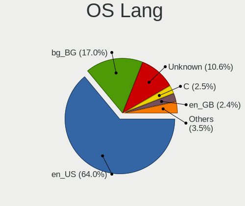

| Lang    | Computers | Percent |
|---------|-----------|---------|
| en_US   | 606       | 60.84%  |
| bg_BG   | 177       | 17.77%  |
| Unknown | 143       | 14.36%  |
| en_GB   | 24        | 2.41%   |
| C       | 19        | 1.91%   |
| ru_RU   | 8         | 0.8%    |
| de_DE   | 7         | 0.7%    |
| uk_UA   | 1         | 0.1%    |
| ru_UA   | 1         | 0.1%    |
| POSIX   | 1         | 0.1%    |
| it_IT   | 1         | 0.1%    |
| ia_FR   | 1         | 0.1%    |
| hu_HU   | 1         | 0.1%    |
| fr_FR   | 1         | 0.1%    |
| en_DK   | 1         | 0.1%    |
| en_CA   | 1         | 0.1%    |
| en_AG   | 1         | 0.1%    |
| Default | 1         | 0.1%    |
| C.UTF8  | 1         | 0.1%    |

Boot Mode
---------

EFI or BIOS

| Mode | Computers | Percent |
|------|-----------|---------|
| BIOS | 568       | 57.66%  |
| EFI  | 417       | 42.34%  |

Filesystem
----------

Type of filesystem

| Type    | Computers | Percent |
|---------|-----------|---------|
| Ext4    | 741       | 74.62%  |
| Overlay | 76        | 7.65%   |
| Btrfs   | 69        | 6.95%   |
| Unknown | 56        | 5.64%   |
| Xfs     | 18        | 1.81%   |
| Tmpfs   | 17        | 1.71%   |
| Zfs     | 7         | 0.7%    |
| Ext3    | 4         | 0.4%    |
| Ext2    | 3         | 0.3%    |
| Jfs     | 1         | 0.1%    |
| F2fs    | 1         | 0.1%    |

Part. scheme
------------

Scheme of partitioning

| Type    | Computers | Percent |
|---------|-----------|---------|
| Unknown | 520       | 52.53%  |
| GPT     | 329       | 33.23%  |
| MBR     | 141       | 14.24%  |

Dual Boot with Linux/BSD
------------------------

Hosting more than one Linux/BSD

| Dual boot | Computers | Percent |
|-----------|-----------|---------|
| No        | 832       | 84.73%  |
| Yes       | 150       | 15.27%  |

Dual Boot (Win)
---------------

Hosting Linux and Windows

| Dual boot | Computers | Percent |
|-----------|-----------|---------|
| No        | 671       | 68.61%  |
| Yes       | 307       | 31.39%  |

Board
-----

Vendor
------

Motherboard manufacturer

| Name                | Computers | Percent |
|---------------------|-----------|---------|
| Lenovo              | 181       | 18.85%  |
| ASUSTek Computer    | 167       | 17.4%   |
| Hewlett-Packard     | 133       | 13.85%  |
| Dell                | 127       | 13.23%  |
| ASRock              | 65        | 6.77%   |
| Acer                | 65        | 6.77%   |
| Gigabyte Technology | 56        | 5.83%   |
| MSI                 | 32        | 3.33%   |
| Toshiba             | 31        | 3.23%   |
| Fujitsu             | 17        | 1.77%   |
| Intel               | 10        | 1.04%   |
| Apple               | 10        | 1.04%   |
| Fujitsu Siemens     | 6         | 0.63%   |
| Foxconn             | 6         | 0.63%   |
| AMI                 | 5         | 0.52%   |
| Samsung Electronics | 4         | 0.42%   |
| Unknown             | 4         | 0.42%   |
| Valve               | 3         | 0.31%   |
| TUXEDO              | 3         | 0.31%   |
| Pegatron            | 3         | 0.31%   |
| Packard Bell        | 3         | 0.31%   |
| HUAWEI              | 3         | 0.31%   |
| Wibtek              | 2         | 0.21%   |
| Sony                | 2         | 0.21%   |
| Medion              | 2         | 0.21%   |
| Google              | 2         | 0.21%   |
| Thecus              | 1         | 0.1%    |
| System76            | 1         | 0.1%    |
| Supermicro          | 1         | 0.1%    |
| Shuttle             | 1         | 0.1%    |
| Seco                | 1         | 0.1%    |
| Razer               | 1         | 0.1%    |
| Radxa               | 1         | 0.1%    |
| Pine Microsystems   | 1         | 0.1%    |
| Notebook            | 1         | 0.1%    |
| MiTAC               | 1         | 0.1%    |
| LG Electronics      | 1         | 0.1%    |
| iEi                 | 1         | 0.1%    |
| IBM                 | 1         | 0.1%    |
| ECS                 | 1         | 0.1%    |

Model
-----

Motherboard model

| Name                                       | Computers | Percent |
|--------------------------------------------|-----------|---------|
| Unknown                                    | 8         | 0.83%   |
| ASUS All Series                            | 7         | 0.73%   |
| Dell Inspiron N5110                        | 5         | 0.52%   |
| Lenovo H520S 2561                          | 4         | 0.42%   |
| Lenovo G500 20236                          | 4         | 0.42%   |
| HP ProBook 4540s                           | 4         | 0.42%   |
| ASUS X541NA                                | 4         | 0.42%   |
| Valve Jupiter                              | 3         | 0.31%   |
| HP ProBook 450 G8 Notebook PC              | 3         | 0.31%   |
| HP ProBook 450 G0                          | 3         | 0.31%   |
| HP Pavilion 15                             | 3         | 0.31%   |
| HP Notebook                                | 3         | 0.31%   |
| Dell Precision M4600                       | 3         | 0.31%   |
| Dell Latitude E6410                        | 3         | 0.31%   |
| Dell Latitude E4300                        | 3         | 0.31%   |
| ASUS VivoBook 15_ASUS Laptop X540MA_X540MA | 3         | 0.31%   |
| ASUS N551VW                                | 3         | 0.31%   |
| ASRock Z97 Anniversary                     | 3         | 0.31%   |
| Acer Aspire 5738                           | 3         | 0.31%   |
| Wibtek H61-M HDMI2                         | 2         | 0.21%   |
| Toshiba Satellite L300                     | 2         | 0.21%   |
| Toshiba Satellite C50-A-19T                | 2         | 0.21%   |
| Toshiba Satellite A200                     | 2         | 0.21%   |
| Samsung 300E4Z/300E5Z/300E7Z               | 2         | 0.21%   |
| MSI MS-7C56                                | 2         | 0.21%   |
| MSI MS-7C37                                | 2         | 0.21%   |
| MSI Modern 15 A5M                          | 2         | 0.21%   |
| Lenovo Yoga S740-14IIL 81RS                | 2         | 0.21%   |
| Lenovo Y520-15IKBN 80WK                    | 2         | 0.21%   |
| Lenovo ThinkPad X220 4291IR6               | 2         | 0.21%   |
| Lenovo ThinkPad X1 Carbon 3rd 20BTS1D900   | 2         | 0.21%   |
| Lenovo ThinkPad T460 20FN003LUK            | 2         | 0.21%   |
| Lenovo ThinkPad T420 4236A87               | 2         | 0.21%   |
| Lenovo ThinkPad T14 Gen 1 20S0000NBM       | 2         | 0.21%   |
| Lenovo ThinkPad L590 20Q700AWBM            | 2         | 0.21%   |
| Lenovo ThinkPad E480 20KN005CBM            | 2         | 0.21%   |
| Lenovo ThinkPad E15 Gen 4 21E6006WBM       | 2         | 0.21%   |
| Lenovo ThinkBook 13s-IML 20RR              | 2         | 0.21%   |
| Lenovo Legion Y740-17IRHg 81UJ             | 2         | 0.21%   |
| Lenovo Legion 5 15ARH05 82B5               | 2         | 0.21%   |

Model Family
------------

Motherboard model prefix

| Name               | Computers | Percent |
|--------------------|-----------|---------|
| Lenovo ThinkPad    | 84        | 8.75%   |
| Acer Aspire        | 45        | 4.69%   |
| Dell Latitude      | 36        | 3.75%   |
| Lenovo IdeaPad     | 32        | 3.33%   |
| Dell Inspiron      | 31        | 3.23%   |
| HP ProBook         | 29        | 3.02%   |
| Toshiba Satellite  | 25        | 2.6%    |
| HP Pavilion        | 23        | 2.4%    |
| HP Compaq          | 22        | 2.29%   |
| HP EliteBook       | 20        | 2.08%   |
| ASUS VivoBook      | 18        | 1.88%   |
| Dell Precision     | 17        | 1.77%   |
| Dell Vostro        | 14        | 1.46%   |
| Dell OptiPlex      | 14        | 1.46%   |
| ASUS ROG           | 14        | 1.46%   |
| ASUS PRIME         | 12        | 1.25%   |
| Lenovo ThinkCentre | 9         | 0.94%   |
| Lenovo Legion      | 9         | 0.94%   |
| Fujitsu ESPRIMO    | 9         | 0.94%   |
| Unknown            | 8         | 0.83%   |
| Lenovo Yoga        | 7         | 0.73%   |
| ASUS All           | 7         | 0.73%   |
| HP Laptop          | 6         | 0.63%   |
| Dell XPS           | 6         | 0.63%   |
| MSI Modern         | 5         | 0.52%   |
| ASUS TUF           | 5         | 0.52%   |
| ASUS P5K           | 5         | 0.52%   |
| Acer Nitro         | 5         | 0.52%   |
| Lenovo ThinkBook   | 4         | 0.42%   |
| Lenovo H520S       | 4         | 0.42%   |
| Lenovo G500        | 4         | 0.42%   |
| HP 250             | 4         | 0.42%   |
| ASUS ZenBook       | 4         | 0.42%   |
| ASUS X541NA        | 4         | 0.42%   |
| ASUS ASUS          | 4         | 0.42%   |
| ASRock X570        | 4         | 0.42%   |
| Acer Predator      | 4         | 0.42%   |
| Valve Jupiter      | 3         | 0.31%   |
| MSI GF63           | 3         | 0.31%   |
| Lenovo V15         | 3         | 0.31%   |

MFG Year
--------

Motherboard manufacture year

| Year    | Computers | Percent |
|---------|-----------|---------|
| 2011    | 86        | 8.96%   |
| 2012    | 80        | 8.33%   |
| 2020    | 77        | 8.02%   |
| 2019    | 77        | 8.02%   |
| 2013    | 73        | 7.6%    |
| 2018    | 72        | 7.5%    |
| 2017    | 71        | 7.4%    |
| 2014    | 64        | 6.67%   |
| 2015    | 56        | 5.83%   |
| 2021    | 50        | 5.21%   |
| 2010    | 50        | 5.21%   |
| 2008    | 45        | 4.69%   |
| 2009    | 40        | 4.17%   |
| 2022    | 32        | 3.33%   |
| 2007    | 31        | 3.23%   |
| 2016    | 30        | 3.13%   |
| 2006    | 15        | 1.56%   |
| 2023    | 4         | 0.42%   |
| 2005    | 3         | 0.31%   |
| 2004    | 2         | 0.21%   |
| Unknown | 2         | 0.21%   |

Form Factor
-----------

Physical design of the computer

| Name           | Computers | Percent |
|----------------|-----------|---------|
| Notebook       | 588       | 61.25%  |
| Desktop        | 343       | 35.73%  |
| Mini pc        | 9         | 0.94%   |
| Convertible    | 8         | 0.83%   |
| All in one     | 6         | 0.63%   |
| Tablet         | 3         | 0.31%   |
| Phone          | 1         | 0.1%    |
| System on chip | 1         | 0.1%    |
| Server         | 1         | 0.1%    |

Secure Boot
-----------

Enabled or disabled

| State    | Computers | Percent |
|----------|-----------|---------|
| Disabled | 912       | 94.61%  |
| Enabled  | 52        | 5.39%   |

Coreboot
--------

Have coreboot on board

| Used | Computers | Percent |
|------|-----------|---------|
| No   | 956       | 99.58%  |
| Yes  | 4         | 0.42%   |

RAM Size
--------

Total RAM memory

| Size in GB      | Computers | Percent |
|-----------------|-----------|---------|
| 4.01-8.0        | 247       | 25.05%  |
| 3.01-4.0        | 199       | 20.18%  |
| 8.01-16.0       | 187       | 18.97%  |
| 16.01-24.0      | 161       | 16.33%  |
| 32.01-64.0      | 90        | 9.13%   |
| 1.01-2.0        | 32        | 3.25%   |
| 2.01-3.0        | 23        | 2.33%   |
| 24.01-32.0      | 22        | 2.23%   |
| 64.01-256.0     | 20        | 2.03%   |
| 0.51-1.0        | 4         | 0.41%   |
| More than 256.0 | 1         | 0.1%    |

RAM Used
--------

Used RAM memory

| Used GB    | Computers | Percent |
|------------|-----------|---------|
| 1.01-2.0   | 351       | 31.97%  |
| 2.01-3.0   | 297       | 27.05%  |
| 4.01-8.0   | 158       | 14.39%  |
| 3.01-4.0   | 154       | 14.03%  |
| 0.51-1.0   | 79        | 7.19%   |
| 8.01-16.0  | 45        | 4.1%    |
| 0.01-0.5   | 7         | 0.64%   |
| 16.01-24.0 | 4         | 0.36%   |
| 32.01-64.0 | 1         | 0.09%   |
| 24.01-32.0 | 1         | 0.09%   |
| Unknown    | 1         | 0.09%   |

Total Drives
------------

Number of drives on board

| Drives | Computers | Percent |
|--------|-----------|---------|
| 1      | 600       | 60.42%  |
| 2      | 261       | 26.28%  |
| 3      | 65        | 6.55%   |
| 4      | 22        | 2.22%   |
| 5      | 20        | 2.01%   |
| 6      | 11        | 1.11%   |
| 0      | 8         | 0.81%   |
| 8      | 2         | 0.2%    |
| 7      | 2         | 0.2%    |
| 11     | 1         | 0.1%    |
| 9      | 1         | 0.1%    |

Has CD-ROM
----------

Has CD-ROM on board

| Presented | Computers | Percent |
|-----------|-----------|---------|
| No        | 568       | 58.32%  |
| Yes       | 406       | 41.68%  |

Has Ethernet
------------

Has Ethernet on board

| Presented | Computers | Percent |
|-----------|-----------|---------|
| Yes       | 867       | 89.94%  |
| No        | 97        | 10.06%  |

Has WiFi
--------

Has WiFi module

| Presented | Computers | Percent |
|-----------|-----------|---------|
| Yes       | 711       | 73.68%  |
| No        | 254       | 26.32%  |

Has Bluetooth
-------------

Has Bluetooth module

| Presented | Computers | Percent |
|-----------|-----------|---------|
| Yes       | 565       | 58.01%  |
| No        | 409       | 41.99%  |

Location
--------

Country
-------

Geographic location (country)

| Country  | Computers | Percent |
|----------|-----------|---------|
| Bulgaria | 960       | 100%    |

City
----

Geographic location (city)

| City                | Computers | Percent |
|---------------------|-----------|---------|
| Sofia               | 496       | 49.11%  |
| Varna               | 82        | 8.12%   |
| Plovdiv             | 67        | 6.63%   |
| Burgas              | 43        | 4.26%   |
| Stara Zagora        | 24        | 2.38%   |
| Pernik              | 17        | 1.68%   |
| Rousse              | 16        | 1.58%   |
| Yambol              | 13        | 1.29%   |
| Pleven              | 12        | 1.19%   |
| Veliko Tarnovo      | 11        | 1.09%   |
| Shumen              | 9         | 0.89%   |
| Montana             | 9         | 0.89%   |
| Haskovo             | 9         | 0.89%   |
| Gabrovo             | 9         | 0.89%   |
| Dobrich             | 9         | 0.89%   |
| Sliven              | 8         | 0.79%   |
| Kazanlak            | 8         | 0.79%   |
| Asenovgrad          | 8         | 0.79%   |
| Razgrad             | 6         | 0.59%   |
| Pazardzhik          | 6         | 0.59%   |
| Vidin               | 5         | 0.5%    |
| Svilengrad          | 5         | 0.5%    |
| Blagoevgrad         | 5         | 0.5%    |
| Sistov              | 4         | 0.4%    |
| Karlovo             | 4         | 0.4%    |
| Vratsa              | 3         | 0.3%    |
| Svoge               | 3         | 0.3%    |
| Smolyan             | 3         | 0.3%    |
| Silistra            | 3         | 0.3%    |
| Nesebar             | 3         | 0.3%    |
| Kyustendil          | 3         | 0.3%    |
| Kardzhali           | 3         | 0.3%    |
| Gorna Oryahovitsa   | 3         | 0.3%    |
| Dimitrovgrad        | 3         | 0.3%    |
| Velingrad           | 2         | 0.2%    |
| Troyan Municipality | 2         | 0.2%    |
| Targovishte         | 2         | 0.2%    |
| Slashten            | 2         | 0.2%    |
| Sevlievo            | 2         | 0.2%    |
| Popovo              | 2         | 0.2%    |

Drives
------

Drive Vendor
------------

Hard drive vendors

| Vendor                      | Computers | Drives | Percent |
|-----------------------------|-----------|--------|---------|
| Seagate                     | 206       | 312    | 14.75%  |
| Samsung Electronics         | 201       | 301    | 14.39%  |
| WDC                         | 199       | 298    | 14.24%  |
| Toshiba                     | 114       | 154    | 8.16%   |
| Kingston                    | 80        | 119    | 5.73%   |
| Hitachi                     | 75        | 100    | 5.37%   |
| SanDisk                     | 57        | 71     | 4.08%   |
| A-DATA Technology           | 47        | 64     | 3.36%   |
| Intel                       | 43        | 60     | 3.08%   |
| Unknown                     | 41        | 53     | 2.93%   |
| HGST                        | 39        | 58     | 2.79%   |
| SK hynix                    | 27        | 36     | 1.93%   |
| Crucial                     | 24        | 39     | 1.72%   |
| Micron Technology           | 19        | 21     | 1.36%   |
| Team                        | 18        | 19     | 1.29%   |
| SPCC                        | 17        | 22     | 1.22%   |
| KIOXIA                      | 14        | 15     | 1%      |
| China                       | 13        | 17     | 0.93%   |
| Transcend                   | 10        | 11     | 0.72%   |
| KingSpec                    | 9         | 11     | 0.64%   |
| Phison Electronics          | 8         | 12     | 0.57%   |
| Phison                      | 8         | 8      | 0.57%   |
| Patriot                     | 7         | 8      | 0.5%    |
| LITEON                      | 7         | 8      | 0.5%    |
| Silicon Motion              | 6         | 9      | 0.43%   |
| Realtek Semiconductor       | 6         | 10     | 0.43%   |
| PNY                         | 6         | 6      | 0.43%   |
| Maxtor                      | 6         | 11     | 0.43%   |
| JMicron Technology          | 6         | 9      | 0.43%   |
| Fujitsu                     | 6         | 9      | 0.43%   |
| XPG                         | 5         | 7      | 0.36%   |
| Apple                       | 5         | 7      | 0.36%   |
| LITEONIT                    | 4         | 4      | 0.29%   |
| Intenso                     | 4         | 4      | 0.29%   |
| Union Memory (Shenzhen)     | 3         | 6      | 0.21%   |
| TO Exter                    | 3         | 3      | 0.21%   |
| Kingston Technology Company | 3         | 5      | 0.21%   |
| ExcelStor                   | 3         | 7      | 0.21%   |
| AMD                         | 3         | 5      | 0.21%   |
| Verbatim                    | 2         | 2      | 0.14%   |

Drive Model
-----------

Hard drive models

| Model                                               | Computers | Percent |
|-----------------------------------------------------|-----------|---------|
| Seagate ST1000LM035-1RK172 1TB                      | 18        | 1.18%   |
| Seagate ST500DM002-1BD142 500GB                     | 16        | 1.05%   |
| Kingston SA400S37120G 120GB SSD                     | 16        | 1.05%   |
| Toshiba MQ01ABD100 1TB                              | 15        | 0.98%   |
| Seagate ST1000LM024 HN-M101MBB 1TB                  | 15        | 0.98%   |
| Samsung SSD 860 EVO 250GB                           | 15        | 0.98%   |
| Toshiba MQ01ABF050 500GB                            | 14        | 0.92%   |
| Samsung SSD 850 EVO 250GB                           | 14        | 0.92%   |
| HGST HTS721010A9E630 1TB                            | 14        | 0.92%   |
| Samsung NVMe SSD Drive 512GB                        | 12        | 0.78%   |
| Samsung NVMe SSD Controller SM981/PM981/PM983 500GB | 12        | 0.78%   |
| Kingston SA400S37240G 240GB SSD                     | 12        | 0.78%   |
| Seagate ST1000DM010-2EP102 1TB                      | 11        | 0.72%   |
| Samsung SSD 860 EVO 500GB                           | 11        | 0.72%   |
| WDC WDS240G2G0A-00JH30 240GB SSD                    | 9         | 0.59%   |
| Kingston SA400S37480G 480GB SSD                     | 9         | 0.59%   |
| Toshiba DT01ACA100 1TB                              | 8         | 0.52%   |
| SanDisk NVMe SSD Drive 512GB                        | 8         | 0.52%   |
| HGST HTS541010A9E680 1TB                            | 8         | 0.52%   |
| WDC WD10SPZX-21Z10T0 1TB                            | 7         | 0.46%   |
| Unknown MMC Card  64GB                              | 7         | 0.46%   |
| Unknown MMC Card  32GB                              | 7         | 0.46%   |
| Seagate ST1000DM003-1ER162 1TB                      | 7         | 0.46%   |
| Samsung SSD 850 PRO 256GB                           | 7         | 0.46%   |
| Samsung NVMe SSD Drive 500GB                        | 7         | 0.46%   |
| Kingston SV300S37A120G 120GB SSD                    | 7         | 0.46%   |
| Toshiba MQ04ABF100 1TB                              | 6         | 0.39%   |
| Toshiba DT01ACA050 500GB                            | 6         | 0.39%   |
| SPCC Solid State Disk 512GB                         | 6         | 0.39%   |
| Samsung SSD 970 EVO Plus 500GB                      | 6         | 0.39%   |
| Samsung SSD 970 EVO 250GB                           | 6         | 0.39%   |
| Samsung SSD 850 EVO 500GB                           | 6         | 0.39%   |
| Intel SSDSC2CW120A3 120GB                           | 6         | 0.39%   |
| Hitachi HDP725050GLA360 500GB                       | 6         | 0.39%   |
| A-DATA SU650 240GB SSD                              | 6         | 0.39%   |
| A-DATA SU650 120GB SSD                              | 6         | 0.39%   |
| Toshiba KBG30ZMS128G 128GB NVMe SSD                 | 5         | 0.33%   |
| Toshiba HDWD110 1TB                                 | 5         | 0.33%   |
| Toshiba DT01ACA200 2TB                              | 5         | 0.33%   |
| Seagate ST9500325AS 500GB                           | 5         | 0.33%   |

HDD Vendor
----------

Hard disk drive vendors

| Vendor              | Computers | Drives | Percent |
|---------------------|-----------|--------|---------|
| Seagate             | 204       | 308    | 32.85%  |
| WDC                 | 175       | 256    | 28.18%  |
| Toshiba             | 91        | 122    | 14.65%  |
| Hitachi             | 75        | 100    | 12.08%  |
| HGST                | 39        | 58     | 6.28%   |
| Samsung Electronics | 9         | 12     | 1.45%   |
| Maxtor              | 6         | 11     | 0.97%   |
| Fujitsu             | 6         | 9      | 0.97%   |
| JMicron Technology  | 5         | 6      | 0.81%   |
| ExcelStor           | 3         | 7      | 0.48%   |
| Unknown             | 2         | 3      | 0.32%   |
| SSK                 | 1         | 1      | 0.16%   |
| IBM/Hitachi         | 1         | 2      | 0.16%   |
| HGST HTS            | 1         | 1      | 0.16%   |
| Hewlett-Packard     | 1         | 1      | 0.16%   |
| ASMedia             | 1         | 1      | 0.16%   |
| Apple               | 1         | 1      | 0.16%   |

SSD Vendor
----------

Solid state drive vendors

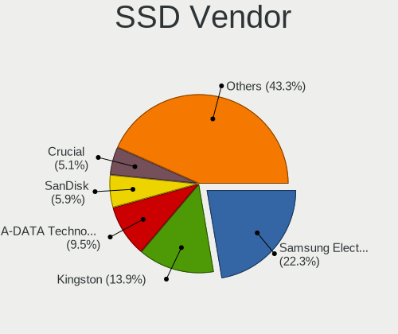

| Vendor              | Computers | Drives | Percent |
|---------------------|-----------|--------|---------|
| Samsung Electronics | 105       | 134    | 23.92%  |
| Kingston            | 59        | 79     | 13.44%  |
| A-DATA Technology   | 39        | 54     | 8.88%   |
| SanDisk             | 30        | 36     | 6.83%   |
| Crucial             | 21        | 34     | 4.78%   |
| WDC                 | 19        | 29     | 4.33%   |
| Intel               | 19        | 26     | 4.33%   |
| Team                | 18        | 19     | 4.1%    |
| SPCC                | 15        | 20     | 3.42%   |
| China               | 13        | 17     | 2.96%   |
| KingSpec            | 9         | 11     | 2.05%   |
| Transcend           | 8         | 9      | 1.82%   |
| Toshiba             | 8         | 9      | 1.82%   |
| Patriot             | 7         | 8      | 1.59%   |
| Micron Technology   | 7         | 7      | 1.59%   |
| LITEON              | 7         | 8      | 1.59%   |
| PNY                 | 6         | 6      | 1.37%   |
| LITEONIT            | 4         | 4      | 0.91%   |
| Intenso             | 4         | 4      | 0.91%   |
| TO Exter            | 3         | 3      | 0.68%   |
| Apple               | 3         | 5      | 0.68%   |
| AMD                 | 3         | 5      | 0.68%   |
| Verbatim            | 2         | 2      | 0.46%   |
| Teclast             | 2         | 2      | 0.46%   |
| SK hynix            | 2         | 2      | 0.46%   |
| OCZ                 | 2         | 2      | 0.46%   |
| Lexar               | 2         | 2      | 0.46%   |
| Innodisk            | 2         | 2      | 0.46%   |
| GOODRAM             | 2         | 2      | 0.46%   |
| XPG                 | 1         | 1      | 0.23%   |
| Unknown             | 1         | 1      | 0.23%   |
| StoreJet            | 1         | 1      | 0.23%   |
| Seagate             | 1         | 2      | 0.23%   |
| Origin              | 1         | 3      | 0.23%   |
| OCZ-VERTEX3         | 1         | 1      | 0.23%   |
| Netac               | 1         | 4      | 0.23%   |
| HS-SSD-C100         | 1         | 1      | 0.23%   |
| HPE                 | 1         | 1      | 0.23%   |
| Gigabyte Technology | 1         | 10     | 0.23%   |
| FORESEE             | 1         | 2      | 0.23%   |

Drive Kind
----------

HDD or SSD

| Kind    | Computers | Drives | Percent |
|---------|-----------|--------|---------|
| HDD     | 538       | 899    | 42.43%  |
| SSD     | 394       | 576    | 31.07%  |
| NVMe    | 292       | 450    | 23.03%  |
| MMC     | 35        | 43     | 2.76%   |
| Unknown | 9         | 12     | 0.71%   |

Drive Connector
---------------

SATA, SAS, NVMe, etc.

| Type | Computers | Drives | Percent |
|------|-----------|--------|---------|
| SATA | 750       | 1440   | 67.14%  |
| NVMe | 291       | 448    | 26.05%  |
| SAS  | 41        | 49     | 3.67%   |
| MMC  | 35        | 43     | 3.13%   |

Drive Size
----------

Size of hard drive

| Size in TB | Computers | Drives | Percent |
|------------|-----------|--------|---------|
| 0.01-0.5   | 573       | 897    | 60.89%  |
| 0.51-1.0   | 285       | 436    | 30.29%  |
| 1.01-2.0   | 41        | 60     | 4.36%   |
| 3.01-4.0   | 18        | 35     | 1.91%   |
| 2.01-3.0   | 11        | 18     | 1.17%   |
| 4.01-10.0  | 8         | 13     | 0.85%   |
| 10.01-20.0 | 5         | 16     | 0.53%   |

Space Total
-----------

Amount of disk space available on the file system

| Size in GB     | Computers | Percent |
|----------------|-----------|---------|
| 101-250        | 269       | 26.19%  |
| 251-500        | 233       | 22.69%  |
| 501-1000       | 159       | 15.48%  |
| 1001-2000      | 89        | 8.67%   |
| 1-20           | 82        | 7.98%   |
| 51-100         | 75        | 7.3%    |
| 21-50          | 44        | 4.28%   |
| More than 3000 | 35        | 3.41%   |
| Unknown        | 23        | 2.24%   |
| 2001-3000      | 18        | 1.75%   |

Space Used
----------

Amount of used disk space

| Used GB        | Computers | Percent |
|----------------|-----------|---------|
| 1-20           | 421       | 38.55%  |
| 21-50          | 178       | 16.3%   |
| 101-250        | 147       | 13.46%  |
| 51-100         | 128       | 11.72%  |
| 251-500        | 75        | 6.87%   |
| 501-1000       | 63        | 5.77%   |
| 1001-2000      | 34        | 3.11%   |
| Unknown        | 23        | 2.11%   |
| More than 3000 | 13        | 1.19%   |
| 2001-3000      | 10        | 0.92%   |

Malfunc. Drives
---------------

Drive models with a malfunction

| Model                              | Computers | Drives | Percent |
|------------------------------------|-----------|--------|---------|
| WDC WD6000HLHX-01JJPV0 600GB       | 3         | 4      | 2.86%   |
| Seagate ST9500325AS 500GB          | 3         | 3      | 2.86%   |
| Seagate ST1000LM024 HN-M101MBB 1TB | 3         | 3      | 2.86%   |
| WDC WD5000AAKX-603CA0 500GB        | 2         | 6      | 1.9%    |
| Toshiba MQ01ABF050 500GB           | 2         | 2      | 1.9%    |
| Toshiba MQ01ABD100 1TB             | 2         | 2      | 1.9%    |
| Seagate ST500DM002-1BD142 500GB    | 2         | 2      | 1.9%    |
| Seagate ST2000DM001-1CH164 2TB     | 2         | 2      | 1.9%    |
| KingSpec P3-128 128GB              | 2         | 3      | 1.9%    |
| Intel SSDSC2CW120A3 120GB          | 2         | 2      | 1.9%    |
| A-DATA Technology SU650 120GB SSD  | 2         | 2      | 1.9%    |
| WDC WDS100T2B0B-00YS70 1TB SSD     | 1         | 1      | 0.95%   |
| WDC WD5000BEVT-75A0RT0 500GB       | 1         | 1      | 0.95%   |
| WDC WD5000AADS-00S9B0 500GB        | 1         | 2      | 0.95%   |
| WDC WD5000AACS-00G8B1 500GB        | 1         | 1      | 0.95%   |
| WDC WD40PURX-64GVNY0 4TB           | 1         | 1      | 0.95%   |
| WDC WD3200BEVT-80A0RT0 320GB       | 1         | 1      | 0.95%   |
| WDC WD3200AAJS-07M0A0 320GB        | 1         | 2      | 0.95%   |
| WDC WD2500JS-00MHB0 250GB          | 1         | 1      | 0.95%   |
| WDC WD2500AAKX-753CA1 250GB        | 1         | 1      | 0.95%   |
| WDC WD1600BEVT-80A23T0 160GB       | 1         | 1      | 0.95%   |
| WDC WD15EARS-00S8B1 1TB            | 1         | 1      | 0.95%   |
| WDC WD10EFRX-68PJCN0 1TB           | 1         | 1      | 0.95%   |
| WDC WD10EARS-00MVWB0 1TB           | 1         | 1      | 0.95%   |
| WDC WD1003FZEX-00K3CA0 1TB         | 1         | 1      | 0.95%   |
| Toshiba MQ01ABD050 500GB           | 1         | 1      | 0.95%   |
| Toshiba MK3252GSX 320GB            | 1         | 1      | 0.95%   |
| Toshiba MK2552GSX 250GB            | 1         | 3      | 0.95%   |
| Toshiba MK2035GSS 200GB            | 1         | 1      | 0.95%   |
| Toshiba MK1637GSX 160GB            | 1         | 1      | 0.95%   |
| Toshiba HDWD120 2TB                | 1         | 1      | 0.95%   |
| Toshiba DT01ACA300 3TB             | 1         | 1      | 0.95%   |
| Toshiba DT01ACA050 500GB           | 1         | 1      | 0.95%   |
| SPCC Solid State Disk 128GB        | 1         | 1      | 0.95%   |
| SPCC M.2 PCIe SSD 256GB            | 1         | 1      | 0.95%   |
| Seagate ST9500420AS 500GB          | 1         | 2      | 0.95%   |
| Seagate ST94019A 40GB              | 1         | 1      | 0.95%   |
| Seagate ST500LT012-9WS142 500GB    | 1         | 1      | 0.95%   |
| Seagate ST500LM021-1KJ152 500GB    | 1         | 1      | 0.95%   |
| Seagate ST500LM000-1EJ162 500GB    | 1         | 1      | 0.95%   |

Malfunc. Drive Vendor
---------------------

Vendors of faulty drives

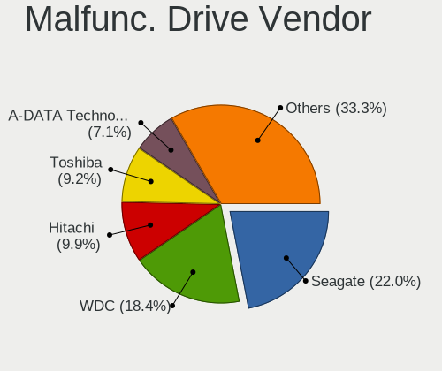

| Vendor              | Computers | Drives | Percent |
|---------------------|-----------|--------|---------|
| Seagate             | 24        | 26     | 22.86%  |
| WDC                 | 19        | 26     | 18.1%   |
| Toshiba             | 12        | 14     | 11.43%  |
| Hitachi             | 12        | 13     | 11.43%  |
| A-DATA Technology   | 8         | 8      | 7.62%   |
| Intel               | 6         | 7      | 5.71%   |
| Samsung Electronics | 4         | 5      | 3.81%   |
| Kingston            | 4         | 4      | 3.81%   |
| Maxtor              | 3         | 3      | 2.86%   |
| KingSpec            | 3         | 4      | 2.86%   |
| SPCC                | 2         | 2      | 1.9%    |
| SanDisk             | 2         | 2      | 1.9%    |
| ExcelStor           | 2         | 3      | 1.9%    |
| Patriot             | 1         | 1      | 0.95%   |
| HGST                | 1         | 1      | 0.95%   |
| Fujitsu             | 1         | 2      | 0.95%   |
| China               | 1         | 1      | 0.95%   |

Malfunc. HDD Vendor
-------------------

Vendors of faulty HDD drives

| Vendor    | Computers | Drives | Percent |
|-----------|-----------|--------|---------|
| Seagate   | 24        | 26     | 32.88%  |
| WDC       | 18        | 25     | 24.66%  |
| Toshiba   | 12        | 14     | 16.44%  |
| Hitachi   | 12        | 13     | 16.44%  |
| Maxtor    | 3         | 3      | 4.11%   |
| ExcelStor | 2         | 3      | 2.74%   |
| HGST      | 1         | 1      | 1.37%   |
| Fujitsu   | 1         | 2      | 1.37%   |

Malfunc. Drive Kind
-------------------

Kinds of faulty drives

| Kind | Computers | Drives | Percent |
|------|-----------|--------|---------|
| HDD  | 70        | 87     | 70%     |
| SSD  | 26        | 30     | 26%     |
| NVMe | 4         | 5      | 4%      |

Failed Drives
-------------

Failed drive models

| Model                        | Computers | Drives | Percent |
|------------------------------|-----------|--------|---------|
| WDC WD7500BPVT-22HXZT3 752GB | 1         | 1      | 33.33%  |
| WDC WD1600BEKT-75PVMT0 160GB | 1         | 1      | 33.33%  |
| HGST HTS545050A7E680 500GB   | 1         | 1      | 33.33%  |

Failed Drive Vendor
-------------------

Failed drive vendors

| Vendor | Computers | Drives | Percent |
|--------|-----------|--------|---------|
| WDC    | 2         | 2      | 66.67%  |
| HGST   | 1         | 1      | 33.33%  |

Drive Status
------------

Number of failed and malfunc. drives

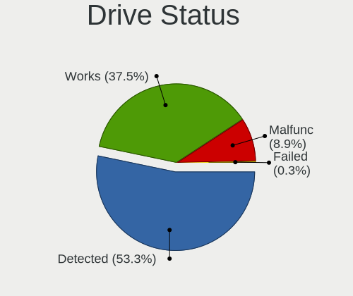

| Status   | Computers | Drives | Percent |
|----------|-----------|--------|---------|
| Detected | 590       | 1192   | 56.08%  |
| Works    | 365       | 663    | 34.7%   |
| Malfunc  | 94        | 122    | 8.94%   |
| Failed   | 3         | 3      | 0.29%   |

Storage controller
------------------

Storage Vendor
--------------

Storage controller vendors

| Vendor                           | Computers | Percent |
|----------------------------------|-----------|---------|
| Intel                            | 686       | 56.98%  |
| AMD                              | 154       | 12.79%  |
| Samsung Electronics              | 110       | 9.14%   |
| SanDisk                          | 38        | 3.16%   |
| SK hynix                         | 25        | 2.08%   |
| Kingston Technology Company      | 23        | 1.91%   |
| JMicron Technology               | 18        | 1.5%    |
| Phison Electronics               | 17        | 1.41%   |
| Nvidia                           | 17        | 1.41%   |
| KIOXIA                           | 16        | 1.33%   |
| Toshiba America Info Systems     | 14        | 1.16%   |
| ASMedia Technology               | 14        | 1.16%   |
| Realtek Semiconductor            | 13        | 1.08%   |
| Micron Technology                | 12        | 1%      |
| Marvell Technology Group         | 9         | 0.75%   |
| ADATA Technology                 | 9         | 0.75%   |
| Silicon Motion                   | 7         | 0.58%   |
| Micron/Crucial Technology        | 5         | 0.42%   |
| Union Memory (Shenzhen)          | 4         | 0.33%   |
| VIA Technologies                 | 2         | 0.17%   |
| Transcend                        | 2         | 0.17%   |
| Hewlett-Packard                  | 2         | 0.17%   |
| Solid State Storage Technology   | 1         | 0.08%   |
| Silicon Integrated Systems [SiS] | 1         | 0.08%   |
| O2 Micro                         | 1         | 0.08%   |
| Lenovo                           | 1         | 0.08%   |
| Integrated Technology Express    | 1         | 0.08%   |
| Chelsio Communications           | 1         | 0.08%   |
| Apple                            | 1         | 0.08%   |

Storage Model
-------------

Storage controller models

| Model                                                                                   | Computers | Percent |
|-----------------------------------------------------------------------------------------|-----------|---------|
| AMD FCH SATA Controller [AHCI mode]                                                     | 100       | 7.15%   |
| Samsung NVMe SSD Controller SM981/PM981/PM983                                           | 62        | 4.43%   |
| Intel 7 Series Chipset Family 6-port SATA Controller [AHCI mode]                        | 56        | 4%      |
| Intel 8 Series/C220 Series Chipset Family 6-port SATA Controller 1 [AHCI mode]          | 45        | 3.22%   |
| Intel Sunrise Point-LP SATA Controller [AHCI mode]                                      | 41        | 2.93%   |
| Intel 6 Series/C200 Series Chipset Family 6 port Mobile SATA AHCI Controller            | 39        | 2.79%   |
| Intel 82801 Mobile SATA Controller [RAID mode]                                          | 35        | 2.5%    |
| Intel 82801IBM/IEM (ICH9M/ICH9M-E) 4 port SATA Controller [AHCI mode]                   | 29        | 2.07%   |
| Intel 6 Series/C200 Series Chipset Family 6 port Desktop SATA AHCI Controller           | 27        | 1.93%   |
| Intel Wildcat Point-LP SATA Controller [AHCI Mode]                                      | 26        | 1.86%   |
| AMD SB7x0/SB8x0/SB9x0 SATA Controller [AHCI mode]                                       | 21        | 1.5%    |
| Intel Q170/Q150/B150/H170/H110/Z170/CM236 Chipset SATA Controller [AHCI Mode]           | 19        | 1.36%   |
| Intel HM170/QM170 Chipset SATA Controller [AHCI Mode]                                   | 19        | 1.36%   |
| Intel 8 Series SATA Controller 1 [AHCI mode]                                            | 19        | 1.36%   |
| Intel Volume Management Device NVMe RAID Controller                                     | 18        | 1.29%   |
| Samsung NVMe SSD Controller 980                                                         | 17        | 1.22%   |
| Intel 200 Series PCH SATA controller [AHCI mode]                                        | 17        | 1.22%   |
| Intel NM10/ICH7 Family SATA Controller [IDE mode]                                       | 16        | 1.14%   |
| Intel Cannon Lake Mobile PCH SATA AHCI Controller                                       | 16        | 1.14%   |
| AMD SB7x0/SB8x0/SB9x0 IDE Controller                                                    | 16        | 1.14%   |
| Intel SATA Controller [RAID mode]                                                       | 14        | 1%      |
| Intel Celeron/Pentium Silver Processor SATA Controller                                  | 14        | 1%      |
| Intel 82801G (ICH7 Family) IDE Controller                                               | 14        | 1%      |
| ASMedia ASM1062 Serial ATA Controller                                                   | 14        | 1%      |
| Samsung NVMe SSD Controller PM9A1/PM9A3/980PRO                                          | 13        | 0.93%   |
| KIOXIA NVMe SSD Controller BG4 (DRAM-less)                                              | 13        | 0.93%   |
| Intel Cannon Lake PCH SATA AHCI Controller                                              | 13        | 0.93%   |
| Intel 5 Series/3400 Series Chipset 6 port SATA AHCI Controller                          | 13        | 0.93%   |
| SK hynix Gold P31/BC711/PC711 NVMe Solid State Drive                                    | 12        | 0.86%   |
| Intel SSD 660P Series                                                                   | 12        | 0.86%   |
| Intel Celeron N3350/Pentium N4200/Atom E3900 Series SATA AHCI Controller                | 12        | 0.86%   |
| Intel 82801I (ICH9 Family) 2 port SATA Controller [IDE mode]                            | 12        | 0.86%   |
| AMD 400 Series Chipset SATA Controller                                                  | 12        | 0.86%   |
| Intel 7 Series/C210 Series Chipset Family 6-port SATA Controller [AHCI mode]            | 11        | 0.79%   |
| Intel 5 Series/3400 Series Chipset 4 port SATA AHCI Controller                          | 11        | 0.79%   |
| Samsung NVMe SSD Controller SM961/PM961/SM963                                           | 10        | 0.71%   |
| Intel 9 Series Chipset Family SATA Controller [AHCI Mode]                               | 10        | 0.71%   |
| Intel 6 Series/C200 Series Chipset Family Desktop SATA Controller (IDE mode, ports 4-5) | 10        | 0.71%   |
| Intel 6 Series/C200 Series Chipset Family Desktop SATA Controller (IDE mode, ports 0-3) | 10        | 0.71%   |
| AMD SB7x0/SB8x0/SB9x0 SATA Controller [IDE mode]                                        | 10        | 0.71%   |

Storage Kind
------------

Kind of storage controller (IDE, SATA, NVMe, SAS, ...)

| Kind | Computers | Percent |
|------|-----------|---------|
| SATA | 679       | 55.84%  |
| NVMe | 296       | 24.34%  |
| IDE  | 166       | 13.65%  |
| RAID | 72        | 5.92%   |
| SAS  | 2         | 0.16%   |
| SCSI | 1         | 0.08%   |

Processor
---------

CPU Vendor
----------

Processor vendors

| Vendor       | Computers | Percent |
|--------------|-----------|---------|
| Intel        | 745       | 77.6%   |
| AMD          | 212       | 22.08%  |
| ARM          | 2         | 0.21%   |
| CentaurHauls | 1         | 0.1%    |

CPU Model
---------

Processor models

| Model                                    | Computers | Percent |
|------------------------------------------|-----------|---------|
| Intel Core i5-3230M CPU @ 2.60GHz        | 11        | 1.14%   |
| Intel Core i5-2520M CPU @ 2.50GHz        | 11        | 1.14%   |
| Intel 11th Gen Core i5-1135G7 @ 2.40GHz  | 11        | 1.14%   |
| Intel Core i7-10510U CPU @ 1.80GHz       | 10        | 1.04%   |
| Intel Core i7-8750H CPU @ 2.20GHz        | 9         | 0.93%   |
| Intel Core i7-7700HQ CPU @ 2.80GHz       | 9         | 0.93%   |
| Intel Core i7-6700HQ CPU @ 2.60GHz       | 9         | 0.93%   |
| Intel Core i5-5200U CPU @ 2.20GHz        | 8         | 0.83%   |
| Intel Pentium CPU N4200 @ 1.10GHz        | 7         | 0.73%   |
| Intel Core i7-9750H CPU @ 2.60GHz        | 7         | 0.73%   |
| Intel Core i7-8565U CPU @ 1.80GHz        | 7         | 0.73%   |
| Intel Core i5-8265U CPU @ 1.60GHz        | 7         | 0.73%   |
| Intel Core i7-2670QM CPU @ 2.20GHz       | 6         | 0.62%   |
| Intel Core i7-10750H CPU @ 2.60GHz       | 6         | 0.62%   |
| Intel Core i5-8250U CPU @ 1.60GHz        | 6         | 0.62%   |
| Intel Core i5-3210M CPU @ 2.50GHz        | 6         | 0.62%   |
| Intel Core i5-2410M CPU @ 2.30GHz        | 6         | 0.62%   |
| Intel Core i3 CPU M 370 @ 2.40GHz        | 6         | 0.62%   |
| Intel Celeron N4000 CPU @ 1.10GHz        | 6         | 0.62%   |
| Intel 11th Gen Core i7-1165G7 @ 2.80GHz  | 6         | 0.62%   |
| AMD Ryzen 7 4800H with Radeon Graphics   | 6         | 0.62%   |
| AMD Ryzen 3 3250U with Radeon Graphics   | 6         | 0.62%   |
| Intel Pentium Silver N5000 CPU @ 1.10GHz | 5         | 0.52%   |
| Intel Pentium CPU 2020M @ 2.40GHz        | 5         | 0.52%   |
| Intel Core i7-8700 CPU @ 3.20GHz         | 5         | 0.52%   |
| Intel Core i7-8550U CPU @ 1.80GHz        | 5         | 0.52%   |
| Intel Core i7-4710HQ CPU @ 2.50GHz       | 5         | 0.52%   |
| Intel Core i7-3630QM CPU @ 2.40GHz       | 5         | 0.52%   |
| Intel Core i5-6300U CPU @ 2.40GHz        | 5         | 0.52%   |
| Intel Core i5-4590 CPU @ 3.30GHz         | 5         | 0.52%   |
| Intel Core i5-3470 CPU @ 3.20GHz         | 5         | 0.52%   |
| Intel Core i3-5005U CPU @ 2.00GHz        | 5         | 0.52%   |
| Intel Celeron CPU N3050 @ 1.60GHz        | 5         | 0.52%   |
| AMD Ryzen 7 5700U with Radeon Graphics   | 5         | 0.52%   |
| AMD Ryzen 5 5500U with Radeon Graphics   | 5         | 0.52%   |
| AMD Ryzen 5 3600 6-Core Processor        | 5         | 0.52%   |
| AMD Ryzen 5 1600 Six-Core Processor      | 5         | 0.52%   |
| Intel Pentium CPU G645 @ 2.90GHz         | 4         | 0.42%   |
| Intel Core i7-7500U CPU @ 2.70GHz        | 4         | 0.42%   |
| Intel Core i7-6500U CPU @ 2.50GHz        | 4         | 0.42%   |

CPU Model Family
----------------

Processor model prefix

| Model                   | Computers | Percent |
|-------------------------|-----------|---------|
| Intel Core i5           | 197       | 20.46%  |
| Intel Core i7           | 187       | 19.42%  |
| Intel Core i3           | 73        | 7.58%   |
| Other                   | 53        | 5.5%    |
| Intel Core 2 Duo        | 51        | 5.3%    |
| Intel Celeron           | 47        | 4.88%   |
| AMD Ryzen 5             | 45        | 4.67%   |
| Intel Pentium           | 41        | 4.26%   |
| AMD Ryzen 7             | 41        | 4.26%   |
| Intel Xeon              | 22        | 2.28%   |
| Intel Core 2 Quad       | 14        | 1.45%   |
| AMD Ryzen 9             | 14        | 1.45%   |
| Intel Pentium Dual-Core | 12        | 1.25%   |
| Intel Atom              | 12        | 1.25%   |
| AMD Ryzen 3             | 12        | 1.25%   |
| AMD Athlon 64 X2        | 11        | 1.14%   |
| AMD FX                  | 10        | 1.04%   |
| Intel Pentium Dual      | 8         | 0.83%   |
| Intel Core i9           | 7         | 0.73%   |
| Intel Core 2            | 7         | 0.73%   |
| AMD Ryzen 7 PRO         | 7         | 0.73%   |
| AMD Ryzen 5 PRO         | 6         | 0.62%   |
| AMD A8                  | 6         | 0.62%   |
| Intel Pentium Silver    | 5         | 0.52%   |
| AMD Phenom II X4        | 5         | 0.52%   |
| AMD Athlon II X2        | 5         | 0.52%   |
| AMD Athlon 64           | 5         | 0.52%   |
| AMD A6                  | 5         | 0.52%   |
| AMD E1                  | 4         | 0.42%   |
| AMD Sempron             | 3         | 0.31%   |
| AMD Athlon II X4        | 3         | 0.31%   |
| Intel Pentium M         | 2         | 0.21%   |
| Intel Pentium Gold      | 2         | 0.21%   |
| Intel Genuine           | 2         | 0.21%   |
| Intel Core m3           | 2         | 0.21%   |
| Intel Celeron Dual-Core | 2         | 0.21%   |
| AMD Turion 64 X2 Mobile | 2         | 0.21%   |
| AMD Phenom II X6        | 2         | 0.21%   |
| AMD Phenom II X2        | 2         | 0.21%   |
| AMD Phenom              | 2         | 0.21%   |

CPU Cores
---------

Number of processor cores

| Number  | Computers | Percent |
|---------|-----------|---------|
| 2       | 412       | 42.74%  |
| 4       | 320       | 33.2%   |
| 6       | 96        | 9.96%   |
| 8       | 62        | 6.43%   |
| 1       | 26        | 2.7%    |
| 12      | 16        | 1.66%   |
| 3       | 9         | 0.93%   |
| 10      | 8         | 0.83%   |
| 16      | 6         | 0.62%   |
| 14      | 4         | 0.41%   |
| Unknown | 2         | 0.21%   |
| 40      | 1         | 0.1%    |
| 24      | 1         | 0.1%    |
| 18      | 1         | 0.1%    |

CPU Sockets
-----------

Number of sockets

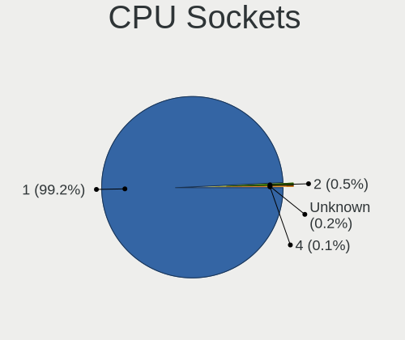

| Number | Computers | Percent |
|--------|-----------|---------|
| 1      | 956       | 99.58%  |
| 2      | 3         | 0.31%   |
| 4      | 1         | 0.1%    |

CPU Threads
-----------

Threads per core (Hyper-Threading)

| Number  | Computers | Percent |
|---------|-----------|---------|
| 2       | 604       | 62.66%  |
| 1       | 358       | 37.14%  |
| Unknown | 2         | 0.21%   |

CPU Op-Modes
------------

CPU Operation Modes (32-bit, 64-bit)

| Op mode        | Computers | Percent |
|----------------|-----------|---------|
| 32-bit, 64-bit | 930       | 96.07%  |
| Unknown        | 26        | 2.69%   |
| 32-bit         | 11        | 1.14%   |
| 64-bit         | 1         | 0.1%    |

CPU Microcode
-------------

Microcode number

| Number     | Computers | Percent |
|------------|-----------|---------|
| Unknown    | 269       | 26.61%  |
| 0x306a9    | 65        | 6.43%   |
| 0x206a7    | 65        | 6.43%   |
| 0x306c3    | 50        | 4.95%   |
| 0x1067a    | 38        | 3.76%   |
| 0x906ea    | 26        | 2.57%   |
| 0x806ec    | 26        | 2.57%   |
| 0x506e3    | 24        | 2.37%   |
| 0x306d4    | 23        | 2.27%   |
| 0x906e9    | 20        | 1.98%   |
| 0x20655    | 20        | 1.98%   |
| 0x406e3    | 18        | 1.78%   |
| 0x40651    | 18        | 1.78%   |
| 0x6fd      | 17        | 1.68%   |
| 0x806c1    | 16        | 1.58%   |
| 0x806ea    | 15        | 1.48%   |
| 0x10676    | 13        | 1.29%   |
| 0x706a1    | 11        | 1.09%   |
| 0x506c9    | 11        | 1.09%   |
| 0x08108109 | 10        | 0.99%   |
| 0x010000c8 | 10        | 0.99%   |
| 0x6fb      | 8         | 0.79%   |
| 0x0a50000c | 8         | 0.79%   |
| 0x806e9    | 7         | 0.69%   |
| 0x406c3    | 7         | 0.69%   |
| 0x08608103 | 7         | 0.69%   |
| 0x08108102 | 7         | 0.69%   |
| 0xa0652    | 6         | 0.59%   |
| 0x806eb    | 6         | 0.59%   |
| 0x6f6      | 6         | 0.59%   |
| 0x306f2    | 6         | 0.59%   |
| 0x08600106 | 6         | 0.59%   |
| 0x906a4    | 5         | 0.49%   |
| 0x706e5    | 5         | 0.49%   |
| 0x0a201009 | 5         | 0.49%   |
| 0x08600103 | 5         | 0.49%   |
| 0x0800820d | 5         | 0.49%   |
| 0xa0671    | 4         | 0.4%    |
| 0xa0655    | 4         | 0.4%    |
| 0x906ed    | 4         | 0.4%    |

CPU Microarch
-------------

Microarchitecture

| Name             | Computers | Percent |
|------------------|-----------|---------|
| KabyLake         | 136       | 14.14%  |
| Haswell          | 94        | 9.77%   |
| IvyBridge        | 85        | 8.84%   |
| SandyBridge      | 82        | 8.52%   |
| Penryn           | 66        | 6.86%   |
| Skylake          | 49        | 5.09%   |
| Unknown          | 37        | 3.85%   |
| Core             | 36        | 3.74%   |
| Zen 3            | 35        | 3.64%   |
| Zen 2            | 33        | 3.43%   |
| Westmere         | 31        | 3.22%   |
| Broadwell        | 28        | 2.91%   |
| Zen+             | 27        | 2.81%   |
| K10              | 23        | 2.39%   |
| TigerLake        | 22        | 2.29%   |
| K8 Hammer        | 20        | 2.08%   |
| Silvermont       | 19        | 1.98%   |
| CometLake        | 17        | 1.77%   |
| Goldmont plus    | 14        | 1.46%   |
| Piledriver       | 13        | 1.35%   |
| Goldmont         | 13        | 1.35%   |
| Alderlake Hybrid | 13        | 1.35%   |
| Zen              | 12        | 1.25%   |
| IceLake          | 11        | 1.14%   |
| Bonnell          | 7         | 0.73%   |
| Nehalem          | 6         | 0.62%   |
| P6               | 5         | 0.52%   |
| Excavator        | 5         | 0.52%   |
| Steamroller      | 4         | 0.42%   |
| Jaguar           | 4         | 0.42%   |
| Puma             | 3         | 0.31%   |
| K10 Llano        | 3         | 0.31%   |
| Bulldozer        | 3         | 0.31%   |
| Bobcat           | 3         | 0.31%   |
| NetBurst         | 2         | 0.21%   |
| K8 & K10 hybrid  | 1         | 0.1%    |

Graphics
--------

GPU Vendor
----------

Vendors of graphics cards

| Vendor                           | Computers | Percent |
|----------------------------------|-----------|---------|
| Intel                            | 577       | 48.24%  |
| Nvidia                           | 342       | 28.6%   |
| AMD                              | 275       | 22.99%  |
| VIA Technologies                 | 1         | 0.08%   |
| Silicon Integrated Systems [SiS] | 1         | 0.08%   |

GPU Model
---------

Graphics card models

| Model                                                                                    | Computers | Percent |
|------------------------------------------------------------------------------------------|-----------|---------|
| Intel 2nd Generation Core Processor Family Integrated Graphics Controller                | 61        | 4.96%   |
| Intel 3rd Gen Core processor Graphics Controller                                         | 55        | 4.48%   |
| Intel Mobile 4 Series Chipset Integrated Graphics Controller                             | 25        | 2.03%   |
| Intel HD Graphics 5500                                                                   | 25        | 2.03%   |
| Intel CoffeeLake-H GT2 [UHD Graphics 630]                                                | 25        | 2.03%   |
| Intel 4th Gen Core Processor Integrated Graphics Controller                              | 23        | 1.87%   |
| AMD Renoir                                                                               | 23        | 1.87%   |
| Intel Xeon E3-1200 v3/4th Gen Core Processor Integrated Graphics Controller              | 21        | 1.71%   |
| Intel TigerLake-LP GT2 [Iris Xe Graphics]                                                | 21        | 1.71%   |
| Intel Haswell-ULT Integrated Graphics Controller                                         | 21        | 1.71%   |
| Intel WhiskeyLake-U GT2 [UHD Graphics 620]                                               | 19        | 1.55%   |
| AMD Picasso/Raven 2 [Radeon Vega Series / Radeon Vega Mobile Series]                     | 19        | 1.55%   |
| AMD Ellesmere [Radeon RX 470/480/570/570X/580/580X/590]                                  | 19        | 1.55%   |
| Intel HD Graphics 630                                                                    | 18        | 1.46%   |
| Intel Skylake GT2 [HD Graphics 520]                                                      | 17        | 1.38%   |
| Intel HD Graphics 530                                                                    | 16        | 1.3%    |
| Intel Core Processor Integrated Graphics Controller                                      | 16        | 1.3%    |
| Intel UHD Graphics 620                                                                   | 15        | 1.22%   |
| Intel CometLake-U GT2 [UHD Graphics]                                                     | 14        | 1.14%   |
| AMD Cezanne [Radeon Vega Series / Radeon Vega Mobile Series]                             | 13        | 1.06%   |
| Intel Atom/Celeron/Pentium Processor x5-E8000/J3xxx/N3xxx Integrated Graphics Controller | 11        | 0.9%    |
| Nvidia GP106M [GeForce GTX 1060 Mobile]                                                  | 10        | 0.81%   |
| Intel HD Graphics 620                                                                    | 10        | 0.81%   |
| AMD Lucienne                                                                             | 10        | 0.81%   |
| Nvidia GA106M [GeForce RTX 3060 Mobile / Max-Q]                                          | 9         | 0.73%   |
| Intel Xeon E3-1200 v2/3rd Gen Core processor Graphics Controller                         | 9         | 0.73%   |
| Intel GeminiLake [UHD Graphics 600]                                                      | 9         | 0.73%   |
| Intel CometLake-H GT2 [UHD Graphics]                                                     | 9         | 0.73%   |
| Intel CoffeeLake-S GT2 [UHD Graphics 630]                                                | 9         | 0.73%   |
| Nvidia GP107 [GeForce GTX 1050 Ti]                                                       | 8         | 0.65%   |
| Nvidia GM108M [GeForce 840M]                                                             | 8         | 0.65%   |
| Intel Mobile GM965/GL960 Integrated Graphics Controller (secondary)                      | 8         | 0.65%   |
| Intel Mobile GM965/GL960 Integrated Graphics Controller (primary)                        | 8         | 0.65%   |
| Intel Atom Processor Z36xxx/Z37xxx Series Graphics & Display                             | 8         | 0.65%   |
| Intel 4 Series Chipset Integrated Graphics Controller                                    | 8         | 0.65%   |
| Nvidia GT218 [GeForce 210]                                                               | 7         | 0.57%   |
| Nvidia GP107M [GeForce GTX 1050 Mobile]                                                  | 7         | 0.57%   |
| Nvidia GM107M [GeForce GTX 960M]                                                         | 7         | 0.57%   |
| Intel Mobile 945GM/GMS/GME, 943/940GML Express Integrated Graphics Controller            | 7         | 0.57%   |
| Intel Apollo Lake [HD Graphics 505]                                                      | 7         | 0.57%   |

GPU Combo
---------

Combinations of graphics cards

| Name           | Computers | Percent |
|----------------|-----------|---------|
| 1 x Intel      | 364       | 37.37%  |
| 1 x AMD        | 207       | 21.25%  |
| Intel + Nvidia | 162       | 16.63%  |
| 1 x Nvidia     | 160       | 16.43%  |
| Intel + AMD    | 38        | 3.9%    |
| AMD + Nvidia   | 21        | 2.16%   |
| 2 x AMD        | 14        | 1.44%   |
| Other          | 3         | 0.31%   |
| 2 x Intel      | 2         | 0.21%   |
| 2 x Nvidia     | 1         | 0.1%    |
| 1 x VIA        | 1         | 0.1%    |
| 1 x SiS        | 1         | 0.1%    |

GPU Driver
----------

Free vs proprietary

| Driver      | Computers | Percent |
|-------------|-----------|---------|
| Free        | 757       | 77.24%  |
| Proprietary | 181       | 18.47%  |
| Unknown     | 42        | 4.29%   |

GPU Memory
----------

Total video memory

| Size in GB | Computers | Percent |
|------------|-----------|---------|
| Unknown    | 525       | 52.4%   |
| 1.01-2.0   | 149       | 14.87%  |
| 0.01-0.5   | 105       | 10.48%  |
| 3.01-4.0   | 80        | 7.98%   |
| 0.51-1.0   | 71        | 7.09%   |
| 7.01-8.0   | 35        | 3.49%   |
| 5.01-6.0   | 21        | 2.1%    |
| 8.01-16.0  | 8         | 0.8%    |
| 2.01-3.0   | 6         | 0.6%    |
| 16.01-24.0 | 2         | 0.2%    |

Monitor
-------

Monitor Vendor
--------------

Monitor vendors

| Vendor                  | Computers | Percent |
|-------------------------|-----------|---------|
| LG Display              | 162       | 15.7%   |
| Samsung Electronics     | 104       | 10.08%  |
| AU Optronics            | 99        | 9.59%   |
| BOE                     | 78        | 7.56%   |
| Chimei Innolux          | 76        | 7.36%   |
| Dell                    | 72        | 6.98%   |
| Goldstar                | 43        | 4.17%   |
| Philips                 | 40        | 3.88%   |
| Acer                    | 35        | 3.39%   |
| Lenovo                  | 29        | 2.81%   |
| Hewlett-Packard         | 28        | 2.71%   |
| AOC                     | 25        | 2.42%   |
| Ancor Communications    | 25        | 2.42%   |
| Chi Mei Optoelectronics | 18        | 1.74%   |
| BenQ                    | 18        | 1.74%   |
| PANDA                   | 13        | 1.26%   |
| Sharp                   | 11        | 1.07%   |
| LG Philips              | 9         | 0.87%   |
| LG Electronics          | 9         | 0.87%   |
| Fujitsu Siemens         | 9         | 0.87%   |
| Panasonic               | 8         | 0.78%   |
| Apple                   | 7         | 0.68%   |
| Vestel Elektronik       | 6         | 0.58%   |
| Sony                    | 6         | 0.58%   |
| HannStar                | 6         | 0.58%   |
| Eizo                    | 6         | 0.58%   |
| ASUSTek Computer        | 6         | 0.58%   |
| NEC Computers           | 5         | 0.48%   |
| MSI                     | 5         | 0.48%   |
| CSO                     | 4         | 0.39%   |
| CPT                     | 4         | 0.39%   |
| ViewSonic               | 3         | 0.29%   |
| Unknown                 | 3         | 0.29%   |
| Toshiba                 | 3         | 0.29%   |
| Iiyama                  | 3         | 0.29%   |
| Gigabyte Technology     | 3         | 0.29%   |
| Belinea                 | 3         | 0.29%   |
| WST                     | 2         | 0.19%   |
| Vestel                  | 2         | 0.19%   |
| Valve                   | 2         | 0.19%   |

Monitor Model
-------------

Monitor models

| Model                                                                    | Computers | Percent |
|--------------------------------------------------------------------------|-----------|---------|
| LG Display LCD Monitor LGD033A 1366x768 344x194mm 15.5-inch              | 12        | 1.12%   |
| AU Optronics LCD Monitor AUO38ED 1920x1080 344x193mm 15.5-inch           | 8         | 0.75%   |
| AU Optronics LCD Monitor AUO21ED 1920x1080 344x194mm 15.5-inch           | 8         | 0.75%   |
| Chi Mei Optoelectronics LCD Monitor CMO15A7 1366x768 344x193mm 15.5-inch | 7         | 0.65%   |
| Vestel Elektronik 42 FHD_LCD-TV VES3700 1920x540                         | 6         | 0.56%   |
| Chimei Innolux LCD Monitor CMN15F5 1920x1080 344x193mm 15.5-inch         | 6         | 0.56%   |
| PANDA LCD Monitor NCP004D 1920x1080 344x194mm 15.5-inch                  | 5         | 0.47%   |
| Chimei Innolux LCD Monitor CMN15E7 1920x1080 344x193mm 15.5-inch         | 5         | 0.47%   |
| Chimei Innolux LCD Monitor CMN14D4 1920x1080 309x173mm 13.9-inch         | 5         | 0.47%   |
| AOC 24B2W1 AOC2402 1920x1080 527x296mm 23.8-inch                         | 5         | 0.47%   |
| Samsung Electronics LCD Monitor SEC5441 1366x768 344x194mm 15.5-inch     | 4         | 0.37%   |
| Samsung Electronics LCD Monitor SAM0B30 1920x1080 885x498mm 40.0-inch    | 4         | 0.37%   |
| LG Display LCD Monitor LGD0608 1920x1080 477x269mm 21.6-inch             | 4         | 0.37%   |
| LG Display LCD Monitor LGD053F 1920x1080 344x194mm 15.5-inch             | 4         | 0.37%   |
| LG Display LCD Monitor LGD046F 1920x1080 344x194mm 15.5-inch             | 4         | 0.37%   |
| LG Display LCD Monitor LGD02DC 1366x768 344x194mm 15.5-inch              | 4         | 0.37%   |
| Goldstar ULTRAWIDE GSM59F1 2560x1080 673x284mm 28.8-inch                 | 4         | 0.37%   |
| Goldstar LG IPS FULLHD GSM5AB8 1920x1080 480x270mm 21.7-inch             | 4         | 0.37%   |
| Dell P2419H DELD0DA 1920x1080 527x296mm 23.8-inch                        | 4         | 0.37%   |
| Chimei Innolux LCD Monitor CMN14B1 1920x1080 308x173mm 13.9-inch         | 4         | 0.37%   |
| BOE LCD Monitor BOE0802 1920x1080 344x193mm 15.5-inch                    | 4         | 0.37%   |
| AU Optronics LCD Monitor AUO70EC 1366x768 344x193mm 15.5-inch            | 4         | 0.37%   |
| AU Optronics LCD Monitor AUO403D 1920x1080 309x174mm 14.0-inch           | 4         | 0.37%   |
| AU Optronics LCD Monitor AUO21EC 1366x768 344x193mm 15.5-inch            | 4         | 0.37%   |
| Samsung Electronics SMXL2370HD SAM072B 1920x1080 510x287mm 23.0-inch     | 3         | 0.28%   |
| Samsung Electronics LCD Monitor SEC3741 1280x800 331x207mm 15.4-inch     | 3         | 0.28%   |
| Samsung Electronics LCD Monitor SDC4141 3840x2160 344x194mm 15.5-inch    | 3         | 0.28%   |
| Panasonic TV MEIA296 3840x2160 698x392mm 31.5-inch                       | 3         | 0.28%   |
| LG Display LCD Monitor LGD0590 1920x1080 344x194mm 15.5-inch             | 3         | 0.28%   |
| LG Display LCD Monitor LGD0395 1366x768 344x194mm 15.5-inch              | 3         | 0.28%   |
| LG Display LCD Monitor LGD038E 1366x768 344x194mm 15.5-inch              | 3         | 0.28%   |
| LG Display LCD Monitor LGD02D8 1366x768 277x156mm 12.5-inch              | 3         | 0.28%   |
| LG Display LCD Monitor LGD02D3 1366x768 277x156mm 12.5-inch              | 3         | 0.28%   |
| LG Display LCD Monitor LGD021D 1600x900 382x215mm 17.3-inch              | 3         | 0.28%   |
| Hewlett-Packard w1907 HWP26A2 1440x900 408x255mm 18.9-inch               | 3         | 0.28%   |
| Hewlett-Packard E233 HPN345F 1920x1080 509x286mm 23.0-inch               | 3         | 0.28%   |
| Dell U2412M DELA07A 1920x1200 518x324mm 24.1-inch                        | 3         | 0.28%   |
| Dell P2314H DEL4099 1920x1080 509x286mm 23.0-inch                        | 3         | 0.28%   |
| Chimei Innolux LCD Monitor CMN15DB 1366x768 344x193mm 15.5-inch          | 3         | 0.28%   |
| BOE LCD Monitor BOE08E2 1920x1080 344x194mm 15.5-inch                    | 3         | 0.28%   |

Monitor Resolution
------------------

Monitor screen resolution

| Resolution         | Computers | Percent |
|--------------------|-----------|---------|
| 1920x1080 (FHD)    | 441       | 44.55%  |
| 1366x768 (WXGA)    | 175       | 17.68%  |
| 3840x2160 (4K)     | 46        | 4.65%   |
| 2560x1440 (QHD)    | 46        | 4.65%   |
| 1280x1024 (SXGA)   | 43        | 4.34%   |
| 1680x1050 (WSXGA+) | 39        | 3.94%   |
| 1600x900 (HD+)     | 38        | 3.84%   |
| 1280x800 (WXGA)    | 29        | 2.93%   |
| 1920x1200 (WUXGA)  | 25        | 2.53%   |
| 1440x900 (WXGA+)   | 17        | 1.72%   |
| Unknown            | 14        | 1.41%   |
| 2560x1080          | 9         | 0.91%   |
| 3440x1440          | 7         | 0.71%   |
| 2560x1600          | 7         | 0.71%   |
| 3840x1080          | 5         | 0.51%   |
| 1024x600           | 5         | 0.51%   |
| 2880x1800          | 4         | 0.4%    |
| 1024x768 (XGA)     | 4         | 0.4%    |
| 800x1280           | 3         | 0.3%    |
| 3840x1200          | 3         | 0.3%    |
| 1600x1200          | 3         | 0.3%    |
| 1400x1050          | 3         | 0.3%    |
| 1360x768           | 3         | 0.3%    |
| 1280x720 (HD)      | 3         | 0.3%    |
| 3200x1080          | 2         | 0.2%    |
| 2160x1440          | 2         | 0.2%    |
| 6784x2160          | 1         | 0.1%    |
| 6400x1080          | 1         | 0.1%    |
| 5120x1080          | 1         | 0.1%    |
| 4240x1440          | 1         | 0.1%    |
| 3840x2400          | 1         | 0.1%    |
| 3600x1200          | 1         | 0.1%    |
| 3200x1800 (QHD+)   | 1         | 0.1%    |
| 3000x2000          | 1         | 0.1%    |
| 2256x1504          | 1         | 0.1%    |
| 2048x1152          | 1         | 0.1%    |
| 1921x1080          | 1         | 0.1%    |
| 1920x540           | 1         | 0.1%    |
| 1820x1023          | 1         | 0.1%    |
| 1280x960           | 1         | 0.1%    |

Monitor Diagonal
----------------

Diagonal size in inches

| Inches  | Computers | Percent |
|---------|-----------|---------|
| 15      | 328       | 31.75%  |
| 24      | 73        | 7.07%   |
| 23      | 67        | 6.49%   |
| 17      | 66        | 6.39%   |
| 13      | 66        | 6.39%   |
| 14      | 64        | 6.2%    |
| 21      | 61        | 5.91%   |
| 27      | 49        | 4.74%   |
| Unknown | 49        | 4.74%   |
| 19      | 31        | 3%      |
| 12      | 26        | 2.52%   |
| 22      | 24        | 2.32%   |
| 20      | 17        | 1.65%   |
| 84      | 16        | 1.55%   |
| 34      | 13        | 1.26%   |
| 18      | 11        | 1.06%   |
| 31      | 10        | 0.97%   |
| 16      | 8         | 0.77%   |
| 11      | 7         | 0.68%   |
| 54      | 6         | 0.58%   |
| 25      | 6         | 0.58%   |
| 10      | 6         | 0.58%   |
| 40      | 5         | 0.48%   |
| 72      | 3         | 0.29%   |
| 32      | 3         | 0.29%   |
| 65      | 2         | 0.19%   |
| 33      | 2         | 0.19%   |
| 29      | 2         | 0.19%   |
| 28      | 2         | 0.19%   |
| 26      | 2         | 0.19%   |
| 7       | 2         | 0.19%   |
| 75      | 1         | 0.1%    |
| 52      | 1         | 0.1%    |
| 46      | 1         | 0.1%    |
| 37      | 1         | 0.1%    |
| 30      | 1         | 0.1%    |
| 3       | 1         | 0.1%    |

Monitor Width
-------------

Physical width

| Width in mm | Computers | Percent |
|-------------|-----------|---------|
| 301-350     | 449       | 43.76%  |
| 501-600     | 182       | 17.74%  |
| 401-500     | 124       | 12.09%  |
| 351-400     | 73        | 7.12%   |
| 201-300     | 69        | 6.73%   |
| Unknown     | 49        | 4.78%   |
| 601-700     | 23        | 2.24%   |
| 1501-2000   | 20        | 1.95%   |
| 701-800     | 18        | 1.75%   |
| 1001-1500   | 10        | 0.97%   |
| 801-900     | 6         | 0.58%   |
| 1-100       | 3         | 0.29%   |

Aspect Ratio
------------

Proportional relationship between the width and the height

| Ratio   | Computers | Percent |
|---------|-----------|---------|
| 16/9    | 684       | 73.16%  |
| 16/10   | 126       | 13.48%  |
| Unknown | 45        | 4.81%   |
| 5/4     | 41        | 4.39%   |
| 21/9    | 16        | 1.71%   |
| 4/3     | 12        | 1.28%   |
| 3/2     | 6         | 0.64%   |
| 6/5     | 2         | 0.21%   |
| 0.67    | 2         | 0.21%   |
| 32/9    | 1         | 0.11%   |

Monitor Area
------------

Area in inch

| Area in inch | Computers | Percent |
|----------------|-----------|---------|
| 101-110        | 326       | 31.96%  |
| 201-250        | 172       | 16.86%  |
| 81-90          | 106       | 10.39%  |
| 151-200        | 66        | 6.47%   |
| 301-350        | 53        | 5.2%    |
| Unknown        | 49        | 4.8%    |
| 121-130        | 39        | 3.82%   |
| 251-300        | 33        | 3.24%   |
| 351-500        | 30        | 2.94%   |
| 141-150        | 30        | 2.94%   |
| More than 1000 | 28        | 2.75%   |
| 71-80          | 26        | 2.55%   |
| 61-70          | 24        | 2.35%   |
| 111-120        | 8         | 0.78%   |
| 51-60          | 7         | 0.69%   |
| 501-1000       | 7         | 0.69%   |
| 41-50          | 6         | 0.59%   |
| 131-140        | 6         | 0.59%   |
| 1-40           | 3         | 0.29%   |
| 91-100         | 1         | 0.1%    |

Pixel Density
-------------

Pixels per inch

| Density       | Computers | Percent |
|---------------|-----------|---------|
| 51-100        | 325       | 32.53%  |
| 121-160       | 296       | 29.63%  |
| 101-120       | 250       | 25.03%  |
| Unknown       | 49        | 4.9%    |
| 161-240       | 42        | 4.2%    |
| More than 240 | 19        | 1.9%    |
| 1-50          | 18        | 1.8%    |

Multiple Monitors
-----------------

Total monitors connected

| Total | Computers | Percent |
|-------|-----------|---------|
| 1     | 784       | 79.03%  |
| 2     | 142       | 14.31%  |
| 0     | 49        | 4.94%   |
| 3     | 16        | 1.61%   |
| 4     | 1         | 0.1%    |

Network
-------

Net Controller Vendor
---------------------

Controller vendors

| Vendor                            | Computers | Percent |
|-----------------------------------|-----------|---------|
| Realtek Semiconductor             | 508       | 34.09%  |
| Intel                             | 473       | 31.74%  |
| Qualcomm Atheros                  | 167       | 11.21%  |
| Broadcom                          | 78        | 5.23%   |
| Broadcom Limited                  | 30        | 2.01%   |
| TP-Link                           | 28        | 1.88%   |
| MediaTek                          | 22        | 1.48%   |
| Ralink                            | 21        | 1.41%   |
| Ralink Technology                 | 17        | 1.14%   |
| Nvidia                            | 17        | 1.14%   |
| Marvell Technology Group          | 15        | 1.01%   |
| Qualcomm Atheros Communications   | 14        | 0.94%   |
| Ericsson Business Mobile Networks | 14        | 0.94%   |
| Sierra Wireless                   | 11        | 0.74%   |
| D-Link                            | 6         | 0.4%    |
| Dell                              | 5         | 0.34%   |
| Xiaomi                            | 4         | 0.27%   |
| Sundance Technology Inc / IC Plus | 4         | 0.27%   |
| Microsoft                         | 4         | 0.27%   |
| Huawei Technologies               | 4         | 0.27%   |
| Hewlett-Packard                   | 4         | 0.27%   |
| DisplayLink                       | 4         | 0.27%   |
| Aquantia                          | 3         | 0.2%    |
| AMD                               | 3         | 0.2%    |
| Toshiba                           | 2         | 0.13%   |
| Samsung Electronics               | 2         | 0.13%   |
| Motorola PCS                      | 2         | 0.13%   |
| Lenovo                            | 2         | 0.13%   |
| Google                            | 2         | 0.13%   |
| Davicom Semiconductor             | 2         | 0.13%   |
| D-Link System                     | 2         | 0.13%   |
| Chelsio Communications            | 2         | 0.13%   |
| ASIX Electronics                  | 2         | 0.13%   |
| ZTE WCDMA Technologies MSM        | 1         | 0.07%   |
| Razer USA                         | 1         | 0.07%   |
| Quectel Wireless Solutions        | 1         | 0.07%   |
| Qualcomm                          | 1         | 0.07%   |
| NetXen Incorporated               | 1         | 0.07%   |
| NetGear                           | 1         | 0.07%   |
| Micro Star International          | 1         | 0.07%   |

Net Controller Model
--------------------

Controller models

| Model                                                             | Computers | Percent |
|-------------------------------------------------------------------|-----------|---------|
| Realtek RTL8111/8168/8411 PCI Express Gigabit Ethernet Controller | 336       | 19.34%  |
| Realtek RTL810xE PCI Express Fast Ethernet controller             | 67        | 3.86%   |
| Intel 82579LM Gigabit Network Connection (Lewisville)             | 53        | 3.05%   |
| Qualcomm Atheros QCA9377 802.11ac Wireless Network Adapter        | 28        | 1.61%   |
| Intel Centrino Advanced-N 6205 [Taylor Peak]                      | 27        | 1.55%   |
| Intel Wi-Fi 6 AX200                                               | 26        | 1.5%    |
| Qualcomm Atheros QCA9565 / AR9565 Wireless Network Adapter        | 23        | 1.32%   |
| Intel Wireless 8265 / 8275                                        | 23        | 1.32%   |
| Intel Wireless 7265                                               | 23        | 1.32%   |
| Realtek RTL8822CE 802.11ac PCIe Wireless Network Adapter          | 21        | 1.21%   |
| Realtek RTL8153 Gigabit Ethernet Adapter                          | 21        | 1.21%   |
| Realtek RTL-8100/8101L/8139 PCI Fast Ethernet Adapter             | 21        | 1.21%   |
| Intel Wireless 7260                                               | 21        | 1.21%   |
| Qualcomm Atheros AR9285 Wireless Network Adapter (PCI-Express)    | 19        | 1.09%   |
| Intel Cannon Lake PCH CNVi WiFi                                   | 19        | 1.09%   |
| Intel Wi-Fi 6 AX201                                               | 18        | 1.04%   |
| Intel Ethernet Connection (2) I219-V                              | 18        | 1.04%   |
| Qualcomm Atheros QCA6174 802.11ac Wireless Network Adapter        | 16        | 0.92%   |
| Intel Comet Lake PCH CNVi WiFi                                    | 15        | 0.86%   |
| Realtek RTL8125 2.5GbE Controller                                 | 14        | 0.81%   |
| Intel Alder Lake-P PCH CNVi WiFi                                  | 14        | 0.81%   |
| Qualcomm Atheros AR9271 802.11n                                   | 13        | 0.75%   |
| Intel I211 Gigabit Network Connection                             | 13        | 0.75%   |
| Intel Comet Lake PCH-LP CNVi WiFi                                 | 13        | 0.75%   |
| Intel 82579V Gigabit Network Connection                           | 13        | 0.75%   |
| Broadcom BCM43142 802.11b/g/n                                     | 13        | 0.75%   |
| Realtek RTL8821CE 802.11ac PCIe Wireless Network Adapter          | 12        | 0.69%   |
| Intel Wireless 8260                                               | 12        | 0.69%   |
| Intel Wireless 3160                                               | 12        | 0.69%   |
| Intel Ethernet Connection I217-LM                                 | 12        | 0.69%   |
| TP-Link TL-WN722N v2/v3 [Realtek RTL8188EUS]                      | 11        | 0.63%   |
| Realtek RTL8822BE 802.11a/b/g/n/ac WiFi adapter                   | 11        | 0.63%   |
| Realtek RTL8723BE PCIe Wireless Network Adapter                   | 11        | 0.63%   |
| Intel Ethernet Connection (3) I218-LM                             | 11        | 0.63%   |
| Intel Cannon Point-LP CNVi [Wireless-AC]                          | 11        | 0.63%   |
| Ralink RT3290 Wireless 802.11n 1T/1R PCIe                         | 10        | 0.58%   |
| Qualcomm Atheros QCA8172 Fast Ethernet                            | 10        | 0.58%   |
| Qualcomm Atheros AR9485 Wireless Network Adapter                  | 10        | 0.58%   |
| Intel WiFi Link 5100                                              | 10        | 0.58%   |
| Intel Ethernet Controller I225-V                                  | 10        | 0.58%   |

Wireless Vendor
---------------

Wireless vendors

| Vendor                                | Computers | Percent |
|---------------------------------------|-----------|---------|
| Intel                                 | 350       | 46.11%  |
| Qualcomm Atheros                      | 123       | 16.21%  |
| Realtek Semiconductor                 | 104       | 13.7%   |
| Broadcom                              | 48        | 6.32%   |
| TP-Link                               | 23        | 3.03%   |
| Ralink                                | 21        | 2.77%   |
| MediaTek                              | 21        | 2.77%   |
| Ralink Technology                     | 17        | 2.24%   |
| Qualcomm Atheros Communications       | 14        | 1.84%   |
| Sierra Wireless                       | 11        | 1.45%   |
| Broadcom Limited                      | 9         | 1.19%   |
| Microsoft                             | 4         | 0.53%   |
| D-Link                                | 3         | 0.4%    |
| Dell                                  | 2         | 0.26%   |
| Quectel Wireless Solutions            | 1         | 0.13%   |
| Qualcomm                              | 1         | 0.13%   |
| NetGear                               | 1         | 0.13%   |
| Micro Star International              | 1         | 0.13%   |
| Hewlett-Packard                       | 1         | 0.13%   |
| Gemtek                                | 1         | 0.13%   |
| Ericsson Business Mobile Networks     | 1         | 0.13%   |
| ASUSTek Computer                      | 1         | 0.13%   |
| 802.11g Adapter [Linksys WUSB54GC v3] | 1         | 0.13%   |

Wireless Model
--------------

Wireless models

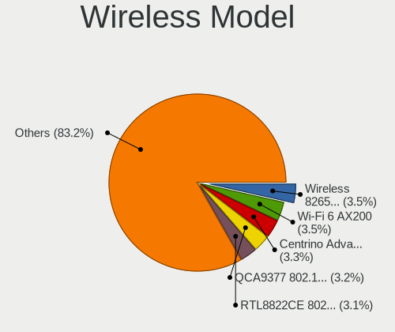

| Model                                                          | Computers | Percent |
|----------------------------------------------------------------|-----------|---------|
| Qualcomm Atheros QCA9377 802.11ac Wireless Network Adapter     | 28        | 3.67%   |
| Intel Centrino Advanced-N 6205 [Taylor Peak]                   | 27        | 3.54%   |
| Intel Wi-Fi 6 AX200                                            | 26        | 3.41%   |
| Qualcomm Atheros QCA9565 / AR9565 Wireless Network Adapter     | 23        | 3.02%   |
| Intel Wireless 8265 / 8275                                     | 23        | 3.02%   |
| Intel Wireless 7265                                            | 23        | 3.02%   |
| Realtek RTL8822CE 802.11ac PCIe Wireless Network Adapter       | 21        | 2.76%   |
| Intel Wireless 7260                                            | 21        | 2.76%   |
| Qualcomm Atheros AR9285 Wireless Network Adapter (PCI-Express) | 19        | 2.49%   |
| Intel Cannon Lake PCH CNVi WiFi                                | 19        | 2.49%   |
| Intel Wi-Fi 6 AX201                                            | 18        | 2.36%   |
| Qualcomm Atheros QCA6174 802.11ac Wireless Network Adapter     | 16        | 2.1%    |
| Intel Comet Lake PCH CNVi WiFi                                 | 15        | 1.97%   |
| Intel Alder Lake-P PCH CNVi WiFi                               | 14        | 1.84%   |
| Qualcomm Atheros AR9271 802.11n                                | 13        | 1.71%   |
| Intel Comet Lake PCH-LP CNVi WiFi                              | 13        | 1.71%   |
| Broadcom BCM43142 802.11b/g/n                                  | 13        | 1.71%   |
| Realtek RTL8821CE 802.11ac PCIe Wireless Network Adapter       | 12        | 1.57%   |
| Intel Wireless 8260                                            | 12        | 1.57%   |
| Intel Wireless 3160                                            | 12        | 1.57%   |
| TP-Link TL-WN722N v2/v3 [Realtek RTL8188EUS]                   | 11        | 1.44%   |
| Realtek RTL8822BE 802.11a/b/g/n/ac WiFi adapter                | 11        | 1.44%   |
| Realtek RTL8723BE PCIe Wireless Network Adapter                | 11        | 1.44%   |
| Intel Cannon Point-LP CNVi [Wireless-AC]                       | 11        | 1.44%   |
| Ralink RT3290 Wireless 802.11n 1T/1R PCIe                      | 10        | 1.31%   |
| Qualcomm Atheros AR9485 Wireless Network Adapter               | 10        | 1.31%   |
| Intel WiFi Link 5100                                           | 10        | 1.31%   |
| Intel Centrino Ultimate-N 6300                                 | 10        | 1.31%   |
| Broadcom BCM4313 802.11bgn Wireless Network Adapter            | 10        | 1.31%   |
| MediaTek MT7921 802.11ax PCI Express Wireless Network Adapter  | 9         | 1.18%   |
| Intel PRO/Wireless 5100 AGN [Shiloh] Network Connection        | 9         | 1.18%   |
| Intel Dual Band Wireless-AC 3165 Plus Bluetooth                | 9         | 1.18%   |
| Qualcomm Atheros AR9287 Wireless Network Adapter (PCI-Express) | 8         | 1.05%   |
| Intel Wireless-AC 9260                                         | 8         | 1.05%   |
| Intel PRO/Wireless 3945ABG [Golan] Network Connection          | 8         | 1.05%   |
| Qualcomm Atheros AR928X Wireless Network Adapter (PCI-Express) | 7         | 0.92%   |
| MediaTek MT7922 802.11ax PCI Express Wireless Network Adapter  | 7         | 0.92%   |
| Sierra Wireless EM7345 4G LTE                                  | 6         | 0.79%   |
| Realtek RTL8188CE 802.11b/g/n WiFi Adapter                     | 6         | 0.79%   |
| Ralink MT7601U Wireless Adapter                                | 6         | 0.79%   |

Ethernet Vendor
---------------

Ethernet vendors

| Vendor                            | Computers | Percent |
|-----------------------------------|-----------|---------|
| Realtek Semiconductor             | 461       | 49.95%  |
| Intel                             | 265       | 28.71%  |
| Qualcomm Atheros                  | 60        | 6.5%    |
| Broadcom                          | 34        | 3.68%   |
| Broadcom Limited                  | 21        | 2.28%   |
| Nvidia                            | 17        | 1.84%   |
| Marvell Technology Group          | 15        | 1.63%   |
| TP-Link                           | 5         | 0.54%   |
| Xiaomi                            | 4         | 0.43%   |
| Sundance Technology Inc / IC Plus | 4         | 0.43%   |
| DisplayLink                       | 4         | 0.43%   |
| Huawei Technologies               | 3         | 0.33%   |
| D-Link                            | 3         | 0.33%   |
| Aquantia                          | 3         | 0.33%   |
| Motorola PCS                      | 2         | 0.22%   |
| Lenovo                            | 2         | 0.22%   |
| Google                            | 2         | 0.22%   |
| Davicom Semiconductor             | 2         | 0.22%   |
| D-Link System                     | 2         | 0.22%   |
| Chelsio Communications            | 2         | 0.22%   |
| ASIX Electronics                  | 2         | 0.22%   |
| ZTE WCDMA Technologies MSM        | 1         | 0.11%   |
| Samsung Electronics               | 1         | 0.11%   |
| NetXen Incorporated               | 1         | 0.11%   |
| MediaTek                          | 1         | 0.11%   |
| JMicron Technology                | 1         | 0.11%   |
| ICS Advent                        | 1         | 0.11%   |
| Cypress Semiconductor             | 1         | 0.11%   |
| Attansic Technology               | 1         | 0.11%   |
| Apple                             | 1         | 0.11%   |
| 3Com                              | 1         | 0.11%   |

Ethernet Model
--------------

Ethernet models

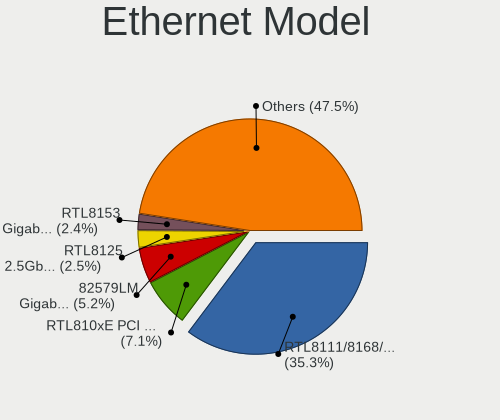

| Model                                                                      | Computers | Percent |
|----------------------------------------------------------------------------|-----------|---------|
| Realtek RTL8111/8168/8411 PCI Express Gigabit Ethernet Controller          | 336       | 35.56%  |
| Realtek RTL810xE PCI Express Fast Ethernet controller                      | 67        | 7.09%   |
| Intel 82579LM Gigabit Network Connection (Lewisville)                      | 53        | 5.61%   |
| Realtek RTL8153 Gigabit Ethernet Adapter                                   | 21        | 2.22%   |
| Realtek RTL-8100/8101L/8139 PCI Fast Ethernet Adapter                      | 21        | 2.22%   |
| Intel Ethernet Connection (2) I219-V                                       | 18        | 1.9%    |
| Realtek RTL8125 2.5GbE Controller                                          | 14        | 1.48%   |
| Intel I211 Gigabit Network Connection                                      | 13        | 1.38%   |
| Intel 82579V Gigabit Network Connection                                    | 13        | 1.38%   |
| Intel Ethernet Connection I217-LM                                          | 12        | 1.27%   |
| Intel Ethernet Connection (3) I218-LM                                      | 11        | 1.16%   |
| Qualcomm Atheros QCA8172 Fast Ethernet                                     | 10        | 1.06%   |
| Intel Ethernet Controller I225-V                                           | 10        | 1.06%   |
| Intel Ethernet Connection (7) I219-V                                       | 10        | 1.06%   |
| Intel 82567LM Gigabit Network Connection                                   | 10        | 1.06%   |
| Nvidia MCP61 Ethernet                                                      | 9         | 0.95%   |
| Intel 82577LM Gigabit Network Connection                                   | 9         | 0.95%   |
| Intel Ethernet Connection I218-LM                                          | 8         | 0.85%   |
| Broadcom NetXtreme BCM5761 Gigabit Ethernet PCIe                           | 8         | 0.85%   |
| Qualcomm Atheros AR8151 v2.0 Gigabit Ethernet                              | 7         | 0.74%   |
| Qualcomm Atheros AR8121/AR8113/AR8114 Gigabit or Fast Ethernet             | 7         | 0.74%   |
| Intel Ethernet Connection I219-LM                                          | 7         | 0.74%   |
| Intel Ethernet Connection I217-V                                           | 7         | 0.74%   |
| Intel Ethernet Connection (6) I219-V                                       | 7         | 0.74%   |
| Intel Ethernet Connection (2) I218-V                                       | 7         | 0.74%   |
| Qualcomm Atheros AR8161 Gigabit Ethernet                                   | 6         | 0.63%   |
| Broadcom Limited NetLink BCM57780 Gigabit Ethernet PCIe                    | 6         | 0.63%   |
| TP-Link UE300 10/100/1000 LAN (ethernet mode) [Realtek RTL8153]            | 5         | 0.53%   |
| Realtek Killer E2600 Gigabit Ethernet Controller                           | 5         | 0.53%   |
| Qualcomm Atheros QCA8171 Gigabit Ethernet                                  | 5         | 0.53%   |
| Qualcomm Atheros Killer E2400 Gigabit Ethernet Controller                  | 5         | 0.53%   |
| Intel Ethernet Connection (7) I219-LM                                      | 5         | 0.53%   |
| Intel Ethernet Connection (4) I219-LM                                      | 5         | 0.53%   |
| Intel 82567LM-3 Gigabit Network Connection                                 | 5         | 0.53%   |
| Xiaomi Mi/Redmi series (RNDIS)                                             | 4         | 0.42%   |
| Sundance Inc / IC Plus IC Plus IP100A Integrated 10/100 Ethernet MAC + PHY | 4         | 0.42%   |
| Qualcomm Atheros Killer E220x Gigabit Ethernet Controller                  | 4         | 0.42%   |
| Qualcomm Atheros Attansic L1 Gigabit Ethernet                              | 4         | 0.42%   |
| Qualcomm Atheros AR8152 v1.1 Fast Ethernet                                 | 4         | 0.42%   |
| Intel Ethernet Connection (16) I219-V                                      | 4         | 0.42%   |

Net Controller Kind
-------------------

Ethernet, WiFi or modem

| Kind     | Computers | Percent |
|----------|-----------|---------|
| Ethernet | 867       | 53.95%  |
| WiFi     | 710       | 44.18%  |
| Modem    | 30        | 1.87%   |

Used Controller
---------------

Currently used network controller

| Kind     | Computers | Percent |
|----------|-----------|---------|
| WiFi     | 554       | 54.96%  |
| Ethernet | 454       | 45.04%  |

NICs
----

Total network controllers on board

| Total | Computers | Percent |
|-------|-----------|---------|
| 2     | 566       | 58.59%  |
| 1     | 369       | 38.2%   |
| 3     | 18        | 1.86%   |
| 0     | 8         | 0.83%   |
| 4     | 3         | 0.31%   |
| 7     | 1         | 0.1%    |
| 5     | 1         | 0.1%    |

IPv6
----

IPv6 vs IPv4

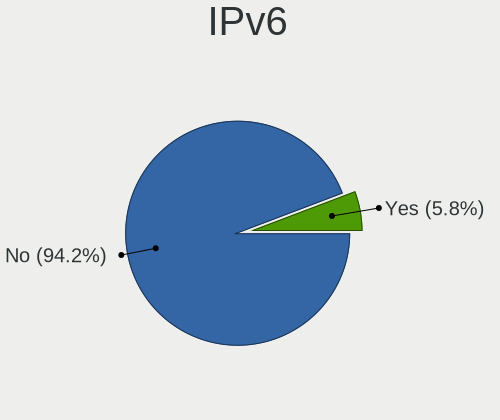

| Used | Computers | Percent |
|------|-----------|---------|
| No   | 947       | 97.43%  |
| Yes  | 25        | 2.57%   |

Bluetooth
---------

Bluetooth Vendor
----------------

Controller vendors

| Vendor                          | Computers | Percent |
|---------------------------------|-----------|---------|
| Intel                           | 249       | 43.15%  |
| Realtek Semiconductor           | 47        | 8.15%   |
| Qualcomm Atheros Communications | 42        | 7.28%   |
| Broadcom                        | 35        | 6.07%   |
| Cambridge Silicon Radio         | 31        | 5.37%   |
| IMC Networks                    | 29        | 5.03%   |
| Lite-On Technology              | 24        | 4.16%   |
| Foxconn / Hon Hai               | 23        | 3.99%   |
| Toshiba                         | 15        | 2.6%    |
| Dell                            | 15        | 2.6%    |
| Hewlett-Packard                 | 13        | 2.25%   |
| Apple                           | 11        | 1.91%   |
| Ralink                          | 10        | 1.73%   |
| MediaTek                        | 7         | 1.21%   |
| Integrated System Solution      | 7         | 1.21%   |
| ASUSTek Computer                | 7         | 1.21%   |
| Foxconn International           | 5         | 0.87%   |
| TP-Link                         | 2         | 0.35%   |
| Realtek                         | 2         | 0.35%   |
| Ralink Technology               | 2         | 0.35%   |
| Unknown                         | 1         | 0.17%   |

Bluetooth Model
---------------

Controller models

| Model                                                 | Computers | Percent |
|-------------------------------------------------------|-----------|---------|
| Intel Bluetooth wireless interface                    | 93        | 16.12%  |
| Intel AX201 Bluetooth                                 | 50        | 8.67%   |
| Intel Bluetooth 9460/9560 Jefferson Peak (JfP)        | 42        | 7.28%   |
| Realtek Bluetooth Radio                               | 36        | 6.24%   |
| Cambridge Silicon Radio Bluetooth Dongle (HCI mode)   | 31        | 5.37%   |
| Intel AX200 Bluetooth                                 | 26        | 4.51%   |
| Qualcomm Atheros  Bluetooth Device                    | 23        | 3.99%   |
| IMC Networks Bluetooth Radio                          | 17        | 2.95%   |
| Ralink RT3290 Bluetooth                               | 10        | 1.73%   |
| Lite-On Bluetooth Device                              | 9         | 1.56%   |
| Qualcomm Atheros AR3011 Bluetooth                     | 8         | 1.39%   |
| Lite-On Qualcomm Atheros QCA9377 Bluetooth            | 8         | 1.39%   |
| Intel Centrino Bluetooth Wireless Transceiver         | 8         | 1.39%   |
| Foxconn / Hon Hai Bluetooth Device                    | 8         | 1.39%   |
| Intel Wireless-AC 9260 Bluetooth Adapter              | 7         | 1.21%   |
| Intel Centrino Advanced-N 6230 Bluetooth adapter      | 7         | 1.21%   |
| HP Bluetooth 2.0 Interface [Broadcom BCM2045]         | 7         | 1.21%   |
| Broadcom BCM2045B (BDC-2.1)                           | 7         | 1.21%   |
| MediaTek Wireless_Device                              | 6         | 1.04%   |
| Intel Bluetooth Device                                | 6         | 1.04%   |
| Intel AX210 Bluetooth                                 | 6         | 1.04%   |
| IMC Networks Bluetooth Device                         | 6         | 1.04%   |
| HP Broadcom 2070 Bluetooth Combo                      | 6         | 1.04%   |
| Toshiba Integrated Bluetooth HCI                      | 5         | 0.87%   |
| IMC Networks Wireless_Device                          | 5         | 0.87%   |
| Foxconn International BCM43142A0 Bluetooth module     | 5         | 0.87%   |
| Foxconn / Hon Hai Wireless_Device                     | 5         | 0.87%   |
| Dell DW375 Bluetooth Module                           | 5         | 0.87%   |
| Realtek RTL8723B Bluetooth                            | 4         | 0.69%   |
| Realtek  Bluetooth 4.2 Adapter                        | 4         | 0.69%   |
| Qualcomm Atheros QCA61x4 Bluetooth 4.0                | 4         | 0.69%   |
| Lite-On Atheros AR3012 Bluetooth                      | 4         | 0.69%   |
| Intel Wireless-AC 3168 Bluetooth                      | 4         | 0.69%   |
| Integrated System Solution KY-BT100 Bluetooth Adapter | 4         | 0.69%   |
| Foxconn / Hon Hai MediaTek Bluetooth Adapter          | 4         | 0.69%   |
| Dell BCM20702A0 Bluetooth Module                      | 4         | 0.69%   |
| Broadcom BCM20702 Bluetooth 4.0 [ThinkPad]            | 4         | 0.69%   |
| Apple Bluetooth Host Controller                       | 4         | 0.69%   |
| Toshiba RT Bluetooth Radio                            | 3         | 0.52%   |
| Toshiba Bluetooth Device                              | 3         | 0.52%   |

Sound
-----

Sound Vendor
------------

Sound card vendors

| Vendor                                       | Computers | Percent |
|----------------------------------------------|-----------|---------|
| Intel                                        | 722       | 53.6%   |
| AMD                                          | 267       | 19.82%  |
| Nvidia                                       | 229       | 17%     |
| C-Media Electronics                          | 24        | 1.78%   |
| Creative Labs                                | 13        | 0.97%   |
| GN Netcom                                    | 8         | 0.59%   |
| Razer USA                                    | 7         | 0.52%   |
| Texas Instruments                            | 6         | 0.45%   |
| Lenovo                                       | 6         | 0.45%   |
| Logitech                                     | 5         | 0.37%   |
| ASUSTek Computer                             | 5         | 0.37%   |
| Trust                                        | 4         | 0.3%    |
| Plantronics                                  | 4         | 0.3%    |
| Creative Technology                          | 4         | 0.3%    |
| VIA Technologies                             | 3         | 0.22%   |
| Realtek Semiconductor                        | 3         | 0.22%   |
| JMTek                                        | 3         | 0.22%   |
| Generalplus Technology                       | 3         | 0.22%   |
| Thesycon Systemsoftware & Consulting         | 2         | 0.15%   |
| Tenx Technology                              | 2         | 0.15%   |
| Micro Star International                     | 2         | 0.15%   |
| Dell                                         | 2         | 0.15%   |
| BEHRINGER International                      | 2         | 0.15%   |
| Zoran Co. Personal Media Division (Nogatech) | 1         | 0.07%   |
| ZOOM                                         | 1         | 0.07%   |
| SteelSeries ApS                              | 1         | 0.07%   |
| Sony                                         | 1         | 0.07%   |
| Silicon Integrated Systems [SiS]             | 1         | 0.07%   |
| Samson Technologies                          | 1         | 0.07%   |
| Roland                                       | 1         | 0.07%   |
| Ploytec                                      | 1         | 0.07%   |
| OPPO Electronics                             | 1         | 0.07%   |
| NAD Electronics                              | 1         | 0.07%   |
| M-Audio                                      | 1         | 0.07%   |
| Kingston Technology                          | 1         | 0.07%   |
| Hewlett-Packard                              | 1         | 0.07%   |
| GYROCOM C&C                                  | 1         | 0.07%   |
| FiiO Electronics Technology                  | 1         | 0.07%   |
| Evolution Electronics                        | 1         | 0.07%   |
| ESS Technology                               | 1         | 0.07%   |

Sound Model
-----------

Sound card models

| Model                                                                      | Computers | Percent |
|----------------------------------------------------------------------------|-----------|---------|
| AMD Family 17h/19h HD Audio Controller                                     | 84        | 5.27%   |
| Intel 6 Series/C200 Series Chipset Family High Definition Audio Controller | 81        | 5.08%   |
| Intel 7 Series/C216 Chipset Family High Definition Audio Controller        | 78        | 4.89%   |
| Intel 8 Series/C220 Series Chipset High Definition Audio Controller        | 53        | 3.32%   |
| Intel 82801I (ICH9 Family) HD Audio Controller                             | 52        | 3.26%   |
| Intel Sunrise Point-LP HD Audio                                            | 50        | 3.14%   |
| Intel Xeon E3-1200 v3/4th Gen Core Processor HD Audio Controller           | 48        | 3.01%   |
| AMD Renoir Radeon High Definition Audio Controller                         | 42        | 2.63%   |
| Intel Cannon Lake PCH cAVS                                                 | 37        | 2.32%   |
| AMD SBx00 Azalia (Intel HDA)                                               | 34        | 2.13%   |
| Intel 5 Series/3400 Series Chipset High Definition Audio                   | 32        | 2.01%   |
| Intel Wildcat Point-LP High Definition Audio Controller                    | 28        | 1.76%   |
| Intel Broadwell-U Audio Controller                                         | 28        | 1.76%   |
| Intel NM10/ICH7 Family High Definition Audio Controller                    | 27        | 1.69%   |
| AMD Starship/Matisse HD Audio Controller                                   | 27        | 1.69%   |
| Intel 100 Series/C230 Series Chipset Family HD Audio Controller            | 25        | 1.57%   |
| AMD Raven/Raven2/Fenghuang HDMI/DP Audio Controller                        | 24        | 1.51%   |
| Intel Haswell-ULT HD Audio Controller                                      | 23        | 1.44%   |
| Intel 8 Series HD Audio Controller                                         | 23        | 1.44%   |
| Intel Tiger Lake-LP Smart Sound Technology Audio Controller                | 22        | 1.38%   |
| AMD FCH Azalia Controller                                                  | 22        | 1.38%   |
| Intel Cannon Point-LP High Definition Audio Controller                     | 20        | 1.25%   |
| Nvidia GP107GL High Definition Audio Controller                            | 19        | 1.19%   |
| Nvidia GF108 High Definition Audio Controller                              | 19        | 1.19%   |
| Intel 200 Series PCH HD Audio                                              | 19        | 1.19%   |
| AMD Ellesmere HDMI Audio [Radeon RX 470/480 / 570/580/590]                 | 19        | 1.19%   |
| Nvidia GP106 High Definition Audio Controller                              | 17        | 1.07%   |
| Nvidia TU107 GeForce GTX 1650 High Definition Audio Controller             | 14        | 0.88%   |
| Nvidia GF119 HDMI Audio Controller                                         | 14        | 0.88%   |
| Intel Comet Lake PCH-LP cAVS                                               | 14        | 0.88%   |
| Intel CM238 HD Audio Controller                                            | 14        | 0.88%   |
| Intel Celeron/Pentium Silver Processor High Definition Audio               | 14        | 0.88%   |
| Intel Alder Lake PCH-P High Definition Audio Controller                    | 14        | 0.88%   |
| Intel 82801H (ICH8 Family) HD Audio Controller                             | 14        | 0.88%   |
| Nvidia GK208 HDMI/DP Audio Controller                                      | 13        | 0.82%   |
| Intel Comet Lake PCH cAVS                                                  | 13        | 0.82%   |
| Intel Celeron N3350/Pentium N4200/Atom E3900 Series Audio Cluster          | 13        | 0.82%   |
| AMD Family 17h (Models 00h-0fh) HD Audio Controller                        | 13        | 0.82%   |
| Nvidia TU106 High Definition Audio Controller                              | 12        | 0.75%   |
| Intel 82801JI (ICH10 Family) HD Audio Controller                           | 12        | 0.75%   |

Memory
------

Memory Vendor
-------------

Memory module vendors

| Vendor                                  | Computers | Percent |
|-----------------------------------------|-----------|---------|
| Samsung Electronics                     | 121       | 19.8%   |
| SK hynix                                | 114       | 18.66%  |
| Kingston                                | 91        | 14.89%  |
| Unknown                                 | 57        | 9.33%   |
| Micron Technology                       | 56        | 9.17%   |
| Corsair                                 | 32        | 5.24%   |
| A-DATA Technology                       | 29        | 4.75%   |
| Ramaxel Technology                      | 20        | 3.27%   |
| Nanya Technology                        | 13        | 2.13%   |
| Crucial                                 | 11        | 1.8%    |
| Team                                    | 10        | 1.64%   |
| Transcend                               | 9         | 1.47%   |
| Elpida                                  | 8         | 1.31%   |
| G.Skill                                 | 7         | 1.15%   |
| Unknown                                 | 6         | 0.98%   |
| Apacer                                  | 4         | 0.65%   |
| GOODRAM                                 | 3         | 0.49%   |
| Silicon Power Computer & Communications | 2         | 0.33%   |
| Silicon Power                           | 2         | 0.33%   |
| pqi                                     | 2         | 0.33%   |
| Atermiter                               | 2         | 0.33%   |
| ASint Technology                        | 2         | 0.33%   |
| Unknown (ABCD)                          | 1         | 0.16%   |
| Unifosa                                 | 1         | 0.16%   |
| Thermaltake                             | 1         | 0.16%   |
| Qimonda                                 | 1         | 0.16%   |
| Patriot                                 | 1         | 0.16%   |
| Neo Forza                               | 1         | 0.16%   |
| HBS                                     | 1         | 0.16%   |
| fef5                                    | 1         | 0.16%   |
| CSX                                     | 1         | 0.16%   |
| A Force                                 | 1         | 0.16%   |

Memory Model
------------

Memory module models

| Model                                                     | Computers | Percent |
|-----------------------------------------------------------|-----------|---------|
| SK hynix RAM HMT351S6CFR8C-PB 4GB SODIMM DDR3 1600MT/s    | 10        | 1.52%   |
| SK hynix RAM HMA81GS6AFR8N-UH 8GB SODIMM DDR4 2667MT/s    | 7         | 1.07%   |
| Samsung RAM M471B5273DH0-CH9 4GB SODIMM DDR3 1334MT/s     | 6         | 0.91%   |
| Unknown                                                   | 6         | 0.91%   |
| SK hynix RAM HMT451S6BFR8A-PB 4GB SODIMM DDR3 1600MT/s    | 5         | 0.76%   |
| Samsung RAM M471B5173DB0-YK0 4GB SODIMM DDR3 1600MT/s     | 5         | 0.76%   |
| Samsung RAM M471B1G73DB0-YK0 8GB SODIMM DDR3 1600MT/s     | 5         | 0.76%   |
| SK hynix RAM HMA81GS6CJR8N-VK 8GB SODIMM DDR4 2667MT/s    | 4         | 0.61%   |
| Samsung RAM M471B5273CH0-CH9 4GB SODIMM DDR3 1334MT/s     | 4         | 0.61%   |
| Samsung RAM M471B5173EB0-YK0 4GB SODIMM DDR3 1600MT/s     | 4         | 0.61%   |
| Samsung RAM M471B1G73QH0-YK0 8GB SODIMM DDR3 1867MT/s     | 4         | 0.61%   |
| Samsung RAM M471A5244CB0-CTD 4GB SODIMM DDR4 3266MT/s     | 4         | 0.61%   |
| Samsung RAM M471A1G44AB0-CWE 8GB SODIMM DDR4 3200MT/s     | 4         | 0.61%   |
| Ramaxel RAM RMT3160ED58E9W1600 4GB SODIMM DDR3 1600MT/s   | 4         | 0.61%   |
| Micron RAM 8ATF1G64HZ-3G2J1 8GB SODIMM DDR4 3200MT/s      | 4         | 0.61%   |
| Micron RAM 4ATF1G64HZ-3G2E1 8GB SODIMM DDR4 3200MT/s      | 4         | 0.61%   |
| Kingston RAM KHX2666C16/8G 8GB DIMM DDR4 3466MT/s         | 4         | 0.61%   |
| Unknown RAM Module 2048MB DIMM DDR2 800MT/s               | 3         | 0.46%   |
| SK hynix RAM HMT41GS6BFR8A-PB 8GB SODIMM DDR3 1600MT/s    | 3         | 0.46%   |
| SK hynix RAM HMT351S6CFR8C-H9 4GB SODIMM DDR3 1333MT/s    | 3         | 0.46%   |
| SK hynix RAM HMT125S6BFR8C-H9 2GB SODIMM DDR3 1333MT/s    | 3         | 0.46%   |
| SK hynix RAM HMA851S6JJR6N-VK 4GB SODIMM DDR4 2667MT/s    | 3         | 0.46%   |
| Samsung RAM M471B5773DH0-CH9 2GB SODIMM 1600MT/s          | 3         | 0.46%   |
| Samsung RAM M471B5273DH0-CK0 4GB SODIMM DDR3 1600MT/s     | 3         | 0.46%   |
| Samsung RAM M471B1G73EB0-YK0 8GB SODIMM DDR3 1600MT/s     | 3         | 0.46%   |
| Samsung RAM M471A2K43DB1-CTD 16GB SODIMM DDR4 2667MT/s    | 3         | 0.46%   |
| Samsung RAM M471A1K43DB1-CTD 8GB SODIMM DDR4 2667MT/s     | 3         | 0.46%   |
| Samsung RAM M471A1K43CB1-CTD 8GB SODIMM DDR4 2667MT/s     | 3         | 0.46%   |
| Samsung RAM M471A1K43BB1-CRC 8GB SODIMM DDR4 2667MT/s     | 3         | 0.46%   |
| Samsung RAM M471A1G44BB0-CWE 8GB SODIMM DDR4 3200MT/s     | 3         | 0.46%   |
| Ramaxel RAM RMSA3260ME78HAF-2666 8GB SODIMM DDR4 2667MT/s | 3         | 0.46%   |
| Nanya RAM NT4GC64B8HG0NS-CG 4GB SODIMM DDR3 1334MT/s      | 3         | 0.46%   |
| Micron RAM 8JTF51264AZ-1G6E1 4GB DIMM DDR3 1600MT/s       | 3         | 0.46%   |
| Micron RAM 8ATF1G64HZ-2G6E1 8GB SODIMM DDR4 2667MT/s      | 3         | 0.46%   |
| Kingston RAM 9905744-066.A00G 32GB SODIMM DDR4 3200MT/s   | 3         | 0.46%   |
| G.Skill RAM F4-3000C16-8GISB 8GB DIMM DDR4 3200MT/s       | 3         | 0.46%   |
| Elpida RAM EBJ41UF8BCS0-DJ-F 4GB SODIMM DDR3 1334MT/s     | 3         | 0.46%   |
| Corsair RAM CMK16GX4M2B3200C16 8GB DIMM DDR4 3600MT/s     | 3         | 0.46%   |
| Unknown RAM Module 8GB SODIMM DDR4 3200MT/s               | 2         | 0.3%    |
| Unknown RAM Module 4GB DIMM 1333MT/s                      | 2         | 0.3%    |

Memory Kind
-----------

Memory module kinds

| Kind    | Computers | Percent |
|---------|-----------|---------|
| DDR4    | 215       | 42.66%  |
| DDR3    | 198       | 39.29%  |
| DDR2    | 28        | 5.56%   |
| SDRAM   | 16        | 3.17%   |
| Unknown | 15        | 2.98%   |
| DDR5    | 7         | 1.39%   |
| LPDDR3  | 6         | 1.19%   |
| DDR     | 6         | 1.19%   |
| LPDDR4  | 5         | 0.99%   |
| LPDDR5  | 4         | 0.79%   |
| DRAM    | 4         | 0.79%   |

Memory Form Factor
------------------

Physical design of the memory module

| Name         | Computers | Percent |
|--------------|-----------|---------|
| SODIMM       | 300       | 60.36%  |
| DIMM         | 176       | 35.41%  |
| Row Of Chips | 13        | 2.62%   |
| Chip         | 4         | 0.8%    |
| FB-DIMM      | 2         | 0.4%    |
| RIMM         | 1         | 0.2%    |
| Unknown      | 1         | 0.2%    |

Memory Size
-----------

Memory module size

| Size    | Computers | Percent |
|---------|-----------|---------|
| 8192    | 178       | 32.72%  |
| 4096    | 166       | 30.51%  |
| 16384   | 77        | 14.15%  |
| 2048    | 70        | 12.87%  |
| 1024    | 25        | 4.6%    |
| 32768   | 23        | 4.23%   |
| 512     | 3         | 0.55%   |
| 256     | 1         | 0.18%   |
| Unknown | 1         | 0.18%   |

Memory Speed
------------

Memory module speed

| Speed   | Computers | Percent |
|---------|-----------|---------|
| 1600    | 126       | 22.66%  |
| 3200    | 80        | 14.39%  |
| 2667    | 75        | 13.49%  |
| 1333    | 44        | 7.91%   |
| 1334    | 30        | 5.4%    |
| 2400    | 28        | 5.04%   |
| 2133    | 19        | 3.42%   |
| 800     | 16        | 2.88%   |
| Unknown | 16        | 2.88%   |
| 667     | 15        | 2.7%    |
| 3600    | 13        | 2.34%   |
| 1867    | 8         | 1.44%   |
| 1066    | 6         | 1.08%   |
| 4800    | 5         | 0.9%    |
| 3266    | 5         | 0.9%    |
| 1067    | 5         | 0.9%    |
| 6400    | 4         | 0.72%   |
| 3466    | 4         | 0.72%   |
| 3000    | 4         | 0.72%   |
| 2933    | 4         | 0.72%   |
| 333     | 4         | 0.72%   |
| 4199    | 3         | 0.54%   |
| 3800    | 3         | 0.54%   |
| 2666    | 3         | 0.54%   |
| 1866    | 3         | 0.54%   |
| 1800    | 3         | 0.54%   |
| 3733    | 2         | 0.36%   |
| 3400    | 2         | 0.36%   |
| 3333    | 2         | 0.36%   |
| 2800    | 2         | 0.36%   |
| 2048    | 2         | 0.36%   |
| 975     | 2         | 0.36%   |
| 400     | 2         | 0.36%   |
| 57535   | 1         | 0.18%   |
| 6000    | 1         | 0.18%   |
| 5600    | 1         | 0.18%   |
| 4267    | 1         | 0.18%   |
| 4133    | 1         | 0.18%   |
| 3666    | 1         | 0.18%   |
| 3533    | 1         | 0.18%   |

Printers & scanners
-------------------

Printer Vendor
--------------

Printer device vendors

| Vendor              | Computers | Percent |
|---------------------|-----------|---------|
| Hewlett-Packard     | 6         | 27.27%  |
| Samsung Electronics | 4         | 18.18%  |
| Brother Industries  | 4         | 18.18%  |
| Xerox               | 2         | 9.09%   |
| Canon               | 2         | 9.09%   |
| Prolific Technology | 1         | 4.55%   |
| Kyocera             | 1         | 4.55%   |
| Citizen             | 1         | 4.55%   |
| ATEN International  | 1         | 4.55%   |

Printer Model
-------------

Printer device models

| Model                                    | Computers | Percent |
|------------------------------------------|-----------|---------|
| HP LaserJet 1020                         | 2         | 9.09%   |
| Xerox Phaser 3140 and 3155               | 1         | 4.55%   |
| Xerox Phaser 3020                        | 1         | 4.55%   |
| Samsung Xerox Phaser 3117 Laser Printer  | 1         | 4.55%   |
| Samsung ML-2010P Mono Laser Printer      | 1         | 4.55%   |
| Samsung M332x 382x 402x Series           | 1         | 4.55%   |
| Samsung M267x 287x Series                | 1         | 4.55%   |
| Prolific PL2305 Parallel Port            | 1         | 4.55%   |
| Kyocera ECOSYS P2040dn                   | 1         | 4.55%   |
| HP LaserJet Professional P1566           | 1         | 4.55%   |
| HP LaserJet P1102                        | 1         | 4.55%   |
| HP LaserJet 4350                         | 1         | 4.55%   |
| HP DeskJet 4530 series                   | 1         | 4.55%   |
| Citizen Barcode Printer                  | 1         | 4.55%   |
| Canon PIXMA MP240                        | 1         | 4.55%   |
| Canon MF3200 series                      | 1         | 4.55%   |
| Brother Printer                          | 1         | 4.55%   |
| Brother MFC-B7715DW series               | 1         | 4.55%   |
| Brother DCP-T300                         | 1         | 4.55%   |
| Brother DCP-7055 scanner/printer         | 1         | 4.55%   |
| ATEN International UC-1284B Printer Port | 1         | 4.55%   |

Scanner Vendor
--------------

Scanner device vendors

| Vendor         | Computers | Percent |
|----------------|-----------|---------|
| Canon          | 2         | 66.67%  |
| Mustek Systems | 1         | 33.33%  |

Scanner Model
-------------

Scanner device models

| Model                              | Computers | Percent |
|------------------------------------|-----------|---------|
| Mustek Systems SNAPSCAN e22        | 1         | 33.33%  |
| Canon CanoScan N670U/N676U/LiDE 20 | 1         | 33.33%  |
| Canon CanoScan LiDE 110            | 1         | 33.33%  |

Camera
------

Camera Vendor
-------------

Camera device vendors

| Vendor                                 | Computers | Percent |
|----------------------------------------|-----------|---------|
| Chicony Electronics                    | 138       | 23.67%  |
| IMC Networks                           | 62        | 10.63%  |
| Microdia                               | 53        | 9.09%   |
| Realtek Semiconductor                  | 44        | 7.55%   |
| Sunplus Innovation Technology          | 39        | 6.69%   |
| Quanta                                 | 35        | 6%      |
| Bison Electronics                      | 34        | 5.83%   |
| Acer                                   | 19        | 3.26%   |
| Logitech                               | 16        | 2.74%   |
| Lite-On Technology                     | 16        | 2.74%   |
| Cheng Uei Precision Industry (Foxlink) | 15        | 2.57%   |
| Syntek                                 | 14        | 2.4%    |
| Suyin                                  | 13        | 2.23%   |
| Luxvisions Innotech Limited            | 10        | 1.72%   |
| Z-Star Microelectronics                | 9         | 1.54%   |
| Apple                                  | 8         | 1.37%   |
| Alcor Micro                            | 8         | 1.37%   |
| Silicon Motion                         | 6         | 1.03%   |
| Microsoft                              | 6         | 1.03%   |
| Lenovo                                 | 4         | 0.69%   |
| Sonix Technology                       | 3         | 0.51%   |
| Samsung Electronics                    | 3         | 0.51%   |
| Ricoh                                  | 2         | 0.34%   |
| Primax Electronics                     | 2         | 0.34%   |
| Importek                               | 2         | 0.34%   |
| Hewlett-Packard                        | 2         | 0.34%   |
| Creative Technology                    | 2         | 0.34%   |
| Aveo Technology                        | 2         | 0.34%   |
| Alpha Imaging Technology               | 2         | 0.34%   |
| ALi                                    | 2         | 0.34%   |
| Xiongmai                               | 1         | 0.17%   |
| Unknown                                | 1         | 0.17%   |
| Sunplus Technology                     | 1         | 0.17%   |
| Razer USA                              | 1         | 0.17%   |
| Pixart Imaging                         | 1         | 0.17%   |
| OmniVision Technologies                | 1         | 0.17%   |
| Google                                 | 1         | 0.17%   |
| Genesys Logic                          | 1         | 0.17%   |
| Generalplus Technology                 | 1         | 0.17%   |
| GEMBIRD                                | 1         | 0.17%   |

Camera Model
------------

Camera device models

| Model                                    | Computers | Percent |
|------------------------------------------|-----------|---------|
| Chicony Integrated Camera                | 31        | 5.32%   |
| IMC Networks USB2.0 VGA UVC WebCam       | 21        | 3.6%    |
| IMC Networks Integrated Camera           | 18        | 3.09%   |
| Chicony HD WebCam                        | 16        | 2.74%   |
| Microdia Integrated_Webcam_HD            | 14        | 2.4%    |
| Realtek Integrated_Webcam_HD             | 12        | 2.06%   |
| Sunplus Integrated_Webcam_HD             | 11        | 1.89%   |
| Chicony TOSHIBA Web Camera - HD          | 9         | 1.54%   |
| Bison SunplusIT Integrated Camera        | 8         | 1.37%   |
| Bison Integrated Camera                  | 8         | 1.37%   |
| Acer Integrated Camera                   | 8         | 1.37%   |
| Realtek Lenovo EasyCamera                | 7         | 1.2%    |
| IMC Networks USB2.0 HD UVC WebCam        | 7         | 1.2%    |
| Syntek Integrated Camera                 | 6         | 1.03%   |
| Quanta HP HD Camera                      | 6         | 1.03%   |
| Microdia Integrated Webcam               | 6         | 1.03%   |
| Chicony USB 2.0 Camera                   | 6         | 1.03%   |
| Acer Lenovo EasyCamera                   | 6         | 1.03%   |
| Quanta HD Webcam                         | 5         | 0.86%   |
| Quanta HD User Facing                    | 5         | 0.86%   |
| Logitech Webcam C270                     | 5         | 0.86%   |
| Lite-On HP HD Webcam                     | 5         | 0.86%   |
| Chicony Lenovo Integrated Camera (0.3MP) | 5         | 0.86%   |
| Chicony HD WebCam (Asus N-series)        | 5         | 0.86%   |
| Z-Star A4 TECH HD PC Camera              | 4         | 0.69%   |
| Sunplus HD WebCam                        | 4         | 0.69%   |
| Quanta HP TrueVision HD Camera           | 4         | 0.69%   |
| Quanta ACER HD User Facing               | 4         | 0.69%   |
| Microdia Camera                          | 4         | 0.69%   |
| Lite-On Integrated Camera                | 4         | 0.69%   |
| Chicony USB2.0 VGA UVC WebCam            | 4         | 0.69%   |
| Chicony Lenovo EasyCamera                | 4         | 0.69%   |
| Chicony HP HD Webcam                     | 4         | 0.69%   |
| Bison HD Webcam                          | 4         | 0.69%   |
| Apple iPhone 5/5C/5S/6/SE/7/8/X          | 4         | 0.69%   |
| Alcor Micro Acer Integrated Webcam       | 4         | 0.69%   |
| Z-Star Venus USB2.0 Camera               | 3         | 0.51%   |
| Syntek Lenovo EasyCamera                 | 3         | 0.51%   |
| Suyin Acer/HP Integrated Webcam [CN0314] | 3         | 0.51%   |
| Sunplus Laptop Integrated Webcam HD      | 3         | 0.51%   |

Security
--------

Fingerprint Vendor
------------------

Fingerprint sensor vendors

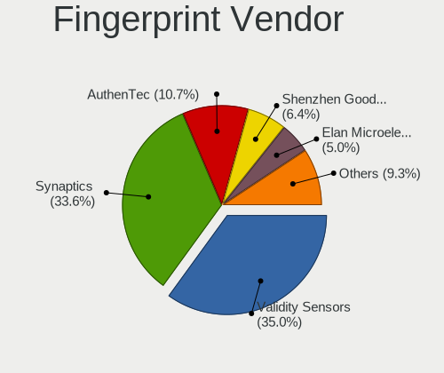

| Vendor                     | Computers | Percent |
|----------------------------|-----------|---------|
| Validity Sensors           | 40        | 36.7%   |
| Synaptics                  | 32        | 29.36%  |
| AuthenTec                  | 14        | 12.84%  |
| Shenzhen Goodix Technology | 8         | 7.34%   |
| Upek                       | 6         | 5.5%    |
| Elan Microelectronics      | 5         | 4.59%   |
| LighTuning Technology      | 3         | 2.75%   |
| STMicroelectronics         | 1         | 0.92%   |

Fingerprint Model
-----------------

Fingerprint sensor models

| Model                                                                      | Computers | Percent |
|----------------------------------------------------------------------------|-----------|---------|
| Synaptics Prometheus MIS Touch Fingerprint Reader                          | 14        | 12.84%  |
| Validity Sensors VFS 5011 fingerprint sensor                               | 11        | 10.09%  |
| AuthenTec AES2810                                                          | 7         | 6.42%   |
| Upek Biometric Touchchip/Touchstrip Fingerprint Sensor                     | 6         | 5.5%    |
| Validity Sensors VFS495 Fingerprint Reader                                 | 5         | 4.59%   |
| Shenzhen Goodix Fingerprint Reader                                         | 5         | 4.59%   |
| Validity Sensors VFS471 Fingerprint Reader                                 | 4         | 3.67%   |
| Validity Sensors Synaptics WBDI                                            | 4         | 3.67%   |
| Synaptics Metallica MOH Touch Fingerprint Reader                           | 4         | 3.67%   |
| Synaptics FS7604 Touch Fingerprint Sensor with PurePrint                   | 4         | 3.67%   |
| AuthenTec Fingerprint Sensor                                               | 4         | 3.67%   |
| Validity Sensors VFS5011 Fingerprint Reader                                | 3         | 2.75%   |
| Synaptics Metallica MIS Touch Fingerprint Reader                           | 3         | 2.75%   |
| Elan ELAN:ARM-M4                                                           | 3         | 2.75%   |
| Validity Sensors VFS7552 Touch Fingerprint Sensor                          | 2         | 1.83%   |
| Validity Sensors VFS7500 Touch Fingerprint Sensor                          | 2         | 1.83%   |
| Validity Sensors VFS491                                                    | 2         | 1.83%   |
| Validity Sensors VFS451 Fingerprint Reader                                 | 2         | 1.83%   |
| Validity Sensors Synaptics VFS7552 Touch Fingerprint Sensor with PurePrint | 2         | 1.83%   |
| Validity Sensors Fingerprint scanner                                       | 2         | 1.83%   |
| Synaptics WBDI                                                             | 2         | 1.83%   |
| Synaptics  FS7604 Touch Fingerprint Sensor with PurePrint                  | 2         | 1.83%   |
| Shenzhen Goodix  Fingerprint Device                                        | 2         | 1.83%   |
| Elan ELAN:Fingerprint                                                      | 2         | 1.83%   |
| AuthenTec AES2501 Fingerprint Sensor                                       | 2         | 1.83%   |
| Validity Sensors VFS101 Fingerprint Reader                                 | 1         | 0.92%   |
| Synaptics UWP WBDI Device                                                  | 1         | 0.92%   |
| Synaptics UWP WBDI                                                         | 1         | 0.92%   |
| Synaptics  WBDI                                                            | 1         | 0.92%   |
| STMicroelectronics Fingerprint Reader                                      | 1         | 0.92%   |
| Shenzhen Goodix FingerPrint                                                | 1         | 0.92%   |
| LighTuning Fingerprint Reader                                              | 1         | 0.92%   |
| LighTuning ES603 Swipe Fingerprint Sensor                                  | 1         | 0.92%   |
| LighTuning EgisTec Touch Fingerprint Sensor                                | 1         | 0.92%   |
| AuthenTec AES1600                                                          | 1         | 0.92%   |

Chipcard Vendor
---------------

Chipcard module vendors

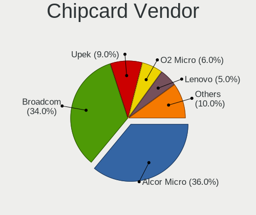

| Vendor                | Computers | Percent |
|-----------------------|-----------|---------|
| Broadcom              | 27        | 38.03%  |
| Alcor Micro           | 22        | 30.99%  |
| Upek                  | 5         | 7.04%   |
| O2 Micro              | 5         | 7.04%   |
| Lenovo                | 4         | 5.63%   |
| Advanced Card Systems | 3         | 4.23%   |
| SCM Microsystems      | 2         | 2.82%   |
| OmniKey               | 2         | 2.82%   |
| Clay Logic            | 1         | 1.41%   |

Chipcard Model
--------------

Chipcard module models

| Model                                                                        | Computers | Percent |
|------------------------------------------------------------------------------|-----------|---------|
| Alcor Micro AU9540 Smartcard Reader                                          | 22        | 30.99%  |
| Broadcom BCM5880 Secure Applications Processor                               | 12        | 16.9%   |
| Upek TouchChip Fingerprint Coprocessor (WBF advanced mode)                   | 5         | 7.04%   |
| O2 Micro OZ776 CCID Smartcard Reader                                         | 5         | 7.04%   |
| Broadcom 5880                                                                | 5         | 7.04%   |
| Broadcom 58200                                                               | 5         | 7.04%   |
| Lenovo Integrated Smart Card Reader                                          | 4         | 5.63%   |
| Broadcom BCM5880 Secure Applications Processor with fingerprint swipe sensor | 4         | 5.63%   |
| SCM Microsystems SCR3340 - ExpressCard54 Smart Card Reader                   | 2         | 2.82%   |
| OmniKey CardMan 3021 / 3121                                                  | 2         | 2.82%   |
| Clay Logic Nitrokey Pro                                                      | 1         | 1.41%   |
| Broadcom BCM5880 Secure Applications Processor with fingerprint touch sensor | 1         | 1.41%   |
| Advanced Card Systems ACR39U                                                 | 1         | 1.41%   |
| Advanced Card Systems ACR38 SmartCard Reader                                 | 1         | 1.41%   |
| Advanced Card Systems ACR122U                                                | 1         | 1.41%   |

Unsupported
-----------

Unsupported Devices
-------------------

Total unsupported devices on board

| Total | Computers | Percent |
|-------|-----------|---------|
| 0     | 667       | 67.04%  |
| 1     | 255       | 25.63%  |
| 2     | 67        | 6.73%   |
| 4     | 2         | 0.2%    |
| 3     | 2         | 0.2%    |
| 7     | 1         | 0.1%    |
| 5     | 1         | 0.1%    |

Unsupported Device Types
------------------------

Types of unsupported devices

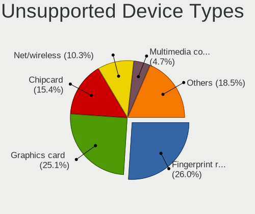

| Type                     | Computers | Percent |
|--------------------------|-----------|---------|
| Fingerprint reader       | 109       | 28.31%  |
| Graphics card            | 87        | 22.6%   |
| Chipcard                 | 58        | 15.06%  |
| Net/wireless             | 36        | 9.35%   |
| Multimedia controller    | 20        | 5.19%   |
| Bluetooth                | 16        | 4.16%   |
| Storage                  | 10        | 2.6%    |
| Camera                   | 10        | 2.6%    |
| Communication controller | 9         | 2.34%   |
| Unassigned class         | 8         | 2.08%   |
| Card reader              | 6         | 1.56%   |
| Net/ethernet             | 5         | 1.3%    |
| Sound                    | 3         | 0.78%   |
| Firewire controller      | 3         | 0.78%   |
| Modem                    | 2         | 0.52%   |
| Storage/ata              | 1         | 0.26%   |
| Network                  | 1         | 0.26%   |
| Flash memory             | 1         | 0.26%   |

