Linux in Canada - Tested Hardware & Statistics
----------------------------------------------

A project to collect tested hardware configurations for Linux in Canada.

Anyone can contribute to this report by the [hw-probe](https://github.com/linuxhw/hw-probe) tool:

    sudo -E hw-probe -all -upload

Please contribute! Especially if your hardware is rare.

This is a report for all computer types. See also reports for [desktops](/Location/Canada/Desktop/README.md) and [notebooks](/Location/Canada/Notebook/README.md).

Contents
--------

* [ Test Cases ](#test-cases)

* [ System ](#system)
  - [ OS                       ](#os)
  - [ OS Family                ](#os-family)
  - [ Kernel                   ](#kernel)
  - [ Kernel Family            ](#kernel-family)
  - [ Kernel Major Ver.        ](#kernel-major-ver)
  - [ Arch                     ](#arch)
  - [ DE                       ](#de)
  - [ Display Server           ](#display-server)
  - [ Display Manager          ](#display-manager)
  - [ OS Lang                  ](#os-lang)
  - [ Boot Mode                ](#boot-mode)
  - [ Filesystem               ](#filesystem)
  - [ Part. scheme             ](#part-scheme)
  - [ Dual Boot with Linux/BSD ](#dual-boot-with-linuxbsd)
  - [ Dual Boot (Win)          ](#dual-boot-win)

* [ Board ](#board)
  - [ Vendor                   ](#vendor)
  - [ Model                    ](#model)
  - [ Model Family             ](#model-family)
  - [ MFG Year                 ](#mfg-year)
  - [ Form Factor              ](#form-factor)
  - [ Secure Boot              ](#secure-boot)
  - [ Coreboot                 ](#coreboot)
  - [ RAM Size                 ](#ram-size)
  - [ RAM Used                 ](#ram-used)
  - [ Total Drives             ](#total-drives)
  - [ Has CD-ROM               ](#has-cd-rom)
  - [ Has Ethernet             ](#has-ethernet)
  - [ Has WiFi                 ](#has-wifi)
  - [ Has Bluetooth            ](#has-bluetooth)

* [ Location ](#location)
  - [ Country                  ](#country)
  - [ City                     ](#city)

* [ Drives ](#drives)
  - [ Drive Vendor             ](#drive-vendor)
  - [ Drive Model              ](#drive-model)
  - [ HDD Vendor               ](#hdd-vendor)
  - [ SSD Vendor               ](#ssd-vendor)
  - [ Drive Kind               ](#drive-kind)
  - [ Drive Connector          ](#drive-connector)
  - [ Drive Size               ](#drive-size)
  - [ Space Total              ](#space-total)
  - [ Space Used               ](#space-used)
  - [ Malfunc. Drives          ](#malfunc-drives)
  - [ Malfunc. Drive Vendor    ](#malfunc-drive-vendor)
  - [ Malfunc. HDD Vendor      ](#malfunc-hdd-vendor)
  - [ Malfunc. Drive Kind      ](#malfunc-drive-kind)
  - [ Failed Drives            ](#failed-drives)
  - [ Failed Drive Vendor      ](#failed-drive-vendor)
  - [ Drive Status             ](#drive-status)

* [ Storage controller ](#storage-controller)
  - [ Storage Vendor           ](#storage-vendor)
  - [ Storage Model            ](#storage-model)
  - [ Storage Kind             ](#storage-kind)

* [ Processor ](#processor)
  - [ CPU Vendor               ](#cpu-vendor)
  - [ CPU Model                ](#cpu-model)
  - [ CPU Model Family         ](#cpu-model-family)
  - [ CPU Cores                ](#cpu-cores)
  - [ CPU Sockets              ](#cpu-sockets)
  - [ CPU Threads              ](#cpu-threads)
  - [ CPU Op-Modes             ](#cpu-op-modes)
  - [ CPU Microcode            ](#cpu-microcode)
  - [ CPU Microarch            ](#cpu-microarch)

* [ Graphics ](#graphics)
  - [ GPU Vendor               ](#gpu-vendor)
  - [ GPU Model                ](#gpu-model)
  - [ GPU Combo                ](#gpu-combo)
  - [ GPU Driver               ](#gpu-driver)
  - [ GPU Memory               ](#gpu-memory)

* [ Monitor ](#monitor)
  - [ Monitor Vendor           ](#monitor-vendor)
  - [ Monitor Model            ](#monitor-model)
  - [ Monitor Resolution       ](#monitor-resolution)
  - [ Monitor Diagonal         ](#monitor-diagonal)
  - [ Monitor Width            ](#monitor-width)
  - [ Aspect Ratio             ](#aspect-ratio)
  - [ Monitor Area             ](#monitor-area)
  - [ Pixel Density            ](#pixel-density)
  - [ Multiple Monitors        ](#multiple-monitors)

* [ Network ](#network)
  - [ Net Controller Vendor    ](#net-controller-vendor)
  - [ Net Controller Model     ](#net-controller-model)
  - [ Wireless Vendor          ](#wireless-vendor)
  - [ Wireless Model           ](#wireless-model)
  - [ Ethernet Vendor          ](#ethernet-vendor)
  - [ Ethernet Model           ](#ethernet-model)
  - [ Net Controller Kind      ](#net-controller-kind)
  - [ Used Controller          ](#used-controller)
  - [ NICs                     ](#nics)
  - [ IPv6                     ](#ipv6)

* [ Bluetooth ](#bluetooth)
  - [ Bluetooth Vendor         ](#bluetooth-vendor)
  - [ Bluetooth Model          ](#bluetooth-model)

* [ Sound ](#sound)
  - [ Sound Vendor             ](#sound-vendor)
  - [ Sound Model              ](#sound-model)

* [ Memory ](#memory)
  - [ Memory Vendor            ](#memory-vendor)
  - [ Memory Model             ](#memory-model)
  - [ Memory Kind              ](#memory-kind)
  - [ Memory Form Factor       ](#memory-form-factor)
  - [ Memory Size              ](#memory-size)
  - [ Memory Speed             ](#memory-speed)

* [ Printers & scanners ](#printers--scanners)
  - [ Printer Vendor           ](#printer-vendor)
  - [ Printer Model            ](#printer-model)
  - [ Scanner Vendor           ](#scanner-vendor)
  - [ Scanner Model            ](#scanner-model)

* [ Camera ](#camera)
  - [ Camera Vendor            ](#camera-vendor)
  - [ Camera Model             ](#camera-model)

* [ Security ](#security)
  - [ Fingerprint Vendor       ](#fingerprint-vendor)
  - [ Fingerprint Model        ](#fingerprint-model)
  - [ Chipcard Vendor          ](#chipcard-vendor)
  - [ Chipcard Model           ](#chipcard-model)

* [ Unsupported ](#unsupported)
  - [ Unsupported Devices      ](#unsupported-devices)
  - [ Unsupported Device Types ](#unsupported-device-types)

Test Cases
----------

Total: 15279

| Vendor        | Model                       | Form-Factor | Probe                                                      | Date         |
|---------------|-----------------------------|-------------|------------------------------------------------------------|--------------|
| HP            | Notebook                    | Notebook    | [379b15e953](https://linux-hardware.org/?probe=379b15e953) | Jan 03, 2026 |
| ASUSTek       | ROG Ally RC71L_RC71L        | Tablet      | [577f4120f1](https://linux-hardware.org/?probe=577f4120f1) | Jan 03, 2026 |
| Notebook      | NJx0MU                      | Notebook    | [518e12c3e9](https://linux-hardware.org/?probe=518e12c3e9) | Jan 03, 2026 |
| MSI           | MAG X570 TOMAHAWK WIFI      | Desktop     | [a0e3f92e44](https://linux-hardware.org/?probe=a0e3f92e44) | Jan 03, 2026 |
| Lenovo        | 102F SDK0J40705 WIN 3425... | Desktop     | [924ff8981c](https://linux-hardware.org/?probe=924ff8981c) | Jan 03, 2026 |
| ASUSTek       | VivoBook_ASUSLaptop M540... | Notebook    | [1392bba790](https://linux-hardware.org/?probe=1392bba790) | Jan 03, 2026 |
| Dell          | Precision M4700             | Notebook    | [963e8404c3](https://linux-hardware.org/?probe=963e8404c3) | Jan 03, 2026 |
| Dell          | Latitude E5470              | Notebook    | [7f142bf72e](https://linux-hardware.org/?probe=7f142bf72e) | Jan 02, 2026 |
| Dell          | Latitude E5470              | Notebook    | [60654750be](https://linux-hardware.org/?probe=60654750be) | Jan 02, 2026 |
| Gigabyte      | B860I AORUS PRO ICE         | Desktop     | [488c9ccfe9](https://linux-hardware.org/?probe=488c9ccfe9) | Jan 02, 2026 |
| ASUSTek       | K30BF_M32BF_A_F_K31BF_6     | Desktop     | [817b603100](https://linux-hardware.org/?probe=817b603100) | Jan 02, 2026 |
| Intel         | DP55WB AAE64798-205         | Desktop     | [af9b6f3c3e](https://linux-hardware.org/?probe=af9b6f3c3e) | Jan 02, 2026 |
| HP            | 829A                        | Mini pc     | [cee26f6a1d](https://linux-hardware.org/?probe=cee26f6a1d) | Jan 02, 2026 |
| ASUSTek       | UX510UX                     | Notebook    | [a43b83885c](https://linux-hardware.org/?probe=a43b83885c) | Jan 02, 2026 |
| Notebook      | NJx0MU                      | Notebook    | [37c951e36e](https://linux-hardware.org/?probe=37c951e36e) | Jan 02, 2026 |
| Unknown       | Unknown                     | Soc         | [38287077bb](https://linux-hardware.org/?probe=38287077bb) | Jan 02, 2026 |
| Gigabyte      | B850 GAMING WIFI6           | Desktop     | [418e88fe0e](https://linux-hardware.org/?probe=418e88fe0e) | Jan 02, 2026 |
| Lenovo        | ThinkPad T490 20N3S88U0F    | Notebook    | [7abe7a0c77](https://linux-hardware.org/?probe=7abe7a0c77) | Jan 02, 2026 |
| ASUSTek       | ROG Maximus Z690 HERO       | Desktop     | [7fca3541c8](https://linux-hardware.org/?probe=7fca3541c8) | Jan 01, 2026 |
| Framework     | Laptop 16 (AMD Ryzen 704... | Notebook    | [6a609dced8](https://linux-hardware.org/?probe=6a609dced8) | Jan 01, 2026 |
| Acer          | Aspire ES1-521              | Notebook    | [6c3ad2b59f](https://linux-hardware.org/?probe=6c3ad2b59f) | Dec 31, 2025 |
| Acer          | Aspire ES1-521              | Notebook    | [33ed3f8ac4](https://linux-hardware.org/?probe=33ed3f8ac4) | Dec 31, 2025 |
| Gigabyte      | X470 AORUS GAMING 5 WIFI... | Desktop     | [161461f892](https://linux-hardware.org/?probe=161461f892) | Dec 31, 2025 |
| ASUSTek       | ROG STRIX Z590-A GAMING ... | Desktop     | [f96abb2dda](https://linux-hardware.org/?probe=f96abb2dda) | Dec 31, 2025 |
| ASUSTek       | ROG STRIX X570-E GAMING     | Desktop     | [5296502637](https://linux-hardware.org/?probe=5296502637) | Dec 31, 2025 |
| MSI           | PRO B550M-VC WIFI           | Desktop     | [db733fc5f0](https://linux-hardware.org/?probe=db733fc5f0) | Dec 31, 2025 |
| Gigabyte      | X470 AORUS GAMING 5 WIFI... | Desktop     | [4a16cabb34](https://linux-hardware.org/?probe=4a16cabb34) | Dec 31, 2025 |
| Lenovo        | Legion Y545 PG0 81T2        | Notebook    | [76198ed5ce](https://linux-hardware.org/?probe=76198ed5ce) | Dec 31, 2025 |
| Apple         | Mac-942B59F58194171B iMa... | All in one  | [f7a685be74](https://linux-hardware.org/?probe=f7a685be74) | Dec 31, 2025 |
| ASUSTek       | ROG CROSSHAIR VII HERO      | Desktop     | [229b87cd3b](https://linux-hardware.org/?probe=229b87cd3b) | Dec 31, 2025 |
| Dell          | 0R790T A00                  | Desktop     | [34f76aa611](https://linux-hardware.org/?probe=34f76aa611) | Dec 30, 2025 |
| Dell          | 0X501H A02                  | Desktop     | [cc3ddc1dc4](https://linux-hardware.org/?probe=cc3ddc1dc4) | Dec 30, 2025 |
| Lenovo        | Legion S7 15ACH6 82K8       | Notebook    | [97a10c3548](https://linux-hardware.org/?probe=97a10c3548) | Dec 30, 2025 |
| ASUSTek       | ASUS TUF Dash F15 FX517Z... | Notebook    | [ecd345f824](https://linux-hardware.org/?probe=ecd345f824) | Dec 30, 2025 |
| Gigabyte      | 990FXA-UD3                  | Desktop     | [60443ef738](https://linux-hardware.org/?probe=60443ef738) | Dec 30, 2025 |
| Dell          | 0N826N A01                  | Desktop     | [1060b6119d](https://linux-hardware.org/?probe=1060b6119d) | Dec 30, 2025 |
| MSI           | B250I GAMING PRO AC         | Desktop     | [63204cfa38](https://linux-hardware.org/?probe=63204cfa38) | Dec 30, 2025 |
| Gigabyte      | 990FXA-UD3                  | Desktop     | [bd9db1c966](https://linux-hardware.org/?probe=bd9db1c966) | Dec 30, 2025 |
| Dell          | 0782GW A01                  | Desktop     | [c9b1471d87](https://linux-hardware.org/?probe=c9b1471d87) | Dec 30, 2025 |
| Dell          | 0N826N A01                  | Desktop     | [8786cbb890](https://linux-hardware.org/?probe=8786cbb890) | Dec 29, 2025 |
| Chuwi         | CoreBook X                  | Notebook    | [12c493c4da](https://linux-hardware.org/?probe=12c493c4da) | Dec 29, 2025 |
| ASRock        | H570 Phantom Gaming 4       | Desktop     | [7ac24d13b7](https://linux-hardware.org/?probe=7ac24d13b7) | Dec 29, 2025 |
| HP            | ProBook 640 G5              | Notebook    | [1299353aad](https://linux-hardware.org/?probe=1299353aad) | Dec 29, 2025 |
| ASUSTek       | PRIME B550M-A WIFI II       | Notebook    | [81bf5f8825](https://linux-hardware.org/?probe=81bf5f8825) | Dec 29, 2025 |
| Lenovo        | ThinkCentre M57 6071ADU     | Desktop     | [08990918a9](https://linux-hardware.org/?probe=08990918a9) | Dec 29, 2025 |
| ASUSTek       | ROG STRIX Z590-A GAMING ... | Desktop     | [f86f6fc513](https://linux-hardware.org/?probe=f86f6fc513) | Dec 28, 2025 |
| ASUSTek       | P8P67 LE                    | Desktop     | [c54d345642](https://linux-hardware.org/?probe=c54d345642) | Dec 28, 2025 |
| MACHINIST     | X99-MR9A-PRO V3.0           | Desktop     | [717ecc77b0](https://linux-hardware.org/?probe=717ecc77b0) | Dec 28, 2025 |
| Microsoft     | Surface Pro 7               | Tablet      | [7df07c3b1a](https://linux-hardware.org/?probe=7df07c3b1a) | Dec 28, 2025 |
| Lenovo        | ThinkPad T450s 20BWS5SJ0... | Notebook    | [442899b7fc](https://linux-hardware.org/?probe=442899b7fc) | Dec 28, 2025 |
| ASUSTek       | TUF Gaming B850-PLUS WIF... | Desktop     | [7f5c50a84b](https://linux-hardware.org/?probe=7f5c50a84b) | Dec 28, 2025 |
| Lenovo        | Y50-70 15IKB 80V5           | Convertible | [0f202271d4](https://linux-hardware.org/?probe=0f202271d4) | Dec 27, 2025 |
| Unknown       | RK3588 OPi 5 Plus           | Soc         | [3cf391cfe4](https://linux-hardware.org/?probe=3cf391cfe4) | Dec 27, 2025 |
| ASUSTek       | VivoBook_ASUSLaptop M540... | Notebook    | [4685f20ecf](https://linux-hardware.org/?probe=4685f20ecf) | Dec 27, 2025 |
| Dell          | G7 7588                     | Notebook    | [db4f0c9c08](https://linux-hardware.org/?probe=db4f0c9c08) | Dec 27, 2025 |
| ASUSTek       | VivoBook_ASUSLaptop X170... | Notebook    | [7f6ba0d425](https://linux-hardware.org/?probe=7f6ba0d425) | Dec 27, 2025 |
| Dell          | Precision 7520              | Notebook    | [5e42554185](https://linux-hardware.org/?probe=5e42554185) | Dec 26, 2025 |
| Dell          | 05GD68 A00                  | Desktop     | [cb1bcd5a3b](https://linux-hardware.org/?probe=cb1bcd5a3b) | Dec 26, 2025 |
| ASUSTek       | Q87M-E                      | Desktop     | [8fc854cac4](https://linux-hardware.org/?probe=8fc854cac4) | Dec 26, 2025 |
| Gigabyte      | X870E AORUS ELITE WIFI7     | Desktop     | [ecedb4f58f](https://linux-hardware.org/?probe=ecedb4f58f) | Dec 26, 2025 |
| Dell          | XPS 13 9350                 | Notebook    | [78bd4e05c3](https://linux-hardware.org/?probe=78bd4e05c3) | Dec 26, 2025 |
| ASUSTek       | G15DK                       | Desktop     | [6a002b0832](https://linux-hardware.org/?probe=6a002b0832) | Dec 26, 2025 |
| Dell          | Inspiron 15 5510            | Notebook    | [ade88346cb](https://linux-hardware.org/?probe=ade88346cb) | Dec 26, 2025 |
| Dell          | Precision 7520              | Notebook    | [0b1367a35d](https://linux-hardware.org/?probe=0b1367a35d) | Dec 25, 2025 |
| Unknown       | RK3588 OPi 5 Plus           | Soc         | [85f173f9d3](https://linux-hardware.org/?probe=85f173f9d3) | Dec 25, 2025 |
| HP            | Notebook                    | Notebook    | [999a3300fe](https://linux-hardware.org/?probe=999a3300fe) | Dec 25, 2025 |
| AZW           | SER V1.0                    | Desktop     | [bbda7a958c](https://linux-hardware.org/?probe=bbda7a958c) | Dec 25, 2025 |
| MSI           | PRO B650-S WIFI             | Desktop     | [032fbe9268](https://linux-hardware.org/?probe=032fbe9268) | Dec 25, 2025 |
| ASUSTek       | PRIME Z890-P WIFI           | Desktop     | [b7b8a23137](https://linux-hardware.org/?probe=b7b8a23137) | Dec 25, 2025 |
| HP            | 0AECh D                     | Desktop     | [c75277efa7](https://linux-hardware.org/?probe=c75277efa7) | Dec 25, 2025 |
| Alienware     | 0P0JWX A00                  | Desktop     | [34e2d16401](https://linux-hardware.org/?probe=34e2d16401) | Dec 24, 2025 |
| Gigabyte      | Z97X-UD3H-CF                | Desktop     | [6ee709c5dc](https://linux-hardware.org/?probe=6ee709c5dc) | Dec 24, 2025 |
| Lenovo        | ThinkPad P14s Gen 6 AMD ... | Notebook    | [bb64f1a3ec](https://linux-hardware.org/?probe=bb64f1a3ec) | Dec 24, 2025 |
| ASUSTek       | PRIME B250-PLUS             | Desktop     | [6a722bf072](https://linux-hardware.org/?probe=6a722bf072) | Dec 23, 2025 |
| Apple         | MacBookAir6,2               | Notebook    | [9eb0435d6b](https://linux-hardware.org/?probe=9eb0435d6b) | Dec 23, 2025 |
| Lenovo        | IdeaPad S145-15IIL 81W8     | Notebook    | [3c5b1f9823](https://linux-hardware.org/?probe=3c5b1f9823) | Dec 23, 2025 |
| MSI           | PRO B760-VC WIFI 7 BULK     | Desktop     | [f0b6bc913a](https://linux-hardware.org/?probe=f0b6bc913a) | Dec 23, 2025 |
| Gigabyte      | H370M DS3H-CF               | Desktop     | [ec32110fd9](https://linux-hardware.org/?probe=ec32110fd9) | Dec 23, 2025 |
| Lenovo        | ThinkPad E570 20H50047CA    | Notebook    | [09c70f694e](https://linux-hardware.org/?probe=09c70f694e) | Dec 22, 2025 |
| Acer          | Aspire V3-571               | Notebook    | [bebb69b2da](https://linux-hardware.org/?probe=bebb69b2da) | Dec 22, 2025 |
| ASUSTek       | ROG STRIX B550-A GAMING     | Desktop     | [35f5c71126](https://linux-hardware.org/?probe=35f5c71126) | Dec 22, 2025 |
| Lenovo        | Legion S7 15IMH5 82BC       | Notebook    | [22528a9921](https://linux-hardware.org/?probe=22528a9921) | Dec 22, 2025 |
| Gigabyte      | Z590 AORUS PRO AX           | Desktop     | [3136522eeb](https://linux-hardware.org/?probe=3136522eeb) | Dec 22, 2025 |
| ASUSTek       | H170-PRO                    | Desktop     | [a42006cc29](https://linux-hardware.org/?probe=a42006cc29) | Dec 22, 2025 |
| Lenovo        | Legion 5 16IRX9 83DG        | Notebook    | [0a3973ace3](https://linux-hardware.org/?probe=0a3973ace3) | Dec 22, 2025 |
| Acer          | Aspire XC-603               | Desktop     | [dba7add0c3](https://linux-hardware.org/?probe=dba7add0c3) | Dec 22, 2025 |
| ASRock        | X470 Taichi                 | Desktop     | [c8ff3b62f2](https://linux-hardware.org/?probe=c8ff3b62f2) | Dec 21, 2025 |
| ASRock        | Z690 Phantom Gaming 4/D5    | Desktop     | [a87b9a6690](https://linux-hardware.org/?probe=a87b9a6690) | Dec 21, 2025 |
| ASUSTek       | TUF Gaming Z590-PLUS        | Desktop     | [f321f55847](https://linux-hardware.org/?probe=f321f55847) | Dec 21, 2025 |
| ASUSTek       | G74Sx                       | Notebook    | [318c9231a6](https://linux-hardware.org/?probe=318c9231a6) | Dec 21, 2025 |
| ASUSTek       | SABERTOOTH Z87              | Desktop     | [7cf367f714](https://linux-hardware.org/?probe=7cf367f714) | Dec 21, 2025 |
| Dell          | 05GD68 A00                  | Desktop     | [3fd8abb596](https://linux-hardware.org/?probe=3fd8abb596) | Dec 21, 2025 |
| MSI           | Katana 17 B13VFK            | Notebook    | [d2014422f0](https://linux-hardware.org/?probe=d2014422f0) | Dec 21, 2025 |
| Dell          | 0GXM1W A00                  | Desktop     | [1401efa358](https://linux-hardware.org/?probe=1401efa358) | Dec 21, 2025 |
| Lenovo        | 3702 SDK0J40709 WIN 3259... | All in one  | [ef84b73392](https://linux-hardware.org/?probe=ef84b73392) | Dec 20, 2025 |
| HP            | 829D                        | Desktop     | [a15ae41d8d](https://linux-hardware.org/?probe=a15ae41d8d) | Dec 20, 2025 |
| Lenovo        | ThinkPad T480 20L5CTO1WW    | Notebook    | [6cbb187dec](https://linux-hardware.org/?probe=6cbb187dec) | Dec 20, 2025 |
| Unknown       | Unknown                     | Desktop     | [058e813173](https://linux-hardware.org/?probe=058e813173) | Dec 20, 2025 |
| Microsoft     | Surface Laptop Go           | Tablet      | [08c4e10e0c](https://linux-hardware.org/?probe=08c4e10e0c) | Dec 20, 2025 |
| Gigabyte      | Z97X-SLI-CF                 | Desktop     | [6b503ef89b](https://linux-hardware.org/?probe=6b503ef89b) | Dec 20, 2025 |
| Supermicro    | X8SAX                       | Desktop     | [072af8f5fb](https://linux-hardware.org/?probe=072af8f5fb) | Dec 20, 2025 |
| Alienware     | 02JGX1 A01                  | Desktop     | [252566aa09](https://linux-hardware.org/?probe=252566aa09) | Dec 20, 2025 |
| Dell          | 0XJ8C4 A00                  | Desktop     | [160ee8dbbf](https://linux-hardware.org/?probe=160ee8dbbf) | Dec 20, 2025 |
| ASUSTek       | ROG STRIX B550-F GAMING ... | Desktop     | [ce646b7748](https://linux-hardware.org/?probe=ce646b7748) | Dec 20, 2025 |
| HP            | G61                         | Notebook    | [45d7c3bfab](https://linux-hardware.org/?probe=45d7c3bfab) | Dec 20, 2025 |
| Gigabyte      | Z390 AORUS PRO WIFI-CF      | Desktop     | [78336a3a35](https://linux-hardware.org/?probe=78336a3a35) | Dec 20, 2025 |
| HP            | 871A                        | Mini pc     | [11a06476b1](https://linux-hardware.org/?probe=11a06476b1) | Dec 19, 2025 |
| MACHINIST     | X99-MR9A-PRO V3.0           | Desktop     | [540a5059a7](https://linux-hardware.org/?probe=540a5059a7) | Dec 19, 2025 |
| Lenovo        | ThinkBook 16 G7 ARP 21MW    | Notebook    | [6f0814c66a](https://linux-hardware.org/?probe=6f0814c66a) | Dec 19, 2025 |
| Intel         | D54250WYK H13922-303        | Desktop     | [43b32cc34b](https://linux-hardware.org/?probe=43b32cc34b) | Dec 19, 2025 |
| Shenzhen A... | KSM1                        | Desktop     | [191a20f668](https://linux-hardware.org/?probe=191a20f668) | Dec 19, 2025 |
| Lenovo        | Y50-70 20378                | Notebook    | [a917205ad7](https://linux-hardware.org/?probe=a917205ad7) | Dec 18, 2025 |
| Gigabyte      | B550 AORUS PRO AC           | Desktop     | [c30a49cde4](https://linux-hardware.org/?probe=c30a49cde4) | Dec 18, 2025 |
| Lenovo        | Legion Pro 7 16AFR10H 83... | Notebook    | [2be69c521f](https://linux-hardware.org/?probe=2be69c521f) | Dec 18, 2025 |
| ASUSTek       | E403NA                      | Notebook    | [011fd2f55a](https://linux-hardware.org/?probe=011fd2f55a) | Dec 18, 2025 |
| Gigabyte      | X870E AORUS PRO ICE         | Desktop     | [44aaa1503a](https://linux-hardware.org/?probe=44aaa1503a) | Dec 18, 2025 |
| Microsoft     | Surface Laptop Go           | Tablet      | [4d091d72cb](https://linux-hardware.org/?probe=4d091d72cb) | Dec 18, 2025 |
| ASUSTek       | M5A78L-M PLUS/USB3          | Desktop     | [6241b95237](https://linux-hardware.org/?probe=6241b95237) | Dec 18, 2025 |
| Gigabyte      | B650M C V2-Y1               | Desktop     | [cb73486c26](https://linux-hardware.org/?probe=cb73486c26) | Dec 17, 2025 |
| HP            | ProLiant DL360 Gen9         | Server      | [d3e1453b1a](https://linux-hardware.org/?probe=d3e1453b1a) | Dec 17, 2025 |
| Dell          | Inspiron 15 5501            | Notebook    | [c439609451](https://linux-hardware.org/?probe=c439609451) | Dec 17, 2025 |
| ASUSTek       | Vivobook Go E1504FA_E150... | Notebook    | [317fc1d8b1](https://linux-hardware.org/?probe=317fc1d8b1) | Dec 17, 2025 |
| HP            | 3398                        | Desktop     | [8fab1e3add](https://linux-hardware.org/?probe=8fab1e3add) | Dec 17, 2025 |
| ASRock        | B450M Steel Legend          | Desktop     | [0ed8ad94c7](https://linux-hardware.org/?probe=0ed8ad94c7) | Dec 17, 2025 |
| ASUSTek       | PRIME X870-P WIFI           | Desktop     | [2a64cb1cf2](https://linux-hardware.org/?probe=2a64cb1cf2) | Dec 17, 2025 |
| ASUSTek       | ROG CROSSHAIR VIII FORMU... | Desktop     | [d7dadfa8db](https://linux-hardware.org/?probe=d7dadfa8db) | Dec 16, 2025 |
| HP            | 1589                        | Desktop     | [7c2525bbbc](https://linux-hardware.org/?probe=7c2525bbbc) | Dec 16, 2025 |
| Dell          | Inspiron 3585               | Notebook    | [304c9502b0](https://linux-hardware.org/?probe=304c9502b0) | Dec 16, 2025 |
| Lenovo        | 30BC SDK0J40705 WIN 3425... | Desktop     | [cce1476dee](https://linux-hardware.org/?probe=cce1476dee) | Dec 16, 2025 |
| MSI           | Summit E14Evo A12M          | Notebook    | [2d49308a04](https://linux-hardware.org/?probe=2d49308a04) | Dec 16, 2025 |
| ASUSTek       | PRIME B550M-A WIFI II       | Desktop     | [de7894ef05](https://linux-hardware.org/?probe=de7894ef05) | Dec 16, 2025 |
| Lenovo        | ThinkPad T470 20HDCTO1WW    | Notebook    | [dc3fa0aa43](https://linux-hardware.org/?probe=dc3fa0aa43) | Dec 16, 2025 |
| Lenovo        | ThinkPad T470 20HDCTO1WW    | Notebook    | [a84dadf627](https://linux-hardware.org/?probe=a84dadf627) | Dec 16, 2025 |
| Unknown       | Unknown                     | Desktop     | [0b0325e732](https://linux-hardware.org/?probe=0b0325e732) | Dec 16, 2025 |
| Dell          | 0M6C7G A00                  | Desktop     | [a3a9ffab33](https://linux-hardware.org/?probe=a3a9ffab33) | Dec 16, 2025 |
| Gigabyte      | A5 K1                       | Notebook    | [fb79af04b6](https://linux-hardware.org/?probe=fb79af04b6) | Dec 15, 2025 |
| Gigabyte      | A5 K1                       | Notebook    | [5b6de01797](https://linux-hardware.org/?probe=5b6de01797) | Dec 15, 2025 |
| Lenovo        | Legion Pro 7 16AFR10H 83... | Notebook    | [85eead9236](https://linux-hardware.org/?probe=85eead9236) | Dec 15, 2025 |
| Dell          | 0MN1TX A03                  | Desktop     | [4c4db8fa1b](https://linux-hardware.org/?probe=4c4db8fa1b) | Dec 15, 2025 |
| Gigabyte      | H110M-A-CF                  | Desktop     | [4480297f2a](https://linux-hardware.org/?probe=4480297f2a) | Dec 15, 2025 |
| HP            | Pavilion g6                 | Notebook    | [7b48fc1b5f](https://linux-hardware.org/?probe=7b48fc1b5f) | Dec 15, 2025 |
| HP            | 828A                        | Desktop     | [632a634adf](https://linux-hardware.org/?probe=632a634adf) | Dec 15, 2025 |
| ASRock        | B450M Pro4-F                | Desktop     | [c87ba34148](https://linux-hardware.org/?probe=c87ba34148) | Dec 14, 2025 |
| Dell          | Latitude 5175               | Tablet      | [93adc7593e](https://linux-hardware.org/?probe=93adc7593e) | Dec 14, 2025 |
| Dell          | 0P4T42 A01                  | All in one  | [2b4bcdd03c](https://linux-hardware.org/?probe=2b4bcdd03c) | Dec 14, 2025 |
| ASRock        | B550 Phantom Gaming 4/ac    | Desktop     | [2b6b9529d5](https://linux-hardware.org/?probe=2b6b9529d5) | Dec 14, 2025 |
| Dell          | Inspiron 16 7620 2-in-1     | Convertible | [de58f0eec6](https://linux-hardware.org/?probe=de58f0eec6) | Dec 14, 2025 |
| Apple         | Mac-031B6874CF7F642A iMa... | All in one  | [b4e6e8c0a2](https://linux-hardware.org/?probe=b4e6e8c0a2) | Dec 13, 2025 |
| ASRock        | X870E Nova WiFi             | Desktop     | [a4b9786c4a](https://linux-hardware.org/?probe=a4b9786c4a) | Dec 13, 2025 |
| Dell          | Inspiron 16 7620 2-in-1     | Convertible | [7919075ac5](https://linux-hardware.org/?probe=7919075ac5) | Dec 13, 2025 |
| Lenovo        | Y50-70 15IKB 80V5           | Convertible | [2eb3d756bd](https://linux-hardware.org/?probe=2eb3d756bd) | Dec 13, 2025 |
| Acer          | Swift SF14-61T              | Notebook    | [8c695bdb21](https://linux-hardware.org/?probe=8c695bdb21) | Dec 13, 2025 |
| Lenovo        | ThinkPad Yoga 260 20FES0... | Convertible | [840ebc4715](https://linux-hardware.org/?probe=840ebc4715) | Dec 13, 2025 |
| Apple         | MacBookPro9,2               | Notebook    | [2210abd9d4](https://linux-hardware.org/?probe=2210abd9d4) | Dec 12, 2025 |
| ASUSTek       | PRIME H670-PLUS D4          | Desktop     | [35431cdf1b](https://linux-hardware.org/?probe=35431cdf1b) | Dec 12, 2025 |
| Google        | Galtic                      | Notebook    | [2f78b06262](https://linux-hardware.org/?probe=2f78b06262) | Dec 12, 2025 |
| Dell          | Latitude E5470              | Notebook    | [12936ab77a](https://linux-hardware.org/?probe=12936ab77a) | Dec 12, 2025 |
| Apple         | MacBookPro16,1              | Notebook    | [4895415b2c](https://linux-hardware.org/?probe=4895415b2c) | Dec 12, 2025 |
| Gigabyte      | Z390 I AORUS PRO WIFI-CF    | Desktop     | [3584c933ad](https://linux-hardware.org/?probe=3584c933ad) | Dec 12, 2025 |
| Dell          | 0PC5F7 A01                  | Desktop     | [969795b820](https://linux-hardware.org/?probe=969795b820) | Dec 12, 2025 |
| Acer          | Aspire 5100                 | Notebook    | [e052109722](https://linux-hardware.org/?probe=e052109722) | Dec 12, 2025 |
| ASUSTek       | TUF Gaming B850-PLUS WIF... | Desktop     | [69ed4b2945](https://linux-hardware.org/?probe=69ed4b2945) | Dec 12, 2025 |
| Lenovo        | ThinkPad W541 20EF000NUS    | Notebook    | [7d2e6f0187](https://linux-hardware.org/?probe=7d2e6f0187) | Dec 12, 2025 |
| IBM           | 8215D1U                     | Desktop     | [85921d3314](https://linux-hardware.org/?probe=85921d3314) | Dec 11, 2025 |
| HP            | Laptop 14-fq0xxx            | Notebook    | [ddfb318ae2](https://linux-hardware.org/?probe=ddfb318ae2) | Dec 11, 2025 |
| LG Electro... | 16Z90S-H.ADB9U1             | Notebook    | [3acca1b412](https://linux-hardware.org/?probe=3acca1b412) | Dec 11, 2025 |
| Lenovo        | Legion Pro 5 16IAX10H 83... | Notebook    | [5809b3af7f](https://linux-hardware.org/?probe=5809b3af7f) | Dec 11, 2025 |
| Acer          | Aspire 4750                 | Notebook    | [cad1abc846](https://linux-hardware.org/?probe=cad1abc846) | Dec 11, 2025 |
| MSI           | PRO B850-P WIFI             | Desktop     | [82a7766524](https://linux-hardware.org/?probe=82a7766524) | Dec 10, 2025 |
| Dell          | 05DN3X A00                  | Desktop     | [d1bed92752](https://linux-hardware.org/?probe=d1bed92752) | Dec 10, 2025 |
| Dell          | 05DN3X A00                  | Desktop     | [c5c4efd670](https://linux-hardware.org/?probe=c5c4efd670) | Dec 10, 2025 |
| Acer          | Nitro AN515-57              | Notebook    | [95745563a8](https://linux-hardware.org/?probe=95745563a8) | Dec 10, 2025 |
| ASUSTek       | PRIME B550-PLUS             | Desktop     | [d092d97a31](https://linux-hardware.org/?probe=d092d97a31) | Dec 10, 2025 |
| ASUSTek       | TUF Gaming X570-PLUS        | Desktop     | [0aa72bbcee](https://linux-hardware.org/?probe=0aa72bbcee) | Dec 10, 2025 |
| Acer          | Aspire X1935                | Desktop     | [55352f33a9](https://linux-hardware.org/?probe=55352f33a9) | Dec 10, 2025 |
| Lenovo        | ThinkPad T450s 20BW0004U... | Notebook    | [ef06b55988](https://linux-hardware.org/?probe=ef06b55988) | Dec 10, 2025 |
| Gigabyte      | GA-770T-USB3                | Desktop     | [fef6d2be97](https://linux-hardware.org/?probe=fef6d2be97) | Dec 10, 2025 |
| ASUSTek       | K56CA                       | Notebook    | [2f2ee8e317](https://linux-hardware.org/?probe=2f2ee8e317) | Dec 10, 2025 |
| ASUSTek       | X551MA                      | Notebook    | [c33449b8ef](https://linux-hardware.org/?probe=c33449b8ef) | Dec 09, 2025 |
| ASUSTek       | PRIME A320M-K               | Desktop     | [5fe1c39fef](https://linux-hardware.org/?probe=5fe1c39fef) | Dec 09, 2025 |
| Apple         | MacBookPro11,5              | Notebook    | [7ef42679dc](https://linux-hardware.org/?probe=7ef42679dc) | Dec 09, 2025 |
| Lenovo        | ThinkPad T480 20L5CTO1WW    | Notebook    | [83e0fbc49a](https://linux-hardware.org/?probe=83e0fbc49a) | Dec 09, 2025 |
| Lenovo        | ThinkPad X1 Carbon Gen 9... | Notebook    | [0d7dea1a75](https://linux-hardware.org/?probe=0d7dea1a75) | Dec 09, 2025 |
| HP            | ProBook 4 G1iR 16 inch N... | Notebook    | [108bffd4d4](https://linux-hardware.org/?probe=108bffd4d4) | Dec 09, 2025 |
| Apple         | MacBookPro11,3              | Notebook    | [ea115752ec](https://linux-hardware.org/?probe=ea115752ec) | Dec 09, 2025 |
| Pegatron      | Benicia                     | Desktop     | [a9edbfec55](https://linux-hardware.org/?probe=a9edbfec55) | Dec 09, 2025 |
| ASUSTek       | ROG Strix G713PV_G713PV     | Notebook    | [74b6dceec7](https://linux-hardware.org/?probe=74b6dceec7) | Dec 09, 2025 |
| Gigabyte      | X870E AORUS PRO ICE         | Desktop     | [619993e266](https://linux-hardware.org/?probe=619993e266) | Dec 08, 2025 |
| Apple         | MacBookPro11,3              | Notebook    | [152d1029ea](https://linux-hardware.org/?probe=152d1029ea) | Dec 08, 2025 |
| Lenovo        | ThinkPad P15v Gen 1 20TQ... | Notebook    | [8b01aac7b4](https://linux-hardware.org/?probe=8b01aac7b4) | Dec 08, 2025 |
| Dell          | 0D735T A00                  | Desktop     | [9043104b40](https://linux-hardware.org/?probe=9043104b40) | Dec 08, 2025 |
| Dell          | Latitude 3500               | Notebook    | [e3a059c667](https://linux-hardware.org/?probe=e3a059c667) | Dec 08, 2025 |
| Dell          | Inspiron 5521               | Notebook    | [c6ceb1aca8](https://linux-hardware.org/?probe=c6ceb1aca8) | Dec 08, 2025 |
| Lenovo        | ThinkPad T420 4177QGU       | Notebook    | [0b8ae400b8](https://linux-hardware.org/?probe=0b8ae400b8) | Dec 08, 2025 |
| ASUSTek       | M51BC                       | Desktop     | [1f87a81ca4](https://linux-hardware.org/?probe=1f87a81ca4) | Dec 08, 2025 |
| ASUSTek       | TUF H370-PRO GAMING         | Desktop     | [db315d2714](https://linux-hardware.org/?probe=db315d2714) | Dec 08, 2025 |
| Lenovo        | Legion Go S 8APU1 83N6      | Tablet      | [35e3ac5214](https://linux-hardware.org/?probe=35e3ac5214) | Dec 08, 2025 |
| Dell          | Latitude 7480               | Notebook    | [df9267664c](https://linux-hardware.org/?probe=df9267664c) | Dec 07, 2025 |
| ASUSTek       | PRIME X670E-PRO WIFI        | Desktop     | [59704e13be](https://linux-hardware.org/?probe=59704e13be) | Dec 07, 2025 |
| MSI           | Katana GF66 11UE            | Notebook    | [bd07bf26d1](https://linux-hardware.org/?probe=bd07bf26d1) | Dec 07, 2025 |
| Gigabyte      | X570 AORUS MASTER           | Desktop     | [4caec7192d](https://linux-hardware.org/?probe=4caec7192d) | Dec 07, 2025 |
| Gigabyte      | X570 AORUS MASTER           | Desktop     | [32979f82e0](https://linux-hardware.org/?probe=32979f82e0) | Dec 07, 2025 |
| HP            | ProBook 455 G8 Notebook ... | Notebook    | [0ea33de05c](https://linux-hardware.org/?probe=0ea33de05c) | Dec 07, 2025 |
| ASUSTek       | G75VX                       | Notebook    | [087813646f](https://linux-hardware.org/?probe=087813646f) | Dec 07, 2025 |
| ASUSTek       | G75VX                       | Notebook    | [4d4e7fea26](https://linux-hardware.org/?probe=4d4e7fea26) | Dec 07, 2025 |
| MSI           | MPG B550 GAMING PLUS        | Desktop     | [d60c022572](https://linux-hardware.org/?probe=d60c022572) | Dec 07, 2025 |
| Dell          | 0T7D40 A01                  | Desktop     | [ba6a0add71](https://linux-hardware.org/?probe=ba6a0add71) | Dec 07, 2025 |
| MSI           | MPG B550 GAMING PLUS        | Desktop     | [3138dced71](https://linux-hardware.org/?probe=3138dced71) | Dec 07, 2025 |
| ASUSTek       | UX331UA                     | Notebook    | [4d0ce2874c](https://linux-hardware.org/?probe=4d0ce2874c) | Dec 07, 2025 |
| MSI           | MAG X570 TOMAHAWK WIFI      | Desktop     | [2d9dbfb378](https://linux-hardware.org/?probe=2d9dbfb378) | Dec 07, 2025 |
| Raspberry ... | Raspberry Pi 5 Model B R... | Soc         | [f4fad9f106](https://linux-hardware.org/?probe=f4fad9f106) | Dec 07, 2025 |
| Raspberry ... | Raspberry Pi 5 Model B R... | Soc         | [9ceb6731e0](https://linux-hardware.org/?probe=9ceb6731e0) | Dec 07, 2025 |
| Framework     | Laptop 13 (Intel Core Ul... | Notebook    | [20c4cd977a](https://linux-hardware.org/?probe=20c4cd977a) | Dec 07, 2025 |
| Alienware     | 0TYR0X A00                  | Desktop     | [8edeedd7c8](https://linux-hardware.org/?probe=8edeedd7c8) | Dec 07, 2025 |
| ASUSTek       | PRIME B450M-A II            | Desktop     | [ecaba614ac](https://linux-hardware.org/?probe=ecaba614ac) | Dec 07, 2025 |
| Dell          | Inspiron 14 5420            | Notebook    | [36b4ab2c01](https://linux-hardware.org/?probe=36b4ab2c01) | Dec 06, 2025 |
| Valve         | Galileo                     | Notebook    | [a1a5a87094](https://linux-hardware.org/?probe=a1a5a87094) | Dec 06, 2025 |
| Lenovo        | ThinkPad P14s Gen 2a 21A... | Notebook    | [b78f25285d](https://linux-hardware.org/?probe=b78f25285d) | Dec 06, 2025 |
| JINGSHA       | X99S D4 PLUS                | Desktop     | [825c4975fd](https://linux-hardware.org/?probe=825c4975fd) | Dec 06, 2025 |
| ASUSTek       | VivoBook_ASUSLaptop M160... | Notebook    | [2dd8f0dd9d](https://linux-hardware.org/?probe=2dd8f0dd9d) | Dec 06, 2025 |
| Acer          | Aspire A515-54              | Notebook    | [6c291f3297](https://linux-hardware.org/?probe=6c291f3297) | Dec 06, 2025 |
| ASUSTek       | PRIME B250-PLUS             | Desktop     | [99e8ab09e5](https://linux-hardware.org/?probe=99e8ab09e5) | Dec 06, 2025 |
| Gigabyte      | GA-MA785GT-UD3H             | Desktop     | [d8e2a0f122](https://linux-hardware.org/?probe=d8e2a0f122) | Dec 06, 2025 |
| Dell          | 0KJCC5 A00                  | Desktop     | [08890ea5f5](https://linux-hardware.org/?probe=08890ea5f5) | Dec 06, 2025 |
| Apple         | MacBookPro11,5              | Notebook    | [6151994907](https://linux-hardware.org/?probe=6151994907) | Dec 06, 2025 |
| Apple         | MacBookPro11,2              | Notebook    | [8089352ecf](https://linux-hardware.org/?probe=8089352ecf) | Dec 06, 2025 |
| Gateway       | MD7811U                     | Notebook    | [439de0aa3d](https://linux-hardware.org/?probe=439de0aa3d) | Dec 05, 2025 |
| Gigabyte      | Z890 GAMING X WIFI7         | Desktop     | [9d59f8a18c](https://linux-hardware.org/?probe=9d59f8a18c) | Dec 05, 2025 |
| HP            | OmniBook 5 Laptop 16-af1... | Notebook    | [56d9d4d650](https://linux-hardware.org/?probe=56d9d4d650) | Dec 05, 2025 |
| ASUSTek       | ROG Zephyrus G15 GA502IU... | Notebook    | [cd2325c631](https://linux-hardware.org/?probe=cd2325c631) | Dec 05, 2025 |
| Valve         | Jupiter                     | Notebook    | [221ee8a07a](https://linux-hardware.org/?probe=221ee8a07a) | Dec 05, 2025 |
| Apple         | MacBookPro11,2              | Notebook    | [8418f8a1a1](https://linux-hardware.org/?probe=8418f8a1a1) | Dec 05, 2025 |
| ASUSTek       | P8P67                       | Desktop     | [72ccd9271d](https://linux-hardware.org/?probe=72ccd9271d) | Dec 05, 2025 |
| ASUSTek       | PRIME B550-PLUS AC-HES      | Desktop     | [6c7c91d188](https://linux-hardware.org/?probe=6c7c91d188) | Dec 05, 2025 |
| ASRock        | B450M Steel Legend          | Desktop     | [56621430b7](https://linux-hardware.org/?probe=56621430b7) | Dec 05, 2025 |
| ASUSTek       | M51BC                       | Desktop     | [bb7861e221](https://linux-hardware.org/?probe=bb7861e221) | Dec 05, 2025 |
| HP            | Pavilion g7                 | Notebook    | [8512d5c92b](https://linux-hardware.org/?probe=8512d5c92b) | Dec 04, 2025 |
| MSI           | MAG B550 TOMAHAWK           | Desktop     | [62990359f2](https://linux-hardware.org/?probe=62990359f2) | Dec 04, 2025 |
| Gigabyte      | Z790 AORUS ELITE X AX       | Desktop     | [65d6940abc](https://linux-hardware.org/?probe=65d6940abc) | Dec 04, 2025 |
| Dell          | Pro 16 Plus PB16255         | Notebook    | [2a31ed9ec3](https://linux-hardware.org/?probe=2a31ed9ec3) | Dec 04, 2025 |
| Lenovo        | IdeaPadFlex 5-1570 81CA     | Convertible | [f82c15e963](https://linux-hardware.org/?probe=f82c15e963) | Dec 04, 2025 |
| Lenovo        | ThinkPad T590 20N5S3E900    | Notebook    | [f5c3de31fa](https://linux-hardware.org/?probe=f5c3de31fa) | Dec 04, 2025 |
| ASUSTek       | G75VW                       | Notebook    | [c71c3af7a2](https://linux-hardware.org/?probe=c71c3af7a2) | Dec 04, 2025 |
| Gigabyte      | B650 AORUS ELITE AX         | Desktop     | [0b1960f34f](https://linux-hardware.org/?probe=0b1960f34f) | Dec 04, 2025 |
| AZW           | SER V1.0                    | Mini pc     | [5c9173205f](https://linux-hardware.org/?probe=5c9173205f) | Dec 04, 2025 |
| MSI           | Z170A PC MATE               | Desktop     | [4aa4b7b07e](https://linux-hardware.org/?probe=4aa4b7b07e) | Dec 04, 2025 |
| MSI           | Z170A PC MATE               | Desktop     | [4726fae678](https://linux-hardware.org/?probe=4726fae678) | Dec 04, 2025 |
| Lenovo        | ThinkPad X1 Yoga 4th 20S... | Convertible | [60045c9904](https://linux-hardware.org/?probe=60045c9904) | Dec 04, 2025 |
| Framework     | Laptop 13 (AMD Ryzen 704... | Notebook    | [9b292a103e](https://linux-hardware.org/?probe=9b292a103e) | Dec 04, 2025 |
| Gigabyte      | X570S AORUS MASTER          | Desktop     | [23109f5b66](https://linux-hardware.org/?probe=23109f5b66) | Dec 04, 2025 |
| Dell          | 16 Plus DB16250             | Notebook    | [6c47f4b6e0](https://linux-hardware.org/?probe=6c47f4b6e0) | Dec 04, 2025 |
| ASRock        | X670E Steel Legend          | Desktop     | [4144b7cafc](https://linux-hardware.org/?probe=4144b7cafc) | Dec 04, 2025 |
| ASUSTek       | PRIME B450M-A II            | Desktop     | [b618a90c1a](https://linux-hardware.org/?probe=b618a90c1a) | Dec 04, 2025 |
| ASUSTek       | PRIME B450M-A               | Desktop     | [24fdb42027](https://linux-hardware.org/?probe=24fdb42027) | Dec 04, 2025 |
| MSI           | PRO Z690-A                  | Desktop     | [5dadc77f5d](https://linux-hardware.org/?probe=5dadc77f5d) | Dec 03, 2025 |
| ASUSTek       | PRIME X670E-PRO WIFI        | Desktop     | [3ea11d6313](https://linux-hardware.org/?probe=3ea11d6313) | Dec 03, 2025 |
| Acer          | Aspire XC-830               | Desktop     | [06c3e8b23d](https://linux-hardware.org/?probe=06c3e8b23d) | Dec 03, 2025 |
| Microsoft     | Surface Pro 7               | Tablet      | [6214df7bb0](https://linux-hardware.org/?probe=6214df7bb0) | Dec 03, 2025 |
| HP            | Laptop 15-ef3xxx            | Notebook    | [045db89bee](https://linux-hardware.org/?probe=045db89bee) | Dec 03, 2025 |
| Lenovo        | SHARKBAY NOK                | Desktop     | [22f84c0960](https://linux-hardware.org/?probe=22f84c0960) | Dec 03, 2025 |
| Lenovo        | ThinkPad X1 Extreme Gen2... | Notebook    | [8e8d7d6c3c](https://linux-hardware.org/?probe=8e8d7d6c3c) | Dec 03, 2025 |
| Chuwi         | CoreBook X                  | Notebook    | [47b5d9490f](https://linux-hardware.org/?probe=47b5d9490f) | Dec 03, 2025 |
| Lenovo        | ThinkPad X1 Extreme Gen2... | Notebook    | [a1c20da2bc](https://linux-hardware.org/?probe=a1c20da2bc) | Dec 03, 2025 |
| Alienware     | 18 Area-51 AA18250          | Notebook    | [7b15e6669c](https://linux-hardware.org/?probe=7b15e6669c) | Dec 03, 2025 |
| Pegatron      | Benicia                     | Desktop     | [7cd2a02f33](https://linux-hardware.org/?probe=7cd2a02f33) | Dec 03, 2025 |
| MSI           | PRO B550M-VC WIFI           | Desktop     | [f97cde147e](https://linux-hardware.org/?probe=f97cde147e) | Dec 03, 2025 |
| Lenovo        | ThinkPad X260 20F5S4VC00    | Notebook    | [617c2cd5b6](https://linux-hardware.org/?probe=617c2cd5b6) | Dec 03, 2025 |
| HP            | 3396                        | Desktop     | [77dd14d836](https://linux-hardware.org/?probe=77dd14d836) | Dec 03, 2025 |
| ASUSTek       | ROG STRIX X670E-A GAMING... | Desktop     | [2b6e5f0f94](https://linux-hardware.org/?probe=2b6e5f0f94) | Dec 03, 2025 |
| AZW           | SER V1.0                    | Mini pc     | [98c88a1750](https://linux-hardware.org/?probe=98c88a1750) | Dec 02, 2025 |
| Lenovo        | ThinkPad W520 42763JU       | Notebook    | [c286ee9983](https://linux-hardware.org/?probe=c286ee9983) | Dec 02, 2025 |
| Shenzhen M... | F7BSI                       | Mini pc     | [da26a9a540](https://linux-hardware.org/?probe=da26a9a540) | Dec 02, 2025 |
| Shenzhen M... | F7BSI                       | Mini pc     | [35e18ffbd4](https://linux-hardware.org/?probe=35e18ffbd4) | Dec 02, 2025 |
| HP            | ENVY Laptop 17-cr1xxx       | Notebook    | [11e3edbe83](https://linux-hardware.org/?probe=11e3edbe83) | Dec 02, 2025 |
| ASUSTek       | PRIME B760M-A AX6 II        | Desktop     | [2247b8675a](https://linux-hardware.org/?probe=2247b8675a) | Dec 02, 2025 |
| AZW           | ME mini                     | Desktop     | [3a429175de](https://linux-hardware.org/?probe=3a429175de) | Dec 02, 2025 |
| Gigabyte      | B550M DS3H AC               | Desktop     | [0aa34b4b44](https://linux-hardware.org/?probe=0aa34b4b44) | Dec 02, 2025 |
| HP            | Notebook                    | Notebook    | [4c7430651a](https://linux-hardware.org/?probe=4c7430651a) | Dec 02, 2025 |
| Intel         | X99-D4-V5 BSF Ver:1.00      | Desktop     | [e954ec2a59](https://linux-hardware.org/?probe=e954ec2a59) | Dec 02, 2025 |
| Microsoft     | Surface Pro                 | Tablet      | [7078cf79ef](https://linux-hardware.org/?probe=7078cf79ef) | Dec 01, 2025 |
| ASUSTek       | ROG Zephyrus G15 GA503QR... | Notebook    | [28401c7718](https://linux-hardware.org/?probe=28401c7718) | Dec 01, 2025 |
| Dell          | Inspiron 1501               | Notebook    | [a1a245d0ba](https://linux-hardware.org/?probe=a1a245d0ba) | Dec 01, 2025 |
| Dell          | 09KPNV A01                  | Desktop     | [cbd2ef4ccf](https://linux-hardware.org/?probe=cbd2ef4ccf) | Dec 01, 2025 |
| SZ Reachin... | DQ05proplus                 | Notebook    | [37887211bd](https://linux-hardware.org/?probe=37887211bd) | Dec 01, 2025 |
| ASUSTek       | P8H67-M PRO                 | Desktop     | [b20bfa7edc](https://linux-hardware.org/?probe=b20bfa7edc) | Dec 01, 2025 |
| Star Labs     | StarLite                    | Tablet      | [fa32fbf575](https://linux-hardware.org/?probe=fa32fbf575) | Dec 01, 2025 |
| Dell          | Latitude 7490               | Notebook    | [b52d1577a7](https://linux-hardware.org/?probe=b52d1577a7) | Dec 01, 2025 |
| MSI           | MAG B650 TOMAHAWK WIFI      | Desktop     | [867ff6bd2d](https://linux-hardware.org/?probe=867ff6bd2d) | Nov 30, 2025 |
| Acer          | Aspire TC-1760              | Desktop     | [1e383a6e65](https://linux-hardware.org/?probe=1e383a6e65) | Nov 30, 2025 |
| Dell          | Latitude 5501               | Notebook    | [643ef2185f](https://linux-hardware.org/?probe=643ef2185f) | Nov 30, 2025 |
| MSI           | Vector 16 HX A13VHG         | Notebook    | [9030eb6bb5](https://linux-hardware.org/?probe=9030eb6bb5) | Nov 30, 2025 |
| Dell          | Latitude 7490               | Notebook    | [471f66fb95](https://linux-hardware.org/?probe=471f66fb95) | Nov 30, 2025 |
| Intel         | DH55TC AAE70932-302         | Desktop     | [a90cba8c91](https://linux-hardware.org/?probe=a90cba8c91) | Nov 30, 2025 |
| ASUSTek       | CM6870                      | Desktop     | [c626fb7e6a](https://linux-hardware.org/?probe=c626fb7e6a) | Nov 29, 2025 |
| Dell          | Latitude 7490               | Notebook    | [60e18db293](https://linux-hardware.org/?probe=60e18db293) | Nov 29, 2025 |
| Framework     | Laptop 16 (AMD Ryzen 704... | Notebook    | [0331177d7a](https://linux-hardware.org/?probe=0331177d7a) | Nov 29, 2025 |
| Shenzhen M... | DRFXI                       | Desktop     | [a38c3b9d67](https://linux-hardware.org/?probe=a38c3b9d67) | Nov 29, 2025 |
| Dell          | 0YNVJG A02                  | Desktop     | [42b030f53f](https://linux-hardware.org/?probe=42b030f53f) | Nov 29, 2025 |
| Gigabyte      | B550 AORUS ELITE AX V2      | Desktop     | [6bcfd8baa3](https://linux-hardware.org/?probe=6bcfd8baa3) | Nov 29, 2025 |
| MSI           | MAG X870E TOMAHAWK WIFI     | Desktop     | [13abac14fc](https://linux-hardware.org/?probe=13abac14fc) | Nov 29, 2025 |
| MSI           | B450 GAMING PLUS MAX        | Desktop     | [abadafe92b](https://linux-hardware.org/?probe=abadafe92b) | Nov 29, 2025 |
| Lenovo        | ThinkPad T520 4243JN7       | Notebook    | [6407678a3b](https://linux-hardware.org/?probe=6407678a3b) | Nov 29, 2025 |
| ASUSTek       | TUF Gaming B550-PLUS        | Desktop     | [25fbf6a2bf](https://linux-hardware.org/?probe=25fbf6a2bf) | Nov 29, 2025 |
| Samsung       | 960XHA                      | Notebook    | [86400d84ae](https://linux-hardware.org/?probe=86400d84ae) | Nov 28, 2025 |
| AZW           | SER8 V10                    | Mini pc     | [d281153602](https://linux-hardware.org/?probe=d281153602) | Nov 28, 2025 |
| ASUSTek       | PRIME X670E-PRO WIFI        | Desktop     | [3f76e55ff0](https://linux-hardware.org/?probe=3f76e55ff0) | Nov 28, 2025 |
| ASUSTek       | M51BC                       | Desktop     | [6f984ae5a3](https://linux-hardware.org/?probe=6f984ae5a3) | Nov 28, 2025 |
| HP            | 81BA                        | All in one  | [c9deeafc9f](https://linux-hardware.org/?probe=c9deeafc9f) | Nov 28, 2025 |
| Intel         | DX79SI AAG28808-600         | Desktop     | [3a531a1592](https://linux-hardware.org/?probe=3a531a1592) | Nov 28, 2025 |
| ASUSTek       | P9D-M Series                | Server      | [d13a1f511d](https://linux-hardware.org/?probe=d13a1f511d) | Nov 28, 2025 |
| Google        | Cave                        | Convertible | [991046734c](https://linux-hardware.org/?probe=991046734c) | Nov 28, 2025 |
| HP            | ENVY 17                     | Notebook    | [0bbe718927](https://linux-hardware.org/?probe=0bbe718927) | Nov 27, 2025 |
| Dell          | XPS L701X                   | Notebook    | [22cfefb037](https://linux-hardware.org/?probe=22cfefb037) | Nov 27, 2025 |
| HP            | ENVY 17                     | Notebook    | [d38e7cb95f](https://linux-hardware.org/?probe=d38e7cb95f) | Nov 27, 2025 |
| ASUSTek       | G74Sx                       | Notebook    | [c42cc6700f](https://linux-hardware.org/?probe=c42cc6700f) | Nov 27, 2025 |
| Lenovo        | SHARKBAY NOK                | Desktop     | [2fe0b25e72](https://linux-hardware.org/?probe=2fe0b25e72) | Nov 27, 2025 |
| Acer          | Aspire E5-575               | Notebook    | [97c1466636](https://linux-hardware.org/?probe=97c1466636) | Nov 27, 2025 |
| Lenovo        | ThinkPad T520 424066U       | Notebook    | [d093a70714](https://linux-hardware.org/?probe=d093a70714) | Nov 27, 2025 |
| Lenovo        | ThinkCentre M91 4518E4U     | Desktop     | [fd367117dc](https://linux-hardware.org/?probe=fd367117dc) | Nov 26, 2025 |
| Dell          | 0X8DXD A01                  | Desktop     | [b95b3b7d67](https://linux-hardware.org/?probe=b95b3b7d67) | Nov 26, 2025 |
| Bosgame       | ARB51                       | Desktop     | [999c7eb8df](https://linux-hardware.org/?probe=999c7eb8df) | Nov 26, 2025 |
| Alienware     | 17 R3                       | Notebook    | [0086b3d9c9](https://linux-hardware.org/?probe=0086b3d9c9) | Nov 26, 2025 |
| ASUSTek       | Z10PE-D16 WS                | Desktop     | [f5c888f3fa](https://linux-hardware.org/?probe=f5c888f3fa) | Nov 26, 2025 |
| Alienware     | 17 R3                       | Notebook    | [3f745bfa68](https://linux-hardware.org/?probe=3f745bfa68) | Nov 26, 2025 |
| MSI           | B450M BAZOOKA V2            | Desktop     | [58350ccc6d](https://linux-hardware.org/?probe=58350ccc6d) | Nov 26, 2025 |
| ASUSTek       | VivoBook_ASUSLaptop X150... | Notebook    | [9264d9a8e0](https://linux-hardware.org/?probe=9264d9a8e0) | Nov 26, 2025 |
| Gigabyte      | B550 AORUS PRO AC           | Desktop     | [3d798cfec1](https://linux-hardware.org/?probe=3d798cfec1) | Nov 26, 2025 |
| ASUSTek       | TUF Gaming X570-PLUS        | Desktop     | [6d33a7b49d](https://linux-hardware.org/?probe=6d33a7b49d) | Nov 26, 2025 |
| Dell          | 03V3TG A00                  | Desktop     | [ac029d4ef6](https://linux-hardware.org/?probe=ac029d4ef6) | Nov 25, 2025 |
| Acer          | Aspire A317-51G             | Notebook    | [4f81441c51](https://linux-hardware.org/?probe=4f81441c51) | Nov 25, 2025 |
| MSI           | PRO B550M-VC WIFI           | Desktop     | [fca2414b00](https://linux-hardware.org/?probe=fca2414b00) | Nov 25, 2025 |
| Gigabyte      | Z690M AORUS ELITE DDR4      | Desktop     | [654f24da3f](https://linux-hardware.org/?probe=654f24da3f) | Nov 25, 2025 |
| MSI           | A88X-G45 GAMING             | Desktop     | [116c288959](https://linux-hardware.org/?probe=116c288959) | Nov 25, 2025 |
| Apple         | Mac-F2238BAE iMac11,3       | All in one  | [bd3977c1ce](https://linux-hardware.org/?probe=bd3977c1ce) | Nov 25, 2025 |
| HP            | 2B16                        | Desktop     | [0bec49d344](https://linux-hardware.org/?probe=0bec49d344) | Nov 25, 2025 |
| MSI           | MAG B650 TOMAHAWK WIFI      | Desktop     | [5f26212622](https://linux-hardware.org/?probe=5f26212622) | Nov 25, 2025 |
| MSI           | MAG X870 TOMAHAWK WIFI      | Desktop     | [c0c4703d58](https://linux-hardware.org/?probe=c0c4703d58) | Nov 24, 2025 |
| ASUSTek       | ASUS Vivobook 16 M1607KA... | Notebook    | [6e4dbb530d](https://linux-hardware.org/?probe=6e4dbb530d) | Nov 24, 2025 |
| Framework     | Laptop 13 (AMD Ryzen AI ... | Notebook    | [71d2a0bca7](https://linux-hardware.org/?probe=71d2a0bca7) | Nov 24, 2025 |
| ASUSTek       | ROG STRIX X570-E GAMING     | Desktop     | [193d6ddc2b](https://linux-hardware.org/?probe=193d6ddc2b) | Nov 24, 2025 |
| Lenovo        | Legion Pro 5 16IAX10 83F... | Notebook    | [7063daa204](https://linux-hardware.org/?probe=7063daa204) | Nov 24, 2025 |
| Alienware     | 02XRCM A02                  | Desktop     | [df36f96373](https://linux-hardware.org/?probe=df36f96373) | Nov 24, 2025 |
| ASUSTek       | PRIME B550M-A               | Desktop     | [cec2a0935b](https://linux-hardware.org/?probe=cec2a0935b) | Nov 24, 2025 |
| Alienware     | 02XRCM A02                  | Desktop     | [9d5cdb13d8](https://linux-hardware.org/?probe=9d5cdb13d8) | Nov 24, 2025 |
| Lenovo        | ThinkPad P14s Gen 2a 21A... | Notebook    | [cd135cb308](https://linux-hardware.org/?probe=cd135cb308) | Nov 23, 2025 |
| Lenovo        | Yoga Slim 7 15ILL9 83HM     | Notebook    | [3287012846](https://linux-hardware.org/?probe=3287012846) | Nov 23, 2025 |
| Lenovo        | Yoga Slim 7 15ILL9 83HM     | Notebook    | [3366911918](https://linux-hardware.org/?probe=3366911918) | Nov 23, 2025 |
| Acer          | V5-171                      | Notebook    | [3217b5bd0e](https://linux-hardware.org/?probe=3217b5bd0e) | Nov 23, 2025 |
| Intel         | X99                         | Desktop     | [7c7e1c2f5d](https://linux-hardware.org/?probe=7c7e1c2f5d) | Nov 23, 2025 |
| Gigabyte      | Z370 AORUS Gaming 7         | Desktop     | [98d7df989f](https://linux-hardware.org/?probe=98d7df989f) | Nov 23, 2025 |
| ASUSTek       | Z97-A-USB31                 | Desktop     | [e38627cb6e](https://linux-hardware.org/?probe=e38627cb6e) | Nov 22, 2025 |
| HP            | Spectre x360 Convertible... | Convertible | [406d632c56](https://linux-hardware.org/?probe=406d632c56) | Nov 22, 2025 |
| Valve         | Jupiter                     | Notebook    | [c1f3172427](https://linux-hardware.org/?probe=c1f3172427) | Nov 22, 2025 |
| ASUSTek       | VivoBook_ASUSLaptop X510... | Notebook    | [c1d6a84f02](https://linux-hardware.org/?probe=c1d6a84f02) | Nov 22, 2025 |
| System76      | Thelio Major thelio-majo... | Desktop     | [8ff11d5aab](https://linux-hardware.org/?probe=8ff11d5aab) | Nov 22, 2025 |
| Acer          | Aspire E1-522               | Notebook    | [79aef3b6e4](https://linux-hardware.org/?probe=79aef3b6e4) | Nov 22, 2025 |
| Gigabyte      | B550M DS3H AC               | Desktop     | [73e7926cf6](https://linux-hardware.org/?probe=73e7926cf6) | Nov 22, 2025 |
| Dell          | 05GD68 A00                  | Desktop     | [9271475fbf](https://linux-hardware.org/?probe=9271475fbf) | Nov 22, 2025 |
| Lenovo        | ThinkPad X1 Carbon Gen 8... | Notebook    | [2cf3797e4f](https://linux-hardware.org/?probe=2cf3797e4f) | Nov 21, 2025 |
| Dell          | Inspiron 7720               | Notebook    | [160ff2a018](https://linux-hardware.org/?probe=160ff2a018) | Nov 21, 2025 |
| Lenovo        | ThinkPad E425 1198CTO       | Notebook    | [c0ec7bd6ac](https://linux-hardware.org/?probe=c0ec7bd6ac) | Nov 21, 2025 |
| ASUSTek       | B850 MAX GAMING WIFI W      | Desktop     | [bcb4dfc1ed](https://linux-hardware.org/?probe=bcb4dfc1ed) | Nov 21, 2025 |
| Lenovo        | ThinkPad X1 Tablet Gen 3... | Tablet      | [4fb1d2b1f0](https://linux-hardware.org/?probe=4fb1d2b1f0) | Nov 21, 2025 |
| HP            | Laptop 17z-ca200            | Notebook    | [2caba6e441](https://linux-hardware.org/?probe=2caba6e441) | Nov 21, 2025 |
| Dell          | 03KWTV A00                  | Desktop     | [f79d538c93](https://linux-hardware.org/?probe=f79d538c93) | Nov 21, 2025 |
| Intel         | DQ67SW AAG12527-306         | Desktop     | [0935c78fcf](https://linux-hardware.org/?probe=0935c78fcf) | Nov 21, 2025 |
| Lenovo        | Legion 7 16IRX9 83FD        | Notebook    | [d3b2909044](https://linux-hardware.org/?probe=d3b2909044) | Nov 20, 2025 |
| ASUSTek       | PRIME B460M-A R2.0          | Desktop     | [3808def1d0](https://linux-hardware.org/?probe=3808def1d0) | Nov 20, 2025 |
| ASUSTek       | TUF Gaming X570-PLUS        | Desktop     | [ff4e6dba71](https://linux-hardware.org/?probe=ff4e6dba71) | Nov 20, 2025 |
| Acer          | Veriton X6660G V:1.0        | Desktop     | [00dd9c73c5](https://linux-hardware.org/?probe=00dd9c73c5) | Nov 20, 2025 |
| Valve         | Jupiter                     | Notebook    | [61b544e3ce](https://linux-hardware.org/?probe=61b544e3ce) | Nov 20, 2025 |
| ASRock        | Z690 PG Riptide             | Desktop     | [9e9b650a38](https://linux-hardware.org/?probe=9e9b650a38) | Nov 20, 2025 |
| HP            | ZBook 14 G2                 | Notebook    | [f7f5f0a71b](https://linux-hardware.org/?probe=f7f5f0a71b) | Nov 19, 2025 |
| Dell          | Inspiron 5491 2n1           | Convertible | [7c33ce69fe](https://linux-hardware.org/?probe=7c33ce69fe) | Nov 19, 2025 |
| MSI           | MAG X870E TOMAHAWK WIFI     | Desktop     | [5a4efe2cbc](https://linux-hardware.org/?probe=5a4efe2cbc) | Nov 19, 2025 |
| HP            | Laptop 15-ef2xxx            | Notebook    | [2575e781ad](https://linux-hardware.org/?probe=2575e781ad) | Nov 19, 2025 |
| HP            | ZBook 14 G2                 | Notebook    | [46a2f7639b](https://linux-hardware.org/?probe=46a2f7639b) | Nov 19, 2025 |
| ASUSTek       | PRIME X570-PRO              | Desktop     | [16173eaf73](https://linux-hardware.org/?probe=16173eaf73) | Nov 18, 2025 |
| ASUSTek       | PRIME B550M-A WIFI II       | Desktop     | [d7ef0cd5ce](https://linux-hardware.org/?probe=d7ef0cd5ce) | Nov 18, 2025 |
| MSI           | 970 GAMING                  | Desktop     | [7f2144ed0e](https://linux-hardware.org/?probe=7f2144ed0e) | Nov 18, 2025 |
| ASUSTek       | Z87-A                       | Desktop     | [2526aecc7d](https://linux-hardware.org/?probe=2526aecc7d) | Nov 18, 2025 |
| Lenovo        | ThinkPad W541 20EF000NUS    | Notebook    | [bd28070db8](https://linux-hardware.org/?probe=bd28070db8) | Nov 18, 2025 |
| Acer          | Aspire A517-51              | Notebook    | [475c698a08](https://linux-hardware.org/?probe=475c698a08) | Nov 18, 2025 |
| Apple         | MacBookPro11,2              | Notebook    | [097647805e](https://linux-hardware.org/?probe=097647805e) | Nov 17, 2025 |
| Dell          | Inspiron 5491 2n1           | Convertible | [5551888d29](https://linux-hardware.org/?probe=5551888d29) | Nov 17, 2025 |
| ASUSTek       | CM6340                      | Desktop     | [4cac6f6b9c](https://linux-hardware.org/?probe=4cac6f6b9c) | Nov 17, 2025 |
| System76      | Thelio thelio-r1            | Desktop     | [39e4998b22](https://linux-hardware.org/?probe=39e4998b22) | Nov 17, 2025 |
| Lenovo        | Slim 7 ProX 14ARH7 82V2     | Notebook    | [455dff9ff9](https://linux-hardware.org/?probe=455dff9ff9) | Nov 17, 2025 |
| ASUSTek       | K56CA                       | Notebook    | [a422e24533](https://linux-hardware.org/?probe=a422e24533) | Nov 16, 2025 |
| ASUSTek       | M5A97 LE R2.0               | Desktop     | [d7548d05f0](https://linux-hardware.org/?probe=d7548d05f0) | Nov 16, 2025 |
| ASRock        | B550 Phantom Gaming 4       | Desktop     | [e662180d18](https://linux-hardware.org/?probe=e662180d18) | Nov 16, 2025 |
| ASUSTek       | Z97-E                       | Desktop     | [2c087a95e3](https://linux-hardware.org/?probe=2c087a95e3) | Nov 16, 2025 |
| Trigkey       | S6                          | Mini pc     | [3a46769e52](https://linux-hardware.org/?probe=3a46769e52) | Nov 16, 2025 |
| Dell          | 0WG855                      | Desktop     | [f6c177a817](https://linux-hardware.org/?probe=f6c177a817) | Nov 16, 2025 |
| ASUSTek       | M5A97 LE R2.0               | Desktop     | [f4358a9eaa](https://linux-hardware.org/?probe=f4358a9eaa) | Nov 16, 2025 |
| ASRock        | A320M-HDV R3.0              | Desktop     | [934c014409](https://linux-hardware.org/?probe=934c014409) | Nov 16, 2025 |
| Lenovo        | Yoga 7 2-in-1 14AKP10 83... | Convertible | [d3315993da](https://linux-hardware.org/?probe=d3315993da) | Nov 15, 2025 |
| Lenovo        | 1036 NO DPK                 | Desktop     | [9fbf129d71](https://linux-hardware.org/?probe=9fbf129d71) | Nov 15, 2025 |
| Apple         | Mac-F65AE981FFA204ED Mac... | Mini pc     | [4e7bc3a15b](https://linux-hardware.org/?probe=4e7bc3a15b) | Nov 15, 2025 |
| Acer          | Veriton M4620G v1.0         | Desktop     | [3bef1d4ddb](https://linux-hardware.org/?probe=3bef1d4ddb) | Nov 15, 2025 |
| Acer          | Veriton M4620G v1.0         | Desktop     | [4ef1d432bb](https://linux-hardware.org/?probe=4ef1d432bb) | Nov 15, 2025 |
| Dell          | Latitude 5430               | Notebook    | [5c32302806](https://linux-hardware.org/?probe=5c32302806) | Nov 15, 2025 |
| HP            | 2AF8                        | Desktop     | [4088be1bce](https://linux-hardware.org/?probe=4088be1bce) | Nov 15, 2025 |
| Acer          | Aspire A315-41G             | Notebook    | [2f79241dad](https://linux-hardware.org/?probe=2f79241dad) | Nov 14, 2025 |
| Dell          | 0WG855                      | Desktop     | [e5d63f2fb1](https://linux-hardware.org/?probe=e5d63f2fb1) | Nov 14, 2025 |
| Acer          | TravelMate Spin B311R-31    | Convertible | [62dec8ea9f](https://linux-hardware.org/?probe=62dec8ea9f) | Nov 14, 2025 |
| HP            | Laptop 15-da0xxx            | Notebook    | [57dbc27e82](https://linux-hardware.org/?probe=57dbc27e82) | Nov 14, 2025 |
| Acer          | Aspire VN7-591G             | Notebook    | [334fbad637](https://linux-hardware.org/?probe=334fbad637) | Nov 14, 2025 |
| MSI           | MPG X570 GAMING PLUS        | Desktop     | [cc336f258c](https://linux-hardware.org/?probe=cc336f258c) | Nov 14, 2025 |
| ASUSTek       | PRIME X870-P WIFI           | Desktop     | [9eb2d09a09](https://linux-hardware.org/?probe=9eb2d09a09) | Nov 14, 2025 |
| Lenovo        | ThinkPad T14 Gen 1 20S1S... | Notebook    | [e5b0d09964](https://linux-hardware.org/?probe=e5b0d09964) | Nov 14, 2025 |
| HP            | ENVY x360 Convertible 15... | Convertible | [dd30df8dc3](https://linux-hardware.org/?probe=dd30df8dc3) | Nov 14, 2025 |
| HP            | ENVY x360 Convertible 15... | Convertible | [58ae401004](https://linux-hardware.org/?probe=58ae401004) | Nov 13, 2025 |
| Gigabyte      | B450 AORUS PRO WIFI-CF      | Desktop     | [b5d93b90a5](https://linux-hardware.org/?probe=b5d93b90a5) | Nov 13, 2025 |
| ASUSTek       | SABERTOOTH Z170 S           | Desktop     | [3cbf396e1b](https://linux-hardware.org/?probe=3cbf396e1b) | Nov 13, 2025 |
| ASUSTek       | K53TA                       | Notebook    | [d8b53b544a](https://linux-hardware.org/?probe=d8b53b544a) | Nov 13, 2025 |
| Apple         | Mac-77F17D7DA9285301 iMa... | All in one  | [8c69a6dd6b](https://linux-hardware.org/?probe=8c69a6dd6b) | Nov 12, 2025 |
| Framework     | Laptop                      | Notebook    | [4737b50a6c](https://linux-hardware.org/?probe=4737b50a6c) | Nov 12, 2025 |
| ASUSTek       | ROG Maximus X FORMULA       | Desktop     | [2db4d1e97a](https://linux-hardware.org/?probe=2db4d1e97a) | Nov 12, 2025 |
| Dell          | Inspiron 1525               | Notebook    | [09c7568aaa](https://linux-hardware.org/?probe=09c7568aaa) | Nov 12, 2025 |
| ASUSTek       | PRIME B550M-A               | Desktop     | [a7f5c3b9aa](https://linux-hardware.org/?probe=a7f5c3b9aa) | Nov 12, 2025 |
| MSI           | PRO Z690-A DDR4             | Desktop     | [0a91c25d86](https://linux-hardware.org/?probe=0a91c25d86) | Nov 12, 2025 |
| MSI           | PRO Z690-A DDR4             | Desktop     | [438b7edb7f](https://linux-hardware.org/?probe=438b7edb7f) | Nov 12, 2025 |
| ASUSTek       | K53TA                       | Notebook    | [00dd43ea8e](https://linux-hardware.org/?probe=00dd43ea8e) | Nov 12, 2025 |
| ASUSTek       | ASUS Zenbook S 16 UM5606... | Notebook    | [a6f4298228](https://linux-hardware.org/?probe=a6f4298228) | Nov 12, 2025 |
| Dell          | Precision 3591              | Notebook    | [9228a6f4ee](https://linux-hardware.org/?probe=9228a6f4ee) | Nov 11, 2025 |
| Shenzhen M... | F7BSI                       | Mini pc     | [53af0c1dec](https://linux-hardware.org/?probe=53af0c1dec) | Nov 11, 2025 |
| BESSTAR Te... | TH50                        | Desktop     | [eccb66ccd4](https://linux-hardware.org/?probe=eccb66ccd4) | Nov 11, 2025 |
| Dell          | Inspiron 13 5310            | Notebook    | [69f9e13b48](https://linux-hardware.org/?probe=69f9e13b48) | Nov 11, 2025 |
| Dell          | Inspiron 13 5310            | Notebook    | [14652dfd7d](https://linux-hardware.org/?probe=14652dfd7d) | Nov 11, 2025 |
| MSI           | GF65 Thin 10SER             | Notebook    | [0749a38510](https://linux-hardware.org/?probe=0749a38510) | Nov 11, 2025 |
| Gigabyte      | Z68X-UD3H-B3                | Desktop     | [9e194638db](https://linux-hardware.org/?probe=9e194638db) | Nov 11, 2025 |
| HP            | 8653 A                      | Desktop     | [942c8f75aa](https://linux-hardware.org/?probe=942c8f75aa) | Nov 11, 2025 |
| HP            | 8653 A                      | Desktop     | [44e86b8d02](https://linux-hardware.org/?probe=44e86b8d02) | Nov 11, 2025 |
| Dell          | 05XGC8 A01                  | Desktop     | [c86a6772d8](https://linux-hardware.org/?probe=c86a6772d8) | Nov 11, 2025 |
| LG Electro... | 17ZB90R-K.AA75A9            | Notebook    | [8c330aa337](https://linux-hardware.org/?probe=8c330aa337) | Nov 11, 2025 |
| Dell          | Precision T5610             | Desktop     | [94e36b1031](https://linux-hardware.org/?probe=94e36b1031) | Nov 10, 2025 |
| Lenovo        | SHARKBAY NOK                | Desktop     | [5abf31ef63](https://linux-hardware.org/?probe=5abf31ef63) | Nov 10, 2025 |
| HP            | 18E4                        | Desktop     | [ff31ef1dbc](https://linux-hardware.org/?probe=ff31ef1dbc) | Nov 10, 2025 |
| ASUSTek       | PRIME X870-P WIFI           | Desktop     | [fa5f0d246e](https://linux-hardware.org/?probe=fa5f0d246e) | Nov 10, 2025 |
| Lenovo        | ThinkBook 14 G2 ITL 20VD    | Notebook    | [65b8e79568](https://linux-hardware.org/?probe=65b8e79568) | Nov 10, 2025 |
| MSI           | PRO B660M-A WIFI DDR4       | Desktop     | [2a014c5671](https://linux-hardware.org/?probe=2a014c5671) | Nov 10, 2025 |
| Gigabyte      | Z170MX-Gaming 5             | Desktop     | [605ec1fff1](https://linux-hardware.org/?probe=605ec1fff1) | Nov 09, 2025 |
| MSI           | GP60 2QF                    | Notebook    | [393e5011b1](https://linux-hardware.org/?probe=393e5011b1) | Nov 09, 2025 |
| Acer          | Aspire V3-551               | Notebook    | [5490d10169](https://linux-hardware.org/?probe=5490d10169) | Nov 09, 2025 |
| Lenovo        | ThinkPad L13 Yoga 20R5A0... | Convertible | [556e24c568](https://linux-hardware.org/?probe=556e24c568) | Nov 09, 2025 |
| HP            | 3399                        | Desktop     | [c04505a4c2](https://linux-hardware.org/?probe=c04505a4c2) | Nov 09, 2025 |
| Gigabyte      | Z170X-Gaming 3              | Desktop     | [08275f650d](https://linux-hardware.org/?probe=08275f650d) | Nov 09, 2025 |
| ASUSTek       | M3N78-VM                    | Desktop     | [9be3ef5ddf](https://linux-hardware.org/?probe=9be3ef5ddf) | Nov 09, 2025 |
| HP            | 3047h                       | Desktop     | [02a5910f4c](https://linux-hardware.org/?probe=02a5910f4c) | Nov 09, 2025 |
| ASUSTek       | PRIME X570-PRO              | Desktop     | [3515666434](https://linux-hardware.org/?probe=3515666434) | Nov 09, 2025 |
| Dell          | Precision M4700             | Notebook    | [d1728929c6](https://linux-hardware.org/?probe=d1728929c6) | Nov 08, 2025 |
| MSI           | GS70 2PC Stealth            | Notebook    | [fd46d74fef](https://linux-hardware.org/?probe=fd46d74fef) | Nov 08, 2025 |
| Microsoft     | Surface Laptop 2            | Tablet      | [d31e8e4074](https://linux-hardware.org/?probe=d31e8e4074) | Nov 08, 2025 |
| Toshiba       | TECRA Z40-C                 | Notebook    | [7d97036c5d](https://linux-hardware.org/?probe=7d97036c5d) | Nov 08, 2025 |
| Mini PC       | Rev ADLN62-315              | Mini pc     | [4935fdbc94](https://linux-hardware.org/?probe=4935fdbc94) | Nov 08, 2025 |
| Lenovo        | Yoga 920-13IKB 80Y7         | Convertible | [5bfbd0596a](https://linux-hardware.org/?probe=5bfbd0596a) | Nov 07, 2025 |
| ASRock        | X870E Nova WiFi             | Desktop     | [937f0af0bd](https://linux-hardware.org/?probe=937f0af0bd) | Nov 07, 2025 |
| MSI           | B350M GAMING PRO            | Desktop     | [4be7577872](https://linux-hardware.org/?probe=4be7577872) | Nov 07, 2025 |
| Dell          | Latitude E7440              | Notebook    | [b196ec876f](https://linux-hardware.org/?probe=b196ec876f) | Nov 07, 2025 |
| Lenovo        | ThinkPad E15 Gen 3 20YG0... | Notebook    | [38eb9cbdb2](https://linux-hardware.org/?probe=38eb9cbdb2) | Nov 07, 2025 |
| ASUSTek       | ROG Maximus X HERO          | Desktop     | [1c83849e66](https://linux-hardware.org/?probe=1c83849e66) | Nov 06, 2025 |
| HP            | Laptop 15-ef3xxx            | Notebook    | [96c3b5a50f](https://linux-hardware.org/?probe=96c3b5a50f) | Nov 06, 2025 |
| ASUSTek       | ROG Maximus X HERO          | Desktop     | [d55cef6f3f](https://linux-hardware.org/?probe=d55cef6f3f) | Nov 06, 2025 |
| ASUSTek       | ASUS TUF Gaming F15 FX50... | Notebook    | [1e42216e89](https://linux-hardware.org/?probe=1e42216e89) | Nov 06, 2025 |
| Acer          | Aspire E1-531               | Notebook    | [b238b55e03](https://linux-hardware.org/?probe=b238b55e03) | Nov 06, 2025 |
| ASUSTek       | PRIME B250-PLUS             | Desktop     | [dce524e3e4](https://linux-hardware.org/?probe=dce524e3e4) | Nov 06, 2025 |
| Apple         | Mac-F2268CC8                | All in one  | [95a31b2c59](https://linux-hardware.org/?probe=95a31b2c59) | Nov 06, 2025 |
| MSI           | 970A-G43                    | Desktop     | [ca40d798a7](https://linux-hardware.org/?probe=ca40d798a7) | Nov 06, 2025 |
| Pegatron      | 2AC2                        | Desktop     | [b3d6e8fc94](https://linux-hardware.org/?probe=b3d6e8fc94) | Nov 06, 2025 |
| Pegatron      | 2AC2                        | Desktop     | [61caebad2f](https://linux-hardware.org/?probe=61caebad2f) | Nov 05, 2025 |
| MSI           | B450 GAMING PRO CARBON A... | Desktop     | [4a538cefdc](https://linux-hardware.org/?probe=4a538cefdc) | Nov 05, 2025 |
| ASUSTek       | ROG Maximus Z790 HERO       | Desktop     | [0816baec67](https://linux-hardware.org/?probe=0816baec67) | Nov 05, 2025 |
| MSI           | MAG Z890 TOMAHAWK WIFI      | Desktop     | [e2c77b5cb0](https://linux-hardware.org/?probe=e2c77b5cb0) | Nov 05, 2025 |
| MSI           | PRO B650-S WIFI             | Desktop     | [2da77b7e44](https://linux-hardware.org/?probe=2da77b7e44) | Nov 05, 2025 |
| Lenovo        | IdeaPad 1 15AMN7 82VG       | Notebook    | [d53eb4c9f3](https://linux-hardware.org/?probe=d53eb4c9f3) | Nov 05, 2025 |
| HP            | Notebook                    | Notebook    | [30eed689df](https://linux-hardware.org/?probe=30eed689df) | Nov 05, 2025 |
| ASUSTek       | VivoBook_ASUSLaptop TP42... | Convertible | [299a9ccc05](https://linux-hardware.org/?probe=299a9ccc05) | Nov 05, 2025 |
| Dell          | XPS 15 9530                 | Notebook    | [81b59d84ac](https://linux-hardware.org/?probe=81b59d84ac) | Nov 05, 2025 |
| Alienware     | 0P0JWX A00                  | Desktop     | [6f36e82596](https://linux-hardware.org/?probe=6f36e82596) | Nov 05, 2025 |
| HP            | EliteBook 840 G1            | Notebook    | [f7853c5066](https://linux-hardware.org/?probe=f7853c5066) | Nov 05, 2025 |
| Microsoft     | Surface Pro                 | Tablet      | [c9cadc0515](https://linux-hardware.org/?probe=c9cadc0515) | Nov 05, 2025 |
| Acer          | Aspire ES1-512              | Notebook    | [a0e490d4b4](https://linux-hardware.org/?probe=a0e490d4b4) | Nov 04, 2025 |
| Acer          | Aspire ES1-512              | Notebook    | [a41555ee7c](https://linux-hardware.org/?probe=a41555ee7c) | Nov 04, 2025 |
| ASUSTek       | X541SA                      | Notebook    | [585a2e3595](https://linux-hardware.org/?probe=585a2e3595) | Nov 04, 2025 |
| MSI           | B450 TOMAHAWK               | Desktop     | [a2ea7f2034](https://linux-hardware.org/?probe=a2ea7f2034) | Nov 04, 2025 |
| ASUSTek       | TUF Gaming X570-PLUS        | Desktop     | [ab5952a7ff](https://linux-hardware.org/?probe=ab5952a7ff) | Nov 04, 2025 |
| HP            | 3397                        | Desktop     | [23d85947e6](https://linux-hardware.org/?probe=23d85947e6) | Nov 04, 2025 |
| HP            | 3397                        | Desktop     | [8887659176](https://linux-hardware.org/?probe=8887659176) | Nov 04, 2025 |
| Acer          | Aspire XC-866 V:2.0         | Desktop     | [7d176898cb](https://linux-hardware.org/?probe=7d176898cb) | Nov 04, 2025 |
| Lenovo        | ThinkPad X1 Extreme Gen ... | Notebook    | [e3c0bafa2a](https://linux-hardware.org/?probe=e3c0bafa2a) | Nov 04, 2025 |
| Microsoft     | Surface Laptop Go           | Tablet      | [3a40069f63](https://linux-hardware.org/?probe=3a40069f63) | Nov 04, 2025 |
| ASUSTek       | X870 AYW GAMING WIFI W      | Desktop     | [b3b7619608](https://linux-hardware.org/?probe=b3b7619608) | Nov 03, 2025 |
| HP            | EliteBook 840 G4            | Notebook    | [6a1a63eae3](https://linux-hardware.org/?probe=6a1a63eae3) | Nov 03, 2025 |
| Apple         | MacBookPro8,1               | Notebook    | [1eeebe0bcb](https://linux-hardware.org/?probe=1eeebe0bcb) | Nov 03, 2025 |
| Apple         | Mac-F65AE981FFA204ED Mac... | Mini pc     | [921d70a473](https://linux-hardware.org/?probe=921d70a473) | Nov 03, 2025 |
| Microsoft     | Surface Laptop Go           | Tablet      | [21df1d2402](https://linux-hardware.org/?probe=21df1d2402) | Nov 03, 2025 |
| Dell          | 03KWTV A00                  | Desktop     | [347052ddbf](https://linux-hardware.org/?probe=347052ddbf) | Nov 03, 2025 |
| Lenovo        | ThinkPad P16s Gen 4 AMD ... | Notebook    | [ede00c2084](https://linux-hardware.org/?probe=ede00c2084) | Nov 03, 2025 |
| ASUSTek       | B85M-G R2.0                 | Desktop     | [5d1fc9cb50](https://linux-hardware.org/?probe=5d1fc9cb50) | Nov 03, 2025 |
| Dell          | 0FDY5C A00                  | Desktop     | [fad94c902a](https://linux-hardware.org/?probe=fad94c902a) | Nov 02, 2025 |
| Gigabyte      | Z790 AORUS MASTER           | Desktop     | [81a1eb2988](https://linux-hardware.org/?probe=81a1eb2988) | Nov 02, 2025 |
| HP            | Notebook                    | Notebook    | [c427bd93cf](https://linux-hardware.org/?probe=c427bd93cf) | Nov 02, 2025 |
| HP            | Notebook                    | Notebook    | [3adac257b6](https://linux-hardware.org/?probe=3adac257b6) | Nov 02, 2025 |
| ASUSTek       | M11AD                       | Desktop     | [ccb7869123](https://linux-hardware.org/?probe=ccb7869123) | Nov 02, 2025 |
| MSI           | Z370-A PRO                  | Desktop     | [dffaff01d4](https://linux-hardware.org/?probe=dffaff01d4) | Nov 02, 2025 |
| ASUSTek       | M11AD                       | Desktop     | [f5fa6c4819](https://linux-hardware.org/?probe=f5fa6c4819) | Nov 02, 2025 |
| ASUSTek       | PRIME B250-PLUS             | Desktop     | [c6290d7912](https://linux-hardware.org/?probe=c6290d7912) | Nov 01, 2025 |
| MSI           | B450M PRO-VDH MAX           | Desktop     | [1db545ee34](https://linux-hardware.org/?probe=1db545ee34) | Nov 01, 2025 |
| ASUSTek       | Z170-E                      | Desktop     | [e4178ae6f7](https://linux-hardware.org/?probe=e4178ae6f7) | Nov 01, 2025 |
| Framework     | Laptop 13 (AMD Ryzen 704... | Notebook    | [694d10ee79](https://linux-hardware.org/?probe=694d10ee79) | Nov 01, 2025 |
| ASRock        | Z690 Phantom Gaming 4/D5    | Desktop     | [90ac3c541d](https://linux-hardware.org/?probe=90ac3c541d) | Nov 01, 2025 |
| Lenovo        | ThinkPad T14 Gen 1 20UES... | Notebook    | [671c0edaa6](https://linux-hardware.org/?probe=671c0edaa6) | Nov 01, 2025 |
| Lenovo        | 30FD SDK0J40705 WIN 3425... | Mini pc     | [ab851ea853](https://linux-hardware.org/?probe=ab851ea853) | Nov 01, 2025 |
| Gigabyte      | P55-UD3R                    | Desktop     | [558ccecc98](https://linux-hardware.org/?probe=558ccecc98) | Nov 01, 2025 |
| Lenovo        | 1064 SDK0T76528 WIN 3556... | Desktop     | [8d678bcf17](https://linux-hardware.org/?probe=8d678bcf17) | Nov 01, 2025 |
| Lenovo        | 1036 NO DPK                 | Desktop     | [7a9d71408a](https://linux-hardware.org/?probe=7a9d71408a) | Nov 01, 2025 |
| Acer          | Aspire 6930G                | Notebook    | [46c258c760](https://linux-hardware.org/?probe=46c258c760) | Nov 01, 2025 |
| Dell          | 09KPNV A01                  | Desktop     | [6e23a8f730](https://linux-hardware.org/?probe=6e23a8f730) | Nov 01, 2025 |
| Acer          | Aspire TC-605               | Desktop     | [4856a3fc64](https://linux-hardware.org/?probe=4856a3fc64) | Nov 01, 2025 |
| Gigabyte      | H110M-S2PV-CF               | Desktop     | [bf8d09698f](https://linux-hardware.org/?probe=bf8d09698f) | Nov 01, 2025 |
| Acer          | Aspire TC-1785              | Desktop     | [e351d8c72c](https://linux-hardware.org/?probe=e351d8c72c) | Nov 01, 2025 |
| ASUSTek       | ASUS TUF Gaming A16 FA61... | Notebook    | [50edfe0a13](https://linux-hardware.org/?probe=50edfe0a13) | Oct 31, 2025 |
| ASRock        | B450M-HDV R4.0              | Desktop     | [72c3fea033](https://linux-hardware.org/?probe=72c3fea033) | Oct 31, 2025 |
| Gigabyte      | Z97X-SOC-CF                 | Desktop     | [5b683efd20](https://linux-hardware.org/?probe=5b683efd20) | Oct 31, 2025 |
| ASRock        | B550M-ITX/ac                | Desktop     | [50092dd050](https://linux-hardware.org/?probe=50092dd050) | Oct 31, 2025 |
| Bosgame       | ADB20                       | Desktop     | [6e7c997f48](https://linux-hardware.org/?probe=6e7c997f48) | Oct 31, 2025 |
| HP            | Pavilion g7                 | Notebook    | [1c67a582d0](https://linux-hardware.org/?probe=1c67a582d0) | Oct 31, 2025 |
| Dell          | 0X501H A03                  | Desktop     | [30c7433f25](https://linux-hardware.org/?probe=30c7433f25) | Oct 31, 2025 |
| MSI           | X570-A PRO                  | Desktop     | [860e489530](https://linux-hardware.org/?probe=860e489530) | Oct 31, 2025 |
| Lenovo        | IdeaPad Slim 5 16IRU9 83... | Notebook    | [ff3b05194c](https://linux-hardware.org/?probe=ff3b05194c) | Oct 31, 2025 |
| Lenovo        | Legion Pro 5 16ADR10 83L... | Notebook    | [1bb40fc9cd](https://linux-hardware.org/?probe=1bb40fc9cd) | Oct 30, 2025 |
| Lenovo        | Legion Pro 5 16ADR10 83L... | Notebook    | [d78f9eb5e6](https://linux-hardware.org/?probe=d78f9eb5e6) | Oct 30, 2025 |
| ASUSTek       | PRIME B450M-A II            | Desktop     | [e0573c71d1](https://linux-hardware.org/?probe=e0573c71d1) | Oct 30, 2025 |
| Dell          | XPS 15 9500                 | Notebook    | [65e890b75b](https://linux-hardware.org/?probe=65e890b75b) | Oct 30, 2025 |
| Lenovo        | ThinkPad X280 20KFS1TE00    | Notebook    | [d366e6d52d](https://linux-hardware.org/?probe=d366e6d52d) | Oct 29, 2025 |
| MSI           | Z77A-GD65                   | Desktop     | [4c8d727756](https://linux-hardware.org/?probe=4c8d727756) | Oct 29, 2025 |
| Lenovo        | ThinkPad L15 Gen 3 21C3C... | Notebook    | [93b9335c39](https://linux-hardware.org/?probe=93b9335c39) | Oct 29, 2025 |
| MSI           | A320M-A PRO MAX             | Desktop     | [d55826ca19](https://linux-hardware.org/?probe=d55826ca19) | Oct 29, 2025 |
| MSI           | GE62MVR 7RG                 | Notebook    | [cd8e351cd7](https://linux-hardware.org/?probe=cd8e351cd7) | Oct 29, 2025 |
| Acer          | Aspire A515-51              | Notebook    | [52f484f086](https://linux-hardware.org/?probe=52f484f086) | Oct 29, 2025 |
| HP            | ENVY Laptop 17-ae1xx        | Notebook    | [57656bc9e8](https://linux-hardware.org/?probe=57656bc9e8) | Oct 29, 2025 |
| Lenovo        | ThinkPad T490 20N3SGJQ00    | Notebook    | [651e662d90](https://linux-hardware.org/?probe=651e662d90) | Oct 29, 2025 |
| Apple         | Mac-942B5BF58194151B        | All in one  | [8582013484](https://linux-hardware.org/?probe=8582013484) | Oct 29, 2025 |
| Dell          | Inspiron 7570               | Notebook    | [e8d6284ad6](https://linux-hardware.org/?probe=e8d6284ad6) | Oct 29, 2025 |
| ASUSTek       | TUF Gaming X570-PLUS        | Desktop     | [3dc2629d36](https://linux-hardware.org/?probe=3dc2629d36) | Oct 29, 2025 |
| Shenzhen M... | AHBNB OEM                   | Desktop     | [a23d3903c5](https://linux-hardware.org/?probe=a23d3903c5) | Oct 29, 2025 |
| ASUSTek       | M5A97 R2.0                  | Desktop     | [9a2a41d0e0](https://linux-hardware.org/?probe=9a2a41d0e0) | Oct 28, 2025 |
| Dell          | Precision 5520              | Notebook    | [6362a87ef3](https://linux-hardware.org/?probe=6362a87ef3) | Oct 28, 2025 |
| HP            | Pavilion g7                 | Notebook    | [726c0c6ca1](https://linux-hardware.org/?probe=726c0c6ca1) | Oct 28, 2025 |
| MSI           | MAG Z490 TOMAHAWK           | Desktop     | [4d04fc1f85](https://linux-hardware.org/?probe=4d04fc1f85) | Oct 28, 2025 |
| ASUSTek       | Zenbook UX3404VA_Q420VA     | Notebook    | [7cd36b25bd](https://linux-hardware.org/?probe=7cd36b25bd) | Oct 28, 2025 |
| ASUSTek       | X510UA                      | Notebook    | [53cd7b9225](https://linux-hardware.org/?probe=53cd7b9225) | Oct 28, 2025 |
| HP            | EliteBook 840 G3            | Notebook    | [6ad5a820e9](https://linux-hardware.org/?probe=6ad5a820e9) | Oct 28, 2025 |
| Dell          | 0KV3RP A00                  | Desktop     | [794c6868d9](https://linux-hardware.org/?probe=794c6868d9) | Oct 27, 2025 |
| Lenovo        | Y520-15IKBN 80WK            | Notebook    | [398bcabda8](https://linux-hardware.org/?probe=398bcabda8) | Oct 27, 2025 |
| Lenovo        | Y520-15IKBN 80WK            | Notebook    | [3febeb05f3](https://linux-hardware.org/?probe=3febeb05f3) | Oct 27, 2025 |
| Dell          | System XPS L702X            | Notebook    | [dd940bd650](https://linux-hardware.org/?probe=dd940bd650) | Oct 27, 2025 |
| HP            | Laptop 15-ef2xxx            | Notebook    | [5def0b780f](https://linux-hardware.org/?probe=5def0b780f) | Oct 27, 2025 |
| GMKtec        | NucBox_EVO-X2               | Mini pc     | [dbb15e5257](https://linux-hardware.org/?probe=dbb15e5257) | Oct 27, 2025 |
| Acer          | Aspire TC-710 V:1.1         | Desktop     | [1773f4bf83](https://linux-hardware.org/?probe=1773f4bf83) | Oct 27, 2025 |
| Lenovo        | ThinkPad L430 24663A4       | Notebook    | [4edaaad4b2](https://linux-hardware.org/?probe=4edaaad4b2) | Oct 27, 2025 |
| ASUSTek       | H87I-PLUS                   | Desktop     | [9b7fbb5929](https://linux-hardware.org/?probe=9b7fbb5929) | Oct 27, 2025 |
| Intel         | NUC7i7BNB J31145-312        | Mini pc     | [90f81bb42f](https://linux-hardware.org/?probe=90f81bb42f) | Oct 27, 2025 |
| ASUSTek       | ROG Strix G513QC_G513QC     | Notebook    | [2b44b8897e](https://linux-hardware.org/?probe=2b44b8897e) | Oct 27, 2025 |
| Lenovo        | ThinkPad X1 Extreme 2nd ... | Notebook    | [eb9c0cf600](https://linux-hardware.org/?probe=eb9c0cf600) | Oct 27, 2025 |
| MSI           | X470 GAMING PLUS            | Desktop     | [c5b066312f](https://linux-hardware.org/?probe=c5b066312f) | Oct 27, 2025 |
| ASUSTek       | TUF B450M-PLUS GAMING       | Desktop     | [ae286ee20f](https://linux-hardware.org/?probe=ae286ee20f) | Oct 26, 2025 |
| MSI           | MPG X570 GAMING PLUS        | Desktop     | [516111e305](https://linux-hardware.org/?probe=516111e305) | Oct 26, 2025 |
| MSI           | MPG X570 GAMING PLUS        | Desktop     | [0873bb44c2](https://linux-hardware.org/?probe=0873bb44c2) | Oct 26, 2025 |
| MSI           | Pulse GL66 12UEK            | Notebook    | [e1207a6f84](https://linux-hardware.org/?probe=e1207a6f84) | Oct 26, 2025 |
| HP            | Laptop 15-db0xxx            | Notebook    | [c7d393569b](https://linux-hardware.org/?probe=c7d393569b) | Oct 26, 2025 |
| ASUSTek       | GRYPHON Z87                 | Desktop     | [8a3a176bbc](https://linux-hardware.org/?probe=8a3a176bbc) | Oct 26, 2025 |
| Intel         | X99                         | Desktop     | [627067dbe2](https://linux-hardware.org/?probe=627067dbe2) | Oct 26, 2025 |
| HP            | ProBook 440 G3              | Notebook    | [d77c904dd6](https://linux-hardware.org/?probe=d77c904dd6) | Oct 25, 2025 |
| Acer          | Aspire A315-51              | Notebook    | [1cb966c204](https://linux-hardware.org/?probe=1cb966c204) | Oct 25, 2025 |
| HP            | 8924 1100                   | All in one  | [6aa9c849d9](https://linux-hardware.org/?probe=6aa9c849d9) | Oct 25, 2025 |
| ASUSTek       | ROG Strix G513QE_G513QE     | Notebook    | [f64b537f34](https://linux-hardware.org/?probe=f64b537f34) | Oct 25, 2025 |
| Lenovo        | ThinkPad P14s Gen 4 21HF... | Notebook    | [701576991e](https://linux-hardware.org/?probe=701576991e) | Oct 25, 2025 |
| ASUSTek       | PRIME B650-PLUS WIFI        | Desktop     | [96252c54de](https://linux-hardware.org/?probe=96252c54de) | Oct 25, 2025 |
| ASUSTek       | ROG Strix G733ZM_G733ZM     | Notebook    | [8821374370](https://linux-hardware.org/?probe=8821374370) | Oct 25, 2025 |
| Dell          | Vostro 15 5510              | Notebook    | [d066c4a567](https://linux-hardware.org/?probe=d066c4a567) | Oct 24, 2025 |
| Apple         | MacBookPro11,5              | Notebook    | [b3b2654b21](https://linux-hardware.org/?probe=b3b2654b21) | Oct 24, 2025 |
| ASUSTek       | G16CHR                      | Desktop     | [8db7d60555](https://linux-hardware.org/?probe=8db7d60555) | Oct 24, 2025 |
| Microsoft     | Surface Pro 7               | Tablet      | [9719319820](https://linux-hardware.org/?probe=9719319820) | Oct 24, 2025 |
| Gigabyte      | AERO X16 1WH                | Notebook    | [1ac265709b](https://linux-hardware.org/?probe=1ac265709b) | Oct 24, 2025 |
| ASUSTek       | Z8NA-D6                     | Desktop     | [461ecb938d](https://linux-hardware.org/?probe=461ecb938d) | Oct 24, 2025 |
| Lenovo        | Legion Pro 5 16IAX10 83F... | Notebook    | [7e0a12a556](https://linux-hardware.org/?probe=7e0a12a556) | Oct 24, 2025 |
| System76      | Gazelle                     | Notebook    | [fdf06b4fd7](https://linux-hardware.org/?probe=fdf06b4fd7) | Oct 24, 2025 |
| HP            | Notebook                    | Notebook    | [073542217a](https://linux-hardware.org/?probe=073542217a) | Oct 24, 2025 |
| Microsoft     | Surface Laptop Go           | Tablet      | [81d711b1d1](https://linux-hardware.org/?probe=81d711b1d1) | Oct 24, 2025 |
| Acer          | Aspire 7739G                | Notebook    | [2e89ac1818](https://linux-hardware.org/?probe=2e89ac1818) | Oct 23, 2025 |
| HP            | Laptop 15-fc0xxx            | Notebook    | [1bf690378c](https://linux-hardware.org/?probe=1bf690378c) | Oct 23, 2025 |
| Lenovo        | ThinkPad E550 20DF0030US    | Notebook    | [685f5100f0](https://linux-hardware.org/?probe=685f5100f0) | Oct 23, 2025 |
| Dell          | 06XMFM A01                  | Desktop     | [97d64ee689](https://linux-hardware.org/?probe=97d64ee689) | Oct 22, 2025 |
| Lenovo        | ThinkPad E595 20NF0012US    | Notebook    | [e0a7701b2f](https://linux-hardware.org/?probe=e0a7701b2f) | Oct 22, 2025 |
| Trigkey       | Green G4 10                 | Desktop     | [0d85a226f1](https://linux-hardware.org/?probe=0d85a226f1) | Oct 22, 2025 |
| MECHREVO      | WUJIE14XA                   | Notebook    | [def880a855](https://linux-hardware.org/?probe=def880a855) | Oct 22, 2025 |
| Toshiba       | Satellite C670              | Notebook    | [08b72d0663](https://linux-hardware.org/?probe=08b72d0663) | Oct 22, 2025 |
| ASRock        | B560M-ITX/ac                | Desktop     | [7c0c2db094](https://linux-hardware.org/?probe=7c0c2db094) | Oct 21, 2025 |
| ASUSTek       | PRIME B550M-A WIFI II       | Desktop     | [dd70fdf93b](https://linux-hardware.org/?probe=dd70fdf93b) | Oct 21, 2025 |
| Dell          | Latitude 5590               | Notebook    | [523fac5ef5](https://linux-hardware.org/?probe=523fac5ef5) | Oct 21, 2025 |
| Lenovo        | ThinkPad Yoga 460 20EM00... | Convertible | [77d81a66a9](https://linux-hardware.org/?probe=77d81a66a9) | Oct 21, 2025 |
| HP            | EliteBook 840 G4            | Notebook    | [671135c260](https://linux-hardware.org/?probe=671135c260) | Oct 21, 2025 |
| Gigabyte      | B650M C V2-Y1               | Desktop     | [474962530b](https://linux-hardware.org/?probe=474962530b) | Oct 20, 2025 |
| ASUSTek       | ASUS Zenbook S 16 UM5606... | Notebook    | [2259b74f7b](https://linux-hardware.org/?probe=2259b74f7b) | Oct 20, 2025 |
| Huanan        | X79-4MT (INTEL Xeon E5/C... | Desktop     | [0835c7c585](https://linux-hardware.org/?probe=0835c7c585) | Oct 20, 2025 |
| HP            | G62                         | Notebook    | [813be3c9a2](https://linux-hardware.org/?probe=813be3c9a2) | Oct 20, 2025 |
| ASUSTek       | ASUS TUF Gaming F15 FX50... | Notebook    | [accd2a95b3](https://linux-hardware.org/?probe=accd2a95b3) | Oct 20, 2025 |
| Lenovo        | LOQ 15IRH8 82XV             | Notebook    | [880294ea0a](https://linux-hardware.org/?probe=880294ea0a) | Oct 19, 2025 |
| ASUSTek       | Rampage III Formula         | Desktop     | [cc23025782](https://linux-hardware.org/?probe=cc23025782) | Oct 19, 2025 |
| ASUSTek       | ROG STRIX B550-F GAMING     | Notebook    | [b1a5cd062d](https://linux-hardware.org/?probe=b1a5cd062d) | Oct 19, 2025 |
| Dell          | XPS 15 9530                 | Notebook    | [68bcce60fc](https://linux-hardware.org/?probe=68bcce60fc) | Oct 19, 2025 |
| Gateway       | MD7811U                     | Notebook    | [68f28ab00c](https://linux-hardware.org/?probe=68f28ab00c) | Oct 19, 2025 |
| Lenovo        | ThinkPad T400 6475R1U       | Notebook    | [038bea0034](https://linux-hardware.org/?probe=038bea0034) | Oct 19, 2025 |
| MSI           | MAG B550 TOMAHAWK           | Desktop     | [c3626f6d99](https://linux-hardware.org/?probe=c3626f6d99) | Oct 19, 2025 |
| MSI           | B460M PRO                   | Desktop     | [ec31907e08](https://linux-hardware.org/?probe=ec31907e08) | Oct 19, 2025 |
| ASUSTek       | ROG STRIX B550-F GAMING     | Notebook    | [d4ceda7b1f](https://linux-hardware.org/?probe=d4ceda7b1f) | Oct 19, 2025 |
| HP            | Pavilion Gaming Laptop 1... | Notebook    | [96c9e8193e](https://linux-hardware.org/?probe=96c9e8193e) | Oct 19, 2025 |
| Dell          | Latitude 7480               | Notebook    | [92a8760a22](https://linux-hardware.org/?probe=92a8760a22) | Oct 19, 2025 |
| ASUSTek       | Z87-C                       | Desktop     | [be0e7b70cc](https://linux-hardware.org/?probe=be0e7b70cc) | Oct 19, 2025 |
| ASUSTek       | ROG Strix G733ZW_G733ZW     | Notebook    | [cb1b337fbc](https://linux-hardware.org/?probe=cb1b337fbc) | Oct 18, 2025 |
| Gigabyte      | X570 AORUS ELITE            | Desktop     | [a72270a0e9](https://linux-hardware.org/?probe=a72270a0e9) | Oct 18, 2025 |
| ASUSTek       | ROG Ally RC71L_RC71L        | Tablet      | [78a0ea78f8](https://linux-hardware.org/?probe=78a0ea78f8) | Oct 18, 2025 |
| Apple         | MacBookPro8,1               | Notebook    | [40a21d16dc](https://linux-hardware.org/?probe=40a21d16dc) | Oct 18, 2025 |
| ASUSTek       | TUF Gaming X570-PLUS        | Desktop     | [89f08611a2](https://linux-hardware.org/?probe=89f08611a2) | Oct 18, 2025 |
| ASUSTek       | TUF Gaming X570-PLUS        | Desktop     | [49f299d448](https://linux-hardware.org/?probe=49f299d448) | Oct 18, 2025 |
| HP            | EliteBook x360 1030 G4      | Convertible | [f65055af2e](https://linux-hardware.org/?probe=f65055af2e) | Oct 17, 2025 |
| AZW           | MINI S                      | Desktop     | [a4eff472c1](https://linux-hardware.org/?probe=a4eff472c1) | Oct 17, 2025 |
| ASUSTek       | PRIME B550M-A               | Desktop     | [5ff2c6093d](https://linux-hardware.org/?probe=5ff2c6093d) | Oct 17, 2025 |
| Lenovo        | IdeaPadFlex 5-1570 81CA     | Convertible | [f951c43b1a](https://linux-hardware.org/?probe=f951c43b1a) | Oct 17, 2025 |
| Dell          | 015TH9 A02                  | Server      | [3a0059cb6c](https://linux-hardware.org/?probe=3a0059cb6c) | Oct 16, 2025 |
| Dell          | 02P9X9 A05                  | Server      | [4975d2f0ee](https://linux-hardware.org/?probe=4975d2f0ee) | Oct 16, 2025 |
| Dell          | 0FGCC7 A01                  | Server      | [cd2093077e](https://linux-hardware.org/?probe=cd2093077e) | Oct 16, 2025 |
| Gigabyte      | B550 AORUS PRO AC           | Desktop     | [05c732af8b](https://linux-hardware.org/?probe=05c732af8b) | Oct 16, 2025 |
| Lenovo        | ThinkCentre M91 4518E4U     | Desktop     | [bc5b9860a8](https://linux-hardware.org/?probe=bc5b9860a8) | Oct 16, 2025 |
| ASUSTek       | TUF Gaming X570-PLUS        | Desktop     | [005a1980d4](https://linux-hardware.org/?probe=005a1980d4) | Oct 16, 2025 |
| Gigabyte      | B250-HD3P-CF                | Desktop     | [6b50bc9cdb](https://linux-hardware.org/?probe=6b50bc9cdb) | Oct 16, 2025 |
| HP            | 805B                        | Desktop     | [4bc4bb5613](https://linux-hardware.org/?probe=4bc4bb5613) | Oct 15, 2025 |
| Lenovo        | ThinkCentre M91 4518E4U     | Desktop     | [069781d43a](https://linux-hardware.org/?probe=069781d43a) | Oct 15, 2025 |
| ASUSTek       | P8Z77-V PRO/THUNDERBOLT     | Desktop     | [09bc518552](https://linux-hardware.org/?probe=09bc518552) | Oct 15, 2025 |
| Apple         | MacBookPro7,1               | Notebook    | [b30fe2998f](https://linux-hardware.org/?probe=b30fe2998f) | Oct 15, 2025 |
| Microsoft     | Surface Laptop              | Tablet      | [55b3162187](https://linux-hardware.org/?probe=55b3162187) | Oct 15, 2025 |
| HP            | Elite x2 1012 G1            | Notebook    | [0dca0806fa](https://linux-hardware.org/?probe=0dca0806fa) | Oct 15, 2025 |
| Lenovo        | ThinkPad L512 2598A47       | Notebook    | [f7b6a36a11](https://linux-hardware.org/?probe=f7b6a36a11) | Oct 14, 2025 |
| GMKtec        | NucBox_EVO-X2               | Mini pc     | [366dfadc0a](https://linux-hardware.org/?probe=366dfadc0a) | Oct 14, 2025 |
| HP            | EliteBook x360 1030 G2      | Convertible | [504b33881b](https://linux-hardware.org/?probe=504b33881b) | Oct 14, 2025 |
| Apple         | Mac-42FD25EABCABB274 iMa... | All in one  | [765a455cd4](https://linux-hardware.org/?probe=765a455cd4) | Oct 14, 2025 |
| Apple         | Mac-7BA5B2DFE22DDD8C Mac... | Mini pc     | [07a4b977a8](https://linux-hardware.org/?probe=07a4b977a8) | Oct 13, 2025 |
| Dell          | Latitude 3500               | Notebook    | [f96c5af512](https://linux-hardware.org/?probe=f96c5af512) | Oct 13, 2025 |
| Unknown       | Unknown                     | Desktop     | [25bf9651ec](https://linux-hardware.org/?probe=25bf9651ec) | Oct 13, 2025 |
| Lenovo        | IdeaPad Slim 5 16IRU9 83... | Notebook    | [739bf97d6c](https://linux-hardware.org/?probe=739bf97d6c) | Oct 13, 2025 |
| ASUSTek       | PRIME B460M-A               | Desktop     | [5e569ff89c](https://linux-hardware.org/?probe=5e569ff89c) | Oct 13, 2025 |
| MSI           | B450M PRO-VDH MAX           | Desktop     | [c8361a991e](https://linux-hardware.org/?probe=c8361a991e) | Oct 13, 2025 |
| ASUSTek       | PRIME B460M-A R2.0          | Desktop     | [40ae69592e](https://linux-hardware.org/?probe=40ae69592e) | Oct 13, 2025 |
| Panasonic     | JS-970                      | Desktop     | [7275f28c46](https://linux-hardware.org/?probe=7275f28c46) | Oct 13, 2025 |
| Dell          | 0X501H A00                  | Desktop     | [649295ef7e](https://linux-hardware.org/?probe=649295ef7e) | Oct 13, 2025 |
| Gigabyte      | Z68XP-UD3                   | Desktop     | [78c5c0c3e2](https://linux-hardware.org/?probe=78c5c0c3e2) | Oct 13, 2025 |
| Thomson       | N15C                        | Notebook    | [d0f3c5b34b](https://linux-hardware.org/?probe=d0f3c5b34b) | Oct 13, 2025 |
| ASUSTek       | PRIME B450M-K               | Desktop     | [b2d5b4f47e](https://linux-hardware.org/?probe=b2d5b4f47e) | Oct 13, 2025 |
| ASUSTek       | ProArt Z490-CREATOR 10G     | Desktop     | [4264fa2a4e](https://linux-hardware.org/?probe=4264fa2a4e) | Oct 12, 2025 |
| Alienware     | 15 R2                       | Notebook    | [92ef25eef8](https://linux-hardware.org/?probe=92ef25eef8) | Oct 12, 2025 |
| Thomson       | N15C                        | Notebook    | [fe597886b5](https://linux-hardware.org/?probe=fe597886b5) | Oct 12, 2025 |
| Apple         | MacBookPro8,1               | Notebook    | [6a5792c623](https://linux-hardware.org/?probe=6a5792c623) | Oct 12, 2025 |
| Unknown       | Unknown                     | Notebook    | [5148056187](https://linux-hardware.org/?probe=5148056187) | Oct 12, 2025 |
| Gigabyte      | H81M-S2PV                   | Desktop     | [0f9ca486d8](https://linux-hardware.org/?probe=0f9ca486d8) | Oct 12, 2025 |
| Dell          | 0JP3NX A00                  | Desktop     | [42c4188d79](https://linux-hardware.org/?probe=42c4188d79) | Oct 11, 2025 |
| Framework     | Laptop (12th Gen Intel C... | Notebook    | [eacdffa0ab](https://linux-hardware.org/?probe=eacdffa0ab) | Oct 11, 2025 |
| Dell          | Inspiron 3542               | Notebook    | [f08bac1580](https://linux-hardware.org/?probe=f08bac1580) | Oct 11, 2025 |
| Apple         | MacBookPro7,1               | Notebook    | [3540b90b4e](https://linux-hardware.org/?probe=3540b90b4e) | Oct 11, 2025 |
| Lenovo        | ThinkPad T520 4242PE1       | Notebook    | [82df55ab10](https://linux-hardware.org/?probe=82df55ab10) | Oct 10, 2025 |
| Google        | Gnawty                      | Notebook    | [720e6cc848](https://linux-hardware.org/?probe=720e6cc848) | Oct 10, 2025 |
| Unknown       | Unknown                     | Desktop     | [01f7783d06](https://linux-hardware.org/?probe=01f7783d06) | Oct 10, 2025 |
| MSI           | B250 PC MATE                | Desktop     | [940142d593](https://linux-hardware.org/?probe=940142d593) | Oct 10, 2025 |
| Lenovo        | ThinkPad T14 Gen 2a 20XL... | Notebook    | [3a2d9ebec9](https://linux-hardware.org/?probe=3a2d9ebec9) | Oct 10, 2025 |
| Acer          | Swift SF313-53              | Notebook    | [b3539ba3eb](https://linux-hardware.org/?probe=b3539ba3eb) | Oct 09, 2025 |
| ASUSTek       | Z8NA-D6                     | Desktop     | [bcd7e901ab](https://linux-hardware.org/?probe=bcd7e901ab) | Oct 09, 2025 |
| Dell          | 05XGC8 A01                  | Desktop     | [09c868c37f](https://linux-hardware.org/?probe=09c868c37f) | Oct 09, 2025 |
| Lenovo        | Legion 5 16IRX9 83DG        | Notebook    | [94e8ed0e39](https://linux-hardware.org/?probe=94e8ed0e39) | Oct 09, 2025 |
| Google        | Coral                       | Notebook    | [7739d131f2](https://linux-hardware.org/?probe=7739d131f2) | Oct 09, 2025 |
| ASUSTek       | K30AD_M31AD_M51AD_M32AD     | Desktop     | [c38b979622](https://linux-hardware.org/?probe=c38b979622) | Oct 09, 2025 |
| Apple         | MacBookPro16,1              | Notebook    | [35cee5be05](https://linux-hardware.org/?probe=35cee5be05) | Oct 09, 2025 |
| Lenovo        | IdeaPad 320-15ABR 80XS      | Notebook    | [d228945c03](https://linux-hardware.org/?probe=d228945c03) | Oct 08, 2025 |
| HP            | EliteBook 840 G4            | Notebook    | [a8bb5aad47](https://linux-hardware.org/?probe=a8bb5aad47) | Oct 08, 2025 |
| HP            | 8523 A01                    | Mini pc     | [2b2823e668](https://linux-hardware.org/?probe=2b2823e668) | Oct 08, 2025 |
| HP            | 8523 A01                    | Mini pc     | [72ae087266](https://linux-hardware.org/?probe=72ae087266) | Oct 08, 2025 |
| Google        | Eve                         | Convertible | [d0403963b9](https://linux-hardware.org/?probe=d0403963b9) | Oct 08, 2025 |
| Google        | Eve                         | Convertible | [5d218ac93f](https://linux-hardware.org/?probe=5d218ac93f) | Oct 08, 2025 |
| Google        | Eve                         | Convertible | [35b7f21fb9](https://linux-hardware.org/?probe=35b7f21fb9) | Oct 08, 2025 |
| Unknown       | BW-MPC3                     | Mini pc     | [deaa02971d](https://linux-hardware.org/?probe=deaa02971d) | Oct 08, 2025 |
| Dell          | Vostro 3550                 | Notebook    | [6a2d91dc8e](https://linux-hardware.org/?probe=6a2d91dc8e) | Oct 08, 2025 |
| ASUSTek       | K30BF_M32BF_A_F_K31BF_6     | Desktop     | [01c70ebead](https://linux-hardware.org/?probe=01c70ebead) | Oct 08, 2025 |
| ASUSTek       | K30BF_M32BF_A_F_K31BF_6     | Desktop     | [a63cbfae70](https://linux-hardware.org/?probe=a63cbfae70) | Oct 08, 2025 |
| MSI           | WS76 11UK                   | Notebook    | [140311d297](https://linux-hardware.org/?probe=140311d297) | Oct 07, 2025 |
| Microsoft     | Surface Book                | Tablet      | [167214f0c5](https://linux-hardware.org/?probe=167214f0c5) | Oct 07, 2025 |
| ASUSTek       | N550JV                      | Notebook    | [7bdea0d8af](https://linux-hardware.org/?probe=7bdea0d8af) | Oct 07, 2025 |
| ASUSTek       | G16CHR                      | Desktop     | [31ac78b062](https://linux-hardware.org/?probe=31ac78b062) | Oct 07, 2025 |
| HP            | 82A5                        | Mini pc     | [34fbdf47bf](https://linux-hardware.org/?probe=34fbdf47bf) | Oct 07, 2025 |
| MSI           | X870E GAMING PLUS WIFI      | Desktop     | [ae4a6b7908](https://linux-hardware.org/?probe=ae4a6b7908) | Oct 06, 2025 |
| Gigabyte      | B450 AORUS PRO WIFI-CF      | Desktop     | [845e34f857](https://linux-hardware.org/?probe=845e34f857) | Oct 06, 2025 |
| ASUSTek       | ASUS TUF Gaming A16 FA61... | Notebook    | [b26e86abe7](https://linux-hardware.org/?probe=b26e86abe7) | Oct 06, 2025 |
| MSI           | X470 GAMING PLUS            | Desktop     | [38b8b9ad23](https://linux-hardware.org/?probe=38b8b9ad23) | Oct 06, 2025 |
| ASUSTek       | ProArt X870E-CREATOR WIF... | Desktop     | [d8a7e0e7f4](https://linux-hardware.org/?probe=d8a7e0e7f4) | Oct 05, 2025 |
| ASUSTek       | ProArt X870E-CREATOR WIF... | Desktop     | [72de9e45f9](https://linux-hardware.org/?probe=72de9e45f9) | Oct 05, 2025 |
| MSI           | MPG Z490M GAMING EDGE WI... | Desktop     | [851326d7b6](https://linux-hardware.org/?probe=851326d7b6) | Oct 05, 2025 |
| Lenovo        | ThinkPad T490 20N3SCC300    | Notebook    | [7f5654ee1a](https://linux-hardware.org/?probe=7f5654ee1a) | Oct 05, 2025 |
| Shenzhen M... | F7BSI                       | Mini pc     | [ec4e50ac3d](https://linux-hardware.org/?probe=ec4e50ac3d) | Oct 05, 2025 |
| Dell          | 0Y2MRG A00                  | Desktop     | [9b9fb63797](https://linux-hardware.org/?probe=9b9fb63797) | Oct 05, 2025 |
| ASUSTek       | N751JK                      | Notebook    | [aae3eba2aa](https://linux-hardware.org/?probe=aae3eba2aa) | Oct 05, 2025 |
| Lenovo        | ThinkPad E550 20DF0030US    | Notebook    | [628c7257a4](https://linux-hardware.org/?probe=628c7257a4) | Oct 05, 2025 |
| Acer          | Veriton X490G               | Desktop     | [7ce362f41f](https://linux-hardware.org/?probe=7ce362f41f) | Oct 05, 2025 |
| Framework     | FRANMFCP06 A6               | Mini pc     | [a03693b1d0](https://linux-hardware.org/?probe=a03693b1d0) | Oct 05, 2025 |
| Microsoft     | Surface Book 2              | Tablet      | [29fd984f70](https://linux-hardware.org/?probe=29fd984f70) | Oct 04, 2025 |
| ASUSTek       | SABERTOOTH 990FX R2.0       | Desktop     | [417295d51f](https://linux-hardware.org/?probe=417295d51f) | Oct 04, 2025 |
| HP            | 18E4                        | Desktop     | [c6505ff217](https://linux-hardware.org/?probe=c6505ff217) | Oct 04, 2025 |
| ASUSTek       | P5K-E                       | Desktop     | [2f4b1364a0](https://linux-hardware.org/?probe=2f4b1364a0) | Oct 04, 2025 |
| Unknown       | Unknown                     | Desktop     | [4ceff03669](https://linux-hardware.org/?probe=4ceff03669) | Oct 04, 2025 |
| Microsoft     | Surface Book                | Tablet      | [eb2c80fb80](https://linux-hardware.org/?probe=eb2c80fb80) | Oct 04, 2025 |
| ASUSTek       | VivoBook_ASUSLaptop X150... | Notebook    | [dddca11127](https://linux-hardware.org/?probe=dddca11127) | Oct 04, 2025 |
| LG Electro... | 14Z90S-G.AA75A9             | Notebook    | [6be51b3e83](https://linux-hardware.org/?probe=6be51b3e83) | Oct 04, 2025 |
| ASUSTek       | ROG STRIX B450-F GAMING     | Desktop     | [20cb0e21da](https://linux-hardware.org/?probe=20cb0e21da) | Oct 04, 2025 |
| Unknown       | HX90                        | Desktop     | [c281c3c17d](https://linux-hardware.org/?probe=c281c3c17d) | Oct 04, 2025 |
| ASUSTek       | N751JK                      | Notebook    | [00afca656d](https://linux-hardware.org/?probe=00afca656d) | Oct 04, 2025 |
| Apple         | MacBook3,1                  | Notebook    | [9f2e8b003d](https://linux-hardware.org/?probe=9f2e8b003d) | Oct 04, 2025 |
| HP            | 3646h                       | Desktop     | [a45e3b1124](https://linux-hardware.org/?probe=a45e3b1124) | Oct 03, 2025 |
| Lenovo        | ThinkPad E550 20DF0030US    | Notebook    | [1a801aed81](https://linux-hardware.org/?probe=1a801aed81) | Oct 03, 2025 |
| MSI           | Raider GE76 12UE            | Notebook    | [ac80b60f7f](https://linux-hardware.org/?probe=ac80b60f7f) | Oct 02, 2025 |
| MSI           | Raider GE76 12UE            | Notebook    | [905cab3ea5](https://linux-hardware.org/?probe=905cab3ea5) | Oct 02, 2025 |
| ASUSTek       | VivoBook_ASUS Laptop E41... | Notebook    | [e134112a42](https://linux-hardware.org/?probe=e134112a42) | Oct 02, 2025 |
| ASUSTek       | VivoBook_ASUS Laptop E41... | Notebook    | [92fb6ecab6](https://linux-hardware.org/?probe=92fb6ecab6) | Oct 02, 2025 |
| ASUSTek       | TUF Gaming Z590-PLUS WIF... | Desktop     | [d334208f34](https://linux-hardware.org/?probe=d334208f34) | Oct 02, 2025 |
| Alienware     | 0R3FWM A00                  | Desktop     | [2b89cc9f8c](https://linux-hardware.org/?probe=2b89cc9f8c) | Oct 02, 2025 |
| MSI           | MPG B650 EDGE WIFI          | Desktop     | [6683127275](https://linux-hardware.org/?probe=6683127275) | Oct 01, 2025 |
| Acer          | Aspire A517-51G             | Notebook    | [95684009f7](https://linux-hardware.org/?probe=95684009f7) | Oct 01, 2025 |
| ASUSTek       | ROG Strix G733ZW_G733ZW     | Notebook    | [564315b860](https://linux-hardware.org/?probe=564315b860) | Oct 01, 2025 |
| Dell          | Vostro 7620                 | Notebook    | [cc67d23d1e](https://linux-hardware.org/?probe=cc67d23d1e) | Oct 01, 2025 |
| ASRock        | A520M-HDV                   | Desktop     | [a22983a092](https://linux-hardware.org/?probe=a22983a092) | Oct 01, 2025 |
| Lenovo        | IdeaPad 110-15ACL 80TJ      | Notebook    | [7b52f027b9](https://linux-hardware.org/?probe=7b52f027b9) | Oct 01, 2025 |
| HP            | 8054                        | Desktop     | [aadf3c7b58](https://linux-hardware.org/?probe=aadf3c7b58) | Oct 01, 2025 |
| Unknown       | Unknown                     | Notebook    | [451264523e](https://linux-hardware.org/?probe=451264523e) | Oct 01, 2025 |
| HP            | EliteBook 8460p             | Notebook    | [c6c83d8109](https://linux-hardware.org/?probe=c6c83d8109) | Oct 01, 2025 |
| ASUSTek       | Vivobook Go E1504FA_E150... | Notebook    | [c532877be2](https://linux-hardware.org/?probe=c532877be2) | Sep 30, 2025 |
| MSI           | IONA                        | Desktop     | [14bfad868f](https://linux-hardware.org/?probe=14bfad868f) | Sep 30, 2025 |
| Microsoft     | Surface Pro 8               | Tablet      | [a53742dca7](https://linux-hardware.org/?probe=a53742dca7) | Sep 30, 2025 |
| ASUSTek       | ROG Ally RC71L_RC71L        | Tablet      | [be2cd479d0](https://linux-hardware.org/?probe=be2cd479d0) | Sep 30, 2025 |
| ASUSTek       | ROG CROSSHAIR X870E HERO    | Desktop     | [894715d173](https://linux-hardware.org/?probe=894715d173) | Sep 29, 2025 |
| ASUSTek       | ROG STRIX B550-F GAMING     | Desktop     | [936ad4fa87](https://linux-hardware.org/?probe=936ad4fa87) | Sep 29, 2025 |
| Lenovo        | IdeaPad 1 14ADA05 82GW      | Notebook    | [c377f996f7](https://linux-hardware.org/?probe=c377f996f7) | Sep 29, 2025 |
| Dell          | 0KWVT8 A02                  | Desktop     | [1d2cb597ee](https://linux-hardware.org/?probe=1d2cb597ee) | Sep 28, 2025 |
| Dell          | Precision M3800             | Notebook    | [b27f025913](https://linux-hardware.org/?probe=b27f025913) | Sep 28, 2025 |
| HP            | 84EE 1100                   | All in one  | [2a6722e49a](https://linux-hardware.org/?probe=2a6722e49a) | Sep 28, 2025 |
| Lenovo        | ThinkPad P1 Gen 7 21KV00... | Notebook    | [45eb8ef0e5](https://linux-hardware.org/?probe=45eb8ef0e5) | Sep 28, 2025 |
| Dell          | Latitude 7330 Rugged Ext... | Notebook    | [7417fa88c7](https://linux-hardware.org/?probe=7417fa88c7) | Sep 28, 2025 |
| Dell          | Precision M3800             | Notebook    | [38f39efef4](https://linux-hardware.org/?probe=38f39efef4) | Sep 28, 2025 |
| ASUSTek       | M4A89GTD-PRO/USB3           | Desktop     | [b261158545](https://linux-hardware.org/?probe=b261158545) | Sep 28, 2025 |
| Lenovo        | MAHOBAY NO DPK              | Desktop     | [16ef4b8f5a](https://linux-hardware.org/?probe=16ef4b8f5a) | Sep 28, 2025 |
| System76      | Galago Pro                  | Notebook    | [25170bbf0b](https://linux-hardware.org/?probe=25170bbf0b) | Sep 28, 2025 |
| ASUSTek       | ROG STRIX B550-XE GAMING... | Desktop     | [4f72b82235](https://linux-hardware.org/?probe=4f72b82235) | Sep 28, 2025 |
| HP            | Compaq 6735b                | Notebook    | [9ed2397071](https://linux-hardware.org/?probe=9ed2397071) | Sep 27, 2025 |
| ASRock        | AB350 Pro4                  | Desktop     | [b495403219](https://linux-hardware.org/?probe=b495403219) | Sep 27, 2025 |
| Dell          | 0KWVT8 A03                  | Desktop     | [1efac7354e](https://linux-hardware.org/?probe=1efac7354e) | Sep 27, 2025 |
| Dell          | Latitude 5289               | Notebook    | [1ea8ff51e0](https://linux-hardware.org/?probe=1ea8ff51e0) | Sep 27, 2025 |
| ASUSTek       | ROG Zephyrus G16 GA605WI... | Notebook    | [bbf0a74ce5](https://linux-hardware.org/?probe=bbf0a74ce5) | Sep 27, 2025 |
| ASUSTek       | A88XM-PLUS                  | Desktop     | [9a81a0b88c](https://linux-hardware.org/?probe=9a81a0b88c) | Sep 27, 2025 |
| Gigabyte      | B450 AORUS PRO WIFI-CF      | Desktop     | [4015f2f885](https://linux-hardware.org/?probe=4015f2f885) | Sep 27, 2025 |
| Lenovo        | ThinkPad T490 20N3SCC300    | Notebook    | [d15abf0d02](https://linux-hardware.org/?probe=d15abf0d02) | Sep 26, 2025 |
| MSI           | GF63 8RC                    | Notebook    | [3c8edcfed1](https://linux-hardware.org/?probe=3c8edcfed1) | Sep 26, 2025 |
| Lenovo        | IdeaPad 3 14ALC6 82KT       | Notebook    | [3e818f102f](https://linux-hardware.org/?probe=3e818f102f) | Sep 26, 2025 |
| MSI           | Creator M16 HX C14VFG       | Notebook    | [9cede0c1a9](https://linux-hardware.org/?probe=9cede0c1a9) | Sep 26, 2025 |
| Lenovo        | ThinkPad T14 Gen 1 20UES... | Notebook    | [bcef1ba099](https://linux-hardware.org/?probe=bcef1ba099) | Sep 26, 2025 |
| LG Electro... | 14Z90S-G.AA75A9             | Notebook    | [326650844b](https://linux-hardware.org/?probe=326650844b) | Sep 26, 2025 |
| MSI           | MPG B650 EDGE WIFI          | Desktop     | [bad38cf3ad](https://linux-hardware.org/?probe=bad38cf3ad) | Sep 26, 2025 |
| Apple         | MacBook6,1                  | Notebook    | [b2d237ff99](https://linux-hardware.org/?probe=b2d237ff99) | Sep 26, 2025 |
| ASUSTek       | P5K-E                       | Desktop     | [c5e4c9926f](https://linux-hardware.org/?probe=c5e4c9926f) | Sep 26, 2025 |
| MSI           | PRO Z790-VC WIFI            | Desktop     | [90d883b2b8](https://linux-hardware.org/?probe=90d883b2b8) | Sep 25, 2025 |
| Apple         | Mac-F2238BAE iMac11,3       | All in one  | [68a6220e11](https://linux-hardware.org/?probe=68a6220e11) | Sep 25, 2025 |
| HP            | 8437                        | Desktop     | [92b43295a4](https://linux-hardware.org/?probe=92b43295a4) | Sep 25, 2025 |
| Dell          | 0P658H A05                  | Server      | [3006b6d321](https://linux-hardware.org/?probe=3006b6d321) | Sep 25, 2025 |
| Lenovo        | Y720-15IKB 80VR             | Notebook    | [c8e2721949](https://linux-hardware.org/?probe=c8e2721949) | Sep 25, 2025 |
| Google        | Cyan                        | Notebook    | [3ce9ba06e3](https://linux-hardware.org/?probe=3ce9ba06e3) | Sep 25, 2025 |
| ASUSTek       | PRIME X570-PRO              | Desktop     | [dfbc6a92d2](https://linux-hardware.org/?probe=dfbc6a92d2) | Sep 24, 2025 |
| AZW           | MINI S                      | Mini pc     | [e5c0d73679](https://linux-hardware.org/?probe=e5c0d73679) | Sep 24, 2025 |
| ASUSTek       | ASUS TUF Gaming A17 FA70... | Notebook    | [b142929abc](https://linux-hardware.org/?probe=b142929abc) | Sep 24, 2025 |
| Lenovo        | IdeaPad 1 14ADA05 82GW      | Notebook    | [1081c0a6f6](https://linux-hardware.org/?probe=1081c0a6f6) | Sep 24, 2025 |
| HP            | Laptop 17-cp3xxx            | Notebook    | [ec039604c4](https://linux-hardware.org/?probe=ec039604c4) | Sep 23, 2025 |
| Dell          | Inspiron 7537               | Notebook    | [ca9d901ad0](https://linux-hardware.org/?probe=ca9d901ad0) | Sep 23, 2025 |
| MSI           | B550M PRO-VDH WIFI          | Desktop     | [e6d8259335](https://linux-hardware.org/?probe=e6d8259335) | Sep 23, 2025 |
| HP            | Laptop 17-cp3xxx            | Notebook    | [e904077b27](https://linux-hardware.org/?probe=e904077b27) | Sep 23, 2025 |
| Lenovo        | ThinkPad T420 4236SB4       | Notebook    | [c423faf70a](https://linux-hardware.org/?probe=c423faf70a) | Sep 23, 2025 |
| ASUSTek       | Zenbook UM3402YA_UM3402Y... | Notebook    | [e1c2e781a9](https://linux-hardware.org/?probe=e1c2e781a9) | Sep 23, 2025 |
| MSI           | Z87-G45 GAMING              | Desktop     | [3ac910ac15](https://linux-hardware.org/?probe=3ac910ac15) | Sep 23, 2025 |
| Unknown       | Unknown                     | Desktop     | [cea001636e](https://linux-hardware.org/?probe=cea001636e) | Sep 23, 2025 |
| ASRock        | A520M-ITX/ac                | Desktop     | [ef4938e7d7](https://linux-hardware.org/?probe=ef4938e7d7) | Sep 23, 2025 |
| ASUSTek       | ROG Zephyrus G15 GA502IV... | Notebook    | [2771ba73af](https://linux-hardware.org/?probe=2771ba73af) | Sep 22, 2025 |
| Acer          | Aspire E5-752G              | Notebook    | [04bc17bc9f](https://linux-hardware.org/?probe=04bc17bc9f) | Sep 22, 2025 |
| ASUSTek       | ROG STRIX B550-XE GAMING... | Desktop     | [e336cad3fe](https://linux-hardware.org/?probe=e336cad3fe) | Sep 22, 2025 |
| ASUSTek       | VivoBook_ASUSLaptop TP40... | Convertible | [8dc08161a8](https://linux-hardware.org/?probe=8dc08161a8) | Sep 21, 2025 |
| Lenovo        | ThinkPad T450s 20BWS5SJ0... | Notebook    | [98e2440fb0](https://linux-hardware.org/?probe=98e2440fb0) | Sep 21, 2025 |
| Dell          | Latitude 3500               | Notebook    | [5e8974c21b](https://linux-hardware.org/?probe=5e8974c21b) | Sep 21, 2025 |
| HP            | EliteBook 8540w             | Notebook    | [deb6960ab7](https://linux-hardware.org/?probe=deb6960ab7) | Sep 21, 2025 |
| Dell          | 0GWH76 A01                  | All in one  | [fc1bfd745e](https://linux-hardware.org/?probe=fc1bfd745e) | Sep 21, 2025 |
| Dell          | Inspiron 15 3535            | Notebook    | [65411566c6](https://linux-hardware.org/?probe=65411566c6) | Sep 21, 2025 |
| Dell          | Inspiron 15 3535            | Notebook    | [5044d2f79f](https://linux-hardware.org/?probe=5044d2f79f) | Sep 21, 2025 |
| MSI           | 970 GAMING                  | Desktop     | [7bd49c26d6](https://linux-hardware.org/?probe=7bd49c26d6) | Sep 21, 2025 |
| Lenovo        | 30BC SDK0J40697 WIN 3305... | Desktop     | [6f349e5245](https://linux-hardware.org/?probe=6f349e5245) | Sep 21, 2025 |
| ASUSTek       | TUF Gaming X570-PLUS        | Desktop     | [183d352a78](https://linux-hardware.org/?probe=183d352a78) | Sep 21, 2025 |
| Gigabyte      | X570 AORUS ELITE WIFI       | Desktop     | [774b6963c6](https://linux-hardware.org/?probe=774b6963c6) | Sep 20, 2025 |
| Mini PC       | Rev ADLN62-315              | Mini pc     | [19a6007f89](https://linux-hardware.org/?probe=19a6007f89) | Sep 20, 2025 |
| ASRock        | Z97 Anniversary             | Desktop     | [a218d434eb](https://linux-hardware.org/?probe=a218d434eb) | Sep 20, 2025 |
| MSI           | B150M PRO-VD                | Desktop     | [06d3be3dae](https://linux-hardware.org/?probe=06d3be3dae) | Sep 20, 2025 |
| Dell          | Precision T5610             | Desktop     | [c700c1a6a7](https://linux-hardware.org/?probe=c700c1a6a7) | Sep 19, 2025 |
| AZW           | MINI S                      | Mini pc     | [56f8674573](https://linux-hardware.org/?probe=56f8674573) | Sep 19, 2025 |
| Lenovo        | Yoga 9 14IAP7 82LU          | Convertible | [a8d68c526c](https://linux-hardware.org/?probe=a8d68c526c) | Sep 19, 2025 |
| Lenovo        | Yoga 9 14IAP7 82LU          | Convertible | [e431616e54](https://linux-hardware.org/?probe=e431616e54) | Sep 19, 2025 |
| Lenovo        | ThinkPad T16 Gen 4 21QNC... | Notebook    | [527b6fe92d](https://linux-hardware.org/?probe=527b6fe92d) | Sep 19, 2025 |
| ASUSTek       | N61Vg                       | Notebook    | [362f51551e](https://linux-hardware.org/?probe=362f51551e) | Sep 19, 2025 |
| Lenovo        | IdeaPad Slim 1-14AST-05 ... | Notebook    | [7f24dbd1ae](https://linux-hardware.org/?probe=7f24dbd1ae) | Sep 19, 2025 |
| Acer          | Aspire A515-57              | Notebook    | [fd91af7d26](https://linux-hardware.org/?probe=fd91af7d26) | Sep 18, 2025 |
| ASUSTek       | ROG STRIX X299-E GAMING     | Desktop     | [2837b76eb1](https://linux-hardware.org/?probe=2837b76eb1) | Sep 18, 2025 |
| HP            | 0AE4h C                     | Desktop     | [5587e93986](https://linux-hardware.org/?probe=5587e93986) | Sep 18, 2025 |
| HP            | 0AE4h C                     | Desktop     | [5e56563867](https://linux-hardware.org/?probe=5e56563867) | Sep 18, 2025 |
| Fujitsu       | LIFEBOOK T2020              | Notebook    | [fbbd6e0a65](https://linux-hardware.org/?probe=fbbd6e0a65) | Sep 18, 2025 |
| Fujitsu       | LIFEBOOK T2020              | Notebook    | [5644db1b12](https://linux-hardware.org/?probe=5644db1b12) | Sep 18, 2025 |
| Framework     | Laptop                      | Notebook    | [4bcbff8a66](https://linux-hardware.org/?probe=4bcbff8a66) | Sep 18, 2025 |
| Framework     | Laptop                      | Notebook    | [1c5c3ee82f](https://linux-hardware.org/?probe=1c5c3ee82f) | Sep 18, 2025 |
| AZW           | MINI S                      | Mini pc     | [d32a649885](https://linux-hardware.org/?probe=d32a649885) | Sep 18, 2025 |
| Lenovo        | ThinkPad T480 20L5000YUS    | Notebook    | [3dadfab528](https://linux-hardware.org/?probe=3dadfab528) | Sep 18, 2025 |
| Acer          | Aspire A515-57              | Notebook    | [4bea6e93ec](https://linux-hardware.org/?probe=4bea6e93ec) | Sep 18, 2025 |
| Gigabyte      | X870E AORUS PRO             | Desktop     | [801c3ebe10](https://linux-hardware.org/?probe=801c3ebe10) | Sep 17, 2025 |
| Unknown       | Unknown                     | Soc         | [2ed0dcab8b](https://linux-hardware.org/?probe=2ed0dcab8b) | Sep 17, 2025 |
| Lenovo        | IdeaPad 310-15ABR 80ST      | Notebook    | [399bdcd143](https://linux-hardware.org/?probe=399bdcd143) | Sep 17, 2025 |
| Intel Clie... | LAPRC710                    | Notebook    | [2c97a0ec31](https://linux-hardware.org/?probe=2c97a0ec31) | Sep 17, 2025 |
| HP            | ENVY Laptop 16-h0xxx        | Notebook    | [1271102afe](https://linux-hardware.org/?probe=1271102afe) | Sep 17, 2025 |
| ASUSTek       | TUF Gaming B650M-E WIFI     | Desktop     | [38c82884a6](https://linux-hardware.org/?probe=38c82884a6) | Sep 17, 2025 |
| ASUSTek       | ASUS TUF Gaming A15 FA50... | Notebook    | [d2cc6b42c0](https://linux-hardware.org/?probe=d2cc6b42c0) | Sep 16, 2025 |
| HP            | ENVY Laptop 16-h0xxx        | Notebook    | [ac63e9d23b](https://linux-hardware.org/?probe=ac63e9d23b) | Sep 16, 2025 |
| Microsoft     | Surface Pro 7               | Tablet      | [e49d4a5e1a](https://linux-hardware.org/?probe=e49d4a5e1a) | Sep 16, 2025 |
| Dell          | Vostro 3550                 | Notebook    | [ffdfcfbd27](https://linux-hardware.org/?probe=ffdfcfbd27) | Sep 16, 2025 |
| Dell          | Vostro 3550                 | Notebook    | [5cabd8f5bc](https://linux-hardware.org/?probe=5cabd8f5bc) | Sep 16, 2025 |
| Lenovo        | MAHOBAY NO DPK              | Desktop     | [6e8658f69e](https://linux-hardware.org/?probe=6e8658f69e) | Sep 15, 2025 |
| MSI           | MS-B9311                    | Desktop     | [adf73da028](https://linux-hardware.org/?probe=adf73da028) | Sep 15, 2025 |
| Acer          | Nitro AN515-58              | Notebook    | [5c36649599](https://linux-hardware.org/?probe=5c36649599) | Sep 15, 2025 |
| Acer          | Aspire E5-752G              | Notebook    | [710ed19c76](https://linux-hardware.org/?probe=710ed19c76) | Sep 15, 2025 |
| HP            | 802F                        | Desktop     | [d3c9ad72f3](https://linux-hardware.org/?probe=d3c9ad72f3) | Sep 15, 2025 |
| ASUSTek       | TUF Gaming X570-PRO         | Desktop     | [ed8b3c7001](https://linux-hardware.org/?probe=ed8b3c7001) | Sep 15, 2025 |
| Samsung       | 960QFG                      | Convertible | [1fffce827c](https://linux-hardware.org/?probe=1fffce827c) | Sep 14, 2025 |
| HP            | 82B4                        | Desktop     | [419f39d7dd](https://linux-hardware.org/?probe=419f39d7dd) | Sep 14, 2025 |
| ASUSTek       | P8Z77-V LK                  | Desktop     | [6c6fe02e8c](https://linux-hardware.org/?probe=6c6fe02e8c) | Sep 14, 2025 |
| ASUSTek       | P8Z77-V LK                  | Desktop     | [29d10c3330](https://linux-hardware.org/?probe=29d10c3330) | Sep 14, 2025 |
| Unknown       | Unknown                     | Desktop     | [ff9e637a1c](https://linux-hardware.org/?probe=ff9e637a1c) | Sep 14, 2025 |
| HP            | EliteBook 840 G4            | Notebook    | [5f354c2057](https://linux-hardware.org/?probe=5f354c2057) | Sep 14, 2025 |
| Acer          | Aspire V5-571P              | Notebook    | [855b2269c0](https://linux-hardware.org/?probe=855b2269c0) | Sep 14, 2025 |
| HP            | ENVY 17                     | Notebook    | [7978fdf199](https://linux-hardware.org/?probe=7978fdf199) | Sep 13, 2025 |
| ASUSTek       | TUF Gaming B650M-E WIFI     | Desktop     | [71b3cdb50b](https://linux-hardware.org/?probe=71b3cdb50b) | Sep 13, 2025 |
| Lenovo        | ThinkPad T420 4236SB4       | Notebook    | [361d571086](https://linux-hardware.org/?probe=361d571086) | Sep 13, 2025 |
| Gigabyte      | Z790 UD AC                  | Desktop     | [8d460a2581](https://linux-hardware.org/?probe=8d460a2581) | Sep 13, 2025 |
| ASUSTek       | X556UAM                     | Notebook    | [34a408fbb7](https://linux-hardware.org/?probe=34a408fbb7) | Sep 13, 2025 |
| Dell          | 015TH9 A02                  | Server      | [8e1107ee1f](https://linux-hardware.org/?probe=8e1107ee1f) | Sep 13, 2025 |
| Acer          | Aspire V5-571P              | Notebook    | [393d28324a](https://linux-hardware.org/?probe=393d28324a) | Sep 13, 2025 |
| Dell          | Precision 7530              | Notebook    | [eb284a9a77](https://linux-hardware.org/?probe=eb284a9a77) | Sep 12, 2025 |
| Lenovo        | G70-70 80HW                 | Notebook    | [3dd3d8ca13](https://linux-hardware.org/?probe=3dd3d8ca13) | Sep 12, 2025 |
| Valve         | Jupiter                     | Notebook    | [0fbc5d9191](https://linux-hardware.org/?probe=0fbc5d9191) | Sep 12, 2025 |
| Microsoft     | Surface Pro 7               | Tablet      | [0c59ea21b6](https://linux-hardware.org/?probe=0c59ea21b6) | Sep 12, 2025 |
| Toshiba       | Satellite_L300D             | Notebook    | [eac1de8b0b](https://linux-hardware.org/?probe=eac1de8b0b) | Sep 12, 2025 |
| Dell          | Precision T5610             | Desktop     | [ce321e3bb3](https://linux-hardware.org/?probe=ce321e3bb3) | Sep 12, 2025 |
| HP            | EliteBook 840 G4            | Notebook    | [c1e971f5e2](https://linux-hardware.org/?probe=c1e971f5e2) | Sep 12, 2025 |
| Gigabyte      | B650M AORUS ELITE AX        | Desktop     | [d624736db0](https://linux-hardware.org/?probe=d624736db0) | Sep 12, 2025 |
| Lenovo        | 0B98401 WIN                 | Desktop     | [36b08eab6b](https://linux-hardware.org/?probe=36b08eab6b) | Sep 12, 2025 |
| Lenovo        | G50-45 80E3                 | Notebook    | [622f9e771a](https://linux-hardware.org/?probe=622f9e771a) | Sep 12, 2025 |
| Lenovo        | G50-45 80E3                 | Notebook    | [a24d92bb4c](https://linux-hardware.org/?probe=a24d92bb4c) | Sep 11, 2025 |
| ASUSTek       | PRIME Z590-P                | Notebook    | [7f4a5ae5e2](https://linux-hardware.org/?probe=7f4a5ae5e2) | Sep 11, 2025 |
| Samsung       | 550P5C/550P7C               | Notebook    | [4d3674bad7](https://linux-hardware.org/?probe=4d3674bad7) | Sep 11, 2025 |
| HP            | Pavilion Notebook           | Notebook    | [8ca3acce4e](https://linux-hardware.org/?probe=8ca3acce4e) | Sep 11, 2025 |
| HP            | 2129                        | Desktop     | [705c2c309d](https://linux-hardware.org/?probe=705c2c309d) | Sep 11, 2025 |
| ASUSTek       | Vivobook Go E1504FA_E150... | Notebook    | [73b5a5efd7](https://linux-hardware.org/?probe=73b5a5efd7) | Sep 10, 2025 |
| ASUSTek       | Vivobook Go E1504FA_E150... | Notebook    | [aa7e05cf3c](https://linux-hardware.org/?probe=aa7e05cf3c) | Sep 10, 2025 |
| ASUSTek       | VivoBook_ASUSLaptop X170... | Notebook    | [eb14f9e926](https://linux-hardware.org/?probe=eb14f9e926) | Sep 10, 2025 |
| GEEKOM        | Mini IT12                   | Server      | [1e42d6929b](https://linux-hardware.org/?probe=1e42d6929b) | Sep 10, 2025 |
| Positivo      | N4340                       | Notebook    | [fa5b180e90](https://linux-hardware.org/?probe=fa5b180e90) | Sep 10, 2025 |
| Positivo      | N4340                       | Notebook    | [09080bb232](https://linux-hardware.org/?probe=09080bb232) | Sep 10, 2025 |
| ASUSTek       | UX461UA                     | Convertible | [f9349b5478](https://linux-hardware.org/?probe=f9349b5478) | Sep 09, 2025 |
| Apple         | Mac-F42386C8 PVT            | All in one  | [fb335f68c4](https://linux-hardware.org/?probe=fb335f68c4) | Sep 09, 2025 |
| Dell          | Latitude E7440              | Notebook    | [5d5de0cb0a](https://linux-hardware.org/?probe=5d5de0cb0a) | Sep 09, 2025 |
| Gigabyte      | B550 AORUS ELITE AX V2      | Desktop     | [9c1b6bc5c5](https://linux-hardware.org/?probe=9c1b6bc5c5) | Sep 09, 2025 |
| Acer          | Predator PO3-640            | Desktop     | [fb107870ad](https://linux-hardware.org/?probe=fb107870ad) | Sep 09, 2025 |
| ASUSTek       | TUF Gaming A620M-PLUS WI... | Desktop     | [19cc75ae02](https://linux-hardware.org/?probe=19cc75ae02) | Sep 09, 2025 |
| ASUSTek       | ROG STRIX B550-XE GAMING... | Desktop     | [4d5fcfeff1](https://linux-hardware.org/?probe=4d5fcfeff1) | Sep 08, 2025 |
| System76      | Gazelle                     | Notebook    | [478338e121](https://linux-hardware.org/?probe=478338e121) | Sep 08, 2025 |
| Gigabyte      | Z77M-D3H-MVP                | Desktop     | [4bcd2fd632](https://linux-hardware.org/?probe=4bcd2fd632) | Sep 08, 2025 |
| HP            | 3646h                       | Desktop     | [4ee4a2ae15](https://linux-hardware.org/?probe=4ee4a2ae15) | Sep 08, 2025 |
| HP            | 3646h                       | Desktop     | [6fb4e1a634](https://linux-hardware.org/?probe=6fb4e1a634) | Sep 08, 2025 |
| Microsoft     | Surface Laptop Go           | Tablet      | [88577a65e3](https://linux-hardware.org/?probe=88577a65e3) | Sep 08, 2025 |
| Lenovo        | ThinkPad T490 20N3S88U0F    | Notebook    | [3f6562f4e5](https://linux-hardware.org/?probe=3f6562f4e5) | Sep 08, 2025 |
| Lenovo        | ThinkCentre M90p 5864AG3    | Desktop     | [c97989ba6c](https://linux-hardware.org/?probe=c97989ba6c) | Sep 07, 2025 |
| ASUSTek       | VivoBook_ASUSLaptop X509... | Notebook    | [e1b06b8cc7](https://linux-hardware.org/?probe=e1b06b8cc7) | Sep 07, 2025 |
| ASUSTek       | ROG STRIX X299-E GAMING     | Desktop     | [b5e53a246b](https://linux-hardware.org/?probe=b5e53a246b) | Sep 07, 2025 |
| Lenovo        | ThinkPad E16 Gen 2 21MAA... | Notebook    | [0c5de6a8ff](https://linux-hardware.org/?probe=0c5de6a8ff) | Sep 07, 2025 |
| Dell          | 0WG864                      | Desktop     | [c55abfe21b](https://linux-hardware.org/?probe=c55abfe21b) | Sep 07, 2025 |
| Valve         | Galileo                     | Notebook    | [d8af439831](https://linux-hardware.org/?probe=d8af439831) | Sep 06, 2025 |
| Valve         | Galileo                     | Notebook    | [2cf1a8f8aa](https://linux-hardware.org/?probe=2cf1a8f8aa) | Sep 06, 2025 |
| MSI           | MAG Z490 TOMAHAWK           | Desktop     | [21e0156ce8](https://linux-hardware.org/?probe=21e0156ce8) | Sep 06, 2025 |
| Gigabyte      | Z77M-D3H-MVP                | Desktop     | [c2785e94dc](https://linux-hardware.org/?probe=c2785e94dc) | Sep 06, 2025 |
| ASUSTek       | ROG Maximus Z690 HERO       | Desktop     | [10fb1285a0](https://linux-hardware.org/?probe=10fb1285a0) | Sep 06, 2025 |
| ASUSTek       | ROG Maximus Z690 HERO       | Desktop     | [e557cbbfbb](https://linux-hardware.org/?probe=e557cbbfbb) | Sep 06, 2025 |
| ASUSTek       | ROG Maximus Z690 HERO       | Desktop     | [895224a702](https://linux-hardware.org/?probe=895224a702) | Sep 06, 2025 |
| AZW           | S5 V1.0                     | Mini pc     | [94bad7345d](https://linux-hardware.org/?probe=94bad7345d) | Sep 06, 2025 |
| Intel         | X79M-S                      | Desktop     | [b0fa9f6861](https://linux-hardware.org/?probe=b0fa9f6861) | Sep 06, 2025 |
| MSI           | IONA                        | Desktop     | [6ad0e2d4b0](https://linux-hardware.org/?probe=6ad0e2d4b0) | Sep 06, 2025 |
| Alienware     | m15                         | Notebook    | [0b4606640e](https://linux-hardware.org/?probe=0b4606640e) | Sep 06, 2025 |
| GPU Compan... | GWTN141-10                  | Notebook    | [2d8dbee31b](https://linux-hardware.org/?probe=2d8dbee31b) | Sep 06, 2025 |
| Lenovo        | 3106 SDK0J40697 WIN 3305... | Desktop     | [6a040bb4b0](https://linux-hardware.org/?probe=6a040bb4b0) | Sep 05, 2025 |
| Apple         | MacBookPro5,5               | Notebook    | [e11d0c4964](https://linux-hardware.org/?probe=e11d0c4964) | Sep 05, 2025 |
| ASUSTek       | ROG STRIX X299-E GAMING     | Desktop     | [a596e23b45](https://linux-hardware.org/?probe=a596e23b45) | Sep 05, 2025 |
| MSI           | B850 GAMING PLUS WIFI       | Desktop     | [eda9ac73ce](https://linux-hardware.org/?probe=eda9ac73ce) | Sep 05, 2025 |
| ASUSTek       | ROG STRIX X299-E GAMING     | Desktop     | [7ba94fa594](https://linux-hardware.org/?probe=7ba94fa594) | Sep 05, 2025 |
| Lenovo        | ThinkPad T480 20L6S6WQ00    | Notebook    | [723036b8a4](https://linux-hardware.org/?probe=723036b8a4) | Sep 05, 2025 |
| ASRock        | B550M Phantom Gaming 4      | Desktop     | [3dc2308936](https://linux-hardware.org/?probe=3dc2308936) | Sep 05, 2025 |
| Dell          | Precision 5560              | Notebook    | [34eeb34d65](https://linux-hardware.org/?probe=34eeb34d65) | Sep 05, 2025 |
| MSI           | B850 GAMING PLUS WIFI       | Desktop     | [7e03567a20](https://linux-hardware.org/?probe=7e03567a20) | Sep 05, 2025 |
| Acer          | Aspire E5-521               | Notebook    | [6cc2801d34](https://linux-hardware.org/?probe=6cc2801d34) | Sep 05, 2025 |
| ASUSTek       | FX503VD                     | Notebook    | [3f8feb3eb3](https://linux-hardware.org/?probe=3f8feb3eb3) | Sep 05, 2025 |
| Acer          | Nitro AN515-53              | Notebook    | [c14814add6](https://linux-hardware.org/?probe=c14814add6) | Sep 05, 2025 |
| Gigabyte      | 970A-DS3P                   | Desktop     | [d9df10f356](https://linux-hardware.org/?probe=d9df10f356) | Sep 05, 2025 |
| Acer          | Aspire AV15-53P             | Notebook    | [5b93236e0b](https://linux-hardware.org/?probe=5b93236e0b) | Sep 05, 2025 |
| ASUSTek       | X510UAR                     | Notebook    | [57edf2a363](https://linux-hardware.org/?probe=57edf2a363) | Sep 05, 2025 |
| ASRock        | B660 Pro RS                 | Desktop     | [c8fb5f1d28](https://linux-hardware.org/?probe=c8fb5f1d28) | Sep 04, 2025 |
| ASUSTek       | X510UAR                     | Notebook    | [f978d170b8](https://linux-hardware.org/?probe=f978d170b8) | Sep 04, 2025 |
| Acer          | Aspire 4810T                | Notebook    | [e6bdab1910](https://linux-hardware.org/?probe=e6bdab1910) | Sep 04, 2025 |
| ASUSTek       | X550CA                      | Notebook    | [e897ab30af](https://linux-hardware.org/?probe=e897ab30af) | Sep 04, 2025 |
| ASUSTek       | ASUS Vivobook 16 V3607VJ... | Notebook    | [f32f4c56d1](https://linux-hardware.org/?probe=f32f4c56d1) | Sep 04, 2025 |
| AZW           | MINI S                      | Mini pc     | [7c869b0915](https://linux-hardware.org/?probe=7c869b0915) | Sep 04, 2025 |
| Lenovo        | LOQ 15AHP9 83DX             | Notebook    | [65d8e058f9](https://linux-hardware.org/?probe=65d8e058f9) | Sep 03, 2025 |
| ASRock        | AB350M Pro4                 | Desktop     | [fdd91a2583](https://linux-hardware.org/?probe=fdd91a2583) | Sep 03, 2025 |
| Lenovo        | ThinkPad X9-15 Gen 1 21Q... | Notebook    | [f353ad3bc8](https://linux-hardware.org/?probe=f353ad3bc8) | Sep 03, 2025 |
| MSI           | PRO B550M-VC WIFI           | Desktop     | [5cb1b2cf8b](https://linux-hardware.org/?probe=5cb1b2cf8b) | Sep 03, 2025 |
| HP            | 3397                        | Desktop     | [d8093add34](https://linux-hardware.org/?probe=d8093add34) | Sep 03, 2025 |
| ASUSTek       | TUF Gaming FX505DT_FX505... | Notebook    | [1467ed1fde](https://linux-hardware.org/?probe=1467ed1fde) | Sep 02, 2025 |
| MSI           | Z270 GAMING PLUS            | Desktop     | [91a274d3b4](https://linux-hardware.org/?probe=91a274d3b4) | Sep 02, 2025 |
| Lenovo        | ThinkPad X1 Carbon 5th 2... | Notebook    | [3f77f75cef](https://linux-hardware.org/?probe=3f77f75cef) | Sep 02, 2025 |
| Unknown       | Unknown                     | Tablet      | [bf3ae865b6](https://linux-hardware.org/?probe=bf3ae865b6) | Sep 02, 2025 |
| Acer          | Aspire V3-571               | Notebook    | [0bacff508f](https://linux-hardware.org/?probe=0bacff508f) | Sep 02, 2025 |
| Lenovo        | Yoga 9 14IAP7 82LU          | Convertible | [bae7ced05f](https://linux-hardware.org/?probe=bae7ced05f) | Sep 02, 2025 |
| Acer          | Aspire V3-571               | Notebook    | [d03ff69675](https://linux-hardware.org/?probe=d03ff69675) | Sep 02, 2025 |
| Lenovo        | IdeaPad Slim 3 15IRU8 82... | Notebook    | [42c9a729f4](https://linux-hardware.org/?probe=42c9a729f4) | Sep 02, 2025 |
| Dell          | 04Y8V0 A02                  | Desktop     | [14bdbe625c](https://linux-hardware.org/?probe=14bdbe625c) | Sep 02, 2025 |
| Google        | Eve                         | Convertible | [4e80543adf](https://linux-hardware.org/?probe=4e80543adf) | Sep 01, 2025 |
| Dell          | Vostro 3550                 | Notebook    | [fc765b4b09](https://linux-hardware.org/?probe=fc765b4b09) | Sep 01, 2025 |
| Dell          | Vostro 3550                 | Notebook    | [d6d1318ae2](https://linux-hardware.org/?probe=d6d1318ae2) | Sep 01, 2025 |
| Lenovo        | IdeaPad P580 20184          | Notebook    | [d7bb5daee3](https://linux-hardware.org/?probe=d7bb5daee3) | Sep 01, 2025 |
| Google        | Eve                         | Convertible | [522e20268f](https://linux-hardware.org/?probe=522e20268f) | Sep 01, 2025 |
| ASUSTek       | ROG STRIX B550-F GAMING     | Desktop     | [3335033252](https://linux-hardware.org/?probe=3335033252) | Sep 01, 2025 |
| ASUSTek       | TUF Gaming X570-PRO         | Desktop     | [6c591fe39e](https://linux-hardware.org/?probe=6c591fe39e) | Sep 01, 2025 |
| Dell          | 0W0CHX A01                  | Desktop     | [90bef353c4](https://linux-hardware.org/?probe=90bef353c4) | Sep 01, 2025 |
| Gigabyte      | B650 GAMING X AX            | Desktop     | [7f42d13a5b](https://linux-hardware.org/?probe=7f42d13a5b) | Sep 01, 2025 |
| HP            | ProBook 450 G7              | Notebook    | [796eb922cb](https://linux-hardware.org/?probe=796eb922cb) | Sep 01, 2025 |
| Acer          | Aspire A317-52              | Notebook    | [740dd09b65](https://linux-hardware.org/?probe=740dd09b65) | Sep 01, 2025 |
| Gigabyte      | Z87N-WIFI                   | Desktop     | [063e37399a](https://linux-hardware.org/?probe=063e37399a) | Sep 01, 2025 |
| ASUSTek       | X99-DELUXE                  | Desktop     | [c5ee2e4cef](https://linux-hardware.org/?probe=c5ee2e4cef) | Sep 01, 2025 |
| HP            | Laptop 15-fd0xxx            | Notebook    | [e6dc14483d](https://linux-hardware.org/?probe=e6dc14483d) | Sep 01, 2025 |
| Lenovo        | ThinkCentre M81 7518E1U     | Desktop     | [c9663f2a50](https://linux-hardware.org/?probe=c9663f2a50) | Sep 01, 2025 |
| ASUSTek       | M5A99X EVO R2.0             | Desktop     | [be630728bc](https://linux-hardware.org/?probe=be630728bc) | Sep 01, 2025 |
| ASUSTek       | TUF Gaming B650M-E WIFI     | Desktop     | [b6596cb022](https://linux-hardware.org/?probe=b6596cb022) | Sep 01, 2025 |
| Lenovo        | LOQ 15IRH8 82XV             | Notebook    | [a4df5537e3](https://linux-hardware.org/?probe=a4df5537e3) | Sep 01, 2025 |
| Dell          | 0M6C7G A00                  | Desktop     | [139bb6d192](https://linux-hardware.org/?probe=139bb6d192) | Sep 01, 2025 |
| ASUSTek       | ASUS TUF Gaming A15 FA50... | Notebook    | [ad80f11cc8](https://linux-hardware.org/?probe=ad80f11cc8) | Sep 01, 2025 |
| AZW           | SER V2.0                    | Mini pc     | [ef1085bb08](https://linux-hardware.org/?probe=ef1085bb08) | Aug 31, 2025 |
| HP            | 8595                        | Desktop     | [eb546aab25](https://linux-hardware.org/?probe=eb546aab25) | Aug 31, 2025 |
| Lenovo        | Yoga C940-14IIL 81Q9        | Convertible | [aa981c3c0a](https://linux-hardware.org/?probe=aa981c3c0a) | Aug 31, 2025 |
| ASUSTek       | M4A88TD-M/USB3              | Desktop     | [8c6662ad36](https://linux-hardware.org/?probe=8c6662ad36) | Aug 30, 2025 |
| Dell          | Latitude 5289               | Notebook    | [4009ef6bbb](https://linux-hardware.org/?probe=4009ef6bbb) | Aug 30, 2025 |
| MSI           | PRO Z690-P DDR4             | Desktop     | [fbcfdc2ecf](https://linux-hardware.org/?probe=fbcfdc2ecf) | Aug 30, 2025 |
| Razer         | Blade                       | Notebook    | [cb98e123be](https://linux-hardware.org/?probe=cb98e123be) | Aug 30, 2025 |
| Dell          | Latitude 7320               | Notebook    | [9945660832](https://linux-hardware.org/?probe=9945660832) | Aug 30, 2025 |
| Dell          | Latitude 7320               | Notebook    | [32f531bf2c](https://linux-hardware.org/?probe=32f531bf2c) | Aug 30, 2025 |
| Shenzhen M... | DRBAA                       | Desktop     | [5a03af8cd2](https://linux-hardware.org/?probe=5a03af8cd2) | Aug 29, 2025 |
| Lenovo        | 3132 SDK0J40697 WIN 3305... | Desktop     | [162c5a4355](https://linux-hardware.org/?probe=162c5a4355) | Aug 29, 2025 |
| Lenovo        | 3132 SDK0J40697 WIN 3305... | Desktop     | [a09e98c585](https://linux-hardware.org/?probe=a09e98c585) | Aug 29, 2025 |
| Apple         | MacBookPro11,2              | Notebook    | [b7ce67e63b](https://linux-hardware.org/?probe=b7ce67e63b) | Aug 29, 2025 |
| Gigabyte      | B550 AORUS ELITE AX V2      | Desktop     | [00a4eee281](https://linux-hardware.org/?probe=00a4eee281) | Aug 29, 2025 |
| ASUSTek       | TUF Gaming A620M-PLUS WI... | Desktop     | [53224e63e6](https://linux-hardware.org/?probe=53224e63e6) | Aug 28, 2025 |
| Alienware     | m18 R1                      | Notebook    | [790943c569](https://linux-hardware.org/?probe=790943c569) | Aug 28, 2025 |
| Unknown       | AX16PRO                     | Notebook    | [3a42432fe5](https://linux-hardware.org/?probe=3a42432fe5) | Aug 28, 2025 |
| Lenovo        | G50-80 80L0                 | Notebook    | [fc900cc42a](https://linux-hardware.org/?probe=fc900cc42a) | Aug 28, 2025 |
| Apple         | Mac-A369DDC4E67F1C45 iMa... | All in one  | [3239f03aaa](https://linux-hardware.org/?probe=3239f03aaa) | Aug 28, 2025 |
| ASUSTek       | P8P67 LE                    | Desktop     | [09a1b6c8e9](https://linux-hardware.org/?probe=09a1b6c8e9) | Aug 28, 2025 |
| HP            | 2AF7                        | Desktop     | [ba5ca22319](https://linux-hardware.org/?probe=ba5ca22319) | Aug 28, 2025 |
| Acer          | Nitro AN517-54              | Notebook    | [0f44b996cd](https://linux-hardware.org/?probe=0f44b996cd) | Aug 28, 2025 |
| Intel         | DP55KG AAE47218-403         | Desktop     | [559404b1b1](https://linux-hardware.org/?probe=559404b1b1) | Aug 28, 2025 |
| Framework     | Laptop                      | Notebook    | [9644771a6a](https://linux-hardware.org/?probe=9644771a6a) | Aug 27, 2025 |
| ASUSTek       | P6T6 WS REVOLUTION          | Desktop     | [fcd38b29d8](https://linux-hardware.org/?probe=fcd38b29d8) | Aug 27, 2025 |
| Dell          | 0M6C7G A00                  | Desktop     | [9755995cb3](https://linux-hardware.org/?probe=9755995cb3) | Aug 27, 2025 |
| ASUSTek       | K53SD                       | Notebook    | [0ab25dd923](https://linux-hardware.org/?probe=0ab25dd923) | Aug 27, 2025 |
| ASUSTek       | X99-A                       | Desktop     | [23f232dcae](https://linux-hardware.org/?probe=23f232dcae) | Aug 27, 2025 |
| HP            | G60                         | Notebook    | [3442ace165](https://linux-hardware.org/?probe=3442ace165) | Aug 27, 2025 |
| Gigabyte      | B550M DS3H AC               | Desktop     | [2fbe580403](https://linux-hardware.org/?probe=2fbe580403) | Aug 27, 2025 |
| HP            | G60                         | Notebook    | [09dd289967](https://linux-hardware.org/?probe=09dd289967) | Aug 26, 2025 |
| Intel         | ADL-F10                     | Desktop     | [22d52957f3](https://linux-hardware.org/?probe=22d52957f3) | Aug 26, 2025 |
| ASUSTek       | Maximus VIII HERO           | Desktop     | [1336e577bd](https://linux-hardware.org/?probe=1336e577bd) | Aug 26, 2025 |
| Lenovo        | 30D2 SDK0J40705 WIN 3425... | Desktop     | [9c0d1356ce](https://linux-hardware.org/?probe=9c0d1356ce) | Aug 26, 2025 |
| MSI           | B450M PRO-VDH MAX           | Desktop     | [d5c5626d19](https://linux-hardware.org/?probe=d5c5626d19) | Aug 25, 2025 |
| Acer          | Aspire V5-571G              | Notebook    | [d2155eeec3](https://linux-hardware.org/?probe=d2155eeec3) | Aug 25, 2025 |

...

See full list of test cases in the file [Test_Cases.md](</Location/Canada/All/Test_Cases.md>).

System
------

OS
--

Installed operating systems

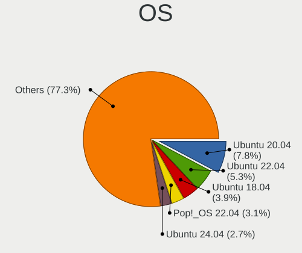

| Name                         | Computers | Percent |
|------------------------------|-----------|---------|
| Ubuntu 20.04                 | 850       | 7.77%   |
| Ubuntu 22.04                 | 578       | 5.28%   |
| Ubuntu 18.04                 | 426       | 3.89%   |
| Pop!_OS 22.04                | 337       | 3.08%   |
| Ubuntu 24.04                 | 296       | 2.71%   |
| Arch Rolling                 | 282       | 2.58%   |
| Debian 12                    | 257       | 2.35%   |
| Zorin 17                     | 179       | 1.64%   |
| Debian 11                    | 153       | 1.4%    |
| Manjaro                      | 152       | 1.39%   |
| ArcoLinux Rolling            | 151       | 1.38%   |
| Linux Mint 22.1              | 150       | 1.37%   |
| Zorin 16                     | 148       | 1.35%   |
| OpenMandriva 24.12           | 143       | 1.31%   |
| Linux Mint 20.3              | 127       | 1.16%   |
| Fedora 41                    | 125       | 1.14%   |
| OpenMandriva 4.3             | 121       | 1.11%   |
| OpenMandriva 4.2             | 120       | 1.1%    |
| Fedora 39                    | 117       | 1.07%   |
| Fedora 38                    | 116       | 1.06%   |
| Fedora 42                    | 114       | 1.04%   |
| Fedora 40                    | 104       | 0.95%   |
| Xubuntu 20.04                | 101       | 0.92%   |
| KDE neon 20.04               | 100       | 0.91%   |
| EndeavourOS Rolling          | 97        | 0.89%   |
| Linux Mint 21.1              | 93        | 0.85%   |
| OpenMandriva 25.06           | 91        | 0.83%   |
| Pop!_OS 20.04                | 89        | 0.81%   |
| openSUSE Tumbleweed-XXXXXXXX | 88        | 0.8%    |
| Pop!_OS 21.04                | 85        | 0.78%   |
| Linux Mint 21.2              | 81        | 0.74%   |
| Linux Mint 20.1              | 81        | 0.74%   |
| Ubuntu 23.04                 | 80        | 0.73%   |
| Arch                         | 80        | 0.73%   |
| Linux Mint 21.3              | 78        | 0.71%   |
| Linux Mint 19.3              | 77        | 0.7%    |
| OpenMandriva 25.90           | 76        | 0.69%   |
| Ubuntu 19.10                 | 71        | 0.65%   |
| OpenMandriva 23.01           | 71        | 0.65%   |
| Linux Mint 22.2              | 70        | 0.64%   |

OS Family
---------

OS without a version

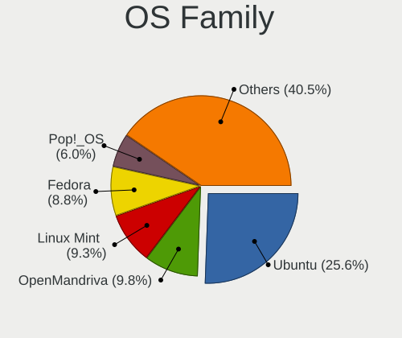

| Name          | Computers | Percent |
|---------------|-----------|---------|
| Ubuntu        | 2639      | 25.57%  |
| OpenMandriva  | 1007      | 9.76%   |
| Linux Mint    | 961       | 9.31%   |
| Fedora        | 912       | 8.84%   |
| Pop!_OS       | 624       | 6.05%   |
| Debian        | 565       | 5.47%   |
| Zorin         | 457       | 4.43%   |
| Arch          | 356       | 3.45%   |
| Manjaro       | 298       | 2.89%   |
| Xubuntu       | 195       | 1.89%   |
| Kubuntu       | 191       | 1.85%   |
| KDE neon      | 185       | 1.79%   |
| ArcoLinux     | 159       | 1.54%   |
| SteamOS       | 113       | 1.09%   |
| openSUSE      | 113       | 1.09%   |
| Bazzite       | 110       | 1.07%   |
| EndeavourOS   | 101       | 0.98%   |
| ROSA          | 84        | 0.81%   |
| Elementary    | 84        | 0.81%   |
| Gentoo        | 82        | 0.79%   |
| Nobara        | 68        | 0.66%   |
| Lubuntu       | 62        | 0.6%    |
| Kali          | 59        | 0.57%   |
| Garuda Linux  | 57        | 0.55%   |
| MX            | 52        | 0.5%    |
| LMDE          | 48        | 0.47%   |
| Ubuntu MATE   | 46        | 0.45%   |
| Endless       | 46        | 0.45%   |
| NixOS         | 43        | 0.42%   |
| CachyOS       | 41        | 0.4%    |
| CentOS        | 35        | 0.34%   |
| BlackPanther  | 35        | 0.34%   |
| Ubuntu Unity  | 32        | 0.31%   |
| Clear Linux   | 31        | 0.3%    |
| Ubuntu Budgie | 25        | 0.24%   |
| Parrot        | 19        | 0.18%   |
| Rocky Linux   | 18        | 0.17%   |
| Alpine        | 17        | 0.16%   |
| AlmaLinux     | 17        | 0.16%   |
| Xero          | 16        | 0.16%   |

Kernel
------

Version of the Linux kernel

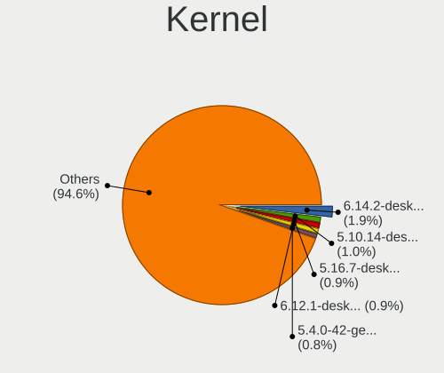

| Version                  | Computers | Percent |
|--------------------------|-----------|---------|
| 6.14.2-desktop-3omv2590  | 226       | 1.86%   |
| 5.10.14-desktop-1omv4002 | 117       | 0.97%   |
| 5.16.7-desktop-1omv4003  | 113       | 0.93%   |
| 6.12.1-desktop-1omv2490  | 107       | 0.88%   |
| 5.4.0-42-generic         | 92        | 0.76%   |
| 6.8.0-51-generic         | 82        | 0.68%   |
| 6.9.3-76060903-generic   | 81        | 0.67%   |
| 5.15.0-56-generic        | 71        | 0.59%   |
| 6.6.2-desktop-1omv2390   | 70        | 0.58%   |
| 6.1.1-desktop-1omv2290   | 65        | 0.54%   |
| 6.2.6-desktop-1omv2390   | 61        | 0.5%    |
| 5.11.0-27-generic        | 59        | 0.49%   |
| 5.15.0-58-generic        | 56        | 0.46%   |
| 5.4.0-58-generic         | 53        | 0.44%   |
| 5.4.0-48-generic         | 50        | 0.41%   |
| 5.3.0-40-generic         | 50        | 0.41%   |
| 6.8.0-52-generic         | 49        | 0.4%    |
| 6.5.0-14-generic         | 48        | 0.4%    |
| 6.14.0-33-generic        | 48        | 0.4%    |
| 6.8.0-60-generic         | 46        | 0.38%   |
| 5.15.0-52-generic        | 46        | 0.38%   |
| 6.8.0-45-generic         | 44        | 0.36%   |
| 6.4.11-desktop-1omv2390  | 44        | 0.36%   |
| 6.2.0-26-generic         | 44        | 0.36%   |
| 5.4.0-52-generic         | 44        | 0.36%   |
| 6.12.9-desktop-1omv2490  | 43        | 0.35%   |
| 5.4.0-29-generic         | 43        | 0.35%   |
| 6.12.10-76061203-generic | 42        | 0.35%   |
| 5.15.0-91-generic        | 42        | 0.35%   |
| 5.11.0-40-generic        | 42        | 0.35%   |
| 5.8.0-7630-generic       | 41        | 0.34%   |
| 5.4.0-40-generic         | 38        | 0.31%   |
| 5.0.0-37-generic         | 38        | 0.31%   |
| 6.8.0-40-generic         | 37        | 0.31%   |
| 6.5.0-28-generic         | 36        | 0.3%    |
| 6.2.0-20-generic         | 36        | 0.3%    |
| 6.14.0-36-generic        | 36        | 0.3%    |
| 5.4.0-26-generic         | 36        | 0.3%    |
| 5.3.0-46-generic         | 36        | 0.3%    |
| 5.13.0-39-generic        | 36        | 0.3%    |

Kernel Family
-------------

Linux kernel without a distro release

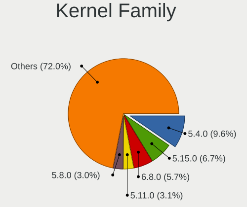

| Version | Computers | Percent |
|---------|-----------|---------|
| 5.4.0   | 1096      | 9.6%    |
| 5.15.0  | 765       | 6.7%    |
| 6.8.0   | 649       | 5.68%   |
| 5.11.0  | 354       | 3.1%    |
| 5.8.0   | 339       | 2.97%   |
| 6.5.0   | 337       | 2.95%   |
| 4.15.0  | 329       | 2.88%   |
| 5.13.0  | 326       | 2.85%   |
| 5.3.0   | 273       | 2.39%   |
| 6.14.0  | 268       | 2.35%   |
| 6.1.0   | 253       | 2.22%   |
| 6.2.0   | 245       | 2.15%   |
| 6.14.2  | 239       | 2.09%   |
| 5.19.0  | 219       | 1.92%   |
| 5.10.0  | 157       | 1.37%   |
| 5.0.0   | 153       | 1.34%   |
| 6.11.0  | 146       | 1.28%   |
| 4.18.0  | 124       | 1.09%   |
| 5.10.14 | 119       | 1.04%   |
| 5.16.7  | 115       | 1.01%   |
| 6.12.1  | 114       | 1%      |
| 6.2.6   | 102       | 0.89%   |
| 6.9.3   | 93        | 0.81%   |
| 6.6.2   | 85        | 0.74%   |
| 6.1.1   | 75        | 0.66%   |
| 6.12.9  | 58        | 0.51%   |
| 6.12.10 | 55        | 0.48%   |
| 6.4.11  | 53        | 0.46%   |
| 6.17.7  | 45        | 0.39%   |
| 6.5.6   | 43        | 0.38%   |
| 5.14.0  | 43        | 0.38%   |
| 4.19.0  | 43        | 0.38%   |
| 6.12.6  | 42        | 0.37%   |
| 6.14.6  | 35        | 0.31%   |
| 6.1.52  | 34        | 0.3%    |
| 6.10.0  | 31        | 0.27%   |
| 6.0.0   | 31        | 0.27%   |
| 5.10.10 | 31        | 0.27%   |
| 6.0.12  | 30        | 0.26%   |
| 6.2.9   | 29        | 0.25%   |

Kernel Major Ver.
-----------------

Linux kernel major version

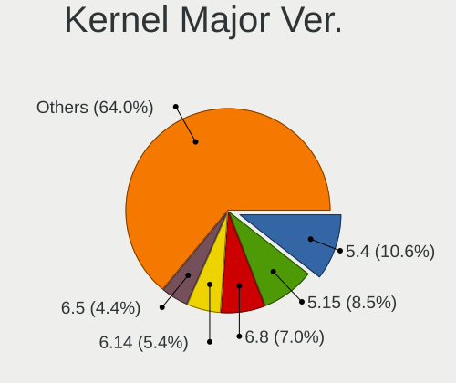

| Version | Computers | Percent |
|---------|-----------|---------|
| 5.4     | 1186      | 10.57%  |
| 5.15    | 957       | 8.53%   |
| 6.8     | 790       | 7.04%   |
| 6.14    | 609       | 5.43%   |
| 6.5     | 495       | 4.41%   |
| 6.1     | 476       | 4.24%   |
| 6.2     | 455       | 4.06%   |
| 6.12    | 455       | 4.06%   |
| 5.8     | 433       | 3.86%   |
| 5.10    | 414       | 3.69%   |
| 5.11    | 411       | 3.66%   |
| 5.13    | 381       | 3.4%    |
| 4.15    | 330       | 2.94%   |
| 6.6     | 313       | 2.79%   |
| 5.3     | 295       | 2.63%   |
| 5.19    | 281       | 2.51%   |
| 6.11    | 277       | 2.47%   |
| 5.16    | 223       | 1.99%   |
| 6.17    | 179       | 1.6%    |
| 6.9     | 171       | 1.52%   |
| 5.0     | 162       | 1.44%   |
| 6.4     | 160       | 1.43%   |
| 6.0     | 156       | 1.39%   |
| 4.18    | 148       | 1.32%   |
| 6.10    | 116       | 1.03%   |
| 6.13    | 112       | 1%      |
| 5.14    | 107       | 0.95%   |
| 6.15    | 106       | 0.95%   |
| 6.7     | 105       | 0.94%   |
| 6.3     | 103       | 0.92%   |
| 5.17    | 99        | 0.88%   |
| 6.16    | 89        | 0.79%   |
| 5.9     | 83        | 0.74%   |
| 5.18    | 80        | 0.71%   |
| 5.12    | 72        | 0.64%   |
| 4.9     | 71        | 0.63%   |
| 5.6     | 62        | 0.55%   |
| 4.19    | 59        | 0.53%   |
| 5.7     | 51        | 0.45%   |
| 5.5     | 29        | 0.26%   |

Arch
----

OS architecture (x86_64, i586, etc.)

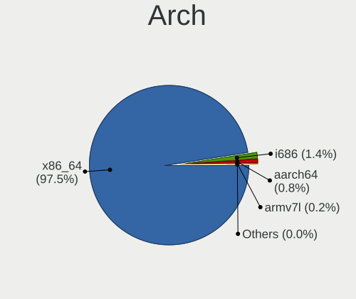

| Name        | Computers | Percent |
|-------------|-----------|---------|
| x86_64      | 9615      | 97.51%  |
| i686        | 135       | 1.37%   |
| aarch64     | 82        | 0.83%   |
| armv7l      | 23        | 0.23%   |
| mips64      | 2         | 0.02%   |
| ppc         | 1         | 0.01%   |
| loongarch64 | 1         | 0.01%   |
| armv8l      | 1         | 0.01%   |
| Unknown     | 1         | 0.01%   |

DE
--

Desktop Environment

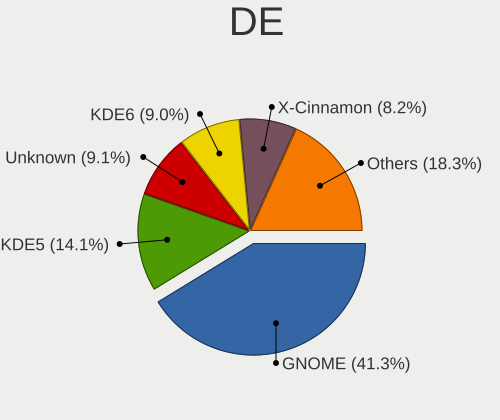

| Name             | Computers | Percent |
|------------------|-----------|---------|
| GNOME            | 4284      | 41.25%  |
| KDE5             | 1468      | 14.14%  |
| Unknown          | 949       | 9.14%   |
| KDE6             | 930       | 8.96%   |
| X-Cinnamon       | 856       | 8.24%   |
| XFCE             | 686       | 6.61%   |
| MATE             | 194       | 1.87%   |
| KDE              | 182       | 1.75%   |
| LXQt             | 119       | 1.15%   |
| Cinnamon         | 95        | 0.91%   |
| Pantheon         | 81        | 0.78%   |
| KDE4             | 76        | 0.73%   |
| LXDE             | 67        | 0.65%   |
| i3               | 54        | 0.52%   |
| Budgie           | 48        | 0.46%   |
| Hyprland         | 45        | 0.43%   |
| Unity            | 35        | 0.34%   |
| COSMIC           | 24        | 0.23%   |
| sway             | 23        | 0.22%   |
| GNOME Flashback  | 23        | 0.22%   |
| GNOME Classic    | 20        | 0.19%   |
| Deepin           | 16        | 0.15%   |
| Openbox          | 13        | 0.13%   |
| Endless:GNOME    | 9         | 0.09%   |
| awesome          | 9         | 0.09%   |
| qtile            | 8         | 0.08%   |
| DWM              | 8         | 0.08%   |
| Enlightenment    | 7         | 0.07%   |
| xmonad           | 5         | 0.05%   |
| lightdm-xsession | 5         | 0.05%   |
| LXDE-pi-wayfire  | 4         | 0.04%   |
| Jwm              | 3         | 0.03%   |
| DDE              | 3         | 0.03%   |
| Cutefish         | 3         | 0.03%   |
| chadwm           | 3         | 0.03%   |
| X-Generic        | 2         | 0.02%   |
| WindowMaker      | 2         | 0.02%   |
| trinity          | 2         | 0.02%   |
| labwc:wlroots    | 2         | 0.02%   |
| xsession         | 1         | 0.01%   |

Display Server
--------------

X11 or Wayland

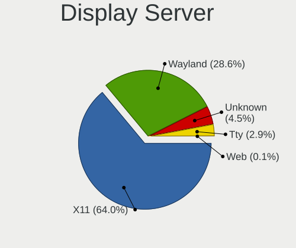

| Name    | Computers | Percent |
|---------|-----------|---------|
| X11     | 6538      | 63.97%  |
| Wayland | 2922      | 28.59%  |
| Unknown | 457       | 4.47%   |
| Tty     | 296       | 2.9%    |
| Web     | 7         | 0.07%   |

Display Manager
---------------

SDDM, LightDM, etc.

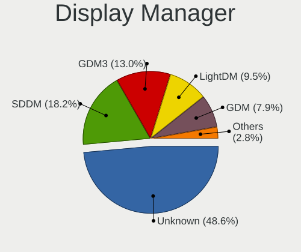

| Name                  | Computers | Percent |
|-----------------------|-----------|---------|
| Unknown               | 4991      | 48.55%  |
| SDDM                  | 1869      | 18.18%  |
| GDM3                  | 1341      | 13.04%  |
| LightDM               | 981       | 9.54%   |
| GDM                   | 809       | 7.87%   |
| TDM                   | 143       | 1.39%   |
| KDM                   | 52        | 0.51%   |
| NODM                  | 30        | 0.29%   |
| GREETD                | 18        | 0.18%   |
| XDM                   | 15        | 0.15%   |
| SLiM                  | 8         | 0.08%   |
| Ly                    | 6         | 0.06%   |
| LXDM                  | 6         | 0.06%   |
| DISPLAY-MANAGER-START | 4         | 0.04%   |
| LY-DM                 | 2         | 0.02%   |
| COSMIC-GREETER        | 2         | 0.02%   |
| SLIMSKI               | 1         | 0.01%   |
| MDM                   | 1         | 0.01%   |
| LEMURS                | 1         | 0.01%   |

OS Lang
-------

Language

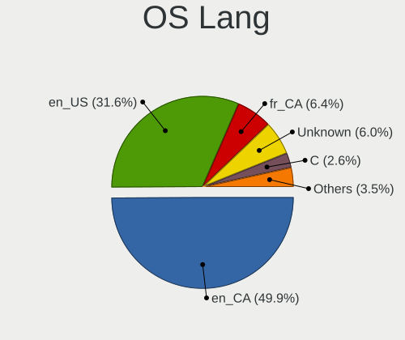

| Lang       | Computers | Percent |
|------------|-----------|---------|
| en_CA      | 5108      | 49.92%  |
| en_US      | 3233      | 31.6%   |
| fr_CA      | 650       | 6.35%   |
| Unknown    | 617       | 6.03%   |
| C          | 269       | 2.63%   |
| fr_FR      | 116       | 1.13%   |
| en_GB      | 105       | 1.03%   |
| C.UTF8     | 13        | 0.13%   |
| POSIX      | 12        | 0.12%   |
| en_AU      | 12        | 0.12%   |
| zh_CN      | 9         | 0.09%   |
| hu_HU      | 8         | 0.08%   |
| de_DE      | 7         | 0.07%   |
| ru_RU      | 6         | 0.06%   |
| pt_BR      | 6         | 0.06%   |
| es_ES      | 6         | 0.06%   |
| es_AR      | 5         | 0.05%   |
| en_IN      | 5         | 0.05%   |
| zh_TW      | 3         | 0.03%   |
| uk_UA      | 3         | 0.03%   |
| pl_PL      | 3         | 0.03%   |
| pa_IN      | 3         | 0.03%   |
| it_IT      | 3         | 0.03%   |
| ja_JP      | 2         | 0.02%   |
| en_US.UTF8 | 2         | 0.02%   |
| en_IE      | 2         | 0.02%   |
| en_DK      | 2         | 0.02%   |
| de_CH      | 2         | 0.02%   |
| zh_HK      | 1         | 0.01%   |
| vi_VN      | 1         | 0.01%   |
| tr_TR      | 1         | 0.01%   |
| ro_RO      | 1         | 0.01%   |
| nan_TW     | 1         | 0.01%   |
| iu_CA      | 1         | 0.01%   |
| hr_HR      | 1         | 0.01%   |
| ga_IE      | 1         | 0.01%   |
| es_CU      | 1         | 0.01%   |
| es_CL      | 1         | 0.01%   |
| es_BO      | 1         | 0.01%   |
| en_ZM      | 1         | 0.01%   |

Boot Mode
---------

EFI or BIOS

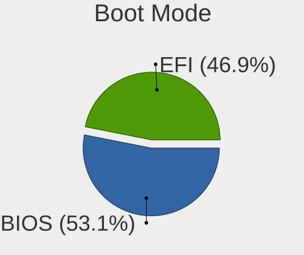

| Mode | Computers | Percent |
|------|-----------|---------|
| BIOS | 5381      | 53.1%   |
| EFI  | 4753      | 46.9%   |

Filesystem
----------

Type of filesystem

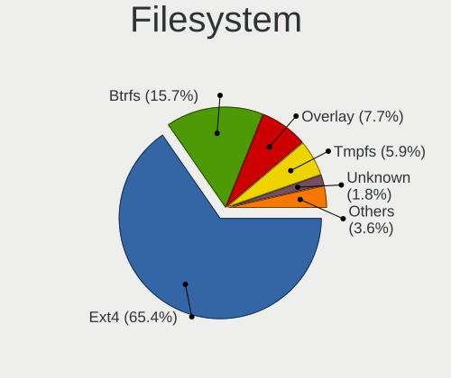

| Type     | Computers | Percent |
|----------|-----------|---------|
| Ext4     | 6666      | 65.38%  |
| Btrfs    | 1600      | 15.69%  |
| Overlay  | 788       | 7.73%   |
| Tmpfs    | 598       | 5.87%   |
| Unknown  | 180       | 1.77%   |
| Xfs      | 174       | 1.71%   |
| Zfs      | 93        | 0.91%   |
| Rootfs   | 32        | 0.31%   |
| Ext2     | 23        | 0.23%   |
| Ext3     | 16        | 0.16%   |
| F2fs     | 12        | 0.12%   |
| Aufs     | 9         | 0.09%   |
| Jfs      | 2         | 0.02%   |
| Bcachefs | 2         | 0.02%   |
| XXX4     | 1         | 0.01%   |

Part. scheme
------------

Scheme of partitioning

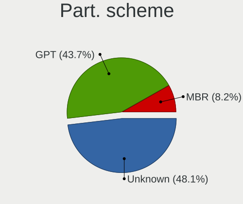

| Type    | Computers | Percent |
|---------|-----------|---------|
| Unknown | 4887      | 48.13%  |
| GPT     | 4435      | 43.68%  |
| MBR     | 832       | 8.19%   |

Dual Boot with Linux/BSD
------------------------

Hosting more than one Linux/BSD

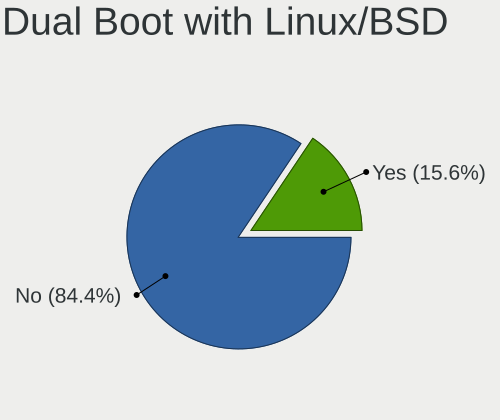

| Dual boot | Computers | Percent |
|-----------|-----------|---------|
| No        | 8528      | 84.4%   |
| Yes       | 1576      | 15.6%   |

Dual Boot (Win)
---------------

Hosting Linux and Windows

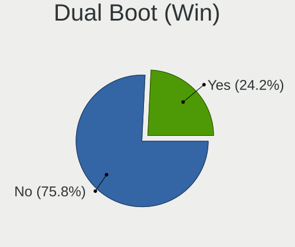

| Dual boot | Computers | Percent |
|-----------|-----------|---------|
| No        | 7628      | 75.78%  |
| Yes       | 2438      | 24.22%  |

Board
-----

Vendor
------

Motherboard manufacturer

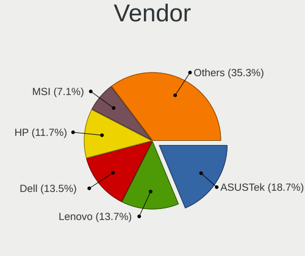

| Name                                 | Computers | Percent |
|--------------------------------------|-----------|---------|
| ASUSTek Computer                     | 1847      | 18.74%  |
| Lenovo                               | 1349      | 13.69%  |
| Dell                                 | 1326      | 13.46%  |
| Hewlett-Packard                      | 1155      | 11.72%  |
| MSI                                  | 698       | 7.08%   |
| Acer                                 | 648       | 6.58%   |
| Gigabyte Technology                  | 580       | 5.89%   |
| Apple                                | 394       | 4%      |
| ASRock                               | 270       | 2.74%   |
| Toshiba                              | 142       | 1.44%   |
| Intel                                | 138       | 1.4%    |
| Valve                                | 100       | 1.01%   |
| Unknown                              | 98        | 0.99%   |
| Google                               | 88        | 0.89%   |
| Alienware                            | 81        | 0.82%   |
| Microsoft                            | 77        | 0.78%   |
| AZW                                  | 58        | 0.59%   |
| Raspberry Pi Foundation              | 57        | 0.58%   |
| Supermicro                           | 47        | 0.48%   |
| Samsung Electronics                  | 45        | 0.46%   |
| Sony                                 | 44        | 0.45%   |
| Pegatron                             | 44        | 0.45%   |
| Gateway                              | 39        | 0.4%    |
| Framework                            | 39        | 0.4%    |
| System76                             | 35        | 0.36%   |
| Foxconn                              | 34        | 0.35%   |
| Panasonic                            | 29        | 0.29%   |
| Shenzhen Meigao Electronic Equipment | 14        | 0.14%   |
| Razer                                | 14        | 0.14%   |
| Fujitsu                              | 14        | 0.14%   |
| Biostar                              | 13        | 0.13%   |
| ECS                                  | 12        | 0.12%   |
| LG Electronics                       | 11        | 0.11%   |
| BOSGAME                              | 11        | 0.11%   |
| ASRockRack                           | 11        | 0.11%   |
| ZOTAC                                | 9         | 0.09%   |
| Notebook                             | 9         | 0.09%   |
| MACHINIST                            | 8         | 0.08%   |
| HUAWEI                               | 8         | 0.08%   |
| EVGA                                 | 7         | 0.07%   |

Model
-----

Motherboard model

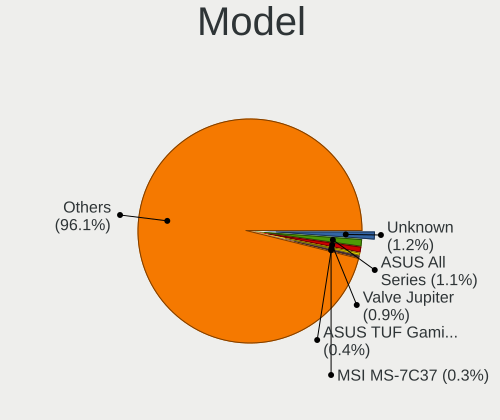

| Name                         | Computers | Percent |
|------------------------------|-----------|---------|
| Unknown                      | 114       | 1.16%   |
| ASUS All Series              | 106       | 1.08%   |
| Valve Jupiter                | 85        | 0.86%   |
| ASUS TUF Gaming X570-PLUS    | 43        | 0.44%   |
| MSI MS-7C37                  | 34        | 0.35%   |
| HP Notebook                  | 32        | 0.32%   |
| MSI MS-7C95                  | 30        | 0.3%    |
| HP Pavilion g6               | 30        | 0.3%    |
| MSI MS-7C56                  | 24        | 0.24%   |
| Dell OptiPlex 7010           | 23        | 0.23%   |
| AZW SER                      | 22        | 0.22%   |
| Acer Aspire A315-21          | 22        | 0.22%   |
| Apple MacBookPro9,2          | 21        | 0.21%   |
| MSI MS-7C02                  | 20        | 0.2%    |
| ASUS PRIME B450M-A           | 20        | 0.2%    |
| Dell OptiPlex 9020           | 19        | 0.19%   |
| Dell Latitude E6410          | 19        | 0.19%   |
| Apple MacBookPro8,1          | 18        | 0.18%   |
| Apple iMac8,1                | 18        | 0.18%   |
| Apple iMac7,1                | 18        | 0.18%   |
| RPi Raspberry Pi             | 17        | 0.17%   |
| HP Pavilion Notebook         | 17        | 0.17%   |
| Dell XPS 15 9500             | 17        | 0.17%   |
| Dell XPS 15 7590             | 17        | 0.17%   |
| Dell Latitude E6420          | 17        | 0.17%   |
| ASUS ROG STRIX B550-F GAMING | 17        | 0.17%   |
| ASUS ROG STRIX B450-F GAMING | 17        | 0.17%   |
| ASRock B450M Pro4            | 17        | 0.17%   |
| MSI MS-7C84                  | 16        | 0.16%   |
| MSI MS-7693                  | 16        | 0.16%   |
| Dell OptiPlex 790            | 16        | 0.16%   |
| Valve Galileo                | 15        | 0.15%   |
| MSI MS-7C91                  | 15        | 0.15%   |
| HP Compaq Elite 8300 SFF     | 15        | 0.15%   |
| Gigabyte B450 AORUS PRO WIFI | 15        | 0.15%   |
| ASUS PRIME X570-P            | 15        | 0.15%   |
| ASUS M5A97 R2.0              | 15        | 0.15%   |
| HP Pavilion dv6              | 14        | 0.14%   |
| Gigabyte X570 AORUS ELITE    | 14        | 0.14%   |
| Dell Latitude 7490           | 14        | 0.14%   |

Model Family
------------

Motherboard model prefix

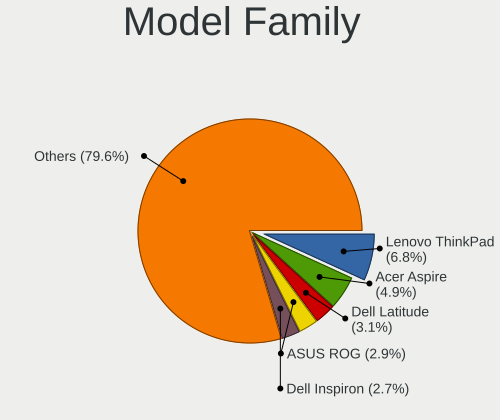

| Name                | Computers | Percent |
|---------------------|-----------|---------|
| Lenovo ThinkPad     | 673       | 6.83%   |
| Acer Aspire         | 485       | 4.92%   |
| Dell Latitude       | 304       | 3.09%   |
| ASUS ROG            | 283       | 2.87%   |
| Dell Inspiron       | 268       | 2.72%   |
| Dell OptiPlex       | 232       | 2.35%   |
| ASUS PRIME          | 231       | 2.34%   |
| Dell XPS            | 214       | 2.17%   |
| HP Pavilion         | 190       | 1.93%   |
| Lenovo ThinkCentre  | 186       | 1.89%   |
| Lenovo IdeaPad      | 158       | 1.6%    |
| HP EliteBook        | 146       | 1.48%   |
| ASUS TUF            | 142       | 1.44%   |
| ASUS VivoBook       | 141       | 1.43%   |
| HP Compaq           | 133       | 1.35%   |
| Dell Precision      | 123       | 1.25%   |
| Toshiba Satellite   | 118       | 1.2%    |
| Unknown             | 114       | 1.16%   |
| HP Laptop           | 111       | 1.13%   |
| ASUS All            | 106       | 1.08%   |
| Valve Jupiter       | 85        | 0.86%   |
| Lenovo Legion       | 81        | 0.82%   |
| Microsoft Surface   | 77        | 0.78%   |
| HP ProBook          | 72        | 0.73%   |
| HP ENVY             | 67        | 0.68%   |
| HP EliteDesk        | 62        | 0.63%   |
| ASUS ASUS           | 60        | 0.61%   |
| ASUS Zenbook        | 59        | 0.6%    |
| RPi Raspberry       | 57        | 0.58%   |
| Gigabyte X570       | 54        | 0.55%   |
| Acer Nitro          | 51        | 0.52%   |
| Lenovo Yoga         | 49        | 0.5%    |
| Dell Vostro         | 44        | 0.45%   |
| Dell PowerEdge      | 40        | 0.41%   |
| Framework Laptop    | 38        | 0.39%   |
| Acer Swift          | 38        | 0.39%   |
| Apple MacBookPro11  | 36        | 0.37%   |
| Lenovo ThinkStation | 35        | 0.36%   |
| Gigabyte B450       | 35        | 0.36%   |
| Dell Studio         | 35        | 0.36%   |

MFG Year
--------

Motherboard manufacture year

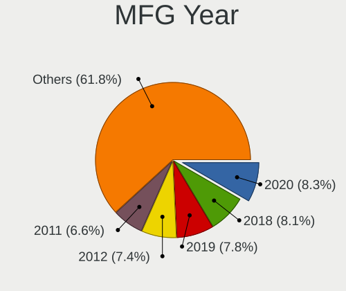

| Year    | Computers | Percent |
|---------|-----------|---------|
| 2020    | 822       | 8.34%   |
| 2018    | 797       | 8.09%   |
| 2019    | 770       | 7.81%   |
| 2012    | 728       | 7.39%   |
| 2011    | 648       | 6.58%   |
| 2013    | 642       | 6.52%   |
| 2017    | 621       | 6.3%    |
| 2022    | 582       | 5.91%   |
| 2021    | 573       | 5.81%   |
| 2014    | 528       | 5.36%   |
| 2010    | 447       | 4.54%   |
| 2016    | 442       | 4.49%   |
| 2023    | 412       | 4.18%   |
| 2015    | 380       | 3.86%   |
| 2008    | 357       | 3.62%   |
| 2009    | 345       | 3.5%    |
| 2024    | 244       | 2.48%   |
| 2007    | 213       | 2.16%   |
| 2006    | 99        | 1%      |
| Unknown | 92        | 0.93%   |
| 2025    | 78        | 0.79%   |
| 2005    | 24        | 0.24%   |
| 2004    | 8         | 0.08%   |
| 2003    | 1         | 0.01%   |
| 2002    | 1         | 0.01%   |

Form Factor
-----------

Physical design of the computer

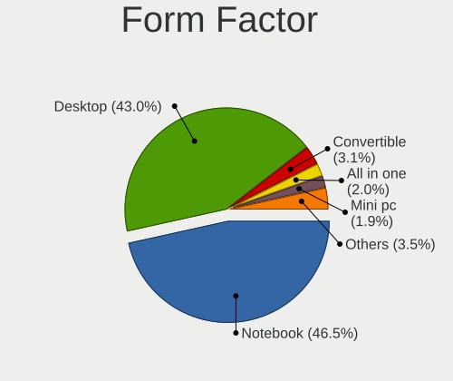

| Name           | Computers | Percent |
|----------------|-----------|---------|
| Notebook       | 4586      | 46.54%  |
| Desktop        | 4236      | 42.99%  |
| Convertible    | 301       | 3.05%   |
| All in one     | 200       | 2.03%   |
| Mini pc        | 189       | 1.92%   |
| Tablet         | 127       | 1.29%   |
| Server         | 116       | 1.18%   |
| System on chip | 93        | 0.94%   |
| Other          | 3         | 0.03%   |
| Phone          | 3         | 0.03%   |

Secure Boot
-----------

Enabled or disabled

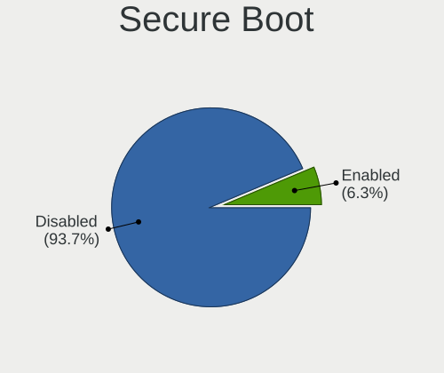

| State    | Computers | Percent |
|----------|-----------|---------|
| Disabled | 9300      | 93.68%  |
| Enabled  | 627       | 6.32%   |

Coreboot
--------

Have coreboot on board

| Used | Computers | Percent |
|------|-----------|---------|
| No   | 9735      | 98.76%  |
| Yes  | 122       | 1.24%   |

RAM Size
--------

Total RAM memory

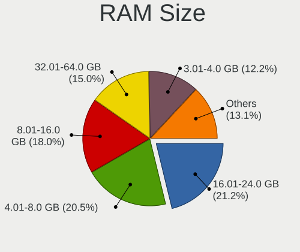

| Size in GB      | Computers | Percent |
|-----------------|-----------|---------|
| 16.01-24.0      | 2131      | 21.2%   |
| 4.01-8.0        | 2059      | 20.49%  |
| 8.01-16.0       | 1810      | 18.01%  |
| 32.01-64.0      | 1509      | 15.01%  |
| 3.01-4.0        | 1228      | 12.22%  |
| 64.01-256.0     | 551       | 5.48%   |
| 24.01-32.0      | 327       | 3.25%   |
| 1.01-2.0        | 249       | 2.48%   |
| 2.01-3.0        | 99        | 0.99%   |
| 0.51-1.0        | 48        | 0.48%   |
| More than 256.0 | 27        | 0.27%   |
| 0.01-0.5        | 10        | 0.1%    |
| Unknown         | 2         | 0.02%   |

RAM Used
--------

Used RAM memory

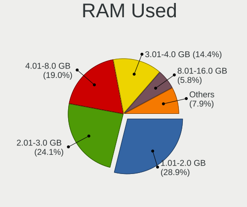

| Used GB         | Computers | Percent |
|-----------------|-----------|---------|
| 1.01-2.0        | 3199      | 28.86%  |
| 2.01-3.0        | 2674      | 24.12%  |
| 4.01-8.0        | 2107      | 19.01%  |
| 3.01-4.0        | 1593      | 14.37%  |
| 8.01-16.0       | 641       | 5.78%   |
| 0.51-1.0        | 531       | 4.79%   |
| 0.01-0.5        | 137       | 1.24%   |
| 16.01-24.0      | 99        | 0.89%   |
| 24.01-32.0      | 52        | 0.47%   |
| 32.01-64.0      | 33        | 0.3%    |
| 64.01-256.0     | 13        | 0.12%   |
| Unknown         | 4         | 0.04%   |
| More than 256.0 | 2         | 0.02%   |

Total Drives
------------

Number of drives on board

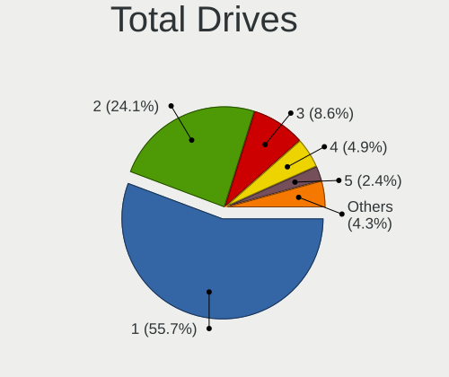

| Drives  | Computers | Percent |
|---------|-----------|---------|
| 1       | 5726      | 55.72%  |
| 2       | 2478      | 24.11%  |
| 3       | 887       | 8.63%   |
| 4       | 500       | 4.87%   |
| 5       | 247       | 2.4%    |
| 6       | 140       | 1.36%   |
| 0       | 95        | 0.92%   |
| 7       | 72        | 0.7%    |
| 8       | 45        | 0.44%   |
| 9       | 24        | 0.23%   |
| 11      | 12        | 0.12%   |
| 10      | 12        | 0.12%   |
| 12      | 10        | 0.1%    |
| 13      | 7         | 0.07%   |
| 16      | 4         | 0.04%   |
| 14      | 4         | 0.04%   |
| Unknown | 4         | 0.04%   |
| 22      | 2         | 0.02%   |
| 29      | 1         | 0.01%   |
| 27      | 1         | 0.01%   |
| 26      | 1         | 0.01%   |
| 25      | 1         | 0.01%   |
| 21      | 1         | 0.01%   |
| 20      | 1         | 0.01%   |
| 19      | 1         | 0.01%   |
| 18      | 1         | 0.01%   |

Has CD-ROM
----------

Has CD-ROM on board

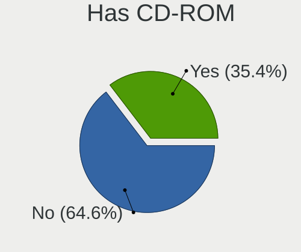

| Presented | Computers | Percent |
|-----------|-----------|---------|
| No        | 6432      | 64.64%  |
| Yes       | 3518      | 35.36%  |

Has Ethernet
------------

Has Ethernet on board

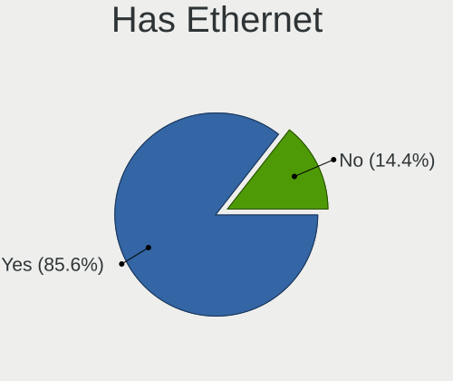

| Presented | Computers | Percent |
|-----------|-----------|---------|
| Yes       | 8459      | 85.57%  |
| No        | 1426      | 14.43%  |

Has WiFi
--------

Has WiFi module

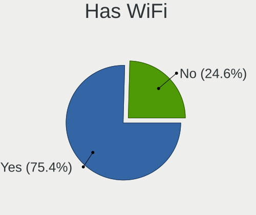

| Presented | Computers | Percent |
|-----------|-----------|---------|
| Yes       | 7496      | 75.44%  |
| No        | 2441      | 24.56%  |

Has Bluetooth
-------------

Has Bluetooth module

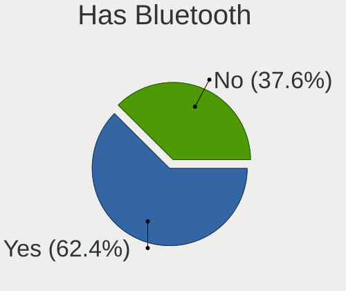

| Presented | Computers | Percent |
|-----------|-----------|---------|
| Yes       | 6249      | 62.45%  |
| No        | 3758      | 37.55%  |

Location
--------

Country
-------

Geographic location (country)

| Country | Computers | Percent |
|---------|-----------|---------|
| Canada  | 9854      | 100%    |

City
----

Geographic location (city)

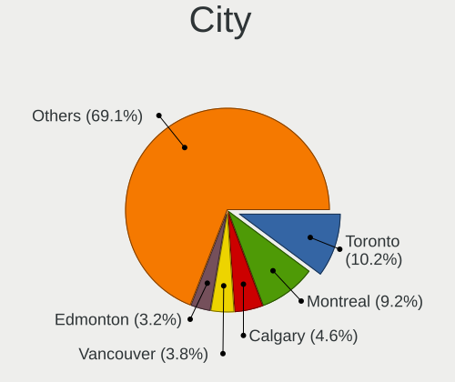

| City            | Computers | Percent |
|-----------------|-----------|---------|
| Toronto         | 1063      | 10.17%  |
| Montreal        | 959       | 9.18%   |
| Calgary         | 477       | 4.56%   |
| Vancouver       | 394       | 3.77%   |
| Edmonton        | 335       | 3.21%   |
| Ottawa          | 314       | 3%      |
| Winnipeg        | 228       | 2.18%   |
| Québec         | 203       | 1.94%   |
| Mississauga     | 167       | 1.6%    |
| Victoria        | 138       | 1.32%   |
| Kitchener       | 117       | 1.12%   |
| London          | 116       | 1.11%   |
| Surrey          | 115       | 1.1%    |
| Brampton        | 98        | 0.94%   |
| Laval           | 97        | 0.93%   |
| Hamilton        | 97        | 0.93%   |
| Saskatoon       | 96        | 0.92%   |
| Burnaby         | 92        | 0.88%   |
| Scarborough     | 88        | 0.84%   |
| Regina          | 85        | 0.81%   |
| Oshawa          | 84        | 0.8%    |
| Gatineau        | 80        | 0.77%   |
| Halifax         | 77        | 0.74%   |
| Windsor         | 72        | 0.69%   |
| Sherbrooke      | 63        | 0.6%    |
| Moncton         | 60        | 0.57%   |
| Richmond Hill   | 57        | 0.55%   |
| Kingston        | 56        | 0.54%   |
| Dartmouth       | 54        | 0.52%   |
| Markham         | 52        | 0.5%    |
| Kelowna         | 51        | 0.49%   |
| Longueuil       | 48        | 0.46%   |
| Barrie          | 47        | 0.45%   |
| Fredericton     | 45        | 0.43%   |
| Oakville        | 42        | 0.4%    |
| Langley         | 42        | 0.4%    |
| Burlington      | 42        | 0.4%    |
| North Vancouver | 41        | 0.39%   |
| New Westminster | 41        | 0.39%   |
| Levis           | 41        | 0.39%   |

Drives
------

Drive Vendor
------------

Hard drive vendors

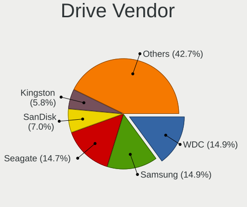

| Vendor                      | Computers | Drives | Percent |
|-----------------------------|-----------|--------|---------|
| WDC                         | 2296      | 4015   | 14.94%  |
| Samsung Electronics         | 2283      | 3619   | 14.86%  |
| Seagate                     | 2258      | 3994   | 14.69%  |
| SanDisk                     | 1071      | 1432   | 6.97%   |
| Kingston                    | 890       | 1238   | 5.79%   |
| Toshiba                     | 709       | 928    | 4.61%   |
| Unknown                     | 641       | 911    | 4.17%   |
| Crucial                     | 430       | 611    | 2.8%    |
| Intel                       | 414       | 613    | 2.69%   |
| Hitachi                     | 399       | 584    | 2.6%    |
| SK hynix                    | 384       | 487    | 2.5%    |
| A-DATA Technology           | 283       | 395    | 1.84%   |
| Micron Technology           | 269       | 335    | 1.75%   |
| HGST                        | 222       | 297    | 1.44%   |
| Apple                       | 166       | 206    | 1.08%   |
| Phison Electronics          | 143       | 201    | 0.93%   |
| Kingston Technology Company | 137       | 177    | 0.89%   |
| Micron/Crucial Technology   | 126       | 180    | 0.82%   |
| SPCC                        | 122       | 166    | 0.79%   |
| KIOXIA                      | 116       | 145    | 0.75%   |
| China                       | 92        | 101    | 0.6%    |
| Patriot                     | 79        | 96     | 0.51%   |
| Unknown                     | 75        | 85     | 0.49%   |
| MAXIO Technology (Hangzhou) | 71        | 93     | 0.46%   |
| Team                        | 68        | 87     | 0.44%   |
| Phison                      | 68        | 102    | 0.44%   |
| Silicon Motion              | 61        | 96     | 0.4%    |
| Corsair                     | 61        | 74     | 0.4%    |
| OCZ                         | 57        | 78     | 0.37%   |
| Realtek Semiconductor       | 56        | 68     | 0.36%   |
| PNY                         | 54        | 83     | 0.35%   |
| Fujitsu                     | 53        | 78     | 0.34%   |
| ADATA Technology            | 52        | 69     | 0.34%   |
| JMicron Technology          | 49        | 75     | 0.32%   |
| LITEONIT                    | 47        | 54     | 0.31%   |
| Lexar                       | 45        | 57     | 0.29%   |
| Hewlett-Packard             | 45        | 104    | 0.29%   |
| ASMT                        | 38        | 63     | 0.25%   |
| LITEON                      | 36        | 39     | 0.23%   |
| Timetec                     | 35        | 82     | 0.23%   |

Drive Model
-----------

Hard drive models

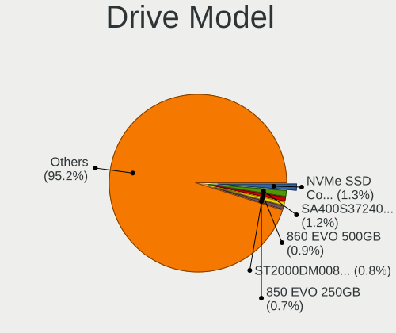

| Model                                                | Computers | Percent |
|------------------------------------------------------|-----------|---------|
| Samsung NVMe SSD Controller SM981/PM981/PM983 1TB    | 225       | 1.29%   |
| Kingston SA400S37240G 240GB SSD                      | 206       | 1.18%   |
| Samsung SSD 860 EVO 500GB                            | 154       | 0.88%   |
| Seagate ST2000DM008-2FR102 2TB                       | 134       | 0.77%   |
| Samsung SSD 850 EVO 250GB                            | 129       | 0.74%   |
| Samsung NVMe SSD Controller PM9A1/PM9A3/980PRO 1TB   | 127       | 0.73%   |
| Samsung SSD 860 EVO 1TB                              | 114       | 0.65%   |
| Kingston SA400S37480G 480GB SSD                      | 111       | 0.63%   |
| Unknown MMC Card  64GB                               | 104       | 0.59%   |
| Kingston SA400S37120G 120GB SSD                      | 101       | 0.58%   |
| Samsung SSD 850 EVO 500GB                            | 95        | 0.54%   |
| SanDisk NVMe SSD Drive 1TB                           | 94        | 0.54%   |
| Seagate ST1000DM010-2EP102 1TB                       | 92        | 0.53%   |
| Unknown SD/MMC/MS PRO 2GB                            | 89        | 0.51%   |
| Seagate ST4000DM004-2CV104 4TB                       | 89        | 0.51%   |
| WDC WDS500G2B0A-00SM50 500GB                         | 87        | 0.5%    |
| Sandisk WD Blue SN550 NVMe SSD 1024GB                | 86        | 0.49%   |
| Unknown MMC Card  32GB                               | 83        | 0.47%   |
| WDC WDS100T2B0A-00SM50 1TB SSD                       | 80        | 0.46%   |
| Toshiba MQ01ABD100 1TB                               | 80        | 0.46%   |
| Sandisk WD Black SN750 / PC SN730 NVMe SSD 500GB     | 77        | 0.44%   |
| Seagate ST1000LM035-1RK172 1TB                       | 75        | 0.43%   |
| Unknown                                              | 75        | 0.43%   |
| Seagate ST1000LM024 HN-M101MBB 1TB                   | 74        | 0.42%   |
| Crucial CT1000MX500SSD1 1TB                          | 74        | 0.42%   |
| Unknown MMC Card  128GB                              | 69        | 0.39%   |
| Seagate ST500DM002-1BD142 500GB                      | 67        | 0.38%   |
| Samsung SSD 870 EVO 1TB                              | 66        | 0.38%   |
| Kingston SV300S37A120G 120GB SSD                     | 66        | 0.38%   |
| HGST HTS721010A9E630 1TB                             | 66        | 0.38%   |
| SanDisk NVMe SSD Drive 500GB                         | 63        | 0.36%   |
| WDC WD10EZEX-08WN4A0 1TB                             | 62        | 0.35%   |
| Samsung SSD 860 EVO 250GB                            | 62        | 0.35%   |
| Seagate ST1000DM003-1CH162 1TB                       | 61        | 0.35%   |
| Samsung NVMe SSD Controller SM961/PM961/SM963 1024GB | 60        | 0.34%   |
| Seagate ST2000DM001-1ER164 2TB                       | 59        | 0.34%   |
| Micron/Crucial P2 NVMe PCIe SSD 2TB                  | 59        | 0.34%   |
| Seagate ST2000DM006-2DM164 2TB                       | 58        | 0.33%   |
| Samsung SSD 870 EVO 500GB                            | 57        | 0.33%   |
| Toshiba DT01ACA100 1TB                               | 56        | 0.32%   |

HDD Vendor
----------

Hard disk drive vendors

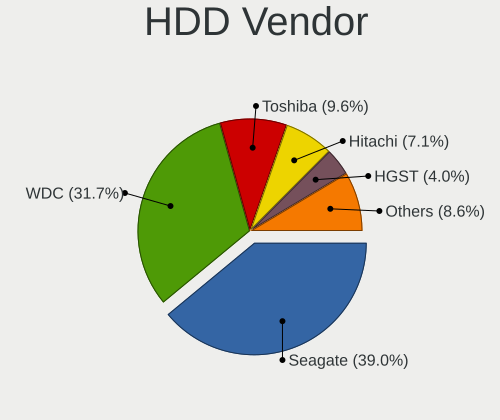

| Vendor              | Computers | Drives | Percent |
|---------------------|-----------|--------|---------|
| Seagate             | 2181      | 3816   | 39%     |
| WDC                 | 1772      | 3141   | 31.69%  |
| Toshiba             | 539       | 724    | 9.64%   |
| Hitachi             | 399       | 584    | 7.14%   |
| HGST                | 221       | 296    | 3.95%   |
| Unknown             | 93        | 127    | 1.66%   |
| Samsung Electronics | 86        | 118    | 1.54%   |
| Apple               | 55        | 63     | 0.98%   |
| Fujitsu             | 53        | 78     | 0.95%   |
| External            | 27        | 39     | 0.48%   |
| Maxtor              | 23        | 30     | 0.41%   |
| TO Exter            | 20        | 23     | 0.36%   |
| Hewlett-Packard     | 18        | 69     | 0.32%   |
| JMicron Technology  | 17        | 23     | 0.3%    |
| ASMT                | 17        | 40     | 0.3%    |
| Maxone              | 9         | 11     | 0.16%   |
| T-FORCE             | 8         | 10     | 0.14%   |
| SABRENT             | 4         | 6      | 0.07%   |
| USB3.0              | 3         | 4      | 0.05%   |
| QNAP                | 3         | 8      | 0.05%   |
| USB 3.1             | 2         | 2      | 0.04%   |
| USB 3.0             | 2         | 6      | 0.04%   |
| SATAFIRM            | 2         | 2      | 0.04%   |
| LaCie               | 2         | 2      | 0.04%   |
| Inateck             | 2         | 2      | 0.04%   |
| H/W                 | 2         | 11     | 0.04%   |
| DAS                 | 2         | 14     | 0.04%   |
| ASMT109x            | 2         | 3      | 0.04%   |
| ASMedia             | 2         | 2      | 0.04%   |
| ACASIS              | 2         | 2      | 0.04%   |
| Unknown             | 2         | 3      | 0.04%   |
| Synology            | 1         | 2      | 0.02%   |
| SINTECHI            | 1         | 1      | 0.02%   |
| Shenzhen            | 1         | 2      | 0.02%   |
| Quantum             | 1         | 1      | 0.02%   |
| QEMU                | 1         | 1      | 0.02%   |
| NVME USB            | 1         | 1      | 0.02%   |
| MSFT                | 1         | 1      | 0.02%   |
| Min Yi U            | 1         | 1      | 0.02%   |
| Maxtor 6            | 1         | 1      | 0.02%   |

SSD Vendor
----------

Solid state drive vendors

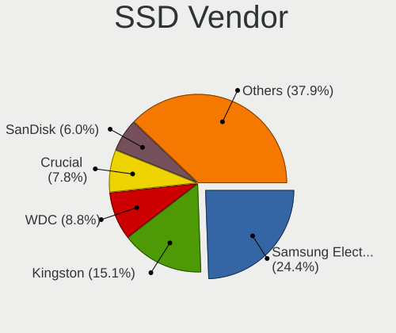

| Vendor              | Computers | Drives | Percent |
|---------------------|-----------|--------|---------|
| Samsung Electronics | 1184      | 1769   | 24.42%  |
| Kingston            | 734       | 1000   | 15.14%  |
| WDC                 | 425       | 590    | 8.77%   |
| Crucial             | 377       | 525    | 7.78%   |
| SanDisk             | 291       | 349    | 6%      |
| A-DATA Technology   | 246       | 346    | 5.07%   |
| Intel               | 158       | 224    | 3.26%   |
| SPCC                | 109       | 149    | 2.25%   |
| China               | 91        | 99     | 1.88%   |
| Micron Technology   | 86        | 118    | 1.77%   |
| Apple               | 84        | 94     | 1.73%   |
| SK hynix            | 77        | 96     | 1.59%   |
| Patriot             | 75        | 92     | 1.55%   |
| Team                | 57        | 74     | 1.18%   |
| Seagate             | 57        | 84     | 1.18%   |
| OCZ                 | 56        | 74     | 1.16%   |
| PNY                 | 54        | 83     | 1.11%   |
| Toshiba             | 51        | 61     | 1.05%   |
| LITEONIT            | 47        | 54     | 0.97%   |
| Corsair             | 37        | 42     | 0.76%   |
| Lexar               | 36        | 46     | 0.74%   |
| LITEON              | 32        | 34     | 0.66%   |
| Mushkin             | 30        | 38     | 0.62%   |
| Timetec             | 28        | 74     | 0.58%   |
| SABRENT             | 28        | 40     | 0.58%   |
| Dogfish             | 27        | 32     | 0.56%   |
| Hewlett-Packard     | 20        | 26     | 0.41%   |
| KingSpec            | 18        | 25     | 0.37%   |
| ASMT                | 18        | 20     | 0.37%   |
| Unknown             | 17        | 17     | 0.35%   |
| KingFast            | 16        | 17     | 0.33%   |
| Fanxiang            | 16        | 21     | 0.33%   |
| Transcend           | 15        | 20     | 0.31%   |
| T-FORCE             | 14        | 15     | 0.29%   |
| OWC                 | 14        | 29     | 0.29%   |
| NGFF                | 11        | 14     | 0.23%   |
| KingDian            | 11        | 13     | 0.23%   |
| Netac               | 9         | 9      | 0.19%   |
| JMicron Technology  | 9         | 12     | 0.19%   |
| Vaseky              | 6         | 7      | 0.12%   |

Drive Kind
----------

HDD or SSD

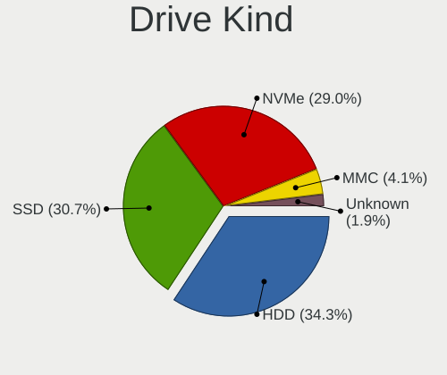

| Kind    | Computers | Drives | Percent |
|---------|-----------|--------|---------|
| HDD     | 4575      | 9305   | 34.28%  |
| SSD     | 4093      | 6649   | 30.67%  |
| NVMe    | 3867      | 6187   | 28.97%  |
| MMC     | 553       | 752    | 4.14%   |
| Unknown | 258       | 393    | 1.93%   |

Drive Connector
---------------

SATA, SAS, NVMe, etc.

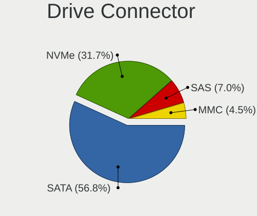

| Type | Computers | Drives | Percent |
|------|-----------|--------|---------|
| SATA | 6912      | 14877  | 56.8%   |
| NVMe | 3855      | 6087   | 31.68%  |
| SAS  | 848       | 1570   | 6.97%   |
| MMC  | 553       | 752    | 4.54%   |

Drive Size
----------

Size of hard drive

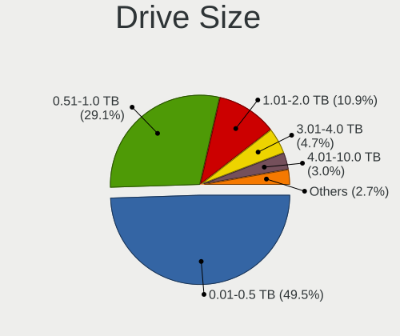

| Size in TB | Computers | Drives | Percent |
|------------|-----------|--------|---------|
| 0.01-0.5   | 4734      | 7632   | 49.49%  |
| 0.51-1.0   | 2780      | 4463   | 29.06%  |
| 1.01-2.0   | 1044      | 1868   | 10.91%  |
| 3.01-4.0   | 453       | 854    | 4.74%   |
| 4.01-10.0  | 291       | 599    | 3.04%   |
| 2.01-3.0   | 215       | 411    | 2.25%   |
| 10.01-20.0 | 46        | 120    | 0.48%   |
| 20.01-50.0 | 2         | 7      | 0.02%   |

Space Total
-----------

Amount of disk space available on the file system

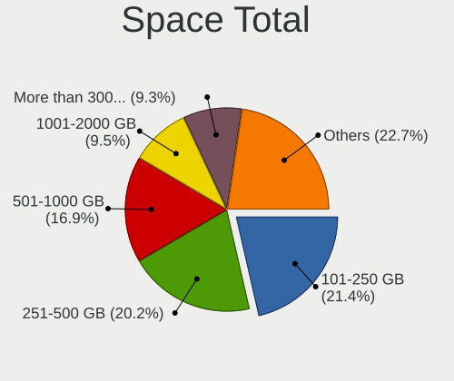

| Size in GB     | Computers | Percent |
|----------------|-----------|---------|
| 101-250        | 2276      | 21.42%  |
| 251-500        | 2141      | 20.15%  |
| 501-1000       | 1795      | 16.9%   |
| 1001-2000      | 1014      | 9.54%   |
| More than 3000 | 991       | 9.33%   |
| 1-20           | 795       | 7.48%   |
| 51-100         | 489       | 4.6%    |
| 2001-3000      | 410       | 3.86%   |
| Unknown        | 398       | 3.75%   |
| 21-50          | 315       | 2.96%   |

Space Used
----------

Amount of used disk space

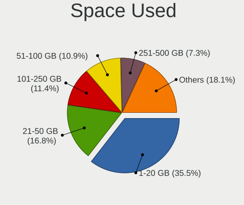

| Used GB        | Computers | Percent |
|----------------|-----------|---------|
| 1-20           | 3920      | 35.53%  |
| 21-50          | 1851      | 16.78%  |
| 101-250        | 1262      | 11.44%  |
| 51-100         | 1198      | 10.86%  |
| 251-500        | 806       | 7.3%    |
| 501-1000       | 622       | 5.64%   |
| 1001-2000      | 432       | 3.92%   |
| Unknown        | 398       | 3.61%   |
| More than 3000 | 343       | 3.11%   |
| 2001-3000      | 174       | 1.58%   |
| 0              | 28        | 0.25%   |

Malfunc. Drives
---------------

Drive models with a malfunction

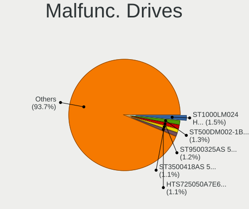

| Model                                                         | Computers | Drives | Percent |
|---------------------------------------------------------------|-----------|--------|---------|
| Seagate ST1000LM024 HN-M101MBB 1TB                            | 14        | 15     | 1.54%   |
| Seagate ST500DM002-1BD142 500GB                               | 12        | 14     | 1.32%   |
| Seagate ST9500325AS 500GB                                     | 11        | 11     | 1.21%   |
| Seagate ST3500418AS 500GB                                     | 10        | 12     | 1.1%    |
| HGST HTS725050A7E630 500GB                                    | 10        | 11     | 1.1%    |
| HGST HTS541010A9E680 1TB                                      | 9         | 9      | 0.99%   |
| Toshiba MQ01ABD100 1TB                                        | 8         | 10     | 0.88%   |
| Seagate ST9500420AS 500GB                                     | 8         | 8      | 0.88%   |
| Seagate ST500LM021-1KJ152 500GB                               | 8         | 20     | 0.88%   |
| Seagate ST1000LM035-1RK172 1TB                                | 8         | 8      | 0.88%   |
| Kingston SV300S37A120G 120GB SSD                              | 8         | 12     | 0.88%   |
| HGST HTS721010A9E630 1TB                                      | 8         | 9      | 0.88%   |
| Seagate ST500LT012-9WS142 500GB                               | 7         | 7      | 0.77%   |
| Seagate ST500LM000-1EJ162 500GB                               | 7         | 7      | 0.77%   |
| Seagate ST31000528AS 1TB                                      | 7         | 9      | 0.77%   |
| Seagate ST500LT012-1DG142 500GB                               | 6         | 7      | 0.66%   |
| Seagate ST31500341AS 1TB                                      | 6         | 7      | 0.66%   |
| Samsung Electronics SSD 870 EVO 1TB                           | 6         | 9      | 0.66%   |
| Hitachi HTS547575A9E384 752GB                                 | 6         | 6      | 0.66%   |
| Hitachi HDS721010CLA332 1TB                                   | 6         | 6      | 0.66%   |
| A-DATA Technology SX900 256GB SSD                             | 6         | 6      | 0.66%   |
| WDC WD40EFRX-68WT0N0 4TB                                      | 5         | 18     | 0.55%   |
| WDC WD2500HHTZ-04N21V0 250GB                                  | 5         | 5      | 0.55%   |
| WDC WD20EARS-00MVWB0 2TB                                      | 5         | 6      | 0.55%   |
| WDC WD1001FALS-00J7B1 1TB                                     | 5         | 6      | 0.55%   |
| Seagate ST1000DM003-9YN162 1TB                                | 5         | 7      | 0.55%   |
| Seagate ST1000DM003-1ER162 1TB                                | 5         | 6      | 0.55%   |
| HGST HTS545050A7E680 500GB                                    | 5         | 5      | 0.55%   |
| WDC WD40EFRX-68N32N0 4TB                                      | 4         | 11     | 0.44%   |
| WDC WD30EFRX-68EUZN0 3TB                                      | 4         | 6      | 0.44%   |
| WDC WD10EZEX-08WN4A0 1TB                                      | 4         | 4      | 0.44%   |
| Toshiba MK3261GSYN 320GB                                      | 4         | 4      | 0.44%   |
| Toshiba MK2555GSXF 250GB                                      | 4         | 4      | 0.44%   |
| Toshiba DT01ACA100 1TB                                        | 4         | 5      | 0.44%   |
| Seagate ST9320423AS 320GB                                     | 4         | 6      | 0.44%   |
| Seagate ST2000DM006-2DM164 2TB                                | 4         | 4      | 0.44%   |
| Seagate ST2000DM001-1CH164 2TB                                | 4         | 4      | 0.44%   |
| Seagate ST1000LX015-1U7172 1TB                                | 4         | 6      | 0.44%   |
| Samsung Electronics NVMe SSD Controller SM981/PM981/PM983 1TB | 4         | 6      | 0.44%   |
| Kingston SV300S37A240G 240GB SSD                              | 4         | 5      | 0.44%   |

Malfunc. Drive Vendor
---------------------

Vendors of faulty drives

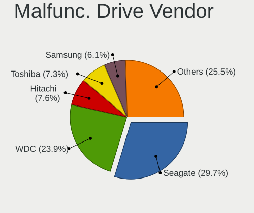

| Vendor                      | Computers | Drives | Percent |
|-----------------------------|-----------|--------|---------|
| Seagate                     | 260       | 351    | 29.68%  |
| WDC                         | 209       | 301    | 23.86%  |
| Hitachi                     | 67        | 74     | 7.65%   |
| Toshiba                     | 64        | 70     | 7.31%   |
| Samsung Electronics         | 53        | 75     | 6.05%   |
| Kingston                    | 37        | 50     | 4.22%   |
| HGST                        | 34        | 36     | 3.88%   |
| Intel                       | 24        | 27     | 2.74%   |
| A-DATA Technology           | 23        | 26     | 2.63%   |
| Crucial                     | 20        | 31     | 2.28%   |
| SK hynix                    | 11        | 13     | 1.26%   |
| Apple                       | 9         | 9      | 1.03%   |
| Sandisk                     | 5         | 5      | 0.57%   |
| Maxtor                      | 5         | 5      | 0.57%   |
| Hewlett-Packard             | 5         | 8      | 0.57%   |
| Fujitsu                     | 5         | 14     | 0.57%   |
| OCZ                         | 4         | 5      | 0.46%   |
| Mushkin                     | 4         | 4      | 0.46%   |
| LITEONIT                    | 4         | 4      | 0.46%   |
| Micron Technology           | 3         | 3      | 0.34%   |
| KingSpec                    | 3         | 3      | 0.34%   |
| China                       | 3         | 3      | 0.34%   |
| Timetec                     | 2         | 16     | 0.23%   |
| Lexar                       | 2         | 2      | 0.23%   |
| Corsair                     | 2         | 2      | 0.23%   |
| ASMT                        | 2         | 3      | 0.23%   |
| UMIS                        | 1         | 1      | 0.11%   |
| Team                        | 1         | 1      | 0.11%   |
| Super Talent                | 1         | 1      | 0.11%   |
| SPCC                        | 1         | 2      | 0.11%   |
| Realtek Semiconductor       | 1         | 1      | 0.11%   |
| Phison Electronics          | 1         | 1      | 0.11%   |
| Patriot                     | 1         | 1      | 0.11%   |
| OWC                         | 1         | 1      | 0.11%   |
| LITEON                      | 1         | 1      | 0.11%   |
| LaCie                       | 1         | 1      | 0.11%   |
| Kingston Technology Company | 1         | 1      | 0.11%   |
| HP Phison                   | 1         | 1      | 0.11%   |
| Fanxiang                    | 1         | 2      | 0.11%   |
| Drevo                       | 1         | 1      | 0.11%   |

Malfunc. HDD Vendor
-------------------

Vendors of faulty HDD drives

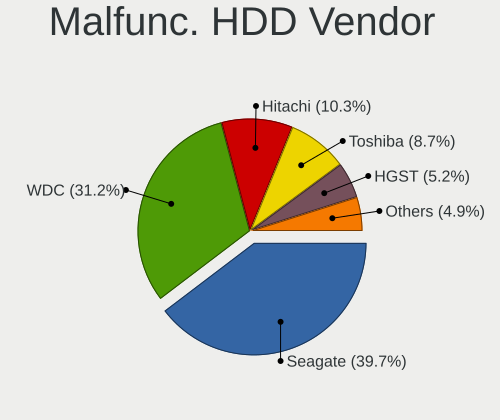

| Vendor              | Computers | Drives | Percent |
|---------------------|-----------|--------|---------|
| Seagate             | 259       | 350    | 39.66%  |
| WDC                 | 204       | 293    | 31.24%  |
| Hitachi             | 67        | 74     | 10.26%  |
| Toshiba             | 57        | 63     | 8.73%   |
| HGST                | 34        | 36     | 5.21%   |
| Samsung Electronics | 13        | 22     | 1.99%   |
| Maxtor              | 5         | 5      | 0.77%   |
| Fujitsu             | 5         | 14     | 0.77%   |
| Apple               | 5         | 5      | 0.77%   |
| LaCie               | 1         | 1      | 0.15%   |
| Hewlett-Packard     | 1         | 1      | 0.15%   |
| DAS                 | 1         | 3      | 0.15%   |
| ASMT                | 1         | 2      | 0.15%   |

Malfunc. Drive Kind
-------------------

Kinds of faulty drives

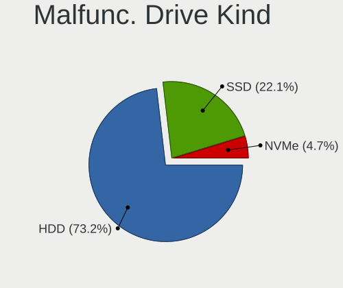

| Kind | Computers | Drives | Percent |
|------|-----------|--------|---------|
| HDD  | 605       | 869    | 73.16%  |
| SSD  | 183       | 239    | 22.13%  |
| NVMe | 39        | 52     | 4.72%   |

Failed Drives
-------------

Failed drive models

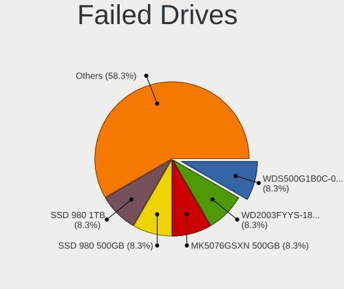

| Model                                                            | Computers | Drives | Percent |
|------------------------------------------------------------------|-----------|--------|---------|
| WDC WDS500G1B0C-00S6U0 500GB                                     | 1         | 1      | 8.33%   |
| WDC WD2003FYYS-18W0B0 2TB                                        | 1         | 1      | 8.33%   |
| Toshiba MK5076GSXN 500GB                                         | 1         | 1      | 8.33%   |
| Samsung Electronics SSD 980 500GB                                | 1         | 1      | 8.33%   |
| Samsung Electronics SSD 980 1TB                                  | 1         | 1      | 8.33%   |
| Samsung Electronics NVMe SSD Controller SM961/PM961/SM963 1024GB | 1         | 1      | 8.33%   |
| Samsung Electronics HM160HC 160GB                                | 1         | 5      | 8.33%   |
| Samsung Electronics HD502HJ 500GB                                | 1         | 1      | 8.33%   |
| Micron/Crucial Technology P2 NVMe PCIe SSD 2TB                   | 1         | 1      | 8.33%   |
| LITEON CA3-8D512 512GB                                           | 1         | 2      | 8.33%   |
| Intel SSDSA1M160G2HP 160GB                                       | 1         | 1      | 8.33%   |
| Hewlett-Packard EF0450FARMV 450GB                                | 1         | 4      | 8.33%   |

Failed Drive Vendor
-------------------

Failed drive vendors

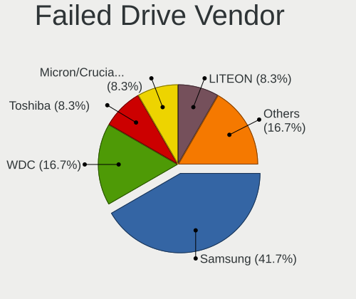

| Vendor                    | Computers | Drives | Percent |
|---------------------------|-----------|--------|---------|
| Samsung Electronics       | 5         | 9      | 41.67%  |
| WDC                       | 2         | 2      | 16.67%  |
| Toshiba                   | 1         | 1      | 8.33%   |
| Micron/Crucial Technology | 1         | 1      | 8.33%   |
| LITEON                    | 1         | 2      | 8.33%   |
| Intel                     | 1         | 1      | 8.33%   |
| Hewlett-Packard           | 1         | 4      | 8.33%   |

Drive Status
------------

Number of failed and malfunc. drives

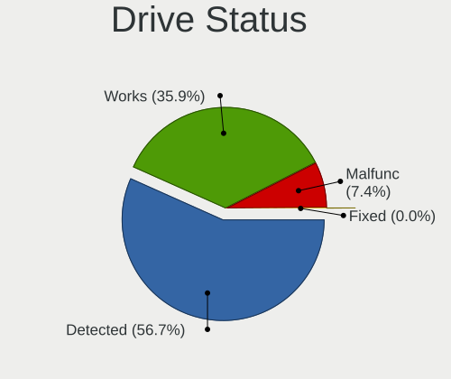

| Status   | Computers | Drives | Percent |
|----------|-----------|--------|---------|
| Detected | 6145      | 14081  | 56.68%  |
| Works    | 3887      | 8024   | 35.85%  |
| Malfunc  | 797       | 1160   | 7.35%   |
| Failed   | 12        | 20     | 0.11%   |
| Fixed    | 1         | 1      | 0.01%   |

Storage controller
------------------

Storage Vendor
--------------

Storage controller vendors

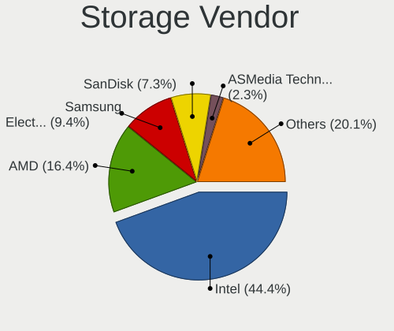

| Vendor                           | Computers | Percent |
|----------------------------------|-----------|---------|
| Intel                            | 5951      | 44.44%  |
| AMD                              | 2196      | 16.4%   |
| Samsung Electronics              | 1255      | 9.37%   |
| SanDisk                          | 982       | 7.33%   |
| ASMedia Technology               | 312       | 2.33%   |
| SK hynix                         | 298       | 2.23%   |
| Kingston Technology Company      | 292       | 2.18%   |
| Phison Electronics               | 233       | 1.74%   |
| Marvell Technology Group         | 204       | 1.52%   |
| Micron Technology                | 188       | 1.4%    |
| Micron/Crucial Technology        | 175       | 1.31%   |
| Nvidia                           | 164       | 1.22%   |
| JMicron Technology               | 149       | 1.11%   |
| Toshiba America Info Systems     | 125       | 0.93%   |
| KIOXIA                           | 115       | 0.86%   |
| ADATA Technology                 | 108       | 0.81%   |
| Silicon Motion                   | 85        | 0.63%   |
| MAXIO Technology (Hangzhou)      | 82        | 0.61%   |
| Realtek Semiconductor            | 75        | 0.56%   |
| LSI Logic / Symbios Logic        | 62        | 0.46%   |
| Broadcom / LSI                   | 59        | 0.44%   |
| Shenzhen Longsys Electronics     | 35        | 0.26%   |
| Seagate Technology               | 32        | 0.24%   |
| Apple                            | 25        | 0.19%   |
| Union Memory (Shenzhen)          | 21        | 0.16%   |
| Silicon Image                    | 18        | 0.13%   |
| VIA Technologies                 | 16        | 0.12%   |
| INNOGRIT                         | 16        | 0.12%   |
| Lenovo                           | 14        | 0.1%    |
| Hewlett-Packard                  | 14        | 0.1%    |
| Solid State Storage Technology   | 12        | 0.09%   |
| Lite-On Technology               | 11        | 0.08%   |
| Solidigm                         | 9         | 0.07%   |
| Adaptec                          | 9         | 0.07%   |
| Biwin Storage Technology         | 6         | 0.04%   |
| Netac Technology                 | 5         | 0.04%   |
| HighPoint Technologies           | 5         | 0.04%   |
| Silicon Integrated Systems [SiS] | 4         | 0.03%   |
| O2 Micro                         | 4         | 0.03%   |
| Integrated Technology Express    | 3         | 0.02%   |

Storage Model
-------------

Storage controller models

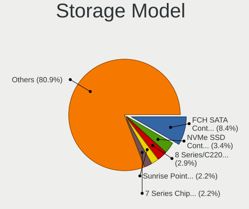

| Model                                                                          | Computers | Percent |
|--------------------------------------------------------------------------------|-----------|---------|
| AMD FCH SATA Controller [AHCI mode]                                            | 1281      | 8.37%   |
| Samsung NVMe SSD Controller SM981/PM981/PM983                                  | 514       | 3.36%   |
| Intel 8 Series/C220 Series Chipset Family 6-port SATA Controller 1 [AHCI mode] | 449       | 2.93%   |
| Intel Sunrise Point-LP SATA Controller [AHCI mode]                             | 342       | 2.24%   |
| Intel 7 Series Chipset Family 6-port SATA Controller [AHCI mode]               | 340       | 2.22%   |
| Intel 82801 Mobile SATA Controller [RAID mode]                                 | 287       | 1.88%   |
| AMD 400 Series Chipset SATA Controller                                         | 283       | 1.85%   |
| ASMedia ASM1061/ASM1062 Serial ATA Controller                                  | 274       | 1.79%   |
| Intel SATA Controller [RAID mode]                                              | 262       | 1.71%   |
| AMD 500 Series Chipset SATA Controller                                         | 249       | 1.63%   |
| AMD SB7x0/SB8x0/SB9x0 SATA Controller [AHCI mode]                              | 239       | 1.56%   |
| Intel Volume Management Device NVMe RAID Controller                            | 232       | 1.52%   |
| Intel Q170/Q150/B150/H170/H110/Z170/CM236 Chipset SATA Controller [AHCI Mode]  | 231       | 1.51%   |
| Intel 6 Series/C200 Series Chipset Family 6 port Mobile SATA AHCI Controller   | 225       | 1.47%   |
| Intel 6 Series/C200 Series Chipset Family 6 port Desktop SATA AHCI Controller  | 219       | 1.43%   |
| Samsung NVMe SSD Controller PM9A1/PM9A3/980PRO                                 | 215       | 1.41%   |
| Intel 7 Series/C210 Series Chipset Family 6-port SATA Controller [AHCI mode]   | 192       | 1.25%   |
| Intel 200 Series PCH SATA controller [AHCI mode]                               | 187       | 1.22%   |
| SanDisk Ultra 3D / WD PC SN530, IX SN530, Blue SN550 NVMe SSD (DRAM-less)      | 184       | 1.2%    |
| Samsung NVMe SSD Controller 980 (DRAM-less)                                    | 182       | 1.19%   |
| AMD 600 Series Chipset SATA Controller                                         | 182       | 1.19%   |
| SanDisk WD SN560/SN740/SN770/SN5000 NVMe SSD                                   | 170       | 1.11%   |
| Intel 8 Series SATA Controller 1 [AHCI mode]                                   | 165       | 1.08%   |
| SanDisk Extreme Pro / WD Black SN750 / PC SN730 / Red SN700 NVMe SSD           | 162       | 1.06%   |
| Intel Cannon Lake PCH SATA AHCI Controller                                     | 155       | 1.01%   |
| Samsung NVMe SSD Controller SM961/PM961/SM963                                  | 147       | 0.96%   |
| AMD SB7x0/SB8x0/SB9x0 IDE Controller                                           | 147       | 0.96%   |
| Intel 5 Series/3400 Series Chipset 6 port SATA AHCI Controller                 | 141       | 0.92%   |
| Intel 82801IBM/IEM (ICH9M/ICH9M-E) 4 port SATA Controller [AHCI mode]          | 137       | 0.9%    |
| Intel Cannon Lake Mobile PCH SATA AHCI Controller                              | 132       | 0.86%   |
| Intel 82801HM/HEM (ICH8M/ICH8M-E) IDE Controller                               | 125       | 0.82%   |
| Sandisk WD Black SN850X NVMe SSD                                               | 116       | 0.76%   |
| Intel 5 Series/3400 Series Chipset 4 port SATA AHCI Controller                 | 116       | 0.76%   |
| Intel Wildcat Point-LP SATA Controller [AHCI Mode]                             | 109       | 0.71%   |
| Intel 82801HM/HEM (ICH8M/ICH8M-E) SATA Controller [AHCI mode]                  | 107       | 0.7%    |
| Intel SSD 660P Series                                                          | 102       | 0.67%   |
| AMD SB7x0/SB8x0/SB9x0 SATA Controller [IDE mode]                               | 101       | 0.66%   |
| Intel Alder Lake-S PCH SATA Controller [AHCI Mode]                             | 96        | 0.63%   |
| Intel Comet Lake SATA AHCI Controller                                          | 95        | 0.62%   |
| Intel Raptor Lake SATA AHCI Controller                                         | 87        | 0.57%   |

Storage Kind
------------

Kind of storage controller (IDE, SATA, NVMe, SAS, ...)

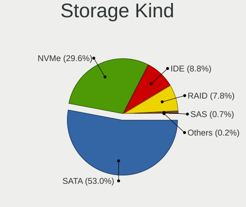

| Kind | Computers | Percent |
|------|-----------|---------|
| SATA | 6920      | 52.96%  |
| NVMe | 3870      | 29.62%  |
| IDE  | 1152      | 8.82%   |
| RAID | 1013      | 7.75%   |
| SAS  | 89        | 0.68%   |
| SCSI | 22        | 0.17%   |

Processor
---------

CPU Vendor
----------

Processor vendors

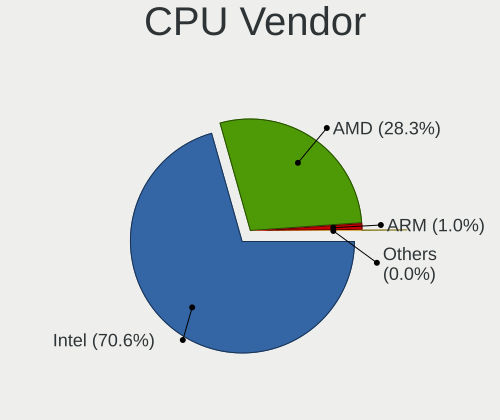

| Vendor       | Computers | Percent |
|--------------|-----------|---------|
| Intel        | 6960      | 70.62%  |
| AMD          | 2785      | 28.26%  |
| ARM          | 94        | 0.95%   |
| Unknown      | 10        | 0.1%    |
| Qualcomm     | 4         | 0.04%   |
| PowerBook4,1 | 1         | 0.01%   |
| Loongson     | 1         | 0.01%   |

CPU Model
---------

Processor models

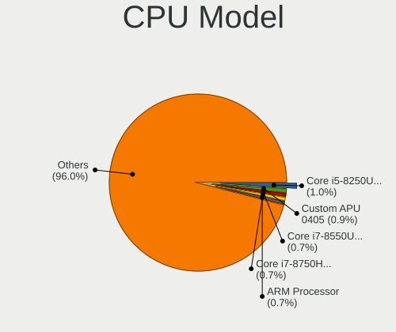

| Model                                   | Computers | Percent |
|-----------------------------------------|-----------|---------|
| Intel Core i5-8250U CPU @ 1.60GHz       | 102       | 1.03%   |
| AMD Custom APU 0405                     | 87        | 0.88%   |
| Intel Core i7-8550U CPU @ 1.80GHz       | 71        | 0.72%   |
| Intel Core i7-8750H CPU @ 2.20GHz       | 69        | 0.7%    |
| ARM Processor                           | 69        | 0.7%    |
| Intel Core i5-2520M CPU @ 2.50GHz       | 67        | 0.68%   |
| AMD Ryzen 7 3700X 8-Core Processor      | 67        | 0.68%   |
| AMD Ryzen 5 3600 6-Core Processor       | 67        | 0.68%   |
| Intel 11th Gen Core i7-1165G7 @ 2.80GHz | 65        | 0.66%   |
| AMD Ryzen 5 5600X 6-Core Processor      | 64        | 0.65%   |
| Intel Core i5-6300U CPU @ 2.40GHz       | 62        | 0.63%   |
| Intel Core i7-10750H CPU @ 2.60GHz      | 61        | 0.62%   |
| Intel Core i7-3770 CPU @ 3.40GHz        | 59        | 0.6%    |
| Intel Core i5-2400 CPU @ 3.10GHz        | 57        | 0.58%   |
| AMD Ryzen 7 5800X 8-Core Processor      | 57        | 0.58%   |
| Intel Core i7-6700 CPU @ 3.40GHz        | 55        | 0.56%   |
| Intel Core i5-7200U CPU @ 2.50GHz       | 55        | 0.56%   |
| Intel 11th Gen Core i5-1135G7 @ 2.40GHz | 54        | 0.55%   |
| Intel Core i7-7700HQ CPU @ 2.80GHz      | 53        | 0.54%   |
| Intel Core i7-4790 CPU @ 3.60GHz        | 53        | 0.54%   |
| Intel Core i5-8265U CPU @ 1.60GHz       | 51        | 0.52%   |
| AMD Ryzen 9 3900X 12-Core Processor     | 50        | 0.51%   |
| AMD Ryzen 7 5700U with Radeon Graphics  | 49        | 0.5%    |
| Intel Core i5-6200U CPU @ 2.30GHz       | 46        | 0.47%   |
| Intel Core i5-3320M CPU @ 2.60GHz       | 46        | 0.47%   |
| Intel Core i5-3470 CPU @ 3.20GHz        | 45        | 0.46%   |
| Intel Core i5-3210M CPU @ 2.50GHz       | 45        | 0.46%   |
| Intel 12th Gen Core i7-12700H           | 43        | 0.43%   |
| AMD Ryzen 9 5900X 12-Core Processor     | 43        | 0.43%   |
| Intel Core i5-8350U CPU @ 1.70GHz       | 42        | 0.42%   |
| Intel Core i7-9750H CPU @ 2.60GHz       | 41        | 0.41%   |
| Intel Core i7-4770 CPU @ 3.40GHz        | 41        | 0.41%   |
| Intel Core i5-4570 CPU @ 3.20GHz        | 41        | 0.41%   |
| Intel Core i7-1065G7 CPU @ 1.30GHz      | 40        | 0.4%    |
| Intel Core i7-8650U CPU @ 1.90GHz       | 39        | 0.39%   |
| Intel Core i5-6500 CPU @ 3.20GHz        | 39        | 0.39%   |
| Intel Core 2 Duo CPU E8400 @ 3.00GHz    | 39        | 0.39%   |
| AMD Ryzen 5 2600 Six-Core Processor     | 39        | 0.39%   |
| Intel Core i7-4790K CPU @ 4.00GHz       | 38        | 0.38%   |
| Intel Core i5-7300U CPU @ 2.60GHz       | 38        | 0.38%   |

CPU Model Family
----------------

Processor model prefix

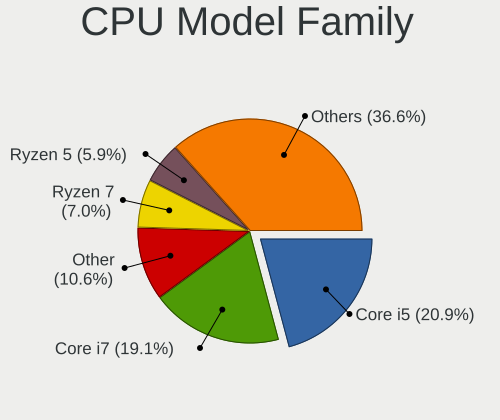

| Model                   | Computers | Percent |
|-------------------------|-----------|---------|
| Intel Core i5           | 2060      | 20.86%  |
| Intel Core i7           | 1882      | 19.06%  |
| Other                   | 1044      | 10.57%  |
| AMD Ryzen 7             | 689       | 6.98%   |
| AMD Ryzen 5             | 584       | 5.91%   |
| Intel Core i3           | 446       | 4.52%   |
| Intel Core 2 Duo        | 374       | 3.79%   |
| Intel Xeon              | 359       | 3.64%   |
| AMD Ryzen 9             | 279       | 2.83%   |
| Intel Celeron           | 272       | 2.75%   |
| AMD FX                  | 146       | 1.48%   |
| Intel Pentium           | 142       | 1.44%   |
| AMD A10                 | 107       | 1.08%   |
| AMD A6                  | 102       | 1.03%   |
| Intel Core 2 Quad       | 98        | 0.99%   |
| Intel Atom              | 96        | 0.97%   |
| Intel Core i9           | 89        | 0.9%    |
| AMD Ryzen 3             | 85        | 0.86%   |
| Intel Pentium Dual-Core | 77        | 0.78%   |
| Intel Core              | 62        | 0.63%   |
| AMD A8                  | 62        | 0.63%   |
| AMD A4                  | 53        | 0.54%   |
| AMD Athlon 64 X2        | 51        | 0.52%   |
| Intel Pentium Dual      | 47        | 0.48%   |
| Intel Core 2            | 43        | 0.44%   |
| Intel Pentium Silver    | 32        | 0.32%   |
| AMD Phenom II X6        | 31        | 0.31%   |
| AMD Phenom II X4        | 30        | 0.3%    |
| AMD Athlon              | 29        | 0.29%   |
| AMD E                   | 28        | 0.28%   |
| Intel Genuine           | 27        | 0.27%   |
| AMD Ryzen 7 PRO         | 25        | 0.25%   |
| AMD Ryzen Threadripper  | 23        | 0.23%   |
| AMD Ryzen 5 PRO         | 23        | 0.23%   |
| AMD Athlon II X2        | 23        | 0.23%   |
| AMD Phenom              | 21        | 0.21%   |
| Intel Pentium D         | 18        | 0.18%   |
| Intel Pentium 4         | 18        | 0.18%   |
| AMD E2                  | 18        | 0.18%   |
| AMD E1                  | 18        | 0.18%   |

CPU Cores
---------

Number of processor cores

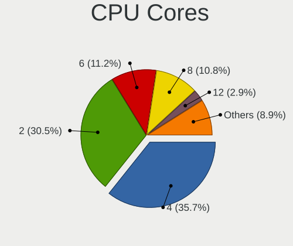

| Number  | Computers | Percent |
|---------|-----------|---------|
| 4       | 3536      | 35.71%  |
| 2       | 3021      | 30.51%  |
| 6       | 1106      | 11.17%  |
| 8       | 1067      | 10.78%  |
| 12      | 285       | 2.88%   |
| 16      | 203       | 2.05%   |
| 10      | 164       | 1.66%   |
| 14      | 141       | 1.42%   |
| 1       | 137       | 1.38%   |
| 24      | 73        | 0.74%   |
| 3       | 68        | 0.69%   |
| 20      | 40        | 0.4%    |
| Unknown | 32        | 0.32%   |
| 28      | 6         | 0.06%   |
| 18      | 5         | 0.05%   |
| 64      | 3         | 0.03%   |
| 32      | 3         | 0.03%   |
| 56      | 2         | 0.02%   |
| 40      | 2         | 0.02%   |
| 5       | 2         | 0.02%   |
| 128     | 1         | 0.01%   |
| 52      | 1         | 0.01%   |
| 44      | 1         | 0.01%   |
| 36      | 1         | 0.01%   |
| 7       | 1         | 0.01%   |

CPU Sockets
-----------

Number of sockets

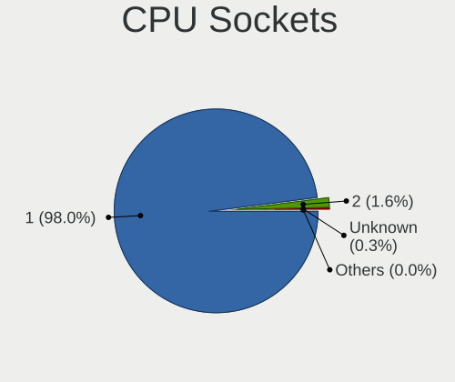

| Number  | Computers | Percent |
|---------|-----------|---------|
| 1       | 9660      | 97.97%  |
| 2       | 162       | 1.64%   |
| Unknown | 30        | 0.3%    |
| 3       | 3         | 0.03%   |
| 24      | 2         | 0.02%   |
| 4       | 2         | 0.02%   |
| 20      | 1         | 0.01%   |

CPU Threads
-----------

Threads per core (Hyper-Threading)

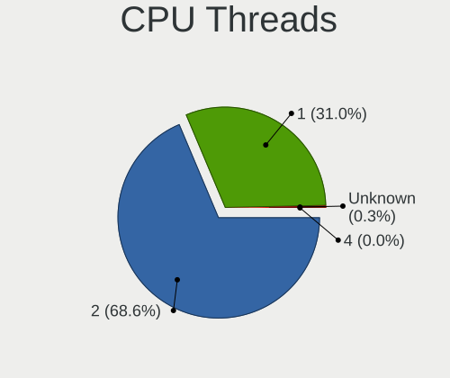

| Number  | Computers | Percent |
|---------|-----------|---------|
| 2       | 6789      | 68.65%  |
| 1       | 3067      | 31.01%  |
| Unknown | 32        | 0.32%   |
| 12      | 1         | 0.01%   |
| 4       | 1         | 0.01%   |

CPU Op-Modes
------------

CPU Operation Modes (32-bit, 64-bit)

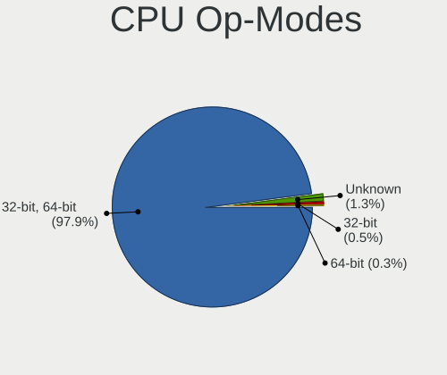

| Op mode        | Computers | Percent |
|----------------|-----------|---------|
| 32-bit, 64-bit | 9671      | 97.92%  |
| Unknown        | 129       | 1.31%   |
| 32-bit         | 50        | 0.51%   |
| 64-bit         | 26        | 0.26%   |

CPU Microcode
-------------

Microcode number

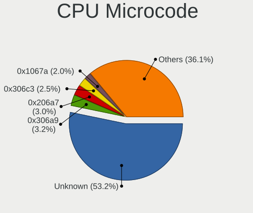

| Number     | Computers | Percent |
|------------|-----------|---------|
| Unknown    | 5466      | 53.22%  |
| 0x306a9    | 330       | 3.21%   |
| 0x206a7    | 307       | 2.99%   |
| 0x306c3    | 260       | 2.53%   |
| 0x1067a    | 203       | 1.98%   |
| 0x906ea    | 150       | 1.46%   |
| 0x506e3    | 118       | 1.15%   |
| 0x806ea    | 109       | 1.06%   |
| 0x40651    | 105       | 1.02%   |
| 0x08701021 | 104       | 1.01%   |
| 0x20655    | 96        | 0.93%   |
| 0x906e9    | 95        | 0.93%   |
| 0x806e9    | 86        | 0.84%   |
| 0x6fd      | 80        | 0.78%   |
| 0x406e3    | 79        | 0.77%   |
| 0x806ec    | 78        | 0.76%   |
| 0x06001119 | 63        | 0.61%   |
| 0x10676    | 61        | 0.59%   |
| 0x306d4    | 60        | 0.58%   |
| 0x20652    | 60        | 0.58%   |
| 0x6fb      | 56        | 0.55%   |
| 0x106e5    | 56        | 0.55%   |
| 0x06000852 | 56        | 0.55%   |
| 0x806c1    | 55        | 0.54%   |
| 0x0800820d | 55        | 0.54%   |
| 0x0a50000c | 53        | 0.52%   |
| 0x08701013 | 53        | 0.52%   |
| 0xa0652    | 51        | 0.5%    |
| 0x906a3    | 49        | 0.48%   |
| 0x010000c8 | 49        | 0.48%   |
| 0x08108109 | 45        | 0.44%   |
| 0x706e5    | 42        | 0.41%   |
| 0x30678    | 42        | 0.41%   |
| 0x906ed    | 39        | 0.38%   |
| 0x0a50000d | 39        | 0.38%   |
| 0x206d7    | 38        | 0.37%   |
| 0x406c4    | 37        | 0.36%   |
| 0x06006705 | 35        | 0.34%   |
| 0x206c2    | 34        | 0.33%   |
| 0x106a5    | 32        | 0.31%   |

CPU Microarch
-------------

Microarchitecture

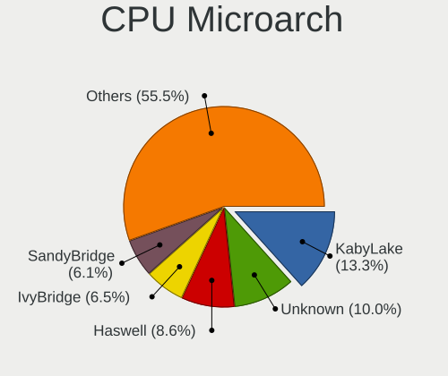

| Name              | Computers | Percent |
|-------------------|-----------|---------|
| KabyLake          | 1320      | 13.34%  |
| Unknown           | 988       | 9.98%   |
| Haswell           | 849       | 8.58%   |
| IvyBridge         | 643       | 6.5%    |
| SandyBridge       | 606       | 6.12%   |
| Zen 3             | 497       | 5.02%   |
| Skylake           | 492       | 4.97%   |
| Penryn            | 435       | 4.4%    |
| Zen 2             | 411       | 4.15%   |
| Westmere          | 318       | 3.21%   |
| Alderlake Hybrid  | 296       | 2.99%   |
| Zen+              | 262       | 2.65%   |
| Core              | 258       | 2.61%   |
| CometLake         | 232       | 2.34%   |
| Piledriver        | 210       | 2.12%   |
| Broadwell         | 191       | 1.93%   |
| TigerLake         | 188       | 1.9%    |
| Silvermont        | 188       | 1.9%    |
| K10               | 179       | 1.81%   |
| Zen               | 166       | 1.68%   |
| Nehalem           | 152       | 1.54%   |
| Icelake           | 150       | 1.52%   |
| Excavator         | 142       | 1.44%   |
| Goldmont plus     | 97        | 0.98%   |
| K8 Hammer         | 85        | 0.86%   |
| K10 Llano         | 55        | 0.56%   |
| Puma              | 54        | 0.55%   |
| Bobcat            | 53        | 0.54%   |
| Goldmont          | 46        | 0.46%   |
| NetBurst          | 41        | 0.41%   |
| Steamroller       | 40        | 0.4%    |
| Jaguar            | 39        | 0.39%   |
| Bulldozer         | 39        | 0.39%   |
| Bonnell           | 35        | 0.35%   |
| Gracemont         | 30        | 0.3%    |
| P6                | 28        | 0.28%   |
| Meteorlake Hybrid | 24        | 0.24%   |
| Tremont           | 23        | 0.23%   |
| K8 & K10 hybrid   | 16        | 0.16%   |
| Lunarlake Hybrid  | 15        | 0.15%   |

Graphics
--------

GPU Vendor
----------

Vendors of graphics cards

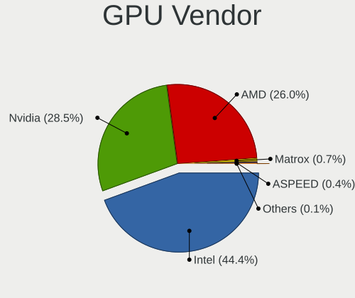

| Vendor                                       | Computers | Percent |
|----------------------------------------------|-----------|---------|
| Intel                                        | 5045      | 44.42%  |
| Nvidia                                       | 3232      | 28.46%  |
| AMD                                          | 2948      | 25.96%  |
| Matrox Electronics Systems                   | 75        | 0.66%   |
| ASPEED Technology                            | 43        | 0.38%   |
| Silicon Integrated Systems [SiS]             | 4         | 0.04%   |
| Red Hat                                      | 3         | 0.03%   |
| XGI Technology (eXtreme Graphics Innovation) | 2         | 0.02%   |
| VIA Technologies                             | 2         | 0.02%   |
| Xilinx                                       | 1         | 0.01%   |
| Loongson Technology                          | 1         | 0.01%   |
| ATI Technologies                             | 1         | 0.01%   |

GPU Model
---------

Graphics card models

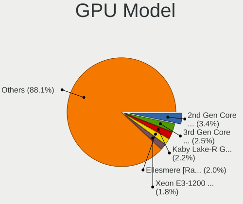

| Model                                                                                    | Computers | Percent |
|------------------------------------------------------------------------------------------|-----------|---------|
| Intel 2nd Generation Core Processor Family Integrated Graphics Controller                | 397       | 3.37%   |
| Intel 3rd Gen Core processor Graphics Controller                                         | 298       | 2.53%   |
| Intel Kaby Lake-R GT2 [UHD Graphics 620]                                                 | 263       | 2.23%   |
| AMD Ellesmere [Radeon RX 470/480/570/570X/580/580X/590]                                  | 233       | 1.98%   |
| Intel Xeon E3-1200 v3/4th Gen Core Processor Integrated Graphics Controller              | 212       | 1.8%    |
| Intel Haswell-ULT Integrated Graphics Controller                                         | 196       | 1.66%   |
| Intel Core Processor Integrated Graphics Controller                                      | 187       | 1.59%   |
| Intel TigerLake-LP GT2 [Iris Xe Graphics]                                                | 176       | 1.5%    |
| Intel Skylake-U GT2 [HD Graphics 520]                                                    | 163       | 1.38%   |
| Intel CoffeeLake-H GT2 [UHD Graphics 630]                                                | 162       | 1.38%   |
| AMD Picasso/Raven 2 [Radeon Vega Series / Radeon Vega Mobile Series]                     | 154       | 1.31%   |
| Intel Skylake-S GT2 [HD Graphics 530]                                                    | 145       | 1.23%   |
| Intel Kaby Lake-U GT2 [HD Graphics 620]                                                  | 145       | 1.23%   |
| Intel 4th Gen Core Processor Integrated Graphics Controller                              | 139       | 1.18%   |
| AMD Cezanne [Radeon Vega Series / Radeon Vega Mobile Series]                             | 134       | 1.14%   |
| Intel Mobile 4 Series Chipset Integrated Graphics Controller                             | 124       | 1.05%   |
| Intel WhiskeyLake-U GT2 [UHD Graphics 620]                                               | 123       | 1.04%   |
| Intel Broadwell-U GT2 [HD Graphics 5500]                                                 | 113       | 0.96%   |
| AMD Raphael                                                                              | 110       | 0.93%   |
| Intel CoffeeLake-S GT2 [UHD Graphics 630]                                                | 106       | 0.9%    |
| AMD Renoir [Radeon Vega Series / Radeon Vega Mobile Series]                              | 106       | 0.9%    |
| Intel Atom/Celeron/Pentium Processor x5-E8000/J3xxx/N3xxx Integrated Graphics Controller | 105       | 0.89%   |
| Intel Alder Lake-P GT2 [Iris Xe Graphics]                                                | 103       | 0.87%   |
| Intel Xeon E3-1200 v2/3rd Gen Core processor Graphics Controller                         | 95        | 0.81%   |
| Intel CometLake-H GT2 [UHD Graphics]                                                     | 95        | 0.81%   |
| Nvidia GP107 [GeForce GTX 1050 Ti]                                                       | 90        | 0.76%   |
| Nvidia GK208B [GeForce GT 710]                                                           | 89        | 0.76%   |
| AMD VanGogh [AMD Custom GPU 0405]                                                        | 85        | 0.72%   |
| Intel Atom Processor Z36xxx/Z37xxx Series Graphics & Display                             | 82        | 0.7%    |
| Intel CometLake-U GT2 [UHD Graphics]                                                     | 81        | 0.69%   |
| Nvidia TU117M [GeForce GTX 1650 Mobile / Max-Q]                                          | 79        | 0.67%   |
| AMD Navi 10 [Radeon RX 5600 OEM/5600 XT / 5700/5700 XT]                                  | 79        | 0.67%   |
| AMD Lucienne                                                                             | 77        | 0.65%   |
| Intel Raptor Lake-P [Iris Xe Graphics]                                                   | 76        | 0.65%   |
| Intel GeminiLake [UHD Graphics 600]                                                      | 74        | 0.63%   |
| Intel 4 Series Chipset Integrated Graphics Controller                                    | 73        | 0.62%   |
| AMD Stoney [Radeon R2/R3/R4/R5 Graphics]                                                 | 73        | 0.62%   |
| Intel Kaby Lake-H GT2 [HD Graphics 630]                                                  | 69        | 0.59%   |
| Nvidia GP106 [GeForce GTX 1060 6GB]                                                      | 67        | 0.57%   |
| Intel Mobile GM965/GL960 Integrated Graphics Controller (secondary)                      | 66        | 0.56%   |

GPU Combo
---------

Combinations of graphics cards

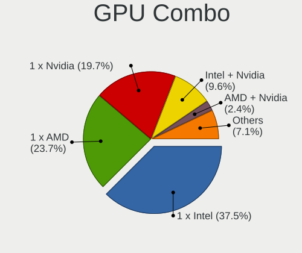

| Name                      | Computers | Percent |
|---------------------------|-----------|---------|
| 1 x Intel                 | 3735      | 37.49%  |
| 1 x AMD                   | 2364      | 23.73%  |
| 1 x Nvidia                | 1958      | 19.65%  |
| Intel + Nvidia            | 959       | 9.63%   |
| AMD + Nvidia              | 244       | 2.45%   |
| 2 x AMD                   | 189       | 1.9%    |
| Intel + AMD               | 152       | 1.53%   |
| Other                     | 123       | 1.23%   |
| 1 x Matrox                | 58        | 0.58%   |
| 2 x Nvidia                | 51        | 0.51%   |
| 2 x Intel                 | 44        | 0.44%   |
| 1 x ASPEED                | 32        | 0.32%   |
| Nvidia + Matrox           | 12        | 0.12%   |
| Nvidia + ASPEED           | 6         | 0.06%   |
| Intel + 2 x Nvidia        | 5         | 0.05%   |
| 1 x SiS                   | 4         | 0.04%   |
| AMD + Matrox              | 4         | 0.04%   |
| Intel + ASPEED            | 3         | 0.03%   |
| AMD + 2 x Nvidia          | 3         | 0.03%   |
| 1 x VIA                   | 2         | 0.02%   |
| 1 x Red Hat               | 2         | 0.02%   |
| AMD + Nvidia + 1 x ASPEED | 2         | 0.02%   |
| 5 x Nvidia                | 1         | 0.01%   |
| 4 x Nvidia                | 1         | 0.01%   |
| 3 x AMD                   | 1         | 0.01%   |
| 2 x Nvidia + 1 x Matrox   | 1         | 0.01%   |
| 2 x Loongson Technology   | 1         | 0.01%   |
| 2 x AMD + 1 x Nvidia      | 1         | 0.01%   |
| 1 x XGI                   | 1         | 0.01%   |
| 1 x Intel + 3 x AMD       | 1         | 0.01%   |
| Intel + Xilinx            | 1         | 0.01%   |
| Intel + Red Hat           | 1         | 0.01%   |
| AMD + XGI                 | 1         | 0.01%   |

GPU Driver
----------

Free vs proprietary

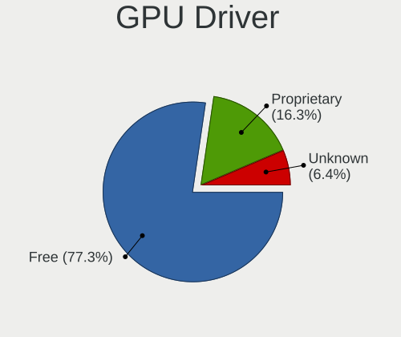

| Driver      | Computers | Percent |
|-------------|-----------|---------|
| Free        | 7760      | 77.31%  |
| Proprietary | 1637      | 16.31%  |
| Unknown     | 641       | 6.39%   |

GPU Memory
----------

Total video memory

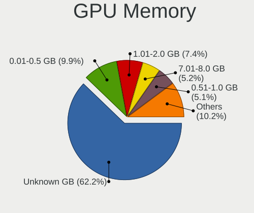

| Size in GB | Computers | Percent |
|------------|-----------|---------|
| Unknown    | 6350      | 62.19%  |
| 0.01-0.5   | 1011      | 9.9%    |
| 1.01-2.0   | 754       | 7.38%   |
| 7.01-8.0   | 531       | 5.2%    |
| 0.51-1.0   | 524       | 5.13%   |
| 3.01-4.0   | 452       | 4.43%   |
| 8.01-16.0  | 262       | 2.57%   |
| 5.01-6.0   | 215       | 2.11%   |
| 2.01-3.0   | 65        | 0.64%   |
| 16.01-24.0 | 35        | 0.34%   |
| 4.01-5.0   | 6         | 0.06%   |
| 32.01-64.0 | 4         | 0.04%   |
| 24.01-32.0 | 1         | 0.01%   |

Monitor
-------

Monitor Vendor
--------------

Monitor vendors

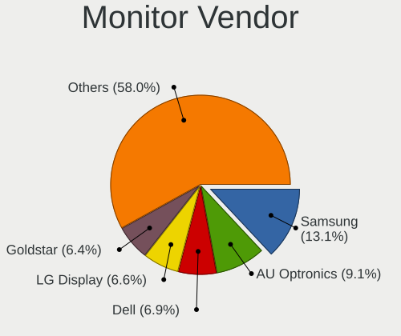

| Vendor                  | Computers | Percent |
|-------------------------|-----------|---------|
| Samsung Electronics     | 1450      | 13.05%  |
| AU Optronics            | 1007      | 9.06%   |
| Dell                    | 767       | 6.9%    |
| LG Display              | 730       | 6.57%   |
| Goldstar                | 709       | 6.38%   |
| BOE                     | 689       | 6.2%    |
| Chimei Innolux          | 655       | 5.9%    |
| Acer                    | 597       | 5.37%   |
| Hewlett-Packard         | 423       | 3.81%   |
| Apple                   | 351       | 3.16%   |
| Ancor Communications    | 331       | 2.98%   |
| ASUSTek Computer        | 300       | 2.7%    |
| BenQ                    | 298       | 2.68%   |
| Sharp                   | 251       | 2.26%   |
| Lenovo                  | 244       | 2.2%    |
| ViewSonic               | 191       | 1.72%   |
| Chi Mei Optoelectronics | 119       | 1.07%   |
| Sony                    | 108       | 0.97%   |
| Toshiba                 | 106       | 0.95%   |
| MSI                     | 101       | 0.91%   |
| PANDA                   | 97        | 0.87%   |
| Philips                 | 96        | 0.86%   |
| AOC                     | 95        | 0.86%   |
| Valve                   | 87        | 0.78%   |
| Unknown                 | 85        | 0.77%   |
| LG Electronics          | 78        | 0.7%    |
| Gigabyte Technology     | 61        | 0.55%   |
| InfoVision              | 59        | 0.53%   |
| Panasonic               | 49        | 0.44%   |
| HKC                     | 47        | 0.42%   |
| LG Philips              | 43        | 0.39%   |
| NEC Computers           | 40        | 0.36%   |
| Insignia                | 40        | 0.36%   |
| Hitachi                 | 33        | 0.3%    |
| Unknown                 | 30        | 0.27%   |
| Vizio                   | 26        | 0.23%   |
| HannStar                | 26        | 0.23%   |
| TMX                     | 25        | 0.23%   |
| CSO                     | 24        | 0.22%   |
| Sceptre Tech            | 22        | 0.2%    |

Monitor Model
-------------

Monitor models

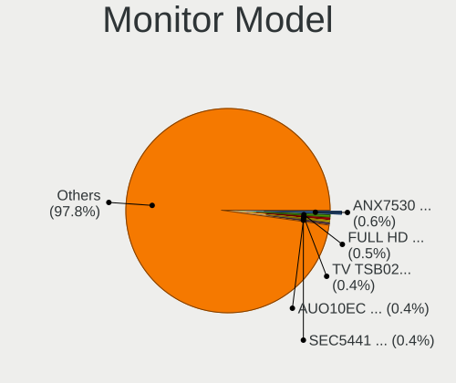

| Model                                                                 | Computers | Percent |
|-----------------------------------------------------------------------|-----------|---------|
| Valve ANX7530 U VLV3001 800x1280 100x150mm 7.1-inch                   | 68        | 0.59%   |
| Goldstar FULL HD GSM5B55 1920x1080 480x270mm 21.7-inch                | 59        | 0.51%   |
| Toshiba TV TSB0206 1920x1080                                          | 44        | 0.38%   |
| AU Optronics LCD Monitor AUO10EC 1366x768 344x193mm 15.5-inch         | 44        | 0.38%   |
| Samsung Electronics LCD Monitor SEC5441 1280x800 331x207mm 15.4-inch  | 41        | 0.35%   |
| Goldstar LG IPS FULLHD GSM5AB8 1920x1080 480x270mm 21.7-inch          | 38        | 0.33%   |
| Chimei Innolux LCD Monitor CMN14D4 1920x1080 309x173mm 13.9-inch      | 36        | 0.31%   |
| PANDA LCD Monitor NCP004D 1920x1080 344x194mm 15.5-inch               | 34        | 0.29%   |
| Chimei Innolux LCD Monitor CMN15F5 1920x1080 344x193mm 15.5-inch      | 33        | 0.28%   |
| Unknown                                                               | 30        | 0.26%   |
| LG Display LCD Monitor LGD02DC 1366x768 344x194mm 15.5-inch           | 29        | 0.25%   |
| LG Display LCD Monitor LGD0555 2736x1824 260x173mm 12.3-inch          | 27        | 0.23%   |
| AU Optronics LCD Monitor AUO21ED 1920x1080 344x193mm 15.5-inch        | 27        | 0.23%   |
| Chimei Innolux LCD Monitor CMN15E6 1366x768 344x193mm 15.5-inch       | 26        | 0.22%   |
| AU Optronics LCD Monitor AUO70EC 1366x768 344x193mm 15.5-inch         | 26        | 0.22%   |
| AU Optronics LCD Monitor AUO26EC 1366x768 344x193mm 15.5-inch         | 26        | 0.22%   |
| Chimei Innolux LCD Monitor CMN1521 1920x1080 344x193mm 15.5-inch      | 25        | 0.22%   |
| Goldstar FULL HD GSM5ABA 1920x1080 480x270mm 21.7-inch                | 24        | 0.21%   |
| BOE LCD Monitor BOE095F 2256x1504 285x190mm 13.5-inch                 | 24        | 0.21%   |
| ASUSTek Computer VG245 AUS24A1 1920x1080 531x299mm 24.0-inch          | 24        | 0.21%   |
| Panasonic VVX11F009G00 MEI96A2 1920x1080 344x193mm 15.5-inch          | 23        | 0.2%    |
| Goldstar LG ULTRAWIDE GSM59F1 2560x1080 670x280mm 28.6-inch           | 23        | 0.2%    |
| AU Optronics LCD Monitor AUO313C 1366x768 309x173mm 13.9-inch         | 23        | 0.2%    |
| Unknown LCD Monitor FFFF 2288x1287 2550x2550mm 142.0-inch             | 22        | 0.19%   |
| Ancor Communications VE247 ACI2493 1920x1080 530x300mm 24.0-inch      | 22        | 0.19%   |
| Ancor Communications ASUS VS247 ACI249A 1920x1080 521x293mm 23.5-inch | 22        | 0.19%   |
| Chimei Innolux LCD Monitor CMN14C9 1920x1080 309x173mm 13.9-inch      | 21        | 0.18%   |
| Ancor Communications ASUS VE278 ACI27F6 1920x1080 598x336mm 27.0-inch | 21        | 0.18%   |
| LG Display LCD Monitor LGD0456 1366x768 344x194mm 15.5-inch           | 20        | 0.17%   |
| AU Optronics LCD Monitor AUO22EC 1366x768 344x193mm 15.5-inch         | 20        | 0.17%   |
| ASUSTek Computer VP28U AUS28B1 3840x2160 621x341mm 27.9-inch          | 20        | 0.17%   |
| Samsung Electronics C32F391 SAM0D34 1920x1080 698x393mm 31.5-inch     | 19        | 0.16%   |
| Goldstar Ultra HD GSM5B09 3840x2160 600x340mm 27.2-inch               | 19        | 0.16%   |
| BOE LCD Monitor BOE06A4 1366x768 344x194mm 15.5-inch                  | 19        | 0.16%   |
| Samsung Electronics S24F350 SAM0D20 1920x1080 521x293mm 23.5-inch     | 18        | 0.15%   |
| LG Display LCD Monitor LGD0563 1920x1080 344x194mm 15.5-inch          | 18        | 0.15%   |
| Chimei Innolux LCD Monitor CMN1735 1920x1080 381x214mm 17.2-inch      | 18        | 0.15%   |
| Samsung Electronics LCD Monitor SDC4C48 1920x1080 293x165mm 13.2-inch | 17        | 0.15%   |
| Samsung Electronics C27F390 SAM0D32 1920x1080 598x336mm 27.0-inch     | 17        | 0.15%   |
| MSI Optix MAG27CQ MSI1462 2560x1440 597x336mm 27.0-inch               | 17        | 0.15%   |

Monitor Resolution
------------------

Monitor screen resolution

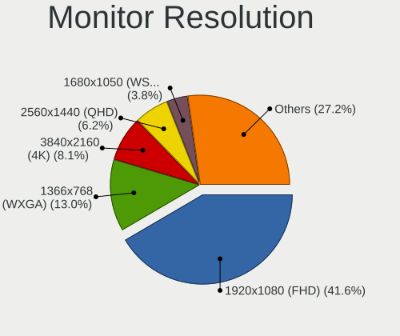

| Resolution         | Computers | Percent |
|--------------------|-----------|---------|
| 1920x1080 (FHD)    | 4419      | 41.57%  |
| 1366x768 (WXGA)    | 1383      | 13.01%  |
| 3840x2160 (4K)     | 866       | 8.15%   |
| 2560x1440 (QHD)    | 664       | 6.25%   |
| 1680x1050 (WSXGA+) | 404       | 3.8%    |
| 1600x900 (HD+)     | 391       | 3.68%   |
| 1920x1200 (WUXGA)  | 351       | 3.3%    |
| 1280x1024 (SXGA)   | 255       | 2.4%    |
| 1440x900 (WXGA+)   | 219       | 2.06%   |
| 1280x800 (WXGA)    | 219       | 2.06%   |
| Unknown            | 161       | 1.51%   |
| 3440x1440          | 136       | 1.28%   |
| 2560x1600          | 129       | 1.21%   |
| 2880x1800          | 102       | 0.96%   |
| 2560x1080          | 89        | 0.84%   |
| 800x1280           | 86        | 0.81%   |
| 1360x768           | 85        | 0.8%    |
| 3840x1080          | 74        | 0.7%    |
| 1920x540           | 67        | 0.63%   |
| 2880x1920          | 39        | 0.37%   |
| 2256x1504          | 37        | 0.35%   |
| 3840x2400          | 35        | 0.33%   |
| 1600x1200          | 35        | 0.33%   |
| 1024x768 (XGA)     | 28        | 0.26%   |
| 2288x1287          | 26        | 0.24%   |
| 3200x1800 (QHD+)   | 21        | 0.2%    |
| 2160x1440          | 21        | 0.2%    |
| 1280x720 (HD)      | 16        | 0.15%   |
| 1024x600           | 16        | 0.15%   |
| 1920x1280          | 14        | 0.13%   |
| 3200x2000          | 12        | 0.11%   |
| 3600x1080          | 10        | 0.09%   |
| 3072x1920          | 9         | 0.08%   |
| 2048x1152          | 9         | 0.08%   |
| 3840x1200          | 8         | 0.08%   |
| 2736x1824          | 8         | 0.08%   |
| 2400x1600          | 8         | 0.08%   |
| 5760x1080          | 7         | 0.07%   |
| 3456x2160          | 7         | 0.07%   |
| 2560x2880          | 7         | 0.07%   |

Monitor Diagonal
----------------

Diagonal size in inches

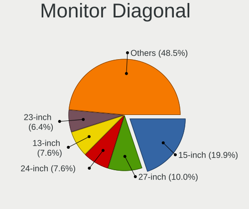

| Inches  | Computers | Percent |
|---------|-----------|---------|
| 15      | 2196      | 19.87%  |
| 27      | 1102      | 9.97%   |
| 24      | 840       | 7.6%    |
| 13      | 840       | 7.6%    |
| 23      | 711       | 6.43%   |
| 14      | 698       | 6.32%   |
| 21      | 599       | 5.42%   |
| Unknown | 527       | 4.77%   |
| 17      | 489       | 4.42%   |
| 31      | 488       | 4.42%   |
| 19      | 278       | 2.52%   |
| 20      | 256       | 2.32%   |
| 22      | 234       | 2.12%   |
| 34      | 192       | 1.74%   |
| 16      | 152       | 1.38%   |
| 84      | 141       | 1.28%   |
| 12      | 134       | 1.21%   |
| 18      | 109       | 0.99%   |
| 11      | 107       | 0.97%   |
| 7       | 94        | 0.85%   |
| 72      | 92        | 0.83%   |
| 32      | 80        | 0.72%   |
| 40      | 60        | 0.54%   |
| 54      | 59        | 0.53%   |
| 74      | 51        | 0.46%   |
| 26      | 48        | 0.43%   |
| 25      | 39        | 0.35%   |
| 10      | 29        | 0.26%   |
| 48      | 26        | 0.24%   |
| 28      | 26        | 0.24%   |
| 29      | 25        | 0.23%   |
| 37      | 24        | 0.22%   |
| 36      | 24        | 0.22%   |
| 65      | 23        | 0.21%   |
| 142     | 22        | 0.2%    |
| 49      | 19        | 0.17%   |
| 42      | 17        | 0.15%   |
| 46      | 16        | 0.14%   |
| 52      | 15        | 0.14%   |
| 43      | 15        | 0.14%   |

Monitor Width
-------------

Physical width

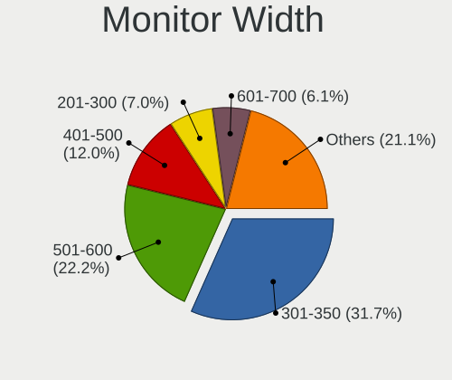

| Width in mm    | Computers | Percent |
|----------------|-----------|---------|
| 301-350        | 3409      | 31.66%  |
| 501-600        | 2387      | 22.17%  |
| 401-500        | 1289      | 11.97%  |
| 201-300        | 758       | 7.04%   |
| 601-700        | 653       | 6.07%   |
| 351-400        | 626       | 5.81%   |
| Unknown        | 527       | 4.9%    |
| 1501-2000      | 307       | 2.85%   |
| 701-800        | 299       | 2.78%   |
| 1001-1500      | 226       | 2.1%    |
| 801-900        | 116       | 1.08%   |
| 1-100          | 87        | 0.81%   |
| 901-1000       | 44        | 0.41%   |
| More than 2000 | 22        | 0.2%    |
| 101-200        | 16        | 0.15%   |

Aspect Ratio
------------

Proportional relationship between the width and the height

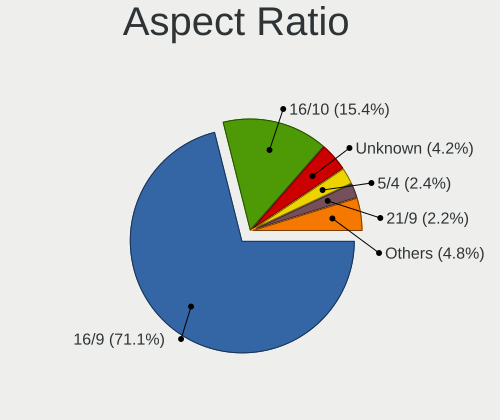

| Ratio   | Computers | Percent |
|---------|-----------|---------|
| 16/9    | 6985      | 71.08%  |
| 16/10   | 1510      | 15.37%  |
| Unknown | 408       | 4.15%   |
| 5/4     | 240       | 2.44%   |
| 21/9    | 212       | 2.16%   |
| 3/2     | 170       | 1.73%   |
| 4/3     | 78        | 0.79%   |
| 0.67    | 70        | 0.71%   |
| 32/9    | 48        | 0.49%   |
| 1.00    | 24        | 0.24%   |
| 6/5     | 20        | 0.2%    |
| 0.62    | 17        | 0.17%   |
| 1.96    | 11        | 0.11%   |
| 0.56    | 11        | 0.11%   |
| 0.89    | 7         | 0.07%   |
| 3.40    | 4         | 0.04%   |
| 3.73    | 1         | 0.01%   |
| 3.33    | 1         | 0.01%   |
| 3.20    | 1         | 0.01%   |
| 2.69    | 1         | 0.01%   |
| 2.64    | 1         | 0.01%   |
| 2.00    | 1         | 0.01%   |
| 11/10   | 1         | 0.01%   |
| 0.80    | 1         | 0.01%   |
| 0.75    | 1         | 0.01%   |
| 0.63    | 1         | 0.01%   |
| 0.58    | 1         | 0.01%   |
| 0.45    | 1         | 0.01%   |

Monitor Area
------------

Area in inch²

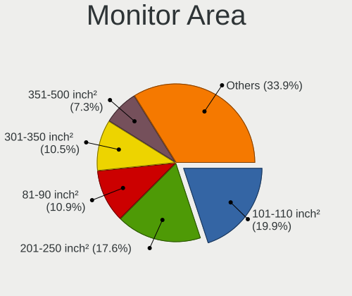

| Area in inch² | Computers | Percent |
|----------------|-----------|---------|
| 101-110        | 2164      | 19.93%  |
| 201-250        | 1908      | 17.57%  |
| 81-90          | 1182      | 10.88%  |
| 301-350        | 1138      | 10.48%  |
| 351-500        | 789       | 7.27%   |
| 151-200        | 670       | 6.17%   |
| Unknown        | 527       | 4.85%   |
| More than 1000 | 495       | 4.56%   |
| 121-130        | 339       | 3.12%   |
| 71-80          | 327       | 3.01%   |
| 251-300        | 275       | 2.53%   |
| 501-1000       | 234       | 2.15%   |
| 141-150        | 189       | 1.74%   |
| 111-120        | 176       | 1.62%   |
| 61-70          | 127       | 1.17%   |
| 51-60          | 116       | 1.07%   |
| 1-40           | 103       | 0.95%   |
| 131-140        | 48        | 0.44%   |
| 91-100         | 28        | 0.26%   |
| 41-50          | 24        | 0.22%   |

Pixel Density
-------------

Pixels per inch

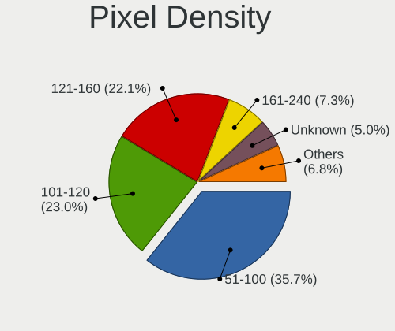

| Density       | Computers | Percent |
|---------------|-----------|---------|
| 51-100        | 3733      | 35.7%   |
| 101-120       | 2404      | 22.99%  |
| 121-160       | 2315      | 22.14%  |
| 161-240       | 763       | 7.3%    |
| Unknown       | 528       | 5.05%   |
| 1-50          | 422       | 4.04%   |
| More than 240 | 292       | 2.79%   |

Multiple Monitors
-----------------

Total monitors connected

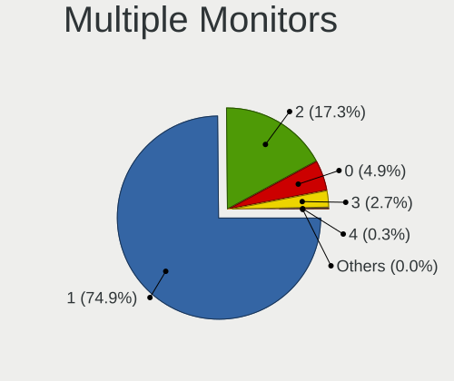

| Total | Computers | Percent |
|-------|-----------|---------|
| 1     | 7605      | 74.85%  |
| 2     | 1754      | 17.26%  |
| 0     | 493       | 4.85%   |
| 3     | 275       | 2.71%   |
| 4     | 28        | 0.28%   |
| 5     | 4         | 0.04%   |
| 6     | 1         | 0.01%   |

Network
-------

Net Controller Vendor
---------------------

Controller vendors

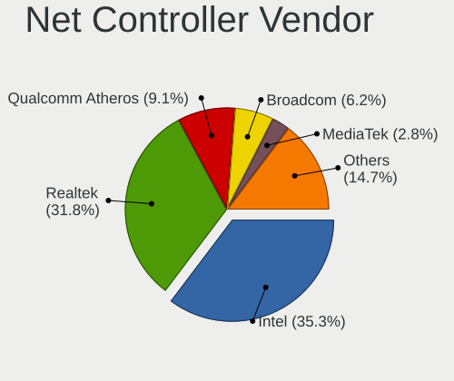

| Vendor                          | Computers | Percent |
|---------------------------------|-----------|---------|
| Intel                           | 5280      | 35.3%   |
| Realtek Semiconductor           | 4763      | 31.84%  |
| Qualcomm Atheros                | 1366      | 9.13%   |
| Broadcom                        | 925       | 6.18%   |
| MediaTek                        | 423       | 2.83%   |
| Broadcom Limited                | 223       | 1.49%   |
| Marvell Technology Group        | 203       | 1.36%   |
| TP-Link                         | 156       | 1.04%   |
| ASIX Electronics                | 153       | 1.02%   |
| Ralink                          | 145       | 0.97%   |
| Nvidia                          | 139       | 0.93%   |
| Ralink Technology               | 114       | 0.76%   |
| D-Link                          | 105       | 0.7%    |
| Samsung Electronics             | 74        | 0.49%   |
| DisplayLink                     | 61        | 0.41%   |
| Linksys                         | 60        | 0.4%    |
| ASUSTek Computer                | 57        | 0.38%   |
| Microsoft                       | 54        | 0.36%   |
| Aquantia                        | 50        | 0.33%   |
| Shenzhen Goodix Technology      | 48        | 0.32%   |
| D-Link System                   | 47        | 0.31%   |
| Qualcomm                        | 38        | 0.25%   |
| NetGear                         | 36        | 0.24%   |
| Qualcomm Atheros Communications | 33        | 0.22%   |
| Lenovo                          | 28        | 0.19%   |
| Google                          | 28        | 0.19%   |
| Qualcomm Technologies           | 23        | 0.15%   |
| Sierra Wireless                 | 21        | 0.14%   |
| Apple                           | 17        | 0.11%   |
| Mellanox Technologies           | 14        | 0.09%   |
| Dell                            | 13        | 0.09%   |
| Belkin Components               | 13        | 0.09%   |
| Microchip Technology            | 9         | 0.06%   |
| Edimax Technology               | 9         | 0.06%   |
| Raspberry Pi                    | 8         | 0.05%   |
| Motorola PCS                    | 8         | 0.05%   |
| Micro Star International        | 8         | 0.05%   |
| Hewlett-Packard                 | 8         | 0.05%   |
| American Megatrends             | 8         | 0.05%   |
| VIA Technologies                | 7         | 0.05%   |

Net Controller Model
--------------------

Controller models

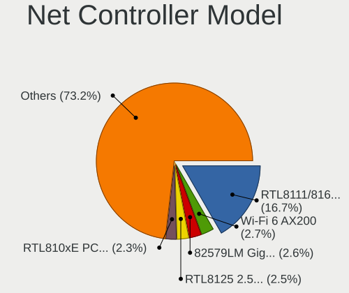

| Model                                                                  | Computers | Percent |
|------------------------------------------------------------------------|-----------|---------|
| Realtek RTL8111/8168/8211/8411 PCI Express Gigabit Ethernet Controller | 2965      | 16.69%  |
| Intel Wi-Fi 6 AX200                                                    | 480       | 2.7%    |
| Intel 82579LM Gigabit Network Connection (Lewisville)                  | 464       | 2.61%   |
| Realtek RTL8125 2.5GbE Controller                                      | 453       | 2.55%   |
| Realtek RTL810xE PCI Express Fast Ethernet controller                  | 406       | 2.29%   |
| Intel Wireless 8265 / 8275                                             | 334       | 1.88%   |
| Realtek RTL8153 Gigabit Ethernet Adapter                               | 282       | 1.59%   |
| Intel I211 Gigabit Network Connection                                  | 269       | 1.51%   |
| Intel Wireless 7265                                                    | 226       | 1.27%   |
| Qualcomm Atheros QCA9377 802.11ac Wireless Network Adapter             | 208       | 1.17%   |
| Intel Wireless 7260                                                    | 207       | 1.17%   |
| Realtek RTL8822CE 802.11ac PCIe Wireless Network Adapter               | 202       | 1.14%   |
| Intel Ethernet Controller I225-V                                       | 196       | 1.1%    |
| Intel Wi-Fi 6E(802.11ax) AX210/AX1675* 2x2 [Typhoon Peak]              | 193       | 1.09%   |
| Intel Ethernet Connection I217-LM                                      | 174       | 0.98%   |
| Intel Dual Band Wireless-AC 3168NGW [Stone Peak]                       | 172       | 0.97%   |
| MediaTek MT7922 802.11ax PCI Express Wireless Network Adapter          | 171       | 0.96%   |
| Intel Wireless 8260                                                    | 169       | 0.95%   |
| Intel Ethernet Connection (2) I219-V                                   | 158       | 0.89%   |
| Intel Cannon Lake PCH CNVi WiFi                                        | 148       | 0.83%   |
| Intel Wi-Fi 6 AX201                                                    | 143       | 0.8%    |
| Intel Centrino Advanced-N 6205 [Taylor Peak]                           | 140       | 0.79%   |
| Qualcomm Atheros AR9485 Wireless Network Adapter                       | 137       | 0.77%   |
| Qualcomm Atheros QCA6174 802.11ac Wireless Network Adapter             | 134       | 0.75%   |
| ASIX AX88179 Gigabit Ethernet                                          | 134       | 0.75%   |
| Intel Alder Lake-P PCH CNVi WiFi                                       | 133       | 0.75%   |
| Intel Comet Lake PCH CNVi WiFi                                         | 129       | 0.73%   |
| Qualcomm Atheros QCA9565 / AR9565 Wireless Network Adapter             | 127       | 0.71%   |
| Qualcomm Atheros AR9285 Wireless Network Adapter (PCI-Express)         | 117       | 0.66%   |
| Intel Ethernet Connection (4) I219-LM                                  | 112       | 0.63%   |
| Intel Wi-Fi 5(802.11ac) Wireless-AC 9x6x [Thunder Peak]                | 111       | 0.62%   |
| Realtek RTL8821CE 802.11ac PCIe Wireless Network Adapter               | 109       | 0.61%   |
| Intel Ethernet Connection (2) I219-LM                                  | 102       | 0.57%   |
| MediaTek MT7921 802.11ax PCIe Wireless Network Adapter [Filogic 330]   | 99        | 0.56%   |
| Intel Ethernet Connection (7) I219-V                                   | 98        | 0.55%   |
| Realtek 802.11ac NIC                                                   | 94        | 0.53%   |
| Qualcomm Atheros AR9462 Wireless Network Adapter                       | 93        | 0.52%   |
| Intel 82579V Gigabit Network Connection                                | 92        | 0.52%   |
| Intel Wireless 3165                                                    | 88        | 0.5%    |
| Realtek RTL8822BE 802.11a/b/g/n/ac WiFi adapter                        | 85        | 0.48%   |

Wireless Vendor
---------------

Wireless vendors

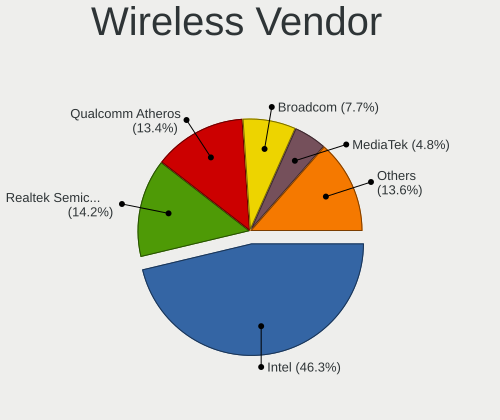

| Vendor                                | Computers | Percent |
|---------------------------------------|-----------|---------|
| Intel                                 | 3708      | 46.28%  |
| Realtek Semiconductor                 | 1140      | 14.23%  |
| Qualcomm Atheros                      | 1076      | 13.43%  |
| Broadcom                              | 618       | 7.71%   |
| MediaTek                              | 384       | 4.79%   |
| Broadcom Limited                      | 148       | 1.85%   |
| Ralink                                | 145       | 1.81%   |
| TP-Link                               | 144       | 1.8%    |
| Ralink Technology                     | 114       | 1.42%   |
| D-Link                                | 102       | 1.27%   |
| Linksys                               | 58        | 0.72%   |
| ASUSTek Computer                      | 57        | 0.71%   |
| Marvell Technology Group              | 47        | 0.59%   |
| Microsoft                             | 41        | 0.51%   |
| NetGear                               | 36        | 0.45%   |
| Qualcomm                              | 34        | 0.42%   |
| Qualcomm Atheros Communications       | 33        | 0.41%   |
| D-Link System                         | 33        | 0.41%   |
| Sierra Wireless                       | 21        | 0.26%   |
| Belkin Components                     | 11        | 0.14%   |
| Qualcomm Technologies                 | 10        | 0.12%   |
| Edimax Technology                     | 9         | 0.11%   |
| Micro Star International              | 8         | 0.1%    |
| 802.11g Adapter [Linksys WUSB54GC v3] | 7         | 0.09%   |
| Gemtek                                | 6         | 0.07%   |
| Dell                                  | 5         | 0.06%   |
| ZyDAS                                 | 4         | 0.05%   |
| TRENDnet                              | 2         | 0.02%   |
| Realtek                               | 2         | 0.02%   |
| Wilocity                              | 1         | 0.01%   |
| Wacom                                 | 1         | 0.01%   |
| Senao                                 | 1         | 0.01%   |
| Samsung Electronics                   | 1         | 0.01%   |
| Panasonic (Matsushita)                | 1         | 0.01%   |
| Cypress Semiconductor                 | 1         | 0.01%   |
| BUFFALO                               | 1         | 0.01%   |
| Belkin                                | 1         | 0.01%   |
| Accton Technology                     | 1         | 0.01%   |

Wireless Model
--------------

Wireless models

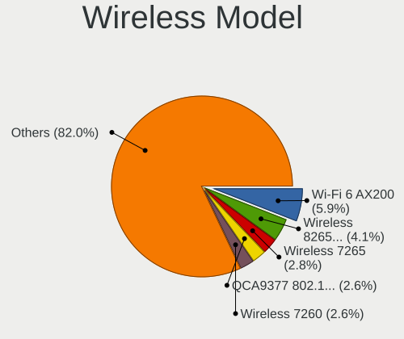

| Model                                                                | Computers | Percent |
|----------------------------------------------------------------------|-----------|---------|
| Intel Wi-Fi 6 AX200                                                  | 480       | 5.93%   |
| Intel Wireless 8265 / 8275                                           | 334       | 4.13%   |
| Intel Wireless 7265                                                  | 226       | 2.79%   |
| Qualcomm Atheros QCA9377 802.11ac Wireless Network Adapter           | 208       | 2.57%   |
| Intel Wireless 7260                                                  | 207       | 2.56%   |
| Realtek RTL8822CE 802.11ac PCIe Wireless Network Adapter             | 202       | 2.5%    |
| Intel Wi-Fi 6E(802.11ax) AX210/AX1675* 2x2 [Typhoon Peak]            | 193       | 2.38%   |
| Intel Dual Band Wireless-AC 3168NGW [Stone Peak]                     | 172       | 2.13%   |
| Intel Wireless 8260                                                  | 169       | 2.09%   |
| MediaTek MT7922 802.11ax PCI Express Wireless Network Adapter        | 149       | 1.84%   |
| Intel Cannon Lake PCH CNVi WiFi                                      | 148       | 1.83%   |
| Intel Wi-Fi 6 AX201                                                  | 143       | 1.77%   |
| Intel Centrino Advanced-N 6205 [Taylor Peak]                         | 140       | 1.73%   |
| Qualcomm Atheros AR9485 Wireless Network Adapter                     | 137       | 1.69%   |
| Qualcomm Atheros QCA6174 802.11ac Wireless Network Adapter           | 134       | 1.66%   |
| Intel Comet Lake PCH CNVi WiFi                                       | 129       | 1.59%   |
| Qualcomm Atheros QCA9565 / AR9565 Wireless Network Adapter           | 127       | 1.57%   |
| Qualcomm Atheros AR9285 Wireless Network Adapter (PCI-Express)       | 117       | 1.45%   |
| Intel Wi-Fi 5(802.11ac) Wireless-AC 9x6x [Thunder Peak]              | 111       | 1.37%   |
| Realtek RTL8821CE 802.11ac PCIe Wireless Network Adapter             | 109       | 1.35%   |
| MediaTek MT7921 802.11ax PCIe Wireless Network Adapter [Filogic 330] | 99        | 1.22%   |
| Realtek 802.11ac NIC                                                 | 94        | 1.16%   |
| Qualcomm Atheros AR9462 Wireless Network Adapter                     | 93        | 1.15%   |
| Intel Wireless 3165                                                  | 88        | 1.09%   |
| Realtek RTL8822BE 802.11a/b/g/n/ac WiFi adapter                      | 85        | 1.05%   |
| Intel Alder Lake-P PCH CNVi WiFi                                     | 84        | 1.04%   |
| Intel 700 Series Chipset CNVi WiFi                                   | 84        | 1.04%   |
| Intel Cannon Point-LP CNVi [Wireless-AC]                             | 81        | 1%      |
| Qualcomm Atheros AR928X Wireless Network Adapter (PCI-Express)       | 80        | 0.99%   |
| Broadcom BCM4360 802.11ac Dual Band Wireless Network Adapter         | 80        | 0.99%   |
| Intel Comet Lake PCH-LP CNVi WiFi                                    | 74        | 0.91%   |
| Broadcom BCM4313 802.11bgn Wireless Network Adapter                  | 74        | 0.91%   |
| Realtek RTL88x2bu [AC1200 Techkey]                                   | 73        | 0.9%    |
| Realtek RTL8852BE PCIe 802.11ax Wireless Network Controller          | 70        | 0.86%   |
| Intel Raptor Lake PCH CNVi WiFi                                      | 65        | 0.8%    |
| Intel Ice Lake-LP PCH CNVi WiFi                                      | 65        | 0.8%    |
| Intel Centrino Ultimate-N 6300                                       | 65        | 0.8%    |
| Broadcom BCM4331 802.11a/b/g/n                                       | 65        | 0.8%    |
| Realtek RTL8821AE 802.11ac PCIe Wireless Network Adapter             | 63        | 0.78%   |
| Broadcom BCM4322 802.11a/b/g/n Wireless LAN Controller               | 61        | 0.75%   |

Ethernet Vendor
---------------

Ethernet vendors

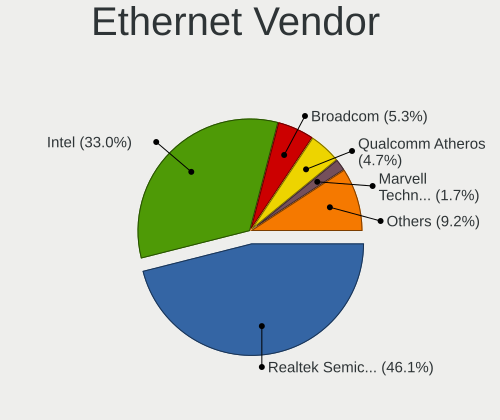

| Vendor                           | Computers | Percent |
|----------------------------------|-----------|---------|
| Realtek Semiconductor            | 4219      | 46.06%  |
| Intel                            | 3023      | 33%     |
| Broadcom                         | 488       | 5.33%   |
| Qualcomm Atheros                 | 431       | 4.71%   |
| Marvell Technology Group         | 157       | 1.71%   |
| ASIX Electronics                 | 153       | 1.67%   |
| Nvidia                           | 138       | 1.51%   |
| Broadcom Limited                 | 81        | 0.88%   |
| Samsung Electronics              | 73        | 0.8%    |
| DisplayLink                      | 61        | 0.67%   |
| Aquantia                         | 50        | 0.55%   |
| MediaTek                         | 35        | 0.38%   |
| Lenovo                           | 26        | 0.28%   |
| Google                           | 26        | 0.28%   |
| Apple                            | 16        | 0.17%   |
| TP-Link                          | 14        | 0.15%   |
| D-Link System                    | 14        | 0.15%   |
| Qualcomm Technologies            | 13        | 0.14%   |
| Mellanox Technologies            | 13        | 0.14%   |
| Motorola PCS                     | 8         | 0.09%   |
| Microsoft                        | 8         | 0.09%   |
| Hewlett-Packard                  | 8         | 0.09%   |
| American Megatrends              | 8         | 0.09%   |
| VIA Technologies                 | 7         | 0.08%   |
| Raspberry Pi                     | 6         | 0.07%   |
| Microchip Technology             | 6         | 0.07%   |
| Dell                             | 6         | 0.07%   |
| LG Electronics                   | 5         | 0.05%   |
| D-Link                           | 5         | 0.05%   |
| Solarflare Communications        | 4         | 0.04%   |
| Qualcomm                         | 4         | 0.04%   |
| JMicron Technology               | 4         | 0.04%   |
| 3Com                             | 4         | 0.04%   |
| Xiaomi                           | 3         | 0.03%   |
| Silicon Integrated Systems [SiS] | 3         | 0.03%   |
| Research In Motion               | 3         | 0.03%   |
| OPPO Electronics                 | 3         | 0.03%   |
| ICS Advent                       | 3         | 0.03%   |
| Chelsio Communications           | 3         | 0.03%   |
| NetXen Incorporated              | 2         | 0.02%   |

Ethernet Model
--------------

Ethernet models

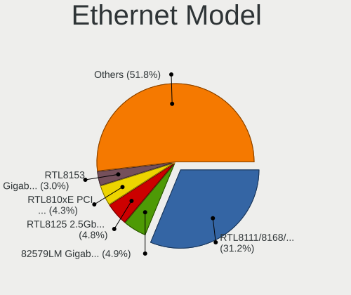

| Model                                                                  | Computers | Percent |
|------------------------------------------------------------------------|-----------|---------|
| Realtek RTL8111/8168/8211/8411 PCI Express Gigabit Ethernet Controller | 2965      | 31.25%  |
| Intel 82579LM Gigabit Network Connection (Lewisville)                  | 464       | 4.89%   |
| Realtek RTL8125 2.5GbE Controller                                      | 453       | 4.77%   |
| Realtek RTL810xE PCI Express Fast Ethernet controller                  | 406       | 4.28%   |
| Realtek RTL8153 Gigabit Ethernet Adapter                               | 282       | 2.97%   |
| Intel I211 Gigabit Network Connection                                  | 269       | 2.83%   |
| Intel Ethernet Controller I225-V                                       | 196       | 2.07%   |
| Intel Ethernet Connection I217-LM                                      | 174       | 1.83%   |
| Intel Ethernet Connection (2) I219-V                                   | 158       | 1.67%   |
| ASIX AX88179 Gigabit Ethernet                                          | 134       | 1.41%   |
| Intel Ethernet Connection (4) I219-LM                                  | 112       | 1.18%   |
| Intel Ethernet Connection (2) I219-LM                                  | 102       | 1.07%   |
| Intel Ethernet Connection (7) I219-V                                   | 98        | 1.03%   |
| Intel 82579V Gigabit Network Connection                                | 92        | 0.97%   |
| Broadcom NetXtreme BCM57765 Gigabit Ethernet PCIe                      | 83        | 0.87%   |
| Intel 82574L Gigabit Network Connection                                | 71        | 0.75%   |
| Intel 82577LM Gigabit Network Connection                               | 70        | 0.74%   |
| Qualcomm Atheros Killer E220x Gigabit Ethernet Controller              | 67        | 0.71%   |
| Broadcom NetXtreme BCM5764M Gigabit Ethernet PCIe                      | 67        | 0.71%   |
| Intel Ethernet Connection I219-LM                                      | 66        | 0.7%    |
| Intel 82567LM-3 Gigabit Network Connection                             | 63        | 0.66%   |
| Intel Ethernet Connection I218-LM                                      | 61        | 0.64%   |
| Intel Ethernet Connection I217-V                                       | 61        | 0.64%   |
| Intel I210 Gigabit Network Connection                                  | 60        | 0.63%   |
| Broadcom NetXtreme BCM57766 Gigabit Ethernet PCIe                      | 58        | 0.61%   |
| Intel Ethernet Connection (2) I218-V                                   | 57        | 0.6%    |
| Intel Ethernet Controller I226-V                                       | 51        | 0.54%   |
| Intel Ethernet Connection (4) I219-V                                   | 51        | 0.54%   |
| Intel Alder Lake-P PCH CNVi WiFi                                       | 50        | 0.53%   |
| Realtek Killer E2600 GbE Controller                                    | 48        | 0.51%   |
| Qualcomm Atheros AR8151 v2.0 Gigabit Ethernet                          | 48        | 0.51%   |
| Intel Ethernet Connection (3) I218-LM                                  | 47        | 0.5%    |
| Nvidia MCP79 Ethernet                                                  | 46        | 0.48%   |
| Samsung Galaxy series, misc. (tethering mode)                          | 44        | 0.46%   |
| Qualcomm Atheros Killer E2500 Gigabit Ethernet Controller              | 42        | 0.44%   |
| Marvell Group 88E8058 PCI-E Gigabit Ethernet Controller                | 42        | 0.44%   |
| Intel Ethernet Connection (7) I219-LM                                  | 42        | 0.44%   |
| Realtek Killer E3000 2.5GbE Controller                                 | 40        | 0.42%   |
| Qualcomm Atheros AR8161 Gigabit Ethernet                               | 40        | 0.42%   |
| Qualcomm Atheros Killer E2400 Gigabit Ethernet Controller              | 39        | 0.41%   |

Net Controller Kind
-------------------

Ethernet, WiFi or modem

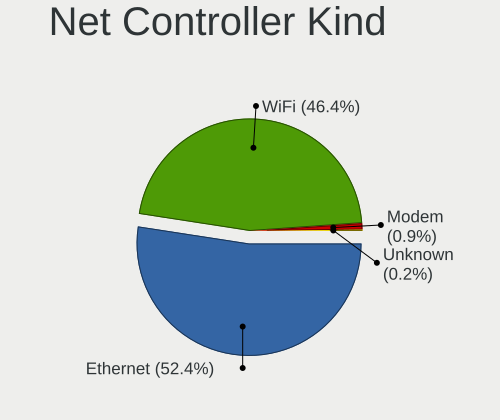

| Kind     | Computers | Percent |
|----------|-----------|---------|
| Ethernet | 8449      | 52.43%  |
| WiFi     | 7484      | 46.44%  |
| Modem    | 149       | 0.92%   |
| Unknown  | 32        | 0.2%    |

Used Controller
---------------

Currently used network controller

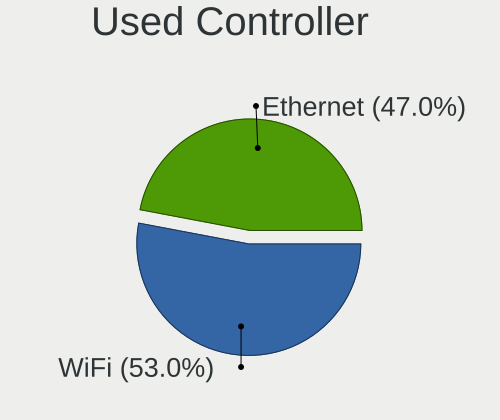

| Kind     | Computers | Percent |
|----------|-----------|---------|
| WiFi     | 5464      | 52.98%  |
| Ethernet | 4850      | 47.02%  |

NICs
----

Total network controllers on board

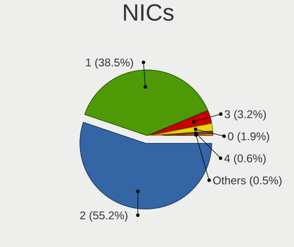

| Total | Computers | Percent |
|-------|-----------|---------|
| 2     | 5485      | 55.19%  |
| 1     | 3831      | 38.55%  |
| 3     | 316       | 3.18%   |
| 0     | 192       | 1.93%   |
| 4     | 61        | 0.61%   |
| 5     | 24        | 0.24%   |
| 6     | 16        | 0.16%   |
| 8     | 4         | 0.04%   |
| 7     | 3         | 0.03%   |
| 22    | 2         | 0.02%   |
| 12    | 2         | 0.02%   |
| 21    | 1         | 0.01%   |
| 17    | 1         | 0.01%   |
| 10    | 1         | 0.01%   |

IPv6
----

IPv6 vs IPv4

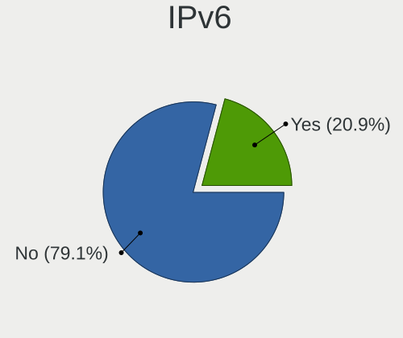

| Used | Computers | Percent |
|------|-----------|---------|
| No   | 7940      | 79.11%  |
| Yes  | 2097      | 20.89%  |

Bluetooth
---------

Bluetooth Vendor
----------------

Controller vendors

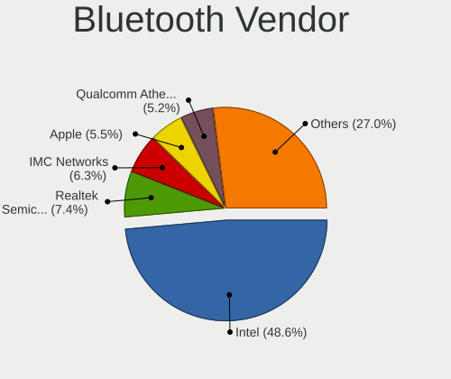

| Vendor                          | Computers | Percent |
|---------------------------------|-----------|---------|
| Intel                           | 3116      | 48.58%  |
| Realtek Semiconductor           | 475       | 7.41%   |
| IMC Networks                    | 404       | 6.3%    |
| Apple                           | 352       | 5.49%   |
| Qualcomm Atheros Communications | 336       | 5.24%   |
| Broadcom                        | 332       | 5.18%   |
| Cambridge Silicon Radio         | 266       | 4.15%   |
| Foxconn / Hon Hai               | 253       | 3.94%   |
| Lite-On Technology              | 210       | 3.27%   |
| MediaTek                        | 146       | 2.28%   |
| ASUSTek Computer                | 144       | 2.25%   |
| Dell                            | 58        | 0.9%    |
| TP-Link                         | 56        | 0.87%   |
| Hewlett-Packard                 | 46        | 0.72%   |
| Marvell Semiconductor           | 44        | 0.69%   |
| Toshiba                         | 23        | 0.36%   |
| Realtek                         | 23        | 0.36%   |
| Ralink                          | 22        | 0.34%   |
| Dynex                           | 20        | 0.31%   |
| Alps Electric                   | 13        | 0.2%    |
| Actions                         | 12        | 0.19%   |
| USI                             | 9         | 0.14%   |
| Micro Star International        | 6         | 0.09%   |
| Logitech                        | 5         | 0.08%   |
| Edimax Technology               | 5         | 0.08%   |
| Unknown                         | 5         | 0.08%   |
| Ralink Technology               | 4         | 0.06%   |
| Primax Electronics              | 4         | 0.06%   |
| Integrated System Solution      | 4         | 0.06%   |
| Taiyo Yuden                     | 3         | 0.05%   |
| SINO WEALTH                     | 3         | 0.05%   |
| Foxconn International           | 2         | 0.03%   |
| Askey Computer                  | 2         | 0.03%   |
| AICSemi                         | 2         | 0.03%   |
| Zeevo                           | 1         | 0.02%   |
| SiW                             | 1         | 0.02%   |
| Qcom                            | 1         | 0.02%   |
| Nintendo                        | 1         | 0.02%   |
| Kensington                      | 1         | 0.02%   |
| HTC (High Tech Computer)        | 1         | 0.02%   |

Bluetooth Model
---------------

Controller models

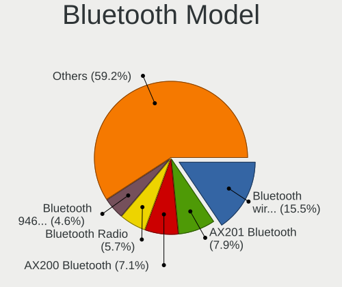

| Model                                               | Computers | Percent |
|-----------------------------------------------------|-----------|---------|
| Intel Bluetooth wireless interface                  | 999       | 15.54%  |
| Intel AX201 Bluetooth                               | 508       | 7.9%    |
| Intel AX200 Bluetooth                               | 455       | 7.08%   |
| Realtek Bluetooth Radio                             | 365       | 5.68%   |
| Intel Bluetooth 9460/9560 Jefferson Peak (JfP)      | 297       | 4.62%   |
| Intel Bluetooth Device                              | 282       | 4.39%   |
| Cambridge Silicon Radio Bluetooth Dongle (HCI mode) | 266       | 4.14%   |
| IMC Networks Bluetooth Radio                        | 199       | 3.1%    |
| Intel AX210 Bluetooth                               | 177       | 2.75%   |
| Intel Wireless-AC 3168 Bluetooth                    | 170       | 2.65%   |
| Qualcomm Atheros  Bluetooth Device                  | 169       | 2.63%   |
| Apple Bluetooth Host Controller                     | 166       | 2.58%   |
| MediaTek Wireless_Device                            | 146       | 2.27%   |
| IMC Networks Wireless_Device                        | 119       | 1.85%   |
| Intel Wireless-AC 9260 Bluetooth Adapter            | 107       | 1.66%   |
| Intel Centrino Bluetooth Wireless Transceiver       | 98        | 1.52%   |
| Foxconn / Hon Hai Bluetooth Device                  | 90        | 1.4%    |
| Broadcom BCM20702A0 Bluetooth 4.0                   | 89        | 1.38%   |
| Foxconn / Hon Hai Wireless_Device                   | 85        | 1.32%   |
| Lite-On Qualcomm Atheros QCA9377 Bluetooth          | 84        | 1.31%   |
| Apple Bluetooth USB Host Controller                 | 81        | 1.26%   |
| Realtek  Bluetooth 4.2 Adapter                      | 61        | 0.95%   |
| TP-Link TP-T@- UB500 Adapter                        | 56        | 0.87%   |
| Apple Built-in Bluetooth 2.0+EDR HCI                | 53        | 0.82%   |
| Broadcom BCM2045B (BDC-2.1)                         | 51        | 0.79%   |
| Apple Bluetooth HCI                                 | 47        | 0.73%   |
| Qualcomm Atheros QCA61x4 Bluetooth 4.0              | 46        | 0.72%   |
| Lite-On Atheros AR3012 Bluetooth                    | 46        | 0.72%   |
| Qualcomm Atheros AR3011 Bluetooth                   | 41        | 0.64%   |
| ASUS Broadcom BCM20702A0 Bluetooth                  | 41        | 0.64%   |
| Lite-On Bluetooth Device                            | 37        | 0.58%   |
| Broadcom BCM20702 Bluetooth 4.0 [ThinkPad]          | 37        | 0.58%   |
| IMC Networks Bluetooth Device                       | 35        | 0.54%   |
| Marvell Bluetooth and Wireless LAN Composite        | 34        | 0.53%   |
| Qualcomm Atheros AR3012 Bluetooth 4.0               | 31        | 0.48%   |
| Intel Centrino Advanced-N 6230 Bluetooth adapter    | 31        | 0.48%   |
| ASUS ASUS USB-BT500                                 | 29        | 0.45%   |
| HP Broadcom 2070 Bluetooth Combo                    | 25        | 0.39%   |
| Realtek Bluetooth Radio                             | 23        | 0.36%   |
| Dell DW375 Bluetooth Module                         | 23        | 0.36%   |

Sound
-----

Sound Vendor
------------

Sound card vendors

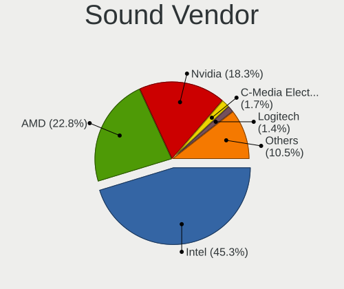

| Vendor                               | Computers | Percent |
|--------------------------------------|-----------|---------|
| Intel                                | 6639      | 45.29%  |
| AMD                                  | 3344      | 22.81%  |
| Nvidia                               | 2676      | 18.26%  |
| C-Media Electronics                  | 254       | 1.73%   |
| Logitech                             | 200       | 1.36%   |
| Creative Labs                        | 102       | 0.7%    |
| ASUSTek Computer                     | 68        | 0.46%   |
| Corsair                              | 64        | 0.44%   |
| Razer USA                            | 60        | 0.41%   |
| SteelSeries ApS                      | 58        | 0.4%    |
| Realtek Semiconductor                | 58        | 0.4%    |
| JMTek                                | 58        | 0.4%    |
| Focusrite-Novation                   | 56        | 0.38%   |
| Texas Instruments                    | 53        | 0.36%   |
| Kingston Technology                  | 44        | 0.3%    |
| Micro Star International             | 43        | 0.29%   |
| Creative Technology                  | 43        | 0.29%   |
| Blue Microphones                     | 42        | 0.29%   |
| Hewlett-Packard                      | 36        | 0.25%   |
| GN Netcom                            | 33        | 0.23%   |
| Sony                                 | 32        | 0.22%   |
| Generalplus Technology               | 32        | 0.22%   |
| Lenovo                               | 30        | 0.2%    |
| Plantronics                          | 29        | 0.2%    |
| Apple                                | 28        | 0.19%   |
| KTMicro                              | 21        | 0.14%   |
| VIA Technologies                     | 20        | 0.14%   |
| Samson Technologies                  | 20        | 0.14%   |
| GYROCOM C&C                          | 19        | 0.13%   |
| Thesycon Systemsoftware & Consulting | 17        | 0.12%   |
| Jieli Technology                     | 17        | 0.12%   |
| BEHRINGER International              | 15        | 0.1%    |
| Audio-Technica                       | 15        | 0.1%    |
| M-Audio                              | 13        | 0.09%   |
| Astro Gaming                         | 12        | 0.08%   |
| Yamaha                               | 11        | 0.08%   |
| XMOS                                 | 11        | 0.08%   |
| FiiO Electronics Technology          | 11        | 0.08%   |
| DSEA A/S                             | 11        | 0.08%   |
| Dell                                 | 11        | 0.08%   |

Sound Model
-----------

Sound card models

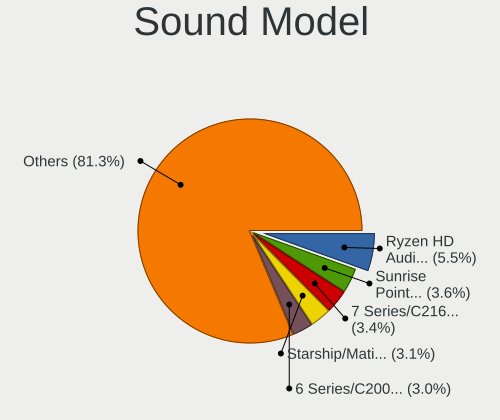

| Model                                                                      | Computers | Percent |
|----------------------------------------------------------------------------|-----------|---------|
| AMD Ryzen HD Audio Controller                                              | 959       | 5.49%   |
| Intel Sunrise Point-LP HD Audio                                            | 634       | 3.63%   |
| Intel 7 Series/C216 Chipset Family High Definition Audio Controller        | 601       | 3.44%   |
| AMD Starship/Matisse HD Audio Controller                                   | 547       | 3.13%   |
| Intel 6 Series/C200 Series Chipset Family High Definition Audio Controller | 524       | 3%      |
| Intel 8 Series/C220 Series Chipset High Definition Audio Controller        | 516       | 2.95%   |
| AMD Radeon High Definition Audio Controller                                | 390       | 2.23%   |
| AMD Renoir/Cezanne HDMI/DP Audio Controller                                | 383       | 2.19%   |
| Intel Xeon E3-1200 v3/4th Gen Core Processor HD Audio Controller           | 370       | 2.12%   |
| Intel Cannon Lake PCH cAVS                                                 | 349       | 2%      |
| AMD SBx00 Azalia (Intel HDA)                                               | 348       | 1.99%   |
| Intel 5 Series/3400 Series Chipset High Definition Audio                   | 335       | 1.92%   |
| AMD FCH Azalia Controller                                                  | 303       | 1.74%   |
| Intel 100 Series/C230 Series Chipset Family HD Audio Controller            | 271       | 1.55%   |
| Intel 82801I (ICH9 Family) HD Audio Controller                             | 253       | 1.45%   |
| AMD Ellesmere HDMI Audio [Radeon RX 470/480 / 570/580/590]                 | 250       | 1.43%   |
| Intel 200 Series PCH HD Audio                                              | 214       | 1.23%   |
| AMD Navi 21/23 HDMI/DP Audio Controller                                    | 203       | 1.16%   |
| Intel 8 Series HD Audio Controller                                         | 201       | 1.15%   |
| AMD Family 17h (Models 00h-0fh) HD Audio Controller                        | 201       | 1.15%   |
| Intel Haswell-ULT HD Audio Controller                                      | 200       | 1.15%   |
| AMD Raven/Raven2/Fenghuang HDMI/DP Audio Controller                        | 193       | 1.11%   |
| Intel Tiger Lake-LP Smart Sound Technology Audio Controller                | 187       | 1.07%   |
| Nvidia GP107GL High Definition Audio Controller                            | 181       | 1.04%   |
| Intel Comet Lake PCH cAVS                                                  | 165       | 0.94%   |
| Intel Alder Lake PCH-P High Definition Audio Controller                    | 162       | 0.93%   |
| AMD Kabini HDMI/DP Audio                                                   | 154       | 0.88%   |
| Intel 82801H (ICH8 Family) HD Audio Controller                             | 150       | 0.86%   |
| Intel Broadwell-U Audio Controller                                         | 148       | 0.85%   |
| Intel NM10/ICH7 Family High Definition Audio Controller                    | 144       | 0.82%   |
| Intel 82801JI (ICH10 Family) HD Audio Controller                           | 144       | 0.82%   |
| Nvidia TU106 High Definition Audio Controller                              | 142       | 0.81%   |
| AMD Family 15h (Models 60h-6fh) Audio Controller                           | 138       | 0.79%   |
| Intel Wildcat Point-LP High Definition Audio Controller                    | 137       | 0.78%   |
| Intel Cannon Point-LP High Definition Audio Controller                     | 133       | 0.76%   |
| AMD Oland/Hainan/Cape Verde/Pitcairn HDMI Audio [Radeon HD 7000 Series]    | 132       | 0.76%   |
| Nvidia GP106 High Definition Audio Controller                              | 131       | 0.75%   |
| Nvidia GP104 High Definition Audio Controller                              | 130       | 0.74%   |
| Nvidia GK208 HDMI/DP Audio Controller                                      | 130       | 0.74%   |
| Nvidia TU116 High Definition Audio Controller                              | 129       | 0.74%   |

Memory
------

Memory Vendor
-------------

Memory module vendors

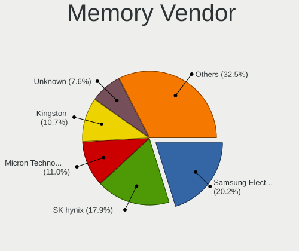

| Vendor                       | Computers | Percent |
|------------------------------|-----------|---------|
| Samsung Electronics          | 1204      | 20.22%  |
| SK hynix                     | 1065      | 17.89%  |
| Micron Technology            | 655       | 11%     |
| Kingston                     | 638       | 10.72%  |
| Unknown                      | 455       | 7.64%   |
| Corsair                      | 413       | 6.94%   |
| G.Skill                      | 388       | 6.52%   |
| Crucial                      | 274       | 4.6%    |
| A-DATA Technology            | 106       | 1.78%   |
| Elpida                       | 95        | 1.6%    |
| Unknown                      | 92        | 1.55%   |
| Ramaxel Technology           | 90        | 1.51%   |
| Nanya Technology             | 78        | 1.31%   |
| Team                         | 75        | 1.26%   |
| Patriot                      | 55        | 0.92%   |
| Timetec                      | 42        | 0.71%   |
| Unknown (ABCD)               | 18        | 0.3%    |
| Transcend                    | 13        | 0.22%   |
| ASint Technology             | 12        | 0.2%    |
| Unifosa                      | 11        | 0.18%   |
| Avant                        | 8         | 0.13%   |
| 4ea5                         | 8         | 0.13%   |
| Patriot Memory (PDP Systems) | 7         | 0.12%   |
| Hewlett-Packard              | 7         | 0.12%   |
| ff                           | 7         | 0.12%   |
| Toshiba                      | 6         | 0.1%    |
| PNY                          | 6         | 0.1%    |
| Lexar                        | 6         | 0.1%    |
| Goldkey                      | 6         | 0.1%    |
| Unknown (0x0B45)             | 5         | 0.08%   |
| Silicon Power                | 5         | 0.08%   |
| Neo Forza                    | 5         | 0.08%   |
| fef5                         | 5         | 0.08%   |
| CSX                          | 5         | 0.08%   |
| Sesame                       | 3         | 0.05%   |
| Qimonda                      | 3         | 0.05%   |
| OCZ                          | 3         | 0.05%   |
| Axiom                        | 3         | 0.05%   |
| Apacer                       | 3         | 0.05%   |
| Unknown (7F7F7F94FFFFFFFF)   | 2         | 0.03%   |

Memory Model
------------

Memory module models

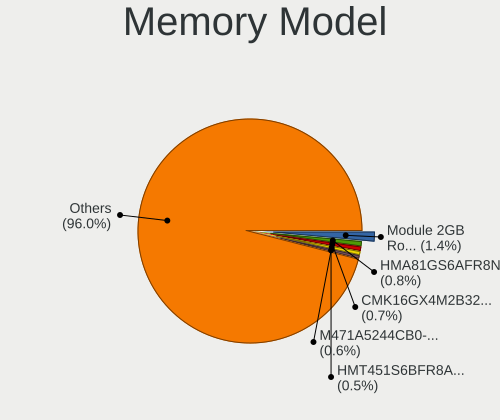

| Model                                                  | Computers | Percent |
|--------------------------------------------------------|-----------|---------|
| Unknown                                                | 92        | 1.44%   |
| SK hynix RAM HMA81GS6AFR8N-UH 8GB SODIMM DDR4 2667MT/s | 49        | 0.77%   |
| Corsair RAM CMK16GX4M2B3200C16 8GB DIMM DDR4 3600MT/s  | 43        | 0.67%   |
| Samsung RAM M471A5244CB0-CTD 4GB SODIMM DDR4 3266MT/s  | 38        | 0.59%   |
| SK hynix RAM HMT451S6BFR8A-PB 4GB SODIMM DDR3 1600MT/s | 33        | 0.52%   |
| Samsung RAM M471A1K43EB1-CWE 8GB SODIMM DDR4 3200MT/s  | 32        | 0.5%    |
| Samsung RAM M471B5273DH0-CH9 4GB SODIMM DDR3 1600MT/s  | 31        | 0.48%   |
| SK hynix RAM HMA81GS6DJR8N-XN 8GB SODIMM DDR4 3200MT/s | 30        | 0.47%   |
| SK hynix RAM HMAA1GS6CJR6N-XN 8GB SODIMM DDR4 3200MT/s | 29        | 0.45%   |
| SK hynix RAM HMA81GS6JJR8N-VK 8GB SODIMM DDR4 2667MT/s | 28        | 0.44%   |
| G.Skill RAM F4-3200C16-16GVK 16GB DIMM DDR4 3600MT/s   | 28        | 0.44%   |
| Samsung RAM M471A5244CB0-CWE 4GB SODIMM DDR4 3200MT/s  | 27        | 0.42%   |
| Samsung RAM M471B5173QH0-YK0 4GB SODIMM DDR3 1600MT/s  | 26        | 0.41%   |
| Samsung RAM M471B1G73QH0-YK0 8GB SODIMM DDR3 1600MT/s  | 26        | 0.41%   |
| Samsung RAM M471A1K43CB1-CTD 8GB SODIMM DDR4 3200MT/s  | 25        | 0.39%   |
| Samsung RAM M471A1K43CB1-CRC 8GB SODIMM DDR4 8400MT/s  | 25        | 0.39%   |
| Samsung RAM M471A1K43BB1-CRC 8GB SODIMM DDR4 2667MT/s  | 25        | 0.39%   |
| Micron RAM 8ATF1G64HZ-3G2J1 8GB SODIMM DDR4 3200MT/s   | 25        | 0.39%   |
| SK hynix RAM HMT41GS6BFR8A-PB 8GB SODIMM DDR3 2667MT/s | 24        | 0.38%   |
| Samsung RAM M471B5273CH0-CH9 4GB SODIMM DDR3 1334MT/s  | 23        | 0.36%   |
| Samsung RAM M471B5173DB0-YK0 4GB SODIMM DDR3 1600MT/s  | 23        | 0.36%   |
| Samsung RAM M471B1G73DB0-YK0 8GB SODIMM DDR3 1600MT/s  | 23        | 0.36%   |
| Kingston RAM KHX1600C10D3/8G 8GB DIMM DDR3 2133MT/s    | 23        | 0.36%   |
| Samsung RAM M471A1G44BB0-CWE 8GB SODIMM DDR4 3200MT/s  | 22        | 0.34%   |
| Samsung RAM M471A1G44AB0-CWE 8GiB SODIMM DDR4 3200MT/s | 22        | 0.34%   |
| Corsair RAM CMK32GX4M2E3200C16 16GB DIMM DDR4 3600MT/s | 21        | 0.33%   |
| Samsung RAM M471A2K43DB1-CWE 16GB SODIMM DDR4 3200MT/s | 20        | 0.31%   |
| Micron RAM 4ATF51264HZ-2G6E1 4GB SODIMM DDR4 2667MT/s  | 20        | 0.31%   |
| G.Skill RAM F4-3200C16-8GVKB 8GB DIMM DDR4 4000MT/s    | 20        | 0.31%   |
| SK hynix RAM HMA851S6AFR6N-UH 4GB SODIMM DDR4 2667MT/s | 19        | 0.3%    |
| Samsung RAM M471B5173EB0-YK0 4GB SODIMM DDR3 1600MT/s  | 19        | 0.3%    |
| Samsung RAM M471A1K43DB1-CTD 8GB SODIMM DDR4 2667MT/s  | 18        | 0.28%   |
| Unknown RAM Module 8GB SODIMM DDR3 1600MT/s            | 17        | 0.27%   |
| SK hynix RAM HMA41GS6AFR8N-TF 8GB SODIMM DDR4 2667MT/s | 17        | 0.27%   |
| Micron RAM 8ATF1G64HZ-2G6E1 8GB SODIMM DDR4 2667MT/s   | 17        | 0.27%   |
| Corsair RAM CMK32GX4M2D3600C18 16GB DIMM DDR4 3800MT/s | 17        | 0.27%   |
| Corsair RAM CMK16GX4M2B3000C15 8GB DIMM DDR4 3600MT/s  | 17        | 0.27%   |
| Micron RAM 4ATF51264HZ-3G2J1 4GB SODIMM DDR4 3200MT/s  | 16        | 0.25%   |
| A-DATA RAM DDR4 3200 16GB DIMM DDR4 3600MT/s           | 16        | 0.25%   |
| SK hynix RAM HMA81GS6AFR8N-UH 8GB SODIMM DDR4 3200MT/s | 15        | 0.23%   |

Memory Kind
-----------

Memory module kinds

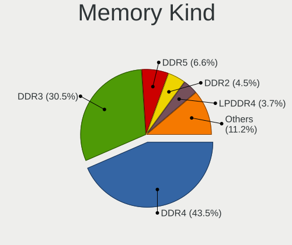

| Kind            | Computers | Percent |
|-----------------|-----------|---------|
| DDR4            | 2219      | 43.48%  |
| DDR3            | 1554      | 30.45%  |
| DDR5            | 338       | 6.62%   |
| DDR2            | 228       | 4.47%   |
| LPDDR4          | 191       | 3.74%   |
| LPDDR3          | 155       | 3.04%   |
| SDRAM           | 128       | 2.51%   |
| LPDDR5          | 119       | 2.33%   |
| Unknown         | 105       | 2.06%   |
| DDR             | 46        | 0.9%    |
| DRAM            | 16        | 0.31%   |
| RAM             | 3         | 0.06%   |
| Logical non-vol | 1         | 0.02%   |

Memory Form Factor
------------------

Physical design of the memory module

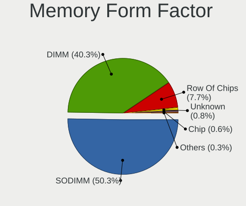

| Name            | Computers | Percent |
|-----------------|-----------|---------|
| SODIMM          | 2536      | 50.26%  |
| DIMM            | 2034      | 40.31%  |
| Row Of Chips    | 388       | 7.69%   |
| Unknown         | 42        | 0.83%   |
| Chip            | 32        | 0.63%   |
| FB-DIMM         | 9         | 0.18%   |
| RIMM            | 4         | 0.08%   |
| Proprietary Car | 1         | 0.02%   |

Memory Size
-----------

Memory module size

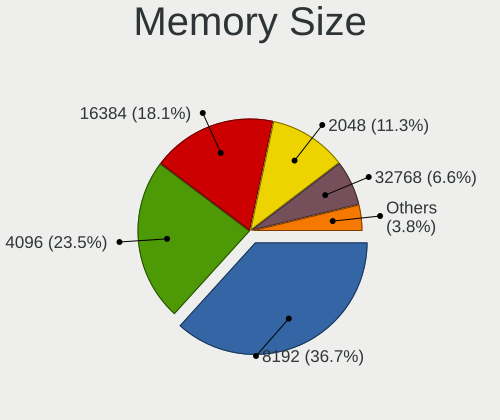

| Size   | Computers | Percent |
|--------|-----------|---------|
| 8192   | 2059      | 36.73%  |
| 4096   | 1320      | 23.55%  |
| 16384  | 1012      | 18.05%  |
| 2048   | 634       | 11.31%  |
| 32768  | 368       | 6.56%   |
| 1024   | 165       | 2.94%   |
| 512    | 24        | 0.43%   |
| 49152  | 8         | 0.14%   |
| 65536  | 5         | 0.09%   |
| 24576  | 4         | 0.07%   |
| 256    | 3         | 0.05%   |
| 129408 | 1         | 0.02%   |
| 6144   | 1         | 0.02%   |
| 3072   | 1         | 0.02%   |
| 64     | 1         | 0.02%   |

Memory Speed
------------

Memory module speed

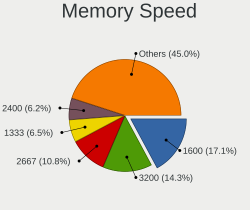

| Speed   | Computers | Percent |
|---------|-----------|---------|
| 1600    | 956       | 17.14%  |
| 3200    | 798       | 14.31%  |
| 2667    | 602       | 10.79%  |
| 1333    | 364       | 6.53%   |
| 2400    | 348       | 6.24%   |
| 2133    | 292       | 5.23%   |
| 3600    | 245       | 4.39%   |
| 1867    | 128       | 2.29%   |
| 667     | 119       | 2.13%   |
| 5600    | 115       | 2.06%   |
| 800     | 108       | 1.94%   |
| 1334    | 99        | 1.77%   |
| 4800    | 97        | 1.74%   |
| 6400    | 84        | 1.51%   |
| 4267    | 84        | 1.51%   |
| 1067    | 78        | 1.4%    |
| 3733    | 67        | 1.2%    |
| 6000    | 66        | 1.18%   |
| Unknown | 65        | 1.17%   |
| 3800    | 64        | 1.15%   |
| 4000    | 52        | 0.93%   |
| 3266    | 48        | 0.86%   |
| 1066    | 48        | 0.86%   |
| 8400    | 40        | 0.72%   |
| 1866    | 39        | 0.7%    |
| 1800    | 39        | 0.7%    |
| 2666    | 34        | 0.61%   |
| 3000    | 31        | 0.56%   |
| 7500    | 30        | 0.54%   |
| 4266    | 27        | 0.48%   |
| 4199    | 26        | 0.47%   |
| 3400    | 26        | 0.47%   |
| 2933    | 24        | 0.43%   |
| 5200    | 20        | 0.36%   |
| 533     | 20        | 0.36%   |
| 3866    | 19        | 0.34%   |
| 1639    | 18        | 0.32%   |
| 975     | 18        | 0.32%   |
| 2048    | 16        | 0.29%   |
| 3466    | 15        | 0.27%   |

Printers & scanners
-------------------

Printer Vendor
--------------

Printer device vendors

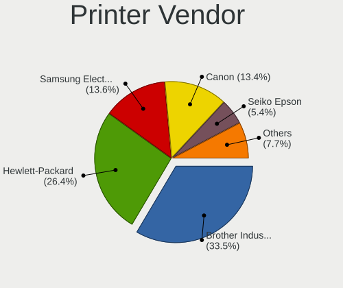

| Vendor                   | Computers | Percent |
|--------------------------|-----------|---------|
| Brother Industries       | 118       | 33.52%  |
| Hewlett-Packard          | 93        | 26.42%  |
| Samsung Electronics      | 48        | 13.64%  |
| Canon                    | 47        | 13.35%  |
| Seiko Epson              | 19        | 5.4%    |
| Dymo-CoStar              | 8         | 2.27%   |
| Lexmark International    | 7         | 1.99%   |
| Xerox                    | 3         | 0.85%   |
| QinHeng Electronics      | 2         | 0.57%   |
| Dell                     | 2         | 0.57%   |
| Zhuhai Poskey Technology | 1         | 0.28%   |
| Zebra                    | 1         | 0.28%   |
| STMicroelectronics       | 1         | 0.28%   |
| Prolific Technology      | 1         | 0.28%   |
| Pantum                   | 1         | 0.28%   |

Printer Model
-------------

Printer device models

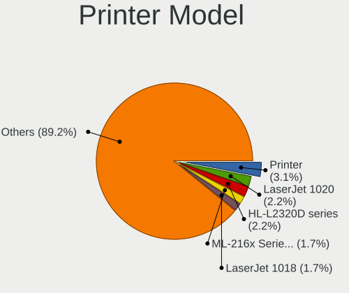

| Model                                | Computers | Percent |
|--------------------------------------|-----------|---------|
| Brother Printer                      | 11        | 3.06%   |
| HP LaserJet 1020                     | 8         | 2.22%   |
| Brother HL-L2320D series             | 8         | 2.22%   |
| Samsung ML-216x Series Laser Printer | 6         | 1.67%   |
| HP LaserJet 1018                     | 6         | 1.67%   |
| HP DeskJet 3630 series               | 6         | 1.67%   |
| Dymo-CoStar LabelWriter 450          | 6         | 1.67%   |
| Brother MFC-J480DW                   | 6         | 1.67%   |
| Brother HL-L2390DW                   | 6         | 1.67%   |
| Brother DCP-7065DN                   | 6         | 1.67%   |
| Brother HL-5370DW series             | 5         | 1.39%   |
| Seiko Epson ET-3750 Series           | 4         | 1.11%   |
| Samsung ML-1670 Series               | 4         | 1.11%   |
| HP ENVY 5000 series                  | 4         | 1.11%   |
| HP DeskJet 2600 series               | 4         | 1.11%   |
| Brother HL-L2360D series             | 4         | 1.11%   |
| Brother HL-2270DW Laser Printer      | 4         | 1.11%   |
| Brother DCP-L2540DW                  | 4         | 1.11%   |
| Xerox B210                           | 3         | 0.83%   |
| Seiko Epson L6270 Series             | 3         | 0.83%   |
| Seiko Epson ET-2800 Series           | 3         | 0.83%   |
| Samsung M267x 287x Series            | 3         | 0.83%   |
| Samsung M2070 Series                 | 3         | 0.83%   |
| Samsung C460 Series                  | 3         | 0.83%   |
| HP OfficeJet 3830 series             | 3         | 0.83%   |
| HP LaserJet 4250                     | 3         | 0.83%   |
| HP ENVY 4520 series                  | 3         | 0.83%   |
| HP Deskjet 3050A                     | 3         | 0.83%   |
| Canon PIXMA MX920 Series             | 3         | 0.83%   |
| Canon PIXMA MX490 Series             | 3         | 0.83%   |
| Canon PIXMA MG2900 Series            | 3         | 0.83%   |
| Canon MF4410                         | 3         | 0.83%   |
| Canon MF3010                         | 3         | 0.83%   |
| Brother MFC-J485DW                   | 3         | 0.83%   |
| Brother MFC-9130CW                   | 3         | 0.83%   |
| Brother MFC-7360N                    | 3         | 0.83%   |
| Brother HL-L2370DW series            | 3         | 0.83%   |
| Brother DCP-L2550DW series           | 3         | 0.83%   |
| Brother DCP-L2520DW                  | 3         | 0.83%   |
| Brother DCP-7040                     | 3         | 0.83%   |

Scanner Vendor
--------------

Scanner device vendors

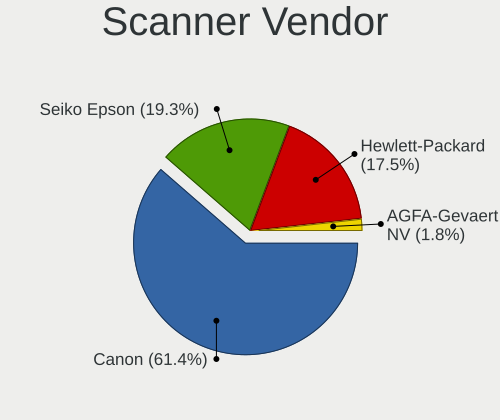

| Vendor          | Computers | Percent |
|-----------------|-----------|---------|
| Canon           | 35        | 61.4%   |
| Seiko Epson     | 11        | 19.3%   |
| Hewlett-Packard | 10        | 17.54%  |
| AGFA-Gevaert NV | 1         | 1.75%   |

Scanner Model
-------------

Scanner device models

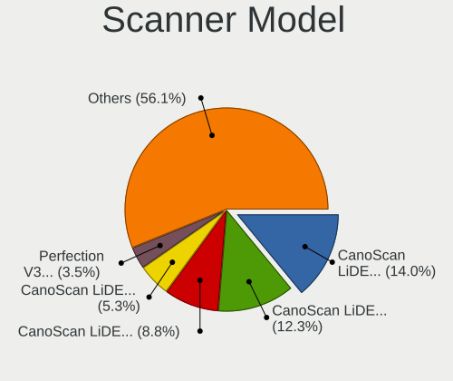

| Model                                                   | Computers | Percent |
|---------------------------------------------------------|-----------|---------|
| Canon CanoScan LiDE 210                                 | 8         | 14.04%  |
| Canon CanoScan LiDE 220                                 | 7         | 12.28%  |
| Canon CanoScan LiDE 700F                                | 5         | 8.77%   |
| Canon CanoScan LiDE 120                                 | 3         | 5.26%   |
| Seiko Epson Perfection V37/V370                         | 2         | 3.51%   |
| Seiko Epson GT-X820 [Perfection V600 Photo]             | 2         | 3.51%   |
| Seiko Epson GT-F720 [GT-S620/Perfection V30/V300 Photo] | 2         | 3.51%   |
| Seiko Epson GT-8300UF [Perfection 1660 PHOTO]           | 2         | 3.51%   |
| HP ScanJet 82x0C                                        | 2         | 3.51%   |
| Canon CanoScan LiDE 50/LiDE 35/LiDE 40                  | 2         | 3.51%   |
| Canon CanoScan LiDE 200                                 | 2         | 3.51%   |
| Canon CanoScan LiDE 110                                 | 2         | 3.51%   |
| Seiko Epson GT-X750 [Perfection 4490 Photo]             | 1         | 1.75%   |
| Seiko Epson GT-9300UF [Perfection 2400 PHOTO]           | 1         | 1.75%   |
| Seiko Epson GT-6600U [Perfection 610]                   | 1         | 1.75%   |
| HP ScanJet G4050                                        | 1         | 1.75%   |
| HP ScanJet G4010                                        | 1         | 1.75%   |
| HP ScanJet 5590                                         | 1         | 1.75%   |
| HP ScanJet 5200c                                        | 1         | 1.75%   |
| HP ScanJet 3670                                         | 1         | 1.75%   |
| HP ScanJet 3400cse                                      | 1         | 1.75%   |
| HP ScanJet 2300c                                        | 1         | 1.75%   |
| HP ScanJet 2200c                                        | 1         | 1.75%   |
| Canon CanoScan N1240U/LiDE 30                           | 1         | 1.75%   |
| Canon CanoScan LiDE 70                                  | 1         | 1.75%   |
| Canon CanoScan LIDE 25                                  | 1         | 1.75%   |
| Canon CanoScan 4200F                                    | 1         | 1.75%   |
| Canon CanoScan 1220U                                    | 1         | 1.75%   |
| Canon CanoScan                                          | 1         | 1.75%   |
| AGFA-Gevaert NV SnapScan 1212U (?)                      | 1         | 1.75%   |

Camera
------

Camera Vendor
-------------

Camera device vendors

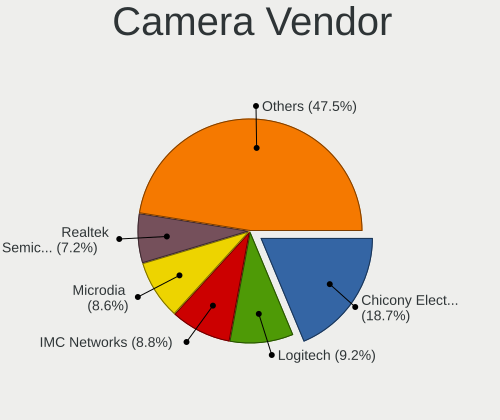

| Vendor                                 | Computers | Percent |
|----------------------------------------|-----------|---------|
| Chicony Electronics                    | 1017      | 18.71%  |
| Logitech                               | 501       | 9.22%   |
| IMC Networks                           | 480       | 8.83%   |
| Microdia                               | 468       | 8.61%   |
| Realtek Semiconductor                  | 390       | 7.17%   |
| Apple                                  | 329       | 6.05%   |
| Bison Electronics                      | 328       | 6.03%   |
| Sunplus Innovation Technology          | 278       | 5.11%   |
| Quanta                                 | 223       | 4.1%    |
| Suyin                                  | 148       | 2.72%   |
| Microsoft                              | 121       | 2.23%   |
| Luxvisions Innotech Limited            | 118       | 2.17%   |
| Cheng Uei Precision Industry (Foxlink) | 112       | 2.06%   |
| Syntek                                 | 86        | 1.58%   |
| Lite-On Technology                     | 81        | 1.49%   |
| Samsung Electronics                    | 66        | 1.21%   |
| Sonix Technology                       | 59        | 1.09%   |
| Ricoh                                  | 41        | 0.75%   |
| Silicon Motion                         | 38        | 0.7%    |
| Lenovo                                 | 34        | 0.63%   |
| AVerMedia Technologies                 | 33        | 0.61%   |
| Alcor Micro                            | 32        | 0.59%   |
| Importek                               | 29        | 0.53%   |
| Z-Star Microelectronics                | 25        | 0.46%   |
| MacroSilicon                           | 23        | 0.42%   |
| Creative Technology                    | 19        | 0.35%   |
| Acer                                   | 19        | 0.35%   |
| webcam                                 | 18        | 0.33%   |
| Razer USA                              | 16        | 0.29%   |
| Generalplus Technology                 | 16        | 0.29%   |
| OmniVision Technologies                | 14        | 0.26%   |
| ALi                                    | 13        | 0.24%   |
| ShineTech                              | 12        | 0.22%   |
| Primax Electronics                     | 12        | 0.22%   |
| Linux Foundation                       | 11        | 0.2%    |
| Cubeternet                             | 10        | 0.18%   |
| WaveRider Communications               | 9         | 0.17%   |
| eMeet                                  | 9         | 0.17%   |
| YGTek                                  | 8         | 0.15%   |
| SunplusIT                              | 8         | 0.15%   |

Camera Model
------------

Camera device models

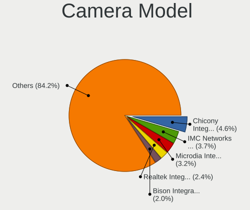

| Model                                         | Computers | Percent |
|-----------------------------------------------|-----------|---------|
| Chicony Integrated Camera                     | 251       | 4.57%   |
| IMC Networks USB2.0 HD UVC WebCam             | 204       | 3.72%   |
| Microdia Integrated_Webcam_HD                 | 173       | 3.15%   |
| Realtek Integrated_Webcam_HD                  | 130       | 2.37%   |
| Bison Integrated Camera                       | 112       | 2.04%   |
| Apple Built-in iSight                         | 112       | 2.04%   |
| Logitech Webcam C270                          | 107       | 1.95%   |
| IMC Networks Integrated Camera                | 106       | 1.93%   |
| Logitech HD Pro Webcam C920                   | 96        | 1.75%   |
| Chicony HD WebCam                             | 84        | 1.53%   |
| Apple iPhone 5/5C/5S/6/SE/7/8/X               | 77        | 1.4%    |
| Apple FaceTime HD Camera (Built-in)           | 75        | 1.37%   |
| Sunplus Integrated_Webcam_HD                  | 71        | 1.29%   |
| Samsung Galaxy series, misc. (MTP mode)       | 66        | 1.2%    |
| Syntek Integrated Camera                      | 59        | 1.07%   |
| Luxvisions Innotech Limited Integrated Camera | 53        | 0.97%   |
| Apple FaceTime HD Camera                      | 52        | 0.95%   |
| IMC Networks USB2.0 VGA UVC WebCam            | 48        | 0.87%   |
| Logitech C922 Pro Stream Webcam               | 44        | 0.8%    |
| Quanta HD User Facing                         | 42        | 0.77%   |
| Microdia Integrated Webcam                    | 40        | 0.73%   |
| Microdia Webcam Vitade AF                     | 38        | 0.69%   |
| Chicony Integrated Camera (1280x720@30)       | 37        | 0.67%   |
| Sunplus HD WebCam                             | 36        | 0.66%   |
| Chicony VGA Webcam                            | 36        | 0.66%   |
| Bison HD Webcam                               | 36        | 0.66%   |
| Microdia USB 2.0 Camera                       | 35        | 0.64%   |
| Logitech C920 PRO HD Webcam                   | 35        | 0.64%   |
| Microsoft LifeCam HD-3000                     | 34        | 0.62%   |
| Lite-On Integrated Camera                     | 34        | 0.62%   |
| Chicony HP HD Camera                          | 34        | 0.62%   |
| Bison SunplusIT Integrated Camera             | 34        | 0.62%   |
| Chicony HP Truevision HD                      | 33        | 0.6%    |
| Chicony HD User Facing                        | 33        | 0.6%    |
| Sonix USB2.0 HD UVC WebCam                    | 30        | 0.55%   |
| Realtek USB Camera                            | 29        | 0.53%   |
| Quanta VGA WebCam                             | 28        | 0.51%   |
| Chicony USB2.0 HD UVC WebCam                  | 28        | 0.51%   |
| Chicony Lenovo Integrated Camera (0.3MP)      | 28        | 0.51%   |
| Logitech BRIO Ultra HD Webcam                 | 27        | 0.49%   |

Security
--------

Fingerprint Vendor
------------------

Fingerprint sensor vendors

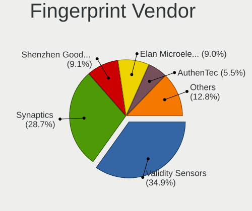

| Vendor                             | Computers | Percent |
|------------------------------------|-----------|---------|
| Validity Sensors                   | 333       | 34.87%  |
| Synaptics                          | 274       | 28.69%  |
| Shenzhen Goodix Technology         | 87        | 9.11%   |
| Elan Microelectronics              | 86        | 9.01%   |
| AuthenTec                          | 53        | 5.55%   |
| Upek                               | 52        | 5.45%   |
| LighTuning Technology              | 29        | 3.04%   |
| STMicroelectronics                 | 21        | 2.2%    |
| Realtek USB2.0 Finger Print Bridge | 6         | 0.63%   |
| Focal-systems.Corp                 | 4         | 0.42%   |
| Samsung Electronics                | 3         | 0.31%   |
| Microsoft                          | 3         | 0.31%   |
| HOLTEK                             | 1         | 0.1%    |
| Futronic Technology                | 1         | 0.1%    |
| DigitalPersona                     | 1         | 0.1%    |
| Dell                               | 1         | 0.1%    |

Fingerprint Model
-----------------

Fingerprint sensor models

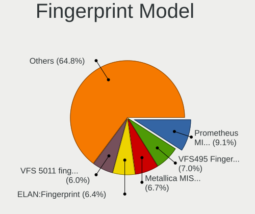

| Model                                                                      | Computers | Percent |
|----------------------------------------------------------------------------|-----------|---------|
| Synaptics Prometheus MIS Touch Fingerprint Reader                          | 87        | 9.11%   |
| Validity Sensors VFS495 Fingerprint Reader                                 | 67        | 7.02%   |
| Synaptics Metallica MIS Touch Fingerprint Reader                           | 64        | 6.7%    |
| Elan ELAN:Fingerprint                                                      | 61        | 6.39%   |
| Validity Sensors VFS 5011 fingerprint sensor                               | 57        | 5.97%   |
| Upek Biometric Touchchip/Touchstrip Fingerprint Sensor                     | 51        | 5.34%   |
| Validity Sensors Synaptics WBDI                                            | 49        | 5.13%   |
| Shenzhen Goodix FingerPrint                                                | 34        | 3.56%   |
| Shenzhen Goodix Fingerprint Reader                                         | 28        | 2.93%   |
| Validity Sensors VFS5011 Fingerprint Reader                                | 26        | 2.72%   |
| Shenzhen Goodix  FingerPrint Device                                        | 25        | 2.62%   |
| Validity Sensors VFS491                                                    | 23        | 2.41%   |
| Synaptics  WBDI                                                            | 23        | 2.41%   |
| Elan ELAN:ARM-M4                                                           | 23        | 2.41%   |
| AuthenTec AES2810                                                          | 22        | 2.3%    |
| STMicroelectronics Fingerprint Reader                                      | 21        | 2.2%    |
| Synaptics WBDI                                                             | 19        | 1.99%   |
| Validity Sensors VFS471 Fingerprint Reader                                 | 18        | 1.88%   |
| Validity Sensors Synaptics VFS7552 Touch Fingerprint Sensor with PurePrint | 15        | 1.57%   |
| LighTuning EgisTec Touch Fingerprint Sensor                                | 15        | 1.57%   |
| Synaptics UWP WBDI Device                                                  | 14        | 1.47%   |
| Validity Sensors VFS7500 Touch Fingerprint Sensor                          | 13        | 1.36%   |
| Validity Sensors Fingerprint scanner                                       | 13        | 1.36%   |
| AuthenTec Fingerprint Sensor                                               | 12        | 1.26%   |
| AuthenTec AES2501 Fingerprint Sensor                                       | 12        | 1.26%   |
| Validity Sensors Swipe Fingerprint Sensor                                  | 11        | 1.15%   |
| Synaptics Prometheus Fingerprint Reader                                    | 11        | 1.15%   |
| Synaptics Fingerprint reader [HP G6]                                       | 11        | 1.15%   |
| Validity Sensors VFS7552 Touch Fingerprint Sensor                          | 10        | 1.05%   |
| LighTuning ES603 Swipe Fingerprint Sensor                                  | 10        | 1.05%   |
| Validity Sensors VFS301 Fingerprint Reader                                 | 9         | 0.94%   |
| Synaptics UWP WBDI                                                         | 7         | 0.73%   |
| Validity Sensors VFS451 Fingerprint Reader                                 | 6         | 0.63%   |
| Validity Sensors Synaptics VFS7552 Touch Fingerprint Sensor                | 6         | 0.63%   |
| Synaptics WBDI Fingerprint Reader USB 086                                  | 6         | 0.63%   |
| Synaptics  FS7604 Touch Fingerprint Sensor with PurePrint                  | 6         | 0.63%   |
| Synaptics FS7604 Touch Fingerprint Sensor with PurePrint                   | 6         | 0.63%   |
| Realtek USB2.0 Finger Print Bridge FocalTech Fingerprint Device            | 6         | 0.63%   |
| Synaptics TouchPad                                                         | 5         | 0.52%   |
| Synaptics Metallica MOH Touch Fingerprint Reader                           | 5         | 0.52%   |

Chipcard Vendor
---------------

Chipcard module vendors

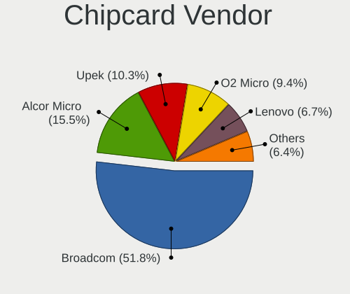

| Vendor                    | Computers | Percent |
|---------------------------|-----------|---------|
| Broadcom                  | 171       | 51.82%  |
| Alcor Micro               | 51        | 15.45%  |
| Upek                      | 34        | 10.3%   |
| O2 Micro                  | 31        | 9.39%   |
| Lenovo                    | 22        | 6.67%   |
| Gemalto (was Gemplus)     | 5         | 1.52%   |
| Yubico.com                | 4         | 1.21%   |
| SCM Microsystems          | 4         | 1.21%   |
| Aladdin Knowledge Systems | 2         | 0.61%   |
| OmniKey                   | 1         | 0.3%    |
| NXP Semiconductors        | 1         | 0.3%    |
| In Focus Systems          | 1         | 0.3%    |
| Giesecke & Devrient       | 1         | 0.3%    |
| Clay Logic                | 1         | 0.3%    |
| Advanced Card Systems     | 1         | 0.3%    |

Chipcard Model
--------------

Chipcard module models

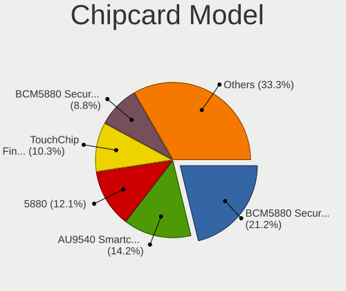

| Model                                                                        | Computers | Percent |
|------------------------------------------------------------------------------|-----------|---------|
| Broadcom BCM5880 Secure Applications Processor                               | 70        | 21.21%  |
| Alcor Micro AU9540 Smartcard Reader                                          | 47        | 14.24%  |
| Broadcom 5880                                                                | 40        | 12.12%  |
| Upek TouchChip Fingerprint Coprocessor (WBF advanced mode)                   | 34        | 10.3%   |
| Broadcom BCM5880 Secure Applications Processor with fingerprint swipe sensor | 29        | 8.79%   |
| O2 Micro OZ776 CCID Smartcard Reader                                         | 26        | 7.88%   |
| Lenovo Integrated Smart Card Reader                                          | 22        | 6.67%   |
| Broadcom BCM58200 ControlVault 3 (FingerPrint sensor + Contacted SmartCard)  | 21        | 6.36%   |
| Broadcom 58200                                                               | 10        | 3.03%   |
| O2 Micro Oz776 SmartCard Reader                                              | 5         | 1.52%   |
| Gemalto (was Gemplus) GemPC Twin SmartCard Reader                            | 4         | 1.21%   |
| Alcor Micro Watchdata W 1981                                                 | 4         | 1.21%   |
| Yubico.com Yubikey 4/5 U2F+CCID                                              | 3         | 0.91%   |
| SCM Microsystems SCR331-LC1 / SCR3310 SmartCard Reader                       | 2         | 0.61%   |
| Aladdin Knowledge Systems Token JC                                           | 2         | 0.61%   |
| Yubico.com Yubikey 4/5 CCID                                                  | 1         | 0.3%    |
| SCM Microsystems SCR35xx Smart Card Reader                                   | 1         | 0.3%    |
| SCM Microsystems SCR3500 A Contact Reader                                    | 1         | 0.3%    |
| OmniKey CardMan 5321                                                         | 1         | 0.3%    |
| NXP Semiconductors PR533                                                     | 1         | 0.3%    |
| In Focus Systems EMV Smartcard Reader                                        | 1         | 0.3%    |
| Giesecke & Devrient StarSign CUT S                                           | 1         | 0.3%    |
| Gemalto (was Gemplus) Compact Smart Card Reader Writer                       | 1         | 0.3%    |
| Clay Logic Nitrokey Pro                                                      | 1         | 0.3%    |
| Broadcom BCM5880 Secure Applications Processor with fingerprint touch sensor | 1         | 0.3%    |
| Advanced Card Systems ACR122U                                                | 1         | 0.3%    |

Unsupported
-----------

Unsupported Devices
-------------------

Total unsupported devices on board

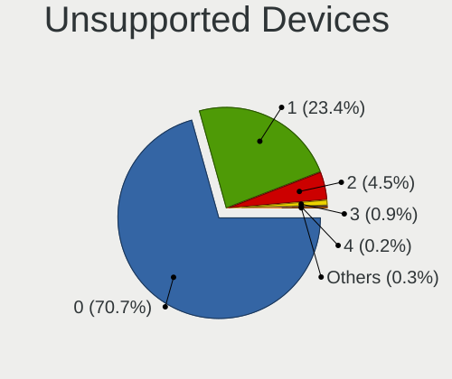

| Total | Computers | Percent |
|-------|-----------|---------|
| 0     | 7160      | 70.7%   |
| 1     | 2372      | 23.42%  |
| 2     | 456       | 4.5%    |
| 3     | 91        | 0.9%    |
| 4     | 22        | 0.22%   |
| 5     | 16        | 0.16%   |
| 6     | 7         | 0.07%   |
| 8     | 2         | 0.02%   |
| 7     | 1         | 0.01%   |

Unsupported Device Types
------------------------

Types of unsupported devices

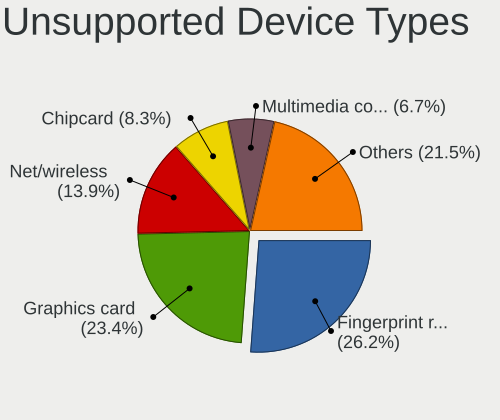

| Type                     | Computers | Percent |
|--------------------------|-----------|---------|
| Fingerprint reader       | 936       | 26.18%  |
| Graphics card            | 838       | 23.44%  |
| Net/wireless             | 498       | 13.93%  |
| Chipcard                 | 296       | 8.28%   |
| Multimedia controller    | 238       | 6.66%   |
| Communication controller | 212       | 5.93%   |
| Unassigned class         | 94        | 2.63%   |
| Camera                   | 82        | 2.29%   |
| Sound                    | 77        | 2.15%   |
| Bluetooth                | 66        | 1.85%   |
| Storage                  | 54        | 1.51%   |
| Net/ethernet             | 46        | 1.29%   |
| Network                  | 28        | 0.78%   |
| Modem                    | 20        | 0.56%   |
| Card reader              | 20        | 0.56%   |
| Storage/raid             | 18        | 0.5%    |
| Dvb card                 | 13        | 0.36%   |
| Storage/ide              | 10        | 0.28%   |
| Firewire controller      | 10        | 0.28%   |
| Flash memory             | 7         | 0.2%    |
| Tv card                  | 4         | 0.11%   |
| Storage/nvme             | 3         | 0.08%   |
| Video                    | 2         | 0.06%   |
| Storage/ata              | 2         | 0.06%   |
| Unclassified device      | 1         | 0.03%   |

