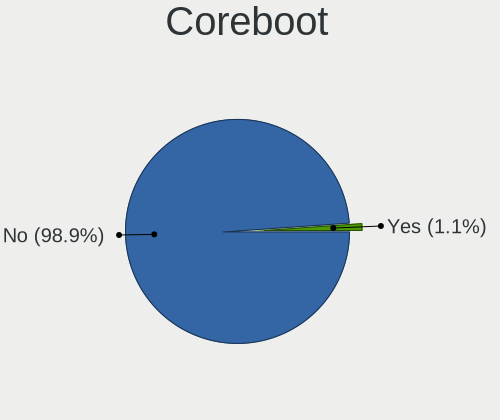
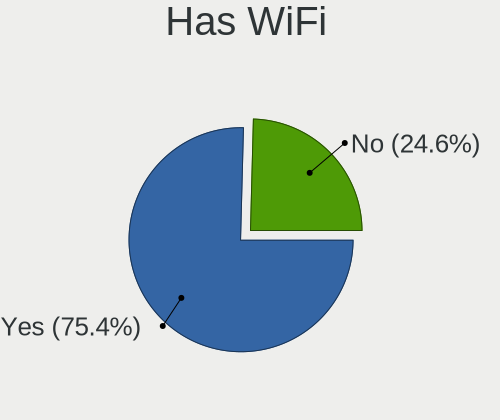
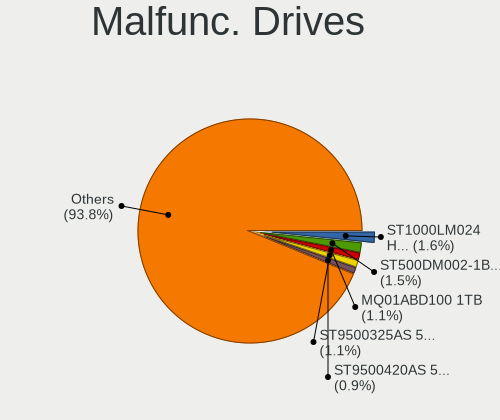
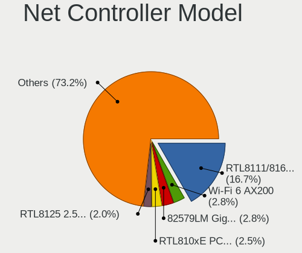
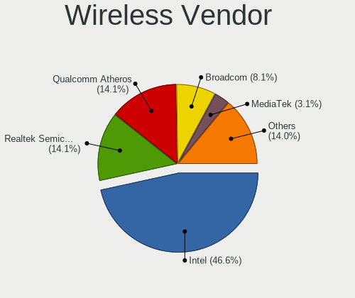
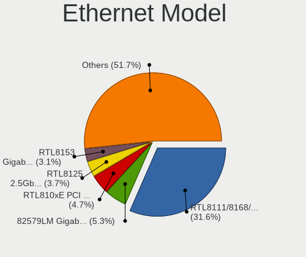
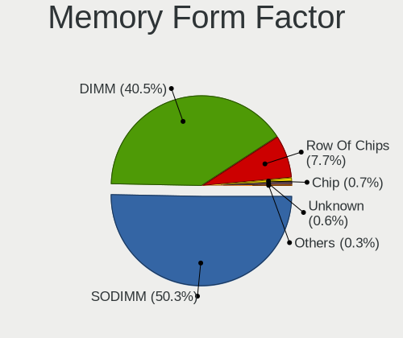
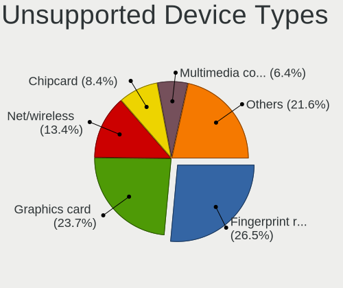

Linux in Canada - Tested Hardware & Statistics
----------------------------------------------

A project to collect tested hardware configurations for Linux in Canada.

Anyone can contribute to this report by the [hw-probe](https://github.com/linuxhw/hw-probe) tool:

    sudo -E hw-probe -all -upload

Please contribute! Especially if your hardware is rare.

This is a report for all computer types. See also reports for [desktops](/Location/Canada/Desktop/README.md) and [notebooks](/Location/Canada/Notebook/README.md).

Contents
--------

* [ Test Cases ](#test-cases)

* [ System ](#system)
  - [ OS                       ](#os)
  - [ OS Family                ](#os-family)
  - [ Kernel                   ](#kernel)
  - [ Kernel Family            ](#kernel-family)
  - [ Kernel Major Ver.        ](#kernel-major-ver)
  - [ Arch                     ](#arch)
  - [ DE                       ](#de)
  - [ Display Server           ](#display-server)
  - [ Display Manager          ](#display-manager)
  - [ OS Lang                  ](#os-lang)
  - [ Boot Mode                ](#boot-mode)
  - [ Filesystem               ](#filesystem)
  - [ Part. scheme             ](#part-scheme)
  - [ Dual Boot with Linux/BSD ](#dual-boot-with-linuxbsd)
  - [ Dual Boot (Win)          ](#dual-boot-win)

* [ Board ](#board)
  - [ Vendor                   ](#vendor)
  - [ Model                    ](#model)
  - [ Model Family             ](#model-family)
  - [ MFG Year                 ](#mfg-year)
  - [ Form Factor              ](#form-factor)
  - [ Secure Boot              ](#secure-boot)
  - [ Coreboot                 ](#coreboot)
  - [ RAM Size                 ](#ram-size)
  - [ RAM Used                 ](#ram-used)
  - [ Total Drives             ](#total-drives)
  - [ Has CD-ROM               ](#has-cd-rom)
  - [ Has Ethernet             ](#has-ethernet)
  - [ Has WiFi                 ](#has-wifi)
  - [ Has Bluetooth            ](#has-bluetooth)

* [ Location ](#location)
  - [ Country                  ](#country)
  - [ City                     ](#city)

* [ Drives ](#drives)
  - [ Drive Vendor             ](#drive-vendor)
  - [ Drive Model              ](#drive-model)
  - [ HDD Vendor               ](#hdd-vendor)
  - [ SSD Vendor               ](#ssd-vendor)
  - [ Drive Kind               ](#drive-kind)
  - [ Drive Connector          ](#drive-connector)
  - [ Drive Size               ](#drive-size)
  - [ Space Total              ](#space-total)
  - [ Space Used               ](#space-used)
  - [ Malfunc. Drives          ](#malfunc-drives)
  - [ Malfunc. Drive Vendor    ](#malfunc-drive-vendor)
  - [ Malfunc. HDD Vendor      ](#malfunc-hdd-vendor)
  - [ Malfunc. Drive Kind      ](#malfunc-drive-kind)
  - [ Failed Drives            ](#failed-drives)
  - [ Failed Drive Vendor      ](#failed-drive-vendor)
  - [ Drive Status             ](#drive-status)

* [ Storage controller ](#storage-controller)
  - [ Storage Vendor           ](#storage-vendor)
  - [ Storage Model            ](#storage-model)
  - [ Storage Kind             ](#storage-kind)

* [ Processor ](#processor)
  - [ CPU Vendor               ](#cpu-vendor)
  - [ CPU Model                ](#cpu-model)
  - [ CPU Model Family         ](#cpu-model-family)
  - [ CPU Cores                ](#cpu-cores)
  - [ CPU Sockets              ](#cpu-sockets)
  - [ CPU Threads              ](#cpu-threads)
  - [ CPU Op-Modes             ](#cpu-op-modes)
  - [ CPU Microcode            ](#cpu-microcode)
  - [ CPU Microarch            ](#cpu-microarch)

* [ Graphics ](#graphics)
  - [ GPU Vendor               ](#gpu-vendor)
  - [ GPU Model                ](#gpu-model)
  - [ GPU Combo                ](#gpu-combo)
  - [ GPU Driver               ](#gpu-driver)
  - [ GPU Memory               ](#gpu-memory)

* [ Monitor ](#monitor)
  - [ Monitor Vendor           ](#monitor-vendor)
  - [ Monitor Model            ](#monitor-model)
  - [ Monitor Resolution       ](#monitor-resolution)
  - [ Monitor Diagonal         ](#monitor-diagonal)
  - [ Monitor Width            ](#monitor-width)
  - [ Aspect Ratio             ](#aspect-ratio)
  - [ Monitor Area             ](#monitor-area)
  - [ Pixel Density            ](#pixel-density)
  - [ Multiple Monitors        ](#multiple-monitors)

* [ Network ](#network)
  - [ Net Controller Vendor    ](#net-controller-vendor)
  - [ Net Controller Model     ](#net-controller-model)
  - [ Wireless Vendor          ](#wireless-vendor)
  - [ Wireless Model           ](#wireless-model)
  - [ Ethernet Vendor          ](#ethernet-vendor)
  - [ Ethernet Model           ](#ethernet-model)
  - [ Net Controller Kind      ](#net-controller-kind)
  - [ Used Controller          ](#used-controller)
  - [ NICs                     ](#nics)
  - [ IPv6                     ](#ipv6)

* [ Bluetooth ](#bluetooth)
  - [ Bluetooth Vendor         ](#bluetooth-vendor)
  - [ Bluetooth Model          ](#bluetooth-model)

* [ Sound ](#sound)
  - [ Sound Vendor             ](#sound-vendor)
  - [ Sound Model              ](#sound-model)

* [ Memory ](#memory)
  - [ Memory Vendor            ](#memory-vendor)
  - [ Memory Model             ](#memory-model)
  - [ Memory Kind              ](#memory-kind)
  - [ Memory Form Factor       ](#memory-form-factor)
  - [ Memory Size              ](#memory-size)
  - [ Memory Speed             ](#memory-speed)

* [ Printers & scanners ](#printers--scanners)
  - [ Printer Vendor           ](#printer-vendor)
  - [ Printer Model            ](#printer-model)
  - [ Scanner Vendor           ](#scanner-vendor)
  - [ Scanner Model            ](#scanner-model)

* [ Camera ](#camera)
  - [ Camera Vendor            ](#camera-vendor)
  - [ Camera Model             ](#camera-model)

* [ Security ](#security)
  - [ Fingerprint Vendor       ](#fingerprint-vendor)
  - [ Fingerprint Model        ](#fingerprint-model)
  - [ Chipcard Vendor          ](#chipcard-vendor)
  - [ Chipcard Model           ](#chipcard-model)

* [ Unsupported ](#unsupported)
  - [ Unsupported Devices      ](#unsupported-devices)
  - [ Unsupported Device Types ](#unsupported-device-types)

Test Cases
----------

Total: 7662

| Vendor        | Model                       | Form-Factor | Probe                                                      | Date         |
|---------------|-----------------------------|-------------|------------------------------------------------------------|--------------|
| HP            | ENVY x360 Convertible 15... | Convertible | [ab92a33bdf](https://linux-hardware.org/?probe=ab92a33bdf) | Feb 01, 2023 |
| ASUSTek       | VivoBook_ASUSLaptop M540... | Notebook    | [8bc290ef67](https://linux-hardware.org/?probe=8bc290ef67) | Feb 01, 2023 |
| HP            | 0AACh                       | Desktop     | [f41abcf7f9](https://linux-hardware.org/?probe=f41abcf7f9) | Feb 01, 2023 |
| Lenovo        | IdeaPad 3 15ADA05 81W1      | Notebook    | [95e019beb2](https://linux-hardware.org/?probe=95e019beb2) | Feb 01, 2023 |
| Dell          | Latitude 7490               | Notebook    | [b2c18d04be](https://linux-hardware.org/?probe=b2c18d04be) | Feb 01, 2023 |
| Dell          | Latitude 7490               | Notebook    | [050126f7f7](https://linux-hardware.org/?probe=050126f7f7) | Feb 01, 2023 |
| Dell          | 09KPNV A01                  | Desktop     | [5dcda0d3e5](https://linux-hardware.org/?probe=5dcda0d3e5) | Feb 01, 2023 |
| Dell          | 0GDJXY A00                  | All in one  | [1ce7db78c1](https://linux-hardware.org/?probe=1ce7db78c1) | Feb 01, 2023 |
| ASUSTek       | Z87-A                       | Desktop     | [1b880dbac2](https://linux-hardware.org/?probe=1b880dbac2) | Feb 01, 2023 |
| ASRockRack    | X470D4U2-2T                 | Desktop     | [602482d070](https://linux-hardware.org/?probe=602482d070) | Feb 01, 2023 |
| ASUSTek       | ProArt X670E-CREATOR WIF... | Desktop     | [ffe1cabad7](https://linux-hardware.org/?probe=ffe1cabad7) | Feb 01, 2023 |
| Lenovo        | ThinkPad T16 Gen 1 21CH0... | Notebook    | [78eeec802b](https://linux-hardware.org/?probe=78eeec802b) | Feb 01, 2023 |
| ASUSTek       | PRIME B550-PLUS             | Desktop     | [bea57d418a](https://linux-hardware.org/?probe=bea57d418a) | Feb 01, 2023 |
| Microsoft     | Surface Laptop Go           | Tablet      | [455825998f](https://linux-hardware.org/?probe=455825998f) | Feb 01, 2023 |
| HP            | Laptop 14-dq4xxx            | Notebook    | [c102edf6a0](https://linux-hardware.org/?probe=c102edf6a0) | Feb 01, 2023 |
| ASUSTek       | ProArt X670E-CREATOR WIF... | Desktop     | [4f8642280f](https://linux-hardware.org/?probe=4f8642280f) | Feb 01, 2023 |
| Dell          | 0PU052                      | Desktop     | [d2f241353d](https://linux-hardware.org/?probe=d2f241353d) | Feb 01, 2023 |
| Intel         | DG965OT AAD75595-200        | Other       | [8ab85c58be](https://linux-hardware.org/?probe=8ab85c58be) | Feb 01, 2023 |
| ASUSTek       | PRIME B550-PLUS             | Desktop     | [23b27dab7d](https://linux-hardware.org/?probe=23b27dab7d) | Feb 01, 2023 |
| ASUSTek       | Zenbook UX8402ZA_UX8402Z... | Notebook    | [1d212c67b2](https://linux-hardware.org/?probe=1d212c67b2) | Jan 31, 2023 |
| Dell          | Inspiron 15-7579            | Notebook    | [b5bd231bf3](https://linux-hardware.org/?probe=b5bd231bf3) | Jan 31, 2023 |
| HP            | ENVY x360 2-in-1 Laptop ... | Convertible | [21b6d00ff2](https://linux-hardware.org/?probe=21b6d00ff2) | Jan 31, 2023 |
| HP            | 0AACh                       | Desktop     | [32961ffb11](https://linux-hardware.org/?probe=32961ffb11) | Jan 31, 2023 |
| Acer          | Aspire AV14-51              | Notebook    | [fa801eea4b](https://linux-hardware.org/?probe=fa801eea4b) | Jan 31, 2023 |
| HP            | 0AACh                       | Desktop     | [94baf3c57c](https://linux-hardware.org/?probe=94baf3c57c) | Jan 31, 2023 |
| ASUSTek       | ROG STRIX B450-I GAMING     | Desktop     | [d59770af38](https://linux-hardware.org/?probe=d59770af38) | Jan 31, 2023 |
| ASUSTek       | ROG STRIX B450-I GAMING     | Desktop     | [3a5ae3d1e8](https://linux-hardware.org/?probe=3a5ae3d1e8) | Jan 31, 2023 |
| ASUSTek       | Zenbook UX8402ZA_UX8402Z... | Notebook    | [4dcc88b215](https://linux-hardware.org/?probe=4dcc88b215) | Jan 31, 2023 |
| ASRockRack    | X470D4U2-2T                 | Desktop     | [af3cf25119](https://linux-hardware.org/?probe=af3cf25119) | Jan 31, 2023 |
| Dell          | Latitude D630               | Notebook    | [ff0aa8c4ed](https://linux-hardware.org/?probe=ff0aa8c4ed) | Jan 31, 2023 |
| Dell          | Latitude D630               | Notebook    | [d8ac695aa3](https://linux-hardware.org/?probe=d8ac695aa3) | Jan 31, 2023 |
| Lenovo        | ThinkPad P51 20HJS0BR00     | Notebook    | [6c05048c9d](https://linux-hardware.org/?probe=6c05048c9d) | Jan 31, 2023 |
| ASUSTek       | PRIME B550-PLUS             | Desktop     | [989e45d84b](https://linux-hardware.org/?probe=989e45d84b) | Jan 31, 2023 |
| MSI           | 870-G45                     | Desktop     | [cda1aade14](https://linux-hardware.org/?probe=cda1aade14) | Jan 31, 2023 |
| ASUSTek       | ProArt X670E-CREATOR WIF... | Desktop     | [6e7d6aae31](https://linux-hardware.org/?probe=6e7d6aae31) | Jan 31, 2023 |
| Dell          | 0NW6H5 A00                  | Desktop     | [6296345ebb](https://linux-hardware.org/?probe=6296345ebb) | Jan 31, 2023 |
| HP            | 339A                        | Desktop     | [e3078cd4d7](https://linux-hardware.org/?probe=e3078cd4d7) | Jan 31, 2023 |
| Dell          | XPS 15 9500                 | Notebook    | [6a0af9dbcb](https://linux-hardware.org/?probe=6a0af9dbcb) | Jan 31, 2023 |
| Apple         | MacBookPro8,1               | Notebook    | [0eac708be5](https://linux-hardware.org/?probe=0eac708be5) | Jan 31, 2023 |
| ASUSTek       | PRIME B360M-A               | Desktop     | [1196b501d5](https://linux-hardware.org/?probe=1196b501d5) | Jan 31, 2023 |
| ASUSTek       | P8H77-V LE                  | Desktop     | [9edd1a1969](https://linux-hardware.org/?probe=9edd1a1969) | Jan 30, 2023 |
| Intel         | DQ77MK AAG39642-500         | Desktop     | [3e004045f7](https://linux-hardware.org/?probe=3e004045f7) | Jan 30, 2023 |
| HP            | Notebook                    | Notebook    | [fc93f8e357](https://linux-hardware.org/?probe=fc93f8e357) | Jan 30, 2023 |
| Lenovo        | SHARKBAY 0B98401 WIN        | Desktop     | [cbfcb68cc6](https://linux-hardware.org/?probe=cbfcb68cc6) | Jan 30, 2023 |
| ASRockRack    | X470D4U2-2T                 | Desktop     | [ec76a40223](https://linux-hardware.org/?probe=ec76a40223) | Jan 30, 2023 |
| Lenovo        | ThinkPad T430 2347G4U       | Notebook    | [5802e6b9b9](https://linux-hardware.org/?probe=5802e6b9b9) | Jan 30, 2023 |
| ASUSTek       | PRIME B450M-A               | Desktop     | [f0000c6ae7](https://linux-hardware.org/?probe=f0000c6ae7) | Jan 30, 2023 |
| Lenovo        | ThinkPad T430 2347G4U       | Notebook    | [3fcf581653](https://linux-hardware.org/?probe=3fcf581653) | Jan 30, 2023 |
| Dell          | Vostro 7620                 | Notebook    | [b6d43b8741](https://linux-hardware.org/?probe=b6d43b8741) | Jan 29, 2023 |
| Lenovo        | IdeaPad 3 15ALC6 82KU       | Notebook    | [830de1d797](https://linux-hardware.org/?probe=830de1d797) | Jan 29, 2023 |
| Microsoft     | Surface Laptop 4            | Tablet      | [77c9cc065f](https://linux-hardware.org/?probe=77c9cc065f) | Jan 29, 2023 |
| Microsoft     | Surface Laptop 4            | Tablet      | [1ddc17833b](https://linux-hardware.org/?probe=1ddc17833b) | Jan 29, 2023 |
| ASRockRack    | X470D4U2-2T                 | Desktop     | [6b99585bc0](https://linux-hardware.org/?probe=6b99585bc0) | Jan 29, 2023 |
| ASUSTek       | PRIME B450M-A II            | Desktop     | [104fb04e91](https://linux-hardware.org/?probe=104fb04e91) | Jan 29, 2023 |
| ASUSTek       | B150M-C                     | Desktop     | [6eb1a5b38e](https://linux-hardware.org/?probe=6eb1a5b38e) | Jan 29, 2023 |
| Apple         | Mac-F2238BAE iMac11,3       | All in one  | [03171e1e33](https://linux-hardware.org/?probe=03171e1e33) | Jan 29, 2023 |
| ASRock        | B450M Pro4 R2.0             | Desktop     | [9f2e4066f6](https://linux-hardware.org/?probe=9f2e4066f6) | Jan 29, 2023 |
| ASRock        | B450M Pro4 R2.0             | Desktop     | [f2bf9c3c82](https://linux-hardware.org/?probe=f2bf9c3c82) | Jan 28, 2023 |
| ASUSTek       | ROG STRIX B650E-F GAMING... | Desktop     | [2d2e42ae23](https://linux-hardware.org/?probe=2d2e42ae23) | Jan 28, 2023 |
| HP            | Pavilion dv8000 (ET839UA... | Notebook    | [3e7c902731](https://linux-hardware.org/?probe=3e7c902731) | Jan 28, 2023 |
| ASUSTek       | X555QA                      | Notebook    | [8eec8468fb](https://linux-hardware.org/?probe=8eec8468fb) | Jan 28, 2023 |
| MSI           | 760GM-P23                   | Desktop     | [0da956ecde](https://linux-hardware.org/?probe=0da956ecde) | Jan 28, 2023 |
| MSI           | 760GM-P23                   | Desktop     | [e00bd18cc2](https://linux-hardware.org/?probe=e00bd18cc2) | Jan 28, 2023 |
| Notebook      | P9XXEN_EF_ED                | Notebook    | [991bb71df8](https://linux-hardware.org/?probe=991bb71df8) | Jan 28, 2023 |
| Notebook      | P9XXEN_EF_ED                | Notebook    | [d86e915f12](https://linux-hardware.org/?probe=d86e915f12) | Jan 28, 2023 |
| Samsung       | 300E4C/300E5C/300E7C        | Notebook    | [796df2715d](https://linux-hardware.org/?probe=796df2715d) | Jan 28, 2023 |
| Lenovo        | IdeaPad 3 15ADA05 81W1      | Notebook    | [a6f188ab67](https://linux-hardware.org/?probe=a6f188ab67) | Jan 28, 2023 |
| ASUSTek       | PRIME Z590-A                | Desktop     | [f328fab9f1](https://linux-hardware.org/?probe=f328fab9f1) | Jan 27, 2023 |
| Lenovo        | ThinkPad E485 20KUCTO1WW    | Notebook    | [49e82c2714](https://linux-hardware.org/?probe=49e82c2714) | Jan 27, 2023 |
| Dell          | 057FFP A01                  | Desktop     | [ec0e3da69d](https://linux-hardware.org/?probe=ec0e3da69d) | Jan 27, 2023 |
| Gigabyte      | X670 AORUS ELITE AX         | Desktop     | [06c6af6032](https://linux-hardware.org/?probe=06c6af6032) | Jan 27, 2023 |
| ASUSTek       | P5K                         | Desktop     | [6d496e6965](https://linux-hardware.org/?probe=6d496e6965) | Jan 27, 2023 |
| ASUSTek       | PRIME X299-DELUXE II        | Desktop     | [c7e2bde422](https://linux-hardware.org/?probe=c7e2bde422) | Jan 27, 2023 |
| ASRock        | B450 Steel Legend           | Desktop     | [c2a36422b4](https://linux-hardware.org/?probe=c2a36422b4) | Jan 27, 2023 |
| Gigabyte      | X670 AORUS ELITE AX         | Desktop     | [38e4843e09](https://linux-hardware.org/?probe=38e4843e09) | Jan 27, 2023 |
| HP            | Laptop 17-cp0xxx            | Notebook    | [55477da159](https://linux-hardware.org/?probe=55477da159) | Jan 27, 2023 |
| Dell          | Latitude E6540              | Notebook    | [2e014cf1ba](https://linux-hardware.org/?probe=2e014cf1ba) | Jan 27, 2023 |
| Acer          | Aspire R3-131T              | Notebook    | [021d999708](https://linux-hardware.org/?probe=021d999708) | Jan 27, 2023 |
| Apple         | Mac-F2238BAE iMac11,3       | All in one  | [f83ff94df6](https://linux-hardware.org/?probe=f83ff94df6) | Jan 27, 2023 |
| Gigabyte      | GA-MA770-UD3                | Desktop     | [6766a92ee5](https://linux-hardware.org/?probe=6766a92ee5) | Jan 27, 2023 |
| HP            | Compaq 8200 Elite SFF PC    | Desktop     | [73f629ca61](https://linux-hardware.org/?probe=73f629ca61) | Jan 27, 2023 |
| Dell          | Latitude E6420              | Notebook    | [9837928212](https://linux-hardware.org/?probe=9837928212) | Jan 26, 2023 |
| MSI           | X99A SLI PLUS               | Desktop     | [931a186515](https://linux-hardware.org/?probe=931a186515) | Jan 26, 2023 |
| ASRockRack    | X470D4U2-2T                 | Desktop     | [b9f3d19faa](https://linux-hardware.org/?probe=b9f3d19faa) | Jan 26, 2023 |
| Lenovo        | ThinkPad X1 Carbon Gen 9... | Notebook    | [08204bf161](https://linux-hardware.org/?probe=08204bf161) | Jan 26, 2023 |
| Apple         | MacBookAir4,1               | Notebook    | [45ea832a59](https://linux-hardware.org/?probe=45ea832a59) | Jan 26, 2023 |
| Lenovo        | ThinkPad T14 Gen 1 20UES... | Notebook    | [aa6488b6b8](https://linux-hardware.org/?probe=aa6488b6b8) | Jan 25, 2023 |
| Samsung       | 930QED                      | Convertible | [1a699655f8](https://linux-hardware.org/?probe=1a699655f8) | Jan 25, 2023 |
| Valve         | Jupiter                     | Notebook    | [ba217c947c](https://linux-hardware.org/?probe=ba217c947c) | Jan 25, 2023 |
| Valve         | Jupiter                     | Notebook    | [ffd9523db2](https://linux-hardware.org/?probe=ffd9523db2) | Jan 25, 2023 |
| ASUSTek       | Z87-A                       | Desktop     | [755bed02ff](https://linux-hardware.org/?probe=755bed02ff) | Jan 25, 2023 |
| ASUSTek       | Z87-A                       | Desktop     | [6ccfafe0d6](https://linux-hardware.org/?probe=6ccfafe0d6) | Jan 24, 2023 |
| Apple         | MacBookPro5,4               | Notebook    | [4bdccd0680](https://linux-hardware.org/?probe=4bdccd0680) | Jan 24, 2023 |
| Pine Micro... | Pine64 PinePhone (1.2)      | Phone       | [a4e4317d4d](https://linux-hardware.org/?probe=a4e4317d4d) | Jan 24, 2023 |
| Gigabyte      | Z390 AORUS ULTRA-CF         | Desktop     | [0300fb4b9a](https://linux-hardware.org/?probe=0300fb4b9a) | Jan 24, 2023 |
| ASUSTek       | Z87-PRO                     | Desktop     | [ea0a73ca90](https://linux-hardware.org/?probe=ea0a73ca90) | Jan 24, 2023 |
| Gigabyte      | B450M DS3H-CF               | Desktop     | [610ffedb4c](https://linux-hardware.org/?probe=610ffedb4c) | Jan 24, 2023 |
| Lenovo        | 36E9 SDK0T08861 WIN 3305... | Desktop     | [82705366d7](https://linux-hardware.org/?probe=82705366d7) | Jan 24, 2023 |
| ASUSTek       | Z87-PRO                     | Desktop     | [8bbff4abbd](https://linux-hardware.org/?probe=8bbff4abbd) | Jan 24, 2023 |
| HP            | 339A                        | Desktop     | [a2784a6575](https://linux-hardware.org/?probe=a2784a6575) | Jan 24, 2023 |
| ASRockRack    | X470D4U2-2T                 | Desktop     | [71a9255bc8](https://linux-hardware.org/?probe=71a9255bc8) | Jan 24, 2023 |
| ASRockRack    | X470D4U2-2T                 | Desktop     | [e327d1dea4](https://linux-hardware.org/?probe=e327d1dea4) | Jan 24, 2023 |
| ASRockRack    | X470D4U2-2T                 | Desktop     | [f62d0d9183](https://linux-hardware.org/?probe=f62d0d9183) | Jan 24, 2023 |
| ASUSTek       | X555QA                      | Notebook    | [f981af502a](https://linux-hardware.org/?probe=f981af502a) | Jan 24, 2023 |
| Lenovo        | ThinkPad E485 20KUCTO1WW    | Notebook    | [495cd98904](https://linux-hardware.org/?probe=495cd98904) | Jan 23, 2023 |
| ASRock        | 990FX Killer                | Desktop     | [b6bd3a3bdb](https://linux-hardware.org/?probe=b6bd3a3bdb) | Jan 23, 2023 |
| Acer          | Swift SF314-43              | Notebook    | [3d1f5b0ee9](https://linux-hardware.org/?probe=3d1f5b0ee9) | Jan 23, 2023 |
| Acer          | AO722                       | Notebook    | [85f48171a2](https://linux-hardware.org/?probe=85f48171a2) | Jan 23, 2023 |
| GPU Compan... | GWNR71517                   | Notebook    | [77d4494f3b](https://linux-hardware.org/?probe=77d4494f3b) | Jan 23, 2023 |
| GPU Compan... | GWNR71517                   | Notebook    | [f3d76bcb70](https://linux-hardware.org/?probe=f3d76bcb70) | Jan 23, 2023 |
| Dell          | Inspiron 3521               | Notebook    | [ff122405db](https://linux-hardware.org/?probe=ff122405db) | Jan 22, 2023 |
| Dell          | Inspiron 3521               | Notebook    | [bb77ccdda7](https://linux-hardware.org/?probe=bb77ccdda7) | Jan 22, 2023 |
| Lenovo        | ThinkCentre M90z 5205W5Q    | All in one  | [ed812a8a26](https://linux-hardware.org/?probe=ed812a8a26) | Jan 22, 2023 |
| Acer          | Aspire C24-960              | All in one  | [ff5e69ca71](https://linux-hardware.org/?probe=ff5e69ca71) | Jan 22, 2023 |
| MSI           | MS-AF82                     | All in one  | [7340fe42ba](https://linux-hardware.org/?probe=7340fe42ba) | Jan 22, 2023 |
| ASUSTek       | P5K                         | Desktop     | [dc5b823cb5](https://linux-hardware.org/?probe=dc5b823cb5) | Jan 22, 2023 |
| Dell          | Inspiron 3521               | Notebook    | [2189958490](https://linux-hardware.org/?probe=2189958490) | Jan 22, 2023 |
| Gigabyte      | X570 AORUS PRO WIFI         | Notebook    | [76955052a7](https://linux-hardware.org/?probe=76955052a7) | Jan 22, 2023 |
| ASUSTek       | P8P67 LE                    | Desktop     | [6afc30df3b](https://linux-hardware.org/?probe=6afc30df3b) | Jan 22, 2023 |
| HP            | Spectre x360 Convertible... | Convertible | [8e037468e4](https://linux-hardware.org/?probe=8e037468e4) | Jan 22, 2023 |
| ASUSTek       | VivoBook_ASUS Laptop E21... | Notebook    | [6ae7274931](https://linux-hardware.org/?probe=6ae7274931) | Jan 22, 2023 |
| Acer          | Aspire E1-531               | Notebook    | [217c63b8f6](https://linux-hardware.org/?probe=217c63b8f6) | Jan 22, 2023 |
| Dell          | Latitude E5400              | Notebook    | [ee6e466820](https://linux-hardware.org/?probe=ee6e466820) | Jan 22, 2023 |
| Dell          | Latitude E5400              | Notebook    | [f61d1e0868](https://linux-hardware.org/?probe=f61d1e0868) | Jan 22, 2023 |
| MSI           | MPG Z390M GAMING EDGE AC    | Desktop     | [085d30a350](https://linux-hardware.org/?probe=085d30a350) | Jan 21, 2023 |
| Dell          | XPS 15 9520                 | Notebook    | [330a3844cb](https://linux-hardware.org/?probe=330a3844cb) | Jan 21, 2023 |
| Lenovo        | ThinkPad X13 Yoga Gen 2 ... | Convertible | [32faa4aac5](https://linux-hardware.org/?probe=32faa4aac5) | Jan 21, 2023 |
| HP            | Spectre x360 Convertible... | Convertible | [3eb2d3a903](https://linux-hardware.org/?probe=3eb2d3a903) | Jan 21, 2023 |
| Lenovo        | ThinkPad P52s 20LBCTO1WW    | Notebook    | [e0b197c0c4](https://linux-hardware.org/?probe=e0b197c0c4) | Jan 21, 2023 |
| ASUSTek       | P6T SE                      | Desktop     | [011553878f](https://linux-hardware.org/?probe=011553878f) | Jan 21, 2023 |
| HP            | Laptop 15-dy3xxx            | Notebook    | [1053d34e69](https://linux-hardware.org/?probe=1053d34e69) | Jan 20, 2023 |
| ASUSTek       | X555QA                      | Notebook    | [cd42f89819](https://linux-hardware.org/?probe=cd42f89819) | Jan 20, 2023 |
| Valve         | Jupiter                     | Notebook    | [e29a7a31ae](https://linux-hardware.org/?probe=e29a7a31ae) | Jan 20, 2023 |
| Lenovo        | ThinkPad Yoga 11e 4th Ge... | Convertible | [c79dd9971a](https://linux-hardware.org/?probe=c79dd9971a) | Jan 20, 2023 |
| Alienware     | 0N43JM A00                  | Desktop     | [06a6ec74c0](https://linux-hardware.org/?probe=06a6ec74c0) | Jan 20, 2023 |
| Dell          | Studio XPS 1647             | Notebook    | [4086a6120a](https://linux-hardware.org/?probe=4086a6120a) | Jan 20, 2023 |
| Lenovo        | 3767 WIN SDK0T76461 3422... | All in one  | [f9f38488a8](https://linux-hardware.org/?probe=f9f38488a8) | Jan 19, 2023 |
| ASUSTek       | ROG Strix G512LU_G512LU     | Notebook    | [edc36777f0](https://linux-hardware.org/?probe=edc36777f0) | Jan 19, 2023 |
| Toshiba       | Satellite L650D             | Notebook    | [86d99d74cd](https://linux-hardware.org/?probe=86d99d74cd) | Jan 19, 2023 |
| ASUSTek       | TUF Gaming FX505DT_FX505... | Notebook    | [0770f064de](https://linux-hardware.org/?probe=0770f064de) | Jan 19, 2023 |
| Intel Clie... | LAPRC510                    | Notebook    | [6d570a1aee](https://linux-hardware.org/?probe=6d570a1aee) | Jan 19, 2023 |
| Lenovo        | SHARKBAY 0B98401 WIN        | Desktop     | [68a73ee517](https://linux-hardware.org/?probe=68a73ee517) | Jan 19, 2023 |
| ASUSTek       | P6T SE                      | Desktop     | [d13ca33fcf](https://linux-hardware.org/?probe=d13ca33fcf) | Jan 18, 2023 |
| ASUSTek       | PRIME X570-P                | Desktop     | [8af55733d7](https://linux-hardware.org/?probe=8af55733d7) | Jan 18, 2023 |
| ASUSTek       | ROG CROSSHAIR VIII DARK ... | Desktop     | [9a99559833](https://linux-hardware.org/?probe=9a99559833) | Jan 18, 2023 |
| Lenovo        | MAHOBAY NO DPK              | Desktop     | [dfac4d4f79](https://linux-hardware.org/?probe=dfac4d4f79) | Jan 17, 2023 |
| Lenovo        | ThinkPad T420 4236V6S       | Notebook    | [3ab44ae2f5](https://linux-hardware.org/?probe=3ab44ae2f5) | Jan 17, 2023 |
| Lenovo        | IdeaPadFlex 5 14ARE05 81... | Convertible | [b45cef8a55](https://linux-hardware.org/?probe=b45cef8a55) | Jan 17, 2023 |
| HP            | Pavilion dv7                | Notebook    | [2efb4b16de](https://linux-hardware.org/?probe=2efb4b16de) | Jan 17, 2023 |
| ASUSTek       | Z97-A                       | Desktop     | [c1b01960be](https://linux-hardware.org/?probe=c1b01960be) | Jan 17, 2023 |
| Gigabyte      | B450M DS3H-CF               | Desktop     | [d173b719da](https://linux-hardware.org/?probe=d173b719da) | Jan 17, 2023 |
| Foxconn       | nT-A3000 series FAB         | Desktop     | [0bdefb0a4f](https://linux-hardware.org/?probe=0bdefb0a4f) | Jan 17, 2023 |
| MSI           | MS-AF82                     | All in one  | [82cc6bd7b4](https://linux-hardware.org/?probe=82cc6bd7b4) | Jan 17, 2023 |
| MSI           | MS-AF82                     | All in one  | [57e12122db](https://linux-hardware.org/?probe=57e12122db) | Jan 17, 2023 |
| ASUSTek       | ZenBook UX363EA_UX371EA     | Convertible | [c371212092](https://linux-hardware.org/?probe=c371212092) | Jan 17, 2023 |
| MSI           | MS-AF82                     | All in one  | [6fb499c15a](https://linux-hardware.org/?probe=6fb499c15a) | Jan 17, 2023 |
| Dell          | Inspiron 3521               | Notebook    | [2d46e86664](https://linux-hardware.org/?probe=2d46e86664) | Jan 17, 2023 |
| ASUSTek       | P5K-E                       | Desktop     | [2b7ce8a40b](https://linux-hardware.org/?probe=2b7ce8a40b) | Jan 17, 2023 |
| ASUSTek       | VivoBook_ASUSLaptop X510... | Notebook    | [a602bcd50a](https://linux-hardware.org/?probe=a602bcd50a) | Jan 17, 2023 |
| MSI           | B450 GAMING PRO CARBON A... | Desktop     | [c5387e7fd9](https://linux-hardware.org/?probe=c5387e7fd9) | Jan 17, 2023 |
| Lenovo        | ThinkPad T420 4236AK9       | Notebook    | [1bd88ff8c7](https://linux-hardware.org/?probe=1bd88ff8c7) | Jan 17, 2023 |
| Valve         | Jupiter                     | Notebook    | [2b355faaee](https://linux-hardware.org/?probe=2b355faaee) | Jan 16, 2023 |
| Dell          | Inspiron 3521               | Notebook    | [da7f445f06](https://linux-hardware.org/?probe=da7f445f06) | Jan 16, 2023 |
| Foxconn       | ALOE                        | Desktop     | [0b3564ef16](https://linux-hardware.org/?probe=0b3564ef16) | Jan 16, 2023 |
| Lenovo        | MAHOBAY NO DPK              | Desktop     | [69b469a6fb](https://linux-hardware.org/?probe=69b469a6fb) | Jan 16, 2023 |
| HP            | Pavilion 17                 | Notebook    | [09b186fbf7](https://linux-hardware.org/?probe=09b186fbf7) | Jan 16, 2023 |
| MSI           | 990FXA-GD80                 | Desktop     | [bbddcc3653](https://linux-hardware.org/?probe=bbddcc3653) | Jan 16, 2023 |
| ASUSTek       | PRIME X370-PRO              | Desktop     | [9b1e965bca](https://linux-hardware.org/?probe=9b1e965bca) | Jan 16, 2023 |
| Lenovo        | ThinkPad T440s 20AQCTO1W... | Notebook    | [e04d230b62](https://linux-hardware.org/?probe=e04d230b62) | Jan 16, 2023 |
| HP            | 8643 SMVB                   | Desktop     | [4572999070](https://linux-hardware.org/?probe=4572999070) | Jan 16, 2023 |
| Lenovo        | IdeaPad Slim 7 Carbon 14... | Notebook    | [620185bf98](https://linux-hardware.org/?probe=620185bf98) | Jan 15, 2023 |
| Apple         | MacBookPro8,1               | Notebook    | [422f31719c](https://linux-hardware.org/?probe=422f31719c) | Jan 15, 2023 |
| Apple         | MacBookPro8,1               | Notebook    | [c16748dc74](https://linux-hardware.org/?probe=c16748dc74) | Jan 15, 2023 |
| ASRock        | A320M-HDV R4.0              | Desktop     | [f7422d49df](https://linux-hardware.org/?probe=f7422d49df) | Jan 15, 2023 |
| Lenovo        | G560 0679                   | Notebook    | [26e16a5898](https://linux-hardware.org/?probe=26e16a5898) | Jan 15, 2023 |
| ASUSTek       | GD30CI                      | Desktop     | [7d1227f25f](https://linux-hardware.org/?probe=7d1227f25f) | Jan 15, 2023 |
| Toshiba       | Satellite L650              | Notebook    | [b893aecea2](https://linux-hardware.org/?probe=b893aecea2) | Jan 15, 2023 |
| ASUSTek       | GD30CI                      | Desktop     | [2ed7e76dbe](https://linux-hardware.org/?probe=2ed7e76dbe) | Jan 15, 2023 |
| Dell          | 0WK833                      | Desktop     | [100d6694e5](https://linux-hardware.org/?probe=100d6694e5) | Jan 15, 2023 |
| ASUSTek       | Crosshair IV Formula        | Desktop     | [227b58bf8f](https://linux-hardware.org/?probe=227b58bf8f) | Jan 15, 2023 |
| ASUSTek       | Crosshair IV Formula        | Desktop     | [23748f30aa](https://linux-hardware.org/?probe=23748f30aa) | Jan 15, 2023 |
| Lenovo        | SHARKBAY SDK0E50510 WIN     | Desktop     | [202535bce7](https://linux-hardware.org/?probe=202535bce7) | Jan 15, 2023 |
| ASUSTek       | P5B-VM                      | Desktop     | [53b563ef2f](https://linux-hardware.org/?probe=53b563ef2f) | Jan 15, 2023 |
| Valve         | Jupiter                     | Notebook    | [c9bc8bf29b](https://linux-hardware.org/?probe=c9bc8bf29b) | Jan 15, 2023 |
| Samsung       | 305E4A/305E5A/305E7A        | Notebook    | [9527eef253](https://linux-hardware.org/?probe=9527eef253) | Jan 15, 2023 |
| Dell          | 0UW457 A04                  | Desktop     | [0c637493cc](https://linux-hardware.org/?probe=0c637493cc) | Jan 15, 2023 |
| Apple         | MacBookPro9,2               | Notebook    | [6194c3a2fe](https://linux-hardware.org/?probe=6194c3a2fe) | Jan 15, 2023 |
| Lenovo        | ThinkPad T420 4236V6S       | Notebook    | [a24b95f891](https://linux-hardware.org/?probe=a24b95f891) | Jan 15, 2023 |
| Apple         | MacBookPro9,2               | Notebook    | [4776fc6062](https://linux-hardware.org/?probe=4776fc6062) | Jan 15, 2023 |
| Lenovo        | ThinkPad T420 4236V6S       | Notebook    | [f9fe88837c](https://linux-hardware.org/?probe=f9fe88837c) | Jan 15, 2023 |
| Lenovo        | ThinkPad T420 4236V6S       | Notebook    | [59607f5e75](https://linux-hardware.org/?probe=59607f5e75) | Jan 15, 2023 |
| Apple         | MacBookPro5,5               | Notebook    | [a4b4747500](https://linux-hardware.org/?probe=a4b4747500) | Jan 14, 2023 |
| Apple         | MacBookPro5,5               | Notebook    | [4340505060](https://linux-hardware.org/?probe=4340505060) | Jan 14, 2023 |
| ASUSTek       | ASUS TUF Gaming F15 FX50... | Notebook    | [03f7a5fdea](https://linux-hardware.org/?probe=03f7a5fdea) | Jan 14, 2023 |
| ASUSTek       | VivoBook_ASUSLaptop X421... | Notebook    | [db57593b81](https://linux-hardware.org/?probe=db57593b81) | Jan 14, 2023 |
| HP            | ZBook 17 G3                 | Notebook    | [9e4c15fff7](https://linux-hardware.org/?probe=9e4c15fff7) | Jan 14, 2023 |
| ASUSTek       | P8H61-M LE/CSM              | Desktop     | [06aff9f10a](https://linux-hardware.org/?probe=06aff9f10a) | Jan 14, 2023 |
| Apple         | MacBookPro5,5               | Notebook    | [77d37c245a](https://linux-hardware.org/?probe=77d37c245a) | Jan 14, 2023 |
| MSI           | GP72 7RDX                   | Notebook    | [9cf1da2d69](https://linux-hardware.org/?probe=9cf1da2d69) | Jan 14, 2023 |
| Dell          | Latitude E6420              | Notebook    | [e7c4823aee](https://linux-hardware.org/?probe=e7c4823aee) | Jan 14, 2023 |
| MSI           | X99A SLI PLUS               | Desktop     | [4ab9753ab5](https://linux-hardware.org/?probe=4ab9753ab5) | Jan 14, 2023 |
| HP            | Notebook                    | Notebook    | [e242059a08](https://linux-hardware.org/?probe=e242059a08) | Jan 14, 2023 |
| MSI           | B450 GAMING PRO CARBON M... | Desktop     | [c01da2fcf9](https://linux-hardware.org/?probe=c01da2fcf9) | Jan 14, 2023 |
| MSI           | B450 GAMING PRO CARBON M... | Desktop     | [d4a8ff871f](https://linux-hardware.org/?probe=d4a8ff871f) | Jan 14, 2023 |
| Lenovo        | ThinkCentre XXXX 7360EHF    | Desktop     | [fdfe8c5881](https://linux-hardware.org/?probe=fdfe8c5881) | Jan 13, 2023 |
| ASRock        | 970M Pro3                   | Desktop     | [ed62a9383e](https://linux-hardware.org/?probe=ed62a9383e) | Jan 13, 2023 |
| Dell          | XPS 13 9365                 | Convertible | [9730761eb1](https://linux-hardware.org/?probe=9730761eb1) | Jan 13, 2023 |
| Acer          | Aspire X1800                | Desktop     | [16f6ad749f](https://linux-hardware.org/?probe=16f6ad749f) | Jan 13, 2023 |
| Dell          | 0UW457 A04                  | Desktop     | [4c5689de9c](https://linux-hardware.org/?probe=4c5689de9c) | Jan 13, 2023 |
| HP            | Pavilion dv8000 (ET839UA... | Notebook    | [eeec2db688](https://linux-hardware.org/?probe=eeec2db688) | Jan 13, 2023 |
| Lenovo        | SHARKBAY SDK0E50510 WIN     | Desktop     | [d7c612580f](https://linux-hardware.org/?probe=d7c612580f) | Jan 13, 2023 |
| Acer          | Aspire E1-572               | Notebook    | [fa6e296766](https://linux-hardware.org/?probe=fa6e296766) | Jan 13, 2023 |
| Acer          | Aspire X1800                | Desktop     | [929228726d](https://linux-hardware.org/?probe=929228726d) | Jan 13, 2023 |
| ASRock        | B450M Pro4                  | Desktop     | [da5cb78b32](https://linux-hardware.org/?probe=da5cb78b32) | Jan 12, 2023 |
| ASUSTek       | M3N78-VM                    | Desktop     | [dad2489f95](https://linux-hardware.org/?probe=dad2489f95) | Jan 12, 2023 |
| ASUSTek       | P5K                         | Desktop     | [ec9ba21c49](https://linux-hardware.org/?probe=ec9ba21c49) | Jan 12, 2023 |
| ASUSTek       | TUF Gaming X570-PRO         | Desktop     | [1706cf55cf](https://linux-hardware.org/?probe=1706cf55cf) | Jan 12, 2023 |
| ASRockRack    | E3C246D4U2-2T               | Desktop     | [354d25ae30](https://linux-hardware.org/?probe=354d25ae30) | Jan 12, 2023 |
| Acer          | Aspire M3450                | Desktop     | [0ed84a21b2](https://linux-hardware.org/?probe=0ed84a21b2) | Jan 12, 2023 |
| ASUSTek       | G11CD                       | Desktop     | [f39178befb](https://linux-hardware.org/?probe=f39178befb) | Jan 12, 2023 |
| Dell          | 0DXJD9 A01                  | Desktop     | [78549912fa](https://linux-hardware.org/?probe=78549912fa) | Jan 12, 2023 |
| Lenovo        | IdeaPad 5 15ABA7 82SG       | Notebook    | [fad743f278](https://linux-hardware.org/?probe=fad743f278) | Jan 12, 2023 |
| ECS           | A55F-M2                     | Desktop     | [b891de98a1](https://linux-hardware.org/?probe=b891de98a1) | Jan 11, 2023 |
| Matsushita... | CF-18KH2ZXBC                | Notebook    | [41e8ef7b23](https://linux-hardware.org/?probe=41e8ef7b23) | Jan 11, 2023 |
| Lenovo        | ThinkPad X380 Yoga 20LJS... | Convertible | [f78e703512](https://linux-hardware.org/?probe=f78e703512) | Jan 11, 2023 |
| Dell          | 0PM2CW A05                  | Server      | [d76d38ba9b](https://linux-hardware.org/?probe=d76d38ba9b) | Jan 11, 2023 |
| ASUSTek       | ASUS TUF Dash F15 FX517Z... | Notebook    | [0f1f6b2662](https://linux-hardware.org/?probe=0f1f6b2662) | Jan 11, 2023 |
| ASUSTek       | Z97-E/USB                   | Desktop     | [b4b3e05975](https://linux-hardware.org/?probe=b4b3e05975) | Jan 11, 2023 |
| HP            | 18E4                        | Desktop     | [600d82b264](https://linux-hardware.org/?probe=600d82b264) | Jan 11, 2023 |
| Lenovo        | SHARKBAY 0B98401 WIN        | Desktop     | [747c3d8c1f](https://linux-hardware.org/?probe=747c3d8c1f) | Jan 11, 2023 |
| Valve         | Jupiter                     | Notebook    | [6bfa934fb6](https://linux-hardware.org/?probe=6bfa934fb6) | Jan 11, 2023 |
| Lenovo        | 370A SDK0J40700 WIN 3258... | Desktop     | [1705a3f042](https://linux-hardware.org/?probe=1705a3f042) | Jan 11, 2023 |
| Dell          | G5 5590                     | Notebook    | [846a462365](https://linux-hardware.org/?probe=846a462365) | Jan 10, 2023 |
| Lenovo        | ThinkPad T450s 20BX001PU... | Notebook    | [c6e3650e2b](https://linux-hardware.org/?probe=c6e3650e2b) | Jan 10, 2023 |
| HP            | 18E4                        | Desktop     | [3386d53667](https://linux-hardware.org/?probe=3386d53667) | Jan 10, 2023 |
| HP            | 8433 11                     | Desktop     | [2036bb2c1a](https://linux-hardware.org/?probe=2036bb2c1a) | Jan 10, 2023 |
| ASUSTek       | P5K                         | Desktop     | [64c746ef0b](https://linux-hardware.org/?probe=64c746ef0b) | Jan 10, 2023 |
| System76      | Darter Pro                  | Notebook    | [ffaaf5c90e](https://linux-hardware.org/?probe=ffaaf5c90e) | Jan 10, 2023 |
| HP            | ENVY Notebook               | Notebook    | [ff8cd12017](https://linux-hardware.org/?probe=ff8cd12017) | Jan 10, 2023 |
| Google        | Blooglet                    | Notebook    | [bf644ec6f4](https://linux-hardware.org/?probe=bf644ec6f4) | Jan 10, 2023 |
| Dell          | Inspiron 5577               | Notebook    | [86cfa19622](https://linux-hardware.org/?probe=86cfa19622) | Jan 10, 2023 |
| ASUSTek       | B85M-E                      | Desktop     | [66ffdd11c5](https://linux-hardware.org/?probe=66ffdd11c5) | Jan 10, 2023 |
| Lenovo        | ThinkPad T420 4236A38       | Notebook    | [302f3a5ebe](https://linux-hardware.org/?probe=302f3a5ebe) | Jan 10, 2023 |
| ASUSTek       | B85M-E                      | Desktop     | [0a2fd6c8e7](https://linux-hardware.org/?probe=0a2fd6c8e7) | Jan 10, 2023 |
| Lenovo        | ThinkPad E14 Gen 4 21EB0... | Notebook    | [2bbe617df6](https://linux-hardware.org/?probe=2bbe617df6) | Jan 09, 2023 |
| ASUSTek       | P7H55-M PRO                 | Desktop     | [f2895e4b94](https://linux-hardware.org/?probe=f2895e4b94) | Jan 09, 2023 |
| ASUSTek       | VivoBook 12_ASUS Laptop ... | Notebook    | [d6115e24c1](https://linux-hardware.org/?probe=d6115e24c1) | Jan 09, 2023 |
| ASRockRack    | X470D4U                     | Desktop     | [0e51eb7caa](https://linux-hardware.org/?probe=0e51eb7caa) | Jan 09, 2023 |
| Dell          | 0HD5W2 A01                  | Desktop     | [a14e62fdf8](https://linux-hardware.org/?probe=a14e62fdf8) | Jan 09, 2023 |
| GPU Compan... | GWNR71517                   | Notebook    | [5626a7c211](https://linux-hardware.org/?probe=5626a7c211) | Jan 09, 2023 |
| ASUSTek       | VivoBook_ASUSLaptop X530... | Notebook    | [f884203e84](https://linux-hardware.org/?probe=f884203e84) | Jan 09, 2023 |
| ASUSTek       | VivoBook_ASUSLaptop X530... | Notebook    | [b518c0a817](https://linux-hardware.org/?probe=b518c0a817) | Jan 09, 2023 |
| ASUSTek       | X550ZA                      | Notebook    | [272bff51c5](https://linux-hardware.org/?probe=272bff51c5) | Jan 09, 2023 |
| Dell          | 084J0R A00                  | Desktop     | [7aaeb8fbfc](https://linux-hardware.org/?probe=7aaeb8fbfc) | Jan 08, 2023 |
| GPU Compan... | GWNR71517                   | Notebook    | [11cb3f9636](https://linux-hardware.org/?probe=11cb3f9636) | Jan 08, 2023 |
| HP            | Pavilion dv8000 (ET839UA... | Notebook    | [c8e96fe453](https://linux-hardware.org/?probe=c8e96fe453) | Jan 08, 2023 |
| Lenovo        | ThinkPad T420 4236A38       | Notebook    | [b95882e5cf](https://linux-hardware.org/?probe=b95882e5cf) | Jan 08, 2023 |
| HP            | 2B05                        | Desktop     | [a6f3a8c157](https://linux-hardware.org/?probe=a6f3a8c157) | Jan 08, 2023 |
| Lenovo        | N22 80S6                    | Notebook    | [cfcc0a49c6](https://linux-hardware.org/?probe=cfcc0a49c6) | Jan 08, 2023 |
| Gigabyte      | B450 AORUS M                | Desktop     | [e8e8ca3959](https://linux-hardware.org/?probe=e8e8ca3959) | Jan 08, 2023 |
| Valve         | Jupiter                     | Notebook    | [4c96ccba44](https://linux-hardware.org/?probe=4c96ccba44) | Jan 08, 2023 |
| ASUSTek       | VivoBook_ASUSLaptop X513... | Notebook    | [2e22cc1bb2](https://linux-hardware.org/?probe=2e22cc1bb2) | Jan 08, 2023 |
| Gigabyte      | H81M-S2PV                   | Desktop     | [2dfeda8d20](https://linux-hardware.org/?probe=2dfeda8d20) | Jan 08, 2023 |
| Gigabyte      | X570S I AORUS PRO AX        | Desktop     | [2b8206db29](https://linux-hardware.org/?probe=2b8206db29) | Jan 08, 2023 |
| Lenovo        | ThinkPad W520 4284A24       | Notebook    | [263e00840a](https://linux-hardware.org/?probe=263e00840a) | Jan 08, 2023 |
| Gigabyte      | X570S I AORUS PRO AX        | Desktop     | [68fe02a04c](https://linux-hardware.org/?probe=68fe02a04c) | Jan 08, 2023 |
| Dell          | XPS 9320                    | Notebook    | [55be119900](https://linux-hardware.org/?probe=55be119900) | Jan 08, 2023 |
| MSI           | MPG X570S EDGE MAX WIFI     | Desktop     | [15f31fc9a5](https://linux-hardware.org/?probe=15f31fc9a5) | Jan 07, 2023 |
| ASRock        | H470M-STX                   | Desktop     | [60b8fb9dc4](https://linux-hardware.org/?probe=60b8fb9dc4) | Jan 07, 2023 |
| ASUSTek       | M4A785-M                    | Desktop     | [be50406f89](https://linux-hardware.org/?probe=be50406f89) | Jan 07, 2023 |
| ASUSTek       | VivoBook_ASUSLaptop X530... | Notebook    | [83ec1382a3](https://linux-hardware.org/?probe=83ec1382a3) | Jan 07, 2023 |
| ASUSTek       | VivoBook_ASUSLaptop X530... | Notebook    | [354b2538a4](https://linux-hardware.org/?probe=354b2538a4) | Jan 07, 2023 |
| HP            | Pavilion dv4                | Notebook    | [5caee4abe0](https://linux-hardware.org/?probe=5caee4abe0) | Jan 07, 2023 |
| Lenovo        | ThinkCentre M90z 5205W5Q    | All in one  | [3267811ed5](https://linux-hardware.org/?probe=3267811ed5) | Jan 07, 2023 |
| ASUSTek       | Z97-C                       | Desktop     | [2b61136e8d](https://linux-hardware.org/?probe=2b61136e8d) | Jan 07, 2023 |
| HP            | Pavilion dv8000 (ET839UA... | Notebook    | [15eaac1fac](https://linux-hardware.org/?probe=15eaac1fac) | Jan 07, 2023 |
| HP            | Elite x2 1011 G1 Tablet     | Notebook    | [28c9b60939](https://linux-hardware.org/?probe=28c9b60939) | Jan 07, 2023 |
| Apple         | Mac-F2238BAE iMac11,3       | All in one  | [22894be0e8](https://linux-hardware.org/?probe=22894be0e8) | Jan 06, 2023 |
| Dell          | Inspiron 7577               | Notebook    | [ff95fa094b](https://linux-hardware.org/?probe=ff95fa094b) | Jan 06, 2023 |
| ASRock        | B550 Phantom Gaming 4       | Desktop     | [1720ed7ed6](https://linux-hardware.org/?probe=1720ed7ed6) | Jan 06, 2023 |
| ASUSTek       | ROG CROSSHAIR VIII HERO     | Desktop     | [1608711aa0](https://linux-hardware.org/?probe=1608711aa0) | Jan 06, 2023 |
| ASUSTek       | X301A1                      | Notebook    | [e575482522](https://linux-hardware.org/?probe=e575482522) | Jan 06, 2023 |
| Dell          | G15 5525                    | Notebook    | [2c61cbc942](https://linux-hardware.org/?probe=2c61cbc942) | Jan 06, 2023 |
| MSI           | Z97 GAMING 5                | Desktop     | [1edff66d1a](https://linux-hardware.org/?probe=1edff66d1a) | Jan 06, 2023 |
| Lenovo        | ThinkPad T450s 20BX001PU... | Notebook    | [4d2721777a](https://linux-hardware.org/?probe=4d2721777a) | Jan 06, 2023 |
| MSI           | MPG B550 GAMING EDGE WIF... | Desktop     | [f9f6df3b14](https://linux-hardware.org/?probe=f9f6df3b14) | Jan 06, 2023 |
| Lenovo        | ThinkPad X131e 33723FU      | Notebook    | [d2ee3f78a9](https://linux-hardware.org/?probe=d2ee3f78a9) | Jan 06, 2023 |
| Lenovo        | ThinkPad X131e 33723FU      | Notebook    | [9c9801b860](https://linux-hardware.org/?probe=9c9801b860) | Jan 06, 2023 |
| Lenovo        | Z50-75 80EC                 | Notebook    | [7fe70dc4c8](https://linux-hardware.org/?probe=7fe70dc4c8) | Jan 06, 2023 |
| Lenovo        | ThinkPad T450s 20BX001PU... | Notebook    | [907ceedda1](https://linux-hardware.org/?probe=907ceedda1) | Jan 05, 2023 |
| Dell          | 096JG8 A01                  | Desktop     | [1c58ea8841](https://linux-hardware.org/?probe=1c58ea8841) | Jan 05, 2023 |
| ASUSTek       | P5WD2-E Premium             | Desktop     | [c97e28eb76](https://linux-hardware.org/?probe=c97e28eb76) | Jan 05, 2023 |
| Apple         | Mac-F2238BAE iMac11,3       | All in one  | [47938bccb6](https://linux-hardware.org/?probe=47938bccb6) | Jan 05, 2023 |
| HP            | ENVY x360 Convertible 15... | Convertible | [0fb5f590d5](https://linux-hardware.org/?probe=0fb5f590d5) | Jan 05, 2023 |
| Dell          | 096JG8 A01                  | Desktop     | [90cbbe6b1d](https://linux-hardware.org/?probe=90cbbe6b1d) | Jan 04, 2023 |
| Lenovo        | 1031 SBB0J05441 WIN 3305... | Desktop     | [0ff94735bd](https://linux-hardware.org/?probe=0ff94735bd) | Jan 04, 2023 |
| ASUSTek       | PRIME B650M-A AX            | Desktop     | [872a58377f](https://linux-hardware.org/?probe=872a58377f) | Jan 04, 2023 |
| ASUSTek       | Zenbook UM3402YA_UM3402Y... | Notebook    | [2da57c3386](https://linux-hardware.org/?probe=2da57c3386) | Jan 04, 2023 |
| HP            | 1998                        | Desktop     | [7c067688db](https://linux-hardware.org/?probe=7c067688db) | Jan 04, 2023 |
| Acer          | Swift SF314-43              | Notebook    | [50d8f0c1cb](https://linux-hardware.org/?probe=50d8f0c1cb) | Jan 04, 2023 |
| HP            | 1998                        | Desktop     | [1eb07196f7](https://linux-hardware.org/?probe=1eb07196f7) | Jan 04, 2023 |
| ASUSTek       | SABERTOOTH Z77              | Desktop     | [5c352967e4](https://linux-hardware.org/?probe=5c352967e4) | Jan 04, 2023 |
| Dell          | Latitude 7420               | Notebook    | [e770b3e784](https://linux-hardware.org/?probe=e770b3e784) | Jan 04, 2023 |
| Dell          | Latitude 7420               | Notebook    | [bab9b86606](https://linux-hardware.org/?probe=bab9b86606) | Jan 04, 2023 |
| HP            | Pavilion dv8000 (ET839UA... | Notebook    | [3d589a827c](https://linux-hardware.org/?probe=3d589a827c) | Jan 04, 2023 |
| Dell          | 0M9KCM A02                  | Desktop     | [dc9d77448b](https://linux-hardware.org/?probe=dc9d77448b) | Jan 04, 2023 |
| Dell          | Latitude D520               | Notebook    | [7f05ddf105](https://linux-hardware.org/?probe=7f05ddf105) | Jan 04, 2023 |
| Datto         | Unknown                     | Notebook    | [e8c9c2e91f](https://linux-hardware.org/?probe=e8c9c2e91f) | Jan 04, 2023 |
| Dell          | 096JG8 A01                  | Desktop     | [2e047c3ad5](https://linux-hardware.org/?probe=2e047c3ad5) | Jan 04, 2023 |
| Pegatron      | 2ACF                        | Desktop     | [50da80ab44](https://linux-hardware.org/?probe=50da80ab44) | Jan 04, 2023 |
| Lenovo        | MAHOBAY No DPK              | Desktop     | [b829ec9d52](https://linux-hardware.org/?probe=b829ec9d52) | Jan 03, 2023 |
| HP            | Pavilion dv7                | Notebook    | [574f62a8ad](https://linux-hardware.org/?probe=574f62a8ad) | Jan 03, 2023 |
| Lenovo        | IdeaPad Yoga 11S 20246      | Notebook    | [a73ca839a1](https://linux-hardware.org/?probe=a73ca839a1) | Jan 03, 2023 |
| Dell          | Inspiron 5515               | Notebook    | [27a4df28b2](https://linux-hardware.org/?probe=27a4df28b2) | Jan 03, 2023 |
| Dell          | Inspiron 7706 2n1           | Convertible | [71ebcdc5ff](https://linux-hardware.org/?probe=71ebcdc5ff) | Jan 02, 2023 |
| ASUSTek       | PRIME B550M-A               | Desktop     | [386eb7bc28](https://linux-hardware.org/?probe=386eb7bc28) | Jan 02, 2023 |
| HP            | 0AACh                       | Desktop     | [216ba22b5a](https://linux-hardware.org/?probe=216ba22b5a) | Jan 02, 2023 |
| ASUSTek       | SABERTOOTH Z77              | Desktop     | [f85aeab3e5](https://linux-hardware.org/?probe=f85aeab3e5) | Jan 02, 2023 |
| ASUSTek       | ROG STRIX B550-I GAMING     | Desktop     | [0e4b6aa6c2](https://linux-hardware.org/?probe=0e4b6aa6c2) | Jan 02, 2023 |
| ASUSTek       | M5A99X EVO R2.0             | Desktop     | [b613cd1179](https://linux-hardware.org/?probe=b613cd1179) | Jan 02, 2023 |
| Dell          | Latitude E5440              | Notebook    | [d8b08abf08](https://linux-hardware.org/?probe=d8b08abf08) | Jan 02, 2023 |
| ASUSTek       | ROG Strix G513RM_G513RM     | Notebook    | [13df46e700](https://linux-hardware.org/?probe=13df46e700) | Jan 02, 2023 |
| Razer         | Blade 15 (2022) - RZ09-0... | Notebook    | [b9522e3683](https://linux-hardware.org/?probe=b9522e3683) | Jan 02, 2023 |
| HP            | 0AACh                       | Desktop     | [0730634b36](https://linux-hardware.org/?probe=0730634b36) | Jan 02, 2023 |
| ASUSTek       | F2A85-V PRO                 | Desktop     | [f252f31761](https://linux-hardware.org/?probe=f252f31761) | Jan 01, 2023 |
| HP            | Pavilion dv6                | Notebook    | [d735200dcf](https://linux-hardware.org/?probe=d735200dcf) | Jan 01, 2023 |
| Valve         | Jupiter                     | Notebook    | [1dedff3ad9](https://linux-hardware.org/?probe=1dedff3ad9) | Jan 01, 2023 |
| MSI           | PRO B550-VC                 | Desktop     | [f5574e6e00](https://linux-hardware.org/?probe=f5574e6e00) | Jan 01, 2023 |
| Apple         | Mac-F2238BAE iMac11,3       | All in one  | [13c0ee7f2d](https://linux-hardware.org/?probe=13c0ee7f2d) | Jan 01, 2023 |
| Dell          | Latitude E7450              | Notebook    | [f48717bb6f](https://linux-hardware.org/?probe=f48717bb6f) | Jan 01, 2023 |
| Gigabyte      | B450 AORUS PRO WIFI-CF      | Desktop     | [b79de349a9](https://linux-hardware.org/?probe=b79de349a9) | Jan 01, 2023 |
| HP            | 18E4                        | Desktop     | [c83c8341e3](https://linux-hardware.org/?probe=c83c8341e3) | Jan 01, 2023 |
| Acer          | Predator PO3-600 V:1.1      | Desktop     | [e5f5073bcd](https://linux-hardware.org/?probe=e5f5073bcd) | Dec 31, 2022 |
| MSI           | A88X-G45 GAMING             | Desktop     | [891e0757ed](https://linux-hardware.org/?probe=891e0757ed) | Dec 31, 2022 |
| MSI           | A88X-G45 GAMING             | Desktop     | [bdb45edaad](https://linux-hardware.org/?probe=bdb45edaad) | Dec 31, 2022 |
| Acer          | Aspire E5-521               | Notebook    | [d9b5e3cfc3](https://linux-hardware.org/?probe=d9b5e3cfc3) | Dec 31, 2022 |
| Intel Clie... | LAPRC710                    | Notebook    | [47e562afc7](https://linux-hardware.org/?probe=47e562afc7) | Dec 31, 2022 |
| HP            | 18E4                        | Desktop     | [1b1eccbbe1](https://linux-hardware.org/?probe=1b1eccbbe1) | Dec 31, 2022 |
| Gigabyte      | GA-78LMT-USB3 SEx           | Desktop     | [b0dd8fc6b5](https://linux-hardware.org/?probe=b0dd8fc6b5) | Dec 31, 2022 |
| Foxconn       | 2ADA                        | Desktop     | [92ce347d5f](https://linux-hardware.org/?probe=92ce347d5f) | Dec 31, 2022 |
| ASUSTek       | TP501UA                     | Notebook    | [1f2aaf8804](https://linux-hardware.org/?probe=1f2aaf8804) | Dec 30, 2022 |
| Dell          | 0XPDFK A01                  | Desktop     | [37d47ff0dc](https://linux-hardware.org/?probe=37d47ff0dc) | Dec 30, 2022 |
| ASUSTek       | P8B-M Series                | Server      | [b559ad98cf](https://linux-hardware.org/?probe=b559ad98cf) | Dec 30, 2022 |
| Acer          | Aspire XC-885 V:1.1         | Desktop     | [4f3bc75747](https://linux-hardware.org/?probe=4f3bc75747) | Dec 30, 2022 |
| Acer          | Aspire XC-885 V:1.1         | Desktop     | [e0f8b8c7b9](https://linux-hardware.org/?probe=e0f8b8c7b9) | Dec 30, 2022 |
| Lenovo        | ThinkPad P15v Gen 1 20TQ... | Notebook    | [770c5eee84](https://linux-hardware.org/?probe=770c5eee84) | Dec 30, 2022 |
| Apple         | Mac-F2238BAE iMac11,3       | All in one  | [a323cc954e](https://linux-hardware.org/?probe=a323cc954e) | Dec 30, 2022 |
| Acer          | Aspire A115-32              | Notebook    | [7c8ec90c8a](https://linux-hardware.org/?probe=7c8ec90c8a) | Dec 30, 2022 |
| ASUSTek       | PRIME X399-A                | Desktop     | [d8ae46ad2b](https://linux-hardware.org/?probe=d8ae46ad2b) | Dec 30, 2022 |
| Microsoft     | Surface Laptop Go           | Tablet      | [4d915292f4](https://linux-hardware.org/?probe=4d915292f4) | Dec 30, 2022 |
| Lenovo        | 3181 SEK0T35577 IOT 4247... | Mini pc     | [fa1b60ae23](https://linux-hardware.org/?probe=fa1b60ae23) | Dec 29, 2022 |
| Dell          | 0UW457 A04                  | Desktop     | [047e7036d4](https://linux-hardware.org/?probe=047e7036d4) | Dec 29, 2022 |
| ASUSTek       | VivoBook_ASUSLaptop X140... | Notebook    | [1cab27a65e](https://linux-hardware.org/?probe=1cab27a65e) | Dec 29, 2022 |
| Apple         | Mac-F2238BAE iMac11,3       | All in one  | [36074d3f54](https://linux-hardware.org/?probe=36074d3f54) | Dec 29, 2022 |
| HP            | EliteBook 2540p             | Notebook    | [ec9251ac5d](https://linux-hardware.org/?probe=ec9251ac5d) | Dec 28, 2022 |
| Dell          | 0VRWRC A00                  | Desktop     | [2135b5161f](https://linux-hardware.org/?probe=2135b5161f) | Dec 28, 2022 |
| HP            | OMEN Laptop 15-en1xxx       | Notebook    | [9e95d6a4ac](https://linux-hardware.org/?probe=9e95d6a4ac) | Dec 28, 2022 |
| ASUSTek       | ROG Strix G513QE_G513QE     | Notebook    | [00a92c3818](https://linux-hardware.org/?probe=00a92c3818) | Dec 28, 2022 |
| ASUSTek       | M4N72-E                     | Desktop     | [1902350147](https://linux-hardware.org/?probe=1902350147) | Dec 28, 2022 |
| ASUSTek       | PRIME X570-P                | Desktop     | [fba6e6e090](https://linux-hardware.org/?probe=fba6e6e090) | Dec 27, 2022 |
| Acer          | Aspire M3970                | Desktop     | [c2232f44d6](https://linux-hardware.org/?probe=c2232f44d6) | Dec 27, 2022 |
| Panasonic     | FZ55-2                      | Notebook    | [1699b7c3b2](https://linux-hardware.org/?probe=1699b7c3b2) | Dec 27, 2022 |
| Microsoft     | Surface Book                | Tablet      | [c374cd1b63](https://linux-hardware.org/?probe=c374cd1b63) | Dec 27, 2022 |
| Acer          | Aspire XC-885 V:1.1         | Desktop     | [bfc68f7816](https://linux-hardware.org/?probe=bfc68f7816) | Dec 27, 2022 |
| Dell          | XPS 15 9500                 | Notebook    | [d1d8257c05](https://linux-hardware.org/?probe=d1d8257c05) | Dec 27, 2022 |
| Lenovo        | ThinkPad T500 205545F       | Notebook    | [c12d9f8c6a](https://linux-hardware.org/?probe=c12d9f8c6a) | Dec 27, 2022 |
| Dell          | Latitude E7440              | Notebook    | [f2c052dde9](https://linux-hardware.org/?probe=f2c052dde9) | Dec 27, 2022 |
| Microsoft     | Surface Book                | Tablet      | [e9380c21e6](https://linux-hardware.org/?probe=e9380c21e6) | Dec 26, 2022 |
| Lenovo        | ThinkPad E560 20EV002FUS    | Notebook    | [3bb1c5cc47](https://linux-hardware.org/?probe=3bb1c5cc47) | Dec 26, 2022 |
| Apple         | Mac-F2238BAE iMac11,3       | All in one  | [c9668c2e08](https://linux-hardware.org/?probe=c9668c2e08) | Dec 26, 2022 |
| ASUSTek       | TUF Gaming FX505DT_FX505... | Notebook    | [877e3cd944](https://linux-hardware.org/?probe=877e3cd944) | Dec 26, 2022 |
| Dell          | Latitude E4310              | Notebook    | [f63df6ad2c](https://linux-hardware.org/?probe=f63df6ad2c) | Dec 26, 2022 |
| HP            | 3397                        | Desktop     | [c546bb007b](https://linux-hardware.org/?probe=c546bb007b) | Dec 26, 2022 |
| HP            | 3397                        | Desktop     | [4286520907](https://linux-hardware.org/?probe=4286520907) | Dec 26, 2022 |
| Gigabyte      | GA-970A-D3                  | Desktop     | [82b0efdce8](https://linux-hardware.org/?probe=82b0efdce8) | Dec 25, 2022 |
| Gigabyte      | B660M AORUS PRO AX DDR4     | Desktop     | [7b965d8da8](https://linux-hardware.org/?probe=7b965d8da8) | Dec 25, 2022 |
| ASRock        | Z390 Phantom Gaming 6       | Desktop     | [61be8271df](https://linux-hardware.org/?probe=61be8271df) | Dec 25, 2022 |
| Lenovo        | ThinkPad T500 2055A38       | Notebook    | [90a67d3589](https://linux-hardware.org/?probe=90a67d3589) | Dec 25, 2022 |
| Valve         | Jupiter                     | Notebook    | [91be8cc560](https://linux-hardware.org/?probe=91be8cc560) | Dec 25, 2022 |
| Lenovo        | ThinkPad T495 20NKS01W02    | Notebook    | [cc7b02033a](https://linux-hardware.org/?probe=cc7b02033a) | Dec 24, 2022 |
| ASUSTek       | ROG STRIX B550-F GAMING ... | Desktop     | [dc6cc81a73](https://linux-hardware.org/?probe=dc6cc81a73) | Dec 24, 2022 |
| Pine Micro... | Pine64 PinePhone (1.2)      | Phone       | [c8b4b6d3bc](https://linux-hardware.org/?probe=c8b4b6d3bc) | Dec 24, 2022 |
| HP            | Pavilion dv7                | Notebook    | [a099e9b6ac](https://linux-hardware.org/?probe=a099e9b6ac) | Dec 24, 2022 |
| System76      | Pangolin                    | Notebook    | [1c936bfe04](https://linux-hardware.org/?probe=1c936bfe04) | Dec 24, 2022 |
| Apple         | Mac-F2238BAE iMac11,3       | All in one  | [90802fc782](https://linux-hardware.org/?probe=90802fc782) | Dec 24, 2022 |
| Apple         | Mac-F226BEC8 PVT            | All in one  | [d1e21fd9ca](https://linux-hardware.org/?probe=d1e21fd9ca) | Dec 23, 2022 |
| ASUSTek       | ROG STRIX Z690-A GAMING ... | Desktop     | [7fe5933133](https://linux-hardware.org/?probe=7fe5933133) | Dec 23, 2022 |
| MSI           | Pulse GL76 12UEK            | Notebook    | [9ca4075241](https://linux-hardware.org/?probe=9ca4075241) | Dec 23, 2022 |
| MSI           | Pulse GL76 12UEK            | Notebook    | [099b612c13](https://linux-hardware.org/?probe=099b612c13) | Dec 23, 2022 |
| ASUSTek       | 970 PRO GAMING/AURA         | Desktop     | [723811132a](https://linux-hardware.org/?probe=723811132a) | Dec 23, 2022 |
| Toshiba       | TECRA R940                  | Notebook    | [939e438746](https://linux-hardware.org/?probe=939e438746) | Dec 22, 2022 |
| Apple         | Mac-F2238BAE iMac11,3       | All in one  | [828e019570](https://linux-hardware.org/?probe=828e019570) | Dec 22, 2022 |
| HP            | Stream Notebook PC 13       | Notebook    | [b049c64ff7](https://linux-hardware.org/?probe=b049c64ff7) | Dec 22, 2022 |
| Razer         | Blade 15 (2022) - RZ09-0... | Notebook    | [13e778509f](https://linux-hardware.org/?probe=13e778509f) | Dec 22, 2022 |
| Dell          | Latitude 5510               | Notebook    | [b4f32be15b](https://linux-hardware.org/?probe=b4f32be15b) | Dec 22, 2022 |
| Apple         | Mac-F2238BAE iMac11,3       | All in one  | [68a977c101](https://linux-hardware.org/?probe=68a977c101) | Dec 22, 2022 |
| Dell          | 0T10XW A00                  | Desktop     | [b8f7268dcf](https://linux-hardware.org/?probe=b8f7268dcf) | Dec 22, 2022 |
| Lenovo        | ThinkPad X1 Carbon Gen 1... | Notebook    | [fb60e7984c](https://linux-hardware.org/?probe=fb60e7984c) | Dec 21, 2022 |
| ASUSTek       | Strix 15 GL503GE            | Notebook    | [0377cc3170](https://linux-hardware.org/?probe=0377cc3170) | Dec 21, 2022 |
| Dell          | Latitude D820               | Notebook    | [e79993028e](https://linux-hardware.org/?probe=e79993028e) | Dec 21, 2022 |
| Microsoft     | Surface Pro 7               | Tablet      | [6651a137ce](https://linux-hardware.org/?probe=6651a137ce) | Dec 20, 2022 |
| Gigabyte      | B75M-D3H                    | Desktop     | [77bf96f401](https://linux-hardware.org/?probe=77bf96f401) | Dec 20, 2022 |
| ASUSTek       | P8P67 PRO                   | Desktop     | [51c1da3d29](https://linux-hardware.org/?probe=51c1da3d29) | Dec 20, 2022 |
| Apple         | Mac-F2238BAE iMac11,3       | All in one  | [18e982583e](https://linux-hardware.org/?probe=18e982583e) | Dec 20, 2022 |
| Lenovo        | Y70-70 Touch 80DU           | Notebook    | [d5a877b2c6](https://linux-hardware.org/?probe=d5a877b2c6) | Dec 20, 2022 |
| Supermicro    | X9DR3-F                     | Desktop     | [0a1557ab4a](https://linux-hardware.org/?probe=0a1557ab4a) | Dec 20, 2022 |
| Dell          | 0MN1TX A00                  | Desktop     | [f2ae430663](https://linux-hardware.org/?probe=f2ae430663) | Dec 20, 2022 |
| HP            | 18E7                        | Desktop     | [c3b91e80df](https://linux-hardware.org/?probe=c3b91e80df) | Dec 20, 2022 |
| ASUSTek       | Zenbook UP6502ZD_UP6502Z... | Convertible | [6044a618cf](https://linux-hardware.org/?probe=6044a618cf) | Dec 19, 2022 |
| MSI           | H81M-E34                    | Desktop     | [3aa811568d](https://linux-hardware.org/?probe=3aa811568d) | Dec 19, 2022 |
| ASUSTek       | VivoBook_ASUSLaptop X515... | Notebook    | [5ba954d88a](https://linux-hardware.org/?probe=5ba954d88a) | Dec 19, 2022 |
| ASUSTek       | VivoBook_ASUSLaptop X515... | Notebook    | [318b7c1400](https://linux-hardware.org/?probe=318b7c1400) | Dec 19, 2022 |
| MSI           | B450M PRO-VDH MAX           | Desktop     | [d5d8eaf2b9](https://linux-hardware.org/?probe=d5d8eaf2b9) | Dec 19, 2022 |
| Dell          | 09KPNV A01                  | Desktop     | [a4c5e58eec](https://linux-hardware.org/?probe=a4c5e58eec) | Dec 19, 2022 |
| GIFA Indus... | TM-J3355-2G2L               | Desktop     | [526697a9d0](https://linux-hardware.org/?probe=526697a9d0) | Dec 19, 2022 |
| Gigabyte      | Z790 AORUS MASTER           | Desktop     | [a5f6a25d72](https://linux-hardware.org/?probe=a5f6a25d72) | Dec 19, 2022 |
| Gigabyte      | Z790 AORUS MASTER           | Desktop     | [2b955ca3b3](https://linux-hardware.org/?probe=2b955ca3b3) | Dec 19, 2022 |
| Gigabyte      | X79-UP4                     | Desktop     | [900fd62aaf](https://linux-hardware.org/?probe=900fd62aaf) | Dec 19, 2022 |
| Gigabyte      | X79-UP4                     | Desktop     | [b34721e6cb](https://linux-hardware.org/?probe=b34721e6cb) | Dec 19, 2022 |
| HP            | 85BA 00100                  | All in one  | [a67c97653f](https://linux-hardware.org/?probe=a67c97653f) | Dec 18, 2022 |
| Dell          | XPS 13 9350                 | Notebook    | [d414748117](https://linux-hardware.org/?probe=d414748117) | Dec 18, 2022 |
| Alienware     | 02XRCM A02                  | Desktop     | [ece4e302f1](https://linux-hardware.org/?probe=ece4e302f1) | Dec 18, 2022 |
| EUROCOM       | SCORPIUS 3D                 | Notebook    | [4fdf299276](https://linux-hardware.org/?probe=4fdf299276) | Dec 18, 2022 |
| ASUSTek       | M51BC                       | Desktop     | [78a6f49d22](https://linux-hardware.org/?probe=78a6f49d22) | Dec 18, 2022 |
| Lenovo        | IdeaPad Z570 10249UU        | Notebook    | [2160e3e2c3](https://linux-hardware.org/?probe=2160e3e2c3) | Dec 18, 2022 |
| Lenovo        | Y70-70 Touch 80DU           | Notebook    | [916375929d](https://linux-hardware.org/?probe=916375929d) | Dec 18, 2022 |
| ASUSTek       | VivoBook_ASUSLaptop X530... | Notebook    | [071b57d5f6](https://linux-hardware.org/?probe=071b57d5f6) | Dec 18, 2022 |
| MSI           | B550-A PRO                  | Desktop     | [db7b91ac2f](https://linux-hardware.org/?probe=db7b91ac2f) | Dec 17, 2022 |
| ASUSTek       | ROG CROSSHAIR VIII HERO     | Desktop     | [2a0f5be3bf](https://linux-hardware.org/?probe=2a0f5be3bf) | Dec 17, 2022 |
| ASUSTek       | TUF Z270 MARK 2             | Desktop     | [1bb7d1bffe](https://linux-hardware.org/?probe=1bb7d1bffe) | Dec 17, 2022 |
| Microsoft     | Surface Laptop Go           | Tablet      | [c5adff1ad5](https://linux-hardware.org/?probe=c5adff1ad5) | Dec 17, 2022 |
| ASUSTek       | VivoBook_ASUSLaptop M540... | Notebook    | [2ba98da01d](https://linux-hardware.org/?probe=2ba98da01d) | Dec 16, 2022 |
| Lenovo        | Legion S7 15ACH6 82K8       | Notebook    | [a12207ff89](https://linux-hardware.org/?probe=a12207ff89) | Dec 16, 2022 |
| Google        | Blorb                       | Notebook    | [4134deb94e](https://linux-hardware.org/?probe=4134deb94e) | Dec 16, 2022 |
| Lenovo        | IdeaPad 330-15ARR 81D2      | Notebook    | [20240705a9](https://linux-hardware.org/?probe=20240705a9) | Dec 16, 2022 |
| ASUSTek       | M51BC                       | Desktop     | [3b744c3d0c](https://linux-hardware.org/?probe=3b744c3d0c) | Dec 16, 2022 |
| ASUSTek       | M5A97 LE R2.0               | Desktop     | [fc8f4624a4](https://linux-hardware.org/?probe=fc8f4624a4) | Dec 16, 2022 |
| ASUSTek       | VivoBook_ASUSLaptop K350... | Notebook    | [955de558cb](https://linux-hardware.org/?probe=955de558cb) | Dec 16, 2022 |
| ASUSTek       | VivoBook_ASUSLaptop K350... | Notebook    | [e1d8403247](https://linux-hardware.org/?probe=e1d8403247) | Dec 16, 2022 |
| Apple         | Mac-F2238BAE iMac11,3       | All in one  | [8f89f95e37](https://linux-hardware.org/?probe=8f89f95e37) | Dec 16, 2022 |
| Apple         | Mac-F2238BAE iMac11,3       | All in one  | [e4734e61ed](https://linux-hardware.org/?probe=e4734e61ed) | Dec 15, 2022 |
| Dell          | Inspiron 7501               | Notebook    | [1749ece1b3](https://linux-hardware.org/?probe=1749ece1b3) | Dec 15, 2022 |
| MSI           | Z170A PC MATE               | Desktop     | [e6f5c32627](https://linux-hardware.org/?probe=e6f5c32627) | Dec 15, 2022 |
| HP            | EliteBook x360 1030 G2      | Convertible | [2751fbc549](https://linux-hardware.org/?probe=2751fbc549) | Dec 15, 2022 |
| Microsoft     | Surface Laptop Go           | Tablet      | [8968e6816e](https://linux-hardware.org/?probe=8968e6816e) | Dec 15, 2022 |
| HP            | 18E4                        | Desktop     | [26757adc9d](https://linux-hardware.org/?probe=26757adc9d) | Dec 15, 2022 |
| HP            | 18E4                        | Desktop     | [ba6bef79d5](https://linux-hardware.org/?probe=ba6bef79d5) | Dec 15, 2022 |
| MSI           | A88X-G45 GAMING             | Desktop     | [7b92a8398f](https://linux-hardware.org/?probe=7b92a8398f) | Dec 15, 2022 |
| ASUSTek       | PRIME A320M-K               | Desktop     | [e647deca28](https://linux-hardware.org/?probe=e647deca28) | Dec 14, 2022 |
| Lenovo        | ThinkPad T15p Gen 3 21DA... | Notebook    | [36afd57275](https://linux-hardware.org/?probe=36afd57275) | Dec 14, 2022 |
| Dell          | 0R6PCT A01                  | Desktop     | [c0c28e38d0](https://linux-hardware.org/?probe=c0c28e38d0) | Dec 14, 2022 |
| MSI           | GE72VR 6RF                  | Notebook    | [ce2ebf80a1](https://linux-hardware.org/?probe=ce2ebf80a1) | Dec 14, 2022 |
| ASUSTek       | PRIME Z590-A                | Desktop     | [2d1d10e6b9](https://linux-hardware.org/?probe=2d1d10e6b9) | Dec 14, 2022 |
| MSI           | B250 GAMING M3              | Desktop     | [cf050915a5](https://linux-hardware.org/?probe=cf050915a5) | Dec 14, 2022 |
| HP            | 18E4                        | Desktop     | [00f1e4a14a](https://linux-hardware.org/?probe=00f1e4a14a) | Dec 14, 2022 |
| HP            | Pavilion dv7                | Notebook    | [7067714e91](https://linux-hardware.org/?probe=7067714e91) | Dec 14, 2022 |
| ASUSTek       | P8H77-M                     | Desktop     | [32901a2ae5](https://linux-hardware.org/?probe=32901a2ae5) | Dec 13, 2022 |
| Dell          | Latitude E4310              | Notebook    | [dd3e716d03](https://linux-hardware.org/?probe=dd3e716d03) | Dec 13, 2022 |
| Apple         | MacBookPro8,1               | Notebook    | [9ddb08e4ae](https://linux-hardware.org/?probe=9ddb08e4ae) | Dec 13, 2022 |
| Dell          | 0X9M3X A04                  | Desktop     | [c3ad967780](https://linux-hardware.org/?probe=c3ad967780) | Dec 13, 2022 |
| Dell          | 0X9M3X A04                  | Desktop     | [a6ca46d45a](https://linux-hardware.org/?probe=a6ca46d45a) | Dec 13, 2022 |
| Dell          | 0X9M3X A04                  | Desktop     | [4059f02137](https://linux-hardware.org/?probe=4059f02137) | Dec 13, 2022 |
| Dell          | 0X9M3X A04                  | Desktop     | [f89f577056](https://linux-hardware.org/?probe=f89f577056) | Dec 13, 2022 |
| Dell          | 0X9M3X A04                  | Desktop     | [667ee69b40](https://linux-hardware.org/?probe=667ee69b40) | Dec 13, 2022 |
| Acer          | Aspire T3-100               | Desktop     | [918ad73eb1](https://linux-hardware.org/?probe=918ad73eb1) | Dec 13, 2022 |
| ASUSTek       | TUF Gaming X570-PLUS        | Desktop     | [e583774bc6](https://linux-hardware.org/?probe=e583774bc6) | Dec 13, 2022 |
| ASRock        | Z390 Phantom Gaming 6       | Desktop     | [51ddf66bff](https://linux-hardware.org/?probe=51ddf66bff) | Dec 12, 2022 |
| Acer          | Nitro AN517-41              | Notebook    | [468d665801](https://linux-hardware.org/?probe=468d665801) | Dec 12, 2022 |
| Framework     | Laptop (12th Gen Intel C... | Notebook    | [893190593e](https://linux-hardware.org/?probe=893190593e) | Dec 12, 2022 |
| Dell          | Latitude 7430               | Notebook    | [87e9348100](https://linux-hardware.org/?probe=87e9348100) | Dec 12, 2022 |
| ASUSTek       | VivoBook_ASUSLaptop X530... | Notebook    | [ca560a74e4](https://linux-hardware.org/?probe=ca560a74e4) | Dec 12, 2022 |
| Apple         | MacBookPro11,2              | Notebook    | [6048cffe66](https://linux-hardware.org/?probe=6048cffe66) | Dec 12, 2022 |
| MSI           | MPG B550 GAMING EDGE WIF... | Desktop     | [9537bff125](https://linux-hardware.org/?probe=9537bff125) | Dec 11, 2022 |
| Dell          | Inspiron 13-5378            | Notebook    | [d8bb31c8c7](https://linux-hardware.org/?probe=d8bb31c8c7) | Dec 11, 2022 |
| Alienware     | 18                          | Notebook    | [707124d216](https://linux-hardware.org/?probe=707124d216) | Dec 11, 2022 |
| Acer          | Aspire A515-55              | Notebook    | [9451601259](https://linux-hardware.org/?probe=9451601259) | Dec 11, 2022 |
| ASUSTek       | ProArt X570-CREATOR WIFI    | Desktop     | [51263f4a54](https://linux-hardware.org/?probe=51263f4a54) | Dec 11, 2022 |
| Dell          | Inspiron 7537               | Notebook    | [890f5f6529](https://linux-hardware.org/?probe=890f5f6529) | Dec 11, 2022 |
| Microsoft     | Surface Laptop Go           | Tablet      | [48ccfd51b4](https://linux-hardware.org/?probe=48ccfd51b4) | Dec 11, 2022 |
| ASUSTek       | P5K                         | Desktop     | [7cef6adb1e](https://linux-hardware.org/?probe=7cef6adb1e) | Dec 11, 2022 |
| HP            | 8860 A                      | Desktop     | [c039452bd4](https://linux-hardware.org/?probe=c039452bd4) | Dec 11, 2022 |
| ASUSTek       | ProArt X570-CREATOR WIFI    | Desktop     | [1a83431b77](https://linux-hardware.org/?probe=1a83431b77) | Dec 11, 2022 |
| Google        | Candy                       | Notebook    | [12e6466598](https://linux-hardware.org/?probe=12e6466598) | Dec 11, 2022 |
| HP            | EliteBook x360 1030 G2      | Convertible | [be6c0926b1](https://linux-hardware.org/?probe=be6c0926b1) | Dec 10, 2022 |
| Intel         | NUC5i5MYBE H47797-205       | Mini pc     | [20a5e76a25](https://linux-hardware.org/?probe=20a5e76a25) | Dec 10, 2022 |
| Dell          | XPS 13 9365                 | Convertible | [56347e9ad2](https://linux-hardware.org/?probe=56347e9ad2) | Dec 10, 2022 |
| Dell          | G5 5505                     | Notebook    | [60053b5d4b](https://linux-hardware.org/?probe=60053b5d4b) | Dec 10, 2022 |
| Microsoft     | Surface Laptop Go           | Tablet      | [5f3e259429](https://linux-hardware.org/?probe=5f3e259429) | Dec 10, 2022 |
| Gigabyte      | Z97X-SLI-CF                 | Desktop     | [4e829bc252](https://linux-hardware.org/?probe=4e829bc252) | Dec 10, 2022 |
| ASRock        | Z390 Phantom Gaming 6       | Desktop     | [fc58d30c61](https://linux-hardware.org/?probe=fc58d30c61) | Dec 10, 2022 |
| HP            | 18E4                        | Desktop     | [418a689ae5](https://linux-hardware.org/?probe=418a689ae5) | Dec 10, 2022 |
| ASUSTek       | P5K                         | Desktop     | [9db010e6f2](https://linux-hardware.org/?probe=9db010e6f2) | Dec 10, 2022 |
| ASUSTek       | ASUS TUF Gaming A15 FA50... | Notebook    | [febce6b929](https://linux-hardware.org/?probe=febce6b929) | Dec 09, 2022 |
| ASUSTek       | VivoBook_ASUSLaptop X530... | Notebook    | [ed7cb7fb48](https://linux-hardware.org/?probe=ed7cb7fb48) | Dec 09, 2022 |
| Lenovo        | IdeaPad Gaming 3 15IAH7 ... | Notebook    | [2dc32e31b3](https://linux-hardware.org/?probe=2dc32e31b3) | Dec 09, 2022 |
| ASUSTek       | TUF Gaming B550-PLUS        | Desktop     | [e61897fa56](https://linux-hardware.org/?probe=e61897fa56) | Dec 09, 2022 |
| Gigabyte      | 990FXA-UD3                  | Desktop     | [b2aa17a680](https://linux-hardware.org/?probe=b2aa17a680) | Dec 09, 2022 |
| Gigabyte      | 990FXA-UD3                  | Desktop     | [416ad70d66](https://linux-hardware.org/?probe=416ad70d66) | Dec 08, 2022 |
| Apple         | Mac-F2218EA9                | All in one  | [182502f08c](https://linux-hardware.org/?probe=182502f08c) | Dec 08, 2022 |
| Lenovo        | ThinkPad X1 Carbon Gen 9... | Notebook    | [aebce6bc5f](https://linux-hardware.org/?probe=aebce6bc5f) | Dec 08, 2022 |
| Lenovo        | Annapurna CRB NOK           | Desktop     | [548e2f6cd0](https://linux-hardware.org/?probe=548e2f6cd0) | Dec 08, 2022 |
| HP            | Pavilion Gaming Laptop 1... | Notebook    | [4c7a6feb83](https://linux-hardware.org/?probe=4c7a6feb83) | Dec 08, 2022 |
| ASUSTek       | P5K                         | Desktop     | [832ef547a1](https://linux-hardware.org/?probe=832ef547a1) | Dec 08, 2022 |
| HP            | ENVY x360 Convertible 15... | Convertible | [91aa6eb03e](https://linux-hardware.org/?probe=91aa6eb03e) | Dec 07, 2022 |
| Microsoft     | Surface Laptop Go           | Tablet      | [963477cf57](https://linux-hardware.org/?probe=963477cf57) | Dec 07, 2022 |
| HP            | Pavilion Gaming Laptop 1... | Notebook    | [57373e16ba](https://linux-hardware.org/?probe=57373e16ba) | Dec 07, 2022 |
| HP            | Laptop 15-dy5xxx            | Notebook    | [12676c4b5b](https://linux-hardware.org/?probe=12676c4b5b) | Dec 07, 2022 |
| Acer          | Swift SF314-42              | Notebook    | [4c5be8eaf3](https://linux-hardware.org/?probe=4c5be8eaf3) | Dec 07, 2022 |
| ASUSTek       | VivoBook_ASUSLaptop X530... | Notebook    | [388bcfc8e6](https://linux-hardware.org/?probe=388bcfc8e6) | Dec 07, 2022 |
| Dell          | Latitude 5421               | Notebook    | [f310b80613](https://linux-hardware.org/?probe=f310b80613) | Dec 06, 2022 |
| Gigabyte      | 990FXA-UD3                  | Desktop     | [6ff5feb92c](https://linux-hardware.org/?probe=6ff5feb92c) | Dec 06, 2022 |
| ASUSTek       | VivoBook_ASUSLaptop X530... | Notebook    | [ce36965c1f](https://linux-hardware.org/?probe=ce36965c1f) | Dec 06, 2022 |
| Dell          | Latitude 5421               | Notebook    | [5114034147](https://linux-hardware.org/?probe=5114034147) | Dec 06, 2022 |
| Apple         | MacBook4,1                  | Notebook    | [109d33ef14](https://linux-hardware.org/?probe=109d33ef14) | Dec 06, 2022 |
| MSI           | B150M MORTAR                | Desktop     | [9a87b35e1c](https://linux-hardware.org/?probe=9a87b35e1c) | Dec 06, 2022 |
| MSI           | GE72VR 6RF                  | Notebook    | [23a83a5e8e](https://linux-hardware.org/?probe=23a83a5e8e) | Dec 06, 2022 |
| Gigabyte      | 990FXA-UD3                  | Desktop     | [c0f26cbe79](https://linux-hardware.org/?probe=c0f26cbe79) | Dec 06, 2022 |
| Gigabyte      | 990FXA-UD3                  | Desktop     | [54d896b9ed](https://linux-hardware.org/?probe=54d896b9ed) | Dec 06, 2022 |
| HP            | 18E4                        | Desktop     | [e897549786](https://linux-hardware.org/?probe=e897549786) | Dec 06, 2022 |
| ASRock        | Z390 Phantom Gaming 6       | Desktop     | [cda3502c1e](https://linux-hardware.org/?probe=cda3502c1e) | Dec 06, 2022 |
| HP            | 18E4                        | Desktop     | [b12969b62f](https://linux-hardware.org/?probe=b12969b62f) | Dec 06, 2022 |
| HP            | 15                          | Notebook    | [e5a0cdc9de](https://linux-hardware.org/?probe=e5a0cdc9de) | Dec 06, 2022 |
| Lenovo        | 0x36A017AA 31900058 STD     | Desktop     | [ccc212b757](https://linux-hardware.org/?probe=ccc212b757) | Dec 06, 2022 |
| MSI           | GS66 Stealth 11UH           | Notebook    | [b16c3a06ba](https://linux-hardware.org/?probe=b16c3a06ba) | Dec 05, 2022 |
| Lenovo        | SHARKBAY 0B98401 WIN        | Desktop     | [1421946e24](https://linux-hardware.org/?probe=1421946e24) | Dec 05, 2022 |
| Apple         | MacBookPro6,1               | Notebook    | [137dd6d1ba](https://linux-hardware.org/?probe=137dd6d1ba) | Dec 05, 2022 |
| ASUSTek       | UL50VT                      | Notebook    | [ff4edb7010](https://linux-hardware.org/?probe=ff4edb7010) | Dec 05, 2022 |
| Dell          | Latitude 7490               | Notebook    | [7377ad6d99](https://linux-hardware.org/?probe=7377ad6d99) | Dec 05, 2022 |
| ASUSTek       | ROG STRIX X670E-I GAMING... | Desktop     | [b9d333782f](https://linux-hardware.org/?probe=b9d333782f) | Dec 05, 2022 |
| Dell          | Latitude 7430               | Notebook    | [d153a4f803](https://linux-hardware.org/?probe=d153a4f803) | Dec 05, 2022 |
| HP            | Pavilion dv7                | Notebook    | [901e0c59ce](https://linux-hardware.org/?probe=901e0c59ce) | Dec 05, 2022 |
| HP            | 8158 A01                    | Mini pc     | [f64d5afb00](https://linux-hardware.org/?probe=f64d5afb00) | Dec 05, 2022 |
| Apple         | MacBookPro10,1              | Notebook    | [d321abafcd](https://linux-hardware.org/?probe=d321abafcd) | Dec 05, 2022 |
| HP            | Pavilion dv7                | Notebook    | [d02f343be8](https://linux-hardware.org/?probe=d02f343be8) | Dec 05, 2022 |
| Toshiba       | Satellite C650D             | Notebook    | [694d2c9099](https://linux-hardware.org/?probe=694d2c9099) | Dec 05, 2022 |
| System76      | Gazelle                     | Notebook    | [deb2c9b6c9](https://linux-hardware.org/?probe=deb2c9b6c9) | Dec 04, 2022 |
| ASRock        | 970M Pro3                   | Desktop     | [8fc8a7552b](https://linux-hardware.org/?probe=8fc8a7552b) | Dec 04, 2022 |
| ASUSTek       | P8H67-M PRO                 | Desktop     | [a57440ec11](https://linux-hardware.org/?probe=a57440ec11) | Dec 04, 2022 |
| Microsoft     | Surface Laptop Go           | Tablet      | [dcd57e5862](https://linux-hardware.org/?probe=dcd57e5862) | Dec 04, 2022 |
| ASUSTek       | A8N32-SLI-Deluxe            | Desktop     | [831d9e3a99](https://linux-hardware.org/?probe=831d9e3a99) | Dec 04, 2022 |
| ASUSTek       | A8N32-SLI-Deluxe            | Desktop     | [6ac526e02a](https://linux-hardware.org/?probe=6ac526e02a) | Dec 04, 2022 |
| Dell          | 0DFRFW A01                  | Desktop     | [a3ee070c79](https://linux-hardware.org/?probe=a3ee070c79) | Dec 03, 2022 |
| Dell          | 0DFRFW A01                  | Desktop     | [45543562ff](https://linux-hardware.org/?probe=45543562ff) | Dec 03, 2022 |
| Dell          | Latitude E5450              | Notebook    | [eced7855f2](https://linux-hardware.org/?probe=eced7855f2) | Dec 03, 2022 |
| ASRock        | Z390 Phantom Gaming 6       | Desktop     | [bee1776fbf](https://linux-hardware.org/?probe=bee1776fbf) | Dec 03, 2022 |
| Intel         | NUC6CAYB J23203-404         | Mini pc     | [5d702b9b28](https://linux-hardware.org/?probe=5d702b9b28) | Dec 03, 2022 |
| HP            | 1494                        | Desktop     | [d9dd7b9fc1](https://linux-hardware.org/?probe=d9dd7b9fc1) | Dec 03, 2022 |
| HP            | G62                         | Notebook    | [494d9e65e4](https://linux-hardware.org/?probe=494d9e65e4) | Dec 03, 2022 |
| Pegatron      | 2AC2                        | Desktop     | [29d43d4af8](https://linux-hardware.org/?probe=29d43d4af8) | Dec 03, 2022 |
| HP            | ProBook 4530s               | Notebook    | [f8f94617e8](https://linux-hardware.org/?probe=f8f94617e8) | Dec 03, 2022 |
| Toshiba       | Satellite S50-A             | Notebook    | [ac76869bea](https://linux-hardware.org/?probe=ac76869bea) | Dec 02, 2022 |
| Dell          | Inspiron 5566               | Notebook    | [54e06d37fc](https://linux-hardware.org/?probe=54e06d37fc) | Dec 02, 2022 |
| Intel         | NUC6CAYB J23203-404         | Mini pc     | [a0fe553fc7](https://linux-hardware.org/?probe=a0fe553fc7) | Dec 02, 2022 |
| ASUSTek       | P7P55D PRO                  | Desktop     | [b566591b3c](https://linux-hardware.org/?probe=b566591b3c) | Dec 02, 2022 |
| ASUSTek       | ZenBook UX362FA_UX362FA     | Convertible | [06148b5d6a](https://linux-hardware.org/?probe=06148b5d6a) | Dec 02, 2022 |
| Lenovo        | MAHOBAY NOK                 | Desktop     | [dfd11598ed](https://linux-hardware.org/?probe=dfd11598ed) | Dec 02, 2022 |
| ASUSTek       | ROG STRIX X670E-E GAMING... | Desktop     | [3c05de2bb5](https://linux-hardware.org/?probe=3c05de2bb5) | Dec 02, 2022 |
| ASUSTek       | ROG STRIX X670E-E GAMING... | Desktop     | [17e6d4dbb5](https://linux-hardware.org/?probe=17e6d4dbb5) | Dec 02, 2022 |
| Dell          | Latitude E6410              | Notebook    | [92bae2f9d5](https://linux-hardware.org/?probe=92bae2f9d5) | Dec 02, 2022 |
| ASRock        | H97 Pro4                    | Desktop     | [0e0ed0822c](https://linux-hardware.org/?probe=0e0ed0822c) | Dec 02, 2022 |
| ASRock        | H97 Pro4                    | Desktop     | [adeb151478](https://linux-hardware.org/?probe=adeb151478) | Dec 02, 2022 |
| Gigabyte      | X570S AORUS PRO AX          | Notebook    | [253135f8dc](https://linux-hardware.org/?probe=253135f8dc) | Dec 01, 2022 |
| Acer          | Aspire V5-121               | Notebook    | [473cfb46f7](https://linux-hardware.org/?probe=473cfb46f7) | Dec 01, 2022 |
| HP            | Pavilion dv8000 (ET839UA... | Notebook    | [5b22a7d584](https://linux-hardware.org/?probe=5b22a7d584) | Dec 01, 2022 |
| HP            | Spectre x360 Convertible... | Convertible | [019a1b2e2a](https://linux-hardware.org/?probe=019a1b2e2a) | Dec 01, 2022 |
| Lenovo        | ThinkPad T420 4236V6S       | Notebook    | [5900d34c9a](https://linux-hardware.org/?probe=5900d34c9a) | Dec 01, 2022 |
| HP            | 18E4                        | Desktop     | [b0254c66c7](https://linux-hardware.org/?probe=b0254c66c7) | Dec 01, 2022 |
| HP            | Spectre x360 Convertible... | Convertible | [443bd561a5](https://linux-hardware.org/?probe=443bd561a5) | Dec 01, 2022 |
| Pegatron      | 2AC2                        | Desktop     | [3d92c6cbc8](https://linux-hardware.org/?probe=3d92c6cbc8) | Dec 01, 2022 |
| HP            | Pavilion dv8000 (ET839UA... | Notebook    | [19c2f41d14](https://linux-hardware.org/?probe=19c2f41d14) | Dec 01, 2022 |
| HP            | EliteBook 820 G3            | Notebook    | [d313455fa8](https://linux-hardware.org/?probe=d313455fa8) | Dec 01, 2022 |
| HP            | EliteBook 820 G3            | Notebook    | [31b9efe771](https://linux-hardware.org/?probe=31b9efe771) | Dec 01, 2022 |
| Apple         | Mac-F2238BAE iMac11,3       | All in one  | [473821d177](https://linux-hardware.org/?probe=473821d177) | Nov 30, 2022 |
| HP            | Pavilion dv5                | Notebook    | [0fc7017b0c](https://linux-hardware.org/?probe=0fc7017b0c) | Nov 30, 2022 |
| Dell          | 0WWJRX A00                  | Desktop     | [83ef480c7d](https://linux-hardware.org/?probe=83ef480c7d) | Nov 30, 2022 |
| ASUSTek       | Z170-E                      | Desktop     | [5e68d23175](https://linux-hardware.org/?probe=5e68d23175) | Nov 30, 2022 |
| ASUSTek       | ROG STRIX Z690-A GAMING ... | Desktop     | [6b21f343c3](https://linux-hardware.org/?probe=6b21f343c3) | Nov 30, 2022 |
| ZOTAC         | ZBOX-MI522NANO/MI542NANO    | Mini pc     | [26a5aa815f](https://linux-hardware.org/?probe=26a5aa815f) | Nov 30, 2022 |
| HP            | Elite x2 1011 G1 Tablet     | Notebook    | [1a00258de3](https://linux-hardware.org/?probe=1a00258de3) | Nov 29, 2022 |
| MSI           | GF75 Thin 9SC               | Notebook    | [50a779c35d](https://linux-hardware.org/?probe=50a779c35d) | Nov 29, 2022 |
| HP            | ProBook 450 G8              | Notebook    | [eec30c7857](https://linux-hardware.org/?probe=eec30c7857) | Nov 29, 2022 |
| ASUSTek       | P8H77-M                     | Desktop     | [4aafb7e858](https://linux-hardware.org/?probe=4aafb7e858) | Nov 29, 2022 |
| ASRock        | Z77 Extreme3                | Desktop     | [e473c1c45c](https://linux-hardware.org/?probe=e473c1c45c) | Nov 29, 2022 |
| Lenovo        | 1031 SBB0J05441 WIN 3305... | Desktop     | [cc75562371](https://linux-hardware.org/?probe=cc75562371) | Nov 29, 2022 |
| Acer          | Aspire A315-22              | Notebook    | [c52689296b](https://linux-hardware.org/?probe=c52689296b) | Nov 29, 2022 |
| Lenovo        | 1031 SBB0J05441 WIN 3305... | Desktop     | [a6ea0d5259](https://linux-hardware.org/?probe=a6ea0d5259) | Nov 29, 2022 |
| ASRock        | B550 Phantom Gaming 4/ac    | Desktop     | [66525e5501](https://linux-hardware.org/?probe=66525e5501) | Nov 29, 2022 |
| Apple         | Mac-F2238BAE iMac11,3       | All in one  | [6d711e74c3](https://linux-hardware.org/?probe=6d711e74c3) | Nov 28, 2022 |
| Dell          | Latitude 7480               | Notebook    | [409c2f27c8](https://linux-hardware.org/?probe=409c2f27c8) | Nov 28, 2022 |
| HP            | ProBook 650 G1              | Notebook    | [f038c3cc67](https://linux-hardware.org/?probe=f038c3cc67) | Nov 28, 2022 |
| HP            | EliteBook Folio 9480m       | Notebook    | [7f9d229259](https://linux-hardware.org/?probe=7f9d229259) | Nov 28, 2022 |
| Dell          | 09WH54 A00                  | Desktop     | [2700be5b4a](https://linux-hardware.org/?probe=2700be5b4a) | Nov 28, 2022 |
| MSI           | MAG B550 TOMAHAWK           | Desktop     | [0149d91a8d](https://linux-hardware.org/?probe=0149d91a8d) | Nov 28, 2022 |
| Dell          | Inspiron 15-3552            | Notebook    | [03a1a706d1](https://linux-hardware.org/?probe=03a1a706d1) | Nov 28, 2022 |
| HP            | 212B                        | Desktop     | [53471968c2](https://linux-hardware.org/?probe=53471968c2) | Nov 28, 2022 |
| ASUSTek       | P8Z68 DELUXE/GEN3           | Desktop     | [cbd36eefe1](https://linux-hardware.org/?probe=cbd36eefe1) | Nov 27, 2022 |
| Apple         | MacBookPro9,2               | Notebook    | [e87a096d85](https://linux-hardware.org/?probe=e87a096d85) | Nov 27, 2022 |
| ASUSTek       | P8Z68 DELUXE/GEN3           | Desktop     | [508e04de6e](https://linux-hardware.org/?probe=508e04de6e) | Nov 27, 2022 |
| HP            | Laptop 15-db0xxx            | Notebook    | [fada18bff7](https://linux-hardware.org/?probe=fada18bff7) | Nov 27, 2022 |
| Microsoft     | Surface Laptop Go           | Tablet      | [d5d04cf0f9](https://linux-hardware.org/?probe=d5d04cf0f9) | Nov 26, 2022 |
| HP            | 18E4                        | Desktop     | [d72a174606](https://linux-hardware.org/?probe=d72a174606) | Nov 26, 2022 |
| Microsoft     | Surface Laptop Go           | Tablet      | [f76927c5ef](https://linux-hardware.org/?probe=f76927c5ef) | Nov 26, 2022 |
| ASUSTek       | T100TA                      | Notebook    | [2734591eb0](https://linux-hardware.org/?probe=2734591eb0) | Nov 26, 2022 |
| Gigabyte      | B650M AORUS ELITE AX        | Desktop     | [a8a722921c](https://linux-hardware.org/?probe=a8a722921c) | Nov 26, 2022 |
| Acer          | Swift SF314-57              | Notebook    | [ba4ed6c5f4](https://linux-hardware.org/?probe=ba4ed6c5f4) | Nov 26, 2022 |
| Gigabyte      | AORUS 5 SE                  | Notebook    | [d9e1ceb3c1](https://linux-hardware.org/?probe=d9e1ceb3c1) | Nov 26, 2022 |
| Apple         | MacBookPro9,2               | Notebook    | [9e465f741d](https://linux-hardware.org/?probe=9e465f741d) | Nov 26, 2022 |
| HP            | 1589                        | Desktop     | [077a89fb54](https://linux-hardware.org/?probe=077a89fb54) | Nov 26, 2022 |
| Dell          | 0VRWRC A00                  | Desktop     | [26bfa13122](https://linux-hardware.org/?probe=26bfa13122) | Nov 25, 2022 |
| Sony          | VGN-NS110E                  | Notebook    | [5ccfd5f230](https://linux-hardware.org/?probe=5ccfd5f230) | Nov 25, 2022 |
| Pegatron      | 2A9A                        | Desktop     | [ee74398a78](https://linux-hardware.org/?probe=ee74398a78) | Nov 25, 2022 |
| ASUSTek       | VivoBook_ASUSLaptop M540... | Notebook    | [682993f58f](https://linux-hardware.org/?probe=682993f58f) | Nov 25, 2022 |
| Dell          | 0T10XW A02                  | Desktop     | [83daa0cf15](https://linux-hardware.org/?probe=83daa0cf15) | Nov 25, 2022 |
| Sony          | VGN-NS110E                  | Notebook    | [999e5f4ed6](https://linux-hardware.org/?probe=999e5f4ed6) | Nov 25, 2022 |
| Dell          | 088DT1 A01                  | Desktop     | [eb243079e8](https://linux-hardware.org/?probe=eb243079e8) | Nov 25, 2022 |
| HP            | 18E4                        | Desktop     | [4a4ac150b6](https://linux-hardware.org/?probe=4a4ac150b6) | Nov 24, 2022 |
| ASUSTek       | G73Jh                       | Notebook    | [575f0a8c5a](https://linux-hardware.org/?probe=575f0a8c5a) | Nov 24, 2022 |
| Dell          | 0Y2MRG A00                  | Desktop     | [581cd43952](https://linux-hardware.org/?probe=581cd43952) | Nov 24, 2022 |
| ASUSTek       | Z87-PRO                     | Desktop     | [95ebdc23ea](https://linux-hardware.org/?probe=95ebdc23ea) | Nov 24, 2022 |
| Microsoft     | Surface Laptop Go           | Tablet      | [1986287453](https://linux-hardware.org/?probe=1986287453) | Nov 24, 2022 |
| Dell          | XPS 15 9520                 | Notebook    | [344721473a](https://linux-hardware.org/?probe=344721473a) | Nov 23, 2022 |
| HP            | Laptop 15-dw3xxx            | Notebook    | [4f6911ae2c](https://linux-hardware.org/?probe=4f6911ae2c) | Nov 23, 2022 |
| Dell          | Latitude E6530              | Notebook    | [71623eedf3](https://linux-hardware.org/?probe=71623eedf3) | Nov 23, 2022 |
| Dell          | Inspiron 5567               | Notebook    | [96e8bf5249](https://linux-hardware.org/?probe=96e8bf5249) | Nov 23, 2022 |
| HP            | 339A                        | Desktop     | [13c1a4b520](https://linux-hardware.org/?probe=13c1a4b520) | Nov 23, 2022 |
| Toshiba       | PORTEGE R930                | Notebook    | [9e5d02ab88](https://linux-hardware.org/?probe=9e5d02ab88) | Nov 23, 2022 |
| ASUSTek       | PRIME Z270-P                | Desktop     | [0e778da8b6](https://linux-hardware.org/?probe=0e778da8b6) | Nov 22, 2022 |
| Lenovo        | Y520-15IKBA 80WY            | Notebook    | [c1cccb2b2a](https://linux-hardware.org/?probe=c1cccb2b2a) | Nov 22, 2022 |
| Gigabyte      | AORUS 5 SE                  | Notebook    | [c88614e7f3](https://linux-hardware.org/?probe=c88614e7f3) | Nov 22, 2022 |
| AZW           | BT3 PRO                     | Notebook    | [ee8fc8db42](https://linux-hardware.org/?probe=ee8fc8db42) | Nov 22, 2022 |
| AZW           | BT3 PRO                     | Notebook    | [48047be395](https://linux-hardware.org/?probe=48047be395) | Nov 21, 2022 |
| Dell          | XPS 15 7590                 | Notebook    | [5360c65b7a](https://linux-hardware.org/?probe=5360c65b7a) | Nov 21, 2022 |
| Apple         | MacBookPro5,4               | Notebook    | [722165a975](https://linux-hardware.org/?probe=722165a975) | Nov 21, 2022 |
| Lenovo        | Gardenia CRB SDK0J40709 ... | All in one  | [489592e334](https://linux-hardware.org/?probe=489592e334) | Nov 21, 2022 |
| Raspberry ... | Raspberry Pi 4 Model B R... | Soc         | [5c1c053b03](https://linux-hardware.org/?probe=5c1c053b03) | Nov 21, 2022 |
| ASUSTek       | GL552VW                     | Notebook    | [66f37717f6](https://linux-hardware.org/?probe=66f37717f6) | Nov 21, 2022 |
| ASUSTek       | P8H67-M PRO                 | Desktop     | [d7f34b8543](https://linux-hardware.org/?probe=d7f34b8543) | Nov 21, 2022 |
| HP            | 18E4                        | Desktop     | [ff954b29c9](https://linux-hardware.org/?probe=ff954b29c9) | Nov 21, 2022 |
| ASRock        | B365M Pro4                  | Desktop     | [0f0d4f70b0](https://linux-hardware.org/?probe=0f0d4f70b0) | Nov 20, 2022 |
| ASUSTek       | M2N-E                       | Desktop     | [150565ed00](https://linux-hardware.org/?probe=150565ed00) | Nov 20, 2022 |
| Toshiba       | TECRA R940                  | Notebook    | [0f231b600d](https://linux-hardware.org/?probe=0f231b600d) | Nov 20, 2022 |
| Dell          | Latitude 5285               | Notebook    | [145341899a](https://linux-hardware.org/?probe=145341899a) | Nov 20, 2022 |
| HP            | ZBook 15 G4                 | Notebook    | [ad20223c29](https://linux-hardware.org/?probe=ad20223c29) | Nov 20, 2022 |
| ASUSTek       | PRIME Z370-A                | Desktop     | [a890ae6d6c](https://linux-hardware.org/?probe=a890ae6d6c) | Nov 20, 2022 |
| Dell          | 0C522T A01                  | Desktop     | [7a475c6f79](https://linux-hardware.org/?probe=7a475c6f79) | Nov 19, 2022 |
| Acer          | Aspire A317-51              | Notebook    | [43c8f9b08b](https://linux-hardware.org/?probe=43c8f9b08b) | Nov 19, 2022 |
| ASUSTek       | ZenBook UX425EA_UX425EA     | Notebook    | [d4bb2f3867](https://linux-hardware.org/?probe=d4bb2f3867) | Nov 19, 2022 |
| Acer          | Aspire A317-51              | Notebook    | [a4a3dabbb4](https://linux-hardware.org/?probe=a4a3dabbb4) | Nov 19, 2022 |
| Lenovo        | Legion 5 Pro 16ACH6H 82J... | Notebook    | [7ac338ce0d](https://linux-hardware.org/?probe=7ac338ce0d) | Nov 19, 2022 |
| Lenovo        | Legion 5 Pro 16ACH6H 82J... | Notebook    | [50bd30f30d](https://linux-hardware.org/?probe=50bd30f30d) | Nov 19, 2022 |
| Lenovo        | ThinkPad T480 20L6S09E00    | Notebook    | [cd7fb0289f](https://linux-hardware.org/?probe=cd7fb0289f) | Nov 19, 2022 |
| Apple         | MacBookPro8,2               | Notebook    | [6fb901efa3](https://linux-hardware.org/?probe=6fb901efa3) | Nov 19, 2022 |
| MSI           | B450M MORTAR TITANIUM       | Desktop     | [ea98e803d1](https://linux-hardware.org/?probe=ea98e803d1) | Nov 18, 2022 |
| MSI           | MAG B550M MORTAR            | Desktop     | [57c6327e27](https://linux-hardware.org/?probe=57c6327e27) | Nov 18, 2022 |
| ASUSTek       | TUF Gaming X570-PLUS        | Desktop     | [d1d9ddf9f3](https://linux-hardware.org/?probe=d1d9ddf9f3) | Nov 18, 2022 |
| MSI           | B550M PRO-VDH WIFI          | Desktop     | [da04bee118](https://linux-hardware.org/?probe=da04bee118) | Nov 18, 2022 |
| ASUSTek       | P8H77-M LE                  | Desktop     | [42f0e4b33e](https://linux-hardware.org/?probe=42f0e4b33e) | Nov 18, 2022 |
| ASUSTek       | PRIME H370-A                | Desktop     | [0c4442c160](https://linux-hardware.org/?probe=0c4442c160) | Nov 18, 2022 |
| MSI           | B550M PRO-VDH WIFI          | Desktop     | [af5361313b](https://linux-hardware.org/?probe=af5361313b) | Nov 17, 2022 |
| Gigabyte      | 990FXA-UD3                  | Desktop     | [078e04eb73](https://linux-hardware.org/?probe=078e04eb73) | Nov 17, 2022 |
| Alienware     | m17                         | Notebook    | [e3e14a271a](https://linux-hardware.org/?probe=e3e14a271a) | Nov 17, 2022 |
| MSI           | B350M MORTAR                | Desktop     | [f85255857d](https://linux-hardware.org/?probe=f85255857d) | Nov 17, 2022 |
| Microsoft     | Surface Laptop Go           | Tablet      | [01810a4098](https://linux-hardware.org/?probe=01810a4098) | Nov 17, 2022 |
| HP            | 18E4                        | Desktop     | [37dd18c268](https://linux-hardware.org/?probe=37dd18c268) | Nov 17, 2022 |
| ASUSTek       | ROG CROSSHAIR VIII HERO     | Desktop     | [33f2716179](https://linux-hardware.org/?probe=33f2716179) | Nov 17, 2022 |
| Toshiba       | Satellite A200              | Notebook    | [5648565f20](https://linux-hardware.org/?probe=5648565f20) | Nov 17, 2022 |
| Toshiba       | Satellite A200              | Notebook    | [7c530443f0](https://linux-hardware.org/?probe=7c530443f0) | Nov 17, 2022 |
| Dell          | 09KPNV A01                  | Desktop     | [b21e07c887](https://linux-hardware.org/?probe=b21e07c887) | Nov 16, 2022 |
| ASRock        | B450M Pro4                  | Desktop     | [39aedb7818](https://linux-hardware.org/?probe=39aedb7818) | Nov 16, 2022 |
| Dell          | XPS 15 9520                 | Notebook    | [ba362db69a](https://linux-hardware.org/?probe=ba362db69a) | Nov 16, 2022 |
| Gigabyte      | 990FXA-UD3                  | Desktop     | [985fb6d758](https://linux-hardware.org/?probe=985fb6d758) | Nov 16, 2022 |
| MSI           | 870-G45                     | Desktop     | [5d5dabd8ac](https://linux-hardware.org/?probe=5d5dabd8ac) | Nov 16, 2022 |
| HP            | Pavilion dv8000 (ET839UA... | Notebook    | [d0bcf66bd1](https://linux-hardware.org/?probe=d0bcf66bd1) | Nov 16, 2022 |
| Dell          | Latitude E6520              | Notebook    | [ed6f93342d](https://linux-hardware.org/?probe=ed6f93342d) | Nov 15, 2022 |
| Apple         | Mac-27ADBB7B4CEE8E61 iMa... | All in one  | [5e6c94e04c](https://linux-hardware.org/?probe=5e6c94e04c) | Nov 15, 2022 |
| Lenovo        | Gardenia CRB SDK0J40709 ... | All in one  | [4c5b1fed6f](https://linux-hardware.org/?probe=4c5b1fed6f) | Nov 15, 2022 |
| ASUSTek       | PRIME H370-A                | Desktop     | [9a93c5f349](https://linux-hardware.org/?probe=9a93c5f349) | Nov 15, 2022 |
| Alienware     | m17                         | Notebook    | [4140c68e95](https://linux-hardware.org/?probe=4140c68e95) | Nov 15, 2022 |
| Dell          | 0RY007                      | Desktop     | [84453b7c4b](https://linux-hardware.org/?probe=84453b7c4b) | Nov 15, 2022 |
| Dell          | XPS 15 9520                 | Notebook    | [5fa04fae9e](https://linux-hardware.org/?probe=5fa04fae9e) | Nov 15, 2022 |
| Dell          | 0RY007                      | Desktop     | [dc49babf5c](https://linux-hardware.org/?probe=dc49babf5c) | Nov 15, 2022 |
| Razer         | Blade Stealth               | Notebook    | [52ac7c7393](https://linux-hardware.org/?probe=52ac7c7393) | Nov 14, 2022 |
| Razer         | Blade Stealth               | Notebook    | [6f8078d5ec](https://linux-hardware.org/?probe=6f8078d5ec) | Nov 14, 2022 |
| Acer          | E1-532P                     | Notebook    | [1e666341f7](https://linux-hardware.org/?probe=1e666341f7) | Nov 14, 2022 |
| Lenovo        | ThinkPad T470p 20J6CTO1W... | Notebook    | [4121297e16](https://linux-hardware.org/?probe=4121297e16) | Nov 14, 2022 |
| ASRock        | Z77 Extreme3                | Desktop     | [1485faa2cc](https://linux-hardware.org/?probe=1485faa2cc) | Nov 14, 2022 |
| ASUSTek       | CM6870                      | Desktop     | [c050452a72](https://linux-hardware.org/?probe=c050452a72) | Nov 14, 2022 |
| ASUSTek       | PRIME H310M-A R2.0          | Desktop     | [80cce966ce](https://linux-hardware.org/?probe=80cce966ce) | Nov 14, 2022 |
| Gigabyte      | B450 AORUS PRO WIFI-CF      | Desktop     | [25df2f9dc5](https://linux-hardware.org/?probe=25df2f9dc5) | Nov 14, 2022 |
| ASUSTek       | P8P67 LE                    | Desktop     | [970f0b9990](https://linux-hardware.org/?probe=970f0b9990) | Nov 13, 2022 |
| ReachingTe... | Dream Quest Office 2021     | Mini pc     | [c8b868a9b2](https://linux-hardware.org/?probe=c8b868a9b2) | Nov 13, 2022 |
| ASUSTek       | PRIME H310M-A R2.0          | Desktop     | [4788a2a91d](https://linux-hardware.org/?probe=4788a2a91d) | Nov 13, 2022 |
| Gigabyte      | Z390 AORUS PRO WIFI-CF      | Desktop     | [18b42b8ead](https://linux-hardware.org/?probe=18b42b8ead) | Nov 13, 2022 |
| Lenovo        | ThinkPad L490 20Q5CTO1WW    | Notebook    | [575d67b22c](https://linux-hardware.org/?probe=575d67b22c) | Nov 13, 2022 |
| HP            | 18E4                        | Desktop     | [be545cc91f](https://linux-hardware.org/?probe=be545cc91f) | Nov 13, 2022 |
| ASUSTek       | PRIME X470-PRO              | Desktop     | [2d2cdbb40b](https://linux-hardware.org/?probe=2d2cdbb40b) | Nov 12, 2022 |
| ASUSTek       | ROG Maximus Z690 HERO       | Desktop     | [cedb086e46](https://linux-hardware.org/?probe=cedb086e46) | Nov 12, 2022 |
| Gigabyte      | Z490 AORUS ELITE AC         | Desktop     | [632037506d](https://linux-hardware.org/?probe=632037506d) | Nov 12, 2022 |
| ASUSTek       | P8H61-M LX PLUS R2.0        | Desktop     | [b042e75495](https://linux-hardware.org/?probe=b042e75495) | Nov 11, 2022 |
| MSI           | B550M PRO-VDH WIFI          | Desktop     | [2d830dc96d](https://linux-hardware.org/?probe=2d830dc96d) | Nov 11, 2022 |
| Dell          | Inspiron 7520               | Notebook    | [8d1eaa5bf0](https://linux-hardware.org/?probe=8d1eaa5bf0) | Nov 10, 2022 |
| Google        | Droid                       | Notebook    | [e73c485f75](https://linux-hardware.org/?probe=e73c485f75) | Nov 10, 2022 |
| Microsoft     | Surface 2                   | Tablet      | [0cab1d9501](https://linux-hardware.org/?probe=0cab1d9501) | Nov 10, 2022 |
| HP            | Victus by Laptop 16-d0xx... | Notebook    | [94c1e12b90](https://linux-hardware.org/?probe=94c1e12b90) | Nov 09, 2022 |
| HP            | Victus by Laptop 16-d0xx... | Notebook    | [431acad421](https://linux-hardware.org/?probe=431acad421) | Nov 09, 2022 |
| ASUSTek       | ASUS TUF Gaming A15 FA50... | Notebook    | [fba0c1a99c](https://linux-hardware.org/?probe=fba0c1a99c) | Nov 09, 2022 |
| ASRock        | Z77 Extreme3                | Desktop     | [d8638412d9](https://linux-hardware.org/?probe=d8638412d9) | Nov 09, 2022 |
| Google        | Cyan                        | Notebook    | [814cdea7b3](https://linux-hardware.org/?probe=814cdea7b3) | Nov 08, 2022 |
| AZW           | Gemini T34                  | Desktop     | [b8aee41f46](https://linux-hardware.org/?probe=b8aee41f46) | Nov 08, 2022 |
| Unknown       | Unknown                     | Desktop     | [be28c34da3](https://linux-hardware.org/?probe=be28c34da3) | Nov 07, 2022 |
| HP            | ProBook 650 G1              | Notebook    | [f0e91578b7](https://linux-hardware.org/?probe=f0e91578b7) | Nov 07, 2022 |
| Lenovo        | ThinkPad T420 4236V6S       | Notebook    | [a1d8f7bbca](https://linux-hardware.org/?probe=a1d8f7bbca) | Nov 07, 2022 |
| MSI           | X470 GAMING PLUS MAX        | Desktop     | [f18ccfd249](https://linux-hardware.org/?probe=f18ccfd249) | Nov 07, 2022 |
| HP            | ENVY 17                     | Notebook    | [83906ebbfc](https://linux-hardware.org/?probe=83906ebbfc) | Nov 07, 2022 |
| ASUSTek       | ROG Zephyrus G14 GA401IV... | Notebook    | [3febd144a4](https://linux-hardware.org/?probe=3febd144a4) | Nov 07, 2022 |
| HP            | Pavilion dv8000 (ET839UA... | Notebook    | [5cee459a0f](https://linux-hardware.org/?probe=5cee459a0f) | Nov 06, 2022 |
| Lenovo        | ThinkPad T14 Gen 1 20UDC... | Notebook    | [caf9066e2a](https://linux-hardware.org/?probe=caf9066e2a) | Nov 06, 2022 |
| Microsoft     | Surface Laptop Go           | Tablet      | [d137598aff](https://linux-hardware.org/?probe=d137598aff) | Nov 06, 2022 |
| HP            | 0B4Ch D                     | Desktop     | [4f7462e06e](https://linux-hardware.org/?probe=4f7462e06e) | Nov 05, 2022 |
| ASUSTek       | P8H61-M LE/CSM              | Desktop     | [fb29e83d2d](https://linux-hardware.org/?probe=fb29e83d2d) | Nov 05, 2022 |
| Lenovo        | ThinkCentre M91p 4518RS8    | Desktop     | [00fc5e3a1b](https://linux-hardware.org/?probe=00fc5e3a1b) | Nov 05, 2022 |
| ASRock        | B365M Pro4                  | Desktop     | [f5305c9730](https://linux-hardware.org/?probe=f5305c9730) | Nov 04, 2022 |
| Timi          | RedmiBook Pro 15            | Notebook    | [226d8de9bb](https://linux-hardware.org/?probe=226d8de9bb) | Nov 04, 2022 |
| ASUSTek       | ROG CROSSHAIR VIII DARK ... | Desktop     | [507697b22f](https://linux-hardware.org/?probe=507697b22f) | Nov 04, 2022 |
| HP            | Victus by Laptop 16-d0xx... | Notebook    | [fab8493ac2](https://linux-hardware.org/?probe=fab8493ac2) | Nov 04, 2022 |
| HP            | Victus by Laptop 16-d0xx... | Notebook    | [a2362fefe3](https://linux-hardware.org/?probe=a2362fefe3) | Nov 04, 2022 |
| Gigabyte      | B85M-D3H                    | Desktop     | [6491b1d525](https://linux-hardware.org/?probe=6491b1d525) | Nov 04, 2022 |
| HP            | 18E4                        | Desktop     | [66463ac87d](https://linux-hardware.org/?probe=66463ac87d) | Nov 04, 2022 |
| Dell          | G3 3590                     | Notebook    | [03fec4f4d4](https://linux-hardware.org/?probe=03fec4f4d4) | Nov 04, 2022 |
| ASUSTek       | P8H61-M LX PLUS R2.0        | Desktop     | [423d3158cd](https://linux-hardware.org/?probe=423d3158cd) | Nov 03, 2022 |
| MSI           | 870-G45                     | Desktop     | [671a906cbb](https://linux-hardware.org/?probe=671a906cbb) | Nov 03, 2022 |
| Apple         | Mac-F2238BAE iMac11,3       | All in one  | [ab0a9cd47d](https://linux-hardware.org/?probe=ab0a9cd47d) | Nov 03, 2022 |
| Acidanther... | Mac-27AD2F918AE68F61 Mac... | Desktop     | [7255a61579](https://linux-hardware.org/?probe=7255a61579) | Nov 03, 2022 |
| Lenovo        | IdeaPad 5 15ALC05 82LN      | Notebook    | [608c7f56e6](https://linux-hardware.org/?probe=608c7f56e6) | Nov 03, 2022 |
| Gigabyte      | Z370 AORUS Ultra Gaming-... | Desktop     | [953e399168](https://linux-hardware.org/?probe=953e399168) | Nov 03, 2022 |
| ASRock        | Z270 Taichi                 | Desktop     | [60996cd2dc](https://linux-hardware.org/?probe=60996cd2dc) | Nov 02, 2022 |
| HP            | 18E4                        | Desktop     | [1b1339be3d](https://linux-hardware.org/?probe=1b1339be3d) | Nov 02, 2022 |
| ReachingTe... | Dream Quest Office 2021     | Mini pc     | [fde67e1423](https://linux-hardware.org/?probe=fde67e1423) | Nov 02, 2022 |
| Lenovo        | ThinkPad T495 20NKS01W02    | Notebook    | [e4d29df724](https://linux-hardware.org/?probe=e4d29df724) | Nov 02, 2022 |
| ASUSTek       | ZenBook UX482EA_UX482EA     | Notebook    | [a65efa454e](https://linux-hardware.org/?probe=a65efa454e) | Nov 01, 2022 |
| Acer          | Aspire X1430                | Desktop     | [f48a8d45d8](https://linux-hardware.org/?probe=f48a8d45d8) | Nov 01, 2022 |
| ASUSTek       | ZenBook UX482EA_UX482EA     | Notebook    | [3380dfae20](https://linux-hardware.org/?probe=3380dfae20) | Nov 01, 2022 |
| HP            | 8054                        | Desktop     | [9e1b99d9bb](https://linux-hardware.org/?probe=9e1b99d9bb) | Nov 01, 2022 |
| HP            | Stream Laptop 14-cb1XX      | Notebook    | [18db43ffed](https://linux-hardware.org/?probe=18db43ffed) | Oct 31, 2022 |
| ASUSTek       | Crosshair V Formula         | Desktop     | [c07ddbeb76](https://linux-hardware.org/?probe=c07ddbeb76) | Oct 31, 2022 |
| ASUSTek       | P8H77-M                     | Desktop     | [2ae72e7e22](https://linux-hardware.org/?probe=2ae72e7e22) | Oct 31, 2022 |
| Lenovo        | ThinkPad T420 4180DW1       | Notebook    | [b1e229b9a0](https://linux-hardware.org/?probe=b1e229b9a0) | Oct 31, 2022 |
| Intel         | D33217GKE G76540-201        | Desktop     | [b3403874f4](https://linux-hardware.org/?probe=b3403874f4) | Oct 31, 2022 |
| ReachingTe... | Dream Quest Office 2021     | Mini pc     | [dfdf6532b6](https://linux-hardware.org/?probe=dfdf6532b6) | Oct 31, 2022 |
| ASUSTek       | PRIME Z690-A                | Desktop     | [b1027d78bc](https://linux-hardware.org/?probe=b1027d78bc) | Oct 31, 2022 |
| Toshiba       | Satellite A200              | Notebook    | [296d9a0f38](https://linux-hardware.org/?probe=296d9a0f38) | Oct 31, 2022 |
| Toshiba       | Satellite A200              | Notebook    | [07a165b373](https://linux-hardware.org/?probe=07a165b373) | Oct 31, 2022 |
| HP            | Pavilion Notebook           | Notebook    | [411f4cbf40](https://linux-hardware.org/?probe=411f4cbf40) | Oct 30, 2022 |
| ASUSTek       | PRIME H370-A                | Desktop     | [f7dd154c47](https://linux-hardware.org/?probe=f7dd154c47) | Oct 30, 2022 |
| HP            | ProBook 650 G1              | Notebook    | [54c64976ee](https://linux-hardware.org/?probe=54c64976ee) | Oct 30, 2022 |
| HP            | Pavilion dv7                | Notebook    | [6ff9a469f7](https://linux-hardware.org/?probe=6ff9a469f7) | Oct 30, 2022 |
| Lenovo        | ThinkPad T460 20FMS7DA00    | Notebook    | [861aaf5a99](https://linux-hardware.org/?probe=861aaf5a99) | Oct 29, 2022 |
| HP            | ProLiant ML310e Gen8 v2     | Desktop     | [768d0e85c9](https://linux-hardware.org/?probe=768d0e85c9) | Oct 29, 2022 |
| HP            | Pavilion dv8000 (ET839UA... | Notebook    | [ce9df2cf8f](https://linux-hardware.org/?probe=ce9df2cf8f) | Oct 29, 2022 |
| ASUSTek       | ROG CROSSHAIR VIII HERO     | Desktop     | [77ef1a661c](https://linux-hardware.org/?probe=77ef1a661c) | Oct 29, 2022 |
| ASUSTek       | PRIME A320I-K               | Desktop     | [91f4cd151f](https://linux-hardware.org/?probe=91f4cd151f) | Oct 29, 2022 |
| Dell          | Precision 7520              | Notebook    | [30f6ad7a26](https://linux-hardware.org/?probe=30f6ad7a26) | Oct 29, 2022 |
| Dell          | Precision 7520              | Notebook    | [b81923dbd2](https://linux-hardware.org/?probe=b81923dbd2) | Oct 29, 2022 |
| HP            | 18E4                        | Desktop     | [9d0444b1b8](https://linux-hardware.org/?probe=9d0444b1b8) | Oct 28, 2022 |
| Acer          | Aspire TC-710 V:1.1         | Desktop     | [b9c0f59afa](https://linux-hardware.org/?probe=b9c0f59afa) | Oct 28, 2022 |
| ASRock        | Z270 Killer SLI/ac          | Desktop     | [22ec61d307](https://linux-hardware.org/?probe=22ec61d307) | Oct 28, 2022 |
| HP            | G60                         | Notebook    | [e9af8a9e61](https://linux-hardware.org/?probe=e9af8a9e61) | Oct 28, 2022 |
| Lenovo        | ThinkPad T16 Gen 1 21BVC... | Notebook    | [ed6d5efa84](https://linux-hardware.org/?probe=ed6d5efa84) | Oct 28, 2022 |
| ASRock        | X570 Taichi                 | Desktop     | [967f52e510](https://linux-hardware.org/?probe=967f52e510) | Oct 28, 2022 |
| HP            | Pavilion dv8000 (ET839UA... | Notebook    | [2829b0b18f](https://linux-hardware.org/?probe=2829b0b18f) | Oct 28, 2022 |
| Acer          | AOD257                      | Notebook    | [d3efba72cc](https://linux-hardware.org/?probe=d3efba72cc) | Oct 28, 2022 |
| Lenovo        | ThinkPad T16 Gen 1 21BVC... | Notebook    | [6263763f01](https://linux-hardware.org/?probe=6263763f01) | Oct 27, 2022 |
| Acer          | AOD257                      | Notebook    | [c399f9db2b](https://linux-hardware.org/?probe=c399f9db2b) | Oct 27, 2022 |
| Apple         | MacBookAir5,2               | Notebook    | [f3c9ea3e12](https://linux-hardware.org/?probe=f3c9ea3e12) | Oct 27, 2022 |
| Sun Micros... | ASSY,MOTHERBOARD,X4170 5... | Server      | [ddfefe06a3](https://linux-hardware.org/?probe=ddfefe06a3) | Oct 27, 2022 |
| Oracle        | ASSY,MOTHERBOARD,1U         | Server      | [fec3d1a36e](https://linux-hardware.org/?probe=fec3d1a36e) | Oct 27, 2022 |
| Oracle        | ASSY,MB,X4-2, 1U            | Server      | [4622ac730a](https://linux-hardware.org/?probe=4622ac730a) | Oct 26, 2022 |
| Gigabyte      | GA-990FXA-UD5               | Desktop     | [6faf6b40b1](https://linux-hardware.org/?probe=6faf6b40b1) | Oct 26, 2022 |
| Dell          | Precision 5570              | Notebook    | [67d7b55dab](https://linux-hardware.org/?probe=67d7b55dab) | Oct 26, 2022 |
| HP            | Pavilion dv8000 (ET839UA... | Notebook    | [c19eaa0502](https://linux-hardware.org/?probe=c19eaa0502) | Oct 26, 2022 |
| Alienware     | 0PGRP5 A02                  | Desktop     | [126f440ca7](https://linux-hardware.org/?probe=126f440ca7) | Oct 26, 2022 |
| ASUSTek       | UX430UAR                    | Notebook    | [07d56a833e](https://linux-hardware.org/?probe=07d56a833e) | Oct 25, 2022 |
| Panasonic     | CFSX4-1                     | Notebook    | [2ddae6e0e1](https://linux-hardware.org/?probe=2ddae6e0e1) | Oct 25, 2022 |
| Lenovo        | IdeaPad Z500 20202          | Notebook    | [68aeedffa7](https://linux-hardware.org/?probe=68aeedffa7) | Oct 24, 2022 |
| Apple         | MacBookPro6,2               | Notebook    | [927bfd543c](https://linux-hardware.org/?probe=927bfd543c) | Oct 24, 2022 |
| Acer          | TravelMate B311-31          | Notebook    | [010dd1e876](https://linux-hardware.org/?probe=010dd1e876) | Oct 24, 2022 |
| MSI           | MPG B550 GAMING EDGE WIF... | Desktop     | [ce143b473f](https://linux-hardware.org/?probe=ce143b473f) | Oct 24, 2022 |
| ASRock        | Z97 Anniversary             | Desktop     | [9c94714d56](https://linux-hardware.org/?probe=9c94714d56) | Oct 24, 2022 |
| Alienware     | 18                          | Notebook    | [11e8831b9d](https://linux-hardware.org/?probe=11e8831b9d) | Oct 24, 2022 |
| Alienware     | 18                          | Notebook    | [86eb347494](https://linux-hardware.org/?probe=86eb347494) | Oct 24, 2022 |
| MSI           | B350M MORTAR                | Desktop     | [9312be9510](https://linux-hardware.org/?probe=9312be9510) | Oct 23, 2022 |
| Lenovo        | SHARKBAY 0B98401 WIN        | Desktop     | [04ea0c7dd2](https://linux-hardware.org/?probe=04ea0c7dd2) | Oct 23, 2022 |
| Lenovo        | ThinkCentre A57 9851CDF     | Desktop     | [8910fecc7d](https://linux-hardware.org/?probe=8910fecc7d) | Oct 23, 2022 |
| Apple         | MacBookPro8,1               | Notebook    | [33bef6bb6f](https://linux-hardware.org/?probe=33bef6bb6f) | Oct 23, 2022 |
| Apple         | MacBookPro8,1               | Notebook    | [da114c9e74](https://linux-hardware.org/?probe=da114c9e74) | Oct 23, 2022 |
| ASUSTek       | K30AD_M31AD_M51AD_M32AD     | Desktop     | [3d217d0a43](https://linux-hardware.org/?probe=3d217d0a43) | Oct 23, 2022 |
| Samsung       | 305E4A/305E5A/305E7A        | Notebook    | [77bbf74390](https://linux-hardware.org/?probe=77bbf74390) | Oct 22, 2022 |
| Samsung       | 305E4A/305E5A/305E7A        | Notebook    | [acbf2e94c1](https://linux-hardware.org/?probe=acbf2e94c1) | Oct 22, 2022 |
| Lenovo        | G50-30 80G0                 | Notebook    | [32a9b1de4f](https://linux-hardware.org/?probe=32a9b1de4f) | Oct 22, 2022 |
| Lenovo        | IdeaPad 5 15ALC05 82LN      | Notebook    | [66fae864f2](https://linux-hardware.org/?probe=66fae864f2) | Oct 22, 2022 |
| Apple         | MacBookPro14,1              | Notebook    | [2a02bdc30d](https://linux-hardware.org/?probe=2a02bdc30d) | Oct 22, 2022 |
| Lenovo        | IdeaPad 5 15ALC05 82LN      | Notebook    | [eaff8befe8](https://linux-hardware.org/?probe=eaff8befe8) | Oct 22, 2022 |
| ASRock        | B550M Pro4                  | Desktop     | [b2cc208474](https://linux-hardware.org/?probe=b2cc208474) | Oct 22, 2022 |
| Gigabyte      | X470 AORUS ULTRA GAMING-... | Desktop     | [9042357a86](https://linux-hardware.org/?probe=9042357a86) | Oct 22, 2022 |
| ASRock        | B550M Pro4                  | Desktop     | [9f293160d5](https://linux-hardware.org/?probe=9f293160d5) | Oct 22, 2022 |
| Sony          | VPCEH3QFX                   | Notebook    | [def39e1ddd](https://linux-hardware.org/?probe=def39e1ddd) | Oct 21, 2022 |
| Raspberry ... | Raspberry Pi 4 Model B R... | Soc         | [21d541f98a](https://linux-hardware.org/?probe=21d541f98a) | Oct 21, 2022 |
| Lenovo        | IdeaPad 5 15ALC05 82LN      | Notebook    | [bfdfd5d11e](https://linux-hardware.org/?probe=bfdfd5d11e) | Oct 21, 2022 |
| Raspberry ... | Raspberry Pi 4 Model B R... | Soc         | [ccc97b1211](https://linux-hardware.org/?probe=ccc97b1211) | Oct 21, 2022 |
| Microsoft     | Surface Laptop Go           | Tablet      | [0312fb4d88](https://linux-hardware.org/?probe=0312fb4d88) | Oct 21, 2022 |
| HP            | 18E4                        | Desktop     | [dfbdab6987](https://linux-hardware.org/?probe=dfbdab6987) | Oct 21, 2022 |
| Lenovo        | ThinkPad R500 2714CTO       | Notebook    | [77de0f71bd](https://linux-hardware.org/?probe=77de0f71bd) | Oct 21, 2022 |
| HP            | EliteBook 840 G1            | Notebook    | [837845f259](https://linux-hardware.org/?probe=837845f259) | Oct 20, 2022 |
| MSI           | GP66 Leopard 11UH           | Notebook    | [9485d1e744](https://linux-hardware.org/?probe=9485d1e744) | Oct 20, 2022 |
| Lenovo        | IdeaPadFlex 5 14ARE05 81... | Convertible | [33a4634aab](https://linux-hardware.org/?probe=33a4634aab) | Oct 20, 2022 |
| HP            | ENVY TS 15                  | Notebook    | [b27ee147cf](https://linux-hardware.org/?probe=b27ee147cf) | Oct 20, 2022 |
| ASUSTek       | TUF Gaming X570-PRO         | Desktop     | [6be0c6ee5f](https://linux-hardware.org/?probe=6be0c6ee5f) | Oct 20, 2022 |
| Lenovo        | MAHOBAY 0B98401 PRO         | Desktop     | [a753c7bd58](https://linux-hardware.org/?probe=a753c7bd58) | Oct 20, 2022 |
| Microsoft     | Surface Laptop Go           | Tablet      | [8105425af8](https://linux-hardware.org/?probe=8105425af8) | Oct 20, 2022 |
| HP            | EliteBook 840 G1            | Notebook    | [1f8284bf7d](https://linux-hardware.org/?probe=1f8284bf7d) | Oct 19, 2022 |
| Lenovo        | IdeaPad 330-15IKB 81DE      | Notebook    | [6271fbb0fb](https://linux-hardware.org/?probe=6271fbb0fb) | Oct 19, 2022 |
| Raspberry ... | Raspberry Pi 4 Model B R... | Soc         | [8dd98e14a1](https://linux-hardware.org/?probe=8dd98e14a1) | Oct 19, 2022 |
| Lenovo        | MAHOBAY 0B98401 PRO         | Desktop     | [f275b2167f](https://linux-hardware.org/?probe=f275b2167f) | Oct 19, 2022 |
| ASUSTek       | ROG CROSSHAIR VII HERO      | Desktop     | [3c91e0c6ec](https://linux-hardware.org/?probe=3c91e0c6ec) | Oct 19, 2022 |
| HP            | Pavilion Gaming Laptop 1... | Notebook    | [00fece9d77](https://linux-hardware.org/?probe=00fece9d77) | Oct 18, 2022 |
| Valve         | Jupiter                     | Notebook    | [1e000a30c5](https://linux-hardware.org/?probe=1e000a30c5) | Oct 18, 2022 |
| Lenovo        | ThinkPad R500 2714CTO       | Notebook    | [e480e5d6ae](https://linux-hardware.org/?probe=e480e5d6ae) | Oct 18, 2022 |
| Apple         | MacBookPro5,4               | Notebook    | [2a51555c53](https://linux-hardware.org/?probe=2a51555c53) | Oct 18, 2022 |
| Acer          | Spin SP513-52N              | Convertible | [465c32fbf8](https://linux-hardware.org/?probe=465c32fbf8) | Oct 18, 2022 |
| Acer          | Aspire one                  | Notebook    | [fced25613a](https://linux-hardware.org/?probe=fced25613a) | Oct 18, 2022 |
| HP            | Laptop 15-db0xxx            | Notebook    | [4b0c3a6022](https://linux-hardware.org/?probe=4b0c3a6022) | Oct 17, 2022 |
| Pegatron      | 2AD5                        | Desktop     | [9fb7d8bf7f](https://linux-hardware.org/?probe=9fb7d8bf7f) | Oct 17, 2022 |
| ASUSTek       | Rampage V EXTREME           | Desktop     | [ac8367f142](https://linux-hardware.org/?probe=ac8367f142) | Oct 17, 2022 |
| ASUSTek       | Rampage V EXTREME           | Desktop     | [8c187fa369](https://linux-hardware.org/?probe=8c187fa369) | Oct 17, 2022 |
| HP            | ProBook 440 G6              | Notebook    | [def45e1980](https://linux-hardware.org/?probe=def45e1980) | Oct 17, 2022 |
| Apple         | MacBookPro5,4               | Notebook    | [bc6696e1d5](https://linux-hardware.org/?probe=bc6696e1d5) | Oct 17, 2022 |
| Gigabyte      | B450 AORUS PRO WIFI-CF      | Desktop     | [6cbb7cbc35](https://linux-hardware.org/?probe=6cbb7cbc35) | Oct 17, 2022 |
| Gigabyte      | B450 AORUS PRO WIFI-CF      | Desktop     | [ca934ff06b](https://linux-hardware.org/?probe=ca934ff06b) | Oct 16, 2022 |
| ASRock        | X570 Phantom Gaming 4 Wi... | Desktop     | [d91f9fb542](https://linux-hardware.org/?probe=d91f9fb542) | Oct 16, 2022 |
| ASUSTek       | ROG STRIX B450-F GAMING     | Desktop     | [daaa9d8dcc](https://linux-hardware.org/?probe=daaa9d8dcc) | Oct 16, 2022 |
| HP            | EliteBook x360 1030 G2      | Convertible | [63f9315478](https://linux-hardware.org/?probe=63f9315478) | Oct 16, 2022 |
| Google        | Coral                       | Notebook    | [a1811601a0](https://linux-hardware.org/?probe=a1811601a0) | Oct 15, 2022 |
| Google        | Coral                       | Notebook    | [93a674ea2b](https://linux-hardware.org/?probe=93a674ea2b) | Oct 15, 2022 |
| HP            | ENVY x360 Convertible 15... | Convertible | [beb41f73d2](https://linux-hardware.org/?probe=beb41f73d2) | Oct 15, 2022 |
| ASUSTek       | ZenBook UX431DA_UM431DA     | Notebook    | [7d6c345f35](https://linux-hardware.org/?probe=7d6c345f35) | Oct 15, 2022 |
| Microsoft     | Surface Laptop Go           | Tablet      | [3a6855c328](https://linux-hardware.org/?probe=3a6855c328) | Oct 15, 2022 |
| Lenovo        | ThinkPad T460 20FMS4U300    | Notebook    | [bcdea92f5d](https://linux-hardware.org/?probe=bcdea92f5d) | Oct 15, 2022 |
| Lenovo        | ThinkPad T460 20FMS4U300    | Notebook    | [1a5aa81d1a](https://linux-hardware.org/?probe=1a5aa81d1a) | Oct 15, 2022 |
| Lenovo        | SHARKBAY 0B98401 WIN        | Desktop     | [3f4c203116](https://linux-hardware.org/?probe=3f4c203116) | Oct 15, 2022 |
| Dell          | Latitude 3340               | Notebook    | [d99dbe3b99](https://linux-hardware.org/?probe=d99dbe3b99) | Oct 14, 2022 |
| Valve         | Jupiter                     | Notebook    | [2d38b191e7](https://linux-hardware.org/?probe=2d38b191e7) | Oct 14, 2022 |
| HP            | 2B5B                        | Desktop     | [fc24a4bc99](https://linux-hardware.org/?probe=fc24a4bc99) | Oct 14, 2022 |
| HP            | ENVY x360 Convertible 15... | Convertible | [2fb7882f4a](https://linux-hardware.org/?probe=2fb7882f4a) | Oct 14, 2022 |
| Dell          | Latitude E6400              | Notebook    | [3516901ea0](https://linux-hardware.org/?probe=3516901ea0) | Oct 14, 2022 |
| Raspberry ... | Raspberry Pi 400 Rev 1.1    | Soc         | [76678b6d58](https://linux-hardware.org/?probe=76678b6d58) | Oct 14, 2022 |
| ASUSTek       | M4A89GTD-PRO/USB3           | Desktop     | [f57f16d11b](https://linux-hardware.org/?probe=f57f16d11b) | Oct 13, 2022 |
| ASUSTek       | M4A89GTD-PRO/USB3           | Desktop     | [55e6578ade](https://linux-hardware.org/?probe=55e6578ade) | Oct 13, 2022 |
| HP            | ENVY x360 Convertible 15... | Convertible | [4a4b8d42fc](https://linux-hardware.org/?probe=4a4b8d42fc) | Oct 13, 2022 |
| Dell          | 0D735T A00                  | Desktop     | [20d0bc0836](https://linux-hardware.org/?probe=20d0bc0836) | Oct 12, 2022 |
| Dell          | Precision M4800             | Notebook    | [9c9ad77c56](https://linux-hardware.org/?probe=9c9ad77c56) | Oct 12, 2022 |
| MSI           | Pulse GL76 12UEK            | Notebook    | [6a2be4d08c](https://linux-hardware.org/?probe=6a2be4d08c) | Oct 12, 2022 |
| ASUSTek       | K53E                        | Notebook    | [ee3acd2da1](https://linux-hardware.org/?probe=ee3acd2da1) | Oct 11, 2022 |
| ASUSTek       | K53E                        | Notebook    | [8a8058467a](https://linux-hardware.org/?probe=8a8058467a) | Oct 11, 2022 |
| Lenovo        | IdeaPad 320-15IKB Touch ... | Notebook    | [89ee3db150](https://linux-hardware.org/?probe=89ee3db150) | Oct 11, 2022 |
| Lenovo        | ThinkPad T440s 20ARS4PR0... | Notebook    | [18c02300b9](https://linux-hardware.org/?probe=18c02300b9) | Oct 11, 2022 |
| Alienware     | Area-51m                    | Notebook    | [a227d548e4](https://linux-hardware.org/?probe=a227d548e4) | Oct 11, 2022 |
| Apple         | Mac-F4238CC8 PVT            | All in one  | [c69cf9f20a](https://linux-hardware.org/?probe=c69cf9f20a) | Oct 11, 2022 |
| Apple         | Mac-F4238CC8 PVT            | All in one  | [d96c361919](https://linux-hardware.org/?probe=d96c361919) | Oct 11, 2022 |
| Lenovo        | ThinkPad E580 20KSCTO1WW    | Notebook    | [71c926fc14](https://linux-hardware.org/?probe=71c926fc14) | Oct 11, 2022 |
| MSI           | MAG Z490 TOMAHAWK           | Desktop     | [eca505496f](https://linux-hardware.org/?probe=eca505496f) | Oct 10, 2022 |
| Alienware     | 0NWN7M A00                  | Desktop     | [a7c3e67810](https://linux-hardware.org/?probe=a7c3e67810) | Oct 10, 2022 |
| ASRock        | B365M Pro4                  | Desktop     | [669c570a2e](https://linux-hardware.org/?probe=669c570a2e) | Oct 10, 2022 |
| ASUSTek       | ROG STRIX X670E-I GAMING... | Desktop     | [11fb952122](https://linux-hardware.org/?probe=11fb952122) | Oct 10, 2022 |
| HP            | Pavilion dv8000 (ET839UA... | Notebook    | [b8e434e4db](https://linux-hardware.org/?probe=b8e434e4db) | Oct 10, 2022 |
| Apple         | MacBookPro6,2               | Notebook    | [8315e5ed7d](https://linux-hardware.org/?probe=8315e5ed7d) | Oct 10, 2022 |
| Dell          | 0X9M3X A01                  | Desktop     | [b729cadad8](https://linux-hardware.org/?probe=b729cadad8) | Oct 10, 2022 |
| HP            | 18E4                        | Desktop     | [6603067eba](https://linux-hardware.org/?probe=6603067eba) | Oct 10, 2022 |
| Gigabyte      | Z370P D3-CF                 | Desktop     | [71c916389e](https://linux-hardware.org/?probe=71c916389e) | Oct 09, 2022 |
| ASUSTek       | M5A99X EVO R2.0             | Desktop     | [c2193db5fb](https://linux-hardware.org/?probe=c2193db5fb) | Oct 09, 2022 |
| Dell          | 088DT1 A01                  | Desktop     | [0709f63ca7](https://linux-hardware.org/?probe=0709f63ca7) | Oct 09, 2022 |
| Lenovo        | IdeaPad 510-15IKB 80SV      | Notebook    | [db3419c5de](https://linux-hardware.org/?probe=db3419c5de) | Oct 09, 2022 |
| ASUSTek       | ZenBook UX482EA_UX482EA     | Notebook    | [1f013f181d](https://linux-hardware.org/?probe=1f013f181d) | Oct 09, 2022 |
| Pegatron      | 2AD5                        | Desktop     | [19ad61d9c7](https://linux-hardware.org/?probe=19ad61d9c7) | Oct 09, 2022 |
| Acer          | Spin SP313-51N              | Convertible | [67256f654b](https://linux-hardware.org/?probe=67256f654b) | Oct 08, 2022 |
| HP            | Laptop 15-da2xxx            | Notebook    | [b699753cc6](https://linux-hardware.org/?probe=b699753cc6) | Oct 07, 2022 |
| Apple         | MacBookPro9,1               | Notebook    | [d5a346bdd1](https://linux-hardware.org/?probe=d5a346bdd1) | Oct 07, 2022 |
| Lenovo        | 1031 SBB0J05441 WIN 3305... | Desktop     | [dfeb0c2791](https://linux-hardware.org/?probe=dfeb0c2791) | Oct 07, 2022 |
| Dell          | 0YP696 A00                  | Desktop     | [588d3a6132](https://linux-hardware.org/?probe=588d3a6132) | Oct 07, 2022 |
| MSI           | X399 GAMING PRO CARBON A... | Desktop     | [60c519a7dd](https://linux-hardware.org/?probe=60c519a7dd) | Oct 07, 2022 |
| Fujitsu       | LIFEBOOK E752               | Notebook    | [b7c6acd46c](https://linux-hardware.org/?probe=b7c6acd46c) | Oct 06, 2022 |
| HP            | 18E4                        | Desktop     | [53c6bf7af4](https://linux-hardware.org/?probe=53c6bf7af4) | Oct 06, 2022 |
| Lenovo        | ThinkPad T460 20FMS43J0V    | Notebook    | [b31ac1623d](https://linux-hardware.org/?probe=b31ac1623d) | Oct 05, 2022 |
| Lenovo        | ThinkPad T460 20FMS43J0V    | Notebook    | [9eaff58099](https://linux-hardware.org/?probe=9eaff58099) | Oct 05, 2022 |
| HP            | Pavilion 17                 | Notebook    | [f7626421b2](https://linux-hardware.org/?probe=f7626421b2) | Oct 05, 2022 |
| Dell          | XPS 9320                    | Notebook    | [c4888023c3](https://linux-hardware.org/?probe=c4888023c3) | Oct 04, 2022 |
| Acer          | Aspire A315-21              | Notebook    | [48901aff3f](https://linux-hardware.org/?probe=48901aff3f) | Oct 04, 2022 |
| Dell          | 082WXT A03                  | Desktop     | [dc5e0c794d](https://linux-hardware.org/?probe=dc5e0c794d) | Oct 04, 2022 |
| MSI           | B350M MORTAR                | Desktop     | [4e56098080](https://linux-hardware.org/?probe=4e56098080) | Oct 04, 2022 |
| Valve         | Jupiter                     | Notebook    | [6bc437ef3d](https://linux-hardware.org/?probe=6bc437ef3d) | Oct 03, 2022 |
| Microsoft     | Surface Laptop Go           | Tablet      | [1f77699521](https://linux-hardware.org/?probe=1f77699521) | Oct 03, 2022 |
| Lenovo        | 1031 SBB0J05441 WIN 3305... | Desktop     | [56fbace4f2](https://linux-hardware.org/?probe=56fbace4f2) | Oct 03, 2022 |
| Google        | Droid                       | Notebook    | [40550baeb8](https://linux-hardware.org/?probe=40550baeb8) | Oct 01, 2022 |
| Dell          | Latitude E5530 non-vPro     | Notebook    | [b2d146f923](https://linux-hardware.org/?probe=b2d146f923) | Oct 01, 2022 |
| Samsung       | 950XDB/951XDB/950XDY        | Notebook    | [5c5353c8b6](https://linux-hardware.org/?probe=5c5353c8b6) | Oct 01, 2022 |
| ASUSTek       | UX360UAK                    | Convertible | [5077b42a8b](https://linux-hardware.org/?probe=5077b42a8b) | Oct 01, 2022 |
| ASRock        | Z77 Extreme3                | Desktop     | [c92633e1ee](https://linux-hardware.org/?probe=c92633e1ee) | Oct 01, 2022 |
| Dell          | Latitude E4300              | Notebook    | [a860d9a446](https://linux-hardware.org/?probe=a860d9a446) | Sep 30, 2022 |
| Lenovo        | ThinkPad T480 20L5001FUS    | Notebook    | [a7e0da7aa4](https://linux-hardware.org/?probe=a7e0da7aa4) | Sep 30, 2022 |
| Microsoft     | Surface Pro 2               | Tablet      | [f9cf849f23](https://linux-hardware.org/?probe=f9cf849f23) | Sep 30, 2022 |
| Microsoft     | Surface Pro 2               | Tablet      | [6cf53adb30](https://linux-hardware.org/?probe=6cf53adb30) | Sep 30, 2022 |
| ASRock        | X570 Steel Legend           | Desktop     | [40e65e38cf](https://linux-hardware.org/?probe=40e65e38cf) | Sep 30, 2022 |
| HP            | 3398                        | Desktop     | [2f7b1d28b4](https://linux-hardware.org/?probe=2f7b1d28b4) | Sep 30, 2022 |
| HP            | 1496                        | Desktop     | [e89f06542b](https://linux-hardware.org/?probe=e89f06542b) | Sep 30, 2022 |
| Lenovo        | SHARKBAY NOK                | Desktop     | [aa0eeeda6b](https://linux-hardware.org/?probe=aa0eeeda6b) | Sep 29, 2022 |
| ASUSTek       | PRIME Z270-A                | Desktop     | [4118e245a3](https://linux-hardware.org/?probe=4118e245a3) | Sep 29, 2022 |
| Acer          | Veriton X6610G              | Desktop     | [66733e59e2](https://linux-hardware.org/?probe=66733e59e2) | Sep 29, 2022 |
| HP            | Notebook                    | Notebook    | [6b7215bcba](https://linux-hardware.org/?probe=6b7215bcba) | Sep 29, 2022 |
| Lenovo        | 1031 SBB0J05441 WIN 3305... | Desktop     | [75c8af47c2](https://linux-hardware.org/?probe=75c8af47c2) | Sep 29, 2022 |
| Dell          | Latitude E6430              | Notebook    | [f3e5e0005d](https://linux-hardware.org/?probe=f3e5e0005d) | Sep 29, 2022 |
| Lenovo        | ThinkPad T460 20FMS43J0V    | Notebook    | [0453cd781f](https://linux-hardware.org/?probe=0453cd781f) | Sep 28, 2022 |
| MSI           | Z87-GD65 GAMING             | Desktop     | [fe6539c021](https://linux-hardware.org/?probe=fe6539c021) | Sep 28, 2022 |
| Gigabyte      | AORUS 15P YD                | Notebook    | [61e297be71](https://linux-hardware.org/?probe=61e297be71) | Sep 28, 2022 |
| Apple         | Mac-27ADBB7B4CEE8E61 iMa... | All in one  | [8086625f5a](https://linux-hardware.org/?probe=8086625f5a) | Sep 28, 2022 |
| HP            | 212B                        | Desktop     | [38aa6e5478](https://linux-hardware.org/?probe=38aa6e5478) | Sep 28, 2022 |
| Pine Micro... | Pine64 PinePhone (1.2)      | Phone       | [bc3501546b](https://linux-hardware.org/?probe=bc3501546b) | Sep 28, 2022 |
| Dell          | 01V648 A06                  | Server      | [209c9b938c](https://linux-hardware.org/?probe=209c9b938c) | Sep 27, 2022 |
| ASUSTek       | VivoBook_ASUSLaptop X512... | Notebook    | [89c48e7d5a](https://linux-hardware.org/?probe=89c48e7d5a) | Sep 27, 2022 |
| ASUSTek       | VivoBook_ASUSLaptop X512... | Notebook    | [b39aefdcda](https://linux-hardware.org/?probe=b39aefdcda) | Sep 27, 2022 |
| Lenovo        | ThinkPad E15 Gen 4 21EDC... | Notebook    | [fb2de59c3f](https://linux-hardware.org/?probe=fb2de59c3f) | Sep 27, 2022 |
| ASUSTek       | G73Jh                       | Notebook    | [e5405dd3d8](https://linux-hardware.org/?probe=e5405dd3d8) | Sep 27, 2022 |
| Gigabyte      | Z690I AORUS ULTRA DDR4      | Desktop     | [7af967061b](https://linux-hardware.org/?probe=7af967061b) | Sep 27, 2022 |
| Intel         | DP35DP AAD81073-208         | Desktop     | [031ff09179](https://linux-hardware.org/?probe=031ff09179) | Sep 27, 2022 |
| ASUSTek       | G73Jh                       | Notebook    | [ac96a56edf](https://linux-hardware.org/?probe=ac96a56edf) | Sep 27, 2022 |
| HP            | Laptop 15-dw3xxx            | Notebook    | [d7dcd834e2](https://linux-hardware.org/?probe=d7dcd834e2) | Sep 27, 2022 |
| Dell          | CS24-TY                     | Server      | [029e2bdb60](https://linux-hardware.org/?probe=029e2bdb60) | Sep 27, 2022 |
| ASUSTek       | P8H61-M LE/CSM              | Desktop     | [45031620df](https://linux-hardware.org/?probe=45031620df) | Sep 27, 2022 |
| Lenovo        | IdeaPad 3 15IGL05 81WQ      | Notebook    | [4f58ff1174](https://linux-hardware.org/?probe=4f58ff1174) | Sep 26, 2022 |
| Acer          | Aspire A515-55              | Notebook    | [a9ac678198](https://linux-hardware.org/?probe=a9ac678198) | Sep 26, 2022 |
| ASUSTek       | K52N                        | Notebook    | [8d7b00011f](https://linux-hardware.org/?probe=8d7b00011f) | Sep 26, 2022 |
| HP            | Pavilion Aero Laptop 13-... | Notebook    | [52a86d0701](https://linux-hardware.org/?probe=52a86d0701) | Sep 26, 2022 |
| HP            | Pavilion Aero Laptop 13-... | Notebook    | [683aa83ea4](https://linux-hardware.org/?probe=683aa83ea4) | Sep 26, 2022 |
| MSI           | GS65 Stealth 9SE            | Notebook    | [0c8e0eb1f5](https://linux-hardware.org/?probe=0c8e0eb1f5) | Sep 26, 2022 |
| MSI           | GE75 Raider 8SF             | Notebook    | [094a9b115b](https://linux-hardware.org/?probe=094a9b115b) | Sep 26, 2022 |
| Apple         | MacBookPro14,1              | Notebook    | [f5e9524bff](https://linux-hardware.org/?probe=f5e9524bff) | Sep 25, 2022 |
| Dell          | Inspiron 14 7425 2-in-1     | Convertible | [9a7ec70bad](https://linux-hardware.org/?probe=9a7ec70bad) | Sep 25, 2022 |
| Dell          | Inspiron 1440               | Notebook    | [c928a944c0](https://linux-hardware.org/?probe=c928a944c0) | Sep 24, 2022 |
| Gateway       | IPISB-VR                    | Desktop     | [21ee50eb69](https://linux-hardware.org/?probe=21ee50eb69) | Sep 24, 2022 |
| Dell          | Latitude E5510              | Notebook    | [04f4e9a803](https://linux-hardware.org/?probe=04f4e9a803) | Sep 24, 2022 |
| Dell          | Cherry Trail CR A00         | Mini pc     | [405ea9a4ca](https://linux-hardware.org/?probe=405ea9a4ca) | Sep 24, 2022 |
| HP            | Notebook                    | Notebook    | [f4e47792c1](https://linux-hardware.org/?probe=f4e47792c1) | Sep 24, 2022 |
| ASUSTek       | SABERTOOTH P67              | Desktop     | [164ad85233](https://linux-hardware.org/?probe=164ad85233) | Sep 23, 2022 |
| Lenovo        | ThinkPad T61p 64575KU       | Notebook    | [a5e3ca7c25](https://linux-hardware.org/?probe=a5e3ca7c25) | Sep 23, 2022 |
| Valve         | Jupiter                     | Notebook    | [ca6d2abcd9](https://linux-hardware.org/?probe=ca6d2abcd9) | Sep 23, 2022 |
| MSI           | 870-G45                     | Desktop     | [082307d0ce](https://linux-hardware.org/?probe=082307d0ce) | Sep 22, 2022 |
| HP            | 8309                        | Desktop     | [118f235878](https://linux-hardware.org/?probe=118f235878) | Sep 22, 2022 |
| Lenovo        | ThinkPad Edge E530 3259C... | Notebook    | [cdaec9c224](https://linux-hardware.org/?probe=cdaec9c224) | Sep 22, 2022 |
| Acer          | Aspire A515-55              | Notebook    | [fb1cce613c](https://linux-hardware.org/?probe=fb1cce613c) | Sep 22, 2022 |
| ASUSTek       | G73Jh                       | Notebook    | [58b83fee74](https://linux-hardware.org/?probe=58b83fee74) | Sep 22, 2022 |
| Gigabyte      | EP45-UD3R                   | Desktop     | [920bf9a750](https://linux-hardware.org/?probe=920bf9a750) | Sep 22, 2022 |
| Lenovo        | 1052 NOK                    | Desktop     | [28cd1416fe](https://linux-hardware.org/?probe=28cd1416fe) | Sep 22, 2022 |
| ASUSTek       | G73Jh                       | Notebook    | [e40a8996c4](https://linux-hardware.org/?probe=e40a8996c4) | Sep 22, 2022 |
| Acer          | Aspire M3450                | Desktop     | [ff7d0a2394](https://linux-hardware.org/?probe=ff7d0a2394) | Sep 21, 2022 |
| Razer         | Blade                       | Notebook    | [c835fe2f90](https://linux-hardware.org/?probe=c835fe2f90) | Sep 21, 2022 |
| ASRock        | Z77 Extreme3                | Desktop     | [deb21d492d](https://linux-hardware.org/?probe=deb21d492d) | Sep 21, 2022 |
| ASUSTek       | A68HM-K                     | Desktop     | [966ae734c2](https://linux-hardware.org/?probe=966ae734c2) | Sep 20, 2022 |
| Dell          | Latitude E4310              | Notebook    | [06dc3db422](https://linux-hardware.org/?probe=06dc3db422) | Sep 20, 2022 |
| Valve         | Jupiter                     | Notebook    | [090e33f643](https://linux-hardware.org/?probe=090e33f643) | Sep 20, 2022 |
| Acer          | Aspire E5-532               | Notebook    | [1d0f80e0f1](https://linux-hardware.org/?probe=1d0f80e0f1) | Sep 20, 2022 |
| Acer          | Aspire E5-532               | Notebook    | [f349ec9700](https://linux-hardware.org/?probe=f349ec9700) | Sep 20, 2022 |
| Acer          | Nitro AN517-51              | Notebook    | [7bd22a5e38](https://linux-hardware.org/?probe=7bd22a5e38) | Sep 20, 2022 |
| Gigabyte      | B450 I AORUS PRO WIFI-CF    | Desktop     | [df0348739e](https://linux-hardware.org/?probe=df0348739e) | Sep 20, 2022 |
| Gigabyte      | X570 AORUS MASTER           | Desktop     | [424e3ded44](https://linux-hardware.org/?probe=424e3ded44) | Sep 19, 2022 |
| Gigabyte      | A520M DS3H AC               | Desktop     | [9d26eb4243](https://linux-hardware.org/?probe=9d26eb4243) | Sep 19, 2022 |
| HP            | Pavilion dv8000 (ET839UA... | Notebook    | [66596e407c](https://linux-hardware.org/?probe=66596e407c) | Sep 19, 2022 |
| Unknown       | T3 MRD                      | Desktop     | [1f60a4d202](https://linux-hardware.org/?probe=1f60a4d202) | Sep 19, 2022 |
| ASUSTek       | Z97-A                       | Desktop     | [d984474cba](https://linux-hardware.org/?probe=d984474cba) | Sep 19, 2022 |
| ASUSTek       | GL502VMK                    | Notebook    | [9776f2c20c](https://linux-hardware.org/?probe=9776f2c20c) | Sep 19, 2022 |
| MSI           | X570-A PRO                  | Desktop     | [cabf88c8be](https://linux-hardware.org/?probe=cabf88c8be) | Sep 19, 2022 |
| ASUSTek       | F2A85-V PRO                 | Desktop     | [943bb9e023](https://linux-hardware.org/?probe=943bb9e023) | Sep 19, 2022 |
| ASUSTek       | SABERTOOTH P67              | Desktop     | [579f73fc88](https://linux-hardware.org/?probe=579f73fc88) | Sep 19, 2022 |
| ASUSTek       | TUF B350M-PLUS GAMING       | Desktop     | [27d1f0c593](https://linux-hardware.org/?probe=27d1f0c593) | Sep 19, 2022 |
| Dell          | Latitude E6540              | Notebook    | [d3140eaa89](https://linux-hardware.org/?probe=d3140eaa89) | Sep 19, 2022 |
| ASUSTek       | PRIME X570-PRO              | Desktop     | [06f5febda2](https://linux-hardware.org/?probe=06f5febda2) | Sep 19, 2022 |
| ASUSTek       | VivoBook_ASUSLaptop E410... | Notebook    | [b707354c65](https://linux-hardware.org/?probe=b707354c65) | Sep 18, 2022 |
| HP            | Pavilion dv8000 (ET839UA... | Notebook    | [2e1e251503](https://linux-hardware.org/?probe=2e1e251503) | Sep 18, 2022 |
| BESSTAR Te... | TH50                        | Desktop     | [916e9d7e5e](https://linux-hardware.org/?probe=916e9d7e5e) | Sep 18, 2022 |
| HP            | Pavilion dv8000 (ET839UA... | Notebook    | [5f56e8b10f](https://linux-hardware.org/?probe=5f56e8b10f) | Sep 18, 2022 |
| HP            | Pavilion Gaming Laptop 1... | Notebook    | [50da0a8acf](https://linux-hardware.org/?probe=50da0a8acf) | Sep 18, 2022 |
| Dell          | XPS 15 7590                 | Notebook    | [a191bd2a9f](https://linux-hardware.org/?probe=a191bd2a9f) | Sep 18, 2022 |
| Razer         | Blade 14 - RZ09-0370        | Notebook    | [1f9f8ee511](https://linux-hardware.org/?probe=1f9f8ee511) | Sep 18, 2022 |
| Unknown       | T3 MRD                      | Desktop     | [b10823b50f](https://linux-hardware.org/?probe=b10823b50f) | Sep 17, 2022 |
| MSI           | 870-G45                     | Desktop     | [74af87b0c5](https://linux-hardware.org/?probe=74af87b0c5) | Sep 17, 2022 |
| MSI           | 870-G45                     | Desktop     | [f360a57f01](https://linux-hardware.org/?probe=f360a57f01) | Sep 17, 2022 |
| HP            | Laptop 15-ef0xxx            | Notebook    | [19d0260ef6](https://linux-hardware.org/?probe=19d0260ef6) | Sep 17, 2022 |
| ASUSTek       | ROG STRIX B450-F GAMING     | Desktop     | [1b40e531b5](https://linux-hardware.org/?probe=1b40e531b5) | Sep 17, 2022 |
| Microsoft     | Surface Laptop Go           | Tablet      | [4f1e683ced](https://linux-hardware.org/?probe=4f1e683ced) | Sep 16, 2022 |
| Lenovo        | MAHOBAY NOK                 | Desktop     | [cce010fd53](https://linux-hardware.org/?probe=cce010fd53) | Sep 16, 2022 |
| ASUSTek       | LITHIUM                     | Desktop     | [3aab1aa49f](https://linux-hardware.org/?probe=3aab1aa49f) | Sep 16, 2022 |
| Lenovo        | ThinkPad P17 Gen 1 20SQS... | Notebook    | [e31f54dfa3](https://linux-hardware.org/?probe=e31f54dfa3) | Sep 16, 2022 |
| Valve         | Jupiter                     | Notebook    | [28a40721a8](https://linux-hardware.org/?probe=28a40721a8) | Sep 16, 2022 |
| ASUSTek       | VivoBook_ASUSLaptop X580... | Notebook    | [70a944e816](https://linux-hardware.org/?probe=70a944e816) | Sep 16, 2022 |

...

See full list of test cases in the file [Test_Cases.md](</Location/Canada/All/Test_Cases.md>).

System
------

OS
--

Installed operating systems

| Name                | Computers | Percent |
|---------------------|-----------|---------|
| Ubuntu 20.04        | 804       | 15.16%  |
| Ubuntu 18.04        | 422       | 7.96%   |
| Ubuntu 22.04        | 193       | 3.64%   |
| OpenMandriva 4.2    | 116       | 2.19%   |
| OpenMandriva 4.3    | 109       | 2.06%   |
| Linux Mint 20.3     | 108       | 2.04%   |
| Debian 11           | 102       | 1.92%   |
| KDE neon 20.04      | 100       | 1.89%   |
| Pop!_OS 22.04       | 96        | 1.81%   |
| Xubuntu 20.04       | 95        | 1.79%   |
| Manjaro             | 91        | 1.72%   |
| Zorin 16            | 88        | 1.66%   |
| Pop!_OS 20.04       | 88        | 1.66%   |
| Pop!_OS 21.04       | 84        | 1.58%   |
| Arch                | 80        | 1.51%   |
| Linux Mint 20.1     | 78        | 1.47%   |
| Linux Mint 19.3     | 76        | 1.43%   |
| Ubuntu 19.10        | 71        | 1.34%   |
| Zorin 15            | 69        | 1.3%    |
| Ubuntu 21.10        | 69        | 1.3%    |
| Fedora 35           | 68        | 1.28%   |
| Arch Rolling        | 68        | 1.28%   |
| Ubuntu 20.10        | 66        | 1.24%   |
| Pop!_OS 20.10       | 65        | 1.23%   |
| Fedora 33           | 64        | 1.21%   |
| Linux Mint 20.2     | 63        | 1.19%   |
| ArcoLinux Rolling   | 63        | 1.19%   |
| Linux Mint 20       | 59        | 1.11%   |
| Fedora 32           | 56        | 1.06%   |
| Ubuntu 21.04        | 53        | 1%      |
| OpenMandriva 23.01  | 51        | 0.96%   |
| Fedora 34           | 50        | 0.94%   |
| Ubuntu 19.04        | 48        | 0.91%   |
| Pop!_OS 21.10       | 48        | 0.91%   |
| Fedora 36           | 48        | 0.91%   |
| Linux Mint 21       | 45        | 0.85%   |
| Fedora 37           | 38        | 0.72%   |
| Fedora 31           | 33        | 0.62%   |
| EndeavourOS Rolling | 33        | 0.62%   |
| Debian 10           | 33        | 0.62%   |

OS Family
---------

OS without a version

| Name          | Computers | Percent |
|---------------|-----------|---------|
| Ubuntu        | 1721      | 34.13%  |
| Linux Mint    | 455       | 9.02%   |
| Pop!_OS       | 366       | 7.26%   |
| Fedora        | 334       | 6.62%   |
| OpenMandriva  | 310       | 6.15%   |
| Manjaro       | 198       | 3.93%   |
| Debian        | 172       | 3.41%   |
| Zorin         | 166       | 3.29%   |
| Arch          | 143       | 2.84%   |
| Xubuntu       | 142       | 2.82%   |
| KDE neon      | 120       | 2.38%   |
| Kubuntu       | 81        | 1.61%   |
| ROSA          | 76        | 1.51%   |
| ArcoLinux     | 67        | 1.33%   |
| Gentoo        | 49        | 0.97%   |
| Elementary    | 45        | 0.89%   |
| openSUSE      | 37        | 0.73%   |
| EndeavourOS   | 37        | 0.73%   |
| Lubuntu       | 36        | 0.71%   |
| Endless       | 35        | 0.69%   |
| Ubuntu MATE   | 29        | 0.58%   |
| SteamOS       | 28        | 0.56%   |
| CentOS        | 28        | 0.56%   |
| Clear Linux   | 27        | 0.54%   |
| BlackPanther  | 27        | 0.54%   |
| Ubuntu Unity  | 25        | 0.5%    |
| Kali          | 25        | 0.5%    |
| LMDE          | 22        | 0.44%   |
| Ubuntu Budgie | 21        | 0.42%   |
| MX            | 15        | 0.3%    |
| Garuda Linux  | 14        | 0.28%   |
| Peppermint    | 11        | 0.22%   |
| Nobara        | 11        | 0.22%   |
| LinuxFX       | 10        | 0.2%    |
| Alpine        | 9         | 0.18%   |
| RHEL          | 8         | 0.16%   |
| Parrot        | 8         | 0.16%   |
| Reborn OS     | 7         | 0.14%   |
| Raspbian      | 7         | 0.14%   |
| NixOS         | 7         | 0.14%   |

Kernel
------

Version of the Linux kernel

| Version                  | Computers | Percent |
|--------------------------|-----------|---------|
| 5.10.14-desktop-1omv4002 | 113       | 1.91%   |
| 5.16.7-desktop-1omv4003  | 103       | 1.75%   |
| 5.4.0-42-generic         | 92        | 1.56%   |
| 5.15.0-56-generic        | 61        | 1.03%   |
| 5.11.0-27-generic        | 59        | 1%      |
| 5.4.0-58-generic         | 53        | 0.9%    |
| 5.4.0-48-generic         | 50        | 0.85%   |
| 5.3.0-40-generic         | 50        | 0.85%   |
| 6.1.1-desktop-1omv2290   | 49        | 0.83%   |
| 5.4.0-52-generic         | 44        | 0.75%   |
| 5.15.0-52-generic        | 44        | 0.75%   |
| 5.4.0-29-generic         | 43        | 0.73%   |
| 5.8.0-7630-generic       | 42        | 0.71%   |
| 5.11.0-40-generic        | 42        | 0.71%   |
| 5.4.0-40-generic         | 38        | 0.64%   |
| 5.0.0-37-generic         | 38        | 0.64%   |
| 5.4.0-26-generic         | 36        | 0.61%   |
| 5.13.0-39-generic        | 36        | 0.61%   |
| 5.4.0-54-generic         | 35        | 0.59%   |
| 5.3.0-46-generic         | 35        | 0.59%   |
| 5.15.0-58-generic        | 35        | 0.59%   |
| 5.15.0-48-generic        | 35        | 0.59%   |
| 5.15.0-47-generic        | 33        | 0.56%   |
| 5.15.0-41-generic        | 33        | 0.56%   |
| 5.11.0-7620-generic      | 33        | 0.56%   |
| 5.4.0-37-generic         | 32        | 0.54%   |
| 5.8.0-50-generic         | 31        | 0.53%   |
| 5.4.0-66-generic         | 30        | 0.51%   |
| 5.4.0-45-generic         | 29        | 0.49%   |
| 5.15.0-46-generic        | 29        | 0.49%   |
| 5.4.0-47-generic         | 27        | 0.46%   |
| 5.11.0-38-generic        | 27        | 0.46%   |
| 5.4.0-91-generic         | 26        | 0.44%   |
| 5.4.0-7634-generic       | 26        | 0.44%   |
| 5.4.0-56-generic         | 26        | 0.44%   |
| 5.4.0-33-generic         | 26        | 0.44%   |
| 5.3.0-42-generic         | 26        | 0.44%   |
| 5.8.0-59-generic         | 25        | 0.42%   |
| 5.8.0-44-generic         | 25        | 0.42%   |
| 5.15.0-53-generic        | 25        | 0.42%   |

Kernel Family
-------------

Linux kernel without a distro release

| Version | Computers | Percent |
|---------|-----------|---------|
| 5.4.0   | 1060      | 19.23%  |
| 5.15.0  | 368       | 6.68%   |
| 5.11.0  | 352       | 6.39%   |
| 5.8.0   | 337       | 6.11%   |
| 4.15.0  | 320       | 5.81%   |
| 5.13.0  | 305       | 5.53%   |
| 5.3.0   | 272       | 4.93%   |
| 5.0.0   | 151       | 2.74%   |
| 5.10.14 | 115       | 2.09%   |
| 5.10.0  | 113       | 2.05%   |
| 4.18.0  | 108       | 1.96%   |
| 5.16.7  | 105       | 1.9%    |
| 5.19.0  | 59        | 1.07%   |
| 6.1.1   | 57        | 1.03%   |
| 4.19.0  | 43        | 0.78%   |
| 6.0.6   | 26        | 0.47%   |
| 5.17.5  | 26        | 0.47%   |
| 5.14.0  | 25        | 0.45%   |
| 6.0.12  | 24        | 0.44%   |
| 5.15.5  | 23        | 0.42%   |
| 4.18.16 | 22        | 0.4%    |
| 6.0.0   | 20        | 0.36%   |
| 4.9.20  | 20        | 0.36%   |
| 4.4.0   | 18        | 0.33%   |
| 4.9.60  | 17        | 0.31%   |
| 5.18.0  | 15        | 0.27%   |
| 5.16.0  | 15        | 0.27%   |
| 5.15.11 | 15        | 0.27%   |
| 5.12.4  | 15        | 0.27%   |
| 5.9.16  | 14        | 0.25%   |
| 5.9.11  | 14        | 0.25%   |
| 5.17.9  | 14        | 0.25%   |
| 5.7.0   | 13        | 0.24%   |
| 3.10.0  | 13        | 0.24%   |
| 5.18.12 | 12        | 0.22%   |
| 5.17.0  | 12        | 0.22%   |
| 5.16.11 | 12        | 0.22%   |
| 5.15.15 | 12        | 0.22%   |
| 5.11.12 | 12        | 0.22%   |
| 5.19.9  | 11        | 0.2%    |

Kernel Major Ver.
-----------------

Linux kernel major version

| Version | Computers | Percent |
|---------|-----------|---------|
| 5.4     | 1150      | 21.23%  |
| 5.15    | 542       | 10%     |
| 5.8     | 431       | 7.95%   |
| 5.11    | 407       | 7.51%   |
| 5.13    | 360       | 6.64%   |
| 5.10    | 332       | 6.13%   |
| 4.15    | 321       | 5.92%   |
| 5.3     | 293       | 5.41%   |
| 5.16    | 210       | 3.88%   |
| 5.0     | 160       | 2.95%   |
| 6.0     | 134       | 2.47%   |
| 4.18    | 130       | 2.4%    |
| 5.19    | 117       | 2.16%   |
| 5.17    | 96        | 1.77%   |
| 6.1     | 84        | 1.55%   |
| 5.9     | 84        | 1.55%   |
| 5.14    | 79        | 1.46%   |
| 5.18    | 74        | 1.37%   |
| 5.12    | 71        | 1.31%   |
| 4.9     | 64        | 1.18%   |
| 5.6     | 60        | 1.11%   |
| 4.19    | 58        | 1.07%   |
| 5.7     | 51        | 0.94%   |
| 5.5     | 29        | 0.54%   |
| 4.4     | 22        | 0.41%   |
| 3.10    | 16        | 0.3%    |
| 5.2     | 11        | 0.2%    |
| 4.1     | 6         | 0.11%   |
| 4.13    | 5         | 0.09%   |
| 5.1     | 4         | 0.07%   |
| 4.14    | 3         | 0.06%   |
| 4.8     | 2         | 0.04%   |
| 4.20    | 2         | 0.04%   |
| 4.16    | 2         | 0.04%   |
| 4.12    | 2         | 0.04%   |
| Unknown | 2         | 0.04%   |
| 5       | 1         | 0.02%   |
| 4.17    | 1         | 0.02%   |
| 4.11    | 1         | 0.02%   |
| 4.10    | 1         | 0.02%   |

Arch
----

OS architecture (x86_64, i586, etc.)

| Name    | Computers | Percent |
|---------|-----------|---------|
| x86_64  | 4665      | 96.5%   |
| i686    | 114       | 2.36%   |
| aarch64 | 34        | 0.7%    |
| armv7l  | 18        | 0.37%   |
| mips64  | 1         | 0.02%   |
| armv8l  | 1         | 0.02%   |
| Unknown | 1         | 0.02%   |

DE
--

Desktop Environment

| Name                 | Computers | Percent |
|----------------------|-----------|---------|
| GNOME                | 2236      | 44.03%  |
| KDE5                 | 757       | 14.91%  |
| Unknown              | 693       | 13.65%  |
| X-Cinnamon           | 362       | 7.13%   |
| XFCE                 | 357       | 7.03%   |
| KDE                  | 146       | 2.88%   |
| MATE                 | 115       | 2.26%   |
| Cinnamon             | 64        | 1.26%   |
| KDE4                 | 57        | 1.12%   |
| Pantheon             | 43        | 0.85%   |
| LXQt                 | 42        | 0.83%   |
| i3                   | 35        | 0.69%   |
| Budgie               | 33        | 0.65%   |
| Unity                | 28        | 0.55%   |
| LXDE                 | 27        | 0.53%   |
| GNOME Flashback      | 18        | 0.35%   |
| Deepin               | 13        | 0.26%   |
| GNOME Classic        | 7         | 0.14%   |
| DWM                  | 7         | 0.14%   |
| qtile                | 6         | 0.12%   |
| awesome              | 6         | 0.12%   |
| sway                 | 4         | 0.08%   |
| Openbox              | 4         | 0.08%   |
| Enlightenment        | 4         | 0.08%   |
| xmonad               | 3         | 0.06%   |
| wmaker-common        | 1         | 0.02%   |
| ubuntustudio         | 1         | 0.02%   |
| trinity              | 1         | 0.02%   |
| swayLANG=en_CA.UTF-8 | 1         | 0.02%   |
| spectrwm             | 1         | 0.02%   |
| river                | 1         | 0.02%   |
| Lubuntu              | 1         | 0.02%   |
| lightdm-xsession     | 1         | 0.02%   |
| LeftWM               | 1         | 0.02%   |
| hyprland             | 1         | 0.02%   |
| bspwm                | 1         | 0.02%   |

Display Server
--------------

X11 or Wayland

| Name    | Computers | Percent |
|---------|-----------|---------|
| X11     | 3891      | 78.16%  |
| Wayland | 621       | 12.47%  |
| Unknown | 349       | 7.01%   |
| Tty     | 112       | 2.25%   |
| Web     | 5         | 0.1%    |

Display Manager
---------------

SDDM, LightDM, etc.

| Name    | Computers | Percent |
|---------|-----------|---------|
| Unknown | 2816      | 55.88%  |
| SDDM    | 662       | 13.14%  |
| GDM     | 535       | 10.62%  |
| GDM3    | 421       | 8.35%   |
| LightDM | 383       | 7.6%    |
| TDM     | 142       | 2.82%   |
| KDM     | 51        | 1.01%   |
| XDM     | 13        | 0.26%   |
| SLiM    | 7         | 0.14%   |
| Ly      | 4         | 0.08%   |
| LXDM    | 2         | 0.04%   |
| GREETD  | 2         | 0.04%   |
| MDM     | 1         | 0.02%   |

OS Lang
-------

Language

| Lang       | Computers | Percent |
|------------|-----------|---------|
| en_CA      | 2538      | 50.73%  |
| en_US      | 1297      | 25.92%  |
| Unknown    | 573       | 11.45%  |
| fr_CA      | 345       | 6.9%    |
| C          | 108       | 2.16%   |
| fr_FR      | 48        | 0.96%   |
| en_GB      | 27        | 0.54%   |
| POSIX      | 8         | 0.16%   |
| en_AU      | 8         | 0.16%   |
| zh_CN      | 4         | 0.08%   |
| pt_BR      | 4         | 0.08%   |
| es_ES      | 4         | 0.08%   |
| en_IN      | 4         | 0.08%   |
| C.UTF8     | 4         | 0.08%   |
| uk_UA      | 3         | 0.06%   |
| ru_RU      | 3         | 0.06%   |
| de_DE      | 3         | 0.06%   |
| zh_TW      | 2         | 0.04%   |
| pl_PL      | 2         | 0.04%   |
| pa_IN      | 2         | 0.04%   |
| ro_RO      | 1         | 0.02%   |
| nan_TW     | 1         | 0.02%   |
| iu_CA      | 1         | 0.02%   |
| hu_HU      | 1         | 0.02%   |
| hr_HR      | 1         | 0.02%   |
| ga_IE      | 1         | 0.02%   |
| es_CL      | 1         | 0.02%   |
| es_BO      | 1         | 0.02%   |
| en_ZM      | 1         | 0.02%   |
| en_ZA      | 1         | 0.02%   |
| en_US.UTF8 | 1         | 0.02%   |
| en_NZ      | 1         | 0.02%   |
| en_IE      | 1         | 0.02%   |
| en_FI      | 1         | 0.02%   |
| de_CH      | 1         | 0.02%   |
| co_FR      | 1         | 0.02%   |

Boot Mode
---------

EFI or BIOS

| Mode | Computers | Percent |
|------|-----------|---------|
| BIOS | 2707      | 54.62%  |
| EFI  | 2249      | 45.38%  |

Filesystem
----------

Type of filesystem

| Type    | Computers | Percent |
|---------|-----------|---------|
| Ext4    | 3775      | 76.15%  |
| Overlay | 416       | 8.39%   |
| Btrfs   | 409       | 8.25%   |
| Unknown | 177       | 3.57%   |
| Xfs     | 80        | 1.61%   |
| Zfs     | 49        | 0.99%   |
| Ext2    | 19        | 0.38%   |
| Ext3    | 10        | 0.2%    |
| Aufs    | 8         | 0.16%   |
| F2fs    | 6         | 0.12%   |
| Tmpfs   | 5         | 0.1%    |
| Jfs     | 2         | 0.04%   |
| XXX4    | 1         | 0.02%   |

Part. scheme
------------

Scheme of partitioning

| Type    | Computers | Percent |
|---------|-----------|---------|
| Unknown | 2915      | 58.82%  |
| GPT     | 1545      | 31.17%  |
| MBR     | 496       | 10.01%  |

Dual Boot with Linux/BSD
------------------------

Hosting more than one Linux/BSD

| Dual boot | Computers | Percent |
|-----------|-----------|---------|
| No        | 4146      | 83.84%  |
| Yes       | 799       | 16.16%  |

Dual Boot (Win)
---------------

Hosting Linux and Windows

| Dual boot | Computers | Percent |
|-----------|-----------|---------|
| No        | 3599      | 73.03%  |
| Yes       | 1329      | 26.97%  |

Board
-----

Vendor
------

Motherboard manufacturer

| Name                    | Computers | Percent |
|-------------------------|-----------|---------|
| ASUSTek Computer        | 896       | 18.56%  |
| Dell                    | 720       | 14.91%  |
| Lenovo                  | 636       | 13.17%  |
| Hewlett-Packard         | 604       | 12.51%  |
| Acer                    | 363       | 7.52%   |
| Gigabyte Technology     | 297       | 6.15%   |
| MSI                     | 292       | 6.05%   |
| Apple                   | 173       | 3.58%   |
| ASRock                  | 123       | 2.55%   |
| Toshiba                 | 97        | 2.01%   |
| Intel                   | 70        | 1.45%   |
| Alienware               | 35        | 0.72%   |
| Raspberry Pi Foundation | 34        | 0.7%    |
| Sony                    | 32        | 0.66%   |
| Unknown                 | 31        | 0.64%   |
| Pegatron                | 28        | 0.58%   |
| Gateway                 | 28        | 0.58%   |
| Supermicro              | 26        | 0.54%   |
| Microsoft               | 26        | 0.54%   |
| Foxconn                 | 26        | 0.54%   |
| Samsung Electronics     | 25        | 0.52%   |
| Valve                   | 24        | 0.5%    |
| Google                  | 23        | 0.48%   |
| System76                | 18        | 0.37%   |
| Panasonic               | 15        | 0.31%   |
| ECS                     | 10        | 0.21%   |
| Biostar                 | 10        | 0.21%   |
| ZOTAC                   | 9         | 0.19%   |
| Razer                   | 8         | 0.17%   |
| Fujitsu                 | 7         | 0.14%   |
| AZW                     | 6         | 0.12%   |
| Notebook                | 5         | 0.1%    |
| HUAWEI                  | 5         | 0.1%    |
| eMachines               | 5         | 0.1%    |
| AMI                     | 5         | 0.1%    |
| TYAN Computer           | 4         | 0.08%   |
| LG Electronics          | 4         | 0.08%   |
| Fanless Mini PC         | 4         | 0.08%   |
| EVGA                    | 4         | 0.08%   |
| EUROCOM                 | 4         | 0.08%   |

Model
-----

Motherboard model

| Name                               | Computers | Percent |
|------------------------------------|-----------|---------|
| ASUS All Series                    | 57        | 1.18%   |
| Unknown                            | 42        | 0.87%   |
| Valve Jupiter                      | 24        | 0.5%    |
| HP Notebook                        | 21        | 0.43%   |
| ASUS TUF Gaming X570-PLUS          | 19        | 0.39%   |
| HP Pavilion g6                     | 18        | 0.37%   |
| Acer Aspire A315-21                | 14        | 0.29%   |
| MSI MS-7C02                        | 13        | 0.27%   |
| Dell XPS 15 7590                   | 13        | 0.27%   |
| Dell OptiPlex 790                  | 13        | 0.27%   |
| Dell Latitude E6410                | 13        | 0.27%   |
| MSI MS-7C37                        | 12        | 0.25%   |
| HP Z400 Workstation                | 12        | 0.25%   |
| Dell XPS 15 9500                   | 12        | 0.25%   |
| Dell Latitude E6420                | 12        | 0.25%   |
| ASUS PRIME B450M-A                 | 12        | 0.25%   |
| RPi Raspberry Pi                   | 11        | 0.23%   |
| ASRock B450M Pro4                  | 11        | 0.23%   |
| Apple iMac8,1                      | 11        | 0.23%   |
| HP Pavilion dv6                    | 10        | 0.21%   |
| HP Pavilion 15                     | 10        | 0.21%   |
| Dell OptiPlex 780                  | 10        | 0.21%   |
| ASUS TP410UAR                      | 10        | 0.21%   |
| ASUS ROG STRIX B450-F GAMING       | 10        | 0.21%   |
| ASUS M5A97 LE R2.0                 | 10        | 0.21%   |
| Apple MacBookPro9,2                | 10        | 0.21%   |
| Apple MacBookPro8,1                | 10        | 0.21%   |
| Apple iMac7,1                      | 10        | 0.21%   |
| RPi Raspberry Pi 4 Model B Rev 1.1 | 9         | 0.19%   |
| MSI MS-7C84                        | 9         | 0.19%   |
| MSI MS-7C56                        | 9         | 0.19%   |
| HP Pavilion Notebook               | 9         | 0.19%   |
| HP EliteBook 8460p                 | 9         | 0.19%   |
| Gigabyte B450 AORUS PRO WIFI       | 9         | 0.19%   |
| Dell OptiPlex 7010                 | 9         | 0.19%   |
| ASUS M5A99FX PRO R2.0              | 9         | 0.19%   |
| Toshiba Satellite A200             | 8         | 0.17%   |
| MSI MS-7C95                        | 8         | 0.17%   |
| MSI MS-7693                        | 8         | 0.17%   |
| HP Compaq Pro 6300 SFF             | 8         | 0.17%   |

Model Family
------------

Motherboard model prefix

| Name                | Computers | Percent |
|---------------------|-----------|---------|
| Lenovo ThinkPad     | 325       | 6.73%   |
| Acer Aspire         | 285       | 5.9%    |
| Dell Inspiron       | 158       | 3.27%   |
| Dell Latitude       | 155       | 3.21%   |
| Dell XPS            | 129       | 2.67%   |
| HP Pavilion         | 117       | 2.42%   |
| Dell OptiPlex       | 115       | 2.38%   |
| ASUS PRIME          | 102       | 2.11%   |
| ASUS ROG            | 101       | 2.09%   |
| Lenovo ThinkCentre  | 100       | 2.07%   |
| HP Compaq           | 83        | 1.72%   |
| Toshiba Satellite   | 82        | 1.7%    |
| Lenovo IdeaPad      | 78        | 1.62%   |
| HP EliteBook        | 72        | 1.49%   |
| ASUS All            | 57        | 1.18%   |
| ASUS TUF            | 55        | 1.14%   |
| Dell Precision      | 53        | 1.1%    |
| HP Laptop           | 50        | 1.04%   |
| ASUS VivoBook       | 49        | 1.01%   |
| Unknown             | 42        | 0.87%   |
| HP ProBook          | 39        | 0.81%   |
| HP ENVY             | 38        | 0.79%   |
| RPi Raspberry       | 34        | 0.7%    |
| Dell Vostro         | 30        | 0.62%   |
| Microsoft Surface   | 26        | 0.54%   |
| Valve Jupiter       | 24        | 0.5%    |
| Gigabyte X570       | 24        | 0.5%    |
| Dell Studio         | 24        | 0.5%    |
| HP EliteDesk        | 23        | 0.48%   |
| ASUS M5A97          | 23        | 0.48%   |
| HP Notebook         | 21        | 0.43%   |
| Gigabyte B450       | 20        | 0.41%   |
| ASUS ZenBook        | 20        | 0.41%   |
| Lenovo Legion       | 19        | 0.39%   |
| Acer Nitro          | 19        | 0.39%   |
| Lenovo ThinkStation | 18        | 0.37%   |
| Dell PowerEdge      | 18        | 0.37%   |
| ASRock B450M        | 18        | 0.37%   |
| Acer Swift          | 18        | 0.37%   |
| Lenovo Yoga         | 17        | 0.35%   |

MFG Year
--------

Motherboard manufacture year

| Year    | Computers | Percent |
|---------|-----------|---------|
| 2012    | 426       | 8.82%   |
| 2018    | 424       | 8.78%   |
| 2020    | 419       | 8.68%   |
| 2019    | 410       | 8.49%   |
| 2011    | 407       | 8.43%   |
| 2013    | 352       | 7.29%   |
| 2017    | 317       | 6.57%   |
| 2010    | 291       | 6.03%   |
| 2014    | 277       | 5.74%   |
| 2008    | 240       | 4.97%   |
| 2016    | 216       | 4.47%   |
| 2021    | 215       | 4.45%   |
| 2009    | 212       | 4.39%   |
| 2015    | 207       | 4.29%   |
| 2007    | 158       | 3.27%   |
| 2022    | 125       | 2.59%   |
| 2006    | 66        | 1.37%   |
| Unknown | 38        | 0.79%   |
| 2005    | 22        | 0.46%   |
| 2004    | 6         | 0.12%   |

Form Factor
-----------

Physical design of the computer

| Name           | Computers | Percent |
|----------------|-----------|---------|
| Notebook       | 2260      | 46.81%  |
| Desktop        | 2141      | 44.35%  |
| Convertible    | 135       | 2.8%    |
| All in one     | 94        | 1.95%   |
| Server         | 58        | 1.2%    |
| Mini pc        | 54        | 1.12%   |
| System on chip | 44        | 0.91%   |
| Tablet         | 38        | 0.79%   |
| Phone          | 3         | 0.06%   |
| Other          | 1         | 0.02%   |

Secure Boot
-----------

Enabled or disabled

| State    | Computers | Percent |
|----------|-----------|---------|
| Disabled | 4566      | 93.89%  |
| Enabled  | 297       | 6.11%   |

Coreboot
--------

Have coreboot on board

| Used | Computers | Percent |
|------|-----------|---------|
| No   | 4790      | 99.19%  |
| Yes  | 39        | 0.81%   |

RAM Size
--------

Total RAM memory

| Size in GB      | Computers | Percent |
|-----------------|-----------|---------|
| 16.01-24.0      | 1065      | 21.71%  |
| 4.01-8.0        | 1054      | 21.48%  |
| 8.01-16.0       | 913       | 18.61%  |
| 3.01-4.0        | 771       | 15.72%  |
| 32.01-64.0      | 553       | 11.27%  |
| 1.01-2.0        | 181       | 3.69%   |
| 64.01-256.0     | 157       | 3.2%    |
| 24.01-32.0      | 91        | 1.85%   |
| 2.01-3.0        | 70        | 1.43%   |
| 0.51-1.0        | 35        | 0.71%   |
| More than 256.0 | 8         | 0.16%   |
| 0.01-0.5        | 6         | 0.12%   |
| Unknown         | 2         | 0.04%   |

RAM Used
--------

Used RAM memory

| Used GB     | Computers | Percent |
|-------------|-----------|---------|
| 1.01-2.0    | 1910      | 35.38%  |
| 2.01-3.0    | 1295      | 23.99%  |
| 4.01-8.0    | 792       | 14.67%  |
| 3.01-4.0    | 684       | 12.67%  |
| 0.51-1.0    | 347       | 6.43%   |
| 8.01-16.0   | 221       | 4.09%   |
| 0.01-0.5    | 80        | 1.48%   |
| 24.01-32.0  | 22        | 0.41%   |
| 32.01-64.0  | 20        | 0.37%   |
| 16.01-24.0  | 19        | 0.35%   |
| 64.01-256.0 | 5         | 0.09%   |
| Unknown     | 4         | 0.07%   |

Total Drives
------------

Number of drives on board

| Drives  | Computers | Percent |
|---------|-----------|---------|
| 1       | 2820      | 55.99%  |
| 2       | 1187      | 23.57%  |
| 3       | 440       | 8.74%   |
| 4       | 250       | 4.96%   |
| 5       | 133       | 2.64%   |
| 6       | 60        | 1.19%   |
| 0       | 52        | 1.03%   |
| 7       | 38        | 0.75%   |
| 8       | 19        | 0.38%   |
| 9       | 11        | 0.22%   |
| 10      | 8         | 0.16%   |
| 11      | 5         | 0.1%    |
| 12      | 4         | 0.08%   |
| Unknown | 4         | 0.08%   |
| 13      | 3         | 0.06%   |
| 14      | 2         | 0.04%   |
| 16      | 1         | 0.02%   |

Has CD-ROM
----------

Has CD-ROM on board

| Presented | Computers | Percent |
|-----------|-----------|---------|
| No        | 2737      | 56.03%  |
| Yes       | 2148      | 43.97%  |

Has Ethernet
------------

Has Ethernet on board

| Presented | Computers | Percent |
|-----------|-----------|---------|
| Yes       | 4237      | 87.52%  |
| No        | 604       | 12.48%  |

Has WiFi
--------

Has WiFi module

| Presented | Computers | Percent |
|-----------|-----------|---------|
| Yes       | 3592      | 73.79%  |
| No        | 1276      | 26.21%  |

Has Bluetooth
-------------

Has Bluetooth module

| Presented | Computers | Percent |
|-----------|-----------|---------|
| Yes       | 2741      | 55.86%  |
| No        | 2166      | 44.14%  |

Location
--------

Country
-------

Geographic location (country)

| Country | Computers | Percent |
|---------|-----------|---------|
| Canada  | 4828      | 100%    |

City
----

Geographic location (city)

| City            | Computers | Percent |
|-----------------|-----------|---------|
| Toronto         | 498       | 9.79%   |
| Montreal        | 487       | 9.57%   |
| Vancouver       | 216       | 4.25%   |
| Calgary         | 197       | 3.87%   |
| Ottawa          | 187       | 3.68%   |
| Edmonton        | 162       | 3.18%   |
| Qubec         | 108       | 2.12%   |
| Winnipeg        | 99        | 1.95%   |
| Mississauga     | 76        | 1.49%   |
| Victoria        | 71        | 1.4%    |
| Surrey          | 60        | 1.18%   |
| Regina          | 53        | 1.04%   |
| Laval           | 53        | 1.04%   |
| London          | 51        | 1%      |
| Kitchener       | 50        | 0.98%   |
| Brampton        | 50        | 0.98%   |
| Hamilton        | 47        | 0.92%   |
| Saskatoon       | 44        | 0.86%   |
| Burnaby         | 42        | 0.83%   |
| Gatineau        | 41        | 0.81%   |
| Windsor         | 38        | 0.75%   |
| Halifax         | 36        | 0.71%   |
| Oshawa          | 34        | 0.67%   |
| Sherbrooke      | 31        | 0.61%   |
| Kingston        | 31        | 0.61%   |
| Scarborough     | 30        | 0.59%   |
| Richmond Hill   | 29        | 0.57%   |
| Trois-Rivires | 26        | 0.51%   |
| New Westminster | 26        | 0.51%   |
| Moncton         | 26        | 0.51%   |
| Markham         | 26        | 0.51%   |
| Oakville        | 24        | 0.47%   |
| Barrie          | 24        | 0.47%   |
| North Vancouver | 23        | 0.45%   |
| Waterloo        | 22        | 0.43%   |
| Red Deer        | 22        | 0.43%   |
| Kelowna         | 22        | 0.43%   |
| Levis           | 20        | 0.39%   |
| Fredericton     | 20        | 0.39%   |
| Dartmouth       | 20        | 0.39%   |

Drives
------

Drive Vendor
------------

Hard drive vendors

| Vendor                    | Computers | Drives | Percent |
|---------------------------|-----------|--------|---------|
| WDC                       | 1371      | 2255   | 18.59%  |
| Seagate                   | 1332      | 2303   | 18.07%  |
| Samsung Electronics       | 1021      | 1602   | 13.85%  |
| Kingston                  | 455       | 628    | 6.17%   |
| Toshiba                   | 389       | 501    | 5.28%   |
| SanDisk                   | 327       | 409    | 4.44%   |
| Unknown                   | 310       | 424    | 4.2%    |
| Hitachi                   | 260       | 341    | 3.53%   |
| Intel                     | 220       | 335    | 2.98%   |
| Crucial                   | 204       | 280    | 2.77%   |
| A-DATA Technology         | 169       | 224    | 2.29%   |
| SK hynix                  | 152       | 185    | 2.06%   |
| HGST                      | 122       | 159    | 1.65%   |
| Micron Technology         | 76        | 106    | 1.03%   |
| Apple                     | 59        | 75     | 0.8%    |
| Phison                    | 54        | 80     | 0.73%   |
| Fujitsu                   | 42        | 52     | 0.57%   |
| OCZ                       | 38        | 49     | 0.52%   |
| SPCC                      | 37        | 46     | 0.5%    |
| KIOXIA                    | 33        | 38     | 0.45%   |
| Corsair                   | 31        | 37     | 0.42%   |
| Silicon Motion            | 30        | 43     | 0.41%   |
| China                     | 30        | 34     | 0.41%   |
| LITEONIT                  | 28        | 30     | 0.38%   |
| PNY                       | 27        | 40     | 0.37%   |
| ASMT                      | 23        | 28     | 0.31%   |
| Patriot                   | 22        | 26     | 0.3%    |
| Mushkin                   | 22        | 26     | 0.3%    |
| Micron/Crucial Technology | 21        | 32     | 0.28%   |
| LITEON                    | 21        | 23     | 0.28%   |
| XPG                       | 19        | 28     | 0.26%   |
| Team                      | 19        | 22     | 0.26%   |
| JMicron Technology        | 18        | 25     | 0.24%   |
| Hewlett-Packard           | 17        | 28     | 0.23%   |
| Unknown                   | 17        | 17     | 0.23%   |
| Maxtor                    | 16        | 22     | 0.22%   |
| SABRENT                   | 14        | 19     | 0.19%   |
| Phison Electronics        | 14        | 16     | 0.19%   |
| KingFast                  | 13        | 16     | 0.18%   |
| External                  | 13        | 20     | 0.18%   |

Drive Model
-----------

Hard drive models

| Model                                  | Computers | Percent |
|----------------------------------------|-----------|---------|
| Kingston SA400S37240G 240GB SSD        | 113       | 1.34%   |
| Samsung SSD 850 EVO 250GB              | 83        | 0.99%   |
| Samsung SSD 860 EVO 500GB              | 74        | 0.88%   |
| Seagate ST2000DM008-2FR102 2TB         | 65        | 0.77%   |
| Samsung SSD 850 EVO 500GB              | 60        | 0.71%   |
| Kingston SA400S37120G 120GB SSD        | 59        | 0.7%    |
| Samsung SSD 860 EVO 1TB                | 55        | 0.65%   |
| Samsung NVMe SSD Drive 500GB           | 54        | 0.64%   |
| Unknown MMC Card  32GB                 | 52        | 0.62%   |
| SanDisk NVMe SSD Drive 500GB           | 52        | 0.62%   |
| Seagate ST1000DM010-2EP102 1TB         | 50        | 0.59%   |
| Kingston SA400S37480G 480GB SSD        | 50        | 0.59%   |
| WDC WDS500G2B0A-00SM50 500GB SSD       | 48        | 0.57%   |
| Unknown SD/MMC/MS PRO 2GB              | 47        | 0.56%   |
| Toshiba MQ01ABD100 1TB                 | 47        | 0.56%   |
| Unknown MMC Card  64GB                 | 45        | 0.54%   |
| Seagate ST500DM002-1BD142 500GB        | 43        | 0.51%   |
| Seagate ST4000DM004-2CV104 4TB         | 43        | 0.51%   |
| Kingston SV300S37A120G 120GB SSD       | 43        | 0.51%   |
| WDC WDS100T2B0A-00SM50 1TB SSD         | 42        | 0.5%    |
| WDC WD10EZEX-08WN4A0 1TB               | 42        | 0.5%    |
| Seagate ST1000LM024 HN-M101MBB 1TB     | 42        | 0.5%    |
| SanDisk NVMe SSD Drive 1TB             | 42        | 0.5%    |
| Seagate ST1000LM035-1RK172 1TB         | 41        | 0.49%   |
| Samsung SSD 860 EVO 250GB              | 41        | 0.49%   |
| Seagate ST1000LX015-1U7172 1TB         | 40        | 0.48%   |
| Seagate ST2000DM001-1ER164 2TB         | 38        | 0.45%   |
| Seagate ST2000DM006-2DM164 2TB         | 37        | 0.44%   |
| Seagate ST1000DM003-1CH162 1TB         | 37        | 0.44%   |
| Crucial CT1000MX500SSD1 1TB            | 36        | 0.43%   |
| Toshiba DT01ACA200 2TB                 | 35        | 0.42%   |
| Seagate ST1000DM003-1ER162 1TB         | 35        | 0.42%   |
| HGST HTS721010A9E630 1TB               | 35        | 0.42%   |
| Seagate Expansion Desk 6TB             | 33        | 0.39%   |
| Seagate Expansion 240GB                | 33        | 0.39%   |
| Seagate ST3500418AS 500GB              | 31        | 0.37%   |
| Seagate ST31000528AS 1TB               | 29        | 0.34%   |
| Samsung SM963 2.5" NVMe PCIe SSD 256GB | 29        | 0.34%   |
| Samsung NVMe SSD Drive 512GB           | 29        | 0.34%   |
| WDC WD20EARS-00MVWB0 2TB               | 28        | 0.33%   |

HDD Vendor
----------

Hard disk drive vendors

| Vendor              | Computers | Drives | Percent |
|---------------------|-----------|--------|---------|
| Seagate             | 1288      | 2210   | 38.89%  |
| WDC                 | 1085      | 1780   | 32.76%  |
| Toshiba             | 315       | 413    | 9.51%   |
| Hitachi             | 260       | 341    | 7.85%   |
| HGST                | 122       | 159    | 3.68%   |
| Samsung Electronics | 52        | 69     | 1.57%   |
| Unknown             | 47        | 60     | 1.42%   |
| Fujitsu             | 42        | 52     | 1.27%   |
| Apple               | 23        | 25     | 0.69%   |
| ASMT                | 17        | 22     | 0.51%   |
| Maxtor              | 16        | 22     | 0.48%   |
| SABRENT             | 13        | 18     | 0.39%   |
| Maxone              | 6         | 8      | 0.18%   |
| JMicron Technology  | 5         | 7      | 0.15%   |
| USB 3.0             | 2         | 6      | 0.06%   |
| Hewlett-Packard     | 2         | 9      | 0.06%   |
| External            | 2         | 2      | 0.06%   |
| DAS                 | 2         | 14     | 0.06%   |
| USB3.0              | 1         | 2      | 0.03%   |
| Quantum             | 1         | 1      | 0.03%   |
| QNAP                | 1         | 6      | 0.03%   |
| Pioneer             | 1         | 1      | 0.03%   |
| PHD 3.0             | 1         | 1      | 0.03%   |
| Maxtor 6            | 1         | 1      | 0.03%   |
| MaxDigital          | 1         | 1      | 0.03%   |
| LaCie               | 1         | 1      | 0.03%   |
| KESU                | 1         | 2      | 0.03%   |
| Generic-            | 1         | 1      | 0.03%   |
| DELLBOSS            | 1         | 1      | 0.03%   |
| ASMT109x            | 1         | 1      | 0.03%   |
| ASMedia             | 1         | 1      | 0.03%   |

SSD Vendor
----------

Solid state drive vendors

| Vendor              | Computers | Drives | Percent |
|---------------------|-----------|--------|---------|
| Samsung Electronics | 606       | 916    | 25.59%  |
| Kingston            | 393       | 541    | 16.6%   |
| WDC                 | 211       | 296    | 8.91%   |
| Crucial             | 183       | 242    | 7.73%   |
| SanDisk             | 150       | 178    | 6.33%   |
| A-DATA Technology   | 149       | 198    | 6.29%   |
| Intel               | 96        | 129    | 4.05%   |
| Micron Technology   | 49        | 72     | 2.07%   |
| OCZ                 | 37        | 45     | 1.56%   |
| SPCC                | 33        | 42     | 1.39%   |
| Seagate             | 31        | 44     | 1.31%   |
| Apple               | 31        | 37     | 1.31%   |
| China               | 30        | 34     | 1.27%   |
| SK hynix            | 29        | 37     | 1.22%   |
| LITEONIT            | 28        | 30     | 1.18%   |
| PNY                 | 27        | 40     | 1.14%   |
| Toshiba             | 24        | 28     | 1.01%   |
| Patriot             | 22        | 26     | 0.93%   |
| Mushkin             | 20        | 24     | 0.84%   |
| Corsair             | 19        | 21     | 0.8%    |
| Team                | 18        | 21     | 0.76%   |
| LITEON              | 17        | 18     | 0.72%   |
| Dogfish             | 11        | 14     | 0.46%   |
| TO Exter            | 10        | 12     | 0.42%   |
| Hewlett-Packard     | 10        | 13     | 0.42%   |
| OWC                 | 8         | 17     | 0.34%   |
| Transcend           | 7         | 8      | 0.3%    |
| NGFF                | 7         | 8      | 0.3%    |
| KingDian            | 7         | 7      | 0.3%    |
| Lexar               | 6         | 7      | 0.25%   |
| JMicron Technology  | 6         | 9      | 0.25%   |
| TCSUNBOW            | 5         | 6      | 0.21%   |
| KingFast            | 5         | 5      | 0.21%   |
| WDC WDS             | 4         | 5      | 0.17%   |
| T-FORCE             | 4         | 4      | 0.17%   |
| KingSpec            | 4         | 6      | 0.17%   |
| ASMT                | 4         | 4      | 0.17%   |
| Vaseky              | 3         | 4      | 0.13%   |
| TSA                 | 3         | 3      | 0.13%   |
| SUNEAST             | 3         | 3      | 0.13%   |

Drive Kind
----------

HDD or SSD

| Kind    | Computers | Drives | Percent |
|---------|-----------|--------|---------|
| HDD     | 2724      | 5237   | 42.13%  |
| SSD     | 2019      | 3226   | 31.23%  |
| NVMe    | 1338      | 2016   | 20.7%   |
| MMC     | 254       | 347    | 3.93%   |
| Unknown | 130       | 179    | 2.01%   |

Drive Connector
---------------

SATA, SAS, NVMe, etc.

| Type | Computers | Drives | Percent |
|------|-----------|--------|---------|
| SATA | 3816      | 8001   | 65.48%  |
| NVMe | 1327      | 1993   | 22.77%  |
| SAS  | 431       | 664    | 7.4%    |
| MMC  | 254       | 347    | 4.36%   |

Drive Size
----------

Size of hard drive

| Size in TB | Computers | Drives | Percent |
|------------|-----------|--------|---------|
| 0.01-0.5   | 2762      | 4375   | 52.89%  |
| 0.51-1.0   | 1496      | 2326   | 28.65%  |
| 1.01-2.0   | 486       | 846    | 9.31%   |
| 4.01-10.0  | 177       | 360    | 3.39%   |
| 3.01-4.0   | 170       | 293    | 3.26%   |
| 2.01-3.0   | 120       | 233    | 2.3%    |
| 10.01-20.0 | 10        | 24     | 0.19%   |
| 20.01-50.0 | 1         | 6      | 0.02%   |

Space Total
-----------

Amount of disk space available on the file system

| Size in GB     | Computers | Percent |
|----------------|-----------|---------|
| 101-250        | 1199      | 23.13%  |
| 251-500        | 1134      | 21.88%  |
| 501-1000       | 794       | 15.32%  |
| 1001-2000      | 425       | 8.2%    |
| 1-20           | 412       | 7.95%   |
| More than 3000 | 370       | 7.14%   |
| 51-100         | 276       | 5.32%   |
| 21-50          | 195       | 3.76%   |
| Unknown        | 194       | 3.74%   |
| 2001-3000      | 185       | 3.57%   |

Space Used
----------

Amount of used disk space

| Used GB        | Computers | Percent |
|----------------|-----------|---------|
| 1-20           | 2116      | 39.42%  |
| 21-50          | 890       | 16.58%  |
| 101-250        | 610       | 11.36%  |
| 51-100         | 540       | 10.06%  |
| 251-500        | 363       | 6.76%   |
| 501-1000       | 261       | 4.86%   |
| Unknown        | 194       | 3.61%   |
| 1001-2000      | 185       | 3.45%   |
| More than 3000 | 134       | 2.5%    |
| 2001-3000      | 74        | 1.38%   |
| 0              | 1         | 0.02%   |

Malfunc. Drives
---------------

Drive models with a malfunction

| Model                               | Computers | Drives | Percent |
|-------------------------------------|-----------|--------|---------|
| Seagate ST500DM002-1BD142 500GB     | 8         | 9      | 1.76%   |
| Seagate ST500LM000-1EJ162 500GB     | 6         | 6      | 1.32%   |
| Seagate ST1000LM024 HN-M101MBB 1TB  | 6         | 7      | 1.32%   |
| WDC WD2500HHTZ-04N21V0 250GB        | 5         | 5      | 1.1%    |
| WDC WD20EARS-00MVWB0 2TB            | 5         | 6      | 1.1%    |
| Toshiba MQ01ABD100 1TB              | 5         | 7      | 1.1%    |
| Seagate ST9500420AS 500GB           | 5         | 5      | 1.1%    |
| Seagate ST9500325AS 500GB           | 5         | 5      | 1.1%    |
| Seagate ST500LT012-9WS142 500GB     | 5         | 5      | 1.1%    |
| Seagate ST3500418AS 500GB           | 5         | 5      | 1.1%    |
| Seagate ST31000528AS 1TB            | 5         | 5      | 1.1%    |
| HGST HTS541010A9E680 1TB            | 5         | 5      | 1.1%    |
| WDC WD40EFRX-68WT0N0 4TB            | 4         | 17     | 0.88%   |
| Seagate ST500LM021-1KJ152 500GB     | 4         | 5      | 0.88%   |
| Samsung Electronics SSD 870 EVO 1TB | 4         | 5      | 0.88%   |
| Kingston SV300S37A120G 120GB SSD    | 4         | 6      | 0.88%   |
| Intel SSDSA1M080G2LE 80GB           | 4         | 4      | 0.88%   |
| HGST HTS721010A9E630 1TB            | 4         | 4      | 0.88%   |
| HGST HTS545050A7E680 500GB          | 4         | 4      | 0.88%   |
| WDC WD6400AAKS-22A7B2 640GB         | 3         | 3      | 0.66%   |
| WDC WD30EFRX-68EUZN0 3TB            | 3         | 3      | 0.66%   |
| WDC WD10EARX-00N0YB0 1TB            | 3         | 4      | 0.66%   |
| Toshiba MK3261GSYN 320GB            | 3         | 3      | 0.66%   |
| Seagate ST9320325AS 320GB           | 3         | 6      | 0.66%   |
| Seagate ST500LT012-1DG142 500GB     | 3         | 3      | 0.66%   |
| Seagate ST31500341AS 1TB            | 3         | 3      | 0.66%   |
| Seagate ST2000DM001-1CH164 2TB      | 3         | 3      | 0.66%   |
| Seagate ST1000LM035-1RK172 1TB      | 3         | 3      | 0.66%   |
| Seagate ST1000DM003-1ER162 1TB      | 3         | 4      | 0.66%   |
| Hitachi HDS721010CLA332 1TB         | 3         | 3      | 0.66%   |
| HGST HTS725050A7E630 500GB          | 3         | 4      | 0.66%   |
| Crucial CT1000P1SSD8 1TB            | 3         | 9      | 0.66%   |
| A-DATA Technology SX900 256GB SSD   | 3         | 3      | 0.66%   |
| WDC WD6400AAKS-65Z7B0 640GB         | 2         | 3      | 0.44%   |
| WDC WD5000LPVX-75V0TT0 500GB        | 2         | 2      | 0.44%   |
| WDC WD5000LPVX-22V0TT0 500GB        | 2         | 2      | 0.44%   |
| WDC WD5000AAKX-00ERMA0 500GB        | 2         | 2      | 0.44%   |
| WDC WD20EZRZ-00Z5HB0 2TB            | 2         | 2      | 0.44%   |
| WDC WD20EARS-00J2GB0 2TB            | 2         | 2      | 0.44%   |
| WDC WD10EZEX-08WN4A0 1TB            | 2         | 2      | 0.44%   |

Malfunc. Drive Vendor
---------------------

Vendors of faulty drives

| Vendor              | Computers | Drives | Percent |
|---------------------|-----------|--------|---------|
| Seagate             | 141       | 179    | 32.12%  |
| WDC                 | 117       | 153    | 26.65%  |
| Hitachi             | 36        | 37     | 8.2%    |
| Toshiba             | 25        | 27     | 5.69%   |
| Samsung Electronics | 25        | 32     | 5.69%   |
| HGST                | 17        | 18     | 3.87%   |
| Kingston            | 16        | 21     | 3.64%   |
| Intel               | 13        | 14     | 2.96%   |
| Crucial             | 10        | 17     | 2.28%   |
| A-DATA Technology   | 10        | 11     | 2.28%   |
| SK hynix            | 3         | 3      | 0.68%   |
| LITEONIT            | 3         | 3      | 0.68%   |
| Fujitsu             | 3         | 3      | 0.68%   |
| Apple               | 3         | 3      | 0.68%   |
| OCZ                 | 2         | 2      | 0.46%   |
| Mushkin             | 2         | 2      | 0.46%   |
| ASMT                | 2         | 3      | 0.46%   |
| Super Talent        | 1         | 1      | 0.23%   |
| Sandisk             | 1         | 1      | 0.23%   |
| Micron Technology   | 1         | 1      | 0.23%   |
| Maxtor              | 1         | 1      | 0.23%   |
| LITEON              | 1         | 1      | 0.23%   |
| LaCie               | 1         | 1      | 0.23%   |
| Hewlett-Packard     | 1         | 1      | 0.23%   |
| Drevo               | 1         | 1      | 0.23%   |
| DAS                 | 1         | 3      | 0.23%   |
| Corsair             | 1         | 1      | 0.23%   |
| China               | 1         | 1      | 0.23%   |

Malfunc. HDD Vendor
-------------------

Vendors of faulty HDD drives

| Vendor              | Computers | Drives | Percent |
|---------------------|-----------|--------|---------|
| Seagate             | 141       | 179    | 39.94%  |
| WDC                 | 117       | 153    | 33.14%  |
| Hitachi             | 36        | 37     | 10.2%   |
| Toshiba             | 24        | 26     | 6.8%    |
| HGST                | 17        | 18     | 4.82%   |
| Samsung Electronics | 8         | 13     | 2.27%   |
| Fujitsu             | 3         | 3      | 0.85%   |
| ASMT                | 2         | 3      | 0.57%   |
| Apple               | 2         | 2      | 0.57%   |
| Maxtor              | 1         | 1      | 0.28%   |
| LaCie               | 1         | 1      | 0.28%   |
| DAS                 | 1         | 3      | 0.28%   |

Malfunc. Drive Kind
-------------------

Kinds of faulty drives

| Kind | Computers | Drives | Percent |
|------|-----------|--------|---------|
| HDD  | 331       | 439    | 79.19%  |
| SSD  | 73        | 81     | 17.46%  |
| NVMe | 14        | 21     | 3.35%   |

Failed Drives
-------------

Failed drive models

| Model                             | Computers | Drives | Percent |
|-----------------------------------|-----------|--------|---------|
| WDC WD2003FYYS-18W0B0 2TB         | 1         | 1      | 20%     |
| Samsung Electronics HD502HJ 500GB | 1         | 1      | 20%     |
| LITEON CA3-8D512 512GB            | 1         | 2      | 20%     |
| Intel SSDSA1M160G2HP 160GB        | 1         | 1      | 20%     |
| Hewlett-Packard EF0450FARMV 450GB | 1         | 4      | 20%     |

Failed Drive Vendor
-------------------

Failed drive vendors

| Vendor              | Computers | Drives | Percent |
|---------------------|-----------|--------|---------|
| WDC                 | 1         | 1      | 20%     |
| Samsung Electronics | 1         | 1      | 20%     |
| LITEON              | 1         | 2      | 20%     |
| Intel               | 1         | 1      | 20%     |
| Hewlett-Packard     | 1         | 4      | 20%     |

Drive Status
------------

Number of failed and malfunc. drives

| Status   | Computers | Drives | Percent |
|----------|-----------|--------|---------|
| Detected | 3213      | 7127   | 60.59%  |
| Works    | 1682      | 3328   | 31.72%  |
| Malfunc  | 403       | 541    | 7.6%    |
| Failed   | 5         | 9      | 0.09%   |

Storage controller
------------------

Storage Vendor
--------------

Storage controller vendors

| Vendor                           | Computers | Percent |
|----------------------------------|-----------|---------|
| Intel                            | 3113      | 50.47%  |
| AMD                              | 1116      | 18.09%  |
| Samsung Electronics              | 475       | 7.7%    |
| SanDisk                          | 308       | 4.99%   |
| ASMedia Technology               | 140       | 2.27%   |
| Marvell Technology Group         | 122       | 1.98%   |
| SK hynix                         | 119       | 1.93%   |
| Nvidia                           | 109       | 1.77%   |
| JMicron Technology               | 90        | 1.46%   |
| Phison Electronics               | 80        | 1.3%    |
| Kingston Technology Company      | 74        | 1.2%    |
| Toshiba America Info Systems     | 52        | 0.84%   |
| ADATA Technology                 | 45        | 0.73%   |
| Micron/Crucial Technology        | 43        | 0.7%    |
| Silicon Motion                   | 40        | 0.65%   |
| LSI Logic / Symbios Logic        | 37        | 0.6%    |
| KIOXIA                           | 36        | 0.58%   |
| Micron Technology                | 29        | 0.47%   |
| Broadcom / LSI                   | 24        | 0.39%   |
| Silicon Image                    | 15        | 0.24%   |
| Realtek Semiconductor            | 15        | 0.24%   |
| Seagate Technology               | 13        | 0.21%   |
| VIA Technologies                 | 9         | 0.15%   |
| Union Memory (Shenzhen)          | 9         | 0.15%   |
| Lite-On Technology               | 7         | 0.11%   |
| Hewlett-Packard                  | 7         | 0.11%   |
| Lenovo                           | 6         | 0.1%    |
| Apple                            | 6         | 0.1%    |
| INNOGRIT                         | 4         | 0.06%   |
| HighPoint Technologies           | 4         | 0.06%   |
| Adaptec                          | 4         | 0.06%   |
| Silicon Integrated Systems [SiS] | 3         | 0.05%   |
| Integrated Technology Express    | 3         | 0.05%   |
| Solid State Storage Technology   | 2         | 0.03%   |
| Shenzhen Longsys Electronics     | 2         | 0.03%   |
| OCZ Technology Group             | 2         | 0.03%   |
| Yangtze Memory Technologies      | 1         | 0.02%   |
| ULi Electronics                  | 1         | 0.02%   |
| Promise Technology               | 1         | 0.02%   |
| O2 Micro                         | 1         | 0.02%   |

Storage Model
-------------

Storage controller models

| Model                                                                          | Computers | Percent |
|--------------------------------------------------------------------------------|-----------|---------|
| AMD FCH SATA Controller [AHCI mode]                                            | 735       | 10.09%  |
| Samsung NVMe SSD Controller SM981/PM981/PM983                                  | 248       | 3.4%    |
| Intel 8 Series/C220 Series Chipset Family 6-port SATA Controller 1 [AHCI mode] | 217       | 2.98%   |
| Intel 7 Series Chipset Family 6-port SATA Controller [AHCI mode]               | 203       | 2.79%   |
| Intel Sunrise Point-LP SATA Controller [AHCI mode]                             | 168       | 2.31%   |
| Intel 82801 Mobile SATA Controller [RAID mode]                                 | 163       | 2.24%   |
| AMD 400 Series Chipset SATA Controller                                         | 163       | 2.24%   |
| AMD SB7x0/SB8x0/SB9x0 SATA Controller [AHCI mode]                              | 160       | 2.2%    |
| Intel SATA Controller [RAID mode]                                              | 140       | 1.92%   |
| Intel 6 Series/C200 Series Chipset Family 6 port Desktop SATA AHCI Controller  | 135       | 1.85%   |
| ASMedia ASM1062 Serial ATA Controller                                          | 132       | 1.81%   |
| Intel 6 Series/C200 Series Chipset Family 6 port Mobile SATA AHCI Controller   | 128       | 1.76%   |
| Intel 7 Series/C210 Series Chipset Family 6-port SATA Controller [AHCI mode]   | 114       | 1.56%   |
| Intel Q170/Q150/B150/H170/H110/Z170/CM236 Chipset SATA Controller [AHCI Mode]  | 109       | 1.5%    |
| AMD SB7x0/SB8x0/SB9x0 IDE Controller                                           | 102       | 1.4%    |
| Intel 82801IBM/IEM (ICH9M/ICH9M-E) 4 port SATA Controller [AHCI mode]          | 96        | 1.32%   |
| Intel 8 Series SATA Controller 1 [AHCI mode]                                   | 89        | 1.22%   |
| SanDisk WD Blue SN550 NVMe SSD                                                 | 87        | 1.19%   |
| Intel 82801HM/HEM (ICH8M/ICH8M-E) IDE Controller                               | 87        | 1.19%   |
| Intel 5 Series/3400 Series Chipset 6 port SATA AHCI Controller                 | 87        | 1.19%   |
| Intel 200 Series PCH SATA controller [AHCI mode]                               | 85        | 1.17%   |
| Samsung NVMe SSD Controller SM961/PM961/SM963                                  | 80        | 1.1%    |
| Intel Cannon Lake Mobile PCH SATA AHCI Controller                              | 79        | 1.08%   |
| Intel 5 Series/3400 Series Chipset 4 port SATA AHCI Controller                 | 75        | 1.03%   |
| SanDisk WD Black SN750 / PC SN730 NVMe SSD                                     | 74        | 1.02%   |
| Intel 82801HM/HEM (ICH8M/ICH8M-E) SATA Controller [AHCI mode]                  | 73        | 1%      |
| AMD SB7x0/SB8x0/SB9x0 SATA Controller [IDE mode]                               | 71        | 0.97%   |
| AMD 500 Series Chipset SATA Controller                                         | 70        | 0.96%   |
| Intel Volume Management Device NVMe RAID Controller                            | 69        | 0.95%   |
| Intel 82801G (ICH7 Family) IDE Controller                                      | 67        | 0.92%   |
| Intel Cannon Lake PCH SATA AHCI Controller                                     | 65        | 0.89%   |
| Intel Wildcat Point-LP SATA Controller [AHCI Mode]                             | 61        | 0.84%   |
| Samsung NVMe SSD Controller 980                                                | 60        | 0.82%   |
| Intel NM10/ICH7 Family SATA Controller [IDE mode]                              | 59        | 0.81%   |
| Intel SSD 660P Series                                                          | 56        | 0.77%   |
| Samsung NVMe SSD Controller PM9A1/PM9A3/980PRO                                 | 50        | 0.69%   |
| JMicron JMB363 SATA/IDE Controller                                             | 47        | 0.64%   |
| Intel HM170/QM170 Chipset SATA Controller [AHCI Mode]                          | 47        | 0.64%   |
| SanDisk WD Black 2018/SN750 / PC SN720 NVMe SSD                                | 46        | 0.63%   |
| Intel C600/X79 series chipset 6-Port SATA AHCI Controller                      | 46        | 0.63%   |

Storage Kind
------------

Kind of storage controller (IDE, SATA, NVMe, SAS, ...)

| Kind | Computers | Percent |
|------|-----------|---------|
| SATA | 3520      | 56.94%  |
| NVMe | 1343      | 21.72%  |
| IDE  | 784       | 12.68%  |
| RAID | 479       | 7.75%   |
| SAS  | 43        | 0.7%    |
| SCSI | 13        | 0.21%   |

Processor
---------

CPU Vendor
----------

Processor vendors

| Vendor   | Computers | Percent |
|----------|-----------|---------|
| Intel    | 3470      | 71.87%  |
| AMD      | 1304      | 27.01%  |
| ARM      | 49        | 1.01%   |
| Unknown  | 4         | 0.08%   |
| QUALCOMM | 1         | 0.02%   |

CPU Model
---------

Processor models

| Model                                   | Computers | Percent |
|-----------------------------------------|-----------|---------|
| Intel Core i5-8250U CPU @ 1.60GHz       | 53        | 1.1%    |
| AMD Ryzen 5 3600 6-Core Processor       | 46        | 0.95%   |
| Intel Core i7-8750H CPU @ 2.20GHz       | 40        | 0.83%   |
| Intel Core i5-2520M CPU @ 2.50GHz       | 38        | 0.79%   |
| Intel Core i5-2400 CPU @ 3.10GHz        | 38        | 0.79%   |
| Intel Core i7-8550U CPU @ 1.80GHz       | 37        | 0.76%   |
| Intel Core i7-3770 CPU @ 3.40GHz        | 35        | 0.72%   |
| Intel Core i7-7700HQ CPU @ 2.80GHz      | 34        | 0.7%    |
| Intel Core i7-10750H CPU @ 2.60GHz      | 34        | 0.7%    |
| AMD Ryzen 7 3700X 8-Core Processor      | 34        | 0.7%    |
| Intel Core i7-6700 CPU @ 3.40GHz        | 33        | 0.68%   |
| AMD Ryzen 9 3900X 12-Core Processor     | 33        | 0.68%   |
| Intel Core i7-4790 CPU @ 3.60GHz        | 31        | 0.64%   |
| ARM Processor                           | 31        | 0.64%   |
| Intel Core i5-7200U CPU @ 2.50GHz       | 30        | 0.62%   |
| Intel Core i5-8265U CPU @ 1.60GHz       | 29        | 0.6%    |
| Intel Core i5-3320M CPU @ 2.60GHz       | 29        | 0.6%    |
| Intel Core i7-9750H CPU @ 2.60GHz       | 28        | 0.58%   |
| Intel Core i5-6200U CPU @ 2.30GHz       | 27        | 0.56%   |
| Intel Core 2 Duo CPU E8400 @ 3.00GHz    | 27        | 0.56%   |
| Intel Core i5-3470 CPU @ 3.20GHz        | 26        | 0.54%   |
| Intel 11th Gen Core i7-1165G7 @ 2.80GHz | 26        | 0.54%   |
| Intel Core i5-6300U CPU @ 2.40GHz       | 25        | 0.52%   |
| Intel Core i5 CPU M 520 @ 2.40GHz       | 25        | 0.52%   |
| Intel 11th Gen Core i5-1135G7 @ 2.40GHz | 25        | 0.52%   |
| Intel Core i5-4570 CPU @ 3.20GHz        | 24        | 0.5%    |
| Intel Core i5-3210M CPU @ 2.50GHz       | 24        | 0.5%    |
| Intel Core 2 Quad CPU Q6600 @ 2.40GHz   | 24        | 0.5%    |
| AMD Ryzen 5 2600 Six-Core Processor     | 24        | 0.5%    |
| AMD Custom APU 0405                     | 24        | 0.5%    |
| AMD Ryzen 7 4700U with Radeon Graphics  | 23        | 0.48%   |
| Intel Core i7-4770 CPU @ 3.40GHz        | 22        | 0.45%   |
| Intel Core i7-1065G7 CPU @ 1.30GHz      | 22        | 0.45%   |
| AMD FX-8350 Eight-Core Processor        | 22        | 0.45%   |
| Intel Core i7-8565U CPU @ 1.80GHz       | 21        | 0.43%   |
| Intel Core i7-4790K CPU @ 4.00GHz       | 20        | 0.41%   |
| Intel Core i7-2600K CPU @ 3.40GHz       | 20        | 0.41%   |
| AMD Ryzen 5 5600X 6-Core Processor      | 20        | 0.41%   |
| AMD FX-8320 Eight-Core Processor        | 20        | 0.41%   |
| Intel Core i7-6700HQ CPU @ 2.60GHz      | 19        | 0.39%   |

CPU Model Family
----------------

Processor model prefix

| Model                   | Computers | Percent |
|-------------------------|-----------|---------|
| Intel Core i5           | 1019      | 21.07%  |
| Intel Core i7           | 1005      | 20.78%  |
| Other                   | 275       | 5.69%   |
| Intel Core i3           | 243       | 5.02%   |
| AMD Ryzen 7             | 243       | 5.02%   |
| Intel Core 2 Duo        | 242       | 5%      |
| AMD Ryzen 5             | 240       | 4.96%   |
| Intel Xeon              | 176       | 3.64%   |
| Intel Celeron           | 141       | 2.92%   |
| AMD FX                  | 102       | 2.11%   |
| AMD Ryzen 9             | 91        | 1.88%   |
| Intel Pentium           | 88        | 1.82%   |
| AMD A6                  | 70        | 1.45%   |
| AMD A10                 | 66        | 1.36%   |
| Intel Core 2 Quad       | 61        | 1.26%   |
| Intel Atom              | 60        | 1.24%   |
| Intel Pentium Dual-Core | 56        | 1.16%   |
| AMD Ryzen 3             | 45        | 0.93%   |
| Intel Core i9           | 42        | 0.87%   |
| AMD A8                  | 40        | 0.83%   |
| AMD Athlon 64 X2        | 39        | 0.81%   |
| Intel Pentium Dual      | 38        | 0.79%   |
| Intel Core 2            | 37        | 0.77%   |
| AMD A4                  | 34        | 0.7%    |
| Intel Genuine           | 22        | 0.45%   |
| AMD Athlon II X2        | 21        | 0.43%   |
| AMD Phenom II X4        | 19        | 0.39%   |
| AMD E                   | 18        | 0.37%   |
| AMD Phenom II X6        | 17        | 0.35%   |
| AMD Phenom              | 17        | 0.35%   |
| Intel Pentium D         | 16        | 0.33%   |
| Intel Pentium Silver    | 14        | 0.29%   |
| Intel Pentium 4         | 14        | 0.29%   |
| AMD Ryzen Threadripper  | 14        | 0.29%   |
| AMD Athlon              | 14        | 0.29%   |
| AMD E2                  | 13        | 0.27%   |
| AMD E1                  | 13        | 0.27%   |
| AMD Ryzen 5 PRO         | 11        | 0.23%   |
| ARM BCM                 | 9         | 0.19%   |
| AMD Turion 64 X2 Mobile | 9         | 0.19%   |

CPU Cores
---------

Number of processor cores

| Number  | Computers | Percent |
|---------|-----------|---------|
| 2       | 1796      | 37.07%  |
| 4       | 1795      | 37.05%  |
| 6       | 487       | 10.05%  |
| 8       | 390       | 8.05%   |
| 1       | 103       | 2.13%   |
| 12      | 99        | 2.04%   |
| 16      | 51        | 1.05%   |
| 3       | 49        | 1.01%   |
| 10      | 25        | 0.52%   |
| 14      | 22        | 0.45%   |
| 24      | 9         | 0.19%   |
| Unknown | 9         | 0.19%   |
| 20      | 5         | 0.1%    |
| 56      | 2         | 0.04%   |
| 64      | 1         | 0.02%   |
| 28      | 1         | 0.02%   |
| 7       | 1         | 0.02%   |

CPU Sockets
-----------

Number of sockets

| Number  | Computers | Percent |
|---------|-----------|---------|
| 1       | 4748      | 98.26%  |
| 2       | 76        | 1.57%   |
| Unknown | 7         | 0.14%   |
| 3       | 1         | 0.02%   |

CPU Threads
-----------

Threads per core (Hyper-Threading)

| Number  | Computers | Percent |
|---------|-----------|---------|
| 2       | 3115      | 64.37%  |
| 1       | 1714      | 35.42%  |
| Unknown | 9         | 0.19%   |
| 12      | 1         | 0.02%   |

CPU Op-Modes
------------

CPU Operation Modes (32-bit, 64-bit)

| Op mode        | Computers | Percent |
|----------------|-----------|---------|
| 32-bit, 64-bit | 4688      | 96.7%   |
| Unknown        | 114       | 2.35%   |
| 32-bit         | 38        | 0.78%   |
| 64-bit         | 8         | 0.17%   |

CPU Microcode
-------------

Microcode number

| Number     | Computers | Percent |
|------------|-----------|---------|
| Unknown    | 1223      | 24.38%  |
| 0x306a9    | 285       | 5.68%   |
| 0x206a7    | 270       | 5.38%   |
| 0x306c3    | 216       | 4.31%   |
| 0x1067a    | 176       | 3.51%   |
| 0x906ea    | 128       | 2.55%   |
| 0x506e3    | 94        | 1.87%   |
| 0x806ea    | 88        | 1.75%   |
| 0x20655    | 86        | 1.71%   |
| 0x40651    | 84        | 1.67%   |
| 0x08701021 | 84        | 1.67%   |
| 0x906e9    | 83        | 1.65%   |
| 0x806e9    | 71        | 1.42%   |
| 0x6fd      | 71        | 1.42%   |
| 0x406e3    | 68        | 1.36%   |
| 0x806ec    | 59        | 1.18%   |
| 0x06001119 | 58        | 1.16%   |
| 0x306d4    | 54        | 1.08%   |
| 0x20652    | 53        | 1.06%   |
| 0x10676    | 51        | 1.02%   |
| 0x6fb      | 49        | 0.98%   |
| 0x08701013 | 48        | 0.96%   |
| 0x0800820d | 48        | 0.96%   |
| 0x806c1    | 47        | 0.94%   |
| 0x106e5    | 47        | 0.94%   |
| 0x06000852 | 47        | 0.94%   |
| 0xa0652    | 46        | 0.92%   |
| 0x010000c8 | 44        | 0.88%   |
| 0x706e5    | 36        | 0.72%   |
| 0x30678    | 35        | 0.7%    |
| 0x206d7    | 35        | 0.7%    |
| 0x0a50000c | 33        | 0.66%   |
| 0x08108109 | 32        | 0.64%   |
| 0x106a5    | 31        | 0.62%   |
| 0x906ed    | 30        | 0.6%    |
| 0x406c4    | 29        | 0.58%   |
| 0x206c2    | 27        | 0.54%   |
| 0x03000027 | 26        | 0.52%   |
| 0x906a3    | 25        | 0.5%    |
| 0x806eb    | 25        | 0.5%    |

CPU Microarch
-------------

Microarchitecture

| Name             | Computers | Percent |
|------------------|-----------|---------|
| KabyLake         | 633       | 13.1%   |
| Haswell          | 419       | 8.67%   |
| IvyBridge        | 379       | 7.84%   |
| SandyBridge      | 365       | 7.55%   |
| Penryn           | 279       | 5.77%   |
| Zen 2            | 243       | 5.03%   |
| Skylake          | 218       | 4.51%   |
| Westmere         | 197       | 4.08%   |
| Core             | 193       | 3.99%   |
| Unknown          | 166       | 3.44%   |
| Zen+             | 147       | 3.04%   |
| Piledriver       | 142       | 2.94%   |
| Zen 3            | 126       | 2.61%   |
| K10              | 122       | 2.52%   |
| CometLake        | 113       | 2.34%   |
| Silvermont       | 112       | 2.32%   |
| Zen              | 110       | 2.28%   |
| Nehalem          | 101       | 2.09%   |
| Broadwell        | 86        | 1.78%   |
| Excavator        | 85        | 1.76%   |
| TigerLake        | 73        | 1.51%   |
| K8 Hammer        | 63        | 1.3%    |
| IceLake          | 61        | 1.26%   |
| Alderlake Hybrid | 44        | 0.91%   |
| Goldmont plus    | 41        | 0.85%   |
| Bobcat           | 39        | 0.81%   |
| Puma             | 38        | 0.79%   |
| NetBurst         | 35        | 0.72%   |
| K10 Llano        | 34        | 0.7%    |
| Bulldozer        | 34        | 0.7%    |
| Bonnell          | 27        | 0.56%   |
| Jaguar           | 25        | 0.52%   |
| P6               | 23        | 0.48%   |
| Goldmont         | 23        | 0.48%   |
| Steamroller      | 21        | 0.43%   |
| K8 & K10 hybrid  | 10        | 0.21%   |
| Tremont          | 5         | 0.1%    |

Graphics
--------

GPU Vendor
----------

Vendors of graphics cards

| Vendor                                       | Computers | Percent |
|----------------------------------------------|-----------|---------|
| Intel                                        | 2434      | 44.38%  |
| Nvidia                                       | 1591      | 29.01%  |
| AMD                                          | 1392      | 25.38%  |
| Matrox Electronics Systems                   | 37        | 0.67%   |
| ASPEED Technology                            | 22        | 0.4%    |
| Silicon Integrated Systems [SiS]             | 3         | 0.05%   |
| XGI Technology (eXtreme Graphics Innovation) | 2         | 0.04%   |
| VIA Technologies                             | 2         | 0.04%   |
| Loongson Technology                          | 1         | 0.02%   |
| ATI Technologies                             | 1         | 0.02%   |

GPU Model
---------

Graphics card models

| Model                                                                                    | Computers | Percent |
|------------------------------------------------------------------------------------------|-----------|---------|
| Intel 2nd Generation Core Processor Family Integrated Graphics Controller                | 235       | 4.12%   |
| Intel 3rd Gen Core processor Graphics Controller                                         | 178       | 3.12%   |
| AMD Ellesmere [Radeon RX 470/480/570/570X/580/580X/590]                                  | 138       | 2.42%   |
| Intel Core Processor Integrated Graphics Controller                                      | 121       | 2.12%   |
| Intel UHD Graphics 620                                                                   | 119       | 2.09%   |
| Intel Xeon E3-1200 v3/4th Gen Core Processor Integrated Graphics Controller              | 102       | 1.79%   |
| Intel Haswell-ULT Integrated Graphics Controller                                         | 97        | 1.7%    |
| Intel Mobile 4 Series Chipset Integrated Graphics Controller                             | 93        | 1.63%   |
| Intel CoffeeLake-H GT2 [UHD Graphics 630]                                                | 90        | 1.58%   |
| AMD Picasso/Raven 2 [Radeon Vega Series / Radeon Vega Mobile Series]                     | 79        | 1.39%   |
| Intel Skylake GT2 [HD Graphics 520]                                                      | 78        | 1.37%   |
| Intel HD Graphics 530                                                                    | 75        | 1.32%   |
| Intel TigerLake-LP GT2 [Iris Xe Graphics]                                                | 72        | 1.26%   |
| Intel HD Graphics 620                                                                    | 69        | 1.21%   |
| Intel 4th Gen Core Processor Integrated Graphics Controller                              | 68        | 1.19%   |
| AMD Renoir                                                                               | 65        | 1.14%   |
| Intel Atom/Celeron/Pentium Processor x5-E8000/J3xxx/N3xxx Integrated Graphics Controller | 64        | 1.12%   |
| Intel HD Graphics 5500                                                                   | 62        | 1.09%   |
| Intel WhiskeyLake-U GT2 [UHD Graphics 620]                                               | 60        | 1.05%   |
| Nvidia GK208B [GeForce GT 710]                                                           | 59        | 1.03%   |
| Nvidia GP107 [GeForce GTX 1050 Ti]                                                       | 58        | 1.02%   |
| Intel HD Graphics 630                                                                    | 58        | 1.02%   |
| Intel Xeon E3-1200 v2/3rd Gen Core processor Graphics Controller                         | 55        | 0.96%   |
| Intel CometLake-H GT2 [UHD Graphics]                                                     | 53        | 0.93%   |
| Intel Mobile GM965/GL960 Integrated Graphics Controller (secondary)                      | 50        | 0.88%   |
| Intel Mobile GM965/GL960 Integrated Graphics Controller (primary)                        | 50        | 0.88%   |
| Intel 4 Series Chipset Integrated Graphics Controller                                    | 49        | 0.86%   |
| Intel CoffeeLake-S GT2 [UHD Graphics 630]                                                | 48        | 0.84%   |
| AMD Cezanne [Radeon Vega Series / Radeon Vega Mobile Series]                             | 48        | 0.84%   |
| Intel Atom Processor Z36xxx/Z37xxx Series Graphics & Display                             | 46        | 0.81%   |
| AMD Stoney [Radeon R2/R3/R4/R5 Graphics]                                                 | 46        | 0.81%   |
| AMD Navi 10 [Radeon RX 5600 OEM/5600 XT / 5700/5700 XT]                                  | 44        | 0.77%   |
| Nvidia GP106 [GeForce GTX 1060 6GB]                                                      | 40        | 0.7%    |
| Intel CometLake-U GT2 [UHD Graphics]                                                     | 36        | 0.63%   |
| AMD Cedar [Radeon HD 5000/6000/7350/8350 Series]                                         | 35        | 0.61%   |
| Nvidia GP107M [GeForce GTX 1050 Mobile]                                                  | 34        | 0.6%    |
| Nvidia GM107 [GeForce GTX 750 Ti]                                                        | 34        | 0.6%    |
| AMD Wani [Radeon R5/R6/R7 Graphics]                                                      | 34        | 0.6%    |
| Nvidia GP104 [GeForce GTX 1070]                                                          | 33        | 0.58%   |
| Intel Alder Lake-P Integrated Graphics Controller                                        | 33        | 0.58%   |

GPU Combo
---------

Combinations of graphics cards

| Name                      | Computers | Percent |
|---------------------------|-----------|---------|
| 1 x Intel                 | 1841      | 37.76%  |
| 1 x AMD                   | 1177      | 24.14%  |
| 1 x Nvidia                | 1028      | 21.08%  |
| Intel + Nvidia            | 438       | 8.98%   |
| Intel + AMD               | 74        | 1.52%   |
| AMD + Nvidia              | 70        | 1.44%   |
| 2 x AMD                   | 68        | 1.39%   |
| Other                     | 60        | 1.23%   |
| 2 x Nvidia                | 39        | 0.8%    |
| 1 x Matrox                | 28        | 0.57%   |
| 1 x ASPEED                | 18        | 0.37%   |
| Nvidia + Matrox           | 8         | 0.16%   |
| 2 x Intel                 | 7         | 0.14%   |
| Intel + 2 x Nvidia        | 4         | 0.08%   |
| 1 x SiS                   | 3         | 0.06%   |
| Nvidia + ASPEED           | 3         | 0.06%   |
| 1 x VIA                   | 2         | 0.04%   |
| 5 x Nvidia                | 1         | 0.02%   |
| 2 x Loongson Technology   | 1         | 0.02%   |
| 1 x XGI                   | 1         | 0.02%   |
| 1 x Intel + 3 x AMD       | 1         | 0.02%   |
| AMD + 2 x Nvidia          | 1         | 0.02%   |
| AMD + XGI                 | 1         | 0.02%   |
| AMD + Nvidia + 1 x ASPEED | 1         | 0.02%   |
| AMD + Matrox              | 1         | 0.02%   |

GPU Driver
----------

Free vs proprietary

| Driver      | Computers | Percent |
|-------------|-----------|---------|
| Free        | 3768      | 76.69%  |
| Proprietary | 914       | 18.6%   |
| Unknown     | 231       | 4.7%    |

GPU Memory
----------

Total video memory

| Size in GB | Computers | Percent |
|------------|-----------|---------|
| Unknown    | 2650      | 52.83%  |
| 0.01-0.5   | 619       | 12.34%  |
| 1.01-2.0   | 534       | 10.65%  |
| 0.51-1.0   | 376       | 7.5%    |
| 3.01-4.0   | 296       | 5.9%    |
| 7.01-8.0   | 286       | 5.7%    |
| 5.01-6.0   | 134       | 2.67%   |
| 8.01-16.0  | 73        | 1.46%   |
| 2.01-3.0   | 41        | 0.82%   |
| 4.01-5.0   | 3         | 0.06%   |
| 16.01-24.0 | 3         | 0.06%   |
| 32.01-64.0 | 1         | 0.02%   |

Monitor
-------

Monitor Vendor
--------------

Monitor vendors

| Vendor                  | Computers | Percent |
|-------------------------|-----------|---------|
| Samsung Electronics     | 703       | 12.98%  |
| AU Optronics            | 536       | 9.9%    |
| LG Display              | 395       | 7.29%   |
| Dell                    | 370       | 6.83%   |
| Goldstar                | 331       | 6.11%   |
| Chimei Innolux          | 295       | 5.45%   |
| Acer                    | 292       | 5.39%   |
| BOE                     | 255       | 4.71%   |
| Hewlett-Packard         | 225       | 4.16%   |
| Ancor Communications    | 204       | 3.77%   |
| Sharp                   | 161       | 2.97%   |
| BenQ                    | 159       | 2.94%   |
| Apple                   | 153       | 2.83%   |
| Lenovo                  | 127       | 2.35%   |
| ViewSonic               | 106       | 1.96%   |
| ASUSTek Computer        | 98        | 1.81%   |
| Chi Mei Optoelectronics | 72        | 1.33%   |
| LG Electronics          | 63        | 1.16%   |
| Unknown                 | 57        | 1.05%   |
| Toshiba                 | 54        | 1%      |
| Philips                 | 54        | 1%      |
| Sony                    | 52        | 0.96%   |
| AOC                     | 51        | 0.94%   |
| PANDA                   | 42        | 0.78%   |
| LG Philips              | 31        | 0.57%   |
| InfoVision              | 24        | 0.44%   |
| Panasonic               | 23        | 0.42%   |
| NEC Computers           | 23        | 0.42%   |
| MSI                     | 20        | 0.37%   |
| HannStar                | 19        | 0.35%   |
| Insignia                | 15        | 0.28%   |
| Gigabyte Technology     | 14        | 0.26%   |
| Gateway                 | 14        | 0.26%   |
| ANX                     | 14        | 0.26%   |
| HKC                     | 13        | 0.24%   |
| Vizio                   | 12        | 0.22%   |
| AUS                     | 12        | 0.22%   |
| Unknown                 | 12        | 0.22%   |
| Valve                   | 11        | 0.2%    |
| Sceptre Tech            | 10        | 0.18%   |

Monitor Model
-------------

Monitor models

| Model                                                                 | Computers | Percent |
|-----------------------------------------------------------------------|-----------|---------|
| AU Optronics LCD Monitor AUO10EC 1366x768 344x193mm 15.5-inch         | 31        | 0.54%   |
| Samsung Electronics LCD Monitor SEC5441 1366x768 344x194mm 15.5-inch  | 30        | 0.53%   |
| Goldstar FULL HD GSM5B55 1920x1080 480x270mm 21.7-inch                | 27        | 0.47%   |
| Goldstar IPS FULLHD GSM5AB8 1920x1080 480x270mm 21.7-inch             | 22        | 0.39%   |
| Toshiba TV TSB0206 1920x1080 1600x1000mm 74.3-inch                    | 19        | 0.33%   |
| LG Display LCD Monitor LGD02DC 1366x768 344x194mm 15.5-inch           | 18        | 0.32%   |
| AU Optronics LCD Monitor AUO313C 1366x768 309x173mm 13.9-inch         | 18        | 0.32%   |
| Chimei Innolux LCD Monitor CMN14D4 1920x1080 309x173mm 13.9-inch      | 17        | 0.3%    |
| AU Optronics LCD Monitor AUO70EC 1366x768 344x193mm 15.5-inch         | 17        | 0.3%    |
| Ancor Communications ASUS VS247 ACI249A 1920x1080 520x290mm 23.4-inch | 17        | 0.3%    |
| LG Display LCD Monitor LGD0456 1366x768 344x194mm 15.5-inch           | 16        | 0.28%   |
| Goldstar Ultra HD GSM5B09 3840x2160 600x340mm 27.2-inch               | 15        | 0.26%   |
| Chimei Innolux LCD Monitor CMN15E6 1366x768 344x193mm 15.5-inch       | 15        | 0.26%   |
| Goldstar FULL HD GSM5ABA 1920x1080 480x270mm 21.7-inch                | 14        | 0.25%   |
| Chimei Innolux LCD Monitor CMN15F5 1920x1080 344x193mm 15.5-inch      | 14        | 0.25%   |
| ANX ANX7530 U ANX7539 800x1280                                        | 14        | 0.25%   |
| PANDA LCD Monitor NCP004D 1920x1080 344x194mm 15.5-inch               | 13        | 0.23%   |
| AU Optronics LCD Monitor AUO423D 1920x1080 309x173mm 13.9-inch        | 13        | 0.23%   |
| AU Optronics LCD Monitor AUO26EC 1366x768 344x193mm 15.5-inch         | 13        | 0.23%   |
| Ancor Communications VE247 ACI2493 1920x1080 531x299mm 24.0-inch      | 13        | 0.23%   |
| Lenovo LCD Monitor LEN40B2 1920x1080 344x193mm 15.5-inch              | 12        | 0.21%   |
| BOE LCD Monitor BOE06A4 1366x768 344x194mm 15.5-inch                  | 12        | 0.21%   |
| BenQ GW2765 BNQ78D6 2560x1440 597x336mm 27.0-inch                     | 12        | 0.21%   |
| AU Optronics LCD Monitor AUO21ED 1920x1080 344x194mm 15.5-inch        | 12        | 0.21%   |
| ASUSTek Computer VG245 AUS24A1 1920x1080 531x299mm 24.0-inch          | 12        | 0.21%   |
| Ancor Communications ASUS VE278 ACI27F6 1920x1080 598x336mm 27.0-inch | 12        | 0.21%   |
| Unknown                                                               | 12        | 0.21%   |
| Sharp LCD Monitor SHP14D1 1920x1200 336x210mm 15.6-inch               | 11        | 0.19%   |
| Sharp LCD Monitor SHP14BA 1920x1080 344x194mm 15.5-inch               | 11        | 0.19%   |
| Sharp HDMI SHP0FFB 1920x1080 820x460mm 37.0-inch                      | 11        | 0.19%   |
| LG Display LCD Monitor LGD0563 1920x1080 344x194mm 15.5-inch          | 11        | 0.19%   |
| Goldstar LG ULTRAWIDE GSM59F1 2560x1080 670x280mm 28.6-inch           | 11        | 0.19%   |
| AU Optronics LCD Monitor AUO22EC 1366x768 344x193mm 15.5-inch         | 11        | 0.19%   |
| Samsung Electronics C32F391 SAM0D34 1920x1080 698x393mm 31.5-inch     | 10        | 0.18%   |
| MSI Optix G241VC MSI1462 1920x1080 521x294mm 23.6-inch                | 10        | 0.18%   |
| LG Display LCD Monitor LGD046F 1920x1080 344x194mm 15.5-inch          | 10        | 0.18%   |
| Chimei Innolux LCD Monitor CMN1735 1920x1080 382x215mm 17.3-inch      | 10        | 0.18%   |
| AU Optronics LCD Monitor AUO61ED 1920x1080 344x194mm 15.5-inch        | 10        | 0.18%   |
| Acer G276HL ACR0300 1920x1080 598x336mm 27.0-inch                     | 10        | 0.18%   |
| Valve ANX7530 U VLV3001 800x1280 100x150mm 7.1-inch                   | 9         | 0.16%   |

Monitor Resolution
------------------

Monitor screen resolution

| Resolution         | Computers | Percent |
|--------------------|-----------|---------|
| 1920x1080 (FHD)    | 2087      | 40.02%  |
| 1366x768 (WXGA)    | 808       | 15.49%  |
| 3840x2160 (4K)     | 346       | 6.63%   |
| 1680x1050 (WSXGA+) | 251       | 4.81%   |
| 2560x1440 (QHD)    | 235       | 4.51%   |
| 1600x900 (HD+)     | 226       | 4.33%   |
| 1280x1024 (SXGA)   | 185       | 3.55%   |
| 1280x800 (WXGA)    | 148       | 2.84%   |
| 1920x1200 (WUXGA)  | 142       | 2.72%   |
| 1440x900 (WXGA+)   | 128       | 2.45%   |
| Unknown            | 113       | 2.17%   |
| 3440x1440          | 55        | 1.05%   |
| 1360x768           | 55        | 1.05%   |
| 3840x1080          | 50        | 0.96%   |
| 2560x1080          | 32        | 0.61%   |
| 1920x540           | 31        | 0.59%   |
| 2880x1800          | 25        | 0.48%   |
| 800x1280           | 24        | 0.46%   |
| 2560x1600          | 21        | 0.4%    |
| 1600x1200          | 19        | 0.36%   |
| 1024x768 (XGA)     | 16        | 0.31%   |
| 3200x1800 (QHD+)   | 14        | 0.27%   |
| 1280x720 (HD)      | 14        | 0.27%   |
| 3840x2400          | 13        | 0.25%   |
| 1024x600           | 13        | 0.25%   |
| 2736x1824          | 12        | 0.23%   |
| 5760x1080          | 7         | 0.13%   |
| 3840x1200          | 7         | 0.13%   |
| 3600x1080          | 7         | 0.13%   |
| 7680x2160          | 6         | 0.12%   |
| 3200x2000          | 6         | 0.12%   |
| 2160x1440          | 6         | 0.12%   |
| 2048x1152          | 6         | 0.12%   |
| 3200x1080          | 5         | 0.1%    |
| 3456x2160          | 4         | 0.08%   |
| 2288x1287          | 4         | 0.08%   |
| 2256x1504          | 4         | 0.08%   |
| 1920x1280          | 4         | 0.08%   |
| 5760x2160          | 3         | 0.06%   |
| 5120x1440          | 3         | 0.06%   |

Monitor Diagonal
----------------

Diagonal size in inches

| Inches  | Computers | Percent |
|---------|-----------|---------|
| 15      | 1187      | 22.09%  |
| 27      | 435       | 8.1%    |
| Unknown | 398       | 7.41%   |
| 13      | 397       | 7.39%   |
| 24      | 389       | 7.24%   |
| 23      | 373       | 6.94%   |
| 21      | 319       | 5.94%   |
| 14      | 311       | 5.79%   |
| 17      | 278       | 5.17%   |
| 19      | 168       | 3.13%   |
| 22      | 143       | 2.66%   |
| 31      | 138       | 2.57%   |
| 20      | 137       | 2.55%   |
| 34      | 71        | 1.32%   |
| 18      | 69        | 1.28%   |
| 12      | 67        | 1.25%   |
| 72      | 53        | 0.99%   |
| 11      | 51        | 0.95%   |
| 84      | 49        | 0.91%   |
| 32      | 36        | 0.67%   |
| 40      | 26        | 0.48%   |
| 25      | 23        | 0.43%   |
| 74      | 19        | 0.35%   |
| 54      | 19        | 0.35%   |
| 37      | 18        | 0.34%   |
| 26      | 18        | 0.34%   |
| 16      | 17        | 0.32%   |
| 10      | 17        | 0.32%   |
| 43      | 13        | 0.24%   |
| 28      | 12        | 0.22%   |
| 48      | 11        | 0.2%    |
| 49      | 10        | 0.19%   |
| 47      | 9         | 0.17%   |
| 7       | 9         | 0.17%   |
| 46      | 8         | 0.15%   |
| 36      | 7         | 0.13%   |
| 52      | 6         | 0.11%   |
| 42      | 6         | 0.11%   |
| 39      | 6         | 0.11%   |
| 69      | 5         | 0.09%   |

Monitor Width
-------------

Physical width

| Width in mm    | Computers | Percent |
|----------------|-----------|---------|
| 301-350        | 1721      | 32.79%  |
| 501-600        | 1082      | 20.62%  |
| 401-500        | 726       | 13.83%  |
| Unknown        | 398       | 7.58%   |
| 351-400        | 351       | 6.69%   |
| 201-300        | 346       | 6.59%   |
| 601-700        | 206       | 3.93%   |
| 1501-2000      | 131       | 2.5%    |
| 701-800        | 114       | 2.17%   |
| 1001-1500      | 82        | 1.56%   |
| 801-900        | 59        | 1.12%   |
| 901-1000       | 21        | 0.4%    |
| 1-100          | 9         | 0.17%   |
| More than 2000 | 1         | 0.02%   |
| 101-200        | 1         | 0.02%   |

Aspect Ratio
------------

Proportional relationship between the width and the height

| Ratio   | Computers | Percent |
|---------|-----------|---------|
| 16/9    | 3333      | 69.28%  |
| 16/10   | 730       | 15.17%  |
| Unknown | 316       | 6.57%   |
| 5/4     | 171       | 3.55%   |
| 21/9    | 79        | 1.64%   |
| 3/2     | 62        | 1.29%   |
| 4/3     | 47        | 0.98%   |
| 32/9    | 22        | 0.46%   |
| 0.62    | 16        | 0.33%   |
| 6/5     | 14        | 0.29%   |
| 0.67    | 9         | 0.19%   |
| 1.96    | 4         | 0.08%   |
| 3.40    | 2         | 0.04%   |
| 3.73    | 1         | 0.02%   |
| 3.33    | 1         | 0.02%   |
| 3.20    | 1         | 0.02%   |
| 1.00    | 1         | 0.02%   |
| 0.56    | 1         | 0.02%   |
| 0.45    | 1         | 0.02%   |

Monitor Area
------------

Area in inch

| Area in inch | Computers | Percent |
|----------------|-----------|---------|
| 101-110        | 1179      | 22.33%  |
| 201-250        | 984       | 18.63%  |
| 81-90          | 540       | 10.23%  |
| 301-350        | 448       | 8.48%   |
| Unknown        | 398       | 7.54%   |
| 151-200        | 383       | 7.25%   |
| 351-500        | 257       | 4.87%   |
| More than 1000 | 180       | 3.41%   |
| 71-80          | 166       | 3.14%   |
| 121-130        | 166       | 3.14%   |
| 141-150        | 136       | 2.58%   |
| 251-300        | 133       | 2.52%   |
| 501-1000       | 114       | 2.16%   |
| 61-70          | 54        | 1.02%   |
| 51-60          | 53        | 1%      |
| 131-140        | 29        | 0.55%   |
| 111-120        | 21        | 0.4%    |
| 41-50          | 17        | 0.32%   |
| 91-100         | 13        | 0.25%   |
| 1-40           | 10        | 0.19%   |

Pixel Density
-------------

Pixels per inch

| Density       | Computers | Percent |
|---------------|-----------|---------|
| 51-100        | 1859      | 36.4%   |
| 101-120       | 1261      | 24.69%  |
| 121-160       | 1038      | 20.33%  |
| Unknown       | 398       | 7.79%   |
| 161-240       | 238       | 4.66%   |
| 1-50          | 194       | 3.8%    |
| More than 240 | 119       | 2.33%   |

Multiple Monitors
-----------------

Total monitors connected

| Total | Computers | Percent |
|-------|-----------|---------|
| 1     | 3750      | 75.64%  |
| 2     | 827       | 16.68%  |
| 0     | 235       | 4.74%   |
| 3     | 133       | 2.68%   |
| 4     | 10        | 0.2%    |
| 5     | 2         | 0.04%   |
| 6     | 1         | 0.02%   |

Network
-------

Net Controller Vendor
---------------------

Controller vendors

| Vendor                          | Computers | Percent |
|---------------------------------|-----------|---------|
| Intel                           | 2521      | 34.68%  |
| Realtek Semiconductor           | 2270      | 31.22%  |
| Qualcomm Atheros                | 821       | 11.29%  |
| Broadcom                        | 507       | 6.97%   |
| Broadcom Limited                | 124       | 1.71%   |
| Marvell Technology Group        | 120       | 1.65%   |
| Ralink                          | 97        | 1.33%   |
| Nvidia                          | 94        | 1.29%   |
| Ralink Technology               | 71        | 0.98%   |
| TP-Link                         | 67        | 0.92%   |
| D-Link                          | 59        | 0.81%   |
| ASIX Electronics                | 57        | 0.78%   |
| MediaTek                        | 55        | 0.76%   |
| Linksys                         | 42        | 0.58%   |
| D-Link System                   | 32        | 0.44%   |
| ASUSTek Computer                | 32        | 0.44%   |
| Samsung Electronics             | 28        | 0.39%   |
| Qualcomm Atheros Communications | 25        | 0.34%   |
| Aquantia                        | 20        | 0.28%   |
| Microsoft                       | 19        | 0.26%   |
| NetGear                         | 18        | 0.25%   |
| Lenovo                          | 17        | 0.23%   |
| DisplayLink                     | 17        | 0.23%   |
| Belkin Components               | 10        | 0.14%   |
| Google                          | 9         | 0.12%   |
| Sierra Wireless                 | 8         | 0.11%   |
| Qualcomm                        | 5         | 0.07%   |
| Motorola PCS                    | 5         | 0.07%   |
| Microchip Technology            | 5         | 0.07%   |
| Edimax Technology               | 5         | 0.07%   |
| Arduino SA                      | 5         | 0.07%   |
| Apple                           | 5         | 0.07%   |
| AMD                             | 5         | 0.07%   |
| VIA Technologies                | 4         | 0.06%   |
| Micro Star International        | 4         | 0.06%   |
| Hewlett-Packard                 | 4         | 0.06%   |
| Dell                            | 4         | 0.06%   |
| ZyDAS                           | 3         | 0.04%   |
| Xiaomi                          | 3         | 0.04%   |
| Research In Motion              | 3         | 0.04%   |

Net Controller Model
--------------------

Controller models

| Model                                                             | Computers | Percent |
|-------------------------------------------------------------------|-----------|---------|
| Realtek RTL8111/8168/8411 PCI Express Gigabit Ethernet Controller | 1521      | 17.69%  |
| Intel 82579LM Gigabit Network Connection (Lewisville)             | 282       | 3.28%   |
| Realtek RTL810xE PCI Express Fast Ethernet controller             | 264       | 3.07%   |
| Intel Wi-Fi 6 AX200                                               | 236       | 2.75%   |
| Intel I211 Gigabit Network Connection                             | 155       | 1.8%    |
| Intel Wireless 8265 / 8275                                        | 142       | 1.65%   |
| Realtek RTL8153 Gigabit Ethernet Adapter                          | 119       | 1.38%   |
| Qualcomm Atheros QCA9377 802.11ac Wireless Network Adapter        | 107       | 1.24%   |
| Intel Wireless 7260                                               | 106       | 1.23%   |
| Intel Wireless 7265                                               | 101       | 1.17%   |
| Realtek RTL8125 2.5GbE Controller                                 | 91        | 1.06%   |
| Intel Ethernet Connection (2) I219-V                              | 90        | 1.05%   |
| Qualcomm Atheros AR9485 Wireless Network Adapter                  | 89        | 1.04%   |
| Intel Dual Band Wireless-AC 3168NGW [Stone Peak]                  | 89        | 1.04%   |
| Intel Ethernet Connection I217-LM                                 | 86        | 1%      |
| Intel Centrino Advanced-N 6205 [Taylor Peak]                      | 85        | 0.99%   |
| Qualcomm Atheros QCA9565 / AR9565 Wireless Network Adapter        | 80        | 0.93%   |
| Qualcomm Atheros AR9285 Wireless Network Adapter (PCI-Express)    | 80        | 0.93%   |
| Intel Wireless 8260                                               | 80        | 0.93%   |
| Realtek RTL8822CE 802.11ac PCIe Wireless Network Adapter          | 79        | 0.92%   |
| Intel Cannon Lake PCH CNVi WiFi                                   | 77        | 0.9%    |
| Intel Comet Lake PCH CNVi WiFi                                    | 72        | 0.84%   |
| Qualcomm Atheros QCA6174 802.11ac Wireless Network Adapter        | 68        | 0.79%   |
| Qualcomm Atheros AR9462 Wireless Network Adapter                  | 61        | 0.71%   |
| Intel 82579V Gigabit Network Connection                           | 61        | 0.71%   |
| Intel Wireless-AC 9260                                            | 56        | 0.65%   |
| Intel Wi-Fi 6 AX201                                               | 56        | 0.65%   |
| Intel Ethernet Controller I225-V                                  | 54        | 0.63%   |
| Realtek RTL8822BE 802.11a/b/g/n/ac WiFi adapter                   | 49        | 0.57%   |
| Intel Ethernet Connection (7) I219-V                              | 49        | 0.57%   |
| Intel Wireless 3165                                               | 48        | 0.56%   |
| Intel 82567LM-3 Gigabit Network Connection                        | 47        | 0.55%   |
| Qualcomm Atheros AR928X Wireless Network Adapter (PCI-Express)    | 46        | 0.54%   |
| Intel Centrino Ultimate-N 6300                                    | 46        | 0.54%   |
| Intel 82577LM Gigabit Network Connection                          | 45        | 0.52%   |
| Broadcom BCM4313 802.11bgn Wireless Network Adapter               | 44        | 0.51%   |
| ASIX AX88179 Gigabit Ethernet                                     | 44        | 0.51%   |
| Realtek RTL88x2bu [AC1200 Techkey]                                | 43        | 0.5%    |
| Intel Ethernet Connection (2) I219-LM                             | 42        | 0.49%   |
| Realtek RTL8821CE 802.11ac PCIe Wireless Network Adapter          | 41        | 0.48%   |

Wireless Vendor
---------------

Wireless vendors

| Vendor                                | Computers | Percent |
|---------------------------------------|-----------|---------|
| Intel                                 | 1713      | 44.39%  |
| Qualcomm Atheros                      | 653       | 16.92%  |
| Realtek Semiconductor                 | 527       | 13.66%  |
| Broadcom                              | 335       | 8.68%   |
| Ralink                                | 97        | 2.51%   |
| Broadcom Limited                      | 75        | 1.94%   |
| Ralink Technology                     | 71        | 1.84%   |
| TP-Link                               | 61        | 1.58%   |
| D-Link                                | 58        | 1.5%    |
| MediaTek                              | 53        | 1.37%   |
| Linksys                               | 40        | 1.04%   |
| ASUSTek Computer                      | 32        | 0.83%   |
| Qualcomm Atheros Communications       | 25        | 0.65%   |
| D-Link System                         | 20        | 0.52%   |
| Marvell Technology Group              | 19        | 0.49%   |
| NetGear                               | 18        | 0.47%   |
| Microsoft                             | 14        | 0.36%   |
| Belkin Components                     | 10        | 0.26%   |
| Sierra Wireless                       | 8         | 0.21%   |
| Qualcomm                              | 5         | 0.13%   |
| Edimax Technology                     | 5         | 0.13%   |
| Micro Star International              | 4         | 0.1%    |
| ZyDAS                                 | 3         | 0.08%   |
| Gemtek                                | 3         | 0.08%   |
| Dell                                  | 2         | 0.05%   |
| 802.11g Adapter [Linksys WUSB54GC v3] | 2         | 0.05%   |
| Wilocity                              | 1         | 0.03%   |
| Wacom                                 | 1         | 0.03%   |
| TRENDnet                              | 1         | 0.03%   |
| BUFFALO                               | 1         | 0.03%   |
| Belkin                                | 1         | 0.03%   |
| Accton Technology                     | 1         | 0.03%   |

Wireless Model
--------------

Wireless models

| Model                                                          | Computers | Percent |
|----------------------------------------------------------------|-----------|---------|
| Intel Wi-Fi 6 AX200                                            | 236       | 6.06%   |
| Intel Wireless 8265 / 8275                                     | 142       | 3.65%   |
| Qualcomm Atheros QCA9377 802.11ac Wireless Network Adapter     | 107       | 2.75%   |
| Intel Wireless 7260                                            | 106       | 2.72%   |
| Intel Wireless 7265                                            | 101       | 2.59%   |
| Qualcomm Atheros AR9485 Wireless Network Adapter               | 89        | 2.28%   |
| Intel Dual Band Wireless-AC 3168NGW [Stone Peak]               | 89        | 2.28%   |
| Intel Centrino Advanced-N 6205 [Taylor Peak]                   | 85        | 2.18%   |
| Qualcomm Atheros QCA9565 / AR9565 Wireless Network Adapter     | 80        | 2.05%   |
| Qualcomm Atheros AR9285 Wireless Network Adapter (PCI-Express) | 80        | 2.05%   |
| Intel Wireless 8260                                            | 80        | 2.05%   |
| Realtek RTL8822CE 802.11ac PCIe Wireless Network Adapter       | 79        | 2.03%   |
| Intel Cannon Lake PCH CNVi WiFi                                | 77        | 1.98%   |
| Intel Comet Lake PCH CNVi WiFi                                 | 72        | 1.85%   |
| Qualcomm Atheros QCA6174 802.11ac Wireless Network Adapter     | 68        | 1.75%   |
| Qualcomm Atheros AR9462 Wireless Network Adapter               | 61        | 1.57%   |
| Intel Wireless-AC 9260                                         | 56        | 1.44%   |
| Intel Wi-Fi 6 AX201                                            | 56        | 1.44%   |
| Realtek RTL8822BE 802.11a/b/g/n/ac WiFi adapter                | 49        | 1.26%   |
| Intel Wireless 3165                                            | 48        | 1.23%   |
| Qualcomm Atheros AR928X Wireless Network Adapter (PCI-Express) | 46        | 1.18%   |
| Intel Centrino Ultimate-N 6300                                 | 46        | 1.18%   |
| Broadcom BCM4313 802.11bgn Wireless Network Adapter            | 44        | 1.13%   |
| Realtek RTL88x2bu [AC1200 Techkey]                             | 43        | 1.1%    |
| Realtek RTL8821CE 802.11ac PCIe Wireless Network Adapter       | 41        | 1.05%   |
| Intel Wi-Fi 6 AX210/AX211/AX411 160MHz                         | 39        | 1%      |
| Intel Cannon Point-LP CNVi [Wireless-AC]                       | 38        | 0.98%   |
| Intel PRO/Wireless 3945ABG [Golan] Network Connection          | 37        | 0.95%   |
| Intel Alder Lake-P PCH CNVi WiFi                               | 36        | 0.92%   |
| Realtek RTL8821AE 802.11ac PCIe Wireless Network Adapter       | 34        | 0.87%   |
| Intel Comet Lake PCH-LP CNVi WiFi                              | 34        | 0.87%   |
| Broadcom BCM4360 802.11ac Wireless Network Adapter             | 34        | 0.87%   |
| Realtek 802.11ac NIC                                           | 33        | 0.85%   |
| Broadcom BCM4322 802.11a/b/g/n Wireless LAN Controller         | 32        | 0.82%   |
| Qualcomm Atheros AR9287 Wireless Network Adapter (PCI-Express) | 31        | 0.8%    |
| Broadcom BCM4331 802.11a/b/g/n                                 | 31        | 0.8%    |
| Realtek RTL8723BE PCIe Wireless Network Adapter                | 30        | 0.77%   |
| Realtek RTL8188CE 802.11b/g/n WiFi Adapter                     | 30        | 0.77%   |
| Intel Ice Lake-LP PCH CNVi WiFi                                | 30        | 0.77%   |
| Ralink RT3090 Wireless 802.11n 1T/1R PCIe                      | 29        | 0.74%   |

Ethernet Vendor
---------------

Ethernet vendors

| Vendor                                 | Computers | Percent |
|----------------------------------------|-----------|---------|
| Realtek Semiconductor                  | 2041      | 45.11%  |
| Intel                                  | 1485      | 32.82%  |
| Broadcom                               | 265       | 5.86%   |
| Qualcomm Atheros                       | 253       | 5.59%   |
| Marvell Technology Group               | 101       | 2.23%   |
| Nvidia                                 | 93        | 2.06%   |
| ASIX Electronics                       | 57        | 1.26%   |
| Broadcom Limited                       | 54        | 1.19%   |
| Samsung Electronics                    | 28        | 0.62%   |
| Aquantia                               | 20        | 0.44%   |
| DisplayLink                            | 17        | 0.38%   |
| Lenovo                                 | 16        | 0.35%   |
| D-Link System                          | 12        | 0.27%   |
| TP-Link                                | 8         | 0.18%   |
| Google                                 | 8         | 0.18%   |
| Apple                                  | 5         | 0.11%   |
| VIA Technologies                       | 4         | 0.09%   |
| Hewlett-Packard                        | 4         | 0.09%   |
| Xiaomi                                 | 3         | 0.07%   |
| Research In Motion                     | 3         | 0.07%   |
| Microsoft                              | 3         | 0.07%   |
| Microchip Technology                   | 3         | 0.07%   |
| LG Electronics                         | 3         | 0.07%   |
| JMicron Technology                     | 3         | 0.07%   |
| 3Com                                   | 3         | 0.07%   |
| Silicon Integrated Systems [SiS]       | 2         | 0.04%   |
| Mellanox Technologies                  | 2         | 0.04%   |
| MediaTek                               | 2         | 0.04%   |
| Linksys                                | 2         | 0.04%   |
| ICS Advent                             | 2         | 0.04%   |
| IBM                                    | 2         | 0.04%   |
| Huawei Technologies                    | 2         | 0.04%   |
| Dell                                   | 2         | 0.04%   |
| D-Link                                 | 2         | 0.04%   |
| Chelsio Communications                 | 2         | 0.04%   |
| Sundance Technology Inc / IC Plus      | 1         | 0.02%   |
| Sun Microsystems                       | 1         | 0.02%   |
| Sony Ericsson Mobile Communications AB | 1         | 0.02%   |
| OPPO Electronics                       | 1         | 0.02%   |
| Motorola PCS                           | 1         | 0.02%   |

Ethernet Model
--------------

Ethernet models

| Model                                                             | Computers | Percent |
|-------------------------------------------------------------------|-----------|---------|
| Realtek RTL8111/8168/8411 PCI Express Gigabit Ethernet Controller | 1521      | 32.75%  |
| Intel 82579LM Gigabit Network Connection (Lewisville)             | 282       | 6.07%   |
| Realtek RTL810xE PCI Express Fast Ethernet controller             | 264       | 5.68%   |
| Intel I211 Gigabit Network Connection                             | 155       | 3.34%   |
| Realtek RTL8153 Gigabit Ethernet Adapter                          | 119       | 2.56%   |
| Realtek RTL8125 2.5GbE Controller                                 | 90        | 1.94%   |
| Intel Ethernet Connection (2) I219-V                              | 90        | 1.94%   |
| Intel Ethernet Connection I217-LM                                 | 86        | 1.85%   |
| Intel 82579V Gigabit Network Connection                           | 61        | 1.31%   |
| Intel Ethernet Controller I225-V                                  | 54        | 1.16%   |
| Intel Ethernet Connection (7) I219-V                              | 49        | 1.06%   |
| Intel 82567LM-3 Gigabit Network Connection                        | 47        | 1.01%   |
| Intel 82577LM Gigabit Network Connection                          | 45        | 0.97%   |
| ASIX AX88179 Gigabit Ethernet                                     | 44        | 0.95%   |
| Intel Ethernet Connection (2) I219-LM                             | 42        | 0.9%    |
| Intel 82574L Gigabit Network Connection                           | 40        | 0.86%   |
| Broadcom NetXtreme BCM57765 Gigabit Ethernet PCIe                 | 40        | 0.86%   |
| Broadcom NetXtreme BCM5764M Gigabit Ethernet PCIe                 | 40        | 0.86%   |
| Intel Ethernet Connection I218-LM                                 | 36        | 0.78%   |
| Intel Ethernet Connection (2) I218-V                              | 34        | 0.73%   |
| Intel Ethernet Connection (4) I219-LM                             | 33        | 0.71%   |
| Intel Ethernet Connection I217-V                                  | 32        | 0.69%   |
| Qualcomm Atheros AR8151 v2.0 Gigabit Ethernet                     | 30        | 0.65%   |
| Nvidia MCP61 Ethernet                                             | 29        | 0.62%   |
| Qualcomm Atheros Killer E220x Gigabit Ethernet Controller         | 28        | 0.6%    |
| Intel I210 Gigabit Network Connection                             | 28        | 0.6%    |
| Qualcomm Atheros Killer E2500 Gigabit Ethernet Controller         | 26        | 0.56%   |
| Realtek RTL-8100/8101L/8139 PCI Fast Ethernet Adapter             | 25        | 0.54%   |
| Marvell Group 88E8058 PCI-E Gigabit Ethernet Controller           | 25        | 0.54%   |
| Intel Ethernet Connection I219-LM                                 | 25        | 0.54%   |
| Intel 82567LM Gigabit Network Connection                          | 25        | 0.54%   |
| Intel Ethernet Connection (4) I219-V                              | 24        | 0.52%   |
| Qualcomm Atheros AR8161 Gigabit Ethernet                          | 23        | 0.5%    |
| Qualcomm Atheros AR8121/AR8113/AR8114 Gigabit or Fast Ethernet    | 23        | 0.5%    |
| Nvidia MCP79 Ethernet                                             | 22        | 0.47%   |
| Intel Ethernet Connection (3) I218-LM                             | 22        | 0.47%   |
| Broadcom NetLink BCM57780 Gigabit Ethernet PCIe                   | 21        | 0.45%   |
| Marvell Group 88E8056 PCI-E Gigabit Ethernet Controller           | 20        | 0.43%   |
| Intel 82566DM-2 Gigabit Network Connection                        | 20        | 0.43%   |
| Broadcom NetXtreme BCM57766 Gigabit Ethernet PCIe                 | 20        | 0.43%   |

Net Controller Kind
-------------------

Ethernet, WiFi or modem

| Kind     | Computers | Percent |
|----------|-----------|---------|
| Ethernet | 4231      | 53.73%  |
| WiFi     | 3587      | 45.55%  |
| Modem    | 44        | 0.56%   |
| Unknown  | 13        | 0.17%   |

Used Controller
---------------

Currently used network controller

| Kind     | Computers | Percent |
|----------|-----------|---------|
| WiFi     | 2677      | 52.61%  |
| Ethernet | 2411      | 47.39%  |

NICs
----

Total network controllers on board

| Total | Computers | Percent |
|-------|-----------|---------|
| 2     | 2691      | 55.34%  |
| 1     | 1885      | 38.76%  |
| 3     | 143       | 2.94%   |
| 0     | 98        | 2.02%   |
| 4     | 28        | 0.58%   |
| 5     | 10        | 0.21%   |
| 6     | 4         | 0.08%   |
| 22    | 1         | 0.02%   |
| 21    | 1         | 0.02%   |
| 12    | 1         | 0.02%   |
| 8     | 1         | 0.02%   |

IPv6
----

IPv6 vs IPv4

| Used | Computers | Percent |
|------|-----------|---------|
| No   | 4251      | 86.79%  |
| Yes  | 647       | 13.21%  |

Bluetooth
---------

Bluetooth Vendor
----------------

Controller vendors

| Vendor                          | Computers | Percent |
|---------------------------------|-----------|---------|
| Intel                           | 1326      | 47.34%  |
| Broadcom                        | 201       | 7.18%   |
| Qualcomm Atheros Communications | 188       | 6.71%   |
| Realtek Semiconductor           | 187       | 6.68%   |
| Apple                           | 161       | 5.75%   |
| Cambridge Silicon Radio         | 157       | 5.61%   |
| IMC Networks                    | 126       | 4.5%    |
| Lite-On Technology              | 120       | 4.28%   |
| ASUSTek Computer                | 79        | 2.82%   |
| Foxconn / Hon Hai               | 74        | 2.64%   |
| Dell                            | 41        | 1.46%   |
| Hewlett-Packard                 | 27        | 0.96%   |
| Marvell Semiconductor           | 18        | 0.64%   |
| Toshiba                         | 14        | 0.5%    |
| Ralink                          | 14        | 0.5%    |
| Dynex                           | 13        | 0.46%   |
| MediaTek                        | 9         | 0.32%   |
| Realtek                         | 8         | 0.29%   |
| Alps Electric                   | 6         | 0.21%   |
| Logitech                        | 5         | 0.18%   |
| Micro Star International        | 4         | 0.14%   |
| Primax Electronics              | 3         | 0.11%   |
| Integrated System Solution      | 3         | 0.11%   |
| TP-Link                         | 2         | 0.07%   |
| Ralink Technology               | 2         | 0.07%   |
| Zeevo                           | 1         | 0.04%   |
| USI                             | 1         | 0.04%   |
| SIN                             | 1         | 0.04%   |
| Qcom                            | 1         | 0.04%   |
| Nintendo                        | 1         | 0.04%   |
| Kensington                      | 1         | 0.04%   |
| HTC (High Tech Computer)        | 1         | 0.04%   |
| Fujitsu                         | 1         | 0.04%   |
| Foxconn International           | 1         | 0.04%   |
| Edimax Technology               | 1         | 0.04%   |
| D-Link System                   | 1         | 0.04%   |
| Belkin Components               | 1         | 0.04%   |
| Askey Computer                  | 1         | 0.04%   |

Bluetooth Model
---------------

Controller models

| Model                                                    | Computers | Percent |
|----------------------------------------------------------|-----------|---------|
| Intel Bluetooth wireless interface                       | 478       | 17.04%  |
| Intel AX200 Bluetooth                                    | 229       | 8.16%   |
| Intel Bluetooth Device                                   | 220       | 7.84%   |
| Cambridge Silicon Radio Bluetooth Dongle (HCI mode)      | 157       | 5.6%    |
| Intel Bluetooth 9460/9560 Jefferson Peak (JfP)           | 145       | 5.17%   |
| Realtek Bluetooth Radio                                  | 125       | 4.46%   |
| Intel Wireless-AC 3168 Bluetooth                         | 89        | 3.17%   |
| Qualcomm Atheros  Bluetooth Device                       | 86        | 3.07%   |
| Lite-On Bluetooth Device                                 | 67        | 2.39%   |
| IMC Networks Bluetooth Radio                             | 65        | 2.32%   |
| Apple Bluetooth Host Controller                          | 59        | 2.1%    |
| Intel Wireless-AC 9260 Bluetooth Adapter                 | 56        | 2%      |
| Intel Centrino Bluetooth Wireless Transceiver            | 54        | 1.93%   |
| Broadcom BCM20702A0 Bluetooth 4.0                        | 54        | 1.93%   |
| Apple Bluetooth USB Host Controller                      | 44        | 1.57%   |
| Intel AX210 Bluetooth                                    | 39        | 1.39%   |
| Realtek  Bluetooth 4.2 Adapter                           | 37        | 1.32%   |
| Foxconn / Hon Hai Bluetooth Device                       | 35        | 1.25%   |
| Lite-On Atheros AR3012 Bluetooth                         | 33        | 1.18%   |
| Apple Bluetooth HCI                                      | 33        | 1.18%   |
| Qualcomm Atheros AR3011 Bluetooth                        | 29        | 1.03%   |
| Broadcom BCM2045B (BDC-2.1)                              | 28        | 1%      |
| ASUS Broadcom BCM20702A0 Bluetooth                       | 26        | 0.93%   |
| Qualcomm Atheros QCA61x4 Bluetooth 4.0                   | 25        | 0.89%   |
| Apple Built-in Bluetooth 2.0+EDR HCI                     | 24        | 0.86%   |
| Intel Centrino Advanced-N 6230 Bluetooth adapter         | 20        | 0.71%   |
| Broadcom BCM20702 Bluetooth 4.0 [ThinkPad]               | 20        | 0.71%   |
| Qualcomm Atheros AR3012 Bluetooth 4.0                    | 18        | 0.64%   |
| IMC Networks Bluetooth Device                            | 18        | 0.64%   |
| Broadcom HP Portable SoftSailing                         | 16        | 0.57%   |
| IMC Networks Wireless_Device                             | 15        | 0.53%   |
| Ralink RT3290 Bluetooth                                  | 14        | 0.5%    |
| Marvell Bluetooth and Wireless LAN Composite             | 14        | 0.5%    |
| HP Broadcom 2070 Bluetooth Combo                         | 14        | 0.5%    |
| Realtek RTL8822BE Bluetooth 4.2 Adapter                  | 13        | 0.46%   |
| Qualcomm Atheros Bluetooth USB Host Controller           | 13        | 0.46%   |
| Foxconn / Hon Hai Wireless_Device                        | 13        | 0.46%   |
| Dynex Bluetooth 4.0 Adapter [Broadcom, 1.12, BCM20702A0] | 13        | 0.46%   |
| Qualcomm Atheros AR9462 Bluetooth                        | 12        | 0.43%   |
| HP Bluetooth 2.0 Interface [Broadcom BCM2045]            | 12        | 0.43%   |

Sound
-----

Sound Vendor
------------

Sound card vendors

| Vendor                               | Computers | Percent |
|--------------------------------------|-----------|---------|
| Intel                                | 3289      | 47.05%  |
| AMD                                  | 1585      | 22.67%  |
| Nvidia                               | 1271      | 18.18%  |
| C-Media Electronics                  | 147       | 2.1%    |
| Logitech                             | 76        | 1.09%   |
| Creative Labs                        | 56        | 0.8%    |
| Realtek Semiconductor                | 29        | 0.41%   |
| Corsair                              | 26        | 0.37%   |
| Texas Instruments                    | 25        | 0.36%   |
| Blue Microphones                     | 25        | 0.36%   |
| JMTek                                | 24        | 0.34%   |
| SteelSeries ApS                      | 22        | 0.31%   |
| Focusrite-Novation                   | 21        | 0.3%    |
| Razer USA                            | 20        | 0.29%   |
| Creative Technology                  | 20        | 0.29%   |
| Lenovo                               | 17        | 0.24%   |
| GN Netcom                            | 17        | 0.24%   |
| ASUSTek Computer                     | 17        | 0.24%   |
| Plantronics                          | 16        | 0.23%   |
| Kingston Technology                  | 15        | 0.21%   |
| Samson Technologies                  | 13        | 0.19%   |
| GYROCOM C&C                          | 13        | 0.19%   |
| Sony                                 | 12        | 0.17%   |
| Generalplus Technology               | 11        | 0.16%   |
| M-Audio                              | 9         | 0.13%   |
| VIA Technologies                     | 8         | 0.11%   |
| FiiO Electronics Technology          | 7         | 0.1%    |
| Dell                                 | 7         | 0.1%    |
| Yamaha                               | 6         | 0.09%   |
| XMOS                                 | 6         | 0.09%   |
| Thesycon Systemsoftware & Consulting | 6         | 0.09%   |
| Sennheiser Communications            | 6         | 0.09%   |
| SAVITECH                             | 6         | 0.09%   |
| Cambridge Silicon Radio              | 6         | 0.09%   |
| Bose                                 | 6         | 0.09%   |
| Audio-Technica                       | 6         | 0.09%   |
| Tenx Technology                      | 5         | 0.07%   |
| NAD Electronics                      | 5         | 0.07%   |
| Micro Star International             | 5         | 0.07%   |
| KTMicro                              | 5         | 0.07%   |

Sound Model
-----------

Sound card models

| Model                                                                      | Computers | Percent |
|----------------------------------------------------------------------------|-----------|---------|
| Intel 7 Series/C216 Chipset Family High Definition Audio Controller        | 358       | 4.35%   |
| Intel 6 Series/C200 Series Chipset Family High Definition Audio Controller | 316       | 3.84%   |
| Intel Sunrise Point-LP HD Audio                                            | 289       | 3.51%   |
| AMD Family 17h/19h HD Audio Controller                                     | 280       | 3.41%   |
| Intel 8 Series/C220 Series Chipset High Definition Audio Controller        | 245       | 2.98%   |
| AMD SBx00 Azalia (Intel HDA)                                               | 236       | 2.87%   |
| AMD Starship/Matisse HD Audio Controller                                   | 232       | 2.82%   |
| Intel 5 Series/3400 Series Chipset High Definition Audio                   | 213       | 2.59%   |
| AMD FCH Azalia Controller                                                  | 201       | 2.44%   |
| Intel Xeon E3-1200 v3/4th Gen Core Processor HD Audio Controller           | 178       | 2.16%   |
| Intel 82801I (ICH9 Family) HD Audio Controller                             | 176       | 2.14%   |
| Intel Cannon Lake PCH cAVS                                                 | 175       | 2.13%   |
| AMD Ellesmere HDMI Audio [Radeon RX 470/480 / 570/580/590]                 | 138       | 1.68%   |
| AMD Renoir Radeon High Definition Audio Controller                         | 134       | 1.63%   |
| AMD Family 17h (Models 00h-0fh) HD Audio Controller                        | 133       | 1.62%   |
| Intel 100 Series/C230 Series Chipset Family HD Audio Controller            | 124       | 1.51%   |
| Intel NM10/ICH7 Family High Definition Audio Controller                    | 108       | 1.31%   |
| Intel 82801H (ICH8 Family) HD Audio Controller                             | 105       | 1.28%   |
| AMD Raven/Raven2/Fenghuang HDMI/DP Audio Controller                        | 102       | 1.24%   |
| Intel Haswell-ULT HD Audio Controller                                      | 100       | 1.22%   |
| Intel 8 Series HD Audio Controller                                         | 100       | 1.22%   |
| Nvidia GP107GL High Definition Audio Controller                            | 98        | 1.19%   |
| Intel 82801JI (ICH10 Family) HD Audio Controller                           | 96        | 1.17%   |
| Intel 200 Series PCH HD Audio                                              | 95        | 1.16%   |
| AMD Kabini HDMI/DP Audio                                                   | 95        | 1.16%   |
| Nvidia GK208 HDMI/DP Audio Controller                                      | 92        | 1.12%   |
| AMD Oland/Hainan/Cape Verde/Pitcairn HDMI Audio [Radeon HD 7000 Series]    | 85        | 1.03%   |
| Intel Comet Lake PCH cAVS                                                  | 83        | 1.01%   |
| AMD Family 15h (Models 60h-6fh) Audio Controller                           | 82        | 1%      |
| Nvidia GP106 High Definition Audio Controller                              | 77        | 0.94%   |
| Intel Broadwell-U Audio Controller                                         | 76        | 0.92%   |
| Intel Tiger Lake-LP Smart Sound Technology Audio Controller                | 73        | 0.89%   |
| Nvidia GP104 High Definition Audio Controller                              | 72        | 0.88%   |
| Nvidia TU116 High Definition Audio Controller                              | 71        | 0.86%   |
| Intel Wildcat Point-LP High Definition Audio Controller                    | 71        | 0.86%   |
| Nvidia TU106 High Definition Audio Controller                              | 69        | 0.84%   |
| Nvidia GK107 HDMI Audio Controller                                         | 68        | 0.83%   |
| Intel Cannon Point-LP High Definition Audio Controller                     | 64        | 0.78%   |
| Nvidia GM107 High Definition Audio Controller [GeForce 940MX]              | 58        | 0.71%   |
| AMD Navi 10 HDMI Audio                                                     | 57        | 0.69%   |

Memory
------

Memory Vendor
-------------

Memory module vendors

| Vendor                                           | Computers | Percent |
|--------------------------------------------------|-----------|---------|
| Samsung Electronics                              | 545       | 19.68%  |
| SK hynix                                         | 511       | 18.45%  |
| Kingston                                         | 334       | 12.06%  |
| Unknown                                          | 275       | 9.93%   |
| Micron Technology                                | 268       | 9.68%   |
| G.Skill                                          | 192       | 6.93%   |
| Corsair                                          | 170       | 6.14%   |
| Crucial                                          | 123       | 4.44%   |
| Nanya Technology                                 | 54        | 1.95%   |
| Elpida                                           | 52        | 1.88%   |
| Ramaxel Technology                               | 44        | 1.59%   |
| A-DATA Technology                                | 44        | 1.59%   |
| Patriot                                          | 28        | 1.01%   |
| Unknown                                          | 18        | 0.65%   |
| Team                                             | 12        | 0.43%   |
| Unknown (ABCD)                                   | 8         | 0.29%   |
| Transcend                                        | 8         | 0.29%   |
| ASint Technology                                 | 7         | 0.25%   |
| Unifosa                                          | 6         | 0.22%   |
| Toshiba                                          | 6         | 0.22%   |
| Timetec                                          | 6         | 0.22%   |
| Goldkey                                          | 4         | 0.14%   |
| Avant                                            | 4         | 0.14%   |
| Qimonda                                          | 3         | 0.11%   |
| PNY                                              | 3         | 0.11%   |
| OCZ                                              | 3         | 0.11%   |
| CSX                                              | 3         | 0.11%   |
| Unknown (7F7F7F94FFFFFFFF)                       | 2         | 0.07%   |
| SHARETRONIC                                      | 2         | 0.07%   |
| Sesame                                           | 2         | 0.07%   |
| Neo Forza                                        | 2         | 0.07%   |
| Mushkin                                          | 2         | 0.07%   |
| Hewlett-Packard                                  | 2         | 0.07%   |
| Axiom                                            | 2         | 0.07%   |
| Apacer                                           | 2         | 0.07%   |
| Unknown (0x505344323247363637325300000000000000) | 1         | 0.04%   |
| Unknown (0x4D342037305432383634515A332D43453620) | 1         | 0.04%   |
| Unknown (0x0C26)                                 | 1         | 0.04%   |
| Unknown (0x0080)                                 | 1         | 0.04%   |
| Unknown (08AE)                                   | 1         | 0.04%   |

Memory Model
------------

Memory module models

| Model                                                            | Computers | Percent |
|------------------------------------------------------------------|-----------|---------|
| SK hynix RAM HMA81GS6AFR8N-UH 8192MB SODIMM DDR4 2667MT/s        | 29        | 0.97%   |
| SK hynix RAM HMA81GS6JJR8N-VK 8GB SODIMM DDR4 2667MT/s           | 21        | 0.7%    |
| SK hynix RAM HMT41GS6BFR8A-PB 8GB SODIMM DDR3 1600MT/s           | 19        | 0.63%   |
| Samsung RAM M471A5244CB0-CTD 4GB SODIMM DDR4 3266MT/s            | 19        | 0.63%   |
| SK hynix RAM HMA81GS6DJR8N-XN 8GB SODIMM DDR4 3200MT/s           | 18        | 0.6%    |
| Samsung RAM M471B5273DH0-CH9 4GB SODIMM DDR3 1334MT/s            | 18        | 0.6%    |
| Samsung RAM M471A1K43CB1-CTD 8GB SODIMM DDR4 2667MT/s            | 18        | 0.6%    |
| G.Skill RAM F4-3200C16-16GVK 16GB DIMM DDR4 3600MT/s             | 18        | 0.6%    |
| Unknown                                                          | 18        | 0.6%    |
| Samsung RAM M471A5244CB0-CWE 4GB SODIMM DDR4 3200MT/s            | 17        | 0.57%   |
| Corsair RAM CMK16GX4M2B3200C16 8GB DIMM DDR4 3600MT/s            | 17        | 0.57%   |
| Samsung RAM M471B5173QH0-YK0 4GB SODIMM DDR3 1600MT/s            | 16        | 0.53%   |
| Samsung RAM M471B1G73QH0-YK0 8GB SODIMM DDR3 1867MT/s            | 15        | 0.5%    |
| Samsung RAM M471A1K43BB1-CRC 8GB SODIMM DDR4 2667MT/s            | 15        | 0.5%    |
| Micron RAM 8ATF1G64HZ-3G2J1 8GB SODIMM DDR4 3200MT/s             | 14        | 0.47%   |
| SK hynix RAM HMT451S6BFR8A-PB 4096MB SODIMM DDR3 1600MT/s        | 12        | 0.4%    |
| Samsung RAM M471B5173EB0-YK0 4GB SODIMM DDR3 1600MT/s            | 12        | 0.4%    |
| Samsung RAM M471B5173DB0-YK0 4GB SODIMM DDR3 1600MT/s            | 12        | 0.4%    |
| Samsung RAM M471A2K43DB1-CWE 16GB SODIMM DDR4 3200MT/s           | 12        | 0.4%    |
| Samsung RAM M471A1K43DB1-CWE 8GB SODIMM DDR4 3200MT/s            | 12        | 0.4%    |
| Samsung RAM M471A1G44AB0-CWE 8GB SODIMM DDR4 3200MT/s            | 12        | 0.4%    |
| G.Skill RAM F4-3200C16-8GVKB 8GB DIMM DDR4 3866MT/s              | 12        | 0.4%    |
| SK hynix RAM HMAA1GS6CJR6N-XN 8GB SODIMM DDR4 3200MT/s           | 11        | 0.37%   |
| Samsung RAM M471B1G73DB0-YK0 8GB SODIMM DDR3 1600MT/s            | 11        | 0.37%   |
| Corsair RAM CMK16GX4M2B3000C15 8GB DIMM DDR4 3200MT/s            | 11        | 0.37%   |
| Unknown RAM Module 8GB SODIMM DDR3 1600MT/s                      | 10        | 0.33%   |
| SK hynix RAM H9CCNNNCLGALAR-NVD 8GB Row Of Chips LPDDR3 2133MT/s | 10        | 0.33%   |
| Samsung RAM M471A1K43CB1-CRC 8GB SODIMM DDR4 2667MT/s            | 10        | 0.33%   |
| Micron RAM 4ATF51264HZ-2G6E1 4GB SODIMM DDR4 2667MT/s            | 10        | 0.33%   |
| Kingston RAM KHX1600C10D3/8G 8GB DIMM DDR3                       | 10        | 0.33%   |
| SK hynix RAM HMT451S6AFR8A-PB 4GB SODIMM DDR3 1600MT/s           | 9         | 0.3%    |
| SK hynix RAM HMA851S6AFR6N-UH 4GB SODIMM DDR4 2667MT/s           | 9         | 0.3%    |
| Samsung RAM M471B5273CH0-CH9 4GB SODIMM DDR3 1334MT/s            | 9         | 0.3%    |
| Samsung RAM M471A2K43CB1-CTD 16384MB SODIMM DDR4 8400MT/s        | 9         | 0.3%    |
| Unknown RAM Module 2048MB DIMM 1333MT/s                          | 8         | 0.27%   |
| SK hynix RAM HMT41GS6AFR8A-PB 8GB SODIMM DDR3 1600MT/s           | 8         | 0.27%   |
| SK hynix RAM HMT351S6CFR8C-PB 4GB SODIMM DDR3 1600MT/s           | 8         | 0.27%   |
| SK hynix RAM HMA41GS6AFR8N-TF 8GB SODIMM DDR4 2667MT/s           | 8         | 0.27%   |
| Samsung RAM M471A5244CB0-CWE 4GB Row Of Chips DDR4 3200MT/s      | 8         | 0.27%   |
| Samsung RAM M378B5173DB0-CK0 4GB DIMM DDR3 1600MT/s              | 8         | 0.27%   |

Memory Kind
-----------

Memory module kinds

| Kind    | Computers | Percent |
|---------|-----------|---------|
| DDR4    | 1012      | 42.92%  |
| DDR3    | 870       | 36.9%   |
| DDR2    | 139       | 5.89%   |
| LPDDR4  | 74        | 3.14%   |
| LPDDR3  | 68        | 2.88%   |
| SDRAM   | 67        | 2.84%   |
| Unknown | 66        | 2.8%    |
| DDR     | 31        | 1.31%   |
| DDR5    | 22        | 0.93%   |
| LPDDR5  | 7         | 0.3%    |
| DRAM    | 2         | 0.08%   |

Memory Form Factor
------------------

Physical design of the memory module

| Name         | Computers | Percent |
|--------------|-----------|---------|
| SODIMM       | 1144      | 49.1%   |
| DIMM         | 1011      | 43.39%  |
| Row Of Chips | 146       | 6.27%   |
| Chip         | 16        | 0.69%   |
| Unknown      | 10        | 0.43%   |
| FB-DIMM      | 3         | 0.13%   |

Memory Size
-----------

Memory module size

| Size   | Computers | Percent |
|--------|-----------|---------|
| 8192   | 955       | 36.53%  |
| 4096   | 740       | 28.31%  |
| 2048   | 364       | 13.93%  |
| 16384  | 363       | 13.89%  |
| 1024   | 113       | 4.32%   |
| 32768  | 65        | 2.49%   |
| 512    | 11        | 0.42%   |
| 129408 | 1         | 0.04%   |
| 65536  | 1         | 0.04%   |
| 256    | 1         | 0.04%   |

Memory Speed
------------

Memory module speed

| Speed   | Computers | Percent |
|---------|-----------|---------|
| 1600    | 530       | 20.6%   |
| 3200    | 315       | 12.24%  |
| 2667    | 299       | 11.62%  |
| 1333    | 234       | 9.09%   |
| 2400    | 184       | 7.15%   |
| 2133    | 133       | 5.17%   |
| 3600    | 91        | 3.54%   |
| 667     | 76        | 2.95%   |
| 800     | 70        | 2.72%   |
| 1334    | 67        | 2.6%    |
| 1867    | 60        | 2.33%   |
| 1067    | 45        | 1.75%   |
| 1066    | 37        | 1.44%   |
| 4267    | 36        | 1.4%    |
| Unknown | 36        | 1.4%    |
| 3733    | 21        | 0.82%   |
| 1866    | 20        | 0.78%   |
| 3866    | 19        | 0.74%   |
| 3266    | 19        | 0.74%   |
| 2666    | 19        | 0.74%   |
| 4800    | 18        | 0.7%    |
| 3400    | 18        | 0.7%    |
| 3466    | 16        | 0.62%   |
| 2933    | 16        | 0.62%   |
| 3800    | 15        | 0.58%   |
| 3000    | 15        | 0.58%   |
| 4199    | 13        | 0.51%   |
| 533     | 13        | 0.51%   |
| 6400    | 10        | 0.39%   |
| 8400    | 9         | 0.35%   |
| 975     | 8         | 0.31%   |
| 2800    | 7         | 0.27%   |
| 2048    | 7         | 0.27%   |
| 1800    | 7         | 0.27%   |
| 1639    | 7         | 0.27%   |
| 400     | 7         | 0.27%   |
| 4266    | 6         | 0.23%   |
| 2465    | 6         | 0.23%   |
| 2000    | 6         | 0.23%   |
| 3100    | 5         | 0.19%   |

Printers & scanners
-------------------

Printer Vendor
--------------

Printer device vendors

| Vendor                   | Computers | Percent |
|--------------------------|-----------|---------|
| Brother Industries       | 67        | 34.54%  |
| Hewlett-Packard          | 56        | 28.87%  |
| Samsung Electronics      | 28        | 14.43%  |
| Canon                    | 27        | 13.92%  |
| Seiko Epson              | 8         | 4.12%   |
| Lexmark International    | 2         | 1.03%   |
| Dymo-CoStar              | 2         | 1.03%   |
| Dell                     | 2         | 1.03%   |
| Zhuhai Poskey Technology | 1         | 0.52%   |
| Prolific Technology      | 1         | 0.52%   |

Printer Model
-------------

Printer device models

| Model                                | Computers | Percent |
|--------------------------------------|-----------|---------|
| Brother Printer                      | 9         | 4.52%   |
| HP LaserJet 1018                     | 5         | 2.51%   |
| Brother HL-L2390DW                   | 5         | 2.51%   |
| Seiko Epson ET-3750 Series           | 4         | 2.01%   |
| HP LaserJet 1020                     | 4         | 2.01%   |
| Brother HL-L2320D series             | 4         | 2.01%   |
| Brother HL-5370DW series             | 4         | 2.01%   |
| Samsung ML-216x Series Laser Printer | 3         | 1.51%   |
| Samsung ML-1670 Series               | 3         | 1.51%   |
| HP LaserJet 4250                     | 3         | 1.51%   |
| HP ENVY 4520 series                  | 3         | 1.51%   |
| HP DeskJet 3630 series               | 3         | 1.51%   |
| HP DeskJet 2600 series               | 3         | 1.51%   |
| Canon PIXMA MX920 Series             | 3         | 1.51%   |
| Canon PIXMA MG2900 Series            | 3         | 1.51%   |
| Brother MFC-J480DW                   | 3         | 1.51%   |
| Brother MFC-9130CW                   | 3         | 1.51%   |
| Brother HL-L2360D series             | 3         | 1.51%   |
| Brother HL-2270DW Laser Printer      | 3         | 1.51%   |
| Brother DCP-L2540DW                  | 3         | 1.51%   |
| Samsung ML-1660 Series               | 2         | 1.01%   |
| Samsung M267x 287x Series            | 2         | 1.01%   |
| Samsung M2070 Series                 | 2         | 1.01%   |
| Samsung M2020 Series                 | 2         | 1.01%   |
| HP OfficeJet 3830 series             | 2         | 1.01%   |
| HP LaserJet Pro M202dw               | 2         | 1.01%   |
| HP LaserJet M101-M106                | 2         | 1.01%   |
| HP DeskJet 3700 series               | 2         | 1.01%   |
| Dymo-CoStar LabelWriter 450          | 2         | 1.01%   |
| Canon PIXMA MX530 Series             | 2         | 1.01%   |
| Canon MF4410                         | 2         | 1.01%   |
| Canon MF3010                         | 2         | 1.01%   |
| Brother MFC-J485DW                   | 2         | 1.01%   |
| Brother MFC-9330CDW                  | 2         | 1.01%   |
| Brother HL-L3290CDW series           | 2         | 1.01%   |
| Brother HL-2140 series               | 2         | 1.01%   |
| Zhuhai Poskey Printer                | 1         | 0.5%    |
| Seiko Epson XP-4100 Series           | 1         | 0.5%    |
| Seiko Epson WF-3520 Series           | 1         | 0.5%    |
| Seiko Epson L3160 Series             | 1         | 0.5%    |

Scanner Vendor
--------------

Scanner device vendors

| Vendor          | Computers | Percent |
|-----------------|-----------|---------|
| Canon           | 18        | 58.06%  |
| Hewlett-Packard | 8         | 25.81%  |
| Seiko Epson     | 5         | 16.13%  |

Scanner Model
-------------

Scanner device models

| Model                                                   | Computers | Percent |
|---------------------------------------------------------|-----------|---------|
| Canon CanoScan LiDE 700F                                | 4         | 12.9%   |
| Canon CanoScan LiDE 220                                 | 4         | 12.9%   |
| Canon CanoScan LiDE 210                                 | 3         | 9.68%   |
| Seiko Epson GT-X820 [Perfection V600 Photo]             | 2         | 6.45%   |
| Seiko Epson GT-X750 [Perfection 4490 Photo]             | 1         | 3.23%   |
| Seiko Epson GT-F720 [GT-S620/Perfection V30/V300 Photo] | 1         | 3.23%   |
| Seiko Epson GT-8300UF [Perfection 1660 PHOTO]           | 1         | 3.23%   |
| HP ScanJet G4050                                        | 1         | 3.23%   |
| HP ScanJet G4010                                        | 1         | 3.23%   |
| HP ScanJet 82x0C                                        | 1         | 3.23%   |
| HP ScanJet 5590                                         | 1         | 3.23%   |
| HP ScanJet 5200c                                        | 1         | 3.23%   |
| HP ScanJet 3670                                         | 1         | 3.23%   |
| HP ScanJet 3400cse                                      | 1         | 3.23%   |
| HP ScanJet 2200c                                        | 1         | 3.23%   |
| Canon CanoScan LiDE 70                                  | 1         | 3.23%   |
| Canon CanoScan LiDE 50/LiDE 35/LiDE 40                  | 1         | 3.23%   |
| Canon CanoScan LiDE 200                                 | 1         | 3.23%   |
| Canon CanoScan LiDE 120                                 | 1         | 3.23%   |
| Canon CanoScan LiDE 110                                 | 1         | 3.23%   |
| Canon CanoScan 4200F                                    | 1         | 3.23%   |
| Canon CanoScan                                          | 1         | 3.23%   |

Camera
------

Camera Vendor
-------------

Camera device vendors

| Vendor                                 | Computers | Percent |
|----------------------------------------|-----------|---------|
| Chicony Electronics                    | 511       | 19.37%  |
| Microdia                               | 271       | 10.27%  |
| Logitech                               | 243       | 9.21%   |
| IMC Networks                           | 216       | 8.19%   |
| Realtek Semiconductor                  | 185       | 7.01%   |
| Acer                                   | 177       | 6.71%   |
| Apple                                  | 160       | 6.07%   |
| Sunplus Innovation Technology          | 139       | 5.27%   |
| Suyin                                  | 92        | 3.49%   |
| Quanta                                 | 90        | 3.41%   |
| Microsoft                              | 68        | 2.58%   |
| Cheng Uei Precision Industry (Foxlink) | 61        | 2.31%   |
| Syntek                                 | 38        | 1.44%   |
| Samsung Electronics                    | 36        | 1.36%   |
| Lite-On Technology                     | 36        | 1.36%   |
| Silicon Motion                         | 26        | 0.99%   |
| Ricoh                                  | 26        | 0.99%   |
| Luxvisions Innotech Limited            | 26        | 0.99%   |
| Lenovo                                 | 23        | 0.87%   |
| Importek                               | 19        | 0.72%   |
| Z-Star Microelectronics                | 16        | 0.61%   |
| AVerMedia Technologies                 | 14        | 0.53%   |
| Alcor Micro                            | 14        | 0.53%   |
| MacroSilicon                           | 13        | 0.49%   |
| ALi                                    | 9         | 0.34%   |
| OmniVision Technologies                | 8         | 0.3%    |
| Sonix Technology                       | 7         | 0.27%   |
| Primax Electronics                     | 7         | 0.27%   |
| LG Electronics                         | 7         | 0.27%   |
| Cubeternet                             | 7         | 0.27%   |
| Creative Technology                    | 6         | 0.23%   |
| 2M UVC CAMERA                          | 6         | 0.23%   |
| Razer USA                              | 5         | 0.19%   |
| Huawei Technologies                    | 5         | 0.19%   |
| Hewlett-Packard                        | 5         | 0.19%   |
| Genesys Logic                          | 5         | 0.19%   |
| Unknown                                | 4         | 0.15%   |
| Generalplus Technology                 | 4         | 0.15%   |
| Canon                                  | 4         | 0.15%   |
| Valve Software                         | 3         | 0.11%   |

Camera Model
------------

Camera device models

| Model                                    | Computers | Percent |
|------------------------------------------|-----------|---------|
| Chicony Integrated Camera                | 110       | 4.13%   |
| Microdia Integrated_Webcam_HD            | 98        | 3.68%   |
| IMC Networks USB2.0 HD UVC WebCam        | 78        | 2.93%   |
| Realtek Integrated_Webcam_HD             | 70        | 2.63%   |
| Apple Built-in iSight                    | 59        | 2.22%   |
| Logitech HD Pro Webcam C920              | 56        | 2.1%    |
| Logitech Webcam C270                     | 51        | 1.92%   |
| Acer Integrated Camera                   | 49        | 1.84%   |
| Chicony HD WebCam                        | 48        | 1.8%    |
| IMC Networks Integrated Camera           | 45        | 1.69%   |
| Apple iPhone 5/5C/5S/6/SE                | 43        | 1.62%   |
| Samsung Galaxy A5 (MTP)                  | 36        | 1.35%   |
| Apple FaceTime HD Camera (Built-in)      | 32        | 1.2%    |
| Sunplus Integrated_Webcam_HD             | 31        | 1.16%   |
| Microdia Integrated Webcam               | 31        | 1.16%   |
| Syntek Integrated Camera                 | 27        | 1.01%   |
| Microdia USB 2.0 Camera                  | 25        | 0.94%   |
| IMC Networks USB2.0 VGA UVC WebCam       | 25        | 0.94%   |
| Microdia Webcam Vitade AF                | 24        | 0.9%    |
| Sunplus HD WebCam                        | 23        | 0.86%   |
| Realtek USB Camera                       | 22        | 0.83%   |
| Chicony VGA WebCam                       | 22        | 0.83%   |
| Apple FaceTime HD Camera                 | 22        | 0.83%   |
| Microsoft LifeCam HD-3000                | 21        | 0.79%   |
| Acer Lenovo EasyCamera                   | 20        | 0.75%   |
| Logitech C922 Pro Stream Webcam          | 19        | 0.71%   |
| Chicony HP TrueVision HD                 | 19        | 0.71%   |
| Lite-On Integrated Camera                | 18        | 0.68%   |
| Acer HD Webcam                           | 18        | 0.68%   |
| Chicony USB2.0 HD UVC WebCam             | 17        | 0.64%   |
| Quanta VGA WebCam                        | 16        | 0.6%    |
| Quanta HD User Facing                    | 16        | 0.6%    |
| Chicony USB 2.0 Camera                   | 16        | 0.6%    |
| Quanta HP TrueVision HD Camera           | 15        | 0.56%   |
| Microdia Laptop_Integrated_Webcam_HD     | 15        | 0.56%   |
| Acer SunplusIT Integrated Camera         | 15        | 0.56%   |
| Chicony HP HD Camera                     | 14        | 0.53%   |
| Chicony USB2.0 VGA UVC WebCam            | 13        | 0.49%   |
| Suyin Acer/HP Integrated Webcam [CN0314] | 12        | 0.45%   |
| Sunplus HP HD Webcam [Fixed]             | 12        | 0.45%   |

Security
--------

Fingerprint Vendor
------------------

Fingerprint sensor vendors

| Vendor                             | Computers | Percent |
|------------------------------------|-----------|---------|
| Validity Sensors                   | 179       | 36.98%  |
| Synaptics                          | 116       | 23.97%  |
| Shenzhen Goodix Technology         | 47        | 9.71%   |
| Elan Microelectronics              | 34        | 7.02%   |
| Upek                               | 32        | 6.61%   |
| AuthenTec                          | 30        | 6.2%    |
| LighTuning Technology              | 21        | 4.34%   |
| STMicroelectronics                 | 15        | 3.1%    |
| Focal-systems.Corp                 | 3         | 0.62%   |
| Samsung Electronics                | 2         | 0.41%   |
| Microsoft                          | 2         | 0.41%   |
| Realtek USB2.0 Finger Print Bridge | 1         | 0.21%   |
| HOLTEK                             | 1         | 0.21%   |
| Dell                               | 1         | 0.21%   |

Fingerprint Model
-----------------

Fingerprint sensor models

| Model                                                                      | Computers | Percent |
|----------------------------------------------------------------------------|-----------|---------|
| Synaptics Prometheus MIS Touch Fingerprint Reader                          | 44        | 9.09%   |
| Validity Sensors VFS495 Fingerprint Reader                                 | 32        | 6.61%   |
| Upek Biometric Touchchip/Touchstrip Fingerprint Sensor                     | 31        | 6.4%    |
| Unknown                                                                    | 31        | 6.4%    |
| Validity Sensors VFS 5011 fingerprint sensor                               | 29        | 5.99%   |
| Elan ELAN:Fingerprint                                                      | 27        | 5.58%   |
| Synaptics Metallica MIS Touch Fingerprint Reader                           | 23        | 4.75%   |
| Shenzhen Goodix FingerPrint                                                | 23        | 4.75%   |
| Validity Sensors Synaptics WBDI                                            | 20        | 4.13%   |
| Validity Sensors VFS5011 Fingerprint Reader                                | 18        | 3.72%   |
| Validity Sensors VFS491                                                    | 18        | 3.72%   |
| STMicroelectronics Fingerprint Reader                                      | 15        | 3.1%    |
| AuthenTec AES2810                                                          | 14        | 2.89%   |
| Synaptics  WBDI                                                            | 12        | 2.48%   |
| Shenzhen Goodix  FingerPrint Device                                        | 12        | 2.48%   |
| Shenzhen Goodix Fingerprint Reader                                         | 12        | 2.48%   |
| Validity Sensors VFS471 Fingerprint Reader                                 | 11        | 2.27%   |
| LighTuning EgisTec Touch Fingerprint Sensor                                | 11        | 2.27%   |
| Validity Sensors Fingerprint scanner                                       | 9         | 1.86%   |
| Validity Sensors VFS7552 Touch Fingerprint Sensor                          | 8         | 1.65%   |
| LighTuning ES603 Swipe Fingerprint Sensor                                  | 8         | 1.65%   |
| Validity Sensors VFS7500 Touch Fingerprint Sensor                          | 7         | 1.45%   |
| Validity Sensors VFS301 Fingerprint Reader                                 | 7         | 1.45%   |
| Elan ELAN:ARM-M4                                                           | 6         | 1.24%   |
| AuthenTec Fingerprint Sensor                                               | 6         | 1.24%   |
| AuthenTec AES2501 Fingerprint Sensor                                       | 6         | 1.24%   |
| Validity Sensors Synaptics VFS7552 Touch Fingerprint Sensor with PurePrint | 5         | 1.03%   |
| Validity Sensors Swipe Fingerprint Sensor                                  | 5         | 1.03%   |
| Validity Sensors VFS451 Fingerprint Reader                                 | 3         | 0.62%   |
| Focal-systems.Corp FT9201Fingerprint.                                      | 3         | 0.62%   |
| AuthenTec AES1600                                                          | 3         | 0.62%   |
| Validity Sensors VFS300 Fingerprint Reader                                 | 2         | 0.41%   |
| Validity Sensors VFS101 Fingerprint Reader                                 | 2         | 0.41%   |
| Validity Sensors VFS Fingerprint sensor                                    | 2         | 0.41%   |
| Synaptics  WBDI Fingerprint Reader - USB 052                               | 2         | 0.41%   |
| Synaptics  VFS7552 Touch Fingerprint Sensor with PurePrint                 | 2         | 0.41%   |
| Samsung Fingerprint Sensor Device - 730B                                   | 2         | 0.41%   |
| Microsoft Fingerprint Reader                                               | 2         | 0.41%   |
| Validity Sensors Synaptics VFS7552 Touch Fingerprint Sensor                | 1         | 0.21%   |
| Upek TCS5B Fingerprint sensor                                              | 1         | 0.21%   |

Chipcard Vendor
---------------

Chipcard module vendors

| Vendor                    | Computers | Percent |
|---------------------------|-----------|---------|
| Broadcom                  | 79        | 42.47%  |
| Alcor Micro               | 36        | 19.35%  |
| O2 Micro                  | 25        | 13.44%  |
| Upek                      | 21        | 11.29%  |
| Lenovo                    | 12        | 6.45%   |
| Gemalto (was Gemplus)     | 4         | 2.15%   |
| Yubico.com                | 2         | 1.08%   |
| SCM Microsystems          | 2         | 1.08%   |
| Aladdin Knowledge Systems | 2         | 1.08%   |
| In Focus Systems          | 1         | 0.54%   |
| Giesecke & Devrient       | 1         | 0.54%   |
| Clay Logic                | 1         | 0.54%   |

Chipcard Model
--------------

Chipcard module models

| Model                                                                        | Computers | Percent |
|------------------------------------------------------------------------------|-----------|---------|
| Broadcom BCM5880 Secure Applications Processor                               | 44        | 23.66%  |
| Alcor Micro AU9540 Smartcard Reader                                          | 34        | 18.28%  |
| Upek TouchChip Fingerprint Coprocessor (WBF advanced mode)                   | 21        | 11.29%  |
| O2 Micro OZ776 CCID Smartcard Reader                                         | 21        | 11.29%  |
| Broadcom BCM5880 Secure Applications Processor with fingerprint swipe sensor | 17        | 9.14%   |
| Lenovo Integrated Smart Card Reader                                          | 12        | 6.45%   |
| Broadcom 5880                                                                | 11        | 5.91%   |
| Broadcom 58200                                                               | 6         | 3.23%   |
| O2 Micro Oz776 SmartCard Reader                                              | 4         | 2.15%   |
| Gemalto (was Gemplus) GemPC Twin SmartCard Reader                            | 4         | 2.15%   |
| Alcor Micro Watchdata W 1981                                                 | 2         | 1.08%   |
| Aladdin Knowledge Systems Token JC                                           | 2         | 1.08%   |
| Yubico.com Yubikey 4/5 U2F+CCID                                              | 1         | 0.54%   |
| Yubico.com Yubikey 4/5 CCID                                                  | 1         | 0.54%   |
| SCM Microsystems SCR3500 A Contact Reader                                    | 1         | 0.54%   |
| SCM Microsystems SCR331-LC1 / SCR3310 SmartCard Reader                       | 1         | 0.54%   |
| In Focus Systems EMV Smartcard Reader                                        | 1         | 0.54%   |
| Giesecke & Devrient StarSign CUT S                                           | 1         | 0.54%   |
| Clay Logic Nitrokey Pro                                                      | 1         | 0.54%   |
| Broadcom BCM5880 Secure Applications Processor with fingerprint touch sensor | 1         | 0.54%   |

Unsupported
-----------

Unsupported Devices
-------------------

Total unsupported devices on board

| Total | Computers | Percent |
|-------|-----------|---------|
| 0     | 3521      | 70.96%  |
| 1     | 1146      | 23.1%   |
| 2     | 240       | 4.84%   |
| 3     | 35        | 0.71%   |
| 4     | 12        | 0.24%   |
| 5     | 5         | 0.1%    |
| 8     | 2         | 0.04%   |
| 6     | 1         | 0.02%   |

Unsupported Device Types
------------------------

Types of unsupported devices

| Type                     | Computers | Percent |
|--------------------------|-----------|---------|
| Fingerprint reader       | 476       | 27.56%  |
| Graphics card            | 372       | 21.54%  |
| Net/wireless             | 250       | 14.48%  |
| Chipcard                 | 170       | 9.84%   |
| Communication controller | 100       | 5.79%   |
| Multimedia controller    | 89        | 5.15%   |
| Unassigned class         | 41        | 2.37%   |
| Bluetooth                | 36        | 2.08%   |
| Storage                  | 32        | 1.85%   |
| Camera                   | 32        | 1.85%   |
| Sound                    | 31        | 1.8%    |
| Net/ethernet             | 26        | 1.51%   |
| Network                  | 15        | 0.87%   |
| Modem                    | 11        | 0.64%   |
| Card reader              | 9         | 0.52%   |
| Storage/raid             | 7         | 0.41%   |
| Storage/ide              | 7         | 0.41%   |
| Dvb card                 | 7         | 0.41%   |
| Firewire controller      | 6         | 0.35%   |
| Flash memory             | 4         | 0.23%   |
| Tv card                  | 2         | 0.12%   |
| Video                    | 1         | 0.06%   |
| Unclassified device      | 1         | 0.06%   |
| Storage/nvme             | 1         | 0.06%   |
| Storage/ata              | 1         | 0.06%   |

