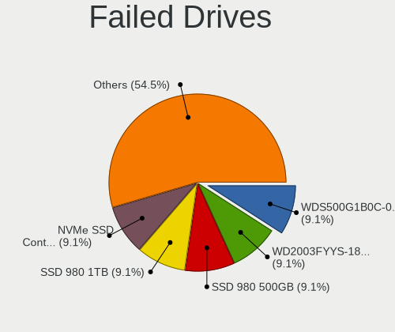
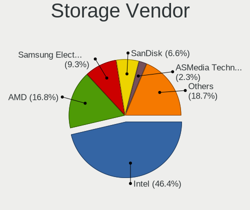
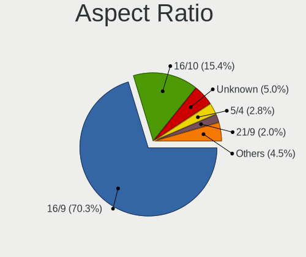
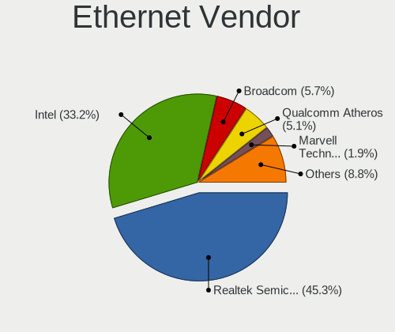

Linux in Canada - Tested Hardware & Statistics
----------------------------------------------

A project to collect tested hardware configurations for Linux in Canada.

Anyone can contribute to this report by the [hw-probe](https://github.com/linuxhw/hw-probe) tool:

    sudo -E hw-probe -all -upload

Please contribute! Especially if your hardware is rare.

This is a report for all computer types. See also reports for [desktops](/Location/Canada/Desktop/README.md) and [notebooks](/Location/Canada/Notebook/README.md).

Contents
--------

* [ Test Cases ](#test-cases)

* [ System ](#system)
  - [ OS                       ](#os)
  - [ OS Family                ](#os-family)
  - [ Kernel                   ](#kernel)
  - [ Kernel Family            ](#kernel-family)
  - [ Kernel Major Ver.        ](#kernel-major-ver)
  - [ Arch                     ](#arch)
  - [ DE                       ](#de)
  - [ Display Server           ](#display-server)
  - [ Display Manager          ](#display-manager)
  - [ OS Lang                  ](#os-lang)
  - [ Boot Mode                ](#boot-mode)
  - [ Filesystem               ](#filesystem)
  - [ Part. scheme             ](#part-scheme)
  - [ Dual Boot with Linux/BSD ](#dual-boot-with-linuxbsd)
  - [ Dual Boot (Win)          ](#dual-boot-win)

* [ Board ](#board)
  - [ Vendor                   ](#vendor)
  - [ Model                    ](#model)
  - [ Model Family             ](#model-family)
  - [ MFG Year                 ](#mfg-year)
  - [ Form Factor              ](#form-factor)
  - [ Secure Boot              ](#secure-boot)
  - [ Coreboot                 ](#coreboot)
  - [ RAM Size                 ](#ram-size)
  - [ RAM Used                 ](#ram-used)
  - [ Total Drives             ](#total-drives)
  - [ Has CD-ROM               ](#has-cd-rom)
  - [ Has Ethernet             ](#has-ethernet)
  - [ Has WiFi                 ](#has-wifi)
  - [ Has Bluetooth            ](#has-bluetooth)

* [ Location ](#location)
  - [ Country                  ](#country)
  - [ City                     ](#city)

* [ Drives ](#drives)
  - [ Drive Vendor             ](#drive-vendor)
  - [ Drive Model              ](#drive-model)
  - [ HDD Vendor               ](#hdd-vendor)
  - [ SSD Vendor               ](#ssd-vendor)
  - [ Drive Kind               ](#drive-kind)
  - [ Drive Connector          ](#drive-connector)
  - [ Drive Size               ](#drive-size)
  - [ Space Total              ](#space-total)
  - [ Space Used               ](#space-used)
  - [ Malfunc. Drives          ](#malfunc-drives)
  - [ Malfunc. Drive Vendor    ](#malfunc-drive-vendor)
  - [ Malfunc. HDD Vendor      ](#malfunc-hdd-vendor)
  - [ Malfunc. Drive Kind      ](#malfunc-drive-kind)
  - [ Failed Drives            ](#failed-drives)
  - [ Failed Drive Vendor      ](#failed-drive-vendor)
  - [ Drive Status             ](#drive-status)

* [ Storage controller ](#storage-controller)
  - [ Storage Vendor           ](#storage-vendor)
  - [ Storage Model            ](#storage-model)
  - [ Storage Kind             ](#storage-kind)

* [ Processor ](#processor)
  - [ CPU Vendor               ](#cpu-vendor)
  - [ CPU Model                ](#cpu-model)
  - [ CPU Model Family         ](#cpu-model-family)
  - [ CPU Cores                ](#cpu-cores)
  - [ CPU Sockets              ](#cpu-sockets)
  - [ CPU Threads              ](#cpu-threads)
  - [ CPU Op-Modes             ](#cpu-op-modes)
  - [ CPU Microcode            ](#cpu-microcode)
  - [ CPU Microarch            ](#cpu-microarch)

* [ Graphics ](#graphics)
  - [ GPU Vendor               ](#gpu-vendor)
  - [ GPU Model                ](#gpu-model)
  - [ GPU Combo                ](#gpu-combo)
  - [ GPU Driver               ](#gpu-driver)
  - [ GPU Memory               ](#gpu-memory)

* [ Monitor ](#monitor)
  - [ Monitor Vendor           ](#monitor-vendor)
  - [ Monitor Model            ](#monitor-model)
  - [ Monitor Resolution       ](#monitor-resolution)
  - [ Monitor Diagonal         ](#monitor-diagonal)
  - [ Monitor Width            ](#monitor-width)
  - [ Aspect Ratio             ](#aspect-ratio)
  - [ Monitor Area             ](#monitor-area)
  - [ Pixel Density            ](#pixel-density)
  - [ Multiple Monitors        ](#multiple-monitors)

* [ Network ](#network)
  - [ Net Controller Vendor    ](#net-controller-vendor)
  - [ Net Controller Model     ](#net-controller-model)
  - [ Wireless Vendor          ](#wireless-vendor)
  - [ Wireless Model           ](#wireless-model)
  - [ Ethernet Vendor          ](#ethernet-vendor)
  - [ Ethernet Model           ](#ethernet-model)
  - [ Net Controller Kind      ](#net-controller-kind)
  - [ Used Controller          ](#used-controller)
  - [ NICs                     ](#nics)
  - [ IPv6                     ](#ipv6)

* [ Bluetooth ](#bluetooth)
  - [ Bluetooth Vendor         ](#bluetooth-vendor)
  - [ Bluetooth Model          ](#bluetooth-model)

* [ Sound ](#sound)
  - [ Sound Vendor             ](#sound-vendor)
  - [ Sound Model              ](#sound-model)

* [ Memory ](#memory)
  - [ Memory Vendor            ](#memory-vendor)
  - [ Memory Model             ](#memory-model)
  - [ Memory Kind              ](#memory-kind)
  - [ Memory Form Factor       ](#memory-form-factor)
  - [ Memory Size              ](#memory-size)
  - [ Memory Speed             ](#memory-speed)

* [ Printers & scanners ](#printers--scanners)
  - [ Printer Vendor           ](#printer-vendor)
  - [ Printer Model            ](#printer-model)
  - [ Scanner Vendor           ](#scanner-vendor)
  - [ Scanner Model            ](#scanner-model)

* [ Camera ](#camera)
  - [ Camera Vendor            ](#camera-vendor)
  - [ Camera Model             ](#camera-model)

* [ Security ](#security)
  - [ Fingerprint Vendor       ](#fingerprint-vendor)
  - [ Fingerprint Model        ](#fingerprint-model)
  - [ Chipcard Vendor          ](#chipcard-vendor)
  - [ Chipcard Model           ](#chipcard-model)

* [ Unsupported ](#unsupported)
  - [ Unsupported Devices      ](#unsupported-devices)
  - [ Unsupported Device Types ](#unsupported-device-types)

Test Cases
----------

Total: 8299

| Vendor        | Model                       | Form-Factor | Probe                                                      | Date         |
|---------------|-----------------------------|-------------|------------------------------------------------------------|--------------|
| Alienware     | m17 R5 AMD                  | Notebook    | [4e665db2b1](https://linux-hardware.org/?probe=4e665db2b1) | May 01, 2023 |
| Dell          | 09KPNV A01                  | Desktop     | [45dad4b8e9](https://linux-hardware.org/?probe=45dad4b8e9) | May 01, 2023 |
| ASRockRack    | X470D4U2-2T                 | Desktop     | [34e7df2c84](https://linux-hardware.org/?probe=34e7df2c84) | May 01, 2023 |
| ASRockRack    | ROMED8-2T                   | Server      | [457abef5d3](https://linux-hardware.org/?probe=457abef5d3) | May 01, 2023 |
| ASUSTek       | TUF Gaming X570-PLUS        | Desktop     | [2a2bf698ed](https://linux-hardware.org/?probe=2a2bf698ed) | May 01, 2023 |
| ASUSTek       | ROG STRIX X399-E GAMING     | Desktop     | [a3c89effff](https://linux-hardware.org/?probe=a3c89effff) | May 01, 2023 |
| Fanless Mi... | Rev GMLR1                   | Mini pc     | [1f1cb63edc](https://linux-hardware.org/?probe=1f1cb63edc) | May 01, 2023 |
| Acer          | Aspire E1-571               | Notebook    | [e03d5ff056](https://linux-hardware.org/?probe=e03d5ff056) | Apr 30, 2023 |
| ASRock        | Z77 Extreme3                | Desktop     | [1298b74530](https://linux-hardware.org/?probe=1298b74530) | Apr 30, 2023 |
| Lenovo        | ThinkPad T470s W10DG 20J... | Notebook    | [3695c070f9](https://linux-hardware.org/?probe=3695c070f9) | Apr 30, 2023 |
| Intel         | S5520HC E26045-454          | Server      | [f1db72cddb](https://linux-hardware.org/?probe=f1db72cddb) | Apr 30, 2023 |
| ASRockRack    | X470D4U2-2T                 | Desktop     | [f46e9f6ba7](https://linux-hardware.org/?probe=f46e9f6ba7) | Apr 30, 2023 |
| HP            | 828A                        | Desktop     | [f1590b355f](https://linux-hardware.org/?probe=f1590b355f) | Apr 30, 2023 |
| Intel         | S5520HC E26045-454          | Server      | [a5fbe31c54](https://linux-hardware.org/?probe=a5fbe31c54) | Apr 30, 2023 |
| HP            | 18E4                        | Desktop     | [da858ea464](https://linux-hardware.org/?probe=da858ea464) | Apr 30, 2023 |
| HP            | ENVY x360 2-in-1 Laptop ... | Convertible | [e59a8bf7d1](https://linux-hardware.org/?probe=e59a8bf7d1) | Apr 30, 2023 |
| MSI           | H310M PRO-VD                | Desktop     | [c2e2e1d130](https://linux-hardware.org/?probe=c2e2e1d130) | Apr 30, 2023 |
| Acer          | Aspire Z5600                | All in one  | [8a9edf5a44](https://linux-hardware.org/?probe=8a9edf5a44) | Apr 29, 2023 |
| Lenovo        | ThinkPad T550 20CKA00ECD    | Notebook    | [2545d9dd31](https://linux-hardware.org/?probe=2545d9dd31) | Apr 29, 2023 |
| ASRock        | B450 Pro4 R2.0              | Desktop     | [1d00cc1f78](https://linux-hardware.org/?probe=1d00cc1f78) | Apr 29, 2023 |
| Lenovo        | XXXX 3000 H210              | Desktop     | [96644846f5](https://linux-hardware.org/?probe=96644846f5) | Apr 29, 2023 |
| Dell          | Inspiron 7706 2n1           | Convertible | [9a9fdf0dd3](https://linux-hardware.org/?probe=9a9fdf0dd3) | Apr 29, 2023 |
| HP            | Pavilion dv8000 (ET839UA... | Notebook    | [59b9a9ceb3](https://linux-hardware.org/?probe=59b9a9ceb3) | Apr 29, 2023 |
| Apple         | Mac-F221BEC8                | Desktop     | [033718212c](https://linux-hardware.org/?probe=033718212c) | Apr 28, 2023 |
| HP            | G62                         | Notebook    | [e5ae199298](https://linux-hardware.org/?probe=e5ae199298) | Apr 28, 2023 |
| ASUSTek       | N550JX                      | Notebook    | [790f73f0bd](https://linux-hardware.org/?probe=790f73f0bd) | Apr 28, 2023 |
| HP            | Pavilion dv7                | Notebook    | [346cbe0e48](https://linux-hardware.org/?probe=346cbe0e48) | Apr 28, 2023 |
| HP            | Pavilion dv7                | Notebook    | [afafdbce36](https://linux-hardware.org/?probe=afafdbce36) | Apr 28, 2023 |
| ASUSTek       | ROG CROSSHAIR VIII HERO     | Desktop     | [f1679a62d0](https://linux-hardware.org/?probe=f1679a62d0) | Apr 28, 2023 |
| Apple         | Mac-F221BEC8                | Desktop     | [3342a295e8](https://linux-hardware.org/?probe=3342a295e8) | Apr 28, 2023 |
| Microsoft     | Surface Go                  | Tablet      | [38c117ee87](https://linux-hardware.org/?probe=38c117ee87) | Apr 28, 2023 |
| ASRock        | H170A-X1                    | Desktop     | [a89448e417](https://linux-hardware.org/?probe=a89448e417) | Apr 28, 2023 |
| Dell          | 0XNNCJ A03                  | Server      | [ad555bfde2](https://linux-hardware.org/?probe=ad555bfde2) | Apr 27, 2023 |
| Apple         | Mac-F60DEB81FF30ACF6 Mac... | Desktop     | [49033dd76c](https://linux-hardware.org/?probe=49033dd76c) | Apr 27, 2023 |
| HP            | EliteBook 2560p             | Notebook    | [ce35b62e32](https://linux-hardware.org/?probe=ce35b62e32) | Apr 27, 2023 |
| ASRockRack    | X470D4U2-2T                 | Desktop     | [9fdfb825c7](https://linux-hardware.org/?probe=9fdfb825c7) | Apr 27, 2023 |
| ASUSTek       | CM6330_CM6630_CM6730_CM6... | Desktop     | [f3b21405ff](https://linux-hardware.org/?probe=f3b21405ff) | Apr 27, 2023 |
| Gigabyte      | Z170X-Gaming 7              | Desktop     | [4363ca582a](https://linux-hardware.org/?probe=4363ca582a) | Apr 26, 2023 |
| Gigabyte      | Z170X-Gaming 7              | Desktop     | [f5de49d5b3](https://linux-hardware.org/?probe=f5de49d5b3) | Apr 26, 2023 |
| HP            | 8309                        | Desktop     | [cde28bd710](https://linux-hardware.org/?probe=cde28bd710) | Apr 26, 2023 |
| ASUSTek       | ROG Zephyrus G14 GA401IV... | Notebook    | [96006a1098](https://linux-hardware.org/?probe=96006a1098) | Apr 26, 2023 |
| ASUSTek       | ROG Zephyrus G14 GA401IV... | Notebook    | [a3df65a55c](https://linux-hardware.org/?probe=a3df65a55c) | Apr 26, 2023 |
| ASRockRack    | X470D4U2-2T                 | Desktop     | [b24f39801d](https://linux-hardware.org/?probe=b24f39801d) | Apr 26, 2023 |
| HP            | EliteBook 840 G3            | Notebook    | [1413437b1f](https://linux-hardware.org/?probe=1413437b1f) | Apr 26, 2023 |
| Acer          | Swift SF313-53              | Notebook    | [b487229ea2](https://linux-hardware.org/?probe=b487229ea2) | Apr 25, 2023 |
| ASUSTek       | PRIME X570-P                | Desktop     | [7967ed6e8f](https://linux-hardware.org/?probe=7967ed6e8f) | Apr 25, 2023 |
| Dell          | 0PC5F7 A02                  | Desktop     | [c897ecd954](https://linux-hardware.org/?probe=c897ecd954) | Apr 25, 2023 |
| HP            | Pavilion dv7                | Notebook    | [e8318168c4](https://linux-hardware.org/?probe=e8318168c4) | Apr 25, 2023 |
| ASUSTek       | M5A97 R2.0                  | Desktop     | [4231d023e9](https://linux-hardware.org/?probe=4231d023e9) | Apr 25, 2023 |
| HP            | Pavilion dv8000 (ET839UA... | Notebook    | [cc14ce03b0](https://linux-hardware.org/?probe=cc14ce03b0) | Apr 25, 2023 |
| ASUSTek       | ProArt X670E-CREATOR WIF... | Desktop     | [f878b7d23a](https://linux-hardware.org/?probe=f878b7d23a) | Apr 25, 2023 |
| ASUSTek       | B85M-E                      | Desktop     | [135216cc27](https://linux-hardware.org/?probe=135216cc27) | Apr 25, 2023 |
| Acer          | Spin SP513-52N              | Convertible | [bdab97deeb](https://linux-hardware.org/?probe=bdab97deeb) | Apr 25, 2023 |
| Dell          | XPS 13 7390 2-in-1          | Convertible | [0cfe2b34f5](https://linux-hardware.org/?probe=0cfe2b34f5) | Apr 25, 2023 |
| Lenovo        | SHARKBAY 0B98401 PRO        | Desktop     | [d9ad034d8c](https://linux-hardware.org/?probe=d9ad034d8c) | Apr 24, 2023 |
| Dell          | Latitude E7240              | Notebook    | [b72361ca9e](https://linux-hardware.org/?probe=b72361ca9e) | Apr 24, 2023 |
| Alienware     | 13 R2                       | Notebook    | [ee7a023f6d](https://linux-hardware.org/?probe=ee7a023f6d) | Apr 24, 2023 |
| Lenovo        | ThinkPad T480s 20L8S0ER0... | Notebook    | [47ac6239d5](https://linux-hardware.org/?probe=47ac6239d5) | Apr 24, 2023 |
| Lenovo        | ThinkPad T480s 20L8S0ER0... | Notebook    | [a05c41b44d](https://linux-hardware.org/?probe=a05c41b44d) | Apr 24, 2023 |
| Lenovo        | SHARKBAY 0B98401 WIN        | Desktop     | [6531aafbfe](https://linux-hardware.org/?probe=6531aafbfe) | Apr 24, 2023 |
| Acer          | Aspire V5-552P              | Notebook    | [28c276f9da](https://linux-hardware.org/?probe=28c276f9da) | Apr 23, 2023 |
| Gigabyte      | F2A88X-UP4                  | Desktop     | [06859fe586](https://linux-hardware.org/?probe=06859fe586) | Apr 23, 2023 |
| HP            | Pavilion dv7                | Notebook    | [0ca422761e](https://linux-hardware.org/?probe=0ca422761e) | Apr 23, 2023 |
| HP            | Pavilion dv7                | Notebook    | [8b90982317](https://linux-hardware.org/?probe=8b90982317) | Apr 23, 2023 |
| Lenovo        | IdeaPad 3 15ALC6 82KU       | Notebook    | [db614f561e](https://linux-hardware.org/?probe=db614f561e) | Apr 23, 2023 |
| ASUSTek       | X510UAR                     | Notebook    | [3321ccb912](https://linux-hardware.org/?probe=3321ccb912) | Apr 23, 2023 |
| Google        | Kefka                       | Notebook    | [2802d83837](https://linux-hardware.org/?probe=2802d83837) | Apr 23, 2023 |
| Gigabyte      | Z170X-Gaming 7              | Desktop     | [cd11cc0e25](https://linux-hardware.org/?probe=cd11cc0e25) | Apr 23, 2023 |
| ASRock        | Z690 Pro RS                 | Desktop     | [acb9cde3d7](https://linux-hardware.org/?probe=acb9cde3d7) | Apr 23, 2023 |
| ASUSTek       | B85M-E                      | Desktop     | [9a0f95336c](https://linux-hardware.org/?probe=9a0f95336c) | Apr 23, 2023 |
| ASUSTek       | P8H77-I                     | Desktop     | [e2276c080b](https://linux-hardware.org/?probe=e2276c080b) | Apr 22, 2023 |
| ASUSTek       | ROG STRIX X670E-E GAMING... | Desktop     | [ea9dd842c0](https://linux-hardware.org/?probe=ea9dd842c0) | Apr 22, 2023 |
| ASUSTek       | Zenbook UP6502ZD_UP6502Z... | Convertible | [9cd180c75a](https://linux-hardware.org/?probe=9cd180c75a) | Apr 22, 2023 |
| ASUSTek       | VivoBook_ASUSLaptop X415... | Notebook    | [63599179ae](https://linux-hardware.org/?probe=63599179ae) | Apr 22, 2023 |
| MSI           | GP60 2QE                    | Notebook    | [550a1cee3b](https://linux-hardware.org/?probe=550a1cee3b) | Apr 22, 2023 |
| MSI           | B550-A PRO                  | Desktop     | [06bc639254](https://linux-hardware.org/?probe=06bc639254) | Apr 22, 2023 |
| Gigabyte      | AERO 15-X9                  | Notebook    | [5eb2235e10](https://linux-hardware.org/?probe=5eb2235e10) | Apr 22, 2023 |
| Dell          | 0WN7Y6 A01                  | Desktop     | [cc1233b9b9](https://linux-hardware.org/?probe=cc1233b9b9) | Apr 21, 2023 |
| Lenovo        | 102F SDK0J40705 WIN 3425... | Desktop     | [15cc4335c7](https://linux-hardware.org/?probe=15cc4335c7) | Apr 21, 2023 |
| HP            | ENVY Laptop 13-ba1xxx       | Notebook    | [84a6fd49fa](https://linux-hardware.org/?probe=84a6fd49fa) | Apr 21, 2023 |
| HP            | 1905                        | Desktop     | [9e047f751d](https://linux-hardware.org/?probe=9e047f751d) | Apr 21, 2023 |
| ASUSTek       | ROG Zephyrus G14 GA401IV... | Notebook    | [f2f6b7ab4e](https://linux-hardware.org/?probe=f2f6b7ab4e) | Apr 21, 2023 |
| MSI           | MAG Z490 TOMAHAWK           | Desktop     | [97eec10e18](https://linux-hardware.org/?probe=97eec10e18) | Apr 21, 2023 |
| Dell          | Inspiron 3531               | Notebook    | [6222a9aa08](https://linux-hardware.org/?probe=6222a9aa08) | Apr 21, 2023 |
| MSI           | Z97 PC Mate                 | Desktop     | [f1345bd185](https://linux-hardware.org/?probe=f1345bd185) | Apr 21, 2023 |
| MSI           | MAG X570S TOMAHAWK MAX W... | Desktop     | [8e7095e453](https://linux-hardware.org/?probe=8e7095e453) | Apr 20, 2023 |
| ASUSTek       | VivoBook_ASUSLaptop M160... | Notebook    | [44459cbe3a](https://linux-hardware.org/?probe=44459cbe3a) | Apr 20, 2023 |
| Dell          | Latitude E6420              | Notebook    | [6b5cc099a0](https://linux-hardware.org/?probe=6b5cc099a0) | Apr 20, 2023 |
| Gigabyte      | Z270XP-SLI-CF               | Desktop     | [1383ab9981](https://linux-hardware.org/?probe=1383ab9981) | Apr 20, 2023 |
| Apple         | Mac-F2238BAE iMac11,3       | All in one  | [3e1880b375](https://linux-hardware.org/?probe=3e1880b375) | Apr 20, 2023 |
| ASUSTek       | Maximus VIII HERO           | Desktop     | [f83e11ca39](https://linux-hardware.org/?probe=f83e11ca39) | Apr 20, 2023 |
| Dell          | XPS 13 9343                 | Notebook    | [573d482e45](https://linux-hardware.org/?probe=573d482e45) | Apr 20, 2023 |
| ASUSTek       | G10DK                       | Desktop     | [7310d7f91b](https://linux-hardware.org/?probe=7310d7f91b) | Apr 19, 2023 |
| MSI           | H110M PRO-D                 | Desktop     | [cc76c44731](https://linux-hardware.org/?probe=cc76c44731) | Apr 19, 2023 |
| HP            | Pavilion dv7                | Notebook    | [f5c84d7a1b](https://linux-hardware.org/?probe=f5c84d7a1b) | Apr 19, 2023 |
| Apple         | Mac-F2268DC8                | All in one  | [86e2d42f73](https://linux-hardware.org/?probe=86e2d42f73) | Apr 19, 2023 |
| ASUSTek       | B85M-E                      | Desktop     | [748e08d7c7](https://linux-hardware.org/?probe=748e08d7c7) | Apr 19, 2023 |
| Intel         | DH61AG AAG23736-504         | Desktop     | [9a853b9c86](https://linux-hardware.org/?probe=9a853b9c86) | Apr 19, 2023 |
| Lenovo        | ThinkBook 15 G4 IAP 21DJ    | Notebook    | [1a5add814c](https://linux-hardware.org/?probe=1a5add814c) | Apr 18, 2023 |
| Dell          | Latitude E5550              | Notebook    | [ce824f113c](https://linux-hardware.org/?probe=ce824f113c) | Apr 18, 2023 |
| Dell          | Latitude E5550              | Notebook    | [7611d6e018](https://linux-hardware.org/?probe=7611d6e018) | Apr 18, 2023 |
| Dell          | 0KRC95 A00                  | Desktop     | [99ea2c7790](https://linux-hardware.org/?probe=99ea2c7790) | Apr 18, 2023 |
| Lenovo        | ThinkPad Edge 031946U       | Notebook    | [f9d813509a](https://linux-hardware.org/?probe=f9d813509a) | Apr 18, 2023 |
| Dell          | 0XHYJF A00                  | All in one  | [9348834e54](https://linux-hardware.org/?probe=9348834e54) | Apr 18, 2023 |
| Dell          | 0XHYJF A00                  | All in one  | [c8804b1836](https://linux-hardware.org/?probe=c8804b1836) | Apr 18, 2023 |
| Acer          | Aspire TC-885 V:1.1         | Desktop     | [9539ccfd4d](https://linux-hardware.org/?probe=9539ccfd4d) | Apr 18, 2023 |
| Acer          | Nitro AN515-54              | Notebook    | [7b3a68ca48](https://linux-hardware.org/?probe=7b3a68ca48) | Apr 18, 2023 |
| MSI           | Z97 GAMING 5                | Desktop     | [152e32b151](https://linux-hardware.org/?probe=152e32b151) | Apr 17, 2023 |
| MSI           | GF75 Thin 9SC               | Notebook    | [40b6c3bad6](https://linux-hardware.org/?probe=40b6c3bad6) | Apr 17, 2023 |
| Lenovo        | ThinkBook 15 G4 IAP 21DJ    | Notebook    | [f8a45caf43](https://linux-hardware.org/?probe=f8a45caf43) | Apr 17, 2023 |
| Biostar       | TA880GU3+                   | Desktop     | [ee629553e7](https://linux-hardware.org/?probe=ee629553e7) | Apr 17, 2023 |
| Biostar       | TA880GU3+                   | Desktop     | [3553ce4185](https://linux-hardware.org/?probe=3553ce4185) | Apr 17, 2023 |
| ASUSTek       | P8H77-M                     | Desktop     | [6364dbb93a](https://linux-hardware.org/?probe=6364dbb93a) | Apr 16, 2023 |
| Toshiba       | Satellite L850              | Notebook    | [2fd09b6ba5](https://linux-hardware.org/?probe=2fd09b6ba5) | Apr 16, 2023 |
| Dell          | Latitude E6430s             | Notebook    | [5358f67a6d](https://linux-hardware.org/?probe=5358f67a6d) | Apr 16, 2023 |
| ASRock        | X670E Pro RS                | Desktop     | [cfc2be8311](https://linux-hardware.org/?probe=cfc2be8311) | Apr 16, 2023 |
| ASRock        | X670E Pro RS                | Desktop     | [be0c962cda](https://linux-hardware.org/?probe=be0c962cda) | Apr 16, 2023 |
| ASUSTek       | ASUS TUF Dash F15 FX517Z... | Notebook    | [afc478cf27](https://linux-hardware.org/?probe=afc478cf27) | Apr 16, 2023 |
| Lenovo        | Legion 5 17ACH6H 82JY       | Notebook    | [762ad80f82](https://linux-hardware.org/?probe=762ad80f82) | Apr 16, 2023 |
| ASUSTek       | ROG STRIX B550-A GAMING     | Desktop     | [3fb8069a1b](https://linux-hardware.org/?probe=3fb8069a1b) | Apr 16, 2023 |
| ASUSTek       | TUF Gaming X570-PLUS        | Desktop     | [cb21111c89](https://linux-hardware.org/?probe=cb21111c89) | Apr 16, 2023 |
| Lenovo        | Yoga 6 13ALC7 82UD          | Convertible | [35098c2748](https://linux-hardware.org/?probe=35098c2748) | Apr 16, 2023 |
| Lenovo        | IdeaPad 330-15ARR 81D2      | Notebook    | [872416fe62](https://linux-hardware.org/?probe=872416fe62) | Apr 16, 2023 |
| MSI           | Modern 14 B10MW             | Notebook    | [c655afe860](https://linux-hardware.org/?probe=c655afe860) | Apr 15, 2023 |
| HP            | EliteBook 8440p             | Notebook    | [f3b7c9c255](https://linux-hardware.org/?probe=f3b7c9c255) | Apr 14, 2023 |
| ASRock        | A320M-HDV R4.0              | Desktop     | [d78a3541af](https://linux-hardware.org/?probe=d78a3541af) | Apr 14, 2023 |
| Lenovo        | ThinkPad T470s W10DG 20J... | Notebook    | [c7b7e028e4](https://linux-hardware.org/?probe=c7b7e028e4) | Apr 14, 2023 |
| Dell          | Latitude E6420              | Notebook    | [7cf2e649e1](https://linux-hardware.org/?probe=7cf2e649e1) | Apr 14, 2023 |
| MSI           | GP72 7RDX                   | Notebook    | [2236248ba0](https://linux-hardware.org/?probe=2236248ba0) | Apr 14, 2023 |
| Lenovo        | IdeaPad 3 15IGL05 81WQ      | Notebook    | [d4de10f812](https://linux-hardware.org/?probe=d4de10f812) | Apr 14, 2023 |
| Lenovo        | ThinkPad X1 Carbon 7th 2... | Notebook    | [7c862e338c](https://linux-hardware.org/?probe=7c862e338c) | Apr 14, 2023 |
| Microsoft     | Surface Laptop Go           | Tablet      | [03e40fe2cd](https://linux-hardware.org/?probe=03e40fe2cd) | Apr 14, 2023 |
| Gigabyte      | X570 AORUS ELITE WIFI       | Desktop     | [9f723bfac9](https://linux-hardware.org/?probe=9f723bfac9) | Apr 14, 2023 |
| Toshiba       | Satellite L850              | Notebook    | [15de4db91b](https://linux-hardware.org/?probe=15de4db91b) | Apr 14, 2023 |
| Dell          | Latitude 3590               | Notebook    | [eed6f4df10](https://linux-hardware.org/?probe=eed6f4df10) | Apr 14, 2023 |
| MSI           | MPG X570S EDGE MAX WIFI     | Desktop     | [df59296148](https://linux-hardware.org/?probe=df59296148) | Apr 13, 2023 |
| ASUSTek       | PRIME Z270-P                | Desktop     | [3ac19a6abf](https://linux-hardware.org/?probe=3ac19a6abf) | Apr 13, 2023 |
| ASUSTek       | SABERTOOTH P67              | Desktop     | [c1f5858d5f](https://linux-hardware.org/?probe=c1f5858d5f) | Apr 13, 2023 |
| Gigabyte      | P55A-UD4P                   | Desktop     | [ae144ff4c8](https://linux-hardware.org/?probe=ae144ff4c8) | Apr 12, 2023 |
| Toshiba       | Satellite L300D             | Notebook    | [76595cf176](https://linux-hardware.org/?probe=76595cf176) | Apr 12, 2023 |
| Dell          | 0XD433 A00                  | Desktop     | [e0a30bf441](https://linux-hardware.org/?probe=e0a30bf441) | Apr 12, 2023 |
| ASUSTek       | PRIME B450M-A               | Desktop     | [9fbd01e856](https://linux-hardware.org/?probe=9fbd01e856) | Apr 12, 2023 |
| Dell          | Latitude 7390               | Notebook    | [9859e63f40](https://linux-hardware.org/?probe=9859e63f40) | Apr 12, 2023 |
| Intel         | SHARKBAY                    | Desktop     | [3bb10a5574](https://linux-hardware.org/?probe=3bb10a5574) | Apr 12, 2023 |
| ASUSTek       | TUF Gaming X570-PLUS        | Desktop     | [f5241c853f](https://linux-hardware.org/?probe=f5241c853f) | Apr 12, 2023 |
| Lenovo        | ThinkPad X1 Carbon Gen 1... | Notebook    | [a2c9f95f36](https://linux-hardware.org/?probe=a2c9f95f36) | Apr 12, 2023 |
| Lenovo        | ThinkPad X1 Carbon Gen 1... | Notebook    | [26358515bc](https://linux-hardware.org/?probe=26358515bc) | Apr 12, 2023 |
| Lenovo        | Yoga 9 14IAP7 82LU          | Convertible | [c8473ad9e5](https://linux-hardware.org/?probe=c8473ad9e5) | Apr 12, 2023 |
| Lenovo        | ThinkPad X1 Carbon Gen 1... | Notebook    | [509dbf780c](https://linux-hardware.org/?probe=509dbf780c) | Apr 12, 2023 |
| HP            | EliteBook 840 G3            | Notebook    | [0daac07546](https://linux-hardware.org/?probe=0daac07546) | Apr 12, 2023 |
| Gateway       | NE56R                       | Notebook    | [39a33d998b](https://linux-hardware.org/?probe=39a33d998b) | Apr 12, 2023 |
| ASRockRack    | X470D4U2-2T                 | Desktop     | [9dd9a74143](https://linux-hardware.org/?probe=9dd9a74143) | Apr 12, 2023 |
| Apple         | MacBookPro8,1               | Notebook    | [94372e3520](https://linux-hardware.org/?probe=94372e3520) | Apr 12, 2023 |
| Dell          | Latitude 7390               | Notebook    | [5c446957c5](https://linux-hardware.org/?probe=5c446957c5) | Apr 12, 2023 |
| ASUSTek       | ROG STRIX B460-I GAMING     | Desktop     | [14db4e6f1d](https://linux-hardware.org/?probe=14db4e6f1d) | Apr 11, 2023 |
| HP            | Pavilion dv7                | Notebook    | [7cec7666c8](https://linux-hardware.org/?probe=7cec7666c8) | Apr 11, 2023 |
| ASRock        | A320M-HDV R4.0              | Desktop     | [8eaf410d51](https://linux-hardware.org/?probe=8eaf410d51) | Apr 11, 2023 |
| ASUSTek       | P8H67-M PRO                 | Desktop     | [1627e0654a](https://linux-hardware.org/?probe=1627e0654a) | Apr 11, 2023 |
| ASUSTek       | P8H67-M PRO                 | Desktop     | [57aa7d103d](https://linux-hardware.org/?probe=57aa7d103d) | Apr 11, 2023 |
| HP            | Pavilion dv7                | Notebook    | [e3583c2121](https://linux-hardware.org/?probe=e3583c2121) | Apr 11, 2023 |
| ASUSTek       | VivoBook_ASUSLaptop X515... | Notebook    | [d9f95c9169](https://linux-hardware.org/?probe=d9f95c9169) | Apr 11, 2023 |
| ASRock        | B550M-HDV                   | Desktop     | [b10bf3690e](https://linux-hardware.org/?probe=b10bf3690e) | Apr 11, 2023 |
| Intel         | SHARKBAY                    | Desktop     | [4b50be64da](https://linux-hardware.org/?probe=4b50be64da) | Apr 11, 2023 |
| ASUSTek       | PRIME Z690-A                | Desktop     | [b434d4a0b5](https://linux-hardware.org/?probe=b434d4a0b5) | Apr 11, 2023 |
| HP            | 18E4                        | Desktop     | [54c681affc](https://linux-hardware.org/?probe=54c681affc) | Apr 10, 2023 |
| Lenovo        | SHARKBAY SDK0E50510 WIN     | Desktop     | [e35ed3cb0d](https://linux-hardware.org/?probe=e35ed3cb0d) | Apr 10, 2023 |
| Lenovo        | B575 1450ABU                | Notebook    | [ef58d2e8e6](https://linux-hardware.org/?probe=ef58d2e8e6) | Apr 09, 2023 |
| Framework     | Laptop (12th Gen Intel C... | Notebook    | [e762a4eb1d](https://linux-hardware.org/?probe=e762a4eb1d) | Apr 09, 2023 |
| ASUSTek       | B85M-E                      | Desktop     | [fe9976de62](https://linux-hardware.org/?probe=fe9976de62) | Apr 09, 2023 |
| ASUSTek       | VivoBook_ASUSLaptop E210... | Notebook    | [fa54308baa](https://linux-hardware.org/?probe=fa54308baa) | Apr 09, 2023 |
| ASUSTek       | PRIME B450-PLUS             | Desktop     | [3b665833d1](https://linux-hardware.org/?probe=3b665833d1) | Apr 09, 2023 |
| Acer          | Predator PH315-54           | Notebook    | [edbc0b98a4](https://linux-hardware.org/?probe=edbc0b98a4) | Apr 08, 2023 |
| Microsoft     | Surface Pro 8               | Tablet      | [840f96a7df](https://linux-hardware.org/?probe=840f96a7df) | Apr 08, 2023 |
| ASUSTek       | M5A78L-M LX3                | Desktop     | [5125228dd1](https://linux-hardware.org/?probe=5125228dd1) | Apr 08, 2023 |
| Apple         | Mac-F4208DC8 PVT            | Desktop     | [cf325779ee](https://linux-hardware.org/?probe=cf325779ee) | Apr 08, 2023 |
| Apple         | MacBookPro11,1              | Notebook    | [08f117749f](https://linux-hardware.org/?probe=08f117749f) | Apr 08, 2023 |
| Gigabyte      | B650 AORUS PRO AX           | Desktop     | [5a044a37f7](https://linux-hardware.org/?probe=5a044a37f7) | Apr 07, 2023 |
| Gigabyte      | B650 AORUS PRO AX           | Desktop     | [81a8d7a1fc](https://linux-hardware.org/?probe=81a8d7a1fc) | Apr 07, 2023 |
| Gigabyte      | B550 AORUS PRO AC           | Desktop     | [cd157a6ebf](https://linux-hardware.org/?probe=cd157a6ebf) | Apr 06, 2023 |
| Gigabyte      | GA-MA785GM-US2H             | Desktop     | [11edc2be88](https://linux-hardware.org/?probe=11edc2be88) | Apr 06, 2023 |
| ASRockRack    | X470D4U2-2T                 | Desktop     | [d699519c30](https://linux-hardware.org/?probe=d699519c30) | Apr 06, 2023 |
| Gigabyte      | F2A88XN-WIFI                | Desktop     | [ea7a921618](https://linux-hardware.org/?probe=ea7a921618) | Apr 06, 2023 |
| Gigabyte      | F2A88XN-WIFI                | Desktop     | [125f93468e](https://linux-hardware.org/?probe=125f93468e) | Apr 06, 2023 |
| ASUSTek       | ROG STRIX B650E-F GAMING... | Desktop     | [fb8ef4b4af](https://linux-hardware.org/?probe=fb8ef4b4af) | Apr 06, 2023 |
| ASUSTek       | PRIME A320M-K               | Desktop     | [8b92d25f91](https://linux-hardware.org/?probe=8b92d25f91) | Apr 06, 2023 |
| ASUSTek       | Z87M-PLUS                   | Desktop     | [a17064a0db](https://linux-hardware.org/?probe=a17064a0db) | Apr 06, 2023 |
| ASUSTek       | Z87M-PLUS                   | Desktop     | [f1e8cec7f8](https://linux-hardware.org/?probe=f1e8cec7f8) | Apr 06, 2023 |
| ASUSTek       | ROG STRIX B450-F GAMING     | Desktop     | [ca7faa89ba](https://linux-hardware.org/?probe=ca7faa89ba) | Apr 05, 2023 |
| HP            | EliteBook 840 G5            | Notebook    | [0d68e199a9](https://linux-hardware.org/?probe=0d68e199a9) | Apr 05, 2023 |
| HP            | 3397                        | Desktop     | [2c3fa64234](https://linux-hardware.org/?probe=2c3fa64234) | Apr 05, 2023 |
| ASUSTek       | ROG STRIX B450-I GAMING     | Desktop     | [7dc5bea17c](https://linux-hardware.org/?probe=7dc5bea17c) | Apr 05, 2023 |
| Dell          | Precision 7670              | Notebook    | [b5e95f0d21](https://linux-hardware.org/?probe=b5e95f0d21) | Apr 05, 2023 |
| Dell          | Latitude 7490               | Notebook    | [b9a5dadc44](https://linux-hardware.org/?probe=b9a5dadc44) | Apr 05, 2023 |
| ASUSTek       | K30BF_M32BF_A_F_K31BF_6     | Desktop     | [4505cd8ddc](https://linux-hardware.org/?probe=4505cd8ddc) | Apr 05, 2023 |
| Apple         | MacBookPro8,1               | Notebook    | [c80b7018f6](https://linux-hardware.org/?probe=c80b7018f6) | Apr 05, 2023 |
| ASUSTek       | P8Z77-I DELUXE              | Desktop     | [d8dc8a37b1](https://linux-hardware.org/?probe=d8dc8a37b1) | Apr 04, 2023 |
| Gigabyte      | GA-A75M-D2H                 | Desktop     | [9885a8adee](https://linux-hardware.org/?probe=9885a8adee) | Apr 04, 2023 |
| Dell          | 0DF42J A00                  | Desktop     | [056818267b](https://linux-hardware.org/?probe=056818267b) | Apr 04, 2023 |
| MSI           | Z390-A PRO                  | Desktop     | [60583d2cb0](https://linux-hardware.org/?probe=60583d2cb0) | Apr 04, 2023 |
| Lenovo        | ThinkPad X1 Carbon 6th 2... | Notebook    | [a467a04489](https://linux-hardware.org/?probe=a467a04489) | Apr 04, 2023 |
| Pegatron      | Benicia                     | Desktop     | [96ba9b6040](https://linux-hardware.org/?probe=96ba9b6040) | Apr 04, 2023 |
| MSI           | H81M-E34                    | Desktop     | [5e24c6a44a](https://linux-hardware.org/?probe=5e24c6a44a) | Apr 03, 2023 |
| Apple         | MacBookPro5,5               | Notebook    | [c674243118](https://linux-hardware.org/?probe=c674243118) | Apr 03, 2023 |
| Apple         | MacBookPro5,5               | Notebook    | [dca6973952](https://linux-hardware.org/?probe=dca6973952) | Apr 03, 2023 |
| ASUSTek       | ASUS TUF Dash F15 FX517Z... | Notebook    | [0b97a5a77a](https://linux-hardware.org/?probe=0b97a5a77a) | Apr 03, 2023 |
| Lenovo        | ThinkPad E15 Gen 4 21E60... | Notebook    | [7355f06eb3](https://linux-hardware.org/?probe=7355f06eb3) | Apr 03, 2023 |
| ASUSTek       | PRIME B450M-A               | Desktop     | [734efd13d3](https://linux-hardware.org/?probe=734efd13d3) | Apr 03, 2023 |
| WeiBu         | ADL-N Prod                  | Desktop     | [9b96a245f1](https://linux-hardware.org/?probe=9b96a245f1) | Apr 02, 2023 |
| Lenovo        | ThinkCentre M91p 4518RH1    | Desktop     | [ead0ecfb3a](https://linux-hardware.org/?probe=ead0ecfb3a) | Apr 02, 2023 |
| Acer          | Aspire TC-885 V:1.1         | Desktop     | [25c3fdc9f7](https://linux-hardware.org/?probe=25c3fdc9f7) | Apr 02, 2023 |
| ASRockRack    | X470D4U2-2T                 | Desktop     | [fbd686e3e2](https://linux-hardware.org/?probe=fbd686e3e2) | Apr 02, 2023 |
| Shenzhen M... | F7BAA                       | Desktop     | [e2725a09c9](https://linux-hardware.org/?probe=e2725a09c9) | Apr 02, 2023 |
| Acer          | Aspire TC-885 V:1.1         | Desktop     | [8b4f79808a](https://linux-hardware.org/?probe=8b4f79808a) | Apr 01, 2023 |
| Shenzhen W... | GB1                         | Mini pc     | [ca02164e4d](https://linux-hardware.org/?probe=ca02164e4d) | Apr 01, 2023 |
| ASUSTek       | VivoBook_ASUS Laptop E41... | Notebook    | [dabe76e4ca](https://linux-hardware.org/?probe=dabe76e4ca) | Apr 01, 2023 |
| Dell          | 09KPNV A01                  | Desktop     | [2b25e4872f](https://linux-hardware.org/?probe=2b25e4872f) | Apr 01, 2023 |
| ASUSTek       | PRIME B550M-A WIFI II       | Desktop     | [ad3ead1116](https://linux-hardware.org/?probe=ad3ead1116) | Apr 01, 2023 |
| Microsoft     | Surface Go 3                | Tablet      | [d6d1ab6c61](https://linux-hardware.org/?probe=d6d1ab6c61) | Apr 01, 2023 |
| ASRockRack    | X470D4U2-2T                 | Desktop     | [acb0f81194](https://linux-hardware.org/?probe=acb0f81194) | Apr 01, 2023 |
| ASUSTek       | P8Z77-V PREMIUM             | Desktop     | [d774a892d1](https://linux-hardware.org/?probe=d774a892d1) | Apr 01, 2023 |
| Apple         | Mac-F4208DC8 PVT            | Desktop     | [f05009caac](https://linux-hardware.org/?probe=f05009caac) | Apr 01, 2023 |
| Valve         | Jupiter                     | Notebook    | [a91aee62d3](https://linux-hardware.org/?probe=a91aee62d3) | Apr 01, 2023 |
| Gigabyte      | Z170X-Gaming 7              | Desktop     | [f7c90851ac](https://linux-hardware.org/?probe=f7c90851ac) | Apr 01, 2023 |
| Apple         | MacBookPro11,1              | Notebook    | [53717700a1](https://linux-hardware.org/?probe=53717700a1) | Mar 31, 2023 |
| Lenovo        | ThinkPad X1 Carbon 2nd 2... | Notebook    | [016ddeab52](https://linux-hardware.org/?probe=016ddeab52) | Mar 31, 2023 |
| ASUSTek       | TS10                        | Desktop     | [054de4f36a](https://linux-hardware.org/?probe=054de4f36a) | Mar 31, 2023 |
| Dell          | XPS M1330                   | Notebook    | [46b9a5cfde](https://linux-hardware.org/?probe=46b9a5cfde) | Mar 31, 2023 |
| Wistron       | ProLiant ML110 G5           | Desktop     | [925759c41c](https://linux-hardware.org/?probe=925759c41c) | Mar 31, 2023 |
| MSI           | 970 GAMING                  | Desktop     | [d729a0a559](https://linux-hardware.org/?probe=d729a0a559) | Mar 31, 2023 |
| ASUSTek       | X450LD                      | Notebook    | [1ca0cdc1e8](https://linux-hardware.org/?probe=1ca0cdc1e8) | Mar 31, 2023 |
| ASUSTek       | H97-PLUS                    | Desktop     | [5f163f6a24](https://linux-hardware.org/?probe=5f163f6a24) | Mar 31, 2023 |
| ASUSTek       | UN65U                       | Desktop     | [70d0f8f069](https://linux-hardware.org/?probe=70d0f8f069) | Mar 31, 2023 |
| Dell          | Latitude 7490               | Notebook    | [06928c624b](https://linux-hardware.org/?probe=06928c624b) | Mar 31, 2023 |
| ASRock        | A320M-HDV R4.0              | Desktop     | [f5e2675cdd](https://linux-hardware.org/?probe=f5e2675cdd) | Mar 30, 2023 |
| Lenovo        | G550 2958                   | Notebook    | [41f23ded68](https://linux-hardware.org/?probe=41f23ded68) | Mar 30, 2023 |
| ASUSTek       | F2A85-M                     | Desktop     | [4d6ae3ef0f](https://linux-hardware.org/?probe=4d6ae3ef0f) | Mar 30, 2023 |
| Lenovo        | N22 80S6                    | Notebook    | [c6cbeeb984](https://linux-hardware.org/?probe=c6cbeeb984) | Mar 30, 2023 |
| Shuttle       | FH270                       | Desktop     | [83c990d212](https://linux-hardware.org/?probe=83c990d212) | Mar 30, 2023 |
| MSI           | Z97 PC Mate                 | Desktop     | [1e3ec03234](https://linux-hardware.org/?probe=1e3ec03234) | Mar 30, 2023 |
| MSI           | Z97 PC Mate                 | Desktop     | [fe068bd78d](https://linux-hardware.org/?probe=fe068bd78d) | Mar 30, 2023 |
| MSI           | H81M-E34                    | Desktop     | [ac06c6037f](https://linux-hardware.org/?probe=ac06c6037f) | Mar 30, 2023 |
| MSI           | B550M PRO-VDH WIFI          | Desktop     | [aaeb2f2269](https://linux-hardware.org/?probe=aaeb2f2269) | Mar 29, 2023 |
| Dell          | 042P49 A01                  | Desktop     | [9a4f4be1ab](https://linux-hardware.org/?probe=9a4f4be1ab) | Mar 29, 2023 |
| Dell          | 09KPNV A01                  | Desktop     | [6024b90eea](https://linux-hardware.org/?probe=6024b90eea) | Mar 29, 2023 |
| Intel         | 945GCT-M                    | Desktop     | [d7e65e945e](https://linux-hardware.org/?probe=d7e65e945e) | Mar 29, 2023 |
| ECS           | G31T-M                      | Desktop     | [d6149cbd0d](https://linux-hardware.org/?probe=d6149cbd0d) | Mar 29, 2023 |
| HP            | Spectre x360 Convertible... | Convertible | [e27d6594a6](https://linux-hardware.org/?probe=e27d6594a6) | Mar 29, 2023 |
| ASUSTek       | ROG Strix G513RW_G513RW     | Notebook    | [6de889ae8a](https://linux-hardware.org/?probe=6de889ae8a) | Mar 29, 2023 |
| HP            | 0AACh                       | Desktop     | [e313c99b98](https://linux-hardware.org/?probe=e313c99b98) | Mar 28, 2023 |
| Gigabyte      | B450 AORUS PRO WIFI-CF      | Desktop     | [19ffc63f56](https://linux-hardware.org/?probe=19ffc63f56) | Mar 28, 2023 |
| Acer          | Swift SFX14-41G             | Notebook    | [20df1488bd](https://linux-hardware.org/?probe=20df1488bd) | Mar 28, 2023 |
| MSI           | B550-A PRO                  | Desktop     | [999219f420](https://linux-hardware.org/?probe=999219f420) | Mar 28, 2023 |
| Sony          | VPCCB32FD                   | Notebook    | [ef684c34bb](https://linux-hardware.org/?probe=ef684c34bb) | Mar 28, 2023 |
| ASUSTek       | PRIME B450M-A II            | All in one  | [fcd01e22d7](https://linux-hardware.org/?probe=fcd01e22d7) | Mar 28, 2023 |
| Dell          | Studio 1558                 | Notebook    | [955946c74d](https://linux-hardware.org/?probe=955946c74d) | Mar 28, 2023 |
| MSI           | MAG B660M MORTAR WIFI DD... | Desktop     | [11cb22743c](https://linux-hardware.org/?probe=11cb22743c) | Mar 27, 2023 |
| Apple         | Mac-F4208DC8 PVT            | Desktop     | [cdb2c38b76](https://linux-hardware.org/?probe=cdb2c38b76) | Mar 27, 2023 |
| Gigabyte      | X570 AORUS PRO WIFI         | Desktop     | [14380327b0](https://linux-hardware.org/?probe=14380327b0) | Mar 27, 2023 |
| HP            | 0AACh                       | Desktop     | [f354a2f03e](https://linux-hardware.org/?probe=f354a2f03e) | Mar 27, 2023 |
| Lenovo        | 36EB SDK0R32862 WIN 3258... | Desktop     | [943075edf7](https://linux-hardware.org/?probe=943075edf7) | Mar 27, 2023 |
| ASUSTek       | PRIME Z270-P                | Desktop     | [6f41d8a22c](https://linux-hardware.org/?probe=6f41d8a22c) | Mar 27, 2023 |
| ASRockRack    | X470D4U2-2T                 | Desktop     | [d96c0cfcd9](https://linux-hardware.org/?probe=d96c0cfcd9) | Mar 27, 2023 |
| Dell          | Latitude 7490               | Notebook    | [58ccd5d7e0](https://linux-hardware.org/?probe=58ccd5d7e0) | Mar 27, 2023 |
| Acer          | Aspire M3910                | Desktop     | [8cc87c48d1](https://linux-hardware.org/?probe=8cc87c48d1) | Mar 27, 2023 |
| HP            | 18E4                        | Desktop     | [5d10e73e1d](https://linux-hardware.org/?probe=5d10e73e1d) | Mar 26, 2023 |
| ASUSTek       | TUF Gaming B550-PLUS        | Desktop     | [b084807397](https://linux-hardware.org/?probe=b084807397) | Mar 26, 2023 |
| ASUSTek       | TUF Gaming B550-PLUS        | Desktop     | [bc38c5ed22](https://linux-hardware.org/?probe=bc38c5ed22) | Mar 26, 2023 |
| Gigabyte      | B550 AORUS PRO AC           | Desktop     | [8decb2b6c4](https://linux-hardware.org/?probe=8decb2b6c4) | Mar 26, 2023 |
| ASUSTek       | VivoBook_ASUSLaptop X412... | Notebook    | [7dbe4350b5](https://linux-hardware.org/?probe=7dbe4350b5) | Mar 26, 2023 |
| Lenovo        | ThinkPad X220 4290LR3       | Notebook    | [dffa03da18](https://linux-hardware.org/?probe=dffa03da18) | Mar 26, 2023 |
| Lenovo        | ThinkPad T430 4237ZC7       | Notebook    | [845a2ed117](https://linux-hardware.org/?probe=845a2ed117) | Mar 26, 2023 |
| ASUSTek       | PRIME B250M-A               | Desktop     | [3772f7397b](https://linux-hardware.org/?probe=3772f7397b) | Mar 26, 2023 |
| ASUSTek       | PRIME B250M-A               | Desktop     | [915cac124b](https://linux-hardware.org/?probe=915cac124b) | Mar 26, 2023 |
| ASRockRack    | X470D4U2-2T                 | Desktop     | [da489de02c](https://linux-hardware.org/?probe=da489de02c) | Mar 26, 2023 |
| Sony          | VPCCB32FD                   | Notebook    | [20d8516896](https://linux-hardware.org/?probe=20d8516896) | Mar 26, 2023 |
| ASUSTek       | PRIME Z390-A                | Desktop     | [b9095b98c4](https://linux-hardware.org/?probe=b9095b98c4) | Mar 25, 2023 |
| Lenovo        | ThinkPad T470 W10DG 20JN... | Notebook    | [513b14ace5](https://linux-hardware.org/?probe=513b14ace5) | Mar 25, 2023 |
| Lenovo        | ThinkPad X1 Carbon 5th 2... | Notebook    | [4f2d3a2402](https://linux-hardware.org/?probe=4f2d3a2402) | Mar 25, 2023 |
| ASUSTek       | G53SX                       | Notebook    | [ab9ed0121f](https://linux-hardware.org/?probe=ab9ed0121f) | Mar 25, 2023 |
| HP            | ENVY x360 Convertible 13... | Convertible | [811be842de](https://linux-hardware.org/?probe=811be842de) | Mar 25, 2023 |
| Dell          | 0PU052                      | Desktop     | [ccea2ad8e8](https://linux-hardware.org/?probe=ccea2ad8e8) | Mar 25, 2023 |
| Dell          | 02YYK5 A01                  | Desktop     | [aeb58a6898](https://linux-hardware.org/?probe=aeb58a6898) | Mar 24, 2023 |
| Apple         | Mac-F4208DC8 PVT            | Desktop     | [fea1e4cf50](https://linux-hardware.org/?probe=fea1e4cf50) | Mar 24, 2023 |
| Apple         | Mac-F4208DC8 PVT            | Desktop     | [b5cecce6b9](https://linux-hardware.org/?probe=b5cecce6b9) | Mar 24, 2023 |
| Apple         | MacBookPro11,2              | Notebook    | [ded37ac14c](https://linux-hardware.org/?probe=ded37ac14c) | Mar 24, 2023 |
| Apple         | MacBookPro11,2              | Notebook    | [13046d5580](https://linux-hardware.org/?probe=13046d5580) | Mar 24, 2023 |
| Framework     | Laptop (12th Gen Intel C... | Notebook    | [aeb25bc22b](https://linux-hardware.org/?probe=aeb25bc22b) | Mar 23, 2023 |
| Raspberry ... | Raspberry Pi 4 Model B R... | Soc         | [c65fd15277](https://linux-hardware.org/?probe=c65fd15277) | Mar 23, 2023 |
| Dell          | Vostro 5620                 | Notebook    | [529a2febf7](https://linux-hardware.org/?probe=529a2febf7) | Mar 23, 2023 |
| MSI           | MPG Z590 GAMING FORCE       | Desktop     | [7a3319972e](https://linux-hardware.org/?probe=7a3319972e) | Mar 23, 2023 |
| Lenovo        | IdeaPad 3 15ABA7 82RN       | Notebook    | [c91fa425a5](https://linux-hardware.org/?probe=c91fa425a5) | Mar 23, 2023 |
| ASUSTek       | ROG STRIX B550-A GAMING     | Desktop     | [0c587f1f7f](https://linux-hardware.org/?probe=0c587f1f7f) | Mar 22, 2023 |
| HP            | 339A                        | Desktop     | [a09a5bd5a9](https://linux-hardware.org/?probe=a09a5bd5a9) | Mar 22, 2023 |
| Acer          | Aspire A515-55              | Notebook    | [ebbb5efcbc](https://linux-hardware.org/?probe=ebbb5efcbc) | Mar 22, 2023 |
| Acer          | Swift SF314-43              | Notebook    | [90ef1729ef](https://linux-hardware.org/?probe=90ef1729ef) | Mar 22, 2023 |
| Acer          | Swift SF314-43              | Notebook    | [48f86bde7c](https://linux-hardware.org/?probe=48f86bde7c) | Mar 22, 2023 |
| Biostar       | TZ77A                       | Desktop     | [9484c73494](https://linux-hardware.org/?probe=9484c73494) | Mar 21, 2023 |
| BESSTAR Te... | TH50                        | Desktop     | [7165e2c0d0](https://linux-hardware.org/?probe=7165e2c0d0) | Mar 21, 2023 |
| ASUSTek       | G53SX                       | Notebook    | [a6c90e3ad8](https://linux-hardware.org/?probe=a6c90e3ad8) | Mar 21, 2023 |
| MSI           | Z370-A PRO                  | Desktop     | [87bce00c67](https://linux-hardware.org/?probe=87bce00c67) | Mar 21, 2023 |
| Framework     | Laptop                      | Notebook    | [a7dc7b28c9](https://linux-hardware.org/?probe=a7dc7b28c9) | Mar 21, 2023 |
| Fujitsu       | FMVNP8AE                    | Notebook    | [10efc9f976](https://linux-hardware.org/?probe=10efc9f976) | Mar 21, 2023 |
| Lenovo        | ThinkPad X1 Carbon 2nd 2... | Notebook    | [a0ebd92c60](https://linux-hardware.org/?probe=a0ebd92c60) | Mar 21, 2023 |
| Nvidia        | Tegra                       | Soc         | [68ac87675a](https://linux-hardware.org/?probe=68ac87675a) | Mar 20, 2023 |
| Nvidia        | Tegra                       | Soc         | [e6398a18ac](https://linux-hardware.org/?probe=e6398a18ac) | Mar 20, 2023 |
| ASRock        | A320M-HDV R4.0              | Desktop     | [db7d70cd41](https://linux-hardware.org/?probe=db7d70cd41) | Mar 20, 2023 |
| ASUSTek       | M51BC                       | Desktop     | [65db0797b0](https://linux-hardware.org/?probe=65db0797b0) | Mar 19, 2023 |
| ASUSTek       | M5A78L-M LX3                | Desktop     | [fdedfdf220](https://linux-hardware.org/?probe=fdedfdf220) | Mar 19, 2023 |
| ASRockRack    | X470D4U2-2T                 | Desktop     | [d21d79ee06](https://linux-hardware.org/?probe=d21d79ee06) | Mar 19, 2023 |
| Lenovo        | ThinkPad P16 Gen 1 21D60... | Notebook    | [63b182c7d6](https://linux-hardware.org/?probe=63b182c7d6) | Mar 19, 2023 |
| AZW           | SER V1.0                    | Mini pc     | [22e0286a24](https://linux-hardware.org/?probe=22e0286a24) | Mar 19, 2023 |
| AZW           | SER V1.0                    | Mini pc     | [0018c1237d](https://linux-hardware.org/?probe=0018c1237d) | Mar 19, 2023 |
| Intel         | 945GCT-M                    | Desktop     | [ac83eeefb9](https://linux-hardware.org/?probe=ac83eeefb9) | Mar 19, 2023 |
| ASUSTek       | P5K                         | Desktop     | [5f34498a89](https://linux-hardware.org/?probe=5f34498a89) | Mar 19, 2023 |
| Lenovo        | ThinkPad X1 Carbon 2nd 2... | Notebook    | [6dda9bae81](https://linux-hardware.org/?probe=6dda9bae81) | Mar 18, 2023 |
| HP            | 18E8                        | Desktop     | [bf7c3c9080](https://linux-hardware.org/?probe=bf7c3c9080) | Mar 18, 2023 |
| Microsoft     | Surface Laptop 4            | Tablet      | [a721b1b9d6](https://linux-hardware.org/?probe=a721b1b9d6) | Mar 18, 2023 |
| ASRockRack    | X470D4U2-2T                 | Desktop     | [17e455c4df](https://linux-hardware.org/?probe=17e455c4df) | Mar 18, 2023 |
| ASRock        | Z390 Phantom Gaming 6       | Desktop     | [33fb26b354](https://linux-hardware.org/?probe=33fb26b354) | Mar 17, 2023 |
| ASUSTek       | P7H55-M PRO                 | Desktop     | [0c7a43b36b](https://linux-hardware.org/?probe=0c7a43b36b) | Mar 17, 2023 |
| Lenovo        | IdeaPad 3 15ALC6 82KU       | Notebook    | [7df2952615](https://linux-hardware.org/?probe=7df2952615) | Mar 17, 2023 |
| ASUSTek       | PRIME B550M-A WIFI II       | Desktop     | [d21c2315d1](https://linux-hardware.org/?probe=d21c2315d1) | Mar 17, 2023 |
| ASUSTek       | G53SX                       | Notebook    | [901e03fa6e](https://linux-hardware.org/?probe=901e03fa6e) | Mar 17, 2023 |
| ASUSTek       | G53SX                       | Notebook    | [a012da47e9](https://linux-hardware.org/?probe=a012da47e9) | Mar 17, 2023 |
| Lenovo        | IdeaPad 3 15ITL6 82H8       | Notebook    | [40f92632ab](https://linux-hardware.org/?probe=40f92632ab) | Mar 16, 2023 |
| Microsoft     | Surface Laptop Go           | Tablet      | [1b43670875](https://linux-hardware.org/?probe=1b43670875) | Mar 16, 2023 |
| HP            | Laptop 15-dy1xxx            | Notebook    | [63893daa0f](https://linux-hardware.org/?probe=63893daa0f) | Mar 16, 2023 |
| Dell          | 0K9T56 A00                  | All in one  | [39994acde2](https://linux-hardware.org/?probe=39994acde2) | Mar 16, 2023 |
| ASUSTek       | P5QPL-AM                    | Desktop     | [e89d2059c0](https://linux-hardware.org/?probe=e89d2059c0) | Mar 16, 2023 |
| Lenovo        | IdeaPad 3 15ALC6 82KU       | Notebook    | [5d43e434bc](https://linux-hardware.org/?probe=5d43e434bc) | Mar 16, 2023 |
| HP            | Pavilion dv8000 (ET839UA... | Notebook    | [ae37b87da6](https://linux-hardware.org/?probe=ae37b87da6) | Mar 16, 2023 |
| Dell          | Inspiron 15-3552            | Notebook    | [10e835b353](https://linux-hardware.org/?probe=10e835b353) | Mar 16, 2023 |
| ASUSTek       | M4A785TD-V EVO              | Desktop     | [1674c37cf9](https://linux-hardware.org/?probe=1674c37cf9) | Mar 16, 2023 |
| Microsoft     | Surface Book                | Tablet      | [d5cd9be69a](https://linux-hardware.org/?probe=d5cd9be69a) | Mar 16, 2023 |
| Dell          | Inspiron 13 5310            | Notebook    | [697914b165](https://linux-hardware.org/?probe=697914b165) | Mar 16, 2023 |
| Matsushita... | CF-18KH2ZXBC                | Notebook    | [9aa73891cd](https://linux-hardware.org/?probe=9aa73891cd) | Mar 15, 2023 |
| Toshiba       | Satellite P870              | Notebook    | [113fcf770d](https://linux-hardware.org/?probe=113fcf770d) | Mar 15, 2023 |
| Dell          | 0W0CHX A01                  | Desktop     | [29197fc6e4](https://linux-hardware.org/?probe=29197fc6e4) | Mar 15, 2023 |
| HP            | 21D0                        | Desktop     | [9b7d2f0a4f](https://linux-hardware.org/?probe=9b7d2f0a4f) | Mar 15, 2023 |
| Supermicro    | X9DRD-C/iT+                 | Desktop     | [57c78aa4db](https://linux-hardware.org/?probe=57c78aa4db) | Mar 15, 2023 |
| Gigabyte      | B550 VISION D-P             | Desktop     | [4707dc8ed6](https://linux-hardware.org/?probe=4707dc8ed6) | Mar 15, 2023 |
| HP            | ENVY x360 2-in-1 Laptop ... | Convertible | [e6033259b6](https://linux-hardware.org/?probe=e6033259b6) | Mar 14, 2023 |
| ASUSTek       | ROG STRIX B550-A GAMING     | Desktop     | [cd389d99a0](https://linux-hardware.org/?probe=cd389d99a0) | Mar 14, 2023 |
| Acer          | Aspire 5750Z                | Notebook    | [3ea59ee8c5](https://linux-hardware.org/?probe=3ea59ee8c5) | Mar 14, 2023 |
| MSI           | H81M-E34                    | Desktop     | [4cad3cfe12](https://linux-hardware.org/?probe=4cad3cfe12) | Mar 14, 2023 |
| Dell          | Latitude E7240              | Notebook    | [7fbe857344](https://linux-hardware.org/?probe=7fbe857344) | Mar 14, 2023 |
| ASUSTek       | PRIME Z270-A                | Desktop     | [047e561901](https://linux-hardware.org/?probe=047e561901) | Mar 14, 2023 |
| MSI           | GE63 Raider RGB 8RE         | Notebook    | [9332803ca3](https://linux-hardware.org/?probe=9332803ca3) | Mar 13, 2023 |
| ASRock        | B550M-HDV                   | Desktop     | [2b942e22c2](https://linux-hardware.org/?probe=2b942e22c2) | Mar 13, 2023 |
| ASRock        | B550M-HDV                   | Desktop     | [e2379c1008](https://linux-hardware.org/?probe=e2379c1008) | Mar 13, 2023 |
| Acer          | Aspire 4530                 | Notebook    | [84f4733a96](https://linux-hardware.org/?probe=84f4733a96) | Mar 13, 2023 |
| ASUSTek       | PRIME H410M-A               | Desktop     | [1f67ba4519](https://linux-hardware.org/?probe=1f67ba4519) | Mar 13, 2023 |
| HP            | Pavilion dv8000 (ET839UA... | Notebook    | [1525ad44e2](https://linux-hardware.org/?probe=1525ad44e2) | Mar 12, 2023 |
| ASRockRack    | X470D4U2-2T                 | Desktop     | [7d42741fac](https://linux-hardware.org/?probe=7d42741fac) | Mar 12, 2023 |
| Google        | Droid                       | Notebook    | [b2a41c71ac](https://linux-hardware.org/?probe=b2a41c71ac) | Mar 12, 2023 |
| HP            | ProBook 650 G2              | Notebook    | [2eb6d39ced](https://linux-hardware.org/?probe=2eb6d39ced) | Mar 12, 2023 |
| HP            | ProBook 650 G2              | Notebook    | [01f61fad51](https://linux-hardware.org/?probe=01f61fad51) | Mar 12, 2023 |
| Unknown       | Unknown                     | Notebook    | [d1336c09a0](https://linux-hardware.org/?probe=d1336c09a0) | Mar 11, 2023 |
| Gigabyte      | Z170X-UD3 Ultra-CF          | Desktop     | [fa2be7de30](https://linux-hardware.org/?probe=fa2be7de30) | Mar 11, 2023 |
| ASRockRack    | X470D4U2-2T                 | Desktop     | [c5419b8b27](https://linux-hardware.org/?probe=c5419b8b27) | Mar 11, 2023 |
| Lenovo        | V15-IIL 82C5                | Notebook    | [da8c40d88c](https://linux-hardware.org/?probe=da8c40d88c) | Mar 11, 2023 |
| HP            | 0AACh                       | Desktop     | [83f0c7df93](https://linux-hardware.org/?probe=83f0c7df93) | Mar 10, 2023 |
| ASUSTek       | PRIME B550-PLUS             | Desktop     | [dbdadff4f2](https://linux-hardware.org/?probe=dbdadff4f2) | Mar 10, 2023 |
| Gigabyte      | Z77X-UD3H                   | Desktop     | [e4fe786b7a](https://linux-hardware.org/?probe=e4fe786b7a) | Mar 10, 2023 |
| ASRock        | B450 Steel Legend           | Desktop     | [e183f14e7e](https://linux-hardware.org/?probe=e183f14e7e) | Mar 10, 2023 |
| Acer          | Aspire ES1-531              | Notebook    | [bf2d3857fd](https://linux-hardware.org/?probe=bf2d3857fd) | Mar 09, 2023 |
| Dell          | Latitude 3180               | Notebook    | [07a18f8eb1](https://linux-hardware.org/?probe=07a18f8eb1) | Mar 09, 2023 |
| ASUSTek       | K30BF_M32BF_A_F_K31BF       | Desktop     | [1140b33d95](https://linux-hardware.org/?probe=1140b33d95) | Mar 09, 2023 |
| Apple         | Mac-F4208DC8 PVT            | Desktop     | [515a056886](https://linux-hardware.org/?probe=515a056886) | Mar 09, 2023 |
| MSI           | B450 GAMING PLUS            | Desktop     | [5fd5c7db62](https://linux-hardware.org/?probe=5fd5c7db62) | Mar 09, 2023 |
| Apple         | Mac-35C5E08120C7EEAF Mac... | Mini pc     | [f658e58c98](https://linux-hardware.org/?probe=f658e58c98) | Mar 09, 2023 |
| HP            | Pavilion Gaming Laptop 1... | Notebook    | [da38390eca](https://linux-hardware.org/?probe=da38390eca) | Mar 09, 2023 |
| libre-comp... | aml-s905x-cc                | Soc         | [fba90acf4d](https://linux-hardware.org/?probe=fba90acf4d) | Mar 09, 2023 |
| HP            | 8591                        | Desktop     | [1620787dc3](https://linux-hardware.org/?probe=1620787dc3) | Mar 08, 2023 |
| ASUSTek       | SABERTOOTH 990FX R2.0       | Desktop     | [b99222314c](https://linux-hardware.org/?probe=b99222314c) | Mar 08, 2023 |
| Lenovo        | MAHOBAY 0B98401 PRO         | Desktop     | [1162f373d9](https://linux-hardware.org/?probe=1162f373d9) | Mar 08, 2023 |
| Lenovo        | ThinkCentre M91p 4524B61    | Desktop     | [ed46b4c885](https://linux-hardware.org/?probe=ed46b4c885) | Mar 07, 2023 |
| Lenovo        | ThinkCentre M91p 4524B61    | Desktop     | [87a3321cf9](https://linux-hardware.org/?probe=87a3321cf9) | Mar 07, 2023 |
| Lenovo        | 3000 N200 0769AUU           | Notebook    | [faaa24cfbf](https://linux-hardware.org/?probe=faaa24cfbf) | Mar 07, 2023 |
| ASUSTek       | P5GC-MX                     | Desktop     | [c7ccf3de7b](https://linux-hardware.org/?probe=c7ccf3de7b) | Mar 07, 2023 |
| Dell          | Studio 1537                 | Notebook    | [2cadadec43](https://linux-hardware.org/?probe=2cadadec43) | Mar 07, 2023 |
| Dell          | Latitude E6520              | Notebook    | [5e7340faf5](https://linux-hardware.org/?probe=5e7340faf5) | Mar 07, 2023 |
| Lenovo        | 3000 N200 0769AUU           | Notebook    | [fe3f99601c](https://linux-hardware.org/?probe=fe3f99601c) | Mar 07, 2023 |
| ASRockRack    | X470D4U2-2T                 | Desktop     | [70b5b39ce8](https://linux-hardware.org/?probe=70b5b39ce8) | Mar 07, 2023 |
| ASUSTek       | ROG STRIX X570-I GAMING     | Desktop     | [6493617e39](https://linux-hardware.org/?probe=6493617e39) | Mar 07, 2023 |
| Datto         | 1000                        | Notebook    | [9df2913c36](https://linux-hardware.org/?probe=9df2913c36) | Mar 07, 2023 |
| Gigabyte      | B450M DS3H-CF               | Desktop     | [c6f9f5a58d](https://linux-hardware.org/?probe=c6f9f5a58d) | Mar 06, 2023 |
| ECS           | X58B-A                      | Desktop     | [e074c61884](https://linux-hardware.org/?probe=e074c61884) | Mar 06, 2023 |
| ASUSTek       | ROG STRIX X570-I GAMING     | Desktop     | [5f35f09385](https://linux-hardware.org/?probe=5f35f09385) | Mar 06, 2023 |
| ASRockRack    | X470D4U2-2T                 | Desktop     | [77ca3b430b](https://linux-hardware.org/?probe=77ca3b430b) | Mar 06, 2023 |
| Acer          | Aspire E1-571               | Notebook    | [2194ce4568](https://linux-hardware.org/?probe=2194ce4568) | Mar 06, 2023 |
| MSI           | PS42 8RB                    | Notebook    | [57231416e1](https://linux-hardware.org/?probe=57231416e1) | Mar 06, 2023 |
| HP            | 18E4                        | Desktop     | [a277b636c1](https://linux-hardware.org/?probe=a277b636c1) | Mar 05, 2023 |
| Apple         | MacBookPro9,2               | Notebook    | [64d9894f5e](https://linux-hardware.org/?probe=64d9894f5e) | Mar 05, 2023 |
| ASUSTek       | ROG STRIX X570-I GAMING     | Desktop     | [ccca18039f](https://linux-hardware.org/?probe=ccca18039f) | Mar 05, 2023 |
| MSI           | GS65 Stealth Thin 8RF       | Notebook    | [24373477d9](https://linux-hardware.org/?probe=24373477d9) | Mar 05, 2023 |
| Gigabyte      | Z87X-UD3H-CF                | Desktop     | [f0b9f4e39f](https://linux-hardware.org/?probe=f0b9f4e39f) | Mar 05, 2023 |
| MSI           | PS42 8RB                    | Notebook    | [effde33b49](https://linux-hardware.org/?probe=effde33b49) | Mar 05, 2023 |
| HP            | 828A                        | Desktop     | [a6609046b5](https://linux-hardware.org/?probe=a6609046b5) | Mar 05, 2023 |
| HP            | ProBook 650 G2              | Notebook    | [886fdbe7c9](https://linux-hardware.org/?probe=886fdbe7c9) | Mar 05, 2023 |
| HP            | ProBook 650 G2              | Notebook    | [2fdc151d2f](https://linux-hardware.org/?probe=2fdc151d2f) | Mar 05, 2023 |
| Dell          | Precision M4800             | Notebook    | [b014753659](https://linux-hardware.org/?probe=b014753659) | Mar 05, 2023 |
| HP            | 0AA0h                       | Desktop     | [657f888891](https://linux-hardware.org/?probe=657f888891) | Mar 04, 2023 |
| HP            | Presario CQ61               | Notebook    | [912b79009b](https://linux-hardware.org/?probe=912b79009b) | Mar 04, 2023 |
| Microsoft     | Surface Laptop Go           | Tablet      | [6181549e93](https://linux-hardware.org/?probe=6181549e93) | Mar 04, 2023 |
| Acer          | Swift SF314-42              | Notebook    | [b9a0465659](https://linux-hardware.org/?probe=b9a0465659) | Mar 04, 2023 |
| Gigabyte      | Z77P-D3                     | Desktop     | [8c0488a140](https://linux-hardware.org/?probe=8c0488a140) | Mar 04, 2023 |
| ASRockRack    | X470D4U2-2T                 | Desktop     | [a750fc7c24](https://linux-hardware.org/?probe=a750fc7c24) | Mar 04, 2023 |
| Gigabyte      | Z77P-D3                     | Desktop     | [6258e45123](https://linux-hardware.org/?probe=6258e45123) | Mar 04, 2023 |
| MSI           | MPG X570 GAMING PLUS        | Desktop     | [0e106ed41e](https://linux-hardware.org/?probe=0e106ed41e) | Mar 04, 2023 |
| Lenovo        | IdeaPad 320-15ABR 80XS      | Notebook    | [9aebf534a5](https://linux-hardware.org/?probe=9aebf534a5) | Mar 04, 2023 |
| Lenovo        | ThinkPad X220 429035U       | Notebook    | [83266c1006](https://linux-hardware.org/?probe=83266c1006) | Mar 04, 2023 |
| Apple         | Mac-F4208DC8 PVT            | Desktop     | [01de5e633e](https://linux-hardware.org/?probe=01de5e633e) | Mar 04, 2023 |
| MSI           | MPG X570 GAMING PLUS        | Desktop     | [a8904b4cc0](https://linux-hardware.org/?probe=a8904b4cc0) | Mar 04, 2023 |
| Lenovo        | ThinkPad X1 Carbon 2nd 2... | Notebook    | [a4941ea70f](https://linux-hardware.org/?probe=a4941ea70f) | Mar 04, 2023 |
| Lenovo        | ThinkPad X1 Carbon 2nd 2... | Notebook    | [f27119aef2](https://linux-hardware.org/?probe=f27119aef2) | Mar 03, 2023 |
| HP            | ENVY 17                     | Notebook    | [52b43673bb](https://linux-hardware.org/?probe=52b43673bb) | Mar 03, 2023 |
| Acer          | Aspire M3970                | Desktop     | [2708d5fa99](https://linux-hardware.org/?probe=2708d5fa99) | Mar 03, 2023 |
| Win elemen... | M600                        | Desktop     | [36ce350e0c](https://linux-hardware.org/?probe=36ce350e0c) | Mar 03, 2023 |
| ASRockRack    | X470D4U2-2T                 | Desktop     | [0a8ce98d46](https://linux-hardware.org/?probe=0a8ce98d46) | Mar 03, 2023 |
| HP            | 212B                        | Desktop     | [a64d1078d4](https://linux-hardware.org/?probe=a64d1078d4) | Mar 03, 2023 |
| ReachingTe... | DreamQuest Pro 2022         | Mini pc     | [03db87f6d8](https://linux-hardware.org/?probe=03db87f6d8) | Mar 03, 2023 |
| MSI           | GS65 Stealth Thin 8RF       | Notebook    | [e8f0217102](https://linux-hardware.org/?probe=e8f0217102) | Mar 03, 2023 |
| ASUSTek       | UX331UA                     | Notebook    | [310d69ff6f](https://linux-hardware.org/?probe=310d69ff6f) | Mar 03, 2023 |
| Microsoft     | Surface Laptop Go           | Tablet      | [e08a9cdac6](https://linux-hardware.org/?probe=e08a9cdac6) | Mar 03, 2023 |
| Gigabyte      | Z77P-D3                     | Desktop     | [3cabf6cbe4](https://linux-hardware.org/?probe=3cabf6cbe4) | Mar 03, 2023 |
| Dell          | 0D6H9T A02                  | Desktop     | [0027e59622](https://linux-hardware.org/?probe=0027e59622) | Mar 02, 2023 |
| Microsoft     | Surface Book                | Tablet      | [cc3ad3e0d2](https://linux-hardware.org/?probe=cc3ad3e0d2) | Mar 02, 2023 |
| MSI           | MAG B550 TOMAHAWK           | Desktop     | [4d68c19c3e](https://linux-hardware.org/?probe=4d68c19c3e) | Mar 02, 2023 |
| HP            | 212B                        | Desktop     | [f771bfe252](https://linux-hardware.org/?probe=f771bfe252) | Mar 02, 2023 |
| HP            | 18E4                        | Desktop     | [8e76736e7e](https://linux-hardware.org/?probe=8e76736e7e) | Mar 02, 2023 |
| ASUSTek       | UX331UA                     | Notebook    | [52c7446693](https://linux-hardware.org/?probe=52c7446693) | Mar 02, 2023 |
| Dell          | Precision 5520              | Notebook    | [9ce4c56521](https://linux-hardware.org/?probe=9ce4c56521) | Mar 02, 2023 |
| Valve         | Jupiter                     | Notebook    | [6525b5d0a4](https://linux-hardware.org/?probe=6525b5d0a4) | Mar 01, 2023 |
| Microsoft     | Surface Book                | Tablet      | [d58385d1e6](https://linux-hardware.org/?probe=d58385d1e6) | Mar 01, 2023 |
| HP            | EliteBook 830 G5            | Notebook    | [9abfe7631c](https://linux-hardware.org/?probe=9abfe7631c) | Mar 01, 2023 |
| Valve         | Jupiter                     | Notebook    | [a6c009eb9c](https://linux-hardware.org/?probe=a6c009eb9c) | Mar 01, 2023 |
| ASUSTek       | M5A78L-M/USB3               | Desktop     | [903b322b17](https://linux-hardware.org/?probe=903b322b17) | Mar 01, 2023 |
| ASRockRack    | X470D4U2-2T                 | Desktop     | [92300b45fe](https://linux-hardware.org/?probe=92300b45fe) | Mar 01, 2023 |
| AZW           | GTR V01                     | Mini pc     | [09e66839c3](https://linux-hardware.org/?probe=09e66839c3) | Mar 01, 2023 |
| Gigabyte      | Z390 UD                     | Desktop     | [006fbf48e9](https://linux-hardware.org/?probe=006fbf48e9) | Mar 01, 2023 |
| Acer          | Aspire E1-532P              | Notebook    | [8a23f06db4](https://linux-hardware.org/?probe=8a23f06db4) | Mar 01, 2023 |
| HP            | Pavilion dv6                | Notebook    | [c937edbfcd](https://linux-hardware.org/?probe=c937edbfcd) | Mar 01, 2023 |
| Dell          | XPS 15 9520                 | Notebook    | [ecfa5f6c27](https://linux-hardware.org/?probe=ecfa5f6c27) | Mar 01, 2023 |
| Gigabyte      | GA-880GA-UD3H               | Desktop     | [483db5a7bd](https://linux-hardware.org/?probe=483db5a7bd) | Feb 28, 2023 |
| MSI           | MPG Z390M GAMING EDGE AC    | Desktop     | [d0813971b9](https://linux-hardware.org/?probe=d0813971b9) | Feb 28, 2023 |
| Lenovo        | IdeaPad 3 15ABA7 82RN       | Notebook    | [d8b58a8ea1](https://linux-hardware.org/?probe=d8b58a8ea1) | Feb 28, 2023 |
| ASRockRack    | E3C246D4U2-2T               | Desktop     | [1ad2cb5102](https://linux-hardware.org/?probe=1ad2cb5102) | Feb 28, 2023 |
| Alienware     | x15 R2                      | Notebook    | [f0335542ce](https://linux-hardware.org/?probe=f0335542ce) | Feb 28, 2023 |
| ASRockRack    | X470D4U2-2T                 | Desktop     | [6ccb40f64d](https://linux-hardware.org/?probe=6ccb40f64d) | Feb 28, 2023 |
| Lenovo        | SKYBAY SDK0J40697 WIN 33... | Desktop     | [75e0fb99ed](https://linux-hardware.org/?probe=75e0fb99ed) | Feb 28, 2023 |
| ASRock        | Z790 PG Lightning           | Desktop     | [86c7144757](https://linux-hardware.org/?probe=86c7144757) | Feb 27, 2023 |
| HP            | 18E4                        | Desktop     | [cab6d807e9](https://linux-hardware.org/?probe=cab6d807e9) | Feb 27, 2023 |
| Unknown       | HX90                        | Desktop     | [bc8bed9135](https://linux-hardware.org/?probe=bc8bed9135) | Feb 27, 2023 |
| Toshiba       | Satellite P870              | Notebook    | [6d9216b866](https://linux-hardware.org/?probe=6d9216b866) | Feb 27, 2023 |
| Dell          | 0WMJ54 A01                  | Desktop     | [7f907fadb7](https://linux-hardware.org/?probe=7f907fadb7) | Feb 27, 2023 |
| Dell          | 0WMJ54 A01                  | Desktop     | [766991da5e](https://linux-hardware.org/?probe=766991da5e) | Feb 27, 2023 |
| ASUSTek       | B150 PRO GAMING/AURA        | Desktop     | [618e3d30fc](https://linux-hardware.org/?probe=618e3d30fc) | Feb 27, 2023 |
| ASUSTek       | VivoBook_ASUS Laptop E41... | Notebook    | [091e4e3188](https://linux-hardware.org/?probe=091e4e3188) | Feb 27, 2023 |
| HP            | ProBook 650 G2              | Notebook    | [a9a8184201](https://linux-hardware.org/?probe=a9a8184201) | Feb 27, 2023 |
| HP            | ProBook 650 G2              | Notebook    | [07f46e8e62](https://linux-hardware.org/?probe=07f46e8e62) | Feb 27, 2023 |
| Lenovo        | ThinkPad Edge E540 20C60... | Notebook    | [8de57c03d5](https://linux-hardware.org/?probe=8de57c03d5) | Feb 27, 2023 |
| MSI           | MPG Z390 GAMING EDGE AC     | Desktop     | [a3b8430bad](https://linux-hardware.org/?probe=a3b8430bad) | Feb 26, 2023 |
| HP            | 18E4                        | Desktop     | [5c7c3413c9](https://linux-hardware.org/?probe=5c7c3413c9) | Feb 26, 2023 |
| HP            | EliteBook 2530p             | Notebook    | [28bb1541b4](https://linux-hardware.org/?probe=28bb1541b4) | Feb 26, 2023 |
| HP            | EliteBook 2530p             | Notebook    | [8906540d72](https://linux-hardware.org/?probe=8906540d72) | Feb 26, 2023 |
| ASUSTek       | VivoBook_ASUSLaptop TP40... | Convertible | [97b08529eb](https://linux-hardware.org/?probe=97b08529eb) | Feb 26, 2023 |
| Sapphire      | PE-AM2RS690V2               | Desktop     | [8aa6cda98e](https://linux-hardware.org/?probe=8aa6cda98e) | Feb 26, 2023 |
| Dell          | 0G3HR7 A00                  | Desktop     | [33723c8b80](https://linux-hardware.org/?probe=33723c8b80) | Feb 25, 2023 |
| Lenovo        | ThinkPad T460 20FMS35H02    | Notebook    | [a396e54378](https://linux-hardware.org/?probe=a396e54378) | Feb 25, 2023 |
| Gigabyte      | Z68MA-D2H-B3                | Desktop     | [c863d76de9](https://linux-hardware.org/?probe=c863d76de9) | Feb 25, 2023 |
| Apple         | MacBook5,1                  | Notebook    | [fbb2478f8c](https://linux-hardware.org/?probe=fbb2478f8c) | Feb 25, 2023 |
| HP            | G60                         | Notebook    | [6e4b159708](https://linux-hardware.org/?probe=6e4b159708) | Feb 25, 2023 |
| Protectli     | VP2420                      | Desktop     | [ea5f851cf3](https://linux-hardware.org/?probe=ea5f851cf3) | Feb 25, 2023 |
| MSI           | PRO Z790-P WIFI DDR4        | Desktop     | [59b7e1da6d](https://linux-hardware.org/?probe=59b7e1da6d) | Feb 25, 2023 |
| Dell          | 0XCR8D A02                  | Desktop     | [6053547fd3](https://linux-hardware.org/?probe=6053547fd3) | Feb 25, 2023 |
| ASRockRack    | X470D4U2-2T                 | Desktop     | [fb42cba088](https://linux-hardware.org/?probe=fb42cba088) | Feb 25, 2023 |
| Raspberry ... | Raspberry Pi 4 Model B R... | Soc         | [79bb0eb4c9](https://linux-hardware.org/?probe=79bb0eb4c9) | Feb 25, 2023 |
| Lenovo        | Yoga 9 14IAP7 82LU          | Convertible | [3575d2e78d](https://linux-hardware.org/?probe=3575d2e78d) | Feb 25, 2023 |
| Intel         | JSL MRD                     | Desktop     | [84a33f3c84](https://linux-hardware.org/?probe=84a33f3c84) | Feb 24, 2023 |
| Google        | Kefka                       | Notebook    | [8142fbc91a](https://linux-hardware.org/?probe=8142fbc91a) | Feb 24, 2023 |
| ASUSTek       | VivoBook_ASUSLaptop X509... | Notebook    | [297c37ec04](https://linux-hardware.org/?probe=297c37ec04) | Feb 24, 2023 |
| Unknown       | Unknown                     | Desktop     | [5070b384cc](https://linux-hardware.org/?probe=5070b384cc) | Feb 24, 2023 |
| Dell          | 0GDJXY A00                  | All in one  | [ea8027e95b](https://linux-hardware.org/?probe=ea8027e95b) | Feb 24, 2023 |
| Dell          | 0GDJXY A00                  | All in one  | [6db3a90234](https://linux-hardware.org/?probe=6db3a90234) | Feb 24, 2023 |
| ASRockRack    | X470D4U2-2T                 | Desktop     | [59ec61666a](https://linux-hardware.org/?probe=59ec61666a) | Feb 24, 2023 |
| MSI           | A320M-A PRO MAX             | Desktop     | [e162d5848c](https://linux-hardware.org/?probe=e162d5848c) | Feb 24, 2023 |
| AZW           | U59                         | Desktop     | [b574c32b53](https://linux-hardware.org/?probe=b574c32b53) | Feb 24, 2023 |
| Gateway       | SX2185                      | Desktop     | [32ab171e53](https://linux-hardware.org/?probe=32ab171e53) | Feb 23, 2023 |
| ASUSTek       | P5K                         | Desktop     | [2fb7f1713b](https://linux-hardware.org/?probe=2fb7f1713b) | Feb 23, 2023 |
| MSI           | MPG Z790 CARBON WIFI        | Desktop     | [e0687d11bb](https://linux-hardware.org/?probe=e0687d11bb) | Feb 23, 2023 |
| MSI           | MPG Z790 CARBON WIFI        | Desktop     | [49e71eb5b4](https://linux-hardware.org/?probe=49e71eb5b4) | Feb 22, 2023 |
| Dell          | Inspiron 5566               | Notebook    | [0233d7525d](https://linux-hardware.org/?probe=0233d7525d) | Feb 22, 2023 |
| Dell          | Latitude E6520              | Notebook    | [4a9371ec87](https://linux-hardware.org/?probe=4a9371ec87) | Feb 22, 2023 |
| Acer          | Aspire X3470                | Desktop     | [659a1f31bd](https://linux-hardware.org/?probe=659a1f31bd) | Feb 22, 2023 |
| AWOW          | NY PC BOX                   | Mini pc     | [3e9e7c877c](https://linux-hardware.org/?probe=3e9e7c877c) | Feb 22, 2023 |
| CWWK          | CW-J6-6L                    | Desktop     | [7599e919d9](https://linux-hardware.org/?probe=7599e919d9) | Feb 22, 2023 |
| CWWK          | CW-J6-6L                    | Desktop     | [d003c3ed81](https://linux-hardware.org/?probe=d003c3ed81) | Feb 22, 2023 |
| Acer          | Aspire TC-605               | Desktop     | [7234bd12f6](https://linux-hardware.org/?probe=7234bd12f6) | Feb 22, 2023 |
| Intel         | NUC7JYB J67969-405          | Mini pc     | [a28282663a](https://linux-hardware.org/?probe=a28282663a) | Feb 22, 2023 |
| Dell          | 0PM2CW A05                  | Server      | [13c1bd9dcd](https://linux-hardware.org/?probe=13c1bd9dcd) | Feb 22, 2023 |
| Intel         | NUC7JYB J67969-405          | Mini pc     | [524153d219](https://linux-hardware.org/?probe=524153d219) | Feb 22, 2023 |
| Dell          | 00V62H A01                  | Desktop     | [ade0244936](https://linux-hardware.org/?probe=ade0244936) | Feb 21, 2023 |
| Dell          | Inspiron 5493               | Notebook    | [ad7bee8a6e](https://linux-hardware.org/?probe=ad7bee8a6e) | Feb 20, 2023 |
| ASUSTek       | ROG STRIX B450-I GAMING     | Desktop     | [04130aaf41](https://linux-hardware.org/?probe=04130aaf41) | Feb 20, 2023 |
| Dell          | Latitude E5440              | Notebook    | [10b94a411c](https://linux-hardware.org/?probe=10b94a411c) | Feb 20, 2023 |
| ASUSTek       | ROG STRIX B760-I GAMING ... | Desktop     | [40ae7724b9](https://linux-hardware.org/?probe=40ae7724b9) | Feb 20, 2023 |
| Microsoft     | Surface Laptop Go           | Tablet      | [08d8865fcf](https://linux-hardware.org/?probe=08d8865fcf) | Feb 20, 2023 |
| Dell          | 0D24M8 A01                  | Desktop     | [924264cbec](https://linux-hardware.org/?probe=924264cbec) | Feb 20, 2023 |
| AZW           | GK mini                     | Desktop     | [6fc9af1346](https://linux-hardware.org/?probe=6fc9af1346) | Feb 20, 2023 |
| Dell          | XPS 15 9520                 | Notebook    | [d346153872](https://linux-hardware.org/?probe=d346153872) | Feb 20, 2023 |
| Lenovo        | ThinkCentre M58 8910B4U     | Desktop     | [03c8e6d135](https://linux-hardware.org/?probe=03c8e6d135) | Feb 19, 2023 |
| Lenovo        | ThinkPad T470 W10DG 20JN... | Notebook    | [f55697d9b3](https://linux-hardware.org/?probe=f55697d9b3) | Feb 19, 2023 |
| Dell          | Precision M4500             | Notebook    | [b0d8bf3c56](https://linux-hardware.org/?probe=b0d8bf3c56) | Feb 19, 2023 |
| Panasonic     | CF-S10CDHEDM                | Notebook    | [7228f7a915](https://linux-hardware.org/?probe=7228f7a915) | Feb 19, 2023 |
| Lenovo        | IdeaPad Yoga 11S 20246      | Notebook    | [b0941b8ef0](https://linux-hardware.org/?probe=b0941b8ef0) | Feb 18, 2023 |
| HP            | ProBook 650 G2              | Notebook    | [58ca93166c](https://linux-hardware.org/?probe=58ca93166c) | Feb 18, 2023 |
| ASUSTek       | VivoBook_ASUSLaptop X515... | Notebook    | [9978dc62b3](https://linux-hardware.org/?probe=9978dc62b3) | Feb 18, 2023 |
| HP            | Pavilion dv8000 (ET839UA... | Notebook    | [6b7a3b68f3](https://linux-hardware.org/?probe=6b7a3b68f3) | Feb 18, 2023 |
| Apple         | Mac-F2238BAE iMac11,3       | All in one  | [51cf60bd9b](https://linux-hardware.org/?probe=51cf60bd9b) | Feb 18, 2023 |
| Intel         | X79                         | Desktop     | [28c9b2590c](https://linux-hardware.org/?probe=28c9b2590c) | Feb 18, 2023 |
| Intel         | X79                         | Desktop     | [89c51847f9](https://linux-hardware.org/?probe=89c51847f9) | Feb 18, 2023 |
| MSI           | Raider GE76 12UGS           | Notebook    | [041cf0d3d8](https://linux-hardware.org/?probe=041cf0d3d8) | Feb 18, 2023 |
| MSI           | Raider GE76 12UGS           | Notebook    | [20dc6d6c5c](https://linux-hardware.org/?probe=20dc6d6c5c) | Feb 18, 2023 |
| HP            | Pavilion 13 x360 PC         | Notebook    | [af3167a0d4](https://linux-hardware.org/?probe=af3167a0d4) | Feb 18, 2023 |
| ASRockRack    | X470D4U2-2T                 | Desktop     | [2a2dfe19fc](https://linux-hardware.org/?probe=2a2dfe19fc) | Feb 18, 2023 |
| ASUSTek       | PRIME B550-PLUS             | Desktop     | [feae434e9e](https://linux-hardware.org/?probe=feae434e9e) | Feb 18, 2023 |
| HP            | ProBook 650 G2              | Notebook    | [9ab628bcf2](https://linux-hardware.org/?probe=9ab628bcf2) | Feb 18, 2023 |
| Dell          | Inspiron 5575               | Notebook    | [aaa83a4af0](https://linux-hardware.org/?probe=aaa83a4af0) | Feb 18, 2023 |
| Dell          | Inspiron 5575               | Notebook    | [18b6274238](https://linux-hardware.org/?probe=18b6274238) | Feb 18, 2023 |
| HP            | ProBook 650 G2              | Notebook    | [33d9c73cb9](https://linux-hardware.org/?probe=33d9c73cb9) | Feb 17, 2023 |
| HP            | EliteBook 830 G5            | Notebook    | [7ef47e7131](https://linux-hardware.org/?probe=7ef47e7131) | Feb 17, 2023 |
| Google        | Coral                       | Notebook    | [7a9869ff50](https://linux-hardware.org/?probe=7a9869ff50) | Feb 17, 2023 |
| ASUSTek       | X450LD                      | Notebook    | [b4fb1ddc5a](https://linux-hardware.org/?probe=b4fb1ddc5a) | Feb 17, 2023 |
| ASRock        | B360M Xtreme                | Desktop     | [0804d226b0](https://linux-hardware.org/?probe=0804d226b0) | Feb 17, 2023 |
| ASRockRack    | X470D4U2-2T                 | Desktop     | [c913edda07](https://linux-hardware.org/?probe=c913edda07) | Feb 17, 2023 |
| HP            | 1825                        | Desktop     | [858ebd3baf](https://linux-hardware.org/?probe=858ebd3baf) | Feb 17, 2023 |
| Gigabyte      | X570 AORUS ELITE            | Desktop     | [4101f152f5](https://linux-hardware.org/?probe=4101f152f5) | Feb 17, 2023 |
| Gigabyte      | Z68MA-D2H-B3                | Desktop     | [395a5da0fb](https://linux-hardware.org/?probe=395a5da0fb) | Feb 17, 2023 |
| MSI           | B450-A PRO MAX              | Desktop     | [92901492fc](https://linux-hardware.org/?probe=92901492fc) | Feb 16, 2023 |
| ASUSTek       | PRIME B550M-A               | Desktop     | [361eb28148](https://linux-hardware.org/?probe=361eb28148) | Feb 16, 2023 |
| Lenovo        | IdeaPad 5 Pro 16ACH6 82L... | Notebook    | [0e694f49fe](https://linux-hardware.org/?probe=0e694f49fe) | Feb 16, 2023 |
| HP            | EliteBook 2530p             | Notebook    | [5398361b68](https://linux-hardware.org/?probe=5398361b68) | Feb 16, 2023 |
| BESSTAR Te... | DMAF5 V1.0                  | Desktop     | [af47a30d6a](https://linux-hardware.org/?probe=af47a30d6a) | Feb 15, 2023 |
| Microsoft     | Surface Laptop Go           | Tablet      | [987c9b1854](https://linux-hardware.org/?probe=987c9b1854) | Feb 15, 2023 |
| Dell          | Precision 7710              | Notebook    | [3db09e931e](https://linux-hardware.org/?probe=3db09e931e) | Feb 15, 2023 |
| Dell          | Precision 7710              | Notebook    | [ed02038c00](https://linux-hardware.org/?probe=ed02038c00) | Feb 15, 2023 |
| IBM           | 811328U                     | Desktop     | [dc9536a0f2](https://linux-hardware.org/?probe=dc9536a0f2) | Feb 14, 2023 |
| IBM           | 811328U                     | Desktop     | [6ad9b1f22a](https://linux-hardware.org/?probe=6ad9b1f22a) | Feb 14, 2023 |
| Pegatron      | Narra6                      | Desktop     | [13f0acba4c](https://linux-hardware.org/?probe=13f0acba4c) | Feb 14, 2023 |
| ASRock        | X370 Gaming X               | Desktop     | [2b9a026876](https://linux-hardware.org/?probe=2b9a026876) | Feb 14, 2023 |
| Microsoft     | Surface Pro 3               | Tablet      | [4262fa293e](https://linux-hardware.org/?probe=4262fa293e) | Feb 14, 2023 |
| ASUSTek       | PRIME B550-PLUS             | Desktop     | [9de6fe5d90](https://linux-hardware.org/?probe=9de6fe5d90) | Feb 14, 2023 |
| ASUSTek       | M5A99X EVO R2.0             | Desktop     | [43d2279955](https://linux-hardware.org/?probe=43d2279955) | Feb 14, 2023 |
| ASUSTek       | ProArt Z490-CREATOR 10G     | Desktop     | [500a5cf614](https://linux-hardware.org/?probe=500a5cf614) | Feb 14, 2023 |
| HP            | 83EE                        | Desktop     | [f83f333b3c](https://linux-hardware.org/?probe=f83f333b3c) | Feb 14, 2023 |
| ASUSTek       | Zenbook UN5401QAB_UN5401... | Convertible | [256f660b72](https://linux-hardware.org/?probe=256f660b72) | Feb 13, 2023 |
| ASUSTek       | PRIME B550-PLUS             | Desktop     | [68463d6d4b](https://linux-hardware.org/?probe=68463d6d4b) | Feb 13, 2023 |
| ASUSTek       | Rampage IV EXTREME          | Desktop     | [60ddb51b98](https://linux-hardware.org/?probe=60ddb51b98) | Feb 13, 2023 |
| HP            | EliteBook 840 G5            | Notebook    | [2d99eeaca6](https://linux-hardware.org/?probe=2d99eeaca6) | Feb 13, 2023 |
| Panasonic     | CF-C2CCEZXCM                | Notebook    | [c435502e6e](https://linux-hardware.org/?probe=c435502e6e) | Feb 13, 2023 |
| Lenovo        | ThinkPad T440s 20ARS1VL0... | Notebook    | [d4b5ca228c](https://linux-hardware.org/?probe=d4b5ca228c) | Feb 13, 2023 |
| HP            | Pavilion dv2500             | Notebook    | [bea8c0162f](https://linux-hardware.org/?probe=bea8c0162f) | Feb 12, 2023 |
| Panasonic     | CF-C2CCEZXCM                | Notebook    | [3a0ce0730a](https://linux-hardware.org/?probe=3a0ce0730a) | Feb 12, 2023 |
| Lenovo        | 4030                        | Desktop     | [a0052fd936](https://linux-hardware.org/?probe=a0052fd936) | Feb 12, 2023 |
| ASRock        | B650M PG Riptide            | Desktop     | [bf986cc448](https://linux-hardware.org/?probe=bf986cc448) | Feb 12, 2023 |
| Microsoft     | Surface Laptop Go           | Tablet      | [8133fc11b8](https://linux-hardware.org/?probe=8133fc11b8) | Feb 12, 2023 |
| ASUSTek       | PRIME B450M-A               | Desktop     | [866ad6408c](https://linux-hardware.org/?probe=866ad6408c) | Feb 12, 2023 |
| Acer          | Aspire 8942G                | Notebook    | [d517f63625](https://linux-hardware.org/?probe=d517f63625) | Feb 12, 2023 |
| Valve         | Jupiter                     | Notebook    | [10084e1b16](https://linux-hardware.org/?probe=10084e1b16) | Feb 12, 2023 |
| ASRockRack    | X470D4U2-2T                 | Desktop     | [3e048e046a](https://linux-hardware.org/?probe=3e048e046a) | Feb 12, 2023 |
| ASUSTek       | ZenBook UX431DA_UM431DA     | Notebook    | [3982ec4e74](https://linux-hardware.org/?probe=3982ec4e74) | Feb 12, 2023 |
| ASUSTek       | ROG STRIX B450-F GAMING     | Desktop     | [a034121d24](https://linux-hardware.org/?probe=a034121d24) | Feb 12, 2023 |
| Pegatron      | Narra6                      | Desktop     | [77bed4b6f3](https://linux-hardware.org/?probe=77bed4b6f3) | Feb 12, 2023 |
| MSI           | A520M-A PRO                 | Desktop     | [7092ef977d](https://linux-hardware.org/?probe=7092ef977d) | Feb 11, 2023 |
| ASRockRack    | X470D4U2-2T                 | Desktop     | [9a81107301](https://linux-hardware.org/?probe=9a81107301) | Feb 11, 2023 |
| HP            | Presario V6000 (RN927UA#... | Notebook    | [0524b3b524](https://linux-hardware.org/?probe=0524b3b524) | Feb 11, 2023 |
| ASUSTek       | ROG STRIX B450-I GAMING     | Desktop     | [266a3eff3f](https://linux-hardware.org/?probe=266a3eff3f) | Feb 10, 2023 |
| ASUSTek       | ROG STRIX B450-I GAMING     | Desktop     | [18b84d9ea2](https://linux-hardware.org/?probe=18b84d9ea2) | Feb 10, 2023 |
| Google        | Droid                       | Notebook    | [33dbb43623](https://linux-hardware.org/?probe=33dbb43623) | Feb 10, 2023 |
| ASUSTek       | PRIME B360M-A               | Desktop     | [663cbf83ff](https://linux-hardware.org/?probe=663cbf83ff) | Feb 10, 2023 |
| HP            | Notebook                    | Notebook    | [17664bf689](https://linux-hardware.org/?probe=17664bf689) | Feb 10, 2023 |
| Supermicro    | C7Z370-CG-IW                | Server      | [5145e7d26e](https://linux-hardware.org/?probe=5145e7d26e) | Feb 10, 2023 |
| HP            | Pavilion dv8000 (ET839UA... | Notebook    | [0a74293474](https://linux-hardware.org/?probe=0a74293474) | Feb 10, 2023 |
| Lenovo        | ThinkBook 13s G4 ARB 21A... | Notebook    | [9b8563ab53](https://linux-hardware.org/?probe=9b8563ab53) | Feb 10, 2023 |
| ASUSTek       | PRIME Z270-P                | Desktop     | [ed180eeb68](https://linux-hardware.org/?probe=ed180eeb68) | Feb 09, 2023 |
| ASUSTek       | PRIME Z270-P                | Desktop     | [fff827c027](https://linux-hardware.org/?probe=fff827c027) | Feb 09, 2023 |
| Acer          | Aspire M3970                | Desktop     | [718cc13462](https://linux-hardware.org/?probe=718cc13462) | Feb 09, 2023 |
| HP            | EliteBook 8460p             | Notebook    | [91de8b5956](https://linux-hardware.org/?probe=91de8b5956) | Feb 09, 2023 |
| HP            | Pavilion dv8000 (ET839UA... | Notebook    | [d236f5fa51](https://linux-hardware.org/?probe=d236f5fa51) | Feb 09, 2023 |
| ASUSTek       | M4A785TD-V EVO              | Desktop     | [aaa509fed7](https://linux-hardware.org/?probe=aaa509fed7) | Feb 09, 2023 |
| ASUSTek       | SABERTOOTH P67              | Desktop     | [148b3b0adc](https://linux-hardware.org/?probe=148b3b0adc) | Feb 09, 2023 |
| ASUSTek       | TUF Gaming B550M-PLUS       | Desktop     | [7ad97f8b6d](https://linux-hardware.org/?probe=7ad97f8b6d) | Feb 09, 2023 |
| ASUSTek       | P8Z68-V PRO                 | Desktop     | [7b17cbd936](https://linux-hardware.org/?probe=7b17cbd936) | Feb 08, 2023 |
| HP            | Pavilion dv7                | Notebook    | [6b7ba3365e](https://linux-hardware.org/?probe=6b7ba3365e) | Feb 08, 2023 |
| ASRockRack    | X470D4U2-2T                 | Desktop     | [0593b2bac6](https://linux-hardware.org/?probe=0593b2bac6) | Feb 08, 2023 |
| ASUSTek       | B150 PRO GAMING D3          | Desktop     | [8178f6bf56](https://linux-hardware.org/?probe=8178f6bf56) | Feb 08, 2023 |
| Lenovo        | Unknown                     | Notebook    | [67c2761551](https://linux-hardware.org/?probe=67c2761551) | Feb 07, 2023 |
| MSI           | MPG X570 GAMING EDGE WIF... | Desktop     | [feeed093c0](https://linux-hardware.org/?probe=feeed093c0) | Feb 07, 2023 |
| HP            | Pavilion dv8000 (ET839UA... | Notebook    | [ebe5940bd7](https://linux-hardware.org/?probe=ebe5940bd7) | Feb 07, 2023 |
| ASRockRack    | X470D4U2-2T                 | Desktop     | [a019143fe9](https://linux-hardware.org/?probe=a019143fe9) | Feb 07, 2023 |
| MSI           | GT72 6QE                    | Notebook    | [bd02e4c770](https://linux-hardware.org/?probe=bd02e4c770) | Feb 07, 2023 |
| MSI           | GT72 6QE                    | Notebook    | [43a7194d4b](https://linux-hardware.org/?probe=43a7194d4b) | Feb 07, 2023 |
| Acer          | Aspire TC-1760              | Desktop     | [b7fdb6cd73](https://linux-hardware.org/?probe=b7fdb6cd73) | Feb 06, 2023 |
| Gigabyte      | Z390 AORUS ULTRA-CF         | Desktop     | [70f715ffb4](https://linux-hardware.org/?probe=70f715ffb4) | Feb 06, 2023 |
| Acer          | Okinawa                     | Notebook    | [eab799e6dc](https://linux-hardware.org/?probe=eab799e6dc) | Feb 06, 2023 |
| Gigabyte      | Z390 AORUS ULTRA-CF         | Desktop     | [f7ca9a94c5](https://linux-hardware.org/?probe=f7ca9a94c5) | Feb 06, 2023 |
| Gigabyte      | B550 AORUS PRO AC           | Desktop     | [c73a4ad56a](https://linux-hardware.org/?probe=c73a4ad56a) | Feb 06, 2023 |
| Dell          | 0XNNCJ A03                  | Server      | [a0b1f2a7b4](https://linux-hardware.org/?probe=a0b1f2a7b4) | Feb 06, 2023 |
| AZW           | U59                         | Desktop     | [b97c4f6277](https://linux-hardware.org/?probe=b97c4f6277) | Feb 06, 2023 |
| ASUSTek       | Z97M-PLUS                   | Desktop     | [99a4bb9e50](https://linux-hardware.org/?probe=99a4bb9e50) | Feb 05, 2023 |
| Acer          | Aspire A315-21              | Notebook    | [b452c164d0](https://linux-hardware.org/?probe=b452c164d0) | Feb 05, 2023 |
| ASUSTek       | PRIME Z690-P WIFI D4        | Desktop     | [2543adebba](https://linux-hardware.org/?probe=2543adebba) | Feb 05, 2023 |
| Gigabyte      | B450 AORUS M                | Desktop     | [c35fa9b7f5](https://linux-hardware.org/?probe=c35fa9b7f5) | Feb 05, 2023 |
| HP            | Pavilion dv8000 (ET839UA... | Notebook    | [f3f4d9fc40](https://linux-hardware.org/?probe=f3f4d9fc40) | Feb 04, 2023 |
| ASUSTek       | PRO H410M-C                 | Desktop     | [486f19af99](https://linux-hardware.org/?probe=486f19af99) | Feb 04, 2023 |
| HP            | G60                         | Notebook    | [518195af9f](https://linux-hardware.org/?probe=518195af9f) | Feb 04, 2023 |
| MSI           | 870-G45                     | Desktop     | [92b840c75e](https://linux-hardware.org/?probe=92b840c75e) | Feb 04, 2023 |
| ASRockRack    | X470D4U2-2T                 | Desktop     | [768696d7b8](https://linux-hardware.org/?probe=768696d7b8) | Feb 04, 2023 |
| Valve         | Jupiter                     | Notebook    | [d78de63927](https://linux-hardware.org/?probe=d78de63927) | Feb 04, 2023 |
| HP            | 0AACh                       | Desktop     | [86d994993f](https://linux-hardware.org/?probe=86d994993f) | Feb 03, 2023 |
| AZW           | SER                         | Mini pc     | [ce867dfcef](https://linux-hardware.org/?probe=ce867dfcef) | Feb 03, 2023 |
| ASRockRack    | X470D4U2-2T                 | Desktop     | [6bb0e68672](https://linux-hardware.org/?probe=6bb0e68672) | Feb 03, 2023 |
| MSI           | MPG X570 GAMING PRO CARB... | Desktop     | [afadbdee59](https://linux-hardware.org/?probe=afadbdee59) | Feb 03, 2023 |
| Acer          | Aspire A517-51G             | Notebook    | [7555fafa98](https://linux-hardware.org/?probe=7555fafa98) | Feb 03, 2023 |
| Lenovo        | MAHOBAY 0B98401 PRO         | Desktop     | [93630ab2ea](https://linux-hardware.org/?probe=93630ab2ea) | Feb 03, 2023 |
| Xunlong       | Orange Pi Zero              | Soc         | [3af57a322f](https://linux-hardware.org/?probe=3af57a322f) | Feb 03, 2023 |
| ASUSTek       | ASUS TUF Dash F15 FX517Z... | Notebook    | [c122070f4f](https://linux-hardware.org/?probe=c122070f4f) | Feb 03, 2023 |
| ASRock        | H510M-HVS                   | Desktop     | [c2bdc49f09](https://linux-hardware.org/?probe=c2bdc49f09) | Feb 03, 2023 |
| Dell          | XPS 15 9520                 | Notebook    | [830188ba1b](https://linux-hardware.org/?probe=830188ba1b) | Feb 03, 2023 |
| Dell          | Latitude 3400               | Notebook    | [c954aad23a](https://linux-hardware.org/?probe=c954aad23a) | Feb 02, 2023 |
| HP            | EliteBook 2570p             | Notebook    | [43101dad89](https://linux-hardware.org/?probe=43101dad89) | Feb 02, 2023 |
| ASRockRack    | X470D4U2-2T                 | Desktop     | [f6ad918c7e](https://linux-hardware.org/?probe=f6ad918c7e) | Feb 02, 2023 |
| Dell          | XPS 15 9510                 | Notebook    | [78ea388883](https://linux-hardware.org/?probe=78ea388883) | Feb 02, 2023 |
| ASUSTek       | PRIME B550M-A               | Desktop     | [ef1817a829](https://linux-hardware.org/?probe=ef1817a829) | Feb 02, 2023 |
| Gigabyte      | GA-MA785GM-US2H             | Desktop     | [d2696b9042](https://linux-hardware.org/?probe=d2696b9042) | Feb 02, 2023 |
| ASUSTek       | ProArt X670E-CREATOR WIF... | Desktop     | [f2919f7135](https://linux-hardware.org/?probe=f2919f7135) | Feb 01, 2023 |
| HP            | ENVY x360 Convertible 15... | Convertible | [ab92a33bdf](https://linux-hardware.org/?probe=ab92a33bdf) | Feb 01, 2023 |
| ASUSTek       | VivoBook_ASUSLaptop M540... | Notebook    | [8bc290ef67](https://linux-hardware.org/?probe=8bc290ef67) | Feb 01, 2023 |
| HP            | 0AACh                       | Desktop     | [f41abcf7f9](https://linux-hardware.org/?probe=f41abcf7f9) | Feb 01, 2023 |
| Lenovo        | IdeaPad 3 15ADA05 81W1      | Notebook    | [95e019beb2](https://linux-hardware.org/?probe=95e019beb2) | Feb 01, 2023 |
| Dell          | Latitude 7490               | Notebook    | [b2c18d04be](https://linux-hardware.org/?probe=b2c18d04be) | Feb 01, 2023 |
| Dell          | Latitude 7490               | Notebook    | [050126f7f7](https://linux-hardware.org/?probe=050126f7f7) | Feb 01, 2023 |
| Dell          | 09KPNV A01                  | Desktop     | [5dcda0d3e5](https://linux-hardware.org/?probe=5dcda0d3e5) | Feb 01, 2023 |
| Dell          | 0GDJXY A00                  | All in one  | [1ce7db78c1](https://linux-hardware.org/?probe=1ce7db78c1) | Feb 01, 2023 |
| ASUSTek       | Z87-A                       | Desktop     | [1b880dbac2](https://linux-hardware.org/?probe=1b880dbac2) | Feb 01, 2023 |
| ASRockRack    | X470D4U2-2T                 | Desktop     | [602482d070](https://linux-hardware.org/?probe=602482d070) | Feb 01, 2023 |
| ASUSTek       | ProArt X670E-CREATOR WIF... | Desktop     | [ffe1cabad7](https://linux-hardware.org/?probe=ffe1cabad7) | Feb 01, 2023 |
| Lenovo        | ThinkPad T16 Gen 1 21CH0... | Notebook    | [78eeec802b](https://linux-hardware.org/?probe=78eeec802b) | Feb 01, 2023 |
| ASUSTek       | PRIME B550-PLUS             | Desktop     | [bea57d418a](https://linux-hardware.org/?probe=bea57d418a) | Feb 01, 2023 |
| Microsoft     | Surface Laptop Go           | Tablet      | [455825998f](https://linux-hardware.org/?probe=455825998f) | Feb 01, 2023 |
| HP            | Laptop 14-dq4xxx            | Notebook    | [c102edf6a0](https://linux-hardware.org/?probe=c102edf6a0) | Feb 01, 2023 |
| ASUSTek       | ProArt X670E-CREATOR WIF... | Desktop     | [4f8642280f](https://linux-hardware.org/?probe=4f8642280f) | Feb 01, 2023 |
| Dell          | 0PU052                      | Desktop     | [d2f241353d](https://linux-hardware.org/?probe=d2f241353d) | Feb 01, 2023 |
| Intel         | DG965OT AAD75595-200        | Desktop     | [8ab85c58be](https://linux-hardware.org/?probe=8ab85c58be) | Feb 01, 2023 |
| ASUSTek       | PRIME B550-PLUS             | Desktop     | [23b27dab7d](https://linux-hardware.org/?probe=23b27dab7d) | Feb 01, 2023 |
| ASUSTek       | Zenbook UX8402ZA_UX8402Z... | Notebook    | [1d212c67b2](https://linux-hardware.org/?probe=1d212c67b2) | Jan 31, 2023 |
| Dell          | Inspiron 15-7579            | Notebook    | [b5bd231bf3](https://linux-hardware.org/?probe=b5bd231bf3) | Jan 31, 2023 |
| HP            | ENVY x360 2-in-1 Laptop ... | Convertible | [21b6d00ff2](https://linux-hardware.org/?probe=21b6d00ff2) | Jan 31, 2023 |
| HP            | 0AACh                       | Desktop     | [32961ffb11](https://linux-hardware.org/?probe=32961ffb11) | Jan 31, 2023 |
| Acer          | Aspire AV14-51              | Notebook    | [fa801eea4b](https://linux-hardware.org/?probe=fa801eea4b) | Jan 31, 2023 |
| HP            | 0AACh                       | Desktop     | [94baf3c57c](https://linux-hardware.org/?probe=94baf3c57c) | Jan 31, 2023 |
| ASUSTek       | ROG STRIX B450-I GAMING     | Desktop     | [d59770af38](https://linux-hardware.org/?probe=d59770af38) | Jan 31, 2023 |
| ASUSTek       | ROG STRIX B450-I GAMING     | Desktop     | [3a5ae3d1e8](https://linux-hardware.org/?probe=3a5ae3d1e8) | Jan 31, 2023 |
| ASUSTek       | Zenbook UX8402ZA_UX8402Z... | Notebook    | [4dcc88b215](https://linux-hardware.org/?probe=4dcc88b215) | Jan 31, 2023 |
| ASRockRack    | X470D4U2-2T                 | Desktop     | [af3cf25119](https://linux-hardware.org/?probe=af3cf25119) | Jan 31, 2023 |
| Dell          | Latitude D630               | Notebook    | [ff0aa8c4ed](https://linux-hardware.org/?probe=ff0aa8c4ed) | Jan 31, 2023 |
| Dell          | Latitude D630               | Notebook    | [d8ac695aa3](https://linux-hardware.org/?probe=d8ac695aa3) | Jan 31, 2023 |
| Lenovo        | ThinkPad P51 20HJS0BR00     | Notebook    | [6c05048c9d](https://linux-hardware.org/?probe=6c05048c9d) | Jan 31, 2023 |
| ASUSTek       | PRIME B550-PLUS             | Desktop     | [989e45d84b](https://linux-hardware.org/?probe=989e45d84b) | Jan 31, 2023 |
| MSI           | 870-G45                     | Desktop     | [cda1aade14](https://linux-hardware.org/?probe=cda1aade14) | Jan 31, 2023 |
| ASUSTek       | ProArt X670E-CREATOR WIF... | Desktop     | [6e7d6aae31](https://linux-hardware.org/?probe=6e7d6aae31) | Jan 31, 2023 |
| Dell          | 0NW6H5 A00                  | Desktop     | [6296345ebb](https://linux-hardware.org/?probe=6296345ebb) | Jan 31, 2023 |
| HP            | 339A                        | Desktop     | [e3078cd4d7](https://linux-hardware.org/?probe=e3078cd4d7) | Jan 31, 2023 |
| Dell          | XPS 15 9500                 | Notebook    | [6a0af9dbcb](https://linux-hardware.org/?probe=6a0af9dbcb) | Jan 31, 2023 |
| Apple         | MacBookPro8,1               | Notebook    | [0eac708be5](https://linux-hardware.org/?probe=0eac708be5) | Jan 31, 2023 |
| ASUSTek       | PRIME B360M-A               | Desktop     | [1196b501d5](https://linux-hardware.org/?probe=1196b501d5) | Jan 31, 2023 |
| ASUSTek       | P8H77-V LE                  | Desktop     | [9edd1a1969](https://linux-hardware.org/?probe=9edd1a1969) | Jan 30, 2023 |
| Intel         | DQ77MK AAG39642-500         | Desktop     | [3e004045f7](https://linux-hardware.org/?probe=3e004045f7) | Jan 30, 2023 |
| HP            | Notebook                    | Notebook    | [fc93f8e357](https://linux-hardware.org/?probe=fc93f8e357) | Jan 30, 2023 |
| Lenovo        | SHARKBAY 0B98401 WIN        | Desktop     | [cbfcb68cc6](https://linux-hardware.org/?probe=cbfcb68cc6) | Jan 30, 2023 |
| ASRockRack    | X470D4U2-2T                 | Desktop     | [ec76a40223](https://linux-hardware.org/?probe=ec76a40223) | Jan 30, 2023 |
| Lenovo        | ThinkPad T430 2347G4U       | Notebook    | [5802e6b9b9](https://linux-hardware.org/?probe=5802e6b9b9) | Jan 30, 2023 |
| ASUSTek       | PRIME B450M-A               | Desktop     | [f0000c6ae7](https://linux-hardware.org/?probe=f0000c6ae7) | Jan 30, 2023 |
| Lenovo        | ThinkPad T430 2347G4U       | Notebook    | [3fcf581653](https://linux-hardware.org/?probe=3fcf581653) | Jan 30, 2023 |
| Dell          | Vostro 7620                 | Notebook    | [b6d43b8741](https://linux-hardware.org/?probe=b6d43b8741) | Jan 29, 2023 |
| Lenovo        | IdeaPad 3 15ALC6 82KU       | Notebook    | [830de1d797](https://linux-hardware.org/?probe=830de1d797) | Jan 29, 2023 |
| Microsoft     | Surface Laptop 4            | Tablet      | [77c9cc065f](https://linux-hardware.org/?probe=77c9cc065f) | Jan 29, 2023 |
| Microsoft     | Surface Laptop 4            | Tablet      | [1ddc17833b](https://linux-hardware.org/?probe=1ddc17833b) | Jan 29, 2023 |
| ASRockRack    | X470D4U2-2T                 | Desktop     | [6b99585bc0](https://linux-hardware.org/?probe=6b99585bc0) | Jan 29, 2023 |
| ASUSTek       | PRIME B450M-A II            | Desktop     | [104fb04e91](https://linux-hardware.org/?probe=104fb04e91) | Jan 29, 2023 |
| ASUSTek       | B150M-C                     | Desktop     | [6eb1a5b38e](https://linux-hardware.org/?probe=6eb1a5b38e) | Jan 29, 2023 |
| Apple         | Mac-F2238BAE iMac11,3       | All in one  | [03171e1e33](https://linux-hardware.org/?probe=03171e1e33) | Jan 29, 2023 |
| ASRock        | B450M Pro4 R2.0             | Desktop     | [9f2e4066f6](https://linux-hardware.org/?probe=9f2e4066f6) | Jan 29, 2023 |
| ASRock        | B450M Pro4 R2.0             | Desktop     | [f2bf9c3c82](https://linux-hardware.org/?probe=f2bf9c3c82) | Jan 28, 2023 |
| ASUSTek       | ROG STRIX B650E-F GAMING... | Desktop     | [2d2e42ae23](https://linux-hardware.org/?probe=2d2e42ae23) | Jan 28, 2023 |
| HP            | Pavilion dv8000 (ET839UA... | Notebook    | [3e7c902731](https://linux-hardware.org/?probe=3e7c902731) | Jan 28, 2023 |
| ASUSTek       | X555QA                      | Notebook    | [8eec8468fb](https://linux-hardware.org/?probe=8eec8468fb) | Jan 28, 2023 |
| MSI           | 760GM-P23                   | Desktop     | [0da956ecde](https://linux-hardware.org/?probe=0da956ecde) | Jan 28, 2023 |
| MSI           | 760GM-P23                   | Desktop     | [e00bd18cc2](https://linux-hardware.org/?probe=e00bd18cc2) | Jan 28, 2023 |
| Notebook      | P9XXEN_EF_ED                | Notebook    | [991bb71df8](https://linux-hardware.org/?probe=991bb71df8) | Jan 28, 2023 |
| Notebook      | P9XXEN_EF_ED                | Notebook    | [d86e915f12](https://linux-hardware.org/?probe=d86e915f12) | Jan 28, 2023 |
| Samsung       | 300E4C/300E5C/300E7C        | Notebook    | [796df2715d](https://linux-hardware.org/?probe=796df2715d) | Jan 28, 2023 |
| Lenovo        | IdeaPad 3 15ADA05 81W1      | Notebook    | [a6f188ab67](https://linux-hardware.org/?probe=a6f188ab67) | Jan 28, 2023 |
| ASUSTek       | PRIME Z590-A                | Desktop     | [f328fab9f1](https://linux-hardware.org/?probe=f328fab9f1) | Jan 27, 2023 |
| Lenovo        | ThinkPad E485 20KUCTO1WW    | Notebook    | [49e82c2714](https://linux-hardware.org/?probe=49e82c2714) | Jan 27, 2023 |
| Dell          | 057FFP A01                  | Desktop     | [ec0e3da69d](https://linux-hardware.org/?probe=ec0e3da69d) | Jan 27, 2023 |
| Gigabyte      | X670 AORUS ELITE AX         | Desktop     | [06c6af6032](https://linux-hardware.org/?probe=06c6af6032) | Jan 27, 2023 |
| ASUSTek       | P5K                         | Desktop     | [6d496e6965](https://linux-hardware.org/?probe=6d496e6965) | Jan 27, 2023 |
| ASUSTek       | PRIME X299-DELUXE II        | Desktop     | [c7e2bde422](https://linux-hardware.org/?probe=c7e2bde422) | Jan 27, 2023 |
| ASRock        | B450 Steel Legend           | Desktop     | [c2a36422b4](https://linux-hardware.org/?probe=c2a36422b4) | Jan 27, 2023 |
| Gigabyte      | X670 AORUS ELITE AX         | Desktop     | [38e4843e09](https://linux-hardware.org/?probe=38e4843e09) | Jan 27, 2023 |
| HP            | Laptop 17-cp0xxx            | Notebook    | [55477da159](https://linux-hardware.org/?probe=55477da159) | Jan 27, 2023 |
| Dell          | Latitude E6540              | Notebook    | [2e014cf1ba](https://linux-hardware.org/?probe=2e014cf1ba) | Jan 27, 2023 |
| Acer          | Aspire R3-131T              | Notebook    | [021d999708](https://linux-hardware.org/?probe=021d999708) | Jan 27, 2023 |
| Apple         | Mac-F2238BAE iMac11,3       | All in one  | [f83ff94df6](https://linux-hardware.org/?probe=f83ff94df6) | Jan 27, 2023 |
| Gigabyte      | GA-MA770-UD3                | Desktop     | [6766a92ee5](https://linux-hardware.org/?probe=6766a92ee5) | Jan 27, 2023 |
| HP            | Compaq 8200 Elite SFF PC    | Desktop     | [73f629ca61](https://linux-hardware.org/?probe=73f629ca61) | Jan 27, 2023 |
| Dell          | Latitude E6420              | Notebook    | [9837928212](https://linux-hardware.org/?probe=9837928212) | Jan 26, 2023 |
| MSI           | X99A SLI PLUS               | Desktop     | [931a186515](https://linux-hardware.org/?probe=931a186515) | Jan 26, 2023 |
| ASRockRack    | X470D4U2-2T                 | Desktop     | [b9f3d19faa](https://linux-hardware.org/?probe=b9f3d19faa) | Jan 26, 2023 |
| Lenovo        | ThinkPad X1 Carbon Gen 9... | Notebook    | [08204bf161](https://linux-hardware.org/?probe=08204bf161) | Jan 26, 2023 |
| Apple         | MacBookAir4,1               | Notebook    | [45ea832a59](https://linux-hardware.org/?probe=45ea832a59) | Jan 26, 2023 |
| Lenovo        | ThinkPad T14 Gen 1 20UES... | Notebook    | [aa6488b6b8](https://linux-hardware.org/?probe=aa6488b6b8) | Jan 25, 2023 |
| Samsung       | 930QED                      | Convertible | [1a699655f8](https://linux-hardware.org/?probe=1a699655f8) | Jan 25, 2023 |
| Valve         | Jupiter                     | Notebook    | [ba217c947c](https://linux-hardware.org/?probe=ba217c947c) | Jan 25, 2023 |
| Valve         | Jupiter                     | Notebook    | [ffd9523db2](https://linux-hardware.org/?probe=ffd9523db2) | Jan 25, 2023 |
| ASUSTek       | Z87-A                       | Desktop     | [755bed02ff](https://linux-hardware.org/?probe=755bed02ff) | Jan 25, 2023 |
| ASUSTek       | Z87-A                       | Desktop     | [6ccfafe0d6](https://linux-hardware.org/?probe=6ccfafe0d6) | Jan 24, 2023 |
| Apple         | MacBookPro5,4               | Notebook    | [4bdccd0680](https://linux-hardware.org/?probe=4bdccd0680) | Jan 24, 2023 |
| Pine Micro... | Pine64 PinePhone (1.2)      | Phone       | [a4e4317d4d](https://linux-hardware.org/?probe=a4e4317d4d) | Jan 24, 2023 |
| Gigabyte      | Z390 AORUS ULTRA-CF         | Desktop     | [0300fb4b9a](https://linux-hardware.org/?probe=0300fb4b9a) | Jan 24, 2023 |
| ASUSTek       | Z87-PRO                     | Desktop     | [ea0a73ca90](https://linux-hardware.org/?probe=ea0a73ca90) | Jan 24, 2023 |
| Gigabyte      | B450M DS3H-CF               | Desktop     | [610ffedb4c](https://linux-hardware.org/?probe=610ffedb4c) | Jan 24, 2023 |
| Lenovo        | 36E9 SDK0T08861 WIN 3305... | Desktop     | [82705366d7](https://linux-hardware.org/?probe=82705366d7) | Jan 24, 2023 |
| ASUSTek       | Z87-PRO                     | Desktop     | [8bbff4abbd](https://linux-hardware.org/?probe=8bbff4abbd) | Jan 24, 2023 |
| HP            | 339A                        | Desktop     | [a2784a6575](https://linux-hardware.org/?probe=a2784a6575) | Jan 24, 2023 |
| ASRockRack    | X470D4U2-2T                 | Desktop     | [71a9255bc8](https://linux-hardware.org/?probe=71a9255bc8) | Jan 24, 2023 |
| ASRockRack    | X470D4U2-2T                 | Desktop     | [e327d1dea4](https://linux-hardware.org/?probe=e327d1dea4) | Jan 24, 2023 |
| ASRockRack    | X470D4U2-2T                 | Desktop     | [f62d0d9183](https://linux-hardware.org/?probe=f62d0d9183) | Jan 24, 2023 |
| ASUSTek       | X555QA                      | Notebook    | [f981af502a](https://linux-hardware.org/?probe=f981af502a) | Jan 24, 2023 |
| Lenovo        | ThinkPad E485 20KUCTO1WW    | Notebook    | [495cd98904](https://linux-hardware.org/?probe=495cd98904) | Jan 23, 2023 |
| ASRock        | 990FX Killer                | Desktop     | [b6bd3a3bdb](https://linux-hardware.org/?probe=b6bd3a3bdb) | Jan 23, 2023 |
| Acer          | Swift SF314-43              | Notebook    | [3d1f5b0ee9](https://linux-hardware.org/?probe=3d1f5b0ee9) | Jan 23, 2023 |
| Acer          | AO722                       | Notebook    | [85f48171a2](https://linux-hardware.org/?probe=85f48171a2) | Jan 23, 2023 |
| GPU Compan... | GWNR71517                   | Notebook    | [77d4494f3b](https://linux-hardware.org/?probe=77d4494f3b) | Jan 23, 2023 |
| GPU Compan... | GWNR71517                   | Notebook    | [f3d76bcb70](https://linux-hardware.org/?probe=f3d76bcb70) | Jan 23, 2023 |
| Dell          | Inspiron 3521               | Notebook    | [ff122405db](https://linux-hardware.org/?probe=ff122405db) | Jan 22, 2023 |
| Dell          | Inspiron 3521               | Notebook    | [bb77ccdda7](https://linux-hardware.org/?probe=bb77ccdda7) | Jan 22, 2023 |
| Lenovo        | ThinkCentre M90z 5205W5Q    | All in one  | [ed812a8a26](https://linux-hardware.org/?probe=ed812a8a26) | Jan 22, 2023 |
| Acer          | Aspire C24-960              | All in one  | [ff5e69ca71](https://linux-hardware.org/?probe=ff5e69ca71) | Jan 22, 2023 |
| MSI           | MS-AF82                     | All in one  | [7340fe42ba](https://linux-hardware.org/?probe=7340fe42ba) | Jan 22, 2023 |
| ASUSTek       | P5K                         | Desktop     | [dc5b823cb5](https://linux-hardware.org/?probe=dc5b823cb5) | Jan 22, 2023 |
| Dell          | Inspiron 3521               | Notebook    | [2189958490](https://linux-hardware.org/?probe=2189958490) | Jan 22, 2023 |
| Gigabyte      | X570 AORUS PRO WIFI         | Notebook    | [76955052a7](https://linux-hardware.org/?probe=76955052a7) | Jan 22, 2023 |
| ASUSTek       | P8P67 LE                    | Desktop     | [6afc30df3b](https://linux-hardware.org/?probe=6afc30df3b) | Jan 22, 2023 |
| HP            | Spectre x360 Convertible... | Convertible | [8e037468e4](https://linux-hardware.org/?probe=8e037468e4) | Jan 22, 2023 |
| ASUSTek       | VivoBook_ASUS Laptop E21... | Notebook    | [6ae7274931](https://linux-hardware.org/?probe=6ae7274931) | Jan 22, 2023 |
| Acer          | Aspire E1-531               | Notebook    | [217c63b8f6](https://linux-hardware.org/?probe=217c63b8f6) | Jan 22, 2023 |
| Dell          | Latitude E5400              | Notebook    | [ee6e466820](https://linux-hardware.org/?probe=ee6e466820) | Jan 22, 2023 |
| Dell          | Latitude E5400              | Notebook    | [f61d1e0868](https://linux-hardware.org/?probe=f61d1e0868) | Jan 22, 2023 |
| MSI           | MPG Z390M GAMING EDGE AC    | Desktop     | [085d30a350](https://linux-hardware.org/?probe=085d30a350) | Jan 21, 2023 |
| Dell          | XPS 15 9520                 | Notebook    | [330a3844cb](https://linux-hardware.org/?probe=330a3844cb) | Jan 21, 2023 |
| Lenovo        | ThinkPad X13 Yoga Gen 2 ... | Convertible | [32faa4aac5](https://linux-hardware.org/?probe=32faa4aac5) | Jan 21, 2023 |
| HP            | Spectre x360 Convertible... | Convertible | [3eb2d3a903](https://linux-hardware.org/?probe=3eb2d3a903) | Jan 21, 2023 |
| Lenovo        | ThinkPad P52s 20LBCTO1WW    | Notebook    | [e0b197c0c4](https://linux-hardware.org/?probe=e0b197c0c4) | Jan 21, 2023 |
| ASUSTek       | P6T SE                      | Desktop     | [011553878f](https://linux-hardware.org/?probe=011553878f) | Jan 21, 2023 |
| HP            | Laptop 15-dy3xxx            | Notebook    | [1053d34e69](https://linux-hardware.org/?probe=1053d34e69) | Jan 20, 2023 |
| ASUSTek       | X555QA                      | Notebook    | [cd42f89819](https://linux-hardware.org/?probe=cd42f89819) | Jan 20, 2023 |
| Valve         | Jupiter                     | Notebook    | [e29a7a31ae](https://linux-hardware.org/?probe=e29a7a31ae) | Jan 20, 2023 |
| Lenovo        | ThinkPad Yoga 11e 4th Ge... | Convertible | [c79dd9971a](https://linux-hardware.org/?probe=c79dd9971a) | Jan 20, 2023 |
| Alienware     | 0N43JM A00                  | Desktop     | [06a6ec74c0](https://linux-hardware.org/?probe=06a6ec74c0) | Jan 20, 2023 |
| Dell          | Studio XPS 1647             | Notebook    | [4086a6120a](https://linux-hardware.org/?probe=4086a6120a) | Jan 20, 2023 |
| Lenovo        | 3767 WIN SDK0T76461 3422... | All in one  | [f9f38488a8](https://linux-hardware.org/?probe=f9f38488a8) | Jan 19, 2023 |
| ASUSTek       | ROG Strix G512LU_G512LU     | Notebook    | [edc36777f0](https://linux-hardware.org/?probe=edc36777f0) | Jan 19, 2023 |
| Toshiba       | Satellite L650D             | Notebook    | [86d99d74cd](https://linux-hardware.org/?probe=86d99d74cd) | Jan 19, 2023 |
| ASUSTek       | TUF Gaming FX505DT_FX505... | Notebook    | [0770f064de](https://linux-hardware.org/?probe=0770f064de) | Jan 19, 2023 |
| Intel Clie... | LAPRC510                    | Notebook    | [6d570a1aee](https://linux-hardware.org/?probe=6d570a1aee) | Jan 19, 2023 |
| Lenovo        | SHARKBAY 0B98401 WIN        | Desktop     | [68a73ee517](https://linux-hardware.org/?probe=68a73ee517) | Jan 19, 2023 |
| ASUSTek       | P6T SE                      | Desktop     | [d13ca33fcf](https://linux-hardware.org/?probe=d13ca33fcf) | Jan 18, 2023 |
| ASUSTek       | PRIME X570-P                | Desktop     | [8af55733d7](https://linux-hardware.org/?probe=8af55733d7) | Jan 18, 2023 |
| ASUSTek       | ROG CROSSHAIR VIII DARK ... | Desktop     | [9a99559833](https://linux-hardware.org/?probe=9a99559833) | Jan 18, 2023 |
| Lenovo        | MAHOBAY NO DPK              | Desktop     | [dfac4d4f79](https://linux-hardware.org/?probe=dfac4d4f79) | Jan 17, 2023 |
| Lenovo        | ThinkPad T420 4236V6S       | Notebook    | [3ab44ae2f5](https://linux-hardware.org/?probe=3ab44ae2f5) | Jan 17, 2023 |
| Lenovo        | IdeaPadFlex 5 14ARE05 81... | Convertible | [b45cef8a55](https://linux-hardware.org/?probe=b45cef8a55) | Jan 17, 2023 |
| HP            | Pavilion dv7                | Notebook    | [2efb4b16de](https://linux-hardware.org/?probe=2efb4b16de) | Jan 17, 2023 |
| ASUSTek       | Z97-A                       | Desktop     | [c1b01960be](https://linux-hardware.org/?probe=c1b01960be) | Jan 17, 2023 |
| Gigabyte      | B450M DS3H-CF               | Desktop     | [d173b719da](https://linux-hardware.org/?probe=d173b719da) | Jan 17, 2023 |
| Foxconn       | nT-A3000 series FAB         | Desktop     | [0bdefb0a4f](https://linux-hardware.org/?probe=0bdefb0a4f) | Jan 17, 2023 |
| MSI           | MS-AF82                     | All in one  | [82cc6bd7b4](https://linux-hardware.org/?probe=82cc6bd7b4) | Jan 17, 2023 |
| MSI           | MS-AF82                     | All in one  | [57e12122db](https://linux-hardware.org/?probe=57e12122db) | Jan 17, 2023 |
| ASUSTek       | ZenBook UX363EA_UX371EA     | Convertible | [c371212092](https://linux-hardware.org/?probe=c371212092) | Jan 17, 2023 |
| MSI           | MS-AF82                     | All in one  | [6fb499c15a](https://linux-hardware.org/?probe=6fb499c15a) | Jan 17, 2023 |
| Dell          | Inspiron 3521               | Notebook    | [2d46e86664](https://linux-hardware.org/?probe=2d46e86664) | Jan 17, 2023 |
| ASUSTek       | P5K-E                       | Desktop     | [2b7ce8a40b](https://linux-hardware.org/?probe=2b7ce8a40b) | Jan 17, 2023 |
| ASUSTek       | VivoBook_ASUSLaptop X510... | Notebook    | [a602bcd50a](https://linux-hardware.org/?probe=a602bcd50a) | Jan 17, 2023 |
| MSI           | B450 GAMING PRO CARBON A... | Desktop     | [c5387e7fd9](https://linux-hardware.org/?probe=c5387e7fd9) | Jan 17, 2023 |
| Lenovo        | ThinkPad T420 4236AK9       | Notebook    | [1bd88ff8c7](https://linux-hardware.org/?probe=1bd88ff8c7) | Jan 17, 2023 |
| Valve         | Jupiter                     | Notebook    | [2b355faaee](https://linux-hardware.org/?probe=2b355faaee) | Jan 16, 2023 |
| Dell          | Inspiron 3521               | Notebook    | [da7f445f06](https://linux-hardware.org/?probe=da7f445f06) | Jan 16, 2023 |
| Foxconn       | ALOE                        | Desktop     | [0b3564ef16](https://linux-hardware.org/?probe=0b3564ef16) | Jan 16, 2023 |
| Lenovo        | MAHOBAY NO DPK              | Desktop     | [69b469a6fb](https://linux-hardware.org/?probe=69b469a6fb) | Jan 16, 2023 |
| HP            | Pavilion 17                 | Notebook    | [09b186fbf7](https://linux-hardware.org/?probe=09b186fbf7) | Jan 16, 2023 |
| MSI           | 990FXA-GD80                 | Desktop     | [bbddcc3653](https://linux-hardware.org/?probe=bbddcc3653) | Jan 16, 2023 |
| ASUSTek       | PRIME X370-PRO              | Desktop     | [9b1e965bca](https://linux-hardware.org/?probe=9b1e965bca) | Jan 16, 2023 |
| Lenovo        | ThinkPad T440s 20AQCTO1W... | Notebook    | [e04d230b62](https://linux-hardware.org/?probe=e04d230b62) | Jan 16, 2023 |
| HP            | 8643 SMVB                   | Desktop     | [4572999070](https://linux-hardware.org/?probe=4572999070) | Jan 16, 2023 |
| Lenovo        | IdeaPad Slim 7 Carbon 14... | Notebook    | [620185bf98](https://linux-hardware.org/?probe=620185bf98) | Jan 15, 2023 |
| Apple         | MacBookPro8,1               | Notebook    | [422f31719c](https://linux-hardware.org/?probe=422f31719c) | Jan 15, 2023 |
| Apple         | MacBookPro8,1               | Notebook    | [c16748dc74](https://linux-hardware.org/?probe=c16748dc74) | Jan 15, 2023 |
| ASRock        | A320M-HDV R4.0              | Desktop     | [f7422d49df](https://linux-hardware.org/?probe=f7422d49df) | Jan 15, 2023 |
| Lenovo        | G560 0679                   | Notebook    | [26e16a5898](https://linux-hardware.org/?probe=26e16a5898) | Jan 15, 2023 |
| ASUSTek       | GD30CI                      | Desktop     | [7d1227f25f](https://linux-hardware.org/?probe=7d1227f25f) | Jan 15, 2023 |
| Toshiba       | Satellite L650              | Notebook    | [b893aecea2](https://linux-hardware.org/?probe=b893aecea2) | Jan 15, 2023 |
| ASUSTek       | GD30CI                      | Desktop     | [2ed7e76dbe](https://linux-hardware.org/?probe=2ed7e76dbe) | Jan 15, 2023 |
| Dell          | 0WK833                      | Desktop     | [100d6694e5](https://linux-hardware.org/?probe=100d6694e5) | Jan 15, 2023 |
| ASUSTek       | Crosshair IV Formula        | Desktop     | [227b58bf8f](https://linux-hardware.org/?probe=227b58bf8f) | Jan 15, 2023 |
| ASUSTek       | Crosshair IV Formula        | Desktop     | [23748f30aa](https://linux-hardware.org/?probe=23748f30aa) | Jan 15, 2023 |
| Lenovo        | SHARKBAY SDK0E50510 WIN     | Desktop     | [202535bce7](https://linux-hardware.org/?probe=202535bce7) | Jan 15, 2023 |
| ASUSTek       | P5B-VM                      | Desktop     | [53b563ef2f](https://linux-hardware.org/?probe=53b563ef2f) | Jan 15, 2023 |
| Valve         | Jupiter                     | Notebook    | [c9bc8bf29b](https://linux-hardware.org/?probe=c9bc8bf29b) | Jan 15, 2023 |
| Samsung       | 305E4A/305E5A/305E7A        | Notebook    | [9527eef253](https://linux-hardware.org/?probe=9527eef253) | Jan 15, 2023 |
| Dell          | 0UW457 A04                  | Desktop     | [0c637493cc](https://linux-hardware.org/?probe=0c637493cc) | Jan 15, 2023 |
| Apple         | MacBookPro9,2               | Notebook    | [6194c3a2fe](https://linux-hardware.org/?probe=6194c3a2fe) | Jan 15, 2023 |
| Lenovo        | ThinkPad T420 4236V6S       | Notebook    | [a24b95f891](https://linux-hardware.org/?probe=a24b95f891) | Jan 15, 2023 |
| Apple         | MacBookPro9,2               | Notebook    | [4776fc6062](https://linux-hardware.org/?probe=4776fc6062) | Jan 15, 2023 |
| Lenovo        | ThinkPad T420 4236V6S       | Notebook    | [f9fe88837c](https://linux-hardware.org/?probe=f9fe88837c) | Jan 15, 2023 |
| Lenovo        | ThinkPad T420 4236V6S       | Notebook    | [59607f5e75](https://linux-hardware.org/?probe=59607f5e75) | Jan 15, 2023 |
| Apple         | MacBookPro5,5               | Notebook    | [a4b4747500](https://linux-hardware.org/?probe=a4b4747500) | Jan 14, 2023 |
| Apple         | MacBookPro5,5               | Notebook    | [4340505060](https://linux-hardware.org/?probe=4340505060) | Jan 14, 2023 |
| ASUSTek       | ASUS TUF Gaming F15 FX50... | Notebook    | [03f7a5fdea](https://linux-hardware.org/?probe=03f7a5fdea) | Jan 14, 2023 |
| ASUSTek       | VivoBook_ASUSLaptop X421... | Notebook    | [db57593b81](https://linux-hardware.org/?probe=db57593b81) | Jan 14, 2023 |
| HP            | ZBook 17 G3                 | Notebook    | [9e4c15fff7](https://linux-hardware.org/?probe=9e4c15fff7) | Jan 14, 2023 |
| ASUSTek       | P8H61-M LE/CSM              | Desktop     | [06aff9f10a](https://linux-hardware.org/?probe=06aff9f10a) | Jan 14, 2023 |
| Apple         | MacBookPro5,5               | Notebook    | [77d37c245a](https://linux-hardware.org/?probe=77d37c245a) | Jan 14, 2023 |
| MSI           | GP72 7RDX                   | Notebook    | [9cf1da2d69](https://linux-hardware.org/?probe=9cf1da2d69) | Jan 14, 2023 |
| Dell          | Latitude E6420              | Notebook    | [e7c4823aee](https://linux-hardware.org/?probe=e7c4823aee) | Jan 14, 2023 |
| MSI           | X99A SLI PLUS               | Desktop     | [4ab9753ab5](https://linux-hardware.org/?probe=4ab9753ab5) | Jan 14, 2023 |
| HP            | Notebook                    | Notebook    | [e242059a08](https://linux-hardware.org/?probe=e242059a08) | Jan 14, 2023 |
| MSI           | B450 GAMING PRO CARBON M... | Desktop     | [c01da2fcf9](https://linux-hardware.org/?probe=c01da2fcf9) | Jan 14, 2023 |
| MSI           | B450 GAMING PRO CARBON M... | Desktop     | [d4a8ff871f](https://linux-hardware.org/?probe=d4a8ff871f) | Jan 14, 2023 |
| Lenovo        | ThinkCentre XXXX 7360EHF    | Desktop     | [fdfe8c5881](https://linux-hardware.org/?probe=fdfe8c5881) | Jan 13, 2023 |
| ASRock        | 970M Pro3                   | Desktop     | [ed62a9383e](https://linux-hardware.org/?probe=ed62a9383e) | Jan 13, 2023 |
| Dell          | XPS 13 9365                 | Convertible | [9730761eb1](https://linux-hardware.org/?probe=9730761eb1) | Jan 13, 2023 |
| Acer          | Aspire X1800                | Desktop     | [16f6ad749f](https://linux-hardware.org/?probe=16f6ad749f) | Jan 13, 2023 |
| Dell          | 0UW457 A04                  | Desktop     | [4c5689de9c](https://linux-hardware.org/?probe=4c5689de9c) | Jan 13, 2023 |
| HP            | Pavilion dv8000 (ET839UA... | Notebook    | [eeec2db688](https://linux-hardware.org/?probe=eeec2db688) | Jan 13, 2023 |
| Lenovo        | SHARKBAY SDK0E50510 WIN     | Desktop     | [d7c612580f](https://linux-hardware.org/?probe=d7c612580f) | Jan 13, 2023 |
| Acer          | Aspire E1-572               | Notebook    | [fa6e296766](https://linux-hardware.org/?probe=fa6e296766) | Jan 13, 2023 |
| Acer          | Aspire X1800                | Desktop     | [929228726d](https://linux-hardware.org/?probe=929228726d) | Jan 13, 2023 |
| ASRock        | B450M Pro4                  | Desktop     | [da5cb78b32](https://linux-hardware.org/?probe=da5cb78b32) | Jan 12, 2023 |
| ASUSTek       | M3N78-VM                    | Desktop     | [dad2489f95](https://linux-hardware.org/?probe=dad2489f95) | Jan 12, 2023 |
| ASUSTek       | P5K                         | Desktop     | [ec9ba21c49](https://linux-hardware.org/?probe=ec9ba21c49) | Jan 12, 2023 |
| ASUSTek       | TUF Gaming X570-PRO         | Desktop     | [1706cf55cf](https://linux-hardware.org/?probe=1706cf55cf) | Jan 12, 2023 |
| ASRockRack    | E3C246D4U2-2T               | Desktop     | [354d25ae30](https://linux-hardware.org/?probe=354d25ae30) | Jan 12, 2023 |
| Acer          | Aspire M3450                | Desktop     | [0ed84a21b2](https://linux-hardware.org/?probe=0ed84a21b2) | Jan 12, 2023 |
| ASUSTek       | G11CD                       | Desktop     | [f39178befb](https://linux-hardware.org/?probe=f39178befb) | Jan 12, 2023 |
| Dell          | 0DXJD9 A01                  | Desktop     | [78549912fa](https://linux-hardware.org/?probe=78549912fa) | Jan 12, 2023 |
| Lenovo        | IdeaPad 5 15ABA7 82SG       | Notebook    | [fad743f278](https://linux-hardware.org/?probe=fad743f278) | Jan 12, 2023 |
| ECS           | A55F-M2                     | Desktop     | [b891de98a1](https://linux-hardware.org/?probe=b891de98a1) | Jan 11, 2023 |
| Matsushita... | CF-18KH2ZXBC                | Notebook    | [41e8ef7b23](https://linux-hardware.org/?probe=41e8ef7b23) | Jan 11, 2023 |
| Lenovo        | ThinkPad X380 Yoga 20LJS... | Convertible | [f78e703512](https://linux-hardware.org/?probe=f78e703512) | Jan 11, 2023 |
| Dell          | 0PM2CW A05                  | Server      | [d76d38ba9b](https://linux-hardware.org/?probe=d76d38ba9b) | Jan 11, 2023 |
| ASUSTek       | ASUS TUF Dash F15 FX517Z... | Notebook    | [0f1f6b2662](https://linux-hardware.org/?probe=0f1f6b2662) | Jan 11, 2023 |
| ASUSTek       | Z97-E/USB                   | Desktop     | [b4b3e05975](https://linux-hardware.org/?probe=b4b3e05975) | Jan 11, 2023 |
| HP            | 18E4                        | Desktop     | [600d82b264](https://linux-hardware.org/?probe=600d82b264) | Jan 11, 2023 |
| Lenovo        | SHARKBAY 0B98401 WIN        | Desktop     | [747c3d8c1f](https://linux-hardware.org/?probe=747c3d8c1f) | Jan 11, 2023 |
| Valve         | Jupiter                     | Notebook    | [6bfa934fb6](https://linux-hardware.org/?probe=6bfa934fb6) | Jan 11, 2023 |
| Lenovo        | 370A SDK0J40700 WIN 3258... | Desktop     | [1705a3f042](https://linux-hardware.org/?probe=1705a3f042) | Jan 11, 2023 |
| Dell          | G5 5590                     | Notebook    | [846a462365](https://linux-hardware.org/?probe=846a462365) | Jan 10, 2023 |
| Lenovo        | ThinkPad T450s 20BX001PU... | Notebook    | [c6e3650e2b](https://linux-hardware.org/?probe=c6e3650e2b) | Jan 10, 2023 |
| HP            | 18E4                        | Desktop     | [3386d53667](https://linux-hardware.org/?probe=3386d53667) | Jan 10, 2023 |
| HP            | 8433 11                     | Desktop     | [2036bb2c1a](https://linux-hardware.org/?probe=2036bb2c1a) | Jan 10, 2023 |
| ASUSTek       | P5K                         | Desktop     | [64c746ef0b](https://linux-hardware.org/?probe=64c746ef0b) | Jan 10, 2023 |
| System76      | Darter Pro                  | Notebook    | [ffaaf5c90e](https://linux-hardware.org/?probe=ffaaf5c90e) | Jan 10, 2023 |
| HP            | ENVY Notebook               | Notebook    | [ff8cd12017](https://linux-hardware.org/?probe=ff8cd12017) | Jan 10, 2023 |
| Google        | Blooglet                    | Notebook    | [bf644ec6f4](https://linux-hardware.org/?probe=bf644ec6f4) | Jan 10, 2023 |
| Dell          | Inspiron 5577               | Notebook    | [86cfa19622](https://linux-hardware.org/?probe=86cfa19622) | Jan 10, 2023 |
| ASUSTek       | B85M-E                      | Desktop     | [66ffdd11c5](https://linux-hardware.org/?probe=66ffdd11c5) | Jan 10, 2023 |
| Lenovo        | ThinkPad T420 4236A38       | Notebook    | [302f3a5ebe](https://linux-hardware.org/?probe=302f3a5ebe) | Jan 10, 2023 |
| ASUSTek       | B85M-E                      | Desktop     | [0a2fd6c8e7](https://linux-hardware.org/?probe=0a2fd6c8e7) | Jan 10, 2023 |
| Lenovo        | ThinkPad E14 Gen 4 21EB0... | Notebook    | [2bbe617df6](https://linux-hardware.org/?probe=2bbe617df6) | Jan 09, 2023 |
| ASUSTek       | P7H55-M PRO                 | Desktop     | [f2895e4b94](https://linux-hardware.org/?probe=f2895e4b94) | Jan 09, 2023 |
| ASUSTek       | VivoBook 12_ASUS Laptop ... | Notebook    | [d6115e24c1](https://linux-hardware.org/?probe=d6115e24c1) | Jan 09, 2023 |
| ASRockRack    | X470D4U                     | Desktop     | [0e51eb7caa](https://linux-hardware.org/?probe=0e51eb7caa) | Jan 09, 2023 |
| Dell          | 0HD5W2 A01                  | Desktop     | [a14e62fdf8](https://linux-hardware.org/?probe=a14e62fdf8) | Jan 09, 2023 |
| GPU Compan... | GWNR71517                   | Notebook    | [5626a7c211](https://linux-hardware.org/?probe=5626a7c211) | Jan 09, 2023 |
| ASUSTek       | VivoBook_ASUSLaptop X530... | Notebook    | [f884203e84](https://linux-hardware.org/?probe=f884203e84) | Jan 09, 2023 |
| ASUSTek       | VivoBook_ASUSLaptop X530... | Notebook    | [b518c0a817](https://linux-hardware.org/?probe=b518c0a817) | Jan 09, 2023 |
| ASUSTek       | X550ZA                      | Notebook    | [272bff51c5](https://linux-hardware.org/?probe=272bff51c5) | Jan 09, 2023 |
| Dell          | 084J0R A00                  | Desktop     | [7aaeb8fbfc](https://linux-hardware.org/?probe=7aaeb8fbfc) | Jan 08, 2023 |
| GPU Compan... | GWNR71517                   | Notebook    | [11cb3f9636](https://linux-hardware.org/?probe=11cb3f9636) | Jan 08, 2023 |
| HP            | Pavilion dv8000 (ET839UA... | Notebook    | [c8e96fe453](https://linux-hardware.org/?probe=c8e96fe453) | Jan 08, 2023 |
| Lenovo        | ThinkPad T420 4236A38       | Notebook    | [b95882e5cf](https://linux-hardware.org/?probe=b95882e5cf) | Jan 08, 2023 |
| HP            | 2B05                        | Desktop     | [a6f3a8c157](https://linux-hardware.org/?probe=a6f3a8c157) | Jan 08, 2023 |
| Lenovo        | N22 80S6                    | Notebook    | [cfcc0a49c6](https://linux-hardware.org/?probe=cfcc0a49c6) | Jan 08, 2023 |
| Gigabyte      | B450 AORUS M                | Desktop     | [e8e8ca3959](https://linux-hardware.org/?probe=e8e8ca3959) | Jan 08, 2023 |
| Valve         | Jupiter                     | Notebook    | [4c96ccba44](https://linux-hardware.org/?probe=4c96ccba44) | Jan 08, 2023 |
| ASUSTek       | VivoBook_ASUSLaptop X513... | Notebook    | [2e22cc1bb2](https://linux-hardware.org/?probe=2e22cc1bb2) | Jan 08, 2023 |
| Gigabyte      | H81M-S2PV                   | Desktop     | [2dfeda8d20](https://linux-hardware.org/?probe=2dfeda8d20) | Jan 08, 2023 |
| Gigabyte      | X570S I AORUS PRO AX        | Desktop     | [2b8206db29](https://linux-hardware.org/?probe=2b8206db29) | Jan 08, 2023 |
| Lenovo        | ThinkPad W520 4284A24       | Notebook    | [263e00840a](https://linux-hardware.org/?probe=263e00840a) | Jan 08, 2023 |
| Gigabyte      | X570S I AORUS PRO AX        | Desktop     | [68fe02a04c](https://linux-hardware.org/?probe=68fe02a04c) | Jan 08, 2023 |
| Dell          | XPS 9320                    | Notebook    | [55be119900](https://linux-hardware.org/?probe=55be119900) | Jan 08, 2023 |
| MSI           | MPG X570S EDGE MAX WIFI     | Desktop     | [15f31fc9a5](https://linux-hardware.org/?probe=15f31fc9a5) | Jan 07, 2023 |
| ASRock        | H470M-STX                   | Desktop     | [60b8fb9dc4](https://linux-hardware.org/?probe=60b8fb9dc4) | Jan 07, 2023 |
| ASUSTek       | M4A785-M                    | Desktop     | [be50406f89](https://linux-hardware.org/?probe=be50406f89) | Jan 07, 2023 |
| ASUSTek       | VivoBook_ASUSLaptop X530... | Notebook    | [83ec1382a3](https://linux-hardware.org/?probe=83ec1382a3) | Jan 07, 2023 |
| ASUSTek       | VivoBook_ASUSLaptop X530... | Notebook    | [354b2538a4](https://linux-hardware.org/?probe=354b2538a4) | Jan 07, 2023 |
| HP            | Pavilion dv4                | Notebook    | [5caee4abe0](https://linux-hardware.org/?probe=5caee4abe0) | Jan 07, 2023 |
| Lenovo        | ThinkCentre M90z 5205W5Q    | All in one  | [3267811ed5](https://linux-hardware.org/?probe=3267811ed5) | Jan 07, 2023 |
| ASUSTek       | Z97-C                       | Desktop     | [2b61136e8d](https://linux-hardware.org/?probe=2b61136e8d) | Jan 07, 2023 |
| HP            | Pavilion dv8000 (ET839UA... | Notebook    | [15eaac1fac](https://linux-hardware.org/?probe=15eaac1fac) | Jan 07, 2023 |
| HP            | Elite x2 1011 G1 Tablet     | Notebook    | [28c9b60939](https://linux-hardware.org/?probe=28c9b60939) | Jan 07, 2023 |
| Apple         | Mac-F2238BAE iMac11,3       | All in one  | [22894be0e8](https://linux-hardware.org/?probe=22894be0e8) | Jan 06, 2023 |
| Dell          | Inspiron 7577               | Notebook    | [ff95fa094b](https://linux-hardware.org/?probe=ff95fa094b) | Jan 06, 2023 |
| ASRock        | B550 Phantom Gaming 4       | Desktop     | [1720ed7ed6](https://linux-hardware.org/?probe=1720ed7ed6) | Jan 06, 2023 |
| ASUSTek       | ROG CROSSHAIR VIII HERO     | Desktop     | [1608711aa0](https://linux-hardware.org/?probe=1608711aa0) | Jan 06, 2023 |
| ASUSTek       | X301A1                      | Notebook    | [e575482522](https://linux-hardware.org/?probe=e575482522) | Jan 06, 2023 |
| Dell          | G15 5525                    | Notebook    | [2c61cbc942](https://linux-hardware.org/?probe=2c61cbc942) | Jan 06, 2023 |
| MSI           | Z97 GAMING 5                | Desktop     | [1edff66d1a](https://linux-hardware.org/?probe=1edff66d1a) | Jan 06, 2023 |
| Lenovo        | ThinkPad T450s 20BX001PU... | Notebook    | [4d2721777a](https://linux-hardware.org/?probe=4d2721777a) | Jan 06, 2023 |
| MSI           | MPG B550 GAMING EDGE WIF... | Desktop     | [f9f6df3b14](https://linux-hardware.org/?probe=f9f6df3b14) | Jan 06, 2023 |
| Lenovo        | ThinkPad X131e 33723FU      | Notebook    | [d2ee3f78a9](https://linux-hardware.org/?probe=d2ee3f78a9) | Jan 06, 2023 |
| Lenovo        | ThinkPad X131e 33723FU      | Notebook    | [9c9801b860](https://linux-hardware.org/?probe=9c9801b860) | Jan 06, 2023 |
| Lenovo        | Z50-75 80EC                 | Notebook    | [7fe70dc4c8](https://linux-hardware.org/?probe=7fe70dc4c8) | Jan 06, 2023 |
| Lenovo        | ThinkPad T450s 20BX001PU... | Notebook    | [907ceedda1](https://linux-hardware.org/?probe=907ceedda1) | Jan 05, 2023 |
| Dell          | 096JG8 A01                  | Desktop     | [1c58ea8841](https://linux-hardware.org/?probe=1c58ea8841) | Jan 05, 2023 |
| ASUSTek       | P5WD2-E Premium             | Desktop     | [c97e28eb76](https://linux-hardware.org/?probe=c97e28eb76) | Jan 05, 2023 |
| Apple         | Mac-F2238BAE iMac11,3       | All in one  | [47938bccb6](https://linux-hardware.org/?probe=47938bccb6) | Jan 05, 2023 |
| HP            | ENVY x360 Convertible 15... | Convertible | [0fb5f590d5](https://linux-hardware.org/?probe=0fb5f590d5) | Jan 05, 2023 |
| Dell          | 096JG8 A01                  | Desktop     | [90cbbe6b1d](https://linux-hardware.org/?probe=90cbbe6b1d) | Jan 04, 2023 |
| Lenovo        | 1031 SBB0J05441 WIN 3305... | Desktop     | [0ff94735bd](https://linux-hardware.org/?probe=0ff94735bd) | Jan 04, 2023 |
| ASUSTek       | PRIME B650M-A AX            | Desktop     | [872a58377f](https://linux-hardware.org/?probe=872a58377f) | Jan 04, 2023 |
| ASUSTek       | Zenbook UM3402YA_UM3402Y... | Notebook    | [2da57c3386](https://linux-hardware.org/?probe=2da57c3386) | Jan 04, 2023 |
| HP            | 1998                        | Desktop     | [7c067688db](https://linux-hardware.org/?probe=7c067688db) | Jan 04, 2023 |
| Acer          | Swift SF314-43              | Notebook    | [50d8f0c1cb](https://linux-hardware.org/?probe=50d8f0c1cb) | Jan 04, 2023 |
| HP            | 1998                        | Desktop     | [1eb07196f7](https://linux-hardware.org/?probe=1eb07196f7) | Jan 04, 2023 |
| ASUSTek       | SABERTOOTH Z77              | Desktop     | [5c352967e4](https://linux-hardware.org/?probe=5c352967e4) | Jan 04, 2023 |
| Dell          | Latitude 7420               | Notebook    | [e770b3e784](https://linux-hardware.org/?probe=e770b3e784) | Jan 04, 2023 |
| Dell          | Latitude 7420               | Notebook    | [bab9b86606](https://linux-hardware.org/?probe=bab9b86606) | Jan 04, 2023 |
| HP            | Pavilion dv8000 (ET839UA... | Notebook    | [3d589a827c](https://linux-hardware.org/?probe=3d589a827c) | Jan 04, 2023 |
| Dell          | 0M9KCM A02                  | Desktop     | [dc9d77448b](https://linux-hardware.org/?probe=dc9d77448b) | Jan 04, 2023 |
| Dell          | Latitude D520               | Notebook    | [7f05ddf105](https://linux-hardware.org/?probe=7f05ddf105) | Jan 04, 2023 |
| Datto         | Unknown                     | Notebook    | [e8c9c2e91f](https://linux-hardware.org/?probe=e8c9c2e91f) | Jan 04, 2023 |
| Dell          | 096JG8 A01                  | Desktop     | [2e047c3ad5](https://linux-hardware.org/?probe=2e047c3ad5) | Jan 04, 2023 |
| Pegatron      | 2ACF                        | Desktop     | [50da80ab44](https://linux-hardware.org/?probe=50da80ab44) | Jan 04, 2023 |
| Lenovo        | MAHOBAY No DPK              | Desktop     | [b829ec9d52](https://linux-hardware.org/?probe=b829ec9d52) | Jan 03, 2023 |
| HP            | Pavilion dv7                | Notebook    | [574f62a8ad](https://linux-hardware.org/?probe=574f62a8ad) | Jan 03, 2023 |
| Lenovo        | IdeaPad Yoga 11S 20246      | Notebook    | [a73ca839a1](https://linux-hardware.org/?probe=a73ca839a1) | Jan 03, 2023 |
| Dell          | Inspiron 5515               | Notebook    | [27a4df28b2](https://linux-hardware.org/?probe=27a4df28b2) | Jan 03, 2023 |
| Dell          | Inspiron 7706 2n1           | Convertible | [71ebcdc5ff](https://linux-hardware.org/?probe=71ebcdc5ff) | Jan 02, 2023 |
| ASUSTek       | PRIME B550M-A               | Desktop     | [386eb7bc28](https://linux-hardware.org/?probe=386eb7bc28) | Jan 02, 2023 |
| HP            | 0AACh                       | Desktop     | [216ba22b5a](https://linux-hardware.org/?probe=216ba22b5a) | Jan 02, 2023 |
| ASUSTek       | SABERTOOTH Z77              | Desktop     | [f85aeab3e5](https://linux-hardware.org/?probe=f85aeab3e5) | Jan 02, 2023 |
| ASUSTek       | ROG STRIX B550-I GAMING     | Desktop     | [0e4b6aa6c2](https://linux-hardware.org/?probe=0e4b6aa6c2) | Jan 02, 2023 |
| ASUSTek       | M5A99X EVO R2.0             | Desktop     | [b613cd1179](https://linux-hardware.org/?probe=b613cd1179) | Jan 02, 2023 |
| Dell          | Latitude E5440              | Notebook    | [d8b08abf08](https://linux-hardware.org/?probe=d8b08abf08) | Jan 02, 2023 |
| ASUSTek       | ROG Strix G513RM_G513RM     | Notebook    | [13df46e700](https://linux-hardware.org/?probe=13df46e700) | Jan 02, 2023 |
| Razer         | Blade 15 (2022) - RZ09-0... | Notebook    | [b9522e3683](https://linux-hardware.org/?probe=b9522e3683) | Jan 02, 2023 |
| HP            | 0AACh                       | Desktop     | [0730634b36](https://linux-hardware.org/?probe=0730634b36) | Jan 02, 2023 |
| ASUSTek       | F2A85-V PRO                 | Desktop     | [f252f31761](https://linux-hardware.org/?probe=f252f31761) | Jan 01, 2023 |
| HP            | Pavilion dv6                | Notebook    | [d735200dcf](https://linux-hardware.org/?probe=d735200dcf) | Jan 01, 2023 |
| Valve         | Jupiter                     | Notebook    | [1dedff3ad9](https://linux-hardware.org/?probe=1dedff3ad9) | Jan 01, 2023 |
| MSI           | PRO B550-VC                 | Desktop     | [f5574e6e00](https://linux-hardware.org/?probe=f5574e6e00) | Jan 01, 2023 |
| Apple         | Mac-F2238BAE iMac11,3       | All in one  | [13c0ee7f2d](https://linux-hardware.org/?probe=13c0ee7f2d) | Jan 01, 2023 |
| Dell          | Latitude E7450              | Notebook    | [f48717bb6f](https://linux-hardware.org/?probe=f48717bb6f) | Jan 01, 2023 |
| Gigabyte      | B450 AORUS PRO WIFI-CF      | Desktop     | [b79de349a9](https://linux-hardware.org/?probe=b79de349a9) | Jan 01, 2023 |
| HP            | 18E4                        | Desktop     | [c83c8341e3](https://linux-hardware.org/?probe=c83c8341e3) | Jan 01, 2023 |
| Acer          | Predator PO3-600 V:1.1      | Desktop     | [e5f5073bcd](https://linux-hardware.org/?probe=e5f5073bcd) | Dec 31, 2022 |
| MSI           | A88X-G45 GAMING             | Desktop     | [891e0757ed](https://linux-hardware.org/?probe=891e0757ed) | Dec 31, 2022 |
| MSI           | A88X-G45 GAMING             | Desktop     | [bdb45edaad](https://linux-hardware.org/?probe=bdb45edaad) | Dec 31, 2022 |
| Acer          | Aspire E5-521               | Notebook    | [d9b5e3cfc3](https://linux-hardware.org/?probe=d9b5e3cfc3) | Dec 31, 2022 |
| Intel Clie... | LAPRC710                    | Notebook    | [47e562afc7](https://linux-hardware.org/?probe=47e562afc7) | Dec 31, 2022 |
| HP            | 18E4                        | Desktop     | [1b1eccbbe1](https://linux-hardware.org/?probe=1b1eccbbe1) | Dec 31, 2022 |
| Gigabyte      | GA-78LMT-USB3 SEx           | Desktop     | [b0dd8fc6b5](https://linux-hardware.org/?probe=b0dd8fc6b5) | Dec 31, 2022 |
| Foxconn       | 2ADA                        | Desktop     | [92ce347d5f](https://linux-hardware.org/?probe=92ce347d5f) | Dec 31, 2022 |
| ASUSTek       | TP501UA                     | Notebook    | [1f2aaf8804](https://linux-hardware.org/?probe=1f2aaf8804) | Dec 30, 2022 |
| Dell          | 0XPDFK A01                  | Desktop     | [37d47ff0dc](https://linux-hardware.org/?probe=37d47ff0dc) | Dec 30, 2022 |
| ASUSTek       | P8B-M Series                | Server      | [b559ad98cf](https://linux-hardware.org/?probe=b559ad98cf) | Dec 30, 2022 |
| Acer          | Aspire XC-885 V:1.1         | Desktop     | [4f3bc75747](https://linux-hardware.org/?probe=4f3bc75747) | Dec 30, 2022 |
| Acer          | Aspire XC-885 V:1.1         | Desktop     | [e0f8b8c7b9](https://linux-hardware.org/?probe=e0f8b8c7b9) | Dec 30, 2022 |
| Lenovo        | ThinkPad P15v Gen 1 20TQ... | Notebook    | [770c5eee84](https://linux-hardware.org/?probe=770c5eee84) | Dec 30, 2022 |
| Apple         | Mac-F2238BAE iMac11,3       | All in one  | [a323cc954e](https://linux-hardware.org/?probe=a323cc954e) | Dec 30, 2022 |
| Acer          | Aspire A115-32              | Notebook    | [7c8ec90c8a](https://linux-hardware.org/?probe=7c8ec90c8a) | Dec 30, 2022 |
| ASUSTek       | PRIME X399-A                | Desktop     | [d8ae46ad2b](https://linux-hardware.org/?probe=d8ae46ad2b) | Dec 30, 2022 |
| Microsoft     | Surface Laptop Go           | Tablet      | [4d915292f4](https://linux-hardware.org/?probe=4d915292f4) | Dec 30, 2022 |
| Lenovo        | 3181 SEK0T35577 IOT 4247... | Mini pc     | [fa1b60ae23](https://linux-hardware.org/?probe=fa1b60ae23) | Dec 29, 2022 |
| Dell          | 0UW457 A04                  | Desktop     | [047e7036d4](https://linux-hardware.org/?probe=047e7036d4) | Dec 29, 2022 |
| ASUSTek       | VivoBook_ASUSLaptop X140... | Notebook    | [1cab27a65e](https://linux-hardware.org/?probe=1cab27a65e) | Dec 29, 2022 |
| Apple         | Mac-F2238BAE iMac11,3       | All in one  | [36074d3f54](https://linux-hardware.org/?probe=36074d3f54) | Dec 29, 2022 |
| HP            | EliteBook 2540p             | Notebook    | [ec9251ac5d](https://linux-hardware.org/?probe=ec9251ac5d) | Dec 28, 2022 |
| Dell          | 0VRWRC A00                  | Desktop     | [2135b5161f](https://linux-hardware.org/?probe=2135b5161f) | Dec 28, 2022 |
| HP            | OMEN Laptop 15-en1xxx       | Notebook    | [9e95d6a4ac](https://linux-hardware.org/?probe=9e95d6a4ac) | Dec 28, 2022 |
| ASUSTek       | ROG Strix G513QE_G513QE     | Notebook    | [00a92c3818](https://linux-hardware.org/?probe=00a92c3818) | Dec 28, 2022 |
| ASUSTek       | M4N72-E                     | Desktop     | [1902350147](https://linux-hardware.org/?probe=1902350147) | Dec 28, 2022 |
| ASUSTek       | PRIME X570-P                | Desktop     | [fba6e6e090](https://linux-hardware.org/?probe=fba6e6e090) | Dec 27, 2022 |
| Acer          | Aspire M3970                | Desktop     | [c2232f44d6](https://linux-hardware.org/?probe=c2232f44d6) | Dec 27, 2022 |
| Panasonic     | FZ55-2                      | Notebook    | [1699b7c3b2](https://linux-hardware.org/?probe=1699b7c3b2) | Dec 27, 2022 |
| Microsoft     | Surface Book                | Tablet      | [c374cd1b63](https://linux-hardware.org/?probe=c374cd1b63) | Dec 27, 2022 |
| Acer          | Aspire XC-885 V:1.1         | Desktop     | [bfc68f7816](https://linux-hardware.org/?probe=bfc68f7816) | Dec 27, 2022 |

...

See full list of test cases in the file [Test_Cases.md](</Location/Canada/All/Test_Cases.md>).

System
------

OS
--

Installed operating systems

| Name               | Computers | Percent |
|--------------------|-----------|---------|
| Ubuntu 20.04       | 809       | 14.16%  |
| Ubuntu 18.04       | 423       | 7.41%   |
| Ubuntu 22.04       | 253       | 4.43%   |
| Debian 11          | 120       | 2.1%    |
| Pop!_OS 22.04      | 116       | 2.03%   |
| OpenMandriva 4.3   | 116       | 2.03%   |
| OpenMandriva 4.2   | 116       | 2.03%   |
| Linux Mint 20.3    | 112       | 1.96%   |
| Zorin 16           | 101       | 1.77%   |
| KDE neon 20.04     | 100       | 1.75%   |
| Xubuntu 20.04      | 97        | 1.7%    |
| Manjaro            | 96        | 1.68%   |
| Pop!_OS 20.04      | 88        | 1.54%   |
| Pop!_OS 21.04      | 84        | 1.47%   |
| Arch Rolling       | 82        | 1.44%   |
| Arch               | 80        | 1.4%    |
| Linux Mint 20.1    | 78        | 1.37%   |
| Linux Mint 19.3    | 76        | 1.33%   |
| Ubuntu 19.10       | 71        | 1.24%   |
| ArcoLinux Rolling  | 70        | 1.23%   |
| Zorin 15           | 69        | 1.21%   |
| Ubuntu 21.10       | 69        | 1.21%   |
| Fedora 35          | 68        | 1.19%   |
| Ubuntu 20.10       | 66        | 1.16%   |
| OpenMandriva 23.01 | 66        | 1.16%   |
| Pop!_OS 20.10      | 65        | 1.14%   |
| Linux Mint 20.2    | 64        | 1.12%   |
| Fedora 33          | 64        | 1.12%   |
| Fedora 37          | 61        | 1.07%   |
| Linux Mint 20      | 60        | 1.05%   |
| Fedora 32          | 56        | 0.98%   |
| Ubuntu 21.04       | 53        | 0.93%   |
| Fedora 34          | 50        | 0.88%   |
| Ubuntu 22.10       | 49        | 0.86%   |
| Linux Mint 21.1    | 49        | 0.86%   |
| Ubuntu 19.04       | 48        | 0.84%   |
| Pop!_OS 21.10      | 48        | 0.84%   |
| Fedora 36          | 48        | 0.84%   |
| Linux Mint 21      | 47        | 0.82%   |
| OpenMandriva 23.03 | 38        | 0.67%   |

OS Family
---------

OS without a version

| Name          | Computers | Percent |
|---------------|-----------|---------|
| Ubuntu        | 1808      | 33.38%  |
| Linux Mint    | 491       | 9.07%   |
| Pop!_OS       | 385       | 7.11%   |
| Fedora        | 364       | 6.72%   |
| OpenMandriva  | 358       | 6.61%   |
| Manjaro       | 207       | 3.82%   |
| Debian        | 195       | 3.6%    |
| Zorin         | 179       | 3.31%   |
| Arch          | 157       | 2.9%    |
| Xubuntu       | 149       | 2.75%   |
| KDE neon      | 128       | 2.36%   |
| Kubuntu       | 94        | 1.74%   |
| ROSA          | 76        | 1.4%    |
| ArcoLinux     | 75        | 1.38%   |
| Gentoo        | 58        | 1.07%   |
| Elementary    | 47        | 0.87%   |
| openSUSE      | 42        | 0.78%   |
| EndeavourOS   | 41        | 0.76%   |
| Lubuntu       | 36        | 0.66%   |
| Endless       | 35        | 0.65%   |
| SteamOS       | 34        | 0.63%   |
| Ubuntu MATE   | 31        | 0.57%   |
| Clear Linux   | 28        | 0.52%   |
| CentOS        | 28        | 0.52%   |
| BlackPanther  | 28        | 0.52%   |
| Ubuntu Unity  | 26        | 0.48%   |
| Kali          | 26        | 0.48%   |
| LMDE          | 24        | 0.44%   |
| Ubuntu Budgie | 21        | 0.39%   |
| MX            | 19        | 0.35%   |
| Garuda Linux  | 16        | 0.3%    |
| Nobara        | 14        | 0.26%   |
| Peppermint    | 11        | 0.2%    |
| LinuxFX       | 11        | 0.2%    |
| Alpine        | 10        | 0.18%   |
| Rocky Linux   | 8         | 0.15%   |
| RHEL          | 8         | 0.15%   |
| Parrot        | 8         | 0.15%   |
| Reborn OS     | 7         | 0.13%   |
| Raspbian      | 7         | 0.13%   |

Kernel
------

Version of the Linux kernel

| Version                  | Computers | Percent |
|--------------------------|-----------|---------|
| 5.10.14-desktop-1omv4002 | 113       | 1.77%   |
| 5.16.7-desktop-1omv4003  | 109       | 1.71%   |
| 5.4.0-42-generic         | 92        | 1.44%   |
| 5.15.0-56-generic        | 68        | 1.07%   |
| 6.1.1-desktop-1omv2290   | 60        | 0.94%   |
| 5.11.0-27-generic        | 59        | 0.93%   |
| 5.4.0-58-generic         | 53        | 0.83%   |
| 5.15.0-58-generic        | 53        | 0.83%   |
| 5.4.0-48-generic         | 50        | 0.78%   |
| 5.3.0-40-generic         | 50        | 0.78%   |
| 5.15.0-52-generic        | 45        | 0.71%   |
| 5.4.0-52-generic         | 44        | 0.69%   |
| 5.4.0-29-generic         | 43        | 0.67%   |
| 5.8.0-7630-generic       | 42        | 0.66%   |
| 5.11.0-40-generic        | 42        | 0.66%   |
| 5.4.0-40-generic         | 38        | 0.6%    |
| 5.0.0-37-generic         | 38        | 0.6%    |
| 5.4.0-26-generic         | 36        | 0.56%   |
| 5.13.0-39-generic        | 36        | 0.56%   |
| 6.2.6-desktop-1omv2390   | 35        | 0.55%   |
| 5.4.0-54-generic         | 35        | 0.55%   |
| 5.3.0-46-generic         | 35        | 0.55%   |
| 5.15.0-48-generic        | 35        | 0.55%   |
| 5.15.0-47-generic        | 33        | 0.52%   |
| 5.15.0-41-generic        | 33        | 0.52%   |
| 5.11.0-7620-generic      | 33        | 0.52%   |
| 5.4.0-37-generic         | 32        | 0.5%    |
| 5.8.0-50-generic         | 31        | 0.49%   |
| 5.4.0-66-generic         | 30        | 0.47%   |
| 5.4.0-45-generic         | 29        | 0.45%   |
| 5.15.0-46-generic        | 29        | 0.45%   |
| 5.4.0-47-generic         | 27        | 0.42%   |
| 5.15.0-69-generic        | 27        | 0.42%   |
| 5.15.0-60-generic        | 27        | 0.42%   |
| 5.11.0-38-generic        | 27        | 0.42%   |
| 5.4.0-91-generic         | 26        | 0.41%   |
| 5.4.0-7634-generic       | 26        | 0.41%   |
| 5.4.0-56-generic         | 26        | 0.41%   |
| 5.4.0-33-generic         | 26        | 0.41%   |
| 5.3.0-42-generic         | 26        | 0.41%   |

Kernel Family
-------------

Linux kernel without a distro release

| Version | Computers | Percent |
|---------|-----------|---------|
| 5.4.0   | 1067      | 17.94%  |
| 5.15.0  | 457       | 7.68%   |
| 5.11.0  | 352       | 5.92%   |
| 5.8.0   | 337       | 5.67%   |
| 4.15.0  | 321       | 5.4%    |
| 5.13.0  | 313       | 5.26%   |
| 5.3.0   | 272       | 4.57%   |
| 5.0.0   | 151       | 2.54%   |
| 5.19.0  | 135       | 2.27%   |
| 5.10.0  | 130       | 2.19%   |
| 5.10.14 | 115       | 1.93%   |
| 5.16.7  | 111       | 1.87%   |
| 4.18.0  | 109       | 1.83%   |
| 6.1.1   | 68        | 1.14%   |
| 6.2.6   | 48        | 0.81%   |
| 4.19.0  | 43        | 0.72%   |
| 6.0.12  | 29        | 0.49%   |
| 6.0.6   | 27        | 0.45%   |
| 5.14.0  | 27        | 0.45%   |
| 5.17.5  | 26        | 0.44%   |
| 6.0.0   | 24        | 0.4%    |
| 5.15.5  | 23        | 0.39%   |
| 4.18.16 | 23        | 0.39%   |
| 4.9.20  | 20        | 0.34%   |
| 4.4.0   | 18        | 0.3%    |
| 4.9.60  | 17        | 0.29%   |
| 5.18.0  | 15        | 0.25%   |
| 5.16.0  | 15        | 0.25%   |
| 5.15.11 | 15        | 0.25%   |
| 5.12.4  | 15        | 0.25%   |
| 6.2.10  | 14        | 0.24%   |
| 5.9.16  | 14        | 0.24%   |
| 5.9.11  | 14        | 0.24%   |
| 5.17.9  | 14        | 0.24%   |
| 5.7.0   | 13        | 0.22%   |
| 5.16.13 | 13        | 0.22%   |
| 3.10.0  | 13        | 0.22%   |
| 6.2.0   | 12        | 0.2%    |
| 5.18.12 | 12        | 0.2%    |
| 5.17.0  | 12        | 0.2%    |

Kernel Major Ver.
-----------------

Linux kernel major version

| Version | Computers | Percent |
|---------|-----------|---------|
| 5.4     | 1157      | 19.8%   |
| 5.15    | 642       | 10.99%  |
| 5.8     | 431       | 7.38%   |
| 5.11    | 407       | 6.97%   |
| 5.13    | 368       | 6.3%    |
| 5.10    | 350       | 5.99%   |
| 4.15    | 322       | 5.51%   |
| 5.3     | 294       | 5.03%   |
| 5.16    | 217       | 3.71%   |
| 5.19    | 193       | 3.3%    |
| 5.0     | 160       | 2.74%   |
| 6.1     | 147       | 2.52%   |
| 6.0     | 146       | 2.5%    |
| 4.18    | 132       | 2.26%   |
| 6.2     | 121       | 2.07%   |
| 5.17    | 97        | 1.66%   |
| 5.9     | 84        | 1.44%   |
| 5.14    | 81        | 1.39%   |
| 5.18    | 74        | 1.27%   |
| 5.12    | 71        | 1.22%   |
| 4.9     | 66        | 1.13%   |
| 5.6     | 61        | 1.04%   |
| 4.19    | 58        | 0.99%   |
| 5.7     | 51        | 0.87%   |
| 5.5     | 29        | 0.5%    |
| 4.4     | 22        | 0.38%   |
| 3.10    | 16        | 0.27%   |
| 5.2     | 11        | 0.19%   |
| 4.1     | 6         | 0.1%    |
| 4.13    | 5         | 0.09%   |
| 5.1     | 4         | 0.07%   |
| 6.3     | 3         | 0.05%   |
| 4.14    | 3         | 0.05%   |
| 4.8     | 2         | 0.03%   |
| 4.20    | 2         | 0.03%   |
| 4.16    | 2         | 0.03%   |
| 4.12    | 2         | 0.03%   |
| Unknown | 2         | 0.03%   |
| 5       | 1         | 0.02%   |
| 4.17    | 1         | 0.02%   |

Arch
----

OS architecture (x86_64, i586, etc.)

| Name    | Computers | Percent |
|---------|-----------|---------|
| x86_64  | 5006      | 96.62%  |
| i686    | 114       | 2.2%    |
| aarch64 | 38        | 0.73%   |
| armv7l  | 19        | 0.37%   |
| mips64  | 2         | 0.04%   |
| armv8l  | 1         | 0.02%   |
| Unknown | 1         | 0.02%   |

DE
--

Desktop Environment

| Name                 | Computers | Percent |
|----------------------|-----------|---------|
| GNOME                | 2391      | 43.86%  |
| KDE5                 | 863       | 15.83%  |
| Unknown              | 712       | 13.06%  |
| X-Cinnamon           | 393       | 7.21%   |
| XFCE                 | 384       | 7.04%   |
| KDE                  | 146       | 2.68%   |
| MATE                 | 124       | 2.27%   |
| Cinnamon             | 70        | 1.28%   |
| KDE4                 | 57        | 1.05%   |
| Pantheon             | 45        | 0.83%   |
| LXQt                 | 44        | 0.81%   |
| i3                   | 36        | 0.66%   |
| Budgie               | 33        | 0.61%   |
| LXDE                 | 30        | 0.55%   |
| Unity                | 29        | 0.53%   |
| GNOME Flashback      | 20        | 0.37%   |
| Deepin               | 13        | 0.24%   |
| GNOME Classic        | 8         | 0.15%   |
| qtile                | 7         | 0.13%   |
| DWM                  | 7         | 0.13%   |
| awesome              | 6         | 0.11%   |
| sway                 | 5         | 0.09%   |
| Openbox              | 4         | 0.07%   |
| Enlightenment        | 4         | 0.07%   |
| xmonad               | 3         | 0.06%   |
| Hyprland             | 2         | 0.04%   |
| chadwm               | 2         | 0.04%   |
| bspwm                | 2         | 0.04%   |
| xsession             | 1         | 0.02%   |
| wmaker-common        | 1         | 0.02%   |
| ubuntustudio         | 1         | 0.02%   |
| trinity              | 1         | 0.02%   |
| swayLANG=en_CA.UTF-8 | 1         | 0.02%   |
| spectrwm             | 1         | 0.02%   |
| river                | 1         | 0.02%   |
| Lubuntu              | 1         | 0.02%   |
| lightdm-xsession     | 1         | 0.02%   |
| LeftWM               | 1         | 0.02%   |
| Jwm                  | 1         | 0.02%   |
| GNOME-Classic        | 1         | 0.02%   |

Display Server
--------------

X11 or Wayland

| Name    | Computers | Percent |
|---------|-----------|---------|
| X11     | 4135      | 77.41%  |
| Wayland | 720       | 13.48%  |
| Unknown | 354       | 6.63%   |
| Tty     | 128       | 2.4%    |
| Web     | 5         | 0.09%   |

Display Manager
---------------

SDDM, LightDM, etc.

| Name    | Computers | Percent |
|---------|-----------|---------|
| Unknown | 2947      | 54.45%  |
| SDDM    | 749       | 13.84%  |
| GDM     | 562       | 10.38%  |
| GDM3    | 499       | 9.22%   |
| LightDM | 430       | 7.95%   |
| TDM     | 142       | 2.62%   |
| KDM     | 51        | 0.94%   |
| XDM     | 13        | 0.24%   |
| SLiM    | 7         | 0.13%   |
| Ly      | 5         | 0.09%   |
| LXDM    | 3         | 0.06%   |
| GREETD  | 2         | 0.04%   |
| NODM    | 1         | 0.02%   |
| MDM     | 1         | 0.02%   |

OS Lang
-------

Language

| Lang       | Computers | Percent |
|------------|-----------|---------|
| en_CA      | 2751      | 51.22%  |
| en_US      | 1404      | 26.14%  |
| Unknown    | 577       | 10.74%  |
| fr_CA      | 362       | 6.74%   |
| C          | 121       | 2.25%   |
| fr_FR      | 54        | 1.01%   |
| en_GB      | 31        | 0.58%   |
| en_AU      | 9         | 0.17%   |
| POSIX      | 8         | 0.15%   |
| C.UTF8     | 6         | 0.11%   |
| zh_CN      | 4         | 0.07%   |
| pt_BR      | 4         | 0.07%   |
| es_ES      | 4         | 0.07%   |
| en_IN      | 4         | 0.07%   |
| uk_UA      | 3         | 0.06%   |
| ru_RU      | 3         | 0.06%   |
| pa_IN      | 3         | 0.06%   |
| de_DE      | 3         | 0.06%   |
| zh_TW      | 2         | 0.04%   |
| pl_PL      | 2         | 0.04%   |
| ro_RO      | 1         | 0.02%   |
| nan_TW     | 1         | 0.02%   |
| iu_CA      | 1         | 0.02%   |
| hu_HU      | 1         | 0.02%   |
| hr_HR      | 1         | 0.02%   |
| ga_IE      | 1         | 0.02%   |
| es_CL      | 1         | 0.02%   |
| es_BO      | 1         | 0.02%   |
| en_ZM      | 1         | 0.02%   |
| en_ZA      | 1         | 0.02%   |
| en_US.UTF8 | 1         | 0.02%   |
| en_NZ      | 1         | 0.02%   |
| en_IE      | 1         | 0.02%   |
| en_FI      | 1         | 0.02%   |
| de_CH      | 1         | 0.02%   |
| co_FR      | 1         | 0.02%   |

Boot Mode
---------

EFI or BIOS

| Mode | Computers | Percent |
|------|-----------|---------|
| BIOS | 2878      | 54.06%  |
| EFI  | 2446      | 45.94%  |

Filesystem
----------

Type of filesystem

| Type    | Computers | Percent |
|---------|-----------|---------|
| Ext4    | 4030      | 75.71%  |
| Btrfs   | 465       | 8.74%   |
| Overlay | 445       | 8.36%   |
| Unknown | 177       | 3.33%   |
| Xfs     | 90        | 1.69%   |
| Zfs     | 54        | 1.01%   |
| Ext2    | 19        | 0.36%   |
| Tmpfs   | 13        | 0.24%   |
| Ext3    | 10        | 0.19%   |
| F2fs    | 8         | 0.15%   |
| Aufs    | 8         | 0.15%   |
| Jfs     | 2         | 0.04%   |
| XXX4    | 1         | 0.02%   |
| Rootfs  | 1         | 0.02%   |

Part. scheme
------------

Scheme of partitioning

| Type    | Computers | Percent |
|---------|-----------|---------|
| Unknown | 3026      | 56.79%  |
| GPT     | 1772      | 33.26%  |
| MBR     | 530       | 9.95%   |

Dual Boot with Linux/BSD
------------------------

Hosting more than one Linux/BSD

| Dual boot | Computers | Percent |
|-----------|-----------|---------|
| No        | 4443      | 83.74%  |
| Yes       | 863       | 16.26%  |

Dual Boot (Win)
---------------

Hosting Linux and Windows

| Dual boot | Computers | Percent |
|-----------|-----------|---------|
| No        | 3870      | 73.17%  |
| Yes       | 1419      | 26.83%  |

Board
-----

Vendor
------

Motherboard manufacturer

| Name                    | Computers | Percent |
|-------------------------|-----------|---------|
| ASUSTek Computer        | 974       | 18.82%  |
| Dell                    | 763       | 14.74%  |
| Lenovo                  | 681       | 13.16%  |
| Hewlett-Packard         | 633       | 12.23%  |
| Acer                    | 382       | 7.38%   |
| MSI                     | 321       | 6.2%    |
| Gigabyte Technology     | 316       | 6.11%   |
| Apple                   | 183       | 3.54%   |
| ASRock                  | 133       | 2.57%   |
| Toshiba                 | 99        | 1.91%   |
| Intel                   | 77        | 1.49%   |
| Alienware               | 37        | 0.71%   |
| Raspberry Pi Foundation | 36        | 0.7%    |
| Sony                    | 33        | 0.64%   |
| Unknown                 | 33        | 0.64%   |
| Pegatron                | 30        | 0.58%   |
| Microsoft               | 30        | 0.58%   |
| Valve                   | 29        | 0.56%   |
| Gateway                 | 29        | 0.56%   |
| Supermicro              | 28        | 0.54%   |
| Google                  | 26        | 0.5%    |
| Foxconn                 | 26        | 0.5%    |
| Samsung Electronics     | 25        | 0.48%   |
| System76                | 18        | 0.35%   |
| Panasonic               | 17        | 0.33%   |
| ECS                     | 12        | 0.23%   |
| Biostar                 | 11        | 0.21%   |
| AZW                     | 11        | 0.21%   |
| ZOTAC                   | 9         | 0.17%   |
| Razer                   | 8         | 0.15%   |
| Fujitsu                 | 8         | 0.15%   |
| Framework               | 6         | 0.12%   |
| ASRockRack              | 6         | 0.12%   |
| Notebook                | 5         | 0.1%    |
| HUAWEI                  | 5         | 0.1%    |
| Fanless Mini PC         | 5         | 0.1%    |
| eMachines               | 5         | 0.1%    |
| AMI                     | 5         | 0.1%    |
| TYAN Computer           | 4         | 0.08%   |
| ReachingTech            | 4         | 0.08%   |

Model
-----

Motherboard model

| Name                               | Computers | Percent |
|------------------------------------|-----------|---------|
| ASUS All Series                    | 62        | 1.2%    |
| Unknown                            | 44        | 0.85%   |
| Valve Jupiter                      | 29        | 0.56%   |
| HP NOTEBOOK                        | 22        | 0.43%   |
| ASUS TUF Gaming X570-PLUS          | 20        | 0.39%   |
| HP Pavilion g6                     | 18        | 0.35%   |
| Acer Aspire A315-21                | 15        | 0.29%   |
| MSI MS-7C37                        | 13        | 0.25%   |
| MSI MS-7C02                        | 13        | 0.25%   |
| Dell XPS 15 7590                   | 13        | 0.25%   |
| Dell OptiPlex 790                  | 13        | 0.25%   |
| Dell Latitude E6420                | 13        | 0.25%   |
| Dell Latitude E6410                | 13        | 0.25%   |
| ASUS PRIME B450M-A                 | 13        | 0.25%   |
| HP Z400 Workstation                | 12        | 0.23%   |
| Dell XPS 15 9500                   | 12        | 0.23%   |
| RPi Raspberry Pi                   | 11        | 0.21%   |
| HP Pavilion dv6                    | 11        | 0.21%   |
| ASRock B450M Pro4                  | 11        | 0.21%   |
| Apple MacBookPro9,2                | 11        | 0.21%   |
| Apple MacBookPro8,1                | 11        | 0.21%   |
| Apple iMac8,1                      | 11        | 0.21%   |
| MSI MS-7C56                        | 10        | 0.19%   |
| HP Pavilion 15                     | 10        | 0.19%   |
| HP EliteBook 8460p                 | 10        | 0.19%   |
| Dell OptiPlex 780                  | 10        | 0.19%   |
| Dell OptiPlex 7010                 | 10        | 0.19%   |
| ASUS TP410UAR                      | 10        | 0.19%   |
| ASUS ROG STRIX B450-F GAMING       | 10        | 0.19%   |
| ASUS M5A97 LE R2.0                 | 10        | 0.19%   |
| Apple iMac7,1                      | 10        | 0.19%   |
| RPi Raspberry Pi 4 Model B Rev 1.1 | 9         | 0.17%   |
| MSI MS-7C95                        | 9         | 0.17%   |
| MSI MS-7C84                        | 9         | 0.17%   |
| MSI MS-7693                        | 9         | 0.17%   |
| HP Pavilion Notebook               | 9         | 0.17%   |
| Gigabyte B450 AORUS PRO WIFI       | 9         | 0.17%   |
| Dell OptiPlex 9020                 | 9         | 0.17%   |
| ASUS M5A99FX PRO R2.0              | 9         | 0.17%   |
| ASUS M5A97 R2.0                    | 9         | 0.17%   |

Model Family
------------

Motherboard model prefix

| Name                | Computers | Percent |
|---------------------|-----------|---------|
| Lenovo ThinkPad     | 344       | 6.65%   |
| Acer Aspire         | 298       | 5.76%   |
| Dell Latitude       | 166       | 3.21%   |
| Dell Inspiron       | 163       | 3.15%   |
| Dell XPS            | 136       | 2.63%   |
| Dell OptiPlex       | 124       | 2.4%    |
| HP Pavilion         | 121       | 2.34%   |
| ASUS PRIME          | 119       | 2.3%    |
| ASUS ROG            | 111       | 2.14%   |
| Lenovo ThinkCentre  | 108       | 2.09%   |
| Toshiba Satellite   | 84        | 1.62%   |
| HP Compaq           | 84        | 1.62%   |
| Lenovo IdeaPad      | 83        | 1.6%    |
| HP EliteBook        | 79        | 1.53%   |
| ASUS All            | 62        | 1.2%    |
| Dell Precision      | 59        | 1.14%   |
| ASUS VivoBook       | 58        | 1.12%   |
| ASUS TUF            | 58        | 1.12%   |
| HP Laptop           | 51        | 0.99%   |
| Unknown             | 44        | 0.85%   |
| HP ENVY             | 41        | 0.79%   |
| HP ProBook          | 40        | 0.77%   |
| RPi Raspberry       | 36        | 0.7%    |
| Dell Vostro         | 31        | 0.6%    |
| Microsoft Surface   | 30        | 0.58%   |
| Valve Jupiter       | 29        | 0.56%   |
| Gigabyte X570       | 27        | 0.52%   |
| Dell Studio         | 27        | 0.52%   |
| HP EliteDesk        | 24        | 0.46%   |
| ASUS M5A97          | 24        | 0.46%   |
| ASUS ZenBook        | 23        | 0.44%   |
| HP Notebook         | 22        | 0.43%   |
| Gigabyte B450       | 21        | 0.41%   |
| Acer Swift          | 21        | 0.41%   |
| Lenovo Yoga         | 20        | 0.39%   |
| Lenovo Legion       | 20        | 0.39%   |
| Acer Nitro          | 20        | 0.39%   |
| Lenovo ThinkStation | 19        | 0.37%   |
| Dell PowerEdge      | 19        | 0.37%   |
| ASUS SABERTOOTH     | 19        | 0.37%   |

MFG Year
--------

Motherboard manufacture year

| Year    | Computers | Percent |
|---------|-----------|---------|
| 2018    | 458       | 8.85%   |
| 2020    | 447       | 8.64%   |
| 2012    | 447       | 8.64%   |
| 2011    | 429       | 8.29%   |
| 2019    | 428       | 8.27%   |
| 2013    | 371       | 7.17%   |
| 2017    | 335       | 6.47%   |
| 2010    | 303       | 5.86%   |
| 2014    | 297       | 5.74%   |
| 2008    | 254       | 4.91%   |
| 2021    | 241       | 4.66%   |
| 2016    | 237       | 4.58%   |
| 2009    | 223       | 4.31%   |
| 2015    | 221       | 4.27%   |
| 2022    | 176       | 3.4%    |
| 2007    | 164       | 3.17%   |
| 2006    | 68        | 1.31%   |
| Unknown | 43        | 0.83%   |
| 2005    | 22        | 0.43%   |
| 2004    | 6         | 0.12%   |
| 2023    | 5         | 0.1%    |

Form Factor
-----------

Physical design of the computer

| Name           | Computers | Percent |
|----------------|-----------|---------|
| Notebook       | 2401      | 46.4%   |
| Desktop        | 2311      | 44.66%  |
| Convertible    | 145       | 2.8%    |
| All in one     | 99        | 1.91%   |
| Mini pc        | 63        | 1.22%   |
| Server         | 62        | 1.2%    |
| System on chip | 49        | 0.95%   |
| Tablet         | 42        | 0.81%   |
| Phone          | 3         | 0.06%   |

Secure Boot
-----------

Enabled or disabled

| State    | Computers | Percent |
|----------|-----------|---------|
| Disabled | 4886      | 93.73%  |
| Enabled  | 327       | 6.27%   |

Coreboot
--------

Have coreboot on board

| Used | Computers | Percent |
|------|-----------|---------|
| No   | 5134      | 99.17%  |
| Yes  | 43        | 0.83%   |

RAM Size
--------

Total RAM memory

| Size in GB      | Computers | Percent |
|-----------------|-----------|---------|
| 16.01-24.0      | 1139      | 21.63%  |
| 4.01-8.0        | 1126      | 21.39%  |
| 8.01-16.0       | 962       | 18.27%  |
| 3.01-4.0        | 813       | 15.44%  |
| 32.01-64.0      | 621       | 11.79%  |
| 1.01-2.0        | 191       | 3.63%   |
| 64.01-256.0     | 183       | 3.48%   |
| 24.01-32.0      | 102       | 1.94%   |
| 2.01-3.0        | 72        | 1.37%   |
| 0.51-1.0        | 37        | 0.7%    |
| More than 256.0 | 9         | 0.17%   |
| 0.01-0.5        | 8         | 0.15%   |
| Unknown         | 2         | 0.04%   |

RAM Used
--------

Used RAM memory

| Used GB         | Computers | Percent |
|-----------------|-----------|---------|
| 1.01-2.0        | 2015      | 34.65%  |
| 2.01-3.0        | 1415      | 24.33%  |
| 4.01-8.0        | 875       | 15.04%  |
| 3.01-4.0        | 738       | 12.69%  |
| 0.51-1.0        | 362       | 6.22%   |
| 8.01-16.0       | 246       | 4.23%   |
| 0.01-0.5        | 89        | 1.53%   |
| 24.01-32.0      | 23        | 0.4%    |
| 16.01-24.0      | 22        | 0.38%   |
| 32.01-64.0      | 21        | 0.36%   |
| 64.01-256.0     | 5         | 0.09%   |
| Unknown         | 4         | 0.07%   |
| More than 256.0 | 1         | 0.02%   |

Total Drives
------------

Number of drives on board

| Drives  | Computers | Percent |
|---------|-----------|---------|
| 1       | 3025      | 55.95%  |
| 2       | 1273      | 23.54%  |
| 3       | 471       | 8.71%   |
| 4       | 275       | 5.09%   |
| 5       | 137       | 2.53%   |
| 6       | 66        | 1.22%   |
| 0       | 55        | 1.02%   |
| 7       | 39        | 0.72%   |
| 8       | 22        | 0.41%   |
| 9       | 12        | 0.22%   |
| 10      | 8         | 0.15%   |
| 11      | 6         | 0.11%   |
| 12      | 5         | 0.09%   |
| 13      | 4         | 0.07%   |
| Unknown | 4         | 0.07%   |
| 14      | 2         | 0.04%   |
| 26      | 1         | 0.02%   |
| 19      | 1         | 0.02%   |
| 16      | 1         | 0.02%   |

Has CD-ROM
----------

Has CD-ROM on board

| Presented | Computers | Percent |
|-----------|-----------|---------|
| No        | 2986      | 57.06%  |
| Yes       | 2247      | 42.94%  |

Has Ethernet
------------

Has Ethernet on board

| Presented | Computers | Percent |
|-----------|-----------|---------|
| Yes       | 4523      | 87.17%  |
| No        | 666       | 12.83%  |

Has WiFi
--------

Has WiFi module

| Presented | Computers | Percent |
|-----------|-----------|---------|
| Yes       | 3856      | 73.91%  |
| No        | 1361      | 26.09%  |

Has Bluetooth
-------------

Has Bluetooth module

| Presented | Computers | Percent |
|-----------|-----------|---------|
| Yes       | 2952      | 56.11%  |
| No        | 2309      | 43.89%  |

Location
--------

Country
-------

Geographic location (country)

| Country | Computers | Percent |
|---------|-----------|---------|
| Canada  | 5175      | 100%    |

City
----

Geographic location (city)

| City            | Computers | Percent |
|-----------------|-----------|---------|
| Toronto         | 517       | 9.46%   |
| Montreal        | 517       | 9.46%   |
| Vancouver       | 235       | 4.3%    |
| Calgary         | 215       | 3.93%   |
| Ottawa          | 196       | 3.59%   |
| Edmonton        | 175       | 3.2%    |
| Qubec         | 112       | 2.05%   |
| Winnipeg        | 110       | 2.01%   |
| Mississauga     | 87        | 1.59%   |
| Victoria        | 78        | 1.43%   |
| Surrey          | 62        | 1.13%   |
| Brampton        | 59        | 1.08%   |
| Regina          | 57        | 1.04%   |
| Laval           | 57        | 1.04%   |
| Kitchener       | 54        | 0.99%   |
| London          | 52        | 0.95%   |
| Saskatoon       | 47        | 0.86%   |
| Hamilton        | 47        | 0.86%   |
| Burnaby         | 47        | 0.86%   |
| Gatineau        | 45        | 0.82%   |
| Windsor         | 41        | 0.75%   |
| Halifax         | 38        | 0.7%    |
| Oshawa          | 37        | 0.68%   |
| Sherbrooke      | 33        | 0.6%    |
| Scarborough     | 32        | 0.59%   |
| Kingston        | 32        | 0.59%   |
| Richmond Hill   | 30        | 0.55%   |
| New Westminster | 29        | 0.53%   |
| Markham         | 28        | 0.51%   |
| Trois-Rivires | 27        | 0.49%   |
| Moncton         | 27        | 0.49%   |
| Oakville        | 26        | 0.48%   |
| Barrie          | 26        | 0.48%   |
| Kelowna         | 24        | 0.44%   |
| North Vancouver | 23        | 0.42%   |
| Fredericton     | 23        | 0.42%   |
| Waterloo        | 22        | 0.4%    |
| Red Deer        | 22        | 0.4%    |
| Levis           | 21        | 0.38%   |
| Dartmouth       | 21        | 0.38%   |

Drives
------

Drive Vendor
------------

Hard drive vendors

| Vendor                      | Computers | Drives | Percent |
|-----------------------------|-----------|--------|---------|
| WDC                         | 1448      | 2418   | 18.28%  |
| Seagate                     | 1406      | 2477   | 17.75%  |
| Samsung Electronics         | 1097      | 1732   | 13.85%  |
| Kingston                    | 500       | 690    | 6.31%   |
| Toshiba                     | 416       | 543    | 5.25%   |
| SanDisk                     | 366       | 473    | 4.62%   |
| Unknown                     | 333       | 460    | 4.2%    |
| Hitachi                     | 274       | 380    | 3.46%   |
| Intel                       | 232       | 354    | 2.93%   |
| Crucial                     | 221       | 313    | 2.79%   |
| A-DATA Technology           | 181       | 243    | 2.28%   |
| SK hynix                    | 165       | 200    | 2.08%   |
| HGST                        | 126       | 165    | 1.59%   |
| Micron Technology           | 83        | 116    | 1.05%   |
| Apple                       | 60        | 76     | 0.76%   |
| Phison                      | 55        | 82     | 0.69%   |
| SPCC                        | 43        | 56     | 0.54%   |
| Fujitsu                     | 43        | 56     | 0.54%   |
| OCZ                         | 38        | 50     | 0.48%   |
| KIOXIA                      | 36        | 41     | 0.45%   |
| Silicon Motion              | 33        | 54     | 0.42%   |
| Corsair                     | 32        | 39     | 0.4%    |
| China                       | 32        | 36     | 0.4%    |
| PNY                         | 30        | 43     | 0.38%   |
| LITEONIT                    | 30        | 34     | 0.38%   |
| Micron/Crucial Technology   | 29        | 45     | 0.37%   |
| Patriot                     | 23        | 27     | 0.29%   |
| Mushkin                     | 23        | 27     | 0.29%   |
| ASMT                        | 23        | 28     | 0.29%   |
| Phison Electronics          | 22        | 27     | 0.28%   |
| LITEON                      | 22        | 24     | 0.28%   |
| Team                        | 20        | 26     | 0.25%   |
| Kingston Technology Company | 20        | 21     | 0.25%   |
| JMicron Technology          | 20        | 28     | 0.25%   |
| Unknown                     | 20        | 20     | 0.25%   |
| XPG                         | 19        | 28     | 0.24%   |
| Hewlett-Packard             | 18        | 29     | 0.23%   |
| Maxtor                      | 17        | 23     | 0.21%   |
| KingFast                    | 16        | 19     | 0.2%    |
| SABRENT                     | 15        | 20     | 0.19%   |

Drive Model
-----------

Hard drive models

| Model                                             | Computers | Percent |
|---------------------------------------------------|-----------|---------|
| Kingston SA400S37240G 240GB SSD                   | 122       | 1.35%   |
| Samsung SSD 850 EVO 250GB                         | 86        | 0.95%   |
| Samsung SSD 860 EVO 500GB                         | 81        | 0.9%    |
| Seagate ST2000DM008-2FR102 2TB                    | 68        | 0.75%   |
| Samsung SSD 850 EVO 500GB                         | 64        | 0.71%   |
| Kingston SA400S37120G 120GB SSD                   | 64        | 0.71%   |
| Seagate ST1000DM010-2EP102 1TB                    | 57        | 0.63%   |
| Samsung SSD 860 EVO 1TB                           | 57        | 0.63%   |
| Kingston SA400S37480G 480GB SSD                   | 57        | 0.63%   |
| Unknown MMC Card  32GB                            | 54        | 0.6%    |
| Samsung NVMe SSD Drive 500GB                      | 54        | 0.6%    |
| SanDisk NVMe SSD Drive 500GB                      | 52        | 0.57%   |
| WDC WDS500G2B0A-00SM50 500GB SSD                  | 50        | 0.55%   |
| Unknown MMC Card  64GB                            | 50        | 0.55%   |
| Toshiba MQ01ABD100 1TB                            | 50        | 0.55%   |
| Unknown SD/MMC/MS PRO 249GB                       | 48        | 0.53%   |
| Seagate ST4000DM004-2CV104 4TB                    | 48        | 0.53%   |
| Seagate ST1000LM035-1RK172 970GB                  | 45        | 0.5%    |
| Seagate ST1000LM024 HN-M101MBB 1TB                | 45        | 0.5%    |
| SanDisk NVMe SSD Drive 1TB                        | 45        | 0.5%    |
| WDC WD10EZEX-08WN4A0 1TB                          | 44        | 0.49%   |
| Seagate ST500DM002-1BD142 500GB                   | 44        | 0.49%   |
| WDC WDS100T2B0A-00SM50 1TB SSD                    | 43        | 0.48%   |
| Samsung SSD 860 EVO 250GB                         | 43        | 0.48%   |
| Kingston SV300S37A120G 120GB SSD                  | 43        | 0.48%   |
| Seagate ST1000LX015-1U7172 1TB                    | 42        | 0.46%   |
| Seagate ST2000DM006-2DM164 2TB                    | 40        | 0.44%   |
| Seagate ST2000DM001-1ER164 2TB                    | 40        | 0.44%   |
| Crucial CT1000MX500SSD1 1TB                       | 39        | 0.43%   |
| Seagate ST1000DM003-1ER162 1TB                    | 37        | 0.41%   |
| Seagate ST1000DM003-1CH162 1TB                    | 37        | 0.41%   |
| Samsung NVMe SSD Controller SM981/PM981/PM983 1TB | 37        | 0.41%   |
| Toshiba DT01ACA200 2TB                            | 36        | 0.4%    |
| Seagate Expansion Desk 8TB                        | 36        | 0.4%    |
| HGST HTS721010A9E630 1TB                          | 36        | 0.4%    |
| Seagate Expansion 4TB                             | 33        | 0.36%   |
| Seagate ST3500418AS 500GB                         | 32        | 0.35%   |
| Kingston SV300S37A240G 240GB SSD                  | 31        | 0.34%   |
| Toshiba DT01ACA100 1TB                            | 30        | 0.33%   |
| Seagate ST31000528AS 1TB                          | 30        | 0.33%   |

HDD Vendor
----------

Hard disk drive vendors

| Vendor              | Computers | Drives | Percent |
|---------------------|-----------|--------|---------|
| Seagate             | 1359      | 2374   | 39.12%  |
| WDC                 | 1143      | 1910   | 32.9%   |
| Toshiba             | 336       | 446    | 9.67%   |
| Hitachi             | 274       | 380    | 7.89%   |
| HGST                | 126       | 165    | 3.63%   |
| Samsung Electronics | 54        | 74     | 1.55%   |
| Unknown             | 48        | 65     | 1.38%   |
| Fujitsu             | 43        | 56     | 1.24%   |
| Apple               | 24        | 26     | 0.69%   |
| Maxtor              | 17        | 23     | 0.49%   |
| JMicron Technology  | 12        | 18     | 0.35%   |
| ASMT                | 7         | 9      | 0.2%    |
| Maxone              | 6         | 8      | 0.17%   |
| USB 3.0             | 2         | 6      | 0.06%   |
| SABRENT             | 2         | 2      | 0.06%   |
| Hewlett-Packard     | 2         | 9      | 0.06%   |
| External            | 2         | 2      | 0.06%   |
| DAS                 | 2         | 14     | 0.06%   |
| USB3.0              | 1         | 2      | 0.03%   |
| Quantum             | 1         | 1      | 0.03%   |
| QNAP                | 1         | 6      | 0.03%   |
| Pioneer             | 1         | 1      | 0.03%   |
| PHD 3.0             | 1         | 1      | 0.03%   |
| Maxtor 6            | 1         | 1      | 0.03%   |
| MaxDigital          | 1         | 1      | 0.03%   |
| LaCie               | 1         | 1      | 0.03%   |
| KESU                | 1         | 2      | 0.03%   |
| Inateck             | 1         | 1      | 0.03%   |
| Generic-            | 1         | 1      | 0.03%   |
| DELLBOSS            | 1         | 1      | 0.03%   |
| ASMT109x            | 1         | 1      | 0.03%   |
| ASMedia             | 1         | 1      | 0.03%   |
| ACASIS              | 1         | 1      | 0.03%   |

SSD Vendor
----------

Solid state drive vendors

| Vendor              | Computers | Drives | Percent |
|---------------------|-----------|--------|---------|
| Samsung Electronics | 643       | 971    | 25.01%  |
| Kingston            | 429       | 589    | 16.69%  |
| WDC                 | 226       | 318    | 8.79%   |
| Crucial             | 198       | 272    | 7.7%    |
| SanDisk             | 163       | 193    | 6.34%   |
| A-DATA Technology   | 160       | 216    | 6.22%   |
| Intel               | 102       | 138    | 3.97%   |
| Micron Technology   | 51        | 76     | 1.98%   |
| SPCC                | 39        | 52     | 1.52%   |
| OCZ                 | 37        | 46     | 1.44%   |
| China               | 32        | 36     | 1.24%   |
| SK hynix            | 31        | 39     | 1.21%   |
| Seagate             | 31        | 47     | 1.21%   |
| Apple               | 31        | 37     | 1.21%   |
| PNY                 | 30        | 43     | 1.17%   |
| LITEONIT            | 30        | 34     | 1.17%   |
| Toshiba             | 26        | 31     | 1.01%   |
| Patriot             | 23        | 27     | 0.89%   |
| Mushkin             | 21        | 25     | 0.82%   |
| Team                | 19        | 25     | 0.74%   |
| Corsair             | 19        | 22     | 0.74%   |
| LITEON              | 18        | 19     | 0.7%    |
| Dogfish             | 14        | 18     | 0.54%   |
| ASMT                | 14        | 17     | 0.54%   |
| TO Exter            | 12        | 14     | 0.47%   |
| External            | 12        | 19     | 0.47%   |
| OWC                 | 10        | 21     | 0.39%   |
| Hewlett-Packard     | 10        | 13     | 0.39%   |
| NGFF                | 8         | 9      | 0.31%   |
| Lexar               | 8         | 10     | 0.31%   |
| KingFast            | 8         | 8      | 0.31%   |
| Transcend           | 7         | 8      | 0.27%   |
| KingDian            | 7         | 7      | 0.27%   |
| KingSpec            | 6         | 8      | 0.23%   |
| Timetec             | 5         | 12     | 0.19%   |
| TCSUNBOW            | 5         | 6      | 0.19%   |
| T-FORCE             | 5         | 6      | 0.19%   |
| WDC WDS             | 4         | 5      | 0.16%   |
| Unknown             | 4         | 4      | 0.16%   |
| Vaseky              | 3         | 4      | 0.12%   |

Drive Kind
----------

HDD or SSD

| Kind    | Computers | Drives | Percent |
|---------|-----------|--------|---------|
| HDD     | 2857      | 5609   | 41.2%   |
| SSD     | 2181      | 3529   | 31.45%  |
| NVMe    | 1483      | 2272   | 21.38%  |
| MMC     | 277       | 379    | 3.99%   |
| Unknown | 137       | 188    | 1.98%   |

Drive Connector
---------------

SATA, SAS, NVMe, etc.

| Type | Computers | Drives | Percent |
|------|-----------|--------|---------|
| SATA | 4047      | 8623   | 64.75%  |
| NVMe | 1472      | 2247   | 23.55%  |
| SAS  | 454       | 728    | 7.26%   |
| MMC  | 277       | 379    | 4.43%   |

Drive Size
----------

Size of hard drive

| Size in TB | Computers | Drives | Percent |
|------------|-----------|--------|---------|
| 0.01-0.5   | 2900      | 4639   | 52.2%   |
| 0.51-1.0   | 1585      | 2523   | 28.53%  |
| 1.01-2.0   | 530       | 937    | 9.54%   |
| 3.01-4.0   | 204       | 346    | 3.67%   |
| 4.01-10.0  | 175       | 390    | 3.15%   |
| 2.01-3.0   | 137       | 259    | 2.47%   |
| 10.01-20.0 | 25        | 44     | 0.45%   |

Space Total
-----------

Amount of disk space available on the file system

| Size in GB     | Computers | Percent |
|----------------|-----------|---------|
| 101-250        | 1284      | 23.06%  |
| 251-500        | 1202      | 21.58%  |
| 501-1000       | 869       | 15.6%   |
| 1001-2000      | 474       | 8.51%   |
| 1-20           | 437       | 7.85%   |
| More than 3000 | 400       | 7.18%   |
| 51-100         | 299       | 5.37%   |
| 21-50          | 209       | 3.75%   |
| Unknown        | 205       | 3.68%   |
| 2001-3000      | 190       | 3.41%   |

Space Used
----------

Amount of used disk space

| Used GB        | Computers | Percent |
|----------------|-----------|---------|
| 1-20           | 2260      | 39.05%  |
| 21-50          | 968       | 16.72%  |
| 101-250        | 650       | 11.23%  |
| 51-100         | 595       | 10.28%  |
| 251-500        | 398       | 6.88%   |
| 501-1000       | 287       | 4.96%   |
| Unknown        | 205       | 3.54%   |
| 1001-2000      | 200       | 3.46%   |
| More than 3000 | 146       | 2.52%   |
| 2001-3000      | 78        | 1.35%   |
| 0              | 1         | 0.02%   |

Malfunc. Drives
---------------

Drive models with a malfunction

| Model                               | Computers | Drives | Percent |
|-------------------------------------|-----------|--------|---------|
| Seagate ST500DM002-1BD142 500GB     | 8         | 9      | 1.62%   |
| Seagate ST1000LM024 HN-M101MBB 1TB  | 8         | 9      | 1.62%   |
| Toshiba MQ01ABD100 1TB              | 6         | 8      | 1.22%   |
| Seagate ST9500325AS 500GB           | 6         | 6      | 1.22%   |
| Seagate ST500LM000-1EJ162 500GB     | 6         | 6      | 1.22%   |
| Seagate ST31000528AS 1TB            | 6         | 7      | 1.22%   |
| WDC WD2500HHTZ-04N21V0 250GB        | 5         | 5      | 1.01%   |
| WDC WD20EARS-00MVWB0 2TB            | 5         | 6      | 1.01%   |
| Seagate ST9500420AS 500GB           | 5         | 5      | 1.01%   |
| Seagate ST500LT012-9WS142 500GB     | 5         | 5      | 1.01%   |
| Seagate ST500LM021-1KJ152 500GB     | 5         | 12     | 1.01%   |
| Seagate ST3500418AS 500GB           | 5         | 6      | 1.01%   |
| HGST HTS541010A9E680 1TB            | 5         | 5      | 1.01%   |
| WDC WD40EFRX-68WT0N0 4TB            | 4         | 17     | 0.81%   |
| Seagate ST500LT012-1DG142 500GB     | 4         | 5      | 0.81%   |
| Seagate ST31500341AS 1TB            | 4         | 4      | 0.81%   |
| Samsung Electronics SSD 870 EVO 1TB | 4         | 5      | 0.81%   |
| Kingston SV300S37A120G 120GB SSD    | 4         | 6      | 0.81%   |
| Intel SSDSA1M080G2LE 80GB           | 4         | 4      | 0.81%   |
| Hitachi HDS721010CLA332 1TB         | 4         | 4      | 0.81%   |
| HGST HTS725050A7E630 500GB          | 4         | 5      | 0.81%   |
| HGST HTS721010A9E630 1TB            | 4         | 4      | 0.81%   |
| HGST HTS545050A7E680 500GB          | 4         | 4      | 0.81%   |
| WDC WD6400AAKS-22A7B2 640GB         | 3         | 3      | 0.61%   |
| WDC WD30EFRX-68EUZN0 3TB            | 3         | 4      | 0.61%   |
| WDC WD10EARX-00N0YB0 1TB            | 3         | 4      | 0.61%   |
| Toshiba MK3261GSYN 320GB            | 3         | 3      | 0.61%   |
| Toshiba MK2555GSXF 250GB            | 3         | 3      | 0.61%   |
| Seagate ST9320325AS 320GB           | 3         | 6      | 0.61%   |
| Seagate ST2000DM001-1CH164 2TB      | 3         | 3      | 0.61%   |
| Seagate ST1000LX015-1U7172 1TB      | 3         | 4      | 0.61%   |
| Seagate ST1000LM035-1RK172 970GB    | 3         | 3      | 0.61%   |
| Seagate ST1000DM003-1ER162 1TB      | 3         | 4      | 0.61%   |
| Crucial CT1000P1SSD8 1TB            | 3         | 9      | 0.61%   |
| A-DATA Technology SX900 256GB SSD   | 3         | 3      | 0.61%   |
| WDC WD6400AAKS-65Z7B0 640GB         | 2         | 3      | 0.41%   |
| WDC WD5000LPVX-75V0TT0 500GB        | 2         | 2      | 0.41%   |
| WDC WD5000LPVX-22V0TT0 500GB        | 2         | 2      | 0.41%   |
| WDC WD5000AAKX-00ERMA0 500GB        | 2         | 2      | 0.41%   |
| WDC WD30EZRX-00MMMB0 3TB            | 2         | 6      | 0.41%   |

Malfunc. Drive Vendor
---------------------

Vendors of faulty drives

| Vendor              | Computers | Drives | Percent |
|---------------------|-----------|--------|---------|
| Seagate             | 152       | 207    | 32%     |
| WDC                 | 121       | 164    | 25.47%  |
| Hitachi             | 39        | 41     | 8.21%   |
| Toshiba             | 32        | 34     | 6.74%   |
| Samsung Electronics | 27        | 37     | 5.68%   |
| HGST                | 18        | 19     | 3.79%   |
| Kingston            | 17        | 23     | 3.58%   |
| Intel               | 14        | 16     | 2.95%   |
| Crucial             | 10        | 17     | 2.11%   |
| A-DATA Technology   | 10        | 11     | 2.11%   |
| SK hynix            | 3         | 3      | 0.63%   |
| Mushkin             | 3         | 3      | 0.63%   |
| LITEONIT            | 3         | 3      | 0.63%   |
| Fujitsu             | 3         | 6      | 0.63%   |
| Apple               | 3         | 3      | 0.63%   |
| Sandisk             | 2         | 2      | 0.42%   |
| OCZ                 | 2         | 2      | 0.42%   |
| Maxtor              | 2         | 2      | 0.42%   |
| KingSpec            | 2         | 2      | 0.42%   |
| Hewlett-Packard     | 2         | 2      | 0.42%   |
| ASMT                | 2         | 3      | 0.42%   |
| Super Talent        | 1         | 1      | 0.21%   |
| Micron Technology   | 1         | 1      | 0.21%   |
| LITEON              | 1         | 1      | 0.21%   |
| LaCie               | 1         | 1      | 0.21%   |
| Drevo               | 1         | 1      | 0.21%   |
| DAS                 | 1         | 3      | 0.21%   |
| Corsair             | 1         | 1      | 0.21%   |
| China               | 1         | 1      | 0.21%   |

Malfunc. HDD Vendor
-------------------

Vendors of faulty HDD drives

| Vendor              | Computers | Drives | Percent |
|---------------------|-----------|--------|---------|
| Seagate             | 152       | 207    | 40.32%  |
| WDC                 | 121       | 164    | 32.1%   |
| Hitachi             | 39        | 41     | 10.34%  |
| Toshiba             | 30        | 32     | 7.96%   |
| HGST                | 18        | 19     | 4.77%   |
| Samsung Electronics | 8         | 16     | 2.12%   |
| Fujitsu             | 3         | 6      | 0.8%    |
| Maxtor              | 2         | 2      | 0.53%   |
| Apple               | 2         | 2      | 0.53%   |
| LaCie               | 1         | 1      | 0.27%   |
| DAS                 | 1         | 3      | 0.27%   |

Malfunc. Drive Kind
-------------------

Kinds of faulty drives

| Kind | Computers | Drives | Percent |
|------|-----------|--------|---------|
| HDD  | 352       | 493    | 78.22%  |
| SSD  | 82        | 94     | 18.22%  |
| NVMe | 16        | 23     | 3.56%   |

Failed Drives
-------------

Failed drive models

| Model                             | Computers | Drives | Percent |
|-----------------------------------|-----------|--------|---------|
| WDC WD2003FYYS-18W0B0 2TB         | 1         | 1      | 20%     |
| Samsung Electronics HD502HJ 500GB | 1         | 1      | 20%     |
| LITEON CA3-8D512 512GB            | 1         | 2      | 20%     |
| Intel SSDSA1M160G2HP 160GB        | 1         | 1      | 20%     |
| Hewlett-Packard EF0450FARMV 450GB | 1         | 4      | 20%     |

Failed Drive Vendor
-------------------

Failed drive vendors

| Vendor              | Computers | Drives | Percent |
|---------------------|-----------|--------|---------|
| WDC                 | 1         | 1      | 20%     |
| Samsung Electronics | 1         | 1      | 20%     |
| LITEON              | 1         | 2      | 20%     |
| Intel               | 1         | 1      | 20%     |
| Hewlett-Packard     | 1         | 4      | 20%     |

Drive Status
------------

Number of failed and malfunc. drives

| Status   | Computers | Drives | Percent |
|----------|-----------|--------|---------|
| Detected | 3401      | 7647   | 59.79%  |
| Works    | 1848      | 3711   | 32.49%  |
| Malfunc  | 434       | 610    | 7.63%   |
| Failed   | 5         | 9      | 0.09%   |

Storage controller
------------------

Storage Vendor
--------------

Storage controller vendors

| Vendor                           | Computers | Percent |
|----------------------------------|-----------|---------|
| Intel                            | 3315      | 49.86%  |
| AMD                              | 1198      | 18.02%  |
| Samsung Electronics              | 520       | 7.82%   |
| SanDisk                          | 345       | 5.19%   |
| ASMedia Technology               | 152       | 2.29%   |
| SK hynix                         | 130       | 1.96%   |
| Marvell Technology Group         | 130       | 1.96%   |
| Nvidia                           | 116       | 1.74%   |
| JMicron Technology               | 93        | 1.4%    |
| Kingston Technology Company      | 91        | 1.37%   |
| Phison Electronics               | 88        | 1.32%   |
| Toshiba America Info Systems     | 56        | 0.84%   |
| Micron/Crucial Technology        | 52        | 0.78%   |
| ADATA Technology                 | 49        | 0.74%   |
| Silicon Motion                   | 45        | 0.68%   |
| LSI Logic / Symbios Logic        | 42        | 0.63%   |
| KIOXIA                           | 39        | 0.59%   |
| Micron Technology                | 34        | 0.51%   |
| Broadcom / LSI                   | 27        | 0.41%   |
| Seagate Technology               | 16        | 0.24%   |
| Realtek Semiconductor            | 16        | 0.24%   |
| Silicon Image                    | 15        | 0.23%   |
| Union Memory (Shenzhen)          | 11        | 0.17%   |
| VIA Technologies                 | 10        | 0.15%   |
| Lite-On Technology               | 7         | 0.11%   |
| Lenovo                           | 7         | 0.11%   |
| Hewlett-Packard                  | 7         | 0.11%   |
| Apple                            | 6         | 0.09%   |
| INNOGRIT                         | 5         | 0.08%   |
| HighPoint Technologies           | 4         | 0.06%   |
| Adaptec                          | 4         | 0.06%   |
| Solid State Storage Technology   | 3         | 0.05%   |
| Silicon Integrated Systems [SiS] | 3         | 0.05%   |
| Integrated Technology Express    | 3         | 0.05%   |
| Shenzhen Longsys Electronics     | 2         | 0.03%   |
| OCZ Technology Group             | 2         | 0.03%   |
| Yangtze Memory Technologies      | 1         | 0.02%   |
| ULi Electronics                  | 1         | 0.02%   |
| Promise Technology               | 1         | 0.02%   |
| O2 Micro                         | 1         | 0.02%   |

Storage Model
-------------

Storage controller models

| Model                                                                          | Computers | Percent |
|--------------------------------------------------------------------------------|-----------|---------|
| AMD FCH SATA Controller [AHCI mode]                                            | 793       | 10.12%  |
| Samsung NVMe SSD Controller SM981/PM981/PM983                                  | 268       | 3.42%   |
| Intel 8 Series/C220 Series Chipset Family 6-port SATA Controller 1 [AHCI mode] | 236       | 3.01%   |
| Intel 7 Series Chipset Family 6-port SATA Controller [AHCI mode]               | 209       | 2.67%   |
| Intel Sunrise Point-LP SATA Controller [AHCI mode]                             | 178       | 2.27%   |
| Intel 82801 Mobile SATA Controller [RAID mode]                                 | 169       | 2.16%   |
| AMD 400 Series Chipset SATA Controller                                         | 169       | 2.16%   |
| AMD SB7x0/SB8x0/SB9x0 SATA Controller [AHCI mode]                              | 168       | 2.14%   |
| Intel SATA Controller [RAID mode]                                              | 150       | 1.91%   |
| ASMedia ASM1062 Serial ATA Controller                                          | 142       | 1.81%   |
| Intel 6 Series/C200 Series Chipset Family 6 port Desktop SATA AHCI Controller  | 141       | 1.8%    |
| Intel 6 Series/C200 Series Chipset Family 6 port Mobile SATA AHCI Controller   | 138       | 1.76%   |
| Intel 7 Series/C210 Series Chipset Family 6-port SATA Controller [AHCI mode]   | 121       | 1.54%   |
| Intel Q170/Q150/B150/H170/H110/Z170/CM236 Chipset SATA Controller [AHCI Mode]  | 118       | 1.51%   |
| AMD SB7x0/SB8x0/SB9x0 IDE Controller                                           | 105       | 1.34%   |
| Intel 82801IBM/IEM (ICH9M/ICH9M-E) 4 port SATA Controller [AHCI mode]          | 99        | 1.26%   |
| SanDisk WD Blue SN550 NVMe SSD                                                 | 97        | 1.24%   |
| Intel 8 Series SATA Controller 1 [AHCI mode]                                   | 95        | 1.21%   |
| Intel 200 Series PCH SATA controller [AHCI mode]                               | 91        | 1.16%   |
| Intel 82801HM/HEM (ICH8M/ICH8M-E) IDE Controller                               | 89        | 1.14%   |
| Intel 5 Series/3400 Series Chipset 6 port SATA AHCI Controller                 | 88        | 1.12%   |
| AMD 500 Series Chipset SATA Controller                                         | 85        | 1.08%   |
| Intel Volume Management Device NVMe RAID Controller                            | 83        | 1.06%   |
| Samsung NVMe SSD Controller SM961/PM961/SM963                                  | 82        | 1.05%   |
| Intel Cannon Lake Mobile PCH SATA AHCI Controller                              | 81        | 1.03%   |
| SanDisk WD Black SN750 / PC SN730 NVMe SSD                                     | 80        | 1.02%   |
| Intel 5 Series/3400 Series Chipset 4 port SATA AHCI Controller                 | 78        | 1%      |
| Intel 82801HM/HEM (ICH8M/ICH8M-E) SATA Controller [AHCI mode]                  | 75        | 0.96%   |
| AMD SB7x0/SB8x0/SB9x0 SATA Controller [IDE mode]                               | 75        | 0.96%   |
| Samsung NVMe SSD Controller 980                                                | 71        | 0.91%   |
| Intel Cannon Lake PCH SATA AHCI Controller                                     | 71        | 0.91%   |
| Intel 82801G (ICH7 Family) IDE Controller                                      | 70        | 0.89%   |
| Samsung NVMe SSD Controller PM9A1/PM9A3/980PRO                                 | 64        | 0.82%   |
| Intel Wildcat Point-LP SATA Controller [AHCI Mode]                             | 64        | 0.82%   |
| Intel NM10/ICH7 Family SATA Controller [IDE mode]                              | 64        | 0.82%   |
| Intel SSD 660P Series                                                          | 58        | 0.74%   |
| Intel C600/X79 series chipset 6-Port SATA AHCI Controller                      | 50        | 0.64%   |
| Intel HM170/QM170 Chipset SATA Controller [AHCI Mode]                          | 49        | 0.63%   |
| SanDisk WD Black 2018/SN750 / PC SN720 NVMe SSD                                | 48        | 0.61%   |
| JMicron JMB363 SATA/IDE Controller                                             | 48        | 0.61%   |

Storage Kind
------------

Kind of storage controller (IDE, SATA, NVMe, SAS, ...)

| Kind | Computers | Percent |
|------|-----------|---------|
| SATA | 3764      | 56.61%  |
| NVMe | 1488      | 22.38%  |
| IDE  | 820       | 12.33%  |
| RAID | 514       | 7.73%   |
| SAS  | 50        | 0.75%   |
| SCSI | 13        | 0.2%    |

Processor
---------

CPU Vendor
----------

Processor vendors

| Vendor   | Computers | Percent |
|----------|-----------|---------|
| Intel    | 3710      | 71.69%  |
| AMD      | 1405      | 27.15%  |
| ARM      | 53        | 1.02%   |
| Unknown  | 6         | 0.12%   |
| QUALCOMM | 1         | 0.02%   |

CPU Model
---------

Processor models

| Model                                   | Computers | Percent |
|-----------------------------------------|-----------|---------|
| Intel Core i5-8250U CPU @ 1.60GHz       | 55        | 1.06%   |
| AMD Ryzen 5 3600 6-Core Processor       | 50        | 0.96%   |
| Intel Core i7-8750H CPU @ 2.20GHz       | 44        | 0.85%   |
| Intel Core i5-2520M CPU @ 2.50GHz       | 42        | 0.81%   |
| Intel Core i7-8550U CPU @ 1.80GHz       | 41        | 0.79%   |
| Intel Core i5-2400 CPU @ 3.10GHz        | 40        | 0.77%   |
| Intel Core i7-3770 CPU @ 3.40GHz        | 39        | 0.75%   |
| AMD Ryzen 7 3700X 8-Core Processor      | 35        | 0.67%   |
| Intel Core i7-7700HQ CPU @ 2.80GHz      | 34        | 0.66%   |
| Intel Core i7-6700 CPU @ 3.40GHz        | 34        | 0.66%   |
| Intel Core i7-10750H CPU @ 2.60GHz      | 34        | 0.66%   |
| ARM Processor                           | 34        | 0.66%   |
| AMD Ryzen 9 3900X 12-Core Processor     | 33        | 0.64%   |
| Intel Core i7-4790 CPU @ 3.60GHz        | 32        | 0.62%   |
| Intel Core i5-3320M CPU @ 2.60GHz       | 32        | 0.62%   |
| Intel Core i5-7200U CPU @ 2.50GHz       | 31        | 0.6%    |
| Intel Core i5-8265U CPU @ 1.60GHz       | 30        | 0.58%   |
| AMD Custom APU 0405                     | 29        | 0.56%   |
| Intel Core i7-9750H CPU @ 2.60GHz       | 28        | 0.54%   |
| Intel Core i5-6300U CPU @ 2.40GHz       | 28        | 0.54%   |
| Intel 11th Gen Core i7-1165G7 @ 2.80GHz | 28        | 0.54%   |
| Intel 11th Gen Core i5-1135G7 @ 2.40GHz | 28        | 0.54%   |
| Intel Core i5-6200U CPU @ 2.30GHz       | 27        | 0.52%   |
| Intel Core i5-3470 CPU @ 3.20GHz        | 27        | 0.52%   |
| Intel Core 2 Duo CPU E8400 @ 3.00GHz    | 27        | 0.52%   |
| Intel Core i5 CPU M 520 @ 2.40GHz       | 26        | 0.5%    |
| AMD Ryzen 5 5600X 6-Core Processor      | 26        | 0.5%    |
| AMD Ryzen 5 2600 Six-Core Processor     | 26        | 0.5%    |
| Intel Core i7-4770 CPU @ 3.40GHz        | 25        | 0.48%   |
| Intel Core i5-4570 CPU @ 3.20GHz        | 25        | 0.48%   |
| Intel Core i5-3210M CPU @ 2.50GHz       | 25        | 0.48%   |
| Intel Core 2 Quad CPU Q6600 @ 2.40GHz   | 25        | 0.48%   |
| Intel Core i7-4790K CPU @ 4.00GHz       | 23        | 0.44%   |
| Intel Core i7-1065G7 CPU @ 1.30GHz      | 23        | 0.44%   |
| AMD Ryzen 7 4700U with Radeon Graphics  | 23        | 0.44%   |
| AMD FX-8350 Eight-Core Processor        | 23        | 0.44%   |
| Intel Core i7-2600K CPU @ 3.40GHz       | 22        | 0.42%   |
| Intel Core i7-8700K CPU @ 3.70GHz       | 21        | 0.4%    |
| Intel Core i7-8565U CPU @ 1.80GHz       | 21        | 0.4%    |
| AMD Ryzen 7 5700U with Radeon Graphics  | 21        | 0.4%    |

CPU Model Family
----------------

Processor model prefix

| Model                   | Computers | Percent |
|-------------------------|-----------|---------|
| Intel Core i5           | 1089      | 21%     |
| Intel Core i7           | 1066      | 20.56%  |
| Other                   | 323       | 6.23%   |
| AMD Ryzen 5             | 271       | 5.23%   |
| AMD Ryzen 7             | 261       | 5.03%   |
| Intel Core i3           | 257       | 4.96%   |
| Intel Core 2 Duo        | 250       | 4.82%   |
| Intel Xeon              | 191       | 3.68%   |
| Intel Celeron           | 157       | 3.03%   |
| AMD FX                  | 108       | 2.08%   |
| AMD Ryzen 9             | 104       | 2.01%   |
| Intel Pentium           | 95        | 1.83%   |
| AMD A6                  | 73        | 1.41%   |
| AMD A10                 | 69        | 1.33%   |
| Intel Core 2 Quad       | 64        | 1.23%   |
| Intel Atom              | 62        | 1.2%    |
| Intel Pentium Dual-Core | 58        | 1.12%   |
| AMD Ryzen 3             | 48        | 0.93%   |
| Intel Core i9           | 44        | 0.85%   |
| AMD A8                  | 42        | 0.81%   |
| AMD Athlon 64 X2        | 41        | 0.79%   |
| Intel Pentium Dual      | 39        | 0.75%   |
| Intel Core 2            | 37        | 0.71%   |
| AMD A4                  | 36        | 0.69%   |
| Intel Genuine           | 22        | 0.42%   |
| AMD Athlon II X2        | 22        | 0.42%   |
| AMD Phenom II X4        | 20        | 0.39%   |
| AMD E                   | 19        | 0.37%   |
| AMD Phenom II X6        | 18        | 0.35%   |
| AMD Phenom              | 17        | 0.33%   |
| Intel Pentium Silver    | 16        | 0.31%   |
| Intel Pentium D         | 16        | 0.31%   |
| Intel Pentium 4         | 15        | 0.29%   |
| AMD Ryzen Threadripper  | 15        | 0.29%   |
| AMD Athlon              | 14        | 0.27%   |
| AMD E2                  | 13        | 0.25%   |
| AMD E1                  | 13        | 0.25%   |
| AMD Ryzen 5 PRO         | 11        | 0.21%   |
| AMD Turion 64 X2 Mobile | 10        | 0.19%   |
| AMD Athlon X2           | 10        | 0.19%   |

CPU Cores
---------

Number of processor cores

| Number  | Computers | Percent |
|---------|-----------|---------|
| 4       | 1930      | 37.15%  |
| 2       | 1886      | 36.3%   |
| 6       | 534       | 10.28%  |
| 8       | 419       | 8.07%   |
| 12      | 110       | 2.12%   |
| 1       | 109       | 2.1%    |
| 16      | 61        | 1.17%   |
| 3       | 51        | 0.98%   |
| 10      | 32        | 0.62%   |
| 14      | 28        | 0.54%   |
| 24      | 13        | 0.25%   |
| Unknown | 11        | 0.21%   |
| 20      | 6         | 0.12%   |
| 56      | 2         | 0.04%   |
| 64      | 1         | 0.02%   |
| 28      | 1         | 0.02%   |
| 7       | 1         | 0.02%   |

CPU Sockets
-----------

Number of sockets

| Number  | Computers | Percent |
|---------|-----------|---------|
| 1       | 5086      | 98.2%   |
| 2       | 82        | 1.58%   |
| Unknown | 9         | 0.17%   |
| 3       | 2         | 0.04%   |

CPU Threads
-----------

Threads per core (Hyper-Threading)

| Number  | Computers | Percent |
|---------|-----------|---------|
| 2       | 3353      | 64.65%  |
| 1       | 1820      | 35.09%  |
| Unknown | 11        | 0.21%   |
| 12      | 1         | 0.02%   |
| 4       | 1         | 0.02%   |

CPU Op-Modes
------------

CPU Operation Modes (32-bit, 64-bit)

| Op mode        | Computers | Percent |
|----------------|-----------|---------|
| 32-bit, 64-bit | 5030      | 96.82%  |
| Unknown        | 118       | 2.27%   |
| 32-bit         | 38        | 0.73%   |
| 64-bit         | 9         | 0.17%   |

CPU Microcode
-------------

Microcode number

| Number     | Computers | Percent |
|------------|-----------|---------|
| Unknown    | 1413      | 26.17%  |
| 0x306a9    | 296       | 5.48%   |
| 0x206a7    | 281       | 5.2%    |
| 0x306c3    | 228       | 4.22%   |
| 0x1067a    | 181       | 3.35%   |
| 0x906ea    | 134       | 2.48%   |
| 0x506e3    | 100       | 1.85%   |
| 0x806ea    | 94        | 1.74%   |
| 0x08701021 | 90        | 1.67%   |
| 0x40651    | 88        | 1.63%   |
| 0x20655    | 86        | 1.59%   |
| 0x906e9    | 85        | 1.57%   |
| 0x6fd      | 73        | 1.35%   |
| 0x406e3    | 72        | 1.33%   |
| 0x806e9    | 71        | 1.32%   |
| 0x806ec    | 60        | 1.11%   |
| 0x06001119 | 59        | 1.09%   |
| 0x306d4    | 56        | 1.04%   |
| 0x20652    | 55        | 1.02%   |
| 0x10676    | 53        | 0.98%   |
| 0x806c1    | 50        | 0.93%   |
| 0x6fb      | 50        | 0.93%   |
| 0x106e5    | 49        | 0.91%   |
| 0x08701013 | 49        | 0.91%   |
| 0x0800820d | 49        | 0.91%   |
| 0x06000852 | 48        | 0.89%   |
| 0xa0652    | 46        | 0.85%   |
| 0x010000c8 | 44        | 0.81%   |
| 0x0a50000c | 39        | 0.72%   |
| 0x706e5    | 37        | 0.69%   |
| 0x206d7    | 36        | 0.67%   |
| 0x30678    | 35        | 0.65%   |
| 0x906a3    | 34        | 0.63%   |
| 0x406c4    | 33        | 0.61%   |
| 0x08108109 | 33        | 0.61%   |
| 0x906ed    | 32        | 0.59%   |
| 0x106a5    | 31        | 0.57%   |
| 0x206c2    | 27        | 0.5%    |
| 0x03000027 | 27        | 0.5%    |
| 0x08108102 | 26        | 0.48%   |

CPU Microarch
-------------

Microarchitecture

| Name             | Computers | Percent |
|------------------|-----------|---------|
| KabyLake         | 676       | 13.05%  |
| Haswell          | 454       | 8.76%   |
| IvyBridge        | 400       | 7.72%   |
| SandyBridge      | 386       | 7.45%   |
| Penryn           | 290       | 5.6%    |
| Zen 2            | 258       | 4.98%   |
| Skylake          | 235       | 4.53%   |
| Westmere         | 204       | 3.94%   |
| Unknown          | 203       | 3.92%   |
| Core             | 200       | 3.86%   |
| Zen+             | 155       | 2.99%   |
| Zen 3            | 151       | 2.91%   |
| Piledriver       | 149       | 2.88%   |
| K10              | 128       | 2.47%   |
| CometLake        | 120       | 2.32%   |
| Silvermont       | 119       | 2.3%    |
| Zen              | 112       | 2.16%   |
| Nehalem          | 105       | 2.03%   |
| Broadwell        | 91        | 1.76%   |
| Excavator        | 88        | 1.7%    |
| TigerLake        | 80        | 1.54%   |
| Alderlake Hybrid | 67        | 1.29%   |
| K8 Hammer        | 66        | 1.27%   |
| Icelake          | 66        | 1.27%   |
| Goldmont plus    | 50        | 0.96%   |
| Bobcat           | 40        | 0.77%   |
| Puma             | 39        | 0.75%   |
| NetBurst         | 36        | 0.69%   |
| K10 Llano        | 36        | 0.69%   |
| Bulldozer        | 35        | 0.68%   |
| Bonnell          | 27        | 0.52%   |
| Jaguar           | 26        | 0.5%    |
| Goldmont         | 25        | 0.48%   |
| Steamroller      | 24        | 0.46%   |
| P6               | 23        | 0.44%   |
| K8 & K10 hybrid  | 12        | 0.23%   |
| Tremont          | 6         | 0.12%   |

Graphics
--------

GPU Vendor
----------

Vendors of graphics cards

| Vendor                                       | Computers | Percent |
|----------------------------------------------|-----------|---------|
| Intel                                        | 2604      | 44.38%  |
| Nvidia                                       | 1697      | 28.92%  |
| AMD                                          | 1494      | 25.46%  |
| Matrox Electronics Systems                   | 39        | 0.66%   |
| ASPEED Technology                            | 24        | 0.41%   |
| Silicon Integrated Systems [SiS]             | 3         | 0.05%   |
| XGI Technology (eXtreme Graphics Innovation) | 2         | 0.03%   |
| VIA Technologies                             | 2         | 0.03%   |
| Loongson Technology                          | 1         | 0.02%   |
| ATI Technologies                             | 1         | 0.02%   |

GPU Model
---------

Graphics card models

| Model                                                                                    | Computers | Percent |
|------------------------------------------------------------------------------------------|-----------|---------|
| Intel 2nd Generation Core Processor Family Integrated Graphics Controller                | 248       | 4.07%   |
| Intel 3rd Gen Core processor Graphics Controller                                         | 183       | 3%      |
| AMD Ellesmere [Radeon RX 470/480/570/570X/580/580X/590]                                  | 147       | 2.41%   |
| Intel UHD Graphics 620                                                                   | 131       | 2.15%   |
| Intel Core Processor Integrated Graphics Controller                                      | 124       | 2.03%   |
| Intel Xeon E3-1200 v3/4th Gen Core Processor Integrated Graphics Controller              | 115       | 1.89%   |
| Intel Haswell-ULT Integrated Graphics Controller                                         | 104       | 1.71%   |
| Intel CoffeeLake-H GT2 [UHD Graphics 630]                                                | 95        | 1.56%   |
| Intel Mobile 4 Series Chipset Integrated Graphics Controller                             | 94        | 1.54%   |
| AMD Picasso/Raven 2 [Radeon Vega Series / Radeon Vega Mobile Series]                     | 84        | 1.38%   |
| Intel Skylake GT2 [HD Graphics 520]                                                      | 83        | 1.36%   |
| Intel TigerLake-LP GT2 [Iris Xe Graphics]                                                | 79        | 1.3%    |
| Intel HD Graphics 530                                                                    | 79        | 1.3%    |
| Intel HD Graphics 620                                                                    | 73        | 1.2%    |
| Intel 4th Gen Core Processor Integrated Graphics Controller                              | 73        | 1.2%    |
| Intel Atom/Celeron/Pentium Processor x5-E8000/J3xxx/N3xxx Integrated Graphics Controller | 71        | 1.16%   |
| AMD Renoir                                                                               | 68        | 1.12%   |
| Intel HD Graphics 5500                                                                   | 66        | 1.08%   |
| Nvidia GK208B [GeForce GT 710]                                                           | 64        | 1.05%   |
| Intel WhiskeyLake-U GT2 [UHD Graphics 620]                                               | 62        | 1.02%   |
| Intel HD Graphics 630                                                                    | 62        | 1.02%   |
| Nvidia GP107 [GeForce GTX 1050 Ti]                                                       | 58        | 0.95%   |
| Intel Xeon E3-1200 v2/3rd Gen Core processor Graphics Controller                         | 58        | 0.95%   |
| AMD Cezanne [Radeon Vega Series / Radeon Vega Mobile Series]                             | 57        | 0.93%   |
| Intel CometLake-H GT2 [UHD Graphics]                                                     | 53        | 0.87%   |
| Intel Mobile GM965/GL960 Integrated Graphics Controller (secondary)                      | 52        | 0.85%   |
| Intel Mobile GM965/GL960 Integrated Graphics Controller (primary)                        | 52        | 0.85%   |
| Intel CoffeeLake-S GT2 [UHD Graphics 630]                                                | 51        | 0.84%   |
| Intel 4 Series Chipset Integrated Graphics Controller                                    | 51        | 0.84%   |
| AMD Stoney [Radeon R2/R3/R4/R5 Graphics]                                                 | 47        | 0.77%   |
| Intel Atom Processor Z36xxx/Z37xxx Series Graphics & Display                             | 46        | 0.75%   |
| AMD Navi 10 [Radeon RX 5600 OEM/5600 XT / 5700/5700 XT]                                  | 46        | 0.75%   |
| Intel Alder Lake-P Integrated Graphics Controller                                        | 44        | 0.72%   |
| Nvidia GP106 [GeForce GTX 1060 6GB]                                                      | 41        | 0.67%   |
| Nvidia GM107 [GeForce GTX 750 Ti]                                                        | 39        | 0.64%   |
| Intel CometLake-U GT2 [UHD Graphics]                                                     | 37        | 0.61%   |
| AMD Wani [Radeon R5/R6/R7 Graphics]                                                      | 36        | 0.59%   |
| AMD Cedar [Radeon HD 5000/6000/7350/8350 Series]                                         | 36        | 0.59%   |
| Nvidia GP104 [GeForce GTX 1070]                                                          | 35        | 0.57%   |
| Intel IvyBridge GT2 [HD Graphics 4000]                                                   | 35        | 0.57%   |

GPU Combo
---------

Combinations of graphics cards

| Name                      | Computers | Percent |
|---------------------------|-----------|---------|
| 1 x Intel                 | 1979      | 37.85%  |
| 1 x AMD                   | 1263      | 24.15%  |
| 1 x Nvidia                | 1105      | 21.13%  |
| Intel + Nvidia            | 461       | 8.82%   |
| AMD + Nvidia              | 78        | 1.49%   |
| Intel + AMD               | 76        | 1.45%   |
| 2 x AMD                   | 74        | 1.42%   |
| Other                     | 66        | 1.26%   |
| 2 x Nvidia                | 40        | 0.76%   |
| 1 x Matrox                | 29        | 0.55%   |
| 1 x ASPEED                | 19        | 0.36%   |
| 2 x Intel                 | 9         | 0.17%   |
| Nvidia + Matrox           | 8         | 0.15%   |
| Intel + 2 x Nvidia        | 4         | 0.08%   |
| 1 x SiS                   | 3         | 0.06%   |
| Nvidia + ASPEED           | 3         | 0.06%   |
| 1 x VIA                   | 2         | 0.04%   |
| AMD + Matrox              | 2         | 0.04%   |
| 5 x Nvidia                | 1         | 0.02%   |
| 2 x Loongson Technology   | 1         | 0.02%   |
| 1 x XGI                   | 1         | 0.02%   |
| 1 x Intel + 3 x AMD       | 1         | 0.02%   |
| Intel + ASPEED            | 1         | 0.02%   |
| AMD + 2 x Nvidia          | 1         | 0.02%   |
| AMD + XGI                 | 1         | 0.02%   |
| AMD + Nvidia + 1 x ASPEED | 1         | 0.02%   |

GPU Driver
----------

Free vs proprietary

| Driver      | Computers | Percent |
|-------------|-----------|---------|
| Free        | 4037      | 76.68%  |
| Proprietary | 977       | 18.56%  |
| Unknown     | 251       | 4.77%   |

GPU Memory
----------

Total video memory

| Size in GB | Computers | Percent |
|------------|-----------|---------|
| Unknown    | 2877      | 53.49%  |
| 0.01-0.5   | 652       | 12.12%  |
| 1.01-2.0   | 555       | 10.32%  |
| 0.51-1.0   | 393       | 7.31%   |
| 7.01-8.0   | 315       | 5.86%   |
| 3.01-4.0   | 304       | 5.65%   |
| 5.01-6.0   | 143       | 2.66%   |
| 8.01-16.0  | 86        | 1.6%    |
| 2.01-3.0   | 44        | 0.82%   |
| 16.01-24.0 | 6         | 0.11%   |
| 4.01-5.0   | 3         | 0.06%   |
| 32.01-64.0 | 1         | 0.02%   |

Monitor
-------

Monitor Vendor
--------------

Monitor vendors

| Vendor                  | Computers | Percent |
|-------------------------|-----------|---------|
| Samsung Electronics     | 749       | 13.01%  |
| AU Optronics            | 563       | 9.78%   |
| LG Display              | 415       | 7.21%   |
| Dell                    | 391       | 6.79%   |
| Goldstar                | 342       | 5.94%   |
| Acer                    | 323       | 5.61%   |
| Chimei Innolux          | 315       | 5.47%   |
| BOE                     | 274       | 4.76%   |
| Hewlett-Packard         | 246       | 4.27%   |
| Ancor Communications    | 213       | 3.7%    |
| Sharp                   | 171       | 2.97%   |
| BenQ                    | 170       | 2.95%   |
| Apple                   | 159       | 2.76%   |
| Lenovo                  | 136       | 2.36%   |
| ViewSonic               | 115       | 2%      |
| ASUSTek Computer        | 107       | 1.86%   |
| Chi Mei Optoelectronics | 77        | 1.34%   |
| LG Electronics          | 67        | 1.16%   |
| Unknown                 | 60        | 1.04%   |
| Toshiba                 | 59        | 1.02%   |
| Philips                 | 59        | 1.02%   |
| Sony                    | 56        | 0.97%   |
| AOC                     | 52        | 0.9%    |
| PANDA                   | 44        | 0.76%   |
| LG Philips              | 31        | 0.54%   |
| MSI                     | 26        | 0.45%   |
| InfoVision              | 26        | 0.45%   |
| NEC Computers           | 24        | 0.42%   |
| Panasonic               | 23        | 0.4%    |
| HannStar                | 19        | 0.33%   |
| Valve                   | 16        | 0.28%   |
| HKC                     | 16        | 0.28%   |
| Gigabyte Technology     | 16        | 0.28%   |
| Insignia                | 15        | 0.26%   |
| Gateway                 | 15        | 0.26%   |
| Unknown                 | 15        | 0.26%   |
| AUS                     | 13        | 0.23%   |
| Vizio                   | 12        | 0.21%   |
| CSO                     | 11        | 0.19%   |
| Sceptre Tech            | 10        | 0.17%   |

Monitor Model
-------------

Monitor models

| Model                                                                    | Computers | Percent |
|--------------------------------------------------------------------------|-----------|---------|
| Samsung Electronics LCD Monitor SEC5441 1366x768 344x194mm 15.5-inch     | 31        | 0.51%   |
| AU Optronics LCD Monitor AUO10EC 1366x768 344x193mm 15.5-inch            | 31        | 0.51%   |
| Goldstar FULL HD GSM5B55 1920x1080 480x270mm 21.7-inch                   | 30        | 0.49%   |
| Goldstar IPS FULLHD GSM5AB8 1920x1080 480x270mm 21.7-inch                | 24        | 0.4%    |
| Toshiba TV TSB0206 1920x1080 886x498mm 40.0-inch                         | 22        | 0.36%   |
| LG Display LCD Monitor LGD02DC 1366x768 344x194mm 15.5-inch              | 18        | 0.3%    |
| Chimei Innolux LCD Monitor CMN14D4 1920x1080 309x173mm 13.9-inch         | 18        | 0.3%    |
| AU Optronics LCD Monitor AUO70EC 1366x768 344x193mm 15.5-inch            | 18        | 0.3%    |
| AU Optronics LCD Monitor AUO313C 1366x768 309x173mm 13.9-inch            | 18        | 0.3%    |
| Ancor Communications ASUS VS247 ACI249A 1920x1080 521x293mm 23.5-inch    | 17        | 0.28%   |
| LG Display LCD Monitor LGD0456 1366x768 344x194mm 15.5-inch              | 16        | 0.26%   |
| AU Optronics LCD Monitor AUO26EC 1366x768 344x193mm 15.5-inch            | 16        | 0.26%   |
| Goldstar Ultra HD GSM5B09 3840x2160 600x340mm 27.2-inch                  | 15        | 0.25%   |
| Chimei Innolux LCD Monitor CMN15F5 1920x1080 344x193mm 15.5-inch         | 15        | 0.25%   |
| Chimei Innolux LCD Monitor CMN15E6 1366x768 344x193mm 15.5-inch          | 15        | 0.25%   |
| Unknown                                                                  | 15        | 0.25%   |
| Valve ANX7530 U VLV3001 800x1280 100x150mm 7.1-inch                      | 14        | 0.23%   |
| Goldstar FULL HD GSM5ABA 1920x1080 480x270mm 21.7-inch                   | 14        | 0.23%   |
| AU Optronics LCD Monitor AUO21ED 1920x1080 344x193mm 15.5-inch           | 14        | 0.23%   |
| Samsung Electronics C32F391 SAM0D34 1920x1080 698x393mm 31.5-inch        | 13        | 0.21%   |
| PANDA LCD Monitor NCP004D 1920x1080 344x194mm 15.5-inch                  | 13        | 0.21%   |
| AU Optronics LCD Monitor AUO423D 1920x1080 309x173mm 13.9-inch           | 13        | 0.21%   |
| Ancor Communications VE247 ACI2493 1920x1080 531x299mm 24.0-inch         | 13        | 0.21%   |
| Ancor Communications ASUS VE278 ACI27F6 1920x1080 598x336mm 27.0-inch    | 13        | 0.21%   |
| Lenovo LCD Monitor LEN40B2 1920x1080 344x193mm 15.5-inch                 | 12        | 0.2%    |
| BOE LCD Monitor BOE06A4 1366x768 344x194mm 15.5-inch                     | 12        | 0.2%    |
| BenQ GW2765 BNQ78D6 2560x1440 597x336mm 27.0-inch                        | 12        | 0.2%    |
| ASUSTek Computer VG245 AUS24A1 1920x1080 531x299mm 24.0-inch             | 12        | 0.2%    |
| Sharp LCD Monitor SHP14D1 1920x1200 336x210mm 15.6-inch                  | 11        | 0.18%   |
| Sharp LCD Monitor SHP14BA 1920x1080 344x194mm 15.5-inch                  | 11        | 0.18%   |
| Sharp HDMI SHP0FFB 1920x1080 820x460mm 37.0-inch                         | 11        | 0.18%   |
| MSI MAG341CQ MSI1462 3440x1440 797x333mm 34.0-inch                       | 11        | 0.18%   |
| LG Display LCD Monitor LGD0563 1920x1080 344x194mm 15.5-inch             | 11        | 0.18%   |
| LG Display LCD Monitor LGD046F 1920x1080 345x194mm 15.6-inch             | 11        | 0.18%   |
| Goldstar ULTRAWIDE GSM59F1 2560x1080 673x284mm 28.8-inch                 | 11        | 0.18%   |
| AU Optronics LCD Monitor AUO22EC 1366x768 344x193mm 15.5-inch            | 11        | 0.18%   |
| Toshiba TV TSB0205 1360x765 886x498mm 40.0-inch                          | 10        | 0.16%   |
| Chimei Innolux LCD Monitor CMN1735 1920x1080 381x214mm 17.2-inch         | 10        | 0.16%   |
| Chi Mei Optoelectronics LCD Monitor CMO15A7 1366x768 344x193mm 15.5-inch | 10        | 0.16%   |
| Acer G276HL ACR0300 1920x1080 598x336mm 27.0-inch                        | 10        | 0.16%   |

Monitor Resolution
------------------

Monitor screen resolution

| Resolution         | Computers | Percent |
|--------------------|-----------|---------|
| 1920x1080 (FHD)    | 2227      | 40.15%  |
| 1366x768 (WXGA)    | 851       | 15.34%  |
| 3840x2160 (4K)     | 369       | 6.65%   |
| 1680x1050 (WSXGA+) | 267       | 4.81%   |
| 2560x1440 (QHD)    | 257       | 4.63%   |
| 1600x900 (HD+)     | 238       | 4.29%   |
| 1280x1024 (SXGA)   | 191       | 3.44%   |
| 1920x1200 (WUXGA)  | 162       | 2.92%   |
| 1280x800 (WXGA)    | 154       | 2.78%   |
| 1440x900 (WXGA+)   | 136       | 2.45%   |
| Unknown            | 122       | 2.2%    |
| 3440x1440          | 59        | 1.06%   |
| 1360x768           | 57        | 1.03%   |
| 3840x1080          | 50        | 0.9%    |
| 2560x1080          | 34        | 0.61%   |
| 1920x540           | 34        | 0.61%   |
| 2880x1800          | 26        | 0.47%   |
| 2560x1600          | 22        | 0.4%    |
| 1600x1200          | 20        | 0.36%   |
| 800x1280           | 16        | 0.29%   |
| 1024x768 (XGA)     | 16        | 0.29%   |
| 3840x2400          | 15        | 0.27%   |
| 3200x1800 (QHD+)   | 14        | 0.25%   |
| 1280x720 (HD)      | 14        | 0.25%   |
| 1024x600           | 13        | 0.23%   |
| 2736x1824          | 12        | 0.22%   |
| 2256x1504          | 8         | 0.14%   |
| 5760x1080          | 7         | 0.13%   |
| 3840x1200          | 7         | 0.13%   |
| 3600x1080          | 7         | 0.13%   |
| 2160x1440          | 7         | 0.13%   |
| 7680x2160          | 6         | 0.11%   |
| 3200x2000          | 6         | 0.11%   |
| 2288x1287          | 6         | 0.11%   |
| 2048x1152          | 6         | 0.11%   |
| 3200x1080          | 5         | 0.09%   |
| 1920x1280          | 5         | 0.09%   |
| 4480x1440          | 4         | 0.07%   |
| 3456x2160          | 4         | 0.07%   |
| 3280x1080          | 4         | 0.07%   |

Monitor Diagonal
----------------

Diagonal size in inches

| Inches  | Computers | Percent |
|---------|-----------|---------|
| 15      | 1235      | 21.59%  |
| 27      | 467       | 8.17%   |
| 13      | 428       | 7.48%   |
| 24      | 422       | 7.38%   |
| Unknown | 412       | 7.2%    |
| 23      | 394       | 6.89%   |
| 21      | 344       | 6.02%   |
| 14      | 335       | 5.86%   |
| 17      | 287       | 5.02%   |
| 19      | 177       | 3.09%   |
| 22      | 156       | 2.73%   |
| 31      | 152       | 2.66%   |
| 20      | 149       | 2.61%   |
| 34      | 77        | 1.35%   |
| 18      | 76        | 1.33%   |
| 12      | 72        | 1.26%   |
| 72      | 61        | 1.07%   |
| 11      | 56        | 0.98%   |
| 84      | 54        | 0.94%   |
| 32      | 37        | 0.65%   |
| 40      | 27        | 0.47%   |
| 25      | 23        | 0.4%    |
| 74      | 22        | 0.38%   |
| 16      | 21        | 0.37%   |
| 54      | 19        | 0.33%   |
| 37      | 19        | 0.33%   |
| 10      | 19        | 0.33%   |
| 26      | 18        | 0.31%   |
| 7       | 14        | 0.24%   |
| 43      | 13        | 0.23%   |
| 48      | 12        | 0.21%   |
| 28      | 12        | 0.21%   |
| 36      | 10        | 0.17%   |
| 47      | 9         | 0.16%   |
| 46      | 8         | 0.14%   |
| 49      | 7         | 0.12%   |
| 52      | 6         | 0.1%    |
| 42      | 6         | 0.1%    |
| 39      | 6         | 0.1%    |
| 35      | 6         | 0.1%    |

Monitor Width
-------------

Physical width

| Width in mm    | Computers | Percent |
|----------------|-----------|---------|
| 301-350        | 1804      | 32.33%  |
| 501-600        | 1160      | 20.79%  |
| 401-500        | 782       | 14.01%  |
| Unknown        | 412       | 7.38%   |
| 201-300        | 380       | 6.81%   |
| 351-400        | 367       | 6.58%   |
| 601-700        | 220       | 3.94%   |
| 1501-2000      | 146       | 2.62%   |
| 701-800        | 124       | 2.22%   |
| 1001-1500      | 84        | 1.51%   |
| 801-900        | 62        | 1.11%   |
| 901-1000       | 21        | 0.38%   |
| 1-100          | 14        | 0.25%   |
| More than 2000 | 3         | 0.05%   |
| 101-200        | 1         | 0.02%   |

Aspect Ratio
------------

Proportional relationship between the width and the height

| Ratio   | Computers | Percent |
|---------|-----------|---------|
| 16/9    | 3551      | 69.38%  |
| 16/10   | 786       | 15.36%  |
| Unknown | 335       | 6.55%   |
| 5/4     | 177       | 3.46%   |
| 21/9    | 86        | 1.68%   |
| 3/2     | 69        | 1.35%   |
| 4/3     | 48        | 0.94%   |
| 32/9    | 21        | 0.41%   |
| 6/5     | 14        | 0.27%   |
| 0.67    | 14        | 0.27%   |
| 1.96    | 4         | 0.08%   |
| 1.00    | 3         | 0.06%   |
| 3.40    | 2         | 0.04%   |
| 0.62    | 2         | 0.04%   |
| 3.73    | 1         | 0.02%   |
| 3.33    | 1         | 0.02%   |
| 3.20    | 1         | 0.02%   |
| 11/10   | 1         | 0.02%   |
| 0.56    | 1         | 0.02%   |
| 0.45    | 1         | 0.02%   |

Monitor Area
------------

Area in inch

| Area in inch | Computers | Percent |
|----------------|-----------|---------|
| 101-110        | 1225      | 21.81%  |
| 201-250        | 1053      | 18.75%  |
| 81-90          | 580       | 10.33%  |
| 301-350        | 480       | 8.55%   |
| 151-200        | 414       | 7.37%   |
| Unknown        | 412       | 7.33%   |
| 351-500        | 280       | 4.98%   |
| More than 1000 | 202       | 3.6%    |
| 71-80          | 181       | 3.22%   |
| 121-130        | 172       | 3.06%   |
| 251-300        | 140       | 2.49%   |
| 141-150        | 140       | 2.49%   |
| 501-1000       | 116       | 2.07%   |
| 61-70          | 59        | 1.05%   |
| 51-60          | 59        | 1.05%   |
| 131-140        | 32        | 0.57%   |
| 111-120        | 26        | 0.46%   |
| 41-50          | 18        | 0.32%   |
| 1-40           | 15        | 0.27%   |
| 91-100         | 13        | 0.23%   |

Pixel Density
-------------

Pixels per inch

| Density       | Computers | Percent |
|---------------|-----------|---------|
| 51-100        | 1992      | 36.69%  |
| 101-120       | 1334      | 24.57%  |
| 121-160       | 1098      | 20.22%  |
| Unknown       | 412       | 7.59%   |
| 161-240       | 263       | 4.84%   |
| 1-50          | 206       | 3.79%   |
| More than 240 | 125       | 2.3%    |

Multiple Monitors
-----------------

Total monitors connected

| Total | Computers | Percent |
|-------|-----------|---------|
| 1     | 4023      | 75.58%  |
| 2     | 887       | 16.66%  |
| 0     | 256       | 4.81%   |
| 3     | 142       | 2.67%   |
| 4     | 12        | 0.23%   |
| 5     | 2         | 0.04%   |
| 6     | 1         | 0.02%   |

Network
-------

Net Controller Vendor
---------------------

Controller vendors

| Vendor                          | Computers | Percent |
|---------------------------------|-----------|---------|
| Intel                           | 2716      | 34.94%  |
| Realtek Semiconductor           | 2426      | 31.21%  |
| Qualcomm Atheros                | 864       | 11.12%  |
| Broadcom                        | 535       | 6.88%   |
| Broadcom Limited                | 133       | 1.71%   |
| Marvell Technology Group        | 122       | 1.57%   |
| Ralink                          | 101       | 1.3%    |
| Nvidia                          | 100       | 1.29%   |
| Ralink Technology               | 73        | 0.94%   |
| TP-Link                         | 71        | 0.91%   |
| MediaTek                        | 70        | 0.9%    |
| D-Link                          | 63        | 0.81%   |
| ASIX Electronics                | 59        | 0.76%   |
| Linksys                         | 44        | 0.57%   |
| D-Link System                   | 34        | 0.44%   |
| ASUSTek Computer                | 33        | 0.42%   |
| Samsung Electronics             | 32        | 0.41%   |
| Qualcomm Atheros Communications | 28        | 0.36%   |
| Microsoft                       | 21        | 0.27%   |
| Aquantia                        | 21        | 0.27%   |
| NetGear                         | 19        | 0.24%   |
| Lenovo                          | 17        | 0.22%   |
| DisplayLink                     | 17        | 0.22%   |
| Google                          | 12        | 0.15%   |
| Belkin Components               | 10        | 0.13%   |
| Sierra Wireless                 | 9         | 0.12%   |
| Qualcomm                        | 6         | 0.08%   |
| Motorola PCS                    | 6         | 0.08%   |
| Apple                           | 6         | 0.08%   |
| Microchip Technology            | 5         | 0.06%   |
| Edimax Technology               | 5         | 0.06%   |
| Arduino SA                      | 5         | 0.06%   |
| AMD                             | 5         | 0.06%   |
| VIA Technologies                | 4         | 0.05%   |
| Micro Star International        | 4         | 0.05%   |
| Mellanox Technologies           | 4         | 0.05%   |
| LG Electronics                  | 4         | 0.05%   |
| Hewlett-Packard                 | 4         | 0.05%   |
| Gemtek                          | 4         | 0.05%   |
| Dell                            | 4         | 0.05%   |

Net Controller Model
--------------------

Controller models

| Model                                                             | Computers | Percent |
|-------------------------------------------------------------------|-----------|---------|
| Realtek RTL8111/8168/8411 PCI Express Gigabit Ethernet Controller | 1612      | 17.51%  |
| Intel 82579LM Gigabit Network Connection (Lewisville)             | 296       | 3.22%   |
| Realtek RTL810xE PCI Express Fast Ethernet controller             | 272       | 2.96%   |
| Intel Wi-Fi 6 AX200                                               | 256       | 2.78%   |
| Intel I211 Gigabit Network Connection                             | 163       | 1.77%   |
| Intel Wireless 8265 / 8275                                        | 160       | 1.74%   |
| Realtek RTL8153 Gigabit Ethernet Adapter                          | 129       | 1.4%    |
| Intel Wireless 7260                                               | 119       | 1.29%   |
| Qualcomm Atheros QCA9377 802.11ac Wireless Network Adapter        | 115       | 1.25%   |
| Realtek RTL8125 2.5GbE Controller                                 | 111       | 1.21%   |
| Intel Wireless 7265                                               | 108       | 1.17%   |
| Intel Ethernet Connection I217-LM                                 | 97        | 1.05%   |
| Intel Ethernet Connection (2) I219-V                              | 97        | 1.05%   |
| Intel Dual Band Wireless-AC 3168NGW [Stone Peak]                  | 93        | 1.01%   |
| Qualcomm Atheros AR9485 Wireless Network Adapter                  | 90        | 0.98%   |
| Intel Centrino Advanced-N 6205 [Taylor Peak]                      | 89        | 0.97%   |
| Intel Wireless 8260                                               | 88        | 0.96%   |
| Realtek RTL8822CE 802.11ac PCIe Wireless Network Adapter          | 87        | 0.95%   |
| Qualcomm Atheros QCA9565 / AR9565 Wireless Network Adapter        | 84        | 0.91%   |
| Intel Cannon Lake PCH CNVi WiFi                                   | 84        | 0.91%   |
| Qualcomm Atheros AR9285 Wireless Network Adapter (PCI-Express)    | 82        | 0.89%   |
| Qualcomm Atheros QCA6174 802.11ac Wireless Network Adapter        | 72        | 0.78%   |
| Intel Comet Lake PCH CNVi WiFi                                    | 72        | 0.78%   |
| Intel Ethernet Controller I225-V                                  | 67        | 0.73%   |
| Intel 82579V Gigabit Network Connection                           | 67        | 0.73%   |
| Qualcomm Atheros AR9462 Wireless Network Adapter                  | 62        | 0.67%   |
| Intel Wi-Fi 6 AX201                                               | 61        | 0.66%   |
| Intel Wireless-AC 9260                                            | 58        | 0.63%   |
| Intel Ethernet Connection (7) I219-V                              | 54        | 0.59%   |
| Realtek RTL8822BE 802.11a/b/g/n/ac WiFi adapter                   | 52        | 0.56%   |
| Intel Wireless 3165                                               | 51        | 0.55%   |
| Qualcomm Atheros AR928X Wireless Network Adapter (PCI-Express)    | 49        | 0.53%   |
| Broadcom BCM4313 802.11bgn Wireless Network Adapter               | 49        | 0.53%   |
| Realtek RTL88x2bu [AC1200 Techkey]                                | 48        | 0.52%   |
| Realtek RTL8821CE 802.11ac PCIe Wireless Network Adapter          | 48        | 0.52%   |
| Intel Centrino Ultimate-N 6300                                    | 48        | 0.52%   |
| Intel Alder Lake-P PCH CNVi WiFi                                  | 48        | 0.52%   |
| Intel 82567LM-3 Gigabit Network Connection                        | 48        | 0.52%   |
| Intel 82577LM Gigabit Network Connection                          | 47        | 0.51%   |
| Intel Ethernet Connection (2) I219-LM                             | 46        | 0.5%    |

Wireless Vendor
---------------

Wireless vendors

| Vendor                                | Computers | Percent |
|---------------------------------------|-----------|---------|
| Intel                                 | 1851      | 44.75%  |
| Qualcomm Atheros                      | 684       | 16.54%  |
| Realtek Semiconductor                 | 569       | 13.76%  |
| Broadcom                              | 355       | 8.58%   |
| Ralink                                | 101       | 2.44%   |
| Broadcom Limited                      | 79        | 1.91%   |
| Ralink Technology                     | 73        | 1.76%   |
| MediaTek                              | 68        | 1.64%   |
| TP-Link                               | 65        | 1.57%   |
| D-Link                                | 61        | 1.47%   |
| Linksys                               | 42        | 1.02%   |
| ASUSTek Computer                      | 33        | 0.8%    |
| Qualcomm Atheros Communications       | 28        | 0.68%   |
| Marvell Technology Group              | 21        | 0.51%   |
| D-Link System                         | 21        | 0.51%   |
| NetGear                               | 19        | 0.46%   |
| Microsoft                             | 15        | 0.36%   |
| Belkin Components                     | 10        | 0.24%   |
| Sierra Wireless                       | 7         | 0.17%   |
| Qualcomm                              | 5         | 0.12%   |
| Edimax Technology                     | 5         | 0.12%   |
| Micro Star International              | 4         | 0.1%    |
| Gemtek                                | 4         | 0.1%    |
| ZyDAS                                 | 3         | 0.07%   |
| 802.11g Adapter [Linksys WUSB54GC v3] | 3         | 0.07%   |
| Dell                                  | 2         | 0.05%   |
| Wilocity                              | 1         | 0.02%   |
| Wacom                                 | 1         | 0.02%   |
| TRENDnet                              | 1         | 0.02%   |
| Samsung Electronics                   | 1         | 0.02%   |
| Cypress Semiconductor                 | 1         | 0.02%   |
| BUFFALO                               | 1         | 0.02%   |
| Belkin                                | 1         | 0.02%   |
| Accton Technology                     | 1         | 0.02%   |

Wireless Model
--------------

Wireless models

| Model                                                          | Computers | Percent |
|----------------------------------------------------------------|-----------|---------|
| Intel Wi-Fi 6 AX200                                            | 256       | 6.13%   |
| Intel Wireless 8265 / 8275                                     | 160       | 3.83%   |
| Intel Wireless 7260                                            | 119       | 2.85%   |
| Qualcomm Atheros QCA9377 802.11ac Wireless Network Adapter     | 115       | 2.75%   |
| Intel Wireless 7265                                            | 108       | 2.58%   |
| Intel Dual Band Wireless-AC 3168NGW [Stone Peak]               | 93        | 2.23%   |
| Qualcomm Atheros AR9485 Wireless Network Adapter               | 90        | 2.15%   |
| Intel Centrino Advanced-N 6205 [Taylor Peak]                   | 89        | 2.13%   |
| Intel Wireless 8260                                            | 88        | 2.11%   |
| Realtek RTL8822CE 802.11ac PCIe Wireless Network Adapter       | 87        | 2.08%   |
| Qualcomm Atheros QCA9565 / AR9565 Wireless Network Adapter     | 84        | 2.01%   |
| Intel Cannon Lake PCH CNVi WiFi                                | 84        | 2.01%   |
| Qualcomm Atheros AR9285 Wireless Network Adapter (PCI-Express) | 82        | 1.96%   |
| Qualcomm Atheros QCA6174 802.11ac Wireless Network Adapter     | 72        | 1.72%   |
| Intel Comet Lake PCH CNVi WiFi                                 | 72        | 1.72%   |
| Qualcomm Atheros AR9462 Wireless Network Adapter               | 62        | 1.48%   |
| Intel Wi-Fi 6 AX201                                            | 61        | 1.46%   |
| Intel Wireless-AC 9260                                         | 58        | 1.39%   |
| Realtek RTL8822BE 802.11a/b/g/n/ac WiFi adapter                | 52        | 1.24%   |
| Intel Wireless 3165                                            | 51        | 1.22%   |
| Qualcomm Atheros AR928X Wireless Network Adapter (PCI-Express) | 49        | 1.17%   |
| Broadcom BCM4313 802.11bgn Wireless Network Adapter            | 49        | 1.17%   |
| Realtek RTL88x2bu [AC1200 Techkey]                             | 48        | 1.15%   |
| Realtek RTL8821CE 802.11ac PCIe Wireless Network Adapter       | 48        | 1.15%   |
| Intel Centrino Ultimate-N 6300                                 | 48        | 1.15%   |
| Intel Alder Lake-P PCH CNVi WiFi                               | 48        | 1.15%   |
| Intel Wi-Fi 6 AX210/AX211/AX411 160MHz                         | 45        | 1.08%   |
| Intel Cannon Point-LP CNVi [Wireless-AC]                       | 40        | 0.96%   |
| Broadcom BCM4360 802.11ac Wireless Network Adapter             | 40        | 0.96%   |
| Realtek 802.11ac NIC                                           | 37        | 0.89%   |
| Intel PRO/Wireless 3945ABG [Golan] Network Connection          | 37        | 0.89%   |
| Realtek RTL8821AE 802.11ac PCIe Wireless Network Adapter       | 35        | 0.84%   |
| Intel Comet Lake PCH-LP CNVi WiFi                              | 35        | 0.84%   |
| Broadcom BCM4322 802.11a/b/g/n Wireless LAN Controller         | 35        | 0.84%   |
| Realtek RTL8188CE 802.11b/g/n WiFi Adapter                     | 34        | 0.81%   |
| MediaTek MT7921 802.11ax PCI Express Wireless Network Adapter  | 33        | 0.79%   |
| Broadcom BCM4331 802.11a/b/g/n                                 | 33        | 0.79%   |
| Qualcomm Atheros AR9287 Wireless Network Adapter (PCI-Express) | 31        | 0.74%   |
| Intel Ice Lake-LP PCH CNVi WiFi                                | 31        | 0.74%   |
| Intel Centrino Wireless-N 2230                                 | 31        | 0.74%   |

Ethernet Vendor
---------------

Ethernet vendors

| Vendor                            | Computers | Percent |
|-----------------------------------|-----------|---------|
| Realtek Semiconductor             | 2173      | 45.04%  |
| Intel                             | 1604      | 33.24%  |
| Broadcom                          | 278       | 5.76%   |
| Qualcomm Atheros                  | 269       | 5.58%   |
| Marvell Technology Group          | 101       | 2.09%   |
| Nvidia                            | 99        | 2.05%   |
| Broadcom Limited                  | 59        | 1.22%   |
| ASIX Electronics                  | 59        | 1.22%   |
| Aquantia                          | 21        | 0.44%   |
| Samsung Electronics               | 19        | 0.39%   |
| DisplayLink                       | 17        | 0.35%   |
| Lenovo                            | 16        | 0.33%   |
| D-Link System                     | 13        | 0.27%   |
| Google                            | 10        | 0.21%   |
| TP-Link                           | 8         | 0.17%   |
| Apple                             | 6         | 0.12%   |
| VIA Technologies                  | 4         | 0.08%   |
| Microsoft                         | 4         | 0.08%   |
| Mellanox Technologies             | 4         | 0.08%   |
| LG Electronics                    | 4         | 0.08%   |
| Hewlett-Packard                   | 4         | 0.08%   |
| Xiaomi                            | 3         | 0.06%   |
| Research In Motion                | 3         | 0.06%   |
| Microchip Technology              | 3         | 0.06%   |
| JMicron Technology                | 3         | 0.06%   |
| D-Link                            | 3         | 0.06%   |
| American Megatrends               | 3         | 0.06%   |
| 3Com                              | 3         | 0.06%   |
| Silicon Integrated Systems [SiS]  | 2         | 0.04%   |
| Sierra Wireless                   | 2         | 0.04%   |
| Motorola PCS                      | 2         | 0.04%   |
| MediaTek                          | 2         | 0.04%   |
| Linksys                           | 2         | 0.04%   |
| ICS Advent                        | 2         | 0.04%   |
| IBM                               | 2         | 0.04%   |
| Huawei Technologies               | 2         | 0.04%   |
| HMD Global                        | 2         | 0.04%   |
| Dell                              | 2         | 0.04%   |
| Chelsio Communications            | 2         | 0.04%   |
| Sundance Technology Inc / IC Plus | 1         | 0.02%   |

Ethernet Model
--------------

Ethernet models

| Model                                                             | Computers | Percent |
|-------------------------------------------------------------------|-----------|---------|
| Realtek RTL8111/8168/8411 PCI Express Gigabit Ethernet Controller | 1612      | 32.55%  |
| Intel 82579LM Gigabit Network Connection (Lewisville)             | 296       | 5.98%   |
| Realtek RTL810xE PCI Express Fast Ethernet controller             | 272       | 5.49%   |
| Intel I211 Gigabit Network Connection                             | 163       | 3.29%   |
| Realtek RTL8153 Gigabit Ethernet Adapter                          | 129       | 2.6%    |
| Realtek RTL8125 2.5GbE Controller                                 | 111       | 2.24%   |
| Intel Ethernet Connection I217-LM                                 | 97        | 1.96%   |
| Intel Ethernet Connection (2) I219-V                              | 97        | 1.96%   |
| Intel Ethernet Controller I225-V                                  | 67        | 1.35%   |
| Intel 82579V Gigabit Network Connection                           | 67        | 1.35%   |
| Intel Ethernet Connection (7) I219-V                              | 54        | 1.09%   |
| Intel 82567LM-3 Gigabit Network Connection                        | 48        | 0.97%   |
| Intel 82577LM Gigabit Network Connection                          | 47        | 0.95%   |
| Intel Ethernet Connection (2) I219-LM                             | 46        | 0.93%   |
| ASIX AX88179 Gigabit Ethernet                                     | 46        | 0.93%   |
| Intel 82574L Gigabit Network Connection                           | 44        | 0.89%   |
| Intel Ethernet Connection (4) I219-LM                             | 42        | 0.85%   |
| Broadcom NetXtreme BCM57765 Gigabit Ethernet PCIe                 | 42        | 0.85%   |
| Broadcom NetXtreme BCM5764M Gigabit Ethernet PCIe                 | 41        | 0.83%   |
| Intel Ethernet Connection I218-LM                                 | 38        | 0.77%   |
| Intel Ethernet Connection I217-V                                  | 35        | 0.71%   |
| Intel Ethernet Connection (2) I218-V                              | 35        | 0.71%   |
| Qualcomm Atheros Killer E220x Gigabit Ethernet Controller         | 31        | 0.63%   |
| Qualcomm Atheros AR8151 v2.0 Gigabit Ethernet                     | 31        | 0.63%   |
| Qualcomm Atheros Killer E2500 Gigabit Ethernet Controller         | 30        | 0.61%   |
| Nvidia MCP61 Ethernet                                             | 30        | 0.61%   |
| Intel Ethernet Connection I219-LM                                 | 30        | 0.61%   |
| Intel I210 Gigabit Network Connection                             | 29        | 0.59%   |
| Realtek RTL-8100/8101L/8139 PCI Fast Ethernet Adapter             | 25        | 0.5%    |
| Marvell Group 88E8058 PCI-E Gigabit Ethernet Controller           | 25        | 0.5%    |
| Intel Ethernet Connection (4) I219-V                              | 25        | 0.5%    |
| Intel 82567LM Gigabit Network Connection                          | 25        | 0.5%    |
| Qualcomm Atheros AR8161 Gigabit Ethernet                          | 24        | 0.48%   |
| Qualcomm Atheros AR8121/AR8113/AR8114 Gigabit or Fast Ethernet    | 24        | 0.48%   |
| Nvidia MCP79 Ethernet                                             | 24        | 0.48%   |
| Intel Ethernet Connection (3) I218-LM                             | 23        | 0.46%   |
| Broadcom NetLink BCM57780 Gigabit Ethernet PCIe                   | 23        | 0.46%   |
| Qualcomm Atheros QCA8171 Gigabit Ethernet                         | 22        | 0.44%   |
| Qualcomm Atheros Killer E2400 Gigabit Ethernet Controller         | 22        | 0.44%   |
| Intel 82566DM-2 Gigabit Network Connection                        | 21        | 0.42%   |

Net Controller Kind
-------------------

Ethernet, WiFi or modem

| Kind     | Computers | Percent |
|----------|-----------|---------|
| Ethernet | 4517      | 53.53%  |
| WiFi     | 3850      | 45.63%  |
| Modem    | 59        | 0.7%    |
| Unknown  | 12        | 0.14%   |

Used Controller
---------------

Currently used network controller

| Kind     | Computers | Percent |
|----------|-----------|---------|
| WiFi     | 2865      | 52.51%  |
| Ethernet | 2591      | 47.49%  |

NICs
----

Total network controllers on board

| Total | Computers | Percent |
|-------|-----------|---------|
| 2     | 2870      | 55.05%  |
| 1     | 2028      | 38.9%   |
| 3     | 156       | 2.99%   |
| 0     | 106       | 2.03%   |
| 4     | 29        | 0.56%   |
| 5     | 12        | 0.23%   |
| 6     | 6         | 0.12%   |
| 8     | 2         | 0.04%   |
| 22    | 1         | 0.02%   |
| 21    | 1         | 0.02%   |
| 12    | 1         | 0.02%   |
| 10    | 1         | 0.02%   |

IPv6
----

IPv6 vs IPv4

| Used | Computers | Percent |
|------|-----------|---------|
| No   | 4522      | 86.05%  |
| Yes  | 733       | 13.95%  |

Bluetooth
---------

Bluetooth Vendor
----------------

Controller vendors

| Vendor                          | Computers | Percent |
|---------------------------------|-----------|---------|
| Intel                           | 1443      | 47.81%  |
| Broadcom                        | 212       | 7.02%   |
| Realtek Semiconductor           | 201       | 6.66%   |
| Qualcomm Atheros Communications | 200       | 6.63%   |
| Apple                           | 170       | 5.63%   |
| Cambridge Silicon Radio         | 161       | 5.33%   |
| IMC Networks                    | 145       | 4.8%    |
| Lite-On Technology              | 125       | 4.14%   |
| ASUSTek Computer                | 83        | 2.75%   |
| Foxconn / Hon Hai               | 78        | 2.58%   |
| Dell                            | 41        | 1.36%   |
| Hewlett-Packard                 | 28        | 0.93%   |
| Marvell Semiconductor           | 19        | 0.63%   |
| Ralink                          | 15        | 0.5%    |
| Toshiba                         | 14        | 0.46%   |
| MediaTek                        | 14        | 0.46%   |
| Dynex                           | 13        | 0.43%   |
| Realtek                         | 10        | 0.33%   |
| TP-Link                         | 8         | 0.27%   |
| Alps Electric                   | 7         | 0.23%   |
| Logitech                        | 5         | 0.17%   |
| Micro Star International        | 4         | 0.13%   |
| Primax Electronics              | 3         | 0.1%    |
| Integrated System Solution      | 3         | 0.1%    |
| SINO WEALTH                     | 2         | 0.07%   |
| Ralink Technology               | 2         | 0.07%   |
| Zeevo                           | 1         | 0.03%   |
| USI                             | 1         | 0.03%   |
| Qcom                            | 1         | 0.03%   |
| Nintendo                        | 1         | 0.03%   |
| Kensington                      | 1         | 0.03%   |
| HTC (High Tech Computer)        | 1         | 0.03%   |
| Fujitsu                         | 1         | 0.03%   |
| Foxconn International           | 1         | 0.03%   |
| Edimax Technology               | 1         | 0.03%   |
| D-Link System                   | 1         | 0.03%   |
| Belkin Components               | 1         | 0.03%   |
| Askey Computer                  | 1         | 0.03%   |

Bluetooth Model
---------------

Controller models

| Model                                                    | Computers | Percent |
|----------------------------------------------------------|-----------|---------|
| Intel Bluetooth wireless interface                       | 525       | 17.37%  |
| Intel AX200 Bluetooth                                    | 249       | 8.24%   |
| Intel AX201 Bluetooth                                    | 201       | 6.65%   |
| Cambridge Silicon Radio Bluetooth Dongle (HCI mode)      | 161       | 5.33%   |
| Intel Bluetooth 9460/9560 Jefferson Peak (JfP)           | 156       | 5.16%   |
| Realtek Bluetooth Radio                                  | 138       | 4.57%   |
| Qualcomm Atheros  Bluetooth Device                       | 121       | 4%      |
| Intel Wireless-AC 3168 Bluetooth                         | 93        | 3.08%   |
| IMC Networks Bluetooth Radio                             | 77        | 2.55%   |
| Apple Bluetooth Host Controller                          | 77        | 2.55%   |
| Broadcom BCM20702A0 Bluetooth 4.0                        | 58        | 1.92%   |
| Intel Wireless-AC 9260 Bluetooth Adapter                 | 57        | 1.89%   |
| Intel Centrino Bluetooth Wireless Transceiver            | 56        | 1.85%   |
| Intel Bluetooth Device                                   | 47        | 1.55%   |
| Lite-On Qualcomm Atheros QCA9377 Bluetooth               | 46        | 1.52%   |
| Intel AX210 Bluetooth                                    | 44        | 1.46%   |
| Realtek  Bluetooth 4.2 Adapter                           | 38        | 1.26%   |
| Foxconn / Hon Hai Bluetooth Device                       | 35        | 1.16%   |
| Lite-On Atheros AR3012 Bluetooth                         | 34        | 1.12%   |
| Apple Bluetooth USB Host Controller                      | 33        | 1.09%   |
| Apple Bluetooth HCI                                      | 33        | 1.09%   |
| Qualcomm Atheros AR3011 Bluetooth                        | 31        | 1.03%   |
| Broadcom BCM2045B (BDC-2.1)                              | 30        | 0.99%   |
| ASUS Broadcom BCM20702A0 Bluetooth                       | 28        | 0.93%   |
| Apple Built-in Bluetooth 2.0+EDR HCI                     | 26        | 0.86%   |
| Lite-On Bluetooth Device                                 | 24        | 0.79%   |
| Broadcom BCM20702 Bluetooth 4.0 [ThinkPad]               | 21        | 0.69%   |
| Intel Centrino Advanced-N 6230 Bluetooth adapter         | 20        | 0.66%   |
| IMC Networks Wireless_Device                             | 20        | 0.66%   |
| IMC Networks Bluetooth Device                            | 20        | 0.66%   |
| Qualcomm Atheros AR3012 Bluetooth 4.0                    | 18        | 0.6%    |
| Broadcom HP Portable SoftSailing                         | 17        | 0.56%   |
| Ralink RT3290 Bluetooth                                  | 15        | 0.5%    |
| HP Broadcom 2070 Bluetooth Combo                         | 15        | 0.5%    |
| MediaTek Wireless_Device                                 | 14        | 0.46%   |
| Marvell Bluetooth and Wireless LAN Composite             | 14        | 0.46%   |
| Realtek RTL8822BE Bluetooth 4.2 Adapter                  | 13        | 0.43%   |
| Qualcomm Atheros Bluetooth USB Host Controller           | 13        | 0.43%   |
| Foxconn / Hon Hai Wireless_Device                        | 13        | 0.43%   |
| Dynex Bluetooth 4.0 Adapter [Broadcom, 1.12, BCM20702A0] | 13        | 0.43%   |

Sound
-----

Sound Vendor
------------

Sound card vendors

| Vendor                               | Computers | Percent |
|--------------------------------------|-----------|---------|
| Intel                                | 3518      | 46.86%  |
| AMD                                  | 1706      | 22.73%  |
| Nvidia                               | 1364      | 18.17%  |
| C-Media Electronics                  | 159       | 2.12%   |
| Logitech                             | 82        | 1.09%   |
| Creative Labs                        | 60        | 0.8%    |
| Realtek Semiconductor                | 33        | 0.44%   |
| Corsair                              | 32        | 0.43%   |
| JMTek                                | 30        | 0.4%    |
| Texas Instruments                    | 26        | 0.35%   |
| Blue Microphones                     | 26        | 0.35%   |
| SteelSeries ApS                      | 23        | 0.31%   |
| Razer USA                            | 23        | 0.31%   |
| Creative Technology                  | 23        | 0.31%   |
| Focusrite-Novation                   | 22        | 0.29%   |
| ASUSTek Computer                     | 20        | 0.27%   |
| Kingston Technology                  | 18        | 0.24%   |
| Plantronics                          | 17        | 0.23%   |
| Lenovo                               | 17        | 0.23%   |
| GN Netcom                            | 17        | 0.23%   |
| GYROCOM C&C                          | 14        | 0.19%   |
| Samson Technologies                  | 13        | 0.17%   |
| Sony                                 | 12        | 0.16%   |
| Generalplus Technology               | 12        | 0.16%   |
| VIA Technologies                     | 9         | 0.12%   |
| M-Audio                              | 9         | 0.12%   |
| Micro Star International             | 8         | 0.11%   |
| Dell                                 | 8         | 0.11%   |
| FiiO Electronics Technology          | 7         | 0.09%   |
| Audio-Technica                       | 7         | 0.09%   |
| Yamaha                               | 6         | 0.08%   |
| XMOS                                 | 6         | 0.08%   |
| Thesycon Systemsoftware & Consulting | 6         | 0.08%   |
| Tenx Technology                      | 6         | 0.08%   |
| SAVITECH                             | 6         | 0.08%   |
| Cambridge Silicon Radio              | 6         | 0.08%   |
| Bose                                 | 6         | 0.08%   |
| NAD Electronics                      | 5         | 0.07%   |
| Hewlett-Packard                      | 5         | 0.07%   |
| Apple                                | 5         | 0.07%   |

Sound Model
-----------

Sound card models

| Model                                                                      | Computers | Percent |
|----------------------------------------------------------------------------|-----------|---------|
| Intel 7 Series/C216 Chipset Family High Definition Audio Controller        | 376       | 4.25%   |
| Intel 6 Series/C200 Series Chipset Family High Definition Audio Controller | 334       | 3.78%   |
| AMD Family 17h/19h HD Audio Controller                                     | 316       | 3.58%   |
| Intel Sunrise Point-LP HD Audio                                            | 312       | 3.53%   |
| Intel 8 Series/C220 Series Chipset High Definition Audio Controller        | 267       | 3.02%   |
| AMD Starship/Matisse HD Audio Controller                                   | 257       | 2.91%   |
| AMD SBx00 Azalia (Intel HDA)                                               | 248       | 2.81%   |
| Intel 5 Series/3400 Series Chipset High Definition Audio                   | 220       | 2.49%   |
| AMD FCH Azalia Controller                                                  | 210       | 2.38%   |
| Intel Xeon E3-1200 v3/4th Gen Core Processor HD Audio Controller           | 197       | 2.23%   |
| Intel Cannon Lake PCH cAVS                                                 | 186       | 2.1%    |
| Intel 82801I (ICH9 Family) HD Audio Controller                             | 183       | 2.07%   |
| AMD Renoir Radeon High Definition Audio Controller                         | 153       | 1.73%   |
| AMD Ellesmere HDMI Audio [Radeon RX 470/480 / 570/580/590]                 | 149       | 1.69%   |
| Intel 100 Series/C230 Series Chipset Family HD Audio Controller            | 136       | 1.54%   |
| AMD Family 17h (Models 00h-0fh) HD Audio Controller                        | 136       | 1.54%   |
| Intel NM10/ICH7 Family High Definition Audio Controller                    | 113       | 1.28%   |
| AMD Raven/Raven2/Fenghuang HDMI/DP Audio Controller                        | 109       | 1.23%   |
| Intel Haswell-ULT HD Audio Controller                                      | 107       | 1.21%   |
| Intel 82801H (ICH8 Family) HD Audio Controller                             | 107       | 1.21%   |
| Intel 8 Series HD Audio Controller                                         | 107       | 1.21%   |
| Intel 200 Series PCH HD Audio                                              | 103       | 1.17%   |
| Nvidia GP107GL High Definition Audio Controller                            | 100       | 1.13%   |
| Intel 82801JI (ICH10 Family) HD Audio Controller                           | 100       | 1.13%   |
| AMD Kabini HDMI/DP Audio                                                   | 98        | 1.11%   |
| Nvidia GK208 HDMI/DP Audio Controller                                      | 97        | 1.1%    |
| AMD Oland/Hainan/Cape Verde/Pitcairn HDMI Audio [Radeon HD 7000 Series]    | 88        | 1%      |
| Intel Comet Lake PCH cAVS                                                  | 85        | 0.96%   |
| AMD Family 15h (Models 60h-6fh) Audio Controller                           | 85        | 0.96%   |
| Nvidia TU116 High Definition Audio Controller                              | 80        | 0.91%   |
| Nvidia GP104 High Definition Audio Controller                              | 80        | 0.91%   |
| Intel Tiger Lake-LP Smart Sound Technology Audio Controller                | 80        | 0.91%   |
| Intel Broadwell-U Audio Controller                                         | 80        | 0.91%   |
| Nvidia GP106 High Definition Audio Controller                              | 79        | 0.89%   |
| Nvidia TU106 High Definition Audio Controller                              | 75        | 0.85%   |
| Intel Wildcat Point-LP High Definition Audio Controller                    | 74        | 0.84%   |
| Nvidia GK107 HDMI Audio Controller                                         | 70        | 0.79%   |
| Intel Cannon Point-LP High Definition Audio Controller                     | 66        | 0.75%   |
| Nvidia GM107 High Definition Audio Controller [GeForce 940MX]              | 63        | 0.71%   |
| AMD Navi 10 HDMI Audio                                                     | 59        | 0.67%   |

Memory
------

Memory Vendor
-------------

Memory module vendors

| Vendor                                           | Computers | Percent |
|--------------------------------------------------|-----------|---------|
| Samsung Electronics                              | 596       | 19.75%  |
| SK hynix                                         | 551       | 18.26%  |
| Kingston                                         | 365       | 12.1%   |
| Micron Technology                                | 294       | 9.74%   |
| Unknown                                          | 290       | 9.61%   |
| G.Skill                                          | 210       | 6.96%   |
| Corsair                                          | 193       | 6.4%    |
| Crucial                                          | 131       | 4.34%   |
| Elpida                                           | 59        | 1.96%   |
| Nanya Technology                                 | 56        | 1.86%   |
| Ramaxel Technology                               | 50        | 1.66%   |
| A-DATA Technology                                | 50        | 1.66%   |
| Patriot                                          | 29        | 0.96%   |
| Unknown                                          | 17        | 0.56%   |
| Team                                             | 13        | 0.43%   |
| Unknown (ABCD)                                   | 9         | 0.3%    |
| Unifosa                                          | 8         | 0.27%   |
| Transcend                                        | 8         | 0.27%   |
| Timetec                                          | 7         | 0.23%   |
| ASint Technology                                 | 7         | 0.23%   |
| Toshiba                                          | 6         | 0.2%    |
| Avant                                            | 5         | 0.17%   |
| Goldkey                                          | 4         | 0.13%   |
| Sesame                                           | 3         | 0.1%    |
| Qimonda                                          | 3         | 0.1%    |
| PNY                                              | 3         | 0.1%    |
| OCZ                                              | 3         | 0.1%    |
| Neo Forza                                        | 3         | 0.1%    |
| CSX                                              | 3         | 0.1%    |
| Unknown (7F7F7F94FFFFFFFF)                       | 2         | 0.07%   |
| SHARETRONIC                                      | 2         | 0.07%   |
| Mushkin                                          | 2         | 0.07%   |
| Hewlett-Packard                                  | 2         | 0.07%   |
| ff                                               | 2         | 0.07%   |
| Axiom                                            | 2         | 0.07%   |
| Apacer                                           | 2         | 0.07%   |
| 4ea5                                             | 2         | 0.07%   |
| Unknown (0x7F61)                                 | 1         | 0.03%   |
| Unknown (0x505344323247363637325300000000000000) | 1         | 0.03%   |
| Unknown (0x4D342037305432383634515A332D43453620) | 1         | 0.03%   |

Memory Model
------------

Memory module models

| Model                                                            | Computers | Percent |
|------------------------------------------------------------------|-----------|---------|
| SK hynix RAM HMA81GS6AFR8N-UH 8GB SODIMM DDR4 2667MT/s           | 31        | 0.95%   |
| SK hynix RAM HMA81GS6JJR8N-VK 8GB SODIMM DDR4 2667MT/s           | 21        | 0.64%   |
| SK hynix RAM HMT41GS6BFR8A-PB 8GB SODIMM DDR3 1600MT/s           | 20        | 0.61%   |
| Samsung RAM M471A5244CB0-CTD 4GB SODIMM DDR4 3266MT/s            | 20        | 0.61%   |
| Samsung RAM M471B5273DH0-CH9 4GB SODIMM DDR3 1334MT/s            | 19        | 0.58%   |
| SK hynix RAM HMA81GS6DJR8N-XN 8GB SODIMM DDR4 3200MT/s           | 18        | 0.55%   |
| Samsung RAM M471A5244CB0-CWE 4GB SODIMM DDR4 3200MT/s            | 18        | 0.55%   |
| Samsung RAM M471A1K43CB1-CTD 8GB SODIMM DDR4 2667MT/s            | 18        | 0.55%   |
| G.Skill RAM F4-3200C16-16GVK 16GB DIMM DDR4 3600MT/s             | 18        | 0.55%   |
| Corsair RAM CMK16GX4M2B3200C16 8GB DIMM DDR4 3600MT/s            | 18        | 0.55%   |
| SK hynix RAM HMT451S6BFR8A-PB 4GB SODIMM DDR3 1600MT/s           | 17        | 0.52%   |
| Samsung RAM M471B5173QH0-YK0 4GB SODIMM DDR3 1600MT/s            | 17        | 0.52%   |
| Samsung RAM M471A1K43BB1-CRC 8GB SODIMM DDR4 2667MT/s            | 17        | 0.52%   |
| Unknown                                                          | 17        | 0.52%   |
| Samsung RAM M471B1G73QH0-YK0 8GB SODIMM DDR3 1867MT/s            | 16        | 0.49%   |
| SK hynix RAM HMAA1GS6CJR6N-XN 8GB SODIMM DDR4 3200MT/s           | 14        | 0.43%   |
| Samsung RAM M471B5173DB0-YK0 4GB SODIMM DDR3 1600MT/s            | 14        | 0.43%   |
| Micron RAM 8ATF1G64HZ-3G2J1 8GB SODIMM DDR4 3200MT/s             | 14        | 0.43%   |
| Kingston RAM KHX1600C10D3/8G 8GB DIMM DDR3 1600MT/s              | 14        | 0.43%   |
| SK hynix RAM HMT351S6CFR8C-PB 4GB SODIMM DDR3 1600MT/s           | 13        | 0.4%    |
| Samsung RAM M471A2K43CB1-CTD 16384MB SODIMM DDR4 8400MT/s        | 13        | 0.4%    |
| Samsung RAM M471A1G44AB0-CWE 8GB SODIMM DDR4 3200MT/s            | 13        | 0.4%    |
| Corsair RAM CMK16GX4M2B3000C15 8192MB DIMM DDR4 3200MT/s         | 13        | 0.4%    |
| Samsung RAM M471B5173EB0-YK0 4GB SODIMM DDR3 1600MT/s            | 12        | 0.37%   |
| Samsung RAM M471A2K43DB1-CWE 16GB SODIMM DDR4 3200MT/s           | 12        | 0.37%   |
| Samsung RAM M471A1K43DB1-CWE 8GB SODIMM DDR4 3200MT/s            | 12        | 0.37%   |
| Samsung RAM M471A1K43CB1-CRC 8GB SODIMM DDR4 2667MT/s            | 12        | 0.37%   |
| G.Skill RAM F4-3200C16-8GVKB 8GB DIMM DDR4 3866MT/s              | 12        | 0.37%   |
| Samsung RAM M471B5273CH0-CH9 4GB SODIMM DDR3 1334MT/s            | 11        | 0.34%   |
| Samsung RAM M471B1G73DB0-YK0 8GB SODIMM DDR3 1600MT/s            | 11        | 0.34%   |
| Micron RAM 4ATF51264HZ-2G6E1 4GB SODIMM DDR4 2667MT/s            | 11        | 0.34%   |
| Unknown RAM Module 8GB SODIMM DDR3 1600MT/s                      | 10        | 0.31%   |
| SK hynix RAM HMT451S6AFR8A-PB 4GB SODIMM DDR3 1600MT/s           | 10        | 0.31%   |
| SK hynix RAM HMA851S6AFR6N-UH 4GB SODIMM DDR4 2667MT/s           | 10        | 0.31%   |
| SK hynix RAM HMA851S6AFR6N-UH 4GB SODIMM DDR4 2400MT/s           | 10        | 0.31%   |
| SK hynix RAM H9CCNNNCLGALAR-NVD 8GB Row Of Chips LPDDR3 2133MT/s | 10        | 0.31%   |
| SK hynix RAM HMT41GS6AFR8A-PB 8GB SODIMM DDR3 1600MT/s           | 9         | 0.27%   |
| SK hynix RAM HMA81GS6AFR8N-UH 8GB SODIMM DDR4 2400MT/s           | 9         | 0.27%   |
| Samsung RAM M471A5244CB0-CWE 4GB Row Of Chips DDR4 3200MT/s      | 9         | 0.27%   |
| Samsung RAM M471A5244CB0-CRC 4GB SODIMM DDR4 2667MT/s            | 9         | 0.27%   |

Memory Kind
-----------

Memory module kinds

| Kind    | Computers | Percent |
|---------|-----------|---------|
| DDR4    | 1098      | 42.81%  |
| DDR3    | 937       | 36.53%  |
| DDR2    | 148       | 5.77%   |
| LPDDR4  | 85        | 3.31%   |
| SDRAM   | 73        | 2.85%   |
| LPDDR3  | 72        | 2.81%   |
| Unknown | 66        | 2.57%   |
| DDR5    | 39        | 1.52%   |
| DDR     | 33        | 1.29%   |
| LPDDR5  | 12        | 0.47%   |
| DRAM    | 2         | 0.08%   |

Memory Form Factor
------------------

Physical design of the memory module

| Name            | Computers | Percent |
|-----------------|-----------|---------|
| SODIMM          | 1235      | 48.7%   |
| DIMM            | 1106      | 43.61%  |
| Row Of Chips    | 163       | 6.43%   |
| Chip            | 17        | 0.67%   |
| Unknown         | 10        | 0.39%   |
| FB-DIMM         | 4         | 0.16%   |
| Proprietary Car | 1         | 0.04%   |

Memory Size
-----------

Memory module size

| Size   | Computers | Percent |
|--------|-----------|---------|
| 8192   | 1030      | 36.22%  |
| 4096   | 798       | 28.06%  |
| 16384  | 410       | 14.42%  |
| 2048   | 390       | 13.71%  |
| 1024   | 120       | 4.22%   |
| 32768  | 78        | 2.74%   |
| 512    | 13        | 0.46%   |
| 65536  | 2         | 0.07%   |
| 129408 | 1         | 0.04%   |
| 256    | 1         | 0.04%   |
| 64     | 1         | 0.04%   |

Memory Speed
------------

Memory module speed

| Speed   | Computers | Percent |
|---------|-----------|---------|
| 1600    | 568       | 20.27%  |
| 3200    | 336       | 11.99%  |
| 2667    | 322       | 11.49%  |
| 1333    | 245       | 8.74%   |
| 2400    | 200       | 7.14%   |
| 2133    | 142       | 5.07%   |
| 3600    | 100       | 3.57%   |
| 667     | 82        | 2.93%   |
| 1334    | 75        | 2.68%   |
| 800     | 72        | 2.57%   |
| 1867    | 67        | 2.39%   |
| 1067    | 47        | 1.68%   |
| 4267    | 40        | 1.43%   |
| Unknown | 39        | 1.39%   |
| 1066    | 37        | 1.32%   |
| 4800    | 27        | 0.96%   |
| 3266    | 25        | 0.89%   |
| 1866    | 25        | 0.89%   |
| 3733    | 22        | 0.79%   |
| 3800    | 20        | 0.71%   |
| 3866    | 19        | 0.68%   |
| 3466    | 19        | 0.68%   |
| 6400    | 17        | 0.61%   |
| 2666    | 17        | 0.61%   |
| 2933    | 15        | 0.54%   |
| 3400    | 14        | 0.5%    |
| 3000    | 14        | 0.5%    |
| 533     | 14        | 0.5%    |
| 8400    | 13        | 0.46%   |
| 4199    | 13        | 0.46%   |
| 4266    | 9         | 0.32%   |
| 2800    | 9         | 0.32%   |
| 975     | 9         | 0.32%   |
| 2048    | 8         | 0.29%   |
| 1800    | 8         | 0.29%   |
| 1639    | 8         | 0.29%   |
| 3666    | 7         | 0.25%   |
| 2465    | 7         | 0.25%   |
| 2000    | 7         | 0.25%   |
| 400     | 7         | 0.25%   |

Printers & scanners
-------------------

Printer Vendor
--------------

Printer device vendors

| Vendor                   | Computers | Percent |
|--------------------------|-----------|---------|
| Brother Industries       | 70        | 33.33%  |
| Hewlett-Packard          | 57        | 27.14%  |
| Samsung Electronics      | 31        | 14.76%  |
| Canon                    | 30        | 14.29%  |
| Seiko Epson              | 11        | 5.24%   |
| Lexmark International    | 3         | 1.43%   |
| Dymo-CoStar              | 3         | 1.43%   |
| Dell                     | 2         | 0.95%   |
| Zhuhai Poskey Technology | 1         | 0.48%   |
| Xerox                    | 1         | 0.48%   |
| Prolific Technology      | 1         | 0.48%   |

Printer Model
-------------

Printer device models

| Model                                | Computers | Percent |
|--------------------------------------|-----------|---------|
| Brother Printer                      | 10        | 4.63%   |
| HP LaserJet 1018                     | 5         | 2.31%   |
| Brother HL-L2390DW                   | 5         | 2.31%   |
| Brother HL-L2320D series             | 5         | 2.31%   |
| Seiko Epson L6160 Series             | 4         | 1.85%   |
| HP LaserJet 1020                     | 4         | 1.85%   |
| Brother MFC-J480DW                   | 4         | 1.85%   |
| Brother HL-5370DW series             | 4         | 1.85%   |
| Samsung ML-216x Series Laser Printer | 3         | 1.39%   |
| Samsung ML-1670 Series               | 3         | 1.39%   |
| Samsung M267x 287x Series            | 3         | 1.39%   |
| HP LaserJet 4250                     | 3         | 1.39%   |
| HP ENVY 4520 series                  | 3         | 1.39%   |
| HP DeskJet 3630 series               | 3         | 1.39%   |
| HP DeskJet 2620 All-in-One Printer   | 3         | 1.39%   |
| Canon PIXMA MX920 Series             | 3         | 1.39%   |
| Canon PIXMA MG2900 Series            | 3         | 1.39%   |
| Brother MFC-9130CW                   | 3         | 1.39%   |
| Brother HL-L2360D series             | 3         | 1.39%   |
| Brother HL-2270DW Laser Printer      | 3         | 1.39%   |
| Brother DCP-L2540DW                  | 3         | 1.39%   |
| Seiko Epson WF-3520 Series           | 2         | 0.93%   |
| Samsung ML-1660 Series               | 2         | 0.93%   |
| Samsung M2070 Series                 | 2         | 0.93%   |
| Samsung M2020 Series                 | 2         | 0.93%   |
| Samsung CLP-310 Color Laser Printer  | 2         | 0.93%   |
| Samsung C460 Series                  | 2         | 0.93%   |
| HP OfficeJet 3830 series             | 2         | 0.93%   |
| HP LaserJet Pro M202dw               | 2         | 0.93%   |
| HP LaserJet M101-M106                | 2         | 0.93%   |
| HP DeskJet 3700 series               | 2         | 0.93%   |
| Dymo-CoStar LabelWriter 450          | 2         | 0.93%   |
| Canon PIXMA MX530 Series             | 2         | 0.93%   |
| Canon MG2100 series                  | 2         | 0.93%   |
| Canon MF4410                         | 2         | 0.93%   |
| Canon MF3010                         | 2         | 0.93%   |
| Brother MFC-J485DW                   | 2         | 0.93%   |
| Brother MFC-9330CDW                  | 2         | 0.93%   |
| Brother HL-L3290CDW series           | 2         | 0.93%   |
| Brother HL-2140 series               | 2         | 0.93%   |

Scanner Vendor
--------------

Scanner device vendors

| Vendor          | Computers | Percent |
|-----------------|-----------|---------|
| Canon           | 20        | 58.82%  |
| Hewlett-Packard | 8         | 23.53%  |
| Seiko Epson     | 6         | 17.65%  |

Scanner Model
-------------

Scanner device models

| Model                                                   | Computers | Percent |
|---------------------------------------------------------|-----------|---------|
| Canon CanoScan LiDE 210                                 | 5         | 14.71%  |
| Canon CanoScan LiDE 700F                                | 4         | 11.76%  |
| Canon CanoScan LiDE 220                                 | 4         | 11.76%  |
| Seiko Epson GT-X820 [Perfection V600 Photo]             | 2         | 5.88%   |
| Seiko Epson GT-X750 [Perfection 4490 Photo]             | 1         | 2.94%   |
| Seiko Epson GT-F720 [GT-S620/Perfection V30/V300 Photo] | 1         | 2.94%   |
| Seiko Epson GT-8300UF [Perfection 1660 PHOTO]           | 1         | 2.94%   |
| Seiko Epson GT-6600U [Perfection 610]                   | 1         | 2.94%   |
| HP ScanJet G4050                                        | 1         | 2.94%   |
| HP ScanJet G4010                                        | 1         | 2.94%   |
| HP ScanJet 82x0C                                        | 1         | 2.94%   |
| HP ScanJet 5590                                         | 1         | 2.94%   |
| HP ScanJet 5200c                                        | 1         | 2.94%   |
| HP ScanJet 3670                                         | 1         | 2.94%   |
| HP ScanJet 3400cse                                      | 1         | 2.94%   |
| HP ScanJet 2200c                                        | 1         | 2.94%   |
| Canon CanoScan LiDE 70                                  | 1         | 2.94%   |
| Canon CanoScan LiDE 50/LiDE 35/LiDE 40                  | 1         | 2.94%   |
| Canon CanoScan LiDE 200                                 | 1         | 2.94%   |
| Canon CanoScan LiDE 120                                 | 1         | 2.94%   |
| Canon CanoScan LiDE 110                                 | 1         | 2.94%   |
| Canon CanoScan 4200F                                    | 1         | 2.94%   |
| Canon CanoScan                                          | 1         | 2.94%   |

Camera
------

Camera Vendor
-------------

Camera device vendors

| Vendor                                 | Computers | Percent |
|----------------------------------------|-----------|---------|
| Chicony Electronics                    | 545       | 19.22%  |
| Microdia                               | 290       | 10.23%  |
| Logitech                               | 273       | 9.63%   |
| IMC Networks                           | 232       | 8.18%   |
| Realtek Semiconductor                  | 195       | 6.88%   |
| Apple                                  | 172       | 6.07%   |
| Sunplus Innovation Technology          | 151       | 5.33%   |
| Bison Electronics                      | 97        | 3.42%   |
| Quanta                                 | 96        | 3.39%   |
| Suyin                                  | 94        | 3.32%   |
| Acer                                   | 91        | 3.21%   |
| Microsoft                              | 76        | 2.68%   |
| Cheng Uei Precision Industry (Foxlink) | 65        | 2.29%   |
| Syntek                                 | 40        | 1.41%   |
| Samsung Electronics                    | 37        | 1.31%   |
| Lite-On Technology                     | 37        | 1.31%   |
| Ricoh                                  | 29        | 1.02%   |
| Silicon Motion                         | 28        | 0.99%   |
| Luxvisions Innotech Limited            | 28        | 0.99%   |
| Lenovo                                 | 23        | 0.81%   |
| Importek                               | 19        | 0.67%   |
| Z-Star Microelectronics                | 18        | 0.63%   |
| AVerMedia Technologies                 | 15        | 0.53%   |
| MacroSilicon                           | 14        | 0.49%   |
| Alcor Micro                            | 14        | 0.49%   |
| Sonix Technology                       | 9         | 0.32%   |
| OmniVision Technologies                | 9         | 0.32%   |
| ALi                                    | 9         | 0.32%   |
| Cubeternet                             | 8         | 0.28%   |
| Primax Electronics                     | 7         | 0.25%   |
| LG Electronics                         | 7         | 0.25%   |
| Generalplus Technology                 | 7         | 0.25%   |
| Creative Technology                    | 7         | 0.25%   |
| 2M UVC CAMERA                          | 7         | 0.25%   |
| Razer USA                              | 5         | 0.18%   |
| Huawei Technologies                    | 5         | 0.18%   |
| Hewlett-Packard                        | 5         | 0.18%   |
| Genesys Logic                          | 5         | 0.18%   |
| YGTek                                  | 4         | 0.14%   |
| WaveRider Communications               | 4         | 0.14%   |

Camera Model
------------

Camera device models

| Model                                   | Computers | Percent |
|-----------------------------------------|-----------|---------|
| Chicony Integrated Camera               | 123       | 4.3%    |
| Microdia Integrated_Webcam_HD           | 109       | 3.81%   |
| IMC Networks USB2.0 HD UVC WebCam       | 84        | 2.94%   |
| Realtek Integrated_Webcam_HD            | 72        | 2.52%   |
| Apple Built-in iSight                   | 61        | 2.13%   |
| Logitech HD Pro Webcam C920             | 59        | 2.06%   |
| Logitech Webcam C270                    | 56        | 1.96%   |
| Apple iPhone 5/5C/5S/6/SE/7/8/X         | 50        | 1.75%   |
| Chicony HD WebCam                       | 49        | 1.71%   |
| IMC Networks Integrated Camera          | 48        | 1.68%   |
| Samsung Galaxy series, misc. (MTP mode) | 37        | 1.29%   |
| Sunplus Integrated_Webcam_HD            | 35        | 1.22%   |
| Microdia Integrated Webcam              | 32        | 1.12%   |
| Apple FaceTime HD Camera (Built-in)     | 32        | 1.12%   |
| IMC Networks USB2.0 VGA UVC WebCam      | 31        | 1.08%   |
| Bison Integrated Camera                 | 30        | 1.05%   |
| Syntek Integrated Camera                | 28        | 0.98%   |
| Sunplus HD Webcam                       | 26        | 0.91%   |
| Logitech C922 Pro Stream Webcam         | 25        | 0.87%   |
| Microdia Webcam Vitade AF               | 24        | 0.84%   |
| Apple FaceTime HD Camera                | 24        | 0.84%   |
| Microsoft LifeCam HD-3000               | 23        | 0.8%    |
| Microdia USB 2.0 Camera                 | 22        | 0.77%   |
| Chicony VGA WebCam                      | 22        | 0.77%   |
| Acer Integrated Camera                  | 22        | 0.77%   |
| Chicony HP Truevision HD                | 20        | 0.7%    |
| Acer Lenovo EasyCamera                  | 20        | 0.7%    |
| Lite-On Integrated Camera               | 18        | 0.63%   |
| Chicony USB2.0 HD UVC WebCam            | 18        | 0.63%   |
| Quanta VGA WebCam                       | 17        | 0.59%   |
| Quanta HD User Facing                   | 17        | 0.59%   |
| Chicony USB 2.0 Camera                  | 16        | 0.56%   |
| Realtek USB Camera                      | 15        | 0.52%   |
| Quanta HP TrueVision HD Camera          | 15        | 0.52%   |
| Chicony TOSHIBA Web Camera - HD         | 15        | 0.52%   |
| Chicony HP HD Camera                    | 15        | 0.52%   |
| Chicony HD User Facing                  | 15        | 0.52%   |
| Bison SunplusIT Integrated Camera       | 15        | 0.52%   |
| Bison HD Webcam                         | 15        | 0.52%   |
| Logitech HD Webcam C615                 | 14        | 0.49%   |

Security
--------

Fingerprint Vendor
------------------

Fingerprint sensor vendors

| Vendor                             | Computers | Percent |
|------------------------------------|-----------|---------|
| Validity Sensors                   | 194       | 37.45%  |
| Synaptics                          | 121       | 23.36%  |
| Shenzhen Goodix Technology         | 49        | 9.46%   |
| Elan Microelectronics              | 39        | 7.53%   |
| Upek                               | 34        | 6.56%   |
| AuthenTec                          | 31        | 5.98%   |
| LighTuning Technology              | 24        | 4.63%   |
| STMicroelectronics                 | 16        | 3.09%   |
| Focal-systems.Corp                 | 3         | 0.58%   |
| Samsung Electronics                | 2         | 0.39%   |
| Microsoft                          | 2         | 0.39%   |
| Realtek USB2.0 Finger Print Bridge | 1         | 0.19%   |
| HOLTEK                             | 1         | 0.19%   |
| Dell                               | 1         | 0.19%   |

Fingerprint Model
-----------------

Fingerprint sensor models

| Model                                                                      | Computers | Percent |
|----------------------------------------------------------------------------|-----------|---------|
| Synaptics Prometheus MIS Touch Fingerprint Reader                          | 45        | 8.69%   |
| Validity Sensors VFS495 Fingerprint Reader                                 | 33        | 6.37%   |
| Upek Biometric Touchchip/Touchstrip Fingerprint Sensor                     | 33        | 6.37%   |
| Elan ELAN:Fingerprint                                                      | 32        | 6.18%   |
| Validity Sensors VFS 5011 fingerprint sensor                               | 31        | 5.98%   |
| Validity Sensors Synaptics WBDI                                            | 25        | 4.83%   |
| Synaptics Metallica MIS Touch Fingerprint Reader                           | 25        | 4.83%   |
| Shenzhen Goodix FingerPrint                                                | 23        | 4.44%   |
| Validity Sensors VFS5011 Fingerprint Reader                                | 19        | 3.67%   |
| Validity Sensors VFS491                                                    | 18        | 3.47%   |
| STMicroelectronics Fingerprint Reader                                      | 16        | 3.09%   |
| AuthenTec AES2810                                                          | 14        | 2.7%    |
| Validity Sensors VFS471 Fingerprint Reader                                 | 13        | 2.51%   |
| Shenzhen Goodix  FingerPrint Device                                        | 13        | 2.51%   |
| Shenzhen Goodix Fingerprint Reader                                         | 13        | 2.51%   |
| Synaptics  WBDI                                                            | 12        | 2.32%   |
| Synaptics WBDI                                                             | 11        | 2.12%   |
| LighTuning EgisTec Touch Fingerprint Sensor                                | 11        | 2.12%   |
| Validity Sensors Fingerprint scanner                                       | 9         | 1.74%   |
| LighTuning ES603 Swipe Fingerprint Sensor                                  | 9         | 1.74%   |
| Validity Sensors VFS7552 Touch Fingerprint Sensor                          | 8         | 1.54%   |
| Synaptics UWP WBDI                                                         | 8         | 1.54%   |
| Validity Sensors VFS7500 Touch Fingerprint Sensor                          | 7         | 1.35%   |
| Validity Sensors VFS301 Fingerprint Reader                                 | 7         | 1.35%   |
| Validity Sensors Synaptics VFS7552 Touch Fingerprint Sensor with PurePrint | 7         | 1.35%   |
| AuthenTec AES2501 Fingerprint Sensor                                       | 7         | 1.35%   |
| Validity Sensors Swipe Fingerprint Sensor                                  | 6         | 1.16%   |
| Elan ELAN:ARM-M4                                                           | 6         | 1.16%   |
| AuthenTec Fingerprint Sensor                                               | 6         | 1.16%   |
| Synaptics WBDI Fingerprint Reader USB 086                                  | 5         | 0.97%   |
| Synaptics UWP WBDI Device                                                  | 5         | 0.97%   |
| Validity Sensors VFS451 Fingerprint Reader                                 | 4         | 0.77%   |
| Synaptics WBDI Fingerprint Reader USB 102                                  | 3         | 0.58%   |
| Focal-systems.Corp FT9201Fingerprint.                                      | 3         | 0.58%   |
| AuthenTec AES1600                                                          | 3         | 0.58%   |
| Validity Sensors VFS300 Fingerprint Reader                                 | 2         | 0.39%   |
| Validity Sensors VFS101 Fingerprint Reader                                 | 2         | 0.39%   |
| Validity Sensors VFS Fingerprint sensor                                    | 2         | 0.39%   |
| Synaptics  WBDI Fingerprint Reader - USB 052                               | 2         | 0.39%   |
| Synaptics  VFS7552 Touch Fingerprint Sensor with PurePrint                 | 2         | 0.39%   |

Chipcard Vendor
---------------

Chipcard module vendors

| Vendor                    | Computers | Percent |
|---------------------------|-----------|---------|
| Broadcom                  | 85        | 43.81%  |
| Alcor Micro               | 37        | 19.07%  |
| O2 Micro                  | 25        | 12.89%  |
| Upek                      | 22        | 11.34%  |
| Lenovo                    | 12        | 6.19%   |
| Gemalto (was Gemplus)     | 4         | 2.06%   |
| Yubico.com                | 2         | 1.03%   |
| SCM Microsystems          | 2         | 1.03%   |
| Aladdin Knowledge Systems | 2         | 1.03%   |
| In Focus Systems          | 1         | 0.52%   |
| Giesecke & Devrient       | 1         | 0.52%   |
| Clay Logic                | 1         | 0.52%   |

Chipcard Model
--------------

Chipcard module models

| Model                                                                        | Computers | Percent |
|------------------------------------------------------------------------------|-----------|---------|
| Broadcom BCM5880 Secure Applications Processor                               | 48        | 24.74%  |
| Alcor Micro AU9540 Smartcard Reader                                          | 34        | 17.53%  |
| Upek TouchChip Fingerprint Coprocessor (WBF advanced mode)                   | 22        | 11.34%  |
| O2 Micro OZ776 CCID Smartcard Reader                                         | 21        | 10.82%  |
| Broadcom BCM5880 Secure Applications Processor with fingerprint swipe sensor | 17        | 8.76%   |
| Broadcom 5880                                                                | 13        | 6.7%    |
| Lenovo Integrated Smart Card Reader                                          | 12        | 6.19%   |
| Broadcom 58200                                                               | 6         | 3.09%   |
| O2 Micro Oz776 SmartCard Reader                                              | 4         | 2.06%   |
| Gemalto (was Gemplus) GemPC Twin SmartCard Reader                            | 4         | 2.06%   |
| Alcor Micro Watchdata W 1981                                                 | 3         | 1.55%   |
| Aladdin Knowledge Systems Token JC                                           | 2         | 1.03%   |
| Yubico.com Yubikey 4/5 CCID                                                  | 1         | 0.52%   |
| Yubico.com Yubikey 4 U2F+CCID                                                | 1         | 0.52%   |
| SCM Microsystems SCR3500 A Contact Reader                                    | 1         | 0.52%   |
| SCM Microsystems SCR331-LC1 / SCR3310 SmartCard Reader                       | 1         | 0.52%   |
| In Focus Systems EMV Smartcard Reader                                        | 1         | 0.52%   |
| Giesecke & Devrient StarSign CUT S                                           | 1         | 0.52%   |
| Clay Logic Nitrokey Pro                                                      | 1         | 0.52%   |
| Broadcom BCM5880 Secure Applications Processor with fingerprint touch sensor | 1         | 0.52%   |

Unsupported
-----------

Unsupported Devices
-------------------

Total unsupported devices on board

| Total | Computers | Percent |
|-------|-----------|---------|
| 0     | 3752      | 70.49%  |
| 1     | 1264      | 23.75%  |
| 2     | 250       | 4.7%    |
| 3     | 37        | 0.7%    |
| 4     | 11        | 0.21%   |
| 5     | 5         | 0.09%   |
| 8     | 2         | 0.04%   |
| 7     | 1         | 0.02%   |
| 6     | 1         | 0.02%   |

Unsupported Device Types
------------------------

Types of unsupported devices

| Type                     | Computers | Percent |
|--------------------------|-----------|---------|
| Fingerprint reader       | 510       | 27.27%  |
| Graphics card            | 423       | 22.62%  |
| Net/wireless             | 272       | 14.55%  |
| Chipcard                 | 178       | 9.52%   |
| Communication controller | 108       | 5.78%   |
| Multimedia controller    | 97        | 5.19%   |
| Unassigned class         | 43        | 2.3%    |
| Bluetooth                | 38        | 2.03%   |
| Camera                   | 36        | 1.93%   |
| Storage                  | 33        | 1.76%   |
| Sound                    | 32        | 1.71%   |
| Net/ethernet             | 26        | 1.39%   |
| Network                  | 15        | 0.8%    |
| Modem                    | 11        | 0.59%   |
| Card reader              | 9         | 0.48%   |
| Dvb card                 | 8         | 0.43%   |
| Storage/raid             | 7         | 0.37%   |
| Storage/ide              | 7         | 0.37%   |
| Firewire controller      | 7         | 0.37%   |
| Flash memory             | 4         | 0.21%   |
| Tv card                  | 2         | 0.11%   |
| Video                    | 1         | 0.05%   |
| Unclassified device      | 1         | 0.05%   |
| Storage/nvme             | 1         | 0.05%   |
| Storage/ata              | 1         | 0.05%   |

