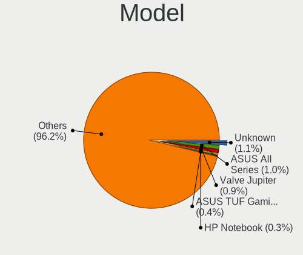
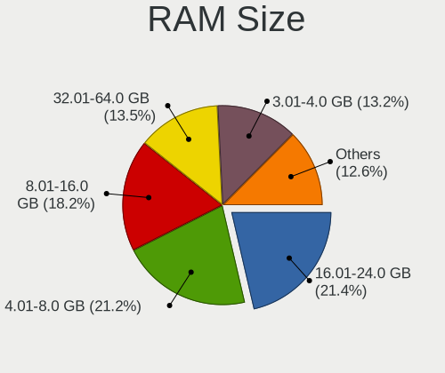
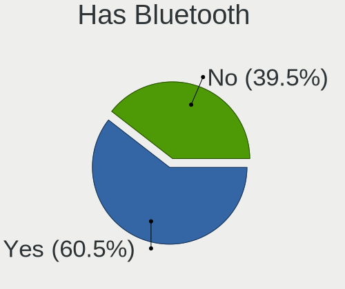
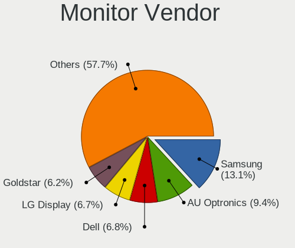

Linux in Canada - Tested Hardware & Statistics
----------------------------------------------

A project to collect tested hardware configurations for Linux in Canada.

Anyone can contribute to this report by the [hw-probe](https://github.com/linuxhw/hw-probe) tool:

    sudo -E hw-probe -all -upload

Please contribute! Especially if your hardware is rare.

This is a report for all computer types. See also reports for [desktops](/Location/Canada/Desktop/README.md) and [notebooks](/Location/Canada/Notebook/README.md).

Contents
--------

* [ Test Cases ](#test-cases)

* [ System ](#system)
  - [ OS                       ](#os)
  - [ OS Family                ](#os-family)
  - [ Kernel                   ](#kernel)
  - [ Kernel Family            ](#kernel-family)
  - [ Kernel Major Ver.        ](#kernel-major-ver)
  - [ Arch                     ](#arch)
  - [ DE                       ](#de)
  - [ Display Server           ](#display-server)
  - [ Display Manager          ](#display-manager)
  - [ OS Lang                  ](#os-lang)
  - [ Boot Mode                ](#boot-mode)
  - [ Filesystem               ](#filesystem)
  - [ Part. scheme             ](#part-scheme)
  - [ Dual Boot with Linux/BSD ](#dual-boot-with-linuxbsd)
  - [ Dual Boot (Win)          ](#dual-boot-win)

* [ Board ](#board)
  - [ Vendor                   ](#vendor)
  - [ Model                    ](#model)
  - [ Model Family             ](#model-family)
  - [ MFG Year                 ](#mfg-year)
  - [ Form Factor              ](#form-factor)
  - [ Secure Boot              ](#secure-boot)
  - [ Coreboot                 ](#coreboot)
  - [ RAM Size                 ](#ram-size)
  - [ RAM Used                 ](#ram-used)
  - [ Total Drives             ](#total-drives)
  - [ Has CD-ROM               ](#has-cd-rom)
  - [ Has Ethernet             ](#has-ethernet)
  - [ Has WiFi                 ](#has-wifi)
  - [ Has Bluetooth            ](#has-bluetooth)

* [ Location ](#location)
  - [ Country                  ](#country)
  - [ City                     ](#city)

* [ Drives ](#drives)
  - [ Drive Vendor             ](#drive-vendor)
  - [ Drive Model              ](#drive-model)
  - [ HDD Vendor               ](#hdd-vendor)
  - [ SSD Vendor               ](#ssd-vendor)
  - [ Drive Kind               ](#drive-kind)
  - [ Drive Connector          ](#drive-connector)
  - [ Drive Size               ](#drive-size)
  - [ Space Total              ](#space-total)
  - [ Space Used               ](#space-used)
  - [ Malfunc. Drives          ](#malfunc-drives)
  - [ Malfunc. Drive Vendor    ](#malfunc-drive-vendor)
  - [ Malfunc. HDD Vendor      ](#malfunc-hdd-vendor)
  - [ Malfunc. Drive Kind      ](#malfunc-drive-kind)
  - [ Failed Drives            ](#failed-drives)
  - [ Failed Drive Vendor      ](#failed-drive-vendor)
  - [ Drive Status             ](#drive-status)

* [ Storage controller ](#storage-controller)
  - [ Storage Vendor           ](#storage-vendor)
  - [ Storage Model            ](#storage-model)
  - [ Storage Kind             ](#storage-kind)

* [ Processor ](#processor)
  - [ CPU Vendor               ](#cpu-vendor)
  - [ CPU Model                ](#cpu-model)
  - [ CPU Model Family         ](#cpu-model-family)
  - [ CPU Cores                ](#cpu-cores)
  - [ CPU Sockets              ](#cpu-sockets)
  - [ CPU Threads              ](#cpu-threads)
  - [ CPU Op-Modes             ](#cpu-op-modes)
  - [ CPU Microcode            ](#cpu-microcode)
  - [ CPU Microarch            ](#cpu-microarch)

* [ Graphics ](#graphics)
  - [ GPU Vendor               ](#gpu-vendor)
  - [ GPU Model                ](#gpu-model)
  - [ GPU Combo                ](#gpu-combo)
  - [ GPU Driver               ](#gpu-driver)
  - [ GPU Memory               ](#gpu-memory)

* [ Monitor ](#monitor)
  - [ Monitor Vendor           ](#monitor-vendor)
  - [ Monitor Model            ](#monitor-model)
  - [ Monitor Resolution       ](#monitor-resolution)
  - [ Monitor Diagonal         ](#monitor-diagonal)
  - [ Monitor Width            ](#monitor-width)
  - [ Aspect Ratio             ](#aspect-ratio)
  - [ Monitor Area             ](#monitor-area)
  - [ Pixel Density            ](#pixel-density)
  - [ Multiple Monitors        ](#multiple-monitors)

* [ Network ](#network)
  - [ Net Controller Vendor    ](#net-controller-vendor)
  - [ Net Controller Model     ](#net-controller-model)
  - [ Wireless Vendor          ](#wireless-vendor)
  - [ Wireless Model           ](#wireless-model)
  - [ Ethernet Vendor          ](#ethernet-vendor)
  - [ Ethernet Model           ](#ethernet-model)
  - [ Net Controller Kind      ](#net-controller-kind)
  - [ Used Controller          ](#used-controller)
  - [ NICs                     ](#nics)
  - [ IPv6                     ](#ipv6)

* [ Bluetooth ](#bluetooth)
  - [ Bluetooth Vendor         ](#bluetooth-vendor)
  - [ Bluetooth Model          ](#bluetooth-model)

* [ Sound ](#sound)
  - [ Sound Vendor             ](#sound-vendor)
  - [ Sound Model              ](#sound-model)

* [ Memory ](#memory)
  - [ Memory Vendor            ](#memory-vendor)
  - [ Memory Model             ](#memory-model)
  - [ Memory Kind              ](#memory-kind)
  - [ Memory Form Factor       ](#memory-form-factor)
  - [ Memory Size              ](#memory-size)
  - [ Memory Speed             ](#memory-speed)

* [ Printers & scanners ](#printers--scanners)
  - [ Printer Vendor           ](#printer-vendor)
  - [ Printer Model            ](#printer-model)
  - [ Scanner Vendor           ](#scanner-vendor)
  - [ Scanner Model            ](#scanner-model)

* [ Camera ](#camera)
  - [ Camera Vendor            ](#camera-vendor)
  - [ Camera Model             ](#camera-model)

* [ Security ](#security)
  - [ Fingerprint Vendor       ](#fingerprint-vendor)
  - [ Fingerprint Model        ](#fingerprint-model)
  - [ Chipcard Vendor          ](#chipcard-vendor)
  - [ Chipcard Model           ](#chipcard-model)

* [ Unsupported ](#unsupported)
  - [ Unsupported Devices      ](#unsupported-devices)
  - [ Unsupported Device Types ](#unsupported-device-types)

Test Cases
----------

Total: 6558

| Vendor        | Model                       | Form-Factor | Probe                                                      | Date         |
|---------------|-----------------------------|-------------|------------------------------------------------------------|--------------|
| ASUSTek       | ROG CROSSHAIR VIII HERO     | Desktop     | [180dd73bd6](https://linux-hardware.org/?probe=180dd73bd6) | May 07, 2022 |
| Acer          | Aspire 5810T                | Notebook    | [8d9b944789](https://linux-hardware.org/?probe=8d9b944789) | May 07, 2022 |
| HP            | 3397                        | Desktop     | [157ef440d8](https://linux-hardware.org/?probe=157ef440d8) | May 06, 2022 |
| Lenovo        | ThinkPad T460s 20FAS0F40... | Notebook    | [9d6a8926ec](https://linux-hardware.org/?probe=9d6a8926ec) | May 06, 2022 |
| Lenovo        | ThinkPad T440p 20AN00DEU... | Notebook    | [b13325e763](https://linux-hardware.org/?probe=b13325e763) | May 06, 2022 |
| MSI           | H310M PRO-VD                | Desktop     | [5f977ecef6](https://linux-hardware.org/?probe=5f977ecef6) | May 06, 2022 |
| Apple         | MacBookPro11,2              | Notebook    | [0af35aa835](https://linux-hardware.org/?probe=0af35aa835) | May 06, 2022 |
| Toshiba       | Satellite C670D             | Notebook    | [3eedd8ce6b](https://linux-hardware.org/?probe=3eedd8ce6b) | May 05, 2022 |
| ASUSTek       | VivoBook_ASUSLaptop TP40... | Convertible | [7c416a8fb7](https://linux-hardware.org/?probe=7c416a8fb7) | May 05, 2022 |
| Gigabyte      | Z370P D3-CF                 | Desktop     | [8a561e2442](https://linux-hardware.org/?probe=8a561e2442) | May 05, 2022 |
| ASUSTek       | VM42                        | Desktop     | [cb73da6c51](https://linux-hardware.org/?probe=cb73da6c51) | May 05, 2022 |
| ASUSTek       | VM42                        | Desktop     | [1fb131686b](https://linux-hardware.org/?probe=1fb131686b) | May 05, 2022 |
| MSI           | Z390-A PRO                  | Desktop     | [21e3f8a718](https://linux-hardware.org/?probe=21e3f8a718) | May 05, 2022 |
| ASUSTek       | PRIME Z690-P WIFI D4        | Desktop     | [a23da6e2be](https://linux-hardware.org/?probe=a23da6e2be) | May 05, 2022 |
| MSI           | Z390-A PRO                  | Desktop     | [145317db95](https://linux-hardware.org/?probe=145317db95) | May 05, 2022 |
| Acer          | TravelMate P653-M           | Notebook    | [221d943970](https://linux-hardware.org/?probe=221d943970) | May 04, 2022 |
| ASRock        | X570 Extreme4               | Desktop     | [98e5f20999](https://linux-hardware.org/?probe=98e5f20999) | May 04, 2022 |
| Lenovo        | IdeaPad 3 15ARE05 81W4      | Notebook    | [d861de9453](https://linux-hardware.org/?probe=d861de9453) | May 04, 2022 |
| ASUSTek       | Rampage III Extreme         | Desktop     | [30ff3d44b0](https://linux-hardware.org/?probe=30ff3d44b0) | May 04, 2022 |
| HP            | 2AF7                        | Desktop     | [de6583780a](https://linux-hardware.org/?probe=de6583780a) | May 04, 2022 |
| Gigabyte      | B75M-HD3                    | Desktop     | [7dc76bf420](https://linux-hardware.org/?probe=7dc76bf420) | May 04, 2022 |
| HP            | 2AF7                        | Desktop     | [ee82d627d6](https://linux-hardware.org/?probe=ee82d627d6) | May 04, 2022 |
| Lenovo        | IdeaPad 3 15IIL05 81WE      | Notebook    | [6b9d36debb](https://linux-hardware.org/?probe=6b9d36debb) | May 04, 2022 |
| Alienware     | m15 R4                      | Notebook    | [3b09d65e13](https://linux-hardware.org/?probe=3b09d65e13) | May 04, 2022 |
| Dell          | Vostro 3500                 | Notebook    | [00add28269](https://linux-hardware.org/?probe=00add28269) | May 03, 2022 |
| Acer          | Aspire XC-230               | Desktop     | [b80fa8b04f](https://linux-hardware.org/?probe=b80fa8b04f) | May 03, 2022 |
| Gigabyte      | B365M GAMING HD             | Desktop     | [637890bd75](https://linux-hardware.org/?probe=637890bd75) | May 03, 2022 |
| Alienware     | m15 R4                      | Notebook    | [1f5f3048d6](https://linux-hardware.org/?probe=1f5f3048d6) | May 03, 2022 |
| ASUSTek       | TUF Gaming FX505GT_FX505... | Notebook    | [90aa5187ab](https://linux-hardware.org/?probe=90aa5187ab) | May 02, 2022 |
| MSI           | B450 GAMING PLUS            | Desktop     | [a792e309de](https://linux-hardware.org/?probe=a792e309de) | May 02, 2022 |
| MSI           | GS65 Stealth 8SG            | Notebook    | [05f80b3e70](https://linux-hardware.org/?probe=05f80b3e70) | May 02, 2022 |
| Dell          | Latitude E6540              | Notebook    | [ad5bf6fab1](https://linux-hardware.org/?probe=ad5bf6fab1) | May 01, 2022 |
| Samsung       | 950QCG                      | Convertible | [3010ee5185](https://linux-hardware.org/?probe=3010ee5185) | May 01, 2022 |
| Samsung       | 950QCG                      | Convertible | [257ee40584](https://linux-hardware.org/?probe=257ee40584) | May 01, 2022 |
| Lenovo        | IdeaPadFlex 6-14IKB 81EM    | Convertible | [dfc204b1b4](https://linux-hardware.org/?probe=dfc204b1b4) | May 01, 2022 |
| Lenovo        | IdeaPadFlex 6-14IKB 81EM    | Convertible | [a822b5b8e7](https://linux-hardware.org/?probe=a822b5b8e7) | May 01, 2022 |
| Lenovo        | ThinkPad E15 Gen 3 20YG0... | Notebook    | [6710b89c52](https://linux-hardware.org/?probe=6710b89c52) | Apr 30, 2022 |
| Apple         | Mac-F42C88C8 Proto1         | Desktop     | [3edd5f05f7](https://linux-hardware.org/?probe=3edd5f05f7) | Apr 30, 2022 |
| HP            | Spectre x360 Convertible    | Convertible | [90d6769c58](https://linux-hardware.org/?probe=90d6769c58) | Apr 30, 2022 |
| Lenovo        | ThinkPad Edge E530 62724... | Notebook    | [07334ae084](https://linux-hardware.org/?probe=07334ae084) | Apr 30, 2022 |
| Microsoft     | Surface Laptop Go           | Tablet      | [06b533396d](https://linux-hardware.org/?probe=06b533396d) | Apr 30, 2022 |
| ASUSTek       | TUF Gaming X570-PLUS        | Desktop     | [f157b373a1](https://linux-hardware.org/?probe=f157b373a1) | Apr 29, 2022 |
| ASUSTek       | TUF Gaming X570-PLUS        | Desktop     | [f339d2405b](https://linux-hardware.org/?probe=f339d2405b) | Apr 29, 2022 |
| ASUSTek       | G55VW                       | Notebook    | [6bd8a1b04a](https://linux-hardware.org/?probe=6bd8a1b04a) | Apr 29, 2022 |
| Dell          | 0VNP2H A00                  | Desktop     | [bb480c7f9c](https://linux-hardware.org/?probe=bb480c7f9c) | Apr 29, 2022 |
| ASUSTek       | X541UAK                     | Notebook    | [7bac9962d9](https://linux-hardware.org/?probe=7bac9962d9) | Apr 29, 2022 |
| Microsoft     | Surface Laptop Go           | Tablet      | [5754b2db0d](https://linux-hardware.org/?probe=5754b2db0d) | Apr 29, 2022 |
| Alienware     | 07W25T A00                  | Desktop     | [b989838f70](https://linux-hardware.org/?probe=b989838f70) | Apr 29, 2022 |
| Rockchip      | RK3288 Asus Tinker Board... | Soc         | [db72a98d92](https://linux-hardware.org/?probe=db72a98d92) | Apr 29, 2022 |
| HP            | 8433 11                     | Desktop     | [a5b829538b](https://linux-hardware.org/?probe=a5b829538b) | Apr 29, 2022 |
| Lenovo        | ThinkPad X1 Tablet Gen 2... | Tablet      | [bdb2f1c4ad](https://linux-hardware.org/?probe=bdb2f1c4ad) | Apr 29, 2022 |
| Apple         | Mac-F226BEC8 PVT            | All in one  | [681aa1a670](https://linux-hardware.org/?probe=681aa1a670) | Apr 29, 2022 |
| Acer          | Swift SF314-57              | Notebook    | [d48d0527ee](https://linux-hardware.org/?probe=d48d0527ee) | Apr 28, 2022 |
| HP            | 1495                        | Desktop     | [b6e482940f](https://linux-hardware.org/?probe=b6e482940f) | Apr 28, 2022 |
| HP            | 1495                        | Desktop     | [632386ed8d](https://linux-hardware.org/?probe=632386ed8d) | Apr 28, 2022 |
| HP            | ENVY x360 Convertible 15... | Convertible | [e3ea985a9e](https://linux-hardware.org/?probe=e3ea985a9e) | Apr 28, 2022 |
| Dell          | XPS 15 9560                 | Notebook    | [92e903308e](https://linux-hardware.org/?probe=92e903308e) | Apr 27, 2022 |
| Dell          | 0R1PCR A00                  | Desktop     | [feec38a0f5](https://linux-hardware.org/?probe=feec38a0f5) | Apr 27, 2022 |
| ASUSTek       | M51BC                       | Desktop     | [f997f2d1c1](https://linux-hardware.org/?probe=f997f2d1c1) | Apr 27, 2022 |
| ASUSTek       | SABERTOOTH Z170 S           | Desktop     | [21663dc8b3](https://linux-hardware.org/?probe=21663dc8b3) | Apr 27, 2022 |
| System76      | Pangolin                    | Notebook    | [d326fc9a39](https://linux-hardware.org/?probe=d326fc9a39) | Apr 27, 2022 |
| MSI           | B450M PRO-VDH MAX           | Desktop     | [185c64fa0d](https://linux-hardware.org/?probe=185c64fa0d) | Apr 27, 2022 |
| Gigabyte      | GA-880GM-UD2H               | Desktop     | [3c53a0e59d](https://linux-hardware.org/?probe=3c53a0e59d) | Apr 27, 2022 |
| HP            | Unknown                     | Notebook    | [32f3c98619](https://linux-hardware.org/?probe=32f3c98619) | Apr 27, 2022 |
| ASUSTek       | Acacia                      | Desktop     | [d43c62d4ab](https://linux-hardware.org/?probe=d43c62d4ab) | Apr 27, 2022 |
| Gigabyte      | G1.Sniper A88X-CF           | Desktop     | [68fdd1e81a](https://linux-hardware.org/?probe=68fdd1e81a) | Apr 27, 2022 |
| HP            | ProBook 450 G8 Notebook ... | Notebook    | [ff8e46a260](https://linux-hardware.org/?probe=ff8e46a260) | Apr 27, 2022 |
| HP            | ProBook 450 G8 Notebook ... | Notebook    | [0a6534997e](https://linux-hardware.org/?probe=0a6534997e) | Apr 27, 2022 |
| Dell          | 06JWJY A01                  | Desktop     | [938679bafe](https://linux-hardware.org/?probe=938679bafe) | Apr 26, 2022 |
| Lenovo        | Legion 7 15IMH05 81YT       | Notebook    | [9384c00f6e](https://linux-hardware.org/?probe=9384c00f6e) | Apr 26, 2022 |
| Lenovo        | ThinkPad X13 Yoga Gen 2 ... | Convertible | [184c256d66](https://linux-hardware.org/?probe=184c256d66) | Apr 26, 2022 |
| Apple         | Mac-F42C88C8 Proto1         | Desktop     | [486215d495](https://linux-hardware.org/?probe=486215d495) | Apr 26, 2022 |
| HP            | 3397                        | Desktop     | [754e703cc5](https://linux-hardware.org/?probe=754e703cc5) | Apr 25, 2022 |
| Dell          | 0J3C2F A02                  | Desktop     | [833d1610d5](https://linux-hardware.org/?probe=833d1610d5) | Apr 25, 2022 |
| Acer          | Aspire ES1-523              | Notebook    | [23c9792994](https://linux-hardware.org/?probe=23c9792994) | Apr 25, 2022 |
| Dell          | 05R2TK A01                  | All in one  | [317f2966c3](https://linux-hardware.org/?probe=317f2966c3) | Apr 25, 2022 |
| HP            | EliteBook 830 G5            | Notebook    | [17f9b4e988](https://linux-hardware.org/?probe=17f9b4e988) | Apr 25, 2022 |
| Dell          | Latitude D830               | Notebook    | [1c23417a15](https://linux-hardware.org/?probe=1c23417a15) | Apr 25, 2022 |
| Acer          | Nitro AN515-55              | Notebook    | [04b51fe1cf](https://linux-hardware.org/?probe=04b51fe1cf) | Apr 25, 2022 |
| HUAWEI        | MACH-WX9                    | Notebook    | [0199a1bcec](https://linux-hardware.org/?probe=0199a1bcec) | Apr 24, 2022 |
| MSI           | GP72 6QF                    | Notebook    | [8a2ac9964c](https://linux-hardware.org/?probe=8a2ac9964c) | Apr 24, 2022 |
| Alienware     | m15 R7                      | Notebook    | [77727a1731](https://linux-hardware.org/?probe=77727a1731) | Apr 24, 2022 |
| ASUSTek       | K55A                        | Notebook    | [079c627411](https://linux-hardware.org/?probe=079c627411) | Apr 24, 2022 |
| Dell          | Vostro 3500                 | Notebook    | [33a9b533e8](https://linux-hardware.org/?probe=33a9b533e8) | Apr 23, 2022 |
| Dell          | Vostro 3500                 | Notebook    | [ffb0508bd2](https://linux-hardware.org/?probe=ffb0508bd2) | Apr 23, 2022 |
| HP            | EliteBook 8470p             | Notebook    | [0ee15f97fd](https://linux-hardware.org/?probe=0ee15f97fd) | Apr 23, 2022 |
| Dell          | 0HY9JP A00                  | Desktop     | [9a884ccaa8](https://linux-hardware.org/?probe=9a884ccaa8) | Apr 23, 2022 |
| Apple         | MacBookPro6,1               | Notebook    | [e73885a94d](https://linux-hardware.org/?probe=e73885a94d) | Apr 23, 2022 |
| MSI           | Z77A-GD65                   | Desktop     | [75dc6c44e5](https://linux-hardware.org/?probe=75dc6c44e5) | Apr 23, 2022 |
| ASUSTek       | PRIME B560-PLUS             | Desktop     | [8e31efa5fa](https://linux-hardware.org/?probe=8e31efa5fa) | Apr 23, 2022 |
| Mediacom      | GTZS                        | Notebook    | [41939828a4](https://linux-hardware.org/?probe=41939828a4) | Apr 23, 2022 |
| ASUSTek       | CROSSHAIR II FORMULA        | Desktop     | [d35c4838f2](https://linux-hardware.org/?probe=d35c4838f2) | Apr 22, 2022 |
| ASUSTek       | CROSSHAIR II FORMULA        | Desktop     | [61e0546ed7](https://linux-hardware.org/?probe=61e0546ed7) | Apr 22, 2022 |
| Gateway       | SX2185                      | Desktop     | [d22bb794a1](https://linux-hardware.org/?probe=d22bb794a1) | Apr 22, 2022 |
| Dell          | XPS 15 7590                 | Notebook    | [f2680af572](https://linux-hardware.org/?probe=f2680af572) | Apr 22, 2022 |
| ASUSTek       | TUF Gaming X570-PRO         | Desktop     | [8e0d54760d](https://linux-hardware.org/?probe=8e0d54760d) | Apr 22, 2022 |
| HP            | EliteBook 830 G5            | Notebook    | [6061f1cd1e](https://linux-hardware.org/?probe=6061f1cd1e) | Apr 22, 2022 |
| Unknown       | Unknown                     | Notebook    | [dad86f3306](https://linux-hardware.org/?probe=dad86f3306) | Apr 22, 2022 |
| Supermicro    | X8DTU-6+                    | Server      | [bdb5fddfac](https://linux-hardware.org/?probe=bdb5fddfac) | Apr 21, 2022 |
| Gigabyte      | Z97X-UD5H                   | Desktop     | [15bba912da](https://linux-hardware.org/?probe=15bba912da) | Apr 21, 2022 |
| MSI           | B550-A PRO                  | Desktop     | [212c60ebc5](https://linux-hardware.org/?probe=212c60ebc5) | Apr 21, 2022 |
| ASUSTek       | VivoBook_ASUSLaptop X509... | Notebook    | [58e0a1814b](https://linux-hardware.org/?probe=58e0a1814b) | Apr 21, 2022 |
| Lenovo        | ThinkStation XXXX 415852... | Desktop     | [afabe3060d](https://linux-hardware.org/?probe=afabe3060d) | Apr 21, 2022 |
| ASUSTek       | 970 PRO GAMING/AURA         | Desktop     | [9a6d4db5b7](https://linux-hardware.org/?probe=9a6d4db5b7) | Apr 21, 2022 |
| Lenovo        | IdeaPadFlex 5 15ALC05 82... | Convertible | [ffee4690fb](https://linux-hardware.org/?probe=ffee4690fb) | Apr 21, 2022 |
| Mediacom      | GTZS                        | Notebook    | [edc22ef82a](https://linux-hardware.org/?probe=edc22ef82a) | Apr 21, 2022 |
| Lenovo        | ThinkPad X200 Tablet 744... | Notebook    | [1945aa754f](https://linux-hardware.org/?probe=1945aa754f) | Apr 20, 2022 |
| Lenovo        | ThinkPad T450s 20BWS19E0... | Notebook    | [c6a1ec3df0](https://linux-hardware.org/?probe=c6a1ec3df0) | Apr 20, 2022 |
| ASUSTek       | M4A785-M                    | Desktop     | [03878be4ec](https://linux-hardware.org/?probe=03878be4ec) | Apr 20, 2022 |
| Dell          | 0HJ054                      | Desktop     | [8289626c00](https://linux-hardware.org/?probe=8289626c00) | Apr 20, 2022 |
| ASUSTek       | P5GC-MX                     | Desktop     | [810607b312](https://linux-hardware.org/?probe=810607b312) | Apr 20, 2022 |
| ASUSTek       | P8Z77-V                     | Desktop     | [40e958c5e1](https://linux-hardware.org/?probe=40e958c5e1) | Apr 19, 2022 |
| HP            | ENVY Laptop 15-ep1xxx       | Notebook    | [29f92aa75f](https://linux-hardware.org/?probe=29f92aa75f) | Apr 19, 2022 |
| HP            | 82B4                        | Desktop     | [d15212b522](https://linux-hardware.org/?probe=d15212b522) | Apr 19, 2022 |
| HP            | 2820h                       | Desktop     | [21046a0077](https://linux-hardware.org/?probe=21046a0077) | Apr 19, 2022 |
| HP            | 82B4                        | Desktop     | [c3ed060808](https://linux-hardware.org/?probe=c3ed060808) | Apr 19, 2022 |
| HP            | Laptop 15-dw0xxx            | Notebook    | [7f35172610](https://linux-hardware.org/?probe=7f35172610) | Apr 19, 2022 |
| Dell          | Inspiron 15-3567            | Notebook    | [f8e7d70919](https://linux-hardware.org/?probe=f8e7d70919) | Apr 18, 2022 |
| HP            | ENVY x360 Convertible 15... | Convertible | [4151cdb86a](https://linux-hardware.org/?probe=4151cdb86a) | Apr 18, 2022 |
| HP            | ProBook 4535s               | Notebook    | [23ab986b5e](https://linux-hardware.org/?probe=23ab986b5e) | Apr 18, 2022 |
| HP            | Pavilion dv4                | Notebook    | [7bd955f313](https://linux-hardware.org/?probe=7bd955f313) | Apr 18, 2022 |
| ASUSTek       | ROG STRIX B550-F GAMING     | Desktop     | [4c8ca0d53f](https://linux-hardware.org/?probe=4c8ca0d53f) | Apr 18, 2022 |
| ASRock        | Z68 Extreme4                | Desktop     | [36da46e911](https://linux-hardware.org/?probe=36da46e911) | Apr 18, 2022 |
| Acer          | Aspire V3-571               | Notebook    | [b1ea72b76e](https://linux-hardware.org/?probe=b1ea72b76e) | Apr 18, 2022 |
| Lenovo        | G50-80 80E5                 | Notebook    | [a07c515f60](https://linux-hardware.org/?probe=a07c515f60) | Apr 17, 2022 |
| Dell          | Latitude E6410              | Notebook    | [391866815a](https://linux-hardware.org/?probe=391866815a) | Apr 17, 2022 |
| ASUSTek       | PU401LAC                    | Notebook    | [08a76b8cb8](https://linux-hardware.org/?probe=08a76b8cb8) | Apr 17, 2022 |
| ASUSTek       | P5GC-MX                     | Desktop     | [55cd1e5c8f](https://linux-hardware.org/?probe=55cd1e5c8f) | Apr 17, 2022 |
| Fanless Mi... | Rev GMLR1                   | Mini pc     | [1d954567bf](https://linux-hardware.org/?probe=1d954567bf) | Apr 17, 2022 |
| ASUSTek       | K53Z                        | Notebook    | [2d870acfa1](https://linux-hardware.org/?probe=2d870acfa1) | Apr 16, 2022 |
| Lenovo        | ThinkPad E520 11433BU       | Notebook    | [eb10b5f739](https://linux-hardware.org/?probe=eb10b5f739) | Apr 16, 2022 |
| Dell          | Latitude E6430              | Notebook    | [c9a365bfe3](https://linux-hardware.org/?probe=c9a365bfe3) | Apr 16, 2022 |
| MSI           | 970 GAMING                  | Desktop     | [10ad704b03](https://linux-hardware.org/?probe=10ad704b03) | Apr 16, 2022 |
| ASUSTek       | VivoBook_ASUSLaptop TP41... | Convertible | [3afe0a60fc](https://linux-hardware.org/?probe=3afe0a60fc) | Apr 16, 2022 |
| Dell          | XPS 15 9560                 | Notebook    | [c540449ce7](https://linux-hardware.org/?probe=c540449ce7) | Apr 16, 2022 |
| ASUSTek       | PRIME Z690-P WIFI D4        | Desktop     | [0d1f53febb](https://linux-hardware.org/?probe=0d1f53febb) | Apr 16, 2022 |
| Lenovo        | SHARKBAY 0B98401 WIN        | Desktop     | [90486ad164](https://linux-hardware.org/?probe=90486ad164) | Apr 15, 2022 |
| HP            | 17E2                        | Mini pc     | [a7bb99026f](https://linux-hardware.org/?probe=a7bb99026f) | Apr 15, 2022 |
| Dell          | Latitude E6430              | Notebook    | [fc7e6fce7b](https://linux-hardware.org/?probe=fc7e6fce7b) | Apr 15, 2022 |
| ASUSTek       | A55M-E                      | Desktop     | [76a80df275](https://linux-hardware.org/?probe=76a80df275) | Apr 15, 2022 |
| ASUSTek       | A55M-E                      | Desktop     | [74b8687993](https://linux-hardware.org/?probe=74b8687993) | Apr 15, 2022 |
| Dell          | Latitude E7250              | Notebook    | [532fb04297](https://linux-hardware.org/?probe=532fb04297) | Apr 15, 2022 |
| Unknown       | Unknown                     | Soc         | [8ff8aa816f](https://linux-hardware.org/?probe=8ff8aa816f) | Apr 15, 2022 |
| HP            | Laptop 14-cf0xxx            | Notebook    | [3fcf4f7e02](https://linux-hardware.org/?probe=3fcf4f7e02) | Apr 14, 2022 |
| ASUSTek       | M5A97 R2.0                  | Desktop     | [37e172faec](https://linux-hardware.org/?probe=37e172faec) | Apr 14, 2022 |
| ASUSTek       | TUF Gaming X570-PLUS        | Desktop     | [247cd43da9](https://linux-hardware.org/?probe=247cd43da9) | Apr 14, 2022 |
| Acer          | Swift SF314-42              | Notebook    | [85d345a867](https://linux-hardware.org/?probe=85d345a867) | Apr 14, 2022 |
| MSI           | B450 TOMAHAWK MAX           | Desktop     | [843c3d4758](https://linux-hardware.org/?probe=843c3d4758) | Apr 14, 2022 |
| Intel         | NUC5i5RYB H40999-507        | Mini pc     | [469cf437ca](https://linux-hardware.org/?probe=469cf437ca) | Apr 14, 2022 |
| Microsoft     | Surface Laptop 3            | Tablet      | [742326c230](https://linux-hardware.org/?probe=742326c230) | Apr 14, 2022 |
| Gigabyte      | B85M-D3H                    | Desktop     | [a0c2314e31](https://linux-hardware.org/?probe=a0c2314e31) | Apr 14, 2022 |
| ASRock        | AB350 Pro4                  | Desktop     | [137e25f240](https://linux-hardware.org/?probe=137e25f240) | Apr 14, 2022 |
| Dell          | Latitude E7250              | Notebook    | [a1e63550ab](https://linux-hardware.org/?probe=a1e63550ab) | Apr 14, 2022 |
| MSI           | X79A-GD45 Plus              | Desktop     | [fd93542a14](https://linux-hardware.org/?probe=fd93542a14) | Apr 14, 2022 |
| ASUSTek       | Crosshair V Formula         | Desktop     | [3b66db6997](https://linux-hardware.org/?probe=3b66db6997) | Apr 14, 2022 |
| Lenovo        | ThinkPad P53 20QNS00Y00     | Notebook    | [5ef7e630fa](https://linux-hardware.org/?probe=5ef7e630fa) | Apr 14, 2022 |
| Microsoft     | Surface Laptop Go           | Tablet      | [8ea05feeaf](https://linux-hardware.org/?probe=8ea05feeaf) | Apr 13, 2022 |
| Lenovo        | ThinkPad P70 20ERCTO1WW     | Notebook    | [d8a70fe32c](https://linux-hardware.org/?probe=d8a70fe32c) | Apr 13, 2022 |
| System76      | Oryx Pro                    | Notebook    | [8521355f49](https://linux-hardware.org/?probe=8521355f49) | Apr 13, 2022 |
| ASUSTek       | PRIME H570M-PLUS            | Desktop     | [5e6ce90c93](https://linux-hardware.org/?probe=5e6ce90c93) | Apr 13, 2022 |
| Lenovo        | ThinkPad P53s 20N6CTO1WW    | Notebook    | [3b06e810bc](https://linux-hardware.org/?probe=3b06e810bc) | Apr 13, 2022 |
| Dell          | 0K240Y A01                  | Desktop     | [76d4fbf0a6](https://linux-hardware.org/?probe=76d4fbf0a6) | Apr 13, 2022 |
| ASUSTek       | PRIME Z590M-PLUS            | Desktop     | [a0b6dfe7e4](https://linux-hardware.org/?probe=a0b6dfe7e4) | Apr 13, 2022 |
| ASRock        | X570M Pro4                  | Desktop     | [b7373e1f8f](https://linux-hardware.org/?probe=b7373e1f8f) | Apr 13, 2022 |
| Dell          | XPS 15 9500                 | Notebook    | [b64e82a4a6](https://linux-hardware.org/?probe=b64e82a4a6) | Apr 13, 2022 |
| Dell          | Inspiron 7570               | Notebook    | [8d68856bad](https://linux-hardware.org/?probe=8d68856bad) | Apr 13, 2022 |
| MSI           | X470 GAMING PLUS            | Desktop     | [5100c45b65](https://linux-hardware.org/?probe=5100c45b65) | Apr 13, 2022 |
| sunxi         | FriendlyARM NanoPi NEO A... | Soc         | [d9ee5022a4](https://linux-hardware.org/?probe=d9ee5022a4) | Apr 13, 2022 |
| ASUSTek       | TUF B450M-PLUS GAMING       | Desktop     | [c28c553d03](https://linux-hardware.org/?probe=c28c553d03) | Apr 13, 2022 |
| ASUSTek       | H81M-E                      | Desktop     | [b26d147ae3](https://linux-hardware.org/?probe=b26d147ae3) | Apr 13, 2022 |
| Acer          | Aspire A715-74G             | Notebook    | [9f5a2049e3](https://linux-hardware.org/?probe=9f5a2049e3) | Apr 13, 2022 |
| Acer          | Swift SF314-42              | Notebook    | [fe3ebf82b0](https://linux-hardware.org/?probe=fe3ebf82b0) | Apr 13, 2022 |
| Lenovo        | ThinkPad P14s Gen 2a 21A... | Notebook    | [d42f43dc69](https://linux-hardware.org/?probe=d42f43dc69) | Apr 13, 2022 |
| ASUSTek       | PRIME Z370-P                | Desktop     | [3b91a78742](https://linux-hardware.org/?probe=3b91a78742) | Apr 13, 2022 |
| Dell          | Inspiron 5577               | Notebook    | [d82fa1bfc9](https://linux-hardware.org/?probe=d82fa1bfc9) | Apr 13, 2022 |
| ASUSTek       | TUF B450-PLUS GAMING        | Desktop     | [533b8a9f83](https://linux-hardware.org/?probe=533b8a9f83) | Apr 13, 2022 |
| Acer          | Aspire R3-131T              | Notebook    | [44a4c66cfe](https://linux-hardware.org/?probe=44a4c66cfe) | Apr 13, 2022 |
| ASUSTek       | ROG STRIX B550-I GAMING     | Desktop     | [13ad3d5cb4](https://linux-hardware.org/?probe=13ad3d5cb4) | Apr 13, 2022 |
| MSI           | MPG X570 GAMING PLUS        | Desktop     | [e05e4dc47b](https://linux-hardware.org/?probe=e05e4dc47b) | Apr 13, 2022 |
| Lenovo        | ThinkCentre M90p 5536A76    | Desktop     | [f594adac1d](https://linux-hardware.org/?probe=f594adac1d) | Apr 13, 2022 |
| Dell          | 0XCR8D A00                  | Desktop     | [d0f55067b0](https://linux-hardware.org/?probe=d0f55067b0) | Apr 13, 2022 |
| Gigabyte      | B450 AORUS ELITE            | Desktop     | [1ff04268cf](https://linux-hardware.org/?probe=1ff04268cf) | Apr 13, 2022 |
| Acer          | Nitro N50-610               | Desktop     | [46b46c842f](https://linux-hardware.org/?probe=46b46c842f) | Apr 13, 2022 |
| Dell          | XPS 15 7590                 | Notebook    | [d90283da2d](https://linux-hardware.org/?probe=d90283da2d) | Apr 13, 2022 |
| ASUSTek       | ROG CROSSHAIR VIII DARK ... | Desktop     | [71d793e054](https://linux-hardware.org/?probe=71d793e054) | Apr 13, 2022 |
| HP            | ProBook 4535s               | Notebook    | [1aa29ed37f](https://linux-hardware.org/?probe=1aa29ed37f) | Apr 13, 2022 |
| Dell          | 042P49 A02                  | Desktop     | [f7b6132f34](https://linux-hardware.org/?probe=f7b6132f34) | Apr 13, 2022 |
| Panasonic     | CF-31SBLJGDM                | Notebook    | [60a1068658](https://linux-hardware.org/?probe=60a1068658) | Apr 13, 2022 |
| ASUSTek       | ZenBook UX434FL_UX434FL     | Notebook    | [a07d8cec5b](https://linux-hardware.org/?probe=a07d8cec5b) | Apr 13, 2022 |
| Lenovo        | IdeaPad Y550 4186           | Notebook    | [0ba7d3b80a](https://linux-hardware.org/?probe=0ba7d3b80a) | Apr 13, 2022 |
| ASUSTek       | ROG STRIX B550-I GAMING     | Desktop     | [438f675016](https://linux-hardware.org/?probe=438f675016) | Apr 13, 2022 |
| Dell          | Latitude D830               | Notebook    | [54233652ca](https://linux-hardware.org/?probe=54233652ca) | Apr 12, 2022 |
| Nvidia        | Tegra                       | Soc         | [1a369ad73a](https://linux-hardware.org/?probe=1a369ad73a) | Apr 12, 2022 |
| MSI           | B450M PRO-VDH MAX           | Desktop     | [3656e85663](https://linux-hardware.org/?probe=3656e85663) | Apr 12, 2022 |
| ASUSTek       | M51BC                       | Desktop     | [4c52c99ee9](https://linux-hardware.org/?probe=4c52c99ee9) | Apr 12, 2022 |
| Dell          | 0N867P A01                  | Desktop     | [749dc04756](https://linux-hardware.org/?probe=749dc04756) | Apr 12, 2022 |
| ASUSTek       | PRIME B550-PLUS             | Desktop     | [be0d616e99](https://linux-hardware.org/?probe=be0d616e99) | Apr 12, 2022 |
| ASUSTek       | M51BC                       | Desktop     | [162850d6b3](https://linux-hardware.org/?probe=162850d6b3) | Apr 12, 2022 |
| Microsoft     | Surface Laptop Go           | Tablet      | [13df82ae45](https://linux-hardware.org/?probe=13df82ae45) | Apr 12, 2022 |
| HP            | Pavilion Laptop 15-eh1xx... | Notebook    | [0507e6395b](https://linux-hardware.org/?probe=0507e6395b) | Apr 11, 2022 |
| ASUSTek       | PRIME B450M-A               | Desktop     | [921b858e18](https://linux-hardware.org/?probe=921b858e18) | Apr 11, 2022 |
| Gigabyte      | AB350M-DS3H-CF              | Desktop     | [3d3f67170e](https://linux-hardware.org/?probe=3d3f67170e) | Apr 11, 2022 |
| Apple         | Mac-FFE5EF870D7BA81A iMa... | All in one  | [69f81b5d41](https://linux-hardware.org/?probe=69f81b5d41) | Apr 11, 2022 |
| HP            | 85BA 00100                  | All in one  | [9a523d5258](https://linux-hardware.org/?probe=9a523d5258) | Apr 10, 2022 |
| Microsoft     | Surface Laptop Go           | Tablet      | [31aefcd602](https://linux-hardware.org/?probe=31aefcd602) | Apr 10, 2022 |
| Lenovo        | ThinkPad X1 Yoga 3rd 20L... | Convertible | [03b442ccf4](https://linux-hardware.org/?probe=03b442ccf4) | Apr 10, 2022 |
| Lenovo        | ThinkCentre M58p 7484ANU    | Desktop     | [2d7d0de436](https://linux-hardware.org/?probe=2d7d0de436) | Apr 10, 2022 |
| MSI           | B450 GAMING PRO CARBON M... | Desktop     | [63df7871b0](https://linux-hardware.org/?probe=63df7871b0) | Apr 10, 2022 |
| MSI           | B450 GAMING PRO CARBON M... | Desktop     | [6884809c79](https://linux-hardware.org/?probe=6884809c79) | Apr 10, 2022 |
| MSI           | MPG B550 GAMING EDGE WIF... | Desktop     | [28114b7924](https://linux-hardware.org/?probe=28114b7924) | Apr 10, 2022 |
| MSI           | MAG Z690 TOMAHAWK WIFI D... | Desktop     | [1638359c7b](https://linux-hardware.org/?probe=1638359c7b) | Apr 10, 2022 |
| ASUSTek       | ROG Zephyrus G15 GA502IV... | Notebook    | [0def0def83](https://linux-hardware.org/?probe=0def0def83) | Apr 09, 2022 |
| ASUSTek       | PRIME Z390-A                | Desktop     | [9f3f45d840](https://linux-hardware.org/?probe=9f3f45d840) | Apr 09, 2022 |
| HP            | 18E5                        | Desktop     | [5c24443112](https://linux-hardware.org/?probe=5c24443112) | Apr 09, 2022 |
| Acer          | Veriton M6660G V:1.0        | Desktop     | [a41ffdc22b](https://linux-hardware.org/?probe=a41ffdc22b) | Apr 09, 2022 |
| MSI           | X79A-GD45 Plus              | Desktop     | [445e8fa4b8](https://linux-hardware.org/?probe=445e8fa4b8) | Apr 09, 2022 |
| ASUSTek       | GL502VT                     | Notebook    | [bbad575f6a](https://linux-hardware.org/?probe=bbad575f6a) | Apr 08, 2022 |
| ASUSTek       | 970 PRO GAMING/AURA         | Desktop     | [f0bec097a1](https://linux-hardware.org/?probe=f0bec097a1) | Apr 08, 2022 |
| HP            | 1998                        | Desktop     | [0ed4dbebcb](https://linux-hardware.org/?probe=0ed4dbebcb) | Apr 08, 2022 |
| Dell          | Latitude E5500              | Notebook    | [485521f38b](https://linux-hardware.org/?probe=485521f38b) | Apr 08, 2022 |
| ASUSTek       | PRIME Z390-A                | Desktop     | [8ac05d8917](https://linux-hardware.org/?probe=8ac05d8917) | Apr 07, 2022 |
| Gigabyte      | B365M GAMING HD             | Desktop     | [94b6fc5131](https://linux-hardware.org/?probe=94b6fc5131) | Apr 07, 2022 |
| HP            | Victus by Laptop 16-d0xx... | Notebook    | [3c3e8b3ae2](https://linux-hardware.org/?probe=3c3e8b3ae2) | Apr 07, 2022 |
| ASUSTek       | M51BC                       | Desktop     | [e205187536](https://linux-hardware.org/?probe=e205187536) | Apr 07, 2022 |
| Lenovo        | ThinkPad E485 20KUCTO1WW    | Notebook    | [8dae5ce312](https://linux-hardware.org/?probe=8dae5ce312) | Apr 07, 2022 |
| Lenovo        | Yoga 920-13IKB 80Y7         | Convertible | [8e920e4b38](https://linux-hardware.org/?probe=8e920e4b38) | Apr 07, 2022 |
| RCA           | WT9503W003                  | Notebook    | [e661ebe9b4](https://linux-hardware.org/?probe=e661ebe9b4) | Apr 07, 2022 |
| Lenovo        | ThinkPad Edge E540 20C60... | Notebook    | [158e261517](https://linux-hardware.org/?probe=158e261517) | Apr 07, 2022 |
| Microsoft     | Surface Laptop Go           | Tablet      | [183521cdae](https://linux-hardware.org/?probe=183521cdae) | Apr 07, 2022 |
| Lenovo        | SHARKBAY 0B98401 PRO        | Desktop     | [a09ecdae05](https://linux-hardware.org/?probe=a09ecdae05) | Apr 07, 2022 |
| ASRock        | Z390 Phantom Gaming 4S/a... | Desktop     | [836d139ea0](https://linux-hardware.org/?probe=836d139ea0) | Apr 07, 2022 |
| Apple         | Mac-F42C88C8 Proto1         | Desktop     | [d1f213c4f0](https://linux-hardware.org/?probe=d1f213c4f0) | Apr 07, 2022 |
| HP            | 2000                        | Notebook    | [e4610bcc0e](https://linux-hardware.org/?probe=e4610bcc0e) | Apr 07, 2022 |
| HP            | Spectre x360 Convertible... | Convertible | [4e2246e56f](https://linux-hardware.org/?probe=4e2246e56f) | Apr 06, 2022 |
| Unknown       | Unknown                     | Desktop     | [c8049ac14a](https://linux-hardware.org/?probe=c8049ac14a) | Apr 06, 2022 |
| ASUSTek       | P5GC-MX                     | Desktop     | [ce2aaa12ab](https://linux-hardware.org/?probe=ce2aaa12ab) | Apr 06, 2022 |
| MSI           | MAG B660 TOMAHAWK WIFI D... | Desktop     | [cc10884386](https://linux-hardware.org/?probe=cc10884386) | Apr 06, 2022 |
| MSI           | X79A-GD45 Plus              | Desktop     | [557106dcd8](https://linux-hardware.org/?probe=557106dcd8) | Apr 06, 2022 |
| Gigabyte      | H270N-WIFI-CF               | Desktop     | [fe6d2db0dd](https://linux-hardware.org/?probe=fe6d2db0dd) | Apr 05, 2022 |
| MSI           | MAG B660 TOMAHAWK WIFI D... | Desktop     | [65c7660b74](https://linux-hardware.org/?probe=65c7660b74) | Apr 05, 2022 |
| ASUSTek       | Z97-A-USB31                 | Desktop     | [cd6f73403e](https://linux-hardware.org/?probe=cd6f73403e) | Apr 05, 2022 |
| Acer          | Aspire XC-603               | Desktop     | [ef344607ad](https://linux-hardware.org/?probe=ef344607ad) | Apr 04, 2022 |
| Dell          | Precision M4700             | Notebook    | [ab99532bd5](https://linux-hardware.org/?probe=ab99532bd5) | Apr 04, 2022 |
| ASRock        | Z270 Killer SLI/ac          | Desktop     | [cd29715a0d](https://linux-hardware.org/?probe=cd29715a0d) | Apr 04, 2022 |
| MSI           | MPG X570 GAMING PLUS        | Desktop     | [73ecbc62b1](https://linux-hardware.org/?probe=73ecbc62b1) | Apr 04, 2022 |
| Microsoft     | Surface Laptop Go           | Tablet      | [87acd223c9](https://linux-hardware.org/?probe=87acd223c9) | Apr 04, 2022 |
| HP            | ENVY x360 Convertible 15... | Convertible | [1cc5b6fbc3](https://linux-hardware.org/?probe=1cc5b6fbc3) | Apr 03, 2022 |
| Toshiba       | Satellite L655              | Notebook    | [ac8c92d2c4](https://linux-hardware.org/?probe=ac8c92d2c4) | Apr 03, 2022 |
| HP            | EliteBook 8770w             | Notebook    | [e826deade2](https://linux-hardware.org/?probe=e826deade2) | Apr 03, 2022 |
| Lenovo        | ThinkPad L430 2465D16       | Notebook    | [411bc7237f](https://linux-hardware.org/?probe=411bc7237f) | Apr 03, 2022 |
| Apple         | Mac-F221BEC8                | Desktop     | [e72fc44e1d](https://linux-hardware.org/?probe=e72fc44e1d) | Apr 03, 2022 |
| Apple         | Mac-FA842E06C61E91C5 iMa... | All in one  | [9fec361e22](https://linux-hardware.org/?probe=9fec361e22) | Apr 03, 2022 |
| Lenovo        | ThinkPad X380 Yoga 20LJS... | Convertible | [ccacc732b8](https://linux-hardware.org/?probe=ccacc732b8) | Apr 02, 2022 |
| Gigabyte      | B450 I AORUS PRO WIFI-CF    | Desktop     | [fc477a4cb4](https://linux-hardware.org/?probe=fc477a4cb4) | Apr 02, 2022 |
| Gigabyte      | B450 I AORUS PRO WIFI-CF    | Desktop     | [23b384fa80](https://linux-hardware.org/?probe=23b384fa80) | Apr 02, 2022 |
| Raspberry ... | Raspberry Pi                | Soc         | [b0e85c5934](https://linux-hardware.org/?probe=b0e85c5934) | Apr 02, 2022 |
| Unknown       | Unknown                     | Desktop     | [9ea14bf201](https://linux-hardware.org/?probe=9ea14bf201) | Apr 02, 2022 |
| Gigabyte      | Q77M-D2H                    | Desktop     | [ecbd26a0e1](https://linux-hardware.org/?probe=ecbd26a0e1) | Apr 02, 2022 |
| ASUSTek       | Z97-A-USB31                 | Desktop     | [6f40a4ebce](https://linux-hardware.org/?probe=6f40a4ebce) | Apr 02, 2022 |
| ASUSTek       | X555QA                      | Notebook    | [d23dae873a](https://linux-hardware.org/?probe=d23dae873a) | Apr 02, 2022 |
| ASUSTek       | ROG Strix G513QC_G513QC     | Notebook    | [697f820432](https://linux-hardware.org/?probe=697f820432) | Apr 02, 2022 |
| Gigabyte      | H97M-D3H                    | Desktop     | [72d527b649](https://linux-hardware.org/?probe=72d527b649) | Apr 02, 2022 |
| Lenovo        | IdeaPad 110-15AST 80TR      | Notebook    | [fec94b0f90](https://linux-hardware.org/?probe=fec94b0f90) | Apr 02, 2022 |
| Acer          | Aspire 5735                 | Notebook    | [9e91d55a6d](https://linux-hardware.org/?probe=9e91d55a6d) | Apr 01, 2022 |
| Dell          | Inspiron 5515               | Notebook    | [224f954e8f](https://linux-hardware.org/?probe=224f954e8f) | Apr 01, 2022 |
| MSI           | X79A-GD45 Plus              | Desktop     | [c83e53c056](https://linux-hardware.org/?probe=c83e53c056) | Apr 01, 2022 |
| Lenovo        | Legion Y540-15IRH 81SX      | Notebook    | [8b613eb0c8](https://linux-hardware.org/?probe=8b613eb0c8) | Apr 01, 2022 |
| Lenovo        | 3111 SDK0J40697 WIN 3305... | Mini pc     | [cb4611f386](https://linux-hardware.org/?probe=cb4611f386) | Apr 01, 2022 |
| ASUSTek       | M5A97 R2.0                  | Desktop     | [069ce7ef8f](https://linux-hardware.org/?probe=069ce7ef8f) | Mar 31, 2022 |
| Dell          | Latitude 6430U              | Notebook    | [5a17c91b91](https://linux-hardware.org/?probe=5a17c91b91) | Mar 31, 2022 |
| HP            | Pavilion Notebook           | Notebook    | [a18360bae8](https://linux-hardware.org/?probe=a18360bae8) | Mar 31, 2022 |
| Acer          | Aspire ES1-531              | Notebook    | [e617f1e49b](https://linux-hardware.org/?probe=e617f1e49b) | Mar 30, 2022 |
| HP            | ProBook 450 G8 Notebook ... | Notebook    | [0f18e7b54b](https://linux-hardware.org/?probe=0f18e7b54b) | Mar 30, 2022 |
| Getac         | B300G5                      | Notebook    | [9a1ef08d85](https://linux-hardware.org/?probe=9a1ef08d85) | Mar 30, 2022 |
| Apple         | Mac-942B5BF58194151B        | All in one  | [535acf7c14](https://linux-hardware.org/?probe=535acf7c14) | Mar 29, 2022 |
| Dell          | Inspiron 1764               | Notebook    | [6eb66d942d](https://linux-hardware.org/?probe=6eb66d942d) | Mar 29, 2022 |
| Lenovo        | ThinkCentre M81 5049E7F     | Desktop     | [cfb0af9c1b](https://linux-hardware.org/?probe=cfb0af9c1b) | Mar 29, 2022 |
| ASUSTek       | M5A99FX PRO R2.0            | Desktop     | [a10bdc00e2](https://linux-hardware.org/?probe=a10bdc00e2) | Mar 28, 2022 |
| ASRock        | B365M Pro4                  | Desktop     | [6920de7907](https://linux-hardware.org/?probe=6920de7907) | Mar 28, 2022 |
| Gateway       | SX2185                      | Desktop     | [3d1d72a3c1](https://linux-hardware.org/?probe=3d1d72a3c1) | Mar 28, 2022 |
| Gigabyte      | GA-770T-USB3                | Desktop     | [787cb334c2](https://linux-hardware.org/?probe=787cb334c2) | Mar 28, 2022 |
| Dell          | Latitude E5550              | Notebook    | [f01dc93afc](https://linux-hardware.org/?probe=f01dc93afc) | Mar 28, 2022 |
| Panasonic     | CF-31ACJAXPM                | Notebook    | [c90a918208](https://linux-hardware.org/?probe=c90a918208) | Mar 28, 2022 |
| Gigabyte      | X570 AORUS PRO WIFI         | Desktop     | [5dae1dd2a5](https://linux-hardware.org/?probe=5dae1dd2a5) | Mar 28, 2022 |
| HP            | 339A                        | Desktop     | [e3c5312cd4](https://linux-hardware.org/?probe=e3c5312cd4) | Mar 28, 2022 |
| Acer          | Aspire E5-771G              | Notebook    | [a765f92826](https://linux-hardware.org/?probe=a765f92826) | Mar 28, 2022 |
| Lenovo        | IdeaPadFlex 5 15ALC05 82... | Convertible | [687a268d2f](https://linux-hardware.org/?probe=687a268d2f) | Mar 28, 2022 |
| HP            | Pavilion Notebook           | Notebook    | [ac807c9324](https://linux-hardware.org/?probe=ac807c9324) | Mar 27, 2022 |
| HP            | Laptop 15-db0xxx            | Notebook    | [062232ca4f](https://linux-hardware.org/?probe=062232ca4f) | Mar 27, 2022 |
| Lenovo        | ThinkCentre M55p 8811VQV    | Desktop     | [dc2a995551](https://linux-hardware.org/?probe=dc2a995551) | Mar 27, 2022 |
| ASUSTek       | ROG STRIX B350-I GAMING     | Desktop     | [36e8a83674](https://linux-hardware.org/?probe=36e8a83674) | Mar 27, 2022 |
| MSI           | X79A-GD45 Plus              | Desktop     | [e12c979369](https://linux-hardware.org/?probe=e12c979369) | Mar 27, 2022 |
| MSI           | X79A-GD45 Plus              | Desktop     | [23eab958e6](https://linux-hardware.org/?probe=23eab958e6) | Mar 27, 2022 |
| AAEON         | IMBA-H110A V1.0             | Desktop     | [9c0577803f](https://linux-hardware.org/?probe=9c0577803f) | Mar 27, 2022 |
| AAEON         | IMBA-H110A V1.0             | Desktop     | [a296d4597c](https://linux-hardware.org/?probe=a296d4597c) | Mar 27, 2022 |
| HP            | 339A                        | Desktop     | [8795c4a222](https://linux-hardware.org/?probe=8795c4a222) | Mar 27, 2022 |
| Lenovo        | ThinkPad E550 20DF0030US    | Notebook    | [8392d5c3fe](https://linux-hardware.org/?probe=8392d5c3fe) | Mar 27, 2022 |
| Acer          | Aspire E1-472               | Notebook    | [e2a4e96dff](https://linux-hardware.org/?probe=e2a4e96dff) | Mar 27, 2022 |
| HP            | EliteBook 8770w             | Notebook    | [3d5b596cf4](https://linux-hardware.org/?probe=3d5b596cf4) | Mar 27, 2022 |
| Raspberry ... | Raspberry Pi                | Soc         | [05f6eeaaa0](https://linux-hardware.org/?probe=05f6eeaaa0) | Mar 27, 2022 |
| MSI           | PRO Z690-P DDR4             | Desktop     | [7aac216113](https://linux-hardware.org/?probe=7aac216113) | Mar 26, 2022 |
| Intel         | S3420GP E51976-406          | Server      | [e61ebb59c3](https://linux-hardware.org/?probe=e61ebb59c3) | Mar 26, 2022 |
| ASUSTek       | N550JK                      | Notebook    | [145b778642](https://linux-hardware.org/?probe=145b778642) | Mar 26, 2022 |
| Insyde        | GeminiLake                  | Notebook    | [44967ed898](https://linux-hardware.org/?probe=44967ed898) | Mar 26, 2022 |
| Apple         | Mac-FFE5EF870D7BA81A iMa... | All in one  | [dc38374e42](https://linux-hardware.org/?probe=dc38374e42) | Mar 26, 2022 |
| ASUSTek       | B85M-G                      | Desktop     | [1d78876e0c](https://linux-hardware.org/?probe=1d78876e0c) | Mar 26, 2022 |
| ASUSTek       | TUF Gaming B560M-PLUS WI... | Desktop     | [a68ce8edaf](https://linux-hardware.org/?probe=a68ce8edaf) | Mar 26, 2022 |
| Dell          | 0020HJ A01                  | Server      | [69b0c1e82c](https://linux-hardware.org/?probe=69b0c1e82c) | Mar 26, 2022 |
| Gigabyte      | X570 AORUS PRO WIFI         | Desktop     | [dc2a2c1054](https://linux-hardware.org/?probe=dc2a2c1054) | Mar 25, 2022 |
| Dell          | XPS 15 9510                 | Notebook    | [e463ecc7bc](https://linux-hardware.org/?probe=e463ecc7bc) | Mar 25, 2022 |
| MSI           | Stealth GS66 12UHS          | Notebook    | [4a6b3d619c](https://linux-hardware.org/?probe=4a6b3d619c) | Mar 25, 2022 |
| MSI           | Stealth GS66 12UHS          | Notebook    | [7d1fa138d0](https://linux-hardware.org/?probe=7d1fa138d0) | Mar 25, 2022 |
| ASUSTek       | SABERTOOTH X58              | Desktop     | [bce45f36b9](https://linux-hardware.org/?probe=bce45f36b9) | Mar 25, 2022 |
| Pegatron      | Benicia                     | Desktop     | [cb852b48fb](https://linux-hardware.org/?probe=cb852b48fb) | Mar 25, 2022 |
| Dell          | Precision M4400             | Notebook    | [5172327d82](https://linux-hardware.org/?probe=5172327d82) | Mar 25, 2022 |
| Acer          | Veriton M6660G V:1.0        | Desktop     | [ee5d755daf](https://linux-hardware.org/?probe=ee5d755daf) | Mar 24, 2022 |
| ASUSTek       | ROG STRIX X470-F GAMING     | Desktop     | [55171208ed](https://linux-hardware.org/?probe=55171208ed) | Mar 24, 2022 |
| ASUSTek       | ROG STRIX B550-F GAMING     | Desktop     | [d7c46f54dc](https://linux-hardware.org/?probe=d7c46f54dc) | Mar 24, 2022 |
| ASUSTek       | ZN240IC                     | All in one  | [c6a770b2b6](https://linux-hardware.org/?probe=c6a770b2b6) | Mar 24, 2022 |
| Unknown       | Apple MacBook Pro (13-in... | Notebook    | [ffde46b23c](https://linux-hardware.org/?probe=ffde46b23c) | Mar 24, 2022 |
| HP            | Pavilion TS Sleekbook 14    | Notebook    | [73c4a3b7b4](https://linux-hardware.org/?probe=73c4a3b7b4) | Mar 24, 2022 |
| Gigabyte      | B560 DS3H AC-Y1             | Desktop     | [f1007aa153](https://linux-hardware.org/?probe=f1007aa153) | Mar 24, 2022 |
| HP            | Laptop 15-dy3xxx            | Notebook    | [a3e561b9bc](https://linux-hardware.org/?probe=a3e561b9bc) | Mar 24, 2022 |
| ASUSTek       | X540LA                      | Notebook    | [835286b855](https://linux-hardware.org/?probe=835286b855) | Mar 24, 2022 |
| Razer         | Blade 15 Advanced Model ... | Notebook    | [cb089466a3](https://linux-hardware.org/?probe=cb089466a3) | Mar 24, 2022 |
| Alienware     | 0R3FWM A00                  | Desktop     | [fcbc77d9e4](https://linux-hardware.org/?probe=fcbc77d9e4) | Mar 24, 2022 |
| ASUSTek       | ZN240IC                     | All in one  | [2328076278](https://linux-hardware.org/?probe=2328076278) | Mar 24, 2022 |
| Lenovo        | ThinkStation C20 426593U    | Desktop     | [50bcf21472](https://linux-hardware.org/?probe=50bcf21472) | Mar 23, 2022 |
| Lenovo        | ThinkPad E550 20DF0030US    | Notebook    | [921004463e](https://linux-hardware.org/?probe=921004463e) | Mar 23, 2022 |
| Hampoo        | I1D6_C189A                  | Tablet      | [9deb58b002](https://linux-hardware.org/?probe=9deb58b002) | Mar 23, 2022 |
| HP            | Pavilion Notebook           | Notebook    | [e02916c256](https://linux-hardware.org/?probe=e02916c256) | Mar 22, 2022 |
| ASUSTek       | 970 PRO GAMING/AURA         | Desktop     | [39b19d4ecf](https://linux-hardware.org/?probe=39b19d4ecf) | Mar 22, 2022 |
| HP            | 3397                        | Desktop     | [51dd330f09](https://linux-hardware.org/?probe=51dd330f09) | Mar 22, 2022 |
| MSI           | GP62 7RD                    | Notebook    | [edc0dd3639](https://linux-hardware.org/?probe=edc0dd3639) | Mar 22, 2022 |
| Apple         | Mac-F227BEC8 PVT            | All in one  | [7d4cbd9fd5](https://linux-hardware.org/?probe=7d4cbd9fd5) | Mar 22, 2022 |
| Acer          | Veriton M6660G V:1.0        | Desktop     | [228974c486](https://linux-hardware.org/?probe=228974c486) | Mar 22, 2022 |
| Dell          | 0K3CM7 A00                  | Desktop     | [8f5ec6c004](https://linux-hardware.org/?probe=8f5ec6c004) | Mar 22, 2022 |
| HP            | 0AECh D                     | Desktop     | [2fa93f9b4e](https://linux-hardware.org/?probe=2fa93f9b4e) | Mar 22, 2022 |
| ASUSTek       | ROG STRIX B450-F GAMING     | Desktop     | [66f133fcf0](https://linux-hardware.org/?probe=66f133fcf0) | Mar 22, 2022 |
| HP            | EliteBook 8540p             | Notebook    | [15a215fc17](https://linux-hardware.org/?probe=15a215fc17) | Mar 22, 2022 |
| HP            | EliteBook 8540p             | Notebook    | [f0915a2702](https://linux-hardware.org/?probe=f0915a2702) | Mar 22, 2022 |
| Dell          | XPS 15 9560                 | Notebook    | [86e612cd90](https://linux-hardware.org/?probe=86e612cd90) | Mar 22, 2022 |
| ASUSTek       | N550JK                      | Notebook    | [c759bc20a2](https://linux-hardware.org/?probe=c759bc20a2) | Mar 21, 2022 |
| Dell          | Precision 5560              | Notebook    | [895a6cb7f9](https://linux-hardware.org/?probe=895a6cb7f9) | Mar 21, 2022 |
| ASUSTek       | SABERTOOTH X79              | Desktop     | [9e6ccdc0e4](https://linux-hardware.org/?probe=9e6ccdc0e4) | Mar 21, 2022 |
| Lenovo        | MAHOBAY Win8 Pro DPK TPG    | Desktop     | [3c97963539](https://linux-hardware.org/?probe=3c97963539) | Mar 21, 2022 |
| HP            | 3397                        | Desktop     | [60dc930e32](https://linux-hardware.org/?probe=60dc930e32) | Mar 20, 2022 |
| ASUSTek       | H170 PRO GAMING             | Desktop     | [8ce1eed900](https://linux-hardware.org/?probe=8ce1eed900) | Mar 20, 2022 |
| Apple         | Mac-FFE5EF870D7BA81A iMa... | All in one  | [4b3b3cfc11](https://linux-hardware.org/?probe=4b3b3cfc11) | Mar 19, 2022 |
| Apple         | MacBookPro5,5               | Notebook    | [1570699278](https://linux-hardware.org/?probe=1570699278) | Mar 19, 2022 |
| Toshiba       | Satellite L755              | Notebook    | [89aee4e055](https://linux-hardware.org/?probe=89aee4e055) | Mar 19, 2022 |
| Lenovo        | 314F SDK0J40697 WIN 3305... | Desktop     | [9cdf9a4b0b](https://linux-hardware.org/?probe=9cdf9a4b0b) | Mar 19, 2022 |
| ASUSTek       | M5A97 R2.0                  | Desktop     | [3c40d0446b](https://linux-hardware.org/?probe=3c40d0446b) | Mar 19, 2022 |
| Unknown       | Apple MacBook Pro (13-in... | Notebook    | [d9ba393438](https://linux-hardware.org/?probe=d9ba393438) | Mar 19, 2022 |
| Dell          | Inspiron 5502               | Notebook    | [ce6b8e3716](https://linux-hardware.org/?probe=ce6b8e3716) | Mar 19, 2022 |
| Dell          | XPS 15 9560                 | Notebook    | [a7425250b2](https://linux-hardware.org/?probe=a7425250b2) | Mar 19, 2022 |
| ASUSTek       | G752VT                      | Notebook    | [632814d6a3](https://linux-hardware.org/?probe=632814d6a3) | Mar 18, 2022 |
| MSI           | MS-7A34                     | Notebook    | [a3cfb1ce48](https://linux-hardware.org/?probe=a3cfb1ce48) | Mar 18, 2022 |
| Lenovo        | ThinkPad E550 20DF0030US    | Notebook    | [7e64ef177c](https://linux-hardware.org/?probe=7e64ef177c) | Mar 18, 2022 |
| ASRock        | B560M-ITX/ac                | Desktop     | [58d3e7c461](https://linux-hardware.org/?probe=58d3e7c461) | Mar 18, 2022 |
| HP            | Spectre x360 Convertible... | Convertible | [434de4f3ce](https://linux-hardware.org/?probe=434de4f3ce) | Mar 18, 2022 |
| HP            | Laptop 15-bw0xx             | Notebook    | [e9ebe9f2cd](https://linux-hardware.org/?probe=e9ebe9f2cd) | Mar 18, 2022 |
| HP            | Laptop 15-bw0xx             | Notebook    | [959aaa3f2d](https://linux-hardware.org/?probe=959aaa3f2d) | Mar 18, 2022 |
| Lenovo        | 500w Gen 3 82J3             | Convertible | [89a42b8fb8](https://linux-hardware.org/?probe=89a42b8fb8) | Mar 18, 2022 |
| ASUSTek       | ROG Maximus X HERO          | Desktop     | [d2378fc2ac](https://linux-hardware.org/?probe=d2378fc2ac) | Mar 18, 2022 |
| Apple         | Mac-F42C88C8 Proto1         | Desktop     | [f43e92acdd](https://linux-hardware.org/?probe=f43e92acdd) | Mar 18, 2022 |
| MSI           | MS-7A34                     | Notebook    | [27f8a2eb1f](https://linux-hardware.org/?probe=27f8a2eb1f) | Mar 18, 2022 |
| Unknown       | Unknown                     | Soc         | [f3c11793ee](https://linux-hardware.org/?probe=f3c11793ee) | Mar 17, 2022 |
| Dell          | Inspiron 5502               | Notebook    | [b5aeb18001](https://linux-hardware.org/?probe=b5aeb18001) | Mar 17, 2022 |
| Dell          | Latitude 5480               | Notebook    | [9ba5463bf9](https://linux-hardware.org/?probe=9ba5463bf9) | Mar 17, 2022 |
| MSI           | GS66 Stealth 10SE           | Notebook    | [fb8d2216a5](https://linux-hardware.org/?probe=fb8d2216a5) | Mar 17, 2022 |
| Alienware     | 0PGRP5 A02                  | Desktop     | [8a28919b48](https://linux-hardware.org/?probe=8a28919b48) | Mar 17, 2022 |
| Gigabyte      | X570 AORUS ELITE WIFI       | Desktop     | [355c14014e](https://linux-hardware.org/?probe=355c14014e) | Mar 17, 2022 |
| HP            | Laptop 15-dy3xxx            | Notebook    | [6c5136b103](https://linux-hardware.org/?probe=6c5136b103) | Mar 16, 2022 |
| Lenovo        | ThinkPad E485 20KUCTO1WW    | Notebook    | [d49f3c26e1](https://linux-hardware.org/?probe=d49f3c26e1) | Mar 16, 2022 |
| Alienware     | 0PGRP5 A02                  | Desktop     | [de0e243d72](https://linux-hardware.org/?probe=de0e243d72) | Mar 16, 2022 |
| Lenovo        | ThinkPad E550 20DF0030US    | Notebook    | [d742a1c2fa](https://linux-hardware.org/?probe=d742a1c2fa) | Mar 16, 2022 |
| HP            | Spectre x360 Convertible... | Convertible | [0553e8f35e](https://linux-hardware.org/?probe=0553e8f35e) | Mar 16, 2022 |
| ASUSTek       | PRIME B450M-A               | Desktop     | [2d053651b5](https://linux-hardware.org/?probe=2d053651b5) | Mar 16, 2022 |
| MSI           | MAG X570 TOMAHAWK WIFI      | Desktop     | [11bc08ed1f](https://linux-hardware.org/?probe=11bc08ed1f) | Mar 16, 2022 |
| ASUSTek       | A68HM-K                     | Desktop     | [4491d23e02](https://linux-hardware.org/?probe=4491d23e02) | Mar 16, 2022 |
| Lenovo        | ThinkPad T580 20LAS09100    | Notebook    | [4ee1528efc](https://linux-hardware.org/?probe=4ee1528efc) | Mar 15, 2022 |
| HP            | ENVY x360 Convertible 15... | Convertible | [f55b0e5162](https://linux-hardware.org/?probe=f55b0e5162) | Mar 15, 2022 |
| Dell          | 0GDJXY A00                  | All in one  | [dc4e443fca](https://linux-hardware.org/?probe=dc4e443fca) | Mar 15, 2022 |
| Raspberry ... | Raspberry Pi                | Soc         | [93ebda3a4d](https://linux-hardware.org/?probe=93ebda3a4d) | Mar 15, 2022 |
| TYAN Compu... | D2568 S26361-D2568-A11      | Desktop     | [fd7cbc2300](https://linux-hardware.org/?probe=fd7cbc2300) | Mar 15, 2022 |
| HP            | ProBook 455 G7              | Notebook    | [453d423ede](https://linux-hardware.org/?probe=453d423ede) | Mar 15, 2022 |
| HP            | Laptop 15-dy3xxx            | Notebook    | [181a27f454](https://linux-hardware.org/?probe=181a27f454) | Mar 15, 2022 |
| MSI           | X99A SLI PLUS               | Desktop     | [3e6960fead](https://linux-hardware.org/?probe=3e6960fead) | Mar 14, 2022 |
| HP            | 0AE8h C                     | Desktop     | [d3980b5b59](https://linux-hardware.org/?probe=d3980b5b59) | Mar 14, 2022 |
| ASUSTek       | H87-PLUS                    | Desktop     | [41d61ba64b](https://linux-hardware.org/?probe=41d61ba64b) | Mar 14, 2022 |
| Dell          | Inspiron 1545               | Notebook    | [461f90d3a5](https://linux-hardware.org/?probe=461f90d3a5) | Mar 14, 2022 |
| MSI           | B450M BAZOOKA V2            | Desktop     | [3dcd349d64](https://linux-hardware.org/?probe=3dcd349d64) | Mar 14, 2022 |
| HP            | EliteBook Folio 9480m       | Notebook    | [865bf7a50e](https://linux-hardware.org/?probe=865bf7a50e) | Mar 14, 2022 |
| Dell          | Inspiron 7520               | Notebook    | [b9811a6b86](https://linux-hardware.org/?probe=b9811a6b86) | Mar 13, 2022 |
| Dell          | Inspiron 7520               | Notebook    | [09dd135092](https://linux-hardware.org/?probe=09dd135092) | Mar 13, 2022 |
| Gigabyte      | B660M AORUS PRO AX DDR4     | Desktop     | [e062006ffe](https://linux-hardware.org/?probe=e062006ffe) | Mar 13, 2022 |
| Lenovo        | 3000 N200 0769ALU           | Notebook    | [f30edee226](https://linux-hardware.org/?probe=f30edee226) | Mar 13, 2022 |
| Apple         | MacBookPro16,1              | Notebook    | [9cce5830b5](https://linux-hardware.org/?probe=9cce5830b5) | Mar 13, 2022 |
| ASUSTek       | X550LC                      | Notebook    | [cb90a1c509](https://linux-hardware.org/?probe=cb90a1c509) | Mar 13, 2022 |
| Biostar       | TZ590-BTC DUO               | Desktop     | [fa2f8683b7](https://linux-hardware.org/?probe=fa2f8683b7) | Mar 13, 2022 |
| Acer          | Aspire M3420                | Desktop     | [ab930c70e0](https://linux-hardware.org/?probe=ab930c70e0) | Mar 13, 2022 |
| Lenovo        | ThinkPad W530 24472SU       | Notebook    | [7f42b4a6d9](https://linux-hardware.org/?probe=7f42b4a6d9) | Mar 13, 2022 |
| Dell          | 0RW199                      | Desktop     | [2298b1db14](https://linux-hardware.org/?probe=2298b1db14) | Mar 13, 2022 |
| ASUSTek       | Maximus VII HERO            | Desktop     | [f21f05d1ab](https://linux-hardware.org/?probe=f21f05d1ab) | Mar 13, 2022 |
| Lenovo        | ThinkCentre M90p 5536K6M    | Desktop     | [353245bef3](https://linux-hardware.org/?probe=353245bef3) | Mar 12, 2022 |
| HP            | EliteBook 840 G4            | Notebook    | [271be85bac](https://linux-hardware.org/?probe=271be85bac) | Mar 12, 2022 |
| HP            | EliteBook 840 G4            | Notebook    | [285fceb14a](https://linux-hardware.org/?probe=285fceb14a) | Mar 12, 2022 |
| Acer          | Swift SF314-42              | Notebook    | [1ff677c35a](https://linux-hardware.org/?probe=1ff677c35a) | Mar 12, 2022 |
| Acer          | Swift SF314-42              | Notebook    | [b0a50c48a8](https://linux-hardware.org/?probe=b0a50c48a8) | Mar 12, 2022 |
| Acer          | Aspire 5742                 | Notebook    | [e840bed876](https://linux-hardware.org/?probe=e840bed876) | Mar 12, 2022 |
| HP            | ZBook 15u G4                | Notebook    | [bcc68d38a4](https://linux-hardware.org/?probe=bcc68d38a4) | Mar 11, 2022 |
| ASUSTek       | VivoBook_ASUSLaptop X509... | Notebook    | [f0c0038ae3](https://linux-hardware.org/?probe=f0c0038ae3) | Mar 11, 2022 |
| ASUSTek       | TUF Z390-PLUS GAMING        | Desktop     | [92a248bac7](https://linux-hardware.org/?probe=92a248bac7) | Mar 11, 2022 |
| HP            | ProBook 6470b               | Notebook    | [fbc726a0b8](https://linux-hardware.org/?probe=fbc726a0b8) | Mar 11, 2022 |
| ASUSTek       | TUF Z390-PLUS GAMING        | Desktop     | [b2c8c04a66](https://linux-hardware.org/?probe=b2c8c04a66) | Mar 11, 2022 |
| HP            | 1497                        | Desktop     | [3c01ac84d3](https://linux-hardware.org/?probe=3c01ac84d3) | Mar 11, 2022 |
| Apple         | Mac-F227BEC8 PVT            | All in one  | [5c0115e49d](https://linux-hardware.org/?probe=5c0115e49d) | Mar 10, 2022 |
| ASUSTek       | PRIME B450M-A               | Desktop     | [b179a5048f](https://linux-hardware.org/?probe=b179a5048f) | Mar 10, 2022 |
| Apple         | MacBookAir6,2               | Notebook    | [92f34786b4](https://linux-hardware.org/?probe=92f34786b4) | Mar 10, 2022 |
| Lenovo        | ThinkPad T430 2347H76       | Notebook    | [493f378237](https://linux-hardware.org/?probe=493f378237) | Mar 10, 2022 |
| ASUSTek       | H110M-E/M.2                 | Desktop     | [0a6b13d126](https://linux-hardware.org/?probe=0a6b13d126) | Mar 10, 2022 |
| ASUSTek       | H110M-E/M.2                 | Desktop     | [d998726441](https://linux-hardware.org/?probe=d998726441) | Mar 10, 2022 |
| Supermicro    | X11SSH-CTF                  | Server      | [7a720a4e41](https://linux-hardware.org/?probe=7a720a4e41) | Mar 10, 2022 |
| HP            | EliteBook Folio 9480m       | Notebook    | [354c365696](https://linux-hardware.org/?probe=354c365696) | Mar 10, 2022 |
| Dell          | 088DT1 A01                  | Desktop     | [7d57d04480](https://linux-hardware.org/?probe=7d57d04480) | Mar 09, 2022 |
| Dell          | 0427JK A00                  | Desktop     | [96996cefb1](https://linux-hardware.org/?probe=96996cefb1) | Mar 09, 2022 |
| ASUSTek       | P8Z77-V LK                  | Desktop     | [5c984c6d9a](https://linux-hardware.org/?probe=5c984c6d9a) | Mar 09, 2022 |
| ASUSTek       | P8Z77-V LK                  | Desktop     | [40d2eced72](https://linux-hardware.org/?probe=40d2eced72) | Mar 09, 2022 |
| MSI           | X79A-GD45                   | Desktop     | [ab71ffe574](https://linux-hardware.org/?probe=ab71ffe574) | Mar 09, 2022 |
| Acer          | Swift SF314-42              | Notebook    | [b8d6b520a5](https://linux-hardware.org/?probe=b8d6b520a5) | Mar 08, 2022 |
| Acer          | Swift SF314-42              | Notebook    | [ee29c46e67](https://linux-hardware.org/?probe=ee29c46e67) | Mar 08, 2022 |
| Dell          | System XPS L702X            | Notebook    | [bc9ab1100f](https://linux-hardware.org/?probe=bc9ab1100f) | Mar 08, 2022 |
| Dell          | System XPS L702X            | Notebook    | [3ac888a340](https://linux-hardware.org/?probe=3ac888a340) | Mar 08, 2022 |
| ASRock        | H670M-ITX/ax                | Desktop     | [066930734a](https://linux-hardware.org/?probe=066930734a) | Mar 07, 2022 |
| ASUSTek       | X550LC                      | Notebook    | [8c4294a84e](https://linux-hardware.org/?probe=8c4294a84e) | Mar 06, 2022 |
| ASUSTek       | X550LC                      | Notebook    | [97f4cf8c40](https://linux-hardware.org/?probe=97f4cf8c40) | Mar 06, 2022 |
| HP            | 2AFB                        | Desktop     | [59ed587f49](https://linux-hardware.org/?probe=59ed587f49) | Mar 06, 2022 |
| ASUSTek       | P5QC                        | Desktop     | [2f4a501c6a](https://linux-hardware.org/?probe=2f4a501c6a) | Mar 05, 2022 |
| MSI           | X470 GAMING PLUS MAX        | Desktop     | [91bb2e28fe](https://linux-hardware.org/?probe=91bb2e28fe) | Mar 05, 2022 |
| Toshiba       | Satellite C70D-A            | Notebook    | [c7dfd52f76](https://linux-hardware.org/?probe=c7dfd52f76) | Mar 05, 2022 |
| Acer          | Aspire 5742                 | Notebook    | [c039f0a68d](https://linux-hardware.org/?probe=c039f0a68d) | Mar 05, 2022 |
| Acer          | Aspire 5742                 | Notebook    | [ec7b25958d](https://linux-hardware.org/?probe=ec7b25958d) | Mar 05, 2022 |
| ASUSTek       | VivoBook_ASUSLaptop X530... | Notebook    | [3e2bee1e62](https://linux-hardware.org/?probe=3e2bee1e62) | Mar 04, 2022 |
| Dell          | 0427JK A00                  | Desktop     | [11b2bc7970](https://linux-hardware.org/?probe=11b2bc7970) | Mar 04, 2022 |
| Lenovo        | SHARKBAY 0B98401 WIN        | Desktop     | [1a5f917071](https://linux-hardware.org/?probe=1a5f917071) | Mar 04, 2022 |
| Alienware     | 0PGRP5 A02                  | Desktop     | [17087c4abe](https://linux-hardware.org/?probe=17087c4abe) | Mar 04, 2022 |
| Lenovo        | SHARKBAY 0B98401 WIN        | Desktop     | [9ec2a1761b](https://linux-hardware.org/?probe=9ec2a1761b) | Mar 04, 2022 |
| Gigabyte      | X570 AORUS ELITE            | Desktop     | [000e4e07d6](https://linux-hardware.org/?probe=000e4e07d6) | Mar 03, 2022 |
| ASUSTek       | ROG Strix G513QY_G513QY     | Notebook    | [3a12accc7d](https://linux-hardware.org/?probe=3a12accc7d) | Mar 03, 2022 |
| HP            | 0A9Ch                       | Desktop     | [0403520776](https://linux-hardware.org/?probe=0403520776) | Mar 03, 2022 |
| HP            | 2AFB                        | Desktop     | [a44da1443a](https://linux-hardware.org/?probe=a44da1443a) | Mar 03, 2022 |
| Lenovo        | G560 0679                   | Notebook    | [07bbbdef41](https://linux-hardware.org/?probe=07bbbdef41) | Mar 03, 2022 |
| HP            | EliteBook Folio 9480m       | Notebook    | [7683d10ccf](https://linux-hardware.org/?probe=7683d10ccf) | Mar 03, 2022 |
| Dell          | 0020HJ A01                  | Server      | [7bf19c1cd2](https://linux-hardware.org/?probe=7bf19c1cd2) | Mar 03, 2022 |
| ASUSTek       | LITHIUM                     | Desktop     | [94a08d2468](https://linux-hardware.org/?probe=94a08d2468) | Mar 02, 2022 |
| Apple         | Mac-F42786A9 DVT            | All in one  | [261e6c0463](https://linux-hardware.org/?probe=261e6c0463) | Mar 02, 2022 |
| Apple         | Mac-F42786A9 DVT            | All in one  | [25f6ef89f9](https://linux-hardware.org/?probe=25f6ef89f9) | Mar 02, 2022 |
| MSI           | B350 TOMAHAWK ARCTIC        | Desktop     | [933aecdfff](https://linux-hardware.org/?probe=933aecdfff) | Mar 02, 2022 |
| Dell          | Inspiron 5566               | Notebook    | [9b5ba1cd95](https://linux-hardware.org/?probe=9b5ba1cd95) | Mar 02, 2022 |
| Samsung       | 305E4A/305E5A/305E7A        | Notebook    | [59b0615e74](https://linux-hardware.org/?probe=59b0615e74) | Mar 02, 2022 |
| Getac         | B300G5                      | Notebook    | [d782bea38a](https://linux-hardware.org/?probe=d782bea38a) | Mar 02, 2022 |
| ASUSTek       | ZenBook UX425QA_UM425QA     | Notebook    | [fb9f8e44d0](https://linux-hardware.org/?probe=fb9f8e44d0) | Mar 01, 2022 |
| Lenovo        | MAHOBAY NO DPK              | Desktop     | [4f264071dd](https://linux-hardware.org/?probe=4f264071dd) | Mar 01, 2022 |
| ASUSTek       | ZenBook UX425QA_UM425QA     | Notebook    | [46271114d7](https://linux-hardware.org/?probe=46271114d7) | Mar 01, 2022 |
| ASUSTek       | ZenBook UX425QA_UM425QA     | Notebook    | [1df5245912](https://linux-hardware.org/?probe=1df5245912) | Mar 01, 2022 |
| ASUSTek       | ZenBook UX425QA_UM425QA     | Notebook    | [bd438d0f08](https://linux-hardware.org/?probe=bd438d0f08) | Mar 01, 2022 |
| Foxconn       | 2A92                        | Desktop     | [d41fb8dda1](https://linux-hardware.org/?probe=d41fb8dda1) | Feb 28, 2022 |
| ASUSTek       | X99-DELUXE                  | Desktop     | [27513a5e2d](https://linux-hardware.org/?probe=27513a5e2d) | Feb 28, 2022 |
| HP            | 2AFB                        | Desktop     | [dc64c96b48](https://linux-hardware.org/?probe=dc64c96b48) | Feb 28, 2022 |
| Dell          | Latitude E7240              | Notebook    | [4cf8d57b13](https://linux-hardware.org/?probe=4cf8d57b13) | Feb 28, 2022 |
| Apple         | MacBookPro11,2              | Notebook    | [eb57cef46a](https://linux-hardware.org/?probe=eb57cef46a) | Feb 28, 2022 |
| MSI           | A68HM-E33 V2                | Desktop     | [cc8c1aecf0](https://linux-hardware.org/?probe=cc8c1aecf0) | Feb 27, 2022 |
| Dell          | Latitude E5400              | Notebook    | [ab5ce36275](https://linux-hardware.org/?probe=ab5ce36275) | Feb 27, 2022 |
| Dell          | 0HY9JP A02                  | Desktop     | [398b45ed60](https://linux-hardware.org/?probe=398b45ed60) | Feb 27, 2022 |
| Dell          | XPS 15 9570                 | Notebook    | [b531665e82](https://linux-hardware.org/?probe=b531665e82) | Feb 27, 2022 |
| Lenovo        | ThinkPad E550 20DF0030US    | Notebook    | [d3cc5d36be](https://linux-hardware.org/?probe=d3cc5d36be) | Feb 27, 2022 |
| Toshiba       | Satellite Pro A40-C         | Notebook    | [49766126e1](https://linux-hardware.org/?probe=49766126e1) | Feb 27, 2022 |
| HP            | Pavilion 15                 | Notebook    | [c68dd3c495](https://linux-hardware.org/?probe=c68dd3c495) | Feb 27, 2022 |
| Acer          | Aspire E1-472               | Notebook    | [3a735fdbc9](https://linux-hardware.org/?probe=3a735fdbc9) | Feb 27, 2022 |
| ASUSTek       | UL30A                       | Notebook    | [1fd1b8def7](https://linux-hardware.org/?probe=1fd1b8def7) | Feb 27, 2022 |
| HP            | EliteBook Folio 9480m       | Notebook    | [e03d1d025e](https://linux-hardware.org/?probe=e03d1d025e) | Feb 26, 2022 |
| ASUSTek       | TUF GAMING X570-PLUS        | Desktop     | [03f2fa46f2](https://linux-hardware.org/?probe=03f2fa46f2) | Feb 26, 2022 |
| Intel         | NUC10i7FNB K61360-304       | Mini pc     | [5b1bd88da3](https://linux-hardware.org/?probe=5b1bd88da3) | Feb 25, 2022 |
| MSI           | MAG X570 TOMAHAWK WIFI      | Desktop     | [922a24d848](https://linux-hardware.org/?probe=922a24d848) | Feb 25, 2022 |
| Dell          | 042P49 A02                  | Desktop     | [9efbb51081](https://linux-hardware.org/?probe=9efbb51081) | Feb 25, 2022 |
| Gigabyte      | GA-MA785GM-US2H             | Desktop     | [ded367a62c](https://linux-hardware.org/?probe=ded367a62c) | Feb 25, 2022 |
| ASUSTek       | K53Z                        | Notebook    | [0bd403b2c1](https://linux-hardware.org/?probe=0bd403b2c1) | Feb 25, 2022 |
| Dell          | Inspiron 7501               | Notebook    | [5da52fb35a](https://linux-hardware.org/?probe=5da52fb35a) | Feb 25, 2022 |
| ASUSTek       | ROG Zephyrus G15 GA502IV... | Notebook    | [ec13490009](https://linux-hardware.org/?probe=ec13490009) | Feb 25, 2022 |
| Lenovo        | 30BC SDK0J40697 WIN 3305... | Desktop     | [b6891f77df](https://linux-hardware.org/?probe=b6891f77df) | Feb 24, 2022 |
| MeLE          | Rev GMLR1                   | Mini pc     | [76b5667130](https://linux-hardware.org/?probe=76b5667130) | Feb 24, 2022 |
| Dell          | 00V62H A01                  | Desktop     | [e6564282e5](https://linux-hardware.org/?probe=e6564282e5) | Feb 23, 2022 |
| Acer          | Aspire 5734Z                | Notebook    | [d23f71000a](https://linux-hardware.org/?probe=d23f71000a) | Feb 23, 2022 |
| Dell          | XPS 15 9500                 | Notebook    | [26fde0fb01](https://linux-hardware.org/?probe=26fde0fb01) | Feb 23, 2022 |
| Lenovo        | ThinkPad T450s 20BWS19E0... | Notebook    | [b1ea22a167](https://linux-hardware.org/?probe=b1ea22a167) | Feb 23, 2022 |
| MSI           | GT72 6QD                    | Notebook    | [7f4b5361a7](https://linux-hardware.org/?probe=7f4b5361a7) | Feb 23, 2022 |
| Dell          | Inspiron 5521               | Notebook    | [24bbdd3585](https://linux-hardware.org/?probe=24bbdd3585) | Feb 23, 2022 |
| Lenovo        | IdeaPad Y510P 20217         | Notebook    | [1085285f79](https://linux-hardware.org/?probe=1085285f79) | Feb 22, 2022 |
| HP            | Stream Laptop 14-ax0XX      | Notebook    | [3285a9a5f6](https://linux-hardware.org/?probe=3285a9a5f6) | Feb 22, 2022 |
| HP            | EliteBook 8760w             | Notebook    | [cc9d99be2a](https://linux-hardware.org/?probe=cc9d99be2a) | Feb 22, 2022 |
| HP            | ENVY Laptop 13-ba1xxx       | Notebook    | [63fe1b47e9](https://linux-hardware.org/?probe=63fe1b47e9) | Feb 22, 2022 |
| Toshiba       | Satellite L300D             | Notebook    | [b930bd727d](https://linux-hardware.org/?probe=b930bd727d) | Feb 22, 2022 |
| Nvidia        | Tegra                       | Soc         | [077899579f](https://linux-hardware.org/?probe=077899579f) | Feb 22, 2022 |
| ASUSTek       | ROG STRIX B450-F GAMING     | Desktop     | [a4e64da15a](https://linux-hardware.org/?probe=a4e64da15a) | Feb 22, 2022 |
| Acer          | Aspire E5-511               | Notebook    | [e64ef61085](https://linux-hardware.org/?probe=e64ef61085) | Feb 21, 2022 |
| Apple         | MacBookPro8,1               | Notebook    | [d5968aba15](https://linux-hardware.org/?probe=d5968aba15) | Feb 21, 2022 |
| Alienware     | 0FPV4P A00                  | Desktop     | [a80e15326f](https://linux-hardware.org/?probe=a80e15326f) | Feb 20, 2022 |
| Unknown       | Intel X79                   | Desktop     | [4da7793470](https://linux-hardware.org/?probe=4da7793470) | Feb 20, 2022 |
| ASUSTek       | Maximus IV GENE-Z/GEN3      | Desktop     | [9244fdd04c](https://linux-hardware.org/?probe=9244fdd04c) | Feb 20, 2022 |
| Intel         | D2550MUD2 AAG73892-600      | Desktop     | [bcae2aafa6](https://linux-hardware.org/?probe=bcae2aafa6) | Feb 20, 2022 |
| HP            | Laptop 14-dk0xxx            | Notebook    | [f0964465f1](https://linux-hardware.org/?probe=f0964465f1) | Feb 20, 2022 |
| MSI           | PRO Z690-A                  | Desktop     | [3767b10050](https://linux-hardware.org/?probe=3767b10050) | Feb 20, 2022 |
| MSI           | GF75 Thin 10UEK             | Notebook    | [07cbf077d9](https://linux-hardware.org/?probe=07cbf077d9) | Feb 19, 2022 |
| Dell          | 03NVJ6 A03                  | Desktop     | [88a9e6e59c](https://linux-hardware.org/?probe=88a9e6e59c) | Feb 19, 2022 |
| ASUSTek       | M4A78LT-M-LE                | Desktop     | [a4aca283a8](https://linux-hardware.org/?probe=a4aca283a8) | Feb 19, 2022 |
| Toshiba       | Satellite S855D             | Notebook    | [2bbaf480f8](https://linux-hardware.org/?probe=2bbaf480f8) | Feb 19, 2022 |
| Lenovo        | ThinkPad E550 20DF0030US    | Notebook    | [973e1c8d91](https://linux-hardware.org/?probe=973e1c8d91) | Feb 19, 2022 |
| HP            | 1497                        | Desktop     | [afdb7b3de7](https://linux-hardware.org/?probe=afdb7b3de7) | Feb 19, 2022 |
| HP            | EliteBook Folio 9480m       | Notebook    | [f53c1a8403](https://linux-hardware.org/?probe=f53c1a8403) | Feb 19, 2022 |
| Alienware     | 07W25T A00                  | Desktop     | [645416ce96](https://linux-hardware.org/?probe=645416ce96) | Feb 19, 2022 |
| HP            | 828A                        | Desktop     | [e947d909e2](https://linux-hardware.org/?probe=e947d909e2) | Feb 18, 2022 |
| HP            | Laptop 15-da2xxx            | Notebook    | [a504846e92](https://linux-hardware.org/?probe=a504846e92) | Feb 18, 2022 |
| Dell          | Inspiron 5521               | Notebook    | [1b52dd6cdf](https://linux-hardware.org/?probe=1b52dd6cdf) | Feb 18, 2022 |
| Dell          | XPS 15 9510                 | Notebook    | [04d70dfe98](https://linux-hardware.org/?probe=04d70dfe98) | Feb 18, 2022 |
| HP            | Notebook                    | Notebook    | [ab39875441](https://linux-hardware.org/?probe=ab39875441) | Feb 18, 2022 |
| ASRock        | B450M-HDV R4.0              | Desktop     | [78d585ee32](https://linux-hardware.org/?probe=78d585ee32) | Feb 18, 2022 |
| Apple         | Mac-4B682C642B45593E iMa... | All in one  | [e0d2c2356f](https://linux-hardware.org/?probe=e0d2c2356f) | Feb 18, 2022 |
| Apple         | Mac-4B682C642B45593E iMa... | All in one  | [8c3b072279](https://linux-hardware.org/?probe=8c3b072279) | Feb 18, 2022 |
| Gateway       | EC14D                       | Notebook    | [8a943f6b57](https://linux-hardware.org/?probe=8a943f6b57) | Feb 18, 2022 |
| Lenovo        | ThinkPad T480 20L50067US    | Notebook    | [db1d64253e](https://linux-hardware.org/?probe=db1d64253e) | Feb 17, 2022 |
| Dell          | 0J3C2F A02                  | Desktop     | [bbd3dfcc18](https://linux-hardware.org/?probe=bbd3dfcc18) | Feb 17, 2022 |
| Toshiba       | Satellite Z830              | Notebook    | [80ef3b4bda](https://linux-hardware.org/?probe=80ef3b4bda) | Feb 17, 2022 |
| Gigabyte      | AB350-Gaming 3-CF           | Desktop     | [3dc3e4c8c8](https://linux-hardware.org/?probe=3dc3e4c8c8) | Feb 17, 2022 |
| Gigabyte      | M61PME-S2P                  | Desktop     | [37f7024a37](https://linux-hardware.org/?probe=37f7024a37) | Feb 17, 2022 |
| Alienware     | 0PGRP5 A02                  | Desktop     | [016b78ad36](https://linux-hardware.org/?probe=016b78ad36) | Feb 17, 2022 |
| Gigabyte      | AB350-Gaming 3-CF           | Desktop     | [913928e6e9](https://linux-hardware.org/?probe=913928e6e9) | Feb 16, 2022 |
| ASUSTek       | M5A97 EVO                   | Desktop     | [c80545d294](https://linux-hardware.org/?probe=c80545d294) | Feb 16, 2022 |
| ASUSTek       | M5A97 EVO                   | Desktop     | [98e8879090](https://linux-hardware.org/?probe=98e8879090) | Feb 16, 2022 |
| HP            | 18E5                        | Desktop     | [5832416e72](https://linux-hardware.org/?probe=5832416e72) | Feb 16, 2022 |
| System76      | Lemur Pro                   | Notebook    | [3a7527d1e3](https://linux-hardware.org/?probe=3a7527d1e3) | Feb 16, 2022 |
| ASUSTek       | PRIME Z370-P II             | Desktop     | [2780adec26](https://linux-hardware.org/?probe=2780adec26) | Feb 16, 2022 |
| ASRock        | H97M Pro4                   | Desktop     | [dfa4523477](https://linux-hardware.org/?probe=dfa4523477) | Feb 16, 2022 |
| Acer          | Aspire 7745                 | Notebook    | [59246d05e2](https://linux-hardware.org/?probe=59246d05e2) | Feb 16, 2022 |
| Gigabyte      | B550M AORUS PRO-P           | Desktop     | [f3d0b52776](https://linux-hardware.org/?probe=f3d0b52776) | Feb 15, 2022 |
| ASUSTek       | ROG Zephyrus G14 GA401QE... | Notebook    | [6b8d6986e4](https://linux-hardware.org/?probe=6b8d6986e4) | Feb 15, 2022 |
| Lenovo        | ThinkPad R61/R61i 8934A7... | Notebook    | [e60d5e52f2](https://linux-hardware.org/?probe=e60d5e52f2) | Feb 14, 2022 |
| HP            | 2AF8                        | Desktop     | [b336741b02](https://linux-hardware.org/?probe=b336741b02) | Feb 14, 2022 |
| ASUSTek       | PRIME X570-P                | Desktop     | [d9407827ef](https://linux-hardware.org/?probe=d9407827ef) | Feb 13, 2022 |
| Dell          | Latitude E6520              | Notebook    | [6238d2d306](https://linux-hardware.org/?probe=6238d2d306) | Feb 13, 2022 |
| MSI           | B350 TOMAHAWK ARCTIC        | Desktop     | [b0829a9cb6](https://linux-hardware.org/?probe=b0829a9cb6) | Feb 13, 2022 |
| ASUSTek       | G53SW                       | Notebook    | [5146b424cf](https://linux-hardware.org/?probe=5146b424cf) | Feb 13, 2022 |
| ASUSTek       | X541UAK                     | Notebook    | [402470c7c4](https://linux-hardware.org/?probe=402470c7c4) | Feb 12, 2022 |
| Apple         | MacBookAir7,2               | Notebook    | [91fa01f5a6](https://linux-hardware.org/?probe=91fa01f5a6) | Feb 12, 2022 |
| Apple         | MacBookAir7,2               | Notebook    | [dc1249f2a1](https://linux-hardware.org/?probe=dc1249f2a1) | Feb 12, 2022 |
| ASUSTek       | Berkeley                    | Desktop     | [e189134b88](https://linux-hardware.org/?probe=e189134b88) | Feb 12, 2022 |
| Acer          | Aspire TC-330               | Desktop     | [07a9d7bbd1](https://linux-hardware.org/?probe=07a9d7bbd1) | Feb 12, 2022 |
| Gigabyte      | B460 HD3                    | Desktop     | [f3368b9129](https://linux-hardware.org/?probe=f3368b9129) | Feb 11, 2022 |
| Gateway       | FX6860                      | Desktop     | [c5d971a94c](https://linux-hardware.org/?probe=c5d971a94c) | Feb 11, 2022 |
| Dell          | Latitude E7240              | Notebook    | [3893c38bf7](https://linux-hardware.org/?probe=3893c38bf7) | Feb 11, 2022 |
| Lenovo        | ThinkPad E550 20DF0030US    | Notebook    | [dda932e1ae](https://linux-hardware.org/?probe=dda932e1ae) | Feb 11, 2022 |
| HP            | EliteBook 2760p             | Notebook    | [a43d2b69e8](https://linux-hardware.org/?probe=a43d2b69e8) | Feb 11, 2022 |
| Pegatron      | NARRA5                      | Desktop     | [63b943e081](https://linux-hardware.org/?probe=63b943e081) | Feb 10, 2022 |
| Pegatron      | NARRA5                      | Desktop     | [b44567ac7d](https://linux-hardware.org/?probe=b44567ac7d) | Feb 10, 2022 |
| Dell          | XPS 15 9570                 | Notebook    | [dbfb51d331](https://linux-hardware.org/?probe=dbfb51d331) | Feb 10, 2022 |
| Acer          | Aspire X1470                | Desktop     | [323c95ffdc](https://linux-hardware.org/?probe=323c95ffdc) | Feb 10, 2022 |
| Apple         | Mac-77F17D7DA9285301 iMa... | All in one  | [2211a987c4](https://linux-hardware.org/?probe=2211a987c4) | Feb 10, 2022 |
| Lenovo        | ThinkPad T430 23427YU       | Notebook    | [82a3c63b3f](https://linux-hardware.org/?probe=82a3c63b3f) | Feb 10, 2022 |
| HP            | ENVY x360 Convertible 15... | Convertible | [c2729fb959](https://linux-hardware.org/?probe=c2729fb959) | Feb 10, 2022 |
| ASUSTek       | Q87M-E                      | Desktop     | [a34ad8b81e](https://linux-hardware.org/?probe=a34ad8b81e) | Feb 09, 2022 |
| ASRock        | X570M Pro4                  | Desktop     | [ebf8ed89a1](https://linux-hardware.org/?probe=ebf8ed89a1) | Feb 09, 2022 |
| Acer          | Aspire 5735                 | Notebook    | [13c6c15c9e](https://linux-hardware.org/?probe=13c6c15c9e) | Feb 09, 2022 |
| AOpen         | i945GCt-DN 558ET10I120      | Desktop     | [b18526bb51](https://linux-hardware.org/?probe=b18526bb51) | Feb 09, 2022 |
| ASUSTek       | ASUS TUF Gaming A15 FA50... | Notebook    | [0c5853297a](https://linux-hardware.org/?probe=0c5853297a) | Feb 09, 2022 |
| Gigabyte      | 970A-D3P                    | Desktop     | [23ac2f5563](https://linux-hardware.org/?probe=23ac2f5563) | Feb 08, 2022 |
| Lenovo        | IdeaPad S340-14IWL 81N7     | Notebook    | [b7e0365760](https://linux-hardware.org/?probe=b7e0365760) | Feb 08, 2022 |
| Dell          | Latitude 7420               | Notebook    | [64178dcbb7](https://linux-hardware.org/?probe=64178dcbb7) | Feb 08, 2022 |
| Dell          | Precision M4700             | Notebook    | [192250957c](https://linux-hardware.org/?probe=192250957c) | Feb 08, 2022 |
| Dell          | Inspiron 7720               | Notebook    | [5b2eb74790](https://linux-hardware.org/?probe=5b2eb74790) | Feb 08, 2022 |
| Dell          | 0HP962                      | Desktop     | [3dd3f98208](https://linux-hardware.org/?probe=3dd3f98208) | Feb 08, 2022 |
| Lenovo        | 30BC SDK0J40697 WIN 3305... | Desktop     | [6c60cbb4d6](https://linux-hardware.org/?probe=6c60cbb4d6) | Feb 08, 2022 |
| Lenovo        | IdeaPad 5 15ALC05 82LN      | Notebook    | [72ccc3b3a2](https://linux-hardware.org/?probe=72ccc3b3a2) | Feb 08, 2022 |
| Lenovo        | G570 20079                  | Notebook    | [61d85f383b](https://linux-hardware.org/?probe=61d85f383b) | Feb 08, 2022 |
| Gigabyte      | AB350-Gaming-CF             | Desktop     | [11369f4292](https://linux-hardware.org/?probe=11369f4292) | Feb 08, 2022 |
| Microsoft     | Surface Pro 6               | Tablet      | [ac97187fe6](https://linux-hardware.org/?probe=ac97187fe6) | Feb 08, 2022 |
| Dell          | Latitude E6420              | Notebook    | [3b262ed66a](https://linux-hardware.org/?probe=3b262ed66a) | Feb 08, 2022 |
| Acer          | Aspire F5-573T              | Notebook    | [0f3251e85b](https://linux-hardware.org/?probe=0f3251e85b) | Feb 08, 2022 |
| Gigabyte      | Z690I AORUS ULTRA DDR4      | Desktop     | [583f0f5bcc](https://linux-hardware.org/?probe=583f0f5bcc) | Feb 08, 2022 |
| Shuttle       | FH270                       | Desktop     | [d43be8b1a4](https://linux-hardware.org/?probe=d43be8b1a4) | Feb 08, 2022 |
| Dell          | XPS 13 9310                 | Notebook    | [740e7c0017](https://linux-hardware.org/?probe=740e7c0017) | Feb 07, 2022 |
| Dell          | Latitude E6540              | Notebook    | [aafec74a25](https://linux-hardware.org/?probe=aafec74a25) | Feb 07, 2022 |
| HP            | 82F2                        | Desktop     | [75ddf923ec](https://linux-hardware.org/?probe=75ddf923ec) | Feb 07, 2022 |
| Dell          | 0CKCXH A04                  | Desktop     | [a9815c1942](https://linux-hardware.org/?probe=a9815c1942) | Feb 07, 2022 |
| Dell          | Inspiron 1525               | Notebook    | [9291db4df4](https://linux-hardware.org/?probe=9291db4df4) | Feb 07, 2022 |
| Dell          | Latitude E5540              | Notebook    | [e895dcce0f](https://linux-hardware.org/?probe=e895dcce0f) | Feb 07, 2022 |
| Acer          | Okinawa                     | Notebook    | [e3251d31b8](https://linux-hardware.org/?probe=e3251d31b8) | Feb 07, 2022 |
| Intel         | D2550MUD2 AAG73892-600      | Desktop     | [487aa43e66](https://linux-hardware.org/?probe=487aa43e66) | Feb 07, 2022 |
| ASUSTek       | P5Q                         | Desktop     | [52e57261d3](https://linux-hardware.org/?probe=52e57261d3) | Feb 07, 2022 |
| Intel         | D2550MUD2 AAG73892-600      | Desktop     | [a87409099b](https://linux-hardware.org/?probe=a87409099b) | Feb 07, 2022 |
| Dell          | 09CGW2 A13                  | Server      | [bcdccddec2](https://linux-hardware.org/?probe=bcdccddec2) | Feb 07, 2022 |
| Apple         | MacBookAir6,2               | Notebook    | [2a1df5c52b](https://linux-hardware.org/?probe=2a1df5c52b) | Feb 06, 2022 |
| ASUSTek       | Maximus VIII HERO           | Desktop     | [e0da1ac4f2](https://linux-hardware.org/?probe=e0da1ac4f2) | Feb 06, 2022 |
| ASUSTek       | P5Q                         | Desktop     | [1fc7c3bed9](https://linux-hardware.org/?probe=1fc7c3bed9) | Feb 06, 2022 |
| Acer          | Aspire A515-41G             | Notebook    | [0785fcc2af](https://linux-hardware.org/?probe=0785fcc2af) | Feb 06, 2022 |
| MSI           | 2AE0                        | Desktop     | [e9c3abdda9](https://linux-hardware.org/?probe=e9c3abdda9) | Feb 06, 2022 |
| ASUSTek       | P8H61-M LE/CSM              | Desktop     | [9315814633](https://linux-hardware.org/?probe=9315814633) | Feb 06, 2022 |
| MSI           | B450M GAMING PLUS           | Desktop     | [5bcf69d905](https://linux-hardware.org/?probe=5bcf69d905) | Feb 06, 2022 |
| Dell          | Latitude E6410              | Notebook    | [63f2940a7b](https://linux-hardware.org/?probe=63f2940a7b) | Feb 05, 2022 |
| HP            | Pavilion Sleekbook 14       | Notebook    | [35ecfbbaf1](https://linux-hardware.org/?probe=35ecfbbaf1) | Feb 05, 2022 |
| HP            | EliteBook 2760p             | Notebook    | [7003664899](https://linux-hardware.org/?probe=7003664899) | Feb 05, 2022 |
| ASUSTek       | ZenBook UX425QA_UM425QA     | Notebook    | [404624d969](https://linux-hardware.org/?probe=404624d969) | Feb 05, 2022 |
| Lenovo        | 30BC SDK0J40697 WIN 3305... | Desktop     | [4c27e1f600](https://linux-hardware.org/?probe=4c27e1f600) | Feb 05, 2022 |
| Gigabyte      | B560M AORUS PRO AX          | Desktop     | [055aea6734](https://linux-hardware.org/?probe=055aea6734) | Feb 05, 2022 |
| Gigabyte      | X170-Extreme ECC            | Desktop     | [0ffb32b32d](https://linux-hardware.org/?probe=0ffb32b32d) | Feb 05, 2022 |
| MSI           | MPG B550 GAMING PLUS        | Desktop     | [e6ff5f1893](https://linux-hardware.org/?probe=e6ff5f1893) | Feb 04, 2022 |
| Dell          | Latitude E5450              | Notebook    | [84845ef09c](https://linux-hardware.org/?probe=84845ef09c) | Feb 04, 2022 |
| HP            | ProBook 450 G8 Notebook ... | Notebook    | [3928781324](https://linux-hardware.org/?probe=3928781324) | Feb 04, 2022 |
| Dell          | Latitude E5450              | Notebook    | [fc7d07dba8](https://linux-hardware.org/?probe=fc7d07dba8) | Feb 04, 2022 |
| Panasonic     | CF-C2CHAZLDM                | Notebook    | [d684cb0ef2](https://linux-hardware.org/?probe=d684cb0ef2) | Feb 04, 2022 |
| Apple         | MacBookPro8,2               | Notebook    | [5b314a7764](https://linux-hardware.org/?probe=5b314a7764) | Feb 04, 2022 |
| MSI           | A320M-A PRO MAX             | Desktop     | [6f0d60dffa](https://linux-hardware.org/?probe=6f0d60dffa) | Feb 04, 2022 |
| Raspberry ... | Raspberry Pi                | Soc         | [75490e3fd0](https://linux-hardware.org/?probe=75490e3fd0) | Feb 04, 2022 |
| Dell          | Latitude E6420              | Notebook    | [3c0a8a5e77](https://linux-hardware.org/?probe=3c0a8a5e77) | Feb 04, 2022 |
| ASUSTek       | P8H61-M LX PLUS             | Desktop     | [943e822e1c](https://linux-hardware.org/?probe=943e822e1c) | Feb 04, 2022 |
| Lenovo        | ThinkPad T460s 20FAS4QJ0... | Notebook    | [db476cb7bc](https://linux-hardware.org/?probe=db476cb7bc) | Feb 04, 2022 |
| ASUSTek       | P8H77-M                     | Desktop     | [9f9151546a](https://linux-hardware.org/?probe=9f9151546a) | Feb 03, 2022 |
| ASUSTek       | P8H77-M                     | Desktop     | [401d8111bd](https://linux-hardware.org/?probe=401d8111bd) | Feb 03, 2022 |
| Panasonic     | CF-31SBLJGDM                | Notebook    | [488b80a942](https://linux-hardware.org/?probe=488b80a942) | Feb 03, 2022 |
| Intel         | NUC10i3FNB M38070-307       | Mini pc     | [f9b5b8a8a6](https://linux-hardware.org/?probe=f9b5b8a8a6) | Feb 03, 2022 |
| Gigabyte      | GA-880GA-UD3H               | Desktop     | [a62e52fe98](https://linux-hardware.org/?probe=a62e52fe98) | Feb 03, 2022 |
| ASUSTek       | SABERTOOTH X79              | Desktop     | [52d5157fd9](https://linux-hardware.org/?probe=52d5157fd9) | Feb 02, 2022 |
| Google        | Careena                     | Notebook    | [6d684ce669](https://linux-hardware.org/?probe=6d684ce669) | Feb 02, 2022 |
| Dell          | XPS 13 9305                 | Notebook    | [3db01f2b60](https://linux-hardware.org/?probe=3db01f2b60) | Feb 02, 2022 |
| ASUSTek       | SABERTOOTH X79              | Desktop     | [c70d2672d3](https://linux-hardware.org/?probe=c70d2672d3) | Feb 02, 2022 |
| HP            | 1905                        | Desktop     | [8014fae46e](https://linux-hardware.org/?probe=8014fae46e) | Feb 02, 2022 |
| Lenovo        | ThinkPad 11e 20DAS0VG00     | Notebook    | [ed24128e17](https://linux-hardware.org/?probe=ed24128e17) | Feb 02, 2022 |
| HUAWEI        | MACH-WX9                    | Notebook    | [4998bf6630](https://linux-hardware.org/?probe=4998bf6630) | Feb 02, 2022 |
| ASUSTek       | VivoBook_ASUSLaptop X513... | Notebook    | [387da722fe](https://linux-hardware.org/?probe=387da722fe) | Feb 02, 2022 |
| ASUSTek       | G73Jh                       | Notebook    | [8f48e553a3](https://linux-hardware.org/?probe=8f48e553a3) | Feb 02, 2022 |
| MSI           | GF75 Thin 10UEK             | Notebook    | [09274c49c4](https://linux-hardware.org/?probe=09274c49c4) | Feb 02, 2022 |
| ASRock        | B450 Pro4                   | Desktop     | [01eb76fa65](https://linux-hardware.org/?probe=01eb76fa65) | Feb 01, 2022 |
| HP            | ENVY x360 Convertible 15... | Convertible | [070d50811e](https://linux-hardware.org/?probe=070d50811e) | Feb 01, 2022 |
| ASUSTek       | P8H61-M LE/CSM              | Desktop     | [b4c7f57d86](https://linux-hardware.org/?probe=b4c7f57d86) | Feb 01, 2022 |
| Lenovo        | Legion 5 15ARH05H 82B1      | Notebook    | [b16a5f611f](https://linux-hardware.org/?probe=b16a5f611f) | Feb 01, 2022 |
| Dell          | Precision 5530              | Notebook    | [5408c7e9ce](https://linux-hardware.org/?probe=5408c7e9ce) | Feb 01, 2022 |
| Dell          | Precision 5530              | Notebook    | [54fbbcf16a](https://linux-hardware.org/?probe=54fbbcf16a) | Jan 31, 2022 |
| Dell          | 0T2HR0 A02                  | Desktop     | [2cfe7d7f31](https://linux-hardware.org/?probe=2cfe7d7f31) | Jan 31, 2022 |
| Lenovo        | SHARKBAY 0B98401 WIN        | Desktop     | [96e168beb8](https://linux-hardware.org/?probe=96e168beb8) | Jan 31, 2022 |
| ASUSTek       | ZenBook UX363JA_UX363JA     | Convertible | [d240c961cf](https://linux-hardware.org/?probe=d240c961cf) | Jan 30, 2022 |
| Alienware     | 13 R2                       | Notebook    | [bc3b8ba7d5](https://linux-hardware.org/?probe=bc3b8ba7d5) | Jan 30, 2022 |
| Raspberry ... | Raspberry Pi                | Soc         | [ffc6a87703](https://linux-hardware.org/?probe=ffc6a87703) | Jan 30, 2022 |
| Acer          | Aspire A315-21              | Notebook    | [98f458a763](https://linux-hardware.org/?probe=98f458a763) | Jan 30, 2022 |
| Microsoft     | Surface Pro                 | Tablet      | [86e4b953b3](https://linux-hardware.org/?probe=86e4b953b3) | Jan 30, 2022 |
| Apple         | Mac-F42386C8 PVT            | All in one  | [8005bb2670](https://linux-hardware.org/?probe=8005bb2670) | Jan 30, 2022 |
| MSI           | B450-A PRO MAX              | Desktop     | [8ee3d68631](https://linux-hardware.org/?probe=8ee3d68631) | Jan 30, 2022 |
| Alienware     | 13 R2                       | Notebook    | [112514da64](https://linux-hardware.org/?probe=112514da64) | Jan 29, 2022 |
| Gigabyte      | A520M S2H                   | Desktop     | [ccbf2ec4f5](https://linux-hardware.org/?probe=ccbf2ec4f5) | Jan 29, 2022 |
| ASUSTek       | P5G41T-M LX PLUS            | Desktop     | [f3a447ef83](https://linux-hardware.org/?probe=f3a447ef83) | Jan 29, 2022 |
| MSI           | A68HM-E33 V2                | Desktop     | [42abbebf28](https://linux-hardware.org/?probe=42abbebf28) | Jan 29, 2022 |
| Dell          | 0PP150 A00                  | Desktop     | [e8326f9b39](https://linux-hardware.org/?probe=e8326f9b39) | Jan 29, 2022 |
| Acer          | Aspire 5742                 | Notebook    | [9c70e5839f](https://linux-hardware.org/?probe=9c70e5839f) | Jan 28, 2022 |
| Acer          | Aspire 5742                 | Notebook    | [26b0b3cf7b](https://linux-hardware.org/?probe=26b0b3cf7b) | Jan 28, 2022 |
| Lenovo        | 3111 SDK0J40697 WIN 3305... | Mini pc     | [1f9df11a59](https://linux-hardware.org/?probe=1f9df11a59) | Jan 28, 2022 |
| Acer          | EG43M                       | Desktop     | [c1f5473ce0](https://linux-hardware.org/?probe=c1f5473ce0) | Jan 28, 2022 |
| Dell          | 0HY9JP A02                  | Desktop     | [326c139382](https://linux-hardware.org/?probe=326c139382) | Jan 28, 2022 |
| Acer          | Aspire X1800                | Desktop     | [913dd4dcac](https://linux-hardware.org/?probe=913dd4dcac) | Jan 27, 2022 |
| ASUSTek       | SABERTOOTH X79              | Desktop     | [e7e1ef7da5](https://linux-hardware.org/?probe=e7e1ef7da5) | Jan 27, 2022 |
| Dell          | Latitude D830               | Notebook    | [72c3dff322](https://linux-hardware.org/?probe=72c3dff322) | Jan 27, 2022 |
| ASUSTek       | M51BC                       | Desktop     | [b491c2ea72](https://linux-hardware.org/?probe=b491c2ea72) | Jan 27, 2022 |
| HP            | Notebook                    | Notebook    | [2a363c2ced](https://linux-hardware.org/?probe=2a363c2ced) | Jan 27, 2022 |
| MSI           | Z170A KRAIT GAMING 3X       | Desktop     | [b628f59fb9](https://linux-hardware.org/?probe=b628f59fb9) | Jan 26, 2022 |
| Lenovo        | ThinkPad Yoga 11e 3rd Ge... | Convertible | [599ea5acd6](https://linux-hardware.org/?probe=599ea5acd6) | Jan 26, 2022 |
| Dell          | XPS 17 9710                 | Notebook    | [d8e76e70e8](https://linux-hardware.org/?probe=d8e76e70e8) | Jan 26, 2022 |
| Acer          | Aspire A715-42G             | Notebook    | [b585a9d6bb](https://linux-hardware.org/?probe=b585a9d6bb) | Jan 26, 2022 |
| Sony          | SVE15127CDS                 | Notebook    | [b3908594f0](https://linux-hardware.org/?probe=b3908594f0) | Jan 26, 2022 |
| Gigabyte      | X570 AORUS PRO WIFI         | Desktop     | [9e892d9ea3](https://linux-hardware.org/?probe=9e892d9ea3) | Jan 26, 2022 |
| ASUSTek       | ROG STRIX Z390-E GAMING     | Desktop     | [00cdb626d7](https://linux-hardware.org/?probe=00cdb626d7) | Jan 26, 2022 |
| ASUSTek       | SABERTOOTH X79              | Desktop     | [1a7bb804ea](https://linux-hardware.org/?probe=1a7bb804ea) | Jan 25, 2022 |
| HP            | Laptop 15-ef2xxx            | Notebook    | [8394958e0e](https://linux-hardware.org/?probe=8394958e0e) | Jan 25, 2022 |
| Acer          | Okinawa                     | Notebook    | [e74688510a](https://linux-hardware.org/?probe=e74688510a) | Jan 24, 2022 |
| Framework     | Laptop                      | Notebook    | [99c660804f](https://linux-hardware.org/?probe=99c660804f) | Jan 24, 2022 |
| Lenovo        | Legion Y530-15ICH 81FV      | Notebook    | [8b4f45d131](https://linux-hardware.org/?probe=8b4f45d131) | Jan 24, 2022 |
| Raspberry ... | Raspberry Pi                | Soc         | [0892ac4796](https://linux-hardware.org/?probe=0892ac4796) | Jan 24, 2022 |
| Acer          | Aspire 8920                 | Notebook    | [c2a3d58f23](https://linux-hardware.org/?probe=c2a3d58f23) | Jan 24, 2022 |
| Apple         | MacBookPro8,2               | Notebook    | [d1e0923b7a](https://linux-hardware.org/?probe=d1e0923b7a) | Jan 24, 2022 |
| Gigabyte      | B450 I AORUS PRO WIFI-CF    | Desktop     | [a2ed61ffcd](https://linux-hardware.org/?probe=a2ed61ffcd) | Jan 24, 2022 |
| Gigabyte      | AB350M-Gaming 3-CF          | Desktop     | [f48fe5a028](https://linux-hardware.org/?probe=f48fe5a028) | Jan 24, 2022 |
| Dell          | 0WF810                      | Desktop     | [254dc6cb82](https://linux-hardware.org/?probe=254dc6cb82) | Jan 24, 2022 |
| Acer          | Aspire E5-521               | Notebook    | [8bd70502e5](https://linux-hardware.org/?probe=8bd70502e5) | Jan 24, 2022 |
| Framework     | Laptop                      | Notebook    | [47222fcb36](https://linux-hardware.org/?probe=47222fcb36) | Jan 23, 2022 |
| Apple         | Mac-27ADBB7B4CEE8E61 iMa... | All in one  | [2ce129a03e](https://linux-hardware.org/?probe=2ce129a03e) | Jan 23, 2022 |
| Acer          | Extensa 4630Z               | Notebook    | [40d8b3d26c](https://linux-hardware.org/?probe=40d8b3d26c) | Jan 23, 2022 |
| ASUSTek       | A68HM-K                     | Desktop     | [00cd805015](https://linux-hardware.org/?probe=00cd805015) | Jan 23, 2022 |
| Gigabyte      | GA-870A-UD3                 | Desktop     | [5f82282e71](https://linux-hardware.org/?probe=5f82282e71) | Jan 23, 2022 |
| Gigabyte      | GA-78LMT-USB3 SEx           | Desktop     | [3db2b36704](https://linux-hardware.org/?probe=3db2b36704) | Jan 23, 2022 |
| Raspberry ... | Raspberry Pi                | Soc         | [f6fc8d9281](https://linux-hardware.org/?probe=f6fc8d9281) | Jan 23, 2022 |
| Gigabyte      | H97M-D3H                    | Desktop     | [1930d43eed](https://linux-hardware.org/?probe=1930d43eed) | Jan 22, 2022 |
| Lenovo        | ThinkBook 15 G2 ARE 20VG    | Notebook    | [92418aeb06](https://linux-hardware.org/?probe=92418aeb06) | Jan 22, 2022 |
| IBM           | 00Y7913                     | Server      | [c717bb4ac6](https://linux-hardware.org/?probe=c717bb4ac6) | Jan 22, 2022 |
| Acer          | IAXBT-BL                    | All in one  | [75ef8688a2](https://linux-hardware.org/?probe=75ef8688a2) | Jan 22, 2022 |
| Intel         | DQ67EP AAG12529-306         | Desktop     | [f9da2268d2](https://linux-hardware.org/?probe=f9da2268d2) | Jan 22, 2022 |
| Lenovo        | Legion Y530-15ICH 81FV      | Notebook    | [cf76a7fc3f](https://linux-hardware.org/?probe=cf76a7fc3f) | Jan 22, 2022 |
| Lenovo        | Win8 STD MM DPK IPG         | Desktop     | [fd86396422](https://linux-hardware.org/?probe=fd86396422) | Jan 22, 2022 |
| Gigabyte      | B550M DS3H                  | Desktop     | [3bde56dd51](https://linux-hardware.org/?probe=3bde56dd51) | Jan 22, 2022 |
| HP            | 3396                        | Desktop     | [ab9f7e40a6](https://linux-hardware.org/?probe=ab9f7e40a6) | Jan 21, 2022 |
| ASUSTek       | ROG Strix G513QM_G513QM     | Notebook    | [b626f9fc62](https://linux-hardware.org/?probe=b626f9fc62) | Jan 21, 2022 |
| Acer          | Aspire XC-230               | Desktop     | [432efbf702](https://linux-hardware.org/?probe=432efbf702) | Jan 21, 2022 |
| Sony          | VPCEB18FD                   | Notebook    | [5fbd1a31a6](https://linux-hardware.org/?probe=5fbd1a31a6) | Jan 21, 2022 |
| BESSTAR Te... | HM50                        | Desktop     | [ddc2e44fcc](https://linux-hardware.org/?probe=ddc2e44fcc) | Jan 21, 2022 |
| Raspberry ... | Raspberry Pi                | Soc         | [5d52b59ecf](https://linux-hardware.org/?probe=5d52b59ecf) | Jan 21, 2022 |
| HP            | Laptop 15-bw0xx             | Notebook    | [6326f72eff](https://linux-hardware.org/?probe=6326f72eff) | Jan 21, 2022 |
| Microsoft     | Surface Go                  | Tablet      | [a8cf42152e](https://linux-hardware.org/?probe=a8cf42152e) | Jan 21, 2022 |
| HP            | Pavilion x360 Convertibl... | Convertible | [b6de24e7df](https://linux-hardware.org/?probe=b6de24e7df) | Jan 20, 2022 |
| Raspberry ... | Raspberry Pi                | Soc         | [4a3f08d0c7](https://linux-hardware.org/?probe=4a3f08d0c7) | Jan 20, 2022 |
| MSI           | GF75 Thin 10UEK             | Notebook    | [50ce7dd079](https://linux-hardware.org/?probe=50ce7dd079) | Jan 19, 2022 |
| Acer          | Aspire XC-230               | Desktop     | [89352dde8f](https://linux-hardware.org/?probe=89352dde8f) | Jan 19, 2022 |
| ASUSTek       | X555QA                      | Notebook    | [3b78e2c833](https://linux-hardware.org/?probe=3b78e2c833) | Jan 19, 2022 |
| ASUSTek       | X555QA                      | Notebook    | [415ada273a](https://linux-hardware.org/?probe=415ada273a) | Jan 19, 2022 |
| Gigabyte      | GA-MA785GM-US2H             | Desktop     | [6aa075ea12](https://linux-hardware.org/?probe=6aa075ea12) | Jan 19, 2022 |
| MSI           | B450 TOMAHAWK MAX II        | Desktop     | [488d339e77](https://linux-hardware.org/?probe=488d339e77) | Jan 19, 2022 |
| Apple         | MacBookPro10,1              | Notebook    | [1aa2cd2e8f](https://linux-hardware.org/?probe=1aa2cd2e8f) | Jan 19, 2022 |
| Dell          | Inspiron 5593               | Notebook    | [d5f53520cb](https://linux-hardware.org/?probe=d5f53520cb) | Jan 18, 2022 |
| Dell          | Inspiron 5593               | Notebook    | [2abd85d6b2](https://linux-hardware.org/?probe=2abd85d6b2) | Jan 18, 2022 |
| Lenovo        | ThinkPad E15 Gen 3 20YG0... | Notebook    | [fcd259f1f2](https://linux-hardware.org/?probe=fcd259f1f2) | Jan 18, 2022 |
| Gigabyte      | GA-880GA-UD3H               | Desktop     | [ca7197e116](https://linux-hardware.org/?probe=ca7197e116) | Jan 18, 2022 |
| QTQD          | Unknown                     | Desktop     | [c339476e37](https://linux-hardware.org/?probe=c339476e37) | Jan 18, 2022 |
| Dell          | 0X3D66 A07                  | Server      | [d5c4ef93c4](https://linux-hardware.org/?probe=d5c4ef93c4) | Jan 18, 2022 |
| Dell          | Inspiron 7405 2n1           | Convertible | [8b69cad07c](https://linux-hardware.org/?probe=8b69cad07c) | Jan 18, 2022 |
| Microsoft     | Surface Pro                 | Tablet      | [e12540b2e3](https://linux-hardware.org/?probe=e12540b2e3) | Jan 17, 2022 |
| MSI           | GP66 Leopard 11UH           | Notebook    | [bc394cac32](https://linux-hardware.org/?probe=bc394cac32) | Jan 17, 2022 |
| Microsoft     | Surface Pro                 | Tablet      | [5675957c08](https://linux-hardware.org/?probe=5675957c08) | Jan 17, 2022 |
| Lenovo        | IdeaPad 130S-11IGM 81KT     | Notebook    | [79fc7d53cf](https://linux-hardware.org/?probe=79fc7d53cf) | Jan 17, 2022 |
| MSI           | B550M PRO-VDH WIFI          | Desktop     | [7451fd2f02](https://linux-hardware.org/?probe=7451fd2f02) | Jan 17, 2022 |
| Acer          | Predator G5900              | Desktop     | [ac6748b172](https://linux-hardware.org/?probe=ac6748b172) | Jan 17, 2022 |
| HP            | G60                         | Notebook    | [0c45a490c6](https://linux-hardware.org/?probe=0c45a490c6) | Jan 17, 2022 |
| Apple         | Mac-F2218FC8                | All in one  | [d636ded850](https://linux-hardware.org/?probe=d636ded850) | Jan 16, 2022 |
| Lenovo        | ThinkPad T430 2347JC2       | Notebook    | [cac66153bc](https://linux-hardware.org/?probe=cac66153bc) | Jan 16, 2022 |
| Acer          | Aspire 5749Z                | Notebook    | [8441e54928](https://linux-hardware.org/?probe=8441e54928) | Jan 16, 2022 |
| Raspberry ... | Raspberry Pi                | Soc         | [216bce9e93](https://linux-hardware.org/?probe=216bce9e93) | Jan 16, 2022 |
| HP            | 828A                        | Desktop     | [63316bc040](https://linux-hardware.org/?probe=63316bc040) | Jan 16, 2022 |
| Acer          | Aspire 5749Z                | Notebook    | [b375496bb6](https://linux-hardware.org/?probe=b375496bb6) | Jan 15, 2022 |
| Raspberry ... | Raspberry Pi                | Soc         | [5ee1a86d06](https://linux-hardware.org/?probe=5ee1a86d06) | Jan 15, 2022 |
| HP            | 828A                        | Desktop     | [5ecf3c1b51](https://linux-hardware.org/?probe=5ecf3c1b51) | Jan 15, 2022 |
| HP            | ENVY m6                     | Notebook    | [60c739d5d3](https://linux-hardware.org/?probe=60c739d5d3) | Jan 15, 2022 |
| Lenovo        | ThinkPad Edge E540 20C60... | Notebook    | [84b758e010](https://linux-hardware.org/?probe=84b758e010) | Jan 14, 2022 |
| ZOTAC         | NM10                        | Desktop     | [d758728651](https://linux-hardware.org/?probe=d758728651) | Jan 14, 2022 |
| Acer          | Aspire XC-230               | Desktop     | [ba7ea12461](https://linux-hardware.org/?probe=ba7ea12461) | Jan 14, 2022 |
| Dell          | 040DDP A01                  | Desktop     | [ddbef6d68b](https://linux-hardware.org/?probe=ddbef6d68b) | Jan 14, 2022 |
| Lenovo        | IdeaPadFlex 5 14ARE05 81... | Convertible | [0f49e3c67f](https://linux-hardware.org/?probe=0f49e3c67f) | Jan 14, 2022 |
| Raspberry ... | Raspberry Pi                | Soc         | [286449f8c4](https://linux-hardware.org/?probe=286449f8c4) | Jan 14, 2022 |
| MSI           | B450-A PRO MAX              | Desktop     | [8b83c9806c](https://linux-hardware.org/?probe=8b83c9806c) | Jan 13, 2022 |
| ASUSTek       | P5KPL-AM SE                 | Desktop     | [e4d4e112f7](https://linux-hardware.org/?probe=e4d4e112f7) | Jan 13, 2022 |
| MSI           | MS-7A66                     | Desktop     | [fcddf8cda4](https://linux-hardware.org/?probe=fcddf8cda4) | Jan 13, 2022 |
| Lenovo        | IdeaPad 3 15ADA05 81W1      | Notebook    | [3927618884](https://linux-hardware.org/?probe=3927618884) | Jan 13, 2022 |
| Acer          | Aspire A515-54              | Notebook    | [87e7b56ed4](https://linux-hardware.org/?probe=87e7b56ed4) | Jan 13, 2022 |
| Lenovo        | ThinkPad T430u 3351CTO      | Notebook    | [41f9777fcf](https://linux-hardware.org/?probe=41f9777fcf) | Jan 13, 2022 |
| Toshiba       | Satellite L655              | Notebook    | [3735079aa3](https://linux-hardware.org/?probe=3735079aa3) | Jan 13, 2022 |
| Dell          | G5 5587                     | Notebook    | [f670d2c784](https://linux-hardware.org/?probe=f670d2c784) | Jan 13, 2022 |
| HP            | ENVY x360 Convertible 15... | Convertible | [0a140ab310](https://linux-hardware.org/?probe=0a140ab310) | Jan 13, 2022 |
| Acer          | WG43M                       | Desktop     | [af76e9bcfe](https://linux-hardware.org/?probe=af76e9bcfe) | Jan 12, 2022 |
| ASRock        | A320M/ac                    | Desktop     | [e90a9a04aa](https://linux-hardware.org/?probe=e90a9a04aa) | Jan 12, 2022 |
| MSI           | A320M-A PRO MAX             | Desktop     | [8428db012e](https://linux-hardware.org/?probe=8428db012e) | Jan 12, 2022 |
| Acer          | WG43M                       | Desktop     | [5784b66aee](https://linux-hardware.org/?probe=5784b66aee) | Jan 12, 2022 |
| Lenovo        | Flex 2-15 20405             | Notebook    | [fef770b1ad](https://linux-hardware.org/?probe=fef770b1ad) | Jan 12, 2022 |
| ASUSTek       | P8Z77-M                     | Desktop     | [3ab1711306](https://linux-hardware.org/?probe=3ab1711306) | Jan 12, 2022 |
| ASRock        | Z170A-X1                    | Desktop     | [99bcd2b28a](https://linux-hardware.org/?probe=99bcd2b28a) | Jan 12, 2022 |
| Foxconn       | nT-A3000 series FAB         | Desktop     | [bcfd2d89c2](https://linux-hardware.org/?probe=bcfd2d89c2) | Jan 11, 2022 |
| Dell          | 0F6X5P A00                  | Desktop     | [a684938c75](https://linux-hardware.org/?probe=a684938c75) | Jan 11, 2022 |
| Lenovo        | ThinkPad T420 4180AP4       | Notebook    | [03d9717183](https://linux-hardware.org/?probe=03d9717183) | Jan 11, 2022 |
| ASUSTek       | X510UAR                     | Notebook    | [fa5b04fccd](https://linux-hardware.org/?probe=fa5b04fccd) | Jan 11, 2022 |
| Lenovo        | SHARKBAY NOK                | Desktop     | [1713b32795](https://linux-hardware.org/?probe=1713b32795) | Jan 11, 2022 |
| HP            | Compaq 6730b (KS180UT#AB... | Notebook    | [73043e1e90](https://linux-hardware.org/?probe=73043e1e90) | Jan 11, 2022 |
| Intel         | D2550MUD2 AAG73892-600      | Desktop     | [7a18fc5ecf](https://linux-hardware.org/?probe=7a18fc5ecf) | Jan 11, 2022 |
| MSI           | 2AE0                        | Desktop     | [ae5c421eef](https://linux-hardware.org/?probe=ae5c421eef) | Jan 10, 2022 |
| HP            | Pavilion g6                 | Notebook    | [d90b661900](https://linux-hardware.org/?probe=d90b661900) | Jan 10, 2022 |
| Gigabyte      | GA-880GA-UD3H               | Desktop     | [2db1c3f62d](https://linux-hardware.org/?probe=2db1c3f62d) | Jan 10, 2022 |
| ASUSTek       | 1215N                       | Notebook    | [faf4d2a7a7](https://linux-hardware.org/?probe=faf4d2a7a7) | Jan 10, 2022 |
| MSI           | MAG X570 TOMAHAWK WIFI      | Desktop     | [e4b074e70c](https://linux-hardware.org/?probe=e4b074e70c) | Jan 10, 2022 |
| ASUSTek       | Maximus VII GENE            | Desktop     | [0462560ab2](https://linux-hardware.org/?probe=0462560ab2) | Jan 10, 2022 |
| ASUSTek       | G15DK                       | Desktop     | [96380d6800](https://linux-hardware.org/?probe=96380d6800) | Jan 10, 2022 |
| HP            | 0B54h D                     | Desktop     | [ac4cda5f96](https://linux-hardware.org/?probe=ac4cda5f96) | Jan 09, 2022 |
| Apple         | Mac-F227BEC8 PVT            | All in one  | [efa90d55cb](https://linux-hardware.org/?probe=efa90d55cb) | Jan 09, 2022 |
| HP            | 0B54h D                     | Desktop     | [753fc0ec27](https://linux-hardware.org/?probe=753fc0ec27) | Jan 09, 2022 |
| ASUSTek       | M5A97 R2.0                  | Desktop     | [9d7853683f](https://linux-hardware.org/?probe=9d7853683f) | Jan 09, 2022 |
| Unknown       | Unknown                     | Notebook    | [78e66c301e](https://linux-hardware.org/?probe=78e66c301e) | Jan 09, 2022 |
| Gigabyte      | B450 AORUS PRO WIFI-CF      | Desktop     | [c8e28c5df0](https://linux-hardware.org/?probe=c8e28c5df0) | Jan 09, 2022 |
| Acer          | Aspire 5560                 | Notebook    | [5f4cda7891](https://linux-hardware.org/?probe=5f4cda7891) | Jan 09, 2022 |
| MSI           | MPG X570 GAMING PRO CARB... | Desktop     | [6759388aa1](https://linux-hardware.org/?probe=6759388aa1) | Jan 09, 2022 |
| MSI           | MPG X570 GAMING PRO CARB... | Desktop     | [6a368aefbd](https://linux-hardware.org/?probe=6a368aefbd) | Jan 09, 2022 |
| Apple         | Mac-F22C86C8                | Mini pc     | [1384d45def](https://linux-hardware.org/?probe=1384d45def) | Jan 08, 2022 |
| Acer          | F672CR R01-A4               | Desktop     | [a2fa0bacec](https://linux-hardware.org/?probe=a2fa0bacec) | Jan 08, 2022 |
| Acer          | F672CR R01-A4               | Desktop     | [6c449b4b3c](https://linux-hardware.org/?probe=6c449b4b3c) | Jan 08, 2022 |
| Toshiba       | Satellite L355              | Notebook    | [67f6de6410](https://linux-hardware.org/?probe=67f6de6410) | Jan 08, 2022 |
| Acer          | Aspire 5560                 | Notebook    | [9b8fbd16b6](https://linux-hardware.org/?probe=9b8fbd16b6) | Jan 08, 2022 |
| Lenovo        | IdeaPad Yoga 13 20175       | Notebook    | [ad8e8b92cb](https://linux-hardware.org/?probe=ad8e8b92cb) | Jan 08, 2022 |
| Acer          | Aspire A315-42              | Notebook    | [3a370523c5](https://linux-hardware.org/?probe=3a370523c5) | Jan 08, 2022 |
| Acer          | Aspire A315-42              | Notebook    | [d3dbc77cb6](https://linux-hardware.org/?probe=d3dbc77cb6) | Jan 08, 2022 |
| Dell          | Inspiron 11-3168            | Notebook    | [cd230f0c61](https://linux-hardware.org/?probe=cd230f0c61) | Jan 08, 2022 |
| Unknown       | Unknown                     | Desktop     | [bccc675fea](https://linux-hardware.org/?probe=bccc675fea) | Jan 08, 2022 |
| Lenovo        | ThinkPad X390 20Q0CTO1WW    | Notebook    | [cf3fa03922](https://linux-hardware.org/?probe=cf3fa03922) | Jan 08, 2022 |
| Lenovo        | ThinkPad X390 20Q0CTO1WW    | Notebook    | [d62840031f](https://linux-hardware.org/?probe=d62840031f) | Jan 08, 2022 |
| Dell          | 042P49 A02                  | Desktop     | [b2a3538121](https://linux-hardware.org/?probe=b2a3538121) | Jan 08, 2022 |
| Toshiba       | TECRA A50-C                 | Notebook    | [9ab17f5eae](https://linux-hardware.org/?probe=9ab17f5eae) | Jan 07, 2022 |
| MSI           | B550M PRO-VDH WIFI          | Desktop     | [6d9f4a84f8](https://linux-hardware.org/?probe=6d9f4a84f8) | Jan 07, 2022 |
| Lenovo        | IdeaPad 5 15ARE05 81YQ      | Notebook    | [f85ea7cd3a](https://linux-hardware.org/?probe=f85ea7cd3a) | Jan 07, 2022 |
| Toshiba       | Satellite L355              | Notebook    | [267df555aa](https://linux-hardware.org/?probe=267df555aa) | Jan 07, 2022 |
| Dell          | Inspiron N5110              | Notebook    | [172b005a76](https://linux-hardware.org/?probe=172b005a76) | Jan 07, 2022 |
| Dell          | 0WR7PY A02                  | Desktop     | [6ef0cffa6b](https://linux-hardware.org/?probe=6ef0cffa6b) | Jan 06, 2022 |
| Panasonic     | CF-195FYCALM                | Notebook    | [19ad0002e5](https://linux-hardware.org/?probe=19ad0002e5) | Jan 06, 2022 |
| Dell          | XPS 13 7390                 | Notebook    | [f1d9692c18](https://linux-hardware.org/?probe=f1d9692c18) | Jan 06, 2022 |
| Acer          | Aspire A315-42              | Notebook    | [b2d5bf7483](https://linux-hardware.org/?probe=b2d5bf7483) | Jan 06, 2022 |
| Acer          | Aspire E5-521               | Notebook    | [d10801b06e](https://linux-hardware.org/?probe=d10801b06e) | Jan 05, 2022 |
| Acer          | Aspire E5-521               | Notebook    | [014bf01c7d](https://linux-hardware.org/?probe=014bf01c7d) | Jan 05, 2022 |
| Dell          | Inspiron N5110              | Notebook    | [a0a13869ab](https://linux-hardware.org/?probe=a0a13869ab) | Jan 05, 2022 |
| Acer          | Aspire A315-21              | Notebook    | [9c47c4594d](https://linux-hardware.org/?probe=9c47c4594d) | Jan 05, 2022 |
| Apple         | Mac-8ED6AF5B48C039E1 Mac... | Mini pc     | [a2ba361f2c](https://linux-hardware.org/?probe=a2ba361f2c) | Jan 05, 2022 |
| MSI           | Z390-A PRO                  | Desktop     | [65a22e49d8](https://linux-hardware.org/?probe=65a22e49d8) | Jan 05, 2022 |
| Raspberry ... | Raspberry Pi                | Soc         | [8225fd1e60](https://linux-hardware.org/?probe=8225fd1e60) | Jan 05, 2022 |
| ASUSTek       | ASUS TUF Dash F15 FX516P... | Notebook    | [56a85d54e4](https://linux-hardware.org/?probe=56a85d54e4) | Jan 04, 2022 |
| Dell          | Vostro 1520                 | Notebook    | [e010eae144](https://linux-hardware.org/?probe=e010eae144) | Jan 04, 2022 |
| Sony          | VPCF130FD                   | Notebook    | [f83b105795](https://linux-hardware.org/?probe=f83b105795) | Jan 04, 2022 |
| HP            | ProLiant DL380p Gen8        | Server      | [1172390e59](https://linux-hardware.org/?probe=1172390e59) | Jan 04, 2022 |
| Gigabyte      | X570 AORUS PRO WIFI         | Desktop     | [ad7422345b](https://linux-hardware.org/?probe=ad7422345b) | Jan 04, 2022 |
| Dell          | Latitude E6540              | Notebook    | [665bf5dae7](https://linux-hardware.org/?probe=665bf5dae7) | Jan 04, 2022 |
| Apple         | Mac-F227BEC8 PVT            | All in one  | [031670d0da](https://linux-hardware.org/?probe=031670d0da) | Jan 04, 2022 |
| ASUSTek       | PRIME Z370-A                | Desktop     | [9150e92f84](https://linux-hardware.org/?probe=9150e92f84) | Jan 04, 2022 |
| System76      | Lemur Pro                   | Notebook    | [6eda434d87](https://linux-hardware.org/?probe=6eda434d87) | Jan 03, 2022 |
| Apple         | MacBookPro8,1               | Notebook    | [eaf2e708d9](https://linux-hardware.org/?probe=eaf2e708d9) | Jan 03, 2022 |
| ATARI         | VCS 800 Classic             | Notebook    | [052eee7f7f](https://linux-hardware.org/?probe=052eee7f7f) | Jan 03, 2022 |
| ATARI         | VCS 800 Classic             | Notebook    | [b05fc0bc84](https://linux-hardware.org/?probe=b05fc0bc84) | Jan 03, 2022 |
| Lenovo        | 7745                        | All in one  | [520f0ef994](https://linux-hardware.org/?probe=520f0ef994) | Jan 03, 2022 |
| Dell          | XPS 15 7590                 | Notebook    | [b661a2cdf0](https://linux-hardware.org/?probe=b661a2cdf0) | Jan 03, 2022 |
| Lenovo        | IdeaPad 3 15IIL05 81WE      | Notebook    | [7fa0610547](https://linux-hardware.org/?probe=7fa0610547) | Jan 02, 2022 |
| MSI           | MPG X570 GAMING PLUS        | Desktop     | [c30b1e6110](https://linux-hardware.org/?probe=c30b1e6110) | Jan 02, 2022 |
| MSI           | MPG X570 GAMING PLUS        | Desktop     | [eeb310ed49](https://linux-hardware.org/?probe=eeb310ed49) | Jan 02, 2022 |
| ASRock        | B450M Steel Legend          | Desktop     | [81a98f588a](https://linux-hardware.org/?probe=81a98f588a) | Jan 02, 2022 |
| Gateway       | NE722                       | Notebook    | [a0d2bb6983](https://linux-hardware.org/?probe=a0d2bb6983) | Jan 01, 2022 |
| ASUSTek       | M5A97 R2.0                  | Desktop     | [d75af88638](https://linux-hardware.org/?probe=d75af88638) | Jan 01, 2022 |
| Dell          | Inspiron N5030              | Notebook    | [127df37eab](https://linux-hardware.org/?probe=127df37eab) | Jan 01, 2022 |
| Dell          | Inspiron N5030              | Notebook    | [fc6d58d758](https://linux-hardware.org/?probe=fc6d58d758) | Jan 01, 2022 |
| HP            | ENVY x360 Convertible 15... | Convertible | [44b0b618ca](https://linux-hardware.org/?probe=44b0b618ca) | Jan 01, 2022 |
| ASUSTek       | P7H55-M PRO                 | Desktop     | [5ae8552af0](https://linux-hardware.org/?probe=5ae8552af0) | Jan 01, 2022 |
| Acer          | Aspire A315-22              | Notebook    | [73ec029d3d](https://linux-hardware.org/?probe=73ec029d3d) | Dec 31, 2021 |
| Dell          | XPS 17 9710                 | Notebook    | [23110f625c](https://linux-hardware.org/?probe=23110f625c) | Dec 31, 2021 |
| ASUSTek       | ASUS TUF Gaming A15 FA50... | Notebook    | [5d0bdd04cd](https://linux-hardware.org/?probe=5d0bdd04cd) | Dec 31, 2021 |
| ASRock        | B450 Steel Legend           | Desktop     | [9a67c15230](https://linux-hardware.org/?probe=9a67c15230) | Dec 31, 2021 |
| ASUSTek       | M51BC                       | Desktop     | [bdf0263352](https://linux-hardware.org/?probe=bdf0263352) | Dec 31, 2021 |
| Lenovo        | ThinkPad T580 20L9CTO1WW    | Notebook    | [4302dae812](https://linux-hardware.org/?probe=4302dae812) | Dec 31, 2021 |
| ASUSTek       | ZN240IC                     | All in one  | [8826665773](https://linux-hardware.org/?probe=8826665773) | Dec 31, 2021 |
| HP            | Spectre x360 Convertible... | Convertible | [792044f658](https://linux-hardware.org/?probe=792044f658) | Dec 30, 2021 |
| ASUSTek       | M5A97 R2.0                  | Desktop     | [52e697edc3](https://linux-hardware.org/?probe=52e697edc3) | Dec 29, 2021 |
| MSI           | GP75 Leopard 10SFK          | Notebook    | [f165698d96](https://linux-hardware.org/?probe=f165698d96) | Dec 29, 2021 |
| ASUSTek       | 1000H                       | Notebook    | [7b25815657](https://linux-hardware.org/?probe=7b25815657) | Dec 29, 2021 |
| ASUSTek       | ROG Zephyrus G14 GA401IV... | Notebook    | [7f3028456e](https://linux-hardware.org/?probe=7f3028456e) | Dec 29, 2021 |
| HP            | Pavilion dv6                | Notebook    | [4c8838e815](https://linux-hardware.org/?probe=4c8838e815) | Dec 29, 2021 |
| Acer          | Aspire A315-22              | Notebook    | [69b22953b2](https://linux-hardware.org/?probe=69b22953b2) | Dec 29, 2021 |
| Lenovo        | ThinkPad P15s Gen 1 20T4... | Notebook    | [41b463b6c4](https://linux-hardware.org/?probe=41b463b6c4) | Dec 28, 2021 |
| Lenovo        | V330-15IKB 81AX             | Notebook    | [f68615959b](https://linux-hardware.org/?probe=f68615959b) | Dec 28, 2021 |
| Foxconn       | D270S/D250S MP              | Desktop     | [82580ebcb5](https://linux-hardware.org/?probe=82580ebcb5) | Dec 28, 2021 |
| ASUSTek       | TUF GAMING B550M-PLUS       | Desktop     | [5f67c759fe](https://linux-hardware.org/?probe=5f67c759fe) | Dec 28, 2021 |
| HP            | 828A                        | Desktop     | [c5e0a5a464](https://linux-hardware.org/?probe=c5e0a5a464) | Dec 28, 2021 |
| Gigabyte      | B560M AORUS PRO AX          | Desktop     | [becfdd4806](https://linux-hardware.org/?probe=becfdd4806) | Dec 28, 2021 |
| Apple         | Mac-8ED6AF5B48C039E1 Mac... | Mini pc     | [edbe69efff](https://linux-hardware.org/?probe=edbe69efff) | Dec 28, 2021 |
| Sony          | SVE15127CDS                 | Notebook    | [3d7ff31af5](https://linux-hardware.org/?probe=3d7ff31af5) | Dec 28, 2021 |
| Lenovo        | ThinkPad T550 20CKA00ECD    | Notebook    | [bea75ed7d5](https://linux-hardware.org/?probe=bea75ed7d5) | Dec 27, 2021 |
| Supermicro    | X9SCL/X9SCMA                | Desktop     | [a6c8c234ee](https://linux-hardware.org/?probe=a6c8c234ee) | Dec 27, 2021 |
| Xplore        | iX125R1                     | Tablet      | [60c93ddc01](https://linux-hardware.org/?probe=60c93ddc01) | Dec 27, 2021 |
| Gigabyte      | M61PME-S2                   | Desktop     | [f7fd55088e](https://linux-hardware.org/?probe=f7fd55088e) | Dec 27, 2021 |
| HP            | 0AA0h                       | Desktop     | [8786bc36f4](https://linux-hardware.org/?probe=8786bc36f4) | Dec 27, 2021 |
| Lenovo        | IdeaPad Flex-14API 81SS     | Notebook    | [56c0a83ab8](https://linux-hardware.org/?probe=56c0a83ab8) | Dec 26, 2021 |
| MSI           | B450I GAMING PLUS MAX WI... | Desktop     | [9cb5033472](https://linux-hardware.org/?probe=9cb5033472) | Dec 26, 2021 |
| Dell          | XPS 15 7590                 | Notebook    | [91780395d8](https://linux-hardware.org/?probe=91780395d8) | Dec 25, 2021 |
| MSI           | GF65 Thin 10UE              | Notebook    | [4457bc6367](https://linux-hardware.org/?probe=4457bc6367) | Dec 25, 2021 |
| Lenovo        | IdeaPad Flex-14API 81SS     | Notebook    | [6fe369b6b7](https://linux-hardware.org/?probe=6fe369b6b7) | Dec 25, 2021 |
| ASUSTek       | ROG STRIX X470-F GAMING     | Desktop     | [7adc0ed4ef](https://linux-hardware.org/?probe=7adc0ed4ef) | Dec 24, 2021 |
| ASUSTek       | X542UA                      | Notebook    | [c103fc5e33](https://linux-hardware.org/?probe=c103fc5e33) | Dec 24, 2021 |
| Dell          | Inspiron 15 5510            | Notebook    | [060d274be1](https://linux-hardware.org/?probe=060d274be1) | Dec 24, 2021 |
| Lenovo        | IdeaPad Yoga 13 20175       | Notebook    | [0c879745b1](https://linux-hardware.org/?probe=0c879745b1) | Dec 24, 2021 |
| Dell          | Inspiron N4010              | Notebook    | [bf8476146c](https://linux-hardware.org/?probe=bf8476146c) | Dec 24, 2021 |
| MSI           | B250M BAZOOKA               | Desktop     | [af10afb79b](https://linux-hardware.org/?probe=af10afb79b) | Dec 23, 2021 |
| Lenovo        | IdeaPad 3 15ADA05 81W1      | Notebook    | [7830e84ce4](https://linux-hardware.org/?probe=7830e84ce4) | Dec 23, 2021 |
| ASUSTek       | M5A97 LE R2.0               | Desktop     | [60dacbeece](https://linux-hardware.org/?probe=60dacbeece) | Dec 22, 2021 |
| Lenovo        | ThinkPad E550 20DF0030US    | Notebook    | [384617e5a7](https://linux-hardware.org/?probe=384617e5a7) | Dec 22, 2021 |
| Lenovo        | ThinkPad E550 20DF0030US    | Notebook    | [8c9fc05c39](https://linux-hardware.org/?probe=8c9fc05c39) | Dec 22, 2021 |
| MSI           | GF75 Thin 10UEK             | Notebook    | [5d2da923d8](https://linux-hardware.org/?probe=5d2da923d8) | Dec 22, 2021 |
| ASUSTek       | ROG Zephyrus G15 GA502IV... | Notebook    | [352c2b8493](https://linux-hardware.org/?probe=352c2b8493) | Dec 22, 2021 |
| Raspberry ... | Raspberry Pi                | Soc         | [61eab6932d](https://linux-hardware.org/?probe=61eab6932d) | Dec 22, 2021 |
| Raspberry ... | Raspberry Pi                | Soc         | [8ebac10290](https://linux-hardware.org/?probe=8ebac10290) | Dec 22, 2021 |
| Dell          | Inspiron 15 5510            | Notebook    | [e4d91f5636](https://linux-hardware.org/?probe=e4d91f5636) | Dec 21, 2021 |
| ASUSTek       | M51BC                       | Desktop     | [b99c7b90e7](https://linux-hardware.org/?probe=b99c7b90e7) | Dec 21, 2021 |
| Dell          | Inspiron 15 5510            | Notebook    | [2018752b06](https://linux-hardware.org/?probe=2018752b06) | Dec 21, 2021 |
| ASUSTek       | M5A97 LE R2.0               | Desktop     | [4bc10ff46d](https://linux-hardware.org/?probe=4bc10ff46d) | Dec 21, 2021 |
| Acer          | Aspire E5-511               | Notebook    | [cb5d832c58](https://linux-hardware.org/?probe=cb5d832c58) | Dec 20, 2021 |
| Acer          | Aspire A515-54              | Notebook    | [39b1724ffa](https://linux-hardware.org/?probe=39b1724ffa) | Dec 20, 2021 |
| ASUSTek       | P5K                         | Desktop     | [d890a56b60](https://linux-hardware.org/?probe=d890a56b60) | Dec 20, 2021 |
| MSI           | H310M PRO-VD                | Desktop     | [8d882031dc](https://linux-hardware.org/?probe=8d882031dc) | Dec 20, 2021 |
| MSI           | H310M PRO-VD                | Desktop     | [b1e22517f3](https://linux-hardware.org/?probe=b1e22517f3) | Dec 19, 2021 |
| Alienware     | 0PGRP5 A02                  | Desktop     | [850abe6665](https://linux-hardware.org/?probe=850abe6665) | Dec 19, 2021 |
| ASUSTek       | M51BC                       | Desktop     | [cc33b3c3de](https://linux-hardware.org/?probe=cc33b3c3de) | Dec 19, 2021 |
| Gigabyte      | AB350-Gaming 3-CF           | Desktop     | [69570e76ba](https://linux-hardware.org/?probe=69570e76ba) | Dec 19, 2021 |
| HP            | 0B4Ch D                     | Desktop     | [627db696e0](https://linux-hardware.org/?probe=627db696e0) | Dec 18, 2021 |
| Microsoft     | Surface Pro                 | Tablet      | [afffff6c5e](https://linux-hardware.org/?probe=afffff6c5e) | Dec 18, 2021 |
| TYAN Compu... | S2925                       | Desktop     | [139d3a4d16](https://linux-hardware.org/?probe=139d3a4d16) | Dec 18, 2021 |
| MSI           | GP63 Leopard 8RD            | Notebook    | [332c4bba00](https://linux-hardware.org/?probe=332c4bba00) | Dec 18, 2021 |
| Dell          | 0WG864                      | Desktop     | [b56e9d7403](https://linux-hardware.org/?probe=b56e9d7403) | Dec 18, 2021 |
| Raspberry ... | Raspberry Pi                | Soc         | [10d6088bf3](https://linux-hardware.org/?probe=10d6088bf3) | Dec 18, 2021 |
| Lenovo        | SHARKBAY SDK0E50510 WIN     | Desktop     | [adbc02c1c1](https://linux-hardware.org/?probe=adbc02c1c1) | Dec 18, 2021 |
| Raspberry ... | Raspberry Pi                | Soc         | [b6dc948236](https://linux-hardware.org/?probe=b6dc948236) | Dec 18, 2021 |
| Samsung       | 950QCG                      | Convertible | [e489bca893](https://linux-hardware.org/?probe=e489bca893) | Dec 17, 2021 |
| ASUSTek       | P5K                         | Desktop     | [34dacc17d4](https://linux-hardware.org/?probe=34dacc17d4) | Dec 17, 2021 |
| ASUSTek       | P5K                         | Desktop     | [3d5aa826f0](https://linux-hardware.org/?probe=3d5aa826f0) | Dec 17, 2021 |
| System76      | Oryx Pro                    | Notebook    | [bb7fdaaa22](https://linux-hardware.org/?probe=bb7fdaaa22) | Dec 17, 2021 |
| MSI           | MAG B460 TORPEDO            | Desktop     | [a26f1ed9a0](https://linux-hardware.org/?probe=a26f1ed9a0) | Dec 17, 2021 |
| ASUSTek       | M51BC                       | Desktop     | [3b94a0dee8](https://linux-hardware.org/?probe=3b94a0dee8) | Dec 16, 2021 |
| Panasonic     | CF-31ACB7FPM                | Notebook    | [5bf09b5bb5](https://linux-hardware.org/?probe=5bf09b5bb5) | Dec 16, 2021 |
| Dell          | Latitude E6440              | Notebook    | [20ada84379](https://linux-hardware.org/?probe=20ada84379) | Dec 16, 2021 |
| System76      | Galago Pro                  | Notebook    | [e702cc7d76](https://linux-hardware.org/?probe=e702cc7d76) | Dec 16, 2021 |
| MSI           | GF75 Thin 10UEK             | Notebook    | [02bc8cb963](https://linux-hardware.org/?probe=02bc8cb963) | Dec 16, 2021 |
| Dell          | Latitude 5500               | Notebook    | [5b9479065e](https://linux-hardware.org/?probe=5b9479065e) | Dec 15, 2021 |
| ASUSTek       | Pro Q570M-C                 | Desktop     | [d868c52b5a](https://linux-hardware.org/?probe=d868c52b5a) | Dec 15, 2021 |
| Google        | Squawks                     | Notebook    | [e75aa07dad](https://linux-hardware.org/?probe=e75aa07dad) | Dec 15, 2021 |
| ASRock        | B450M-HDV R4.0              | Desktop     | [ce8c760880](https://linux-hardware.org/?probe=ce8c760880) | Dec 15, 2021 |
| Acer          | IAXBT-BL                    | All in one  | [fab18477a7](https://linux-hardware.org/?probe=fab18477a7) | Dec 15, 2021 |
| Lenovo        | ThinkPad T460 20FMS4U300    | Notebook    | [475a1f75a2](https://linux-hardware.org/?probe=475a1f75a2) | Dec 15, 2021 |
| ASUSTek       | P5K                         | Desktop     | [f64b97f5d7](https://linux-hardware.org/?probe=f64b97f5d7) | Dec 15, 2021 |
| Apple         | Mac-FFE5EF870D7BA81A iMa... | All in one  | [bc313ce031](https://linux-hardware.org/?probe=bc313ce031) | Dec 15, 2021 |
| HP            | EliteBook 8560p             | Notebook    | [6a1aefdd40](https://linux-hardware.org/?probe=6a1aefdd40) | Dec 14, 2021 |
| Lenovo        | ThinkStation C20 426593U    | Desktop     | [8c9d779e45](https://linux-hardware.org/?probe=8c9d779e45) | Dec 14, 2021 |
| Sony          | SVS131290S                  | Notebook    | [9dffd4b7f9](https://linux-hardware.org/?probe=9dffd4b7f9) | Dec 14, 2021 |
| Sony          | VPCF130FD                   | Notebook    | [4ff7ca9b6c](https://linux-hardware.org/?probe=4ff7ca9b6c) | Dec 14, 2021 |
| ASUSTek       | M51BC                       | Desktop     | [6a878ff21a](https://linux-hardware.org/?probe=6a878ff21a) | Dec 14, 2021 |
| HP            | ProBook 6550b               | Notebook    | [ed38594f07](https://linux-hardware.org/?probe=ed38594f07) | Dec 13, 2021 |
| MSI           | X79A-GD45                   | Desktop     | [99352e5362](https://linux-hardware.org/?probe=99352e5362) | Dec 13, 2021 |
| Lenovo        | ThinkPad E15 Gen 2 20T80... | Notebook    | [d94711b81b](https://linux-hardware.org/?probe=d94711b81b) | Dec 13, 2021 |
| Lenovo        | ThinkStation C20 426593U    | Desktop     | [641af2bfa6](https://linux-hardware.org/?probe=641af2bfa6) | Dec 13, 2021 |
| MSI           | B450 GAMING PRO CARBON A... | Desktop     | [6aa9f4ce8d](https://linux-hardware.org/?probe=6aa9f4ce8d) | Dec 13, 2021 |
| Google        | Squawks                     | Notebook    | [31cb595893](https://linux-hardware.org/?probe=31cb595893) | Dec 13, 2021 |
| Lenovo        | ThinkStation C20 426593U    | Desktop     | [fd75c6dc41](https://linux-hardware.org/?probe=fd75c6dc41) | Dec 13, 2021 |
| ASUSTek       | X542UA                      | Notebook    | [920ca90cbe](https://linux-hardware.org/?probe=920ca90cbe) | Dec 13, 2021 |
| Acer          | EM61SM/EM61PM               | Desktop     | [2e90062d9a](https://linux-hardware.org/?probe=2e90062d9a) | Dec 12, 2021 |
| Acer          | Aspire A315-22              | Notebook    | [c7dec3c83d](https://linux-hardware.org/?probe=c7dec3c83d) | Dec 12, 2021 |
| ASUSTek       | Z170-A                      | Desktop     | [aff0dfa906](https://linux-hardware.org/?probe=aff0dfa906) | Dec 12, 2021 |
| Dell          | XPS 15 7590                 | Notebook    | [bf66a9a6b8](https://linux-hardware.org/?probe=bf66a9a6b8) | Dec 12, 2021 |
| Dell          | Precision M4600             | Notebook    | [f3f7be37a2](https://linux-hardware.org/?probe=f3f7be37a2) | Dec 12, 2021 |
| ASUSTek       | M51BC                       | Desktop     | [11ff47f723](https://linux-hardware.org/?probe=11ff47f723) | Dec 12, 2021 |
| MSI           | MAG X570 TOMAHAWK WIFI      | Desktop     | [00b5d9eba5](https://linux-hardware.org/?probe=00b5d9eba5) | Dec 12, 2021 |
| ASUSTek       | M51BC                       | Desktop     | [0dd637c0b8](https://linux-hardware.org/?probe=0dd637c0b8) | Dec 12, 2021 |
| Lenovo        | ThinkPad T440p 20AWS1H60... | Notebook    | [ffb1c97626](https://linux-hardware.org/?probe=ffb1c97626) | Dec 12, 2021 |
| ASUSTek       | TUF GAMING X570-PLUS        | Desktop     | [ed5c21cccd](https://linux-hardware.org/?probe=ed5c21cccd) | Dec 11, 2021 |
| Apple         | Mac-F42386C8 PVT            | All in one  | [8d658b6452](https://linux-hardware.org/?probe=8d658b6452) | Dec 11, 2021 |
| ASUSTek       | X450LD                      | Notebook    | [b4f34fe662](https://linux-hardware.org/?probe=b4f34fe662) | Dec 11, 2021 |
| MSI           | MAG X570 TOMAHAWK WIFI      | Desktop     | [684572bd8a](https://linux-hardware.org/?probe=684572bd8a) | Dec 11, 2021 |
| Dell          | 02YYK5 A01                  | Desktop     | [1301218290](https://linux-hardware.org/?probe=1301218290) | Dec 11, 2021 |
| Dell          | 0HY9JP A02                  | Desktop     | [edd20bb393](https://linux-hardware.org/?probe=edd20bb393) | Dec 11, 2021 |
| ASUSTek       | M3N78-EM                    | Desktop     | [bf180c5c33](https://linux-hardware.org/?probe=bf180c5c33) | Dec 11, 2021 |
| Apple         | Mac-942B59F58194171B iMa... | All in one  | [2bfe190f67](https://linux-hardware.org/?probe=2bfe190f67) | Dec 11, 2021 |
| Microsoft     | Surface Pro                 | Tablet      | [b2323c5503](https://linux-hardware.org/?probe=b2323c5503) | Dec 11, 2021 |
| Supermicro    | X10DRL-i                    | Server      | [58e86f0e34](https://linux-hardware.org/?probe=58e86f0e34) | Dec 11, 2021 |
| Acer          | Aspire A315-22              | Notebook    | [43938eb3c9](https://linux-hardware.org/?probe=43938eb3c9) | Dec 11, 2021 |
| HP            | Pavilion 15                 | Notebook    | [99645415a4](https://linux-hardware.org/?probe=99645415a4) | Dec 10, 2021 |
| Foxconn       | 2AB1                        | Desktop     | [02da179970](https://linux-hardware.org/?probe=02da179970) | Dec 10, 2021 |
| Samsung       | 950QCG                      | Convertible | [8e3c69f82f](https://linux-hardware.org/?probe=8e3c69f82f) | Dec 10, 2021 |
| ASUSTek       | X542UA                      | Notebook    | [e463e37acd](https://linux-hardware.org/?probe=e463e37acd) | Dec 10, 2021 |
| ASUSTek       | ROG Zephyrus G15 GA502IV... | Notebook    | [4afc969d1d](https://linux-hardware.org/?probe=4afc969d1d) | Dec 10, 2021 |
| Toshiba       | Satellite C55t-C            | Notebook    | [0768ae5288](https://linux-hardware.org/?probe=0768ae5288) | Dec 10, 2021 |
| Pegatron      | 2AC2A                       | Desktop     | [ee58205006](https://linux-hardware.org/?probe=ee58205006) | Dec 09, 2021 |
| Acer          | Predator PH517-61           | Notebook    | [47706c797f](https://linux-hardware.org/?probe=47706c797f) | Dec 09, 2021 |
| Acer          | Aspire A315-22              | Notebook    | [4bc2eff89c](https://linux-hardware.org/?probe=4bc2eff89c) | Dec 08, 2021 |
| Acer          | Aspire A315-22              | Notebook    | [afc47c0d24](https://linux-hardware.org/?probe=afc47c0d24) | Dec 08, 2021 |
| Dell          | Inspiron 1525               | Notebook    | [ae154367e4](https://linux-hardware.org/?probe=ae154367e4) | Dec 08, 2021 |
| Intel         | DH55TC AAE70932-302         | Desktop     | [26bd22464a](https://linux-hardware.org/?probe=26bd22464a) | Dec 08, 2021 |
| Microsoft     | Surface Pro 4               | Tablet      | [574f983303](https://linux-hardware.org/?probe=574f983303) | Dec 08, 2021 |
| Acer          | IAXBT-BL                    | All in one  | [5516440a95](https://linux-hardware.org/?probe=5516440a95) | Dec 08, 2021 |
| Dell          | 040DDP A01                  | Desktop     | [6808d41bfe](https://linux-hardware.org/?probe=6808d41bfe) | Dec 08, 2021 |
| Lenovo        | ThinkPad T400 741722U       | Notebook    | [2739940ec1](https://linux-hardware.org/?probe=2739940ec1) | Dec 08, 2021 |
| Lenovo        | 3138 SDK0J40697 WIN 3305... | Desktop     | [40165bd4c5](https://linux-hardware.org/?probe=40165bd4c5) | Dec 08, 2021 |
| Lenovo        | 3138 SDK0J40697 WIN 3305... | Desktop     | [4f48680edc](https://linux-hardware.org/?probe=4f48680edc) | Dec 08, 2021 |
| Dell          | 060K5C A05                  | Server      | [21c439e3e9](https://linux-hardware.org/?probe=21c439e3e9) | Dec 07, 2021 |
| Lenovo        | ThinkPad T470 W10DG 20JN... | Notebook    | [ee8b533768](https://linux-hardware.org/?probe=ee8b533768) | Dec 07, 2021 |
| Dell          | Inspiron 5775               | Notebook    | [60c2ee09f1](https://linux-hardware.org/?probe=60c2ee09f1) | Dec 07, 2021 |
| Lenovo        | ThinkPad X13 Yoga Gen 2 ... | Convertible | [775bafdec8](https://linux-hardware.org/?probe=775bafdec8) | Dec 07, 2021 |
| Dell          | Inspiron 7773               | Notebook    | [2f7c3c0c0b](https://linux-hardware.org/?probe=2f7c3c0c0b) | Dec 07, 2021 |
| Lenovo        | ThinkPad T400 741722U       | Notebook    | [2933ad8c69](https://linux-hardware.org/?probe=2933ad8c69) | Dec 07, 2021 |
| HP            | Laptop 14-fq0xxx            | Notebook    | [ff96678e1c](https://linux-hardware.org/?probe=ff96678e1c) | Dec 07, 2021 |
| Acer          | Aspire A315-21              | Notebook    | [2425031333](https://linux-hardware.org/?probe=2425031333) | Dec 07, 2021 |
| Dell          | Inspiron 1525               | Notebook    | [759aef7156](https://linux-hardware.org/?probe=759aef7156) | Dec 06, 2021 |
| Dell          | Inspiron 1525               | Notebook    | [4ba154f3d8](https://linux-hardware.org/?probe=4ba154f3d8) | Dec 06, 2021 |
| Microsoft     | Surface Pro 3               | Tablet      | [73f375d3ac](https://linux-hardware.org/?probe=73f375d3ac) | Dec 06, 2021 |
| Unknown       | Unknown                     | Notebook    | [e876d7e83d](https://linux-hardware.org/?probe=e876d7e83d) | Dec 06, 2021 |
| Lenovo        | IdeaPad 3 15ARE05 81W4      | Notebook    | [3c678945c5](https://linux-hardware.org/?probe=3c678945c5) | Dec 06, 2021 |
| Gigabyte      | G31M-S2L                    | Desktop     | [9de4293114](https://linux-hardware.org/?probe=9de4293114) | Dec 06, 2021 |
| HP            | Laptop 14-fq0xxx            | Notebook    | [52cc15a168](https://linux-hardware.org/?probe=52cc15a168) | Dec 06, 2021 |
| Supermicro    | X10SDV-4C-TLN2F             | Server      | [8287f923da](https://linux-hardware.org/?probe=8287f923da) | Dec 06, 2021 |
| Gigabyte      | AB350-Gaming 3-CF           | Desktop     | [1c81e561e7](https://linux-hardware.org/?probe=1c81e561e7) | Dec 06, 2021 |
| Dell          | 0HY9JP A02                  | Desktop     | [6cd6e09d21](https://linux-hardware.org/?probe=6cd6e09d21) | Dec 05, 2021 |
| Lenovo        | ThinkPad W520 42763JF       | Notebook    | [50d1714228](https://linux-hardware.org/?probe=50d1714228) | Dec 05, 2021 |
| Dell          | Latitude E6410              | Notebook    | [07ca5fc75a](https://linux-hardware.org/?probe=07ca5fc75a) | Dec 05, 2021 |
| HP            | 85BA 00100                  | All in one  | [082d2ae17d](https://linux-hardware.org/?probe=082d2ae17d) | Dec 05, 2021 |
| ASUSTek       | X553MA                      | Notebook    | [958551b7eb](https://linux-hardware.org/?probe=958551b7eb) | Dec 05, 2021 |
| Acer          | Aspire A315-21              | Notebook    | [b6e4b7efdc](https://linux-hardware.org/?probe=b6e4b7efdc) | Dec 04, 2021 |
| Acer          | Aspire 5810T                | Notebook    | [db8b8d11fa](https://linux-hardware.org/?probe=db8b8d11fa) | Dec 04, 2021 |
| ASUSTek       | X553MA                      | Notebook    | [78414b8bc4](https://linux-hardware.org/?probe=78414b8bc4) | Dec 04, 2021 |
| Lenovo        | ThinkPad W520 42763JF       | Notebook    | [23d42021b2](https://linux-hardware.org/?probe=23d42021b2) | Dec 04, 2021 |
| Dell          | 0WG261                      | Desktop     | [21617413f1](https://linux-hardware.org/?probe=21617413f1) | Dec 04, 2021 |
| Dell          | 0WG261                      | Desktop     | [95facf9dd4](https://linux-hardware.org/?probe=95facf9dd4) | Dec 04, 2021 |
| Lenovo        | ThinkPad X140e 20BL000BU... | Notebook    | [b49088935d](https://linux-hardware.org/?probe=b49088935d) | Dec 04, 2021 |
| Lenovo        | ThinkPad X140e 20BL000BU... | Notebook    | [7cdf0f8f44](https://linux-hardware.org/?probe=7cdf0f8f44) | Dec 04, 2021 |
| MSI           | B450 TOMAHAWK MAX           | Desktop     | [940525ab25](https://linux-hardware.org/?probe=940525ab25) | Dec 04, 2021 |
| Lenovo        | ThinkPad T500 2089R97       | Notebook    | [6a2cd8a43a](https://linux-hardware.org/?probe=6a2cd8a43a) | Dec 03, 2021 |
| Acer          | Nitro AN515-55              | Notebook    | [25bfc653d8](https://linux-hardware.org/?probe=25bfc653d8) | Dec 03, 2021 |
| ASUSTek       | X555BA                      | Notebook    | [30f34299fd](https://linux-hardware.org/?probe=30f34299fd) | Dec 03, 2021 |
| Lenovo        | ThinkPad T500 2089R97       | Notebook    | [690a59fee2](https://linux-hardware.org/?probe=690a59fee2) | Dec 03, 2021 |
| Apple         | Mac-27ADBB7B4CEE8E61 iMa... | All in one  | [576a21c925](https://linux-hardware.org/?probe=576a21c925) | Dec 03, 2021 |
| ASUSTek       | UX561UAR                    | Convertible | [3984d3d2be](https://linux-hardware.org/?probe=3984d3d2be) | Dec 03, 2021 |
| HP            | EliteBook 8560p             | Notebook    | [54f7f8dbfa](https://linux-hardware.org/?probe=54f7f8dbfa) | Dec 03, 2021 |
| Lenovo        | 30D0 NOK                    | Desktop     | [c6be2b51f3](https://linux-hardware.org/?probe=c6be2b51f3) | Dec 03, 2021 |
| Gateway       | SX2185                      | Desktop     | [70e907b207](https://linux-hardware.org/?probe=70e907b207) | Dec 02, 2021 |
| ASRock        | A520M-HDV                   | Desktop     | [e7404b1511](https://linux-hardware.org/?probe=e7404b1511) | Dec 02, 2021 |
| HP            | 212B                        | Desktop     | [a0a339a202](https://linux-hardware.org/?probe=a0a339a202) | Dec 02, 2021 |
| HP            | 212B                        | Desktop     | [c9ef6f86d9](https://linux-hardware.org/?probe=c9ef6f86d9) | Dec 02, 2021 |
| Dell          | Latitude E5570              | Notebook    | [d7beab52f4](https://linux-hardware.org/?probe=d7beab52f4) | Dec 02, 2021 |
| Dell          | 0PU052                      | Desktop     | [a943d9f217](https://linux-hardware.org/?probe=a943d9f217) | Dec 01, 2021 |
| Toshiba       | Satellite A305              | Notebook    | [6ab5487eb7](https://linux-hardware.org/?probe=6ab5487eb7) | Dec 01, 2021 |
| ASUSTek       | ROG Strix G513QY_G513QY     | Notebook    | [8cebf41624](https://linux-hardware.org/?probe=8cebf41624) | Dec 01, 2021 |
| Unknown       | Unknown                     | Soc         | [4239296e76](https://linux-hardware.org/?probe=4239296e76) | Dec 01, 2021 |
| Microsoft     | Surface Pro                 | Tablet      | [52a68ab57e](https://linux-hardware.org/?probe=52a68ab57e) | Nov 30, 2021 |
| HP            | 0A98h                       | Desktop     | [4d7bded9bf](https://linux-hardware.org/?probe=4d7bded9bf) | Nov 30, 2021 |
| MSI           | IONA                        | Desktop     | [67baa8e7a8](https://linux-hardware.org/?probe=67baa8e7a8) | Nov 30, 2021 |
| Microsoft     | Surface Pro                 | Tablet      | [9ca7ade9b4](https://linux-hardware.org/?probe=9ca7ade9b4) | Nov 30, 2021 |
| Acer          | Nitro AN515-55              | Notebook    | [d43178fed1](https://linux-hardware.org/?probe=d43178fed1) | Nov 30, 2021 |
| Acer          | Nitro AN515-55              | Notebook    | [b070b0e028](https://linux-hardware.org/?probe=b070b0e028) | Nov 30, 2021 |
| Unknown       | Unknown                     | Soc         | [965f364f1d](https://linux-hardware.org/?probe=965f364f1d) | Nov 30, 2021 |
| Microsoft     | Surface Pro                 | Tablet      | [52d8d3d5b0](https://linux-hardware.org/?probe=52d8d3d5b0) | Nov 29, 2021 |
| Microsoft     | Surface Pro                 | Tablet      | [247bf7c311](https://linux-hardware.org/?probe=247bf7c311) | Nov 29, 2021 |
| Acer          | V5-171                      | Notebook    | [63a4cced51](https://linux-hardware.org/?probe=63a4cced51) | Nov 29, 2021 |
| Lenovo        | Unknown                     | Notebook    | [52bd32224a](https://linux-hardware.org/?probe=52bd32224a) | Nov 29, 2021 |
| MSI           | MPG X570 GAMING PRO CARB... | Desktop     | [b809af8bf2](https://linux-hardware.org/?probe=b809af8bf2) | Nov 29, 2021 |
| ASUSTek       | A68HM-K                     | Desktop     | [29e9d64420](https://linux-hardware.org/?probe=29e9d64420) | Nov 29, 2021 |
| Acer          | Aspire A515-56              | Notebook    | [b0ed9bece9](https://linux-hardware.org/?probe=b0ed9bece9) | Nov 28, 2021 |
| ASUSTek       | P5E-VM DO                   | Desktop     | [6c61c57e1d](https://linux-hardware.org/?probe=6c61c57e1d) | Nov 28, 2021 |
| HP            | 18E7                        | Desktop     | [4e517ee57d](https://linux-hardware.org/?probe=4e517ee57d) | Nov 28, 2021 |
| Dell          | XPS 15 7590                 | Notebook    | [6b4fb72d69](https://linux-hardware.org/?probe=6b4fb72d69) | Nov 28, 2021 |
| ASUSTek       | ROG Maximus XIII HERO       | Desktop     | [36fa5a689f](https://linux-hardware.org/?probe=36fa5a689f) | Nov 28, 2021 |
| Dell          | Latitude E6430              | Notebook    | [a7435eb4c7](https://linux-hardware.org/?probe=a7435eb4c7) | Nov 28, 2021 |
| Lenovo        | ThinkPad T470s 20HF003QU... | Notebook    | [891d5afaba](https://linux-hardware.org/?probe=891d5afaba) | Nov 28, 2021 |
| Dell          | 0WN7Y6 A01                  | Desktop     | [f51a3541c8](https://linux-hardware.org/?probe=f51a3541c8) | Nov 28, 2021 |
| Gigabyte      | B450 AORUS PRO WIFI-CF      | Desktop     | [f34bca522a](https://linux-hardware.org/?probe=f34bca522a) | Nov 28, 2021 |
| Gigabyte      | X570 AORUS MASTER           | Desktop     | [d813ffb878](https://linux-hardware.org/?probe=d813ffb878) | Nov 28, 2021 |
| ASUSTek       | TUF GAMING B460M-PLUS       | Desktop     | [13b8dd7109](https://linux-hardware.org/?probe=13b8dd7109) | Nov 28, 2021 |
| ASUSTek       | SABERTOOTH X58              | Desktop     | [5192024675](https://linux-hardware.org/?probe=5192024675) | Nov 28, 2021 |
| ASUSTek       | P5E-VM DO                   | Desktop     | [a754ed7b33](https://linux-hardware.org/?probe=a754ed7b33) | Nov 27, 2021 |
| Toshiba       | Satellite A305              | Notebook    | [520cde4ab6](https://linux-hardware.org/?probe=520cde4ab6) | Nov 27, 2021 |
| Dell          | 0M9KCM A02                  | Desktop     | [1ea102b078](https://linux-hardware.org/?probe=1ea102b078) | Nov 27, 2021 |
| Dell          | 0M9KCM A02                  | Desktop     | [1c90b8d298](https://linux-hardware.org/?probe=1c90b8d298) | Nov 27, 2021 |
| ASRock        | A320M-HDV R4.0              | Desktop     | [59f124bbad](https://linux-hardware.org/?probe=59f124bbad) | Nov 27, 2021 |
| Lenovo        | ThinkPad E520 1143AD5       | Notebook    | [c76e2c7b06](https://linux-hardware.org/?probe=c76e2c7b06) | Nov 27, 2021 |
| ASUSTek       | SABERTOOTH X58              | Desktop     | [5615c3d1e5](https://linux-hardware.org/?probe=5615c3d1e5) | Nov 27, 2021 |
| Foxconn       | 2AB1                        | Desktop     | [09a8a91f9e](https://linux-hardware.org/?probe=09a8a91f9e) | Nov 26, 2021 |
| Dell          | Latitude E6510              | Notebook    | [9f89e081fa](https://linux-hardware.org/?probe=9f89e081fa) | Nov 26, 2021 |
| ASUSTek       | K54C                        | Notebook    | [2604de426e](https://linux-hardware.org/?probe=2604de426e) | Nov 26, 2021 |
| ASUSTek       | P8H61-M LX PLUS             | Desktop     | [aeacc62bc1](https://linux-hardware.org/?probe=aeacc62bc1) | Nov 26, 2021 |
| Dell          | Inspiron 15-3573            | Notebook    | [04dc1956ff](https://linux-hardware.org/?probe=04dc1956ff) | Nov 26, 2021 |
| Toshiba       | Satellite L500              | Notebook    | [24645f6ab5](https://linux-hardware.org/?probe=24645f6ab5) | Nov 26, 2021 |
| Intel         | S1200SP H57532-210          | Server      | [9ca6bb3f17](https://linux-hardware.org/?probe=9ca6bb3f17) | Nov 26, 2021 |
| Intel         | S1200SP H57532-210          | Server      | [b15baad163](https://linux-hardware.org/?probe=b15baad163) | Nov 26, 2021 |
| MSI           | MS-1034                     | Notebook    | [bbf051d81a](https://linux-hardware.org/?probe=bbf051d81a) | Nov 26, 2021 |
| Samsung       | 300E4A/300E5A/300E7A/343... | Notebook    | [8ddedf25c1](https://linux-hardware.org/?probe=8ddedf25c1) | Nov 26, 2021 |
| Lenovo        | 7745                        | All in one  | [25ac417e2a](https://linux-hardware.org/?probe=25ac417e2a) | Nov 25, 2021 |
| Dell          | 0HY9JP A02                  | Desktop     | [4b65b967b3](https://linux-hardware.org/?probe=4b65b967b3) | Nov 25, 2021 |
| ASUSTek       | P7H55-M PRO                 | Desktop     | [5af76e9a00](https://linux-hardware.org/?probe=5af76e9a00) | Nov 25, 2021 |
| Lenovo        | ThinkPad W700 2752RZ2       | Notebook    | [66ea0a02cb](https://linux-hardware.org/?probe=66ea0a02cb) | Nov 25, 2021 |
| Gigabyte      | Z390 GAMING X-CF            | Desktop     | [34e71f1e27](https://linux-hardware.org/?probe=34e71f1e27) | Nov 25, 2021 |
| Dell          | Inspiron 1545               | Notebook    | [d8d0d4f7e5](https://linux-hardware.org/?probe=d8d0d4f7e5) | Nov 25, 2021 |
| ASUSTek       | ROG CROSSHAIR VIII DARK ... | Desktop     | [b0329b0b3f](https://linux-hardware.org/?probe=b0329b0b3f) | Nov 25, 2021 |
| Supermicro    | X7SPA-HF                    | Desktop     | [ed0f945b8c](https://linux-hardware.org/?probe=ed0f945b8c) | Nov 25, 2021 |
| Lenovo        | IdeaPadFlex 5 14ARE05 81... | Convertible | [b50036608b](https://linux-hardware.org/?probe=b50036608b) | Nov 25, 2021 |
| Acer          | Aspire 7551                 | Notebook    | [a224e9c96b](https://linux-hardware.org/?probe=a224e9c96b) | Nov 25, 2021 |
| Alienware     | 0PGRP5 A02                  | Desktop     | [97fd215252](https://linux-hardware.org/?probe=97fd215252) | Nov 24, 2021 |
| Alienware     | 0PGRP5 A02                  | Desktop     | [49635e7ac5](https://linux-hardware.org/?probe=49635e7ac5) | Nov 24, 2021 |
| Alienware     | 0PGRP5 A02                  | Desktop     | [7cd68be1db](https://linux-hardware.org/?probe=7cd68be1db) | Nov 24, 2021 |
| ASUSTek       | TUF GAMING Z490-PLUS        | Desktop     | [35779ad04b](https://linux-hardware.org/?probe=35779ad04b) | Nov 24, 2021 |
| Lenovo        | ThinkPad T470 W10DG 20JN... | Notebook    | [e102635d3d](https://linux-hardware.org/?probe=e102635d3d) | Nov 24, 2021 |
| Dell          | Latitude E6430              | Notebook    | [f18bb8ac48](https://linux-hardware.org/?probe=f18bb8ac48) | Nov 24, 2021 |
| Gigabyte      | GA-870A-UD3                 | Desktop     | [896279284e](https://linux-hardware.org/?probe=896279284e) | Nov 24, 2021 |
| MSI           | A55M-E33                    | Desktop     | [e6616870b6](https://linux-hardware.org/?probe=e6616870b6) | Nov 24, 2021 |
| Microsoft     | Surface Pro                 | Tablet      | [4baf3be242](https://linux-hardware.org/?probe=4baf3be242) | Nov 24, 2021 |
| Lenovo        | ThinkPad P15 Gen 2i 20YQ... | Notebook    | [89592b060d](https://linux-hardware.org/?probe=89592b060d) | Nov 24, 2021 |
| MSI           | Z170A KRAIT GAMING 3X       | Desktop     | [959acbf5bd](https://linux-hardware.org/?probe=959acbf5bd) | Nov 23, 2021 |
| Dell          | Inspiron 1545               | Notebook    | [a05285a835](https://linux-hardware.org/?probe=a05285a835) | Nov 23, 2021 |
| ASUSTek       | H81M-E                      | Desktop     | [57a46b31c6](https://linux-hardware.org/?probe=57a46b31c6) | Nov 23, 2021 |
| Lenovo        | ThinkBook 13s-IWL 20R9      | Notebook    | [649434f9b8](https://linux-hardware.org/?probe=649434f9b8) | Nov 23, 2021 |
| ASUSTek       | Acacia                      | Desktop     | [d455c3a986](https://linux-hardware.org/?probe=d455c3a986) | Nov 23, 2021 |
| Dell          | Latitude E6430              | Notebook    | [ce21d5f8d7](https://linux-hardware.org/?probe=ce21d5f8d7) | Nov 23, 2021 |
| Gigabyte      | GA-870A-UD3                 | Desktop     | [c4eed7c2d5](https://linux-hardware.org/?probe=c4eed7c2d5) | Nov 23, 2021 |
| Gigabyte      | A520I AC                    | Desktop     | [ae985a32ad](https://linux-hardware.org/?probe=ae985a32ad) | Nov 23, 2021 |
| Toshiba       | Satellite A305              | Notebook    | [1502579d4f](https://linux-hardware.org/?probe=1502579d4f) | Nov 23, 2021 |
| MSI           | GF75 Thin 10UEK             | Notebook    | [71b626421a](https://linux-hardware.org/?probe=71b626421a) | Nov 23, 2021 |
| Dell          | 0PU052                      | Desktop     | [a41541bab5](https://linux-hardware.org/?probe=a41541bab5) | Nov 23, 2021 |
| Lenovo        | 36EB SDK0R32862 WIN 3258... | Desktop     | [ab35c5c468](https://linux-hardware.org/?probe=ab35c5c468) | Nov 23, 2021 |
| Apple         | MacBookPro11,5              | Notebook    | [9a09876c14](https://linux-hardware.org/?probe=9a09876c14) | Nov 22, 2021 |
| Toshiba       | Satellite L500              | Notebook    | [30bfdcb5ff](https://linux-hardware.org/?probe=30bfdcb5ff) | Nov 22, 2021 |
| Acer          | Spin SP513-53N              | Convertible | [db2f01559f](https://linux-hardware.org/?probe=db2f01559f) | Nov 22, 2021 |
| HP            | ProBook 6470b               | Notebook    | [412bdcf6b1](https://linux-hardware.org/?probe=412bdcf6b1) | Nov 22, 2021 |
| Apple         | MacBook4,1                  | Notebook    | [025147c895](https://linux-hardware.org/?probe=025147c895) | Nov 22, 2021 |
| ASUSTek       | VivoBook_ASUSLaptop X571... | Notebook    | [39d84bdde8](https://linux-hardware.org/?probe=39d84bdde8) | Nov 22, 2021 |
| Dell          | 0M017G A00                  | Desktop     | [da444f9b8f](https://linux-hardware.org/?probe=da444f9b8f) | Nov 22, 2021 |
| ASUSTek       | ROG STRIX X570-E GAMING     | Desktop     | [f1ffb15cce](https://linux-hardware.org/?probe=f1ffb15cce) | Nov 22, 2021 |
| ASUSTek       | M5A78L-M LX PLUS            | Desktop     | [e8c286f335](https://linux-hardware.org/?probe=e8c286f335) | Nov 21, 2021 |
| Dell          | Latitude E6440              | Notebook    | [babff23db6](https://linux-hardware.org/?probe=babff23db6) | Nov 21, 2021 |
| MSI           | GF75 Thin 10UEK             | Notebook    | [afc01e4eac](https://linux-hardware.org/?probe=afc01e4eac) | Nov 21, 2021 |
| Gigabyte      | H55M-UD2H                   | Desktop     | [16e0d2d71a](https://linux-hardware.org/?probe=16e0d2d71a) | Nov 21, 2021 |
| ASUSTek       | H87M-E                      | Desktop     | [d69611bb86](https://linux-hardware.org/?probe=d69611bb86) | Nov 20, 2021 |
| ASUSTek       | K53E                        | Notebook    | [376e053c8c](https://linux-hardware.org/?probe=376e053c8c) | Nov 20, 2021 |
| Gigabyte      | B450 AORUS PRO WIFI-CF      | Desktop     | [ea97b42312](https://linux-hardware.org/?probe=ea97b42312) | Nov 20, 2021 |
| ASUSTek       | ROG STRIX B450-F GAMING     | Desktop     | [4694f62f03](https://linux-hardware.org/?probe=4694f62f03) | Nov 20, 2021 |
| Dell          | Inspiron 7577               | Notebook    | [06399f0deb](https://linux-hardware.org/?probe=06399f0deb) | Nov 20, 2021 |
| ASUSTek       | TUF GAMING FX504GD_FX80G... | Notebook    | [a3d3e0eecd](https://linux-hardware.org/?probe=a3d3e0eecd) | Nov 20, 2021 |
| Dell          | 0M9KCM A02                  | Desktop     | [0a32a05b5c](https://linux-hardware.org/?probe=0a32a05b5c) | Nov 19, 2021 |
| Sony          | VPCF130FD                   | Notebook    | [e4468538f5](https://linux-hardware.org/?probe=e4468538f5) | Nov 19, 2021 |
| Pegatron      | 2AD5                        | Desktop     | [28722b08e1](https://linux-hardware.org/?probe=28722b08e1) | Nov 19, 2021 |
| HP            | 18EA                        | All in one  | [ffbc26c0f1](https://linux-hardware.org/?probe=ffbc26c0f1) | Nov 19, 2021 |
| Lenovo        | IdeaPadFlex 5 14ARE05 81... | Convertible | [12f769ed4c](https://linux-hardware.org/?probe=12f769ed4c) | Nov 19, 2021 |
| Apple         | Mac-F60DEB81FF30ACF6 Mac... | Desktop     | [9c21f32633](https://linux-hardware.org/?probe=9c21f32633) | Nov 19, 2021 |
| Lenovo        | ThinkPad X13 Yoga Gen 2 ... | Convertible | [70ee93daac](https://linux-hardware.org/?probe=70ee93daac) | Nov 19, 2021 |
| Dell          | Latitude 5480               | Notebook    | [0d20c308b5](https://linux-hardware.org/?probe=0d20c308b5) | Nov 18, 2021 |
| MSI           | B450 TOMAHAWK               | Desktop     | [6a1607ab9d](https://linux-hardware.org/?probe=6a1607ab9d) | Nov 18, 2021 |
| Foxconn       | 2AB1                        | Desktop     | [f965bf0bd8](https://linux-hardware.org/?probe=f965bf0bd8) | Nov 18, 2021 |
| HP            | ProBook 6470b               | Notebook    | [2f11f08d49](https://linux-hardware.org/?probe=2f11f08d49) | Nov 18, 2021 |
| MSI           | B360-A PRO                  | Desktop     | [370677c14b](https://linux-hardware.org/?probe=370677c14b) | Nov 18, 2021 |
| Intel         | DQ67EP AAG12529-306         | Desktop     | [5289e8537a](https://linux-hardware.org/?probe=5289e8537a) | Nov 18, 2021 |
| ASUSTek       | TUF Z390-PLUS GAMING        | Desktop     | [564b32a300](https://linux-hardware.org/?probe=564b32a300) | Nov 18, 2021 |
| ASUSTek       | TUF Z390-PLUS GAMING        | Desktop     | [05cd3a031c](https://linux-hardware.org/?probe=05cd3a031c) | Nov 18, 2021 |
| HP            | ProBook 6470b               | Notebook    | [dd0607282d](https://linux-hardware.org/?probe=dd0607282d) | Nov 18, 2021 |
| HP            | ProBook 6470b               | Notebook    | [f50d51ecfc](https://linux-hardware.org/?probe=f50d51ecfc) | Nov 18, 2021 |
| Gigabyte      | H97M-D3H                    | Desktop     | [f6dc8337e7](https://linux-hardware.org/?probe=f6dc8337e7) | Nov 18, 2021 |
| ASUSTek       | P8H67-M PRO                 | Desktop     | [019ff66515](https://linux-hardware.org/?probe=019ff66515) | Nov 18, 2021 |
| Dell          | 0M9KCM A02                  | Desktop     | [e19037ab0d](https://linux-hardware.org/?probe=e19037ab0d) | Nov 18, 2021 |
| Acer          | Aspire 7740                 | Notebook    | [5d1edffce5](https://linux-hardware.org/?probe=5d1edffce5) | Nov 17, 2021 |
| Acer          | Aspire XC600 v1.0           | Desktop     | [2f1bc07165](https://linux-hardware.org/?probe=2f1bc07165) | Nov 17, 2021 |
| MSI           | GS60 6QE                    | Notebook    | [69d43f9c20](https://linux-hardware.org/?probe=69d43f9c20) | Nov 17, 2021 |
| Apple         | Mac-F4208DC8 PVT            | Desktop     | [3369764322](https://linux-hardware.org/?probe=3369764322) | Nov 17, 2021 |
| Dell          | Inspiron 7506 2n1           | Convertible | [078e3be7c3](https://linux-hardware.org/?probe=078e3be7c3) | Nov 17, 2021 |
| ASUSTek       | P8H67-M PRO                 | Desktop     | [b378b1b259](https://linux-hardware.org/?probe=b378b1b259) | Nov 17, 2021 |
| Acer          | Swift SF314-56              | Notebook    | [facd9bfb3a](https://linux-hardware.org/?probe=facd9bfb3a) | Nov 17, 2021 |
| MSI           | B450-A PRO MAX              | Desktop     | [e2f079c2ac](https://linux-hardware.org/?probe=e2f079c2ac) | Nov 16, 2021 |
| ASUSTek       | P8H67-M LE                  | Desktop     | [e8f5452c3a](https://linux-hardware.org/?probe=e8f5452c3a) | Nov 16, 2021 |
| AZW           | SEi                         | Mini pc     | [934f2f075c](https://linux-hardware.org/?probe=934f2f075c) | Nov 16, 2021 |
| Dell          | Inspiron 1545               | Notebook    | [f5a7f54888](https://linux-hardware.org/?probe=f5a7f54888) | Nov 16, 2021 |
| ASUSTek       | P8H67-M LE                  | Desktop     | [4288c7ddbf](https://linux-hardware.org/?probe=4288c7ddbf) | Nov 16, 2021 |
| ASRock        | H470 Phantom Gaming 4       | Desktop     | [07ef26c830](https://linux-hardware.org/?probe=07ef26c830) | Nov 16, 2021 |
| HP            | 8054                        | Desktop     | [9f5560c4b7](https://linux-hardware.org/?probe=9f5560c4b7) | Nov 16, 2021 |
| ASUSTek       | M5A99FX PRO R2.0            | Desktop     | [fc12beb786](https://linux-hardware.org/?probe=fc12beb786) | Nov 16, 2021 |
| Raspberry ... | Raspberry Pi                | Soc         | [6051ccd1cc](https://linux-hardware.org/?probe=6051ccd1cc) | Nov 16, 2021 |
| ASUSTek       | M5A99FX PRO R2.0            | Desktop     | [877d892aae](https://linux-hardware.org/?probe=877d892aae) | Nov 15, 2021 |
| Gigabyte      | Z270X-UD5-CF                | Desktop     | [1cb519830f](https://linux-hardware.org/?probe=1cb519830f) | Nov 15, 2021 |
| ASUSTek       | ZN240IC                     | All in one  | [4ba52b77f7](https://linux-hardware.org/?probe=4ba52b77f7) | Nov 15, 2021 |
| Gigabyte      | H170-D3HP-CF                | Desktop     | [e90a1881c7](https://linux-hardware.org/?probe=e90a1881c7) | Nov 14, 2021 |
| Acer          | Swift SF314-52              | Notebook    | [58ba001f88](https://linux-hardware.org/?probe=58ba001f88) | Nov 14, 2021 |
| ASUSTek       | Rampage V EXTREME           | Desktop     | [ce76d0a885](https://linux-hardware.org/?probe=ce76d0a885) | Nov 14, 2021 |
| Samsung       | 900X3C/900X3D/900X4C/900... | Notebook    | [76b69deb69](https://linux-hardware.org/?probe=76b69deb69) | Nov 14, 2021 |
| ASUSTek       | TUF Gaming FX505DT_FX505... | Notebook    | [791ae651bb](https://linux-hardware.org/?probe=791ae651bb) | Nov 14, 2021 |
| ASUSTek       | TUF Gaming FX505DT_FX505... | Notebook    | [b105aaabf5](https://linux-hardware.org/?probe=b105aaabf5) | Nov 14, 2021 |
| Dell          | Vostro 3700                 | Notebook    | [fec6ecb249](https://linux-hardware.org/?probe=fec6ecb249) | Nov 14, 2021 |
| Gigabyte      | AB350-Gaming-CF             | Desktop     | [3c48ca93dc](https://linux-hardware.org/?probe=3c48ca93dc) | Nov 14, 2021 |
| Gigabyte      | AB350-Gaming-CF             | Desktop     | [6f480cf2f9](https://linux-hardware.org/?probe=6f480cf2f9) | Nov 13, 2021 |
| HP            | Stream Laptop 14-ax0XX      | Notebook    | [3bd51f200e](https://linux-hardware.org/?probe=3bd51f200e) | Nov 13, 2021 |
| ASUSTek       | Acacia                      | Desktop     | [32ed78e029](https://linux-hardware.org/?probe=32ed78e029) | Nov 13, 2021 |
| ASRock        | X570 Extreme4               | Desktop     | [e49fdf2db4](https://linux-hardware.org/?probe=e49fdf2db4) | Nov 13, 2021 |
| ASUSTek       | VivoBook_ASUSLaptop X571... | Notebook    | [78651b05bb](https://linux-hardware.org/?probe=78651b05bb) | Nov 13, 2021 |
| Dell          | G15 5510                    | Notebook    | [178497a15b](https://linux-hardware.org/?probe=178497a15b) | Nov 12, 2021 |
| ASUSTek       | Acacia                      | Desktop     | [6e30191e4e](https://linux-hardware.org/?probe=6e30191e4e) | Nov 12, 2021 |
| Dell          | Precision M4700             | Notebook    | [8d8a2dcc96](https://linux-hardware.org/?probe=8d8a2dcc96) | Nov 12, 2021 |
| Gigabyte      | Unknown                     | Notebook    | [a5f960e4ad](https://linux-hardware.org/?probe=a5f960e4ad) | Nov 12, 2021 |
| Apple         | Mac-F227BEC8 PVT            | All in one  | [a81b523565](https://linux-hardware.org/?probe=a81b523565) | Nov 12, 2021 |
| Apple         | MacBookPro7,1               | Notebook    | [62af0283db](https://linux-hardware.org/?probe=62af0283db) | Nov 12, 2021 |
| ASRock        | B450M Pro4-F                | Desktop     | [83ad065463](https://linux-hardware.org/?probe=83ad065463) | Nov 12, 2021 |
| Apple         | MacBookPro7,1               | Notebook    | [a4179da526](https://linux-hardware.org/?probe=a4179da526) | Nov 12, 2021 |
| Apple         | MacBookPro11,5              | Notebook    | [401da402d8](https://linux-hardware.org/?probe=401da402d8) | Nov 12, 2021 |
| Apple         | MacBookPro11,5              | Notebook    | [7daf6ea0a5](https://linux-hardware.org/?probe=7daf6ea0a5) | Nov 12, 2021 |
| HP            | 8433 11                     | Desktop     | [a20dfe0cc7](https://linux-hardware.org/?probe=a20dfe0cc7) | Nov 12, 2021 |
| Foxconn       | 2AB1                        | Desktop     | [d21a50bb5d](https://linux-hardware.org/?probe=d21a50bb5d) | Nov 11, 2021 |
| MSI           | B450 TOMAHAWK MAX           | Desktop     | [d4e0c3f03e](https://linux-hardware.org/?probe=d4e0c3f03e) | Nov 11, 2021 |
| MSI           | B450 GAMING PRO CARBON A... | Desktop     | [c8e4265515](https://linux-hardware.org/?probe=c8e4265515) | Nov 11, 2021 |
| ASUSTek       | TUF GAMING B450-PLUS II     | Desktop     | [a0a97a2258](https://linux-hardware.org/?probe=a0a97a2258) | Nov 11, 2021 |
| Lenovo        | IdeaPad 300-17ISK 80QH      | Notebook    | [c948868090](https://linux-hardware.org/?probe=c948868090) | Nov 11, 2021 |
| Lenovo        | ThinkPad X1 Carbon 2nd 2... | Notebook    | [ac9d7f968f](https://linux-hardware.org/?probe=ac9d7f968f) | Nov 10, 2021 |
| HP            | 8054                        | Desktop     | [527560a653](https://linux-hardware.org/?probe=527560a653) | Nov 10, 2021 |
| HP            | ProBook 450 G8 Notebook ... | Notebook    | [a008880313](https://linux-hardware.org/?probe=a008880313) | Nov 10, 2021 |
| HP            | 1494                        | Desktop     | [b748a69ed1](https://linux-hardware.org/?probe=b748a69ed1) | Nov 10, 2021 |
| System76      | Galago Pro                  | Notebook    | [0aff467123](https://linux-hardware.org/?probe=0aff467123) | Nov 10, 2021 |
| ASUSTek       | ROG STRIX Z490-H GAMING     | Desktop     | [6219a911b9](https://linux-hardware.org/?probe=6219a911b9) | Nov 10, 2021 |
| Lenovo        | ThinkCentre M55p 8808CM8    | Desktop     | [3be3f941c0](https://linux-hardware.org/?probe=3be3f941c0) | Nov 10, 2021 |
| Lenovo        | ThinkCentre M55p 8808CM8    | Desktop     | [5b31c0f6af](https://linux-hardware.org/?probe=5b31c0f6af) | Nov 10, 2021 |
| Shuttle       | FA76 V10                    | Desktop     | [2ae53b7137](https://linux-hardware.org/?probe=2ae53b7137) | Nov 10, 2021 |
| ASUSTek       | P8Z77-V DELUXE              | Desktop     | [c282b081a0](https://linux-hardware.org/?probe=c282b081a0) | Nov 09, 2021 |
| ASUSTek       | M4A78-E                     | Desktop     | [dd8a96b615](https://linux-hardware.org/?probe=dd8a96b615) | Nov 09, 2021 |
| ASUSTek       | M4A78-E                     | Desktop     | [89aff3881c](https://linux-hardware.org/?probe=89aff3881c) | Nov 09, 2021 |
| ASUSTek       | PRIME X470-PRO              | Desktop     | [cd42c62b14](https://linux-hardware.org/?probe=cd42c62b14) | Nov 09, 2021 |
| HP            | ProBook 450 G8 Notebook ... | Notebook    | [498eb8af8b](https://linux-hardware.org/?probe=498eb8af8b) | Nov 09, 2021 |
| Sony          | VPCCB25FX                   | Notebook    | [c42c92c898](https://linux-hardware.org/?probe=c42c92c898) | Nov 09, 2021 |
| ASUSTek       | X99-A                       | Desktop     | [99d97fbc79](https://linux-hardware.org/?probe=99d97fbc79) | Nov 09, 2021 |
| Gigabyte      | B450M DS3H-CF               | Desktop     | [68ffad39cf](https://linux-hardware.org/?probe=68ffad39cf) | Nov 09, 2021 |
| Samsung       | 930QCG                      | Convertible | [892dc1026e](https://linux-hardware.org/?probe=892dc1026e) | Nov 09, 2021 |
| ASUSTek       | M4A77TD                     | Desktop     | [6c78049d4f](https://linux-hardware.org/?probe=6c78049d4f) | Nov 09, 2021 |
| Dell          | Latitude E6420              | Notebook    | [0cd7346e6d](https://linux-hardware.org/?probe=0cd7346e6d) | Nov 09, 2021 |
| Gigabyte      | GA-78LMT-USB3               | Desktop     | [f59ff36e50](https://linux-hardware.org/?probe=f59ff36e50) | Nov 09, 2021 |
| Acer          | Aspire XC-230               | Desktop     | [6ccebdc02f](https://linux-hardware.org/?probe=6ccebdc02f) | Nov 09, 2021 |
| Dell          | Precision 7510              | Notebook    | [4729694e52](https://linux-hardware.org/?probe=4729694e52) | Nov 08, 2021 |
| ASUSTek       | ROG STRIX Z490-H GAMING     | Desktop     | [9f4639af3b](https://linux-hardware.org/?probe=9f4639af3b) | Nov 08, 2021 |
| Dell          | Inspiron 1545               | Notebook    | [4816b0f951](https://linux-hardware.org/?probe=4816b0f951) | Nov 08, 2021 |
| MSI           | X99A SLI PLUS               | Desktop     | [8d4a878fcf](https://linux-hardware.org/?probe=8d4a878fcf) | Nov 08, 2021 |
| ASUSTek       | ROG Strix G531GT_GL531GT    | Notebook    | [685c3c0f3f](https://linux-hardware.org/?probe=685c3c0f3f) | Nov 08, 2021 |
| HP            | ENVY x360 Convertible 15... | Convertible | [f40b389872](https://linux-hardware.org/?probe=f40b389872) | Nov 08, 2021 |
| ASUSTek       | ASUS TUF Gaming A15 FA50... | Notebook    | [81237c05f7](https://linux-hardware.org/?probe=81237c05f7) | Nov 08, 2021 |
| Dell          | 0HY9JP A02                  | Desktop     | [d3e0c93641](https://linux-hardware.org/?probe=d3e0c93641) | Nov 08, 2021 |
| ASUSTek       | VivoBook_ASUSLaptop X571... | Notebook    | [d7a0b05df7](https://linux-hardware.org/?probe=d7a0b05df7) | Nov 07, 2021 |
| Lenovo        | Yoga 7 14ITL5 82BH          | Convertible | [57f85a5f4f](https://linux-hardware.org/?probe=57f85a5f4f) | Nov 07, 2021 |
| Lenovo        | ThinkStation C20 426593U    | Desktop     | [c9e5138184](https://linux-hardware.org/?probe=c9e5138184) | Nov 07, 2021 |
| Lenovo        | ThinkPad E15 Gen 2 20TD0... | Notebook    | [cd1647c038](https://linux-hardware.org/?probe=cd1647c038) | Nov 07, 2021 |
| Dell          | 05R2TK A01                  | All in one  | [0b728f2263](https://linux-hardware.org/?probe=0b728f2263) | Nov 07, 2021 |
| Dell          | XPS 15 7590                 | Notebook    | [53cfd83c43](https://linux-hardware.org/?probe=53cfd83c43) | Nov 07, 2021 |
| ASUSTek       | VivoBook_ASUSLaptop X571... | Notebook    | [b4c93f107b](https://linux-hardware.org/?probe=b4c93f107b) | Nov 07, 2021 |
| ASUSTek       | ROG STRIX X570-F GAMING     | Desktop     | [33edfd55cc](https://linux-hardware.org/?probe=33edfd55cc) | Nov 07, 2021 |
| ASUSTek       | PRIME B550M-A               | Desktop     | [ef16e3ad0f](https://linux-hardware.org/?probe=ef16e3ad0f) | Nov 07, 2021 |
| Lenovo        | IdeaPad 300-17ISK 80QH      | Notebook    | [520a472266](https://linux-hardware.org/?probe=520a472266) | Nov 07, 2021 |
| Dell          | G3 3500                     | Notebook    | [acc14d7efc](https://linux-hardware.org/?probe=acc14d7efc) | Nov 07, 2021 |
| Lenovo        | IdeaPadFlex 5 14ARE05 81... | Convertible | [d864187bdc](https://linux-hardware.org/?probe=d864187bdc) | Nov 06, 2021 |
| Dell          | Precision M4600             | Notebook    | [acd5115099](https://linux-hardware.org/?probe=acd5115099) | Nov 06, 2021 |
| Lenovo        | ThinkStation C20 426593U    | Desktop     | [5d0bad7c15](https://linux-hardware.org/?probe=5d0bad7c15) | Nov 06, 2021 |
| MSI           | GL63 8RC                    | Notebook    | [068ed7518b](https://linux-hardware.org/?probe=068ed7518b) | Nov 06, 2021 |
| Dell          | G3 3500                     | Notebook    | [ea3cdd3cc4](https://linux-hardware.org/?probe=ea3cdd3cc4) | Nov 06, 2021 |
| Lenovo        | Larne CRB 31900058 WIN 2... | All in one  | [aa6e9ba312](https://linux-hardware.org/?probe=aa6e9ba312) | Nov 06, 2021 |
| MSI           | B450 TOMAHAWK MAX           | Desktop     | [f57575ffaf](https://linux-hardware.org/?probe=f57575ffaf) | Nov 06, 2021 |
| ASUSTek       | VivoBook_ASUSLaptop X512... | Notebook    | [617d2f5444](https://linux-hardware.org/?probe=617d2f5444) | Nov 06, 2021 |
| Dell          | 0C8810                      | Desktop     | [8ebbd4cedd](https://linux-hardware.org/?probe=8ebbd4cedd) | Nov 06, 2021 |
| ASUSTek       | ROG Strix G512LI_G512LI     | Notebook    | [e43a236a2c](https://linux-hardware.org/?probe=e43a236a2c) | Nov 06, 2021 |
| ASUSTek       | VivoBook_ASUSLaptop X509... | Notebook    | [0c1490178d](https://linux-hardware.org/?probe=0c1490178d) | Nov 06, 2021 |
| HP            | Compaq 8200 Elite SFF PC    | Desktop     | [8227932323](https://linux-hardware.org/?probe=8227932323) | Nov 06, 2021 |
| MSI           | H370 GAMING PRO CARBON      | Desktop     | [8c1c7347fd](https://linux-hardware.org/?probe=8c1c7347fd) | Nov 05, 2021 |
| Acer          | Aspire 5741G                | Notebook    | [95dba04fb0](https://linux-hardware.org/?probe=95dba04fb0) | Nov 05, 2021 |
| Acer          | Nitro AN715-52              | Notebook    | [d7fe8595a3](https://linux-hardware.org/?probe=d7fe8595a3) | Nov 05, 2021 |
| MSI           | B450 TOMAHAWK MAX           | Desktop     | [3e4d5dd09d](https://linux-hardware.org/?probe=3e4d5dd09d) | Nov 05, 2021 |
| Lenovo        | ThinkPad X1 Extreme Gen ... | Notebook    | [9d85113feb](https://linux-hardware.org/?probe=9d85113feb) | Nov 05, 2021 |
| Lenovo        | ThinkPad W530 24384CU       | Notebook    | [d18d3495e0](https://linux-hardware.org/?probe=d18d3495e0) | Nov 05, 2021 |
| ASUSTek       | TP410UAR                    | Convertible | [a4d5174826](https://linux-hardware.org/?probe=a4d5174826) | Nov 05, 2021 |
| Acer          | Aspire XC-230               | Desktop     | [5ec278c995](https://linux-hardware.org/?probe=5ec278c995) | Nov 05, 2021 |
| HP            | ENVY x360 Convertible 15... | Convertible | [f8c0647646](https://linux-hardware.org/?probe=f8c0647646) | Nov 05, 2021 |
| Lenovo        | ThinkPad T410 25222AU       | Notebook    | [b1abc5b653](https://linux-hardware.org/?probe=b1abc5b653) | Nov 05, 2021 |
| Acer          | Nitro AN515-54              | Notebook    | [8859c97474](https://linux-hardware.org/?probe=8859c97474) | Nov 05, 2021 |
| Apple         | Mac-FFE5EF870D7BA81A iMa... | All in one  | [aab5145594](https://linux-hardware.org/?probe=aab5145594) | Nov 05, 2021 |
| ASUSTek       | M5A97 R2.0                  | Desktop     | [d3dc0d2eec](https://linux-hardware.org/?probe=d3dc0d2eec) | Nov 04, 2021 |
| Dell          | 0NW73C A00                  | Desktop     | [b02dd0e75e](https://linux-hardware.org/?probe=b02dd0e75e) | Nov 04, 2021 |
| Google        | Peppy                       | Notebook    | [70e66a372f](https://linux-hardware.org/?probe=70e66a372f) | Nov 04, 2021 |
| Lenovo        | ThinkPad X230 23252UU       | Notebook    | [8e8f78281b](https://linux-hardware.org/?probe=8e8f78281b) | Nov 04, 2021 |
| Raspberry ... | Raspberry Pi                | Soc         | [4003ca85a5](https://linux-hardware.org/?probe=4003ca85a5) | Nov 04, 2021 |
| Dell          | XPS 15 7590                 | Notebook    | [d854ecb9f9](https://linux-hardware.org/?probe=d854ecb9f9) | Nov 04, 2021 |
| ASUSTek       | PRIME B350-PLUS             | Desktop     | [0d90849d1d](https://linux-hardware.org/?probe=0d90849d1d) | Nov 04, 2021 |
| Dell          | Precision M4600             | Notebook    | [155f9ec4f4](https://linux-hardware.org/?probe=155f9ec4f4) | Nov 04, 2021 |
| HP            | Pavilion dv6                | Notebook    | [0f40b6f961](https://linux-hardware.org/?probe=0f40b6f961) | Nov 04, 2021 |
| HP            | Pavilion dv6                | Notebook    | [91497e1d93](https://linux-hardware.org/?probe=91497e1d93) | Nov 04, 2021 |
| MSI           | 3664h                       | Desktop     | [f2547bae94](https://linux-hardware.org/?probe=f2547bae94) | Nov 03, 2021 |
| ASUSTek       | P5K                         | Desktop     | [874b0098d9](https://linux-hardware.org/?probe=874b0098d9) | Nov 03, 2021 |
| Lenovo        | 7745                        | All in one  | [61c0f97c62](https://linux-hardware.org/?probe=61c0f97c62) | Nov 03, 2021 |
| Apple         | MacBookPro9,2               | Notebook    | [34b9284bc8](https://linux-hardware.org/?probe=34b9284bc8) | Nov 03, 2021 |
| HP            | ENVY x360 Convertible 15... | Convertible | [0297ef158a](https://linux-hardware.org/?probe=0297ef158a) | Nov 03, 2021 |
| ASUSTek       | Z87-A                       | Desktop     | [a2b819180e](https://linux-hardware.org/?probe=a2b819180e) | Nov 03, 2021 |
| ASUSTek       | P9X79 PRO                   | Desktop     | [cddfbdfda2](https://linux-hardware.org/?probe=cddfbdfda2) | Nov 03, 2021 |
| ASUSTek       | ROG ZENITH EXTREME          | Desktop     | [00c400ee08](https://linux-hardware.org/?probe=00c400ee08) | Nov 03, 2021 |
| Gigabyte      | EP45-UD3R                   | Desktop     | [30d809be04](https://linux-hardware.org/?probe=30d809be04) | Nov 03, 2021 |
| Supermicro    | X9DRi-LN4+/X9DR3-LN4+       | Server      | [1df72e1613](https://linux-hardware.org/?probe=1df72e1613) | Nov 03, 2021 |
| Lenovo        | ThinkPad X395 20NL0005US    | Notebook    | [b65f4d5ba3](https://linux-hardware.org/?probe=b65f4d5ba3) | Nov 03, 2021 |
| Intel         | S1200SP H57532-260          | Server      | [2a41e48c27](https://linux-hardware.org/?probe=2a41e48c27) | Nov 03, 2021 |
| GPD           | P2 MAX                      | Notebook    | [9adb3fd2eb](https://linux-hardware.org/?probe=9adb3fd2eb) | Nov 02, 2021 |
| HP            | EliteBook 840 G3            | Notebook    | [6376d7464b](https://linux-hardware.org/?probe=6376d7464b) | Nov 02, 2021 |
| ASUSTek       | VivoBook_ASUSLaptop X509... | Notebook    | [de36837a42](https://linux-hardware.org/?probe=de36837a42) | Nov 02, 2021 |
| ASUSTek       | M11BB                       | Desktop     | [4e5696b7e0](https://linux-hardware.org/?probe=4e5696b7e0) | Nov 02, 2021 |
| ASUSTek       | M11BB                       | Desktop     | [05dc35efc2](https://linux-hardware.org/?probe=05dc35efc2) | Nov 02, 2021 |
| ASUSTek       | ROG STRIX X470-F GAMING     | Desktop     | [e96cd29d28](https://linux-hardware.org/?probe=e96cd29d28) | Nov 02, 2021 |
| ASUSTek       | K50IJ                       | Notebook    | [905e53768d](https://linux-hardware.org/?probe=905e53768d) | Nov 02, 2021 |
| Toshiba       | Satellite A305              | Notebook    | [701b48d3f0](https://linux-hardware.org/?probe=701b48d3f0) | Nov 02, 2021 |
| MSI           | 3664h                       | Desktop     | [61d2ff264b](https://linux-hardware.org/?probe=61d2ff264b) | Nov 02, 2021 |
| ASUSTek       | GL553VE                     | Notebook    | [22b5b29b32](https://linux-hardware.org/?probe=22b5b29b32) | Nov 01, 2021 |
| ASUSTek       | VivoBook_ASUSLaptop X571... | Notebook    | [c1965ee087](https://linux-hardware.org/?probe=c1965ee087) | Nov 01, 2021 |
| MSI           | GL63 8RC                    | Notebook    | [ad6c3506c1](https://linux-hardware.org/?probe=ad6c3506c1) | Nov 01, 2021 |
| MSI           | MS-1034                     | Notebook    | [4f9b606a65](https://linux-hardware.org/?probe=4f9b606a65) | Nov 01, 2021 |
| ASUSTek       | ROG Strix G512LI_G512LI     | Notebook    | [32f01ccaab](https://linux-hardware.org/?probe=32f01ccaab) | Oct 31, 2021 |
| Toshiba       | QOSMIO F60                  | Notebook    | [c319ec4a5f](https://linux-hardware.org/?probe=c319ec4a5f) | Oct 31, 2021 |
| ASUSTek       | VivoBook_ASUSLaptop X571... | Notebook    | [22728e37fe](https://linux-hardware.org/?probe=22728e37fe) | Oct 31, 2021 |
| Apple         | MacBookPro11,1              | Notebook    | [0c24caf245](https://linux-hardware.org/?probe=0c24caf245) | Oct 31, 2021 |
| ASUSTek       | VivoBook_ASUSLaptop X571... | Notebook    | [68a5bdc18a](https://linux-hardware.org/?probe=68a5bdc18a) | Oct 31, 2021 |
| Dell          | Precision M4600             | Notebook    | [f442df91a1](https://linux-hardware.org/?probe=f442df91a1) | Oct 31, 2021 |
| Unknown       | MT8117                      | Notebook    | [b579146661](https://linux-hardware.org/?probe=b579146661) | Oct 31, 2021 |
| Lenovo        | 30BC SDK0J40697 WIN 3305... | Desktop     | [f3b1068713](https://linux-hardware.org/?probe=f3b1068713) | Oct 31, 2021 |
| ASUSTek       | ROG Zephyrus G14 GA401QM... | Notebook    | [0f6d7bcf66](https://linux-hardware.org/?probe=0f6d7bcf66) | Oct 31, 2021 |
| MSI           | MEG X299 CREATION           | Desktop     | [f1ca31b777](https://linux-hardware.org/?probe=f1ca31b777) | Oct 31, 2021 |
| Dell          | 0HY9JP A02                  | Desktop     | [c5719c54c2](https://linux-hardware.org/?probe=c5719c54c2) | Oct 30, 2021 |
| MSI           | GT75VR 7RF                  | Notebook    | [edd545a455](https://linux-hardware.org/?probe=edd545a455) | Oct 30, 2021 |
| HUAWEI        | NBLK-WAX9X                  | Notebook    | [1310b8abf4](https://linux-hardware.org/?probe=1310b8abf4) | Oct 30, 2021 |
| Apple         | Mac-FFE5EF870D7BA81A iMa... | All in one  | [ca3c48f689](https://linux-hardware.org/?probe=ca3c48f689) | Oct 30, 2021 |
| Dell          | Latitude 7370               | Notebook    | [6bf3c3796e](https://linux-hardware.org/?probe=6bf3c3796e) | Oct 30, 2021 |
| MSI           | 3664h                       | Desktop     | [7d44291de8](https://linux-hardware.org/?probe=7d44291de8) | Oct 30, 2021 |
| Lenovo        | 30BC SDK0J40697 WIN 3305... | Desktop     | [179bbb4416](https://linux-hardware.org/?probe=179bbb4416) | Oct 29, 2021 |
| Dell          | 0KFKMF A00                  | All in one  | [81af87f00c](https://linux-hardware.org/?probe=81af87f00c) | Oct 29, 2021 |
| MSI           | GE62 7RD                    | Notebook    | [95616813e6](https://linux-hardware.org/?probe=95616813e6) | Oct 29, 2021 |
| ASRock        | P67 Extreme4                | Desktop     | [a70eb2d3f8](https://linux-hardware.org/?probe=a70eb2d3f8) | Oct 29, 2021 |
| ASRock        | P67 Extreme4                | Desktop     | [0a07f4c735](https://linux-hardware.org/?probe=0a07f4c735) | Oct 29, 2021 |
| HP            | 1495                        | Desktop     | [28835849f0](https://linux-hardware.org/?probe=28835849f0) | Oct 29, 2021 |
| Huanan        | X79-4M V3.0                 | Desktop     | [60f5b34bdd](https://linux-hardware.org/?probe=60f5b34bdd) | Oct 29, 2021 |
| Dell          | Inspiron 7405 2n1           | Convertible | [58c4a6ad98](https://linux-hardware.org/?probe=58c4a6ad98) | Oct 29, 2021 |
| Dell          | Inspiron 7405 2n1           | Convertible | [468b977cf1](https://linux-hardware.org/?probe=468b977cf1) | Oct 29, 2021 |
| ASUSTek       | LEONITE                     | Desktop     | [42098ee0e7](https://linux-hardware.org/?probe=42098ee0e7) | Oct 29, 2021 |
| ASUSTek       | VivoBook_ASUSLaptop X571... | Notebook    | [48434e75fb](https://linux-hardware.org/?probe=48434e75fb) | Oct 28, 2021 |
| ASUSTek       | VivoBook_ASUSLaptop X571... | Notebook    | [13addb7994](https://linux-hardware.org/?probe=13addb7994) | Oct 28, 2021 |
| Dell          | 0773VG A00                  | Desktop     | [f17f22efdc](https://linux-hardware.org/?probe=f17f22efdc) | Oct 28, 2021 |
| HP            | ProBook 440 G5              | Notebook    | [3790956b6e](https://linux-hardware.org/?probe=3790956b6e) | Oct 28, 2021 |
| HP            | ProBook 440 G5              | Notebook    | [e346ffdcd9](https://linux-hardware.org/?probe=e346ffdcd9) | Oct 28, 2021 |
| MSI           | MS-1034                     | Notebook    | [f1770353a3](https://linux-hardware.org/?probe=f1770353a3) | Oct 28, 2021 |
| Lenovo        | IdeaPadFlex 5 14ARE05 81... | Convertible | [f07b9b77f5](https://linux-hardware.org/?probe=f07b9b77f5) | Oct 28, 2021 |
| Acer          | Aspire one                  | Notebook    | [d64d1f97c4](https://linux-hardware.org/?probe=d64d1f97c4) | Oct 27, 2021 |
| HP            | 2000                        | Notebook    | [65ec913842](https://linux-hardware.org/?probe=65ec913842) | Oct 27, 2021 |
| Apple         | MacBook2,1                  | Notebook    | [0346bc764a](https://linux-hardware.org/?probe=0346bc764a) | Oct 27, 2021 |
| Acer          | Aspire A315-21              | Notebook    | [e179a0974d](https://linux-hardware.org/?probe=e179a0974d) | Oct 27, 2021 |
| ASUSTek       | ROG Strix G712LV_G712LV     | Notebook    | [2c2443341f](https://linux-hardware.org/?probe=2c2443341f) | Oct 27, 2021 |
| Acer          | Predator G5900              | Desktop     | [f1aa7841ad](https://linux-hardware.org/?probe=f1aa7841ad) | Oct 27, 2021 |
| ASUSTek       | VivoBook_ASUSLaptop X512... | Notebook    | [51b5e6cb3f](https://linux-hardware.org/?probe=51b5e6cb3f) | Oct 26, 2021 |
| Gigabyte      | 970A-DS3P                   | Desktop     | [c62f9b7a28](https://linux-hardware.org/?probe=c62f9b7a28) | Oct 26, 2021 |
| Dell          | Latitude E6540              | Notebook    | [298ab39418](https://linux-hardware.org/?probe=298ab39418) | Oct 26, 2021 |
| Fujitsu       | LIFEBOOK AH530              | Notebook    | [ed4e9d1a03](https://linux-hardware.org/?probe=ed4e9d1a03) | Oct 26, 2021 |
| Fujitsu       | LIFEBOOK AH530              | Notebook    | [f5b1e904b7](https://linux-hardware.org/?probe=f5b1e904b7) | Oct 26, 2021 |
| ASUSTek       | P8H61-M LX3 PLUS R2.0       | Desktop     | [87abf841b5](https://linux-hardware.org/?probe=87abf841b5) | Oct 26, 2021 |
| Dell          | 0M9KCM A02                  | Desktop     | [79e64ff0d3](https://linux-hardware.org/?probe=79e64ff0d3) | Oct 26, 2021 |
| Foxconn       | 2AB1                        | Desktop     | [49aef5b72e](https://linux-hardware.org/?probe=49aef5b72e) | Oct 26, 2021 |
| ASUSTek       | ROG Strix G713QM_G713QM     | Notebook    | [16306ffb37](https://linux-hardware.org/?probe=16306ffb37) | Oct 25, 2021 |
| Lenovo        | ThinkPad X230 2320HMU       | Notebook    | [2139d7269b](https://linux-hardware.org/?probe=2139d7269b) | Oct 25, 2021 |
| HP            | Stream 7 Tablet             | Tablet      | [0297d0f732](https://linux-hardware.org/?probe=0297d0f732) | Oct 25, 2021 |
| HP            | Pavilion g6                 | Notebook    | [2c2d7620f9](https://linux-hardware.org/?probe=2c2d7620f9) | Oct 25, 2021 |
| Lenovo        | ThinkCentre M58p 6138FG9    | Desktop     | [74363f1551](https://linux-hardware.org/?probe=74363f1551) | Oct 25, 2021 |
| HP            | ProBook 6470b               | Notebook    | [7aa667ba1a](https://linux-hardware.org/?probe=7aa667ba1a) | Oct 25, 2021 |
| Acer          | Aspire E5-571               | Notebook    | [11ebf2008b](https://linux-hardware.org/?probe=11ebf2008b) | Oct 24, 2021 |
| HP            | Stream 7 Tablet             | Tablet      | [45b1bba577](https://linux-hardware.org/?probe=45b1bba577) | Oct 24, 2021 |
| Lenovo        | ThinkCentre M58p 6138FG9    | Desktop     | [4b14f061d2](https://linux-hardware.org/?probe=4b14f061d2) | Oct 24, 2021 |
| HP            | ProBook 440 G5              | Notebook    | [2bfda565c4](https://linux-hardware.org/?probe=2bfda565c4) | Oct 24, 2021 |
| Dell          | 0CRWCR A01                  | All in one  | [693d2a5966](https://linux-hardware.org/?probe=693d2a5966) | Oct 24, 2021 |
| Oracle        | ASSY,MOTHERBOARD,X4170 5... | Server      | [579d962f08](https://linux-hardware.org/?probe=579d962f08) | Oct 23, 2021 |
| Oracle        | ASSY,MOTHERBOARD,X4170 5... | Server      | [f048ad8494](https://linux-hardware.org/?probe=f048ad8494) | Oct 23, 2021 |
| Lenovo        | ThinkPad X1 Carbon 5th 2... | Notebook    | [0e7d8c6503](https://linux-hardware.org/?probe=0e7d8c6503) | Oct 23, 2021 |
| HP            | ProBook 440 G5              | Notebook    | [2a803378e3](https://linux-hardware.org/?probe=2a803378e3) | Oct 22, 2021 |
| Pegatron      | 2AC2A                       | Desktop     | [05d8adc377](https://linux-hardware.org/?probe=05d8adc377) | Oct 22, 2021 |
| Acer          | Aspire 5560                 | Notebook    | [39fd26f895](https://linux-hardware.org/?probe=39fd26f895) | Oct 22, 2021 |
| HP            | ProBook 440 G5              | Notebook    | [2bc543a497](https://linux-hardware.org/?probe=2bc543a497) | Oct 22, 2021 |
| ASUSTek       | P8Z77-M                     | Desktop     | [5e8e54739e](https://linux-hardware.org/?probe=5e8e54739e) | Oct 22, 2021 |
| Apple         | MacBookPro9,2               | Notebook    | [733cccb53c](https://linux-hardware.org/?probe=733cccb53c) | Oct 22, 2021 |
| LG Electro... | X120-L.C7L1A9               | Notebook    | [42b7007a7e](https://linux-hardware.org/?probe=42b7007a7e) | Oct 21, 2021 |
| ASUSTek       | PRIME X570-PRO              | Notebook    | [e02455114e](https://linux-hardware.org/?probe=e02455114e) | Oct 21, 2021 |
| Lenovo        | ThinkPad X130e 0629A12      | Notebook    | [6bb2a39e4f](https://linux-hardware.org/?probe=6bb2a39e4f) | Oct 21, 2021 |
| ASUSTek       | PRIME B450-PLUS             | Desktop     | [9d3397a8d0](https://linux-hardware.org/?probe=9d3397a8d0) | Oct 21, 2021 |
| Gigabyte      | Z490 GAMING X AX            | Desktop     | [6094f1229f](https://linux-hardware.org/?probe=6094f1229f) | Oct 21, 2021 |
| ASUSTek       | P8Z77-M                     | Desktop     | [407fede3b4](https://linux-hardware.org/?probe=407fede3b4) | Oct 21, 2021 |
| Lenovo        | Legion 5 Pro 16ACH6H 82J... | Notebook    | [c89111fc95](https://linux-hardware.org/?probe=c89111fc95) | Oct 21, 2021 |
| ASUSTek       | PRIME X570-PRO              | Notebook    | [bd9a1ffe76](https://linux-hardware.org/?probe=bd9a1ffe76) | Oct 21, 2021 |
| HP            | Dratini                     | Notebook    | [fe5d417b15](https://linux-hardware.org/?probe=fe5d417b15) | Oct 20, 2021 |
| Dell          | Vostro 3558                 | Notebook    | [730641b494](https://linux-hardware.org/?probe=730641b494) | Oct 20, 2021 |
| Apple         | MacBookPro16,2              | Notebook    | [2fdc29f9cb](https://linux-hardware.org/?probe=2fdc29f9cb) | Oct 20, 2021 |
| Lenovo        | ThinkPad P14s Gen 1 20S4... | Notebook    | [6214c9eb86](https://linux-hardware.org/?probe=6214c9eb86) | Oct 20, 2021 |
| Gateway       | NV55S                       | Notebook    | [0781065494](https://linux-hardware.org/?probe=0781065494) | Oct 20, 2021 |
| Gateway       | NV55S                       | Notebook    | [562bd81383](https://linux-hardware.org/?probe=562bd81383) | Oct 20, 2021 |
| Gigabyte      | GA-990FXA-UD5               | Desktop     | [37ade7dacf](https://linux-hardware.org/?probe=37ade7dacf) | Oct 20, 2021 |
| Lenovo        | SHARKBAY 0B98401 WIN        | Desktop     | [f87d6f598e](https://linux-hardware.org/?probe=f87d6f598e) | Oct 20, 2021 |
| Gigabyte      | H61M-S1                     | Desktop     | [9978664bd7](https://linux-hardware.org/?probe=9978664bd7) | Oct 19, 2021 |
| Gigabyte      | H61M-S1                     | Desktop     | [b0fb0061f2](https://linux-hardware.org/?probe=b0fb0061f2) | Oct 19, 2021 |
| Gigabyte      | AX370-Gaming K7             | Desktop     | [018fc7035a](https://linux-hardware.org/?probe=018fc7035a) | Oct 18, 2021 |
| MSI           | A88XM-E35                   | Desktop     | [3797338b82](https://linux-hardware.org/?probe=3797338b82) | Oct 18, 2021 |
| MSI           | MEG X299 CREATION           | Desktop     | [ef28564455](https://linux-hardware.org/?probe=ef28564455) | Oct 18, 2021 |
| Acer          | Aspire XC600 v1.0           | Desktop     | [56dd661396](https://linux-hardware.org/?probe=56dd661396) | Oct 18, 2021 |
| HP            | 1998                        | Desktop     | [3228ce7734](https://linux-hardware.org/?probe=3228ce7734) | Oct 18, 2021 |
| Apple         | Mac-77F17D7DA9285301 iMa... | All in one  | [d5487c9b84](https://linux-hardware.org/?probe=d5487c9b84) | Oct 17, 2021 |
| ASUSTek       | TUF Z270 MARK 2             | Desktop     | [37523e831d](https://linux-hardware.org/?probe=37523e831d) | Oct 17, 2021 |
| Fujitsu       | LIFEBOOK AH530              | Notebook    | [15ce74dcd6](https://linux-hardware.org/?probe=15ce74dcd6) | Oct 17, 2021 |
| Fujitsu       | LIFEBOOK AH530              | Notebook    | [97c3495c65](https://linux-hardware.org/?probe=97c3495c65) | Oct 17, 2021 |
| Dell          | Latitude E6420              | Notebook    | [cbbc802431](https://linux-hardware.org/?probe=cbbc802431) | Oct 17, 2021 |
| HUAWEI        | WRT-WX9                     | Notebook    | [d9cd722532](https://linux-hardware.org/?probe=d9cd722532) | Oct 17, 2021 |
| Gigabyte      | B550I AORUS PRO AX          | Desktop     | [3539f57219](https://linux-hardware.org/?probe=3539f57219) | Oct 17, 2021 |
| MSI           | B350 TOMAHAWK               | Desktop     | [cb6caefa10](https://linux-hardware.org/?probe=cb6caefa10) | Oct 17, 2021 |
| MSI           | MEG X299 CREATION           | Desktop     | [0b727d1699](https://linux-hardware.org/?probe=0b727d1699) | Oct 17, 2021 |
| Lenovo        | ThinkPad X130e 0629A12      | Notebook    | [def46150b4](https://linux-hardware.org/?probe=def46150b4) | Oct 16, 2021 |
| Gateway       | H57M01                      | Desktop     | [fda18dabd0](https://linux-hardware.org/?probe=fda18dabd0) | Oct 16, 2021 |
| ASUSTek       | P8Z77-V LK                  | Desktop     | [f1b8348661](https://linux-hardware.org/?probe=f1b8348661) | Oct 16, 2021 |
| HP            | EliteBook 8570w             | Notebook    | [492907a363](https://linux-hardware.org/?probe=492907a363) | Oct 16, 2021 |
| Dell          | System XPS 15Z              | Notebook    | [f004e8e996](https://linux-hardware.org/?probe=f004e8e996) | Oct 16, 2021 |
| Dell          | 0YXG0N A00                  | Desktop     | [26f4f12047](https://linux-hardware.org/?probe=26f4f12047) | Oct 16, 2021 |
| Dell          | 0G214D A00                  | Desktop     | [69857eb3a8](https://linux-hardware.org/?probe=69857eb3a8) | Oct 16, 2021 |
| ASUSTek       | Acacia                      | Desktop     | [bcb9322f96](https://linux-hardware.org/?probe=bcb9322f96) | Oct 16, 2021 |
| ASUSTek       | Acacia                      | Desktop     | [53c7eee326](https://linux-hardware.org/?probe=53c7eee326) | Oct 16, 2021 |
| Pegatron      | 2AC2A                       | Desktop     | [b59ab42003](https://linux-hardware.org/?probe=b59ab42003) | Oct 16, 2021 |
| Gigabyte      | B450 AORUS M                | Desktop     | [e025ccbf40](https://linux-hardware.org/?probe=e025ccbf40) | Oct 15, 2021 |
| Acer          | Aspire V3-575               | Notebook    | [65061ec6b1](https://linux-hardware.org/?probe=65061ec6b1) | Oct 15, 2021 |
| Apple         | Mac-FFE5EF870D7BA81A iMa... | All in one  | [8d5149212b](https://linux-hardware.org/?probe=8d5149212b) | Oct 15, 2021 |
| Apple         | Mac-FFE5EF870D7BA81A iMa... | All in one  | [e37860a101](https://linux-hardware.org/?probe=e37860a101) | Oct 15, 2021 |
| MSI           | A88XM-E35                   | Desktop     | [d730d470c9](https://linux-hardware.org/?probe=d730d470c9) | Oct 15, 2021 |
| ASUSTek       | P8H61-M LE/CSM              | Desktop     | [4f5c2e2452](https://linux-hardware.org/?probe=4f5c2e2452) | Oct 15, 2021 |
| ZOTAC         | ZBOX-AD04                   | Mini pc     | [87c89614b1](https://linux-hardware.org/?probe=87c89614b1) | Oct 14, 2021 |
| MSI           | ZH77A-G43                   | Desktop     | [28f89c8dcf](https://linux-hardware.org/?probe=28f89c8dcf) | Oct 14, 2021 |
| HP            | EliteBook Folio 9470m       | Notebook    | [1c49ebee5f](https://linux-hardware.org/?probe=1c49ebee5f) | Oct 14, 2021 |
| ASUSTek       | P8Z77-V PRO                 | Desktop     | [35a339ab74](https://linux-hardware.org/?probe=35a339ab74) | Oct 14, 2021 |
| ASUSTek       | PRIME B550M-A               | Desktop     | [2ff2eb607a](https://linux-hardware.org/?probe=2ff2eb607a) | Oct 14, 2021 |
| ASUSTek       | M5A97 R2.0                  | Desktop     | [3074d8f202](https://linux-hardware.org/?probe=3074d8f202) | Oct 14, 2021 |
| Lenovo        | MAHOBAY                     | Desktop     | [2529e14d59](https://linux-hardware.org/?probe=2529e14d59) | Oct 14, 2021 |
| Unknown       | Generic RK322x TV Box       | Mini pc     | [b1424d1c42](https://linux-hardware.org/?probe=b1424d1c42) | Oct 14, 2021 |
| Dell          | 0773VG A02                  | Desktop     | [ecd9b7c720](https://linux-hardware.org/?probe=ecd9b7c720) | Oct 14, 2021 |
| Pegatron      | 2AC2A                       | Desktop     | [d48e266fc2](https://linux-hardware.org/?probe=d48e266fc2) | Oct 14, 2021 |
| Toshiba       | Satellite C55D-A            | Notebook    | [087fc97d07](https://linux-hardware.org/?probe=087fc97d07) | Oct 13, 2021 |
| Pegatron      | 2AC2A                       | Desktop     | [cf5752bb45](https://linux-hardware.org/?probe=cf5752bb45) | Oct 13, 2021 |
| ASUSTek       | X555DA                      | Notebook    | [a08da25590](https://linux-hardware.org/?probe=a08da25590) | Oct 13, 2021 |
| ASUSTek       | X541NA                      | Notebook    | [64bc2367ef](https://linux-hardware.org/?probe=64bc2367ef) | Oct 13, 2021 |
| Lenovo        | Y520-15IKBN 80WK            | Notebook    | [6bd6fd9002](https://linux-hardware.org/?probe=6bd6fd9002) | Oct 12, 2021 |
| Lenovo        | ThinkPad X140e 20BL000BU... | Notebook    | [1f91e82c9f](https://linux-hardware.org/?probe=1f91e82c9f) | Oct 12, 2021 |
| MSI           | GF75 Thin 10UEK             | Notebook    | [d7ca508313](https://linux-hardware.org/?probe=d7ca508313) | Oct 12, 2021 |
| ASUSTek       | M5A97 R2.0                  | Desktop     | [138ad65457](https://linux-hardware.org/?probe=138ad65457) | Oct 12, 2021 |
| Gigabyte      | Z390 AORUS XTREME-CF        | Desktop     | [fa2633454a](https://linux-hardware.org/?probe=fa2633454a) | Oct 12, 2021 |
| ASUSTek       | ROG Zephyrus GX550LWS_GX... | Notebook    | [1952252a77](https://linux-hardware.org/?probe=1952252a77) | Oct 12, 2021 |
| Acer          | Nitro N50-600 V:1.1         | Desktop     | [c3e994ebda](https://linux-hardware.org/?probe=c3e994ebda) | Oct 12, 2021 |
| Acer          | Nitro N50-600 V:1.1         | Desktop     | [571010094d](https://linux-hardware.org/?probe=571010094d) | Oct 12, 2021 |
| Acer          | Aspire E5-571               | Notebook    | [0b8f7a6bd9](https://linux-hardware.org/?probe=0b8f7a6bd9) | Oct 12, 2021 |
| HP            | ProBook 650 G4              | Notebook    | [ea1c62ead1](https://linux-hardware.org/?probe=ea1c62ead1) | Oct 12, 2021 |
| HP            | EliteBook 840 G1            | Notebook    | [9bb8ba744e](https://linux-hardware.org/?probe=9bb8ba744e) | Oct 12, 2021 |
| Lenovo        | 7745                        | All in one  | [0f2fde8fca](https://linux-hardware.org/?probe=0f2fde8fca) | Oct 11, 2021 |
| Dell          | 0CRWCR A01                  | All in one  | [6265908eb4](https://linux-hardware.org/?probe=6265908eb4) | Oct 11, 2021 |
| HP            | 2000                        | Notebook    | [9f27a8ee7c](https://linux-hardware.org/?probe=9f27a8ee7c) | Oct 11, 2021 |
| HP            | 2000                        | Notebook    | [30a94a8c46](https://linux-hardware.org/?probe=30a94a8c46) | Oct 11, 2021 |
| Dell          | Inspiron 13-7378            | Notebook    | [43f15f79df](https://linux-hardware.org/?probe=43f15f79df) | Oct 11, 2021 |
| Gigabyte      | B450 AORUS ELITE V2         | Desktop     | [c49cbf2f7a](https://linux-hardware.org/?probe=c49cbf2f7a) | Oct 11, 2021 |
| MSI           | MEG X299 CREATION           | Desktop     | [ff4b7f815d](https://linux-hardware.org/?probe=ff4b7f815d) | Oct 10, 2021 |
| Dell          | 0YXG0N A00                  | Desktop     | [04754c50ac](https://linux-hardware.org/?probe=04754c50ac) | Oct 10, 2021 |
| Acer          | Aspire XC600 v1.0           | Desktop     | [e770d8dd7c](https://linux-hardware.org/?probe=e770d8dd7c) | Oct 10, 2021 |
| Lenovo        | 7745                        | All in one  | [81079cf2c2](https://linux-hardware.org/?probe=81079cf2c2) | Oct 10, 2021 |
| Dell          | Latitude E6520              | Notebook    | [1e3b469a11](https://linux-hardware.org/?probe=1e3b469a11) | Oct 10, 2021 |
| Dell          | Latitude E4300              | Notebook    | [c486155f48](https://linux-hardware.org/?probe=c486155f48) | Oct 10, 2021 |
| Dell          | Latitude E4300              | Notebook    | [52e0d626fa](https://linux-hardware.org/?probe=52e0d626fa) | Oct 10, 2021 |
| Alienware     | M11x R2                     | Notebook    | [3489d7096d](https://linux-hardware.org/?probe=3489d7096d) | Oct 10, 2021 |
| ASUSTek       | Acacia                      | Desktop     | [d065c7d528](https://linux-hardware.org/?probe=d065c7d528) | Oct 10, 2021 |
| ASUSTek       | Acacia                      | Desktop     | [cdc33ce722](https://linux-hardware.org/?probe=cdc33ce722) | Oct 10, 2021 |
| Apple         | Mac-FFE5EF870D7BA81A iMa... | All in one  | [7f47afdf06](https://linux-hardware.org/?probe=7f47afdf06) | Oct 10, 2021 |
| Dell          | 0CRWCR A01                  | All in one  | [af0bf465e5](https://linux-hardware.org/?probe=af0bf465e5) | Oct 09, 2021 |
| Lenovo        | 7745                        | All in one  | [ea07c99c1c](https://linux-hardware.org/?probe=ea07c99c1c) | Oct 09, 2021 |
| Lenovo        | ThinkPad T420s 417152U      | Notebook    | [4f47dc5c55](https://linux-hardware.org/?probe=4f47dc5c55) | Oct 09, 2021 |
| Samsung       | 700Z3C/700Z5C               | Notebook    | [007ba2bac1](https://linux-hardware.org/?probe=007ba2bac1) | Oct 09, 2021 |
| Lenovo        | IdeaPad Y510P 20217         | Notebook    | [4e1f134c9a](https://linux-hardware.org/?probe=4e1f134c9a) | Oct 09, 2021 |
| MSI           | P67A-GD65                   | Desktop     | [13a07c6b4d](https://linux-hardware.org/?probe=13a07c6b4d) | Oct 09, 2021 |
| HP            | ENVY Laptop 13-ba1xxx       | Notebook    | [ab4e6ed1fb](https://linux-hardware.org/?probe=ab4e6ed1fb) | Oct 09, 2021 |
| Gigabyte      | 990FXA-UD3                  | Desktop     | [5ca587f628](https://linux-hardware.org/?probe=5ca587f628) | Oct 09, 2021 |
| Apple         | Mac-FFE5EF870D7BA81A iMa... | All in one  | [ee51d8f04a](https://linux-hardware.org/?probe=ee51d8f04a) | Oct 08, 2021 |
| Gigabyte      | X170-Extreme ECC            | Desktop     | [c67b0490d7](https://linux-hardware.org/?probe=c67b0490d7) | Oct 08, 2021 |
| Dell          | Inspiron 15-3567            | Notebook    | [07648f2b81](https://linux-hardware.org/?probe=07648f2b81) | Oct 08, 2021 |
| Dell          | Inspiron 5505               | Notebook    | [d136f5d8f7](https://linux-hardware.org/?probe=d136f5d8f7) | Oct 08, 2021 |
| Samsung       | 550P5C/550P7C               | Notebook    | [8f23eabf26](https://linux-hardware.org/?probe=8f23eabf26) | Oct 08, 2021 |
| MSI           | P67A-GD65                   | Desktop     | [78c9f06350](https://linux-hardware.org/?probe=78c9f06350) | Oct 08, 2021 |
| Lenovo        | IdeaPad Y510P 20217         | Notebook    | [7633f9d05a](https://linux-hardware.org/?probe=7633f9d05a) | Oct 08, 2021 |
| ASUSTek       | ROG STRIX B550-F GAMING     | Desktop     | [b3d0295208](https://linux-hardware.org/?probe=b3d0295208) | Oct 08, 2021 |
| ASUSTek       | P8H61-M LX PLUS             | Desktop     | [d3bcc8c786](https://linux-hardware.org/?probe=d3bcc8c786) | Oct 07, 2021 |
| Acer          | Aspire E5-573T              | Notebook    | [749a8c4ccc](https://linux-hardware.org/?probe=749a8c4ccc) | Oct 07, 2021 |
| HP            | ProLiant DL360p Gen8        | Server      | [0575b02ede](https://linux-hardware.org/?probe=0575b02ede) | Oct 07, 2021 |
| Intel         | NUC5i3RYB H41000-504        | Mini pc     | [b979bff593](https://linux-hardware.org/?probe=b979bff593) | Oct 06, 2021 |
| HP            | Stream Laptop 14-ax0XX      | Notebook    | [8594f59481](https://linux-hardware.org/?probe=8594f59481) | Oct 06, 2021 |
| MSI           | GF75 Thin 10UEK             | Notebook    | [9fb9daffbc](https://linux-hardware.org/?probe=9fb9daffbc) | Oct 06, 2021 |
| Lenovo        | ThinkStation C20 426593U    | Desktop     | [849ca2da3d](https://linux-hardware.org/?probe=849ca2da3d) | Oct 06, 2021 |
| ASUSTek       | ROG STRIX B450-F GAMING     | Desktop     | [2ee86bd6f8](https://linux-hardware.org/?probe=2ee86bd6f8) | Oct 06, 2021 |
| Apple         | Mac-4BC72D62AD45599E Mac... | Mini pc     | [7904f815ed](https://linux-hardware.org/?probe=7904f815ed) | Oct 06, 2021 |
| Lenovo        | SHARKBAY 0B98401 WIN        | Desktop     | [4130972fcf](https://linux-hardware.org/?probe=4130972fcf) | Oct 06, 2021 |
| ASUSTek       | VivoBook_ASUSLaptop X530... | Notebook    | [42bb3aa5db](https://linux-hardware.org/?probe=42bb3aa5db) | Oct 06, 2021 |
| Lenovo        | Yoga 6 13ARE05 82FN         | Convertible | [c977bd2115](https://linux-hardware.org/?probe=c977bd2115) | Oct 05, 2021 |
| Dell          | 06D7TR A02                  | Desktop     | [1bf5ca8609](https://linux-hardware.org/?probe=1bf5ca8609) | Oct 05, 2021 |
| ASUSTek       | X550EA                      | Notebook    | [bbed87466a](https://linux-hardware.org/?probe=bbed87466a) | Oct 05, 2021 |
| Acer          | Aspire 5741G                | Notebook    | [27fb21f9d8](https://linux-hardware.org/?probe=27fb21f9d8) | Oct 05, 2021 |
| Dell          | Latitude E6430              | Notebook    | [3d605c2c36](https://linux-hardware.org/?probe=3d605c2c36) | Oct 05, 2021 |
| Dell          | Inspiron 5775               | Notebook    | [1f37c7ca65](https://linux-hardware.org/?probe=1f37c7ca65) | Oct 05, 2021 |
| Dell          | Inspiron 5775               | Notebook    | [c42e665e24](https://linux-hardware.org/?probe=c42e665e24) | Oct 05, 2021 |
| Lenovo        | ThinkPad T530 2429MF7       | Notebook    | [64ac10f6b5](https://linux-hardware.org/?probe=64ac10f6b5) | Oct 05, 2021 |
| Lenovo        | IdeaPad Y510P 20217         | Notebook    | [20a735413b](https://linux-hardware.org/?probe=20a735413b) | Oct 05, 2021 |
| Acer          | Aspire 5741G                | Notebook    | [797d92f08f](https://linux-hardware.org/?probe=797d92f08f) | Oct 04, 2021 |
| IBM           | 00D4062                     | Server      | [b4a013eed4](https://linux-hardware.org/?probe=b4a013eed4) | Oct 04, 2021 |
| ASUSTek       | M11BB                       | Desktop     | [a1d1e656e1](https://linux-hardware.org/?probe=a1d1e656e1) | Oct 04, 2021 |
| HP            | ZBook 17 G3                 | Notebook    | [59f712fdd8](https://linux-hardware.org/?probe=59f712fdd8) | Oct 04, 2021 |
| HP            | Pavilion g6                 | Notebook    | [2cf1c75ea0](https://linux-hardware.org/?probe=2cf1c75ea0) | Oct 04, 2021 |
| HP            | ProBook 440 G5              | Notebook    | [e22cb76ecd](https://linux-hardware.org/?probe=e22cb76ecd) | Oct 04, 2021 |
| ASRock        | H370M-ITX/ac                | Desktop     | [84ef17b3a6](https://linux-hardware.org/?probe=84ef17b3a6) | Oct 04, 2021 |
| Dell          | Studio XPS 1340             | Notebook    | [e7799cbc49](https://linux-hardware.org/?probe=e7799cbc49) | Oct 04, 2021 |
| Alienware     | 17                          | Notebook    | [595987afa9](https://linux-hardware.org/?probe=595987afa9) | Oct 03, 2021 |
| Alienware     | 17                          | Notebook    | [aa1c717db2](https://linux-hardware.org/?probe=aa1c717db2) | Oct 03, 2021 |
| Pegatron      | Benicia                     | Desktop     | [796e723ab5](https://linux-hardware.org/?probe=796e723ab5) | Oct 03, 2021 |
| Dell          | Inspiron 7773               | Notebook    | [2713f21dd7](https://linux-hardware.org/?probe=2713f21dd7) | Oct 03, 2021 |
| Dell          | 0200DY A01                  | Desktop     | [cb9c05064d](https://linux-hardware.org/?probe=cb9c05064d) | Oct 03, 2021 |
| ASUSTek       | ROG STRIX X470-F GAMING     | Desktop     | [0dbbd996c3](https://linux-hardware.org/?probe=0dbbd996c3) | Oct 03, 2021 |
| Dell          | Inspiron 5521               | Notebook    | [16f24407c5](https://linux-hardware.org/?probe=16f24407c5) | Oct 03, 2021 |
| Acer          | Aspire E5-571               | Notebook    | [55f3f56148](https://linux-hardware.org/?probe=55f3f56148) | Oct 02, 2021 |
| HP            | ProBook 4540s               | Notebook    | [4ac6a3d6dc](https://linux-hardware.org/?probe=4ac6a3d6dc) | Oct 02, 2021 |
| Acer          | Aspire A315-42              | Notebook    | [e4f59c3c54](https://linux-hardware.org/?probe=e4f59c3c54) | Oct 02, 2021 |
| HP            | EliteBook Revolve 810 G2    | Notebook    | [bbf194c2e0](https://linux-hardware.org/?probe=bbf194c2e0) | Oct 02, 2021 |
| HP            | ProBook 4540s               | Notebook    | [2cef436634](https://linux-hardware.org/?probe=2cef436634) | Oct 02, 2021 |
| Acer          | Aspire E5-571               | Notebook    | [3d7d6f79ca](https://linux-hardware.org/?probe=3d7d6f79ca) | Oct 02, 2021 |
| ASUSTek       | Acacia                      | Desktop     | [401bfdffc0](https://linux-hardware.org/?probe=401bfdffc0) | Oct 02, 2021 |
| Dell          | Latitude E6520              | Notebook    | [dc9fc6f279](https://linux-hardware.org/?probe=dc9fc6f279) | Oct 02, 2021 |
| Dell          | Latitude E6520              | Notebook    | [9e9a0748f4](https://linux-hardware.org/?probe=9e9a0748f4) | Oct 01, 2021 |
| ZOTAC         | ZBOX-AD04                   | Mini pc     | [3c2409c9c5](https://linux-hardware.org/?probe=3c2409c9c5) | Sep 30, 2021 |
| Dell          | Inspiron 7559               | Notebook    | [ea949e1c12](https://linux-hardware.org/?probe=ea949e1c12) | Sep 30, 2021 |
| MSI           | MAG B460 TORPEDO            | Desktop     | [705e7c6317](https://linux-hardware.org/?probe=705e7c6317) | Sep 30, 2021 |
| Motion Com... | J3600                       | Notebook    | [3b09eff91a](https://linux-hardware.org/?probe=3b09eff91a) | Sep 30, 2021 |
| Dell          | Latitude E6520              | Notebook    | [4a70574e59](https://linux-hardware.org/?probe=4a70574e59) | Sep 30, 2021 |
| HP            | 1589                        | Desktop     | [3aa8308f22](https://linux-hardware.org/?probe=3aa8308f22) | Sep 30, 2021 |
| HP            | 1589                        | Desktop     | [bb74383cbf](https://linux-hardware.org/?probe=bb74383cbf) | Sep 30, 2021 |
| HP            | 3397                        | Desktop     | [56aad06c92](https://linux-hardware.org/?probe=56aad06c92) | Sep 30, 2021 |
| ASUSTek       | PRIME X570-PRO              | Notebook    | [0cef5dde38](https://linux-hardware.org/?probe=0cef5dde38) | Sep 30, 2021 |
| Lenovo        | Yoga 14sARH 2021 82LB       | Notebook    | [9fa77d455d](https://linux-hardware.org/?probe=9fa77d455d) | Sep 30, 2021 |
| Acer          | Aspire E1-532               | Notebook    | [36eebe4487](https://linux-hardware.org/?probe=36eebe4487) | Sep 29, 2021 |
| Dell          | 02YYK5 A01                  | Desktop     | [cfa08eb391](https://linux-hardware.org/?probe=cfa08eb391) | Sep 29, 2021 |
| Dell          | 02YYK5 A01                  | Desktop     | [c514841dbc](https://linux-hardware.org/?probe=c514841dbc) | Sep 29, 2021 |
| Lenovo        | ThinkPad Edge E531 68852... | Notebook    | [4cd46a616f](https://linux-hardware.org/?probe=4cd46a616f) | Sep 29, 2021 |
| Dell          | Latitude E6540              | Notebook    | [f0552909c1](https://linux-hardware.org/?probe=f0552909c1) | Sep 29, 2021 |
| ASUSTek       | Z170-DELUXE                 | Desktop     | [8df5c6d4a8](https://linux-hardware.org/?probe=8df5c6d4a8) | Sep 28, 2021 |
| Gigabyte      | P35-S3G                     | Desktop     | [ca159a695a](https://linux-hardware.org/?probe=ca159a695a) | Sep 28, 2021 |
| Dell          | 0N826N A03                  | Desktop     | [fc1d74c246](https://linux-hardware.org/?probe=fc1d74c246) | Sep 27, 2021 |
| Lenovo        | ThinkPad T470 W10DG 20JN... | Notebook    | [9cd2ba74a0](https://linux-hardware.org/?probe=9cd2ba74a0) | Sep 27, 2021 |
| Apple         | Mac-77F17D7DA9285301 iMa... | All in one  | [2546c78314](https://linux-hardware.org/?probe=2546c78314) | Sep 27, 2021 |
| HP            | 8433 11                     | Desktop     | [4ce1dd7449](https://linux-hardware.org/?probe=4ce1dd7449) | Sep 27, 2021 |
| Alienware     | 0N43JM A00                  | Desktop     | [39b64b9e97](https://linux-hardware.org/?probe=39b64b9e97) | Sep 27, 2021 |
| Apple         | Mac-77F17D7DA9285301 iMa... | All in one  | [8e473ca843](https://linux-hardware.org/?probe=8e473ca843) | Sep 27, 2021 |
| Acer          | Aspire V5-552G              | Notebook    | [17710ebd6d](https://linux-hardware.org/?probe=17710ebd6d) | Sep 26, 2021 |
| Dell          | 0TP406                      | Desktop     | [39f9e67ae2](https://linux-hardware.org/?probe=39f9e67ae2) | Sep 26, 2021 |
| Dell          | 0TP406                      | Desktop     | [ec64e7dbad](https://linux-hardware.org/?probe=ec64e7dbad) | Sep 26, 2021 |
| Acer          | Nitro N50-600 V:1.1         | Desktop     | [d3c50b3461](https://linux-hardware.org/?probe=d3c50b3461) | Sep 26, 2021 |
| Apple         | Mac-77F17D7DA9285301 iMa... | All in one  | [c94e1e1031](https://linux-hardware.org/?probe=c94e1e1031) | Sep 26, 2021 |
| Lenovo        | ThinkPad T14 Gen 2a 20XK... | Notebook    | [32ddd5fb97](https://linux-hardware.org/?probe=32ddd5fb97) | Sep 26, 2021 |
| Intel         | DG31PR AAD97573-206         | Desktop     | [060da3d3ab](https://linux-hardware.org/?probe=060da3d3ab) | Sep 26, 2021 |
| Unknown       | Unknown                     | Notebook    | [d3c742bac9](https://linux-hardware.org/?probe=d3c742bac9) | Sep 26, 2021 |
| ASUSTek       | P5L-MX                      | Desktop     | [6b722285dd](https://linux-hardware.org/?probe=6b722285dd) | Sep 26, 2021 |
| Intel         | DZ77RE-75K AAG39010-302     | Desktop     | [069c508e80](https://linux-hardware.org/?probe=069c508e80) | Sep 25, 2021 |
| Dell          | Precision 5560              | Notebook    | [b6126b5d52](https://linux-hardware.org/?probe=b6126b5d52) | Sep 25, 2021 |
| ASUSTek       | P5Q-PRO                     | Desktop     | [84016450a8](https://linux-hardware.org/?probe=84016450a8) | Sep 25, 2021 |
| ASUSTek       | P5Q-PRO                     | Desktop     | [6802376ebe](https://linux-hardware.org/?probe=6802376ebe) | Sep 25, 2021 |
| ASUSTek       | ROG Zephyrus G14 GA401IU... | Notebook    | [6b6f1c017d](https://linux-hardware.org/?probe=6b6f1c017d) | Sep 24, 2021 |
| ASUSTek       | ROG Zephyrus G14 GA401IU... | Notebook    | [953ed13df8](https://linux-hardware.org/?probe=953ed13df8) | Sep 24, 2021 |
| ASUSTek       | M11BB                       | Desktop     | [71aec0f690](https://linux-hardware.org/?probe=71aec0f690) | Sep 24, 2021 |
| ASUSTek       | P5GV-MX                     | Desktop     | [608cb84fbb](https://linux-hardware.org/?probe=608cb84fbb) | Sep 24, 2021 |
| Lenovo        | IdeaPad Y530                | Notebook    | [6ca5521110](https://linux-hardware.org/?probe=6ca5521110) | Sep 24, 2021 |
| HP            | 3647h                       | Desktop     | [06f5943ab9](https://linux-hardware.org/?probe=06f5943ab9) | Sep 24, 2021 |
| HP            | Presario V6000 (GM018UA#... | Notebook    | [944d6af89a](https://linux-hardware.org/?probe=944d6af89a) | Sep 23, 2021 |
| Lenovo        | ThinkPad T440s 20ARS1070... | Notebook    | [c77dd4d1b4](https://linux-hardware.org/?probe=c77dd4d1b4) | Sep 23, 2021 |
| HP            | Unknown                     | Notebook    | [9757a0fbca](https://linux-hardware.org/?probe=9757a0fbca) | Sep 23, 2021 |
| Acer          | Swift SFX14-41G             | Notebook    | [6b06b9e5dd](https://linux-hardware.org/?probe=6b06b9e5dd) | Sep 23, 2021 |
| Lenovo        | Z575 Sabine                 | Notebook    | [60a7375f3a](https://linux-hardware.org/?probe=60a7375f3a) | Sep 23, 2021 |
| ASUSTek       | CG8480                      | Desktop     | [46987eb4c8](https://linux-hardware.org/?probe=46987eb4c8) | Sep 23, 2021 |
| ASUSTek       | M32CD_A_F_K20CD_K31CD       | Desktop     | [bc7d0dc232](https://linux-hardware.org/?probe=bc7d0dc232) | Sep 22, 2021 |
| Lenovo        | IdeaPad Z570 10249UU        | Notebook    | [a2da6140bb](https://linux-hardware.org/?probe=a2da6140bb) | Sep 22, 2021 |
| Intel         | DG31PR AAD97573-205         | Desktop     | [2c022c21f0](https://linux-hardware.org/?probe=2c022c21f0) | Sep 22, 2021 |
| ASUSTek       | ROG STRIX B550-A GAMING     | Desktop     | [ad1519a144](https://linux-hardware.org/?probe=ad1519a144) | Sep 22, 2021 |
| ASUSTek       | ROG STRIX B550-A GAMING     | Desktop     | [fd2b87b406](https://linux-hardware.org/?probe=fd2b87b406) | Sep 22, 2021 |
| Lenovo        | ThinkPad X1 Carbon 2nd 2... | Notebook    | [1e1e40ce8b](https://linux-hardware.org/?probe=1e1e40ce8b) | Sep 22, 2021 |
| ASRock        | X370 Killer SLI             | Desktop     | [b3c691aae1](https://linux-hardware.org/?probe=b3c691aae1) | Sep 22, 2021 |
| ASUSTek       | VivoBook_ASUSLaptop X530... | Notebook    | [61f4fb27fa](https://linux-hardware.org/?probe=61f4fb27fa) | Sep 22, 2021 |
| HP            | 8265                        | Desktop     | [f840aed42d](https://linux-hardware.org/?probe=f840aed42d) | Sep 21, 2021 |
| Lenovo        | ThinkPad T14 Gen 2a 20XK... | Notebook    | [99ddef5ed9](https://linux-hardware.org/?probe=99ddef5ed9) | Sep 21, 2021 |
| Samsung       | QX311/QX411/QX412/QX511     | Notebook    | [9c968d26f7](https://linux-hardware.org/?probe=9c968d26f7) | Sep 21, 2021 |
| Dell          | Vostro 3550                 | Notebook    | [0febd89692](https://linux-hardware.org/?probe=0febd89692) | Sep 21, 2021 |
| Dell          | 09CGW2 A13                  | Server      | [46d07193b2](https://linux-hardware.org/?probe=46d07193b2) | Sep 21, 2021 |
| Lenovo        | ThinkPad T480S 20L7002HC... | Notebook    | [18b74e9f12](https://linux-hardware.org/?probe=18b74e9f12) | Sep 21, 2021 |
| MSI           | P67A-GD65                   | Desktop     | [b23b139081](https://linux-hardware.org/?probe=b23b139081) | Sep 20, 2021 |
| MSI           | P67A-GD65                   | Desktop     | [e42a9da750](https://linux-hardware.org/?probe=e42a9da750) | Sep 20, 2021 |
| MSI           | GF75 Thin 9SC               | Notebook    | [cb82176a86](https://linux-hardware.org/?probe=cb82176a86) | Sep 20, 2021 |
| Acer          | Aspire 5740                 | Notebook    | [1f28eca1c6](https://linux-hardware.org/?probe=1f28eca1c6) | Sep 20, 2021 |
| Dell          | 09CGW2 A13                  | Server      | [97926688ff](https://linux-hardware.org/?probe=97926688ff) | Sep 20, 2021 |
| Acer          | Aspire E1-532               | Notebook    | [b0407bdd1c](https://linux-hardware.org/?probe=b0407bdd1c) | Sep 20, 2021 |
| ASUSTek       | P8P67 LE                    | Desktop     | [f1f9411050](https://linux-hardware.org/?probe=f1f9411050) | Sep 19, 2021 |
| Dell          | 00V62H A01                  | Desktop     | [e8e6af7531](https://linux-hardware.org/?probe=e8e6af7531) | Sep 19, 2021 |
| MSI           | GS66 Stealth 10UG           | Notebook    | [c57bcaa35d](https://linux-hardware.org/?probe=c57bcaa35d) | Sep 19, 2021 |
| HP            | Laptop 15-db0xxx            | Notebook    | [596302e254](https://linux-hardware.org/?probe=596302e254) | Sep 19, 2021 |
| ASUSTek       | TP410UAR                    | Convertible | [06e7a51d6a](https://linux-hardware.org/?probe=06e7a51d6a) | Sep 19, 2021 |
| AMI           | Aptio CRB                   | Mini pc     | [10c1838b9d](https://linux-hardware.org/?probe=10c1838b9d) | Sep 19, 2021 |
| Dell          | XPS 15 9570                 | Notebook    | [a1dd9ddd31](https://linux-hardware.org/?probe=a1dd9ddd31) | Sep 18, 2021 |
| Lenovo        | ThinkStation C20 426593U    | Desktop     | [8ffa4dd273](https://linux-hardware.org/?probe=8ffa4dd273) | Sep 18, 2021 |
| NCR           | Pocono                      | Desktop     | [bbd821ad81](https://linux-hardware.org/?probe=bbd821ad81) | Sep 18, 2021 |
| HP            | ProBook 440 G5              | Notebook    | [8a22769aa5](https://linux-hardware.org/?probe=8a22769aa5) | Sep 18, 2021 |
| Dell          | Inspiron 16 7610            | Notebook    | [1a8706e831](https://linux-hardware.org/?probe=1a8706e831) | Sep 18, 2021 |
| MSI           | Modern 14 B10RBSW           | Notebook    | [f88030a497](https://linux-hardware.org/?probe=f88030a497) | Sep 18, 2021 |
| Dell          | XPS 13 9350                 | Notebook    | [4dda7e9a7e](https://linux-hardware.org/?probe=4dda7e9a7e) | Sep 18, 2021 |
| Acer          | Aspire XC-830               | Desktop     | [c2479661bc](https://linux-hardware.org/?probe=c2479661bc) | Sep 18, 2021 |
| Samsung       | 300E4A/300E5A/300E7A/343... | Notebook    | [30c9468f83](https://linux-hardware.org/?probe=30c9468f83) | Sep 17, 2021 |
| Samsung       | 300E4A/300E5A/300E7A/343... | Notebook    | [534ce94c23](https://linux-hardware.org/?probe=534ce94c23) | Sep 17, 2021 |
| ASUSTek       | F2A85-V PRO                 | Desktop     | [d831f6745e](https://linux-hardware.org/?probe=d831f6745e) | Sep 17, 2021 |
| HP            | G60                         | Notebook    | [40747bfe24](https://linux-hardware.org/?probe=40747bfe24) | Sep 16, 2021 |
| Dell          | Latitude E5520              | Notebook    | [7ef3ce4a25](https://linux-hardware.org/?probe=7ef3ce4a25) | Sep 16, 2021 |
| Lenovo        | ThinkStation C20 426593U    | Desktop     | [60555ce93d](https://linux-hardware.org/?probe=60555ce93d) | Sep 16, 2021 |
| ASUSTek       | P6X58D-E                    | Desktop     | [1c61b20dd4](https://linux-hardware.org/?probe=1c61b20dd4) | Sep 16, 2021 |
| HP            | Stream 7 Tablet             | Tablet      | [254589b0bd](https://linux-hardware.org/?probe=254589b0bd) | Sep 16, 2021 |
| Acer          | Veriton Z4660G              | All in one  | [13496aae5d](https://linux-hardware.org/?probe=13496aae5d) | Sep 16, 2021 |
| MSI           | B450 GAMING PLUS MAX        | Desktop     | [19ff7bdd15](https://linux-hardware.org/?probe=19ff7bdd15) | Sep 16, 2021 |
| Toshiba       | TECRA A50-C                 | Notebook    | [1a625d3feb](https://linux-hardware.org/?probe=1a625d3feb) | Sep 15, 2021 |
| HP            | Pavilion dv6                | Notebook    | [c625f120d7](https://linux-hardware.org/?probe=c625f120d7) | Sep 15, 2021 |
| HP            | ProBook 440 G5              | Notebook    | [fc30e6d26b](https://linux-hardware.org/?probe=fc30e6d26b) | Sep 15, 2021 |
| EVGA          | 111-SS-E172                 | Desktop     | [b9c8f1f9e8](https://linux-hardware.org/?probe=b9c8f1f9e8) | Sep 15, 2021 |
| Intel         | X99                         | Desktop     | [814b3326d1](https://linux-hardware.org/?probe=814b3326d1) | Sep 15, 2021 |
| HP            | Stream 7 Tablet             | Tablet      | [f5bdbbea34](https://linux-hardware.org/?probe=f5bdbbea34) | Sep 15, 2021 |
| MSI           | B550M PRO-VDH WIFI          | Desktop     | [f96522f918](https://linux-hardware.org/?probe=f96522f918) | Sep 14, 2021 |
| Dell          | Inspiron 15-7569            | Notebook    | [6ccc3403f8](https://linux-hardware.org/?probe=6ccc3403f8) | Sep 14, 2021 |
| HP            | ProBook 4540s               | Notebook    | [9d9c9b572b](https://linux-hardware.org/?probe=9d9c9b572b) | Sep 14, 2021 |
| HP            | ProBook 4540s               | Notebook    | [23352e1f3b](https://linux-hardware.org/?probe=23352e1f3b) | Sep 14, 2021 |
| Microsoft     | Surface Book                | Tablet      | [43b4359eff](https://linux-hardware.org/?probe=43b4359eff) | Sep 13, 2021 |
| Acer          | Aspire X3470                | Desktop     | [1a3f77423d](https://linux-hardware.org/?probe=1a3f77423d) | Sep 13, 2021 |
| Acer          | Aspire X3470                | Desktop     | [f53f569155](https://linux-hardware.org/?probe=f53f569155) | Sep 13, 2021 |
| Gigabyte      | Z370 AORUS Gaming 7         | Desktop     | [e34f9189f6](https://linux-hardware.org/?probe=e34f9189f6) | Sep 12, 2021 |
| HP            | 82FE 11                     | Desktop     | [65852b4eb5](https://linux-hardware.org/?probe=65852b4eb5) | Sep 12, 2021 |
| Raspberry ... | Raspberry Pi                | Soc         | [3eb6755842](https://linux-hardware.org/?probe=3eb6755842) | Sep 12, 2021 |
| Lenovo        | IdeaPadFlex 5 14ARE05 81... | Convertible | [741dc92909](https://linux-hardware.org/?probe=741dc92909) | Sep 12, 2021 |
| ASUSTek       | PRIME A320M-K               | Desktop     | [8fffd0ffdf](https://linux-hardware.org/?probe=8fffd0ffdf) | Sep 11, 2021 |
| Gigabyte      | GA-MA785GM-US2H             | Desktop     | [4036778458](https://linux-hardware.org/?probe=4036778458) | Sep 11, 2021 |
| MSI           | B350 TOMAHAWK               | Desktop     | [ee81fd995e](https://linux-hardware.org/?probe=ee81fd995e) | Sep 10, 2021 |
| MSI           | B350 TOMAHAWK               | Desktop     | [ea741ff4f6](https://linux-hardware.org/?probe=ea741ff4f6) | Sep 10, 2021 |
| HP            | 0A98h                       | Desktop     | [986db869b7](https://linux-hardware.org/?probe=986db869b7) | Sep 10, 2021 |
| HP            | 0A98h                       | Desktop     | [8aab61a7af](https://linux-hardware.org/?probe=8aab61a7af) | Sep 10, 2021 |
| Lenovo        | ThinkStation C20 426593U    | Desktop     | [c06b4b30a0](https://linux-hardware.org/?probe=c06b4b30a0) | Sep 10, 2021 |
| Acer          | Aspire V3-575               | Notebook    | [668d13f056](https://linux-hardware.org/?probe=668d13f056) | Sep 10, 2021 |
| HP            | Pavilion g6                 | Notebook    | [c9d89bd784](https://linux-hardware.org/?probe=c9d89bd784) | Sep 09, 2021 |
| HP            | ENVY x360 Convertible 15... | Convertible | [258d846b85](https://linux-hardware.org/?probe=258d846b85) | Sep 09, 2021 |
| Gigabyte      | GA-890GPA-UD3H              | Desktop     | [bd88876ddf](https://linux-hardware.org/?probe=bd88876ddf) | Sep 08, 2021 |
| Apple         | MacBookPro9,1               | Notebook    | [5276f3e38e](https://linux-hardware.org/?probe=5276f3e38e) | Sep 08, 2021 |
| Lenovo        | ThinkPad T550 20CKA00ECD    | Notebook    | [5b385a4866](https://linux-hardware.org/?probe=5b385a4866) | Sep 08, 2021 |
| Acer          | Spin SP111-34N              | Convertible | [bab6686973](https://linux-hardware.org/?probe=bab6686973) | Sep 07, 2021 |
| ASUSTek       | P8Z77-V                     | Desktop     | [9567fe6335](https://linux-hardware.org/?probe=9567fe6335) | Sep 07, 2021 |
| Dell          | G5 5587                     | Notebook    | [ab839fd11f](https://linux-hardware.org/?probe=ab839fd11f) | Sep 07, 2021 |
| ASUSTek       | VivoBook_ASUSLaptop X512... | Notebook    | [aad125e760](https://linux-hardware.org/?probe=aad125e760) | Sep 07, 2021 |
| HP            | ProBook 4540s               | Notebook    | [4ed461e966](https://linux-hardware.org/?probe=4ed461e966) | Sep 07, 2021 |
| HP            | ENVY m6                     | Notebook    | [8ed274aa74](https://linux-hardware.org/?probe=8ed274aa74) | Sep 07, 2021 |
| ASUSTek       | P5Q3 DELUXE                 | Desktop     | [c28925fc13](https://linux-hardware.org/?probe=c28925fc13) | Sep 07, 2021 |
| MSI           | GL62 7RDX                   | Notebook    | [be53fd4c86](https://linux-hardware.org/?probe=be53fd4c86) | Sep 07, 2021 |
| Acer          | Aspire XC-830               | Desktop     | [859878d1b2](https://linux-hardware.org/?probe=859878d1b2) | Sep 06, 2021 |
| Lenovo        | NO DPK                      | Desktop     | [99b572de7f](https://linux-hardware.org/?probe=99b572de7f) | Sep 06, 2021 |
| Acer          | Aspire TC-330               | Desktop     | [ba59f93f45](https://linux-hardware.org/?probe=ba59f93f45) | Sep 06, 2021 |
| ASUSTek       | VivoBook_ASUSLaptop X415... | Notebook    | [8e2927b9d6](https://linux-hardware.org/?probe=8e2927b9d6) | Sep 06, 2021 |
| ASUSTek       | P6X58D-E                    | Desktop     | [ee58e16f17](https://linux-hardware.org/?probe=ee58e16f17) | Sep 06, 2021 |
| ASUSTek       | P6X58D-E                    | Desktop     | [c18c52cd70](https://linux-hardware.org/?probe=c18c52cd70) | Sep 06, 2021 |
| ASUSTek       | Z97-A                       | Desktop     | [533807d53e](https://linux-hardware.org/?probe=533807d53e) | Sep 06, 2021 |
| Dell          | XPS 13 9305                 | Notebook    | [8ced1d4422](https://linux-hardware.org/?probe=8ced1d4422) | Sep 06, 2021 |
| ASUSTek       | M2N-E                       | Desktop     | [1b02673a1a](https://linux-hardware.org/?probe=1b02673a1a) | Sep 06, 2021 |
| ASUSTek       | M5A97                       | Desktop     | [28754f0456](https://linux-hardware.org/?probe=28754f0456) | Sep 06, 2021 |
| ASUSTek       | Z170-A                      | Desktop     | [5ea5578ae2](https://linux-hardware.org/?probe=5ea5578ae2) | Sep 06, 2021 |
| ASUSTek       | Z170-A                      | Desktop     | [bc52a93dd2](https://linux-hardware.org/?probe=bc52a93dd2) | Sep 06, 2021 |
| ASUSTek       | B85M-G R2.0                 | Desktop     | [01c2377263](https://linux-hardware.org/?probe=01c2377263) | Sep 05, 2021 |
| ASUSTek       | P6X58D-E                    | Desktop     | [f1300c2d55](https://linux-hardware.org/?probe=f1300c2d55) | Sep 05, 2021 |
| Acer          | Nitro N50-600 V:1.1         | Desktop     | [2aff0e0f40](https://linux-hardware.org/?probe=2aff0e0f40) | Sep 04, 2021 |
| Gigabyte      | B450 AORUS PRO WIFI-CF      | Desktop     | [47c82c1ecd](https://linux-hardware.org/?probe=47c82c1ecd) | Sep 04, 2021 |
| ASUSTek       | ROG STRIX X470-F GAMING     | Desktop     | [db5cf19c4f](https://linux-hardware.org/?probe=db5cf19c4f) | Sep 04, 2021 |
| eMachines     | Unknown                     | Notebook    | [dbddd5b6e2](https://linux-hardware.org/?probe=dbddd5b6e2) | Sep 04, 2021 |
| MSI           | MPG B550I GAMING EDGE WI... | Desktop     | [40be76674a](https://linux-hardware.org/?probe=40be76674a) | Sep 04, 2021 |
| Gigabyte      | B450M DS3H-CF               | Desktop     | [27990f30fd](https://linux-hardware.org/?probe=27990f30fd) | Sep 03, 2021 |
| Unknown       | Unknown                     | Notebook    | [3783938a0a](https://linux-hardware.org/?probe=3783938a0a) | Sep 03, 2021 |
| HP            | EliteBook 840 G1            | Notebook    | [980716e0a8](https://linux-hardware.org/?probe=980716e0a8) | Sep 03, 2021 |
| Lenovo        | ThinkPad T510 4384GZ4       | Notebook    | [2b4ec35ff1](https://linux-hardware.org/?probe=2b4ec35ff1) | Sep 03, 2021 |
| Toshiba       | Satellite A100              | Notebook    | [0d3b75782b](https://linux-hardware.org/?probe=0d3b75782b) | Sep 03, 2021 |
| Dell          | Latitude E6410              | Notebook    | [4370197a2d](https://linux-hardware.org/?probe=4370197a2d) | Sep 03, 2021 |
| Dell          | XPS 13 9305                 | Notebook    | [8792f372b4](https://linux-hardware.org/?probe=8792f372b4) | Sep 03, 2021 |
| ASUSTek       | PRIME X570-P                | Desktop     | [2249c5110d](https://linux-hardware.org/?probe=2249c5110d) | Sep 03, 2021 |
| ASUSTek       | PRIME X570-P                | Desktop     | [10053be0c4](https://linux-hardware.org/?probe=10053be0c4) | Sep 03, 2021 |
| Microsoft     | Surface Pro 7               | Tablet      | [79fc56898c](https://linux-hardware.org/?probe=79fc56898c) | Sep 03, 2021 |
| ASUSTek       | P8Z68-V LX                  | Desktop     | [899954b326](https://linux-hardware.org/?probe=899954b326) | Sep 02, 2021 |
| Google        | Panther                     | Desktop     | [aef76824a2](https://linux-hardware.org/?probe=aef76824a2) | Sep 02, 2021 |
| ASUSTek       | VivoBook_ASUSLaptop X415... | Notebook    | [785e48b65f](https://linux-hardware.org/?probe=785e48b65f) | Sep 02, 2021 |
| MSI           | AMETHYST-M                  | Desktop     | [0d6ac3071c](https://linux-hardware.org/?probe=0d6ac3071c) | Sep 02, 2021 |
| HP            | ENVY Laptop 17-cg0xxx       | Notebook    | [1fd99ca58d](https://linux-hardware.org/?probe=1fd99ca58d) | Sep 02, 2021 |
| HP            | Laptop 15-db0xxx            | Notebook    | [a5e5fa4921](https://linux-hardware.org/?probe=a5e5fa4921) | Sep 01, 2021 |
| Lenovo        | ThinkPad X140e 20BL000BU... | Notebook    | [08697dbfcd](https://linux-hardware.org/?probe=08697dbfcd) | Sep 01, 2021 |
| Apple         | MacBookPro5,5               | Notebook    | [d9a55259ec](https://linux-hardware.org/?probe=d9a55259ec) | Sep 01, 2021 |
| MSI           | MEG X570 ACE                | Desktop     | [f393dc1e30](https://linux-hardware.org/?probe=f393dc1e30) | Sep 01, 2021 |
| Alienware     | m15                         | Notebook    | [6603f7298c](https://linux-hardware.org/?probe=6603f7298c) | Sep 01, 2021 |
| Pegatron      | TRUCKEE                     | Desktop     | [68f16e9542](https://linux-hardware.org/?probe=68f16e9542) | Sep 01, 2021 |
| Unknown       | Unknown                     | Notebook    | [d09b7c0ada](https://linux-hardware.org/?probe=d09b7c0ada) | Sep 01, 2021 |
| Lenovo        | ThinkPad X201 3626FBU       | Notebook    | [2a1b838727](https://linux-hardware.org/?probe=2a1b838727) | Sep 01, 2021 |
| Lenovo        | ThinkPad X201 3626FBU       | Notebook    | [ebe27cb3e0](https://linux-hardware.org/?probe=ebe27cb3e0) | Sep 01, 2021 |
| Dell          | XPS 13 9300                 | Notebook    | [395b15ecc8](https://linux-hardware.org/?probe=395b15ecc8) | Aug 31, 2021 |
| Lenovo        | ThinkPad X1 Carbon Gen 9... | Notebook    | [7f11ebf1f0](https://linux-hardware.org/?probe=7f11ebf1f0) | Aug 31, 2021 |
| Dell          | G5 5500                     | Notebook    | [50db6e93f1](https://linux-hardware.org/?probe=50db6e93f1) | Aug 31, 2021 |
| Gigabyte      | B550 AORUS ELITE            | Desktop     | [e014d83782](https://linux-hardware.org/?probe=e014d83782) | Aug 31, 2021 |
| Gigabyte      | B550 AORUS ELITE            | Desktop     | [0cdd08839f](https://linux-hardware.org/?probe=0cdd08839f) | Aug 31, 2021 |
| Dell          | Latitude E6540              | Notebook    | [da06acc7f5](https://linux-hardware.org/?probe=da06acc7f5) | Aug 31, 2021 |
| HP            | EliteBook 840 G1            | Notebook    | [8439784c2b](https://linux-hardware.org/?probe=8439784c2b) | Aug 31, 2021 |
| MSI           | MS-7360                     | Desktop     | [7b04316091](https://linux-hardware.org/?probe=7b04316091) | Aug 30, 2021 |
| ASUSTek       | P6X58D-E                    | Desktop     | [a2c8bb417d](https://linux-hardware.org/?probe=a2c8bb417d) | Aug 29, 2021 |
| ASUSTek       | VivoBook_ASUSLaptop TP42... | Convertible | [395433a65c](https://linux-hardware.org/?probe=395433a65c) | Aug 29, 2021 |
| ASRock        | Z270 Killer SLI/ac          | Desktop     | [90d1808d1f](https://linux-hardware.org/?probe=90d1808d1f) | Aug 29, 2021 |
| AZW           | SEi                         | Mini pc     | [ee7536767f](https://linux-hardware.org/?probe=ee7536767f) | Aug 29, 2021 |
| Acer          | AOD260                      | Notebook    | [de4ce44515](https://linux-hardware.org/?probe=de4ce44515) | Aug 29, 2021 |
| ASUSTek       | VivoBook_ASUSLaptop TP42... | Convertible | [ff35c10221](https://linux-hardware.org/?probe=ff35c10221) | Aug 29, 2021 |
| Acer          | AOD260                      | Notebook    | [3ed8c06a9c](https://linux-hardware.org/?probe=3ed8c06a9c) | Aug 29, 2021 |
| Acer          | Nitro N50-600 V:1.1         | Desktop     | [e6bd32003e](https://linux-hardware.org/?probe=e6bd32003e) | Aug 29, 2021 |
| Lenovo        | ThinkPad X201 3626FBU       | Notebook    | [7fe9be041a](https://linux-hardware.org/?probe=7fe9be041a) | Aug 29, 2021 |
| Lenovo        | ThinkStation C20 426593U    | Desktop     | [bcd0cff6bb](https://linux-hardware.org/?probe=bcd0cff6bb) | Aug 29, 2021 |
| AZW           | SEi                         | Mini pc     | [32a431b510](https://linux-hardware.org/?probe=32a431b510) | Aug 29, 2021 |
| HP            | ENVY Laptop 17-cg0xxx       | Notebook    | [14f5f8a179](https://linux-hardware.org/?probe=14f5f8a179) | Aug 28, 2021 |
| Acer          | Aspire 8920                 | Notebook    | [8a006e9280](https://linux-hardware.org/?probe=8a006e9280) | Aug 28, 2021 |
| Acer          | Aspire A315-21              | Notebook    | [f1c8c7b4c9](https://linux-hardware.org/?probe=f1c8c7b4c9) | Aug 28, 2021 |
| ASUSTek       | P6X58D-E                    | Desktop     | [593479bed8](https://linux-hardware.org/?probe=593479bed8) | Aug 28, 2021 |
| Lenovo        | IdeaPadFlex 5 14ARE05 81... | Convertible | [313b97b58c](https://linux-hardware.org/?probe=313b97b58c) | Aug 28, 2021 |
| ASRock        | H97M Pro4                   | Desktop     | [1851f8c2c3](https://linux-hardware.org/?probe=1851f8c2c3) | Aug 28, 2021 |
| Apple         | Mac-F4238CC8 PVT            | All in one  | [0909d1f457](https://linux-hardware.org/?probe=0909d1f457) | Aug 28, 2021 |
| Lenovo        | IdeaPadFlex 5 14ARE05 81... | Convertible | [c8010f8066](https://linux-hardware.org/?probe=c8010f8066) | Aug 27, 2021 |
| Lenovo        | IdeaPadFlex 5 14ARE05 81... | Convertible | [9b218c7903](https://linux-hardware.org/?probe=9b218c7903) | Aug 27, 2021 |
| MSI           | B450-A PRO MAX              | Desktop     | [b0f3ea8e48](https://linux-hardware.org/?probe=b0f3ea8e48) | Aug 27, 2021 |
| Acer          | AOD260                      | Notebook    | [d8cf89df4e](https://linux-hardware.org/?probe=d8cf89df4e) | Aug 27, 2021 |
| Dell          | XPS 17 9700                 | Notebook    | [32d740d977](https://linux-hardware.org/?probe=32d740d977) | Aug 27, 2021 |
| Lenovo        | IdeaPadFlex 5 14ARE05 81... | Convertible | [7e3f5621ba](https://linux-hardware.org/?probe=7e3f5621ba) | Aug 27, 2021 |
| HP            | Presario CQ56               | Notebook    | [7a24576a16](https://linux-hardware.org/?probe=7a24576a16) | Aug 27, 2021 |
| ASRock        | Z390 Phantom Gaming 4-IB    | Desktop     | [b01269fbc1](https://linux-hardware.org/?probe=b01269fbc1) | Aug 27, 2021 |
| ASRock        | Z390 Phantom Gaming 4-IB    | Desktop     | [538b975735](https://linux-hardware.org/?probe=538b975735) | Aug 27, 2021 |
| Dell          | XPS 15 9560                 | Notebook    | [55f224e5c3](https://linux-hardware.org/?probe=55f224e5c3) | Aug 26, 2021 |
| ASUSTek       | ZenBook UX325EA_UX325EA     | Notebook    | [aabbe0dbcc](https://linux-hardware.org/?probe=aabbe0dbcc) | Aug 26, 2021 |
| Gigabyte      | B450 AORUS PRO WIFI-CF      | Desktop     | [63104dc43a](https://linux-hardware.org/?probe=63104dc43a) | Aug 26, 2021 |
| HP            | Laptop 15-dy2xxx            | Notebook    | [6ec52d9fe8](https://linux-hardware.org/?probe=6ec52d9fe8) | Aug 26, 2021 |
| Gigabyte      | 990FXA-UD3                  | Desktop     | [2f9e0312b5](https://linux-hardware.org/?probe=2f9e0312b5) | Aug 26, 2021 |
| Dell          | Inspiron 3451               | Notebook    | [4864d7d088](https://linux-hardware.org/?probe=4864d7d088) | Aug 26, 2021 |
| Lenovo        | ThinkStation C20 426593U    | Desktop     | [292b3048d8](https://linux-hardware.org/?probe=292b3048d8) | Aug 26, 2021 |
| Lenovo        | ThinkStation C20 426593U    | Desktop     | [6b88068dc4](https://linux-hardware.org/?probe=6b88068dc4) | Aug 26, 2021 |
| Google        | Akemi                       | Notebook    | [11b458a90a](https://linux-hardware.org/?probe=11b458a90a) | Aug 25, 2021 |
| Google        | Akemi                       | Notebook    | [ebd0d7d1f9](https://linux-hardware.org/?probe=ebd0d7d1f9) | Aug 25, 2021 |
| Lenovo        | ThinkStation C20 426593U    | Desktop     | [504260a3f8](https://linux-hardware.org/?probe=504260a3f8) | Aug 25, 2021 |
| Lenovo        | ThinkPad Edge 0301J9U       | Notebook    | [17d627574c](https://linux-hardware.org/?probe=17d627574c) | Aug 24, 2021 |
| Lenovo        | ThinkStation C20 426593U    | Desktop     | [1c75e967eb](https://linux-hardware.org/?probe=1c75e967eb) | Aug 24, 2021 |
| Dell          | Latitude E6410              | Notebook    | [2ce51712cf](https://linux-hardware.org/?probe=2ce51712cf) | Aug 24, 2021 |
| ASUSTek       | UX430UAR                    | Notebook    | [77ce457de4](https://linux-hardware.org/?probe=77ce457de4) | Aug 24, 2021 |
| Lenovo        | SHARKBAY 0B98401 PRO        | Desktop     | [fae18649fd](https://linux-hardware.org/?probe=fae18649fd) | Aug 24, 2021 |
| Lenovo        | SHARKBAY 0B98401 PRO        | Desktop     | [f0824b7193](https://linux-hardware.org/?probe=f0824b7193) | Aug 24, 2021 |
| Acer          | AOD260                      | Notebook    | [c7c31f5f22](https://linux-hardware.org/?probe=c7c31f5f22) | Aug 24, 2021 |
| Acer          | Aspire TC-885 V:1.1         | Desktop     | [8d43ff5f35](https://linux-hardware.org/?probe=8d43ff5f35) | Aug 23, 2021 |
| Acer          | Aspire TC-885 V:1.1         | Desktop     | [23fcf2122e](https://linux-hardware.org/?probe=23fcf2122e) | Aug 23, 2021 |
| Apple         | Mac-F4238CC8 PVT            | All in one  | [38302ea4b6](https://linux-hardware.org/?probe=38302ea4b6) | Aug 23, 2021 |
| Acer          | AOD260                      | Notebook    | [84c4d0839a](https://linux-hardware.org/?probe=84c4d0839a) | Aug 23, 2021 |
| Lenovo        | IdeaPad U530 Touch 20289    | Notebook    | [21f27a86e7](https://linux-hardware.org/?probe=21f27a86e7) | Aug 23, 2021 |
| Dell          | 0FM586                      | Desktop     | [f89ea0d2eb](https://linux-hardware.org/?probe=f89ea0d2eb) | Aug 23, 2021 |
| Dell          | 0U7084                      | Desktop     | [9be8fda2ac](https://linux-hardware.org/?probe=9be8fda2ac) | Aug 22, 2021 |
| ASUSTek       | H170M-PLUS                  | Desktop     | [5ca1b0d1a7](https://linux-hardware.org/?probe=5ca1b0d1a7) | Aug 22, 2021 |
| Lenovo        | IdeaPad Flex 5 14ARE05 8... | Convertible | [ea95c3fcc9](https://linux-hardware.org/?probe=ea95c3fcc9) | Aug 22, 2021 |
| HP            | Presario CQ56               | Notebook    | [8d0eaca4c0](https://linux-hardware.org/?probe=8d0eaca4c0) | Aug 22, 2021 |
| Acer          | Nitro N50-600 V:1.1         | Desktop     | [8d2fd278da](https://linux-hardware.org/?probe=8d2fd278da) | Aug 22, 2021 |
| Acer          | Nitro N50-600 V:1.1         | Desktop     | [4d3b89de1b](https://linux-hardware.org/?probe=4d3b89de1b) | Aug 22, 2021 |
| ASRock        | A300M-STX                   | Desktop     | [2d352bca80](https://linux-hardware.org/?probe=2d352bca80) | Aug 22, 2021 |
| HP            | 3047h                       | Desktop     | [83bcb476ff](https://linux-hardware.org/?probe=83bcb476ff) | Aug 21, 2021 |
| Apple         | Mac-942B5BF58194151B        | All in one  | [a615485722](https://linux-hardware.org/?probe=a615485722) | Aug 21, 2021 |
| HP            | Presario CQ56               | Notebook    | [5251ec007f](https://linux-hardware.org/?probe=5251ec007f) | Aug 21, 2021 |
| Lenovo        | IdeaPad FLEX-14API 81SS     | Notebook    | [24bbd4d06f](https://linux-hardware.org/?probe=24bbd4d06f) | Aug 21, 2021 |
| Lenovo        | IdeaPad FLEX-14API 81SS     | Notebook    | [e7fd668005](https://linux-hardware.org/?probe=e7fd668005) | Aug 21, 2021 |
| Gigabyte      | Z77X-UD5H                   | Desktop     | [2187d44ef1](https://linux-hardware.org/?probe=2187d44ef1) | Aug 21, 2021 |
| HP            | EliteBook 8570p             | Notebook    | [8d470e5c26](https://linux-hardware.org/?probe=8d470e5c26) | Aug 20, 2021 |
| HP            | EliteBook 8570w             | Notebook    | [353385ccb8](https://linux-hardware.org/?probe=353385ccb8) | Aug 20, 2021 |
| HP            | Pavilion dv6                | Notebook    | [25bb094a96](https://linux-hardware.org/?probe=25bb094a96) | Aug 20, 2021 |
| Acer          | Aspire A315-21              | Notebook    | [6f88de86f4](https://linux-hardware.org/?probe=6f88de86f4) | Aug 20, 2021 |
| HP            | Pavilion dv6                | Notebook    | [948ef9fd3e](https://linux-hardware.org/?probe=948ef9fd3e) | Aug 20, 2021 |
| Gateway       | NE722                       | Notebook    | [408e962750](https://linux-hardware.org/?probe=408e962750) | Aug 20, 2021 |
| Gigabyte      | B550I AORUS PRO AX          | Desktop     | [8de01a96f4](https://linux-hardware.org/?probe=8de01a96f4) | Aug 19, 2021 |
| Dell          | System XPS L321X            | Notebook    | [34d7fb6cbb](https://linux-hardware.org/?probe=34d7fb6cbb) | Aug 18, 2021 |
| Apple         | Mac-942B5BF58194151B        | All in one  | [ad6c9051e0](https://linux-hardware.org/?probe=ad6c9051e0) | Aug 18, 2021 |
| ASRock        | X399 Taichi                 | Desktop     | [efead486a3](https://linux-hardware.org/?probe=efead486a3) | Aug 18, 2021 |
| HP            | EliteBook 8470p             | Notebook    | [ce21a853bc](https://linux-hardware.org/?probe=ce21a853bc) | Aug 18, 2021 |
| Lenovo        | ThinkPad T420 4236A38       | Notebook    | [d5fca5656c](https://linux-hardware.org/?probe=d5fca5656c) | Aug 18, 2021 |
| Gigabyte      | 2AC8                        | Desktop     | [76b1688580](https://linux-hardware.org/?probe=76b1688580) | Aug 18, 2021 |
| Dell          | 0D28YY A02                  | Desktop     | [873afd1003](https://linux-hardware.org/?probe=873afd1003) | Aug 17, 2021 |
| ASRock        | Z270 Killer SLI/ac          | Desktop     | [027b87fe35](https://linux-hardware.org/?probe=027b87fe35) | Aug 17, 2021 |
| Gigabyte      | B450M DS3H-CF               | Desktop     | [cabe0be4fc](https://linux-hardware.org/?probe=cabe0be4fc) | Aug 17, 2021 |
| MSI           | MPG X570 GAMING EDGE WIF... | Desktop     | [3501d4479e](https://linux-hardware.org/?probe=3501d4479e) | Aug 17, 2021 |
| Dell          | Inspiron 1545               | Notebook    | [01407ca43f](https://linux-hardware.org/?probe=01407ca43f) | Aug 16, 2021 |
| ASUSTek       | PRIME B550-PLUS             | Desktop     | [cf348cec5f](https://linux-hardware.org/?probe=cf348cec5f) | Aug 16, 2021 |
| Acer          | H57M01                      | Desktop     | [cd24012069](https://linux-hardware.org/?probe=cd24012069) | Aug 16, 2021 |
| Acer          | AOD260                      | Notebook    | [44cd97e17c](https://linux-hardware.org/?probe=44cd97e17c) | Aug 16, 2021 |
| Apple         | MacBookAir7,2               | Notebook    | [3055851ead](https://linux-hardware.org/?probe=3055851ead) | Aug 16, 2021 |
| Lenovo        | ThinkPad X395 20NL0005US    | Notebook    | [d4b1c184ee](https://linux-hardware.org/?probe=d4b1c184ee) | Aug 16, 2021 |
| Gigabyte      | X299 AORUS Gaming 7         | Desktop     | [fd73d8f751](https://linux-hardware.org/?probe=fd73d8f751) | Aug 16, 2021 |
| ASUSTek       | ROG STRIX B450-F GAMING     | Desktop     | [7b753e19c5](https://linux-hardware.org/?probe=7b753e19c5) | Aug 16, 2021 |
| Dell          | Inspiron 16 7610            | Notebook    | [de8b0ced34](https://linux-hardware.org/?probe=de8b0ced34) | Aug 15, 2021 |
| Dell          | Inspiron 16 7610            | Notebook    | [39c2edeacd](https://linux-hardware.org/?probe=39c2edeacd) | Aug 15, 2021 |
| Acer          | AOD260                      | Notebook    | [d816397917](https://linux-hardware.org/?probe=d816397917) | Aug 15, 2021 |
| Dell          | XPS 15 9550                 | Notebook    | [0a28b37020](https://linux-hardware.org/?probe=0a28b37020) | Aug 15, 2021 |
| ASRock        | G31M-S                      | Desktop     | [bb468923e2](https://linux-hardware.org/?probe=bb468923e2) | Aug 15, 2021 |
| ASUSTek       | B85-PLUS                    | Desktop     | [10fd5746f0](https://linux-hardware.org/?probe=10fd5746f0) | Aug 14, 2021 |
| ASUSTek       | SABERTOOTH 990FX R2.0       | Desktop     | [02b246850f](https://linux-hardware.org/?probe=02b246850f) | Aug 14, 2021 |
| ASRock        | A300M-STX                   | Desktop     | [3ff1b8f6dc](https://linux-hardware.org/?probe=3ff1b8f6dc) | Aug 14, 2021 |
| Acer          | Aspire E1-572               | Notebook    | [83fa6c50f9](https://linux-hardware.org/?probe=83fa6c50f9) | Aug 14, 2021 |
| Dell          | Inspiron 1545               | Notebook    | [2e2678273c](https://linux-hardware.org/?probe=2e2678273c) | Aug 13, 2021 |
| Gigabyte      | B460M DS3H AC V2-Y1         | Desktop     | [e2d8270403](https://linux-hardware.org/?probe=e2d8270403) | Aug 13, 2021 |
| Gigabyte      | B460M DS3H AC V2-Y1         | Desktop     | [e9e0bafaee](https://linux-hardware.org/?probe=e9e0bafaee) | Aug 13, 2021 |
| Gigabyte      | B450 AORUS PRO WIFI-CF      | Desktop     | [483b4f6d82](https://linux-hardware.org/?probe=483b4f6d82) | Aug 13, 2021 |
| ASUSTek       | N501VW                      | Notebook    | [277c192732](https://linux-hardware.org/?probe=277c192732) | Aug 13, 2021 |
| Lenovo        | IdeaPad 530S-14IKB 81EU     | Notebook    | [ab00a7e359](https://linux-hardware.org/?probe=ab00a7e359) | Aug 13, 2021 |
| Dell          | 03NVJ6 A01                  | Desktop     | [ef0028e285](https://linux-hardware.org/?probe=ef0028e285) | Aug 12, 2021 |
| Razer         | Blade 15 Mid 2019-Base      | Notebook    | [7b708488a2](https://linux-hardware.org/?probe=7b708488a2) | Aug 12, 2021 |
| Acer          | Aspire TC-705               | Desktop     | [bbf5c161d3](https://linux-hardware.org/?probe=bbf5c161d3) | Aug 12, 2021 |
| HP            | 3048h                       | Desktop     | [28cbe7812e](https://linux-hardware.org/?probe=28cbe7812e) | Aug 12, 2021 |
| ASUSTek       | PRIME B450M-K               | Desktop     | [ad5dc694ec](https://linux-hardware.org/?probe=ad5dc694ec) | Aug 12, 2021 |
| Acer          | Aspire 8920                 | Notebook    | [9ac1d0a471](https://linux-hardware.org/?probe=9ac1d0a471) | Aug 12, 2021 |
| Lenovo        | G560 0679                   | Notebook    | [af2dea320c](https://linux-hardware.org/?probe=af2dea320c) | Aug 12, 2021 |
| Lenovo        | G560 0679                   | Notebook    | [af2d2e8f82](https://linux-hardware.org/?probe=af2d2e8f82) | Aug 11, 2021 |
| Gateway       | TBGM01                      | Desktop     | [c1dfaddfec](https://linux-hardware.org/?probe=c1dfaddfec) | Aug 11, 2021 |
| Microsoft     | Surface Pro 7               | Tablet      | [91ed6ecc84](https://linux-hardware.org/?probe=91ed6ecc84) | Aug 10, 2021 |
| Lenovo        | ThinkBook 14 G2 ARE 20VF    | Notebook    | [cabe0ebbc8](https://linux-hardware.org/?probe=cabe0ebbc8) | Aug 10, 2021 |
| HP            | 8767 A                      | Desktop     | [926ac56be9](https://linux-hardware.org/?probe=926ac56be9) | Aug 10, 2021 |
| Pegatron      | Benicia                     | Desktop     | [489158aa31](https://linux-hardware.org/?probe=489158aa31) | Aug 10, 2021 |
| Gigabyte      | Z170X-Gaming 3              | Desktop     | [c45161e9cf](https://linux-hardware.org/?probe=c45161e9cf) | Aug 10, 2021 |
| Dell          | 0WR7PY A03                  | Desktop     | [c47d35e195](https://linux-hardware.org/?probe=c47d35e195) | Aug 10, 2021 |
| Unknown       | Unknown                     | Notebook    | [a9baf23c04](https://linux-hardware.org/?probe=a9baf23c04) | Aug 10, 2021 |
| Unknown       | Unknown                     | Notebook    | [76ef4ade5e](https://linux-hardware.org/?probe=76ef4ade5e) | Aug 10, 2021 |
| Lenovo        | ThinkPad T470s 20HGS3R80... | Notebook    | [fbc29e2063](https://linux-hardware.org/?probe=fbc29e2063) | Aug 09, 2021 |
| ASUSTek       | K55VD                       | Notebook    | [cc264297b8](https://linux-hardware.org/?probe=cc264297b8) | Aug 09, 2021 |
| Dell          | Latitude 7490               | Notebook    | [e12e9837ba](https://linux-hardware.org/?probe=e12e9837ba) | Aug 09, 2021 |
| Gateway       | MD7811U                     | Notebook    | [fdd99ed1fe](https://linux-hardware.org/?probe=fdd99ed1fe) | Aug 09, 2021 |
| MSI           | MS-N014                     | Notebook    | [a0d3a2e376](https://linux-hardware.org/?probe=a0d3a2e376) | Aug 09, 2021 |
| MSI           | MS-N014                     | Notebook    | [83fd6a6e65](https://linux-hardware.org/?probe=83fd6a6e65) | Aug 09, 2021 |
| ASUSTek       | TUF GAMING B550M-PLUS       | Desktop     | [52089ad997](https://linux-hardware.org/?probe=52089ad997) | Aug 09, 2021 |
| Dell          | XPS 13 9310                 | Notebook    | [b5ab852570](https://linux-hardware.org/?probe=b5ab852570) | Aug 08, 2021 |
| Gateway       | MD7811U                     | Notebook    | [07d8dcb0ff](https://linux-hardware.org/?probe=07d8dcb0ff) | Aug 08, 2021 |
| Lenovo        | ThinkPad X140e 20BL000BU... | Notebook    | [7eda370c4a](https://linux-hardware.org/?probe=7eda370c4a) | Aug 08, 2021 |
| Acer          | Aspire ES1-521              | Notebook    | [3fc0dc7a0e](https://linux-hardware.org/?probe=3fc0dc7a0e) | Aug 08, 2021 |
| Dell          | XPS 13 9370                 | Notebook    | [575a84d010](https://linux-hardware.org/?probe=575a84d010) | Aug 08, 2021 |
| HP            | EliteBook 8570w             | Notebook    | [59783ba71d](https://linux-hardware.org/?probe=59783ba71d) | Aug 08, 2021 |
| HP            | EliteBook 8570w             | Notebook    | [093f956e28](https://linux-hardware.org/?probe=093f956e28) | Aug 08, 2021 |
| Lenovo        | ThinkStation XXXX 41R558... | Desktop     | [7f5169ba14](https://linux-hardware.org/?probe=7f5169ba14) | Aug 08, 2021 |
| ASUSTek       | Rampage IV EXTREME          | Desktop     | [18258a2ddc](https://linux-hardware.org/?probe=18258a2ddc) | Aug 08, 2021 |
| ASUSTek       | M3A78-CM                    | Desktop     | [ac8d9b86e4](https://linux-hardware.org/?probe=ac8d9b86e4) | Aug 07, 2021 |
| ASUSTek       | ZenBook UX325EA_UX325EA     | Notebook    | [ddf6a2277a](https://linux-hardware.org/?probe=ddf6a2277a) | Aug 07, 2021 |
| Foxconn       | 2AB1                        | Desktop     | [b726ceaba4](https://linux-hardware.org/?probe=b726ceaba4) | Aug 07, 2021 |
| ASUSTek       | N56VJ                       | Notebook    | [608e12f909](https://linux-hardware.org/?probe=608e12f909) | Aug 07, 2021 |
| ASUSTek       | M3A78-CM                    | Desktop     | [dec151a823](https://linux-hardware.org/?probe=dec151a823) | Aug 07, 2021 |
| ASRock        | B450M Pro4                  | Desktop     | [8c4d05cd4c](https://linux-hardware.org/?probe=8c4d05cd4c) | Aug 07, 2021 |
| Lenovo        | ThinkPad X140e 20BL000BU... | Notebook    | [e3f477789b](https://linux-hardware.org/?probe=e3f477789b) | Aug 06, 2021 |
| Lenovo        | ThinkPad L520 5016RQ8       | Notebook    | [c26d68f62e](https://linux-hardware.org/?probe=c26d68f62e) | Aug 06, 2021 |
| ASUSTek       | ZenBook UX325EA_UX325EA     | Notebook    | [0c9d109446](https://linux-hardware.org/?probe=0c9d109446) | Aug 06, 2021 |
| ASUSTek       | ASUS TUF Gaming A15 FA50... | Notebook    | [77e5c1027c](https://linux-hardware.org/?probe=77e5c1027c) | Aug 06, 2021 |
| Lenovo        | ThinkPad X201 Tablet 298... | Notebook    | [e6c0360793](https://linux-hardware.org/?probe=e6c0360793) | Aug 05, 2021 |
| ASUSTek       | ROG STRIX X570-E GAMING     | Desktop     | [f74df24802](https://linux-hardware.org/?probe=f74df24802) | Aug 05, 2021 |
| Lenovo        | ThinkPad X201 Tablet 298... | Notebook    | [f675ec589f](https://linux-hardware.org/?probe=f675ec589f) | Aug 05, 2021 |
| ASUSTek       | CROSSHAIR VI HERO           | Desktop     | [ad77581f1e](https://linux-hardware.org/?probe=ad77581f1e) | Aug 04, 2021 |
| Dell          | Inspiron 7537               | Notebook    | [7a35ed5eb1](https://linux-hardware.org/?probe=7a35ed5eb1) | Aug 03, 2021 |
| Dell          | Inspiron 7537               | Notebook    | [3c865e72d1](https://linux-hardware.org/?probe=3c865e72d1) | Aug 03, 2021 |
| ASUSTek       | G75VW                       | Notebook    | [3eb6dad962](https://linux-hardware.org/?probe=3eb6dad962) | Aug 03, 2021 |
| Dell          | Latitude 7490               | Notebook    | [e0a64fef5f](https://linux-hardware.org/?probe=e0a64fef5f) | Aug 03, 2021 |
| ASUSTek       | PRIME B250M-A               | Desktop     | [e82bbe8b1e](https://linux-hardware.org/?probe=e82bbe8b1e) | Aug 02, 2021 |
| ASUSTek       | Lancaster                   | Desktop     | [7c955ee689](https://linux-hardware.org/?probe=7c955ee689) | Aug 02, 2021 |
| Dell          | XPS 15 9560                 | Notebook    | [e9b64bc705](https://linux-hardware.org/?probe=e9b64bc705) | Aug 02, 2021 |
| HP            | Stream Laptop 14-cb1XX      | Notebook    | [a98e8d0283](https://linux-hardware.org/?probe=a98e8d0283) | Aug 02, 2021 |
| MSI           | A55M-E33                    | Desktop     | [be1a7f3ecc](https://linux-hardware.org/?probe=be1a7f3ecc) | Aug 01, 2021 |
| Dell          | Inspiron 14-3452            | Notebook    | [8032849b4c](https://linux-hardware.org/?probe=8032849b4c) | Aug 01, 2021 |
| Dell          | Inspiron 14-3452            | Notebook    | [9e9f56980e](https://linux-hardware.org/?probe=9e9f56980e) | Aug 01, 2021 |
| ASUSTek       | PRIME H310M-A R2.0          | Desktop     | [682ad8f090](https://linux-hardware.org/?probe=682ad8f090) | Aug 01, 2021 |
| Panasonic     | CF-31-5                     | Notebook    | [69899fab56](https://linux-hardware.org/?probe=69899fab56) | Aug 01, 2021 |
| Unknown       | Unknown                     | Notebook    | [0187b31cb9](https://linux-hardware.org/?probe=0187b31cb9) | Aug 01, 2021 |
| ASUSTek       | G73Jh                       | Notebook    | [ca58d82201](https://linux-hardware.org/?probe=ca58d82201) | Aug 01, 2021 |
| ASUSTek       | G73Jh                       | Notebook    | [9b82193183](https://linux-hardware.org/?probe=9b82193183) | Aug 01, 2021 |
| Google        | Stout                       | Notebook    | [dcc159aacb](https://linux-hardware.org/?probe=dcc159aacb) | Aug 01, 2021 |
| ASUSTek       | ZenBook UX325EA_UX325EA     | Notebook    | [f1e1a28585](https://linux-hardware.org/?probe=f1e1a28585) | Jul 31, 2021 |
| Acer          | Aspire XC-603G              | Desktop     | [8a37f28ecc](https://linux-hardware.org/?probe=8a37f28ecc) | Jul 31, 2021 |
| Lenovo        | IdeaPad 720S-14IKB 80XC     | Notebook    | [82bb0a0e0d](https://linux-hardware.org/?probe=82bb0a0e0d) | Jul 31, 2021 |
| Dell          | Inspiron 1720               | Notebook    | [c74668293e](https://linux-hardware.org/?probe=c74668293e) | Jul 30, 2021 |
| ASUSTek       | ROG Zephyrus G15 GA502IV... | Notebook    | [c98e220e74](https://linux-hardware.org/?probe=c98e220e74) | Jul 30, 2021 |
| ASUSTek       | ASUS TUF Gaming A15 FA50... | Notebook    | [fc49f4c09c](https://linux-hardware.org/?probe=fc49f4c09c) | Jul 30, 2021 |
| ASUSTek       | TUF Gaming FX505DT_FX505... | Notebook    | [5d3a416f45](https://linux-hardware.org/?probe=5d3a416f45) | Jul 30, 2021 |
| Lenovo        | G770 1037                   | Notebook    | [dcc0bc28c6](https://linux-hardware.org/?probe=dcc0bc28c6) | Jul 30, 2021 |
| HP            | ProBook 6470b               | Notebook    | [ec2dc60cf3](https://linux-hardware.org/?probe=ec2dc60cf3) | Jul 30, 2021 |
| ASUSTek       | Lancaster                   | Desktop     | [ac2bfb30a6](https://linux-hardware.org/?probe=ac2bfb30a6) | Jul 30, 2021 |
| MSI           | H510M PRO                   | Desktop     | [6b204e25a9](https://linux-hardware.org/?probe=6b204e25a9) | Jul 29, 2021 |
| Toshiba       | Satellite L500              | Notebook    | [76a8d2c20a](https://linux-hardware.org/?probe=76a8d2c20a) | Jul 29, 2021 |
| Lenovo        | ThinkPad X395 20NL0005US    | Notebook    | [25873754bc](https://linux-hardware.org/?probe=25873754bc) | Jul 29, 2021 |
| Acer          | Aspire A517-51G             | Notebook    | [85dececf7f](https://linux-hardware.org/?probe=85dececf7f) | Jul 28, 2021 |
| Acer          | Aspire A517-51G             | Notebook    | [4d811eb752](https://linux-hardware.org/?probe=4d811eb752) | Jul 28, 2021 |
| ASUSTek       | TUF Gaming FX505DT_FX505... | Notebook    | [a409ccf6cd](https://linux-hardware.org/?probe=a409ccf6cd) | Jul 28, 2021 |
| HP            | Pavilion Gaming Laptop 1... | Notebook    | [3c2fc847b2](https://linux-hardware.org/?probe=3c2fc847b2) | Jul 28, 2021 |
| Samsung       | 350V5C/350V5X/350V4C/350... | Notebook    | [8a3aa11f7b](https://linux-hardware.org/?probe=8a3aa11f7b) | Jul 27, 2021 |
| MSI           | GE72MVR 7RG                 | Notebook    | [72aaf963e8](https://linux-hardware.org/?probe=72aaf963e8) | Jul 27, 2021 |
| MSI           | B550-A PRO                  | Desktop     | [34c603c294](https://linux-hardware.org/?probe=34c603c294) | Jul 27, 2021 |
| ASUSTek       | Lancaster                   | Desktop     | [03d7312da2](https://linux-hardware.org/?probe=03d7312da2) | Jul 27, 2021 |
| Acer          | Aspire M3970                | Desktop     | [ac7e90cae0](https://linux-hardware.org/?probe=ac7e90cae0) | Jul 26, 2021 |
| Apple         | Mac-F2238AC8                | All in one  | [481a54ff98](https://linux-hardware.org/?probe=481a54ff98) | Jul 26, 2021 |
| ASRock        | X570 Steel Legend           | Desktop     | [b040663b7c](https://linux-hardware.org/?probe=b040663b7c) | Jul 26, 2021 |
| Apple         | Mac-F2238AC8                | All in one  | [ba4107dfb1](https://linux-hardware.org/?probe=ba4107dfb1) | Jul 26, 2021 |
| HP            | Pavilion Notebook           | Notebook    | [89cccaf8cf](https://linux-hardware.org/?probe=89cccaf8cf) | Jul 26, 2021 |
| Gigabyte      | B450 AORUS M                | Desktop     | [41b4ea65d2](https://linux-hardware.org/?probe=41b4ea65d2) | Jul 26, 2021 |
| Dell          | Inspiron 15-3555            | Notebook    | [9ad21bf913](https://linux-hardware.org/?probe=9ad21bf913) | Jul 26, 2021 |
| MSI           | MS-1034                     | Notebook    | [12931d400f](https://linux-hardware.org/?probe=12931d400f) | Jul 26, 2021 |
| Supermicro    | X8STi                       | Desktop     | [ace2d84680](https://linux-hardware.org/?probe=ace2d84680) | Jul 26, 2021 |
| ASUSTek       | M3A78-CM                    | Desktop     | [b09f776aa6](https://linux-hardware.org/?probe=b09f776aa6) | Jul 26, 2021 |
| ASUSTek       | M3A78-CM                    | Desktop     | [ec54584b79](https://linux-hardware.org/?probe=ec54584b79) | Jul 26, 2021 |
| Gigabyte      | B75M-D3H                    | Desktop     | [3beb3704cf](https://linux-hardware.org/?probe=3beb3704cf) | Jul 25, 2021 |
| Dell          | 0KFKMF A00                  | All in one  | [f09adc9f37](https://linux-hardware.org/?probe=f09adc9f37) | Jul 25, 2021 |
| HP            | ZBook 15u G5                | Notebook    | [e8b3b20fe5](https://linux-hardware.org/?probe=e8b3b20fe5) | Jul 25, 2021 |
| Acer          | Aspire C27-962              | All in one  | [75e1d7295c](https://linux-hardware.org/?probe=75e1d7295c) | Jul 25, 2021 |
| Intel         | DP55WB AAE64798-206         | Desktop     | [9c9e82f80f](https://linux-hardware.org/?probe=9c9e82f80f) | Jul 25, 2021 |
| HP            | Laptop 15-ef1xxx            | Notebook    | [9f0fbc1613](https://linux-hardware.org/?probe=9f0fbc1613) | Jul 25, 2021 |
| MSI           | H110I PRO AC                | Desktop     | [08094a9121](https://linux-hardware.org/?probe=08094a9121) | Jul 25, 2021 |
| Gigabyte      | Z270-HD3P-CF                | Desktop     | [3063bf1f36](https://linux-hardware.org/?probe=3063bf1f36) | Jul 24, 2021 |
| Dell          | Inspiron 5767               | Notebook    | [2f8f680ad8](https://linux-hardware.org/?probe=2f8f680ad8) | Jul 24, 2021 |
| Acer          | Aspire A517-51G             | Notebook    | [8d2c91f26e](https://linux-hardware.org/?probe=8d2c91f26e) | Jul 24, 2021 |
| Acer          | Aspire A517-51G             | Notebook    | [0954670f8e](https://linux-hardware.org/?probe=0954670f8e) | Jul 24, 2021 |
| ASUSTek       | TUF GAMING Z490-PLUS        | Desktop     | [b676c10a3c](https://linux-hardware.org/?probe=b676c10a3c) | Jul 24, 2021 |
| Samsung       | 350V5C/350V5X/350V4C/350... | Notebook    | [6794f1e9c9](https://linux-hardware.org/?probe=6794f1e9c9) | Jul 24, 2021 |
| System76      | Thelio thelio-r1            | Desktop     | [2cb5f0f3e4](https://linux-hardware.org/?probe=2cb5f0f3e4) | Jul 24, 2021 |
| MSI           | B550-A PRO                  | Desktop     | [79d445c232](https://linux-hardware.org/?probe=79d445c232) | Jul 24, 2021 |
| Dell          | XPS 13 9310                 | Notebook    | [a81a047059](https://linux-hardware.org/?probe=a81a047059) | Jul 23, 2021 |
| Intel         | DH55TC AAE70932-204         | Desktop     | [7bcb48ddc6](https://linux-hardware.org/?probe=7bcb48ddc6) | Jul 23, 2021 |
| MSI           | 3664h                       | Desktop     | [8141885507](https://linux-hardware.org/?probe=8141885507) | Jul 23, 2021 |
| ZOTAC         | ZBOX-AD04                   | Mini pc     | [c95547d683](https://linux-hardware.org/?probe=c95547d683) | Jul 23, 2021 |
| ASUSTek       | N550JV                      | Notebook    | [9c8f0f7b2a](https://linux-hardware.org/?probe=9c8f0f7b2a) | Jul 23, 2021 |
| Dell          | 051XDX A09                  | Server      | [29f49b3a79](https://linux-hardware.org/?probe=29f49b3a79) | Jul 22, 2021 |
| Dell          | 051XDX A09                  | Server      | [1aa5c36d1b](https://linux-hardware.org/?probe=1aa5c36d1b) | Jul 22, 2021 |
| Apple         | Mac-81E3E92DD6088272 iMa... | All in one  | [cd144acbf6](https://linux-hardware.org/?probe=cd144acbf6) | Jul 22, 2021 |
| Lenovo        | V130-14IGM 81HM             | Notebook    | [97e870f1da](https://linux-hardware.org/?probe=97e870f1da) | Jul 22, 2021 |
| Toshiba       | Satellite L500              | Notebook    | [7124417642](https://linux-hardware.org/?probe=7124417642) | Jul 22, 2021 |
| ASUSTek       | N550JV                      | Notebook    | [11830f9196](https://linux-hardware.org/?probe=11830f9196) | Jul 22, 2021 |
| Lenovo        | ThinkPad X1 Carbon 2nd 2... | Notebook    | [9063c2c94b](https://linux-hardware.org/?probe=9063c2c94b) | Jul 22, 2021 |
| Acer          | Aspire 5810T                | Notebook    | [057b0ff550](https://linux-hardware.org/?probe=057b0ff550) | Jul 21, 2021 |
| ASUSTek       | M5A78L-M PLUS/USB3          | Desktop     | [04f3b034dd](https://linux-hardware.org/?probe=04f3b034dd) | Jul 21, 2021 |
| HP            | 304Ah                       | Desktop     | [5642b38035](https://linux-hardware.org/?probe=5642b38035) | Jul 21, 2021 |
| Dell          | Latitude E6540              | Notebook    | [63836e6330](https://linux-hardware.org/?probe=63836e6330) | Jul 21, 2021 |
| Dell          | 0427JK A00                  | Desktop     | [9f7f0f9c6a](https://linux-hardware.org/?probe=9f7f0f9c6a) | Jul 21, 2021 |
| Acer          | Aspire E5-774G              | Notebook    | [2cf8995080](https://linux-hardware.org/?probe=2cf8995080) | Jul 20, 2021 |
| Lenovo        | ThinkPad X1 Carbon 6th 2... | Notebook    | [9d8c462df3](https://linux-hardware.org/?probe=9d8c462df3) | Jul 20, 2021 |
| Acer          | Aspire E5-774G              | Notebook    | [83bab1dab1](https://linux-hardware.org/?probe=83bab1dab1) | Jul 20, 2021 |
| ASRock        | B560M-ITX/ac                | Desktop     | [9305966b39](https://linux-hardware.org/?probe=9305966b39) | Jul 20, 2021 |
| HP            | ProBook 4540s               | Notebook    | [01661f2412](https://linux-hardware.org/?probe=01661f2412) | Jul 20, 2021 |
| MSI           | B550-A PRO                  | Desktop     | [9a3f1edfcc](https://linux-hardware.org/?probe=9a3f1edfcc) | Jul 20, 2021 |
| MSI           | B550-A PRO                  | Desktop     | [584fb52ce1](https://linux-hardware.org/?probe=584fb52ce1) | Jul 20, 2021 |
| MSI           | B550-A PRO                  | Desktop     | [f9d4dde47d](https://linux-hardware.org/?probe=f9d4dde47d) | Jul 20, 2021 |
| EVGA          | 132-BL-E758 Tylersburg      | Desktop     | [14b2ea3d87](https://linux-hardware.org/?probe=14b2ea3d87) | Jul 20, 2021 |
| Acer          | Aspire F5-573T              | Notebook    | [e63947b52a](https://linux-hardware.org/?probe=e63947b52a) | Jul 20, 2021 |
| Dell          | 0J3C2F A00                  | Desktop     | [d413c546f9](https://linux-hardware.org/?probe=d413c546f9) | Jul 19, 2021 |
| Gateway       | NE570                       | Notebook    | [f9ccf3665f](https://linux-hardware.org/?probe=f9ccf3665f) | Jul 19, 2021 |
| ASUSTek       | A68HM-PLUS                  | Desktop     | [449f7f1571](https://linux-hardware.org/?probe=449f7f1571) | Jul 19, 2021 |
| Dell          | Latitude 7420               | Notebook    | [0624aeffd1](https://linux-hardware.org/?probe=0624aeffd1) | Jul 19, 2021 |
| ASUSTek       | A68HM-PLUS                  | Desktop     | [3dfe4af6ab](https://linux-hardware.org/?probe=3dfe4af6ab) | Jul 19, 2021 |
| HP            | ProBook 4540s               | Notebook    | [cbad30df72](https://linux-hardware.org/?probe=cbad30df72) | Jul 18, 2021 |
| ASUSTek       | SABERTOOTH P67              | Desktop     | [703fe01ed3](https://linux-hardware.org/?probe=703fe01ed3) | Jul 18, 2021 |
| ASUSTek       | T100TA                      | Notebook    | [ea1ade9e18](https://linux-hardware.org/?probe=ea1ade9e18) | Jul 18, 2021 |
| Dell          | Inspiron 1720               | Notebook    | [9b0c4fa7f8](https://linux-hardware.org/?probe=9b0c4fa7f8) | Jul 18, 2021 |
| ASRock        | B450M Pro4-F                | Desktop     | [0fccb42877](https://linux-hardware.org/?probe=0fccb42877) | Jul 18, 2021 |
| Lenovo        | ThinkPad X1 Yoga 3rd 20L... | Convertible | [a3d7b44215](https://linux-hardware.org/?probe=a3d7b44215) | Jul 18, 2021 |
| Gigabyte      | AB350-Gaming 3-CF           | Desktop     | [8026da144d](https://linux-hardware.org/?probe=8026da144d) | Jul 18, 2021 |
| ASUSTek       | B85M-E                      | Desktop     | [2c91dcc0d9](https://linux-hardware.org/?probe=2c91dcc0d9) | Jul 18, 2021 |
| Pegatron      | Deepcam                     | Notebook    | [5326e6bf39](https://linux-hardware.org/?probe=5326e6bf39) | Jul 18, 2021 |
| HP            | 0AE4h C                     | Desktop     | [e151b18393](https://linux-hardware.org/?probe=e151b18393) | Jul 18, 2021 |
| Huanan        | X99-TF V2.0                 | Desktop     | [69f4400ea6](https://linux-hardware.org/?probe=69f4400ea6) | Jul 18, 2021 |
| Dell          | 0H5J4J A01                  | Server      | [fbdf83f7ff](https://linux-hardware.org/?probe=fbdf83f7ff) | Jul 17, 2021 |
| ASRock        | E3C226D2I                   | Desktop     | [31efbef433](https://linux-hardware.org/?probe=31efbef433) | Jul 17, 2021 |
| Gigabyte      | H110M-A-CF                  | Desktop     | [2ce4dd83b8](https://linux-hardware.org/?probe=2ce4dd83b8) | Jul 17, 2021 |
| System76      | Galago Pro                  | Notebook    | [c74e5f1cf9](https://linux-hardware.org/?probe=c74e5f1cf9) | Jul 17, 2021 |
| ASUSTek       | G73Sw                       | Notebook    | [848966fd91](https://linux-hardware.org/?probe=848966fd91) | Jul 17, 2021 |
| HP            | Laptop 15-db0xxx            | Notebook    | [46e981db9f](https://linux-hardware.org/?probe=46e981db9f) | Jul 17, 2021 |
| Lenovo        | ThinkPad X395 20NL0005US    | Notebook    | [51dbde3e85](https://linux-hardware.org/?probe=51dbde3e85) | Jul 17, 2021 |
| Dell          | Latitude D620               | Notebook    | [ae8343326a](https://linux-hardware.org/?probe=ae8343326a) | Jul 16, 2021 |
| Gigabyte      | B560M AORUS PRO AX          | Desktop     | [38067d7d6d](https://linux-hardware.org/?probe=38067d7d6d) | Jul 15, 2021 |
| HP            | Notebook                    | Notebook    | [b99ee88b23](https://linux-hardware.org/?probe=b99ee88b23) | Jul 15, 2021 |
| HP            | Notebook                    | Notebook    | [ff364fd358](https://linux-hardware.org/?probe=ff364fd358) | Jul 15, 2021 |
| HP            | Laptop 15-dy1xxx            | Notebook    | [53c84d2ed5](https://linux-hardware.org/?probe=53c84d2ed5) | Jul 15, 2021 |
| HP            | Laptop 15-dy1xxx            | Notebook    | [53db62b2d6](https://linux-hardware.org/?probe=53db62b2d6) | Jul 15, 2021 |
| Lenovo        | G50-70 20351                | Notebook    | [06425a0d3e](https://linux-hardware.org/?probe=06425a0d3e) | Jul 15, 2021 |
| Purism        | Librem 14                   | Notebook    | [295a2a1392](https://linux-hardware.org/?probe=295a2a1392) | Jul 15, 2021 |
| Purism        | Librem 14                   | Notebook    | [49d9b561c6](https://linux-hardware.org/?probe=49d9b561c6) | Jul 15, 2021 |
| Lenovo        | G50-70 20351                | Notebook    | [ad06ff217c](https://linux-hardware.org/?probe=ad06ff217c) | Jul 15, 2021 |
| Lenovo        | ThinkPad X270 W10DG 20K5... | Notebook    | [32c1635878](https://linux-hardware.org/?probe=32c1635878) | Jul 14, 2021 |
| Acer          | Aspire E5-532               | Notebook    | [eecd3e1764](https://linux-hardware.org/?probe=eecd3e1764) | Jul 14, 2021 |
| Lenovo        | ThinkPad X1 Carbon 2nd 2... | Notebook    | [23fea281d9](https://linux-hardware.org/?probe=23fea281d9) | Jul 14, 2021 |
| ASUSTek       | PRIME B350-PLUS             | Desktop     | [47f53fa26d](https://linux-hardware.org/?probe=47f53fa26d) | Jul 14, 2021 |
| Supermicro    | X8DT6                       | Server      | [dabcc72257](https://linux-hardware.org/?probe=dabcc72257) | Jul 14, 2021 |
| HP            | ZBook 15u G5                | Notebook    | [d4f106ca13](https://linux-hardware.org/?probe=d4f106ca13) | Jul 14, 2021 |
| Dell          | 0MWYPT A00                  | Desktop     | [3577268e97](https://linux-hardware.org/?probe=3577268e97) | Jul 14, 2021 |
| Gigabyte      | GA-970A-D3                  | Desktop     | [203de826dd](https://linux-hardware.org/?probe=203de826dd) | Jul 14, 2021 |
| ASUSTek       | PRIME B350-PLUS             | Desktop     | [dd69528371](https://linux-hardware.org/?probe=dd69528371) | Jul 14, 2021 |
| MSI           | GP62M 7RD                   | Notebook    | [38a0d0f0a9](https://linux-hardware.org/?probe=38a0d0f0a9) | Jul 13, 2021 |
| HP            | ProBook 4540s               | Notebook    | [03d797f814](https://linux-hardware.org/?probe=03d797f814) | Jul 13, 2021 |
| HP            | ProBook 4540s               | Notebook    | [61b6edbfee](https://linux-hardware.org/?probe=61b6edbfee) | Jul 13, 2021 |
| Gigabyte      | GA-970A-D3                  | Desktop     | [b0e6e89ac8](https://linux-hardware.org/?probe=b0e6e89ac8) | Jul 13, 2021 |
| HP            | 0A64h                       | Desktop     | [317c62b0b9](https://linux-hardware.org/?probe=317c62b0b9) | Jul 13, 2021 |
| HP            | 0A64h                       | Desktop     | [7495976a12](https://linux-hardware.org/?probe=7495976a12) | Jul 13, 2021 |
| HP            | 83EE                        | Desktop     | [33810da820](https://linux-hardware.org/?probe=33810da820) | Jul 12, 2021 |
| Biostar       | TZ68K+                      | Desktop     | [1547ca7da5](https://linux-hardware.org/?probe=1547ca7da5) | Jul 12, 2021 |
| HP            | OMEN by Laptop 17-cb0xxx    | Notebook    | [03411156ff](https://linux-hardware.org/?probe=03411156ff) | Jul 12, 2021 |
| ASUSTek       | VivoBook_ASUSLaptop X513... | Notebook    | [54bfb26e0f](https://linux-hardware.org/?probe=54bfb26e0f) | Jul 12, 2021 |
| HP            | 1497                        | Desktop     | [12f471ea0d](https://linux-hardware.org/?probe=12f471ea0d) | Jul 12, 2021 |
| Lenovo        | MAHOBAY                     | Desktop     | [2cf6c68c60](https://linux-hardware.org/?probe=2cf6c68c60) | Jul 11, 2021 |
| Acer          | WMCP78M                     | Desktop     | [3c4134e3b4](https://linux-hardware.org/?probe=3c4134e3b4) | Jul 11, 2021 |
| Apple         | MacBook5,1                  | Notebook    | [cf2f10bd25](https://linux-hardware.org/?probe=cf2f10bd25) | Jul 11, 2021 |
| Lenovo        | ThinkPad T430 2347G7U       | Notebook    | [e21c02ac68](https://linux-hardware.org/?probe=e21c02ac68) | Jul 11, 2021 |
| HP            | ENVY x360 Convertible 15... | Convertible | [24060045b4](https://linux-hardware.org/?probe=24060045b4) | Jul 10, 2021 |
| HP            | ENVY x360 Convertible 15... | Convertible | [b12c46c46a](https://linux-hardware.org/?probe=b12c46c46a) | Jul 10, 2021 |
| Lenovo        | ThinkPad X220 4286A35       | Notebook    | [690c11d9b2](https://linux-hardware.org/?probe=690c11d9b2) | Jul 10, 2021 |
| MSI           | B450 GAMING PRO CARBON M... | Desktop     | [1d0b4fa44d](https://linux-hardware.org/?probe=1d0b4fa44d) | Jul 09, 2021 |
| HP            | 83EE                        | Desktop     | [f9f4af77e6](https://linux-hardware.org/?probe=f9f4af77e6) | Jul 09, 2021 |
| HP            | EliteBook 8570p             | Notebook    | [eb056b143b](https://linux-hardware.org/?probe=eb056b143b) | Jul 09, 2021 |
| Gigabyte      | GA-890GPA-UD3H              | Desktop     | [785027f8f6](https://linux-hardware.org/?probe=785027f8f6) | Jul 08, 2021 |
| Supermicro    | X8DT6                       | Server      | [a328a3f81e](https://linux-hardware.org/?probe=a328a3f81e) | Jul 08, 2021 |
| Acer          | Aspire 5250                 | Notebook    | [7f4bcaef55](https://linux-hardware.org/?probe=7f4bcaef55) | Jul 07, 2021 |
| Gigabyte      | GA-E7AUM-DS2H               | Desktop     | [c497cfb178](https://linux-hardware.org/?probe=c497cfb178) | Jul 07, 2021 |
| Acer          | Aspire TC-603               | Desktop     | [8c70f3f1c2](https://linux-hardware.org/?probe=8c70f3f1c2) | Jul 07, 2021 |
| ASUSTek       | VivoBook_ASUSLaptop X512... | Notebook    | [6f489566ae](https://linux-hardware.org/?probe=6f489566ae) | Jul 06, 2021 |
| MSI           | B450 GAMING PRO CARBON M... | Desktop     | [cf316c0236](https://linux-hardware.org/?probe=cf316c0236) | Jul 06, 2021 |
| Dell          | 0PP150 A00                  | Desktop     | [b028b9acd0](https://linux-hardware.org/?probe=b028b9acd0) | Jul 05, 2021 |
| Apple         | MacBookPro8,1               | Notebook    | [a792c8dca1](https://linux-hardware.org/?probe=a792c8dca1) | Jul 05, 2021 |
| MSI           | B550M PRO-VDH WIFI          | Desktop     | [c6439235c1](https://linux-hardware.org/?probe=c6439235c1) | Jul 05, 2021 |
| Acer          | Aspire 5810T                | Notebook    | [d31dca4f2e](https://linux-hardware.org/?probe=d31dca4f2e) | Jul 05, 2021 |
| HP            | ProBook 6470b               | Notebook    | [63de178b05](https://linux-hardware.org/?probe=63de178b05) | Jul 04, 2021 |
| Toshiba       | Satellite L500D             | Notebook    | [b830927060](https://linux-hardware.org/?probe=b830927060) | Jul 04, 2021 |
| Acer          | Aspire V3-731               | Notebook    | [818a0706cf](https://linux-hardware.org/?probe=818a0706cf) | Jul 04, 2021 |
| Acer          | Aspire TC-603               | Desktop     | [55cbaa87dc](https://linux-hardware.org/?probe=55cbaa87dc) | Jul 04, 2021 |
| MSI           | MS-B9321                    | Desktop     | [93243d00da](https://linux-hardware.org/?probe=93243d00da) | Jul 03, 2021 |
| HP            | ProBook 4540s               | Notebook    | [66bfc3e24c](https://linux-hardware.org/?probe=66bfc3e24c) | Jul 03, 2021 |
| ASUSTek       | P8Z77-M                     | Desktop     | [77f78fba9c](https://linux-hardware.org/?probe=77f78fba9c) | Jul 03, 2021 |
| Acer          | Aspire ES1-522              | Notebook    | [9c25902d7a](https://linux-hardware.org/?probe=9c25902d7a) | Jul 03, 2021 |
| Acer          | Aspire TC-603               | Desktop     | [46ba3598ad](https://linux-hardware.org/?probe=46ba3598ad) | Jul 03, 2021 |
| Lenovo        | ThinkPad P1 Gen 3 20TJS0... | Notebook    | [aa4b4e2c5e](https://linux-hardware.org/?probe=aa4b4e2c5e) | Jul 03, 2021 |
| Dell          | 0XJ8C4 A00                  | Desktop     | [7118c9c15f](https://linux-hardware.org/?probe=7118c9c15f) | Jul 03, 2021 |
| Dell          | 0XJ8C4 A00                  | Desktop     | [1f5042ab69](https://linux-hardware.org/?probe=1f5042ab69) | Jul 02, 2021 |
| Gigabyte      | P67A-UD7-B3                 | Desktop     | [addc902804](https://linux-hardware.org/?probe=addc902804) | Jul 02, 2021 |
| Gigabyte      | P67A-UD7-B3                 | Desktop     | [324f73d0c1](https://linux-hardware.org/?probe=324f73d0c1) | Jul 02, 2021 |
| Acer          | RS740DVF                    | Desktop     | [f158f5c750](https://linux-hardware.org/?probe=f158f5c750) | Jul 02, 2021 |
| Lenovo        | LaVie Z 20FF0012US          | Notebook    | [789d556ef6](https://linux-hardware.org/?probe=789d556ef6) | Jul 01, 2021 |
| Dell          | G5 5587                     | Notebook    | [408d5e2153](https://linux-hardware.org/?probe=408d5e2153) | Jul 01, 2021 |
| Acer          | Aspire TC-895 V:1.0         | Desktop     | [d1016299ed](https://linux-hardware.org/?probe=d1016299ed) | Jul 01, 2021 |
| Gigabyte      | B550 AORUS ELITE V2         | Desktop     | [05a19759e5](https://linux-hardware.org/?probe=05a19759e5) | Jul 01, 2021 |
| Dell          | 0K068D A00                  | Desktop     | [63a723c1c1](https://linux-hardware.org/?probe=63a723c1c1) | Jul 01, 2021 |
| ASUSTek       | M5A99FX PRO R2.0            | Desktop     | [a5b5bdeef1](https://linux-hardware.org/?probe=a5b5bdeef1) | Jun 30, 2021 |
| Lenovo        | ThinkPad X140e 20BL000BU... | Notebook    | [19c0e274e8](https://linux-hardware.org/?probe=19c0e274e8) | Jun 30, 2021 |
| HP            | EliteBook 8570w             | Notebook    | [57d8d9da44](https://linux-hardware.org/?probe=57d8d9da44) | Jun 30, 2021 |
| Acer          | Aspire 5810T                | Notebook    | [cc22a44090](https://linux-hardware.org/?probe=cc22a44090) | Jun 30, 2021 |
| Lenovo        | IdeaPad 1 11ADA05 82GV      | Notebook    | [618305c432](https://linux-hardware.org/?probe=618305c432) | Jun 30, 2021 |
| Lenovo        | IdeaPad 1 11ADA05 82GV      | Notebook    | [ef66765380](https://linux-hardware.org/?probe=ef66765380) | Jun 30, 2021 |
| Lenovo        | ThinkPad P51 20HH000TUS     | Notebook    | [6c5fa66859](https://linux-hardware.org/?probe=6c5fa66859) | Jun 30, 2021 |
| Unknown       | 1.0                         | Desktop     | [e44bed775c](https://linux-hardware.org/?probe=e44bed775c) | Jun 29, 2021 |
| Acer          | Aspire 5810T                | Notebook    | [977352bc0f](https://linux-hardware.org/?probe=977352bc0f) | Jun 29, 2021 |
| Dell          | Latitude D830               | Notebook    | [dad4fd9afe](https://linux-hardware.org/?probe=dad4fd9afe) | Jun 29, 2021 |
| Lenovo        | ThinkPad P51 20HH000TUS     | Notebook    | [f2b1745427](https://linux-hardware.org/?probe=f2b1745427) | Jun 29, 2021 |
| Lenovo        | ThinkPad P51 20HH000TUS     | Notebook    | [1a610f0e28](https://linux-hardware.org/?probe=1a610f0e28) | Jun 29, 2021 |
| Gigabyte      | M57SLI-S4                   | Desktop     | [3bc31fb2c1](https://linux-hardware.org/?probe=3bc31fb2c1) | Jun 29, 2021 |
| Unknown       | 1.0                         | Desktop     | [04fc0cafca](https://linux-hardware.org/?probe=04fc0cafca) | Jun 28, 2021 |
| ASUSTek       | K53U                        | Notebook    | [c9bbf0c931](https://linux-hardware.org/?probe=c9bbf0c931) | Jun 28, 2021 |
| ASRock        | B550 Phantom Gaming 4/ac    | Desktop     | [0a190b5aa4](https://linux-hardware.org/?probe=0a190b5aa4) | Jun 28, 2021 |
| Gateway       | DX4860                      | Desktop     | [c8fd0a13b5](https://linux-hardware.org/?probe=c8fd0a13b5) | Jun 28, 2021 |
| Acer          | Aspire XC-230               | Desktop     | [e9aa2357bc](https://linux-hardware.org/?probe=e9aa2357bc) | Jun 28, 2021 |
| Lenovo        | IdeaPad Flex 5 14ARE05 8... | Convertible | [ba899e1f03](https://linux-hardware.org/?probe=ba899e1f03) | Jun 28, 2021 |
| Gigabyte      | X570 I AORUS PRO WIFI       | Desktop     | [52f51bf4d7](https://linux-hardware.org/?probe=52f51bf4d7) | Jun 28, 2021 |
| Intel         | DQ67SW AAG12527-309         | Desktop     | [9a91b453ff](https://linux-hardware.org/?probe=9a91b453ff) | Jun 28, 2021 |
| ASUSTek       | UX360CA                     | Notebook    | [e1ecaa45f4](https://linux-hardware.org/?probe=e1ecaa45f4) | Jun 28, 2021 |
| ASUSTek       | ROG CROSSHAIR VII HERO      | Desktop     | [e6a1412110](https://linux-hardware.org/?probe=e6a1412110) | Jun 28, 2021 |
| Dell          | 05DN3X A00                  | Desktop     | [d0fb4fb2ad](https://linux-hardware.org/?probe=d0fb4fb2ad) | Jun 27, 2021 |
| Gigabyte      | B85-HD3                     | Desktop     | [ccecebc0ac](https://linux-hardware.org/?probe=ccecebc0ac) | Jun 27, 2021 |
| Lenovo        | ThinkPad T490 20RY0005US    | Notebook    | [5e91d6296d](https://linux-hardware.org/?probe=5e91d6296d) | Jun 27, 2021 |
| Toshiba       | Satellite S875D             | Notebook    | [f2e3c6523a](https://linux-hardware.org/?probe=f2e3c6523a) | Jun 27, 2021 |
| Lenovo        | ThinkPad T490 20RY0005US    | Notebook    | [4e3ee76cd4](https://linux-hardware.org/?probe=4e3ee76cd4) | Jun 27, 2021 |
| HP            | EliteBook 2560p             | Notebook    | [25ba435dbe](https://linux-hardware.org/?probe=25ba435dbe) | Jun 27, 2021 |
| Dell          | Latitude E7450              | Notebook    | [389cf1b81d](https://linux-hardware.org/?probe=389cf1b81d) | Jun 27, 2021 |
| Dell          | Latitude E6510              | Notebook    | [554b7b8739](https://linux-hardware.org/?probe=554b7b8739) | Jun 27, 2021 |
| Lenovo        | ThinkPad X1 Carbon 2nd 2... | Notebook    | [4b70691f2e](https://linux-hardware.org/?probe=4b70691f2e) | Jun 27, 2021 |
| Gigabyte      | X570 AORUS ELITE WIFI       | Desktop     | [408f6e55dc](https://linux-hardware.org/?probe=408f6e55dc) | Jun 27, 2021 |
| ASUSTek       | VivoBook_ASUSLaptop X512... | Notebook    | [75e20e29df](https://linux-hardware.org/?probe=75e20e29df) | Jun 26, 2021 |
| HP            | ProBook 4520s               | Notebook    | [50b007f51d](https://linux-hardware.org/?probe=50b007f51d) | Jun 26, 2021 |
| Acer          | Aspire ES1-512              | Notebook    | [6d39d47594](https://linux-hardware.org/?probe=6d39d47594) | Jun 25, 2021 |
| MSI           | 2AE0                        | Desktop     | [9fb814da1c](https://linux-hardware.org/?probe=9fb814da1c) | Jun 25, 2021 |
| Lenovo        | ThinkPad X1 Carbon 2nd 2... | Notebook    | [397e22935b](https://linux-hardware.org/?probe=397e22935b) | Jun 25, 2021 |
| Lenovo        | IdeaPad 320-15IKB 81BG      | Notebook    | [dffe4efcd1](https://linux-hardware.org/?probe=dffe4efcd1) | Jun 24, 2021 |
| Lenovo        | IdeaPad 320-15IKB 81BG      | Notebook    | [52be010ec4](https://linux-hardware.org/?probe=52be010ec4) | Jun 24, 2021 |
| IBM           | Board                       | Desktop     | [5d966df1d5](https://linux-hardware.org/?probe=5d966df1d5) | Jun 24, 2021 |
| Acer          | Aspire XC-230               | Desktop     | [fa91447a2a](https://linux-hardware.org/?probe=fa91447a2a) | Jun 24, 2021 |
| ASUSTek       | P5N73-AM                    | Desktop     | [2ef1027334](https://linux-hardware.org/?probe=2ef1027334) | Jun 24, 2021 |
| Acer          | Aspire E5-511               | Notebook    | [dae3ce5373](https://linux-hardware.org/?probe=dae3ce5373) | Jun 23, 2021 |
| Acer          | Aspire V3-575               | Notebook    | [b73e206522](https://linux-hardware.org/?probe=b73e206522) | Jun 23, 2021 |
| Lenovo        | ThinkPad R61 8919W11        | Notebook    | [da18169d3c](https://linux-hardware.org/?probe=da18169d3c) | Jun 23, 2021 |
| Pegatron      | Benicia                     | Desktop     | [f1067eef15](https://linux-hardware.org/?probe=f1067eef15) | Jun 23, 2021 |
| HP            | 1998                        | Desktop     | [38232421be](https://linux-hardware.org/?probe=38232421be) | Jun 22, 2021 |
| HPE           | ML10Gen9                    | Server      | [0f1ea2d9da](https://linux-hardware.org/?probe=0f1ea2d9da) | Jun 22, 2021 |
| Lenovo        | ThinkPad R61 8919W11        | Notebook    | [2ce83656d0](https://linux-hardware.org/?probe=2ce83656d0) | Jun 22, 2021 |
| Lenovo        | Yoga C930-13IKB 81C4        | Convertible | [a557559076](https://linux-hardware.org/?probe=a557559076) | Jun 22, 2021 |
| Acer          | TravelMate B113             | Notebook    | [c865bd4401](https://linux-hardware.org/?probe=c865bd4401) | Jun 22, 2021 |
| Lenovo        | ThinkPad X100e 350829U      | Notebook    | [7c04ed9871](https://linux-hardware.org/?probe=7c04ed9871) | Jun 22, 2021 |
| Lenovo        | ThinkPad X100e 350829U      | Notebook    | [41f7e1caf7](https://linux-hardware.org/?probe=41f7e1caf7) | Jun 22, 2021 |
| ASUSTek       | ZenBook UX434IQ_UM433IQ     | Notebook    | [be4f9d53b1](https://linux-hardware.org/?probe=be4f9d53b1) | Jun 22, 2021 |
| Lenovo        | ThinkPad T530 2392APF       | Notebook    | [556a9c74a3](https://linux-hardware.org/?probe=556a9c74a3) | Jun 21, 2021 |
| Acer          | Aspire ES1-522              | Notebook    | [f7569049a6](https://linux-hardware.org/?probe=f7569049a6) | Jun 21, 2021 |
| Acer          | Aspire ES1-522              | Notebook    | [6ff396282c](https://linux-hardware.org/?probe=6ff396282c) | Jun 21, 2021 |
| Lenovo        | ThinkPad T530 2392APF       | Notebook    | [dfd964ee61](https://linux-hardware.org/?probe=dfd964ee61) | Jun 20, 2021 |
| HP            | ProBook 4520s               | Notebook    | [261b02ab53](https://linux-hardware.org/?probe=261b02ab53) | Jun 20, 2021 |
| Sony          | VPCEB12FD                   | Notebook    | [2baf31f862](https://linux-hardware.org/?probe=2baf31f862) | Jun 19, 2021 |
| Sony          | VPCEB12FD                   | Notebook    | [09ec19dcce](https://linux-hardware.org/?probe=09ec19dcce) | Jun 19, 2021 |
| ASUSTek       | VivoBook_ASUSLaptop X409... | Notebook    | [7dabaa0925](https://linux-hardware.org/?probe=7dabaa0925) | Jun 19, 2021 |
| Gigabyte      | GA-MA785GM-US2H             | Desktop     | [3768d5f058](https://linux-hardware.org/?probe=3768d5f058) | Jun 19, 2021 |
| Gigabyte      | GA-MA785GM-US2H             | Desktop     | [810ba97382](https://linux-hardware.org/?probe=810ba97382) | Jun 19, 2021 |
| Lenovo        | MIIX 720-12IKB 80VV         | Tablet      | [4684dbcc91](https://linux-hardware.org/?probe=4684dbcc91) | Jun 19, 2021 |
| Apple         | MacBookPro6,2               | Notebook    | [1d7c85d953](https://linux-hardware.org/?probe=1d7c85d953) | Jun 18, 2021 |
| Lenovo        | ThinkPad Edge E431 62775... | Notebook    | [6d6430f8ff](https://linux-hardware.org/?probe=6d6430f8ff) | Jun 18, 2021 |
| MSI           | H110M ECO                   | Desktop     | [5fe09898e5](https://linux-hardware.org/?probe=5fe09898e5) | Jun 18, 2021 |
| ASRock        | NUC-8265U                   | Desktop     | [8a9bc571da](https://linux-hardware.org/?probe=8a9bc571da) | Jun 18, 2021 |
| MSI           | 2A9C                        | Desktop     | [db003454e7](https://linux-hardware.org/?probe=db003454e7) | Jun 18, 2021 |
| Dell          | 0NKW6Y A02                  | Desktop     | [332e6daeb9](https://linux-hardware.org/?probe=332e6daeb9) | Jun 17, 2021 |
| Dell          | Inspiron 3543               | Notebook    | [4a5c3ed30c](https://linux-hardware.org/?probe=4a5c3ed30c) | Jun 17, 2021 |
| Dell          | 0WG855                      | Desktop     | [02b09ef628](https://linux-hardware.org/?probe=02b09ef628) | Jun 17, 2021 |
| Toshiba       | Satellite L500D             | Notebook    | [ccbdc12e3e](https://linux-hardware.org/?probe=ccbdc12e3e) | Jun 17, 2021 |
| MSI           | MAG X570 TOMAHAWK WIFI      | Desktop     | [caee94b554](https://linux-hardware.org/?probe=caee94b554) | Jun 16, 2021 |
| Toshiba       | NB305                       | Notebook    | [d8383576cc](https://linux-hardware.org/?probe=d8383576cc) | Jun 16, 2021 |
| Acer          | Aspire 5810T                | Notebook    | [0101fcbd65](https://linux-hardware.org/?probe=0101fcbd65) | Jun 16, 2021 |
| ASUSTek       | ROG STRIX X470-F GAMING     | Desktop     | [815b6ba33d](https://linux-hardware.org/?probe=815b6ba33d) | Jun 16, 2021 |
| Sony          | VGN-FW21E                   | Notebook    | [f46b41cd2f](https://linux-hardware.org/?probe=f46b41cd2f) | Jun 15, 2021 |
| Sony          | VPCF127FX                   | Notebook    | [83d9a3defb](https://linux-hardware.org/?probe=83d9a3defb) | Jun 15, 2021 |
| MSI           | Z87-G41 PC Mate             | Desktop     | [5222e08feb](https://linux-hardware.org/?probe=5222e08feb) | Jun 15, 2021 |
| Dell          | 0XJ8C4 A00                  | Desktop     | [422e6ba950](https://linux-hardware.org/?probe=422e6ba950) | Jun 15, 2021 |
| Dell          | Latitude 5285               | Notebook    | [0fad55c520](https://linux-hardware.org/?probe=0fad55c520) | Jun 14, 2021 |
| Dell          | Latitude 5285               | Notebook    | [4d7dfa80fc](https://linux-hardware.org/?probe=4d7dfa80fc) | Jun 14, 2021 |
| Lenovo        | ThinkPad W520 4282AB9       | Notebook    | [a5d7b02f3f](https://linux-hardware.org/?probe=a5d7b02f3f) | Jun 14, 2021 |
| Apple         | Mac-BE088AF8C5EB4FA2 iMa... | All in one  | [2f146aa93d](https://linux-hardware.org/?probe=2f146aa93d) | Jun 14, 2021 |
| ASUSTek       | P7P55D-E PRO                | Desktop     | [9a91c78c7a](https://linux-hardware.org/?probe=9a91c78c7a) | Jun 14, 2021 |
| Sony          | VPCF127FX                   | Notebook    | [c336f4741b](https://linux-hardware.org/?probe=c336f4741b) | Jun 13, 2021 |
| Acer          | Aspire 5810T                | Notebook    | [fc1b889c99](https://linux-hardware.org/?probe=fc1b889c99) | Jun 13, 2021 |
| Supermicro    | X9SRE/X9SRE-3F/X9SRi/X9S... | Server      | [fd24b5d375](https://linux-hardware.org/?probe=fd24b5d375) | Jun 12, 2021 |
| Lenovo        | ThinkPad T460 20FMS1J703    | Notebook    | [92b571f761](https://linux-hardware.org/?probe=92b571f761) | Jun 12, 2021 |
| Acer          | Aspire ES1-111M             | Notebook    | [e21a83e794](https://linux-hardware.org/?probe=e21a83e794) | Jun 12, 2021 |
| MSI           | B360-A PRO                  | Desktop     | [5848f6b52e](https://linux-hardware.org/?probe=5848f6b52e) | Jun 12, 2021 |
| MSI           | B360-A PRO                  | Desktop     | [4c7a9a246d](https://linux-hardware.org/?probe=4c7a9a246d) | Jun 12, 2021 |
| Intel         | DH55PJ AAE93812-302         | Desktop     | [00d6079e31](https://linux-hardware.org/?probe=00d6079e31) | Jun 12, 2021 |
| Intel         | DH55PJ AAE93812-302         | Desktop     | [945cb0164b](https://linux-hardware.org/?probe=945cb0164b) | Jun 12, 2021 |
| Dell          | 0F5C5X A00                  | Desktop     | [c4f0c146f6](https://linux-hardware.org/?probe=c4f0c146f6) | Jun 12, 2021 |
| Toshiba       | Satellite L500D             | Notebook    | [2e1709e20f](https://linux-hardware.org/?probe=2e1709e20f) | Jun 11, 2021 |
| HP            | 1998                        | Desktop     | [a08e38fe91](https://linux-hardware.org/?probe=a08e38fe91) | Jun 11, 2021 |
| ASUSTek       | Maximus VI HERO             | Desktop     | [699d10613e](https://linux-hardware.org/?probe=699d10613e) | Jun 11, 2021 |
| ASUSTek       | H110M-E/M.2                 | Desktop     | [3f7bc0b63d](https://linux-hardware.org/?probe=3f7bc0b63d) | Jun 10, 2021 |
| ASUSTek       | M4A78LT-M-LE                | Desktop     | [1da1f78159](https://linux-hardware.org/?probe=1da1f78159) | Jun 10, 2021 |
| HP            | ProBook 4540s               | Notebook    | [c79c561901](https://linux-hardware.org/?probe=c79c561901) | Jun 10, 2021 |
| Dell          | 0TP412                      | Desktop     | [d7f5daec09](https://linux-hardware.org/?probe=d7f5daec09) | Jun 10, 2021 |
| Toshiba       | Satellite L500              | Notebook    | [e8589abc23](https://linux-hardware.org/?probe=e8589abc23) | Jun 10, 2021 |
| ASUSTek       | VivoBook_ASUS Laptop E40... | Notebook    | [3d0b697005](https://linux-hardware.org/?probe=3d0b697005) | Jun 09, 2021 |
| ASUSTek       | VivoBook_ASUS Laptop E40... | Notebook    | [977558100f](https://linux-hardware.org/?probe=977558100f) | Jun 09, 2021 |
| Toshiba       | Satellite L500              | Notebook    | [b65c50aaf8](https://linux-hardware.org/?probe=b65c50aaf8) | Jun 09, 2021 |
| Lenovo        | ThinkPad E560 20EV003WUS    | Notebook    | [fc739d0d64](https://linux-hardware.org/?probe=fc739d0d64) | Jun 08, 2021 |
| Acer          | Aspire XC-230               | Desktop     | [20257e1d41](https://linux-hardware.org/?probe=20257e1d41) | Jun 08, 2021 |
| MSI           | Z390-A PRO                  | Desktop     | [1676db4354](https://linux-hardware.org/?probe=1676db4354) | Jun 08, 2021 |
| MSI           | Z390-A PRO                  | Desktop     | [a7076b135e](https://linux-hardware.org/?probe=a7076b135e) | Jun 08, 2021 |
| HP            | Spectre x360 Convertible... | Convertible | [e1d0678746](https://linux-hardware.org/?probe=e1d0678746) | Jun 08, 2021 |
| MSI           | GP63 Leopard 8RF            | Notebook    | [d9f35040b9](https://linux-hardware.org/?probe=d9f35040b9) | Jun 08, 2021 |
| Gigabyte      | Z87X-UD3H-CF                | Desktop     | [7975067b14](https://linux-hardware.org/?probe=7975067b14) | Jun 07, 2021 |
| MSI           | B450 GAMING PRO CARBON M... | Desktop     | [58d7522f30](https://linux-hardware.org/?probe=58d7522f30) | Jun 07, 2021 |
| MSI           | B450 GAMING PRO CARBON M... | Desktop     | [40ffcc55d4](https://linux-hardware.org/?probe=40ffcc55d4) | Jun 07, 2021 |
| Dell          | Latitude E7440              | Notebook    | [5f0d57018e](https://linux-hardware.org/?probe=5f0d57018e) | Jun 07, 2021 |
| Samsung       | 305E4A/305E5A/305E7A        | Notebook    | [9762e5cb5d](https://linux-hardware.org/?probe=9762e5cb5d) | Jun 07, 2021 |
| Apple         | MacBookPro10,1              | Notebook    | [4081189cda](https://linux-hardware.org/?probe=4081189cda) | Jun 06, 2021 |
| ECS           | P4M900T-M2                  | Desktop     | [1627d493ea](https://linux-hardware.org/?probe=1627d493ea) | Jun 06, 2021 |
| MSI           | MPG X570 GAMING PLUS        | Desktop     | [5e73374bbc](https://linux-hardware.org/?probe=5e73374bbc) | Jun 06, 2021 |
| Dell          | Latitude E6430s             | Notebook    | [6139f5c652](https://linux-hardware.org/?probe=6139f5c652) | Jun 05, 2021 |
| Intel         | H61                         | Desktop     | [607d6e5e33](https://linux-hardware.org/?probe=607d6e5e33) | Jun 05, 2021 |
| Intel         | H61                         | Desktop     | [8ed3e75d2d](https://linux-hardware.org/?probe=8ed3e75d2d) | Jun 05, 2021 |
| HP            | 1998                        | Desktop     | [68978259f3](https://linux-hardware.org/?probe=68978259f3) | Jun 05, 2021 |
| Apple         | MacBookPro5,5               | Notebook    | [9d97894a29](https://linux-hardware.org/?probe=9d97894a29) | Jun 04, 2021 |
| Apple         | MacBookPro5,5               | Notebook    | [90651ab00b](https://linux-hardware.org/?probe=90651ab00b) | Jun 04, 2021 |
| HP            | 1998                        | Desktop     | [617a033a6e](https://linux-hardware.org/?probe=617a033a6e) | Jun 04, 2021 |
| Gigabyte      | 970A-UD3P                   | Desktop     | [ca9626f2da](https://linux-hardware.org/?probe=ca9626f2da) | Jun 04, 2021 |
| Toshiba       | Satellite L500              | Notebook    | [6b941d232d](https://linux-hardware.org/?probe=6b941d232d) | Jun 04, 2021 |
| Gigabyte      | X570 I AORUS PRO WIFI       | Desktop     | [db78e09514](https://linux-hardware.org/?probe=db78e09514) | Jun 03, 2021 |
| Gigabyte      | A520M S2H                   | Desktop     | [f10a48e6cf](https://linux-hardware.org/?probe=f10a48e6cf) | Jun 03, 2021 |
| Toshiba       | Satellite Pro A40-C         | Notebook    | [a467cae210](https://linux-hardware.org/?probe=a467cae210) | Jun 03, 2021 |
| Gigabyte      | A520M S2H                   | Desktop     | [63be8e2205](https://linux-hardware.org/?probe=63be8e2205) | Jun 03, 2021 |
| Dell          | 0427JK A00                  | Desktop     | [0cde3de43d](https://linux-hardware.org/?probe=0cde3de43d) | Jun 03, 2021 |
| HP            | 8265                        | Desktop     | [2469ca65b1](https://linux-hardware.org/?probe=2469ca65b1) | Jun 02, 2021 |
| Acer          | Aspire XC-230               | Desktop     | [0298fa0732](https://linux-hardware.org/?probe=0298fa0732) | Jun 02, 2021 |
| HP            | 1497                        | Desktop     | [c4afe7aabf](https://linux-hardware.org/?probe=c4afe7aabf) | Jun 02, 2021 |
| HP            | 1497                        | Desktop     | [890d09de0e](https://linux-hardware.org/?probe=890d09de0e) | Jun 02, 2021 |
| Dell          | 074H08 A00                  | Server      | [b7ac531bf5](https://linux-hardware.org/?probe=b7ac531bf5) | Jun 02, 2021 |
| Lenovo        | ThinkPad T480 20L5CTO1WW    | Notebook    | [573bcd314d](https://linux-hardware.org/?probe=573bcd314d) | Jun 01, 2021 |
| Acer          | EG31M R01-A3                | Desktop     | [58c95200b2](https://linux-hardware.org/?probe=58c95200b2) | Jun 01, 2021 |
| HP            | Laptop 14-fq0xxx            | Notebook    | [338ffa8883](https://linux-hardware.org/?probe=338ffa8883) | Jun 01, 2021 |
| ASUSTek       | VivoBook_ASUSLaptop X512... | Notebook    | [f504e72617](https://linux-hardware.org/?probe=f504e72617) | Jun 01, 2021 |
| Pegatron      | Benicia                     | Desktop     | [23d227c928](https://linux-hardware.org/?probe=23d227c928) | Jun 01, 2021 |
| Toshiba       | Satellite M70               | Notebook    | [67580c50df](https://linux-hardware.org/?probe=67580c50df) | Jun 01, 2021 |
| Panasonic     | CF-C2CQAZXCM                | Notebook    | [58782c30b3](https://linux-hardware.org/?probe=58782c30b3) | Jun 01, 2021 |
| ASUSTek       | ROG STRIX X470-F GAMING     | Desktop     | [97c17f738a](https://linux-hardware.org/?probe=97c17f738a) | Jun 01, 2021 |
| ASUSTek       | K30BF_M32BF_A_F_K31BF_6     | Desktop     | [8961ca91b3](https://linux-hardware.org/?probe=8961ca91b3) | May 31, 2021 |
| MSI           | MPG X570 GAMING PRO CARB... | Desktop     | [acd068603b](https://linux-hardware.org/?probe=acd068603b) | May 31, 2021 |
| ASUSTek       | K54C                        | Notebook    | [389e1a52a6](https://linux-hardware.org/?probe=389e1a52a6) | May 31, 2021 |
| Dell          | XPS MXC062                  | Notebook    | [cde37c331e](https://linux-hardware.org/?probe=cde37c331e) | May 31, 2021 |
| HP            | EliteBook 745 G4            | Notebook    | [c401996108](https://linux-hardware.org/?probe=c401996108) | May 31, 2021 |
| Apple         | Mac-031AEE4D24BFF0B1 Mac... | Mini pc     | [066b825941](https://linux-hardware.org/?probe=066b825941) | May 31, 2021 |
| Acer          | Aspire XC-230               | Desktop     | [4594f040e1](https://linux-hardware.org/?probe=4594f040e1) | May 31, 2021 |
| Apple         | Mac-F42C88C8 Proto1         | Desktop     | [a0d316eb3e](https://linux-hardware.org/?probe=a0d316eb3e) | May 31, 2021 |
| Lenovo        | ThinkPad T480 20L5CTO1WW    | Notebook    | [bba3bc97b7](https://linux-hardware.org/?probe=bba3bc97b7) | May 31, 2021 |
| MSI           | B85-G43 GAMING              | Desktop     | [01196f313e](https://linux-hardware.org/?probe=01196f313e) | May 31, 2021 |
| Gigabyte      | B450 AORUS M                | Desktop     | [804cee7367](https://linux-hardware.org/?probe=804cee7367) | May 31, 2021 |
| ASUSTek       | ROG STRIX X570-E GAMING     | Desktop     | [65310866eb](https://linux-hardware.org/?probe=65310866eb) | May 31, 2021 |
| NCR           | Pocono                      | Desktop     | [73bfada83a](https://linux-hardware.org/?probe=73bfada83a) | May 30, 2021 |
| MSI           | A320M GRENADE               | Desktop     | [d2fa60e459](https://linux-hardware.org/?probe=d2fa60e459) | May 30, 2021 |
| MSI           | H110M ECO                   | Desktop     | [a2b72216ef](https://linux-hardware.org/?probe=a2b72216ef) | May 30, 2021 |
| Lenovo        | ThinkPad X1 Nano Gen 1 2... | Notebook    | [80a31f37f4](https://linux-hardware.org/?probe=80a31f37f4) | May 30, 2021 |
| MSI           | H110M ECO                   | Desktop     | [01302e3bb9](https://linux-hardware.org/?probe=01302e3bb9) | May 30, 2021 |
| Acer          | Aspire 5742                 | Notebook    | [c172c655de](https://linux-hardware.org/?probe=c172c655de) | May 30, 2021 |
| Samsung       | 750XDA                      | Notebook    | [63a21f6d55](https://linux-hardware.org/?probe=63a21f6d55) | May 30, 2021 |
| ASUSTek       | B85M-E                      | Desktop     | [ed22adfd9f](https://linux-hardware.org/?probe=ed22adfd9f) | May 29, 2021 |
| MSI           | CX700                       | Notebook    | [ef40976753](https://linux-hardware.org/?probe=ef40976753) | May 29, 2021 |
| ASUSTek       | PRIME X570-P                | Desktop     | [2cb43ec28b](https://linux-hardware.org/?probe=2cb43ec28b) | May 29, 2021 |
| Dell          | Latitude 7410               | Notebook    | [f99332e9b6](https://linux-hardware.org/?probe=f99332e9b6) | May 29, 2021 |
| Gigabyte      | GA-970A-D3                  | Desktop     | [74d6e4ffa4](https://linux-hardware.org/?probe=74d6e4ffa4) | May 29, 2021 |
| Acer          | F690GVM                     | Desktop     | [1de7d0104a](https://linux-hardware.org/?probe=1de7d0104a) | May 28, 2021 |
| Acer          | Aspire E5-511               | Notebook    | [99175f6d0d](https://linux-hardware.org/?probe=99175f6d0d) | May 28, 2021 |
| Dell          | Inspiron 5547               | Notebook    | [25f6126cf4](https://linux-hardware.org/?probe=25f6126cf4) | May 28, 2021 |
| HP            | Laptop 15-ef1xxx            | Notebook    | [d4e048bfbc](https://linux-hardware.org/?probe=d4e048bfbc) | May 28, 2021 |
| Gigabyte      | B85-HD3                     | Desktop     | [d8cf951cc3](https://linux-hardware.org/?probe=d8cf951cc3) | May 27, 2021 |
| MSI           | CX700                       | Notebook    | [535d0016e2](https://linux-hardware.org/?probe=535d0016e2) | May 27, 2021 |
| Dell          | 0JCTF8 A00                  | Desktop     | [d26ea79b14](https://linux-hardware.org/?probe=d26ea79b14) | May 27, 2021 |
| HP            | EliteBook 840 G3            | Notebook    | [0fa8058eeb](https://linux-hardware.org/?probe=0fa8058eeb) | May 27, 2021 |
| MSI           | X470 GAMING PLUS            | Desktop     | [b8d3749011](https://linux-hardware.org/?probe=b8d3749011) | May 27, 2021 |
| HP            | G60                         | Notebook    | [6112b29d2a](https://linux-hardware.org/?probe=6112b29d2a) | May 27, 2021 |
| HP            | G60                         | Notebook    | [2c248c1e4e](https://linux-hardware.org/?probe=2c248c1e4e) | May 27, 2021 |
| ASUSTek       | VivoBook_ASUSLaptop X530... | Notebook    | [4aa6169d3c](https://linux-hardware.org/?probe=4aa6169d3c) | May 27, 2021 |
| Intel         | DH61WW AAG23116-301         | Desktop     | [101d9a6e6c](https://linux-hardware.org/?probe=101d9a6e6c) | May 26, 2021 |
| Toshiba       | Satellite A200              | Notebook    | [8e44c9edaf](https://linux-hardware.org/?probe=8e44c9edaf) | May 26, 2021 |
| Toshiba       | Satellite A200              | Notebook    | [3a2f765228](https://linux-hardware.org/?probe=3a2f765228) | May 26, 2021 |
| Lenovo        | ThinkPad X230 2325BF1       | Notebook    | [0d334af224](https://linux-hardware.org/?probe=0d334af224) | May 26, 2021 |
| ASUSTek       | K53SV                       | Notebook    | [1551840210](https://linux-hardware.org/?probe=1551840210) | May 26, 2021 |
| Lenovo        | ThinkPad X1 Carbon 2nd 2... | Notebook    | [99ab618bee](https://linux-hardware.org/?probe=99ab618bee) | May 25, 2021 |
| Lenovo        | Board                       | Desktop     | [0d516e5c8a](https://linux-hardware.org/?probe=0d516e5c8a) | May 25, 2021 |
| ASUSTek       | VivoBook_ASUSLaptop X530... | Notebook    | [023748611d](https://linux-hardware.org/?probe=023748611d) | May 25, 2021 |
| Gateway       | IPISB-VR                    | Desktop     | [2c05a7db2c](https://linux-hardware.org/?probe=2c05a7db2c) | May 25, 2021 |
| ASUSTek       | TP410UAR                    | Convertible | [ce8e9af30d](https://linux-hardware.org/?probe=ce8e9af30d) | May 25, 2021 |
| Dell          | Inspiron 15-3567            | Notebook    | [4f60f64204](https://linux-hardware.org/?probe=4f60f64204) | May 25, 2021 |
| Lenovo        | G50-70 20351                | Notebook    | [ab360f7753](https://linux-hardware.org/?probe=ab360f7753) | May 25, 2021 |
| Lenovo        | Board                       | Desktop     | [f0ab2754bf](https://linux-hardware.org/?probe=f0ab2754bf) | May 24, 2021 |
| ASUSTek       | B85M-E                      | Desktop     | [f3308a2008](https://linux-hardware.org/?probe=f3308a2008) | May 24, 2021 |
| Toshiba       | Satellite L500              | Notebook    | [7bcdcd125f](https://linux-hardware.org/?probe=7bcdcd125f) | May 24, 2021 |
| ASUSTek       | VivoBook_ASUSLaptop X530... | Notebook    | [498967dbbd](https://linux-hardware.org/?probe=498967dbbd) | May 24, 2021 |
| HUAWEI        | NBLK-WAX9X                  | Notebook    | [dc5ce4c601](https://linux-hardware.org/?probe=dc5ce4c601) | May 24, 2021 |
| ASUSTek       | ROG STRIX X470-F GAMING     | Desktop     | [6783333b0d](https://linux-hardware.org/?probe=6783333b0d) | May 24, 2021 |
| HP            | OMEN by Laptop 17-cb0xxx    | Notebook    | [cf1becc8c4](https://linux-hardware.org/?probe=cf1becc8c4) | May 24, 2021 |
| Lenovo        | G570 20079                  | Notebook    | [fe1e9576c6](https://linux-hardware.org/?probe=fe1e9576c6) | May 24, 2021 |
| HP            | 1998                        | Desktop     | [713b4d6252](https://linux-hardware.org/?probe=713b4d6252) | May 24, 2021 |
| Acer          | Aspire one 1-431            | Notebook    | [db306fa1f7](https://linux-hardware.org/?probe=db306fa1f7) | May 24, 2021 |
| Acer          | Aspire E5-574T              | Notebook    | [938f323165](https://linux-hardware.org/?probe=938f323165) | May 24, 2021 |
| HP            | Laptop 15-dw0xxx            | Notebook    | [347f9bd079](https://linux-hardware.org/?probe=347f9bd079) | May 24, 2021 |
| Apple         | Mac-F2208EC8                | Mini pc     | [9adeb0bd4e](https://linux-hardware.org/?probe=9adeb0bd4e) | May 23, 2021 |
| HP            | 1998                        | Desktop     | [ec90bce953](https://linux-hardware.org/?probe=ec90bce953) | May 23, 2021 |
| HP            | Laptop 15-dw0xxx            | Notebook    | [c772accf79](https://linux-hardware.org/?probe=c772accf79) | May 23, 2021 |
| System76      | Galago Pro                  | Notebook    | [7bc86eb366](https://linux-hardware.org/?probe=7bc86eb366) | May 23, 2021 |
| Acer          | Aspire A315-34              | Notebook    | [0cf7b30cdb](https://linux-hardware.org/?probe=0cf7b30cdb) | May 23, 2021 |
| Acer          | Aspire XC-230               | Desktop     | [a6074abd32](https://linux-hardware.org/?probe=a6074abd32) | May 23, 2021 |
| Toshiba       | Satellite L500              | Notebook    | [c812470c98](https://linux-hardware.org/?probe=c812470c98) | May 22, 2021 |
| Lenovo        | Yoga 9 14ITL5 82BG          | Convertible | [0b7b90bb5d](https://linux-hardware.org/?probe=0b7b90bb5d) | May 22, 2021 |
| Gigabyte      | X399 AORUS Gaming 7         | Desktop     | [f732bb7902](https://linux-hardware.org/?probe=f732bb7902) | May 22, 2021 |
| ASUSTek       | K8V-MX                      | Desktop     | [10db975ab9](https://linux-hardware.org/?probe=10db975ab9) | May 22, 2021 |
| ASUSTek       | K8V-MX                      | Desktop     | [23e5683056](https://linux-hardware.org/?probe=23e5683056) | May 22, 2021 |
| Toshiba       | Satellite Pro U300          | Notebook    | [5982884be7](https://linux-hardware.org/?probe=5982884be7) | May 21, 2021 |
| ASUSTek       | P8P67 PRO                   | Desktop     | [9a3781f9a3](https://linux-hardware.org/?probe=9a3781f9a3) | May 21, 2021 |
| ASUSTek       | PRIME X470-PRO              | Desktop     | [8c22cac892](https://linux-hardware.org/?probe=8c22cac892) | May 21, 2021 |
| Lenovo        | ThinkPad X140e 20BL000BU... | Notebook    | [457597b9d1](https://linux-hardware.org/?probe=457597b9d1) | May 21, 2021 |
| ASUSTek       | ROG CROSSHAIR VII HERO      | Desktop     | [609c071902](https://linux-hardware.org/?probe=609c071902) | May 21, 2021 |
| Samsung       | DeskTop System              | Desktop     | [5f7fa12392](https://linux-hardware.org/?probe=5f7fa12392) | May 21, 2021 |
| Samsung       | DeskTop System              | Desktop     | [4591d38397](https://linux-hardware.org/?probe=4591d38397) | May 21, 2021 |
| ASUSTek       | VivoBook_ASUSLaptop X530... | Notebook    | [0845e5eb5d](https://linux-hardware.org/?probe=0845e5eb5d) | May 20, 2021 |
| Acer          | Aspire XC-230               | Desktop     | [31e0dabfb9](https://linux-hardware.org/?probe=31e0dabfb9) | May 20, 2021 |
| Fujitsu       | LIFEBOOK T730               | Notebook    | [f220f9ac45](https://linux-hardware.org/?probe=f220f9ac45) | May 20, 2021 |
| ASUSTek       | ROG STRIX Z390-E GAMING     | Desktop     | [e18d5bc827](https://linux-hardware.org/?probe=e18d5bc827) | May 20, 2021 |
| Lenovo        | ThinkPad X1 Carbon 2nd 2... | Notebook    | [14b3851754](https://linux-hardware.org/?probe=14b3851754) | May 20, 2021 |
| Gigabyte      | AB350-Gaming 3-CF           | Desktop     | [4a87825add](https://linux-hardware.org/?probe=4a87825add) | May 20, 2021 |
| Gigabyte      | AB350-Gaming 3-CF           | Desktop     | [74172b19b1](https://linux-hardware.org/?probe=74172b19b1) | May 20, 2021 |
| Lenovo        | ThinkPad W510 4318CTO       | Notebook    | [bc53ad8072](https://linux-hardware.org/?probe=bc53ad8072) | May 20, 2021 |
| Lenovo        | ThinkPad W510 4318CTO       | Notebook    | [ed2a5f47c6](https://linux-hardware.org/?probe=ed2a5f47c6) | May 20, 2021 |
| HP            | 8055                        | Desktop     | [d4e8b6181f](https://linux-hardware.org/?probe=d4e8b6181f) | May 19, 2021 |
| Dell          | XPS 15 9500                 | Notebook    | [f2205716bb](https://linux-hardware.org/?probe=f2205716bb) | May 19, 2021 |
| Lenovo        | IdeaPad Slim 9 14ITL5 82... | Notebook    | [90e142cbe1](https://linux-hardware.org/?probe=90e142cbe1) | May 19, 2021 |
| HP            | 1497                        | Desktop     | [6485b0af2a](https://linux-hardware.org/?probe=6485b0af2a) | May 19, 2021 |
| MSI           | B450 TOMAHAWK MAX           | Desktop     | [a42bee6110](https://linux-hardware.org/?probe=a42bee6110) | May 19, 2021 |
| Intel         | DQ45CB AAE30148-302         | Desktop     | [95642c55fc](https://linux-hardware.org/?probe=95642c55fc) | May 19, 2021 |
| Acer          | H57M01                      | Desktop     | [8b9e2fb5f2](https://linux-hardware.org/?probe=8b9e2fb5f2) | May 19, 2021 |
| Acer          | Aspire E5-574T              | Notebook    | [45be0dd8e3](https://linux-hardware.org/?probe=45be0dd8e3) | May 19, 2021 |
| HP            | EliteBook 850 G1            | Notebook    | [5533f32102](https://linux-hardware.org/?probe=5533f32102) | May 18, 2021 |
| ASRock        | B450M Pro4-F                | Desktop     | [d0b165dab9](https://linux-hardware.org/?probe=d0b165dab9) | May 18, 2021 |
| Dell          | 0KWVT8 A03                  | Desktop     | [cd49abe808](https://linux-hardware.org/?probe=cd49abe808) | May 18, 2021 |
| HP            | 1497                        | Desktop     | [d5fa51e4ea](https://linux-hardware.org/?probe=d5fa51e4ea) | May 18, 2021 |
| Gateway       | T-6321                      | Notebook    | [d0eb6110d6](https://linux-hardware.org/?probe=d0eb6110d6) | May 18, 2021 |
| Dell          | 0KWVT8 A03                  | Desktop     | [ebf7c07ab3](https://linux-hardware.org/?probe=ebf7c07ab3) | May 18, 2021 |
| Acer          | Aspire E1-532               | Notebook    | [2729e1919c](https://linux-hardware.org/?probe=2729e1919c) | May 18, 2021 |
| ASUSTek       | TUF GAMING X570-PLUS        | Desktop     | [ef45c7f25a](https://linux-hardware.org/?probe=ef45c7f25a) | May 18, 2021 |
| MSI           | B450-A PRO MAX              | Desktop     | [e94076c272](https://linux-hardware.org/?probe=e94076c272) | May 18, 2021 |
| ASRock        | Z97E-ITX/ac                 | Desktop     | [b6812b6242](https://linux-hardware.org/?probe=b6812b6242) | May 17, 2021 |
| Apple         | MacBook5,1                  | Notebook    | [1bfce84c69](https://linux-hardware.org/?probe=1bfce84c69) | May 17, 2021 |
| MSI           | B450-A PRO MAX              | Desktop     | [3ca22b69d1](https://linux-hardware.org/?probe=3ca22b69d1) | May 17, 2021 |
| Dell          | Inspiron 5593               | Notebook    | [9f7600d776](https://linux-hardware.org/?probe=9f7600d776) | May 17, 2021 |
| Gigabyte      | B85-HD3                     | Desktop     | [0bc1b63e51](https://linux-hardware.org/?probe=0bc1b63e51) | May 17, 2021 |
| HP            | 18E7                        | Desktop     | [3045530e64](https://linux-hardware.org/?probe=3045530e64) | May 17, 2021 |
| MSI           | H110I PRO AC                | Desktop     | [17722fe0bf](https://linux-hardware.org/?probe=17722fe0bf) | May 17, 2021 |
| Gigabyte      | Z370N WIFI-CF               | Desktop     | [ca8565e246](https://linux-hardware.org/?probe=ca8565e246) | May 17, 2021 |
| Acer          | H57M01                      | Desktop     | [a80686767d](https://linux-hardware.org/?probe=a80686767d) | May 16, 2021 |
| Gigabyte      | H110-D3A-CF                 | Desktop     | [8993d6b2c9](https://linux-hardware.org/?probe=8993d6b2c9) | May 16, 2021 |
| MSI           | X570-A PRO                  | Desktop     | [16c877dbfe](https://linux-hardware.org/?probe=16c877dbfe) | May 16, 2021 |
| Acer          | Aspire E500                 | Desktop     | [21833c414e](https://linux-hardware.org/?probe=21833c414e) | May 16, 2021 |
| Gigabyte      | Z370 AORUS Gaming 7         | Desktop     | [d5afec876d](https://linux-hardware.org/?probe=d5afec876d) | May 15, 2021 |
| Lenovo        | ThinkPad T430 23426QU       | Notebook    | [0d358407d2](https://linux-hardware.org/?probe=0d358407d2) | May 15, 2021 |
| Acer          | Aspire E500                 | Desktop     | [50a708e093](https://linux-hardware.org/?probe=50a708e093) | May 15, 2021 |
| MSI           | A320M GRENADE               | Desktop     | [143436ebd4](https://linux-hardware.org/?probe=143436ebd4) | May 15, 2021 |
| MSI           | A320M GRENADE               | Desktop     | [7a36abeac4](https://linux-hardware.org/?probe=7a36abeac4) | May 15, 2021 |
| Acer          | H57M01                      | Desktop     | [9648df97b7](https://linux-hardware.org/?probe=9648df97b7) | May 15, 2021 |
| Lenovo        | MAHOBAY                     | Desktop     | [0299025f98](https://linux-hardware.org/?probe=0299025f98) | May 15, 2021 |
| Lenovo        | ThinkPad X140e 20BL000BU... | Notebook    | [634c63d316](https://linux-hardware.org/?probe=634c63d316) | May 15, 2021 |
| Lenovo        | ThinkPad X140e 20BL000BU... | Notebook    | [17af51e9b1](https://linux-hardware.org/?probe=17af51e9b1) | May 14, 2021 |
| ASUSTek       | M5A97                       | Desktop     | [3853338a60](https://linux-hardware.org/?probe=3853338a60) | May 14, 2021 |
| Dell          | Latitude E6230              | Notebook    | [6a136b3ef5](https://linux-hardware.org/?probe=6a136b3ef5) | May 13, 2021 |
| HP            | Pavilion 15                 | Notebook    | [d659e663c7](https://linux-hardware.org/?probe=d659e663c7) | May 13, 2021 |
| Lenovo        | ThinkPad T440s 20ARS1070... | Notebook    | [e20eb6e1ff](https://linux-hardware.org/?probe=e20eb6e1ff) | May 13, 2021 |
| Insignia      | NS-P11W7100                 | Notebook    | [6bb54d0349](https://linux-hardware.org/?probe=6bb54d0349) | May 13, 2021 |
| Lenovo        | ThinkPad X1 Carbon 2nd 2... | Notebook    | [9048b606d2](https://linux-hardware.org/?probe=9048b606d2) | May 13, 2021 |
| Apple         | Mac-F226BEC8 PVT            | All in one  | [76a6e88a38](https://linux-hardware.org/?probe=76a6e88a38) | May 13, 2021 |
| Foxconn       | 2ADA                        | Desktop     | [716fa00268](https://linux-hardware.org/?probe=716fa00268) | May 13, 2021 |
| MSI           | H310M PRO-VD                | Desktop     | [be3b72e745](https://linux-hardware.org/?probe=be3b72e745) | May 12, 2021 |
| Apple         | Mac-F42386C8 PVT            | All in one  | [b513dfd9c0](https://linux-hardware.org/?probe=b513dfd9c0) | May 12, 2021 |
| MSI           | B350M GAMING PRO            | Desktop     | [565e8ea07c](https://linux-hardware.org/?probe=565e8ea07c) | May 12, 2021 |
| HP            | 0AA8h                       | Desktop     | [05a670078d](https://linux-hardware.org/?probe=05a670078d) | May 12, 2021 |
| Apple         | Mac-F42386C8 PVT            | All in one  | [1b38ac465b](https://linux-hardware.org/?probe=1b38ac465b) | May 12, 2021 |
| Lenovo        | ThinkPad X1 Carbon 2nd 2... | Notebook    | [f02e90a00f](https://linux-hardware.org/?probe=f02e90a00f) | May 11, 2021 |
| Dell          | XPS 13 9310                 | Notebook    | [057df01811](https://linux-hardware.org/?probe=057df01811) | May 11, 2021 |
| Dell          | Inspiron 5547               | Notebook    | [b269f6bcac](https://linux-hardware.org/?probe=b269f6bcac) | May 11, 2021 |
| Gigabyte      | B85-HD3                     | Desktop     | [d221ddd888](https://linux-hardware.org/?probe=d221ddd888) | May 11, 2021 |
| ASUSTek       | TUF GAMING Z490-PLUS        | Desktop     | [7fcd5a81a0](https://linux-hardware.org/?probe=7fcd5a81a0) | May 11, 2021 |
| ASUSTek       | TUF GAMING Z490-PLUS        | Desktop     | [2fb86d5263](https://linux-hardware.org/?probe=2fb86d5263) | May 11, 2021 |
| Acer          | Aspire V3-575               | Notebook    | [1604e0b3ed](https://linux-hardware.org/?probe=1604e0b3ed) | May 11, 2021 |
| Lenovo        | ThinkPad X270 20HNCTO1WW    | Notebook    | [d3e1ae1c0c](https://linux-hardware.org/?probe=d3e1ae1c0c) | May 11, 2021 |
| ASUSTek       | PRIME Z370-A II             | Desktop     | [6b8b61937f](https://linux-hardware.org/?probe=6b8b61937f) | May 10, 2021 |
| ASUSTek       | PRIME Z370-A II             | Desktop     | [6724960cf9](https://linux-hardware.org/?probe=6724960cf9) | May 10, 2021 |
| ASUSTek       | TUF GAMING X570-PLUS        | Desktop     | [0fc971f278](https://linux-hardware.org/?probe=0fc971f278) | May 10, 2021 |
| Dell          | 0NW73C A00                  | Desktop     | [486ff98735](https://linux-hardware.org/?probe=486ff98735) | May 10, 2021 |
| Acer          | Aspire XC-230               | Desktop     | [73c9019a57](https://linux-hardware.org/?probe=73c9019a57) | May 10, 2021 |
| HP            | ENVY x360 Convertible 15... | Convertible | [2910a4173e](https://linux-hardware.org/?probe=2910a4173e) | May 10, 2021 |
| Acer          | H57M01                      | Desktop     | [40e56381c8](https://linux-hardware.org/?probe=40e56381c8) | May 10, 2021 |
| Dell          | Latitude D830               | Notebook    | [4d9d478ffc](https://linux-hardware.org/?probe=4d9d478ffc) | May 10, 2021 |
| Dell          | 0NW73C A00                  | Desktop     | [4b9950d182](https://linux-hardware.org/?probe=4b9950d182) | May 09, 2021 |
| Gigabyte      | GA-MA785GM-US2H             | Desktop     | [57b1294348](https://linux-hardware.org/?probe=57b1294348) | May 09, 2021 |
| ASUSTek       | ProArt Z490-CREATOR 10G     | Desktop     | [717ec23ce4](https://linux-hardware.org/?probe=717ec23ce4) | May 09, 2021 |
| Acer          | H57M01                      | Desktop     | [ec79128c45](https://linux-hardware.org/?probe=ec79128c45) | May 09, 2021 |
| Dell          | XPS 15 9500                 | Notebook    | [cf55e0e340](https://linux-hardware.org/?probe=cf55e0e340) | May 09, 2021 |
| Dell          | XPS 15 9500                 | Notebook    | [287b32a385](https://linux-hardware.org/?probe=287b32a385) | May 09, 2021 |
| MSI           | H310M PRO-VD                | Desktop     | [3b0efc8897](https://linux-hardware.org/?probe=3b0efc8897) | May 09, 2021 |
| MSI           | H310M PRO-VD                | Desktop     | [a7348df350](https://linux-hardware.org/?probe=a7348df350) | May 09, 2021 |
| MSI           | MPG X570 GAMING PLUS        | Desktop     | [8fa671455e](https://linux-hardware.org/?probe=8fa671455e) | May 08, 2021 |
| ASUSTek       | Q87M-E                      | Desktop     | [c6f266f354](https://linux-hardware.org/?probe=c6f266f354) | May 08, 2021 |
| ASUSTek       | Q87M-E                      | Desktop     | [858cc5f0d4](https://linux-hardware.org/?probe=858cc5f0d4) | May 08, 2021 |
| Foxconn       | 2A8C                        | Desktop     | [8bc912035e](https://linux-hardware.org/?probe=8bc912035e) | May 08, 2021 |
| Dell          | 0200DY A01                  | Desktop     | [426fc0381c](https://linux-hardware.org/?probe=426fc0381c) | May 08, 2021 |
| Apple         | MacBook2,1                  | Notebook    | [456f6b9a6a](https://linux-hardware.org/?probe=456f6b9a6a) | May 08, 2021 |
| ASRock        | B550 Phantom Gaming 4/ac    | Desktop     | [77820715f4](https://linux-hardware.org/?probe=77820715f4) | May 08, 2021 |
| HP            | OMEN by Laptop 17-cb0xxx    | Notebook    | [f1f8997736](https://linux-hardware.org/?probe=f1f8997736) | May 07, 2021 |
| Dell          | Latitude D830               | Notebook    | [7e832af7c5](https://linux-hardware.org/?probe=7e832af7c5) | May 07, 2021 |
| ASUSTek       | PRIME B460M-A               | Desktop     | [a65a4354b9](https://linux-hardware.org/?probe=a65a4354b9) | May 07, 2021 |
| ASUSTek       | Crosshair V Formula         | Desktop     | [0fd87c485e](https://linux-hardware.org/?probe=0fd87c485e) | May 07, 2021 |
| Lenovo        | ThinkStation D30 4223B35    | Desktop     | [e3c6a7b793](https://linux-hardware.org/?probe=e3c6a7b793) | May 06, 2021 |
| ASUSTek       | TUF GAMING B550-PLUS        | Desktop     | [2a644076b6](https://linux-hardware.org/?probe=2a644076b6) | May 06, 2021 |
| Pegatron      | 2AC2A                       | Desktop     | [67466a3849](https://linux-hardware.org/?probe=67466a3849) | May 06, 2021 |
| ASUSTek       | TUF GAMING X570-PLUS        | Desktop     | [f0aca47810](https://linux-hardware.org/?probe=f0aca47810) | May 06, 2021 |
| MSI           | 970 GAMING                  | Desktop     | [3ac0abda9c](https://linux-hardware.org/?probe=3ac0abda9c) | May 06, 2021 |
| HP            | Notebook                    | Notebook    | [ab87221bf7](https://linux-hardware.org/?probe=ab87221bf7) | May 05, 2021 |
| HP            | Notebook                    | Notebook    | [a59dd91a07](https://linux-hardware.org/?probe=a59dd91a07) | May 05, 2021 |
| HP            | EliteBook 8470p             | Notebook    | [c711985520](https://linux-hardware.org/?probe=c711985520) | May 05, 2021 |
| ASUSTek       | ProArt Z490-CREATOR 10G     | Desktop     | [df86ad7dc1](https://linux-hardware.org/?probe=df86ad7dc1) | May 05, 2021 |
| Alienware     | 07JNH0 A00                  | Desktop     | [bea2c0b6f8](https://linux-hardware.org/?probe=bea2c0b6f8) | May 05, 2021 |
| Acer          | Aspire XC-230               | Desktop     | [111ffb89f9](https://linux-hardware.org/?probe=111ffb89f9) | May 05, 2021 |
| Acer          | Aspire XC-230               | Desktop     | [1d17eb3dc4](https://linux-hardware.org/?probe=1d17eb3dc4) | May 05, 2021 |
| Gigabyte      | Z590 AORUS ELITE AX         | Desktop     | [48d1110975](https://linux-hardware.org/?probe=48d1110975) | May 05, 2021 |
| HP            | Spectre x360 Convertible... | Convertible | [b3cff29c2e](https://linux-hardware.org/?probe=b3cff29c2e) | May 04, 2021 |
| Lenovo        | IdeaPad 1 14ADA05 82GW      | Notebook    | [b11a2922f2](https://linux-hardware.org/?probe=b11a2922f2) | May 04, 2021 |
| Lenovo        | ThinkPad X1 Carbon 2nd 2... | Notebook    | [fca3b0c89b](https://linux-hardware.org/?probe=fca3b0c89b) | May 03, 2021 |
| Lenovo        | ThinkPad X1 Carbon 2nd 2... | Notebook    | [9e8b256742](https://linux-hardware.org/?probe=9e8b256742) | May 03, 2021 |
| Lenovo        | 406822U                     | Notebook    | [68080373ce](https://linux-hardware.org/?probe=68080373ce) | May 03, 2021 |
| Lenovo        | 406822U                     | Notebook    | [5d498a42cc](https://linux-hardware.org/?probe=5d498a42cc) | May 03, 2021 |
| Lenovo        | ThinkPad X140e 20BL000BU... | Notebook    | [e7cd00034c](https://linux-hardware.org/?probe=e7cd00034c) | May 02, 2021 |
| System76      | Galago Pro                  | Notebook    | [0081dd52a5](https://linux-hardware.org/?probe=0081dd52a5) | May 02, 2021 |
| Dell          | 0VYXHD A00                  | Desktop     | [12f62738e6](https://linux-hardware.org/?probe=12f62738e6) | May 02, 2021 |
| HP            | 3029h                       | Desktop     | [f0912110eb](https://linux-hardware.org/?probe=f0912110eb) | May 02, 2021 |
| Toshiba       | Satellite C650              | Notebook    | [60f32739c4](https://linux-hardware.org/?probe=60f32739c4) | May 02, 2021 |
| Lenovo        | ThinkPad X140e 20BL000BU... | Notebook    | [39f6decf99](https://linux-hardware.org/?probe=39f6decf99) | May 02, 2021 |
| Dell          | Inspiron 9100               | Notebook    | [a30a53108b](https://linux-hardware.org/?probe=a30a53108b) | May 02, 2021 |
| Dell          | Inspiron 9100               | Notebook    | [a61e448dcd](https://linux-hardware.org/?probe=a61e448dcd) | May 02, 2021 |
| ASUSTek       | P8Z77-V PRO                 | Desktop     | [42dfa54e80](https://linux-hardware.org/?probe=42dfa54e80) | May 01, 2021 |
| Lenovo        | ThinkPad T460 20FMS7DA00    | Notebook    | [21666fb8b5](https://linux-hardware.org/?probe=21666fb8b5) | May 01, 2021 |
| Gigabyte      | B450M DS3H-CF               | Desktop     | [d3c2eec92b](https://linux-hardware.org/?probe=d3c2eec92b) | May 01, 2021 |
| Dell          | 0T10XW A02                  | Desktop     | [177577aba3](https://linux-hardware.org/?probe=177577aba3) | May 01, 2021 |
| Apple         | MacBookPro7,1               | Notebook    | [c00cb7a2c9](https://linux-hardware.org/?probe=c00cb7a2c9) | May 01, 2021 |
| Lenovo        | ThinkPad X1 Carbon 2nd 2... | Notebook    | [d0838b99d8](https://linux-hardware.org/?probe=d0838b99d8) | May 01, 2021 |
| Acer          | FIH57                       | Desktop     | [9c3e383ea5](https://linux-hardware.org/?probe=9c3e383ea5) | Apr 30, 2021 |
| Gigabyte      | X570 AORUS MASTER           | Desktop     | [f2e3521766](https://linux-hardware.org/?probe=f2e3521766) | Apr 30, 2021 |
| Lenovo        | ThinkCentre M57p 6073B31    | Desktop     | [6930d33f0c](https://linux-hardware.org/?probe=6930d33f0c) | Apr 30, 2021 |
| Lenovo        | SKYBAY SDK0J40705 WIN 34... | Desktop     | [7743b27212](https://linux-hardware.org/?probe=7743b27212) | Apr 30, 2021 |
| MSI           | H310M PRO-VDH               | Desktop     | [20663d5cf8](https://linux-hardware.org/?probe=20663d5cf8) | Apr 30, 2021 |
| Lenovo        | ThinkCentre M57 6071ADF     | Desktop     | [aeb8467831](https://linux-hardware.org/?probe=aeb8467831) | Apr 30, 2021 |
| Lenovo        | ThinkPad X140e 20BL000BU... | Notebook    | [3d3ef81b3b](https://linux-hardware.org/?probe=3d3ef81b3b) | Apr 29, 2021 |
| Gigabyte      | B450 AORUS ELITE V2         | Desktop     | [a09dab9f9b](https://linux-hardware.org/?probe=a09dab9f9b) | Apr 29, 2021 |
| ASUSTek       | P8P67 PRO                   | Desktop     | [9773b22f94](https://linux-hardware.org/?probe=9773b22f94) | Apr 29, 2021 |
| HP            | ProBook 640 G2              | Notebook    | [53f86e7cb5](https://linux-hardware.org/?probe=53f86e7cb5) | Apr 29, 2021 |
| Dell          | Inspiron 7791 2n1           | Convertible | [247867f57e](https://linux-hardware.org/?probe=247867f57e) | Apr 29, 2021 |
| Dell          | XPS 15 9500                 | Notebook    | [fbba77b949](https://linux-hardware.org/?probe=fbba77b949) | Apr 28, 2021 |
| Dell          | XPS 15 9500                 | Notebook    | [aba1faeb69](https://linux-hardware.org/?probe=aba1faeb69) | Apr 28, 2021 |
| HP            | 0AA8h                       | Desktop     | [5c4fd824be](https://linux-hardware.org/?probe=5c4fd824be) | Apr 28, 2021 |
| ASUSTek       | ProArt Z490-CREATOR 10G     | Desktop     | [705edd6319](https://linux-hardware.org/?probe=705edd6319) | Apr 28, 2021 |
| HP            | 0AA8h                       | Desktop     | [4db2c25cef](https://linux-hardware.org/?probe=4db2c25cef) | Apr 28, 2021 |
| ASUSTek       | P8P67 PRO                   | Desktop     | [d2e0b77a9d](https://linux-hardware.org/?probe=d2e0b77a9d) | Apr 28, 2021 |
| Lenovo        | ThinkStation C20 426593U    | Desktop     | [dd68978e2b](https://linux-hardware.org/?probe=dd68978e2b) | Apr 28, 2021 |
| Lenovo        | ThinkPad X1 Carbon 2nd 2... | Notebook    | [2a73d602a7](https://linux-hardware.org/?probe=2a73d602a7) | Apr 28, 2021 |
| Gigabyte      | Z87X-OC Force-CF            | Desktop     | [c339545a11](https://linux-hardware.org/?probe=c339545a11) | Apr 28, 2021 |
| HP            | 0AE4h C                     | Desktop     | [0ae817bce9](https://linux-hardware.org/?probe=0ae817bce9) | Apr 28, 2021 |
| ASUSTek       | ProArt Z490-CREATOR 10G     | Desktop     | [94c6af6820](https://linux-hardware.org/?probe=94c6af6820) | Apr 28, 2021 |
| Dell          | Latitude E6420              | Notebook    | [11a5120867](https://linux-hardware.org/?probe=11a5120867) | Apr 28, 2021 |
| Lenovo        | ThinkStation C20 426593U    | Desktop     | [7ee064e334](https://linux-hardware.org/?probe=7ee064e334) | Apr 27, 2021 |
| Toshiba       | Satellite L500              | Notebook    | [e4d75bde9d](https://linux-hardware.org/?probe=e4d75bde9d) | Apr 27, 2021 |
| Dell          | XPS 15 9570                 | Notebook    | [e1ae7cd0fd](https://linux-hardware.org/?probe=e1ae7cd0fd) | Apr 27, 2021 |
| Toshiba       | Satellite L500              | Notebook    | [62dbdbb496](https://linux-hardware.org/?probe=62dbdbb496) | Apr 27, 2021 |
| Sony          | VPCF121FX                   | Notebook    | [6de1770865](https://linux-hardware.org/?probe=6de1770865) | Apr 27, 2021 |
| Dell          | Latitude E6420              | Notebook    | [0827ec98c4](https://linux-hardware.org/?probe=0827ec98c4) | Apr 26, 2021 |
| HUAWEI        | NBLK-WAX9X                  | Notebook    | [be76a90df9](https://linux-hardware.org/?probe=be76a90df9) | Apr 26, 2021 |
| ASRock        | B550 Phantom Gaming 4/ac    | Desktop     | [cc2f279890](https://linux-hardware.org/?probe=cc2f279890) | Apr 26, 2021 |
| Biostar       | A880GU3                     | Desktop     | [7c3cadb886](https://linux-hardware.org/?probe=7c3cadb886) | Apr 26, 2021 |
| Acer          | Aspire E5-523               | Notebook    | [7acc074ffd](https://linux-hardware.org/?probe=7acc074ffd) | Apr 26, 2021 |
| Acer          | Aspire E5-523               | Notebook    | [349b8662d9](https://linux-hardware.org/?probe=349b8662d9) | Apr 26, 2021 |
| ASRock        | B550M Steel Legend          | Desktop     | [e2125b5e62](https://linux-hardware.org/?probe=e2125b5e62) | Apr 26, 2021 |
| ASUSTek       | PRIME Z370-A II             | Desktop     | [bad3f3a390](https://linux-hardware.org/?probe=bad3f3a390) | Apr 26, 2021 |
| Dell          | Inspiron 5406 2n1           | Convertible | [511562a9df](https://linux-hardware.org/?probe=511562a9df) | Apr 26, 2021 |
| ASRock        | B550 Phantom Gaming 4/ac    | Desktop     | [c1b51f4738](https://linux-hardware.org/?probe=c1b51f4738) | Apr 25, 2021 |
| Dell          | Inspiron 5406 2n1           | Convertible | [c515859de4](https://linux-hardware.org/?probe=c515859de4) | Apr 25, 2021 |
| MSI           | X99A SLI PLUS               | Desktop     | [09b0fbcf47](https://linux-hardware.org/?probe=09b0fbcf47) | Apr 25, 2021 |
| Gigabyte      | Z490 AORUS ELITE AC         | Desktop     | [9e5290c918](https://linux-hardware.org/?probe=9e5290c918) | Apr 25, 2021 |
| Gigabyte      | Z490 AORUS ELITE AC         | Desktop     | [574da50030](https://linux-hardware.org/?probe=574da50030) | Apr 25, 2021 |
| Samsung       | R540/SA41/E452              | Notebook    | [30bb8f3ecf](https://linux-hardware.org/?probe=30bb8f3ecf) | Apr 24, 2021 |
| Samsung       | R540/SA41/E452              | Notebook    | [f22bdb4a96](https://linux-hardware.org/?probe=f22bdb4a96) | Apr 24, 2021 |
| Apple         | Mac-942B5BF58194151B        | All in one  | [afea56d96b](https://linux-hardware.org/?probe=afea56d96b) | Apr 24, 2021 |
| Lenovo        | ThinkPad T420 4236EF4       | Notebook    | [4d07ea7b58](https://linux-hardware.org/?probe=4d07ea7b58) | Apr 24, 2021 |
| Huanan        | X99-TF V2.0                 | Desktop     | [0059812cf8](https://linux-hardware.org/?probe=0059812cf8) | Apr 24, 2021 |
| Intel         | NUC8i7HVB J68196-504        | Mini pc     | [fcfe6ef0d3](https://linux-hardware.org/?probe=fcfe6ef0d3) | Apr 24, 2021 |
| Intel         | NUC8i7HVB J68196-504        | Mini pc     | [79e40d8369](https://linux-hardware.org/?probe=79e40d8369) | Apr 24, 2021 |
| Gigabyte      | Z170X-Gaming 5              | Desktop     | [54a619054a](https://linux-hardware.org/?probe=54a619054a) | Apr 24, 2021 |
| Acer          | Aspire E1-571               | Notebook    | [156085eeb6](https://linux-hardware.org/?probe=156085eeb6) | Apr 24, 2021 |
| Lenovo        | ThinkPad T440s 20ARS45U0... | Notebook    | [4316a83fc7](https://linux-hardware.org/?probe=4316a83fc7) | Apr 24, 2021 |
| HP            | 339A                        | Desktop     | [a1df28b0b9](https://linux-hardware.org/?probe=a1df28b0b9) | Apr 24, 2021 |
| ASRock        | X470 Master SLI/ac          | Desktop     | [9c4206aafa](https://linux-hardware.org/?probe=9c4206aafa) | Apr 24, 2021 |
| Raspberry ... | Raspberry Pi 4 Model B R... | Soc         | [39fdb94e1c](https://linux-hardware.org/?probe=39fdb94e1c) | Apr 23, 2021 |
| MSI           | B450 TOMAHAWK MAX           | Desktop     | [4b629f7e69](https://linux-hardware.org/?probe=4b629f7e69) | Apr 23, 2021 |
| ASUSTek       | ProArt Z490-CREATOR 10G     | Desktop     | [835369000d](https://linux-hardware.org/?probe=835369000d) | Apr 23, 2021 |
| Raspberry ... | Raspberry Pi 4 Model B R... | Soc         | [047743d37a](https://linux-hardware.org/?probe=047743d37a) | Apr 23, 2021 |
| Apple         | Mac-031AEE4D24BFF0B1 Mac... | Mini pc     | [a955c667f5](https://linux-hardware.org/?probe=a955c667f5) | Apr 23, 2021 |
| Apple         | Mac-031AEE4D24BFF0B1 Mac... | Mini pc     | [c2044315c0](https://linux-hardware.org/?probe=c2044315c0) | Apr 23, 2021 |
| Gigabyte      | GA-78LMT-USB3               | Desktop     | [ea55e16824](https://linux-hardware.org/?probe=ea55e16824) | Apr 23, 2021 |
| Google        | Samus                       | Notebook    | [8962398d10](https://linux-hardware.org/?probe=8962398d10) | Apr 22, 2021 |
| MSI           | GP72 6QF                    | Notebook    | [9704f2db3d](https://linux-hardware.org/?probe=9704f2db3d) | Apr 22, 2021 |
| HP            | Pavilion g6                 | Notebook    | [04942bbf06](https://linux-hardware.org/?probe=04942bbf06) | Apr 22, 2021 |
| Gigabyte      | B550 AORUS ELITE AX V2      | Desktop     | [dcf8f2f112](https://linux-hardware.org/?probe=dcf8f2f112) | Apr 21, 2021 |
| Lenovo        | ThinkCentre M58p 7484ANF    | Desktop     | [9436d80a3c](https://linux-hardware.org/?probe=9436d80a3c) | Apr 21, 2021 |
| Apple         | Mac-942B5BF58194151B        | All in one  | [eea0ad84df](https://linux-hardware.org/?probe=eea0ad84df) | Apr 21, 2021 |
| Lenovo        | ThinkPad X140e 20BL000BU... | Notebook    | [764390758a](https://linux-hardware.org/?probe=764390758a) | Apr 21, 2021 |
| Lenovo        | ThinkPad X140e 20BL000BU... | Notebook    | [eabc0fa5e5](https://linux-hardware.org/?probe=eabc0fa5e5) | Apr 21, 2021 |
| ASUSTek       | UX430UAR                    | Notebook    | [a071188f1c](https://linux-hardware.org/?probe=a071188f1c) | Apr 21, 2021 |
| Intel Clie... | LAPQC71B                    | Notebook    | [0ddadcba51](https://linux-hardware.org/?probe=0ddadcba51) | Apr 20, 2021 |
| ASUSTek       | G750JW                      | Notebook    | [603e9d50a0](https://linux-hardware.org/?probe=603e9d50a0) | Apr 20, 2021 |
| Intel Clie... | LAPQC71B                    | Notebook    | [272956b140](https://linux-hardware.org/?probe=272956b140) | Apr 20, 2021 |
| Gigabyte      | Z390 UD                     | Desktop     | [08c5ac3a58](https://linux-hardware.org/?probe=08c5ac3a58) | Apr 20, 2021 |
| ASRock        | B450M Steel Legend          | Desktop     | [2866e22d60](https://linux-hardware.org/?probe=2866e22d60) | Apr 20, 2021 |
| ASUSTek       | ProArt Z490-CREATOR 10G     | Desktop     | [f2ec46421e](https://linux-hardware.org/?probe=f2ec46421e) | Apr 20, 2021 |
| Lenovo        | ThinkPad X260 20F5S06X00    | Notebook    | [76f7f1c140](https://linux-hardware.org/?probe=76f7f1c140) | Apr 20, 2021 |
| Dell          | 088DT1 A01                  | Desktop     | [724f9724ae](https://linux-hardware.org/?probe=724f9724ae) | Apr 20, 2021 |
| Acer          | Aspire E1-472               | Notebook    | [64a595f8da](https://linux-hardware.org/?probe=64a595f8da) | Apr 19, 2021 |
| Dell          | Vostro V130                 | Notebook    | [36a06dbff2](https://linux-hardware.org/?probe=36a06dbff2) | Apr 19, 2021 |
| Acer          | Aspire E1-532P              | Notebook    | [dde984d114](https://linux-hardware.org/?probe=dde984d114) | Apr 19, 2021 |
| Lenovo        | ThinkPad T420 4236EF4       | Notebook    | [015d11b9cb](https://linux-hardware.org/?probe=015d11b9cb) | Apr 19, 2021 |
| Lenovo        | ThinkPad X140e 20BL000BU... | Notebook    | [fae6227cfc](https://linux-hardware.org/?probe=fae6227cfc) | Apr 19, 2021 |
| ASUSTek       | X751LA                      | Notebook    | [f5f34d1237](https://linux-hardware.org/?probe=f5f34d1237) | Apr 19, 2021 |
| Gigabyte      | G1.Assassin2                | Desktop     | [7dc713cd9f](https://linux-hardware.org/?probe=7dc713cd9f) | Apr 19, 2021 |
| ASUSTek       | M5A97 LE R2.0               | Desktop     | [ce7d902782](https://linux-hardware.org/?probe=ce7d902782) | Apr 19, 2021 |
| Acer          | Aspire X3470                | Desktop     | [0616ffafa3](https://linux-hardware.org/?probe=0616ffafa3) | Apr 19, 2021 |
| Apple         | Mac-F226BEC8 PVT            | All in one  | [772b3845f9](https://linux-hardware.org/?probe=772b3845f9) | Apr 18, 2021 |
| ASUSTek       | P8Z77-V PRO                 | Desktop     | [43f5601be2](https://linux-hardware.org/?probe=43f5601be2) | Apr 18, 2021 |
| ASRock        | B450 Pro4                   | Desktop     | [c642353f62](https://linux-hardware.org/?probe=c642353f62) | Apr 18, 2021 |
| HP            | 2000                        | Notebook    | [5e631867c9](https://linux-hardware.org/?probe=5e631867c9) | Apr 18, 2021 |
| HP            | 2000                        | Notebook    | [dd36776b12](https://linux-hardware.org/?probe=dd36776b12) | Apr 18, 2021 |
| HP            | 339A                        | Desktop     | [dae2b2d8c7](https://linux-hardware.org/?probe=dae2b2d8c7) | Apr 18, 2021 |
| Gigabyte      | B85-HD3                     | Desktop     | [a658b1ee49](https://linux-hardware.org/?probe=a658b1ee49) | Apr 17, 2021 |
| ASUSTek       | UX430UAR                    | Notebook    | [571014fe75](https://linux-hardware.org/?probe=571014fe75) | Apr 17, 2021 |
| HP            | EliteBook 8770w             | Notebook    | [9b49622881](https://linux-hardware.org/?probe=9b49622881) | Apr 17, 2021 |
| ASUSTek       | P8Z77-V LK                  | Desktop     | [867aeec482](https://linux-hardware.org/?probe=867aeec482) | Apr 17, 2021 |
| Dell          | 0F6X5P A00                  | Desktop     | [2966d19839](https://linux-hardware.org/?probe=2966d19839) | Apr 17, 2021 |
| Foxconn       | 2A8C                        | Desktop     | [eef914bebc](https://linux-hardware.org/?probe=eef914bebc) | Apr 16, 2021 |
| ASUSTek       | ProArt Z490-CREATOR 10G     | Desktop     | [287da90b25](https://linux-hardware.org/?probe=287da90b25) | Apr 16, 2021 |
| Apple         | Mac-942B5BF58194151B        | All in one  | [61018a1d46](https://linux-hardware.org/?probe=61018a1d46) | Apr 16, 2021 |
| Foxconn       | 2A8C                        | Desktop     | [4789156358](https://linux-hardware.org/?probe=4789156358) | Apr 16, 2021 |
| ASUSTek       | B85M-E                      | Desktop     | [857c7e45e0](https://linux-hardware.org/?probe=857c7e45e0) | Apr 16, 2021 |
| Lenovo        | ThinkCentre M57 6071ADF     | Desktop     | [e491a96157](https://linux-hardware.org/?probe=e491a96157) | Apr 16, 2021 |
| Apple         | Mac-031AEE4D24BFF0B1 Mac... | Mini pc     | [28d718d057](https://linux-hardware.org/?probe=28d718d057) | Apr 16, 2021 |
| Apple         | Mac-031AEE4D24BFF0B1 Mac... | Mini pc     | [985e284fda](https://linux-hardware.org/?probe=985e284fda) | Apr 16, 2021 |
| Lenovo        | ThinkCentre M57 6071ADF     | Desktop     | [d997531604](https://linux-hardware.org/?probe=d997531604) | Apr 16, 2021 |
| Raspberry ... | Raspberry Pi                | Soc         | [c1f5e22601](https://linux-hardware.org/?probe=c1f5e22601) | Apr 15, 2021 |
| ASUSTek       | ZN240IC                     | All in one  | [1096f1f298](https://linux-hardware.org/?probe=1096f1f298) | Apr 15, 2021 |
| MSI           | Z97 GAMING 5                | Desktop     | [21501b34c2](https://linux-hardware.org/?probe=21501b34c2) | Apr 15, 2021 |
| Dell          | Inspiron 5759               | Notebook    | [7fcec2352e](https://linux-hardware.org/?probe=7fcec2352e) | Apr 15, 2021 |
| HP            | Compaq 6820s                | Notebook    | [551053e9d6](https://linux-hardware.org/?probe=551053e9d6) | Apr 15, 2021 |
| HP            | Pavilion Gaming Laptop 1... | Notebook    | [8b778e7903](https://linux-hardware.org/?probe=8b778e7903) | Apr 14, 2021 |
| HP            | Compaq 6820s                | Notebook    | [81f23bf4ca](https://linux-hardware.org/?probe=81f23bf4ca) | Apr 14, 2021 |
| Lenovo        | ThinkPad X1 Carbon 7th 2... | Notebook    | [bfe9ff4cf7](https://linux-hardware.org/?probe=bfe9ff4cf7) | Apr 14, 2021 |
| Gigabyte      | B550 AORUS ELITE AX V2      | Desktop     | [df029eb2a3](https://linux-hardware.org/?probe=df029eb2a3) | Apr 14, 2021 |
| Dell          | 0D6H9T A03                  | Desktop     | [6955f01fee](https://linux-hardware.org/?probe=6955f01fee) | Apr 14, 2021 |
| Lenovo        | ThinkPad X140e 20BL000BU... | Notebook    | [010a6ef208](https://linux-hardware.org/?probe=010a6ef208) | Apr 14, 2021 |
| ASUSTek       | PRIME X570-PRO              | Desktop     | [3f7cbcea74](https://linux-hardware.org/?probe=3f7cbcea74) | Apr 14, 2021 |
| Lenovo        | ThinkPad E560 20EV003WUS    | Notebook    | [4db6ec44e7](https://linux-hardware.org/?probe=4db6ec44e7) | Apr 13, 2021 |
| Gigabyte      | B550 AORUS ELITE AX V2      | Desktop     | [22ce8fc01c](https://linux-hardware.org/?probe=22ce8fc01c) | Apr 13, 2021 |
| ASUSTek       | ProArt Z490-CREATOR 10G     | Desktop     | [e4640ec151](https://linux-hardware.org/?probe=e4640ec151) | Apr 13, 2021 |
| ASUSTek       | ProArt Z490-CREATOR 10G     | Desktop     | [dbe14e408a](https://linux-hardware.org/?probe=dbe14e408a) | Apr 13, 2021 |
| Gigabyte      | X570 AORUS XTREME           | Desktop     | [136e5d26e2](https://linux-hardware.org/?probe=136e5d26e2) | Apr 13, 2021 |
| Apple         | Mac-42FD25EABCABB274 iMa... | All in one  | [8ebad885b5](https://linux-hardware.org/?probe=8ebad885b5) | Apr 13, 2021 |
| Apple         | Mac-42FD25EABCABB274 iMa... | All in one  | [6a7e8df172](https://linux-hardware.org/?probe=6a7e8df172) | Apr 13, 2021 |
| ASUSTek       | P7P55D-E LX                 | Desktop     | [d8226de108](https://linux-hardware.org/?probe=d8226de108) | Apr 13, 2021 |
| Pegatron      | 2AC2A                       | Desktop     | [87fa4f3888](https://linux-hardware.org/?probe=87fa4f3888) | Apr 13, 2021 |
| Toshiba       | Satellite L450              | Notebook    | [2c5ef0687b](https://linux-hardware.org/?probe=2c5ef0687b) | Apr 13, 2021 |
| Lenovo        | SKYBAY SDK0J40709 WIN 32... | All in one  | [53349e7efa](https://linux-hardware.org/?probe=53349e7efa) | Apr 13, 2021 |
| Dell          | 0D6H9T A03                  | Desktop     | [cbfb4a3b56](https://linux-hardware.org/?probe=cbfb4a3b56) | Apr 13, 2021 |
| Lenovo        | ThinkPad T480s 20L8S2UQ1... | Notebook    | [140c6f2311](https://linux-hardware.org/?probe=140c6f2311) | Apr 13, 2021 |
| Acer          | Aspire V3-572PG             | Notebook    | [a874b34c2a](https://linux-hardware.org/?probe=a874b34c2a) | Apr 12, 2021 |
| Gateway       | IPISB-VR                    | Desktop     | [afd237df78](https://linux-hardware.org/?probe=afd237df78) | Apr 12, 2021 |
| Toshiba       | Satellite P105              | Notebook    | [3d0bc51640](https://linux-hardware.org/?probe=3d0bc51640) | Apr 12, 2021 |
| MSI           | 2AE0                        | Desktop     | [4ed9208c77](https://linux-hardware.org/?probe=4ed9208c77) | Apr 11, 2021 |
| MSI           | 2AE0                        | Desktop     | [2cfeda2042](https://linux-hardware.org/?probe=2cfeda2042) | Apr 11, 2021 |
| Dell          | Inspiron N5050              | Notebook    | [f34dd55177](https://linux-hardware.org/?probe=f34dd55177) | Apr 11, 2021 |
| Dell          | Inspiron N5050              | Notebook    | [b408f5c9d6](https://linux-hardware.org/?probe=b408f5c9d6) | Apr 11, 2021 |
| HP            | 2B2C                        | Desktop     | [379f0cc286](https://linux-hardware.org/?probe=379f0cc286) | Apr 11, 2021 |
| ASUSTek       | ROG STRIX X470-F GAMING     | Desktop     | [f13e7e2705](https://linux-hardware.org/?probe=f13e7e2705) | Apr 11, 2021 |
| ASUSTek       | PN50                        | Mini pc     | [c6a901e853](https://linux-hardware.org/?probe=c6a901e853) | Apr 10, 2021 |
| ASRock        | B450 Pro4                   | Desktop     | [e97c041e12](https://linux-hardware.org/?probe=e97c041e12) | Apr 10, 2021 |
| Dell          | Inspiron 5570               | Notebook    | [41e7f22481](https://linux-hardware.org/?probe=41e7f22481) | Apr 10, 2021 |
| Lenovo        | ThinkPad X140e 20BL000BU... | Notebook    | [8f5d7459d2](https://linux-hardware.org/?probe=8f5d7459d2) | Apr 10, 2021 |
| Lenovo        | ThinkPad T440p 20AN0069U... | Notebook    | [006b564b4d](https://linux-hardware.org/?probe=006b564b4d) | Apr 09, 2021 |
| Lenovo        | Board                       | All in one  | [6a54646358](https://linux-hardware.org/?probe=6a54646358) | Apr 09, 2021 |
| Apple         | MacBookPro5,5               | Notebook    | [e22cd8013e](https://linux-hardware.org/?probe=e22cd8013e) | Apr 09, 2021 |
| Dell          | XPS 13 9360                 | Notebook    | [9ce113eaa9](https://linux-hardware.org/?probe=9ce113eaa9) | Apr 09, 2021 |
| Intel         | DQ67SW AAG12527-309         | Desktop     | [8fd2974998](https://linux-hardware.org/?probe=8fd2974998) | Apr 09, 2021 |
| Supermicro    | X9DAX                       | Desktop     | [dabc79444d](https://linux-hardware.org/?probe=dabc79444d) | Apr 08, 2021 |
| Gigabyte      | X570 AORUS XTREME           | Desktop     | [c2b2585e14](https://linux-hardware.org/?probe=c2b2585e14) | Apr 08, 2021 |
| MSI           | Z97 GAMING 5                | Desktop     | [946c22503a](https://linux-hardware.org/?probe=946c22503a) | Apr 07, 2021 |
| ASUSTek       | ZN240IC                     | All in one  | [76a7d3fa37](https://linux-hardware.org/?probe=76a7d3fa37) | Apr 07, 2021 |
| Lenovo        | ThinkPad X130e 0627A17      | Notebook    | [fad005747e](https://linux-hardware.org/?probe=fad005747e) | Apr 07, 2021 |
| Gigabyte      | G31M-ES2L                   | Desktop     | [6f51e88157](https://linux-hardware.org/?probe=6f51e88157) | Apr 07, 2021 |
| ASUSTek       | Strix 17 GL703GE            | Notebook    | [5ca3cb546e](https://linux-hardware.org/?probe=5ca3cb546e) | Apr 07, 2021 |
| HP            | Compaq Presario C700        | Notebook    | [e5329e5f4c](https://linux-hardware.org/?probe=e5329e5f4c) | Apr 06, 2021 |
| Apple         | Mac-942B5BF58194151B        | All in one  | [3ea0375ed8](https://linux-hardware.org/?probe=3ea0375ed8) | Apr 06, 2021 |
| HP            | ENVY x360 Convertible 15... | Convertible | [035de5bc79](https://linux-hardware.org/?probe=035de5bc79) | Apr 06, 2021 |
| Apple         | Mac-942B5BF58194151B        | All in one  | [a76907ab26](https://linux-hardware.org/?probe=a76907ab26) | Apr 06, 2021 |
| MSI           | B350M GAMING PRO            | Desktop     | [de5a14a4f3](https://linux-hardware.org/?probe=de5a14a4f3) | Apr 06, 2021 |
| Dell          | XPS 13 7390 2-in-1          | Convertible | [ec00848a1a](https://linux-hardware.org/?probe=ec00848a1a) | Apr 06, 2021 |
| MSI           | B450 TOMAHAWK MAX           | Desktop     | [08ee5a6cf7](https://linux-hardware.org/?probe=08ee5a6cf7) | Apr 04, 2021 |
| Acer          | Aspire E1-431               | Notebook    | [0a6108eb22](https://linux-hardware.org/?probe=0a6108eb22) | Apr 04, 2021 |
| Lenovo        | ThinkPad X140e 20BL000BU... | Notebook    | [e8f955c2e7](https://linux-hardware.org/?probe=e8f955c2e7) | Apr 04, 2021 |
| Supermicro    | A1SRi                       | Mini pc     | [c1d37659c1](https://linux-hardware.org/?probe=c1d37659c1) | Apr 03, 2021 |
| Acer          | Nitro AN515-53              | Notebook    | [1e4acb4f55](https://linux-hardware.org/?probe=1e4acb4f55) | Apr 03, 2021 |
| MSI           | B450 TOMAHAWK MAX           | Desktop     | [43e652d5a5](https://linux-hardware.org/?probe=43e652d5a5) | Apr 03, 2021 |
| Toshiba       | Satellite L500D             | Notebook    | [d6c76f6d55](https://linux-hardware.org/?probe=d6c76f6d55) | Apr 03, 2021 |
| HP            | Pavilion g6                 | Notebook    | [656af77823](https://linux-hardware.org/?probe=656af77823) | Apr 03, 2021 |
| MSI           | H310M PRO-VD                | Desktop     | [93aa27b52a](https://linux-hardware.org/?probe=93aa27b52a) | Apr 03, 2021 |
| Lenovo        | ThinkPad X140e 20BL000BU... | Notebook    | [aaa65ac72e](https://linux-hardware.org/?probe=aaa65ac72e) | Apr 03, 2021 |
| ASUSTek       | VivoBook_ASUSLaptop X512... | Notebook    | [e90cecdcee](https://linux-hardware.org/?probe=e90cecdcee) | Apr 02, 2021 |
| ASUSTek       | PRIME B560M-A               | Desktop     | [a487078d9f](https://linux-hardware.org/?probe=a487078d9f) | Apr 02, 2021 |
| MSI           | H310M PRO-VD                | Desktop     | [3e9ffb0994](https://linux-hardware.org/?probe=3e9ffb0994) | Apr 02, 2021 |
| Pegatron      | Benicia                     | Desktop     | [d428e157c0](https://linux-hardware.org/?probe=d428e157c0) | Apr 02, 2021 |
| ASUSTek       | P7P55-M                     | Desktop     | [56c5023a44](https://linux-hardware.org/?probe=56c5023a44) | Apr 02, 2021 |
| Toshiba       | Satellite C50-B             | Notebook    | [7bc5301fd3](https://linux-hardware.org/?probe=7bc5301fd3) | Apr 01, 2021 |
| ASRock        | A300M-STX                   | Desktop     | [87655d962f](https://linux-hardware.org/?probe=87655d962f) | Apr 01, 2021 |
| Dell          | Inspiron 5493               | Notebook    | [ca72654f00](https://linux-hardware.org/?probe=ca72654f00) | Apr 01, 2021 |
| Gigabyte      | X399 AORUS PRO-CF           | Desktop     | [859b432941](https://linux-hardware.org/?probe=859b432941) | Apr 01, 2021 |
| Gigabyte      | X570 AORUS XTREME           | Desktop     | [51cca183b1](https://linux-hardware.org/?probe=51cca183b1) | Mar 31, 2021 |
| ASRock        | AM1H-ITX                    | Desktop     | [19e04f01e6](https://linux-hardware.org/?probe=19e04f01e6) | Mar 31, 2021 |
| Dell          | 0TT740 A00                  | Server      | [8571d09fe7](https://linux-hardware.org/?probe=8571d09fe7) | Mar 31, 2021 |
| Dell          | Latitude 5490               | Notebook    | [3e09769996](https://linux-hardware.org/?probe=3e09769996) | Mar 31, 2021 |
| Foxconn       | 2ADA                        | Desktop     | [8e0a8e4df3](https://linux-hardware.org/?probe=8e0a8e4df3) | Mar 30, 2021 |
| Acer          | Aspire 6930                 | Notebook    | [69ae24dfd0](https://linux-hardware.org/?probe=69ae24dfd0) | Mar 30, 2021 |
| Gigabyte      | Z87X-OC Force-CF            | Desktop     | [54a9323696](https://linux-hardware.org/?probe=54a9323696) | Mar 30, 2021 |
| Dell          | Inspiron 5575               | Notebook    | [e558f0abb0](https://linux-hardware.org/?probe=e558f0abb0) | Mar 30, 2021 |
| HP            | EliteBook x360 1040 G5      | Convertible | [e07f7d7191](https://linux-hardware.org/?probe=e07f7d7191) | Mar 30, 2021 |
| HP            | 339A                        | Desktop     | [7dad87088a](https://linux-hardware.org/?probe=7dad87088a) | Mar 30, 2021 |
| HP            | ProBook 6550b               | Notebook    | [53981af569](https://linux-hardware.org/?probe=53981af569) | Mar 29, 2021 |
| MSI           | X470 GAMING PRO CARBON      | Desktop     | [9d8d1276f0](https://linux-hardware.org/?probe=9d8d1276f0) | Mar 29, 2021 |
| Lenovo        | ThinkPad X140e 20BL000BU... | Notebook    | [ea20528cde](https://linux-hardware.org/?probe=ea20528cde) | Mar 29, 2021 |
| ASUSTek       | ROG STRIX X570-E GAMING     | Desktop     | [03d1a82735](https://linux-hardware.org/?probe=03d1a82735) | Mar 29, 2021 |
| ASUSTek       | M5A97 LE R2.0               | Desktop     | [a8d52f4df8](https://linux-hardware.org/?probe=a8d52f4df8) | Mar 28, 2021 |
| Lenovo        | IdeaPad Y700-15ACZ 80NY     | Notebook    | [f6d065d37e](https://linux-hardware.org/?probe=f6d065d37e) | Mar 27, 2021 |
| Dell          | 0NW73C A00                  | Desktop     | [1dbc5fde91](https://linux-hardware.org/?probe=1dbc5fde91) | Mar 27, 2021 |
| Dell          | 0NW73C A00                  | Desktop     | [e8a72b38a0](https://linux-hardware.org/?probe=e8a72b38a0) | Mar 27, 2021 |
| ASUSTek       | S400CA                      | Notebook    | [4e73fba74d](https://linux-hardware.org/?probe=4e73fba74d) | Mar 27, 2021 |
| HP            | Laptop 15-dy2xxx            | Notebook    | [862be46cd4](https://linux-hardware.org/?probe=862be46cd4) | Mar 27, 2021 |
| ASUSTek       | M4A77TD                     | Desktop     | [05b8bd6a8a](https://linux-hardware.org/?probe=05b8bd6a8a) | Mar 27, 2021 |
| Lenovo        | SHARKBAY 0B98401 WIN        | Desktop     | [dd0a730661](https://linux-hardware.org/?probe=dd0a730661) | Mar 27, 2021 |
| Acer          | Aspire 6930                 | Notebook    | [680e455ed6](https://linux-hardware.org/?probe=680e455ed6) | Mar 26, 2021 |
| ASUSTek       | X541NA                      | Notebook    | [1fd2afa9e4](https://linux-hardware.org/?probe=1fd2afa9e4) | Mar 26, 2021 |
| Gigabyte      | X170-Extreme ECC            | Desktop     | [d7777e8651](https://linux-hardware.org/?probe=d7777e8651) | Mar 26, 2021 |
| Dell          | Inspiron 5505               | Notebook    | [9b4af8147c](https://linux-hardware.org/?probe=9b4af8147c) | Mar 26, 2021 |
| HP            | 18E4                        | Desktop     | [d97f86a6f8](https://linux-hardware.org/?probe=d97f86a6f8) | Mar 26, 2021 |
| Dell          | 0HY9JP A00                  | Desktop     | [58f10789e2](https://linux-hardware.org/?probe=58f10789e2) | Mar 25, 2021 |
| ASUSTek       | PN50                        | Mini pc     | [fcccc894ca](https://linux-hardware.org/?probe=fcccc894ca) | Mar 25, 2021 |
| Lenovo        | Y520-15IKBA 80WY            | Notebook    | [57f82f03ae](https://linux-hardware.org/?probe=57f82f03ae) | Mar 25, 2021 |
| Apple         | MacBookPro9,2               | Notebook    | [fe8e39804e](https://linux-hardware.org/?probe=fe8e39804e) | Mar 25, 2021 |
| ASUSTek       | ROG Zephyrus G15 GA502IV... | Notebook    | [7cbb35fc72](https://linux-hardware.org/?probe=7cbb35fc72) | Mar 25, 2021 |
| Dell          | 0HY9JP A02                  | Desktop     | [acf06e07b8](https://linux-hardware.org/?probe=acf06e07b8) | Mar 25, 2021 |
| Dell          | 0HY9JP A02                  | Desktop     | [0d4fdf27cd](https://linux-hardware.org/?probe=0d4fdf27cd) | Mar 25, 2021 |
| Gigabyte      | G41MT-S2P                   | Desktop     | [3f7c38ba94](https://linux-hardware.org/?probe=3f7c38ba94) | Mar 24, 2021 |
| Dell          | Inspiron 1525               | Notebook    | [be6fda223d](https://linux-hardware.org/?probe=be6fda223d) | Mar 24, 2021 |
| Dell          | Inspiron 1525               | Notebook    | [0d35288a17](https://linux-hardware.org/?probe=0d35288a17) | Mar 24, 2021 |
| Dell          | 0T656F A02                  | Desktop     | [d4e142f9af](https://linux-hardware.org/?probe=d4e142f9af) | Mar 24, 2021 |
| Lenovo        | ThinkPad T510 431328U       | Notebook    | [fae5a17fa9](https://linux-hardware.org/?probe=fae5a17fa9) | Mar 24, 2021 |
| Lenovo        | ThinkPad T510 431328U       | Notebook    | [17c624fce8](https://linux-hardware.org/?probe=17c624fce8) | Mar 24, 2021 |
| HP            | 1495                        | Desktop     | [39c57fb9b4](https://linux-hardware.org/?probe=39c57fb9b4) | Mar 24, 2021 |
| HP            | 1495                        | Desktop     | [16838bd760](https://linux-hardware.org/?probe=16838bd760) | Mar 24, 2021 |
| Gigabyte      | H87M-D3H                    | Desktop     | [bbb1c512b3](https://linux-hardware.org/?probe=bbb1c512b3) | Mar 23, 2021 |
| Acer          | Aspire E5-551               | Notebook    | [9f023d545c](https://linux-hardware.org/?probe=9f023d545c) | Mar 23, 2021 |
| ASUSTek       | ROG STRIX B450-F GAMING     | Desktop     | [bd38c9cb84](https://linux-hardware.org/?probe=bd38c9cb84) | Mar 23, 2021 |
| Toshiba       | Satellite C55D-A            | Notebook    | [9ecd11c65f](https://linux-hardware.org/?probe=9ecd11c65f) | Mar 23, 2021 |
| Toshiba       | Satellite C55D-A            | Notebook    | [573976e5d3](https://linux-hardware.org/?probe=573976e5d3) | Mar 22, 2021 |
| Acer          | Aspire A317-52              | Notebook    | [bb22a21887](https://linux-hardware.org/?probe=bb22a21887) | Mar 22, 2021 |
| Acer          | Aspire A317-52              | Notebook    | [655572af16](https://linux-hardware.org/?probe=655572af16) | Mar 22, 2021 |
| Lenovo        | ThinkPad T510 431328U       | Notebook    | [61b6511e71](https://linux-hardware.org/?probe=61b6511e71) | Mar 22, 2021 |
| Lenovo        | ThinkPad T510 431328U       | Notebook    | [d2b1df2d0d](https://linux-hardware.org/?probe=d2b1df2d0d) | Mar 22, 2021 |
| HP            | OMEN by Laptop 17-cb0xxx    | Notebook    | [89b25409bb](https://linux-hardware.org/?probe=89b25409bb) | Mar 22, 2021 |
| MSI           | 970 GAMING                  | Desktop     | [b5e66fbde7](https://linux-hardware.org/?probe=b5e66fbde7) | Mar 22, 2021 |
| HP            | EliteBook 840 G3            | Notebook    | [47b39d68e6](https://linux-hardware.org/?probe=47b39d68e6) | Mar 22, 2021 |
| Pegatron      | 2AC2A                       | Desktop     | [68b6a9c14f](https://linux-hardware.org/?probe=68b6a9c14f) | Mar 22, 2021 |
| Lenovo        | IdeaPad N585                | Notebook    | [081d063f0a](https://linux-hardware.org/?probe=081d063f0a) | Mar 22, 2021 |
| ASUSTek       | Z8NA-D6                     | Desktop     | [7167d3456a](https://linux-hardware.org/?probe=7167d3456a) | Mar 22, 2021 |
| ASUSTek       | P8Z77-V                     | Desktop     | [b20b58c211](https://linux-hardware.org/?probe=b20b58c211) | Mar 22, 2021 |
| HP            | EliteBook 840 G3            | Notebook    | [5807483d66](https://linux-hardware.org/?probe=5807483d66) | Mar 22, 2021 |
| ASUSTek       | P5QPL-VM EPU                | Desktop     | [ccf38a9ea5](https://linux-hardware.org/?probe=ccf38a9ea5) | Mar 21, 2021 |
| Gateway       | DX4860                      | Desktop     | [aae4ab7b38](https://linux-hardware.org/?probe=aae4ab7b38) | Mar 21, 2021 |
| Dell          | 09M8Y8 A02                  | Desktop     | [2e15f00820](https://linux-hardware.org/?probe=2e15f00820) | Mar 21, 2021 |
| Dell          | Inspiron 5570               | Notebook    | [e3ae066056](https://linux-hardware.org/?probe=e3ae066056) | Mar 21, 2021 |
| Gigabyte      | GA-970A-DS3                 | Desktop     | [a461015ac1](https://linux-hardware.org/?probe=a461015ac1) | Mar 21, 2021 |
| Dell          | 09KPNV A01                  | Desktop     | [dd6bbc0b76](https://linux-hardware.org/?probe=dd6bbc0b76) | Mar 21, 2021 |
| Lenovo        | ThinkPad P43s 20RHS00100    | Notebook    | [835766dc3a](https://linux-hardware.org/?probe=835766dc3a) | Mar 21, 2021 |
| Dell          | 0HY9JP A00                  | Desktop     | [7155e4ef04](https://linux-hardware.org/?probe=7155e4ef04) | Mar 21, 2021 |
| Lenovo        | ThinkPad P43s 20RHS00100    | Notebook    | [fb954b806d](https://linux-hardware.org/?probe=fb954b806d) | Mar 21, 2021 |
| Dell          | 0HY9JP A00                  | Desktop     | [96ed1c15e9](https://linux-hardware.org/?probe=96ed1c15e9) | Mar 21, 2021 |
| HP            | 3398                        | Desktop     | [adc9970d79](https://linux-hardware.org/?probe=adc9970d79) | Mar 20, 2021 |
| MSI           | PRESTIGE X570 CREATION      | Desktop     | [ce50045764](https://linux-hardware.org/?probe=ce50045764) | Mar 20, 2021 |
| Acer          | Aspire X3400                | Desktop     | [08681c1e94](https://linux-hardware.org/?probe=08681c1e94) | Mar 20, 2021 |
| Dell          | 07HXY6 A01                  | Desktop     | [6f116ecc61](https://linux-hardware.org/?probe=6f116ecc61) | Mar 20, 2021 |
| Dell          | 07HXY6 A01                  | Desktop     | [88dffe4156](https://linux-hardware.org/?probe=88dffe4156) | Mar 20, 2021 |
| Acer          | Predator G3-605             | Desktop     | [daf205affb](https://linux-hardware.org/?probe=daf205affb) | Mar 20, 2021 |
| ASUSTek       | PRIME A320M-K               | Desktop     | [f8158b205a](https://linux-hardware.org/?probe=f8158b205a) | Mar 20, 2021 |
| Gigabyte      | H110-D3A-CF                 | Desktop     | [3a935344f1](https://linux-hardware.org/?probe=3a935344f1) | Mar 20, 2021 |
| ASUSTek       | PRIME X370-PRO              | Desktop     | [213878ee04](https://linux-hardware.org/?probe=213878ee04) | Mar 20, 2021 |
| ASUSTek       | P7P55D-E LX                 | Desktop     | [83f55d5bf7](https://linux-hardware.org/?probe=83f55d5bf7) | Mar 20, 2021 |
| ASUSTek       | P8P67 DELUXE                | Desktop     | [3a3874784c](https://linux-hardware.org/?probe=3a3874784c) | Mar 19, 2021 |
| Apple         | Mac-AF89B6D9451A490B iMa... | All in one  | [ec2af584b3](https://linux-hardware.org/?probe=ec2af584b3) | Mar 19, 2021 |
| Apple         | Mac-AF89B6D9451A490B iMa... | All in one  | [4e53504829](https://linux-hardware.org/?probe=4e53504829) | Mar 19, 2021 |
| Google        | Link                        | Notebook    | [4032c4b9ec](https://linux-hardware.org/?probe=4032c4b9ec) | Mar 19, 2021 |
| Dell          | Latitude E6540              | Notebook    | [a983a219fd](https://linux-hardware.org/?probe=a983a219fd) | Mar 19, 2021 |
| HP            | 0B54h D                     | Desktop     | [6eedb26906](https://linux-hardware.org/?probe=6eedb26906) | Mar 19, 2021 |
| HP            | 2B2C                        | Desktop     | [9327f339b4](https://linux-hardware.org/?probe=9327f339b4) | Mar 19, 2021 |
| HP            | 2B2C                        | Desktop     | [037ced488e](https://linux-hardware.org/?probe=037ced488e) | Mar 19, 2021 |
| Acer          | Aspire A515-51G             | Notebook    | [1832a130ef](https://linux-hardware.org/?probe=1832a130ef) | Mar 19, 2021 |
| HP            | Stream Laptop 14-ax0XX      | Notebook    | [74db29776f](https://linux-hardware.org/?probe=74db29776f) | Mar 19, 2021 |
| Lenovo        | Legion 5 15ARH05H 82B1      | Notebook    | [82e00a1b27](https://linux-hardware.org/?probe=82e00a1b27) | Mar 19, 2021 |
| Pegatron      | VIOLET                      | Desktop     | [97b60b69c9](https://linux-hardware.org/?probe=97b60b69c9) | Mar 19, 2021 |
| Gigabyte      | B85-HD3                     | Desktop     | [d31980d6a5](https://linux-hardware.org/?probe=d31980d6a5) | Mar 19, 2021 |
| Lenovo        | ThinkPad T470 20HD000RUS    | Notebook    | [751dd3bb74](https://linux-hardware.org/?probe=751dd3bb74) | Mar 19, 2021 |
| HP            | Laptop 15-db0xxx            | Notebook    | [ea6c518be0](https://linux-hardware.org/?probe=ea6c518be0) | Mar 18, 2021 |
| HP            | Laptop 15-db0xxx            | Notebook    | [400f160fd9](https://linux-hardware.org/?probe=400f160fd9) | Mar 18, 2021 |
| Gigabyte      | X399 AORUS PRO-CF           | Desktop     | [1c264e35b4](https://linux-hardware.org/?probe=1c264e35b4) | Mar 18, 2021 |
| Dell          | 0M858N A01                  | Desktop     | [6ddb3dd318](https://linux-hardware.org/?probe=6ddb3dd318) | Mar 17, 2021 |
| Foxconn       | 2ADA                        | Desktop     | [8bd33fa616](https://linux-hardware.org/?probe=8bd33fa616) | Mar 17, 2021 |
| Dell          | Inspiron 5584               | Notebook    | [6a810e6f23](https://linux-hardware.org/?probe=6a810e6f23) | Mar 17, 2021 |
| HP            | 0B4Ch D                     | Desktop     | [771a7d83ec](https://linux-hardware.org/?probe=771a7d83ec) | Mar 17, 2021 |
| Lenovo        | ThinkPad T440p 20ANCTO1W... | Notebook    | [2d741353c3](https://linux-hardware.org/?probe=2d741353c3) | Mar 17, 2021 |
| HP            | EliteBook 840 G5            | Notebook    | [39fe1b14e2](https://linux-hardware.org/?probe=39fe1b14e2) | Mar 17, 2021 |
| HP            | Pavilion x360 Convertibl... | Convertible | [483d4785b1](https://linux-hardware.org/?probe=483d4785b1) | Mar 17, 2021 |
| HP            | Pavilion x360 Convertibl... | Convertible | [0c6db9e6ef](https://linux-hardware.org/?probe=0c6db9e6ef) | Mar 17, 2021 |
| MSI           | CSM-H87M-G43                | Desktop     | [54901be1da](https://linux-hardware.org/?probe=54901be1da) | Mar 17, 2021 |
| Lenovo        | ThinkPad X140e 20BL000BU... | Notebook    | [13dfc4a9af](https://linux-hardware.org/?probe=13dfc4a9af) | Mar 17, 2021 |
| ASUSTek       | Z87-PRO                     | Desktop     | [143214dbab](https://linux-hardware.org/?probe=143214dbab) | Mar 16, 2021 |
| ZOTAC         | ZBOX-ID88/ID89/ID90         | Mini pc     | [4d23c29b62](https://linux-hardware.org/?probe=4d23c29b62) | Mar 16, 2021 |
| Apple         | Mac-F4238CC8 PVT            | All in one  | [f7372ecb80](https://linux-hardware.org/?probe=f7372ecb80) | Mar 16, 2021 |
| Dell          | Vostro 3550                 | Notebook    | [ebd077e7f4](https://linux-hardware.org/?probe=ebd077e7f4) | Mar 16, 2021 |
| Lenovo        | ThinkPad P52 20MAS1720T     | Notebook    | [0a5eead79d](https://linux-hardware.org/?probe=0a5eead79d) | Mar 16, 2021 |
| Acer          | Aspire XC-230               | Desktop     | [88e3ad186c](https://linux-hardware.org/?probe=88e3ad186c) | Mar 16, 2021 |
| ASUSTek       | K54C                        | Notebook    | [de74504395](https://linux-hardware.org/?probe=de74504395) | Mar 16, 2021 |
| Lenovo        | ThinkPad X140e 20BL000BU... | Notebook    | [c7fbd818e8](https://linux-hardware.org/?probe=c7fbd818e8) | Mar 16, 2021 |
| ASUSTek       | S400CA                      | Notebook    | [02a704c7e8](https://linux-hardware.org/?probe=02a704c7e8) | Mar 16, 2021 |
| Sony          | VGN-NR420D                  | Notebook    | [a6e5eb01d4](https://linux-hardware.org/?probe=a6e5eb01d4) | Mar 16, 2021 |
| Dell          | 0KV3RP A00                  | Desktop     | [ba655d9380](https://linux-hardware.org/?probe=ba655d9380) | Mar 16, 2021 |
| ASUSTek       | SABERTOOTH P67              | Desktop     | [4deb05a094](https://linux-hardware.org/?probe=4deb05a094) | Mar 16, 2021 |
| ASUSTek       | M5A97 LE R2.0               | Desktop     | [163e0f7c02](https://linux-hardware.org/?probe=163e0f7c02) | Mar 15, 2021 |
| HP            | Laptop 14-dk0xxx            | Notebook    | [b0e56964ae](https://linux-hardware.org/?probe=b0e56964ae) | Mar 15, 2021 |
| HP            | Laptop 14-dk0xxx            | Notebook    | [adf7976842](https://linux-hardware.org/?probe=adf7976842) | Mar 15, 2021 |
| ASUSTek       | H81M-D PLUS                 | Desktop     | [9bc015180c](https://linux-hardware.org/?probe=9bc015180c) | Mar 15, 2021 |
| Dell          | Inspiron N7110              | Notebook    | [fe4bf0f1bb](https://linux-hardware.org/?probe=fe4bf0f1bb) | Mar 15, 2021 |
| ASUSTek       | H81M-D PLUS                 | Desktop     | [3fbffca7d4](https://linux-hardware.org/?probe=3fbffca7d4) | Mar 15, 2021 |
| ASUSTek       | S400CA                      | Notebook    | [63395712f0](https://linux-hardware.org/?probe=63395712f0) | Mar 15, 2021 |
| Sony          | VGN-NR420D                  | Notebook    | [831aa9905a](https://linux-hardware.org/?probe=831aa9905a) | Mar 15, 2021 |
| Sony          | VGN-NR420D                  | Notebook    | [9d7d1372ef](https://linux-hardware.org/?probe=9d7d1372ef) | Mar 15, 2021 |
| MSI           | H310M PRO-VD                | Desktop     | [8550a38bd8](https://linux-hardware.org/?probe=8550a38bd8) | Mar 15, 2021 |
| Lenovo        | 3000 N200 0769ALU           | Notebook    | [6c09957d06](https://linux-hardware.org/?probe=6c09957d06) | Mar 15, 2021 |
| MSI           | H310M PRO-VD                | Desktop     | [538a68d31f](https://linux-hardware.org/?probe=538a68d31f) | Mar 15, 2021 |
| HP            | EliteBook 8440p             | Notebook    | [f346c52f8d](https://linux-hardware.org/?probe=f346c52f8d) | Mar 14, 2021 |
| ASRock        | B450 Pro4                   | Desktop     | [eb6c19a371](https://linux-hardware.org/?probe=eb6c19a371) | Mar 14, 2021 |
| HP            | Elite x2 1011 G1 Tablet     | Notebook    | [f9a5b44211](https://linux-hardware.org/?probe=f9a5b44211) | Mar 14, 2021 |
| Samsung       | 700Z3A/700Z4A/700Z5A/700... | Notebook    | [2b3ebd7597](https://linux-hardware.org/?probe=2b3ebd7597) | Mar 14, 2021 |
| ZOTAC         | ZBOX-ID88/ID89/ID90         | Mini pc     | [963e3b131a](https://linux-hardware.org/?probe=963e3b131a) | Mar 14, 2021 |
| ASRock        | 775Dual-VSTA                | Desktop     | [6f870bccf3](https://linux-hardware.org/?probe=6f870bccf3) | Mar 13, 2021 |
| HP            | Stream Laptop 14-ax0XX      | Notebook    | [098e0231f7](https://linux-hardware.org/?probe=098e0231f7) | Mar 13, 2021 |
| Lenovo        | ThinkPad Edge E531 68852... | Notebook    | [9707772e02](https://linux-hardware.org/?probe=9707772e02) | Mar 13, 2021 |
| Dell          | 0WR7PY A00                  | Desktop     | [fc44cef8ae](https://linux-hardware.org/?probe=fc44cef8ae) | Mar 13, 2021 |
| HP            | Stream Laptop 14-ax0XX      | Notebook    | [b59de60812](https://linux-hardware.org/?probe=b59de60812) | Mar 13, 2021 |
| Pegatron      | 2AC2                        | Desktop     | [784e9ad260](https://linux-hardware.org/?probe=784e9ad260) | Mar 13, 2021 |
| ZOTAC         | ZBOX-ID88/ID89/ID90         | Mini pc     | [8415e6bf08](https://linux-hardware.org/?probe=8415e6bf08) | Mar 13, 2021 |
| Lenovo        | ThinkPad T430s 2355KPU      | Notebook    | [a80bba3bea](https://linux-hardware.org/?probe=a80bba3bea) | Mar 13, 2021 |
| ASUSTek       | X79-DELUXE                  | Desktop     | [3deaa2091d](https://linux-hardware.org/?probe=3deaa2091d) | Mar 13, 2021 |
| Lenovo        | Flex 2-15D 20377            | Notebook    | [25906b0bb1](https://linux-hardware.org/?probe=25906b0bb1) | Mar 13, 2021 |
| HP            | 18E7                        | Desktop     | [c0793d8023](https://linux-hardware.org/?probe=c0793d8023) | Mar 13, 2021 |
| MSI           | B550M PRO-VDH WIFI          | Desktop     | [87e0683c91](https://linux-hardware.org/?probe=87e0683c91) | Mar 13, 2021 |
| ASUSTek       | ROG Maximus XI EXTREME      | Desktop     | [c8e782aae8](https://linux-hardware.org/?probe=c8e782aae8) | Mar 12, 2021 |
| Raspberry ... | Raspberry Pi                | Soc         | [e506b52862](https://linux-hardware.org/?probe=e506b52862) | Mar 12, 2021 |
| Supermicro    | H8DG6/H8DGi                 | Server      | [ad61efb931](https://linux-hardware.org/?probe=ad61efb931) | Mar 11, 2021 |
| Gigabyte      | H110-D3A-CF                 | Desktop     | [a9176d7973](https://linux-hardware.org/?probe=a9176d7973) | Mar 11, 2021 |
| HP            | 2AF7                        | Desktop     | [e0639ea4a5](https://linux-hardware.org/?probe=e0639ea4a5) | Mar 11, 2021 |
| Gigabyte      | X170-Extreme ECC            | Desktop     | [51f5100fe1](https://linux-hardware.org/?probe=51f5100fe1) | Mar 11, 2021 |
| HP            | 2AF7                        | Desktop     | [fb8d76722c](https://linux-hardware.org/?probe=fb8d76722c) | Mar 11, 2021 |
| ASUSTek       | Maximus VI HERO             | Desktop     | [8ca3789a9e](https://linux-hardware.org/?probe=8ca3789a9e) | Mar 11, 2021 |
| Gigabyte      | H61M-S2PV                   | Desktop     | [b3f1231074](https://linux-hardware.org/?probe=b3f1231074) | Mar 11, 2021 |
| Dell          | Latitude E6420              | Notebook    | [2b452b7ad0](https://linux-hardware.org/?probe=2b452b7ad0) | Mar 10, 2021 |
| MSI           | X570-A PRO                  | Desktop     | [96cddb72a6](https://linux-hardware.org/?probe=96cddb72a6) | Mar 10, 2021 |
| Intel         | NUC11PABi7 K90104-302       | Mini pc     | [b5d3cab487](https://linux-hardware.org/?probe=b5d3cab487) | Mar 10, 2021 |
| ASUSTek       | M5A99FX PRO R2.0            | Desktop     | [c4237133e9](https://linux-hardware.org/?probe=c4237133e9) | Mar 10, 2021 |
| ASUSTek       | Basswood                    | Desktop     | [2be03a7119](https://linux-hardware.org/?probe=2be03a7119) | Mar 09, 2021 |
| Acer          | Aspire X1920                | Desktop     | [e1f4e97ea4](https://linux-hardware.org/?probe=e1f4e97ea4) | Mar 09, 2021 |
| HP            | Notebook                    | Notebook    | [3d783ba31a](https://linux-hardware.org/?probe=3d783ba31a) | Mar 09, 2021 |
| Dell          | XPS 15 7590                 | Notebook    | [b486086673](https://linux-hardware.org/?probe=b486086673) | Mar 09, 2021 |
| Lenovo        | 3000 N200 0769ALU           | Notebook    | [3d3dbbb165](https://linux-hardware.org/?probe=3d3dbbb165) | Mar 09, 2021 |
| Lenovo        | ThinkPad X140e 20BL000BU... | Notebook    | [062dfb8010](https://linux-hardware.org/?probe=062dfb8010) | Mar 09, 2021 |
| ASRock        | B250M-HDV                   | Desktop     | [62861aa980](https://linux-hardware.org/?probe=62861aa980) | Mar 09, 2021 |
| ASUSTek       | P6T7 WS SUPERCOMPUTER       | Desktop     | [d681e60dd4](https://linux-hardware.org/?probe=d681e60dd4) | Mar 09, 2021 |
| Gateway       | NV55C                       | Notebook    | [3f5377a2de](https://linux-hardware.org/?probe=3f5377a2de) | Mar 08, 2021 |
| Alienware     | 0H869M A00                  | Desktop     | [28760e307c](https://linux-hardware.org/?probe=28760e307c) | Mar 08, 2021 |
| Lenovo        | SHARKBAY SDK0J40700 WIN     | Desktop     | [e8626654b5](https://linux-hardware.org/?probe=e8626654b5) | Mar 08, 2021 |
| ASUSTek       | Z87-PRO                     | Desktop     | [0b65ebb3d8](https://linux-hardware.org/?probe=0b65ebb3d8) | Mar 08, 2021 |
| ASUSTek       | P6T7 WS SUPERCOMPUTER       | Desktop     | [1ffbb7a82c](https://linux-hardware.org/?probe=1ffbb7a82c) | Mar 08, 2021 |
| Lenovo        | 3000 N200 0769ALU           | Notebook    | [63ddd27833](https://linux-hardware.org/?probe=63ddd27833) | Mar 08, 2021 |
| ASUSTek       | Z87-PRO                     | Desktop     | [3188d15f06](https://linux-hardware.org/?probe=3188d15f06) | Mar 08, 2021 |
| Lenovo        | IdeaPad Flex 15 20309       | Notebook    | [4f17819cd9](https://linux-hardware.org/?probe=4f17819cd9) | Mar 08, 2021 |
| Fujitsu       | FMVNP7HE                    | Notebook    | [11791b29bc](https://linux-hardware.org/?probe=11791b29bc) | Mar 07, 2021 |
| Fujitsu       | FMVNP7HE                    | Notebook    | [448e959623](https://linux-hardware.org/?probe=448e959623) | Mar 07, 2021 |
| HP            | 1825                        | Desktop     | [6bacad453b](https://linux-hardware.org/?probe=6bacad453b) | Mar 07, 2021 |
| HP            | 1825                        | Desktop     | [ee4c38d855](https://linux-hardware.org/?probe=ee4c38d855) | Mar 07, 2021 |
| Gigabyte      | B450 AORUS PRO WIFI-CF      | Desktop     | [218af28e73](https://linux-hardware.org/?probe=218af28e73) | Mar 07, 2021 |
| HP            | EliteBook 8770w             | Notebook    | [9a1304bb7b](https://linux-hardware.org/?probe=9a1304bb7b) | Mar 07, 2021 |
| Gigabyte      | B450 AORUS ELITE            | Desktop     | [f404ce6892](https://linux-hardware.org/?probe=f404ce6892) | Mar 07, 2021 |
| Gigabyte      | Z87X-OC Force-CF            | Desktop     | [ed0273fa7c](https://linux-hardware.org/?probe=ed0273fa7c) | Mar 07, 2021 |
| Lenovo        | ThinkPad X140e 20BL000BU... | Notebook    | [eec4ef3dce](https://linux-hardware.org/?probe=eec4ef3dce) | Mar 07, 2021 |
| ASUSTek       | UX310UA                     | Notebook    | [2649dde3de](https://linux-hardware.org/?probe=2649dde3de) | Mar 07, 2021 |
| ASUSTek       | UX310UA                     | Notebook    | [fdbf09b808](https://linux-hardware.org/?probe=fdbf09b808) | Mar 07, 2021 |
| Dell          | 0XCR8D A03                  | Desktop     | [de63f8f2cd](https://linux-hardware.org/?probe=de63f8f2cd) | Mar 07, 2021 |
| AZW           | GT-R                        | Notebook    | [52d7ad500b](https://linux-hardware.org/?probe=52d7ad500b) | Mar 06, 2021 |
| Dell          | 0TP412                      | Desktop     | [6d1196646b](https://linux-hardware.org/?probe=6d1196646b) | Mar 06, 2021 |
| Dell          | 0GDJXY A00                  | All in one  | [d77787d6ec](https://linux-hardware.org/?probe=d77787d6ec) | Mar 06, 2021 |
| Dell          | 0GDJXY A00                  | All in one  | [b0a1e07b18](https://linux-hardware.org/?probe=b0a1e07b18) | Mar 06, 2021 |
| Gigabyte      | B450M DS3H-CF               | Desktop     | [9161109236](https://linux-hardware.org/?probe=9161109236) | Mar 06, 2021 |
| Acer          | Aspire GX-785               | Desktop     | [f9bff3e5ad](https://linux-hardware.org/?probe=f9bff3e5ad) | Mar 06, 2021 |
| Fujitsu       | FMVNP7HE                    | Notebook    | [cdb479de9e](https://linux-hardware.org/?probe=cdb479de9e) | Mar 06, 2021 |
| Fujitsu       | FMVNP7HE                    | Notebook    | [a7db027c0d](https://linux-hardware.org/?probe=a7db027c0d) | Mar 06, 2021 |
| Dell          | 0GDJXY A00                  | All in one  | [a9270e1284](https://linux-hardware.org/?probe=a9270e1284) | Mar 06, 2021 |
| Dell          | 0GDJXY A00                  | All in one  | [1297bd9914](https://linux-hardware.org/?probe=1297bd9914) | Mar 06, 2021 |
| Lenovo        | 3000 N200 0769ALU           | Notebook    | [14e93ca121](https://linux-hardware.org/?probe=14e93ca121) | Mar 06, 2021 |
| Gigabyte      | Z87X-OC Force-CF            | Desktop     | [00a56609a0](https://linux-hardware.org/?probe=00a56609a0) | Mar 06, 2021 |
| Gigabyte      | MZBAYAP-00                  | Desktop     | [84a3575b2a](https://linux-hardware.org/?probe=84a3575b2a) | Mar 06, 2021 |
| Acer          | WMCP78M                     | Desktop     | [94cde50175](https://linux-hardware.org/?probe=94cde50175) | Mar 06, 2021 |
| ASUSTek       | VivoBook_ASUSLaptop X512... | Notebook    | [ad1380deaa](https://linux-hardware.org/?probe=ad1380deaa) | Mar 05, 2021 |
| Gigabyte      | 970A-DS3P                   | Desktop     | [0b1d5aa023](https://linux-hardware.org/?probe=0b1d5aa023) | Mar 05, 2021 |
| Lenovo        | ThinkPad T440s 20ARS1070... | Notebook    | [0f786e52cb](https://linux-hardware.org/?probe=0f786e52cb) | Mar 05, 2021 |
| Acer          | Aspire TC-105               | Desktop     | [c87047835b](https://linux-hardware.org/?probe=c87047835b) | Mar 04, 2021 |
| ASUSTek       | H81M-A                      | Desktop     | [fe05062f2b](https://linux-hardware.org/?probe=fe05062f2b) | Mar 04, 2021 |
| HP            | 1998                        | Desktop     | [3479356a0f](https://linux-hardware.org/?probe=3479356a0f) | Mar 04, 2021 |
| Lenovo        | MAHOBAY                     | Desktop     | [2c2911a149](https://linux-hardware.org/?probe=2c2911a149) | Mar 04, 2021 |
| Apple         | Mac-942B5BF58194151B        | All in one  | [8f07c31f70](https://linux-hardware.org/?probe=8f07c31f70) | Mar 03, 2021 |
| Toshiba       | Satellite C40D-A            | Notebook    | [bd77261971](https://linux-hardware.org/?probe=bd77261971) | Mar 03, 2021 |
| Apple         | MacBookPro8,1               | Notebook    | [bd53099f30](https://linux-hardware.org/?probe=bd53099f30) | Mar 03, 2021 |
| ASUSTek       | ROG Maximus X HERO          | Desktop     | [3a77e5ef23](https://linux-hardware.org/?probe=3a77e5ef23) | Mar 03, 2021 |
| HP            | Compaq 6820s                | Notebook    | [c164b859a2](https://linux-hardware.org/?probe=c164b859a2) | Mar 03, 2021 |
| Lenovo        | ThinkCentre M90z 3429D6U    | All in one  | [db8bcd4812](https://linux-hardware.org/?probe=db8bcd4812) | Mar 03, 2021 |
| Lenovo        | ThinkPad X220 4286A35       | Notebook    | [42d5a3fd1d](https://linux-hardware.org/?probe=42d5a3fd1d) | Mar 03, 2021 |
| Lenovo        | ThinkPad X140e 20BL000BU... | Notebook    | [bd3a730b32](https://linux-hardware.org/?probe=bd3a730b32) | Mar 03, 2021 |
| Lenovo        | ThinkPad X140e 20BL000BU... | Notebook    | [04c16e80ba](https://linux-hardware.org/?probe=04c16e80ba) | Mar 03, 2021 |
| Lenovo        | ThinkPad X220 4286A35       | Notebook    | [78f3ea399c](https://linux-hardware.org/?probe=78f3ea399c) | Mar 03, 2021 |
| Acer          | Aspire X3400                | Desktop     | [37dca6b989](https://linux-hardware.org/?probe=37dca6b989) | Mar 03, 2021 |
| Acer          | Aspire X3400                | Desktop     | [f3b3d767e3](https://linux-hardware.org/?probe=f3b3d767e3) | Mar 02, 2021 |
| ASUSTek       | UX303UA                     | Notebook    | [9767513b4e](https://linux-hardware.org/?probe=9767513b4e) | Mar 02, 2021 |
| Toshiba       | Satellite A660              | Notebook    | [c4116324ca](https://linux-hardware.org/?probe=c4116324ca) | Mar 02, 2021 |
| Lenovo        | IdeaPad S340-15APITouch ... | Notebook    | [ae57b8d37c](https://linux-hardware.org/?probe=ae57b8d37c) | Mar 02, 2021 |
| Lenovo        | 3000 N200 0769ALU           | Notebook    | [7c857a33d0](https://linux-hardware.org/?probe=7c857a33d0) | Mar 02, 2021 |
| Acer          | Aspire ES1-512              | Notebook    | [05b439eb53](https://linux-hardware.org/?probe=05b439eb53) | Mar 02, 2021 |
| Acer          | Aspire E1-532               | Notebook    | [b1aa92afea](https://linux-hardware.org/?probe=b1aa92afea) | Mar 02, 2021 |
| ASUSTek       | UX303UA                     | Notebook    | [9bc4db91fe](https://linux-hardware.org/?probe=9bc4db91fe) | Mar 02, 2021 |
| ASUSTek       | X751SA                      | Notebook    | [7bdeef8624](https://linux-hardware.org/?probe=7bdeef8624) | Mar 02, 2021 |
| Gigabyte      | GA-970A-D3                  | Desktop     | [5bac59673b](https://linux-hardware.org/?probe=5bac59673b) | Mar 02, 2021 |
| HP            | Compaq 6820s                | Notebook    | [ffabae1369](https://linux-hardware.org/?probe=ffabae1369) | Mar 02, 2021 |
| Acer          | Aspire E1-532               | Notebook    | [b8714492ea](https://linux-hardware.org/?probe=b8714492ea) | Mar 02, 2021 |
| ASUSTek       | X751SA                      | Notebook    | [603c548cb4](https://linux-hardware.org/?probe=603c548cb4) | Mar 01, 2021 |
| Gigabyte      | H77M-D3H                    | Desktop     | [19c2e248e7](https://linux-hardware.org/?probe=19c2e248e7) | Mar 01, 2021 |
| ASUSTek       | ROG STRIX Z370-E GAMING     | Desktop     | [2c70420a2c](https://linux-hardware.org/?probe=2c70420a2c) | Mar 01, 2021 |
| Gigabyte      | B450M DS3H WIFI-CF          | Desktop     | [4af373baba](https://linux-hardware.org/?probe=4af373baba) | Mar 01, 2021 |
| Lenovo        | ThinkPad X140e 20BL000BU... | Notebook    | [4b204c80ad](https://linux-hardware.org/?probe=4b204c80ad) | Mar 01, 2021 |
| Dell          | Studio XPS 1645             | Notebook    | [a1f2a332f0](https://linux-hardware.org/?probe=a1f2a332f0) | Mar 01, 2021 |
| HP            | EliteBook 8770w             | Notebook    | [567e28da70](https://linux-hardware.org/?probe=567e28da70) | Mar 01, 2021 |
| Gigabyte      | M61PME-S2P                  | Desktop     | [39f661106f](https://linux-hardware.org/?probe=39f661106f) | Mar 01, 2021 |
| ASUSTek       | ZN240IC                     | All in one  | [0ac15f401a](https://linux-hardware.org/?probe=0ac15f401a) | Mar 01, 2021 |
| Lenovo        | ThinkCentre M58 7373RG4     | Desktop     | [0505d9e707](https://linux-hardware.org/?probe=0505d9e707) | Mar 01, 2021 |
| ASUSTek       | B85M-G                      | Desktop     | [65a39ddc43](https://linux-hardware.org/?probe=65a39ddc43) | Mar 01, 2021 |
| Lenovo        | ThinkPad X1 Carbon 6th 2... | Notebook    | [fec68b70e6](https://linux-hardware.org/?probe=fec68b70e6) | Mar 01, 2021 |
| Lenovo        | IdeaPad L340-15API 81LW     | Notebook    | [fc8c52785d](https://linux-hardware.org/?probe=fc8c52785d) | Feb 28, 2021 |
| Lenovo        | IdeaPad L340-15API 81LW     | Notebook    | [7b8da0edcd](https://linux-hardware.org/?probe=7b8da0edcd) | Feb 28, 2021 |
| Gigabyte      | Z87X-OC Force-CF            | Desktop     | [29d0bbb6de](https://linux-hardware.org/?probe=29d0bbb6de) | Feb 28, 2021 |
| HP            | 2AF7                        | Desktop     | [19f5e546e8](https://linux-hardware.org/?probe=19f5e546e8) | Feb 28, 2021 |
| Dell          | 0D881F A06                  | Desktop     | [b0bf0d2ebb](https://linux-hardware.org/?probe=b0bf0d2ebb) | Feb 28, 2021 |
| HP            | Pavilion TS 11              | Notebook    | [035c644d53](https://linux-hardware.org/?probe=035c644d53) | Feb 28, 2021 |
| HP            | Pavilion TS 11              | Notebook    | [81c05158c0](https://linux-hardware.org/?probe=81c05158c0) | Feb 28, 2021 |
| Gigabyte      | B450M DS3H WIFI-CF          | Desktop     | [36d52646a6](https://linux-hardware.org/?probe=36d52646a6) | Feb 28, 2021 |
| Gigabyte      | Z87X-OC Force-CF            | Desktop     | [95b975a273](https://linux-hardware.org/?probe=95b975a273) | Feb 28, 2021 |
| Lenovo        | IdeaPad 3 15IIL05 81WE      | Notebook    | [32e23001a2](https://linux-hardware.org/?probe=32e23001a2) | Feb 28, 2021 |
| Lenovo        | ThinkPad X1 Yoga 3rd 20L... | Convertible | [30be25caf6](https://linux-hardware.org/?probe=30be25caf6) | Feb 27, 2021 |
| ASUSTek       | ZenBook UX434FLC_UX434FL    | Notebook    | [94ff606861](https://linux-hardware.org/?probe=94ff606861) | Feb 27, 2021 |
| HP            | EliteBook 8770w             | Notebook    | [d4dc6881a3](https://linux-hardware.org/?probe=d4dc6881a3) | Feb 27, 2021 |
| Gigabyte      | GA-990FXA-UD3               | Desktop     | [f2cc8fae4d](https://linux-hardware.org/?probe=f2cc8fae4d) | Feb 27, 2021 |
| Lenovo        | ThinkPad P43s 20RHS00100    | Notebook    | [fa8646cff7](https://linux-hardware.org/?probe=fa8646cff7) | Feb 27, 2021 |
| Acer          | Aspire A315-21              | Notebook    | [88349e22ff](https://linux-hardware.org/?probe=88349e22ff) | Feb 27, 2021 |
| Sony          | SVF15415CDW                 | Notebook    | [e2e7b2c310](https://linux-hardware.org/?probe=e2e7b2c310) | Feb 26, 2021 |
| MSI           | 970A-G46                    | Desktop     | [e175f00ebb](https://linux-hardware.org/?probe=e175f00ebb) | Feb 26, 2021 |
| ASUSTek       | M5A99FX PRO R2.0            | Desktop     | [3d8b191be9](https://linux-hardware.org/?probe=3d8b191be9) | Feb 26, 2021 |
| Gigabyte      | Z170X-Gaming 3              | Desktop     | [1987d792ee](https://linux-hardware.org/?probe=1987d792ee) | Feb 26, 2021 |
| Gigabyte      | Z87X-OC Force-CF            | Desktop     | [1bef4132d8](https://linux-hardware.org/?probe=1bef4132d8) | Feb 26, 2021 |
| Dell          | 0RY007                      | Desktop     | [9e7470cc86](https://linux-hardware.org/?probe=9e7470cc86) | Feb 25, 2021 |
| Acer          | Aspire M3420                | Desktop     | [4a460d2b3d](https://linux-hardware.org/?probe=4a460d2b3d) | Feb 25, 2021 |
| Pegatron      | 2AAE                        | Desktop     | [18a55d58ec](https://linux-hardware.org/?probe=18a55d58ec) | Feb 25, 2021 |
| Acer          | Aspire E5-511               | Notebook    | [f1c7f42a10](https://linux-hardware.org/?probe=f1c7f42a10) | Feb 25, 2021 |
| Lenovo        | Legion 5 15ARH05H 82B1      | Notebook    | [3dd34b8a87](https://linux-hardware.org/?probe=3dd34b8a87) | Feb 25, 2021 |
| Lenovo        | ThinkPad X140e 20BL000BU... | Notebook    | [ccd6f06e61](https://linux-hardware.org/?probe=ccd6f06e61) | Feb 24, 2021 |
| Acer          | Aspire E1-532               | Notebook    | [8fe9c30555](https://linux-hardware.org/?probe=8fe9c30555) | Feb 24, 2021 |
| Acer          | Aspire E1-532               | Notebook    | [31d98a92d0](https://linux-hardware.org/?probe=31d98a92d0) | Feb 24, 2021 |
| Acer          | Aspire E5-553               | Notebook    | [013f0bc006](https://linux-hardware.org/?probe=013f0bc006) | Feb 24, 2021 |
| ASUSTek       | ROG STRIX Z370-E GAMING     | Desktop     | [5a17c0b238](https://linux-hardware.org/?probe=5a17c0b238) | Feb 24, 2021 |
| MSI           | MPG X570 GAMING EDGE WIF... | Desktop     | [ea96ce3fda](https://linux-hardware.org/?probe=ea96ce3fda) | Feb 24, 2021 |
| Dell          | Latitude 5410               | Notebook    | [4aa8128aa5](https://linux-hardware.org/?probe=4aa8128aa5) | Feb 24, 2021 |
| ASUSTek       | TP410UAR                    | Convertible | [6bac34d7fa](https://linux-hardware.org/?probe=6bac34d7fa) | Feb 23, 2021 |
| Lenovo        | ThinkPad X1 Carbon 3rd 2... | Notebook    | [8dcb374de2](https://linux-hardware.org/?probe=8dcb374de2) | Feb 23, 2021 |
| Dell          | 0Y2MRG A00                  | Desktop     | [7fd2dab6df](https://linux-hardware.org/?probe=7fd2dab6df) | Feb 23, 2021 |
| MSI           | 970 GAMING                  | Desktop     | [062ccac9ff](https://linux-hardware.org/?probe=062ccac9ff) | Feb 22, 2021 |
| Gigabyte      | Z490 AORUS XTREME           | Desktop     | [78d71ec4a3](https://linux-hardware.org/?probe=78d71ec4a3) | Feb 22, 2021 |
| Gigabyte      | Z490 AORUS XTREME           | Desktop     | [cfc160c199](https://linux-hardware.org/?probe=cfc160c199) | Feb 22, 2021 |
| Lenovo        | ThinkPad E425 1198CTO       | Notebook    | [67304f1ffa](https://linux-hardware.org/?probe=67304f1ffa) | Feb 22, 2021 |
| ASUSTek       | PRIME Z390-A                | Desktop     | [f34203618a](https://linux-hardware.org/?probe=f34203618a) | Feb 22, 2021 |
| MSI           | H310M PRO-VD                | Desktop     | [275ac52a2e](https://linux-hardware.org/?probe=275ac52a2e) | Feb 22, 2021 |
| ASUSTek       | K54C                        | Notebook    | [2d5f1ce236](https://linux-hardware.org/?probe=2d5f1ce236) | Feb 22, 2021 |
| ASUSTek       | P5K                         | Desktop     | [26b7e4d025](https://linux-hardware.org/?probe=26b7e4d025) | Feb 22, 2021 |
| ASUSTek       | P9X79 DELUXE                | Desktop     | [fdcfcc10c8](https://linux-hardware.org/?probe=fdcfcc10c8) | Feb 22, 2021 |
| Lenovo        | ThinkPad L440 20ASS17300    | Notebook    | [2b6c1a4211](https://linux-hardware.org/?probe=2b6c1a4211) | Feb 22, 2021 |
| MSI           | B550M PRO-VDH WIFI          | Desktop     | [81d7c87ac2](https://linux-hardware.org/?probe=81d7c87ac2) | Feb 21, 2021 |
| Dell          | Studio 1737                 | Notebook    | [53c61e21c4](https://linux-hardware.org/?probe=53c61e21c4) | Feb 21, 2021 |
| ASUSTek       | TUF Gaming FA506IV_TUF50... | Notebook    | [f87ce2abce](https://linux-hardware.org/?probe=f87ce2abce) | Feb 21, 2021 |
| Dell          | 06D7TR A02                  | Desktop     | [34a33c927c](https://linux-hardware.org/?probe=34a33c927c) | Feb 21, 2021 |
| MSI           | MEG X570 ACE                | Desktop     | [f7d269799f](https://linux-hardware.org/?probe=f7d269799f) | Feb 21, 2021 |
| MSI           | MEG X570 ACE                | Desktop     | [1e88fe8cbb](https://linux-hardware.org/?probe=1e88fe8cbb) | Feb 21, 2021 |
| Gigabyte      | GA-MA78LM-S2H               | Desktop     | [3c7a02319a](https://linux-hardware.org/?probe=3c7a02319a) | Feb 21, 2021 |
| ASUSTek       | P8Z77-V LK                  | Desktop     | [844694329f](https://linux-hardware.org/?probe=844694329f) | Feb 21, 2021 |
| MSI           | 970 GAMING                  | Desktop     | [266bd1e6d9](https://linux-hardware.org/?probe=266bd1e6d9) | Feb 21, 2021 |
| MSI           | 970 GAMING                  | Desktop     | [9516abf718](https://linux-hardware.org/?probe=9516abf718) | Feb 21, 2021 |
| MSI           | MAG B550M MORTAR            | Desktop     | [75b029c815](https://linux-hardware.org/?probe=75b029c815) | Feb 21, 2021 |
| Acer          | Aspire M3420                | Desktop     | [0b969e7049](https://linux-hardware.org/?probe=0b969e7049) | Feb 20, 2021 |
| HP            | EliteBook 8770w             | Notebook    | [e4f77b9ced](https://linux-hardware.org/?probe=e4f77b9ced) | Feb 20, 2021 |
| Gigabyte      | Z390 AORUS ULTRA-CF         | Desktop     | [d46ba038da](https://linux-hardware.org/?probe=d46ba038da) | Feb 20, 2021 |
| Gigabyte      | Z390 AORUS ULTRA-CF         | Desktop     | [25e7cf879e](https://linux-hardware.org/?probe=25e7cf879e) | Feb 20, 2021 |
| Dell          | 0DF42J A00                  | Desktop     | [f7fd36e7fd](https://linux-hardware.org/?probe=f7fd36e7fd) | Feb 20, 2021 |
| Gigabyte      | GA-880GA-UD3H               | Desktop     | [1f66aadacf](https://linux-hardware.org/?probe=1f66aadacf) | Feb 20, 2021 |
| Dell          | Latitude E6430s             | Notebook    | [dea2cce3d2](https://linux-hardware.org/?probe=dea2cce3d2) | Feb 19, 2021 |
| Acer          | Aspire E5-774G              | Notebook    | [4272193d04](https://linux-hardware.org/?probe=4272193d04) | Feb 19, 2021 |
| Gigabyte      | X570 AORUS ELITE WIFI       | Desktop     | [d1f52ba806](https://linux-hardware.org/?probe=d1f52ba806) | Feb 19, 2021 |
| ASUSTek       | F1A55-M LX PLUS R2.0        | Desktop     | [e43be940f1](https://linux-hardware.org/?probe=e43be940f1) | Feb 19, 2021 |
| Gigabyte      | GA-990FXA-UD3               | Desktop     | [cccf34b8c6](https://linux-hardware.org/?probe=cccf34b8c6) | Feb 19, 2021 |
| ASUSTek       | H61M-A                      | Desktop     | [2b8de1db1f](https://linux-hardware.org/?probe=2b8de1db1f) | Feb 19, 2021 |
| Dell          | XPS 15 7590                 | Notebook    | [7e75ca2d7f](https://linux-hardware.org/?probe=7e75ca2d7f) | Feb 19, 2021 |
| Dell          | Inspiron 7791 2n1           | Convertible | [c801709bdb](https://linux-hardware.org/?probe=c801709bdb) | Feb 19, 2021 |
| ASUSTek       | X705UDR                     | Notebook    | [40cce11cc2](https://linux-hardware.org/?probe=40cce11cc2) | Feb 19, 2021 |
| HP            | Pavilion dv9500             | Notebook    | [047e06c3e8](https://linux-hardware.org/?probe=047e06c3e8) | Feb 19, 2021 |
| HP            | Pavilion 17                 | Notebook    | [af09ac42df](https://linux-hardware.org/?probe=af09ac42df) | Feb 18, 2021 |
| ASUSTek       | P8P67                       | Desktop     | [fbaf774d0b](https://linux-hardware.org/?probe=fbaf774d0b) | Feb 18, 2021 |
| MSI           | 970 GAMING                  | Desktop     | [7caa821c6d](https://linux-hardware.org/?probe=7caa821c6d) | Feb 18, 2021 |
| Gigabyte      | GA-78LMT-USB3               | Desktop     | [d1e38fd613](https://linux-hardware.org/?probe=d1e38fd613) | Feb 18, 2021 |
| ASUSTek       | P5K SE/EPU                  | Desktop     | [3ffa418a2e](https://linux-hardware.org/?probe=3ffa418a2e) | Feb 18, 2021 |
| Sony          | SVF15415CDW                 | Notebook    | [baacac05c2](https://linux-hardware.org/?probe=baacac05c2) | Feb 18, 2021 |
| ASRock        | X399 Taichi                 | Desktop     | [a127191500](https://linux-hardware.org/?probe=a127191500) | Feb 18, 2021 |
| Gigabyte      | GA-970A-D3                  | Desktop     | [cd5456efd8](https://linux-hardware.org/?probe=cd5456efd8) | Feb 18, 2021 |
| AMI           | Cherry Trail CR             | Desktop     | [19fdc12616](https://linux-hardware.org/?probe=19fdc12616) | Feb 18, 2021 |
| Toshiba       | Satellite C670D             | Notebook    | [04aafe4f88](https://linux-hardware.org/?probe=04aafe4f88) | Feb 18, 2021 |
| ASUSTek       | P8P67                       | Desktop     | [4ed7c50fcd](https://linux-hardware.org/?probe=4ed7c50fcd) | Feb 18, 2021 |
| ASUSTek       | P7P55D-E LX                 | Desktop     | [55170d3db9](https://linux-hardware.org/?probe=55170d3db9) | Feb 18, 2021 |
| ASUSTek       | TUF GAMING X570-PLUS        | Desktop     | [f9b4d57c67](https://linux-hardware.org/?probe=f9b4d57c67) | Feb 18, 2021 |
| HP            | ProBook 650 G1              | Notebook    | [c1defecad5](https://linux-hardware.org/?probe=c1defecad5) | Feb 17, 2021 |
| MSI           | A320M-A PRO MAX             | Desktop     | [47727f2cab](https://linux-hardware.org/?probe=47727f2cab) | Feb 17, 2021 |
| AMI           | Cherry Trail CR             | Desktop     | [8de24e49c5](https://linux-hardware.org/?probe=8de24e49c5) | Feb 17, 2021 |
| Lenovo        | ThinkPad W541 20EGS2KL00    | Notebook    | [e863511140](https://linux-hardware.org/?probe=e863511140) | Feb 17, 2021 |
| HP            | ProBook 645 G1              | Notebook    | [01269a2065](https://linux-hardware.org/?probe=01269a2065) | Feb 17, 2021 |
| Dell          | 0M9KCM A02                  | Desktop     | [52b7f0d99d](https://linux-hardware.org/?probe=52b7f0d99d) | Feb 17, 2021 |
| Lenovo        | ThinkPad T470s 20HGS0ML0... | Notebook    | [41e5b9fcd1](https://linux-hardware.org/?probe=41e5b9fcd1) | Feb 16, 2021 |
| ASRock        | Z490 Phantom Gaming-ITX/... | Desktop     | [b6c62b74f9](https://linux-hardware.org/?probe=b6c62b74f9) | Feb 16, 2021 |
| ASRock        | 970 Extreme3 R2.0           | Desktop     | [b1b2aa0a96](https://linux-hardware.org/?probe=b1b2aa0a96) | Feb 16, 2021 |
| Acer          | Aspire A315-21G             | Notebook    | [ba8d297078](https://linux-hardware.org/?probe=ba8d297078) | Feb 16, 2021 |
| HP            | G70                         | Notebook    | [46e1ecd1c4](https://linux-hardware.org/?probe=46e1ecd1c4) | Feb 16, 2021 |
| ASUSTek       | PRIME Z390-A                | Desktop     | [665031b629](https://linux-hardware.org/?probe=665031b629) | Feb 16, 2021 |
| ASUSTek       | K60IJ                       | Notebook    | [415fcd1b44](https://linux-hardware.org/?probe=415fcd1b44) | Feb 16, 2021 |
| ASUSTek       | ROG STRIX Z370-E GAMING     | Desktop     | [e0ab9539ce](https://linux-hardware.org/?probe=e0ab9539ce) | Feb 16, 2021 |
| Dell          | Latitude E6440              | Notebook    | [a383c3de0b](https://linux-hardware.org/?probe=a383c3de0b) | Feb 15, 2021 |
| ASUSTek       | PRIME H310M-D               | Desktop     | [0f2485a6cb](https://linux-hardware.org/?probe=0f2485a6cb) | Feb 15, 2021 |
| HP            | 18E7                        | Desktop     | [1bb5584dab](https://linux-hardware.org/?probe=1bb5584dab) | Feb 15, 2021 |
| ECS           | Asterope                    | Desktop     | [0f8a05c749](https://linux-hardware.org/?probe=0f8a05c749) | Feb 15, 2021 |
| Toshiba       | Satellite L300              | Notebook    | [262e17c5fd](https://linux-hardware.org/?probe=262e17c5fd) | Feb 15, 2021 |
| Dell          | 0J3C2F A00                  | Desktop     | [ae3400bd93](https://linux-hardware.org/?probe=ae3400bd93) | Feb 15, 2021 |
| Dell          | Inspiron 5748               | Notebook    | [f834c26005](https://linux-hardware.org/?probe=f834c26005) | Feb 15, 2021 |
| ASUSTek       | CROSSHAIR VI HERO           | Desktop     | [e922c9676c](https://linux-hardware.org/?probe=e922c9676c) | Feb 15, 2021 |
| ASUSTek       | CROSSHAIR VI HERO           | Desktop     | [5d8fef93d0](https://linux-hardware.org/?probe=5d8fef93d0) | Feb 15, 2021 |
| Lenovo        | 36EB SDK0R32862 WIN 3258... | Desktop     | [0bfdaf4e85](https://linux-hardware.org/?probe=0bfdaf4e85) | Feb 15, 2021 |
| Dell          | 0M863N A00                  | Desktop     | [300431594a](https://linux-hardware.org/?probe=300431594a) | Feb 14, 2021 |
| Dell          | Inspiron 5748               | Notebook    | [50848d3877](https://linux-hardware.org/?probe=50848d3877) | Feb 14, 2021 |
| Dell          | 0HY9JP A02                  | Desktop     | [ed0b1ea0a5](https://linux-hardware.org/?probe=ed0b1ea0a5) | Feb 14, 2021 |
| Gigabyte      | B450M DS3H WIFI-CF          | Desktop     | [b85038f8fb](https://linux-hardware.org/?probe=b85038f8fb) | Feb 14, 2021 |
| Acer          | Aspire XC-603               | Desktop     | [34a56aa66e](https://linux-hardware.org/?probe=34a56aa66e) | Feb 14, 2021 |
| HP            | 339A                        | Desktop     | [f666d3cdea](https://linux-hardware.org/?probe=f666d3cdea) | Feb 14, 2021 |
| Sony          | VPCF121FX                   | Notebook    | [e28abd6f23](https://linux-hardware.org/?probe=e28abd6f23) | Feb 14, 2021 |
| ASUSTek       | PRIME B450M-A               | Desktop     | [59db4030bc](https://linux-hardware.org/?probe=59db4030bc) | Feb 14, 2021 |
| Dell          | Inspiron 15-3565            | Notebook    | [7c39aa2965](https://linux-hardware.org/?probe=7c39aa2965) | Feb 14, 2021 |
| ASUSTek       | M5A78L-M PLUS/USB3          | Desktop     | [8e682f4ead](https://linux-hardware.org/?probe=8e682f4ead) | Feb 14, 2021 |
| Pine Micro... | Pine64 PinePhone (1.2)      | Phone       | [7f63cf603d](https://linux-hardware.org/?probe=7f63cf603d) | Feb 14, 2021 |
| Acer          | Nitro AN515-51              | Notebook    | [dc8bea4633](https://linux-hardware.org/?probe=dc8bea4633) | Feb 14, 2021 |
| Lenovo        | IdeaPad Y450                | Notebook    | [f1c5a43472](https://linux-hardware.org/?probe=f1c5a43472) | Feb 14, 2021 |
| Acer          | Aspire A315-21              | Notebook    | [6bfff27597](https://linux-hardware.org/?probe=6bfff27597) | Feb 14, 2021 |
| Alienware     | 0NWN7M A00                  | Desktop     | [e1bc8d1cdd](https://linux-hardware.org/?probe=e1bc8d1cdd) | Feb 14, 2021 |
| Lenovo        | ThinkPad T430s 2355G2U      | Notebook    | [a46ac9bc76](https://linux-hardware.org/?probe=a46ac9bc76) | Feb 14, 2021 |
| Lenovo        | ThinkPad T430s 2355G2U      | Notebook    | [68641ec76c](https://linux-hardware.org/?probe=68641ec76c) | Feb 14, 2021 |
| Lenovo        | IdeaPad S145-15AST 81N3     | Notebook    | [b42972bd60](https://linux-hardware.org/?probe=b42972bd60) | Feb 13, 2021 |
| Dell          | 0CU409                      | Desktop     | [a6d24be0b3](https://linux-hardware.org/?probe=a6d24be0b3) | Feb 13, 2021 |
| Acer          | Aspire A115-31              | Notebook    | [7f92ed2146](https://linux-hardware.org/?probe=7f92ed2146) | Feb 13, 2021 |
| Acer          | Nitro AN515-53              | Notebook    | [66e023417c](https://linux-hardware.org/?probe=66e023417c) | Feb 13, 2021 |
| Acer          | Aspire ES1-521              | Notebook    | [e86af93117](https://linux-hardware.org/?probe=e86af93117) | Feb 13, 2021 |
| Acer          | Aspire ES1-521              | Notebook    | [263c68f960](https://linux-hardware.org/?probe=263c68f960) | Feb 12, 2021 |
| HP            | 339A                        | Desktop     | [9558c4f6bf](https://linux-hardware.org/?probe=9558c4f6bf) | Feb 12, 2021 |
| ASUSTek       | X555QA                      | Notebook    | [451e4ee885](https://linux-hardware.org/?probe=451e4ee885) | Feb 12, 2021 |
| ASUSTek       | X555QA                      | Notebook    | [9230042599](https://linux-hardware.org/?probe=9230042599) | Feb 12, 2021 |
| Dell          | Precision M4800             | Notebook    | [a121ac5ab3](https://linux-hardware.org/?probe=a121ac5ab3) | Feb 12, 2021 |
| HP            | Pavilion dv6                | Notebook    | [d4042903f6](https://linux-hardware.org/?probe=d4042903f6) | Feb 11, 2021 |
| HP            | Pavilion dv6                | Notebook    | [039535f18a](https://linux-hardware.org/?probe=039535f18a) | Feb 11, 2021 |
| Lenovo        | ThinkPad X1 Carbon 3rd 2... | Notebook    | [0d1446c219](https://linux-hardware.org/?probe=0d1446c219) | Feb 11, 2021 |
| Dell          | Precision M4800             | Notebook    | [386e8be98a](https://linux-hardware.org/?probe=386e8be98a) | Feb 10, 2021 |
| Gigabyte      | 970A-DS3P                   | Desktop     | [c0a2cf7743](https://linux-hardware.org/?probe=c0a2cf7743) | Feb 10, 2021 |
| Gigabyte      | 970A-DS3P                   | Desktop     | [a377fdac0c](https://linux-hardware.org/?probe=a377fdac0c) | Feb 09, 2021 |
| Lenovo        | ThinkPad T440s 20ARS1070... | Notebook    | [b14a3d0adb](https://linux-hardware.org/?probe=b14a3d0adb) | Feb 09, 2021 |
| Notebook      | PCX0DX                      | Notebook    | [fefc34a5f7](https://linux-hardware.org/?probe=fefc34a5f7) | Feb 09, 2021 |
| MSI           | GT75 Titan 8RG              | Notebook    | [290cc1d737](https://linux-hardware.org/?probe=290cc1d737) | Feb 09, 2021 |
| Dell          | Latitude D630               | Notebook    | [994272c549](https://linux-hardware.org/?probe=994272c549) | Feb 09, 2021 |
| ASUSTek       | TP410UAR                    | Convertible | [cf56f37d69](https://linux-hardware.org/?probe=cf56f37d69) | Feb 09, 2021 |
| Acer          | Spin SP513-52N              | Convertible | [f112b5378b](https://linux-hardware.org/?probe=f112b5378b) | Feb 09, 2021 |
| Gigabyte      | X99-UD4-CF                  | Desktop     | [ef68b33e40](https://linux-hardware.org/?probe=ef68b33e40) | Feb 09, 2021 |
| Gigabyte      | X99-UD4-CF                  | Desktop     | [225ddaaec9](https://linux-hardware.org/?probe=225ddaaec9) | Feb 09, 2021 |
| Lenovo        | Board                       | Desktop     | [1ac9efa4af](https://linux-hardware.org/?probe=1ac9efa4af) | Feb 08, 2021 |
| Dell          | Inspiron 7786               | Convertible | [4f9ebc7cd4](https://linux-hardware.org/?probe=4f9ebc7cd4) | Feb 08, 2021 |
| Gigabyte      | GA-970A-D3                  | Desktop     | [162b1c972a](https://linux-hardware.org/?probe=162b1c972a) | Feb 08, 2021 |
| MSI           | MAG X570 TOMAHAWK WIFI      | Desktop     | [cef326fa21](https://linux-hardware.org/?probe=cef326fa21) | Feb 08, 2021 |
| Apple         | Mac-F4238CC8 PVT            | All in one  | [e04f044ed6](https://linux-hardware.org/?probe=e04f044ed6) | Feb 08, 2021 |
| MSI           | CX700                       | Notebook    | [2b017c68d3](https://linux-hardware.org/?probe=2b017c68d3) | Feb 08, 2021 |
| Acer          | Aspire 5733                 | Notebook    | [7a25f7e31f](https://linux-hardware.org/?probe=7a25f7e31f) | Feb 08, 2021 |
| Lenovo        | ThinkPad W541 20EGS2KL00    | Notebook    | [5becde17bd](https://linux-hardware.org/?probe=5becde17bd) | Feb 08, 2021 |
| Lenovo        | ThinkPad X140e 20BL000BU... | Notebook    | [43bb3ec644](https://linux-hardware.org/?probe=43bb3ec644) | Feb 08, 2021 |
| Lenovo        | ThinkPad X1 Carbon 3rd 2... | Notebook    | [586feb8dc5](https://linux-hardware.org/?probe=586feb8dc5) | Feb 08, 2021 |
| ASUSTek       | P8Z68-V LX                  | Desktop     | [9fc9b672d0](https://linux-hardware.org/?probe=9fc9b672d0) | Feb 07, 2021 |
| Lenovo        | ThinkPad Edge E530 3259B... | Notebook    | [0f3a4b1949](https://linux-hardware.org/?probe=0f3a4b1949) | Feb 07, 2021 |
| ASUSTek       | PRIME B450M-A               | Desktop     | [041c5bffa5](https://linux-hardware.org/?probe=041c5bffa5) | Feb 07, 2021 |
| HP            | Spectre x360 Convertible... | Convertible | [c1f61ec4e3](https://linux-hardware.org/?probe=c1f61ec4e3) | Feb 07, 2021 |
| ASUSTek       | P7P55 WS SUPERCOMPUTER      | Desktop     | [acbf8ef1e7](https://linux-hardware.org/?probe=acbf8ef1e7) | Feb 07, 2021 |
| ASUSTek       | A68HM-K                     | Desktop     | [0ad4aa43aa](https://linux-hardware.org/?probe=0ad4aa43aa) | Feb 07, 2021 |
| ASUSTek       | P5G41-M LE                  | Desktop     | [760db7896e](https://linux-hardware.org/?probe=760db7896e) | Feb 07, 2021 |
| Lenovo        | ThinkPad X140e 20BL000BU... | Notebook    | [5856d93198](https://linux-hardware.org/?probe=5856d93198) | Feb 07, 2021 |
| ASUSTek       | PRIME TRX40-PRO             | Desktop     | [36279facce](https://linux-hardware.org/?probe=36279facce) | Feb 07, 2021 |
| Apple         | MacBookPro8,2               | Notebook    | [6a9e61cd98](https://linux-hardware.org/?probe=6a9e61cd98) | Feb 07, 2021 |
| ASUSTek       | P8Z77-V LX                  | Desktop     | [8d6f14ec05](https://linux-hardware.org/?probe=8d6f14ec05) | Feb 07, 2021 |
| Acer          | Aspire V5-571P              | Notebook    | [e03d4bc850](https://linux-hardware.org/?probe=e03d4bc850) | Feb 07, 2021 |
| Lenovo        | IdeaPad 3 15IIL05 81WE      | Notebook    | [75c312983b](https://linux-hardware.org/?probe=75c312983b) | Feb 06, 2021 |
| ASUSTek       | A68HM-K                     | Desktop     | [cfe1d92427](https://linux-hardware.org/?probe=cfe1d92427) | Feb 06, 2021 |
| ASUSTek       | A68HM-K                     | Desktop     | [f9db83939d](https://linux-hardware.org/?probe=f9db83939d) | Feb 06, 2021 |
| ASUSTek       | M5A97 LE R2.0               | Desktop     | [1e9b2bf7d9](https://linux-hardware.org/?probe=1e9b2bf7d9) | Feb 06, 2021 |
| Lenovo        | ThinkPad T500 20552BU       | Notebook    | [0b28d92b40](https://linux-hardware.org/?probe=0b28d92b40) | Feb 05, 2021 |
| Intel         | DQ77MK AAG39642-301         | Desktop     | [1c8922446a](https://linux-hardware.org/?probe=1c8922446a) | Feb 05, 2021 |
| Lenovo        | ThinkPad P72 20MBCTO1WW     | Notebook    | [874d0c0e0e](https://linux-hardware.org/?probe=874d0c0e0e) | Feb 05, 2021 |
| Apple         | MacBook7,1                  | Notebook    | [a6324a9e06](https://linux-hardware.org/?probe=a6324a9e06) | Feb 05, 2021 |
| HP            | 339A                        | Desktop     | [341ab39c21](https://linux-hardware.org/?probe=341ab39c21) | Feb 04, 2021 |
| HP            | 339A                        | Desktop     | [9fdc79703e](https://linux-hardware.org/?probe=9fdc79703e) | Feb 04, 2021 |
| Intel         | S3000AH D40859-207          | Desktop     | [1661f6766f](https://linux-hardware.org/?probe=1661f6766f) | Feb 04, 2021 |
| Unknown       | Intel X79                   | Desktop     | [2aff5579a3](https://linux-hardware.org/?probe=2aff5579a3) | Feb 04, 2021 |
| Unknown       | Intel X79                   | Desktop     | [d4f38c09be](https://linux-hardware.org/?probe=d4f38c09be) | Feb 04, 2021 |
| ASUSTek       | PRIME TRX40-PRO             | Desktop     | [f074275ca5](https://linux-hardware.org/?probe=f074275ca5) | Feb 03, 2021 |
| Lenovo        | ThinkPad E15 Gen 2 20T80... | Notebook    | [832d7f19ae](https://linux-hardware.org/?probe=832d7f19ae) | Feb 02, 2021 |
| Apple         | MacBookPro8,2               | Notebook    | [650ae4596a](https://linux-hardware.org/?probe=650ae4596a) | Feb 02, 2021 |
| Lenovo        | ThinkPad T440 20B6009TUS    | Notebook    | [be9c8f63c8](https://linux-hardware.org/?probe=be9c8f63c8) | Feb 02, 2021 |
| Lenovo        | ThinkCentre M90p 5498RV4    | Desktop     | [d8dd613258](https://linux-hardware.org/?probe=d8dd613258) | Feb 02, 2021 |
| Lenovo        | IdeaPad 1 14ADA05 82GW      | Notebook    | [09c6fe7f12](https://linux-hardware.org/?probe=09c6fe7f12) | Feb 02, 2021 |
| Unknown       | Unknown                     | Desktop     | [94d77e9dd0](https://linux-hardware.org/?probe=94d77e9dd0) | Feb 02, 2021 |
| ASUSTek       | VivoBook_ASUSLaptop X512... | Notebook    | [99feaf2919](https://linux-hardware.org/?probe=99feaf2919) | Feb 02, 2021 |
| Dell          | Inspiron 1545               | Notebook    | [4310e0ca1f](https://linux-hardware.org/?probe=4310e0ca1f) | Feb 02, 2021 |
| Acer          | Aspire A315-42              | Notebook    | [3fa3d83f37](https://linux-hardware.org/?probe=3fa3d83f37) | Feb 02, 2021 |
| HP            | ProBook 6470b               | Notebook    | [ad0e0cce58](https://linux-hardware.org/?probe=ad0e0cce58) | Feb 01, 2021 |
| Lenovo        | ThinkPad Edge E531 68852... | Notebook    | [18ceaaebaf](https://linux-hardware.org/?probe=18ceaaebaf) | Feb 01, 2021 |
| Lenovo        | ThinkPad Edge E531 68852... | Notebook    | [90149b2d99](https://linux-hardware.org/?probe=90149b2d99) | Feb 01, 2021 |
| ASUSTek       | X555QA                      | Notebook    | [e842690f96](https://linux-hardware.org/?probe=e842690f96) | Feb 01, 2021 |

...

See full list of test cases in the file [Test_Cases.md](</Location/Canada/All/Test_Cases.md>).

System
------

OS
--

Installed operating systems

| Name                | Computers | Percent |
|---------------------|-----------|---------|
| Ubuntu 20.04        | 766       | 18.3%   |
| Ubuntu 18.04        | 417       | 9.96%   |
| OpenMandriva 4.2    | 114       | 2.72%   |
| Xubuntu 20.04       | 93        | 2.22%   |
| Pop!_OS 20.04       | 87        | 2.08%   |
| KDE neon 20.04      | 86        | 2.05%   |
| Pop!_OS 21.04       | 83        | 1.98%   |
| Manjaro             | 78        | 1.86%   |
| Linux Mint 20.1     | 78        | 1.86%   |
| Linux Mint 19.3     | 73        | 1.74%   |
| Ubuntu 19.10        | 71        | 1.7%    |
| Ubuntu 21.10        | 69        | 1.65%   |
| Arch                | 68        | 1.62%   |
| Zorin 15            | 67        | 1.6%    |
| Ubuntu 20.10        | 66        | 1.58%   |
| Pop!_OS 20.10       | 66        | 1.58%   |
| Fedora 35           | 65        | 1.55%   |
| Fedora 33           | 64        | 1.53%   |
| OpenMandriva 4.3    | 62        | 1.48%   |
| Linux Mint 20.2     | 61        | 1.46%   |
| Linux Mint 20.3     | 58        | 1.39%   |
| Linux Mint 20       | 57        | 1.36%   |
| Fedora 32           | 56        | 1.34%   |
| Ubuntu 21.04        | 53        | 1.27%   |
| Fedora 34           | 50        | 1.19%   |
| ArcoLinux Rolling   | 50        | 1.19%   |
| Zorin 16            | 49        | 1.17%   |
| Ubuntu 19.04        | 48        | 1.15%   |
| Pop!_OS 21.10       | 47        | 1.12%   |
| Debian 11           | 45        | 1.08%   |
| Arch Rolling        | 44        | 1.05%   |
| Ubuntu 16.04        | 34        | 0.81%   |
| Fedora 31           | 33        | 0.79%   |
| Debian 10           | 33        | 0.79%   |
| Linux Mint 19.2     | 29        | 0.69%   |
| Kubuntu 20.04       | 29        | 0.69%   |
| BlackPanther 18.1   | 27        | 0.65%   |
| Xubuntu 18.04       | 25        | 0.6%    |
| ROSA R9             | 23        | 0.55%   |
| Gentoo 2.7          | 22        | 0.53%   |
| OpenMandriva 4.50   | 20        | 0.48%   |
| ROSA R10            | 19        | 0.45%   |
| EndeavourOS Rolling | 19        | 0.45%   |
| Linux Mint 19.1     | 17        | 0.41%   |
| Ubuntu 18.10        | 16        | 0.38%   |
| ROSA R11            | 16        | 0.38%   |
| KDE neon 18.04      | 15        | 0.36%   |
| Ubuntu MATE 20.04   | 14        | 0.33%   |
| Gentoo 2.6          | 13        | 0.31%   |
| LMDE 4              | 12        | 0.29%   |
| Elementary 6        | 12        | 0.29%   |
| Debian 9            | 12        | 0.29%   |
| CentOS 8            | 12        | 0.29%   |
| Ubuntu 22.04        | 11        | 0.26%   |
| ROSA R8.1           | 11        | 0.26%   |
| Manjaro 18.1.5      | 11        | 0.26%   |
| Kubuntu 19.10       | 10        | 0.24%   |
| Fedora 30           | 10        | 0.24%   |
| Elementary 6.1      | 10        | 0.24%   |
| Debian Testing      | 10        | 0.24%   |

OS Family
---------

OS without a version

| Name          | Computers | Percent |
|---------------|-----------|---------|
| Ubuntu        | 1497      | 37.63%  |
| Linux Mint    | 344       | 8.65%   |
| Pop!_OS       | 277       | 6.96%   |
| Fedora        | 251       | 6.31%   |
| OpenMandriva  | 194       | 4.88%   |
| Manjaro       | 173       | 4.35%   |
| Xubuntu       | 135       | 3.39%   |
| Zorin         | 125       | 3.14%   |
| Debian        | 109       | 2.74%   |
| Arch          | 108       | 2.71%   |
| KDE neon      | 99        | 2.49%   |
| ROSA          | 74        | 1.86%   |
| Kubuntu       | 68        | 1.71%   |
| ArcoLinux     | 54        | 1.36%   |
| Gentoo        | 36        | 0.9%    |
| Endless       | 34        | 0.85%   |
| Elementary    | 34        | 0.85%   |
| Lubuntu       | 31        | 0.78%   |
| BlackPanther  | 27        | 0.68%   |
| Clear Linux   | 24        | 0.6%    |
| Ubuntu MATE   | 23        | 0.58%   |
| openSUSE      | 23        | 0.58%   |
| EndeavourOS   | 22        | 0.55%   |
| CentOS        | 22        | 0.55%   |
| Ubuntu Budgie | 17        | 0.43%   |
| LMDE          | 16        | 0.4%    |
| Kali          | 16        | 0.4%    |
| MX            | 12        | 0.3%    |
| Peppermint    | 10        | 0.25%   |
| LinuxFX       | 10        | 0.25%   |
| Reborn OS     | 7         | 0.18%   |
| Alpine        | 7         | 0.18%   |
| Solus         | 6         | 0.15%   |
| Slackware     | 6         | 0.15%   |
| RHEL          | 6         | 0.15%   |
| Raspbian      | 6         | 0.15%   |
| RHCOS         | 5         | 0.13%   |
| Makulu        | 5         | 0.13%   |
| Garuda Linux  | 5         | 0.13%   |
| Parrot        | 4         | 0.1%    |
| NixOS         | 4         | 0.1%    |
| Artix         | 4         | 0.1%    |
| Siduction     | 3         | 0.08%   |
| PureOS        | 3         | 0.08%   |
| Puppy         | 3         | 0.08%   |
| Chrome OS     | 3         | 0.08%   |
| BlackArch     | 3         | 0.08%   |
| Xero          | 2         | 0.05%   |
| Sparky        | 2         | 0.05%   |
| Rocky Linux   | 2         | 0.05%   |
| Manjaro-ARM   | 2         | 0.05%   |
| Mageia        | 2         | 0.05%   |
| GNOME OS      | 2         | 0.05%   |
| Deepin        | 2         | 0.05%   |
| Calculate     | 2         | 0.05%   |
| Void Linux    | 1         | 0.03%   |
| Redcore       | 1         | 0.03%   |
| Lunar         | 1         | 0.03%   |
| Kurisu        | 1         | 0.03%   |
| KaOS          | 1         | 0.03%   |

Kernel
------

Version of the Linux kernel

| Version                         | Computers | Percent |
|---------------------------------|-----------|---------|
| 5.10.14-desktop-1omv4002        | 111       | 2.36%   |
| 5.4.0-42-generic                | 94        | 2%      |
| 5.16.7-desktop-1omv4003         | 61        | 1.3%    |
| 5.11.0-27-generic               | 60        | 1.28%   |
| 5.4.0-58-generic                | 54        | 1.15%   |
| 5.3.0-40-generic                | 51        | 1.08%   |
| 5.4.0-48-generic                | 48        | 1.02%   |
| 5.4.0-52-generic                | 45        | 0.96%   |
| 5.4.0-29-generic                | 43        | 0.91%   |
| 5.11.0-40-generic               | 43        | 0.91%   |
| 5.8.0-7630-generic              | 42        | 0.89%   |
| 5.4.0-40-generic                | 39        | 0.83%   |
| 5.0.0-37-generic                | 38        | 0.81%   |
| 5.4.0-26-generic                | 36        | 0.77%   |
| 5.3.0-46-generic                | 35        | 0.74%   |
| 5.4.0-54-generic                | 34        | 0.72%   |
| 5.4.0-66-generic                | 33        | 0.7%    |
| 5.4.0-37-generic                | 33        | 0.7%    |
| 5.13.0-39-generic               | 33        | 0.7%    |
| 5.11.0-7620-generic             | 32        | 0.68%   |
| 5.8.0-50-generic                | 31        | 0.66%   |
| 5.4.0-45-generic                | 31        | 0.66%   |
| 5.4.0-56-generic                | 28        | 0.6%    |
| 5.4.0-47-generic                | 28        | 0.6%    |
| 5.11.0-38-generic               | 28        | 0.6%    |
| 5.8.0-44-generic                | 26        | 0.55%   |
| 5.4.0-7634-generic              | 26        | 0.55%   |
| 5.4.0-33-generic                | 26        | 0.55%   |
| 5.3.0-42-generic                | 26        | 0.55%   |
| 5.8.0-59-generic                | 25        | 0.53%   |
| 5.8.0-41-generic                | 25        | 0.53%   |
| 5.3.0-28-generic                | 25        | 0.53%   |
| 5.13.0-7614-generic             | 25        | 0.53%   |
| 5.11.0-37-generic               | 25        | 0.53%   |
| 5.8.0-43-generic                | 24        | 0.51%   |
| 5.4.0-74-generic                | 24        | 0.51%   |
| 5.4.0-72-generic                | 24        | 0.51%   |
| 5.4.0-65-generic                | 24        | 0.51%   |
| 5.13.0-30-generic               | 24        | 0.51%   |
| 5.3.0-51-generic                | 23        | 0.49%   |
| 5.11.0-34-generic               | 23        | 0.49%   |
| 5.4.0-88-generic                | 22        | 0.47%   |
| 5.4.0-73-generic                | 22        | 0.47%   |
| 5.13.0-28-generic               | 22        | 0.47%   |
| 5.4.0-91-generic                | 21        | 0.45%   |
| 5.4.0-107-generic               | 21        | 0.45%   |
| 5.13.0-7620-generic             | 21        | 0.45%   |
| 4.18.16-desktop-1bP             | 21        | 0.45%   |
| 5.3.0-26-generic                | 20        | 0.43%   |
| 5.11.0-41-generic               | 20        | 0.43%   |
| 5.4.0-81-generic                | 19        | 0.4%    |
| 5.4.0-53-generic                | 19        | 0.4%    |
| 5.4.0-31-generic                | 19        | 0.4%    |
| 5.13.0-27-generic               | 19        | 0.4%    |
| 5.11.0-7614-generic             | 19        | 0.4%    |
| 5.0.0-32-generic                | 19        | 0.4%    |
| 5.0.0-25-generic                | 19        | 0.4%    |
| 4.9.20-nrj-desktop-1rosa-x86_64 | 19        | 0.4%    |
| 4.15.0-58-generic               | 19        | 0.4%    |
| 5.4.0-28-generic                | 18        | 0.38%   |

Kernel Family
-------------

Linux kernel without a distro release

| Version | Computers | Percent |
|---------|-----------|---------|
| 5.4.0   | 982       | 22.57%  |
| 5.11.0  | 350       | 8.05%   |
| 5.8.0   | 339       | 7.79%   |
| 4.15.0  | 316       | 7.26%   |
| 5.3.0   | 272       | 6.25%   |
| 5.13.0  | 235       | 5.4%    |
| 5.0.0   | 150       | 3.45%   |
| 5.10.14 | 113       | 2.6%    |
| 4.18.0  | 106       | 2.44%   |
| 5.10.0  | 67        | 1.54%   |
| 5.16.7  | 63        | 1.45%   |
| 4.19.0  | 42        | 0.97%   |
| 5.15.5  | 23        | 0.53%   |
| 5.15.0  | 22        | 0.51%   |
| 4.18.16 | 22        | 0.51%   |
| 4.9.20  | 20        | 0.46%   |
| 4.9.60  | 17        | 0.39%   |
| 4.4.0   | 17        | 0.39%   |
| 5.9.16  | 15        | 0.34%   |
| 5.12.4  | 15        | 0.34%   |
| 5.9.11  | 14        | 0.32%   |
| 5.15.11 | 14        | 0.32%   |
| 5.14.0  | 14        | 0.32%   |
| 5.7.0   | 13        | 0.3%    |
| 5.15.15 | 13        | 0.3%    |
| 5.16.0  | 12        | 0.28%   |
| 5.11.12 | 12        | 0.28%   |
| 5.8.16  | 11        | 0.25%   |
| 5.16.18 | 11        | 0.25%   |
| 5.13.13 | 11        | 0.25%   |
| 5.9.8   | 10        | 0.23%   |
| 5.6.0   | 10        | 0.23%   |
| 5.16.11 | 10        | 0.23%   |
| 5.13.19 | 10        | 0.23%   |
| 4.9.0   | 10        | 0.23%   |
| 3.10.0  | 10        | 0.23%   |
| 5.9.14  | 9         | 0.21%   |
| 5.5.7   | 9         | 0.21%   |
| 5.4.12  | 9         | 0.21%   |
| 5.17.1  | 9         | 0.21%   |
| 5.16.19 | 9         | 0.21%   |
| 5.16.16 | 9         | 0.21%   |
| 5.16.15 | 9         | 0.21%   |
| 5.13.12 | 9         | 0.21%   |
| 5.11.16 | 9         | 0.21%   |
| 5.9.1   | 8         | 0.18%   |
| 5.9.0   | 8         | 0.18%   |
| 5.8.5   | 8         | 0.18%   |
| 5.8.18  | 8         | 0.18%   |
| 5.8.14  | 8         | 0.18%   |
| 5.8.12  | 8         | 0.18%   |
| 5.15.8  | 8         | 0.18%   |
| 5.15.7  | 8         | 0.18%   |
| 5.15.28 | 8         | 0.18%   |
| 5.15.2  | 8         | 0.18%   |
| 5.15.12 | 8         | 0.18%   |
| 5.14.10 | 8         | 0.18%   |
| 5.8.11  | 7         | 0.16%   |
| 5.8.10  | 7         | 0.16%   |
| 5.6.6   | 7         | 0.16%   |

Kernel Major Ver.
-----------------

Linux kernel major version

| Version | Computers | Percent |
|---------|-----------|---------|
| 5.4     | 1070      | 25.11%  |
| 5.8     | 433       | 10.16%  |
| 5.11    | 405       | 9.5%    |
| 4.15    | 317       | 7.44%   |
| 5.3     | 293       | 6.87%   |
| 5.13    | 290       | 6.8%    |
| 5.10    | 278       | 6.52%   |
| 5.0     | 159       | 3.73%   |
| 5.16    | 157       | 3.68%   |
| 5.15    | 147       | 3.45%   |
| 4.18    | 128       | 3%      |
| 5.9     | 82        | 1.92%   |
| 5.12    | 71        | 1.67%   |
| 5.14    | 68        | 1.6%    |
| 4.9     | 64        | 1.5%    |
| 5.6     | 60        | 1.41%   |
| 4.19    | 56        | 1.31%   |
| 5.7     | 51        | 1.2%    |
| 5.5     | 29        | 0.68%   |
| 5.17    | 28        | 0.66%   |
| 4.4     | 20        | 0.47%   |
| 3.10    | 13        | 0.31%   |
| 5.2     | 11        | 0.26%   |
| 4.1     | 6         | 0.14%   |
| 4.13    | 5         | 0.12%   |
| 5.1     | 4         | 0.09%   |
| 4.14    | 3         | 0.07%   |
| 4.8     | 2         | 0.05%   |
| 4.20    | 2         | 0.05%   |
| 4.16    | 2         | 0.05%   |
| 4.12    | 2         | 0.05%   |
| 5.18    | 1         | 0.02%   |
| 5       | 1         | 0.02%   |
| 4.17    | 1         | 0.02%   |
| 4.11    | 1         | 0.02%   |
| 4.10    | 1         | 0.02%   |
| Unknown | 1         | 0.02%   |

Arch
----

OS architecture (x86_64, i586, etc.)

| Name    | Computers | Percent |
|---------|-----------|---------|
| x86_64  | 3664      | 95.87%  |
| i686    | 112       | 2.93%   |
| aarch64 | 27        | 0.71%   |
| armv7l  | 16        | 0.42%   |
| mips64  | 1         | 0.03%   |
| armv8l  | 1         | 0.03%   |
| Unknown | 1         | 0.03%   |

DE
--

Desktop Environment

| Name                 | Computers | Percent |
|----------------------|-----------|---------|
| GNOME                | 1765      | 43.87%  |
| Unknown              | 621       | 15.44%  |
| KDE5                 | 480       | 11.93%  |
| XFCE                 | 311       | 7.73%   |
| X-Cinnamon           | 275       | 6.84%   |
| KDE                  | 146       | 3.63%   |
| MATE                 | 89        | 2.21%   |
| KDE4                 | 57        | 1.42%   |
| Cinnamon             | 49        | 1.22%   |
| LXQt                 | 34        | 0.85%   |
| Pantheon             | 32        | 0.8%    |
| Budgie               | 29        | 0.72%   |
| i3                   | 26        | 0.65%   |
| Unity                | 24        | 0.6%    |
| LXDE                 | 22        | 0.55%   |
| GNOME Flashback      | 14        | 0.35%   |
| Deepin               | 11        | 0.27%   |
| GNOME Classic        | 7         | 0.17%   |
| DWM                  | 6         | 0.15%   |
| qtile                | 5         | 0.12%   |
| Openbox              | 4         | 0.1%    |
| awesome              | 4         | 0.1%    |
| Enlightenment        | 3         | 0.07%   |
| wmaker-common        | 1         | 0.02%   |
| ubuntustudio         | 1         | 0.02%   |
| trinity              | 1         | 0.02%   |
| swayLANG=en_CA.UTF-8 | 1         | 0.02%   |
| spectrwm             | 1         | 0.02%   |
| Lubuntu              | 1         | 0.02%   |
| lightdm-xsession     | 1         | 0.02%   |
| LeftWM               | 1         | 0.02%   |
| bspwm                | 1         | 0.02%   |

Display Server
--------------

X11 or Wayland

| Name    | Computers | Percent |
|---------|-----------|---------|
| X11     | 3162      | 80.7%   |
| Wayland | 364       | 9.29%   |
| Unknown | 320       | 8.17%   |
| Tty     | 69        | 1.76%   |
| Web     | 3         | 0.08%   |

Display Manager
---------------

SDDM, LightDM, etc.

| Name    | Computers | Percent |
|---------|-----------|---------|
| Unknown | 2418      | 61.01%  |
| SDDM    | 461       | 11.63%  |
| GDM     | 446       | 11.25%  |
| LightDM | 245       | 6.18%   |
| GDM3    | 181       | 4.57%   |
| TDM     | 139       | 3.51%   |
| KDM     | 52        | 1.31%   |
| XDM     | 11        | 0.28%   |
| SLiM    | 6         | 0.15%   |
| LXDM    | 2         | 0.05%   |
| MDM     | 1         | 0.03%   |
| Ly      | 1         | 0.03%   |

OS Lang
-------

Language

| Lang       | Computers | Percent |
|------------|-----------|---------|
| en_CA      | 1993      | 50.38%  |
| en_US      | 922       | 23.31%  |
| Unknown    | 559       | 14.13%  |
| fr_CA      | 282       | 7.13%   |
| C          | 90        | 2.28%   |
| fr_FR      | 40        | 1.01%   |
| en_GB      | 20        | 0.51%   |
| en_AU      | 5         | 0.13%   |
| zh_CN      | 4         | 0.1%    |
| pt_BR      | 4         | 0.1%    |
| POSIX      | 4         | 0.1%    |
| uk_UA      | 3         | 0.08%   |
| ru_RU      | 3         | 0.08%   |
| es_ES      | 3         | 0.08%   |
| de_DE      | 3         | 0.08%   |
| C.UTF8     | 3         | 0.08%   |
| pa_IN      | 2         | 0.05%   |
| zh_TW      | 1         | 0.03%   |
| ro_RO      | 1         | 0.03%   |
| pl_PL      | 1         | 0.03%   |
| nan_TW     | 1         | 0.03%   |
| iu_CA      | 1         | 0.03%   |
| hu_HU      | 1         | 0.03%   |
| ga_IE      | 1         | 0.03%   |
| es_CL      | 1         | 0.03%   |
| en_ZM      | 1         | 0.03%   |
| en_ZA      | 1         | 0.03%   |
| en_US.UTF8 | 1         | 0.03%   |
| en_NZ      | 1         | 0.03%   |
| en_IN      | 1         | 0.03%   |
| en_FI      | 1         | 0.03%   |
| de_CH      | 1         | 0.03%   |
| co_FR      | 1         | 0.03%   |

Boot Mode
---------

EFI or BIOS

| Mode | Computers | Percent |
|------|-----------|---------|
| BIOS | 2170      | 55.5%   |
| EFI  | 1740      | 44.5%   |

Filesystem
----------

Type of filesystem

| Type    | Computers | Percent |
|---------|-----------|---------|
| Ext4    | 3068      | 78.33%  |
| Overlay | 293       | 7.48%   |
| Btrfs   | 237       | 6.05%   |
| Unknown | 173       | 4.42%   |
| Xfs     | 62        | 1.58%   |
| Zfs     | 36        | 0.92%   |
| Ext2    | 19        | 0.49%   |
| Ext3    | 9         | 0.23%   |
| Aufs    | 8         | 0.2%    |
| F2fs    | 6         | 0.15%   |
| Tmpfs   | 3         | 0.08%   |
| Jfs     | 2         | 0.05%   |
| XXX4    | 1         | 0.03%   |

Part. scheme
------------

Scheme of partitioning

| Type    | Computers | Percent |
|---------|-----------|---------|
| Unknown | 2504      | 64.14%  |
| GPT     | 1019      | 26.1%   |
| MBR     | 381       | 9.76%   |

Dual Boot with Linux/BSD
------------------------

Hosting more than one Linux/BSD

| Dual boot | Computers | Percent |
|-----------|-----------|---------|
| No        | 3316      | 85.13%  |
| Yes       | 579       | 14.87%  |

Dual Boot (Win)
---------------

Hosting Linux and Windows

| Dual boot | Computers | Percent |
|-----------|-----------|---------|
| No        | 2842      | 72.98%  |
| Yes       | 1052      | 27.02%  |

Board
-----

Vendor
------

Motherboard manufacturer

| Name                           | Computers | Percent |
|--------------------------------|-----------|---------|
| ASUSTek Computer               | 704       | 18.44%  |
| Dell                           | 556       | 14.57%  |
| Lenovo                         | 510       | 13.36%  |
| Hewlett-Packard                | 480       | 12.58%  |
| Acer                           | 314       | 8.23%   |
| Gigabyte Technology            | 244       | 6.39%   |
| MSI                            | 232       | 6.08%   |
| Apple                          | 131       | 3.43%   |
| ASRock                         | 94        | 2.46%   |
| Toshiba                        | 86        | 2.25%   |
| Intel                          | 56        | 1.47%   |
| Unknown                        | 31        | 0.81%   |
| Sony                           | 30        | 0.79%   |
| Gateway                        | 26        | 0.68%   |
| Supermicro                     | 25        | 0.65%   |
| Raspberry Pi Foundation        | 25        | 0.65%   |
| Alienware                      | 24        | 0.63%   |
| Foxconn                        | 23        | 0.6%    |
| Pegatron                       | 22        | 0.58%   |
| Samsung Electronics            | 19        | 0.5%    |
| Microsoft                      | 18        | 0.47%   |
| System76                       | 13        | 0.34%   |
| Panasonic                      | 13        | 0.34%   |
| Google                         | 12        | 0.31%   |
| Biostar                        | 9         | 0.24%   |
| ZOTAC                          | 8         | 0.21%   |
| ECS                            | 8         | 0.21%   |
| HUAWEI                         | 5         | 0.13%   |
| Fujitsu                        | 5         | 0.13%   |
| eMachines                      | 5         | 0.13%   |
| TYAN Computer                  | 4         | 0.1%    |
| LG Electronics                 | 4         | 0.1%    |
| AMI                            | 4         | 0.1%    |
| TI                             | 3         | 0.08%   |
| Notebook                       | 3         | 0.08%   |
| IBM                            | 3         | 0.08%   |
| Huanan                         | 3         | 0.08%   |
| EVGA                           | 3         | 0.08%   |
| EUROCOM                        | 3         | 0.08%   |
| XFX                            | 2         | 0.05%   |
| Shuttle                        | 2         | 0.05%   |
| Razer                          | 2         | 0.05%   |
| Quanta                         | 2         | 0.05%   |
| Purism                         | 2         | 0.05%   |
| Nvidia                         | 2         | 0.05%   |
| Motion Computing               | 2         | 0.05%   |
| Minix                          | 2         | 0.05%   |
| Matsushita Electric Industrial | 2         | 0.05%   |
| Getac                          | 2         | 0.05%   |
| Framework                      | 2         | 0.05%   |
| AZW                            | 2         | 0.05%   |
| Xplore                         | 1         | 0.03%   |
| VIT                            | 1         | 0.03%   |
| Teclast                        | 1         | 0.03%   |
| sunxi                          | 1         | 0.03%   |
| Sun Microsystems               | 1         | 0.03%   |
| Rockchip                       | 1         | 0.03%   |
| RCA                            | 1         | 0.03%   |
| QTQD                           | 1         | 0.03%   |
| Pine Microsystems              | 1         | 0.03%   |

Model
-----

Motherboard model

| Name                           | Computers | Percent |
|--------------------------------|-----------|---------|
| ASUS All Series                | 44        | 1.15%   |
| Unknown                        | 40        | 1.05%   |
| HP Pavilion g6                 | 16        | 0.42%   |
| HP Notebook                    | 16        | 0.42%   |
| ASUS TUF GAMING X570-PLUS      | 15        | 0.39%   |
| RPi Raspberry Pi               | 13        | 0.34%   |
| MSI MS-7C02                    | 13        | 0.34%   |
| Acer Aspire A315-21            | 13        | 0.34%   |
| Dell XPS 15 7590               | 12        | 0.31%   |
| Dell OptiPlex 790              | 12        | 0.31%   |
| MSI MS-7C37                    | 11        | 0.29%   |
| HP Z400 Workstation            | 11        | 0.29%   |
| Dell Latitude E6410            | 11        | 0.29%   |
| Dell XPS 15 9500               | 10        | 0.26%   |
| MSI MS-7C84                    | 9         | 0.24%   |
| HP Pavilion dv6                | 9         | 0.24%   |
| Dell OptiPlex 780              | 9         | 0.24%   |
| Dell Latitude E6420            | 9         | 0.24%   |
| ASUS TP410UAR                  | 9         | 0.24%   |
| ASUS ROG STRIX B450-F GAMING   | 9         | 0.24%   |
| ASUS PRIME B450M-A             | 9         | 0.24%   |
| ASUS M5A97 LE R2.0             | 9         | 0.24%   |
| Apple iMac8,1                  | 9         | 0.24%   |
| Apple iMac7,1                  | 9         | 0.24%   |
| Toshiba Satellite A200         | 8         | 0.21%   |
| HP Pavilion Notebook           | 8         | 0.21%   |
| HP EliteBook 8460p             | 8         | 0.21%   |
| Dell Inspiron 1545             | 8         | 0.21%   |
| ASUS M5A99FX PRO R2.0          | 8         | 0.21%   |
| ASUS M5A97 R2.0                | 8         | 0.21%   |
| Apple iMac12,1                 | 8         | 0.21%   |
| MSI MS-7C56                    | 7         | 0.18%   |
| HP Pavilion 15                 | 7         | 0.18%   |
| HP Compaq Pro 6300 SFF         | 7         | 0.18%   |
| HP Compaq 8200 Elite SFF PC    | 7         | 0.18%   |
| Dell Latitude D830             | 7         | 0.18%   |
| Apple MacBookPro9,2            | 7         | 0.18%   |
| Acer Aspire 5742               | 7         | 0.18%   |
| Toshiba Satellite C650         | 6         | 0.16%   |
| MSI MS-7C95                    | 6         | 0.16%   |
| MSI MS-7B86                    | 6         | 0.16%   |
| MSI MS-7B85                    | 6         | 0.16%   |
| MSI MS-7885                    | 6         | 0.16%   |
| MSI MS-7721                    | 6         | 0.16%   |
| MSI MS-7693                    | 6         | 0.16%   |
| HP EliteBook 8470p             | 6         | 0.16%   |
| HP Compaq Elite 8300 SFF       | 6         | 0.16%   |
| HP 2000                        | 6         | 0.16%   |
| Gigabyte X570 AORUS ELITE WIFI | 6         | 0.16%   |
| Gigabyte B450M DS3H            | 6         | 0.16%   |
| Gigabyte B450 AORUS PRO WIFI   | 6         | 0.16%   |
| Dell XPS 8940                  | 6         | 0.16%   |
| Dell XPS 15 9570               | 6         | 0.16%   |
| Dell XPS 15 9560               | 6         | 0.16%   |
| Dell XPS 13 9360               | 6         | 0.16%   |
| Dell XPS 13 7390               | 6         | 0.16%   |
| Dell OptiPlex 760              | 6         | 0.16%   |
| Dell OptiPlex 7010             | 6         | 0.16%   |
| Dell Latitude E6540            | 6         | 0.16%   |
| Dell Latitude E6440            | 6         | 0.16%   |

Model Family
------------

Motherboard model prefix

| Name                | Computers | Percent |
|---------------------|-----------|---------|
| Lenovo ThinkPad     | 258       | 6.76%   |
| Acer Aspire         | 258       | 6.76%   |
| Dell Inspiron       | 135       | 3.54%   |
| Dell Latitude       | 110       | 2.88%   |
| Dell XPS            | 103       | 2.7%    |
| HP Pavilion         | 90        | 2.36%   |
| Dell OptiPlex       | 86        | 2.25%   |
| Lenovo ThinkCentre  | 83        | 2.17%   |
| Toshiba Satellite   | 74        | 1.94%   |
| HP Compaq           | 72        | 1.89%   |
| ASUS ROG            | 72        | 1.89%   |
| ASUS PRIME          | 71        | 1.86%   |
| Lenovo IdeaPad      | 63        | 1.65%   |
| HP EliteBook        | 60        | 1.57%   |
| ASUS All            | 44        | 1.15%   |
| ASUS TUF            | 43        | 1.13%   |
| Dell Precision      | 40        | 1.05%   |
| Unknown             | 40        | 1.05%   |
| HP ProBook          | 34        | 0.89%   |
| HP Laptop           | 33        | 0.86%   |
| ASUS VivoBook       | 31        | 0.81%   |
| HP ENVY             | 28        | 0.73%   |
| RPi Raspberry       | 25        | 0.65%   |
| Dell Vostro         | 25        | 0.65%   |
| ASUS M5A97          | 22        | 0.58%   |
| Gigabyte X570       | 20        | 0.52%   |
| Dell Studio         | 20        | 0.52%   |
| Microsoft Surface   | 18        | 0.47%   |
| Lenovo Legion       | 16        | 0.42%   |
| HP Notebook         | 16        | 0.42%   |
| HP EliteDesk        | 16        | 0.42%   |
| Lenovo Yoga         | 15        | 0.39%   |
| Gigabyte B450       | 15        | 0.39%   |
| ASUS SABERTOOTH     | 15        | 0.39%   |
| Dell PowerEdge      | 14        | 0.37%   |
| ASUS P8Z77-V        | 14        | 0.37%   |
| MSI MS-7C02         | 13        | 0.34%   |
| Acer Nitro          | 13        | 0.34%   |
| Lenovo ThinkStation | 12        | 0.31%   |
| Gigabyte Z390       | 12        | 0.31%   |
| Acer Swift          | 12        | 0.31%   |
| MSI MS-7C37         | 11        | 0.29%   |
| HP Z400             | 11        | 0.29%   |
| HP Stream           | 11        | 0.29%   |
| HP Spectre          | 11        | 0.29%   |
| ASUS ZenBook        | 11        | 0.29%   |
| ASRock B450M        | 10        | 0.26%   |
| Apple iMac12        | 10        | 0.26%   |
| MSI MS-7C84         | 9         | 0.24%   |
| ASUS TP410UAR       | 9         | 0.24%   |
| Apple MacBookPro9   | 9         | 0.24%   |
| Apple MacBookPro8   | 9         | 0.24%   |
| Apple iMac8         | 9         | 0.24%   |
| Apple iMac7         | 9         | 0.24%   |
| Gigabyte B450M      | 8         | 0.21%   |
| ASUS M5A99FX        | 8         | 0.21%   |
| ASUS M5A78L-M       | 8         | 0.21%   |
| MSI MS-7C56         | 7         | 0.18%   |
| Lenovo IdeaPadFlex  | 7         | 0.18%   |
| HP ProDesk          | 7         | 0.18%   |

MFG Year
--------

Motherboard manufacture year

| Year    | Computers | Percent |
|---------|-----------|---------|
| 2012    | 341       | 8.93%   |
| 2011    | 341       | 8.93%   |
| 2018    | 340       | 8.91%   |
| 2019    | 338       | 8.86%   |
| 2020    | 314       | 8.23%   |
| 2013    | 277       | 7.26%   |
| 2017    | 268       | 7.02%   |
| 2010    | 257       | 6.73%   |
| 2014    | 231       | 6.05%   |
| 2008    | 200       | 5.24%   |
| 2009    | 182       | 4.77%   |
| 2016    | 177       | 4.64%   |
| 2015    | 167       | 4.38%   |
| 2007    | 141       | 3.69%   |
| 2021    | 114       | 2.99%   |
| 2006    | 57        | 1.49%   |
| Unknown | 41        | 1.07%   |
| 2005    | 20        | 0.52%   |
| 2004    | 6         | 0.16%   |
| 2022    | 5         | 0.13%   |

Form Factor
-----------

Physical design of the computer

| Name           | Computers | Percent |
|----------------|-----------|---------|
| Notebook       | 1782      | 46.69%  |
| Desktop        | 1712      | 44.85%  |
| Convertible    | 97        | 2.54%   |
| All in one     | 76        | 1.99%   |
| Server         | 46        | 1.21%   |
| Mini pc        | 37        | 0.97%   |
| System on chip | 36        | 0.94%   |
| Tablet         | 29        | 0.76%   |
| Phone          | 2         | 0.05%   |

Secure Boot
-----------

Enabled or disabled

| State    | Computers | Percent |
|----------|-----------|---------|
| Disabled | 3613      | 93.92%  |
| Enabled  | 234       | 6.08%   |

Coreboot
--------

Have coreboot on board

| Used | Computers | Percent |
|------|-----------|---------|
| No   | 3792      | 99.35%  |
| Yes  | 25        | 0.65%   |

RAM Size
--------

Total RAM memory

| Size in GB      | Computers | Percent |
|-----------------|-----------|---------|
| 4.01-8.0        | 851       | 21.93%  |
| 16.01-24.0      | 820       | 21.13%  |
| 8.01-16.0       | 705       | 18.17%  |
| 3.01-4.0        | 648       | 16.7%   |
| 32.01-64.0      | 407       | 10.49%  |
| 1.01-2.0        | 165       | 4.25%   |
| 64.01-256.0     | 111       | 2.86%   |
| 24.01-32.0      | 64        | 1.65%   |
| 2.01-3.0        | 64        | 1.65%   |
| 0.51-1.0        | 32        | 0.82%   |
| 0.01-0.5        | 6         | 0.15%   |
| More than 256.0 | 5         | 0.13%   |
| Unknown         | 2         | 0.05%   |

RAM Used
--------

Used RAM memory

| Used GB     | Computers | Percent |
|-------------|-----------|---------|
| 1.01-2.0    | 1617      | 37.85%  |
| 2.01-3.0    | 997       | 23.34%  |
| 4.01-8.0    | 585       | 13.69%  |
| 3.01-4.0    | 501       | 11.73%  |
| 0.51-1.0    | 295       | 6.91%   |
| 8.01-16.0   | 162       | 3.79%   |
| 0.01-0.5    | 66        | 1.54%   |
| 24.01-32.0  | 17        | 0.4%    |
| 16.01-24.0  | 13        | 0.3%    |
| 32.01-64.0  | 12        | 0.28%   |
| Unknown     | 4         | 0.09%   |
| 64.01-256.0 | 3         | 0.07%   |

Total Drives
------------

Number of drives on board

| Drives  | Computers | Percent |
|---------|-----------|---------|
| 1       | 2265      | 56.91%  |
| 2       | 896       | 22.51%  |
| 3       | 360       | 9.05%   |
| 4       | 195       | 4.9%    |
| 5       | 100       | 2.51%   |
| 0       | 47        | 1.18%   |
| 6       | 44        | 1.11%   |
| 7       | 28        | 0.7%    |
| 8       | 16        | 0.4%    |
| 9       | 9         | 0.23%   |
| 10      | 5         | 0.13%   |
| Unknown | 4         | 0.1%    |
| 12      | 3         | 0.08%   |
| 11      | 3         | 0.08%   |
| 14      | 2         | 0.05%   |
| 13      | 2         | 0.05%   |
| 16      | 1         | 0.03%   |

Has CD-ROM
----------

Has CD-ROM on board

| Presented | Computers | Percent |
|-----------|-----------|---------|
| No        | 2078      | 53.83%  |
| Yes       | 1782      | 46.17%  |

Has Ethernet
------------

Has Ethernet on board

| Presented | Computers | Percent |
|-----------|-----------|---------|
| Yes       | 3401      | 88.89%  |
| No        | 425       | 11.11%  |

Has WiFi
--------

Has WiFi module

| Presented | Computers | Percent |
|-----------|-----------|---------|
| Yes       | 2801      | 72.83%  |
| No        | 1045      | 27.17%  |

Has Bluetooth
-------------

Has Bluetooth module

| Presented | Computers | Percent |
|-----------|-----------|---------|
| Yes       | 2071      | 53.35%  |
| No        | 1811      | 46.65%  |

Location
--------

Country
-------

Geographic location (country)

| Country | Computers | Percent |
|---------|-----------|---------|
| Canada  | 3817      | 100%    |

City
----

Geographic location (city)

| City              | Computers | Percent |
|-------------------|-----------|---------|
| Montreal          | 406       | 10.07%  |
| Toronto           | 399       | 9.89%   |
| Vancouver         | 170       | 4.22%   |
| Calgary           | 152       | 3.77%   |
| Edmonton          | 140       | 3.47%   |
| Ottawa            | 121       | 3%      |
| Winnipeg          | 80        | 1.98%   |
| Mississauga       | 61        | 1.51%   |
| Brampton          | 56        | 1.39%   |
| Victoria          | 54        | 1.34%   |
| Surrey            | 44        | 1.09%   |
| Qubec         | 44        | 1.09%   |
| Qubec         | 43        | 1.07%   |
| Kitchener         | 41        | 1.02%   |
| Regina            | 40        | 0.99%   |
| London            | 40        | 0.99%   |
| Hamilton          | 37        | 0.92%   |
| Oshawa            | 36        | 0.89%   |
| Laval             | 34        | 0.84%   |
| Saskatoon         | 33        | 0.82%   |
| Burnaby           | 32        | 0.79%   |
| Gatineau          | 30        | 0.74%   |
| Windsor           | 29        | 0.72%   |
| Richmond Hill     | 25        | 0.62%   |
| Sherbrooke        | 23        | 0.57%   |
| Halifax           | 23        | 0.57%   |
| Waterloo          | 20        | 0.5%    |
| Moncton           | 20        | 0.5%    |
| Markham           | 20        | 0.5%    |
| Levis             | 20        | 0.5%    |
| Red Deer          | 19        | 0.47%   |
| Langley           | 19        | 0.47%   |
| Fredericton       | 19        | 0.47%   |
| Thunder Bay       | 18        | 0.45%   |
| North Vancouver   | 18        | 0.45%   |
| Kanata            | 18        | 0.45%   |
| New Westminster   | 17        | 0.42%   |
| Sherwood Park     | 16        | 0.4%    |
| Longueuil         | 16        | 0.4%    |
| Kelowna           | 16        | 0.4%    |
| Scarborough       | 15        | 0.37%   |
| Guelph            | 15        | 0.37%   |
| Greater Sudbury   | 15        | 0.37%   |
| Barrie            | 15        | 0.37%   |
| Oakville          | 14        | 0.35%   |
| Kamloops          | 14        | 0.35%   |
| Dartmouth         | 14        | 0.35%   |
| Burlington        | 14        | 0.35%   |
| St. Catharines    | 13        | 0.32%   |
| Coquitlam         | 13        | 0.32%   |
| Peterborough      | 12        | 0.3%    |
| Nepean            | 12        | 0.3%    |
| Vernon            | 11        | 0.27%   |
| Kingston          | 11        | 0.27%   |
| Chilliwack        | 11        | 0.27%   |
| Almonte           | 11        | 0.27%   |
| Trois-Rivires | 10        | 0.25%   |
| Trois-Rivires | 10        | 0.25%   |
| St. John's        | 10        | 0.25%   |
| St. Albert        | 10        | 0.25%   |

Drives
------

Drive Vendor
------------

Hard drive vendors

| Vendor                    | Computers | Drives | Percent |
|---------------------------|-----------|--------|---------|
| WDC                       | 1101      | 1818   | 19.25%  |
| Seagate                   | 1099      | 1921   | 19.22%  |
| Samsung Electronics       | 768       | 1202   | 13.43%  |
| Kingston                  | 352       | 487    | 6.15%   |
| Toshiba                   | 324       | 430    | 5.67%   |
| Unknown                   | 231       | 319    | 4.04%   |
| Sandisk                   | 224       | 278    | 3.92%   |
| Hitachi                   | 222       | 290    | 3.88%   |
| Intel                     | 160       | 260    | 2.8%    |
| Crucial                   | 147       | 196    | 2.57%   |
| A-DATA Technology         | 143       | 194    | 2.5%    |
| SK Hynix                  | 110       | 140    | 1.92%   |
| HGST                      | 95        | 123    | 1.66%   |
| Micron Technology         | 52        | 73     | 0.91%   |
| Apple                     | 47        | 59     | 0.82%   |
| Fujitsu                   | 36        | 39     | 0.63%   |
| Phison                    | 34        | 57     | 0.59%   |
| OCZ                       | 31        | 38     | 0.54%   |
| Corsair                   | 27        | 32     | 0.47%   |
| China                     | 25        | 28     | 0.44%   |
| LITEONIT                  | 24        | 25     | 0.42%   |
| SPCC                      | 23        | 27     | 0.4%    |
| PNY                       | 22        | 35     | 0.38%   |
| ASMT                      | 20        | 25     | 0.35%   |
| Silicon Motion            | 19        | 28     | 0.33%   |
| Patriot                   | 18        | 19     | 0.31%   |
| Mushkin                   | 17        | 19     | 0.3%    |
| XPG                       | 16        | 23     | 0.28%   |
| KIOXIA                    | 16        | 19     | 0.28%   |
| Micron/Crucial Technology | 15        | 22     | 0.26%   |
| MAXTOR                    | 15        | 21     | 0.26%   |
| Hewlett-Packard           | 14        | 18     | 0.24%   |
| Team                      | 13        | 14     | 0.23%   |
| LITEON                    | 12        | 14     | 0.21%   |
| SABRENT                   | 11        | 14     | 0.19%   |
| KingFast                  | 10        | 12     | 0.17%   |
| JMicron                   | 10        | 12     | 0.17%   |
| DOGFISH                   | 10        | 12     | 0.17%   |
| TO Exter                  | 9         | 11     | 0.16%   |
| External                  | 9         | 16     | 0.16%   |
| OWC                       | 8         | 17     | 0.14%   |
| KingDian                  | 7         | 7      | 0.12%   |
| Transcend                 | 6         | 9      | 0.1%    |
| Realtek Semiconductor     | 6         | 7      | 0.1%    |
| Lexar                     | 6         | 7      | 0.1%    |
| TCSUNBOW                  | 5         | 6      | 0.09%   |
| Maxone                    | 5         | 7      | 0.09%   |
| Lenovo                    | 5         | 8      | 0.09%   |
| WDC WDS                   | 4         | 4      | 0.07%   |
| T-FORCE                   | 4         | 5      | 0.07%   |
| LaCie                     | 4         | 9      | 0.07%   |
| AMicro                    | 4         | 5      | 0.07%   |
| Vaseky                    | 3         | 4      | 0.05%   |
| USB3.1                    | 3         | 4      | 0.05%   |
| TSA                       | 3         | 3      | 0.05%   |
| OCZ-VERTEX3               | 3         | 3      | 0.05%   |
| Lite-On                   | 3         | 6      | 0.05%   |
| KingSpec                  | 3         | 4      | 0.05%   |
| Dell                      | 3         | 3      | 0.05%   |
| AMD                       | 3         | 4      | 0.05%   |

Drive Model
-----------

Hard drive models

| Model                              | Computers | Percent |
|------------------------------------|-----------|---------|
| Kingston SA400S37240G 240GB SSD    | 87        | 1.34%   |
| Samsung SSD 860 EVO 500GB          | 60        | 0.92%   |
| Samsung SSD 850 EVO 250GB          | 60        | 0.92%   |
| Seagate ST2000DM008-2FR102 2TB     | 55        | 0.85%   |
| Samsung SSD 860 EVO 1TB            | 46        | 0.71%   |
| Samsung SSD 850 EVO 500GB          | 46        | 0.71%   |
| Kingston SA400S37120G 120GB SSD    | 46        | 0.71%   |
| Samsung NVMe SSD Drive 500GB       | 45        | 0.69%   |
| WDC WDS500G2B0A-00SM50 500GB SSD   | 44        | 0.68%   |
| Unknown MMC Card  32GB             | 43        | 0.66%   |
| Sandisk NVMe SSD Drive 500GB       | 43        | 0.66%   |
| Kingston SA400S37480G 480GB SSD    | 43        | 0.66%   |
| Unknown SD/MMC/MS PRO 128GB        | 40        | 0.61%   |
| Toshiba MQ01ABD100 1TB             | 40        | 0.61%   |
| Seagate ST1000DM010-2EP102 1TB     | 38        | 0.58%   |
| Kingston SV300S37A120G 120GB SSD   | 38        | 0.58%   |
| Seagate ST1000LM024 HN-M101MBB 1TB | 37        | 0.57%   |
| Unknown MMC Card  64GB             | 35        | 0.54%   |
| Seagate ST500DM002-1BD142 500GB    | 35        | 0.54%   |
| WDC WDS100T2B0A-00SM50 1TB SSD     | 34        | 0.52%   |
| Samsung SSD 860 EVO 250GB          | 34        | 0.52%   |
| WDC WD10EZEX-08WN4A0 1TB           | 33        | 0.51%   |
| Seagate ST4000DM004-2CV104 4TB     | 32        | 0.49%   |
| Seagate ST2000DM006-2DM164 2TB     | 32        | 0.49%   |
| Seagate ST2000DM001-1ER164 2TB     | 32        | 0.49%   |
| Seagate ST1000LX015-1U7172 1TB     | 32        | 0.49%   |
| Seagate ST3500418AS 500GB          | 30        | 0.46%   |
| Seagate ST1000LM035-1RK172 1TB     | 30        | 0.46%   |
| HGST HTS721010A9E630 1TB           | 30        | 0.46%   |
| Seagate ST1000DM003-1CH162 1TB     | 29        | 0.45%   |
| Toshiba DT01ACA200 2TB             | 28        | 0.43%   |
| Seagate ST1000DM003-1ER162 1TB     | 28        | 0.43%   |
| Seagate Expansion+ 2TB             | 28        | 0.43%   |
| Seagate ST31000528AS 1TB           | 27        | 0.41%   |
| Seagate Expansion Desk 3TB         | 26        | 0.4%    |
| Sandisk NVMe SSD Drive 1TB         | 26        | 0.4%    |
| Samsung NVMe SSD Drive 512GB       | 25        | 0.38%   |
| Kingston SV300S37A240G 240GB SSD   | 25        | 0.38%   |
| Crucial CT1000MX500SSD1 1TB        | 25        | 0.38%   |
| Intel NVMe SSD Drive 512GB         | 23        | 0.35%   |
| Seagate ST2000DM001-1CH164 2TB     | 22        | 0.34%   |
| Samsung NVMe SSD Drive 256GB       | 22        | 0.34%   |
| WDC WD20EARS-00MVWB0 2TB           | 21        | 0.32%   |
| Toshiba DT01ACA100 1TB             | 21        | 0.32%   |
| Seagate ST8000DM004-2CX188 8TB     | 20        | 0.31%   |
| Seagate ST500LT012-1DG142 500GB    | 20        | 0.31%   |
| Samsung NVMe SSD Drive 1TB         | 20        | 0.31%   |
| Unknown MMC Card  16GB             | 19        | 0.29%   |
| Unknown MMC Card  128GB            | 19        | 0.29%   |
| Hitachi HDS721010CLA332 1TB        | 19        | 0.29%   |
| WDC WD10SPZX-21Z10T0 1TB           | 18        | 0.28%   |
| Seagate ST9500325AS 500GB          | 18        | 0.28%   |
| Samsung SSD 970 EVO Plus 1TB       | 18        | 0.28%   |
| Samsung SSD 840 EVO 250GB          | 18        | 0.28%   |
| Seagate BUP Portable 5TB           | 17        | 0.26%   |
| Sandisk NVMe SSD Drive 512GB       | 17        | 0.26%   |
| HGST HTS725050A7E630 500GB         | 17        | 0.26%   |
| SK Hynix NVMe SSD Drive 512GB      | 16        | 0.25%   |
| Seagate ST31000524AS 1TB           | 16        | 0.25%   |
| Seagate ST500LM021-1KJ152 500GB    | 15        | 0.23%   |

HDD Vendor
----------

Hard disk drive vendors

| Vendor              | Computers | Drives | Percent |
|---------------------|-----------|--------|---------|
| Seagate             | 1067      | 1848   | 39.21%  |
| WDC                 | 881       | 1455   | 32.38%  |
| Toshiba             | 260       | 357    | 9.56%   |
| Hitachi             | 222       | 290    | 8.16%   |
| HGST                | 95        | 123    | 3.49%   |
| Samsung Electronics | 42        | 56     | 1.54%   |
| Unknown             | 40        | 53     | 1.47%   |
| Fujitsu             | 36        | 39     | 1.32%   |
| Apple               | 18        | 20     | 0.66%   |
| MAXTOR              | 15        | 21     | 0.55%   |
| ASMT                | 14        | 18     | 0.51%   |
| SABRENT             | 10        | 13     | 0.37%   |
| Maxone              | 5         | 7      | 0.18%   |
| USB 3.0             | 2         | 4      | 0.07%   |
| JMicron             | 2         | 2      | 0.07%   |
| DAS                 | 2         | 8      | 0.07%   |
| QUANTUM             | 1         | 1      | 0.04%   |
| QNAP                | 1         | 6      | 0.04%   |
| PHD 3.0             | 1         | 1      | 0.04%   |
| Maxtor 6            | 1         | 1      | 0.04%   |
| MaxDigital          | 1         | 1      | 0.04%   |
| KESU                | 1         | 2      | 0.04%   |
| Hewlett-Packard     | 1         | 1      | 0.04%   |
| Generic-            | 1         | 1      | 0.04%   |
| DELLBOSS            | 1         | 1      | 0.04%   |
| ASMT109x            | 1         | 1      | 0.04%   |

SSD Vendor
----------

Solid state drive vendors

| Vendor              | Computers | Drives | Percent |
|---------------------|-----------|--------|---------|
| Samsung Electronics | 472       | 730    | 25.09%  |
| Kingston            | 316       | 434    | 16.8%   |
| WDC                 | 166       | 232    | 8.83%   |
| Crucial             | 130       | 164    | 6.91%   |
| A-DATA Technology   | 126       | 171    | 6.7%    |
| SanDisk             | 120       | 139    | 6.38%   |
| Intel               | 77        | 107    | 4.09%   |
| Micron Technology   | 39        | 59     | 2.07%   |
| OCZ                 | 30        | 34     | 1.59%   |
| SK Hynix            | 25        | 34     | 1.33%   |
| Seagate             | 25        | 34     | 1.33%   |
| China               | 25        | 28     | 1.33%   |
| LITEONIT            | 24        | 25     | 1.28%   |
| Apple               | 24        | 28     | 1.28%   |
| PNY                 | 22        | 35     | 1.17%   |
| SPCC                | 21        | 25     | 1.12%   |
| Toshiba             | 18        | 20     | 0.96%   |
| Patriot             | 18        | 19     | 0.96%   |
| Corsair             | 17        | 19     | 0.9%    |
| Mushkin             | 15        | 17     | 0.8%    |
| Team                | 13        | 14     | 0.69%   |
| Hewlett-Packard     | 10        | 13     | 0.53%   |
| Dogfish             | 10        | 12     | 0.53%   |
| TO Exter            | 9         | 11     | 0.48%   |
| LITEON              | 9         | 10     | 0.48%   |
| External            | 9         | 16     | 0.48%   |
| OWC                 | 7         | 16     | 0.37%   |
| Transcend           | 6         | 9      | 0.32%   |
| KingDian            | 6         | 6      | 0.32%   |
| TCSUNBOW            | 5         | 6      | 0.27%   |
| Lexar               | 5         | 6      | 0.27%   |
| WDC WDS             | 4         | 4      | 0.21%   |
| JMicron             | 4         | 4      | 0.21%   |
| ASMT                | 4         | 5      | 0.21%   |
| Vaseky              | 3         | 4      | 0.16%   |
| TSA                 | 3         | 3      | 0.16%   |
| OCZ-VERTEX3         | 3         | 3      | 0.16%   |
| KingSpec            | 3         | 4      | 0.16%   |
| KingFast            | 3         | 3      | 0.16%   |
| AMD                 | 3         | 4      | 0.16%   |
| SUNEAST             | 2         | 2      | 0.11%   |
| NGFF                | 2         | 2      | 0.11%   |
| Lenovo              | 2         | 2      | 0.11%   |
| INTEL SS            | 2         | 2      | 0.11%   |
| Drevo               | 2         | 2      | 0.11%   |
| BHT                 | 2         | 2      | 0.11%   |
| ADATA SU            | 2         | 2      | 0.11%   |
| Unknown             | 2         | 2      | 0.11%   |
| ZOTAC               | 1         | 2      | 0.05%   |
| WDC WDS1            | 1         | 1      | 0.05%   |
| WDC WDBA            | 1         | 1      | 0.05%   |
| Verbatim            | 1         | 1      | 0.05%   |
| Value               | 1         | 1      | 0.05%   |
| TYPEC 1T            | 1         | 2      | 0.05%   |
| THU                 | 1         | 1      | 0.05%   |
| T-FORCE             | 1         | 1      | 0.05%   |
| Super Talent        | 1         | 1      | 0.05%   |
| SPCC Sol            | 1         | 2      | 0.05%   |
| ShanDianZhe         | 1         | 2      | 0.05%   |
| SATAFIRM            | 1         | 1      | 0.05%   |

Drive Kind
----------

HDD or SSD

| Kind    | Computers | Drives | Percent |
|---------|-----------|--------|---------|
| HDD     | 2247      | 4330   | 44.77%  |
| SSD     | 1600      | 2568   | 31.88%  |
| NVMe    | 903       | 1351   | 17.99%  |
| MMC     | 171       | 233    | 3.41%   |
| Unknown | 98        | 142    | 1.95%   |

Drive Connector
---------------

SATA, SAS, NVMe, etc.

| Type | Computers | Drives | Percent |
|------|-----------|--------|---------|
| SATA | 3130      | 6518   | 68.94%  |
| NVMe | 903       | 1350   | 19.89%  |
| SAS  | 336       | 523    | 7.4%    |
| MMC  | 171       | 233    | 3.77%   |

Drive Size
----------

Size of hard drive

| Size in TB | Computers | Drives | Percent |
|------------|-----------|--------|---------|
| 0.01-0.5   | 2284      | 3616   | 53.96%  |
| 0.51-1.0   | 1191      | 1894   | 28.14%  |
| 1.01-2.0   | 412       | 718    | 9.73%   |
| 3.01-4.0   | 122       | 219    | 2.88%   |
| 2.01-3.0   | 112       | 208    | 2.65%   |
| 4.01-10.0  | 107       | 234    | 2.53%   |
| 10.01-20.0 | 5         | 9      | 0.12%   |

Space Total
-----------

Amount of disk space available on the file system

| Size in GB     | Computers | Percent |
|----------------|-----------|---------|
| 101-250        | 988       | 24.07%  |
| 251-500        | 890       | 21.68%  |
| 501-1000       | 619       | 15.08%  |
| 1001-2000      | 334       | 8.14%   |
| 1-20           | 309       | 7.53%   |
| More than 3000 | 268       | 6.53%   |
| 51-100         | 224       | 5.46%   |
| 21-50          | 167       | 4.07%   |
| Unknown        | 154       | 3.75%   |
| 2001-3000      | 152       | 3.7%    |

Space Used
----------

Amount of used disk space

| Used GB        | Computers | Percent |
|----------------|-----------|---------|
| 1-20           | 1727      | 40.63%  |
| 21-50          | 696       | 16.37%  |
| 101-250        | 478       | 11.24%  |
| 51-100         | 421       | 9.9%    |
| 251-500        | 283       | 6.66%   |
| 501-1000       | 194       | 4.56%   |
| Unknown        | 154       | 3.62%   |
| 1001-2000      | 144       | 3.39%   |
| More than 3000 | 102       | 2.4%    |
| 2001-3000      | 52        | 1.22%   |

Malfunc. Drives
---------------

Drive models with a malfunction

| Model                               | Computers | Drives | Percent |
|-------------------------------------|-----------|--------|---------|
| Seagate ST500LM000-1EJ162 500GB     | 6         | 6      | 1.82%   |
| WDC WD2500HHTZ-04N21V0 250GB        | 5         | 5      | 1.52%   |
| Seagate ST9500325AS 500GB           | 5         | 5      | 1.52%   |
| Seagate ST500DM002-1BD142 500GB     | 5         | 5      | 1.52%   |
| Seagate ST3500418AS 500GB           | 5         | 5      | 1.52%   |
| Seagate ST1000LM024 HN-M101MBB 1TB  | 5         | 6      | 1.52%   |
| WDC WD20EARS-00MVWB0 2TB            | 4         | 5      | 1.21%   |
| Toshiba MQ01ABD100 1TB              | 4         | 5      | 1.21%   |
| Seagate ST9500420AS 500GB           | 4         | 4      | 1.21%   |
| Seagate ST500LT012-9WS142 500GB     | 4         | 4      | 1.21%   |
| Seagate ST31000528AS 1TB            | 4         | 4      | 1.21%   |
| Kingston SV300S37A120G 120GB SSD    | 4         | 6      | 1.21%   |
| Intel SSDSA1M080G2LE 80GB           | 4         | 4      | 1.21%   |
| HGST HTS721010A9E630 1TB            | 4         | 4      | 1.21%   |
| WDC WD40EFRX-68WT0N0 4TB            | 3         | 16     | 0.91%   |
| WDC WD10EARX-00N0YB0 1TB            | 3         | 4      | 0.91%   |
| Seagate ST9320325AS 320GB           | 3         | 7      | 0.91%   |
| Seagate ST31500341AS 1TB            | 3         | 3      | 0.91%   |
| HGST HTS725050A7E630 500GB          | 3         | 3      | 0.91%   |
| HGST HTS545050A7E680 500GB          | 3         | 3      | 0.91%   |
| HGST HTS541010A9E680 1TB            | 3         | 3      | 0.91%   |
| Crucial CT1000P1SSD8 1TB            | 3         | 9      | 0.91%   |
| A-DATA Technology SX900 256GB SSD   | 3         | 3      | 0.91%   |
| WDC WD6400AAKS-22A7B2 640GB         | 2         | 2      | 0.61%   |
| WDC WD30EFRX-68EUZN0 3TB            | 2         | 2      | 0.61%   |
| WDC WD20EZRZ-00Z5HB0 2TB            | 2         | 2      | 0.61%   |
| WDC WD10EZEX-08WN4A0 1TB            | 2         | 2      | 0.61%   |
| Toshiba MQ01ABD075 752GB            | 2         | 2      | 0.61%   |
| Toshiba MK2552GSX 250GB             | 2         | 2      | 0.61%   |
| Toshiba MK2035GSS 200GB             | 2         | 2      | 0.61%   |
| Seagate ST8000DM004-2CX188 8TB      | 2         | 4      | 0.61%   |
| Seagate ST8000AS0002-1NA17Z 8TB     | 2         | 2      | 0.61%   |
| Seagate ST500LM021-1KJ152 500GB     | 2         | 2      | 0.61%   |
| Seagate ST500LM012 HN-M500MBB 500GB | 2         | 2      | 0.61%   |
| Seagate ST380013AS 80GB             | 2         | 2      | 0.61%   |
| Seagate ST3500630AS 500GB           | 2         | 2      | 0.61%   |
| Seagate ST3500410AS 500GB           | 2         | 2      | 0.61%   |
| Seagate ST320LT020-9YG142 320GB     | 2         | 2      | 0.61%   |
| Seagate ST31000524NS 1TB            | 2         | 2      | 0.61%   |
| Seagate ST31000524AS 1TB            | 2         | 2      | 0.61%   |
| Seagate ST31000333AS 1TB            | 2         | 2      | 0.61%   |
| Seagate ST2000DM001-1CH164 2TB      | 2         | 2      | 0.61%   |
| Seagate ST1000LX015-1U7172-SSHD 1TB | 2         | 2      | 0.61%   |
| Seagate ST1000LM035-1RK172 1TB      | 2         | 2      | 0.61%   |
| Seagate ST1000DM003-1ER162 1TB      | 2         | 2      | 0.61%   |
| Samsung Electronics SSD 970 EVO 2TB | 2         | 2      | 0.61%   |
| Samsung Electronics HD103SI 1TB     | 2         | 2      | 0.61%   |
| LITEONIT LCT-128M3S 128GB SSD       | 2         | 2      | 0.61%   |
| Hitachi HTS545050B9A300 500GB       | 2         | 2      | 0.61%   |
| Hitachi HTS543225L9A300 250GB       | 2         | 2      | 0.61%   |
| Hitachi HDS721010CLA332 1TB         | 2         | 2      | 0.61%   |
| Crucial CT240M500SSD1 240GB         | 2         | 2      | 0.61%   |
| WDC WD800JD-22LSA0 80GB             | 1         | 1      | 0.3%    |
| WDC WD800JD-00HKA0 80GB             | 1         | 1      | 0.3%    |
| WDC WD800AAJS-60B4A0 80GB           | 1         | 1      | 0.3%    |
| WDC WD7501AALS-00J7B0 752GB         | 1         | 1      | 0.3%    |
| WDC WD7500BPVT-60HXZT1 752GB        | 1         | 1      | 0.3%    |
| WDC WD7500AADS-00M2B0 752GB         | 1         | 1      | 0.3%    |
| WDC WD740GD-00FLC0 74GB             | 1         | 1      | 0.3%    |
| WDC WD6400AAKS-65Z7B0 640GB         | 1         | 2      | 0.3%    |

Malfunc. Drive Vendor
---------------------

Vendors of faulty drives

| Vendor              | Computers | Drives | Percent |
|---------------------|-----------|--------|---------|
| Seagate             | 110       | 138    | 34.16%  |
| WDC                 | 80        | 108    | 24.84%  |
| Hitachi             | 25        | 26     | 7.76%   |
| Toshiba             | 18        | 19     | 5.59%   |
| Samsung Electronics | 15        | 17     | 4.66%   |
| HGST                | 14        | 14     | 4.35%   |
| Kingston            | 13        | 16     | 4.04%   |
| Intel               | 9         | 9      | 2.8%    |
| Crucial             | 9         | 15     | 2.8%    |
| A-DATA Technology   | 8         | 8      | 2.48%   |
| SK Hynix            | 2         | 2      | 0.62%   |
| OCZ                 | 2         | 2      | 0.62%   |
| Mushkin             | 2         | 2      | 0.62%   |
| LITEONIT            | 2         | 2      | 0.62%   |
| Fujitsu             | 2         | 2      | 0.62%   |
| ASMT                | 2         | 3      | 0.62%   |
| Apple               | 2         | 2      | 0.62%   |
| Micron Technology   | 1         | 1      | 0.31%   |
| MAXTOR              | 1         | 1      | 0.31%   |
| LITEON              | 1         | 1      | 0.31%   |
| Hewlett-Packard     | 1         | 1      | 0.31%   |
| Drevo               | 1         | 1      | 0.31%   |
| DAS                 | 1         | 3      | 0.31%   |
| Corsair             | 1         | 1      | 0.31%   |

Malfunc. HDD Vendor
-------------------

Vendors of faulty HDD drives

| Vendor              | Computers | Drives | Percent |
|---------------------|-----------|--------|---------|
| Seagate             | 110       | 138    | 42.47%  |
| WDC                 | 80        | 108    | 30.89%  |
| Hitachi             | 25        | 26     | 9.65%   |
| Toshiba             | 18        | 19     | 6.95%   |
| HGST                | 14        | 14     | 5.41%   |
| Samsung Electronics | 5         | 6      | 1.93%   |
| Fujitsu             | 2         | 2      | 0.77%   |
| Apple               | 2         | 2      | 0.77%   |
| MAXTOR              | 1         | 1      | 0.39%   |
| DAS                 | 1         | 3      | 0.39%   |
| ASMT                | 1         | 1      | 0.39%   |

Malfunc. Drive Kind
-------------------

Kinds of faulty drives

| Kind | Computers | Drives | Percent |
|------|-----------|--------|---------|
| HDD  | 246       | 320    | 79.61%  |
| SSD  | 52        | 57     | 16.83%  |
| NVMe | 11        | 17     | 3.56%   |

Failed Drives
-------------

Failed drive models

| Model                             | Computers | Drives | Percent |
|-----------------------------------|-----------|--------|---------|
| WDC WD2003FYYS-18W0B0 2TB         | 1         | 1      | 25%     |
| Samsung Electronics HD502HJ 500GB | 1         | 1      | 25%     |
| LITEON CA3-8D512 512GB            | 1         | 2      | 25%     |
| Intel SSDSA1M160G2HP 160GB        | 1         | 1      | 25%     |

Failed Drive Vendor
-------------------

Failed drive vendors

| Vendor              | Computers | Drives | Percent |
|---------------------|-----------|--------|---------|
| WDC                 | 1         | 1      | 25%     |
| Samsung Electronics | 1         | 1      | 25%     |
| LITEON              | 1         | 2      | 25%     |
| Intel               | 1         | 1      | 25%     |

Drive Status
------------

Number of failed and malfunc. drives

| Status   | Computers | Drives | Percent |
|----------|-----------|--------|---------|
| Detected | 2617      | 5822   | 63.09%  |
| Works    | 1229      | 2403   | 29.63%  |
| Malfunc  | 298       | 394    | 7.18%   |
| Failed   | 4         | 5      | 0.1%    |

Storage controller
------------------

Storage Vendor
--------------

Storage controller vendors

| Vendor                           | Computers | Percent |
|----------------------------------|-----------|---------|
| Intel                            | 2510      | 52.31%  |
| AMD                              | 890       | 18.55%  |
| Samsung Electronics              | 345       | 7.19%   |
| Sandisk                          | 203       | 4.23%   |
| ASMedia Technology               | 114       | 2.38%   |
| Marvell Technology Group         | 98        | 2.04%   |
| Nvidia                           | 92        | 1.92%   |
| SK Hynix                         | 85        | 1.77%   |
| JMicron Technology               | 75        | 1.56%   |
| Phison Electronics               | 46        | 0.96%   |
| Toshiba America Info Systems     | 45        | 0.94%   |
| Kingston Technology Company      | 38        | 0.79%   |
| Micron/Crucial Technology        | 33        | 0.69%   |
| ADATA Technology                 | 32        | 0.67%   |
| Silicon Motion                   | 27        | 0.56%   |
| LSI Logic / Symbios Logic        | 26        | 0.54%   |
| Broadcom / LSI                   | 21        | 0.44%   |
| KIOXIA                           | 20        | 0.42%   |
| Micron Technology                | 13        | 0.27%   |
| Silicon Image                    | 12        | 0.25%   |
| Realtek Semiconductor            | 12        | 0.25%   |
| Seagate Technology               | 8         | 0.17%   |
| VIA Technologies                 | 7         | 0.15%   |
| Lite-On Technology               | 6         | 0.13%   |
| Hewlett-Packard                  | 6         | 0.13%   |
| Apple                            | 5         | 0.1%    |
| Union Memory (Shenzhen)          | 4         | 0.08%   |
| HighPoint Technologies           | 4         | 0.08%   |
| Unknown                          | 3         | 0.06%   |
| Silicon Integrated Systems [SiS] | 3         | 0.06%   |
| Lenovo                           | 3         | 0.06%   |
| Integrated Technology Express    | 3         | 0.06%   |
| Adaptec                          | 3         | 0.06%   |
| ULi Electronics                  | 1         | 0.02%   |
| Solid State Storage Technology   | 1         | 0.02%   |
| Shenzhen Longsys Electronics     | 1         | 0.02%   |
| Promise Technology               | 1         | 0.02%   |
| OCZ Technology Group             | 1         | 0.02%   |
| Loongson Technology              | 1         | 0.02%   |

Storage Model
-------------

Storage controller models

| Model                                                                                   | Computers | Percent |
|-----------------------------------------------------------------------------------------|-----------|---------|
| AMD FCH SATA Controller [AHCI mode]                                                     | 596       | 10.4%   |
| Samsung NVMe SSD Controller SM981/PM981/PM983                                           | 189       | 3.3%    |
| Intel 7 Series Chipset Family 6-port SATA Controller [AHCI mode]                        | 170       | 2.97%   |
| Intel 8 Series/C220 Series Chipset Family 6-port SATA Controller 1 [AHCI mode]          | 169       | 2.95%   |
| Intel 82801 Mobile SATA Controller [RAID mode]                                          | 137       | 2.39%   |
| Intel Sunrise Point-LP SATA Controller [AHCI mode]                                      | 132       | 2.3%    |
| AMD SB7x0/SB8x0/SB9x0 SATA Controller [AHCI mode]                                       | 130       | 2.27%   |
| AMD 400 Series Chipset SATA Controller                                                  | 129       | 2.25%   |
| Intel SATA Controller [RAID mode]                                                       | 112       | 1.95%   |
| Intel 6 Series/C200 Series Chipset Family 6 port Desktop SATA AHCI Controller           | 111       | 1.94%   |
| Intel 6 Series/C200 Series Chipset Family 6 port Mobile SATA AHCI Controller            | 107       | 1.87%   |
| ASMedia ASM1062 Serial ATA Controller                                                   | 107       | 1.87%   |
| Intel Q170/Q150/B150/H170/H110/Z170/CM236 Chipset SATA Controller [AHCI Mode]           | 92        | 1.6%    |
| Intel 82801IBM/IEM (ICH9M/ICH9M-E) 4 port SATA Controller [AHCI mode]                   | 86        | 1.5%    |
| AMD SB7x0/SB8x0/SB9x0 IDE Controller                                                    | 86        | 1.5%    |
| Intel 7 Series/C210 Series Chipset Family 6-port SATA Controller [AHCI mode]            | 83        | 1.45%   |
| Intel 82801HM/HEM (ICH8M/ICH8M-E) IDE Controller                                        | 79        | 1.38%   |
| Intel 8 Series SATA Controller 1 [AHCI mode]                                            | 73        | 1.27%   |
| Intel 5 Series/3400 Series Chipset 6 port SATA AHCI Controller                          | 69        | 1.2%    |
| Intel 82801HM/HEM (ICH8M/ICH8M-E) SATA Controller [AHCI mode]                           | 65        | 1.13%   |
| Intel Cannon Lake Mobile PCH SATA AHCI Controller                                       | 64        | 1.12%   |
| Intel 5 Series/3400 Series Chipset 4 port SATA AHCI Controller                          | 64        | 1.12%   |
| AMD SB7x0/SB8x0/SB9x0 SATA Controller [IDE mode]                                        | 64        | 1.12%   |
| Sandisk WD Blue SN550 NVMe SSD                                                          | 63        | 1.1%    |
| Intel 200 Series PCH SATA controller [AHCI mode]                                        | 63        | 1.1%    |
| Intel 82801G (ICH7 Family) IDE Controller                                               | 62        | 1.08%   |
| Samsung NVMe SSD Controller SM961/PM961/SM963                                           | 60        | 1.05%   |
| Intel NM10/ICH7 Family SATA Controller [IDE mode]                                       | 55        | 0.96%   |
| Intel Cannon Lake PCH SATA AHCI Controller                                              | 53        | 0.92%   |
| Intel Wildcat Point-LP SATA Controller [AHCI Mode]                                      | 48        | 0.84%   |
| Sandisk WD Black SN750 / PC SN730 NVMe SSD                                              | 45        | 0.78%   |
| AMD 500 Series Chipset SATA Controller                                                  | 45        | 0.78%   |
| JMicron JMB363 SATA/IDE Controller                                                      | 40        | 0.7%    |
| Intel HM170/QM170 Chipset SATA Controller [AHCI Mode]                                   | 40        | 0.7%    |
| Intel C600/X79 series chipset 6-Port SATA AHCI Controller                               | 39        | 0.68%   |
| Sandisk WD Black 2018/SN750 / PC SN720 NVMe SSD                                         | 38        | 0.66%   |
| Samsung NVMe SSD Controller 980                                                         | 38        | 0.66%   |
| Intel SSD 660P Series                                                                   | 38        | 0.66%   |
| Intel 82801I (ICH9 Family) 2 port SATA Controller [IDE mode]                            | 37        | 0.65%   |
| Intel 4 Series Chipset PT IDER Controller                                               | 36        | 0.63%   |
| Intel 82801JI (ICH10 Family) SATA AHCI Controller                                       | 34        | 0.59%   |
| Intel Volume Management Device NVMe RAID Controller                                     | 32        | 0.56%   |
| Intel Comet Lake SATA AHCI Controller                                                   | 32        | 0.56%   |
| Intel 82801JI (ICH10 Family) 4 port SATA IDE Controller #1                              | 31        | 0.54%   |
| Intel 82801JI (ICH10 Family) 2 port SATA IDE Controller #2                              | 31        | 0.54%   |
| AMD 300 Series Chipset SATA Controller                                                  | 31        | 0.54%   |
| ADATA XPG SX8200 Pro PCIe Gen3x4 M.2 2280 Solid State Drive                             | 31        | 0.54%   |
| Nvidia MCP61 SATA Controller                                                            | 30        | 0.52%   |
| Intel Atom Processor E3800 Series SATA AHCI Controller                                  | 30        | 0.52%   |
| Intel 6 Series/C200 Series Chipset Family Desktop SATA Controller (IDE mode, ports 4-5) | 30        | 0.52%   |
| Intel 6 Series/C200 Series Chipset Family Desktop SATA Controller (IDE mode, ports 0-3) | 30        | 0.52%   |
| Intel 82801GBM/GHM (ICH7-M Family) SATA Controller [IDE mode]                           | 29        | 0.51%   |
| Intel 82801IR/IO/IH (ICH9R/DO/DH) 4 port SATA Controller [IDE mode]                     | 28        | 0.49%   |
| Phison E16 PCIe4 NVMe Controller                                                        | 26        | 0.45%   |
| Intel 9 Series Chipset Family SATA Controller [AHCI Mode]                               | 26        | 0.45%   |
| Intel 82801JD/DO (ICH10 Family) SATA AHCI Controller                                    | 26        | 0.45%   |
| Samsung NVMe SSD Controller SM951/PM951                                                 | 25        | 0.44%   |
| Marvell Group 88SE9172 SATA 6Gb/s Controller                                            | 25        | 0.44%   |
| Intel C610/X99 series chipset 6-Port SATA Controller [AHCI mode]                        | 25        | 0.44%   |
| Micron/Crucial P1 NVMe PCIe SSD                                                         | 24        | 0.42%   |

Storage Kind
------------

Kind of storage controller (IDE, SATA, NVMe, SAS, ...)

| Kind | Computers | Percent |
|------|-----------|---------|
| SATA | 2818      | 58.19%  |
| NVMe | 919       | 18.98%  |
| IDE  | 685       | 14.14%  |
| RAID | 377       | 7.78%   |
| SAS  | 31        | 0.64%   |
| SCSI | 13        | 0.27%   |

Processor
---------

CPU Vendor
----------

Processor vendors

| Vendor   | Computers | Percent |
|----------|-----------|---------|
| Intel    | 2769      | 72.54%  |
| AMD      | 1002      | 26.25%  |
| ARM      | 41        | 1.07%   |
| Unknown  | 4         | 0.1%    |
| QUALCOMM | 1         | 0.03%   |

CPU Model
---------

Processor models

| Model                                         | Computers | Percent |
|-----------------------------------------------|-----------|---------|
| Intel Core i5-8250U CPU @ 1.60GHz             | 50        | 1.31%   |
| AMD Ryzen 5 3600 6-Core Processor             | 39        | 1.02%   |
| Intel Core i7-8750H CPU @ 2.20GHz             | 34        | 0.89%   |
| Intel Core i5-2400 CPU @ 3.10GHz              | 32        | 0.84%   |
| Intel Core i7-6700 CPU @ 3.40GHz              | 30        | 0.78%   |
| AMD Ryzen 9 3900X 12-Core Processor           | 30        | 0.78%   |
| Intel Core i5-2520M CPU @ 2.50GHz             | 29        | 0.76%   |
| Intel Core i7-8550U CPU @ 1.80GHz             | 28        | 0.73%   |
| Intel Core i7-3770 CPU @ 3.40GHz              | 26        | 0.68%   |
| Intel Core i5-3320M CPU @ 2.60GHz             | 26        | 0.68%   |
| Intel Core i7-7700HQ CPU @ 2.80GHz            | 25        | 0.65%   |
| Intel Core i7-10750H CPU @ 2.60GHz            | 25        | 0.65%   |
| ARM Processor                                 | 25        | 0.65%   |
| Intel Core i7-9750H CPU @ 2.60GHz             | 24        | 0.63%   |
| AMD Ryzen 7 3700X 8-Core Processor            | 24        | 0.63%   |
| Intel Core i5-8265U CPU @ 1.60GHz             | 23        | 0.6%    |
| Intel Core 2 Quad CPU Q6600 @ 2.40GHz         | 23        | 0.6%    |
| Intel Core 2 Duo CPU E8400 @ 3.00GHz          | 23        | 0.6%    |
| Intel Core i5-7200U CPU @ 2.50GHz             | 21        | 0.55%   |
| Intel Core i5-6300U CPU @ 2.40GHz             | 21        | 0.55%   |
| Intel Core i5-3470 CPU @ 3.20GHz              | 21        | 0.55%   |
| AMD Ryzen 5 2600 Six-Core Processor           | 21        | 0.55%   |
| Intel Core i7-8565U CPU @ 1.80GHz             | 20        | 0.52%   |
| Intel Core i7-4790 CPU @ 3.60GHz              | 20        | 0.52%   |
| Intel Core i5-6200U CPU @ 2.30GHz             | 20        | 0.52%   |
| Intel Core i5 CPU M 520 @ 2.40GHz             | 20        | 0.52%   |
| Intel 11th Gen Core i7-1165G7 @ 2.80GHz       | 20        | 0.52%   |
| AMD Ryzen 7 4700U with Radeon Graphics        | 20        | 0.52%   |
| Intel Core i5-4570 CPU @ 3.20GHz              | 19        | 0.5%    |
| Intel Core i5-3210M CPU @ 2.50GHz             | 19        | 0.5%    |
| Intel Core i7-6700HQ CPU @ 2.60GHz            | 17        | 0.44%   |
| Intel Core i7-1065G7 CPU @ 1.30GHz            | 17        | 0.44%   |
| Intel Core i5-5200U CPU @ 2.20GHz             | 17        | 0.44%   |
| Intel Core i7-3630QM CPU @ 2.40GHz            | 16        | 0.42%   |
| Intel Core 2 Duo CPU P8600 @ 2.40GHz          | 16        | 0.42%   |
| Intel 11th Gen Core i5-1135G7 @ 2.40GHz       | 16        | 0.42%   |
| AMD Ryzen 5 3500U with Radeon Vega Mobile Gfx | 16        | 0.42%   |
| AMD FX-8350 Eight-Core Processor              | 16        | 0.42%   |
| Intel Core i7-2600K CPU @ 3.40GHz             | 15        | 0.39%   |
| Intel Core i7-2600 CPU @ 3.40GHz              | 15        | 0.39%   |
| Intel Core i5-4300U CPU @ 1.90GHz             | 15        | 0.39%   |
| AMD Ryzen 5 4500U with Radeon Graphics        | 15        | 0.39%   |
| Intel Core i7-4770 CPU @ 3.40GHz              | 14        | 0.37%   |
| Intel Core i7-10510U CPU @ 1.80GHz            | 14        | 0.37%   |
| AMD FX-6300 Six-Core Processor                | 14        | 0.37%   |
| Intel Core i7-8700K CPU @ 3.70GHz             | 13        | 0.34%   |
| Intel Core i7-8650U CPU @ 1.90GHz             | 13        | 0.34%   |
| Intel Core i7-4790K CPU @ 4.00GHz             | 13        | 0.34%   |
| Intel Core i5-3570K CPU @ 3.40GHz             | 13        | 0.34%   |
| AMD Ryzen 7 4800H with Radeon Graphics        | 13        | 0.34%   |
| AMD Ryzen 7 2700X Eight-Core Processor        | 13        | 0.34%   |
| AMD Ryzen 7 2700 Eight-Core Processor         | 13        | 0.34%   |
| AMD Ryzen 5 3600X 6-Core Processor            | 13        | 0.34%   |
| AMD FX-8320 Eight-Core Processor              | 13        | 0.34%   |
| Intel Core i5 CPU 650 @ 3.20GHz               | 12        | 0.31%   |
| Intel Atom x5-Z8350 CPU @ 1.44GHz             | 12        | 0.31%   |
| AMD Ryzen 7 3800X 8-Core Processor            | 12        | 0.31%   |
| AMD Ryzen 7 1700 Eight-Core Processor         | 12        | 0.31%   |
| AMD A9-9420 RADEON R5, 5 COMPUTE CORES 2C+3G  | 12        | 0.31%   |
| Intel Pentium Dual-Core CPU T4200 @ 2.00GHz   | 11        | 0.29%   |

CPU Model Family
----------------

Processor model prefix

| Model                   | Computers | Percent |
|-------------------------|-----------|---------|
| Intel Core i7           | 819       | 21.43%  |
| Intel Core i5           | 808       | 21.14%  |
| Intel Core 2 Duo        | 206       | 5.39%   |
| Intel Core i3           | 203       | 5.31%   |
| AMD Ryzen 5             | 178       | 4.66%   |
| AMD Ryzen 7             | 163       | 4.26%   |
| Other                   | 141       | 3.69%   |
| Intel Xeon              | 140       | 3.66%   |
| Intel Celeron           | 102       | 2.67%   |
| AMD FX                  | 80        | 2.09%   |
| Intel Pentium           | 70        | 1.83%   |
| AMD Ryzen 9             | 67        | 1.75%   |
| AMD A6                  | 62        | 1.62%   |
| Intel Core 2 Quad       | 55        | 1.44%   |
| AMD A10                 | 55        | 1.44%   |
| Intel Pentium Dual-Core | 54        | 1.41%   |
| Intel Atom              | 50        | 1.31%   |
| AMD Ryzen 3             | 39        | 1.02%   |
| Intel Pentium Dual      | 38        | 0.99%   |
| AMD Athlon 64 X2        | 35        | 0.92%   |
| Intel Core i9           | 34        | 0.89%   |
| Intel Core 2            | 33        | 0.86%   |
| AMD A8                  | 32        | 0.84%   |
| AMD A4                  | 30        | 0.78%   |
| Intel Genuine           | 21        | 0.55%   |
| AMD Phenom II X4        | 19        | 0.5%    |
| AMD Athlon II X2        | 19        | 0.5%    |
| AMD Phenom              | 15        | 0.39%   |
| AMD E                   | 15        | 0.39%   |
| Intel Pentium D         | 14        | 0.37%   |
| Intel Pentium 4         | 14        | 0.37%   |
| AMD E2                  | 13        | 0.34%   |
| AMD Athlon              | 13        | 0.34%   |
| AMD Ryzen Threadripper  | 12        | 0.31%   |
| AMD E1                  | 12        | 0.31%   |
| Intel Pentium Silver    | 11        | 0.29%   |
| AMD Phenom II X6        | 11        | 0.29%   |
| AMD Athlon X2           | 9         | 0.24%   |
| ARM BCM                 | 7         | 0.18%   |
| AMD Turion 64 X2 Mobile | 7         | 0.18%   |
| AMD Athlon II X4        | 7         | 0.18%   |
| AMD Athlon II X3        | 7         | 0.18%   |
| AMD A12                 | 7         | 0.18%   |
| AMD Ryzen 5 PRO         | 6         | 0.16%   |
| AMD Phenom II X2        | 5         | 0.13%   |
| AMD Athlon X4           | 5         | 0.13%   |
| Intel Pentium M         | 4         | 0.1%    |
| AMD Turion 64 Mobile    | 4         | 0.1%    |
| AMD Ryzen 7 PRO         | 4         | 0.1%    |
| AMD Phenom II           | 4         | 0.1%    |
| AMD C-50                | 4         | 0.1%    |
| AMD Athlon 64           | 4         | 0.1%    |
| Intel Core 2 Extreme    | 3         | 0.08%   |
| Intel Celeron M         | 3         | 0.08%   |
| AMD V140                | 3         | 0.08%   |
| AMD Opteron             | 3         | 0.08%   |
| AMD Athlon II           | 3         | 0.08%   |
| Intel Xeon Platinum     | 2         | 0.05%   |
| Intel Pentium Gold      | 2         | 0.05%   |
| Intel Core m3           | 2         | 0.05%   |

CPU Cores
---------

Number of processor cores

| Number  | Computers | Percent |
|---------|-----------|---------|
| 2       | 1483      | 38.73%  |
| 4       | 1425      | 37.22%  |
| 6       | 380       | 9.92%   |
| 8       | 269       | 7.03%   |
| 1       | 96        | 2.51%   |
| 12      | 70        | 1.83%   |
| 3       | 38        | 0.99%   |
| 16      | 36        | 0.94%   |
| 10      | 13        | 0.34%   |
| 24      | 6         | 0.16%   |
| Unknown | 5         | 0.13%   |
| 56      | 2         | 0.05%   |
| 20      | 2         | 0.05%   |
| 14      | 2         | 0.05%   |
| 64      | 1         | 0.03%   |
| 7       | 1         | 0.03%   |

CPU Sockets
-----------

Number of sockets

| Number  | Computers | Percent |
|---------|-----------|---------|
| 1       | 3751      | 98.25%  |
| 2       | 63        | 1.65%   |
| Unknown | 3         | 0.08%   |
| 3       | 1         | 0.03%   |

CPU Threads
-----------

Threads per core (Hyper-Threading)

| Number  | Computers | Percent |
|---------|-----------|---------|
| 2       | 2388      | 62.48%  |
| 1       | 1429      | 37.39%  |
| Unknown | 5         | 0.13%   |

CPU Op-Modes
------------

CPU Operation Modes (32-bit, 64-bit)

| Op mode        | Computers | Percent |
|----------------|-----------|---------|
| 32-bit, 64-bit | 3686      | 96.11%  |
| Unknown        | 107       | 2.79%   |
| 32-bit         | 37        | 0.96%   |
| 64-bit         | 5         | 0.13%   |

CPU Microcode
-------------

Microcode number

| Number     | Computers | Percent |
|------------|-----------|---------|
| Unknown    | 871       | 22%     |
| 0x206a7    | 235       | 5.94%   |
| 0x306a9    | 227       | 5.73%   |
| 0x306c3    | 172       | 4.34%   |
| 0x1067a    | 162       | 4.09%   |
| 0x906ea    | 105       | 2.65%   |
| 0x506e3    | 80        | 2.02%   |
| 0x20655    | 75        | 1.89%   |
| 0x806ea    | 73        | 1.84%   |
| 0x08701021 | 71        | 1.79%   |
| 0x40651    | 70        | 1.77%   |
| 0x6fd      | 66        | 1.67%   |
| 0x906e9    | 64        | 1.62%   |
| 0x406e3    | 53        | 1.34%   |
| 0x06001119 | 51        | 1.29%   |
| 0x806ec    | 50        | 1.26%   |
| 0x806e9    | 47        | 1.19%   |
| 0x306d4    | 46        | 1.16%   |
| 0x10676    | 46        | 1.16%   |
| 0x6fb      | 45        | 1.14%   |
| 0x08701013 | 44        | 1.11%   |
| 0x010000c8 | 43        | 1.09%   |
| 0x20652    | 42        | 1.06%   |
| 0x106e5    | 41        | 1.04%   |
| 0xa0652    | 39        | 0.99%   |
| 0x06000852 | 39        | 0.99%   |
| 0x0800820d | 38        | 0.96%   |
| 0x806c1    | 32        | 0.81%   |
| 0x706e5    | 30        | 0.76%   |
| 0x206d7    | 30        | 0.76%   |
| 0x30678    | 29        | 0.73%   |
| 0x106a5    | 28        | 0.71%   |
| 0x906ed    | 25        | 0.63%   |
| 0x06006705 | 24        | 0.61%   |
| 0x07030105 | 23        | 0.58%   |
| 0x03000027 | 23        | 0.58%   |
| 0x406c4    | 22        | 0.56%   |
| 0x306f2    | 22        | 0.56%   |
| 0x206c2    | 22        | 0.56%   |
| 0x08108102 | 22        | 0.56%   |
| 0x406c3    | 21        | 0.53%   |
| 0x08108109 | 21        | 0.53%   |
| 0x0600063e | 21        | 0.53%   |
| 0x05000119 | 21        | 0.53%   |
| 0x806eb    | 20        | 0.51%   |
| 0x08001137 | 20        | 0.51%   |
| 0x6f6      | 19        | 0.48%   |
| 0x08600104 | 19        | 0.48%   |
| 0x0a201009 | 16        | 0.4%    |
| 0x0600611a | 16        | 0.4%    |
| 0xa0655    | 15        | 0.38%   |
| 0x706a1    | 15        | 0.38%   |
| 0x0a50000c | 15        | 0.38%   |
| 0x08600106 | 15        | 0.38%   |
| 0x6e8      | 13        | 0.33%   |
| 0x506c9    | 13        | 0.33%   |
| 0x306e4    | 13        | 0.33%   |
| 0x0700010f | 13        | 0.33%   |
| 0x906ec    | 12        | 0.3%    |
| 0x106c2    | 12        | 0.3%    |

CPU Microarch
-------------

Microarchitecture

| Name             | Computers | Percent |
|------------------|-----------|---------|
| KabyLake         | 496       | 12.99%  |
| Haswell          | 329       | 8.61%   |
| SandyBridge      | 308       | 8.06%   |
| IvyBridge        | 301       | 7.88%   |
| Penryn           | 248       | 6.49%   |
| Zen 2            | 204       | 5.34%   |
| Skylake          | 181       | 4.74%   |
| Core             | 175       | 4.58%   |
| Westmere         | 159       | 4.16%   |
| Zen+             | 114       | 2.99%   |
| Piledriver       | 114       | 2.99%   |
| K10              | 104       | 2.72%   |
| Silvermont       | 91        | 2.38%   |
| Zen              | 90        | 2.36%   |
| CometLake        | 90        | 2.36%   |
| Nehalem          | 89        | 2.33%   |
| Unknown          | 76        | 1.99%   |
| Excavator        | 75        | 1.96%   |
| Broadwell        | 67        | 1.75%   |
| Zen 3            | 61        | 1.6%    |
| K8 Hammer        | 56        | 1.47%   |
| IceLake          | 45        | 1.18%   |
| TigerLake        | 44        | 1.15%   |
| Puma             | 35        | 0.92%   |
| NetBurst         | 33        | 0.86%   |
| Bobcat           | 32        | 0.84%   |
| K10 Llano        | 29        | 0.76%   |
| Bulldozer        | 29        | 0.76%   |
| Bonnell          | 25        | 0.65%   |
| P6               | 23        | 0.6%    |
| Jaguar           | 23        | 0.6%    |
| Goldmont plus    | 22        | 0.58%   |
| Goldmont         | 16        | 0.42%   |
| Steamroller      | 15        | 0.39%   |
| K8 & K10 hybrid  | 10        | 0.26%   |
| Alderlake Hybrid | 9         | 0.24%   |
| Tremont          | 1         | 0.03%   |

Graphics
--------

GPU Vendor
----------

Vendors of graphics cards

| Vendor                                       | Computers | Percent |
|----------------------------------------------|-----------|---------|
| Intel                                        | 1911      | 44.35%  |
| Nvidia                                       | 1243      | 28.85%  |
| AMD                                          | 1102      | 25.57%  |
| Matrox Electronics Systems                   | 30        | 0.7%    |
| ASPEED Technology                            | 14        | 0.32%   |
| Silicon Integrated Systems [SiS]             | 3         | 0.07%   |
| XGI Technology (eXtreme Graphics Innovation) | 2         | 0.05%   |
| VIA Technologies                             | 2         | 0.05%   |
| Loongson Technology                          | 1         | 0.02%   |
| ATI Technologies                             | 1         | 0.02%   |

GPU Model
---------

Graphics card models

| Model                                                                                    | Computers | Percent |
|------------------------------------------------------------------------------------------|-----------|---------|
| Intel 2nd Generation Core Processor Family Integrated Graphics Controller                | 192       | 4.28%   |
| Intel 3rd Gen Core processor Graphics Controller                                         | 148       | 3.3%    |
| AMD Ellesmere [Radeon RX 470/480/570/570X/580/580X/590]                                  | 118       | 2.63%   |
| Intel Core Processor Integrated Graphics Controller                                      | 102       | 2.27%   |
| Intel UHD Graphics 620                                                                   | 99        | 2.2%    |
| Intel Haswell-ULT Integrated Graphics Controller                                         | 81        | 1.8%    |
| Intel Mobile 4 Series Chipset Integrated Graphics Controller                             | 80        | 1.78%   |
| Intel CoffeeLake-H GT2 [UHD Graphics 630]                                                | 74        | 1.65%   |
| Intel Xeon E3-1200 v3/4th Gen Core Processor Integrated Graphics Controller              | 68        | 1.51%   |
| Intel Skylake GT2 [HD Graphics 520]                                                      | 65        | 1.45%   |
| Intel HD Graphics 530                                                                    | 62        | 1.38%   |
| Intel 4th Gen Core Processor Integrated Graphics Controller                              | 59        | 1.31%   |
| AMD Picasso/Raven 2 [Radeon Vega Series / Radeon Vega Mobile Series]                     | 57        | 1.27%   |
| AMD Renoir                                                                               | 55        | 1.22%   |
| Intel WhiskeyLake-U GT2 [UHD Graphics 620]                                               | 51        | 1.14%   |
| Intel Atom/Celeron/Pentium Processor x5-E8000/J3xxx/N3xxx Integrated Graphics Controller | 51        | 1.14%   |
| Nvidia GK208B [GeForce GT 710]                                                           | 50        | 1.11%   |
| Intel HD Graphics 5500                                                                   | 49        | 1.09%   |
| Intel Mobile GM965/GL960 Integrated Graphics Controller (secondary)                      | 48        | 1.07%   |
| Intel Mobile GM965/GL960 Integrated Graphics Controller (primary)                        | 48        | 1.07%   |
| Intel HD Graphics 630                                                                    | 48        | 1.07%   |
| Intel HD Graphics 620                                                                    | 47        | 1.05%   |
| Intel 4 Series Chipset Integrated Graphics Controller                                    | 46        | 1.02%   |
| Intel TigerLake-LP GT2 [Iris Xe Graphics]                                                | 43        | 0.96%   |
| Nvidia GP107 [GeForce GTX 1050 Ti]                                                       | 41        | 0.91%   |
| Intel CometLake-H GT2 [UHD Graphics]                                                     | 41        | 0.91%   |
| AMD Stoney [Radeon R2/R3/R4/R5 Graphics]                                                 | 41        | 0.91%   |
| Intel Atom Processor Z36xxx/Z37xxx Series Graphics & Display                             | 38        | 0.85%   |
| Intel Xeon E3-1200 v2/3rd Gen Core processor Graphics Controller                         | 37        | 0.82%   |
| Intel CoffeeLake-S GT2 [UHD Graphics 630]                                                | 37        | 0.82%   |
| AMD Navi 10 [Radeon RX 5600 OEM/5600 XT / 5700/5700 XT]                                  | 37        | 0.82%   |
| Nvidia GP106 [GeForce GTX 1060 6GB]                                                      | 33        | 0.73%   |
| AMD Cedar [Radeon HD 5000/6000/7350/8350 Series]                                         | 31        | 0.69%   |
| Intel Mobile 945GM/GMS/GME, 943/940GML Express Integrated Graphics Controller            | 30        | 0.67%   |
| AMD Wani [Radeon R5/R6/R7 Graphics]                                                      | 29        | 0.65%   |
| Nvidia TU117M [GeForce GTX 1650 Mobile / Max-Q]                                          | 28        | 0.62%   |
| Nvidia GP107M [GeForce GTX 1050 Mobile]                                                  | 28        | 0.62%   |
| Nvidia GP104 [GeForce GTX 1070]                                                          | 28        | 0.62%   |
| Intel CometLake-U GT2 [UHD Graphics]                                                     | 28        | 0.62%   |
| Nvidia GM107 [GeForce GTX 750 Ti]                                                        | 26        | 0.58%   |
| Intel IvyBridge GT2 [HD Graphics 4000]                                                   | 26        | 0.58%   |
| AMD Raven Ridge [Radeon Vega Series / Radeon Vega Mobile Series]                         | 26        | 0.58%   |
| AMD Mullins [Radeon R4/R5 Graphics]                                                      | 25        | 0.56%   |
| Nvidia GK208B [GeForce GT 730]                                                           | 24        | 0.53%   |
| AMD Cezanne                                                                              | 24        | 0.53%   |
| Nvidia GP102 [GeForce GTX 1080 Ti]                                                       | 22        | 0.49%   |
| Nvidia GT218 [GeForce 210]                                                               | 21        | 0.47%   |
| Intel Mobile 945GM/GMS, 943/940GML Express Integrated Graphics Controller                | 21        | 0.47%   |
| Intel Iris Plus Graphics G7                                                              | 20        | 0.45%   |
| Nvidia GM204 [GeForce GTX 970]                                                           | 19        | 0.42%   |
| Intel CometLake-S GT2 [UHD Graphics 630]                                                 | 19        | 0.42%   |
| Nvidia GP106M [GeForce GTX 1060 Mobile]                                                  | 18        | 0.4%    |
| Nvidia GM206 [GeForce GTX 960]                                                           | 18        | 0.4%    |
| Nvidia GP106 [GeForce GTX 1060 3GB]                                                      | 17        | 0.38%   |
| Nvidia GF119 [GeForce GT 610]                                                            | 17        | 0.38%   |
| Nvidia GP104 [GeForce GTX 1080]                                                          | 16        | 0.36%   |
| Nvidia TU116M [GeForce GTX 1660 Ti Mobile]                                               | 15        | 0.33%   |
| Nvidia GP108 [GeForce GT 1030]                                                           | 15        | 0.33%   |
| Nvidia GP107M [GeForce GTX 1050 Ti Mobile]                                               | 15        | 0.33%   |
| AMD RS880M [Mobility Radeon HD 4225/4250]                                                | 15        | 0.33%   |

GPU Combo
---------

Combinations of graphics cards

| Name                      | Computers | Percent |
|---------------------------|-----------|---------|
| 1 x Intel                 | 1460      | 37.9%   |
| 1 x AMD                   | 940       | 24.4%   |
| 1 x Nvidia                | 830       | 21.55%  |
| Intel + Nvidia            | 331       | 8.59%   |
| Intel + AMD               | 64        | 1.66%   |
| 2 x AMD                   | 52        | 1.35%   |
| Other                     | 46        | 1.19%   |
| AMD + Nvidia              | 41        | 1.06%   |
| 2 x Nvidia                | 30        | 0.78%   |
| 1 x Matrox                | 22        | 0.57%   |
| 1 x ASPEED                | 12        | 0.31%   |
| Nvidia + Matrox           | 7         | 0.18%   |
| 1 x SiS                   | 3         | 0.08%   |
| Intel + 2 x Nvidia        | 3         | 0.08%   |
| 1 x VIA                   | 2         | 0.05%   |
| 5 x Nvidia                | 1         | 0.03%   |
| 2 x Loongson Technology   | 1         | 0.03%   |
| 1 x XGI                   | 1         | 0.03%   |
| Nvidia + ASPEED           | 1         | 0.03%   |
| 1 x Intel + 3 x AMD       | 1         | 0.03%   |
| AMD + 2 x Nvidia          | 1         | 0.03%   |
| AMD + XGI                 | 1         | 0.03%   |
| AMD + Nvidia + 1 x ASPEED | 1         | 0.03%   |
| AMD + Matrox              | 1         | 0.03%   |

GPU Driver
----------

Free vs proprietary

| Driver      | Computers | Percent |
|-------------|-----------|---------|
| Free        | 2976      | 76.64%  |
| Proprietary | 718       | 18.49%  |
| Unknown     | 189       | 4.87%   |

GPU Memory
----------

Total video memory

| Size in GB | Computers | Percent |
|------------|-----------|---------|
| Unknown    | 1976      | 49.9%   |
| 0.01-0.5   | 534       | 13.48%  |
| 1.01-2.0   | 467       | 11.79%  |
| 0.51-1.0   | 324       | 8.18%   |
| 3.01-4.0   | 235       | 5.93%   |
| 7.01-8.0   | 233       | 5.88%   |
| 5.01-6.0   | 108       | 2.73%   |
| 8.01-16.0  | 46        | 1.16%   |
| 2.01-3.0   | 33        | 0.83%   |
| 4.01-5.0   | 2         | 0.05%   |
| 32.01-64.0 | 1         | 0.03%   |
| 16.01-24.0 | 1         | 0.03%   |

Monitor
-------

Monitor Vendor
--------------

Monitor vendors

| Vendor                  | Computers | Percent |
|-------------------------|-----------|---------|
| Samsung Electronics     | 577       | 13.47%  |
| AU Optronics            | 423       | 9.87%   |
| LG Display              | 314       | 7.33%   |
| Dell                    | 296       | 6.91%   |
| Goldstar                | 252       | 5.88%   |
| Acer                    | 232       | 5.42%   |
| Chimei Innolux          | 228       | 5.32%   |
| BOE                     | 195       | 4.55%   |
| Hewlett-Packard         | 188       | 4.39%   |
| Ancor Communications    | 165       | 3.85%   |
| BenQ                    | 132       | 3.08%   |
| Sharp                   | 125       | 2.92%   |
| Apple                   | 114       | 2.66%   |
| Lenovo                  | 103       | 2.4%    |
| ViewSonic               | 84        | 1.96%   |
| ASUSTek Computer        | 66        | 1.54%   |
| Chi Mei Optoelectronics | 63        | 1.47%   |
| LG Electronics          | 57        | 1.33%   |
| Unknown                 | 52        | 1.21%   |
| Philips                 | 50        | 1.17%   |
| Toshiba                 | 47        | 1.1%    |
| AOC                     | 41        | 0.96%   |
| Sony                    | 40        | 0.93%   |
| PANDA                   | 28        | 0.65%   |
| LG Philips              | 27        | 0.63%   |
| NEC Computers           | 21        | 0.49%   |
| Panasonic               | 19        | 0.44%   |
| HannStar                | 17        | 0.4%    |
| MSI                     | 16        | 0.37%   |
| InfoVision              | 16        | 0.37%   |
| Insignia                | 14        | 0.33%   |
| Gateway                 | 10        | 0.23%   |
| Vizio                   | 9         | 0.21%   |
| Sceptre Tech            | 9         | 0.21%   |
| Quanta Display          | 9         | 0.21%   |
| Gigabyte Technology     | 9         | 0.21%   |
| Hitachi                 | 8         | 0.19%   |
| DENON                   | 8         | 0.19%   |
| AUS                     | 8         | 0.19%   |
| IBM                     | 7         | 0.16%   |
| ___                     | 6         | 0.14%   |
| Seiko/Epson             | 6         | 0.14%   |
| Sanyo                   | 6         | 0.14%   |
| HKC                     | 6         | 0.14%   |
| CPT                     | 6         | 0.14%   |
| Unknown                 | 6         | 0.14%   |
| LGD                     | 5         | 0.12%   |
| Element                 | 5         | 0.12%   |
| CSO                     | 5         | 0.12%   |
| BBY                     | 5         | 0.12%   |
| Westinghouse            | 4         | 0.09%   |
| Unknown (AAA)           | 4         | 0.09%   |
| TMX                     | 4         | 0.09%   |
| Seiki                   | 4         | 0.09%   |
| MStar                   | 4         | 0.09%   |
| Microstep               | 4         | 0.09%   |
| eMachines               | 4         | 0.09%   |
| Sun                     | 3         | 0.07%   |
| STD                     | 3         | 0.07%   |
| Pioneer                 | 3         | 0.07%   |

Monitor Model
-------------

Monitor models

| Model                                                                    | Computers | Percent |
|--------------------------------------------------------------------------|-----------|---------|
| AU Optronics LCD Monitor AUO10EC 1366x768 344x193mm 15.5-inch            | 28        | 0.62%   |
| Samsung Electronics LCD Monitor SEC5441 1366x768 309x174mm 14.0-inch     | 26        | 0.58%   |
| Goldstar FULL HD GSM5B55 1920x1080 480x270mm 21.7-inch                   | 20        | 0.44%   |
| Goldstar IPS FULLHD GSM5AB8 1920x1080 480x270mm 21.7-inch                | 18        | 0.4%    |
| Toshiba TV TSB0206 1920x1080 700x390mm 31.5-inch                         | 17        | 0.38%   |
| LG Display LCD Monitor LGD02DC 1366x768 344x194mm 15.5-inch              | 17        | 0.38%   |
| AU Optronics LCD Monitor AUO70EC 1366x768 344x193mm 15.5-inch            | 15        | 0.33%   |
| AU Optronics LCD Monitor AUO313C 1366x768 309x173mm 13.9-inch            | 15        | 0.33%   |
| LG Display LCD Monitor LGD0456 1366x768 344x194mm 15.5-inch              | 14        | 0.31%   |
| Ancor Communications ASUS VS247 ACI249A 1920x1080 521x293mm 23.5-inch    | 14        | 0.31%   |
| Chimei Innolux LCD Monitor CMN14D4 1920x1080 309x173mm 13.9-inch         | 13        | 0.29%   |
| Goldstar LG FULL HD GSM5ABA 1920x1080 480x270mm 21.7-inch                | 12        | 0.27%   |
| AU Optronics LCD Monitor AUO423D 1920x1080 309x173mm 13.9-inch           | 12        | 0.27%   |
| Lenovo LCD Monitor LEN40B2 1920x1080 344x193mm 15.5-inch                 | 11        | 0.24%   |
| Goldstar Ultra HD GSM5B09 3840x2160 600x340mm 27.2-inch                  | 11        | 0.24%   |
| BOE LCD Monitor BOE06A4 1366x768 344x194mm 15.5-inch                     | 11        | 0.24%   |
| AU Optronics LCD Monitor AUO26EC 1366x768 344x193mm 15.5-inch            | 11        | 0.24%   |
| AU Optronics LCD Monitor AUO22EC 1366x768 344x193mm 15.5-inch            | 11        | 0.24%   |
| AU Optronics LCD Monitor AUO21ED 1920x1080 344x193mm 15.5-inch           | 11        | 0.24%   |
| Ancor Communications ASUS VE278 ACI27F6 1920x1080 598x336mm 27.0-inch    | 11        | 0.24%   |
| Sharp LCD Monitor SHP14BA 1920x1080 344x194mm 15.5-inch                  | 10        | 0.22%   |
| PANDA LCD Monitor NCP004D 1920x1080 344x194mm 15.5-inch                  | 10        | 0.22%   |
| Goldstar LG ULTRAWIDE GSM59F1 2560x1080 800x340mm 34.2-inch              | 10        | 0.22%   |
| BenQ GW2765 BNQ78D6 2560x1440 597x336mm 27.0-inch                        | 10        | 0.22%   |
| Sharp HDMI SHP0FFB 1920x1080 820x460mm 37.0-inch                         | 9         | 0.2%    |
| MSI MAG341CQ MSI1462 3440x1440 797x333mm 34.0-inch                       | 9         | 0.2%    |
| LG Display LCD Monitor LGD0563 1920x1080 344x194mm 15.5-inch             | 9         | 0.2%    |
| Chimei Innolux LCD Monitor CMN1735 1920x1080 382x215mm 17.3-inch         | 9         | 0.2%    |
| Chimei Innolux LCD Monitor CMN15F5 1920x1080 344x193mm 15.5-inch         | 9         | 0.2%    |
| Chimei Innolux LCD Monitor CMN15E6 1366x768 344x193mm 15.5-inch          | 9         | 0.2%    |
| Chi Mei Optoelectronics LCD Monitor CMO15A7 1366x768 344x193mm 15.5-inch | 9         | 0.2%    |
| BOE LCD Monitor BOE0718 1920x1080 309x173mm 13.9-inch                    | 9         | 0.2%    |
| ASUSTek Computer VG245 AUS24A1 1920x1080 531x299mm 24.0-inch             | 9         | 0.2%    |
| Ancor Communications VE247 ACI2493 1920x1080 531x299mm 24.0-inch         | 9         | 0.2%    |
| Sharp LCD Monitor SHP14D1 1920x1200 336x210mm 15.6-inch                  | 8         | 0.18%   |
| Panasonic LCD Monitor MEI96A2 2880x1620 344x193mm 15.5-inch              | 8         | 0.18%   |
| LG Display LCD Monitor LGD046F 1920x1080 344x194mm 15.5-inch             | 8         | 0.18%   |
| LG Display LCD Monitor LGD046D 1920x1080 309x174mm 14.0-inch             | 8         | 0.18%   |
| Goldstar W2242 GSM5678 1680x1050 474x296mm 22.0-inch                     | 8         | 0.18%   |
| AU Optronics LCD Monitor AUO61ED 1920x1080 344x194mm 15.5-inch           | 8         | 0.18%   |
| ViewSonic VX2776 Series VSC3E32 1920x1080 598x336mm 27.0-inch            | 7         | 0.15%   |
| Samsung Electronics LCD Monitor SDC4C48 1920x1080 239x134mm 10.8-inch    | 7         | 0.15%   |
| LG Display LCD Monitor LGD02E3 1366x768 344x194mm 15.5-inch              | 7         | 0.15%   |
| Lenovo LCD Monitor LEN4011 1280x800 261x163mm 12.1-inch                  | 7         | 0.15%   |
| Hewlett-Packard w2007 HWP26A6 1680x1050 433x271mm 20.1-inch              | 7         | 0.15%   |
| Goldstar HDR 4K GSM7707 3840x2160 600x340mm 27.2-inch                    | 7         | 0.15%   |
| Dell U2312HM DEL4072 1920x1080 510x287mm 23.0-inch                       | 7         | 0.15%   |
| Dell P2411H DELA06D 1920x1080 531x299mm 24.0-inch                        | 7         | 0.15%   |
| Chi Mei Optoelectronics LCD Monitor CMO1592 1366x768 344x193mm 15.5-inch | 7         | 0.15%   |
| AU Optronics LCD Monitor AUO40EC 1366x768 344x193mm 15.5-inch            | 7         | 0.15%   |
| AU Optronics LCD Monitor AUO315C 1366x768 256x144mm 11.6-inch            | 7         | 0.15%   |
| AU Optronics LCD Monitor AUO20EC 1366x768 344x193mm 15.5-inch            | 7         | 0.15%   |
| Apple iMac APPA00C 1920x1080 475x267mm 21.5-inch                         | 7         | 0.15%   |
| AOC 27G2G8 AOC2702 1920x1080 598x336mm 27.0-inch                         | 7         | 0.15%   |
| Acer X223W ACR000D 1680x1050 474x296mm 22.0-inch                         | 7         | 0.15%   |
| Acer S230HL ACR0280 1920x1080 509x286mm 23.0-inch                        | 7         | 0.15%   |
| Acer G276HL ACR0300 1920x1080 598x336mm 27.0-inch                        | 7         | 0.15%   |
| Toshiba TV TSB0205 1360x768 930x523mm 42.0-inch                          | 6         | 0.13%   |
| Sharp LCD Monitor SHP149A 1920x1080 344x194mm 15.5-inch                  | 6         | 0.13%   |
| Sharp LCD Monitor SHP144A 3200x1800 294x165mm 13.3-inch                  | 6         | 0.13%   |

Monitor Resolution
------------------

Monitor screen resolution

| Resolution         | Computers | Percent |
|--------------------|-----------|---------|
| 1920x1080 (FHD)    | 1640      | 39.74%  |
| 1366x768 (WXGA)    | 684       | 16.57%  |
| 3840x2160 (4K)     | 261       | 6.32%   |
| 1680x1050 (WSXGA+) | 211       | 5.11%   |
| 1600x900 (HD+)     | 183       | 4.43%   |
| 1280x1024 (SXGA)   | 164       | 3.97%   |
| 2560x1440 (QHD)    | 155       | 3.76%   |
| 1280x800 (WXGA)    | 125       | 3.03%   |
| 1920x1200 (WUXGA)  | 114       | 2.76%   |
| 1440x900 (WXGA+)   | 104       | 2.52%   |
| Unknown            | 94        | 2.28%   |
| 1360x768           | 48        | 1.16%   |
| 3840x1080          | 38        | 0.92%   |
| 3440x1440          | 38        | 0.92%   |
| 1920x540           | 23        | 0.56%   |
| 2560x1080          | 21        | 0.51%   |
| 1600x1200          | 14        | 0.34%   |
| 1280x720 (HD)      | 13        | 0.31%   |
| 1024x768 (XGA)     | 13        | 0.31%   |
| 3200x1800 (QHD+)   | 12        | 0.29%   |
| 2880x1800          | 12        | 0.29%   |
| 1024x600           | 11        | 0.27%   |
| 2560x1600          | 10        | 0.24%   |
| 3840x2400          | 8         | 0.19%   |
| 2736x1824          | 8         | 0.19%   |
| 2160x1440          | 6         | 0.15%   |
| 7680x2160          | 5         | 0.12%   |
| 5760x1080          | 5         | 0.12%   |
| 3840x1200          | 5         | 0.12%   |
| 3600x1080          | 5         | 0.12%   |
| 3200x1080          | 5         | 0.12%   |
| 2048x1152          | 5         | 0.12%   |
| 2288x1287          | 4         | 0.1%    |
| 5120x1440          | 3         | 0.07%   |
| 4480x1440          | 3         | 0.07%   |
| 3280x1080          | 3         | 0.07%   |
| 3200x2000          | 3         | 0.07%   |
| 2560x1700          | 3         | 0.07%   |
| 2256x1504          | 3         | 0.07%   |
| 1680x945           | 3         | 0.07%   |
| 1400x1050          | 3         | 0.07%   |
| 1280x960           | 3         | 0.07%   |
| 1280x768           | 3         | 0.07%   |
| 800x480            | 2         | 0.05%   |
| 5760x2160          | 2         | 0.05%   |
| 5360x1440          | 2         | 0.05%   |
| 4480x1080          | 2         | 0.05%   |
| 3840x1100          | 2         | 0.05%   |
| 3240x2160          | 2         | 0.05%   |
| 3072x1920          | 2         | 0.05%   |
| 3000x2000          | 2         | 0.05%   |
| 1920x1280          | 2         | 0.05%   |
| 1024x576           | 2         | 0.05%   |
| 8320x2160          | 1         | 0.02%   |
| 7360x2160          | 1         | 0.02%   |
| 6400x1440          | 1         | 0.02%   |
| 5200x2160          | 1         | 0.02%   |
| 5120x1080          | 1         | 0.02%   |
| 4640x1080          | 1         | 0.02%   |
| 4096x2160          | 1         | 0.02%   |

Monitor Diagonal
----------------

Diagonal size in inches

| Inches  | Computers | Percent |
|---------|-----------|---------|
| 15      | 947       | 22.32%  |
| 27      | 341       | 8.04%   |
| Unknown | 338       | 7.97%   |
| 13      | 309       | 7.28%   |
| 24      | 302       | 7.12%   |
| 23      | 294       | 6.93%   |
| 21      | 257       | 6.06%   |
| 14      | 233       | 5.49%   |
| 17      | 230       | 5.42%   |
| 19      | 147       | 3.47%   |
| 22      | 119       | 2.81%   |
| 20      | 111       | 2.62%   |
| 31      | 92        | 2.17%   |
| 18      | 64        | 1.51%   |
| 12      | 54        | 1.27%   |
| 34      | 50        | 1.18%   |
| 72      | 43        | 1.01%   |
| 84      | 39        | 0.92%   |
| 11      | 33        | 0.78%   |
| 32      | 25        | 0.59%   |
| 40      | 19        | 0.45%   |
| 25      | 19        | 0.45%   |
| 74      | 17        | 0.4%    |
| 37      | 15        | 0.35%   |
| 26      | 15        | 0.35%   |
| 10      | 15        | 0.35%   |
| 54      | 14        | 0.33%   |
| 43      | 10        | 0.24%   |
| 16      | 8         | 0.19%   |
| 49      | 7         | 0.17%   |
| 48      | 7         | 0.17%   |
| 46      | 7         | 0.17%   |
| 28      | 7         | 0.17%   |
| 52      | 6         | 0.14%   |
| 47      | 6         | 0.14%   |
| 39      | 6         | 0.14%   |
| 69      | 5         | 0.12%   |
| 42      | 4         | 0.09%   |
| 35      | 4         | 0.09%   |
| 41      | 3         | 0.07%   |
| 38      | 3         | 0.07%   |
| 65      | 2         | 0.05%   |
| 57      | 2         | 0.05%   |
| 29      | 2         | 0.05%   |
| 142     | 1         | 0.02%   |
| 86      | 1         | 0.02%   |
| 80      | 1         | 0.02%   |
| 66      | 1         | 0.02%   |
| 64      | 1         | 0.02%   |
| 61      | 1         | 0.02%   |
| 59      | 1         | 0.02%   |
| 50      | 1         | 0.02%   |
| 44      | 1         | 0.02%   |
| 36      | 1         | 0.02%   |
| 8       | 1         | 0.02%   |

Monitor Width
-------------

Physical width

| Width in mm    | Computers | Percent |
|----------------|-----------|---------|
| 301-350        | 1357      | 32.71%  |
| 501-600        | 856       | 20.64%  |
| 401-500        | 598       | 14.42%  |
| Unknown        | 338       | 8.15%   |
| 351-400        | 295       | 7.11%   |
| 201-300        | 261       | 6.29%   |
| 601-700        | 140       | 3.38%   |
| 1501-2000      | 105       | 2.53%   |
| 701-800        | 76        | 1.83%   |
| 1001-1500      | 56        | 1.35%   |
| 801-900        | 47        | 1.13%   |
| 901-1000       | 17        | 0.41%   |
| More than 2000 | 1         | 0.02%   |
| 101-200        | 1         | 0.02%   |

Aspect Ratio
------------

Proportional relationship between the width and the height

| Ratio   | Computers | Percent |
|---------|-----------|---------|
| 16/9    | 2618      | 68.84%  |
| 16/10   | 572       | 15.04%  |
| Unknown | 280       | 7.36%   |
| 5/4     | 153       | 4.02%   |
| 21/9    | 53        | 1.39%   |
| 3/2     | 50        | 1.31%   |
| 4/3     | 42        | 1.1%    |
| 6/5     | 13        | 0.34%   |
| 32/9    | 13        | 0.34%   |
| 1.96    | 4         | 0.11%   |
| 3.40    | 2         | 0.05%   |
| 3.20    | 1         | 0.03%   |
| 1.00    | 1         | 0.03%   |
| 0.45    | 1         | 0.03%   |

Monitor Area
------------

Area in inch

| Area in inch | Computers | Percent |
|----------------|-----------|---------|
| 101-110        | 941       | 22.58%  |
| 201-250        | 784       | 18.81%  |
| 81-90          | 418       | 10.03%  |
| 301-350        | 350       | 8.4%    |
| Unknown        | 338       | 8.11%   |
| 151-200        | 320       | 7.68%   |
| 351-500        | 174       | 4.17%   |
| More than 1000 | 137       | 3.29%   |
| 121-130        | 132       | 3.17%   |
| 71-80          | 122       | 2.93%   |
| 141-150        | 122       | 2.93%   |
| 251-300        | 106       | 2.54%   |
| 501-1000       | 84        | 2.02%   |
| 61-70          | 45        | 1.08%   |
| 51-60          | 35        | 0.84%   |
| 131-140        | 25        | 0.6%    |
| 41-50          | 15        | 0.36%   |
| 111-120        | 10        | 0.24%   |
| 91-100         | 9         | 0.22%   |
| 1-40           | 1         | 0.02%   |

Pixel Density
-------------

Pixels per inch

| Density       | Computers | Percent |
|---------------|-----------|---------|
| 51-100        | 1511      | 37.37%  |
| 101-120       | 1020      | 25.23%  |
| 121-160       | 774       | 19.14%  |
| Unknown       | 338       | 8.36%   |
| 161-240       | 157       | 3.88%   |
| 1-50          | 154       | 3.81%   |
| More than 240 | 89        | 2.2%    |

Multiple Monitors
-----------------

Total monitors connected

| Total | Computers | Percent |
|-------|-----------|---------|
| 1     | 2967      | 75.67%  |
| 2     | 653       | 16.65%  |
| 0     | 181       | 4.62%   |
| 3     | 110       | 2.81%   |
| 4     | 8         | 0.2%    |
| 5     | 2         | 0.05%   |

Network
-------

Net Controller Vendor
---------------------

Controller vendors

| Vendor                                 | Computers | Percent |
|----------------------------------------|-----------|---------|
| Intel                                  | 1953      | 33.95%  |
| Realtek Semiconductor                  | 1771      | 30.79%  |
| Qualcomm Atheros                       | 702       | 12.2%   |
| Broadcom                               | 415       | 7.21%   |
| Broadcom Limited                       | 111       | 1.93%   |
| Marvell Technology Group               | 107       | 1.86%   |
| Nvidia                                 | 79        | 1.37%   |
| Ralink                                 | 76        | 1.32%   |
| Ralink Technology                      | 62        | 1.08%   |
| TP-Link                                | 54        | 0.94%   |
| D-Link                                 | 45        | 0.78%   |
| ASIX Electronics                       | 39        | 0.68%   |
| Linksys                                | 31        | 0.54%   |
| D-Link System                          | 30        | 0.52%   |
| ASUSTek Computer                       | 25        | 0.43%   |
| Samsung Electronics                    | 24        | 0.42%   |
| Qualcomm Atheros Communications        | 21        | 0.37%   |
| NetGear                                | 18        | 0.31%   |
| MEDIATEK                               | 18        | 0.31%   |
| Aquantia                               | 15        | 0.26%   |
| Microsoft                              | 14        | 0.24%   |
| Lenovo                                 | 13        | 0.23%   |
| DisplayLink                            | 10        | 0.17%   |
| Belkin Components                      | 9         | 0.16%   |
| Sierra Wireless                        | 8         | 0.14%   |
| Motorola PCS                           | 5         | 0.09%   |
| Arduino SA                             | 5         | 0.09%   |
| VIA Technologies                       | 4         | 0.07%   |
| Qualcomm                               | 4         | 0.07%   |
| Microchip Technology                   | 4         | 0.07%   |
| Google                                 | 4         | 0.07%   |
| Edimax Technology                      | 4         | 0.07%   |
| Apple                                  | 4         | 0.07%   |
| AMD                                    | 4         | 0.07%   |
| ZyDAS                                  | 3         | 0.05%   |
| Xiaomi                                 | 3         | 0.05%   |
| Research In Motion                     | 3         | 0.05%   |
| Micro Star International               | 3         | 0.05%   |
| Gemtek                                 | 3         | 0.05%   |
| 802.11g Adapter [Linksys WUSB54GC v3]  | 3         | 0.05%   |
| Silicon Integrated Systems [SiS]       | 2         | 0.03%   |
| Netchip Technology                     | 2         | 0.03%   |
| JMicron Technology                     | 2         | 0.03%   |
| InterBiometrics                        | 2         | 0.03%   |
| ICS Advent                             | 2         | 0.03%   |
| IBM                                    | 2         | 0.03%   |
| Huawei Technologies                    | 2         | 0.03%   |
| Hewlett-Packard                        | 2         | 0.03%   |
| Dell                                   | 2         | 0.03%   |
| Accton Technology                      | 2         | 0.03%   |
| Wilocity                               | 1         | 0.02%   |
| Wacom                                  | 1         | 0.02%   |
| U-Blox                                 | 1         | 0.02%   |
| Sundance Technology Inc / IC Plus      | 1         | 0.02%   |
| Sun Microsystems                       | 1         | 0.02%   |
| SparkFun                               | 1         | 0.02%   |
| Sony Ericsson Mobile Communications AB | 1         | 0.02%   |
| QLogic                                 | 1         | 0.02%   |
| Primax Electronics                     | 1         | 0.02%   |
| OnePlus                                | 1         | 0.02%   |

Net Controller Model
--------------------

Controller models

| Model                                                             | Computers | Percent |
|-------------------------------------------------------------------|-----------|---------|
| Realtek RTL8111/8168/8411 PCI Express Gigabit Ethernet Controller | 1217      | 17.94%  |
| Intel 82579LM Gigabit Network Connection (Lewisville)             | 233       | 3.44%   |
| Realtek RTL810xE PCI Express Fast Ethernet controller             | 230       | 3.39%   |
| Intel Wi-Fi 6 AX200                                               | 175       | 2.58%   |
| Intel I211 Gigabit Network Connection                             | 127       | 1.87%   |
| Intel Wireless 8265 / 8275                                        | 107       | 1.58%   |
| Qualcomm Atheros QCA9377 802.11ac Wireless Network Adapter        | 90        | 1.33%   |
| Intel Wireless 7260                                               | 86        | 1.27%   |
| Realtek RTL8153 Gigabit Ethernet Adapter                          | 79        | 1.16%   |
| Qualcomm Atheros AR9485 Wireless Network Adapter                  | 76        | 1.12%   |
| Intel Ethernet Connection (2) I219-V                              | 74        | 1.09%   |
| Intel Dual Band Wireless-AC 3168NGW [Stone Peak]                  | 74        | 1.09%   |
| Intel Wireless 7265                                               | 72        | 1.06%   |
| Intel Centrino Advanced-N 6205 [Taylor Peak]                      | 72        | 1.06%   |
| Qualcomm Atheros QCA9565 / AR9565 Wireless Network Adapter        | 71        | 1.05%   |
| Qualcomm Atheros AR9285 Wireless Network Adapter (PCI-Express)    | 69        | 1.02%   |
| Intel Ethernet Connection I217-LM                                 | 67        | 0.99%   |
| Intel Wireless 8260                                               | 65        | 0.96%   |
| Intel Cannon Lake PCH CNVi WiFi                                   | 60        | 0.88%   |
| Intel Comet Lake PCH CNVi WiFi                                    | 57        | 0.84%   |
| Qualcomm Atheros QCA6174 802.11ac Wireless Network Adapter        | 56        | 0.83%   |
| Realtek RTL8125 2.5GbE Controller                                 | 54        | 0.8%    |
| Qualcomm Atheros AR9462 Wireless Network Adapter                  | 53        | 0.78%   |
| Intel 82579V Gigabit Network Connection                           | 51        | 0.75%   |
| Intel Wireless-AC 9260                                            | 47        | 0.69%   |
| Intel 82567LM-3 Gigabit Network Connection                        | 43        | 0.63%   |
| Intel Ethernet Connection (7) I219-V                              | 42        | 0.62%   |
| Realtek RTL8822BE 802.11a/b/g/n/ac WiFi adapter                   | 40        | 0.59%   |
| Qualcomm Atheros AR928X Wireless Network Adapter (PCI-Express)    | 40        | 0.59%   |
| Intel Centrino Ultimate-N 6300                                    | 39        | 0.57%   |
| Intel PRO/Wireless 3945ABG [Golan] Network Connection             | 36        | 0.53%   |
| Intel 82577LM Gigabit Network Connection                          | 36        | 0.53%   |
| Intel Wireless 3165                                               | 34        | 0.5%    |
| Intel Wi-Fi 6 AX201                                               | 34        | 0.5%    |
| Broadcom NetXtreme BCM5764M Gigabit Ethernet PCIe                 | 34        | 0.5%    |
| Broadcom BCM4313 802.11bgn Wireless Network Adapter               | 34        | 0.5%    |
| Realtek RTL88x2bu [AC1200 Techkey]                                | 33        | 0.49%   |
| Realtek RTL8822CE 802.11ac PCIe Wireless Network Adapter          | 33        | 0.49%   |
| Intel Ethernet Connection (2) I219-LM                             | 33        | 0.49%   |
| Realtek RTL8821CE 802.11ac PCIe Wireless Network Adapter          | 32        | 0.47%   |
| Intel Cannon Point-LP CNVi [Wireless-AC]                          | 31        | 0.46%   |
| Broadcom NetXtreme BCM57765 Gigabit Ethernet PCIe                 | 31        | 0.46%   |
| ASIX AX88179 Gigabit Ethernet                                     | 30        | 0.44%   |
| Qualcomm Atheros AR8151 v2.0 Gigabit Ethernet                     | 29        | 0.43%   |
| Intel 82574L Gigabit Network Connection                           | 29        | 0.43%   |
| Realtek RTL8821AE 802.11ac PCIe Wireless Network Adapter          | 28        | 0.41%   |
| Qualcomm Atheros AR9287 Wireless Network Adapter (PCI-Express)    | 28        | 0.41%   |
| Intel Ethernet Connection I218-LM                                 | 28        | 0.41%   |
| Intel Ethernet Connection (2) I218-V                              | 27        | 0.4%    |
| Intel Comet Lake PCH-LP CNVi WiFi                                 | 27        | 0.4%    |
| Realtek 802.11ac NIC                                              | 26        | 0.38%   |
| Nvidia MCP61 Ethernet                                             | 26        | 0.38%   |
| Broadcom BCM4360 802.11ac Wireless Network Adapter                | 26        | 0.38%   |
| Realtek RTL8723BE PCIe Wireless Network Adapter                   | 25        | 0.37%   |
| Realtek RTL8188CE 802.11b/g/n WiFi Adapter                        | 25        | 0.37%   |
| Intel Centrino Wireless-N 2230                                    | 25        | 0.37%   |
| Broadcom BCM4322 802.11a/b/g/n Wireless LAN Controller            | 25        | 0.37%   |
| Realtek RTL-8100/8101L/8139 PCI Fast Ethernet Adapter             | 24        | 0.35%   |
| Ralink RT3090 Wireless 802.11n 1T/1R PCIe                         | 24        | 0.35%   |
| Qualcomm Atheros AR93xx Wireless Network Adapter                  | 24        | 0.35%   |

Wireless Vendor
---------------

Wireless vendors

| Vendor                                | Computers | Percent |
|---------------------------------------|-----------|---------|
| Intel                                 | 1301      | 43.24%  |
| Qualcomm Atheros                      | 564       | 18.74%  |
| Realtek Semiconductor                 | 387       | 12.86%  |
| Broadcom                              | 268       | 8.91%   |
| Ralink                                | 76        | 2.53%   |
| Broadcom Limited                      | 64        | 2.13%   |
| Ralink Technology                     | 62        | 2.06%   |
| TP-Link                               | 49        | 1.63%   |
| D-Link                                | 44        | 1.46%   |
| Linksys                               | 29        | 0.96%   |
| ASUSTek Computer                      | 25        | 0.83%   |
| Qualcomm Atheros Communications       | 21        | 0.7%    |
| NetGear                               | 18        | 0.6%    |
| D-Link System                         | 18        | 0.6%    |
| MEDIATEK                              | 17        | 0.56%   |
| Marvell Technology Group              | 17        | 0.56%   |
| Microsoft                             | 10        | 0.33%   |
| Belkin Components                     | 9         | 0.3%    |
| Sierra Wireless                       | 6         | 0.2%    |
| Qualcomm                              | 4         | 0.13%   |
| Edimax Technology                     | 4         | 0.13%   |
| ZyDAS                                 | 3         | 0.1%    |
| Micro Star International              | 3         | 0.1%    |
| Gemtek                                | 3         | 0.1%    |
| 802.11g Adapter [Linksys WUSB54GC v3] | 3         | 0.1%    |
| Wilocity                              | 1         | 0.03%   |
| Wacom                                 | 1         | 0.03%   |
| BUFFALO                               | 1         | 0.03%   |
| Accton Technology                     | 1         | 0.03%   |

Wireless Model
--------------

Wireless models

| Model                                                                   | Computers | Percent |
|-------------------------------------------------------------------------|-----------|---------|
| Intel Wi-Fi 6 AX200                                                     | 175       | 5.76%   |
| Intel Wireless 8265 / 8275                                              | 107       | 3.52%   |
| Qualcomm Atheros QCA9377 802.11ac Wireless Network Adapter              | 90        | 2.96%   |
| Intel Wireless 7260                                                     | 86        | 2.83%   |
| Qualcomm Atheros AR9485 Wireless Network Adapter                        | 76        | 2.5%    |
| Intel Dual Band Wireless-AC 3168NGW [Stone Peak]                        | 74        | 2.44%   |
| Intel Wireless 7265                                                     | 72        | 2.37%   |
| Intel Centrino Advanced-N 6205 [Taylor Peak]                            | 72        | 2.37%   |
| Qualcomm Atheros QCA9565 / AR9565 Wireless Network Adapter              | 71        | 2.34%   |
| Qualcomm Atheros AR9285 Wireless Network Adapter (PCI-Express)          | 69        | 2.27%   |
| Intel Wireless 8260                                                     | 65        | 2.14%   |
| Intel Cannon Lake PCH CNVi WiFi                                         | 60        | 1.98%   |
| Intel Comet Lake PCH CNVi WiFi                                          | 57        | 1.88%   |
| Qualcomm Atheros QCA6174 802.11ac Wireless Network Adapter              | 56        | 1.84%   |
| Qualcomm Atheros AR9462 Wireless Network Adapter                        | 53        | 1.75%   |
| Intel Wireless-AC 9260                                                  | 47        | 1.55%   |
| Realtek RTL8822BE 802.11a/b/g/n/ac WiFi adapter                         | 40        | 1.32%   |
| Qualcomm Atheros AR928X Wireless Network Adapter (PCI-Express)          | 40        | 1.32%   |
| Intel Centrino Ultimate-N 6300                                          | 39        | 1.28%   |
| Intel PRO/Wireless 3945ABG [Golan] Network Connection                   | 36        | 1.19%   |
| Intel Wireless 3165                                                     | 34        | 1.12%   |
| Intel Wi-Fi 6 AX201                                                     | 34        | 1.12%   |
| Broadcom BCM4313 802.11bgn Wireless Network Adapter                     | 34        | 1.12%   |
| Realtek RTL88x2bu [AC1200 Techkey]                                      | 33        | 1.09%   |
| Realtek RTL8822CE 802.11ac PCIe Wireless Network Adapter                | 33        | 1.09%   |
| Realtek RTL8821CE 802.11ac PCIe Wireless Network Adapter                | 32        | 1.05%   |
| Intel Cannon Point-LP CNVi [Wireless-AC]                                | 31        | 1.02%   |
| Realtek RTL8821AE 802.11ac PCIe Wireless Network Adapter                | 28        | 0.92%   |
| Qualcomm Atheros AR9287 Wireless Network Adapter (PCI-Express)          | 28        | 0.92%   |
| Intel Comet Lake PCH-LP CNVi WiFi                                       | 27        | 0.89%   |
| Realtek 802.11ac NIC                                                    | 26        | 0.86%   |
| Broadcom BCM4360 802.11ac Wireless Network Adapter                      | 26        | 0.86%   |
| Realtek RTL8723BE PCIe Wireless Network Adapter                         | 25        | 0.82%   |
| Realtek RTL8188CE 802.11b/g/n WiFi Adapter                              | 25        | 0.82%   |
| Intel Centrino Wireless-N 2230                                          | 25        | 0.82%   |
| Broadcom BCM4322 802.11a/b/g/n Wireless LAN Controller                  | 25        | 0.82%   |
| Ralink RT3090 Wireless 802.11n 1T/1R PCIe                               | 24        | 0.79%   |
| Qualcomm Atheros AR93xx Wireless Network Adapter                        | 24        | 0.79%   |
| Intel PRO/Wireless 4965 AG or AGN [Kedron] Network Connection           | 24        | 0.79%   |
| Intel Centrino Advanced-N 6235                                          | 24        | 0.79%   |
| Intel Centrino Advanced-N 6200                                          | 24        | 0.79%   |
| Broadcom BCM4321 802.11a/b/g/n                                          | 24        | 0.79%   |
| Intel Wireless 3160                                                     | 23        | 0.76%   |
| Intel Ice Lake-LP PCH CNVi WiFi                                         | 22        | 0.72%   |
| Broadcom BCM43142 802.11b/g/n                                           | 22        | 0.72%   |
| Realtek RTL8188EUS 802.11n Wireless Network Adapter                     | 21        | 0.69%   |
| Ralink MT7601U Wireless Adapter                                         | 21        | 0.69%   |
| Qualcomm Atheros AR242x / AR542x Wireless Network Adapter (PCI-Express) | 20        | 0.66%   |
| Intel PRO/Wireless 5100 AGN [Shiloh] Network Connection                 | 20        | 0.66%   |
| Broadcom BCM4331 802.11a/b/g/n                                          | 20        | 0.66%   |
| Realtek RTL8188EE Wireless Network Adapter                              | 19        | 0.63%   |
| Intel WiFi Link 5100                                                    | 19        | 0.63%   |
| Broadcom BCM4352 802.11ac Wireless Network Adapter                      | 18        | 0.59%   |
| Qualcomm Atheros AR9271 802.11n                                         | 17        | 0.56%   |
| Broadcom BCM43228 802.11a/b/g/n                                         | 17        | 0.56%   |
| Ralink RT5370 Wireless Adapter                                          | 16        | 0.53%   |
| Broadcom BCM43224 802.11a/b/g/n                                         | 16        | 0.53%   |
| Marvell Group 88W8897 [AVASTAR] 802.11ac Wireless                       | 15        | 0.49%   |
| Broadcom Limited BCM4312 802.11b/g LP-PHY                               | 14        | 0.46%   |
| Intel Centrino Wireless-N 1000 [Condor Peak]                            | 13        | 0.43%   |

Ethernet Vendor
---------------

Ethernet vendors

| Vendor                                 | Computers | Percent |
|----------------------------------------|-----------|---------|
| Realtek Semiconductor                  | 1619      | 44.72%  |
| Intel                                  | 1184      | 32.71%  |
| Broadcom                               | 215       | 5.94%   |
| Qualcomm Atheros                       | 212       | 5.86%   |
| Marvell Technology Group               | 90        | 2.49%   |
| Nvidia                                 | 78        | 2.15%   |
| Broadcom Limited                       | 52        | 1.44%   |
| ASIX Electronics                       | 39        | 1.08%   |
| Samsung Electronics                    | 24        | 0.66%   |
| Aquantia                               | 15        | 0.41%   |
| Lenovo                                 | 12        | 0.33%   |
| D-Link System                          | 12        | 0.33%   |
| DisplayLink                            | 10        | 0.28%   |
| TP-Link                                | 7         | 0.19%   |
| VIA Technologies                       | 4         | 0.11%   |
| Apple                                  | 4         | 0.11%   |
| Xiaomi                                 | 3         | 0.08%   |
| Research In Motion                     | 3         | 0.08%   |
| Microsoft                              | 3         | 0.08%   |
| Microchip Technology                   | 3         | 0.08%   |
| Silicon Integrated Systems [SiS]       | 2         | 0.06%   |
| Sierra Wireless                        | 2         | 0.06%   |
| Linksys                                | 2         | 0.06%   |
| JMicron Technology                     | 2         | 0.06%   |
| ICS Advent                             | 2         | 0.06%   |
| IBM                                    | 2         | 0.06%   |
| Huawei Technologies                    | 2         | 0.06%   |
| Hewlett-Packard                        | 2         | 0.06%   |
| Google                                 | 2         | 0.06%   |
| Sundance Technology Inc / IC Plus      | 1         | 0.03%   |
| Sun Microsystems                       | 1         | 0.03%   |
| Sony Ericsson Mobile Communications AB | 1         | 0.03%   |
| Motorola PCS                           | 1         | 0.03%   |
| MediaTek                               | 1         | 0.03%   |
| LG Electronics                         | 1         | 0.03%   |
| HTC (High Tech Computer)               | 1         | 0.03%   |
| HMD Global                             | 1         | 0.03%   |
| D-Link                                 | 1         | 0.03%   |
| Attansic Technology                    | 1         | 0.03%   |
| ADMtek                                 | 1         | 0.03%   |
| Accton Technology                      | 1         | 0.03%   |
| 3Com                                   | 1         | 0.03%   |

Ethernet Model
--------------

Ethernet models

| Model                                                             | Computers | Percent |
|-------------------------------------------------------------------|-----------|---------|
| Realtek RTL8111/8168/8411 PCI Express Gigabit Ethernet Controller | 1217      | 32.92%  |
| Intel 82579LM Gigabit Network Connection (Lewisville)             | 233       | 6.3%    |
| Realtek RTL810xE PCI Express Fast Ethernet controller             | 230       | 6.22%   |
| Intel I211 Gigabit Network Connection                             | 127       | 3.44%   |
| Realtek RTL8153 Gigabit Ethernet Adapter                          | 79        | 2.14%   |
| Intel Ethernet Connection (2) I219-V                              | 74        | 2%      |
| Intel Ethernet Connection I217-LM                                 | 67        | 1.81%   |
| Realtek RTL8125 2.5GbE Controller                                 | 53        | 1.43%   |
| Intel 82579V Gigabit Network Connection                           | 51        | 1.38%   |
| Intel 82567LM-3 Gigabit Network Connection                        | 43        | 1.16%   |
| Intel Ethernet Connection (7) I219-V                              | 42        | 1.14%   |
| Intel 82577LM Gigabit Network Connection                          | 36        | 0.97%   |
| Broadcom NetXtreme BCM5764M Gigabit Ethernet PCIe                 | 34        | 0.92%   |
| Intel Ethernet Connection (2) I219-LM                             | 33        | 0.89%   |
| Broadcom NetXtreme BCM57765 Gigabit Ethernet PCIe                 | 31        | 0.84%   |
| ASIX AX88179 Gigabit Ethernet                                     | 30        | 0.81%   |
| Qualcomm Atheros AR8151 v2.0 Gigabit Ethernet                     | 29        | 0.78%   |
| Intel 82574L Gigabit Network Connection                           | 29        | 0.78%   |
| Intel Ethernet Connection I218-LM                                 | 28        | 0.76%   |
| Intel Ethernet Connection (2) I218-V                              | 27        | 0.73%   |
| Nvidia MCP61 Ethernet                                             | 26        | 0.7%    |
| Realtek RTL-8100/8101L/8139 PCI Fast Ethernet Adapter             | 24        | 0.65%   |
| Intel Ethernet Controller I225-V                                  | 24        | 0.65%   |
| Intel Ethernet Connection I217-V                                  | 24        | 0.65%   |
| Intel Ethernet Connection (4) I219-LM                             | 23        | 0.62%   |
| Qualcomm Atheros AR8121/AR8113/AR8114 Gigabit or Fast Ethernet    | 22        | 0.6%    |
| Intel I210 Gigabit Network Connection                             | 22        | 0.6%    |
| Marvell Group 88E8058 PCI-E Gigabit Ethernet Controller           | 21        | 0.57%   |
| Intel Ethernet Connection I219-LM                                 | 21        | 0.57%   |
| Qualcomm Atheros Killer E2500 Gigabit Ethernet Controller         | 20        | 0.54%   |
| Qualcomm Atheros Killer E220x Gigabit Ethernet Controller         | 20        | 0.54%   |
| Intel Ethernet Connection (4) I219-V                              | 20        | 0.54%   |
| Qualcomm Atheros AR8161 Gigabit Ethernet                          | 18        | 0.49%   |
| Marvell Group 88E8056 PCI-E Gigabit Ethernet Controller           | 18        | 0.49%   |
| Intel Ethernet Connection (3) I218-LM                             | 18        | 0.49%   |
| Broadcom NetLink BCM57780 Gigabit Ethernet PCIe                   | 18        | 0.49%   |
| Nvidia MCP79 Ethernet                                             | 17        | 0.46%   |
| Intel 82567LM Gigabit Network Connection                          | 17        | 0.46%   |
| Intel 82566DM-2 Gigabit Network Connection                        | 17        | 0.46%   |
| Qualcomm Atheros QCA8171 Gigabit Ethernet                         | 16        | 0.43%   |
| Qualcomm Atheros Killer E2400 Gigabit Ethernet Controller         | 16        | 0.43%   |
| Intel I350 Gigabit Network Connection                             | 15        | 0.41%   |
| Samsung Galaxy series, misc. (tethering mode)                     | 14        | 0.38%   |
| Marvell Group 88E8040 PCI-E Fast Ethernet Controller              | 14        | 0.38%   |
| Intel 82578DM Gigabit Network Connection                          | 14        | 0.38%   |
| Broadcom NetXtreme BCM57766 Gigabit Ethernet PCIe                 | 14        | 0.38%   |
| Qualcomm Atheros AR8152 v2.0 Fast Ethernet                        | 13        | 0.35%   |
| Qualcomm Atheros AR8132 Fast Ethernet                             | 13        | 0.35%   |
| Intel Ethernet Connection I219-V                                  | 13        | 0.35%   |
| Aquantia AQC107 NBase-T/IEEE 802.3bz Ethernet Controller [AQtion] | 13        | 0.35%   |
| Realtek Killer E2600 Gigabit Ethernet Controller                  | 12        | 0.32%   |
| Qualcomm Atheros AR8131 Gigabit Ethernet                          | 12        | 0.32%   |
| Intel Ethernet Connection (6) I219-V                              | 12        | 0.32%   |
| Intel 82578DC Gigabit Network Connection                          | 12        | 0.32%   |
| Samsung GT-I9070 (network tethering, USB debugging enabled)       | 11        | 0.3%    |
| Qualcomm Atheros AR8152 v1.1 Fast Ethernet                        | 11        | 0.3%    |
| Nvidia MCP77 Ethernet                                             | 11        | 0.3%    |
| Intel Ethernet Connection (7) I219-LM                             | 11        | 0.3%    |
| Intel 82562V-2 10/100 Network Connection                          | 11        | 0.3%    |
| Broadcom NetXtreme BCM57786 Gigabit Ethernet PCIe                 | 11        | 0.3%    |

Net Controller Kind
-------------------

Ethernet, WiFi or modem

| Kind     | Computers | Percent |
|----------|-----------|---------|
| Ethernet | 3397      | 54.4%   |
| WiFi     | 2799      | 44.82%  |
| Modem    | 36        | 0.58%   |
| Unknown  | 13        | 0.21%   |

Used Controller
---------------

Currently used network controller

| Kind     | Computers | Percent |
|----------|-----------|---------|
| Ethernet | 2476      | 51.79%  |
| WiFi     | 2300      | 48.11%  |
| Unknown  | 5         | 0.1%    |

NICs
----

Total network controllers on board

| Total | Computers | Percent |
|-------|-----------|---------|
| 2     | 2155      | 56.12%  |
| 1     | 1465      | 38.15%  |
| 3     | 102       | 2.66%   |
| 0     | 83        | 2.16%   |
| 4     | 20        | 0.52%   |
| 5     | 10        | 0.26%   |
| 6     | 2         | 0.05%   |
| 22    | 1         | 0.03%   |
| 21    | 1         | 0.03%   |
| 12    | 1         | 0.03%   |

IPv6
----

IPv6 vs IPv4

| Used | Computers | Percent |
|------|-----------|---------|
| No   | 3457      | 89.33%  |
| Yes  | 413       | 10.67%  |

Bluetooth
---------

Bluetooth Vendor
----------------

Controller vendors

| Vendor                          | Computers | Percent |
|---------------------------------|-----------|---------|
| Intel                           | 969       | 45.86%  |
| Broadcom                        | 163       | 7.71%   |
| Qualcomm Atheros Communications | 150       | 7.1%    |
| Realtek Semiconductor           | 134       | 6.34%   |
| Cambridge Silicon Radio         | 123       | 5.82%   |
| Apple                           | 122       | 5.77%   |
| Lite-On Technology              | 102       | 4.83%   |
| IMC Networks                    | 83        | 3.93%   |
| ASUSTek Computer                | 66        | 3.12%   |
| Foxconn / Hon Hai               | 53        | 2.51%   |
| Dell                            | 37        | 1.75%   |
| Hewlett-Packard                 | 26        | 1.23%   |
| Marvell Semiconductor           | 15        | 0.71%   |
| Toshiba                         | 13        | 0.62%   |
| Dynex                           | 12        | 0.57%   |
| Ralink                          | 7         | 0.33%   |
| Alps Electric                   | 6         | 0.28%   |
| Realtek                         | 5         | 0.24%   |
| Logitech                        | 5         | 0.24%   |
| Primax Electronics              | 3         | 0.14%   |
| Micro Star International        | 3         | 0.14%   |
| Integrated System Solution      | 3         | 0.14%   |
| Ralink Technology               | 2         | 0.09%   |
| Zeevo                           | 1         | 0.05%   |
| TP-Link                         | 1         | 0.05%   |
| Qcom                            | 1         | 0.05%   |
| Kensington                      | 1         | 0.05%   |
| HTC (High Tech Computer)        | 1         | 0.05%   |
| Fujitsu                         | 1         | 0.05%   |
| Foxconn International           | 1         | 0.05%   |
| Edimax Technology               | 1         | 0.05%   |
| D-Link System                   | 1         | 0.05%   |
| Belkin Components               | 1         | 0.05%   |
| Askey Computer                  | 1         | 0.05%   |

Bluetooth Model
---------------

Controller models

| Model                                                                               | Computers | Percent |
|-------------------------------------------------------------------------------------|-----------|---------|
| Intel Bluetooth wireless interface                                                  | 365       | 17.26%  |
| Intel AX200 Bluetooth                                                               | 168       | 7.94%   |
| Intel AX201 Bluetooth                                                               | 129       | 6.1%    |
| Cambridge Silicon Radio Bluetooth Dongle (HCI mode)                                 | 123       | 5.82%   |
| Intel Bluetooth 9460/9560 Jefferson Peak (JfP)                                      | 109       | 5.15%   |
| Realtek Bluetooth Radio                                                             | 91        | 4.3%    |
| Intel Wireless-AC 3168 Bluetooth                                                    | 74        | 3.5%    |
| Qualcomm Atheros  Bluetooth Device                                                  | 69        | 3.26%   |
| Intel Wireless-AC 9260 Bluetooth Adapter                                            | 48        | 2.27%   |
| Intel Centrino Bluetooth Wireless Transceiver                                       | 46        | 2.17%   |
| Apple Bluetooth Host Controller                                                     | 43        | 2.03%   |
| Broadcom BCM20702A0 Bluetooth 4.0                                                   | 42        | 1.99%   |
| Lite-On Qualcomm Atheros QCA9377 Bluetooth                                          | 39        | 1.84%   |
| Foxconn / Hon Hai Bluetooth Device                                                  | 33        | 1.56%   |
| Lite-On Atheros AR3012 Bluetooth                                                    | 32        | 1.51%   |
| IMC Networks Bluetooth Radio                                                        | 32        | 1.51%   |
| Apple Bluetooth USB Host Controller                                                 | 31        | 1.47%   |
| Realtek  Bluetooth 4.2 Adapter                                                      | 29        | 1.37%   |
| Apple Bluetooth HCI                                                                 | 29        | 1.37%   |
| Qualcomm Atheros AR3011 Bluetooth                                                   | 25        | 1.18%   |
| Broadcom BCM2045B (BDC-2.1)                                                         | 22        | 1.04%   |
| ASUS Broadcom BCM20702A0 Bluetooth                                                  | 22        | 1.04%   |
| Intel Bluetooth Device                                                              | 20        | 0.95%   |
| Qualcomm Atheros QCA61x4 Bluetooth 4.0                                              | 19        | 0.9%    |
| Apple Built-in Bluetooth 2.0+EDR HCI                                                | 18        | 0.85%   |
| Lite-On Bluetooth Device                                                            | 17        | 0.8%    |
| IMC Networks Bluetooth Device                                                       | 16        | 0.76%   |
| Broadcom HP Portable SoftSailing                                                    | 16        | 0.76%   |
| Broadcom BCM20702 Bluetooth 4.0 [ThinkPad]                                          | 16        | 0.76%   |
| Qualcomm Atheros AR3012 Bluetooth 4.0                                               | 14        | 0.66%   |
| Qualcomm Atheros Bluetooth USB Host Controller                                      | 13        | 0.61%   |
| HP Broadcom 2070 Bluetooth Combo                                                    | 13        | 0.61%   |
| Marvell Bluetooth and Wireless LAN Composite                                        | 12        | 0.57%   |
| Intel AX210 Bluetooth                                                               | 12        | 0.57%   |
| HP Bluetooth 2.0 Interface [Broadcom BCM2045]                                       | 12        | 0.57%   |
| Dynex Bluetooth 4.0 Adapter [Broadcom, 1.12, BCM20702A0]                            | 12        | 0.57%   |
| IMC Networks BCM20702A0                                                             | 10        | 0.47%   |
| ASUS Bluetooth Radio                                                                | 10        | 0.47%   |
| Qualcomm Atheros AR9462 Bluetooth                                                   | 9         | 0.43%   |
| IMC Networks Atheros AR3012 Bluetooth 4.0 Adapter                                   | 9         | 0.43%   |
| Dell DW375 Bluetooth Module                                                         | 9         | 0.43%   |
| IMC Networks Wireless_Device                                                        | 8         | 0.38%   |
| Realtek RTL8821A Bluetooth                                                          | 7         | 0.33%   |
| Ralink RT3290 Bluetooth                                                             | 7         | 0.33%   |
| Foxconn / Hon Hai BCM20702A0                                                        | 7         | 0.33%   |
| Dell BCM20702A0 Bluetooth Module                                                    | 7         | 0.33%   |
| Broadcom BCM2045B (BDC-2.1) [Bluetooth Controller]                                  | 7         | 0.33%   |
| ASUS Bluetooth Device                                                               | 7         | 0.33%   |
| ASUS BCM20702A0                                                                     | 7         | 0.33%   |
| IMC Networks Bluetooth USB Host Controller                                          | 6         | 0.28%   |
| Foxconn / Hon Hai Foxconn T77H114 BCM2070 [Single-Chip Bluetooth 2.1 + EDR Adapter] | 6         | 0.28%   |
| Dell Wireless 360 Bluetooth                                                         | 6         | 0.28%   |
| Broadcom BCM2045 Bluetooth                                                          | 6         | 0.28%   |
| Realtek Bluetooth Radio                                                             | 5         | 0.24%   |
| Logitech BT Mini-Receiver (HCI mode)                                                | 5         | 0.24%   |
| Dell Wireless 355 Bluetooth                                                         | 5         | 0.24%   |
| Broadcom BCM43142A0 Bluetooth Device                                                | 5         | 0.24%   |
| Broadcom BCM20702A0 Bluetooth                                                       | 5         | 0.24%   |
| Broadcom BCM2070 Bluetooth 2.1 + EDR                                                | 5         | 0.24%   |
| ASUS Bluetooth Adapter                                                              | 5         | 0.24%   |

Sound
-----

Sound Vendor
------------

Sound card vendors

| Vendor                                          | Computers | Percent |
|-------------------------------------------------|-----------|---------|
| Intel                                           | 2628      | 47.83%  |
| AMD                                             | 1242      | 22.6%   |
| Nvidia                                          | 974       | 17.73%  |
| C-Media Electronics                             | 121       | 2.2%    |
| Logitech                                        | 61        | 1.11%   |
| Creative Labs                                   | 50        | 0.91%   |
| JMTek                                           | 22        | 0.4%    |
| Realtek Semiconductor                           | 21        | 0.38%   |
| Corsair                                         | 21        | 0.38%   |
| Texas Instruments                               | 20        | 0.36%   |
| Blue Microphones                                | 20        | 0.36%   |
| Razer USA                                       | 16        | 0.29%   |
| SteelSeries ApS                                 | 15        | 0.27%   |
| Focusrite-Novation                              | 15        | 0.27%   |
| Creative Technology                             | 15        | 0.27%   |
| GN Netcom                                       | 14        | 0.25%   |
| Plantronics                                     | 13        | 0.24%   |
| Lenovo                                          | 13        | 0.24%   |
| Kingston Technology                             | 12        | 0.22%   |
| GYROCOM C&C                                     | 12        | 0.22%   |
| Sony                                            | 11        | 0.2%    |
| Samson Technologies                             | 11        | 0.2%    |
| Generalplus Technology                          | 9         | 0.16%   |
| VIA Technologies                                | 8         | 0.15%   |
| M-Audio                                         | 7         | 0.13%   |
| Yamaha                                          | 6         | 0.11%   |
| SAVITECH                                        | 6         | 0.11%   |
| Dell                                            | 6         | 0.11%   |
| ASUSTek Computer                                | 6         | 0.11%   |
| Tenx Technology                                 | 5         | 0.09%   |
| Cambridge Silicon Radio                         | 5         | 0.09%   |
| Bose                                            | 5         | 0.09%   |
| Audio-Technica                                  | 5         | 0.09%   |
| Licensed by Sony Computer Entertainment America | 4         | 0.07%   |
| FiiO Electronics Technology                     | 4         | 0.07%   |
| Apple                                           | 4         | 0.07%   |
| Silicon Integrated Systems [SiS]                | 3         | 0.05%   |
| Shenzhen Riitek Technology                      | 3         | 0.05%   |
| No brand                                        | 3         | 0.05%   |
| NAD Electronics                                 | 3         | 0.05%   |
| Harman                                          | 3         | 0.05%   |
| Astro Gaming                                    | 3         | 0.05%   |
| Asahi Kasei Microsystems                        | 3         | 0.05%   |
| Alesis                                          | 3         | 0.05%   |
| XMOS                                            | 2         | 0.04%   |
| Valve Software                                  | 2         | 0.04%   |
| Turtle Beach                                    | 2         | 0.04%   |
| Thesycon Systemsoftware & Consulting            | 2         | 0.04%   |
| Syntek                                          | 2         | 0.04%   |
| Shure                                           | 2         | 0.04%   |
| Sennheiser Communications                       | 2         | 0.04%   |
| Native Instruments                              | 2         | 0.04%   |
| Micro Star International                        | 2         | 0.04%   |
| AudioQuest                                      | 2         | 0.04%   |
| ZOOM                                            | 1         | 0.02%   |
| USB-MIC                                         | 1         | 0.02%   |
| Unknown                                         | 1         | 0.02%   |
| ULi Electronics                                 | 1         | 0.02%   |
| Teradici                                        | 1         | 0.02%   |
| TEAC                                            | 1         | 0.02%   |

Sound Model
-----------

Sound card models

| Model                                                                                             | Computers | Percent |
|---------------------------------------------------------------------------------------------------|-----------|---------|
| Intel 7 Series/C216 Chipset Family High Definition Audio Controller                               | 290       | 4.49%   |
| Intel 6 Series/C200 Series Chipset Family High Definition Audio Controller                        | 261       | 4.04%   |
| Intel Sunrise Point-LP HD Audio                                                                   | 224       | 3.47%   |
| AMD SBx00 Azalia (Intel HDA)                                                                      | 197       | 3.05%   |
| Intel 8 Series/C220 Series Chipset High Definition Audio Controller                               | 191       | 2.96%   |
| AMD Family 17h/19h HD Audio Controller                                                            | 185       | 2.87%   |
| Intel 5 Series/3400 Series Chipset High Definition Audio                                          | 179       | 2.77%   |
| AMD Starship/Matisse HD Audio Controller                                                          | 178       | 2.76%   |
| AMD FCH Azalia Controller                                                                         | 173       | 2.68%   |
| Intel 82801I (ICH9 Family) HD Audio Controller                                                    | 155       | 2.4%    |
| Intel Cannon Lake PCH cAVS                                                                        | 146       | 2.26%   |
| Intel Xeon E3-1200 v3/4th Gen Core Processor HD Audio Controller                                  | 134       | 2.08%   |
| AMD Ellesmere HDMI Audio [Radeon RX 470/480 / 570/580/590]                                        | 118       | 1.83%   |
| AMD Family 17h (Models 00h-0fh) HD Audio Controller                                               | 107       | 1.66%   |
| Intel 100 Series/C230 Series Chipset Family HD Audio Controller                                   | 104       | 1.61%   |
| Intel NM10/ICH7 Family High Definition Audio Controller                                           | 100       | 1.55%   |
| Intel 82801H (ICH8 Family) HD Audio Controller                                                    | 94        | 1.46%   |
| AMD Kabini HDMI/DP Audio                                                                          | 85        | 1.32%   |
| Intel 82801JI (ICH10 Family) HD Audio Controller                                                  | 84        | 1.3%    |
| AMD Renoir Radeon High Definition Audio Controller                                                | 83        | 1.29%   |
| Intel Haswell-ULT HD Audio Controller                                                             | 82        | 1.27%   |
| Intel 8 Series HD Audio Controller                                                                | 82        | 1.27%   |
| Nvidia GK208 HDMI/DP Audio Controller                                                             | 80        | 1.24%   |
| AMD Raven/Raven2/Fenghuang HDMI/DP Audio Controller                                               | 78        | 1.21%   |
| AMD Oland/Hainan/Cape Verde/Pitcairn HDMI Audio [Radeon HD 7000 Series]                           | 76        | 1.18%   |
| AMD Family 15h (Models 60h-6fh) Audio Controller                                                  | 73        | 1.13%   |
| Intel 200 Series PCH HD Audio                                                                     | 72        | 1.12%   |
| Nvidia GP107GL High Definition Audio Controller                                                   | 71        | 1.1%    |
| Nvidia GP106 High Definition Audio Controller                                                     | 62        | 0.96%   |
| Nvidia GP104 High Definition Audio Controller                                                     | 62        | 0.96%   |
| Intel Comet Lake PCH cAVS                                                                         | 62        | 0.96%   |
| Intel Broadwell-U Audio Controller                                                                | 59        | 0.91%   |
| Nvidia GK107 HDMI Audio Controller                                                                | 55        | 0.85%   |
| Intel Wildcat Point-LP High Definition Audio Controller                                           | 55        | 0.85%   |
| Intel Cannon Point-LP High Definition Audio Controller                                            | 53        | 0.82%   |
| Nvidia TU116 High Definition Audio Controller                                                     | 52        | 0.81%   |
| Nvidia TU106 High Definition Audio Controller                                                     | 48        | 0.74%   |
| AMD Navi 10 HDMI Audio                                                                            | 48        | 0.74%   |
| AMD Cedar HDMI Audio [Radeon HD 5400/6300/7300 Series]                                            | 46        | 0.71%   |
| Intel Tiger Lake-LP Smart Sound Technology Audio Controller                                       | 44        | 0.68%   |
| AMD Trinity HDMI Audio Controller                                                                 | 44        | 0.68%   |
| Nvidia TU107 GeForce GTX 1650 High Definition Audio Controller                                    | 41        | 0.64%   |
| Intel 82801JD/DO (ICH10 Family) HD Audio Controller                                               | 41        | 0.64%   |
| AMD High Definition Audio Controller                                                              | 41        | 0.64%   |
| Nvidia High Definition Audio Controller                                                           | 40        | 0.62%   |
| Nvidia GM107 High Definition Audio Controller [GeForce 940MX]                                     | 40        | 0.62%   |
| Intel Comet Lake PCH-LP cAVS                                                                      | 38        | 0.59%   |
| Nvidia GF108 High Definition Audio Controller                                                     | 36        | 0.56%   |
| Intel C600/X79 series chipset High Definition Audio Controller                                    | 36        | 0.56%   |
| Intel CM238 HD Audio Controller                                                                   | 35        | 0.54%   |
| Intel Atom/Celeron/Pentium Processor x5-E8000/J3xxx/N3xxx Series High Definition Audio Controller | 35        | 0.54%   |
| Nvidia GF119 HDMI Audio Controller                                                                | 34        | 0.53%   |
| Intel Ice Lake-LP Smart Sound Technology Audio Controller                                         | 33        | 0.51%   |
| Nvidia TU104 HD Audio Controller                                                                  | 32        | 0.5%    |
| Intel Atom Processor Z36xxx/Z37xxx Series High Definition Audio Controller                        | 32        | 0.5%    |
| AMD Caicos HDMI Audio [Radeon HD 6450 / 7450/8450/8490 OEM / R5 230/235/235X OEM]                 | 31        | 0.48%   |
| AMD Turks HDMI Audio [Radeon HD 6500/6600 / 6700M Series]                                         | 30        | 0.46%   |
| Nvidia MCP61 High Definition Audio                                                                | 29        | 0.45%   |
| Nvidia GM204 High Definition Audio Controller                                                     | 29        | 0.45%   |
| Nvidia GK104 HDMI Audio Controller                                                                | 29        | 0.45%   |

Memory
------

Memory Vendor
-------------

Memory module vendors

| Vendor                                           | Computers | Percent |
|--------------------------------------------------|-----------|---------|
| Samsung Electronics                              | 399       | 18.98%  |
| SK Hynix                                         | 381       | 18.13%  |
| Kingston                                         | 259       | 12.32%  |
| Unknown                                          | 234       | 11.13%  |
| Micron Technology                                | 208       | 9.9%    |
| G.Skill                                          | 142       | 6.76%   |
| Corsair                                          | 134       | 6.37%   |
| Crucial                                          | 94        | 4.47%   |
| Elpida                                           | 46        | 2.19%   |
| Nanya Technology                                 | 43        | 2.05%   |
| Ramaxel Technology                               | 34        | 1.62%   |
| A-DATA Technology                                | 31        | 1.47%   |
| Patriot                                          | 19        | 0.9%    |
| ASint Technology                                 | 7         | 0.33%   |
| Unifosa                                          | 6         | 0.29%   |
| Toshiba                                          | 6         | 0.29%   |
| Team                                             | 6         | 0.29%   |
| Transcend                                        | 5         | 0.24%   |
| Unknown (ABCD)                                   | 4         | 0.19%   |
| Avant                                            | 4         | 0.19%   |
| Unknown                                          | 4         | 0.19%   |
| TIMETEC                                          | 3         | 0.14%   |
| Qimonda                                          | 3         | 0.14%   |
| CSX                                              | 3         | 0.14%   |
| SHARETRONIC                                      | 2         | 0.1%    |
| PNY                                              | 2         | 0.1%    |
| OCZ                                              | 2         | 0.1%    |
| AXIOM                                            | 2         | 0.1%    |
| Unknown (7F7F7F94FFFFFFFF)                       | 1         | 0.05%   |
| Unknown (0x505344323247363637325300000000000000) | 1         | 0.05%   |
| Unknown (0x4D342037305432383634515A332D43453620) | 1         | 0.05%   |
| Unknown (0x0C26)                                 | 1         | 0.05%   |
| Unknown (08AE)                                   | 1         | 0.05%   |
| Thermaltake                                      | 1         | 0.05%   |
| Neo Forza                                        | 1         | 0.05%   |
| Mushkin                                          | 1         | 0.05%   |
| Lexar                                            | 1         | 0.05%   |
| KingFast                                         | 1         | 0.05%   |
| Intel                                            | 1         | 0.05%   |
| Innodisk                                         | 1         | 0.05%   |
| Infineon                                         | 1         | 0.05%   |
| Hewlett-Packard                                  | 1         | 0.05%   |
| Goldkey                                          | 1         | 0.05%   |
| Goldenmars                                       | 1         | 0.05%   |
| Asgard                                           | 1         | 0.05%   |
| Apacer                                           | 1         | 0.05%   |
| AMD                                              | 1         | 0.05%   |

Memory Model
------------

Memory module models

| Model                                                               | Computers | Percent |
|---------------------------------------------------------------------|-----------|---------|
| SK Hynix RAM HMA81GS6AFR8N-UH 8GB SODIMM DDR4 2667MT/s              | 19        | 0.83%   |
| SK Hynix RAM HMA81GS6JJR8N-VK 8GB SODIMM DDR4 2667MT/s              | 18        | 0.79%   |
| SK Hynix RAM HMA81GS6DJR8N-XN 8GB SODIMM DDR4 3200MT/s              | 17        | 0.75%   |
| Samsung RAM M471B5273DH0-CH9 4GB SODIMM DDR3 1334MT/s               | 17        | 0.75%   |
| Samsung RAM M471A1K43CB1-CTD 8GB SODIMM DDR4 2667MT/s               | 16        | 0.7%    |
| Corsair RAM CMK16GX4M2B3200C16 8GB DIMM DDR4 3600MT/s               | 15        | 0.66%   |
| Samsung RAM M471B5173QH0-YK0 4GB SODIMM DDR3 1600MT/s               | 14        | 0.61%   |
| Samsung RAM M471A5244CB0-CTD 4GB SODIMM DDR4 3266MT/s               | 14        | 0.61%   |
| SK Hynix RAM HMT41GS6BFR8A-PB 8GB SODIMM DDR3 1600MT/s              | 13        | 0.57%   |
| Micron RAM 8ATF1G64HZ-3G2J1 8192MB SODIMM DDR4 3200MT/s             | 13        | 0.57%   |
| G.Skill RAM F4-3200C16-16GVK 16GB DIMM DDR4 3600MT/s                | 13        | 0.57%   |
| Samsung RAM M471B1G73QH0-YK0 8GB SODIMM DDR3 1600MT/s               | 12        | 0.53%   |
| Samsung RAM M471A1K43BB1-CRC 8GB SODIMM DDR4 2667MT/s               | 12        | 0.53%   |
| Samsung RAM M471A2K43DB1-CWE 16GB SODIMM DDR4 3200MT/s              | 11        | 0.48%   |
| SK Hynix RAM HMT451S6BFR8A-PB 4GB SODIMM DDR3 1600MT/s              | 9         | 0.39%   |
| SK Hynix RAM H9CCNNNCLGALAR-NVD 8192MB Row Of Chips LPDDR3 2133MT/s | 9         | 0.39%   |
| Samsung RAM M471A1K43CB1-CRC 8GB SODIMM DDR4 2667MT/s               | 9         | 0.39%   |
| G.Skill RAM F4-3200C16-8GVKB 8192MB DIMM DDR4 3200MT/s              | 9         | 0.39%   |
| Unknown RAM Module 2048MB DIMM 1333MT/s                             | 8         | 0.35%   |
| SK Hynix RAM HMT351S6CFR8C-PB 4GB SODIMM DDR3 1600MT/s              | 8         | 0.35%   |
| SK Hynix RAM HMA851S6AFR6N-UH 4GB SODIMM DDR4 2400MT/s              | 8         | 0.35%   |
| Samsung RAM M471B5173EB0-YK0 4GB SODIMM DDR3 1600MT/s               | 8         | 0.35%   |
| Samsung RAM M471B5173DB0-YK0 4096MB SODIMM DDR3 1600MT/s            | 8         | 0.35%   |
| Samsung RAM M471A1K43DB1-CWE 8GB SODIMM DDR4 3200MT/s               | 8         | 0.35%   |
| Samsung RAM M471A1G44AB0-CWE 8GB SODIMM DDR4 3200MT/s               | 8         | 0.35%   |
| Micron RAM 4ATF51264HZ-2G6E1 4096MB SODIMM DDR4 2667MT/s            | 8         | 0.35%   |
| SK Hynix RAM HMA851S6AFR6N-UH 4GB SODIMM DDR4 2667MT/s              | 7         | 0.31%   |
| SK Hynix RAM HMA41GS6AFR8N-TF 8GB SODIMM DDR4 2667MT/s              | 7         | 0.31%   |
| Samsung RAM M471A5244CB0-CWE 4GB SODIMM DDR4 3200MT/s               | 7         | 0.31%   |
| Samsung RAM M471A2K43CB1-CTD 16GB SODIMM DDR4 2667MT/s              | 7         | 0.31%   |
| Samsung RAM M471A1K43DB1-CTD 8GB SODIMM DDR4 2667MT/s               | 7         | 0.31%   |
| Micron RAM 8ATF1G64HZ-2G6E1 8192MB SODIMM DDR4 2667MT/s             | 7         | 0.31%   |
| Micron RAM 4ATF51264HZ-2G3B1 4GB SODIMM DDR4 2400MT/s               | 7         | 0.31%   |
| G.Skill RAM F4-3600C16-16GVKC 16384MB DIMM DDR4 3866MT/s            | 7         | 0.31%   |
| Corsair RAM CMK16GX4M2Z3200C16 8192MB DIMM DDR4 3200MT/s            | 7         | 0.31%   |
| Unknown RAM Module 8GB SODIMM DDR3 1600MT/s                         | 6         | 0.26%   |
| Unknown RAM Module 8192MB SODIMM DDR4 2667MT/s                      | 6         | 0.26%   |
| Unknown RAM Module 4096MB DIMM 1333MT/s                             | 6         | 0.26%   |
| Unknown RAM Module 1024MB DIMM DDR2 667MT/s                         | 6         | 0.26%   |
| SK Hynix RAM Module 4096MB SODIMM DDR3 1600MT/s                     | 6         | 0.26%   |
| SK Hynix RAM HMT451S6AFR8A-PB 4096MB SODIMM DDR3 1600MT/s           | 6         | 0.26%   |
| SK Hynix RAM HMT425S6AFR6A-PB 2GB SODIMM DDR3 1600MT/s              | 6         | 0.26%   |
| SK Hynix RAM HMA81GS6AFR8N-UH 8GB SODIMM DDR4 2400MT/s              | 6         | 0.26%   |
| Samsung RAM Module 8192MB Row Of Chips LPDDR3 2133MT/s              | 6         | 0.26%   |
| Samsung RAM M471B5773CHS-CH9 2GB SODIMM DDR3 4199MT/s               | 6         | 0.26%   |
| Samsung RAM M471B5673FH0-CF8 2GB SODIMM DDR3 1067MT/s               | 6         | 0.26%   |
| Samsung RAM M471B5273DH0-CK0 4GB SODIMM DDR3 1600MT/s               | 6         | 0.26%   |
| Samsung RAM M471B5273CH0-CH9 4096MB SODIMM DDR3 1334MT/s            | 6         | 0.26%   |
| Samsung RAM M471A5244CB0-CWE 4GB Row Of Chips DDR4 3200MT/s         | 6         | 0.26%   |
| Samsung RAM M471A5244CB0-CRC 4096MB SODIMM DDR4 2667MT/s            | 6         | 0.26%   |
| Samsung RAM M378B5673FH0-CH9 2GB DIMM DDR3 1600MT/s                 | 6         | 0.26%   |
| Micron RAM 4ATF51264HZ-3G2J1 4GB SODIMM DDR4 3200MT/s               | 6         | 0.26%   |
| Kingston RAM KHX2666C15S4/16G 16GB SODIMM DDR4 2667MT/s             | 6         | 0.26%   |
| Kingston RAM KHX1600C10D3/8G 8GB DIMM DDR3 1600MT/s                 | 6         | 0.26%   |
| Corsair RAM CMK32GX4M2B3200C16 16GB DIMM DDR4 3400MT/s              | 6         | 0.26%   |
| Toshiba RAM 8HTF12864HDY-800G1 2GB SODIMM 1066MT/s                  | 5         | 0.22%   |
| Toshiba RAM 64T128020EDL2.5C2 4GB SODIMM 1066MT/s                   | 5         | 0.22%   |
| SK Hynix RAM HMT41GS6AFR8A-PB 8GB SODIMM DDR3 1600MT/s              | 5         | 0.22%   |
| SK Hynix RAM HMT351S6EFR8A-PB 4GB SODIMM DDR3 1600MT/s              | 5         | 0.22%   |
| SK Hynix RAM HMT351S6BFR8C-H9 4096MB SODIMM DDR3 1333MT/s           | 5         | 0.22%   |

Memory Kind
-----------

Memory module kinds

| Kind    | Computers | Percent |
|---------|-----------|---------|
| DDR4    | 768       | 43.29%  |
| DDR3    | 653       | 36.81%  |
| DDR2    | 121       | 6.82%   |
| Unknown | 57        | 3.21%   |
| SDRAM   | 55        | 3.1%    |
| LPDDR3  | 53        | 2.99%   |
| LPDDR4  | 41        | 2.31%   |
| DDR     | 26        | 1.47%   |

Memory Form Factor
------------------

Physical design of the memory module

| Name         | Computers | Percent |
|--------------|-----------|---------|
| SODIMM       | 879       | 50.09%  |
| DIMM         | 761       | 43.36%  |
| Row Of Chips | 94        | 5.36%   |
| Chip         | 13        | 0.74%   |
| Unknown      | 5         | 0.28%   |
| FB-DIMM      | 3         | 0.17%   |

Memory Size
-----------

Memory module size

| Size   | Computers | Percent |
|--------|-----------|---------|
| 8192   | 704       | 35.57%  |
| 4096   | 562       | 28.4%   |
| 2048   | 306       | 15.46%  |
| 16384  | 259       | 13.09%  |
| 1024   | 95        | 4.8%    |
| 32768  | 41        | 2.07%   |
| 512    | 9         | 0.45%   |
| 129408 | 1         | 0.05%   |
| 65536  | 1         | 0.05%   |
| 256    | 1         | 0.05%   |

Memory Speed
------------

Memory module speed

| Speed   | Computers | Percent |
|---------|-----------|---------|
| 1600    | 388       | 20.02%  |
| 2667    | 246       | 12.69%  |
| 3200    | 219       | 11.3%   |
| 1333    | 197       | 10.17%  |
| 2400    | 141       | 7.28%   |
| 2133    | 111       | 5.73%   |
| 3600    | 67        | 3.46%   |
| 667     | 64        | 3.3%    |
| 800     | 58        | 2.99%   |
| 1334    | 55        | 2.84%   |
| 1867    | 39        | 2.01%   |
| 1067    | 35        | 1.81%   |
| Unknown | 34        | 1.75%   |
| 1066    | 32        | 1.65%   |
| 4267    | 21        | 1.08%   |
| 2666    | 18        | 0.93%   |
| 3466    | 17        | 0.88%   |
| 3000    | 15        | 0.77%   |
| 3266    | 14        | 0.72%   |
| 1866    | 13        | 0.67%   |
| 4199    | 12        | 0.62%   |
| 3733    | 10        | 0.52%   |
| 533     | 10        | 0.52%   |
| 3800    | 9         | 0.46%   |
| 2933    | 8         | 0.41%   |
| 3866    | 7         | 0.36%   |
| 2048    | 7         | 0.36%   |
| 975     | 7         | 0.36%   |
| 400     | 7         | 0.36%   |
| 3400    | 6         | 0.31%   |
| 2000    | 6         | 0.31%   |
| 1639    | 6         | 0.31%   |
| 2800    | 5         | 0.26%   |
| 2465    | 5         | 0.26%   |
| 49926   | 4         | 0.21%   |
| 3334    | 4         | 0.21%   |
| 2733    | 4         | 0.21%   |
| 1800    | 4         | 0.21%   |
| 4800    | 3         | 0.15%   |
| 4266    | 3         | 0.15%   |
| 3533    | 3         | 0.15%   |
| 3100    | 3         | 0.15%   |
| 2134    | 3         | 0.15%   |
| 3333    | 2         | 0.1%    |
| 3007    | 2         | 0.1%    |
| 1200    | 2         | 0.1%    |
| 333     | 2         | 0.1%    |
| 4133    | 1         | 0.05%   |
| 4000    | 1         | 0.05%   |
| 3666    | 1         | 0.05%   |
| 3467    | 1         | 0.05%   |
| 3151    | 1         | 0.05%   |
| 3134    | 1         | 0.05%   |
| 3067    | 1         | 0.05%   |
| 3066    | 1         | 0.05%   |
| 640     | 1         | 0.05%   |
| 266     | 1         | 0.05%   |

Printers & scanners
-------------------

Printer Vendor
--------------

Printer device vendors

| Vendor                   | Computers | Percent |
|--------------------------|-----------|---------|
| Brother Industries       | 56        | 35.67%  |
| Hewlett-Packard          | 44        | 28.03%  |
| Samsung Electronics      | 24        | 15.29%  |
| Canon                    | 20        | 12.74%  |
| Seiko Epson              | 6         | 3.82%   |
| Lexmark International    | 2         | 1.27%   |
| Dell                     | 2         | 1.27%   |
| Zhuhai Poskey Technology | 1         | 0.64%   |
| Prolific Technology      | 1         | 0.64%   |
| Dymo-CoStar              | 1         | 0.64%   |

Printer Model
-------------

Printer device models

| Model                                                 | Computers | Percent |
|-------------------------------------------------------|-----------|---------|
| Brother Printer                                       | 8         | 4.94%   |
| HP LaserJet 1018                                      | 5         | 3.09%   |
| Seiko Epson ET-3750 Series                            | 4         | 2.47%   |
| Brother HL-L2390DW                                    | 4         | 2.47%   |
| Brother HL-5370DW series                              | 4         | 2.47%   |
| Samsung ML-216x Series Laser Printer                  | 3         | 1.85%   |
| Samsung ML-1670 Series                                | 3         | 1.85%   |
| HP LaserJet 1020                                      | 3         | 1.85%   |
| HP ENVY 4520 series                                   | 3         | 1.85%   |
| Brother MFC-J480DW                                    | 3         | 1.85%   |
| Brother MFC-9130CW                                    | 3         | 1.85%   |
| Brother HL-L2360D series                              | 3         | 1.85%   |
| Brother HL-L2320D series                              | 3         | 1.85%   |
| Brother HL-2270DW Laser Printer                       | 3         | 1.85%   |
| Samsung ML-1660 Series                                | 2         | 1.23%   |
| Samsung M267x 287x Series                             | 2         | 1.23%   |
| Samsung M2070 Series                                  | 2         | 1.23%   |
| HP OfficeJet 3830 series                              | 2         | 1.23%   |
| HP LaserJet Pro M201dw                                | 2         | 1.23%   |
| HP LaserJet M101-M106                                 | 2         | 1.23%   |
| HP DeskJet 3700 series                                | 2         | 1.23%   |
| HP DeskJet 2600 series                                | 2         | 1.23%   |
| Canon PIXMA MX920 Series                              | 2         | 1.23%   |
| Canon PIXMA MX530 Series                              | 2         | 1.23%   |
| Canon PIXMA MG2900 Series                             | 2         | 1.23%   |
| Brother MFC-J485DW                                    | 2         | 1.23%   |
| Brother MFC-9330CDW                                   | 2         | 1.23%   |
| Brother HL-L3290CDW                                   | 2         | 1.23%   |
| Brother DCP-L2540DW                                   | 2         | 1.23%   |
| Zhuhai Poskey Printer                                 | 1         | 0.62%   |
| Seiko Epson WF-3520 Series                            | 1         | 0.62%   |
| Seiko Epson ET-4760 Series                            | 1         | 0.62%   |
| Seiko Epson ET-3850 Series                            | 1         | 0.62%   |
| Samsung SCX-483x 5x3x Series                          | 1         | 0.62%   |
| Samsung SCX-4200 series                               | 1         | 0.62%   |
| Samsung SCX-3200 Series                               | 1         | 0.62%   |
| Samsung ML-2510 Series                                | 1         | 0.62%   |
| Samsung ML-1865                                       | 1         | 0.62%   |
| Samsung ML-1740 Printer                               | 1         | 0.62%   |
| Samsung M301x Series                                  | 1         | 0.62%   |
| Samsung M262x/M282x Xpress Series Laser Printer       | 1         | 0.62%   |
| Samsung M2020 Series                                  | 1         | 0.62%   |
| Samsung CLX-3180 Series                               | 1         | 0.62%   |
| Samsung C48x Series Color Laser Multifunction Printer | 1         | 0.62%   |
| Samsung C460 Series                                   | 1         | 0.62%   |
| Prolific PL2305 Parallel Port                         | 1         | 0.62%   |
| Lexmark International Laser Printer E232              | 1         | 0.62%   |
| Lexmark International CS417dn                         | 1         | 0.62%   |
| HP OfficeJet G85                                      | 1         | 0.62%   |
| HP Officejet 4500 G510n-z                             | 1         | 0.62%   |
| HP LaserJet Professional P1102w                       | 1         | 0.62%   |
| HP LaserJet Professional P 1102w                      | 1         | 0.62%   |
| HP LaserJet P2015 series                              | 1         | 0.62%   |
| HP LaserJet P1005                                     | 1         | 0.62%   |
| HP LaserJet CP1025nw                                  | 1         | 0.62%   |
| HP LaserJet CM1415fnw                                 | 1         | 0.62%   |
| HP LaserJet 3055                                      | 1         | 0.62%   |
| HP LaserJet 3052                                      | 1         | 0.62%   |
| HP LaserJet 1320                                      | 1         | 0.62%   |
| HP LaserJet 1012                                      | 1         | 0.62%   |

Scanner Vendor
--------------

Scanner device vendors

| Vendor          | Computers | Percent |
|-----------------|-----------|---------|
| Canon           | 15        | 60%     |
| Hewlett-Packard | 6         | 24%     |
| Seiko Epson     | 4         | 16%     |

Scanner Model
-------------

Scanner device models

| Model                                         | Computers | Percent |
|-----------------------------------------------|-----------|---------|
| Canon CanoScan LiDE 700F                      | 4         | 16%     |
| Canon CanoScan LiDE 220                       | 3         | 12%     |
| Canon CanoScan LiDE 210                       | 3         | 12%     |
| Seiko Epson GT-X820 [Perfection V600 Photo]   | 2         | 8%      |
| Seiko Epson GT-X750 [Perfection 4490 Photo]   | 1         | 4%      |
| Seiko Epson GT-8300UF [Perfection 1660 PHOTO] | 1         | 4%      |
| HP ScanJet G4050                              | 1         | 4%      |
| HP ScanJet G4010                              | 1         | 4%      |
| HP ScanJet 82x0C                              | 1         | 4%      |
| HP ScanJet 5590                               | 1         | 4%      |
| HP ScanJet 3670                               | 1         | 4%      |
| HP ScanJet 2200c                              | 1         | 4%      |
| Canon CanoScan LiDE 70                        | 1         | 4%      |
| Canon CanoScan LiDE 200                       | 1         | 4%      |
| Canon CanoScan LiDE 110                       | 1         | 4%      |
| Canon CanoScan 4200F                          | 1         | 4%      |
| Canon CanoScan                                | 1         | 4%      |

Camera
------

Camera Vendor
-------------

Camera device vendors

| Vendor                                 | Computers | Percent |
|----------------------------------------|-----------|---------|
| Chicony Electronics                    | 415       | 20.05%  |
| Microdia                               | 210       | 10.14%  |
| Logitech                               | 191       | 9.23%   |
| IMC Networks                           | 160       | 7.73%   |
| Realtek Semiconductor                  | 139       | 6.71%   |
| Acer                                   | 136       | 6.57%   |
| Apple                                  | 121       | 5.85%   |
| Sunplus Innovation Technology          | 111       | 5.36%   |
| Suyin                                  | 82        | 3.96%   |
| Quanta                                 | 63        | 3.04%   |
| Microsoft                              | 55        | 2.66%   |
| Cheng Uei Precision Industry (Foxlink) | 46        | 2.22%   |
| Syntek                                 | 31        | 1.5%    |
| Lite-On Technology                     | 31        | 1.5%    |
| Samsung Electronics                    | 27        | 1.3%    |
| Ricoh                                  | 25        | 1.21%   |
| Silicon Motion                         | 23        | 1.11%   |
| Lenovo                                 | 20        | 0.97%   |
| Importek                               | 18        | 0.87%   |
| Alcor Micro                            | 14        | 0.68%   |
| Luxvisions Innotech Limited            | 11        | 0.53%   |
| AVerMedia Technologies                 | 11        | 0.53%   |
| Z-Star Microelectronics                | 10        | 0.48%   |
| MacroSilicon                           | 10        | 0.48%   |
| ALi                                    | 9         | 0.43%   |
| OmniVision Technologies                | 8         | 0.39%   |
| Cubeternet                             | 6         | 0.29%   |
| Creative Technology                    | 6         | 0.29%   |
| Primax Electronics                     | 5         | 0.24%   |
| LG Electronics                         | 5         | 0.24%   |
| Huawei Technologies                    | 5         | 0.24%   |
| Hewlett-Packard                        | 5         | 0.24%   |
| Genesys Logic                          | 5         | 0.24%   |
| webcam                                 | 4         | 0.19%   |
| Unknown                                | 3         | 0.14%   |
| Sonix Technology                       | 3         | 0.14%   |
| Linux Foundation                       | 3         | 0.14%   |
| Jieli Technology                       | 3         | 0.14%   |
| Intel                                  | 3         | 0.14%   |
| Generalplus Technology                 | 3         | 0.14%   |
| Canon                                  | 3         | 0.14%   |
| YGTek                                  | 2         | 0.1%    |
| Valve Software                         | 2         | 0.1%    |
| GEMBIRD                                | 2         | 0.1%    |
| Aveo Technology                        | 2         | 0.1%    |
| ARC International                      | 2         | 0.1%    |
| Alpha Imaging Technology               | 2         | 0.1%    |
| 8SSC20F27114V1GZ07N14V2                | 2         | 0.1%    |
| Y Media                                | 1         | 0.05%   |
| WaveRider Communications               | 1         | 0.05%   |
| USB Camera                             | 1         | 0.05%   |
| Teslong Camera                         | 1         | 0.05%   |
| Sony                                   | 1         | 0.05%   |
| Ruision                                | 1         | 0.05%   |
| Razer USA                              | 1         | 0.05%   |
| Olympus Optical                        | 1         | 0.05%   |
| Nokia Mobile Phones                    | 1         | 0.05%   |
| Nikon                                  | 1         | 0.05%   |
| LG Innotek                             | 1         | 0.05%   |
| Google                                 | 1         | 0.05%   |

Camera Model
------------

Camera device models

| Model                                               | Computers | Percent |
|-----------------------------------------------------|-----------|---------|
| Chicony Integrated Camera                           | 84        | 4.03%   |
| Microdia Integrated_Webcam_HD                       | 74        | 3.55%   |
| Realtek Integrated_Webcam_HD                        | 55        | 2.64%   |
| IMC Networks USB2.0 HD UVC WebCam                   | 49        | 2.35%   |
| Apple Built-in iSight                               | 46        | 2.21%   |
| Logitech HD Pro Webcam C920                         | 43        | 2.06%   |
| Chicony HD WebCam                                   | 40        | 1.92%   |
| Logitech Webcam C270                                | 39        | 1.87%   |
| Acer Integrated Camera                              | 39        | 1.87%   |
| IMC Networks Integrated Camera                      | 36        | 1.73%   |
| Apple iPhone 5/5C/5S/6/SE                           | 31        | 1.49%   |
| Samsung Galaxy A5 (MTP)                             | 27        | 1.29%   |
| Microdia Integrated Webcam                          | 26        | 1.25%   |
| Apple FaceTime HD Camera (Built-in)                 | 26        | 1.25%   |
| Sunplus Integrated_Webcam_HD                        | 23        | 1.1%    |
| Syntek Integrated Camera                            | 22        | 1.06%   |
| Microdia Webcam Vitade AF                           | 21        | 1.01%   |
| Sunplus HD Webcam                                   | 20        | 0.96%   |
| Chicony VGA Webcam                                  | 20        | 0.96%   |
| Microsoft LifeCam HD-3000                           | 19        | 0.91%   |
| IMC Networks USB2.0 VGA UVC WebCam                  | 19        | 0.91%   |
| Acer Lenovo EasyCamera                              | 18        | 0.86%   |
| Lite-On Integrated Camera                           | 17        | 0.82%   |
| Chicony HP Truevision HD                            | 16        | 0.77%   |
| Quanta VGA WebCam                                   | 15        | 0.72%   |
| Chicony USB 2.0 Camera                              | 15        | 0.72%   |
| Apple FaceTime HD Camera                            | 15        | 0.72%   |
| Chicony USB2.0 HD UVC WebCam                        | 14        | 0.67%   |
| Logitech C922 Pro Stream Webcam                     | 13        | 0.62%   |
| Suyin Acer/HP Integrated Webcam [CN0314]            | 12        | 0.58%   |
| Microdia USB 2.0 Camera                             | 12        | 0.58%   |
| Microdia Laptop_Integrated_Webcam_HD                | 12        | 0.58%   |
| Chicony TOSHIBA Web Camera - HD                     | 12        | 0.58%   |
| Acer SunplusIT Integrated Camera                    | 12        | 0.58%   |
| Acer HD Webcam                                      | 12        | 0.58%   |
| Realtek USB Camera                                  | 11        | 0.53%   |
| Quanta HP TrueVision HD Camera                      | 11        | 0.53%   |
| Cheng Uei Precision Industry (Foxlink) HP Webcam    | 11        | 0.53%   |
| Cheng Uei Precision Industry (Foxlink) HP HD Camera | 11        | 0.53%   |
| Sunplus HP HD Webcam [Fixed]                        | 10        | 0.48%   |
| Realtek Acer 640 x 480 laptop camera                | 10        | 0.48%   |
| Logitech Webcam C930e                               | 10        | 0.48%   |
| Logitech HD Webcam C615                             | 10        | 0.48%   |
| Chicony USB2.0 VGA UVC WebCam                       | 10        | 0.48%   |
| Chicony Integrated HP HD Webcam                     | 10        | 0.48%   |
| Chicony Integrated Camera (1280x720@30)             | 10        | 0.48%   |
| Realtek Integrated Webcam                           | 9         | 0.43%   |
| Quanta HP Webcam                                    | 9         | 0.43%   |
| Quanta HD User Facing                               | 9         | 0.43%   |
| Microsoft LifeCam Cinema                            | 9         | 0.43%   |
| MacroSilicon USB Video                              | 9         | 0.43%   |
| IMC Networks VGA UVC WebCam                         | 9         | 0.43%   |
| Chicony Lenovo Integrated Camera (0.3MP)            | 9         | 0.43%   |
| Chicony Lenovo EasyCamera                           | 9         | 0.43%   |
| Chicony HP Wide Vision HD Camera                    | 9         | 0.43%   |
| AVerMedia Live Streamer CAM 313                     | 9         | 0.43%   |
| Sunplus Laptop_Integrated_Webcam_FHD                | 8         | 0.38%   |
| Microdia Laptop_Integrated_Webcam_2M                | 8         | 0.38%   |
| Microdia Integrated Webcam HD                       | 8         | 0.38%   |
| Logitech QuickCam Pro 9000                          | 8         | 0.38%   |

Security
--------

Fingerprint Vendor
------------------

Fingerprint sensor vendors

| Vendor                     | Computers | Percent |
|----------------------------|-----------|---------|
| Validity Sensors           | 144       | 38.2%   |
| Synaptics                  | 86        | 22.81%  |
| Shenzhen Goodix Technology | 38        | 10.08%  |
| Upek                       | 26        | 6.9%    |
| Elan Microelectronics      | 24        | 6.37%   |
| AuthenTec                  | 22        | 5.84%   |
| LighTuning Technology      | 17        | 4.51%   |
| STMicroelectronics         | 14        | 3.71%   |
| Samsung Electronics        | 2         | 0.53%   |
| Microsoft                  | 2         | 0.53%   |
| HOLTEK                     | 1         | 0.27%   |
| Focal-systems.Corp         | 1         | 0.27%   |

Fingerprint Model
-----------------

Fingerprint sensor models

| Model                                                                      | Computers | Percent |
|----------------------------------------------------------------------------|-----------|---------|
| Synaptics Prometheus MIS Touch Fingerprint Reader                          | 32        | 8.49%   |
| Validity Sensors VFS 5011 fingerprint sensor                               | 26        | 6.9%    |
| Upek Biometric Touchchip/Touchstrip Fingerprint Sensor                     | 26        | 6.9%    |
| Validity Sensors VFS495 Fingerprint Reader                                 | 25        | 6.63%   |
| Unknown                                                                    | 20        | 5.31%   |
| Elan ELAN:Fingerprint                                                      | 19        | 5.04%   |
| Synaptics Metallica MIS Touch Fingerprint Reader                           | 18        | 4.77%   |
| Shenzhen Goodix FingerPrint                                                | 18        | 4.77%   |
| Validity Sensors VFS491                                                    | 17        | 4.51%   |
| Validity Sensors VFS5011 Fingerprint Reader                                | 14        | 3.71%   |
| STMicroelectronics Fingerprint Reader                                      | 14        | 3.71%   |
| Validity Sensors Synaptics WBDI                                            | 13        | 3.45%   |
| Synaptics  WBDI                                                            | 11        | 2.92%   |
| AuthenTec AES2810                                                          | 11        | 2.92%   |
| Validity Sensors VFS471 Fingerprint Reader                                 | 10        | 2.65%   |
| Shenzhen Goodix  FingerPrint Device                                        | 10        | 2.65%   |
| Shenzhen Goodix Fingerprint Reader                                         | 10        | 2.65%   |
| LighTuning EgisTec Touch Fingerprint Sensor                                | 9         | 2.39%   |
| Validity Sensors Fingerprint scanner                                       | 7         | 1.86%   |
| LighTuning ES603 Swipe Fingerprint Sensor                                  | 7         | 1.86%   |
| Validity Sensors VFS7500 Touch Fingerprint Sensor                          | 6         | 1.59%   |
| Validity Sensors VFS301 Fingerprint Reader                                 | 6         | 1.59%   |
| Validity Sensors VFS7552 Touch Fingerprint Sensor                          | 5         | 1.33%   |
| AuthenTec AES2501 Fingerprint Sensor                                       | 5         | 1.33%   |
| Validity Sensors Synaptics VFS7552 Touch Fingerprint Sensor with PurePrint | 4         | 1.06%   |
| Elan ELAN:ARM-M4                                                           | 4         | 1.06%   |
| Validity Sensors VFS451 Fingerprint Reader                                 | 3         | 0.8%    |
| AuthenTec Fingerprint Sensor                                               | 3         | 0.8%    |
| Validity Sensors VFS300 Fingerprint Reader                                 | 2         | 0.53%   |
| Validity Sensors VFS101 Fingerprint Reader                                 | 2         | 0.53%   |
| Validity Sensors VFS Fingerprint sensor                                    | 2         | 0.53%   |
| Validity Sensors Swipe Fingerprint Sensor                                  | 2         | 0.53%   |
| Synaptics  WBDI Fingerprint Reader - USB 052                               | 2         | 0.53%   |
| Synaptics  VFS7552 Touch Fingerprint Sensor with PurePrint                 | 2         | 0.53%   |
| Samsung Fingerprint Sensor Device - 730B                                   | 2         | 0.53%   |
| Microsoft Fingerprint Reader                                               | 2         | 0.53%   |
| AuthenTec AES1600                                                          | 2         | 0.53%   |
| Synaptics WBDI Device                                                      | 1         | 0.27%   |
| LighTuning Fingerprint Reader                                              | 1         | 0.27%   |
| HOLTEK FocalTech Fingerprint Device                                        | 1         | 0.27%   |
| Focal-systems.Corp FT9201Fingerprint.                                      | 1         | 0.27%   |
| Elan fingerprint sensor [FeinTech FPS00200]                                | 1         | 0.27%   |
| AuthenTec AES2550 Fingerprint Sensor                                       | 1         | 0.27%   |

Chipcard Vendor
---------------

Chipcard module vendors

| Vendor                    | Computers | Percent |
|---------------------------|-----------|---------|
| Broadcom                  | 60        | 41.38%  |
| Alcor Micro               | 30        | 20.69%  |
| O2 Micro                  | 19        | 13.1%   |
| Upek                      | 17        | 11.72%  |
| Lenovo                    | 9         | 6.21%   |
| Gemalto (was Gemplus)     | 3         | 2.07%   |
| SCM Microsystems          | 2         | 1.38%   |
| Aladdin Knowledge Systems | 2         | 1.38%   |
| Yubico.com                | 1         | 0.69%   |
| Giesecke & Devrient       | 1         | 0.69%   |
| Clay Logic                | 1         | 0.69%   |

Chipcard Model
--------------

Chipcard module models

| Model                                                                        | Computers | Percent |
|------------------------------------------------------------------------------|-----------|---------|
| Broadcom BCM5880 Secure Applications Processor                               | 35        | 24.14%  |
| Alcor Micro AU9540 Smartcard Reader                                          | 28        | 19.31%  |
| Upek TouchChip Fingerprint Coprocessor (WBF advanced mode)                   | 17        | 11.72%  |
| O2 Micro OZ776 CCID Smartcard Reader                                         | 16        | 11.03%  |
| Broadcom BCM5880 Secure Applications Processor with fingerprint swipe sensor | 13        | 8.97%   |
| Lenovo Integrated Smart Card Reader                                          | 9         | 6.21%   |
| Broadcom 5880                                                                | 9         | 6.21%   |
| O2 Micro Oz776 SmartCard Reader                                              | 3         | 2.07%   |
| Gemalto (was Gemplus) GemPC Twin SmartCard Reader                            | 3         | 2.07%   |
| Broadcom 58200                                                               | 2         | 1.38%   |
| Alcor Micro Watchdata W 1981                                                 | 2         | 1.38%   |
| Aladdin Knowledge Systems Token JC                                           | 2         | 1.38%   |
| Yubico.com Yubikey 4/5 CCID                                                  | 1         | 0.69%   |
| SCM Microsystems SCR3500 A Contact Reader                                    | 1         | 0.69%   |
| SCM Microsystems SCR331-LC1 / SCR3310 SmartCard Reader                       | 1         | 0.69%   |
| Giesecke & Devrient StarSign CUT S                                           | 1         | 0.69%   |
| Clay Logic Nitrokey Pro                                                      | 1         | 0.69%   |
| Broadcom BCM5880 Secure Applications Processor with fingerprint touch sensor | 1         | 0.69%   |

Unsupported
-----------

Unsupported Devices
-------------------

Total unsupported devices on board

| Total | Computers | Percent |
|-------|-----------|---------|
| 0     | 2835      | 72.45%  |
| 1     | 868       | 22.18%  |
| 2     | 168       | 4.29%   |
| 3     | 27        | 0.69%   |
| 4     | 9         | 0.23%   |
| 5     | 4         | 0.1%    |
| 8     | 1         | 0.03%   |
| 6     | 1         | 0.03%   |

Unsupported Device Types
------------------------

Types of unsupported devices

| Type                     | Computers | Percent |
|--------------------------|-----------|---------|
| Fingerprint reader       | 371       | 28.92%  |
| Graphics card            | 242       | 18.86%  |
| Net/wireless             | 195       | 15.2%   |
| Chipcard                 | 133       | 10.37%  |
| Communication controller | 77        | 6%      |
| Multimedia controller    | 62        | 4.83%   |
| Unassigned class         | 34        | 2.65%   |
| Storage                  | 28        | 2.18%   |
| Sound                    | 25        | 1.95%   |
| Bluetooth                | 24        | 1.87%   |
| Camera                   | 18        | 1.4%    |
| Net/ethernet             | 15        | 1.17%   |
| Network                  | 12        | 0.94%   |
| Modem                    | 11        | 0.86%   |
| Storage/raid             | 6         | 0.47%   |
| Storage/ide              | 6         | 0.47%   |
| Firewire controller      | 5         | 0.39%   |
| Dvb card                 | 5         | 0.39%   |
| Card reader              | 5         | 0.39%   |
| Flash memory             | 4         | 0.31%   |
| Tv card                  | 2         | 0.16%   |
| Video                    | 1         | 0.08%   |
| Unclassified device      | 1         | 0.08%   |
| Storage/nvme             | 1         | 0.08%   |

